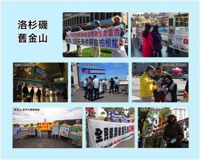
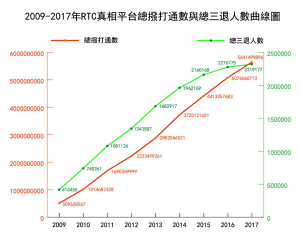
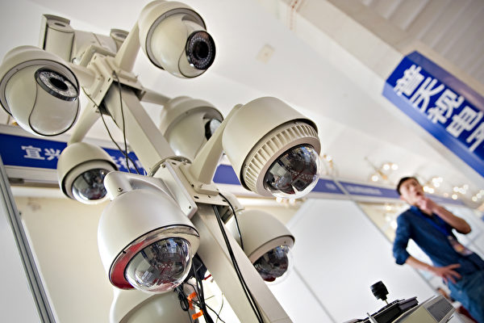

 
<a name=top>
<h2><a href="https://github.com/3fmd/true/blob/master/01.md"><b>看更多．．．</a></b></h2>
<h2><a href="https://github.com/goodabc/GCC/blob/master/jysl.md"><b>九评编辑部：魔鬼在统治着我们的世界</a></b></h2>
 <h2><a href="https://github.com/goodabc/GCC/blob/master/goal.md"><b>《九评》编辑部：《共产主义的终极目的——中国篇》</a></b></h2>
<h2><a href="https://github.com/goodabc/GCC/blob/master/xgpl.md"><b>《共产主义的终极目的》 相关评论</a></b></h2>  
<h2><a href="https://github.com/no1show/show1/blob/master/whss.md"><b>中共意识形态之理性批判</a></b></h2> 
<h2><a href="https://github.com/no1show/show1/blob/master/gcdsy.md"><b>评《共产党宣言》</a></b></h2> 
<h2><a href="https://github.com/no1show/show1/blob/master/jgrc.md"><b>【中国人权】</a></b></h2>
 <h2><a href="https://github.com/no1show/show1/blob/master/5m.md"><b>【大纪元2018年05月评论】</a></b></h2> 
   
<h1 align="center"><b>【大纪元2018年06月评论目录】 </b></h1>

<a href=https://github.com/no1show/show1/blob/master/nice.md><h6 align="right">回首頁</h6></a>
<b>
<a href=#135>135. 浪子迷途遇大法 脫胎換骨成新人</a> 
<a href=#134>134. 罪恶与邪恶之辨</a> 
<a href=#133>133. 漫话“改革开放”与中国人的幸福感（6）</a> 
<a href=#132>132. 从对“情敌”的态度看人性的善恶</a> 
<a href=#131>131. 反党并不是坏事</a> 
<a href=#130>130. 三退大潮二〇一八年綜合報告（二）</a> 
<a href=#129>129. 三退大潮二〇一八年综合报告（一）</a> 
<a href=#128>128. 漫话“改革开放”与中国人的幸福感（5）</a> 
<a href=#127>127. 一位大法弟子和保姆的故事</a> 
<a href=#126>126. 美国工会败诉 川普为何欢迎</a> 
<a href=#125>125. 北京希冀的“另一扇门”在哪里？</a> 
<a href=#124>124. 土改中的按比例杀人与反人类酷刑</a> 
<a href=#123>123. 川普剑指“中国制造2025”的背后</a> 
<a href=#122>122. 维稳与维权</a> 
<a href=#121>121. 为中共卖过命的老兵为何成了维稳对象）</a> 
<a href=#120>120. 川金会的意义及其终极目的（上）</a> 
<a href=#119>119. 江南不再是曾经的江南</a> 
<a href=#118>118. 维权律师何罪之有？</a> 
<a href=#117>117. 法轮功华府大游行，坚守正义感动世界</a> 
<a href=#116>116. 驱除共产 回归传统 华府万人传递希望</a> 
<a href=#115>115. 老兵集结镇江抗议中共</a> 
<a href=#114>114. 认清共产邪灵与人人有关</a> 
<a href=#113>113. 中共真的关心人类命运共同体吗</a> 
<a href=#112>112. 从美国立法反制中共谈21世纪去共化</a> 
<a href=#111>111. 法轮功华府大游行 震撼中的变与不变</a> 
<a href=#110>110. 大法弟子办的补课班</a> 
<a href=#109>109.“改革开放”与中国人的幸福感（3））</a> 
<a href=#108>108. 漫话“改革开放”与中国人的幸福感（2）</a> 
<a href=#107>107. 漫话“改革开放”与中国人的幸福感（1）</a> 
<a href=#106>106. 当代集中营——恐怖的西藏再教育营</a> 
<a href=#105>105. 注法轮功人权迫害是全人类共同的责任</a> 
<a href=#104>104. 川普极限施压 北京很痛担忧后患</a> 
<a href=#103>103. 《西游记》 一个神奇的修炼故事</a> 
<a href=#102>102. 撒旦横行，圣婴只能死去</a> 
<a href=#101>101. 荒唐的理由</a> 
<a href=#100>100. 从美中贸易战看中共“举国体制”</a> 
<a href=#99>99. 中共为何青睐美国顶级“天眼”？</a> 
<a href=#98>98. 讨伐中共变形经济 川普发动贸易奇袭</a> 
<a href=#97>97. 中国企业好日子不多了 北京当局呢？</a> 
<a href=#96>96. 中美贸易战 川普触及中共死穴</a> 
<a href=#95>95. 中共对美国加征关税的对等报复能走多远</a> 
<a href=#94>94. 中共再次掀起全民洗脑运动</a> 
<a href=#93>93. 军工企业反腐或涉军中大老虎</a> 
<a href=#92>92. 中美贸易大战川普一举九得</a> 
<a href=#91>91. 共产党如何干扰美国的对华政策</a> 
<a href=#90>90. 中共对打中美贸易战的原因</a> 
<a href=#89>89. 川普为什么盯住“中国制造2025”不放</a> 
<a href=#88>88. 用“最美货车司机”回应罢工很卑劣</a> 
<a href=#87>87. 魔都上海高调宣传着魔肝移植医生背后</a> 
<a href=#86>86. 中共为何容不下“结石宝宝”？</a> 
<a href=#85>85.《共产党宣言》是共产邪灵向人类的宣战书</a> 
<a href=#84>84. 高考后的孩子</a> 
<a href=#83>83. 整肃山西监狱系统 目标指向谁</a> 
<a href=#82>82. 正被沦陷的世界必将反击共产主义</a> 
<a href=#81>81. 慧眼识真相</a> 
<a href=#80>80. 上合峰会期间国内外两抗议彰显一事</a> 
<a href=#79>79. 中共奢靡程度冠绝古今中外</a> 
<a href=#78>78. 关于川金会的“假新闻”例证</a> 
<a href=#77>77. 川金会落幕 面临选择的不只金正恩</a> 
<a href=#76>76. 陕西官二代落马 官一代曾靠江泽民包庇</a> 
<a href=#75>75. 川普策略奏效 朝核危机和平化解中</a> 
<a href=#74>74. “儿童政治犯”的故事</a> 
<a href=#73>73. 真善忍教会我做一个好人</a> 
<a href=#72>72. 川普不战而屈朝鲜之兵 美中朝得失谈</a> 
<a href=#71>71. 川金会联合声明 实质意义重大</a> 
<a href=#70>70. 美国问题中的中国问题</a> 
<a href=#69>69. 中国还能回到“统制经济”时代吗？</a> 
<a href=#68>68. 中国卡车司机大罢工的背后</a> 
<a href=#67>67. 解读川金会 川普释巨大善意 金正恩选未来</a> 
<a href=#66>66. 赤龙的钱囊吞噬著整个世界（下）</a> 
<a href=#65>65. 中共开始着手镇压“卡友”罢工</a> 
<a href=#64>64. “袭击”美国领馆员工的神秘声音来自何方？</a> 
<a href=#63>63. 从卡车司机罢工想到的中共血腥税制</a> 
<a href=#62>62. 送俄国土再授勋章 中国人情何以堪？</a> 
<a href=#61>61. 奢靡上合峰会背后的道路不自信</a> 
<a href=#60>60. 中俄抱团 谋借上合峰会施压川普</a> 
<a href=#59>59. 美国要求中共“改变经济结构”究竟指的是什么？</a> 
<a href=#58>58. 人人骂告密，个个等天亮</a> 
<a href=#57>57. 6月7省10天查处11人皆有一关键词</a> 
<a href=#56>56. 感谢师父给了我第二次生命！</a> 
<a href=#55>55. 陈良宇旧部临终前向我忏悔</a> 
<a href=#54>54. 由2018高考作文谈慧眼识真相</a> 
<a href=#53>53. 默克尔发G7照片 中共为何如打鸡血</a> 
<a href=#52>52. 中共邪恶“610”仍在犯罪</a> 
<a href=#51>51. “学生举报老师”为何尽显悲哀？</a> 
<a href=#50>50. 从声波攻击美国外交官谈中共超限战</a> 
<a href=#49>49. 《天安门杀戮》挖到六四事件的根</a> 
<a href=#48>48. 不如麻雀和鱼虾——人民的幸福指数</a> 
<a href=#47>47. 大陆“卡友”罢工为何能快速形成规模</a> 
<a href=#46>46. 恶贯满盈的“610”必被清算</a> 
<a href=#45>45. “中俄友谊”藏着中国人的国耻？</a> 
<a href=#44>44. 上海检察院头目相继落马背后的冤案</a> 
<a href=#43>43. 回归常识 美国宗教自由的真相</a> 
<a href=#42>42. 承继里根 重振美国 川普抗击共产幽灵（下）</a> 
<a href=#41>41. 中共海外大撒钱 国人却压力山大</a> 
<a href=#40>40. 杀人犯监督器官移植是“中国经验”？</a> 
<a href=#39>39. 北京招聘庞大监控的“维稳资讯员”</a> 
<a href=#38>38. 暂住祖国的艰难</a> 
<a href=#37>37. 承继里根 重振美国 川普抗击共产幽灵（上）</a> 
<a href=#36>36. 川普奇迹只是刚刚开始</a> 
<a href=#35>35. 美国朝野为何一致对中共强硬</a> 
<a href=#34>34. 从“法制学习班”到“政治再教育”中心</a> 
<a href=#33>33. 我为什么三退</a> 
<a href=#32>32. 邓家人与李鹏为何推卸“六四”罪责？</a> 
<a href=#31>31. 六四屠杀反映了共产邪灵毁灭人类的终极目的</a> 
<a href=#30>30. 明了真相 坚持正义的共产主义受难者 </a> 
<a href=#29>29. 毛时代，也腐败！（三）</a> 
<a href=#28>28. 广东反腐 梅州窝案中的窝案</a> 
<a href=#27>27. 共产党的罪行真的跟马克思无关？</a> 
<a href=#26>26. 赤龙的钱囊吞噬著整个世界（中）</a> 
<a href=#25>25. 打破政治正确 美国走向回归传统之路</a> 
<a href=#24>24. 六四国殇祸害何为大</a> 
<a href=#23>23. 从演艺界阴阳合同说中共“阴阳脸”</a> 
<a href=#22>22. 中国家长 是否告诉孩子六四真相</a> 
<a href=#21>21. 六四中共军队打死多少民众？</a> 
<a href=#20>20. 中共可能会有从良的那一天吗？</a> 
<a href=#19>19. 什么样的谎言最具迷惑性？</a> 
<a href=#18>18. 六四的痛思</a> 
<a href=#17>17. 救救儿童──看六一邪党向儿童灌毒</a> 
<a href=#16>16. 六四时北京市民知道天安门有摄像头</a> 
<a href=#15>15. “六四”29年 中共暴政不是过去式</a> 
<a href=#14>14. 甘肃反腐 官场料持续震荡</a> 
<a href=#13>13. 年轻人，你知道29年前的那场大屠杀吗？</a> 
<a href=#12>12. 绕不过去的反叛、对抗和反省</a> 
<a href=#11>11. 美国经济表现佳 川普完成使命进行时</a> 
<a href=#10>10. 修炼人眼中消失的楼兰与亚特兰蒂斯</a> 
<a href=#9>9. 中共逼人流亡 自由为何在异乡？</a> 
<a href=#8>8. 川金会就位 未来朝鲜局势的几种走向</a> 
<a href=#7>7. “未成年人犯罪连降”不乐观背后</a> 
<a href=#6>6. 强迫儿童传承红色基因，中共毁人不倦</a> 
<a href=#5>5. 山西如何打败重庆5月反腐全国最强</a> 
<a href=#4>4. 美澳案例提示 为中共效力得不偿失</a> 
<a href=#3>3. 一件砍俄罗斯森林遭美国惩办的奇事</a> 
<a href=#2>2. 川普对华对朝施压 天赐良机给中南海</a> 
<a href=#1>1. 失控的假新闻 美国媒体为何围攻川普（下）</a> 
</b>

<a name=135>
<h1 align="center"><b>浪子迷途遇大法 脫胎換骨成新人</b></h1>

轮大法将原本迷途的满心恶念的浪子，脱胎换骨转变成一个纯真善良、无私无我的好人。（明慧网）

作者：千百度

【大纪元2018年06月29日讯】今年五十岁的大法弟子新德（化名），是江西省的山区农民，一九九六年在外地打工时有幸开始修炼法轮大法，从此好勇斗狠、满心恶念的他脱胎换骨转变成一个祥和慈善、一心为他人的好人。

绝路迷途生恶念
新德兄妹八人，可以说都是在父亲的家庭暴力中长大的。他成年后，便跟着社会上一些不三不四的人鬼混，渐渐的，变成了善恶不明、好坏不分的浪子，挣了点钱就上饭馆狂吃、请伙伴们看黄色录影，有时为了哥们义气打群架，经常到处惹是生非。

一九九三年在做木材生意时，他被本地的黑老大黑吃黑，不仅被骗去钱款，还被逼支付他拖欠的贷款，新德当时内心又恨又怕，但不敢找他理论，只能吃哑巴亏。

一九九五年，村子里整顿偷伐树木森林的不良风气，村长将新德当典型上报，造成他被县森林公安局刑事拘留，本地广播站还诬陷他破坏了三百亩森林树木……

那时的他虽年轻力壮，但生活的艰辛、人世间的种种不平真的是无法用语言表达，经常晚上被噩梦吓醒，整个人在迷茫中沉沦，心中充满了怨恨和恶念。

<b>大法净化浪子魂</b>

一九九六年八月十二日，是新德永生难忘的日子。就在这一天，他有幸遇到了法轮大法。当时他被村长报复，被逼去外地打工。在居住地附近，他偶然看到了路边悬挂的法轮大法的介绍简章，晚上机缘巧合，他观看了大法师父的讲法录影。

当场大法的神奇就在他身上体现了出来。当时，他边看录影边抽烟，旁边的一个学员提醒他不要抽烟，他二话没说立马灭掉了烟头，而且从此就戒掉了多年养成的严重烟瘾。

当时，新德在外打工，生活很艰辛，没钱，没工作，没住所，只能和同乡挤在一间很小很破的老房子里。但每天打工之余，他都会骑自行车到二十里外的城里去参加法轮功学员的读书学法活动。刚开始炼第五套静功时，虽两腿因盘坐疼痛难忍，但他还是感觉到了很强的能量场，身体有离地往起拔的感觉。

有一次干活时，他拉了一板车二千多斤重的水泥预制板，走到一个长途汽车站时，一辆中巴车加速想超过他的板车进站，结果与他的板车相撞，中巴车的大灯被撞烂，他整个人也被撞倒在车头上。可当时他一点都不觉的害怕，而且人和板车均安然无恙。事后想想板车上那么重的水泥预制板，按照惯性的常理，不可能一点事都没有。这件事让他亲身体会到了法轮大法的超常与神奇。

二十多年的修炼，法轮大法真善忍的法理不断净化著新德的心灵，使他从一个满口脏话、酗酒、赌博、斗殴、寻衅滋事，充满仇视心理的浪子脱胎换骨转变成一个真诚善良、宽容忍让，先他后我的好人。他事事都用法轮大法真善忍的标准要求自己的一言一行，遇到矛盾时总是向内找自己，从不与他人发生争斗。

<b>走村穿巷讲真相</b>

一九九九年“七‧二零”中共开始迫害法轮功后，他为了坚定真善忍的信仰，为了告诉民众被迫害的真相，先后遭受了十年的牢狱折磨，经历过悬空吊铐、飞机铐、老虎凳、毒打、烟火熏烧、熬鹰等酷刑摧残。在漫长的超越人类承受极限的身心折磨中，他时刻都能感受到大法师父的慈悲与保护。一次，他被非法判刑关押在省监狱，一个暴戾的刑事犯人连续狠搧他几十个耳光，可他的脸既不疼痛、也不红肿。还有一次，他被关禁闭室，脚上还戴着几十斤重的脚镣，可他盘腿炼功时，却感觉如坐云端、祥和宁静。

尽管屡遭迫害，但为了救度被中共谎言蒙蔽的民众，新德多年来坚持结合自己的亲身经历，走村穿巷将法轮大法的美好告诉给每一位有缘的乡亲，向他们赠送册子、光碟等真相资料，清除他们头脑中被中共灌输的谎言和流毒，唤醒他们心中的善念和良知。村人明白真相后，也都得到了善报和福寿。

一位老年邻居因家庭矛盾一时想不开喝农药自杀，却什么事也没有。事后他流着泪告诉新德说：“我这条老命还活在世上，多亏了你送我的大法‘护身符’。我当时喝了农药，只是感觉脑袋昏沉，挨着护身符（放在内衣口袋里）的腹部却凉滋滋的，一点也不绞痛，谢谢大法师父！”

亲朋好友们亲眼目睹新德修炼前后天翻地覆的变化，渐渐对大法有了正面的认识。他的一个哥哥由以前撕大法书、把大法真相资料交给公安，到当着公安警察的面称赞大法好，讲他学大法后人变的善良了，讲其他的法轮功学员在他被非法判刑关押监狱时，经常不辞辛苦，前往乡下的家中探望他的老母，送钱、送米、送油等生活用品。

村子里的村长由以前打击报复他、将他逼往外地打工，到当着地区政法委头目的面讲述他在村子里做的一桩桩、一件件好事。有次他在外地打工，村长亲自跟他打电话，告诉他近段时间不要回家乡，说当地的公安正在四处搜寻他。

经历了近十年冤狱酷刑折磨的新德，虽然如今五十岁了还孑然一身，但他每天都乐呵呵的，感觉自己是世上最幸福的人。用他自己的话讲：“俗话说的好，江山易移本性难改，但法轮大法却将我这个原本迷途的满心恶念的浪子，脱胎换骨转变成一个纯真善良、无私无我的好人。我要衷心的感谢师恩，更要发自内心地道一句：法轮大法是利国利民的高德大法！”#

责任编辑：南风

<a href=#top><h6 align="right">回上方</h6></a>

<a name=134>
<h1 align="center"><b>罪恶与邪恶之辨</b></h1>

作者：清浊

【大纪元2018年06月29日讯】共产主义和共产党之恶，以“罪恶”二字述及，已显单薄，用“邪恶”一词论之，方合实情。本文尝试以一句俗语和两个人物为例，对罪恶与邪恶的区别略作分辨。

历史上两个反面人物，因为名声太恶，两千五百多年来一直无人敢为其说半句好话，可是到了1949年之后，却被中共捧上天：一个是盗跖，一个是少正卯。这两个人都是被孔子憎恶的，因此在中共对孔子批倒批臭的年代，他俩不但翻了身，且享尽无穷美誉。盗跖自不必说，不但嗜杀，还吃人，中共最喜欢“亮剑”式的好勇斗狠，盗跖自然成为中共宣传里最富革命性的农民起义领袖，一直到文革之后，教科书中的盗跖依然是响当当的推动历史进步的人物，以至于中学语文《窦娥冤》中出现那句“天地也，只合把清浊分辨，可怎生糊涂了盗跖、颜渊”时，很多被洗脑的学生果然也清浊难辨，反以为被拿来和盗跖作对比的颜渊是个大坏人。

至于少正卯，在中共的宣传里，是先驱——为“言论自由”献身；是勇士——敢于挑战“复辟狂”孔子；是教育家——因和孔子争夺生源而遇害；是冤鬼——成了文字狱的首个牺牲品。与之相比，孔子反倒成了文字狱的始作俑者。（今天我们应该能看清楚，共产红魔鼓吹言论自由，是为了怂恿人不断冲破道德禁忌话题，它只给人散布歪理邪说的自由，却从来不敢给人说真话的自由；而中共大力挞伐“文字狱”，是为了声讨所谓万恶的封建社会，都和普世价值中的人权、自由毫不相干。）

盗跖和少正卯，代表了两种不同程度、不同性质的“恶”。两者的差异，古人已有所论及，在《晋书》列传第五十八中，记载了东晋光禄大夫颜含一段论述：时人谈论少正卯、盗跖哪个罪孽更重。有人说：“少正卯虽恶，不至于像盗跖那样杀人、吃人肉，当然盗跖更恶。”颜含说：“做恶做在明处，人人都知道他该死；隐藏很深的奸邪，只有圣人能察觉并除恶务尽。由此言之，少正卯更恶。”听闻这番话，“众咸服焉”。

根据颜含的说法，盗跖属罪恶之徒，其恶在一般人能够察觉、判断、规避、防范；而少正卯之流隐藏很深的奸邪，为一般人所不能明察、只有圣人能察觉并去除的恶，是“邪恶”。

如果结合《马太福音》里的话：“那杀身体不能杀灵魂的，不要怕他们；唯有能把身体和灵魂都灭在地狱里的，正要怕它。”以“杀”而言，杀身体不能杀灵魂的，是为罪恶，而能杀灵魂的，是为邪恶。罪恶属于人性先天自私带来的恶，邪恶是败坏道德放纵欲望的魔性之恶。

从孔子对少正卯的评价中，我们再看邪恶之恶：

据史载，孔子被任命大司寇仅七天，即公开诛杀少正卯。性情直率的子贡（端木赐）问孔子：“少正卯是鲁国显达之人，您为政刚开始就杀他，是否欠妥？”孔子回答说：“赐啊，听我说。大恶之人有五种，大大小小的盗贼都不在其列。第一是：心达而险；第二是：行辟而坚；第三是：言伪而辩；第四是：记丑而博；第五是：顺非而泽——五者居其一，就应该被处死，而少正卯五者兼具。所以他到哪都能聚徒成群；散布邪说却能蛊惑人心；排斥正的、以邪为正，却能自圆其说。这是小人中的桀雄，不可不诛。所以，汤诛尹谐，文王诛潘止，周公诛管叔，太公诛华士，管仲诛付里乙，子产诛邓析、史付，这七人，虽处不同时代，心术险恶如一，不可不诛。《诗经》说：‘忧心悄悄，愠于群小。’品行不端的人成了气候，最令人担忧。”孔子参与治国仅三个月，鲁国百姓安居，路不拾遗，民无争讼。

从孔子描述的五种大恶之人，我们仿佛能看到少正卯之流正活跃于当今世界舞台。而至于“到哪都能聚徒成群；散布邪说却能蛊惑人心；排斥正的、以邪为正，却能自圆其说”，几乎就是对共产党发迹过程的入木三分的刻画。怪不得毛魔头对孔子怀有那么刻骨的恨，原来是孔夫子不小心揭了这个魔头的老底。

今天我们有幸拜读《九评》编辑部的三本书。借助书中的开示，我们看看少正卯之流穿越两千多年后的邪性表演。以下仅从孔子描述少正卯的五种大恶入手，引用的文字多摘自《九评》编辑部发表的新书《魔鬼在统治着我们的世界》。

<b>一、心达而险——野心勃勃，用意险恶</b>

通过新书《共产主义的终极目的》我们知道，共产主义的终极目的是毁灭人类。魔鬼的手段，从新书“魔鬼毁人之三十六计”之【第二十一计】煽动革命中可见一斑：掌握政权是魔鬼毁灭人类的快捷方式，只要有可能，魔鬼总是以掌握政权为第一选择。马克思在总结巴黎公社的“经验教训”时指出，工人阶级必须打破原有的国家机器，代之以自己的国家机器。政权问题一直是马克思主义政治学说的核心问题。煽动革命可以分为几个步骤：第一步，煽动仇恨，分化人群；第二步，用谎言欺骗大众，建立“革命的统一战线”；第三步，各个击破反抗力量；第四步，用暴力制造恐怖气氛和混乱局面；第五步，发动政变夺取政权；第六步，镇压“反动派”，用革命的恐怖建立并维持新秩序。共产国家妄图发动“世界革命”，成立共产国际，向全世界输出革命，扶植各国左翼势力，在各国制造乱局。

<b>二、行辟而坚——行为邪僻，持之以恒</b>

新书“魔鬼毁人之三十六计”之【第二十五计】恐怖主义：

共产主义革命以恐怖主义起家，共产国家实行国家的恐怖主义。前苏联、中共资助扶持国际恐怖主义，作为对抗西方自由世界的一支别动队。以斗争哲学发展出的列宁主义为当代恐怖主义提供了理论温床。魔鬼以各种方式分化人群，挑起仇恨，使个人怨恨扩展为对更大群体的仇恨，滋长各类恐怖主义行为。恐怖主义非理性的滥杀无辜，增强人的荒谬感、无助感，把社会变成一个无处可逃的所在。无处不在的暴力更容易使人变得反社会、抑郁焦虑、愤世嫉俗，这就破坏了原有的社会肌体，使社会碎片化，达到了魔鬼对人“分而治之”的目的。

<b>三、言伪而辩——鬼话连篇，气焰熏天：</b>

进化论、无神论、唯物论、“我就是玉皇，我就是玉皇，喝令三山五岳开道，我来了”、“人有多大胆，地有多大产”这些鬼话和邪说可谓气焰熏天。仅以“言论自由”为例，且看新书开示：这里需要简要说明的是，美国宪法第一修正案所规定的言论自由权利原本是指表达政治意见的言论自由，而非出版色情制品的“言论自由”。

新书“魔鬼毁人之三十六计”之【第十计】控制媒体

为了蒙蔽人，魔鬼千方百计地控制人的资讯来源，其中最重要的就是大众媒体。在掌握了政权的国家，垄断一切媒体；所有的媒体都是“党的喉舌”，起著替共产党宣传辩护的作用。在尚未掌握政权的国家，鼓吹极端的言论自由，让谬误和造谣、低俗和琐碎淹没一切严肃的探讨和交流。

<b>四、记丑而博——专汲糟粕，发扬光大：</b>

新书“魔鬼毁人之三十六计”之【第九计】魔变艺术

人类的正统艺术来源于神，最早出现在神殿、教堂和庙宇中，是神与人沟通的重要方式，也是维持人的道德水准的重要文化形式。正统艺术表现真和善、美好和光明。变异文学艺术是魔鬼破坏传统文化败坏人类道德的重要一环。魔鬼以“表现现实”为借口，在艺术领域引入印象主义，在文学领域引入现实主义、自然主义；又以“创新”、“批判现实”等为借口，引入表现主义、抽象主义等形形色色的现代主义、后现代主义。对崇高的嗤之荒谬，纯洁的标上无聊；下流的变成有趣，无耻的赏以成功。垃圾被摆上艺术的殿堂，大噪之音和靡靡之音被吹捧为艺术的新潮流，阴暗的绘画表现的直接就是鬼的世界，充满魔性的摇滚乐、行为艺术早就突破了人的道德底线。很多青少年更是把外形丑恶、行为堕落的明星当成偶像，狂热地追捧。

<b>五、顺非而泽——取悦人欲，放大执著：</b>

共产党利用这一点腐蚀各个阶层的人：“打土豪分田地”，工会，最低工资标准，女权主义，用高税收、高福利让不劳而获的人心安理得地坐享其成、环保主义（一方面把这篇承载五千文明的国土变成世界上最不适合居住的土地，另一个面在国际上把“环保”、“气候调控”这些空话喊得震天响，仿佛它最忧心人类的居住环境福祉。）新书“魔鬼毁人之三十六计”之【第二十七计】拉拢精英拉拢各国、各行各业的精英，使其为自己服务。为了让精英为自己服务，魔鬼有针对性地施以利益，并以听命于自己的程度来决定给予其大小不等的权力。对求权求名的各类精英，予之以名、权；对贪婪之士，诱之以利；对狂妄之徒，进一步助其自我膨胀；对无知者，充分利用其无知；对忠诚者，转移其忠诚的对象；对痴迷者，加重其痴迷程度；对才智之士，用科学、唯物的幌子和话语权去引诱；对有远大抱负和良好愿望者，充分利用其善良和抱负。让他们觉得自己是总统、总理、学者、智囊、决策者、当权者、精英、领导人、财阀银行巨头、教授、专家、诺贝尔奖得主……让他们有组织，有等级，有出人头地的身份，有万众瞩目的权势，有取之不尽的财富。因势利导，不拘一格，对症下药，百试不爽。在魔鬼眼里，那些上当受骗者统统是“无知的代理人”、“有用的傻瓜”。

以上通过比较盗跖和少正卯不同的恶，来分别罪恶与邪恶。下面，我们从新书中引出的一句俗语再来辨析罪恶与邪恶的差异。

民主国家的制度本来就是给有一定道德尺度的人设计的，对于处心积虑想干坏事的人来说，这个制度有很多“漏洞”，如果要颠覆自由社会制度，有很多条道路可供选择。中国有句俗话：“不怕贼偷，就怕贼惦记着。”共产主义分子和被他们欺骗的无知的代理人处心积虑地颠覆自由社会的制度，经过几十年的筹画和运作，美国和西方国家的政府和社会都已经被蚕食得千疮百孔，共产主义思想、因素已经深度侵蚀进了美国的肌体。

上面引出的一句俗语就是“不怕贼偷，就怕贼惦记着。”以人物比，监狱里的罪犯，像盗跖一样，大多属于“偷贼”，其行为可以用“罪恶”描述；而监狱外痴迷于暴力与谎言的邪党党徒以及世界上形形色色作为共产红魔在世间代理人者，被魔鬼附体而不自知的人，就属于“惦记贼”，其行为应以“邪恶”论之。在当今中国，尤其是那些以散布马列邪说为职业、爱好的人，那些不断发明新真理、新思想的人，皆为魔鬼子孙，属少正卯之流，为圣人所不容。在《九评》编辑部的两本新书《共产主义的终极目的》和《魔鬼在统治着我们的世界》发表之后，“惦记贼”的鬼言、鬼行、鬼态就显得格外刺眼夺目。生活在当今的世人，生老病死的每一个环节，衣食住行的每一项需求，德、智、体、美、劳的每一则修养，全都被共产红魔在世间的代理人——这些“惦记贼”——惦记着，即使到了地球的另一端也难逃其魔爪。

当今，通过拜读《九评》编辑部的三本书我们知道，创世主的洪大慈悲公平地给予每一个人，包括为圣人所不容的少正卯之流，因为他们也是被红魔迷惑和欺骗的。希望每一个人都能够快快看看这三本书，借助高层智慧的开示，用良知冲破偏见，做出对自己生命尊重和负责的选择，拥有美好明天！

责任编辑：赵元

<a href=#top><h6 align="right">回上方</h6></a>

<a name=133>
<h1 align="center"><b>漫话“改革开放”与中国人的幸福感（6）</b></h1>

昔日“亚洲田径冠军”徐伟利，因交不起600元的费用仰天长叹，泪流满面。（网络图片）

作者：袁斌

【大纪元2018年06月29日讯】压在当今中国百姓头上的第二座大山是看不起病。

人生在世，难保不生病。现代社会政府的一项基本公共职能，就是为国民提供足够的医疗保障，让大家都能看得起病。因此，政府财政作为支付全民医疗费用的主角，是世界各国的惯例，发达国家的政府每年都会拿出一大笔钱用于公民的医疗保障，有的国家甚至实行全民免费医疗，如英国、日本等。

但遭人诟病的是，始于上世纪后期的中国医疗制度改革却反其道而行之，把理应由政府承担的这项职能当成包袱甩给了市场。受此影响，政府财政每年对国人医疗保障的投入大为减少，不但远远低于西方发达国家，也明显低于经济发展水准不如自己的印度等国（注1）。更有甚者，即便是这部分已经少得可怜的投入，居然80%都用到了党政干部的身上。由于政府投入严重不足，只有占人口10%的政府、事业单位和国有企业、部分集体企业的人员拥有完全的医疗保障，而占人口50%以上的城市人口、80%以上的农村人口无任何医疗保障，其余的人只有低水准的医疗保障。换句话说，半数以上的中国人看病都得自己买单。加之医疗费用的上涨又明显快于居民收入，大大超出了普通百姓的支付能力。在这两方面因素的影响下，看不起病自然也就成了困扰当今中国老百姓的一大社会问题。

2010年2月27日，有位网友在跟时任总理温家宝进行线上交流时吐槽说：“温总理，我们农村的看不起病呀！”这话道出了当今中国农民的普遍境遇！

2004年卫生部副部长朱庆生曾在公开场合引用《中国统计年鉴》和《中国卫生统计年鉴2004年》上的资料说，2003年中国农村居民家庭人均纯收入为2,622.2元，农村居民的平均住院费用2,236元。在农民人均纯收入尚包括实物收入的情况下，农民一旦得了大病，一年的现金收入连支付住一次院的费用都不够。有关调查表明，中西部农民因看不起病，死于家中的比例高达60%～80%。即便是农村经济最发达地区之一的浙北地区，还有30%～40%得了绝症的农民，因为无钱医治而死在家里。

其实，看不起病的又何止是农民呢？城镇居民中的低收入者和相当一部分收入不高的群体也同样如此。就连体育冠军、劳模这类曾经的风云人物也不乏其例。

据《三秦都市报》报导，2012年3月，退役已经13年的前亚洲链球冠军徐伟利突然发现双腿浮肿，呼吸比较困难，到医院检查发现，他的肾脏出现了问题，胸腔积水严重，心脏和肺受到压迫后导致供血不畅、呼吸受到影响，必须立即住院治疗。

但由于经济困难，一时无法支付数万元的治疗费，徐伟利只得每隔一周到医院抽取一次胸腔内的积水，每次费用700元。抽完积水以后，他的呼吸相对能够好转一些。6月28日，他再次到医院抽出1,200毫升胸腔积水后，因没钱买药而返回到住处，打电话向朋友借了200多元。6月30日，他来到医院买药时，药费竟然高达600元，在实在没有办法的情况下，只得又给平日里经常照顾他的朋友张某打去电话“求助”。

事后，他情绪激动地对记者说，“在田径运动比赛的领奖台上，当国旗冉冉升起时，我每次都流下了眼泪。没有想到，退役13年后的今天，我竟然因为经济困难交不起600元的医疗费而流泪”

2004年12月卫生部公布的《第三次国家卫生服务调查主要结果》显示，过去10年，中国公众对医疗卫生服务的利用率明显下降，居民自我医疗（俗称“有病自己医”）的比例逐年增加。将近五成（48.9%）的居民生了病不去医院看病。在去看病的患者中，经医生诊断该住院治疗却未住院的竟达29.6%。这里面主要有两种情况：一是得病后自己买药吃。36%的居民生病后不去医院就诊，而是跑到药店购药，采取自我医疗，且这一比例逐年增加：农村由1998年的23%增加到31%、城市由44%增加到47%。二是看不起病就硬扛着。“小病拖，大病挨，快死才往医院抬”。

不管是自我治疗还是自己硬扛着，显然都是因为看不起病。调查显示，生病未就诊、未住院且未采取任何治疗措施的患者中，有38.2%是由于经济困难；应该住院而未住院的患者中，70%是由于经济困难。城乡低收入人群应住院而未住院的比例达到了41%，远高于一般收入人群。

试想，身为中国人，有病在身却看不起，你会幸福吗？

注1：
2008年中国医疗卫生投入800亿，而香港仅800万人，政府向医院拨款竟达400多亿。从1991年到2000年，中国政府投入占卫生总费用的比例从12%降到了6%。从1982年到2005年，中国卫生费用增长48倍，政府卫生预算只增长21倍，而个人现金卫生支出却增长118倍。今天中国个人卫生支出比例达到52%，远高于美国人所承担的15%，而英国、日本甚至印度都实行了几乎全民免费的社会医疗制度。

责任编辑：高义

<a href=#top><h6 align="right">回上方</h6></a>

<a name=132>
<h1 align="center"><b>从对“情敌”的态度看人性的善恶</b></h1>

法轮功师父教学员们做好人，以真、善、忍为标准，要做到打不还手，骂不还口。一般人难以理解的理念，法轮功学员却要在实践中做到，在自身遭受痛苦的情况下，宽容体谅他人。（fotolia）

作者：鉴恒

【大纪元2018年06月29日讯】当今中国大陆由于戾气漫溢，恶性事件不断。6月27日，扬州宝应县发生一起伤人案。17岁女孩在家中睡午觉时，突然噩梦般被人掰嘴灌下滚烫的开水，造成重度烫伤。网上传出的视频中，女孩似受了极大惊骇却无嘶喊之力，躺在地板上痛苦地扭曲身体，气若游丝，她的脸部、脖颈、躯干四肢都被烫得大片通红溃烂，部分已经发焦脱皮，惨不忍睹。是谁下此狠手？

据悉，受害女孩的母亲和一名有妇之夫有染。当时，该男子的老婆徐某气冲冲来家寻仇，不见丈夫和情敌，只见女孩一人睡午觉，夺夫之恨使徐某急红了眼，一把拎起开水瓶，骑在女孩身上便往她口中猛灌开水……魔鬼般的行径发生在一瞬间，无处发泄的嫉恨使婚变中原本的受害者恶向胆边生，丧失理性和基本人性，对一个无辜的孩子下了毒手。

经常上网的人都知道，原配手撕小三的场面，在当今大陆已经见怪不怪了。对情敌无论如何都要发泄私愤，手段光怪陆离，如当众撕发挠脸、殴打谩骂、扒光衣裤凌辱、泼硫酸毁容，事件数不胜数。然而灌开水对情敌的孩子下手报复，手段之狠毒，还是令人惊悚。丧失底线的人性没有最狠，只有更狠，仿佛只在宫廷剧中的看过的惨绝人寰的血腥场景，人与人之间的残虐兽性，就暴露在光天化日的“盛世”之下。

在人们对戾气冲天，兽性行为遍地的社会现状几乎见怪不怪的同时，如果对您讲述一个同样被出轨的女人，以善心对待小三，使其免于一场未来的大难的故事，您相信吗？这样的事情其实是真实存在的。6月25日，明慧网刊登的署名大陆法轮功学员丹莲的文章《救“情敌”》，读来感人至深。仿佛浊世一道清流，体现出别样的境界。 

文章讲述，丹莲和青梅竹马的丈夫原本有一个幸福的家庭，二零零八年，她因发大法真相资料被警方非法绑架，并被非法劳教。不料一年之后，丈夫来看守所无情地提出离婚，并告知她，一年来自己已和另一名女子银花同居还生下了孩子。深陷牢笼的丹莲感到震惊、屈辱又痛苦，为了新生儿虽然成全了丈夫和情敌，内心也到底不甘。身在难中，得不到家庭的温暖，反而遭受背叛，天底下谁能不恨呢？

三年后，重获自由的丹莲回到家中，却家徒四壁，形影孤单，她难过极了，坦言恨透了银花破坏家庭，夺走了丈夫。几次碰面中，她也曾责骂过银花，骂得她无地自容。是啊，女人对丈夫爱得越深，对情敌恨得越狠，这是人之常情。那么照这样下去，按照当今人们的行为轨迹，接下去会发生什么？如果在一个情感崩溃，又无道德底线约束的人身上，什么都可能发生，那就是伤人害己，铤而走险，鱼死网破，大打出手，就像扬州女孩被灌开水烫伤事件一样，不择手段的选择报复。

然而，那样的悲剧并没有发生。丹莲很快调整了心态，她反而反省自己，不该骂银花。有理的一方，受害一方难道还不能骂人出出气吗？丹莲却想：自己是修法轮功的，法轮功师父教学员们做好人，以真、善、忍为标准，要做到打不还手，骂不还口。一般人难以理解的理念，法轮功学员却要在实践中做到，在自身遭受痛苦的情况下，宽容体谅他人。说来容易做来难，古今中外，有几人能战胜自私的人性，善待伤害自己的人，何况是真正从内心宽容对自己横刀夺爱的情敌？真能做到，实属不易。法轮功是一门佛家高德大法，事实证明，法轮功学员不断修身养性，反思自我，能够成就高尚的道德情操，在他们身上那些低级粗暴的行为当然就不会出现。

丹莲找到银花，非常诚恳地道歉。银花羞愧难当，直说受不起。丹莲说着过去的事情就不提了，却话题一转，关切地问银花，在家乡，有没有“三退”？银花何曾反应得过来，摇头说不懂。丹莲耐心地讲给她听：“三退”就是退加入过的党、团、队，怎么退呢？就是诚心认识到共产党对中国老百姓造成的苦难，认识到这个党的残暴，邪恶之处，把入党团队时宣的毒誓作废就可以了。宣誓不是握著拳说：“为党牺牲生命”吗？好人怎么能为它献命呢？把这句不吉利的话宣布作废，就是“退了”它了，未来有大劫难来报应共产党时，退过的人受神佛保佑，平安吉祥。

银花听懂后说：“这么好又这么简单啊，那你给我退出少先队。”丹莲听了高兴地说：“好，你缘分大，我给你退出少先队，从此神佛保佑你平平安安的。”

谁能相信，这是不久之前有着夺夫之怨的两个女人的对话？一对“情敌”的剑拔弩张就这样善解了，代替仇恨的，是关切、谅解、慈悲、感谢。如果人与人之间都能做到这个地步，世上还会有那么多恶性伤害事件发生吗？

关于人性，有性善之说，有性恶之说，争执不下。人性两面，善恶俱在，私欲无止尽膨胀、失控时，人性趋于恶；而只有信仰的力量，可以制约这个恶，战胜私欲，道德的担当，使人心向善，人格逐步完善、升华。这就是法轮功学员同样对待“情敌”，展现出的人性之善，高尚的境界。真、善、忍，无比美好，了解法轮功真相，摒弃谎言毒害，世人都能避祸得福报。

责任编辑：高义

<a href=#top><h6 align="right">回上方</h6></a>

<a name=131>
<h1 align="center"><b>反党并不是坏事</b></h1>

共产党就三个字“假恶斗”，它注定会被老天淘汰灭亡，退出其组织，就不属于它控制，才能得到老天的保佑，才能在天灭中共时平安度过，所以退党团队是毎个中国人的明智选择。（大纪元）

作者：真真

【大纪元2018年06月29日讯】我在讲中国近代史时，讲到历届运动整了许多好人时，往往有人会说“反党”。其实反党也不是坏事，反党，顾名思义是反对党干坏事，国外还有“反对党”呢。“反对党”的使命就是监督执政党，绝不允许执政党犯错，执政党犯错就得下台，我国没有反对党，就没有哪个组织给其监督，指出党所犯错误，当党犯错时，如有人给指出就说是反党，扣上反党分子，就得被打倒，其做法是极端错误的，彭德怀就是一例，他到农村了解农民的疾苦时，看到农民锅子里全是野草。

59年庐山会议上他向党指出吃食堂饭没搞好，大跃进搞浮夸风，农民没饭吃，民以食为天，党这样搞会把农民活活饿死，毛泽东就把彭置于死地，说是反党被打倒之。党没及时改正错误，而是变本加厉60年、61年继续吃食堂饭，结果饿死四千多万农民，是我国有史以来饿死人数最多的一次。如果党能听彭德怀的话，就不会死那么多人。57年反右也是一样，可以向党提意见（指出其错误），全国的知识分子以为机会终于来了，可以向党提意见了，其结果就扣上反党分子，被打成右派(党的欺骗性)，使我国的知识界受到重创，致使我国的科技大大落后。

我国历届运动，土改、三反、五反、镇反、肃反、反右、大跃进、文革、六四、镇压法轮功等，都是党有严重错误。说共产党一贯伟光正，这是睁着眼睛说瞎话，其实共产党的领导，其实质就是党魁一人说了算，初期就是毛泽东说了算，中期就是邓小平说了算，后期就是江泽民说了算，十亿人得听一个人的瞎指挥(国外总统的决定还要通过国会同意)。文革就是典型例子，全国大小干部都是走资派，统统被打倒之，只有毛例外。毛提出搞阶级斗争，一抓就灵，知识越多越反动，学生停课闹革命，其谬论说成是一句顶一万句。

邓小平不是总书记，却有实权在手(党魁)，一人说了算，免去胡耀邦、赵紫阳的职务，就是他说了算，杀大学生屠城也是他亲定，党要屠杀学生，赵紫阳不同意杀，就是反党，就得被废除免去总书记职务。到江泽民更不用讲，镇压法轮功，7个常委6个反对也没用，又是党魁江说了算。“魁”字的结构是一个“鬼”和“斗”字组成，谁能斗过魔鬼呢，人是斗不过魔鬼的，因此刘少奇、彭德怀、胡耀邦、赵紫阳……都会败下阵来。

魔鬼只有佛法才能收拾，法轮功里讲的“真善忍”就是佛法，佛法无边，这无边的佛法，魔鬼望之胆寒。所以江泽民最惧怕“真善忍”，因为魔鬼最惧怕佛法，《九评》总结得好，共产党就三个字“假恶斗”，与 “真善忍”相背离，“假恶斗”注定会被老天淘汰灭亡，全世界只有中共在迫害法轮功(中共就是异类)，十九年里使上百万的法轮功学员失去生命，甚至活摘法轮功学员器官，干出了这个星球上从未有过的邪恶，只有魔鬼才能干得出来。

历次的政治运动当中，共产党害死八千万中国人，共产党的害人目标远不只是这些，《共产主义的终极目的》这本书就明确指出，共产主义的终极目的就是毁灭全人类，当然宇宙中正的力量决不会让它得逞，所以说天灭中共是天意，也是必然。在天灭中共时，必然会危及到曾经入过其组织(党团队)的人，因为你是它的一份子，为了自己的平安，要求在大纪元网站上声名退出其组织，就不属于它控制了，才能得到老天的保佑，才能在天灭中共时平安度过。所以退党团队是毎个中国人的明智选择。

责任编辑：赵元

<a href=#top><h6 align="right">回上方</h6></a>

<a name=130>
<h1 align="center"><b>三退大潮二〇一八年綜合報告（二）</b></h1>
<h3 align="center"><b>全球退党服务中心</b></h3> 

中国“三退”人数冲破三亿人。图为多伦多大游行，庆祝三亿人退出中共党、团、队组织。（艾文／大纪元）

【大纪元2018年06月30日讯】

<b>第二章 三退大潮的开始和目前的发展</b>

<b>1. 退党网站的建立和运用</b>

<b>1.1 概述</b>

2004年12月大纪元时报收到了第一条退出中国共产党的声明。2005年1月1日，50位海外中国学者联合声明退出中国共产党及其附属组织。 在同一天，tuidang.epochtiems.com退党网站建立，作为退党声明发表和记录的平台和数据库，每一条声明都独一无二，通过日期、时间（精确到秒）、姓名、地址和声明内容区分。每条声明都有一个数字身份证明，也作为退出中国共产党总人数的计数统计。统计数字实时在网站上更新，为确保数据的安全和可靠，网站维护独立服务器，并开发特别的软件用以数据分析。

<b>1.2 三退人数变化及趋势分析</b>

下面以2017年三退总人数为例：

从图表中可以分析几次数据波动

2017年1月25日—2月5日左右数据明显下降。原因是1月28日是传统中国农历新年，大量人口返乡探亲团聚，学校放假，各地网吧停业。

7月15日—8月30日期间三退人数出现少量下降。原因是中国大中小学暑假。因为大中小学生在三退中所占比例不高，所以影响不明显。

从9月20日开始三退人数明显下降，持续到11月初开始恢复。

下降原因是中共19大会议在10月下旬召开。中共为了进一步控制舆论，更加严厉封网，各种翻墙软件纷纷失效。封网加剧是从9月中旬开始，一直持续到11月初。

在一些具体时间点伴随中国内地一些纪念活动或者群体事件，三退人数会出现增加。云南昆明在4月26日发生城管砍伤小贩群体事件，网络上迅速发酵，其后几天三退人数出现增加。再例如2017年天安门六四纪念期间和其后，三退人数出现增加。

伴随中共一些互联网严控法规的出台，其前后三退人数会因为封网加剧而出现短暂下降。例如2017年5月底中共出台《网络安全法》和《互联网新闻信息服务管理规定》并于6月1日实施。

我们拿出4周的数据做更详细的分析，例如2017年12月：

排除其它干扰因素，每周数据呈现规律变化。

例如周末期间（中国周六周日）三退总人数会出现减少，周一总人数会增加。工作日期间数据基本持平。上图中12月2日3日，12月9日10日，12月16日17日，12月23日24日，12月27日28日都是周末。

我们与中国网民使用较多的破网软件动态网合作，通过声明的来源IP地址区分把三退人数分成了来自中国大陆和总人数两类，趋势图如下：

图中蓝色是三退每日总体人数的变化，橙色是通过动态网和无界（具有相对固定的IP地址）收集的来自中国大陆的部分三退人数。当动态网和无界被封锁比较严重时，国内退党义工会通过其它网络突破方法登陆退党网站。从图中我们可以更加明显看到三退人数受中国群体事件以及中共收紧网络封锁的影响。

<b>2. 分布在世界各地的讲真相劝三退站点</b>
 
<b>2.1  世界各地的三退站点的地图分布及数量</b>

据台湾三退党义工的最新数据统计，台湾目前已有包括故宫、101、日月潭、阿里山等40多个三退点。

<b>2.2  三退点平均每日劝退人数及名单汇集方式</b>

以纽约洛克菲勒三退点为例，该三退点位于纽约时代广场，平均每日劝退人数为14人到15人。洛克菲勒义工主要以游客身份讲真相。 义工讲清真相后经对方同意起好三退名并及时记录在专用表格，协调人每天认真核对三退表格，如义工编号，三退名单，具体三退：党团队的哪一项，如发现记录不清或名单不符合规定，在及时联系义工修正后汇总交退党中心。

退党中心义工认真核实三退名单各细则没问题后，提交大纪元退党网站并及时记录三退证书编号，24小时后再重新核对证书是否已正式发表，如没发表及时联系三退点义工核实更正并回复大纪元退党网站，24小时后再核对，确认发表后再统计汇总。

在旧金山渔人码头一对韩姓夫妇，坚持近4年多劝退8万多人。韩先生和太太是从2013年10月开始在著名旅游景点渔人码头讲真相、劝三退的。韩先生夫妇刚去渔人码头的时候，一天也没有什么人做三退。然后，慢慢地从三四个，四五个开始，越来越多起来，现在每天都能有上百人三退。

<b>2.3 台湾退党服务</b>

台湾作为中华传统文化的复兴基地，在对从大陆来的游客劝退起到巨大作用。除40多个退党点外，义工们也坚持向大陆打电话劝退（见下）。 从2005年9月10日至2018年1月31日台湾在12年4个月期间登记有案的劝退总人数为319万676人，即平均每年劝退25.9万人或每天劝退710人。

<b>3. 电话讲真相劝三退</b>

大纪元建立退党网站后不久，来自美洲、欧洲、亚洲、澳洲等24个国家的义工，组建了电话劝三退的快速退党服务中心——Rapid Tuidang Center（简称：RTC）。RTC主要是通过手工和自动工具给中国大陆民众打电话，讲中共迫害法轮功和法轮大法好的真相，讲中共祸害中华民族的真相，帮助明白真相的各界民众办理三退（退出中共党、团、队组织）手续。拨打的对象从平民百姓到高官将领都有，拨打的范围覆盖中国大陆各个省份及直辖市。 另外还设立退党热线电话：001-8666976570，001-8888928757，义工每天24小时值班。热线电话三退流程为： 对方报姓名或化名——义工确认清楚对方三退（党、团、队）具体退哪一个和之前是否已三退——义工记录清楚相关信息后当天及时登记到大纪元退党网站并记录好三退编号，义工叮嘱对方常念“法轮大法好”。

<b>3.1 RTC部分电话讲真相劝三退情况及分析</b>

手工打电话，主要是给那些已经听过劝退信息，但还没来得及办理三退手续的大陆民众打电话。据不完全统计， 仅2015年共拨打电话912,413通，三退99,145人；2016年共拨打电话907,110通，三退78,782人；2017年共拨打电话748,014通，三退39,974人。

自动工具打电话，主要是通过播放录音讲真相和提示按键完成三退程序，或按键要求RTC人工回拨进一步了解更多三退信息。据不完全统计，每年拨打电话5—6亿通，帮助使许多民众了解真相办理了三退。

<b>3.2 部分电话三退录音记录举例：</b>

1） 一位官员在接通电话、听完说明后，

官员：“我是干部，从来不贪腐，我是好人，不用退。”

义工：“先生啊，现在像您这样的人真是不多了，希望您现在平安，灾难来时更平安，那才是真福啊！那个党团队有啥用啊？它做坏事你为它背黑锅啊？发过的誓言可是人忘天不忘的，那毒誓抹去对您百利无一害，您不退白不退啊！”

官员听后答应退党，但提到法轮功时非常激动，破口大骂。

义工：“听得出先生是位非常忠义直爽的人，我非常理解你的心情，但我想告诉您电视里的新闻是假的，您被骗了。（接着详细说明法轮功真相）我只是希望咱们好人不要冤枉好人，您这么善良，一定不会愿意自己被骗上当的是吧？”

官员：“今天听你这么说，现在终于知道了，原来是这样啊！”

2）还有一位官员说：“我是无神论者，说这么多没用。”说完挂机。

义工再次回拨电话：“先生，那我用‘修福’这个化名帮您退出党、团、队保平安吧，修身养性的修，五福临门的福。”

官员听后朗声大笑：“大姐，你这文化素质高啊！这修是修身养性，福是五福临门，这些古老文化你都知道啊？”

义工：“先生没忘本，可见不是等闲之辈，您是知道传统文化的，是中国的精英，中共要精英摆门面，拖你们壮大它，为它做的罪恶背黑锅，您还是赶快退出来吧！”

此官员听后一改先前拒人于千里之外的态度，乐呵呵退了党。并在挂电话前又说：“你们这是在度化人呢！”

3）一位区文明办主任接通两次都挂断，第三次开口道：“我在喝酒，你来陪我。”说完挂了。第四次拨打，他再度接起。

义工：“主任，不是开玩笑，有个重要事情和您说，听说你们那里用广播污蔑法轮功，有这个事吗？主任，这事可做不得，法轮功在全世界都是合法的，江泽民已经被告上30多个国家法庭了，习近平跟他切割都来不及，您还跟江泽民走？”

主任：“你敢，就到我跟前来说，我就怎么怎么的！”

义工：“主任，您知道国际上有专门追查迫害法轮功的组织吗？叫追查国际，所有参与迫害的人都被记录在案、追查到底，将来都要承担责任的。我打这电话给你，说明这件事情与您有关，您是文明办主任，对不对？”

这位主任听后长叹一口气说：“哎！我真的不干了！”

4）一个老百姓接通电话后说：“不要打这样的电话，我不信你说的。”

义工：“三退保命保平安，命是咱自己的，不要献给共产党啊！”

老百姓：“那我就不要命了。”说完挂断电话。

义工再次拨打电话给对方，对方接起后说：“你被洗脑啦？”

义工：“共产党才给人洗脑，先生，我就是修炼法轮功的，没修炼以前我满身疾病。我就看了《转法轮》这本书，修炼到现在二十年没吃一片药，身心健康，走路一身轻，我是亲身受益了，想把法轮功的美好带给每一个善良人。如今法轮功在中国遭到迫害，好多人被谎言欺骗不明真相，我今天就是想跟你说心里话，让你知道法轮大法好，别被谎言欺骗。你看共产党为了煽动仇恨还编造天安门自焚造假新闻哪！先生，您是党员吗？我用安康这个化名帮你退党保平安好吗？”

老百姓：“嗯。”

义工：“恭喜您了，退一次就好，很神圣的。”

对方大声说：“好！”

5）一位女士接通电话后静静地听着，之后突然出声：

女士：“这些我都知道啊，我看过法轮功真相的，是我捡来的，看了后我都明白了，法轮功好啊！共产党太坏了！我都知道了。”

义工：“您有做过三退吗？”

女士：“没有。”

随后她退出少先队并说：“法轮大法好！真善忍好！”

中共这场迫害是残暴而又隐蔽，使全中国人包括海外的很多人都被卷入其中。世界各地的法轮功学员，向被中共谎言欺骗的善良人民讲述真相。一边是铺天盖地的欺世谎言，一边是苦口婆心的慈悲力量，每当民众破口大骂、挂断电话时，只要对方还愿意再次接起，他们依然矢志不渝地讲述实情，因为无数颗明白真相的心，就是催促法轮功学员不愿放弃、滴水穿石的原动力。

邪恶与正义在性命攸关的当口下拔河，法轮功学员自发性地付出精力与电话费，以救人如救火的迫切心情和时间赛跑，从不叫苦，坚持不懈，十多年如一日。如果您接到他们的电话，请别挂断、耐心聆听，因为这一通通来自世界各个角落的铃声，是您迈向美好未来的契机，抹去兽的印记，重获光明。

<b>3.3 三退义工特例介绍</b>

RTC三退服务中心的义工都是信仰“真、善、忍”的法轮功学员，年龄从最小的5岁到最大的88岁都有，他们来自各行各业，有职业妇女、教师教授、家庭主妇、媒体记者、计算机工程师，也有很多是自己创业开店的董事长或老板。一个、十个、百个、千个、万个、亿个，每一个亲切的问候，每一份退党声明的背后，都有一个感人而真实的故事。

来自加拿大的何女士，是一家杂货店的老板。8年多来，何女士拨打了成千上万个电话号码，讲电话的时候，您会听到她有时会停下来用英语跟顾客对话，并伴随收款机的声音。在美国、来自广东的飞燕女士，每天凌晨三点起床，因为这时打电话刚好是北京时间下午3点，为了大陆民众听闻真相，她宁愿改变自己的作息，或者减少休息，或者不眠不休，只为救人更多、分秒必争。

在日本生活的顾女士，是一位忙碌的职业妇女，上要服侍86岁的婆婆，下要照顾两个孩子。两个小孩从嗷嗷待哺到青春年少，一路看着她十年如一日地给大陆民众打电话，孩子都知道妈妈是在救人。有的时候顾女士没有打，小孩也会心急叮咛：“妈妈你怎么没有打电话？你赶快打电话，听你讲电话我觉得好安心。”

住在加拿大多伦多的李舒新，是一位来自山东78岁的老奶奶。十年前她刚打电话时，每次打就出一身汗，讲得很费劲。后来李奶奶知道中共活摘法轮功学员器官贩卖牟利的事实，难过得直掉泪，为了让更多人明白真相，她克服先天困难，努力用一颗赤诚的心和民众说清。当时女儿给了她一本大本子记录三退名单，一开始她说这本子太大了，退不了这么多，但现在李奶奶已帮助国内15,909名大陆民众三退，写满十本这样的大本子。

李奶奶有一次打电话遇到一位大陆民众，对方爽快地退了。李奶奶说：“你身边还有没有朋友，也帮他们退了，大家一起保平安，你也是功德无量啊！”这个民众痛快的说：“好啊，我现在身边就有二十多个人。”李奶奶说：“我没文化，起名字起得慢，你跟我讲他们的名字，是男的还是女的，入过党员、团员、还是少先队员？我一个一个记下来。”就这样，他挨个给李奶奶讲名字，结果这通电话共有24人用真名实姓退党。

西雅图杨峰、 新泽西伊娜（Yi Na）争取平均每天退50人，日复一日，年复一年。伊娜最新的统计是在过去的7年中，她一个人总共劝退11万4975人。

一边是铺天盖地的欺世谎言，一边是苦口婆心的慈悲力量，每当民众破口大骂、挂断电话时，只要对方还愿意再次接起，他们依然矢志不渝地讲述实情，因为无数颗明白真相的心，就是催促法轮功学员不愿放弃、滴水穿石的原动力。

正义与邪恶在性命攸关的当口下拔河，法轮功学员自发地付出时间、精力、长途电话费，以救人如救火的迫切心情和时间赛跑，从不叫苦，这样的坚持不是一时一刻，而是十多年。如果您接到他们的电话，请别挂断、耐心聆听，因为这一通通来自世界各个角落的铃声，是您抹去兽的印记，重获新生，迈向美好未来的契机。

<b>4 大陆退党义工</b>

<b>4.1 概况</b>

在中国大陆，退党义工的主体是法轮大法修炼者，他们以个人或者小组的形式对中国大陆的民众讲真相，劝三退。讲真相、劝退的主要形式包括面对面讲真相、发真相资料、打电话、发短信、发电子邮件、在社交平台讲真相等。还有少数明白真相的普通民众也在积极帮助传播法轮功真相，揭露中共恶党的真实面目，规劝其他人退出中共相关组织。根据《法轮功真相遍全球》（https://www.zhengjian.org/node/233042） 报导，截止2009年4月的明慧内部资料，中国大陆法轮功学员拥有约20万个资料点，每个资料点为2至1,000名法轮功学员提供各类真相资料。通过这20万个资料点与明慧网互通信息的学员至少为4,000万人。大陆法轮功学员冒着生命危险，日复一日，年复一年地坚持不懈讲真相。据估计，在被中共绑架、劳教、判刑的法轮功学员中，因讲真相劝三退而被迫害的至少占80%以上。

<b>4.2 从大陆营救到海外的退党义工的故事</b>

法轮功学员胡志明是西安空军工程学院毕业的硕士研究生，毕业后在北京空军司令部军训器材研究所工作，后来担任计算机室代理主任，少校军衔，并多次获奖。

1999年中共开始大规模迫害法轮功之后，他开始讲真相。2000年2月，正值时任联合国秘书长安南访问北京，胡志明和各地的炼功学员集体签名，向联合国揭露法轮功遭受当局迫害的实况，随即被所属部队非法关押在一个小屋子里长达三个月。回家后，由于经常受当地派出所骚扰被迫流离失所。2000年10月4日胡志明在上海一家宾馆内被捕，2001年9月遭非法判刑4年。2005年9月23日，因为他向人们介绍《九评共产党》和海内外的退党大潮，遭当地国安和公安非法绑架再次被非法判刑4年。期间他多次被迫害得送往急救中心和出现濒临死亡状态。长期的虐待折磨，导致下肢瘫痪，不能走路，只能长期坐家人送来的轮椅。2009年9月22日，刑期已满的胡志明坐着轮椅回到家中，而后，通过坚持修炼法轮功，又使他在短短两个月的时间内从新站立起来。2012年8月2日下午，胡志明在经历九死一生后，抵达纽约肯尼迪机场。

孙毅，长期居住在北京石景山区的一名轮功学员。1987年从大连工学院船舶内燃机专业毕业。1994年起在北京中油测井公司任职。是家庭、邻里、工作单位公认的好人。1999年中共对法轮功的疯狂迫害开始以后，他被公司除名并多次被非法关押，遭受包括“抻床”、“上大挂”、“上开口器”、“死人床”、“穿针”、“关小号”等酷刑迫害。

被单位除名以后孙毅一直没有工作。在家的时间他就一直开始做专门的技术支持工作，主要给法轮功学员提供各种技术帮助，比如电脑、真相手机、打印机、机顶盒等相关设备的调配、维护等，帮助周围的同修们突破网络封锁，传播真相、三退救人。2008年被抓，被关押在马三家劳教所，被迫每天工作15个小时，没有周末、没有节假日休息。劳教所还采用殴打、剥夺睡眠及酷刑等不同方式折磨他。期间他曾将20余封求救信塞进出口的万圣节装饰品中。2012年，美国俄勒冈州民众在购物时，发现一封他亲笔写的来自马三家劳教所的求救信。历经数月，美国有线电视新闻网（CNN）于2013年11月，刊出一篇题为“来自中国劳教所的万圣节‘SOS’真实而恐怖”的文章，从而引发了国际关注。

2016年4月20日，孙毅正在外地，北京石景山分局突然非法抄家，并向其家人追问其下落，致使他有家不能回，再次流离失所。11月29日，孙毅在北京通州法院准备旁听同修的庭审被绑架，四天后因身体原因被取保。12月6日，孙毅成功逃离中国。

<b>5. 名人退党、集体退党</b>

“三退”大潮冲击著每一个中国人的心灵，鉴于中国大陆的特殊情况，中国人可以用化名、小名“三退”，但也有许多勇士公开站出来用真名“三退”。

比如，2010年1月1日，前沈阳市市委宣传部联络部长张凯臣在纽约举行新闻发布会，公开宣布退出中共。他表示，中共的本质是邪教暴政，其对法轮功的灭绝迫害比纳粹更为邪恶，是否反对迫害法轮功是检验人们道德标准的标尺。“中共的邪恶暴政，靠的就是两个：谎言和暴力。”

2017年9月，流亡德国的中国国家体育队前队医薛荫娴女士公开声明退出中国共产党。中国著名歌唱家关贵敏、中国作协党委书记孟伟哉、获诺贝尔和平奖提名的著名维权律师高智晟、获诺贝尔和平奖提名的北京维权活动家胡佳、山西省科技专家协会秘书长贾甲等皆公开宣布退党。还有很多著名的中国异议人士也公开作出了三退声明，如北京之春民主运动的领导者魏京生、维权律师郭国汀、维权律师郑恩宠、前中共国安部对外谍报官李凤智等、诗人蒋品超、专栏作家杜导斌、中国反政治迫害同盟周勇军等。

不仅越来越多的名人站出来公开声明退党，中国大陆还有越来越多的群体觉醒，共同声明三退。如2005年5月，中共中央党校25名官员集体发表声明退党，事件震惊中南海；2007年12月8日，江苏省灌云县陆庄村党支部32名党员全体退党；2012年10月，四川剑南春72名党员职工集体公开退党；不久，湖南5000党员放映员集体决定公开声明退党；2015年，湖南湘潭市色织染整厂1003名职工公开声明集体退党。2017年5月，陕西省大荔县五十名中共党员宣布退出中国共产党……

中共执政60多年来，中国社会问题层出不穷，天怒人怨，中国民众对中共已完全失去信心。越来越多的集体退党事件，表明中国民众在迅速觉醒，退党大潮在快速推进，中共终将随着汹涌澎湃的退党大潮而解体。

<b>3.6 大陆民众劝退的积极活动——势不可挡的三退大潮</b>

在中国大陆，退党义工的主体是法轮大法修炼者。他们常年坚持用各种方式给世人讲清真相、做三退。截至目前，个人累计三退十几万人、几万人的法轮功学员已经不在少数。

比如明慧网2017年11月8日报导了一位今年87岁的老年法轮功学员。她自1996年开始修炼法轮大法，从2005年至今平均每年能劝退一万多人，到现在为止，已经劝退超过11万人。这位法轮功学员说：“我每天都出去讲，一年三百六十五天，天天如此，刮风下雨也不耽误，中国新年放假期间也每天不落。除非有特殊情况，实在不能出去了，但是我第二天或者当天下午也要补回来。例如，我每天讲退三十个人，第二天，我补回来，就要讲退六十个人。这样，持之以恒，天天如此，数字一点也没有落下……现在，每天出去讲真相都成了我的工作，到点就出去，不出去就觉得不舒服。”

明慧网2006年10月11日报导了一个年仅12岁的小学员劝退几百人的故事。顺子（化名）2012年才12岁，从小跟着大人修炼。他是从2005年春天开始对周围的人劝“三退”的。刚开始他听到妈妈鼓励姐姐劝自己班里的同学和好朋友“三退”，就跟妈妈讲：“我也想劝！”妈妈觉得他年龄小，没在意，可他非要缠着妈妈教他怎么劝退，妈妈就简单地教他几种方法。暑假期间，顺子按照妈妈的要求，学好法，发好正念再出去玩，不论白天晚上出去玩的时候，他都没忘记劝“三退”救人的事，现在顺子不只劝小学生，连中学生、大学生、青年人、中年人、老年人都能劝。晚上常碰到大人带孩子出来散步的，他先跟小孩玩，劝完小孩，再把领孩子出来玩的大人也劝退出来。现在发展到有很多小孩退出后，小孩回家劝自己的家里人和所有的亲戚，然后再找到顺子帮他们一大家子人“三退”。经常一天几个，十几个，二三十个，最多劝到六十人。现在经过顺子劝退的已经有六百多人了，其中暑假期间就劝退了近四百人。虽然开学了，顺子说，还要找时间多多劝人“三退”。

明慧网2014年7月6日报导了一位拨打真相语音电话日退三十人的故事。报导中说：“我从三月份开始用这个项目讲真相救人，在短短的四个月时间已经退了快二千人了。现在平均日退三十人（经常远远大于这个数字），手机从当初的一部增加到现在的四十部左右（根据自身条件量力而行）。周六周日以及节假日期间的三退人数是翻倍上升。”

在中国大陆境内，法轮功学员们在大街小巷、住宅小区、电线杆、墙壁等处挂真相横幅、真相展板、书写退党标语、张贴退党声明，帮助人们了解真相，退出中共相关组织。

2009年9月27日出版的辽宁省锦州市的《锦州晚报》头版图片中有“天灭中共”标语。海外各中文媒体纷纷转载了“天灭中共”现《锦州晚报》头版的消息，新浪博客出现《震惊：有人出万元天价求购某期〈锦州晚报〉！》文章。原来，《锦州晚报》为了显示“十一”前夕市面的庆祝气氛，把头版大幅照片的取景地点选在辽西小商品市场外。结果在这幅照片的左下角，即商品市场自行车停车护栏上，赫然显现“天灭中共、三退平安”的标语，呼吁市民退党、退团、退队。

中国大陆法轮功学员还在人民币上手写或者打印真相内容和劝退的话，使真相币成为法轮功学员传递“天灭中共”、“三退保平安”的有力工具，话语不多，然而信息量大，令中共非常恐惧。尤其是大量真相币在市面不断流通，每个拿到真相币的人都有可能看到真相。有民众也在钱币上写出自己的退党声明。（待续）

责任编辑：朱颖

<a href=#top><h6 align="right">回上方</h6></a>

<a name=129>
<h1 align="center"><b>三退大潮二〇一八年综合报告（一）</b></h1>
<h3 align="center"><b>全球退党服务中心</b></h3> 

图为2018年4月7日，旧金山游行庆祝三亿人三退。（周容／大纪元）

【大纪元2018年06月29日讯】

<b>前言</b>

“广大的中国民众：共产党的末日就要到了。但是这个邪恶的党（魔教）在历史上却对众生、对神佛犯下了滔天大罪，神一定要清算这个恶魔。

“如果有一天，神指使人类的谁对共产党清算时，也一定不会放过那些所谓坚定的邪恶党徒。我们郑重声明：所有参加过共产党与共产党其它组织的（被邪恶打上兽的印记的）人，赶快退出，抹去邪恶的印记。一旦谁对这个魔教清算时，大纪元储存的记录可以为声明退出共产党和共产党其它组织的人作证。

“天网恢恢，善恶分明；苦海有边，生死一念。曾被历史上最邪恶的魔教所欺骗的人，曾被邪恶打上兽的印记的人，请抓住这稍纵即逝的良机！”

这是2005年1月12日《九评共产党》系列社论发表之后《大纪元时报》向所有中国人发出的郑重声明，呼吁中国人民退出中共党、团、队组织，从精神和灵魂上彻底斩断与中共的关系，抹去兽印，走向美好的未来。

如今十三年过去了，十三年来，觉醒的中国民众在大纪元退党网站上公开声明退出中共党、团、队组织的人数已超过三亿，并以每天约十万人的速率递增。在中共六十八年的流氓统治下，半数以上中国人直接遭到迫害，八千万中华儿女死于非命，传统文化伦理价值和自然生态环境遭到毁灭性的破坏。正是在这危难关头，《九评共产党》以全新的视角给人们指出了一条识别正邪、驱除恐惧、自我救赎、结束苦难的道路。

2017年底，九评编辑部的另一部力著—— 《共产主义的终极目的》更进一步揭示共产主义并非一种思潮、学说，或在人类寻找出路时一个失败了的尝试，它是共产邪灵，其终极目的是通过破坏文化败坏道德而毁灭人类。

回顾历史，人们不难看出，六十八年来，中共不仅只是用谎言欺骗中国人，中共还对外输出共产邪恶主义，祸及东南亚、中南半岛、非洲与拉美，更进一步渗透蚕食美加、欧洲及澳纽等西方世界。

近四十年来，共产邪灵利用西方各国的幻想，通过经济外交合作、自由贸易等全球化的方式大量输血壮大了中共，实现了所谓的“经济奇迹”。中共的经济实力让它筑起了从媒体到互联网、从言论到思想、从经济到信仰的庞大“中国柏林墙、监视网”。还把谎言与腐败洒向全球，利用统战特务、设陷利诱等方式长臂渗透给为利益而漠视人权的各国政商学者。

法轮功修炼者十九年来在遭受中共酷刑、虐杀、活摘器官的无名苦难中，仍本着修行人驱魔救人之义务，苦心冒险、呼唤良知劝人“三退”、抹去兽记，远离邪恶，也引导中国民众在历经西来邪灵践踏蹂躏后，浴火重生重建华夏。

同时在自由世界及欧洲前共产国家，人们也开始关注与反思，如近年来西方社会也多有著作如《蚕食美国》、《致命中国》、《内部敌人》、《共产主义黑皮书》等，对共产余毒震惊、忧虑，纷纷推动去共排共化及纪念共党受害惨死生灵，和中国大陆三退大潮遥相呼应，共同铲除共产邪灵给世界带来的危害。

本报告将全面、系统地介绍三退大潮的历史背景、发起和发展过程；分析三退大潮给中国以及世界所带来的积极、正面的影响；概括全球去共化过程，帮助读者了解当今中国与世界大格局的变化。

<b>第一章 三退大潮的背景及缘起</b>

<b>1. 概述</b>

中华传统文化建立在儒、释、道三家思想的基础上，形成的固定的道德规范使中华民族得以星火承传达五千年之久。旧的朝代去了，新的朝代开始了，中华民族时代生息的中华大地仍旧是一片神州大地。然而，自1949年中共窃国之后，中华大地上灾祸连连，中国人民在过去的六十多年中所经历的是中国历史上最黑暗的时期。在数十个旨在“改造思想”的政治运动后，在旨在“改造自然”的耗费巨资的工程项目中，在八千万非正常死亡后，中共已将中国的社会结构、道德标准和生态系统破坏殆尽。

<b>2. 《九评共产党》揭示中共是邪教（魔教）、是反宇宙的邪灵在世间的显现</b>

2004年11月19日，《大纪元时报》发表题为“九评共产党”的系列社论，将中国共产党的起家过程、它的本质和窃国过程、以至于六十年来它的罪恶历史呈现于世。

《九评共产党》通过事实例证，第一次彻底地系统阐述中共的斗争哲学如何给中华民族造成巨大痛苦和数千万非正常死亡，使读者产生前所未有的心灵共鸣。

《九评共产党》所提出的另一个揭穿中共伪装的论点是，“中共不是正常概念下的政党，它是一个被邪灵附体的邪教”。《九评共产党》第八评，通过正常概念下的宗教和中共的特点对比，说明中共的邪教本质。中共邪教本质的最大特点可以说是其对生命的蔑视。中共用暴力和杀戮强行夺取政权后，仍然使用暴力和屠杀大搞政治运动。自1949年中共篡权后的五十多年中，就有八千万中国人非正常死亡。1999年以来被中共迫害致死的法轮功学员有数百万之巨，像活体摘取法轮功学员和其他良心犯器官这种“地球上从未有过的罪恶”，只有中共这样一个邪教组织才干得出来。

《九评共产党》一语中的，揭示出中共是一个反宇宙的邪灵在世间的显现，这个邪灵以一个政治团伙的身份附体于中国社会的每一个细胞上。通过无处不在的党委组织，这个邪灵对中国社会成员施加精神操控，以暴力独裁妄图毁灭一切。

这个反宇宙的邪灵在世间发展已久，可以追溯到几千年前人类历史的开端。它们认为，当魔鬼一旦爬出地狱获得自由时，就成为地球上的“弥赛亚”。这场以崇拜魔鬼为“上帝”的假“弥赛亚”运动在历史上多数时候是以秘密社团的方式存在，以宗教的面目一直秘密地传播下去。后来被十八世纪的法兰克主义继承和发展，再到极其秘密的政治颠覆性黑帮恐怖组织“光照帮”。光照帮直接创立了现代共产主义和共产党。法兰克—光照帮都崇拜魔鬼，都是被利用来败坏人类的，给最后神佛救人制造磨难，让人无法得救。而给神佛救人制造最大的磨难大概就是宣传无神论、唯物论，叫人不信神。这个反宇宙的邪灵在欧洲发端，再在苏俄试验，最后到中国生根、发展，以及捆绑全世界。

无神论和进化论是中共享以割断人与神的纽带的工具。一方面助长人对物质享受的追求，另一方面采取暴力革命的手段，中共将人的道德摧毁，将具有五千年深厚底蕴的中华文化破坏殆尽。

<b>3. 《共产主义的终极目的》揭示“共产邪灵”企图毁灭人类</b>

2017年11月19日，《九评》编辑部开始发表《共产主义的终极目的——中国篇》，文章明确指出，共产主义的本质是一个“邪灵”，它由“恨”及低层宇宙中的败物所构成，它仇恨且想毁灭人类。“共产邪灵”通过毁灭人类的道德和文化，切断人类与神的联系，使人变成“徒具人形的兽”，从而失去被神救度的机会，达到使全人类都跌入这样万劫不复的深渊中以毁灭人类的目的。2018年5月19日，《九评》编辑部开始发表《魔鬼在统治着我们的世界》，文章阐述“共产邪灵”对全世界的渗透和控制。

<b>4. 共产邪灵已经全面渗透世界</b>

1848年马克思发表《共产党宣言》，共产邪灵通过暴力手段夺取政权，成功地在前苏联、中国大陆及一些其它的国家窃取了政权。共产邪灵还出现分体及易形。1884年，马克思去世。在同一年，“光照帮”在英国伦敦成立“费边社”，目的是用渐进渗透的方式改变西方各国的政治体制、家庭观念，尤其是对神的信仰。目前西方大多数国家都已经实现了“准社会主义”的社会制度。1919年，“第三国际”创立了“美国共产党”。现在“美国共产党”利用DSA（美国民主社会主义组织）控制了民主党及美国政府大部分部门。它们和其它具有社会主义性质的组织及团体，及其所控制的主流媒体，控制了美国的政治、教育、经济等方方面面的社会因素。它们已经达到了改变多数美国人的观念、放弃对神的信仰等种种目的。

<b>5. 中国社会正在面临前所未有的文化危机、道德危机和生态危机</b>

中华民族是一个得天独厚的民族，中华文化是一个神赋使命的文化。《共产主义的终极目的》一文中这样说：“创世主为了最后救度众生，亲自在中国奠定的中华传统文化，博大精深，高山仰止。”“传统文化中的信仰系统、语言文字、修炼文化、王者之道、人伦典范、艺术审美等等，都是在造就人能够听懂神传的法的能力；人具有神传文化的理解力，就能得到天上地下的信息，宇宙万象包含其中，是非善恶蕴含在内；人就能读懂天象，明白宇宙天理、天道之标准要求。这使人类社会的道德维系在一定水平，不至于过快下滑；同时也在最后的乱世之中，让有善念者尚有参照，以慧眼明辨正邪，不失得救机缘。”

然而在中共窃取政权后不久，传统文化就遭遇了毁灭性的破坏，几十年间，旷世奇珍，扫地以尽。当今的中国人不仅对传统文化一无所知，反而充满敌意。他们的头脑里只有金钱、权力、欲望。中共几乎已经镇压了所有的传统宗教，解体了传统的价值观，而中共对财富不择手段地攫取，对人民不择手段地欺骗，迅速带动全社会走向流氓化。靠流氓手段执政的中共，想方设法要把人民拉下水，试图把中国人民变成程度不同的大大小小的各种流氓。中共的流氓本性就是在这样葬送著维系中华民族的道德根基。

如今的中国社会，人心糜烂，社会溃败，国已不国。所谓“和谐社会”，其实质是和邪恶沆瀣一气、难解难分的社会。民间回归传统的努力被狡猾地误导，自发的人心向善被无情地扼杀。中共刻意制造的“一夜暴富”的欲望，“娱乐至死”的氛围，“过把瘾就死”的心态，使浮躁恶毒、冷漠自私成为社会的主导气氛。

共产邪灵竭尽全力毁灭人类所赖以生存的自然环境。表面上是中共乱砍滥伐、堵河填海以及这三十多年来“断子绝孙方式”的经济发展。至今，中国生态已经到了崩溃的边缘，海河、黄河断流，淮河、长江的污染，把中华民族赖以生存的血脉彻底切断，甘肃、青海、内蒙、新疆草原消失，滚滚黄沙扑向中原大地。沉醉于眼前的高楼大厦的人们，对于越走越近的生态危机也许还茫然无知。可是一旦大自然要报复人类的时候，那对中华民族的打击将会是灾难性的。

<b>6. 放弃对中共的一切幻想，清除共产邪灵</b>

《九评共产党》指出，只要中共存在，中国就不可能自由和繁荣。《九评共产党》指出：“在其彻底灭亡之前，我们有必要全面反思和揭露这个集古今中外邪恶之大全的最大邪教组织，让仍旧被共产政权欺骗的人们认清它的邪灵本质，从精神上肃清共产党的流毒，从心理上摆脱共产邪灵的控制，跳出恐惧的枷锁，放弃对共产党的一切幻想。”

虽然中共疯狂禁止《九评共产党》的传播，但是仅仅在《九评共产党》出版后两周，《大纪元时报》编辑就开始收到中国读者要求退出中共组织的声明。这就是退党大潮的开始。

现在，《共产主义的终极目的》更是彻底揭露了邪灵的来源本质和终极目的，清除共产邪灵刻不容缓。（待续）

责任编辑：朱颖

<a href=#top><h6 align="right">回上方</h6></a>

<a name=128>
<h1 align="center"><b>漫话“改革开放”与中国人的幸福感（5）</b></h1>

中国的高房价，毁灭了年轻人的爱情，也毁灭了年轻人的想像力。(Guang Niu/Getty Images)

作者：袁斌

【大纪元2018年06月28日讯】半个多世纪前，中共宣称它领导的革命推翻了长期压在中国人民头上的“三座大山”，即帝国主义、官僚资本主义和封建主义，其实中共是窃国。更让人倍感讽刺的是，如今中国老百姓几乎个个都在抱怨，共产党的改革开放又造了新的“三座大山”，压得他们喘不过气、直不起腰来。

其中第一座也是最大的一座大山是买不起房。

跨入21世纪后，中国大中城市的房价就像坐上云霄飞车一样一路飙升。如果按照工资和房地产平均价格计算的话，中国目前显然已是世界上房价最高的国家之一。在美国、日本等国家或地区，房价与家庭年均收入的比例一般在3～6倍之间，而在中国，这一比例已经达到甚至超过了10至20倍。在美国，一套普通住宅大约等于城市居民3～5年的收入，而在中国，这一数字大约是10至15年。2011年，北京商品房每平米均价1.3万多元，而北京人均可支配收入只有3.29万元，连3平方米的面积都买不起。难怪国际投资银行摩根士丹利在研究报告中惊呼：人均收入不到美国1/30的中国购房者正在负担着和美国人一样高的房价！

在房价不断攀昇的同时，银行的房贷利息也一涨再涨，很多购房者因此背上了沉重的还贷负担。国际通行看法认为，如果房贷月供超过个人月收入的1/3，将出现较大还贷风险，并影响生活品质。而据调查，中国32.18%的人月供占到了收入的50%以上，成了名副其实的房贷的奴隶。在“一天不工作，就会被世界抛弃”的精神重压下，他们的生活品质大为下降，不敢轻易换工作，不敢娱乐、旅游，害怕银行涨息，担心生病、失业，更没时间好好享受生活。他们常常戏称自己正在坚定地叩响“忧郁症”的大门，甚至一只脚已经迈了进去。

知名时评人王石川在一篇文章中这样描述自己在高额房贷压迫之下的生活窘状：

“去年11月买的房。拿到房产证的当天，我如释重负：我终于不需要再租房了，我终于迈进有房一族了，我终于是房子的主人了。

然而，月供2715元的房贷让我气喘吁吁，正像媒体报导的那样：承受着‘一天不工作，就会被世界抛弃’的精神重压，不敢娱乐不敢生病，除了买书以外不敢高消费。

个中酸辛不足为外人道也，至此我终于发现，我不是风光八面的房主，而是货真价实的房贷的奴隶。

我常常想，要是不买房，节省下来的钱足以使我的生活品质提升一个档次；要是不买房，节省下来的钱也足以让远游的我多一份孝敬父母的心意；要是不买房，我也势必活得更有尊严，不必承受许多原本不该有的精神重压。我拥有了房子，却失去了幸福；我得到了房子同时也得到了压力，这真是一种悖论。有时，我不免这样问自己：买房难道是一种美丽的错误吗？特别是对于像我这种收入水准的人而言。

说买房是错误，这并非矫情。仅仅从亲情角度出发，买房会使含辛茹苦的父母再受重创。因为单是房子的首付，我也无能为力，必然求助于父母。日渐苍老的父母不仅没有收获到子女的回报，反而‘老骥伏枥’为子女的房子奔波，于心何忍？而且，作为上有老下有小的‘夹心层’一代，父母还需赡养祖父母、外祖父母。可以说，父母这一代人，几乎永远都难以享受到清福，子女的购房更是使他们的压力‘雪上加霜’。

我暗暗责备自己不该买房了。但转念一想，要是不买房会怎么样呢？那就要持续租房。

买了房子是房贷的奴隶，不买房子是流浪一族。平衡两者之间的鸿沟，也许只能靠房价下跌。但是，寄希望于开发商降价是与虎谋皮，单纯的房市调控又有沦为‘空调’的嫌疑。就在前几天，有媒体报导，在全国都有专案的一位开发商对记者透露，房地产行业利润率在100%以上，‘赚钱赚得我们自己都害怕’。尽管我已买了房子，看到这样的言论，我还是有种复杂的情感。”

身负高额房贷的日子固然不好过，买不起房的人日子更难过。大批的工薪族、蚁族、民工在城市里起早贪黑拼了老命也跑不过房价上涨的速度，他们可能几个人挤居在一个租来的只有几平米的平房，有可能住在公司分配的连洗手间都是共用的集体寝室，甚至还有的是在一个单间里用块窗帘就拉起了两间夫妻房。当然，那些为了节省几百块钱房价而跑去距市区几个小时车程的地方租房上班的人更是大有人在。展望前程，他们比那些沦为房贷奴隶的人更焦虑，更迷茫。

连外国记者都为之感叹：中国的高房价，毁灭了年轻人的爱情，也毁灭了年轻人的想像力。他们本可以吟诵诗歌、结伴旅行、开读书会。但现在，年轻人大学一毕业就成为中年人，像中年人那样为了柴米油盐精打细算。他们的生活，从一开始就是物质的、世故的，而不能体验一段浪漫的人生，一种面向心灵的生活方式（注1）。

试想，身为中国人，承受着房价和房贷泰山般的重压，你会幸福吗？

注释：

注1：摘自西班牙《世界报》，转引自《中国的年轻人为什么不幸福？》，载天涯社区。

责任编辑：高义

<a href=#top><h6 align="right">回上方</h6></a>

<a name=127>
<h1 align="center"><b>一位大法弟子和保姆的故事</b></h1>

自从保姆知道了法轮功的真相后，给她提供了很多方便，她真的从内心感谢明真相的保姆。(Shutterstock)

作者：千百度

【大纪元2018年06月28日讯】这是一位河南大法弟子在明慧网上讲述的她和保姆的故事。

二孙女出生后，她家请了一位保姆，任务是打扫卫生、看孩子、做饭等，保姆每天上班时间是早八晚六，中午吃一顿饭。她也协助保姆做一些事情。

保姆是很传统的农村妇女，勤勤恳恳，吃苦耐劳，认真负责，家里收拾的干干净净，连她最爱挑剔的儿媳妇也佩服地说：我姐（她称保姆为姐）干啥啥行。全家人都满意，常常为能请到这样一位好保姆而高兴。

可儿媳妇好指使人，只动嘴不动手，在家时总是唤来呼去的：姐，今天这衣服用洗衣机，那衣服用手洗（并强调小孩的衣服必须用手洗）；姐，今天小孩尿床啦，把大小褥子都翻晒一下（大褥子很重，还得搬到楼下晒）；姐，你下班前把晒干的衣服收拾好，放柜子里；把（三个）暖壶灌满开水；把储藏室整理一下，废品卖掉，等等等等，没完没了。有时，本来保姆忙着这活，又给安排那事。她看不下去，过后就说儿媳妇：当保姆多不容易，人家又是五十多岁的人了，也得为别人着想。可儿媳妇却满有理的说：“妈，一天一百元不能白花！”

“保姆干少了，等于自己吃亏”，这就是儿媳妇的观念，所以盯着保姆，想起什么就招唤。遇到这种情况，一看保姆忙着，她立马从房间出来，把活干在保姆的前边，有时暗中和保姆抢著干。她就是让儿媳妇知道，保姆不是机器人，也不低人一等，而且人家也没偷懒，何必呼来唤去的呢。时间长了，媳妇看她跟保姆一样干活，也不好意思啦，改变了许多。

小孩总受大人的影响，一天午休，大孙女刚躺下，大声喊：阿姨，把我的杯子倒好水，上学要带。过后她对孙女说，你没看见阿姨在厨房正忙着吗？五年级学生了，自己能做的事情，为什么不做呢？吃苦就是乐呀，再说小孩也不能随意指使大人。

在日常生活中，她用实际行动影响、感化孙女，用善待他人就是善待自己的道理教育孙女，孙女也变的越来越懂事。

保姆有时愁眉苦脸的，心事重重，她就问：“有什么心事吗？给姨说说。” 保姆会连说带哭的诉苦，开口就说：“我要与他离婚，没法过，不干活，不做饭，不收拾，整天躺沙发上玩手机，时不时就找茬吵架。小外孙（她二女儿打工，把孩子留给她照顾）从幼稚园接回，有时饿得想吃东西，他从来不肯花一分钱，弄得孩子不让他接送，非我不行。回家又做饭又哄孩子，忙得晕头转向，他从不体谅。”

她慢慢开导保姆，你已是三个孩子的母亲，离婚那是随便说的嘛，这句话太伤感情，离婚是道德败坏后的产物，不能随波逐流，必须消掉不好的念头。他找不到活干，心里也不舒服，也不平衡，能不烦躁吗？你应理解，互相理解才是夫妻。干家务不能依赖男人，慢慢调整心态，都会好的。在她不断的劝导下，保姆再没提过离婚的事。

自从知道保姆家庭情况后，她大事小事处处为其着想。冬天黑的早，她就让保姆提前半小时下班。有时保姆的小外孙要打防疫针、幼稚园搞活动啦、家里来客人、趁女儿有时间半晌到商店参考买衣服等这些事情，不管一小时还是两小时，她从不扣保姆的工资。一次，洗蓝色男外罩衣服，保姆不小心用“84药水”浸泡时间过长，结果衣服像印花一样，不能穿了。保姆一直责怪自己太粗心，新买不久的衣服成了废品，非要用工资弥补损失。她说：你又不是有意的，常在河边走，哪有不湿鞋的，谁没失手的时候。有时保姆把碗打碎了，盘子掉地上了，她从不指责，反而还安慰保姆几句。

她觉的，有缘分才能相会，既然是一家人，就不能对保姆有等级观念、有分别心，有好吃的要共同分享，吃饭时不能分碗筷，要同桌吃饭，尽量把好的位子留给保姆等等。下午有时小孙女睡觉，她便催保姆干完家务早走。时间一长，保姆也不好意思。她说没什么，不必客气，打工两不误，双方把事情办下来为目地。保姆时常说：在你家干活，累点心里也舒展，像在自己家一样。

有时儿媳妇下班、孙女放学，看她忙着做饭炒菜，就抱怨说，（保姆）又提前走啦，总该把晚饭做好吧，你这不是自己拿着钱赚忙活吗？她就解释说，不是人家不做，是我不让她做（其实真的是这样）。饭做的早，下班后又凉了，还得重新加热，不如新做的好吃。能给保姆减轻点压力，带来一丝笑容，她心里也舒坦。

时间考验人心，她和保姆配合的很默契，慢慢无话不谈，心想这样的好人应该得救，她就试探著给保姆讲法轮功真相。

第一次讲的时候，保姆很惊讶，沉着脸瞪着眼说：那多吓人呀，又杀人又放火的。她说：你看我像杀人放火的吗？保姆立马转变态度，连说带笑：“哪能呢，你这么善良。”她认真地说：“我就是炼法轮功的。”说着从自己房间捧出《转法轮》，展示在保姆面前，你也看到了，我每天读的、学的就是这本宝书。保姆笑着直打量她，好像第一次认识她，又好像说你这么善良怎么会是学法轮功的？怎么也没走火入魔呀？！她正面看着保姆说：你看到电视宣传的全是谎言，是骗人的。我正因为学了法轮功才变的善良，才分辨出真正的善与恶、好与坏、正与邪。正因为学了法轮功我身心才发生巨变。

她告诉保姆：得法前，自己身患多种疾病——心肌缺血、失眠症、关节炎、过敏性感冒、妇科病、右半身麻木病等，犯病时不吃不喝、不愿动、不能听大声喧哗，心烦意乱只想静静躺着。随着年龄增长，心理压力很大，上有年迈的父母，下有两个未成年的孩子，总有种不好的预兆，怕病情继续发展、怕突然一天倒下、怕厄运来临。凑些钱，去北京301医院检查。医生诊断：植物神经功能紊乱（注），慢性病，得慢慢调整，最后开了很多西药回家。四十多岁时，老病未好又添新病。患有心肌缺血病，胸闷、干咳、长出气。每晚睡觉时干咳的很厉害，震的内脏疼，干咳后一身冷汗，过后又像重感冒。那时肠胃不好不敢大量用西药，所以时好时坏一直在病痛的折磨中徘徊。药没少吃，可病一样没减，那时病痛把自己搞的焦头烂额，苦不堪言。一九九八年春她喜得大法，通过学法炼功身心发生很大变化，心情舒畅，心灵升华。在没吃一片药没打一次针的情况下，全身的病不翼而飞，由原来药篓子变成无病一身轻的健康人。真是托大法的福！感恩的心时时激励她：一定听师父的话，按真善忍的标准做个好人，更好的人，做个心地善良、处处为别人着想的高尚的人。

她的叙说打动了保姆的心，看得出她那时而疑惑时而明白的面部表情，好像一下解开了心锁，明白了一切，忽然脱口而说：原来法轮功是这样啊！

自从保姆知道了法轮功的真相后，给她提供了很多方便。只要她学法炼功，保姆就尽量给她创造安静的环境，随手把孩子领出门，在外边玩，从不干扰。中午发正念时，保姆会有意腾出时间或提醒她：“干你的事去吧。”此时，她真的从内心感谢明真相的保姆。#

注：

自律神经系统（英语：autonomic nervous system，缩写为ANS），又称植物神经系统（vegetative nervous system，VNS）或内脏神经系统（visceral nervous system，VNS），与躯体神经系统共同组成脊椎动物的周围神经系统。所谓“自律(自主)”，是因为未受训练的人无法靠意识控制该部分神经的活动。自律神经系统控制体内各器官系统的平滑肌、心肌、腺体等组织的功能，如心脏搏动、呼吸、血压、消化、和新陈代谢。－摘自《维基百科》

责任编辑：南风

<a href=#top><h6 align="right">回上方</h6></a>

<a name=126>
<h1 align="center"><b>美国工会败诉 川普为何欢迎</b></h1>

川普总统上任之后，已经在全方位改变着美国和世界。(Samira Bouaou/The Epoch Times)

作者：夏小强

【大纪元2018年06月28日讯】2018年6月27日，美国最高法院法官以5比4判决，工会不能要求非会员缴纳费用来分摊工会为广大劳工争取福利的支出。

包括加州、纽约在内的23个州规定，美国的公务员如果不愿加入工会，也必须缴纳与会费额度相当的“代理费”（agency fee），亦称“合理均摊费”（fair share fee）。美国另外27个州规定，工人不能被迫加入工会，也不能被要求分摊费用。

没加入工会但被迫缴费的公务员表示不满，多次提起诉讼，最高法院曾在2012、2014和2016年审理该案，但是前三次原告都没有胜诉。

此案主要原告是伊利诺伊州雇员马克．詹纳斯（Mark Janus），他每年向功能强大的公共部门工会（Afscme）支付约550美元。虽然他不是工会成员，但州法律要求他每周交出一部分工资。他认为这侵犯了他的宪法权利。詹纳斯告诉福克斯新闻：“我为健康和家庭服务部门工作，我被迫向工会支付费用，而他们支持着与我意见相左的政治活动。”

美国高等法院的保守派多数认为，工会在薪酬和福利方面的合同谈判与其更广泛的政治活动有着密不可分的联系，而这些费用“迫使非会员资助涉及重大公共问题的私下言论”，违反了他们的言论自由。

川普总统在Twitter上对这一决定表示欢迎：“最高法院的裁决有利于非工会工人，举个例子，他们现在能够支持自己选择的候选人，而不让控制工会的人替他们做出决定。民主党的财政损失很大哦！”

此次美国高等法院的判决，从长远来看，是对美国工会组织的一次削弱和打击，其影响巨大。这也是美国在川普领导下，在向美国传统资本主义制度和价值观回归的过程表现。

工会组织是近代工业革命的产物，而其发展壮大的背后，还有共产主义运动和共产党的推动。

<b>美国工会和美国共产党</b>

九评编辑部新书《魔鬼在统治着我们的世界》一书中指出：

“列宁曾经说过，工会是‘共产党和群众之间的传送带’。共产主义分子发现，只要控制住工会，就控制了一大批选票；只要控制了选票，就可以让‘民选官员’、‘民意代表’言听计从。因此，共产主义分子取得工会的控制权，进而控制大批议员和‘民选官员’，把其颠覆性的政治纲领变成了左翼政党的政治纲领。斯考森在《赤裸裸的共产党人》一书中揭示，共产党的45个目标之一是‘俘获美国的一个或者两个政党’，就是通过这样非常复杂的运作实现的。普通工人为了维护基本权益，不得已加入工会，成为工会的棋子。”

美国劳工联合会，简称“劳联”，是美国熟练工人的行业工会联合组织，成立于1886年。产联，全称“美国产业工会联合会”，是美国按产业原则建立的工会组织，1935年它从劳联内部分裂出来。第二次世界大战后，杜鲁门执政时开始加强了对工会组织的管制，1950年7月，劳联和产联开始谈判合并问题。1955年12月5日，召开了第一次劳联和产联大会，宣布成立美国劳工联合会一产业工会联合会（即劳联一产联），正式实现合并。

美国的共产党曾是工会发展主要推手，从服装行业扩展到之前没有组织的产业和工作场所，比如美国运输工人工会（Transport Workers Union）、美国全国海员工会（National Maritime Union）、美国教师工会（Teachers Union）和美国报业公会（American Newspaper Guild）等组织的组织者和官员们。美国皮毛工人工会（Fur Workers Union）的主席本．戈尔德（Ben Gold）是美国为数不多的公开承认信仰共产主义的劳工领袖之一。

芝加哥干草广场事件、世界工联（IWW）等都是国际共运史上耳熟能详的名字，五一节和三八节也都来自美国工人运动。1920年代，美国共产党发起的工人教育联盟有几十万的会员。大萧条时代，共产主义运动在美国工人中间迅速兴起。1934年美国从东到西发生了三次大规模罢工（明尼阿波利斯卡车司机大罢工/明尼阿波利斯总罢工，西海岸码头工人大罢工/旧金山总罢工，傲特利公司大罢工），合计有上百万工人参加，而他们的领导人全都是共产主义者，其中西海岸码头工人大罢工是由美国共产党直接领导的。

1935年，八大激进派产业工会组建了产联（CIO），同劳联展开对抗。1936年劳联正式开除产联，此后产联持激进的左翼路线，宣扬阶级斗争、主张产业工会（即反对劳联以职业划分工会且只吸收熟练技术工人的行会路线，主张将整个工厂各个工种的所有工人全部吸纳到一个工会来对抗资本）。

当时，美国共产党对产联的控制力达到了这样的地步：1940—1941年间，以约翰．刘易斯（John L. Lewis，美国煤矿工人领袖）为首的产联领导层紧紧追随共产国际的步伐，反对罗斯福总统亲英反德的政策，要求工人阶级在帝国主义世界大战中保持中立，尽管此时产联85%的基层会员是反对这种中立政策的。1941年6月苏联卫国战争爆发后，产联才一转为支持美国参战。

转折点发生在1947年。美国政府“捍卫美国价值观”，通过了《塔夫脱−哈特利法》规定共产党人不许担任工会干部，违者将被处罚，从而开始了对产联等左派工会的大清洗。在政府的压力下，产联内部出现分化，一部分非共产党系的工会干部开始卖力地攻击和揭发共产主义者，以求避免自己成为政府的打击对象。

1948年，反共派干部在产联内部取得了几次选举胜利，控制了大部分的主要工会，随后将国际码头和仓储工人联盟、国际矿业/磨坊/冶炼业工人联盟、电气/无线电/机械工人联合（United Electrical, Radio and Machine Workers of America，这个工会曾是产联的核心产业工会，巅峰时期会员60多万人；现在仍然作为一个左派工会存在，有会员3万多人）等大批基干产业工会开除出产联。被开除出去的产业工会在麦卡锡时代的赤狩风暴下纷纷垮台，除个别幸存至今外，大多数都在1950年代解散；但产联也因此元气大伤，不得不在1952年跟劳联重新合并为劳联—产联。合并后的劳联—产联完全承袭劳联过去的劳资协调路线，左派色彩大减，共产党对其逐渐失去控制。

<b>共产主义威胁美国</b>

共产主义运动和共产党不断渗透美国，美国面临着严重威胁。《魔鬼在统治着我们的世界》对此有着清晰论述：

“1919年成立的美国共产党就是一个听命于共产国际和苏共的共产党组织。在近一百年的历史当中，虽然美国共产党从来没有变成一个拥有众多党员的大党，但在美国仍然发挥了相当大的影响力。他们采用灵活多变的手法，与美国社会的激进团体和激进分子勾结，渗透进工人运动、学生运动、教会，甚至美国政府。

“二战期间的美国政府内部有很多苏联间谍早已不是秘密。但由于1954年约瑟夫．麦卡锡（Joseph McCarthy）参议员的反共努力被打压，左派媒体、政界、学术界合力掩盖，相关证据一直没有进入大众的视野。上世纪90年代中，美国政府公布了40年代二战结束之前美国情报部门破解的绝密电码维诺娜文件（Venona Files）。密电码显示，在美国政府内部至少有三百多名为苏联工作的间谍，至于他们手下还有多少人则不得而知。有些间谍在罗斯福政府中身居高位，能够接触绝密的敏感信息；有些则可以利用职权影响美国的政策走向。这些人包括向苏联输送原子弹技术和其它军事技术秘密、后来被送上电椅的罗森堡夫妇（Julius and Ethel Rosenberg）、财政部副部长哈利．德克斯特．怀特（Harry Dexter White）和国务院官员艾尔杰．希斯（Alger Hiss）等。”

“参议员约瑟夫．麦卡锡1950年开始揭露共产党对美国政府和社会的渗透，但1954年被参议院投票谴责，美国政府内部清理共产主义的努力半途而废，是美国加速走上下坡路的关键。

“共产主义意识形态渗透、麦卡锡主义等一系列问题并没有随着苏联解体和冷战终结而失去现实意义。麦卡锡多年来被左派政客和媒体妖魔化，‘麦卡锡主义’成为‘政治迫害’的代名词，显示出左派已经牢牢地掌握了意识形态领导权。”

川普总统上任之后，担负起了对抗和清除共产主义的任务和责任。一年多来，川普的一系列政策，都正在发挥着显著的作用。

责任编辑：高义

<a href=#top><h6 align="right">回上方</h6></a>

<a name=125>
<h1 align="center"><b>北京希冀的“另一扇门”在哪里？</b></h1>

中美贸易战持续升温，美国将公布限制中国企业投资高科技产业的新措施。(AFP)

作者：周晓辉

【大纪元2018年06月28日讯】据美国《华尔街日报》6月25日报导，在美国总统川普（特朗普）上周宣布加大对中国产品征收惩罚性关税之后，习近平会见了20多位主要来自欧美跨国公司的首席执行官。报导援引知情人士的信息，称习近平对这些公司高管传递了在中美贸易中绝不妥协的信息，甚至还用上了“以牙还牙”这个成语。一位中共高级官员亦表示，中共不会对外部压力妥协然后自食苦果，这是习近平定下的谈判原则。

从刚刚中共召开的规模非比寻常的中央外事会议给中美关系定调，给中共外交定位、定规矩，以及央行的降准来看，上述报导应该是真实的，那就是北京高层至少目前并不打算妥协，不接受美国提出的条件，而是要试试自己的抗压能力，要和美国“拼一拼”，哪怕是牺牲人民的幸福感和获得感，哪怕有可能被打得鼻青脸肿，乃至更为糟糕。

而北京选择逆势而为的一个原因是其在不妥协的态度背后似乎还有着审慎的乐观。据报，最高层对这些公司高管还说了这样一个意思：一扇门关了，另一扇门会打开。换言之，其所表达的一层意思是，如果中美贸易出现了问题，北京还可以加强发展中俄、中欧、中非贸易关系等，还可以与他们进行更深层次的交往。在中美关系中失去的，北京可以从其他关系中得到。

我们知道，“当上帝关上一扇门时，他会打开一扇窗”这个广为人知的说法来自于《圣经》，不少人经常用之鼓励那些在生活中找不到出路的人们。其后来也演绎出了不同的说法，如“一扇门关了，另一扇门会打开”。显然，原文的意思是：无论是关上门，还是打开窗户或者另一扇门，都不能忽视的一个前提是“神”的存在。

因为神是慈悲的，是全知全能的，所以才会给予绝望和困境中的世人以希望，给世人开启希望之门，但这希望却绝非世人的某些妄念，甚至是与真理背道而驰之路，这希望之门需要世人去体味、去感知，并去追随神。反之，人如果背离神，并以人的一厢情愿希冀摆脱困境，左右历史的进程，那不仅已有的门被关上，神赋予了希望的那扇门也将被错过。

反过来再看目前北京的处境。北京当局不愿意告诉中国人的一个真相就是：美国川普政府在贸易问题上以强硬姿态施压中国的根源，就在于中共自加入世贸组织后，不但不兑现承诺，遵守任何规则，开放市场，而且是想方设法破坏规则，将中共的意识形态、欺骗的伎俩等输送到全球。同时，中共还以各种手段盗窃美国等西方国家的技术、强迫西方公司转让技术，以加强自己的经济、军事实力。

毫无疑问，一个在经济上占了美国十多年便宜，利用贸易顺差获得的美元夺取世界政治舞台话语权，却没有丝毫拥抱西方民主、自由反而变本加厉祸害中国人、祸害世界的中共，让西方感受到了巨大的威胁。对此有着清醒认知的川普政府，才在新确定的国家安全战略中，将中共视为重点防范对象之一，并在经济、军事、人权等领域展开针对北京的行动。

曾将川普视为“政治素人”、“逐利商人”而导致连续误判的北京，在日前川普回应北京报复行动，称将升级加征关税数额后，感到了切实的寒意，也开始意识到了曾经拥有的短暂“甜蜜”只是昙花一现。无疑，北京在经济结构方面没有切实的改变，中美贸易争端是无法轻易解决的，而或是出于对己方极权体制下抗压能力的自信，或是出于担心政权的嬗变，或是源于其它原因，没有更好道路可走的北京当局最终选择了迎接贸易战，至于其是否真正做好了准备，没有人可以保证，因为没有人确切知道贸易战开打后将给中国经济造成怎样的影响。不过，央行降准后大陆股市继续下跌，已经在预示市场信心严重不足，而这是个不详的预兆。

正如前述报导所言，既然意识到短期内与美国无法达成协议，北京当局开始寻找可以取代的“另一扇门”，那就是寻求与其它国家发展关系。比如近期的与俄罗斯大秀“亲密关系”；拉拢欧洲国家，允许法国牛肉再次登陆中国，欢迎欧盟企业投资，意图推动欧盟与美国对抗；自7月1日起下调部分亚太国家的大豆、化学品、农产品、医疗用品、服装、钢铁和铝制品等进口关税，其中将印度、韩国、孟加拉国、老挝和斯里兰卡大豆进口关税税率从3%调降至零，加大从俄罗斯和巴西进口大豆的数量，等等。

这扇似乎没有美国的门是否可以让北京摆脱困境呢？且不说作为世界头号强国的美国在世界有着怎样不可忽视的地位，也不说俄罗斯、欧盟乃至亚洲等诸多国家与美国有着怎样的依存关系，设若不久后的美俄首脑会晤成功，中俄关系的“亲密程度”会不会打折扣？本就赞成川普对华贸易政策并在防务问题上依靠美国的欧盟，是否真的会在利诱下落入北京的“甜蜜陷阱”？从印度等国进口零关税大豆，真的就可以解决中国国内问题？中美贸易损失真的可以从其它关系中弥补？……

在笔者看来，北京的选择其实是舍本逐末的做法，其事实上面对着很多不确定、自己也无法掌控的因素，一旦这些因素发生变化，对北京可以说是雪上加霜。笔者一直认为，面对美国的贸易施压，北京当局如果真正为老百姓的福祉考虑，最佳办法是顺势而为，让中国走向真正的开放，进而拥抱自由的世界，而这才是上天藉由川普之手，给北京开启的一扇门，一条光明大道。

不妨思考一下：为何被美国主流媒体百般诋毁的川普可以赢得大选？为何看起来不靠谱的川普上台一年多后，赢得了更多的民意？为何美国经济获得了出人意料的增长？为何参加中期选举的议员们要打出“我很川普”的口号？为何朝鲜问题获得了突破性的解决？为何西方国家对中共态度转而强硬？为何伊斯兰国被彻底摧毁？……与之相对，为何大陆状况频出？险像环生？为何老百姓怨声载道？

那是因为信神的川普，秉承天命，走在神所认同的大道上，所以才会获得神的庇护，获得相应的荣耀。而古今中外历史早已告诉世人，历代明君都是乐天知命，顺天意而行，从而得到神助。而那些背离天意、不按天道而行的君王，最终都被神抛弃。一句话，人在做，天在看，错过了那扇神开启的希望之门，也就错过了。

责任编辑：莆山
<a href=#top><h6 align="right">回上方</h6></a>

<a name=124>
<h1 align="center"><b>土改中的按比例杀人与反人类酷刑</b></h1>
 <h3 align="center"><b>中共建政后为什么还要血腥土改（二）</b></h3>

中共进行农村土地改革，至少有二百万以上的地主遭到镇压并被剥夺了所有的财产，其家人受到株连，地主阶级被全部消灭。（网路图片）

作者：古玉文

【大纪元2018年06月26日讯】《共产主义的终极目的》中写道：“共产党为什么嗜杀？因为‘杀’是共产邪灵为其终极目的在人间布下恐怖之场的战略措施。共产党把‘杀’当作了一门‘学问’、一种‘艺术’，把‘杀’做到了极致。”

中共土改时期的杀戮便是这段表述的典型写照。

<b>毛泽东坚决反对和平土改</b>

在1950年6月中共召开的全国政协第一大二次全体会议上，许多民主开明人士讨论《土地改革法》时主张通过政府颁布法令，分配土地，不要发动群众斗争。可是毛泽东却坚决反对。毛主张组织农民与地主阶级进行面对面的斗争，夺回土地。

1951年5月，毛泽东对邓小平在《关于西南地区的土改情况和经验》中所说的“那种认为经过清匪反霸减租退押就可以和平土改的想法，已为事实所粉碎。经验证明，土改必须在贫雇农发动起来的基础上去进行，才不致煮夹生饭”[1]大加赞赏，批注“很好”，并在多处附注了他自己的意见，后指示转发给了各地。

这正如中共前中央政治局委员胡乔木在《中国共产党的七十年》一书的序言中说的：“党反对不发动群众，用行政命令方法把土地‘恩赐’给农民的‘和平土改’。”[2]

广东土改初期，在中南局华南分局书记叶剑英和副书记方方领导下，政策温和。1951年11月，毛泽东严厉批评广东土改迷失方向，进展太慢，像“乌龟”爬。 随即毛泽东将陶铸调到广东。陶铸在广东刮“左狂风”，每个乡定指标计划杀地主，用数字完成毛泽东的指示。前广东省副省长杨立在《带刺的红玫瑰——古大存沉冤录》一书中透露，仅1953年春季，广东省西部地区的土改中有1156人自杀。当时广东省流行的口号是：“村村流血，户户斗争。”据估计，广东有几十万人被杀。

大纪元新闻网2017年8月的一篇文章，报导了现定居加拿大的林女士，上个世纪40年代出生在广东潮州。父亲做海产生意。中共篡政后土改中被定为地主，一生顶着狂风恶浪攒下来的4000块大洋作为罪证被没收，紧接着被关监吊打，后被判刑8年，期满仍不释放，客死黑龙江，尸骨全无。全家老少三十多口被工作队关进祖屋。五婶临盆生下了一个女儿，连脐带都还没有剪就直接被扔进了马桶。阿爷七十多岁，1955年被活活打死。家族中大部分人不堪忍受凌辱，数次亡命偷渡香港，被押回。文革前的一次偷渡，全船21人全部葬身大海，其中包括那个死去女婴的母亲——五婶。

1956年9月，中共副主席刘少奇在中共第八届全国代表大会上做政治报告时解释说：“我们党没有采取单纯依靠行政命令、‘恩赐’农民土地的办法去进行土地改革。……用彻底发动农民群众的群众路线的方法，充分地启发农民特别是贫农的阶级觉悟，经过农民自己的斗争，完成了这一任务。……由于我们采取了这样的方法，广大的农民就站立起来，组织起来，紧紧地跟了共产党和人民政府走，牢固地掌握了乡村的政权和武装。因此，土地改革不但在经济上消灭了地主阶级和大大地削弱了富农，也在政治上彻底地打倒了地主阶级和孤立了富农。”[3]

党内第二号人物的这段话，为中共和毛泽东建政后坚决反对和平土改，做了最准确最清晰的背书。

<b>杀人权的下放与按比例杀人</b>

“质言之，每个农村都必须造成一个短时期的恐怖现象，非如此绝不能镇压农村反革命派的活动，绝不能打倒绅权。矫枉必须过正，不过正不能矫枉。”[4] 1950年，越南领导人胡志明尝试进行和平土改，毛不以为然。受到中共的批评后，胡志明将土改由和平转向暴力，出现逼迫地主自己挖坑活埋自己的惨剧，批斗会现场上方悬挂胡和毛的画像。即便如此，1966年6月10日在杭州，毛泽东还当面指责胡志明土改杀人杀少了。

有美国学者计算中共建政后土改使450万人丧生，国内学者研究是200万到300万之间。我们并不知道毛对这个数字结果是否满意。而中共土改中的杀人权是下放到区一级的。共产党的区长、书记、工作组组长、贫农会成员可以随意掌握地主、富农的生杀大权，也可以决定谁是地主谁是富农。贫雇农对谁不满，私下跟工作组说一下，也能借刀杀人。

杀人是有比例的。据中共1948年规定：“将土改中的打击面规定在新解放区农民总户数的8%、农民总人口10%。”按这个比例算，土改中就要打出3千多万个阶级敌人。后来确定把打击面缩小到3%，不包括富农。以当年3亿农民参加土改计算，至少也要斗争出9百万个阶级敌人来。[5]

作家铁流曾披露：“土改时，工作组组长就有权力批准逮人或杀人。根本无审讯起诉一说，一批一批押出去毙了就是。把他们从监狱拉出来，对上名字、照片，也不脱衣服，也不赏酒饭，立刻五花大绑，插上标子，甩上刑车，即向成都郊外二十里的迥龙寺磨盘山驶去。到了刑场，从车上把他们甩下来，然后由两个解放军提着胳膊，飞快地跑向指定地点。二十人为一批，犯人齐崭崭地跪在地上。

“被杀的人全打脑袋，子弹均是开花弹，一枪一个，真利索。死者虽属痛快，但半裁脑壳不见了，有的还没有脑袋了，人变成了一个木椿椿。解放前有人说‘共产党来了要开红山（大肆杀人）’，谁也不相信，现在亲眼看见了！杀第一批时，我执内勤（外勤是当地农会的武装，现称民兵），那没头没脑的尸体一大片，白的脑花和红的血水流成一条小河，半匹山的山坡看不到绿草，难闻的血腥味直冲鼻孔，真叫惨不忍睹。” [6]

杀人是革命的需要，杀得多、杀得狠是革命的忠诚表现。中共湖南沅陵地委曾电告溆浦县，对罪大恶极、群众痛恨的，即时枪毙。对发动群众有利但来不及请示者，可个别的杀了再报，或电话中请示。根据这一指示，一时间，“宁愿错杀一百，不要放走一个”成为湘西区土改工作基本的杀人口径。溆浦县下属江口区书记赵中财计划全区杀二十人以内，听说这个数字要挨批，吓得一次就杀十几二十人。

中共和毛泽东搞土改的真实目的，并不是着眼于分田到户，而是出于中共新生政权的杀人立威与共产意识形态的斗争惯性。

中共进行农村土地改革，至少有二百万以上的地主遭到镇压并被剥夺了所有的财产，其家人受到株连，地主阶级被全部消灭。（网路图片）

<b>触目惊心的反人类酷刑</b>
 
土改批斗运动中的很多酷刑超乎人类的想像，有学者称之为反人类酷刑。

仅1950年12月至1951年1月，“据中共苏南区党委农村工作委员会土地改革检查队的统计：奉贤县5个区被斗的245人中，被打的218人，被迫下跪的75人，被棒打的35人，被吊起来的13人，被捆绑的18人，被剥光衣服的80人，每人一般受多种体罚；丹徒县炭诸乡等3个乡斗争的40人中，有26人一上台就跪，被剥掉衣服，有10人被剥光了衣服；太仓县浮北乡斗争时按照跪、剥衣服、浇冷水、蹲水缸、上老虎凳的套路，连2个60岁左右的老太太也被迫蹲水缸。”[7]

<b>●“凌迟”</b>

2007年，学者张英洪在调查湖南溆浦县土改时，讲述了一个地主遭群众“凌迟”的案例：批斗现场干部向五九大声广播：“赞成枪毙陈老二的鼓掌！”，顿时掌声雷动。杜元富抽出手枪对准陈老二腿部就是一枪，士兵们接连几枪毙了陈老二。随即苦大仇深的群众，纷纷割其耳朵和鼻子，剖膛取心，割肉下酒；有个士兵一刺刀挖出陈的眼珠子，猛然用脚踏破，眼液四溅。不过一袋烟功夫，陈老二只剩下一副骨架子。

<b>●“大抹”与“咯利”</b>

毛泽东说过一切权力归于农会。农会定下谁死，怎么死法、谁去执行，甚至刑罚细节都安排好了。批斗第一天没打死，第二天接着往死里打。坦白不坦白都得死。

小时候学过一篇古文叫“庖丁解牛”，山西某地斗地主的时候把这招用在人身上叫“大抹”，用锋刃从脖子的前部直接割到后部，把脑袋割下来，还有一种把人当作羊一样用尖刀从人的耳朵下面的杀口、颈动脉经过的地方扎下去，然后刀刃向前先割断气管，然后再把刀刃掉过来，向后把剩余的颈椎部分割断，这个酷刑致死过程山西地方方言叫“咯利”。

<b>●“点天灯”</b>

重庆师范大学谭松副教授在川东实地调查，揭露土改中最血腥残暴最恐怖下流的行径，是向地主逼浮财这个阶段，土改积极分子如索要金银珠宝不果，就使出种种酷刑，手段残暴下流，丧尽天良。诸如在铁皮桶里装满烧红的炭火，强迫地主背在背上，叫“背火背篼”；把钢管烧红强迫人手抱，取名“抱火柱头”；吊木脑壳，即把头部用绳捆起来上吊；脱光女子的裤子用火烧下身，称“烧飞机洞”，变态下流；还有“点天灯”，在头上用粘土围一个圈，注入桐油点灯，或双手手心向上绑起，手窝盛满桐油点灯等等，惨不忍睹，非人类所为。

<b>●“活人肉包子”</b>

“在我们当地土改时，有两个地方在处死人的时候，使用了活体解剖。听人说，有一次进行活体解剖，是由部队医院的医生进行的，跟前还有不少实习人员。因为被解剖的人还处于清醒状态，可能没有给上蒙汗药，当主刀的解剖者从被解剖的人的身上的某个部位割下一块肉时，还要专门拿给被解剖的人让他看，并问他说这块肉是谁的肉，是从哪里割下来的。这与中国历史上曾经有过的凌迟几乎没有什么两样。解剖完以后，还将被解剖的人大腿上的肉割下来，当天就做成人肉包子，让其家属吃。当家属吃了以后，有人还问家属好吃不好吃，家属说好吃，这人然后再告诉他说这是用今天刚解剖了的你的某某亲属的大腿肉包的。”[8]

<b>●坐圪针柜</b>

这种酷刑在1949年前后的土改运动中多有运用。河南、山西等地都出现过。被斗的人全身衣服扒光，扔进中间去掉隔板存粮食的躺柜里，躺柜里撒上剁碎的枣树圪针，人塞进去后盖上盖，然后来回摇动柜子。柜里的人从这边滑到那边，又从那边滑到这边，全身被圪针刺得肉肿皮烂，哭叫声惨不忍闻。更有甚者，将地主或富农直接压在一个石磨下，石磨上还坐着一个女人。然后拽着人的腿顺路拖，后脑勺被石磨压塌了，直拖得脊背上的肋骨全部磨得露出来，一根一根的，脑浆与鲜血搅和在一起，惨不忍睹。

<b>●酷刑五花八门</b>

被中共视为异议人士的高耀洁女士回忆说，河南豫西土改，她当时被迫分在工作组，“斗争地主的场面，实在太野蛮，拳打、脚踢、鞋底、棍棒、皮鞭一齐上，打得皮开肉绽、口吐鲜血、伤筋断骨，惨叫哀号之声，不绝于耳。杀地主刑场是用枪顶着后脑勺，从背后斜著向上开枪。一声枪响，头骨的盖便被打飞了，红色的鲜血、白色的脑浆，撒满一地……血腥、残忍、 恐怖，使目睹者吓得不自主地全身颤栗，几天吃不下饭。各村斗地主富农的办法更是五花八门，惨绝人寰。除了用棍子打、锥子捅、绳索捆、石头砸、火钳烫、石灰扑眼、耳朵插捻点灯之外，还有棱角锋利、黄豆般大小的料炭和菠菜籽撒在地上，然后把要斗的人衣服脱光，推倒在地，提住他的双脚在地上面来回拖拉，拖到他半死不活为止。”[9]

<b>自己人也斗</b>

中共在土改中地主斗完了，要斗富农，富农斗没了，把中农拉过来当富农斗，弹性标准。“该批评的、该斗争的、该处分的、该撤职的，大家都可以批评、可以斗争、可以处分、可以撤职。”[10] 斗来斗去，自己人也斗。土改中的农村二流子比较符合流氓无产者的特点，会被委以重任，加上贫农团的力量，这些人在农村中并不具备很高的声望与威信。因此打倒原来的村干部就成为扶植贫农团的必要手段。在抗战后康生领导的土改晋绥全区，据统计共死中共党员干部357人，其中县级干部7人、区级干部33人、村的党员干部317人。

川东共产党的一个区长叫李金斗，山东调到四川的，因娶了地主家族中的女儿，共产党让他亲自批斗审讯其岳父，李金斗“大义灭亲”，岳父李问州被枪毙时脑袋开花，李金斗的媳妇眼泪哗哗的。共产党还不相信他，让他反省，他生的第一个儿子取名“李反省”，后共产党把他撤职贬为工人，他生的二儿子干脆叫“李撤职”。

在毛发动血腥运动的初期，广东有部分干部和土改工作队人员不赞同暴力土改，消极对待。陶铸南下广东后，在毛的支持下对这些人关押、施酷刑、杀害，总数近万人，罪名是“反党集团案”、“地方主义分子”。其中全省5%的土改工作队员遭到杀害。

中共的5%和95%的阶级敌人划线其实是没有确定对象的，中共在执行错误政策或犯罪后，往往都用所谓“某某路线过左、偏右”“革命需要”“发展的阶段化理论”逃避和掩盖了中共本身的罪错。可是只要人们稍加冷静思考，对比其它政党的做法，就会明白中共本身的思维方式和执政理念与普世人类是格格不入的。

中共窃国后进行土改的同时，台湾在国民党治下也进行了温和土改，台湾省主席陈诚采用“三七五减租”、 公地放领、颁布《实施耕者有其田条例》，没斗一个地主，也没死一个人，为台湾以后的经济发展与政治生态奠定了制度保障。

<b>“斗婆分妻” 对女性的摧残</b>

中共为了配合土改煽仇和诉苦，编写了歌剧《白毛女》，控诉地主黄世仁。工作组在陕南土改中演《白毛女》，当地农民反映冷淡，说：“黄世仁是远处的地主，是好人。”中共塑造的喜儿形象，在土改运动中恰恰是地主女性和地主家眷的悲惨写照。

成都市水上警察局局长石克坚1949年“起义”后被中共关监，杳无音信。妻子沈应伦年轻美貌、知书达理。1951年4月被当作地主批斗，沈应伦镇定自若，据理力争。工作队联防人员在“地主太太”的优雅仪态面前大失颜面。雨点般的拳打、脚踢以及竹棍、木棒、柴块落在沈应伦身上，当场把她打翻在地。沈应伦反抗著、挣扎著，直到口吐鲜血不再动弹，当暴打停止后她已经奄奄一息，当晚撒手人寰。

川东一位地主媳妇因交不起财宝，被碳烤活人。土改人员拿四块砖烧红，摆在地上四个角，强迫她双手和两个膝盖拄在烫砖上面，再在她的乳房和肚皮底下用热碳烤，烤得直流油，使得乳房肚皮腐烂，双手致残，晚间躺在床上痛苦呻吟。

另一位叫黎琼瑶的川东女子，当年二十出头，未婚。因交不出浮财，先被工作队员暴打并灌辣椒水，然后被扒光衣服用猪鬃毛扎乳头，身心受辱，被逼当天跳堰塘自杀。四川忠县的著名美女梁文华，是个未婚姑娘，十多个土改民兵因垂涎她的美貌将她抓去轮奸致死，可她压根就不是地主。

还有的地方土改积极分子先分田地抢浮财，后分地主、富农的老婆和分闺女。这些女人被农会干部统统作为财产再分配给村里讨不起老婆的男人。富裕中农的闺女分配给了贫雇农作老婆，有些女子不从而自杀。河南滑县一个寡妇领着五个小孩，土改时划成地主成分，小会批、大会斗，最后把她扔河里淹死了。还要把她12岁的女儿分给30多岁的男贫农作童养媳，这个12岁的女孩投井自尽了，凄惨绝伦。

得到中共肯定和摘帽的地痞流氓成为土改积极分子，也是对地主妻女进行残忍性虐的主要施暴者。花样众多，手段残忍。如强迫未婚女子脱裤分开两腿被人摸下身，将木块、铁条和脱粒后的玉米棒插进女人下体反复朝里捅。被暴打灌辣椒水、被扒光衣服用猪鬃毛扎乳头，无法忍受被逼自杀者，数字难以统计。

<b>结语</b>

历次土改运动，中共都会把土地做成一块带血的蛋糕。在这过程中，吹奏著“革命”号角，灌输阶级斗争理论，蛊惑中国人互相残杀。杀戮的疯狂与被杀的痛楚制造著仇恨，也制造着生命之间的业债，使中国人宿命绵延、冤怨相报。这正是中共邪灵毁灭中国人的手段之一。#

资料来源： 
[1]《邓小平文选》（第一卷），人民出版社1994年版 
[2]胡绳主编：《中国共产党的七十年》，中共党史出版社1991年版 
[3]转引李肃：“1949之后：土改何以要杀人？”，VOA美国之音网站，2007年10月26日 08:00 
[4]同[1] 
[5]网文：“土地改革运动暴行：死亡人数为200至300万”，迎春论坛，2015-01-17 2:09 
[6]铁流：《成都的土改杀人》，大纪元2011年03月24日黑五类忆旧 
[7]莫宏伟：《苏南土地改革中的血腥斗争》，《当代中国研究》杂志，2006年第4期(总第95期) 
[8]徐水良：《我是如何了解并进而关注土改运动的》，土改系列之一，2009年9月19日，独立评论网 
[9]蒙勇鹏：《土改运动，撕裂神州的暴风骤雨 
[10]《晋绥日报》：《告农民书》，1947年9月24日  

责任编辑：李天琦

<a href=#top><h6 align="right">回上方</h6></a>

<a name=123>
<h1 align="center"><b>川普剑指“中国制造2025”的背后</b></h1>

美国总统川普于26日传出下令起草一份新的规定，再禁止中资入主美国“重要关键技术产业”。(Samira Bouaou/The Epoch Times)

作者：陈思敏

【大纪元2018年06月27日讯】值此贸易战缓冲期倒数之际，中美双方先后祭出新招。在6月24日中方宣布“降准”后，美方也于26日传出川普下令起草一份新的规定，再禁止中资入主美国“重要关键技术产业”。

据外媒报导，美国财政部正在研拟修法，再禁止中资持股超过四分之一的企业收购拥有“产业关键技术”的美国公司，且该持股比例还可能比25%更低。

由于美国是中国科技产品的主要供应者，这次美国再度祭出禁止出售核心技术产品或授权核心技术给中国企业的决定，被认为是美国欲进一步阻挡贸易战核心──中共当局推出的“中国制造2025”计划。

今年3月底，在中美贸易战双方进行幕后谈判阶段，美国贸易代表署送交国会一份“2018年对外贸易障碍评估报告”。这份报告特别关切“中国制造2025”并指出：中共政府透过对高科技产业的大规模补贴，并策动外国技术转移至中国，借此从其它国家“撷取”技术，以及大量资助中企收购外国高科技公司，并将技术带回中企母公司，“不当挪用”商业机密、图利等作为。

对于中共高调宣传的“中国制造2025”，若以财经人士文雅说法，最大问题是“拿来主义”，若以美国官员的直言不讳，实为“偷、硬抢”。其实对于别人家的高科技等智慧产权，不管是直接拿来还是偷或硬抢，中共向来都这么干。

去年开始，中共官媒为了在2020年达标“创新国家”，自封自豪“新四大发明”：高铁、电子商务、移动支付及共用单车。但经英国《BBC》详细分析发现：法国一列火车1955年达到时速331公里，只是未提供例行服务，而全球第一列高铁是1964年开始营运的日本新干线子弹列车。网购的概念则是由英国人奥德里奇（Michael Aldrich）在1979年发明。芬兰1997年就有行动支付，也有人认为苹果2014年推出的Apple Pay才算真正的行动支付。荷兰的阿姆斯特丹早在1960年代就有共用单车计划，到了1990年代，丹麦的哥本哈根成为第一个推动共用单车的城市。

也就是说，所谓“新四大发明”均非出自中国之手，其中使用的技术更早在几十年前就已被外国发明出来，中国企业只是挟带“后开发优势”来使用这些技术而已，却被中共官媒及官员移花接木成当代的“新四大发明”，并加以大肆宣扬。

还有堪称互联网史之恶的，中共政府除了背后支持中企剽窃抄袭Google 、Facebook、Twitter、YouTube等一大批美国科技公司，还明目张胆地利用这些高仿山寨品作为箝制中国13亿民众思想与知情权等。

就像中共为何要宣传“新四大发明”、“中国制造2025”，中国民众心知肚明其目的就是为了洗脑中共一党执政，“厉害了我的国”其潜台词是“厉害了我党”，为的是骗取共产党在中国大陆的合法性。

除了让勤劳的中国人为中共统治卖命，中共还藉由中国经济规模大、市场大、生产力大这些条件，到处占人便宜，侵犯外国智慧产权，并以“举国之力”保护国企央企的不公平贸易行为，即便最支持自由贸易的经济学家也无法漠视，但一直以来的现实是，国际组织也好，西方国家也好，任由中共霸权扩张，无力反击。

外界喜欢帮川普贴上商人标签，即便从商人作风来看，川普欢迎竞争，但不欢迎不公平、不光明磊落的竞争，川普对“中国制造2025”计划态度强硬背后，说到底是不满中共长久肆无忌惮的到处掠夺包括美国产业在内的智慧结晶，而这点已经超越所谓关税、逆差的贸易战，甚至什么科技争霸战。

责任编辑：高义

<a href=#top><h6 align="right">回上方</h6></a>

<a name=122>
<h1 align="center"><b>维稳与维权</b></h1>

作者：文武

【大纪元2018年06月27日讯】目前在中国大陆，最突出的事件就是维稳与维权。从字面上来说，维稳就是维护稳定，维权就是维护权力。

不稳，所以才需要稳定，才需要维护稳定。不稳是不公平、不公正造成的。如果社会公平了，公正了那社会自然就稳定了。

中国社会的不公平、不公正是谁造成的呢？不言而谕，谁都知道是中共造成的，是中共体制，是中共暴政造成的。

在对待不公平与不公正这件事情上，就出现两股力量，一种力量，是维护这种不公平的力量，一种力量是打破这种不公平的力量。很明显，中共体制是要维持这种不公平的状态持续下去，中国民众是要反抗这种不公平，铲除这种不公平。

维护这种不公平，就是维护不稳定；反抗这种不公平，就是维护稳定。

从这个意义上来说，就清楚了，维护稳定的不是中共，而是反抗中共的中国民众，中国民众才是稳定的力量。

所以是反抗中共的中国民众在维稳，而中共才是不稳定的因素，中共体制才是不稳定的根源。

那什么是维权呢？

维权就是维护权力，目前中国社会谁最有权力？当然是中共了，中共集中了中国社会的一切权力于一身，中国老百姓是什么权力都没有，不说言论权，信仰权 ，就是生存权都不能保证。中国老百姓什么权力都没有，那又有什么权力可去维护的呢？都没有权力了还谈什么维护权力呢？

只有中共在维护权力，因为一切权力都在中共的手上，所以中共拚命的在维护自己的权力。

所以，在中国社会维权的是中共，不是中国老百姓。

于是，大家就看到了，现在整个中国社会都被颠倒了，中国社会都被中共给颠倒了，被中共这个魔鬼给颠倒了。

把中国老百姓反抗中共暴政的“维稳”行为当成了“维权”；把中共镇压老百姓“维权”行为当成了“维稳”。整个都颠倒了。正确的应该是，中共镇压中国老百姓反抗中共的恶行叫“维权”，是中共在维护中共暴政的权力。

中国民众反抗中共暴政的义举叫维稳，是维护中国社会的稳定，是维护中国社会公平与公正的正义之举。

中国民众反抗中共暴政，就是堂堂正正，名正言顺的维稳行动。

责任编辑：任慧夫
<a href=#top><h6 align="right">回上方</h6></a>

<a name=121>
<h1 align="center"><b>为中共卖过命的老兵为何成了维稳对象</b></h1>

镇江退伍老兵维权遭到中共打压。（网络图片）

作者：袁斌

【大纪元2018年06月26日讯】6月21日，江苏镇江退伍老兵要求政府解决待遇问题，结果政府不但不解决，反将他们打伤，事件激发全国数千老兵赶往镇江声援。23日凌晨，政府竟然出动数万特警暴力清场，将他们抓捕关押到当地中学校园，期间有老兵被打至头破血流。

遭镇压后，有老兵洒酒祭奠当年部队的赵师长：我们保家卫国现在为什么成了维稳物件？

他说：“全国各地战友今天来看你了！你在天上好吗？当年你说过：要我们杀敌立功，报效祖国，祖国不会忘记我们，我们会无限光荣！可是今天，我们成为了维稳对象，甚至是重点稳控对象！这些人都是战士、帮助那些困难烈士家属和战友的战友，为什么我们会成为维稳对象？请你告诉我们！”

近年来，老兵维权事件络绎不断，可谓事出有因，很大部分源于1990年代江泽民在位时制定的安置政策不公，以及现时地方政府敷衍和中央当局的不作为。

据《美国之音》报导，江泽民掌军时期，中共军方总政治部1993年会同当时的中共中央政府8个部门下发“93政联字1号”档，全称是《关于做好军队复员干部安置工作的通知》。据这一档，全国23,000名营以上军官，在1993年至2000年期间，被总政治部以精兵简政和裁军名义要求一次性给几万块钱买断军龄退役。但在地方上不再安排工作。

后来的事实显示，这份档实际上一举剥夺了成千上万复员军官的干部身份和与干部身份相应的经济收入和待遇，使复员军官从此变成他们所悲苦抱怨的“六无三不管”（无单位、无工作、无收入、无住房、无养老保险、无医疗保险，军队不管、政府不管、社会不管）的边缘群体，一下子跌入中国社会底层。这些退役军人用光了当年拿的那几万元钱后，生活陷入困顿之中，为此他们开始了多年的维权行动。

在我看来，昔日为中共卖命的老兵之所以成了今天的维稳物件，其实原因并不深奥复杂，说白了不就是因为当年他们年轻，中共需要他们充当炮灰，所以许诺祖国不会忘记他们，他们会无限光荣，结果现在当早已被当成包袱甩掉的他们开始团结起来维护自己的合法权利，开口跟政府要待遇要利益时，中共却过河拆桥不认账了！跟政府提要求，在中共看来等于就是要割它的肉，分它碗里的饭菜？它会答应吗？当然不会。

别看中共总是把工农兵挂在嘴上，其实在它眼里，不管是工人农民还是当兵的，都不过是为自己卖命的工具罢了，它要你怎样你就得怎样，谁敢不服从它的旨意，维护自身的合法利益，谁就是在破坏安定团结，谁就是在制造动乱，甚至是在颠覆国家政权，对于这样的人和事，中共镇压起来从来都没有手软过。

跟中共叫板，不维稳你维稳谁啊？

镇江老兵维权的结局再次说明，当你有利用价值的时候，中共会对你说尽好话，而一旦你失去了被利用的价值，它必定就会翻脸不认人，甚至对你坏事做绝！#

责任编辑：高义

<a href=#top><h6 align="right">回上方</h6></a>

<a name=120>
<h1 align="center"><b>川金会的意义及其终极目的（上）</b></h1>

川金会的真正意义及其终极目的，可能超出许多人的想像。图为川普的车队在结束川金会后离开新加坡的圣淘沙岛。（Getty Images）

作者：谢田
【大纪元2018年06月26日讯】细心观察美国总统川普和北韩领导人金正恩新加坡会谈的人们，可能隐隐约约的感觉到，事件的源起、目前的结局，和后续的发展，恐怕不会是事情表面看到的那么简单，背后可能有更深的谋略在规划和引导，川普可能有更大的战略在起作用，未来东北亚乃至世界的格局，可能都会受到影响。

川普和金正恩单独半小时的会谈，按原来的方案，可能会只持续一分钟，川普是做了谈不拢一分钟后就离开谈判桌的准备的。但他们的会谈进行的非常顺利，导致后续的、全体官员参与的会谈也顺利进行，显示其中会有重大的协议和深远的影响。

川金会的结果，是北韩全面彻底的去核，这无疑是川普在虎口拔牙、化干戈为玉帛。虎口拔牙，历代美国总统在过去20多年间拔了多少次，都纹丝不动，并且獠牙越来越强、越来越狠。现在，川普不战而屈人之兵，谈笑之间，兵不血刃，就解除了北韩的核武装。看来，今年的诺贝尔和平奖，应该是非川普莫属了。全面、彻底、可核查、不可逆（CVID）的条件，也是美国国务卿蓬佩奥下一步细节谈判的要点，并且蓬佩奥已经表明，做不到就会立即恢复军演和制裁。所以，川普此次亚洲之行的活儿，干的真是非常的漂亮。

许多人担心，金正恩会遵守弃核协议吗？大部分人对于川金会后续的发展处于观望状态，他们不太相信金正恩会兑现承诺。笔者倒是持谨慎的乐观态度，原因是：第一、天象变了；第二、川普并不太好忽悠；第三，金正恩手里也没什么牌了。实际上，金正恩几乎可以肯定是会弃核的，但不是他出自于独裁者的本性使他会良心发现的这样去做，而是川普如虹的气势、坚定的决心、强大的压力，和促成的国际局势，迫使金正恩不得不这样做。因为独裁者虽然狠毒和凶残，但他很怕死，怕失去自己的地位和性命，怕自己会被美国的战斧导弹或南韩的金牛巡航导弹击中卧室、让他一命归西。武力，不是善良的器具，但“武”字的真正内涵，“止戈”，在川普的身上淋漓尽致的体现了出来。

川普说，川金会有助于全球避免核战争，“任何人都可以制造战争，但只有最勇敢的人才能缔造和平。”确实是这样，所言不虚。川普在致力于止戈、用强大的武力来威慑的时候，启用了国防部长马蒂斯、国务卿（前中情局局长）蓬佩奥、国家安全顾问博尔顿这样的鹰派人物；在展示其灵活的外交和运筹帷幄的时候，不惧冒犯和得罪西方国家的盟友如德国首相、法国总统和加拿大总理，但和所有的敌对国家的元首，包括中共、俄国、北韩的首脑，却都能建立私人式的紧密联系，堪称外交奇才。这恰如美国一个著名的说法、电影《教父》里的那句，“让你的朋友很近，让你的敌人更近（Keep your friends close and your enemies closer）。”

金正恩承诺放弃核武器，并让北韩走上经济自由和改革开放，有相当大理由和动机是真诚的。川金的会面，被北韩称为“开启朝美关系史上新纪元的世纪会议”，北韩官媒以罕见的迅速动作，高调报导川普和金正恩会晤的结果。朝中社（KCNA）称赞川普破除陈规，尽管两国之间存在敌意，但仍然愿意通过对话解决问题。

路透社的分析说，北韩媒体一反以前严肃的风格，这次似乎“带着一种愉快的感觉”。这种感觉，显然是来自于北韩高层、来自金正恩本人的。北韩政权现在应该是真正松了一口气，感到没那么大的压力了，对前途格外看好，可能很快自己的国家就不会被国际社会孤立了。

川普与金正恩签署的联合声明，最关键的内容，除了金正恩重申他对“朝鲜半岛彻底无核化坚定不移的承诺”，就是“建立新型美朝关系”、“在朝鲜半岛建立持久稳固的和平机制”、和“川普总统承诺向朝鲜提供安全保障”。

美朝关系正常化，中共一定“芒刺在背”。北韩一直被视为中共的“小兄弟”、“小伙伴”、“鲜血凝成的战斗友谊”，经济、科技上高度依赖于中共，中国对朝贸易占朝鲜对外经贸的九成。中朝之间，还有“互助友好和平条约”；国际关系中，中共更一直充当北韩的保护伞。美朝新关系中，美国成了北韩安全的保障者，中共岂止是“芒刺在背”，简直是奇耻大辱！

川普虎口拔牙，但对中共来说，是打落了牙齿往肚子里吞，血淋淋的在吞，很难受的。滑稽的是，中共还派自己的飞机把金正恩送去了新加坡。把自己的羽翼、臣妾、宠妃给送走了，拱手送给自己的敌人，据说还用军机沿途护送。这不是地地道道的“赔了夫人又折兵”，又是什么呢？

金正恩在中国的卧榻之侧，也在寻机谋动，想跳出“六方会谈”的窠臼，直接跟美国交往。金正恩杀掉他的姑父和亲哥，当然是清理对自己权位的威胁，但也是在清除亲中共的势力，要突破中俄的摆布和操控、独立自主。通过核武试验和导弹试验，他成功地吸引了美国的注意，迫使美国放下身段，亲自眷顾这个弹丸小国。

港台报刊认为，美朝首脑会谈与尼克松访华惊人的相似，使中共惴惴不安，这很有道理。评论家们认为今天的美、中、朝三角关系，与当年的美、苏、中三角关系也惊人的相似。中美建交后，中苏关系转为紧张，双方几乎要开战。如今美朝和好，中朝之间的冲突也可能一触即发！ ◇#

本文转自587期【新纪元周刊】“商管智慧”栏目

http://www.epochweekly.com/

责任编辑：刘菁

<a href=#top><h6 align="right">回上方</h6></a>

<a name=119>
<h1 align="center"><b>江南不再是曾经的江南</b></h1>

作者：沉雁

【大纪元2018年06月26日讯】大妈砸手机砸碎了江南杭州，我作为同城而深蒙其羞。大妈砸完手机就追打两个小姑娘，吓得两女子花容失色叫天奔命。俗话说三个女人一台戏，这台戏不再见吴侬软语的风情婉约，但却鲜活展现了当今苏杭女人的时代本色。时世造人，人非物亦非，杭州不再是曾经的杭州，江南不再是曾经的江南。

白居易写了三首忆江南，但多数人只熟悉第一首，“江南好，风景旧曾谙，日出江花红胜火，春来江水绿如蓝，能不忆江南”。他的第二首才是点睛之作，“忆江南，最忆是杭州，山寺月中寻桂子，郡亭枕上看潮头，何日更重游”。江，指钱塘江，潮，指钱江潮。两首忆江南都是白居易离任杭州之后的有感而发，前句“能不忆江南”和后句“何日更重游”，千百年来诱惑了多少文人墨客对江南杭州的梦寐以求。但是，如果白居易活在今天，当然他是大大的大V，看完砸手机视频之后，他是否还会写得出“最忆是杭州”？多半也像我一样，而一定会为自己曾任刺史疏治而蒙羞。

白居易的杭州印象纯粹是老农民的山水田园，但他的后任者苏东坡就很骚情了，吟诗作赋总会联想到女人。他一句“欲将西湖比西子，浓妆淡抹总相宜”，就让西湖杭州火了整整一千年。苏东坡名夸西湖实夸西子，西子无疑是浙绍水乡的女代表，本文不谈政治，忠君报国的奉献精神成就了西子美色誉满天下，以至于苏东坡都爱不释口。

苏东坡不但爱女人，也花心思陶冶女人的情操。上周末我带家人去了一趟玲珑山，山不高但灵气十足，流水潺潺，古木参天，身临其境不会吟诗也想吟。翻过卧龙寺有一片小树林，其间斜歪著一块长方形小墓碑，上书“琴操墓”。琴操，苏东坡在杭州最有名的红颜知己，出生钱塘，幼年时家道只中落，少年求生不得不沦为艺妓，但其天资聪颖，16岁修改秦观的《满庭芳》而轰动当时的文化界。这当然也就激发了当时二任杭州知府的苏东坡的兴趣盎然，于是，一段让郁达夫如醉如痴的精神爱情故事就这样诞生了。

不过，千多年前的青楼柳巷与今天的红灯区不是一回事，很多才智超群的艺妓确实是卖艺不卖身，远比帝都大裤衩建筑里面的光鲜白领有节操。当然，更重要的是，千多前的士大夫素质好像与现在也不一样，堂堂地方最高行政长官苏东坡，居然怜惜一个身份感落差巨大的艺妓，一时兴起将琴操赎出青门。因为苏东坡并没有猴急狗急将琴操纳为小三，所以也没有让琴操开办房地产公司，尽管苏在杭时大兴土木，但二人相互心仪的爱慕之情日渐生浓，一起出游自拍晒朋友圈是经常的事。

苏琴二人参禅悟性都极高，有一次苏东坡携琴操畅游自己的政绩工程苏堤。苏不经意间向琴操发问“何谓湖中景”，琴答：“落霞与孤鹜齐飞，秋水共长天一色”。又问“何谓景中人”，答“裙拖六幅湘江水，髻挽巫山一段云”。再问“何谓人中意”，答“随他杨学士，鳖杀鲍参军”。最后问“如此究竟如何”，琴操默而不语，苏则自问自答“门前冷落车马稀，老大嫁作商人妇”。其中的人物典故，有兴趣的读友可以自己搜搜，我就不卖弄了。

苏东坡的发问明显是在暗示琴操从良，我们俩人也不要再苦熬了，无论多美的风景，无论多美的人，无论多么崇高的人生理想，都不如回归人性认认真真做一回人，找个合适的人就嫁了吧。琴操心潮起伏又幡然醒悟，遂答说：“谢学士，醒黄梁，世事升沉梦一场，奴也不愿苦从良，奴也不愿乐从良，从今念佛往西方”。就这样，琴操削发为尼修行玲珑山。青灯佛卷没几年，苏东坡晚年仕途又遭不顺而被贬至蛮夷之地儋州（今海南），琴操闻之心如刀绞万念俱灰，25岁香消玉殒，一代名尼因钟情悲苦而走完了短暂一生。

花了大量笔墨讲述苏琴可歌可泣的忘年恋故事，就是想告诉大家一个资讯，千多年前的上层权贵名流与当时的名媛丽人是如何玩的，情是真情，爱是真爱，雅是真雅，官是真官，士是真士。在一个人治的男权社会里，男人尤其上层男人的道德观瞻，不但直接决定整个社会的精神系统和价值取向，也直接决定了女人世界的情爱节操。苏东坡一生三度被贬四度流放，苏的进退沉浮都是为了坚守自己的治国理政精神，用我们今天的话说，他当时就属于活出自我追求真理。真自我，真性情，真爱人，风流倜傥中流淌著士大夫阶层的高贵和风雅。哪像现在，哪里为官都是一副市侩流氓嘴脸，治下的女人不流氓市侩才怪事。

自古江南出才俊，从来苏杭多佳人。青砖，白墙，黑瓦，小桥流水，石板雨巷，旗袍油伞，水乡烟云与红绿风情构成了一副生动的江南地域图谱，但这些都是物华表像，根本不能言尽前尘旧朝江南女人的真实内在。多数人总喜欢按北方粗狂豪情来比对江南娇俏柔媚，其实，历数千年来的勤奋、正直、坚贞才是江南女人的本真个性。如果说西施是一种屈从，但从琴操到秋瑾，从柳如是到小白菜，从古代名伶到民国名媛，钱塘两岸都涌现了数不胜数巾帼不让须眉的女汉子，她们敢爱敢恨敢于为义挺身的精神，感染著一代又一代的后裔传人和江南女人。

但是，历史发展今天，江南女人变了，至少多数都变了，依稀能看见勤奋的影子，但正直和坚贞已经不再是江南女人的标签。自改革开放以来，最先崛起的就是浙商，而顶起浙商半边天，不，三分之二的天，就是江南女人。在每一个忙碌的商埠口岸，最忙碌的不是浙男而是浙女，她们交朋结友工于心计，她们为人处事见风使舵，她们鏖战商场刀刀见血，她们谈情说爱认钱不认人。去年，浙大一个海归教授自杀，原因就是被自己浙籍女弟子给骗了个人财两空。浙男浙女，男是贼男，女是贼女，虽然外形依然是江南水乡的模样，但灵魂早就被掏空成大漠孤烟的荒凉。

冰冻三尺非一日之寒，砸手机砸了个天下震惊，当愤怒的网民人肉出她的身份和荣誉之后，终于找到了江南女人今非昔比的原因。她其实就是一个国家的缩影，老百姓最亟需什么，她就扼需索价，水电气房和教育医疗无一不是砸手机的翻版，作为早就在商言商的杭州女人来说，她凭什么不能砸手机？她就是一面镜子，清晰地镜射著一个国家来时的路。

－－原载新世纪

责任编辑：朱颖

<a href=#top><h6 align="right">回上方</h6></a>

<a name=118>
<h1 align="center"><b>维权律师何罪之有？</b></h1>

作者：张翎燊

【大纪元2018年06月25日讯】“维权律师”一词自懂事起就时不时有所耳闻，隐约知道维权律师常常会为了维护公众利益而参与一些诉讼，也可能因为敢于揭露一些黑幕见罪于官员，从而受到地方政府的打击报复。但我真正开始关注这个群体却是在2015年的709大抓捕之后。如果说之前迫害维权律师的主力军是地方政府，而中央政府对此还遮遮掩掩的话，2015年的709大抓捕则说明中共中央政府已经直截了当的把这一群体推到了完全的对立面，清楚地告诉世界：我们就是要把对维权律师的迫害公开化，合法化和常态化！

把“维权律师”这个词拆开看，“维权”指的是“维护合法权益”，“律师”则是受当事人委托或法院指定处理各种法律事务的人员，所以从字面上看，“维权律师”可以理解为“帮助当事人以法律手段维护合法权益的人员”。如今维权已经成为百姓的家常便饭，从退货到讨要工资都可以算维权行为，连官方都将每年的3月15日设立为“消费者权益保护日”，可见维权并不违法。既然维权不违法，律师也是合法职业，维权律师又何罪之有呢？的确，单单从法理上看，维权律师并没有什么罪，非但无罪，还因为积极参与各类公益诉讼，帮助弱势群体而对国家和人民有大功。这样善良的一群人，却屡屡遭受迫害，甚至已经被中共政府公开地推向其对立面。但凡还有良心的人，看到维权律师的惨状后都会想问一句：“为什么？”

其根本原因在于中共政权来路不正，完全没有合法性，而维权律师的行动触及到了中共政府的灰色利益，更是直接威胁到中共政权的合法性。举个例子讲，所谓《中华人民共和国宪法》中规定公民有言论、出版、集会、结社、游行、示威的自由，然而在现实层面上生活在中国内地的国人却没有这些自由（因为中共怕政权被推翻），如果维权律师在法庭上捅破了这层，以充分的事实论据为被告人驳倒了政府的指控的罪名，无论被告人结局如何，随后可能发生的结果便是维权律师的辩护唤醒了社会大众，无数的人走上街头为自己的权利呐喊，中共政府要么被迫放弃灰色利益，要么被推翻。再加上维权律师热心帮助弱势群体，其中不乏访民、法轮功学员或是被强制堕胎的妇女之类，如果政府任由维权律师在法庭上摆事实、讲道理，一步一步戳穿各级权力机关所作所为的非法性，便是直接扇了它们的耳光，让政府颜面尽失、威信扫地。

既伤颜面，又失利益，搞不好还会被人推翻，共产党能不打压维权律师吗？还是那句老话：“欲加之罪，何患无辞。”维权律师本无罪。却无一例外地被当局强加各种罪名：寻衅滋事罪、煽动颠覆国家政权罪、颠覆国家政权罪、扰乱法庭秩序罪、非法获取公民个人资讯罪……这些罪状要么是不着边际、难以界定的（寻衅滋事罪、扰乱法庭秩序罪，非法获取公民个人资讯罪），要么就是国际上早已臭名昭著，只有专制国家才有的政治罪（煽动颠覆国家政权罪、颠覆国家政权罪）。罪名都是一个个精心挑选过的，狱中的待遇更是大大区别于其它在押犯人：剥夺睡眠、强制灌食、殴打、坐“吊吊椅”、断食断水、电视认罪……连死刑犯都没有的待遇却在维权律师身上活生生地上演。

然而打压就能解决问题吗？恰恰相反！维权律师越是被打压，就越是能引人关注。试想如果浦志强、江天勇、谢阳、王全璋等律师从未被中共当局打压，会有多少人知道他们？国际社会又怎么会突然关注起中国维权律师的处境？中共或许想通过打压维权律师迫使国内老百姓噤声，妄想着千年万年骑在人民头上作威作福，结果却是自取其辱，不仅在国际上颜面尽失，连国内的反对力量也日益壮大。十几年前，当“维权律师”一词还不广泛为人所知的时候，为他们呐喊的人寥寥无几，然而今天，每到恶党的爪牙假“法制”之名审判维权律师的时候，总有大批民众自发地聚集在法庭外抗议。

为什么？因为公道自在人心，因为民主、自由、法制是历史的潮流，是任何人都无法抗拒的！

维权律师何罪之有？如果有，罪在爱国家，爱人民，爱自由！

责任编辑：高义
<a href=#top><h6 align="right">回上方</h6></a>

 

<a name=117>
<h1 align="center"><b>法轮功华府大游行，坚守正义感动世界</b></h1>

2018年6月20日，世界各地的近万名法轮功学员，自发的来到美国首府华盛顿DC，举行盛大集会和游行，呼吁全世界帮忙制止中共继续迫害法轮功。（李莎／大纪元）

作者：川人

【大纪元2018年06月25日讯】2018年6月20日，世界各地的近万名法轮功学员，自发的来到美国首府华盛顿DC，举行盛大集会和游行，呼吁全世界帮忙制止中共继续迫害法轮功。据了解，法轮功又称法轮大法，是起源于中国的佛家上乘修炼方法，法轮功要求修炼者以同化“真善忍”为目的，严格要求自身道德水准不断提高，所以被誉为正法修炼。由于法轮大法具有祛病健身和道德升华的奇效，全世界上亿人对他产生了坚定信仰。面对中共惨绝人寰的迫害，19年来，法轮大法及其修炼者并没有退却，他们用自己的生命坚守着“真善忍”，法轮功学员坚守正义的壮举正感动着全世界……

6月20日，近万名法轮功学员在国会山前集会，呼吁停止迫害法轮功，期望美国政府加大对中共人权问责的力度。当天有美国国会28位参、众议员致信声援法轮功学员。其中共和党籍资深联邦众议员达纳‧罗拉巴克到场声援称：“这场集会向北京（中共）政府传达了一个资讯，那就是美国和好人而不是唯利是图的坏人站在一起……我在国会发起了《932号决议案》，这项法案会让美国政府正式站在法轮功的价值观（真善忍）这一边。”

新泽西州国会众议员Donald Payne声援称：“法轮功学员是和平、富有同情心和宽容的人群，他们的信仰应受到尊重…然而我们看到很多报告，说法轮功学员遭受了中共最严重的侵犯人权、普遍监视、任意拘留、施行酷刑和活摘（法轮功学员）器官的残暴行为。我们不能允许中共的暴行和对法轮功学员的迫害继续下去…”可见，法轮功学员面对中共19年来残酷的迫害，甚至是活摘暴行，始终以“真善忍”为准则，坚持和平理性的反迫害，在反迫害的同时把“真善忍”的美好带给全世界。法轮功学员正是凭借这种道德自我约束的高尚行为，得到了越来越多的人支持。

颇让人感慨的是，参加今年华府大游行的法轮功修炼者当中，有一位来自美国硅谷的知名企业家——克里斯‧纪泽（Chris Kitze），过去25年间，他创建的公司市值超过70亿美元。这次他是专门从新加坡搭乘21个小时的飞机赶来参加活动。纪泽表示，自己修炼法轮功的初衷就是“了解宇宙的高层法理，并要按照这个法理变成更好的人”。纪泽介绍说，当他了解到大陆的法轮功学员在面对酷刑、牢狱甚至活摘器官的罪行仍然能够保持镇静，并仍然坚持“真、善、忍”的理念生活之后，他产生了想修炼法轮功的愿望。而最令他感动的是，这些无辜被投入监狱的法轮功学员对看管他们的狱卒都抱有巨大的慈悲心，他说：“我知道我也想成为这样的人。”可见，是法轮大法的大善之心感动了这位知名企业家，是法轮大法的“真善忍”唤醒了人们心中沉睡的善良。

现在世界各国越来越多的高级知识份子、各界精英和企业家纷纷修炼法轮大法，他们均表示是法轮大法的“真善忍”触动了他们的内心深处，“我也想成为这样的好人”是他们毅然走入法轮大法的根本原因，同时这也是法轮大法洪传世界，并得到世界各国政要褒奖与鼓励的重要原因。在被中共邪党惨绝人寰迫害的日子里，法轮功学员宁可舍弃自己的生命也不放弃对“真善忍”的坚守，宁可坦然面对中共的各种威逼利诱也不屈从于邪恶，宁可自己遭受苦难也要坚守自己不断做好人的原则，这股“生死不能移，威武不能屈”浩然正气时刻启迪着人们向善的心，感动着每一个人。

无数事实证明，法轮功学员所坚守的“真善忍”价值观正是目前人类社会最需要的，“世界需要真善忍”已成为当今世界最广泛的共识。稍有一丝理智的人都不会认为按照“真善忍”做好人有错，更不会去故意构陷罪名，颠倒黑白的把坚守“真善忍”的好人称之为“X教”，对坚守正义的群体进行残酷迫害与群体灭绝。现在全世界的法轮功学员自发的汇集华府，有的拖家带口，有的长途跋涉，有的为集会提供绵薄之力……他们不为别的，只为唤醒你我心中那沉睡已久的正义与良知。这份正义与良知虽然现在看起来不太重要，但它却关系到人类的未来，社会的稳定和每个人自己的未来。

纵观人类文明，那些被人类各民族奉为先知、圣人、觉著的人均极为重视个人道德修养，均是无私的教人怎样去做一个好人，且不图任何回报。西元元年，罗马帝国的犹太行省，诞生了一个名叫耶稣的婴孩，三十年后，这名婴孩开始传道，行神迹向世人传播神的福音，教人按照神的要求去做好人。其间耶稣无偿为人祛病健身，替人解除病痛的疾苦，并讲述了各种道理启迪人们向善做好人的心。传道三年半后，耶稣因信徒众多，声势浩大而遭到当局嫉恨，被犹太祭司以传播“X教”的罪名控告，其后被罗马本丢‧彼拉多总督判处极刑，钉死在十字架上。313年，罗马帝国皇帝君士坦丁一世和李锡尼在米兰颁发敕令，敕令宣布罗马帝国境内有信仰基督教的自由，承认了基督教的合法地位。可见，耶稣无私教人做好人的行为最终也感动了整个罗马帝国，得到了世人的认同与支持。

现在法轮功学员所受的迫害与基督徒当年所受的迫害何其相似！一群按照“真善忍”做好人的人，由于发展太快人数太多，引发了中共的嫉恨与恐慌。但这世界上哪有执政者害怕好人越来越多的道理？社会上的好人越来越多，这对执政者来说岂不更好，更稳定吗？可中共执政就是害怕好人越来越多，谁能说中共不是一个邪党呢？！只有坏人会才害怕好人越来越多。庆幸的是，法轮功学员面对中共的非人迫害并没有屈服，他们站在修炼人的角度上明确指出：“中共就是毁灭中国人的魔鬼，而共产主义正是毁灭全人类的魔鬼。”因为它们均时刻破坏著神给人定下的道德准则，把人类推向了没有道德约束的毁灭边缘。

其实“坚守正义，斩妖除魔，善待众生”这是修炼人的天职。现在法轮功学员用生命的代价坚守着人类赖以生存的道德准则，用生命捍卫著“真善忍”这一人类普世价值，并通过各种方式唤醒你我沉睡已久的良知，我们能否感知到这份大善大忍之心背后的殊胜与洪恩？正如一位法轮功学员所言：“他喜爱法轮大法的原因，首先是大法中没人要钱，大法不涉及金钱，完全是免费的；另外大法在恢复文化的传统，在改变人心，升华人的道德，令人对周围的人更具同情心，令人向内找，而非找别人的过失。”

在法轮功华府大游行中，很多驻足观看的行人感到震撼不已。那延绵不断的游行队伍壮观美好宁静祥和，那因坚守“真善忍”而饱经苦难与非人迫害的群体，那一种坚守正义而不向邪恶低头的精神，那股“生死不能移，威武不能屈”浩然正气感动了在场的所有人。我们坚信，不久的将来，法轮功学员坚守正义，恪守“真善忍”人类普世价值，唤醒人类道德良知的无私壮举定将感动世界，感动每一个人。

责任编辑：高义

<a href=#top><h6 align="right">回上方</h6></a>

<a name=116>
<h1 align="center"><b>驱除共产 回归传统 华府万人传递希望</b></h1>

6月22日星期五上午，来自台湾、香港、澳门、加拿大、澳洲、纽西兰等国部分法轮功学员在华盛顿纪念碑前的广场排出庄严的法轮图形。（Mark Zou／大纪元）

作者：唐浩

【大纪元2018年06月25日讯】近万人齐聚华盛顿，向全世界传递不可不知的重大讯息。

过去这一周，近万名法轮功学员齐聚美国首都，展开大规模的游行、排字、集体炼功、烛光悼念等活动，场面壮观祥和，令往来的华府民众、官员及各国人士纷纷驻足争睹，赞叹规模盛大。

这一系列盛大庄严的活动，表面上，震撼视听；深层上，传递出四项重大讯息，击敲人心。

<b>一、 中共极力掩盖的世纪冤讯</b>

上亿中国法轮功学员，遭受中共非法迫害长达19年，堪称当今世上最大的人权冤案。

法轮大法，1992年由李洪志先生在中国长春传出后，因其祛病健身的效果显著，且学炼功法等一切活动都是免费，不收钱、不收礼，短短数年内，全中国修炼法轮功的学员人数快速增至一亿人，广受民间欢迎。

同时，法轮功教人以“真、善、忍”为准则，时时要求学员修养心性、提升道德水准，在待人处事的方方面面都要当个好人，也为中国带来前所未有的大面积道德回升、人心向善的心灵升华潮流。

6月20日，全球部分法轮功学员聚集在美国首府华盛顿DC，举行反迫害集会游行。图为法轮功学员以横幅告诉人们“法轮大法好”及“法轮大法 真善忍”。（戴兵／大纪元）

6月20日，全球部分法轮功学员聚集在美国首府华盛顿DC，举行反迫害集会游行。图为游行队伍前导的法轮大法横幅。（戴兵／大纪元）

然而，时任中共党魁江泽民却因为出于个人对法轮功的妒嫉，于1999年7月，动用全国公、检、法部门、军警、媒体、教育等国家机器力量，对全国法轮功学员展开前所未有的残酷镇压，并施以酷刑迫害，数以百万计的法轮功学员被抓、被囚、被虐、被杀，甚至被活摘器官。

活摘器官，或许有人至今难以置信，但却是千真万确的事实。

2006年，中共活摘法轮功学员器官暴行尚未曝光前，笔者曾在某地陪同调查员通过电话向中国多家医院进行化身调查取证，当时多次听闻医生亲口证实，该医院提供法轮功学员的新鲜器官。记得当时一段调查对话大致如下：

调查员：“你们那里，有没有那种炼功人的器官？特别是法轮功的？听说他们身体很好，器官比较健康。” 
医生：“有。你过来就有，赶紧过来吧。” 
调查员：“（器官）都是新鲜的吧？” 
医生：“当然新鲜。” 
调查员：“可以再问一下，器官是怎么来的？没有问题吧？” 
医生：“这个，我不方便回答。你放心，我们有自己的渠道。”

不同的口音，说着相似的对话；不同的医生，竟说着屠夫般的语言，迄今仍在笔者脑海里震撼回荡。

而为了捆绑更多人随其残酷迫害法轮功，江泽民刻意纵容官员的大面积贪腐，造成中国社会道德全面崩溃；为了掩盖这场惨无人道的世纪暴行，中共在国际社会上收买政府官员、新闻媒体，换取国际舆论的噤若寒蝉；再通过对各国政要的利诱、威逼与欺骗，让许多国家对这场迫害几乎视而不见。

19年的血雨腥风，至今仍未告终；活摘器官的暴行，仍在中国各地横行。

这场世纪人权迫害，残酷程度与死伤规模，堪比纳粹对犹太人的大屠杀，但却在中共政权的一手遮天以及国际社会的沉默不语中，悄悄肆虐。

6月20日，全球部分法轮功学员聚集在美国首府华盛顿DC，举行反迫害集会游行。图为法轮功学员以花圈和相片，悼念在中国被迫害致死的法轮功学员。（戴兵／大纪元）

6月22日晚上，来自世界各地的部分法轮功学员聚集在美国首都华盛顿DC，展开庄严的烛光夜悼活动。（Mark Zou／大纪元）

因此，近万名法轮功学员前往美国华府，在街头公开传达真相，一方面，让人们明白法轮功究竟是什么，为什么“真、善、忍”可以改善人们的身心健康与提升社会道德；另方面，也让人们知悉中共极力掩盖的这场世纪人权迫害，看清中共为何要迫害手无寸铁的佛法修炼者。

这些冤讯，令更多世人见证中共政权的暴虐无道、残民以逞，见证共产主义政权对人性道德的泯灭，对人类生命的危害。

<b>二、 世人习焉不察的全球警讯</b>

共产政权的受害者，并非只有法轮功学员与中国百姓。

“共产主义魔鬼正在统治我们的世界。”“共产主义的终极目的是毁灭人类。”法轮功学员的游行横幅，诉说着全球人类的危机警讯。

共产主义，目前在中国、朝鲜、古巴、越南、老挝等地以政府政权的形式出现，对人民施以专制暴政，其残害百姓、迫害人权的消息不绝如缕，国际社会也对这些共产政权多所警觉。

6月20日，全球部分法轮功学员聚集在美国首府华盛顿DC，举行反迫害集会游行，各界正义人士将到场声援。（李莎／大纪元）

然而，最让人们习焉不察、疏于防范的是共产主义的变体——共产主义改头换面，以“社会主义”、“进步主义”、“左派”、“西方马克思主义”甚至是“自由派”等名义重新包装，长期渗透世界各国，暗中破坏社会，特别是西方社会。

举凡你我耳熟能详的“高福利、高税收”、“政治正确”、“族群认同政治”、“身份政治”、“性别政治”、“庇护城市”等政策或理念，均源出于此。

这类“戴着面具的共产幽灵”，表面上鼓吹“人人平等”，本质上却是划分人群界线、激化对立、挑拨斗争，继而引发冲突动荡，再伺机夺取国家政权，建立大政府的专政体制，从而全面控制人类，支配人类生活言行。其手段与目的，与共产主义殊无二致，只是采取了长期而隐蔽的手法来实践。

6月20日，全球部分法轮功学员美国首都华盛顿举行反迫害大游行。（李莎／大纪元）

这类不易察觉的共产变体幽灵，在发动政治决斗前，即不断鼓吹变异的观念、反人性的言行、反传统的作风，借此诱导人类道德逐步败坏，理性下滑，行为失控，从而更容易被左派操控，成为其“革命军”成员；同时也加速人类与社会的毁坏，导致今天各国社会的人心险恶、乱像丛生、难以救药，最终将促成全人类的覆灭。

毋庸置疑，共产主义幽灵统治世界，正是当前全球人类的最大危机。

<b>三、消弭人类社会乱象的出路所在</b>

然而，法轮功学员不仅是提醒人们“危机”所在，也告诉了人们“转机”何在：“回归传统，人类才有出路”、“道德回升，人类才有出路”。

传统，可说是被左派分子与现代知识分子抹黑最严重的词语之一。

2018年6月20日，全球部分法轮功学员美国首都华盛顿举行反迫害大游行。（李莎／大纪元）

事实上，传统并非“守旧”、“封建”、“古板”或“不进步”。从字面上看，传统乃“传承不绝的体系”之意，是指一套历经时间淬炼、历久不衰的美好道德、生活模式与良善价值。

而在世界各地的古老民族中，几乎都有神造人类、神传予人类智慧与文化的远古传说或历史记载。这也意味着，人类最早的生活规范、文化、价值、制度、待人处事准则等，可能都与神的指导、神的恩赐有关。

正如历史悠久的五千年中华神传文明，内涵博大精深，处处充满佛家、道家的深湛智慧；而中国许多历史故事与传说中，也都提及道德高尚者、心地善良者往往获得神佛护佑，从而化险为夷、安享福报，甚至羽化成仙、登天得道。

所以，传统与道德，可说是神安排给人类最合宜、最能长治久安、天地人相和相谐的行为准则与规范，故能历久不衰，传承不息。

可惜，近代随着共产主义、社会主义、物质主义的扩散全球，人类道德江河日下，人心败坏、短视近利、言行堕落；加上“无神论”的宣传，让许多人更不在意道德与“善恶有报”的传统天理，从而更加肆意妄为，加剧社会上种种乱像、败象，导致天灾人祸接踵而至，人类更看不到未来与希望。

2018年6月20日，全球部分法轮功学员美国首都华盛顿举行反迫害大游行。（Mark Zou／大纪元）

而重视道德、修炼“真善忍”的法轮功学员，充分知悉传统与道德对人类的影响及因果关系，因此他们提醒全世界要“回归传统”、“道德回升”，才能导正人心，社会归善，人类才能摆脱共产主义布下的重重陷阱，找到新的出路，甚至重获神佛的庇护与救度，人人重拾久违的平静与幸福。

<b>四、人心觉醒、复兴中华的良知喜讯</b>

除了冤讯、警讯、解讯，法轮功学员还带来了喜讯——超过三亿中国人“三退”。

共产主义以中共政权的形式，控制中国大地60多年，造成8000多万中国同胞非正常死亡；加上中共“六四”的血腥镇压、对法轮功学员的残酷迫害，以及对中国百姓的人权践踏与暴力压制，引发中国各地民怨不断、抗争频频。

此外，《九评共产党》、《共产主义的终极目的》等著作深入揭露中共的邪恶本质，及其如何残害人性、败坏道德，试图借此达成毁灭全人类的根本目的，引发中国民众广泛回响，也由此激荡出波澜壮阔的“退党大潮”。

如今，中国已有超过3亿人公开声明退出中共党、团、队组织，与中共暴政划清界线，不再支持中共的所作所为，令人可喜，看见中国转变的契机。

6月20日，全球部分法轮功学员聚集在美国首府华盛顿DC，举行反迫害集会游行。图为庆祝3亿人退出中共的大型横幅。（戴兵／大纪元）

6月20日，全球部分法轮功学员聚集在美国首府华盛顿DC举行反迫害大游行，各界正义人士到场声援，制止中共迫害，呼吁人们认清共产主义对人类的危害。（季媛/大纪元）

美国资深联邦众议员罗拉巴克，日前也发起第932号决议案，声援中国的退党大潮、支持中国民众追求自由民主的政府，并要求中共立即停止迫害法轮功。

汹涌退党潮，反映中国人心正在广泛觉醒，要抛弃引人走向败坏毁灭的共产主义与中共政权，盼望回归传统的、自由的、道德的中国。

<b>驱除共产、回归传统 东西方同步兴起</b>

“驱除共产、恢复传统”的社会趋势，不仅在中国发生，东西方社会正在同步兴起。

美国总统川普自2017年初上任以来，无惧左派政客与媒体的猛烈攻击，无惧“政治正确”的抹黑，毅然决然地终止多项前朝政府留下的左派政策，并全力倡导过去美国引以为豪的传统价值与生活理念。

“我们相信要有坚实的家庭与安全的社区，我们推崇勤奋工作的尊严，我们捍卫宪法，我们守护信仰自由，我们珍惜我们的自由。”川普去年10月在一场演讲中表示，“我们会击败一切邪恶，克服一切威胁，战胜一切挑战，我们必将捍卫我们的信念、保护我们的传统。”

而根据盖洛普（Gallup）公司去年10月的民调指出，美国有45％的民众表态支持政府提倡传统价值，支持回归传统的民意出现回升。

巧合的是，目前川普不但在美国国内清除共产因素、恢复传统价值，并同时在国际上与中共进行贸易交锋、与朝鲜进行核武谈判。换言之，川普在国内外，同步对抗共产主义。

虽然，代表传统价值的川普，能否促成中、朝共产政权走向巨变或解体，现在仍言之过早，但川普的反共理念与回归传统作风，某种程度正与中国的退党大潮遥相呼应——二者都揭竿而起，抗击破坏传统、毁坏人类的共产主义因素。

另外，值得注意的是，法轮功虽在中国历经19年风霜酷寒，但却已在全球110多个国家与地区广传生根，不仅让世界各民族身心受益，人们亦重新正视、回归“真、善、忍”的传统价值。

6月20日，全球部分法轮功学员聚集在美国首府华盛顿DC，举行反迫害集会游行。图为游行队伍中的“世界需要真善忍”大型横幅。（戴兵／大纪元）

与此同时，以弘扬中华传统文化为宗旨的神韵艺术团，广受东西方主流社会喜爱，年年票房火热，今年在欧美各大城市更几乎是场场爆满、一票难求，加场加座已成为常态。

神韵不但在世界各地掀起新一轮“文艺复兴”风潮，并带动了各国社会对“回归美好传统”的向往。

因为神韵让人们看见了传统文化的辉煌、传统社会的良善、传统价值的美好；神韵让人们明白了现代文化的败坏、现代社会的危机、现代价值的变异。神韵也同时为人们指引了现代乱像的出路。

回归传统，正在全世界扩大发展。

回归传统，是全人类走出迷茫乱世的指南导航。

驱除共产，回归传统，是复兴中华的唯一希望。

责任编辑：李昊

<a href=#top><h6 align="right">回上方</h6></a>

<a name=115>
<h1 align="center"><b>老兵集结镇江抗议中共</b></h1>

作者：张林

【大纪元2018年06月25日讯】中共几十年来一直维持着一支异常庞大的军队，除了两百多万野战军，还有一百多万武警部队，另外还有几十万秘密的特种部队。这是世界上规模最大的军队，是与中国人口相当的印度军队规模的三倍。

中共军队除了威胁台湾等周边国家的安全，其主要功能还是威胁、镇压人民。仅仅在西藏新疆，中共就部署了数十万大军压迫当地居民。

中共把人民当牲口役使，却从来不考虑给予适当的补偿，即使对待中共军队也不例外。对越战争时，中共对于阵亡的中共军人，居然只给300元人民币的抚恤金。当时一头驴价值800元，这笔钱只够买半头驴子，显示在中共中央领导人眼里，一个中共军人的价值只值半头驴。

我曾经认识许多退伍老兵，他们有的甚至服役十多年，退伍后却遭到当局长期欺骗，退伍时当局允诺的工作，绝大部分都没有着落，许多士兵在极度贫困中白白等待了几十年，也没有等到一份稳定的工作。

因为腐败的官场，早已把所有待遇较好的工作机会给予了各级干部的亲属，或者在暗中被官员高价出售了。

中共这样对待把青春献给中共的退伍士兵，实在过于残忍，所以激起了全国五千万退伍士兵越来越大的愤怒。

随着民众权利意识的苏醒，退伍军人这些年争取权利的抗争活动也愈演愈烈，继几年前突然包围中纪委大楼之后，今年终于在江苏镇江形成更大规模的抗争行动。

前几天，上访老兵对于当局的镇压行动深感绝望，甚至喊出了要“与反动政府同归于尽”的激烈口号。

据亲历2018年6月23日被镇压的老兵叙述，当日凌晨3点40分，当局动用从江苏各市抽调来的警力3万多人，突然包围抗议者，疯狂殴打抓捕。

镇江当地居民支持抗议者，只要是老兵，旅馆开房都优惠20%，一些没地方住的老兵甚至被当地百姓带回家里住，还有些被当地百性带回家吃晚饭。老兵感动的掉泪。

镇江退伍军人维权被打，终于演变成一场声势浩大的全国声援行动，各地老兵都在互相联络，已经组织起来的老兵都在乘火车赶往镇江支援战友。

但是当局严禁任何国内媒体报道，同时大规模封杀网络信息传递，以至于大部分中国人甚至不知道如此激烈的抗争行为。

中共中央还指挥各地围堵拦截老兵，川军老兵已经被堵在郑州火车站。此外途经镇江的火车也受到限制，当局还强令被抓捕的老兵必须签保证书回原籍。

许多网友认为：退伍军人维权也许最终会被收买、分化、镇压甚至屠杀。但诡异的是，抗议事件能够演变到这种规模，显示中共在发生著可怕的分裂，各级干部实际上已经对当前政治形态绝望，他们希望事态扩大。

责任编辑：朱颖

<a href=#top><h6 align="right">回上方</h6></a>

<a name=114>
<h1 align="center"><b>认清共产邪灵与人人有关</b></h1>
 <h3 align="center"><b>——读《魔鬼在统治着我们的世界》有感之一</b></h3>

作者：乾龙

【大纪元2018年06月24日讯】没有读九评编辑部《魔鬼在统治着我们的世界》，真无法想像我们的生存环境有多危险。我们也确实感受社会不对劲：人与人伤害大于关爱，人与环境不和谐，生活感到压抑、没有乐趣和安全感。但我们不知道问题在哪，有多危险，怎么办。得过且过，对未来迷茫。

绝大多数人真不知道，以为共产党随着东欧和苏联的解体而势力大衰，对人类已构成不了危害，而事实却恰相反，共产党表面的衰势而实质以变化多端的各种形式，大力渗透全球并将毁掉我们。

《魔鬼在统治着我们的世界》已说清了社会各个领域反人类反自然规律的现象，直接导致了社会问题、人类的苦难特别是中国的人的灾难，直接或简接与共产党有关。

该书中发出二条特别振聋发聩的声音，共产主义并非一种思潮、学说，或者在人类寻找出路时一个失败了的尝试，它是实实在在有物质形的邪灵生命；它以救世主的名义，说是要建立人类大同的幸福，消灭和变异人的精神与肉体，让人背叛神和传统，让人最终道德败坏而被淘汰。

这就容易解释了为什么以基督信仰为基的美国，曾经对中共的反人类迫害而无力或不敢制止；这就容易解释了为什么勤劳聪明的中国人起早贪黑的劳作却人人活在不安、郁闷或哭泣中，这就容易解释了有五千礼仪之邦的中国为什么毒食遍地、人人为敌、文化变异……这就容易解释了讲究天人合一、敬天畏命的中国人为什么受雾霾、沙尘暴、洪灾、地震、瘟疫等威胁？这就容易解释了为什么中国官员如此腐败贪污并经常被抑郁自杀；这就容易解释了中国青少年犯罪的越来越呈年少化、集团化、黑社会化，卖淫、吸毒、打架、拼富、自杀……层出不穷……

魔鬼，是变化多端的，但它邪恶的吃人本性是不变的。《魔鬼在统治着我们的世界》揭开了共产党白骨精、画皮的面貌：共产邪灵有时以暴力恐吓，有时打着“科学”、“进步”的口号欺骗；有时以故作高深的学问迷惑人；有时则以“民主”、“平等”、“社会公正”等口号渗入到社会诸多领域；有时冠以“社会主义”、“进步主义”、“自由派”、“新马克思主义”、各种左翼党派等；有时打着“和平反战”、“环保主义”、“全球化”、“政治正确”等貌似正义的旗帜；有时支持“先锋艺术”、毒品合法化等放纵人的欲望……夺取政权、暴力或激进并不是唯一的表现形式，共产党的历害在于，它能把它的邪恶力量精准地落实到每个个体生命上！

人都有善恶、佛性与魔面的一面。正信坚持道德或原则性的律条不变，但邪灵表面似乎也让人感到“善意”或“利益”，但都是放纵人的恶，扩大人毁灭性的一面，把坏的说成好的，迷惑性很强。比如性解放、同性恋自由、女权运动等，这类替反人道、生命规律的负面力量说话，正迎合了很大一群人追求欲望的需要，魔鬼把他们的需要推向全人类，这正是钻了人类生命的漏洞而毁人的最得力阴谋，途径是通过文化、家庭、艺术、教育、法律、新闻、会议、运动等各种工作或活动！正义力量纠偏这种伪善或错误，魔鬼立即召集人间被异化的力量进行群起而围攻，令人间正气弱而魔性大。

不能说，现代各种思潮、变异的艺术作品、人类欲望下的各种变异行为都是共产党直接作用，但，包括科技在内，一切背离神或反神的力量，至少，共产党竭心尽虑地起到了扩大、刺激和发场作用。比如中国的文学，从上世纪九十年代以来，可以说基本上没有纯文学杂志发表过真善美、合人性的伟大作品，艰涩、黑沉、不知所云的东西充斥文坛，暴力、色情、嘲笑底层百姓的低级下流作品泛滥，甚至母亲的金色阴毛之类的东西充斥文章。那美术、音乐、舞蹈、影视等等都是如此，新闻，更是垃圾和黄色的内容污染著报刊网络……引导著很大一部分人群堕落。再比如，科技，共产党把它提高到神的高度要求人们崇尚，打着反迷信的旗帜却罔顾科技无法解释的改变人类社会的神奇现象。

说共产党是魔鬼，不仅因为它表面变化多端，关键是这股力量无形无影，或者说是极其微观的黑色能量，它能作用到每个个体生命上。中国人原以为共产党只体现在暴政与权力组织上，其实，色、欲、变异的各种思潮与文化，以及反传统、替反自然规律说话的各种组织都与共产党有关。对于信神的来说，三界中泡著情欲，共产党就利用这些漏洞来迫害人。空气的每个微粒上都浸满了欲、私、恨、仇等毒素。人人分明感到共产党影响着自己生命生活。共产党设立了人大、政协，让几千万的基层精英心甘情愿为它卖命献智，包括党员及各类被它绑架的人，人人成了受害者。连普通的家庭主妇，历史上从来没有如此庞大的人群如此深烈地为了钱、名、社会地位等而丧失良知与人伦。

共产党无形无影，恰恰反证了神佛的存在。《魔鬼在统治着我们的世界》犹如人类迷途中的指明灯，让我们看清了善恶好坏，远离邪恶，归还传统，走向真正人性化的人类社会。希望全人类特别是中国人，人传人，抽空一定都来读读这本书。

责任编辑：任慧夫

<a href=#top><h6 align="right">回上方</h6></a>

<a name=113>
<h1 align="center"><b>中共真的关心人类命运共同体吗</b></h1>

作者：文武

【大纪元2018年06月24日讯】这几天中共叫喊着要关心人类命运共同体，在中美贸易战正式开打之际，中共不去好好的去打“贸易战”，调整自己的贸易不公平的体制，撤除中共设置的贸易壁垒，增加自己贸易的真实竟争力，为国为民做点实事。而是尽搞些小动作，尽说些美国的不是，把贸易问题政治化，扩大化。一时之间，把自己打扮成世界自由贸易体系的维护者，人类命运共同体的捍卫者。

今天我们就来说说，中共真的关心人类命运共同体吗？

什么是人类命运共体呢？

所谓的命运就是生存与发展，共同体就是共同生存与共同发展，人类命运共同体就是人类共同生存与人类共同发展。

人类如何才能生存呢？

首先人得是人，不是人就谈不上人的生存了。

判断是人不是人的标准不能由哪个政府说了算，哪个党说了算，得由人类普世价值标准说了算，就是人类的普世价值说了算。

目前人类普遍遵守的价值标准，就是道德、良知、公平与正义。在当今世界上，无论是哪个国家，无论哪个民族，都遵行这一普世的价值标准。

可是唯独中共和其附属国却是反人类普世价值标准的。

人类道德标准是神定的，是人之所以为人的标准，可是中共却是反神的，而且中共是公然反神的，中共连神都反，那可想中共怎么可能遵守神给人制定的道德呢？所以中共当然也是反道德的。

良知是人天生就具备的，可是中共不仅反神，而且中共还要改造人，把人变成互相争斗的禽兽，公平与正义，是人与人之间、国与国之间相处的基本准则，人类失去了公平与正义，人类就失去了秩序，失去了平衡，人类就会乱成一锅粥，哪里还谈得上什么生存与发展。

所以，一个国家或者一个政府，是否关心人类的生存命运首先要看的就是他对待人类普世价值的态度。

中共无论是在国内还是在国际上，对待人类普世价值的态度，举世皆知。
中共在国内大肆宣传马克思的无神论，唯物论，鼓吹人们一切向钱看，重利忘义，破坏传统，破坏道德，破坏生态环境，鼓励人与人斗，人与天斗，用中共的话说，就是要改天换地，把几千年来具有优秀传统文明的中华大地变成魔鬼的恶斗场了。

中共在国际上全面渗透，将中共反人类的一套邪恶思想，污染到世界各地，整个世界都被中共搅成一潭浑水，公平与正义被中共踩在脚下，成为肆意玩弄的工具。

中共如此邪恶的嘴脸，今天却摇身一变，成了人类命运共同体的维护者，其实只是打着维护人类命运共同体的旗号，实则是要毁灭人类的借口。

中共破坏了人类赖以生存的普世价值基础，中共所倡导的人类共同的发展就更无从谈起了。

人类的发展是有其自身规律的，并不是人类欲望的极大刺激就成了人类共同的发展了。

中共在国内大肆投资，债台高筑，到处是高铁，到处是开发区，良田被毁，绿水不再，人心不古，欲望膨胀，各种社会乱象频出。

中共在国际一样大搞投资，所谓的一带一路，就是将国内的乱象搬到国外，破坏完了国内的环境再去破坏国际的环境。这哪里是发展，这根本就是毁灭。

中共今天高喊人类命运共同体，当人类真关心起人类命运共体的时候，叫中共不要迫害人类的成员中国百姓的时候，中共就高喊、高叫别国不要干涉中共内政，中共的事不让别人插手，这个时候中共为什么不说人类命运共同体了呢！#

责任编辑：任慧夫

<a href=#top><h6 align="right">回上方</h6></a>

<a name=112
<h1 align="center"><b>从美国立法反制中共谈21世纪去共化</b></h1>
<h3 align="center"><b>台湾法轮功人权律师团发言人 朱婉琪律师</b></h3>

台湾法轮功人权律师团发言人朱婉琪律师认为，自由世界面对中共全球性的侵门踏户，应该以国家立法予以围剿。图为资料照。（陈柏州／大纪元）

作者：朱婉琪

【大纪元2018年06月22日讯】《九评》编辑部所撰《共产主义的终极目的》一书今年2月问世后，5月底，台湾学者专家从政治、经济及法律等角度展开三场讨论共产主义如何毁灭人类的研讨会。在会中，我提出对付中共破坏自由社会的法治人权的最实际策略就是各国制定反制共产党的法律：自由世界面对中共全球性的侵门踏户，应该以国家立法予以围剿。

令人惊喜的是，在6月5日美国共和党众议员史密斯（Chris Smith）及民主党众议员卡普特（Marcy Kaptur）联手出台了《反制中共政府及共产党政治影响力运作法案》（Countering the Chinese Government and Communist Party’s Political Influence Operations Act）。这个直接指名反制中共政府及共产党全球政治影响力操作的法案，可说是率国际之先，我们可以预见，当美国国会顺利通过此法案时，美国将成为21世纪全球去共化的先驱，将推动世界各国针对共产遗毒的侵门踏户进行清除及瓦解。本文将精要地介绍这个法案（草案）的主要内容及意义。

<b>反制共产党 全球格局</b>

这个法案的背景在于中共政府及共产党以锐实力对全球展开政治影响力的运作之举，已明显威胁到美国国家利益及国家安全，美国认为必须予以全面反制，以遏止中共政府以公开或隐匿的方式危害美国政经精英、公民社会、学术界及华人后裔。法案指出中共正以经济为诱饵来实施其政治影响，共产党甚至暗示军事威胁以促使其它国家听从其政治目的。法案指名中共利用政府机关、组织间的友谊交流、智库及政府资助的组织来遂行其政治影响。

这个法案的特色是从全球的格局出发，对中共政府及共产党全球性的政治影响力的操作进行反制，明确提出美国的反制政策应包括与饱受中共政府及共产党压力的澳洲、加拿大与中华民国台湾加强合作及协调，并且确保非洲国家、西半球和东南亚国家了解中共锐实力的运作，共同反制中共政府的胁迫、阴谋及腐败因素的破坏；强调美国应与世界盟友一起抵制中共政府及共产党用专制手段对民主价值及国际人权的挑衅。

<b>反制对象区分中共政府与中国民众</b>

在政策面上，该法案明文将中共政府与中国民众和中华文化区分开来，反制对象是中共政府及共产党，而非华裔美国人及散居的华人。

<b>与中方进行合作交流活动应要求更透明化</b>

法案明确指出中共政府及共产党不但利用了美国民主社会宪法保障的言论自由和新闻自由，还利用了欲进入中国市场及投资中国的个人及组织进行政治影响力的操作。因此法案要求在与媒体机构、大学、智库及政府官员中的中方人士进行合作时应更透明化，并要提高对中共政府及共产党实施政治影响力的目的和手段的认识，包括对中共情治人员及情治机关惯常手法的认识。

在法案的具体实施上，针对中共政府及共产党的政治影响力的操作，国会参众两院应分别成立国会的委员会小组，其中应包括外交事务委员会、军事委员会、拨款委员会、司法委员会、卫生教育劳工退休金委员会以及情报委员会；另外，国务院内应设立供咨询的常设机构。此外，美国政府应建立策略评估及长期的反制策略。并发表公开报告以确保国会及美国民众了解中共政府及共产党的政治影响力的运作。

<b>结论</b>

今年是1948年联合国颁布的世界人权宣言70周年。然而，联合国对中共违反世界人权宣言及国际人权公约的行为从未予以制裁过，对于中共官员严重违反国际刑事法中的反人类罪，包括但不限于活摘法轮功学员的活体器官也并未进行独立公正的调查。目前，我们无法寄望联合国采取有效遏止中共侵犯人权及反制中共全球政治影响力的渗透。因此，各国NGO及民众可以采取自下而上的策略，对于中共渗透破坏民主人权不断搜证并进行大规模的传播及揭露，以汇集广大民意，促使各国进行反制中共及共产党的立法围剿及司法制裁。

20世纪人类有过“去共化”的历史经验。在21世纪的现在，马克思的共产幽灵依旧阴魂不散，国际社会必须即时展开新一波全面清除流窜世界各地的共产余毒的行动；我们深信，反对共产党及其变种套路的各领域将成为主流。而共产主义及其份子和亲共人士将成为世界逆流。自由社会拨乱反正、恢复传统道德文化、捍卫普世价值、推动全球去共化，此正其时。

责任编辑：李缘

<a href=#top><h6 align="right">回上方</h6></a>

<a name=111>
<h1 align="center"><b>法轮功华府大游行 震撼中的变与不变</b></h1>

6月20日，全球部分法轮功学员聚集在美国首府华盛顿DC，举行反迫害集会游行。（戴兵／大纪元）

作者：俞晓薇

【大纪元2018年06月22日讯】新的震撼，震动着美国首都。6月20日中午，近万名来自世界各地的法轮功学员排起了壮观的队列，开始一场盛大的游行——明亮的黄色、温暖的蓝色、洁净的白色，一个个整齐的方阵，昂扬振奋，在宽敞的大道上行进，一展修炼人的宽广胸怀，同时也在讲述19年的坚守历程。

回首19年风雨长路，多少变与不变，尽在其中！

从未改变的，是修者的正信：信师、信法，维护信仰，捍卫“真、善、忍”。

从未改变的，是坚定的诉求：停止迫害法轮功，解体中共，结束迫害。

从未改变的，是理性平和的风范：以真相破除谎言，以真诚宽容启发良知善念。

19年来，正邪力量的对比在变，人心在变，局势在变，天象在变。日月穿梭，持之以恒间，善恶分明。一群手无寸铁的炼功人，顶住了恐怖暴虐、谣言诽谤；迫害者气衰力竭，崩溃解体。

一场惊心动魄的大战，烘托和平抗暴的奇迹。法轮功没有倒下，反而蓬勃发展，洪传全球。真相在海内外遍地开花——法轮功的真相、历史文化的真相、生命和宇宙的真相，剖析共产党的邪灵本质，揭露中共的罪恶起家史、犯罪史。

本次游行的横幅格外引人注目，那是学员们的诉求心声：“停止迫害法轮功”，“解体中共 结束迫害”，“法轮大法好”，“世界需要真善忍”。此外，更有向世人传递的殷切话语：“共产主义魔鬼正在统治我们的世界”，“共产主义的终极目的是毁灭人类”，“回归传统，人类才有出路”，“道德回升，人类才有出路”等等。

敢于撕下魔鬼的外衣，为人类指明出路何在，这需要何等的高瞻远瞩，何等的智慧勇气！更何况，为世人指点迷津的，是一个承受了中共长达19年残酷迫害与打压的信仰群体。

这一天，在国会山前，在宪法大道上，一个新的焦点被反复提及：共产主义威胁人类的和平安全，人类必须猛醒。

在集会上，国会外交事务委员会资深众议员伊丽安娜·罗斯-雷婷恩在发言中提到了法轮功学员的横幅。她说：“我非常喜欢所有的横幅，特别是有关共产主义的邪恶本质的。因为我出生在古巴，她曾是个自由的国家。如今它被暴徒、共产主义当局统治。它粉碎人权，并践踏新闻及各种自由。当你们说，共产主义的邪灵在统治我们的世界，及共产主义的终极目的是毁灭人类，我从我个人的经历知道这是真的。”

德克萨斯州国会众议员Ted Poe谴责中共的恶行，“我们不能允许这一切继续下去。一个政权把自己的民众投入监狱，并贩卖他们的器官谋利，这是应当受到谴责的。这是全世界最邪恶的政权。”

加州国会议员Dana Rohrabacher赞扬法轮功学员推动的退党大潮。他说：“退党大潮是当今世界上推动和平的最伟大力量之一，退党大潮的成功，会让我自己的孩子也生活在一个更安全的世界。”Rohrabacher还表示，“中国人一定会获得自由，是你们在带给他们希望。”

通向希望的路上，写下了千万个高贵的名字，记载了数不清的动人故事，回响着许多真挚的话语、正义的声音。这一切，映着阳光、星光与烛光，将被历史铭记，被心灵珍藏。

今年，此时，在世界的政治中心，法轮功学员在震撼中，把机会与选择再次呈现。

责任编辑：高义

<a href=#top><h6 align="right">回上方</h6></a>

<a name=110>
<h1 align="center"><b>大法弟子办的补课班</b></h1>

作者：千百度

【大纪元2018年06月22日讯】在大陆，有位大法弟子被非法关押迫害了将近九年，出狱时几乎一无所有，房子也因为供孩子上大学卖掉了。为了生存，她办了个补课班。

开始只有一个学生，她认真给他备课、上课，一个月之后，他由原来的82分上升到112。家长给了大法弟子六百元补课费，她体谅到他家也不富裕，送回去一半，后来他妈妈实在过意不去，硬给她买了件羊毛衫作为新年礼物。

年后，大法弟子的补课班由原来的一个学生变成了一个班。后来她昔日的学生们知道她回来了，陆续把他们的孩子送来，就这样她的补课班逐渐由一个增加到四个。在教学中，她处处为人师表，按大法的要求规范自己的言行，在教学中严谨、认真。为了能上好每一节课，她经常备课至深夜。为了提高教学品质，她还把现行教材的每一个单元都打成了切实可行的课件和配套习题。在她的不断努力下，补课班的教学品质稳步提高，连续三年中考成绩斐然，令家长和学生称道。

另一个令人称道的地方是，八、九年级的学费从开始到现在从未涨过。而且，这个补课班每次授课后都会及时统计学生出、缺席的情况，下次收费时一定会把没上的课时费返给家长。资料费也是一样，能自己列印的，只收成本费，买练习题就按商家提供的优惠价格，怎么买的就怎么卖给学生。

一次，大法弟子给一个家长返回补课费时，她当着全班同学的面说：“老师，我孩子从上幼稚园就开始补课，一直到现在，有时候也耽误课，不论耽误多少节课，没有任何一个补课班给返还过补课费，你是第一个！”大家都心照不宣，只因为她是修炼法轮功的！

还有一次，来了一位家长，进屋就哭着说：“老师，我可找到你了！我找你找的好辛苦，找了你半年了，你的学生谁都不告诉我你在哪里。”然后非得让大法弟子给她女儿补课不可，因当时离中考时间只有两个月。可她女儿又是一个不爱学习的孩子，再三推也推不掉，只好接过来给她上小课。大法弟子安排助教与自己配合，先后给这个孩子上了二十多节课，结果中考取得了108.5的好成绩！她母亲在补课期间先后两次送来四千元补课费。中考结束后，大法弟子给她退回一千五百元。她说啥也不要，说在别的地方补课，这些钱根本就不够。

在大法弟子给她女儿补课期间曾发生了一件事情，也令这位家长感动不已。一次，大法弟子新租的房子电表失灵了，用电不走字儿。这要在修炼之前，那可是求之不得的事情。现在就不一样了，一个以真善忍为做人准则的修炼人，怎么能沾这种便宜呢。于是，大法弟子找到电业局，告诉他们自己家电表不走字儿，让他们给维修一下，好让它走字儿。可找了两次，没奏效，于是她就求在电业局工作的学生找熟人把电表修好了。我打电话时无意中让这位家长听见了，她非常感慨的说：“现在没有你们这样的好人！”

一次，大法弟子去这位家长工作的商场买东西又遇见了她，寒暄了几句后，她就跟周围的同事说：“某某老师人可好了！”举几个例子，又说到了电表的事儿，并告诉她的同事：“你们有孩子都送她那儿去，保证给你教出来。”现在经她介绍来大法弟子补课班的就有七、八个。

其实在法轮大法弟子中这样的事情屡见不鲜！可以说谁都有过，这都是按照法轮大法“真、善、忍”修炼的结果。大法弟子就是浊世中的清莲！

责任编辑：南风

<a href=#top><h6 align="right">回上方</h6></a>

<a name=109>
<h1 align="center"><b>“改革开放”与中国人的幸福感（3）</b></h1>

中国每年因水污染而致病的人有1.9亿，因饮用被污染的水而发病致死的有9.56万。身为中国人，每天喝着和用着不安全的水，你会幸福吗？（STR/AFP/Getty Images）

作者：袁斌

【大纪元2018年06月22日讯】在今天的中国，岂止是吃的不安全，喝的也不安全！

长期以来，人们一直以为中国的自来水是安全卫生的。但今年5月《新世纪》杂志首次公开曝光的“自来水真相”，却令公众一片哗然，谁都没想到我们自来水的合格率居然只有50%（注1）。

《新世纪》的报导称，从2009年下半年开始，住建部对覆盖全国的4,000多家县级以上城市自来水厂做了一次全国性水质普查。普查结果表明，全国共计有4,000多家自来水厂，每天为4亿多县级以上城市居民供应6, 000万吨自来水。其中有1, 000家以上城市自来水厂出厂水水质不合格，自来水合格率只有50%，无一城市自来水可以直接饮用。除此之外，全国还有上万座小自来水厂供应乡镇，水质更不乐观。

据德国工程博士王维洛披露，实际情况其实比这还要糟糕。

上世纪七十年代以来，中国的生活饮用水品质一直存在两套标准，一套标准是住建部制定的，一套标准是卫生部发布的。到目前为止，中国城镇自来水厂执行的还是建设部2005年发布的《城市供水水质标准》，前面说到的50%的合格率就是依据这个标准查出来的。不过，从2012年7月1日开始，全国将执行卫生部2006年新制定的《生活饮用水卫生标准》，这个标准比目前尚在执行的住建部的标准要高，可以和欧盟的生活饮用水卫生标准相比。如果依据这个新标准，中国自来水现有的水质不是50%不合格，而是100%不合格，连号称全国第一的北京自来水的水质也无法达标（注2）。

让人忧心忡忡的还在于，自来水出厂后，需经过输水管道才能到达用户家中。目前，中国城镇的这些管道已经普遍老化陈旧，再加二次供水，无疑让本已堪忧的自来水水质更如雪上加霜。

据专家介绍，老旧水管容易腐蚀、结垢，产生微生物细菌种子，与水中营养物发生反应，形成二次污染，有时肉眼可见，水发黄发黑发臭，但多数时候肉眼无法发现。近年来，全国各地因二次供水导致的水质二次污染事件一直充斥媒体。仅2000年至2003年全国184个大中城市管网水质就发生过4,232二次污染事件（注3）。

经过处理的自来水水质都这么差，没经过处理的其它饮用水的水质就更可想而知了。

那么，饮用水水质不合格会造成什么后果呢？

饮用水研究权威、清华大学环境学院教授王占生认为，不合格水对人体的危害，有看得见的，有看不见的。看得见的通常是微生物污染危害，可能致人突发急性疾病，好在国人习惯饮用开水，可以杀死微生物污染物，这个危害表现并不明显。看不见的危害，容易被忽视但更值得关注。据他介绍，自来水中的有机化合物总量一旦超标易导致慢性疾病。这些有机化合物中相当一部分是环境激素，又叫内分泌干扰物。环境激素有四方面的危害，会让人免疫力降低，会影响人的生育能力，会致癌症，会对人神经系统产生干扰。王占生告诉记者，饮用有机化合物总量超标的水，“一天两天没问题，半年一年看不出问题，但有机化合物会在人体中累积，最终对身体造成危害，严重时可能致癌、致畸、致突变。”2009年的普查发现，以地表水为水源的自来水厂水质不合格的主要原因，恰恰是有机化合物总量超标。而以地下水为水源的水厂，不少也出现了氟、砷、铁、锰等超标（注4）。

据世界权威机构调查，在发展中国家，各类疾病有80%是因为饮用了不卫生的水而传播的，每年因饮用不卫生水至少造成全球2,000人死亡，因此，水污染被称作“世界头号杀手”。有资料表明，中国每年因水污染而致病的人有1.9亿（注5），因饮用被污染的水而发病致死的有9.56万（注6）。

试想，身为中国人，每天喝着和用着不安全的水，你会幸福吗？

注释：
注1、注3、注4：引自《自来水真相》，载2012年第18期《新世纪》。

注2：引自《七一中共当局给全国人民的耻辱献礼 消息遭泄露》，载2012年6月25日阿波罗网。

注5：引自北明《中国冥路》，载《新纪元》162、163期。

注6：引自《中国每年因空气污染致死人数达世界第一 65万》，载2007年7月11日网易。

责任编辑：南风

<a href=#top><h6 align="right">回上方</h6></a>

<a name=108>
<h1 align="center"><b>漫话“改革开放”与中国人的幸福感（2）</b></h1>

2012年，复旦大学硕士生吴恒建立了《抛出窗外》网站，呈现了《中国食品安全问题新闻资料库（2004-2011）》。(网路截图)

作者：袁斌

【大纪元2018年06月21日讯】中国有句老话，叫做民以食为天。一个国家国民的幸福感是高是低，跟食品消费无疑有很大关系。那么“改革开放”后，中国人在这方面是个什么状况呢？

无可否认，“改革开放”后，困扰中国多年的吃饭问题已基本解决，今天，大多数人不但吃得比以前饱，而且更比以前好，这是事实。不过中国还有句老话，叫做食以安为先。以这个标准来衡量，国人今天的吃那就实在不敢恭维了，不但没有进步，反而在惊人地倒退。多年来，食品安全事件发生频率越来越高，食品安全问题越来越突出，什么“毒奶粉”、“瘦肉精”、“染色馒头”、“地沟油”—–简直让人防不胜防，神经紧绷，心生恐慌，甚至“谈食色变”。

有网民调侃道：

中国人在食品中完成了化学扫盲 
从大米里我们认识了石蜡 
从火腿里我们认识了敌敌畏 
从咸鸭蛋、辣椒酱里我们认识了苏丹红 
从火锅里我们认识了福马林 
从银耳、蜜枣里我们认识了硫磺 
从木耳中认识了硫酸铜 
今天三鹿又让同胞知道了三聚氰胺的化学作用 
外国人喝牛奶结实了 
中国人喝牛奶结石了 
日本人的口号：一天一杯牛奶振兴一个民族 
中国人的口号：一天一杯牛奶，震惊一个民族 

毫不夸张地说，食品安全如今已成了高悬在中华民族头上的达摩克利斯之剑！上面这个广为流行的段子，正是对这种现状的生动写照！

2011年，有感于日趋恶化的食品安全现状，复旦大学研究生吴恒和34名网路志愿者创办了全国首家有毒食品警告网站——掷出窗外网，收录了全国有明确来源、有受害者的近3,000条记录。网站成立后迅速串红，一年来点击量突破19万人次。2012年5月4日，因为两小时内出现了25,000多人次的超负荷流量，网站一度瘫痪。之后的7个小时内，工作人员不得不更换服务器。

打开这个网站，首页是一幅“中国食品安全问题形势图”，用不同颜色展现了从2004年到2011年国内食品安全问题的演变形势。图中显示，2004年地图上仅呈现有4个深红色的食品安全问题区域，2011年发展到11个，长江以南地区几乎“全军覆没”。短短一年内，这家网站搜集到的有关食品安全问题的新闻报导已多达2,337篇，仅2012年5月份3天中就更新了6篇。

食品安全的不断恶化，对国人的健康和安全构成了巨大威胁。最令人担忧和愤怒的是，不安全的问题食品不仅危害成年人，还在危害我们的下一代。全世界每年因食物污染致死的5岁以下儿童亡不过300万，而按北京理工大学经济学教授胡星斗在《可怕的死亡定律——中国人各种非正常死亡均占世界的70%以上》中的计算，中国每年因食物污染致死的5岁以下儿童竟高达210万（注1）。

连尚在繈褓中的幼儿也都成了问题食品的受害者。广为人知的“大头娃娃”便是他们中的典型。

据大陆媒体报导，近年来，由于劣质奶粉奶充斥各地农村市场，误食了这种奶粉的婴儿有的出现了头大身小、浑身浮肿的症状，人称“大头娃娃”。其中尤以安徽阜阳最为知名。

2005年4月，央视国际曾报导说，一度泛滥阜阳农村市场的劣质婴儿奶粉，已经残害了六七十名婴儿，至少已有8名婴儿死亡。这些鲜花般娇嫩的幼小生命，刚来到世间几个月就这样枯萎、凋谢了，给一个个贫困的农民家庭以无情的打击。

记者翻开阜阳市人民医院2003年以来的《住院登记簿》，上面用刺目的红笔记下了一个个死于“重度营养不良综合症”的婴儿的名字：林乐，4个月，颖上县关屯乡；刘阳，4个月24天，涡阳县高容镇；李强，3个月，太和县双浮镇；马长远，2个月，吴毛毛，4个月，都来自颖上县耿棚镇；李城市，8个月13天，临泉县吕寨镇；刘欢，40天，阜南县三塔镇；周龙翔，4个月，利辛县早集镇。这8个婴儿是在医院死去的，所以有记录。而有一些被收治的“大头娃娃”，家人看到没法治或无钱治，就放弃治疗出院了，这样回家的一般活不了，医院没办法统计。

试想，身为中国人，每天都在担心自己吃的东西不安全，你会幸福吗？

注1：引自《我国食品安全与食线性疾病控制对策》，转引自北明《中国冥路》。

责任编辑：南风
<a href=#top><h6 align="right">回上方</h6></a>

<a name=107>
<h1 align="center"><b>漫话“改革开放”与中国人的幸福感（1）</b></h1>

在全球156个国家和地区中，中国的幸福指数仅排名112位，倒数第45位，不仅大大落后于其GDP总量的排名位次，也落后于其人均GDP的排名位次，属于相当缺乏幸福感的国家之列。（ROBYN BECK/AFP/Getty Images）

作者：袁斌

【大纪元2018年06月20日讯】“你幸福吗？”

许多人都曾暗暗这样问过自己，网路上也常有人提这个问题。几年前，因为一位农民工在遭遇央视记者的这一提问时回答说“我姓曾”，更使这一问一时间成了全中国人都知晓的热门话题。正如有人分析的那样，这个问题看似简单，背后却蕴含了普通中国人对于所处时代的政治、经济、自然环境等方方面面的感受和体会。

一位名为“薰衣草人”的网友在帖子中曾这样回答说：

“我很庆幸，妈妈没有用奶粉、而是用母乳把我喂养，我庆幸我的头没有大，妈妈你真是太醒目了！”

“我庆幸我家房子没有因为我是超生儿而被拆，计生办的同志太人道了，真是太感谢计生办的同志了。”

“我庆幸我老板每月按时发给我工资，我庆幸我不用像有些人为了拿工资而爬上广州海珠桥看风景，虽然工资少了点，但每月省吃俭用还能剩一千来块。”

“我庆幸我没有犯法，我庆幸我没被阿SIR把我抓起来，因为我也很容易激动，听说现在激动很容易就死人，到时法医宣布我激动死或者高兴死就太不值了。”

“我庆幸我在城里没有房子，庆幸没有因为阻止强拆而自焚，因为现在都是有钱就有理，拆你家房子那是为了除旧貌、换新颜！为了加快祖国建设。”

“我庆幸我有个强壮的体格，庆幸我因为身体强壮吃了几年地沟油都还没死。虽然目前脸色有点发黄，但照我估算，以我强壮的身体再坚持三五年应该死不了！”

“我庆幸我长得不算丑，庆幸我没有因为长得像小偷而被城管打死，因为现在的城管都是火眼金睛，在他们眼里，长得丑就是小偷，是小偷就会被打死。”

“我庆幸我家乡没有煤矿，我庆幸我没有因为挖煤而永远留在那黑漆漆的洞里，因为煤矿出事故是家常便饭，不出事故才是奇迹！几死几伤，只是个数位而已，幸好，这数位里不包括我！”

“我庆幸小时候打的疫苗没有把我毒死，至少到目前为止，也没有什么不良的感觉，以后可就难说了。”

“我庆幸我没有渴死，我庆幸每天打开水龙头都有水，我庆幸我还能呼吸，在浑浊的空气里大口大口地呼吸。

庆幸之余，我感到在这个和谐的国度里很幸福，真的很幸福。”

我想，但凡看过这篇帖子的人，恐怕没有谁会不明白，这位网友并不是真的在赞颂当今中国人的生活，而是在调侃这种生活，蕴含在这种调侃背后的其实是对现实的强烈不满和满腹无奈。他的言外之意是：“身为中国人，我们生活得其实很不幸福！”

来自多种管道的调查和研究都表明了一点：“改革开放”并没有增进中国人的幸福感。伴随着经济的持续高增长，中国人的幸福感不是在提高，而是在下降。

荷兰伊拉斯谟大学曾对中国国民的幸福感进行了3次调查，其中，1990年国民幸福指数为6.64(1－10标度)，1995年上升到7.08，但2001年却下降到6.60。也就是说，10年之后中国人的幸福指数（注1）不但下降了，而且比10年前还低。

中国社会科学院发布的《2007中国社会形势分析与预测》也描画了同样的趋势：2004年、2005年、2006年中国城乡居民总体幸福感分别为3.79、3.73、3.64，呈下降趋势。到了2009年12月，美国密西根大学社会研究所公布的幸福调查显示，中国人的幸福感仍在下降，现在的中国人远没有10年前快乐了。可见，“改革开放”并没有增进中国人的幸福感。

2012年6月15日至6月19日，中共人民网下属的人民论坛问卷调查中心曾做过一次调查，当问及“衣食无忧后，您是否感到更幸福了”，有90.4%的受调查者选择了“不是，仍面临住房、工作等诸多烦恼，幸福感下降”，仅有3.5%的受调查者认为，“是，知足常乐”。

“改革开放”后，中国人的幸福感不仅在下降，而且明显低于世界上大多数国家。联合国首次发布的《全球幸福指数》报告以2005－2011年为调查时段，分别从教育、健康、环境、管理、时间、文化多样性和包容性、社区活力、内心幸福感、生活水准等九大方面来衡量一个国家的幸福感。结果显示，在全球156个国家和地区中，中国内地的幸福指数仅排名112位，倒数第45位，不仅大大落后于其GDP总量的排名位次，也落后于其人均GDP的排名位次，属于相当缺乏幸福感的国家之列。调查结果还表明，在中国，自认为幸福者占9%，生活困窘者占77%，受苦者占14%。

盖洛普2011年4月公布的2010年全球幸福调查显示，仅有12%的中国人认为自己属于盖洛普所称的生活“美满”一档，而71%的人认为自己生活“艰难”，有17%的人说自己生活“困苦”。央视也曾联手几大门户网站对中国老百姓的幸福感做过调查，给出了5个选项：很不幸福、不幸福、一般、幸福、比较幸福。调查的结果显示：选择比较幸福的只占4%，幸福的是18%，选择一般的占40%，选择不幸福和很不幸福的占了38%。

“改革开放”40年，论经济，GDP每年增速接近10%，名列全球同期第一；论国力，连跨几大台阶，已跃居世界前列；论财富，城镇居民的可支配收入和农村居民的纯收入增长了6.7倍，大多数人的钱袋子都鼓了起来；论形象，空前奢华的奥运和世博会，成功地吸引了全世界的眼球；论影响，连一些西方媒体都在热炒“中国模式”，鼓噪“大国崛起”。按说，这种情势下中国人的幸福感理应明显增强才是，可为什么实际上却不升反降呢？

影响幸福感的因素很多，但最直接且作用最大的莫过于国民的生活水准和生活品质（注2），尤其是后者。因此，只要我们把普通中国人生活中与其相关的方方面面都盘点过一番，答案自然就水落石出了。

注释：

注1：幸福感和幸福指数本质上是一回事。幸福感是一种心理体验，它既是对生活的客观条件和所处状态的一种事实判断，又是对于生活的主观意义和满足程度的一种价值判断。它表现为在生活满意度基础上产生的一种积极心理体验。而幸福感指数，就是衡量这种感受具体程度的主观指标数，是对幸福感的量化，是人们根据一定价值标准对自身生活状态所作的满意度方面的评价。影响幸福指数的因素包括生活水准、健康状况、人际关系、安全状况、环境改善、社会公正、未来保障等。

注2：简单地说，生活水准主要是指人们的收入水准和消费水准，而生活品质主要则是指生活的好坏程度。按照维琪百科的解释，“生活品质与客观意义上的生活水准有关，但也有所区别。简单地说，一定程度的生活水准是保持较高生活品质的必要条件，但不是充分条件。除了保持基本的物质生活水准及身心健康之外，生活品质也取决于人们是否能够获得快乐、幸福、舒适、安全的主观感受，而后者是与人的精神文化方面的追求、对社会与环境的认同有着密切关系。”

责任编辑：南风

<a href=#top><h6 align="right">回上方</h6></a>

<a name=106>
<h1 align="center"><b>当代集中营——恐怖的西藏再教育营</b></h1>

作者：张林

【大纪元2018年06月20日讯】人类历史上臭名昭著的集中营，本来是纳粹八十多年前在德国建立，用于大规模迫害犹太人等少数民族及战俘的非法羁押场所。

纳粹集中营曾经害死了数百万犹太人，犯下了不可饶恕的罪行。二战后，管理集中营的纳粹分子要么当时就遭到盟军处决，要么长期受到追捕。即使那些隐姓埋名逃到南美深山老林的集中营战犯，后来也被抓到以色列审判。

如今，集中营制度正在被中国共产党复活。实际上中共曾经运行五十年的劳教制度，就与纳粹集中营类似，都是把大量未经法庭审判的公民非法羁押、洗脑、强迫劳动。

共产党所谓的改造，就是就是通过一整套残酷的方式，把正常人驯练成唯命是从的、愚昧的牲人。

最近几年，中共正在西藏新疆大规模复活集中营制度，新名词叫再教育营。以前的劳教队也叫‘劳动教养学校’。

据多所国际人权组织资料，新疆集中营已经关押百万新疆人，加以无休止的洗脑和虐待。许多不堪忍受的人已经丧生。新疆已成地球上最残酷的人间地狱。

中共西藏党委也不含糊，集中营的规模也在迅速扩大。据一些后来逃出中国的西藏僧人揭露，‘再教育营’关满了无辜的西藏人，尤其是青年人。

他们被迫每天学习汉语，背诵热爱共产党的口号，唱革命歌曲。完不成被洗脑任务的，会遭到中共军警的严厉处罚。尼姑则遭到军警性侵。

中共当局在过去几年里还在西藏各地摧毁了数万间僧舍，从而强迫喇嘛离开寺庙，不从者则被抓进集中营摧残。

即使那些在集中营被折磨了几个月之后，得以回家的藏人，也不会被当局放过，依然受到辖区派出所的非法管制，被剥夺了许多做人的权利。

因为把人抓进集中营没有任何明确的规则，所有藏人都生活在恐惧之中，谁也不知道自己和家人会不会明天就被抓走，会受到怎样的摧残虐待，以及能否活着走出集中营。

尽管十多年来，已经有一百六十多藏人，因为不堪忍受中共的残暴统治，愤而自焚，但是丝毫没有阻止中共的暴虐。

自从中共解放军进入西藏新疆，进行野蛮的殖民统治以来，已有数百万西藏人新疆人丧失生命，其余的人也普遍受到管制和虐待。

受到全人类谴责和唾弃的、罪恶累累的集中营制度在新疆西藏复活，显示中共是个彻底反文明、反人类的赤裸裸的法西斯组织。

这同时提醒世人，共产党的邪恶，是没有任何底线的。人类退让一寸，共产党就会进占一尺。所以抵抗共产主义邪党，是人类共同的责任。否则共产邪党就会进行肆无忌惮的扩张，威胁人类的自由和生命。

好在自从川普当选总统以来，美国朝野已经逐渐认清中共的豺狼本性，已经放弃通过输送巨大利益以换取中共进步的幻想，开始采取积极遏制的政策。

责任编辑：朱颖

<a href=#top><h6 align="right">回上方</h6></a>

<a name=105>
<h1 align="center"><b>关注法轮功人权迫害是全人类共同的责任</b></h1>

作者：觅真

【大纪元2018年06月20日讯】据明慧网近日报导，二零一八年六月八日，美国联邦众议员达纳‧罗拉巴克（Dana Rohrabacher）发起第932号决议案，声援中国民众退出共产党及其附属组织，要求中共立即停止迫害法轮功。这项决议案已提交给美国国会众议院外交事务委员会。

决议案中指出，中共在中国至少造成六千万人非正常死亡，中共继续暴力镇压和平运动，包括长达十九年、仍在持续的对法轮功的迫害。

决议案中说，中共对强摘法轮功学员器官负有责任，美国国际宗教自由委员会（USCIRF）二零一七年国际宗教自由年度报告中有关中国的章节指出，“（中共）政府继续拘留、监禁和折磨无数宗教自由宣导者、维权人士和宗教信仰者，包括受严重迫害的法轮功学员”。根据“追查迫害法轮功国际组织”（简称“追查国际”，WOIPFG）的调查，通过活体强摘器官而杀害大量法轮功学员是由中共策划和执行的群体灭绝罪行。成立于一九九九年六月十日的“610办公室”，专职协调和执行旨在消灭法轮功学员的行动。

决议案中还说，退党大潮支持中国人民的自由及退出中国共产党及其附属组织，退出中共及其附属组织的民众在二零一八年达到约三亿人。因此932号决议案声援法轮功学员及其家人，要求中共立即停止迫害法轮功，声援中国退党潮。

维护世界人权，制止中共迫害法轮功历来是美国关注的事情，早在2010年3月16日，众议院众议员以412票赞成，1票反对的压倒性票数通过了第605号决议案。

2013年6月27日，美国两党国会议员在众议院又共同发起“281号决议案”。

2016年6月13日，美国国会众议院一致通过343决议案，要求中共停止强摘法轮功学员等良心犯器官。2016年6月22号，美国国会第三次“中共强摘器官”听证会表示：对法轮功的迫害是“中国近代史上最大的耻辱。”
从中共开始迫害法轮功到二零一八年，中国一直被美国国务院列为宗教自由“特别关注国”。二零一八年五月二十九日，美国国务院发布二零一七年度《国际宗教自由报告》，中国再次被列为“特别关注国”。报告关注法轮功等信仰团体受迫害情况。美国国务卿蓬佩奥表示，美国对于侵犯宗教自由的行径不会袖手旁观。维护正义，惩罚邪恶是人类最正确、最伟大的事情，美国政府、美国国会、美国总统的正义之举会得到神的护佑，会给美国的国家和人民带来美好！

二零零六年沈阳苏家屯活摘器官黑幕首度曝光，震惊了整个世界。据大纪元2016年8月7日刊登的一篇《夏祷：活摘──历史巨变前的黑暗(完整版)》文章中显示：2006年，来自中国的安妮在美国举行记者会。安妮是沈阳苏家屯医院的护士，她的前夫是苏家屯血栓医院的外科医师。她说出的事震惊了所有的人。苏家屯有一个地下室，2002年，里面关押了约六千个法轮功修炼人。她从来没有进去过，只能远远瞥见那些被关押的人。每年，那些人减少约两千。到了2006年，那里没有一个人活着出来。

据明慧网资料显示，二零一六年六月二十二日，加拿大前亚太司司长大卫‧乔高（David Kilgour）、加拿大著名国际人权律师大卫‧麦塔斯（David Matas）和中国问题专家兼调查记者伊森‧葛特曼（Ethan Gutmann）发布了关于中共强摘器官的最新资料包告，报告显示中国器官移植手术数量每年约为六万～十万例，从二零零零年至今可能高达一百五十万例；这些器官的主要来源是法轮功学员，而且至今仍在继续著。

据明慧网显示，中共迫害法轮功十九年来，在中共的“名誉上搞臭、经济上截断、肉体上消灭”、“打死算白死，打死算自杀”和“不查身源，直接火化”的灭绝政策下，上亿法轮功学员被污蔑，数百万人被绑架、关押、劳教、判刑，甚至被酷刑致死或活摘器官致死，数百万家庭被迫害得支离破碎、妻离子散、家破人亡！中国正经历著前所未有的人权灾难！

据明慧网资料显示，二零一八年四月份又有60名法轮功学员被非法判刑，有64名法轮功学员被非法庭审，其中律师为30人做无罪辩护。二零一八年一至四月份被中共非法冤判的法轮功学员达269人，对法轮功学员非法庭审达225场。一至四月份1,287名法轮功学员遭绑架，447名法轮功学员遭骚扰迫害。中国大陆法轮功人权仍然在日益恶化！

中国大陆谢燕益和谢阳律师，在《致加拿大国会议员及全体公民的一封信》中说：“当今世界最大的人权问题在中国，中国最大的人权问题是法轮功问题。一场延续近二十年针对法轮功学员的非法迫害仍在持续当中。”中共肆意践踏和破坏中国的宪法和法律及相关国际法则，肆意践踏和破坏世界人权，已经到了不可容忍的地步！

共产邪灵存在一天，世界就不会安宁！面对中共对法轮功惨绝人寰的人权迫害，面对共产主义邪恶因素对全人类的急速渗透，美国、加拿大、澳洲、欧洲共同体、以及欧亚非美等世界上的许多国家都在惊醒，主动抵制邪灵的侵蚀和蔓延，人类全面防止和围剿共产主义邪恶因素的态势正在形成。

解体中共，结束迫害，维护世界人权和人类和平安宁是全人类共同的责任。呼吁国际社会都能够象美国这样关注中国人权的日益恶化！关注仍在无辜承受来自中共血腥迫害的苦难中的法轮功学员！早日结束这场不应有的血腥迫害，还人类应有的基本人权和尊严！

责任编辑：任慧夫
<a href=#top><h6 align="right">回上方</h6></a>

<a name=104>
<h1 align="center"><b>川普极限施压 北京很痛担忧后患</b></h1>

6月15日美国政府公布对价值500亿美元的中国进口产品加征关税的清单后，北京当局随即公布了同等价值的报复措施。（Justin Sullivan/Getty Images）

作者：周晓辉

大纪元2018年06月20日讯】近一段时间，世界各国老百姓最关注的除了充满喜怒哀乐的世界杯，还有你来我往、看的人眼花缭乱的中美贸易战，而后者更牵动着美中的政局、市场的起落。

在6月15日美国政府公布对价值500亿美元的中国进口产品加征关税的清单后，北京当局随即公布了同等价值的报复措施。对此，美国总统川普（特朗普）18日批评北京所为，称其“显然无意改变其与获取美国智慧财产权和技术有关的不公平贸易行为”，并表示美国将对另外2千亿美元的中国货物加征关税。

北京商务部在次日的回应中充满了愤怒，称美国是“变本加厉”，是在“威胁”，“这种极限施压和讹诈的做法，背离双方多次磋商共识”，并继续采取强硬姿态，称“中方将不得不采取数量型和品质型相结合的综合措施，做出强有力反制”。一如既往，中共这样一个规则的破坏者，一个盗取他国高科技的窃贼，一个将恐怖散布到全世界的魔鬼，继续将自己打扮成一个“无辜者”，将贸易战责任推给美国，而无丝毫自我反思之意。这也恰恰证明了中共究竟是怎样颠倒黑白的货色。

不过，北京当局此次不同以往的用词，显而易见表明在川普的极限施压下，北京很痛。而此前，朝鲜新闻也曾抨击美国对朝实行“极限施压”，但最终，世人看到，在极限施压下，陷入国内外困境的朝鲜金正恩跪求“川金会”，并同意弃核。北京的未来走向是否也是这般难看，笔者暂不下断言，因为中国毕竟不同于近乎闭关锁国、经济体量很小的朝鲜，毕竟表面上还有很多光鲜的数字，还是有一些资本与美国“对打”，至少坚持的时间比朝鲜会长一些。

令笔者好奇的是，北京将采取怎样“数量型和品质型相结合的综合措施”反制美国。根据美国贸易代表办公室发表的美中贸易资料显示，美国2016年对中国出口的商品和服务总额是1,698亿美元，而中国对美国出口的商品和服务总额是4,788亿美元。也基于此，北京深知，想对超过2,000亿美元的进口美国商品加征关税已没有可能，所以才发明了将“数量型和品质型相结合”的说法，这自然是为了避免自己的脸面难看。换言之，就是“我不和你打规模战了，我打你的票仓，重在杀伤力”。

只是北京要知晓，这样的做法只会适得其反，极有可能激起更多的美国人支持川普向不讲道理的中共当局继续施压。因为不像很多被中共愚弄的中国人，绝大多数美国人都清楚川普为何要施压中共，那就是不遵守世贸规则的中共不仅造成美国制造业的萎缩，也带坏了世界市场。因此为解决与中共的公平贸易问题，尽管要付出一些代价，但站在道德制高点上、信奉正义公平的诸多美国人不会选择屈从中共的，这当然也是浸染在党文化中的中共官员们所不能理解的。

既然无法理解，既然相信“重在杀伤力”的反制会起作用，笔者毫不怀疑，在北京出台新的反制措施后，川普按照既定的战略，极限施压仍会继续，而从7月加征关税落地开始，未来半年就可以观察出中美哪一方会是受重伤者。

事实上，从中共的悲观情绪、市场的反应和不少分析来看，没有人否认，内忧外患中的中共将承受更为严重的打击。就在川普宣布拟加征2,000亿美元的关税后，美国股市反应不大，亚洲股市则大幅下跌。如上证综指收盘下跌近4%，20多个月来首次跌破3,000点关口，深证综指则暴跌近6%。在香港，基准的恒生指数一度下跌3.2%，而成分股以中国大企业为主的恒生中国企业指数一度下跌3.9%。

市场的反应间接表明市场并不看好中国，而不久前大陆富豪马云的“大陆企业家的好日子不多了”之语，中共央行在美联储加息后岿然不动，更是对大陆经济是好是坏的最直观的注脚。当投资者、企业、消费者都不看好中国市场时，北京政府将面临什么问题？加之国内诸多问题，北京当局的危机感将会加剧。

既然明知自己要伤的很重，北京为何还要嘴硬，跟美国对打？大陆有官方背景的微信公众号“牛弹琴”在19日的文章中直接点出原因，那就是担心“后患无穷”。按照中共的思维，就是如果中美实行了公平、公正的贸易，中美贸易顺差减少，美国如愿以偿，将给中共带来灭顶之灾，有可能政权不保。

具体来说，就是如果北京遵守世贸规则，允许外资投资或独资开办金融、保险、互联网等企业，中共一党专制下欺骗老百姓的招数就要被迫改变，尤其是互联网的开放将使中共见不得光的黑暗历史和恶行被曝光，中共的统治也必将受到更多的挑战，招致更多的抗议，而这正是北京当局担心的“后患”。

至少从目前来看，理亏的北京，宁可伤个头破血流，也要继续与美国在贸易问题上对打，根本原因就在于其从来不是个考虑中国老百姓福祉的政权，其一意孤行打下去，虽然还可以骗骗一些被洗脑的国人，但越来越多的国人会在事实面前走向清醒。梦想着利用民众“抗美”的中共政权到时不得不以失望而告终。

责任编辑：高义
<a href=#top><h6 align="right">回上方</h6></a>

<a name=103>
<h1 align="center"><b>《西游记》 一个神奇的修炼故事</b></h1>

颐和园长廊上的西游记师徒四人绘画。（维基百科）

作者：周明理

【大纪元2018年06月20日讯】小时候很爱看《西游记》，最喜欢神通广大、降妖除魔的孙悟空。长大后，受中共无神论的毒害，认为《西游记》不过是一部供人消遣的神怪小说而已，哪有什么神佛啊？

成人后，我知道历史上真有唐僧其人。他俗名陳禕，洛阳缑氏（今河南偃师）人，法名玄奘，唐代著名的三藏法师，后世俗称唐僧。他为了探究佛教原典，西行五万里到天竺求法，前后历时十九年！受唐太宗敕命，玄奘把他西行的经历见闻写成一本书《大唐西域记》。此书由玄奘口述，辩机笔撰。这部著作的记述与历史文献和考古发现十分吻合，其真实性已举世公认。后来的《西游记》就是以玄奘事迹为原型而创作的。

我读了《大唐西域记》之后，觉得历史上真正的唐僧比小说中的唐僧更令人起敬！他完成了常人完成不了的任务：穿越八百里的大沙漠，翻越终年积雪的大雪山，越过千年不化的冰川，一路还有强盗和土匪的骚扰，及各种意想不到的伤害。这远远不止八十一难！

同时我还有很多不解疑团：他前后经过了110个国家，怎么懂这么多国家的语言？这19年中，生病了怎么办？一路上，特别在一些广袤的无人区，他是怎么解决食物问题的？怎么那么多人都崇拜他，包括土匪、强盗和他的对手，以及很多君主（高昌王、戒日王、鸠摩罗王、唐太宗、唐高宗等）。更不可思议的是书中记述了玄奘亲历的许多神迹，例如，他用丝绸裹着香泥在佛顶骨上取印，得到了菩提树图案；穿越八百里莫贺延碛沙漠时，他五天四夜滴水未沾，凭著念佛号走了出来；他在佛影窟虔诚膜拜之后，释迦牟尼佛竟在岩壁上显现出来……这一切，对于信奉无神论的我冲击非常大。

2005年，因为肝癌晚期及多种疾病，医院没办法解决，无可奈何的情况下我修炼了法轮佛法，一切病症很快不翼而飞，还有很多神迹也在我身上显现：我看到了李洪志师父的法身；师父在《转法轮》中写的一些神奇的东西在我身上也体现了。我周围修炼法轮功的人也有许多神迹展现。我终于明白：神是真实存在的！玄奘没有骗我！

现在，当我以修炼者的眼光来看《西游记》时，发现这是一部关于修炼的小说。

一、修炼者的修炼道路是师父给安排好的，每一关每一难的安排都是有目地的，都是要去弟子有关的执着心的。比如，“三打白骨精”是要去孙悟空的魔性；“偷吃人参果”是要去八戒的贪吃之心；“盘丝洞”“女儿国”是去他们的情和色欲心；“通天河遇鼋湿经书”是去他们的欢喜心。

二、师徒四人取经的过程就是一个修炼的过程——是一个考验正信的过程，也是一个吃苦消业的过程，同时还是一个协调配合的过程。谁做主要协调人合适呢？唐僧。

孙悟空虽然本领高强，但名利心重（嫌弃弼马温的名号，要当美猴王、齐天大圣），魔性大，争斗心强（曾大闹天宫）。猪八戒好吃懒做、安逸心色欲心都重，搞不好就要回高老庄。沙和尚虽然中规中矩，但固执，贤愚不分，根基太浅，难当大任。

唐僧才是“大根器之人”。他看起来没什么本事，甚至显得愚笨，但他最坚定，立誓“不至天竺，终不东归一步”，无论什么艰难险阻都没有动摇他取经的决心；他对师父和佛法坚信不疑，在为难的时候，总是祷告师父；他最守戒律；最有慈悲心。这些才是修炼人的根本！因此，他才堪当取经项目的主要负责人。

三、修炼者的根基不同、修炼中的付出不同、修炼的表现不同，其最终的果位也就不同。师父的安排都是恰如其分的。

师徒四人中，唐僧的根基最高，他本来是如来的二弟子金蝉子。他最坚定，最守戒律，最有慈悲心；孙悟空来头也不小——日精月华孕育出的灵猴，取经过程中付出非常大。所以，他俩最后都成了佛。猪八戒原本是天蓬元帅，因调戏嫦娥被逐出天界。他好吃懒做，安逸心色欲心重，爱打退堂鼓；取经过程中付出也不少，最后被封为净坛使者。沙和尚，曾是卷帘大将，触犯天条贬出天界。西行路上任劳任怨，老实本分，毕竟根基较浅，最后被封为金身罗汉。

这些上界生命，经过修炼终成正果，给人类以启示。

历史上真正的玄奘事迹也好，《西游记》小说也好，都是奠定神传文化，为今天的人类所参照。

－－转自《正见网》

责任编辑：南风

<a href=#top><h6 align="right">回上方</h6></a>

<a name=102>
<h1 align="center"><b>撒旦横行，圣婴只能死去</b></h1>

圣婴美丽而娴静，与世无争，她听从天使般纯真、纯净的灵魂的召唤，心无旁骛地徜徉在音乐的仙境之中。然而，她的顺从换来了什么呢？一切都是徒劳的。天使永远读不懂撒旦。（网络图片）

作者：孙盛起

【大纪元2018年06月20日讯】1967年1月的最后一天，距离那年的春节还有一个星期，圣婴死了。

她是一个音乐神童，一个天才，一个脸上永远挂着微笑的天使。她本应成为一个国家的荣耀和骄傲。事实上，在她短暂的生命历程中，她确实为她的国家争得了前无古人的荣耀。

1953年，年仅16岁的圣婴初露锋芒，与上海交响乐团合作演奏莫札特D小调钢琴协奏曲，获得巨大成功；18岁举办个人独奏音乐会，开始蜚声海外；20岁参加第六届世界青年联欢节钢琴比赛，成为把金质奖章挂在胸前的中国第一人；21岁参加日内瓦第十四届国际钢琴比赛，与后来成为世界级钢琴大师的毛里奇奥•波利尼分获男女最高奖，使世界乐坛为之震惊；23岁参加华沙第六届萧邦钢琴比赛，获赠象征最高荣誉的萧邦石膏手模……

她被海外音乐界称为“中国钢琴五圣手”之首，是百年不遇的音乐圣婴，是国宝级的钢琴女神，是造物主送给人类的珍贵礼物。国际音乐权威将最美好的赞誉献给了她：“她给贝多芬的乐曲注入了魅力和诗意，在听众面前表现了巴赫的严肃、舒曼的丰富和德彪西的澄明和优美……她是天生的萧邦作品演奏家，一个真正的钢琴诗人，萧邦的乐曲在她的手下呈现出不可再现的美！”

圣婴美丽而娴静，与世无争。她听从天使般纯真、纯净的灵魂的召唤，心无旁骛地徜徉在音乐的仙境之中。她为钢琴而生，为钢琴而活。她只想把美妙的琴声留在人间，为此拒绝一切情感，甚至包括令人迷醉的男女之恋。

然而，现实的冷酷和污浊却在蚕食着她洁净的生活，将她一步步逼进深渊。

1955年8月29日，就在18岁的圣婴举办第一次独奏音乐会的前4天，家里闯进几个不速之客，他们给她的父亲——曾经担任国民革命军第十九路军军长蔡廷锴的参谋、参与指挥了“八•一三”淞沪抗战的顾高地将军——戴上冰冷的手铐，以“反革命罪”予以逮捕（之后被判处无期徒刑投入监狱）。这是一次永别。清纯的圣婴茫然不知所措。年少的她还不懂得政治的险恶，很多事情还搞不明白，但她知道一点：被抓走的是她的爸爸，是生她养她育她爱她的亲爸爸，无论爸爸被扣上多大的黑锅，她也不能去恨。她从琴凳上站起来，忍着泪水，小声对爸爸说：“我爱国家，也爱爸爸。”

从那以后，圣婴的身上就背负了“反革命子女”的罪名。在那个株连九族的年代，一人获罪，全家受刑。她不知道爸爸被关在哪里，甚至不知道音讯全无的爸爸是死是活。她决定替爸爸赎罪，幻想以自己的努力和顺从能够使爸爸早日回家。她拼命地练琴，服从组织的一切安排，将所获得的所有荣誉都归功于组织。

1958年在日内瓦获得国际音乐比赛金奖之后，几个国家的演出经纪人邀她签约，要安排她去世界各地演出，那样的话她不仅能誉满全球，还能得到极其丰厚的物质回报，这对母亲没有工作、弟弟还在上学、整个家庭靠她一人支撑的圣婴来说，真是久旱逢甘霖般的机会。可是，她拒绝了。她说：“我的一切活动都听从我们国家的安排。”

那么，她的顺从换来了什么呢？一切都是徒劳的。天使永远读不懂撒旦。

终于，1966年，那场风暴席卷神州。

心纯如水的圣婴被扣上白专典型、里通外国的叛徒、修正主义分子等帽子，接受“革命群众”的批斗。

红卫兵们不仅自己动手对他们的老师拳打脚踢，还逼迫被斗者之间互殴。曾经倍受尊敬的师长们哪能忍受如此凌辱？于是圣婴所在的上海音乐学院的教授杨嘉仁和妻子程卓如自杀了，钢琴系主任李翠贞自杀了，圣婴的邻居傅雷夫妇也自杀了……

1967年1月31日，圣婴被红卫兵带到乐团全体员工面前进行批斗，那些人用肮脏罪恶的手狠搧天使的耳光、将她剃成阴阳头、揪着她的头发逼迫她下跪谢罪……

天使何罪之有？她是那样的纯净，那样的圣洁，她是上天赐给人间的美玉，带给人间的只有美好而没有一点儿疵瑕。——哦，在某些人眼里，天使的美好正是被羞辱被玷污被毁坏的理由！

圣婴，纯洁高贵的圣婴，她无力使天地澄明，唯一能做的，就是化羽为蝶，飞离污浊的尘世，不给肮脏的手再一次羞辱自己的机会。

当天晚上，圣婴和母亲、弟弟三人，紧闭家中门窗，打开煤气阀门，和死神携手而去。他们以死向那个良知尽丧的时代表示最大的蔑视！

那年，圣婴29岁。

1975年，整整服刑20年后，顾高地将军出狱。他兴奋地回家，迫切地想听到女儿的琴声，可是，房子没有了，家没有了，甚至家人都没有了——此时他才知道自己已经家破人亡，他被孤零零地抛在了这个世界上。他悲痛欲绝。

1982年，俄国老太太、钢琴教育家克拉夫琴科被请到上海进行教学交流。当得知1957年留学莫斯科住在她家里的那个纯真的天使已经在15年前香消玉殒时，她放声大哭：“上帝呀！上帝呀！不会再有了，不会再有了，顾圣婴，这么完美的女孩，上帝不会再给我们了！”

笔者写到这里，也禁不住掩面落泪。

顾圣婴的死，以及众多“不会再有的”物华天宝的死，映射出那个时代的黑暗。在痛彻心腑之后，我们不禁要问：那个时代还会来吗？那些曾经横行的人们今安在？你们还好吗？你们不忏悔吗？

－－转自微信号

责任编辑：南风

<a href=#top><h6 align="right">回上方</h6></a>

<a name=101>
<h1 align="center"><b>荒唐的理由</b></h1>

作者：静远

【大纪元2018年06月20日讯】据明慧网6月17日报导，被非法关押在黑龙江省泰来监狱的法轮功学员佟明宇现已被迫害的不能进食进水，随时都有生命危险。家属要求保外就医，监狱有关人员以佟明宇不放弃修炼、不认罪为由，不给办保外就医。

我国宪法明文规定，公民有信仰自由、言论自由，任何组织和个人都无权干涉。在我国现行法律中，没有任何一条法律说修炼法轮功违法。佟明宇修炼法轮功、向世人讲法轮功被迫害的真相，这是公民的合法行为，没有触犯任何法律，法院对佟明宇的判决没有法律依据，是枉法判决。监狱有关人员以佟明宇不放弃修炼、不认罪为由，不给办保外就医，是荒唐的，也是违法的。希望泰来监狱按照有关法律规定，立即给佟明宇办理保外就医。否则，如果佟明宇出现生命危险，监狱必须承担全部责任。。

佟明宇，现年三十岁，大学毕业，黑龙江省哈尔滨市双城区人，在北京工作。

2017年6月22日，佟明宇在向人们讲法轮功被迫害的真相时，被北京市昌平区马池口派出所警察绑架。

2018年2月2日被北京昌平法院非法庭审，枉法判刑三年半。

2018年4月25日，佟明宇由北京天河监狱转入黑龙江泰来监狱，目前关押在泰来监狱第十监区。近一年来，体重由原来的140斤降到了70斤。目前已被迫害的不能进食进水，无法说话，奄奄一息。

2018年5月底，监狱给佟明宇的父母打电话，要他们来看一眼佟明宇，说人已经无法喝水了。

佟明宇的父母于2018年5月30日到监狱第一次会见佟明宇。父母会见佟明宇时，看到佟明宇身体已经非常虚弱，步履蹒跚，需要人搀扶，手上有打针的胶布。佟明宇的父母对他的身体状况很担忧。

2018年6月6日，父母第二次会见佟明宇时，发现他说话已经非常吃力，几乎说不出话来，深切感受到佟明宇的身体受到了严重摧残，随时都有生命危险。会见完佟明宇，佟明宇父母找到第十监区的大队长和教导员，要求保外就医。教导员说，佟明宇拒不认罪，以身抗法，要想保外就医，除非明天死人！监狱一个姓熊的科长也说不转化就不予保外就医。

修炼法轮功是宪法赋予公民的权利。现在黑龙江省泰来监狱想逼迫没有罪的佟明宇承认自己有罪、逼迫佟明宇放弃宪法赋予自己的信仰自由的权利，并以此作为保外就医的条件，这是十分荒唐的，也是违法的。希望泰来监狱有关人员能够认识到，监狱作为执法机关，一切都应依照法律办事。希望你们能够了解一下法轮功，不要被江泽民抹黑法轮功的谎言所欺骗，不要为江泽民迫害法轮功的罪恶买单。

提起法轮功，你们会说，打压法轮功都十多年了，我们怎么会不知道法轮功呢？其实，你所知道的法轮功，是被中共江泽民集团抹黑了的法轮功，而并不是真实的法轮功。

熟悉中国近代史的人都知道，中共自产生之日起，特别是中共建政以后，进行的历次政治运动，都是靠编造谎言，欺骗世人才得以进行的。当中共要打压谁时，就先给谁造谣，编造罪名，然后通过它控制的媒体和政策档灌输给世人，以煽起人们的仇恨，绑架人们参与到中共的罪恶中去，这就是中共所说的群众运动。例如文化大革命时，为了打倒刘少奇，就造谣说刘少奇是叛徒、内奸、工贼。其实是不是，根本不是。打压法轮功也是如此。

为了煽动人们对法轮功的仇恨，蒙骗人们加入到中共打压法轮功的运动中去，中共江泽民集团利用其操控的媒体，肆无忌惮的造谣，极尽诽谤、污蔑之能事，编造谎言，进行仇恨宣传。目的就是欺骗人们加入到迫害法轮功的罪恶中去，充当中共江泽民集团残害善良的工具和帮凶。

我们法轮功学员向世人讲法轮功真相，目的就是要澄清中共江泽民集团为打压法轮功而肆意编造的谎言，使人们能从这些谎言中解脱出来，以免成为谎言的牺牲品。俗话说:兼听则明，偏听则暗。当你真正的了解了法轮功，你自然就能从这场善与恶、是与非中得出自己的正确结论。因此，了解一个真实的法轮功，对每个人都非常重要。希望你能倾听一下我们的诉说。

法轮功又称法轮大法，是一门佛家上乘修炼大法，1992年5月，由法轮功创始人李洪志先生从中国长春传出。法轮功教人向善，要求修炼人从做好人做起，按照真善忍的标准修炼自己的心性，提升自己的道德境界，从而获得心灵的净化和身体的健康。法轮功一经传出，因其教人向善的法理和神奇的祛病健身效果，立即受到人们的普遍欢迎，短短几年就传遍神州大地，到1999年，已有上亿人修炼法轮功。

1999年7月迫害发生前，国内许多报纸、中央及省市电视台、电台都对法轮功做过正面报道，赞扬法轮功在提升人的道德和祛病健身方面的神奇功效。1998年，国家体育总局组织北京、武汉、大连及广东省的医学界专家，对近三万五千名法轮功学员做了五次医学调查。调查表明，修炼法轮功祛病健身的有效率高达98%以上。1998年下半年，前全国人大委员长乔石组织人大一些老干部对法轮功进行了数月的深入调查，最后得出的结论是：法轮功于国于民有百利而无一害。现在法轮功已洪传到一百多个国家和地区，所到之处，人心向善，道德回升，一派祥和的盛世景象。人们纷纷盛赞法轮功不仅能给人带来健康，而且能提升人的道德境界。许多国家的政府也纷纷给法轮功和法轮功创始人李洪志先生颁奖，表彰李洪志先生对人类身心健康做出的杰出贡献。

这样一个教人向善、使人健康、福益社会、受到世界人民欢迎的高德大法，却遭到江泽民的无理打压，这实在是令人匪夷所思。

《中华人民共和国宪法》第36条规定:“中华人民共和国公民有宗教信仰自由。任何国家机关、社会团体和个人不得强制公民信仰宗教或者不信仰宗教，不得歧视信仰宗教的公民和不信仰宗教的公民”。

一个人信什么或不信什么，是一个人的自由意志的体现，是天赋人权。法律惩处的是犯罪行为，思想本身不构成犯罪，这是法律的基本常识。信仰属于思想层面，不能因为一个人坚持某种信仰和宣传某种信仰而遭受不公正对待，否则我国宪法赋予公民的信仰自由和言论自由的权利就无法保障。

江泽民迫害法轮功，违反宪法第36条关于信仰自由的规定，是对宪法赋予公民权利的肆意践踏和侵犯，是严重的违法犯罪行为。迫害法轮功以来，我国法律界的许多著名学者教授都强烈谴责这种违法犯罪行为（如中国政法大学著名学者滕彪教授、东南大学法学院张赞甯教授等），并出庭为法轮功学员作无罪辩护。这些年来，已有一百多位律师为法轮功学员作了一千多场无罪辩护。

许多律师在辩护中指出：在当今社会，贪污腐败的，刑事犯罪的，没有一个是炼法轮功的。法轮功学员是一群最善良的守法公民，他们高尚的道德境界令人赞扬和尊敬。用法律手段打压这些最好的人，是我国法律的悲哀。所有的法轮功案子都是冤假错案，所有办案人员都已涉嫌违法犯罪，都将要承担法律责任。江泽民迫害法轮功是违法的，执行江泽民的迫害政策，以法律手段迫害法轮功学员，是在破坏国家法律，是在执法犯法，这样的行为必将受到法律的追究。

这些律师为法轮功学员所做的有理有据的无罪辩护，使许多在场的法官、检察官、警察及旁听者受到震动，经常有人佩服的竖起大拇指说，律师讲的太好了，太精彩了，真是给我们上了一堂法律课啊，原来修炼法轮功是合法的，打压法轮功才是违法啊。人们都认识到了这场迫害的邪恶与荒谬。

由于江泽民迫害法轮功违反宪法，也太违背常理，因此在党内都遭到了强烈的反对，当时的七常委中六个常委都不同意。朱镕基总理在常委会上说，人们炼功锻炼身体是公民的权利，而且对国家有好处，我们不应该干涉。原全国人大委员长乔石一直强烈反对江泽民迫害法轮功。他在2015年6月临终前表示：自己可能看不到法轮功被平反的那一天，但坚持自己在1998年的表态“法轮功于国于民有百利而无一害”。并提出要求，不允许江泽民参加自己的遗体告别。迫害法轮功后，胡锦涛曾委托妻子向胡锦涛清华大学的修炼法轮功的同班同学传递过问候。胡锦涛也曾对迫害法轮功表示过不同意见。在2003年3月全国第九届政协第五次大会上，政协主席李瑞环没有代表全国政协做工作报告、而是由副主席李贵鲜代替，引起国内外各种猜测。真实的原因是江泽民在全国政协工作报告中强行加入同法轮功作斗争的语句，李瑞环以拒绝在大会上发言来表达对江泽民迫害法轮功的抵制。原国务院总理温家宝在任期间曾几次提出平反法轮功，尤其在2012年中共中央政治局召开常委会研究处理薄熙来的问题时，温家宝又提出借处理薄熙来事件将法轮功的问题也一起解决了，但是遭到周永康的强烈反对。另外还有一批像原江苏省委书记陈焕友等省部级高官也反对迫害法轮功。由此可见中共高层一直存在反对迫害法轮功，要求给法轮功平反的呼声。

十八大后，习近平提出了“依法治国，依宪治国”的根本国策，这是对江泽民非法迫害法轮功的根本纠正。因为江泽民迫害法轮功是违法的，如果真正实行依法治国、依宪治国，江泽民对法轮功的迫害将寸步难行。

江泽民迫害法轮功违宪违法，但却打着依法打压的幌子欺骗世人。而这种所谓的依法打压，其实根本就没有任何法律依据。我们知道，制定法律的目的是维护社会的公平正义。法律的神圣使命就是维护社会的公平正义，惩恶扬善，保护好人，打击犯罪。以法律手段打压、迫害修心向善做好人的法轮功学员，违背公平正义的立法宗旨，这是在破坏法律，这是在亵渎法律的神圣和尊严。因此要真正实现“依法治国、依宪治国”，就必须立即停止迫害法轮功，否则，“依法治国、依宪治国”就只能是一句空话。

江泽民迫害法轮功是违法的，更是邪恶的，其邪恶程度已经远远超出了做人的底线，是一场滔天的罪恶。而这场滔天的罪恶将使所有参与迫害的人都走向毁灭。因为善恶有报是天理，迫害修心向善做好人的法轮功修炼者，违背天理，必遭天遣。

在人类历史上有过许多这样的教训，如古罗马帝国强大无比、无人可以战胜，但就因其残酷迫害基督徒，被上天降下四次大瘟疫，灭了这个不可一世的强大帝国。

在我国历史上也曾出现过三武一宗灭佛事件。这些破坏佛法、迫害修佛人的当权者都无一例外的受到了上天的严惩。如后周柴世宗下旨灭佛后，不到4年就年纪轻轻的暴病身亡，后周政权也被宋朝所取代。

中共江泽民集团迫害法轮功，其邪恶程度远远超过了历史上的历次灭佛事件，不仅用上百种酷刑残害法轮功学员，甚至发生了活体摘取法轮功学员器官牟取暴利这种“这个星球上从未有过的邪恶”。这种滔天的罪恶，必将遭到更大的天惩。

法轮功学员向世人讲法轮功真相，就是希望人们不要被江泽民抹黑法轮功的谎言所蒙蔽、欺骗，从而走上破坏佛法、迫害修炼人的不归路。因此，法轮功学员向世人讲法轮功真相，这是在救人，是在让人们远离罪恶、远离灾难，以免自己将来成为这场滔天罪恶的牺牲品。

十九年来，面对无理的打压，法轮功学员始终坚持以和平的方式，向世人讲述法轮功被迫害的真相，告诉人们迫害法轮功是违法的、是荒谬的、是邪恶的。所有的迫害理由都是谎言，都是为了抹黑和打压法轮功而编造出来的。随着法轮功真相的广泛传播，越来越多的人看到了法轮功学员的纯正与善良，也看到了江泽民打压法轮功的荒谬与邪恶。特别是越来越多的公检法人员，在了解了法轮功真相后，都在觉醒，都在以自己的方式来抵制这场荒谬的迫害。如据明慧网报导，从2016年开始，特别是2017年以来，已有越来越多的法轮功学员被无罪释放。失去谎言的支撑，迫害已难以为继，随时都有被终止的可能。而当这一可能成为现实时，所有参与迫害法轮功的人，包括这场迫害的始作俑者江泽民都将被追究法律责任。在这场善与恶的较量中，如何摆放自己的位置，这是每个人都应该认真思考的。

在这历史巨变的关键时刻，希望每一个有正义良知的人都能站出来抵制这场荒谬的迫害。

也希望那些被谎言宣传欺骗、至今还在仇恨法轮功的人，能够听一下法轮功学员的诉说，了解一下法轮功的真相，看看江泽民做的那些伤天害理的事，这样才能在善与恶，是与非面前得出自己的正确结论，走好自己的人生路。更希望那些受谎言蒙蔽，曾经参与过或现在仍在参与迫害法轮功的人，能早日看清江泽民抹黑法轮功的谎言，看清迫害法轮功对我们国家、民族造成的巨大伤害，早日觉醒，早日停止迫害，将功赎罪，赶快从江泽民集团迫害法轮功的滔天罪恶中把自己解脱出来，以免自己成为这场滔天罪恶的牺牲品。

《梅花诗》是北宋著名易学大师邵雍的传世之作。《梅花诗》的头两句是：“荡荡天门万古开，几人归去几人来”。意思是说，有多少人从天国来到了人间，在经历了亿万年的等待后才天门大开的今天，又有多少人能够回归天国呢。世界几大传统宗教都告诉世人，每个人都是从天上来的，人生的真正意义是返本归真，回归天国家园。今天，法轮大法的洪传，对每个人来讲都可能是万古难遇的珍贵机缘，请您不要错过。

了解法轮功真相，善待法轮功学员，坚守良知，坚守善念，会给你带来一个美好的未来。

我们法轮功学员真心希望并祝愿每个人都能有一个美好的未来。

责任编辑：任慧夫

<a href=#top><h6 align="right">回上方</h6></a>

<a name=100>
<h1 align="center"><b>从美中贸易战看中共“举国体制”</b></h1>

川普上台后实施的加息+缩表+减税“三大组合拳”，已导致大陆产业、资本和人才的急剧外流，股市和楼市泡沫也开始破灭，中国经济的大规模动荡在所难免。(STR/AFP/Getty Images)

作者：金言

【大纪元2018年06月19日讯】长期以来，中共把运动员获得奥运金牌归功于“举国体制”；把“两弹一星”和神舟飞船上天归功于“举国体制”；把三峡大坝和南水北调也归功于“举国体制”；把造不出高端晶片则归咎于没搞“举国体制”……诸不知，美中贸易战其实也是中共“举国体制”所带来的必然结果。

中共在世界上一贯引以为豪或最为自信的就是这种具有中国特色的“举国体制”。即以国家核心利益（实质上是中共利益）为最高目标，统一动员和调配全国有关资源，包括人力、物力、财力，去攻克某一项世界尖端领域或国家级特别重大项目的工作体系和运行机制。从而体现了所谓社会主义制度能够集中力量办大事的优越性。

“举国体制”是20世纪80年代初国外报刊对中国体育体制的一种概括。而中国体育的这种“举国体制”又是从原苏联学过来的，是公有制下计划经济时期的产物。其最大特点就是政府以行政手段管理体育事务，以计划手段配置体育资源，在管理、训练、竞赛等各个方面形成全国一体化的管理体制。与举国体制相对应的是市场体制，指的是选拔和培养运动员的经费及其它费用由市场行为来筹集。美国奥会的费用是政府根据税法的规定由民间组织或个人捐助的。

其实美中之间巨大的贸易逆差也是中共“举国体制”所带来的。国企垄断，出口退税，外汇管制，资本管控等等都是中共“举国体制”的具体形式和保障。

5月4日，就在美国贸易谈判团抵达北京，双方就贸易逆差、智慧财产权、汇率等展开谈判的当天，中共不也在北京高调纪念其老祖宗马克思吗？众所周知，马克思的核心理论就是要消灭私有制，认为私有制是一切罪恶的根源。而美国搞的资本主义是市场经济，是私有制，也正是中共的鼻祖马克思要铲除的物件。因此，与其说美中之间是贸易之争，倒不如说是体制之争。

西方自由经济市场，是通过自由竞争的方式来进行商品交易。如果商品没有合理成本，其它人就无法与之进行价格竞争。如果商品以倒贴本的价格买卖，那就通吃所有对手天下无敌了。按照经济学原则，这样的商品其本身的来源，就是一个不合理的存在。如果这样的商品进入自由经济市场，就会彻底破坏经济竞争原则，导致自由经济市场面临破产。中共正是通过退税补贴，以倒贴本的低价商品，同时利用加入世贸和经济全球化之机，迅速攻占西方自由经济市场，成为所谓“世界工厂”的。因此，欧美国家始终不承认中国市场经济地位。美国商人总统川普上台后，则将之定性为经济侵略。

众所周知，中国大陆生产的中低端品质商品，要想在竞争上获胜唯有降低价格。而由于中国工业化程度不及西方，加上“六四”后西方对中共高尖端技术的封锁，所以中共只有对内依靠牺牲本国劳动者的福利、自然资源和环境为代价，对外通过盗窃发达国家的智慧财产权来与西方争市场。而对外贸易出口商品的降价亏损，则通过所谓的政府出口退税补贴来弥补。

这样，中共一方面靠倾销廉价商品挤垮了美国工厂，抢走了美国工人的饭碗，通过不公平贸易获得巨额贸易顺差，让中共迅速成为全球第一大外汇储备国，从而在国际社会抢夺话语权；另一方面，中共靠开动印钞机无锚放水，让人民币通过外升内贬的方式来大肆掠夺本国人民的财富，从而用天量的维稳费来维持中共一党专制政权的稳定。

中共所采用的这种经济贸易上的“举国体制”是有悖于自由市场经济模式的，那么势必与西方世界经济模式发生冲突。西方世界一旦感到威胁来临，就会要求中共遵守加入WTO时候的承诺、停止贴补国企、全面降低关税，开放各个行业、停止过度干预经济等，否则，西方就会筑起贸易壁垒，发生贸易战。

为了解决不平衡的美中贸易关系，美国向中方提出了八大要求，包括在2020年之前，将贸易顺差减少2,000亿美元及停止补贴“中国制造2025”重点产业等。此外，华盛顿还向北京直接提出了“改变经济结构”的要求。有评论指出，中共之所以不惜宁愿双方贸易归零，也不敢答应美方提出的条件，其主要原因如下：

一、保税收。中共如果兑现当年对世贸组织的承诺，一是关税等方面的收入减少，二是为了让国内企业有竞争力，政府将不得不大规模给企业减税。这样的话，中共政府恐怕就没可能维持这么庞大的官僚机构，雇佣这么多的人员，有这么多的三公消费，可以维持这么大的对外援助规模，而不得不裁撤政府机构、裁减冗员，这对于中共维稳是相当不利的。

二、保国企。一旦允许外资进入目前的电力、电信、石油、煤气、供水、铁路、航空等领域，这些领域中的国企将毫无例外地会被淘汰，而国企是中共的提款机，失去了国企，也就失去了中共的“钱袋子”。

三、保意识形态。目前，中共除了不让国外媒体在国内自由采访经营，就连google、facebook、twitter、Instagram等互联网公司也被阻挡在国门之外。老百姓一旦能够自由地使用互联网或者是可以不受限制地接受海外真实资讯，了解真相，中共目前的防火墙将全部失效，意识形态方面的控制将全面崩溃，从而危及中共政权的稳定和生存。

此外，川普上台后实施的加息+缩表+减税“三大组合拳”，已导致大陆产业、资本和人才的急剧外流，股市和楼市泡沫也开始破灭，中国经济的大规模动荡在所难免。目前摇摇欲坠的中共唯一的出路，就是再次祭起“举国体制”这一法宝，不惜一切代价来发展所谓的“中国制造2025”计划。

因此，要中共立即停止向《中国制造2025》计划涉及的先进技术领域提供补贴或其他支援，以及“改变经济结构”，就等于要中共放弃自己的核心利益，就等于要了中共赖以存续的“命根子”，中共是绝对不会答应的。

责任编辑：高义

<a href=#top><h6 align="right">回上方</h6></a>

<a name=99>
<h1 align="center"><b>中共为何青睐美国顶级“天眼”？</b></h1>

中共当局每年向公共安全项目的投入据说高达300亿美元，这使得当下的中国俨然成了全球最大的监控技术市场。(PHILIPPE LOPEZ/AFP/Getty Images)

作者：袁斌

【大纪元2018年06月19日讯】在北京天安门广场一带及邻接上海的江苏省昆山市主要街道上，即使距离监控设备有1.2公里远，人们打个喷嚏仍会被中国警方的监控设备纪录下。这个技术来自美国杜克大学（Duke University）所研发的十亿级图元相机。在这个相机下，人们几乎无所遁形。

据《华尔街日报》报导，五年前，美国杜克大学利用美国国防部的赞助，研发了一款十亿级图元的相机，本打算为美国海军提供长距离的监控，但结果未被美国政府采用，这项技术研究的首席研究员David Brady在美国的初创公司也未能赢得财务支持者和客户。

报导称，因为中国对高科技相机的需求不断扩大以及在那里更容易获得启动资金、制造供应链等因素的吸引，Brady在2016年将这项技术带到了中国，两年内他在上海的安科迪智慧技术有限公司就获得了制造首款商用相机的足够资金。

中国有句老话叫墙里开花墙外香，十亿级图元相机这款顶级“天眼”可以说是美国开花中国香。

那么中共为何会青睐它呢？原因很简单，因为中共急于利用高科技打造全民立体监控网路。

实施并不断强化对国民的监控是所有专制政权的突出特点，而且在中共身上表现的尤其突出。自从1949年当政后，中共可以说无时无刻不盯着国人的一举一动。虽说文革后迫于当时的形势，监控一度有所放松，但1989年六四事件后这种监控又再度被强化，尤其是中共十八大以后，更是全面加强不断升级。而与以往的监控手段相比，新一轮监控的一个显著特点就是对现代高科技的积极研发、引进和运用。从经济学的角度看，中共当局每年向公共安全项目的投入据说高达300亿美元，这使得当下的中国俨然成了全球最大的监控技术市场。似美国“天眼”这种别的国家不敢、不想对人民用的科技，在中国却备受欢迎。

当然，从技术的角度说，Brady的研发成果也足以充分满足了中共对民众实施全方位监控的需要。如他的公司开发的已被安装在北京天安门广场一带的这个名为“Mantis”的监控设备，配置了19个镜头及处理器，可将相片组合成超高象素的影像，即使是一个足球场距离外的人员也能被识别。安装这个监控设备后，中共警察可以透过相机配合人脸识别技术快速找到他们的“猎物”──真正的犯罪分子及公民、访民、异议人士等被中国当局警戒防备的对像。

不过，我想提醒Brady先生的是，到中国来挣钱无可厚非，但如果将自己的技术和产品提供给中共用于控制和压迫中国人民，则无异于助纣为虐，即使挣了大钱这钱也是不干净的，难免以后遭到报应。请三思！

责任编辑：高义

<a href=#top><h6 align="right">回上方</h6></a>

<a name=98>
<h1 align="center"><b>讨伐中共变形经济 川普发动贸易奇袭</b></h1>

作者：唐浩

【大纪元2018年06月19日讯】连日来，美中贸易争端激烈升温，烟硝四起。

6月15日，美方宣布对规模达500亿美元的中国商品课征25%高额关税，7月6日生效；不到6小时，中共也随即宣布同等规模的关税措施，同样在7月6日实施，届时美国汽车输出中国的关税税率更可能高达40%。

6月18日，川普政府宣布，将另外针对价值2000亿的中国商品加征10%的额外关税；如果中共再反击，美国会再另外追加2000亿美元的额外关税。

美中交锋，炮火四射。然而，这场贸易争端的真正起因有哪些？主要责任应该在谁？诸多中外媒体纷纷将矛头指向美国总统川普。但果真如此吗？

我们不妨厘清，川普政府为何对中共发起这场贸易突袭。

<b>一、寻求公平贸易，振兴美国制造业</b>

“美国优先”，是川普竞选的招牌口号，也是他对选民的首要承诺。

但“美国优先”体现在贸易上，并非外界声称的“保护主义”，川普屡次重申，身为商人的他非常支持自由贸易，但他寻求的是“自由且公平的贸易”（free but fair trade）。

事实上，早在80年代，里根便曾经强调美国需要“自由且公平的贸易”。但在里根卸任后的20多年内，美国签订的许多贸易协议并不利于本国制造业与传统产业，加上企业税率偏高，促使制造业、传统产业大批出走海外，或是走向萧条，继而导致美国进口大量商品，贸易赤字升高，并丢失大量工作机会。

“自2000年1月至2014年12月，美国制造业失去了500万个工作机会。”美国智库经济政策研究院（Economic Policy Institute）的报告曾指出，制造业就业的大量消失，主因并非企业产能提升，而是与制造业的贸易赤字快速增长有关。

“几十年来，美国一直被其它国家占便宜，我们不能再让这种情况发生，”川普日前在G7峰会后的记者会强调，“我不怪其它国家的领袖，我要责怪我们的前任领袖们。”

因此，早在选前，川普就将“创造就业”、“重谈不公平贸易”列为他的主要选战承诺，并在上任后逐步兑现。

中国，是美国最大的贸易赤字来源，去年贸易赤字更拉高到3752亿美元，达到历史新高。

中国在2001年加入世界贸易组织（WTO），但多项开放市场的承诺迄今仍未兑现。加上长年来，中共通过不平衡的贸易协议、不道德的经济发展策略，以及出口退税、政府补贴等不公平手段刺激出口，造成中国贸易盈余与外汇储备大量增加，但美国经济却相对走向低迷、贸易赤字激增。于是，中国自然成为美方重新进行贸易谈判的首要目标。

从5月初到6月初，尽管美中历经三轮的贸易磋商，但谈判结果显然没有达到川普预期，因此川普决定直接加征关税，反制中共的不公平贸易，并进一步施压中共，为双方进行后续谈判添加筹码。

退一步说，即便美中互不相让，贸易冲突进入“持久战”，除了可能造成中国制造的产品大量转往其它市场销售，其它国家也将警觉防堵之外，亦可能促使以美国为主力市场的在华制造业公司，相继离开中国，前往东南亚、印度等地，甚或转往美国境内投资生产。

因为，一来，川普上任后已经大幅改造投资环境，将企业税率从37%调降至21%，大幅降低企业负担，与中国的高税率环境形成鲜明对比；川普并大量删减前朝左派总统留下的管制规定与繁文缛节，加速企业投资的审查流程，提高了企业投资意愿；此外，美国经济强劲，就业市场扩张，民众消费力也稳健提升。

川普经济学，创造出美国对海外企业的“吸力”。

二来，川普政府大举调高中国商品的进口关税，并且以商品的“生产地点”来认定是否征收高额关税，营造出美国对在华企业的“推力”。

两股力量，一吸一推，为美国构筑出对企业有利、友善的投资生产环境，可望吸引海外企业入美投资，同时为美国经济与就业市场注入扩张动力。

<b>二、反制中共不道德经济，应对“中国制造2025”偷窃</b>

中共于2015年提出“中国制造2025”计划，试图进行产业结构转型，将中国制造业从劳力密集的低端产业，转向技术密集的高端产业，跻身“制造强国”行列。

然而，要升级为以人工智能、机器人、新能源汽车、生物医药等为主力的高科技制造业，需要高端的核心技术才能实现。这些需要长年费时费力才能研发出的高端技术，正是中国所欠缺。

但在共产党的党文化、无道德、打快拳的变异思维下，中共选择利用广大市场吸引外资入门，再透过国家政策与法律力量强制外国企业必须与中国企业合资，续而迫其交出关键技术，抑或模仿、抄袭、窃取外企的关键技术机密，加上政府补贴，试图借此“弯道超车”。实际上，却是不道德的官商合谋打劫、不公平的知识产权盗窃。

因此，归根结蒂来说，中共的不诚信、不道德政策与不公平经济发展模式，正是美中贸易争端的根本起因。

对于中共纵容官商合谋窃取外企的技术专利与知识产权，川普政府深表不满，并深刻警觉到，中国一旦实现产业转型，则中国的产业结构将与美国相似，双边贸易型态将从现行的“互补”关系走向更尖锐的“竞争”关系，中国将成为美国最大的竞争对手。

再者，中共近年来试图透过对外的经济援助建设，布局未来以中国为核心的国际经贸体系；同时通过提供大量贷款，让受援国难以偿还，进而换取中共对各国的影响与控制，从中进一步排除、消弭美国对各国的影响力。美方也已对此有所警觉。

此外，一旦中共掌握诸多高端技术，加上其不道德的政策思维与意图渗透全球的共产统战战略，很可能对美国、世界各国的国家安全以至中国人民的人权，带来更多意想不到的损失与风险。

因此川普政府决定出招反击，用高关税封阻“中国制造2025”的相关产品，一方面惩罚中共窃取美国企业的知识产权与核心技术；另方面也试图防堵中共取得先进国家的更多高端技术，借此守住美国的知识产权、未来竞争力及国际影响力，并抑制中共掌握技术后可能对世界带来的种种危害。

<b>三、讨伐社会主义变形经济，抗击中共经贸蚕食</b>

众所周知，美国的经济体制是自由市场与资本主义的典型代表。而中共推行的经济体制，则如《魔鬼在统治着我们的世界》一书所言，是“社会主义、国家主义与市场经济的畸形结合”。

过去40年来，中共一方面在表面上选择性地开放市场，营造自由经济假象；另一方面加大运用政府权力介入市场，操控经济、汇率、外汇、金融、贸易、企业经营等领域，加上不诚信的承诺、不道德的政策与官商合谋，并利用中国人民的勤奋与廉价劳动力，催生出史上罕见的经济高速增长。

许多外资受到吸引，相继入场投资、添柴加火；中共也藉由利诱威逼，渐渐收编、控制外资企业，滴水穿石地累积对外企母国的政经影响力。

中共再通过廉价劳动力创造的廉价商品，倾销世界各国，创造大量外汇与贸易盈余，壮大中共对国际经济的影响力与话语权；而低价商品倾销，也摧毁许多国家的制造业，养成各国对中国商品或资金的依赖。

事实上，诱引世界各国对中共倾斜、依赖，渐次削减各国经济实力，蚕食全世界，使得中共逐步取得对各国的政经支配权，正是共产政权的全球战略目的之一。

因此，这次川普带领美国政府向中共的不道德经济、不公平贸易发起反制，其深层本质，实为自由社会发起对共产主义、社会主义变形经济战略的讨伐，抗击共产政权对全世界长达数十年的蚕食附体。

<b>四、拆解中朝“核武双簧”，促朝鲜选择未来</b>
 
此次美国对中共发起贸易反制行动的时间点，恰好落在“川金会”落幕后三天，格外引发瞩目。

的确，美国对中共的贸易突袭与川金会不无关系，但恐非如部分媒体所声称“川普觉得中方没利用价值了，所以发起关税制裁”。这类暗指川普过河拆桥的论调，适足反映媒体对川普的误解与攻击。

川普了解朝鲜与中共历来在核武问题上“唱双簧”，中朝互谋互利，捆绑着彼此的命运。

川普希望拆解这个合谋结构，引导朝鲜摆脱中共束缚，真正走向无核化，甚至进一步走向朝鲜政权的和平转型。因为这对美国、对朝鲜、对国际社会来说，将是根除朝核威胁的最低成本交易，甚至可能进一步牵动东亚国际政治版图的巨变，乃至中国内部的巨变。

（详见另文讨论：川普以柔克刚出奇招 川金会布局世纪交易）

所以，川金会上，川普对金正恩温和施展“善意外交”，试图与朝鲜政权建立全新关系，布局未来的无核化关键交易；川普并力劝金正恩彻底放弃核武，为自己、为朝鲜人民谋取全新的繁荣未来，而美国也将确保朝鲜政权的安全。

川金会落幕后才两天，川普旋即高调预告将对中共祭出高关税措施；隔天正式出炉，高射炮火。其部分用意，是要另辟战场，牵制中共，试图让中共腾不出手拉住朝鲜小兄弟；亦是提醒中共，不要暗中操纵干预朝鲜，好让金正恩为自己、国家与人民选择未来。

此外，美方也藉这次的贸易突袭向金正恩表明，美国不仅有能力协助朝鲜发展经济，并且有能力、有勇气反制中共，确保朝鲜的安全与稳定，鼓励金正恩放心跟着美国走。

“与美国为友，我们奖励你；与美国为敌，我们惩罚你。”川普对中共的贸易突袭，再次提醒金正恩在朝核问题上尽速做出明智抉择。

<b>五、保持进攻，令对手失去平衡</b>

保持进攻（always on offensive），令对手难以招架、失去平衡，向来是川普谈判战略的重要特点。

回顾川普的商场生涯与大选选战，他擅长不断向对手发动攻击，并且在时间点与手法上不断变换，让对手被动回应，疲于奔命。

过去一个月来，川普在外交上，与中共就朝鲜问题进行多次交锋；军事上，就南海与台湾议题向中共隔空叫阵；人权上，就信仰自由问题向中共发出警戒；贸易上，更与中共频繁过招，过程迂回曲折。双方一度宣布不对彼此征收高额关税，但川金会后美方又再度出击，祭出高关税，让中共捉摸不定，只能被动接招，防不胜防。

用军事及商战术语来说，川普谈判战略擅用著名的“OODA回圈”：观察（observe）、调整（orient）、决策（decide）、行动（act）。

他不断地观察环境与对手、调整定位、决定战术、出招攻击，然后再观察、调整、决策、出招，重复循环；加上兵诡之计穿插其中，让对手更难看透虚实、难以预料，从而逐渐判断失准、应对失误。

因此，不难预见，川普对中共祭出高关税反制只是开始。不管美中贸易战是否真的开打，未来川普政府仍将持续发动各项攻势，反击社会主义变形经济体制，逼迫中共这个不道德的竞争对手失去平衡，出现可胜之机。#

责任编辑：李昊

<a href=#top><h6 align="right">回上方</h6></a>

<a name=97>
<h1 align="center"><b>中国企业好日子不多了 北京当局呢？</b></h1>

经济下行，大陆企业500强营收2016年已现负增长。因国有企业占大多数，所以亏损面和亏损额大幅增加。(ChinaFotoPress/Getty Images)

作者：周晓辉

【大纪元2018年06月19日讯】近日有媒体披露，阿里巴巴集团董事局主席马云6月12日在出席“浙商总会2018年半年度工作会议”时，于演讲中对中国企业家发出这样的警告：大陆企业家的“好日子不多了”。

马云称这是他通过对大陆整个金融、制造业市场的分析后得出的判断。对于压力山大的企业家要给北京当局写信调整政策的想法，马云的建议是“看这个事情就不要去考虑了”，因为当局“一旦要决定去杠杆、去产能，这个玩意儿是回不来的”。而他个人认为，“死一批企业也挺好的”。

除了政策因素导致大陆企业家的“好日子不多了”外，马云认为中美贸易问题也是一个原因。因为“净出口”作为拉动中国经济增长的“三架马车”之一，现在正在缩小。同时美国作为中国赚取净出口数额最大的国家，现在正与中方谈判，要求其缩小贸易不平衡的这一严重问题。

而在马云这番警告发出不久，6月15日，美国就公布了拟加征301关税的500亿美元中国进口商品清单，包括科技、电信设备等。随后，北京马上推出同等报复措施，称“双方此前磋商达成的所有经贸成果将同时失效”，并又一次发出“奉陪到底”的不自量力的声音。

而美国总统川普早已提到，如果北京进行报复，美国将加大制裁力度。这也就意味着，传言中的美国正在拟定再对中国1000亿美元进口商品征税并非是空穴来风。在美国对1500亿美元中国进口商品加征关税落地实施后，虽然美国的相关商品会出现价格上涨问题，但由于美国经济正在持续高涨，美国人消费力增加，对美国的影响未必有多严重。

然而，这对中国企业而言却不是福音。因为加征关税必然导致中国出口的产品价格提高，其在国际市场上的同类商品竞争力也随之下降，目前美国企业正在从其它国家寻找相关产品的替代品就是一个预兆。以出口为导向的中企卖不出去东西就意味着没有收入和利润，就会影响企业的生存和职工的收益，就会进一步加剧企业裁员、减产、转产，乃至关闭，从而导致大量人员失业。再加上当局国内的“去杠杆，去产能”的政策，中国企业再现倒闭潮并不是个远景。而这将不仅影响中国的GDP，对本已举步维艰的中共畸形经济更是雪上加霜，也必将成为导致社会的又一不稳定因素。

显然，马云已经预见到了未来某一天这样的场景的出现，因此才有了“企业家好日子不多了”的判断。如果说中共为了维持自己的脸面和政权，还会继续输血给国企，那么对于众多民营企业来说，实在是危机四伏，因为困难重重的中共未必会搭救他们。在未来的风暴中，有多少民企能在失去好日子后存活，依旧是个未知数。

在笔者看来，精明的马云在警告大陆企业家的同时，无法明言的就是北京当局的好日子也不多了。为什么要去杠杆、去产能？就是为了解决经济的痼疾，而效果如何，大家早已看到。

值得注意的是，在川普批准对华进口商品加征关税的同时，美联储毫无悬念地加息，美联储官员一致同意将联邦基金利率区间抬升25个基点，至1.75%-2%区间，这是自2015年12月开启新一轮加息周期以来的第七次加息。美联储还预计今年还可能加两次息，全年加四次。

通常来说，美联储加息表明美国经济发展势头非常好，大量美元也会加速回流美国，进一步推动美国经济的发展，而这对其它国家而言都不是利好消息。为了稳定货币，一些国家银行也会跟着加息。不过，我们看到，中国央行并没有跟随美联储加息，也没有像以往一样抬升逆回购利率。有分析指这是因为央行根本没有办法跟。因为即便是加息1%，也会造成楼市的震荡，加剧民众负担。此前建行董事长田国立曾说过：“其实我们说控房价，现在是叶公好龙的东西，真控下来，银行也害怕，房地产商也害怕，买房者也害怕，相关部门也害怕，但你真继续涨大家也害怕。”

而从中共官方近期公布的数据看，5月出口贸易以及经济指标都出现放缓迹象。全球经济研究机构凯投宏观（Capital Economics）的报告指，在全球经济增长速度达到顶峰时，中国出口增长却已出现下降态势。未来即使避免中美贸易战，随着全球经济放缓的势头，中国也不太可能保持5月3.2%的进口值增长速度。中国经济上难过的日子正在走近，而超发的货币也终有一天会引爆。

除了经济上的日子不好过外，北京当局所面临的内忧外患还真不少。在国内，高层博弈并未休止，中共内部斗争仍时隐时现；反腐虽然在推进，但最大的腐败头子江泽民却依然没有拿下，各级腐败官员依然是前腐后继，只不过更为隐蔽；还有不少官员不作为、烂作为，有意搅局，导致官民矛盾更为尖锐，各地罢工、上访、维权此起彼伏；住房难、上学难、看病难依旧是压在民众身上的大山；越来越多的人用脚投票，大量资金外逃……

在国外，在川普效应下，西方国家越来越清醒地认识到了中共对世界的危害，开始对中共的渗透说“不”，而参与“一带一路”的一些发展中国家，也意识到了中共投资对其所在国家的伤害，也开始拒绝合作。中共在国际社会的日子也大不如前。

一般而言，一个家庭、一个企业如果日子不好过了，如果找到正确的解决办法，还是会避免遭受伤害，甚至可以在某一天重新走向幸福；但如果走向了错误的道路，那结局可想而知。一个政权又何尝不是如此呢？

责任编辑：莆山

<a href=#top><h6 align="right">回上方</h6></a>

<a name=96>
<h1 align="center"><b>中美贸易战 川普触及中共死穴</b></h1>

川普总统上任之后，已经在全方位改变着美国和世界。(Samira Bouaou/The Epoch Times)

作者：夏小强

【大纪元2018年06月19日讯】6月18日，美国媒体传出一个重要消息，在美中贸易争端中，美国首次将中共的互联网过滤和拦截系统“防火墙”列入一份贸易壁垒清单中。相关条目写着：在过去10年，这种限制给外国供应商带来了巨大负担，遭受损失的既有网站本身，也包括需要使用这些网站开展业务的用户。

美国政府贸易代表办公室（Office of the United States Trade Representative）发布的一份报告说，在过去一年里，网站被彻底屏蔽的现象有所恶化，全球25个人气最高的网站中，有8个在中国遭到屏蔽。其中包括谷歌（Google）、脸书（Facebook）和推特（Twitter）等。

美方发起的对中共的贸易反击战，已经持续了几个月。在这场激烈的博弈中，中共手中重要的一张牌就是朝鲜。此前，川普在推文中表示，如果中方在朝核问题上配合美国，中方将会在贸易谈判中获得利益。

但是，在6月12日，川金会顺利召开，美朝双方达成重要协议，这标志着中共在朝核问题上开始被边缘化，中共正在失去朝鲜这个使用多年的工具和筹码。

果不其然，川金会刚刚结束，6月14日，川普就决定对500亿美元中国商品加征至少25%的关税。这是在中共逐渐失去朝鲜这张牌后，川普对中共贸易谈判表现更加强硬的举动。

面对川普的强硬态度，中共的表现是外厉内荏。面对川普发出的组合拳，中共其实已经基本无牌可打。其最终的退让已经基本没有太多悬念。

可是，中共的退让很大可能是分阶段的。中共对美方已经减少了汽车关税、开放了部分市场准入，未来在美方的强硬制裁和压力下，金融市场的开放也将难以避免。

但是，在中美贸易战中，中共无论怎样退让，都会死死坚守开放互联网的最后底线。

中共维持统治的两个基本条件和手段就是暴力和谎言，二者缺一不可。维持谎言就必须控制媒体和言论，在互联网时代，中共就必须不惜一切代价花费巨资打造网络防火墙来封锁自由信息，这事关中共政权的存亡。因为，一旦在中国大陆互联网开放，没有了对信息的封锁，中共在历史上、在过去和现在，那些已经和正在犯下的罪恶，都将被中国民众知道，这些惊天的罪恶一旦被全面曝光，中共的政权将难以为继。

开放互联网，是中共政权无法承受的死穴。

如今川普政府把中共的互联网过滤和拦截系统“防火墙”列入贸易壁垒清单中，已经触及了中共的死穴。

川普对中共发起的贸易反击战，起到了倒逼中国经济转型的作用，其结果对中国经济溶入世界贸易体系有利，对中国民众有利。但是，对中共政权不利，是对中共政权的沉重打击。

中共政权如今面临着两难的局面：一方面，中共需要中国经济持续地发展为其政权合法性背书；另外一方面，中共体制本身已经成为了中国经济发展的最大障碍。自由经济的发展，需要两个基本条件：自由的信息流通和公正公平的司法环境，即独立的司法体系保障。中共体制本身，与这两个条件是不可调和的矛盾。

在中国经济发展与中共体制障碍这样的巨大矛盾冲突中，由于政治和经济紧密相连，未来很大的可能是，中共政权在无法化解的危机中最终走向解体。中共政权结束，中国社会将会产生新的稳定秩序，随后中国经济将与世界接轨，进入正常发展运行轨道。#

责任编辑：高义

<a href=#top><h6 align="right">回上方</h6></a>

<a name=95>
<h1 align="center"><b>中共对美国加征关税的对等报复能走多远</b></h1>

美国总统川普6月15日发表声明，将对来自中国的价值500亿美元的产品，征收25%的关税。(VCG/VCG via Getty Images)

作者：庚子

【大纪元2018年06月19日讯】美国总统川普6月15日发表声明，将对来自中国的价值500亿美元的产品，征收25%的关税。中共外交部发言人当天就回应称，中方将立即出台同等规模、同等力度的征税措施，双方此前磋商达成的所有经贸成果将同时失效。中共商务部也在16日一早就发布了具体的加征关税的清单。

川普在15日声明的最后一段话是：如果中国采取报复措施，例如对美国货物、服务或者农产品加收新关税；提高非关税壁垒；或对美国出口商或在中国经营的美国公司采取惩罚行动，美国将谋求额外的关税。

也是在15日这一天，路透社就报导，美国已经接近完成对来自中国的另外1千亿美元产品加征第二轮关税的具体清单。

据美国商务部的资料，2017年，美国对中国出口的货物与服务贸易额是1,303.7亿美元，美国自中国进口是5,056.0亿美元，逆差约为3,752亿美元。

由此很容易得出结论，如果美国真的如川普15日的声明所说，采取对来自中国的产品实施第二轮额外的关税，接下来中共已经没有可能再对美国采取对等的关税报复行动了。

当然，中共方面也有一种观点，认为中共还可以采取抛售美国国债的手段报复美国。但由于目前美元已经进入上升阶段，人民币则进入疲软，甚至下行阶段的情况下，中共真要抛售美债，不仅会给自己造成巨大的汇率损失，也意味着中共主动将贸易战延烧至金融领域，挑起金融战，由此引发的后果可能远比贸易战对中共的杀伤力更为严重。

这也说明了为什么在中美贸易摩擦持续升温的今年前四个月，中共购买美国国债的数量不仅没有下降反而持续增加的原因。

美国彼得森国际经济研究所所长波森（Adam Posen）曾经在接受专访时表示，靠抛售美国国债打贸易战是愚蠢的主张，日本人二、三十年前也曾发出这种威胁。如中国这么做，就会导致人民币汇率上升，也会有更多新的买家进来购买美国国债。

目前美国的经济被普遍看好，甚至是前所未有的好。用“股神”巴菲特的话说：“美国经济让人感觉很强劲，在未来几年还将持续增长。”因此即使中方的报复付诸实施，对美国的影响也很有限，但中共就正好相反，中共的经济仍处于下行阶段，如果再与美国全面开打贸易战，甚至金融战，再加上美国加息，由此对中共经济造成的最终的结果可能是灾难性的。

可以说，中共近日宣布的对美国采取对等的报复，如果真的实施，就如同走进死胡同，唯一的出路就是回头。不过说起来相对容易，中共要真要回头也很难，因为国内与美国对抗到底的舆论已经被煽起。

责任编辑：朱颖

<a href=#top><h6 align="right">回上方</h6></a>

<a name=94>
<h1 align="center"><b>中共再次掀起全民洗脑运动</b></h1>

作者：雪亦倾城

【大纪元2018年06月18日讯】近期，中共又掀起以“崇尚科学，反对Ｘ教”为主题针对法轮功等有信仰群体的造假运动，利用网路、报纸等媒体进行宣扬无神论、污蔑大法，并向广大民众举办文艺汇演，设立邪恶展板、散发宣传单、手提袋、扇子、挂横幅等，声称此运动要“进学校、进社区、进机关、进企业、进教堂（寺庙）”，声称这次要“全面覆盖，让人们从思想上彻底看清Ｘ教面目”，也就是要对全民洗脑。

2018年5月12日14时辽宁省沈阳市浑南区组织了15个街道办事处和相关单位，在浑南区浑河站东街道浑河堡社区举办此邪恶主题的文艺汇演，用歌舞、演唱、诗歌、快板等形式污蔑法轮功等修炼群体；

2018年4月28日上午10时重庆市江北区举办文艺汇演，其中有情景剧“莫学法轮功”；2018年4月14日新疆维吾尔自治区阿克苏市以文艺演出、壁报展览、讲座等形式宣扬无神论；四川重庆、广西柳州、广东湛江、天津、甘肃等地，都以文艺汇演等方式欺骗广大民众。经笔者调查取证，仅重庆市潼南区演出就达100场次，观众达数万人次，有的人看了受毒害很深，拒绝听大法弟子讲真相，更甚的是在全国中小学举办此邪恶主题的演讲、论文赛、签名等活动，如重庆市黔江中小学强制学生签名和中共紧紧捆绑在一起；还有河南省焦作市博爱县辖区中小学等。

我对本次中共造假内容做了个总结：

<b>一、断章取义  混淆视听</b>
断章取义就是从整个文章或录音中脱离上下文或整个文章的观点，片面的从中截取个别的话当成文章的主要观点。这种方法很容易让人产生误解。因为中共虽然编造的是谎言，但它引用的东西却有出处，这种谎言的迷惑性最强，故此破坏力也最大。

比如这次文艺汇演、宣传展板、折页中称法轮功师父宣扬世界末日，法轮功创始人李洪志师父明确讲出“所谓地球爆炸的事情是不存在的。”可是中共为了欺骗广大民众，故意将“不存在”的“不”字通过技术手段去掉，欺骗民众说法轮功宣传世界末日，而且李洪志师父在多次讲法当中，他一再强调只有邪教才宣扬世界末日的到来。央视将李洪志师父在录影中的一句话：“大劫难不存在了”的后半句删剪，只放了前半句“大劫难”。堂堂国家电视台如此愚弄百姓，实在让人贻笑大方。

再如这次文艺汇演中污蔑法轮功师父不让学员吃药，死了许多人。看遍李洪志师父的所有著作，绝对没有一句“不准学员吃药”的话。李洪志师父只是讲了吃药与修炼的关系。中央电视台录影带是断章取义剪辑成的，李洪志先生原来的演讲意思是：法轮功学员不可以以气功给别人治病。然而，经过中央台的移花接木，意思竟变成说法轮功学员自己有病了不准去看。事实上，法轮功具有神奇的祛病健身功效，许多学员学炼之后，病痛消除了，所以才自动停止服药。在大陆一些修炼法轮功的医学人员曾对北京市区12,731名法轮功学员进行调查，其中有11,892人炼功前是有病的，炼功后11,785人疾病好转或完全康复，完全康复的有6,962人。没病了就不吃药了，即便是良药还苦口呢！

<b>二、穿凿附会  误导民众</b>

穿凿是把讲不通的硬要讲通；附会是把不相干的事硬拉在一起。把讲不通或不相干的道理、事情硬扯在一起进行解释。中共在宣传中胡言乱语道：法轮功说的元神根本不存在，人死了，大脑思维就停止了；人是猿猴进化来的，不是神造的；法轮功书籍中说的史前文明就没有过等等。穿凿附会的大篇幅解释著进化论。欲用进化论来欺骗民众，让人不信神，将人推向道德沦丧的深渊。

进化论本源于假设，到今天依旧是无法证实的达尔文假说，单从科学角度看，进化论从各种层面上都无法立足。托科学之名假说的进化论，恰恰也是被科学推翻，现用通俗易懂的语言仅举两点：

1、物种取决于基因，但基因根本不进化，不同个体的遗传密码会有差异，但差异绝对不会超出物种的范围，老虎的后代永远是老虎，生不出狮子来，尽管它们都是猫科。虽说人类和黑猩猩基因很像，据说相似百分之九十九，但就是那百分之一是绝对不可能逾越的物种界限。

2.进化过程中“中间”物种的化石几乎是空白，别告诉我“北京人”是人，那根本就是灭亡的猿类！且没有什么能证明“北京人”创造过什么符合人类智商的文明。有谁见过半长鼻子象的化石？或者半长脖子长颈鹿的化石？或者三叶虫进化成鱼的中间环节化石？进化论理论上动物是层层进化的，那物种断层的化石应该满世界都是才对。

偏偏化石就是没有中间环节的！化石就是显现物种之间是独立的、不相干的！对进化论而言就是断层的！难不成我们相信假说的进化论而忽视掉看得见摸得着的化石？

迄今可见的史前人类文明，埃及的金字塔、玻利维亚的古城帝华纳科 (Tiahuaracu)、秘鲁萨克塞华曼(Sacsayhuaman) 城堡也许是杰出的代表了。这些巨石建筑体现了一个天文、建筑、冶金等技术超过现代人的文明。他们留下的遥远的传说，以及世界各地的传说，为什么在文明毁灭的原因上惊人的一致？复活节岛的巨石人像，默默凝望着东方，那时的人，没有忘记给雕像刻上眼泪。

<b>三、蓄意谋害，以邻为壑</b>

蓄意谋害是对某件事情已有图谋和用意去陷害别人；以邻为壑原意为将邻国当作沟坑，把本国的洪水排泄到那里去，后比喻把困难或灾祸推给别人。

如中共又拿出早在2001年1月23日一手导演的漏洞百出的“天安门自焚”伪案，说法轮功煽动信徒自杀为圆满。再看央视焦点访谈的“自焚”节目漏洞百出：在慢镜头可以看出刘春玲是被警察用条状物打死；小女孩刘思影气管割开后四天就能清脆地说话和唱歌；“严重烧伤”的“王进东”头发竟然奇迹般的完好无损、整整齐齐，两腿中间的盛汽油的塑胶雪碧瓶完好无损。哪来的灭火器？近距离特写镜头从何而来？至于说自杀问题，从1992年法轮功传出以来，没有听说过这样的事，怎么镇压后这种事才不断的发生？法轮功明白禁止杀生或自杀。李洪志师父在讲法中提到：“杀生不只是会产生重大业力，还涉及到一个慈悲心的问题。”[1]“自杀是有罪的”[2]。一个心中装着“真善忍”的人，做事与人为善，怎么会去做那些损人害己的事呢？

这一切都是中共在蓄意谋害法轮功。

2017年12月29日，美国俄亥俄州的一家华人餐厅女老板Mingming Chen，因虐杀了自己的亲生女儿，被判22年监禁。由于该女曾冒充法轮功学员在美国申请难民，但遭拒绝。虐杀事件曝光后，中共媒体有意误导读者，大肆报导该女与法轮功有关。其实此女根本没有修炼法轮功。中共嫁祸于人的谎言再一次被揭穿。

<b>四、谩辞哗说，逛时惑众</b>

谩辞哗说指谎言乱语。中共在这次造假运动中说法轮功向青少年宣扬只要修炼了大法就不学自通，使许多中小学生荒废学业而堕落成问题青年。事实是法轮功没说过修炼了大法可以不学自通，而是许多孩子修炼法轮大法开了智慧，并按照“真、善、忍”做好人，好好学习，考上了名校；曾经的问题青年因修炼法轮功而能够自律，道德得到升华。

例如：2015年8月29日明慧网刊登的中国朝鲜族大法弟子写的体会《笨儿子考上了重点大学》；2007年12月1日正见网刊登的文章《曾经倒数第一的学生考上了重点》；北京的唐云燕因修炼法轮功开智开慧，曾经成绩平平的她后在罗马读大学；新唐人2016年10月21日讯，苏忠利是应用数学专业大四的学生，曾沉迷于玩游戏，修炼法轮功后卖掉了自己的游戏机。这样的例子不胜枚举，读者可以上网搜寻。而恰恰是许多孩子因父母信仰法轮功或自己信仰法轮功而被中共开除出学校。

如，2002年家住黑龙江省阿城市清真社区6号楼名叫臧殿龙的男子（黑龙江省双城市人，38岁）因修炼法轮功遭当地警察监视、搜捕，抓其本人奖赏3万元，抓其爱人奖赏2万元。两个孩子因炼功被学校开除。张震中，男，22岁，山东省聊城市莘县人，山东工业大学（山东大学南校区）管理学院本科生，在校品学兼优。2001年5月，他因修炼法轮功被开除并绑架后迫害致死。

<b>五、歪曲事实，煽动仇恨</b>

歪曲事实是指故意改变事物的本来面目或对事物作不正确的反映。

再如中共宣传说法轮功与海外反华势力勾结，形成强大势力集团，企图颠覆国家政权。中共举例将一九九九年四月二十五日法轮功学员和平上访说成是围攻中南海；法轮功学员用各种形式揭露中共的迫害，当国际社会相关机构、组织和人民从维护人类正义与人权的角度要求中共停止对法轮功迫害或对迫害进行谴责时，中共又将此事歪曲成法轮功与国外反华势力勾结。

中共为何要信口雌黄，现在的中国和民族的命运被中共所绑架，国成了党的国，家成了党的家。在这种思想氛围中，很多人对“反华势力”存在有一种无理性的反感与仇恨，因此，中共是在给人民树立“海外反华势力”的假想敌，以此煽动人们仇恨法轮功。中共觉得这样既可以给饱受中共奴役摧残的中国人一个发泄不满的管道，又可以借此凝聚“党国向心力”，让民众在对“敌人”的“同仇敌忾”和恐惧中自然“团结在党中央周围”。

中共为了迫害法轮功精心编造了各种各样的谣言，什么可怕编什么，什么令人厌恶编什么，什么恐怖编什么。“自杀”“杀人”“宣传世界末日”“有政治目的”“反科学”“反人类”“有严密组织”“有外国反华势力支持”“Ｘ教”等等。不仅向国内民众说谎同时还向国际社会撒谎。尽管中共使劲浑身解数，但其谎言终究被戳破，成为全人类的笑柄。

2017年12月初，中共当局在武汉举行“国际Ｘ教问题研究学术论坛”。《湖北日报》称加拿大Ｘ教资讯中心的迈克尔‧科洛维尔（Michael Kropveld）等多位外国专家对法轮功的看法与中共宣传的如何一致。报导还说，法轮功学员对中共当局“活摘器官”的指控不可信。新华社则特别发布英文报导声称，有来自中国、美国、加拿大、澳大利亚、意大利、吉尔吉斯斯坦、斯里兰卡等国在Ｘ教研究领域具有重要影响的近30名专家学者与会。

然而，受邀参加会议的加拿大Ｘ教资讯中心执行主任科洛维尔德表示，中共在制造假新闻，实际到场的外国专家只有4人，还有2人是通过skype参与的。

根据新华社造假报导，加拿大Ｘ教资讯中心执行主任科洛维尔德认为，“法轮功欺骗性很强，西方社会的一些人士不应该将法轮功问题作为人权问题看待，应该认清法轮功的欺骗性和危害性。”

但科洛维尔德近日在接受《新唐人》采访时表示，新华社的报导和他当天在会上讲的完全不符，“我的演讲和我被（新华社）引用的内容一点儿都连接不上。”

为了澄清事实，科洛维尔德已将自己的演讲稿发布到网路。从网路上发布的演讲原文可见，科洛维尔德的发言不但没有像新华社宣传的那样支持中共对法轮功的一贯抹黑，相反，科洛维尔德对17个国家的不同个人和组织进行了37次调查，并提出：基于调研结果，是否可以解释为，法轮功没有问题，没有理由去担心法轮功？

科洛维尔德说，“我们的调查结果显示，相对中国人来说，接受调查的机构和个人，并没有对法轮功有那么多的担忧。因此，我提出了一个问题，为什么会出现这个差异？这个差异从何而来？对于这种在中国大陆内外（对于法轮功看法）差异的解释是什么？”

在讲稿最后，科洛维尔德总结说：依我40年来在Ｘ教资讯中心的经验，尤其是我对法轮功所进行的调研结果强调，有必要从不同角度去对这些团体进行了解和评估。

中共前党魁江泽民在开始镇压法轮功的时候，曾宣称：“我就不信共产党战胜不了法轮功”。他信心满满的下令“三个月消灭法轮功”，并扬言对付不了法轮功，简直是“笑话”。然而，十九年过去了，中共认定的所谓最大“敌人”法轮功，不仅未被消灭，反而影响越来越大。法轮功学员的声音传遍世界，越来越多的民众对法轮功抱以同情和敬重。擅长折腾和各种运动、在镇压民众中屡次得手的中共强权，这次成了真的笑话。

事物皆有定数，政权亦如此。反观中共镇压法轮功的这段历史，把中共和法轮功做一些简单的对比就知道中共镇压法轮功，是一个注定失败的结局。#

注： 
[1] 李洪志师父著作：《转法轮》 
[2] 李洪志师父著作：《悉尼法会讲法》

责任编辑：高义

<a href=#top><h6 align="right">回上方</h6></a>

<a name=93>
<h1 align="center"><b>军工企业反腐或涉军中大老虎</b></h1>

作为中共海军重要装备生产基地的中船、中船重工，近年都有重要核心高管落马，引人关注海军或许仍藏有大老虎。（Getty Images）

作者：陈思敏

【大纪元2018年06月18日讯】6月16日消息，中国船舶重工集团（中船重工）总经理孙波被查。

据新闻资料，中船重工总资产4,400亿元，是设计生产航母、核潜艇等的特大型军工央企，所以是名符其实的“央企航母”。

这次落马的孙波，除了担任中船重工第二把手，还在2015年和2017年两度担任公司巡视整改领导小组副组长。而2015年那时另一名巡视整改领导小组副组长，是中船重工纪检组组、巡视整改领导小组办公室主任长刘长虹。2016年11月，刘长虹被查。

目前，两名整改小组副组长都已落马的中船重工，显示内部问题应该不小。而2015年中纪委发布专项巡视意见曾指出，中船重工关联交易、造成国有资产流失等问题突出，当时在巡视回馈意见书上面签字的，是刚从中国船舶工业集团（中船）调任过来当董事长的胡问鸣。

孙波落马会不会牵连共事三年的胡问鸣，尚且是未知数，不过胡问鸣在2015年辞职中船董事长时，中船公司被曝物资采购腐败，除此，2014年9月中船核心子公司沪东中华造船公司董事长顾逖泉涉贪落马。

近年军工企业反腐潮，可以说是2014年6月以来连爆高管腐败案，被媒体披露过的，除了沪东中华造船公司董事长顾逖泉，还包括：中航工业集团上市公司中航重机副总经理吴浩，安徽军工集团原董事长张友仁、办公室主任陈圣天，安徽军工集团上市公司安徽长城军工集团董事长黄小虎等。

军工企业在2014年一波反腐潮，以及2015年一轮巡视中，除了有高管被查落马，还发生非正常死亡事件。如2014年中航子公司航天控股副总李国雷，在调查期间被发现在香港跳楼自杀。2015年中央第三巡视组副组长时希平，在结束中航科工、中航技技巡视工作后，在湖北落水失踪，原因不明，据称遗体至今仍未找到。

由于涉军业务，军工企业腐败相较其他企业的国央企，能被披露的案情内容更少，但就媒体报导已经曝光的这几个腐败案，中船是海军重要的装备生产基地，安徽军工是火炮的最主要供应商，中航主打自制造航空发动机，也是中共海、陆、空三军的武器装备全包罗了。

这次中船重工孙波落马，应该是三年前巡视乃至四年前军工业系列调查的延续。显而易见，当年巡视不是单线作业而是伴随着大老虎案，如2014年下半年反腐潮适逢徐才厚案，2015年那轮军工企业中央巡视，正值郭伯雄案。

在这次孙波落马后，作为中共海军重要装备生产基地的中船、中船重工，近年都有重要核心高管落马，引人关注海军或许仍藏有大老虎，就像当年有江泽民的秘书贾廷安做后台的前海军副司令王守业一样。

责任编辑：高义

<a href=#top><h6 align="right">回上方</h6></a>

<a name=92>
<h1 align="center"><b>中美贸易大战川普一举九得</b></h1>

中美贸易大战中，美国总统川普可谓一举九得。图为今年6月川普在白宫。(Getty Images)

作者：谢田

【大纪元2018年06月18日讯】美国总统川普就职500天的成绩单，看起来非常亮丽。美国经济欣欣向荣，外交上美国重新主导世界舞台。当年坚决反对川普的民主党人，许多也在过去一年半中改变了主意，开始认同川普的理念，表示要在今年的中期选举中转向川普。美国普通民众在目前出乎寻常好的经济形势下，心里知道这是谁的功劳，谁应该对美国经济的荣景当之无愧。

日前接待了一位来自大陆的企业老总，他对美国经济的强劲表示不解，因为他深知中国经济的困境，所以问为什么美国经济增长得这么快，增长的着力点在哪？我说你正好美国东部、西部、中西部转一转，亲身体验一下，你会发现，美国经济增长的动力，不是什么新兴产业、革命性技术，更不是政府借贷、基建投资，其实就是大规模的私人投资、企业投资，就造成了失业大幅降低、消费者信心大增的局面。这是乱世之中，令许多政府都羡慕不已的局面。

最引人注目的川普经济外交的强力举措，当然是针对中国的贸易战，和中美贸易战至今取得的成果。这场围绕着减低美国贸易逆差、平衡贸易、调整结构的中美大战，虽然川普的政策工具不多，但令人惊讶的是，这些工具都非常有效，不管是课征关税、301调查、投资审查、还是高科技限制，都直指中共死穴，一剑封喉，让中共全无招架之力，并引发其内部激烈的纷争。据悉，对美中贸易战，中共内部分为温和派和强硬派。但不管哪一派占上风，中共经济破局的最后结果，都是相同的。川普主打的中美贸易战，实际上一举九得、四两拨千斤，注定要彻底改变中美贸易的未来。

川普九得之一，是加大了美国经济增长的动力。中美贸易战极大增加美国制造业的信心，中共行之有年的不公平贸易措施、诸如强制技术转让、窃取知识产权等，已得到遏制。加上川普的减税，让制造业大举回流，全美新增300万个工作机会，制造业就业达到十年来最佳水平；失业率降到4%以下，职位空缺增至660万，为历史最高。三分之二的美国民众相信，目前是寻求更好工作的时机。

川普九得之二，是不经意间，戳穿了中共的画皮。中共承受贸易战挑战之际，实际上干了件蠢事，亦即直接承认了中国不是市场经济国。中共一直在跟美国、欧盟要“市场经济国”的地位，但欧美就是不给，现在等于中共承认了自己真的不是市场经济。对正常国家、市场经济国来说，美国不可能去要求对方承诺国家出钱购买2,000亿的货！哪来的钱？难道国家征收特别税来购买舶来品？市场经济的国家没有这个预算，也不可能政府承诺购买几千亿商品。美国当年也要求日本减低顺差，但不会要求日本政府出钱买东西，而只要求日本减低关税，增加对美投资。中共答应购买两千亿，等于是不打自招，承认自己是窃国大盗、国人身上的吸血鬼。

川普九得之三，是使中共在美国政商各界的拉拢、收买、控制，亦即中共的“工商业统一战线”宣告破灭、全军覆没。中共国务院副总理刘鹤赴美展开第二轮中美贸易谈判时，希望能给中美贸易战降温。但《福布斯》援引上海美国商会会长季瑞达（Kenneth Jarrett）的观点表示，中共在华盛顿没朋友了，商界不再替中国说好话！中共在美多年惨淡经营，一夜之间几乎灰飞烟灭。中共外交部和驻美机构，估计会大量换血。

川普九得之四，是让美国的贸易赤字锐减，最新的美国贸易赤字的减低，已经出现了端倪。美国贸易赤字的减低，出口的增加，经济的增长，会带来相应的政府收入增加，预期会在今年下半年和明年对减少美国国债有所助益。

川普九得之五，是戳破了中共赤龙的钱囊。中共通过三十年的对外贸易，通过操纵汇率、汇兑限制、强制结汇，从中国人民身上攫取了巨大财富。这笔外汇财富，就是中国的外汇存底。三十年累积外汇存底保守的说，应该超过了6万亿美元。目前，在中共既得利益集团侵吞、挥霍、盗取、转移、投资之后，还剩下3万亿。川普的举措，迫使中共将吞并的财富吐出来，不得不用这些钱购买美国商品，平抑物价。举措戳破了赤龙的钱囊，也造福于中国人民。

川普九得之六，是让百姓认识到，中共外强中干，“厉害了我的国”是十足的谎言，中共实际上是色厉内荏。中美贸易战戳破了中共的诸多谎言：中共官媒曾大肆渲染，警告美国“后果很严重”，要对美国“勇于亮剑”、“不惜一切代价、奉陪到底”，到最后迅速变脸，说“扩大进口是满足人民美好生活的实招”、“中美贸易战停战是两国共同胜利”……在川普强力攻势之下，中共没有招架之力。中国百姓已经认识到，皇帝不仅没穿衣服，皇帝也没那么强悍，至少在经济和贸易上，在尖端技术上，弱不禁风。

川普九得之七，是开始了重塑国际贸易新秩序的过程。美中贸易战，全世界都在看；美国取胜后，欧盟和日本会紧随其后。原本在“国际化”旗帜下的多边、大一统的贸易框架，会土崩瓦解。双边、根据贸易双方国家特性的灵活贸易政策，会取而代之。

川普九得之八，是通过贸易战对北韩敲山震虎，让金正恩意识到，金主中共是不可靠的，中共是经济上的纸老虎。中共看起来财大气粗，但美国只一声吆喝，中共的钱囊就瘪下去了。中美贸易战之后，如果美朝核武谈判达成交易，北韩也会想着跟美国做生意、进行贸易，自己去赚美国的钱，而不再需要从“千年宿敌”手中乞讨。

川普九得之九，是他巧妙的利用经济和贸易手段，一举削弱了国际共产主义的势力。国际共运百年，尤其是中共“豹死犹留皮一袭”继承了前苏共衣钵之后，狡猾的从经济上侵蚀西方，壮大了中共的财力。川普斩断了中共的财源，戳破了赤龙的钱囊，也釜底抽薪，削弱了国际共产主义的罪恶影响。◇#

责任编辑：刘菁

本文转自586期【新纪元周刊】“商管智慧”栏目

http://www.epochweekly.com/

<a href=#top><h6 align="right">回上方</h6></a>

<a name=91>
<h1 align="center"><b>共产党如何干扰美国的对华政策</b></h1>
 <h3 align="center"><b>——从美亚杂志事件说起</b></h3>

中国问题专家顾贝克教授（Anthony Kubek）的著作《美亚报告——中国灾难之线索序文》。

作者：仰岳

【大纪元2018年06月18日讯】全自由世界均已认为中国大陆陷于共党是现代唯一的最大悲剧，韩国与越南悲惨的战争导因于亚洲这心脏地区为共党所夺，过去二十年远东地区其它地方的一切问题也肇因于中共这一祸患。美国与其它自由世界的国度对于他们所犯的错误已付出极为惨痛的代价。二战英雄麦克阿瑟将军总结的形容这一切是上世纪美国外交上最严重的错误。

根据中国问题专家顾贝克教授（Anthony Kubek）的著作《美亚报告——中国灾难之线索序文》，《美亚杂志》是前苏俄秘密在美国建立的外围组织之一，而美亚杂志事件起因为当时任职于美国战略情报局的一位分析人员发现杂志上刊登的一篇文章和他在1944年写的一篇报告几乎一样，所以战略情报局便立刻与FBI进行了调查。之后在杂志社内发现了一千两百件极机密至密级的政府文件。

在FBI动员75名人力历经了三个多月的明查暗访最后拘捕了6名嫌疑人，经调查结果这事件是涉及到苏俄在美国的间谍活动及对中共夺取中国政权的布局的重大案件。然而在诉讼的过程中美国政府方面却是出现了一连串不可思议的错误：首先是陪审团在起诉过程中“意外”的改选。起诉嫌疑人的法条避去了间谍法，检察官的报告避开了嫌疑人与共党的关系。

在诉讼过程中居然需要杜鲁门总统的命令督促，而检察官居然与被告律师私自交易，约定被告当庭认罪后由法官作“象征性”的轻罚后草草结案。

这一连串的状况反应出了当时国际共党势力已遍部美国的真实现象，结案后由当时的中国问题专家、达拉斯大学历史学系主任顾贝克教授（Anthony Kubek）为首的团队编辑成报告书并于1970年2月编印公布，题名为《美亚报告——中国灾难的线索》，而顾贝克教授又撷取重点精华十余万字编成《美亚报告——中国灾难之线索序文》发表，由当时的中国时报社翻译并于1970年3月15日在台湾出版。

中国问题专家顾贝克教授（Anthony Kubek）。

顾贝克教授编写的《美亚报告——中国灾难之线索序文》区分三部分，内容包含了整部美亚报告的精华，也完整的说明了前苏俄侵略中国，扶植中共坐大及美国对华政策失误，最后造成中共占领中国的一切。尤其是在媒体及舆论上的精心安排，期望自由世界的人们对共党的手段有清楚的认识，因而完成此书。

之后中央研究院近代史研究所所长梁敬錞教授为此书作了一段序，他说道：我们在美亚杂志事件结束二十五年后才得以看到这批史料虽感觉过迟，但是如果中美朝野人士能将这批史料研读，推因究果，记取教训，则曲突徙薪，亡羊补牢，尚非无所补益。

梁敬錞教授指出了几个国际共党成员在美国建立的外围组织：

1. 远东民主政策委员会（Committee for a  Democratic Far Eastern Policy）

2. 太平洋关系学会（Institute of the Pacific Relations，lPR）

3. 美亚杂志（Amerasia）

4. 援华公会（The China Aid Council）

5. 今日中国（China Today）

6. 美苏学会（American-Russian Institude）

7. 工联新闻（The Allid Labour News）

8. 中国人民之友（Friend of the Chinese People）

这8个机构都受美共政治局的领导与管理，而美共政治局又受命于莫斯科的第三国际，他们彼此配合、标榜、烘托，颇能起到互相连锁劫持的效用，所以美亚杂志绝非孤立的事件。

的确，当年共产国际在美国设立的组织机构干扰并影响了美国政府的对华政策使其在关键的时刻抛弃了中华民国亲近了共党，让中共得以夺取政权。就如同大纪元社论《共产主义的终极目的-中国篇》提及的：

<b>邪灵的目标是要进入中国。苏俄不过相当于一个跳板……</b>

在《美亚报告——中国灾难之线索序文》一书中这样写道：

“在二次世界大战中期日军偷袭珍珠港让美国卷入了这场战争，这时美国需要蒋中正领导的中国共同对抗日本，并能成为亚洲在战后稳定的原动力。但是这一目标却和史达林与毛泽东相反，他们清楚的认知到只要蒋中正在的一天，他们赤化中国的目标将永远不会实现，所以苏俄开始扩大反对中华民国即蒋中正的宣传，他们利用所有的盟国在中国历史上最危急的关头给了其最坏的舆论。

在美国方面，美国共党及其同路人开始呼吁指责国民党并赞美毛泽东是“土地改革者”。这时很多美国人甚至是党内当政的领袖都成了苏维埃化的牺牲者，但是他们都小心的伪装。

史诺在1937年至1938年出版的《中国陞起的红星》成了欺骗美国主流及反国民党的宣传。之后有罗辛吉的《中国的危机》，佛尔曼的《红色中国的报导》，史坦恩的《红色中国的挑战》，拉铁摩尔《亚洲影响力的解决方案》，怀特的《中国的春雷》，艾普斯坦的《未完成的中国革命》不断出现在美国社会，是当时美国人最熟悉的笔调，然而在报章杂志上很少看到支持国民党的文章。从中日战争爆发到国民政府于1949年撤离大陆的十多年间美国有二十多本书报导共产主义，然而支持蒋中正的相关书籍却不到十本。

在此潮流下自1942年后美国政府的华政策渐渐的转变了，当时作为中印缅战区参谋长的史迪威将军及其主要参谋戴维斯便缺乏对中共的认识，而在华府的所谓“中国通”政客不断利用史迪威作为前锋，严厉的一直批评国民党员无能，贪污，甚至叛国，另一方面同情毛泽东的党徒称其为“民主的进步改革者”，这真是种讽刺，实在是日后悲剧产生的根源。”

就是在这种舆论的影响下使得大多数的美国人不了解共党邪恶的本质，当时最后一任美国驻华大使司徒雷登在1954年离开中国后的报告这样写着：

“我们美国人只看到中共（表现出的）好的一面，但是却未留意其专横、顽固、欺骗，不顾人性和承袭独裁制度的恶性，我们只记得共党所谓的进步、民主、自由……等目标，和它们指责资产阶级、反动分子、帝国主义，一如它们想要我们所做的！因此我们无法逃避这一大灾祸的一部分责任，中国大陆的丧失不仅是中国的灾祸，也是美国与全世界的灾祸。”

顾贝克教授出版序文时表示：希望借此著作能让企图与中共建交的尼克森政府作为警惕！当时密西西比州参议员伊斯兰特也提到：重提美亚杂志事件对于大家都是一个教训，尤其是对政府中人，不管是否在外交界服务，都必须从过去的错误中学习并得到益处。

美亚杂志事件到今日已经超过了半世纪之久，这期间共党在全世界造成了一亿人以上的非正常死亡，对社会各界的渗透也是变本加厉的一直持续著，现在的我们是否能记取当年的历史教训呢？

责任编辑：高义

<a href=#top><h6 align="right">回上方</h6></a>

<a name=90>
<h1 align="center"><b>中共对打中美贸易战的原因</b></h1>

中共根本就没有妥协的资本，中共只有一条路，那就是死扛到底。（AFP）

作者：文武

【大纪元2018年06月18日讯】目前有些人认为，在中美贸易战中，中方只有妥协才有出路，否则就是死路一条。其实妥协也需要实力，中共难道不知道自己无法与美国打贸易战吗？可是没有办法，中共没有妥协的实力。

妥协还要什么实力呢？中共每年多挣美国三千多亿美元，按常理来说，中共妥协一下，少挣美国人的钱，不说少挣三千亿美元，就是少挣一千亿美国也行呀，因为美国要的，也就是每年少挣一千亿美元就可以了。可是中共做不到，因为中共靠这三千亿美元来救命。而且随着中共经济的下滑，这三千亿美元，都不够救中共的，恨不得再多来三千亿才能解决中共的经济困境。

从中共公布的一些贪官贪污的数量来看，一个局级官员有贪污几个亿的，一个省级官员有贪污十几个亿的，甚至有几十个亿的，一个国级官员有贪污百亿甚至千亿的都有，这样算来，中共从美国挣的三千亿美元，根本就不够中共这些官员们分的，中共哪里还拿得出钱来给美国呢？

昨天美国已经正式宣布增加500亿美元从中国进口商品百分之二十五的关税。还有消息说，如果中共跟进，反过来征收从美国进口商品的关税，那么，美国将再增加一千亿美元的关税。果然，美国才宣布增加关税，中共就马上跟进，宣布增加从美国进口500亿美元商品的关税。

有人以为，中共这样跟美国对打贸易战，是自找死路。可是这些人却不知道，这是中共唯一可走的路，知道这是死路，中共也只有沿着这条死路往前走。为什么？

中美贸易争端，不光是钱的问题，还有贸易结构问题，而贸易结构的根本是体制问题，要改变中共贸易结构，就得改变中共的国家控制体系，中共控制了中国社会的每个细胞，中共一旦放松了对中国社会的控制，那怕只是经济领域，也马上面临着连锁反应，一松就百松。

例如，放松对金融系统的控制，那中共政府的债务问题就会突显出来，债务危机就会暴发，债务危机暴发，楼市危机就会跟着暴发，一连串的各种危机就会跟着暴发。不说放松对互联网的管控，对信息的管控。如果互联网的管控放开了，信息管控放开了，那中共不出三天就玩玩了。那到处都是天灭中共，打倒共产党的声音。

所以中共根本就没有妥协的资本，中共只有一条路，那就是死扛到底。接下来，中共就会挑起中国民众对美国、对川普总统的仇视，欺骗中国人“一致对外”，打赢所谓的中美贸易战。

今天中共宣布了对美国进口商品500亿美元提高百分之二十五的关税，并且扬言要与美国死战到底。那我们就看看最后是谁死吧。

责任编辑：高义

<a href=#top><h6 align="right">回上方</h6></a>

<a name=89>
<h1 align="center"><b>川普为什么盯住“中国制造2025”不放</b></h1>

作者：庚子

【大纪元2018年06月18日讯】美国总统川普6月15日发表声明，将对来自中国的价值500亿美元的产品，征收25%的关税。声明再次明确提到，加征关税包括与“中国制造2025”战略计划相关的产品。

此前，川普总统和多位美国官员也曾多次表示，要求中共停止“中国制造2025”。

为什么川普政府要抓住“中国制造2025”不放，并将此作为与中共交涉经贸问题的一个焦点？

“中国制造2025”是中共国务院在今年5月发布的国家级产业发展的一个计划，涉及新一代信息技术创新产业、高档数控机床和机器人、航空航天装备、海洋工程装备及高技术船舶、轨道交通装备、节能与新能源汽车、核能或可再生能源电力装备、农机信息整合系统、纳米高新材料或模块化建筑及生物化学医药及高性能医疗器械等8个方面。

为保障这一由国家主导的计划的实施，2015年6月24日，中共国务院还专门成立了“国家制造强国建设领导小组”，由副总理马凯任组长，副组长包括工信部部长苗圩、国务院副秘书长肖亚庆、发改委副主任林念修、科技部副部长曹健林、财政部副部长刘昆。

了解中共做法的人可能会知道，凡是列入这一计划的产品或项目，必将从中共的国家财政中获得巨额的经费支持，而且涉及到的企业也基本都是大型国企。这就意味着以高技术、精密技术、智能技术为主要出口产品的美国制造商，面对的中国竞争对手不仅仅是中国的企业，还有企业背后的中共国家资源。美国认为这对美国企业是不公平的。

这可能就是为什么美国政府在6月3日的中美经贸磋商中向中方提出要求中共改变经济结构的原因。美方很有可能在那次磋商中要求中共改变通过国有企业主导国家经济做法，但被中共拒绝。

美国国会民主党领袖佩罗西前不久在国会接受美国之音的记者采访，谈及 “中国制造2025”时更是明确表示，美国不能接受（中共）政府主导的这一非市场化的做法。

因此可以说，美国之所以盯住“中国制造2025”不放，主要是因为中共的这种做法违背了市场的公平竞争原则。当然美国认为中共不公平的做法也包括中共盗窃美国的知识产权，设置不对等的贸易壁垒等方面。

责任编辑：高义

<a href=#top><h6 align="right">回上方</h6></a>

<a name=88>
<h1 align="center"><b>用“最美货车司机”回应罢工很卑劣</b></h1>

6月10日，河南、安徽、上海、浙江、江苏、四川、山东、山西、江西、贵州、重庆、湖南等省市数万名卡车货运司机同步罢工。（网络图片）

作者：杨宁

【大纪元2018年06月18日讯】据大陆媒体6月15日报道，推选“最美货车司机”宣传活动暨中央媒体团联合采访活动在北京正式启动。该活动由交通部、公安部、中国海员建设工会、中国交通报社承办，旨在“ 提升货车司机的职业归属感和荣誉感，促进道路货运行业健康稳定发展”。不过，从相关发言中的言辞可知，活动的真正目的是“ 通过宣传教育，团结带领广大货车司机听党话、跟党走”。换言之，能够入选“最美货车司机”的首要条件是听中共的话。

或许，很多人会纳罕：为何当局现在“关注”起了货车司机？这当然与大陆媒体失声的一个重大新闻密切关联。据海外《维权网》报导，自6月8日开始，直至10日，大陆山东、江西、上海、湖北、安徽、重庆、贵州、河南等许多省份的大批货车司机，先后驾驶卡车集结在高速公路、国道和停车场举行罢工，司机们甚至喊出了“打倒共产党”的口号。据悉此抗议将持续10天。而10日恰逢上合峰会在青岛举行。

报导还称，中国目前有载货汽车1500万辆，按一般每车至少两名驾驶员计算，全国至少有3000万货车司机，由于国内油价远高于国际市场，且连连飙升，运费又被压得太低，加上管理部门滥用公权、钓鱼执法现象严重，很多货车司机已经没有活路了。已经忍无可忍的司机们的反抗，说明他们被剥削的已经相当严重，实在无法维持基本的生计，惟有站起来抗议，而这样的抗议不仅来自货车司机，还有塔吊司机、火车司机以及各行各业的劳动者。

显然，在中共体制暂时未发生变化的前提下，当局解决货车司机当前所面临问题的具体方案可包括：提高运费；交通部门少收过路费；公安部门减少滥用公权、乱罚款现象；降低油价，等等。问题是涉及的相关部门乐意吗？

先说说公安部门交警的乱罚款。今年5月，《中国汽车报》曾刊登了《“任性”的罚单 》系列报道，这些“任性”的罚单包括：“2000多条交规，我不信找不到你毛病！” “只有一个人也超员！” “要票罚1000，不要票罚500。”“交警在白天查货车的大灯，如果不亮就直接罚款。”“因为灭火器压力不足，被罚5000元。”……也就是说，只要交警们想要罚款，就一定能找到罚款的理由，而有时一次罚款，就足以让货车司机几天的辛苦白费。

为何交警们要乱罚款？有内部人士透露：“目前大多数公路领域的执法部门是靠罚款来养活的，而乱罚款已成为他们的一种敛财手段。”据说，有执法人员每天不罚个千八百块钱根本不会下班。而有交警也告诉司机们要多理解他们，因为他们也是有任务的。

问题是作为执法单位人员的工资大多是财政拨款，为何需要靠罚款来维持呢？背后的原因只能是拨款不够、人员膨胀、贪腐腐败以及在中共一切向钱看的宣传下，人性无限膨胀的贪欲使然。对于这样的问题，公安部和各地公安厅、公安局能够解决吗？答案并不乐观。

其次再看看交管部门能否少收过路费。在中国庞大的公路网络中，设置的收费站多如牛毛。有全国人大代表曾指出，全世界建有收费公路的国家和地区有20多个，建有收费公路14万公里，约有10万公里在中国；中国公路收费高于欧洲9倍，公路运输成本中20%是各种路上收费，公路收费、过桥费名目繁多。畸高的“过路费”，抬高物流成本。

也就是说，虽然表面上看，货车司机每月的收入都是万元开头，但现实是过路费、油费以及其他开支占据了货车司机大部分收入，最后所剩寥寥无几。有网友曾举例，走甘肃到西宁高速全程高速费七八百，加上油费，一千多，以半挂车四十吨的标准，一吨运费六十，一次运费总计为2400。扣除油费、高速费，一次赚一千多。一个来回要四天，一个月最多跑七次，也就赚个七千多块。如果再被罚款几千，所剩几何？有的司机最后收入竟然还是负数。

那么，交管部门能否降低各地收取货车的过路费呢？答案也不乐观。与交警一样，他们也是有任务在身，并将其视为牟取利益的手段。如果当局缺乏有效的措施，过路费降低的可能性同样很小。

而提高运费、降低油价同样是困难重重。前者涉及行业网络垄断，后者涉及国企利益，当局能否下手干预也是个未知数。由此可知，对于货车司机们的诉求，在中共体制下，解决起来是困难重重，因为不真正为老百姓服务、缺乏百姓监督的政府部门、国企，想让它们主动放弃利益，并非易事。

应该是意识到了货车司机的诉求很难解决，面对着此起彼伏的罢工，北京当局通过交通部、公安部等推出了评选“最美货车司机”的活动，其背后的险恶、卑劣用心昭然若揭，那就是通过政治、宣传手段对货车司机“维稳”，让他们服从中共，而潜台词就是对于那些不听话的司机，当局很可能让其消声、消失。这在当今中国并非难事。与此同时，亦以此平息舆论。

问题是，民不畏死，奈何以死惧之？当一个政权将老百姓逼的活不下去时，点点滴滴的力量就会汇集起来。今日的若干人被消声、消失，会激发更多的人站出来。而倒行逆施的中共，迟早会应验“水能载舟亦能覆舟”的古语。

责任编辑：莆山

<a href=#top><h6 align="right">回上方</h6></a>

<a name=87>
<h1 align="center"><b>魔都上海高调宣传着魔肝移植医生背后</b></h1>

作者：许茹

【大纪元2018年06月18日讯】上海，人称“魔都”，该称谓最初来自于20世纪初旅居上海的日本名作家村松梢风的小说《魔都》，小说中描绘了上海错综迷离的世像。2015年11月，中共官媒新华网曾发表“上海为什么叫‘魔都’？”一文，称上海“魔都”由来的三种说法，除了村松梢风首次将上海称为“魔都”外，还称旧上海的十里洋场是“魔都”的最好体现；此外，在动漫中，“魔都”已成为动漫迷对于上海的正式代称，而且影响已经传到海外。

不过，坊间还有一种说法，近几年“魔都”之谓与发迹于上海后成为中共魔教的大魔头江泽民存在关联。上海是江泽民的政治老巢，是江氏家族的最后堡垒。江的儿子江绵恒、江绵康以及侄子吴志明经营上海数十年，全面渗透上海政商圈。在江派马仔几十年的掌控下，光怪陆离的上海不仅充满了魔性，还兼备妖性。近日发生的一件事就很说明问题。

据上海媒体报道，6月14日下午，由上海市委宣传部、市教卫党委、市卫生计生委共同主办的夏强“先进事迹报告会”在上海展览中心友谊会堂举行。市委常委、宣传部部长周慧琳，市政府副市长翁铁慧会见了报告团成员。

夏强何许人也？其现任上海交通大学医学院附属仁济医院副院长、肝脏外科主任。根据报道，他带领团队历经14年，实现肝移植手术从零起步到刷新世界纪录的飞跃，连续七年肝移植手术量居全国首位，连续七年儿童肝移植手术量居世界首位。

另据此前大陆媒体披露，12月29日，在2017年倒数第三天，仁济医院宣布，2017年肝移植手术量突破800例，这意味着夏强团队创造了全世界单中心完成全年肝移植数量的最高纪录。而在2017年8月23日，夏强团队还宣布了另外一个数据——仁济医院肝移植中心儿童肝移植手术完成1000例，占全国儿童肝移植总量的一半。

对于夏强取得的成绩，周慧琳在报告会上号召全市各级党组织要结合即将开展的“不忘初心，牢记使命”主题教育，广泛开展向他学习的活动，学习他“不忘初心、砥砺奋进”等所谓的精神。

无疑，这两年由最高层提出的“不忘初心，牢记使命”，俨然成为了中共各级政府官员最为常用的说辞。什么是中共的“初心”？官方御用文人的解释是，“初心”就是“中共党人自建党之初就树立的奋斗精神和对人民的赤子之心”，“不忘初心，就是不要忘记中共的理想、信念、宗旨”。而真实的历史是：当年中共欺骗老百姓的“初心”是要建立一个独立、自由、民主的国家。

不过，无论是从1949年前中共“保卫苏联”的中东路事件中，从中共在抗日战争、国共内战中的残忍、卑鄙行径中，还是1949年后中共发起一次次运动，残害至少八千万中国人看，中共的“初心”是个彻头彻尾的谎言，不过是为了夺取政权来欺骗国人的。

回过来再看被上海市政府高调宣传的夏强有着怎样的“初心”。身为医者，救死扶伤是天职，然而，夏强究竟是妙手仁心的医者还是披着医者身份的魔鬼呢？

海内外大量的证据显示，与世界发达国家等待器官移植需要较长时间不同，中共移植器官等候的时间相当短，有多家中国医院网站保证1～2周内就能为病人找到器官供体。而据海外“追查迫害法轮功国际组织”的统计，中国人体器官捐献率极低，仅约0.6/100万人。2013年11月，有中资背景的香港《凤凰周刊》发表长篇报导《中国人体器官买卖的黑幕》。文章写到，“过去十年，赴中国‘器官移植旅游’盛行一时，高效得不可思议的移植手术屡见报端。”“换肾跟买猪腰子一样容易。”

同样有大量证据表明，1999年起被中共残酷迫害的法轮功学员是诸多医院器官的供体，而且全国各地存在着多处庞大的器官库。“追查迫害法轮功国际组织”的调查录音也证实，不少医院都承认使用的是法轮功学员的器官。《凤凰周刊》的文章也明确指出：“在中国无法获得法律保护的法轮功学员、中国女劳教所囚犯、社会流民、被拐卖的的妇女儿童都可能是……盗卖器官的目标。”而这背后的黑幕在未来的某一天被揭开时，一定触目惊心。

迫于国际社会压力，中共卫生部前副部长黄洁夫2005年首度承认器官来源“95%来自死刑犯”。2010年器官移植大会，黄又称“中国1997年到2008年间的超过10万例移植器官，90%来源于死刑犯。”其目的就是为了掩盖当局有系统地屠杀法轮功学员的真相，因为证据同样表明，健康状况并不佳的死刑犯是撑不起器官移植的市场的。

没有人敢公开否认，2006年开始从事肝移植的夏强没有使用过来历不明、甚至是法轮功学员的器官。夏强曾如此说过：“对肝移植我是著了魔的。我现在简直像上瘾一样，每周至少做二至五台肝移植，失败了也不怕，认真总结分析，第二天就会继续做。”

是什么让他失败了也不怕？或许就因为在其他国家难得的器官，对其而言是轻而易举就可得到。换言之，他在救人的同时，也在有意无意成为害死无辜者的帮凶。从这个角度上说，着了魔的夏强与真正的仁心仁术相距甚远，不过是披着医者身份的魔医。至于其初心，也不过是骗人的谎言罢了。

身为魔都的上海，宣传着了魔的魔医，且号召上海上上下下向其学习，其最终目的大概是将越来越多的上海人魔变，进而将更多的人拉入地狱，而这正是大纪元推出的《共产主义的终极目的》所揭示的：共产主义不是一种学说、一种社会制度，它是一个邪灵，其目的是通过毁灭文化、败坏道德来毁灭全人类。

责任编辑：莆山

<a href=#top><h6 align="right">回上方</h6></a>

<a name=86>
<h1 align="center"><b>中共为何容不下“结石宝宝”？</b></h1>

当年毒奶粉事件发生后，中国超市内的乳制品被紧急下架。(Marc van der Chijs/Wikimedia Commons)

作者：高天韵

【大纪元2018年06月17日讯】“结石宝宝”是一个悲剧性的大陆特有名词。2008年，中国惊曝毒奶制品事件，波及数十万儿童。许多家长眼看孩子无辜中毒、饱受尿结石、肾结石等病症所害，被迫维权，组成了“结石宝宝之家”。

蒋亚林来自浙江金华，是“结石宝宝之家”的成员。据自由亚洲电台报导，6月14日晚，蒋亚林带着放假的孩子打算去香港旅游，不料在广州火车站被拦截，连夜被带回金华居住地。

蒋亚林透露，她在途中用微信告诉其他家长，说要去香港纪念结石宝宝十周年。就是这句话，惊动了政府的多个部门。她说：“我过来（香港）这事情，金华市政府、市政法委等，全部都惊动了。他们连忙乘飞机过来（广州）追我的。这么多年，他们还这么紧张。”

蒋亚林的女儿今年11岁，经常双肾疼痛，且有尿结石。蒋亚林表示，这十年来，除了普通的医保报销，每一年的医疗费都是自己承担。

两年前，蒋亚林接受美国之音采访时曾说，孩子的伤痛时时刻刻都在她面前发生。“我不光对中国的奶粉不信任，我对中国的疫苗这些都不信任。如果我有那个本事直接在国外市场买，那我绝对不会在国内买任何东西，包括水。”

“结石宝宝”们终生健康受损，许多父母因维权而遭当局的刁难和打压，有人甚至被诬告判刑。

原上海《东方早报》记者简光洲，在2008年9月11日，报道了甘肃14名婴儿疑喝三鹿奶粉导致肾病。这条新闻让多名高官先后下台，包括中国国家质检总局局长李长江。

2012年，简光洲在微博上透露他已经离职。他说：“没有人知道，在我离开前有多少个不眠夜，我试图说服自己一定要坚持下去，但最终还是选择放弃。……好吧，理想已死，我先撤了。”

“结石宝宝”事件凸显中共之恶。数以万计的婴幼儿和家长们没有获得应有的补偿和道歉，涉案的各级官员和人员未被严惩，制造悲剧根源的机制仍在运作，在继续酿造不公。

“结石宝宝”承受的痛苦，家长们历经的煎熬，从未惊动过中共官员。然而，当一位家长发出了一句“纪念”的讯息，众多政府领导立刻捕捉到了，并且马上出动、出手、压制。一位母亲想让孩子去迪士尼开开眼界，竟未能成行。

蒋亚林曾说：“这个国家的不安全感，不光是农业部的耻辱，我觉得是整个国家的耻辱，整个政府的耻辱。”

中共的黑暗和腐败，先是摧毁了儿童的健康，继而剥夺父母们维权的权利，再接着侵犯他们自由行动和享受微小快乐的权利。69年来，红色暴政就是这样侵害著中国人的肉体和精神，容不得任何美好与最基本的抗争。

中共为所欲为，牺牲广大国民、子孙后代的利益福祉，并以恐怖来逼迫民众放弃追求和实现理想的勇气。在这样的体制下，受害的人群，不止是“结石宝宝”。#

责任编辑：高义

<a href=#top><h6 align="right">回上方</h6></a>

<a name=85>
<h1 align="center"><b>《共产党宣言》是共产邪灵向人类的宣战书</b></h1>

作者：爱德华

【大纪元2018年06月17日讯】今年5月5日是马克思诞辰200周年，4月23日下午，中共政治局集体学习《共产党宣言》，强调马克思主义是共产党人的“真经”，要念好“真经”，才不会贻误大事。那么这“大事”是什么？

《共产党宣言》，最早由卡尔·马克思和弗里得里希·恩格斯写于1847年12月至1848年1月，1848年2月21日在英国伦敦发表。《共产党宣言》是共产党最基本、最重要的政治纲领之一。

那么，《共产党宣言》到底是干什么的，为何共产党把他奉为圭臬？

<b>《共产党宣言》是向人类的宣战书</b>

《共产党宣言》其实是共产邪灵向人类的宣战书，宣战书是一方对另一方宣布开始处于战争状态的通知或宣告性文书。通常包括几个要素：宣战双方名称、宣战理由、宣布何时起处于战争状态等等。

《共产党宣言》开篇写到：“一个幽灵，共产主义的幽灵，在欧洲游荡。一个幽灵，共产主义的幽灵，在欧洲游荡。为了对这个幽灵进行神圣的围剿，旧欧洲的一切势力，教皇和沙皇、梅特涅和基佐、法国的激进派和德国的警察，都联合起来了。”

开篇已经把两军对垒，一方是幽灵（共产邪灵），一方是旧欧洲的一切势力（实则代表人类），明确表达出来。

<b>宣战理由和要达到的目标</b>

《共产党宣言》认为资产阶级私有制和剥削造成一切社会问题，所以要消灭私有制、消灭家庭、消灭道德和宗教、取消祖国。其最终目标是毁灭人类。

<b>1. 消灭私有制</b>

《共产党宣言》写到：“现代的资产阶级私有制是建立在阶级对立上面、建立在一些人对另一些人的剥削上面的产品生产和占有的最后而又最完备的表现。从这个意义上说，共产党人可以把自己的理论概括为一句话：消灭私有制。”

“总而言之，你们责备我们，是说我们要消灭你们的那种所有制。的确，我们是要这样做的”

“无产阶级将利用自己的政治统治，一步一步地夺取资产阶级的全部资本，把一切生产工具集中在国家即组织成为统治阶级的无产阶级手里”“正是要消灭资产者的个性、独立性和自由”

共产党邈视个人劳动挣得的财产，轻蔑地说：“好一个劳动得来的、自己挣得的、自己赚来的财产！”

共产党正是要消灭可以让个人自由、活动和独立的基础的财产。这样这个人只能依附于共产党而成为共产党的工具和奴仆。

<b>2. 消灭家庭</b>

《共产党宣言》原文为：“人们至多只能责备共产党人，说他们想用正式的、公开的公妻制来代替伪善地掩蔽著的公妻制。”

“现代的、资产阶级的家庭是建立在什么基础上的呢？是建立在资本上面，建立在私人发财上面的。” 因此要“消灭家庭！”

共产党不仅要“共产”，而且要“共妻”。《共产党宣言》认为一夫一妻制是私有制的产物。共产制度，就是要消灭建筑在私有制上的婚姻和家庭，因此家庭必将消亡。

列宁发动十月革命（政变）成功，苏联也实践过“共妻”：十五至二十五岁的妇女，必须接受，性公有化，革命者要行使此权利，可向革命机关，申请许可证。共产党员凭证可以“公有化”十个姑娘。在布尔什维克（共产党）控制的地区，到处都有集体参与的强奸事件，一些女孩遭革命者蹂躏后被杀害，甚至一个小学五年级的女生被红军轮奸连续十二个昼夜，最后被枪杀。

没了家庭，还有教育吗？《共产党宣言》写到：“我们用社会教育代替家庭教育，就是要消灭人们最亲密的关系。”中共窃政前，薄一波在山西，曾让党员生育的小孩由组织交给别人养育，半年左右再换人换地方养，不让亲生父母知道自己的小孩在何处，目的也是消灭人的最亲密的家庭关系。

共产党的“共产”，不是对等的，共产党是要“共你的产”，然后全权支配被共的产，而不允许你去“共它的产”。“共妻”也是如此，因此共产党高层的淫乱与残暴更是骇人听闻！

上述的“共妻”及“社会教育”都以失败而告终，但不等于共产党不搞了，一有时机还是想搞的。比如说，中共的计划生育是对中华民族的一种斩草除根式的杀戮，平均每天屠杀6万名胎儿婴儿，这正是中共蓄意造成的。现在中共通过学者和商人提出什么“共享老婆”、“共享女友”、“同志（同性）合法结婚”等来解决这问题，不就是还想要搞“共妻”吗，就如同把“失业”说成“下岗”、“待就业”，换一个名词而已。

<b>3. 消灭法律、道德、宗教</b>

共产党不仅仅限于抢掠财产和屠杀，还要全面破坏人类传统统道德。人类社会存在着真理和道德，如自由、公义、正义、良知，忠恕等等，但是共产主义要废除永恒真理、废除宗教、道德。

《共产党宣言》写到：“法律、道德、宗教，在他们看来全都是资产阶级偏见，隐藏在这些偏见后面的全都是资产阶级利益。”

由于传统道德和正教，可使人心向善，明辩善恶是非，如同照妖镜使魔现形、无法立足，故共产党这恶魔欲把传统道德、宗教灭之而后快。

共产党这恶魔不仅要毁灭道德、宗教，还要践踏法律，这样就可以为所欲为了，毛泽东说过“和尚打伞，无法无天”就是这真实写照。

<b>4. 取消祖国</b>

《共产党宣言》写到：“还有人责备共产党人，说他们要取消祖国，取消民族。工人没有祖国。决不能剥夺他们所没有的东西。”

<b>5. 摧毁一切</b>

《共产党宣言》原文为：“无产者没有什么自己的东西必须加以保护，他们必须摧毁至今保护和保障私有财产的一切。”

<b>6. 开战时间</b>

有些宣战书，由于特殊原因，并没有明确的开战时间，比如民国对日本的宣战书。《共产党宣言》虽然没有明确指出何时起处于战争状态，它是即时生效的宣战书，发表即生效。

《共产党宣言》末尾写到：“共产党人不屑于隐瞒自己的观点和意图。他们（共产党人）公开宣布：他们（共产党人）的目的只有用暴力推翻全部现存的社会制度才能达到。让统治阶级在共产主义革命面前发抖吧。无产者在这个革命中失去的只是锁链。他们获得的将是整个世界。”

既然是战争，而且明确要用暴力（用暴力消灭人的肉体，用暴力和欺骗摧毁人的精神和信仰），士气和战斗力就很重要了，为提高“共产者”的战斗士气，《共产党宣言》用大量篇幅利诱和欺骗“无产者”（“共产者”），描述“共产共妻”等人间天堂愿景，许诺他们“获得的将是整个世界”。这和过去有些法西斯军队在交战前承诺：攻破城池之后放假几日，可以抢掠财物，奸淫妇女的作法如出一辙。不同的是，这些法西斯军队抢掠奸淫一般在有限的短时间之内，而共产邪灵知道这将是一场持久战，因此“共产”得一直持续下去。

为欺骗引诱人们加入共产阵营，二三十年代红军的宣传标语之一是：“你想有饭吃吗？你想种地不交租吗？你想睡地主老财的小老婆吗？？赶快参加红军。”赤裸裸地许诺和煽动这些“共产者”强暴地主的妻子和女儿。

毛泽东则在《湖南农民运动考察报告》写到：“土豪劣绅的小姐少奶奶的牙床上，也可以踏上去滚一滚。”

《共产党宣言》以“全世界无产者，联合起来！”这一战斗口号结尾。就是说：弟兄们，冲啊！“共产共妻”就在前面等着呢。

一般的宣战书是国家间宣布开始处于战争状态，共产党没有国家的概念，它说“工人没有祖国。”因为它是共产邪灵对全人类的宣战书，它要消灭私有制、消灭家庭、消灭道德、消灭宗教、取消祖国,以达到毁灭人类的目的。

<b>战况惨烈</b>

《共产党宣言》发表后，这一场欲毁灭人类肉身和精神层面的战争启动，从巴黎公社暴动，到苏联、中共等共产党政权的建立，共产主义思潮曾泛滥一时。

共产主义所到之处全都伴随着暴力、谎言、战争、饥荒和暴政。所有实行共产主义基本原理的国家，从苏联，中国，柬埔寨，到北韩等，都发生过大规模的杀戮，大规模和长时间的饥荒。

由于共产邪灵的残暴与杀戮、谎言与欺骗，以及为达到目的而不择手段，《共产党宣言》发表170年以来，共产党不仅杀戮超过了1.2亿人（有学者估计为1.5亿），还给更多人遭受肉体与精神的苦难和恐怖，将十几亿人带入了“人间地狱”。

有学者表示，《共产党宣言》的每一个字下面，都躺着一万多具尸体！更可怕的是，共产邪灵出于对神佛及神造的人的仇视，不仅要毁灭人的肉体，更要毁灭人的元神（灵魂）。为此，共产邪灵所到之处，通过暴力及其它各种手段毁灭传统文化和道德，割断神与人的联系，使道德水准极速下滑，把全人类推向毁灭的边缘。它对正信的迫害、对道德价值的摧毁、对生态环境的破坏，把人类推到毁灭的边缘。

受共产邪灵欺骗从而导致不可求药的人不知几凡，而这些人“追随共产主义运动，就等于追随着一位带着天使面具的魔鬼，到地狱里寻找天堂。”（一位国民党元老在1920年代的感言）

二十世纪共产党在地上控制了约1/3 的人口及1/3 地盘，东欧共产主义阵营虽已土崩瓦解，但共产邪灵并未随之而消亡。相反，这个恶魔通过各种变体，渗透人类社会各个领域，变异人类文化，艺术，法律，宗教等，从而在背后统著治世界。

<b>明辨善恶有未来</b>

红龙古蛇口含毒汁，作为这恶魔在人间代理人马克思和恩格斯等的著作都是为害人类的剧毒之品，《共产党宣言》位列“世界最有害十本书”之榜首，是毒中之剧毒。中国大陆的几代人都深受其害，可悲的是中毒之深而却不自知。食物中毒，肉体可能死亡，而精神中毒，则导致良知死亡。神怜悯于世人，《卡尔•马克思的成魔之路》，《九评共产党》，《共产主义的终极目的》，《魔鬼在统治着我们的世界》，都是解毒良方。

共产邪灵的终极目的是毁灭全人类，为此，它利用人类的弱点，用谎言欺骗人远离传统、背离神，破坏神传给人的文化，灌输对神的恨（否认神，说从来就没有什么救世主，却自封为救世主）、对人的恨（划分阶级，一个阶级消灭另一阶级的阶级斗争）、对自然的恨（以改造自然之名，行毁坏自然环境之实），败坏人的道德，把人变异到神难以挽救的程度。所以唯有回归传统、恢复道德、向善求真、追求正义，才能明善恶、识正邪，从而得到神的眷顾和庇护。

因为共产邪灵是对整个人类的宣战，所以谁也无法置身度外，只能选择站在共产邪灵一边，或站在神和神造的人类一边，没有第三种选择。人都得在这场与共产邪灵的正邪交战中，摆正自己的位置和未来。

共产邪灵为壮大自己的声势，让人加入少先队、共青团、共产党，加入这些组织时，要举起右手宣誓，在额上，或在手上就会被打上一个“兽印”，就是属于它的人。

而受了“兽的印记”的人将会是怎样的命运？根据“启示录”的预言，受了“兽的印记”的人将在无底坑地狱的硫磺火湖中受痛苦，直到永远。

马克思也知道这一点，马克思成为魔鬼撒旦教的信徒和代理人后，与神为敌，他知道他的结局是无底地狱，他要拉人作垫背，他在剧本《Oulanem》中写到：

“黑暗中，无底地狱的裂口对你我同时张开，

你将堕入去，我将大笑着尾随，

并在你耳边低语：‘下来陪我吧，朋友！’”

然而，神佛慈悲于人，网开一面，允许三退（党、团、队），抹去兽印，彻底摆脱共产邪灵的控制，免除灾祸得平安。

有人可能觉得共产邪灵太强大，由于恐惧而面对共产党恶行而沉默，其实沉默也是对共产党恶行的变相支持。

道高一丈，魔高一尺是天理，魔鬼看似强大，在神的面前却不堪一击。人只要能保持真诚、善良、忠恕、宽容、忍让的本性，就一定会得到神的护佑，就能冲破魔鬼的毁灭人类的安排，走上得救之路，走向未来。

(注：本文所引语句出自《共产党宣言》原文。)

责任编辑：高义

<a href=#top><h6 align="right">回上方</h6></a>

<a name=84>
<h1 align="center"><b>高考后的孩子</b></h1>

作者：净真

【大纪元2018年06月15日讯】寒窗苦读十二年，从小学到初中，再到高中，经历了无数个日日夜夜，背了无数个定义，做了数不清的习题，大考小考了不知道多少回，又有多少个夜晚，守候在孩子的身边，在这十二年里有高兴，有愤怒，有惊喜也有悲伤。

现在孩子终于高考了，为了这三天高考，凝聚了多少父母和家人的期盼？之后孩子就可以迈入高等学府了，考上大学后，家长们就可以松一口气了，毕竟大学的四年生活是要在学校度过的，孩子将离开家，到一个新的环境去学习成长。

然而当我们把目光聚焦到大学校园时，我们会发现，在大学校园的生活，充满了各种忧虑，有很多事情甚至令人发指。现在的大学，已不再是单纯的习学场所了，充满了各种意想不到的事情，下面我们来具体列举几例，给孩子的家长们提个醒，一定要看好自己的孩子：

一、校园贷、裸贷

步入大学的学生，终于有一个自由的生活了，没有父母的整天唠叨，放学回到寝室里，想干嘛就干嘛，想去哪里都可以，孩子从此过上了相对自由的生活。然而，在大学生活的圈子里，却充满了各种攀比，各种时髦，像苹果8啊，名牌服装啊等等，这些对于富二代的孩子来说还可以承受，毕竟家里会让孩子有足够的经济花销，但是多数孩子的家庭并不富裕，那对于这些孩子来讲，这种攀比就有些望尘莫及了。

父母亲亲苦苦的打工多少年，为了孩子能上大学，能够交得起大学的学费，就很不容易了，要再满足孩子们的各种攀比，那就更不可能了。但是在学校的那个圈子里，同学间散发着那种攀比的气氛，在同一个寝室里，他（她）都有Iphone，我没有，家里给的钱又不是很多，那怎么办，在这个时候，有人给他一张名片，校园裸贷，可以贷几千元，分期偿还，但需要贷款人的裸照做抵押，还不上钱就会以此来要胁。在这种利益的诱惑下，孩子为了买到想要的东西来妆点自身的门面，于是就申请了这种贷款，但是学生能有什么收入呢，慢慢的贷款还不上了，怎么办呢，借了钱又不敢和家里说，催债的人又咄咄逼人，于是各种悲剧就开始上演了，那时的大学生就像羊羔一样，任人宰割。

二、学生妹
在大中小城市的地上，墙上，经常见到小广告贴，各种色情服务，有学生妹、白领、模特等等。现在的大学校园这种事情很常见，专门有那个败类做中介，看哪个女生长的漂亮，身材高挑，就联系让她卖、被包养，因为这样她可以获得很多钱了，还会得到名牌衣服，名牌包，出门有豪车接送，旅游可以任性。这样就会有那些想不劳而获的在校生加入这个行列，所以现在的大学生有很多都沦为小三，兼职妓女，然而这些父母一般都会被蒙在鼓励，还以为孩子勤工俭学有出息了，能挣钱了。

联络卖淫的这些人都是有组织的，有专人联系从学校找资源（美女学生）的，有专门在墙上贴色情小广告找嫖客的，有和当地派出所、政府等相关部门有内线做靠山的，他们与高档会所、俱乐部都有联系，为这些地方输送找来的这些学生妓女。

北京的“天上人间”就是这样一个例子，那里有很多妓女都是艺术学校的大学生，她们来到这里陪来消遣的高官、富商们。在这里挣钱虽然容易，但失去的，却是永远的找不回的来的幸福和健康。

除此之外还有同学间相互乱交的、开房的、搞同性恋的等等。这些行为都是可耻的，中国的传统文化是神传文化，做人是有标准的，未婚男女间不可以有性的接触，违背了就会有恶果等呢。现在有多少学生因为不正当的性行为而染上性病、梅毒、爱滋病的，就北京一地，感染爱滋病的学生就有1244人，其中大学生占722人。

三、教授变禽兽
教授是教书育人的，老师爱护学生，学生尊敬老师，是这中国自古传统的美德，可是现在的中国，有些老师却是禽兽，看上哪个女学生漂亮，就用学生的成绩做要胁，不跟教授睡，学生的成绩就不让过。学生考上大学都是为了毕业、拿文凭，可是无耻的教授却以此来要胁学生，所以现在出现了很多这样的事情，有的学校的教授用这种方式潜规则多名女大学生。

来自国内《凤凰咨询》网站的一篇报到中写到：“中央音乐学院一名70岁知名博士生导师、教授自曝曾与一名报考该校博士研究生的女学生发生肉体关系，并收受该生10万元贿赂，以助其顺利考博；2013年5月份，中央美院教授丘挺的妻子试图跳楼被人救下，跳楼原因是，丘挺曾‘潜规则’多名女大学生。”

更有甚者，有些教授还强奸女学生，在高中、小学还有强奸未成年学生的，连幼稚园都出现了猥亵幼童的惨案。这些事情在中国还不是个案，而是经常发生的事情，而且上述提到的以文凭要胁学生的事情都成了一些学校的“潜规则”了。

 四、入学体检抽血的背后
不知不觉中，现在学生入学要体检抽血了，为什么要体检抽血呢？“是为了入学的学生都是健康的，抽血是为了化验肝、肾等功能，以保证入学的学生不会有传染病，不会影响其他学生。”听起来很好听，很为学生着想，但是在这个活摘器官泛滥的中国大陆，我们再回头想想，抽血这件事是多么的细思极恐啊！

我们先来看到一组消息报到：

2006年3月8日，《大纪元时报》报导了对证人之一皮特（PETER）的采访，指称辽宁沈阳市苏家屯有一秘密集中营，关押有6,000多名法轮功成员，他们遭到杀害，器官被摘取出售，尸体在医院焚尸炉当场火化。

2006年7月6日，加拿大国会人权委员会前主席、外交部亚太司前司长大卫‧乔高与著名国际人权律师大卫‧麦塔斯组成的独立调查组向加拿大媒体公开了“关于调查指控中共摘取法轮功学员器官的报告”，第一版以18种证据方法佐证，得出结论认为中共活体摘取法轮功学员器官的事情是真实存在的，并称之为“这个星球上前所未有的邪恶”。6月22日，大卫‧乔高、大卫‧麦塔斯和美国资深调查记者伊森‧葛特曼，发布中共强摘人体器官的最新调查报告。报告披露，中共官方一直宣称每年器官移植约一万例，但最新调查报告表明，仅仅几家医院的年移植量就已超过该数字。因此，中国发生的实际器官移植数量远远超过官方公布的数字。这些器官的主要来源是法轮功学员。

中共活摘器官起出是对死刑犯人员，后来江泽民集团迫害法轮功后，大量的法轮功学员因信仰真善忍被非法抓捕、非法关押、酷刑虐待、活摘器官。此后，中共利用610、军队、各地公安、各地医院开始了这种灭绝人性的犯罪行为。再后来活摘器官的魔爪开始伸向了社会，各个学校、单位要求学生、员工做体检，名义是为了学生的健康，但背地里却对每一个体检的学生做了血样备份，存储在人体器官库里，如果有要买器官的血样与人体器官库的那个人的血样能匹配上，那么会发生什么事情呢？前段时间，武汉大学有30名学生集体失踪，后来消息在网上被删除，这些人都去哪了，我们不能排除，是不是被活摘器官了。

大学校园原本是一个美好的地方，在这里会有很多美好的回忆，在这里孩子们开始学会了独立，从这里开始迈向了社会。但是随着人类道德的败坏，人们逐渐失去了对传统文化的信仰，失去了做人的准则，取而代之的是利益和欲望，在利益和欲望的诱惑下，一个没有传统文化信仰的人，一个失去了敬天信神的民族，一个追逐金钱、追求享乐的人群会有什么样的表现呢，这种失德的行为会表现在生活中的各行各业，而大学校园只是社会的一角。

人们可以觉得很茫然，为什么社会会如此的败坏？我们生存的环境为什么这么恶劣？为什么现在的人会这么的堕落？谁也靠不住了。想知道答案的建议大家去《大纪元》网站看看这几本著作：《九评共产党》、《解体党文化》、《共产主义的终极目的》、《魔鬼在统治我们的世界》。

责任编辑：萧明

<a href=#top><h6 align="right">回上方</h6></a>

<a name=83>
<h1 align="center"><b>整肃山西监狱系统 目标指向谁</b></h1>

中共山西省监狱管理局局长王伟日前落马。（大纪元合成）

作者：陈思敏

【大纪元2018年06月14日讯】6月13日，山西省监狱管理局局长王伟被查。至此，在最近14天内，山西监狱系统已落马4人，这显示在此系统，既有窝案现形，也开始加大整肃。

在王伟之前落马的3人，是5月31日同一天被通报，他们是：省监狱管理局副巡视员高奇、曲沃监狱看守大队大队长裴军亮、汾阳监狱副调研员武建东。

公开履历显示，王伟等4人在省监狱系统年资从25年到36年不等，也就是4人至少共事25年，例如目前落马中最资深的王伟和高奇，二人搭档过省监狱管理局的正、副局长。

而省监狱管理局统筹管理省内大大小小的监狱、戒毒所等机构，也就是王伟这任山西监狱系统的一二把手都落马了。不过冰冻三尺非一日之寒，王伟和高奇的接连落马，让人焦点放在两人曾在省监狱系统的后台人物。

首先是句轶旺，现任山西省司法厅副厅长。句轶旺是王伟在省监狱管理局的前一任。在句轶旺担任省监狱管理局党政一把手时，王伟任省监狱管理局党委副书记、山西省戒毒管理局局长等职，高奇任省监狱管理局副局长。如今两名重要旧部相继落马，句轶旺没有近忧未必没有远虑。

其次是冯征，现任山西省食品药品监督管理局局长。冯征是句轶旺在省监狱管理局的前一任，任期从2003年至2011年。而冯征处境显然比句轶旺更不堪的是，句轶旺好歹仍在司法系统工作，但冯征做为一个曾经领导省监狱系统全面工作长达8年的资深政法高官，却在2018年1月突然转任省食品药品监督管理局。

冯征如此不寻常的人事安排，若衡诸前例，往往意味着“调虎离山”。显而易见的是，在冯征调离后，省监狱系统开始出现落马潮。如果将来冯征一旦案发，其牵涉面或超过省监狱系统。

1998年起进入省监狱管理局的冯征，其仕途重要节点不乏提拔贵人，如2003年任起任省政法委委员、省监狱管理局局长，2008年起再兼任司法厅副厅长，同一时间的省政法委书记是杜玉林。

2013年4月冯征担任山西省委副秘书长、省防范办（即“610”办公室）主任时，时任省高层包括：山西省委秘书长聂春玉，山西省委副书记、前政法委书记金道铭，省委书记袁纯清。

上述的聂春玉，金道铭二人，都在2014年山西官场地震中落马，而袁纯清虽然在官场地震后的2014年9月转任中央农村工作领导小组副组长时，但普遍认为这是明升暗降，也是挪位受查。

2017年10月，袁纯清卸任中央农村工作领导小组副组长职务。两个月后，2018年1月，冯征也从操控全省迫害法轮功的“省610”一把手转任省食药监局，而这样的职务异动，不仅让冯征的大权旁落，也让他看起来似乎是被“明降暗控”。

总之，4年前，山西官场在半年之间几乎被连根刨、连锅端，可谓十八大后遭整肃的省份之最。4年后，山西官场由政法监狱系统领衔反腐风暴，能揭开到什么程度，是否涉及此一系统的在任、离任高官，甚至与之相关的现任、退休高层，进而触发官场二度“地震”，都值得观察。

责任编辑：高义

<a href=#top><h6 align="right">回上方</h6></a>

<a name=82>
<h1 align="center"><b>正被沦陷的世界必将反击共产主义</b></h1>

作者：唐铭

【大纪元2018年06月14日讯】世界共产主义阵营的领头羊苏联解体后，中共却悄然发展起来，成为共产主义新的领头羊，同时披上了资本主义外套，表面上已没有明显的政治和军事对抗，尽管国际社会不接受中共存在的理念，但并没有排斥这个政体融入国际社会，美国以及世界贸易组织也都想改变中共，使其成为自由市场经济国际秩序的一部分，导向到文明世界，从而彻底改变中共政治体制。

几十年过去了，中共不仅没有被世界文明和普世价值所改变，它反倒用反人类的共产主义意识形态企图改变世界，为了达到主导世界的目的，利用政治，经济和军事等手段全方位对世界形成大面积的渗透，与美国和国际社会进行激烈的战略竞争，其势头和险恶用心以及带来的灾难都远远超过冷战时期。

正如“魔鬼在统治着我们的世界”一书的开篇写道：“东欧共产主义阵营虽已瓦解，但共产主义邪灵并未随之而消亡。相反，这个魔鬼已经在统治我们的世界了，人类绝不能乐观！……这个邪灵和它的各种变种，不但没有随着东欧共产党的解体而消失，反而正在全世界大行其道。不止中国，古巴等国家仍公开宣称自己是共产党政权，就连被视为自由世界龙头的美国也在共产邪灵的进攻下近乎全面沦陷，更遑论早已社会主义化的欧洲和共产党势力笼罩的非洲和拉丁美洲。这就是人类所面临的触目惊心的现实─ ─共产邪灵毁灭人类的阴谋几乎得逞了。”

<b>被共产主义沦陷的世界</b>

共产主义正在以多种形式蚕食世界，主要有明暗二种形式，在明处，举著共产主义大旗的政体并不多，但是却表现得十分邪恶和猖獗。

中共搞所谓改革开放，已没有冷战时期那样的政治敏感，对立和尖锐，却有渗透意识形态的广泛空间，利用高科技和一切无孔不入的流氓手段企图改变世界，不仅拥有核武器，连小小的朝鲜也拚命发展核武，并向美国和世界叫板，给世界造成巨大威胁。在经济上，企图通过一带一路和各种经济交往的手段，对一些国家和团体输出暴力革命和腐败，输出邪恶价值观和沦丧的道德理念，不遵守国际行业规范，随意违反国际条例，盗劫知识产权，发动网路黑客攻击，随意将邪恶血旗挥舞到其它国家的大街上。

中共全面破坏宗教文化，党痞，恶棍，流氓把持信仰圣地，喇嘛被强穿迷彩服唱红歌，无神论政权竟然站在神的殿堂上要修改宗教和领导宗教，不仅要更改“圣经”，还将黑手伸向海外，使世界上有影响的宗教团体和个人也在中共的威胁利诱中就范，按中共意志从事宗教活动。对信仰“真善忍”的法轮功学员，中共无法驾御和操纵就施以最残酷的迫害和杀戮。

世界正在被中共这个暴发户华丽的外表所迷惑而麻木，还有许多国家害怕中共的强权政治，包括联合国以及相关组织都面临被沦陷，中共红魔正在肆意妄为的污染世界，蚕食世界。

西方国家左翼思想，基本上也符合共产主义理念，似乎就是共产主义在暗处的表现，唱所谓政治正确高调，追求所谓完美主义和理想社会，强调平等，要均贫富，反对资本主义，实行高福利，排斥市场经济，扩大国家职能，政府统筹社会，基本理念仍在“乌托邦”的框架内，似乎都是共产主义的变种。

世界上许多国家是反共的，但却在不知不觉中陷入到变种的共产主义圈套里。其理念在美国也正吸引各阶层和大批知识分子，左派已发展很大势力，几乎控制了美国整个主流媒体，难怪他们总是与川普的传统价值观唱对台戏。

共产主义认为只要占领了美国就有望占领全世界美国记录片“蚕食美国”的片中说，20世纪在全世界导致5亿人死亡的共产主义，一直在虎视眈眈看着美国；美国的共产主义者仍然存在，并且正在精心策划毁掉美国和全世界，现在他们的这条路已经走了很远，美国人却没有意识到危险迫近。苏联解体了，共产主义军事道路失败了，他们将要执行乙计划：用内部瓦解，颠覆的方法，摧毁美国乃至全世界。

<b>共产主义蚕食联合国</b>

二战后，在美国的主导下成立了联合国，以主持和维护世界的正义，和平以及人权等等。而这神圣的国际性机构，今天也遭到共产主义的蚕食，联合国人权组织已经被中共和其他人权恶棍占领，使其堕落和沦陷。

比如对北京六四大屠杀问题，联合国当时就通过了对中共实施多项制裁议案，但随着中共对国际社会的不断渗透，一系列制裁基本上被解除或放宽；在迫害“真善忍”信仰人士，维权律师以及活摘器官等重大人权和道义问题上，虽然能听到国际上一片正义的谴责声，但最终也在中共流氓和强权的阻扰下，没能够对中共实施强有力的制裁和施压，红魔就高高的坐在联合国人权理事会上当裁判，一些国际机构也无法迫使中共停止运转惨无人道的党国机器！中共越来越恶劣的人权记录，竟然能够一次次掩盖罪恶和逃过制裁，使中共对人权的迫害变得更加肆意妄为和变本加厉，甚至延伸到海外。

加拿大世界小姐林耶凡曾质问联合国，是否会对中共这样违背人权的犯罪视而不见，并在联合国人权理事会上公开讲出一句经典语言：“中国共产党，当你们在杀害自己的公民赚钱的时候，你有什么资格坐在人权理事会上？”另外，流亡美国的中国民主人士杨建利博士，在联合国人权理事会第37次会议上，质疑长期迫害人权的中共有无资格代表中国，短短90秒的发言被中共代表3次打断，当值主席因此取消杨建利的发言。

今天的联合国被认为已经成了人权恶棍国家都能教育民主国家的地方。川普在去年联合国大会演讲中说：“从苏联到古巴到委内瑞拉，社会主义或共产主义所到之处，都伴随着痛苦，毁坏和失败，美国与那些在残暴政权下生活的人们站在一起”。川普击中了邪恶黑暗心脏，他发出了强有力的呼吁来对付危险，被称为“联大史上最勇敢的演讲”，他直接点明了共产主义的邪恶，以及联合国存在的问题和现状，讲出了当今世界面临巨大危险的真相，令世界对一个商人总统开始刮目相看。

<b>谁来制止横行世界的邪恶</b>
 
联合国已经变成如此局面，难怪美国华府去年再起声浪要求退出联合国，川普曾说，联合国不但没解决问题，还制造问题。如果不能发挥既定功能，就是浪费时间和金钱。他在推文写到“联合国不过是一些人聚在一起动口与享乐的俱乐部。”

中共不仅窃取了大陆还窃取台湾在联合国上的席位，当时联合国说中共是恢复进入联合国，其实，这个“恢复”字眼本身就存在问题，给中共进入联合国的合法性又打上了问号，此前中共从来没有进入和退出联合国的历史，哪来“恢复”，而台湾才是中华民族的一部分，并且蒋介石还是联合国的缔造者之一，“恢复”只适合于台湾，台湾才是名正言顺的联合国代表，而中共不是民选的政体，没有资格代表中华民族。

美国是否可以改变联合国格局呢？川普给台湾签署了“台湾旅行法”，是否已经开始给台湾恢复进入联合国作了铺垫，但如果通过这种格局去改变联合国，也许还有较长的路，或许将面临较大风波甚至战争。如果采取另一种方式也许更有效，就是美国等一大批非共产主义盟国退出现有的联合国，架空中共在联合国的地位和作用。

其实已经有组建新联合国的说法，成立一个没有共产主义的联合国，才会对世界起到有益的，实质性的正面作用。今年初，美国，加拿大合办16国峰会主要解决威胁世界的朝核问题，就被认为是一个小联合国的运作。假如按这个模式一旦深化和扩大，就可以制约这个不可一世的，道德败坏，不守规矩的中共。让台湾和已经抛弃共产主义的俄罗斯也加入，以此孤立中共。

法西斯横行爆发第二次世界大战，造成大面积流血和死亡，为了维护和平，国际社会成立了反法西斯联盟和联合国，有效的遏制战争和处理战争罪犯。而中共杀国民8千万，超过二战死亡人数的总和，同时还给世界带来一场巨大的道德灾难，与二战相比是否更有必要针对共产主义成立一个国际性组织——“国际反共大联盟”，以此解救被共产主义奴役的大众，也遏制左派思潮的蔓延，维护正常的国际秩序。

目前，最有实力与邪恶共产主义叫板的国家就是美国，从里根总统后，美国的对华策略已经从政治转向到经济，在过去的25年中，克林顿称中国为战略伙伴，小布什称中国为竞争对手，但没有实质的行动，奥巴马又改回战略伙伴，结果都起到姑息中共的作用，终于川普又改为战略竞争对手，他不再停留在口号上，开始对邪恶的共产主义动真格了。

川普对盘踞在亚州的共产主义开始采取强有力的经济施压，几个回合后金正恩已撑不下去，似乎已经在准备缴枪投降了，如果金正恩彻底降服真正的去核，川普也会引导朝鲜走向一个经济发展的强国路线，如果真正的按国际规范搞经济与国际社会接轨，也就必须以真正的自由经济体制为前提，也就是必须触及和动摇共产主义意识形态，这是下一步金正恩必须面对的，否则美国没有耐心再来对付一个不守市场规矩的朝鲜。

对中共川普出了一张不大不小的中兴牌，中共就在喊救命，但爱面子的中共硬著头皮也要出牌，越是应战才越是显露败相，而川普手上还有华为，中国科学院等19家中国公司在美国的调查名单上。川普这牌一张张打下去，一定会把中共打得天翻地覆。

而中共在这场经济牌局中，建立在沙滩上的经济大厦将被推倒，使中共必须面对顽固的共产主义意识形态问题，一旦世界出现新格局的联合国或相关机构，中共必将被正义世界围堵，被人民扫进历史的垃圾堆，中共是否抛弃邪恶的共产主义，目前只剩下最后机会了。

几千年来，人类的道德都是在宗教的正信和相关文化中不断规范和发展，当代人类的道德为何一日千里的下滑，其原因很大程度上与无神论的共产主义有关，共产主义红魔正在统治世界，是继续沉沦还是反击共产主义？世界将面临抉择，赶快觉醒拯救世界吧！

责任编辑：高义

<a href=#top><h6 align="right">回上方</h6></a>

<a name=81>
<h1 align="center"><b>慧眼识真相</b></h1>

大陆游客在台湾“国父纪念馆”前认真观看法轮功真相展板。（明慧网）

作者：汇文

【大纪元2018年06月14日讯】前几天看明慧网一篇文章提到一位医院的副院长，99年在观看针对法轮功1400例造谣电视后，说了一句：好像这些人不炼法轮功就不会死了，净胡扯。这位副院长没有人云亦云，而是独立思考，因而敢于为法轮功说句公道话。

事实上在中国大陆，像这位副院长慧眼识真相的人，现在已经越来越多了。前天听一位朋友说，上个月一个派出所的所长，把被非法关押的法轮功学员很快就释放了，他说如若不放，台湾、美国、加拿大的电话都打爆了。现在当地610、国保大队的人都不出面了，放在前些年，都是这些人出头露面。这说明警察内部也在渐渐开始慧眼识真相了。

慧眼识真相，需要保持独立思考的可贵品质。试想一下，如果法轮功真像江泽民和中共说的那么不好，怎么会洪传全世界一百多个国家和地区？《转法轮》怎么被翻译成三十九种语言？记的新唐人有一个电视片，曾经采访过哈佛、斯坦福、剑桥、牛津等世界名校的部分法轮功修炼者。事实证明了：法轮功是受到世界各个国家、各个族裔、各个阶层民众的欢迎的。

慧眼识真相，也必须走出经验主义的桎梏。对于共产主义和中共的认知，善良的人们一般会认识到它是一种思想流派、邪说和一个政党、邪恶之党，但是却想不到中共的背后是一个邪灵，即一个超越于人类的邪恶生命在控制它，也绝想不到共产主义的根本目地是毁灭人类，不仅仅是毁灭中国人，而是毁灭全人类。还对此诧异的朋友建议先读一读《九评共产党》这本书。

还是我那位朋友提到，一位市民在读完他赠送的九评编辑部新书《共产主义的终极目的》后，见面追着他问：“这书写得太好了，下半部什么时候出来啊，赶快给我一本啊。”他回答：“下半部是《魔鬼在统治着我们的世界》，现在还没有连载完。”

中国大陆渐渐明白的有识之士，对于真相之渴望可见一斑。

慧眼识真相，还理应秉持真、善、忍普世价值的准则，用道德观念来约束物质欲望。正如《共产主义的终极目的》一书中所说“江泽民鼓吹的‘闷声发大财’就是共产邪教头目的自白。在人类历史上，把‘欲望’当成国家信仰，当成国教灌输给百姓，中共是第一个。有人形象地说，中国大陆的空气里除了阴霾，全是欲望。中国进入了一个全民抢钱的时代、放纵情欲的时代、腐败透顶的时代。当人们的心灵都被中共用‘欲望’来占领，哪里还有真、善、忍的位置？当人与神的联系被切断，中华民族的未来在哪里？”

“不识庐山真面目，只缘身在此山中”。希望大陆以及全世界各个国家的慧眼之士都赶快来读一读九评编辑部的两本新书《共产主义的终极目的》和《魔鬼在统治着我们的世界》，独立思考，慧眼识珠，认清魔鬼毁灭人类的阴谋，摆脱魔鬼的控制，走向美好的未来。

——转自明慧网

责任编辑：莆山

<a href=#top><h6 align="right">回上方</h6></a>

<a name=80>
<h1 align="center"><b>上合峰会期间国内外两抗议彰显一事</b></h1>

中国多地卡车司机8日起在多省发动罢工。图为江西卡车司机罢工。（视频截图）

作者：杨宁

【大纪元2018年06月14日讯】6月10日，中共主办的上合峰会在青岛举行，且不说其为了所谓的脸面，花费了巨额资金，浪费了中国纳税者的钱而引发民众的抨击，单从其会前和会议期间的草木皆兵，就可以看出中共是何等的道路不自信，再一次扇了其吹嘘的“厉害的国”的脸。更让中共丢脸的是，就在会议期间，中国国内和国外爆发了两场抗议，对此，中共喉舌集体失声，但它们共同彰显了一件事，那就是中共所面临的危机已到了临近火山喷发点。

据海外《维权网》报导，自6月8日开始，直至10日，大陆山东、江西、上海、湖北、安徽、重庆、贵州、河南等许多省份的大批卡车司机，先后驾驶卡车集结在高速公路、国道和停车场举行罢工，司机们甚至喊出了“打倒共产党”的口号。据悉此抗议将持续10天。

报导称，中国目前有载货汽车1500万辆，按一般每车至少两名驾驶员计算，全国至少有3000万卡车司机，由于国内油价远高于国际市场，且连连飙升，运费又被压得太低，加上管理部门滥用公权、钓鱼执法现象严重，很多卡车司机已经没有活路了。

卡车司机罢工并非个案。据报，4月底，大陆近20个省份40多个城市的塔吊司机拉出横幅，要求加薪，并定下“五一”进行全国性的“大罢工”。后因部分司机遭到当局约谈和抓捕，“五一大罢工”的行动只在部分省市如期举行。

一方面，工人们的大罢工再次印证了中共宣传的什么“工人阶级是领导阶级”、中共“代表着工人阶级的利益”统统是谎言而已；另一方面，被中共压迫得已经忍无可忍的工人的反抗，说明他们被剥削的已经相当严重，实在无法维持基本的生计，惟有站起来反抗。

除了司机们在行动外，中国大陆时不时出现的教师抗议工资迟发，媒体人讨要薪水，退伍军人上访，农民反对强征土地，城市居民为拆迁不公上访，等等现象，遍布全国各地，而知识分子对当局加强网络控制、收紧言论的做法也是怨声载道。

民不畏死，奈何以死惧之？一滴水或许起不到什么作用，但点点滴滴就将汇成大江大海，当所有的力量汇集起来后，为中共敲响的丧钟就会长响不止，直至其走入灭亡。可以说，此时的大陆早已是民怨沸腾，每个人都在等待全面爆发的点出现。而中共体制内官员毫不顾忌地公开称“中共是最大的黑社会”是对中共最好的注脚，因了这样的认知，不少官员加速贪腐，之后选择逃离这个国家，这亦在中共内部瓦解著其掌控力。

让中共心惊胆颤的是，在其为国内问题焦头烂额之际，国际上除了面临着美国在贸易等问题上的重压和西方国家对中共渗透加强防范外，曾经与北京签署了诸多合作协议的亚洲国家也开始清醒，中共在国际社会上的日子越来越不好过了。

比如也是在上合峰会召开的6月10日，越南多地继9日后，又爆发了大规模反华游行示威。原因是：为了吸引外国投资者的资金，越南政府拟在北部、中部及南部的三个省设立经济特区，并容许外商租借土地长达99年。大批越南人担心经济特区被中共政权掌控下的中国企业控制，因此举行抗议活动，抗议越共出卖民族利益，表达不希望中资进入越南影响他们生活的愿望。

越南反对中资入主越南，同样并非是个例。近来，中共提出的“一带一路”沿线多个亚洲国家均开始觉醒，对中共投资说“不”。如新上台的马来西亚总理马哈蒂尔近日宣布，取消筹建中的新加坡至吉隆坡高铁项目，并重新谈判东海岸铁路。此前，巴基斯坦、尼泊尔等国也有类似举措。

这是因为他们通过之前巴基斯坦、斯里兰卡的例子，认识到了中共投资对所在国的巨大伤害。根据今年5月美国哈佛大学提供给美国国务院的最新报告，中共的“一带一路”计划通过向周边弱小国家提供“战略贷款”，并利用这些贫穷国家的债务违约，趁机借此获得该地区战略资源，报告还列出16个中共的“目标国”，包括菲律宾、柬埔寨、泰国、马来西亚等。而此前斯里兰卡因为深陷债务，政府已经将关键的港口割让给了中共。

事实教训了曾经被花言巧语蒙蔽或被收买的这些亚洲国家，它们开始审慎应对与中共的交易。中共利己不利人的“一带一路”计划，正在面临前所未有的困境。

当中共媒体吹嘘著上合峰会虚假的和谐景象和大国崛起的骄傲时，几乎在同一时间发生的卡车司机罢工和越南民众的抗议，以及它们背后真实的现实，无疑击碎了中共打造的谎言。显而易见，处于内外交困的中共，早已坐在随时爆发的火山上，而继续将这条邪路走下去，最终结局就是被火山岩浆吞噬。

责任编辑：莆山

<a href=#top><h6 align="right">回上方</h6></a>

<a name=79>
<h1 align="center"><b>中共奢靡程度冠绝古今中外</b></h1>

作者：张林

【大纪元2018年06月13日讯】最近网络上流行对比西方七国加拿大峰会与上合组织青岛峰会的帖子：七个世界上最民主最富强的国家领导人在加拿大简朴的会议室里讨论，或在蓝天白云下的草坪上边走边谈，几乎不花什么钱，因为也根本无法报销；另一边是青岛数十公里焰火照亮天空，会议期间数百万青岛人被禁闭在家中不准上街，武装军警驾驶装甲车巡逻，外地人会前就遭到遣散回家避风，数万家工厂商店被迫停产歇业，当局耗费及民众损失累计数千亿，就为了让八个领导人开会！

除此之外，中共国宴的奢靡程度，也冠绝古今中外，令人叹为观止。专门为举行这次上合组织八个头目会议的巨大的建筑，耗费数百亿元，大厅能够摆开数百张巨大的圆桌开宴。那种大圆桌只有中共国才有，每个大圆桌最多可坐四十人。

中共国宴不仅排场巨大，菜式也都稀罕昂贵，每桌可达百万元。大家不要吃惊，每桌至少两瓶顶级矮嘴茅台，每瓶价格128万元！仅仅酒水尚且如此昂贵，下酒菜怎可寒酸，每样菜都是全世界最金贵的，都是人们闻所未闻的！

即使餐桌上看起来毫不起眼的一盘大白菜，也是江湖上赫赫有名的山东黄芽大白菜，指定供应中南海的几亩地里的。这种菜偶尔被当成国礼送到香港的，流入市场后价值几千元一斤，而且可遇不可求！

让我们看看1972年周恩来招待尼克松的国宴，仅仅鲍鱼一道菜，就由中共中央办公厅指挥几十个部门，总共数千干部参与协调组织，空军运送数十名最优潜水员(后来潜水捕捞时冻死四人，其余全部冻伤)，在最冷的季节捕捞数千斤，再层层挑选，最好的送到北京中南海。

该场国宴种种耗费牵涉的大量人力物力(尽是举国最优，都按毛主席平时享用标准配备)，如果让美国商人承办，恐怕需要一亿美金！

那时候七亿中国人民饥寒交迫，大部分老农民食不果腹，长年累月以芋头为生，中国头目都如此奢靡，现在中共依靠残酷驱使走投无路的中国人承包全世界最苦最脏最累最危险的工作赚了大钱，所以挥霍起来更加无度。

七个自由富裕国家领导人简朴无华，因为他们必须简约，否则会遭到人民责备，甚至遭到弹劾！所以他们必须兢兢业业为人民服务！

而中共头目如同恶棍，其权力根本不是人民授予，而是反过来像黑帮一样依靠暴力、谋杀、殴打、欺骗，剥夺了人民的所有权力，所以总是为所欲为，奢靡无度。

而在中共头目奢靡无度的背后，却是中国人民的苦难和斑斑血泪。几千万中国人被强行拆迁失去了住房，只能蜗居在简易棚子里；几千万被当局污染而患病失去工作能力的中国人，每个月只能领到十几美元生活费，几亿中国人像牛马一样每天劳动12个小时，礼拜天从来不能休息。

责任编辑：朱颖

<a href=#top><h6 align="right">回上方</h6></a>

<a name=78>
<h1 align="center"><b>关于川金会的“假新闻”例证</b></h1>

美朝首脑峰会（川金会）6月12日在新加坡召开，该新闻成为各国媒体报导的焦点。图为德国报纸的报导。(Sean Gallup/Getty Images)

作者：曾铮

【大纪元2018年06月13日讯】昨天我没时间看川普和金正恩会面的报导，所以今早起来，第一件事就是打开收音机听这方面的新闻。听完报导，我觉得我基本上了解了这个被称为“历史性的”川金会的一些事情，比如说，它没有达成任何实质性成果，或称没有任何实质性结果，是个很失败、很空洞的会面……

然后我就做了早饭，再一边吃早饭一边看电视。结果怎样呢？

看完川普在川金会之后的记者会的原始视频，我刚才从收音机里得到的关于川金会的印象和感觉完全变了！从电视报导中，我才了解到，这次会面，不但双方达成了联合声明，联合声明有四项内容，川普将邀请金正恩访问美国，川普表示已经与金正恩建立了“良好的关系”，这次会面“比任何人预期的都要好”，等等。

这怎么能叫没什么成果或结果呢？其实，川金会在一波三折之后能够成功召开本身，就已经是个成果了，双方能够达成联合声明，也已经是重大成果了。要知道，美中贸易谈判第一轮下来时，还什么联合声明都没有呢。

后来又在网上看到了川金会前，川普给金正恩看的那个四分钟短片，就觉得这个短片可真称得上是“威恩并施”，堂堂正正啊。美国能堂堂正正敲打金正恩，让他做出“此生只此一次”的正确选择，反过来，金正恩有任何类似的东西能拿给川普看吗？当然没有。

那为什么我在听了收音机和看完记者会视频后，对川金会的感观和印象会完全不一样呢？我再次意识到，所谓“假新闻(fake news)”绝不仅仅是假新闻那么简单。有时间一条新闻不是假的，却完全可以误导你。

比如，记者怎样去报导一件事，他/她选取报什么不报什么，包括他/她所使用的语言、词汇、语气，等等等等，许许多多非常微妙的东西，都在引导着你，让你形成对一件事情的错误判断或感觉——虽然他/她并没有报不真实的消息。

所以，大家看媒体报导时，真的要小心！最好是选择更“原始”的资料去看、去听，比如记者会的全程原始视频，那个里面没有“二道贩子”的东西。

还有，一个媒体，是否能从大局上正确地把握大局也很重要。如果你找到了这样的媒体，那就尽量看这种媒体吧，省得这么辛苦地要去甄别。

顺便说一句，有人说：“现在大部分人对于川金会后续的发展处于观望状态，他们不太相信金正恩会兑现承诺。”对此，我倒是持谨慎的乐观态度，原因是：第一、天象变了；第二、川普并不太好忽悠，而金正恩手里也没什么牌了。

责任编辑：朱颖

<a href=#top><h6 align="right">回上方</h6></a>

<a name=77>
<h1 align="center"><b>川金会落幕 面临选择的不只金正恩</b></h1>

6月12日，美国总统川普和朝鲜领导人金正恩的首脑会谈落幕后，川普表示，这项历史性会谈成果丰硕。(Charlotte Cuthbertson/The Epoch Times)

作者：程晓容

【大纪元2018年06月13日讯】大浪淘沙。美朝峰会，在“圣淘沙”小岛上演，并非偶然。6月12日，美朝最高领导人历史性地握手会晤，探讨未来和平之路，并签署联合声明。川普总统25小时不眠不休，又一次将“不可能”化为现实，再释震撼。

机会只有一次，金正恩或许真的听懂了。在峰会的前一天，美国国务卿蓬佩奥说，川普总统处理朝鲜问题的方法与过去的政府存在着“本质上不同”。的确，果断、坚决、明确，释放善意，勇气推动。世界在见证一切。

川金会收获重大成果，将直接影响朝鲜半岛的局势、亚洲乃至世界格局的重塑。全球对此给予积极回应和高度评价。不少评论指出，这一次，中共被晾在一边，其影响力被明显弱化。朝鲜向美国靠拢，一向为其撑腰的“大哥”会作何感想？

川普对记者说，达成协议对全球来说是一件大好事，对中国也是一件大好事。

事实上，美朝关系的实质性进展，凸显善恶对峙的变化，对所有国家都具有启示意义。中共领导人更应看清前因后果、现实未来，做出顺应潮流之举。

来看一个重要片段。据报导，在会谈中，川普用iPad向金正恩等朝鲜代表展示了一段视频，展示朝鲜面临的两种不同的选择。一条是往回走，图像显示的是黑暗、美军的轰炸机和航母。而另一条路是向前走，视频即展示了朝鲜的光明前程：高速公路、汽车制造厂、繁忙的交通、高楼大厦等等。据川普介绍，朝鲜代表观看视频时很入迷。

川普总统气定神闲、自信从容。此番设定川金会，并非沽名钓誉，正如他竞选总统，不图名利，只为美国的伟大和繁荣。他在记者会上的发言，展现了一如既往的真诚、深刻，令人感动。

他说：“我能救成百上千万人的生命，那么，我很荣幸去这么做。”“我们梦想有一个未来，所有的韩朝人民都可以和睦相处、家庭重聚、希望重生，和平之光将消除战争的黑暗。这个光明的未来正在发生著。……这是世界历史上一个非常伟大的时刻。”

因此，这一个选择，关乎希望、和平、光明。弃恶从善，是一个最明智的选项。面临选择的，并不唯有金正恩。

金家王朝的统治，将朝鲜人民陷入饥饿、苦役、谎言和恐怖中。当权者穷奢极欲，不惜以千万人的生命作赌注。此种疯狂，当然不容于文明社会。小巫见大巫。中共建政69年，破坏了神州的山川、土地、资源、文化，残害生命、迫害信仰和人权。共产主义的意识形态，注定会把国家引向绝路。那么，抱持共产理念不放，又如何能青史留名？

朝鲜也好，中共也罢，共产极权当局应该意识到：以川普为首的自由和正义的力量，正在四面围堵邪恶，不允许它们继续压迫人民、威胁和平。川普总统尽力以善来化解纷争，提供最好的双赢出路。能否把握这千载难逢的机遇，全在个人一念间。

川金会落幕，朝鲜已在弃核路上迈出了一步，众人静观后效。中共官员则必须弃共。抛弃共产体制，利己、利民、利国。机不可失，时不再来。

责任编辑：高义

<a href=#top><h6 align="right">回上方</h6></a>

<a name=76>
<h1 align="center"><b>陕西官二代落马 官一代曾靠江泽民包庇</b></h1>

被指祸乱榆林长达9年的胡志强，终于落马，其父胡富国（前山西省委书记）自然受打击，但今非昔比，已经不能再靠江泽民包庇腐败。（Feng Li/Getty Images）

作者：陈思敏

【大纪元2018年06月13日讯】6月12日深夜，中纪委、陕西省纪委双通报，陕西省卫生计生委党组书记胡志强被查。直到13日早上，陕西卫计委官网仍一度保留胡志强的相关信息，可见事发突然。

此番无预警落马的胡志强是地方知名的官二代，他的父亲是前山西省委书记胡富国（任期1993年至1996年）。

1998年5月胡富国在任期间，山西记者高勤荣一篇报导，曝光了土皇帝、时任省委书记胡富国大搞政治形象工程，骗取农业部2.8亿元钜资的丑恶面目。

1998年12月，揭弊记者高勤荣被捕，后因“收贿、介绍卖淫”等罪名被判12年。1999年6月，胡富国卸任山西书记，调任国务院扶贫开发领导小组副组长。对于这样的结果，当时海外报导事件内幕指出，在江泽民包庇下，罗干操作公检法构陷打黑记者，胡富国“因祸得福”远离山西官场是非到北京任职。

及至2003年，胡富国任中共政协常委，2005年退休后，担任中国扶贫开发协会会长，在扶贫领域互动频繁的江派大佬有2008年起任国务院扶贫开发领导小组组长的回良玉，以及副组长贾廷安（时任总政治部副主任）等。

胡富国还被指早年投靠薄一波，与薄家四子称兄道弟，是薄熙来的“大师哥”。曾有报导，薄熙来在重庆唱红打黑甚嚣尘上的2010年，胡富国以“扶贫人物巡展”名义，拉拢一批政协委员到重庆为薄熙来保驾助威。

2012年5月薄熙来被免职后，胡富国公开场合为薄鸣冤叫屈，暗地里为薄脱罪出谋划策。不过当时胡富国自己也有丑闻被曝光，其主掌的扶贫开发协会假扶贫真敛财、迫害异己，据称这次胡富国找到周永康为其走后门、写条子下令北京公安、检察、审计等机关的调查“适可而止”。

胡富国这些年来深陷多个腐败传闻，除了山西官场、扶贫领域的，还有说他早年曾送给令计划1,000万元，以及他是丁书苗与刘志军的重要牵线人，而丁书苗是原铁道部长刘志军腐败案的中心人物。

所以在胡志强2011年7月提任榆林市委书记时，就有当地舆论表示，胡富国如此腐败之徒，其儿子胡志强怎么还能当上榆林市委书记。

胡志强原先是在2008年2月从陕西省政府秘书长转往榆林官场，2008年这个时间点正值榆林煤炭资源大开发之际，据说“把胡志强专门调过去让他凭空拿政绩后哪天好回山西当省委书记”的官场贵人，正是胡志强在省政府的顶头上司时任陕西省政法委书记、副省长赵正永。

这次胡志强落马后，官媒报导随即指出胡志强2017年曾遭实名举报，这无疑证实这一年前的爆料：在赵正永保护下，胡志强祸乱榆林长达9年，其大肆买官卖官、贪污受贿，对其治下的区县书记、县长职位实行明码标价。除了胡志强，举报材料还点名了胡志强在长治市当官的女婿，以及胡志强任职西山矿务局、西山煤电高管的弟弟，也就是胡富国的二儿子胡文强。

被指祸乱榆林长达9年的胡志强，终于落马。其实在胡志强落马前，榆林官场已有他的同僚多人落马，除了涉及“煤腐败”，同时也涉及迫害无辜。无论如何，儿子胡志强落马，其父胡富国自然受打击，但今非昔比，已经不能再靠江泽民包庇腐败。#

责任编辑：高义

<a href=#top><h6 align="right">回上方</h6></a>

<a name=75>
<h1 align="center"><b>川普是流氓无赖的克星 将重建世界新秩序（五）<>川普策略奏效 朝核危机和平化解中</b></h1>

美国总统川普（右）12日上午9时4分于新加坡与北韩领导人金正恩互相问候，双方随后握手合照，实现双方领导人73年来的破冰一握。 (SAUL LOEB / AFP)

【大纪元2018年06月13日讯】举世瞩目的川金会终于发生，从各方消息来看，他们的会谈还算顺利，如果美国真的邀请了金正恩访美，那就是说金起码在表面上已经答应了川普的去核条件，今后如果走得顺利，朝核危机将会和平解决。这一切， 说明川普的策略对路，才走到今天的完美的初步结果。那么，川普对付这样一个难缠的金家无赖老手，是采用了什么对策呢？

川普从纽约这么复杂的地方，能够发展到今天的辉煌地步，他老爸的房地产家底可能是一大笔财力基础，不过，他父亲的教育可能比钱财更重要。记得川普曾在一本书中讲过，当还是孩子的时候，他去父亲的公司见习，有一次他父亲让川普与一个下属去贫民窟赖租人家收房租。他发现那位父亲的下属在收租时，总是躲在门边的墙后，弯着手臂去敲门，而不是直接在门后敲门，川普大为不解。尔后川普才了解到，“你不会知道从门后面出来的将会是什么，也许会是枪子的！”下属老伯这样告诉他。

如此，川普很小就了解到了真的无赖可能会无耻到什么地步。川普在对付无赖的策略上，一定积累了不少经验，历史上金家的核武耍赖几乎是一个经典例子，所以，川普非常小心，他用了软硬两手来对付金正恩的软硬三手。说来，金家三手其实只有一招，软硬和让步都是假的，行骗和耍赖才是实质，金的许多小动作都是在玩花样，而川普则反其道而行之，绝不玩花样，说到软，就是如果金真的人有良好意愿，真的准备给朝鲜得到大大的好处作为奖励，让这个穷无赖过过殷实的好日子；说到硬，那就是最大化的国际经济制裁和迫在眉睫的毁灭性的军事打击，完全不必顾及其后台的存在和国际压力，川普甚至做好了如果中共参与，也将一起被捱揍的姿态，这软硬两手都放在台面，掷地有声，不容半点含糊；而且，对于金的所有来招，川普都做好绝不受骗的姿态，同时加强对应的两手回应，软中藏硬，硬中有软，软硬相补，没有对方耍赖可以利用的空间，直到川金会前金正恩最后的耍弄，川普不惜做出洗牌重来的一放到底的姿态，最后逼得金完全没有退路，也没有一丝拖延借口，最后不得不做出要么被揍要么握手之间的选择。所以至少到现在，除了一直想利用朝核危机来捣乱和谋利的坏人外，对于各方都是皆大欢喜。

川普的策略能够成功，不像以前历届美国总统，就是拒绝受骗，什么都必须是实在的软硬两种选择和前途，不玩虚的，这套堪为教科书经典的川普牌金字绝招，在川金会后，一定会继续使用，直到朝核问题的彻底解决，过程中，金家要再玩花样也将无济于事，如果以后变卦，面临的是今天同样的选择，而且这种选择的机会将越来越少。

估计川普的这种做法和策略也会用在与中共的对峙中，这个我们今后与各位再做探讨。#

责任编辑：高义

<a href=#top><h6 align="right">回上方</h6></a>

<a name=74>
<h1 align="center"><b>“儿童政治犯”的故事</b></h1>

作者：王锐

【大纪元2018年06月13日讯】四年前的初夏，我和省城一位诗人朋友因事到重庆。朋友开车，我坐副驾。车上就我们两人。旅途寂寞，总得讲点什么。两人天南地北瞎聊，后来朋友就对我讲起了文革中，他差点成为“儿童政治犯”的一段特殊经历。

我和这位朋友关系极熟极好，两人知根知底，可谓无话不说。1990年代我们还一起搞了个编辑部，在省城折腾几年。不过他这段经历连我也是第一次听说。可见一个人心里总存有一些不想言、不愿言或暂时不想示人的心事。

朋友生于1965年，文革爆发，他才一岁。又过了两三年，他上幼稚园了。有天，他和几个小朋友在外面玩，闲得无聊，几个幼儿就用粉笔在墙上乱画。画来画去，结果不知怎么回事，就画出了一幅“反标”（“反动标语”或“反革命标语”的简称）。

当即惊动有关部门，派员立案侦查。时年几岁的朋友单独被带进一间屋子。几个大人开始很和气，还拿出糖果让他吃（显然有备而来，那时的糖果不是想买就能买到的，均要票证）。在确认了哪些字是他写的以后，那几个大人就开始往朋友的父亲身上引，很和气问他，是不是家里大人（主要是其父）让他或教他写的？

朋友很小，百事懵懂，自然不会懂得这些事情的利害以及严重后果之类。不过，吃着糖果的他，还是有些本能感到，事情牵扯到家中大人恐怕不妥（也确实不是父亲让他写那些他也弄不清真正含意、尚有些笔划不全的字的），就如实坚持说不是。那些“很和气”的叔叔伯伯渐渐变了脸，威吓、恐吓、怒骂、引诱，什么都使出来了。还威胁要将他“关黑屋子”。朋友也哭，也闹，也害怕，但始终没松口，没有照那些大人说的话承认下来。

最后，因年岁实在太小，办案人员又有些“手下留情”，事情不了了之。发生这一切时，家中大人正“等他回家吃饭”，对此一无所知。再以后，知情了，才惊出一身冷汗，后怕不已。

那天在车上，朋友给我讲这些事时，心绪复杂中，还有点庆幸，自己在当时无知懵懂状态下，只凭本能坚持下来，咬牙保住了父亲。没弄出一番可能父子相揭相残的家庭惨剧出来。他才在以后几十年人生经历中，没背负那沉重的心灵十字架。

朋友的父亲我多次见过，瘦瘦高高，一脸憔悴状，却待人极和气，也极小心。本市一家科研单位的技术人员，很老实很胆小的一位知识分子。直到前些年逝世，都是处事谨慎小心的老派知识份子模样。我想，就是再给他十个胆子，在那种年代，也不敢支使儿子去弄点什么“反标”出来。

诗人朋友没成为共和国年龄最小的“政治犯”，实在有些运气成分。不过，共和国历史上，年仅几岁的“反革命案犯”，却是有过的。而且还不少，甚至一度“未成年犯”成了这类“政治案犯”的主打。

前些年，笔者在省城地摊上购到一本西北某省城内部版的“公安大事记”。其中记载，1960年代初期，连续两年时间，当地“反标”案，“作案者”的多数，竟是几岁到十几岁的“未成年犯”。连当地公安机关头头脑脑，都觉得如此弄下去，是个问题。行文上级领导，建议各方面配合，加强教育警示，减少发案率。

两年前，笔者研究遇罗克和“一打三反”，倾力收集当年文献资料，颇有所获。笔者曾在文章中提及当年北京市公法军管会一份1970年2月11日《通知》。该《通知》公布的“五十五名罪犯”材料中，其序号第五的所谓“现行反革命犯”朱章涛。其年48岁，出身“右派”，被“劳教”或“劳改”。文革时在北京市钢筋混凝土构件总厂水磨石厂“监督劳动”。

《通知》上，其“罪状材料”如下：

朱犯顽固坚持反动立场，经常收听敌台广播，大肆散布反动言论，多次书写反革命标语，恶毒攻击我党和社会主义制度。朱犯为了破坏无产阶级文化大革命和陷害革命干部，经常向邻居儿童灌输反动思想，于一九六八年三月，采取金钱利诱和威胁等手段，多次唆使两名儿童书写反革命标语，恶毒污蔑诽谤无产阶级司令部，反革命气焰极为嚣张。

笔者收藏的是被某权势人物批示过的原始文本。在介绍朱章涛“罪行”的印刷文字之后，有黑笔批注的“死刑”字样。表示公审判决前，这位有“右派”之身的朱章涛，已被内定为待处决的死刑犯。

笔者在论遇罗克处决问题的第二篇文章中亦提到过，上了当年1月9日同类《通知》却因故“刀下留人”的遇罗克，本来不在这份《通知》“案犯名单”上，但却被这位权势人物用黑笔临时添上了。在原件第四个案例（“反革命集团首犯梁志德”）和第五个案例（朱章涛）之间的文字空白处，写有：“五、遇罗克”字样。这样，新加上的遇罗克顺序号成了第五，原本排第五的这位朱章涛，在公审公判大会的宣判及“判决书”和张贴《布告》中，顺序号就改成了第六。

就此，1970年3月5日，这位被指认“教唆儿童写反标”的朱章涛，与遇罗克一起被当局处决。张朗朗先生回忆遇罗克的文章中，也提到过这位朱章涛。张朗朗写道：

“我们那批死刑犯是在1970年3月5日宣判。许多人被拉走了，我记得名字有：遇罗克、田树云、孙秀珍、沈元、李家麟、王涛、王文满、朱章涛等。……我被留下了，筒道里死一般地寂静。我预感到他们再也不会回来了。”（《张朗朗在死刑号的日子》，载《南方人物周刊》2010年第12期）

仔细看过这份《通知》，我才为我那位诗人朋友及其父亲真正捏了一把汗。都是文革中的“儿童反标案”，都是在追查所谓的“幕后教唆者”。我那位朋友及其父亲，其时没因之家破人亡，真是万幸万幸！

从朋友的亲身经历来看，其间经受了办案人员的利诱和威胁，诱供逼供。这就很难说让这位朱章涛遭难的“两名邻居儿童”，不是在办案人员的利诱威胁下，受到诱供威逼而做出的胡乱指认。而且，《通知》“罪行”文字所言的，对其“采取金钱利诱和威胁等手段”云云，甚觉荒谬。

从诗人朋友自身经历的故事，基本可以断定这位朱章涛是位“蒙冤者”。他的“右派”（据说还是国民党员）身份，导致了自身悲剧。由此我们不妨也看看想想，文革中，以至共和国历史上，还有多少这类荒诞不经的“儿童政治犯”冤案！

——转自《博谈网》

责任编辑：南风

<a href=#top><h6 align="right">回上方</h6></a>

<a name=73>
<h1 align="center"><b>真善忍教会我做一个好人</b></h1>

真善忍教会了我做一个好人，我真心的感恩大法师父的慈悲救度，感恩大法给予我的新生。（fotolia）

作者：宇月

【大纪元2018年06月13日讯】男大当婚，女大当嫁，我就是因为到了结婚的年龄，所以嫁给了一个老实巴交的农村小伙子。可过门以后，我傻眼啦，婆婆是一个全村出名的火爆脾气，听说婆家大嫂就是和婆婆闹不和，在月子里生气上火，喝凉水，不长时间气死的。

我是刚进门的新媳妇，怎么也不能让人笑话，所以不管婆婆怎么骂，我都不吭声，只是晚上蒙上被子偷偷哭。怀孕、生孩子、身体不适，婆婆从来不关心，凡事都是我的不是。丈夫又是个孝子，面对我们婆媳，他也很无奈。

一次我生完孩子刚满月，看看家里缺少很多东西，就让婆婆看一下孩子，我去商店买点东西，快去快回。到家时，正赶上孩子拉屎，婆婆弄得满手都是，看我回来，破口大骂，把手上的屎抹到我头上，那指甲都抠到我头皮里去了，把我气的全身发抖。那天晚上，我整整哭了一晚上，寻思死了算了，可又舍不得孩子。怎么办？又不能死，那就对着干吧，不然就得气疯了。

从那天开始，我就开始和婆婆对骂，你骂我狠，我骂你更狠。几年下来，我都是在这种高度紧张的状态下生活着，带孩子，干活，收拾家，生气骂人，我的身体越来越不好，一米六七的个子，只有一百零三斤，神经衰弱，整夜睡不好，胃痛、腰痛、心衰，十天半个月的就得住一次院，生不如死。

到了一九九七年，我记得很清楚，那天是正月十七，我到村里的小商店买东西，一位大法弟子看到我说：“学法炼功吧，你就不用生气，不用骂人啦，身体也会好啦。”我那时候根本不知道法轮功是什么，只是想不生气就好了，一天到晚生气，神魂颠倒，犯病时，又蹦又跳的，全身难受又控制不住，什么功法能让我不生气？于是我去了他们的炼功点。

开始不知怎么修炼，我就是天天去炼功，后来，大法书来了，我就请了一本《转法轮》，我用心学法炼功，时刻记住真善忍，脑子空空的，什么病痛都不想了，只有真善忍，不知不觉中，我不骂人啦，也不生气了，家庭和睦了，心里后悔的是，婆婆要是没去世就好了，我绝不会像从前那样对待她。

真善忍教会了我做一个好人，一个为他人着想的好人，我的身体也发生了奇迹变化，一身病不知怎的全没了，无病一身轻，家里家外什么活我都能干，虽然我已经七十三岁了，可我觉的我比三十七岁还年轻，我真心的感恩大法师父的慈悲救度，感恩大法给予我的新生。

－－转自《明慧网》

责任编辑：南风
<a href=#top><h6 align="right">回上方</h6></a>

<a name=72>
<h1 align="center"><b>川普不战而屈朝鲜之兵 美中朝得失谈</b></h1>

6月12日，美国总统川普同朝鲜领导人金正恩举行了历史性的会晤。(ANTHONY WALLACE/AFP/Getty Images)

作者：周晓辉

【大纪元2018年06月13日讯】6月12日，备受世界瞩目的“川金会”登场。当日下午，美国总统川普（特朗普）与朝鲜领导人金正恩签署了联合声明，称“美国和朝鲜致力建立新的美朝关系”，“将共同努力打造朝鲜半岛上的稳定和平政权”，“再次确认《板门店宣言》，其中有朝鲜承诺朝着彻底无核化而努力”，“朝鲜将立即归还那些已确认身份的美军战俘遗体”。

其后在记者招待会上，川普表示，这次峰会的结果已经超过自己的期望，但“我们可能会需要另一次峰会”。在被问及朝鲜核武库的规模时，川普说“非常可观”。

川普还坦言道，朝鲜无核化进程“很快就会开始”，并且“当我们确定核武器不再是问题的时候”，美国将会解除对朝鲜的制裁。据悉，下周美国国务卿蓬佩奥就将与朝方商讨去核化细节。

值得注意的是，在谈到朝鲜无核化时，川普有意“边缘化”了中共的作用，“我们正在与韩国、日本合作。 我们与中共的合作程度较低，但我们也跟他们合作。”

从美朝签署的联合声明以及川普传递的信息看，美朝峰会业已为无核化设定了框架，而且金正恩对于美国提出的“彻底的、可核查的和不可逆的无核化”并没有加以反对，甚至有可能暗示接受。这也意味着川普自上任以来对朝鲜“不战而屈人之兵”的战略得以实现，即不仅在“六方会谈之外”解决了朝核问题，而且其所为也是其前几任美国总统想做而没有做成的。

“不战而屈人之兵，善之善者也”出自中国的《孙子兵法》，该书是世界公认的现存最古老的军事理论著作。这句话的意思是：战争本身就是残酷的，损人也伤己，如果不通过军事手段而能使对方臣服，那才是最为高明的，而这也正是道家老子“无为而无不为”在兵家的具体体现。因此，高明的指挥者虽然并不排斥使用武力，但通常会在动武前，使用外交、经济等手段迫使对方妥协。

《孙子兵法》列在川普喜爱的书单上，他还曾向别人推荐时说：“年轻人，要多读读《孙子兵法》。”无疑， 川普对“不战而屈人之兵，善之善者也”之意也了然于胸。在朝鲜一再发射导弹乃至再次进行核试后，川普发出了强有力的信号，即美国所有选项都摆在台面，绝不排除武力的使用，同时加大经济制裁力度，并向朝鲜背后的支持者中共施压。

“川金会”的召开，双方签署联合声明以及朝鲜同意加快无核化进程，都是川普的“不战而屈人之兵”的结果。同时，川普也实现了保卫美国人民安全的承诺，展示了美国的强大实力。从这个意义上说，川普和美国是一个大赢家，也让世界刮目相看。

如果说美国在朝核问题上是一个大赢家，那么被排斥在“川金会”外的北京可以说是一个输家。曾几何时，中共当局一再宣称，“六方会谈”是解决朝核问题的最佳途径，没有北京的参与，朝核问题无法解决。但众所周知，江泽民时期的中共是朝核问题的推手，因此一直在背后搅局。

2012年习近平上台后，对与江派支持的朝鲜关系疏远，并从自身计和与美国搞好关系等考量，支持联合国和美国对朝鲜的经济制裁等。然而，在朝鲜迫于压力表示愿意与美国、韩国直接谈判后，不想在朝核问题被边缘化、并将其视为中美关系一张不错牌的北京当局，在今年3月迅速与平壤关系升温，这与希望得到北京支持的金正恩一拍即合。金正恩很快访华，并收到了一车皮礼物和重金。其后，金正恩又二度访华，之后对美强硬表态，遭到川普取消“川金会”的回应。傻眼了的金正恩马上哀求美国如期见面，而被川普质疑背后捣鬼的北京当局也选择了沉默。

如今面对“川金会”的成果，无法参与其中的北京当局自然感到相当的落寞。一方面中美关系中要打的“朝鲜牌”已眼睁睁失去，另一方面川普已明确表示在朝鲜去核问题上中共将被边缘化。而更让北京高层头疼的是，面对充满波折的中美关系，尤其是贸易问题上，还不知道让他们难以捉摸的川普会打出怎样令人心悸的牌。

至于金正恩，可以暂时也算个赢家，即用朝鲜无核化换来了其国际地位的提升，与美国总统的会面，美国在其弃核后对其安全保障的承诺，以及未来经济制裁的解除和经济的投资。不过，后几项将取决于金正恩是否彻彻底底地弃核，并接受美国和国际社会的核查。

毫无疑问，此时的金正恩已无回头路可走。因为如果他敢于在“川金会”后在弃核上耍花招，其将招致更为严厉的经济制裁乃至军事打击。因此，未来金正恩要想保命，可走的路很窄。

此外，金正恩是否真的愿意打开国门，让朝鲜人接触世界，是否真的打算“未来将在各领域向新加坡良好的知识与经验大力学习”，都让人存疑。在其看来，愚弄百姓、保住其金家政权是其首要任务，迫于美国压力下的弃核的根源也在于此。从这方面而言，“川金会”对于金正恩巩固其权力也起到了一定的作用。

“川金会”在历史上扮演了怎样的角色，我们当下并不知晓。或许，当历史走过这一页后，我们才会恍然大悟。

责任编辑：莆山

<a href=#top><h6 align="right">回上方</h6></a>

<a name=71>
<h1 align="center"><b>川金会联合声明 实质意义重大</b></h1>

6月12日，川普和金正恩在新加坡圣淘沙的嘉佩乐酒店会面。(Photo credit should read SAUL LOEB/AFP/Getty Images)

作者：夏小强：

【大纪元2018年06月13日讯】6月12日，川普和金正恩在新加坡圣淘沙的嘉佩乐酒店会面。大约在当地时间下午1点40分，两人签署了一份联合声明。双方同意要致力于朝鲜半岛的彻底无核化，并建立新的美朝关系。

举世关注的川金会尘埃落定，其结果正如川普所说，这次会面“比任何人预期的都要好”。

川普在川金会之前曾说，这是朝鲜领导人金正恩难逢的机会，一旦错过，不会再有第二次。从川金会的结果来看，显然，金正恩不想放弃，同时也正在抓住这唯一的一次机会。

不同于金正恩在与韩国总统文在寅会面时的气定神闲，在与川普的会面中，金正恩的身体语言和表情多次显示出紧张不安和慌乱。川普则扮演了一个宽容的长者，给予金正恩以安抚——川普在川金会中完全处于主导地位。这证实了金正恩更加渴望川金会的成功，因为，这次机会，是金正恩一个生死攸关的选择。

川普和金正恩达成的联合声明，具有重大的实质意义。

朝鲜实现完全无核化，是川普与金正恩会谈的底线。川普能否停止对朝鲜的经济制裁，取决于完全无核化能否顺利实施，具体操作的步骤和细节，其实是顺理成章的事情。因此，这个内容在联合声明中出现，并没有太多的解读空间。

而美国和朝鲜“建立新型美朝关系”，却释放出重要的信息。这是美国外交的一个突破，是川普的胜利，也给世界格局带来新的改变。

朝鲜半岛危机，是上个世纪二战之后冷战的产物。这二十多年来，朝鲜成为中共政权对抗西方世界和美国的工具和筹码。朝鲜半岛从上个世纪90年代开始的游戏规则，是由中共主导做中间人进行所谓的“谈判”，中共与朝鲜则持续表演双簧戏或苦肉计，把美国和国际社会玩弄于掌股之间。其结果是，面对从金正日到金正恩多年来的核讹诈，美国和国际社会多次的重启谈判和经济制裁等方案都没有显著成效，因为几乎所有的经济层面的制裁，都无法真正切断中共对朝鲜的秘密资源供给。

川普上任之前的几届美国总统，特别是前任奥巴马，对解决朝鲜问题可以说是束手无策，在政治正确的作用下，更没有魄力和勇气与金正恩会面展开谈判。

朝鲜问题成为了无解的难题。

川普与众不同。川普对共产主义和中共有着深刻和清醒的认识，川普知道，朝鲜的背后是中共，中共是朝鲜危机的制造者和背后推手。解决朝鲜的问题，其实是如何面对和解决中共的问题。

“美朝将合作在朝鲜半岛建立持久稳定的和平机制”，这标志着美国和朝鲜将会直接交流合作，改变朝鲜半岛的现状，而没有任何包括中共在内的力量掣肘。这意味着中共失去对朝鲜的控制和影响力，已经开始。中共失去对朝鲜的控制力，是解决朝鲜危机的第一步，如今，川普已经迈出了这一步。

川金会的顺利举行以及达成的联合声明，是川普重塑朝鲜半岛政治游戏规则的历史性事件，这预示著东亚政治格局将会发生重大变化，朝鲜有望走向和平转型。这对于中共政权来说，是一个重大的打击。在中共失去了朝鲜这个对抗西方世界和美国的筹码之后，美国对中共的政策将会趋向更加强硬，在短期趋势上，可能将会体现在美国对中共的贸易反击战方面。

责任编辑：高义

<a href=#top><h6 align="right">回上方</h6></a>

<a name=70>
<h1 align="center"><b>美国问题中的中国问题</b></h1>

作者：钟声

【大纪元2018年06月13日讯】2016年底地产商人唐纳德川普当选美国总统，时代周刊推出了一个很有意思的封面，将新当选的川普总统定义为“美利坚分裂国的总统”（The President of the Divided States of America），看似戏谑恶搞，其实寓意深刻。川普作为一个毫无从政经验的商人，依靠中下层民众的支持居然击败了政坛老手希拉里，脱颖而出，不能不让人惊叹。

美国真的像时代周刊说的那样是一个“分裂的合众国”？ 美国面临的挑战是什么？中国在这里扮演了一个什么角色？应该说美国目前面临着自二战和冷战结束以来最严峻的挑战。从本质上来说这是一场美国是否能够继续保持美国价值观以及在世界上的领导地位的战役。而这里一个重要因素就是自从70年代以来愈演愈烈的全球化进程（Globalization）。由于资本和技术的不断扩散，世界变得越来越小，越来越平，越来越拥挤，竞争越来越激烈。比如说，美国底特律汽车配件厂将面临中国墨西哥或印度等国的廉价劳动力的竞争。现在不仅是原来属于西方的制造业被逐渐地转移到第三世界国家，越来越多的白领和服务性的工作也被转移到了印度或中国。很显然，作为世界上最大的劳动力和消费市场的中国加入WTO，将这个资本和技术的全球化进程推向了前所未有的高潮。

从尼克松时代开始，美国历届政府都对中共政权采取了一种相对包容缓和的政策。这是基于对当时冷战的局势的考虑：美国需要联合中国对付苏联的威胁。同时，由于毛泽东发动的“文化大革命”的彻底失败，中共也开始实行务实的政策，把工作重心放在发展经济上，也就是所谓的改革开放。作为世界上最大的劳动力市场和潜在的消费市场，中国加入世界贸易对于西方商家来说是一个巨大的商机。同时，西方很多人也对中共也抱有幻想，以为随着经济的发展，中国的政治也必将进步，中国最终应该和世界接轨。但是，现在我们看到结果并不是这样。

共产中国在这次美国面临的挑战中究竟扮演了什么角色？川普的前国策顾问史蒂夫班农（Steve Bannon）断言：美国面临的问题从本质是都可以认为是“中国问题”。因为在美国保守派看来，中美冲突实际上是自由主义市场经济、基督教新教文明和国家资本主义、东方专制集权主义的终极较量。不同于前苏联，共产中国对美国乃至整个西方世界的威胁和挑战是全方位的，尽管当年的苏联的军事力量十分强大，但是苏联在经济文化是并未融入世界，处于孤立状态。中国则不同，中国加入全球化进程后，在经济政治文化外交等诸多领域已经和美国西方世界交织在一起，可谓你中有我，我中有你。中共通过廉价的劳动力以及政府补贴，盗窃技术，仿冒造假等手段在世界上垄断大部分的中低端制造业，现在又在国家资本的扶植下开始向高端领域进军。在文化上，中共对外宣扬所谓其治国理念，鼓吹所谓“人类命运共同体”等。在全球各地办“孔子学院”，打着弘扬中国传统文化的招牌向世界扩散中共政治思想。近些年又提出“一带一路”，妄图重新建立一个类似冷战时期“社会主义阵营”的国际政治经济体系和美国西方抗衡。总之，今日共产中国的影响力和实力已超过了当年的苏联，不容小觑。

在川普和班农等人看来，美国政治经济多年来已经被所谓“建制派”（Establishment）把持，他们已经背离了美国的立国原则，建制派们已经和世界上以中共为首的独裁专制势力结成了某种意义上的同盟，或利益共同体。对于建制派代表的跨国公司以及华尔街势力而言，中国的加入世贸几乎是一个“发现新大陆式”的机会，在中国的低廉劳动力和巨大消费市场的诱惑下，国际资本将大量工作外包到中国，制成的商品再卖到美国和其他发达国家市场，这些跨国集团都赚得钵满盂满。中国生产的产品充斥了美国和其他西方国家的市场，这些国家享受了大量的廉价商品，大幅度地提高了美元的购买力，中国的廉价商品加上信贷消费的诱惑，使得西方社会的消费达到了疯狂的高潮。

但是，凡事有利必有弊，对于美国大多数中下层民众以及众多中小微企业来说，这个全球化过程则不是一个“双赢”的过程。就像川普在就职演说里说的那样：美国的工厂一家接着一家地倒闭，一家一家地转移到了海外（主要是中国），就像一个个墓碑一样散落在全国各地。比如俄亥俄州的一些汽车零件厂地关闭后， 依赖这些产业的服务型行业也接着倒闭，一个接着一个的城镇荒芜废弃，大量民众失业。同时，在中国的长三角和珠三角的血汗工厂里，中国的工人们正在恶劣的环境下不停地劳作著，一旦发生事故，则死伤惨重。可见全球化对于美国和中国的大多数民众来说并不是像想像的那样美好。

毫无疑问，全球化的负面效应已经使美国的社会问题加剧。因为美国大量中小企业倒闭，已经危及到了美国中产阶级的生存，而美国的中产阶级恰恰是美国经济以及美国民主制度的根基之所在，现在这个根基被动摇，势必会撼动美国的整体国家体系。

在某种意义上，美国现在面临着和当年内战相似的形势–废奴和蓄奴之争。美国内战是南方种植园奴隶主和北方工业资本之间的矛盾，在精神层面上是奴隶制度和基督教平等自由理念的对决。而美国目前面临的挑战凸显出来的则是全球化利益集团建制派和美国价值观以及美国大多数人民利益之间的斗争。很显然，全球化最大的受益者是美国上层精英阶级，而建制派就是他们在政治上的代言人。于是，建制派们认为中国加入世贸从大方向上看是对的，只是在具体执行上出了差错，而现在解决问题就必须依赖现存的国际机制来解决，通过“国际合作”而不是“对抗”来解决问题。在建制派看来“全球化”对整个世界的进步是必不可少的阶段，美国通过弘扬美国的“企业精神”也间接地弘扬了美国的价值观，这种观点看起来不无道理，但是有两点是需要指出的：首先，在不平等的政治经济制度之间很难实行公平的贸易。其次，美国一方面试图在世界上弘扬美国的价值观：民主，宪政，自由，平等等理念，另一方面又离不开世界市场上主要是第三世界的廉价劳动力以及金融资源，而廉价劳动力等竞争优势往往是以牺牲人权和环境换来的结果。

与建制派不同，以川普为代表的民粹派和保守派则认为美国需要另起炉灶，为了维护美国的利益，美国必须退出这些现行的对美国不利的国际体制。这就是川普兴起的所谓的“退群热”，退出TPP，退出伊核协定，退出巴黎协定，甚至威胁退出联合国等等。

川普虽然以共和党的身份当选总统，但是仔细观察就会发现他并不是一个传统意义上的共和党人，他的作风既不同于传统意义上的左派也不同于传统意义上的右派政客，而是代表了一种来自民间的草根诉求。川普的崛起既是美国民主政治理念的体现，同时也是对现行机制的一种挑战和考验。

综上所述，由于全球化进程的推进，中国的问题和美国的问题不可避免地交织在一起。从尼克松基辛格-毛周时代开启的中美关系已经不符合时代要求，需要重新定位。中共在经济上的崛起，以及在政治上的保守和倒退对全世界构成了严重的威胁。美国如果要成功地应对中共的挑战就必须先处理好自身的问题。也就是说，美国内部的各派势力必须达成一致，一起站到美国立国的根本原则和价值观的旗帜下，只有这样才能使“美国重新伟大”（make America great again）。同样，中国的问题也不能脱离开世界的背景，中共政权能有今天的国际地位离不开世界整体的环境。中共政权诞生于二战，壮大成长于冷战，今日中国经济的成就是中国融入世界贸易体系的结果。现在二战和冷战都已成为历史，人类已经进入到了21世纪，中共这类政权已经没有存在的合理性。目前美国的民主政治再次发挥作用，美国大多数民众已经觉醒，他们在争取维护自己的权益的同时也必将直接或间接地带动了中国和其他生活在专制主义下的民众的觉醒和抗争。

责任编辑：朱颖

<a href=#top><h6 align="right">回上方</h6></a>

<a name=69>
<h1 align="center"><b>中国还能回到“统制经济”时代吗？</b></h1>

作者：何清涟

【大纪元2018年06月13日讯】安邦董事长吴小晖被判刑后，再度引起“中国将回归统制经济”的忧虑。这忧虑并不始自今天，从前年阿里巴巴马云大谈云资料为计划经济提供了技术支援开始，这个话题就时热时冷地出现在公众视野。

笔者想讨论这个话题：中国有无可能恢复计划经济（统制经济）？

<b>“统制经济”来历溯源</b>

“统制经济”出现于1972年诺贝尔经济学奖得主海耶克的名著《到奴役之路》。该书第七章标题就是“统制经济的种种危害”，以成书时德国纳粹时代与苏联史达林时代的计划经济为蓝本，论述计划经济与民主是否能够并存。

当时西方世界并未饱受计划经济之苦，对于计划经济与民主制度的并存抱有幻想。海耶克着重指出并深入剖析的就是这一点：政府管制经济必会走向独裁政治。因为经济体系非常复杂，如果政府要管制，势必仰仗一群专家，加强政府权力，最后导致权力落入一个总司令之手，“这个总司令如果要认真执行其职权的话，他的行动一定会遭到民主程序之掣肘的。他为了要行得通，必须消灭民主程序。演变所及，不是民主程序阻碍著管制经济，便是管制经济消灭了民主：在一长远过程中，二者是不能并存的”。

该章还有哲理层面的深刻思考，比如经济自由是选择自由的基本保证，但政府管制经济必让人丧失基本的选择自由；政府控制经济，就等于控制了一切，包括思想自由与所获知识的种类与品质。经历过毛泽东时代的中国知识份子，大部分人当然对“极权统治+计划经济体制”造成的人身依附（不服从者不得食）深有体会，极少有人想回到依靠票证获得粮食、布料、食用油、肉食这种短缺经济时代，西方知识份子并未在中国亲身经历过毛时代，对这一时代心向往之，以巴黎红五月参加者为代表的“1968年人”，不少人后来进入欧洲、美国各大学执教，不仅通过意识形态教育培养出一代又一代左派青年，还导致整个教育体系偏左。

由于毛时代的饥饿记忆，不少中国人担心习近平开历史倒车，将中国强行拉回计划经济时代。

习近平有无这种想法不重要，重要的是中国有无“回归计划经济”所需要的外部条件。如果不具备外部条件，仅仅只有领袖（哪怕是独裁者）的个人愿望，这种回归难以实施。

<b>计划经济依靠闭关锁国</b>

海耶克讨论的其实是政府管制经济有走向独裁的极大可能，这是德国纳粹时代的现实，但苏联与中国正好反其道而行之，是共产党武装夺取政权在先，强行接管了所有经济部门、消灭私有制在后。中共政权在短短五、六年之内，从农村到城市全面剥夺私有财产，消灭私有制，依靠政治专制实行了计划经济。也就是说，中共不需要通过统制经济来达成极权，计划经济只是为极权政治服务。

毛时代实行计划经济有几个先决条件：

一、中国经济整体上对外依赖程度极低。无论是生产资料（从原材料到机器）、生活资料基本上自给自足。与苏联关系友好时，曾请过一些苏联专家来工厂做技术指导，接受了一些援建项目，包括机器、技术支援等。与苏联关系恶化后，一切就靠“自力更生，奋发图强”了，香港成了中国唯一的农产品出口基地、以及获取有限的外国商品的中转站。

二、包括中国在内的社会主义国家基本是“短缺经济”，尤其是中国，为谁生产、生产什么、生产多少，全都由国家计划委员会掌握，比如粮食在城市按人头计划供应，每人每月21-23市斤，食用油半斤，布票每人一年12市尺，豆腐、洗衣肥皂等商品也凭票供应，到餐馆吃碗面条也得交粮票。

政府之所以能够“计划”，除了政府管控一切经济部门之外，还在于当时物质生产相对简单，不仅农产品的品种相对简单，就连工业品也简单。全国最著名的工业基地上海，生产出来的手表、收音机、自行车、缝纫机，从外观设计到功能，几十年一贯制的风格，但因其稀缺，都是各地百货商店凭票证供应的物品。

三、毛时代限制人口流动，除了出差之外，几乎没有外出就业一说，中国人也没有余钱外出旅游。

四、毛时代，政府是全中国唯一的资本所有者、唯一的土地所有者。基本都是国有经济，或者是“小国有”（地方国营、集体所有制），个人从事的经济活动被视为非法，会处以“投机倒把罪”。

在闭关锁国条件下实行的计划经济，让中国人大部分陷入半饥饿状态，那时的中国极其贫穷落后，

<b>改革开放40年：中国经济对外的高度依赖</b>

邓小平主导的改革开放，实际上是以否定计划经济的前提——闭关锁国与国家全面垄断所有经济领域为开端，逐步放开私营经济，引进外资，后来又加入WTO，全方位进入国际市场，这才跻身于世界第二经济大国。

经过四十年的改革开放，中国当年实行计划经济（统制经济）的所有条件都不复存在。

一、政府仍然视国有经济为政权命脉所系，将国有企业称之为“共和国长子”，在资金扶持、市场垄断方面给予特权优惠，但中国经济早已是国有、民营、外资三分天下。到2017年，中国国有企业占比仅25％，而私企与外资企业共占75％。

整个经济的运行，早就不再依靠政府计划。无论是国企、私企还是外企，从原料的采购到产品的行销，都依靠市场。所有企业依赖市场做出生产销售决定，极力追求产品的市场占有率。这种情况下，当然也不可能再由一个国家计委这样的机构来制订为谁生产、生产什么、生产多少这种庞大的经济计划。国家计委这一曾为中国经济神经中枢的机构于1998年撤销。

二、中国经济对外依赖严重。本文所言不是指用“（进口+出口）/GDP ”这道公式计算出来的所谓“外贸依存度”，而是指被视为“工业血液”的石油等能源，以及人赖以为生的粮食等生活资料均形成对外严重依赖。一般人分不清这两者的区别，这次中美贸易战发生后，中国国家金融与发展实验室理事长李扬在接受央广记者采访时说，面对美国第六次对华启动“301调查”，中国没必要忍气吞声，因为如今中国对外的依赖度已经不像过去那样高。本世纪初，中国进出口总量占GDP比重一度高达66%，对外依赖程度高，当时中国对贸易制裁的压力难以承受。如今中国进出口总额占GDP比重不到30%，可以与美国对决了。

李扬谈的是外贸依存度，很多人误以为他谈的是中国经济对外依赖程度。资源对外依赖与外贸依存度有关系，但并不是一回事。中国经济现在离开从国际市场购买的资源，还真玩不转。以石油为例，中国从2003年开始，就主要依靠进口，到2017年，石油对外依存度达到67.4%，行内预测，2018年将超过70%。2017年粮食自给率降到82.3%，有将近18%的粮食依靠进口。换个简单明白的说法，就是中国近14亿人口当中，有2.5亿左右的人需要依赖进口粮食供养。

这种情况下，自力更生的前提资源与粮食自给不复存在，闭关锁国是自绝经脉。更何况，中国还需要依赖WTO，需要美国、欧盟、日本等经济大国承认自身的市场经济地位，如果恢复统制经济，与市场经济地位更是日行日远。

三、中国虽然还有户籍管理制度，但人口流动却基本放开，2016年流动人口规模达2.45亿人。

四、中共政府仍然是全中国唯一的土地所有权最终所有人，但却不再是全国资本的唯一拥有者。民营企业与外国公司拥有总量可观的雄厚资本。政府虽然可以采取各种方式控制民营企业，强迫私人资本入股国企，但只要未进入战争状态，就不敢对外国资本下手。

<b>习近平并不钟情于“列宁式统制经济”</b>

综上所述，可以说，担心中国将回到统制经济（计划经济）这种远虑多少有点缥缈，担心政府对民营资本的剥夺更为现实。因为就现实条件来说，习近平就算无比热爱计划经济，也无法实现它。哈耶克担心的是统制经济（政府管制经济）必将通向独裁，但赋予习近平权力的中共政权，从成立之日开始，就是独裁体制，只是在寡头共治与个人专断之间来回摇摆而已。对基本达成个人专断的习近平来说，目前已经不需要靠加强经济管控来实现独裁，而是如何确定一个合适的政府管控经济边界，让经济更好地为政治服务。<b>鉴于中国政府管制经济的积年教训“一管就死，一放就乱”，极易“一管就死”的列宁式统制经济并非习近平所愿，他看重的是“国企主导、民企出钱出力赞襄”的混合所有制改革。</b>这次在中美贸易战中成为箭靶的中兴公司之所以能进入世界电讯设备产业前五名，据说得益于在中国国内首创了“国有控股，授权经营”（国有民营）的混合所有制模式。

对于吴小晖、肖建华等资本大鳄的剥夺，中国富豪确实感到“兔死狐悲，物伤其类”。但对其他人来说，则应该想到：这些人本来就是利用共产党资本主义赋予的特权成为巨富兼做其他权贵的超级白手套，在政治谱系上属于“粉红财团”，他们致富的缘由就是他们的资本被剥夺的原因。我在《中国：溃而不崩》里讲过，中国政商关系有明暗两个层面：表面上是政府与企业的关系，实质上是官员与企业家、商人的关系。这两层粘在一起的关系，注定了中国政商关系面临两重制度诅咒。如果让这些人用共产党资本主义的特权经商致富，再用民主宪政国家宣导的“私有财产神圣不可侵犯”来保护他们利用特权巧取豪夺而来的财产，从逻辑上来看就非常荒唐。

目前，中国回归计划经济（统制经济）模式既无现实基础，对稳定中共政权也无半点好处——比如消灭股市、房地产市场，就等于断了中共财政收入的大头，填平了央行增发货币的储水池。让各国拒不承认中国的市场经济地位，只会导致越来越多的贸易摩擦。如此赔本生意，习近平弄明白其中利害关系之后，应该不会做。因此，部分中国人与其担心回归统制经济，不如担心极权强化过程中社会生活的窒息。

文章转自台湾上报

责任编辑：朱颖

<a href=#top><h6 align="right">回上方</h6></a>

<a name=68>
<h1 align="center"><b>中国卡车司机大罢工的背后
</b></h1>

卡车司机被逼大罢工是对中共发出的一声怒吼，同时它也让世人从一个侧面看到了所谓“中国奇迹”的虚妄。（视频截图）

作者：袁斌

【大纪元2018年06月12日讯】继6月8日江西、上海、湖北、安徽、重庆、山东、贵州等多地卡车司机罢工后，6月10日中国大陆十多个省份和地区货运卡车司机再次展开联合罢工，要求降低油价、提高运费，并要求交警及运管部门，停止对大卡车的随意罚款行为。

为了协调行动，各地卡车司机还组成了联盟，要求外地卡车司机不要前往装卸货物，以便争取“卡友”整体权益。署名“成都协会（宣）”的网上告示号召，6月10日所有营运货车全体罢工，禁止向成都市运输任何物品，以及向外输出任何物品。对于违反者“一律劝返”，执迷不悟者“一律砸毁”，反抗者“就地解决”。罢工责任将由“上万卡友承担”。

据海外媒体报导，导致这次大罢工的主要原因是卡车司机不堪忍受高油价、低运费，及名目繁多的过路、过桥费，拖欠运输工资，和各地交警和部门的层层盘剥。

据悉，中国货运总量76%是靠公路运输完成的，这个巨额的数字背后是被称为“公路上的游牧民族”3,000万货车司机的默默付出。

中国大陆卡车司机本来就是个高危职业，一年80%的时间在路上，一日三餐无法按时保证导致胃病高发，长期保持坐姿导致痔疮、颈椎病、腰肌劳损等疾病。安稳的睡眠对于卡车司机来说是一件奢侈的事情，跑长途的老司机很多都是两人轮换，你开我歇，发动机的轰鸣声、颠簸感、还有那一份警觉心，让司机辗转反侧，在清醒与睡梦切换，轮到换班的时候，人虽然是清醒的，精神却疲惫不堪。

与工作的艰辛相比，更让卡车司机不堪忍受的是高油价、运费低，及名目繁多的过路、过桥费，和各地交警和部门的层层盘剥。由于大陆油价远高于国际市场，且连连飙升，运费又被压得太低，加上管理部门滥用公权、钓鱼执法现象严重，如今很多卡车司机已经没有活路了。

有知情者算了一笔账：以长期运价比较稳定的西安——上海运费（平板车）为例，在合法装载的情况下，西安至上海运费9,000元，上海至西安运费12,500元，这是货运司机能拿到手的运费9,000+12,500=21,500元。

其中的成本是多少呢？以现在的油价6.36元/升计算，往返油费7,200元，高速过路费往返7,300元，司机工资每趟1,500元，（好多车主都雇不起司机，只好一个人跑）车主和司机每天各种费用（每天按200元，跑一趟按5天算）是1,000元。

那么21,500-7,200-7,300-1,000=4,500元，这是车主一趟往返的毛利润（其中还包括车主的工资）。如果算上车辆的折旧费、轮胎磨损费、车辆正常保养费、每年审验费、保险费、各个部门的罚款费，一辆车一年能挣多少血汗钱可想而知。

据悉，卡车司机在微信上还贴了出政府十宗罪，要求当局回答。包括：行驶证是国家办的15年，为什么要求报废，十几万至五十几万的车一下子变成一万多了，我们怎么活；查车的时候到底他们是交警还是协警；收黑钱的是交警还是协警还是冒充的？何时能绝；为什么一辆车，会遇到交警与路政两个部门的处罚；交警的罚款任务到底是怎么订的，这是为了罚款，还是为了治超；罚款不开票，开票就扣分，这是在执法还是在抢劫？

可见，在大罢工的背后是中国卡车司机越来越恶劣的生存环境和越来越难维持的生计。用他们自己的话说，常年累月在外面奔波，又辛苦又累又不赚钱。油价高，过路费也高，每年的辛苦费大多被各种衙门和官卡剥削了，“已经忍无可忍，没有退路”，“活不下去才罢工的呀！”

看到这里诸位明白了没有？大罢工是什么？它是卡车司机被逼对中共发出的一声怒吼，同时它也让世人从一个侧面看到了所谓“中国奇迹”的虚妄！#

责任编辑：南风

<a href=#top><h6 align="right">回上方</h6></a>

<a name=67>
<h1 align="center"><b>解读川金会 川普释巨大善意 金正恩选未来</b></h1>

6月12日，川普总统与金正恩签署联合声明。（SAUL LOEB/AFP/Getty Images）

作者：唐浩

【大纪元2018年06月12日讯】众所瞩目的“川金会”，终于在国际社会的见证下落幕。

尽管川普与金正恩的会面和互动时间仅约短短5个小时，但却已为朝鲜及金正恩的未来，开启了多项历史性起点。

第一，川金会是和平化解朝核问题的起点
如笔者先前多次强调，这次川金会并不是朝核问题的终点，而是解决朝核的起点。

在川金会的会后声明中，可以看到美朝双方重申，“朝鲜将致力迈向朝鲜半岛完全无核化”。川普也在会后受访时强调，“我认为我们即将启动朝鲜的无核化进程。”

至于朝鲜迈向无核化的进程、细节为何？川普坦然表示，由于两人会面的时间太短，许多细节来不及商订，但确定这一大方向后，将交由国务卿蓬佩奥（Mike Pompeo）带领团队尽速制订具体细节与实施进程。

虽然在联合声明上并未见到美方一再强调的“完全的、可验证的、不可逆转的无核化”（CVID）字样，但或许是川普在初次会面上，试图不给金正恩更多压力。

不过，蓬佩奥在川金会前一天的记者会上已经重申，CVID是美国唯一可接受的标准，而美国也坚守“信任但需确认”（trust but verify）的原则，他早已与上百位专家合作，针对朝鲜弃核工作的进程以及如何验证等细节进行研究。

同时，川普在会后强调，如果朝鲜不弃核，经济制裁就不会解除。换句话说，川普虽然尽力对朝鲜释出善意，但也不忘施以震慑与警惕。

第二，川金会是美朝外交转型的起点
川普是首位与朝鲜领导人会面的美国现任总统，缔造了两国外交史上的历史新页。联合声明上亦载明，基于两国人民对和平与繁荣的渴望，美朝将重建新的双边关系。

而“建立关系”，正是川普长年纵横商场的卓越能力，也是他达成一切谈判交易的关键起点。

所以，不难发现，川普目前对朝鲜的首要战略，仍是“上兵伐谋、其次伐交”，尽量透过外交与经济手段，深化与朝鲜的互动关系，从而更有利于化解双方歧见，更能谈判寻求军事以外的和平策略来解决争端与危机。

值得注意的是，川普在国际记者会上表示，将停止美韩联合军演，这无疑是对朝鲜进一步释出友好善意；但川普也强调，驻军韩国的3.2万美军人员，将不会撤离。

川普在军事上的恩威并济，再度反映了川普坚决不走美国前政府的绥靖老路。

综以观之，川普在谈判策略上，依然运用经济与军事两大力量来制约朝鲜，引导金正恩放弃核武威胁——与美国为友，我们奖励你；与美国为敌，我们惩罚你，没有第三条路。

因此，川金会后，美朝关系可望出现进一步的升温与外交往来；但如果朝鲜的无核化只是又一次的欺骗与敷衍，那么朝鲜与金正恩不但将遭受更严厉的经济制裁，还可能尝到美方的“烈火与怒火”（fire and fury）。

第三，川金会是朝鲜政权转变的起点
过去在商场上，川普多次强调，“如果你和人谈定交易，一定要信守承诺。如果你一开始就名声不佳，你将来就很难再跟人谈成交易。只要双方一握手，就成定局。”川普自己也一向恪守这项原则。

于是，川金会后，一纸联合声明，将朝鲜政权送上转变之路。

未来金正恩如果遵守声明，配合川普政府展开全面无核化，朝鲜政权将获得美国的投资与保护；加上日本与韩国的经济相助，朝鲜将得以改善民生与处境，整个国家与人民将出现新的繁荣面貌。

但如果金正恩仿效其父亲再次片面撕毁声明，则势必遭遇川普的强大经济制裁甚至军事制裁，即便求得中共相助，也未必能保下金家江山，朝鲜政权也将走向新的转变。

第四，川金会是金正恩选择个人命运的转捩点
在整场会面过程中，川普多次展现亲切形象，多次轻拍金正恩背部、握手、比大拇指称赞，甚至还出人意表地带领金正恩参观他的凯迪拉克装甲座车“猛兽”（The Beast）。举止互动仿佛一位老大哥照顾小老弟，与先前两人剑拔弩张的隔空交锋有着天壤之别。

此外，尽管国际媒体多次在记者会上质疑金正恩，但川普却罕见地用他个人纵横商场数十年的交易经验与识人能力做背书，强调“我强烈感受到他们很想要达成交易”，“我们有非常好、真诚交心的谈话”，“我相信他（金正恩）回去后，几乎马上就会展开（无核化）行动”。

虽然会后的声明内容看似保守，但川普却频频肯定金正恩有意做出改变，显见川普这位72岁的商界暨政界领袖，试图释出极大善意，用正面力量、善的力量来鼓励年仅34岁、长年生活在封闭国度里的共产独裁者走回正道，与美国一同开创利己利民的和平之路，为朝鲜人民带来开放、繁荣的未来。

换句话说，在朝核问题上，川普真正胸怀的，不只是美国人民的安全与利益，也不只是东亚国家与国际社会的安全，他还同时考虑著金正恩及其2300万人民的安全与未来，并试图通过他的远见及谈判兵法，谈出一场代价最低的多赢交易。

朝鲜与金正恩的未来命运，已经在川金会中正式启动。川普释出了最大善意来引导金正恩，至于未来结果如何，就看金正恩如何选择了。

或许，用川普著名的电视真人秀《飞黄腾达》（The Apprentice，又译《谁是接班人》）来比喻，在川金会上，两人经过亲身互动后，金正恩通过了川普的第一关面试，让川普留下“可以谈判协商”的印象。

但接下来，前方还有一关接一关的考验，特别是朝鲜是否能通过美国的无核化验证，能否走出与中共的互谋依存。

如果朝鲜并非真心走向无核化或者突然改变心意，那么，川普很可能将对金正恩说出那句经典台词：“You are fired.（你被开除了）”

责任编辑：李昊

<a href=#top><h6 align="right">回上方</h6></a>

<a name=66>
<h1 align="center"><b>赤龙的钱囊吞噬著整个世界（下）</b></h1>
 <h3 align="center"><b>——在加拿大多伦多大学中国未来研讨会的发言</b></h3>

加拿大多伦多大学举办中国未来研讨会。图为研讨会一景。（周行／大纪元）

作者：谢田

【大纪元2018年06月12日讯】（编者按：2018年5月5日北美《大纪元时报》在加拿大多伦多大学圣麦克学院举办“共产中国经济政治走向”论坛，聚焦中国经济政治的未来。本文为谢田在研讨会上英文演讲的中文译本。）

我们可以看看中共外汇储备的增长。在2000年的时候，中共的外汇储备只有区区的1,700亿美元。从2001年加入世贸、西方向中国开放市场之后，中国出口的剧增带来顺差的剧增，带来外汇储备的高速增长。到2006年，中国的外汇储备达到1万亿美元；到2009年，突破了2万亿美元，2011年又突破了3万亿美元，2014年高峰的时候，接近4万亿美元，达到3万8,400亿美元。随后有所下降，目前维持在大约3万亿美元。

中国的国家外汇储备接近4万亿美元，这是个什么概念呢？4万亿美元，相当于美国每年国内生产总值（GDP）的大约20%。4万亿美元大概折合5.1万亿加元，而加拿大每年的国内生产总值（GDP），才只有1.53万亿加元！

这笔巨款，完全是在中共手中掌控的，老百姓是无缘置喙的，换点外币还要受到配额的限制、银行的刁难。中共用这些外汇来维持中共既得利益集团、各级高官的奢华生活、稳定人民币，对内实施镇压和迫害；在国际上延伸邪恶的共产主义的影响，如设立孔子学院和中共的大外宣计划等等。中共还用这些钱来预备外逃，六四事件发生的时候，中共一度认为局面会失控，他们会失去政权，中共当时曾向瑞士银行转移了60亿美元，因为当时他们持有的外汇储备也没有今天这么多；中共也用这些钱来支持非洲小国、来购买国际实力，以及打压台湾，支持伊朗、朝鲜等流氓国家。

由于中共在中国国内滥发人民币，人民币的真实价值在迅速下滑，外汇储备的硬通货就成了中共手中真正的黄金白银、真正的财富。这些财富对共产党政权的存亡至关重要，对他们巩固政权、加紧控制、镇压百姓至关重要。中共同时还把这些钱，以及用这些钱购买的美国和西方的债券，作为破坏和威胁国际贸易体系、货币体系的工具。因为这些钱是以贸易顺差的形式和强制购汇来取得，中共实际上是从中国人民自己、从美国、从加拿大人民身上吸血，榨取了这笔巨额钱财。

加拿大应该怎么办呢？有许多加拿大朋友在跟我探讨这件事。加拿大政府中有人在试图跟中国签署自由贸易协定（FTA），请记住中共在世界贸易组织（WTO）的行径，然后决定加拿大是否准备好了与中共打这个交道了。加拿大有很多输往中国的商品，包括猪肉、铝材和石油。加拿大应该善用这些资源，与美国紧密的、同步的合作，来对付中共政权，而不要被中共红色政权各个击破、成功的离间，要警惕中共的统战。

我刚读到这样一个故事：中共试图对美国水果征税，结果，美国水果就只好流向加拿大，加拿大水果又流向中国；最后是中国人多吃了加拿大水果，加拿大人多吃了美国水果。中国、美国、加拿大之间，也是在经济和贸易上紧密相关的，只有当加拿大与美国合作、同步，才不会让共产主义分裂西方的阴谋得逞。加拿大应该与美国、墨西哥尽快就新的NAFTA达成协议，减低对美国的顺差，跟美国一样消除对中国的逆差，而不要用美国的钱去支持中共，这才是最好的国策。

中美之间的贸易战，如今方兴未艾，它会最终怎么终结呢？

笔者已经在以前许多文章中指出，中共根本打不起贸易战，只可能最终缴械投降，因为中共根本负担不起贸易战的后果。中共经济强烈依赖于外贸出口，2017年中国出口总额是15万亿人民币，对美出口是3万亿人民币，占全部出口的19%，占中国年GDP的3.5%！而美国2017年总出口是2.33万亿美元，对中国的出口只有1300亿美元，占美国全部出口的5.6%，在美国年度GDP的比重更是微不足道，只有0.67%！谁依赖于谁、谁离不开谁、谁打不起这个贸易战，是非常显然的。

从更大、更广泛的视角看待中美的贸易争端，我们会发现其中蕴含着更深刻的含意。

美国总统川普在数个场合，都明确的表示了对共产党政权的鄙视和反对共产主义的决心。笔者认为，川普实际上是在推行一个洪大的战略，就是在全球范围内铲除共产主义的统治和共产主义的威胁。对于世界上最后仅剩的四个共产党国家来说，川普在同步出击、同时进攻，但采用了四个不同的策略：对古巴共产党政权，川普推翻了奥巴马的绥靖主义（Appeasement）策略，恢复了封锁和包围的策略；对越南共产党政权，川普在实施经济上合作和收买的策略；对北韩共产党政权，川普实施的是军事高压和外交谈判；对中国共产党政权，川普实施的是贸易战的策略。如今看来，四个策略都在奏效，都在建立奇功！

美国打击赤龙的钱囊，就击中了中共的软肋，相当有效。川普对中共采用强硬贸易政策来扭转贸易赤字，必然会压扁中共的外汇储备。看起来，这是个经济和贸易的问题，要贸易公正，这是川普的目的，维护美国利益，美国不再承受那么巨大的逆差，失去工作机会。但客观上，第一，川普要求的公平贸易实际上会让中国百姓受益，低价的美国产品能进入中国，百姓就不需要到海外购买并带回国；第二，公平贸易会让中共的外汇储备减少，会让中共没钱来继续维护它的统治，实际上是在金钱上帮助解体中共！

今天的研讨会，在探讨共产主义运动和中国政治经济。借川普贸易战的东风，中国的共产主义统治会终结吗？我认为很快就会实现。我们今天庆祝3亿中国人退出中共的组织，就是3亿个理由和原因。解体中共、让中国走向自由的民意基础，已经坚实的打下来了。◇#

本文转自585期【新纪元周刊】“商管智慧”栏目

http://www.epochweekly.com/

责任编辑：刘菁

<a href=#top><h6 align="right">回上方</h6></a>

<a name=65>
<h1 align="center"><b>中共开始着手镇压“卡友”罢工</b></h1>

6月10日，河南、安徽、上海、浙江、江苏、四川、山东、山西、江西、贵州、重庆、湖南等省市数万名卡车货运司机同步罢工。（网络图片）

作者：文武

<a href=#top><h6 align="right">回上方</h6></a>

【大纪元2018年06月12日讯】6月8日开始形成的大陆“卡友”罢工运动，至6月10日已经形成大规模的全国运动。

如果大陆卡友罢工运动持续进行，例如持续十天或者半个月，那么大批的货物就无法运输，就会出现工厂断货，超市断货，整个社会的生活与生产全会受到严重的影响。接着就会出现更多的人走出家门，反抗社会的不公。

中共一直在欺骗中国人，没有共产党中国就会乱。可是现在在有共产党的情况下，中国社会就要乱了。

乱是谁造成的呢？

就是中共造成的，中共为了维持强大的国家机器，将中国老百姓所有财富几乎全被洗劫一空。例如卡车司机，自己花钱或者借钱去买辆货车，本想靠拉货运输挣点生活费，可是中共权贵阶层垄断了货运市场，货物运输价格极低，如果正常拉货，拉一车就亏一车，在这种情况下，卡友们不得不超载，可是超载后，沿路的路政警察，又不断的罚款，而且处处设置路障，这里不让卡车走，那里不让卡车过，一趟货拉下来困难重重，长途运输的卡友，可能睡旅馆的钱都舍不得，常常是在卡车上度夜。卡友们几十年来，就是再辛苦，只要能挣到活命的钱，他们也认了。

可是现在的情况是，他们连活命的钱都挣不到了，中共垄断市场的权贵们，将最低的运价都取消了，谁低就给谁拉。在中国现在车多活少的情况下，那几乎是拉一车赔一车，只看谁能赔得起，在这种情况下 ，卡友们不得不罢工，已经忍无可忍了。

那么，这个罢工引起的社会混乱是谁造成的呢，不就是中共造成的吗，中共不就是社会动乱的根源吗、为什么中共要制造社会动乱呢，因为中共就是以恐惧治国，始终保持对中国人的高压，随时悬著一把砍向中国人的屠刀。

为什么呢？

因为中共生活在恐惧之中，中共所有的大小官员们、吹手附庸们，都生活在恐惧之中，他们坏事做绝，知道来日不多了，每天惶惶不可终日，随时都感觉要大难临头了。

所以中共在死之前，就拉中国人给它垫背。所以中共不断制造社会动乱、制造社会恐惧。

接下来中共就要开始全面镇压罢工的卡友了。

从6月10日，中共的维稳办，开始全面限制中共认为的敏感人士，严密监视所有的他们认为敏感的反共人士，同时全面封锁网路，然后制造卡友罢工的打砸抢的局面。

这不，今天在网上传来一个视频，中共警察，他们分成两波人，一波人是警察身份，一波人假扮成卡友的样子。然后假扮成卡友的几个警察暴力殴打扮成警察的人，并且在旁边录好像，一旦中共准备镇压罢工的卡友时，他们就会在全国所有中共控制的媒体喉舌里攻击、污蔑罢工的卡友们是“暴徒”，美化中共为了维护社会秩序不得不出手镇压这些所谓的“暴徒”。

所以为了罢工的卡友们少受损失，建议大家把中共这种陷害罢工的卡友的手法，提前传播出去，事先就把中共的这种阴谋揭露出来。

现在大陆的一些所谓的敏感人士，几乎都被中共控制了，那么为了阻止中共对罢工的卡友的镇压，希望大家都行动起来，支持卡友的罢工行动，使中共不敢轻易动手镇压罢工的卡友。

责任编辑：朱颖

<a name=64>
<h1 align="center"><b>“袭击”美国领馆员工的神秘声音来自何方？</b></h1>

作者：袁斌

【大纪元2018年06月12日讯】最新消息：美国驻广州领事馆又有两名外交人员因受到神秘声音的“袭击”而出现身体不适症状。美国国务院发言人诺尔特6月6日发表声明说，一个美国医疗团队已抵达中国，对一些外交官及其家属进行体检。根据检查结果，一些驻华外交人员被撤离，他们将回到美国进行身体情况评估。6月8日，美国国务院又发布了针对全中国范围内的“健康警报”。

我记得之前媒体曾报导过，美领事馆一员工在去年底至今年4月间，因听到“模糊微弱但又奇怪且令人感到压力的声音”脑部轻微受伤，被送回美国检查。美国务卿蓬佩奥在国会听证会上表示，从医学角度看，此事件和美驻古巴大使馆外交人员所受声波攻击“非常相似”。

美领馆员工的遭遇不禁让我想起中共使用电磁波秘密迫害民主人士贾阔父子的黑幕。

2006年10月，贾阔先生和父亲贾甲一道脱离中共，为中国出现的退党大潮作证。2008年，贾甲获得联合国政治庇护，被分配到纽西兰，之后贾阔父子便定居在威灵顿。

几年前，贾阔曾在海外网站上发文揭露说，2008年年底，他和父亲突然出现了无法集中注意力，记忆力大幅减退、心率加快、心慌紧张、失眠等症状，每日每夜就感觉有一种无形的电磁波辐射着我们。但是周围的人们却感受不到，他们一直误认为这是由于之前的压力所产生的症状。但是这种无形的电磁波随着时间的延长，变得越来越明显，频率越来越高，对他们的影响也越来越大。

在被电磁波辐射了半年后，2009年年中，他的精神状况完全垮了，大脑中枢神经系统功能紊乱，说不出话来，思考不了问题，脑鸣严重，每日吃不下饭睡不着觉，体重由原来的75公斤降至60公斤，整个人消瘦不堪，奄奄一息。他的崩溃对父亲的打击是巨大的，父亲深感连累了儿子，每日自责不已。在这样的情况下，他决定回国面对中共，承担起全部的责任。

谁知父亲回国坐牢后，中共对他的秘密电磁波迫害不但没有停止，反而加剧了。

2010年5月，中共特工对他实施了又一次更加残酷的和有组织的迫害行动。他们先是向他发射从未有过的高频率电磁波，持续了近半个小时，他的整个后脑都处在一种极度紧缩的状态，双目发直，高度紧张，丧失反抗能力，差点就昏厥过去。之后在他试图逃离时，中共特工又利用手机定位对他进行追踪，最后甚至想方设法让员警把他送进了一家全封闭的精神病医院。当时已是深夜，医院里空空荡荡，一个人都没有，他独自一人坐在地板上，他知道中共特工很快就会到，果然20分钟后高频率的电磁波再此出现，而且是无法忍受的程度，真的感受到呼天不应，哭地不灵的绝望。他闭上了双眼，平躺在地板上，一会儿便失去了知觉。

第二天醒过来之后，他发现身边多了许多人，有病人，有护士。“但只有我还在地上躺着。庆幸的是我还活着，而且电磁波的辐射暂时停止了。在精神病院里，医生要求我必须吃药，另外还给我做了很多检查。医生透露我的血压和血液中的铁含量过低而且大脑皮层褶皱萎缩。之后当地警方掌握了一些证据，对我给予了一定的保护。但是由于中共强大的压力，当地警方并没有公布证据和采取行动。”

由于秘密电磁波迫害在持续了几年后仍旧对他没有达到预期的目标，中共更加担心罪行的暴露。到2014年2月，中共特工又对他采用了更加秘密和更具科技含量的脑电波脑控迫害。

2月初的一个晚上，突然一个外来的思维打入他的思想，和他进行交流。起初他不知道这是脑电波的迫害，误以为那个思维来自高级生命或是神灵，在大概两个星期的交流后，这个思维命令他跳楼和做其它一些非常危险的事情，导致他被强制性住院治疗。他才开始认识到这是中共的另一种秘密的迫害方式－－脑电波思维植入，即脑控迫害。

据贾阔揭露，准确的讲，他和父亲遭受的这种秘密迫害方式应该叫做类比脑电波的电磁波迫害，他并且从技术上对这种迫害方式进行了专业分析。他说，“根据我过去在中共政府部门工作的经历以及在海外接触到的情况，我很确定中共已经把这个技术广泛运用。”

无独有偶。因上访反映“农民负担”被中共列入“黑名单”的安徽作家吕千荣，也曾遭受过电磁波和声波“脑控”迫害。据他披露，受到中共脑控者在网路公开的约有20万中国人；2016年，全国有20多个省的脑控受害者上访。“两代会上，安徽退伍残疾军人王焰因军人安置问题上访，受到中共脑控迫害，在美国白宫网上请愿半年。”

而据《苹果日报》2014年3月报导，“两会”时，中共军队总后勤部政委刘源上将被记者追问，当局是否在进行名叫“脑控”（人工大脑控制）的科学研究？刘源说：“‘脑控’是我们的机密项目。更多情况无可奉告。”

由此看来，美国领馆员工所遭受的异常声音“袭击”，很可能是中共对其进行的某种脑控实验，目地一是看对外国人操纵会怎么样，二是用脑控技术进入他的大脑窃取资讯或机密。

得知美国领馆员工的遭遇后，贾阔认为，脑部有轻微受损，“那应该是一种电磁波的干扰。轻微，人就会感觉晕和迷糊，血像里金属元素大量消失；强度高，会出现惊厥、休克，大脑皮层黏膜会加厚等症状。”

从中共对贾阔父子和安徽作家吕千荣等中国民众进行的电磁波迫害，到美国领馆员工遭受的异常声音“袭击”，无一不说明了一点，那就是随着科技的不断发展，中共的迫害手段也在不断翻新，其中所凸显的邪恶远远超乎人们的想像。

诚如沈良庆所说，中共有很多做法很邪恶，它自己不报导，外界是不敢相信的。“比方王立军发明的脑干撞击机，在瞬间致人脑死亡，达到保护器官、摘取器官用。这个发明非常邪恶，中共官方不披露，人们也很难想像。”利用电磁波和声波进行的“脑控”迫害其实也一样！

总之，说中共邪恶至极绝非夸张。事实一再证明，只有我们想不到的，没有它不会做的。

责任编辑：高义

<a href=#top><h6 align="right">回上方</h6></a>

<a name=63>
<h1 align="center"><b>从卡车司机罢工想到的中共血腥税制</b></h1>

作者：金剑

【大纪元2018年06月12日讯】2018年6月10日，中国大陆的卡车同机成功罢工，这标志着人民反抗中共的统治又上了一个新的层次。我们为他们勇敢感到钦佩、为他们的成功而欢呼的同时，也想一想其根本的原因。

中国是一个温和的民族，没有逼到绝路上是不会造反的，况且在中共的治下，造反的成本太高了。

司机们造反的根本原因是：吸血鬼式的中共，其税制异常残暴血腥，其吸血的程度非常疯狂。其对司机的吸血，更是无以伦比。

本人2016年写的《中国人应不应该纳税》，其中一段就写与货车司机有关的血腥税：

“在中国，不但购车成本高，用车的成本更高。中国以占世界7%的土地拥有世界90% 的收费公路（注1），还有各种桥梁、路段收费。美国的高速公路90%免费，中国不但高速公路全收费，而且是高得离奇。还有各种罚款，连面包车装货（不拆后座）都罚款，这不是治理交通，而是挖门子倒洞括钱。北京某年车均罚款400－500元。2012年北京市各项罚款43亿元，多数来自交通罚款。汽油还比美国高出一倍多，大陆官网证实，2016年2月美国92#汽油均价2.6元，在中国是5.5元（注5）。这才是吃人不吐骨的黑社会。”

“一辆16吨一年跑20万公里高速公路的长途货车（收费2.0元/公里，也有2.5元/公里的路（注6），假设美国收费标准相同（其实美国的收费低得多），仅高速公路费就比美国多交36万元，油料的差价大概是16万元，两项相加达到52万。美国人的人均收入高过我们6倍啊。中共不只是吃人不吐骨头，连破衣服破鞋都没吐出来啊！中国人的物价为什么这么高？一部分是被高到这种程度的运输成本催起来的。”

---

中共一年从一辆货车的身上就吸走了52万元。

请问，一辆货车一年能赚52万吗？中共赚的钱远比司机赚得多多。税制如此血腥，天地不容。这哪里是税制，简直是吸血鬼法则！中国人再不反抗。也是天理不容的！

也是这篇文章，里面算出：

“2013年，中国人不担不用纳税，每人还可以分得5,286.71元，而中共反过来强迫中国人每人纳了8,500元的税。两项相加5,286.71元+8,500元＝13,786.71元，就是说，中共从我们每个人的身上刮走了13,786.71元，每个人，包括婴孩。”

附：

《中国人应不应该纳税》
http://www.epochtimes. com/gb/16/4/7/n7528083.htm

责任编辑：朱颖

<a href=#top><h6 align="right">回上方</h6></a>

<a name=62>
<h1 align="center"><b>送俄国土再授勋章 中国人情何以堪？</b></h1>

作者：冉沙洲

【大纪元2018年06月12日讯】6月8日，俄罗斯总统普京因出席上合组织会议抵达中国大陆，并对中国进行了访问，受到中共领导人的“热烈欢迎”，并向普京颁发了“友谊勋章”。而就在上个月，因俄罗斯帮越南在南海中方九段线的争议地区钻井、开采天然气，从而遭到中共外交部罕见表达强烈不满。事情刚过去还不到一个月，就出现了中共向俄罗斯总统颁发“友谊勋章”这样事情，让人感觉充满了戏剧性。

而更加充满戏剧性的，是27年前的1991年5月16日，中共前领导人私底下同前苏联领导人签订了主动弃权的《五‧一六协定，》，即《中苏国界东段协定》，从而将中国“外兴地区”和“乌东地区”等100多万平方公里的国土白白送给了俄罗斯。而27年后，中共既没有清算前中共领导人出卖国土的汉奸行为，也没有向俄罗斯政府提及索回国土，反倒是向刚刚再次当选俄罗斯总统的普京颁发了“友谊勋章”。外界不禁要问，俄罗斯至今未归还中国100多万平方公里的国土，“友谊”从何而来？

那么，是不是中俄两国民间很友好呢？或者说，俄罗斯政府对中国人是不是很友善呢？回答是否定的。

中俄民间关系远远不及中美民间关系，我们常常听到中俄两国的网民在互联网掀骂战的消息。说起俄罗斯政府官方对中国人的态度，那就更是令中国人心寒了。有关俄罗斯对中国人不友好的报导常常见诸外媒网路。阿波罗网援引美国之音报导称，在刚刚举行的二战胜利日阅兵仪式中，俄罗斯首次在离中国边境不远的主要城市赤塔展示了可携带核弹头的先进战术导弹系统。最近几年，俄罗斯一直马不停蹄地积极在俄中边境的所有地区部署导弹和其他进攻性武器。更为外界关注的是，近期俄罗斯发生大规模反华浪潮。报导称，在普京此次访问中国大陆前夕，发生了多起俄罗斯特警突击搜查蔬菜大棚种植基地，逮捕中国劳工驱逐出境的事件；而俄罗斯当地居民不断爆发反对中国人染指贝加尔湖的集会；向总统递交请愿信，抗议中国公司砍伐俄罗斯森林等等事件，都成为了2018年俄中民间关系的主旋律。

俄罗斯国有石油巨头罗斯石油公司与越南人一起，在中共宣称的九段线之内的一处油气田从事勘探，就正是发生在俄罗斯大规模反华浪潮期间。

既然俄罗斯对中国充满敌意，在中国的边境部署可携带核弹头的先进战术导弹系统，还掀起大规模反华浪潮，并帮越南在南海中方九段线的争议地区钻井、开采天然气，作为俄罗斯总统的普京，对中国人又有何“友谊”可言呢？

但中共从来不考虑民众的感受，保住中共的政权才是它最重要的事情。所以，为了保中共的生存，往往不择手段。

中共向俄罗斯总统普京颁发“友谊勋章”，正好发生在美国总统川普向中共发起贸易战的敏感时刻。美中关系，除意识形态上中国是共产党执政集权国家，与西方普世价值即自由、民主、宪政完全背道而驰外，在贸易、南海、台湾这三个热点问题上也出现冲突。美国新出台的对华战略及美国在贸易、南海、台湾问题上同中共爆发冲突，令中共极度紧张。中共现在正在做多种应对，首先是在国内继续向民众洗脑、炫耀武力，鼓吹新式军备，向民众煽动反美情绪；其次是竭力暗地向美国人讨好，试图停止贸易战；再次，就是向俄罗斯示好、向普金总统颁发所谓“友谊勋章”，目的是想同俄罗斯抱团取暖。

然而，想同俄罗斯抱团取暖，仅仅只是中共的一厢情愿。中俄关系就像过去中国人所形容的那样：剃头的挑子一头热。有关中俄关系的消息，只要一播发，就会曝出戏剧般的故事情节，令人忍俊不禁。

大纪元4月6日一则《中共高官密集访俄秀合作 普京则寻求双普会》的报导称，中美因贸易摩擦关系紧张，中共防长和外长前后脚密集访问俄罗斯，试图展示“中俄合作友好”。然而据俄罗斯媒体报导，俄罗斯总统普京透过助手和外交部副部长向美国喊话，希望尽快能够与川普进行会晤。

无独有偶，5月9日，香港凤凰卫视也报导了相同内容，称俄罗斯总统普京希望与美国修复关系。

这些报导显示，中俄关系除了像“剃头的挑子一头热”，还可以用一句成语“同床异梦”来形容。中共想同俄国人睡，俄国人却想同美国人睡，而美国人却在心里想：我要看看再说。这是不是很戏剧化呢？

上述报导或许可以表明，中共想同俄罗斯绑在一个战车上共同对付美国，几乎是没有可能实现的一个梦想。一是中俄民间缺乏友好基础，俄国人甚至是蔑视中国人的，而中国人则更是因为俄国人强占中国领土而世代仇视“老毛子”。国与国之间尚且缺乏民间友好的基础，那么两国之间的“合作”充其量只能是相互间单纯的交易或互相利用。

二是中俄之间的领土纠纷是长期存在的，普京必须摆脱“中俄友好”，才能使到手的100多万平方公里的中国领土不至于重新回到中国。也就是说，俄罗斯迟早会同中共翻脸，与其迟翻脸，不如早翻脸，现在正是机会。俄罗斯不怕同中共交恶，因为俄罗斯深深地知道中共目前是黔驴技穷，根本拿不出什么“尖端”武器。

三是俄罗斯想提振经济，就必须改善与美国的关系。俄罗斯不仅在军事上赶不上美国，在经济上更是没有美国强大，所以俄罗斯不想同美国交恶。在强占克里米亚后，俄罗斯一直被处在美国及欧盟的制裁、打压和孤立的国际环境之下，使俄罗斯的经济从此一蹶不振。普京意识到，要想改变被孤立的状态，彻底改善俄罗斯的经济，就必须从改善俄美关系入手。

虽然眼下俄美之间会经常曝出一些矛盾或摩擦，但俄美改善关系，就像俄中翻脸一样，是迟早的事情。随着美中之间贸易、南海、台湾等矛盾冲突的恶化和升级，美、中、俄三国之间的更大的博弈和演变，正在一点一点酝酿。如果有一天俄中真的交恶，中共向普京颁发“友谊勋章”，不仅成为中国的笑话，也将成为全世界的大笑话。

责任编辑：高义

<a href=#top><h6 align="right">回上方</h6></a>

<a name=61>
<h1 align="center"><b>奢靡上合峰会背后的道路不自信</b></h1>

作者：周晓辉

【大纪元2018年06月12日讯】最近两张对比鲜明的照片在社交媒体上火了，一张是在加拿大魁北克举行的西方七国首脑峰会（G7）期间，美、英、法、德、日、意、加七国领导人简简单单围坐在一张圆桌前，吃着简简单单的餐。另一张是在中国青岛几乎在同时召开的由八国领导人参加的上合峰会宴会，至少20张的圆桌摆放在大厅内，桌子上摆满了极具中国特色的精美的食物。有网友配了这样的说明：七个富国开穷会，八个穷国开富会。

让国人瞠目结舌的还有，不仅上合峰会的宴会规模、气派远超七国峰会，而且东道主慷中国人之慨所展现出的热情好客、安全周到，也是非同一般。有网友爆料称，为了迎接这八位客人，中共可是下了不少本钱，耗资千亿将青岛装饰一新，五十亿的灯光和烟火为他们绽放，更有十万警察保卫他们的安全。

此时的青岛人民内心的苦痛，估计北京、杭州、厦门的老百姓们可以感同身受。在青岛，半径三百公里以内的企业停产，这意味着数百万工人至少七天无经济来源；住在会场周边数公里的居民每人每天发800元，去外地旅游；全市早市早已被取缔；在峰会期间和前后几天进入青岛的物流被停止，导致超市断货；快递被中止；车辆被限行；滴滴被暂停；工程施工被停止；室外儿童游乐场全部关停；进出青岛安检堪比出境……偌大的青岛近乎一座空城。

有网友还讲了这样一个可笑的段子：晚饭后去超市买了盒牛奶打算明天早上喝，结果上公交的时候非让喝一口，遇到巡逻警察又让喝一口，眼看就剩最后一口了，回到小区门口，保安又让喝了最后一口。庆幸买的是奶，要是二锅头就不一定走得回家了……青岛的警察到底有多恐怖？一张照片显示，青岛的公交车警犬变成了乘客，牵狗的说不清是公安、保安还是城管，据说青岛为此临时招募7千余人。

为了区区几个人就劳民伤财，搅个青岛鸡犬不宁，让美丽的青岛黯然失色，说明了什么问题呢？除了说明中共官员好大喜功、讲排场外，还再次说明中共是何等的不自信。

去年10月，中共新华社曾推出其拍摄的短片《“我们的自信”道路篇——人间正道》，并配以如下的文字：“一条路，走了96年，追寻探索，苦难辉煌。路选对了，就不怕遥远。”笔者当时撰文指出，短片展现的恰恰是中共的不自信。因为如果中共对于走过的屠杀人民的96年历史的这条道路十分自信，大可大大方方地在短片中将一段段血腥之路呈现给中国人，又何必刻意回避呢？

要知道，在短片中，我们看不到中共自己屠杀十万红军的罪恶；看不到所谓的“长征”实则是北上逃跑，“飞夺泸定桥”实则不费一枪；看不到中共怎样与日军浴血奋战，因为主导抗日的实乃国民政府军；看不到中共建政后发起的一个个血腥运动的残酷：镇反、“三反”、“五反”、反右、大跃进、四清、文革、“六四”和镇压法轮功；看不到三年大饥荒下饿殍遍野，看不到老百姓绝望的眼神，看不到至少八千万中国人死于中共之手，而这样的罪恶仍在持续……

如果中共真的是道路自信，就不会全面封锁网络，全方位的监控人民；就不会不允许人民在网络上发声、民间自办媒体，批评中共的倒行逆施；更不会每逢重大会议前草木皆兵。青岛上合会议再次证明了这一点。

事实上，越来越多的中国人早已看明白了，中共不断宣传的什么道路自信、制度自信、理论自信、文化自信，连他们自己都不相信，不过是用来自欺欺人的说辞罢了。中共的很多行动、措施彰显的正是它的不自信，而高层内心深知中共“亡党”已不是未来时，只不过依旧不愿正视。

简而言之，节俭的七国峰会与奢靡的上合峰会的鲜明对比，凸显的依旧是不同的价值观，即哪个是受老百姓监督的国家，哪个还是视老百姓如草芥的权贵之国。哪个是中国人向往的国度，中国人心中当然有数。民心尽失的中共还能蹦跶多久呢？

责任编辑：莆山

<a href=#top><h6 align="right">回上方</h6></a>

<a name=60>
<h1 align="center"><b>中俄抱团 谋借上合峰会施压川普</b></h1>

一名资深共和党参议员和参议院军事委员会委员敦促国会，如果川金会失败，授权川普总统对朝鲜采取军事行动。(Samira Bouaou/大纪元)

作者：崔士方

【大纪元2018年06月11日讯】“火箭男”金正恩和“金发翁”川普在新加坡进行历史性会晤的同时，远在数千里之外的中国青岛，也有一个高层碰头会在进行。这就是第18次上海合作组织青岛峰会。

该组织2001年6月15日在中国上海宣布成立，最初有中国、俄罗斯、哈萨克斯坦、吉尔吉斯斯坦、塔吉克斯坦、乌兹别克斯坦六国。到了2017年6月，巴基斯坦、印度加入，于是成了一个“八国部队”，与主要发达工业国家的G7集团（美国、加拿大、英国、法国、德国、意大利及日本）形成微妙的对应。

上合组织最初只是一个政治、安全组织，在北京设立有秘书处，在乌兹别克的塔什干设有地区反恐怖机构。

但这个唯一由中共主导成立的永久性政府间组织，后来逐渐“长大”，已经演变成为了一个涵盖政治、安全、经济、教育等多个方面的机构，与“一带一路”形成呼应。

在美中贸易战中明显处于下风、同时几乎在朝核问题上被排挤出局的北京，对这个能与俄罗斯抱团取暖的机会，当然是重视的。

所以我们才见到，北京将首枚新设立的“友谊勋章”颁给了到访的普京。双方并发表了一个5千多字的中俄联合声明，在表示“有福同享”的同时，也发出不点名的暗怼川普的声音。

但是这种声音的作用到底有多大呢？

从国际舆论的关注度来看，川金会的风头远远盖过了上合青岛峰会，同期举行的G7加拿大峰会因美国对其它伙伴国加征钢铝关税，出现兄弟阋墙，也吸引了大量眼球。上合青岛峰会由此变得暗淡无光。

北京试图借上合峰会，对川普的“贸易杀手镧”还以颜色的目的显然没有达到。对于川金会，北京除了秘密借架747专机给金正恩以示“同盟友好”外，与文在寅一样，连到川金会旁听一下的机会都没有。

如果仔细看看上海合作组织的架构，就不由得怀疑，这支“八国部队”，内里并非一条心。中俄之间（包括中苏时期），摩擦什么时候少过？这对共穿过一套红大褂的近邻，从来都是貌合神离，一度还搞得要兵戎相见。

而印度与巴基斯坦是不折不扣的死敌，这对冤家去年居然步调一致，同时加入上合组织，内里猫腻太明显。原因在于，中巴关系比较“铁”，俄印之间挺近乎。于是，北京招呼巴基斯坦入伙的同时，俄罗斯也打虎不离亲兄弟，马上把印度也拉进账幕中。从而形成了一个中巴—俄印的双头格局。另外四个“斯坦”兄弟，大概就是陪衬的角色。

目前的上海合作组织里有两个山大王，而且都想做老大，如果这个都摆不平，又如何能让他们一致对外呢？

所以，第18次上合峰会也就只能是昙花一现。川翁心里明白，要制服金家第三代的“核弹狂人”，还得自己给自己加柴添火，北京是靠不住的。#

责任编辑：朱颖

<a href=#top><h6 align="right">回上方</h6></a>

<a name=59>
<h1 align="center"><b>美国要求中共“改变经济结构”究竟指的是什么？</b></h1>

作者：庚子

【大纪元2018年06月11日讯】美中两国6月3 日在北京进行的第三轮经贸磋商无果而终。从会后逐渐披露的资讯中，目前外界已经知道，美国方面在这次磋商中提出了一个让中方难以接受的要求，就是要求中共改变经济结构。

但迄今为止，中美双方都没有对美方提出的要求中共“改变经济结构”究竟是指什么做出解释。

美国现任贸易代表罗伯特‧莱特希泽(Robert Lighthizer)五年前在分析中美经贸问题背后的原因时曾提出他的一个观点，罗伯特认为，“过去很多年，美国的政策制定者没有意识到，中国的经济政治体制与WTO理念之间多么格格不入。”

当然，目前川普政府也已经认识到这一点，也基于此，川普曾经几次表示可能要退出WTO。

此外，在美中举行第三次经贸磋商之前，川普总统和多位美国官员也曾多次表示，就是要求中共停止“中国制造2025”。

美国国会民主党领袖佩罗西前不久在国会接受记者采访时谈及 “中国制造2025”时说，美国不能接受（中共）政府主导的这一非市场化的做法。

美国财政部长穆努钦近日在加拿大举行的七大工业国集团（G7）财政部长会议上的一段讲话似乎也表明了美国政府为什么对“中国制造2025”盯住不放的理由，穆努钦谈及美中间的经贸磋商时表示：美中间磋商的重点不仅是购买更多的美国商品，也与结构性的改变有关，从本质上说，若中共能有允许美方企业公平竞争的结构改变，就能解决贸易逆差的问题。

显然，在川普政府看来，美国既要解决眼前美中间巨额的贸易逆差，更要长远的解决中共政府主导经济的做法给美国企业造成的不公平的竞争环境。而“中国制造2025”的要害在于中共在动用国家的力量支撑的国有企业开展对美国企业的竞争。凡是了解中共做法的都知道，凡是列入“中国制造2025”计划的产业或技术都将获得中共国家财力的巨额投入，而这对美国企业是不公平的。

因此，有理由得出这样的结论：美国提出的要求中共改变经济结构，指的就是，要求中共按照国际公认的市场经济的原则退出或放松对经济活动的控制，改变中共一方面通过扶持国有企业掌控经济，另一方面通过设置一系列不对等的贸易壁垒阻挡外国企业进入中国的做法。

中共通过中共掌控的国有企业进入其它国家，大举收购、兼并这些国家涉及基础设施、能源、金融、通讯、尖端技术等领域的企业，正在引起更多国家的警觉。#

责任编辑：高义

<a href=#top><h6 align="right">回上方</h6></a>

<a name=58>
<h1 align="center"><b>人人骂告密，个个等天亮</b></h1>

中共在学生中安排秘密线人，来监视师生。（Getty Images）

作者：沉雁

【大纪元2018年06月11日讯】醒来翻阅朋友圈，好多人都在传一张图片，主题是“学生检举老师成风，教授怒叱：我是你的老师，不是你的敌人”。思索了一会儿，我微微一笑，很快又睡过去了。

中国教授是一群特别奇葩的物种，他们一辈子什么都怕，但唯一不怕的就是学生，所以才敢怒叱学生。他们从来不会去想，为什么那么多年都没有学生检举老师，而现在又突然涌现出了成风的告密者？这说明，学生并非天生告密者，学生之所以告密，并非学生有什么奇葩的政治觉悟，而是一定有谁在背后安排（甚至是指令）学生告密的。问题并非在学生，真正问题就在于背后的那个谁。但教授不敢怒叱学生背后那个谁，却把猥琐的怨气全撒给了学生。

假如你家的孩子刚上大学，就被那个谁谁叫去被安排做学生监督员，并且这种安排有某种强迫性，你说你家孩子是接受还是不接受？当然你可以说，“接受但不真的检举”。这种想法确实很甜美，但也太低估那个谁谁了，如果那个谁谁没有牵制约束学生的办法，那谁谁安排学生监督员一事也是白安排了。整个事件中，学生都是被动屈从，这还不重要的，重要的是学生是整个教育层级中最弱势的群体，无论学生是否告密，开除老师的、处分老师的、降级老师的，都不可能是学生告密者，始作俑者依然是学生背后那个谁谁谁。

教授不敢怒叱那个谁谁谁，因为那个谁谁掌握着他的稻梁和科研经费，掌握着他的事业人生。教授不但不敢怒叱，平时还得像一条哈巴狗一样小心翼翼招呼著那谁谁谁。教授平时谄媚的谁谁谁，不但是学生监督员的指使者，更是作为受密者处分教授的刀斧手。一个简单到极质的逻辑，中国教授和中国人民从来不会多问一句，如果受密者不愿收拾你残害你，那告密者的意义究竟在哪里？但奇怪的是，大家都只骂告密者，反而让受密者这个真正的凶手溜走了。

我们的文章经常被删被封，我从来不埋怨网路举报者，如果编辑不想删你，再多的举报者也是白搭。但奇怪的是，所有作者都喜欢骂五毛举报者，反而原谅编辑是混一碗饭吃的理所当然。当然，我也不会埋怨编辑，而是删了再发，封了再写，只要还有发文章的机会，那就痛痛快快直面这一切。说得不好听，我们写文章就是供大家举报的，这也许会给我们带来很多懊恼，甚至带来丧失自由的风险，但只要愿意为自己的选择而心甘情愿地付出，一切都不是事儿。如果哪天突然没有了告密者，那就失去了付出的挑战性，这似乎少了很多乐趣。

关键问题就在于，一个人是否愿意为自己的选择去真心付出。如果愿意就无惧失去，心中哪里还有什么告密者？不妨去问问那些海里的人和牢里的人，他们骂告密者吗？他们已经选择了让告密者无密可告的道路，他们直接挑战的就是告密者背后的受密者和刀斧手，所有告密者在他们面前全部失业。因此，真正养活告密者的不是别人也不是敌人，恰好就是一群担心失去害怕付出的人，越是担心失去越是有告密的红利。再回过头来看看那教授怒叱学生的嘴脸，你就知道，告密成风的校园究竟是谁苦心经营的了。

人人骂告密，个个等天亮，是这国一道特别优美的风景，而知识分子又是风景中的风景，特别是体制内的知识分子尤其教授教师群体更是景中奇观。个个拼职称，天天混项目，人人等退休，是他们一生的标配。当然，中小学教师一生的追求主要是与公务员比拼薪酬奖金。他们在校长书记面前卑微如尘埃，但他们在利益面前又扭曲为蛆虫。如果有人杯葛他们几句，他们马上将自己打扮成弱势群体。不敢讲真话他们推给体制，担心被失去他们怒叱学生，如果看了我的文章他们就直接拉黑，一旦少了三瓜两枣他们就上街了。其实，他们还是很勇敢的，只是这勇敢，既不是救真理也不是救学生，因为他们从来都没救过自己。

我特别欣赏一位经常读我转我文章的文友，他是我同城杭州某大学的教授。我每每发文激烈抨击体制内的知识精英时，他不但不生气，反而连连叫好。这丝毫不影响他继续做教授继续安心于体制的稻梁，但他已经点燃了自己心中的灯，他在精神上从他的同事中彻底解脱出来。我相信，他即便面对学生告密，他也不会责怪学生，他也会坦然面对失去。这就叫自赎自救。渡人先渡己，一个连自己都救不了的老师又怎么可能救得了学生呢？凡是怒叱学生告密的老师，不是证明他有什么正气，恰好印证他的猥琐，他们才是校园告密风的坚定缔造者。

凡是天天等天亮的人，他们从来不愿点燃自己心中的灯，他们只是盼望从天而降的太阳。不过他们也没有闲着，每天主要忙三件事，一防告密者，二反转基因，三骂杨振宁。这三件事说明他们内心有三怕，一怕付出，二怕早死，三怕孤独。他们的共同宣言就是“活着等天亮”，但他们根本就不懂何谓天亮。

任何一个人的天永远都是自己心中的天，自己心里的灯没有点燃，无论他身处何处，他的天都是暗无天日。不妨看看那些移民到天亮国家的华人们，他们依然沿袭著在国内的生活方式，蹭老人公寓，抢免费食品，唱爱国歌曲，麻将地主广场舞，冬虫夏草养生餐，用自己漆黑的内心去黯淡别国的光明，别人不排华才怪事。

然而，点燃心中的灯不能一视同仁，有的人的灯必须靠自己点燃，有的人的灯必须靠国家点燃，但如果国家本来就不亮灯呢？这就要靠一部分人先点燃自己再去照亮别人。问题是，究竟该哪一部分人先点燃自己？这个，这个，这个，我又能说啥呢？如果你问杨改兰和冰花男，上帝会一把掐死你。如果你问那些天天欺民害民的官员，阎王都会笑话你。如果你问心智尚不健全的学生，天神地鬼都会厌恶你。

国家不亮谁该点灯？这不是人人有责的问题， 但这又是一个人人逃避的问题。如果你问教师，他说我就谋生而已；如果你问教授，他说我经济不能独立；如果你问院士，他说我们都老了；如果你问范冰冰，她说我就一小女子；如果你问张鸣，他说休想让文人替百姓说话；如果你问易中天，他说我已经光荣退休。你看啊，大家都说不关他的事，但问题是，国家的灯没人去点燃它自己又怎么亮呢？等著天降太阳那就更惨了，会把所有人烧死。

前面因为六安事件我写了一篇《斯文早入地，铐子能奈何》，尽管大部分读友都感觉不错，但却遭到了教师的集体抵制。好像我很仇恨教师似的，其实他们谁都不知道我是最爱教师的。我特别厌恶教师讨薪，好像我就希望教师饿死似的，其实我是最希望教师能过得人模人样。中国教师当然主要指中小学教师，他们几乎都不明白自己为什么沦落到了讨薪的地步。我在《斯文》就已经暗示，如果有教师因为被安排去精准扶贫而站出来摔教鞭，保证无论多恶的政府也不敢欠老师的薪水。一个知识分子，如果不争尊严只争金钱，他不但会更加斯文扫地而且金钱也永远垫底。这就是为什么中小学教师，年年欠薪年年讨，年年讨薪年年欠的原因。

视人格尊严和真知真理为生命，也就是当自己的信仰高于一切时，这就叫点燃了自己心中的灯，又叫安顿好了灵魂。我在年初写了一篇《闹中心不宁，世上无风景》，收录在《旺旺春声》文集的第3篇，其中就写道：“读书不是为了改变命运，读书不是为了做人上人，读书不是为了逃离底层，读书不是为了货与帝王家，读书不是为了桃李满天下，读书不是为了著书立说青史留名，那读书是为了什么？读书是为了安顿灵魂”。试问今天站在各大中小学讲台上的读书人，你们是不是货与帝王家？既然是，帝王的爪牙安排学生举报你又有什么问题呢？你不敢改变帝王家，你连看见校长就双脚筛糠，就别装大义凛然而骂学生是告密者，学生很无辜，收拾你的从来也永远不可能是课堂里的学生，收拾你的一定是你伺候了一辈子的帝王和它的爪牙。

骂告密者必然等天亮，等天亮也必然骂告密者，两者都是不愿点燃自己的护身符。内心没灯的人是最不幸的人，我在去年写了一篇《信仰是通向幸福的灯》，收录在《这一年》文集的第111篇。内心没有信仰之灯的人，不但前怕狼后怕虎，而且更怕自己倒在了黎明前的黑暗，所以，吃着地沟油还要反转基因。这还不够，越到中老年越更恐惧孤身孑影，所以，还要护着范冰冰而骂骂杨振宁。#

——转自《独立评论》

责任编辑：高义

<a href=#top><h6 align="right">回上方</h6></a>

<a name=57>
<h1 align="center"><b>6月7省10天查处11人皆有一关键词</b></h1>

自1999年7月江泽民发动对法轮功的这场迫害以来，公检法司等“执法”人员其性质已黑社会化。（大纪元合成图片）

作者：陈思敏

【大纪元2018年06月11日讯】6月已过10天，不完全梳理6月1日至10日这10天内全国被查处（调查或双开）的官员中，发现至少有来自7省份的11人都有一个相同的关键词。

这个关键词就是“迫害官员”，也就是这7省11人的名字，不仅出现在各省市区纪监委官网上的通报资料中，还曾出现在海外明慧网上的法轮功学员迫害案例中。说明如下。

辽宁省3人。一是6月1日被双开的辽宁营口市人大原副主任高作平，在2009年王身伦的迫害案例中，高作平时任营口市副市长、营口经济技术开发区党工委书记。

二是6月1日被双开的辽宁省发改委原副主任王延东，在2016年王桂香的迫害案例中，王延东时任大石桥市委书记。

三是6月8日落马的沈阳市康平县政法委书记李洪生，在2017年7月白国玉的迫害案例中被点名。白国玉白天是一名清洁工，晚上是一名看护工，打两份工是为了上大学的孩子，却因张贴法轮功真相被康平警察绑架后被康平检院非法批捕，康平县看守非法关押4个多月。

广东省2人。一是6月5日被双开的江门市政法委副书记陈明宇，在2012年原江门市辅导站站长李爱群的迫害案例中，陈明宇时任江门政法委副书记兼“610办公室”主任，在此之前，陈明宇是江门监狱政委、江门监狱监狱长。

二是6月7日落马的东莞市政府党组成员、东莞港管委会主任黄少峰，在2010年朱志强的迫害案例中，黄少峰时任梅州兴宁市政法委书记。

湖南省2人。一是6月8日落马的益阳警察学校政委尹岑波，在2012年4月一篇迫害报导中，尹岑波时任益阳市公安局资阳分局副局长。而这篇报导两个受迫害的法轮功学员都是老弱妇孺：卖菜时被警察绑架的农妇周爱群，以及被非法抄家的老人匡环元。匡环元已经高龄80岁。而丈夫不能劳动的周爱群，一家生计全靠她一人种菜卖菜维持。

二是6月10日被双开的湖南邵阳市公安局原党委委员、市纪委驻市公安局纪检组原组长朱甲云。朱甲云今年3月16日被查时曾引发高度关注，据陆媒报导，原因在于，今年3月早些时候，湖南省监委到邵阳市邵东县抓捕一名涉案老板时，在现场的朱甲云居然号召在场人员抗拒抓捕，并欲抢夺被省监委控制的涉案老板。

值得一提的是，朱甲云充当“黑伞”的时间可溯及邵东县公安局局长任内，参考报导如“湖南邵东县警察放走行凶地痞 绑架殴打受害人”。据明慧网相关资料，朱甲云自2010年担任邵东县公安局长十多年来，紧跟迫害，在2016年对控告江泽民的法轮功学员进行绑架、抄家、拘留，甚至导致他们被非法判刑。2016年至2017年邵阳市610办洗脑班，被迫害的法轮功学员以卲东县人数最多。在邵东全县镇的小广告里边抹黑、诬蔑法轮功，都是朱甲云下的令。

内蒙古1人。6月8日落马的赤峰市原副市长于文涛，他在2015年“赤峰市所谓‘法制教育基地’又在犯罪”的报导中被点名。此外，于文涛难辞其咎的一起群体绑架事件，是2017年4月份赤峰市有上百名法轮功学员被辖区警察以上门或电话等不同方式骚扰或绑架。

甘肃省1人。6月1日落马的省政协环资委副主任张智全，他曾任庆阳市委书记和白银市委书记，使两地迫害更为严重。

湖北1人。6月5日被双开的咸宁市强制隔离戒毒所原所长金世勇被，他在2013年“湖北咸宁市戒毒所洗脑班的黑幕”一文中被点名。

上海1人。6月7日落马的市检察院第一分院检察长叶青，除了市检一分院，叶青担任过检察长的还有市检二分院、长宁区检察院，都是上海司法迫害严重的地方。与叶青名字有连系的迫害案例，可参考在上海提篮桥监狱46天被迫害致死的山东狱医、一级警督赵斌案。

上述7省市共11名被查处的迫害官员，有4人是地方党政主官，有7人出身政法系统，职务包罗了政法委书记和副书记、检察院检察长、公安局局长和副局长、监狱狱长、“610”办公室主任等。这又再次说明，自1999年7月江泽民发动对法轮功的这场迫害以来，公检法司等“执法”人员其性质已黑社会化。

责任编辑：高义

<a href=#top><h6 align="right">回上方</h6></a>

<a name=56>
<h1 align="center"><b>感谢师父给了我第二次生命！</b></h1>

作者：千百度

【大纪元2018年06月11日讯】“用尽人类所有的语言也无法表达对师尊的感恩！感谢师父的慈悲救度！感谢师父给了我第二次生命！”每当谈起起自己修炼法轮大法前后的巨大变化，吉林省大法弟子明月（化名）都会发自肺腑的这么说。

下面就是她在明慧网上讲述的亲身经历。

一九九六年大年刚过，明月身体出现不适，不愿吃东西，后背疼，整天让家人捶背，坐不能久坐，躺不能久躺，体重下降。去医院做了彩超、胃镜、化验、透视等多项检查后，她被诊断患了胃炎、大面积的浅表性胃糜烂、胰腺炎、胆囊炎、支气管炎、关节炎、脾肿大、贫血、神经性头痛、经常头晕等十多种疑难病。一位老中医看了医院的检查结果后说，你这是胃癌的早期，你就是岁数还小啊。

那会，她很清楚，自己的胃病是治不好的，再加上顽固性神经性头疼、严重的关节炎、支气管炎，整天吃药，什么活都不能干，真是叫天天不应，叫地地不灵，生不如死。眼看家里的积蓄也要花光了，她心想，干脆一了百了吧！

丈夫也觉的她的情况不好，偷偷的落泪。

就在这时，一位亲戚送给她一本书，书名叫《法轮功》，说看看吧，长春有很多绝症病人炼这功都炼好了。她自己也在炼法轮功。于是，明月支撑著沉重的身体开始看这本书，一天看一点儿，一天看一点儿。几天后，她看着看着睡着了，一觉醒来感觉身体有劲儿了。自那以后，她如饥似渴的读这本书，将书翻开用东西压着，一边看一边学炼功的动作。

当时她觉得，这个功和自己从前练的功不一样，他告诉人学这功不是只炼动作，更主要的是修心。他教人按照“真、善、忍”做人，做事为别人着想。通过不断的看书，明月明白了：原来我这一身的病是自己几十年来争争斗斗、自私自利、伤害别人、损害别人造下的业啊，自己还为自己是人中的强人而自豪呢！

她发誓按“真、善、忍”做好人。很快，原本灰白色的脸开始变的有了血色。又学炼了一些日子，以前有病的所有的难受感觉一下都没有了，她感觉自己好了！

当时，她开心的跳啊！蹦啊！逢人就讲，我炼法轮功病都好了！你也快来炼吧！于是，明月的邻居今天来一个，明天来一个，好几个都来和她一起炼法轮功了。

丈夫看她好了，也跟着炼了起来。他的腰间盘突出，锥管狭窄，站着或走路都快要两头扣一头了，炼功后神奇般的直了起来。到一九九九年，明月居住的小县城就有百十人在炼法轮功。

修炼不仅让明月的身体完全康复了，也彻底改变了她的为人。

邻居家的孩子饿了，大人不在家，她给送饭、送衣服；冬天下雪，她主动打扫院子；邻居家需要帮助，她就尽自己所能；工作中，她在利益面前不争不斗、吃苦为乐、把别人的事当作自己的事去对待；厂里的其他领导常想用她的名义公款吃喝，她都婉言谢绝，经理说只有她让自己最放心；与亲戚相处，她不计较个人得失，方便让给别人，吃苦在先，助人为乐。接触她的人说：你真善良，处事宽容、真诚，和你在一起共事心情愉快。每当这时候，明月总是笑着说：这是我师父叫我们这么做的呀！

去年五月中旬，年过六十的明月去参加同学儿子的婚礼。婚礼上来了不少同学，大家有好几年没有见面了。他们都知道她修炼法轮功。当她走到多数是她同班同学的桌前，六、七位同学一齐惊讶的说：“啊！太年轻漂亮了！”“哎！你擦的是什么化妆品，脸上没有皱纹？”一位同学轻轻的摸摸她的脸，又问：“哎！你做美容了吗？”有一个说：“哎！你这皮肤怎么这么细嫩了？你的五官都变了，我都不敢认你了。看上去你就像个二、三十岁的人。” 她说：“二十年了，我从没有用过任何化妆品。真正修炼法轮功的人都这样。”

明月告诉她们，法轮功是性命双修的功法，我师父在《转法轮》书中讲：“性命双修的功法，从外观上给人感觉很年轻，看上去这个人和实际年龄相差很大。”有位学医的同学，表示不可思议，可这是实实在在的事儿，看得到、摸得着。明月真心的告诉她们：诚心敬念“法轮大法好、真善忍好”你们会受益无穷的。

有位同届同学，也是明月的老邻居，从小和她一起长大，她心疼的问明月：“你被关押了几次？”明月告诉她说两次。她说：“你受苦了！”明月说：“何止受苦，九死一生啊！八年前，你们要是在看守所看到我，你们肯定不敢认我，我全身是伤，我的这张脸被国保大队五个警察按著，队长亲自动手用电棍电，都电熟了，面目皆非了！不为别的，就是因为我坚持信仰真、善、忍，做好人！”她说，政府不让炼，你就不炼呗！何必受这个罪。明月说，“你们都知道，我是因为肝、胆、胃、脾、胰腺、心脏、顽固性的神经头疼等十多种病久治不愈，即将要失去生命的关键时刻学炼了法轮功的。修炼不久，我这十多种病不治自愈，成了一个健康的人，成了一个对社会有益的人。二十年来，我从没有吃过一粒药。公司办医保，人人都争先恐后的办，我没办，给国家节省了多少医药费？我不但身体健康并且心灵得到了净化。咱往小了讲，如果咱们家族每一位成员，遇到什么事都首先为对方着想，看看能不能伤害到对方，那你说该多好啊！大了讲，整个国家、整个民族、整个世界都这样，那该是什么样？法轮功是高德大法，对社会对人民有百利而无一害！”

在场的许多同学听了这番话，都不住的点头。

责任编辑：南风

<a href=#top><h6 align="right">回上方</h6></a>

<a name=55>
<h1 align="center"><b>陈良宇旧部临终前向我忏悔</b></h1>

作者：郑恩宠

【大纪元2018年06月11日讯】近来我一直在上海一家医院陪护亲友，3周来每天在抢救室、观察室陪护亲友14－24小时。上海公安局静安分局在医院附近的宾馆开来一个套间房，供我和看管我的12个警方人员休息。

5月30日晚起，我的每小时动态向上海高层汇报，因六四到来。

为此医院的领导、医生、护士、安保、餐厅、病人以及病人家属都认识我这个神秘的人物，当他们问我是何人？我就叫他们打开手机、电脑点击我的名字，其结果我赢得几乎百分之九十人尊敬的眼光，许许多多人要与我攀谈。

与我亲属邻床的病人是陈良宇的旧部，我与他相处了十天，结果抢救无效去世了。他每天要与我攀谈越一小时，认为自己（我们）是畜生，你（郑恩宠）是好人。在他去世前的两小时，他的妻子到外买饭，要我照看一下。比我大一岁的陈良宇旧部要翻身，我帮他一下，他含泪要谢谢我，两小时后他就去世了，他的女儿在他去世后一小时赶到。

老先生最大政绩，是在上海黄浦区政府住宅办公室工作并负责了20年的大动迁工作，曾经在法庭上我们是对手。他认为自己在20年的动迁工作中，几乎天天晚上在宾馆、酒楼、娱乐场所大吃大喝，并给我报出20多种洋酒的名称。他的妻子也认为他是因大吃大喝搞坏了身体。老先生的上级是新黄浦房地产集团的董事长吴明烈，是他的好朋友，被判无期徒刑，陈良宇被判有期徒刑18年。

我得到了对手的尊敬，许多维权律师得知此消息向我祝福，认为一个人若被自己的对手，也包括政治上的对手和敌人的尊敬，是一个中国律师应有的素养。

转载来源：谷歌

China Citizens Movement
Skip to content
• 公民报导
• 时政博览
• 独家评论
• 观点转载公民人物许志永刘晓波郭飞雄义工报名

律师为中国法治进步的征战

发表于 2018年6月10日 编辑 凌, 江峰

——民生观察声援中国律师抗争

近几个月，中国律师祝圣武、王理干、王龙德、隋牧青、余文生、玉品健、覃永沛、程海、谢燕益、李和平、文东海、杨金柱等等纷纷遭到中国司法当局吊销律师执业证与撤销律所的处罚。律师介面对当局如此疯狂打压，依法奋起抗争，正汇聚成中国司法史上波澜壮阔的法治与人治、专制与民主、人权与党权的征战大潮，给中国法治进步的历史增添了可歌可泣的壮丽篇章。

综合各方消息可知，今年以来，中国司法部门接连对长期致力于推进中国人权与法治的律师展开吊照打压，使整个中国律师界陷入人人自危状态。在这种严酷的时刻，中国广大人权律师们没有退缩，而是凭借自身的法律专业，以法为矛，勇敢地与强权对垒，用提起资讯公开、公开举报、公开退出律师业、拒不与当局合作等方式，表达自己对中国司法当局的蔑视与抗争。

据“律师权益关注网”6月6日报导，文东海律师5月2号向湖南省司法厅提交了《资讯公开申请表》，就“2012年7月26日，一个叫王江川的当事人投诉湖南秦希燕律师违规收取王江川所在公司780万律师费，贵厅调查核实后确认情况属实，且2018年湖南省律师协会换届选举，秦希燕律师当选为湖南省律师协会副会长”的有关情况要求公开信息；就“2018年元月份以来，贵厅组织召开了多次针对人权律师的会议”相关讨论与决定内容进行公开；就“中华人民共和国新任司法部部长傅政华在担任公安部副部长期间，曾经直接主导办理了‘709’大案，十九大后傅政华担任了司法部部长”相关资讯进行公开。如此依法要求政府资讯公开，直指律协黑幕、司法厅充当迫害人权打手及人权恶棍傅政华的劣迹，将中国司法领域罪恶昭彰于世。虽然，湖南司法厅于近日作出“不属于资讯公开范围”与“你申请的政府资讯不存在”的回复来应付，但这不仅暴露了它们的无赖与无耻，同时为下一步司法抗争作了铺垫。与此同期，文东海律师还于5月24日正式向全国31个省、自治区、直辖市民政厅提起了要求公开各省、自治区、直辖市律师协会会费的申请。显示出中国当代人权律师为推进中国人权法治的英勇战斗精神。

与文东海要求资讯公开相应的其他遭受吊照迫害的律师也奋起抗争：广西百举鸣律师事务所主任覃永沛于5月24日通过网路媒体发出《举报傅政华涉嫌刑事犯罪》的公开信；5月23日，709律师谢燕益公开发表《退出中国律师声明》；而湖南律师杨金柱在5月14号接到省司法厅拟吊销律师执业证书告知书后的第二天，杨金柱在长沙中法门前怒摔律师证：“这个破律师证，杨金柱不要了，啪！”；北京律师李和平在4月25号收到市司法局书面通知，将吊销他的律师执照，听证会在5月17号举行，但李和平在16号发表声明说，已经没兴趣配合司法机关的这些假把式了，并拒绝出席。

这些遭受吊照迫害的人权律师们的抗争，从表面来看是个体孤立作战，但在今天中国草木皆兵的严酷环境中，在中国民主转型的大历史背景下，却自然地汇聚成了具有重大历史符号意义的合力。这一系列面对司法当局严酷打压而挺身迎应的举措，彰显著中国律师界的不屈抗争精神，也预报著中国律师队伍正成长为中国社会转型的中坚力量，正承当着迎战极权的重大使命。

纵观这些被吊证打压的律师，他们的共性就是信法、守法、较真。凡事都以事实为依据，以法律为准绳，将法律当作生命来爱护与守护，当作最高权威来敬畏与遵从，并且确信法律是通往公平正义的正途。在他们眼里，除了法律没有其他可服从的权威与遵守的准则。这样他们没有政治偏见，不会充当政治的工具，更不会成为政治的打手。同时，因为对法律的信心而使他们拒绝与一切权力合作，更不会与权力勾兑。因此对一切执法部门与成员一概采取“法庭见”。如此一批对法律较真的律师，被世称为“死磕派”，这正是一个社会向法治转型所必需的中坚力量。

然而，这批只认法律的较真律师，却直接挑战着极权统治下的两大司法规则：其一、打破了共产极权信奉的背离法律体现社会公平正义精神的马列主义的法律工具论。马列主义将法律定义为“法是体现统治阶级意志的由国家制定或认可并以国家强制力保证实施的规范体系。”这里统治阶级意志当然与公平正义无关。而较真的人权律师们追求的显然不是落实统治阶级意志，而是人类普世的公平正义，如此一来，事实上就触痛到极权统治的法律根基，动摇着极权统治的法理依据，就形成了阶级意志下的人治与现代公平正义原则下的法治的较量，进而变现成了现代民主人权与专制党权的较量；其二、挑战了极权之下公权私有化，公权私利化规则。阻碍了执法机构与个人以权谋私之途，破坏著律师与执法勾兑的潜规则，置司法腐败无容身之地。这样一来，较真的人权律师就砸了司法腐败队伍的受贿索贿的钱袋，必然激起极权司法团队的整体仇视，从而形成了现实的反腐与腐败的较量。在这种触痛极权根基与得罪司法整体下，人权律师被吊照迫害的本质就是落后的腐败的专制人治势力对文明的法治的人权民主势力的征剿。中国何去何从的问题事实上在这场吊证大战中摆明。

人类文明的发展史就是法治与人权演进的历史，而律师无疑充当着这场文明演进的主力。而中华民族同根同源的台湾从威权向民主的转型历史，也力证了律师在其中的使命担当。今日中国大陆一批批人权律师的奋起抗争，正自发或自觉地承担着中华由专制人治向民主法治转型的使命。所以，面对那一批批被打压的律师及其他们相应作出的抗争，我们要放到历史的大视野中来看，来充分认识这些律师抗争的重大意义，从而形成社会对人权律师的强有力支援，使这种抗争持续下去并不断壮大。

对人权律师在中国文明转型中必将承担的重大使命，中共极权统治集团是有充分认识的，他们这次掀起对律师打压的狂潮决非偶然，而是长期的有预谋的按计划的施暴。因为早在2012年7月31日，中共喉舌《人民日报》海外版就发表了一篇署名袁鹏的奇文——《中国真正的挑战在哪里》。此文称：美国“以‘网路自由’为旗号，改变‘自上而下’推进民主自由的传统模式，以维权律师、地下宗教、异见人士、网路领袖、弱势群体为核心，以期通过‘自下而上’的方式渗透中国基层，为中国的‘改变’创造条件”。这事实就将“维权律师、地下宗教、异见人士、网路领袖、弱势群体”，列为极权重点打压的“新黑五类”。从近7年来中国不断掀起的镇压运动来看，完全就是遵循镇压“新黑五类”的路线图。由此可以肯定的是，这篇文章不是预言，而是对早已预谋的放风，也就是说早在2012年新中共统治集团上台前，中共极权统治集团已经拟订好了即将展开的对民间的疯狂打压，而以习近平为党魁的权力集团上台后只是忠实执行着既往江泽民、周永康等集团拟订的镇压路线。由此彰显著中共极权统治的邪恶与残酷。

面对中共当局为阻止中华民族迈向现代人权法治文明脚步的疯狂，律师及其一切有良知与正义的人士，一切期望步入文明人权法治坦途的人士，一切指望作一个真正的人而享有真正人权的人士，都应该勇敢地站起来，支持当下人权律师们的抗争，合力谴责声讨乃至挫败极权集团意图断送民族向文明转型的罪恶！

－－原载：《民生观察 》2018年6月9日
（2018/06/10 发表）

责任编辑：高义

<a href=#top><h6 align="right">回上方</h6></a>

<a name=54>
<h1 align="center"><b>由2018高考作文谈慧眼识真相</b></h1>

作者：佚名

【大纪元2018年06月11日讯】2018年高考作文全国二卷，有一则材料，说二战时期统计返航的战机，多数人认为应该加强被损坏的部位，统计学家沃德却认为统计范围还应该包括未返航战机，更应该加强未被损坏部位。事实证明，沃德对了。

人们认知上容易被先入为主的资讯所左右，殊不知先接收到的资讯并不一定就是真相、不一定就是真理。故此独立思考，理性认知，就尤为重要。

前几天看明慧网一篇文章提到一位医院的副院长，99年在观看针对法轮功1400例造谣电视后，说了一句：好像这些人不炼法轮功就不会死了，净胡扯。这位副院长没有人云亦云，而是逆向分析，独立思考，因而敢于为法轮功说句公道话。

事实上在中国大陆，像这位副院长慧眼识真相的人，现在已经越来越多了。前天听一位朋友说，上个月一个派出所的所长，把被非法关押的法轮功学员很快就释放了，他说如若不放，台湾、美国、加拿大的电话都打爆了。现在当地610、国保大队的人都不出面了，放在前些年，都是这些人出头露面。这说明警察内部也在渐渐开始慧眼识真相了。

慧眼识真相，需要保持独立思考的可贵品质。试想一下，如果法轮功真有江泽民和中共说的那么不好，怎么会洪传全世界一百多个国家和地区？《转法轮》怎么被翻译成四十种语言？记的新唐人有一个电视片，曾经采访过哈佛、斯坦福、剑桥、牛津等世界名校的部分法轮功修炼者。事实证明了：法轮功是受到世界各个国家、各个族裔、各个阶层民众的欢迎的。

慧眼识真相，也必须走出经验主义的桎梏。对于共产主义和中共的认知，善良的人们一般会认识到它是一种思想流派、邪说和一个政党、邪恶之党，但是却想不到中共的背后是一个邪灵，即一个超越于人类的邪恶生命在控制它，也绝想不到共产主义的根本目的是毁灭人类，不仅仅是毁灭中国人，而是毁灭全人类。还对此诧异的朋友建议先读一读《九评共产党》这本书。

还是我那位朋友提到，一位市民在读完他赠送的九评编辑部新书《共产主义的终极目的（中国篇）》后，见面追着他问：“这书写的太好了，下半部什么时候出来啊，赶快给我一本啊。”他回答：“下半部是《魔鬼在统治着我们的世界》，现在还没有连载完。”

中国大陆渐渐明白的有识之士，对于真相之渴望可见一斑。

慧眼识真相，还理应秉持“真、善、忍”普世价值的准则，用道德观念来约束物质欲望。

正如《共产主义的终极目的（中国篇）》一书中所说“江泽民鼓吹的‘闷声发大财’就是共产邪教头目的自白。在人类历史上，把‘欲望’当成国家信仰，当成国教灌输给百姓，中共是第一个。有人形象地说，中国大陆的空气里除了阴霾，全是欲望。中国进入了一个全民抢钱的时代、放纵情欲的时代、腐败透顶的时代。当人们的心灵都被中共用‘欲望’来占领，哪里还有‘真、善、忍’的位置？当人与神的联系被切断，中华民族的未来在哪里？”

“不识庐山真面目，只缘身在此山中”，希望大陆以及全世界各个国家的慧眼之士都赶快来读一读九评编辑部的两本新书《共产主义的终极目的（中国篇）》和《魔鬼在统治着我们的世界》，独立思考，慧眼识珠，认清魔鬼毁灭人类的阴谋，摆脱魔鬼的控制，走向美好的未来。

责任编辑：高义

<a href=#top><h6 align="right">回上方</h6></a>

<a name=53>
<h1 align="center"><b>默克尔发G7照片 中共为何如打鸡血</b></h1>

作者：周晓辉

【大纪元2018年06月11日讯】6月9日，德国总理默克尔的团队在其社交媒体上上传了一张刚刚在加拿大召开的G7峰会的照片。欧美一些媒体虽然加以刊登、报导，但都没有如同打了鸡血般的中共官媒解读的离谱，而且还被国内媒体相继转载。

按照中共央视和《环球时报》的解读，这张照片凸显了G7“气氛剑拔弩张”。它们如此解读道：照片上，七国集团（G7）领导人处在愤懑互怼的巅峰状态，川普（特朗普）很不屑地坐着，法国总统马克龙、德国总理默克尔等多国领导人紧紧围在周边，连美国“盟友”日本首相安倍晋三也以心理学描述的典型拒绝姿态站在一旁加入挞伐阵营，“铁娘子”默克尔的身姿与掀桌子相差无几，马克龙表情凝重，手指叩桌，口中念念有词。由是，中共官媒得出的结论是：美国总统川普一个人把G7其他六国领袖都给“得罪”了。

“剑拔弩张、愤懑互怼、不屑、拒绝、挞伐、掀桌子、叩桌”，单从这些颇具感情色彩的词语，给人的直观印象就是参加峰会的六国领导人都对川普的态度非常不满，双方到了相当紧张的程度。是以许多不明所以然的中国网友大声叫好，心理上似乎得到了格外的满足。

然而，事实真相果真如此吗？首先中共官媒刻意忽略了这张照片出现的背景。根据默克尔社交媒体上的说明，这是“G7峰会第二天：工作会议之间的自发聚会”。换言之，照片中的场景，是正式工作会议间休息时，首脑们就某些问题商讨时的小聚，极有可能与未来拟采取的措施或拟发表的公告措辞有关。有意思的是，各国领导人环绕在川普周边，也恰恰说明了美国地位的重要性。

其次，透过马克龙随后在其社交媒体发布的另一个角度的同样一张照片看，展现的气氛完全不是这样。在这种照片上，马克龙直视着川普并做着手势。照片的说明是：新的措施已经采取。经过了漫长一天的工作和坦诚的对话，我们正在采取行动寻求达成一项雄心勃勃的协议。

6月9日由总理办公室发布的另一张照片显示，默克尔对着川普赞许地微笑，其他领导人也表现出轻松或微笑的神情。（总理办公室发布/ 路透社）

 
而在其它版本的不同角度的同一场面照片中，很多人的表情都很轻松，居然还有默克尔与川普微笑对视，加拿大总理特鲁多面带微笑等。显然，中共官媒的解读刻意突出了欧美间的分歧。

无疑，让中共官媒犹如打了鸡血般兴奋的这张照片，是摄影师捕捉到的首脑们“自发小聚”商议某些事情的一个瞬间。而默克尔团队有意登出这张照片，应该主要是为了突出德国与美国间的分歧。其实西方文化是表面文明，有什么大家摊在桌面上说，喜怒哀乐表现在台面上，反而不会背后做手脚。

让德国人始料未及的是，在川普重压下，一直希望离间欧美的中共大为兴奋，借用这张照片，开始大做文章，以此愚弄国内民众，让国人误以为美国的“霸道”，正在使欧洲与美国的关系滑向极为糟糕的局面，自然美国针对中共的强硬也是其“霸道”的表现，而非是中共自身不遵守国际贸易规则所造成的，进而激起中国人对美国的仇视。这也正是中共官媒选择性报导的原因所在。

2018年6月8日，德国总理默克尔和川普在G7峰会合照后，密切交谈。(Leon Neal/Getty Images)

2018年6月8日，德国总理默克尔和川普在G7峰会合照后，密切交谈。(Leon Neal/Getty Images)

2018年6月8日，德国总理默克尔和川普在G7峰会合照后，密切交谈。(Leon Neal/Getty Images)

2018年6月8日，德国总理默克尔和川普在G7峰会合照后，密切交谈。(Leon Neal/Getty Images)

 
同理，关于G7峰会上的一些不利于中共的真相，中共官媒就不着一字了。据悉，在6月8日的峰会上，针对近期欧盟与美国贸易摩擦升级问题，英国首相梅敦促双方应将注意力聚焦在中国钢铁生产过剩的问题，向中共施加更大压力。

据英国官员透露，梅和其他G7国家领袖一样，亦认为美国决定对最强大盟国的钢铝材征收关税是“令人遗憾的事”，但是她在峰会上表示，目前已无法迅速改变现状，欧盟的反制措施亦无法避免，但是欧盟的报复措施“必须符合国际规范”。梅还称：“现在值得回顾一下，以美国为首的西方国家，设计了规则导向的全球贸易体制，我们的公民因此获益，同时保证我们都能遵守共同的规则。”

此外，为了解决欧盟与美国之间的贸易冲突，默克尔提议成立美欧论坛“共同评估机制”。一名德国官员表示，美欧论坛将持续进行两个星期，探讨欧盟贸易政策对美国国家安全的威胁及程度。

而川普在6月9日的记者会上则表示，各成员的领导人在“公平及互惠贸易议题上，都进行了极为建设性的对话”。他与G7领导人并不存在争议，关系“满分”，导致目前和G7国家的贸易摩擦，他不会怪罪这些国家，而是过去的美国政府在贸易谈判上，面对各国争取自身利益时，没有达成好的交易。川普还称，七国集团成员（美、英、法、义、德、日、加）不应存在“关税、补贴、其它非关税壁垒”。

正如笔者此前分析，欧盟国家与美国是有着共同的价值基础的，其与美国虽然在贸易等问题上存在摩擦，但与中美贸易之间、欧中贸易间存在的结构性问题是不可同日而语的。这种摩擦可以通过双边、多边谈判等逐一解决，而且双方沟通因为语言上的原因更为便捷。默克尔提议成立美欧论坛“共同评估机制”就是解决欧美贸易问题的途径之一。

更为重要的是，欧盟在许多国际问题上都与美国持相同立场，且欧盟诸国不仅需要美国的市场，亦需要美国主导的北约在军事上提供强有力的保护，因此欧盟既不可能破坏与美国的传统盟国关系，也绝不可能、也没有能力挑战业已形成的国际秩序，而偶尔的拉远距离也属于正常态势。

也因此，欧盟对于川普基于公平贸易发起的对华贸易战，也是非常乐见的。他们同样也是中共不公平贸易政策的受害者，自然也明白川普推出钢铝税的用意所在。英国首相梅提出的“ 向中共施加更大压力”是解决欧美贸易问题的一个关键点。

如果G7峰会上更多的细节为中国人所知后，中共打鸡血似的解读目的就不言而喻了，中共的行动当然是相当的可笑。除了骗骗被洗脑多年的国人，给自己打打气外，还让国际社会耻笑。

责任编辑：莆山

<a href=#top><h6 align="right">回上方</h6></a>

<a name=52>
<h1 align="center"><b>中共邪恶“610”仍在犯罪</b></h1>

2018年3月，610办公室被裁并到中共政法委下，凸显江泽民集团失势。不过，610办公室并没有消失，而是继续19年来的秘密迫害。（大纪元合成图）

作者：觅真

【大纪元2018年06月10日讯】提起所谓的“610办公室”，法轮功学员及他们的家人及亲朋好友们自然会把它和人类历史上最黑暗邪恶的组织连在一起。就连社会上的各级单位对610今天开会、明天抓人、后天看人也特别烦。

今年3月21日，中共公布了《深化党和国家机构改革方案》全文，其中党机构的改动方案有20条，其中第十八条提及不再设立中央社会治安综合治理委员会及其办公室（综治办），第十九条不再设立中央维护稳定工作领导小组及其办公室（维稳办），它们的职能均有中央政法委承担。第二十条提及将中央防范和处理邪教（中共是真正的邪教）问题领导小组及其办公室（“610”办公室），职责划归中央政法委员会、公安部。

“610办公室”是中共前头目江泽民于一九九九年六月十日为了迫害法轮功而专门成立的机构，类似中共文革时期的文革小组和纳粹德国的盖世太保。十九年来，在这场邪恶的迫害运动中，中共盖世太保式的邪恶组织“610办公室”和中共的政法委成了实施和推动这场迫害法轮功的罪魁祸首。曾经有数百万的法轮功学员被中共非法剥夺人身自由、关押、劳教、诬判重刑；成千上万的法轮功学员被中共迫害致死、致残或被活摘器官致死；千千万万个幸福美满的家庭被迫害得妻离子散、家破人亡；上亿法轮功学员被中共污蔑，受到精神侮辱和打击，丧失了人类应有的自由和尊严。对法轮功学员迫害的所有案例中，都有“610”在里面，“610”在迫害法轮功学员中血债累累，罪不可恕！

二零一七年上半年，福建宁德市610办公室（专门迫害法轮功的非法组织）人员伙同宁德市蕉城区法院滥用法律，对九位法轮功学员进行非法判决，其中：一人被重判十二年，二人被重判十年，七十四岁的金丽燕被非法判刑八年；最高罚金五万元，九人被非法勒索罚金十七万元。成为当年违宪违法、重判重罚法轮功学员最为恶性案件之一。

河北省秦皇岛政法委610给青龙县政法委、青龙国保下达抓捕法轮功的人数和抓捕任务。仅在二零一七年十二月十八日至二十四日六天的时间里，被非法抓捕的法轮功学员达17名。

山东省济南市法轮功学员李维宗、李传宝被非法关押在淄博周村区看守所有一年多，二零一八年四月九日上午，在淄博周村区法院被非法开庭，两位律师为他们做了无罪辩护。

淄博周村区政法委、公安国保大队、610和章丘区610头目等人在审判庭旁另一房间通过视频参与了非法庭审全过程。610头目等人多次要李维宗、李传宝认罪，并以此为借口说从轻处罚，被李维宗、李传宝拒绝。当天开庭未宣判。

据明慧网二零一八年六月四日报导，辽宁省大连法轮功学员孙俊（热电公司职工）、张霞（小学教师）夫妇依法控告迫害法轮功的元凶江泽民于二零一七年六月被秘密判刑，张霞被诬判七年五个月，孙俊被诬判七年两个月。并各处罚金一万元。夫妇双双陷入冤狱。610操纵的法院对他们非法判刑的借口竟然是邮寄“反动”控告信。

据明慧网近日报导，二零一八年五月二十四日上午十时三十分，四川省成都市武侯区法院对张明红、李晓萍、胥泳等六名法轮功学员非法庭审。庭审中，法轮功学员家人聘请的三位当地律师，在当地政法委、610、司法局的高压下都是做有罪辩护，配合了非法的庭审。

而且庭审中，主审法官不许法轮功学员自我辩护，也不许法轮功学员的家人说话，只按他们的程序进行，中途还休庭了一段时间，到十二时十分左右，宣布庭审结果，然后就草草收场。

庭审后，法官非法判处张明红有期徒刑七年、罚款一万元；李晓萍、胥泳、刘姓法轮功学员三人，每人刑期三年六个月、每人罚款五千元；周自玉、吕佑琼二人，每人刑期三年、每人罚款五千元。

据明慧网二零一八年六月七日报导，湖北省武汉市江汉区法轮功学员鲍裕农、蔡满意夫妇，二零一八年五月八日被江汉区610联合北湖街派出所劫持到武汉市江汉区法制教育所（玉笋山洗脑班），未通知家人，非法关押至今已经快一个月了，仍无法回家和家人团聚。早前他们已于2018年4月23日起从家中被劫持到武汉市第一看守所（二支沟看守所）非法拘留15天之久。

据明慧网资料显示，二零一八年四月份有60名法轮功学员被非法判刑，有64名法轮功学员被非法庭审，其中律师为30人做无罪辩护。二零一八年一至四月份被中共非法冤判的法轮功学员达269人，对法轮功学员非法庭审达225场。一至四月份1287名法轮功学员遭绑架，447名法轮功学员遭骚扰迫害。中国大陆法轮功人权仍然在日益恶化，其中邪恶组织“610”仍在犯罪。

在长达十九年的血腥迫害法轮功中，邪恶组织610无恶不作，无所不在，罪恶滔天！在反腐中，周永康、薄熙来、李东生、周本顺、张越等百余高层已被绳之以法，全国被法办的至少万人以上，这些人为什么都遭到了恶报，是因为他们多数都直接或间接的参与了迫害法轮功。随着形势的发展，迫害法轮功的元凶江泽民、曾庆红等被绳之以法的日子已经为期不远，中共解体灭亡的日子也指日可待。

随着中共末日的来临，盘踞在各地的江派余孽仍在负隅顽抗，做垂死挣扎，其中就包括臭名昭著的610。二零一八年五月二十九日，美国国务院发布二零一七年度《国际宗教自由报告》，中国再次被列为“特别关注国”，呼吁国际社会特别关注目前中国大陆的法轮功学员信仰自由状况。

（来源：明慧网）

责任编辑：高静

<a href=#top><h6 align="right">回上方</h6></a>

<a name=51>
<h1 align="center"><b>“学生举报老师”为何尽显悲哀？</b></h1>

中南财经政法大学处分女副教授翟桔红因言，被停职、记过、开除党籍，提报注销教师资格。（维权网）

作者：颜丹

【大纪元2018年06月11日讯】在如今的中国社会，学生举报老师并非罕见、甚至越来越常见。但中国自古就是礼仪之邦，尊师重道更被视为是传统文明的精髓。因此，学生动辄就举报老师，又怎会不让人觉得反常？最近在微博上，有人专门针对“学生举报老师”提出了两个颇值得国人深省的问题：其一、什么样的举报是值得鼓励和赞许的？其二、什么样的举报是最坏的？

对于第一个问题，博主认为，学生对老师性骚扰的举报具有绝对的正当性，因为老师在利用职权、谋取不当利益；此外，老师贪污科研经费，也属于明确的犯罪行为。值得肯定的是，举报这两种行为的学生恰恰符合了维基百科对“举报人”的界定，即“声称要揭发行为不检、不实或者非法的人士”。而应该举报的行为也被更具体的指向“违反法律、规章、条例或者威胁公众利益，又或者造假、危害公共安全、卫生和贪污等”各种不良行为。

举报不良行为当然是值得鼓励和赞许的，然而这种举报若发生在师生之间，仍让人难以平复内心的悲怆。在刚刚过去的数月，大学生举报教授性侵的事件在中国境内持续发酵。一方面，人们对受害者揭发兽行的勇气表示钦佩；另一方面，对道貌岸然的教授们所实施的兽行本身则更表现出了强烈的震惊与愤怒。不少人在谴责这种兽行时，无不痛心的质问，我们的老师到底怎么了？

这种兽行不仅由教授实施，更是由学生来承受。内心魔变的老师或不足为奇，但竟敢把魔爪伸向近在咫尺、且本该受其知识与道德教化的学生的老师，却在世界范围内难以得见。中国的莘莘学子不仅要默默忍受教授的侵犯，并要继续面对、接受这类变态教授伪装成“传道、授业、解惑”者，在课堂上宣讲与其行为完全不符的知识和道理；更悲哀的是，还得承受来自校方、甚至官方的淫威、恐吓与威胁。

北大女生岳昕，不过是沈教授性侵女学生的举报人的支持者之一。仅是因要求校方公开信息的这种合理、合法的基本诉求，就饱尝了来自校方的巨大精神伤害。由此我们不难想像，对教师违法行为进行举报的学生，如果身处在中国境内，将会遭到怎样的对待。

这也正是无数举报者会在离开中国的若干年后，才敢实名举报的原因所在。她们深知，学生一旦举报老师，就等于是在质疑、挑战权威，不仅会让自己受到更大的伤害，她们所遭受的罪恶也不会得到公正的审判，“叫兽”们也不会受到应有的惩罚。

因此，尽管有人赞许这种正义的举报与声援，但只要想到，在中共恶魔的统治下，学生举报之后不仅无果，还极有可能招致更大的伤害，我们就无法彻底放宽心、鼓励学生公开举报。当我们还未来得及对这样的悲哀彻底释怀时，中共这个恶魔却已开始将“举报”滥用，企图让学生是非、善恶不分，从而沦为罪恶的同谋。

中共甚少抨击丑恶、但却常常开足马力、打击良善。因此，在举报这件事上，中共也自然会颠倒是非黑白，即冷处理教师的恶行、却限制其正当发表真知灼见。为了进一步打击知识界、学术界的有识之士、风骨尚存之辈，中共惯用的手段就是由上进行政治审查，由下进行监视举报。而这种由下的渠道，则是利用学生来监视、举报老师的课堂言论是否违反某种“政治正确”。

实际上，中共对这种“政治正确”的界定也很扭曲。比如北京建筑大学某教师“将日本民族和中华民族进行对比”；又比如中南财经政法大学某教师“对修宪、国企产权制度以及人民代表大会制度提出异议”、“并介绍其它国家的政治制度”等正当言论，在中共眼里，都属于违反“政治正确”的范畴。

不难看出，违反“政治正确”不过是中共用来打击言论自由的“欲加之罪”。中共限制言论，其实已属违宪行为。声称要“依法治国”的中共应该懂得，宪法早就白纸黑字的赋予了公民的言论自由权利。不让老师自由的表达自己的看法，是中共侵犯公民权利在先。因此，真正的违法者是中共，而不是自由发声的教师。

长久以来，中共高举“政治正确”的大旗，不就是为了强调自己的权力和地位既不容置喙、也不容置疑吗？但问题是，政府的权力本就是民众赋予的。正是因为“没有完美的政府”是这个世界的基本认知，经济、文明发达的国家才会采用投票选举的方式来促使权力更迭，并通过权力制衡机制来限制一党独大。可见，批评政府的不完美本就是一种合情、合理、合法的正当行为，甚至是一个好公民责无旁贷的正义之举。

如今，中共非但不培养学生的这种公民意识和正义行为，反而让学生将其视为“非法”。在中共的恶意引导下，学生把拥有公民意识和正义行为的好老师当成了“非法者”，也无知的将自己沦为助纣为虐的帮凶。可见，中国学生若变成了举报好老师的坏举报者，那中共显然就是教唆犯和始作俑者。

因此，在中共治下，无论学生以何种动机举报自己的老师，都无法让人感到一丝宽慰。实际就连举报的学生，也无不感到莫大的悲凉与绝望。在举报老师性侵时，她们会因为感到无法再信任曾经拥戴的老师而神伤；在举报老师表达异见、自由发声时，学生的选择就已经成为中国社会最大的悲哀了。

中共的恶魔之心也恰恰体现在此，表面上是为了包庇教授的兽行、阻止老师发声；而实际是想摧毁中国人千百年来所谨守的尊师重道的精神与传统。学生一旦发现，可信任的老师越来越少，那么在其眼中，求知问道也将变得毫无意义了。让中国人变得无知、无道，正是中共毁灭人类的开始。

责任编辑：莆山

<a href=#top><h6 align="right">回上方</h6></a>

<a name=50>
<h1 align="center"><b>从声波攻击美国外交官谈中共超限战</b></h1>

作者：张林

【大纪元2018年06月11日讯】最近一段时间，美国驻古巴哈瓦那外交官，以及美国驻中国广州外交官，几乎同时遭到疑似声波武器攻击，导致大脑受伤，不得不回国检查治疗。这个消息，已经引起了各方注意。

一般舆论认为，古巴虽然几十年来一直致力于制造各种超限战武器，但是限于经济落后，力量薄弱，根本没有能力研制先进武器；俄罗斯虽然自苏联时代就不惜代价制造间谍或反间谍活动武器，但是最近二十年来明显力不从心，并没有研究出什么新的武器，普京在国内外暗杀数百位政敌，使用的仍然是他在前苏联克格勃学习的传统手段。

唯有中共，依靠数亿农民工奴隶般的劳动和肆意破坏环境，挣了大量外汇，能够派出大量科技间谍，大规模盗窃西方技术，最有可能是声波武器的制造者，以及这两次声波攻击的制造者。

这两次国内外攻击，是中共明显的试探性攻击，或者是试验性攻击，目的更可能是观察攻击效果，调试设备，以便将来在全球范围内对美国驻外机构实行大规模致命攻击。

尽管中共经常在各种外交场合抨击西方一些人长期坚持冷战思维，但是中共国则是更上一层楼，不仅实际上一直对西方实行冷战战略，更是一直使用为人不耻的超限战！

所谓超限战，就是违反公认的对抗规则，无视大量的国际公约，使用各种下三滥手段，偷偷摸摸打击对手，然后又绝不承认。稍微看看历史，人们就能明白，共产党自诞生以来，一直在对人类实行超限战，可谓无所不用其极。

克格勃在全世界暗杀反对派，属于超限战；金正恩在马来西亚暗杀亲哥哥，属于超限战；流氓国家(中俄朝伊)经常性对自由世界发动网络战，属于超限战；此番中共对美国外交官进行声波攻击，也属于超限战。

中共与任何邪恶的共产党犯罪集团一样，一直在不遗余力地研制超限战武器，甚至具有大规模杀伤性的化学武器，以及更可怕的生物武器。

自由世界很多人都被中共的假象所迷惑，以为跟中共能够和睦相处，甚至可以对中共和平演变。实际上这都是一厢情愿。

中共从邓小平到胡锦涛都强调韬光养晦，就是明明白白的积蓄力量，准备与文明世界对抗。现在中共注水GDP达到第二，立马就狂妄起来，在南海露出了獠牙。

而苏共及东欧共产党政权的垮台，也根本不是和平演变的结果，恰恰相反，是自由世界积极与共产党对抗、制裁，甚至支援阿富汗反抗力量打击前苏联的结果。

从中共这次超限战，西方应该能够明白，对待中共这个毫无底线的敌人，不要以为实行绥靖政策可以感化对方。推动星球大战计划的美国前总统罗纳德·里根明确指出: “炸弹是独裁者唯一能够听懂的语言！” 所以只有军事打击，或军事威慑下进行的经济制裁，才可能逼迫邪恶的共产党低头。

责任编辑：朱颖

<a href=#top><h6 align="right">回上方</h6></a>

<a name=49>
<h1 align="center"><b>《天安门杀戮》挖到六四事件的根</b></h1>

《天安门杀戮》插图，六四事件亲历者、艺术家林晋作。（作者提供）

作者：邢正道

【大纪元2018年06月10日讯】如今，“六四”成为中共的禁忌，任何有关书籍都无法在大陆出版，“六四”二十九周年纪念之际，大开本图像书《天安门杀戮》在台湾白象出版社出版。

为什么在这个国家，每过一段时间就会发生令世界瞠目的极端反人类事件？而施暴者却是号称为人民服务的政党？甚至到今天，在世界聚焦之下，这一切还被容忍继续发生？

和其它聚焦“六四”的作品不同，这是一本更具思想性、更令人省思的书。六四事件被放在一个更大的时空座标轴上，深邃的视角会让人思考它发生的必然性根源，看清中共暴力执政的内在逻辑是如何一脉相承的。

此书试图“挖到六四事件的根”，指出 “马克思主义是21世纪悲剧的根源”。

书中讲述了以邓小平为首的中共政治元老，如何借用枪杆子来交替使用宫廷政变和军事政变，篡夺赵紫阳的党总书记职权和对学运展开杀戮。“枪杆子里面出政权”，从建党开始，中共就是阴谋武装暴动、军事政变起家，从国民党手中窃政之后，更是连番运动，血腥开路，到“六四”天安门杀戮，都是制造恐惧，依靠残酷的暴力来维持他们的“红色”江山。

“六四”不仅是历史，也是现实。

“六四”之后的中共一系列反人类事件，在书中被称为“后天安门杀戮”，包括中共迫害法轮功、活摘器官、打压维权律师、西藏和新疆进入全民集中营式监控，中国已经成为监狱国。

此书并指出，中共一直是“在法律意义上从未存在过的共产政权”，“中国特色社会主义道路自信靠枪杆，理论自信靠谎言，制度自信靠监狱，文化自信靠洗脑。”

<b>中共绝对不会让国人看到的图片首次在华人媒体上曝光</b>

由于一直被中共洗脑宣传和网络封锁，很多中国人也不了解自己的国家到底发生过什么，中国人从小被灌输的马恩列毛思想，其实与文明世界的普世价值也大相径庭。

《天安门杀戮》回放了20世纪以来西方世界对共产党的惊人预言。开篇的一幅图画，描绘共产主义鼻祖马克思杀红了眼睛，配以煮人肉粥及一把镰刀的图像。

而这竟然是马克思诞辰100周年时，美国《时代》杂志的封面，它隐喻了马克思对仇恨、暴力、嗜血的癖好，及他给人类带来的灾难。被中共洗脑蒙蔽的中国人应该清醒了：马克思主义让人类付出了怎样的代价？

<b>首次披露中共军方机密</b>

中共从未承认过“六四”有开枪，但《天安门杀戮》第一次披露了来自军方标注为“机密”的内部文档，曝光中共军队高层承认开枪，同时故意焚烧军事装备嫁祸学生。

另外，不为外界所知的成都“小天安门”事件，亦在书中被披露。“六四”第二天，四川成都市民走上街头，携带声讨“六四屠杀”的横幅及带有哀悼标语的花圈，上面写着“我们不惧怕死亡”，当晚被残酷镇压。其中两名农民被处决的照片，让人唏嘘。

“小天安门”事件中遇害的两名农民。（作者提供）

<b>每张图片背后的故事</b>

1989年，中共一边杀人，一边毁尸灭迹，国外记者被禁止拍照，被没收损毁胶卷，甚至被强迫签署拍摄戒严期间照片的悔过书。

但一些照片胶卷被藏匿到抽水马桶里、在内裤里、在茶叶罐里，后被洗出照片或偷运出境，今天，这些照片在《天安门杀戮》里也有收录。

二十九年来，中共颠倒黑白，恐怖的血光，令许多中国人低下了头、闭上了嘴，滔天的国家罪行被抵赖、被掩盖。但是，人对专制的斗争，就是记忆与遗忘的斗争，即使说出真相将面临监禁，民间对遗忘的抵抗也从未停止。

陈光，“六四”戒严部队的随军摄影师，当时也在自己的口袋里藏匿了三个胶卷，日后这些胶片上的影像成为他艺术作品的灵感来源。作为中共军队第65军的士兵，“六四”前一天，陈光受命偷偷押送一辆装满武器的公共汽车抵达人民大会堂西后门，他搬运了武器，并参与了6月4日的天安门清场。

当时，他拿着指挥官给他的相机和20卷胶卷，拍摄了部队行动情况。退役后，学习了油画技术的陈光，将一系列以“六四”为题的作品放到了网上，数小时后被中共删除，后来陈光也曾因艺术活动涉及六四事件被关押。

这本书也收入了另一位艺术家李宇明（化名）描绘六四天安门事件的作品。作为法轮功信仰者的他，曾经在中共监牢里被关押十几年，遭受过洗脑、虐待、奴役，出狱后他创作了《活摘器官》，揭露中共按需杀人、活摘人类器官的罪恶。

《活摘器官》，李宇明作。（作者提供）

还有很多因安全问题不能具名的摄影师，如余目（化名）等，也为此书贡献了中共不喜欢的照片，这些照片都来之不易。

为《天安门杀戮》题写书名的是85岁的老人鲍彤，今年“六四”再次被噤声，多年来，中共对他全天24小时的监控从未间断。鲍彤曾任赵紫阳秘书，六四事件后被判刑7年。

特别值得一提的是，八九“六四”以后，一位曾经“坚定”的中共党员杜婉华女士，对中共彻底失望，开始用自己微薄的积蓄，资助“六四”受难者。她曾经是播音员，其丈夫杨兆麟，原中央人民广播电台台长，“六四”时他们亲眼看到了屠杀血案的现场，这使他们认清了中共的本质。

《天安门杀戮》书封。（作者提供）

如今，已经86岁高龄的杜婉华女士，依然不顾三个儿女的反对，不断资助反对中共的义士，包括人权捍卫者、律师、艺术家、法轮功修炼者、作家、政治良心犯等受难人。

参与编撰此书的齐氏文化基金会，由齐家贞为纪念其父齐尊周而设。齐尊周先生是曾被中共蒙蔽的爱国知识分子，1949年以后拒绝去海外发展，留在大陆，换来的却是23年的牢狱之灾。

如今，主要以他的遗产及其女儿的养老金和朋友捐助为主的基金会，每年颁发“推动中国进步奖”，为中国人真正的觉醒尽心尽力。

责任编辑：李天琦

<a href=#top><h6 align="right">回上方</h6></a>

<a name=48>
<h1 align="center"><b>不如麻雀和鱼虾——人民的幸福指数</b></h1>

许多大陆“人民”的故事，悲凉透心。（公有领域）

作者：高天韵

【大纪元2018年06月10日讯】“人民”，一直被各级党官挂在嘴边，被喉舌媒体置于高处。许多“人民”的故事，悲凉透心。

6月7日，中国公民廖祖笙写下了《暂住祖国的艰难》，讲述了他无法办理暂住证的“奇遇”。他写道：“‘奇遇’，再度令我深感恐惧。……我深知自己只有离开了这个‘法治国家’，才会有真正的安全可言。”

他说：“我羡慕屋檐下的麻雀，可以自由地飞往山的那边；我羡慕河水中的鱼虾，可以自由地游往想去的水域……我一家三口无疑都属于人民的一员，但苟活在这样的‘共和国’，挣扎在这样‘法治国家’，有些在纸上‘当家作主’了的庶民，却真确活得就连麻雀和鱼虾都不如。”

读著苦涩的自述，回想起去年3月10日廖祖笙的呐喊：“强烈要求离开中国！”“请将护照办给我们，让我夫妇俩的劫后余生，可以真正免于恐惧免于挨饿，让上天补偿给我们的小女，就此也能有个相对正常的人生。”

一年过去了。这一家三口未能离开，继续在祖国暂住。他们的呼声，石沉大海。

这位闽籍作家，因为坚持追查2006年儿子遇害的真相，遭到广东政法委等部门的打压，生存之路被一再公然堵塞，亲友也受到国保的骚扰和恐吓。

廖祖笙本是受害者，却被剥夺了为儿伸冤的权利、申请护照和出境的权利、办理暂住证的权利、女儿上学的权利，因为他是“犯罪人员”。他这样自辩：“杀人、整人‘没罪’，将人逼上梁山‘没罪’，那么我就更不可能‘有罪’。”

大陆公安局的档案里，监狱的铁牢里，都装着哪些“罪犯”？

2016年11月底，“六四天网”创办人黄琦被四川绵阳公安羁押，后被涉嫌“为境外非法提供国家秘密罪”移送绵阳市法院。黄琦拒绝认罪，警方恐吓要重判他。

2017年11月，黄琦的母亲、84岁的蒲文清从四川进京，向最高检察院、公安部控告绵阳警察虐待和陷害她的儿子。蒲文清要求当局立即放人，“他既不杀人又不放火，什么坏事都没做，凭什么判他呢？”

山东记者齐崇怀以反腐和“揭黑”出名，因此惹怒了当地官员。2007年6月，齐崇怀被捕，后被判刑4年，后又被加刑8年，期间险遭灭口。据他透露，菏泽市委书记陈光曾亲自给滕州市公安局发贺电，祝贺他们逮捕了齐崇怀。

孙敏是辽宁省鞍山市的优秀教师、法轮功学员。自2000年起，她历经绑架、洗脑、劳教、判刑、酷刑等迫害，被迫流离失所15年之久。2018年3月8日，孙敏在辽宁省女子监狱被迫害致死，年仅50岁。

2018年4月19日，北京维权律师余文生在被关押三个月后，被以“煽颠罪”和“妨害公务罪”正式批捕，之前他的执业证书被司法局注销。余文生多年致力于人权辩护及维权活动，代理过大量法轮功案件，曾当庭指出江泽民一伙对法轮功的打压是违法和违宪的。

黑白颠倒。好人成罪犯，有理无处讲，有冤无处伸。千千万万的“人民”，生活在夹缝，在边缘。他们是访民、贫民、冤民、“鼠民”，无足轻重。

忽然想到纪录片《厉害了，我的国》。据报导，该摄制组走了31个省区，共采访108个人物，被官媒赞为“深入到中国人民的伟大实践”。然而，那些以生命为代价，敢于揭露谎言、说真话、传真相，在苦难中抗争的同胞，却不在“辉煌”的镜头里。#

责任编辑：高义

<a href=#top><h6 align="right">回上方</h6></a>

<a name=47>
<h1 align="center"><b>大陆“卡友”罢工为何能快速形成规模</b></h1>

作者：文武

【大纪元2018年06月10日讯】大陆卡车司机或者说货车司机的群友们，也称“卡友”，今天号召全国的卡友在6月10日也就是明天举行全国的货车罢工。今天很快就得到了全国货车司机们的响应，速度之快规模之大令中共感觉恐惧，令中国百姓感到振奋。

如果是在前几年，像这种形成全国性的罢工潮的事情，是很难出现的。原因就是原来中国人一时还很难认清中共的罪恶本性，尽管都知道中共坏，但是很多人还是抱有一丝的幻想，总觉得中共再坏总有好的地方吧，中共内部坏人再多总有讲理的地方吧。可是中国人通过一而再、再而三的被中共欺骗之后，发现所有中国人对中共的一切善良的想法全是被中共玩弄的筹码。

中共既是邪恶的、同时也是愚蠢的，张狂时邪恶至极，当灾难来到它自己的头上时，它们的愚蠢就暴露无遗了。

1999年江泽民利用中共迫害法轮功，当时江泽民及中共集团狂妄的以为三个月就能在中国大陆彻底消灭法轮功。可是没有想到三年也没有能够消灭法轮功，中共不仅没有消灭法轮功，反而法轮功在全世界越来越兴旺。在这种情况下，江泽民一看大势已去，马上又转过脸来，找法轮功学员谈判，要给法轮功平反，只要法轮功不再追究江泽民与中共的责任，中共就给法轮功平反，并且提出平反的条件是中共杀了多少法轮功学员，中共就对等的杀掉多少迫害法轮功的中共警察。

在2004年江泽民派人与法轮功学员谈判时，法轮功学员当时就拒绝了中共流氓集团的条件。法轮功学员的要求非常明确，必须追究元凶的责任，谁迫害就追究谁，正义必须得到伸张。

中共总是狂妄的以为，它想迫害谁就迫害谁，它想给谁平反就给谁平反，中共愚蠢的以为它就是“上帝”它就是“神”它就是这个世界的主宰。

其实中共什么也不是，它只是一个恶魔，只是一个魔鬼。不是恶不报，是时候到了就必报。

今天就到了彻底清算中共的时候了，大家都看到了，中共最近已经败相尽显，国内先不说，国际上识破中共的人也越来越多了，例如美国共和党和民主党，在国会几乎所有的议案，共和党赞成的民主党就反对，民主党赞成的，共和党就反对，可是在关于限制中共的议案方面，两党却是高度的一致。川普执政以来，提出的一些政策美国民众反对的和赞成的基本上形成对立的状态，可是在限制中共渗透方面的政策，美国民众基本上是持赞成之声。这些例子都说明了什么，就是中共已经到了要瓦解的时候了。

今天中国大陆货车司机，一声招呼，全国货车司机团结起来，反抗中共对中国卡车司机的剥削，要求提高货运价格，降低油价，降低过路费，尊重劳工权益。一时之间大陆各地货车司机响应云集，很快就形成了集结之势。

这样的形势发展下去，中共还能再猖狂下去吗！

责任编辑：高义

<a href=#top><h6 align="right">回上方</h6></a>

<a name=46>
<h1 align="center"><b>恶贯满盈的“610”必被清算</b></h1>

“610”是江泽民任共产党总书记期间，为迫害法轮功成立的、一个专门供其个人行恶的办公室。（大纪元）

作者：石铭

【大纪元2018年06月10日讯】到了迫害法轮功以来第二十个“六月十日”，我们再来说说这个被中共涂上“黑暗”色彩的日子。1999年6月10日，江泽民为达到其“3个月内消灭”法轮功的罪恶目的，在其直接操控指挥下，避开宪法和正常的法律程序在中共中央成立了一个专职镇压法轮功的非法机构——“中共中央处理法轮功问题领导小组”，下设办公室，也称“610办公室”。

“610”是江泽民为迫害法轮功在1999年6月10日挂牌成立的临时法外权力机构。“610”通过政法委控制公安、法院、检察院、国安、武装警察系统，还可以随时调动外交、教育、司法、国务院、军队、卫生等资源，随后几个月，其下属分支机构在中国全面成立，上至权力核心层下至乡镇、机关单位等基层组织，“610”形成了严密而独立的体系，建立了和中共政法委紧密联系的指挥系统结构，全方位地组织、指挥、实施对法轮功的迫害。到了周永康时期实际成为第二权力中央。

公安部还成立了二十六局（即公安部“610办公室”），是专为迫害法轮功成立的工作局。省、直辖市公安厅（局）的“610办公室”主任往往兼任“国内安全保卫总队”的总队长或副总队长。中共公安系统“610”是由省公安厅国保总队、市公安局国保支队、公安分局国保大队、派出所指导员直接领导的国保警察分级组成。

中共迫害法轮功以来，江泽民集团所有迫害法轮功的政策都是由“610”办公室直接传达，公检法司等相关系统具体执行。但这个机构又是中共的所谓重点保密单位，内部许多细节不为外界所知。

据亚洲电台高新专栏指出，中共国务院“610”办公室成立后，朱镕基、温家宝、李克强三任总理都从未在其正副专职负责人的任免令上签字，也就是说，中共官场内部都是否定“610”的合法性的。

迫害初期，江泽民密授罗干：“……只要能压制住，可以不择一切手段，不受任何（包括法律）约束，整死了人，不负责任。不信我就治不了他法轮功。”

2000年，罗干飞赴各地“610”机构，口传江泽民密令，对法轮功：“名誉上搞臭、经济上截断、肉体上消灭，打死算自杀，不查身源就地火化。”

2002年中国新年前，中央“610”办公室头目刘京在长春南湖宾馆召开部署镇压法轮功会议，刘京口头传达江泽民的密令：“对法轮功‘彻底铲除’，‘可以开枪、杀无赦’。”

多年来，“610”系统一直都在用“白条”、“口头传达”等手法下达迫害密令。怕留下证据的江泽民将密令写在白纸条上，没有正式的文件，甚至没有江的签字。江说：“一般不发红头文件，只密码电传或口头传达，不署名，一概说是‘中央批示’就可以了嘛！”

在中共长达十九年的迫害法轮功中，数百万法轮功学员被非法剥夺人身自由、关押、劳教、诬判重刑；成千上万的法轮功学员被中共迫害致死、致残或被活摘器官致死；千千万万个幸福美满的家庭被迫害得妻离子散、家破人亡；上亿法轮功学员被中共污蔑，受到精神侮辱和打击，丧失了人类应有的自由和尊严。对法轮功学员迫害的所有案例中，“610”邪恶组织是罪魁祸首，所犯下的罪恶罄竹难书！

据明慧网报道，二零一七年上半年，福建宁德市610办公室（专门迫害法轮功的非法组织）人员伙同宁德市蕉城区法院滥用法律，对九位法轮功学员进行非法判决，其中：一人被重判十二年，二人被重判十年，七十四岁的金丽燕被非法判刑八年；最高罚金五万元，九人被非法勒索罚金十七万元。成为当年违宪违法、重判重罚法轮功学员最为恶性案件之一。

四川成都市六位法轮功学员二零一八年五月二十四日被非法庭审判刑、勒索罚款，其中张明红被非法判刑七年，李晓萍、胥泳、刘姓法轮功学员分别被非法判刑三年六个月，周自玉、吕佑琼被非法判刑三年。成都市武侯区政法委、610、法院为了不让公众知道这次见不得人的庭审，在庭审前一、两天才通知有关法轮功学员的家人。而且庭审中，主审法官不许法轮功学员自我辩护，也不许法轮功学员的家人说话。

据明慧网二零一八年六月四日报道，大连法轮功学员孙俊（热电公司职工）、张霞（小学教师）夫妇依法控告迫害法轮功的元凶江泽民于二零一七年六月被秘密判刑，张霞被诬判七年五个月，孙俊被诬判七年两个月。并各处罚金一万元。夫妇双双陷入冤狱。610（专门迫害法轮功的非法组织）操纵的法院对他们非法判刑的借口竟然是邮寄“反动”控告信。

今年3月21日，中共公布了《深化党和国家机构改革方案》全文，其中党机构的改动方案有20条，其中第十八条提及不再设立中央社会治安综合治理委员会及其办公室（综治办），第十九条不再设立中央维护稳定工作领导小组及其办公室（维稳办），它们的职能均由中央政法委承担。第二十条提及将中央防范和处理邪教问题领导小组及其办公室（“610”办公室），职责划归中央政法委员会、公安部。

从明慧网的报道中我们得知，被撤并后的“610”并没有痛改前非、洗手不干，而是继续作恶。这是由中共邪灵的邪恶本性决定的，只要它存在一天，就会祸害人类作垂死挣扎。历史告诉我们迫害正信必是短命的，周永康、李东生、张越等许多利用“610”邪恶组织直接迫害法轮功的凶犯已落入法网，全国各地在“610”岗位上遭到恶报的成千上万，“610”邪恶组织被彻底清除已经为时不远。这样一个恶贯满盈、死有余辜的邪恶组织必被彻底清算，怎么会容忍它在人类社会中继续为非作歹呢？#

责任编辑：高义

<a href=#top><h6 align="right">回上方</h6></a>

<a name=45>
<h1 align="center"><b>“中俄友谊”藏着中国人的国耻？</b></h1>

作者：川人

【大纪元2018年06月10日讯】6月8日，中共领导人代表中国向到访的俄罗斯（俄国）总统授予了首枚“友谊勋章”。中共称，友谊勋章是中共国对外最高荣誉勋章，这枚勋章不仅代表了中国人（中共人）对俄国总统的崇高敬意，更象征了两个国家（执政者）的深厚友谊。有分析人士指出，在面对美国和西方世界的巨大压力，在面对魔鬼价值观与人类普世价值观的激烈冲突中，残暴的中共邪党，无视俄国对中国侵略历史，无视俄国侵占中国领土的屈辱历史，无视俄国频频侵占中国核心利益，一次证明了中共的邪恶本性。

提起中俄之间的“深厚友谊”那要追溯到16世纪。1643年夏，沙俄雅库茨克长官戈洛文派波雅科夫率兵132人越过外兴安岭，侵入中国领土，十一月，俄国侵略者到达精奇哩江（今结雅河）中游进行四处抢掠，并杀食达斡尔族人，当地中国人把它们称为“吃人恶魔”，这便是有中俄“深厚友谊”的伟大开端。到清政府时期，沙俄利用清廷内乱，相继侵占了中国领土尼布楚和雅克萨等地，并不断对黑龙江中下游地区进行骚扰和掠夺。

1686年5月，清军炮击雅克萨，俄侵略军伤亡甚重，被迫撤至尼布楚（今涅尔琴斯克）。其后俄军趁清军撤走，再次占领了雅克萨。1687年初，清康熙帝下令反击俄国，收回国土，其间经多次交战，俄国摄政王索菲亚被迫遣使议定边界。1689年7月，中俄双方签订《中俄尼布楚约》。据条约约定，格尔毕齐河、额尔古纳河往东到海，外兴安岭以南，黑龙江和乌苏里江流域，包括库页岛（现称萨哈林岛）均属中国领土。可见俄国人从来都不同中国人讲“深厚友谊”，中俄之间“深厚友谊”只是中共邪党一厢情愿的想法。

然而清政府与俄国人签订的《中俄尼布楚约》只是这场“深厚友谊”的开始。1724年至1728年，中俄相继签订了《布连斯奇界约》、《阿巴哈伊图界约》、《恰克图条约》等条约，相继侵占了大片中国领土，这开创了外国人让中国人割地乞和的先例。鸦片战争后，俄国专门成立了“黑龙江问题特别委员会”，专门负责对中国的侵略活动。1858年5月，俄国人穆拉维约夫率领俄国军队侵占中国瑷珲，5月28日清政府被迫与俄国签订《瑷珲城和约》，又称《瑷珲条约》，此条约让中国丢失约四十六万平方公里的领土。

实践证明，中俄间的“深厚友谊”是建立在中国不断丢失国土而不向俄国索还的基础之上的。据不完全统计，1840年，中国原属邦哈萨克，被俄国吞并。1868年，中国属邦布哈尔汗国，被俄国吞并。1876年，原属邦浩罕国，被俄吞并。1881年，自伊犁西南天山之阴，那抹哈勒克山口起至伊犁西北喀尔达止，约2万平方公里国土，被俄吞并。1883年，额尔齐思河及斋桑泊附近，约2万平方公里土地，被俄吞并。1895年，新疆极西地区帕米尔，约1万余平方公里土地，被俄与英国瓜分。1898年，俄国强行租借旅顺、大连。1921年，俄国先唆使唐努乌梁海独立，1944时正式侵并该地区。1945年，俄国支持中国的外蒙古独立。这就是中共口中的“深厚友谊”。

据不完全统计，至1945年止，中国因俄国直接参与丢失的领土面积有588万平方公里之巨，占目前中国国土面积的61%。1950年2月14日，中共与俄国签定《中苏友好同盟互助条约》，其内容包括：中共无条件承认外蒙古独立；中共承认符拉迪沃斯托克是苏联固有领土，承认乌苏里江江北64屯为苏联领土，承认图门江出海口是苏联主权，承认新疆北郊是苏联领土；中共停止1945年以来南京国民政府所有索土要求，并承认清政府1850年以来所有割地条约……可见，中共与俄国的“深厚友谊”，是用承认清政府不平等条约，出卖几百万平方公里的中国领土换来的。

历史证明，俄国毁灭中国，不只是侵占中国人的领土，它们还输出暴力革命，输出共产主义魔鬼学说，破坏了中国人的道德，夺走了中国人敬天信神的灵魂。1920年2月，俄国占领西伯利亚后，建立了共产国际远东局，负责在中国输出共产主义，并建立共产主义在中国的傀儡政权。同年4月，俄国派遣维经斯基（吴廷康）潜入中国，并向李大钊介绍共产主义暴力学说。李大钊随即将他介绍给在上海的陈独秀。5月，维经斯基前往上海，唆使陈独秀在中国成立共产党，并接受俄国人领导。8月，陈在上海法租界渔阳里2号的家中组建了中国共产党和社会主义青年团。这就是，俄国向中国输出仇恨哲学、斗争哲学和暴力革命的真实过程。

俄国人向中国输出共产主义，到底给中国和中国人带来了什么？1949年之前，俄国人在中国成立共产党，挑唆阶级仇恨，搞暴力革命、搞武装割据分裂中国，颠覆中国政府。1949年之后，中共发起的“三反五反运动”，1957年的“反右运动”，1959年的“反右倾运动”，1962年的“四清运动”，1966年的“文化大革命”，这些共产主义政治运动使得每个中国人均深受其害。文革结束后，中共搞了“改革开放”，但它真的“改革”与“开放”了？1989年，中共下令屠杀“六四”爱国学生，1999年中共下令迫害信仰“真善忍”的法轮功学员，并有系统的活摘法轮功学员的器官牟利。

现在中共封锁中国互联网、监控每个中国公民、强拆中国人的房子、把中国人雷洋死、活摘中国人的器官、抓捕中国的维权律师、出卖中国人的领土、坚持马列主义极端思想灭绝中华文化……中共，这样一个由俄国人一手扶持起来的极端组织，它又怎么会善待中国与中国人？它与俄国人的“深厚友谊”是中国人的“友谊”，还是中国人的屈辱？

5月14日，俄国石油公司宣布，将与越南合作开采位于南海九段线内争议区的06-1油田区块，该消息引发中国民众关注。5月18日，有中国网民在俄使馆官方微博留言质问俄国：“为什么要在南海抢我们的石油？”而俄国驻华大使馆用“还要问你吗？”直接回呛这位中国人。对此，中共鉴于中共与俄国的“深厚友谊”，只是进了例行谴责。可见，中俄“深厚友谊”下藏着无数中国人的屈辱历史，这些屈辱历史是中共与俄国“深厚友谊”的关键基础，更是每个中国人的国耻！#

责任编辑：高义

<a href=#top><h6 align="right">回上方</h6></a>

<a name=44>
<h1 align="center"><b>上海检察院头目相继落马背后的冤案</b></h1>

日前上海市检察院第一分院前检察长叶青落马。（大纪元合成）

作者：陈思敏

【大纪元2018年06月10日讯】在上海纪监委官网上，为本月反腐开张的是一名司法系统头目：6月7日落马的上海市检察院第一分院原检察长叶青。此案有三个特点。

首先，叶青是一名退休后被查的官员。官方简历显示，叶青已于2015年12月卸任上海检察一分院检察长等职务。而十八大以来反腐数据显示，退休官员被查，往往很大比率是因涉案被牵出。

其次，叶青正好有一名已经被查的部级上司陈旭。去年3月，卸任近一年的上海检察院原检察长陈旭落马。对照二人履历，陈旭自2008年起任职上海检察院检察长，2009年任党组书记，而此番落马的叶青与陈旭同步，在2008年任上海检察院党组成员。就在上个月（5月7日），陈旭一案刚刚被提起公诉。

再者，这时隔一年相继落马的陈旭、叶青，两人名字还曾经作为上海相关迫害系统的时任主官而一起出现在明慧网上这篇文章──2013年11月13日《请关注发生在上海提篮桥监狱的迫害》。

据此文，山东籍法轮功学员赵斌，毕业于山东泰山医学院，原是山东潍坊监狱一名狱医，因迫害离流失所辗转上海，在上海被非法判刑4年，但在狱中46天（2013年9月3日至10月19日）即突然死亡，又仅仅几天时间，尸体被火化。文章称让人费解和震惊的是，事发当天，赵斌被紧急送到提篮桥监狱附近的一家医院，然后宣布死亡。按提篮桥监狱的常规，在监狱出现生命危险，都是转送上海市南汇周浦监狱医院。这种迹象表明，有明显的器官被活摘的嫌疑。

当时外界对赵斌之死所发出类似的质疑声，不仅于此。

2013年10月31日，在赵斌的朋友们合写一封《给泰山医学院老师及校友的公开信》中，提出四个疑问：（一）赵斌入狱前身体健康，为何入狱后不足两月便撒手人寰？火化前为何要化妆？监狱明令禁酒，赵斌哪来的啤酒瓶盖开天眼？赵斌得病后监狱有没有及时予以救治？救治措施是什么？证据何在？（二）赵斌有没有得到监狱的酷刑折磨？请提供赵斌入狱后每天的起居录像，如果提供不了录像，怎么证明赵斌没有被酷刑迫害？（三）赵斌去世后，其身体器官是否齐全？是否被活体摘除器官？为何要催促家属匆匆火化肉体？是不是有不可告人的阴谋和不为人知的证据？（四）赵斌去世后，是不是按照正常的程式启动赔偿？依据是啥？

2013年11月1日，明慧网上《相同的大学 迥异的人生》披露，举报赵斌的其中一人是赵斌在山东泰山医学院的同学，而此人所就职的上海胸科医院，以及上海的东方医院、长海医院等医院，被指控参与了法轮功学员的器官摘除。

据明慧网上相关报导，赵斌职业是山东潍坊监狱狱医，职称一级警督，也因为级别高，为人处事又广受同事和犯人好评，因此被山东定为重点迫害对像，在2012年落脚上海不到两个月就被上海被公安非法绑架、检院非法批捕起诉、法院非法判刑，狱中46天突然死亡，遗体被迅速火化，是否全尸体内器官还在，亲友完全不得而知。赵斌冤案尽显上海司法腐败怵目惊心。

上海司法检察系统反腐，去年陈旭被查，今年叶青落马。叶青是否涉嫌陈旭案落马，有待后续披露。而官方通报“以案谋私”的陈旭，曾被受害当事人实名举报他为了谋财害了4条人命。所以江泽民迫害法轮功，周永康主管政法系统，各地公检法人员涉及活摘牟利，并非难以置信的事。

责任编辑：高义

<a href=#top><h6 align="right">回上方</h6></a>

<a name=43>
<h1 align="center"><b>回归常识 美国宗教自由的真相</b></h1>

川普总统上任之后，正在带领美国向传统回归，其中包括宗教信仰自由。(Photo by Win McNamee/Getty Images)

作者：夏小強

【大纪元2018年06月09日讯】宗教信仰自由，从广义来讲，指一个人可以在一个社会中自由选择其宗教信仰和在这个社会中公开参加这个宗教信仰的仪式和传统，或者选择不信仰任何宗教，而不必担心受到社会的迫害或歧视。

最初正式提出现代宗教自由的概念，是美国总统富兰克林‧德拉诺‧罗斯福1941年在美国国会上建议成立联合国的发言中提出的。在当今众所周知的概念中，美国的宗教信仰自由，包括了选择不信仰任何宗教的权利。

川普总统上任之后，正在带领美国向传统回归，其中包括宗教信仰自由。川普多次公开宣称，要保护宗教信仰自由。那么，川普向传统回归的宗教信仰自由，是如上所说的内容吗？

讨论美国宗教信仰自由的话题，其实就是讨论美国的宪政问题。这主要体现在宗教信仰自由、言论自由和隐私权这几个领域的宪政问题。

当前美国司法界和美国主流政治法律话语对宪政的解释，最核心的宗旨是：悬置道德判断、保护公民权利。如今流行的自由主义的核心观念是：对于公民拥有的道德观和宗教观，国家应该保持中立。政府不应该在法律上支持任何特定的良善生活观，相反，政府应该提供一种权利框架，尊重人们作为自由且独立的自我。

但是，美国宪法的本意并非如此，这种看法是在一百多年里慢慢形成的，直到第二次世界大战之后才在公共话语中占据主导地位。

自由主义认为：宗教信仰是个人选择的事情，政府应该对此保持中立。以自由主义的理念为根据，法院的判决逐渐含有对宗教信仰不利的倾向，中立性反而成为歧视特定宗教的理由。

美国的宗教信仰自由传统也并非如此，宗教信仰自由本意是保护宗教践行的自由，而不是不信仰宗教的自由。

第二次世界大战后，美国最高法院担当了保障个人权利反对政府侵犯的首要角色。美国宪法体现出权利优先与善（价值观）的原则。最高法院一再主张“在人与宗教的关系中，国家坚守一种中立的立场”。最高法院通过援引杰斐逊的“教会与国家的隔离墙”这一比喻来表示它对悬置宗教问题的坚持。但是，宗教问题上政府应该保持中立的要求并不是宪法的悠久原则，而是过去50多年发展出来的。直到1947年最高法院才开始支持政府必须对宗教保持中立。

19世纪，一些州还没有实行政教分离。康涅狄格州直到1818年还继续征税支持宗教，马萨诸塞州到1833年。新泽西州到1844年还把完全的公民权利限于清教徒，马里兰州则把信仰上帝作为担任公职的一项条件，直到1961年最高法院推翻这个规定。甚至在没有确立宗教的州，19世纪的一些法院还把信基督教作为普通法的一部分。1811年纽约州的一宗案件中，首席法官詹姆斯肯特以“我们是信基督的民族，这个国家的道德深深地扎根于基督教”为根据，支持对渎神定罪。

直到20世纪40年代，美国最高法院才把第一修正案的宗教条款适用于各州，并宣称政教分离是一项宪法原则。

1963年，美国最高法院裁决，在公立学校阅读圣经是与“政府严格持守中立，既不帮助也不反对宗教”这一要求不一致的宗教活动。

1968年，最高法院推翻了阿克色州禁止讲授进化论的一部法律。

1984年以伯格为首的最高法院，支持城市资助包括耶稣诞生场景或耶稣诞生演示的圣诞表演。最高法院认为：表演的目的是为了庆祝这一节日并描述其起源，“这些都是正当的世俗目的”。由此带给宗教的任何益处都是“间接的、遥远的和附带的”。耶稣诞生演示不再是促进和确立宗教，而只不过像政府资助博物馆展示宗教绘画一样。

这一看似同情宗教的裁决，遭到布莱克门法官抗议，最高法院的判决付出的代价是否定了它所保护之象征的神圣意义。

日前，美国最高法院以7票对2票表决裁定科罗拉多州一位糕点师有权以宗教信仰为由，拒绝为同性婚姻伴侣订制婚礼蛋糕，就充分体现了美国保护宗教信仰自由的真谛：其保护的是对宗教信仰的实践——糕点师在巨大压力下绝不做违背其宗教信仰的事情。

信奉无神论的自由主义者认为，宗教信仰值得尊重，不是由于其信仰的内容，而是由于宗教信仰是“自由且自愿选择的结果”。

但是，美国建国先贤杰斐逊《宗教自由法案》中提到的唯一的选择，归属于上帝，而不是人。麦迪逊和杰斐逊把宗教自由理解为根据良心的指示来践行宗教义务的权利，而不是选择宗教信仰的权利。信仰不是选择的问题，“人们的见解和信仰并不取决于他们自己的意志，而是不由自主地服从向他们的心灵呈现的证据。”

在九评编辑部新书《魔鬼在统治我们的世界》中指出：

“自由主义（liberalism）和进步主义（progressivism）目前成为了西方‘政治正确’的标准，其实已经被推上了‘宗教’的位置。

“它的道德基础也与共产主义类似，是无神论、进化论、科学主义。它用人的自我与理性取代对神的信仰，把人自己当成了神。

“用变异的政治标准取代正的道德标准，再用法律、规章和舆论等强制执行，用强大的压力在社会上制造出一种人人自危的恐怖气氛，从而扼杀人的自由意志，取缔天赋的人向善的自由──这是极权主义政治的实质。”

回归常识，回归传统，真正地保护宗教信仰自由，我们欣慰地看到，川普总统正走在这样的路上。

责任编辑：高义

<a href=#top><h6 align="right">回上方</h6></a>

<a name=42>
<h1 align="center"><b>承继里根 重振美国 川普抗击共产幽灵（下）</b></h1>

川普正追随里根的脚步，带领着美国驱散共产幽灵，破除“无神论”枷锁，重建几近流失的信仰道德与传统价值体系，让美国的经济、军事与政治再次强大——并向华盛顿遥遥致敬。(Benjamin Chasteen/The Epoch Times)

作者：唐浩

【大纪元2018年06月08日讯】川普与里根（Ronald Reagan），两人出任总统的时间相距整整36年，却不约而同地走在同一条道路上——重振美国，抗击共产主义。

在1981年至1989年间出任总统的里根，曾在多次民调与票选中，被推崇为美国史上最受欢迎的总统之一，同时也是川普最欣赏的美国前总统。“（他让）我们国家受到了尊敬，这是我相当喜爱里根的原因之一。”川普2014年接受《福布斯》（Forbes）杂志专访时曾说。

[接上文：承继里根 重振美国 川普抗击共产幽灵（上）]

上文提要：川普与里根的总统之路，有六大特点极为相似。川普借镜里根在冷战时期对抗苏联的经验，融合自己的前瞻洞见，以“振兴经济、强大军力”两大利剑为基础，展开重建美国、恢复传统、重整国威的全面复兴工作，并同时展开抗击共产幽灵的绝地反攻。

<b>四、改革政府体制，缩减政府干预</b>

与左派政党的“大政府”理念相左，里根认为，庞大的政府体制与过多的政府干预，会影响市场经济与人民的自由，他因此在就职演说中留下经典名句：“政府不是问题的解方，政府本身就是问题。”

里根上任后，减少政府推出新的管制及法规数量，同时撙节政府开支、降低政府对经济的介入与调控，并缩减货币发行量，让市场尽量恢复自由与弹性。

川普上任后，也同样主张“小政府”策略。

川普大量删减或中止前朝政府留下的繁琐法规与繁文缛节，并要求政府团队若要推出一条新法规，就必须删减两条旧法规，减少政府体制对民间的干预与箝制。

上任第一年内，川普政府撤销或废止的旧法规超过1600项，让中小企业的投资意愿大幅提高、申请投资难度大幅下降，也加速了美国基础建设的审批与革新。

<b>五、重建美国传统精神，重振道德勇气</b>

就任总统前，里根发现美国低迷的经济与软弱的国际实力，已让美国人民对国家感到失望，甚至认为美国的辉煌岁月已经消逝，“美国梦”难再实现，“美国民众失去对美国的信心”。

因此，他上任后，大力重整经济与军事，改善就业市场，提高美国的国际地位与威望，带给人们乐观与希望。

同时，里根极力提倡传统精神与道德，他认为，人民的“自由意志”与“道德勇气”是美国最强大的武器，“这是今天世上我们对手所没有的武器”。

而川普面对的美国，则在共产主义、社会主义、女权主义、新马克思主义等各类左派思维的渗透侵蚀下，传统道德几乎消亡，多数人失去对神的信仰，传统家庭遭到破坏解体。

因此，川普极力改革教育、振兴传统价值，包括“辛勤工作”、“自食其力”、“重视家庭”、“对神信仰”等传统美德与理念；加上经济与就业的改善，以及美国国力的增强，让人们找回对传统美国的信心，找回追求“美国梦”的勇气。

他并大力打击黑帮、扫荡毒品与鸦片类药物，借此稳定社会治安，扫除颓废人们心智的毒物，避免年轻人误入歧途，同时净化人心。

<b>六、一改前朝绥靖，强硬反共、反左派</b>

里根上任后，一改卡特政府的绥靖政策，他对苏联共产政权不假辞色，屡次直言批评苏联是“邪恶帝国”（evil empire），并且发展强大经济与军事力量与苏联抗衡，再通过外交协商，呼吁戈尔巴乔夫“推倒柏林墙”。

最终，在里根的带领下，美国国力不但凌驾苏联，更将反共、追寻自由的理念传播至东欧与苏联境内，最终促成苏联垮台，不可一世的共产政权走向解体。

有“铁娘子”之称的英国前首相撒切尔夫人（Margaret Thatcher）因此赞誉，里根“未开一枪，就为自由世界打赢冷战”。

如今，川普上台后，明确表态反对共产主义、社会主义等泛左派意识形态以及“政治正确”，并陆续推行“解除政府管制”、“取消强制购买健保”、“反堕胎”、“废除跨性别厕所”、“禁止变性人从军”等各项政策，全力扭转前政府带领美国走向左倾而衰落的危机。

在国内，川普无惧左派阵营攻讦，直接用行动反击、拆解左派长期布局的社会机制与思维体系，力图恢复传统价值，带领美国驱散共产主义的幽灵。

在国际上，去年联合国大会上，川普强硬批评朝鲜、古巴、委内瑞拉等共产或社会主义政权，以及伊朗、伊斯兰国等激进宗教政权与恐怖组织。川普不但对这些国家施行严厉的经济制裁，用军事行动打击恐怖组织，他并呼吁世界各国联合对抗这些“流氓政权”，一场“正邪之战”俨然登场。

“如果正义的多数不奋起抵抗邪恶的少数，邪恶就会得逞。正直的人民和国家如果成为历史的旁观者，就只能听任破坏性势力逐渐扩张，日益坐大。”（《川普在第72届联合国大会演讲》，2017年9月19日）

尽管川普并未直接点名当前全球最大的共产政权——中共，但川普在任内的多次演说中，也屡屡宣示美国对抗共产主义的决心。

“全球共产主义的威胁，从敌人垮台后留下的权力真空中浮现而出。而全世界的自由国家，再一次寄望美国能守护世界和平。”（《川普对美军人员及家属演讲》，2017年9月15日）

“共产主义已成过去，自由才是未来。”（《川普在西班牙裔文化遗产月活动上演讲》，2017年10月6日）

去年11月7日，川普政府宣布将当天定为“全国共产主义受害者纪念日”，白宫并发表声明表示：

“过去一个世纪以来，全世界的共产极权政权杀害超过一亿人，而遭受其剥削、暴力伤害与其它手段摧残的人们更是不计其数。”

“我国重申坚定立场，将为那些渴望光明、自由未来的人们，投射自由之光。”

而在今年1月30日的首度国情咨文中，川普再度点名批评朝鲜、伊朗、古巴、委内瑞拉等左派政权；同时也公开直指俄罗斯、中共是美国的主要对手。

放眼当今全球，美国最大的挑战与对手无非来自共产主义政权，特别是中共以及其身旁的朝鲜。

美国与朝鲜，已经交锋一段时日，美国对朝鲜祭出史上最严厉的经济封锁以及军事力量震慑，逼迫朝鲜一改嚣张行径，准备在“川金会”上以外交形式展开协商。

美国与中共，已在经济与贸易战场上两军对峙、激烈交锋；同时，美中也在南海问题上展开初步的军事叫阵，甚至在台湾问题上也开始悄悄过招。

未来，川普政府是否可能与中共、朝鲜展开更强力的对抗？或者，是否可能以和平方式促成中、朝两国走向巨大转变？或是否甚至像里根一样，最终促成中、朝两个共产政权的解体倒台？

川普的总统路，已经与里根有着诸多不谋而合之处。川普的未来，是否也将缔造名垂青史的成就？值得瞩目。

<b>承继里根 川普将带领美国驱散共产幽灵</b>

不过，当年里根面对的共产威胁，主要是来自国外的苏联势力。如今，川普面对的共产威胁，不但有中共、朝鲜、古巴等海外政权的挑战，还有已经广泛渗透在美国本土境内的左派势力，包括各级政府机关、校园、媒体、企业等均已被左派浸渗，仿佛癌细胞扩散至全身，甚至许多民众已经习以为常，难以自觉。

因此，这次川普对抗共产势力的挑战难度，恐怕不下于里根，甚至可能尤有过之。

面对如此严峻的非常挑战，需要非常人物与非常力量才能过关斩将。而川普，或许正是这样的非常人物。

川普与里根一样，重视美国的未来与人民的福祉，力图振兴经济、强化军力，确保国民的经济安定与国家安全。

川普与里根一样，重视美国社会的传统价值与生活精神，致力于复兴传统价值，重建美国精神，让民众看见“美国梦”的希望。

川普与里根一样，重视对抗邪恶的道德勇气，强硬对抗威胁美国与国际安全的流氓国家，并全力抵抗共产势力的扩张、侵略及渗透。

更重要的是，川普与里根一样，都秉持着对神的虔诚信仰。

他们笃信神，相信神是智慧的来源与道德的指引，并从信仰中获得强大刚毅的精神力量，从而坚定地与鼓吹“无神论”的共产主义、社会主义或泛左派对抗作战，带领美国走出危机。

“在所有促成政治昌盛的秉性与习性当中，信仰与道德是必不可少的支柱。”222年前，美国国父乔治．华盛顿（George Washington）在告别演说中曾经如此提醒后人。

如今，川普正追随里根的脚步，带领着美国驱散共产幽灵，破除“无神论”枷锁，重建几近流失的信仰道德与传统价值体系，让美国的经济、军事与政治再次强大——并向华盛顿遥遥致敬。

责任编辑：李昊

<a href=#top><h6 align="right">回上方</h6></a>

<a name=41>
<h1 align="center"><b>中共海外大撒钱 国人却压力山大</b></h1>

作者：杨宁

【大纪元2018年06月08日讯】近一段时期，有三件事引起了不少国人的注意，而它们背后所涉及的巨额资金更是让中国人瞠目结舌。

第一件事是5月24日，非洲国家布基纳法索宣布与中华民国断交。海外时事评论家陈破空随后刊文披露，早在去年1月，中共就企图以500亿美元的出价利诱该国与台湾断交、与中共建交，而它不为所动。但一年后，中共得偿所愿，唯一的解读是中共对该国的出价加码了，布基纳法索最终臣服于金钱之下。至于具体加了多少，外界不得而知，但如果以500亿美元这个数字为参考，摊派到13亿中国人民头上，那就是人均负担39美元，即258元人民币。

不仅如此，中共自蔡英文出任总统以来，已经挖走了多美和普林西比、巴拿马、多米尼加、布基纳法索4个台湾邦交国。陈破空表示，如果以500亿美元的平均收买价计算，中共挖走这4个国家，共耗费2,000亿美元，摊在中国人民头上，那就是人均156美元，即人均1,031元人民币。

未来，如果中共想要收买台湾所剩的18个邦交国，至少需要付出9,000亿美元。加之已付的巨额资金，中共前后要支付11,000亿美元，近乎相当于中国全年国民生产总值GDP的十分之一。

问题是，老百姓们知道花了这么多钱吗？而如此大撒钱的结果是，中共似乎是得到了面子，但实际上是既输了面子也输了里子。这些被买来的邦交国，一旦有一天钱没到位，可是说翻脸就翻脸的。曾经就有非洲留学生直言不讳地说：“如果中共不给钱，谁和它好啊？”

第二件事是日前有公众号披露这样一则消息：“教育部拨款：小学4.1亿，高中12.2亿，给亚非留学生33.2亿——中国花大价钱买留学生。”随即中共官媒《环球时报》在5月25日撰文“辟谣”，称“数据是真实的”，但是“误读”。误读的原因是教育部的预算，是针对下属机构包括直属高校附属小学、附属高中的拨款，不是针对全国所有小学、高中的拨款，而留学生“大部分在教育部直属高校”。

笔者不太清楚世界上有多少个国家是由政府出巨资资助众多的海外留学生，包括本科、硕士、博士，而且是如此的大手笔。公开资料显示，中国政府奖学金还有一些其它项目，如长城奖学金项目（面对发展中国家）、中国-欧盟学生交流项目、东盟大学组织项目、太平洋岛国论坛项目、一带一路奖学金等。如2017年，中共政府就提供了2万名“一带一路奖学金”名额，仅此一项支出就应近10亿。

此外，据笔者所知，申请拿到中共政府奖学金的外国学生非常容易，与申请欧美高校奖学金的难度不可同日而语。而且，一个重要区别是欧美高校的奖学金大多与政府无关。说中共“买留学生”并不为过。而另一方面，笔者看到的却是很多中国家庭节衣缩食，花巨款供孩子去国外读书，其中极少数的才能拿到奖学金，本科学生基本没戏。

除了“买留学生”，中共每年在海外投资孔子学院和孔子课堂也是花费不少。截至2017年底，全球146个国家（地区）共建立了525所孔子学院和1113个孔子课堂，这些学院的成立费用和管理、任课教师的薪酬，基本是中共当局买单。

2010年，美国传统基金会外交政策研究中心主任Helle C.Dale在World Affairs杂志7-8月合刊上发表一篇《全力以赴：中国展现魅力》（All Out: China Turns on the Charm）中提到这样一件事：在当年美国国会的一次听证会上，参议院外交关系委员会资深成员参议员Richard Lugar指名要求国务卿希拉里•克林顿解释，为何中国能在美国开办60个文化中心，而美国在中国却没有类似的机构。克林顿表示，中共政府在美国正在做的事情，美国政府没有同样财力在中国做到：“每个孔子学院启动费用需要100万美元，每年运营费用超过20万美元。美国政府在预算上没有中国政府这样的大手笔开支。”

按照“每个孔子学院启动费用需要100万美元，每年运营费用超过20万美元”来计算，525所孔子学院和1113个孔子课堂需要多少资金？单单每年运作就需要近20亿美元。

中共希望通过买留学生和建立孔子学院，达到输出其软实力的目地。其目地究竟在多大程度上可以达成，尤其在孔子学院在欧美遭到质疑和抵制后，尚需两说，但与中共对国内教育的投入相比较，中共的居心倒是的确让人相当怀疑了。

第三件事是马哈蒂尔日前当选马来西亚总统后，宣布取消筹建中的新加坡至吉隆坡高铁项目，并重新谈判东海岸铁路。这两个曾由马国前总理纳吉极力推行的超大型计划，资金都来自中共。根据报导，新马高铁项目造价为170亿美元，而东海岸铁路项目计划投资约为140亿美元，主要资金由中国进出口银行以贷款的形式注入。

除了上述两个项目属于中共提出的“一带一路”计划外，中共还在斯里兰卡、巴基斯坦、尼泊尔和缅甸等亚洲国家以及东欧国家，投巨资或拟投巨资兴建基础建设项目。不过，该计划目前屡屡受阻，多国对中共说“不”。正如陈破空所分析的：“所谓中国（中共）模式，根本行不通，一出国门，就是见光死。”

一个问题是，中共哪里来的这许多资金？又是买邦交国，又是买留学生，输出软实力，又是推动经济扩张……与之相对的是，中国人的生活依旧是压力山大。贪污腐败仍旧没有解决，房价依旧是居高不下，看病难、上学难依然没有解决，空气污染、水污染、食品安全问题依然没有解决，贫富差距持续扩大，挣扎在死亡线上的贫困人口依然生活在绝望之中……

如果中共将买邦交国、买留学生，建立孔子学院、资助他国的巨额资金，投注到接近中国的民生问题上，又会怎样呢？可惜，这样的如果只能是如果。因为中共的邪恶本质决定了，它绝不会真正地为人民的福祉考虑，而只能是以压榨百姓为己任，所谓的“为人民服务”从其建立那一天开始，直到今日，依旧是一句谎话。

责任编辑：莆山

<a href=#top><h6 align="right">回上方</h6></a>

<a name=40>
<h1 align="center"><b>杀人犯监督器官移植是“中国经验”？</b></h1>

“中国国际器官移植网络辅助中心”在其网页列出了针对外国病患的器官价格──心脏15万美元，肾脏6万美元，眼角膜3万美元。（视频截图）

作者：俞晓薇

【大纪元2018年06月08日讯】近日，中共官媒连续发文，炒作大陆在器官移植方面的“成就”，指其为“中国经验”。黄洁夫等人出面，反驳有关中共活体摘取法轮功学员器官的纪录片和报告，但是除了 “不值一驳”的说辞外，却拿不出令人信服的资料和证据。

1999年7月，中共镇压法轮功。2001年，大陆器官移植开始飙升，迅速发展为利润巨大的另类产业，并且吸引外国病患前往“移植旅游”。2006年3月，有证人在海外现身，首次曝光中共在劳教所活摘法轮功学员的器官并焚尸灭迹。之后，针对这一指控的调查随之展开，相关报告也陆续问世，引起国际媒体的关注和正义民众的谴责。

对于活体摘取法轮功等良心犯器官的指控，中共在拒不认账的同时，不仅出尔反尔，而且一直无法回答以下问题：大陆器官移植起飞的时间点为何与镇压法轮功契合？在器官严重短缺的大陆，等待供体的时间为何短得离谱？为何拒绝海外独立调查人员入境考查？

<b>器官捐献的光环背后</b>

今年5月24日，在世界卫生大会的一个边会上，黄洁夫等宣讲大陆器官捐献的“进步”。陆媒报导说，“特别是2015年，中国政府宣布全面停用死囚器官，公民自愿捐献已成为人体器官唯一合法来源。”

仅凭公民捐献就能够满足大量的器官移植手术的需求吗？来看海外的调查追踪：“追查国际”在2015年12月6日至17日期间，分别调查了北京、上海、天津等大城市的红十字会器官捐献机构，了解2015年的器官捐献情况。

调查结果显示：“北京市红十字协会值班职员说，红十字会捐献系统正在筹建，还没开始”；“天津市红十字会工作人员说，从2003年建库（器官捐献库）到现在捐了170多个”；“上海市红十字会器官捐献工作人员说，从2014年开始到2015年，全上海市器官捐献成功的只有5例”。而河北秦皇岛和河南濮阳器官捐献办公室都向调查人员表示，目前（调查时）还没有成功一例。

北京阜外心血管病医院副院长郑哲在发布会上说，2017年，中国完成公民逝世后器官捐献5146例，进行器官移植手术1.6万例。

5146对1.6万，乍看起来，这一比例导向合理推测，即一例捐献者或可提供3个器官。然而，事实上，5146例捐献，并不意味着5千多个或1.6万个器官适用、并已用于移植手术。考虑到死亡时间、器官保存条件、供体与受体的配型等严格的医学限制，真正能够用于移植的器官数字，肯定远远低于捐出的器官数字。因此，郑哲提供的1乘3的例子，要大打折扣。

<b>中共支撑的器官移植</b>
 
有外国专家认为，“器官移植‘中国模式’的最大特点是中国政府的强力支持”。“中国政府”乃中共政权，它的“强力支持”值得探究。

2016年6月22日，三位独立调查员——大卫‧乔高、伊森‧葛特曼和大卫‧麦塔斯联合发布了约24万字的关于中共强摘人体器官的最新调查报告。调查发现，中国的器官移植具备“按需移植”的特征，虽然缺乏有效运作的器官捐献系统，却一直有着充足的器官供应。

这份报告基于对中国数百家移植医院的调查，引用了2,300多条参考文献，取材包括媒体报导、大陆官方宣传材料、医学期刊、医院网站、以及大量被删除的网页存档。报告对大陆移植医院的器官移植手术量、病床周转率、移植专业人员数量、技术培训、政策法规、政府资助项目等进行了深入分析。

中共对此报告，只是一概笼统的否认，而未能有针对性地逐项反论。拒绝调查员入境中国，恰恰表明当局的心虚。

以色列著名心脏外科医生雅各‧勒维（Jacob Lavee）讲述过一个病例：2005年，他的一位等待心脏移植的病人告诉他，以色列保险公司安排他去中国换心脏，手术已经安排在两周后进行。勒维教授感觉非常奇怪，移植心脏的手术怎么能够提前确定日期呢？结果，那位病人真的在预定的日期换了心脏。

2007年，云南昆明肾脏病医院介绍该院肾移植手术的优势时，提到一点：“本中心每周都有器官移植手术，是全国唯一开展供体找受体的器官移植医院”，还说：“若不成功，做到成功为止，不再收取手术费用。”

显然，出现在大陆多家医院的源源不断的器官供体，非是某个贩卖器官的个人或团伙所能触及和掌控的。

在英国和加拿大，肝移植的等待供体时间为几年，而大陆则只需要几周。（视频截图）

大卫‧麦塔斯表示，中共镇压法轮功学员的政策是“经济上截断，名誉上搞臭，肉体上消灭”。活摘器官正是肉体消灭的一种手段。他认为，众多法轮功学员在看守所都接受过体检和验血，就是为器官配型作准备，没有其他的解释。

“追查迫害法轮功国际组织”也对活摘器官进行了10余年的持续追查，包括对5名中共政治局常委、1名军委副主席、政治局委员、国防部长、前解放军总后勤部卫生部长等，对中国865家器官移植医院的上万通电话调查，对9500多名移植执业医生的几十万份公开媒体报导、医生论文、医院网站备份和数据库资料的多轮搜索和分析论证，共采集到两千多个电话录音证据，获取了上万条资料证据，证实：活摘法轮功学员器官是江泽民下令、中共主导的国家系统犯罪。

在“追查国际”的电话调查中，中共原总后勤部卫生部部长白书忠亲口供出：是江泽民直接下令活摘法轮功学员器官；中共前国防部长梁光烈也承认：中央军委曾开会讨论过军队医院摘取法轮功学员器官的事情；中共原政治局常委李长春听到“摘取法轮功学员器官”的话题后，马上回答“周永康具体管这个事，他知道。”

<b><a href="https://vimeo.com/207039399">视频：《医疗群体灭绝》（Medical Genocide）（“中国器官摘取研究中心”制作）</a></b>

Medical Genocide: Hidden Mass Murder in China’s Organ Transplant Industry from China Organ Harvest Research Ctr on Vimeo.

<b>罪犯的话</b>
据报导，在2017年世界卫生大会上，中国代表团提出设立世界卫生组织器官捐献与移植特别委员会，对成员国的器官移植进行监督。黄洁夫称，此建议正在实施中。

中共为了摆脱活摘指控，又搬出新花样：把自己装扮成维护合法器官移植的义士。犯下活摘罪行的中共提出建议，并加入委员会，这无异于让杀人犯来监督医生拯救病人，实在是荒唐绝顶。

2014年10月30日，“追查国际”发布了“中共前卫生部副部长黄洁夫涉嫌推动和参与活摘器官、误导国际社会的调查报告”，指出“黄洁夫涉嫌活体摘取法轮功学员器官做移植。”有大陆网友留言说：“黄洁夫你一共杀害了多少中国人你自己心里清楚。”

意大利参议员毛里齐．罗曼尼（Maurizio Romani）是该国在2016年11月23日通过禁止非法买卖人体器官的法律规定的主要推手。他说过：“一个曾在中国推动强摘器官的人（黄洁夫），不是政治罪犯就是宗教罪犯。”

中共是个什么样的党？践踏人权、漠视生命，其建政以来造成了8千万中国人非正常死亡。时至今日，它还在以酷刑、精神摧残等各种手段迫害善良的民众。这个政权的任何承诺都不可信，为其代言者同样不可信。

<b>结语</b>

中共若想洗脱活摘的指控，只需打开大门，欢迎专业调查人员到访，允许他们进行不受干预和限制的自由调查活动，包括走访移植医院，访问医生、护士、接受器官移植的国内外病患及家属、器官捐献者的家属，以及各省、市红十字会等相关机构的各级人员等，查看相关的各类数据库等等。而中共所做的，却恰恰相反：将独立调查员拒之门外，召开闭门会议，通过媒体发布消息、鼓噪造势，营造对中共有利的局面，自欺欺人。

器官移植，事关生命安全、尊严和道德良知。活摘器官是丧失道德底线的反人类重罪。此罪行与迫害法轮功紧密相关，涉及中共前最高领导人、许多部门系统的高官和各级人员。中共因此拚命掩盖真相，企图以谎言骗取信任，阻挡罪行被清算。

对于中共在器官移植方面的新近动作，国际社会必须警觉。为凶手放行，代价是牺牲更多无辜的中国公民的生命，等同共犯。中共推销的“中国经验”、“中国模式”，包裹着血腥的罪恶。

责任编辑：高义
<a href=#top><h6 align="right">回上方</h6></a>

<a name=39>
<h1 align="center"><b>北京招聘庞大监控的“维稳资讯员”</b></h1>

中共在基层大力培养各种“眼线”、“告密者”和“业余特务”，试图让专制暴政下的受害者，同时也沦为专制机器里的一个零件，集受害者和奴役者、压迫者为一身。（视频截图）

作者：袁斌

【大纪元2018年06月08日讯】昨天，“美国之音”等海外媒体都报导了一条引人注目的新闻：北京市多个设区招聘“维稳资讯员”。

一张今年6月1日公布的落款为“中关园居委会”的《招聘启事》称，“为落实北京市委，市政府的指示要求。现中关园社区招聘社区维稳资讯员。

要求：年龄70周岁以下，身体健康，热爱社区建设工作，坚决拥护党的领导，具有较强的政治敏感性和工作责任心，遵纪守法，热心公益，熟悉社区内居民人际关系，人员成分。能协助完成维稳和社会治安综合治理工作。居住在中关园社区的常住居民。有意者，可以来居委会报名。”

咋看这则启事，我不免有些纳闷：这“维稳资讯员”究竟是个什么“鸟”？

看了一些分析，有人把“维稳资讯员”称作“协助当局监控民众”的“眼线”，有人说他们是政府公开招募的“告密者”，也有人干脆说他们就是为政府基层管理机构监控民众和收集情报服务的“业余特务”。

我仔细想了想，觉得相比于“眼线”、 “告密者”，“业余特务”这个词更准确的抓住了“维稳资讯员”的特质！

何以见得？

顾名思义，所谓“维稳资讯员”不就是专门为政府提供与维稳有关的资讯，从而说明政府实施和强化维稳的人吗？众所周知，在中国，维稳从来就不是一个纯粹的治安概念，而是一个政治概念，实质就是维护共产党的专制统治，就是对批评和反对中共的各类人士以及他们的言论和活动进行监控和打压，而与维稳相关的资讯，其中最重要的便是这些人平时都说了什么，干了什么，跟谁有来往，有什么动向打算等等。你说为政府收集和提供这些资讯的社区人员不是“业余特务”是什么？

此外，中关园居委会的《招聘启事》直言，招聘“维稳资讯员”是“落实北京市委，市政府的指示要求”，并强调“维稳资讯员”必须“拥护党的领导”，还需要具备“较强的政治敏感性”，还要熟悉社区内居民人际关系，人员成分。凡此种种，不也从一个侧面说明了“维稳资讯员”的特务性质吗？只不过这些特务不属于公安和安全部门的正式编制，完全是业余的罢了。说白了，中共其实就是想利用常住居民中对社区情况熟悉的这些人充当“眼线”，随时向官府报告当地民众当中的任何“风吹草动”，帮助维护中共的极权统治。

如今的中国，简直遍地都是干柴烈火。随着官民矛盾越来越尖锐，统治危机越来越激化，单靠数量有限警察和国安已不能完全胜任对民众进行监控与打压的需求了。在这种背景下，中共祭出了新的一招，就是在社会各界，在基层大力培养各种“眼线”、“告密者”和“业余特务”，试图让专制暴政下的受害者，同时也沦为专制机器里的一个零件，集受害者和奴役者、压迫者为一身。据中共官媒之前披露，包括“朝阳群众”、“西城大妈”、“海淀网友”等在内的所谓北京“治安志愿者”已突破85万人，再加上现在招聘的“维稳资讯员”，这支庞大的队伍真可以称得上是“世界第五大情报组织成员”了！

不过，让民众彼此告密互相监控，这种“特务治国”的新玩法，在把人性恶发挥到极致的同时，也充分证明中共的专制统治已落到了黔驴技穷无药可救的地步！#

责任编辑：南风

<a href=#top><h6 align="right">回上方</h6></a>

<a name=38>
<h1 align="center"><b>暂住祖国的艰难</b></h1>

作者：廖祖笙

【大纪元2018年06月08日讯】我妻子的两个兄长都是开驾校的。因为工作需要，我得学会小车驾驶。学车前，妻娘家人说，自家人学车，快的话，50天左右就能拿到驾驶证。而现在的情形，别说是50天，就是5个月甚至5年，学车在我也未必能学成。

福建已经取消了办理暂住证，不知缘何交警却在换汤不换药，偏要异地学车的学员提供暂住凭证。驾校在为我代办暂住凭证时，因公安网上显示我是“犯罪人员”，于是拒绝为我出具暂住凭证。

罪与非罪，在这个不见天日的“法治国家”，谁说得清楚？只因撰文呼吁当局正视百姓的看病难、上学难、买房难，我儿廖梦君在殃及池鱼中惨遭杀害，随后杀人的事在强权压迫下，只能“协商解决”；只因批评了高官的工作方法不对，我家在“几条线压下来”的警方行动中，被荷枪实弹包围，之后我成了无尽的“犯罪人员”……

别说我只是写文章批评了政要的工作方法不对，别说我的有些为文，是在蒙受了史无前例的冤屈中，还不得不吞声忍泪所进行的克制表达，哪怕我曾经是刑事犯罪人员，“执法”部门在时过境迁后，也该帮助我及早回归社会、融入社会，难道不是这样吗？

我请求前国保协调解决办理暂住凭证的事，前国保与邵武联系后，说那边回话了，我得出示岳母家的房产证、土地证；我路遇现国保，与其说起学车被刁难的事，对方说这是邵武的问题，说等什么时候坐下来再谈……

岳母单位的土地已被征用，因为房子陆续在建的缘故，全单位的房产证、土地证皆需在5年之后再统一办理，由此我不可能拿得出岳母家的房产证和土地证。再说我走南闯北几十年，也没见谁办个暂住凭证，竟还要揣上房东的房产证和土地证。办个暂住凭证而已，居然也可以是区别对待，因人而异。

这一“奇遇”，再次唤醒了我惨痛的记忆。我儿被谋杀前，我家在广东南海购房已6年，按照佛山市的有关规定，购房者子女在入学时，可与本地户口的孩子享有同等待遇，而黄岐中学在积极参与政治迫害时，却偏偏就要按揭买房的我，拿出房产证的正本，就连出示副本都不行。我为此不得不将妻儿的户口迁入南海，谁料刁难不成了，只是时隔13天，我儿廖梦君就被骗进已放假的该校，惨遭虐杀。

时间的流水在苦难的河床内哽咽了十几年，在“法治国家”只是要办个暂住凭证，遭遇到的竟又会是这路数，“法治国家”“法治”至此，委实让人不寒而栗。我原本想着拿到驾照后，可以方便工作，可以系统地宣传泰宁的佛教寺院，以利将泰宁佛教推向全国，可以在省吃俭用中买部一两万元的二手车，省得再冒着雨雪往返于小城的最北端和最南端……现在看来，也只能是想想而已。这次“奇遇”，再度令我深感恐惧。

我深知自己只有离开了这个“法治国家”，才会有真正的安全可言，可无奈啊，我夫妇俩早已成了一起谋杀案的人质。上苍在我“奔五”的年龄，补偿给了我一个可爱的女儿，然而在这般“法治”环境下，不可能入学的小女，实质说白了，也就是一个人质的女儿，如此而已。

人质有着种种的艳羡。我羡慕屋檐下的麻雀，可以自由地飞往山的那边；我羡慕河水中的鱼虾，可以自由地游往想去的水域……我一家三口无疑都属于人民的一员，但苟活在这样的“共和国”，挣扎在这样“法治国家”，有些在纸上“当家作主”了的庶民，却真确活得就连麻雀和鱼虾都不如。

暂住祖国的艰难，也让我想到了二战时期，德国纳粹给犹太人强行佩戴的五芒星。给一个长期心系国家前程和百姓福祉的作家强加“犯罪人员”的污名，在哪怕再小的事情上，都要设置重重的障碍，这搞的是不是周永康的那一套，这搞的是不是纳粹的那一套，于幕后操纵者，这该也不难分辨。

翻过“伟大的墙”，没有例外，你日日看到的一定还会是那条线在百般践踏法治和人权。对律师群体系统的迫害，对老兵群体系统的迫害等等，源源不断一直在发生。这已然是在“下一盘很大的棋”，可叹“维稳”者和被“维稳”者，多还蒙在鼓里，不知自己无差别只是被利用的棋子而已。

观棋不语真君子，有些话只能是点到为止。虽然我也同样是一名饱遭迫害的老兵，而且是一名立过军功的老兵，虽然我又遭遇了暂住祖国的艰难，但我对于雨过天晴已成定数，反而由此变得更有信心。这一路走来，摩肩擦踵，你也同样一点都不孤单。殊途同归，有些同行者，只是在黑夜中行走的姿势，别样罢了。

漫长的黑夜，早已催生了太多的异型，也孕育了遍地对光明的向往。黑夜给了我们一双黑色的眼睛，在种种的黛黑中，尽管眼前伸手不见五指，但只要我们具有一双慧眼，还是不难在夜色中窥见渐近的光明。

我坚信我苦难的祖国，终有一天，会是晴空万里、阳光灿烂。中国人迟早能和别国人一样，也可以享有基本人权。长夜漫漫，或能改变种种，但改变不了的，是人心向背，是定律，是历史车轮的走向，是善恶的分野和不变的信念……

写于2018年6月7日

责任编辑：赵元

<a href=#top><h6 align="right">回上方</h6></a>

<a name=37>
<h1 align="center"><b>承继里根 重振美国 川普抗击共产幽灵（上）</b></h1>

川普与里根，两人出任总统的时间相距整整36年，却不约而同地走在同一条道路上——重振美国，抗击共产主义。(Samira Bouaou/The Epoch Times)

作者：唐浩

【大纪元2018年06月08日讯】川普与里根（Ronald Reagan），两人出任总统的时间相距整整36年，却不约而同地走在同一条道路上——重振美国，抗击共产主义。

在1981年至1989年间出任总统的里根，曾在多次民调与票选中，被推崇为美国史上最受欢迎的总统之一，同时也是川普最欣赏的美国前总统。

“（他让）我们国家受到了尊敬，这是我相当喜爱里根的原因之一。”川普2014年接受《福布斯》（Forbes）杂志专访时曾说。

在川普出版的诸多著作中，他总是大方秀出年轻时与里根的握手合照。今年2月6日，在里根107岁冥诞这天，川普更特地在推特上公布另一张合照，写着：“祝美国第40任总统生日快乐，罗纳德．里根。”

巧合的是，川普与里根还有许多共同之处：两人都缔造新任美国总统的高龄纪录（注：川普70岁就任总统，打破里根69岁就任纪录），两人都曾是影视界名人，都擅长使用大众化语言与平民百姓沟通。此外，两人的总统之路，还有极其相似的六大特点：

<b>一、上任前夕，美国陷入危机</b>

“我们的国家深陷险境（Our country is in danger）。”里根在就职演说中，开宗明义点出美国的困境与危局。

当时的美国，国内经济面临“大萧条”（Great Depression）以来最严重的衰退，通货膨胀率超过12%，大量失业人口成为社会隐患；军事上也因为缺乏经费、人员与零件，导致三军战力疲弱，甚至半数的空军战机与海军船舰都无法正常运行。

此外，苏联的军事高速发展、共产红潮在全球快速蔓延，以及伊朗原教旨主义在中东崛起等，让美国在国内外均遭遇严峻考验。

在如此险境下，里根当选总统，高喊“我们一起让美国再次强大”（Let’s Make America Great Again），带领美国走上复兴之路。

再来看川普。

川普走马上任前，美国经济复苏缓慢、失业率仍高，许多企业与大量工作机会外移至海外地区。军事上，受到前总统奥巴马推动裁军影响，陆军兵力降至47万人；而军费不足，也导致美军装备缺乏维修，人员训练不足，军事意外频传。

此外，尽管苏联已经解体，但却改由中共、朝鲜等共产政权继续对全球构成巨大威胁；而中东的伊朗政权则依然活跃，甚至资助塔利班（Taliban）、真主党（Hezbollah）、哈马斯（Hamas）等恐怖组织，在中东地区从事恐怖活动，给美军与美国友邦带来威胁。

在美国境内，伊斯兰国（ISIS）恐怖组织对美国频频发动恐怖袭击。但更具威胁性的是，美国社会长年遭受共产势力以“社会主义”、“进步主义”、“平等主义”等伪装名义，广泛而深入地渗透美国社会，破坏美国的传统价值体系，变异美国民众的道德准绳。

在美国深陷危机之时，川普当选美国总统，高呼“让美国再次强大”（Make America Great Again）。

<b>二、改革经济，创造就业</b>

里根上任后，首先力图提振经济、改善民生。

他推出大规模减税政策，将最高所得税率从75%降为50%，最低所得税率从14%降为11%，减轻民众与企业的赋税负担。结果不但创造大量的就业机会，让失业率从7.5%下降到5.4%，更缔造了美国自二战后最长的经济扩张时期。

而企业家出身的川普上任后，立即吸引许多企业回美或赴美投资；川普推出规模1.5万亿美元的减税政策，企业税最高税率也从37%大幅降至21%。结果带动美国经济快速增长，连续两季度经济增长率超过3%，第一年创造约300万个工作机会。美股也迭创新高，道琼斯指数更首度站上2万6000点大关，打破百年来纪录。

根据今年5月最新数据，美国新增就业22.3万人，失业率下降到3.8%，创18年来新低。连最反对川普的《纽约时报》，也不得不在新闻标题上写着：“我们用尽语言，仍难以形容就业数据之出色（We Ran Out of Words to Describe How Good the Jobs Numbers Are）。”

<b>三、重整军事力量，止戈为武</b>

“我想要展现实力来获取和平（peace through strength），而非用一纸文书来换取和平。”里根上任后，面对苏联与共产主义的庞大威胁，他认为只有重振美国强大的军事力量，作为美国保卫国家的后盾，才能有力对抗共产主义及其它外在威胁。

因此，里根展开扩军行动，改善军人收入，研发各项新式国防科技武器。据传统基金会（The Heritage Foundation）的资料，里根任内的军事支出超过3万亿美元，为史上最高。

里根的强军战略，给苏联及其他潜在敌人带来巨大的震慑，尽管美苏之间针锋相对，但最终双方并未开战，反而是里根带领美国和平地打赢了“冷战”（Cold War）。

后来，里根在自传中幽默地回忆说：“如果你想跟俄国人打交道，一只手拿着和平鸽之外，另一只手还得拿着剑。”

里根的“展现实力，获取和平”理念，也获得川普的继承沿用。

早在经商时期，川普即主张，经济与军事力量，是美国最重要的两大支柱。因此，他上任后，一方面发挥企业家专长，重整美国经济实力；另一方面，他也推出一系列强军计划。川普要让美国不但备妥“银弹”，还要备妥“子弹”。

川普敦促国会通过7000亿美元的军事预算案，将军人的薪资提高2.1%，照顾军人家庭；同时采购军事武器，扩大募兵。川普准备将陆军兵力从现有的47万人扩增至54万人，海军军舰从现有的280艘扩增到355艘，空军战斗机从现有的1100架扩编到1200架。

“不想动用军事力量的最好办法，就是确保你的军事力量能被所有人看见。”川普一语道尽自己“不战而屈人之兵”的战略原则。

此外，在前左派总统的八年主政下，美国在重大国际事务上走向姑息主义或应对软弱，川普也曾对此多有批评。

因此，川普对于朝鲜、伊朗、古巴等“流氓政权”，伊斯兰国等恐怖组织，以及中共、俄罗斯等试图制造区域冲突、损害人权与和平的政权，采取格外强硬的姿态。

2017年4月，叙利亚阿萨德政权对平民发动化学武器攻击，川普随即发射59枚战斧巡弋导弹，摧毁叙利亚一座空军机场与12架战机，让阿萨德与幕后撑腰的普京政权大受震慑。2018年4月，美、英、法再次联手空袭叙利亚，摧毁化学武器工厂。

川普下令加速打击伊斯兰国，并充分授权前线将领作战，不到一年内，即为伊拉克与叙利亚收复大量失地，将伊斯兰国重创到几乎灭亡。

针对朝鲜的导弹挑衅与核武威胁，川普政府与联合国祭出史上最严厉的经济制裁，川普同时对朝鲜发出强大军事警告，让金正恩不得不主动求和，推出“川金会”来作为缓兵之计。

针对伊朗的长期破坏中东和平，川普也宣布退出前左派总统签署的《伊朗核协议》，恢复对伊朗的经济制裁，要用强硬的手段制止伊朗暗中发展核武器，威胁国际安全与和平。

川普充分运用经济与军事两大利剑，对那些在国际姑息主义气氛下窜起的共产及邪恶势力进行强硬反制，借此向世界宣告：强大的美国回来了。#

（未完待续）

责任编辑：李昊

<a href=#top><h6 align="right">回上方</h6></a>

<a name=36>
<h1 align="center"><b>川普奇迹只是刚刚开始</b></h1>

川普总统上任之后，已经在全方位改变着美国和世界。(Samira Bouaou/The Epoch Times)

作者：夏小强

【大纪元2018年06月08日讯】6月6日，美国总统川普在白宫表示，从经济统计数据来看，美国创造了有史以来最强劲的经济增长势头，失业率和就业率都创下最佳纪录。美国企业家把经济的快速增长称为“川普奇迹”。川普说，这只是刚刚开始，美国经济会更繁荣。

这只是刚刚开始，但不仅仅限于经济方面。川普总统上任之后，已经在全方位改变着美国和世界。

与其说改变，不如说是回归。川普所做的，不过是向常识和传统回归。在里根总统之后的几十年来，特别是奥巴马执政的8年，美国离传统和常识越来越远，美国社会的撕裂达到前所未有的程度。

在政治正确横行无忌的社会风气下，许多原本用简单的常识和是非善恶就可以判断的事情，变得复杂和艰难。政治正确严重地侵犯着人们的言论自由和信仰自由的空间，以基督教立国的美国，走上了远离神的危险之路。

川普上任之后，面临着重大压力和困难，开始在经济和信仰两个层面，带领美国向传统回归。

2018年6月4日，美国最高法院以7票对2票表决裁定，科罗拉多州一位糕点师有权以宗教信仰为由，拒绝为同性婚姻伴侣订制婚礼蛋糕。

这是川普总统上任之后，美国在信仰方面，向传统回归的一个标志性事件。依照美国法律遵循高院案例判决的惯例，未来将会有更多类似的案件，得到公正的判决。

背后是共产主义的左派和所谓自由派人士，用自由人权的招牌，多年来在侵蚀着美国人的言论自由和基本人权，川普正在扭转这种状况。

美国人自从建国开始，就有一种对政府和个人权力的深深警惕。他们认为，人不是神，人可能会受到人性和各种诱惑而犯错，总统是靠不住的。如果不对总统的权力加以限制，民众自由和政治秩序将面临巨大威胁。

因此，美国总统的权力受到来自多方面的制约。首先是受到宪法的约束与限制，比如总统权力受到的一个限制，就是州以下地方分权。总统的行政令局限在联邦事务，他不能给州事务下行政命令。同时司法审查也是限制总统权力的重要领域之一，美国最高法院有权对总统的一切行动进行审查。另外，行政机构、媒体和公众舆论也都对总统权力构成了一定的限制。

在层层的制约下，在奥巴马执政时期留在政府中的既得利益者的阻挠和掣肘下，在左派主流媒体的攻击和虚假报导下，川普不为所动，坚定前行。

多年来，美国社会的怪像不断，但是人们已经见怪不怪。如今，是回归常识的时候了。

保守主义者认为，存在持久的道德秩序，所有的社会问题本质上都是私德问题。如果在一个社会里，人们信仰持久的道德秩序，怀有强烈的是非感，具备正义和荣誉的个人信念，那么无论采用了何种政治机制，这都是一个良善的社会；相反，如果人们没有道德，那么无论这个社会有多民主，其公开的体制有多自由，它都很糟糕。

左派和自由派人士鼓吹的无条件平等和自由是荒谬的。任何文明中，必须有秩序和等级、物质条件的差异等。在上帝的最后审判和公正的法律面前，才是真正的平等；其它一切求得平等的尝试，必然造成社会停滞和混乱。如果摧毁自然和惯例的差异，就会创造出新的不平等。

川普总统正在带领美国向传统和常识回归，川普奇迹，只是刚刚开始。#

责任编辑：高义

<a href=#top><h6 align="right">回上方</h6></a>

<a name=35>
<h1 align="center"><b>美国朝野为何一致对中共强硬</b></h1>

作者：横河

【大纪元2018年06月08日讯】（按语：本文是美国时事评论员横河在希望之声广播电台访谈。以下为节目实录。）

横河：我是横河，大家好。

主持人：美国最近出台了一系列和中国相关的新政策，一是在商务部长罗斯访华前夕，突然出重拳，宣布对500亿美元的中国商品加收25%的关税；另外又限制高科技中国留学生的学生签证期限；第三，对川普总统放中兴一条生路的做法，大家也批评。种种迹象就表明美国朝野对中共的态度有了彻底的变化，中国第二经济体的吸引力不复存在，我们今天就听一听横河先生如何解读这种变化。

那么在节目的过程中，欢迎您参加讨论或者发表您的看法，您可以拨打我们的大陆热线电话950-405-20100，或者通过Skype及电子邮箱和我们沟通，我们的Skype账号是hhpl，我们的电子邮箱是hhplsoh@gmail.com。

横河先生，我们知道5月31日，就是刚刚过去的前几天，美国国防部宣布把太平洋司令部改名为印太司令部，外界普遍解读这是美国为了平衡中共在亚太地区影响力而做出的改动。那其实我们知道这次改名，它不会导致美军兵力的变动，或者是重新划分印太司令部的责任范围，那为什么大家会这么敏感呢？

横河：因为这件事情确实是针对中共西进印度洋战略的一个对应措施。美国太平洋司令部他其实已经包括了印度洋，所以不会有实质的变动，但是这个名称的变动反映了美国对这个地区关注的实际情况。

首先是对“一带一路”的担忧，因为这是“一带一路”的南线，我们知道“一带一路”是南北两条线，2017年的时候，中共建立第一个海外军事基地，这就在东临印度洋的吉布提（Djibouti），非洲国家，而且中共现在对这条线的国家和地区正在大量的输出资金、人员，还有项目，甚至包括输出“中国模式”。

这个显然是中共正在试图建立一个和西方已有的体系相对立的另外一个独立体系，不管用什么称呼，就你怎么叫它，它性质是这样的。所以你看美国国防部长马蒂斯在宣布司令部改名的时候的讲话，他就明确表明了美国的态度。我觉得这里头有两句话最重要，一句话讲的是“印太地区有很多带，也有很多路”，这个明显的就是针对“一带一路”的，因为美国人自己是不谈带和路的，而这个“一带一路”仅仅代表了中共的利益。

这个地区、还有通过这个地区的很多国家，你看印度洋它是一个通航的地方，所以很多不是这个地区的国家，他在这个地区也有利益，这就是马蒂斯说“很多带、很多路”的意思。美国海军在那里的作用，他就是维护很多国家的利益，他不是仅仅维护本国的利益的。

第二句话就很值得注意的就是，他说：“美国将继续致力维持印太地区稳定，推广以自由、开放为本的国际秩序规则”。所以说他是因为这个地区的稳定受到了威胁，美国才要去维护这个地区的稳定。

那么是谁在威胁这个地区的稳定呢？太平洋司令部司令哈里斯上将在卸任仪式上就说了这么一段话：“中国是最大的长远安全挑战，如果没有美国及其盟友和伙伴的集中努力和互动，中国将实现它在亚洲的霸权”。所以这个从军方的态度来看的话，是非常明确的。

主持人：那针对哈里斯上将的这句话，哈里斯上将指责中共在亚洲称霸，但是中共的外交部发言人她声称是说中国永远不称霸，但是她那个话里暗指美国有称霸之心。我们怎么判段一个国家是不是要称霸？

横河：我觉得最简单的判断标准就是看这个国家是否对其他的国家公平对待，是否是以不正当的谋求自己国家的利益去伤害别国利益，这个就是一个标准。我们可以看一下在印太地区，以及在全球其它的任何地区，美国情况怎么样。美国他不谋求伤害他国利益，自己得利益，这个在历史上就从来没有过。美国从120年前走出孤立主义成为世界强国以后，他其实就一直提倡著自由开放的原则。1899年的时候，在对华政策提出来的就是门户开放、机会均等。

一直到第二次世界大战结束以后，成为超级大国，美国已经有了这个力量了，全球也就接受了这个自由贸易的原则，而美国是这个原则的维护者。就从这个角度来看的话，其实第二次世界大战以后，美国所担任的一个职位就是世界警察。但是我们要知道这个不是霸权，不是中共警察的涵义，因为中共警察欺负老百姓，如果是一个国家的话，那就叫霸权；而美国的这个世界警察他没有这种恃强凌弱的涵义，他是保护弱小和正义的，他打击的是霸道和破坏规则者。

所以不是说世界警察就是霸道，不是这个意思，警察就是维持秩序，维持什么秩序呢？就是对大多数国家都公平的，而且大多数国家都主动接受了的这种原则，那就叫规则。

我们以清朝晚期一些不平等条约为例，你像俄国和日本对中国领土的占领，这就属于霸权。美国提出门户开放政策以后，实际上避免了中国被列强瓜分，这个实际上是帮助了中国，而当时中国是没有力量去跟列强打的，所以这个就不属于霸权。

那再比如说南海争端，在南海争端当中，美国自己没有直接的利益，因为他不是南海那些领海、领土权争端的任何一方，他对那个地方也没有领土诉求，这就没有霸权的动机。

第二个，他没有对任何一方的领土诉求进行评论或者介入，他没有说这个岛应该归哪个国家，那个岛应该归哪个国家，他从来没说过。第三个就是，美国他要维护的是什么呢？他维护的是国际自由航行权。

中方当然提出来了很多历史的原因，但是你要知道在那个地区的其他所有国家都有很多理由，包括历史和法律上的。中方为什么会引起周围国家感觉到它有霸权呢？是因为它在那里造岛，还有岛礁军事化，这个造成别人感觉到它霸权；而周边没有一个国家感觉到美国在那里巡航的霸权的，这就是为什么这些国家都选择了靠拢美国来寻求公正和保护。

这里不牵涉主权问题，我们仅仅谈霸权，我们不去讲这个岛应该归谁，其实不牵涉这个问题。

至于说外交部发言人说中国永远不称霸这个说法，那中共说的没有一句话是真的，那个不能当真的。你比如说就这个台湾的称呼问题，它欺负这些酒店、航空公司，这就是霸道，没有什么其它原因，这么多年都一直这么过来的，这也不代表人家支持什么台湾独立，也不代表别人反对一中政策，那仅仅就是一个习惯的用法而已，这种就叫霸道。

主持人：那么除了这个印太司令部改名以外，我们还看到最近有很多跟中国相关的政策都发生了变化，比如说是对中国留学生的签证，有一些部分专业的签证就从5年变成了1年，那这又是为什么呢？

横河：我想首先这只是宣布了一个政策，就这个政策会发生变化，但事实上在这之前很多情况都是这样的，就是说它就是1年签证，这个情况并不是说从这个政策开始的，这只是宣布一下，表明政策有变化，但事实上原来很多就这么做的。

这个主要是针对“中国制造2025”的，是一些和美国国家安全有关的高技术领域这么做，并不是说所有的领域。那么为什么要这么做呢？首先在这些领域里面，中共用不正当的手段窃取美国的知识产权，而且长期如此，已经严重危害到美国国家安全了。

第二就是中国的高技术发展它从来并不是正常的发展和竞争，而是用一切非法手段，包括直接偷窃和网络骇客盗窃等等，就最近这方面美国披露的案例越来越多，就是说事实上它有不正当的盗窃手段。

第三是除了非法手段以外，它还大量使用不正当的所谓合法手段，比如说强迫在中国经营的美国公司向中共转移知识产权。第四就是美国实际上要阻止的是什么呢？就是这种类型的“中国制造2025”，如果是正常的自己的研发，美国既没有理由也没有能力阻止。记得老毛的时候搞闭关锁国就说，封锁个10年8年中国什么都有了。就是说如果你不去偷别人的，不去抢别人的，你怎么发展他也拿你没办法嘛。

最后就要讲到中国留学生了，就是为什么是中国留学生才有这个问题，别的留学生没有问题？那就要看中国留学生跟别的国家留学生有什么不同的地方。从留学生角度来看的话，我没有发现有什么特别的不同，就是你热爱自己出生的国家，这是人之常情。但是中国留学生的特点就是曾经长期被党文化洗脑。

不过这个其实也没什么，因为如果没有中共试图控制留学生的话，那么这些留学生一旦接触到正常社会，发生改变也不是那么难。那清朝的时候，那些留学生他一个人跑到这里，政府也不管他，他在这个地方，就住在美国人家里面，整个一个大学城就他一个中国人，他也没有跟美国发生什么冲突的问题嘛，利益冲突的问题嘛。

但是中共不一样，它弄了一个中国学生学者联谊会，所有有中国留学生的地方都有。用这个联合会来监视每一个留学生，这个就使得这些留学生，他通过接触自由社会、自由信息以后想改变都很难，因为有人在监视着他，而且还在不断的继续给他洗脑。

所以最大的问题不是中国留学生跟别的留学生不一样，而是中共的表现和其他的国家不一样，就是中共的意识形态和普世价值对立，而且是敌对的，就使得一些不能把中共和中国分开的人，他一谈到爱国就潜意识的把自己当成中共的代言人，把美国和世界看成敌人，这种人不多，很少，但是他影响很大。

另一个问题就是中共对海外华人肆无忌惮的当作工具来使用，这个是任何其他国家的政府都不做的事情，就是说刺探情报、偷取机密和技术、打击异己等等，都是中共用海外中国人、海外华人来做的，是中共在逼着这些人和普世价值对立。

你想一想，如果现在中国不是中共这个政权，因为中共是把美国视为首要敌人的，如果不是这个政权在统治，而是和世界同样价值观的中华民国在统治的话，那么会有这样的事情发生吗？会有这样针对这一国的留学生进行制裁的吗？

有人说中国留学生成为中美贸易战的牺牲品，这句话是不对的。确实，如果这个政策真的实施的话，确实有很多冤枉的中国留学生，但是是谁把中国学生、学者变成这个牺牲品的呢？不是美国，而是中共，这个和贸易战没有关系。目前在我们看来，中共的整个这种敌对政策不可能改变，利用华人的政策不可能改变，所以中共只能被抛弃，如果中国不摆脱中共的话，这个问题无解。

主持人：好，那么我们现在有一个听众在网上提了一个问题，他说世界上的一些国家的人权问题经常被制裁，比如说伊朗啊、朝鲜啊，那他想问的问题是说，中国的人权问题更大更严重，为什么中共发展这么大、发展这么久，而没有被制裁，让它越来越嚣张？

横河：这个问题其实有几个，一个就是中国的生产能力比较强，而且中共特别愿意肆无忌惮的来破坏人权和破坏自己的环境、破坏自己的资源，来为自己的集团谋利益，所以对于国际财团来说的话，从利益角度出发，和中共勾结来剥削中国民众，这是一个常态的做法。

另外一个就政界长期以来对中共实行绥靖政策，其实这个跟财团有关系，也跟误解有关系，就对中共的误读有关系。因为中共对外，虽然它对内宣称和世界普世价值对立，但它对外其实是装作了一副已经改变了的样子，所以很多人是误读了的。

而且它的手段、它的欺骗性比伊朗、北朝鲜要强得多，伊朗、北朝鲜其实更有点像早期的苏联，就是他跟你硬碰硬的拼，他内部是什么，他对外表现也一样；但中共它完全是不一样的表现，就是多种因素决定的吧。

主持人：但是我们看到，您刚才讲到财团问题，但我们看到这个在川普总统他打算放中兴一马的时候，虽然中兴是为此要付出非常沉重的代价，但是美国朝野仍然对川普不满，我想这个里面也包括那些财团吧。那么两党和参众两院一致就通过了修正案，对川普总统的这个中兴的政策加以限制，好像是一夜之间这个风向就变了。

横河：对，是一夜之间，但是它是长期积累的结果。我们看到当川普总统开始改变多年的对外政策，包括对华政策的时候，他受到了很多批评，就别人觉得不应该这样子对华政策改变。

但是从国会到媒体很快就发生了变化，其实不仅在中兴问题上，就现在国会两党都开始有人批评说，川普总统对华的贸易不够强硬，就原来说你太强硬了，回过头就说不够强硬。

为什么呢？就是说一开始的时候，我看到对川普总统政策改变的批评，至少有一部分是情绪上的。就是说还不能够接受川普总统当选的事实，实际上真正和中美贸易不平衡、不平等没有关系，但是一旦中美贸易的很多232条款、301条款调查结果出来以后，那制裁就是有理有据的，所以这个时候理性就占了上风，至少有一部分人是这样。

再说，这本来就是很多年没有解决的大问题，其实很多财团在中国做生意做久了以后，真正了解中共了，自己也受到了中共的这一套把戏了，吃了亏了，其实也开始明白过来了，也就是说现在在美国政界替中共去做说客的财团越来越少了。

其实美国各界明白这个的很多，并不少，就是一直没有一个强势的领导敢去动一动。这个不是一夜之间风向转了，从川普参选到当选，反映的其实就是美国民意和政界的意识的变化，而国会是民选代表，而且是民意代表，这个整个过程和转向是长期问题积累到非解决不可的时候的一个必然结果。

主持人：那我们知道从卡特总统、克林顿、小布什、奥巴马，一直都是绥靖政策当道的，而且民主党和共和党在川普总统当选或者竞选这个过程中，他们这个分歧也是非常非常的大，为什么现在两党对中共问题上会如此的统一，而且是如此统一的强硬？

横河：这是一个认识的过程，主要开始的时候是对中共的本质认识不清楚，就是说他们曾经很长的时间把中共政权当作一个普通的独裁政权来对待，那么这个普通的独裁政权在发展过程当中它有一个特点，就是中产阶级，当这个人均收入达到一定程度，中产阶级占统治地位的时候，就人数上占到统治地位的时候，经济实力上占到统治地位的时候，它就会发生改变，政治就会改变。

所以美国政界长期有个认识，以为中国会跟亚洲四小龙一样，就是说会出现相应的政治变革，最终走向民主自由的政体。我们可以看到无论是在克林顿时期把这个最惠国待遇和人权脱勾，以重点发展中国的经济为主、还是后来把中共拉入世贸，都是这种思维方式的一种体现，当然也有财团的经济利益啦，还有就是政客个人的利益和他的世界观。但是从一个国家的政策来看的话，整体误读中共的因素很大。

但是现在我觉得美国之所以强大，一个是价值观，包括对神的信仰，一个是他的制度能够纠错，再说美国能成为世界警察，他也不是随随便便就能的，不是你想当就能当的。美国从一个世界上最保守孤立的国家，因为他地域上两边是大洋，所以他关起门来搞建设也能过得很好的，怎么样这个国家从一个基督徒逃避宗教迫害建立的殖民地，一步一步的、不自觉的、甚至是抵抗的、不愿意的成为世界上最强大的超级大国？这个实际上是神的旨意。

从这个国家民众和政治家的意愿来说，没有这个意愿的，如果大家研究过美国的历史和他的孤立主义，长期的孤立主义的话就会知道。美国现在终于整体上认识到中共对美国价值、对美国利益的危害了，这是一个过程，同时也是未来的一个趋势。

主持人：您觉得这些变化是不是跟中共动用各种隐密的手段扩展海外影响力有关呢？我们最近是看到有很多这方面的报导，或者调查报告被披露出来，比如5月30日有一份2018年度威胁报告，它披露了中共在全球的经济和军事的扩张。5月29日，澳洲有一份秘密报告揭示了中国如何试图影响该国所有阶层的政治。4月23日，彭博社发表了一篇说，中国如何用钱打通欧洲的调查文章。

我们看到西方国家对这些东西非常反弹，就是最近的时期，不光是美国，澳大利亚、欧盟也都是这种势头。

横河：这个跟中共扩展海外势力是有一定的关系，但是这不是一个单一的因素，它是多种因素综合的影响结果。中共其实一直就有对外扩张和霸权的因素，这个因素是来自中共的本质，它的性质最根本的地方有这个因素在，就是来自马列主义摧毁旧世界以致摧毁人类的教义。

在60年代、70年代的时候，它有对东南亚输出革命的历史。即使在邓小平在讲韬光养晦的时期，其实它对美国的渗透也从来没有停止过；现在放弃了韬光养晦，那就更直接了当了。所以美国才发现，突然发现中共的海外影响力已经是尾大不掉了，在表现上中共更无理，这个是唤醒西方世界的一个重要原因。

在法律上我们看到，举些例子，中共要求中国的驻外机构遵守中国的法律，但是却公然违反所在国的法律，这种事情很多见。你比如说以孔子学院为例，孔子学院把不能招收法轮功学员作为教师或者员工的规定，堂而皇之的写在它的章程上。你要知道孔子学院不仅在中国招，而且也在所在国招收教师和工作人员的，也就是它强制性的把中国的一些规定放到海外去，这本来不是中国法律的管辖范围，其实这连中国法律都不是，因为迫害法轮功不在中国的法律范围之内，这是一场政治迫害运动，但我们今天不提了，这个规定一个是符合中共的意愿，还不是中国法律；第二个是明显违反所在国的这些反歧视的法律，这就是一种暴力手段，这种手段一旦被发现以后，那些国家马上就警惕起来。

在学术干预上，像最近一个例子，《外交政策》杂志的一个记者，她是专门研究中共对外渗透的，对美国渗透的，她参加一所美国大学的孔子学院的活动演讲，人家请他去演讲。结果去了以后才发现，那边公布的她自己的履历表，她本人的履历表上她有一段台湾的经历，这段经历被删除了，而且公开就说是中方校长要求删除的。这是美国大学的活动，中共这种对学术的干预已经是赤裸裸的了。

华府智库举办一个关于中共统战的论坛，结果被参议员鲁比奥发现，来报告的人之一就是中共的统战系统人员，这种例子多的不得了！

另外一个，中兴公司最近不是很热闹吗？中兴它是通讯设备生产公司，但是现在披露出来它有刺探情报的性质，它的产品已经渗透到美国的军事基地，美国不得不设法立法来阻止中兴、华为还有其它的一些中国的通讯产品对美国政府采购，这是新的马上就要立法的一个法案里的，美国就禁止政府来采购，禁止在美国的某些政府部门和军事基地使用。

这种方面中共它是长期规划、步步扎营、稳步推进，几十年如此。其他的国家都是以个体、组织、公司的身份来对抗这么一个庞大的中共的整体规划，这是很难抵挡的。一直到现在，美国和一些西方国家才开始苏醒，有些还没有醒过来，所以说要对抗中共的渗透扩张的话，还有很艰钜的工作，好在大家已经开始认识到了。

中共它一直宣传说，“美帝亡我之心不死”，这是在国内宣传，而且它要抵制西方思想等等，这个就是属于软实力和锐实力的区别了。美国其实从来也没有亡谁之心，美国的影响力是自然的，它是思想、制度、价值观的一个标竿作用，我做得好，你们自己来学，你们主动来学。当中国民众喜欢他的思想制度的时候，他愿意的时候，这个就是软实力的影响力了，就是他自己做的好来吸引别人。中共不是在1945年的时候也这样吹捧过美国式的民主自由吗？

而中共是用金钱、用利益、威胁利诱等等不正当的手法来强制别人接受，因为它本身的制度、它的思想没有任何的吸引力；相反，它是被世界大多数国家和人民当作洪水猛兽的，所以这个叫做锐实力，强迫别人接受。这一比较就知道，中共实际上没有什么影响力的。

主持人：我们现在又有一位听众提问，他的问题是说：“从您的分析角度来看，现在美国川普总统上台后，到现在形势的变化，到世界上其他国家开始认识到中共的威胁，并且开始采取措施了，是不是今后对中共的形势会有一些变化？”看您能不能用1分钟时间回应一下？

横河：对，这个情况是这样的，中共不会，因为它自己有自己的利益，它有自己的性质，所以它不会受外界的压力来改变，但是这种外界的要求它遵守国际规则的压力，会实质上触动到中共的利益，因为中共的这种规则是独特的和别人抗拒的。

当强制性的要求它遵守规则的时候，如果它不遵守，那么它的经济会受到打击，经济受到打击就会对它的合法性形成挑战，最终影响到它的应该是中国国内的因素。但不管怎么说的话，外界是有一定的影响力的，所以对中共来说的话，未来的日子会不好过。

责任编辑：萧明

<a href=#top><h6 align="right">回上方</h6></a>

<a name=34>
<h1 align="center"><b>从“法制学习班”到“政治再教育”中心</b></h1>

中共在西藏设置的“再教育营”要求僧人尼姑必须穿迷彩服，唱红歌，酷刑性侵犯更是家常便饭。（视频截图）

作者：袁斌

【大纪元2018年06月07日讯】从小到大，西藏在我眼里，一直就是美好和神秘的象征。提到她，我就会想到那里的高原，那里的蓝天，古老神秘的布达拉宫，淳朴虔诚的藏民。

然而今天的西藏，在中共的政治高压下，却笼罩着一片黑暗，已变的面目全非！

这种高压的一种突出形式，就是将大量藏民关进以“爱国”和“法律教育”名义设立的，高墙环绕且充斥着酷刑和性虐待的所谓“政治再教育”中心，实则是变相的集中营。据悉，当地的每个村子都有15—20人被关进那里。

美国之音日前报导说，总部设在达兰萨拉的“西藏人权与民主促进中心”发布了中国境内一位藏族僧人的证言。他曾在中共当局在西藏设立的“政治再教育”中心呆了大约四个月。

这位匿名僧人披露，他们被要求三天内学会中共“国歌”、才旦卓玛的《一个妈妈的女儿》和另一首汉语歌曲，否则就会受到严厉惩罚。除了唱红歌外，“政治再教育营”还用汉语授课，除了零星的法律课程，主要内容是玷污达赖喇嘛，要僧人们做自我批评。

根据这位藏人的回忆，白天他们要在太阳下“军训”，站军姿时稍有动弹就会遭殴打；晚上开“文革式”的斗争会；夜里还有紧急集合，如果醒不过来或迟到，除了被殴打，还要被罚背着被褥跑步两小时。大部分人后来睡觉时连衣服都不敢脱。一些年长的尼姑和僧人们因为听不懂汉语常常被打。

这位僧人的证言显示，在“政治再教育”中心，性虐待十分猖獗，特别是针对尼姑。他说，不少尼姑晕倒后，被监管人员带进房间。他曾亲眼看过他们在尼姑的身上乱摸，也听过男性工作人员在尼姑宿舍用身体压住她们的传闻。

其它非人待遇还包括被迫吃陈腐的食物、集体惩罚、剥夺食物和睡眠、用电棒殴打，有些僧人的手臂被打断了。即便获释后，他们也要频繁地去当地派出所报到，禁止穿僧服，禁止返回僧院，身份证都被国安部门扣押。

无独有偶。邻近西藏的新疆今天也遍布着大大小小的“再教育”集中营。据悉，这样的集中营目前在当地每个市县都有，仅乌鲁木齐市就有33个。自2016年迄今，新疆当局为建造集中营已耗资6.8亿多人民币。去年4月以来，中共不断抓捕维族人，将他们关入集中营。维族活动家、人权组织和其他人士表示，被拘留的人数已从12万人上升至多达100万人。

虽然手头没有确凿的证据，但我怀疑遍布西藏新疆的“政治再教育”集中营很可能是从中国内地的“学习班”移植过去的。

说到“学习班”，最主要的莫过于迫害法轮功的“法制学习班”和整治上访人员的“上访学习班”。

所谓“法制学习班”其实就是针对法轮功学员的洗脑班。自从一九九九年七月二十日中共公开镇压法轮功后，各种名目的“法制学习班”遍布全国各地，每天都在上演着迫害法轮功学员的种种暴行。按说既然自称是“法制学习班”，理应带头遵纪守法。但他们对法轮功学员所采用的一切手段，所做的一切都是在知法犯法。正常的学习班应当是自觉自愿参加的，但所谓的“法制学习班”却是将法轮功学员强行劫持去的，或是用各种借口把他们骗进去的。

再者，既然是法制学习班，是来学习的，参加者当然都是合法公民，人身自由不得侵犯，但被禁闭在“法制学习班”里的法轮功学员却无一例外都失去了这一权利，等于是被关进了变相的监狱。更为严重的是，为了强迫法轮功学员放弃自己的信仰，从形形色色的恐吓欺骗利诱到五花八门的酷刑折磨，“法制学习班”的恶人几乎无所不用其极。“上访学习班”与其可谓异曲同工，只不过关押的不是法轮功学员，而是访民罢了。

从“法制学习班”、“上访学习班”到“政治再教育”中心，尽管关押对象有别，但对人权和法制的践踏却是一以贯之的，里面上演的一幕幕惨剧，无一不凸显了中共反人类的邪恶本性。

责任编辑：南风

<a href=#top><h6 align="right">回上方</h6></a>

<a name=33>
<h1 align="center"><b>我为什么三退</b></h1>

作者：一帆

【大纪元2018年06月07日讯】二零一八年四月八日，因要出国，到劳动部门办理相关手续，刚进大厅就被一个举著电话的办事员的高声所吸引：“这态度真不怎么好，说话听不清还挺横，还警察哪，没素质，办过这么多，还没有一个这样的。”

我好奇的过去围观。原来是一个阿姨要办退休，按相关规定需要当地派出所的证明，但派出所的警察不但没给这位阿姨开证明，还变相扣押恐吓威胁、欺骗她走正常程式要抽血、采集脚印、照相、印指纹，然后才能开证明。太奇葩了！

我同学是公安系统的，以前专管迫害法轮功，有次开车出警抓法轮功学员，出车祸人掉井盖里差点死了。他以前告诉过我对犯罪嫌疑人才这样，这更增加了我的好奇。看那位阿姨慈眉善目的，也不像杀人越货的。再一想，抽血？法轮功？劳教所、活摘器官？我的汗毛都竖起来了，这阿姨莫非是修炼法轮功的？

我到别的柜台前咨询了办事人员，他告诉我：“开证明不用验明正身，一般到派出所就给开，不用体检。”

听说过中共迫害大法弟子，绑架、劳教、判刑、采血做配型，原来迫害大法弟子、活摘大法弟子器官并非空穴来风。

以前，别人给我讲过三退，真相小资料、画册也看了很多，但我没信。我想，今天这事儿如果是真的，我必须退党。人命关天，如果中共迫害法轮功、活摘大法弟子器官是真的，老天爷要灭它，我可是它的一份子。看来今天就是老天爷给我的一次得救机会。

我尾随那位阿姨走出了大厅，假装问路，谢过之后问：“阿姨，您好，您是修炼法轮功的吧，别去派出所了，警察要害您。”阿姨微笑着说：警察也是人，为了生计干这个差事，他们也是被江××害的，受蒙蔽参与迫害，需要知道真相得救度，要善待他们，他们才是被迫害最可怜的生命，谢谢你，我会小心的，我有师父啊！”我的眼里不知为何充满泪水，怕阿姨看到，笑话我这个大老爷们儿，匆匆走掉了。

大法弟子太善良了，中共警察迫害她还替人家着想，只有李洪志大师的弟子才真善忍，他们真是世界上最善良的好人！这时从心底里涌出一股暖流，我发自肺腑的对天喊了一句“法轮大法好”，眼泪奔涌而出。

我找到从事公安工作的同学，让他帮助打听一下这事。下午同学打来电话告诉我：这位法轮功阿姨是到北京石景山模式口派出所，找片警王金德办理退休开相关证明，王金德没给开证明回执，利用这件事为诱饵想构陷人家立功，推诿不给办，百般刁难，还让阿姨来回跑，扣留了劳动局给开的介绍信，害的人家到了年龄无法退休。

现在我明白中国的大法弟子太不容易了，不是人家不顾家、不是人家没有亲情，办个退休都惊心动魄的，还把人家妖魔化。今天要不是亲眼得见，还真是给中共殉葬、被卖了还得帮它数钱，太冤了！我声明自愿退出中共党、团、队组织。

老话讲“人在做、天在看”。北京刚下完四月雪，天下有比窦娥还冤的冤情。我为那位阿姨祈祷，愿好人平安，也请善良的正义之士关注此事。

即将踏上异国的土地，眷恋着生我养我的故乡，愿法轮大法的佛光驱散雾霾，愿天下百姓、好人都安康，去掉兽印，明白真相迎接新世纪的曙光。

－－转自《明慧网》

责任编辑：南风

<a href=#top><h6 align="right">回上方</h6></a>

<a name=32>
<h1 align="center"><b>邓家人与李鹏为何推卸“六四”罪责？</b></h1>

6月5日，共产主义受难者基金会在美国国会举办六四研讨会，并将“人权奖”颁发给六四幸存者方政。（林乐予／大纪元）

作者：杨宁

【大纪元2018年06月07日讯】又一个“六四”走过，沉冤仍未昭雪，但是很多人仍然没有忘记近三十年前的那一天。1989年6月4日，中共军队开枪屠杀在天安门广场手无寸铁抗议的学生和老百姓的暴行，震惊了全世界，史称“天安门大屠杀”。这场屠杀究竟有多少人遇难，中共官方一直没有对外公布。

据“六四”前夕担任时任中共总书记赵紫阳秘书的鲍彤2013年透露，根据当年红十字会的统计，在血腥镇压之下死亡的人数高达2000多人。他并称中共犯下了“反人类罪”。此外，2013年，俄罗斯解密的苏联档案中称，“六四”大屠杀死伤 3,000人。而美国白宫的机密档案则显示，“六四”死伤民众多达四万人，当中10,454人被杀。

目前多方资料都表明，下开枪命令的正是当时中共名义上退休、实际上掌控军权的邓小平，而李鹏、陈希同等附和者也难逃罪责。不过，在邓小平死后，邓家人和李鹏等却开始推卸“六四”开枪的罪责。

2001年，“天安门密件”曝光，有消息指幕后是邓家人。该密件核心部分是中共中央领导人，包括政治局、政治局常委会及中共元老在“六四惨案”爆发前一个半月，即当年4月15日至6月4日这段期间所举行的高层会议及讨论纪录、及当时中央有关部会传达的文件纪要。

值得注意的是，密件没有提供邓小平当年杀气腾腾的言辞。当年，邓曾一再强调，镇压学生运动时要强调“三不怕”：不怕流血、不怕骂娘、不怕制裁，但此次公开的密件中却没有收录这些早已公开发表的言论。与之形成对照的是，密件收录了大量邓坚持改革开放的言词，似乎是想以此提升并巩固邓在中国现代化历史上的地位。

密件还透露，邓小平是一名完全的实际主义者，同时毫不留情。邓告诉赵紫阳，不管你用什么方式解决（六四示威），但一定要解决，任何想用的途径都可以；当赵无法解决问题时，邓随即转向，决定使用武力。

此外，密件还大量揭露李鹏谎报军情，有分析指其意在为邓小平的杀人命令开脱。密件还刻意强调为取代赵紫阳，邓提名的是李瑞环，而江泽民是陈云等人提名的，显示邓家人有意与江泽民划清界限，江在邓死后，过河拆桥，对邓家人在政治上、经济上均予以打击。

2004年7月底，邓小平百岁冥诞之际，中共央视重播了邓小平给中共十三届五中全会的辞职信以及他到会场道别的场景，并称邓小平在自己身体健康的时候退下来，为推动干部队年轻化和废除领导职务的终身制身体力行，做出了表率。节目还采访了邓的家人。当时有分析指这是在影射恋栈军权不放的江泽民。

而仅仅一周后，在中共官方出版的《邓小平年谱（1975—1997）》中，披露邓早在《人民日报》发表“四·二六”社论前一天，就已将“六四”学运定性为动乱。他在前一天在寓所向时任国务院总理李鹏及国家主席杨尚昆表示，学潮是“一场动乱”，“是有计划的阴谋”，目的是要推翻共产党领导；批评学生是文化大革命的造反派，惟恐天下不乱。他还赞扬江泽民主掌的上海市当局处理学潮时，“态度明确，赢得了时间”。

2007年香港回归10周年时，邓小平长女邓林到香港，接受媒体采访时说，“六四事件”是那时领导人的集体决定，不应该说是哪一个领导人具体负责。

不过，不管邓家人如何想漂白或者降低邓小平在“六四”开枪中的作用，用处也是不大的，因为当时能够最后拍板的惟有邓小平。

再说同样被千夫所指的李鹏。2010年《李鹏“六四”日记》在香港出版。日记记录了李鹏的强硬态度，并证明了邓小平确实是罪魁祸首，而李鹏的罪责也不轻。日记称，5月17日在邓家开常委会时，邓小平说：“措施不坚决不行，不迅速不行，我想的办法是戒严……戒严是我的主意，实行戒严如果是个错误，我首先负责，不用他们来打倒，我自己倒下来……将来写历史，错了写在我账上。”日记还指出，6月3日晚的武力清场方案也是邓小平批准才实施的。

现旅居美国的《北京之春》总编胡平认为，李鹏写日记的真实目的是对外传递一个信息，那就是：六四这件事是中共上层绝大多数人集体决定的，是得到中共党内政府内的广泛支持的，大家都有份，这就减轻了李鹏自己的个人责任。

另外一个试图撇清自己“六四”罪责的是时任北京市市长、后被江泽民以以贪腐罪名拿下的陈希同。2012年，他在香港出版了《陈希同亲述：众口铄金难铄真》一书。负责出版本书的鲍朴说，这是罕见的、由被指是“六四”事件幕后黑手的人，第一手谈及当年详情。

书中除了陈述自己的冤情外，还谈及了“六四”。据悉，“六四”镇压后，陈希同曾以北京市长兼国务委员的名义，向人大常委会做了《关于制止动乱和平息反革命暴乱的情况报告》，认定学潮是“暴乱”、当局镇压是“平暴”。该报告曾印发100万份，传达全国城乡，被看成是对陈希同“六四”元凶历史定位的举证。对此，陈解释：“中央让我做报告，我不能不做，（对这份报告）我一个字也没有参加讨论，一个标点符号也没有改，但是我承担责任。”与李鹏推卸责任的态度相比，陈希同多少露出一些忏悔之意。

而关于外界所传的陈希同曾向邓“谎报军情”，夸大学潮严重性，导致邓做出镇压决定的说法，陈辩称“邓小平耳目众多，他怎么可能被骗？（“谎报”的说法是）低估了他”。陈还表白“半次都没有去过邓家”，自己“只是一名傀儡”，并否认自己是“北京戒严指挥部总指挥”。

但根据美国之音的报导，几位当年亲身参与“六四”，或在屠杀中失去亲人的当事人，都认为陈希同必须承担应有的责任。失去了儿子的“天安门母亲”丁子霖表示：“陈希同有陈希同的罪责。作为当时的北京市长，他和李锡铭在学生绝食的时候，他们给中央报了一个每天的大事记。我亲耳听到传达的，市委书记李锡铭和市长陈希同给中央的报告，是不是还有一个当时教委的何东昌。他们三人狼狈为奸。”

“六四”当事人、北京的大学老师吴仁华也表示，陈希同不是傀儡，而是“主要责任者”。“从学潮一开始，他就派人在学生大字报里断章取义收集材料，甚至派人去贴大字报。他们不断把这种东西送交给李鹏，然后由李鹏提供给其他的中央领导人，非常明确，就是要采取镇压方式，要坚决把学潮压下去。”

是什么原因让邓家后人、李鹏等要推卸罪责，而推到集体决策上面？显然他们也深知，无论有任何理由，“六四”屠杀学生和平民都是不可被原谅的，面对那成千上万至今未能安生的冤魂，他们但凡良心未泯，都不愿直面惨剧。

那么，推到集体身上是否自身的罪责就减轻了呢？非也。自从纽伦堡国际法庭对纳粹战犯、东京国际法庭对日本战犯的审判后的半个多世纪以来，国际法一直在探索如何划定反人类的集体罪行中政策、命令制定者和执行者的个人责任的标准。在任何一桩罪行中，所有的相关人等都需承担相应的责任，那种“以国家的名义犯罪，以国家的名义逃脱”的情况会越来越少。这样的标准在未来的某一天同样适用于中国，适用于那些屠杀学生、迫害法轮功学员、基督教徒和异议人士等的中共各级官员们。

责任编辑：莆山

<a href=#top><h6 align="right">回上方</h6></a>

<a name=31>
<h1 align="center"><b>六四屠杀反映了共产邪灵毁灭人类的终极目的</b></h1>

作者：陈刚

【大纪元2018年06月07日讯】1989年5月，许多北京高校的大学生来到了北京天安门广场，为了反对共产党官员腐败和争取更多的人权开始绝食。数十万大学生和数十万北京各界群众自发的涌向天安门广场声援绝食学生，最多时达到300万人。

我当时正上大学三年级，也跟随我校师生去广场声援绝食的学生。每天都有数十万北京各界群众自发的涌向天安门广场声援学生，并在广场周围游行。另有几十万大学生自发的汇集在广场中央，当时人山人海。天安门附近，所有交通警察、治安警察、武警都从岗位上撤掉了，交通岗亭、天安门广场上再看不见值勤警察的身影，完全靠大学生自己维持秩序。但一点也没乱，而且秩序井然。我当时天天去广场，从没见到或听到打架或偷东西的事情。

首都各界送来慰问学生的各种食品、饮料堆积如山， 应有尽有。大家都是发自内心的主动承担起各项责任，我和几个大学生正好站在了一个食品饮料堆旁边，就自动承担起分发食品的任务。我们负责分发的人并没有近水楼台先得月先享受，而是先分给其他人。而领取食品的人，只是按需索取，没人多拿多要。天安门广场的学生爱国运动感染着人们，人们都放下自己私念，首先心系国家和民族的前途。

尽管北京城秩序井然，上千万老百姓安居乐业，但共产党当权者眼看就要失去自己的权力和利益，所以5月20日实行戒严，派几十万共军进城，准备镇压学生。但各路开进的共军被自发的几十万手无寸铁的北京市民拦阻在各进城的道路上。从这天起北京基本摆脱了共产党的控制。北京成立了没有共产党领导的北京高校学生自治联合会和北京工人自治会。

5月21日我来到离家最近的石景山区古城大街，只见长长的军车队被老百姓以血肉之躯拦截在马路上。当时人山人海，军车被百姓围了好几层。当时老百姓除了挡在军车前，并没有对军人采取任何过激行为。那些士兵荷枪实弹，都是一脸茫然，被中共邪党欺骗：“北京发生了动乱，前来恢复秩序”。许多老百姓围住军人，给他们讲事实真相，告诉他们大学生是反腐败，北京秩序井然，根本不需要共军来维护秩序。我一是觉得那些士兵也是被共产党欺骗的，也挺可怜的，另外想让军人理解，我们对他们没有敌意，只是希望他们别对无辜的爱国学生和市民开枪。于是和几个同学一起，在现场群众中募集了一些钱，为士兵们买 了些饮料和食品送给他们。至今记忆犹新的是一位北京中年妇女感慨道：“怎么联合国不派维持和平部队来北京保护我们呢！？”也没人组织，百姓们自觉的不分白天黑夜的多日轮流给戒严部队讲真相，北京市民在各个进城要道赤手空拳的以和平方式没有让军车前进一步。

北京城区和近郊看不见了警察、武警、军人，摆脱了共产党的统治，连十字路口的交通警察也不见了踪影，取而代之的是学生们在指挥交通。为不给共产党找到镇压学生的借口，首都市民默契配合，自觉维护社会治安，社会秩序井然，商业活动如常。根据北京市公安局的统计，这一时期，北京市各种刑事犯罪案件却明显下降，交通事故也是历史最低。这期间，北京老百姓人与 人、心与心之间的距离都拉得非常近，人见人亲，连素不相识的人彼此都成了兄弟姐妹，根本不会计较个人恩怨得失，大家万众一心对付共产党，希望没有共产党的好日子能长久维持下去。当时只要申明去天安门广场或去拦军车，任何一辆车都免费给你载过去。当时北京根本没有“暴乱”发生，社会秩序良好，连小偷都声称罢偷！一次晚上我从天安门骑自行车往家赶，黑灯瞎火碰到另一骑车人，还没等我开口，那人先开口：“没事，理解万岁！”招招手就走了。要是在过去共产党统治时期，大家被共产党欺压的心里一肚子怨气，点火就著，街上相互碰一下就往往吵架。大家还有一个心照不宣的共同心愿，最好这次大家一鼓作气，能让共产党彻底从中国舞台上消失。没有了共产党的控制，首都媒体人的胆子也壮起来，不再为共党涂脂抹粉，不再为共党欺骗人民，首都媒体几十年里破天荒的说了几天真话，当时北京的社会环境从没有过的和谐有序。当时北京大多数人脸上都洋溢着喜悦的神情，大家被共产党欺压了几十年，终于过上了 几天没有共产党的快乐时光，没有共产党的日子真好！

可是好景不长，6月3日晚至6月4日，共军在共产党的指挥下，用坦克和冲锋枪一路杀进城来，一直杀到天安门广场。3日晚，一路共军从北京军区八大处司令部方向开上长安街，一辆民用卡车司机冒着生命危险，开车插入军车队，然后在石景山老山地区把车横在公路上，挡住了后面长长的军车队。这一队军车被百姓包围了，百姓们还是给军人们讲真相，劝他们别信共产党的谎言，不要镇压手无寸铁的学生，我母亲和姐姐给军人们讲了一夜真相。 后来几辆公交车也被推来，挡住军车前进的道路。

后来我因抢救被共军开枪击中的学生、市民，随救护车来到北京军事博物馆附近的北京铁路总医院，亲眼看见许多被共军子弹打死、打伤的市民和学生。血！到处是血！被子弹击中的人太多，不仅治疗室里，连走廊上到处都是伤员，就像个刚经过激战的战地医院，此景以前只在电影里见过。被子弹击中四肢的在这里都属于轻伤，包扎一下子弹都不取出来，伤势太重的也顾不上了。有一个场景至今历历在目，一个被击中头部的年轻小伙子躺在地上，血不断从头上的绷带中流出来，喘一口气，吐一口血，身下已经是血流成河，因伤员太多， 抢救不过来，只好任他痛苦中残喘生命中最后的几口气了。还有一个原因，医生们也没料到共军真的会开枪！所以根本没有储存足够的血浆，只能眼睁睁地看着许多 伤员死去。悲愤！如果早点认清中共的邪恶本质，事先稍作防范，老百姓也不至于死伤如此严重呀！

第一批戒严部队冲过去之后，我来到军事博物馆前的大街上，看见地铁站的窗户和水泥墙上布满弹洞。 我在解放军301总医院门前的十字路口看到被坦克碾成肉饼，一片血肉模糊，薄薄一层贴在地上的一堆人肉馅，中间陷著一些人骨，根本分不出来哪边是头，哪边是脚，后来我发现有几颗牙齿陷在肉泥里，料想那边曾经是人的头部…… 后来听说，环卫工人用铁锹把那堆肉泥铲走了。

一个刚从天安门广场逃出来的北方工业大学的女学生哽咽的告诉我，共军在天安门广场驱赶他们，在一字排开的装甲车从长安街金水桥向广场隆隆开过来时，有些学生还在帐篷里，在装甲车一路撞倒、碾碎广场上的帐篷时，从帐篷里传出一片骇人的惨叫声…… 是共产党指挥的共军给首都北京带来了屠杀、死亡、恐惧！

在六四大屠杀后的大清洗中，我所在的北京科技大学分院就有十几个学生被端著冲锋枪的共军从校园抓走，同学们各个都人人自危，人心惶惶，当时的感受是，北京已安不下一张平静的书桌了，共产党的枪杆子打碎了北京短暂的和谐时光。

中共邪党就是靠谎言和暴力维持其统治，“六．四”屠杀有千百万的见证人，还有全世界通过国际媒体的镜头看到了真相，可中共居然还是脸不变色、心不跳的撒谎，否认其杀人罪行，还造谣、诬陷广大爱国学生和市民，其厚颜无耻真乃古今中外无出其右者。

六四屠杀除了杀害了成千上万的无辜中国人之外，还带来另一个严重后果。屠杀使中国人在颤抖中屈服于中共邪灵的暴力，丧失了坚持真理、保持良知的勇气。我当时上学的北京科技大学分院也毫不例外地强迫我们每个大学生明确表态支持政府的所谓“平暴”。除了我之外，我们机电系里所有的学生都被迫违心地撒谎表了态，包括一些学潮时走在前列的人。唯独我始终保持沉默，因为电视宣传的和我亲身经历的完全不一样。诚实难道不是我们中国人的传统美德吗？中共邪灵就是如此要摧残全体中国人的这种传统美德！

六四屠杀是个分水岭，中国人出于恐惧、失望、无奈，再加上中共有意引导，全民向钱看，开始放纵自己的欲望，道德一日千里的下滑，世风日下，直至今日家家装上了防盗门，每个人都在为当初对邪恶的纵容承受着苦果。29年后的今天中国假货遍地，毒奶粉、瘦肉精、地沟油……重庆三星沱江面，对呼救的落水者视而不见。见死不救的佛山小悦悦事件……许多中国人面对今天的社会不公，面对中共迫害中国同胞，面对中共大规模活摘法轮功学员的器官卖钱，都是麻木不仁。中国社会现在是你骗我，我害你。那些89年六四奋不顾身挡军车的勇士们都哪去了？

六四屠杀不仅在肉体上消灭了成千上万勇敢的中国人，“共产邪灵”同时还破坏了的传统文化，使人失去人之为人的标准，道德上失去约束、急剧堕落，人心魔变，毁灭着人类，这也是“共产邪灵”的终极目的。

正如《共产主义的终极目的》所示：‘“共产主义的本质是一个‘邪灵’，它由‘恨’及低层宇宙中的败物所构成，它仇恨且想毁灭人类。它并不以杀死人的肉身为满足，因为人肉身的死亡并非生命的真正死亡，元神（灵魂）还会轮回转生；但当一个人道德败坏到无可救药的地步，元神就会在无尽的痛苦中被彻底销毁，那才是最可怕的、生命真正的死亡。‘共产邪灵’就是要使全人类都跌入这样万劫不复的深渊中。”

彻底解体共产邪党，清理人间的共产主义邪恶因素， 全面反思近二百年来人类社会的堕落和魔变，成为今天人类的当务之急。归正人心，净化社会，回归传统，重建信仰，这是每个人的责任，也是每个人的希望所在！ 每个人的内心。一个人在此时此刻的抉择和所为，就会决定他（她）的未来。#

责任编辑：任慧夫
<a href=#top><h6 align="right">回上方</h6></a>

<a name=30>
<h1 align="center"><b>明了真相 坚持正义的共产主义受难者</b></h1>

作者：长风拂泪

【大纪元2018年06月07日讯】共产红魔的恐怖手段，让一代人在恐惧中遗忘，又让一代人在无知中成长。今天的人们，还记得那一个又一个“逢九必难”的夏天吗？

一个特殊的日子，一篇礼赞，致那些明白真相后坚持正义的共产主义受难者，让我们的记忆不再消失。

读罢共产主义的产生过程，突然发现共产主义受难者是一个非常值得尊敬的称呼。是的，在魔鬼控制的那些年月里，他们看到了一些真相，然后他们站了出来。

一个双手沾满鲜血的政党，在倾尽一国之力去欺骗自己的国民，去打压正直、成全贪婪、迫害良善。当看到善良的民众在承受着苦难折磨，他们站了出来。

当国家官方的媒体宣传机器在造谣污蔑好人，他们用一个庞大的贪腐系统去奴役人民，军队医院在黑暗中践踏法律践踏道德的贩卖活人器官。它们可以这样做，它们一贯这样做。

当看到证据确凿的这些事情，你会怎么办，善恶怎么选？愿不愿意坚持正义，愿不愿意不再沉默？愿不愿意发出你自己的声音，向庞然大物的强权说不？

尤其是那个双手沾满鲜血的党，当它所把控的国家是你的祖国，当那些遭受迫害的善良民众是你的父老乡亲的时候，敢不敢站出来为正义为善良而发声？

如果你这么做了，你会失去利益，你会把自己置于危险中，你甚至会成为宣传机构炮轰污蔑的对象。有人会因此误解你，有人会因此辱骂你。因为为弱势的善良的人发声，比附和权贵要艰难百倍千倍。

附和权贵只需放下尊严学学犬吠，但向强权发声啊，你会把自身的权益、人身的安全，都推向了某种危险。这时还敢不敢，还有没有这样的勇气？

我们相信，会有这样的勇者，会有这样的先驱，会有这样的义士。但是大部分普通人都不敢了，不是因为他们的品质低劣，而是因为共产邪灵着实太邪恶。

所以，我们很感慨，一个民族能够有那么几个义士，有勇气站出来。我们很感佩在那样的背景之下，那些善良的人，能够不屈不挠日复一日年复一年的坚守着那份正义和善念，尤其能够做到非暴力的和平的抗争，实在太难了。

这样一个长久沉默附和的民族里，即使没有太多勇士，即使只有一部分人能够站立，这也是这个民族的希望和曙光啊。

记得在2003年时候，那几年大陆几乎所有喉舌媒体都在发狂般地翻脸抨击一个昨天还有口皆碑的善良群体。在当时的作家协会要求对法轮功问题人人表态过关的时候，一个贾姓作家却和一个谢姓评论家，用谈话录音的文艺形式，发表了《七盒录音带》。

其中讲了两个事情，一个是讨论有神论不算有罪，讲他们日常中亲身经历过的很多神奇灵异的事。真的是这样，难道大家不顾自身经历闭着眼睛违心地高唱共党无神论才算是光荣？另一个是讲二十一世纪的最大发明就是新闻可以移花接木的造假，而当时正值央视新闻媒体对法轮功的污蔑宣传，明眼人都可以看到许多破绽，但有多少人敢提出质疑呢？而他们说出来了，而且发表在了那份文学刊物上。我在那时突然懂得，在那个封闭恐怖令人窒息的环境里，也会有人性的光辉在微弱地闪现。

如果回顾这段仿佛刚刚发生过的历史的话，让我们把他们的名字记下吧。也许他们有可能在后来承受不住压力而沉默了、或者被双手沾满鲜血的那个魔鬼打压了，或者他们坚持不住了。但是他们曾经做过的那一些事情，在历史的长河中会永久地闪耀着粼粼的波光。

——1989年的那个夏天，那些个走向街头的年轻人，还有那些个支持清廉支持正义同情学生的人们，那些个跪着累了站出来走走的教授。 
——1999年的4月25日，那一场和平的请愿，为公道为真话而静静走向京华万名百姓，以及那一个总理，后来会议上说的那一句“让他们炼吧”。 
——司法部有一位十佳律师，他叫高智晟。 
——北大有一位法学教授他姓焦， 
——山东有位公务员，中华申正网的创办人，他叫孔强。 
——企业界有个嘉禾公司董事长，他姓汪。 
——加拿大世界小姐冠军林耶凡，一位不凡的华裔姑娘。 
——还有709案的那些维权律师团体。还有在法庭上从法律角度宣告大法学员无罪，信仰无罪的律师们。 
——《走出马三家》的作者袁凌先生和财新杂志的编者们，他们在大陆官方传媒禁区里公开撕了一个口子，随后不久，臭名昭著的劳教制度废除。 
——南方周末新年献词事件中那些站出来抗议的记者。 
——写杂文、写《1988》的青年作家韩寒。 
——还有那些不知名的挑战过共产体制的人们。 
…… ……

是的，这些名字光闪闪的；是的，这些名字还在增加著。或许他们当时可以选择沉默，可以违背良心去做事，可以在共产淫威脚下享受荣华富贵，但是他们没有，他们站直了人的脊梁。为此他们的生活也多了许多烦恼和苦难，但他们这一份烦恼和苦难，是为我们沉默而叫不醒的大多数，为我们而吃苦。

沉默的大多数，不是说你没有好的人格，而是因为红魔太邪恶。但是请记住，用敬意追随先驱，用关注守护善良。因为这，是一个民族的希望之光。

今天，我想是时候清醒了。看吧，无论天时还是地利人和，似乎时机已到齐。就包括今天的主政者，不也逐步地清算了一些靠迫害好人升邪官发黑财的势力吗，当然他也还在左右摇摆选择仍不明确。但是时令不等人了。

写在这个特殊的夏天，特殊的日子。 
在这个蓝色的星球上，留下一份纪念。 
看看当年那些青年的热血，是否白白洒下。

我们用什么样的方式告慰他们：这片土地，这个星球，正气未绝。#

责任编辑：任慧夫

<a href=#top><h6 align="right">回上方</h6></a>

<a name=29>
<h1 align="center"><b>毛时代，也腐败！（三）</b></h1>

作者：张林

【大纪元2018年06月06日讯】不受监督的权力导致腐败，毫无监督的绝对权力更是导致绝对腐败。毛时代的权力是空前绝对的权力，所以自然导致空前绝对的腐败。

现在中共国的大学录取过程自然充满了腐败。因为保密工作没有做好，几年前浙江大学的一份招生工作会议纪要曾经被人披露在网上。

那份文件详细地记录了杭州、浙江、乃至中央和全国各地有权有势的官员写来的条子，权势炫赫的上级主管官员的条子就是命令，必须不折不扣地进行。有意思的是名单中包括一名自来水公司的处级干部，提出优先录取这个人的孩子的后勤部门负责人解释说，与大部分领导相比，他的级别很低，但是如果得罪他，他可以维修管道的名义，长期停止供应我校的自来水。

由此可见当前中共国腐败的广度与深度。但是只要你的考分足够高，虽然竞争不过腐败人家，可能无法进入你理想的大学，但是总还有差一点的大学或专业录取你。

但是毛时代就不同了。毛时代的工农兵大学生录取工作，腐败到什么程度呢？粉碎四人帮以后，中共国的报纸广播曾经有过许多揭露。

比如大学生入学都得体检。而女生的处女膜几乎都是一个结果：破裂不久。

也就是说，被毛时代招收的学生，几乎个个都是经过腐败关口，而且不是一个关口，盖在录取文件上的每个血红的大印，都得付出代价，男生贡献礼物，女生贡献身体。然后你才有资格上大学，然后成为国家干部。所以毛时代，是真正的绝对腐败，你拒绝腐败，根本上不了大学！

毛时代腐败到每个干部、甚至每个工人都利用职权拿东西。因为工资太低，生活太艰难，所以城市工人就广交朋友，目的就是大家交换各自从工厂里拿出来的产品。人们一般都称之为拿，其实性质属于腐败，甚至是偷。

我有个同学在印染厂工作，他说厂里没有人不拿布，好布干部拿，孬布大家拿。每个工人下班，都会把一块布绕在腰上，大摇大摆地走出工厂大门。尤其夜班工人，吃夜宵几乎都是拿布换。

工人小偷小摸，干部大偷大摸，是毛时代的普遍现象。而且发展到不以偷为耻，而以偷为荣。从个别作案，到大规模群体作案，许多工厂都被拿光了。

改革开放以后，许多企业都开始严厉打击普遍的拿东西行为，罚款额度不断提高。工厂管理部门都是突然派出大批保安，突击加强门岗搜身，每次总能逮住一批拿东西的工人。

普遍的拿东西，其实就是利用近水楼台的方便，而进行的腐败活动。一个“拿”字，形象地说明这其实就是腐败行为。因为拿东西的人，常常心安理得的认为: 干部利用职权捞取种种好处，我们工人当然只能拿手头的东西。

这是一种全社会普遍的腐败，人们完全不以腐败为耻。每个人都把最大限度地利用自己的职权谋取额外利益看得理所当然，才是最可怕的道德沦丧！#

责任编辑：朱颖

<a href=#top><h6 align="right">回上方</h6></a>

<a name=28>
<h1 align="center"><b>广东反腐 梅州窝案中的窝案</b></h1>

据最新官方数据显示，在地方官场系列窝案中，梅州市已经塌方的前常委班子，今年继续塌方。（AFP）

作者：陈思敏

【大纪元2018年06月06日讯】广东近年反腐动向外界普遍认为主攻窝案。据最新官方数据显示，在地方官场系列窝案中，梅州市已经塌方的前常委班子，今年继续塌方。

今年4月11日，广东省地质局副局长黄伟闻落马，至此，广东梅州市委以李嘉为代表的原同一届常委班子，已累计有7人落马：李嘉、朱泽君、李纯德、林碧红、叶胜坤、周章新、黄伟闻。

上述7人除了李嘉是在珠海市委书记任上被查，其余6人都在梅州当地落马：朱泽君在省工商局局长任上落马，李纯德在市纪委书记任上被降级开除，叶碧红、林胜坤二人在梅州市人大常委会原副主任一职上落马，周章新在市宣传部部长任上落马。

他们当时在梅州同一届常委班子中的分工是，“班长”李嘉是市委书记、朱泽君是市长、李纯德是市纪委书记、林碧红是市宣传部长、叶胜坤是常务副市长，周章新是蕉岭县委书记，黄伟闻是市政法委书记。

梅州官场除了前常委班子继续塌方，今年4至5月落马的10名官员中，超过半数在公安系统任职过。

现职落马的4人包括：梅州市公安局强制隔离戒毒所医务室主任巫利红、梅州丰顺县副县长、县公安局局长张建民、梅州市公安局警务保障处财务科副主任梁国伟、梅州市公安局原副局长李元祥。

此前任职公安系统的还有3人：广东省地质局副局长黄伟闻，从2003年起历任梅州市公安局局长、政法委书记；梅州市体育局副局长王成首，出身梅州市公安局刑侦科，自2003年起历任大埔县公安局局长、梅江区公安分局局长，2012年起任梅州市公安局副局长；梅州蕉岭县委常委、县纪委书记、县监委主任温健忠，从1999年7月任梅州市公安局，2011年8月任梅州市蕉岭县副县长、县委政法委副书记、公安局局长、督察长。

在7人有详细简历可查的5人，都是梅州公安系统至少10年以上的资深人员。

从目前情况看，梅州窝案中还有窝案，如蕉岭的官场腐败。常委班子成员周章新曾任蕉岭县委书记，公安系统出身的温健忠曾任蕉岭县政法委副书记、公安局局长。不仅如此，蕉岭县法院此前也已爆窝案，两任法院院长──陈小清、李苏明前腐后继，已披露的陈小清案显示，涉案人员包括正、副庭长7人以及8名警察等。

更引人关注的是，周章新和温健忠都曾有具体迫害案例而被海外明慧网报导点名，尤其是周章新在位的五年（2005─2011），是蕉岭县迫害法轮功学员最严重的时期，2010年传出的具体迫害案例，包括11名以上被非法劳教、被非法判刑的，这当中，赖佳淼被迫害致死。

值得一提的还有，梅州设有广东重刑监狱，蕉岭是梅州迫害重灾区。在周章新主政的2006年期间，《梅州日报》、《南方日报》、梅州电视台等曾宣传报导蕉岭县的一起器官移植是“粤东首例肝移植成功”，而被指为普通工人的患者，更像是有特权的人，因他在职单位的高管是梅州市人大代表。

蕉岭当时这起肝移植被媒体以“成就”为由的大加报导医院仅20天就取得肝供体，却只字不提供体来源。

黄洁夫曾公开指控前中共政法委书记周永康“死囚器官”移植利益链，但却闭口不谈这条利益链上公检法环环相扣，法院院长决定死刑执行日期，法院和公安机关互相争抢器官牟利。

广东反腐连曝梅州窝案，而今年截至5月数据应该可以佐证去年官媒评论：梅州腐败存量是否如山尚不可知，但显然它们正在被挖下去。当然对地方民众来说，重要的是能够挖到糜烂的根本。

责任编辑：高义

<a href=#top><h6 align="right">回上方</h6></a>

<a name=27>
<h1 align="center"><b>共产党的罪行真的跟马克思无关？</b></h1>

共产党夺取国家政权后，以暴力、血腥、罪恶，专政手段维系和巩固这个政权，堪称是人类历史上史无前例的浩劫。（合成图片）

作者：袁斌

【大纪元2018年06月06日讯】好多年前，跟一个朋友聊到马克思和共产党。令我颇为意外的是，这位朋友虽然反对共产党，却不反对马克思和马克思主义。照他的说法，共产党的罪行不应该归结于马克思，而应归结于列宁和斯大林。共产党的暴行暴政不但跟马克思一点关系都没有，而且恰恰是因为违反了马克思的理论造成的。言下之意马克思主义本来是对的，是比较温和的，是主张民主和自由的，是列宁、斯大林和毛泽东等人把经念歪了，违背了马克思的初心。

事实真是这样吗？我认为，这完全是对马克思和马克思主义的误读。

纵观全球共产主义运动一百多年的历史，各国共产党干的“大事”无非两件：一个就是通过阶级斗争和暴力革命夺取国家政权，再一个就是在夺取国家政权后，用专政手段维系和巩固这个政权。而无论是前者还是后者，自始至终都充满了暴力、血腥、罪恶，堪称是人类历史上史无前例的浩劫。

那么各国共产党为什么要通过阶级斗争和暴力革命的方式夺取国家政权，并在夺取国家政权后用专政手段维系和巩固政权呢？这固然来自于列宁和斯大林的理论，但追根溯源，列宁和斯大林的理论却并非他们自己的独创发明，而是来源于马克思恩格斯创立的马克思主义，也正因为如此，各国共产党，包括列宁、斯大林和毛泽东无一不视马克思主义为自己思想的源头，无一不把马克思当做自己的宗师，甚至连共产党员去世都叫做“去见马克思”。

那么这里面是不是存在这样一种可能，就是列宁、斯大林和毛泽东等人误读了马克思，马克思主义其实与他们搞的那一套根本就没关系呢？

要回答这个问题，最好的方法莫过于来看看马克思恩格斯本人是怎么说的。

众所周知，马克思主义有三大组成部分：哲学、政治经济学和科学社会主义。对各国共产党影响最大最直接的是第三部分，即马克思的所谓共产主义革命学说。这个学说的要点主要有两条：一、无产阶级应该在共产党的领导下，通过阶级斗争和暴力革命夺取政权；二、用强制的手段（无产阶级专政）消灭私有制，建立公有制，逐步实现“各尽所能，按需分配”的共产主义制度。

早在《共产党宣言》中，马克思和恩格斯就直言：“共产主义革命就是同过去遗留下来的所有制关系实行最彻底的决裂；所以，毫不奇怪，它在自已的发展进程中要同过去遗留下来的各种观念实行最彻底的决裂。”“在这个意义上，共产党人可以把自已的理论用一句话来表示：消灭私有财产权。”在《共产党宣言》的结尾，马克思和恩格斯更是杀气腾腾的宣布：“共产党人不屑于隐瞒自己的观点和意图。他们公开宣布：他们的目的只有用暴力推翻全部现存的社会制度才能达到。让统治阶级在共产主义革命面前发抖吧。无产者在这个革命中失去的只是锁链。他们获得的将是整个世界。”在《哥达纲领批判》中，马克思又断言说：“在资本主义社会和共产主义社会之间，有一个从前者变为后者的革命转变时期。同这个时期相适应的也有一个政治上的过渡时期，这个时期的国家只能是无产阶级的革命专政。”

可见，马克思主义不仅要推翻资本主义，实现共产主义，而且认为暴力革命是推翻资本主义的必要手段，无产阶级专政是实现共产主义的必经之路。对于马克思主义的这些基本理论，列宁、斯大林和毛泽东及各国共产党可以说都老老实实的照着做了，一点都没有违反。既然如此，怎么能说他们犯下的罪行与马克思无关呢？

以六四事件为例，邓小平指示27军和38军等部队要不惜一切代价在12点以前占领天安门广场。这些部队在行进的过程中遇到老百姓的阻挠，于是便开枪扫射，打开通路，按时到达了天安门。邓小平虽然没有具体指示如何开枪，可是戒严部队在前往天安门的过程中所犯下的罪行，是执行他的命令造成的，你能说这和他没关系吗？同理，各国共产党所犯下的一桩桩罪行，哪桩不是由于他们努力实践马克思的学说造成的？事实明摆着，如果不执行他的那套理论，这些罪行根本就不会发生，也不可能发生。

有论者说的好：“马克思主义的错误主要在于：一、他关于阶级斗争和暴力夺取政权的理论，打破了原来自然形成的比较合理的社会秩序，并且杀戮了大量无辜的人民；二、他关于无产阶级专政的理论，导致共产党长期一党专政，导致党的领袖个人独裁和胡作非为，导致对党内外不同意见者的残酷镇压，从而使人民丧失了最基本的自由和人权，甚至沦为奴隶；三、他关于消灭私有制、建立公有制的理论违反了人的天性和经济规律，严重破坏了经济发展，使国家和人民都陷入极度的贫困。总之，在奉行了马克思主义的国家，都出现了历史大倒退，人民都过着缺吃少穿而且没有人身自由的悲惨生活，在许多国家还出现了和平时期大量饿死人、打死人的惨剧。按照马克思主义理论建立起来的共产党一党专政的制度，是世界数千年历史上最坏的制度。”

一言以蔽之，把共产党的罪行和马克思切割开来完全违背事实，列宁、斯大林和毛泽东固然要为共产党的罪行买单，但最早应为此买单的则是马克思，当然还有恩格斯！

责任编辑：高义

<a href=#top><h6 align="right">回上方</h6></a>

<a name=26>
<h1 align="center"><b>赤龙的钱囊吞噬著整个世界（中）</b></h1>
<h3 align="center"><b> ——在加拿大多伦多大学中国未来研讨会的发言</b></h3>

中共加入世界贸易组织（WTO）11项的入世承诺，17年过去了，从来就没有达到。(FABRICE COFFRINI/AFP/Getty Images)

作者：谢田

【大纪元2018年06月06日讯】2018年5月5日北美《大纪元时报》在加拿大多伦多大学圣麦克学院举办“共产中国经济政治走向”论坛，聚焦中国经济政治的未来。本文为谢田在研讨会上英文演讲的中文译本。

美国的反对、世界的质疑之中，中共为什么要固执己见，中共为什么就不能公平的交易、让进出口自然的平衡、让汇率随市场自行调节、保持与贸易伙伴合理合法的进行交易呢？这跟中共的嗜血嗜财、中共的邪恶本质，和中共的罪恶目的有关。

从图表数据显示，中共的出口高速增长、外汇存底急遽增加，都是从2001年开始，那也是中国加入世界贸易组织（WTO）的年份。但虽然美国和西方让中国加入了，但提出的条件、要求，17年过去了，中共从来就没有达到。中国没有开放市场，没有开放金融服务，没有保护知识产权，没有停止对国企和出口企业的退税补贴，也没有停止操纵货币、刺激出口。

从美国信息技术和创新基金会发布的报告看，里面列出的11项中共答应的入世承诺，包括停止强迫技术转让作为进入中国市场的条件，加入政府采购协定（GPA），国企按商业考量做出购买决定，国民经济中国企比重减少，外国银行享受国民待遇，开放通讯市场，开放外国电影发行，出口补贴大幅度减少，大幅减低知识产权偷窃和侵权，停止操控技术标准，朝向“华盛顿共识”的发展模式等等，没有一项中共遵守了承诺！

当然，所有国家都有一定的自我保护、对外资的约束，但如果把中国对外资的约束与OECD（经合组织）相比较，从彭博的这个分析我们可以看出，中共在几乎所有的行业和各方面都是最严格和限制性最大的。

美国向中国出口的十大类产品，是大豆（150亿美元）、民用飞机（84亿美元）、棉花（34亿美元）、铜材（30亿美元）、小引擎汽车（30亿美元）、铝材（24亿美元）、大引擎汽车（22亿美元）、集成电路（17亿美元）、玉米（13亿美元）、和煤炭（12亿美元）。美国从中国进口的十大类产品，是电子设备（1317亿美元）、机械设备（1,000亿美元）、家具和灯具（316亿美元）、玩具和游戏（249亿美元）、塑料产品（156亿美元）、鞋类（154亿美元）、编织类衣服（151亿美元）、汽车（143亿美元）、非编织类衣服（142亿美元），和医疗器械（117亿美元）。 所以，我们可以看出，要减少中美贸易的逆差，还有很长的路要走。

那么，美国和加拿大的贸易又是怎么样呢？

从美国人口普查和经济统计分析局（BEA）的数据看，美加整体贸易从2000年开始到2008年世界金融危机，一直是美国的逆差、加拿大的顺差，幅度在300亿到700亿美元之间，最高是在2005年。但整体贸易的美国逆差从2008年以后大幅度减少，从2009年开始就大体上平衡，在100亿美元上下；从2015年开始甚至出现了美国的顺差、加拿大的逆差。美加货物贸易（除去服务业）2000－2008年间基本上和整体贸易同步，但货物贸易直到如今仍然是美国的逆差、加拿大的顺差，规模在200-400亿美元之间浮动。

如果从美国、加拿大、墨西哥三国的“北美自由贸易协定（NAFTA）”角度看，就知道为什么美国总统川普对NAFTA高度不满，要重新开启谈判了。从1993年到2013年，美国在NAFTA的逆差持续扩大，从200亿美元增加到2007－2008年的2,200亿美元，之后有些减少，但仍然在2,000亿美元左右徘徊。当然，可以看出，对美国的顺差，2008年以前主要是来自加拿大，之后，墨西哥就成了主要角色了。这是美国和加拿大之间的贸易概括。

那么，加拿大和中国的贸易关系，又是如何呢？

从智库“政策选项（Policy Options）”数据看，从1992年到2015年，中加贸易从1992年的基本平衡（顺差／逆差都接近零），然后加拿大的赤字（贸易逆差）逐渐增加，从2001年中国加入世贸后又迅速增加；到2015年，加拿大对中国的制造业贸易逆差高达550亿美元，全部工业产品的逆差为450亿美元！考虑到加拿大经济规模和美国经济规模的比较，这个逆差还是相当大的。

但是，为什么我们看到加拿大政府、企业和加拿大民众，对此却没有那么着急的不满、呼吁，和呐喊呢？你们大家怎么解释？（观众哗然、议论纷纷、嘉宾插话）。对此我的猜想是，你们加拿大实际上是从美国的口袋里拿钱，而转手又给了中国！也就是说，加拿大人没有对和中国的400－500亿美元的逆差感到那么的不舒服，是因为你们有对美国的300－400亿美元的顺差！

那么，中共为什么要这么做，极力刺激出口，全力制造顺差，疯狂积累外汇储备呢？中共为什么要这样、以举国之力这样做呢？实际上，中共的目的，就是挣得国际硬通货、外汇储备。

今天大家都知道美国和北韩之间的、就核武器和弹道导弹问题的谈判和角力。大家知道北韩政府有一个39号办公室吗？北韩的这个39号办公室，是由朝鲜劳动党中央委员会直接管理、由金正恩直接控制的秘密机构。这个办公室掌控著北韩所有的海外经济和贸易活动，还包括制毒贩毒、伪造美金货币、销售军火武器等活动，为北韩政权挣取大量的外汇、硬通货。金正恩用这些钱来维持自己和亲信的奢华生活，镇压民众、发展核武。实际上，这是独裁者的钱囊，金正恩用来想干什么就干什么。中共，有个一模一样的钱囊，就是中共的外汇储备！中共的外汇管理局，起到的是同样的作用。只不过，中共外汇储备的规模，看来是北韩外汇储备的1,000倍以上、甚至更多！（待续）

本文转自584期【新纪元周刊】“商管智慧”栏目

http://www.epochweekly.com/

责任编辑：刘菁

<a href=#top><h6 align="right">回上方</h6></a>

<a name=25>
<h1 align="center"><b>打破政治正确 美国走向回归传统之路</b></h1>

美国总统川普。(Samira Bouaou/the Epochtimes)

作者：夏小强

【大纪元2018年06月06日讯】2018年6月4日，美国最高法院以7票对2票表决裁定，科罗拉多州一位糕点师有权以宗教信仰为由，拒绝为同性婚姻伴侣订制婚礼蛋糕。

2012年7月，科罗拉多州糕点师杰克‧菲利普斯拒绝为一对同性婚姻者订做婚礼使用的蛋糕，而被科罗拉多民权委员会（Colorado Civil Rights Commission）判决违反了反歧视法。其后菲利普斯上诉到科罗拉多州最高法院，但2016年科罗拉多州最高法院拒绝受理此案，糕点师最终上诉到美国最高法院。

最高法院的9名大法官投票，以7票对2票裁定，菲利普斯有权基于个人宗教拒绝为同性伴侣提供服务；而科罗拉多民权委员会侵犯了菲利普斯的权利，即美国宪法第一修正案的言论及宗教自由保障。

最高法院大法官肯乃迪（Anthony Kennedy）负责撰写的多数意见判决书中指出，由于菲利普斯宗教信仰的关系，科罗拉多民权委员会在处理这起案件的过程中对他的宗教信仰充满“敌意”。他称，在审议过程中对菲利浦斯宗教信仰“敌意”的表现，包含“将他真诚的宗教信仰，跟奴役制度与纳粹大屠杀相比较”，而这侵犯了菲利普斯受到美国宪法第一修正案（First Amendment）言论自由保障的权利。

这是川普就任美国总统之后，打破政治正确、带领美国向传统价值观回归的一个标志性事件。

长期以来，政治正确横行于美国社会，严重地侵蚀着人们的言论自由。许多简单的是非判断和尝试，竟然成为禁忌话题。科罗拉多民权委员会对糕点师的判决，就是这样。以捍卫自由和保障人权的招牌，在侵犯著糕点师的基本人权、言论自由和宗教信仰。

因此，美国最高法院的这一判决，可以看作一个标志性的事件。仅仅在几年之前的2015年，美国肯塔基州罗万县法院书记员吉姆‧戴维斯（Kim Davis）因为坚拒向同性伴侣颁发结婚证而被拘押，在被关5天后于9月8日获释。

戴维斯公开表示，根据基督信仰，同性恋是有罪的，如果她在同性婚姻的结婚证上签名，那么她自己也是犯罪。她说：“签发一个违反上帝对婚姻的定义的结婚证，在证书上面写上我的名字，这将违背我的良心。对我而言，这不是一件小事，而是做一个进天堂还是下地狱的抉择。

“在我看来，这不是一个同性恋的问题，而是关乎婚姻和上帝的大事，是信仰自由的问题。美国宪法第一修正案、肯塔基宪法和肯塔基宗教自由法案都保护这种自由。……我已经收到了死亡威胁的信件，那是我不认识的人发出的，我对他们毫无恨意。我是被选出来的职员，我会继续为本镇的居民服务，但是我不能违背我的良心。”

2015年6月26日，美国联邦最高法院以5:4的表决结果做出裁决：同性婚姻在全美合法。此后，同性恋者纷纷登记结婚。美国以基督教立国，虽然美国实行政教分离，但是，同性婚姻合法，还是给信奉基督教信仰的人们带来重大的冲击和震惊。

美国的现实走得更远。在政治正确下，即使人们不认同同性恋和同性婚姻，想保持沉默已经越来越困难，在很多时候，政治正确逼迫人们做出背离信仰的表态和选择。这一点，印证了九评编辑部在大纪元网站发表的新书《魔鬼在统治我们的世界》中所述：

“政治正确”人为地给思想划定界限，“顺我者昌，逆我者亡”，武断地给人扣上“种族主义者”、“性别歧视者”、“同性恋恐惧者”、“伊斯兰恐惧者”的帽子，使本应该有自由研讨之风的大学成为禁锢思想的场所，使全社会噤若寒蝉，无法严肃讨论重要的政治、经济、文化课题。某些团体以“政治正确”为名，进一步挤压传统宗教的空间。更有甚者，很多国家就所谓“仇恨言论”立法，或者扩大原有的“仇恨言论”概念，用法律形式把对言论自由的限制固定下来，逼迫学校、媒体、互联网公司和个人就范。这是向共产党国家对言论严厉管制迈出的一大步。政治正确的实质是用变异的政治标准取代正的道德标准；它是魔鬼的思想警察。

川普总统上任之后，重拾美国立国之本，尊天敬神，带领美国全面向传统和对神的信仰回归。此次美国最高法院的判决，将具有示范效应，标志着美国正在打破政治正确的禁忌，已经走在回归传统的路上。#

责任编辑：高义
<a href=#top><h6 align="right">回上方</h6></a>

<a name=24>
<h1 align="center"><b>六四国殇祸害何为大</b></h1>

“六四”血腥屠杀画面。（六四档案）

作者：袁斌

【大纪元2018年06月05日讯】29年前的六四大屠杀堪称国殇，给中国造成的负面影响之广之深，不仅波及到政治、经济、文化等社会各个方面，而且是灾难性的。

我个人认为，这场国殇最严重的倒不在于成千上万无辜生命的死亡，给他们的亲友留下了难以愈合的创伤；也不在于它堵死了中国政治体制改革的通道，让中共在一党专政的老路上裸奔至今；同样不在于中国人因此普遍变得玩世不恭，知识分子进一步丧失气节。那究竟在于什么呢？在于它让祸害中华民族至大至烈的国妖江泽民登上了权力的金子塔尖。

回望上世纪八十年代的中国，尽管也有种种问题，而且每前进一步都有许多波折，但不可否认的是，那时候的中国还是有朝气和正气的，那时候的中国人对未来普遍也是抱希望和理想的。之所以如此，一个重要的原因就在于，虽然政治立场顽固的邓小平当时大权在握垂帘听政，但当时的中共两任总书记，无论是胡耀邦还是赵紫阳，都还是比较开明的，也都是有改革理想的。也就是说，在中共内部，改革派或者说开明派还是有势力的，而且势力还不小。

然而六四大屠杀之后，这个格局却被彻底摧毁了。

对于六四爱国民主运动，当年邓小平的态度是很明确的，他认为这是一场“极少数别有用心的人”阴谋推翻中国共产党和现行政治制度的“动乱”，甚至是“反革命暴乱”，因此必须进行戒严，必须进行镇压。赵紫阳不同意把学生的爱国之举定义为“动乱”，更反对戒严。结果可想而知，邓小平毫不犹豫的撤换了他。换上了谁？换上了江泽民。

所以，如果邓小平不镇压六四，赵紫阳就不会下台，江泽民就不可能登上权力塔尖。

表面上看，赵紫阳下台，江泽民上台，这不过是党的总书记换了人而已，但实质并非那么简单。因为换下去的是有改革理想的开明政治家，而换上来的则是地地道道的国妖！

你看他，狂妄自大、权欲熏天、心胸狭窄、嫉贤妒能、道德败坏、阴险邪恶、性格残暴，活脱就是蛤蟆精下世，完全符合了魔鬼撒旦毁灭中华民族的意愿，不是国妖是什么？

邓小平死后，中共内部的改革派彻底失势，江泽民独揽了党政军大权。

国家落到了这样一个祸国殃民的妖孽手里，天下焉能不大乱？！

事实确乎如此。

江泽民执政期间，以贪腐治国，推行“闷声发大财”的潜规则，利用各种方式放纵中共官员的魔性和贪欲，诱导他们巧取豪夺，鲸吞国家资源。官场上，买官卖官、行贿受贿、贪污腐化、钱权交易、权色交易、政商勾结等腐败现象泛滥猖獗，中共迅速蜕变为世界上最大的“贪污党”、“腐败党”。

更邪恶的是，江泽民出于其妒贤嫉能之心，丧心病狂的镇压以宣扬和践行真善忍为宗旨的法轮功，把全国人民都绑架在与神佛为敌的战车上，从根本上摧毁了中华民族几千年形成的道德根基和信仰基础，把中国社会拖向了彻底毁灭的边缘。毫不夸张地说，今天的中国已经沦落为名副其实的十恶毒世，而这一切正是江泽民祸国殃民的恶果。

如此说来，还有什么比把最高权力交给这个国妖祸害更大的？鸣乎，六四国殇此为最矣！

责任编辑：南风
<a href=#top><h6 align="right">回上方</h6></a>

<a name=23>
<h1 align="center"><b>从演艺界阴阳合同说中共“阴阳脸”</b></h1>

利比亚反独裁胜利，利比亚民众嘲讽北京阴阳脸，打出中文标语：卡扎菲是说谎者！（视频截图）

作者：周晓辉

【大纪元2018年06月05日讯】近日，中共央视前主持人崔永元曝出的演艺界存在阴阳合同的内幕，引起了舆论的广泛关注。所谓“阴阳合同”，是指演艺界的演员等在签署一份公开的合同外，还有一份秘而不宣的合同，前者片酬远远低于后者，目的当然是为了避税。崔永元的曝料揭开了演艺界乱象的一角，毫无疑问，演艺界的阴阳合同绝非个案，而是一个普遍现象，在崔手中，就有一抽屉这样的合同。

随着事件的发酵，地方税务部门业已介入，至于结果怎样，阴阳合同是否会终止，笔者倒不是很乐观。因为浸染在中共党文化，早已潜移默化受到中共“阴阳脸”影响的国人，只要中共存在一天，就不会从骨子里改变这样的行为方式，不过会做的更为隐秘。至于官方，对此种存在于各行各业的行为方式，早已是心知肚明，抓几个倒楣的，却起不到杀一儆百的作用。

顾名思义，中共“阴阳脸”指的是其明里一套，暗中则是另一套的嘴脸，实质就是一个“骗”字。自中共成立之日起，中共的“阴阳脸”就开始运用，并且运用的是越来越娴熟。

《九评共产党（二）》中曾如此说道：共产党要利用工人阶级，封他们为“最先进的阶级”，“大公无私”，“领导阶级”，“无产阶级革命的先锋队”等；共产党要利用农民，称赞他们“没有贫农，便没有革命；打击他们，便是打击革命”，许诺“耕者有其田”；共产党需要资产阶级的帮助，于是封之为“无产阶级革命的同路人”，许诺以“民主共和”；共产党快要被国民党彻底剿灭了，于是大喊“中国人不打中国人”，承诺服从国民党的领导。

然而，抗日战争一打完，中共便大打出手，推翻了国民党政权，建政后很快又消灭了资产阶级，最后把工农变成了彻底的一无所有的无产阶级。

同样，中共对待民主党派也是说一套做一套。中共要利用民主党派时，其口号是“长期共存，互相监督，肝胆相照，荣辱与共”。但是当民主党派提出不符合其思想、言行和组织的，就要加以消灭，“反右”、“文革”中民主党派负责人一个个被打倒，迫害致死，就是明证。

还有，当年毛和中共在言辞上是无比向往美国的民主，欢迎民主的美国的影响力，但1949年建政后，毛和中共迅即变脸，“一边倒”向了苏联，而将美国视为敌人，并通过经年累月的灌输，让中国人相信美国是一个在世界上到处发动战争，到处管“闲事”、干涉别国内政， “亡我之心不死”的霸权主义国家。哪个是真？哪个是假？

再拿近半年来美国川普政府就贸易问题施压中共为例，其根源也是源于中共的“阴阳脸”。当年，西方某些政客抱着“通过推动经济发展使中国融入世界文明体系”的天真愿望，协助中共加入了世贸组织。为此，中共曾做出了许多承诺。然而，在加入世贸后，中共不但迄今没有兑现绝大多数承诺，而且还利用世贸规则漏洞，为中共大肆攫取利益。中国钢铁倾销世界就是一个再典型不过的例子。

可笑的是，在川普为了纠正此种不正确的做法，维护美国经济利益，喊出“公平贸易”口号，并向北京施压后，恬不知耻的中共当局却倒打一耙，指责美国发动贸易战，阻挠中国发展，并一再发出“决一死战”的威胁之声，等等。

更可笑的是，在川普稍稍制裁了中兴，卡住了中共在高科技上的短板后，中共又随之降低了调门，降低了汽车、药品、日常用品等关税，并在与美贸易谈判中做出了重大妥协。这样的“阴阳脸”如何让人相信？

当然，中共的“阴阳脸”不仅体现在政治上，还体现在其它面面。比如1999年5月至6月，中共一边否认镇压法轮功的传闻，一边磨刀霍霍，并在7月20日统一行动，掀起了一场惨无人道且旷日持久的迫害。

在迫害中，中共各级公检法、行政机关人员，也是将“阴阳脸”运用的颇为娴熟。对待法轮功学员，表面上“和风细雨”劝导无效后就是令人发指的酷刑，说一声“不练”就放回家，反之则被非法关押，直至迫害致死。一方面把人往死里整，一方面却在新闻媒体上说自己如何的关心爱护人民。真真是好话说尽，坏事做绝。

自然，作为中共喉舌的媒体也同样是“阴阳脸”的典范。海外学者何清涟2011年曾写过一篇题为“Global Times 与《环球时报》的阴阳脸”的文章，对此多有揭露。

通过列举若干事实，何清涟分析了这两家媒体是如何运用“阴阳脸”的。比如2011年8月9日，承担外宣使命的Global Times上刊登了对大陆艺术家艾未未的采访，其目的就是向世界释放一些符合中共政府需要的信息，即艾未未现在已经可以“自由发言”了。但中文版的《环球时报》却只字未见。

按照北京外国语大学国际新闻传播系教授展江所言就是“《环球时报》的报格分裂”。他经过研究比较认为，《环球时报》“在失实甚至编造他人观点方面走得最远”。

不过，《环球时报》掌门人胡锡进的解释一语中的。他表示，Global Times要“做国际视角的中国新闻”，《环球时报》则是要做“中国视角的国际新闻”，即扮演阴阳脸角色。在何清涟看来，胡锡进应该是个“心理素质极好的高人，一人在两个剧场上来回穿梭且不陷于精神错乱”，但问题在于：这家有着北京强力支持、以阴阳脸示人的《环球时报》不差钱，差的只是公信力。

中共的“阴阳脸”既然如此广泛地深入到社会的各个层面，也就难怪演艺界出现什么“阴阳合同”了。所谓治标要治本，要想根治什么“阴阳合同”，中共这个祸根首先要根除，否则一切都无从谈起。

责任编辑：莆山

<a href=#top><h6 align="right">回上方</h6></a>

<a name=22>
<h1 align="center"><b>中国家长 是否告诉孩子六四真相</b></h1>

作者：金澜：

【大纪元2018年06月05日讯】一个六月周日的傍晚，我走在大陆某留学培训中心的走廊，猛然听见有女生气愤并大声质问的声音，循声而望，走廊尽头，只见一个高个女生面对着窗外打电话，连声质问对方“为什么不告诉我……”。初听，以为是一个任性的孩子在与家长撕闹，心里不禁哀叹，接着又听到了她语速飞快、痛心疾首的抱怨，我明白了她在跟妈妈讲述一九八九年六四惨案，大意是英语外教老师告诉她那年天安门发生的惨案真相，而她一点心理准备都没有，课后她沉痛气愤的责问妈妈为什么不告诉她。

那一刻，我对这个女生升起了敬意，她是一个多么富有同情心的善良孩子啊！同时我也很难过，每个被中共欺骗长大而对中共抱有好感，对国家充满信心的年轻人，在听到残忍得不可思议，与光鲜的宣传完全相反的事实时的震惊、痛苦与失落的感受，是我们无法想像的。听这位女学生的言辞，她的妈妈是知道那些悲剧的，可是却以这样的方式被女儿责问。

最近十多年，越来越多的大陆留学生来到海外读书，他们从国内信息封闭的环境来到国外自由的环境之后，心灵也会受到冲击。其实有很多学生都经历了一个了解真相、心灵解脱的过程，就像上面提到的这位女生所经历的一样，有很多学生在短时间内接触了中共的罪恶，一时间难以接受，内心非常崩溃，需要洗心革面的重新审视自己过去的人生，并要对自己的未来的价值观重新构建。所以，中国大陆的家长到底应该如何面对即将步入社会的青少年，要不要帮助孩子们认识我们真实的历史，帮助他们了解中国和其他国家的区别，一直都是多数父母逃避的话题。

这些现象不仅仅发生在海外留学的学生群体里，在信息发达的时代，中国孩子长大之后也同样根本无法回避这些尖锐的史实真相，他们一定会从网络、影视、同学、社会交往中获得与宣传教育的说辞不同的讯息。年轻人可能会在自己的小圈子里议论，会翻墙去看一下更真实的信息，但是他们很少会跟父母沟通这些话题，因为多数父母还是谨小慎微、讳莫如深，生怕自己的态度影响下一代的观点，而给他们带来不可预知的危险。所以，对中国敏感问题的态度也是很多八零后、九零后与父辈的代沟。

有一个八零后坦荡的对我说，“我们这一代人对爱国和爱党分得很清楚”。一位八九年出生的年轻人告诉我“我在北京读大学的时候学会翻墙，在看到六四惨案和天安门自焚真相之后，我经过了非常痛苦的思考，这是我人生的转折点……可我在家里说起这些事情的时候，我妈妈却非常的紧张不安”。

事实上，正是这些自以为是的父母们，他们以为在家里不触碰中共的罪恶史就能够安全的生活了，以为做父母的提供给孩子的思想、生活范围就是他们人生的一切了。其实，人们在同一个天空之下，逃避不了那些先人的血泪和无尽的冤屈。更何况人在年轻的时候都有过探索的愿望，有过一颗赤子之心，一些有追求的孩子愿意用自己的头脑去思考问题，也知道自己选择人生之路才是这个时代所倡导的生活方式，既使社会环境和父母再隐瞒真相，也无法让下一代完全隔绝了。即使不翻墙、不出国，在中国现实之中每个接触到社会的人，都会碰到被中共的邪恶腐败行为所伤害的事件，那么又怎么解释那些与之相矛盾的谎言呢？

目前大陆的八零后和九零后的父母，出生于五六十年代，除了有一部分成年人，尤其是体制中的受益者，至今对社会的状态不麻木不仁，其实大多数人也还了解一些中共的罪恶，但是在教育上，尤其是对中共的恶意灌输所造成的下一代人承载谎言，思维偏激，以及封闭高压而致的心理失衡和精神痛苦，却很少能够严肃的思考。一旦孩子们步入社会，他们由谎言构建的精神支柱受到撞击，不可避免的要困惑、矛盾的时候又如何面对？父母能够替代他们吗？

几年前我在英国剑桥大学街边路口，看到三个游学而来的中学生，拿着一张接到的真相报纸，急切的大声议论：“没有共产党就没有新中国，这报纸说的都是假的，咱们扔了吧”，我赶快走过去说”孩子们你们从哪里来的”，“上海”，“南京”，看到她们无助的样子，我温和的说“别怕….你们还小，很多事你们不知道…”, 听着听着她们点头了，我看到她们眼神变得平和了，安静了，能感到她们内心的善良纯净，她们也渴望了解真实的中国和真实的中共。

另外一次经历，也是在海外的大学里遇到一个大陆籍学生，闲聊中问他将来就业的计划，是回国还是争取在海外谋生，他非常困惑的说他很迷茫，他也知道中共把中国的社会环境搞坏了，但是对一些事件又不是十分确信，他提到自己在国外的见闻和对思想的冲击，说“我很难相信在中国城拿到的小册子里的提到的活摘器官那么残忍的事，也太夸张了吧，不太相信，现在的中国是不好，那也比过去封建社会好吧”。于是我跟他分享了我对中共邪恶暴行的见闻和我对中国传统文化的认识过程，今天的中国与国外的对比，与历史上的真实中国的对比，他听得非常专心，觉得非常高兴和舒畅，觉得这一下解惑了。我劝道：回不回国取决于他自己的选择，但是弄清楚中共治下的中国到底是什么状态，回国能不能忍受现实，中共的本性和到底要将中国人导向何方，这个问题不论在哪里都应该清楚，那么做事就有底了。他感觉受益匪浅，并遗憾的说他从商的父母正要往海外转移资产，他们也骂中共，但是他们说不清楚，他们还是只会用中共的思维方式，我称赞他有智慧，也真心的认可九零后学生的思想闪光点，他们善恶分明，思维开放，理解能力强。

构建一个人正常的心理和思维结构以及形成人生所依赖的价值观，与整个时代、所处的社会、学校教育、风俗、家庭密不可分，中共灌输的谎言也同样是构成人生观的一部分，而一旦谎言被揭开，连带着人的心理和精神都要发生改变。中国社会的现实是否真的能够证明中共所描绘的“党的英明伟大正确”，党战无不胜，党心系百姓，是老百姓可以完全信任和依赖的执政党？中国的现实却往往都掷地有声的“用事实说话”，中共从未停止恶行，也从不掩盖迫害人权，怎么可能让人不去质疑那些虚伪的假说?

中共自身作恶多端、腐败堕落和邪教的本性，并不想成为百姓的庇护伞，只是切实需要人们在恐惧中屈服，使我们成为驯化的绵羊，成为供养权贵的劳动力，而表面上，还要用谎言粉饰，用高科技控制言论。那么，作为家长，是不是想过当孩子们已经把信任共产党当成自然而然的事，把一部分情感和未来都系在党和国家的身上，可是有朝一日当他们发现，他们一厢情愿的相信的党，并不爱他们，反而无时无刻的监控着他们、盘剥着他们、扼杀他们的理想。持中国护照比持台湾护照免签的国家都少得多，中共在国际上是受其他国家提防的政权……年轻人受到的挫折是双重的，因为不仅是中共欺骗了他们，家庭也没有帮助他们去建立一个生命所需要的社会层面的精神和依托。

家长们对下一代的保护看似安全合理，其实正在掩耳盗铃，最后导致孩子们更重的受到打击。而且在他们青春期的关键时刻，他们的价值观不仅受到冲击而且需要重建，他们应该如何面对？在自由讯息的冲击下，有一些能够吸纳自新的孩子，也有心理上不能承受事实的例子，“小粉红”的存在也正是这样的原因。他们以往习惯上依靠党和国家，心理上把爱国当成他们的精神支柱，如果真相事实否定了他们的依靠，不能让他们很快的反思中国的过去和自己的人生，就会烦躁气恨不能解脱。“小粉红”其实是一群内心焦虑不安的群体，他们没有从家庭教育中得到对社会现象背后真相的解读，也是中共官媒方便利用的对象。成熟理智的人是不会那样热衷于维护政府的过失，作为家长，真的希望自己的孩子加入激愤幼稚的“粉红”的行列吗？

也看到过这样的家庭，孩子的父亲正直善良，很清楚中共那一套诡计，孩子一直在家庭中参与各种社会和人生话题的讨论，善恶是非观非常清晰，这个孩子上大学之后，因为完全了解中共邪恶的本质，不对它抱有任何依赖幻想，成功建立了自己人生的信心，反而心理很健康阳光，父母与孩子之间更没有隔阂与障碍，关系非常亲密。

当然，我身边也有那样的家庭，父母对中共的谎言和邪恶无动于衷，父亲人品不错事业很成功，只是热爱共产党，认为共产党成就了他。而儿子的性格封闭压抑，在国外留学回国之后，不适应工作又不结交女朋友。我跟这位儿子聊天，发现他内心很善良，他对中共的邪恶了解的非常透彻，也对父母长辈们的忠于中共的情结无可奈何，更不敢暴露自己的价值观，不情愿在中国复杂险恶的人际关系里生活。他的父亲，还自以为是的在家里恪守共产党的律条，用世俗的眼光看儿子，无法深入儿子的内心，儿子根本不与父母沟通自己的思想。隔阂和代沟就是这样深深的存在着。

虽然中共的恐怖统治越来越严重，言论控制越来越严密，但是，中国人退出中共组织的数量越来越多，人心已经越来越背离中共，民众觉醒的脚步越来越坚定，未来社会的转型也势不可挡。家长与其放任孩子被中共教唆成‘假恶斗’的专政工具，长大了又任由孩子直接撞上中共的邪恶之墙而无所适从，心灵受伤，还不如在家庭生活中就告诉孩子，不能相信共产党，要做一个善良正派的人。尽一个有担当的父母的责任，坦诚的父母也会成为孩子最信任和依靠的人!

责任编辑：朱颖

<a href=#top><h6 align="right">回上方</h6></a>

<a name=21>
<h1 align="center"><b>六四中共军队打死多少民众？</b></h1>

作者：张林

【大纪元2018年06月04日讯】自从1989年6月3日夜晚，按照中共中央军事委员会的命令，中共军队全副武装冲进北京屠杀学生市民以来，究竟有多少抗议者被打死？始终是人们关心的问题。

中共当年通过中央电视台新闻联播第一次公布时说，总共只有36人丧生，中共军人和民众各占一半。

这是赤裸裸的谎言。当时在北京的外国记者和独立观察家普遍认为，起码有数千人丧生，而且几乎都是抗议者，没有什么中共军人。不久，时任北京市长陈希同在向中共中央所作的所谓平叛报告里说，大约三百人丧生，平民和中共军人各占一半。但是他拒绝解释为什么当时北京许多医院太平房都堆满了尸体，殡仪馆焚尸炉都在加班工作。陈希同拒绝回答任何疑问，其他中共头目也拒绝回答任何质疑。

当时在北京的西方记者留下了几英里长的胶卷，很多新闻媒体和许多国际组织经过研究后认为，死难的抗议者有五千人以上。

直到2018年，英国军情局披露了最新的数字，超过一万平民被打死。这个数字可能最接近于真实。

因为许多屠杀行动，是在黑暗的北京市郊公路上进行，那里没有记者。但是枪支开火，却会在侦查卫星的图像里留下痕迹。此外，还有许多军人邀功的屠杀报告，只有收集中共机密文件的情报机构才能掌握。

而英国人在全世界最了解中国，因为他们治理上海、香港、新加坡的中国人，积累了数百年经验，而且当时香港与中共国的关系最为密切，所以英国情报机构能够掌握最高级的中共国机密。

尽管中共千方百计掩盖真相，人们虽然无法得知准确数字，但是从卫星图像、各太平房尸体估算，各殡仪馆焚烧状况，专业情报机构能够估算出大致数字。

当时在北京街头阻挡中共军车和坦克的，实际上大多数是外地人。由于事后当局凶猛的镇压态势，外地死难者的家人害怕更多的打击，所以不敢承认自己的亲人死于中共军人的屠杀。

中共军队在驾驶坦克冲进北京时，沿途疯狂射击手无寸铁的抗议者。随后就有警察收集尸体，并且立即焚烧，为的是毁尸灭迹。

被杀害的人中也有很多人是大学生和中学生，甚至有很多是十几岁的独生子女。很多遇难青年的母亲们开始并不知道她们的孩子哪去了？因为当局坚决否认他们杀害了很多人。

母亲们到处寻找孩子，活的找不到，她们就去医院太平房寻找。但是她们面对的是人类历史上最残酷的共产党组织，遇难者的尸体早已被秘密焚烧，没有留下一丝痕迹。

经过长期痛苦而绝望的寻找，以及当时幸存者的叙述，这些母亲们才确认她们的孩子已经被共产党杀害。

而中共当局一再渲染的中共军人被暴徒打死，后来被证明是赤裸裸的谎言。因为根本没有有组织的暴乱，只是全副武装的中共军人大肆屠杀人民！

责任编辑：朱颖

<a href=#top><h6 align="right">回上方</h6></a>

<a name=20>
<h1 align="center"><b>中共可能会有从良的那一天吗？</b></h1>

作者：石铭

【大纪元2018年06月04日讯】明天又到了那个令人揪心的日子，早晨起来，看到整个天空又被阴霾笼罩着，心情特别压抑。本来已经心灰意冷，不想再说什么，最近看到天安门母亲致习近平的公开信，还是想再说几句。纵观中共的历史，我又想到一个困惑了几十年的问题，中共可能会有从良的那一天吗？

毛时代数十年，中国被谎言和极权笼罩着，苦难中的中国人民处于水深火热之中，一个接着一个的充满血腥的运动，搞的人民痛苦不堪，八千万人死于非命。那个所谓的“伟大领袖”，实际就是个杀人不眨眼的魔王。

邓时代令人对中共彻底失去信心的就是“六四屠城”，至今提起那个事件，都会令人不寒而栗。几十年来中共一直否认死人，据最新曝光出来的资料，在那场屠城中死伤人数最少在四万人左右。和八千万人相比四万人可能不足挂齿？可是有多少人通过此彻底认清了中共？又有多少人因此对中华民族的前途彻底失去了信心？

江时代令人对中共彻底失去信心的就是“迫害法轮功”，六四屠城集中在北京一个地方，迫害法轮功遍布在中国大陆的各个角落，据明慧网显示，中共迫害法轮功十九年来，在中共的“名誉上搞臭、经济上截断、肉体上消灭”、“打死算白死，打死算自杀”和“不查身源，直接火化”的灭绝政策下，上亿法轮功学员被无辜扣上“×教徒”的帽子，数百万人被非法绑架、关押、劳教、判刑，甚至被酷刑致死或活摘器官致死，数百万家庭被迫害得支离破碎、家破人亡。

自迫害法轮功以来，曾经有近千名正义维权律师为法轮功学员挺身主持公道，作无罪辩护，以维护宪法和法律的尊严。如高智晟、王全璋、李和平、谢燕益、余文生等， 如今他们有的至今渺无音讯，有的身陷囹圄，有的身受酷刑折磨。

看到709律师王全璋的妻子李文足与德国总理默克尔的合照，我落下了泪，是激动？是华夏子民的悲哀？还是看到了一丝希望？可怜的中国人啊，怎么会被中共邪灵沦落到如此境地！

《共产主义的终极目的》中有这样一段话：“二十世纪中叶，西来幽灵共产党篡取政权后，杀戮国民、摧残文化、破坏环境，使山河变色，生灵涂炭，曾经辉煌的文明黯然失色，几乎毁于一旦。”说到此，你还会相信那个好话说尽、坏事做绝的中共邪灵吗？你还会相信中共可能会有从良的那一天吗？你还会对中共抱有一丝一毫的希望吗？#

责任编辑：高义

<a href=#top><h6 align="right">回上方</h6></a>

<a name=19>
<h1 align="center"><b>什么样的谎言最具迷惑性？</b></h1>

作者：踏云

【大纪元2018年06月04日讯】朋友讲的经历。

当年下乡的时候，村里发生一起人命案。有两户邻居，东邻西舍闹纠纷，矛盾升级到你死我活的地步。人如果没有神性的约束，在“恨”这种物质的挑动和催化之下，很容易把鸡毛蒜皮的纠纷演变成血光之灾。

一天，东邻父子俩在打地基准备砌墙，西舍家的大人下地干活去了，只有六岁的孩子独自在家。东邻父子见此起了歹意，把孩子哄骗到挖好的地基边，用镐头打死，推进坑里，随即用石头把地基砌好。

西舍大人回家发现丢了孩子，十里八乡遍寻不见，虽然对东邻有疑心，但苦于没有证据和线索，只能隐忍不发。

做贼三年，不打自招。几年后的一天，东邻夫妇打架，妇人遭殴，气急败坏，破口大骂男人丧良心，把邻居的孩子都给弄死砌进墙里。西舍在隔壁听闻大惊，立即报官。院墙拆掉，地基扒开，找到小孩尸身，正赶上严打，东邻父子俩被枪决。

讲完故事后，朋友得出的结论是：天大的假话、再周密的掩盖，都有露馅的时候。说谎是最不容易的，因为一句谎话可能需要十句谎话去圆，而十句谎话又得一百句谎话再圆。谎话越多，漏洞越多。

朋友的话使我想起中共为栽赃法轮功而鼓噪一时天安门自焚伪案，以及中共至今仍拼命捂得严严实实的活摘法轮功学员器官的罪恶，这样的造假和掩盖都是同一性质的欺骗，在善良人的不懈努力之下，假以时日，所有真相一定都会大白于天下。

那么，什么样的谎言最具迷惑性呢？

我们先说说什么样的话最难求证。

世上有两种“话”最难求证，一种是“神话”，一种是“鬼话”。这里的神话是指神仙鬼怪或者关于修炼故事的记载；这里的“鬼话”是指魔鬼控制心术不正的人编造的歪理邪说。

我们现代人强调的“证实”和“求证”，实际上是受西方实证科学的影响，希望任何事实都能够被纳入仪器测量和重复验证，恰恰忽略了中国传统文化中“悟性”的部分。

传统文化中，不管是佛家讲的因果还是道家讲的功能、神通，都是劝善抑恶的。在这方面，《阅微草堂笔记》和《聊斋志异》很有代表性。现在人们往往认为前者是严肃的纪实，后者是浪漫主义的杜撰。其实仔细看看《聊斋志异》你会发现，蒲松龄和纪晓岚一样是个严肃的纪实者，只不过他的记述对人物形象、故事细节、情感心理描述细致、丰满一些而已。从这个意义讲，《聊斋志异》是一部有血有肉有情感的《阅微草堂笔记》。

魔鬼要想削弱神话和修炼故事中正面能量对人的影响，就要用无神论、进化论、唯物论给人洗脑，使人们认为传统文化中所有关于神佛、修炼、轮回、报应的记载全都是迷信和虚构，把人的悟性抑制住，使人不相信自己有神性的一面，从而在人自己魔性的一面放纵时也不自知。每个人都认为做恶非但没有报应却有利益的时候，人人都走在一条互害和共毁的危险道路上，就像今天中国大陆被共产邪说毒害的人一样。

魔鬼在人间的代言人马克思编造的歪理邪说是地地道道的鬼话，非常具有迷惑性，是用人的智慧和力量无法去求证、验证并戳穿的，只有借助高层生命的开示，唤醒我们生命深处的神性和悟性，才有可能使藏身画皮之内的那个魔鬼在光天化日之下无所遁形。这就是《九评》编辑部的几本书给我的启悟。

作为本文结尾，引用《九评》编辑部新书《魔鬼在统治着我们的世界》中对各种谎言鸟瞰式的剖析：

共产邪灵编造的谎言，有“小谎”、“中谎”和“大谎”之分。这个分类对共产极权国家和西方国家同样适用。一个谣言、一则假新闻、一次对政治对手的栽赃陷害，这类谎言虽然性质恶劣，但只是“小谎”；在一段时间内，通过复杂的运作和多方面的配合，制造出来的具有一定规模和体系的一系列谎言，可以称为“中谎”，例如中共为了煽动民众对法轮功修炼者的仇恨，于2001年炮制的“天安门自焚伪案”；最难以识破的是共产邪灵编制的“大谎”，因为“大谎”几乎等同于整个魔鬼的意识形态，它的规模如此之大，层次如此之多，历时如此之长，涉及方面如此之广，参与的人如此众多，参与其间的人如此之“真诚”、“投入”，以至于人们极难看清谎言的全貌和真貌。共产邪灵历史上编造的“大同社会”的所谓“共产主义理想”，由于无法在局部或短时间内进行检验，就属于“大谎”的例子。

责任编辑：高义

<a href=#top><h6 align="right">回上方</h6></a>

<a name=18>
<h1 align="center"><b>六四的痛思</b></h1>

XXX

作者：屠龙刀

共的机枪坦克 
坦克人以血肉之躯 
阻挡邪灵的钢铁巨兽 
我欣慰的看到了 
中国人那不屈的灵魂 
杀身成仁，义无反顾 
潇洒，坚韧，自强不息 

然而 
当教授们因跪久了而出来遛遛 
我叹息文人的风骨 
被连年的运动消磨殆尽 
当学子们长跪于红妖的门前 
我感到狰狞的魔鬼 
在得意的狂笑 
预谋著更大的洗劫 
少数人的觉悟之声 
却淹没在广大看客的麻木、明哲保身中 

炎黄子孙啊 
你们那揭杆而起的辉煌壮举哪去了 
你们那风萧萧兮易水寒的悲壮情怀哪去了 
不可否认 
国人的懦弱和隐忍 
成全了奸倿小人的野心 
西方世界对东方市场的垂涎 
导致短暂的制裁后 
马上又加入和红魔的肮脏交易中 
为什么 
邪恶的江泽民 
能踏着志士的鲜血上位 
十年后，再次干出人神共愤的活摘器官 
为什么 
恶毒的中共 
能在历史的伤疤上 
三十年来，继续上演它们的欺天大谎 

对中共的幻想，恐惧，巴结 
换来的是雷洋之死 
高智晟的消失 
幼童被凌辱 
低端人口被驱赶…… 
助长的是老虎的贪婪 
政客的无耻 
国资的外流 
红魔的全球泛滥…… 
同胞们 
能这样继续下去吗 
不能，不能啊

责任编辑：高义

<a href=#top><h6 align="right">回上方</h6></a>

<a name=17>
<h1 align="center"><b>救救儿童──看六一邪党向儿童灌毒</b></h1>

作者：理悟

【大纪元2018年06月04日讯】

张牙舞爪红魔疯，紧抓不放害儿童。 
千方百计灌毒奶，用心歹毒红传统。 
小小孩儿灰军装，头上红星闪邪凶。 
毛魔虽死幽灵幽，借尸还魂撒邪种。 
面对血旗举拳头，发誓终生追赤龙。 
血旗一角脖上套，从此生命听党蒙。 
共产明天不复在，临死抓人葬荒塚。 
但愿天下明真相，赤龙爪下救儿童。 
父母更应快惊觉，拽出孩子火坑中。 
西来幽灵人人唾，害人共产一命终。

责任编辑：高义

<a href=#top><h6 align="right">回上方</h6></a>

<a name=16>
<h1 align="center"><b>六四时北京市民知道天安门有摄像头</b></h1>

北京街头随处可见的监控摄像头。（网络图片）

作者：玉清心

【大纪元2018年06月04日讯】今年六四前，北京维权人士何德普接受大纪元采访时说，最近，他家门口被安装的摄像头更多了，主要有三种类型：除了最先进的高清晰的探头外，另一种是可以全面转动的，再有一种是起定位作用的。“三组摄像头，24小时，分秒监控著。一出门，他们就知道了。”何德普说，

其实，中共安装摄像头监控民众早就有了，因为暗中操作，老百姓不知道。

89年六四前几天，北京市民纷纷自发到天安门广场声援学生，送吃送喝送药送钱。在天安门广场绝食静坐的大学生格外牵动教育系统老师们的心。从大中小学校，到幼儿园老师们都想为坚守在火线的孩子们做点什么。例如朋友赵老师曾代表学校，蹬着平板三轮车给学生送去2箱煮熟的鸡蛋。

六四屠城后，中共发起对北京市民秋后算账，全市各单位被清查。凡参加过游行的、送钱送物的人都要登记，轻的挨批评，重的被要求“写检查”，扬言装入档案，让你背上政治污点。还有被调离、开除党籍、降职降级的其它“处分”。如果定性为“暴徒”，就免不了牢狱之灾。

后来赵老师在学校说，他儿子翻看六四视屏资料时，看到她蹬车去天安门的镜头，吓得赶紧删掉了。赵老师说儿子在部队里当“特种兵”，实际就是便衣特务，六四时，调他们进京专们管控这一块。

从这件事，我们知道了天安门广场有摄像头监控。后来电视里不断公布的“暴徒”名单，也证实了那些摄像头的存在和作用。89年六四中，北京市民坚决支持学生“反腐败反官倒”，中共血腥镇压学生激起北京人的极大愤慨。六四期间，很多北京人见义勇为，北京市民空前团结，救下很多学生。东西长安街几天没有公交车，司机罢工，连小偷都声明“罢偷”。这种民心民意下，告密者很少。

事隔29年，亲历过六四的北京市民，今天提起六四还是气呼呼的。赵老师在微信群里说：“我都做奶奶了，六四还没平反！一代人都过去了，换了几届领导人，政府没进步啊！”

六四后，北京市民发现，东西长安街两边的街灯，不断地换灯泡和有各种维修施工。现在回想起来，那很可能就是在安装更换摄像头。

2010年，北京的公共图像监控摄像头数量就已达四十余万个，覆盖了全市重点公共场所、主要交通道路和100%重点要害单位，超过70%的居民社区装有技防设施。

2012年据大纪元接获读者报料，天安门广场的一根柱子上竟然装有六个朝向不同方向的摄像头，全方位监控。

2014年北京摄像头已经发展到一过街天桥装24个摄像头，把路过的司机都吓一跳。可见中共草木皆兵的末日惶恐心态。

2015年据《新京报》从北京市公安局获悉，警方在北京相关区域安装3万多电子眼，这3万多个监控探头目前覆盖了北京街面的所有重点部位，形成了一张立体防控网。

《纽约时报》曾撰文称，近几年，中共当局对中国大陆民众实施的监控程度日益严重，摄像头的安装已达到无所不在的地步。

前苏联解体前，曾有一个广为流传的笑话：在美国，你看电视；在苏联，电视在看你。这个笑话确实很适用于现在的中国。

责任编辑：高义

<a href=#top><h6 align="right">回上方</h6></a>

<a name=15>
<h1 align="center"><b>“六四”29年 中共暴政不是过去式</b></h1>

世界没有忘记，历史不会消失。(Scott Olson/Getty Images)

作者：高天韵

【大纪元2018年06月04日讯】29年前，枪声响起，在北京城西的五棵松、木樨地；火光燃起，在天安门广场。中共又一次向人民举起了屠刀，震惊世界。随之而来的，是对学生领袖、支持学运的知识分子、媒体人员等各界人士的“秋后算账”。通缉、抓捕、撤职、整肃、吊销护照、拒绝入境、监控软禁……恐怖的血光，令许多中国人低下了头。

29年后，敏感依旧，禁忌如昨。若要在大陆的公共场合谈论此事，可能需要打手势，或是借助行为艺术，而不能用正常的话语。今年，从4月起，当局就着手“维稳”，安排监视特定公民，必要时施以软禁或送他们去“旅游”。

对于“六四”受难者，中共从来没有慰问，也不允许公开悼念。在严密的极权管控下，一些国人选择淡忘，说：“莫谈政治”。但是，那浸著血与火的夜幕，如何能轻易地“翻转”？相似的创伤，刺痛著过去和今日，也影响着我们的明天。

日前，两位美国议员、美国国会与行政当局中国委员会(CECC)的主席，马可·鲁比奥和克里斯托弗·史密斯发表了关于“六四”的纪念声明。

鲁比奥参议员在声明中说：“在我们反思29年前聚集在广场和全中国各地的一百多万中国公民未能实现的憧憬之际，我呼吁中国政府允许围绕那年春天的事件进行自由和公开的讨论，无条件释放那些因为试图纪念六四周年而被拘留或监禁的人，并公开清算在党和军队手中对中国人民犯下的可怕暴力。”

<b>暴政不是过去式</b>

1989年，33岁的吴仁华曾经亲历“六四”凌晨的血腥清场，目睹学生惨死和被坦克碾断双腿。他后来流亡美国，一直致力于追查当年的涉事者、受难者和被捕入狱者的名单和情况。吴仁华认为，“六四”不是历史，而是现实。他问：“‘六四’，过去了吗？”

2007年，在“反右运动五十周年国际学术研讨会”上，著名“右派”林希翎说：“反右运动以后，接下来的大字报运动、四五运动、文化大革命，一直到‘八九民运’，一直接下去的镇压法轮功啊，当前对国内维权律师和人士的镇压，都是一脉相承。”

“民主中国阵线”主席盛雪曾在纪念“六四”的大会上表示，中共在迫害法轮功的过程中，煽动全国民众仇视、排挤、打压、举报法轮功学员的做法，更加把中国拖入了一个共犯互害的社会，中共将普通人也纳入了它这个政权对其他人进行迫害的一种身份。

因此，“六四”并不孤立存在。这一波群众自发地质疑和反抗强权的运动，从政治中心扩散到全国，最后被武力扑灭。而使用暴力镇压，则是中共本能惯性的又一次“发作”，再现其冷酷和虚伪。

29年来，中共未曾间断对人权运动、信仰团体的迫害，同时加强舆论管控和信息封锁。在经济繁荣的表象背后，是腐败官场、道德下滑、丛生乱象。新的罪恶，在发生，在继续；现实，愈加沉重。

图为2017年6月4日香港举办纪念“六四”28周年烛光悼念活动。 (ISAAC LAWRENCE/AFP/Getty Images)

<b>江泽民之罪</b>

追查“六四”真相的吴仁华表示，江泽民是六四屠杀的决策人之一。他认为，首先，江泽民整肃上海《世界经济导报》是六四的导火线；其次，在当年5月，江泽民已经被内定为中共主席，并列席参与中共中央政治局常委会议；再者，在当时的五大常委中，能起决定作用的赵紫阳反对暴力镇压，常务书记胡启力因反对武力镇压被解职，“剩下的是李鹏、姚依林、乔石，江泽民在最后的六四镇压决策上肯定是参与了。”

10年后，依靠屠杀青年学生而攀至权力“核心”的江泽民，又祭出大棒，砸向信仰“真、善、忍”的法轮功群体。
1999年4月25日，一万多名法轮功学员自发地来到北京国务院信访局附近，要求当局释放被非法抓捕的天津学员，要求正当的不受干扰的修炼法轮功的权利。万人和平上访，堂堂正正地维护信仰，此举令万众瞩目，也使得“六四”后处于精神低迷的中国人备感振奋。

然而，对法轮功心怀妒嫉的江泽民，却将“四二五”构陷为“围攻中南海”，并在三个月后发动了对法轮功的镇压。中共江泽民集团动用国家资源，炮制谎言，对法轮功学员进行残酷地迫害。

据明慧网不完全统计，迄今，通过民间途径能够传出消息的已有4213名法轮功学员被迫害致死，这些案例分布在全中国30多个省、自治区、直辖市。另有数以百万的炼功人被关押、判刑，受到肉体和精神折磨，其中许多学员死于活体摘除器官，更多详情尚不为所知。

2013年12月7日，明慧网发表了《中共酷刑虐杀法轮功学员调查报告》。报告从明慧网数据库汇总统计了3,653位学员被迫害致死的案例。调查显示，在65%被关押迫害的致死案例中，21%被毒打直接致死，11%被灌食直接致死，10%被强迫或暗中注射／服用精神药物或毒药直接致死，3%被超负荷劳役直接致死，2%被上刑具直接致死，2%被电击直接致死，2%被虐待直接致死，1%被体罚直接致死，1%被牢中牢（关禁闭／转关押／延期释放）直接致死，26%则在多种酷刑手段的共同摧残下致死。

来看2018年5月的三个死亡案例。天津市法轮功学员蔡莉莉，69岁，2017年11月1日被非法判刑两年十个月。在拘留所里，她的身体状况急剧恶化，生活几乎不能自理。拘留所见她没有了血压，才让她“取保候审”。蔡莉莉回家后，于今年5月15日去世。

黑龙江省鸡西市法轮功学员罗井山，65岁，被非法判刑两年半，在狱中受到严重迫害。他于2018年4月1日出狱，不会说话，不能行走，浑身浮肿，5月3日离世。

辽宁本溪市法轮功学员吕彦坤，59岁，被非法判刑六年，于2017年初被秘密送往郑州监狱，期间被迫害出现“肝腹水”。监狱未及时通知家属，也未给予他及时的治疗，还一再拖延释放时间。今年4月14日，亲属把他接回家，5月2日，吕彦坤离世。

<b>自由的火炬</b>

2007年6月12日，在美国首都华盛顿特区，全球首个共产主义受难者纪念碑落成，那是一座高举火炬的青年女子的雕像，造型取材于1989年北京天安门广场上的民主女神像。铜像前座的题字是：“献给那些在共产党政权下死亡的一亿多受害者和那些热爱自由的人民”。

布什总统说过：“设计者选择了一个希望的形象——一位女神手持自由的火炬。她让我们想起了共产主义的受难者，也让我们想起了战胜共产主义的力量。……她提醒我们，只要屠杀上千万人的意识形态仍然存在，只要其仍在苟延残喘，那么与这股比死亡强大的力量作斗争将继续进行。”

世界没有忘记，历史不会消失。苦难的每一页，都是片段，并非终结，它将延续到何时？我们的意识、决心和责任，将决定我们的未来。点燃蜡烛，缅怀之际，需要识别真凶，勿忘当下。我们以真相重建记忆，重振精神，反思共产主义灾难。

今夜，正义的呼声此起彼伏。追寻自由的道路，必须穿越苦痛、暴虐，在觉醒和坚守中，走向光明。

责任编辑：高义

<a href=#top><h6 align="right">回上方</h6></a>

<a name=14>
<h1 align="center"><b>甘肃反腐 官场料持续震荡</b></h1>

甘肃白银市前市委书记张智全被查。（大纪元合成图片）

作者：陈思敏

【大纪元2018年06月04日讯】6月1日，甘肃省政协环资委副主任张智全被查，这也为甘肃当月的反腐拉开了序幕。

张智全是2006年至2011年的庆阳市委副书记、市长、市委书记、市人大常委会主任。而此前报导，庆阳官场已有7名曾任市领导的官员被查。如今张智全的落马让这个统计数字变成8名。

张智全还在2011年至2017年任白银市市委书记。白银市是甘肃省矿业重镇蕴藏丰富稀有贵金属，张智全在此主政长达6年。据报导今年4月底，甘肃省委第二轮巡视第二巡视组已进驻白银市。

所以张智全此番落马，除了为庆阳窝案再添一案，还可能引发白银官场新窝案。

此外，在多篇官媒报导中，有的点明张智全是在苏荣任上获提拔，2003年至2006年，苏荣是省委书记，张智全是省委副秘书长。也有的指出张智全是共事6年的王三运落马的余震，王三运2017年3月离任甘肃省委书记，4月王岐山旧部林铎接任省委书记时张智全随即被免去白银市委书记。

甘肃与重庆类似，十八大后原省委一把手苏荣和王三运均落马，而十八以来落马的甘肃官员也与苏、王二人关系密切。

据报导，甘肃“首虎”省人大常委会副主任陆武成，为晋升向苏荣行贿钜款，由金昌市委书记晋升为甘肃副省长。甘肃“第二虎”原副省长虞海燕，在担任兰州市委书记期间，力助王三运的儿子、亲属在兰州敛财。

甘肃老区、今日窝案深重的庆阳市，在苏荣主政期间，当时就有官员用“小金库的钱给时任省委书记苏荣行贿。而在王三运落马之后，甘肃官场震荡之余，官员也接二连三的非正常死亡，被披露的包括：跳楼自尽的兰州市国土局副局长张纪勋、兰州市城管局综合执法局长刘鸿军，跳入黄河自尽的兰州市政协主席俞敬东、甘肃省发改委主任周强等。

由苏荣和王三运两任一把手带头腐败的甘肃省，显示官场从上到下都烂透了。值得一提的是，甘肃是全国最贫困的省份，也是农村贫困人口最集中的地区。

因而2013年2月，新上任不久的习近平出京考察甘肃山区。今年3月胡春华首度出京履职、4月杨晓渡执掌监察委后首次出京调研，两人也是去了地处西北经济欠发达的甘肃。据2012年官方资料，甘肃省有43个贫困县，占全省86个县区的50%。

县区一半亟待扶贫、脱贫的甘肃省却出现大面积贪腐，若探源甘肃官场腐败，苏荣、王三运及其后落马的、非正常死亡的官员，可以说跟江泽民迫害集团密切相关。正如海外明慧网上来自甘肃当地民间的声音：甘肃省是中国大陆最穷的省份之一，这些中共官员不务正业，不为民众谋点福利，干正事百无一能，而为非作歹却不遗余力，特别是江泽民迫害法轮功十八年来，对修炼法轮功的好人迫害罄竹难书，使甘肃这个穷地方更加暗无天日。

今年初，习近平主持脱贫座谈会时强调要在2020年前实现“全面脱贫”。5月31日，习近平主持政治局会议上再提确保此一目标。习近平还曾提过“精准扶贫”，官媒为此曾刊文“精准反腐护航精准扶贫”。2020年剩不到2年时间。又贫困又腐败的甘肃反腐力度势必加码，也势必持续震荡官场。

责任编辑：高义
<a href=#top><h6 align="right">回上方</h6></a>

<a name=13>
<h1 align="center"><b>年轻人，你知道29年前的那场大屠杀吗？</b></h1>

英国最新解密的文档显示，“六四”事件中，中共军方杀害了至少10,000人。（64memo）

作者：袁斌

【大纪元2018年06月04日讯】今天是2018年6月4日。

年轻人，你们知道29年前的今天，在中国首都北京发生的那场轰动世界的大屠杀吗？

那之后，将近30年过去了。这期间，你们先后出生，长大。如今，人们习惯于把你们中的绝大多数称为90后、00后。

作为你们的父辈，在今天这个特殊的日子，我想和你们谈谈心，问你们一些问题。

我想问问，你们知道吗？29年前的4月15日，有一个叫胡耀邦的老爷爷，就是那位因为反对所谓的“资产阶级自由化”不力，同情学生运动，被邓小平等中共元老赶下台的前中共总书记，因心脏病突发，去世了。

你们知道吗？胡耀邦猝逝后，北京大学生与市民纷纷自发前往天安门广场等地举行悼念活动。紧接着，悼念活动又进一步发展成了以学生为先导，社会各阶层陆续加入的“反腐败、争民主”的爱国请愿大游行。游行队伍高呼：“耀邦不朽！”“言论自由！”“解除报禁！”“打倒官倒！”“铲除腐败！”“除了中华富强，我们一无所求！”“要民主！”“要科学！”“要人权！”“要法治！”“要自由！” “言论自由！”“保障人权！”最多有一百万人聚集在天安门广场示威。

你们知道吗？4月26日时，在中共领导人的授意下，《人民日报》在头版发表社论《必须旗帜鲜明地反对动乱》，用充满威胁的口气指责“极少数别有用心的人”阴谋推翻中国共产党和现行政治制度。这个颠倒是非混淆黑白的社论不但没有吓住学生，使他们放弃示威活动，反而进一步激怒了学生和民众。结果，4月27日，在北京高校学生自治联合会组织下，有5至10万名来自北京市各大学的学生集结游行，经由街道前往天安门广场。游行队伍不但成功通过了警方设立的封锁线，而且沿途还受到了以工厂工人团体为首的市民的广泛支持。

你们知道吗？5月20日，恼羞成怒的中共当局宣布北京市实施戒严，并调动三十万军队前往首都。然而，戒严部队进入北京后随即遭到大量集结的群众拦阻，在郊区无法继续前进。

你们知道吗？6月3日下午，中共领导层举行会议，明确将当时的爱国民主运动定性为“反革命暴乱”。6月4日凌晨，中共出动30万戒严部队，控制了天安门广场及附近地区，用机枪和坦克武力镇压和平请愿的民众，大批手无寸铁的学生和市民被杀害。事后，由于中共拒绝提供更多事件资料，导致这次大屠杀死亡资料模糊。但据BBC在2017年12月的报导，英国最新解密的文档显示，“六四”事件中，中共军方杀害了至少10,000人。

你们知道吗？1989年6月3日夜里，中国人民大学哲学系副教授丁子霖女士17岁的儿子蒋捷连，在北京木樨地被戒严部队枪杀。1991年，丁子霖女士在接受外国记者采访时，首先站出来公开了儿子遇难的经过，随后开始寻访“六四”遇难者家属和伤残者。到目前，丁子霖和几位难属一起，已经寻访到二百零二位“六四”遇难者的家属和七十多位伤残者。他们组成的“‘六四’难属群体”也被称为“‘天安门母亲’群体”。

如果我没说错的话，关于29年前的那场爱国民主运动，那场血腥的大屠杀，你们中的许多人都知之不详，甚至一无所知。有些人即使知道了真相，也难以置信。“这是真的吗？”他们会问。

我认为，这不怪你们，不是你们不想知道，而是双手沾满死难者鲜血的中共不想让你们知道；不是你们无法置信，而是你们被灌输的谎言太多。29年里，中共想尽各种办法封锁资讯，阉割歪曲事实，试图把包括你们在内的所有国人都遮罩在这段沉重的历史之外。

我想告诉你们的是，那岂是一段简简单单的历史，那分明就是刻在中华民族心口上的一道至今没有愈合的伤口，一个“永远的疼”。作为中华民族的子孙，每一个中国人都有责任了解这段历史，铭记这段历史，反思这段历史。作为年轻一代，你们也同样有责任了解这段历史，铭记这段历史，反思这段历史。当权者想让你们遗忘这段历史，但你们绝不应该遗忘这段历史。

与29年前你们的父辈相比，你们今天的生活是严苛的，不但承负着更大的生活压力，而且面临着更加激烈的生存竞争。与此同时，你们的生活又是过于自我的，你们把大量的精力和时间花在个人的娱乐和消费上，对于社会公共事务，你们远比你们的父母要冷漠。

生活的压力与生存的竞争固然无可回避，娱乐与消费也是正常和必要的。但千万别忘了，对于历史真相的探求，对于社会正义的追寻，对于人格良知的坚守，也是每一代人和每一个人人生中不可或缺的内容。

所以，在今天这个特殊的日子，我希望你们——大陆的90后、00后，能听到我，一个老一代人向你们传递的心声：“年轻人，你知道29年前的那场大屠杀吗？”

责任编辑：南风

<a href=#top><h6 align="right">回上方</h6></a>

<a name=12>
<h1 align="center"><b>绕不过去的反叛、对抗和反省</b></h1>
<h3 align="center"><b>——纪念六四二十九周年短言</b></h3>

作者：仲维光

【大纪元2018年06月01日讯】

<b>1. 对抗共产党专制的典范魏京生</b>

对抗还是化解对抗、美化专制、处处为专制缓颊，为濒于危机的政权化妆，这是在共产党统治下的真正的异议人士，和那些由于内部看法不同、暂时受到打压，但是骨子里依然流着真理部血液的子弟们的根本区别。这两类人的区别在每个时期都存在。现在让人惊奇的却是，在当代中国八十年代初期开始存在着这两类人，竟然持续存在了将近四十年，至今对抗的还在对抗，美化、缓颊的，无论在大陆还是在海外，甚至在共产党的监狱中，都依然是一如既往地美化中共政权，帮他想办法绕过危机，弱化乃至化解对抗和反对它的力量。

在中国当代追求民主的运动中，居住在美国的魏京生是我敬重的英雄，因为他是敢用生命和理念来对抗专制及黑暗的人，他是在生死线上也不会屈服、胆怯，不曾说过一句软话的人。他是对抗专制的代表人物。这在我这一代人中——红卫兵一代、文革一代人，或者说被《真理部》造就的一代人中，不仅是少有，而且是首屈一指的人。

在漫长的社会生活中，让我佩服的永远只是人的“才能”和“品质”，而绝对不会正眼看社会的权力和地位。就此来说，魏京生和那些机关算尽要挤入、影响权力集团，那些甚至在监狱中还企图用歌颂共产党的人性化改善来换取名利的人形成巨大的反差，不可同日而语。

中国有句俗话——“狗胆包天”，时下这句话让人深思的却是狗胆包天的另外一面。这个魏京生居然能够让那些或者是跟随在投机者后面大胆地分享残汤剩饭的人，或者自己也有这类依附权势倾向的人，敢于放肆地尊小为圣，却不敢正视魏京生的存在、甚至不敢称赞他。就因为这点，能够让小人不敢称赞他，并且惧怕他，我就更加敬重魏京生。
今年是六四二十九周年。魏京生先生要到欧盟议会参加活动，他准备在此期间，六月三号在德国杜塞尔多夫组织举办一个纪念会。由于我已经决定退回书房，专心文字，而不再参与活动，所以不会去参加。但是因为是老魏组织，而且是为纪念六四二十九周年，我愿意为这个会提供这篇关于六四的纪念短言，并且重新发表我一三年发表过的那篇备忘录，以期纪念这个让人的天良震动、让中国人永远不能忘记的血腥事件。

<b>2. 无法绕过的反叛、对抗和反省</b>

在二〇〇九年，六四二十周年的时候，我和一位汉学家谈到，这样的敢于公开在电视镜头下，也就是在全世界的眼皮底下，大规模的屠杀，竟然过去了二十年在这个国家和这个世界依然能够没有得到惩治及清算，这是人类的耻辱。她对我说，她不相信过了二十年还会继续很久，认为中国应该有所变化了。可现在又过了九年，正在迅速地向三十年而去，中国共产党政府和他们统治下的这个国家却依然毫无变化地屹立在那里。世界甚至又一次地认为，这个共产党不是以前的共产党了。为此，我认为，六四纪念首先就可以让人们的看到：提出这样看法的人居然忘了，八十年代很多人也是如此认为——邓小平的改革已经使得中国共产党变了，不再是传统共产党了。可就在他们歌颂的声音未落的时候就发生了六四，受到枪炮的直面教育。

任何稍微有头脑的人都会看到，时下的这种愚不可及的重蹈覆辙的看法的严重性在于，当年八九六四事件的发生——共产党如此疯狂、肆无忌惮地屠杀民众，在那时候也已经不是第一次，而是一而再、再而三，三而可以让人们轻易地看到，这是共产党人的本性——他们永远会如此！

如果粗略地把一九五三年东柏林的屠杀作为引起国际社会震动的第一次，那么五六年匈牙利布达佩斯，五九年中国西藏、六八年捷克布拉格，八一年波兰，八八年西藏拉萨……，这样的暴力事件在共产党社会是家常便饭，或者说已经成为共产党政府的所独有的特征，共产党统治的铁律。所以法国自由主义思想家阿隆才说，“某些人说我一贯反对共产党，我问心无愧地坚持这一立场。因为我认为，共产党令人憎恶的程度绝不亚于纳粹。”（雷蒙‧阿隆-1982，回忆录）

但是在这样充分的背景下，不只上述人，而且居然在历年纪念六四的时候，无论参与经历过六四事件的人还是关切研究的人，在参与、记载、回忆、总结八九六四事件，甚至记叙历史的时候，却很少有从共产党的发生、发展，从最近一百年，乃至二百年世界发展的历史的背景上，从对于极权主义的研究的基础上描述、分析六四事件。而这就立即让人想到奥威尔写作的《一九八四》，真理部及其子弟，以及被真理部改造了的共产党的社会文化及思维。

说来让中文世界难堪的是，在这个意义上让人可以立即看到的是，运用一种学术的、历史的语言描述总结六四，在中文世界直到现在可说是几乎很少。二十九年来在中文世界关于六四问题有的是一种陷入意识形态的语言延续，当事知识人竟然丝毫都没有意识到八九六四的枪声首先告诉他们的就是需要“反叛”与否定，斩断、抛弃、反省他们自己八九年前的作为、思想，更为匪夷所思的是，很多人把此后的纪念六四竟然变成他们在八十年代积极参与共产党改革经历的延续，即完全是继续八九前的八十年代，甚至可说是四九年后由真理部造就的语境、思维。这也就是说，枪炮的屠杀曾经短暂地让一些人在政治上离开了共产党，可是枪炮的屠杀并没有让他们看到自己精神、文化、一般生活上早就遭到的屠杀和扭曲，认识到只有在自己头破血流的时候，才睁眼看共产党的残暴的严重性。为此，二十九年的纪念，让我们看到，只有认识到“自己”需要一个革命性的、脱胎换骨的彻底改变，才可能彻底反省造成八九六四的原因，各类人在八九六四期间的不同表现的原因，从而彻底否定共产党，回归到正常的生活传统。

我之所以强调这个彻底否定是因为真理部——极权主义文化对于人们精神的扭曲是彻底的，是因为奥威尔《一九八四》笔下的“新话”、“双重思想”、“止罪”，贯穿了八九前后三十年，甚至可说是最近七十年的历史。而当年参与八九六四的人，后来纪念的人，如果没有认识到他们的“心理”早已经被真理部所异化、改造，乃至威慑住了，如何谈正面面对六四，如何可能有另外一种，跳出共产党社会文化气味的记述和分析，如何能想像到八九六四可能会有另外一种结果。

在我看来，这两代人中很多人，过去是真理部的臣民、战胜不了恐怖，现在则承担不了否定及反省，说到底，在极权主义的严酷统治下，这些人在现实中、在良知和精神中，都已经无法诚实地生活。他们没有改变这点所需要的足够的勇气和智力。

<b>3. 一直存在的化解反抗的真理部子弟的雾霾</b>
要想让历史重新起步，要想真正地总结反思六四，直到二十九年后的今天还是要必须强调反叛和否定，这真的是非常令人遗憾的事情。

对于反叛和否定，在纪念六四二十九周年的时候，我必须要强调，反叛和否定是非常具体的，直接的。这就是说，反叛和否定涉及的不仅是四九年后的政治及文化，而且更为直接涉及的是七六到八九年十三年，以及八九以后的这三十年。纪念六四、总结八九首先要彻底反省七六年后的“八十年代”。这个反省告诉我们，六四可说是七六年由于文化大革命已经走到悬崖边上、濒于崩溃的共产党，在其后十年经过了挽救共产党、所谓改革共产党的努力的一种必然结果。因为这个改革不仅让共产党重新积聚了力量和镇压的自信心，而且继续迷惑误导了民众对于共产党本性的认识及反对。

其次，事实上，八九六四后我们经历了二十九年，中国依然“不进还退”其原因是同样的。而这告诉我们的又是本文，也是我一直强调的：我们已经失去了反对、反抗，以及追求美好的能力，因为我们这两代人竟然即使是在七六年，也没有认识到反叛并且为这一能力的重生再造而努力，竟然即使经历了八九年也依然没有进行痛苦的否定和反思，开始彻底的反叛。

在六四二十九周年的时候，我们必须看到，六四不仅是共产党的核心人物、掌权者和军队造成的，而且也直接和间接地是创建真理部的骨干及其子弟们造成的，尽管他们的角色和作用在八九前的十年中，在六四前后那几十天中各不一样：有继续唱着意识形态的、反传统的进行曲为改革服务的，有依附镇压权力的，有试图利用民众浑水摸鱼的，有趁机出风头、捞取名利的，可都不是对抗专制，追求自由！

而这也是我对于最近十几年对于大纪元彻底否定中国共产党的九评，对于推动退党解体中共高度评价的原因。因为他们是在重新构造东欧民众所有的、人类所有的基本价值及信仰的追求，以及随之而来的反抗及对抗邪恶的专制的能力。而这当然也是我对魏京生高度评价的原因。

敢于对抗专制、反抗专制，能够与时俱进，并不是随便就能够有的。如果对比那些多次向共产党专制谄媚的人，还不能够让你看到魏京生的勇气和智慧，那这真的又一次证明了我的看法，你不仅失去了反抗的能力，而且失去了辨别好坏和勇气的能力。

路遥知马力，你是对抗专制还是试图瓦解对抗、让专制转危为安，在历史的长河中是无法掩饰的。在纪念六四二十九周年的时候，九九年后十九年的历史让我们看到：八十年代的所谓北京的知识青年精英，也就是真理部的子弟们的这种化解、误导民众的倾向并没有因为八九六四的发生而在其后消解、退去，相反，虽然在本世纪初一度因为上面所说到的大纪元所推动的重构运动而式微，但是这个化解及误导民众，却在经过了协助当局打压法轮功、高智晟、力虹和严正学，帮助当局成功举办奥运之后，又再度歌颂当局的人性化进步。在彻底否定共产党，并且试图解体中共的民众的努力中，货真价实地为当局起到缓颊和美化的作用。他们的所谓对于共产党崩溃天下会乱的忧虑、恐惧的说法，基于此的对改革的呼吁，不仅是真理部内部的一种冲动，而且实实在在地转移、干扰了反抗的视线及努力。

如果你认清了七六年以后的迷雾，看到最近十几年的某些现象的这个特点，你就会发现，进入新世纪的十八年，居然所有这些人还在重走七六到八九的路。

是我们自己让共产党在每次危机后，再次积聚了镇压的自信和力量，增加了他们迷惑世界的可能！

正是这个寄希望于极权主义者们的改革，寄希望于通过歌颂统治者的仁慈化及进步，通过呼吁签名希望能够让统治者知道他们不反对共产党的良苦用心，祈求共产党好心回应，造就了今天中国共产党政府现在的明目张胆的再次文革化，放肆地镇压藏人、维吾尔族人的反抗，异议人士的维权，放肆地逮捕迫害人权律师。

在这个意义上，六四二十九周年的形势告诉我们的是，类似六四的血腥镇压，起自五三年东柏林的血腥镇压，至今每天都依然在发生，而如八九六四规模的大的灾难，正再次到来。

基于这个历史事实，基于对于反抗与否定的勇气和智力的认识，在纪念六四二十九周年的时候，我悲观地对我这两代人的绝望，因为居然在真理部面前，在专制每天的镇压中，那个建构于真理部的思维及语言方式的“我没有敌人”，还在纪念的队伍中堂而皇之地飘扬。我相信，后世的人一定会一眼看到它的荒谬！所以，我要强调，纪念六四，反叛、反抗和否定，一句话，彻底否定共产党专制，反对极权主义才是这个纪念的基调，而这回归到每个人，就要彻底告别过去。

只有真正的彻底脱离共产党真理部所铸造的语言及思想框架语言方式，才能够让人们撕破起于一九四九年，发展于五十年、六十年代，笼罩于八十年代、九十年代的历史雾霾。

对于这个社会及每一个人，没有新的起点，就没有新的道路、新的追求，共产党社会的大厦不会自行崩溃、重建，共产党统治也不会结束。

2018.5.27德国·埃森

责任编辑：赵元

<a href=#top><h6 align="right">回上方</h6></a>

<a name=11>
<h1 align="center"><b>美国经济表现佳 川普完成使命进行时</b></h1>

川普上台后，美中关系发生了实质性的变化。川普的影响下，西方世界更多国家开始围剿中共。(Samira Bouaou/大纪元)

作者：周晓辉

【大纪元2018年06月04日讯】据大纪元报导，6月1日，美国总统川普（特朗普）在白宫告诉记者，美国经济达到了前所未有的繁荣景象。次日，他则在推特上引用了资深经济记者欧文（Neil Irwin）在《纽约时报》上发表的专栏文章的标题：“就业数据好到让我们词穷了。”

据报，美国上个月新增就业22.3万个，远远超过经济学家预测的18.8万个，失业率同样跌破专家眼镜，从4月份的3.9%再降到3.8%，创下18年来新低点。对此，欧文在文章中表示，发现很难找到形容这股经济强劲表现的单词，或许可以勉强使用“精彩”和“优秀”这两个词。

此外，PNC首席经济学家福谢（Gus Faucher）认为，目前基本面看起来非常稳固，就业及工资都在增长，将刺激消费者支出增加，加上减税效应，刺激商业增长的诱因相当良好。美国全国零售商联合会首席经济学家克莱因茨（Jack Kleinhenz）也在一份声明中说，就业市场强劲，加上工资稳健增长及消费者信心指数上升等，显示经济运行良好。由于经济好转趋势强劲，多位经济学家预期2018年第一个季度经济增长2.2%，有可能是全年经济表现最差的季度。

不可否认，美国经济上佳的表现，首先应该归功于川普，因为他不仅仅在重振美国经济方面走在正确的道路上，而且在面对邪恶政权时，也走在捍卫美国价值观的道路上。

川普在上任一年零五个月期间，顶住来自各方、尤其是左派势力的诋毁、压力，大刀阔斧，在国内推行了一系列举措，兑现了自己竞选时的若干诺言。在国际事务上，川普除了施压朝鲜、伊朗弃核外，还将中国、俄罗斯公开视为战略竞争对手，称“中国和俄罗斯挑战美国的实力、影响力和利益，试图侵蚀美国的安全与繁荣。他们决心使经济变得不自由、不公平，扩充军力，控制信息和数据来压制他们的社会、扩大他们的影响。”

也基于这样的认识，川普政府率先在贸易领域对北京施以加关税、制裁中兴等重手，要求其兑现当年入世时的承诺，开放市场，加强对知识产权的保护，等等。其后，川普政府又在近日发布了2017年度《国际宗教自由报告》，报告中关注了法轮功、基督教等信仰团体受迫害的情况，随后国务卿蓬佩奥公开向世界和北京传递这样的信号：“促进宗教自由，是川普政府的优先事项。”换言之，川普政府将改变前几任美国政府对宗教迫害漠视的态度，并将针对中共采取相应的行动，而这个行动是“开创新局面的”。

如果对比当年里根总统的施政之路，会发现川普与之的惊人相似之处。资料显示，上个世纪七十年代前期至中叶，美国遇到了严重的经济危机。危机期间，美国的工业生产下降了13.8％，国民生产总值下降了7.8％，全国失业人口达850万，失业率为8.9％。此外，美国的消费物价指数上升了15.3％。1975年危机度过高潮后，美国经济依然增长缓慢，通货膨胀严重，1980年再次陷入经济危机，失业率达到了10.8%，失业人数达1200万以上，通货膨胀率更达到两位数。

在这样的大背景下，1981年里根入主白宫。他除了要解决国内的经济危机外，还在外交事务方面面临着两大挑战，一是领导自由世界与苏联为首的共产阵营对抗，二是应对来自中东一些国家的武装运动的威胁，而前者尤为重要。

无疑，今日川普所面对的美国也是经济低迷、社会撕裂，同时面临着中共和形形色色共产主义变种的挑战。当年的里根是如何选择的呢？

彼时国际社会流行的一个观点是，苏联已成为世界的重要力量，西方世界必须与其合作。然而一直怀着坚定反共信念的里根认为，苏联最恶劣的是“与人类历史的潮流相背，抹灭其人民的自由和尊严。”因此，他不遗余力地坚决反共。

为了实现这一目标，里根不惜动用超过国防预算数倍的经费扩充军备，增加核武恫吓力量，包括实行星球大战计划，从而使苏共不得不花费大量资金用于与美国的军备竞赛上。而支持并向台湾出售武器台湾、支持反共产主义团体（包括武装的反共产政府暴动）、资助欧洲的反共产主义团体如波兰的团结工会运动等也是里根的对外政策。

而就在里根政府遏制苏联共产主义的同时，在里根大幅增加军备预算之际，美国的经济也出人意料开始复苏并持续发展。1983年，美国走出危机，经济回升很快，打破了滞胀局面。1984年的经济增长率达到了6.9％，是1951年以来美国的最高增长率。此后，增长率有所下降，但一直到1990年，经济依然连续八年增长，通货膨胀率和失业率都有所下降。到1988年，国民生产总值达到48，806亿美元，比日本和西欧国家高出很多。美国经济的这种迅速发展，使它在世界上的地位再次得到加强。

另外，公开资料显示，里根是美国历任总统中最为虔诚的基督徒。而正是对基督的坚信，对祈祷的坚持，给了里根不同凡人的智慧、谦卑和高贵。尽管他在上任69天就遭暗杀袭击，但他始终自己坚信上帝还有需要他完成的使命，而且教皇保罗二世和特里萨修女也都告诉过他，上帝仍有希望他完成的使命——战胜苏联共产帝国、结束冷战。

正是在里根的强硬反共立场下，共产主义受到了前所未有的遏制。在里根八年任期即将届满、离开白宫之前，柏林墙倒塌，随之苏东发生剧变，持续了几十年的冷战结束。里根切实地完成了上天赋予他的使命。而不止一次说过里根是他最为欣赏的总统的川普，如今也被上天选中，正走在完成自己的历史使命的大道上。亦如里根总统一样，川普也是上天给予美国人民，以至全世界一切向往自由的人们的“礼物”。

责任编辑：莆山

<a href=#top><h6 align="right">回上方</h6></a>

<a name=10>
<h1 align="center"><b>修炼人眼中消失的楼兰与亚特兰蒂斯</b></h1>

“亚特兰提斯”（Atlantis） ，传说是由海神波赛顿（Poseidon）一手打造的。(Graham Denholm/Getty Images)

作者：许茹

【大纪元2018年06月04日讯】在人类历史上，一些王国的消失、文明的毁灭对于今人来说一直是个未解的谜团，比如中国的楼兰古城，传说中的亚特兰蒂斯文明，等等。不过，有修炼人通过功能看到了它们消失背后的原因。

<b>楼兰古城消失之谜</b>

在古丝绸之路上，有一座曾经闻名世界、给往来客商提供休息之所的楼兰古城。汉代史家司马迁在《史记》中记载道：“楼兰、姑师邑有城郭，盐泽。”楼兰“出玉，多茵苇、怪柳、胡杨、白草，民随畜牧逐水草，有驴马、囊驼。”显然，早在公元前77年，楼兰地区就已经是西域农业发达的绿洲，人们在这里种植小麦、饲养牛羊，幸福地生活在上天恩赐的沃土上。

但是蹊跷的是，楼兰古城在公元4世纪之后就再无记载了。直到20世纪初，瑞典探险家斯文•赫定（SvenHedin）在今新疆巴音郭楞蒙古族自治州若羌县北境、罗布泊以西、孔雀河道南岸7公里处，发现了楼兰王国遗址。楼兰王国，又是怎样消失的呢？

海外正见网上曾登载了一位修炼人写的文章，文章对楼兰最后时刻的表述是：“我看见黄沙埋葬了楼兰，楼兰人的道德已经沦丧到无可救药的地步，最后见到楼兰消失的只有我和你。”

让我们随着这位修炼人走入历史的时空。公元313年的楼兰城，建筑精美，方形的城池，城里的建筑也是方形的，带着尖尖的顶。城中心有玄天坛，通第五层天，供奉著天神，有彻地坛，通第五层地，供奉着地神。水神罗布，隐身于清澈的水泊中，润泽著这一方水土，使其水草肥美，生机盎然。

彼时的楼兰非常富庶，年轻的国王喜欢上了一位大臣的女儿，他极尽财富，举办了奢华的婚礼。婚后，国王与王后非常恩爱。几年后，王后怀孕，生下王子，取名叫奈腾。七年后，王后又怀孕，在王后怀孕五个月时，城中开始流行童谣：“最美的公主，金色的纱，最清醒的人哪，看见了纱。”童谣一天天的唱，国王和王后知道了童谣，他们觉得纳闷，是天意让人们知道了王后会生下一个公主吗？是丝绸之路让楼兰更富有吗？

国王和王后去见颇有法力的国师娄明，娄明说：“童谣还要流传三个月，请国王和王后勤于礼佛，为国家祈福，不要懈怠。”

在公主诞生前，国师在礼佛时，得到了佛的意旨：保护公主，不受到欺凌，做她一生的守护者。公主诞生时，王后闻到了满屋的清香，香气过了几天才飘散，王后给公主一个昵称：香可儿。香可儿慢慢长大，很受国王宠爱，她长著大大的眼睛，长长的睫毛，高挺的鼻梁，皮肤白皙，容貌秀美，笑意盈盈，身上有淡雅的香气。国王说公主长大后会成为楼兰最闪亮的珍珠。

王后经常带着香可儿拜佛，拜佛时，香可儿的虔诚让国师赞叹。国师对王后说：“我看见公主把一颗纯净的心供奉在佛前，在公主明亮的双眸中，我看见了天国的光芒。”

公主在十三岁时，对母后说：“我要出家修行。”国王听说后，大怒，命令人把香可儿软禁起来，让她在三个月内改变想法，只要她改变了想法，才给她自由。王后求情也没有用，国王拒绝见王后。

当时，来自东西方的大量性乱的东西在楼兰早已迅速传播，使楼兰人的道德在迅速下滑，有许多淳朴的楼兰人也在堕落。楼兰少女的童贞成为高价购买的物品，国中已无纯洁的少女。而国王也在一个佞臣艾虎的唆使下，开始进入糜烂场所，放纵自己的欲望。

国王的变化让王后心忧。根据遵循已久的王室秘则，王后通过仔细研究，读懂了之前诸王后留下的密札。密札是古老的预言，以隐晦的笔法记述了楼兰要经历的一些大事。密札中说：最后的楼兰王因为荒淫、把不圣洁的女子带进王宫导致国家灭亡。

一直在觊觎公主的艾虎，一方面迷惑国王，一方面下毒计划毒死王子。而国王愈加昏庸，花天酒地，胡吃海喝，不理朝政，并在酒和药物的刺激下，要带着放荡的女人进入王宫，但被王后阻止。

关于国王的丑闻在楼兰城逐渐扩散：国王与大臣的妻女有染，国王和楼兰放荡的女人在一起喝酒、娱乐，国王有了男宠。国王在欲望中沉沦，在放纵中迷失，他把王后的位置许诺给放荡的女人。他开始对神佛不敬，并跪拜了外来的邪灵，他的跪拜，使上天震怒，楼兰的劫难即将到来。

最终，王后将公主和王子托付给国师。在国王又一次带着放荡的女人进入王宫时，王后阻拦无效，自戕在国王面前。国王也疯了。在漫漫黄沙中，楼兰古城被湮没。目睹了楼兰被湮没的公主在国师的安排下，有意变丑后，成为一间旅店的佣人，四十岁左右离世。今生则与国师同转世为修炼人。

楼兰的消亡意在告诉世人，当楼兰人奢侈淫欲，破坏两性道德关系后，当楼兰失去神的护佑，当人一再背离神给人确定的准则时，楼兰的灭顶之灾也就不可避免了。

<b>亚特兰蒂斯文明消失有因</b>

2009年12月，一群拒绝透露姓名的海底考古学家声称在加勒比海发现了传说中神秘消失的亚特兰蒂斯城。他们将一系列在加勒比海海底拍摄的照片公诸于众，以此来证明这一发现的真实性。这些考古学家们认为照片中的城市废墟，年代可追溯到埃及金字塔建造之前，而金字塔是在公元前2600年之后出现的。

事实上，对于神秘的亚特兰蒂斯文明的搜寻近年来一直都没有停止。目前许多科学家的共识是：在美洲的东部与西欧之间原来存在着一片大陆，科学家将其称为“大西洲”，亚特兰蒂斯城就在其中。不过，尽管发现不少，但迄今为止，有关亚特兰蒂斯城的确切位置仍无定论。

有关亚特兰蒂斯的传说，最早见于古希腊的先哲柏拉图的著作中。在柏拉图晚年的著作《克里特阿斯》和《提迈奥斯》两本对话录中都对此有所提及。

在柏拉图的记述中，亚特兰蒂斯城坐落在一个美丽的岛屿上，其文明相当发达，它的历史可追溯至公元前370年。亚特兰蒂斯不仅拥有华丽的宫殿和神庙，而且有祭祀用的巨大神坛。它还是个强大的海上帝国，拥有庞大的海上舰队。亚特兰蒂斯人拥有的财富多的无法想像。

最初，亚特兰蒂斯人诚实善良，笃信天神，并且具有超凡脱俗的智慧。他们每天都过着无忧无虑的生活。然而随着时间的流逝，亚特兰蒂斯人的野心开始膨胀，他们开始派出军队，征服周边的国家。“它统治著整个岛屿乃至周边的一些部分，甚至还要跨越大洋将势力延伸到大陆的部分地区：除此以外，这个庞大的帝国还统辖著利比亚在‘海克力斯之柱’之内、埃及以近的部分地区，欧洲远直至第勒尼安海（地中海一部分，在亚平宁半岛、西西里岛同撒丁岛、科西嘉岛之间）。巨大的权力中心在不断膨胀、汇集，周围的部族一个接着一个地被征服，整个海峡以内都是亚特兰蒂斯帝国的势力统辖范围。”它甚至征服了克里特文明。

与此同时，亚特兰蒂斯人的生活也变得越来越腐化，无休止的极尽奢华和道德沦丧，终于激怒了众神。于是，突然有一天，海神波塞冬将地震和洪水在一夜之间降临在他们身上，亚特兰蒂斯最终被大海吞没，从此消失在深不可测的大海之中。

高度发达的亚特兰蒂斯文明就这样消失了，但因为亚特兰蒂斯人在四处征服的同时，也将自己的文明传播到了西方世界，所以今天的人们还可以在西方文明中找到它的一些蛛丝马迹。

19世纪美国一个叫埃德加·凯西的通灵人曾在自我催眠状态下成功透视了亚特兰蒂斯文明。与柏拉图记述的亚特兰蒂斯的文明是在“一日及悲惨的一夜”被销毁略有不同的是，凯西认为是经过三次，亚特兰蒂斯文明才彻底毁灭的。第一次是在公元前50000年时发生了最初的异变，亚特兰蒂斯虽失去了大陆的一部分，但还持续著其繁荣的文明。接着是在公元前16000年所发生的第二次异变，这时大陆被分成无数座巨岛，民众纷纷远走他乡。在公元前10000年左右，最后的异变发生了，亚特兰蒂斯文明彻底湮没在海底。

不久前，正见网的文章也记述一位修炼人看到的亚特兰蒂斯文明最后消亡的情况。文章说，在距今13000年前的希腊地区有一个国家叫亚迪斯王国（意为永世之国），国家实行君主立宪制，议会掌控国家的一切，君主只是王权的象征。人口有8000万，人种是欧洲白种人，他们是本次文明欧洲白种人的祖先。

亚迪斯王国社会等级大体分为贵族、平民、奴隶三种。王朝初期军力非常发达，征战四方所到城邦无不臣服。亚迪斯王朝历时近200年经历了8代君主。

在王朝末期，社会道德败坏，同性恋盛行，人们信奉邪教。从当今出土的大量古希腊陶器上可以看到，淫乱图饰充斥着社会的每一个角落。当时淫乱颓废的社会状况已经相当严重。

亚迪斯王朝第六代君主迁都距欧洲大陆几百海里的亚特兰蒂斯大陆上，这也是亚特兰蒂斯大陆沉没前的最后一个王朝。

王朝末期大瘟疫肆虐，第七王朝前后出现了三次大型瘟疫，仅最后一次瘟疫累计死亡人数就有6700万人之多。这种瘟疫靠呼吸及体液传播，有的人在说话时突然昏厥，不省人事；有的瘟疫病患者神志不清口吐白沫，身体大面积长出红色疱疹几乎覆盖全身，尤其是生殖器部位变黑向外流溢出黑色浓液，伴随着的是全身严重溃烂症状，感染瘟疫的人无法救治一般3－7天内暴毙。

大瘟疫整整持续了三年，瘟疫后期田地荒芜，死亡腐烂的尸骨堆积如山，多到无人掩埋。活着的人目光呆滞，脸色惨白，像一具具活着的行尸走肉。王国到处充满了死亡的气息。在大瘟疫中残活下来的人们，怀着无比悔恨而又敬畏的心向神祈祷忏悔。许多人甚至反复鞭打自己以示自我惩罚……

<b>结语</b>

 透过修炼人看到的楼兰古国和亚特兰蒂斯文明的消亡，我们不难得出这样的结论：如果生命不敬神佛，道德沦丧，最终的结果就是被神销毁。#

责任编辑：莆山

<a href=#top><h6 align="right">回上方</h6></a>

<a name=9>
<h1 align="center"><b>.中共逼人流亡 自由为何在异乡？</b></h1>

为了自由，背井离乡。这一条艰险的路，毕竟点燃了希望。流亡的故事，催人泪下。（公有领域）

作者：高天韵

【大纪元2018年06月03日讯】为了自由，背井离乡。这一条艰险的路，毕竟点燃了希望。流亡的故事，催人泪下。

5月29日晚，中国大陆维权人士黄燕在台湾桃园机场转机时，提出入境要求。台湾基于人道救援考量，批准黄燕安置三个月。

据大纪元报导，黄燕因为传播基督教，自2003年起遭到中共当局追捕。十多年来，她投身维权活动，历经执法人员的绑架、软禁、关押，曾在狱中被殴打致流产。后来，她患上癌症却不被允许保外就医。2016年底，黄燕逃往香港，继而在泰国和印尼两地间流亡，期间仍不断遭受审问、扣留，难逃中共魔掌，因此时刻生活在恐惧中。

黄燕非常感谢台湾政府的帮助，她说，移民署的人对她很好：“这是我十多年来从来没有感到过的温暖。”虽然第一夜在机场度过，她终于获得了前所未有的安宁。

看到视频里满脸苦涩的黄燕，内心酸楚。这位湖北女子，在2007年冬天，一个人突破中共的严密看守，从高智晟律师家中带出了文稿《黑夜、黑头套、黑帮绑架》。有多少读者知道，在这篇文章背后，存在着怎样的恐怖和黑暗；那字字句句，凝聚了普通中国人勇敢无畏的抗争。

2017年3月，谢阳律师的妻子陈桂秋和女儿被关押在泰国监狱，正当十几名中共公安要将她们带回大陆的危急关头，美国驻泰国大使馆官员出手营救了陈桂秋母女三人。在美国机场，迎接她们的是鲜花、气球，还有一张“欢迎来到美国”的大卡片。

2017年12月25日，西藏运动人士、电影制片人顿珠旺青（Dhondup Wangchen）在援助组织的协助下抵达美国旧金山，与妻子和孩子团聚。旺青当时表示，他正享受多年来首次“自由与安全的感觉”，同时对离开西藏感到难过。

顿珠旺青于2008年3月被捕，被控和探讨西藏地区人权等议题的纪录片《不再恐惧》有关。旺青将此片传送出西藏，使之得以在海外流传。2014年，旺青刑满获释后，仍处于严厉的管制之下，而且不被准许离开西藏。

以上三例，充分说明中共治下的人权与宗教自由状况。无论中共如何抵赖狡辩、扭曲事实、诽谤构陷，事实和人证俱在。

中共建政以来，剥夺了国人的言论、信仰、结社、出版、集会等各个方面的自由。凡是敢于发出不同声音的公民，统统被无情打压，亲属被株连。向境外媒体反应情况的，被诬为“勾结反华势力”；对内上访维权的，被抹黑成“煽动颠覆国家政权”。许多人被迫流离失所，成为地下“游民”、“鼠民”。他们在自己的祖国，无家可归。

如果你想离开，须得连闯护照、海关、登机等数个关卡。即使出境，也要准备对付中共特务的长期盯梢、骚扰。即使困难重重，还是有人突破重围、逃离虎口，排起了申请政治庇护的长队。大陆难民涌现海外的尴尬“景观”，实乃暴政的“作品”。

自由须向异乡寻！无数悲剧，拆穿了喉舌媒体编造的“形势大好”、“如沐春风”的谎言。

责任编辑：高义

<a href=#top><h6 align="right">回上方</h6></a>

<a name=8>
<h1 align="center"><b>川金会就位 未来朝鲜局势的几种走向</b></h1>

图为上周五（6月1日），美国总统川普在白宫召见朝鲜特使金英哲，金英哲向川普递交一封金正恩的私人信件。会面后，川普宣布川金会将如期召开。(AFP PHOTO/Saul LOEB)

作者：唐浩

【大纪元2018年06月03日讯】走走停停的“川金会”，终于拍板定案。

6月1日，美国总统川普会见朝鲜统战部长金英哲后，正式宣布全球关注的川金会将维持原定期程，6月12日在新加坡登场。

川普的发言对朝鲜释出善意，强调自己不愿再使用“最大施压战略”（maximum pressure）一词，因为美朝两国已经开始“相处互动”（get along）；川普并一改先前的质疑态度，再度对习近平促成美朝会商表达赞赏与感谢。

川金会的推动，堪称峰回路转又具戏剧性，仿佛也预示著，这场会议的最终结果，也可能同样充满戏剧性。

<b>放低姿态促成川金会 金正恩到底要什么？</b>

首先，我们应该厘清，金正恩希望透过川金会得到什么？

一、减缓经济制裁，换取经济援助。自去年9月以来，美国联合世界主要国家对朝鲜的导弹挑衅发起全面经济封锁，针对个人与实体的制裁行动也逐步升级，为金正恩政权与朝鲜内部带来巨大压力。不但造成金家政权的生活与体制出现不稳定，越来越多人民、士兵相继搏命脱北，穷兵黩武的朝鲜也被讥为“穷得只剩核武”，同时为金家政权的统治地位带来威胁。

尽管中共方面曾经试图暗助朝鲜，走私物资与原油进入朝鲜，但屡次被美国的卫星监控曝光，让美方同步对中方与朝鲜推出进一步的紧缩制裁。因此，金正恩极盼通过这次川金会的谈判协商，交换经济制裁松绑，牟取来自韩国或日本的经济援助。

抑或，朝鲜也可利用川金会作为向中共的交易筹码，继续向中共索取经济与物资资助。换句话说，朝鲜试图利用美、中两大强国之间的对抗与周旋，从中游走，进行博奕，富贵险中求。

二、推迟美方军事制裁行动，缓解“斩首”压力。川普对朝鲜的“施压策略”，采取“经济”与“军事”双箭齐发，不但在经济上构筑高墙围困朝鲜，同时频频通过海军、空军在朝鲜半岛及周边海域展现强大军事实力，并屡次暗示有能力对金正恩发起斩首行动，让金正恩受到极大压力，一度在公众视野前销声匿迹。

此外，川普日前再度升级军事施压，暗示不惜动用核武对付朝鲜；加上川普去年曾经不动声色地命令美军，发射59枚战斧导弹攻击叙利亚空军基地，惩罚阿萨德政府对平民发动化武攻击。川普“说到做到”、“剑及履及”的性格，让金正恩不得不畏惧三分，希望通过川金会，缓解来自美方的军事压力。

三、美朝领袖历史性会面，有助对内宣传。金正恩父亲金正日，曾于2009年监禁两名美国女记者，最后由前总统克林顿亲自飞往平壤，与金正日会面，换回两名记者自由。此事也成为金家政权对朝鲜国内的重大政治宣传，营造朝鲜“伟光正”形象。

如今，金正恩虽然是降低姿态，以求川金会顺利召开，但在朝鲜封闭的共产体制与一言堂的宣传机器底下，川金会的历史性会面，不论结果如何，都能让朝鲜官方用来对国内进行某种程度的政治宣传，垫高金家政权的合法性与安定感。

四、营造“核武大国”形象，提高国际谈判杠杆。不只川金会，金正恩此前陆续参与的“习金会”、“文金会”，以至未来可能与俄罗斯总统普京进行“普金会”，都在试图向世界宣传朝鲜可与大国“平起平坐”，借此提高朝鲜在国际社会的存在地位与谈判空间。

五、营造谋和形象，自保中可攻可守。朝鲜政权在军事与经济压力双重夹击下，陷入沉重危机。面对川普的强势兵法与实干作风，对朝鲜而言，此时最佳的防守策略，不再是升级核威胁、恐吓叫阵的“边缘策略”（Brinkmanship），而是改头换面，化身和颜悦色的“和平缔造者”。

虽然这会给外界“脸皮真厚”甚至“精神分裂”的印象，但放只和平鸽在自己身上，充当护身符，多少有助于削弱外界对朝鲜动武或加大制裁的正当性。

说白了，对共产政权来说，当耍流氓耍不灵了，只好换上伪善的嘴脸来进行统战。目的无非为了暂时自保，以拖待变。

“以拖待变”，很可能是朝鲜目前推进川金会的主因，将川金会作为缓兵之计，先求自保，同时重整修补“和平缔造者”形象，作为未来进一步“左可攻，右可转”的基础。

那么，何谓“左攻、右转”？

<b>中朝继续唱双簧 朝鲜政权或被推翻</b>

左攻，意指金正恩不愿抛弃共产主义政权的邪恶本质，并继续与中共在朝核问题上“唱双簧”，先以川金会缓兵，同时实行统战，等待未来可乘之机，再以武力或非武力手段攻下韩国，赤化朝鲜半岛。

长久以来，中共与朝鲜政权在国际上就相互为用，中共协助朝鲜发展核武，同时在国际上与朝鲜“一搭一唱”、分头扮演“黑白脸”角色，利用朝鲜扮“黑脸”，发动核威胁，引发国际社会愤怒；再由中共扮“白脸”，出面佯作调停，劝朝鲜停止挑衅，借此垫高中共与国际社会的谈判筹码与地位，而中共则对朝鲜金家政权提供各项物资援助与武器。

2003年起，再通过“六方会谈”机制与“双暂停”策略（美韩暂停军演、朝鲜暂停导弹挑衅），将朝核问题塑造为永无结果的回圈僵局，借此困住美、日、韩力量，同时暗助朝鲜继续发展核武器。

尽管自金正恩上任后，中朝关系一度陷入低谷，但今年初以来，中朝关系回温，二者相互为用的“唱双簧”戏码，似又再度上演。

回放一段近期历史。

今年1月23日，正当美朝双边激烈言辞交锋、关系紧张升温之际，中共驻美大使崔天凯突然透过《今日美国报》（USA Today）专访表示，“中方愿意支持朝鲜半岛统一”，但必须以和平为前提，且不危害国家安全。

翌日，1月24日，朝鲜官媒报导，朝鲜政府与政党团体在平壤举行联合会议，呼吁“尽快改善北南关系”，“广泛进行北南交流与合作”。

1月25日，朝中社罕见地针对海内外朝鲜人民发文称，朝鲜政府与政党团体呼吁在改善韩朝关系上早日突破，以完成“统一大业”。

接连三天，中共与朝鲜相继而有序地释放“朝鲜半岛统一”的讯息，引发外界高度瞩目。而且竟是中共官方先做国际舆论铺垫，朝鲜再出面跟风高喊“韩朝统一”。

如此“巧合”的时间顺序、如此罕见的中朝同步喊出半岛统一，很难相信中共与朝鲜双边没有事先沟通与默契，联手推出这场“半岛统战”戏码，并借此为朝鲜进行形象漂白，为美朝激烈交锋进行解套。

稍后，2月9日，韩国平昌冬奥启动；3月28日，习近平与金正恩首度会面登场；4月27日，举世瞩目的“文金会”上演，金正恩向文在寅主动提出两韩先完成“时间统一”的构想。

5月5日，韩国时间零点，朝鲜下令将钟表时间拨快30分钟，改为与韩国一致的东九区时间，完成“时间统一”。

5月8日，习金两人于大连再度会面。此后，朝鲜对川金会的态度丕变，由原先的积极推动，瞬间转向冷淡、敌意，甚至扬言让川金会开不成。

过去五个多月的短短历史，不难看出，两韩实现“时间统一”，意味着朝鲜持续推进对韩国的统一工作，并在某种程度上获得中方的认可与支持；而朝鲜在川金会筹备过程中的骤然“变脸”，更能看出中方对朝鲜的影响力。

因此，若朝鲜在川金会后，选择继续与中共合谋，很可能会在表面上佯装弃核，并拖长谈判时间与弃核时间表，等到川普卸任后，一切作废。

与此同时，朝鲜披上近期营造的“谋和者”外皮，同步对韩国实施统战，待签订半岛和平协议或统一协议后，再催促美军撤离韩国。届时，朝鲜便可凭著核武与军事力量，加上中共的幕后支撑，让共产主义迅速淹没整个朝鲜半岛。

这份朝鲜“向左攻”的脚本，是目前外界认为可能性最高的版本。

曾涉嫌策划1987年大韩航空客机爆炸案的前朝鲜女间谍金贤姬，日前呼吁各界不要相信金正恩的花招。前朝鲜驻英国公使太永浩也直言，金正恩会假装履行“分阶段弃核”，借此换取经济援助，“但最终不会弃核”，“只会拖延2到3年时间，同时等著美国换总统”。

韩国核武专家金杜妍（Duyeon Kim）强调，核武器是当朝鲜决定要统一半岛时，用来防止美国救援韩国的手段。

对于中朝唱双簧、联手统战世界的手法，川普政府了然于胸，也曾多次重申，不走“六方会谈”、“双暂停”的无效老路。特别是近期，川普政府屡屡软硬兼施，对中方进行大力度经济施压，同时口头劝善，实际上是要求中方，别在幕后为朝鲜撑腰。

所以，接下来的看点，一方面是在川金会及后续谈判中，川普政府如何制订弃核时间表与审查验证政策，严格监督朝鲜尽速落实“全面的、可验证的、不可逆转的无核化”（CVID）；二方面是，美中的贸易谈判局面如何演变。美中双边在经贸、军事、外交上如何过招，其背后代表着美中朝三方的拉锯角力状况。

川普在1日会见朝鲜统战部长金英哲后表示，他认为朝鲜已经有全面弃核的准备，“我知道他们想要这么做”；但他也同时向朝方表明，美国已经准备好“数百项”制裁行动，等待对付朝鲜。善意与威慑兼备。

川普的任期，还有两年半，若川普顺利连任，则有六年半时间。川普曾希望朝鲜在一年内完成彻底无核化，即便谈判后标准放宽，朝鲜在两年内完全弃核很可能是他的底线。

倘若朝鲜拒绝弃核，或无法在川普任期内完成弃核，或被发现只是敷衍了事，则川普势必再度对金正恩当局发起更多经济制裁，未来朝鲜国内很可能出现民生困难、局势严峻，甚至进而衍生政变或人民反抗运动，朝鲜政权或许可能被人民推翻。

倘若朝鲜试图动用军事力量来镇压人民或者反击美国，正好给了美国发动“斩首行动”或军事攻击的正当机会，一举收拾金正恩政权，朝鲜也同样会改朝换代。

金正恩会不会向中共求援？当然会。但一旦中共介入，则美方也一定会对中共加以还击，不但只有经济制裁与贸易战手段，甚至也可能采取军事手段，端看中共介入的方式与程度而定。

金正恩会不会向俄罗斯求援？实际上已经在求了。俄罗斯外长拉夫罗夫31日在朝鲜会见金正恩，相信在为普京与金正恩会面铺路。

不过，俄罗斯经济才刚从美国严厉的制裁中走向微弱复苏，加上俄罗斯日前因为毒杀英国间谍案而与欧美、澳洲等国交恶；又因为叙利亚、乌克兰、马航MH37客机被击落等问题而遭到美国严厉警告，如果俄罗斯公开支援朝鲜，恐会大犯众怒，反而让普京政权出现危机。因此，普京方面可能会考虑再三，或者仅做有限度的、不公开的援助。

因此，川金会后，如果朝鲜持续与中共联手，试图以拖待变，继续保有核武并对韩国进行统战，其最终结果很可能是遭到人民推翻，或被美军击垮，而美中之间也可能出现更激烈的冲突对抗。

<b>朝鲜放弃核武推行改革 概率甚微</b>

“向右转”，意味着金正恩真心愿意进行改革，彻底放弃核武，带领朝鲜抛弃贫穷与暴政，走向新的未来。

这个选项的概率，在眼下看来，可说微乎其微。

毕竟，残暴冷血、杀害自己兄长与姑父的金正恩，怎会一夕间放下屠刀，带领国家和平转型、为人民谋福祉？

诚然，我们别忘记，在上世纪80年代，谁也没料想到美国前总统里根能带领美国打赢“冷战”，并与苏联进行谈判协商，呼吁戈尔巴乔夫“推倒柏林墙”，最终促成了苏联解体，并和平转型为俄罗斯与其它周边国家。

当初里根面对军事力量强大的苏联，采取的战略是“展现实力，获取和平”（peace through strength），里根一方面振兴美国经济、整顿军力，以强大的经济与军事力量震慑苏联；另方面也积极对苏联释出善意，进行沟通谈判，化解分歧，循循善诱。

如今，川普对朝鲜的作风也颇为神似，一方面用强大的军事与经济力量进行震慑，另方面也释出善意的橄榄枝，尽量以和平谈判化解核武危机，并允诺愿意协助朝鲜改善经济民生，获得“和平、安全、繁荣”，让2300万朝鲜人民走向新未来。

若朝鲜真愿意远离中共、抛下共产体制，在美国的协助下放弃核武、改革体制，振兴民生经济，势将开创另一次“和平转型、解体共产”的历史性成就，还会让人民、军队、国家经济在政权转型的过程中达成损失最小化。

不过，朝鲜“向右转”的可能性甚微，毕竟金正恩不是戈尔巴乔夫，他真的愿意“改邪归正”吗？愿意放弃自己的独裁地位与家族政权吗？

<b>川金会看点聚焦 提防中朝合谋出招</b>

川金会的举行，无疑是一次具有重大意义的国际里程碑，但这场会议并不会一次性解决朝核问题。

美朝双方或许会达成某种程度的“无核化”计划与时间表，但美方将给予朝鲜多少时间期限？无核化的规模有多大、是否彻底？朝鲜是否会按表落实？朝鲜若不落实，将面临哪些制裁回应？这些都将是川金会上的重要看点。

此外，川金会后，美方除了需要落实对无核化的审核验证、紧盯监督朝鲜之外，还需要持续应对中朝一搭一唱的合谋出招、以拖待变，以及提防中朝联手对韩国的统战收编。

不过，美国并不孤单。特别是近期来，中共通过政治、经济、外交、企业、教育、文化等力量，对世界各国进行渗透破坏的事件屡被揭露，世界主要国家纷纷升高对中共的戒备与反制。

因此，中共在朝核问题上的一举一动，全世界都在紧密关注。

责任编辑：李昊

<a href=#top><h6 align="right">回上方</h6></a>

<a name=7>
<h1 align="center"><b>“未成年人犯罪连降”不乐观背后</b></h1>

中国未成年人犯罪出现年龄越来越小，案情越来越重，犯罪时毫不在乎，犯罪后毫无悔意，而且犯罪数量惊人。（AFP）

作者：颜丹

【大纪元2018年06月03日讯】近日，中共最高人民法院发布了“未成年人权益司法保护和犯罪特点司法数据分析报告”。这份报告显示，“2009年至2017年，我国未成年人犯罪数量连续9年下降”；“近5年平均降幅超过12%”；“我国已成为世界上未成年人犯罪率最低的国家之一”。

“连续下降”、“降幅超过”、“世界最低”，一直都是中国大大小小的官方报告中的关键词。然而，有意思的是，如此积极、乐观的统计结果，却无法让中国人乐观起来。不少网民反问道，“先看看中国未成年人少了多少”。意即，不是犯罪少了，而是人少了。还有人质问，“不给立案的，算进去了吗？”更有戏谑、调侃的，称“再改下法规、会下降更多”。仅这三条不起眼的评论就足以折射出，今时今日的中国人算是把极权治下的司法制度看的透透的了。

在“未成年人犯罪数量连续9年下降”的大背景下，中国人仍不感到乐观的原因其实还在于另一些有具体指向的数据。比如，未成年人犯寻衅滋事罪、聚众斗殴罪案件有所上升；盗窃罪位居犯罪首位；初中生成犯罪高发群体，占比68.08%；农村地区占比82.06%，占比超过城市数倍；网吧成为案件发生数量最多的场所。

这些都与孩子所在的学校以及当地政府“大事化小、小事化了”的态度有关，也与中国孩子甚少有机会接受普法教育有关。要知道，在“唯分数论”的鞭策下，在幼升小、小升初、初升高这几座大山的压迫下，孩子们除了要应对“题海战术”、学校的洗脑教育之外，哪还有时间、精力和兴趣接受普法教育？

此外，在那些不乐观的数据中，下面两项尤为惹眼。其一、流动式家庭的未成年人犯罪排名第一，远超离异、单亲家庭；其二、浙江、上海、北京为外来未成年人犯罪高发地区。也就是说，中国在最近20年，因“打工潮”而产生的大规模流动人口，其子女如果跟随父母，也极有可能在外地城市引发事端、加剧不安。上述第二点就足以印证这一点。

不难发现，中国之大，天南海北之间的文化融合绝非易事。位于珠三角的广、深地区，由于是新兴城市，并由外来人口所组成，因此，所具有的包容性应该远胜习惯了将自己束之高阁的政治中心和金融中心。说到底，在这样一个奇葩的存在着户籍差异的国度，如果还要加剧人口外流，让他们在仅有的几个城市扎堆、生活，那实在不是什么能促进和谐的好事。

赴外地务工的父母，即便把孩子带在身边，也很难顾得过来；但要把孩子留在家里，就成了留守儿童。尽管此次报告统计得出“农村地区未成年人犯罪率超八成”的结果，但去年那张“防性侵教育重点”的图解却也指出，“76%的性侵案发生在农村”。实际上，有人犯罪，就有人受害。这两项比例相当的数据都足以表明，农村孩子的人身安全，似乎很难得到保障。孩子被父母带去外地，可能成为犯罪者；留在没人监护的老家，又可能成为受害者。总之，在哪儿呆着都不安全。

更值得一提的是，从犯罪者变成受害者，并不仅限于农村的孩子。要知道，孩子本就是社会群体中的弱势。尽管最高法把未成年人的受害案与犯罪案杂糅在一起，但我们仍能从中看到中国孩子的受害情况。

比如，“2013至2017年，我国涉未成年人权益保护案件呈总体上升趋势，其中利用网络空间毒害未成年人健康成长的刑事案件显著增长”。又比如，“拐卖儿童、猥亵儿童、嫖宿幼女、组织儿童乞讨等涉未成年人权益保护刑事案件”的数量变化趋势是，从2013到2014年，呈直线增长，两年之后又降回到原来的水平，从2016到2017年，再次呈现出缓慢增长趋势。可见，这类案件的数量并没有真正的下降，不仅屡禁不止，甚至仍在增长。

此外，制作、复制、出版、贩卖、传播淫秽物品牟利、毒害未成年人身心健康的案件也一直在呈现著“曲折增长”的趋势。有报告显示，三分之一的青少年在网络上遇到过色情信息的骚扰。除了色情，中国孩子在网络上遇到诈骗信息以及网络欺凌的比例也分别高达35.76%和71.11%。

尽管青少年受到伤害的比例如此之高，被加害的方式如此之多，但最高法却仍在报告中无比积极、乐观的表示，“对未成年人合法权益的保护力度不断加大，（因为受理）相关案件每年增长10.46%”。尽管涉及拐卖、性侵等刑事案呈总体上升的趋势，但最高法却说，“打击和预防双管齐下，刑事案件的上升势头得到有效遏制”。

就这样，中国孩子犯罪和受害的案件数量被去棱去角、乱和一顿稀泥的算下来，不降也降了。难怪中国人都对这些“大数据”心生疑窦。如今看来，这哪儿是在晒数据啊，这分明就是在粉饰数据、聚焦政府的政绩嘛！

就拿农民工走到哪儿都无法保障孩子的安全来说，这根本就不是孩子的犯罪所促成，而是将农民赶进城、赶上楼，却没有公平对待他们的政府决策所致。积极看待这类问题，只能说明政府不想面对问题、更无意解决问题。如此，再好看的数据在暗黑的体制与现实面前，也会变得黯然失色，根本无法让人乐观。#

责任编辑：莆山

<a href=#top><h6 align="right">回上方</h6></a>

<a name=6>
<h1 align="center"><b>强迫儿童传承红色基因，中共毁人不倦</b></h1>

作者：川人

【大纪元2018年06月02日讯】在“六一国际儿童节”到来之际，中共领导人给陕西照金镇的小学生写信称，希望他们多了解中国（中共）革命、建设、改革的历史知识，多向“英雄模范”人物学习，用实际行动把红色基因一代代传下去。可见，中共创造一切机会，不停的向中国未成年人灌输“红色基因”，强迫儿童从小参与中共的政治，这再次暴露出了中共的邪教本质，中共真是毁人不倦。

据了解，儿童节是共产主义国家打着“保障儿童权利”、“反对虐待儿童”和“反对毒害儿童”等旗号而设立的专门毒害儿童的节日。1945年，第一届世界妇女大会在法国巴黎召开，会后国际民主妇女联合会宣布成立。1949年11月，国际民主妇女联合会，在苏联莫斯科开会，会上共产主义国家的代表，为了“政治正确”和反对西方自由社会的需要，它们打着“保障儿童权利”的旗号，决定每年的6月1日为国际儿童节，从此共产党“关心”儿童成为时尚。作为共产主义国家的一员，中共对此作出了迅速响应。然而这个所谓的“国际儿童节”并不国际，目前仅有40多个国家和地区有这个节日，而且绝大部分都是共产主义或前共产主义国家。可见“国际儿童节”其本身就是共产主义管控儿童的产物。

实践证明，绝大多数共产主义国家在庆祝“国际儿童节”时均不忘向儿童灌输共产主义极端思想这种私货。2014年6月1日，朝鲜平壤一家幼儿园组织儿童在玩游戏过程中，向外国领导人宣泄仇恨。有朝鲜儿童对着时任美国总统奥巴马的画像射箭，有儿童在摆放着韩国总统朴槿惠的恶搞漫画的游戏设备上玩耍，而伟大领袖金正恩在这一天出来“关心下一代”，向儿童派发糖果与玩具，让儿童对共产主义产生“好感”。

同样的，在中共国，中共领导人也会在“儿童节”前后给儿童写信，给儿童讲革命故事，视察“下一代”的培养情况，并对儿童作出要热爱党，要传承“红色基因”等各种最高指示。可见，共产主义国家的儿童节，并不是纯粹的儿童节，而是具有强烈的政治色彩的节日。强迫儿童参与政治，强迫儿童传承红色基因，用共产主义极端思想对儿童进行洗脑式教育毒害儿童，是共产主义国家实行“儿童节”的根本目的。共产主义的邪恶由此可见。

那么到底什么是中共所谓的“红色基因”呢？对此中共学者均含糊其词，自己也搞不清。对此，中国文史专家林荣基则表示，所谓的“红色基因”其实就是“共产党的基因”。而共产党的基因用三个字概括就是“假恶斗”，即永远用美丽的谎言欺骗人，用残酷暴力的手段对付人，用煽动仇恨的方式斗死人。具体而言，这套基因包括了：反神反传统道德的基因，利用好话欺骗一切的基因，与天地人不断斗争的基因，煽动人相互的仇恨的基因，使用暴力手段解决一切反对者的基因。所以让儿童传承“红色基因”就是让儿童变坏，让儿童崇拜暴力革命，让儿童学会“假恶斗”。

资料显示，早在2016年2月，中共就提出了所谓的“红色基因”。在中共井冈山革命烈士陵园，中共党魁曾郑重表示，“要让广大党员干部（中共权贵）知道现在的幸福生活来之不易，多接受红色基因教育”。

2018年两会期间，中共又再次强调“让信仰之火熊熊不息，让红色基因融入血脉，让红色精神激发力量”。然而残酷的事实证明，随着红色基因融入血脉，越来越多的共产党人走上了一条道德崩溃的自我毁灭之路。反神、贪腐、淫乱、残暴、凶狠、好斗、狡诈、邪恶等等，这些基因早已融入共产党人的血液，成为了共产党人的鲜明特色。为此，很多共产党人因贪腐和权斗失败而纷纷入狱或跳楼，还有的出现了大量的意外死亡，剩下的均生活在被调查的恐惧与永无休止的权斗焦虑之中。可见，“红色基因”并没能给共产党人带来幸福，相反带给它们的是灾难，是自毁。

现在《共产主义的终极目的》和《魔鬼在统治着我们的世界》相继问世，越来越多的人明白了共产主义根本就不是一种思潮、学说和尝试。共产主义它就是魔鬼，亦称共产邪灵。正如《共产主义的终极目的》所言，共产邪灵由恨和宇宙低层空间各种败坏物质构成，它与仇视正神的撒旦为伍，同时利用各种低灵和魔祸乱人间。这个邪灵的终极目的就是要毁灭人类，在神归来挽救众生的最后关头，让人不信神，让人的道德败坏到背弃神和传统，听不懂神的教诲而导致最终被淘汰。

共产主义及其倡导者利用18世纪科学的不发达有意否定了神的存在，并趁机以“无神论”否定了有神论的因果报应，进而破坏了人的道德，这对人类来说就是毁灭性的灾难。过去170多年的人类历史证明，共产主义带给人类的不是幸福，而是毁灭性的灾难。几亿人因共产主义运动而丧生，无数人遭到了共产主义政权的残酷迫害，维持人类繁荣稳定的思想道德被摧毁，贫穷、饥饿、恐怖、独裁、暴戾、淫乱、斗争、仇恨、强制等始终与共产主义社会相伴……为此才有了共产主义国家从40多个骤减至现在的4个半，共产主义用170年的历史深刻诠释着它就是一个邪教，一个毁灭人类的魔鬼。

现在永无休止的斗争、贪腐、淫乱、残暴，欺骗等负面因素在中共体制内蔓延，对此中共也束手无策，其实这就是信奉“红色基因”带来的必然结果，也是共产主义信仰者的一个自我毁灭的过程。对此中共很多高层心知肚明，可为了利益与手中鱼肉中国人的权力，中共党内很多人仍不愿意抛弃共产主义这个魔鬼。更为恶劣的是，中共现在又继续强迫中国的儿童去传承“红色基因”，但以“假恶斗”为鲜明特征的“红色基因”它对儿童的成长是有益还是有害？它对中华民族的发展是有意还是有害？强制要求儿童去传承以“假恶斗”为核心的“红色基因”，中共是不是毁人不倦？中共是不是魔鬼在人类的代言人？

对于毁人不倦这一点，中共舆论称，中共党魁一直心系少年儿童的成长，每临“六一”国际儿童节，中共党魁总是以讲话、信件等方式对孩子们提出期望，期盼孩子们在红色思想的教育下“健康茁壮”成长。不仅如此，中共还时刻通过学校，强化中共对儿童的红色基因教育，然而中共这种邪教式的洗脑手段，恰好暴露出它强拉中国的儿童参与其政治的邪恶动机。把假恶斗的“红色基因”植入到中国儿童幼小的心灵，是中共邪教惯用的手段，所以强迫儿童传承红色基因，中共毁人不倦。中共是毁灭中国人的魔鬼，连孩子也不放过。

责任编辑：高义

<a href=#top><h6 align="right">回上方</h6></a>

<a name=5>
<h1 align="center"><b>山西如何打败重庆5月反腐全国最强</b></h1>

在刚刚过去的5月，原本已有媒体报导抢先发布当月份全国最强反腐在重庆，没想到却被山西后来居上。 (Feng Li/Getty Images)

作者：陈思敏

【大纪元2018年06月02日讯】在刚刚过去的5月，原本已有媒体报导抢先发布当月份全国最强反腐在重庆，没想到却被山西后来居上。

5月28日，在重庆发出当月份最后一则反腐通报后，有媒体据此报导称“全国最强反腐，重庆5月已拿下12人”。5月截至28日，重庆虽以12名官员落马的反腐力度居各省市最前列，不过5月31日20时许，1分钟之内，山西省纪监委接连通报5人落马，使得山西当月落马官员骤升至16人，也因此后来居上打败维持12人落马的重庆。

山西这5月最后一天集中于1分钟内落马的5人是：山西省高院专职委员关中翔、山西省监狱管理局副巡视员高奇、汾阳监狱副调研员武建东、临汾市中院审监庭副庭长邢锐、曲沃监狱看守大队大队长裴军亮。

履历显示，以上5人均来自同一系统，也一直在山西司法系统任职，时间最久的关中翔36年，最短的邢锐也长达26年。

其中在法院任职的2人，关中翔曾任临汾中院院长，因而和临汾中院审监庭副庭长邢锐曾经是共事7年的上下级。海外明慧网上一篇同时点名两人的代表案例是“警察说十分钟　法院判刑三年”：2015年临汾市法轮功学员崔广福接到警察的电话说，“你来一下，有个事，十分钟就好。”可是崔广福去了之后却被非法判刑三年。原来，仅仅是因为崔广福行使公民权利，依法向“两高”控告迫害法轮功、践踏人权的江泽民。

其余在监狱任职的3人，高奇1996年起任职山西省监狱管理局后于2010年官至副局长，武建东1997年起任职山西省汾阳监狱后于2000年升任副监狱长，裴军亮1999年起任职山西省曲沃监狱期间历任多个分监区的副监区长、监区长。高奇任副局长分管监管、改造，行政架构上也是武建东与裴军亮二人的上司，因为山西监狱管理局是山西所有监狱的上级单位。

据明慧网资料，山西省监狱管理局曾给监狱订下80%的“转化指标”，因此山西所有法轮功学员只要一进监狱就遭受每天24小时威逼折磨。如同全国各地监狱中的法轮功学员，除了特别残忍的酷刑虐待，山西监狱中的法轮功学员还有特殊的“体检”，监狱经常检查身体，强行抽血。而在山西监狱涉嫌迫害死多名身体健康的法轮功学员时，仅通知家属签字火化，却不让家属查看病历和死者遗体，有家属指控监狱方面涉嫌活摘器官。

检索发现，明慧网上来自于中国大陆知情人士提共关于活摘的“调查线索”，山西省的不在少数，这些信息显示，山西当地医院不论军系非军系近年做过大量器官移植，如山西省第二人民医院2005年一年肾移植手术约100例，2006年8月份同一时间有超过30多人等待做移植手术；又如武警山西总队医院李国毅较早开展肾移植手术，武警山西总队医院赵学义先后完成肾移植手术40余台，武警山西总队医院一日内同时开展两类、三台大器官移植手术等等。而这些线索所反映出的一个问题是，多家医院能够同时在短时间取得大量的供体器官来自哪里？

在大纪元《活摘 历史巨变前的黑暗》一文中披露，“2006年，单是山西省一间人民医院移植肾的年获利就高达2.6亿元。在当代中国的GPD中，活体摘取器官获取的暴利所占的比例要叫人倒吸一口冷气。当被问到器官的来源时，医院人员兜售员一般说道：‘有，有健康的法轮功学员。你来嘛，来了就知道。’”

显而易见，山西5月反腐重地是司法系统，16人中有7人来自于此，除了上述5人，还有太原市检察院检察长周茂玉、晋中市榆次区检察院检察长干晋左，7人职务分布2名法院体系，2名检系体系，3名监狱体系，而这样的清洗态势可以说还只是序曲。同时落马成灾的山西司法系统，显然有比一般司法腐败更深层的腐败。

<a href=#top><h6 align="right">回上方</h6></a>

<a name=4>
<h1 align="center"><b>美澳案例提示 为中共效力得不偿失</b></h1>

5月份，两名前中情局官员先后受审。他们都曾向中共泄漏美国的机密，从而获得“奖金”。(SAUL LOEB/AFP/Getty Images)

作者：程晓容

【大纪元2018年06月02日讯】在多国调查中共渗透之际，来自美国和澳洲的事例表明，与中共亲近、见利忘义，必将付出沉重的代价。

<b>美CIA前官员受审</b>

5月份，在美国弗吉尼亚州，两名前中情局官员先后受审。他们都曾向中共泄漏美国的机密，从而获得“奖金”。美国司法部国家安全司首席助理总检察长艾德欧‧卡拉汉表示，抓获CIA中共内奸是重要逮捕行动。

凯文．马洛里（Kevin Mallory）现年61岁，长期任职于CIA，于去年6月被捕。他涉嫌为了2万5千元而向中共出售最高机密文件。在一则与中共特工的手机短信中，马洛里写道：“你的目标是获取信息，而我的目标是要钱。”

53岁的李振成（Jerry Chun Shing Lee）也是前CIA官员，他于今年1月被捕，被以多项罪名起诉，包括共谋搜集国防情报，或将此情报泄露给中共当局。

中共国安对李振成曾提出给予10万美元的报酬，并承诺“照顾他一生”。李振成应中共的要求，绘制了CIA海外设施的平面图。

据外电披露，中共在2010年至2012年期间打击美国间谍，至少杀死了12名身处中国的中情局线人。有报导指，李振成涉嫌向中共泄密的事件，直接与上述的打击间谍活动有关。也就是说，李的奸细行为，可能导致了这些线人丧命。

马洛里和李振成一旦罪成，恐将面对终身刑期。几万、几十万元的“酬劳”又有何用？中共的“照顾”，招来可悲的下场。

<b>澳洲质疑亲共官员</b>

说到亲共的西方官员，澳洲议员邓森是突出一例。他本是前途备受看好的政坛明星，却因为与中共关系密切而被迫辞职，退出议会。

邓森下台，只是政府严查亲共人员的开端。近日，澳洲前外交部长、新南威尔士前州长鲍勃·卡尔因其亲共立场受到党内成员的公开反对。现任外交部长朱莉．毕肖普指责卡尔“对国家利益持明显不同的观点，与堪培拉方面相对立”。

据悉，卡尔曾攻击总理特恩布尔的前顾问John Garnaut为“反华情绪领导者”，他并被指曾指示现任参议员Kristina Keneally利用评估听证会对Garnaut提出质疑。

Garnaut自2016年起，进行了长达13个月的调查，发现中共秘密干预澳洲政治已有十年之久。特恩布尔2017年12月宣布推动《反间谍法》和《反外国干预法》改革，即与Garnau参与编写的机密报告有关。

日前，工党成员马克．鲍威尔指控卡尔违反了四项工党原则。他说：“邓森付出了代价，鲍勃也应当。任何为外国利益效力的工党成员，都应该辞职。”鲍威尔希望卡尔立即停职，等待法庭审理。

卡尔现任悉尼科技大学（UTS）澳中关系研究院院长，该研究院由“澳洲和平统一促进会”（“和统会”）前会长、华裔富商黄向墨于2013年出资成立。根据澳洲议会研究人员的统计，“和统会”曾向自由党和工党捐献了几百万澳元。

在《无声的入侵：中国（中共）如何正在使澳洲变成一个傀儡国》一书中，“北京的鲍勃”（Beijing Bob）一章专门讲述卡尔和中共的关联。作者汉密尔顿教授指卡尔“在工党的核心会议中推行激进的亲中政策”。

澳洲总理特恩布尔曾批评邓森，指其未把澳洲的利益放在首位。可见，西方的一些政要已经意识到，中共的政治献金等其它渗透手段，目的是为中共服务，与当地国的利益实际上是相抵触的。因此，围堵中共的渗透才显得十分迫切。

《九评》编辑部新书《魔鬼在统治着我们的世界》指出：共产主义是魔鬼，“亦称共产邪灵”，“这个邪灵的终极目的就是要毁灭人类”。著作揭示，共产主义几十年来在全世界进行大规模、细致的渗透，正在攻陷自由社会，情况危矣。

近来，美国和澳洲反制中共的多个事例，向中共发出阻截信号，同时提醒各界：红色的诱惑只会引火烧身。前车之鉴在此，好自为之。

责任编辑：高义

<a href=#top><h6 align="right">回上方</h6></a>

<a name=3>
<h1 align="center"><b>一件砍俄罗斯森林遭美国惩办的奇事</b></h1>

作者：郑义

【大纪元2018年06月02日讯】 就在几天前，中国公司在俄罗斯布里亚特共和国乌兰乌德的林业投资遭到当地俄罗斯居民的强烈反对，当地居民开展征集签名、集会抗议等活动，多人遭警方拘留。

据俄罗斯《莫斯科共青团员报》报导，俄罗斯布里亚特共和国首府乌兰乌德市居民5月14日在议会大楼前举行了抗议集会，反对中国公司在扎卡缅斯克区开采森林。他们拉起抗议横幅，上面用中文写着：“别碰我们的森林！”警方只是在远处观察，并未进行阻拦。事情起因于一家名叫“MTK金楷”的中国公司，该公司计划投资7.5亿卢布，要在当地建设一个木材加工综合性企业。抗议民众情绪激动，大声地斥责中国公司，说这些中国人通过合法及非法手段把各地的森林砍伐殆尽。一位抗议者说：“你要是去伊尔库斯克州，森林已经都被砍光了，你去克拉斯诺亚尔斯克州，森林也都被砍光了，现在他们又来到了乌兰乌德。”后来警方开始驱离，但抗议民众拒绝离开，最后有8个人被拘留。

俄罗斯有的是森林，中国森林砍光了，木材交易对双方都有好处，为什么会引起当地人抗议？抗议集会的一位组织者在发言中宣称：“我们的政府把一大批森林交个了一家名叫‘金楷’的中国公司使用，租赁期限为49年，进行木材深加工，但是我们已经看到其它地区中国公司投资的例子，他们只是把森林砍光了事。”——看来，症结在于“他们只是把森林砍光了事”。“金楷”的董事长很委屈，说“我们目前一棵树都没开始砍”。

中国公司合法与非法手段并用，这早就是中俄木材交易中公开的秘密。俄罗斯是中国木材进口最大的来源地。世界自然基金会与英国非政府组织环境调查署（EIA）不久前在俄罗斯远东地区进行了一系列的调查，发现中国进口俄罗斯木材的数量大大超过了合法的供应量。世界自然基金会的报告指出，在他们所调查的2010年，俄罗斯出口至中国的蒙古栎（橡树）至少有一半是非法来源。英国环境调查署则做了另一项调查，调查对象是中国从俄罗斯进口，加工后再出口到美国市场的非法砍伐木材，在进行了连续数年的跟踪调查之后，发现非法砍伐木材的比例极高。这一调查结果引发美国执法部门启动了一项相关调查，即非法林木产品怎么可能违反《雷斯法案》混进美国？

《雷斯法案》算得上一项古老的资源环境保护法，由共和党人约翰‧F‧雷斯提交国会通过，于100多年前的1900年，由当时的美国总统麦金利签署生效。《雷斯法案》禁止野生动植物的非法获取、运输及贸易，违法者将受到刑事惩办。2008年，也就是108年后，这个法案进行了修正，扩展了保护范围。这本来是一个国内法，管不到国外的事，但根据这个法案，美国可以对进口到自己国家的木材和木制品提出合法性要求。澳大利亚、欧盟后来也制定了一个类似的木材法案，这样，盗砍盗伐的非法木材及木制品便受到了有效的限制。美国、欧盟和澳大利亚无疑构成了全球最大的木材进口市场，这三家联合抵制，非法木材便受到沉重打击。这真是一件奇妙的事：几部国内法保护了世界的生态环境。紧随其后，俄罗斯与欧美看齐，于2013年通过了《原木法案》，保护自己国家的森林资源，对俄罗斯境内的原木进行严格的记录及跟踪。可以想见，这些法案虽然并不是针对中国的，但中国到处砍伐森林，再加工成地板、胶合板、家具卖到国外，必然大受冲击。

最近的案例涉及到美国最大的地板零售商林木宝公司（Lumber Liquidators，LL），这家公司进口并在美国销售的中国地板，大部分来源于俄罗斯境内非法砍伐的木材。根据《雷斯法案》，维吉尼亚州联邦法庭判处林木宝公司非法交易，开出1,325万美元的巨额罚款。总检察长在一份声明中说，这家公司进行腐败交易和对森林造成破坏，现在它必须为自己无情且盲目追求利润的行为付出代价。

国际社会发现，由于美国、欧洲、澳大利亚、俄罗斯的几个法案对国际贸易木材及木制品都提出了合法性要求，固然迫使中国木材商们在向这些国家出口木制品时不得不考虑木材来源的合法性，但是中国作为木材的消费大国，完全可以把国外采伐的非法木材留在国内市场销售。因此，国际社会呼吁中国政府也制定相关法律，阻止大量非法木材进入中国。在这种压力下，中国在中俄边境城市绥芬河召开了“推动合法和可持续中俄木材贸易国际研讨会”。这是首次由中国政府部门举办的讨论非法木材国际贸易的会议，值得鼓励。但会议参与各方都心存疑虑：中国政府接下来将会采取什么具体措施来防止非法木材进入中国市场呢？

——这恐怕是老外的幻想。中国人都明白，腐败是中国经济的润滑剂。连中国国内的腐败都不可能、也不愿制止，何苦去制止在国外的腐败？#

（转载：自由亚洲电台）

责任编辑：林诗远

<a href=#top><h6 align="right">回上方</h6></a>

<a name=2>
<h1 align="center"><b>川普对华对朝施压 天赐良机给中南海</b></h1>

川普说，“从现在开始，我们期待公平且互惠的贸易关系。”(Samira Bouaou/The Epoch Times)

作者：周晓辉

【大纪元2018年06月01日讯】自美国总统川普（特朗普）去年1月就任总统后，不仅在国内大刀阔斧推行系列改革，推动美国经济持续向好，美国老百姓信心十足，而且在国际事务上也是以前所未有的凌厉之势，带给世界震撼，尤其川普在对朝核武、对华贸易和人权等问题上的强硬姿态，给平壤、北京带来了难以言表的压力。不过，从另一个角度上讲，川普之举带给北京现当政者的也是千载难逢的良机。

首先，川普在促进宗教自由方面的行动，为北京切实推行依法治国提供了天赐良机。

5月29日，美国国务院发布了2017年度《国际宗教自由报告》，中国再次被列为“特别关注国”。报告中亦关注了法轮功、基督教等信仰团体受迫害的情况。同日，美国国务卿蓬佩奥表示“促进宗教自由，是川普政府的优先事项”，“ 美国不会对侵犯国际宗教自由问题袖手旁观”。

深受川普信任的蓬佩奥立场鲜明的表态，对外传递的信息就是：为了捍卫和坚守美国的基本价值观，川普不会再延续前几届美国政府“袖手旁观”的态度，美国对于中国人权恶化的情况，将有新举措，而这个行动是“开创新局面的”，对北京政局的影响也是不言而喻的。

习近平2012年上台后，就释放了“依法治国”的信号，还抓捕了大量江派迫害法轮功的如王立军、薄熙来、苏荣、李东生、徐才厚、周永康、郭伯雄等高官以及公检法司各级官员——尽管是在贪腐的名义下。也是在习近平的推动下，大陆废除了劳教制度。2015年5月，在北京当局公布“有案必立，有诉必应”后，有超过20万法轮功学员及其家属，向中共最高法院和检察院递交诉状，控告元凶江泽民。

此外，在3月21日中共官媒刚刚发布的中共中央拟定的《深化党和国家机构改革方案》中，不仅确认了组建中央全面依法治国委员会，而且撤并了中央“综治办”、“维稳办”和“610办”三大主导迫害法轮功的罪恶机构，尤其是权力如同中央文革小组、可以调动几乎所有中共各部门的“610办”职权并入政法委和公安部，更是点中了江的死穴。

今年4月初，中共国务院又推出了《中国保障宗教信仰自由的政策和实践》白皮书，第一部分即提到“尊重和保护宗教信仰自由是中共和中国政府对待宗教的基本政策。每个公民既有信仰宗教的自由，也有不信仰宗教的自由；有信仰某一种宗教的自由，也有在同一宗教中信仰某个教派的自由；有过去不信教而现在信教的自由，也有过去信教而现在不信教的自由……国家对待各宗教一律平等，一视同仁，不以行政力量发展或禁止某个宗教”。第二部分则提到“宗教信仰自由权利受中国《宪法》保障”，“ 任何国家机关、社会团体和个人不得强制公民信仰宗教或者不信仰宗教，不得歧视信仰宗教的公民和不信仰宗教的公民”。

上述部分的潜台词或许可以理解为：此前中共动用行政力量禁止法轮功是错误的，信仰法轮功是公民的自由权利。

在北京当局以隐晦的方式以及行动暗示镇压法轮功是错误的之后，下一步的走向理应是在适当的时机公开承认错误，纠正错误。习近平曾在2014年1月召开的中央政法工作会议上称：“不要说有了冤假错案，我们现在纠错会给我们带来什么伤害和冲击，而要看到我们已经给人家带来了什么样的伤害和影响，对我们整个的执法公信力带来什么样的伤害和影响。做纠错的工作，就是亡羊补牢的工作。”

如今，川普政府针对中共迫害法轮功等信仰之举开始高调行动，无疑也是给北京当局提供了一个千载难逢的机会。顺应天意、人心，结束迫害，这是北京当局走向世界，真正被世界接受，从而走出因为共产主义意识形态而焦头烂额困境的最佳契机，无论谁迈出这一步，都将在历史上书写浓重的一笔。

其次，朝鲜若全面弃核，对北京现当权者也是利好。目前，熟悉《孙子兵法》的川普以“不战而屈人之兵”之法迫使业已拥有核武的金正恩，已然意识到其可选项并不多，如果不弃核，朝鲜将在更为严厉的经济制裁乃至军事打击下走向崩溃，其不仅政权不保，小命能否保住也是个问题。因此，金正恩在得到美国的保证后，在多大程度上可以满足美国的要求，尚有待“川金会”的举行。

事实上，对北京当局而言，由江泽民集团扶植发展的朝鲜核武器在美国的压力下，被废除或受到严重限制，也减少了其潜在的核威胁。可以说，朝鲜拥有核武对中国的威胁最大。因为若金正恩“发狂”，试验或使用核武器，以及由此引发的局部战争，最有可能的受害者是中国的东北。外媒曾披露，朝鲜几次核试验对东北的部分水域很可能造成了核污染。

而去年12月初的《人民日报》社评也曾点出：朝鲜开发核武器“导致了东北亚的地缘政治震荡，骤然增加了中国的安全挑战”；“朝鲜核试验以及半岛再度爆发战争的风险威胁到中国东北地区的安全，整个朝核危机成为中国战略机遇期面临的外部头号不确定性”。换言之，朝鲜拥核也不符合北京的战略意图，因此北京当局已明确表态支持半岛无核化。

是以，虽然期望在半岛无核化方面扮演某种角色受挫，但北京当局至少对朝鲜无核化应该乐见其成，川普对朝施压对北京并无坏处。

再者，北京若开始遵守贸易规则，将更有助于其国内经济走向真正的市场经济，改变扭曲的经济发展模式，并最终被国际社会接纳。近半年来，川普在贸易问题上连出重手，使得北京当局先后将进口抗癌药关税降至零，汽车进口关税降至15%，并刚刚宣布从7月1日起，较大范围下调日用消费品进口关税，其中服装鞋帽、厨房和体育健身用品等进口关税平均税率由15.9%降至7.1%，洗衣机、冰箱等家用电器进口关税平均税率由20.5%降至8%。与此同时，中共还大幅度提高了知识产权侵权法定赔偿上限。

虽然降税后，由于其他高税负的存在，老百姓享受的好处有限，但此举毕竟还是有助于推动国内消费，亦证明了北京当局默认了高关税伤害老百姓的说法，同时也是在割某些利益集团的肉。

不过，多个分析早已指出，中美贸易问题的实质是结构上造成的，川普政府施压的最终目的，就是改变中共在贸易上推行的国家干预、政府补贴、出口退税、操纵汇率等做法，即从结构上真正改变，这样才会保证贸易平衡。

川普之举无疑触动了中共盘根错节的各种利益集团，他们不顾中国的现实情况，不顾中国老百姓的福祉，为了一己私利，不惜与美国“拼到底”。在中美贸易战中，北京传出的一种“无所畏惧”的声音就源于这部分人。而另一种声音则是中国应继续向美国学习。哪个才是真正符合“人民对美好生活的向往”？哪个会造成难以预料的巨大损失？哪个是拥抱世界，顺应历史大潮？哪个是逆历史潮流而动？

无疑，在天赐良机面前，作为最高决策者的抉择会影响千千万万的人。

责任编辑：莆山

<a href=#top><h6 align="right">回上方</h6></a>

<a name=1>
<h1 align="center"><b>失控的假新闻 美国媒体为何围攻川普（下）</b></h1>

自从川普宣布参选美国总统以来，主流媒体便屡屡对川普发出负面报导或甚至假新闻，为何？(Samira Bouaou/The Epoch Times)

作者：唐浩

【大纪元2018年06月01日讯】前言：自从川普宣布参选美国总统以来，主流媒体便屡屡对川普发出负面报导或甚至假新闻，这种情况在川普上任后愈演愈烈，川普一度批评媒体假新闻“已经失控”。为何美国主流媒体长期围攻川普？本文剖析出六大主因。

承上文：失控的假新闻 美国媒体为何围攻川普（上）

四、 媒体精英对川普的恐惧与妒嫉
众所周知，川普不但在商场上表现杰出，而且媒体受访经验丰富，更曾在2004年参与制作《飞黄腾达》真人秀获得全球市场的收视成功，并成为炙手可热的电视名人。

川普后来还进一步拍摄多部电视广告，甚至主持过知名的现场直播秀《周末夜现场》（Saturday Night Live）。川普对媒体的运作手法、思维与利害逻辑，可谓了若指掌。

2016年总统大选期间，川普精准的新闻操作策略，在共和党初选中使得十多名竞争对手被川普压着打，只能被动回应出招，缔造美国选举史上的奇观；同时，根据估计，川普擅用自己的名人号召力，将媒体新闻作为免费广告，在整个大选过程中获得的媒体曝光度，相当于数千万美元的电视广告。

川普对新闻媒体的洞悉、互动经验与主导力，可见一斑。

此外，川普本身又是极具吸引力的“自媒体”，不但在推特上拥有超过5230万名粉丝，还每天透过推特发布讯息，与民众进行直接对话，减少媒体介入干预政府与人民的民主沟通。

川普对民众的号召力与影响力之大，可能不下于一般媒体，甚至有能力与媒体进行对抗，这让过去习惯于被“高捧在上”的媒体精英感到威胁与吃味（吃醋）。

因此，川普进入白宫，也扭转了华府政界的媒体游戏规则。过去美国总统等政要，经常受到媒体的制约或牵制，甚至还得讨好媒体，名为“公关”；但川普却有能力摆脱这层桎梏，不但与媒体平起平坐、不受媒体的牵制、引导或威胁，甚至还能反过来引导媒体、主导话语权；即便遭受媒体攻击，川普也有能力迅速化解，并予以回击。

这些转变，都让过去高傲的媒体精英感到恐慌，甚至对川普生出妒嫉心态，所以试图用负面报导与抹黑宣传来反击，换取心理平衡。

前国会众议院议长金里奇（Newt Gingrich）去年便曾在媒体上直言：“唐纳德‧川普，代表着他们（假新闻媒体）的世界末日。”

五、 政客与媒体精英对基层人民的疏离脱节
2016年的总统大选，民主党与各家主流媒体原本预期希拉里能轻松过关，但最后川普却逆转形势，大获全胜，让华府政客与媒体精英们眼镜碎了一地。连多个长年支持民主党的“深蓝州”，也一夕翻红，投票给川普。

这意味着，选民认为川普的政见、主张才能真正与他们的生活经验沟通起来，川普才真正明白他们的迫切需求，因此把选票交给川普，希望为美国、为自己带来改变的契机。

反过来说，这也意味着许多华府政客、选战操盘手与媒体精英，由于长年浸泡在华府沼泽（Swamp）底下，已经疏离了基层民意，忘记了当前民意所向。只凭著过去的政治权术、民调算计、选战策略来赢得白宫权位，却不思民主的真谛在于倾听民意、体察民瘼、安定民生。

因此，当川普顺应人民心声而高喊“让美国再次强大”、“抽干沼泽”（Drain the Swamp），自然触动人心，一呼百应。

大选后，当权派政客与主流媒体用负面新闻对川普进行攻击而不歇，某种程度也反映出这群权力精英欠缺反省能力，对基层民意依然不愿倾听与理解；这也正好印证，选民把票投给川普，才是真正投给了自己。

六、 媒体职业道德与新闻伦理的衰颓
美国媒体界都清楚，有川普就有收视率——因为人们爱看。

美国保守派团体“联合公民”（Citizens United）主席大卫‧波西（David Bossie）曾指出，美国有线电视新闻频道（CNN）原本收视低迷，但2015年就在川普宣布参选当天，CNN全天收视率大幅提高了50%；当天晚上的黄金时段收视率，更增长高达70%。

而2016年川普与希拉里的首场电视辩论会，更吸引了8400万人收看，创下美国政治史上新纪录。

但在美国大选时，美国有将近半数的选民并未支持川普，媒体因而将这群民众视为潜在市场，加大力度从负面角度报导川普，目的除了打击川普，也借此换取收视率与广告。

但随着“唯利是图”、“利益至上”的功利主义思维弥漫，加上左派因素的影响，媒体道德与新闻伦理也江河日下。

过去主流媒体对政治人物、名人进行负面报导，尚须经过严谨的查证、调查，提出充分的证据才能刊登；如今，媒体却轻易地挂以“匿名消息来源”之名，对川普进行各式各样、五花八门的负面报导，其中不乏二手、三手的小道消息，甚至还有杜撰。这些主流媒体的荒唐乱象，已经多次被打假网站“Project Veritas”披露揭穿。

而当这些负面新闻与假新闻遭到质疑、否定与拆穿之后，媒体往往保持沉默，悄悄将新闻下架；至于部分过度炒作的新闻被证实错误之后，媒体顶多在网站不起眼的角落，发个小小的“更正”，或让记者在电视上用短短几秒钟“更正”。

主流媒体批评川普之严苛、之大张旗鼓，与自己错误之草率、之轻声细语，堪称另一种“双重标准”。这也是媒体道德消逝、新闻专业伦理倾颓的余害。

媒体背离民意 终将被市场淘汰
总结而论，川普上任以来，要对抗的，除了华府抗拒改革的当权派旧势力之外，还有潜伏、渗透美国数十年之久的左派势力，而他们共同的反击武器之一，就是新闻媒体。是故，可以想见，这场川普与主流媒体假新闻的烽火战役，仍将持续上演。

但路遥知马力，日久见人心。随着川普的施政政绩持续浮现，以及美国民意持续倾向川普，未来媒体记者们将会明白川普守护美国传统的真诚用心，媒体的报导角度也可望逐渐转向正面，以符合民意与市场；至于不放弃攻击、诋毁川普的媒体，未来恐将被市场淘汰。

根据尼尔森媒体收视调查（Nielsen Media Research），对川普持反对立场的财经频道CNBC，过去曾是财经新闻频道的收视冠军，但自从川普当选后，CNBC的收视率就被福克斯财经新闻频道（Fox Business News）超越，持续至今。

因为，“媒体似乎从未察觉，当他们愈公开对川普有偏见，就会让川普的民意基础愈加坚实。”

川普前选战经理、政治评论员李万度斯基（Corey Lewandowski）的分析，已经为这场“假新闻战争”预示了结局。

责任编辑：李昊

<a href=#top><h6 align="right">回上方</h6></a>
