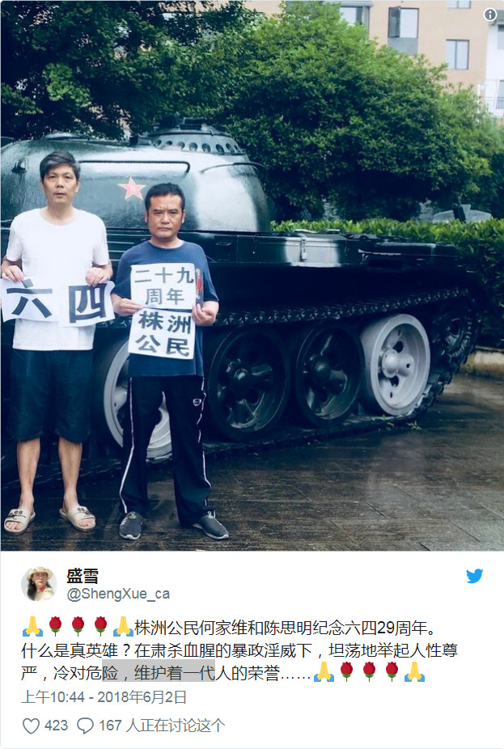
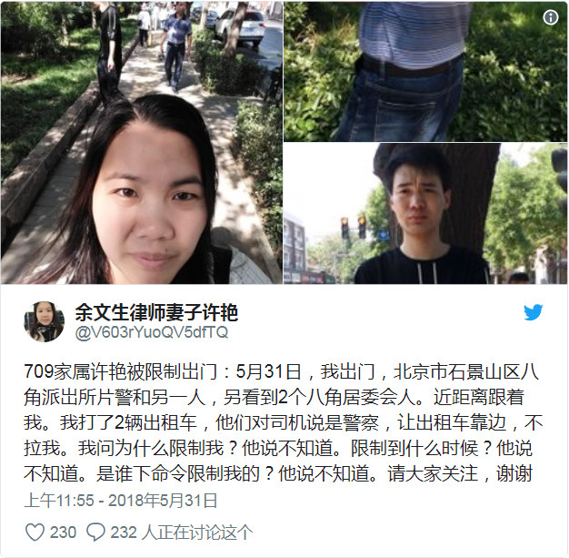
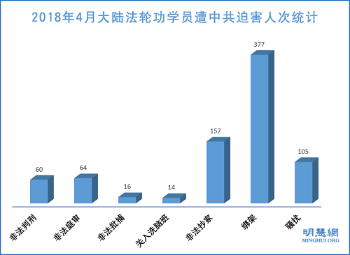
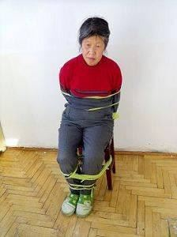
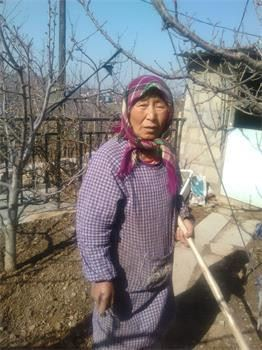
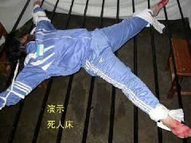

<a name=top>

 
<a href=#36>11.5万港人点烛光照维园 29年坚持悼六四 2018-06-05 
<a href=#35>抵台湾获自由的黄燕讲过中共最怕的一件事 2018-06-05 
<a href=#34>蔡英文谈六四 盼中国网民不用再翻墙 2018-06-05 
<a href=#33>控告江泽民的女子失踪20天 八旬老母焦虑流泪 2018-06-05 
<a href=#32>【新闻看点】全球悼六四29年 中共如何遗忘？ 2018-06-05 
<a href=#31>采取极端控制手段 中共大力打击维吾尔人 2018-06-05 
<a href=#30>主管迫害法轮功 公安局长患多种癌病死亡 2018-06-05 
<a href=#29>组图：六四事件 中共坦克横冲天安门广场 2018-06-04 
<a href=#28>八九民运 港媒：习近平传曾与学生对话 2018-06-04 
<a href=#27>三位华人女子的爱情故事（下） 2018-06-04 
<a href=#26>亲人被非法关押 留日学生中使馆前吁放人 2018-06-04 
<a href=#25>广西律师陈文胆在上海遭警方绑架失联 2018-06-04 
<a href=#24>六四29周年前 军方机密文档首曝光 打脸中共 2018-06-04 
<a href=#23>《纽时》等多国媒体报导中共迫害法轮功 2018-06-04 
<a href=#22>价值3千万房产 中共一百万强拆 伤数百民众 2018-06-03 
<a href=#21>六四29周年前夕 台陆委会：中共应还权于民 2018-06-03 
<a href=#20>强行“取保候审”控制访民 无锡五人进京被截 2018-06-03 
<a href=#19>六四29周年 美议员：中国人的牺牲未被遗忘 2018-06-03 
<a href=#18>北京英特尔公司白领刘东兴被非法刑拘 2018-06-03 
<a href=#17>僧人证言：西藏“再教育营”酷刑性虐待猖獗 2018-06-02 
<a href=#16>六四29周年 天安门母亲发公开信要求平反 2018-06-02 
<a href=#15>陕西征地冲突 数十名黑社会人员群殴村民 2018-06-02 
<a href=#14>三位华人女子的爱情故事（上） 2018-06-02 
<a href=#13>宁夏石嘴山政法委操纵绑架十多名法轮功学员 2018-06-02 
<a href=#12>中共一改支持面孔 突然毁约 还雇5百凶伤人 2018-06-02 
<a href=#11>彻底自由了！ 陆维权人士黄燕流泪感谢台湾 2018-06-02 
<a href=#10>法轮功学员吕彦坤被迫害致死 4.25曾会朱镕基 2018-06-02 
<a href=#9>才见德国总理 余文生妻随后被限制人身自由 2018-06-01 
<a href=#8>数据显示 中共器官捐献与移植官员撒谎 2018-06-01 
<a href=#7>大型国企济钢停产 不惜重金迫害修炼人 2018-06-01 
<a href=#6>美驻华使馆微博转发法轮功相关消息 2018-06-01 
<a href=#5>“贵州中卫案”受害人被抓妙答：我犯上访罪 2018-06-01 
<a href=#4>国际难民逃魔爪 中国维权人士黄燕入境台湾 2018-06-01 
<a href=#3>4月份至少377名法轮功学员被中共绑架 2018-06-01 
<a href=#2>缴税上亿 子却无权入学 北京CEO抱怨被称汉奸 2018-06-01 
<a href=#1>麦塔斯揭中共经营器官黑市及活摘暴行 2018-06-01  

<a href=https://github.com/no1show/show1/blob/master/nice.md><h6 align="right">回首頁</h6></a>

<a name=36>
<h1 align="center"><b>11.5万港人点烛光照维园 29年坚持悼六四</b></h1>

（网络图片）

【大纪元2018年06月04日讯】（大纪元记者林怡香港报导）29年了，万点烛光再次照亮维园。虽然中共官员及建制派威胁不能再喊“结束一党专政”，虽然今日有雷雨，港人的心不变，许多长者呼吁毋忘中共六四屠城，青年学子也没有因为大学学生会的杯葛而减少参与，在雨天的情况下仍有11万5000人出席。

六四事件29周年，支联会今晚继续在维园举行烛光悼念集会，傍晚近7时下了一场大雨，其后雨势慢慢变小。7时后，许多市民下班赶来，约晚上8时，参与集会的市民已坐满近5个维园足球场，仍有很多市民从地铁站涌入维园。到8时半，维园6个足球场已被坐满，有数百人转到中央草坪集会，也有部分市民转到维园篮球场高举烛光，悼念六四。

在集会开始前，约300人参与“六四祈祷会”，以祈祷及唱圣诗悼念死难者。天主教香港教区荣休主教陈日君枢机在祈祷会上，指中共对宗教的压逼和侵害，并指香港的一国两制已经走样。会后他与一班教友加入六四晚会，民主党创党主席李柱铭也到场。

29年了，万点烛光再次照亮维园。虽然中共官员及建制派威胁不能再喊“结束一党专政”，港人的心不变，在雨天的情况下仍有11万5000人出席。（李逸／大纪元）

集会在8时15分开始，支联会常委与数名年轻人手持花牌向“民主烈士永垂不朽”纪念碑献花，全体集会人士向纪念碑行三鞠躬礼。接着支联会主席何俊仁及数名年轻人，到台上燃点象征民主的火炬，台下已一片烛海。

8时15分开始，支联会常委与数名年轻人手持花牌向“民主烈士永垂不朽”纪念碑献花。（李逸／大纪元）

全体集会人士向纪念碑行三鞠躬礼。（李逸／大纪元）

何俊仁致悼辞时指，不能汲取历史教训的政府是没有希望的政府，没有拨乱反正省悟的国家是沉沦的国家。深信，残暴不仁的政权必然覆亡，绝不会千秋永续！又指，当前的政情时局虽十分恶劣，充满白色恐怖，但人民的意志百折不挠，抗争从未止息。接着全体向六四死难者默哀一分钟。

支联会主席何俊仁及数名年轻人，到台上燃点象征民主的火炬，台下已一片烛海。（李逸／大纪元）

支联会主席何俊仁及数名年轻人，到台上燃点象征民主的火炬，台下已一片烛海。（蔡雯文／大纪元）

 
会上播放“六四”遇难者王鸿启母亲狄孟奇的录像讲话，她指“六四”惨案到今天已经是第二十九个年头，她和“天安门母亲”群体成员的共同心愿，要求政府就当年的屠城惨案给难属一个交代。“这是国家犯罪行为，我们要求公布‘六四’惨案真相，对我们遇难者亲属给予国家赔偿，对当年责任者就屠城惨案在法律上问责！还我们做人的尊严！还我们公道与正义！”她并感谢港人的支持。

随后播放了王全璋律师妻子李文足的讲话。王全璋是2015年“709维权律师大抓捕”事件中唯一一位杳无音信的律师，其生死未卜。李文足表示，再过一个月，王全璋就失踪3年，709案中，大多数人都已释放回家或有其它消息，但只有王全璋一人音讯全无，“我呼吁：要求我聘请的律师，会见王全璋，让我知道王全璋的死活。我也有决心、有信心，一定要坚持下去，一定会坚持到王全璋自由回家的那一天，坚持到中国人权彻底改变的那一天。加油！”对于港人坚持了29年的信念，她以抱拳礼表示感激、感动。

大会并邀请一队由一群18岁年轻人组成的“Boyz Reborn”，献唱自创的《自由之歌》。主唱表示，他们每年都会“继续嚟呢度悼念六四，直到平反六四一刻中”，全场掌声雷动。集会中，主持表示，港人能否继续呼叫“结束一党专政”，就是一国两制的最佳试金石，港人要有勇气坚持，才能对抗威权。现场大批市民响应高喊“结束一党专政”。

29年了，万点烛光再次照亮维园。虽然中共官员及建制派威胁不能再喊“结束一党专政”，港人的心不变，在雨天的情况下仍有11万5000人出席。（李逸／大纪元）

晚上9时半，支联会主席何俊仁宣布，今年参加集会人数逾11.5万人，较去年多，不仅坐满6个足球场，维园草地也坐满大半。现场高喊“香港企硬”、“民主必胜”。

<b>老中青毋忘六四</b>

中学生：中共邪恶政权不应存在
今年在中五读书的叶同学是第二次参加悼念六四晚会。他认为，集会的意义是让更多新一代知道中国发生过这样一件事：中共政权为其自身利益，选择屠杀、消灭学生。同时，“看到中共每年打压人民、打压维权律师，于是开始思考为何一个这么邪恶的政权可以出现在这个世界上？”

中五读书的叶同学是第二次参加悼念六四晚会。（李逸／大纪元）

他强调：“（中共）它是一个反人类思想的政权，所以我们是非常反对这一点。我们认为如果它作为一个政权，不是为了人民的利益，不是为了国家的发展，它根本没有必要存在。”

今年第二次参加晚会，叶同学说，主要是因为得悉有大专学生不出席，“我不希望这件事会因为我们新一代不肯出席而令它消失。”过去一两年，他亦开始反思年轻人身份认同问题。“我们一出生就是中国人，不能改变这个身份，只可以改变这个政权。”

被问到是否支持支联会“结束一党专政”时，他表示同意，并说这背后还涉及政党轮替的问题，强调前提应该是“不是共产党执政”。

<b>家长薪火相传：香港人有责任去讲</b>

16岁的卓同学第一次参加六四悼念，想来感受一下气氛。他坦言以往很少参与这类活动，但觉得“作为学生应该知多些，不可以只为读书”。他认为六四事件其实跟香港人有很大关系，不可以让这件事慢慢地消失，“因为香港2014年曾经发生过一件差不多的事，很怕香港未来会变成一个有六四事件的地方，我们会失去言论自由。”

市民李先生在他两个小孩五六岁时就带他们参加集会，今年小朋友已11岁了。六四事件当年李先生只是中五学生，他记得当晚激动得无法入睡，“竟不是一个国家侵占另一个国家，而是国家里面的人这样做。”

市民李先生在他两个小孩五六岁时就带他们参加集会。（李逸／大纪元)

29年后的今天，他认为让子女了解真相是父母的责任，“因为现在全中国都不能够公开谈论六四⋯⋯否则再过十年八年，越来越少人谈论，他们更加可能会不知道发生什么事。”他认为这亦启示自由民主的可贵，“不代表你有权力我们就不能发声。身为香港人，是必须要站出来讲这件事。”

22岁的刘先生就读于中大酒店系，他前来悼念为了争取民主而牺牲的学生。“可能因为我读中史出身，更了解整件事的经过，觉得一群学生为了争取民主的中国落得这样的下场，很惨。”他形容今日的中共很独裁，起码要民主一些。

<b>教科书仅90字谈六四 中三生：不应删除历史</b>

在港岛区中学读中三的邓同学和黄同学今年第一次参加维园烛光悼念。邓同学直言，学校刚好教到六四这一课，但只是略教，“我数过只有90字，三句话一笔带过。”这促使她亲身到场了解这段历史。

她说：“（中共政权）很专制，学生又没有做过激行为，只是单纯地游行，为何要出动军队去（镇压）？”她不认同这件事不关香港人事，“这件事可能已经无法挽救，但也希望不要忽视它，强行地将它从历史中删去。应去教导学生，这件事的起因和经过，不要像现在的教科书一样。”

在港岛区中学读中三的邓同学和黄同学。（李逸／大纪元）

同行的黄同学说，学校更因为“无时间”而略过六四。她认为不应该删除这段历史，“因为这是中国的历史，是有发生过的事。”

分别为26岁、27岁的文氏两姐妹结伴参与悼念。姊姊说，中共政权镇压学生令人心痛，“根本没当他们是人，这是背叛了学生对国家的信和爱。”她认为每年的六四集会至少应该让人知道当年学生的牺牲，揭示政权的不公。妹妹也表示，香港是在中国境内唯一一个仍然可以讲、可以这么公开悼念这件事的地方，不希望烛光被人熄灭。她认为中共残忍对待学生，其一党专政的系统已不合时宜，支持支联会的“结束一党专政”口号。

30多岁的陈先生从事资讯科技业，十年前参加过六四集会，今年又再次来到维园，“近来香港发生太多事，无端端议员被拉去坐牢，很多原因令我想来参加。”

<b>大陆人士参加烛光晚会</b>

今年依旧有不少大陆人士参加烛光晚会。

29年了，万点烛光再次照亮维园。虽然中共官员及建制派威胁不能再喊“结束一党专政”，港人的心不变，在雨天的情况下仍有11万5000人出席。（李逸／大纪元）

一位从北京来的大二女学生不愿透露姓名，她表示第一次来港出席六四晚会，她是从《纽约时报》中文网看到香港悼念六四的活动。“觉得他们很用心，因为毕竟内地没有这样的活动，可能也是受到控制的问题。不过香港这么多年来一直坚持这么做，是很用心的。我就想来看一下究竟是怎么一个情境。”

来自湖南衡阳的丁先生，今年31岁，他对六四的认识都是从旁人一些记忆得知。他说曾在广东打工，听到一位浙江人讲当年做生意路过衡阳，他坐的火车在衡阳停留了几天，因为衡阳的学生把衡阳的火车站占领了几天，后来解放军反扑，开枪镇压，又重新夺回了火车站。“我觉得很奇怪，我作为一个衡阳人怎么会不知道？所以我一直在追查这个事，我就过来看看。”

他表示是第一次来参加六四晚会，很感谢港人29年来的坚持。“这个活动我们很多大陆支持民主的人士都非常感谢香港人民一直持续的关注和帮助，我们真的很感谢一些香港人的帮助。”他批评中共镇压学生很残暴，“这个肯定是残暴的，也是不对的，肯定（需要平反）。（结束一党专政）是应该的。（残害人民的政权还应否存在）这个大家心里都有数。”

广州来的陈先生过去曾经来过几次参加六四晚会，“以前年年都有来，六四集会是中国人民都知道是正义的事情，都是有发生过的事情，哪里没有发生过？只是大陆那边一党专制，打压镇压，大家不敢说话而已。”

广州来的陈先生。（蔡雯文／大纪元）

他表示，中共政权很多错误，在大陆人民不敢说到香港来说。“香港还有人为正义发声，但是现在来到香港，发现年年的言论自由和集会自由都受到了镇压和牵制，没有以前那么开放开明。”他强调，港人坚持29年对大陆产生正面的影响，“中国大陆15亿人口的良心都在香港了，还有一小部分香港人在坚持这一个正义，但是现在香港的政府或者很大一部分都是受到它的排挤、牵制、收买，都有这样的情况。”

1989年时陈先生才约8岁，他说六四事件真相都是老一辈人代代相传，“都说国家或党组织做出了什么事、什么错误。”他相信中共政权不会长久。“自有天意，我们虽然没有能力，但肯定会站在正义一方，天意自然会有选择。每一个政权的气数都自有定数，不会统治万年的，它倒下去肯定有它的错误性。”

陈先生又说，自己在大陆常接到退党义工的电话，自己也退了，因为村委会、党委会，乡镇的党组织都很腐败，“虽然那边我们镇压得很厉害，但大家都暗中地谈，都知道的。肯定是有意义的，要不然就不会传播得这么广泛，大家暗中都知道了。”他希望“三退”能令中共倒台，“很多普通群众根本没有得到共产党改革开放的利益，都是当官的、干部富二代、村官，从乡下到镇到市县，都是当官的商人把战略经济的资源都侵占了，普通群众能分到的经济资源很少。”

29年了，万点烛光再次照亮维园。虽然中共官员及建制派威胁不能再喊“结束一党专政”，港人的心不变，在雨天的情况下仍有11万5000人出席。（李逸／大纪元）

来自广东的谢先生今年已四十多岁，第一次来港参加六四活动，很感谢港人29年的坚持，“真的很佩服他们，民主就要靠这样的人。大陆的几乎都是奴才，我们跟他讲这些事，别人反而会骂你，当自己傻的。反而香港人过着这么安定的生活，都可以做得到来帮中国争取民主。你跟那些人讲民主都没人识，精英才懂，但精英都在国外。消息、媒体被封锁，那些穷人看不到、听不到。同一件事实，在两边看到的相差很远啊。”

他不满中共镇压学生，强调当年学生的诉求是对的，“学生挺好的，不怕死地帮中国争取民主，本来就要民主，极权怎样都做不好的。威权下一党专政没可能做好的，都不让人说，只能讲好不能讲坏的⋯⋯美国个个都指责政府，政府越做越好，又不见得会乱。”他强调共产党不应再存在，“我们看（共产党）肯定不可以再存在，不可以再存在，我觉得很邪恶，我发现身边讲的话都是很假的。”#

责任编辑：杨亦慧

推荐

<a href=#top><h6 align="right">回上方</h6></a>

<a name=35>
<h1 align="center"><b>抵台湾获自由的黄燕讲过中共最怕的一件事</b></h1>

中国大陆维权人士黄燕获台湾人道援助。黄燕说，她被中共迫害十多年，即使流亡东南亚，仍逃不出中共的魔爪，时刻生活在恐惧中。（视频截图）

【大纪元2018年06月05日讯】（大纪元记者李辰综合报导）5月29日晚，中国大陆维权人士黄燕在台湾桃园机场转机时，提出入境要求。台湾基于人道救援考量，批准黄燕安置三个月。鲜为人知的是， 黄燕曾以亲身经历曝光过中共最不敢讲的一个秘密。

黄燕曾向著名人权律师高智晟律师证实，她在狱中亲眼目睹了法轮功学员遭到的骇人听闻的酷刑迫害。

高智晟律师在其发表的《我的心声》一文中说，“黄燕被绑架后与法轮功学员关在一起，遭到残酷折磨。而黄燕此后亲眼所见、亲耳所闻的法轮功同胞所遭受的酷刑，更加骇人听闻。”

黄燕因多次帮助高智晟律师向外界传递讯息而受中共迫害。而高智晟写于2007年11月28日的一篇震惊世界的长文《黑夜，黑头套，黑帮绑架》就是黄燕孤身突破森严看守，进入高智晟家中带出来，才得以面世的。

高智晟在此长文中透露，中共迫害法轮功学员所使用的残酷手段，如电击、竹签捅生殖器等他都承受过。

黄燕曾说：“当年高智晟律师的《黑帮，黑夜，黑头套》文章里面绑架的是高律及我，当时高律师在朝阳亚运村被绑架，同一时间我在海淀北沙滩被绑架。”

2014年7月，黄燕曾突破中共封锁到香港中联办前抗议，呼吁各方关注高智晟律师的遭遇。

“高智晟是真正的英雄，他所受的苦、一切的灾难，是没有任何一个律师可以像他那样的。”黄燕说，高智晟遭受如此惨烈的迫害，是因为替受中共迫害最深的团体“法轮功”发声。

法轮功是以“真、善、忍”为原则的身心修炼功法，传出后广受民众欢迎，至1999年，大陆修炼人数达1亿人。1999年7月，中共前党魁江泽民以法轮功原则与中共意识形态不同等所谓理由，一意孤行发动迫害，这场迫害持续十九年至今。

高智晟是中国第一个敢接法轮功案件的律师，高智晟以及黄燕的遭遇都反证了法轮功团体所遭受的残酷迫害。

<b>高智晟三次上书胡温 揭露对法轮功学员的酷刑虐待</b>

高智晟律师于2004年、2005年三次公开上书胡温政权，呼吁立即停止对法轮功学员惨无人道的迫害行为，并揭露出全国普遍存在的对法轮功学员的酷刑虐待，以及对女性法轮功学员的性虐待。

高智晟说：“此时此刻，我用颤抖著的心、颤抖著的笔记述著那些被迫害者六年来的惨烈境遇。”

“在这次令人难以置信的野蛮迫害真相中，在政府针对自己的人民毫无人性的残暴记录中，其最持久地震荡着我的灵魂的不道德行为记录，即是‘610’（中共专门迫害法轮功的专门组织）人员及警察的、完全程式化的几无例外地针对我们女同胞女性生殖器攻击的下流行径！”

他在信中列举了包括长春市法轮功学员王守慧和刘博扬母子在内的多个案例。2005年10月28日下午4时20分，长春市的王守慧和刘博扬母子被“610”警察跟踪并非法抓捕。母子俩随后遭受了警察的酷刑折磨，当晚8时，28岁的刘博扬即被迫害致死，十多天后其母也被折磨而死。

高智晟在公开信中说：“王守慧一家三口于1995年开始修炼法轮功，在1999年7月20日打压之后，持续地遭到绿园区正阳派出所和正阳街道办事处干部的骚扰迫害。王守慧分别于1999年10月和2000年2月被非法拘留和劳教，在黑嘴子劳教所曾遭电棍酷刑八次；被逼每天白天干活，夜间站着不许睡觉五天五夜；被绑在‘死人床’上数次，最严重的一次被捆绑在‘死人床’上用两根电棍同时电击一个多小时，全身及满脸没有一处完好的地方，被迫害至生命垂危时才释放。

“2002年4月11日，王守慧正走在路上，再次被绿园区正阳派出所绑架，并被长春市公安局一处蒙面带到长春净月潭的净月山上私设的上刑房上刑，坐老虎凳两天一宿。期间遭受酷刑折磨：两根电棍同时电击她的乳房等处；三名男子同时拳击其面部及上身胸、背等处，致使王守慧左脸面颊骨粉碎性骨折，大吐血。

“2002年6月27日，王守慧一家三口又被绿园区分局政保科绑架至正阳派出所。几个警察对刘博扬残酷折磨，拳打脚踢，用皮鞋抽嘴巴，上绳，头上套塑料袋，把刘博扬的双臂背到后面，然后用手铐将人双手吊铐起来，身体悬空，并且来回悠荡或向下拽双脚。当时行刑的警察苑大川还叫嚣说：‘法轮功我也打死过好几个，打死你们我不用负任何责任！’每行刑时，母子俩惨叫声互闻，惊天地泣鬼神！”
<b>
<b>法轮功遭受最持久和最惨烈的灾难</b>
 
高智晟律师还在给胡温的公开信中说，“人类历史上没有哪个国家的人民，为了心灵中的信仰，会在有政府的和平时期经历著如此规模的、如此持久的、如此惨烈的灾难。”

十九年来，美国政府、欧洲议会多次通过决议案，要求中共立即停止迫害法轮功。

2018年4月20日，美国国务院发布《2017人权国别报告》，点名中共迫害法轮功等团体。报告还引用其它来源表示，法轮功学员遭受比其它团体更加频繁的酷刑折磨。

2017年8月22日，美国华盛顿DC非政府机构“自由之家”发布中文版中国宗教自由报告。报告指，中共使出全部手段镇压法轮功，包括酷刑以及终极的经济剥削方式──杀害法轮功学员，摘取他们的器官，然后高价出售。#

责任编辑：高静

<a href=#top><h6 align="right">回上方</h6></a>

<a name=34>
<h1 align="center"><b>蔡英文谈六四 盼中国网民不用再翻墙</b></h1>

今年为六四29周年，身兼民进党主席的总统蔡英文（图）在脸书发文提到，若北京当局正视六四事件，期待有一天中国网民不用翻墙就可以自由浏览她的脸书。（陈柏州／大纪元）

大纪元记者江禹婵台湾台北报导）今年是六四29周年，身兼民进党主席的中华民国总统蔡英文在脸书发文提到，若北京当局正视六四事件，“‘六四’不幸的历史将会转化成中国迈向自由民主的基石”；她期待，有一天中国网民不用翻墙就可以浏览她的脸书。民进党也发表声明呼吁，勿再以“党天下”的专制思维来面对普世价值潮流，并尽速释放关押中的台湾NGO工作者李明哲。

蔡英文首次全篇用简体字在脸书发文。她说，六四事件29周年，她想借着这个机会跟对岸的中国人民讲几句话，分享台湾民主发展的经验。

<b>吁中共放弃“党天下”</b>

民进党提到，拒绝接受自由、民主、人权的中共当局，目前以“中共党建全覆盖”的严厉手段、通过维稳之名，全面压缩人民隐私和自由权利、阉割新闻自由和宗教自由、强化意识形态管制。

中共当局用威权所推动的中华民族复兴，是一种“党天下”的专制思维、是对普世价值及人类文明的严肃挑战，更是以“锐权力”侵蚀民主、自由、人权的文明危机。我们深信，中国人民追求民主自由的努力不会戛然而止。中国的未来必然掌握在每个人民心中、在那些视自由民主为真谛的追求者手上。

声明强调，中国唯有开放社会与尊重人民权利，改革成为一个实践民主、自由、人权的国家，才是一个“以民为主”、受世人敬重而非令人畏惧的国度。

<b>台没有敏感词、网路审查</b>

蔡英文则在脸书上提到，来到这里的中国网民都会发现，她的脸书就是台湾民主政治的缩影。这里有批评的声音，也有打气的声音。“在台湾，我们没有敏感词，不做网络审查，当然更不必翻墙。这是我们的生活方式，也是因为这里已经建立了一套容许这种生活方式的民主制度。”

翻开天安门的历史，当年中共统治当局出动军队、坦克车跟枪炮，镇压天安门广场上的学生跟人民，并说成是政府平息暴乱的事件。

她说，几十年来，中国大陆始终没有走出这场历史悲剧的阴霾。对照之下，台湾也曾历经二二八事件、美丽岛事件，也曾被当时的统治当局说成是暴乱事件。但因为这些事件所酝酿、累积及动员出的社会能量，驱动了台湾民主政治的改革及全面的民主化。

蔡总统说，这些年来，“我们承担起历史的责任，并致力追求真相，以及对受难者与家属的平反及赔偿”。台湾最近还成立了“促进转型正义委员会”。这个委员会将调查并检讨威权时期国家在人权上所犯的错误，这些工作是为了进一步追求历史事件的真相，抚平社会伤痕，化解对立，进而巩固台湾的民主制度。

她提到，就跟台湾推动民主政治改革及转型正义是一样的道理，“我由衷相信，如果北京当局可以正视六四事件，承认这个事件国家暴力的本质，六四不幸的历史将会转化成中国迈向自由民主的基石。”

蔡英文说，她期待有一天中国网民不用翻墙就可以自由浏览她的脸书。“两岸可以共享自由和民主的普世价值，让两岸人民有更大的空间，互相理解和合作。这是两岸政府可以共同努力的目标。”

责任编辑：英祯

<a href=#top><h6 align="right">回上方</h6></a>

<a name=33>
<h1 align="center"><b>控告江泽民的女子失踪20天 八旬老母焦虑流泪</b></h1>

湖南中医药大学图书馆馆员唐敏（明慧网）

【大纪元2018年06月04日讯】湖南长沙市的唐敏自2018年5月13日到父母家探望双亲后，与亲友失联已20天。她的手机关机，家门紧闭，人下落不明。年逾八旬的父母十分担忧她的人身安全。母亲思女心切，伤心哭泣。

明慧网报导，现年52岁的唐敏，系湖南中医药大学图书馆职工。她独自一人居住在长沙市雨花区砂子塘社区的单位宿舍，在每个周末去看望双亲。

可是，最近半个多月的两个周末，父母却没有见到女儿，上次见到她，是在2018年5月13日（周日）那天。在这之后，母亲心中的不安与日俱增。

唐敏1996年修炼法轮功后，身心受益。1999年7月中共迫害开始后，十多年来，唐敏曾经四次被关入精神病院、六次遭强迫洗脑迫害、多次被非法拘留、被非法劳教一年半，遭酷刑折磨、两次被非法抄家、经常被骚扰和监视居住。

除了中共“610”（专门迫害法轮功的非法机构）、警察等，还有她的工作单位、社区人员都参与了对她和她家人的迫害。

<b>曾遭受的部分迫害</b>

2009年5月至10月，唐敏第四次被湖南中医药大学保卫部人员劫持到湖南省脑科医院三病室监禁，长达五个月，每半个月被强行注射破坏大脑神经的药物，每次被强行打针后，她都会出现全身发冷、颤抖、坐立不安的症状。

据专业人士透露，对正常人注射此类药物，将导致大脑中枢神经受损、反应迟钝等不良后效应。省脑科医院的吴伟林医生全程参与了此次对唐敏的迫害。

中共酷刑迫害演示：打毒针（注射不明药物）。（明慧网）

而在此期间的9月8日，两位长沙市法轮功学员前往位于长沙市含浦科技园的湖南省中医药大学，希望校方停止对唐敏的非法拘禁和药物摧残，校方却伙同含浦派出所将两人绑架，关入“610”洗脑班。

2011年11月26日，唐敏和另一位法轮功学员在路边被长沙市银盆岭派出所绑架和殴打，被非法拘留15天后，又劫持到捞刀河洗脑班非法拘禁，随后两人被非法劳教一年半。12月16日，唐敏与同伴被中共人员从洗脑班带走，转入白马垄劳教所继续关押。

2013年9月，在湖南省“610”操纵下的新一轮洗脑迫害中，非法劳教期满回家不久的唐敏又被捞刀河洗脑班劫持一个月左右。

2014年8月15日，二十多人破门而入，将独自在家的唐敏强行带走。又一次被关在捞刀河洗脑班半个多月后，唐敏被直接转到长沙市第二看守所关押。

2015年6月22日，唐敏向最高检察院和最高法院邮寄《刑事控告书》，起诉迫害法轮功的元凶江泽民。

2015年5月1日，最高法院宣布“有案必立，有诉必理”后，饱受迫害的法轮功学员及他们的家人，依法把控告元凶江泽民的刑事控告状邮寄给中共最高检察院，要求最高检察院向最高法院对江泽民提出公诉，将其绳之以法。

唐敏在控告书中最后写道：“这十多年来，因为江泽民发动、设计、谋划、命令这场迫害，直接导致同单位的丈夫及近亲，经常被人找麻烦，经常被单位、社区骚扰，使他们承受巨大的压力和痛苦，导致家庭破裂，对孩子的心灵创伤也非常大。父母天天提心吊胆，身体与精神备受煎熬。”#

文字整理：李洁思，责任编辑：高静

<a href=#top><h6 align="right">回上方</h6></a>

<a name=32>
<h1 align="center"><b><a href="https://github.com/no1show/show1/blob/master/download/64-29.mp4?raw=true">【新闻看点】全球悼六四29年 中共如何遗忘？</a></b></h1>

【大纪元2018年06月04日讯】大家好，欢迎大家订阅关注新闻看点，我是李沐阳。

今天又下雨了，在我的印象中，每年的6月4日这一天都会下雨，相信有很多朋友也已经注意到了这个现象。香港支联会举行了一年一度的维多利亚公园烛光晚会，纪念六四天安门事件。虽然有雨，但这并没有阻止香港人的行动，大会宣布超过11万人参加了悼念活动，比去年人数有所增加，六个足球场全部坐满了人。

来自上海、现为香港中大社会学系讲师的黎明，1989年当时只有4岁。2009年首次和同学参加维园六四晚会时，深惧“被拍到、被认出”，戴着口罩、夹杂在同学中间，但如今的她昂首挺胸第九年出席六四晚会。

从1990年开始，香港每年都举办烛光晚会，支持民主运动的香港本土和大陆人士纷纷到场参加。 几十万的市民捧起一盏盏烛光，向历史和“六四”死难者致敬。这种场面一直震撼着世界，也让人相信，中国人并未遗忘。

旅居美国的八九民运领袖王丹在推特上表示，29年当中，每一年维园的烛光都撼动了无数人的心。只要那一片烛光还在，香港就是在书写人类历史中美丽的一章。他同时指出，六四纪念晚会不仅为了纪念死难者，也是为了香港前途“表达对专制中共的抗议的机会”。

29年了，万点烛光再次照亮维园。虽然中共官员及建制派威胁不能再喊“结束一党专政”，港人的心不变，在雨天的情况下仍有11万5000人出席悼念六四受害者的活动。（李逸／大纪元）

不仅在香港，世界多个地方的中国人，甚至有很多的外国人，都在六四到来之际，用不同的方式纪念29年前的死难者和受难者。

在昨天傍晚，纽约200多位民主人士，其中不乏80后、90后的年轻人，他们聚在中领馆对面，纪念六四，声讨中共。在华人聚集的法拉盛街头还进行了行为艺术表演“我是坦克人”。

美国国务卿蓬佩奥也发表了声明，督促中共政府公布被杀害、拘留或失踪者的情况，尊重公民的普遍权利和基本自由。国会参议员卢比奥和史密斯在纪念声明中表示，要公开清算中共的可怕暴力，伸张正义 。

台湾总统蔡英文和前总统马英九分别在脸书上发文，台湾陆委会和多位NGO工作者也纷纷纪念“六四”。蔡英文首次使用简体字，呼吁北京当局正视六四国家暴力事件，并期待中国网民不用翻墙可以浏览她的脸书。马英九重申了他就任台北市长时说过的话，“六四不平反，统一不能谈”。

据香港媒体报导说，六四当时，中共的现任高层中，部分官员曾在民运爆发时做过一些事。其中习近平当时在福建宁德任职，据说曾经和当地最高学府宁德师范专科学校的学生对话。李克强当年曾协助中共高层劝说绝食学生，但表现比较低调。

中共试图通过信息封锁，让人们遗忘和丢失这段历史，但中共的努力显然是失败了。美国、英国、法国、澳大利亚等等，不同的国家和地区，人们都在纪念六四。仅仅是美国，就有多个城市的华人，像华盛顿、旧金山、洛杉矶、西雅图、芝加哥、休斯顿、亚特兰大等城市，人们都在用各种不同形式举行纪念活动。

前中共总书记赵紫阳的秘书鲍彤也在六四前夕接受了采访，《纽约时报》引用鲍彤的话表示，“六四”的主导者就是邓小平一个人。邓小平为了保存自己的历史定位而“个人谋划的、矛头对着赵紫阳的一场政变”。

对于一些年轻人来说，可能对“六四”有些模糊。但对于45岁往上的人，他们的记忆深处，中共的枪声依然在回响，坦克依然在长安街上碾压。

图为六四大屠杀坦克追碾的学生和市民的尸体。（64memo.com）

1989年春夏之交，中国的学生和民主人士发起了长达50多天的非暴力民主运动，200多个大小城市、5000多万人参与其中，希望中共政府惩治腐败，将自由民主还给人民。但是中共用伪装成民众的特务焚烧军事装备等，嫁祸于平民和学生。

6月4日凌晨，中共军队从不同地方进入北京城，四面合围、屠杀手无寸铁的学生和民众。究竟有多少人被屠杀？一直很难准确统计。中共自称说“绝对没有打死一个学生和群众，也没有轧死轧伤一个人……”

BBC的文章认为，时间相隔越久，历史真相就越有机会水落石出。白宫披露的机密档案中显示，美国驻香港总领事馆收到中共戒严部队线人的消息，在中共官方的内部文件中，有10,454人被杀，28,796人受伤。这个数字得到了英国国家档案馆的佐证，当时的英国驻华大使唐纳德在给英国政府的电报中，引用了一名中共国务院内部人士的估计，死亡的人数最少超过一万名。

感谢您关注新闻看点，再会。

大纪元《新闻看点》制作组 #

<a href="https://github.com/no1show/show1/blob/master/download/64-29.mp4?raw=true">点击下载视频</a>

责任编辑：李昊

<a href=#top><h6 align="right">回上方</h6></a>

<a name=31>
<h1 align="center"><b>采取极端控制手段 中共大力打击维吾尔人</b></h1>

图为2017年6月26日，警察在新疆喀什老城开斋节开幕后的清真寺巡逻。(JOHANNES EISELE/AFP)

【大纪元2018年06月05日讯】（大纪元记者李新安综合报导）中共对新疆采取极端控制，特别是在斋月期间，加大了对维族人的监禁力度。同时，中共不但禁止其宗教活动，还组织各种饮酒和吃猪肉活动。

据美国之音6月2日报导，在新疆斋月节期间，中共政府正在进一步加强对维族少数民族群体的控制，利用“去极端化”运动来镇压当地居民。

报导说，去年4月以来，中共不断抓捕维族人，将他们关入“再教育”集中营。维族活动家、人权组织和其他人士表示，被拘留的人数从12万人上升至多达100万人。

世界维吾尔代表大会主席多里坤．伊萨（Dolkun Isa）告诉美国之音，中共政府最近开始监禁更多的维吾尔族人，尤其是在斋月期间，这一时间从5月16日开始，并将持续到6月中旬。

伊萨说，人们不断被抓进集中营，很少有人能出来。“没有人知道他们拘留人的条件是什么，没有人有安全感。”

他补充说，自去年起，中共政府禁止大多数维族的宗教活动，包括阻止政府公务员在斋月期间禁食和访问清真寺，同时组织喝酒和吃猪肉的比赛活动。他还说，“如果有人在工作中试图偷偷禁食，他们会在午餐时给他食物和水。”

据美国之音中文网此前报导，早在2016年，新疆伊犁州察布查尔县即在官方网站上发布通知，明确规定要“坚决防止党员、国家公职人员和学生封斋、入寺礼拜”。但该网站很快删除了这个网页。

随后，新疆各地政府掀起了一股请客吃饭之风。阿克苏地区摆酒设宴，邀请当地12个民族的500多位老人参加；又邀请“四老人员”（老军人、老干部、老党员、老模范）参加地方官员主办的茶话会。

世界维吾尔人大会发言人迪里夏提认为，强迫性进食，胁迫性地要求人们参加各种以政治名义主办的联谊会、联欢会、茶话会等，“无非就是通过这些活动来甄别维吾尔的这些在职人员，是否在斋月中封了斋。”

“中共政府在斋月期间的限制手段还远不止这些”，迪里夏提表示，“某种意义上，维吾尔人几乎变成了二战时期的犹太人，没有任何人身保障，晚上睡觉也没有私人领域。”一个很荒谬的做法是，维吾尔人晚上睡觉不能从里面把门扣上，以便当局深更半夜能随时闯入搜查。

伊萨指控说，喀什的年轻人被大量拘留。喀什市场已经找不到年轻人，只剩下老人、妇女和儿童了。政府已经切断了居民与世界的沟通，包括限制他们使用微信社交媒体网站。

2017年4月1日起，中共新疆当局开始实施“去极端化”条例，包括禁止在公共场所戴面纱和蓄长胡须，“起名渲染宗教狂热”，以及“排斥、拒绝广播、电视等公共产品和服务”等。这一规定引起了国际社会的谴责，说他们违反了基本人权和宗教自由。

自2018年初以来，维吾尔人还被迫欢迎中共官员进入他们的家中，这一计划将派遣超过100万名中共官员与南疆当地农民家庭共同生活。而在所谓的“家庭住宿”期间，维族家庭受到政治灌输和信息监控。

中共对维吾尔人的现行政策被认为是在煽动报复，而不是平息局势。人权活动家卡罗尔．安妮．格雷森（Carol Anne Grayson）说：“中国需要对其政策进行反思。”她说，一些维吾尔人企图离开这个国家，在其它地方寻找自由，其他人则变得激进，并选择一条暴力道路。

外界形容新疆成为一个露天大监狱。近日，英国杂志《经济学人》（The Economist）也发表了一篇长达3000多字的报导，详实地描述了新疆维吾尔人面临的全方位打压。

报导说，2016年上任的新疆党委书记陈全国彻底颠覆了当地的社会秩序。这位刚在西藏自治区担任了5年党委书记的铁拳派官员在新疆整合了大量安保资源，以致于近两年后的今天，新疆已经俨然变成了警察国家。#

责任编辑：孙芸

<a href=#top><h6 align="right">回上方</h6></a>

<a name=30>
<h1 align="center"><b>主管迫害法轮功 公安局长患多种癌病死亡</b></h1>
 
【大纪元2018年06月04日讯】黑龙江省七台河市公安局副局长张和平因患舌癌、肺癌、骨癌于2018年5月13日在极度痛苦中死亡，时年63岁。他生前疯狂迫害法轮功。

明慧网报导，2017年2月，在中国传统黄历新年期间，七台河、哈尔滨、北京三家医院确诊张和平患舌癌，当时他决定不做手术保守治疗，不长时间又被查出肺癌，癌细胞很快扩散至骨骼，又被确诊为骨癌。三种癌症对他身体的侵蚀，使他每天痛苦异常，生不如死。肺癌做了手术后，张和平去了海南住院治疗，也抵挡不住三种癌症对他身体每时每刻侵蚀带来的痛苦，最后只好回到七台河医院“治疗”，今年5月死亡。

张和平，男，1956年生，七台河市公安局副局长，在职期间主管迫害法轮功，为捞取政治资本，积极追随江泽民迫害法轮功学员。张和平的岳父是原七台河市公安局局长，他是靠着其岳父干上副局长的。

张和平自1999年以来，曾亲自在七台河市密谋策划多起大型绑架法轮功学员事件，不择手段地部署跟踪、监视本市的法轮功学员，随时掌握他们的动向，如果发现谁不是彻底“转化”（放弃修炼法轮功）的，就找理由将其抓捕迫害；还利用放弃法轮功修炼的人在佳木斯、宝清等邻近市县“转化”外地法轮功学员。

以下是张和平直接部署迫害法轮功学员的案件举例。

1999年7月20日，江泽民集团对法轮功发动迫害后，张和平大面积地非法绑架、抓捕、长期关押法轮功修炼者。2000年除夕的前两天，张和平带领他的手下来到七台河第二看守所，把近百位法轮功学员关到一个大铁笼子里，逼迫他们放弃信仰、诬陷法轮功的创始人，并且举起手中的钢笔威胁说，谁不放弃修炼，就不让其回家；谁悔悟，就签字放其回家过年。

他的同事也应声附和，想回家过年的，条件是必须“揭批”法轮功和诬陷其创始人。

2001年2月初，七台河新建矿法轮功学员张长明等十多人，从佳木斯西格木劳教所夜里走脱。佳木斯和七台河市公安局对走脱的法轮功学员家的电话进行监控，于2001年3月初，张和平组织几十人、多辆警车，闯进新建街道法轮功学员刘金凤的家，把她绑架到市公安局。当时刘金凤正在来月经，只穿一条裤子，他们根本不管这些。张和平亲自指挥对刘金凤进行了三天三夜的毒打、电棍、上大挂等酷刑迫害。

2003年3月的一天半夜，张和平带人用特殊钥匙非法打开法轮功学员刘桂华家房门，将她强行绑架，在新兴分局迫害后，送到七台河市第二看守所继续迫害。

刘桂华在被非法关押期间，为抵制迫害绝食抗议，遭到野蛮性的灌食。灌食的管子插到她肺里，导致她患上肺结核，经常吐血，在40岁那年她因肺结核病变而离世。

据不完全统计，张和平在担任七台河市公安局副局长期间，七台河市的583名法轮功学员遭到非法拘禁，其中有23位被非法判刑，造成多人非正常死亡。#

文字整理：李洁思，责任编辑：高静

<a href=#top><h6 align="right">回上方</h6></a>

<a name=29>
<h1 align="center"><b>组图：六四事件 中共坦克横冲天安门广场</b></h1>

“六四事件”坦克横冲天安门广场图片惊人（网络图片）

【大纪元2018年06月04日讯】又到了“八九六四”受害者纪念日。虽经中共的封杀和洗脑，但当年中共坦克冲入天安门广场屠杀人民的暴行无法抹杀，十年后它们使用更阴毒的手法屠杀法轮功学员。以下是大纪元汇集的中共动用坦克屠杀学生的相关文字和照片。

六四天安门事件亲历者吴仁华曾于2007年出版了《天安门血腥清场内幕》一书，今年4月份又出版了该书的增订版，书中增加了关于戒严部队的部分。他也曾写了一篇《六四事件中的坦克第一师 》，从中都可以让民众了解当时坦克接上级命令强行进入天安门广场所发生的血腥屠杀过程。

中共当局为了镇压1989年的民主运动调动逾20万军队进京，其中有两个坦克师，即第38集团军的坦克第6师和天津警备区的坦克第1师。

6月4日凌晨6点05分，戒严部队指挥部命令坦克第1师立即出动，驱散新华门前的学生。坦克突击队从天安门广场出发，8辆坦克分列成4排，每排2辆，并驾齐驱，沿着西长安街由东往西行进约2华里，有几百名学生和群众横躺在地上，用血肉之躯组成一道长约十几米的“人体路障”。坦克没有减速，100米、50米、30米，距离“人体路障”越来越近，路面剧烈震动，坦克的轰鸣声震耳欲聋，但躺在地上的学生和民众坚持不动，坦克的速度不得不降下来。

（网络图片）

（网络图片）

（网络图片）

（网络图片）

当局无奈实施了3个方案，最后施放军用瓦斯弹，坦克突击队慢慢地向前拱着人群，终于将新华门附近的人群驱散。从天安门广场出发，到驱散新华门前的人群，坦克突击队总共只花了30分钟。

（网络图片）

（网络图片）

（网络图片）

（网络图片）

（网络图片）

（网络图片）

（网络图片）

（网络图片）

（网络图片）

坦克突击队驱散了新华门附近的人群，继续沿着西长安街往西高速行驶，一路鸣枪，施放军用瓦斯弹，将学生和市民全部驱逐到电报大楼以西，一部分坦克在六部口设卡镇守，另一部分坦克在新华门前一字排开。

坦克突击队经过新华门西侧不远处的六部口时，正遇上从天安门广场撤离出来的学生队伍。数千名学生打着校旗，从六部口东边的新华北街拐上西长安街，有秩序、 和平地在自行车道上往西行进，准备返回各自校园。坦克突击队不走宽阔的快车道、慢车道，沿着自行车道快速追轧学生队伍。学生们万万想不到坦克会从背后追轧，不少人躲避不及，或死或伤。

在这里发生了六部口惨案，造成11人遇难，多人伤重致残。文中这样写道，现场触目惊心，痛哭声震天动地。五具遇难学生的遗体散乱在靠近人行道的柏油马路上，最西面的一具遗体距离人行道两米多远，头朝着西北仰面躺着，脑袋中间开了一个大洞，像豆腐脑一样的脑浆掺杂着许多红色的血丝向前喷射出一米多远。另外四具遗体倒在这具遗体的东面更靠近人行道的地方，其中两具遗体被轧到了自行车上，与自行车粘到了一起。

文中还这样写着，一些学生一边哭一边商量，是否将这些遇难者的遗体运走，免得被戒严部队抢去消尸灭迹。在民众帮助下，几位学生将遇难者遗体一一抬到了西长安街后面一个胡同里。一位个体户司机流着泪建议把五具遗体运往中国政法大学，作为戒严部队屠杀平民百姓的法律证据。学生们听从了他的建议，把五具遗体（一具遗体连着自行车）抬上了他的小卡车。

当小卡车到达中国政法大学时，已有数千名师生簇拥在学校东门口迎接，当时整条大街上什么声音也听不见，听到的都是哭泣声。

文中最后写着，六部口惨案最能反映六四镇压的残暴，制造六部口惨案的指挥官是罗刚，那辆疯狂轧人的坦克编号是“106”。罗刚后来升任坦克第1师副师长、内蒙古军区副司令员。让历史记住这一切。

责任编辑：周雅

<a href=#top><h6 align="right">回上方</h6></a>

<a name=28>
<h1 align="center"><b>八九民运 港媒：习近平传曾与学生对话</b></h1>

六四早晨的东长安街口。（翻摄陈小雅《八九民运史》修订版）

【大纪元2018年06月04日讯】今天是1989年北京民主运动六四事件29周年。据报导，现任中国国家主席习近平“八九”民运当时远在福建宁德任职，传曾与学生对话。

明报今天刊登文章，追述现任北京中央高层部分官员在“八九”民运爆发时的动向，以及在民运中做过什么事。

文章表示，“八九”学运期间，习近平时任中共福建宁德地委书记，虽然远离北京，但因为家在北京，对当时情况有更多了解。

文章指出，曾有人说，当时习近平作为地方首长，曾到当地最高学府宁德师范专科学校与学生对话。

另外，文章引述知情人士的话说，现任中国国务院总理李克强当年曾协助高层劝说绝食学生，但表现较低调。

据分析，中共政治局现有23名非军职成员中，1989年在北京任职的有5人，包括时任中国共产主义青年团（共青团）中央书记处书记兼全国青联副主席李克强、时任光明日报副总编辑王晨、时任中国国家计委产业政策司产业结构处副处长刘鹤、时任北京清华大学党委学生工作部长兼校团委书记陈希、时任中国外交部翻译室参赞兼处长杨洁篪。

文章指出，当年整场运动集中在大学、共青团和媒体机构，因此，李克强、王晨和陈希都身处风暴眼。

现任高官中，时任共青团河北省委书记栗战书、上海复旦大学国际政治系主任兼教授王沪宁、共青团西藏自治区委副书记胡春华等人，对事件的感受也会比其他人深。

另外，文章说，王沪宁曾于1989年到美国访学，“六四”后曾避居法国三个月，并无表态支持学运。#

（转载自中央社）

责任编辑：林诗远

<a href=#top><h6 align="right">回上方</h6></a>

<a name=27>
<h1 align="center"><b>三位华人女子的爱情故事（下）</b></h1>

李祥春和符泳青旧金山喜结良缘。(摄影﹕马有志／大纪元)

【大纪元2018年05月31日讯】（大纪元记者叶枫综合报导）（接上文）

虽然父亲以断绝父女关系威胁，但李珊珊始终坚持。

“我坚守着这份美好的情感，心无旁骛。我坚信，为向阳这样诚实、稳重、有信仰、坚忍高尚的人，付出再多也是值得的。”

2009年7月28日，周向阳终于出狱。1米75的个头体重只剩下78斤，他自己能勉强走路，胃萎缩了，只能吃流食。

法轮大法真是神奇，经过阅读《转法轮》（法轮功主要书籍）、炼功，一个多月后，周向阳体重增加到103斤。

不过，他的手上、耳后、腿上依然留有伤疤，那是狱中高压电棍反复电击后留下的深度烫伤。

周向阳向家人讲出了港北监狱鲜为人知的对法轮功修炼者的种种酷刑迫害，包括电刑和小号“地锚”。

他给珊珊画了一幅图，详述怎么样在小号里被“地锚”折磨：

“小号长三米，宽一米，高约一米六，没有窗户，阴暗潮湿，密不透光。屋顶上挂一灯24小时亮着，地上一侧二米长的地方铺着高约二三十厘米的木板。我被仰躺着绑在木板上面，两个胳膊成‘V’字形向外张开（屋宽一米，手臂不能伸直），手反铐在地环上，膝盖以下小腿部位和脚悬在水泥地上，坠着脚镣，脚镣锁在地上，手铐和脚镣没有任何活动的余度。”

每天被“锚”24小时，腰、胳膊疼得受不了，周向阳着力点的脚后跟都硌烂了， 这种痛苦远远超过高压电棍电击造成的伤害。

“三个犯人看着我，一个坐在我头上的地方，用力踩着我的手，我的头在他们胯下两腿之间，本身就带有侮辱性质；另外一两个刑事犯坐在我脚下方，不停地给我念诬蔑法轮大法的文章，不时打骂、侮辱。”

1999年，江泽民违背中国宪法和法律，通过民政部向全中国宣布取缔法轮功。千千万万法轮功学员不经过任何审判，被投入狱中，遭受酷刑等折磨。

经历了九死一生的周向阳，出狱后依然带有法轮功修炼人特有的那种质朴和忠厚，很快得到了亲朋好友，特别是李珊珊父亲的认同。

2009年10月26日，周向阳和李珊珊办理结婚登记，这对患难青年终成眷属。

周向阳和李珊珊（明慧网）

回想起妻子送的那支玫瑰，周向阳说：“那支玫瑰不只是代表着情感，那里包含着多少无私和勇气、多少理解和支持、多少光明和希望 。虽然我没能看到那支玫瑰，但她已经永远盛开在我的心里……”

婚后，李珊珊的工作时间比丈夫长，周向阳有时自己洗衣服，每次她就会发短信检讨自己说，“对不起，我做得不好，让你洗衣服。”

李珊珊不舍得给自己花钱，但给向阳和家人买东西都买质量好的。2011年回家过年前，珊珊给婆婆买了一件300多元的羽绒服，那时周向阳才意识到，妻子穿的100多元的长款羽绒服已经很旧很薄了！

没想到，2011年，周向阳再次被绑架。

<b>远隔重洋的相守</b>

李祥春是美国公民，在中国被捕时，符泳青和他交往不到两年。两人都是法轮功学员。

李祥春毕业于广州中山医科大学，在美国芝加哥大学获硕士学位，后在哈佛大学的一个附属机构作研究，后来辗转在加利弗尼亚州从事中药生意，他通过了美国医生执照考试。

2001年，两人在一个活动中认识。泳青是个纯真可爱的姑娘，很快吸引了李祥春的注意。他平常很忙，有个偶然的机会，他就约她出去吃饭。“他会像大哥哥一样照顾你，不停地给我夹菜，非常绅士。”

2001年，大陆长春法轮功学员冒着生命危险，成功在电视中插播法轮功真相。李祥春受此壮举鼓舞，希望自己也能通过同样办法，让受中共谎言蒙蔽的大陆民众知晓真相。

2002年10月4日，李祥春只身去了中国。他计划于10月22日江泽民到达美国之时，在江苏扬州有线电视网插播《法轮功洪传世界》、《天安门自焚伪案真相》等有关法轮功的真相影片。

然而，就在10月21日午夜安装插播装置前夕，他被抓到警察局。幸运的是，他趁警察打牌松懈之机逃脱。他随后打出租车回了宾馆，前往上海机场，第二天就脱险回了美国。

“整个过程，我一点也不慌张，泰然处之。只是遗憾功亏一篑。多少人没能看到真相？！”

三个月后，李祥春决定破釜沉舟，再度回国插播。

2003年1月21日，旧金山国际机场。李祥春向未婚妻符泳青挥手告别，转身登机，飞往中国广州。一下飞机，他立即被抓，随后被关进南京监狱。

此后三年中，符泳青展开营救未婚夫的历程，她接受媒体采访、踏上SOS汽车营救之旅、在领馆前请愿。

美国驻中国官员不时给她传来一些令人担忧的消息。2003年6月3日凌晨，美国驻上海领事馆官员致电符泳清：李祥春表示自己遭到虐待，被灌食，而且“异常痛苦”。

据联合国人权报告，灌食是中国（中共）对待绝食抗议的被关押者的一种惯用迫害手段。绝食者往往被多人强行按住后用很粗很脏的管子捅入食道灌食。明慧网2002年报导说，据不完全统计，直接死于灌食的法轮功学员至少有20人以上。至今，至少4,213名法轮功学员证实被中共迫害致死。这个数字还只是冰山一角。

放下美国驻上海领事馆官员的电话，符泳清立即打电话给南京监狱，以前曾与她通过话的顺姓管教狡猾地说，“我们要把他变好。”符泳清说，这意思就是要把他从修炼“真、善、忍”变成中共的“假恶暴”。

远隔重洋，面对中共的无理、伪善、邪恶，符泳清心里很难受，开始时哭过，“心时刻被吊起。多亏了修炼法轮功，才有了更多的智慧、忍耐及冷静，心里明白，李祥春人还未被救回，而那么多无辜的法轮功学员在中国的监狱里被非法关押、被折磨，生死未卜，我营救的脚步不能停。”

“有人问，要是他在中共的监狱里，被迫害残疾了，或精神失常了呢， 而且你们俩还没结婚？我回答说，不管他如何，我会嫁给他，我坚信，即使在这么难的情况下，他都会闯过来。”

李祥春也通过探望他的美国领事给她捎话：“泳青，照顾好自己。要有信心，一定要坚强。”

<b>不同的“结局”</b>

2006年1月21日，李祥春服刑期满，获释回美。2007年5月30日，李祥春与为他四处奔走营救的符泳青在旧金山喜结良缘。前来参加婚礼的自由亚洲电台记者陈凯曾多次采访符泳青，他感慨地说，“今天送给他们一个礼物，就把我报导的一共二十多篇采访的录音，制成一个CD送给他们。我在一边制作的时候，一边听，我自己都被里面的内容感动了。他们之间的感情，是经过苦难和血泪凝成的，因此他们两个是有着忠贞跟信仰结成的伴侣。”

符泳青在机场迎接出狱返美的李祥春。（卫泳／大纪元）

天津的李姗姗在丈夫周向阳再次被抓后，写下了《七年等待 九年冤狱》一文，征得2300位善良民众的营救签名。2012年4月1日，周向阳走出冤狱大门，那一刻，他却没能看到妻子。出狱后，周向阳写出续篇《纯真纯善 蒙难蒙冤》，征集5300民众摁下了红手印，联名营救妻子李珊珊。然而就在李珊珊出狱后，2015年3月2日，夫妻俩双双被中共警察绑架，二人至今仍身陷狱中。

2009年2月3日，辽宁徐大为出狱。站在监狱门口，迟丽华不敢想像眼前走出来的那个人就是自己的丈夫，“ 就是个骨头架子，脸色特别黑，整个人脱相。” “觉得心痛。”

回家后，徐大为出现上吐下泻症状，持续不止，被紧急送医。医生说：心脏衰竭，皮肤僵硬，验血抽不出血，早已错过治疗期。2月16日，呼吸困难的徐大为被父亲抱在怀里。突然间，徐大为喊了一声：法轮大法好！随后永远地闭上了双眼。这一天，他出狱仅13天，年仅34岁。

他的遗体至今没有火化。迟丽华打定主意要弄清丈夫的死因。#

参考资料：

改变了的人生轨迹 李祥春医师冒险回中国付出 实践对生命的珍惜，新纪元周刊；

唐山李珊珊救夫的故事，明慧网，2014年9月11日。

责任编辑：高静

<a href=#top><h6 align="right">回上方</h6></a>

<a name=26>
<h1 align="center"><b>亲人被非法关押 留日学生中使馆前吁放人</b></h1>

6月1日两名留学生张帅（左）和张述慧（右）来到中国驻日本大使馆前抗议国内亲人被非法抓捕，并要求无罪释放亲人。（游沛然／大纪元）

【大纪元2018年06月04日讯】（大纪元记者游沛然日本东京报导）6月1日留日学生张帅和张述慧来到中共驻日本大使馆前抗议国内亲人被非法抓捕，要求无罪释放亲人。张帅说：“警察无搜查令、逮捕令就强行入室抓人，抄家完全是违法行为。”

<b>警察强闯民宅抓人、抄家</b>

2016年10月26日，成都市桃蹊路派出所的警察贾红斌带了多名警察以“搜查暂住证”为名，在无搜查令、逮捕令的情况下、强行闯入汤云霞（张帅母亲）的家中，带走了当时来张家串门的汤云霞、钟芳琼（张述慧姨妈）、熊治英。并抄家拿走了家里的现金、存折、车等大量私人财物。后据抄家的警察透露财物有上千件。目前三人被非法关押在成都郫县看守所。

当时在日本留学的张帅得知妈妈不明不白被抓的消息后十分着急，于2017年1月回国询问具体情况。他说：“我多次到成都市桃蹊路派出所才找到了带人抄家的警察贾红斌，要求给出抓人的理由，但是对方没有给予回答，说这个案子已移交检察院，与他们没有关系了。”

“他们拿不出搜查令、逮捕令，就强行闯入我妈妈家带走了我妈妈和她的2名来家串门的好朋友，还抄家来走了家里的现金、存折、电脑等大量财物。”“这些警察为所欲为，完全就是在犯法。”

<b>以‘真善忍’做人难道还有错？</b>
 
张帅说：“后来我去了检察院，检察院说案子已交到了法院。去了法院，他们说还没看到案子。”“他们就是相互踢皮球。”

张帅说，透过律师了解到的情况是警察在抄家时，发现了家中有法轮功的书籍，就以“扰乱社会治安”等各种所谓罪名就把我妈妈和她的朋友关在成都郫县看守所。相较于日本这样的民主法治国家，这简直是荒唐至极事情。

他说：“已经关了1年半了，这期间根本不让家人会面，妈妈她们都是五六十岁的老人了，十分担心他们的身体情况。”

回国期间，张帅最终没能见到妈妈一面，因学业关系只能带着遗憾和愤怒回到日本。据悉6月6日法院将开庭审理该案。

张帅说，“今天来到大使馆就是要告诉中共政府：我妈妈修炼法轮功，以‘真、善、忍’为准则做人难到还有错？！何来的‘危害国家安全’？”“无罪释放我妈妈和她的朋友！”

<b>警察每天定时到姨妈家“上班”</b>

另一名被非法关押的老人钟芳琼是留学生张述慧的姨妈，也是一名法轮功修炼者。钟芳琼曾在80年代后期经营了一个运输公司，很快成了当地家喻户晓的首富。然而事业巅峰期不幸患上了严重的脑缺血、血管瘤等疾病，当时找了国内最好的医生，甚至国外的专家，也无法治好她的病。但是在1999年3月，钟芳琼开始修炼法轮功后的2个月，病症就全消失了，从此告别了病患的痛苦。

“但是自从江泽民发动对法轮功的镇压后，姨妈先后十余次被反复关押、公司资产被没收，多次被抄家，抄家时连小表弟的零花钱都被抄走了。”张述慧说，“在被非法关押期间，她被作为‘重大政治犯’，多次遭受酷刑殴打，甚至在酷暑中，被强行穿上棉衣跑步，还派监狱中的吸毒犯人监视、虐待她等。”

张述慧说警察还变着花样折磨姨妈的家人。“记得小时候到姨妈家去玩时，总会有不认识的人待在姨妈家，当时还以为是姨妈家的朋友，后来才知道是成都市跳蹬河派出所的警察。”她说，“那些警察每天一大早就到姨妈家来‘上班’，一直待到下班时间，持续了很长时间，给姨妈家里人造成很大的精神压力。”

“为了减轻家里的压力，后来姨妈被迫出走，那些警察才罢休，不过还是时不时地到姨妈家去威胁和骚扰家人。”

张述慧说：“这么多年姨妈被多次非法关押，罗列的罪名也拿不出半点证据，不能这样颠倒黑白，迫害好人。”“必须立刻无罪释放我的姨妈和她的朋友。”#

责任编辑：叶紫微
<a href=#top><h6 align="right">回上方</h6></a>

<a name=25>
<h1 align="center"><b>广西律师陈文胆在上海遭警方绑架失联</b></h1>

【大纪元2018年06月04日讯】（大纪元记者李熙采访报导）6月2日，广西律师陈家鸿（网名陈文胆）应邀至上海餐叙，宴席结束后他与5名公民正在地铁站准备乘坐地铁回家，被突然冲出的近10名便衣全数带到七宝派出所，后陈家鸿被带离派出所，目前已失联。

<b>聚餐订位被监控</b>

据悉，2日陈家鸿到上海旅游，晚上和上海公民徐佩玲、万文英、毛恒凤、瞿公•民、丁建良等人在七宝区汇宝购物广场餐叙。因在“六四”敏感日期间，他们预定的饭店曾接到来自警方的压力，要求取消他们的订位。

到了晚间，他们发现原预定的和记小菜饭店有在营业，证实业主在说谎，于是他们就进去用餐了。聚餐结束后，一行人到地铁站准备搭车回家。

2018年6月2日，陈家鸿律师和上海估民餐叙合影。（受访者提供）

<b>便衣地铁绑架</b>

据徐佩玲向大纪元记者表示，“2日晚上约9点左右，我们在9号站正要搭乘地铁时，突然冲出来近10名便衣，有三、四个一下就架住陈家鸿，其他便衣把我们几个围住，带上地铁站等警车来。”

公民万文英说，“在地铁站等警车来时，陈家鸿手机就被收走。在车上陈律师问他们说：‘你们是哪里的？’要看他们工作证，便衣说：‘到时候你就知道我们是干什么的’。”

万文英表示，“到了警所，陈家鸿被2个便衣管着，我们是被一个管一个，像押犯人一样把我们押进去。他们对陈家鸿很凶，他不能说一点话。警察对他说，在这地方我说了算。我们进去交完包包、手机、项链等东西出来，看见他们用手掐著陈家鸿喉咙，逼他穿囚衣他不穿，说不穿给你好看。”

徐佩玲说，“当时我看到陈家鸿不愿意穿囚衣，我听到他说：‘我没有犯法。’他可能有被打。”正当他们在做笔录时，陈家鸿被带走了，带回当地还是去哪里没人知道。

徐佩玲等人在七宝派出所被折腾了6个多小时后才被放。徐佩玲说，“当时已经凌晨3点多钟了，没有交通车可以回家，我们要求警察用警车送我们回去，他们不肯，还叫来保安赶人。”“在中国老百姓真的很苦，没什么道理可讲。”

上海公民离开七宝派出所时留影。（受访者提供）

上海公民离开七宝派出所时留影。（受访者提供）

陈家鸿前东家广西百举鸣律师事务所主任覃永沛2日在推特发文称：“陈家鸿律师拟‘敏感日’北上纪念某日，我叫他不要去，也许会有危险的。请大家多多关注他的行动。”

覃永沛的担忧不是没道理，每到所谓“敏感日”，中共就草木皆兵，不能聚餐、不能出远门、不能搭火车、连旅游都禁止。陈家鸿正义、坦荡、直率的言行正是中共政策下严控的对象。

记者拨打陈家鸿律师手机，呈关机状态。

记者再拨打七宝派出所电话，一直无人接听。

<b>黄克强墓园喊口号　网民关注</b>

5月28日，社群媒体热传一个视频，陈家鸿在黄兴（黄克强）墓园高喊口号：“坚决打倒反动派，打倒独裁者，建立民主宪政新中国”。获得不少网民“赞”声。（黄兴是辛亥革命时期的先驱和领袖，以字克强闻名当时，与孙中山先生常被时人以“孙黄”并称。）

陈家鸿在黄兴（黄克强）墓园高喊口号。（视频截图）

陈家鸿失联消息在社群传出后，得到许多网民关注，并制作视频为其呼吁，希望他能早日回家照顾80几岁的父母，让老人安度晚年。

山东维权人士王丽珍也在微信上发文赞颂陈家鸿，她写道：“陈家鸿，80年代时是一名老师，后来考取了律师，是一名正义的好律师。崇敞民主，法制，为实现天下无冤，以自身的行动推动法制进步，帮助了很多弱势群体。在代理的案件中其中一件是抢尸案‘广西村民罗继标在看守所离奇死亡事件’，他的勇气，坚定铿锵有力说辞震慑也教育了抢尸的武警。”

<b>长期代理维权敏感案件屡遭打压</b>

陈家鸿长期参与维权敏感案件，而不断遭到当局的打压，这次被抓真正原因是什么，没有人知道，可能要等他本人出来后才能知晓。

2017年9月，广西律协官网发布了对陈家鸿律师的“公开谴责行业处分的通报”。

2018年4月份，陈家鸿被南宁市司法局行政处罚停业半年。

5月19日，广西南宁市司法局宣布解散百举鸣律师事务所，所有律师被要求转去其他律所。成立于2006年的百举鸣律所，其主任覃永沛最近刚刚被注销了律师证。

责任编辑：林琮文

<a href=#top><h6 align="right">回上方</h6></a>

<a name=24>
<h1 align="center"><b>六四29周年前 军方机密文档首曝光 打脸中共</b></h1>
 
【大纪元2018年06月04日讯】在六四事件29周年前夕，台湾最新出版的一本新书《天安门杀戮》披露了一份来自中共军方的机密文件，证明了六四屠城是中共高层下令军队向呼吁民主的学生和民众开枪。这份文档打破了中共之前的谎言。

该书由齐氏文化基金会以及《天安门杀戮》编辑组，历时2－3年整理而成。书中首次引用中共军方“机密”内部文件，称6月17日，时任中共军队总政治部主任的杨白冰，在戒严部队第二次政工会上解释军队开枪的理由，称不这样做，“就不可能迅速平息暴乱，就会造成更大的损失。”

出版者认为，六四本质是邓小平为首的中共元老，发动宫廷政变和军事政变而发起的血腥镇压。中共甚至在六四屠城中使用达姆弹，希望新书能够揭露中共的邪恶本性，唤醒民众。

齐氏文化基金会创办人 齐家贞：“一颗（达姆弹）子弹可以射穿十个人的躯体，一个如此邪恶的政府，你用这样的子弹去屠杀人民，你说你的政权，你杀一个你的政府都是罪恶的政府，都应该下台。”

该书还揭露共产主义鼻祖马克思的邪恶，并延伸到中共迫害法轮功、活摘器官、打压维权律师等，堪称一本浓缩的共产党罪恶史。

六四事件在狭义上，通常是指“六四清场”，也就是1989年6月3日晚间至6月4日凌晨，中共当局派遣军队在北京天安门广场及周边对学生集会清场的行动。广义上则是指1989年在中国发生的“八九民运”，这一运动从1989年4月开始，由大学生发起，之后引发了持续近2个月的全国性示威运动。

<a href=#top><h6 align="right">回上方</h6></a>

<a name=23>
<h1 align="center"><b>《纽时》等多国媒体报导中共迫害法轮功</b></h1>
 
【大纪元2018年06月04日讯】(大纪元记者李辰综合报导) 继美国国务院近日发布2017年度《国际宗教自由报告》后，包括《纽时》在内的十多家媒体纷纷报导中共迫害法轮功。

这些媒体来自美国、英国、印度等国家和地区，除了《纽约时报》，还包括《洛杉矶时报》、CNN、《雅虎》英文网、《美国之音》英文网、《全球之声》、《今日印度》等等。

《纽约时报》报导说，“去年数十位法轮功学员在被监禁期间死亡。”

《洛杉矶时报》报导，“据报告，中国（中共）继续监禁宗教人士，包括法轮功、维吾尔穆斯林，很多人在押时死亡。”

《雅虎》英文网新闻报导说，美国国务院宗教自由无任所大使“布朗巴克（Brownback）同时警告，中国的穆斯林、藏传佛教徒、法轮功以及基督教团体面临迫害”。

5月29日，美国国务院发表《国际宗教自由报告》。中国再次被列为“特别关注国”。报告关注法轮功、基督教等信仰团体受迫害情况。报告亦关注香港法轮功学员在习近平访港期间打出“停止迫害法轮功”“法办江泽民”等横幅信息。

法轮功，又称“法轮大法”，以“真、善、忍”为核心原则，包括五套功法动作，对祛病健身和提升道德效果神奇。1992年，法轮功在大陆长春传出；1999年7月，前中共党魁江泽民以法轮功学员人数多于共产党员为由，下令迫害。至今，超过4千人被迫害致死，这个数字只是冰山一角。

美国国务卿蓬佩奥（Mike Pompeo）在新闻发布会上表示，促进宗教自由，是川普政府的优先事项；在宗教自由这一议题上，美国“不会袖手旁观”。

美国国际宗教自由无任所大使布朗巴克（Sam Brownback）也在发布报告的新闻会上发言，他说，“我们的目的是保护所有人的良心自由，这意味着保护中国的穆斯林信徒、佛教徒、法轮功学员和基督教徒，保护他们祈祷和实践信仰的权利。”

美国资深国会议员Christopher Smith对国务院发布的这份宗教自由报告表示赞赏，他说：“……（中共）恐怖地虐待维吾尔穆斯林，对基督教徒、西藏佛教徒和法轮功学员施行更多的限制。”

美国国务院还宣布，今年7月25日、26日将首次举行外交部长级会议以推进宗教自由。

责任编辑：高静

<a href=#top><h6 align="right">回上方</h6></a>

<a name=22>
<h1 align="center"><b>价值3千万房产 中共一百万强拆 伤数百民众</b></h1>

【大纪元2018年06月03日讯】江苏泰兴民众哭诉，家中价值至少三千万的房产，当局却只给123万元试图强拆。为实现强拆，当局甚至动用黑社会殴打民众，导致数人死亡，数百人受伤。

江苏省泰兴市济川街道三营社区三泰村村民生晶涛的家，两天前二度遭到强拆，6月1号他在网上发帖控诉，以张育林为首的泰兴市委市政府，非法征地、违法拆迁、暴力强拆，并动用黑社会毒打老百姓，多年来，导致多人死亡，数百人受伤。

据了解，三泰村这次共拆迁180多户，由于补偿标准严重不合理，目前尚有20几户没有签约。其中，生晶涛的家，两天前二度遭到强拆。

生晶涛的女儿表示，她家有近三千平方，在十字路口，两边都是门面房，当地商品房市价一平方一万多，门面房市价是两、三万，估算是几千万元，但去年当地政府评估她家的房产仅123万元，让她们无法接受。

三泰村村民生女士：“我们被强拆的浴室啊(大型浴场)、超市啊、还有酒店之类的都是有营业执照的，还有各门面租给别人，全部被他拆了，什么都没了，一部分直接夷为平地，我们一共将近三千个平方，还有一部分楼房在那儿，现在里面的物品都受到了威胁，因为到处都是敞着嘛，院门也没有了，旁边就是一片废墟了，很容易被偷窃。”

投诉材料中说，拆迁中，泰兴市委市政府动用黑社会毒打老百姓，致多人死亡，数百人受伤，可谓血债累累，并列举了24例惨剧。张育林前几年任泰兴市政府的正市长，目前任泰兴市委书记，有不可推卸的责任。

生女士：“我们那边非法征地，然后非法拆迁，强拆老百姓的房子，非常多，没有赔偿，他就给极少数的拆迁补贴，有的是几百人直接去强拆你的房子，然后起冲突，有的是晚上睡觉的时候，很多痞子，可能是几百个，到家里去砸门，把人拖出来揍一顿，其实都是他们雇佣的人。”

投诉材料中还提到，目前，泰兴市有几十个拆迁专案正在进行中，动迁老百姓的房子多达6000多户，拆迁办仍在夜以继日地逼老百姓签约，变相地掠夺著老百姓的财产，整个社会已经到了民不聊生的地步。

<a href=#top><h6 align="right">回上方</h6></a>

<a name=21>
<h1 align="center"><b>六四29周年前夕 台陆委会：中共应还权于民</b></h1>
 
【大纪元2018年06月03日讯】（大纪元记者陈懿胜台湾台北报导）台湾陆委会3日在六四29周年前夕发表声明指出，北京当局应早日启动政改进程、进行民主转型，制度化保障人民言论、信仰等自由，以包容心及勇气来具体回应中国大陆人民的诉求、改善内部人权保障、还权于民；对于两岸关系，应尊重台湾民众在国际社会的基本人权。

陆委会表示，中国大陆学生、劳工在1989年6月不畏极权压迫及生命威胁，勇于追求民主、自由、法治与人权等普世价值，却遭到中共当局武力镇压，事件真相迄今仍被掩盖、未获平反。

陆委会说，近年中共扩大改革及反贪腐等政策，另方面却变本加厉压迫人民之自由权益，巩固其一党专政。我们呼吁北京当局应早日启动政改进程、进行民主转型，制度化保障人民言论、信仰等自由，真正面对“六四事件”历史真相。

陆委会认为，中国大陆对人权保障却不进反退。中共当局藉由贯彻“党领导一切”的专政方针，忽视其声称“以人民为中心”的发展理念，持续加强意识形态管制，严控社群及新闻媒体，限制教学自由及学生表达意见权利，更强行推动宗教“中国化”，压迫基督教、天主教及破坏疆藏少数民族文化传承。中共干涉宗教信仰、强力监督人民自由活动之作为，已遭到国际社会批评，严重影响其国际形象。

陆委会表示，台湾也曾经历漫长威权统治的戒严时期，视言论自由为洪水猛兽，但历史经验告诉我们，言论表达自由是促进社会文明的关键动力。

陆委会说，中国大陆走向新的发展阶段，北京当局只有进行政治改革，回归国际社会的普世价值体系，以包容心及勇气来具体回应中国大陆人民的诉求、改善内部人权保障、还权于民。

陆委会呼吁，两岸互动中，应尊重台湾民众在国际社会的基本人权，取代一厢情愿的对台统战拉拢与政军威吓，才能真正促进两岸关系在以人为本的基础上和谐互动，也才能真正拉近两岸心理距离。

此外，陆委会说，政府再次重申从未接受中共对台湾人李明哲先生之不当审判与关押，北京当局应尽速释放李明哲先生、让其平安返台。

责任编辑：王愉悦

<a href=#top><h6 align="right">回上方</h6></a>

<a name=20>
<h1 align="center"><b>强行“取保候审”控制访民 无锡五人进京被截</b></h1>

【大纪元2018年06月03日讯】（大纪元记者李熙采访报导）6月1日，江苏无锡支伟忠及其父亲、胡水珍、周小凤、席云琴等五位访民分别在北京遭到警察查身份证，被带到久敬庄。2日回到当地后，支伟忠被派出所拘留，其他四人已经回家。

大陆这些年强拆成风，无锡也成了重灾区，周小凤、支伟忠等人都因为房屋被强拆而开始逐级上访，也都被“取保候审”。周小凤向大纪元表示：“无锡政府现在都用强行‘取保候审’来控制老百姓不到上面反应问题，一出无锡就被抓起来关进黑监狱。”

<b>同一日无锡五访民被关久敬庄</b>

周小凤说，1日她到北京最高法院追查诉讼案件的进度，出来后在路上遇到警察查身份证，说她是维权的，就把她送到天安门派出所，再送到久敬庄。

“昨天久敬庄人很多，在那儿我见到了支伟忠和他父亲、还有一名老太太（胡水珍）。接着我们一起被驻京办强行带到北京京华饭店。后来我被一部黑车（车牌用一条毛巾遮著），和五个黑保安强行拉上车，我要他们出示证件，没人出示。今天早上凌晨5点钟左右回到无锡。”周小凤说。

周小凤解释所谓黑车、黑保安，就是无锡政府私自雇用的黑社会人物，也有的是和当地政府说好，他们在北京要发现访民就直接截回交给派出所，向派出所收取相应费用。

6月1日晚上，无锡访民席云琴在微信发信息说：“我在久敬庄被驻京办的人带走时，支伟忠、周小凤等人还在里面。”

晚上8点多钟，支伟忠也在微信上发信息，说他和父亲、胡水珍三人被押送上高铁回无锡。2日早上，支的父亲回到家，但他被派出所拘留了。支伟忠的妻子告诉记者，“我们家2015年9月被强拆了，他去北京上访回来后被关24小时后，强行‘取保候审’，因为去反映地方政府的问题，他们也不管，所以他就去北京，现在被带回来了也不让回家，还拘留在派出所。”

2018年6月1日无锡被截访民在久敬庄被驻京办人员用车带往京华宾馆黑监狱。（大纪元合成／受访者提供）

<b>暴力逼签、强拆</b>

2013年，无锡市钱桥街道开始大肆拆迁，无锡钱桥党委书记刘俊伟将周小凤家那片土地卖给了开发商开发商铺，用一张空白协议她家人签字，他们不同意，官方就用各种手段，一次又一次的打人、砸车，冒充法院人来抄家。

无锡周小凤家在当委书记刘俊伟给卖了，并对她全家暴力逼签、强拆。（受访者提供）

2015年6月11日，刘俊伟带领80多人在没有任何安置补偿的情况下暴力逼签，周小凤母亲被打重伤住院40天，她和婆婆、公公也都被打伤，报警求救，至今毫无结果。

同年8月7日凌晨5点，她们全家还在睡梦中，家中大门被砸开，200多人冲进来后用被子捂著周小风的口，强行把她一家八口带到无锡市莹莹宾馆，对他们殴打、恐吓逼签，她被非法拘禁55个小时。回家后她的家已经被夷为平地。

无锡周小凤家在逼签、暴力下遭强拆。（大纪元合成／受访者提供）

持有合法两证，在公权力施暴下周小凤家还是被强拆了，一分补偿都没有。（大纪元合成／受访者提供）

无锡当局雇用黑保安打人威胁，假冒法院院长讨要房产证。（大纪元合成／受访者提供）

无锡周小凤一家在暴力逼签下被殴打受伤。（大纪元合成／受访者提供）

无锡当局雇用黑保安暴力逼签、抢房。（大纪元合成／受访者提供）

<b>黑保安北京抓人卖访</b>

周小凤说，2015年8月28日她到北京信访，中午在信访局附近的饭店吃饭，被黑保安强行抓走带到北京京华宾馆。无锡市公安局钱桥镇藕塘派出所警察钱涯（警号220094）和十多个黑保安把她和二个60多岁的老太太强行押上汽车。在回无锡的高速路上，为了防止她们逃跑，钱涯指挥黑保安把二个老太太衣服扒光，准备扒周小凤衣服时，她拼死反抗，最后她被打趴下，三个黑保安用脚踩着她的脖子、后背、腿，一直踩到无锡市公安局藕塘派出所。

周小凤说，“下车后黑保安向派出所多要5000元人民币，说是我的反抗费。共计23000元人民币把我们卖给派出所。”

<b>警方签字 强行“取保候审”</b>

周小凤表示，“那一次回到无锡，在派出所里，我被关进笼子里23个小时后，警察又把我拖上车，在外面转了几圈再次把我关进笼子里22个小时。凌晨3点，把我送进无锡市第二看守所，由于我血压高，（高210，低120）看守所拒收。天亮以后，派出所警察王飞勾结医院医生做了假证明，带着2条中华香烟，在没有任何合法手续的情况下，把我投进看守所，非法拘禁7天。”

2015年9月6日，无锡市公安局惠山分局对周小凤进行“取保候审”，警方签字给她强行取保。但是，一直拒绝给她拘留决定书，经过三次资讯公开申请，至今还是没拿到。无锡当局又以莫须有罪名判她一年六个月。

<b>不惧黑恶势力 举报党委书记</b>

为此，周小凤实名举报江苏省无锡市钱桥镇原党委书记刘俊伟、无锡市公安局惠山分局非法拘禁以及非法“取保候审”的违法犯罪行为。随着她的举报信访，伴随而来的依然是不断打压，但是面对黑恶势力的公权力，她表示并不害怕，因为她要为自己的人生作主。

责任编辑：刘毅

<a href=#top><h6 align="right">回上方</h6></a>

<a name=19>
<h1 align="center"><b>六四29周年 美议员：中国人的牺牲未被遗忘</b></h1>

美国国会及行政当局中国委员会（CECC）共同主席克里斯·史密斯众议员（左）和主席马克·鲁比奥参议员。资料照片（美国之音）

【大纪元2018年06月03日讯】美国国会与行政当局中国委员会(CECC)主席、佛罗里达州联邦参议员马可·鲁比奥和该委员会共同主席、新泽西州联邦众议员克里斯托弗·史密斯在天安门抗议活动遭中国当局暴力镇压29周年之际发表纪念声明。

两位一向关心中国人权事务的共和党议员重申要求中共政府结束禁止在公开场合以及网上讨论六四事件，并再次表示他们支持坚定执行“天安门制裁”措施以及其它出口控制措施，限制中共军方和安全部队购买可以用于监控、群体控制和网络审查的美国科技。

鲁比奥参议员在声明中说：“天安门广场屠杀事件周年纪念提醒我们，对于人类基本尊严和基本人权的渴望不只限于任何一个地区或者国家。”

鲁比奥说：“在我们反思29年前聚集在广场和全中国各地的一百多万中国公民未能实现的憧憬之际，我呼吁中国政府允许围绕那年春天的事件进行自由和公开的讨论，无条件释放那些因为试图纪念六四周年而被拘留或监禁的人，并公开清算在党和军队手中对中国人民犯下的可怕暴力。”

史密斯众议员在声明中说：“我们每年纪念天安门屠杀事件，是因为这一事件对美中关系的持续影响，因为对于那些追求自由和改革而失去生命的人来说，正义没有得到伸张。我们每年纪念天安门悲剧，是因为那是一起重要到无法忘怀的事件，是一起在中国进行纪念是如此危险的事件。”

史密斯众议员还说：“行政当局承认把我们的价值观与利益联系在一起的战略重要性，而我们在国会的人士将继续敦促他们采取既包括象征性也包括切实性的步骤，向中国人民传达说，他们的斗争和牺牲没有被遗忘。”

周封锁在华盛顿中共驻美大使馆前举行纪念六四29周年烛光纪念会上讲话。（美国之音）

6月2日晚上，全美学自联在华盛顿的中共驻美大使馆前举行纪念六四29周年烛光纪念会。美国各地的中国留学生、民运人士参加活动，纪念会还播放了天安门母亲群体发言人尤维洁来函。

这是全美学自联连续第29年在中共大使馆前举行纪念活动。

（转自美国之音）

责任编辑：华子明

<a href=#top><h6 align="right">回上方</h6></a>

<a name=18>
<h1 align="center"><b>北京英特尔公司白领刘东兴被非法刑拘</b></h1>

【大纪元2018年06月02日讯】在北京东城外企区英特尔公司工作的法轮功学员刘东兴于2018年3月12日前后，被北京市东城区和平里派出所警察非法绑架、刑拘。

明慧网报导，刘东兴，1987年出生，现年31岁，吉林省蛟河市人，大学毕业后在北京英特尔软件公司工作了好几年。期间她一直租住在北京东城区，独自一人生活，很少接触其他人。此前，刘东兴与父母住在吉林蛟河，其父修炼法轮功，曾遭到残酷迫害。

3月14日，警察又去刘东兴所在的英特尔公司非法搜查。公司不明真相，也认为刘冬兴违反了中国的法律。

得知女儿被绑架后，父母非常焦急，刘东兴母亲赶到北京，去和平里派出所问刘东兴的情况。得知刘东兴已被非法刑拘后，家属问人在哪里，警察说具体在哪不告诉，说已经给刘东兴的家人邮寄信函，但家人至今也没收到任何信函。

参与绑架之一的警察有和平里派出所二警区的警察李奎伟。

刘冬兴被非法关押在东城看守所至今。

家属为刘冬兴聘请了律师。梁律师已经与刘冬兴会见了一次。目前案件还在公安侦查阶段。

外企白领法轮功学员刘冬兴被迫害，这不是个例。在对法轮功长达十九年的血腥镇压中，中共频频把黑手伸向在中国大陆外企工作的法轮功修炼者，并逼迫外企开除他们。

现在美国纽约生活的原中国大陆外企高级管理人员张松林于2015年6月22日向中共最高检察院和最高法院寄出了控告迫害元凶江泽民的刑事控告书。

张松林1983年毕业于北京第二外国语学院，在首都医科大学任教10年，后在北京一家美国公司任人事行政经理，1995年3月开始修炼法轮功。

法轮功学员张松林（大纪元）

1999年7月20日凌晨，中共对法轮功学员，特别是对辅导员开始全国范围的大搜捕。北京西城区新街口街道派出所五六个警察闯入张松林的家将他绑架。他当时在一家美国公司任人事行政经理，中共国安局强迫他老板开除他。2000年新年过后，老板不得不让他离开了公司。

虞超，男，1990年9月至1995年7月就读于清华大学精密仪器系并获得学士学位。他曾遭非法抄家、非法拘留两次，被外企服务公司解雇，被非法劳教一年，后遭非法判刑九年。#

文字整理：李洁思，责任编辑：高静

<a href=#top><h6 align="right">回上方</h6></a>

<a name=17>
<h1 align="center"><b>僧人证言：西藏“再教育营”酷刑性虐待猖獗</b></h1>

中共在西藏设置的“再教育营”要求僧人尼姑必须穿迷彩服，唱红歌，酷刑性侵犯更是家常便饭。（视频截图）

【大纪元2018年06月02日讯】美国国务院本周发布的《2017年国际宗教自由报告》说，中共当局继续驱逐喇荣五明佛学院和亚青寺的僧尼，被驱逐者至少有1万1500人。当局还拆毁多达6000间僧房，将很多人送进“爱国再教育”中心。

据美国之音报导，同样在这个星期，总部设在达兰萨拉的“西藏人权与民主促进中心”发布了中国境内一位藏族僧人的证言。他曾在中共当局在西藏设立的“政治再教育”中心呆了大约四个月。这些证言详述了隐秘围墙的背后，这些以“爱国”和“法律教育”为名设立的“再教育”中心里充斥着酷刑和性虐待。

报导称，这位由于安全原因匿名的僧人被带到西藏那曲索县新建的“教育转化”培训中心，一进门就看到身穿迷彩服的西藏尼姑。这些迷彩服都是僧人被迫自己掏钱买的，每套制服150元。

他们被要求三天内学会中共“国歌”、才旦卓玛的《一个妈妈的女儿》和另一首汉语歌曲，否则就会受到严厉惩罚。

这位匿名僧人说，除了唱红歌外，“政治再教育营”还用汉语授课，除了零星的法律课程，主要内容是玷污达赖喇嘛，要僧人们做自我批评。“他们有时候很像一群小孩子，如此泱泱大国秘密玷污一位遥远的老僧人，这真让人哭笑不得。”

根据这位藏人的回忆，白天他们要在太阳下“军训”，站军姿时稍有动弹就会遭殴打；晚上开“文革式”的斗争会；夜里还有紧急集合，如果醒不过来或迟到，除了被殴打，还要被罚背着被褥跑步两小时。大部分人后来睡觉时连衣服都不敢脱。一些年长的尼姑和僧人们因为听不懂汉语常常被打。

这位僧人的证言显示，在“政治再教育”中心，性虐待十分猖獗，特别是针对尼姑。他说，不少尼姑晕倒后，被监管人员带进房间。他曾亲眼看过他们在尼姑的身上乱摸，也听过男性工作人员在尼姑宿舍用身体压住她们的传闻。

其他非人待遇还包括被迫吃陈腐的食物、集体惩罚、剥夺食物和睡眠、用电棒殴打，有些僧人的手臂被打断了。即便获释后，他们也要频繁地去当地派出所报到，禁止穿僧服，禁止返回僧院，身份证都被国安部门扣押。

除僧尼外，“政治再教育”中心里也不乏俗人。 29岁的流亡藏人关却才让去年10月回青海探亲时就被迫在里面呆了十天。他对美国之音说，这些高墙环绕的院落里基本都是2、30岁的年轻人。

关却才让从当地有过同样经历的藏人那里得知，上面要村子里登记，每个村子都要选15-20人带过来。 广播里把这些地方说得很好听，去了以后才发现管理人员都很凶，不许他们回家，即使生病了也不能请假， 感觉好像犯人。

据“西藏人权与民主促进中心”统计，2017年西藏境内共发生12起抗议事件和八起自焚。该组织说，如果中共当局真要建立法治，就必须停止剥夺公众的合法权利和自由，“更重要的是，中共当局必须停止实施镇压政策，并认真解决西藏人不满和抗议的根本原因。”

（内容来源：美国之音）

责任编辑：林诗远

<a href=#top><h6 align="right">回上方</h6></a>

<a name=16>
<h1 align="center"><b>六四29周年 天安门母亲发公开信要求平反</b></h1>

六四29周年前夕，六四事件的死难者家属“天安门母亲”给习近平当局发公开信。湖南维权人士拍照片纪念六四，结果遭警方约谈。图为2014年6月4日晚，香港18万市民参加悼念“六四”。（文翰林/大纪元）

【大纪元2018年06月02日讯】（大纪元记者萧律生采访报导）六四29周年前夕，“天安门母亲”给北京当局发公开信，要求平反六四。另外，大陆维权人士拍照片纪念六四，结果遭警方约谈，至今情况不明。

<b>“天安门母亲”的公开信</b>

6月1日，六“天安门母亲”向习近平发公开信，要求重新评价六四事件，并坚持“真相”、“赔偿”、“问责”三项诉求。

公开信说：“1989 年那个不平静的夏天，北京天安门广场枪声及坦克履带的隆隆声，打破了所有人的梦想，民众反官倒、反腐败、对民主自由的诉求，竟然换来了一场血雨腥风。”

然而这场浩劫造成的人间悲剧，29年来历届政府从没有人向家属问候一声，没有人说声对不起，震惊世界的大屠杀好像从来就没有发生过。“人命关天却若无其事，我们深切感受到当局的麻木和冷酷。人间的苦冷冷到心里、冷到骨髓。”

签署人之一、“天安门母亲”张先玲对大纪元表示，此前“天安门母亲”们用各种各样形式发声都得不到回应，现在新任领导上台了，“他（习近平）一直在提倡核心价值观，就包括民主、法治、自由。他年纪也并不大，也了解六四的这种状态。六四当时学生提出的口号就是要反贪污、反腐败，有什么不对呢？却出动野战军镇压老百姓。所以就给习近平写了一封信，希望他头脑清醒些，能处理这件事。”

北京的四十多位“天安门母亲”，2016年六四前，避过当局监控，在市内一家餐厅聚会。（图：参与网）

公开信还披露，如今“天安门母亲”已有51名家属离世，当中有人经不住痛苦自缢身亡，不少人含屈而终，剩下的都已经是垂暮之年，且疾病缠身苦不堪言。“六四”这段历史不仅成为禁区，“六四”难属也成了被边缘化的苦难群体，光顾他们的唯有公安和国安。一到每年重大敏感期，他们都被监控、监视居住或被旅游。

张先玲表示，目前，她就被当局软禁，电梯口一直有人监视她，主要是不让她见记者。“往常六四当天，我们都会去万安公墓祭典我们的亲人，但是要坐它们（中共）的车，它们会看着我们、监视着。”

对于当局今年严厉打压六四纪念活动，张先玲回应：当局目前方方面面都压得很厉害，但是在国内的一些人心里还是同情此事，在公开信中也要求当局开放谈论六四的禁区。

“你要让大家知道这个事情（六四），事实真相不可能会被掩盖的，这种做法只能是掩耳盗铃。目前的做法体现出当局的无能，一个人犯错不敢承认，就是很卑鄙，作为一个国家，自欺欺人、掩耳盗铃的手段是不管用的。”张先玲说。

<b>湖南公民纪念六四被约谈</b>

在同一天，6月1日，湖南株洲维权人士陈思明对外发布了一张纪念六四的照片，随即就被当地警方约谈，要求他在6月10日之前不可离开株洲，在六四纪念日期间也不得有任何纪念活动。同他一起的湖南维权人士何家维目前也处于“危险”中。

湖南知情人袁先生告知大纪元记者上述情况，袁先生表示，陈在一个公园的坦克旁举了纪念六四的牌子，当天当地派出所就找了他，“今天已经被当地派出所找过去了，到现在也不知道是什么情况”。

袁先生表示，陈思明对这次警方的约谈做好了进监狱的准备。“他有预感，昨天约谈的时候就把行李也收好了，带着的。”

但是截止目前，陈思明没有向袁先生等熟识的朋友发消息，“就目前这么紧张的形势，我们也不知道他会面对什么结果。”

袁先生还表示，今年当局对纪念六四活动打压得很厉害，目前民间处于低潮期。他认为当局的这种做法很愚蠢，这将激发反弹力，社会上会涌现更多的异议人士，他相信“或者在某一天，弹到应有的位置，中共再施加作用时，就会受到反作用的伤害”。

去年六四纪念日当天，南京公民史庭福穿着写有“勿忘六四”的文化衫，在南京大屠杀纪念馆前对来来往往的民众讲述六四真相，当局随后将他以“寻衅滋事”罪判刑1年。另外，许多网民采用转发藏头成语填空：八面威风、九死一生、六畜兴旺、四面楚歌来纪念六四；还有网民在天安门广场用左右手指亮出“六四”这两个数字，湖南株洲8位年轻人用行为艺术摆出“六四”字样。

袁先生说：“六四是民族的巨大创伤，持续这么长时间，在官方媒体、文字中都只字未提，在网络上视为敏感词。但是有良知的，了解真相的，都不会忘记那个时期的，逝去的那些学生和工人以及其他各行各业的受害者。”

责任编辑：林妍

<a href=#top><h6 align="right">回上方</h6></a>

<a name=15>
<h1 align="center"><b>陕西征地冲突 数十名黑社会人员群殴村民</b></h1>

5月24日，陕西安康市汉滨区江北办事处李家嘴村二组发生数十名黑社会人员群殴村民事件。（受访者提供）

【大纪元2018年06月02日讯】（大纪元记者顾晓华采访报导）5月24日，陕西安康市汉滨区江北办事处李家嘴村二组发生数十名黑社会人员群殴村民事件，16人受伤，其中4人重伤。事件起因为村官与开发商勾结，违规征地，强行施工。

5月24日早上9时许，四五十名身穿迷彩服的黑社会人员来到施工地，村民刘先生向大纪元记者透露，当时在现场的村民人数很少，见他们人数众多，村民赶紧电话联系其他村民赶过来，进而双方开始起冲突。

黑社会人员拿出事先准备好的镐把冲上去群殴村民，村民根本无反抗余地，王先生表示，村民于9时08分报警，结果警方在半个小时之后才到现场。

“而且派出所的（人）来了之后，对方打完人之后走了，警察只抓了几个人，但是走了200多米，警察就把穿迷彩服的人给放了。”

5月24日，陕西安康市汉滨区江北办事处李家嘴村二组发生数十名黑社会人员群殴村民事件。（受访者提供）

5月24日，陕西安康市汉滨区江北办事处李家嘴村二组发生数十名黑社会人员群殴村民事件。（受访者提供）

据了解，冲突事件导致村民16人受伤，其中4人重伤，分别胳膊、手指、胸部等处骨折。有一名妇女抱着一岁的孙女在现场说了一句：“有话好好说，不要打人”，结果遭到对方的殴打，胳膊骨折，其孙女也被他们夺过去扔在地上。

据官方报导，目前施工企业项目负责人许某以及11名涉案人员被抓。

王先生表示，村民要求政府深挖黑社会人员后面的保护伞，把黑社会恶性组织彻底清除。

据村民透露，此次征地是继2012年之后的第二次（当时将村级公路以西的50%土地征用），当地政府以建刘家沟社区为名，再次征用村级公路以东的90%土地。2017年4月开始公告，9月下旬组织了一次征地通报会后，现场村民提出诉求和意见，没有得到回复和解答的情况下，会后几日，村干部单家独户走访几家，即完成所谓的协调工作。

当局随即通知各户丈量土地面积，由村干部、江北办干部以及项目方主管和征地农户参与。此次征地导致集体土地大量流失，村民提出异议后征地搁置。

2018年4月19日，施工方在没有丈量土地的情况下，突然强行占地施工，村民进行了阻止。

4月26 日，施工机械又再次强行进地施工，义愤填膺的村民集体捍卫自己权益，扣留了施工机械。自此村民每天轮流值班，看守着土地。

此后，村民向政府提出了四条要求，集体预留建设用地3%的返还给村民；路东房屋建设问题，危房，无房村民的建房是否批准；失地农民年满60岁的每月生活补助100元的落实问题；老有所葬的问题等。

结果官方不仅不解决问题，反而派黑社会人员暴力强征，从而引发了此次完全可以避免的冲突事件。

村民们表示，村民同意征地，但是要公开、透明，并且解决村民提出的诉求。

责任编辑：林妍

<a href=#top><h6 align="right">回上方</h6></a>

<a name=14>
<h1 align="center"><b>三位华人女子的爱情故事（上）</b></h1>

图中为身穿婚纱的符泳青。（马有志/大纪元）

【大纪元2018年06月2日讯】（大纪元记者叶枫综合报导）2004年1月22日皇历大年初一，美国旧金山。符泳青的脸被冷风吹得发红，她年方20岁左右，身材纤瘦，一头黑色秀发。她是一位电脑工程师，此刻静静地坐在那里；身前是点亮的蜡烛，烛光在白色的纸袋里随风跳跃；身旁竖着一个展板，上面是一张青春洋溢的脸庞，那是她的未婚夫——李祥春。这一天，也是他的生日。

2001年正月十四，辽宁沈阳。迟丽华被带到一座阴森的大楼里，走到一楼和二楼之间的楼梯交界处，只见一面高至一楼屋顶的铁栅栏像一堵墙似的立在眼前。那男子用钥匙打开铁栅栏门的大锁。“哐当”一声，门开了；她跟着男子跨过铁栅栏门；“哐当”一声，门又关上了。她被带到楼上的一个房间，这时她看到了丈夫。两人目光对视。仅仅两三分钟后，丈夫就被两个身材高大的便衣男子押走了。被押走时，他又回头看了看她，那眼神中有担心、有无奈……

周向阳，天津市造价工程师，他曾收到人生中唯一的一枝玫瑰，那是女友李珊珊去监狱看他时送的。狱警拿进监狱，说可以让他看看，但是，他最终没能看到那枝玫瑰。

每个人都渴望一份真挚的爱情。符泳青、李珊珊、迟丽华，这三位华人女子有着怎样的爱情故事呢？

<b>相聚短暂 八年别离</b>

2001年10月23日，吉林省和辽宁省交界处的一家医院。几声清脆的婴儿啼哭声响起。“是个女孩！”“8斤重！”

看着抱过来的婴儿，迟丽华疲惫的脸上露出了笑容。小家伙粉嫩粉嫩的，嘴唇红红的。屋里有人夸赞：这孩子长大了，会是个美人儿。

是啊，那眉眼之间可不都是丈夫的影子么。可是一想到丈夫，她的心好像被什么东西揪了一下。

1997年，迟丽华和徐大为因法轮功在沈阳中山公园相识。

中山公园有两个法轮功炼功点。迟丽华参加的是靠近公园门口的那个。每天早上大约有百十号人炼功，风雨无阻。有时下雨，大家就在雨中坚持炼功。法轮功1992在大陆长春传出，很快风行全国。

一次，迟丽华炼功去得特别早，“看到大为在公园里炼功打坐，静静地在那坐着，腰板坐得特别直。”她和徐大为两人就这样认识了。

徐大为是个帅气的小伙子，眼睛含笑，见到谁都乐呵呵地主动打招呼。大伙儿都喜欢他。在炼功点上，他经常义务教功，帮别人纠正炼功动作。

早上炼完功，上班时间还没到，徐大为有时会陪着迟丽华到菜市场给迟丽华姐姐家的饭店买菜；饭店开门前，两人经常一起阅读《转法轮》（法轮功主要书籍），交流彼此的理解；闲暇时，徐大为会放声唱歌，“他是个快乐的人。”迟丽华说。

风雨骤来。1999年7月20日，江泽民以法轮功学员人数多于共产党员人数为由，不顾其他6位中共政治局常委的反对，一意孤行，下令镇压法轮功。

镇压后，迟丽华曾苦苦思考，她说，“我也想过法轮功到底对不对？师父教我们的是什么？师父教的都是要我们按‘真、善、忍’这三个字来做好人。这怎么是错的呢？难道教人向善还错了吗？”

迟丽华（李莎/大纪元）

一天，中山公园炼功点的义务辅导员给迟丽华送来一份材料，讲的是有关中央电视台如何编造谎言、诬陷法轮功导致“1,400例死亡”的案例分析。

“看完材料我觉得特别好，确实是这么回事。我们应该让更多的人知道（真相）。”她说。

那时，迟丽华和徐大为已在2000年5月结婚。两人一商量，徐大为说：“那我们就自己买个复印机吧。”

于是，迟丽华继续上班，养家糊口；徐大为在家复印法轮功真相资料。

迟丽华下班后，两人就一起出去发真相资料。“我们两个就晚上开始挨家挨户地去发，往居民楼的报箱里、自行车车筐里面放，一个小区一个小区地走。”

“沈阳早市，人山人海。有时候早晨，大为骑上自行车，他就去那里发资料。”

2001年正月十三日，迟丽华和丈夫徐大为因复印法轮功真相资料在辽宁沈阳被绑架。

徐大为被判刑8年。迟丽华因孕获释，回家生女。

迟丽华独自一人，抚养孩子，苦苦熬了8年。2009年2月3日，丈夫冤狱期满。迟丽华心想，苦日子终于要到头了。

<b>一枝永远开在他心里的玫瑰</b>

2004年冬的一天，天津，鹅毛大雪。

李珊珊下了长途车，顶着风雪，走了近半小时，才到了天津港北监狱门外。监狱四周空旷，两边是芦苇沟，人在风中几乎站立不稳，逼着人往沟里退。

她要探望的是跟自己只有三面之缘的周向阳。周向阳是国家级造价工程师，当时全国考过造价师的只有60人。造价工程师做项目预算很容易投机取巧，能捞取很多好处，对于别人私下里给的红包，周向阳从来没要过，因为他是法轮功学员。在她眼中，周向阳在俗世洪流中卓然而立，那是一位“真、善、忍”真修者的风采。

可是，当门房一听到李珊珊要见的是周向阳，就把她挡在了门外。

那天，所有刑事犯的亲友都去接见了，只有她孤身一人在监狱门口苦苦等了4个多小时，变成了个雪人。

偌大的监狱铁门冷冷地关着，“我感到这个世界，比这飘雪的冬天还要寒冷。”

这是她第四次碰壁。绝望和希望，有时相隔千里，有时却又近在咫尺。就在那个大雪纷飞的日子，她“内心却升起一股勇气与力量” 。

在第五次去港北监狱看望周向阳时，珊珊郑重地向监狱申请与周向阳结婚。申请和狱中服刑的“犯人”结婚，这在港北监狱是第一例。

这个举动震惊了监狱，也震动了那些冷漠的人心。连续五个月的坚持，监狱终于让她以未婚妻的身份接见。

那一天，李珊珊特意精选了一枝红色的玫瑰花。当时狱警把花拿走，答应说可以拿给周向阳看看。不过，最终证实这只是一个谎言。

为了方便和狱中的周向阳继续会见，李珊珊在天津租了一间房子，找了一个工作。她就在天津一边工作一边为营救未婚夫而到处奔走。

李姗姗（明慧网）

2006年4月的一天，监狱的一警察队长打电话威胁说，“李珊珊，你要保护好你自己啊。”没过几天，李珊珊被绑架，后判劳教。

2007年5月7日，劳教期满的前一天，天津国保局头目到劳教所找李珊珊，逼她放弃对周向阳的帮助。她当场表明：“从人道讲，作为普通朋友有难，还要去帮助，更何况我现在是他的未婚妻。”

获释后的李珊珊继续去监狱看望周向阳，但每次都受一番刁难。

而李珊珊的父亲，由于害怕女儿有危险，三次以断绝父女关系，逼迫她放弃这段感情。

参考资料：
唐山李珊珊救夫的故事，明慧网，2014年9月11日。

一位坚持信仰的辽宁女子的艰难生子路，大纪元，2017年8月7日。

（未完待续）

<a href=#top><h6 align="right">回上方</h6></a>

<a name=13>
<h1 align="center"><b>宁夏石嘴山政法委操纵绑架十多名法轮功学员</b></h1>

宁夏石嘴山市政法委、610操控公安、国保人员在5月10日对全市法轮功学员统一实施抄家、绑架，不开门的就撬开，撬不开的就用电钻钻开。（明慧网）

 
【大纪元2018年06月01日讯】5月10日，宁夏石嘴山市14名法轮功学员遭绑架、劫掠、骚扰等迫害。在被绑架的十多名法轮功学员中有的当天回家，有的被非法拘留，有的被非法关押在看守所至今。

明慧网报导，宁夏石嘴山市政法委、“610”操控公安、国保人员于5月10日对全市法轮功学员统一实施抄家、绑架，不开门的就撬开，撬不开的就用电钻钻开。

当日有10人被绑架，一人于4月20日被绑架，在被绑架的人中一人被关押至今，三人被拘留12至15天后获释，七人被绑架后当天被释放；三人被非法抄家，两人被骚扰。他们中有三位七旬老人被绑架或被骚扰。

宁夏石嘴山市公安部门多年来一直在监控法轮功学员的电话，伺机实施迫害。此次有数名法轮功学员是因公安监控电话后暴露身份遭绑架的。

近期石嘴山市法轮功学员遭迫害的具体情况如下：

<b>黄云龙被关押至今</b>

5月10日，家住石嘴山市大武口区的法轮功学员黄云龙被警察非法抄家、绑架，电脑、打印机、法轮功书籍和资料等私人物品被劫掠。之后，他被关押在石嘴山市看守所至今。据说，黄云龙被绑架是公安监控电话后实施的。

黄云龙，男，满族，60多岁，甘肃省靖远煤业有限公司退休职工。中共开始迫害法轮功后，他到北京上访，在天安门广场被绑架，在甘肃省遭非法劳教二年。他的腰部和肋条遭警察毒打，肋骨被打断了两三根。他多次遭非法抄家、敲诈勒索、劫掠，还多次被非法拘留。

<b>三人遭非法抄家、绑架、拘留</b>

5月10日早上6点，警察到惠农区法轮功学员胡霞家敲门，进屋就开始翻箱倒柜、检查手机内容，将手机、法轮功真相资料抢走。胡霞被绑架，后被拘留15天。胡霞今年51岁，曾被非法劳教三年。

5月10日早上7点，大武口区人民路派出所的三个警察到颜伟的家，进屋后到处乱搜，沙发下面、衣柜等家具里面都翻了，抄走法轮功书籍等。颜伟被绑架，被拘留12天后获释。颜伟，50多岁，个体老板，因身体不好修炼法轮功，刚修炼不久。

4月20日早上8点多，惠农区法轮功学员董玉琴被绑架，家里的电脑、打印机等物品都被抢走。此后，董玉琴被非法拘留15天，于5月5日回家。回家后居委会人员又上门骚扰。

<b>七人被非法抄家、绑架 当天回家</b>

5月10日早上8点，大武口区青山路派出所副所长张辉带着四个警察、荣景社区居委会的两个女的到穆志宏家敲门。穆志宏不开门，他们就叫人来打开锁，将穆志宏家所有的屋门都撬开或用电钻钻开。

七人在她家各处乱翻，包括家具、衣柜里的衣物口袋、她丈夫的遗物都搜了，将一台打印机、笔记本电脑、法轮功资料等都劫走。

其后，警察在网上搜索到穆志宏儿子的电话号码，打电话让她儿子将她接回家。穆志宏晚上回到家。穆志宏，74岁，神华宁煤集团退休教师，曾被非法判刑三年、劳教一年多。

5月10日早上7点半左右，惠农区法轮功学员王月兰被七个警察绑架，家里的法轮功书籍、被非法抢走。她当天被放回家。

5月10日早上7点多，惠农区派出所所长刘岩带领多个警察闯入法轮功学员史梅兰家，抢走了电子书等物品，将史梅兰绑架到当地公安局，于当天放回。

5月10日下午，大武口区朝阳派出所的三个警察到金巧云家敲门，她开门后，警察进屋就开始乱翻，家具、抽屉等地方都被搜了一遍，将她的法轮功书籍《转法轮》等抢走，将金巧云绑架到朝阳派出所。她遭非法审讯、逼迫按手印、签字。

金巧云想要回书，警察说：“你向政法委要，政法委同意给你就给你。”金巧云，70岁，退休职工，曾被非法判刑三年。

单金兰、杨田云两人5月10日被非法抄家、绑架，当天回到家中。

4月18日，惠农区法轮功学员齐继荣被警察绑架、抄家，当天被放回家。

<b>三人被非法抄家</b>

5月10日早上，警察到张明家，看见他家中有台电脑就要拿，遭张明制止，警察就将抽屉等处翻了一遍。张明，男，40岁左右，原宁夏石嘴山市报社记者，曾被非法劳教三年。

5月10日，警察到法轮功学员候秀芳家非法抄家，没搜到东西。

5月10日，警察到惠农区法轮功学员陈姨家非法搜家，没搜到东西。

<b>两人被骚扰</b>

5月10日，大武口区朝阳派出所的五个警察到姜玉荣老太太家骚扰时，她丈夫去世，家里正在办丧事，其中两个警察没动，三个警察进屋转来转去，看了一阵就都走了。姜玉荣，74岁，曾被非法判刑两年（监外执行）。

5月10日，警察到邢金生的单位和家中骚扰。

文字整理：李洁思，责任编辑：高静

<a href=#top><h6 align="right">回上方</h6></a>

<a name=12>
<h1 align="center"><b>中共一改支持面孔 突然毁约 还雇5百凶伤人</b></h1>
 
【大纪元2018年06月02日讯】重庆当局2014年成立新水果市场，单方面毁约，强命商户撤离，遭到拒绝后，竟然排出数百保安殴打商户，警方囚禁受伤商户。

重庆市双福镇国际农贸城数百名商户，反对官方公司单方面毁约，肆意调整合同，因此拒绝搬迁。5月30号上午，公司雇佣五、六百名保安打伤多名商户，数名伤者被带到派出所，至今未释放。

重庆市双福镇国际农贸城水果市场商户透露，2014年，黄奇帆担任市长时，关停了很多农批市场，搬迁到双福镇国际农贸城，建立西南地区最大的水果市场，近期运营上轨道后，有官方背景的一家公司接管市场，单方面调整合同，引发数百商户反对，30号，公司雇用五、六百名穿制服的保安打伤多名商户，数名伤者被带到派出所，至今未释放。

重庆市双福镇国际农贸城水果市场张姓商户：“原来的经营者签的合同，现在这边要调整，这些客商没同意，都不愿意搬，政府方面没的说法的，政府说他同意调，他就可以不管每个农民的合同。然后公司就开始打人，五、六百他不是警察，打伤了几个人，都抓了。”

公开资料显示，双福国际农贸城是由市国资委旗下的企业和江苏华西村共同投资打造，是重庆市和江苏省联建重点专案。双福水果公司由双福国际农贸城和梅记果品公司联合投资。

重庆市双福镇国际农贸城员工：“闹的挺..没有闹很大，我是员工，我不可能知道这些啊，领导我就不好透露了。”

双福国际农贸城是重庆市重点工程，该专案计划在2009年提出，占地约5000亩，总投资约100亿元，建筑规模400多万平方米。商品交易区有蔬菜、水果、粮食、食用油、肉类、水产、活禽、冻品等共计26个类别。农贸城水果市场开业以来，已陆续吸引400多户水果批发商入驻。其中，有200余家是从盘溪水果市场迁来的。

<a href=#top><h6 align="right">回上方</h6></a>

<a name=11>
<h1 align="center"><b>彻底自由了！ 陆维权人士黄燕流泪感谢台湾</b></h1>

中国大陆维权人士黄燕获台湾人道援助。黄燕说，她被中共迫害十多年，即使流亡东南亚，仍逃不出中共的魔爪，时刻生活在恐惧中。（视频截图）

【大纪元2018年06月02日讯】（大纪元记者周慧心、特约记者常春采访报导）虽然这一夜是在台湾桃园机场度过的，但那却是黄燕十多年来最安稳的一夜。“我到了这边才感到完全地安宁下来了。”黄燕说，她被中共迫害十多年，即使流亡东南亚，仍逃不出中共的魔爪，时刻生活在恐惧中。

中国大陆维权人士黄燕5月29日晚间，搭乘中华航空从印尼雅加达飞往北京，在台湾桃园机场转机时，向台湾提出入境要求。台湾基于人道救援考量，批准黄燕安置三个月。

黄燕在接受大纪元记者采访时表示，踏上自由的台湾，终于能好好睡一觉。她多次哽咽地表示，感谢台湾政府，感谢台湾关怀中国人权联盟的杨宪宏先生以及美国的对华援助协会（China Aid）会长傅希秋牧师对她的援助。

历尽千辛万苦，黄燕终于可以暂停逃亡的日子，在台湾获得喘息。她说：“这次能够顺利地来到台湾非常感谢台湾政府，这是我十多年来从来没有感到过的温暖。我在机场的时候，我一下飞机，包括移民署的人都对我很好，因为我没有吃饭，当时他们给我打来饭。知道我有很多病，问我什么可以吃，什么不可以吃。”

<b>有惊无险的逃亡之旅</b>

黄燕的这次“大逃亡”堪比好莱坞大片。由于海外中共特务多次在机场拦截黄燕，不允许她飞往除中国大陆外的任何国家。而且黄燕的签证马上就要到期，在随时会被抓捕的威胁下，黄燕于5月29日持联合国难民证，买了从印尼雅加达飞往中国北京的机票。她特意选了台湾的中华航空，趁著在台湾桃园机场转机时，由台湾关怀中国人权联盟理事长杨宪宏向移民署等相关单位，提出安置要求。

黄燕对大纪元记者说：“我在亚洲国家的时候，特务不断地攻击我、骚扰我，不断地寻找我，我的五部手机都被攻击不可以用。”“泰国就是中共的一个后花园。他们在几个机场拦截我，不准我登机，不准我取机票。”“他们让我（只能）订返回中国的票，如果这次我不是订的返回中国的票，我也到不了台湾，他们强制我买回中国的票。”“中共就在等我的签证过期，马上就抓捕我。”

杨宪宏直到黄燕在雅加达机场安全登机后，才提出申请，当时距离黄燕抵达台湾只剩不到六个小时的时间。

“台湾关怀中国人权联盟”秘书邱玲瑶对大纪元记者说，5月29日下午3点，他们接到美国NGO团体发来的一个讯息，告诉说，黄燕准备上飞机回北京，在台湾转机。

“我一开始有点愣住了，怎么回事？”她介绍说，之前他们并不知道她会来台湾，因此当听说她马上会到时，有点错愕。“后来跟我说她已经拿到登机牌，她已经登机了，她发了一个航班号码，告诉我她会到台湾。”

她说：“我们一直都有关注（黄燕），我知道她一直都在东南亚，到处躲共产党的爪牙，（中共）试图把她抓回去，骚扰她，她即便逃出中国了，还是很不安全。我们就在东南亚地区帮她各种安置，甚至我也曾经努力让她来台湾就医，但是一直都没有成功。”

邱玲瑶当时认为黄燕一定进不来台湾，因为她没有入台证。虽然她持有联合国的难民证，但是台湾不是联合国成员国，没有《难民法》。

“她拿了联合国难民证寻求台湾政府给她人道，暂时的安置，但我心里想可能很困难，但是杨宪宏先生就试图协助，比如说找律师咨询、找人权的立法委员，告知有这样的状况，我们应该如何（做）。毕竟她是联合国发的难民证的难民，那我们可以怎么样处理，可以给她什么样的协助？所以杨先生就各路人马去联系。”

邱玲瑶介绍说：“当天没有消息，所以她滞留在机场超过一夜。但我们没有放弃，美国的人权团体也写信，因为台湾没有《难民法》，台湾也不是联合国的会员国，现在有一个人在台湾机场滞留，我们就通报了一些机构，还有美国国务院等，全世界关心人权的国家，希望大家关注黄燕这个案子。”

台湾政府最终基于人道考量，于5月30日专案许可黄燕入境，停留时间为三个月，至8月30日止。黄燕的难民证将于8月28日到期，在此之前黄燕必须找到愿意安置她的第三国。

黄燕是第一个持联合国难民证入境台湾的难民，杨宪宏表示，台湾是提供人道救援黄燕，并不是提供黄燕政治庇护，至于黄燕要安置到哪个国家，一切尊重联合国的安排。

黄燕1970年出生于湖北的基督教家庭，因积极传教，2003年开始遭到中共当局追捕，随后逃往北京。她在2004年起接触中国著名维权律师高智晟，声援中国家庭教会，遭到中共执法人员长达十多年的绑架、软禁、关押，并在狱中多次遭殴打导致流产。她罹患癌症但中共政府却拒绝其保外就医。

2016年底她逃往香港，经由泛民主派议员协助，转往泰国开刀治疗癌症。随后一年多里，她辗转流亡到泰国与印尼之间，不断遭受审问、扣留以及签证过期就会被遣返的压力。“十多年了，直到来到台湾，我终于能真正安心，这一切都不会再发生了。”黄燕表示。

著名的维权律师高智晟写于2007年11月28日的一篇令世界震惊的长文《黑夜、黑头套、黑帮绑架》就是黄燕孤身突破森严看守进入高智晟的家中带出来才得以面世的。#

责任编辑：孙芸

<a href=#top><h6 align="right">回上方</h6></a>

<a name=10>
<h1 align="center"><b>法轮功学员吕彦坤被迫害致死 4.25曾会朱镕基</b></h1>

2017年4月6日，中国国家主席习近平前往美国总统川普（特朗普）位于佛罗里达州的马拉戈庄园会面。法轮功学员在附近呼吁停止迫害法轮功，法办迫害法轮功的元凶江泽民。 （大纪元）

【大纪元2018年06月01日讯】（大纪元记者㑩琼综合报导）辽宁本溪市法轮功学员吕彦坤遭河南省济源市法院非法判刑六年后，于2017年初被秘密送往郑州监狱，期间被迫害出现“肝腹水”、“肝癌晚期”。今年5月2日，他回到家中仅18天就离世了。

明慧网报导，监狱和本溪司法部门一再拖延释放时间，后为推卸责任，直到4月14日，监狱才以办保释让其家人接他回家。

2018年4月4日，监狱通知家属吕彦坤患“肝腹水”，需要等司法鉴定结果下来后，看决定所谓的“保外就医”。

期间家属前去探望，吕彦坤已经瘦得脱相，面黄肌瘦，腹部大量积水，可见发病时间已经不短了。监狱并未及时通知家属，未给予他及时的治疗。

此后，司法鉴定结果确诊为“肝腹水”、“肝癌晚期”，符合“保外就医”标准。

但本溪当地司法部门不顾吕彦坤的生命危险，回避由此可能给他们带来的“麻烦”，毫无人道且违法地拒绝吕彦坤保外，致使他始终在监狱里忍受着病状的煎熬。

2018年4月14日，监狱通知家属，让去新密市人民医院见吕彦坤。主治医生说，现在已经晚期了，各项检测指标都不乐观，他随时都有可能去世。

终于在当晚，监狱才决定让家属把吕彦坤接回家。仅18天后，吕彦坤离世，年仅59岁。

吕彦坤曾是1999年4月25日万名法轮功学员北京上访，与当时的中共总理朱镕基见面的会谈者之一。

1999年4月，中共政法委书记罗干的亲戚何祚庥再次在天津某学院发表诬蔑法轮功的言论，法轮功学员因此到天津说明真实情况，天津当局出动防暴员警，驱散请愿人士，殴打并逮捕了45名学员。天津当局告诉法轮功学员他们无能为力解决问题，逮捕命令来自高层，只能去北京要求释放学员。

1999年4月25号，万名法轮功学员基于对政府的信任，自发的从各地前往中南海附近的国务院信访局上访，该事件震惊中外，中共不惜利用媒体大肆污蔑法轮功团体，把4.25和平上访说成是包围中南海。

当天，时任中共总理朱镕基亲自接见了上访的法轮功学员代表，答应了三点合理要求： 1）释放天津被抓的法轮功学员； 2）给法轮功修炼群众一个宽松的修炼环境；3）允许出版法轮功书籍。

之后，法轮功学员平和散去，整个和平请愿历时10多个小时，没有标语、没有口号、没有喧哗，监视的公安在一边轻松抽烟休息，商店正常营业。

法轮功学员的井然有序和朱镕基的理智处理，得到国际社会赞许，“4.25请愿事件”被外界认为，是近代中国历史上最和平理性的上访事件。

然而，当时的中共党魁江泽民因妒忌和极端的权力欲，不顾中央政治局其他六位常委的反对，一意孤行地确立了对法轮功的镇压决策。据《江泽民传》揭露，4月25日当晚，江向其它高层写信称“我不相信马克思主义就战胜不了‘法轮功’。”

1999年7月20日，中共开始了全面镇压法轮功，之后，吕彦坤多次被非法关押、劳教、判刑，长期流离失所。

吕彦坤于2002年11月份来到河南郑州市，为让更多民众了解法轮功真相，他参与了郑州的电视插播真相。

由于中共疯狂打压法轮功，利用一切舆论工具造谣抹黑法轮功。大陆法轮功学员为了揭穿中共的欺世谎言，自发的利用插播技术，向民众播放事实真相。随后，江泽民集团不惜花费大量人力物力，甚至动员军队全城戒严，大肆抓捕参与插播的法轮功学员并对他们进行残酷迫害。

2003年7月，吕彦坤被非法抓捕。事过半月，他得以走脱。一个月后，他在郑州市再次被非法抓捕，被非法判刑三年。据称，在通缉抓捕他的那段时间里，中共当局耗费30多万元。

<b>惯用的迫害手段</b>

十八年来，中共监狱，劳教所迫害法轮功学员所惯用的手段包括，法轮功学员不被迫害致濒死不让回家，直到最后为推托责任，掩人耳目，才放人或保外就医。吕彦坤的死又是一典型案例。

2018年近期还有另外三例类似案例。

天津市西青区69岁的法轮功学员蔡莉莉，2017年11月1日，被非法判刑两年十个月。在拘留所里她身体状况急剧恶化，腿肿，生活几乎不能自理，后见她没有了血压，人不行了，拘留所才给她办所谓“取保候审”，让她回家。她于2018年5月15日含冤离世。

黑龙江省鸡西市，虎林市云山农场法轮功学员罗井山，被非法判刑两年半，在狱中身体受到严重的迫害。2018年4月1日，出狱时，他不会说话，不能行走，浑身浮肿，于5月3日含冤离世，终年65岁。

大连市67岁的法轮功学员刘金玉于2016年4月21日在家被警察绑架，被非法判刑三年零三个月。她被劫入到辽宁女子监狱后，被迫害得不能进食、进水，呼吸困难，随时有生命危险。在家属强烈的要求下，她才于2018年4月初被批保外就医，回家后不久，于2018年4月15日，含冤离世。

<a href=#top><h6 align="right">回上方</h6></a>

<a name=9>
<h1 align="center"><b>才见德国总理 余文生妻随后被限制人身自由</b></h1>

昨天，北京维权律师余文生的妻子许艳在社交媒体上披露，自己外出时，遭到所在地派出所和社区人员跟踪，且被限制人身自由。（许艳推特）

【大纪元2018年06月01日讯】（大纪元记者萧律生报导）昨天，北京维权律师余文生的妻子许艳在社交媒体上披露，自己外出时，遭到所在地派出所和社区人员跟踪，且被限制人身自由。

5月24日，德国总理默克尔在访华期间会见了余文生妻子许艳。不久，5月31日，许艳在推特上发文表示，当天上午9时准备与母亲外出购物时，被北京石景山八角派出所的警察以及八角居委会的人近距离跟踪。

当许艳要乘坐出租车离开时，他们便向司机表明身份，让出租车靠边，不许搭载许艳。

许艳说：“我问为什么限制我？他说不知道。限制到什么时候？他说不知道。是谁下命令限制我的？他说不知道。”
 

据自由亚洲电台报导，许艳透露，持续到当天下午，这些人员一直在楼下的一间平房里监视自己。她对自己被当局限制人身自由表示不理解，也不知道这种被限制状况何时会被解除。当许艳询问监视她的人，为什么要监视自己时，对方却一问三不知。

余文生律师于今年1月18日在推特上，发表五点致中共十九大二中全会的“关于修宪的公民建议”，包括删除宪法序言、国家主席差额选举产生、取消军委主席、取消军委会、宪法设专章规定政党管理制度等诉求。

1月19日，他在住家楼下被十几名警察抓捕，之后，其代理律师和妻子多次申请会见均被拒。

直到4月19日，江苏省徐州市公安局经徐州市检察院批准正式逮捕余文生，罪名是“煽动颠覆国家政权罪”和“妨害公务罪”。当天上午，许艳才通过视频首次见到了被捕后的丈夫余文生。

曾代理“709”律师王全璋案件的余文生，长期从事维权案件，包括代理法轮功学员的案件，他曾表示“法轮功群体遭受到的迫害，是当下中国最需要关注的人权问题”。2014年，余文生因为支持香港“占中”运动，而被羁押99天，期间遭到当局酷刑。2017年余文生的律师证不被通过律师年检，2018年1月15日，律师证被注销。

责任编辑：高静

<a href=#top><h6 align="right">回上方</h6></a>

<a name=8>
<h1 align="center"><b>数据显示 中共器官捐献与移植官员撒谎</b></h1>

图为大卫‧麦塔斯（David Matas）（左）、 大卫‧乔高（David Kilgour）两人所著的《血腥的活摘器官》一书，详细揭露了中共活摘法轮功学员器官的罪行（大纪元档案图片）

【大纪元2018年06月01日讯】（大纪元记者梁欣采访报导）近日，世界卫生大会举行“器官移植服务的全民覆盖”边会。会议上，中共人体器官捐献与移植委员会官员宣称，中国公民逝世后器官捐献者有所增加，并以此反驳对中共“活摘器官”罪行的指证。专家指出，此官员是在难以自圆其说的撒谎。

</b>中共官员造假数据狡辩 抵赖活摘罪行</b>

据中共喉舌媒体报导，中共器官移植发展基金会理事长黄洁夫24日在“器官移植服务的全民覆盖”边会会议上宣称，今年4月以前的8年间，中国累计完成公民逝世后器官捐献17,085例，捐献大器官突破4.8万个。并因此否认“中国每年有6万至10万例器官移植”、“中国存在活摘器官罪行”的指控。

另据媒体5月4日报导，中国网上器官捐献志愿者“施与受”网站登记人数超过30万。报导中黄洁夫强调，2017年，中国器官捐献5,148例，完成1.6万个大器官捐献，较去年增加25.9%。

“追查国际”主席汪志远向大纪元表示，器官捐献志愿登记人何时死亡属未知的。他作了一个比较，美国有1.4亿人登记捐献器官，2016年，仅有15,951人捐献器官。做大器官肝或肾脏移植，平均需等待2到3年；中国30万人登记志愿捐献器官，平均只需等待2周到4周，最快者4小时。72小时内急诊换肝移植手术占26.6％。

“差距很大，是个大问号，这不是谎言吗？”汪志远强调，按国际惯例方式计算，正常情况下，登记捐献者每年正常死亡率为7/1000。按中国登记人数30万计算，约为2, 100人；当中，1%到2%的人可以提供移植的器官，这相当于只有21到42个捐献人的器官可用。“相比（中国）5,148人差距太大，器官来源肯定不是正常捐献者。另有出处，没公布。”

另一方面，即便近年以来中国器官捐献登记人数较2010年以前有所进展，但2010年以前，中共数百家医院的移植器官数量自2000年后便呈现蘑菇云的暴增！其移植器官来源该如何自圆其说？

</b>中共地方捐献数据不公开  数字毫无意义</b>

台湾国际器官移植关怀协会副理事长黄士维医师向大纪元表示，器官移植最重要的一项是“透明”。美国的器官捐赠登录中心，可以看到各个层级医院的每周、每月、每年完成的器官移植数字；台湾也一样，台湾只有2,300万人口，但登录捐献器官的公民近30万人，完全可知道都做了哪些器官移植。

但中国只能看到全国性的数字，其它所有的数据完全不公开。黄士维指出，因为一旦公开，数字会兜不起来；医院的医务人员会知道数字造假。“所以，只要中共相关机构不将实际数字向公众公开，给的数字均毫无意义。就如中国的GDP。”

黄士维进一步指出，大陆每家医院做多少手术不会真实上报。“因为每家医院的器官来源都有问题，做10例可能报2例、3例，报多了穿帮。在中国，医院拿到器官就是庞大利润。中共不仅欺骗国际社会，更是要欺骗中国人，隐瞒真相。”

中共曾对外宣称，从2015年1月1日起，公民器官捐献将为器官移植使用的唯一管道。该年底，北京市红十字协会值班职员说在筹建，还没开始。天津市红十字会工作人员说，自2003年建库（器官捐献库）至今捐170多例。上海黄浦区红十字会职员说，自2014年上半年开展到目前，全上海市只有5例捐成。

“追查国际”公布的调查报告中，调查员致电大陆红十字会器官捐献办公室，大部分都无人接听，少数接电话者称捐成的没有几例。

<b>中国器官捐献质量堪忧</b>

据中共喉舌媒体今年4月25日报导，国家癌症中心日前发布最新一期分析报告显示，2014年全中国新发恶性肿瘤病患约380.4万例，死亡229.6万例；平均每分钟7人被确诊为癌症，4人因癌症死亡。发病率 40岁后快速升高。

另据2015年11月份报导，1983年，中国居民每千人中仅6名糖尿病患者，现在每10人有一人患病。1993至2008年，循环系统疾病从30%上升到80%。脑猝中为中国死亡率最高的疾病，第二为缺血性心脏病。

BBC前年2月份报导，空污导致每年全球550万人死亡，中国占160万世界第一。由于中国人口结构已呈老龄化趋势，年老体弱者会相对增多。黄洁夫所谓“中国模式”宣称的高质量为何同样被外界质疑。

从2006年开始，中共活摘人体器官黑幕曝光12年以来，大量调查报告指证中共这一罪行。美国国会及多个州政府、欧洲议会、加拿大等多国政府部门、机构相继通过决议案，制止中共强摘法轮功学员等良心犯器官。其中，以色列、西班牙和台湾还通过立法，遏阻本国公民到中国做器官移植。

汪志远指出，“追查国际”10多年的调查结果，大量确凿的证据证明，器官主要来源是用法轮功学员的器官。“而且这是由中共前党魁江泽民‘直接下令’全国统一系统组织的，一个群体灭绝性犯罪。”

责任编辑：林诗远

<a href=#top><h6 align="right">回上方</h6></a>

<a name=7>
<h1 align="center"><b>大型国企济钢停产 不惜重金迫害修炼人</b></h1>

曾跻身于中国十大钢铁企业行列、历时59年后于2017年停工的济钢，曾不惜大量人力物力对法轮功修炼者进行洗脑、施压、关押，迫害职工、家属四百多人。（明慧网）

【大纪元2018年05月29日讯】始建于1958年曾坐落在山东济南泉城东部的特大型国企──济南钢铁集团（简称济钢），紧随中共江泽民集团，积极迫害修炼法轮功的职工和家属，致使受害者多达四百多人。济钢于2017年关门停产。

明慧网报导，在中共迫害一开始，济钢以工会、团委、公安处与各二级单位的书记、工会主席成立了济钢“610”（专门迫害法轮功的非法机构），专门对济钢的法轮功修炼者进行洗脑、施压、转化（放弃信仰）。

济钢三级管理层（公司、二级厂、车间）的党委、工会、团委、党团工各支部均把转化职工的信仰当作“首要任务”，不惜人力（占全厂二万人的百分之十）、物力，积极投入到迫害中来。

济钢不惜用金钱诱惑人举报法轮功学员者，巡查法轮功真相传单、标语的人，一晚上获得100元，每年此项开支几十万元；上交一张法轮功真相传单者获得三元钱、一本小册子五元、一张光盘或书籍十元；还大量安排人员，有时多达八九人三班倒看管一个法轮功学员，监督时间长达数月或两三年不等，耗资几万乃至十几万元⋯⋯

<b>济钢迫害法轮功学员的手段</b>

以下是部分迫害手段：

1. 对去北京上访的法轮功学员围追堵截；强制要求他们定期谈话，以掌握其动向；指定多人对他们看管、跟踪。

2. 持续对坚持信仰的法轮功学员施压。不转化者长期不准正常上班，甚至被关进洗脑班、劳教所，被非法判刑。

济钢汽运公司一名30多岁的女学员被多次进行利诱、恐吓，单位对她甚至在公共会议场合诬蔑、逼迫，致使其精神失常，至今16年之久未愈。

3. 安排多人夜间巡查，阻挠法轮功学员张贴传单、标语。巡查者每人每晚获得一百元，仅此一项济钢一年就需支付几十多万元人民币。

4. 组织人力配合回收和销毁法轮功真相材料，交一张传单得三元、小册子五元、光盘或书籍十元。有的单位出钱二万元胁迫家人诱惑法轮功学员放弃修炼，不放弃修炼的法轮功学员就以精神病为由送到精神病院长达四五个月。

5. 不断召开诬陷法轮功的各种会议，多次举办洗脑班转化法轮功学员，同时安排专人陪读、监视。

2000年10月，济钢配合当地公安局把去北京上访的70多名法轮功学员，以诱骗、强迫等手段送到洗脑转化班强制转化；在职的法轮功学员都被无理处罚，如被开除厂籍、留厂察看一年、每月只给240元生活费且必须坚持工作），一年后不写转化认识的法轮功学员还会被延期处分。

6. 强制增加工作量，肆意更换工作岗位。

原料处杨自国与老伴刘英都修炼法轮功，迫害前杨自国是原料处的一名科长。济钢就撤销其科长职务和管理岗位，把他调到球团厂从事一个普通办事员工作。后来杨自国被劳教，但没有转化，济钢就将其安排到球团厂生产线一个又热又脏又累的岗位。

刘英原来在济钢汽运公司科室工作，因不放弃信仰被迫从事打扫卫生的工作。

7. 强制签署转化书。

济钢鲍山分局何玉东和“610”头目刘红给济钢各个单位施加压力，让在济钢各单位的修炼法轮功的职工签署转化书。济钢总医院党委书记李茜，频繁骚扰法轮功学员（包括已经退休的），派四五人到法轮功学员家里去，借口关心职工，实是逼迫签署所谓“转化书”。

8. 煽动群众仇视法轮功。

2005年初，原济钢总经理李长顺暗中布置继续对法轮功进行迫害，煽动群众对法轮功的仇视，要求发现法轮功光盘、传单等资料上交家委，各单位对法轮功学员严密监控。要求职工家属、学生回家看济钢电视台每天晚上播放的诬蔑法轮功的电视片，学生还要写作文批判法轮功，并选送到区里参加“比赛”。

9. 杜绝法轮功真相资料。

2007年，李长顺联合王舍人镇的迫害法轮功的势力发放通知，叫嚣“不使社会面上出现一张真相资料；不让一张真相资料带到2008年”；并用金钱利诱人作恶。李长顺扬言，不让济钢留下一个法轮功学员。

10. 巡逻、检举法轮功学员。

2007年11月，总公司副书记谭庆华召开各单位中共党书记会议，对国内外法轮功学员长期以来坚持不懈打真相电话、发真相资料的正义之举大为恼火，叫嚣严加排查、监控。济钢宿舍区居委会派专人到宿舍楼的每个单元、门洞不停地巡逻。对上交真相资料的人按大小给钱，甚至鼓动检举修炼者。

11. 禁止民众修炼法轮功。

2012年4月至6月30日期间，鲍山分局（原济钢公安处改制）伙同济钢集团公司党委继续迫害法轮功，欺骗民众，在所在辖区（济钢集团）内，大搞不准修炼法轮功的“家庭承诺”活动，要求90%的家庭签字。

<b>迫害案例：</b>
  
<b>修炼后恢复健康 崔建英被迫害去世</b>

退休职工崔建英，曾是拄双拐行走的残疾人，炼法轮功后很快扔掉了双拐，能正常行走。1999年6月《齐鲁晚报》曾登门采访，但不顾事实，炮制谎言，诬蔑法轮功。包括她在内的数百名法轮功学员进报社澄清事实，最终报社登报承认报导失实并致歉。

单位为了迫使崔建英放弃修炼，安排了八九个人每天24小时轮流盯在她家里，晚上在她家里打地铺睡，白天吃饭、洗澡也在他家里，历时近一个月。

家人实在忍无可忍，再三向单位主管人申明其行径违法侵权，单位才不得不撤人，改为楼外监视。崔建英已在迫害中离世。

<b>张春杰被强制送精神病院</b>

张春杰，今年67岁，退休女职工。1999年济钢家委、派出所联合原单位领导六个人多次进她家里胁其放弃修炼，丈夫很烦恼又无可奈何。

为了迫使张春杰放弃信仰和不被劳教，家属无奈同意这伙人的安排：送她进精神病院，给她不断打睡眠针、吃一种出现幻觉的药片。

半年后接回家中，张春杰仍然时不时地出现幻觉。回家后济钢原单位也安排多人轮番开车蹲在她家门口监视控制，持续了三年以上。

<b>张伟长期被跟踪监控</b>

张伟因坚持信仰曾被非法劳教三年，并数次被济钢警察绑架。

1999年张伟去北京为法轮功上访，被单位派车强制劫回，被非法关押在厂部会议室内一个多月，安排人员三班倒看管，大冬天也不给送暖气。期间厂里去北京用车的费用包括路费、饭钱、烟钱、还有名目奇怪的票据共3,000多元都强制从张伟工资中扣除。

随后厂里要求她天天上班，连续三个多月，过年也不让回家。

有一次，父母住院无人照顾，张伟请假去医院，中午十二点多刚到医院，车间领导高建华就跟到医院，接着高建华就接到书记赵新华的电话，让他问张伟还炼不炼；张伟一说“炼！”那电话里就传出一句“把她弄进去。”这样在父母最需要张伟的时候，她又被强制看管。

济钢领导一直派人监控她，2006年10月3日，张伟外出时，被指使监控她的人举报，后被济钢鲍山分局绑架。被非法关押在刘长山看守所时遭暴打。

<b>胁迫李孝民的父母给儿子下跪</b>
  
李孝民，原济钢球团厂检修车间一名电焊工，现年46岁，因一直坚持修炼被多次拘留、劳教，至今仍流离失所。

一九九九年迫害发生时，该厂工会主席万××多次找李孝民谈话，以扣工资、开除工作逐步逼迫他放弃修炼。

后李孝民去北京上访，被接回济钢后，济钢团委书记杜××出面谈话威胁他，不放弃信仰就会实施镇压。

他们还达不到目的，厂里就安排了二个人全天跟踪李孝民，同时还送他到钢厂派出所关禁闭、送到洗脑班强制洗脑。过了几天发现没有效果，就又将孝民父母、妹妹从三百里外的老家接到济钢，让家人不停地劝说、哭求他写保证放弃修炼。

那个书记还逼迫其父母给儿子下跪。母亲在厂里施加的压力下，拉着老伴流着泪给儿子跪了下来，直到60岁的父亲出现抽搐、昏厥症状危及生命。

这一幕悲剧就是该书记一手导演的。前前后后济钢动用了八九个人和数十个工作日、办培训班以及公车往返食宿等，对李孝民一人的迫害费用就有几万元。

<b>高龄老翁被冤判重刑</b>

王鸿章，现年86岁，炼铁原料厂工程师，退休后自愿担任法轮功义务辅导员，后多次被非法劳教判刑。

初期在党员洗脑班上，有退休干部科张××召集电视台录像人员逼迫他在电视上表态转化，见他不转化就动员其亲朋好友做工作，多次胁迫未成。

炼铁厂将王鸿章夫妻两人的工资卡都强行拿走，每月只给点生活费。作为重点人员，原料厂每天安排班上人员开车停在他家门口盯梢，连续几个月。后来炼铁厂出钱雇了三个人长期监控：一个是炼铁退休工负责跟踪，两个邻居负责监控王家的来往人员。

2009年这名跟踪者发现了王鸿章在贴传单，跳出来制止，后又打电话给厂警卫，使他再次被非法抓捕判刑。而那个举报者获得奖金一万元。

在节日或敏感日之时，济钢还增加人员家访甚至盯在家中，家人苦不堪言。前后监控时间约八年，单位安排监视他们的各种费用估计在十万元以上。

2008年8月4日，济钢派出所和治保会在王鸿章的家中将其绑架。法院在不通知家人的情况下秘密开庭，非法将他判刑五年。

在山东省监狱里，恶人梦曾半夜将王鸿章光着脚从床上拖下来，劈头盖脸地打，面部打肿，变了形；将圆珠笔夹入指缝，一个人紧握手，另一个人转动圆珠笔，直到皮破肉烂，露出骨头，手被他们死死压着根本动不了；还把老人压在床上，用拖把棍子打臀部，用木制的晒衣架打手心、脚心、小腿，还用被子蒙住头闷……

中共酷刑迫害示意图：钻指缝。（明慧网）

王鸿章多次遭受了残忍的迫害，几近被迫害致死。

<b>技术工程师刘嗣堂两次被非法判刑</b>

刘嗣堂，原是济钢总公司设备制造公司机动科科长兼技术工程师。2005年11月底，济钢中共党委书记寇性恭、保卫科长姜锡安带领鲍山分局六七个警察骗开刘嗣堂家门，强行非法抄家，连来串门的几位济钢老职工李洪英、秦贤基、王金屏和谢爱英也被绑架。

后来刘嗣堂等人被历城法院非法判刑三年，缓刑四年。

2009年2月，刘嗣堂再次从家中被轻骑路派出所警察绑架。警察把他家值钱的东西席卷一空，连刘家给儿子准备结婚的近九万元现金都抢走了。

2009年12月，济南历下区法院非法判刘嗣堂五年六个月。

刘嗣堂在山东省监狱遭到了严酷的迫害，数次被送武警医院抢救，但监狱不允许家属见面。

刘嗣堂的妻子张慧清为了营救丈夫四处奔走，历下区“610”头目李东方害怕张慧清到处去讲真相要人，竟偷偷把她劳教了。

后记
济钢费尽心机、不遗余力地配合中共江泽民集团，用流氓手段迫害信仰“真、善、忍”的法轮功学员。参与十几年的迫害，企业损失大量人力、物力、财力。

济钢曾以年产千万吨钢、利税数百亿元的傲人业绩居全国同行业第六名的“省企四强”，却自2008年开始走下坡路，在2017年因连年亏损加上环境污染问题，该厂不得不关门停业，部分生产线转到日照运营。

明慧网评论，济钢各级领导违背了人伦良知、道德正信，做伤天害理之事、逆天背道、损德折福。#

 文字整理：李洁思，责任编辑：高静

<a href=#top><h6 align="right">回上方</h6></a>

<a name=6>
<h1 align="center"><b>美驻华使馆微博转发法轮功相关消息</b></h1>

美国驻华大使馆5月29日首次在微博上发布中文版的中国人权报告，向大陆民众披露包括法轮功在内的各类遭受人权迫害的证据。（美国驻华大使馆微博截图）

【大纪元2018年06月01日讯】（大纪元记者章洪综合报导）美国驻华大使馆和领事馆官网，5月29日发布了中文版的《中国（含西藏、香港和澳门）2017年人权报告》；当天中午，美国大使馆在微博贴出讯息“现在有中文版了”，并附上“中国（含西藏、香港和澳门）2017年人权报告”中文版全文链接，内容约8万字。

这是美国驻华大使馆首次在微博上发布中文版的中国人权报告，向大陆民众披露包括法轮功在内的各类遭受人权迫害的证据。至记者发稿时间中共未敢屏蔽报告的相关链接地址。

<b>中共不敢封的微博</b>

媒体人徐祥认为，中共当局很头痛，“这是一个前所未有的事情，美国驻华大使馆用中国管辖的一个社会公众媒体，发出了一篇针对它的2017白皮书。”

截至5月31日下午4时，新浪这则微博下方共有881则评论，转发1597次，2714次按赞。这个数字与前一天差不多，这说明微博管理员已经禁止了评论和转发。

中国民众评论说：“为什么中国发生的新闻，我却通过美国才了解到？”

有网民表示：“全网唯一不敢删微博的账号。”

<b>中共严密封杀的真相</b>

这份中国人权报告内容来自于4月20日美国国务院发布的《2017人权国别报告》。报告中除了维权律师、藏人、维吾尔人、基督教等团体遭受打压的情况，还有长期被中共封杀的法轮功学员受迫害的情况等。

报告提到，中共对法轮功信仰团体实施酷刑的案例，要远远超过所有其它团体。报告关注大陆法轮功学员被中共迫害致死情况，2017年数十名法轮功学员在被关押期间死亡。其中特别提到杨玉勇和韩红霞受酷刑死亡案例，“13名犯人捏他（杨玉勇）的生殖器，并咬他的乳头……他的遗体浑身淤青，脚指甲下有竹签的痕迹。”

法轮功的真相消息是被中共长期严密封杀的。这份中国人权报告是针对中共侵犯人权所做出的详尽的调查报告，向大陆民众披露包括法轮功在内的各类遭受人权迫害的证据。

大陆资深媒体人、著名民主人士马晓明指出，中共掌控了所有的媒体和信息交流体系，特别是法轮功的真相几乎很难被中国的广大人民所获知。如果用百度查询“法轮功”三字，全部是负面诋毁的内容。

<b>民众：有意义</b>

有网民表示：“中共向来抵赖罪行，这一次事实确凿的中文报告被贴在了家门口，大陆网民尽可自由阅读。”

辽宁市民张先生对新唐人表示：“太有意义了，太有意义了。（但）美国说的这些东西，少之又少，现实当中比这多得多。中国的人权真的需要全世界有爱心的人去支持、去关注。他们看到的都是表面的，事实上比这还黑暗。我们辽宁还有个原来叫马三家看守所的，那都比比皆是，强奸、大挂……我们当地多少人是受过刑的。”

上海市民汪先生表示：“有意义，但是我感觉太轻描淡写。美国的人权报告还不够严厉。中国其实是没有人权的，它不当中国人是人，就是这么回事。”

有网民说：“中共最怕的就是曝光。”

<b>川普开始了新行动</b>

利用社交媒体发布中共人权迫害的证据，这是美国近年在人权问题上少有的强硬表态。

美国国务卿蓬佩奥表示，促进宗教自由，是川普政府的优先事项。“美国不会对侵犯国际宗教自由问题袖手旁观。”

今年7月25日和26日，美国国务院将首次主办外交部长级会议以推进宗教自由。

新任的国家安全顾问约翰．博尔顿也表示，中国对人权和宗教自由的迫害，将是他的一个“重要议题”。博尔顿曾公开呼吁：“中国大陆法轮功学员被活摘器官是非常严重和关键的议题，美国需直面这一议题，采取强硬的立场，捍卫和坚守美国的基本价值观。”

时事评论员周晓辉表示，川普开始了新行动，其对中共有着清晰认识，除了在对中共的贸易等问题上采取了不同往届总统的所为外，在人权领域同样趋于强硬。那些迫害政策的制定者、积极推行和执行者，那些主动或被动参与实施迫害的人员，应当立即悬崖勒马。 

责任编辑：李沐恩

<a href=#top><h6 align="right">回上方</h6></a>

<a name=5>
<h1 align="center"><b>“贵州中卫案”受害人被抓妙答：我犯上访罪</b></h1>

贵州省政府官员为“贵州中卫”招商引资，公司崩盘后被淡化为企业诈骗，受害厂商求索无门，上访维权屡遭构陷关押。（受访者提供）

【大纪元2018年06月01日讯】（大纪元记者李熙采访报导）发生于2011年“贵州中卫事件”，一家民营公司伪造国家公文，以修建卫星接收站为名，合同诈骗327厂商，涉及金额1.4亿元（人民币，下同）。受害厂商求索无门，无奈被迫上访，厂商之一的魏正祥因此多次被构陷关押，他在自拟的笔录问答中写着，公权力：“你知道犯了什么罪？”他妙答：“是上访罪吧。”

<b>伪造国家文件 官员站台</b>

2009年至2011年间，“贵州中卫”（贵州中卫导航仪有限公司）在贵州45个县，以兴建所谓的“卫星地面接收站”为名，收取施工单位元的工程保证金约1.4亿元，后施工单位元收不到工程款，施工代表在该公司发现伪造的国家发改委批文，遂报警。

虽然，“贵州中卫”法人樊龙中已经被捕判无期徒刑，公司也破产。但令施工厂商不满的是，“贵州中卫”是政府招商引资进来，该公司还聘用大量政府退休官员担任指挥长、协调员，负责与政府部门协商，并在各站点开工时邀请政协主席出席剪彩。

魏正祥告诉大纪元记者，他们都是因为相信政府才去投的资。“中卫公司崩盘，原本是招商引资进来的，又是政府安排电台追踪报导、政协主席等多位出席为中卫剪彩，各县站点都有发改委档，并且还受权成立了党支部。”

黔西县头堰村通往“卫星基站”的道路。（网络图片）

贵州中卫员工在办公处所合影，前排左一为樊龙中。（网络图片）

2011年5月27日，“贵州中卫”赫章达依2站专案奠基，当地县领导出席奠基仪式，有各级领导参加剪彩。（网络图片）

<b>厂商血本无归 政府推责</b>

然而，2011年12月21日事件爆发后，政府知道事情大了，就把它定性为企业诈骗，把事件淡化了。“我们有一部分已经施工了20%—30%了，有的施工一年多了，河北刘立仓损失最大，约1600万元，他承包卫星信号接收塔工程。最悲惨的是福建72岁陈老板，他儿子得了癌症，他来施工时他儿子吃的是进口药，后来中卫公司崩盘后他儿子连国产药都吃不起，半年后就死了。”

魏正祥还说，“你一上访就给你一点（钱）叫你回去，大笔账就不给你算，总是用该公司是诈骗来推托。没有一个地方政府敢承认自己有责任。有60%解决的‘息诉罢访协议书’都写着是困难补助款，就是不承认他们有责任。”

<b>定性企业诈骗 淡化官员渎职</b>

2011年2月，魏正祥和侄子合伙投资了贵州中卫的北斗卫星导航机站和进站公路的工程项目建设，缴交了160万保证金，工程也进行了30%，同年12月21日贵州中卫就宣告崩盘。

327家受害单位负责人找政府追责讨要账的过程中，贵州省信访局局长张士福和省公安厅张杭政委，在省信访局接待大厅向全体受害人通报了本事件属于诈骗事件，贵阳市公安局经侦大队立案侦查中，让大家面对事实、等候追缴赃款结果。

魏正祥当时提出两个问题问张士福，“在整个诈骗过程中省政忇主席左定超和省电视台他们充当了什么角色？他们该承担什么责任？张士福看着我过了几秒才说：‘我暂时无法回答你’。”

<b>维权遭构陷关押 他自拟笔录：我犯上访罪</b>

魏正祥表示，一桩渎职渉腐案就这样被淡化成了企业诈骗䅁，为此他开始艰难的维权，多次受到抅陷关押。

2017年11月10日，魏正祥在北京信访局被截到马家楼关押，被遣返当地后被司法拘留。他的信访案件除了举报贵州省政府属下几大部门渎职让他造成倾家荡产、负债累累外，他还实名举报国企成都铁路工程总承包有限公司在久永铁路工程偷税漏税。第三件是他和合伙人间的民事诉讼案，安龙县法院庭审法官涉嫌司法腐败。

<b>魏正祥在第二次被构陷关押后，他拟好笔录应答，并传给了国保和公安，摘录部分：</b>

问：现在居住地？

答：居无定所、四海为家。

问：知道你犯了什么罪吗？

答：总体来说应该是上访罪吧。

问：你有没有被公安部门或其他部门处理过？

答：有好几次。2012年3月2日被台江县县长、信访局局长骗到台江县几个宾馆控制14天；2014年10月11日被北京市丰台区公安局构陷说本人举牌支持香港站中关押37天；2016年3月8日被德卧政府和泒出所旅游7天；2017年又是10月11日被安龙县人民法院司法拘留15天。

问：这么多次了你就不怕？

答：怕。

问：怕你还上北京来、你就不怕这次判你十年八年？

答：怕、但我更怕将来你我的子孙遇到不公时会怪你们滥用职权、抹杀正义、让社会一天天烂下去；会怪我遭遇强权、屈从、懦弱；面对邪恶、放纵、退缩。

<b>高利润、官员站台引资</b>

“贵州中卫”于2009年3月成立，最早叫“中国卫星地面接收站贵州管理站”。 2010年2月1日注册为“贵州中卫导航仪有限公司”，称是中国卫星导航地面管理局的下属单位，要修建一条通往北斗卫星基站的道路，而开始招投标。

按该公司合同规定，进场7天以内，付13%预付款。以后每月按进度拨付其余的工程款。据悉，“贵州中卫”给的工程款，要比其它单位高。比如，一条6.8公里的修路工程，“贵州中卫”给的工程款是1600万，能获利600万，比一般修路项目多赚约100万。

加上“贵州中卫”的开工仪式常有省市县领导参加，退休官员被聘为协调员以协调政府关系。让投资者相信“中卫”是可靠的。如黔南州指挥长是原道真县林业局局长韩佳会。息烽站协调员，是前息烽司法局政工科科长徐思华。安顺指挥部协调员黄生忠，退休前为安顺市人大常委会副主任。

<b>伪造批复 骗局被揭穿</b>

2011年12月20日上午，数百家施工厂商代表接到通知，公司会在那天支付工程款。当天下午公司副总李健表示，仍无力付款，引起群愤，在群乱中有人从樊龙中抽屉里搜出一份文件。档案名为《关于中国卫星导航系统全国区域地面接收站建设项目复函》。这是一份落款为“国家发改委”对贵州中卫项目申请的批复，档显示“同意全国区域站点建设”。

“贵州中卫”伪造的发改委批文，漏洞百出。（受访者提供）

该份伪造批复，漏洞百出，文件抬头是“中华人民共和国发展和改革委”，少了“国家”二字，并且应该是“发展和改革委员会”，而不是“发展和改革委”。文件最后的抄送单位也写错，上面写“抄送国家审计办、交通部”，根本没有“国家审计办”。

“贵州中卫”涉嫌骗取县乡发改局批文，兴建卫星基站，涉及贵州45个县。正是因为这些批文，这些施工厂商才相信放心投资。

2011年12月29日，“贵州中卫”法人樊龙中等3人被批捕。其中樊龙中涉嫌合同诈骗、抽逃出资、伪造国家公文，杨沛勇涉嫌非国家工作人员受贿罪；庞宪文涉嫌合同诈骗罪等。

令人讶异的是，樊龙中说话口齿不清，而且学历不高。案发后，他并没有跑路，反而在老家与朋友打麻将。

<a href=#top><h6 align="right">回上方</h6></a>

<a name=4>
<h1 align="center"><b>国际难民逃魔爪 中国维权人士黄燕入境台湾</b></h1>

【大纪元2018年06月01日讯】在泰国获得联合国难民身份的中国维权人士黄燕，身在东南亚却仍遭受中共派遣人员的迫害，无奈之下她逃到台湾，却因台湾没有难民法而无法入境。如今，在各方的斡旋帮助下，她得以顺利入境。

具有联合国难民身份的中国维权人士黄燕，于5月29号由印尼雅加达飞抵台湾，寻求政府庇护。中华民国陆委会表示，因黄燕返回中国有受到政治迫害的疑虑，基于台湾是重视人权的国家，经审核后，批准黄燕入境台湾，并短暂安置3个月，未来将转往第三国。

5月29号晚间9点，中国维权人士黄燕透过搭乘中华航空班机，由印尼首都雅加达飞抵桃园机场。

不过因为台湾没有难民法，也不是联合国的成员国，在没有法律依据之下，黄燕无法入境台湾。对此，台湾关怀中国人权协会紧急联络包括陆委会、外交部和移民署等机关，协助黄燕申请入台许可。美国非政府组织“对华援助协会”也替黄燕向联合国难民署（UNHCR）与台湾政府机关申请援助，并希望台湾不要将黄燕遣返中国，以免她遭到迫害。

“台湾关怀中国人权联盟”秘书邱玲瑶：“毕竟她是联合国之下发的难民证的难民，那我们可以怎么样的处理，可以给她什么样的协助，所以杨先生就各路人马去联系，但是当天还没有消息，所以她滞留在机场有超过一夜，但我们没有放弃。”

在众多单位的协助下，黄燕顺利入境台湾。中华民国陆委会主委邱垂正表示，黄燕在中国从事人权工作，但受到当局打压，因返回中国有受到政治迫害的疑虑，基于台湾是重视人权的国家，经内政部移民署联审会审核后，已安排短暂安置3个月，未来将转往第三国。

黄燕在接受新唐人记者采访时表示，能够安全停留台湾，她非常感谢台湾政府。

中国维权人士黄燕：“台湾是个民主的国家，我一下飞机的时候，包括移民署的，都对我很好的，当时，我因为没有吃饭，他们给我打了饭，然后问我，知道我有很多病，问什么可以吃，什么不可以吃，这是我被迫害十几年来，从来没有感觉过的温暖。”

现年48岁的黄燕，从2005年开始投入维权活动，曾声援被软禁的中国知名人权律师高智晟以及其他遭受当局迫害的维权人士和律师。也就是从这个时候开始，黄燕遭到中共官方打压，2015年因所谓的“妨害公务罪”入监服刑，连怀孕时都被殴打到流产。

近几年黄燕健康恶化，透过“对华援助协会”协助前往泰国就医，并且获得联合国难民署核发的难民证。

黄燕对记者表示，在泰国那段日子，常常担心会被中共特务绑架回中国。

黄燕：“我在亚洲国家的时候，特务不断的攻击我，骚扰我，不断的寻找我，我的手机无数次的被屏蔽，连信号都被屏蔽。我签证在没有过期的状况下，中共就一直你追我赶，在几个机场都拦截我，不准我登机，不准我取机票，那个时候我都是在签证期内，所以我的签证一过期，中共就是等着我的签证过期，一过期马上就会抓捕我的。”

历尽千辛万苦，黄燕终于可以暂停逃亡的日子，在台湾获得喘息。台湾关怀中国人权理事会在脸书表示：要进入台湾呼吸那自由的空气真的不容易，这背后有多少人在5月29号夜里的接气，鼎力相助。

邱玲瑶：“我们现在想办法让她能够在这三个月内顺利转到第三国。其实她觉得任何国家都好，只要能够离开中国，能够让她安心立足待下来就可以，但台湾目前是困难的，因为台湾没有难民法，没有法源，没有办法可以让她安置下来，永久安置，我们只能做一个中继站。”

虽然台湾不是联合国成员国，这是第一次接收持联合国难民证入境台湾。长期关注两岸人权问题的台湾关怀中国人权协会理事长杨宪宏认为，中共统治下产生了那么多的政治难民，台湾应该尽力去援救他们，成为人权的诺亚方舟。他也强调，台湾只是提供人道救援，并不是提供政治庇护给黄燕，至于黄燕要安置到哪个国家，一切尊重联合国的安排。

——转自新唐人

责任编辑：任浩

<a href=#top><h6 align="right">回上方</h6></a>

<a name=3>
<h1 align="center"><b>4月份至少377名法轮功学员被中共绑架</b></h1>

2018年4月，大陆法轮功学员遭中共迫害人次统计。（明慧网）

【大纪元2018年05月31日讯】据明慧网不完全统计，2018年4月份中共至少绑架了377名法轮功学员（其中158人已经回家），骚扰105人，有157名法轮功学员被非法抄家；非法批捕16人、强迫送入洗脑班14人；非法判刑60人，非法庭审64人。

中共绑架分布于28个省、自治区、直辖市的75个城市。绑架最严重的地区为：山东64人、黑龙江55人、辽宁37人、吉林27人、河北25人、湖北24人、天津21人。仅这7个地区就有253名法轮功学员被绑架，占4月份全国绑架总人数的67.1%。

被绑架、骚扰的65岁以上的老年法轮功学员有17人，其中70岁以上的有16人，最长者81岁，最小的22岁。被迫害的社会精英人士有大学教师、高级地质工程师、画家、中小学优秀教师、主治医师、研究生、警察等。

以下列举部分绑架案例：

<b>胜利油田高级地质工程师王之安等四人被劫持</b>

山东省东营市胜利油田法轮功学员王之安、郭树森、夏德云、夏德珍于2018年4月21日去东营火车南站送他们的父母回老家。在过安检时郭树森被火车站的警察非法搜身，当场他们全部被带走，两辆家用车也下落不明。第二天被非法抄家。

据悉，郭树森和夏德云被非法关押在集输洗脑班，王之安和夏德珍被非法关押在胜采洗脑班。到4月29日了解到的信息，他们四人都在绝食，并于25日被送往胜利医院职工公寓，由胜利油田公安人员负责看守，外人不让见，具体情况不详。

王之安，北京某大学研究生毕业，被迫害前曾任胜利油田和田公司经理（正处级）、油田地质研究院总工程师，因其人品优秀、能力卓著，被上级领导作为重点培养，可以说是年轻有为、前途无量。

但1999年江泽民集团迫害法轮功，王之安被迫害遭解职。1999年8月，他被非法关押在黄河宾馆半年之久。他妻子夏德云，地质研究院工程师，在中共的迫害初期就被迫买断、下岗，多次被关押迫害，曾被劳教两年。夫妻两人被长期监控。

<b>警察称中央让抓的</b>

2018年4月19日早上4点多钟，哈尔滨市双城区水泉乡法轮功学员张淑花家突然闯进一帮着装的警察，进门就开始抄家，把法轮功书籍等抢走后，将70多岁的李淑花强行拽上警车。

因为正值春耕季节，人们起得比较早，邻居看到三辆警车，一帮警察闯进老太太家中。邻居制止警察说：“她都那么大岁数了，你抓她干啥？”一警察态度非常蛮横地说：“中央下令让抓的。”并驱赶围观的村民。

好心的村民上前问老太太，她家的玉米种子和化肥放在哪里。警察没让老太太说话，开着警车就把人拉走了，将她非法关押在哈尔滨鸭子圈。

李淑花独自一人居住，丈夫去世，孩子在外地工作。老太太虽然70多岁了，修炼法轮功后，身体无病一身轻，家里家外的事情都自己料理。自家的田地都是她自己经营，从不给别人找麻烦。她在种地前已把种子、化肥都买回来，只等着气温回升抓紧时机种地。

东北的天气刚刚回升到20多度。正是种地的好时机，家家都在开始播种，可老太太被绑架、关押。播种晚了，玉米是不会成熟的。农村人就靠这点儿地度命。

据明慧网统计，4月份在哈尔滨市有28名法轮功学员被绑架。

<b>新上任省长怕上访</b>

4月19日，黑龙江哈尔滨市双城区发生一起群体绑架事件，17名法轮功学员被警察绑架、抄家。一警察态度非常蛮横地说：“中央下令让抓的。”另一警察告诉法轮功学员是因为“四二五”，“新上任的省长（王文涛）怕你们上访，所以才抓你们”。在十多年的迫害中，黑龙江省是追随江泽民集体迫害法轮功最残酷的省份之一。

1999年的4月25日，上万名法轮功学员前往中南海附近的国务院信访局上访，要求释放被天津公安抓捕的法轮功学员。该事件以法轮功学员的高度平和、理性震惊海外，被称为“四二五”万人上访。

据不完全统计，迄今为止，黑龙江已有532位法轮功学员被迫害致死，位居全国第一。曾先后任黑龙江省长、省委书记的王宪魁被指积极参与迫害法轮功。

<b>法轮功学员受骚扰</b>

此外，据明慧统计，4月份有105名法轮功学员被骚扰。骚扰分布于19个省、自治区、直辖市，有38个城市的法轮功学员被骚扰。

<b>69岁老人遭警察殴打抄家</b>

4月29日，黑龙江省漠河县69岁的法轮功学员里玉书在街上张贴法轮功真相的不干胶，被国保警察拖到公安局搜身。年轻力壮的警察用石头般的拳头多次砸里玉书的头。然后多个警察到她家里抄家，无处不翻，最后抄走了所有法轮功书籍以及手机、播放器等。

里玉书原是大兴安岭阿木尔林业局教委主任、书记，因坚信“真、善、忍”，被关押在中共的监狱、劳教所、看守所14年，遭受吊铐、毒打、饿刑、冻刑、打毒针、铐地环、多次长期不让睡觉、常年捆绑、坐铁椅子、牙签支眼皮等多种酷刑。

里玉书演示所遭酷刑：长期捆绑在凳子上。（明慧网）

<b>非法批捕</b>

据不完全统计，4月份，被非法批捕的法轮功学员有16人。

警察对78岁老人口出恶言
2018年3月18日晚，78岁的刘希永和其他法轮功学员一起给百姓送真相资料，被大连金普新区派出所以刘波为首的警察再次绑架，期间他们几次执意想把刘希永关进看守所，都因体检不合格，血压高达200，看守所拒收。

4月9日下午，警察再次绑架刘希永并强行将他关进看守所。刘希永的老伴儿心急如焚地哭诉，他们竟然说：“这回死也让他死里头！”并且在第二天就对刘希永下了非法批捕令。

刘希永被非法拘留，他老伴心急如焚。（明慧网）

刘希永曾于2008年9月被非法判刑三年半，遭受到各种酷刑折磨：恶人用木棍殴打、用鞋底抽打其头顶、关入“小号”（专门迫害法轮功学员的狭小的房间）、绑“死人床”。

中共酷刑示意图：死人床。（明慧网）

<b>经济迫害</b>

4月份，中共敲诈勒索法轮功学员现金264,320元人民币。其中，中共法庭非法罚金勒索现金153,000元；警察通过绑架、骚扰、抄家勒索法轮功学员现金111,320元。

4月12日上午9时多，吉林省长春市九台区法轮功学于美花、王丽在讲法轮功真相时遭人恶告，被九台九郊派出所警察绑架。被勒索2万元后于当晚回家。

4月18日，甘肃省泾川县5个警察流窜到陕西省咸阳市，在中华广场绑架法轮功学员赵兰琴，绑架至渭阳西路派出所。晚上9点左右，又胁迫要去她住处，后赵兰琴走脱。随后警察又上门骚扰和敲诈曾收留过赵兰琴的好心人1,000元。#

文字整理：李洁思，责任编辑：高静

<a href=#top><h6 align="right">回上方</h6></a>

<a name=2>
<h1 align="center"><b>缴税上亿 子却无权入学 北京CEO抱怨被称汉奸</b></h1>

【大纪元2018年06月01日讯】在北京创业的粉笔蓝天科技公司CEO张小龙，4年缴税上亿元，却无法解决小孩入学的问题，于是发微博抱怨。没想到，这一则微博竟然被《北京日报》看到，并点名批评张小龙是“汉奸”！评论指出，中共的城乡隔离制度造成外地人上不了学，本来就该批评，党媒的说法是乱扣帽子。

5月22号下午，张小龙发文说，没有北京户籍，孩子无法上公立学校，好不容易申请到私立学校，临入学却被告知，5月31号前须有北京学籍。他透露在北京工作4年，仅个税就交了400万、加上企业各种税，没有一亿也有8000万。他说：“没有享受任何社会福利待遇就算了，为什么连孩子上个私立学校也不让？！这是什么政策！”

他最后表示，如果这次孩子不能上学，他绝对离开北京，把公司搬走。

这条微博吸引众人的眼球，有不少网友支持他，有人建议他移民，也有人为他担心，张小龙随后删除微博，并在当天傍晚为自己的激动言词表示歉意。

27号，北京日报翻出张小龙5、6年前的微博，指张是现代汉奸，太嚣张！在这3条微博中，张小龙根据历史资料，说日本若统治中国大陆，百姓的日子可能好一些；并以满清海关和香港为例，说宁愿被英国人清廉的殖民，也不愿被自己人剥削压迫。28号，北京日报再度抨击，称张小龙吃中国饭，砸中国锅。

党媒对张小龙的抨击引发热议。有网友说，不谈立场，只问事实，张小龙说的对不对？人家在北京开公司，交了那么多的税，小孩子为什么上不了学？也有网友说，这是张小龙对中共认识不清的后果。交税多又能怎样？你不是赵家人，没有北京户口，孩子照样上不了学，发飙抱怨一下还要出来道歉，道歉完了照样不放过你！

旅加华裔作家盛雪表示，不是中共核心的人，没有能力保护自己的权利。

旅加华裔作家盛雪：“孩子上学，那是一个最基本的诉求了，可是在这件事上他却遇到了这么大的挫折和打击。在中国现在这样的一个政治体制下，你只要不是有官位的，不是利益核心的人，你无论如何，实际上你都没有权力。在中国这个社会，你或者有特权，你或者什么都没有，你要求去保护和实现你的权利的时候，你发现你根本就什么都做不到。”

大陆网络作家荆楚表示，张小龙是该批评中共的城乡隔离制度，官媒说他是汉奸，那是乱扣帽子。

大陆网络作家荆楚：“共产党建政以后实施城乡隔离，实行差别对待，造成比南非种族隔离制度还要反人类的一种政治制度。本来就是应该谴责这种隔离制度，城乡二元隔离和城市差别对待。骂老百姓是汉奸，这样的话，乱打棍子、扣帽子的行为，老百姓根本没有权力卖国，他怎么是汉奸。”

针对张小龙被批判的那几条微博，有网友说，只要想找，没有找不到不符合当局尺度标准的话。也有网友说，参与改善社会、勇敢批评政府，这是文明的正常的爱民族的方式。北京日报是祸国，不是爱国。

大陆网络作家荆楚指出，张小龙有关英国人清廉的说法是正确的。

荆楚：“这是历史事实啊，满清末年，请了一个英国人来管理中国的海关。结果中国的海关是效率最高，最清廉的一个部门，每年为满清朝廷提供了大量的关税收入。一到赫德离职，中国的海关就一塌糊涂，贪污腐败。”

盛雪：“今天在中国的最可悲的就是，先被共产党定性为你必须是一个爱党、爱国、爱民族的中国人，而这个党、国、民族，都是被共产党所控制的，被它所代表的。所以你不管爱了多少，最后归结到一点就是它要求你，爱的是这个政权，爱的是这个党。”

有网友说，张小龙自以为交了几百万个税，几千万企业税，就可以跟体制叫板了。其实，在党国眼里，他就是个蝼蚁，让他消声、认罪，是分分钟的事。

——转自新唐人

责任编辑：任浩
<a href=#top><h6 align="right">回上方</h6></a>

<a name=1>
<h1 align="center"><b>麦塔斯揭中共经营器官黑市及活摘暴行</b></h1>
<h3 align="center"><b>——著名人权律师大卫．麦塔斯在宾夕法尼亚大学“器官强摘与全球器官黑市研讨会”上演讲</b></h1>

2018年4月18日，在费城著名的常青藤名校宾夕法尼亚大学举办了“器官强摘与全球器官黑市研讨会”。加拿大著名国际人权律师、诺贝尔和平奖提名人大卫．麦塔斯（David Matas）（中）作为主讲人与宾大器官移植研究所医学主任Roy Bloom教授（右），以及主持人、宾大医学院肾移植专家Mary Ann C. Lim教授（左）合影。（良克霖/大纪元）

【大纪元2018年05月31日讯】（大纪元记者童云、司瑞美国费城报导）今年4月18日，在费城著名的常青藤名校宾夕法尼亚大学举办了“器官强摘与全球器官黑市研讨会”。主讲人之一的加拿大著名国际人权律师、诺贝尔和平奖提名人大卫．麦塔斯（David Matas），在会上深刻揭露了中共经营器官黑市，以及活摘法轮功学员器官的暴行。

本次研讨会主办单位是“宾大肾脏疾病筛查和认知计划”组织（PennKDSAP），联合发起单位还有《宾大生命伦理学报》（Penn Bioethics Journal）、蒂米全球健康宾大分会（Penn Timmy Global Health）、宾大器官移植研究所（Penn Transplant）和宾大医学院肾脏科（Renal Division of the Perelman School of Medicine）。

在近一个小时的演讲中，麦塔斯向近百听众介绍了什么是法轮功、中共如何迫害法轮功以及中共大量活摘法轮功学员器官的暴行，并特别详细介绍了他们收集的法轮功学员被活摘器官的确凿证据。以下是麦塔斯的演讲译文：

器官黑市
我发言的题目是“全球器官黑市：中国案例”。在中国，每年都有数以万计良心犯的器官被出售，他们因器官被摘取而死亡，然后他们的尸体被焚化。

因器官强摘被杀死最多的良心犯是法轮功修炼者。法轮功是一个类似瑜伽、以精神层面为基础的中国修炼团体。被强摘器官而致死的还有维吾尔族人、西藏人和地下教会的基督徒。地下教会基督徒的受害者主要是“全能神教会”（Eastern Lightning）的信徒。

不论是某一个黑市，或是任何一个黑市，都是一个隐秘的市场。涉足于黑市交易的人都设法掩盖自己的行为。黑市通常使用无迹可寻的现金进行交易，没有报告，也没有记录。

中国良心犯器官黑市具备所有这些特点，这都是非法的。在中国，法律对强摘器官而杀害法轮功修炼者不作为，既不保护受害者，也不惩罚杀人者。

这里需要着重阐述一下有关隐秘性和合法性的问题。如果说这是一个地下市场，是一个隐秘的市场，涉足交易的人都设法掩盖自己的行为，交易无法追踪，没有报告和记录，我们怎样知道在中国有一个良心犯器官黑市呢？

黑市不可能隐秘到无人知晓的程度。参与交易的人必须知道它。一个市场，无论藏得多深，必须有足够的知名度来起到市场的作用。否则，它就不能发挥市场的功能。

黑市需要什么样的知名度才能像市场一样运作？需要买家、销售商和供应商知道它，否则就构不成市场。在黑市中，买家了解什么东西在出售，销售商了解该产品会有顾客来买，供应商知道他们有条件提供所需求的东西。在人或人体器官的黑市上，受害者也会看到一点自己受害的情况（活体强摘器官）。

在器官黑市上什么是不可知的？什么是必须保密的？首先，是身份。买家有可能知道供应商在哪里，但他们可能不会知道具体的供应商是谁。买家从供应商那里买器官，但他们不太可能知道器官是怎么来的，供应商或器官的来源是不可知的。强摘器官受害者很可能被欺骗。虽然他们被害，至少在某些方面他们会有所察觉，但他们不大可能知道自己的最终命运。

器官黑市中的黑暗不仅仅是没有信息，而且它还被掩盖着。器官黑市尽可能严密地对所有局外人隐藏起来。

除了掩盖之外，那些局内人还会视而不见。那些买家、销售商和供应商，并不想知道更多的内情。他们不仅欺骗别人，他们也欺骗自己。

分隔管理使得黑市更加秘密。任何商品进入市场都要通过一系列的步骤。在黑市上，每一步骤都被紧紧地包裹着。通常情况下，每个人都只知道他们自己在市场上的那部分。通常没有人知道超出他们视线之外市场是如何运行的。

通常，黑市也都是由政府以外的人经营。但中国的良心犯器官黑市，却在好多方面都是独特的。事实上它是制度化的，是一个国家运行的系统。

当一个黑市是由国家政府运行，而且没有自由新闻媒体和法律制约时，黑市的秘密就十分错综复杂。这两点在中国都是现实。当一个国家经营黑市时，显然，政府是不会去关闭它的。没有自由新闻媒体，就没有媒体曝光。没有法律制约，法院就不会将那些黑市的运行者绳之以法。

就我们这里讨论的黑市，我们可以进一步看一下它黑暗到什么程度。这种黑市里的良心犯在器官被摘取后死亡，遗体就随即火化，这意味着没有尸体可以进行尸体解剖。这里没有杀戮现场可供检验，只有每次摘取器官后都被清理干净的手术室。这里没有文字记录，只有要么保密要么已被销毁的官方文件。这里没有器官摘取现场的目击证人，只有犯罪者和受害者。

黑市商人保持市场地下运作的能力，部分原因是与市场的性质有关，也与黑市商人的势力有关。当黑帮组织控制一些邻里街区，恐吓居民并贿赂那里的官员时，他们就比零敲碎打的个人更容易保持市场的地下运作。

当涉及到一个像中共政府这样强大的实体，它的权力很强大，而且很容易就用来维持一个内部的地下市场运作。对于太多人来说，假装看不见是简单的出路。当意味着在政治上或经济上受到很大损失时，人们就会选择妥协。面对强势而讲出真相，对于太多人来说，是与自我利益相抵触的。

任何黑市商人都不会把他们做的事情公开化；否则，这个市场也就不是黑市了。黑市商人通常不会堂而皇之，他们营造假市场、编造虚假统计数据来掩盖事实。但是，中共政府在这么干。

要揭开遮盖着中国器官黑市的面纱，就必须越过他们所有的否认和掩盖，以及面对故意的造假和对中国的器官移植编造的托辞。

在中国，1984年的法律明文规定，未经本人同意就从囚犯身上摘取器官是合法的。David Kilgour和我在2006年7月出版的报告第一版，做出的结论是，法轮功修炼者因为器官被摘取而死亡。中国于2007年出台了新的法律，规定未经本人同意就摘取器官为非法。然而，1984年的那个并未被废除，仍然还是中国的法律。

这两个法律的任何一个现在被普遍执行都是问题。由于中国的法院按照共产党的命令办事，对解决这个问题没有兴趣。至今，没有一例因良心犯器官被活摘的杀人案件进入过法庭。

掩盖真相的做法不可能一劳永逸。从2006年起我就和其他人一起合作调查这件事情。我等一下就会谈到我们是如何得出我们所做的结论的。我想先说一下，我们一直在曝光这个黑暗的另一个特点，就是掩盖程度的加剧。

每次我们找到一些中共官方数据显示器官黑市的存在时，这些数据很快就消失了。我们将所有内容归档，以便任何研究人员都能看到我们所看到的内容。消失的数据线索仍然很重要，因为这意味着中国国内的人看不到我们所看到的东西。此外，依赖于这些数据来进行数据更新就变得不可能了。数据流对过去的调查研究很有用，但当我们的研究成果发表后，就不复存在了。

在中国，良心犯因为他们的器官被群体杀害是（我们）几本书和报告的主题，数百页的内容和数千个注脚证明了研究员们是如何得出我们所做的结论。这些结论来自于对数据流极其广泛和大量的交叉核实，还有访谈。

在现在有限的时间里，不可能对我们所有的调查研究做全面的介绍。我会给你们一些罪证踪迹的索引，这些索引会带引你们到我们已经证实的结论。不过，我想邀请有兴趣进一步了解这件事情的人，特别是任何质疑我们的结论、或者想要查看那些我们所引用的原始资料的人，去阅读我们的报告和所援引的引证。

尽管是黑市，我们仍能够得到一些我们用以得出结论的证据。还有就是当我们证实这是一个黑市时，我们所能作出的结论。

罪证的踪迹
这里是一些我们能够从黑市得到的、我们用以得出结论的罪证。

1）关于患者等待时间的信息：简而言之，就是不用等待。全世界任何别的地方都是病人等待器官捐赠者。在中国，器官的供体等待病人到来。然后他们因器官被摘取而死亡。移植手术是根据病人感到方便的情况预订的，提前数周或数月，甚至包括心脏、肺脏和肝脏等重要器官也一样。这意味着病人到达后，有人因器官被订购而被杀害。

2）那些被拘押释放后离开中国到了海外的普通囚犯和良心犯告诉我们说，法轮功修炼者、特定目标的良心犯及死刑犯，被系统和定期地进行血液检测和器官检查。别的囚犯没有被这样做。这些测试不是为了他们的健康，因为，为了使他们放弃信仰他们受到了酷刑。而且没有因这些测试而向他们提供任何保健措施。

3）特定目标受害者是中共宣传里极端诽谤的对象。这种宣传具有使受害者在狱警眼中失去了人格，使他们成为非人。

4）那些被拘押释放后离开中国到了海外的人告诉我们，有一个数量相当庞大、拒绝暴露身份的被拘押人群。他们是在北京抗议时被抓捕的。为了保护他们的朋友、家人、邻居和工作单位，他们拒绝向监狱方面证明自己的身份。虽然我们采访的那些人说，这些拒绝暴露身份的被拘押者人数比那些说出自己身份的人数更多，但是我们几乎从未在他们被拘押之外的地方遇到过他们。他们是一个消失的和易受伤害的人群。他们的家人不知道他们在哪里，监狱也不知道他们是谁。

5）在我们刚开始进行这项工作时，中国的医院公开公布器官移植的价格。直到2006年4月，沈阳“中国国际移植网络支援中心”还公布了如下这份器官移植价目表：

肾脏   62,000美元

肝脏   98,000—130,000美元

肝脏和肾脏同时移植   160,000—180,000美元

肾脏和胰脏同时移植   150,000美元

肺脏   150,000—170,000美元

心脏   130,000—160,000美元

眼角膜   30,000美元

从这个列表中可以看出，可以从器官移植中赚取非常多的钱。

6）在我们的报告发表之前，医院和经纪人公开地宣传在中国进行器官移植的信息。即使在我们的报告出来之后，很多医院和经纪人还持续地宣传了相当长的一段时间。

7）这里要注意国家法律和国际法律，以及国家和国际的职业道德标准，都值得注意。不是针对他们说的，而是针对他们没有说的。当David Kilgour和我在2006年出版我们报告的初版时，无论是在法律还是职业道德方面，无论是地方还是国际标准方面，基本上都没有关于跨境器官移植滥用的。一个被用来换取巨额金钱、遭受迫害并被妖魔化的人群，在失去法律和医生职业道德的保护时，所受到的打击就是最严重的。

8）医院的电话回答透露的信息。电话调查者自称是需要进行器官移植的病人的亲属，打电话给中国各地的医院，询问医院是否有法轮功（修炼者）的器官出售。打电话的人解释说，法轮功修炼者因炼功身体健康，所以他们的器官会健康。约有15%的医院表示确实有法轮功器官出售。这些电话已被录音，听打抄录，翻译和张贴公布。

9）医院数据是另一个信息来源。在我们2016年6月的更新中，我们把医院逐一地进行了统计，得出了中国器官的移植总数。我们得到一个统计数字的范围，从早期的6万一直上升到后来的10万。这个数字是官方统计的移植量的好多倍。这个巨大的数字带出了一个问题：除了良心犯的器官，还有什么可能是所有这些器官的来源？

10）我们的研究人员收集并记录到了受到器官移植威胁的良心犯的个人故事。这是由一些按计划要被摘取器官、已设法逃脱、还活着的受害者讲述的故事。这些个人故事的细节可以在我们发表的文献中找到。这些个人故事不能给我们提供统计数字的信息。但是，他们提供了中国器官移植的轮廓和图解。

11）同样的，我们有一些举报人证词的案例，这些人曾经是中国制度化器官移植中一些组成部分的参与者，他们讲出到底发生了什么事。同样，可以在我们已发表的文献中找到举报人的证词。

12）军队参与器官移植是一个不同寻常的特点，而且在中国有很多军方医院参与。在中国，军方是一个集团企业，其中一项业务就是销售器官。军队在器官移植业务上的参与，使他们与监狱和拘留系统——囚犯器官来源地，形成自然的伙伴关系。

中国的黑市
以下是发现这是黑市之后，我们做出的一些推断：

1）当中国从社会主义转向市场经济时，医疗系统发生了很大的变化。从1980年起，中国开始减少政府对医疗的资金投入，并希望医疗系统通过向消费者收费来填补亏空。从1980年到2016年，政府在所有医疗保健上的花费从36%降到17%，而病人要支付的从20%上升到59%。私营化造成公共医疗服务减少和费用加大，而越来越严重。

心脏科医生胡伟民（音译）介绍说，在他所在的医院，政府的资金投入还不够员工一个月的工资。他说：“根据现在的体制，医院只能逐利才能生存。”中国人权组织报导说：“地方医院现在已经发明了许多办法来增加收入。”

2）黑市的一个特点是现金交易。在中国，现金交易以及红包司空见惯。这不只是器官移植，而是存在于整个医疗系统。在2014年，政府作秀要求医生与病人签合同不再提供或接受红包，但这一做法并没有停止。

3）访谈时我们遇到曾经在中国做器官移植的病人，他们告诉我们操作的秘密性。他们不知道任何人的名字，包括医生的名字。他们也不被告知器官的来源，或只是模糊地被告诉那是无证可查的。一些病人从他们的所在地带了医生或家属，这些随行的医生与家属也得不到任何信息。

在David Kilgour和我发表报告的第一版之前，中国的医生曾经对外国人提供信件介绍手术特征、医疗历史，所用药物与剂量、最好的药效，和常用测试结果。当我们的报告发表后，这些信件就中止了。马来西亚移植医生Ghazali Ahmad撰文说，停止这些信件是“参与者保持匿名、不负责任，和为非法活动不留任何痕迹而采取的做法之一”。

4）在David Kilgour和我报告的第一版出版之前，中共官方说移植器官来源是捐献，尽管中国没有捐献系统。当我们的报告出版后，官方解释就变了，说移植器官来自于被判死刑并处决的囚犯。这样的人有多少呢？中共政府不提供数字。

在2013年10月联合国普遍定期审议工作组上，针对死刑犯的统计数字，中国声称他们没有死刑犯的统计数字。这一回答不诚实，但并非出乎意料。根据中共国家保守秘密法，死刑犯数字属最高机密。中共官员泄露死刑犯人数是犯法。

5）在我们的报告第一版于2006年出版以后，中介广告和贴出的价格表就陆续消失了。现在，它们已经见不到了。但广告的消失本身并不能表示这种不合理的做法就中止了。它意味着黑市变得更黑了。

维持时间最长的中介广告是Omar Health Care Service，它为外国人在天津东方器官移植中心提供移植服务。它的网页现在没有了，但至少在2014年4月16日还存在，那是在我们的报告公布约8年以后。你可以在互联网存档服务那里看到该网站是什么样。

6）器官移植的注册也能说明问题。在David Kilgour和我的研究中，我们从香港的中国肝移植注册中心获得了移植数量的有用信息。当我们的研究成果发表后，中国肝移植注册中心关掉了该网站统计数字的公共访问权限。访问只限于那些被赋予用户名和密码的注册者。

在2010年10月温哥华的移植大会上，当时中国肝移植注册中心的副主任王海波（音译），和我在同一个会议上发言。我问他为什么注册中心的公共访问权限被关闭，以及它能否被恢复。他的回答是，公共权限被关闭是因为，根据他的说法，人们“曲解”数据。现在，对于想要数据的任何人，该注册中心要首先知道数据会用在哪里，用他的话说，确保数据不会被“曲解”。

中国医疗系统有四个器官移植注册中心，分别是肝脏、肾脏、心脏和肺脏。其中三个都设在中国大陆，肾脏和心脏在北京，肺脏在无锡。这三个注册中心也只有那些被赋予用户名和密码的注册者才能访问。

我们可以看到器官移植文件的趋势不是由保密到公开，而是恰恰相反。像香港肝移植中心的统计数据，过去存在，现在就没有了。这不是保密，而是掩盖。

7）等待时间上也是这样的情形。提供移植等待时间的中国网站在逐渐地关闭。

中国国际移植支援中心的网站过去说的是，只需要一周时间来找到合适的（肾脏）供体，最长等待时间为一个月。不仅如此，“如果供体的器官存在问题，病人会有机会得到另外一个供体，并在一周内手术。”

上海长征医院在2006年1月初说：“肝移植病人在我们医院的平均等待时间为一周。”东方移植中心在2006年4月称，病人肝移植的平均等待时间为两周。

如果你现在去访问这些网站，此类声明已经找不到了。通过互联网归档还能找得到，但那些原始网站上已经没有了。

8）中国成立了器官分配与共享系统（COTRS）用于分配被捐献的器官。但是，就像器官注册中心的网站一样，该网站只有那些被赋予用户名和密码的注册者才能使用。仅从网站上是无法看到该系统是干什么的。

9）中国有庞大的任意监禁系统。对于中国不公布哪些人被任意关押的情况我们并不奇怪。它不提供名字，也没有统计数字。我们对这种任意关押系统的了解来自于那些离开监禁、远离中国、能够告诉我们周围发生了什么的曾经被关押者。

非政府组织劳改研究基金会于2008年估计，被任意关押的人数在50万到200万之间。美国国务院说，中国强制劳教所里关押的超过半数都是法轮功学员。

10）器官移植包括摘取和植入的团队。植入团队对于摘取团队做的事情故意视而不见。

凤凰卫视在2015年1月公布了对中国器官移植系统官方发言人黄洁夫的采访：

记者：黄部长，你有没有从死刑犯身上摘取过器官？
黄：我说过我去过那儿一次，但摘取器官的不是我。而且，那一次之后，我也不想再去那地方。 我是一名医生，医生是有道德底线的，就是尊重生命和帮助病人。这必须是在一个很庄重的场合；否则，那是违背医生道德底线的。
记者：那是发生在你做人体器官移植的第一年吗？
黄：是第一年。器官移植分成两个团队。一个供体团队，负责摘取器官；一个是受体团队，负责移植器官。
记者：你当时做什么？
黄：我是在受体团队。我从来没在供体团队待过。但我去那儿一次看他们是怎么做的。所以，我去过那儿一次。从那以后，我再也不会想和供体团队有什么关系。但是我想改变这种状况。
记者：当你在帮助受体病人时，会觉得这是在挽救一个生命。你不愿去想那个供体，是吗？
黄：大部分的移植外科医生觉得无能为力。一方面，你面对的是一个器官不行了的病人。作为医生，你有技术与责任去救人。但事情的另外一面就是，当你想到器官来源时，你感到无能为力。

11）器官移植系统是分隔管理的。没有人会从医院到监狱去选择配型合适的犯人，再从监狱牢房把犯人带到医院给病人器官。这种分隔化管理使得黄洁夫描述的故意视而不见成为普遍现象。

Tom Treasure是一位移植外科医生。他在《英国皇家药学会期刊》中写道：

“被指定的摘取团队通常是由培训中的外科医生、住院医或所谓的‘研究人员’组成。他们会被告诉去什么地方，几乎总是在夜深人静的时候，手术室没什么人，路上及空运不拥堵。为了器官的最佳质量，时间的压力特别大。移植团队给等待手术的病人们打电话，约好紧急移植手术的过程，这需要几家不同的医院，时间上也安排得很紧。时间的压力、地域的不同、多个器官配型的复杂性，还要保持供体和受体的机密与匿名。整个流程的复杂性，使得没有一位医务人员能够知道全过程。而且在中国，也不希望他们知道这些。这就使得（从法轮功学员身上摘取器官）成为可能，而且医生自身也大多不清楚或回避，从而不闻不问。”

12）中共政府关于器官移植的滥用并非默不作声，而是掩盖，主要手段之一是在言辞上偏离话题。

偏离的一种办法就是刚才提到的假移植统计数字，还有用药数量。中共政府称它对免疫剂的需求和它的器官移植数量大致相符。然而，不管器官移植数量还是免疫剂的使用都是无法核实的。

Sean O’Conno是美中经济与安全评估委员会里经济与贸易的政策分析家。他在2017年2月1日写的一份题为“致命毒品芬太尼从中国流向美国”的报告中说：“中国庞大的化工与药物行业都缺乏管理和关注。中共的执法官员很难有效管理全国数千家合法与非法的化工与药物厂家。”

13）除了统计数字造假之外，我们收集的硬数据与能够核实的研究也是华而不实的、大而空的套话。有人称我们研究人员反中国。可是，一个真正反中国的人是当看到一些中国人杀害另外中国人时而无动于衷的。

有人称我们研究人员搞政治。可是，人权是普世的，并不限于某一政党的理念。

共产党称研究人员被法轮功修炼者所操控。可是，研究人员是在做他们自己的研究。这样的说法还有其它。

14）由于这份报告，我们也受到很多威胁，想让我们闭嘴，让我和此报告的合作者们停止。我们的出版物中有许多这样的例子。我今天在这里举一个例子。

当我于2008年8月4日在澳洲黄金海岸Broadbeach的一个报告会上发言时，该会议通过网络与中国的与会者连在一起，共约150人。在正式的报告结束时，现场和网上与会者开始提问。一位网上与会者是中共政府的警官。他的问题翻译过来就是：“你怕死吗？你在严重干涉我们党的内政。你怕被报复吗？我们会报复你。我们将针对你报复。你不怕吗？”

我当时的回答是：勿斩信使。我说，如果那位警官不喜欢我报告出来的，他应该开始去制止中国发生的器官移植滥用。

结论
我想以两段引用的话来结束我的发言。第一个来自于苏格兰诗人Sir Walter Scott。他在1808年写道：“哦，我们刚刚学会欺骗，就编织出如此混乱的丝网。”

中共关于活摘器官不合理的解释远远超出了一般的不诚实。然而，这种对器官活摘的谎言对于它来说是前所未有的。

中共并不在乎我怎么想，而且对于胡乱应付的答复洋洋得意。这也是它对不尊重人权指控的常用做法。

然而，中共非常在意国际移植专家们的想法。原因在于它关心自己的移植专家怎样想，而且中国的移植专家们也不想被国际移植界孤立起来。

为了欺骗国际移植业，中共编造了比其它人权问题更为复杂的谎言。我们可以从中国移植行业的许多变化中找到这种高超骗术的蛛丝马迹。

比如说：

1）2006年的器官来源从捐献者改为被处决的死囚犯；

2）就像上面提到的，2007推出法律禁止不经同意就使用器官，但并不废除1984年允许这样做的法律

3）2007年对移植医院或医院移植部门的注册系统，但对全国移植总数和所需最少床位总数两者间的不一致没有任何解释；

4）2007年度对于当地病人优等器官移植；

5）从2010年试点开始建立器官捐献系统，但对于研究表明这种系统作用微乎其微的的状况不做解释；
6）2013年9月成立器官分配与共享系统；

7）2015年又改换说法，从处决的死囚犯变到捐献的器官；

8）参加2016年香港的移植学会大会，和2017年梵蒂冈教皇科学院打击人体器官买卖和移植旅游的峰会，来传递中共的说法；

9）邀请移植专家，包括前移植学会主席P. J. O’Connell、N. Ascher，和现任主席F. L. Delmonico于2017年8月参观波将金村展出。

格里戈里．波将金（Grigory Potemkin）是俄国占领土耳其鄂图曼帝国后克里米亚的总督。在叶卡捷琳娜二世与随从在1787年来访时，他沿第聂伯河建造了一些装饰性的形象村庄来掩盖克里米亚的民不聊生。

这些高超骗术很大程度上起了作用。移植行业专家们分成两派，大部分人主张与中共合作；少部分人，也就是我赞同的，是继续孤立中国以对其施压。

通常侵犯人权者对相关指控有两种做法。一种是否认、反驳，强调国家利益及国家主权。这也是中共对中国人权问题的常见反应。

另外一种做法是，侵犯人权者会说，你讲的对，我们会改，告诉我们怎么改，来帮我们。这对中国来说是一个新的策略，但此举对移植专家们来说很受用。

但不管这种应付是真是假，真正的问题依然存在。这种恶行还在继续，没有公开，没有追究责任。对受害者来说，没有任何改变。唯一的变化就是中国的移植专家们面临的孤立会减轻或中止。

中国对于杀害良心犯摘取器官的证据抗议得如此强烈，以致于让人感觉是在作秀。一个更好的回应是，用事实说话，让人能够查询记录，不经预约抽查医院、监狱和拘留所，以及和国际独立调查合作。

我第二个要引用的话来自于莎士比亚的《哈姆雷特》：“我想，这位女士做得过分，有些欲盖弥彰了。”在我们知道中共做了什么之前，遇到的就是最强烈的抗议。这些抗议本身让我感到中共在试图掩盖什么。#

责任编辑：凌浩

<a href=#top><h6 align="right">回上方</h6></a>
