 name=top>

</a> 

 

<a name=top>
<h2><a href="https://github.com/3fmd/true/blob/master/01.md"><b>看更多．．．</a></b></h2>
<h2><a href="https://github.com/goodabc/GCC/blob/master/jysl.md"><b>九评编辑部：魔鬼在统治着我们的世界</a></b></h2>
<h2><a href="https://github.com/goodabc/GCC/blob/master/goal.md"><b>《九评》编辑部：《共产主义的终极目的——中国篇》</a></b></h2>
<h2><a href="https://github.com/goodabc/GCC/blob/master/xgpl.md"><b>《共产主义的终极目的》 相关评论</a></b></h2>  
<h2><a href="https://github.com/no1show/show1/blob/master/whss.md"><b>中共意识形态之理性批判</a></b></h2> 
<h2><a href="https://github.com/no1show/show1/blob/master/gcdsy.md"><b>评《共产党宣言》</a></b></h2> 
<h2><a href="https://github.com/no1show/show1/blob/master/nice.md"><b>【大纪元评论】</a></b></h2> 
 
<a href=https://github.com/no1show/show1/blob/master/nice.md><h6 align="right">回首頁</h6></a>

<a href=#146>146. 2018年5月至少56名法轮功学员遭冤判   &nbsp;&nbsp;&nbsp;2018-06-28 
<a href=#145>145. 被中共迫害成植物人 法轮功学员朱丽玲离世   &nbsp;&nbsp;&nbsp;2018-06-28 
<a href=#144>144. 余文生陷冤狱 妻子救夫遭中共迫害   &nbsp;&nbsp;&nbsp;2018-06-27 
<a href=#143>143. 从川普反制中共 学者谈台湾因应中共的策略   &nbsp;&nbsp;&nbsp;2018-06-27 
<a href=#142>142. 谭嗣同殉难120周年 中共不悼反强拆谭氏家庙   &nbsp;&nbsp;&nbsp;2018-06-27 
<a href=#141>141. 国际反酷刑日 看中共秘密使用的“酷刑”   &nbsp;&nbsp;&nbsp;2018-06-26 
<a href=#140>140. 中共打伤围困老兵！外界吁阻六四悲剧重演   &nbsp;&nbsp;&nbsp;2018-06-26 
<a href=#139>139. 中使馆前集会 美法轮功学员吁法办江泽民   &nbsp;&nbsp;&nbsp;2018-06-26 
<a href=#138>138. 90后QQ群相约自杀离世 腾讯不作为遭批评   &nbsp;&nbsp;&nbsp;2018-06-26 
<a href=#137>137. 王全璋生死未卜 妻儿老小与代理律师还被迫害   &nbsp;&nbsp;&nbsp;2018-06-26 
<a href=#136>136. 桂林官方称城管拆违建被捅殉职 民众质疑   &nbsp;&nbsp;&nbsp;2018-06-26 
<a href=#135>135. 老兵江苏遭殴 全国老兵涌镇江声援遭拦引抗议   &nbsp;&nbsp;&nbsp;2018-06-25 
<a href=#134>134. 王全璋3年音讯全无 儿子泉泉：我想你了   &nbsp;&nbsp;&nbsp;2018-06-25 
<a href=#133>133. 中共为何强行火化他们的遗体？ (2)   &nbsp;&nbsp;&nbsp;2018-06-25 
<a href=#132>132. 近万人聚美首都 多国法轮功学员分享见闻   &nbsp;&nbsp;&nbsp;2018-06-24 
<a href=#131>131. 新疆扩建“集中营” 专家：超出反恐正常范围   &nbsp;&nbsp;&nbsp;2018-06-24 
<a href=#130>130. 美年度报告收录杨玉永案 遭性虐酷刑引关注   &nbsp;&nbsp;&nbsp;2018-06-24 
<a href=#129>129. 惠虎宇：法轮功学员反迫害游行释重要信息   &nbsp;&nbsp;&nbsp;2018-06-24 
<a href=#128>128. 2020中共全面监控农村 分析：监控不了民心   &nbsp;&nbsp;&nbsp;2018-06-24 
<a href=#127>127. 全国老兵掀维权潮 江苏老兵遭殴伤 全国声援   &nbsp;&nbsp;&nbsp;2018-06-23 
<a href=#126>126. 陆养老保险基金由中央调剂 分析：起步太迟   &nbsp;&nbsp;&nbsp;2018-06-23 
<a href=#125>125. 拒放弃信仰 女经理遭中共用邪术咒语攻击   &nbsp;&nbsp;&nbsp;2018-06-23 
<a href=#124>124. 德国跨国公司总监亲身体验法轮大法的美妙   &nbsp;&nbsp;&nbsp;2018-06-23 
<a href=#123>123. 鲍彤：共产党迫害法轮功 应受全世界谴责   &nbsp;&nbsp;&nbsp;2018-06-22 
<a href=#122>122. 西班牙诉江第一人的大法奇缘   &nbsp;&nbsp;&nbsp;2018-06-22 
<a href=#121>121. 美国万人法会 法轮功创始人李洪志先生讲法   &nbsp;&nbsp;&nbsp;2018-06-22 
<a href=#120>120. 法轮功学员的抗争是中国的希望所在   &nbsp;&nbsp;&nbsp;2018-06-22 
<a href=#119>119. 中共迫害致家破难圆 孩子十年不敢认妈妈   &nbsp;&nbsp;&nbsp;2018-06-22 
<a href=#118>118. 欧中峰会下月举行 国际组织促欧盟谈人权   &nbsp;&nbsp;&nbsp;2018-06-22 
<a href=#117>117. “还我房子”沪访民控诉上海司法腐败   &nbsp;&nbsp;&nbsp;2018-06-22 
<a href=#116>116. 反迫害19年 法轮功学员愿世人了解真相  &nbsp;&nbsp;&nbsp;2018-06-22 
<a href=#115>115. 回归传统文化 人类才有出路  &nbsp;&nbsp;&nbsp;2018-06-22 
<a href=#114>114. 广东数百村民向官员讨说法 数人遭抓捕拘留  &nbsp;&nbsp;&nbsp;2018-06-21 
<a href=#113>113. 国会山庄前 法轮功学员为大陆被关押亲人呼吁  &nbsp;&nbsp;&nbsp;2018-06-21 
<a href=#112>112. 法轮功华盛顿DC盛大游行 民众：我支持他们  &nbsp;&nbsp;&nbsp;2018-06-21 
<a href=#111>111. 组图6：各族裔法轮功华盛顿DC反迫害大游行  &nbsp;&nbsp;&nbsp;2018-06-21 
<a href=#110>110. 家庭事业皆圆满 波兰老板：法轮大法解疑惑  &nbsp;&nbsp;&nbsp;2018-06-21 
<a href=#109>109. 自由之家副总裁：追究中共宗教迫害责任  &nbsp;&nbsp;&nbsp;2018-06-21 
<a href=#108>108. 近万法轮功美首都盛大活动 众政要现场声援  &nbsp;&nbsp;&nbsp;2018-06-21 
<a href=#107>107. 佛州众议员：与法轮功一起继续反迫害  &nbsp;&nbsp;&nbsp;2018-06-21 
<a href=#106>106. 美国会议员：每年都要来支持 直至迫害停止  &nbsp;&nbsp;&nbsp;2018-06-21 
<a href=#105>105. 宗教自由中心主任：信仰自由是川普国安战略  &nbsp;&nbsp;&nbsp;2018-06-21 
<a href=#104>104. 美宗教自由委员会副主席：停止迫害法轮功  &nbsp;&nbsp;&nbsp;2018-06-21 
<a href=#103>103. 组图：法轮功学员华盛顿DC反迫害大游行  &nbsp;&nbsp;&nbsp;2018-06-20 
<a href=#102>102. 共产主义受害者纪念基金会主任：感谢法轮功  &nbsp;&nbsp;&nbsp;2018-06-20 
<a href=#101>101. 四口之家遭迫害 两姐妹坚持修炼讲真相  &nbsp;&nbsp;&nbsp;2018-06-20 
<a href=#100>100. 2万人杀害9093无辜者 中共5字方针庇罪犯  &nbsp;&nbsp;&nbsp;2018-06-20 
<a href=#99>99. 法轮功华盛顿DC大集会 美23国会议员声援  &nbsp;&nbsp;&nbsp;2018-06-20 
<a href=#98>98. 反迫害19周年 法轮功学员国会山大炼功  &nbsp;&nbsp;&nbsp;2018-06-20 
<a href=#97>97. 中共打击律师是有计划的政治迫害  &nbsp;&nbsp;&nbsp;2018-06-20 
<a href=#96>96. 中共为何强行火化他们的遗体？（1）  &nbsp;&nbsp;&nbsp;2018-06-20 
<a href=#95>95. 中共在新疆高调庆端午 强迫维族人吃粽子  &nbsp;&nbsp;&nbsp;2018-06-20 
<a href=#94>94. 土地遭强拆 河北孔作菊再遭暴力截访 遇难  &nbsp;&nbsp;&nbsp;2018-06-20 
<a href=#93>93. 江西国企破产 数年来职工讨安置费无果  &nbsp;&nbsp;&nbsp;2018-06-20 
<a href=#92>92. 陆退伍老兵被视为“不稳定人员”禁入天安门  &nbsp;&nbsp;&nbsp;2018-06-20 
<a href=#91>91. 为法轮功辩护被吊照 律师这些话让中共恐惧  &nbsp;&nbsp;&nbsp;2018-06-19 
<a href=#90>90. 美国务院为何批评中共乱贴“邪教”标签  &nbsp;&nbsp;&nbsp;2018-06-19 
<a href=#89>89. 疑似上海杀警案杨佳受酷刑视频曝光  &nbsp;&nbsp;&nbsp;2018-06-19 
<a href=#88>88. 毒奶粉案当事人：为女儿坐牢 愿再赔上十年  &nbsp;&nbsp;&nbsp;2018-06-19 
<a href=#87>87. 三位中国父亲的故事  &nbsp;&nbsp;&nbsp;2018-06-18 
<a href=#86>86. 端午节 他们的亲人以泪洗面  &nbsp;&nbsp;&nbsp;2018-06-18 
<a href=#85>85. 《为你而来》再现法轮功学员走上天安门  &nbsp;&nbsp;&nbsp;2018-06-18 
<a href=#84>84. 要访民吴菊芳来换 南京警方抓其女儿当人质  &nbsp;&nbsp;&nbsp;2018-06-18 
<a href=#83>83. 这些医生为何起诉江泽民？（2）  &nbsp;&nbsp;&nbsp;2018-06-18 
<a href=#82>82. 孙文广教授因纪念六四被关43天“黑监狱”  &nbsp;&nbsp;&nbsp;2018-06-17 
<a href=#81>81. 加强监控？海康威视新技术可辨识少数民族  &nbsp;&nbsp;&nbsp;2018-06-17 
<a href=#80>80. 微信一句话“结石宝宝”家长赴港旅游遭拦截  &nbsp;&nbsp;&nbsp;2018-06-17 
<a href=#79>79. 外企翻译当庭自辩 推荐法官拜读转法轮  &nbsp;&nbsp;&nbsp;2018-06-17 
<a href=#78>78. 6·16多地铁路工人维权 在京火车司机被殴  &nbsp;&nbsp;&nbsp;2018-06-17 
<a href=#77>77. 湖南洞庭湖芦苇场村民维权讨生存  &nbsp;&nbsp;&nbsp;2018-06-16 
<a href=#76>76. 中共严密封锁的信息：死亡职位（下）  &nbsp;&nbsp;&nbsp;2018-06-16 
<a href=#75>75. 腾讯微信再升级“间谍软件” 网民信息遭捆绑  &nbsp;&nbsp;&nbsp;2018-06-16 
<a href=#74>74. 律师遭冤案 柔美女子变中国最勇敢女大状  &nbsp;&nbsp;&nbsp;2018-06-16 
<a href=#73>73. 中国最勇敢女律师王宇：中共迫律师做花瓶  &nbsp;&nbsp;&nbsp;2018-06-16 
<a href=#72>72. 父维权路上亡 女发起“百日悼念”活动被拘留  &nbsp;&nbsp;&nbsp;2018-06-16 
<a href=#71>71. 淄博二十多警察突闯民宅 抓众人夸赞的好楼长  &nbsp;&nbsp;&nbsp;2018-06-16 
<a href=#70>70. 中共严密封锁的信息：死亡职位（上）  &nbsp;&nbsp;&nbsp;2018-06-15 
<a href=#69>69. 数百老兵抗议伤残老兵被打 辽阳有军嫂被殴  &nbsp;&nbsp;&nbsp;2018-06-15 
<a href=#68>68. 美点名天津杨玉永案 中共性虐待黑幕曝光  &nbsp;&nbsp;&nbsp;2018-06-15 
<a href=#67>67. 人权灾难 沪民青岛被截回关派出所铁笼  &nbsp;&nbsp;&nbsp;2018-06-15 
<a href=#66>66. 耕地被占 村民上门讨公道 竟被粗暴压死  &nbsp;&nbsp;&nbsp;2018-06-14 
<a href=#65>65. 落马胡志强祸乱陕西榆林9年 涉案多少？  &nbsp;&nbsp;&nbsp;2018-06-14 
<a href=#64>64. 五年劳模 中国首批工程师曹红如的悲惨故事  &nbsp;&nbsp;&nbsp;2018-06-14 
<a href=#63>63. 这些医生为何起诉江泽民？（1）  &nbsp;&nbsp;&nbsp;2018-06-13 
<a href=#62>62. 河北落马“第五虎”杨崇勇未有曝光的罪恶  &nbsp;&nbsp;&nbsp;2018-06-13 
<a href=#61>61. 再有3著名律师遭吊照 中国司法现况让人忧  &nbsp;&nbsp;&nbsp;2018-06-13 
<a href=#60>60. 赴港悼念六四被关押 史庭福之子仍心向自由  &nbsp;&nbsp;&nbsp;2018-06-12 
<a href=#59>59. 港研讨会揭强摘器官 各界促制止中共迫害  &nbsp;&nbsp;&nbsp;2018-06-12 
<a href=#58>58. 李和平等三位律师被吊照 民众：法治是笑话  &nbsp;&nbsp;&nbsp;2018-06-12 
<a href=#57>57. 上合峰会风声鹤唳 中共维稳涉多少无辜？  &nbsp;&nbsp;&nbsp;2018-06-12 
<a href=#56>56. 控告江泽民 大连孙俊张霞夫妇遭非法判刑  &nbsp;&nbsp;&nbsp;2018-06-11 
<a href=#55>55. 合峰会前 山东潍坊156法轮功学员被绑架  &nbsp;&nbsp;&nbsp;2018-06-11 
<a href=#54>54. 709律师王宇被限制出境 或将采取法律行动  &nbsp;&nbsp;&nbsp;2018-06-11 
<a href=#53>53. 中共“610”高官的今日与往昔  &nbsp;&nbsp;&nbsp;2018-06-10 
<a href=#52>52. 哈尔滨看守所“文明管理”对女性的侮辱  &nbsp;&nbsp;&nbsp;2018-06-10 
<a href=#51>51. 晋国庆抗争8年助人无数 刚去世家被断电封路  &nbsp;&nbsp;&nbsp;2018-06-10 
<a href=#50>50. “活不下去”中国卡车司机发动全国大罢工  &nbsp;&nbsp;&nbsp;2018-06-10 
<a href=#49>49. 美议员吁拉美国家 勿信中共虚假承诺与台断交  &nbsp;&nbsp;&nbsp;2018-06-10 
<a href=#48>48. 一年9命 中国辽宁女子监狱残酷虐杀罪恶被揭  &nbsp;&nbsp;&nbsp;2018-06-09 
<a href=#47>47. 七位青少年法轮功学员被迫害致死案例  &nbsp;&nbsp;&nbsp;2018-06-09 
<a href=#46>46. 武汉市政重金建“玉笋山洗脑班”黑幕曝光  &nbsp;&nbsp;&nbsp;2018-06-09 
<a href=#45>45. 澳国会听证中共强摘罪行 加拿大小姐促立法  &nbsp;&nbsp;&nbsp;2018-06-08 
<a href=#44>44. 重庆14岁少年校内被同学刺死 家属讨真相难  &nbsp;&nbsp;&nbsp;2018-06-08 
<a href=#43>43. “法办江泽民”惊现美国务院报告幕后（1）  &nbsp;&nbsp;&nbsp;2018-06-08 
<a href=#42>42. 法轮功学员吕树彬被中共监狱迫害致死  &nbsp;&nbsp;&nbsp;2018-06-08 
<a href=#41>41. 冤狱8年 辽宁统计局干部为何成重点看管对象  &nbsp;&nbsp;&nbsp;2018-06-07 
<a href=#40>40. 成都法院非法判处六位法轮功学员  &nbsp;&nbsp;&nbsp;2018-06-06 
<a href=#39>39. “六四”29周年当天 大陆多人失联或被抓  &nbsp;&nbsp;&nbsp;2018-06-06 
<a href=#38>38. 【新闻看点】六四恐怖从天安门扩展到全世界  &nbsp;&nbsp;&nbsp;2018-06-06 
<a href=#37>37. 一个都不能少 吴仁华以小人物还原六四  &nbsp;&nbsp;&nbsp;2018-06-06 
<a href=#36>36. 11.5万港人点烛光照维园 29年坚持悼六四  &nbsp;&nbsp;&nbsp;2018-06-05 
<a href=#35>35. 抵台湾获自由的黄燕讲过中共最怕的一件事  &nbsp;&nbsp;&nbsp;2018-06-05 
<a href=#34>34. 蔡英文谈六四 盼中国网民不用再翻墙  &nbsp;&nbsp;&nbsp;2018-06-05 
<a href=#33>33. 控告江泽民的女子失踪20天 八旬老母焦虑流泪  &nbsp;&nbsp;&nbsp;2018-06-05 
<a href=#32>32. 【新闻看点】全球悼六四29年 中共如何遗忘？  &nbsp;&nbsp;&nbsp;2018-06-05 
<a href=#31>31. 采取极端控制手段 中共大力打击维吾尔人  &nbsp;&nbsp;&nbsp;2018-06-05 
<a href=#30>30. 主管迫害法轮功 公安局长患多种癌病死亡  &nbsp;&nbsp;&nbsp;2018-06-05 
<a href=#29>29. 组图：六四事件 中共坦克横冲天安门广场  &nbsp;&nbsp;&nbsp;2018-06-04 
<a href=#28>28. 八九民运 港媒：习近平传曾与学生对话  &nbsp;&nbsp;&nbsp;2018-06-04 
<a href=#27>27. 三位华人女子的爱情故事（下）  &nbsp;&nbsp;&nbsp;2018-06-04 
<a href=#26>26. 亲人被非法关押 留日学生中使馆前吁放人  &nbsp;&nbsp;&nbsp;2018-06-04 
<a href=#25>25. 广西律师陈文胆在上海遭警方绑架失联  &nbsp;&nbsp;&nbsp;2018-06-04 
<a href=#24>24. 六四29周年前 军方机密文档首曝光 打脸中共  &nbsp;&nbsp;&nbsp;2018-06-04 
<a href=#23>23. 《纽时》等多国媒体报导中共迫害法轮功  &nbsp;&nbsp;&nbsp;2018-06-04 
<a href=#22>22. 价值3千万房产 中共一百万强拆 伤数百民众  &nbsp;&nbsp;&nbsp;2018-06-03 
<a href=#21>21. 六四29周年前夕 台陆委会：中共应还权于民  &nbsp;&nbsp;&nbsp;2018-06-03 
<a href=#20>20. 强行“取保候审”控制访民 无锡五人进京被截  &nbsp;&nbsp;&nbsp;2018-06-03 
<a href=#19>19. 六四29周年 美议员：中国人的牺牲未被遗忘  &nbsp;&nbsp;&nbsp;2018-06-03 
<a href=#18>18. 北京英特尔公司白领刘东兴被非法刑拘  &nbsp;&nbsp;&nbsp;2018-06-03 
<a href=#17>17. 僧人证言：西藏“再教育营”酷刑性虐待猖獗  &nbsp;&nbsp;&nbsp;2018-06-02 
<a href=#16>16. 六四29周年 天安门母亲发公开信要求平反  &nbsp;&nbsp;&nbsp;2018-06-02 
<a href=#15>15. 陕西征地冲突 数十名黑社会人员群殴村民  &nbsp;&nbsp;&nbsp;2018-06-02 
<a href=#14>14. 三位华人女子的爱情故事（上）  &nbsp;&nbsp;&nbsp;2018-06-02 
<a href=#13>13. 宁夏石嘴山政法委操纵绑架十多名法轮功学员  &nbsp;&nbsp;&nbsp;2018-06-02 
<a href=#12>12. 中共一改支持面孔 突然毁约 还雇5百凶伤人  &nbsp;&nbsp;&nbsp;2018-06-02 
<a href=#11>11. 彻底自由了！ 陆维权人士黄燕流泪感谢台湾  &nbsp;&nbsp;&nbsp;2018-06-02 
<a href=#10>10. 法轮功学员吕彦坤被迫害致死 4.25曾会朱镕基  &nbsp;&nbsp;&nbsp;2018-06-02 
<a href=#9>9. 才见德国总理 余文生妻随后被限制人身自由  &nbsp;&nbsp;&nbsp;2018-06-01 
<a href=#8>8. 数据显示 中共器官捐献与移植官员撒谎  &nbsp;&nbsp;&nbsp;2018-06-01 
<a href=#7>7. 大型国企济钢停产 不惜重金迫害修炼人  &nbsp;&nbsp;&nbsp;2018-06-01 
<a href=#6>6. 美驻华使馆微博转发法轮功相关消息  &nbsp;&nbsp;&nbsp;2018-06-01 
<a href=#5>5. “贵州中卫案”受害人被抓妙答：我犯上访罪  &nbsp;&nbsp;&nbsp;2018-06-01 
<a href=#4>4. 国际难民逃魔爪 中国维权人士黄燕入境台湾  &nbsp;&nbsp;&nbsp;2018-06-01 
<a href=#3>3. 4月份至少377名法轮功学员被中共绑架  &nbsp;&nbsp;&nbsp;2018-06-01 
<a href=#2>2. 缴税上亿 子却无权入学 北京CEO抱怨被称汉奸  &nbsp;&nbsp;&nbsp;2018-06-01 
<a href=#1>1. 麦塔斯揭中共经营器官黑市及活摘暴行  &nbsp;&nbsp;&nbsp;2018-06-01  

<a name=146>
<h1 align="center"><b>2018年5月至少56名法轮功学员遭冤判</b></h1>

2018年5月，中国大陆56名法轮功学员遭中共非法判刑。（明慧网）

【大纪元2018年06月28日讯】2018年5月份至少有56名法轮功学员被非法判刑、75名法轮功学员被非法庭审，其中律师为29名法轮功学员做无罪辩护。有21名法轮功学员被中共法庭非法判罚金。

据明慧网统计，5月份，遭中共非法判刑的56位法轮功学员分布于15个省、自治区、直辖市。非法判刑人数较多的省份是：四川19人、辽宁9人、山东7人、河北4人、内蒙古3人；非法判刑人数较多的城市是：乐山8人、成都7人、抚顺4人、青岛4人。

个案举例：

<b>非法判刑</b>

2018年5月15日上午8点多，内蒙古赤峰市元宝山区公安分局社区警务大队杨磊等4名警察身着便装，以查房为借口，闯入法轮功学员赵桂春经营的旅馆，把她强行拉到没人的地方。赵桂春机智走脱，离开旅馆。杨磊拚命追赶，邻居在其威胁下，说出了赵桂春的藏身之处。

赵桂春（明慧网）

找到赵桂春后，杨磊上前一把揪住她的头发，几个警察一起动手，对赵桂春拳打脚踢，还在水泥地上来回拖拽她。她的衣服都被扯成了片状，嘴上、身上、手上都是血。

中共酷刑迫害示意图：毒打。（明慧网）

赵桂春被打得脸色苍白，以致被送入元宝山区医院急诊室。

同日下午4、5点钟，赤峰喀喇沁旗2个警察、1个法院人员，乘专车从喀拉沁旗锦山来到元宝山区公安局所在地平庄，将赵桂春劫持到喀喇沁旗，称其被判刑三年。

当晚8点多，赵桂春被非法押往内蒙古女子监狱。

据警察提供的内部信息，赤峰喀喇沁旗公、检、法下令，只要抓到赵桂春，就将她直接送入监狱。

赵桂春被绑架、判刑的整个过程、操作手段充满暴虐，没有任何法律可言。

5月24日，在成都市武侯区法院的非法庭审中，法轮功学员张明红被非法判刑七年，李晓萍、胥泳、刘姓法轮功学员分别被非法判刑三年六个月，周自玉、吕佑琼被非法判刑三年，他们均被非法罚款。

2016年7月23日下午，成都市武侯区有10名法轮功学员在李晓萍家一起读法轮功书籍《转法轮》。十几个晋阳派出所警察突然闯进屋来，把他们全部绑架到晋阳派出所。

《转法轮》一书是法轮功的主要著作，教人如何按照“真、善、忍”原则提高自己的心性和道德水准。该书已被翻译成四十多种语言，在全球公开发行。

随后，这些法轮功学员又被分别关押在晋阳派出所、金花派出所。

金花派出所警察对这些法轮功学员逐个提审，关进铁笼子里，戴上脚镣、手铐，罚坐囚凳，刑讯逼供。

中共酷刑迫害示意图：关铁笼子。（明慧网）

中共酷刑迫害示意图：戴手铐脚镣。（明慧网）

两天后，赵德芳等5位法轮功学员被逼交2,000元人民币后被放回家。

李晓萍、胥泳、周自玉、张明红、刘淑玲等在郫县看守所被非法关押近两年。其中，李晓萍因为长期遭关押，出现严重咳嗽、高血压症状。

2018年5月24日上午10时30分，成都市武侯区法院对张明红等6名法轮功学员进行非法庭审。

庭审中，法轮功学员家人聘请的3位当地律师，在当地政法委、“610”、司法局的高压下都为当事人做了有罪辩护。

而且主审法官不许法轮功学员做自我辩护，也不许其家人说话，只按他们的程序进行，到12时10分左右，宣布庭审结果，草草收场。

<b>非法庭审</b>

5月份，中共非法庭审分布于19个省市、自治区、直辖市：四川17人、黑龙江11人、山东10人、辽宁6人、河北6人、吉林4人、湖南3人、江苏3人。

非法庭审个案举例：

<b>遭三次非法庭审</b>

河北沧州盐山县法轮功学员杨月亮、刘文廷于2016年8月4日在给人安装新唐人电视接收器时遭人诬告，被圣佛镇派出所警察非法绑架。

杨月亮被非法关押一年九个月，于2018年5月14日遭第三次非法庭审。同时遭非法庭审的还有法轮功学员刘文廷。

杨月亮、刘文廷请的律师当庭慷慨陈词，指出对两位当事人强加的罪名不成立。

律师明确指出此案没有受害人。杨月亮、刘文廷没有伤害任何人，不构成犯罪，这是常识问题。证人只证明他们修炼法轮功，但不能提供其犯罪的证据。

律师在辩护中提醒法庭，法院要独立办案，不要受“610”（迫害法轮功的非法组织）的威胁而沦为工具，要用良知和常识（法律、普世价值）来判断。

<b>律师要求无罪释放法轮功学员</b>

5月23日，黑龙江省尚志市亚布力林业局法院对北安市法轮功学员马义涛、李学良、盛春霞、马英杰4人同时进行非法庭审。

非法庭审从上午9时30分进行到下午6时，中间只有半小时休息。开庭后，公诉人对4位法轮功学员进行诬陷。

马义涛、李学良的律师为他俩做了无罪辩护。

律师有理有据地论证，在中国修炼法轮功无罪，给广大民众讲法轮功真相、发资料无罪。两位律师要求法庭无罪释放当事人。

马义涛、李学良也各自做了修炼法轮功无罪的自我辩护。

马义涛申诉了他在黑龙江省通北林业局看守所被非法拘留期间，通北林业公安局对他刑讯逼供、酷刑折磨。公安局刑警队长蒋洪升指使看守所给他强行戴上20公斤重的铁板脚镣长达95天，三天三夜不让他睡觉、吃饭，以致他精神恍惚，身体消瘦。

中共酷刑演示图：脚镣。（明慧网）

在上午的庭审中，站在主审法官旁边的法警突然昏倒，法庭乱作一团，十多分钟后这名法警才苏醒过来，法官不得不宣布休庭半小时。

非法庭审结束时没有宣判。

<b>敲诈勒索</b>

此外，5月份有21名法轮功学员被中共法庭非法判罚金达205,000元。有3名法轮功学员被非法罚款2万元，8名法轮功学员被判罚金1万元以上。

山东省胶州市胶西镇花园村法轮功学员石玉红、小行村法轮功学员张玉珍遭胶州市法院诬判。石玉红被非法判刑一年三个月，罚金15,000元；张玉珍被非法判刑两年，罚金20,000元。两人目前被非法拘禁在青岛普东看守所。

文字整理：李洁思，责任编辑：高静

<a href=#top><h6 align="right">回上方</h6></a>

<a name=145>
<h1 align="center"><b>被中共迫害成植物人 法轮功学员朱丽玲离世</b></h1>

2018年6月22日晚上，来自世界各地的法轮功学员聚集在美国首都华盛顿DC，举行烛光守夜活动，悼念被中共迫害致死的法轮功学员。（Mark Zou／大纪元）

【大纪元2018年06月28日讯】江苏省南通市如东县法轮功学员朱丽玲因2015年控告江泽民迫害法轮功再次遭非法绑架、庭审。她在南通看守所遭受迫害后，被强行做开颅手术后成植物人，于2018年6月14日含冤离世。

朱丽玲（明慧网）

据明慧网报导，朱丽玲，1950年出生，如东县掘港镇商联公司退休职工。在修炼法轮功前，她的身体很不好，多种疾病缠身，求医问药，未果；修炼法轮功后，所有的病不治而愈。

1999年7月江泽民疯狂迫害法轮功后，朱丽玲因坚持信仰“真、善、忍”，曾两次被非法判刑，遭受八年冤狱折磨。

<b>再次遭绑架 非法庭审</b>

2015年9月1日中午，十几个警察非法闯进朱丽玲家，家中90多岁的老公公当时被吓懵了。警察在没有出示任何证件的情况下非法抄家，抢走了法轮功书籍和诉江状等私人物品。

朱丽玲被绑架，家属后来得知绑架者是如东县“610”（专职迫害法轮功的非法机构）、国保大队的人。

朱丽玲不配合警察的各种讯问和要求，警察再次逮捕了她。一个月后，家属为她请来北京律师。开庭那天，律师在法庭上给她做了有理有据的无罪辩护。

庭审中，庭长王政红自知理亏，大声喊叫。休庭后朱丽玲仍被非法关押在南通看守所。

<b>被迫害成植物人</b>

2016年3月10日晚，朱丽玲的丈夫得知她被送进南通附属医院，便和儿子、女儿急忙赶到医院，只见朱丽玲脸色发青，流着口水。家人喊她，她没有反应，处于昏迷状态。

当时有个医生看了病历片子后说，她在进医院前受到了很强烈的刺激，后来该医生再也没有出现在她的病房里。当时有30到40个警察监视她，有的拿着摄像机，有的看着家属。

院方要求给朱丽玲做开颅手术，说颅内有瘀血，要她儿子签字。儿子找到国保和“610”的人员说理：“我妈妈在家好好的，被你们现在弄成这个样子了，不签字！”

他们恐吓儿子说：“不签字，告你遗弃罪。”无奈之下，儿子签了字。

做了开颅手术后，颅骨缺失，塌陷，朱丽玲成了植物人。

朱丽玲自出院后在家人护理期间，如东县国保大队、“610”、居委会、派出所人员经常轮番去她家骚扰、拍照。

2018年6月14日凌晨1点，朱丽玲突发下身大出血，流物呈赤豆汤的颜色，疑是以前被定期下的毒药突然发作，因而导致其死亡。

<b>曾两次被非法判刑 冤狱八年</b>

中共开始迫害法轮功后不久，1999年8月的一天，被如东县国保大队和“610”派来的很多警察非法闯入朱丽玲家，非法抢走法轮功书籍等。

同年底，朱丽玲和其他法轮功学员在一起读法轮功书时，被如东国保和“610”非法绑架、关押，被拘留了一周。

2000年，朱丽玲到北京上访，为法轮功讨回公道，半路上遭如东“610”、国保绑架，被关押在看守所一个月。

2001年，朱丽玲再次进京上访，发法轮功真相资料，被非法关押在洗脑班，并遭非法抄家。

2004年，朱丽玲发真相资料，遭“610”绑架，遭检察院非法起诉，被法院冤判三年，被关进南京监狱。

在监狱三年期间，朱丽玲遭挨打、挨骂，受尽人格的侮辱，经常不让睡觉，被体罚。一次七天七夜不许她睡觉、不准洗漱、不许大小便，站了七天七夜，她双腿、双脚肿胀，鞋穿不了，只好光着脚站着。

三年冤狱期满，朱丽玲又被送进洗脑班。

2009年2月5日，朱丽玲黏贴法轮功真相资料，又被非法绑架，被冤判五年。

在监狱里，朱丽玲被四个狱警、四个犯人轮流看管和折磨。三个月不让她睡觉，白天逼着她看污蔑法轮功的碟片，夜里一打瞌睡或闭眼，警察就用笔狠狠地钉她屁股，时间长了她的臀部被钉了又大又硬的紫块，笔断了好几支。

不管怎么被迫害，朱丽玲坚决不转化（不放弃修炼）。警察用了一招不行，又用一招。他们叫犯人在她的饭碗里下毒，她发现后不吃饭，每次都当着粱监区长等人的面把饭倒掉。监区是不允许倒饭的，但她们心虚，不敢吱声。

2014年2月，朱丽玲五年冤狱期满，回到家。

2015年在中共最高法院“有诉必理、有案必立”的政策下，朱丽玲依法控告了迫害法轮功的元凶江泽民，却因此被非法逮捕。

迫害给朱丽玲的家人带来了严重的伤害。那年朱丽玲的女儿刚刚生孩子几天，最需要妈妈照顾时，如东国保和“610”非法将朱丽玲绑架到洗脑班，她被关押了九个月。朱丽玲被迫害离世后，她70多岁的丈夫一人还要照顾90多岁的老父亲。

文字整理：李洁思，责任编辑：高静

<a href=#top><h6 align="right">回上方</h6></a>

<a name=144>
<h1 align="center"><b>余文生陷冤狱 妻子救夫遭中共迫害</b></h1>
<h3 align="center"><b>“为法轮功学员辩护的律师遭中共迫害”系列报导之余文生</b></h3>

余文生律师2017年1月摄于北京。 (Fred Dufour/AFP/Getty Images)

【大纪元2018年06月26日讯】（大纪元记者萧律生综合报导）“如果真有一天它再把我抓走，我会坦然面对，哪怕付出生命代价，那时我希望国际社会、公民捍卫者能照顾好我的妻子、孩子。”北京维权律师余文生2016年底，还有人身自由时说。

如今，他又陷冤狱。妻子许艳四处奔忙，为丈夫声援呼救，却遭到中共当局威胁，甚至两次被以涉嫌“煽动颠覆国家政权罪”传唤，并坐上审讯椅；她和儿子出境也被限制。

维权律师余文生妻子许艳为营救丈夫奔波。不但状告澎湃网，还向徐州市铜山区检察院和徐州市检察院递交了对余文生律师案申请检察院监督的书面材料。（许艳推特）

2018年1月20日，余文生在北京遭约12名警察（其中一人是特警）非法抓捕后，先是以涉嫌“妨害公务罪”羁押在北京市石景山看守所，后改为“煽动颠覆国家政权罪”并被监视居住，目前又被关押在徐州市看守所。而前一天，即中共十九大二中全会开幕当天，余文生发表了修宪公民建议书，提出删除“宪法序言”等政改建议内容。

原本是商业律师的余文生，2014年因声援“占中”遭中共当局迫害，出狱后仍被骚扰，随后转向做维权律师，并一度代理为法轮功学员辩护而遭迫害的王全璋律师一案；尤其在2016年，余文生大量代理了法轮功学员案件。

他之所以积极关注法轮功学员案件，是因为他深受高智晟律师的影响，并认为迫害法轮功是“中华民族之千古奇冤”。

“法轮功学员，这些年来太不容易了，他们经历的苦难，不是常人所能承受的。打死打残，近千万人遭到这样的打压。17年来，他们不屈不挠的坚持值得我们律师尊敬，我们要尽所能为他们辩护，让他们少受迫害……为法轮功去伸张正义。”余文生2016年说。

中共当局为了不让余文生代理王全璋一案及其它法轮功学员案件，先是把他从所属律师事务所解聘，后于2017年7月1日，北京市司法局以更新旧律师执业证为由，收走了余文生的律师执业证。2018年1月15日，余文生收到北京司法局发出的注销其执业证的通知书。

余文生被抓后，官方的所谓告知书。（许艳推特）

这期间，余文生不断抗争。他控告北京市司法局局长苗林等九名司法局官员，甚至提出罢免北京市长蔡奇。

“为法轮功申辩，是在捍卫法律正义”
2013年9月13日，余文生为天津法轮功学员周向阳辩护时说，中共当局对法轮功的迫害是“自1999年至今类似于十年浩劫的‘文化大革命’一样的、可以不顾事实法律的政治迫害运动，源于前党魁（江泽民）‘欲加之罪’的非法意志，一人之令”。

“其错误之明显、严重，为祸之烈，范围之广，持续时间之长，牵涉善良无辜之多，恐怕是空绝千古！”

他说，“在中国，并没有任何一部法律赋予国家元首和最高法院认定一个组织是否是邪教组织的权力，因此，无论江泽民的讲话也好，还是最高法院的通知也好，都没有合法授权。”

这个案子留给余文生印象最深。“周向阳当时绝食1年多，手都是被铐在后面。他们的事情，让人一看就知道中共是多邪恶。”

周向阳、李姗姗夫妇。（明慧网）

他曾表示，每一起法轮功学员被迫害的案子，都是中共在违背宪法、剥夺公民合法权益。“宪法里明明写着宗教信仰自由，但实际操作中却没有办法运用宪法来保护自己。只能是一些冠冕堂皇的骗人游戏。”

在为周向阳辩护中，余文生还说：“此刻为法轮功申辩，也是在捍卫法律的正义，也是在捍卫真善忍普世价值，是在实现法治捍卫人间正义的最高使命！”

同时，他还讲到，在这场迫害中，法轮功学员却在真实地实践著“真、善、忍”，“在十七年遭诬蔑打压的岁月里，向人类真实地展现了他们自己，得到了普遍的接纳和赞扬。十七年来从来没有以暴易暴、以怨报怨，全国没有发生过一起法轮功学员因遭受迫害与不公而采用暴力或非法手段鸣冤雪耻的事件。”

余文生曾表示，法轮功群体真是为中国人权撑起了一片空间，如果没有他们，中国人权状况可能会更加恶化。

其实，与法轮功学员及其他中国人一同并肩反抗中共暴政的余文生，在这次被抓之前曾有机会逃离大陆，但是他选择留下来：

“我留在国内还能做一些事情，为人权事业做些贡献”“当今的中国，谁也无法保证真正的安全，因为面对强权，以我自身的力量根本保护不了妻子和孩子，谁都保护不了谁。”对于妻子的付出，他说：“这不是语言能表达的。我觉得，遇到她是我人生最大的幸福。”

责任编辑：李沐恩

<a href=#top><h6 align="right">回上方</h6></a>

<a name=143>
<h1 align="center"><b>从川普反制中共 学者谈台湾因应中共的策略</b></h1>

台大政治系教授明居正表示，很多人都知道马克思发表了《共产党宣言》，但却很少人知道马克思信仰西方社会里的黑教，也就是所谓的撒旦教、拜魔教等。 (许基东)

【大纪元2018年06月24日讯】（大纪元记者吴旻洲台湾台北报导）从世界首次出现“共产政权”至今已100年，走过狂热追求、盲目崇拜再到谈“共”色变，历史已经实践证明，共产道路是行不通的，而当前世界也已开始反思，共产主义这100年来，究竟给人类带来了什么？

《九评》编辑部于今年1月隆重推出钜作《共产主义终极目的——中国篇》，揭示共产主义毁人的终极目的，出版后立刻引起国际社会关注。与此同时，中国共产党于马克思200年生日之际，再度鼓吹马克思的共产主义思想，并且要求中国民众学习《共产党宣言》，引起各界议论。

共产主义究竟是人类的出路，还是毁人的死路？《大纪元》近日邀请海内外经济、法律、政治及中国问题专家及学者，从川普政府一连串对中共的反制措施，探讨饱受中共威胁的自由民主台湾的因应策略及做法。

台大政治系教授明居正表示，很多人都知道马克思的成名著作是1848年发表的《共产党宣言》，但却很少人知道马克思信仰西方社会里的黑教，也就是所谓的撒旦教、拜魔教等。

明居正说，西方社会里的白教主张神要拯救人类，而黑教则仇恨世界、想毁灭人类。因此马克思批判宗教的主张，与美国主张宗教自由、重视人权的立国精神完全违背，所以从1918年苏联共产党成立以来，美国就一直反共。

<b>共产主义是世界逆流</b>

“总结世界各国这200年的发展经验，共产主义不是世界的潮流，而是世界的逆流”，明居正以中国共产党为例，其从1949年建政起就是个杀人的历史，先后推行了五大运动、三大改造、反右运动、大跃进、文革等社会运动，死伤数千万中国人，对中华民族与文化造成巨大伤害。

不仅如此，中共近年还积极把影响力扩及海外，而首当其冲的就是与其交流密切的台湾。明居正表示，两岸开放交流后，台湾对中国的影响相当有限，反而中共在各个面向都有很详尽的对台策略，最终目的就是并吞台湾。而且在媒体舆论的影响下，竟有越来越多台湾人认为一党专政也可以接受。

明居正分析，中共并吞台湾有“破”与“立”两大策略，包括破台湾的经济、政治与社会。破台经济部分，手法是吸纳台湾产业、掏空台湾经济，进而达到以商逼政、以民逼官的方向，当前台湾社会已经出现这些现象。

至于破政治部分，明居正说，过去台湾最骄傲的是台湾的民主政治，因此中共积极在文宣、媒体上，攻击台湾的政治体制，称民主政治会乱、民主政治没有效率，并透过意识形态的抗争让台湾社会产生对立。至于立的部分，则是要宣传中共和平崛起。

不过明居正表示，随着美国总统川普的“美国优先”政策推行，资金、企业与人才的回流，接下来将看到中国的经济会明显下滑，甚至出现钱荒的现象。中共也发现川普的政策所带来的冲击，所以日前才会推出“对台31项措施”，目的是想把台湾的资金、人才骗进中国。

<b>此时赴大陆 会被剥两层皮</b>

明居正提醒，此时进入中国的时机点非常不好，会被剥两次皮，第一层皮是被中共填坑，第二层则是中资企业被打击时，还会再被剥一次皮。

明居正说，中共统治中国这么多年，催毁了中华文化和道德，当前台湾应该化被动为主动，积极影响中国，而不是让中共来影响台湾。此时正走到了历史抉择的关键时刻，究竟应该选择看似强大、却践踏人权的中共？还是选择看似弱小、却站在至高点上的道德信念？全看民众的一念之间。◇ 

责任编辑：杨亦慧

<a href=#top><h6 align="right">回上方</h6></a>

<a name=142>
<h1 align="center"><b>谭嗣同殉难120周年 中共不悼反强拆谭氏家庙</b></h1>
 
点击看完整影片：
<a href="https://github.com/no1show/show1/blob/master/download/2018-06-27_123948.mp4?raw=true">
</a>

【大纪元2018年06月27日讯】谭嗣同出身世家，是清末百日维新的著名“维新四公子”之一，也是“戊戌六君子”之一。今年恰逢谭嗣同殉难120周年，中共当局不仅不悼念，反而在其家乡湖南浏阳市，强拆了已经有470多年历史的谭氏家庙。

谭氏家庙建成至今已有470多年。清末维新派谭嗣同及其父谭继询，早年都曾就读于谭氏家庙所设私塾。

6月13号清晨，一台挖掘机把谭氏家庙铲平，连祠堂内的祖先牌位也遭殃及，引起谭氏后人强烈反弹。

湖南省浏阳荷花街道办事处声称，浏阳谭氏有两支，这次被拆谭氏家庙属浦梓港谭氏，并非谭嗣同祖祠，也非文物。但谭氏后人反驳指，谭嗣同所属梅花巷谭氏与浦梓港谭氏皆来自同一族。

族长谭和平还指，家庙被拆和地方政府的“土地财政”有关。据介绍，地方政府约在2003年就把谭氏家庙附近土地卖出。04年谭氏后人介入，于是该块土地未能发展。但13号被拆当天，谭氏家庙那片地就被围墙围了起来。

台湾国立中央大学土木系教授王仲宇认为，对于家族而言，家庙代表着神圣庄严和彰显文化道德的场所，许多宗族大事都在家庙发生。家庙在中国历朝历代发挥了很大作用。这次为了房地产项目，谭氏家庙被迫让路，这完全是为了经济利益而不顾及人民权益的专制做法。

台湾国立中央大学土木系教授王仲宇：“在自由国家，我们做任何工程规划，都必须先进行协商，协商土地征收、赔偿、还有搬迁等事宜，都必须签订合约。有了依据以后，工程人员才能做后续的设计、施工。说拆就拆这种独断的行为完全违反法治。”

王仲宇表示，这种横行做法将来会遭到很大的反击。而此次拆除事件，也反映当局对中华传统文化毫不尊重。

王仲宇：“这也是共产主义很重要的一个内在思想，要对传统文化彻底摧残，把人类道德败坏到极致，进而造成整个人类的灭亡。”

在谭嗣同殉难120周年之际，谭氏家庙难逃被拆厄运，也迅速引起公众关注。

有网友说：像这种文物拆了真的很可惜，金钱都买不来的。也有网友感叹：中国特色嘛。

——转自新唐人

责任编辑：任浩

<a href=#top><h6 align="right">回上方</h6></a>

<a name=141>
<h1 align="center"><b>国际反酷刑日 看中共秘密使用的“酷刑”</b></h1>

中共部分酷刑示意图（明慧网）

【大纪元2018年06月26日讯】2003年3月14日下午，上海提篮桥监狱医院三楼东边的一间病房。瞿延来被送到这里。

一名男犯戴着一次性手套拿进来5根绳子。绳子看起来很脏。后来听犯人说，这绑绳从来不洗的，什么爱滋病人、皮肤病人、传染病人都绑，上面屎尿也沾带了不少。

他们把瞿延来双手手腕用绳子绑紧，两臂拉开固定到病床的中部；双脚的脚腕用绳子绑紧，两腿拉直，床脚处有铁栏杆，就固定在那里；胸部用绳子和病床的床头连在一起，拉紧系好——这是中共百种酷刑之一——“死人床”。“被5根绳子绑在床上的滋味是极其痛苦的，浑身上下说不出的难受，每一分每一秒都很难熬。”瞿延来说。

瞿延来，1977年出生，毕业于上海交通大学能源工程系，品学兼优，曾获黑龙江省化学奥林匹克竞赛特等奖、数学一等奖。1997年7月开始接触法轮功，一直到江泽民迫害法轮功开始，才看完第一遍《转法轮》（法轮功主要书籍）。2002年9月30日深夜，瞿延来被上海警方劫持，非法判刑5年。期间多次遭受毒打、死人床等酷刑，几度命危。

上海交通大学高材生瞿延来（明慧网）

据明慧网不完全统计，截至2018年6月26日国际反酷刑日，至少4,226名法轮功学员被迫害致死，这个数字只是冰山一角。1999年7月20日，江泽民对修炼“真、善、忍”的法轮功学员发动迫害。中共各级看守所、劳教所和监狱警察对不愿放弃修炼的法轮功学员使用了上百种酷刑，包括毒打、电击、火刑、开水烫、烙铁烙、冰冻、水牢、“约束衣”、“老虎凳”、“死人床”、毒蛇咬、性侵犯、野蛮灌食、灌不明药物、灌粪汤……这样的迫害，已经持续19年了。

以下仅举数例：

<b>性虐待</b>

2016年4月14日，美国国会及行政部门中国问题委员会（Congressional-Executive Commission on China，CECC）在国会大厦举办主题为“中国广泛使用酷刑”（“China’s Pervasive Use of Torture”）的听证会。

从中国辽宁逃亡到美国的法轮功学员尹丽萍，讲述了她在辽宁省“黑监狱”遭受群体性侵害并被录像等恐怖经历。

尹丽萍向美国国会议员展示辽宁省马三家教养院照片。（李莎／大纪元）

尹丽萍说：“2001年4月19日那一天，我一生都不会忘记，那天早上我和另外8名女性法轮功学员被马三家秘密转押到一个很特殊的地方，是专门用男人性迫害女法轮功学员的一所黑监狱。我们9个人被分别分到了9个房间。我被分到第一房间，房间里有一张大的双人床和一个木制落地衣架，4个男人早已等候在那里。

“晚上10点左右，走廊里突然传来了邹桂荣凄惨的喊叫声，她不停地喊着我的名字，‘丽萍、丽萍’，‘ 我们从狼窝又被马三家送到了虎穴，这个政府都在耍流氓了！’她不停地喊这两句话。

“听到她凄惨的叫喊，我拚命冲了出去。邹桂荣也拚命地冲到了走廊，我抱住邹桂荣死死地不撒手，看管我们的男犯不停地打我们，我的右眼角骨被打凸起来，身上的衣服全被撕裂掉，裤子在脚面上，衣服在脖子下，几乎一丝不挂。我和邹桂荣都被拽回了各自的房间。

“他们四五个男犯人把我扔到了床上，有摁胳膊、摁腿的，其中一个三十多岁的男人骑在了我身上猛砸我的脸和头，我被打的记忆就停留在这里……等我醒来时，我的身旁已经躺了三个男人，我被他们群体性侵害的时候还被录了像。”

尹丽萍还在听证会上展示了多幅酷刑迫害照片，她在讲述亲眼所见的身边人遭受酷刑及被迫害致死的经历时，泪流不止。她说：“我们之间曾经相互有约：其中谁能活着出去，就要把这么毫无人性的迫害告知全世界，今天我九死一生来到了这里，讲出了她们再也无法讲出的话。”

中共对法轮功学员的性迫害普遍，而且恶劣。2000年，中共前政法委书记罗干在马三家劳教所蹲点之际，马三家劳教所的警察将18位坚持修炼不转化的女法轮功学员扒光衣服投入男牢房，任他们强奸，导致至少5人死亡、7人精神失常、余者致残。之后这一疯狂恶行被其它劳教所及监狱效仿。

《法轮功人权报告》中“对妇女施暴”部分有这样的描述：数十万遭到羁押的法轮功女学员中，没有几个能逃过被剥光衣物的羞辱（有时是长期的）。有些更惨烈的实例是，女学员被警察强暴或轮奸、阴道遭电棍电击、硬毛刷插入阴道刮搔的凌虐，或是赤身裸体被丢入男牢房里等等。一位死里逃生的法轮功女学员说：“那里面的邪恶外界是无法想像的。”

<b>野蛮灌食</b>

“（灌食的）管子一下子插到肺部，赵旭东当时发出很大的惨叫声……这时只见赵旭东喉咙里一直发出响声，看着极其难受的样子，可是手脚被捆在一起无法活动。快晚上了，有犯人发现没动静时，人已经死了。当时在场的一个犯人说：‘这么好的一个人就这么给迫害死了，想起都心惊，我认为自己是一个很坏的人，可没想到这里的人更坏，简直是杀人不眨眼，对这么好的一个人都能下得去手，经常想起那一幕，永远也忘不了，太触目惊心了。’”这是赵旭东的母亲——甘肃“中国石油兰州石化公司”（简称兰州石化，或称兰化）退休职工白金玉女士在控告江泽民书中的叙述。

赵旭东生前和妻子为女儿过生日。（明慧网）

赵旭东于2004年2月5日在兰州市看守所被强制灌食致死，年仅36岁，正是风华正茂的年纪。赵旭东死亡时七窍流血，背部呈青紫色、太阳穴有明显伤痕，原先一头乌黑发亮的头发，在61天内，有三分之二全白，160斤的体重只剩皮包骨……

2002年8月，黑龙江法轮功学员王霞被非法判刑7年，关押在呼和浩特市女子监狱。期间，她遭到各种酷刑迫害，包括野蛮灌食、电击、吊打、性侮辱虐待、大头针钉入指甲、不明药物摧残等。

灌食时，狱警把王霞绑到床上用木板固定，使之根本无法运动，灌食管长期插著，一至两个星期才抽出一回。

王霞被投入监狱前110多斤，后来仅剩下40多斤，骨瘦如柴，身体几乎没有肉，骨盆突出，腹部深陷，大小腿仅剩骨头，脚完全变形，几次出现生命危险。

法轮功学员王霞被呼和浩特市女子监狱迫害前后的照片对比。（明慧网）

王霞遭迫害后照片（明慧网）

医学灌食是为了挽救无法正常进食人的生命。在中共监狱里，“强制灌食”是一种残忍的酷刑，随时有致人死亡的可能。

在中共监狱里，从警察给法轮功学员灌的食物中看到，中共使用包括：浓盐水、浓辣椒水、大蒜汁、芥末油、人尿、大粪水、高浓度酒，甚至摧毁神经系统的不明药物；灌食时，他们故意来回抽拉灌食的管子，使受害者遭受惨烈剧痛；有时管子插到气管、肺部，造成有的法轮功学员在被灌食过程中当场死亡。

<b>冰冻</b>

2008年1月19日，辽宁女子监狱。一个大铁盒被装上水，用于冻冰。

辽宁法轮功学员赵会军，被两名犯人姜平、文连英用胶条捆成球、封嘴，然后把她按在冰盒里。冰碎了，又往她身上浇凉水。衣服干了接着灌。

两个犯人这样做的目的是强迫赵会军放弃修炼法轮功。赵会军说，“见我还不签字，（他们）就把我的衣服扒光，往身上浇凉水，抓住我的头发在地上拖，用皮带抽，用摩砂皮鞋踢踩脚趾，直到打累了或我休克了为止。”

犯人姜平还怪笑着对她说：“监狱里什么叫人性？打死你这样的，就像踩死一只蚂蚁一样。”

“冰冻”是中共对法轮功学员所使用的酷刑之一，这种酷刑可导致人全身冻僵、冻伤、神经麻痹、局部肌肉坏死，重者致全身瘫痪、失语失忆，甚至死亡。

寒冬里，中共警察或指使犯人将法轮功学员的衣服扒下，甚至扒光，或者直接将人用冰冷的凉水浇透，或让人踩在冰上、趴在冰上，或者直接把人埋在雪堆里。

<b>锥刑</b>

吉林省四平监狱。关押在这里的诈骗犯杨建国，是专门给监区长做饭的，他也是这个监狱的打手，身上总是带一个铁锥子。

“他用铁锥子剜梁振兴身上的肉，扎他的头；对着他拳打脚踢，从床上打到床下，然后抓住他的头往墙上撞，他们把这叫‘看星星’。”一次，犯人颜德全把梁振兴的头和大腿扣在一起，背上再坐几个人，之后又有更多的人往上扑，他们起著哄，狂笑着……

“我看到梁振兴两年多都戴着脚镣，只有一天没带，那天说是北京来检查团。”

梁振兴（明慧网）

以上是大陆一位法轮功学员在向明慧网的投书中所叙述的。梁振兴是震惊世界的长春电视插播法轮功真相的参与者之一。2002年3月5日，吉林省长春市有线电视网络的八个频道成功插播了《法轮大法弘传世界》、《是自焚还是骗局》等真相片。长春有线电视网观众逾百万人，很多人因此得知真相。对此，江泽民十分恐惧，密令“杀无赦”。

梁振兴后被判刑19年，关押期间遭到“锥刑”、“抻床”、十来根电棍同时电击、野蛮灌食等多种酷刑折磨。梁于2010年5月1日被迫害致死，年仅46岁。

<b>毒蛇咬</b>

中共针对法轮功学员的迫害中，有一种酷刑令人毛骨悚然：毒蛇咬。

湖北安陆市公安局。法轮功学员潘菊英2000年8月9日被绑架，一直被关押在这里。潘菊英自述道：“2000年8月11日下午，恶警陈新运用两条蛇水淋淋地往我身上提，并强行把我的左手塞进装有毒蛇的编织袋，再强行把我的脚塞进装有毒蛇的编织袋，毒蛇爬到了我的脚背上，冰冰凉……”

山东临沂兰山办事处计生办。2000年7、8月，临沂市4名法轮功学员彭成旭（煦）、孙茂兰、赵夫钦、赵夫敏，被绑架劫持在这里。

山东省临沂610办公室（中共专门迫害法轮功的非法组织）的头目，还指使打手买来一条蛇，放在笼子里饿著。蛇饿极了就将头从笼子里伸出来半尺长，被挤在笼子上缩不回去。打手们就提着笼子让蛇去咬彭成旭的脖子。咬完后的第二天，彭成旭在伤口处拿下一粒蛇牙来。

<b>电击</b>

2004年5月7日，辽宁龙山教养院。原辽宁省沈阳鲁迅美术学院财务处职工、法轮功学员高蓉蓉在这里遭受电棍电击。从下午3点到晚上9点多，高蓉蓉被连续6个小时电击，造成她的面部严重毁容。高蓉蓉后被迫害致死。

高蓉蓉生前照片。右为高蓉蓉被电击毁容10天后照片。（明慧网）

2002年，大连市法轮功学员王云洁，在马三家教养院遭电击导致乳房溃烂。

王云洁在马三家教养院遭电击迫害致乳房溃烂。（明慧网）

<b>有毒药物</b>
 
2000年11月，原山东省平度市现河公园职工、女法轮功学员张付珍进京，为法轮功请愿，被平度市610警察强行扒光衣服、剃光头发、成大字形绑在床上。警察强行给她打了一种毒针。尔后，张付珍痛苦得就像疯了一样，在床上挣扎著死去。

整个过程“610”（中共专职迫害法轮功的非法机构）大小官员都在场观看。

2007年1月18日，黑龙江省木兰县法轮大法弟子常永福被迫害致死。死亡时，常永福双耳、眼角流血，鼻子、口中有血块。

常永福生前被关入哈尔滨市长林子劳教所。长林子劳教所迫害他后，为了推卸责任，将其送回木兰县“610”办公室。“610”将其送入精神病院。精神病院对其注入了不明药物，待药物发作后让家属接回家中。常永福含冤而死。

黑龙江法轮功学员常永福遗体脸部严重变形。（明慧网）

<b>强制堕胎</b>
 
黑龙江省万家劳教所。

为了逼迫一个怀有六七个月身孕的法轮功女学员放弃对“真、善、忍”的信仰，狱警们将她的双手用粗绳子绑上，绳子的另一头绕经房梁上的滑轮，拽在狱警手里。然后，狱警把垫在她脚下的凳子蹬开，孕妇的整个身体被悬空。房梁离地有三米高，警察一松手里的绳子，孕妇就急速下坠，臀部着地，重重摔下，狱警再手拉绳子将人吊起，如此这般来回折磨她，直到她在无以言表的痛苦折磨中流产。

更残忍的是，警察还强迫她的丈夫在旁边看着他妻子受刑（见明慧网2004年11月15日对在万家劳教所遭受一百多天酷刑折磨的王玉芝的采访报导）。

中共迫害示意图：强行给修炼法轮功的孕妇打胎。（明慧网）

宁夏银川东门计划生育医院。法轮功学员郭文燕2003年被警察绑架后，强制送到这里堕胎。由于胎儿大，医生怕出事故，他们于是强迫家人签字。

女婴被流产下来时活着，还哭出了声。婆婆说：“还活着呢！我们抱回去养。”

没想到，医生听到女婴哭声，一把掐住脖子，不一会儿孩子就没了声音，被活活掐死！

<b>开水烫</b>

盖春林，男，辽宁省抚顺市清原县南口前镇居民、法轮功学员，2005年4月17日被绑架，19天后即被迫害致死。

家人看到盖春林遗体脸上有烫伤，扭曲变形；右胸有烫伤。验尸结果显示：食管都烫熟了，用手一撸都掉皮，心尖变白色。

法医鉴定，盖春林是被开水烫死的。

盖春林（明慧网）

 
<b>熬鹰</b>

原中共对外贸易经济合作部办公厅官员张亦洁女士，在大陆被非法关押期间被强制“熬鹰”。

她说，“他们曾经连续四十二个昼夜不眠不休地对我‘熬鹰、攻坚’……在那次四十二昼夜‘攻坚’中，我被强迫昼夜站立，只要眼皮一打架，她们就用棍子朝头上猛抽，不让我片刻阖眼……后来我实在撑不住了，一打瞌睡，那个刚从医科大学毕业的女警就明目张胆地往我嘴里塞药片（不明药物）……

“一天夜里，我突然满口牙齿全部松动，两颗门牙朝两边凹翘著，中间裂开一道大缝。当后来偶然照到镜子时，我惊呆了，我简直不敢相信镜子里的那个白发苍苍形容枯槁的老妇是我！如果没有信仰的支撑，我决不可能活着走出那魔窟。”

山东潍坊法轮功学员李秀珍在济南监狱遭迫害期间，狱警们曾连续28天基本上不让李秀珍睡觉。李秀珍实在睁不开眼，狱警就用胶带纸黏在她眼眶周围上下上拉扯，有时还用扫帚棒支起眼皮。而在山东潍坊劳教所，狱警为剥夺法轮功学员的睡眠，竟然采取用手指弹眼球、用湿毛巾抽打眼睛的方式进行折磨。

<b>约束衣</b>

“就在当天晚饭后，天还不黑，三队姓崔的年轻警察指使几个吸毒犯把我拖到楼下，副队长胡兆霞指使几个吸毒犯强行给我穿上‘约束衣’，然后用绳子把我的胳膊反绑在椅子上，两条腿捆在椅子下边……疼得我大汗淋漓，大声哭喊，他们就用胶布黏上我的嘴，并使劲抽打我的脸，致使我恶心呕吐，生不如死。”

“就这样一直残酷折磨了十个多小时，第二天早上七点多才松绑，脱掉‘约束衣’，当时我的四肢已失去知觉。”这是河南省焦作市法轮功学员王俊英女士在其控告江泽民书中的自述。

约束衣示意图（明慧网）

“约束衣”是从前身套进在后背结带，衣袖长出手臂约25公分，衣袖上有带，此衣由细帆布制作。

狱警将此衣给坚强不屈的法轮功学员穿上，将法轮功学员手臂拉至后背双臂交叉绑住，然后再将双臂过肩拉至胸前，再绑住双腿，腾空吊在铁窗上或者椅子上，嘴里再用布塞住。

据目睹者口述，有的受刑者，双臂立即残废，首先是从肩、肘、腕处筋断骨裂，用刑时间长者，背骨全断裂，被活活痛死。

2003年5月22日，河南郑州十八里河劳教所。女法轮功学员孙士梅，40多岁，被用此刑吊了一天一夜，5月23日被解下时全身早已冰凉。

多位法轮功学员被“约束衣”虐杀致死，包括：原中国科学院植物研究所博士耿飒、河南石油勘探局采油二厂会计张雅丽等。

<b>活摘器官</b>

“手术刀在胸脯，一刀下去，血是喷溅出来的。”“当心脏的血管剪动一下，她就进行抽搐……”这是2009年，辽宁省锦州市一位在现场担任持枪警卫的目击证人向“追查国际”披露的内容。

2002年4月9日下午5点，在沈阳军区总医院15楼的一间手术室里，两个军医（一个沈阳军区总医院军医和一个第二军医大学毕业的年轻军医）将一名三十多岁的法轮功女学员，在人完全清醒、没打麻药的情况下，活生生摘取了她的器官。此前，这位女法轮功学员已经经历了一周的严刑拷打、强暴等等，伤痕累累。

2006年3月，原辽宁省中西医结合医院员工安妮，作为第一名证人，向海外媒体曝光中共活摘法轮功学员器官的罪恶。她的丈夫在辽宁苏家屯医院参与了法轮功学员眼角膜活体摘除手术。安妮披露，曾有约6,000名法轮功学员被关在这家医院的地下集中营中，她在医院时，已有4,000多名法轮功学员就这样被分别摘取不同器官，然后扔进医院改造的焚尸炉中焚尸毁迹。

此后，“追查国际”通过上万通电话调查，至今获得60个调查录音、1,628份资料证据，证实：自1999年以来，江氏犯罪集团控制全国劳教所、监狱、集中营，与军队、政界、司法界、医学界、贸易界、黑社会联手，形成大规模活体摘取法轮功学员器官的杀人网，出售器官、活体试验、贩卖尸体、贩卖活人牟取暴利。特别是军队、武警医疗系统大规模涉入，达到了随意攫取、杀人如麻的地步。

2016年，加拿大前亚太国务卿大卫．乔高（David Kilgour）、资深调查记者伊森．葛特曼（Ethan Gutmann）和加拿大人权律师大卫．麦塔斯（David Matas）在华府公布最新独立调查报告。调查显示，中国每年的器官移植手术量为6万—10万例，这些器官主要来自法轮功学员。

<b>穿越生死</b>

上海法轮功学员瞿延来在其控告江泽民书中说：“被5根绳子绑在床上的滋味是极其痛苦的，浑身上下说不出的难受，每一分每一秒都很难熬。我想1天不是由24小时组成的吗？！1小时不是由60分钟组成的吗？！1分钟不是由60秒组成的吗？！我问自己，再多坚持一秒行不行？肯定没问题！那我就一秒一秒地坚持到迫害结束的那一天吧！”

他也曾被强制灌食。“3月13日早上灌食时，我抽出的胃液竟也变成黑色的，狱医说我的胃也出血了，下午就赶紧把我送到了上海市监狱总医院。”

瞿延来在控告江泽民书中表示，他对中共施暴警察没有丝毫的怨恨。“这段时间，虽然有很多人对我行恶，但我心里对他们没有丝毫的怨恨。善恶有报是天理，他们干的坏事以后都是要偿还的，他们在无知中对我行恶，其实就是在害自己，我心里真的很可怜他们，后悔的就是我没能制止他们的恶行。”

“那时我最后悔的就是自己以前背的师父经文太少了，只有《论语》和师父讲法、经书中的零星句子，我就反复地背这点东西，就靠这极少的师父的讲法，支撑着我以异常平和的心态面对这一切苦难。”

“李洪志师父在《境界》这篇短文里写到：‘恶者妒嫉心所致，为私、为气、自谓不公。善者慈悲心常在，无怨、无恨、以苦为乐。觉者执着心无存，静观世人，为幻所迷。’”

为瞿延来提供辩护的律师郭国汀说：“瞿延来先生是我的第二位法轮功当事人，（他）也是引起我对法轮功极大兴趣的原因，因为他竟能连续绝食绝水780天！直到我正式成为他的辩护律师为止。”

郭国汀律师（陈明／大纪元）

“开始时我一直不相信一个人竟能连续绝食绝水两年多！然而，事实是在这绝食期间，他曾先后四次生命垂危，被送进医院抢救四个月。在绝食期间，他一直拒绝进食，长期被强制灌食。而强制灌食实质上是一种极难忍受的酷行。”据明慧网2013年12月份的一份调查，被局部统计的442位绝食抗议的法轮功学员中，共有154人被灌食致死，灌食致死率高达35%。

“面对圣徒般的瞿延来，我不能不探索是何种原因，使得瞿延来具有此种超凡脱俗的承受苦难的能力？唯一的解释便是真信仰的伟大力量。”郭国汀说。#

文字整理：叶枫，责任编辑：高静

<a href=#top><h6 align="right">回上方</h6></a>

<a name=140>
<h1 align="center"><b>中共打伤围困老兵！外界吁阻六四悲剧重演</b></h1>

【大纪元2018年06月26日讯】中国江苏镇江老兵维权抗争事件扩大，许多老兵被打伤遭到围困，不过，中共官媒集体沉默，当局还传可能调派军队镇压。中国民间组织“民生观察”发布声明，以“坚决反对六四屠杀的历史悲剧重演”为题，要求中共停止镇压老兵。

“全国的战友们，这里是四川成都，我们所有的战友，一两百人全部顺利上车。”

目前传出，这批前往镇江声援的四川老兵被困在郑州火车站，出站后被警察强押入住宾馆，疑似被限制自由。后续赶往镇江增援的外地老兵疑似被当局扣留。

完整影片》

安徽退伍老兵 李先生：“就在刚才几分钟之前，我们安徽的战友，在江苏句容的某一个地方，被他们正在包围当中。我们有些战友已经受伤了。我负责任的说，他们确实在拦截，我们四川的几百个支援的战友，他们好不容易从四川冲出来，但是到了河南省的郑州又被拦下来了。”

中共官方媒体对此集体沉默，没有任何报刊电视电台提及镇江维权事件，网络也对镇江维权事件监控删文。

四川退伍老兵 赵先生：“现在四川老兵过不去，他们公安、特警都封锁了所有的路口，现在小道消息说，中央现在有工作组到镇江去了，不知道了，我们网络也不通了。全部屏蔽了。”

从6月19号开始，江苏省镇江市大批退伍军人齐聚市政府，要求当局给予公平待遇，结果不仅没有得到回应，反而遭到未穿制服的不明身份人员殴打、袭击和镇压。

据当地消息，镇江当局22号深夜派出万名警力清场，数千名老兵在睡梦中遭暴力驱赶、拘捕，有人被打得头破血流，当局动用各种监控手段，包括无人机，昼夜不停盘旋在退伍军人抗议示威的场所上空。

“现在在镇江市第一人民医院，有特警两台车子，还有我们30几个战友，要看(被打)战友，他们不让我们进去，我们在外围。”

《自由亚洲电台》报导，有证据显示，官方调集配备装甲车等重型装备的武警部队到镇江，当地官方还组织大批当地有黑势力性质的年轻人，配备铁棍和盾牌，准备参与维稳。

中国老兵持续对外呼救，希望获得声援，而中国民间组织“民生观察”发布声明，以“坚决反对六四屠杀的历史悲剧重演”为题，要求中共停止镇压老兵。

责任编辑：齐欣

<a href=#top><h6 align="right">回上方</h6></a>

<a name=139>
<h1 align="center"><b>中使馆前集会 美法轮功学员吁法办江泽民</b></h1>

6月20日下午，部分法轮功学员在华盛顿DC中共驻美大使馆前炼功，呼吁中共停止迫害法轮功。（陈虎/大纪元）

【大纪元2018年06月26日讯】（大纪元记者尹婉、林南美国华盛顿DC报导）来自美国中部和美东南地区的部分法轮功学员在上周三（6月20日）下午，来到华盛顿DC中共驻美大使馆前，要求中共当权者停止对法轮功的迫害，法办元凶江泽民。

当天，法轮功学员尽管衣服已被雨淋湿，然而他们仍在雨中演示功法，并打出“法轮大法”、“法办江泽民”以及“停止迫害法轮功”等横幅来表达诉求。

6月20日下午，部分法轮功学员在华盛顿DC中共驻美大使馆前炼功，要求中共停止迫害法轮功。（陈虎／大纪元）

6月20日下午，部分法轮功学员在华盛顿DC中共驻美大使馆前炼功，要求中共停止迫害法轮功。（陈虎／大纪元）

<b>西人法轮功学员谏言：为了你们自己的未来 赶快停止邪恶的迫害</b>

在集体炼功的学员中有一位西人女学员，名叫Patricia Falcon-Celli，来自美国俄亥俄州的哥伦布市。

Patricia修炼法轮功3年了，她表示这次克服重重困难参加华盛顿DC集会、游行和炼功活动，觉得非常有意义，也很值得。

Patricia在接受采访时说：“我已经70岁了，出远门不方便，一天中马不停蹄参加一个接一个的活动，对我来说确实不容易。作为一名法轮功学员，我认为我有义务这么做，我想告诉全世界的人‘法轮大法好’，告诉他们法轮功真相，告诉他们‘真、善、忍’对于每个人都很重要。”

她还说：“中共的迫害是错的，是邪恶的，是反神的，不人道的。他们（参与迫害的人）必须停止迫害法轮功，如果他们继续迫害法轮功和其他民众，他们得为自己的行为承担责任，我很关心他们，所以我想要站出来制止恶行。”

在中共大使馆前，Patricia通过媒体向那些仍参与迫害法轮功的人谏言说：“赶快停止邪恶的迫害吧，为了你们自己有个美好的未来。”

Patricia曾练了20年的太极拳和瑜伽，但总觉得差点什么，她一直在寻找一门有更深内涵的功法。2015年1月3日，她从一个社区活动目录中，看到了法轮功学习班，由此结上缘分。从此以后，她每天读法轮功的书籍，炼功。

法轮功书籍解答了她多年来感到迷惑的问题。比如，为什么她总是受苦受难？在修炼法轮功之前，她总是怨天尤人，现在她遇到麻烦总是向内找自己，有错就改，没错就容忍、宽容别人。

修炼法轮功后她也经历了一些神奇的事情，如她的天目打开了，可以看到肉眼看不到的景象，还看见了10个月前过世的母亲。母亲告诉她要相信人的灵魂不死，有轮回转生。母亲跟她说完话后，就消失在美丽的白色光环之中。她感到母亲一定去了一个美好的地方。

<b>“法办江泽民”</b>

Eika Cao在雨中打坐，裤子被雨水浸湿了。她说，中共对法轮功的迫害已经持续了19个年头，“迫害必须马上停止。法办江泽民！”

Eika来美国前在中国大陆曾被中共非法拘押，被中共警察抄家，并被非法关押在洗脑班2个月。中共警察甚至到她的公司去翻找电脑，公司在压力之下把她解雇了，当她从洗脑班被释放后，还遭到小区居委会的监视。她说，法轮功学员在国内所处的环境十分险恶，就因为他们坚持信仰，中共剥夺了他们所有的权利。

她说，她的叔叔婶婶也因为坚持信仰而被抓捕过，自1999年以来他们一直遭受中共的骚扰。她的一位朋友的母亲，因为坚持修炼法轮功，在监狱里被活活打死。另一位朋友的母亲被关在监狱里长达8年，被注射了一种破坏中枢神经的药物。

“尽管中共一直在掩盖真相，但中共迫害法轮功是真实存在的，而且是邪恶的，有大量第三方调查的事实表明，中共活摘法轮功学员的器官！”

Eika还说，当天上午她参加集会游行活动，有30多位美国国会议员来函支持或现场声援，这让她非常感动。她体会到，“邪不压正，尽管邪恶一时被掩盖，谎言一时欺骗了人们，但不会持续长久。今天多位国会议员和正义人士发言，选择站在正义一边，让人备受鼓舞。”“还有，全球3.08亿人退出中共党、团、队等组织，说明人们认清了中共的邪恶。”

Eika说，“我每年都会来DC参加反迫害活动，”“但结束迫害的那一天不远了。”

<b>“回归传统 人类才有出路”</b>

来自亚特兰大的Roland Ree也来到中共驻美国大使馆前参加活动，他表示，自己之所以来到这里，是想让更多民众知道法轮功遭受中共迫害的事实。“这场迫害的规模是史无前例的。”“有些民众还是不大了解，所以我们还需要努力。”

Roland说，中共所推行的共产主义正在毁灭人类。共产主义不仅在中国猖獗，还以不为人知的手段向西方社会渗透，输出共产主义意识形态，几乎到了失控的地步。

他认为，回归传统，人类才有出路。他说：“传统价值，并不是要被抛弃的旧观念，正好相反，遵循正统价值观，是人类获得更好未来的出路。”

责任编辑：叶柴微

<a href=#top><h6 align="right">回上方</h6></a>

<a name=138>
<h1 align="center"><b>90后QQ群相约自杀离世 腾讯不作为遭批评</b></h1>

图为近期某自杀群聊天截图。（网路图片）

【大纪元2018年06月26日讯】2010年，在网络平台“全国首例相约自杀案”中，腾讯公司因未履行监管义务而败诉。然而8年过去了，青少年仍在自杀群内相约自杀，腾讯被指并未做出任何改变。

据法制晚报6月25日报导，近日，湖北21岁的胡靖（化名）与群友在QQ群内谈论烧炭自杀，并实施计划同赴黄泉。三名90后青年在网上相识，一起在武汉的出租屋烧炭自杀，中毒而死。

胡靖在父母的眼里比较内向，但生活并不消极，之前一直在网店打工，也做过生意。胡靖的女朋友刘婷（化名）正在读大学，两人的感情很不错。

事发前，两人因为琐事吵嘴，后刘婷多日没有收到胡靖的问候信息，也联系不上他，就登录了胡靖的QQ号，结果发现群里的聊天内容“瘆得慌”。“一起死吗？兄弟”、“你来武汉吧”；“目前三个人”；“到时候约你一起烧炭”、“你有房子吗”……

胡靖的父亲胡建国（化名）认为，孩子是自杀，“但是如果没有这个QQ群，没有约上一同赴死的人，我相信孩子不会选择这条路。”胡靖的母亲登录儿子的QQ号时，还有人要求其添加好友相约自杀，而一个群友则质问：“你怎么失败了？”

5月22日晚饭时分，胡靖离开家，只给家里回过一条信息，说去北京找朋友玩，28日一定回家，此后就再也联系不上。6月4日，胡建国和妻子赶到武汉报警，寻找儿子。

6月8日晚，武汉市黄陂区警方官方微博发布消息称，6月7日下午接到报警，在黄陂区盘龙城天居园小区一居室内发现三具男尸。现场发现大量盆装未燃尽的焦炭和遗书一封，后经法医鉴定死者胡某（男，湖北人）、杨某（男，河南人）、李某（男，河北人）三人符合一氧化碳中毒死亡特征，初步调查系三人邀约在屋内烧炭自杀。

5月26日三人签名的一封遗书写道，“我是自愿的，和任何人无关。任何人不用承担责任。”

三个家庭顿时陷入悲痛。但是家属们都认为，他们都“没有足够的理由去自杀”。胡靖等人的QQ聊天记录上显示，原本参加这次行动的是四个人，一个人临时退出。胡建国等家属认为，相约自杀的QQ群在这件事中起了至关重要的作用。“一个人，是没有这个勇气的”，而且很难完成烧炭自杀的工作。

北京回龙观医院北京心理危机研究与干预中心副主任、主任医师童永胜博士认为，相约自杀的前提还是自杀者本人的心理健康出了问题，但是也不能忽视自杀群的责任。自杀群提供了一个环境，讨论自杀的计划、工具、时间、地点，强化了自杀的意念。青少年自杀未遂的比例相对较高，而自杀群却在指导自杀者，造成了最后的惨剧。

胡建国说，“那些聊天记录说的已经很明白了。聊了那么久，网站看不到吗？网络平台没有审核么？不承担任何一丁点的责任么？”胡建国决定把房子卖了，用换房剩下的钱去起诉那些不负责任的互联网平台。

据张晓玲律师介绍，近些年来，起诉自杀群所在的互联网平台，曾有过成功的案例。该案例发生在2010年，当时被称为“全国首例相约自杀案”。

《检察日报》报导，20岁的范某和22岁的张某在QQ群里相约烧炭自杀，张某中途放弃离开现场，范某却一心求死，后张某报警，但却没有救回范某的生命。

范某的家人将张某和腾讯公司告上了丽水市莲都区法院。原告代理律师廖亚梅当庭指出，被告张某在范某还要继续自杀的情况下独自离开事发地，未及时阻止，应承担主要责任；被告腾讯公司作为网络服务提供者，能够看到QQ群的聊天内容，却未能及时对内容采取删除、屏蔽、断开链接等措施，间接造成了范某死亡。

腾讯公司的两名委托代理人则认为，“自杀”属于中性词，无法予以屏蔽。

据张晓玲律师介绍，早在2000年底，《全国人大常委会关于维护互联网安全的决定》被通过，就要求从事互联网业务的单位“要采取措施，停止传输有害信息，并及时向有关机关报告”。

最终，法院一审判决张某和腾讯公司分别承担20%和10%的责任，并予以赔偿。胡靖事件后，廖亚梅律师表示遗憾：“看来平台还是没有做出实质的改变。”

外界关注，腾讯早已沦为中共监控人民的工具，但是同中共打造的“全球最先进的监控系统”一样，目的是为了“维稳”，而不是真的为老百姓谋福利。同时，异议人士的聊天记录却被腾讯提供给法院成为迫害的“证据”。

责任编辑：李新安

<a href=#top><h6 align="right">回上方</h6></a>

<a name=137>
<h1 align="center"><b>王全璋生死未卜 妻儿老小与代理律师还被迫害</b></h1>
<h3 align="center"><b>“为法轮功学员辩护的律师遭中共迫害”系列报导之王全璋（二）</b></h3>

“郁金香人权奖”是荷兰政府设立的奖项，奖励具有超凡勇气的人权捍卫者。大陆维权律师王全璋是2017年度十名入围竞逐者之一。（王全璋妻子李文足推特）

【大纪元2018年06月25日讯】（大纪元记者萧律生综合报导）“709案”王全璋律师目前生死未卜，然而从中共当局对他的家人以及家属聘请的代理律师的打压便可见一斑。不过，了解真相的大陆公民与海外朋友们都在积极声援王全璋。

现年42岁的王全璋从1999年，他还在读大学时就关注到法轮功被迫害事件，并为法轮功学员提供法律帮助。因此王全璋被山东国保、国安威胁，甚至被限制自由、家中被查抄。

毕业后，在山东省图书馆工作的他最终选择离开安逸的工作岗位，于2003年通过司法考试，2007年王全璋成为一名律师，走上了捍卫人权这条艰难的道路。

一直到2015年7月10日，他被中共当局秘密抓捕，这期间，王全璋代理过诸多法轮功学员案件，也因此成为中共当局的眼中钉肉中刺。

中共当局除了对王全璋本人迫害外，还把黑手延伸至他的家人及家属聘请的律师。

<b>儿子无法上学 妻子遭死亡威胁</b>

2016年8月30日，王全璋的妻子李文足为儿子王广微办理幼儿园入学报名手续，乘坐出租车时，辖区国保强行跟着上车。随后，国保们同该幼儿园园长谈话，于是接待的老师表示害怕并告知李文足：“我们不能收你的孩子。”

之后，李文足在一家距离自己家10站地的早教中心为儿子报了名。王广微上学才刚一周的时间，警方就找到早教中心的老师，老师当时拒收她的儿子。从此，王全璋的儿子被失学。

今年5岁的王广微，有着与同龄人不一样的敏感：“爸爸是被怪兽抓走了，那些怪兽特别坏，不喜欢爸爸做的事。怪兽也是人，有男的有女的，怪兽就是国保啊。”“妈妈你骂完国保就回家啊！”走了几步又跑回来陪妈妈。

2017年中共两会前，李文足被北京市石景山区国保和石景山区八角中里小区居委会工作人员24小时轮班监控，国保宋磊甚至给李文足扣上了“颠覆国家政权”的帽子，居委会一工作人员也给她扣上“卖国贼”的帽子。

辱骂、威胁李文足的居委会小哥。（李文足推特）

更甚的是，居委会的小年青，不仅辱骂李文足七十多岁的老父亲，还扬言要弄死她。当时才4岁的王广微在楼下玩耍时，还被居委会大妈凶了一通。

2017年5月25日，王全璋的父母、姐姐从山东老家赶到北京，26日向最高检察院控告王全璋失踪685天至今杳无音信的问题。当天，王全璋亲属不仅没有得到任何答复，而且他父母短租的房东跟中介上门逼迁，用断水断电的方式驱赶王全璋已瘫痪的老母亲和年迈的父亲。

王峭岭
@s6SMItbJai81Fk5
 今天上午十点十六分，王全璋父母的短租房子外，来了房屋中介的人，要收回房子，撵老人出门。709家属李文足王峭岭赶到现场发现有数十人，除房屋中介的人外，还有带耳麦的不明身份的人夹杂其中。现在全璋父母刚住了一天的房子已经被断水断电。请关注 pic.twitter.com/9PntQoQbvW

下午12:58 - 2017年5月27日
82
120 人正在讨论这个
Twitter 广告信息与隐私
2017年7月14日，“709案”另一律师李和平的妻子王峭岭陪同李文足，到最高法控告王全璋被失踪一案，遭到十多名法警阻拦，并强制驱离，期间双方发生肢体冲突，李、王二人被推倒在地。

2018年4月4日，李文足徒步寻夫后，很快被国保遣返北京并软禁。她和儿子不仅失去了自由，国保及居委会人员还不断骚扰、辱骂她。等到4月11日多名维权人士前去探望她时，这些人士却遭到国保等阻扰和殴打。

欧彪峰
@oubiaofeng
 北京陳岳秀@zuq4lNy1M8b7ixk 和李美青下午到達李文足@709liwenzu 家樓下，欲上樓去李文足家，剛剛在樓下遭到看守軟禁李文足的國保及幫兇暴力毆打，李美青被一個男的國保用腳連續狠狠踢倒在地⋯⋯#关注李文足被软禁 #无罪释放王全璋 pic.twitter.com/wYACwJTsgR

下午5:08 - 2018年4月11日
173
274 人正在讨论这个
Twitter 广告信息与隐私
李文足当时接受采访时说：“刚刚门口就一直有人在喊，说只要我们出去就弄死我们，阿姨带着孩子想出去玩，他们都没让，把他们赶回来了。”

<b>王全璋的代理律师也遭迫害</b>

王全璋的前代理律师余文生，于1月19日早晨6:30左右被十多名警察抓走，至今，家属和律师仍无法与他会面。余文生的妻子许艳1月27日被警方以涉嫌煽动颠覆国家政权罪传唤，并遭威胁。

中国人权律师余文生被关押3个月后突然发出声明，表示不雇用律师。余文生的妻子许艳认为，这绝非余文生的本意。（视频截图）

2月11日，王目前的代理律师程海所在的北京悟天律师事务所被强制注销。此前程海曾表示，此事与代理王全璋一案有些关系。他还曾披露：“律师在办案（要求会见王全璋）过程中，他们跟踪，查车牌、身份证，都不给你拍照。”

王目前的另一位代理律师蔺其磊则被司法局多次找去谈话。另外，4月26日中午，蔺其磊在昆明遭到天津警方询问，要求蔺告知王全璋在建三江法轮功学员案件中的表现情况。当天下午，程海也被天津警方堵门，要求配合说出，王全璋律师在2013年代理大连法轮功学员安装卫星接收器一案中的表现。

而王全璋之前的代理律师王秋实，则在2016年1月9日，被失联，后被北京市国安局指定居所监视居住。在当时，王秋实已经被哈尔滨国保、海淀分局多次约谈传唤。

至于王秋实之前，李文足替丈夫聘请的是李仲伟和袭祥栋律师，但是他们代理一段时间后，就受到司法局和工作单位的双重施压，还被威胁若再继续代理就抓人。

<b>海内外声援王全璋</b>

尽管王全璋和他的家人及代理律师遭到中共当局的非法迫害，但是海内外人士纷纷声援王全璋。

2017年5月18日，旅德人士苏雨桐在推特上发起“一人一视频”声援王全璋，得到众多维权人士和律师的响应。

2017年7月9日，“709大抓捕”两周年之际，全国各地的律师及维权人士用不同的方式纪念“709”，并呼救王全璋：山东维权律师刘书庆禁食一天；马连顺、蔺其磊、李和平律师，脚踏红桶、朗读宪法；香港法界人士、以及政界及公民社会团体代表在香港终审法院前默站7分零9秒。

2017年11月，台湾声援中国人权律师网络等团体发起“王全璋不见不散行动”。

2017年12月10日，“709”案被抓律师王全璋的妻子李文足参加欧盟举办的国际人权日活动，向各国公使、大使讲述了王全璋的情况。（李文足推特）

2018年新年前夕，大陆公民李蔚率先在网上发起“一人一视频”、“一人一照”行动，呼吁让王全璋回家过年。当时得到很多民众及律师、维权人士的响应。

马连顺律师当时说：“关注王全璋就是关注我们自己，因为对待王全璋的这种反人权、反法治、反人类的行为，随时都可能发生在我们每一个人身上。”

美国国务院发言人希瑟·诺尔特2018年4月11日在她的官方推特上声援王全璋的妻子李文足，并呼吁释放所有“709案”被抓捕人士。

此外，还有部分大陆民众、海外华人及西方社会律师等人士通过自己的方式声援王全璋。

5月26日，洛杉矶视觉艺术协会举行六四29周年纪念会并颁发“捍卫言论自由”奖。图为与会者声援被中共关押1000多天的维权律师王全璋。王全璋“被失踪”超过1000天，家人至今不知他被关在哪。（徐绣惠／大纪元）

 

维权律师王全璋妻子李文足日前在天津被国保人员带走其后获释，昨日多个团体到中联办抗议。（李逸／大纪元）

 

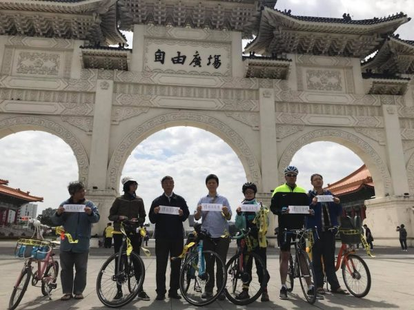

声援被中共抓捕的中国维权律师王全璋、台湾人权工作者李明哲，人权团体8日举办单车巡讲活动，从自由广场起跑。（台权会）

 

海外华人中领馆前举牌声援王全璋李文足夫妇。（来源：社交媒体，大纪元合成图）

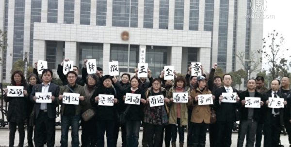

4月5号，大陆维权律师王全璋失踪届满1000天。中共至今数十次拒绝律师会见，对该案不审不判不放。（视频截图）

中国维权律师关注组等团体到中联办抗议，要求中共立即释放王全璋等维权律师及人士。（李逸／大纪元）

责任编辑：高静

<a href=#top><h6 align="right">回上方</h6></a>

<a name=136>
<h1 align="center"><b>桂林官方称城管拆违建被捅殉职 民众质疑</b></h1>

广西桂林市七星区一城管于朝阳乡卫家渡村进行“两违”巡查时与民众发生冲突，被捅伤致死。（视频截图／大纪元合成）

 
【大纪元2018年06月25日讯】（大纪元记者梁欣采访报导）近日，广西桂林市七星区委宣传部发通告称，一城管在对“两违”执法时与民众发生冲突，嫌犯用事先藏在身上的水果刀将其捅伤至死。当地民众质疑，当局说违建就是违建？事件曝出来百姓都知道是怎么回事。

桂林七星区24日发的通报称，23日下午（3时许），七星区综合行政执法局朝阳中队4名城管队员，于朝阳乡卫家渡村进行“两违”违法用地、违法建设巡查，因村民秦某要求归还上午被扣压的施工工具，被城管队员拒绝。

通报中称，城管与群众发生冲突。嫌犯秦某用事先藏匿在身上的水果刀将城管周某捅伤倒地，周某当场死亡。嫌犯已被控制，案件正在进一步侦查中。

记者向朝阳中队核实发生冲突时现场情况，但队长表示，周某没有跟嫌犯发生冲突。“没有、没有、没有……我们这个同事确实是很可惜，因公殉职。我们昨天已经到市里，通过各方媒体已经报导了这个事。后续情况正在调查，公安局具体确认的原因还没有出来，到时候以官方的通知公布。”

朝阳中队人员对大纪元表示：“（周某）是80年（生）的，有一个小孩2岁半，妻子在（当地）西山小学当老师，父母一直在生病；买了一套二手房，应该是借了蛮多钱。”

当被问及因公殉职，局里会给他家里什么帮助时，该名朝阳中队人员支支吾吾难以回答。

朝阳中队人员称：“嗯，这个……我们具体也，呃……就是……因为我是刚来的，这个具体我不知道，要问局里面才知道。”

当地民众对官方目前给出的消息表示质疑。

距卫家渡村不远的七星区民众说：“远？反正也不远。你看它那个方面的（报导）讯息，你相信是城管执法就是城管对吗？我觉得那个东西很有说法的。中国的城管你也知道的，这东西清不清楚，反正也是政府部门说的宣传，政府都是说他们好的。”

“桂林，火车有经过东、南、西、北四个货运站，（卫家渡村）这边都属于郊区，以后会城乡结合，肯定会发展得很快。政府部门要征收地，肯定不给你在上面建东西。老是说违章、违建之类的，搞那东西不就是那回事吗？”

七星区民众还说，希望媒体进入当地实地调查。什么叫违章、违建？这个是地方当局部门做的解释。

“它说你违章就违章、违建就违建，老百姓就是它们砧板上的肉，想怎么砍就怎么砍呗。对不对！这种事情很多城市都有的，到处就是为了这种征田、征地，曝出来事情谁不知道，谁又能说什么？”

事件引起网友们的关注。网友“老顾微评”发帖说，这件事让人想起（去年）发生在江西赣州的明经国伤人致死案。

2017年3月，网络传出的当时60岁的明经国被抓现场视频显示，一脸憨厚的他衣衫褴褛、满头是血，被警察反绑着双手。一名便衣问：“你是不是用镰铲杀死了副乡长？”老人说：“（因为）他欺负我。”

刚过去的6月15日，该案在赣州中院第五审判庭公开开庭审理，尚未传出判决结果。各界对明经国的遭遇表示同情，认为他保护家园无罪，担心其将与河北的贾敬龙一样被判死刑。

另外，专注企业拆迁近10年的北京吴少博律师事务所，总结立法、行政和司法三个方面和违法建筑的关联一文中说，“我（大陆）国立法最严重的弊端是立法者并没有对此给予足够的重视……未将其加入立法议程中。”

“近年来，我（大陆）国拆迁专案的数量和涉及的土地面积非常庞大……但有大量建筑因为历史原因并不完全具备法律要求的各种证件，虽形式上不合法但在实质上是合法的，所以审查的结果势必带来一定的社会矛盾。”

文中还说，造成拆迁矛盾激化的始作俑者多是拆迁方或其相关部门；每一个步骤都可能违法、暗箱操作，都可能在刻意损害被拆迁人的利益。造成的原因主要有：行政机关法治观念的缺失；行政机关为民意识的弱化；（当局）责任追究的不力。

记者截稿前，广西桂林市七星区当局尚未对案件细节提供进一步调查结果。

责任编辑：高静

<a href=#top><h6 align="right">回上方</h6></a>

<a name=135>
<h1 align="center"><b>老兵江苏遭殴 全国老兵涌镇江声援遭拦引抗议</b></h1>

【大纪元2018年06月25日讯】江苏镇江老兵维权遭殴打，引发全国老兵前往镇江声援。当局为阻止老兵维权，在镇江部署大量军警，拦截老兵，引发更多抗议。

赶来江苏镇江声援被打老兵的各地老兵数千人，6月23号凌晨遭到镇压，被当局关押在周边的学校里，并且被要求写悔过书才放人。当局还封锁学校和医院，防止信息传出，并调派大批武装军警进驻镇江，持续拦截老兵。

据了解，来自全国各地老兵连日赶到江苏镇江声援被打伤的数名老兵，23号凌晨，遭到镇压，大批武装军警进驻镇江，仍持续有老兵赶来声援，四川数百名老兵，24号在途中被拦截。25上午，数名安徽老兵被控制在江苏一家宾馆，发生流血事件，一名老兵右手受伤。

安徽退伍老兵李先生：“6月22号我进镇江开始，我感觉到是有渐进的戒严，他不查本地的，专查外地的车牌，外地的人，老兵通通的扣留。刚才我们安徽的战友在江苏被包围，有的已经受伤了。”

23号凌晨，现场数千名老兵遭到镇压后，被关押在周边十多个县市的学校里。并传出数十名老兵被打伤。镇江第一人民医院门前有大批军警把守，禁止探视。

江苏维权人士吴先生：“有的说是两、三千，有的说是五、六千，关到各个学校，学校全部给你封锁，学校里面放干扰器，干扰你的信息的传出，叫你写认罪书，认罪这个非法集会嘛。医院全部封锁住，不给看。好多警车嘛运过去。”

安徽退伍老兵李先生：“放出了一部分战友，各个地方来带回去了，必须要写悔过书，我们有些战友，他们扛住了，没有写。”

四川退伍老兵赵先生透露，这次很多老兵去声援，至少有一万人以上，多数遭到拦截，当局出动的警力是一两万人。

四川退伍老兵赵先生：“很多的公安特警都封锁了所有的车站和那个高速路的路口，到处都封锁了，老兵们进不去。镇江市长和书记，他们是不是有贪污腐这种现象，为什么不出来解决问题，跟大家说一声不就是完了吗？对不对。”

据《民生观察》报导，19号下午，江苏镇江市部分军转老兵到该市政府部门咨询相关政策，被大批警察包围后，冲进来一群不明身份的人打伤多名老兵。20号起，全国各地的退伍老兵纷纷赶往镇江声援。

——转自新唐人

责任编辑：任浩

<a href=#top><h6 align="right">回上方</h6></a>

<a name=134>
<h3 align="center"><b>中共迫害为法轮功学员辩护律师的系列报导之王全璋（一）</b></h3>
<h1 align="center"><b>王全璋3年音讯全无 儿子泉泉：我想你了</b></h1>

中国维权律师王全璋遭抓捕前与妻子李文足和两岁儿子合影。 （李文足推特）

【大纪元2018年06月25日讯】(大纪元记者萧律生综合报导)“爸爸你什么时候回来？我想你了。”5岁的泉泉已经3年没有见到爸爸了，“爸爸长得帅帅的，戴个眼镜的，然后呢，然后就记不住了……”

他的爸爸王全璋（42岁）是著名的维权律师，却在中国大陆被“人间蒸发”1081天，家人聘请的六位律师和亲属均得不到会见，也不知道人是死是活。

他的妈妈李文足29次到大陆最高司法机构（最高法院、最高检察院）进行控告，不是被暴力驱赶，就是被推诿，始终没有王全璋的任何音信；甚至今年4月4日李徒步赴天津寻夫，半道还被国保暴力截回。

每次李文足到天津第一看守所给王全璋寄钱、衣服时，“看着大门缓缓打开，每次来到这里都有冲进去的想法。但是我只能够强忍着这种冲动，站在看守所大门前面，多待一会儿，因为王全璋就在里面，3年了⋯⋯”

王全璋因代理多起法轮功学员等维权案件，2015年7月10日在中共当局全国范围内统一打压律师的行动中被非法抓捕；2016年1月8日被天津市公安局以涉嫌“颠覆国家政权罪”正式逮捕，羁押天津第二看守所；2017年2月，案件起诉至法院，同年7月，代理律师被告知王已被转到天津市第一看守所。截至目前，王全璋一案仍未开庭审理。

其实，在2015年7月之前，王全璋就因替法轮功学员无罪辩护遭到当局多次暴力迫害，如遭上海法官的徐敏芳当庭驱逐；遭遇河北省唐山公安警察的汽车夹击，威胁人身安全等。

2012年8月31日在代理黑龙江省东宁县法轮功学员苗福案时，王全璋因见当事人被东宁县国保大队林晓伟等人酷刑逼供致脑子被打坏、失去记忆，而要求法庭启动非法证据排除程序，却遭到东宁县法官王传发的殴打和谩骂。

2013年4月3日王全璋在江苏靖江市法院，为68岁的法轮功学员朱亚年作无罪辩护时，因庭上递交材料时用手机拍照备查，被法官粗暴对待；隔日，王全璋被以“说话嗓门大”“违反法庭秩序”拘留10天。此事引发256名中国律师联署要求公开现场录像并释放王全璋，全国各地数十位律师、公民赶往靖江市法院，跟当地政府、拘留所交涉，也引起海外媒体的关注报导，3天后王被提前获释。

2014年3月28日，王全璋赴黑龙江省佳木斯市建三江农垦局七星拘留所，为法轮功学员及被迫害律师（其中一位律师被威胁活摘器官）维权时，拘留所警察为逼迫王全璋在保证书上签字，抓住他的头发撞墙，并用拳头猛击他的后脑。

2015年6月18日，在山东聊城法轮功学员杨玉喜一案中，审判长王英军指使法警将王全璋拖出法庭野蛮殴打。王全璋说：“这是我执业生涯中遭遇最黑暗的时刻，曾经接到过电话威胁，要我的胳膊要我的腿，曾经遭遇上门抓捕，汽车碰撞，跟踪，曾经被法官搧耳光，曾经被司法拘留，被扣押电脑手机，这些曾经遭遇的一切，在这一次法院法警们密集的拳头猛烈暴打头部之中，尽显苍白。”

同为维权律师的梁小军曾披露王全璋要代理法轮功学员案件的原因：“他说过，他之所以后来不再做那些普通刑事案件和土地拆迁案件的原因，是他认为法轮功修炼者更需要法律帮助，而受助者群体的善良和诚信则让他更专注于案件的代理。”

而对于律师费，王全璋则说：“对于你们，无论我收多少律师费都显得太多，但为了帮助更多的人，为了可持续的维权，我不得不收费，你们给多少看你们的能力吧。”

如此善良的律师却被中共当局非法关押近3年，曾一度传出王全璋遭受了各种酷刑折磨，其中包括电击，电流的强度可直接令受刑人当场昏厥。

他的妻子李文足在《王全璋，你还活着吗？》一文中说，“⋯⋯我在峭岭家看见苍老的李和平律师，右臂抬不起来、弯腰驼背，我的眼前一下子黑了，全璋，我看不见你了！为什么没有你的丝毫音信？

“我听了这些，我要发疯了：全璋，你以前曾经遭受过这些酷刑，但是你挺过来了。这一次，是不是你已经被酷刑折磨得神志不清了，已经身体残疾了，或者已经不在人世了……”

王全璋妻儿。（大纪元）

3年来，李文足被中共当局严密监控、软禁、拘留、跟踪、恐吓、骚扰、警告、逼迁、约谈，无法自由生活，儿子也无法到幼儿园就读。

不过，还有可以稍稍安慰李文足的是他们的儿子泉泉，他曾说：“爸爸我来保护你，我要用这个来帮你防护，用这个来打败怪兽，救你出去。”#

责任编辑：林琮文

<a href=#top><h6 align="right">回上方</h6></a>

<a name=133>
<h1 align="center"><b>中共为何强行火化他们的遗体？ (2)</b></h1>

从左至右，分别是钱世光、王敏丽、孟金城。（明慧网/大纪元合成图）

【大纪元2018年06月25日讯】2008年9月9日凌晨6时许，甘肃省兰州市龚家湾洗脑班传来一阵忙乱的脚步声。中国石油勘探研究院西北分院高级工程师钱世光的遗体，被用被子裹起来、抬出二楼。很快，钱世光遗体被强行火化；火化时，警察不敢用火葬场的工作人员。

2007年8月8日，吉林省吉林市公安调动100多个警察，通知王敏丽家人——当天火化王敏丽的遗体。

2003年7月，河北省一家医院。孟金城的家人隔着病房门上的玻璃，远远地看，他们只看到了孟金城遗体的后脑勺。随后，孟的遗体被唐山市荷花坑劳教所匆忙火化。

钱世光、王敏丽、孟金城是被中共迫害致死的三位法轮功学员。中共为何要强行火化他们的遗体？

<b>钱世光遗体惨不忍睹</b>

2005年5月27日下午，中国石油勘探研究院高级工程师、法轮功学员钱世光，刚走出住宅小区，被早已等候在那里的兰州市公安局8个警察截住。他们搜走钥匙，打开钱家的门，野蛮抄家，并提着摄像机录像。当晚7点左右，警察给钱世光上酷刑——老虎凳，逼迫其说出和他联系的其它法轮功学员。

钱世光不说，警察继续给其上老虎凳、施以毒打。当晚9时，钱世光被绑架至兰州市龚家湾洗脑班。

钱世光（明慧网）

钱世光，清华学子，因坚持修炼法轮功，曾多次被非法关押、劳教。2002年，钱世光被非法劳教2年，在北京团河劳教所遭受了非人虐待：被扔进小便池子浸泡、被雪埋、腰椎被打断，无法动弹。2003年11月8日被接回家时，只能卧床；通过学法炼功，回家三个月后，钱世光能够走路了。法轮功以“真、善、忍”为原则，包括五套功法动作，祛病健身效果神奇。

2005年9月至2006年1月，钱世光被龚家湾洗脑班关在无暖气的禁闭室里，整整非法关押了4个月。钱世光还被强带“背铐”，数天后，钱世光大小便失禁，胳膊铐伤，左手一直握不住也拿不住东西。

被吊铐放下来时，虚弱之极、伤痕累累的他被扔在阴湿的水泥地上。

监控钱世光的包夹人员多次反映钱世光快不行了，洗脑班警察说，“好着呢”，不予理睬。2008年9月8日晚，监控人员看到钱世光情况十分危险，一夜四次找洗脑班头目反映情况，但对方只是来看看，说声“没事”就走了。

次日凌晨，人们发现钱世光的身体已经冰冷。知情者说，钱世光遗体惨不忍睹，伤痕累累，眼睛外翻，两手全黑……

<b>王敏丽生前被迫害失明 警察不许家人动遗体</b>

王敏丽（明慧网）

2007年3月15日，吉林省吉林市越山路警犬基地。警察用胶带封住王敏丽的嘴，往鼻子里灌芥末油。王敏丽几次昏迷过去。一个警察将一瓶芥末油倒在王敏丽的眼睛里，王敏丽一只眼睛因此失明。警察还将王敏丽的一条腿打折。

王敏丽，原吉林市毛皮厂团委书记，1996年开始修炼法轮功，按“真、善、 忍”为标准要求自己，身心受益，是街坊邻居公认的好人。1999年中共迫害法轮功后，王敏丽多次遭到迫害。

吉林市昌邑公安分局国保大队警察都兴泽曾扬言：“再抓住她（指王敏丽），一定整死她。”

王敏丽这次被绑架后，被转至吉林市看守所非法关押。

王敏丽在吉林市看守所最后一次被非法提审回来后，大小便失禁，每天躺在监室地上打点滴。

2007年6月19日下午两点左右，看守所警察发现王敏丽生命垂危，匆忙将王敏丽送往二二二医院。送医途中，王敏丽含冤离世，年仅45岁。

死后第二天中午，看守所通知家属：王敏丽“突发心脏病”死亡。家属到现场后，看守所不准家属动遗体，不准家属给死者穿入葬衣服，衣服由他们给穿。

家人看到王敏丽遗体：面部表情痛苦，牙齿全部松动、支到嘴外，嘴角留有血迹，遗体旁扔著带有血迹的卫生纸。体重原本120多斤的她看上去只剩60斤左右。

<b>河北孟金城进劳教所当天被毒打致死</b>

2003年7月7日上午10点，河北唐山市荷花坑劳教所。孟金城被当地警察送到这里。

孟金城（明慧网）

孟金城，唐山遵化市堡子店镇旧寨村大法弟子。1996年，开始修炼法轮功。修炼前，他全身疾病，整天躺在炕上，家里很穷，无钱医治，由家人照顾；修炼后，一身疾病痊愈。2002年11月，发放法轮功无辜被迫害的真相材料时，被绑架关押。

在荷花坑劳教所，副大队长王玉林将孟金城带到六队队部登记。警察逼孟金城承认“法轮功是邪教”，孟金城不承认。马上遭到八九个犯人的毒打，参与毒打的犯人包括：黄永新、李海河等人。副大队长王玉林只在门外看了看，就离开了。

在劳教所的班门口，犯人黄永新一脚把他踹了进去，孟金城当时倒在照相用的架子上。孟起身后，他们又把他架到室内东边南墙上。 孟金城几次要晕倒，黄永新便拿吃饭的饭盆，打了一盆凉水，泼在孟的头脸上，之后又让孟金城喝了一点水。孟金城好像有了点精神，又被体罚，头、膝盖顶墙，脚后跟翘起。

此时，孟金城脸无半点血色，黄永新恶狠狠地说：“他要装死，下午我值班时一次整服。”之后，值班人员常福海两次把脑袋从外面伸进来说：“下午还有一顿呢。”

开饭后，犯人们暂停了对孟金城的毒打。黄永新强迫他吃了一个半馒头、半饭盒大头菜，之后坐在后边。孟金城当时脸色灰黄，嘴一直大张著喘气；这时，几人说，孟金城活不了了。

下午4点半，孟金城身体向后晕倒；后被送唐山市工人医院抢救，不治身亡。

犯人李海河告诉黄永新：“孟金城死了。”

黄永新非常害怕，说：“啊！千万别乱咬，咬出谁都跑不了，再说也不是我一个人的事。”

一个警察说，“每年都要死人，上面说追查，哪个队长承担责任了？不还是不了了之吗？”

<b>至少4,226人被迫害致死</b>

据明慧网不完全统计，截至2018年6月24日，包括钱世光、王敏丽、孟金城在内，4,226名法轮功学员被确认迫害致死。这个数字只是冰山一角。

1999年7月20日， 前中共党魁江泽民一意孤行，不顾中共政治局其他6个常委反对，对修炼“真、善、忍”的法轮功群体发起灭绝人性的迫害 。这场迫害时至今日已持续19年了。

在江泽民“打死算自杀”、 “不查尸源，直接火化”等群体灭绝政策的指使下，中共各级看守所、劳教所和监狱警察对不愿放弃修炼的法轮功学员使用了上百种酷刑，包括毒打、电刑、火刑、开水烫、烙铁烙、冰雪埋、“老虎凳”，甚至活摘器官等等。

<b>善恶有报 控告元凶江泽民</b>

将孟金城迫害致死的唐山市荷花坑劳教所的六大队的队长李卫平已遭恶运，2004年3月中旬，他一次拔掉了9颗牙，说话漏风；荷花坑劳教所副所长王勇，2008年5月亦遭恶运，做开颅大手术。

被迫害致死的钱世光是清华学子。据不完全统计，19年来，至少已有80名清华大学校友、法轮功学员遭受非法判刑、劳教、绑架洗脑，刑期最长达13年。1人被迫害致残，6人被迫害致死。

2015年7月10日，来自中国、美国、新西兰、爱尔兰、日本、澳大利亚等五个国家的33名清华大学校友及两位家属、法轮功学员，共35人委托律师同时递交了控告江泽民的刑事控告状。向中国的司法部门控告首恶江泽民，要求对发起迫害法轮功运动的前中共头目江泽民立案侦察、提起公诉。

吉林省王敏丽的姐姐王敏智，也向最高检察院、最高法院提交了控告江泽民的控告书。

（资料来源：明慧网）

文字整理：叶枫，责任编辑：孙芸

<a href=#top><h6 align="right">回上方</h6></a>

<a name=132>
<h1 align="center"><b>近万人聚美首都 多国法轮功学员分享见闻</b></h1>

6月22日上午，法轮功学员在华盛顿纪念碑前的广场集体炼功。（戴兵／大纪元）

【大纪元2018年06月24日讯】（大纪元记者钟元美国华盛顿DC报导）近万名世界各国的部分法轮功学员6月20日至22日齐聚美国首都，参加为期三天的呼吁结束中共迫害法轮功的活动。21日他们参加了华盛顿DC法轮大法修炼心得交流会。记者采访到来自台湾、美国、加拿大、澳大利亚、越南的法轮功学员，分享连日来在美国参加活动的所见所闻。

<b>法轮功学员美国首都集会游行 政要声援</b>

6月20日上午十多位美国国会议员、人权及宗教自由组织代表到场演讲声援，要求中共停止迫害法轮功的暴行。台湾学员李佩蓉表示，听到这么多国会议员、主流人士对法轮大法的关切与对人权的重视，让人非常感动，也很感谢。“我相信在大法弟子的正念坚持，以及正义人士的支持关注下，法轮功被污蔑的沉冤终将昭雪，愈来愈多人知道法轮大法好，这个世界也会更和平善良。”

台湾学员李佩蓉（右）。（钟元／大纪元）

加拿大邱姓女学员说，罗拉巴克（Dana Rohrabacher）议员看到学员现场拉的横幅“共产主义邪灵正在统治我们的世界”及“共产主义终极目的是毁灭人类”﹐他表示非常认同。日前他正式提出932号决议案，声援中国退党大潮，并要求中共立即停止迫害法轮功。邱姓女学员说，美国总统川普对共产主义的邪恶非常清楚，希望罗拉巴克议员有机会碰到习近平时，向习表达他的关注与要求停止迫害。

美国加州国会议员罗拉巴克（Dana Rohrabacher）发起932号决议案，声援中国退党大潮。他表示，法轮功学员是全人类最伟大的英雄。（李莎／大纪元）

原中国建设部官员、加拿大学员陆方表示，他因修炼法轮功遭中共非法迫害，他已向中共最高检察院、最高法院邮寄了控告江泽民的刑事控告书。他说，愈来愈多民众都能感受到社会上的共产主义的东西愈来愈多，就像“共产主义邪灵正在统治我们的世界”一样，“我们在海外提醒人们注意共产主义对社会的破坏，其实学员讲真相就是在共产邪灵毁灭人类的过程中救人。”

加拿大法轮功学员陆方（钟元／大纪元）

陆方在大陆被强制劳教、被国家建设部开除，并在被解除劳教后至2010年2月间仍然受到长达7年的监视、骚扰，甚至被送到洗脑班迫害。他说，这一辈子很庆幸成为法轮大法弟子，在海外跟大陆完全不一样，在自由社会里可以自由表达信仰，弘扬普世的“真、善、忍”理念；而在大陆讲真相事实上都是有压力、有风险的，但在学员坚持不懈的努力下，在大陆明白真相的人愈来愈多。

6月20日，全球部分法轮功学员聚集在美国首府华盛顿DC，举行反迫害集会游行。图为法轮功学员以大型横幅要求中共“停止迫害法轮功”。（戴兵／大纪元）

 

6月20日，全球部分法轮功学员聚集在美国首府华盛顿DC，举行反迫害集会游行。图为法轮功学员以横幅告诉人们“共产主义魔鬼正在统治我们的世界”。（戴兵／大纪元）

 
美国国会山前的大型集会结束后，法轮功学员开始3小时的反迫害大游行。游行路线从国会西边草坪出发，途经宾西法尼亚大道、宪法大道、美国白宫，一直到华盛顿纪念碑前，全程共2.4英里。

开了二十多年飞机的阮俊勇，修炼法轮功后身体状态明显改观，视力比二十多年前还好。资料照。（阮俊勇提供）
资深机长、越南学员阮俊勇表示，法轮功以“真、善、忍”为原则修炼，五套功法让他能量充沛。他从越南过来美国有时差，但只睡了几小时就参加游行，并没有累的感觉。他说，世界各地学员来美国游行，自己在其中也感觉很荣耀。阮俊勇看到路上民众及游客拿法轮功学员发的资料，其中有一位妈妈推著娃娃车，还带一个小孩，有学员给妈妈传单，她的小孩也跑过来拿传单看，他们与大法接上了缘分让他很感动。

2018年6月21日，近万名来自世界各地的部分法轮功学员在华盛顿DC举行修炼心得交流会，法轮功创始人李洪志先生亲临讲法。（戴兵／大纪元）

<b>法轮功创始人讲法 学员备受鼓舞</b>

6月21日，近万名法轮功学员在美国首都华盛顿Capital One体育馆参加“2018年华盛顿DC法轮大法修炼心得交流会”。法轮功创始人李洪志先生莅临现场，为学员讲法与答疑将近2小时。法会上有来自世界各地的十几位中西方学员分享他们按照“真、善、忍”原则修炼的心得体会。

体育运动员、台湾学员刘陈洋受访说，他当棒球投手肩膀韧带受伤，在心情郁闷人生绝望时，有幸得大法，心中的结打开了，没想到修炼不久韧带好了，先天性疾病蚕豆症也好了，而且以前沉迷的电子游戏不玩了，就连暴躁的脾气也都改好了。

刘陈洋表示，听师父讲法提到，在社会道德下滑的滚滚洪流中，大法弟子逆流而上，非常了不起。他觉得师父肯定弟子，让自己很受鼓舞，而听学员在台上的分享，每一位都讲得很精彩，感受大法弟子走的路都是独特的，自己也要紧接着做好，更成熟、理性地完成大法弟子的使命。

台湾学员黄中鹏说，美国波士顿的Diana Lu分享修炼心得，她在哈佛校门口成立真相景点，还组织播放揭露中共活摘器官的真相影片，把法轮大法的真相传至哈佛校区。法会上还有台湾的林孟颖分享做《小乾坤》卡通，在利益面前不说谎反而出现奇迹，这部动画片还在全球荣获56个国际奖项。他表示，法会上台的同修很精进，且正念很强，是大家参考的对象，大法弟子要把救度众生的责任扛起来。

澳大利亚学员麦先生说，“听师父讲法感觉把我们往前又推了一把，作为大法弟子很幸运，承担了历史赋予的责任也很神圣，这次来参加法会找到差距，世人对法轮功态度的改变，需要我们克服困难讲真相，逆流而上修去执着心，要做得更好、更精进。”

美国学员崔晓莲表示，“师父一出现在法会上，自己心里就像明白了一样，有说不出来的感恩，得了大法真的很幸运，但是修炼也很严肃，自己要按照法的标准去做，才能真正地修炼圆满。师父讲法每句话都很触动人，我们同修之间要互相提醒，发现哪儿不足，要下决心修好自己，把执着心都修掉。”

崔晓莲说，她打电话向大陆公安讲真相，“告诉他们大法弟子冒生命危险跟世人讲真相，不是为了自己，而是为了所有的同胞和亲人，不让你们被中共的谎言欺骗，劝他们不要继续跟着中共犯罪。因为迫害法轮功总有被清算的一天，集体犯罪个人承担，中共会把所有责任都推给你，到时候没人替你承担罪责。”她表示，有的公安听明白了，还跟她说：“谢谢你，我知道了。”

6月22日星期五上午，来自台湾、香港、澳门、加拿大、澳洲、纽西兰等地的部分法轮功学员在华盛顿纪念碑前的广场上排出庄严的法轮图形。（Mark Zou／大纪元）

<b>法轮功学员华盛顿纪念碑前大型排字、烛光夜悼</b>

6月22日上午风雨交加，数千名来自台湾、加拿大、澳大利亚、新西兰、香港、澳门等地区的部分法轮功学员，身着黄色、红色、蓝色、白色的服装在华盛顿纪念碑前的广场上排出庄严殊胜的法轮图形。

“或许有许多人会好奇，为什么会在这里排字？”台湾学员胡竣智说，他们想要向世人传递事实的真相，尤其是那些在大陆被谎言蒙蔽的人们，希望他们了解法轮功；所以在场的人风雨无阻排法轮图形，也就是为了告诉全世界“法轮大法好、世界需要真善忍”。

胡竣智的母亲萧纯萍说，参加排字时虽然下着雨，没有带雨衣身体湿透了，但心里是暖热的，因为这个活动让人很感动，已经远远超出一般人的想像，“修炼‘真、善、忍’，师父教我们做好人，在这个行列大家都心平气和，像我获得身心健康，婆媳矛盾都没有了，家庭幸福美满。”她表示，法轮功学员做的每件事情，都要用“真、善、忍”去衡量，“若有更多人走入修炼，将让全世界更美好。”

2018年6月22日晚上，来自世界各地的部分法轮功学员聚集在美国首都华盛顿DC，展开庄严的烛光夜悼活动。（Mark Zou／大纪元）

6月22日晚上，数千名法轮功学员展开庄严的烛光夜悼活动。华盛顿纪念碑前闪烁著点点烛光，他们每年都会悼念为坚持“真、善、忍”原则，而被中共迫害致死的大陆大法弟子，并希望早日停止中共的残酷迫害。

责任编辑：李缘

<a href=#top><h6 align="right">回上方</h6></a>

<a name=131>
<h1 align="center"><b>新疆扩建“集中营” 专家：超出反恐正常范围</b></h1>

【大纪元2018年06月24日讯】中共在新疆扩建“再教育营”，引起学者的持续关注。近日，专家岑茨在接受德媒采访时表示，新疆“再教育营”的规模超出了反恐的正常范围。

据德国之声中文网6月20日报导，欧洲文化与神学学院（European School of Culture and Theology）的研究员阿德里安·岑茨（Adrian Zenz）表示，其对新疆“再教育营”所了解的信息，主要消息基于政府声明，如高级官员来访的通知，甚至包括预算报告，其中记录了有关支出。

阿德里安·岑茨（Adrian Zenz）是中国西藏和新疆地区少数民族政策专家，他做的一项新研究表明，一个由政府建立的在线公开招标系统邀请承包商投标，帮助当局建设和管理这些集中营。为集中营的存在留下了确凿证据。

研究分析了这些政府招商广告，它们涉及新疆各地40多个地区的各种“再教育”设施。报告显示，中共自2016年以来，一直在推动新疆地区各个角落的集中营建设。

其中一项招标是在今年4月27日发布的，这表明，更多的集中营正在建设之中。这些招标涉及共计88万平方英尺（约合8万平米）的场地，其中一些还为准军事安全部队武装警察配备了营地。地方政府还打出广告，招募有犯罪心理学专业知识或军队及警察背景的营地工作人员。

岑茨表示，中共甚至会详细介绍“再教育营”这个系统。比如，它有三层级别的管理：村、乡、政府，或者，关押者会根据案件或问题的严重程度分为四个等级进行处理。

在2014到2016年的官方文件里，相对直白地称赞了“再教育营”。官方也会公开宣布成功率，比如，乌鲁木齐一家党校学术研究报告中就公开说明，该报告对近600人进入“再教育营”前后进行了对比，很多人接受“再教育”后表示意识到自己违反了法律等。岑茨指出，但是分析文件和描述成功案例的消息正在渐渐消失，同时，“再教育营”的招标项目增多了。

对于“再教育营”的关押人数，岑茨给出的底线大约是20万人，但这仅是一个保守的数字。综合基础设施的大量数据，包括多层系统的陈述，工作报告等等，他估计整个新疆地区大约有106万人被关到“再教育营”中。

曾有证人说，在一个5000至6000人的“再教育营”中，人们睡觉的空间非常狭窄。而岑茨等研究者掌握一些关于“再教育营”项目招标中占地规模的信息，包括就寝区的面积。

人们被分为A到D四个等级。问题严重的要在那里待20天，问题较轻一级的，也许4、5天就会被放出来。但在新疆书记陈全国2017年春天上台后，被关在“再教育营”的人数陡然增多，被关押的时间也更长了。三个月内被放出来都是非常罕见的现象。有人被关一年多了，杳无音讯。

岑茨认为，“再教育营”真的是达到了高潮。虽然这种设施西藏地区也有，但是规模完全不比新疆。岑茨指出，中共对“再教育营”的问题上，完全没有回应。“再教育营”超出了正常的反恐范围，特别是在劳教制度正式废除的背景下。

世维会发言人迪里夏提（Dilxat Raxit）近日也向自由亚洲电台证实，被关押进去的人员，必须要接受中共所指定的生活模式，接受政治洗脑，唱《感恩中国》等。关押他们的集中营中，有提供非清真食品的现状。被关押者必须接受中共无神论的教育，还要填写保证书。此外，很多被关押进去的人，外界不知他们的下落。

责任编辑：李新安

<a href=#top><h6 align="right">回上方</h6></a>

<a name=130>
<h1 align="center"><b>美年度报告收录杨玉永案 遭性虐酷刑引关注</b></h1>

【大纪元2018年06月24日讯】美国国务院近日发布2017年度《国际宗教自由报告》，收录了中国天津男子杨玉永（勇）被中共当局迫害致死的案例。报告显示，杨玉永生前遭受的各种折磨令人发指，其中性虐待刑罚让人怒发冲冠，引起国际社会关注。

美国国务院在5月29号发布了2017年度《国际宗教自由报告》，中国再次被列为“特别关注国”。报告特别提及天津法轮功学员杨玉永（勇）被迫害致死的案例。

报告写到：“天津当局在2016年12月逮捕了杨玉永（勇）。据报告，他在押期间遭严重虐待，包括性虐待，13名犯人捏他的生殖器，并咬他的乳头。当被送医时，杨的器官完全衰竭。他的家人报告说，他的遗体浑身瘀青，脚指甲下有竹签的痕迹。”

对此，旅美时事评论员邢天行表示，中共对法轮功学员的迫害极其残酷。随着法轮功学员坚持不懈地讲真相，越来越多的人、包括美国政府中有良知的人都开始关注发生在中国的这场严酷迫害。

旅美时事评论员邢天行：“美国对人权遭受迫害、尤其是中共迫害人权这个事实，关注度是比以前大大上升了。”

2017年7月11号，杨玉永被天津武清看守所迫害致死。为销毁证据，天津有关当局连夜出动特警包围医院抢尸。2018年4月4号，警方将杨玉永的遗体强行火化。当日，天津天气突变，降雪还伴有冰雹。

邢天行：“仅从杨玉永这一个案例就可以看到，这种残酷的迫害是多么的邪恶、流氓。它是动用了历史上所有的那种极其下流、恶毒的手段，来迫害法轮功学员。”

杨玉永的遭遇只是中共残酷迫害法轮功学员的冰山一角。仅就性虐待而言，很多女性法轮功学员都有被剥光衣服、不准使用卫生巾、被暴力打击乳房外阴等遭遇。警察和犯人还对女法轮功学员进行强暴、轮奸，用电棍电击阴部、用牙刷、拖把插入阴道等。

而对男性法轮功学员，中共也有它五花八门的性迫害手法，比如电击生殖器、捏睾丸、用绳子缠扯生殖器、用牙签、针扎生殖器，用牙刷把、笤帚把插肛门，强奸等，恶毒、下流至极。

邢天行：“法轮功学员这个群体所遭受的性的这种酷刑是最严峻的。我想，恶魔才能够用这种所谓想像出来各种各样（的方法）针对人体的性器官去进行酷刑。”

2002年5月，黑龙江法轮功学员王贵金被警察绑架到牡丹江市阳明分局。在这里，王贵金被警察严刑拷打，也遭遇了被狠抓睾丸的性侵害。

黑龙江法轮功学员王贵金：“他用手、伸手过来，直接一下握住了之后，使劲握、使劲捏。他这种掐法就是不管掐不掐碎那种感觉，就是使劲掐，没有留有任何余地。使劲一掐，当时就把我掐昏了。”

早在2012年底，海外《明慧网》就曾发表《中共对男性法轮功学员的性迫害》一文，综述了大量男性法轮功学员遭受非人的性迫害的案例。

例如：上海法轮功学员周斌在提篮桥监狱，生殖器被踢成重伤，睾丸被打坏、僵死。吉林省德惠市法轮功学员张文峰在吉林监狱多次被下迷药、施以性暴力。辽宁大连法轮功学员曲辉在大连教养院，生殖器被电击溃烂，颈椎骨折，最后高位截瘫。

有的监狱、劳教所还把男性法轮功学员的生殖器用绳子扎起来，不让小便，尿积累多了，回流到肾里，最后导致全身浮肿，极其痛苦。

自从1999年中共前党魁江泽民发动对法轮功的迫害以来，国内外对中共暴行的谴责就一直不断。中共残酷迫害法轮功也直接导致中国大陆道德急速堕落、社会乱象层出不穷，中共统治也因此走到了崩溃的边缘。

——转自新唐人

责任编辑：任浩

<a href=#top><h6 align="right">回上方</h6></a>

<a name=129>
<h1 align="center"><b>惠虎宇：法轮功学员反迫害游行释重要信息</b></h1>

6月20日上午，来自世界各地的部分法轮功学员聚集在国会山前，举行集会活动。图为前西安科技大学哲学教师惠虎宇。（惠虎宇提供）

【大纪元2018年06月21日讯】（大纪元记者林南美国华盛顿DC报导）6月20日至22日，近万名来自全球的部分法轮功学员在美国首都华盛顿DC举行集会、游行和烛光夜悼等活动，呼吁各界一起结束中共对法轮功长达19年的迫害。

在20日的盛大游行中，几条醒目的横幅显示出“共产主义的终极目的是毁灭人类”、“共产主义魔鬼正在统治我们的世界”、“回归传统，人类才有出路”、“道德回升，人类才有出路”等信息。

本报记者采访了前西安科技大学哲学教师惠虎宇。他表示，法轮功学员所传递的是重要的信号，在当前共产邪灵统治世界的现实下，人们需要及时觉醒。

记者：如何理解“共产主义的终极目的是毁灭人类”？

惠虎宇：撒旦是《圣经》所记载的恶魔，而人世间的撒旦教，则是以恶魔为崇拜对象，以神为敌人，以破坏神的教诲、毁灭人性和人类为目的的一个邪教组织。

2010年，海外多家中文媒体发布了有关马克思真实历史的大量史料，揭露马克思在大学期间曾经加入了撒旦教。马克思撰写的《共产党宣言》是共产主义的创立宣言，而这本书正是马克思受撒旦教蛊惑、为欺骗人类而撰写的。据史料记载，马克思自己称《共产党宣言》是“粪和污秽之书”。

从这里可以看出，共产主义从创立之初，就是要毁灭人类，这就是共产主义的根本目的。马克思在加入撒旦教后，写了很多污蔑神和诅咒人类的诗歌，在这些诗歌中，马克思诅咒全人类都下地狱。

6月20日，全球部分法轮功学员聚集在美国首府华盛顿DC，举行反迫害集会游行，各界正义人士将到场声援。（李莎／大纪元）

记者：那么你认为共产主义是通过怎样的方式来毁灭人类的？

惠虎宇：我认为，共产主义主要通过毁灭人类的传统文化来达成这一目的。

因为人类所有古老的传统文化都是神传文化，是神留给人类的文明形式。人类所有古老民族都有一个有关自己民族起源的共同传说，那就是神创造了自己的祖先，并给自己的祖先传授了文化。东西方传统的信仰、道德、伦理、哲学、文学、艺术等都来源于神传文化，所有传统的价值观都深深根植于神传文化。这些传统价值观可以让人类保持人之为人应有的道德规范和行为标准，使人类有机缘可以得到神的拯救，而回归天国。

而共产主义要执行撒旦教毁灭人类的使命，首先就要毁灭人类的这种神传文化系统，切断人与神的联系，让人类的行为失去神传文化奠定的价值标准，使人类价值观变异，最后使人类道德堕落到连神都无法救度的程度，那么这样的人类就只能下地狱了。

为了毁灭神传文化，共产主义首先创造出无神论这种假理论，编造出一套假哲学，就是所谓的历史唯物主义，用来解释人类的历史和自然现象。

而共产主义的组织共产党在窃取一个国家的政权后，它所做的最重要的是一件事情就是控制人们的思想，强制灌输无神论和唯物主义，并打击一切非唯物主义的思想，其目的就是为了毁灭人类的神传文化。

所以，共产党的暴政与历史上其它暴政都不一样，其它暴政仅仅只是为了维护政权，而共产党的暴政却是要借助暴力征服一个人的灵魂，它的暴政是为摧毁文化而服务的，像中国发生的文化大革命，就是共产党摧毁神传文化的一个显著的例子。

2018年6月20日，全球部分法轮功学员美国首都华盛顿举行反迫害大游行。（李莎／大纪元）

记者：您怎样理解“共产主义魔鬼正在统治着我们的世界”？

惠虎宇：共产主义表现分两种形态，其一是“共产主义意识形态”，其二是“共产主义实体”，后者包括共产政权以及附属机构和组织。在共产主义意识型态和共产政权之间，人们往往注重了后者，而容易忽视前者的存在。在东欧和苏联的共产党政权相继瓦解后，在共产主义的实体这个层面上，目前只剩下中共、朝鲜、古巴等少数国家，人们往往以为共产主义已经在全球失败了，共产主义的影响正在减弱。其实，这是一种误解。

首先，东欧和苏联共产党政权虽然解体，但是中共却利用世贸组织的漏洞，利用对中国人民的残酷剥削，成为全球第2大经济体，中共利用庞大的经济资源不断渗透世界各国的政府、媒体、社区，输出共产主义意识形态，影响各国的舆论和政策，在美国、澳大利亚、台湾等国家和地区已经构成了巨大的威胁。

其次，美国人正在发现，共产主义的意识形态本身也已经在美国形成了气候，控制了美国的主流媒体、学校教育、影视业、出版等文化和艺术行业，严重扭曲了当代美国人的价值观。

美国作家W‧克里昂‧斯考森（W. Cleon Skousen）于1958年出版的《裸体的共产党人》一书，揭示了共产主义颠覆美国的45个目标，主要通过文化渗透和文化控制来摧毁美国的传统文化，包括渗透教会、诋毁圣经；渗透学校、宣传共产主义和社会主义思想、控制教师工会；渗透媒体、控制媒体的重要岗位，宣传反传统观念，将同性恋、性乱、堕落宣传为正常、自然、健康；渗透艺术领域、占领博物馆、把持影视创作、扭曲文艺理论，宣传低级、丑陋、不伦不类的事物，败坏美国文化，颠覆美国传统的道德观念等。

60年后，今天的美国学者发现，以上这些目标中的绝大部分目前已经基本在美国实现。以上共产主义意识形态下的各种思想表现，已经成为占据美国主流媒体的价值观，被贴上“政治正确”的标签。

当今美国政治派别中的左派和自由派，都已经被共产主义意识形态所控制，成为共产主义邪灵的囊中之物。而根植于神传文化的美国传统价值观则被贴上政治不正确的标签，到处受到所谓主流媒体和舆论的打压。

如果从共产主义意识形态这个层面来讲，当今全球第一和第二大经济体，都已经成为共产邪灵控制的国家，其实欧洲的情况和美国也大同小异。再加上共产主义在澳大利亚、中南美洲、东南亚等地区的渗透，可以说，共产主义邪灵的确正在统治这个世界，这对人类来讲，实在是一个可怕的现实。

2018年6月20日，全球部分法轮功学员美国首都华盛顿举行反迫害大游行。（Mark Zou／大纪元）

记者：您如何看法轮功学员今天在美国华盛顿DC的游行？

惠虎宇：我认为这是在共产主义邪灵统治世界的现实下，当代人类正在觉醒的一个重要信号。

在当代受共产主义影响最深的两个国家──中国和美国，都开始了觉醒的历程，在中国以法轮功学员为代表，在美国则以川普政府为代表。

在当今最大的共产国家，中共政权的统治下，出现了法轮功，这是一个非常了不起的现象。我认为，法轮功是一种根植于五千年中国传统文化的一种佛家修炼体系，他为当代的中国人重建了天人关系，为中国社会恢复了遭到中共毁坏的神传文化体系，使中华儿女们找到了自己的文化根源。

同时，法轮功学员也是当代中国对共产主义本质认识最深刻的一个群体，法轮功学员发布的《九评共产党》、《共产主义终极目的》以及《魔鬼在统治着我们的世界》等系列文章，既揭露共产政权，也揭露共产主义意识形态，推动了当代中国民众认识中共的文化启蒙进程，促进了中华民族整体觉醒的程度，引发了退出中共组织的历史浪潮，也让世界看到了中国人民抛弃中共的巨大民意基础，这使和平解体中共成为一种可能。

另一方面，在美国出现了回归传统的新政府──川普政府，以基督教信仰为核心价值观的美国保守派人士开始主导美国的政治、经济与军事等政策。

川普政府在美国内部对抗所谓政治正确的共产主义变异价值观，开始引导美国社会艰难的回归美国传统文化。在外交政策上，川普政府全面对抗共产主义，将共产主义政权列为美国的战略敌人，近期川普政府正在解除朝鲜的核武装，并对中共的不公平贸易发起反击，使中共的统治受到剧烈的冲击，正在使世界格局出现重大的变化。

今天，法轮功学员在美国首都举行以揭露共产主义邪灵为主题的游行和集会，我觉得是当代历史重要关头的风云际会，这将会促成更多世人的觉醒，同时这次活动的这个主题也会直接传递给川普政府，使川普政府在未来的行动中，可以更坚定的清除共产主义在美国的存在，以及在全球完成帮助共产国家的人民解体共产政权的历史使命。#

2018年6月20日，全球部分法轮功学员美国首都华盛顿举行反迫害大游行。（李莎／大纪元）

责任编辑：高静

<a href=#top><h6 align="right">回上方</h6></a>

<a name=128>
<h1 align="center"><b>2020中共全面监控农村 分析：监控不了民心</b></h1>

 

中共中央政法委开会讨论用于农村的监视器“雪亮工程”进度，积极推动在2020年全面监控农村地区。但分析认为，中共监控的范围越来越广；但监控不了人民的内心世界。(Getty Images)

【大纪元2018年06月23日讯】（大纪元记者梁欣采访报导）近日，中共中央政法委开会讨论用于农村的监视器“雪亮工程”进度，积极推动2020年在农村实现“全域覆盖、全网共享、全时可用、全程可控”目标。分析认为，中共监控的范围越来越广；但监控不了人民的内心世界。

“雪亮工程”被舆论称为是大陆城市影像监控系统“天网工程”农村版。综合媒体报导，不同的是，其监视器可与农民家中的电视或手机连结，以监控周遭，有异状时可立即一键报警；成为全民参与的治安监控平台。

贵州毕节李先生向大纪元表示，摄像头很常见、到处都是。“当局安装摄像头当然是为了监控民众的行动；但它说是为了社会治安、稳定、为了你的安全。摄像头安（装）肯定是为政府（监控）用的，不可能是为百姓（安全）的。”

今年1月，“中央一号文件”正式宣示推进农村“雪亮工程”，以县、乡、村3级综合治理中心为指挥平台，透过监控来掌握群众治安。当局也表示，“雪亮工程”是为了治安。

但大陆民众可不这么想。有网友批评，表面上是用于治安、监视住家是否遭人入侵；但反过来公安亦可“全覆盖”的监控民众；异议、维权人士将成为中共暴力统治打击的目标；甚或让农民当上“眼睛雪亮”的“抓耙子”。

云南巧家县农民杨先生向大纪元表示：“装摄像头是好，但是现在‘法律’是对准老百姓（向着开发商）的。（记者问：是地方当局强征农民土地？）多喔！多～！抗议有什么法子？2013年到现在，还有老百姓关着没出来；还有监外执行的。”

杨先生说，地方当局勾结公检法，百姓无法抵抗！“公检法就是它们的打手啊！动不动就抓人。就是老百姓不接受、不同意、不签字就抓起来，铐起手铐逼你签字。装摄像头？现在法律是对着（对付）老百姓，（对）当官的不起作用，黑得很……”

原河北人民广播电台编辑、自由撰稿人朱欣欣分析，农村的整个社会矛盾比较多，爆发各种集体的、群体抗争越来越多。“雪亮工程”肯定是有用来监控、镇压百姓反抗的目的。“所以我就说，这种监控的设备是掌握在谁的手里？做什么用？这是最关键的。”

先前，中共推出的“天网”监控系统，在各大城市加装能识别人脸的监视器，瞬间可掌握路人的身份；现在推动“雪亮工程”掌控农村。事实上，据中共官媒报导，2003年9月，当局启动电讯监控“金盾工程”，已把大陆96%的人口资讯输入公安部门资料库中。截至2002年，初期工程已花掉64亿人民币。

朱欣欣认为，当局监控的范围越来越广、技术水平越来越提高。但这仅仅是加强社会的控制、在一定范围内压制社会的危机；推迟矛盾、危机的爆发而已；它不可能从根本上保证这个社会的健康和稳定。

“可能在某些程度对某一些人、某个地方、有限的一段时间起作用。当百姓忍无可忍的情况下，这所有的东西都毫无用处，它只是外在的监督人们的行为。它无法改变、不可能消除人们内心的思想和情感。”

朱欣欣表示：“物质手段是外在的、（作用）很有限。最根本的人的行为动力是来自于他的内心世界；外在的东西根本不可能改变（内心）。”

全中国各地都积极建设的“天网工程”，花费从数千万到数亿元不等。目前全中国已装置超过2000万台“天网”摄像头。据财务人员算的一笔账，未来“雪亮工程”在一个县的维护每年即需约6000万人民币。

四川省官方数据，截至去年底，该省已超过14000个村完成“雪亮工程”建设，新设超过4万1千个监视器。截至今年2月，临沂市累计安装36万个监视器，达到目标全覆盖、无缝隙。山东省总计安装公共安全摄录机293万台，建立监控中心近2500个。

中国被称为监控摄像头数量增长最快的国家。已有1.76亿个监控摄像头遍布各地，监视14亿公民的一举一动。

责任编辑：林妍

<a href=#top><h6 align="right">回上方</h6></a>

<a name=127>
<h1 align="center"><b>全国老兵掀维权潮 江苏老兵遭殴伤 全国声援</b></h1>

【大纪元2018年06月23日讯】最近，中国各地老兵掀起维权潮，提出提高待遇等诉求，都遭到镇压。6月19号，又传出江苏镇江多名老兵被打伤，全国各地老兵纷纷赶往镇江声援。20号，现场300名老兵遭到警察驱赶和殴打，9名老兵被抓，目前抗议仍在进行中。

据《民生观察》报导，19号下午，江苏镇江市部分军转老兵到该市政府部门咨询有关军转的相关政策，被大批警察包围，之后突然冲进来一群不明身份年轻人打伤多名老兵，而这群暴徒却跑进了市政府大楼藏起来。

20号，全国各地的退伍老兵赶往镇江声援，当晚，镇江当局派出了大批警车、特警驱赶老兵。21号上午，更多的老兵赶来镇江参加抗议，人数大约有数百人之多，在镇江市政府南广场齐声声讨殴打、驱赶老兵的不法行为。

20号在现场的80岁江苏老兵程先生透露，当天有300人在场声援，警察先动手打人和抓人，双方爆发肢体冲突。

江苏老兵程先生：“天天人很多，当时去的人很多，300个人，9个被打的，都被他抓了去关，就拘留了，派出所警察打的，一个分队长进行打，他当时站在那中间。”

老兵们透露，他们年轻时保家卫国，退伍后，待遇极低，难以养家糊口，还有人是安置不到位，丧失了军人的优越感，为此上访十多年不解决，还经常被打压。

江苏老兵蒋先生：“(待遇)跟普通老百姓比，相对来讲不合理，养老医疗保险这块，不太理想，现在全民医保了，普通的群众，医疗照应都比军人高了，所以不平衡，要维权，地方政府有很多官员都是官僚，你根本见不到。”

报导还说，近期中国各地再掀老兵维权潮，陕西、湖南、河南、江苏、四川等多个地方的老兵，接连聚集在各地的省委或市政府外维权，要求落实待遇，而当局多次派出大批警察到场驱赶镇压。

——转自新唐人

责任编辑：任浩

<a href=#top><h6 align="right">回上方</h6></a>

<a name=126>
<h1 align="center"><b>陆养老保险基金由中央调剂 分析：起步太迟</b></h1>

中共国务院20日公布，建立养老保险基金中央调剂制度，7月1日开始实施。(GREG BAKER/AFP/Getty Images)

【大纪元2018年06月23日讯】（大纪元记者梁欣采访报导）近日，中共国务院公布建立养老保险基金中央调剂制度的《通知》，7月1日开始实施。上缴比例从3%起步，逐步提高，称要确保基本养老金按时足额发放。分析认为，当局早就该采取一盘棋政策，现在才开始太迟了。

国务院《通知》称，建立养老保险中央调剂基金，对各省分养老保险基金进行适度调剂。

《通知》承认中国养老危机日甚，如何从根本上扭转地方的养老保险基金亏空局面以及防止未来出现更恶化的情况，都是非常严峻的问题。

《通知》还称，一要推进统收统支工作。二要确保应收尽收，杜绝违规支出；三指相关工作情况列入省级政府工作责任制考核内容。四是建立监控系统以及全国共用的中央资料库。《通知》强调，事关改革、发展和稳定全域。

时政评论员任中道向大纪元分析，过去一些经济较发达的省分不愿意把自己的钱袋子打开交到中央去、涉及到相应利益的纠葛。“所以中央这次公布很快强制实施，比较突然。”

事实上，中共人社部去年11月底发布的《中国社会保险发展年度报告2016》显示，多个省分养老金告急，13个地区结余已不足支付1年；黑龙江省养老金已被花光，是最严重的省分。而其并非特例，至少7个省养老金出现收不抵支情况。

一些专家、学者过去多年亦呼吁当局进行全国性统筹，但中共当局先是通过强制延迟退休年龄、降低社保费等手段来缓解问题，拖到现在才设置调剂制度。

任中道分析，因为养老基金被贪污、亏空，很多省份收不抵支。

“其次是人口老龄化非常快；三，强制性计划生育政策造成人口结构的扭曲、人口出生率非常低，对应的劳动力人口减少，去年减少5百多万人；四，之前中共实施20年双轨制官员，导致现在这个局面。这就是为什么说危机无解。”

“2014年10月公务人员、机关事业单位人员才开始缴纳养老保险；后来一些人员开始领取（养老金），大概有4千万体制内的人。这样大的亏空要普通百姓去承担。中共就是这样干，让百姓去养那些贪官污吏。”任中道指出。

中国调查记者、《亚洲新闻周刊》总监黄金秋向大纪元分析，全国养老保险金在一开始就应该建立一盘棋，但过去几十年都没有成立；是中国的互联网发展速度不够快吗？是地方当局放在自己手里要怎么用、怎么贪污都可以！社保基金不断被大幅度贪污、挪用，造成越来越大的窟窿。

“社保一旦兑付不出来，那社会就会膨胀的象一个炸弹了。现在中央是意识到解决不好会造成社会动荡。所以可能现在先做一个筹备基金，万一哪个兑付不出来，为了避免民愤、民怨，暂时去调借一下。”

黄金秋进一步分析：“当然建个全国统一数据库，以后谁也不好贪、不好挪用了。反过来说，之所以出台这个东西，肯定是很多地方可能面临已经兑现不了社保基金的问题。它早就应该采取这政策，但是现在才开始太迟了。”

人社部有关负责人近日表示，养老保险基金结余主要集中在广东、北京等地区；辽宁、黑龙江等一些省份出现基金当期收不抵支的情况。如果中央拨付调剂资金下达补贴省分后，养老保险基金还存在缺口，那就只能由地方当局承担。

黄金秋指出了社保制度的一个严重无耻的占用、吞没问题。当局规定若在一个城市没有工作满15年，已缴的社保都是白缴，一分钱拿不回来。中国现在的流动工人、就业人口这么多，企业也得缴社保。

“缴了这么多社保，有几个企业能撑15年？又有几个人能够在一个企业干15年？在一个城市干15年？所以一大笔的社保财富全被他们（官员）贪了、占用了。尽管如此还有那么多的亏空、那么多的可能兑现不了。可以想像这里面的暗箱操作、贪污的空间有多大了。所以这个事情以后会越来越严重。”

在大陆，养老金是一个黑洞可谓众所周知，但水有多深、吸干了多少纳税人的工资，不得而知。据报导，中国职工缴纳养老保险费占比在世界181个国家中排名第一。“五险一金”占工资总额40%至50%。中国养老缴费模式被称为“庞氏骗局”。

责任编辑：林诗远

<a href=#top><h6 align="right">回上方</h6></a>

<a name=125>
<h1 align="center"><b>拒放弃信仰 女经理遭中共用邪术咒语攻击</b></h1>

法轮功学员何志维。（何志维提供）

【大纪元2018年06月22日讯】（大纪元记者易如美国华盛顿DC报导）走在法轮功游行队列里的何志维，健康快乐，让人很难想到她曾遭受过中共多种酷刑的折磨，导致颈椎间盘突出。

何志维今年57岁，广东南海人。1983年从广东中南林学院毕业后由国家分配到广东省珠海市经济特区发展公司担任秘书，1999年，她受聘到珠海市报关公司担任业务部副经理。

“那时，由于业务精通，我曾自己承包报关行，攒下一些钱，事业可谓顺利。丈夫是在海关工作的一位领导，有一个可爱的女儿，生活应该是令很多人羡慕的。”何志维说。

不过，自从生下女儿后，何志维就经常头痛，每次头痛时，头好像要裂开似的难受。为了医好病，一家人到处托关系、找名医，西医、中医、各种偏方，甚至练气功，什么方法都试过了，可是病依旧没有见好。“那时很绝望，头疼时好想撞墙一死了之，脾气也变得很坏。”何志维说。

1997年底，何志维经朋友介绍开始修炼法轮功。“我在海关大院找到了法轮功的炼功点，炼功没几天，头痛没了，脸色红润，人很精神，整个换了个人，多年的顽疾不治而愈。”

何志维说，更重要的是，经过看法轮功的书，明白了做人的真正意义，人也变得开朗，“待人慈善、多考虑别人、做事也不再急躁了，十多年来，‘真、善、忍’成为指导我做人的根本信念。”

何志维修炼后身心的变化，使她的妈妈、姐姐和弟弟都先后走入法轮功的修炼，“弟弟因此去掉了多年的抽烟恶习。”

1999年7月20日，中共前党魁江泽民发起全面镇压法轮功。媒体也随之铺天盖地地造谣诬陷。7月21日，何志维和女儿一起从珠海去了广东省政府上访。

“当时我心中只有一念，我必须站出来为法轮功说几句公道话：法轮功是好的，要为师父讨回公道。”

在广州经历了“禁止上访”和“武警抓人”后，她回到珠海，被单位逼写思想报告。

2000年5月、6月，何志维因向本单位同事讲述自己修炼法轮功受益的事实，并教同事炼功，被珠海市报关公司、公安局及“610”非法送看守所拘留，期间被逼做长达十几个小时的奴工，完不成任务时被罚蹲厕所。

2000年底至2001年，由于“610”不断骚扰，何志维被逼与丈夫离婚，由于拒绝放弃修炼，被开除公职。为了坚持信仰，她两次被迫离开珠海，家里留下年近八旬的母亲和13岁的女儿。

在何志维离家期间，家中被多次抄家抢掠，警察不但抄走了大法的书籍、物件和一部电脑，连何志维妈妈的一本清宣统年间的古董书《声律启蒙》都抢走了。

2002年4月初，何志维在外地被公安非法抓捕，随身的巨额现金及财物也被抢掠一空。之后她被非法劳教一年，关在广东三水妇女劳教所。

在劳教期间，由于坚持“真、善、忍”的信念，遭到高压洗脑，八天七夜通宵不准睡觉、不给大小便。

“妇教所对法轮功学员采用的手段是极其邪恶和令人发指的，他们逼我看污蔑法轮功的录像，甚至将法轮功师父的照片塞进我的内裤里，以达到摧毁我的意志。为防止我睡觉，狱警和他们指使的多名吸毒女子还把我按在地上蹲著，用扯下的头发刺插耳朵和鼻孔。”何志维说。

何志维曾在劳教所的一封信里写道：“我会无怨无悔地坚定地走下去。在劳教所，我也看到了众生的觉醒，那些曾做尽坏事的吸毒女子，当她们了解到我们是好人，都不想参与迫害，觉悟了的人都能善待我们，她们说不愿做伤天害理的事，有的因拒绝参与伤害我，甚至被恶警加期、被用电棍电打，还有些人冒着被严惩的危险帮助我。从这一切可以看到，迫害都是强加的。我会问心无愧地走出这个地方（妇教所）。”

2004年4月，在被非法劳教一年期满后，由于何志维不肯放弃信仰，又被押回珠海洗脑班。10月，洗脑班威胁她说不写悔过书等，永远出不了这门。何志维以绝食抗议拒写悔过书。12月，她又被送往广东省洗脑班加强迫害。

在何志维被非法关押后，警察利用她女儿想念母亲，造谣说炼法轮功的人不要家庭。“恰恰是迫害者把法轮功学员非法关押造成骨肉分离，然后利用人情强迫学员放弃修炼，当学员不肯放弃修炼时，便造谣说学员不要家庭，这是个流氓政权。”何志维说。

2005年6月10日，何志维在持续绝食抗议后走出了洗脑班。由于一直拒绝放弃信仰，她被珠海列为重点迫害对象，对她的迫害并没有放松。她的电话被监听，“610”也经常去她家里骚扰，为避免被迫害，她再一次离开了珠海，流离失所。

2009年4月，何志维再次被珠海“610”绑架，先后被劫持到三水法制学校、湛江法制学校、广州法制学校迫害。在湛江洗脑班里她遭恶徒施酷刑迫害。

“我被扣上手铐，单独关押在一个四壁不透风的屋子里，地上爬著虫子，不给坐，连站着都不准挨墙，用高音喇叭24小时大声放着充斥恐怖声音的音乐，昼夜不准睡觉。接着，又把我弄到一间用鬼神像布置得阴森森的房子，并强迫我对着那个鬼神像，双膝跪在大法经书上。当恶徒迫害时，强制让我站立，8个恶人将我围住，口里念著邪恶的咒语，并用手使阴力，掌推、让我不停的转动，拳击、猛打我的身体和头部，特别是头部，他们用大法书猛击我的头部，最后导致我颈椎间盘突出，造成头部剧痛、头晕，几近精神崩溃。”

据悉，这种迫害方式是海南省的“610”发明的，目的是施用邪术、用邪恶的咒语达到攻心，同时用阴力推击，让受害者处于不停的转动和击打中，特别是头部的猛击，长时间这样折磨以摧毁人的意志，是一种杀人不见血的酷刑。

而受此酷刑的人大脑会迅速充血、缺氧，出现头晕眼花、天旋地转，四肢无力，但仍被击打着，轻者即刻反胃呕吐，头部剧烈疼痛，不能进食；重者昏迷或成植物人，甚至脑充血死亡。

10月，何志维被从湛江转到广州洗脑班，在广州洗脑班里恶徒以何志维炼功、喊口号为借口，对她又实施各种残酷折磨。

“警察把我以炼功的姿势捆绑住手脚绑在一张椅子上，连续捆绑五天，始终不给松绑，吃饭也不松绑，令夹控人员灌食，大、小便被三个人抬到马桶上，不准洗澡，还遭到打骂羞辱。由于身体及屋内散发出恶臭，五天后，停止了这一轮迫害。”

何志维对这次迫害写下申诉书揭露恶徒暴行。“在得知我写了申诉书后，他们又对我实施新一轮迫害。”何志维说。

“大热天长时间不让洗澡和换洗衣服、剥夺睡眠，除了肉体折磨，他们还实施精神摧残：找来八九个人实施批斗会式的夹攻；一张攻击法轮功的光碟，长期不断重复大声播放甚至夜晚也不放过；用宗教洗脑，一张‘地藏经’连续播放一星期，这种车轮式的狂轰滥炸持续了两个多月。”

在这种恶劣的环境下，何志维一直坚定对大法的信念，一方面拒绝接受邪恶的洗脑，一方面仍坚持炼功。

由于何志维一直坚持炼功，恶徒又把她捆绑在束缚椅（一种专门对付精神病人的椅子，吃喝拉睡都在椅子上）上，不给饭吃、五天不给一滴水喝，恶警们为逼她妥协，甚至向她喷辣椒水，罚坐二十一天直至臀部溃烂，才停止了这一轮虐待。

为逼使何志维屈服妥协、不喊口号，恶徒不给她喝水、吃饭，在仅有的一点点饭里还放药，致使她几乎说不出话。最后，在何志维的强烈抗议下，才制止了又一轮的迫害。2010年12月，她走出了洗脑班。

2012年7月初，何志维在上班途中又被珠海市“610”等违法人员绑架至三水法制洗脑班。恶徒为让她放弃信仰，期间两度对她施以剥夺睡眠的酷刑。

“一次五天五夜，另一次九天九夜，导致我颈椎间盘三节突出。他们还甚至扬言要把我女儿抓进来一起洗脑。期间我亲人多次到三水探视，被他们拒绝。”

2013年2月4日，何志维又一次拒绝放弃信仰走出洗脑班。为了避免中共无休止的迫害，四个月后，她带着女儿逃离中国，辗转来到加拿大。

何志维说，她到加拿大后参加了腰鼓队，“我觉得这鼓声能敲醒中国人，唤醒他们的善念与良知，因为在我身边，那些曾做尽坏事的人，当她们明白了真相后，都不想再参与迫害了，都知道了法轮大法好、中共是邪恶。”

责任编辑：李缘

<a href=#top><h6 align="right">回上方</h6></a>

<a name=124>
<h1 align="center"><b>德国跨国公司总监亲身体验法轮大法的美妙</b></h1>

6月20日，Ralf Gronau来华盛顿国会山参加集会游行。（陈怡然／大纪元）

 
【大纪元2018年06月22日讯】（大纪元记者陈怡然美国华盛顿DC报导）6月20日至22日，来自世界各地的近万名法轮功学员，来到美国首都华盛顿，参加大型炼功、集会、游行及烛光夜悼等活动。德国某知名跨国公司全球大客户部总监Ralf Gronau就是人群中的一位。他回想起十七年前与法轮大法结缘的那一幕，依然历历在目。

2001年的那一天，他和太太正在市中心逛街，偶然间，看到一个法轮大法的展台，法轮功学员们正在展示功法，他们就上前询问。因为他的太太之前就看到过法轮功的介绍，他们也因此知道了法轮功正在中国遭受迫害，但是他们不知道在他们的城市就有法轮功炼功点。

几个月后他们看了法轮大法九讲的讲法录像，从此夫妇二人走进了法轮大法的修炼。Ralf Gronau说，“我们开始看九讲的时间特别巧合，那时候，我刚好在第十天有一个国际商务旅行，我可以在出差前看完全部的录像。”

虽然那时候，他们对法轮大法还了解不多，但是炼功后，从小就折磨著Ralf Gronau的肺病却神奇般地康复了。

随着不断深入的学习，Ralf Gronau对法轮大法有了更深入的了解。他说，“法轮大法有很多著作，学习的过程是一段难以用语言表达的美妙旅程。刚刚开始，我有很多疑问，随着我对法轮大法了解的深入，和我自己对修炼的体会加深，慢慢地，我的疑问逐渐获得解答，我在大法中找到了答案。”

正当Ralf Gronau和太太沉浸在学法、炼功的喜悦之中时，Ralf Gronau突然了解到一对夫妇回到中国后，因为修炼法轮功而被关押到劳教所，甚至消失，夫妇两人都感到很难过。Ralf Gronau说，“这是大家必须面对并解决的问题，因为有这么多人正在中国遭受酷刑，甚至面临生命威胁。”

在修炼法轮大法后，Ralf Gronau亲身体验到法轮大法的非同寻常。他说，“这是一个同所有其它功法都不一样的体验，这里的一切都是那么真实，修炼人都那么诚实。我们诚实地面对自己的内心，并且按照‘真、善、忍’的原则做人，我们受益良多。”

Ralf Gronau来自德国，他表示，德国的人对东方的佛家和道家文化了解不多，而共产主义在全世界摧毁了人类的传统文化，只有大法将传统文化展现给了世界，从而引导人类，给予人类希望。对于民众来说，法轮大法的真相无比珍贵。他说，“我们要将法轮大法真相传递到每个人手中，他是街上的陌生人也好，不管他从事什么职业。”

责任编辑：李缘

<a href=#top><h6 align="right">回上方</h6></a>

<a name=123>
<h1 align="center"><b>鲍彤：共产党迫害法轮功 应受全世界谴责</b></h1>

前赵紫阳政治秘书、前中共中央委员鲍彤（大纪元）

【大纪元2018年06月22日讯】（大纪元记者骆亚采访报导）6月20日开始，来自世界各地的近万名法轮功学员聚集美国首府华盛顿，举行为期三天的集会游行系列活动。中共前总书记赵紫阳的政治秘书鲍彤接受大纪元专访时表示，法轮功在中共党魁江泽民的打压下，反而越发壮大。共产党迫害法轮功犯下反人类罪，应该受到全世界谴责。

<b>“4.25”万人和平大上访 鲍彤初闻法轮功</b>

今年85岁高龄的鲍彤这次听闻法轮功在DC举行盛大活动时感慨地表示，法轮功在江泽民的打压下越来越发展壮大。他介绍自己1996年5月“从秦城监狱出狱以后，因为讯息闭塞，孤陋寡闻，还不知道有法轮功，也不知道法轮功是怎么一回事”。鲍彤刑满释放后，也一直生活在软禁中。

据法轮大法明慧网的资料，法轮功由李洪志大师于1992年5月13日开传，当时在吉林省长春市开办首期法轮功学习班。因为法轮功功效显著，通过口耳相传，修炼法轮功的人越来越多。到1999年7月中共江氏集团对法轮功进行镇压时，大陆修炼人数已经达到1亿人。

鲍彤说，自己是1999年4月25日万名法轮功学员和平上访时听说法轮功的，“法轮功在中南海的西门集合，好像是有1万人。那一年我听说，有许许多多人在中南海那里请愿。因为请愿的事儿挺多的，中国的冤假错案多，上访上诉的人多。前所未有的各方面的事情都有，所以就不觉得奇怪。”

<b>朱镕基出面接待解决问题 江泽民大怒</b>

他接着介绍说，当时的中共喉舌《人民日报》尽管封锁新闻或者歪曲新闻，但它有些事情还是要报的。“我记得是第二天或者第三天，我看到《人民日报》报了这件事情，说是法轮功要求政府给他们修炼的自由，不要取缔、不要迫害，也看到了当时的国务院总理朱镕基出来了，好像回答了三条吧！第一条就是说党和政府没有迫害法轮功的意思。第二条呢，希望法轮功呢不要怀疑党和政府的意思，大家能够相安无事嘛，大概就好了。”

根据明慧网资料，1999年4月25日，法轮功万人和平大上访，前往中南海府右街的信访办反映问题，并提出三点要求：“第一，要求公安机关立即放人（释放被抓捕的45名天津法轮功学员）；第二，给法轮功提供宽松的修炼环境；第三，允许出版有关法轮功的书籍。”

鲍彤表示，当时看了中共党媒的报导，“我觉得老百姓有要求、法轮功有要求，就向党中央、向中南海提出，静坐、示威、谈判，我觉得这是很正常的。国务院总理知道老百姓有这个要求，提出来澄清一下事情，把事情平息下去，大家相安无事，那也是挺好的。”

“过一段时间以后，突然说江泽民大怒，好像接着人大常委这个橡皮图章就起作用了，就量身订做通过一个法令，然后接着就是镇压。”

<b>法轮功修炼身心、增进健康</b>

鲍彤强调：“镇压的手段不仅非常卑鄙，而且极端残酷！极端残酷！修炼法轮功有什么罪？修炼法轮功是要取得身心的平衡和健康。法轮功是凭著增进公民身心健康的实际成绩来取得信任、来逐渐扩大的。”

鲍彤表示，当时社会上3千万的下岗工人，这些下岗的工人跟农村里边的农民大部分人都是缺医少药，挂不起号、买不起药、住不起院这样的人，他们要不要生病？不是他们愿意生病，而是他们不得不生病的时候，他们怎么办？光是这样一个现实的问题，就迫使人们要追求一种修身养性的功法，通过锻炼身体、增进健康抵抗疾病。

他强调，就这么一个朴素的愿望就把千千万万的人就吸引过来了。如果法轮功没有作用，人们能信吗？

他引用美国总统林肯的话：“你可以骗几个人，你不能骗千千万万的人；你可能骗一时，你不可能永远骗下去。”

“法轮功之所以有吸引力，是因为法轮功在修炼身心、增进健康、抵抗疾病、促进人民的幸福方面是有他现实的看得见的作用的。能治病这样一件好事情，你要取缔，而且是因为你一个人取缔。我可以这样说，至少朱镕基是不同意的。”

他进一步批中共党魁江泽民说：“因为你江泽民一个人在那儿咬牙切齿，不仅是反对，而且是运用法律手段来反对，这个是很卑鄙的。哪一个国家元首可以为了自己不高兴，自己下命令要立法机构专门为这个事情量身订做来立这个法。”

中共每次对法轮功的打压都是对法轮功的弘扬，法轮功在反迫害十九年中以平和的方式向各界传播真相，在全世界广泛弘扬，深受各国人民的尊敬和爱戴，至今已洪传世界一百多个国家和地区，法轮功书籍被译成四十种语言出版发行，并可在互联网上免费下载。李洪志先生和法轮大法获得各国政府的各类褒奖、支持决议案和信函超过3,000项。

<b>中共才是最大的邪教</b>

鲍彤表示，“后来事情就多了，说是法轮功有人要自杀，所以法轮功是‘邪教’，后来揭露出来是他们（中共）制造（法轮功）自杀的假新闻。”

1999年7月20日中共江泽民集团利用中共庞大国家机器对法轮功开足马力进行疯狂打压，江泽民并叫嚣“三个月内消灭法轮功”，但未能得逞。眼看这场对法轮功的镇压很难继续下去， 中共炮制了天安门自焚伪案，于2001年1月23日（大年三十）上演。此案一直被国际社会认为是中共制造的一场世纪骗局。新唐人电视台2002年1月制作的分析天安门自焚伪案的影片《伪火》，获第51届哥伦布国际电影电视节荣誉奖。

就自杀这种现象来说，鲍彤强调这是一种社会悲剧，在任何一个社会里边都会产生的。“如果说自杀人数越多就越是邪教的话，我说第一个邪教就是共产党。共产党高层从政治局委员高岗开始，一直到下面，有多少人自杀？！AB团的时候、红军打土豪分田地的时候就有人自杀，直到文化大革命多少人自杀？！成批地自杀，我说共产党你就是最大的邪教，它本身就应该清理自己。”

鲍彤还痛批中共说：“根本就是岂有此理嘛！哪有这样的道理。欺骗、威胁、迫害，只要是法轮功就抓，抓起来就关起来，关起来就经历各种刑罚、酷刑，一直到活摘器官，那简直是暗无天日啊！都到了这个程度。”

鲍彤强调：“所以我觉得共产党迫害法轮功这是一个反人类罪，法轮功反对共产党的迫害这是正义的；共产党反人类罪应该受到全世界的谴责，法轮功反对共产党的迫害应该受到全人类的支持。”

<b>凡是活摘器官的人、党、政府都应接受审判</b>

2015年5月以来，中国大陆法轮功学员发起了控告江泽民的大潮，各地法轮功修炼者和家人纷纷把控告元凶江泽民的刑事控告状邮寄给中共最高检察院，要求最高检察院向最高法院对江泽民提出公诉，把这个反人类的首恶绳之以法。同年的年底，明慧网就已收到逾20万法轮功学员及家属递交给中共最高检察院、法院的实名诉讼状副本。

鲍彤此前曾在人权日时表示，大陆的法院要有担当、敢受理诉江案，这个事情应该重视、应该进入法律程序，并希望这些事情最后有一个结果。

中共活摘器官罪行令鲍彤极其震惊，他曾表示这是天地不容的，并说：“凡是活摘器官的人、活摘器官的党、活摘器官的政府都应该受到人类的谴责，都应该站到历史的审判台上成为被告，接受审判。”

责任编辑：林琮文

<a href=#top><h6 align="right">回上方</h6></a>

<a name=122>
<h1 align="center"><b>西班牙诉江第一人的大法奇缘</b></h1>

西班牙诉江第一人Carlos Iglesias律师。（李莎／大纪元）

【大纪元2018年06月22日讯】（大纪元记者陈怡然美国华盛顿DC报导）6月20日清晨，美国首都华盛顿国会山西边草坪上，一群身着印有“法轮大法”字样黄色衣衫的人群，伴随着悠扬的音乐声，舒缓地演炼著功法，气势宏大却又宁静祥和的场景，引得国会附近的众多行人纷纷驻足，频频赞叹和探询。在这群肤色、年龄、国家民族各异的炼功人士当中，一位中年男士看起来平和、自信，他就是西班牙诉江第一人Carlos Iglesias。他有一个不平凡的故事。

2009年西班牙国家法庭做出“划时代意义”的裁决：以“群体灭绝罪”及“酷刑罪”起诉包括中共前党魁江泽民在内的五名迫害法轮功的中共高官，并于2013年向江泽民等五人发出逮捕令。诉江案这一历史性的进展，离不开被称为西班牙起诉江泽民第一人、大律师Carlos Iglesias的努力。

来自西班牙的著名人权律师Carlos Iglesias早在2003年就曾代表七位法轮功学员在西班牙以“群体灭绝罪”和“酷刑罪”状告江泽民、罗干、薄熙来等五名迫害法轮功的元凶。该案件于2007年11月28日被西班牙国家法院正式接受，并进行调查。2009年11月西班牙国家法院做出裁定，决定起诉江泽民等五名迫害法轮功的元凶。

不过，对于Carlos Iglesias而言，成功起诉中共前党魁，却丝毫减轻不了他对于中共迫害法轮功这一正在发生的当代最严重的群体灭绝罪恶的追查、制止的责任和紧迫感。他曾经说过：“活体摘取人体器官，施行者必须面临司法的审判。”“我觉得全世界都应该知道他们的罪行，必须将这些罪犯绳之于法！”

亲身体验到法轮大法的美好的Carlos Iglesias认为，他应当用他最大的意志力，来为法轮功赢得司法正义。他向记者讲述了他修炼法轮功的故事。

2002年对于Carlos Iglesias来说，是终生难忘的一年，在这一年他有幸遇到了法轮大法，开启了他崭新的人生。回忆当初走进大法的那一刻，他的心中充满着喜悦。

那一天他参加了一个名为“Biocultura”的健康活动，这是当地的一个重要活动，在这个活动上有丰富多样的健康食品，也有各式各样的理疗和气功展台。有一个展台一下子就吸引住了Carlos Iglesias的脚步，他说，“我看到有人在展示功法，我感到他们是那么的祥和与平静，他们脸上露出喜悦，而炼功音乐是那么美妙，我停下来，一边听一边看，我完全被吸引住了。”

功法展示结束后，有人告诉Carlos Iglesias，他们展示的功法叫“法轮大法”，这是一个教人向善、做好人的功法，并且邀请他同他们一起炼功，就这样他走进了法轮大法修炼。

当时的Carlos Iglesias虽然已经是一名业内资深的大律师，但是他生活得并不开心。他说，“有两三年的时间，我一直情绪低落，没有力气，每天都很累，也不开心。”

“但是从我第一次开始炼功，我就感受到了非常强大的能量，我相信法轮大法一定是一个与众不同的功法，我想要了解更多，我想要改变生活现状，成为一个真正的好人。”

除了炼功，法轮功学员还向他介绍了法轮大法主要著作《转法轮》，他两天内一口气读完了《转法轮》后，就再也放不下这本书了。他说，“《转法轮》开阔了我的视野和思路，我感到非常强大的能量，虽然当时我还不知道这种能量来自于我读的这本奇书。”

随后他参加了法轮大法在当地的九天学法班，从那一刻开始，Carlos Iglesias的每一天都是充实而充满着喜悦的，他感受到从未有过的美好。在持续的炼功和阅读法轮大法著作的过程中，他发现法轮功不仅有益于健康，而且是真正的修炼功法。

中共江氏集团从1999年7月开始对中国大陆的法轮功学员开始了疯狂的迫害，Carlos Iglesias在亲身体验了法轮功对身心的巨大益处后，身为一名律师，他深感自己责任重大，他联系其他律师，告知他们法轮功被迫害的真相，呼吁更多的人一起共同支持法轮功。

他说，“法轮大法义务教功，不收钱不收物，让上亿的人成为好人，却在中国有上千万的人正在遭受折磨和杀害，这是我们无法接受的。”

Carlos Iglesias还表示，共产主义正在侵蚀著整个世界，它反自然、漠视生命；而法轮功教人做好人、唤醒人类良知和恢复传统文化，同共产主义的邪恶本质是相反的。在向世界呼吁停止迫害法轮功的过程中，他逐渐认识到共产主义的本质和对世界的危害。他也更加明白了为什么法轮功在全世界洪传，却在中国大陆遭受如此邪恶的迫害，正是因为法轮大法带给人类美好和希望，而共产主义的真正目的却是毁灭人类。他说，“对法轮功的迫害，是从未有过的最大的邪恶镇压。”

6月20日，Carlos Iglesias来到华盛顿国会山参加集会游行，他希望告诉全世界，法轮功正在中国遭受着迫害，而这场迫害已经持续了十九年，必须立即停止，他说，“成千上万的人还在面临着被杀害，国际社会各国政府有责任伸出援手帮助他们，停止这场迫害。”

同时他正在同更多的律师合作，推进全球起诉江泽民，惩治迫害法轮功的元凶。

Carlos Iglesias说，“我会将我要做的事情持续下去，我要告诉人们，法轮大法教人们成为真正的好人，给予人们更美好的未来，也让人们知道真正的传统文化。”

责任编辑：李缘

<a href=#top><h6 align="right">回上方</h6></a>

<a name=121>
<h1 align="center"><b>美国万人法会 法轮功创始人李洪志先生讲法</b></h1>

【大纪元2018年06月21日讯】（大纪元记者亦平美国华盛顿DC报导）近万名法轮功学员6月21日在美国首都召开“2018年华盛顿DC法轮大法修炼心得交流会”。法轮功创始人李洪志先生莅临现场，讲法答疑将近2小时。

下午1:56，全场起立，掌声雷动，近万人的目光热切地注视着主席台，李洪志先生走上讲台，向大家问好，众弟子齐声回应：“师父好！”

李洪志先生表示，在社会道德下滑的滚滚洪流中，大法弟子逆流而上，特别是中国大陆大法弟子在受污染的环境中能正念对待，做好大法弟子的事情，非常了不起。

李洪志先生讲述了“修炼”的真正涵义，期望大法弟子不要懈怠，走好修炼之路。

这次会议在市中心的Capital One Arena室内体育场召开，来自56个国家和地区的部分法轮功学员近万人与会。

法轮功，也称“法轮大法”，是由李洪志先生于1992年5月传出的佛家修炼功法，以宇宙最高特性“真、善、忍”为指导；到目前为止，在世界120多个国家和地区洪传，受到各族裔民众的喜爱。

法会上来自美国纽约、波士顿、佛罗里达、华盛顿特区以及加拿大、台湾、香港等地的十几位中西方法轮功学员分享了他们按照“真、善、忍”原则修炼后境界升华的心路历程，以及向人们讲清法轮功真相的心得体会。现场提供十几种语言的同声翻译，近万名法轮功学员静心聆听每一位发言者的交流。

 

2018年6月21日，近万名来自世界各地的部分法轮功学员在华盛顿DC举行修炼心得交流会，法轮功创始人李洪志先生亲临讲法。（戴兵／大纪元）

2018年6月21日，近万名来自世界各地的部分法轮功学员在华盛顿DC举行修炼心得交流会，法轮功创始人李洪志先生亲临讲法。（戴兵／大纪元）

<b>“真善忍正是我一直在找寻的”</b>

法轮功学员保罗·格瑞尼（Paul Greaney）现场发言。（戴兵／大纪元）

今年二十八岁的保罗·格瑞尼（Paul Greaney）四年前开始修炼法轮大法。

他说：“一天我漫无目的地走过旧金山的中国城，一位二十出头的华裔女士微笑着给了我两份传单：一份介绍法轮大法，另一份是关于中共摘取法轮功学员器官的暴行。”“当我看到传单里金色的‘真善忍’三个字和法轮功功法后，我知道这正是我一直在找寻的。”

保罗回家后就开始跟着网上师父的教学录像学起了法轮功，并迫不急待地开始阅读《转法轮》。“那时候我不能说我理解了师父书中所讲的，但是我相信他说的每一个字。我知道他所说的都是真实的，而且可以做到。那种下意识的兴奋感真是如梦一般。”

修炼后，他抛弃了所有的坏习惯，师父开始给他净化身体。“我觉得像一个全新的人，我充满了对师父的感恩，兴奋地加入到正法时期大法弟子的行列中来了。”格瑞尼说。

<b>把法轮大法的真相传至哈佛校区</b>

来自美国波士顿的Diana Lu于2005年开始修炼大法，她在繁忙的工作之余经常给大陆民众打电话讲真相，后来意识到应该利用自己的专长，帮助更多美国主流社会的人士了解法轮功真相。

她开辟了哈佛广场讲真相点，从此哈佛校门口成了一个一年四季长期的真相景点。2017年7·20，她组织了在哈佛广场的反迫害集会，这次活动中接触到的电视台编导、公司高管、哈佛学生学者、大陆民众和各国游客了解了真相。后来她尝试联系哈佛广场的独立影院揭露中共活摘器官的真相影片，在可容纳100多人的剧场坐了八九十名观众，其中有医生、学术精英、人权机构组织成员、电影制作人、高校学生，还有来自中国大陆的留学生。

她说，期间从不确定、惶恐、孤独到坚定、坦荡，无畏地去面对，直到出人意料的结果，这个过程让自己真真切切的感受修炼的升华和法的伟大。

<b>世界五百强公司职员：大法给了我新生</b>

来自美国纽约的法轮功学员本杰明·马洛尼（Benjamin Maloney）现场发言。（戴兵／大纪元）

来自美国纽约的本杰明·马洛尼（Benjamin Maloney）在青少年时染上不良生活习惯。2008年，他因为醉酒驾驶第二次被逮捕后的几个月，他的一位表亲向他介绍了法轮大法。他开始炼功并阅读《转法轮》。

马洛尼说：“当我开始尝试按照真、善、忍的标准生活的时候，我的整个人生发生了变化。我再也没有喝过酒了。我的GPA成绩翻了一倍，从一所在美国享有盛名的文理学院以全年级顶尖的成绩毕业。刚一毕业，我就在一个世界五百强公司找到了一个大家都向往的职位。”

马洛尼对大法心存感恩：“大法给了我新生，把我从一个跌跌撞撞、醉醺醺的少年，变成了一个让社会、父母和我自己能为之骄傲的、有用的成年人。”

<b>敞开心扉 让人们获得了解法轮大法的机缘</b>

法轮功学员凯瑟琳·考贝思（Katherine Combes）现场发言。（戴兵／大纪元）

 
凯瑟琳·考贝思（Katherine Combes）来自美国地广人稀的蒙大拿州，她是当地唯一的一名法轮功学员。

凯瑟琳分享了长期坚持给国会议员办公室及州议员寄送真相资料、发邮件，让他们即时了解有关法轮大法的最新进展，并邀请他们参加大法活动的一些经历。她给蒙大拿州的各个报纸编辑写信投稿，她的稿件被发表在一些大报上，通过这种方式让人们了解大法真相。她经常在当地的健康展和社区活动上洪法，有一次她一个人从早到晚一连五天洪法、教功。这些年来，她坚持每周在炼功点上教功，让人们获得了解法轮大法的机缘。

凯瑟琳说：“以前，当人们还不了解我们的时候，他们用异样的眼光看着我。然而这么多年过来了，情况改变了，人们知道了法轮功是个好功法，从而变成支持者。这就是我一直坚持在社区洪法的回报。”

<b>放弃安逸生活 来纽约曼哈顿发送报纸</b>

来自纽约的法轮功学员洛曼‧巴尔马科夫（Roman Balmakov）现场发言。（戴兵／大纪元）

洛曼‧巴尔马科夫（Roman Balmakov）分享了他在英文大纪元工作中的心得体会。

洛曼六年前加入英文大纪元，承担起最苦最累的报纸发行工作。他每天从早上3点半开始，骑着自行车，背着60磅的报纸，在纽约市内穿梭，覆盖曼哈顿方圆10英里的范围，不管是下雨还是晴天，一周五天，只有两个全职人员，每天要在曼哈顿发送5000份报纸。

洛曼说：“一个冬日，天下着冻雨，我早上4点把报纸送到报箱，浑身又湿又累，手也被金属报箱锐利的边划破了，但我并不觉得苦，我知道这是在救度众生。”

他还分享了自己亲身体验的一个神奇经历。“有一次我正在城里送报纸的时候，感觉状态很好，突然间，我的意识膨胀得很大，我能一边环绕地球行走，一边送报纸，同时感觉自己升上天空，从40英里外的高空俯视地上的自己。整整半个小时，我都处于这个神奇的状态中，我能在纽约市内行走，同时又能在高空俯瞰人世间。我能看到德与业的关系、善恶有报的因果，以及我走在城市里，发送金光闪闪救人的报纸是多么正。”

他说，描述这个状态很不容易，但能拥有这个经历，是因为自己学法扎实，并用“真、善、忍”来衡量自己哪怕是最细微的想法。

“可以改变世界的人”

来自台湾的法轮功学员林孟颖现场发言。（戴兵／大纪元）

来自台湾的林孟颖从头起步学做卡通片，因为卡通是7至12岁的孩子们最喜欢看的，通过这样的方式也能让孩子们了解法轮大法的真相。

林孟颖说：“我非常外行，快50岁才第一次听到世界最著名的动画公司‘皮克斯’的名字，为了弥补专业的空白，我会熬夜看大量的卡通，阅读各国历史、产业趋势，参加讲座并和常人动画公司做朋友，了解这行业的生态环境。”

“因为想把补习班动画师的话听懂并且背下来，所以上课时我会录影，每次三个小时的课程，回家后会用四小时来复习影片和做笔记。因为时常发现自己和动画专业差距很大，不知如何迎头赶上，所以在课堂上常常难过得偷偷擦眼泪。虽然每上一次课就被打败一次，但是幸好修炼了法轮大法，让自己遇到困难和挫折时变得越来越坚强，每次被打趴后，还是都能够站起来。”

目前，她制作的动画片已在全球荣获56个国际奖项，入围了五大洲40个国家影展，包括香港，得到了来自各国评委的好评。许多国家的评审对影片发表感言，他们不认为这只是一个儿童节目，而是可以影响国家、民族，甚至改变世界的影片。美国有个影展创始人对于参赛那年没给这部动画片奖项耿耿于怀，在隔年特别邀请他们去好莱坞，接受影展颁发的最高荣誉奖，那位影展创始人说：“这个奖要颁给可以改变世界的人。”

<b>年少得法 传递真诚和善良</b>

来自美国佛罗里达的大法弟子周先生1999年初在中国大陆上小学的时候得法。2002年，他意识到应该让身边的同学老师了解法轮大法真相。

从那时开始，他克服怕心，逐渐地向周围的朋友、同学和老师面对面讲真相了。一次他在政治课的课堂上给老师和全班同学讲真相，从此以后，政治课上老师再也没有讲过诬蔑大法的内容，试卷上也没再出现相关的内容。

后来出国读书，在佛罗里达向当地政要讲真相中发现，不需要刻意去改变自己，只需要按照修炼人的标准做就可以了，在这样一个复杂的社会，真诚和善良往往是最能打动人心的，自己的一言一行别人都看在心里。抱着这样一颗纯净的心，他让很多政要了解了真相。

<b>在做媒体中升华与救度众生</b>

来自香港的法轮功学员梁燕现场发言。（戴兵／大纪元）

来自香港的梁燕1997年得法，至今已经修炼了20多年，做媒体记者10年了。

梁燕在交流中说，早年做记者的时候，四处碰壁，没有消息来源，到了活动现场，有人用手遮挡她的相机，不准她拍照，市民或受访者拒绝采访，有时还受到其它媒体的排挤和孤立，只因为她是法轮功学员办的媒体的记者。

这对于性格保守、不擅交际、胆子又小的梁燕来说，真是难上加难。面对这些情况，有时会觉得很苦、很累、沮丧，甚至想过放弃到第一线采访。

后来静心学法时悟到，眼下面对的一切，都是因为世人在不明真相情况下的表现。自己是修炼人，不是应该提高心性吗？怎么能跟常人去计较呢？于是她沉住气，顶着压力，放下自我，又一次次背上采访的背囊，走出去采访。

她不断提升专业水平，同时在点点滴滴中和民众拉近距离，愿意付出自己的时间和他们沟通，和民众的信任也一步步建立起来。由此，她有机会跟他们讲法轮大法的真相，让他们看到修炼人的真诚、坦荡、直率，修炼真、善、忍体现出来的精神面貌，从而转变了他们对法轮功和大法弟子的态度。

现在其它媒体在走下坡路，法轮功学员办的媒体日益兴旺。她和媒体的很多记者成为朋友，大家互相分享消息来源，很多人还主动声援法轮功。

<b>坚持背法 正信弥坚</b>

来自亚特兰大的法轮功学员刘跃龙现场发言。（戴兵／大纪元）

来自亚特兰大的刘跃龙1990年来美国留学，攻读学位，进入大公司上班，按步就班地实现了自己的美国梦。

2011年6月全家回大陆探亲，二姐因发送法轮功真相资料被判刑三年，刚从中共黑狱出来，他看到她房间的一本《转法轮》，手不释卷，一口气看完，多年来沉积在心里的人生疑惑一一得到了解答，他一下子明白了人生的真正目的和生命的意义，那是一种久违的、内心深处无以言表的欣喜，是一种迷茫中重获新生的感恩和喜悦。

他用了一年半时间把《转法轮》背下来，他说，这个过程为自己今后坚持实修、跟民众讲清真相，打下了良好的基础。

他说：“在大法中修炼转眼间已有七年了，回首这段修炼历程，我内心充满了对师父、对大法的无限感恩和敬仰。”

<b>孩子在净土般学校就读的收获</b>

来自加拿大多伦多的法轮功学员张莹莹现场发言。（戴兵／大纪元）

来自加拿大多伦多的张莹莹交流了儿子在纽约米德尔敦（Middletown）一所大法弟子开办的学校就读的收获。

她说，两年前儿子准备读10年级时，她发现学校里的孩子们都开始交男女朋友，而像儿子没有女朋友就被视为不正常，她为不知怎么跟孩子解释而着急。更让她困惑的是，同学们放学都回家关在房间里玩游戏和电脑，没有人跟她的儿子在外面打球了。

正在她不知所措时，纽约米德尔顿中学开始招生，这是以品德教育为主而创办的学校。老师们每天都苦口婆心地教育孩子们什么是好、什么是坏，什么可以做、什么不可以做。老师用心管每一个学生，正面引导他们。一个月的时间，孩子把沉迷于上网的瘾彻底戒掉了。每次放假回家，她都能发现儿子的变化，孩子变得真诚，越来越关心别人。

她发自内心的感谢所有为这所学校付出的师生、员工、义工，因为有了他们的辛勤付出和无私奉献，孩子们才能在这个修炼环境里成长。

责任编辑：李缘、张宪义

<a href=#top><h6 align="right">回上方</h6></a>

<a name=120>
<h1 align="center"><b>法轮功学员的抗争是中国的希望所在</b></h1>
 <h3 align="center"><b>中共迫害为法轮功学员辩护律师的系列报导之文东海（二）</b></h3>

维权律师文东海。（大纪元）

作者：文东海

【大纪元2018年06月20日讯】（大纪元记者萧律生采访报导）人都有恐惧，不过他在这群人身上发现他们已经克服了恐惧。

70年代出生的湖南律师文东海，在接触法轮功学员后，得出了上面的结论，这是他在任何一个群体中都没看到的。

这更坚定了他要为被中共长期污名化的法轮功群体辩护的决心。由于中共的打压，如今他已经无法再从事律师职业，虽然没想到会这么快遭到如此残酷的打压，但是他并不后悔自己当初选择了走当维权律师这条路。

“在中国大陆追求公平正义，不可避免会付出一些代价”，文东海说，“我也希望每一个中国人都能够做好准备，这个过程中，受到无缘无故的迫害，恐慌、恐惧没有用。”

就像维权律师们的律师证被吊销一样，是完全没有道理的吊销，“但你要去面对，去调整心态，怎样更好地做一些事情，为这个社会做一些更有意义的事情。”

文东海表示，法轮功学员做到了。作为信仰群体，他们的精神世界很丰富，面对打压，没有那么强烈的恐惧；法轮功学员中更多的人克服了恐惧；“他们为了追求公平对待，宁愿选择曲折道路，也不愿意妥协认罪。就一个群体而言，修炼到一定程度，克服了恐惧。”

他对法轮功学员的这一特点很是赞同：“一直秉持合乎法律规定的抗争，这正是中国的希望所在，中国普通老百姓都会经历的过程。”

<b>文东海：我们的辩护在改变着周围人对法轮功的看法</b>

虽然目前大陆的法律犹如一纸空文，但是文东海认为律师们为法轮功学员的辩护还是需要的，而且是必须的、有意义的。尤其是面对被中共系统性污名化后的现状，以及法轮功学员因此生存环境更严峻的情况下，“一个律师敢于站出来，不顾一切维护当事人的权利，就会影响到公检法的人。”

文东海表示，很多的法轮功学员被抓，都是因为被普通老百姓举报，而导致民众会这么做的根源是中共控制的电视台、电台、报纸等媒体十恶不赦的宣传。

“中共的宣传给这些人脑子留下了固定印象”，文东海说，“发几张资料，看都没看就说是有危害。但因为他们的举报，就会导致法轮功学员家破人亡。污名化严重压缩了法轮功学员的生存环境。”

他认为，正义律师在法庭上帮助法轮功学员做辩护，从法轮功学员朴素的品性、人性的角度去讲解，还是会改变律师圈子、亲朋好友对法轮功的看法，明白法轮功群体是做好事还是坏事。

文东海说，“我的态度摆在那里”，用公检法、当事人亲属都能听得懂的法律语言，从法律、人性出发，来影响“我身边的人和公检法的人”。虽然对于个案的作用微乎其微，但是“坚持不懈的辩护，还是会影响社会群体的心理，尤其当正义律师成为公众人物时，更会改变社会对法轮功群体的看法”。

<b>中共以法轮功案件打压律师们</b>

从去年下半年至今，中共司法当局不断持续迫害帮助法轮功学员辩护的维权律师及律师事务所。

2017年11月2日，山东律师祝圣武被吊销执照；2018年1月中旬，北京律师余文生被注销执照；2月11日，北京程海律师所在的北京悟天律师事务所被强制注销；2月12日，广东维权律师隋牧青被正式吊销执照；3月5日，北京锋锐律师事务所执业证被强行吊销；北京律师谢燕益、北京律师李和平分别于5月16、17日拟被吊照听证会召开；5月19日，广西百举鸣律师事务所被强行解散；

5月26日，湖南司法厅发出公告，称文东海无故不参加听证，终止对拟吊销律师证听证会，并将继续对他作出吊照行政处罚。

文东海认为中共当局之所以以代理法轮功学员案件“处理”律师，主要因为法轮功被持续污名化很多年、很严重，国人被长期洗脑宣传，对法轮功不好的印象很深刻，“跟法轮功有关系的人很容易被另眼看待，律师去辩护，最容易被拿来妖魔化和打压。”

由于当局的迫害打压，文东海目前只得从事一些非辩护的法律方面的工作。“要养家糊口啊，抱怨也是没有用，只能把影响降到最低程度。”

责任编辑：林琮文

<a href=#top><h6 align="right">回上方</h6></a>

<a name=119>
<h1 align="center"><b>中共迫害致家破难圆 孩子十年不敢认妈妈</b></h1>

法轮功学员王玉光。（陈虎／大纪元）

【大纪元2018年06月18日讯】（大纪元记者易如美国华盛顿DC报导）6月20日，法轮功反迫害、解体中共大型集会游行在美国首都华盛顿拉开序幕。来自全世界各地近万名部分法轮功学员聚集在美国国会山庄前的草坪上，他们希望通过这个活动让更多的人了解法轮功在中国迫害的真相，几年前辗转来到美国纽约的黑龙江哈尔滨法轮功学员王玉光也参加了集会，她想以自己亲身受迫害的经历来唤醒国人，共同呼吁结束这场对亿万善良法轮功学员的迫害。

几年前来到纽约的王玉光，每周五、六下午，都会去位于纽约时代广场的法轮功真相点。看着匆匆而过的中国游客，她总是在思考一个问题：怎么能更好的让长期受中共宣传蒙蔽的中国人了解法轮功被迫害的真实情况。

1999年7月20日，中共全面开始打压法轮功，狂妄宣称“3个月消灭法轮功”。不过，当时法轮功在中国几乎家喻户晓，其功法使人强身健体、道德提升，深受欢迎，大多数老百姓对法轮功持有好感。而中共的打压也没能撼动修炼法轮功的学员们。

中共基于其本质的邪恶，2001年1月23日，中国新年的前一天，在天安门广场制造所谓自焚事件陷害法轮功，中共央视连篇累牍的进行谎言报导，完全颠覆了中国人对法轮功好感，自此，几乎所有被谎言蒙蔽的中国民众开始仇视法轮功及其修炼者。

“我修炼真善忍做好人没有错，法轮大法是好的、是正法，是带给人光明和幸福的伟大佛法修炼，是中共制造自焚伪案陷害法轮功。就因我坚持自己的信仰，将真话告诉老百姓，2000年，中共警察在全国通缉抓捕我，使我有家不能回。”王玉光说。

面对中共铺天盖地的谎言抹黑，成千上万的法轮功修炼者为了维护他们信仰自由的权利和揭露中共的无理打压，他们开始了长达19年的讲真相、反迫害的艰难旅程。

娇小的王玉光是黑龙江人，没修炼法轮功之前患有胃炎、胆囊炎、神经衰弱、咽喉癌、风湿等多种疾病。

王玉光：“那时，我没办法正常工作，每天都在病痛中煎熬，真是生不如死，生活无路，脾气也不好。”

王玉光的妹妹王玉贤，曾在北京肿瘤医院诊断为淋巴癌晚期，她在住院期间有幸参加了北京两次李洪志师父讲法班后，病症完全消失。经妹妹的介绍，1994年4月，王玉光参加了锦州法轮功的传法班。

她说：“当我听完课后，咽喉部位冒凉风，之后吃东西能感觉到甜、咸、辣味了，说话也不累了。走路觉得一身轻，师父给我净化身体，使我多年的疾病神奇般的完全消失了，是法轮大法让我重获新生。”

王玉光修炼法轮功后，处处按真善忍标准做好人，身心的变化不仅给家庭带来幸福，也让亲朋好友、邻居都感到惊奇，单位的同事也说学法轮功的人和别人不一样。“我真切体验到了修炼真、善、忍的美好。”王玉光说。

正当王玉光全家沐浴在法轮大法的佛光下，中共党魁江泽民下令开始全面镇压法轮功，王玉光及其家人遭到无辜的迫害。

“7.20后，炼功点被迫解散，各地站长相继被抓，我们一些同修纷纷到市政府要人，官方非但不放，还把各地学员分期分批用大汽车运到外地学校等场所软禁，关押12小时之久，然后被当地公安局派出所接回登记、注册，同时市公安局各分局对炼功学员明察暗访、监听、监控，不断骚扰。我也被市局找去，他们恐吓我，让我出卖同修，我没有配合警察。”

王玉光说，她无法理解，这么好的功法为什么不让炼，“我想把自己亲身感受向政府有关部门反映清楚，要求有一个合法炼功环境。”

1999年至2000年期间，王玉光先后3次被非法绑架，其中两次和锦州的法轮功学员一起去北京上级部门表达法轮大法好、不要镇压法轮功的诉求，都遭到警察和610的非法绑架拘押，并被勒索数千元现金。

2000年10月初，王玉光去到上海同学家，准备再去北京表达诉求，结果事情早被公安监听，包括同学在内两位法轮功学员被非法抓捕，当时走脱的王玉光也遭到北京公安部等六大部门通缉。

王玉光：“当时被抓的同修吞下了我们住的旅店开房的收据，警察才没有搜查我们的房间，我才安全离开。不过，事后，他们还是查到我，认为我是组织者之一，到处抓我，从此我流离失所。”

王玉光说，她未炼功前，病魔随时会夺去她的生命，炼功后身体好了，本可以阖家欢乐，“现在一家人却骨肉分离。江氏集团非法打压好人，真是让我百思不得其解。”

2002年3月5日，长春有线电视网成功插播法轮功真相，包括《法轮大法洪传世界》、《是自焚还是骗局》等，让数十万长春民众看到了法轮功的真相。

2002年4月20日晚，哈尔滨市的法轮功学员成功切换了市内有线电视网路系统，播放了长达30分钟的关于江泽民集团镇压迫害法轮功的真相片，内容包括《法轮大法洪传世界》、《是自焚还是骗局》等节目。

“当时在3个住宅小区同时播出了法轮功真相录像片，中共把我列为重点人物，江泽民亲自下令拨款21万元给黑龙江公安厅，成立420专案组共二百多人，采取各种手段监听、跟踪、蹲坑，甚至非法闯进我家安上窃听器，以企图找到我。”

王玉光说，警察最终没找到她，但转向对她家人的迫害。

“他们在我丈夫回家的途中劫持他，非法关押审讯，给剃了光头拘留15天，给我丈夫造成极大的精神创伤，丈夫被放出后，市公安局逼他每周写是否有见到我的汇报，还告诉他要把我当敌人看待，威逼他和孩子与我决裂。”

一次，王玉光非常想念孩子，就偷偷跑回家，孩子害怕不让她进屋，她就硬进了屋，孩子一个劲的撵她走，王玉光说，“我想你们了”，孩子说，“你别想我们了，你走得越远越好”。王玉光说，“那要等你爸回来见一面再走，孩子不要，一下跪在地上说，求求你了，你再见我爸，我爸就没命了。”

王玉光的丈夫在工作降职，以及无休止的骚扰迫害下，和孩子不敢再见王玉光，把王玉光当成敌人看待。

“我那时好伤心，孩子都吓成这样了，中共对我孩子和家庭迫害到那种程度，给我下跪都不要见我，都达到这种程度，活活拆散了我们这个家，也给我们一家人心理造成无法弥补的伤害。”王玉光说。

在这场中共对法轮功发起的“名誉上搞臭，经济上截断，肉体上消灭”的持续迫害中，王玉光年近70的父亲王春会、母亲李万芝，还有妹妹王玉贤、弟妹都先后被绑架进看守所等地迫害，并被处罚高额的罚款。特别是妹妹王玉贤被关进臭名昭著的马三家教养院女二所，由于她坚持对法轮功的信仰，遭到毒打，电棍电，顶脏水盆等酷刑折磨，以及长达18小时奴工劳役。

王玉光母亲、父亲、妹妹先后于2001年、2005年和2006年含冤离世。王玉光说，像她父母妹妹这样善良的人、只想做好人的普通人被中共迫害致死，在中国只是冰山一角。

而王玉光也在经历长达10年的流离失所生活后，于2010年逃出中国，辗转来到美国。王玉光说，她被迫流离失所时，孩子才十几岁，现在她的孩子已经30多岁了。

“我买了手机托人转交给他，但孩子至今也不敢与我联系。我希望我的孩子、还有更多的中国人能够了解法轮功被迫害的真相，早日结束这场中共对法轮功的迫害，让更多像我这样破碎的家庭能够团圆。”

责任编辑：李缘

<a href=#top><h6 align="right">回上方</h6></a>

<a name=118>
<h1 align="center"><b>欧中峰会下月举行 国际组织促欧盟谈人权</b></h1>

【大纪元2018年06月22日讯】欧盟-中国峰会据悉将于7月在北京举行。人权问题仍为外界关注焦点。国际人权组织“无国界记者”周四（6月21日）发布声明，宣布包括该组织在内的23家国际非政府组织敦促欧盟领导人将人权列为此次峰会的核心议题。

据美国之音报导，23家非政府组织向欧委会主席容克与欧洲理事会主席图斯克发出联名信，敦促两位领导人在欧中峰会上将人权列为首要议题。这些国际组织敦促欧盟履行其有关在全球范围内促进人权的承诺，并呼吁释放瑞典籍出版商桂民海等人。

除了“无国界记者”组织外，参与联名呼吁的还包括“国际特赦”、“保护记者委员会”和“人权观察”等知名国际组织。

除了欧盟-中国峰会外，中共商务部周四宣布，第7次中欧经贸高层对话将于6月25日在北京举行。中共国务院副总理刘鹤与欧委会副主席卡泰宁将共同主持此次对话。

根据中共商务部的介绍，此次对话的重点议题包括全球经济治理、贸易与投资、创新驱动发展和互联互通。

责任编辑：张婷

<a href=#top><h6 align="right">回上方</h6></a>

<a name=117>
<h1 align="center"><b>“还我房子”沪访民控诉上海司法腐败</b></h1>

在中国动迁大潮下，上海有许许多多的家庭一夕间失去安身立命的“家”，从此萍飘蓬转。（大纪元合成／访民提供）

【大纪元2018年06月22日讯】（大纪元记者李熙采访报导）在中国动迁大潮下，上海有许许多多的家庭一夕间失去安身立命的“家”，从此萍飘蓬转。残疾人曹秀珍房子被强拆了，连劳保养老金也没有，从此在贫病中维权；张瑜在司法的腐败下失去了所拥有的二套房。争不到公平正义，使她们从冤民成为访民，在打压中艰辛维权，呐喊“还我房子”！

<b>强拆让她“无家可归”</b>

上海黄浦区薛家浜残疾人曹秀珍，她的房屋在2O13年动迁中被强拆，至今没有给她安置房和补偿金，造成她无家可归。本身患有多种绝症，没有劳保养老金。因在上海各个部门反应问题无人问津，她只好带着被子进京乞讨，同时去向建设部要动迁房子。

今年6月6日，曹秀珍在北京寄信，被北京员警抓进府右街派出所后送久敬庄关押，通知上海截访人员带回上海，回上海后继续被关押在小东门派出所。曹秀珍在微信中说，“在小东门派出所整个晚上不让我睡觉，隔天早上又把我送到上海浦东张江看守所，没有任何理由拘留我十天。”

她还说，“他们唆使一个三十多岁的东北女人折磨我，不让我睡觉、整我、恐吓我，导致我天天头晕、血压低、心绞痛，不让我喝水，还用抽水马桶的恶臭味恶心我。我难受的浑身无力，腰背酸痛难忍。”

6月17日上午10点多钟，她终于被释放出来，然而，已经全身无力，举步维艰的她，被丢在一处无车站的路上，让她艰辛地步行一段很长的路。

此前的5月18日上午十点，她在国家信访局排队反映问题时，因两天没吃饭又加上身体疾病，致使她又累又饿，突然晕倒在地上。在访民朋友的帮助下，喝下矿泉水后才慢慢苏醒过来。

5月18日，因两天没吃饭又加上身体疾病，曹秀珍晕倒在国家信访局外。（民生观察）

随后，曹秀珍写了一封控告信，举报上海市黄浦区第三房屋征收所动迁安置侵权，要求重新给予补偿安置，让她有家可回，不再流浪街头。

2013年上海黄浦区动迁中，曹秀珍位于黄浦区薛滨路164弄7-8号的房子也在动迁范围。而当时她正面临婚姻感情危机中，她说，因丈夫经常家庭暴力，吵闹要离婚，在她喝的矿泉水中下毒，致使她差点死亡。离婚后，房子被强拆了，她的安置房被动迁安置单位给侵权。

没有安置房，身体残疾，且没有任何经济来源和保障，她在万般无奈之下，只能到北京反映诉求，保障她的生命权和财产权，打倒贪官污吏、腐败官员，还她一个有尊严的生活。

<b>司法腐败 两套胜诉房十年不执行</b>

上海黄浦区张瑜，因两套房产被侵占，起诉至黄浦法院，获得胜诉判决。她分别于2006年、2007年申请执行。却迟至2017年仍3月底前却是零执行。2017年3月30日，两套胜诉可供执行的房子目前市价逾2200万元（人民币，下同）变成了80万元的执行款给结案了。

张瑜向大纪元表示，她的两套房，其中一套承租房换房取得的黄河路房产，是当时和张铁牛结婚时单位分的，1984年两人离婚，法院判令两人各拥有50％的房产权。1988年她出国常住在海外。

1993年，张瑜在以全款21万买入一套奉贤区西渡别墅，当时她人在海外，国内已无户籍，买房后就登记在张铁牛名下。2004年她接到亲属电话说她的房产被侵占，她才回国处理房产问题。

据张瑜所述，她黄河路的房产位处上海市政府对面，价值不斐，张铁牛为了逃避司法执行，2004年5月以假买卖方式过户到其情妇赵晓华名下。因房产被侵占，张瑜回国后无处安身，2006年5月开始走上访路。

张瑜申请执行了十几年的两套房产，一直在张铁牛和赵晓华名下非法占有，并出租他人，收取了十几年的租金。2013两人分手后，张铁牛要回该房产并登记在其女儿张驰名下。

直到2016年8月，黄浦法院才提出愿负责支付张瑜每月的租房费用，并要她签一份书面合同，约定房子归还后，法院就停止支付房租。

然而，两套胜诉房因法院久拖不执行，保全、查封的房产就这样被恶意转移、变卖了四次，最后将目前市价逾2200万元的房产以80万元（黄河路50％房产权执行款59万元；西渡别墅的执行款21万元）执行赔付结案，同时停止支付她每月的房租费用。

2017年9月最高法院回复通知书。（受访者提供）

张瑜在上海市黄浦区法院前抗议司法腐败。（受访者提供）

张瑜表示，“由于黄浦法院枉法裁判，包庇老赖，十几年两套胜诉可供执行的房产至今还在被执行人名下，我却无处安身、无家可归十四年，我非常愤怒，感受到法院太腐败、无耻、无法无天！”

“在愤怒之下，2017年4月1曰始露宿在黄浦法院大门囗抗议。10天后，法院开始喷水驱赶，黄浦法院大门囗24小时喷水。一共报110十次，我搭帐篷在法院门囗抗争了30天。”张瑜说。

今年5月25日，张瑜在北京上访，去中共最高法院控告上海市高院和黄浦法院，30日又到上海市委、市政府信访办控诉上海市高院，至今不履行纠正冤假错案的责职，不作为、乱作为，公信力丧失。

张瑜最后表示，“期待最高法的执监督办令能把公正和房子还给我，让我有家可回。”

张瑜在上海黄浦区法院门前搭帐篷抗争30天。（受访者提供）

张瑜在上海市最高法院维权。（受访者提供）

责任编辑：李玲

<a href=#top><h6 align="right">回上方</h6></a>

<a name=116>
<h1 align="center"><b>反迫害19年 法轮功学员愿世人了解真相</b></h1>

2018年6月20日，华盛顿DC国会前集体炼功。（戴兵/大纪元）

【大纪元2018年06月21日讯】（大纪元记者易如美国华盛顿DC报导）6月20日，近万名来自世界各地的部分法轮功学员聚集在美国国会前的早坪上集体炼功，希望让更多的人了解法轮功的真相，一起来呼吁结束这场发生在中国对亿万善良法轮功学员的惨烈迫害。

上午9点，身穿黄衣白裤的法轮功学员们，来到国会西边草坪上集体炼功。悠扬的音乐，舒缓的动作，构成了一幅美丽的画面。

2018年6月20日，华盛顿DC国会前集体炼功。（李莎/大纪元）

纽约法轮功学员高红梅每年都会参加这个活动，今年是第4次，而就在5月下旬，她72岁的母亲——法轮功学员胡玉兰，因在中国发放法轮功被迫害的真相资料，在吉林市船营区被不明白真相的人举报，遭到非法抓捕、抄家、批捕和关押。

高红梅说，她母亲修炼前是传统的贤妻良母，在家里，经常遭到脾气不好的父亲的打骂，从不抱怨，但沉默寡言；在单位里，也经常受到同事的欺负，但从不记恨同事。

1995年修炼法轮功后，不管父亲再怎么刁难发脾气，母亲总是笑呵呵地善待父亲，工作上也不与人争斗；而更大的变化是身体的改变，多年的鼻炎也消失了，“母亲跟同龄人身体比起来强多了，甚至走路比我都快”。

高红梅说，中共打压法轮功后，母亲前往北京上访，想以自己的亲身经历告诉世人“法轮大法好”。2001年新年时，她母亲因为在住家小区发资料，被非法抓捕送到吉林看守所劳教一个月，之后被判刑一年关在吉林长春黑嘴子监狱，在里面做劳工。

高红梅呼吁善良的人们赶快明白真相，一起共同来制止中共对善良民众的迫害，并呼吁中共停止迫害，立即释放她母亲胡玉兰。

法轮功学员高红梅。（陈虎／大纪元）

去年底来到美国纽约的湖北法轮功学员李俊，是第一次参加法轮功反迫害大游行。她说，在国内，法轮功学员都受到了中共残酷的迫害。

据不完全统计，李俊所在的湖北仙桃市，在这场持续19年的毫无理性的迫害中，至少有8人被迫害致死，80余人次被劫持至看守所迫害，先后被劫持至沙洋劳教所或武汉马湖女子劳教所迫害20余人次，被绑架到洗脑班迫害的约70人次，被非法判刑的有17人次，约有23人次被非法关押在拘留所或者邪恶之徒私设的拘役场所（一般都是选一个偏僻的地方，进行刑讯逼供），被骚扰、抄家、勒索难以统计。

法轮功学员李俊。（陈虎／大纪元）

李俊说，有一对同修夫妇叫刘雄和童冬香，他们曾经在一起发真相资料，2016年，刘雄因讲真相被绑架到钱江看守所。就在她出国前夕，刘雄被非法判刑两年半。

“刘雄原来在社会上沾染了不少恶习，修炼法轮功后，按‘真、善、忍’原则行事，由小混混变成人人喜欢的好人，这是亲朋好友、左邻右舍有目共睹的事实。”李俊说，就是这样一个由坏变好的人，遭到中共多次的酷刑迫害。

她透露，“关押他的警察为了迫使他放弃信仰，阻止他讲真相，动用私刑，多名警察轮番围攻，不让睡觉，三九严冬把他衣服扒光并反吊着打，恶警还将他双手用竹签挑开……”

李俊说，她今天参加这个反迫害活动就是要表达一个心声：“停止迫害法轮功，于国于家于民都是最好的选择，对国家百利而无一害。”

她也希望国际社会关注发生在中国对法轮功的持续迫害，要求中共停止迫害，释放所有被非法关押的法轮功学员。

65岁的杨清芳是2013年5月来到美国寻求政治庇护的黑龙江哈尔滨法轮功学员，她说修炼法轮功使她身心健康。

“我是1996年得法的，炼功不到一个月我身体的肾炎、神经衰弱、心律不齐、风湿和类风湿等病症全部消失了，走路一身轻。法轮大法不但净化了我的身体还净化了我的心灵。”她感慨说。

法轮功学员杨清芳。（陈虎／大纪元）

1999年7月20日，时任中共党魁江泽民发动镇压法轮功，数以百万计法轮功学员因为自己“真、善、忍”的信仰被中共非法绑架、关押、酷刑，甚至被活体摘取器官等；大批法轮功学员被迫流离失所、失业、失学等。

杨清芳在中国曾亲身受到3次迫害。2003年11月，她因传递法轮功真相资料时被警察非法绑架，连续108天被灌食迫害。

她回忆说：“因为我经常绝食，插管灌食就成了家常便饭。每天（警察）把我绑在床上野蛮灌食四五个小时，五六个人摁着我，用铁器把我的嘴撬开、支住，往嘴里倒稀粥和药，隔15分钟灌一次，开口器一上午都在我嘴里撑著，疼痛难忍。灌食管一插就是一周，换管时插到胃里的管已经变黑了。”

杨清芳说，有时管插不进去，手指头粗的管子插进去又拽出来，有几次插到气管里憋得喘不过气来，“有的同修，就是因为管子插到气管里而致死”。“邪恶还让吸毒犯拳打脚踢、扯头发，用低级下流话辱骂我和我师父。恶警用胶皮棍打得我臀部成黑紫色，不能坐下，还用站墙根、太阳晒、冰冻、跑步等方式折磨我们。”

杨清芳说，中共的打压迫害使她不得不逃离中国。“我出来的目的就是告诉全世界，法轮大法好，法轮功是冤枉的，是千古奇冤，我要揭露中共这场对法轮功惨绝人寰的迫害。”

责任编辑：李缘

<a href=#top><h6 align="right">回上方</h6></a>

<a name=115>
<h1 align="center"><b>回归传统文化 人类才有出路</b></h1>

2018年6月20日，法轮功学员黄奎在华盛顿DC国会山法轮功集会游行活动现场。（陈虎／大纪元）

作者：黄奎

【大纪元2018年06月22日讯】（大纪元特约记者尹婉美国华盛顿DC报导）按：黄奎是某跨国国际公司的高级工程师，曾经在中共的监狱里被迫害五年。在21日华盛顿DC国会山前的法轮功集会现场，他接受记者采访，谈到自己的修炼经历、受迫害过程，也分析了中共的邪恶本质，以及人类只有回归传统才能有出路。

黄奎说，他在广东省珠海看守所和四会监狱总共被迫害五年，期间经历了各种酷刑和迫害，包括强制灌食、十几根高压电棍电击、剥夺睡眠长达一个月，每天做奴工产品至少16小时。他透露，期间他也被强制洗脑、强制看各种诋毁法轮功的录像、书籍；恶警对他轮番辱骂，并且强迫犯人来折磨他。

五年的牢狱迫害，让他“切身体会到共产党是如何整人、如何迫害人的”。

以下据黄奎在集会现场的采访录音整理。

*  *  *

<b>共产党的邪恶本质导致它仇恨佛法</b>

我觉得真、善、忍非常好，于是开始炼法轮功。到1999年7月20号的时候，没有想到共产党突然全面反对法轮功、镇压法轮功，而且用各种造谣宣传抹黑法轮功、说成是邪的东西。当时我心里真是无法接受，也不知道为什么中共会做出这么荒唐的一个决定。

后来被关押的五年时间里，我通过亲身经历确实感受到、认识到共产党的邪恶本质。是这种本质使得它那么仇恨法轮佛法、那么仇恨真善忍，因为它的本质是跟真、善、忍完全对立的。但是它表面上的冠冕堂皇，迷惑了很多中国人，甚至西方人。

比如说，共产党判断好坏的标准就是，对它有利就是好的，对它不利就是不好的。比如说警察绝对不允许犯人说假话，如果警察发现犯人说谎，就会往死里打；但是警察对犯人说谎那是家常便饭，就好像是最平常的事情。

再比如，中共压榨犯人的无偿劳动，给其赚钱，但又冠冕堂皇地说“劳动改造了人”，事实上根本不可能，因为犯人本来就很怨恨共产党的压榨和剥削。

还有，共产党的邪恶体现在它挑起人和人之间的斗。这是当今中国社会非常大的一个问题，就是互相拆台、互相举报、互相伤害。

共产党是怎么做到这种挑拨离间的呢？你举报别人——比如让老百姓监视法轮功学员，就给你奖励，给你好处。此外共产党还讲斗争，与天斗、与地斗其乐无穷，共产党它崇尚暴力革命，这些都是激起人非常恶的一面的东西。

<b>无神论让人失去基本的道德底线</b>

共产党统治的社会宣扬无神论，国内大环境是无神论思想，这非常容易使人变坏，也非常容易使人失去最基本的道德底线。

我在修炼法轮大法的过程当中，首先知道这个世界是有神的，而且有一个恒定不变的真理标准，就是“真、善、忍”。法轮功的主要著作《转法轮》中讲：“真、善、忍是衡量好坏人的唯一标准。”

心里有这个“真、善、忍”的坚定信念，就容易使人克服这些困难，克服自己不好的想法，去维护这种高尚的信仰。这种信仰才能真正的使人做好人，是使人道德回升的最重要的保障。

共产党的宣传，很多英雄人物都是假的，所谓的号召、所谓的政策、所谓的团结啊那些宣传，根本不可能起到改变人心的作用。真正能够使人道德回升的是对“正信”真正的信念，这才是最最重要的。

其实中国的传统文化——儒释道，也是教人们要敬天、要信神，这样人才能有敬畏之心，不敢随意去做坏事，使人的道德维持在相对比较高的水平上。

但是现在的中国社会已经被共产党搞得相当乱了，人的道德水平普遍都非常低下。在这个情况下就更显得法轮功的信仰弥足珍贵，中国人真是应该了解法轮功的真相，真正去提升自己的道德，那么中国社会和中国人民才有希望。

<b>回归传统文化 人类才有出路</b>

中国的传统文化、中国人祖祖辈辈都相信“善有善报，恶有恶报”，世界上各个民族的传统信仰也都是这么认为的，那就是世界上的事情好像存在着一个平衡，不可能一个人做坏事总是没有惩罚，一个人做好事总是被欺负而没有奖励。

善恶有报这个公平的法则在统治著世界，这是人的非常朴素、非常传统的一个思想。相信善恶有报，人们也能约束自己不去做坏事，而是做好事，这是中国传统文化中很基本的一个原则。

但是共产党把这个东西从中国人的头脑中打掉了，通过文革等一系列政治运动、通过无神论的洗脑宣传，把这个东西从中国人的头脑中打掉了，就使中国人没有道德底线，真正使人类滑向毁灭的边缘。他什么坏事都敢做，像生产毒奶粉这种非常缺德的事情也敢做。

那么我们也只有回归真正的传统文化，道德才能提升，中国人才有希望。#

责任编辑：李缘

<a href=#top><h6 align="right">回上方</h6></a>

<a name=114>
<h1 align="center"><b>广东数百村民向官员讨说法 数人遭抓捕拘留</b></h1>

【大纪元2018年06月21日讯】（大纪元记者顾晓华采访报导）6月19日，广东佛山市顺德区区委书记下村“视察”，兴师动众，闭店封路，北滘镇三洪奇村数百名村民前去为土地讨说法，六人被抓，其中三人被行政拘留5日。该村村民因土地流失问题长年维权无果。

村民李先生向大纪元记者透露，村民获悉顺德区委书记郭文海19日到相邻的黄龙村视察，于是数百名村民与附近林头村等村民一起到官员视察现场，黄龙村的村委会周边的店铺全部关门，警察在周边拉起了警戒线。

“大约两百多名警力，有穿制服的警察，十多台警车在那边，村民被分开一堆一堆的，不让我们聚在一起。”李先生说。

村民被围在警察拉起的警戒线里面，在那里与警察争论著，李先生表示，村民根本没有过激行为，只是语言上比较激动，村民没有见到官员，而且等官员们一走警察就开始抓人。

“没有冲突，我们跟警察争议的时候，有一个警察带头抓人，把村民抓到碧桂园大巴里。”

共有六名村民被抓，其中三人被警方行政拘留5日。

被拘留的一名女村民的儿子张先生表示，他的母亲被抓后家属没有得到任何书面通知，只是当晚12时许警察使用母亲的手机通知家属，其将被拘留24小时，第二天放人，没有说明具体释放时间。

张先生最后是通过母亲的手机定位查到母亲被关在碧江派出所。20日，家属始终没有等到亲人回家，最终被告知行政拘留5日。

母亲被抓后，张先生与家人多方报警，以及联系当地媒体，但是无人问津。

据悉，该村村民因土地问题维权已经长达数年。

该村有数千亩土地在2000年以后被村官陆续低价出租，租期一般是15年或30年，最早租给了美的集团建工厂，后来还有一部分被碧桂园强征搞房地产开发等。

张先生说：“后来那些土地全部变成了国有土地，我们拿也拿不了了，村民曾查到了租地的合同，查到一点东西之后，村委会的档案无缘无故地被一场大火烧了，就再也查不到。”

据村民透露，村中还有一块土地被村官以1.3亿元拍卖，只有3千万元分给了村民，每人大约4千元，剩下的1亿元去向不明，后来村民查村委会的账目，被告知欠银行1亿元。“这件事虽然已经过去近十年，卖地没钱还欠钱，让每位村民都很生气。”张先生说。

村民们表示，希望各界人士为村民讨回一个公道，追回所有失去的土地，土地对农民来说是命根子。

责任编辑：刘毅

<a href=#top><h6 align="right">回上方</h6></a>

<a name=113>
<h1 align="center"><b>国会山庄前 法轮功学员为大陆被关押亲人呼吁</b></h1>

参加华盛顿DC国会山庄前的法轮功学员为国内修炼法轮功的亲友呼吁国际社会关注，帮助结束迫害。左为朋友为90后法轮功学员蒋立宇呼吁。右为法轮功学员刘利为国内被非法关押的姐姐呼吁。（骆亚/大纪元）

【大纪元2018年06月21日讯】（大纪元记者骆亚、梁欣采访报导）6月20日，来自世界各地的部分法轮功学员在华盛顿DC的国会山集会，要求解体中共、停止迫害、法办江泽民。有法轮功学员为她们在中国大陆被关押的亲友呼吁：早日结束这场迫害，让自己的亲人和所有被关押的法轮功学员早日获得自由。

来自澳洲悉尼的法轮功学员刘利在国会山庄前向大纪元记者表示，“我姐姐刘春霞现在被非法关押在西安新城区。去年4月底，西安国保对当地法轮功学员进行大抓捕，包括姐姐、母亲在内共有50多名法轮功学员被抓。”

刘春霞此前因为坚持信仰真善忍的法轮功被西安女子监狱关押迫害长达5年。刘利介绍，“这次姐姐再被非法抓捕之后，新城区法院非法庭审之后，没有立即宣判，而后私下偷偷判了四年。”

尽管刘利的母亲被送到当地洗脑班迫害后，目前已释放回家，但是她们家电话被监听，她和母亲也是无法相见。“今天我来到华盛顿DC参加这个盛大的集会游行，就是为自己的姐姐和所有被关押的、被迫害的法轮功学员发声。目前大陆仍有千千万万的法轮功学员还在遭受妻离子散、十多年亲人无法团聚的悲剧。希望所有善良的民众关注这个在中国长达十九年的对法轮功学员的迫害。”

来自世界各地的法轮功学员在华盛顿DC的国会山集会，要求解体中共、停止迫害、法办江泽民。（李莎／大纪元）

湖北的花季少女蒋立宇，目前被关押在北京石景山看守所已超过13个月。今年1月初于该区法院非法开庭，律师为她做无罪辩护，但至今仍被关押。她的姐姐蒋炼娇担心妹妹的近况，尽管无法亲自来国会山庄，但她的朋友为蒋立宇举牌发声，呼吁国际社会关注像她妹妹这样仍被非法关押法轮功学员，要求中共停止迫害法轮功，立即无罪释放所有被关押的法轮功学员。

90后少女蒋立宇原在北京一家教育机构工作，于去年5月13日在北京张贴法轮功真相资料被抓，被关押至今。蒋立宇6岁跟随父母修炼法轮功，因父母被中共迫害关押多年，姐妹两人相依为命，生活十分困苦，因中共的持续迫害，姐姐逃离了大陆，妹妹被关押至今。

为蒋立宇做无罪辩护的梁小军律师向大纪元表示，现在半年过去了还没有结果。

众所周知，所有的法轮功学员案子，中共法院都不敢直接判，都需听命于迫害法轮功组织610办公室。

蒋炼娇向大纪元表示，“长期遭受中共迫害的法轮修炼者，始终怀抱善心传播真相，是要揭穿中共给法轮功扣上的谎言，法轮功学员们没有做错。”

她担心妹妹在里面遭受严重酷刑，“因为性格倔强，她不愿做的事非要让她做，妹妹会很反感。怕家人担心妹妹可能会压着不说。”

她以自己曾在大陆被关押为例说：“之前，我不接受那些洗脑的时候，他们（警察）就会打我，我比较担心她在里面被打。如果不打不骂，好好养身体，我就很怀疑有另外的目的。”

北京维权律师程海向大纪元表示，“律师为法轮功学员做无罪辩护，是因为犯罪不犯罪是由法律规定。”

他强调，“对法轮功给予刑事处罚是没有法律依据的。办案的公检法人员是他们构成犯罪，即法律规定的徇私枉法罪。这些人包括一般的警察、决定逮捕和起诉的检察官，包括审判的犯罪法官，及审判的成员。这类是明显的冤假错案……以后会被追究。”

程海律师还表示，一方面打压还在继续，甚至有的地方很严重，但另一方面很多地方已经开始对法轮功案件作无罪处理了。“比如不批捕、不起诉、甚至撤诉。按照两高最新司法解释，对传播法轮功真相资料数量上达到两高的规定，当地也按无罪处理。无罪处理的这种现象这两年开始多了，就我代理的案子中去年和前年加起来就有十多起最后无罪处理。其中7、8个不批捕，一年之后再撤销案件，也有少数不起诉的案例。”

他估计全国代理法轮功案的律师经手的无罪处理的也有几十起了。并强调，如果严格守法的话就知道事情的真相，“容易给出无罪的定论，凡是判罪的都是睁眼说瞎话，只要判罪都是公检法犯罪。”

集会当天，美国国会29位参、众议员致信声援法轮功学员，同时十多位美国国会议员和非政府组织代表参加了在国会山前的盛大集会，声援法轮功学员和平反迫害，呼吁关注共产主义对全人类的危害。

<a href=#top><h6 align="right">回上方</h6></a>

<a name=112>
<h1 align="center"><b>法轮功华盛顿DC盛大游行 民众：我支持他们</b></h1>

【大纪元2018年06月21日讯】（大纪元记者良克霖美国华盛顿DC报导）6月20日中午，来自世界各地的部分法轮功学员在华盛顿DC举行了气势洪大的反迫害游行，游行路线从国会西边草坪出发，途径宾夕法尼亚大道、宪法大道、美国白宫，一直到华盛顿纪念碑前，全程共2.4公里。

壮观的游行队伍吸引了很多行人驻足观看，并拿出手机拍照。有受访者表示，这一活动促使他想了解法轮功，还有受访者表示他非常支持法轮功。

<b>“我支持他们”</b>

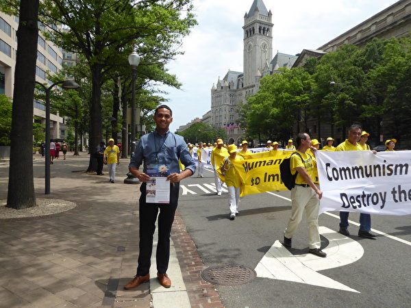

在一家律师楼工作的Alberto Easquez先生想了解法轮功。（良克霖／大纪元）

Alberto Easquez先生在这次游行沿线上的一家律师楼工作，他中午外出时刚好看到了游行队伍，于是一直站在路边观看。

她说：“我以前不了解法轮功，从传单和游行活动中了解到法轮功在中国受到迫害，而且中共在掩盖这个罪行。这让我非常支持他们，我觉得我需要更深入地了解关于法轮功的消息，因为我本人就很喜欢打坐。”

<b>“让更多人看到这盛大又和平的游行”</b>

Ivonne Aleman女士在华府的一家西班牙报社工作，她一直在法轮功游行队伍旁边用手机拍摄游行盛况，并不时的朝游行队伍挥手。

Ivonne Aleman女士在华府的一家西班牙报社工作，她一直在法轮功游行队伍旁边用手机拍摄游行盛况。（良克霖／大纪元）

她说：“我从来没听说过法轮功，所以看到这么多人游行非常好奇，但是这些人很安静、平和。”

她表示看了横幅标语了解到：“这次游行是在揭露中共迫害法轮功的罪行，这促使我也更想了解法轮功。因为这些法轮功学员显然非常有涵养，他们在和平理性地表达自己的诉求，这为世人树立了一个榜样。”

她表示为了拍摄游行的盛况，她跟着游行队伍走了很久，“我要立即将它传到社交媒体上，让其他人也看看这盛大而平和的游行。”

<b>“这游行是让世人了解在中国的迫害的最好方式”</b>

来自犹他州的Julia Riley女士和她妈妈一直站在路边观看游行盛况，并时不时地用手机拍照。

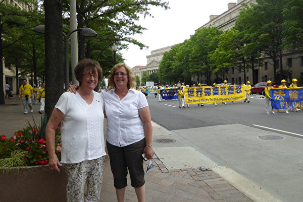

6月20日，来自犹他州的Julia Riley女士（右）和她妈妈一直站在路边观看法轮功游行盛况。（良克霖／大纪元）

她说：“横幅上的信息非常明确，‘停止迫害法轮功’。我认为他们能够在美国游行，自由地表达自己的信仰而无需担心遭到迫害，这太好了。”

“这也是我热爱美国的原因，我们有信仰的自由！”她表示，任何人都不应该因为信仰而遭受迫害。

上万人的游行队伍平静祥和，井然有序，这显然打动了Julia的心，她说：“这是让世人了解在中国发生的迫害的最好方式。”

责任编辑：李缘

<a href=#top><h6 align="right">回上方</h6></a>

<a name=111>
<h1 align="center"><b>组图6：各族裔法轮功华盛顿DC反迫害大游行</b></h1>

6月20日，来自全球各地部分法轮功学员聚集在美国首府华盛顿DC，举行反迫害集会游行，各界正义人士到场声援，制止中共迫害，呼吁人们认清共产主义对人类的危害。（季媛／大纪元）

【大纪元2018年06月21日讯】6月20日，来自全球各地部分法轮功学员聚集在美国首府华盛顿DC，举行反迫害集会游行，各界正义人士到场声援，制止中共迫害，呼吁人们认清共产主义对人类的危害。

中午12点举行反迫害大游行，游行路线从国会西边草坪出发，途经宾西法尼亚大道、宪法大道、美国白宫，一直到华盛顿纪念碑前，全程共2.4英里。

 

2018年6月20日，部分法轮功学员美国首都华盛顿举行反迫害大游行。图为来自俄罗斯的学员。（季媛／大纪元）

2018年6月20日，部分法轮功学员美国首都华盛顿举行反迫害大游行。图为来自俄罗斯的学员。（季媛／大纪元）

2018年6月20日，部分法轮功学员美国首都华盛顿举行反迫害大游行。图为来自土耳其的学员。（季媛／大纪元）

2018年6月20日，部分法轮功学员美国首都华盛顿举行反迫害大游行。图为来自奥地利的学员。（季媛／大纪元）

2018年6月20日，部分法轮功学员美国首都华盛顿举行反迫害大游行。图为来自瑞典的学员。（季媛／大纪元）

2018年6月20日，部分法轮功学员美国首都华盛顿举行反迫害大游行。图为来自荷兰的学员。（季媛／大纪元）

2018年6月20日，全球部分法轮功学员美国首都华盛顿举行反迫害大游行。图为来自芬兰的学员。（季媛／大纪元）

2018年6月20日，全球部分法轮功学员美国首都华盛顿举行反迫害大游行。图为来自新西兰的学员。（季媛／大纪元）

2018年6月20日，部分法轮功学员美国首都华盛顿举行反迫害大游行。图为来自印尼的学员。（季媛／大纪元）

2018年6月20日，部分法轮功学员美国首都华盛顿举行反迫害大游行。图为来自澳洲的学员。（季媛／大纪元）

2018年6月20日，部分法轮功学员美国首都华盛顿举行反迫害大游行。图为来自印度的学员。（季媛／大纪元）

2018年6月20日，部分法轮功学员美国首都华盛顿举行反迫害大游行。图为来自罗马尼亚的学员。（季媛／大纪元）

2018年6月20日，部分法轮功学员美国首都华盛顿举行反迫害大游行。图为来自西班牙的学员。（季媛／大纪元）

2018年6月20日，来自世界各地的部分法轮功学员美国首都华盛顿举行反迫害大游行。（季媛／大纪元）

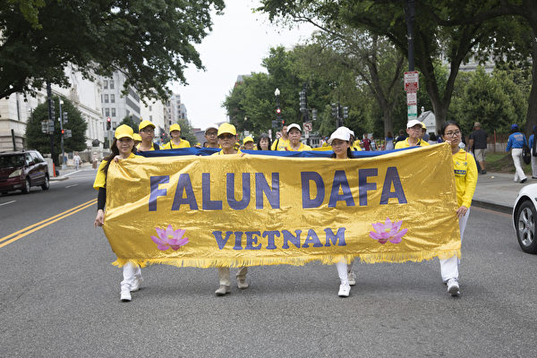

2018年6月20日，部分法轮功学员美国首都华盛顿举行反迫害大游行。图为来自越南的学员。（季媛／大纪元）

2018年6月20日，全球部分法轮功学员美国首都华盛顿举行反迫害大游行。图为来自法国的学员。（季媛／大纪元）

2018年6月20日，部分法轮功学员美国首都华盛顿举行反迫害大游行。图为来自英国的学员。（季媛／大纪元）

2018年6月20日，部分法轮功学员美国首都华盛顿举行反迫害大游行。图为来自台湾的学员。（季媛／大纪元）

2018年6月20日，部分法轮功学员美国首都华盛顿举行反迫害大游行。图为来自北爱尔兰的学员。（季媛／大纪元）

2018年6月20日，部分法轮功学员美国首都华盛顿举行反迫害大游行。图为来自以色列的学员。（季媛／大纪元）

 
责任编辑：杨亦慧

<a href=#top><h6 align="right">回上方</h6></a>

<a name=110>
<h1 align="center"><b>家庭事业皆圆满 波兰老板：法轮大法解疑惑</b></h1>

6月20日，美国首都华盛顿国会西边草坪上，来自波兰的公司老板、法轮功学员Tomas Kowalski参加集会活动。（陈怡然／大纪元）

【大纪元2018年06月21日讯】（大纪元记者陈怡然华盛顿DC报导）“法轮大法赐予了我一切，我来到这里，声援那些在中国正在遭受迫害的法轮功学员，尽我微薄的一点力量。”6月20日，美国首都华盛顿国会西边草坪上，来自波兰的公司老板、法轮功学员Tomas Kowalski说。

Tomas Kowalski在波兰拥有一家规模较大的公司，旗下拥有上百名员工，员工们都很喜欢这个修炼“真、善、忍”的好老板。与此同时，他还拥有一个美满的家庭。

<b>得大法 解疑惑</b>

其实，Tomas Kowalski年少时曾是一名问题学生，他酗酒，整天沉迷于各种聚会，直到1999年7月的一天，他突然发现自己能够感受到很强烈的能量，他不知道发生了什么，他开始寻找答案。

在找寻过程中，他阅读了大量的书籍，也接触过不少人，但是他们都无法令Tomas Kowalski信服。他说，“我是一个逻辑性很强的人，以前我并不相信能量之类的东西，我虽然尝试过很多其他气功，但是他们的能量都很小。”

2003年正在他苦苦寻找答案而不得其解的时候，一个偶然的机会让他走进了法轮大法，他第一次跟着炼功就感受到了很强大的能量，比任何时候都强。与此同时，他还感到修炼法轮功的人都很好，他们家庭和睦，待人友善。他说，“第一次炼功，我的手上、体内都有很强的能量在上下活动，整个身体仿佛被能量场包围，这是我从未有过的体验。”

在阅读法轮功主要著作《转法轮》的过程中，书中解答了他很多的疑问，他一下子明白了发生在他身上的一切是怎么回事。他说，“书中讲的很有逻辑性，而且科学系统，很有说服力，这同我之前接触的那些令人困惑的气功完全不同。”

“虽然我小时候想做一个好人，但是青少年时期我不再有那么强烈的愿望想要去做一个好人了，社会让我随波逐流，我发现变坏比变好更容易，而且更容易获利。直到我阅读《转法轮》，我才知道为什么我们要做一个好人，我懂得了做一个好人才是真正为了自己好。”

<b>按“真、善、忍”修炼 收获生意成功和家庭幸福</b>

刚刚开始修炼法轮功的时候，Tomas Kowalski只有24岁，他干着各种辛苦的体力工作，他洗过盘子、做过帮厨，干过油漆工等等。当他开始修炼法轮功的时候，他的整个人生发生了彻底的改变。

他的一个兄弟有一天突然打电话给他，问他愿不愿意同他一起合伙开公司做生意，虽然这个生意有风险，但是Tomas Kowalski相信只要自己按照法轮大法的“真、善、忍”原则指导自己，就没有问题。于是他辞掉工作同兄弟一起开了现在的这家公司。

这个公司经过十几年的经营，已经从当初只有两个合伙人的公司，成长为旗下有上百名员工的企业。在世风日下的当今社会中，因为心中一直坚信着真善忍，Tomas Kowalski觉得生意越做越轻松。

他表示，波兰之前曾经是共产主义国家，人们做生意并不讲究诚信，欺骗手段无处不在。而做生意最怕的就是同客户谈价，但是这对于Tomas Kowalski来说却是再简单不过的事情。

他说：“修炼之前，我很害怕同客户谈价格，而修炼后，法轮大法教我诚实待人，我就很自信的直接把我最好的价格告诉客户，并且告诉客户这就是我最好的价格。客户有时会讨价还价，我就坦诚的告诉他们这确实是最好的价格。事实上，诚实是最好的谈价方式。”就这样“诚信”让Tomas Kowalski在这个竞争激烈的商场里拥有大量稳定的客户群，客户不断的回来找Tomas Kowalski做生意。

“真、善、忍”融入到了Tomas Kowalski经营生意的方方面面，他的合伙人是一个很情绪化、很敏感的人，经常对他提出各种质疑。而Tomas Kowalski觉得修炼让他懂得善待和宽容他人，这对于生意人来说，是很重要的素质，因为他们常常要面对各种问题。他说，“每当我做决定的时候，我就想想大法是怎么要求我们的。我要求自己要对他人保持足够的耐心，遇到问题时，我要求自己冷静下来想一想。现在我们的生意越做越大，这完全要感谢法轮大法。”

作为一个管理上百名员工的老板，这确实不是易事，不过员工们都很喜欢Tomas Kowalski。曾经有一个合同工，在合同结束后，太喜欢Tomas Kowalski公司，甚至要求不领取薪水在公司继续工作。

2006年因为修炼法轮大法，Tomas Kowalski遇到了他现在的妻子，现在他们有了三个小孩，家庭幸福美满。

他说：“有时人们问我，法轮大法给予了你什么？我会告诉他们，我的一切都是大法赐予的。我的生意，如果没有遇到法轮大法，我不可能取得今天的成功；法轮大法还赋予了我幸福的家庭和三个健康的孩子。”

责任编辑：李缘

<a href=#top><h6 align="right">回上方</h6></a>

<a name=109>
<h1 align="center"><b>自由之家副总裁：追究中共宗教迫害责任</b></h1>

6月20日上午，美国非政府组织“自由之家”副总裁Robert Herman在国会山前法轮功学员集会上发言，谴责中共十多年来对法轮功信仰团体的迫害。（爱德华／大纪元）

【大纪元2018年06月21日讯】（大纪元美国华盛顿DC记者站报导）6月20日上午，美国非政府组织“自由之家”副总裁Robert Herman在国会山前法轮功学员集会上发言，谴责中共十多年来对法轮功信仰团体的迫害。

当天，全球近万名法轮功学员聚集在美国首都华盛顿DC，举行反迫害集会游行，唤醒良知。

以下是Robert Herman的发言全文：

大家早上好， 我今天代表“自由之家”非常荣幸地与你们大家在这里参加这一重大的聚会，我们的“自由之家”是一个有75年历史的非政府组织。我们骄傲地与中国大陆勇敢的法轮功站在一起，他们拒绝屈服于中共野蛮镇压的精神鼓舞着我们。

“自由之家”在通过在美国境内和海外的出版物和宣传致力于曝光中共当局对言论自由、集会自由、结社自由和宗教信仰自由的制度性的侵犯，中共所有的侵权行为都是在有罪不罚的情况下进行的。

我们在与所有的国际团体、政府和文明社会的人们一起，要求追究中共当局侵犯公民基本权利的责任。宗教信仰自由存在于美国人的DNA里面， 这是我们的文化遗产的一部分，也是我们对自己认知的一部分。宗教自由是我们美国民主体制的基石，也是所有的政府都必须坚持的一种普世的权利。
当务之急是我们的政府要对包括中国的宗教信仰问题发声，并采取具体行动。美国政府此举将兑现美国政府长期以来在两党基础上批准的外交政策所定义的价值观、原则和理念。

中国境内的法轮功学员已经被中共执拗地迫害了近二十年，这个拥有强大安保机构的政权对那些被视为对其权利构成任何挑战的人进行了全面的镇压和可怕的酷刑对待，其中包括被中共视为敌人的人和中国的宗教少数群体。而法轮功学员在这期间一直被非法逮捕、羁押、判处入狱、酷刑迫害、强迫被投入精神病院和再教育中心，他们在未得到公平审判的情况下被送入劳教所，还有很多人由于在监狱受到的非人待遇而死亡。但这些事实好像还不够骇人听闻，有充分可靠的证据显示中国的医院中每年进行6万至10万次的器官移植手术，而这些器官大部分来自于类似于法轮功学员这样的良心犯。

我们必须清楚的表明，中共的这些行为违反了国际规范和标准及最基本的人类尊严。必须因此追究中共领导层的责任。当那些有责任推动民主和人权的民主国家政府和机构不对这些罪行发声时，他们就成了中共的同谋，因为他们的沉默和不作为纵容了中共。

自从1999年以来，成千上万名法轮功学员遭到监禁，被作为良心犯随时被投入监狱，这种现象从道德上来讲是无法接受的。除此之外，中共当局为了替其严酷的迫害找借口，其宣传机器还在积极地丑化法轮功学员。因为中共为了维护手中的权力非常害怕自己的公民，特别是像法轮功这样受欢迎的组织和团体，但是中国的法轮功的故事不仅仅是政府残酷迫害的受害者和幸存者的故事，也是一个有关不可动摇的信念、毅力和不屈不挠精神的故事。这正是我们今天在这里庆祝的原因。

信仰法轮功的学员的抗争，以及支持他们这种权利的人们的抗争远没有结束，美国的外交官和国会成员，以及类似于我们这样的有公共平台的文明社会中的成员，必须进一步的强调这个问题。

人权问题和民主自由问题，包括中共对待法轮功学员和其他受迫害团体的问题必须是我们与中共官员讨论的核心。这些是美国价值观的核心 ，是全球价值观的核心，这些价值观塑造了我们美国人对我们在全球利益的看法。 美国官员必须对中共清晰表明，美国政府与那些仅仅想行使自己的基本人权的人站在一起，我们的自由和政府问责制为何能够引发产生一个更强大而繁荣的中国。美国还将使用全球马格尼茨基机制加强对侵犯人权行为的问责制，此机制是根据俄罗斯的一位年轻律师马格茨基的名字命名的，他揭露了俄罗斯高层大规模的腐败，但死于俄罗斯监狱的酷刑迫害之下。

‘自由之家’将继续记录、分析和报导广泛的侵犯人权行为，这样那些作恶的当权者者有朝一日能够被绳之以法。

让我以最开始的话结尾，我非常钦佩中国的法轮功学员的英勇无畏的精神和他们的持久力。他们要求居住在一个可以自由思考，可以自由表白、政府对其公民要求必须做出回应的社会之中，毫无疑问法轮功学员将改变现状，而且事实也正在改变。

责任编辑：林诗远

<a href=#top><h6 align="right">回上方</h6></a>

<a name=108>
<h1 align="center"><b>近万法轮功美首都盛大活动 众政要现场声援</b></h1>

6月20日上午，来自全球的部分法轮功学员在美国华盛顿国会山前集会，十多位美国国会议员和非政府组织代表到场声援，制止中共迫害法轮功。 （戴兵／大纪元）

【大纪元2018年06月21日讯】（大纪元美国华盛顿DC记者站报导）6月20日至22日，近万名来自世界各地的部分法轮功学员在美国首都华盛顿DC举行集会、游行和烛光夜悼等活动，呼吁国际社会关注，制止中共迫害。6月20日上午，十多位美国国会议员和非政府组织代表参加了在国会山前举办的盛大集会，声援法轮功学员和平反迫害，呼吁关注共产主义对全人类的危害。

<b>佛州国会议员：共产主义毁灭人类</b>

多年来连续参加这一集会的佛罗里达州国会众议员Illeana Ros-Lehtinen在上台发言前，认真阅读了法轮功学员打出的横幅，并合影留念。她说：“和法轮功在一起，我感到很激动、很荣幸、非常欣慰。我喜欢这里所有的横幅，尤其是揭露共产主义邪恶本质的内容。”

佛州国会议员Illeana Ros-Lehtinen表示，她很喜欢集会现场的条幅，尤其是有关揭露共产主义本质的内容。（李莎／大纪元）

出生在古巴的Ros-Lehtinen议员对于共产主义的危害性深有体会，她说：“共产主义摧毁人权，践踏出版自由等一切人的自由。你们所说的‘共产主义邪灵正在统治我们的世界’”和‘共产主义的终极目的是毁灭人类’，我完全同意。”

连任十五届议员的Ros-Lehtinen曾主导推动多项国会议案制止中共迫害，她说：“我们不能容忍中共对法轮功学员的恶劣行径继续下去，所以我们今天在这里呼吁关注法轮功学员的境况，我们将努力制止中共的野蛮虐待，并将持续努力，直到你们最终可以自由地坚持自己的信仰。”

<b>加州国会议员：法轮功学员是全人类最伟大的英雄</b>

本月8日，国会议员Dana Rohrabacher刚刚发起第932号决议案，声援中国的退党大潮，要求中共立即停止迫害法轮功。Rohrabache在集会上表示，该决议案会正式让美国政府与美国国会和法轮功学员站在一起，“和法轮功学员坚守的理念站在一起，讲的是你们为全人类所坚守的重要理念。”

加州国会议员Dana Rohrabacher发起932号决议案，声援中国退党大潮。他表示，法轮功学员是全人类最伟大的英雄。（李莎／大纪元）

“退党大潮是当今世界上推动和平的最伟大力量之一，退党大潮的成功，会让我自己的孩子也生活在一个更安全的世界。你们站在这人类历史大潮的前线，神会因此保佑你们。”他表示在了解退党运动后非常高兴，“因为这不是向中共追随者用拳头对抗，而是与法轮功理念相符的，你们是在向他们张开双臂。告诉他们来加入我们，让这个世界变得更好。远离那些暴徒，你们也可以像我们一样，成为更好的人。”

Rohrabache希望中共独裁者也能看到法轮功学员的集会，“他们会明白自己已经时日无多了，中国人一定会获得自由，是你们在带给他们希望。”

看到集会现场有被迫害致死的法轮功学员的遗像，他说：“集会现场有那些牺牲生命的人们的照片。为了让我们的世界变得更美好，历史上很多人都为此牺牲了自己的生命，而那些被抓捕的法轮功学员是这些人中最高尚的，是为了全人类的美好事物而坚守。他们是全人类最伟大的英雄！”

“我很骄傲能和你们站在一起，多年来我一直觉得骄傲。我们会有和平，我们会获得幸福，我们的生活中会充满爱，因为这就是我们在为全世界所做的。”

“法轮功学员、善良的人们，还有中国民众终会成功，并战胜这些正在控制我们社会的邪恶。”Rohrabache说。

<b>德州国会议员：中共是最邪恶的政权</b>

德克萨斯州国会众议员Ted Poe表示，法轮功学员是一群和平的民众，而中共却剥夺了他们自由信仰的权利。“我们不能允许这一切继续下去。一个政权把自己的民众投入监狱，并贩卖他们的器官谋利，这是应当受到谴责的。这是全世界最邪恶的政权。”

德州国会议员Ted Poe说，中共迫害中国民众、贩卖器官谋利，是最邪恶的政权。（爱德华／大纪元）

Poe议员说，这一切马上就会结束。他说：“你们不能沉默，不应被任何政府或强权噤声，因为真理在你们手中，神和你们在一起，美国也站在你们的一边，所以不要沉默，要发声、要大声地呼吁、要勇敢、要大胆，我们和你们在一起。”

<b>新泽西州国会议员：迫害应当立即停止</b>

“尽管中共十九年来一直试图消灭法轮功，中国仍有许许多多的人坚持他们的信仰。”新泽西州国会众议员Donald Payne说，法轮功是佛家修炼法门，无数人通过修炼获得了积极正向的心态、升华了道德水平──但中共政权却对他们进行残酷镇压。

新泽西州国会议员Donald Payne表示，中共针对和平的法轮功修炼者进行残酷迫害，这种暴行应当立即停止。（Mark Zou／大纪元）

“这种针对平和人群的镇压和折磨必须停止，现在就停止。”Payne议员对于这种违反基本人权的残酷迫害感到极其愤怒，他表示将继续为中国及全世界民众的基本人权而努力。

<b>宾州国会议员：不应因信仰受迫害</b>

宾夕法尼亚州国会议员Keith Rothfus表示，中共迫害平和的法轮功修炼者带来了灾难性的后果。他说：“镇压法轮功修炼者并不能带来社会稳定，反而给那些想要好好生活的人们带来了泯灭人性的、毁灭性打击。”

宾夕法尼亚州国会议员Keith Rothfus说，在任何地方，都不应该有人因为坚持信仰而受到迫害。（李莎／大纪元）

Rothfus议员说，虽然美国国会已经通过相关议案谴责中共对法轮功的迫害，但他们还需要做更多，包括保护从中国逃离的法轮功修炼者，不断努力、最终制止迫害。

“在任何地方，都不应该有人因为坚持自己的信仰而受到惩罚、监禁、迫害和杀戮。不要让他们打垮你。真相和爱，最终会战胜一切。”

<b>二十三位国会议员致信声援</b>

在集会前，二十三位国会议员发表书面声明，声援法轮功学员十九年间坚持和平反迫害，谴责中共的暴力镇压，要求立即停止对法轮功的迫害。

前共和党总统参选人、参议员Ted Cruz在信中写道：“你们让人们关注在中共统治下中国人受到的暴力和镇压，你们的努力值得称赞。”

参议员Tammy Baldwin对法轮功学员的坚持和努力表示敬意，他写道：“你们对人权的和平承诺是其他人的榜样。”

国会众议院民主党领袖、众议员Nancy Pelosi写道：“我支持来参加集会的你们，支持坚信‘真、善、忍’的你们。通过不断的沟通和努力，我们可以更大程度地改善世界的人权状况。”

民主党副党鞭、众议员Stephen Lynch则表示，中共迫害中国民众的行为令人无法接受──“中共政府持续在由于族裔的不同、宗教信仰的或政治理念的不同而非人地、邪恶地对待其自己的公民，这是一种耻辱。”

美国国会23位参、众议员致信声援法轮功学员。（大纪元合成）

<b>人权律师：永不放弃 直到中共停止迫害</b>

在集会现场，“法轮功之友”总裁Alan Adler为加拿大前亚太政务司司长David Kilgour和人权律师David Matas颁发“法轮功之友人权奖”，Kilgour表示，“我们今天也是代表全世界的法轮功学员在这里领奖。”

加拿大前亚太政务司司长David Kilgour获颁“法轮功之友人权奖”，他表示不会放弃努力。（李莎／大纪元）

Kilgour表示，经多方努力，现在包括西班牙、以色列、挪威、智利、意大利和台湾等地区已经出台法律禁止去中国进行器官移植旅行。

Kilgour说：“我们今天在这里的人永远不会放弃，直到中共停止迫害。感谢李老师、法轮功的支持者们，还有所有为此共同努力的人们。”

David Matas感谢获奖的机会，但他说，自己宁愿不获得这个奖。“因为我不愿意看到成千上万的法轮功学员被活摘器官杀害。我宁愿我和David Kilgour一起做的这个调查不是真的。”

加拿大人权律师David Matas获颁“法轮功之友人权奖”，他说自己宁愿没有这一奖项，法轮功学员可以免受迫害。（Mark Zou／大纪元）

Matas接着说：“我和Kilgour之所以得出结论，认为大量法轮功学员被摘除器官杀害，是因为很多用来阻止暴行的预警防范措施都没有到位。”

“中共从医疗系统中拿钱作为政府资金，而这整个系统都需要大量资金注入。所以他们开始贩卖大量良心犯的器官给拉进行器官移植的游客。我们开始调查以来去了全世界很多地方，看到该器官移植系统赚取大量金钱，但却没有措施来阻止这一切发生。”

“你们和我们一起同心在改变着一切。我希望未来和你们一起继续这伟大的努力。”

<b>USCIRF副主席：没有政权能切断人与神的联系</b>

美国宗教自由委员会（USCIRF）副主席Gayle Manchin表示，没有任何政权能够切断人对神的信仰。（Mark Zou／大纪元）

美国宗教自由委员会（USCIRF）副主席Gayle Manchin在发言中说：“19年来，中共对法轮功学员持续地、大规模地酷刑迫害，使其成为全球最大的宗教自由和人权侵犯国。”

“中共制度性地、持续地而且极其严重地、令人震惊地侵犯宗教自由，而美国国务院每年也都将中国定为特别关注国，这是美国国务院做出的正确决定。”

Manchin说：“没有任何一个政府的个人、团体，哪怕是中共，有权迫使人们违背其良知行动或禁止他们回应神的呼唤。”“中共的野蛮行径不仅仅违反了无数的国际人权准则和更广泛的、基于规则的国际秩序，也一点一点消除了人类的根基。”

<b>法轮功学员无私无畏 影响中国</b>

“自由之家”（Freedom House）副主席Robert Herman钦佩法轮功学员无畏的勇气和坚守的力量。（李莎／大纪元）

人权组织“自由之家”（Freedom House）副主席Robert Herman在发言中，表达了对法轮功学员的敬佩。“我们和无畏的法轮功学员们骄傲地站在一起。我们被他们激励著。他们拒绝屈从于中共对这样一个充满活力与平和的社会与文化群体的残酷迫害与无情镇压。而中共必须要对此负责。”

Herman强调：“我要表达对于中国法轮功学员无畏的勇气和坚守的力量，表示深深地敬佩。“他们决心要生活在一个可以自由思考、表达和信仰的社会。”他说：“毫无疑问，法轮功学员将会改变，也确实在改变中国。”

兰托斯基金会（Lantos Foundation）代表Atticus Swett表示，很荣幸和法轮功学员在一起，法轮功学员为世界树立了道德楷模。他说：“这一高尚、平和的功法的修炼者们有着令人钦羡的品质──友好、善良和高标准的道德水平。法轮功修炼者们体现了最美好的人性，表现了宽容、体谅和忠实于真相的美德。”

兰托斯基金会（Lantos Foundation）代表Atticus Swett表示，法轮功学员为世界树立了道德楷模。（李莎／大纪元）

国防论坛基金会（Defense Forum Foundation）总裁Suzanne Scholte表示，中共对法轮功的残酷迫害仍然在继续，而法轮功学员坚忍的精神和勇气令人感动。她说：“你们一直在最前方，不屈于这场镇压和违反人权的罪恶。你们做的一切不仅是为了法轮功，更是为了所有在中共集权体制下受迫害的人们。”

国防论坛基金会（Defense Forum Foundation）总裁Suzanne Scholte说，法轮功学员所做的一切不仅是为了自己，更是为了所有中共体制下受到迫害的民众。（李莎／大纪元）

<b>中共输出暴政 危害全球</b>

共产主义受害者纪念基金会（Victims of Communism Memorial Foundation）政府关系部主任Kristina Olney表示，中共对自己的人民发动战争，还向其它国家输出暴政。她说：“这场迫害的规模虽然惊人，但是我们西方人几乎对此一无所知，这是因为中国（中共）正在竭力出口极权主义，并遏制压制其对本国人民罪行的真相。”

共产主义受害者纪念基金会（共产主义纪念基金会受害者）政府关系部主任Kristina Olney表示，中共对自己的人民发动战争，还向其它国家输出暴政。（Mark Zou／大纪元）

Olney说：“美国必须反对中共的谎言和虐待行为。我们决不允许中共将邪恶暴政输出国外，使我们在自己的国家沉默。”

“法轮功是当今世界受迫害最严重的宗教信仰者之一。”哈德森研究所（Hudson Institute）宗教自由中心主任Nina Shea说，“川普政府已将信仰自由列入国家安全战略报告，也就是说，保护信仰团体已经成为了国家安全战略。原因显而易见。正在发生的这一切展现了中共政权的极端残忍暴虐。这一切必须停止，我们要将这一问题不断呈报给国会、美国政府和全世界。”

哈德森研究所（Hudson Institute）宗教自由中心主任Nina Shea说，“川普政府已将信仰自由列入国家安全战略报告。”（Mark Zou／大纪元）

6月20日，自世界各地的部分法轮功学员在美国首都华盛顿DC在国会山前举行盛大集会。（李莎/大纪元）

6月20日，自世界各地的部分法轮功学员在美国首都华盛顿DC在国会山前举行盛大集会。（李莎/大纪元）

6月20日，自世界各地的部分法轮功学员在美国首都华盛顿DC在国会山前举行盛大集会。（李莎/大纪元）

6月20日，自世界各地的部分法轮功学员在美国首都华盛顿DC在国会山前举行盛大集会。（李莎/大纪元）

6月20日，自世界各地的部分法轮功学员在美国首都华盛顿DC在国会山前举行盛大集会。（李莎/大纪元）

6月20日，自世界各地的部分法轮功学员在美国首都华盛顿DC在国会山前举行盛大集会。（李莎/大纪元）

6月20日，自世界各地的部分法轮功学员在美国首都华盛顿DC在国会山前举行盛大集会。（李莎/大纪元）

 
责任编辑：李缘

<a href=#top><h6 align="right">回上方</h6></a>

<a name=107>
<h1 align="center"><b>佛州众议员：与法轮功一起继续反迫害</b></h1>

国会山集会（爱德华／大纪元）

【大纪元2018年06月21日讯】（大纪元记者马丽美国华盛顿DC报导）6月20日上午，美国佛罗里达州国会众议员Ileana  Ros-lehtinen女士参加了法轮功学员的美国首都华盛顿DC的集会活动。她表示，她将与法轮功一起继续反迫害，直至迫害停止。

以下是佛罗里达州国会众议员Ileana  Ros-lehtinen女士的发言全稿：

早上好，感谢大家，我是如此激动，如此幸运，我很高兴能和你们法轮功（学员）在一起，我真的很喜欢所有这些横幅。

因为我出生在古巴，现在这个国家受暴政统治，共产主义政权压制人民的人权，践踏新闻自由和任何自由言论，所以我知道当你们说共产主义的邪恶幽灵正在统治我们的世界，共产主义的最终目标是摧毁人类时，我相信这是真实的。

当我们今天站在这里，再次纪念你们遭迫害19周年，再在这国会前，看看那个美丽的建筑，国会再次承诺你们有权自由地实践你们的信仰。

两年前，在你们的大力支持下，我为众议院通过第343号决议而感到自豪，这是美国国会第一次正式承认法轮功学员的困境，我们一起发出了一个响亮的声音，美国国会对中共邪恶政权发出一个明确的信息，我们要求立即停止迫害法轮功，要求立即释放所有法轮功学员和良心犯，并呼吁中国（中共）立即结束非人道主义和不道德的活摘器官的做法。

我们一起做到了这一点，我非常感谢我的好朋友、参议员、新泽西民主党人Bob  Menendez，继续争取在美国参议院通过类似决议，以便参议院和众议院都可以正式谴责中共的恶行。

法轮功学员们是和平、富有同情心和宽容的人群，他们的信仰应受到尊重，而不是被迫害，他们应该拥有基本的人权，应该在没有恐惧、没有骚扰、没有迫害的情况下实践自己的精神信仰。

然而我们看到很多报告，包括国务院最新的中国人权报告，说法轮功学员遭受了北京（中共当局）最严重的侵犯人权、普遍监视、任意拘留、施行酷刑和活摘（法轮功学员）器官的残暴行为。

我们不能允许中共的暴行和对法轮功学员的迫害继续下去，所以我们今天一起提醒世界关注法轮功学员的困境，并且我们承诺要阻止中共对法轮功学员迫害，我们会继续努力，以便你们最终能够实践自己的信仰，而不用担心受到迫害。

帮助制止迫害法轮功……这说明了一切，我一直为和你们并肩工作而感到非常自豪，年复一年，每年我都会和你们一起来到国会这里，我期待在未来几年继续我们的反迫害活动。非常感谢你们的支持，我也很荣幸能够支持你们。

责任编辑：李缘

<a href=#top><h6 align="right">回上方</h6></a>

<a name=106>
<h1 align="center"><b>美国会议员：每年都要来支持 直至迫害停止</b></h1>

新泽西州国会众议员Donald Payne先生6月20日上午在法轮功DC集会上现场发言。（爱德华／大纪元）

【大纪元2018年06月21日讯】（大纪元记者马丽美国华盛顿DC报导）自6月20日，全球近万名法轮功学员聚集在美国首都华盛顿DC，为期三天的系列活动。20日的反迫害集会与游行，得到了众多美国国会议员到现场或发信支持，新泽西州国会众议员Donald Payne先生就是其中的一位。

Payne先生表示，以后他每年都要来支持法轮功学员的集会，直至迫害停止。

以下是新泽西州国会众议员Donald Payne的发言全稿：

早上好！再次感谢给我这个发言机会，在这里谈论中国（中共）政府企图消除法轮功（的行为）。

尽管中共十九年来企图消灭法轮功，但是在中国，仍有千百万人继续坚定追随他们的信仰。

法轮功是佛家的一种和平修炼，千百万人习练，他们通过修炼和打坐达到积极（态度）和品德提升。

二十年来，中国（中共）当局闯入公共和私人空间如学校、家庭、村庄和企业，企图通过强迫手段改变法轮功学员。

数千名法轮功学员仍被关押在监狱、拘留中心等地方，许多人只是因为信仰而被关押，他们每天被折磨和殴打，有些遭受性虐待。

更有甚者，中国（中共）当局也承认，他们从死刑犯和法轮功学员身上摘取器官。这种对和平人群的迫害和折磨必须立即停止！

我对这种侵犯违背基本人权，如信仰自由权利和身体健全权利的行为，感到非常愤慨。我将继续奋斗，为每个中国公民和世界上所有人争取没有恐惧的权利。

我向你们保证，我每年都要到这里来支持你们，直至迫害停止。谢谢大家！

责任编辑：李缘

<a href=#top><h6 align="right">回上方</h6></a>

<a name=105>
<h1 align="center"><b>宗教自由中心主任：信仰自由是川普国安战略</b></h1>

 

6月20日上午，“ 哈德森研究所”宗教自由中心主任Nina Shea在法轮功学员国会山前的集会活动中发言。（爱德华／大纪元）

【大纪元2018年06月21日讯】（大纪元记者马丽美国华盛顿DC报导）6月20日上午，“ 哈德森研究所”宗教自由中心主任Nina Shea加入了法轮功学员在国会山前的集会，她发言说，法轮功是当今世界上受到最残酷迫害的宗教信徒之一，迫害必须停止，“我们必须继续把这个问题摆在国会面前、摆在美国政府面前，摆在世界面前。”

自6月20-22日，全球近万名法轮功学员聚集在美国首府华盛顿DC，参加为期三天的系列活动，其中包括20日的盛大反迫害集会与游行活动。

以下是Nina Shea的发言全文：

谢谢大家，这是一个多么令人难以置信的集会！今天有成千上万的人来到这里，我为你鼓掌。

我很荣幸今天能在这里声援你。我为你鼓掌，因为来替那些无法发声的人、那些被迫害的法轮功学员讲话，需要很大的勇气。

近20年了，法轮功是一个越来越集权的现代国家的受害者，(这个政权) 用科技手段被用来压制反对政府的任何事物，包括（法轮功）精神修炼。

法轮功是当今世界上受到最残酷迫害的宗教信徒之一。成千上万的修炼者在没有经过正常司法程序的情况下，被关进监狱。他们受到生殖器被电击的酷刑、他们被关在精神病院，他们的器官被强制摘除贩卖。因为他们的精神信仰，他们遭受痛苦、（被迫害）致伤或死亡。

天理不容！这是发生在中国和世界上的、最严重的人权侵犯行为之一。我认为美国政府除了跟中共进行贸易对话、安全和防务对话之外，我们还有另一个重要利益，那就是宗教自由。

宗教自由是川普（特朗普）政府国家安全战略报告的一部分。对少数群体的宗教信仰进行保护，成为国家安全战略的内容之一。

我们很容易明白这是为什么。正在发生的事情表明了中国（中共）政府的野蛮和残酷。这（迫害）必须停止，我们必须继续把这个问题摆在国会面前、摆在美国政府面前，摆在世界面前。

非常感谢大家！

责任编辑：李缘

<a href=#top><h6 align="right">回上方</h6></a>

<a name=104>
<h1 align="center"><b>美宗教自由委员会副主席：停止迫害法轮功</b></h1>

 

美国宗教自由委员会副主席盖尔•曼钦（Gayle Manchin)于6月20日上午在法轮功学员举办的盛大集会上发言。（爱德华／大纪元）

【大纪元2018年06月21日讯】（大纪元华盛顿DC记者站报导）美国宗教自由委员会副主席盖尔•曼钦（Gayle Manchin)于6月20日上午在法轮功学员举办的盛大集会上呼吁，
中共当局必须立刻解除对法轮功的禁令，停止骚扰和拘禁法轮功修炼者，无条件地释放所有遭其拘押的法轮功良心犯。

能够今天在这里参加你们的集会是我的一大荣幸。我感谢华府的法轮大法协会再一次邀请美国宗教自由委员会来参加这个集会。正如你们所知，本委员会的使命是推动和提升全球的宗教自由状况，本委员会是通过监控和报导全球的宗教自由状况并就此对白宫、美国国务院和美国国会提供政策建议实现这一使命的。

美国宗教自由委员会（USURF）今年庆祝了成立20周年纪念，20年前美国国会通过了国际宗教自由法案，随后本委员会诞生，并在国务院拥有了一间办公室，旨在通过美国的外交政策推动宗教自由。

当我们USURF委员会回顾过去的20年时，我们清醒地意识到，对于世界上的很多宗教团体和个人而言，当今的宗教自由现状并不比20年前好。令人遗憾的是，中国大陆的很多宗教和信仰团体的现状正是如此，其中包括中国大陆法轮功学员的现状。事实上这正是美国宗教委员会自本委员会创办之始就一直在持续报导中国的宗教自由现状的原因。

当美国宗教自由委员会于2000年5月份发表其首个年度报告时，我们只报导了三个国家的宗教自由状况，其中就有中国。这意味着，自从美国宗教自由委员会成立以来，我们每年都在报导中国的宗教自由现状。在我们的首份报告中，我们注意到，自从中共于1999年打压法轮功以来，中共当局对中国法轮大法协会的领导人判处重刑，而且拘捕了数千名法轮功学员，甚至野蛮地打死了（酷刑致死）数名法轮功学员，我在这里看到了一些死者的照片，谢谢你们大家到这里来，与我们一起在这里追忆那些逝者。

十九年后，中共对法轮功学员持续地、大规模地的酷刑迫害，这是使其成为全球最大的宗教自由和人权侵犯国的部分原因。这就是为什么美国宗教自由委员会一直在持续建议美国政府将中共认定为特别关注国的原因，因为中共制度性地、持续地而且极其严重地、令人震惊地侵犯宗教自由，而美国国务院每年也都将中国定为特别关注国，这是美国国务院做出的正确决定。

然而为什么二十年过去了，但是中国大陆的法轮功学员的处境仍然没有任何改善呢？自从习近平上台以后，中共政府已经清晰表明其政权不会容忍独立与其政权外的思想和信仰。中共当局试图在整个中国和整个宗教界对其人民强行灌输其政权希望人们相信的东西，这就好似北京颁布的一个禁令：相信我们让你们相信的东西，否则后果自负。各地的宗教信仰者都知道，这种类型的恐吓威胁对有信仰者和那些完全无信仰者的心灵、灵魂和良知而言是空洞无物的，这是因为没有任何一个政府的个人、团体，哪怕是中共有权迫使人们违背其良知行动或禁止他们回应神的呼唤。这就是你们今天为何在这里抗议的原因。因此，当中共当局骚扰法轮功学员，当他们拘禁、酷刑迫害、性虐待法轮功学员，当他们拿法轮功学员做实验，甚至活体摘除法轮功学员器官时，他们的野蛮行径不仅仅违反了无数的国际人权准则和更广泛的，基于规则的国际秩序，也一点一点消除了人类的根基。让我们记住，宗教和信仰自由并非是政府赋予的权利，而是一个所有人都拥有的普世的权利。

这是我们应该让中共记住的，我们应该让他们知道我们在关注中国的法轮功学员的现状，而且我们确实与法轮功学员坚定地站在一起，不仅仅是在中国与他们站在一起，而是在整个世界与他们站在一起。我们必须鼓励美国政府，包括我们在美国国会的朋友们一起捍卫法轮功学员的权利，并追究那些严重违反宗教自由的中共官员和机构的责任。我们必须利用联合国的机制，例如联合国人权理事会即将对中国进行的普遍的定期审查以曝光中共的侵权行为，而且中共当局必须立刻、明确肯定地停止再将法轮功称为“X教”；解除对法轮功的禁令，停止骚扰和拘禁法轮功修炼者，无条件地释放所有遭其拘押的法轮功良心犯。

你们今天的集会，以及你们为捍卫法轮功学员的权利而抗争，这将有助于实现这些目标。

我们代表美国宗教自由委员会对你们致敬，我们支持你们，而且我们和你们站在一起。

责任编辑：李缘

<a href=#top><h6 align="right">回上方</h6></a>

<a name=103>
<h1 align="center"><b>组图：法轮功学员华盛顿DC反迫害大游行</b></h1>

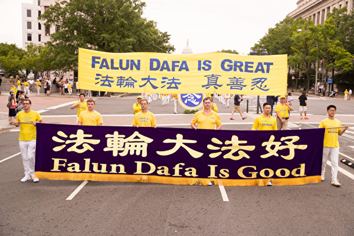

6月20日，全球部分法轮功学员聚集在美国首府华盛顿DC，举行反迫害集会游行。（戴兵／大纪元）

【大纪元2018年06月21日讯】6月20日，全球部分法轮功学员聚集在美国首府华盛顿DC，举行反迫害集会游行，各界正义人士到场声援，制止中共迫害，呼吁人们认清共产主义对人类的危害。

当天中午12点，法轮功学员开始反迫害大游行，游行路线从国会西边草坪出发，途经宾西法尼亚大道、宪法大道、美国白宫，一直到华盛顿纪念碑前，全程共2.4英里。

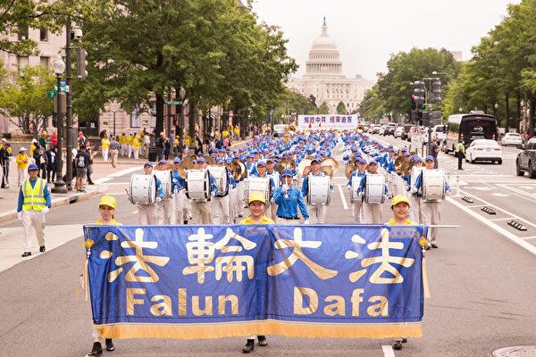

6月20日，全球部分法轮功学员聚集在美国首府华盛顿DC，举行反迫害集会游行，各界正义人士将到场声援，制止中共迫害，呼吁人们认清共产主义对人类的危害。（戴兵/大纪元）

6月20日，全球部分法轮功学员聚集在美国首府华盛顿DC，举行反迫害集会游行，各界正义人士将到场声援，制止中共迫害，呼吁人们认清共产主义对人类的危害。（戴兵/大纪元）

 

6月20日，全球部分法轮功学员聚集在美国首府华盛顿DC，举行反迫害集会游行，各界正义人士将到场声援，制止中共迫害，呼吁人们认清共产主义对人类的危害。（戴兵/大纪元）

 

6月20日，全球部分法轮功学员聚集在美国首府华盛顿DC，举行反迫害集会游行，各界正义人士将到场声援，制止中共迫害，呼吁人们认清共产主义对人类的危害。（戴兵/大纪元）

 

6月20日，全球部分法轮功学员聚集在美国首府华盛顿DC，举行反迫害集会游行，各界正义人士将到场声援，制止中共迫害，呼吁人们认清共产主义对人类的危害。（戴兵/大纪元）

 

6月20日，全球部分法轮功学员聚集在美国首府华盛顿DC，举行反迫害集会游行，各界正义人士将到场声援，制止中共迫害，呼吁人们认清共产主义对人类的危害。（戴兵/大纪元）

 

6月20日，全球部分法轮功学员聚集在美国首府华盛顿DC，举行反迫害集会游行，各界正义人士将到场声援，制止中共迫害，呼吁人们认清共产主义对人类的危害。（戴兵/大纪元）

 

6月20日，全球部分法轮功学员聚集在美国首府华盛顿DC，举行反迫害集会游行，各界正义人士将到场声援，制止中共迫害，呼吁人们认清共产主义对人类的危害。（戴兵/大纪元）

6月20日，全球部分法轮功学员聚集在美国首府华盛顿DC，举行反迫害集会游行，各界正义人士将到场声援，制止中共迫害，呼吁人们认清共产主义对人类的危害。（戴兵/大纪元）

 

6月20日，全球部分法轮功学员聚集在美国首府华盛顿DC，举行反迫害集会游行，各界正义人士将到场声援，制止中共迫害，呼吁人们认清共产主义对人类的危害。（戴兵/大纪元）

 

6月20日，全球部分法轮功学员聚集在美国首府华盛顿DC，举行反迫害集会游行，各界正义人士将到场声援，制止中共迫害，呼吁人们认清共产主义对人类的危害。（戴兵/大纪元）

 

6月20日，全球部分法轮功学员聚集在美国首府华盛顿DC，举行反迫害集会游行，各界正义人士将到场声援，制止中共迫害，呼吁人们认清共产主义对人类的危害。（戴兵/大纪元）

 

6月20日，全球部分法轮功学员聚集在美国首府华盛顿DC，举行反迫害集会游行，各界正义人士将到场声援，制止中共迫害，呼吁人们认清共产主义对人类的危害。（戴兵/大纪元）

 

6月20日，全球部分法轮功学员聚集在美国首府华盛顿DC，举行反迫害集会游行，各界正义人士将到场声援，制止中共迫害，呼吁人们认清共产主义对人类的危害。（戴兵/大纪元）

 

6月20日，全球部分法轮功学员聚集在美国首府华盛顿DC，举行反迫害集会游行，各界正义人士将到场声援，制止中共迫害，呼吁人们认清共产主义对人类的危害。（戴兵/大纪元）

 

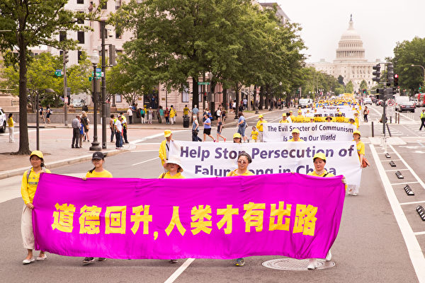

6月20日，全球部分法轮功学员聚集在美国首府华盛顿DC，举行反迫害集会游行，各界正义人士将到场声援，制止中共迫害，呼吁人们认清共产主义对人类的危害。（戴兵/大纪元）

 

</di
6月20日，全球部分法轮功学员聚集在美国首府华盛顿DC，举行反迫害集会游行，各界正义人士将到场声援，制止中共迫害，呼吁人们认清共产主义对人类的危害。（戴兵/大纪元）

责任编辑：杨亦慧

<a href=#top><h6 align="right">回上方</h6></a>

<a name=102>
<h1 align="center"><b>共产主义受害者纪念基金会主任：感谢法轮功</b></h1>

6月20日上午，美国政府“共产主义受害者纪念基金会”政府关系部主任Kristina Olney在法轮功国会山集会上发言。（爱德华/大纪元）

【大纪元2018年06月21日讯】（大纪元记者马丽美国华盛顿DC报导）6月20日上午，美国政府“共产主义受害者纪念基金会”政府关系部主任Kristina Olney，来到法轮功学员在国会山前的集会，发言支持法轮功学员的活动。

当天，全球近万名法轮功学员聚集在美国首都华盛顿DC，举行反迫害集会游行，唤醒各界良知。

下面是Kristina Olney的发言全文：

早上好。今天很荣幸跟大家在一起。我们此时在美国首都草坪上的这种聚会，在中国是不可能发生的。

在这个世界上人口最多国家、这个世界第二大经济体，拥有世界第二大的军队，那里的人们却必须作出可怕的决定：是放弃其最坚定的信仰，还是面临死亡、迫害或酷刑。

中国共产党把任何不承认该党为最高或最终领导的宗教或哲学，都视为威胁，而且肆无忌惮进行任何犯罪来铲除这种威胁。

北京曾经欢迎过法轮功对中国社会的贡献，但在1999年发生了变化，当时有一万多人聚集到中南海，这个和平的抗议被中共视为威胁。从那时起，中共就采取了不可想像的手段来消灭他。

超过3,700名法轮功学员别酷刑迫害致死。成千上万的人被关押在看守所、监狱或精神病院，他们被迫在那里承受酷刑和洗脑。

不仅杀害这些无辜的人，中共也不放过他们的尸体。中国（中共）政府公开承认，它们摘取死刑犯的器官，为此目的杀害了数千名法轮功学员。

中国的非法器官移植业的价值约为90亿美元。这不仅是简单的“血钱”，而是从无辜的人身体上获利的钱，这些人只不过想修炼他们的信仰，就遭此噩运。

这场迫害的规模虽然惊人，但是我们西方人几乎对此一无所知，这是因为中国（中共）正在竭力出口极权主义，并遏制压制其对本国人民罪行的真相。

正如肯尼迪总统谈到苏联时所说的那样，“自由国家从来不需要发起战争，来控制自己的人民。”中国（中共）不仅正在发起一场谎言和虐待之战来控制其人民，而且正在对本国人民发动战争。

中共的权力如此脆弱，他们必须通过网络军团、大批暴徒来执行党的指令，将坦克开进市中心使学生沉默。

美国必须反对中共的谎言和虐待行为。我们决不允许中共将邪恶暴政输出国外，使我们在自己的国家沉默。

你们这些见证人，和今天我们在这里的集会，都将确保真相得到传扬。所以我感谢你们所有人的勇气和见证，共产主义纪念基金会的受害者们与你站在一起，为争取真理和自由而奋斗。

责任编辑：李缘

<a href=#top><h6 align="right">回上方</h6></a>

<a name=101>
<h1 align="center"><b>四口之家遭迫害 两姐妹坚持修炼讲真相</b></h1>

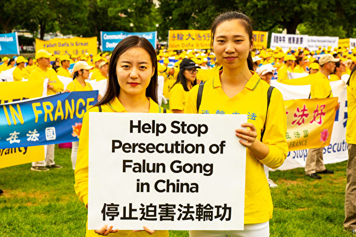

法轮功学员天心姐妹。（大纪元）

【大纪元2018年06月20日讯】（大纪元记者叶蓁美国华盛顿DC报导）一个温柔沉静，一个活泼开朗，性格完全不同的天瑞、天心姐妹，于6月20日来到华府，走进制止中共迫害法轮功的游行队伍。

这对年轻的姐妹来自修炼法轮大法的家庭，今天是她们出国近一年以来，第一次参加在华府举办的法轮功活动。因为家庭的遭遇，这次活动对她们来说意义更为重大。她们在读书期间，被迫和父母分开近四年之久，并处在无时无刻的监控和骚扰中。只因为她们一家，都是坚定的法轮大法修炼者。

今天她们正是希望通过游行活动，声援父母以及所有处在危险之中的大法弟子，共同为制止中共迫害做出自己的努力。

<b>初得大法 小姐妹成了同门小弟子</b>

从1996年起，7岁的天瑞和4岁的天心跟着爸爸、妈妈相继开始修炼法轮功。在她们的记忆中，刚得法时年龄很小，但是她们已经懂得按照“真、善、忍”的修炼标准要求自己，成了名副其实的“大法小弟子”。

一般来说，多子女家庭免不了孩子们的打闹、争吵，让父母不胜烦脑。修炼前的天瑞、天心也不例外。天心说：“我们俩是怎么厉害怎么来，我打不过姐姐，还和妈妈告状！”但是修炼后，她们不但不打闹了，如果爸妈要“收拾”谁，另一个还会站出来维护：“你们应该好好学法，不要动气哦。”

这样一来，姐妹俩因为修大法，关系变得更亲近。当然，她们在修炼上也不放松。天瑞说，如果表现不好或者学法、炼功不太精进了，她们会互相提醒、督促。做为姐姐，天瑞感到对妹妹多了一份责任。她说：“长姐如母嘛，我会对妹妹的生活、修炼方面更关心一些。”

虽然在懵懂的年纪，跟着父母修炼法轮功，姐妹俩却都感受到精神境界的提升。天瑞表示，她以前上学很淘气，经常和同学起冲突，但是修炼后性格越来越好，也能够把主要精力放在学业上。天心也感到受益良多，每天和父母、姐姐过得非常充实、开心。因为她逐渐了解到生活的目的和修炼的意义，那就是返本归真，逐渐放弃各种不好的思想。

姐妹俩表示，在1999年中共迫害法轮功之前，她们一家四口都在大法的呵护下精进实修，磨炼自己的身心，在各方面做一个好人。因此，一家人过着和和美美的日子。

<b>爸爸被抓 一家人噩梦的开始</b>

1999年“7·20”之后，天瑞、天心的爸爸、妈妈冒着生命危险，加入大陆法轮功学员自发讲真相、反迫害的行动。一家人因而不断受到中共警察的骚扰和迫害，姐妹俩幼小的心灵留下难以磨灭的创伤。

迫害最严重的是爸爸，在1999年底因为上访，被非法关押55天，并受到各种毒打、折磨，之后被勒索3000元才能回家。天心回忆说：“当时爸爸蹒跚走出来，灰头土脸、眼含泪光，妈妈早已经泣不成声，我只能抱着爸爸的大腿不停地哭喊。”她和姐姐以为，这种痛苦到此结束，谁想到，这只是噩梦的开始。

2002年夏天，姐妹俩的爸爸又被抓捕，在没有出示任何证件的情况下，家里被警察被抄个底朝天。天瑞、天心不知道怎么回事，吓得缩在妈妈身后一直哭。从那之后，她们家就处于监控之中，妈妈时不时被叫去问话，姐妹俩无人照料，不能正常上学。

后来爸爸逃亡在外，警察像疯了一样全城通缉。天瑞说：“我们很紧张，街上电线杆、墙上几乎都贴著爸爸的照片，上学路上老感觉后面有脚步声。”她提到，当时家里还有6、7个警察轮班住在家里，给母女三人带来巨大的压力。“那时候特别害怕脚步声，都成了阴影。”天心也说，“当时我们晚上不敢开灯，写作业也是偷偷点蜡烛，就怕警察来骚扰。”

不但如此，姐妹俩还成了学校的“新闻”，几乎所有同学都来看热闹：“你爸爸怎么被通缉啊？”那时候，她们受到严重的歧视，特别讨厌上学，更害怕面对老师和同学的盘问。

她们再次得到爸爸的消息时，却是在当地的电视新闻上。警察闯进爸爸藏身之处，野蛮地将他带走。“3、4个警察把爸爸从床上扒下来，撕扯他的头发，拳打脚踢。”天心说，看到这残忍的一幕，她和姐姐、妈妈只能抱在一起，哭了很久很久⋯⋯

<b>妈妈被抓 独自挑起生活重担</b>

到了2003年，她们的爸爸被非法判刑14年半，在2009年，妈妈也在抄家后被警察强行拖走，冤判3年，留下即将面临中考和高考的女儿们。这个本就风雨飘摇的家庭，更加支离破碎。天瑞和天心顶着学业的压力和对未来的恐惧，依靠爷爷的一点养老金，艰难地撑著整个家。

天心说，后来姐姐到外地上大学，亲戚们害怕受到牵连都不敢来帮忙，家里等于只剩下她一个。“几乎每天吃泡面，或者吃白粥配咸菜，吃了好长一段时间。”到现在，泡面已经成了她非常抗拒的食物。在学习上，天心的作业永远没有家长的签字，开家长会也只能她硬著头皮自己出席。就是在这样的情况下，她还要面对学校和警察的监控。

天瑞的情况并不比妹妹好多少。报名考大学时需要填表格，由于爸爸身份证已经过期，父母信息那一栏只能空着，让天瑞差点不能报名。读书时因为第一次去外省，只有一个伯父送她。“四年来都挺孤单的，一个人学法、炼功也很不方便。”在宿舍，天瑞就在床铺外挂上帘子，等到晚上室友们都休息了，她才能在这独立的小空间里继续修炼。

她们甚至在常用的书本里发现了窃听器，却不敢扔掉。“如果警察发现，还会再次抄家！”天心难过地说。这样一来，哪怕是在家，她们也只能小声说话，更不敢提到“大法”“修炼”等词语，而是换成其他“暗号”。比如问对方最近的表现或者有没有学法，她们会说：“今天你‘乖’吗？‘学习’了吗？”

这几年来，姐妹俩只见过爸妈一两次，每次都要花一整天才能进行短暂的会面。天心说：“我们每次都坐很久的车，到很远的地方去看爸妈。”天瑞说：“大早上6点就在监狱外面等，见到人时已经下午3、4点了，还只能见5分钟。”

天心形容当时会面的场景，爸爸或妈妈身后跟着“包夹”，她们身后有很多警察，中间隔着玻璃窗和两层密实的铁栅栏网，根本看不清爸妈的脸。说话的时候他们也很小心，一旦提到警察认为敏感的字眼，会见就被强行终止。

<b>高压之下 她们依然捍卫大法</b>

在艰难的处境中，姐妹俩不仅没有放弃自己的修炼，还做起了揭露迫害、讲真相的工作。自从爸爸被抓后，妈妈带着姐妹俩建立真相资料点。天心说，妈妈定期会印制真相资料，她们三人就一起，把资料包装得很精美，外出散步时送给遇到的人们。天瑞也说：“比如护身符啊、给公安局高官写信啊，课余时间我们都会帮妈妈一起做。”

后来妈妈也出事了，天瑞和天心没有资料来源，就凭著自己对大法的理解，见缝插针地跟老师、同学讲法轮功真相。天心还说，如果上课时听到老师在讲污蔑大法的话，下课后她就马上跟老师讲真相。幸运的是，老师们最后都表示理解，也对大法有了正面的态度。

爸爸妈妈被迫害的事就发生在眼前，姐妹俩讲真相就不为自己担心吗？“我没有想很多，这是我应该做的。我爸妈都是因为修炼被抓的，我不能默许警察这样迫害我们全家。”天瑞也很感谢师父，因为是大法的力量，支撑她们姐妹坚定地一路走来。

天心补充说，因为她们从小跟父母修炼，并没有认真想过自己为什么要修炼。“但现在，我们就会考虑，要不要坚持修炼，为什么？”天心认为，修大法没有错，爸妈只是坚持他们的信仰，但是在大陆有那么多人和他们一样遭受迫害。她说：“我就有一股冲动，告诉那些被谎言蒙骗的人，把善的、对的真相告诉更多人。”

毕业后，天瑞从事UI设计，天心则成为一名电视台主持人，但在大陆的迫害环境中，她们在职场仍然阻力重重。天瑞的老板被警察威胁，非常害怕，为了不给公司添麻烦，天瑞索性辞职。而天心，不愿在镜头前违心地歌颂中共、报导虚假信息，在和导演发生几次冲突后也选择了离开。

2012年和2015年，她们的妈妈和爸爸分别回到家中，姐妹俩发现，监狱的生活让他们瘦弱不堪，身上伤痕无数。但是警察仍然骚扰不断，父母双双离开家门，被迫流离失所。出于对女儿们的保护，他们决定让两姐妹一起出国，希望那些迫害，彻底远离她们。

<b>在自由世界 她们坚持传递真相</b>

目前她们在美国纽约定居，虽然在新环境中有许多需要学习、适应的地方，但是生活发生极大的转变。最大的变化，是她们可以公开修炼了，而且能够自由地参加大法活动，堂堂正正地做弘法工作或揭露共产党的迫害。

天瑞表示，虽然大陆在迫害前也有集体炼功，但她们的年纪太小了，都没有印象。当她们堂堂正正地在外面炼功时，天瑞感到“很新奇、难得，真是做梦都想不到！”天心说自己有“莫名的兴奋感，呼吸都很轻松”，打坐时更是想哭。“因为在大陆从来没有这种感受，路边人可以看着你炼功！”

同时，她们也感受到肩负更重的使命。天心说：“每当听到有大陆学员被抓，就像听到自己亲人被抓一样难受。”因此，姐妹俩希望尽可能地多参加讲真相的活动，帮助在大陆遭受难的同修。“能参加的都会去参加，还想做更多的事。”天瑞说，“不是为了个人，而是让更多的人关注中共对大陆的信仰迫害。”

于是，她们成为“退党义工”，在纽约景点附近的“真相点”为大陆游客讲述法轮功真相，帮他们做“三退”。另外，她们参加了每次法轮功学员举办的游行、集会等大型活动。今年6月，她们又来到华盛顿DC，继续她们的正法之路。

几年前，妈妈曾告诉姐妹俩：“以后你们就是最亲的人。”到了海外，天瑞和天心又过上了父母不在身边的日子，但是对妈妈的话却有了更深刻的理解。姐姐说她们的关系，已经超越了一般的亲情。妹妹也认为，她和姐姐这么多年来真的是“相依为命”。相信这对姊妹，会在自由社会开始全新的修炼生活，等待全家团聚的那一天。

责任编辑：李缘

<a href=#top><h6 align="right">回上方</h6></a>

<a name=100>
<h1 align="center"><b>2万人杀害9093无辜者 中共5字方针庇罪犯</b></h1>

【大纪元2018年06月20日讯】中国湖南道县在1968年8月刮起“杀人风”，约2万人屠杀了9093名无辜者。事后追责中，中共以“三宜三不宜”方针，包庇罪犯，让死难者难安，遗属心难平。

1968年8月，湖南道县刮起了一股“杀人风”，迅速波及零陵全地区其余十个县市，全地区（含道县）非正常死亡9093人。被杀者年纪最大的78岁，最小的才出生10天。

经过漫长的等待，中共零陵（现永州）地委从1984年5月起成立了“处理文革杀人遗留问题工作组”，抽调1380多名工作人员，历时两年半时间，封闭式的调查道县屠杀。

处遗工作组调查结果表明，整个零陵地区被杀的九千多人中，无一人有过任何形式的反革命言行；当时全地区破获的数十个“反革命组织”，都系假案。

《血的神话》作者谭合成：“有百分之三十几的党员参加了杀人，百分之六十几的基层干部参加了杀人，都是手上有血的，都是纯粹的屠杀无辜者。当时我跟他们（处遗工作组）提出一个问题，就说杀了九千多个人，我说咱能不能找一个，在当时，还不说现在，有过这个政策，法律不允许的行为？有没有？后来他们弄了半天说，没有。”

尽管如此，对这场屠杀的追责却难上加难。不处理无以平民愤；但依法处理则会直接追责到各级党组织，甚至最高领袖的阶级斗争路线。因此，零陵地委提出了“宜粗不宜细，宜宽不宽严， 宜少不宜多”的“三宜三不宜”方针。

谭合成：“当时道县处遗工作组有401个立了案的案例，其他大部分都不立案的，因为弄不过来，而且是宜少不宜多，宜粗不宜细。就是涉及的人特别多，杀人手段不是特别恶劣，只要你知道这个人是谁杀的，杀在哪了，就自己认错就了事。”

这401案，案案惊心动魄。道县在1985年5月26号宣布逮捕9人，同年10月4号再次逮捕 21人，之后在受害者遗属强烈要求和控诉下，又逮捕 12人，共计42 人。整个零陵地区逮捕 124 人。

谭合成：“他追究责任只追究四种人。一种是在公社一级范围内，为首策划组织实施杀人的，就是在一个村子为首的不算。另外一个是轮奸强奸杀人的追究，轮奸不杀人，强奸不杀人不立案的。第三个是谋财害命，挟嫌报复的，这个追究。”

参与道县文革屠杀调查处理，并执笔综合文字资料的谢承年，在《炎黄春秋》发文回忆：全区参与策划、部署、指挥杀人者及凶手近两万人，按《刑法》有关规定，属故意杀人，应判重刑。但根据上面的“三宜三不宜”等原则，全区只有百分之一左右，也就是201人被追究刑事责任，其中12人被判无期徒刑，21人被判20年徒刑。另有一部分人受到党纪处分。

谭合成：“当时处遗的时候，他们那个是学习广西经验，就是要求杀人的人到被杀的人家去，赔个礼道个歉，敬一杯茶。被杀的人喝了他这杯茶，就属于原谅他了，就算了。道县连这个都不行。原来也是让杀人的人到被杀的人家里去，赔个礼道个歉，行不通，连这一点都没有做。”

1989年，因“文革”杀人事件被判刑的受刑事处分的国家干部、工人，基本上在坐了三到五年牢后，以各种理由提前释放了。首先安排临时工作，然后顺理成章恢复干部籍。道县屠杀的责任人除了少数几个因病或事故死亡外，其余都得到了光荣退休的结局。

而道县文革屠杀的九千多条冤魂也被中共淡化再淡化，从人们的记忆中抹去。

——转自新唐人

责任编辑：任浩

<a href=#top><h6 align="right">回上方</h6></a>

<a name=99>
<h1 align="center"><b>法轮功华盛顿DC大集会 美23国会议员声援</b></h1>

2018年6月20日，来自世界各地的部分法轮功学员在华盛顿DC的国会山集会，要求解体中共、停止迫害、法办江泽民。当天美国国会23位参、众议员致信声援法轮功学员。（大纪元合成）

【大纪元2018年06月20日讯】（大纪元美国华盛顿DC记者站报导）法轮功反迫害已经走入第十九个年头，2018年6月20日，来自世界各地的部分法轮功学员在华盛顿DC的国会山集会，要求解体中共、停止迫害、法办江泽民。当天美国国会23位参、众议员致信声援法轮功学员。

<b>参议员Ted Cruz：反对中共迫害法轮功学员及其信仰</b>

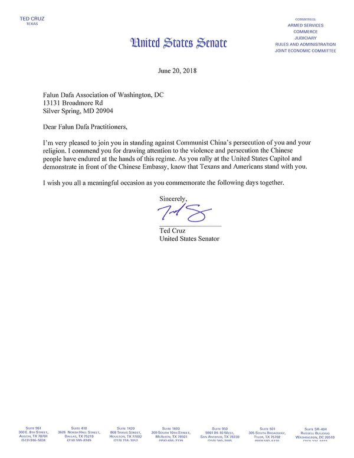

我很荣幸加入你们，反对中共迫害你们和你们的信仰。你们让人们关注在中共统治下中国人受到的暴力和镇压，我认为你们的努力值得称赞。当你们在美国国会前集会、在中共大使馆外抗议时，请记住，德州人和美国人与你们站在一起。

希望你们在接下来几天的活动中有所收获。

<b>参议员Tammy Baldwin：对法轮功的坚持和努力表达敬意</b>

感谢你们邀请我参加抗议中国政府对法轮功学员十九年的持续迫害和镇压（的活动）。很遗憾，我无法亲自参加。

尽管如此，我在此对你们的坚持和努力表达敬意，你们持续不断地努力来制止在中国国内对法轮功学员的迫害与虐待。你们对人权的和平承诺是其他人的榜样。我希望不久的将来，在中国和世界各地的法轮功学员都可以不受迫害地行使自己的权利，就像今天你们在这里是完全自由的一样，那么将来这些年度纪念活动所表达的是对过去回忆的尊重，而不是谴责现在当局的行为。

今天，我对威斯康星州法轮大法学会表示支持，并呼吁终止在中国对法轮功的迫害。由于中共对法轮功学员及其它宗教和少数民族的不公对待，我很自豪能够成为参议院决议第202号（S. Res. 220）的共同提案人，呼吁中共立即停止迫害法轮功修炼者，并即刻释放所有被拘留的法轮功学员。最后，我赞扬那些秉持原则与和平立场抗议中共残暴和不公正的中国公民。

<b>参议员Chris Van Hollen：很自豪支持法轮功集会</b>

我很自豪地支持今天呼吁结束中国政府迫害法轮功学员的集会。

来自美国国务院（U.S. State Department）、美国国际宗教自由委员会（U.S. Commission for International Religious Freedom ，简称USCIRF）、美国国会及行政当局中国委员会（Congressional-Executive Commission on China，简称CECC）和美国人权机构自由之家（Freedom House）的一系列报告中列出了可靠的证据，证明中共针对各少数民族和宗教团体，特别是法轮功成员进行了由政府主导认可的大规模活摘人体器官的活动。鉴于（中共）这些罪恶和不人道的行为，公开表示支持法轮功学员和其它受（中共）迫害的群体则显得加倍重要。

这就是为什么我很自豪能成为参议院一项决议的共同提案人。该决议声援法轮大法修炼者及其家属，并向中国政府强调包括法轮大法修炼者在内的民众有宗教信仰自由的权利。我敦促参议院外交委员会（Senate Foreign Relations Committee）的同仁能批准这项立法。我将期待看到并支持（这项立法）在参议院的表决通过。

我对你们（揭露中共罪行）的努力表示支持和感谢，希望能为曝光这些可怕的侵犯人权的事件做出一些贡献。

<b>众议院民主党领袖Nancy Pelosi：支持法轮功学员</b>

你们今天在这里集会，追求和平、人权与信仰自由，呼吁公众关注针对法轮功的迫害，我很荣幸能够致以问候。

作为美国人，我们有责任保护国内外的人权状况。纵观历史，美国在国际事务中的立场均以保护人的尊严和品格为基础，坚信不受暴力和欺压的自由生活是天赋权利。

当中国人为言论自由、出版自由、少数群体的信仰自由而和平发声时，应当得到我们的支持。如果我们不能为中国的人权挺身而出，那我们就没有道德资格再去谈及世界其它地区的人权。

我支持来参加集会的你们，支持坚信“真、善、忍”的你们。通过不断的沟通和努力，我们可以更大程度地改善世界的人权状况。

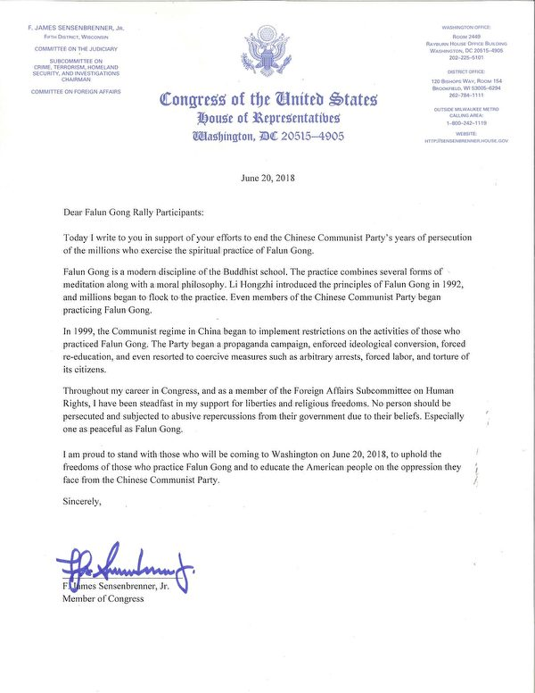

今天，我写信支持你们为结束中共近二十年来对数百万法轮功修炼者的迫害而做出的努力。

法轮大法是佛家上乘的修炼大法，结合了气功、冥想及道德哲学。 自从1992年李洪志大师在中国传出了法轮功，数百万人开始相续走入大法修炼。当时即使是中共党员也有部分开始修炼法轮功。

但是，中共政权从1999年开始对法轮功修炼者的活动实行限制，从而对民众开展造谣欺骗的宣传报导，对法轮功修炼者实行强制性的意识形态转化、非法逮捕、关入洗脑班、强迫苦力劳教、实施酷刑等残暴措施。

在我成为众议员的生涯中，作为外交人权小组委员会（Foreign Affairs Subcommittee on Human Rights）的一名成员，我一直坚定地支持宗教和信仰自由。任何人特别是像法轮功一样的平和的修炼团体都不应该因为他们的信仰而受到打压，更不应该遭受政府惨无人道的迫害。

我很自豪能在2018年6月20日与来到华盛顿特区的法轮功学员站在一起，维护法轮功修炼者的自由，并让更多的美国人民意识到中共对法轮功修炼者的迫害。

<b>众议员Zoe Lofgren：赞扬法轮功学员所做的努力</b>

衷心感谢你们邀请我参加今天在首都华盛顿DC举行的集会，以提高广大民众对法轮功在中国受迫害的认识。尽管很遗憾我无法亲自参加，但我赞扬你们为此所做的努力。

包括言论自由和宗教信仰自由在内的人权是普世价值。我将一如既往地继续在国会推动促进在全球范围内的对宽容和基本人权的保障。

对你们集会活动的成功寄予厚望。

<b>众议员Steve Chabot：钦佩法轮功学员对“真、善、忍”的坚持</b>

我写此信要表达我对世界各地特别是在中国国内法轮功学员的声援。在成为众议员期间，我很荣幸遇到来自家乡俄亥俄州辛辛那提及全美各地的众多法轮功学员，并且非常钦佩你们对“真、善、忍”的坚持。

尽管具有这些普世价值观，但自1999年7月以来，中共对法轮功开始进行残酷的迫害。这场运动让成千上万的法轮功学员受到惨无人道的迫害，包括劳教所和官方批准的酷刑及暴力审问。也许最糟糕的虐待是中国政府批准的活体器官采集，这种卑鄙骇人的做法至今仍在中国国内继续，对此我很伤心，而中共还否认这种野蛮侵犯人权的行为。作为自由世界的领导者，我认为美国有义务继续呼吁中国终止这一错误的行为。

你们坚定的反迫害活动将继续在中国社会留下几代人的印记。当你们对这种镇压进行反抗时，请知道我会继续和你们站在一起。

<b>众议员Bill Pascrell Jr.：法轮功的倡导和觉醒令人钦佩</b>

我想向所有参加法轮功修炼者集会的人们致以问候。尽管我不能亲自到场表达支持，但我祝愿你们今天的活动一切顺利。

作为一个意大利移民的孙子，我在新泽西州帕特森（Paterson）长大，从小就了解到我们的社区由于多样化而充满了活力。我们很幸运地生活在一个拥有不同种族、民族和文化的国家里。不幸的是，正如你所了解的那样，并非世界上的每个人都能享受到同样的自由。任何人都不应该因为他们的宗教信仰而遭受迫害，特别是当这些信仰是和平理性的。

你们为抗议中共的歧视性政策而提出的倡导和意识是非常令人钦佩的。我祝愿你们这次在华盛顿特区的活动获得成功，而且活动是得到公众赞赏和理解的。再次祝你们今天的努力能够起到为世界各地被迫害的法轮功修炼者发声的作用。

<b>众议员Joseph Crowley：任何人都应享有信仰自由</b>

感谢您就您关切的人权问题联系我。我坚信任何个人和团体都应该在世界各地享有信仰自由。 任何人都不应该因为信仰，在中国或任何地区被拘禁或入狱。

我感谢您为促进人权事业所做的努力，并鼓励您继续努力。 当权利得到尊重时，这个世界将会更美好。

<b>民主党副党鞭Stephen Lynch：呼吁中共结束对法轮功学员的迫害</b>

早上好！能够与我国会的同僚在这里呼吁中共结束对法轮功学员的迫害我非常高兴。

中共政府持续在由于族裔的不同、宗教信仰的或政治理念的不同而非人地、邪恶地对待其自己的公民，这是一种耻辱， 对于一个希望成为全球领袖的国家而言，这种行为完全是令人无法接受的。在中国大陆遭到这种非人对待的无辜民众中有法轮功学员，他们一直遭到中共当局的酷刑迫害。而这些人仅仅是由于他们希望坚守自己的信仰，这本应该是每个人无可置疑的基本人权。

在人权受到威胁时，有些领导人甚至在质疑保护人权的必要性，因此美国现在比任何时候都更不应该放弃其在人权遭轻视时大声疾呼的领袖作用，这就是我今天骄傲地与国会同僚和来自于全美的美国人一起站起来，提醒中共，美国和这个世界在关注其所为的的原因。我们呼吁中共尊重法轮功学员的权利，也尊重其人民的基本权利。

<b>众议员Sam Graves：感谢曝光中共暴行</b>

欢迎你们到我们美国的首都华盛顿DC来， 并谢谢你们抽时间聆听我就中共对法轮功学员的暴政和种族灭绝政策所做的讲演 。我感激你们为了将中共的这些暴行曝光所付出的努力，而且我希望我们能够找到一个结束这种暴行的方式。

法轮功学员所遭受的罪恶（对待）是令人无法容忍的， 我和我们密苏里州的同胞一起骄傲地站起来反对这种暴政和种族灭绝政策。种族灭绝政策在文明社会里没有一席之地， 特别是在我们看到了在21世纪曾发生过的种族灭绝事件后。我将继续支持珍惜人类生命（优先考虑人类生命）， 并保护全球人类自由的强力的外交政策。

再次谢谢你们让人民意识到这个重要问题， 而且如果将来我能够为你们提供任何帮助， 请不要迟疑地与我联系，我为你们与非正义抗争之举而喝采， 我期盼著结束这种可怕的暴行。

<b>众议员Steve King：非常荣幸参加今天的集会</b>
 
 

今天我和平常一样，为那些支持人类自由的勇敢的志愿者、支持者喝采，并与他们站在一起，其中包括那些帮助人们三退的退党中心的志愿者和支持者。你们和我一样是全球70多亿人中的一部分，我们中的很多人都在尽我们的所能地确保宗教信仰自由的权利能够最大程度地获得实施、确保我们坚守自己的信仰、确保我们从事自己的工作、确保我们依法生活、确保我们有能力按照我们希望的方式养活我们的家庭。这些都是自由社会的基石，它们被写入了我们的《独立宣言》和宪法， 他们是我们在美国本土强力捍卫的理念，也是我们在美国本土受召向世界各地传播的价值观。

这是1607年人们在詹姆斯敦竖起一个十字架时的部分祷告词，当时他们跪在地上祈祷，祈求上帝引导我们，帮助我们将这些价值观传播到世界各地。而这些价值观也是我今天在国会中捍卫的理念，宗教信仰自由、自由本身和法治的理念。

在法轮功学员、基督徒和其他人身上发生的那些令人遗憾的消息，对美国国会而言是令人难以理解的，更不要说热爱自由的美国人民。这种迫害的幅度就更令人难以理解。这种对于基本人权的否定和对于上帝赋予的信仰权、生存权的否定（本身就）是不可思议的。强力否定一个7千万甚至1亿人的群体的这些基本权利，然后用酷刑迫害他们、诽谤他们、将他们边缘化再杀害他们的做法是绝对是令人难以想像的，更不要说活摘他们的器官在市场上销售牟利的邪恶罪行，这是来自于中共的马克思主义政府、无视和轻视人权的可怕记录（可怕罪行）。

然而我心中仍有希望。我鼓励你们也抱有希望并为此祈祷。我祈祷有一天，这种暴行将不再仅仅是不可思议的，而是完全被从地球上消灭。我也期待着一个自由中国的出现，一个以这些基石为基础的自由的社会在中国出现。这是一个正确的目标， 我们将一起期盼实现这个目标，并为之努力。

我非常荣幸地参加你们今天的集会。

<b>众议员Jackie Speier：国会大厦能够听到法轮功的呼声</b>

在国会大厦参加法轮大法集会的人们，我很遗憾，由于时间冲突我今天没法参加你们在国会大厦外举行的集会，但是非常感谢你们今天的集会，因为这个集会能够让国会大厦听到你们的声音。

我和你们一样关注中共对中国大陆法轮功学员的迫害，中国政权长期无视宗教自由权和少数族裔的权利，作为一位美国众议员，我认为有责任谴责这种行为和相关行径，其中包括在未经许可的情况下制度性地活摘良心犯器官。

这就是我与其他众议员联合推出众议院323决议案的原因，众议院已经批准了此决议案，此决议案谴责了中共活摘器官的罪行并呼吁中共停止这种罪行。

（我们知道）当中共侵犯人权时违反了国际法。

我将与我所代表的加州选区以及整个美国的很多中国人一起支持曝光中共人权侵犯罪行的努力，并要求中共结束对少数族裔和弱势群体的迫害。

谢谢你们为此重要问题持续做的工作。

<b>众议员Bill Foster：敦促中共结束对法轮功的迫害</b>
 
 

 
我代表伊利诺州第11选区，向你们邀请我参加6月20日的国会山集会表示感谢。虽然我无法到场，但是我跟你们一起，敦促中共政府结束长期以来对法轮功学员的严重虐待、迫害和孤立。

作为民权律师的儿子，我自小就有一个强烈的信仰，即所有人都值得拥有平等权利和法律的保护。自从1999年7月以来，中共政府持续残酷对待法轮功精神运动。对和平修炼者强制转化的行为和再教育集中营深深令人不安，应该立刻停止。

我对于法轮功学员遭受迫害、虐待、强摘器官、非法拘禁和酷刑的报导感到震惊。我希望中共政府能认识到所有公民获得言论自由的重要性，并结束它的迫害活动。

<b>众议员Lynn Jenkins：呼吁结束对法轮功修炼者长达十九年的迫害</b>

今天，我要和你们（法轮功修炼者）一起呼吁结束在中国长达十九年的对法轮功修炼者的迫害。感谢你们在这里（集会游行）表现出来的勇气，并当受到由于宗教信仰带来的不公正待遇时有勇气发出抗议之声。

信仰自由是美国的立国之本，我们不能对法轮功学员受到的残酷迫害选择视而不见。我期待与国会其他同仁密切合作，呼吁结束（中共）迫害法轮功，并在全球倡导宗教信仰自由。

<b>众议员Paul Tonko：钦佩今天所有到场的人</b>

我很高兴地欢迎你们来到华盛顿DC。我对于自己不能加入你们感到非常遗憾。但是我钦佩所有今天到场的人。

法轮功功法将耐心的锻炼、道德哲学和平和的修炼带给中国和全世界的许多修炼者。今天，你们对这个事业的投入把你们带到这里。就像你们所有人一样，我希望支持法轮功学员的安全。在你们呼吁结束迫害的行动中，我跟你们站在一起。

我希望再次感谢你们，为了你们今天表示支持保护法轮功学员的宗教和精神自由。在华盛顿有这么多自由的象征围绕着我们，你们许多人聚集在此为和平的法轮功学员发声再合适不过了。他们值得拥有那些同样的权利。我希望通过你们的倡导，我们将看到所有人无惧迫害实践他们信仰的日子到来。

<b>众议员Vicky Hartzler：支持宗教信仰自由</b>

你们邀请我参加你们的集会，谴责（承认）中共侵犯法轮功学员人权的罪行，对此我表示感激，而且我也非常愿意对全球的宗教信仰自由（运动）表示我的支持。

宗教信仰自由是所有人的一个不可剥夺的权利，我相信所有的政府也应该承认这个权利。美国人非常幸运地拥有宗教信仰自由，但是令人遗憾的是，当今世界上的很多地区，包括中国都不拥有这种自由，世界上还有很多人仅仅是由于他们的宗教信仰与他们国家所宣称的不同就遭到迫害和酷刑对待。在当代的中国大陆对于法轮功学员和基督徒的囚禁和酷刑迫害从道德角度而言是令人无法接受的，也是过分的和不合理的，这是最严重的侵犯人权的行为。结束这些严重违反人类尊严的行为，并防止中国的所有的宗教少数群体遭到任何迫害绝对是势在必行的。

众议院去年采取行动，通过了一个决议案，呼吁中共政府停止其令人惊愕的活摘器官的罪行，并立刻释放其拘押的所有法轮功学员和其他良心犯。虽然这是向正确的方向迈出的一步，但是距离我们的目标还很远（我们的工作远没有做完），绝对迫切需要结束这种严重侵犯人类尊严的行为，以及阻止中国的所有宗教少数群体遭到任何迫害。

我非常感激你们为此做出的辛勤的努力，以及支持此倡议的决心。因为公众对此问题的认知是改变现状的关键，而在此重要的方面你们起了重要的作用。我一直强力支持所有人的宗教信仰自由，而且也将永远是此事业的支持者，我现在是众议院国际宗教自由核心小组的成员，此小组在努力倡导海外的宗教自由，并鼓励美国外交政策推动国际宗教信仰自由。对于宗教信仰的迫害必须停止。我在国会任职期间将继续为捍卫人权和宗教信仰自由而战。

<b>众议员Suzanne Bonamici：我对你们钦佩不已</b>

感谢你们（法轮功修炼者）在今天集会上的发言，提高了民众对中国政府残暴迫害法轮功的认识。我很遗憾不能亲自参加你们的集会，但我对你们和平而又坚持原则地抵制（中共）近二十年的迫害感到钦佩不已。

宗教信仰自由是美国的建国支柱之一，是每个人都应该拥有的权利，而不用担心受到指责。我不断地听到俄勒冈州第一区议会（Oregon’s First Congressional District）的居民关于这个问题的讨论，并分享他们对此问题的深切关注。

美国众议院（House of Representatives）去年投票表决谴责中国国内具系统性的由国家许可的对活体器官的采集，并通过立法制定打击器官贩运的新议定书。但是关于这方面还有更多的事情要做。

我们必须持续不断地向世界各地的迫害者和受害者发出强烈而明确的信息，表明美国政府致力于结束这一（对法轮功修炼者的）野蛮凶残的迫害。我期待着我们持续的合作关系，并祝愿你们在你们的努力中取得成功。

<b>众议员Mark Pocan：谴责中共对法轮功学员近二十年的迫害</b>

我坚定地跟你们站在一起，谴责中共近二十年来对法轮功学员的迫害。

过去十九年来，无数人成为一场剥夺法轮功学员人权的多方面行动的牺牲品。法轮功支持者被监禁、被送到劳教所、被酷刑甚至被杀害，只因为他们的信仰。作为宗教自由和人权的倡导者，我对法轮功学员受到的持续迫害感到震惊。

为了表示我的支持，我自豪地联署国会343决议案，呼吁中共停止国家支持的对法轮功学员的器官摘取和迫害。他们和平的做法应该不再遭到虐待。

我将继续跟全美的、全世界的法轮功学员和支持者站在一起，呼吁结束对法轮功学员和支持者的迫害。

<b>众议员Hakeem Jefrries：请接受我最热烈的致敬</b>

在2018年6月22日，在华盛顿DC的世界法轮大法活动，请接受我最热烈的致敬。我很高兴有这个机会表彰你们的创始人和精神领袖李洪志先生，以及你们全世界的修炼者和支持者，为你们杰出的领导。

我赞赏法轮功学员的献身精神和他们将无数时间奉献给社区服务的使命。法轮功学员为修炼者和纽约居民组织免费冥想学习班、中国文化音乐舞蹈表演和教功学习班。

你们通过提供全面计划，确保社区所有居民学到法轮功，一种和平和精神性的功法，保存和提高了生活质量。你们的努力丰富了我们社会的活力。

作为第八国会选区的国会议员，我希望感谢你们的服务和奉献。衷心祝愿你们有一个值得铭记的庆祝活动。

<b>众议员Lee Zeldin：赞扬法轮大法修炼者的人权集会</b>

<b>国会特别表彰证书</b>

向法轮大法修炼者的人权集会表示赞扬

表彰法轮大法修炼者为社区提供的卓越而无价的服务

<b>众议员John Faso：赞赏法轮大法及其对中国传统文化的贡献</b>

（大纪元图片）

我作为纽约第十九区和美国众议院的代表，对法轮大法及其对中国传统文化的贡献表示赞赏。

自从（大法师父）公开传法以来，法轮大法已在世间特别是在美国洪传。我们应该衷心感谢生活在我们社区里的充满积极与务实心态的法轮功学员。比如，神韵艺术团（Shen Yun Performing Arts）的演出是法轮大法修炼者与世人分享中华传统艺术和文化的一种美好的方式。

我想借此机会向法轮大法表示感谢。如果能从我这里得到协助，我会一如既往地欢迎当地社区成员联系我的办公室。

责任编辑：李缘

<a href=#top><h6 align="right">回上方</h6></a>

<a name=98>
<h1 align="center"><b>反迫害19周年 法轮功学员国会山大炼功</b></h1>

2018年6月20日，华盛顿DC国会前集体炼功。（戴兵／大纪元）

【大纪元2018年06月20日讯】（大纪元记者周慧心华盛顿DC采访报导）6月20日早上9点，美国首都华盛顿DC，一个主题为“解体中共、停止迫害法轮功”的大型游行集会即将开始。近万名来自世界各地的部分法轮功学员，正在美国国会西边草坪上集体炼功。

蓝天白云下，法轮功学员们在草地上打坐炼功，黄色的T恤在阳光下发出耀眼的光芒，柔和舒缓的炼功音乐在空中飘扬。路人被这祥和的一幕所吸引，时而上前询问，时而举起相机，拍下这动人的一幕。

这些法轮功学员来自北美、欧洲、亚洲多个国家，他们拥有不同的肤色，讲述著不同的语言，每个人身后都有不同的故事。唯一相同的是，他们都是法轮功学员，他们汇聚在华盛顿，希望让更多的人了解法轮功，停止发生在中国的迫害。今天，他们来到美国国会前的草坪上集体炼功，向人们展示这种平和的功法。

2018年6月20日，华盛顿DC国会前集体炼功。（李莎／大纪元）

2018年6月20日，华盛顿DC国会前集体炼功。（李莎／大纪元）

2018年6月20日，华盛顿DC国会前集体炼功。（李莎／大纪元）

2018年6月20日，华盛顿DC国会前集体炼功。（李莎／大纪元）

2018年6月20日，华盛顿DC国会前集体炼功。（李莎／大纪元）

 

2018年6月20日，华盛顿DC国会前集体炼功。（李莎／大纪元）

2018年6月20日，华盛顿DC国会前集体炼功。（李莎／大纪元）

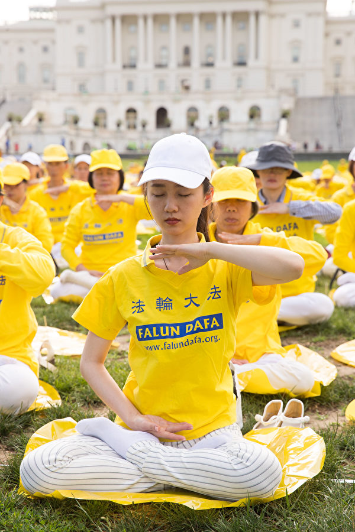

2018年6月20日，华盛顿DC国会前集体炼功。（李莎／大纪元）

2018年6月20日，华盛顿DC国会前集体炼功。（李莎／大纪元）

2018年6月20日，华盛顿DC国会前集体炼功。（李莎／大纪元）

 
<b>澳洲华商：肝癌不治而愈</b>

来自澳洲墨尔本的越南裔华人刘镇华先生，二十年前因患肝癌几近离世，但如今年近70岁的他却精神矍铄。他向记者讲述了他的神奇经历。

1989年，正当刚刚40岁的刘先生事业有成时，他的身体突然出现了问题，铁蛋白指数持续升高。男性正常铁蛋白指数是200以下，但他的指数已经达到290。医生告知，他的肝脏出现了病变。

他说：“铁蛋白指数越高越辛苦，睡觉也累，躺下来也累。当时我除了天天吃中药外，一周还要针灸三次，两次在家里按摩。”

罹患肝癌九年的时间里，刘先生用尽中西医的治疗方法，也尝试各种偏方、药物但都没有用。1998年，49岁的刘先生铁蛋白的指标超过了470，医生告诉他要“准备后事”了。

“当时儿子才10岁，我感到很绝望，着手购买人寿保险，让我的家人受益。”刘先生说，“因为癌症，多年来我基本上没有正常的睡眠，脸色灰暗，外人辨不出我的实际年龄。”

“走入真正的修炼，我任何不好的症状都没有了，吃得好睡得香，人也变得红光满面。”二十年来，他没再吃过一粒药，也没再去过医院，身体非常健康。

墨尔本法轮功学员刘先生感恩李洪志师父的慈悲救度。（明慧网）

<b>二十多年的宿疾好了</b>

今年50岁的陈凤玲是广东台山人，她1987年移民到美国。陈凤玲告诉记者，她的身体一直不好。甲状腺肿大，肾脏、膀胱都有囊肿，“我生完小孩，盆骨受伤，腿很冷，膝很冷，颈椎一受到凉风就很痛。夏天也穿很多衣服，每个人看我都说我不正常。”

陈凤玲还患有忧郁症，吃药就水肿，胃口也受影响。家里满桌子好吃的东西，她看见就想吐，吃不下去，每一餐她只能勉强吃两汤匙的白饭，这种情况持续了二十年。

2017年8月，经医生介绍，陈凤玲开始修炼法轮功，一天晚上她炼完功回家，躺在床上就睡着了。“我很多年没有睡得这么香、这么沉了。”陈凤玲说：“大约10点多，孩子放学回家，叫了我20多声才把我叫醒。”

醒来后她马上起来给孩子做饭，忘记自己还穿着短袖、短裤，孩子一把拽住她说：“妈妈您这是怎么了？我从出生都没有看到您穿过短袖衣服，即使在夏天也没有。”陈凤玲回答说：“妈妈炼法轮功好了。”

当晚，饭菜煮好后，陈凤玲与孩子共进晚餐，陈凤玲不知不觉竟然吃了两碗饭菜。孩子兴奋地说：“妈妈真的好了！”

陈凤玲说：“如果没有张医生告诉我法轮功，我不可能得法。因为以前有人讲到法轮功，都是很反对的。我修炼后家庭气氛变得很平和。以前常跟我先生斗气，现在不会了，以前的心情经常不好，现在也不会了。大法真的好可贵、高尚。我真的很感恩师父。”

<b>电脑工程师：心灵得以净化</b>

Scott Chinn是一位电脑软件工程师，今年48岁，他出生在美国加州，目前在纽约工作。

他对记者表示，他年轻时不信有神，而是相信科学，但是上大学时却被情所困。“我经常被感情所困扰，让我倍感压力，感到非常痛苦。所以我开始寻找答案，为什么我不可以控制自己的情绪？”

Scott发现，科学无法解开他的疑惑，无法解释人生命的意义，他开始阅读一些精神方面的书籍，但这些书有很多互相矛盾、讲不通的地方。

1999年，通过朋友的介绍，他开始阅读法轮功的书籍，“当我看《转法轮》时，我被说服了。书中讲了很多高层次中的理。我开始明白自己内心痛苦的根源，比如男女之间的关系、妒忌心等。”

Scott说，“在得法之前，我非常焦虑，也因自己控制不了的事情而感到十分大的压力，例如人际关系、家庭矛盾、自己的工作。经常问自己：‘我为什么在人生中会经历这么多情绪的起伏？为什么自己不能知足、幸福？’”

“可现在我的心态完全转变了，在得法后的十九年中，我的生活变得更加快乐。在生活中，在与朋友、家庭成员相处中，我会用在大法中学到的理来处理不同人际关系。我有两个孩子，我也让孩子们学会这些人生道理。在这十九年中，我没有生过病，我感到自己身心都非常健康。我非常感恩师父，让我明了生命的意义。”

Scott曾经为情所困，想了解人来在世间的原因，以及生命的意义。科学、宗教都无法解开他的疑惑。1999年，法轮大法终于解开了他所有的疑惑，从此人生变得光明。（Bowen Xiao／大纪元）

<b>法国和尚：大法让他找到人生真谛</b>

39岁的Visuddha来自法国，从2012年开始修炼法轮大法。他说，修炼法轮大法是非常美好的经历。

Visuddha说，在他成长过程中，他一直感觉人生缺少什么。他曾经学习法律专业，后来又成为一名骑马师，但是这些都不能让他感到满足，所以他一直试图寻找一种提升精神的途径，而且尝试过不同的宗教和修炼。

他说，曾经是个虔诚的佛教徒，并且亲自到缅甸的寺院出家，做了三年的和尚。但即使是这样，他仍然感觉不满足。一个很要好的法国朋友要他回法国，他说“他发现了一个非常棒的东西，要和我分享”。于是Visuddha回到法国，学了一天功，读了一天法，就决定开始修炼法轮大法。

他说，虽然他读了很多佛教的经文，但是直到他读了《转法轮》，他才好像恍然大悟，真正了解他以前读的佛教经文的意义，而且越修炼越觉得美妙，就“好像一块拼图，一小块、一小块的，然后拼在一起，就成为一个大的图像”。

他说，他无法用语言来表达法轮大法有多么美好，那是一种发自内心的感激，他形容说：“真善忍就像是从我心底唱出的歌。”他还说，与大法弟子一起相处时，让他非常快乐，因为这里就像是一个亲密无间的大家庭。

图为Visuddha。（周慧心／大纪元）

<b>张医生：从瘫痪边缘走向健康</b>

今年46岁的张桂英是一位西医。由于从小就体弱多病，她从初中开始就练各种气功、武术、瑜珈。可是祸不单行，在练瑜珈时，颈椎不慎受到严重损伤，被诊断为脊髓型颈椎病。

上大学后，颈椎发病的频率增加。张桂英对大纪元记者说：“严重时，不能走路，不能写字，不能吃饭，也不能见光。我躺在床上，当时宿舍里是上下铺，围了一个帘子遮住光线。不能吃饭，只能喝一点水、喝一点很酸的东西，就是维持。”

因为她损伤的位置非常高，被告知没有机会做手术，也没有特别有效的治疗方法。以后可能因为大笑或者疲劳，就造成高位截瘫。

正在张桂英处于绝望的边缘时，她的同学给她介绍了法轮大法。那天她的颈椎病又发作了，躺在床上，四肢无力。她的男友把她背到了炼功点，并站在她身边防止她摔倒。虽然手脚都像棉花一样无力，但她还是坚持炼功。

“当我炼到第三套功法时，就有一股白白的、温温的、像奶酪一样的物质从头顶上灌到脚下。在那一瞬间我什么恶心呀、站不住呀、疼痛呀，什么症状都没有了。真的是非常的轻松，就是那种妙不可言，就是这种感觉。一瞬间，就是一瞬间，什么东西都没有了，什么不舒服的感觉都没有了。”

她说：“从那天以后，我的颈椎病就好了，三天，就三天，医学上解决不了的这个难题就解决了。”毕业后，张桂英做了内科医生，经常值夜班，非常忙碌，有同事因为过劳而晕倒，但是她一直都很健康，颈椎病也没有再犯。

责任编辑：李缘

<a href=#top><h6 align="right">回上方</h6></a>

<a name=97>
<h1 align="center"><b>中共打击律师是有计划的政治迫害</b></h1>

维权律师文东海。（大纪元）

作者：文东海

【大纪元2018年06月20日讯】（大纪元记者萧律生采访报导）“每一个案件都存在违法。”湖南律师文东海回忆两年来代理的诸多法轮功案件说。他想要竭尽全力帮助当事人，无奈于大陆这种司法乱像与迫害政策。

曾经当过警察、教师的文东海，此前为长沙执业律师；2015年“709案”后正式转向代理维权案件；2016年1月至今年被吊照，他多代理的是法轮功学员的案子——中国30万律师中少有律师敢接触的案子。

然而不幸的是，2018年5月26日，湖南司法厅发出公告，称文东海无故不参加听证，终止对拟吊销律师证听证会，并将继续对他作出吊照行政处罚。

事实上，文东海当时被不明身份人员袭击，但他已向司法厅及派出所的工作人员讲明情况，希望他们协商。结果，在文东海做笔录时，湖南司法厅做出违法公告。

“他们这一波打压律师的行动，是公检法系统安排报复性的行动，是有计划、有步骤、系统地安排的，发动各个法院进行投诉。”文东海说，“本来客户对律师的反馈、投诉才是律协应该了解的情况，但是这次都是各地公检法的投诉。”

去年下半年至今，中共司法当局陆续注销、吊销了曾代理法轮功学员案件的维权律师及律师事务所：2017年11月2日，山东律师祝圣武被吊销执照；2018年1月中旬，北京律师余文生被注销执照；2月11日，北京程海律师所在的北京悟天律师事务所被强制注销；2月12日，广东维权律师隋牧青被正式吊销执照；3月5日，北京锋锐律师事务所执业证被强行吊销；5月16日北京律师谢燕益、5月17日北京律师李和平拟被吊照听证会召开；5月19日，广西百举鸣律师事务所被强行解散。

文东海说：“这些都是违法的。对律师的整治，要从投诉、立案起，如果参与的都是公权力的话，这些问题就是政治迫害。”

文东海被吊销执照的原因很荒唐
而就文东海本人，他被吊销执照的理由是，湖南司法部门和律协认定他在去年办理法轮功学员——云南省峨山县李琼珍和广东省汕头市彭佩珊的案件中有违法行为。

可是，据文东海介绍，法轮功学员李琼珍的案子中，云南省玉溪市峨山县法院副院长柏为良逼迫当事人认罪和解聘律师，并且联合当事人家属诋毁律师。

“我控告他了，在开庭时，要求该院院长那汝琼、副院长柏为良、合议庭成员申请回避，并提供了当事人的笔录、家属的情况说明。”文东海表示，峨山县法院不仅没有休庭调查提供的证据是否真实，也没有让审判委员会对此做决定，而是审判长柏为良以院长已经做出决定为由驳回复议申请。

为此文东海和柏为良发生了激烈冲突，但文东海经过反复抗争，无效。

“让我忍无可忍的是，判决书下来后，我的当事人与其他人比较，判得太重。我们又没有任何救济措施。”文东海叙述当时情况，他又进行了第二次控告，但始终没有得到回应。而湖南司法厅却把此事件当成吊销文东海律师执照的一个原因。

至于广东省汕头市法轮功学员彭佩珊一案，文东海表示，因为该案第一天庭审时，进度慢了，可能610、国保对法官进行批评，第二天开庭完全不让律师说话，剥夺了律师辩护权，“我就抗议，结果被赶出法庭。”

文东海说：“调查我的案子违法的地方更多。”他依据律师法、行政处理法，要求湖南司法厅对他代理的两起法轮功案件进行全面调查，但是“他们只针对、截取法庭那一小段时间，我要求对法官在看守所的违法犯罪行为进行调查，他们却没有任何调查行动。”

文东海还表示，这两起案件之所以成为典型，是因为他们的投诉暴露出他们的邪恶，而他又在不断地披露真相。“中国要有法治很难。仅靠我的努力，帮助当事人，也无法直接改变。这个事情闹得大了，你不断纠缠，不断暴露真相，它就整你。”

中共当局在法轮功案中的违法怵目惊心
“709案”发生后，有侠义性格的文东海，历经犹豫，顶着压力，最终答应做当时被中共非法关押的王宇律师辩护人。

“刚开始，我对法轮功了解也不是很清晰。中共妖魔化这么多年，当时对法轮功也是有误解的。”文东海说：“但是，709的时候，我的当事人王宇，在律师界的口碑非常好，她却代理了很多法轮功案子，这促使我了解法轮功。”

原本打算向代理专利技术方面发展的商业律师文东海，转向代理维权案件的道路，2016年后更是多代理法轮功学员的案子。

据明慧网报导显示，文东海代理过湖北、广东、贵州、北京、云南、黑龙江等多省法轮功学员的案件。

“代理后，发现这些案件，违法情况怵目惊心。”文东海说，“每一个案子留给我的印象都深刻，当事人受到这样的打压，还在默默忍受。这些法轮功学员，从人性角度都是善良的，而这种善良是中国目前最缺乏的。”

于是，文东海对这个群体逐渐有了好感，一直尽力帮助，以至于一些商业案件因他代理法轮功案子而不再找他做辩护。

在众多的法轮功案子中，给文东海印象最深的有两起案例。

一起是他同山东维权律师王振江在黑龙江省佳木斯代理的法轮功学员王淑英的案子。“一个是她向最高法、国务院等投递了控告江泽民的诉状，另一个是，她的一同修受到迫害，她帮忙一起去控告。”文东海说，就这两件事情，却给判刑3年，开两次庭，一次把律师赶出法庭，一次在律师不知情的情况下悄悄开庭宣判。

“很奇葩的案例啊。就算根据最高法的司法解释，她也没有制作和传播法轮功真相，根本够不上犯罪。”文东海说。

另外一起是山西忻州市法轮功学员张春蕾一案。一开始文东海不被允许会见当事人，后来是截止开庭前，仍不给阅卷。

“开庭了，法官让工作人员念一遍卷宗，就让我辩护。真是奇葩。”文东海说，他还听到更“奇葩”的言论：“那个法官说，不管违不违法，只要遵守党的领导，上面让我做什么就做什么，让我杀人，那肯定要杀人。”

责任编辑：孙芸
<a href=#top><h6 align="right">回上方</h6></a>

<a name=96>
<h1 align="center"><b>中共为何强行火化他们的遗体？（1）</b></h1>

从左到右，分别是贺秀玲、徐浪舟、谢德清。（大纪元合成图/明慧网）

【大纪元2018年06月20日讯】2017年1月11日，四川的老母亲彭广贞收到一条来自嘉州监狱的短信，她伤心不已——被冷冻4年多的儿子徐浪舟的遗体，于2017年1月10日被强行火化。

2009年5月29日凌晨3点左右，四川成都，谢德清灵堂。突然，成都市大批防暴警察闯入，一百多人包围灵堂。他们大打出手，打伤谢德清的大儿子谢卫东，绑架走二儿子谢卫民，并强行将谢德清遗体抢走。第二天，谢德清遗体被强行火化。

2006年，山东烟台居民徐承本在网上发表一篇文章，质疑被关押中的妻子被活摘器官而死。第二天，徐承本被捕；妻子贺秀玲的遗体也旋即被强行火化。

贺秀玲、谢德清、徐浪舟是被中共迫害致死的三位法轮功学员。中共为何要强行火化他们的遗体？

<b>被推进太平间里的贺秀玲还有心跳</b>

2004年3月11日，山东烟台市玉黄顶医院太平间。亲人看到躺在太平间里的贺秀玲，腰间绷带缠绕，而她的双眼还在流泪！在亲人的催促下，医生约半小时后带着心电图姗姗来迟。经测试，贺秀玲的心脏还在跳动，心电图测试纸跑出十几公分长……医生急忙撕碎心电图纸，慌慌张张地走了。

贺秀玲（明慧网）

贺秀玲，女，山东省烟台市芝罘区幸福十村法轮功学员。因信仰“真、善、忍”，被烟台市南郊看守所迫害得奄奄一息。2004年3月8日，被送入烟台市毓璜顶医院（又叫专区医院）。3月11日，含冤离世。

11日当天，面对亲人怀疑太平间里的贺秀玲“还没死”，毓璜顶医院不作急救，只是回避。对于医院这样的行为，贺秀玲的丈夫徐承本怀疑：医院偷盗了她的肾脏，否则遗体上腰间为什么被包扎起来了呢？

事后，医院说，做过腰间穿刺，但看守所张队长说，没做穿刺。医院不让家属碰遗体。

据医生的说法，当天早晨7时45分死后就抬出了病房；而太平间管理尸体的人说，贺秀玲是9时多被送进来的。这1个多小时的时间差内，贺秀玲人在哪里呢？据说，动作流利的医生摘取肾，只要10多分钟就可完成。

事后，警方欲出价10万元阻挠徐承本不再上诉，遭徐拒绝。

<b>谢德清被绑架不到一个月离世 遗体呈中毒症状</b>

谢德清，四川省成都勘测设计研究院退休职工。1996年开始修炼法轮功。修炼后，全身病痛不治而愈，身心健康，为单位节约了一大笔医药费。法轮功以“真、善、忍”为原则，包括五套功法动作，对祛病健身有奇效。

因坚持信仰，2009年4月29日，谢德清被绑架到四川省成都市新津洗脑班迫害。

身体健康、红光满面的四川省成都勘测设计院退休工程师谢德清，被劫持至“成都法制教育中心”不到一个月，便被迫害致死。（明慧网）

不到一个月，谢德清被迫害得骨瘦如柴、小便失禁、滴水难咽，并伴有严重心绞痛。在这种情况下，洗脑班将其扔回家。

回家仅4天，谢德清含冤离世。

离世前，谢德清曾艰难地说，新津洗脑班强制送他到医院作所谓身体检查，并给他注射了不明药物；（之后）10多天内，他水食难进。谢德清离世时，双手变黑，遗体也随后逐渐变黑，呈明显中毒症状。

不明药物、精神病药物是中共为了让身心健康的法轮功学员放弃信仰的强制迫害手段之一。截至2018年6月19日，以关键字“不明药物”在法轮大法明慧网上检索，显示有3,926条相关信息。这仅是突破中共重重封锁送出海外的消息。

海外“追查迫害法轮功国际组织”2004年单独针对中国精神病院进行的调查发现，仅山东、北京、河南省、河北省4省42家精神病院或精神科中，90%表示曾关押过法轮功学员。其中25家承认法轮功学员没有精神病症状，关押他们只为强迫转化，手段包括使用药物。

<b>徐浪舟遗体有大块血淤</b>

徐浪舟，攀枝花市公安局交警支队优秀警察、法轮功学员。按照法轮功“真、善、忍”标准为人处世，工作执法公平，任劳任怨，连续四年被评为市先进工作者。当地媒体曾多次报导他的事迹。

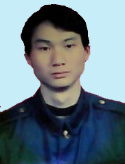

徐浪舟（明慧网）

因坚持信仰“真、善、忍”，徐浪舟后来被开除公职、非法劳教、判重刑，经历了“上刑床”、几万伏电棒电击、捆警绳五花大绑曝晒、高温下做奴工、吊打等酷刑。2012年3月18日，徐浪舟被迫害致死，时年39岁。徐浪舟的母亲与妹妹，在警察的监视下发现其遗体胸部有两大块血瘀。

徐浪舟遗体（明慧网）

1999年7月20日， 前中共党魁江泽民以法轮功修炼人数超过共产党员、其“真、善、忍”原则与共产党意识形态不同等为理由，不顾中共政治局其他6个常委反对，下令镇压迫害。这场迫害时至今日已持续19年了。

在江泽民“打死算自杀”、 “不查尸源，直接火化”等群体灭绝政策的指使下，中共各级看守所、劳教所和监狱警察对不愿放弃修炼的法轮功学员使用了上百种酷刑，包括毒打、电刑、火刑、开水烫、烙铁烙、“老虎凳”，甚至活摘器官。

据明慧网不完全统计，截至2018年6月19日，包括徐浪舟、贺秀玲、谢德清在内，4,226名法轮功学员被确认迫害致死。这个数字只是冰山一角。

<b>真相崎岖路</b>

徐承本在妻子贺秀玲死后两年后网上发文，质疑她被活摘器官后第二天即被捕。徐被劫持至洗脑班；在迫害下，身体迅速消瘦，原本体重一百七十斤，数月后仅一百零几斤，像一副骷髅架子；意识常常模糊。两年后凄惨离世时，徐皮肤溃烂，疑遭当局施用药物迫害，以达到杀人灭口的目的。

谢德清的妻子、成都勘测设计院73岁的退休干部余勤芳，2015年7月28日向北京最高检察院控告江泽民，指控江泽民发动这场迫害，导致其丈夫、女儿被迫害致死。

徐浪舟死后，遗体一直被冷冻在成都东林殡仪馆。母亲彭广贞坚持要为儿子讨回公道。她说，“遗体我不敢火化，因为他们杀害我儿的罪证在我儿身上。乐山嘉州监狱（原乐山五马坪监狱）威胁要毁灭证据，企图逃脱责任。我坚决说：不。”

为了销毁证据，五马坪监狱多次逼迫彭广贞。在彭广贞不同意的情况下，2017年1月10日，四川省嘉州监狱强行火化徐浪舟遗体。火化通知书上没有任何人签字。遗体火化时，没有任何家人在场。

文字整理：叶枫

<a href=#top><h6 align="right">回上方</h6></a>

<a name=95>
<h1 align="center"><b>中共在新疆高调庆端午 强迫维族人吃粽子</b></h1>

图为2013年6月29日，一名维吾尔族小女孩在新疆乌鲁木齐穆斯林区的主要集市附近。（MARK RALSTON/AFP）

【大纪元2018年06月20日讯】（大纪元记者李新安报导）从强迫饮酒吃猪肉，到强迫吃粽子，中共对维族人生活的控制渗透到每一个细节。这也是中共对中国社会极端控制的缩影，从而引发民众的反感。

据自由亚洲电台6月18日报导，中共当局为加速汉化维族人，强迫新疆的少数民族庆祝端午节，而比端午节早两天到临的伊斯兰教“肉孜节”，则被要求低调度过，维族人转发“肉孜节”的讯息会被拘留。

于新疆石河子市居住的汉人胡先生表示，虽然市内大多都是信奉伊斯兰教的维吾尔人，但是在政府鼓励民众过节后，“基本上就是大家都在过端午节”。周六（16日）是肉孜节，即束斋戒月的庆祝节日，当地信徒可以自由进食，多地虽然亦有庆祝活动，但亦不及政府宣传的端午节热闹。

世界维吾尔大会发言人迪里夏提表示，当地政府要求所有的维吾尔人必须高调的去庆祝这个端午节，有些地方的维稳办提着粽子给维吾尔人挨家挨户的送，如果拒绝的话，会被强制性的送进改造集中营。

迪里夏提说，就是在肉孜节的这个时间，因转发节日祝福语，有一百来名维吾尔人遭到了中共政府的羁押，部分人员接受了经济性、教育性的惩罚。签写保证书以后，有被释放的，其余的人，目前他们的命运还令人担忧。

据美国之音报导，此前的斋月期间，中共政府开始监禁更多的维吾尔族人。世界维吾尔代表大会主席多里坤．伊萨（Dolkun Isa）说，自去年起，中共政府禁止大多数维族的宗教活动，包括阻止公务员在斋月期间禁食和访问清真寺，同时组织喝酒和吃猪肉的比赛活动。

2017年4月1日起，中共新疆当局开始实施“去极端化”条例，包括禁止在公共场所戴面纱和蓄长胡须，“起名渲染宗教狂热”，以及“排斥、拒绝广播、电视等公共产品和服务”等。这一规定引起了国际社会的谴责，说他们违反了基本人权和宗教自由。

自2018年初以来，维吾尔人还被迫欢迎中共官员进入他们的家中，这一计划将派遣超过100万名中共官员与南疆当地农民家庭共同生活。而在所谓的“家庭住宿”期间，维族家庭受到政治灌输和信息监控。

近日，由中共国务委员、公安部长赵克志带领的中共中央调研组，先后到乌鲁木齐、和田、喀什等多地考察，要求持续深化“严打”，深入推进“去极端化”，“反恐维稳”。新疆的局势由此引发外界担忧。

中共对新疆的极端化控制，已经使新疆成为一个露天大监狱。被投入再教育集中营的人士，不仅有因民族身份而被抓的维族青年，不少法轮功学员也被关进集中营。

据明慧网报导，新疆各级公务员、公检法工作人员、企事业单位的人员也被强迫洗脑，对现行政策有看法的公务人员，马上送往集中营进行所谓的教育，让公务员们从反感到顺从，直至到参与迫害民众。

据此前一名幸存者指证，被关在集中营中人们，每天早上要唱“红歌”；要强迫学汉语和中国历史，特别是共产党是如何“解放”新疆的。吃饭前，要高喊“感谢党”等，还要不停地批评自己和亲人。集中营的洗脑被称为是“文化大清洗”。

美国之音报导，国际人权活动人士葛瑞森（Carol Anne Grayson）表示，中共需要对其对维吾尔人的政策进行激进的反思。“他们目前的做法是煽动报复，而不是平息局势”。

有网民表示，“真实情况远不止如此，整个新疆人民都在遭受严重的洗脑，从幼儿园，小学、中学、大学，到企事业单位，个体商户一个也不放过。从去年开始所谓的‘民族一家亲’活动，说白了是动员所有公务员和事业单位人员，每年6至12次去民族地区给当地居民洗脑，传播马列流毒，抹去人们的信仰和善念。”

网民们纷纷表示，“新疆的问题，谁是始作俑者？现在的囚笼政策，能够持续下去？整个新疆差不多就是一个集中营！”“是谁在西藏新疆采用血腥手段造成疆藏对汉人的仇恨？”“现在共匪所有的行为只为‘维稳，保权’这两个目的，它啥事都干，已到穷凶极恶的地步。”

责任编辑：李玲

<a href=#top><h6 align="right">回上方</h6></a>

<a name=94>
<h1 align="center"><b>土地遭强拆 河北孔作菊再遭暴力截访 遇难</b></h1>

【大纪元2018年06月19日讯】河北张家口市桥东区口里东窑村访民孔作菊，6月15号到北京信访局上访时，被地方截访人员暴力截访，导致心脏病突发死亡。目前，遗体被当地政府控制，打算强行火化，家属披麻戴孝跪村委会大门口摆灵堂，要求归还遗体。

据《民生观察》报导，6月15号孔作菊前往北京上访，遭到桥东区维稳人员暴力截访。被带回当地过程中，突然心脏病发作，其多次向截访人员提出心脏不适，需要到车外去透透气，但截访人员不仅不同意，还多次强行把她拖入车内看押，致使其身上多处擦伤淤青。之后孔作菊因长时间得不到药物治疗而陷入昏迷状态，送医不治死亡。

河北访民蔡先生：“孔作菊到信访局上访，被地方截访的强行押上车，她感觉心体不适就要求说那个，截访人员也没有及时给予治疗，造成了心脏病突发死亡。她手上啊、身上啊、头上好像就是被打伤的，去世前肯定遭到了暴力的侵害，也可能暴力侵害使心脏病突发。”

黑龙江访民郝女士：“她在车上说是要下去透透气，有几个人就不让，就因为没让她下去透气，病发作了呀，她的手上还有伤好像是。截访对访民使用暴力，现在是很正常了。”

报导还说，孔作菊的遗体被强行运往张家口市殡仪馆，地方政府打算强行火化尸体。17号，十几名家属披麻戴孝跪在村委会大门口，要求归还孔作菊遗体。

蔡先生：“遗体是在殡仪馆，处于官方控制。现在政府机关那摆灵堂，这个事已经造成了很大的社会影响，当地政府可能想办法把这个事情给压下去。”

据了解，由于当地造纸厂没有给村民补偿款，开发商私自开工挖土，2300万地上物的补偿款不知去向，村委会账目不清等问题，村民要求重选村民代表，全村村民联名反映也得不到重视。15号，65岁的孔作菊和20名村民到北京上访。

——转自新唐人

责任编辑：任浩

<a href=#top><h6 align="right">回上方</h6></a>

<a name=93>
<h1 align="center"><b>江西国企破产 数年来职工讨安置费无果</b></h1>

江西九江市国棉一厂与九纺有限责任公司2001年宣布破产，数百名职工多年维权讨安置费无果。（受访者提供）

【大纪元2018年06月20日讯】（大纪元记者顾晓华采访报导）江西九江市国棉一厂与九纺有限责任公司（简称九纺）2001年宣布破产，职工安置赔偿至今未到位，数百名职工多年维权无果。

九纺职工范先生向大纪元记者介绍了事件大致经过。

2001年国棉一厂与九纺兼并后宣布破产，政府官员与山东青岛新海扬投资有限公司勾结，以虚假公司的形式将两厂国有资产全部转让给对方。

范先生表示，2012年初，在涉及世纪大道拓宽马路生活区职工宿舍住房动迁过程中，发现职工住房的产权归属存在问题，职工们开始大批上访维权。

通过职工们的调查，发现2001年7月14日当地政府招商引资代表工厂与青岛新海扬实业有限公司签订了《产权转让合同》。

范先生透露，接收方应该是实体公司，并且效益要好于转让方，而实际上青岛新海扬公司实体根本不存在，没有资金和实力购买国棉一厂与九纺两厂。

政府与其相互勾结，弄虚作假，“后来（新海扬）跟政府又签订了一个收购合同，收购应该花钱买，但是它（新海扬）没钱买，政府就把我们国有资产划成每人18,000元给他了，我们生产区和生活区的土地一共73万平方米也全部送给它了，包括我们的设备、半成品，等于把我们国有资产6亿元无偿送给了新海扬公司，国有资产大量流失。” 范先生说。

新海扬公司接收了该厂之后，并未按合同承诺追加资金继续进行发展企业，而是将设备等全部运至山东，在那里建起新的企业，九江这边的企业于2001年9月彻底停产，慢慢变成了房地产公司。职工们开始另谋职业，买断工龄。

职工们透露，新海扬公司用两个工厂的土地搞房地产开发，使用此笔款项把职工工龄全部买断。

但是在买断过程中并未按国家政策相关规定计算，按照国家的规定，安置费应该按破产前一年的工资7千余元的3倍计算，该厂职工在买断时只按每年650元计算，乘以工龄。

范先生表示，工作30多年的职工也只能获得2万多元的补偿，九纺还欠职工工资790余万元，并且工龄买断后原来的福利房也被收回，职工变得一无所有。

离开工厂之后，职工们至今都只能以打零工维生，租住房子，没有五险一金，无任何保障。

数年来，职工们不停地在各级部门维权，结果是互相推诿。

江西九江市国棉一厂与九纺有限责任公司2001年宣布破产，数百名职工多年维权讨安置费无果。（受访者提供）

 

江西九江市国棉一厂与九纺有限责任公司2001年宣布破产，数百名职工多年维权讨安置费无果。（受访者提供）

“我们跟市政府打了五年的交道，政府不作为，也不给你（钱），没办法。”范先生说。

据了解，去年9月18日，以及今年3月8日五六百名职工发起了大规模的维权行动，打横幅到市政府讨说法，最后是九江市副市长答应职工一个月之内解决，4月25日，职工们再次去讨说法，“结果我们去了以后他们又不答应了，他们看对他们不利。”王先生说。

责任编辑：林妍

<a href=#top><h6 align="right">回上方</h6></a>

<a name=92>
<h1 align="center"><b>陆退伍老兵被视为“不稳定人员”禁入天安门</b></h1>

【大纪元2018年06月20日讯】（大纪元记者李熙采访报导）近日，有一群退伍老兵到北京天安门观光，被当作是犯过罪的“不稳定人员”，不让进入天安门。

他们在不满的情绪中写了保证书“不让后代当兵打仗”调侃当局。另有两名参加过朝鲜战役的老兵，因维权一个刚出狱，一个到处流浪要饭，他们感叹：这就是中国（中共）法制特色！

<b>“我们当兵保家卫国 我们有罪！”</b>

最近，一群中国大陆老兵到天安门一游，却在检查身份证时被挡了下来，理由是他们是老兵，曾经有过打仗的记录，因此受到限制。

甘肃省天水市武山县城镇退役军人柏志强在保证书上写道：“我相信，只要以后我的孩子不去当兵，到北京天安门就不会因为有当兵打仗的历史，而受到限制，被成为全国性的‘重点维稳对象’和‘不稳分子’。”

一百三十多名老兵已在保证书上签名，还陆续在征签中。老兵们表示为了让后代能去天安门，以后不让他们去当兵，更不会让他们去打仗。而他们，再也不会来北京天安门了。

<b>辽宁老兵举报腐败进监狱</b>

辽宁营口86岁老访民刘春山，参加过解放战争和抗美援朝战争，因为举报政府违法倒卖土地上访，2011年被营口公安劳教1年半，当时他已81岁；2016年12月10日在北京被员警抓住，连夜送回营口市，第二天刑事拘留，后被判刑1年。

今年4月17日出狱，他心里不服，6月初又进京去退役军人事务部递交材料，因找不到该处所回营口了。

刘春山的儿子刘学波向大纪元记者表示，“2016年12月10日被抓，隔年1月份判刑一年缓刑三年， 他不服继续上告，过完年就被抓进监执行，今年4月17日刑满出狱。”

86岁老访民刘春山，因为举报政府违法倒卖土地上访，被判刑1年。（受访者提供）

“因为他举报卖地的是省里的领导，所以就打压我爸，给他劳教一年半，这回又判了一年。他刚出狱头两天还不服，6月初又进京去举报，他想去退役军人事务部，找不到地方，走累了就回来了。”刘学波说。

刘学波表示，“我们当地警察还上门来说，青岛在开上合会议，你老爸上北京去了，你们涉嫌违法。因为卖地贪腐事件还有一个大领导没进去（监狱），所以只要一开什么会就要把我老爸抓走。”

对于参战老兵不让去上天安门事件，刘学波表示，“我老爸去天安门广场也不让进去，这些老兵他们是先流血后流泪……去天安门广场就被‘寻衅滋事’了，这社会还有什么正义？那还能卖命吗？”

“这些老兵也没做错事，上天安门还不行，到哪儿说都有理，但现在哪里还有理？”他感叹地说。

<b>吉林老兵流浪要饭继续维权</b>

吉林86岁、参加过朝鲜战争的老兵李玉珠，从工商局退休后被国企聘为经理，1989年因公司合同纠纷，被佳木斯公安局以合同诈骗打得满嘴没牙。

李玉珠向大纪元记者介绍说，他从工商局退休后被国企聘为经理，当时在佳木斯替一客户买木头，对方钱打过来了，他也进了木头。结果交货前价格掉了，他反悔不买了想要回钱，李玉珠不答应，对方就找公安处理。公安介入后将他定性为合同诈骗。

为了躲避抓捕，他被检察院通缉了5年，“他们抓不到我就抓我儿子，害我儿跳楼自杀未遂脑袋缝了18针，我姑娘被打成精神病二次住院，逼我出面投案。”当李玉珠出面投案，检察院又说他没罪，还给他补发了退休金。

2004年李玉珠举报市人大主任姜杰腐败，这时检察院又说他是逃犯了。“姜杰的靠山是检察院检察长盛美军，于是我又被抓到区法院审判，后获判无罪。盛美军还不罢手，毁了我25份无罪证据，并向佳木斯中院抗诉，于是我被判了五年刑期。出狱时已经77岁了。”

今年在哈尔滨高院附近举板维权要饭。（受访者提供）

在李玉珠努力下，2011该案被黑龙江高院发回再审，因盛美军介入，被中院维持原判，他告向高院后拖了四年不立案，后又向第八巡视组和中纪委举报，又推回了法院。

李玉珠表示，“这就是中国（中共）法制特色，为了打官司我把房子都卖了，已倾家荡产，期间我八次心梗被抢救过来。我已经86岁，共产党每月给300元人民币低保金，现在只能到处要饭过日子。冬天在哈尔滨要不到饭，就到广州、深圳。”在外面流浪乞讨时，李玉珠就做各种展板让大家拍照传上网络，让大家知道政府官员的腐败。

责任编辑：林妍

<a href=#top><h6 align="right">回上方</h6></a>

<a name=91>
<h1 align="center"><b>为法轮功辩护被吊照 律师这些话让中共恐惧</b></h1>

2014年最后一天，律师到黑龙江省控告建三江案庭审过程中的违法性。（大纪元资料室）

【大纪元2018年06月19日讯】（大纪元记者骆亚采访报导）近半年多的时间，中国大陆十多位维权律师被调查和被处罚或受到各种刁难以致无法执业，其中不少是冒着风险为法轮功学员做无罪辩护的律师。面对中共的打压，他们表示，这是法律人的天职将继续义无反顾前行，作恶者早晚要还。

<b>余文生：政治迫害运动空绝千古</b>

2018年1月中旬，为法轮功学员辩护的余文生律师被注销执照。2018年1月20日，余文生律师被北京市石景山警方以涉嫌“妨碍公务罪”刑拘后，关押至今，不让任何人探望。

余文生曾代理多起法轮功案。他在法庭上为法轮功学员作无罪辩护时说：“（对法轮功的迫害是）自1999年至今类似于十年浩劫的‘文化大革命’一样的、可以不顾法律事实的政治迫害运动，源于前党魁（江泽民）欲加之罪的非法意志，一人之令，”“其错误之明显、严重，为祸之烈，范围之广，持续时间之长，牵涉善良无辜之多，恐怕是空绝千古！”

<b>程海：公检法的人才是徇私枉法 将被追究</b>

2月11日，程海律师所在的北京悟天律师事务所被强制注销，随后他提出复议被驳回，起诉法院也不受理。程海律师从2007年开始为法轮功学员辩护，他在大连代理法轮功的“安锅案”时就曾遭警察多次殴打，一次在看守所，两次在法院。

程海律师向大纪元记者表示，对遭遇一切并不感到后悔，还将继续为信仰团体和弱势群体等辩护。他认为律师的天职是“维护社会公平正义、法律正义实施。因此更多的律师了解情况以后会为法轮功学员做无罪辩护”。

他还表示：“对法轮功以刑法300条进行处罚是没有依据的，反而是对法轮功进行处罚的公检法的人才是徇私枉法，包括一般警察、决定逮捕和起诉的检察官、审判犯罪的法官。这是明显的冤假错案，案件终身追究的制度最终会追究他们。”

<b>李和平：有良心的律师都希望尽快结束对法轮功的迫害</b>

5月17日下午北京市司法行政机关召开听证会，处理吊销李和平律师律师证。李和平16日发表声明，重申是被诬告颠覆国家政权罪，在羁押22个月期间，更受酷刑被迫认罪，拒绝出席听证会。他在去年因“颠覆国家政权罪”被判处有期徒刑3年、缓刑4年。

李和平曾就代理法轮功案表示：“如果一个律师还有一定的良心，还有一点做人的想法，或者说，还觉得人活着应该有一定的尊严，那么他们心里面都会有刺痛的感觉， 都希望尽快结束对法轮功的这种不公正对待，尽快结束这种大规模的违法行为。”

<b>谢燕益：法轮功冤案不平，国难未已</b>

5月16日上午，维权律师谢燕益出席被控代理法轮功学员冤案“违规”的听证会，当天北京警察殴打香港记者及谢燕益律师，随后将他们夫妇带走，他们被扣留至少6小时后获释。

此前一天，谢燕益和维权律师谢阳为加拿大华裔富商、法轮功学员孙茜案，提供无罪的法律意见书及致加拿大国会议员的公开信。

两位代理律师认为：“法轮功冤案不平，国难未已！” 因为“近二十年来对于法轮功的迫害与反迫害已经越来越具有了某种普遍性和全球意义，它已不单单是个别人、个别群体（法轮功）的事情了，它关乎每个公民的生命与尊严，关乎每个公民的抉择与立场乃至全人类的共同尊严与未来！这是一场和平与暴力、文明与野蛮、自由与奴役、正义与邪恶的较量，谁都无法置身事外。”

<b>文东海：法轮功是很善良的群体</b>

5月26日，湖南人权律师文东海被吊销律师执照。他因在云南、广东两起法轮功案中当庭据理力争，法院投诉他“扰乱法庭秩序”，其被处罚并接受调查。文东海律师认为，“法轮功是很善良的群体，‘真、善、忍’也是符合普世价值的，社会要多元化必须要民主，要有不同信仰的群体存在，对法轮功学员的迫害我觉得应该要结束了，迫害不能再继续下去。”

<b>中共对人权律师打压越来越严</b>

5月19日，广西南宁市司法局宣布强制解散拥有20名人权律师的百举鸣律师事务所，连律所的名称、地点都被禁止使用。这也是中共当局继关闭北京锋锐律师事务后的一大动作。该律师事务所曾代理过不少法轮功学员的案子。

另外湖南人权律师胡林政为法轮功学员作无罪辩护，正面临着被处罚。

曾被中共司法部选为“十佳律师”，调查中共对法轮功良心犯酷刑，向当局发出多封公开信呼吁停止迫害，还关注中共活摘器官。他也因此多次被中共施加酷刑。高智晟律师至今已“被失踪”300多天。

人权律师隋牧青的执照于今年2月被广东省司法厅正式吊销，借口是隋牧青在办理丁家喜案和陈云飞案时，不服从法庭指挥等。隋牧青律师曾表示，被吊照的律师没有一个是因为职业道德不好而被吊照的，就是因为这些律师职业道德好，维护当事人的合法权益，从而触犯公权力被吊照。而忠于当事人是律师的职业伦理所要求的。

纽约大学访问学者、中国著名人权律师滕彪向大纪元表示，中共虽然对人权律师的打压越来越严，迫害还在继续，但人权律师很多人在风险明显加大的情况下，还在代理法轮功、西藏、新疆这些敏感的案件，只要当局不断侵犯人权和法制，就会不断有人站出来去捍卫法治，他们会比之前付出更大代价和更多的风险，需要国际社会关注和支持。

<b>“709”案针对为法轮功学员辩护的律师</b>

有知情者表示，有证据表明“709”案是针对为法轮功学员辩护律师的。据悉在“709”案发生的同年12月25日，当时政法委书记孟建柱在中央防范办（中央610）全体干部会议上讲话中称防范打击工作取得了新成效，其中将法轮功诉江案污蔑为“诬告滥诉活动”，并称人权律师重点人“插手炒作”涉邪教案件。

自2015年5月份以来，很多法轮功学员和家属、朋友开始控告前中共党魁、迫害法轮功的元凶江泽民，并要求清算其长达16年来所犯下的各种罪行。而“709”案中第一个被抓的王宇律师曾接受大纪元专访表示，“这是中共执政以来首次大规模民告中共领导人的现象，推动大家了解真相的进程。如果律师介入，会更有帮助和影响力。”

曾代理大量法轮功案的王全璋律师自从2015年“709”案大抓捕事件被抓后，一直没有任何音讯，成为“709案最后一人”。官方也拒绝外界任何形式的探望，与世隔绝1000天以上，期间曾传出他遭到电击等酷刑。

另外代理大量法轮功案件的江天勇律师，于2016年11月中旬到长沙市第二看守所要求会见当事人谢阳律师遭拒绝，11月21日晚间他回京上车前失联。

<b>律师：停止迫害是唯一的出路</b>

信仰“真、善、忍”的法轮功团体反迫害已有19个年头，为法轮功学员做无罪辩护、坚守法律良知与正义的律师一批又一批地被中共当局吊销律师执业证，甚至失去自由。

据明慧网不完全统计，目前至少有四百多位大陆律师顶着各种压力维护法轮功学员的人权。例如，张赞宁、余文生等律师当庭指证中共党魁江泽民在破坏法律实施，要求清算江犯下酷刑罪、反人类罪等众多罪行。

谢燕益和谢阳表示，“对于当权者来说，只有停止迫害才是其唯一的出路。中国全社会需要开启人权至上、和平民主、法治中国的崭新前景，担负人道使命。”

责任编辑：李穹

<a href=#top><h6 align="right">回上方</h6></a>

<a name=90>
<h1 align="center"><b>美国务院为何批评中共乱贴“邪教”标签</b></h1>

美国国务院。（林威／大纪元）

【大纪元2018年06月19日讯】（大纪元记者李辰综合报导）美国国务院近日发布的2017年度《国际宗教自由报告》，批评中共将法轮功、基督教等团体贴上“邪教”标签。

这份报告说，“中共继续禁止法轮功；同时，视几家基督教团体为‘邪教’。”“2017年，当局以‘利用邪教破坏执法’为名义，逮捕、起诉至少50名（法轮功学员）。”

“（中共）刑法将被禁的团体定义为‘邪教组织’，其成员可能被判终身监禁。”但是，“如何根据这一定义进行判断，中共也没有明文规定，也没有审查过程。”

报告表示，中共采用非法手段迫害法轮功，“中共（CCP）维持一个法外、由共产党操控的安全机构来铲除法轮功运动和其它类似组织。”

美国国务院为何如此批评中共？中共为何给法轮功贴上“邪教”标签？美国华盛顿DC著名非政府机构“自由之家”对此作出了解释。

<b>“自由之家”：中共为何给法轮功贴标签</b>

“自由之家”2017年8月发布中文版中国宗教自由报告，名为“中国灵魂争夺战”（The Battle for China’s Spirit）。

报告表示，法轮功没有邪教特征，“官方媒体和官员对法轮功遭受镇压提出了自己的解释，他们寻求把对法轮功描述为对社会有害的‘邪教’。但是这样的声称与中共内部的档案内容不符合，在法轮功传播的其它国家，没有发生任何有害的事情。国际学者反复得出的结论是，法轮功没有邪教的特征。”

报告表示，中共镇压在前，贴标签在后，“即使在中国，‘邪教’这个标签直到镇压发生几个月后的1999年10月才出现在党的话语中，而宣传机器则对中文‘邪教’这个词的英语翻译进行了操纵。这表明暴力镇压在前，邪教标签在后，中共是在镇压法轮功遭到国际社会和中国国内批评后才这样做的。”

报告引用学者的观点表示，中共给法轮功贴标签是为了误导舆论，报告说，“研究中国宗教的著名学者David Ownby指出：

‘给法轮功贴上所谓邪教的标签从一开始就是为了误导，中共当局由此很狡猾地利用了这个说辞抹去法轮功的吸引力以及这个群体在中国之外的活动效力。’”

“邪教”，这只是中共所使用的标签之一。中共在迫害法轮功之初，动用电视、报纸、电台反复播出事先编造的造假节目，不遗余力栽赃、抹黑、陷害法轮功。

<b>谎言宣传推动对法轮功的迫害</b>

中共对法轮功的迫害是从谎言登场的。最著名的抹黑例子之一，是把法轮功创始人李洪志先生在一次公开场合表示“所谓地球爆炸的事情是不存在的”中的“不”字剪掉，并以此诬蔑法轮功宣传“世界末日”。

另一个著名的造假例子有关李洪志先生的生日。1999年7月28日，新华社记者徐家军以“潘玉芳老人指证李洪志伪造出生日期”为题，制造谎言对李洪志先生人格进行诽谤。

文中称：“现年80岁高龄的潘玉芳老人对往事记忆犹新。据老人回忆，1952年夏天，时年33岁的潘玉芳被请至吉林省怀德县公主岭镇为卢淑珍接生。卢淑珍分娩时难产，疼得难以忍受，潘玉芳不得已为其注射催产素。当婴儿生下来时，已经全身发紫。这个婴儿便是李洪志。”

然而，根据《哥伦比亚百科全书》（哥伦比亚大学出版，第五版，版权1993），科学家们于1953年才发现了催产素的分子结构，同年，科学家们才在实验室合成了催产素，而催产素应用于临床，是1953年以后的事。

1999年江泽民正式发动对法轮功的迫害后，各地法轮功学员为了说句心里话，不断到北京上访。而中共党内对镇压法轮功，也早已出现分歧。据《江泽民其人》一书披露，中共十五大五中全会于2000年10月9日至11日在北京召开。当天就有数名中央委员对镇压法轮功提出质疑，要求作出交待。

面对内部压力以及法轮功学员持续进京上访事件，江泽民和心腹密谋勾结公安制造轰动效应、栽赃嫁祸法轮功，图谋在全国继续推动这场迫害。震惊中外的“天安门自焚”伪案便是在这一背景下制造出来的。

2001年1月23日，天安门广场上五人自焚，中共谎称是法轮功学员所为，在全世界煽动对法轮功的仇恨。

在2001年8月14日的联合国会议上，“国际教育发展组织”曾就“天安门自焚事件”强烈谴责中共当局的“国家恐怖主义行径”：所谓“天安门自焚事件”是对法轮功的构陷、阴谋。声明说：从录影分析表明，整个事件是“政府一手导演的”。该声明已被联合国备案。

以下是新唐人电视播放的<a href="https://github.com/mbzxdj/san/blob/master/san.md">天安门“自焚伪火”录像分析。</a>

2003年11月8日，由新唐人电视台制作的揭露“天安门自焚真相”的纪录片《伪火》，在来自各国的六百多部影片参赛中，获得第51届哥伦布国际电影电视节荣誉奖。《伪火》影片以精辟严谨的分析，揭示了“自焚”案的疑点，证实了此事件是中共企图栽赃法轮功的伪案。

责任编辑：高静

<a href=#top><h6 align="right">回上方</h6></a>
 
 

<a name=89>
<h1 align="center"><b>疑似上海杀警案杨佳受酷刑视频曝光</b></h1>

【大纪元2018年06月19日讯】（大纪元记者梁义报导）近日中国网络上流传一段据称是上海杀警案主角杨佳遭受酷刑的视频，场面惨不忍睹。

这段视频显示，一名身穿黑T恤长相酷似杨佳的男子被绑在铁椅子上，被电击生殖器，男子痛得大叫。据称视频是从公安内部流出。不少网民对比上海杀警案青年杨佳的照片，怀疑受害人正是杀死六名上海警察的杨佳，痛斥中共警察“灭绝人性”。但这一视频目前无法得到证实。

2008年7月的一天，北京青年杨佳持刀杀死六名上海闸北公安分局警察，四个月后被执行死刑。杨佳杀警后，在民间引起惊涛骇浪，网络上却是一片支持声浪。杨佳一句“你不给我一个说法， 我就给你一个说法”，引发前所未有的共鸣。

据媒体报导称，2007年杨佳在上海火车站租了一辆自行车，被警方认为涉嫌购买赃车，以盗窃罪名将其拘留。在这期间，杨佳遭遇警方暴打，他的性器官受到损害，造成可能无法生育的后果。

闸北分局同意赔偿1500元人民币私了此事，杨佳不能接受，他又多次到警局讨说法，警局不理不睬，并对杨佳进行威胁、恐吓。于是发生杀警案，导致六名警察死亡、三名警察和一名保安受伤，杨佳当场被捕。

就在三天前，6月15日，北京律师朱孝顶在微博上发文表示，被羁押在济南市看守所的王海林称被济南市公安局刑警电击生殖器导致男性功能丧失。当天上午，历城区法院组织历城区检察院、济南市公安局刑警、济南市看守所和王海林的辩护律师五方人员到济南市看守所就王海林反映的刑讯逼供问题进行现场调查。

帖文说，2018年3月7日在济南市看守所在上述五方见证下，王海林提交了被殴打时所穿着的内裤、秋衣、秋裤三件衣物作为其被刑讯逼供的物证。

王海林称他的生殖器被电警棍电击，自2016年4月19日被抓捕以来两年多的时间内无法勃起，尿无力、尿不尽且有强烈刺痛感。此外，王海林称在济南市看守所内被狱警李某某殴打导致有四颗牙齿脱落，其中被保留下来的一颗牙齿已交由韩柏律师保存，在五方在场的情况下拟提交给历城区法院，但法官以单颗牙齿作为物证不好保存为由没有接受该牙齿……

公开报导显示，王海林于2016年4月19日被当局以涉嫌合同诈骗案抓捕，他的妻子王桂英同时被抓，关押一天之后获释。王桂英说她在看守所遭到殴打。

据朱孝顶爆料，王海林被抓后，在前往看守所的途中被铐在车上、被济南警方电击抽嘴巴子，警察说弄脏了车子让他舔干净，他被迫把血往肚子里咽……

中共对男性性虐待的冰山之一角
事实上，电击生殖器是中共公安多年来对男性法轮功学员实施的、最常见的一种性酷刑迫害形式，受刑者一般被拷在床上或老虎凳上，无法动弹。

海外明慧网早在2012年12月份，就曾以一篇长达三万多字的《中共对男性法轮功学员的性迫害》的报导，综述了中国各地大量男性法轮功学员在劳教所和监狱所遭受的灭绝人性的迫害。

对男性法轮功学员性迫害的手法形形色色，根据男性生理特点，令受刑者生不如死，许多人因此被折磨得昏死过去；为了达到所谓的“转化率”指标，除了肉体折磨，还有人格侮辱，狱警还唆使、纵容犯人或劳教人员对法轮功男学员性侵犯。

早在2000年中共刚开始镇压法轮功时，44岁的黑龙江省大庆油田勘探开发研究院计算机软件工程师王斌，因不放弃法轮功信仰，2000年9月在劳教所被四五个犯人毒打致死。其睾丸被打烂，颈部大动脉被打断，锁骨、胸骨、十几根肋骨被打折，鼻孔被烟头插入烧伤，身体黑紫。遗体惨不忍睹。

原吉林省档案局《兰台内外》杂志社副总编张忠余，2002年3月和法轮功学员刘海波同时被绑架到宽城区公安分局酷刑折磨。张忠余的裤子被剥光，被两尺多长的电棍电击生殖器等部位，遭棍棒打。当晚刘海波被折磨致死，张忠余全身包括生殖器被电得几乎没有一块好地方……

大连市中山区法轮功学员曲辉，原大连港理货员，因坚持信仰，被非法投入大连教养院惨遭折磨，他的生殖器被电击溃烂，颈椎骨折，高位截瘫，最后被折磨得奄奄一息用担架抬出了教养院。曲辉说：“只有地狱的魔鬼才会把折磨人当成乐趣。”

长春电视真相插播的勇士之一雷明被抓捕后，警察把他抬到铁老虎椅上，他的双脚被细绳绑紧，双手被反背在身后绑住，随后警察将雷明的上衣扒开、裤子脱下，同时电击雷明的脖子、嘴、大腿、胸部、生殖器、肛门，将他折磨四天四夜，最终雷明被迫害致死。

责任编辑：孙芸

<a href=#top><h6 align="right">回上方</h6></a>

<a name=88>
<h1 align="center"><b>毒奶粉案当事人：为女儿坐牢 愿再赔上十年</b></h1>

毒奶粉爆发前，郭利父女照片。（微信号“不万能气泡”）

【大纪元2018年06月19日讯】10年前，三聚氰胺毒奶粉案的当事人郭利曾经是年收入百万的同声传译和谈判师。但在毒奶粉案发后，他因坚持维权反被构陷“敲诈”入狱5年，在他坚持申诉下去年被改判无罪。

然而当翻案后，妻子已改嫁，女儿与之形同陌路，但一无所有的郭利决定拖着病躯再赔上10年，依法争取国家赔偿，并把肇事企业和个人绳之以法。

郭利近日接受了微信号“不万能气泡”（前《南方都市报》记者吴珊）的采访， 讲述了过去10年来的心路历程。

<b>前妻</b>

郭利的前妻在2009年7月15日，也就是郭利被捕前一周，曾在胁迫下写下声明称：反对郭利的做法，并坚决不参与此事，甚至称“女儿目前身体状况良好”。

前妻出具的这份声明成为企业用来做实和追究郭的刑事责任的部分证据。

而郭入狱和出狱后前后10年都没见过前妻，见孩子都是她的代养人领着见，但翻案后的一年多都没有见过孩子了。在翻案前，有几次他能感觉到前妻家害怕地说不出话来。

对于女儿对自己的不理解，他跟在女儿身边的人讲：“就告诉她，爸爸就是这样的，以后你大了你了解了，你谅解也好不谅解也好都无所谓，但是爸爸现在必须这样做，必须要站出来问毒奶粉厂家为什么你要生产毒奶粉，这就是你爸爸的特点。”

<b>狱中遭遇</b>

郭利说，他在狱里一直被隔离监管，周边的人都不许跟他说话。到后来，他感觉好多功能丧失了，有点语失，手写字也有问题。

郭表示，在狱中一直给孩子写信，但开始信是寄不出去的，写多了更寄不出去。但他仍想写点什么，留下点纪念给女儿，以后让她知道在这个期间爸爸在做什么。

狱中郭利曾经画了一幅和女儿牵手前行的画。（微信号“不万能气泡”）

狱中郭利曾经画了一幅和女儿牵手前行的画，用其表现自己的内心世界，“一旦我有了自由，即便我一无所有，我也会带着女儿在这个维权路上手拉手继续走下去。”

“我把这幅画印在了我的诉讼材料里，也借此来告诫自己，维权之路不容易走，特别是人命关天的事，它可能会是一条不归路，我只有坚持抱着不归的态度走下去，才能走到通向真理的终点。”

<b>“为了孩子我必须站出来，甚至付出生命”</b>

郭利说，据代养人的描述，他的女儿时常有头昏、晕倒，不能上体育课的现象。他也问过其他吃过毒奶粉的孩子的家长，晕倒和抽搐是食用三聚氰胺后的典型症状之一，这可能涉及到营养不良症及神经系统的问题。

郭利说，自己只是其中一个受害者，自己的孩子不幸吃到了，甚至侥幸一点她可能吃得比别人少一点。除了三鹿奶粉，当年出事登报的是22家毒奶粉企业，几乎全部都有问题，当年是这样的。

郭利说：“三聚氰氨毒奶粉对婴幼儿的影响从头到脚、从里到外是无法用肾结石几个字来代替的，它不会因为郭利的出现或者消失这件事情就没有了。”

郭利说：“我要尊严，不愿意耻辱地活着，为了孩子我必须站出来，甚至付出生命。”

<b>后遗症</b>

郭利说：“作为一个父亲，环境这么恶劣，吃的东西不行，空气闻着哮喘，我可能是唯一一个能在这里给孩子做点事的人，我做了一个父亲非常难但是应该做的事情，给社会提了醒，敲了警钟。”

出狱后他的认知能力明显下降，会莫名摔倒，可能是神经系统受到损伤，内分泌和肝脏都有问题。在监狱环境恶劣，身体的问题主要是在监狱中导致的，他现在拿着手杖就是避免摔跤。他的腿和腰都有问题，提不了重物。

对于自己所做的事情郭利没有机会跟孩子讲，他说，除了怕她逆反，见面时也不能讲，“一个小时，一说她姥姥就把她拉走了，我跟她交流一直边上有人，担心我说什么，孩子有可能就离开他们了。”

但是他表示，只有自己坚持做下去，做彻底，自己才有资格，等她长大后把媒体报导和视频给她看。他相信女儿知道之后还是会改变的。

<b>再生的郭利</b>

郭利表示，经历了这些事，他现在是重生的再生的郭利，不是原来的那个郭利了。

他说：“在没有这个经历之前，我是一个非常平凡的人，虽然我当初能进出使馆、能到部委，我仍然认为我是一个平凡的人，甚至是无知的人。但是当我经过了这场炼狱就不一样了。”

责任编辑：林诗远

<a href=#top><h6 align="right">回上方</h6></a>

<a name=87>
<h1 align="center"><b>三位中国父亲的故事</b></h1>

(Photos.com)

【大纪元2018年06月17日讯】“小小白花 蓝天之下 因何而歌 不见爸爸 风呀云呀 我信爸爸 身在天涯 想着我呀”——这是一位狱中法轮功学员的诗作《女儿歌》，天津女孩滑雪觉得，这首诗正是她自己内心的真实写照。

（明慧网）

2017年7月11日，天津市的杨光威接到通知：父亲命危。她赶到武清中医院，见到半年未见的父亲：身体僵硬，脚都凉了…… 医院的“抢救”只是在做样子。

2010年8月12日，内蒙古赤峰监狱。马清海的女儿和母亲前去探望父亲。隔着玻璃，她握著话筒一字一句地说：“爸爸，我有句话想对你说。”“爸爸，我永远爱你！”

马清海强忍泪水说：“好闺女，爸爸也永远爱你，也永远爱你大哥。”说完，女儿含着眼泪走向一边去了。

6月17日父亲节之际，一起关注三位中国父亲：滑连有、杨玉永和马清海的故事。

<b>不能“为人子为人父” 遭酷刑“火烧十指”</b>

马清海，内蒙古居民。马清海儿子年幼得了肺炎、肺门结核，每天吃抗结核药、消炎药、抗感冒药等。有时每顿吃药达二十几粒。看着儿子长期被病痛折磨，马清海无能为力，身心绝望。

1997年，马清海喜获法轮功的主要著作《转法轮》一书，从此全家走入修炼。他说，这本书“解答了我人生中所有的困惑，我如获至宝，知道了怎样做人”。

“我从此按‘真、善、忍’标准做人，遇事向内找，看自己哪里做得不对，在不知不觉中我们全家人所有病症竟不翼而飞。 儿子的病好了，我的心情也轻松了起来。幸运中，我感到这大法太好、太神奇了！”法轮功是以“真、善、忍”为原则的性命双修功法，祛病健身效果神奇。

1999年，江泽民以莫须有的罪名下令镇压。2003年，马清海因讲法轮功真相被举报，为躲避中共迫害，被迫流离失所3年。他在近三年的时间搬家16次，无法和一对儿女过正常生活。

2005年10月，马清海被绑架，后被劫持到内蒙古赤峰监狱，刑期9年。期间他被迫失去“为人子、人夫、人父的权利”。

马清海说，“记得迫害后的第一次会见，是在一个走廊里。70多岁的老父亲几经交涉，终于见到了自己的儿子，我也终于见到 了朝思暮想的老父亲。也许我的形象变化太大，那时我全身浮肿，也许父亲见我还活着，我们父子久久不能说话，只以四目相对。”

一次，马清海17岁的儿子带着五岁的妹妹去监狱看望父亲，“ 警察张树军竟当着我儿子和还不懂事的女儿面打我、用脚踹我，吓得女儿哇哇大哭。”

冤狱期间，马清海遭到老虎凳、双电棍电击以及吊拷等多种酷刑。

马清海在自述中说，“（他们）将两个胳膊反绑在铁棍上，而双脚吊在暖气管上，身体悬空，再用人踩吊绳，此酷刑可以使人残废，我双臂神经因此被拉坏，抬不起胳膊，现在双手已出现萎缩（症状）。”

“他们还让五六个犯人将我按在桌子上，用蜡火烧十指，或将棉花烧着夹在手指上（因胳膊神经拉坏，手指不会动）手指上烧的全是大泡，然后用钉子把大泡全挑破了，后来到监狱的医院里所有见到的警察和犯人都震惊了。”

<b>杨玉永被天津武清区看守所迫害致死</b>

杨玉永女儿杨光威拿着父亲的遗像。（明慧网）

2016年12月7日，杨光威的父亲杨玉永、母亲孟宪珍被绑架，非法关押在天津武清区看守所。2017年7月11日，杨玉永在看守所被酷刑迫害致死。孟宪珍被非法关押至今。杨光威的父母都是法轮功学员。

接通知后赶到武清中医院的杨光威，看到现场有很多警察。她看到了父亲的遗体，“父亲的脖子、身体多个部位都有大面积青紫，乳头瘀黑，用手一摸乳头快掉了，就连着一点儿，乳头下面扣著痂，两耳后面都有很大的伤口，脚趾有竹签或钉子插入的痕迹。”

第二天凌晨3点左右，武清公安出动14辆警车，其中一辆都是黑衣特警，将中医院急救大厅包围，强行将遗体转移到医院旁边的殡仪馆。

当天下午，杨玉永的妻子孟宪珍被从看守所带到殡仪馆见丈夫最后一面，孟宪珍把遗体翻过来看，发现丈夫后背多处伤痕，撩起裤衩往里看，臀部、裤裆、大腿根都是血。

武清公安局、看守所没有向杨玉永家人交代其死因。家属拿出手机要照相，被警察阻挡。

6月28日，律师文东海会见了杨玉永，看到他精神正常。杨玉永告诉律师，他曾被戴两个大铁球的重镣，警察还把手铐和脚镣连在一起，他只能弯著腰；长时间被罚坐小板凳；被狱警刘兆刚殴打，刘兆刚指使看守所13个犯人把他殴打致昏迷，同时被进行性虐待和侮辱，被捏生殖器、吸乳头。

<b>滑连有屡遭关押</b>

滑连有，原天津市显像管厂的会计师、法轮功学员，为人热情、开朗、善良、乐于助人；他喜欢打球，也擅长工艺毛衣的设计，曾经营服装店。

滑连有（明慧网）

滑连有1997年修炼法轮功。修炼前，他患严重腰间盘突出，瘫痪在床；修炼后，奇迹康复。

因坚持信仰“真、善、忍”，滑连有被冤判入狱2次，累计刑期12年。2001年，被绑架，非法判刑5年，被迫害致神智不清；2012年4月24日，再次被绑架，冤判7年，在绝食反迫害617天后，于2014年1月28日，被滨海监狱狱警用担架抬回家。获释前，八千位善良民众联名，呼吁释放滑连有。

但是，2016年4月14日，滑连有被再次劫持至滨海监狱。

2016年7月6日，滑雪和母亲去看望父亲，他愈加虚弱了，仍然被捆在床上灌食迫害。滑雪看到父亲的惨状，心如刀绞。她：“我顿时怒火中烧……回过神来，看到父亲的脸上仍是那样的祥和、善良，我突然想起了父亲常说的话，对人要保持自己的善良，忍辱济世啊！那一刻我的火气消了，我不再怨恨那些警察，我甚至为了他们感到悲哀。是善的力量使我改变了心态。”

“我感到（父亲）那瘦弱的身躯拥有如此强大的内心世界。”

<b>正义的声音</b>

天津的滑连有被非法关押至今。女儿滑雪依然一次次地在为营救父亲而奔波努力。

父亲死后，杨光威前往各级部门申诉，遭到当地公安局副局长孙广兴、法制科警察顾亮的恐吓。聘请的律师均遭所属地司法机关施压，不允许接杨玉永的案子。2018年4月4日，杨玉永的遗体被天津警方强行火化。当天天津天降冰雪、冰雹，天津武清区下了一夜的雪。老百姓说：“冤不冤，看看天。”2018年5月29日，美国国务院发布《国际宗教自由报告》，关注杨玉永一案。

2015年8月20日，内蒙古的马清海将迫害法轮功的元凶江泽民，告上最高检察院和最高法院。

文字整理：叶枫，责任编辑：高静

<a href=#top><h6 align="right">回上方</h6></a>

<a name=86>
<h1 align="center"><b>端午节 他们的亲人以泪洗面</b></h1>

对失去亲人的家庭来说，端午节临近之际，也是家人痛苦之时。(fotolia)

【大纪元2018年06月17日讯】杨宝森，警察用铁管子将他的10个脚趾甲全打得翘起来，还用冷水将他浑身上下浇透，然后把他推到冰天雪地的室外挨冻，并给他灌上白酒。在狱中他受尽了9年的折磨后，于2018年4月7日被迫害离世。

82岁的老父亲终于在辽宁省女子监狱见到自己时时担心牵挂的女儿。女儿的身体非常瘦弱，双腿已不能行走，被人背着出来见面。那是在今年2月7日，没想到这一次却是父亲和女儿孙敏的永别。

李德成，辽宁省盖州市法轮功学员，陷冤狱13年6个月的他在最后的5年多里，全身瘫痪，身体没有了知觉，只有一只眼睛能动，看到昔日的亲人朋友，常常流出泪水，于2018年3月22日晚含冤离世，终年72岁。

对失去亲人的家庭来说，端午节临近之际，也是家人痛苦之时。

截至6月17日，据明慧网不完全统计，在2018年里至少有19位法轮功学员被迫害致死，他们中有十位超过60岁。

<b>杨淑文</b>，女，65岁，大连市金州区人，多次遭警察绑架，被冤判4年6个月，在辽宁女子监狱被迫害致结肠癌，保外就医后不久，于2018年1月1日凌晨离世。

<b>崔海</b>，女，69岁，武汉市居民，遭5年冤狱折磨，从武汉女子监狱出来时头发枯白、骨瘦如柴。19天后，于2018年1月1日含冤离世。

<b>范金萍</b>，女，64岁，河南南阳市人，被非法关押共达11年，被停发退休金，十几万元人民币被抢，2018年1月初，凄惨离世。

<b>吴业凤</b>，女，55岁，辽宁省沈阳市人，2009年2月，被冤判5年，后被关押在辽宁女监；遭受电棍电击，被灌下不明药物，多个器官衰竭；2018年1月7日上午不幸离世。

<b>王文中</b>，男，43岁，山东省沂水县沙沟镇于沟村人，2012年10月，遭非法判刑7年半；2018年1月12日，被山东省监狱迫害致死。

<b>色桂容</b>，女，58岁，黑龙江大兴安岭地区韩家园林业局居民，曾两次被冤判共8年，被关在黑龙江省女子监狱；出狱半年后，于2018年1月23日晚含冤离世。

<b>王彩云</b>，女，52岁，哈尔滨道外区居民，遭受了3年的冤狱，于2017年10月30日走出了黑龙江省女子监狱。回家时，身体虚弱至极，于2018年2月24日离世。

<b>冷冬梅</b>，女，49岁，辽宁凤城市人，历经10年冤狱折磨；2015年12月，又被绑架、秘密诬判3年；2017年7月，保外就医，于2018年2月25日晚离世。

<b>高素贞</b>， 女，64岁，石家庄市长安区肖家营村人，为营救法轮功学员被冤判4年半，被关押在河北女子监狱受尽了折磨，于2018年3月5日被迫害致死。

<b>成海燕</b>， 女，江苏省南京市人，曾被非法判刑10年、被关押在精神病院里遭受迫害两个半月、被非法刑事拘留三次、抄家五次、被关押洗脑班多次，被逼迫与军人丈夫离婚等。2018年3月28日，她含冤离世，终年63岁。

<b>孙根罗</b>， 男，南京市人，曾十次被非法抄家、两次被非法刑事拘留、两次被非法劳教，多次被关洗脑班遭受迫害。2018年3月上旬，他被迫害致离开人世，时年近70岁。

<b>杨宝森</b>，男，吉林松原市乾安县人，被非法判刑10年，在吉林省公主岭监狱遭受近9年折磨后，于4月7日凌晨3点含冤离世，终年61岁。

<b>刘金玉</b>，女，大连市人，在辽宁女子监狱被非法关押期间，被迫害导致患肠癌晚期，直到她生命垂危时，才被放回家，半个月后，于2018年4月15日悲惨离世。

<b>罗井山</b>，男，黑龙江省鸡西市虎林市云山农场居民，被非法判刑两年半，在狱中身体受到严重的迫害。2018年4月1日，出狱时，不会说话，不能行走，浑身浮肿，于5月3日含冤离世，终年65岁。

<b>蔡莉莉</b>，女，天津市西青区人，2017年11月1日，被非法判刑2年10个月、勒索罚金15,000元人民币，于2018年5月15日含冤离世，时年69岁。

<b>吕树彬</b>，男，黑龙江省牡丹江市东宁市人，于5月17日被呼兰监狱所谓“保外就医”放回家时，已经完全不能自理。在经历了12天极度的痛苦后，于5月29日凌晨含冤离世，终年56岁。

<b>林世华</b>，四川省德阳市什邡市居民，遭受被非法劳教、关洗脑班、看守所、拘留所等迫害，直到2017年9月14日晚10点左右，70岁的他还被骚扰、监控，被劫持一天。于2018年4月4日含冤离世。

<b>冤狱9年 受尽酷刑</b>

终年61岁的杨宝森是吉林省松原市乾安县法轮功学员，被非法判刑10年，在吉林省公主岭监狱遭受了近9年的折磨。

2008年12月23日，杨宝森在家被当地宇宙路派出所警察杜学明带领一伙人撬门入室后绑架、抄家、抢劫，并在派出所里遭受酷刑折磨。

2009年3月末，在不通知当事人和家属请的律师的情况下，乾安县法院秘密庭审杨宝森和法轮功学员宋生。在非法庭审中，杨宝森为自己辩护，审判长王木坤等称自辩无效，草草收场，分别枉判杨宝森、宋生10年和12年。

5月6日，杨宝森被劫持到公主岭监狱后，遭受“死人床”、电击、浇冷水、往嘴里灌白酒等迫害。

中共酷刑迫害示意图：浇冷水。（明慧网）

杨宝森曾被六监区教导员李哲关到严管队，受尽百般折磨70天，后被送回六监区。他仍然每天炼功，20天后，又被关进严管队。

严管队队长王继东等用4根电棍同时电他，电没了，又取来了两根电棍继续电。杨宝森的前胸、后背、大腿惨遭电棍的肆虐。

中共酷刑迫害示意图：电棍电击。（明慧网）

9月20日，杨宝森再次被铐在“死人床”上一个星期，之后就被送进公主岭监狱医院。10天后，他被押回监区，因不屈服，不久又被关进严管队。当时，他身体已虚弱不堪，无力说话。

中共酷刑迫害示意图：死人床（明慧网）

2018年2月10点半左右，家属接到通知，赶到公主岭市中心医院，看到杨宝森正在输液。监狱里的三名警察把守着他，其中一名是他所在监区的警察。

医院给杨宝森诊断的结果为：脑白质疏松、小脑萎缩、肺结核、多发空洞、肺化脓、肺叶多发炎症、二型糖尿病酮症等。

在住院期间，曾来过一个穿便衣的男人，态度强硬，要把杨宝森带走。家属要求他拿出带人的书面文件，此人说：“什么都没有，带走！”还过去拎着杨宝森的耳朵质问：“能不能听见？回去吧！”就强行把他带走了。

3月7日，杨宝森被允许保外就医，当时他已奄奄一息、不能走路，说话困难，回家一个月后含冤离世。

<b>对八旬父亲沉重的打击</b>

2018年3月8日上午10点20分左右，狱方打电话给孙敏的父亲，说孙敏吃完早饭后晕倒过去，正在监狱医院里被抢救。

中午12点50分，孙敏的父亲赶到医院。然而，孙敏已经辞世。父亲见到了女儿的遗体，摸了摸她的手和脸，已经是凉的。

父亲被医生告知，女儿被转来时，已经处于死亡状态。

孙敏的离世对父亲是个沉重的打击。女儿虽近50岁，但看上去不过30几岁，总是一副笑眯眯的可爱模样，爱帮助人，是个聪明、善良的女子。

孙敏是鞍山市一名德才兼备的优秀中学教师，拥有哲学学士学位及省级的科研项目、国家级科研论文。从1991年到2000年，她的科研项目、论文、教案、课件等获得一等优秀成果奖、一等奖等十多项殊荣。

孙敏生前照片。（明慧网）

孙敏获得的各种奖项、证书。（明慧网）

 
孙敏遭到绑架、洗脑、劳教、判刑等迫害，以及被迫流离失所15年多。2016年6月，她再次被绑架，被非法判刑7年；2017年10月10日，被转到辽宁省女子监狱。

女儿遭受过残酷的迫害，她的手曾被绑到背后，头和脚被按到一起，身体被压平；被抬起来往水泥地上摔、被抓住头发撞墙，致使颅骨二处断裂、后脑勺被打碎一块，并且没有得到医治。

辽宁女监有个十二监区，也叫“集训矫治监区”， 是2010年增加的专门迫害法轮功学员的监区，被称作是“魔窟中的魔窟”，女儿最后的日子就是在那儿度过的。

女儿到那儿不到一个月后父亲就接到监狱的电话，狱警称，她时刻有生命危险，还找她父亲要钱，说是给她治病。父亲断然回绝：“你把人放了，我给她治。” 孙敏的父亲要求见女儿，被拒。那时孙敏被迫害得出现多种疾病。

自2002年女儿被迫流离失所后，十多年来父亲没过过一天安生的日子，整日为女儿提心吊胆。因长期思念女儿，父亲整日闷闷不乐、唉声叹气，如今女儿被迫害致死，父亲更是悲痛不已。

<b>悲惨离世 家人生活无依</b>

李德成，2001年被非法劳教1年6个月，2003年被非法判刑7年，2011年被非法判刑6年，累计被非法判刑达13年6个月。

李德成被迫害致全身瘫痪在床5年4个月，于2018年3月22日晚出现生命危险，送到医院抢救无效而离世。

李德成（明慧网）

他曾是退役军人，修炼前，在盖州市东关副食品厂工作，多年患有腰椎间盘突出、严重胃病等。当这两种病痛起来时，他的腰弯著不敢动弹，几乎丧失劳动能力。

1997年9月，他开始修炼法轮功，按照“真、善、忍”做好人，改掉了喝酒的恶习，疾病全不治而愈，身体恢复了健康。

2011年10月12日晚，李德成因到盖州东城办事处线沟村散发法轮功真相资料，被人构陷，被当地国保大队、派出所绑架到看守所，之后被冤判6年，被送往大连南关岭监狱八监区。

一个多月后，家属接到通知，赶到医院。医生说李德成活不过三四天。监狱长说，李德成是在洗脸的时候摔倒的，但是家属知道那是在撒谎。

家人看到李德成时，他一直昏迷不醒，他的手依然被戴着手铐。家属要求摘掉，警察拒绝，说如果摘了，他们就得被处罚，因为检察院的人三天两头去那里查。

看到警察这样没有人性，探视的两位亲属跟警察吵了起来，拍的照片被警察抢去删掉了，并被停止探视。

在医院中的李德成。（明慧网）

李德成骨瘦如柴。（明慧网）

2013年1月17日，李德成被送到当地医院治疗。当时他骨瘦如柴，左侧脸已萎缩，左眼塌陷失明，右侧身体没有知觉，喉咙处有管，不能说话，需要鼻饲及特别护理。

后来，家里承受不住高昂的住院费用，把李德成接到家中护理。

李德成的身体继续恶化，平时身上插著导尿管，带着尿袋，喉管是被切开的，常常被喷出的脓痰堵塞。家人必须24小时护理，就这样他瘫痪在床5年多。

李德成的家人无一幸免于迫害。那是2003年1月29日半夜（腊月廿七半夜，那年腊月廿九是除夕），全家五口被秘密绑架，包括没有修炼法轮功的80多岁的老岳父和小儿子，在鲅鱼圈租的住处被洗劫一空。

在万家团圆之时，家里三人被关押，只有老岳父和小儿子在极度恐慌与孤独无助中，度过除夕和大年。一家人一别就是七八年。

因为信仰“真、善、忍”，他妻子被非法判刑7年；大儿子李广被非法判刑两次，一次8年、一次4年。

李德成的大儿子李广。（明慧网）

岳父无依无靠，被亲属接走后，被送到老年公寓；小儿子无人照料，到处流浪，过早承负起养家糊口的重任。

这场迫害给李德成一家人及其亲属身心所造成了巨大伤害。如今李德成又悲惨离世，一家人居无定所、生活无依。

<b>求公道的艰难之路</b>

为了给女儿讨回公道，还女儿清白，孙敏的父亲决定，无论时日长短一定将女儿的死因查明。家属聘请了律师将向有关部门控告辽宁女子监狱草菅人命。

2018年4月12、13日，孙敏的父亲和家人及聘请的两位律师来到辽宁女子监狱讨个说法。当问监狱方面是否收到《关于孙敏死因调查的申请及诉求》时，监狱说收到了。家属让监狱在文件收到的凭证上签字，对方说让领导看看再说，但家属接到的是一份空文书，没人签字。

父亲最后一次见女儿时，孙敏说：“别人不冷我冷。”家人从这句简单的话语中知道她遭受了怎样的折磨。

父亲针对申请和诉求的内容让狱方做出答复，对于孙敏的死因有个说法，狱方变着法说不能提供，或说要请示监狱领导，或说要么向上级机关申请等等，不断推卸责任、拖延时间。

据知情人透露：辽宁女子监狱十二监区有个叫李晓芳（音）的犯人，是专门从事“转化”（强迫放弃修炼）迫害法轮功学员的犯人。她曾对被迫害的法轮功学员说，她有的是办法让法轮功学员死了都查不出原因，“把你衣服全脱了，泼上水，然后开窗吹你……”

资料来源：明慧网

文字整理：李洁思、责任编辑：高静

<a href=#top><h6 align="right">回上方</h6></a>

<a name=85>
<h1 align="center"><b>《为你而来》再现法轮功学员走上天安门</b></h1>

影片《为你而来》剧照。（新境界影视）

 
【大纪元2018年06月18日讯】历时整整两个月的紧张拍摄，影片《为你而来》日前在多伦多杀青。这部由新唐人电视台和新境界影视联袂制作的故事片将分电视剧和电影两个版本。

该片的制片人兼导演凯文介绍说，《为你而来》电视剧将有6集，而电影版大约2个多小时。由于要兼顾两个不同版本，所以拍摄过程要复杂许多，也拉长了拍摄时间。

《为你而来》讲述的是几位有着不同背景、不同经历的东北青年如何从一个常人成为修炼人、最后走上天安门的故事。

“这是一部年代戏”，凯文说：“故事发生的时间是从1998年到2000年，这对我们的置景、道具和服装都是很大挑战。我刚把剧本发给大家的时候，几乎每个人都说这是不可能完成的任务。要知道，我们是在2018年的加拿大，要展现20年前中国东北县城的样子，难度之大可想而知——但在大家的共同努力下，最终我们做到了。”

在杀青聚会上，多位剧组成员感慨落泪，表示非常有幸参与这部戏的制作。两个月的拍摄虽然很辛苦，也遇到很多困难，但大家互相扶持、互相鼓励，终于圆满完成了一开始看似不可能完成的任务。

凯文举例说：“通常来说，电影更注重故事的整体环境和氛围，所以全景、中景会比较多一些，有些场次甚至一个长镜头就可以完成。但电视剧的近景和特写要相对多一些。所以一场戏往往要拍摄多遍才能满足两个版本。”

“要特别感谢众多来参加群演的多伦多法轮功学员，没有他们的支持是无法完成这部影片的。因为许多场戏都是大场面，人少了根本无法展现。尤其是天安门打横幅那场大戏，参演的学员一人分饰多个角色，演完打横幅的学员换身衣服再扮演围观群众。”

凯文感慨地说：“很多参演的学员自己就去过天安门打横幅，他们的殊胜经历也感动和鼓舞了整个剧组。所以那天的拍摄也异常顺利——10小时竟然完成了70多镜，即平均每8分钟就完成一镜的拍摄，这几乎是个奇迹！”

据了解，《为你而来》已经进入后制阶段，由于有很多场景需要特效制作合成，需时较长，预计影片将于11月底与观众见面。

影片《为你而来》剧照。（新境界影视）

影片《为你而来》剧照。（新境界影视）

 
 

影片《为你而来》剧照。（新境界影视）

 
 

影片《为你而来》剧照。（新境界影视）

 
 

影片《为你而来》剧照。（新境界影视）

 
 

影片《为你而来》工作照。（新境界影视）

 
 

影片《为你而来》工作照。（新境界影视）

 
 

影片《为你而来》工作照。（新境界影视）

 
 

影片《为你而来》工作照。（新境界影视）

责任编辑：孙芸

<a href=#top><h6 align="right">回上方</h6></a>

<a name=84>
<h1 align="center"><b>要访民吴菊芳来换 南京警方抓其女儿当人质</b></h1>

江苏南京访民吴菊芳，近日进京办事，南京警方抓其女做人质，威胁“人换人”。（受访者提供）

【大纪元2018年06月17日讯】（大纪元记者李熙采访报导）江苏省南京市访民吴菊芳的四部手机因被北京警方抢走，近期她进京报案，南京警方认为吴菊芳再次上访，便将其女儿扣为人质，并撂话：“吴菊芳换女儿”。为了换回女儿，吴菊芳再次被南京警方拘留。

<b>“人换人”吴菊芳被行拘</b>
5月31日晚上，南京市玄武分局新街口派出所户籍警戴明亮和一名协警突然闯到吴菊芳家中，强行将刚下班回家的女儿带走，没有出示相关手续，称是口头传唤，要吴菊芳去换女儿。

据吴菊芳的好友向大纪元透露，“当晚吴即打电话给警方要求放人被拒，要她到派出所去才能放。6月1日，她回到南京后就打电话到玄武分局，警方同意约个地方‘人换人’，后来约定在地铁站交换。”

后来，玄武分局公开表示在北京抓获了吴菊芳，吴向警方说，“我是自己打电话给你们的，自己也来到派出所向你们说明情况的，哪来的抓获、查获的。最后给她做出行政处罚拘留9天，事实上6月1日她已经在派出所待了一天了，真正被拘留天数是10天。

解除拘留证明书。（受访者提供）

据悉，今年3月9日，即中共两会期间，长期在北京的吴菊芳，其住处半夜被南京警方用电锯锯开门，强行闯入，没有任何手续下使用暴力强制将她带回南京，以“寻衅滋事”送进南京市看守所。4月9日被强行取保候审释放，威逼强迫其女签字担保。并不许她再去北京。

不受理信访事项告知书。（受访者提供）

此后，南京警方只要找不到吴菊芳就找她女儿，传唤她，她要不去就到工作单位找她，威胁她，这种株连九族的作法，让吴菊芳气愤至极。

5月底，吴菊芳再次前往北京，为的是3月9日她在北京时，被南京玄武区维稳办张主任带人破门闯入时，她的门被破坏了。北京警方要她亲自到警局报案，同时，去年被警方绑架时抢了她4部手机，今年又抢了她3部手机，警方不承认也不归还，这些手机都还在分期付款中，每月要支付100多元人民币，她同时要去办理停机手续。

她曾于4月、5月两次向警方提出请假，但警方并未回复可或不可，她就当作警方默许，人才到北京就接到家人通知女儿被抓。就这样吴菊芳女儿被关了16个小时，没有任何手续，没有任何说法。

记者致电吴菊芳丈夫，他无奈表示，当局的做法他们也没办法，谁想帮忙也很难使上力。

记者致电户籍警戴明亮，手机一直没接听。

<b>胜诉判决长期得不到解决</b>

2014年，吴菊芳的合法房屋被南京市鼓楼区政府强行拆除，房屋及屋内财产被夷为平地，导致损失惨重。于是，她向南京市政府提起《行政覆议》申请。同年，南京市政府确认鼓楼区政府的强拆行为违法并责令赔偿。但至今，四年过去了，各级政府部门均不予理会，行政命令形同废纸。

自此，吴菊芳（网名：南京女侠）开始维权，也开始关注社会、关注他人，用法律捍卫自己权益的同时帮助他人。

责任编辑：李明宇

推荐

<a href=#top><h6 align="right">回上方</h6></a>

<a name=83>
<h1 align="center"><b>这些医生为何起诉江泽民？（2）</b></h1>

2015年7月18、19日，香港法轮功学员及支持团体举行反对迫害、声援起诉江泽民游行。（新唐人）

【大纪元2018年06月18日讯】她22岁时得了类风湿性关节炎，在床上瘫痪五年。关节肿大变形、僵直，疼痛难忍。年年住院，服用的药可用车拉，不幸又带来药物性肝炎：肝、脾肿大、胃炎等等。她每天都在病痛中煎熬，几次想自杀，看着熟睡的孩子又放弃了。

她是哈尔滨医生苏佳瑛，毕业于哈尔滨医科大学，深知此病在全世界都不能治愈，只能服用各种缓解疼痛的药、保肝药、中药、胃药……吃药比吃饭还多。

刘麦梅，武汉医生，患一身病：贫血、咽喉炎、心律失常、胃炎、胃溃疡、胆囊炎、结肠炎、非炎性双膝关节炎、子宫肌瘤等。上班时她为病人解除痛苦，回家后自己就卧倒在床。身心被疾病摧残著，给家人带来极大的精神压力和烦恼。

乌鲁木齐女医生王永光曾患肝硬化、进行性的腿肌肉萎缩和严重的痔疮等，常年服药无效，还要伺候一个在上学时就得了精神忧郁的儿子。生活对她来说太痛苦，让她有过轻生的念头。

这三位女医生都跌入过人生最低谷，在生死关头她们都有幸接触到法轮功并开始修炼，从此她们的人生发生巨变。然而在中共对法轮功的迫害中，她们的命运又发生了怎样的变化呢？

<b>病都不翼而飞</b>

1996年末，经邻居介绍，苏佳瑛请了一本法轮功的主要著作《转法轮》。她把书从头到尾看完了一遍，觉得这本书太好了，是在告诉人怎样做个好人、做个更好的人，从此她走上了修炼法轮功之路。

修炼后，她按着法轮功师父教的如何做好人的道理去做人，她变得更加善良、宽容、诚实，看到别人丢掉的钱不捡，买东西多找的钱如数奉还，在家里干在前、吃在后。

不知不觉中她所有的病都不翼而飞了，夏天她再也不用穿厚衣、厚袜、棉拖鞋了，从此再也没过吃一片药。

<b>让亲朋好友感叹</b>

1995年9月，刘麦梅开始修炼法轮功，炼功不长时间，她的疾病就不药而愈，子宫肌瘤等全消失了。

神奇的效果让身边的人与认识她的病人都觉得不可思议，更让家人与亲朋感叹。真是：病愈体健心情舒畅，工作生活事半功倍。

她按法轮功“真、善、忍”的标准要求自己，处处与人为善，宽容、理解、帮助别人，与周围人和睦相处。

她的病人都很信任她，病人带病人或介绍亲朋邻里前来找她求医，都说炼法轮功的医师让人放心。

在中共迫害法轮功后，一次当公安局警察到单位来骚扰她、企图绑架她时，在场的多名患者斥责警察：“法轮功不犯法、不违法，你们凭什么？”

<b>心生善念</b>

1994年年底，王永光有三天坐卧不安，不由自主地去了远方侄儿家。一进房，侄儿惊喜地说：“明天市里法轮功教功班要开班，二姑今夜来了，太巧了、太好了！”接着递给她一本法轮功的书。

她一口气看完了书，法轮功师父讲的句句话透露出真诚，让人信服。她高兴地说：“我学法轮功。”她把以前买的各种佛、道教的书全放下了，现在终于找到了明师。

修炼后不久，一个个疾病都远离了她。她按修炼人的标准要求自己，道德水准提高了，淡泊了名利情，了悟人生的真谛。

修炼前，在人与人利益冲突当中，她总要争个你对我错；修炼后，她修去了私心，萌生了善念，能宽容、善待他人。

她曾两次乘公交车下车时被摔成重伤，事故是司机的失误造成的，她考虑到对方的经济压力，拒绝了对方赔偿，而且没吃药，通过修炼身体恢复健康，让周围人惊叹不已。

当她拒绝公教车队长的赔款并说自己炼法轮功时，队长激动地大声说：“我谢谢了，谢谢了，我代表我全车队的职工谢谢了，谢谢了！”

<b>再次被推向痛苦的深渊</b>

1999年7月江泽民发动迫害法轮功以来，这三位女医生因不放弃修炼而惨遭迫害。

苏佳瑛四次被绑架，被非法劳教、被非法判刑各一次。家人多次被骚扰、跟踪，孩子被迫辍学。

刘麦梅被非法抄家多次、行政拘留三次、刑事拘留一次、劳教一次（一年）、洗脑两次；劳教期间，被停发全部工资，不让上班，累积被抢走11,000余元。

王永光被非法抄家、关押、强制洗脑，大儿子被非法劳教、判刑。

<b>控告江泽民</b>

1999年7月，前中共党魁江泽民滥用职权发起了对法轮功的血腥迫害。

2015年5月1日，中共最高法院宣布“有案必立，有诉必理”。明慧网消息，截至2015年年底，已有20万法轮功学员及其家属控告江泽民。

苏佳瑛医生于2015年6月向最高检察院和最高法院控告了江泽民。

同年6月28日，当时65岁的刘麦梅控告了江泽民。

同年8月17日，76岁的王永光控告了江泽民。

她们要求最高检察院追究江泽民迫害法轮功学员的刑事责任，还法轮功清白。在控告书中她们揭露了中共对她们的惨无人道的迫害。

<b>冰天雪地里挨冻</b>

2003年2月末的一天，苏佳瑛第四次被绑架，那时东北的小兴安岭正是冰天雪地，一片白雪皑皑。

约下午四点，她被带进伊春市美溪区美溪公安局。警察用扫帚疯狂地抽打她，以致他们中有的人看不下去了，从椅子上站起来喊“别打了”。

他们的领导来了，她说警察打人，领导说“谁看见打你了？”继而警察变本加厉地打她，用毛巾左右开弓抽脸，用打火机烧眉毛，用木板打背部、臀部。

警察往她脖子里一次又一次地灌凉水，水从衣服里流下来。她们再将她戴着手铐拉到室外挨冻，不许穿棉衣。警察都穿着厚棉大衣，披着棉被。

她要上厕所，不让，要上就在众目睽睽下小便。

中共酷刑示意图：浇凉水。（明慧网）

不知冻了多久，警察让她回屋，将窗户和门都敞开，把她铐在铁椅子上，戴着手铐继续挨冻。水从身上滴落到地上⋯⋯

中共酷刑演示：铁椅子。（明慧网）

大约半夜12点，国保大队长对她继续刑讯逼供，说：“你招了吧？”，见她没吱声，上来就狠狠地给她一个耳光，脸的左侧及眼睛立刻变青、瘀肿。

他们用绳子将她的两个胳膊绑住，再向背部提拉，致使两只手挨到头发，然后又往她两个腋下塞两个啤酒瓶子。两个人在左右分别压她的胳膊，累得直喘气。

最后绳子崩断，她才被放下来，被铐在铁椅子上。她刚一闭眼，一杯水就泼在她脸上，反复多次。

天快亮时，他们又找来绳子，准备再次对她动刑。一个警察说：“再不能了，再整，人就碎了。”对她说：“快说了吧！再不说，下一班的人比我们还狠。”交班后，她被送到美溪看守所。

在看守所里的板铺上，她和著湿透的衣服，直到用体温焐干。当天下午4点，她又被非法提审，直到第二天早上警察交班。

那年的7月份，她女儿去看她，女儿走后，国保大队一行五人围殴她，用拳头击打她的前胸、后背，用铁器和钢笔翘她的嘴。她满嘴都是血，右腮掉一块肉，牙齿被撬掉一块，前胸后背被打得青紫、淤血，疼痛难忍。

中共酷刑示意图：殴打。（明慧网）

最后，她被冤判四年，那时她已无法正常行走，两次被送往女子监狱，都被拒收，才被监外执行。

在她流离失所和被关押期间，家人担惊受怕，孩子无人照顾，中途被迫辍学，好端端的一个家支离破碎。

以上只是苏佳瑛遭受迫害的几个片段。

<b>被殴打 昏迷七八天</b>

2002年9月16日，刘麦梅因贴法轮功真相标语被便衣绑架到武汉市后湖派出所。一警察用拐杖指着她的鼻子骂：“老子枪毙了你！看你还信法轮功？”

深夜一点多钟，她被转送到武汉市第一看守所。一到看守所，她就被强迫脱光衣服、抱头面壁，被搜身，后被拍照、关进监号。

第二天早上，她要求无条件释放，被警察叫去，因不喊“报告”，警察和两个犯人狠命地打她的头部。对面一男警大喊：“是法轮功吗？往死里打！”她被殴打致晕厥，被抬回监号，昏迷七八天，不省人事。

20多天后，她被转到别的监号，她因在放风场上炼功被警察上“反背高位”（双手反铐在背后，被吊挂）一天一夜，致心慌而休克。

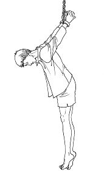

中共酷刑示意图：吊背铐。（明慧网）

几天后，因她不背监规，警察再度两次给她上“反背高位”，铐到三天二夜时，黄陂区公安分局来提审她，见她走路摇晃，才给她开铐。

在看守所被迫害80多天后，她又被送到何湾劳教所非法劳教。

在非法劳教期间，她的工资被单位扣除，工作职位被取消。

以上所述是刘麦梅身心遭受摧残的一部分。

<b>转化迫害</b>

中共迫害法轮功后，王永光的家也未能幸免。2001年7月，她大儿子（法轮功学员）王修被绑架，被非法判处两年劳教。2009年，大儿子再次被绑架，被冤判两年。

2002年3月，王永光在家属院发法轮功真相资料，被不明真相的人构陷，被非法关押在公安局一天一夜。第二天夜间，她被骗说送她回家，结果被劫持到了水磨沟看守所，被非法关押了10天。

同年4月、5月间，她被劫持到洗脑班遭受迫害45天。期间，几个人强行对她进行洗脑转化（放弃修炼）。在高压和欺骗下，在极其痛苦中，她违心地写了不修炼几个字。

之后，她嚎啕大哭，由于痛苦，头裂开般疼痛，心慌气短，夜间不能入睡。经检查，她患了高血压和冠心病。这是她从未得过的病。在洗脑班里，病痛折磨得她度日如年。

从洗脑班出来后，她继续修炼法轮功，还打电话给洗脑班，告诉那里她回来炼法轮功后，高血压和冠心病不治而愈。

后来，她常被当地办事处的干部骚扰，他们逼迫她放弃修炼，威胁她，一次还带来一帮人闯到她家，气势汹汹地要把她再度抓到洗脑班进行转化。她义正严辞地告诉他们：“我绝对不转化，无论你们怎么做⋯⋯”那帮人没达到目的，走了。

资料来源：明慧网

文字整理：李洁思，责任编辑：高静

<a href=#top><h6 align="right">回上方</h6></a>

<a name=82>
<h1 align="center"><b>孙文广教授因纪念六四被关43天“黑监狱”</b></h1>

孙文广等山东部分民众在2013年纪念六四24周年。（孙文广提供）

【大纪元2018年06月17日讯】（大纪元记者骆亚采访报导）84岁山东大学退休教授孙文广因“六四”敏感日被失踪43天后，于6月15日回到山东大学宿舍，向朋友报平安。这是今年老教授第二次被关“黑监狱”。

6月16日，孙教授向大纪元记者介绍，“每年的‘六四’敏感日都要对我采取行动，原先他们是把我软禁在家，但从去年开始，专门把我带到军区招待所一段时间。去年的“六四”，我被关了6天，今年“六四”被关40多天。”

孙文广觉得很可笑，“我一个80多岁的老人能做什么，而且今年足足提早一个月就行动了。他们看起来非常紧张，关了不少人。据我知道就有包括李红卫、俞新勇（谐音）、陈永棋（谐音）等人。甚至还有人因为‘六四’敏感日正式拘留的。”

据悉孙文广过去每年都提前搞“六四”纪念活动，已持续10年。“今年中共当局下了狠心，在‘六四’前一个月就将我们关起来，关押在不同的地方。他们主要是害怕，觉得‘六四’纪念活动会对他们构成威胁，就这么一个心态。”

关押孙文广的军区招待所有一个大院子、有好几栋楼。山东的国保加上山东大学公安共10人租了4间房看着他一个人。孙文广表示，听说每间房的租金都要400~500一天，每天光房租都要上千元，而且吃饭也要花很多钱，非常劳民伤财。

关押期间，孙文广的手机被没收，他不能通讯、不能跟外面有联系，彻底被困在房间内。

孙文广还表示，之前“六四”过后就放人了，但这次因习近平6月14日到山东济南视察，直到他走后第二天自己才被释放。

他表示，领导人到地方视察，可能中共内部有一个政策，“就要把所谓的不稳定因素消除，把所谓敏感人物、危险人物、持不同政见的人都给控制住。怎么控制？一种是在家设岗进行软禁；另一个是硬性的直接把你关在某一个地方。”

刚开始的时候，他们还不给孙文广放风。他向他们抗议：“就是关在监狱都有放风的时候”。随后他才获准去楼底下院子活动半小时或20分钟，还有两人专门陪同。

孙文广认为，“现在中共当局是越来越恐惧，我80多岁的能做什么事情，也要这么关押。今年两会期间也把我关了40天。因为过去我在两会期间会提一些建议、作一些评论，所以他们就把我关起来，不让我说、不让我写、不让我发声。”

除提前控制中共眼中所谓不稳定因素外，“六四”29周年当天也有一批人被关押，包括安徽异议人士、前检察官沈良庆、吉林维权人士田野、江苏维权人士成怀山等人。另外秋雨圣约教会王怡牧师、李英强等在内的一批宗教界人士共17人也因打算纪念“六四”活动被抓。中共当局甚至还禁在微信发含有8964数字的红包。

责任编辑：刘毅

<a href=#top><h6 align="right">回上方</h6></a>

<a name=81>
<h1 align="center"><b>加强监控？海康威视新技术可辨识少数民族</b></h1>

中国最大的视频监控系统供应商之一海康威视推出新技术，拍摄到民众后可辨别是否为少数民族，令外界质疑该技术是为了加强对民众的监控。(John Moore/Getty Images)

【大纪元2018年06月17日讯】中共一直在加强对国民的监控，除了在各大城市装设“天网”系统，利用脸部识别技术监控民众之外，中国最大的视频监控系统供应商之一海康威视又推出新技术，拍摄到民众后可辨别是否为少数民族。外界质疑该技术有侵犯隐私嫌疑，是否会用于加强对民众的监控。

海康威视（Hikvision）是一家世界上最大的视频监控设备制造商，由中共做后盾。

据安保系统和视频监控评测网站IPVM报导，海康威视已经在中国境内部署可分析出少数民族的监视器，该公司在网路宣传的“泰山旅游区案例研究”中，可看到将人们分类为少数民族的新技术。

IPVM报导说，鉴于西方国家使用种族分析会面临重大隐私和政治问题，质疑海康威视会在美国或欧盟发布此类分析。

<b>中共政府可随时从视频监控公司获取信息</b>

在海康威视发布的“泰山智慧景区”案例视频中，系统除了分析游客的年龄、性别等信息外，还会判断镜头拍摄到的人是否属于少数民族，但不会进一步分析具体属于哪个民族。

大陆另一家给中共政府安防提供技术支持的公司“寒武纪”的一名员工对美国之音表示，中国市场上主流的视频监控公司都在与政府合作，政府有关部门可以随时从公司获取这些信息。

海康威视作为目前已知的唯一一家提供族裔分析功能的监控供应商，在新疆有着巨额的政府订单。《华尔街日报》报导，海康威视和浙江大华技术股份有限公司在新疆拥有超过10亿美元的政府订单。

中国被称是监控摄像头数量增长最快的国家。行业调查公司IHS Markit 2016年数据显示，在公共和私人领域，包括机场、火车站和街道，共装有1.76亿个监控摄像头，其中有2000万由中共公安系统掌握。到2020年，摄像头的数量会增加到6.26亿个。相比之下，美国只安装了大约5,000万个摄像头。

<b>美政府警惕海康威视产品</b>

中共政府占有海康威视42%的股份，在中共政府监视14亿中国民众的庞大需求带动下，海康威视也出口产品到国外机场、港口，甚至美军的军事设施和美国驻外大使馆也有购买。引起美国政府对安全的忧虑。

美众议院在5月24日通过的7,170亿美元《国防授权法》（也称《国防支出法案》）中，包含禁止美国政府购买海康威视等中国公司生产的监控摄像头等产品，这是美国国会基于国家安全考虑，对中国科技产品的最新动作。

除了海康威视，中国监控设备生产商大华科技、无线通信设备生产商海棠通信，以及早已处于舆论浪尖上的中兴和华为也都有上榜。

今年1月，美国一个军事基地的官员表示，已从该基地移除了海康威视生产的监控设备。

众议院小型商业委员会（House Committee on Small Business）主席、俄亥俄州共和党议员查博特（Steve Chabot）说，他相当关注中共高层对海康威视的控股权及影响力，“中共当局可以使用这些摄像机监视我们，这是最大的隐忧”。

责任编辑：夏雨

<a href=#top><h6 align="right">回上方</h6></a>

<a name=80>
<h1 align="center"><b>微信一句话“结石宝宝”家长赴港旅游遭拦截</b></h1>

2008年9月22日，一位母亲在成都儿童医院在喂“结石宝宝”。(China Photos/Getty Images)

【大纪元2018年06月17日讯】中国毒奶粉事件曝光十年了，中共当局仍严密监视患儿家长维权。浙江家长蒋亚林只因在微信里说了一句要去香港纪念结石宝宝十周年，就被当地政府直追到广州拦截。

据自由亚洲电台6月15日报导，维权群体“结石宝宝之家”成员蒋亚林周四（14日）晚间在广州火车站打算前往香港时被拦截。

蒋亚林说，“孩子放假了，想带孩子去迪士尼玩，因为我都没有去过香港，想去开开眼界，但是这一次很遗憾没有过来。”

蒋亚林透露，她从浙江金华乘坐火车南下，但在途中用微信向其他家长说要去香港纪念结石宝宝十周年。金华市政府多个部门被她在微信中的这一句话所惊动。

“他们说，我过来（香港）这事情，金华市政府、市政法委等，全部都惊动了。他们连忙乘飞机过来（广州）追我的。这么多年，他们还这么紧张。是不是因为十周年了，也想纪念一下，就是因为这一句话啊。”

蒋亚林被拦截后，又被连夜带回浙江金华居住地。蒋亚林说，很有可能是之前她要去北京，然后接着又去香港，“没想到当局对我还是那么紧。”

蒋亚林表示，这十年以来，孩子没有获得任何补偿，或者是医疗保证。“这十年来，我们孩子的双肾结石还在。”

蒋亚林的女儿今年已经11岁，经常双肾疼痛。孩子的膀胱也出现了问题，经常有尿结石。而每一年的医疗费，除了普通的医保报销，都是自己承担。

而有的患儿家长，根本无力承担孩子的医疗费。湖南郴州一位肾结石患儿，换肾之后，又患上了尿毒症；郑州患儿家长陈璐的孩子已12岁，双肾结石、积水，因为后遗症抵抗力比较差，鼻炎，还有变异性哮喘，经常生病。

报导指，不少患儿家长因维权而受到当局的打压，甚至被判刑。“结石宝宝之家”的发起人、肾结石患儿父亲赵连海被北京市大兴法院以“寻衅滋事罪”判刑两年半。

患儿家长郭利，因揭发施恩奶制品公司产品的质量问题，2009年被广东潮州法院以“敲诈勒索罪”判刑五年。郭利出狱后不停申诉，于去年4月7日被裁定无罪。本周五（15日），郭利和母亲到达香港。他表示，来香港考察一下，能否按照当地的法律环境和条件，来起诉当年的肇事者。

患儿家长董先生告诉自由亚洲电台，这条路太艰辛了，希望有一个正常生活，但是这笔账他会记着。他现在有了个小儿子，奶粉是从墨尔本直接寄过来的，国产奶粉在大陆生产的一律不要，送给他也不要。

董先生说，这个事情没有划上句号前，不能不让老百姓去提。家长的诉求第一是站出来道歉；第二是孩子后续治疗的问题；第三还是一个公正的判决。

2008年，三聚氰胺毒奶粉事件震惊全国。当年3月，多名消费者反映，婴幼儿食用三鹿婴幼儿奶粉后，出现尿液变色或尿液中有颗粒现象。6月中旬后，三鹿陆续接到婴幼儿患肾结石等病状去医院治疗的信息。三鹿集团进行危机公关，政府也试图掩盖。

结果患儿疑食用受三聚氰胺污染的“三鹿牌”婴幼儿配方奶粉，导致5万3000多名婴幼儿患上肾结石及泌尿科疾病。2个月后，累计的人已经高达30万人，至少6名婴幼儿死亡。

责任编辑：李新安

<a href=#top><h6 align="right">回上方</h6></a>

<a name=79>
<h1 align="center"><b>外企翻译当庭自辩 推荐法官拜读转法轮</b></h1>

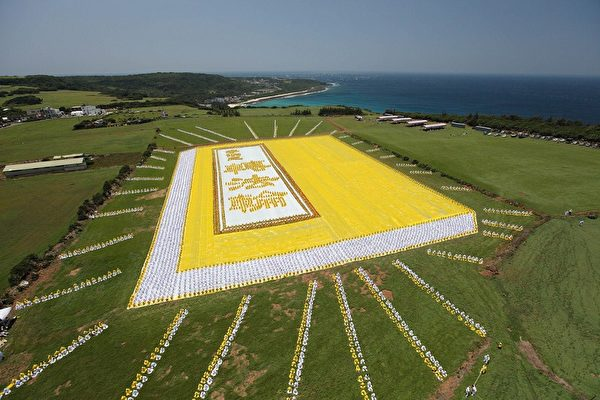

图为2009年5月，台湾六千余名法轮功学员在南台湾垦丁风景区埔顶大草原，排成《转法轮》封面，感恩李洪志先生将《转法轮》带给世人。（吴柏桦／大纪元）

【大纪元2018年06月16日讯】大连外企翻译贾秀春，2016年10月在敦化出差时被非法抓捕后，遭大连市公安局经济技术开发区分局、开发区检察院、开发区法院构陷。近日，开发区法院意图诬判她两年，贾秀春已上诉。

2018年4月20日上午10点，开发区法院对贾秀春非法庭审。

明慧网报导，在近四十分钟的庭审中。贾秀春和辩护律师分别针对公诉人所指控的每一条罪名进行有理有据的驳斥，辩护律师在总结性陈词中郑重强调贾秀春无罪，应该无罪释放。

控辩双方发表意见结束，主审法官王前未当场宣判，告知旁听人员合议庭将择日协商后出结果。

贾秀春面对开发区检查院公诉人岳淑豹提出的刑法第300条的指控，做出驳斥：

2006年到2007年开始接触到法轮功的贾秀春说自己只是一名外企员工，没有“破坏法律实施”的能力。

公诉人指控在贾秀春家里搜查出法轮功书籍，贾秀春认为把这作为罪证没有法律依据，法轮功一切书籍都是自己私有物品，并没有触犯刑法的犯罪条例。

2011年3月1日，中国新闻出版总署令第50号（第99条、100条）废除了对法轮功书籍的出版禁令，既然法轮功书籍的出版和发行都合理合法，更不能作为罪证。

公诉人所认定的劳动教养记录来判定贾秀春有罪，贾秀春驳斥这没有法律效力，因为自己是2012年被非法劳教的，劳教期限本来是2年，但2013年随着劳教制度的解体自己提前获得自由。

第一轮法庭辩论结束，面对公诉人岳淑豹无理性的表达，辩护律师又郑重提示：“我想提醒公诉人，法律人就应该以法律为依据，法律人要有个法律的思维，事实就是事实，无罪就是无罪。”

当法官最后询问贾秀春还有什么最终陈述时，贾秀春说：“我希望所有在座的人都能有机会拜读一下《转法轮》这本书，这是一本让人道德高尚、做好人的书。希望在座的各位都能站在公义、良知的角度做出一个正确的选择。”

1994年12月，李洪志先生的主要著作《转法轮》由国务院广播电视部下属的中国广播电视出版社出版发行。1996年，《转法轮》连续登上北京市畅销书排行榜；2004年，《转法轮》成为澳大利亚“最受欢迎的书籍”之一。目前，《转法轮》已被译成四十多种语言，在全世界发行。

家信鼓励亲人
中共对贾秀春的非法抓捕和关押时间已逾半年，不仅使贾秀春所就职的公司遭受巨额经济损失，也给其家人带来巨大的精神痛苦。

4月20日的非法庭审，贾秀春远在河北老家的哥哥、已怀孕数月的姐姐接到开庭通知后，车马劳顿地赶到大连参加旁听。

庭审间，因刑事一厅室内阴冷，贾秀春的哥哥想保持站立的姿势旁听，被法官王前粗暴撵出法庭。

此后，贾秀春在给姐姐的信中说：“见字如面。不用细说，家人的心情自可理解。但是以求暂时的安逸和团聚而违背良知和内心，对于妹妹来说做不到也做不出来。

“古人云‘勿以恶小而为之、勿以善小而不为’。修炼本身于他人无恶、对自身有利，是大善之举，因权力和政治的打压就屈从一时，在做人这一点来说也是不可取。”

“法轮功无罪。妹妹无罪。”

“得知姐姐在内心的矛盾和担忧顾虑之下，还能帮忙请律师做无罪辩护，实属不易。任何人在这样的环境下做出的每一小步努力，都很难得。”

“无论结果如何，妹妹深为感动和感谢！此时有你和哥哥照顾爸爸更感欣慰，有你们真好。不用多担心我，无欲则刚，暂时的困境难不倒的，就感到时间白驹过隙，过得好快，不久就会见到我的二外甥——个人感觉还是个男孩……”

责任编辑：高静

<a href=#top><h6 align="right">回上方</h6></a>

<a name=78>
<h1 align="center"><b>6·16多地铁路工人维权 在京火车司机被殴</b></h1>

16日上午，部分火车司机前往北京举行维权纪念活动，但遭到当局殴打。图为甘肃武威南站铁路工人响应这次活动。（知情人提供）

【大纪元2018年06月16日讯】（大纪元记者萧律生采访报导）今天（6月16日）上午，部分火车司机前往北京举行维权纪念活动，但遭到当局殴打；同时各地铁路工人们也被当地官方限制进京。

6月16日是铁路工人们自发纪念火车司机维权的铁路工人节。在今年的这个日子里，郑州火车司机李伟杰及其他几名火车司机，成功抵达北京，并准备在北京西站留影纪念，但遭到北京国保殴打。截至目前仍无法确认这几名火车司机的去向，李伟杰也一直联系不上。

“我们做了一个616工人节的小牌子，还没有举起来，人就被打了。”前往维权的铁路工人刘女士告诉大纪元记者，“我们的手机也被抢了，照还没拍成，就被打了，让我们蹲下，还扬言要把我们抓起来。”

刘女士表示，共产党盘剥老百姓，中共体制造成火车司机、卡车司机、塔吊司机等没有钱赚，而敢说真话的人就遭打压。“今天我们什么都还没有做，几十个国保就上来了。”

据该活动发起者郑州火车司机李伟杰的朋友胡先生披露，李伟杰几经周折于14日抵京，但是随即被人跟踪。李伟杰本人也因组织铁路工人节的活动，被洛阳机务段以“长期旷工”的名义解除了劳动合同。

“他（李伟杰）帮助铁路工人维权成功了，当局却要报复他。”胡先生表示，由于李伟杰的不断维权，郑州当地铁路工人们的工资得到提高；李建立的616火车司机维权QQ群，促使全国的火车司机们站出来维权，至此，李就被当局盯住、被打压。

据介绍，大陆的铁路工人经常超时加班，但是没有加班费，同时不给缴足社保、医保，还不合理克扣工人的工资等。

图为辽宁铁岭站铁路工人响应这次活动。（知情人提供）

胡先生说：“全国还有很多铁路工人要来参加这个活动，但好多人都被看着，不让出来（不让到北京）。最后他（李伟杰）说，不行就在各地维权，拍照后传给他。结果等他到北京后，发现好多人都联系不上了，自己也失踪了。”

在此次火车司机拍照纪念中，当局还抢走了路边民众的手机。

当时在事发现场的魏女士对大纪元表示，自己不是铁路工人，只是因工人们借用手机拍照，说能照得更清晰些，结果，自己的手机就被国保抢走了。

她表示，造成这种明抢老百姓个人财产的现象，根源是中共体制，“是它们造就出来这么多冤民。老百姓拍照，你不让人家拍照，你可以说收起来啊，怎么能直接抢走？这不是流氓行为是什么？”

魏女士进一步分析道，当局殴打这些火车司机的暴力行为，更体现出当局所做的一切都是为了统治集团的专制利益，“从没有一点是关爱老百姓的”。

在这次铁路工人维权不久前，大陆曾爆发全国性的货车司机罢工，以及全国性塔吊司机要求加薪的维权行动，但都遭到当局的镇压。#

责任编辑：林妍

<a href=#top><h6 align="right">回上方</h6></a>

<a name=77>
<h1 align="center"><b>湖南洞庭湖芦苇场村民维权讨生存</b></h1>

6月1日，湖南益阳市沅江市漉湖芦苇场的数百村民为保护三代人建起来的芦苇场进行维权。(视频截图)

【大纪元2018年06月16日讯】（大纪元记者顾晓采访报导）6月1日，湖南益阳市沅江市漉湖芦苇场的数百村民为保护三代人建起来的芦苇场进行维权。当地政府要将漉湖芦苇场所管辖的湖洲纳入省级南洞庭湿地保护区，村民们以芦苇为主的产业将受到影响，将会导致他们无法生存，因此发起维权。

村民李女士向大纪元记者表示，他们已维权无数次，去过社区、市政府、省政府，目前有部分村民进京上访，至今无任何结果。

6月1日，大约二三百名村民来到省政府，他们打横幅、喊口号。李女士表示，有官员出来见他们，声称数天后给予答复，但是到现在未有任何消息。

近期，官方正在对洞庭湖进行湿地保护区治理，拆除矮围（人为筑成的堤坝）、网围等。据大陆媒体报导，其中有一个10公里长的超级“夏氏矮围”于近日被拆除，这个矮围的主人是该省人大代表夏顺安，其目前已被刑拘。

报导称，夏顺安在2012年10月至2013年1月期间，套取信用社贷款资金1100万元，投资在漉湖芦苇场外湖围湖养殖。

李女士表示，该名官员是利用手中的权力私建，背后势力庞大，他才能够侵占洞庭湖湿地17年。

据悉，在洞庭湖湿地保护区内还存在着非法砂石、非法捕鸟、非法渔业捕捞、违规放牧等，村民表示，这背后都有当地贪官的影子。“漉湖是祖辈们辛辛苦苦建起来，整个资源被那些贪官败光了，再把漉湖人民当垃圾一样甩了！”

李女士透露，有消息称芦苇场将合并于南大镇（此消息未获得证实），村民坚决反对，因为村民世世代代都是以卖芦苇以及芦笋为生，又没有土地，合并到乡镇后村民无利可收。

资料显示，漉湖芦苇场自1958年成立至今，已经历了整整60年，所管辖的湖洲面积（包括芦苇地、洲滩、湖泊在内）共有31万多亩，其中有芦面积达13万多亩，每年用于造纸的芦苇平均产量在10万吨左右，人口由1958年建场时的三千多人发展到现在的八千多人。

村民表示，他们除了关于芦苇场归属问题维权之外，还有村民们的社保资金问题，以及国有砂石流失、贪官污吏从中以饱私囊现象。

村民说：“为什么到2009年没有向市社保局缴纳？这里面有什么猫腻？我们现已退休职工是否拿到了全额退休金？（经查证，未全额缴纳社保金是没有全额工资拿）这个空缺由谁来付清？”

村民们表示，他们为了子孙后代的生存，将维权到底。#

责任编辑：林妍

<a href=#top><h6 align="right">回上方</h6></a>

<a name=76>
<h1 align="center"><b>中共严密封锁的信息：死亡职位（下）</b></h1>

中共“610” 职位是死亡职位。（Getty Images)

【大纪元2018年06月15日讯】2018年6月8日，吉林省政法系统官员、省“610”办公室主任孙恒山，被下属持刀杀死。孙恒山的下场再次应验中共“610” 职位是死亡职位。

“610”办公室是中共专门迫害法轮功的非法机构。1999年6月7日，江泽民宣布成立“中共中央处理法轮功问题领导小组”，下设“中央处理法轮功问题领导小组办公室”，该办公室又因成立时间是6月10日，而叫做“610办公室”。这一机构凌驾于一切法律之上。

19年来，大陆各地各级迫害法轮功的“610”办公室头目大量非正常死亡。尽管中共严密封锁，不少消息还是突破封锁，传到海外。法轮功是以“真、善、忍”为原则的身心修炼功法，包括五套功法动作。大陆修炼人数一度达到1亿人。

以下是明慧网报导的中共“610”人员离奇死亡、患癌、成植物人的部分案例：

（接上文）

2006年初，北京市公安局石景山分局“610”警察伏田有（音），死在工作岗位──石景山区鲁谷派出所。据说，死得很奇怪，坐那儿“好好的”就死了。

2005年12月25日，山东聊城市东昌府区“610”办公室副主任咸庆平，在家睡觉时死在床上，年仅47岁。一位老人听说后表示，这人早该死了，尽不干人事。

2005年8月末，榆树市育民乡“610”负责人邵奇，暴死家中。他曾经将法轮功学员姜玉兰强行绑架到长春洗脑班；在洗脑班不收的情况下，他托人强行往里送。

2005年8月下旬，安徽省合肥市“610”办公室主任鲍建高，患胃癌死亡。

2005年8月22日，吉林省洮南市“610”头目刘金伟，患淋巴癌死亡。至少有30多名法轮功学员被其劳教、判刑。

2005年7月25日，辽宁省营口市“610”主任李闻启，口喷鲜血死亡，时年52岁。

2005年7月15日，黑龙江省大庆市中共市委副书记、纪委书记、前“610”办公室主任司家祥，因车祸身亡。司家祥当天（前往）大庆市红岗区参加会议，途中车胎爆裂，车门甩开，将他甩出车外，车子倒向一边，正好砸在他身上。

2005年清明节的前三天，原湖北黄冈市第二任“610”办公室主任王克武，患肝癌死亡。

2005年2月13日，原湖北黄冈市委副秘书长兼第一任“610”办公室主任张石明，突发心肌梗塞死亡，时年48岁。

2005年2月8日，西安电力电容器厂社区“610”头子郭满利，患癌症死亡。

2004年11月底，内蒙古赤峰市元宝山区元宝山镇“610”头目张玉霞，栽到自己家的小三号水缸里淹死，死时51岁。当时水缸水深仅一尺多。

2004年11月8日，吉林省梅河口市“610”主任王福年和“610”成员周某、刘鹏等去抓捕法轮功学员。途中车翻入桥下，王福年、刘、周三人当场死亡。

2004年9月，天津中医学院“610”头目、原组织部长崔树平，突发脑溢血死亡，年仅47岁。 他生前不遗余力地迫害法轮功，致数位修炼法轮功的大学生、研究生被迫转学、休学、失去工作；数人被绑架到洗脑班、劳教所迫害。

2004年3月初，湖南怀化市会同县公安局副局长、“610”头目粟祚金，坐车途中猝死。

2004年1月21日，陕西省宝鸡市渭滨区“610”主任刘迪华，因一氧化碳中毒死亡。据称，他当时与情妇双双裸死在卫生间。中共渭滨区委、区政府掩盖丑闻，草草处理后事。由于他死得不光彩，葬礼那天，他儿子都不愿参加。

2004年初，山东省蒙阴县“610”办公室人员张继文，被车撞死，年仅23岁。张继文当天被当场撞死后，车主随即逃离现场。张继文暴尸街头，无人问津。

2004年，广西田阳县原“610”办公室负责人江朝强，患癌症死亡。其任职期间指挥抓捕了十多位法轮功学员。

2003年12月，湖北省武汉市江夏区法泗镇“610”专案组头目喻水斌，确诊患严重肝癌。

2003年8月24日，新疆阜康市“610”办公室主任张新国，患重疾死亡。生前，常半夜闯进法轮功学员家搜捕。

2003年6月22日，云南省红河州石屏县“610”办公室主任龙清福和副主任一起到州“610”参加部署迫害法轮功的会议，返回途中遇车祸，龙清福当场死亡，“610”副主任受重伤。

2003年6月，黑龙江省宝清县原党校副校长、“610”人员刘少国，患重疾死亡。

2003年5月，甘肃省山丹县“610”成员王新明，横遭车祸，死状凄惨，面目皆非。

2003年1月8日，甘肃省庆阳县“610”主任门懿镜和白维权，外出强制“转化”法轮功学员，途中翻车，双双身亡。

2002年9月10日，湖南省常德市草坪乡政法委书记、“610”办公室主任周艾军，车祸死亡。9月9日，周艾军坐大卡车亲自去抓捕法轮功学员。途中，车轮压到一块石头，石头反弹进车内，正好砸到周艾军的头，送医不治，9月10日身亡。

2002年5月初，黑龙江省大庆市“610”办公室组织迫害法轮功的骨干分子近30人，由林甸县政法委副书记隋某带队，到四川成都学习迫害“手段”。途中，在没有车辆拥挤的情况下，该车突然自行立起，完全失控，翻到几十米深的山涧中。带队主要负责人隋某当场死亡。

2002年4月12日凌晨，四川省“610”办副主任江朝林，因车祸惨死，而同车的司机只受轻伤。

2002年，长春市一汽“610”头目张林山，死于肝癌，时年40多岁。1999年中共迫害法轮功之初，他不听劝阻，常常污蔑法轮大法创始人。

2001年12月，湖北省蕲春县政法委书记、“610”总头目何立三，暴病身亡。

2001年9月18日，湖北省武汉市黄陂区公安局内保科“610”办胡礼贵（副科长）、李荣、吴志军、张富忠及冯长城等五人，奉命查抄该镇一村民鞭炮作坊，引发爆炸而身亡。一次事故，五人死亡，全国罕见。

2001年，河南淇县高村镇“610”头目张立新， 在一次迫害法轮功的会议上，张突感不适，口吐鲜血，栽倒在地，抢救无效死亡。

2000年10月17日，黑龙江省大庆市电泵公司纪检副书记、“610”办公室副主任袁炳军，被火车撞死。袁炳军当时开车路过火车道，汽车自动熄火，车上两人下来推车，但推不动。这时火车过来，他们闪到旁边。火车刮到汽车，汽车把袁炳军卷起来，又摔在火车上，再弹起又摔到地上。袁炳军当场死亡。

2000年，黑龙江省穆棱市下城子政法委书记、“610”头目孟庆林，绑架法轮功学员时破口大骂，并说，“不信遭报”；4天后，得脑血栓住院，成植物人。

2000年，重庆长安公司一厂公安分局“610”科长邓昌龙，死于肺癌。

“希望所有人明辨善恶 看清方向”
大纪元特稿评论说，“历史和现实已经给人类留下了很多深刻的教训：曾经强大的罗马帝国因为迫害基督徒长达三百年而遭受四次大瘟疫，最后灭国。北魏太武帝、北周武帝、唐武宗、后周世宗之‘三武一宗’的灭佛事件，令百姓受难，灭佛的皇帝都遭到恶报：或被宦官所杀，或遍体糜烂而死，或中毒身亡。史实表明，对修炼人的迫害会招致最严厉的天谴。”

“那些还在跟随中共迫害善良修炼者、尚未意识到严重后果的人，需要赶快警醒，反思发生在身边的恶报实例，并且以实际行动弥补以前犯下的错误。天理在衡定着世间的一切。希望所有的人都能够明辨善恶，看清方向，在这场前所未有的正邪较量中，做出正确的选择。”#

（注：本文将持续更新）

文字整理：叶枫，责任编辑：高静

<a href=#top><h6 align="right">回上方</h6></a>

<a name=75>
<h1 align="center"><b>腾讯微信再升级“间谍软件” 网民信息遭捆绑</b></h1>

图为2018年4月11日，中国江苏省南通市一家肉摊上显示支付宝和微信支付代码。(AFP/Getty Images)

 
【大纪元2018年06月16日讯】（大纪元记者李新安综合报导）微信聊天工具对用户的注册、使用要求越来越严，网民的个人信息遭到捆绑。微信被指已经完全成为监控使用者的“间谍软件”。

据自由亚洲电台6月14日报导，目前使用手机注册微信账号，需允许“微信访问您设备上的照片，媒体库和文件内容”，如点击“拒绝”选项时，则提示在手机设置中开启“存储空间权限”，才能正常使用微信。换言之，微信要求进入用户的存储空间。而非中国产聊天软件，并不存在这些问题。

了解微信功能的广州网民胡先生称，微信已从简单的聊天工具“进化”到监控使用者言行的间谍软件。他说，“你要使用微信的话，你的整个手机就毫无秘密可言，所有的资料都可以被它读取，甚至还可以控制手机的摄像头和话筒。如果政府想看到你在做什么，或者想听到你在说什么，都（可）通过微信去监控你。”

胡先生因此建议，手机用户使用两部手机，其中一部不带微信甚至无国产软件，以策安全。

除了注册微信受到严厉的限制，使用微信方面的要求也越来越严苛。

最近，有用户发现重新登录自己的微信时，需要进行所谓的安全校验。完成安全校验要联系其他微信用户，其条件是：账号注册时间超过1个月的当地用户或注册时间超过6个月的大陆用户；且该账号最近1个月内没有做过注册辅助验证；该账号最近1个月内没有被封号；最重要的一条，大陆用户需要已经开通微信支付。

开通微信支付意味着必须捆绑银行账号，而银行账号包含个人的身份证等重要信息。

近期，还有网友发现，在中国大陆，离开微信已经寸步难行。安徽李先生告诉大纪元记者，他有一处房产想要出租，由于城市禁止小广告，只能转向中介或网络，李先生先后在58同程和赶集网两大信息平台网站上发布了租房信息，并留下了联系方式。

之后发现，近期，其个人联系方式不再被正常显示，提示需要扫码查看，同时必须要绑定微信才能查看留言。有的网站在发布信息时，需要微信支付0.01元来完成认证，之后该款项退还。

还有网友反映，单位强制使用微信，指微信能在大陆独行天下也是跟背靠中共分不开的。有网友谑称微信为“危”信，指其为中共情报网，搜集情报最猖狂 。“微信方便是方便，但它纳入中共‘大数据’监控网，如果交流敏感信息的话就是不安全的。”

去年12月，由广州市公安局南沙区分局、腾讯、中国建设银行等10余家单位发起的“微警云联盟”，签发了全国首张微信“网络身份证”。此后，网民可通过微信小程序搜索“网证”，刷脸办理“微信身份证”。

微信在中国几乎没有竞争对手，但微信国际化进展缓慢。腾讯公司CEO马化腾在今年3月称，微信（WeChat）的全球用户量已达到10亿。

但外界认为，使用微信会受到当局监控和审查。China Channel创始人马修‧布伦南（Matthew Brennan）对法新社表示，“微信在中国被共产党政权严格审查，对其个人数据的处理却颇具争议，这使其国际化进一步复杂化。”

今年3月，澳大利亚国防部发出禁止员工在工作手机上下载微信的命令。专家表示，微信具有很高的集合监控数据的能力，国防部对可以访问军事安全网络的程序感到担忧。

责任编辑：孙芸

<a href=#top><h6 align="right">回上方</h6></a>

<a name=74>
<h1 align="center"><b>律师遭冤案 柔美女子变中国最勇敢女大状</b></h1>

【大纪元2018年06月16日讯】被称为“中国最勇敢女律师”的王宇，曾经是一位柔美的商务律师。2008年，身为律师却遭冤案，被构陷入狱，让她毅然决然转型为维权律师。如今的她是一名人权律师，捍卫着人类的正义。

中国维权律师王宇：“我08年的时候，有一个冤案，冤判之后，我感觉就是特别希望有人来帮助我，我如果能见到一个人，理解我的人，我会特别感激。”

2008年，一场冤案改变了王宇的人生。

1971年出生在内蒙古自治区乌兰浩特市的维权律师王宇，有着蒙古人般的直爽和敦厚善良。本着对正义的追求，2004年5月，她开始在北京从事律师行业。

作为一名商业律师，2008年王宇因为投诉铁路公安，遭到铁路公检法的报复陷害。后来被冤判两年半。当时的她，根本找不到任何法律救济的途径，一时之间让她深刻认识了中共司法的黑暗以及权力的傲慢，这个国家竟然拥有一整套司法系统，抓人、批捕、公诉、审判、定罪，都由这个系统人员完成，完全违背司法公平。

也是这场冤案让她明白，在这个国家像她这样具有法律背景的人都被打压了，那底层百姓受冤屈时怎么办？于是她决定帮助像她一样蒙冤的人。

王宇：“之前因为做这种案件，被打压的律师已经很多了，包括高智晟被抓、唐吉田律师被吊照什么的。这些情况，很多也传出一些律师做这种信仰案件被打压的情况都有。”

2011年开始，王宇开始全心投入维权工作，其中包括范木根案、曹顺利案、伊力哈木‧土赫提案、尹旭安案，她还为许多法轮功学员做无罪辩护。2013 年，王宇支持唐吉田、江天勇等律师调查中共“610” 办公室的所谓“法治教育中心”等黑监狱问题。

王宇：“那作为我这种职业的一份子，做律师还能够有这个所谓律师的名字，那我不能说，帮助你这个国家欺骗世人，然后让大家觉得你真的是一个法治国家，既然你已经颁布法律了，你又让我当律师，那我就去追求这个法治。我知道在追求法治的过程中，会受到打压，会受到压制。”

2014年12月，王宇等律师前往建三江法院，代表法轮功学员递交表格，被法警赶走。2015 年4 月，王宇和另一位律师在沈阳市沈河区法院参加庭审，在履行辩护职责过程中被暴力拖出法庭。6月，王宇公开表态支持中国法轮功学员起诉江泽民的群体灭绝罪。7月，她在河北省三河市法院为法轮功学员辩护，当庭抗议合议庭违法。

王宇：“我在代理案件的过程，比如去看守所会见，不但不让会见，还把律师还给抓走了，带去派出所给限制自由，不让打电话。或者有时在开庭的时候，庭审的过程中，会把你拖出法院法庭，这种情况也发生过很多次。”

从2015年7月9号开始，中共公安部在全国范围大规模镇压维权律师和人权工作者，被称为“709大抓捕”。王宇是这场大规模抓捕中的代表性人物。7月9号凌晨，王宇被从家里绑架，期间她的丈夫包龙军律师也被抓，他们的儿子包卓轩在经由缅甸去美国的路上被中共警方抓捕。

王宇：“特别是通过这次709案件之后，进一步验证这句话，就是中国没有法治，没有法，没有法律。”

“709大抓捕”的随后两天，中共官媒对王宇进行污名化和混淆视听的报导。

王宇说，她不在意官媒抹黑，因为很多律师朋友、当事人还是非常支持她，很多人是知道真相的，这种支持的力量特别感动。王宇认为，凭著良心做事，这条路就是对的。如果这个社会制度不改变，所谓的法治就是假象，那么维权就有很长的路要走。

——转自新唐人

责任编辑：任浩

<a href=#top><h6 align="right">回上方</h6></a>

<a name=73>
<h1 align="center"><b>中国最勇敢女律师王宇：中共迫律师做花瓶</b></h1>

【大纪元2018年06月16日讯】中国维权律师王宇，被誉为“中国最勇敢的女律师”，她在2016年获得欧洲司法界的“路德维希–特拉里奥”人权奖，美国律师协会也为她颁发了国际人权奖。现在，她讲述了自己近几年的经历，表示在中共的逼迫下，很多律师只能做花瓶，让其它国家和不明真相的人误认为中国是讲究法治的。

中国维权律师王宇：“我被抓的时候，把我家的门用电钻钻开了，然后一大堆人把我按在那戴上手铐，戴上黑头套，然后拖到车里。被审的时候，不让睡觉又不让吃饭喝水，戴着手铐脚镣，那种的感觉，就觉得好像回到‘文化大革命’了。”

事件是从2015年7月9号开始。曾经为法轮功学员做无罪辩护的王宇，一家三口遭中共绑架。也就是从那天开始，中共当局对大陆人权律师展开大规模抓捕行动。

7月19号，中共官媒央视的《晚间新闻》，抛出一段名为《法庭内外胡闹践踏法律尊严》的视频，称“王宇多次走出辩护席，对包括审判长、法警在内的法院工作人员进行辱骂。”

王宇接受记者专访时表示，中共党媒是刻意抹黑她。

王宇：“当时这个案子是沈阳的一个信仰案件，当事人之前是王全璋律师和陈建刚律师所代理的，因为陈建刚律师他前期在这个包括侦察阶段和审查起诉阶段，到法院那个阶段，他都已经开了一次庭了，所以我是后来接触的。我接这个案子之后，我去会见过两次，然后之后又阅卷，我通过了解这个案子，就是还有陈建刚律师的介绍那个案子也是存在酷刑，而且是比较严重的酷刑。”

王宇表示，当时由于男法警对当事人的施暴很不人道，她气愤的请求法官制止，但法官置之不理。于是她愤怒的离开辩护席，直接去跟法警要求，但法警不但不听还很蛮横撵人。于是她回到辩护席指责法警，说“你们这样做就是流氓！”后来这个录像片段就成了中共党媒的抹黑工具。然而中共党媒没敢提及的是，这实际上是一起为法轮功学员代理的诉讼案。

王宇接受采访时谈及，“709”大抓捕事件对她和她的家人来说，仍然是一条没有愈合的伤口。

王宇：“当时我儿子就是一天24小时被跟踪，警察找人接他上学，两三个警察接他上学，晚上两三个警察送他回家，然后学校教室里头安了三个摄像头，就对着他的摄像头，然后走廊也有摄像头，他们班的走廊，然后学校有一个专门的教室，就是那个监控室有几个屏幕，屏幕就是监视我儿子那种，然后学校院子里有几个国保来回巡视。”

王宇被抓时，中共当局不断要她上电视认罪，虽然她一直抵抗著，但最后她被告知，想救儿子的话，就得配合，于是她妥协了。后来被释放，送回乌兰浩特，继续过着监控的日子。

对于“被消失”音讯全无的王全璋律师，王宇说，王全璋律师是一个非常正直，有正义感的律师，他不愿屈服于中共。

王宇：“我不知道他会不会受到比较重的酷刑，这个我真是不敢说。因为一个是我当时是受到很多虐待，再有一个就是我听其他709出来的一些当事人，他们说他也是被虐待酷刑。所以这方面我也只有耐心等待。但是具体来说，一个直观的，还有对他直接的一些情况的了解都没有，都是猜测，我们也特别担心。”

律师是捍卫司法公正，社会公义的最后一道防线，这个使命的前提条件，是这个社会的司法公正依旧存在。即使中国有三十多万的律师，但王宇坦言，大多数律师都只是“花瓶”。中国根本就没有法律，它有一个所谓的法律文本，在那里摆着，说是让大家遵守，其实中共是拿这个法律去限制普通公民，而那些权贵，并不会受到这些法律的限制。

2016年，关押中的王宇获得欧洲司法界的“路德维希–特拉里奥”人权奖，美国律师协会为她颁发了国际人权奖。目前她仍然在中共的监控之下。

——转自新唐人

责任编辑：任浩

<a href=#top><h6 align="right">回上方</h6></a>

<a name=72>
<h1 align="center"><b>父维权路上亡 女发起“百日悼念”活动被拘留</b></h1>

吉林延边维权人士闫春凤在网上发起“闫国忠百日悼念活动”，被以“寻衅滋事罪”拘留。（民生观察）

【大纪元2018年06月16日讯】（大纪元记者李熙采访报导）八年前被维稳致瘫的吉林延边维权人士闫国忠，今年3月病死在维权路上，至今其遗体仍停放在北京航太731医院太平间。为慰父亲在天之灵，闫春凤在网上发起“闫国忠百日悼念活动”，却在活动前二天被延边公安抓走，并以“寻衅滋事罪”将她拘留。

6月15日是闫国忠的百日祭，长年陪伴父母亲在北京维权的闫春凤，正在筹划父亲的百日悼念活动。13日下午3点半左右，她外出办事时，于北京丰台区郭公庄地铁站附近被延边公安拦截带上面包车抓走。

<b>口头传唤、刑拘</b>

闫春凤的丈夫史伟刚对大纪元记者表示：“事后延边当地的警察口头对我说，闫春凤‘寻衅滋事’被拘留了。我的岳母因为女儿被拘留，忧心之下旧病复发，闫春凤的弟弟被限制出行，所以15日的悼念活动也被迫取消了。”

他表示：“我们都是合法公民，‘寻衅滋事罪’到底要拘留她几天，北京和延边的警方说法不一，口头传唤也没有凭据。老人走了，‘七（日）’不给过，‘百（日）’总得过、‘周（年）’总得过吧。所以，下午我们就过去医院太平间给老人上个香。”

在京访民魏正祥表示：“5月份政法委出台了一个打好维稳的三大歼灭战中的一个就是把重大事件歼灭在萌芽之中，我觉得他们（中共）太紧张了。”作为备受打压的维权人，他也善意地奉劝那些为虎作伥的中共高干，要为自己的家人留条后路，文革结束后的反清算，作恶者谁也跑不掉。

闫国忠因房屋拆迁问题到京上访，在一次维稳中被截访人员暴力殴打致残，后来房屋拆迁问题虽然得到解决，但因被迫害致瘫的问题一直没得到解决。多年来，闫春凤和母亲杨树美一直陪在闫国忠身边照料，同时一边维权。然而，历经八年磨难最终还是未能如愿，今年3月8日下午5点，闫国忠在北京航太731医院含恨离世，至今他的遗体还停放在医院太平间。

长年陪伴父母亲在北京维权的闫春凤，在筹划父亲的百日悼念活动中被拘留。（受访者提供）

<b>软禁家属 阻止为死者治丧</b>

闫国忠去世后的第二天，闫春凤和丈夫、母亲在辖区云岗派出所施压下，搬离了租屋处。3月10日，延边州信访局彭姓官员主动找上闫春凤，声称延边州主要领导要和其见面商讨解决问题。当日下午，她就被州驻京办控制软禁。

当时，在驻京办里延边州信访局金姓局长称，想解决问题要先将遗体火化，以表诚意，如不火化说明没有诚意，对以后解决问题有难度。由于闫母坚持先解决问题再火化，双方僵持不下。官员又以闫春凤在网络上发声，参与公民活动加以威胁，在此情况下，闫春凤母女被强行带回延边州家中24小时看管着。

如今在闫国忠的百日祭之际，闫春凤又被以“寻衅滋事罪”拘留。史伟刚表示，当局强迫控制闫春凤，目的就是要强行破坏“闫国忠百日悼念活动”。为往生家属治丧是中国传统礼仪文化中很重要的一部分，延边当局此举，显然违背了社会礼俗，被认为是不近情理。#

责任编辑：孙芸

<a href=#top><h6 align="right">回上方</h6></a>

<a name=71>
<h1 align="center"><b>淄博二十多警察突闯民宅 抓众人夸赞的好楼长</b></h1>

山东淄博张店检察院 （网络截图）

 
【大纪元2018年06月15日讯】山东淄博市张店区今年60岁的法轮功学员姜玉芹，是众人夸赞的好楼长，5月29日被二十多名警察突然闯入家中绑架，6月7日被非法批捕。

周围的邻居一片谴责声，有的说：“连姜师傅这样的好人也抓，什么世道啊！”有的气愤地说：“抓走姜师傅这样的人，真伤天理啊！”有的邻居悄悄去给姜玉芹家里送饭菜……

明慧网报导，29日，姜玉芹家里突然闯入张店区国保大队二十多名警察，将姜玉芹夫妇绑架并非法抄家，现场抢劫走法轮功著作二十多部及现金六千余元，后将姜玉芹丈夫放回，而将姜玉芹关押至淄博市看守所。

经确认，姜玉芹于6月7日被张店区检察院非法批捕，从抓人到批捕，只用了短短九天（正常法律程序为十四到三十七天），完全违背基本法律程序。

姜玉芹家住淄博市张店区河滨小区，因修炼法轮功，事事都按真、善、忍的标准要求自己，待人善良正直，是小区内众人皆知的好人与热心人。

姜玉芹的婆婆曾经因脑出血瘫痪在床多年，姜玉芹全力照顾婆婆，不仅吃喝拉撒要悉心照料，因婆婆长期瘫痪，所以便秘严重，每次大便都要用手指将粪便一点点抠出，众邻居都对姜玉芹女士的行为赞叹不已，姜玉芹女士就这样悉心照顾婆婆五年，直至婆婆去世。

姜玉芹女士乐于助人，小区内很多人都受她恩惠，众邻居一致推荐姜玉芹女士任所在楼区的楼长。

在姜玉芹被绑架前几天，楼区排污管道出现严重问题，需要整体改造，但花费资金较大，姜玉芹就自掏腰包承担费用，并自己找来施工师傅将排污系统整体改造好。

邻居们纷纷向河滨居委会主任反映情况，感叹和庆幸小区内有这样的好人，要求居委会主任给予嘉奖。

河滨小区居委会主任李成刚上任不久，在了解情况的过程中，姜玉芹女士坦承自己是法轮功学员，因修炼法轮功的原因，使自己身心健康，才做这些福益社会的事情，李成刚当时表示了对姜玉芹的感谢。

但在青岛上合峰会前夕，各街道办事处要求居委会随时报告小区内法轮功学员的情况，李成刚就将姜玉芹修炼法轮功并在居委会给其讲真相的情况报告给张店区体育场办事处。

张店区体育场办事处又报告给张店区“610”和张店区国保大队，接着就出现了二十多名警察突然闯入家中绑架的一幕。

在姜玉芹被绑架后，消息得到了海内外法轮功学员和国际人权组织的关注，发表营救呼吁信函。

关注姜玉芹的海外人士纷纷向山东省、淄博市、张店区各级党政机关、公检法打去电话。

报导说，部分高层官员接到电话后，不是善意的先了解事件情况，而是抱着中共一贯的斗争思想，怀疑有海外势力的渗透，命令严查此事。

迫于高层压力，6月7日，张店区委书记马晓磊召开临时会议，命令张店区检察院直接将姜玉芹批捕。

6月7日下午，张店区检察院在没做任何调查的情况下，直接下了批捕通知书。

据调查，姜玉芹被关押看守所期间，已经连续几天被关在禁闭室小黑屋，强迫放弃信仰，人身安全令人担忧。

姜玉芹的丈夫曾身患高血压、冠心病等疾病，经受这次剧烈的打击，身心造成严重伤害，其孩子现在只能日夜守护在身边。

据悉，姜玉芹家人通过关系联系到张店区历次对法轮功学员非法庭审的主审法官郭建询，郭说：“没办法，我说了不算，我虽然作为主审法官，只是走走形式，一切都得听上面的，不是这次说了不算，所有的法轮功学员的案件我从来都没有说了算过，都得听上面的命令。”

明慧网评论，中共最近一直标榜“依法治国”，在法轮功学员身上，却看不到任何“依法治国”的表现，看到的只有“权大于法”。#

责任编辑：高静

<a href=#top><h6 align="right">回上方</h6></a>

<a name=70>
<h1 align="center"><b>中共严密封锁的信息：死亡职位（上）</b></h1>

中共“610” 职位是死亡职位。(Getty Images)

【大纪元2018年06月15日讯】2018年6月8日，吉林省政法系统官员、省“610”办公室主任孙恒山，被下属持刀杀死。孙恒山的下场再次应验中共“610” 职位是死亡职位。

“610”办公室是中共专门迫害法轮功的非法机构。1999年6月7日，江泽民宣布成立“中共中央处理法轮功问题领导小组”，下设“中央处理法轮功问题领导小组办公室”，该办公室又因成立时间是6月10日，而叫做“610办公室”。这一机构凌驾于一切法律之上。

19年来，大陆各地各级迫害法轮功的“610”办公室头目大量非正常死亡。尽管中共严密封锁，不少消息还是突破封锁，传到海外。法轮功是以“真、善、忍”为原则的身心修炼功法，包括五套功法动作。大陆修炼人数一度达到1亿人。

以下是明慧网报导的中共“610”人员离奇死亡、患癌、成植物人的部分案例：

刘京，中共“610”办公室的第二任主任、前公安部副部长，多年前被确诊罹患喉癌，成了活死人。

2018年6月8日，吉林省政法系统官员、省“610”办公室主任孙恒山，被下属持刀杀死。

2018年3、4月，广东梅县政法委副书记兼“610”办头目钟其森，患肠癌。

2018年2月15日（皇历新年除夕），原河北省平山县“610”主任王根庭死亡。

2017年8月20日，黑龙江省密山市原“610”主任于晓峰，突发脑溢血死亡。

2016年5月22日，河北省唐山市曹妃甸区公安局副局长、“610”头目李福国，被入土埋葬。他从白血病发作到死亡，仅两个月左右时间。时年47岁。此前，海内外法轮功学员多次给他讲真相，他不但不听，还说，“你们说善恶有报，我这不是好好的？”

2015年10月23日，陕西西安市“610”处长李胜利，从市委办公院跳楼身亡。

2014年3月，内蒙古赤峰市“610”办公室主任杨春悦，死于癌症。其子杨志慧是“610”办公室司机，于2005年8月遇车祸惨死。当时，杨志慧开车钻入停放在前方的大货车底下，头盖骨被掀开，当场暴毙。杨春悦的妻子哭了一个多月，说：“我们缺了什么德啊，出了这样的惨事！”

2014年3月18日，浙江省金华市原“610”办主任吴建星，暴病身亡。

2013年11月初，原保定市博野县高中教师、“610”协警王庆发，猝死家中。

2013年6月25日，湖北省天门市皂市镇政法委“610”主任刘霞，双癌（卵巢癌和肝癌）死亡。

2013年3月23日，陕西省汉中市“610”主任、市委办公室副秘书长芦鹤鸣，因车祸死亡。当天他带上女儿、女婿、小外孙和秘书一行六人，乘三菱越野车外出，被两辆大货车夹撞，瞬间车被挤撞变形，车上四人惨死。芦鹤鸣坐在前排，一头撞击玻璃，头伸出窗外，玻璃割断脖动脉毙命；秘书被从腰部撞断死亡；女儿和司机被当场撞死；女婿撞断了四根肋骨；只有怀里抱的二岁小外孙发生车祸时，被放到了脚下，幸免于难。

2012年7月7日，黑龙江省齐齐哈尔市“610”主任李佳明，突发心梗死亡。时年49岁。

2012年6月17日，湖北省政法委书记、省首任“610”组长、省委副书记、省政协主席杨永良，因癌症死亡。时年68岁。

2012年2月，山东省栖霞市“610”副主任刘维东，因结肠癌扩散，痛苦死去，时年50岁左右。

2011年12月30日，内蒙古自治区“610”办公室主任白志明，被判死缓，缓期二年执行。

2011年12月23日，甘肃省宁县“610”办公室主任孟兆庆，车祸死亡。当天上午11时，孟兆庆乘坐宁县法院一辆警车，警车行驶时钻入一拖车前底部，油箱顿时起火。大火瞬间吞噬两辆车，孟当场死亡。

2011年10月4日，黑龙江省大庆油田井下作业分公司“610”办公室主任刘杰，因车祸死亡。当天，刘杰骑摩托车和朋友在路上兜风，客车拉着他们的家人，在后面跟着。刘杰骑着摩托车撞上一辆路边的大车。刘杰当时戴着防护帽，穿着防护衣，都是带气囊的现代化防护工具，但其脖子被某物件扎入，刘当场死亡。

2011年4月，山东莱阳“610”头目于跃进，内退不久即突发脑溢血死亡，年仅54岁。

2010年11月21日，山东省蒙阴县垛庄镇“610”办公室人员马龙臣，因车祸死亡。当天晚上，马龙臣被一辆疾驶的汽车撞倒，肇事车辆随即逃离，马龙臣又被后边的汽车碾轧，无人发现。知情人说，一夜不知有多少车辆从他身上碾过，第二天早晨有人发现时，马龙臣的尸体早成肉饼。

2010年8月25日，河南省洛阳市老城区“610”办公室主任杨宏伟，患怪病死亡。他因身体不适住进医院，出院后，他不思悔过，继续迫害法轮功学员。直到死，医院也没查出他得了什么病。

2010年6月10日，广东省广州市公安局“610”办副主任、市公安局国保支队副支队长王广平，倒地猝死，恰巧死在“6月10日”。中共媒体新华网称，王心脏病突发猝死。

2010年6月2日，吉林省长春市双阳区政法委副书记、“610”头目王舒涵（寒），因车祸身亡。此前，他曾叫嚣说：我送走（非法判刑）那么多法轮功学员，我应该第一个遭报啊。

2010年5月30日，河北沧州市盐山县“610”主任孙保元，因车祸死亡，时年44岁。

2010年5月14日，黑龙江省桦南县曙光农场“610”主任、政法委副书记宋晓文，与他人同乘一辆小车到桦南县城北共和水库游玩，返回途中与一大货车相撞，宋晓文当场死亡。

2010年，云南临沧市“610办公室”主任赵勇，因脑瘤死亡。

2009年4月30日，河北省高碑店市白沟镇副书记、“610”组长王彦斌，因车祸死亡。他当时的座车，追尾撞上一辆打井车，被三根铁管子分别插在嘴、喉咙、胸部，王彦斌当场死亡。

大概2007年底2008年初，云南省“610”主要成员杨兴源，暴病身亡。时年55岁。

2008年10月5日，黑龙江省双城市单城镇政法委书记、“610”头目姜文超，因车祸暴死。

2008年9月11日，黑龙江省建三江分局前进农场“610”主任王维伦，在山东老家去上坟的路上遇车祸暴死。他曾称：“我不怕遭报应，我就不信有报应。”而且他曾向一位对他讲真相的法轮功学员说：“我跟共产党跟定了。”

2008年元旦期间，吉林省梨树县“610”人员徐大勇，在车中与人通奸时死亡。当时当地爆出丑闻，影响很大。他用电棍电击、殴打法轮功学员，对梨树县法轮功学员蹲坑、跟踪，致使多人被捕、流离失所。

2008年10月23日，吉林蛟河市松江镇“610”办公室主任李德昌，因肺癌死亡。其在任期间，多名法轮功学员被拘留、关进洗脑班、劳教和非法判刑。

2008年3月11日，吉林公主岭市“610”办公室副主任栾华，跳楼身亡，时年45岁。他至少迫害致死8名法轮功学员，参与非法拘留、劳教、判刑、洗脑迫害法轮功学员达数百人次。

2007年7月29日，吉林省磐石市第一任“610”办公室主任李相库，被一小车撞死。目击者称，当时小车速度极快，直冲向李相库。撞车时，发出巨大响声，六楼都听得非常清楚，李相库被撞起3米多高，落地时七窍流血，当场死亡。

2007年7月25日，黑龙江友谊县“610”办公室主任吴相营，被车撞死。当晚7时左右，吴相营骑摩托车和一人外出钓鱼。回家路上，被后面一辆疾驶的车撞上，连人带车撞出十多米远。事出两个多小时，过往车辆无一人过问。等120救护车送到医院已不治。

2007年6月5日，天津政法委书记、“610”头目、公安局长、政协主席宋平顺，在办公楼内突然身亡。中共称其死因是“涉嫌受贿资金上亿元”。

2006年中国新年前，安徽省淮北市“610”头目贾守田舌癌死亡，死时脸部扭曲，人相皆无。

2006年11月，重庆市奉节县副县长兼政法委书记、“610”头目杨大才，突发脑溢血死亡。

2006年8月，原甘肃省庆阳市政法委书记、“610”主任刘五庆，癌症死亡。

2006年7月31日，云南建水县“610”主任彭中发，得癌症死亡。

2006年6月，黑龙江省大兴安岭市呼中区“610”主任梁兴，患喉癌身亡。他不听法轮功学员的善意忠告，曾高嚷：“我就狂，我就狂。”

2006年3月19日凌晨，四川省乐山市分管“610”办公室的公安局副局长杨晓江，因车祸死亡。他与眉山市国安局局长陈宏私驾公车在峨眉山市游玩，与一辆大卡车相撞，杨晓江当场死亡，头颅飞出车窗外。

<b>“希望所有人明辨善恶 看清方向”</b>

大纪元特稿评论说，“历史和现实已经给人类留下了很多深刻的教训：曾经强大的罗马帝国因为迫害基督徒长达三百年而遭受四次大瘟疫，最后灭国。北魏太武帝、北周武帝、唐武宗、后周世宗之‘三武一宗’的灭佛事件，令百姓受难，灭佛的皇帝都遭到恶报：或被宦官所杀，或遍体糜烂而死，或中毒身亡。史实表明，对修炼人的迫害会招致最严厉的天谴。”

“那些还在跟随中共迫害善良修炼者、尚未意识到严重后果的人，需要赶快警醒，反思发生在身边的恶报实例，并且以实际行动弥补以前犯下的错误。天理在衡定着世间的一切。希望所有的人都能够明辨善恶，看清方向，在这场前所未有的正邪较量中，做出正确的选择。”

（注：本文将不断更新）

文字整理：叶枫，责任编辑：高静

<a href=#top><h6 align="right">回上方</h6></a>

<a name=69>
<h1 align="center"><b>数百老兵抗议伤残老兵被打 辽阳有军嫂被殴</b></h1>

【大纪元2018年06月14日讯】（大纪元记者萧律生、易如采访报导）大陆四省部分越战老兵，日前集中在四川省德阳市中江县政府，抗议越战伤残老兵在维权中遭受殴打一事。此外，东三省、内蒙部分退役老兵，到辽宁省辽阳县急救中心抗议军嫂被打一事。

近期，大陆退伍军人在维权时不断遭到中共当局打压。继河南漯河抓捕退伍军人事件后，四川省德阳市中江县又发生殴打伤残军人事件；继河南漯河军嫂翟洪莲被警方以“寻衅滋事”为由非法拘留后，辽宁省辽阳县则又发生军嫂被殴打事件。

<b>四省老兵抗议四川伤残军人被打事件</b>
据知情人披露，6月14日， 来自全国4个省、14个市县四百多名越战老兵，汇集在四川省德阳市中江县政府，要求解决伤残军人李峰被打事件。

大陆各地部分越战老兵，日前集中在四川省德阳市中江县政府，抗议越战伤残老兵在维权中遭受殴打。（视频截图）

据悉，6月12日晚，中江县伤残军人李峰在家休息，却遭到中江县缉庄派出所四名民警强行打压。其中警察吕余俊说，打的就是你们伤残军人。

四川省中江县伤残军人李峰被当局警察殴打。（视频截图）

重庆老兵令先生告诉大纪元记者，“公安的人能把残废军人从屋里抓到派出所，用手铐铐起来，几个警察打得他小便都拉不出来。现在这个社会真的很悲哀。”

另有重庆董姓老兵表示，更残忍的是这些警察还向李峰的五官喷辣椒水。随后，引发了四川、湖南、重庆、山西等几百老兵到当地政府部门抗议。

“我们这些老兵很多是农村的，都是上有老下有小，是弱势群体啊，现在感觉被地方政府抛弃了，”董姓老兵说，“我们去维权，警察就会给你‘戴帽子’，说你‘寻衅滋事罪’、‘非法上访’。”

他表示，从1978年至今，他们应有的待遇没有得到，反而对他们这些伤残军人进行打压。“超过100人去维权，就拦截你，直接把你弄回来，拘留你。”

再有知晓实情的老兵张先生对大纪元表示，中江县的这次维权算是成功的，四川省副省长到达现场称，将警察吕余俊撤职、开除党籍，并要求吕赔偿李峰25万元人民币；同时给前来维权的老兵车旅费（川内1000元/人，川外2000元/人）。

四川老兵抗议越战伤残老兵在维权中遭受殴打。（视频截图）

<b>辽阳军嫂惨遭殴打</b>

6月14日，辽宁省辽阳县急救中心也聚集了来自东三省及内蒙古的部分退役军人。

据前来维权的退役军人吴先生表示，他们的一位退役军人和该军人的妻子被打，尤其是这位军嫂被殴打得很严重，背部、脑部均有受伤，且该名军嫂本来就心脏不好。

另一位知情老兵赵先生告诉大纪元记者，该名军嫂本来是到沈阳维权，6月13日被当地派出所接回后就被殴打，同时军嫂的丈夫也被殴打。

“我们现在维权，就遭‘维稳’打压，眼泪都往肚子里流”，赵先生说，“曾经保家卫国，流血流汗，现在变成弃儿了，心里充满愤慨。现在老兵们在也逐渐觉醒了。”

赵先生介绍，目前中共当局成立的退役军人事务部，与信访局、巡回法庭一样，形同虚设，不解决问题，而是把老兵反映的情况，从上一级直接压到最下一级，最终老兵还是被“维稳”。

“都是扯淡的衙门，部级、省级、厅级，一丁点问题都解决不了”，赵先生说，“一党专政的衙门，就是推诿扯皮。一有好处了都上，一有点事儿，就没人管了，就都缩头乌龟了。”

责任编辑：林琮文

<a href=#top><h6 align="right">回上方</h6></a>

<a name=68>
<h1 align="center"><b>美点名天津杨玉永案 中共性虐待黑幕曝光</b></h1>

天津武清看守所将法轮功学员杨玉永迫害致死。图为杨玉永生前照片。（明慧网）

【大纪元2018年06月15日讯】（大纪元记者叶枫综合报导）美国国务院近日发布的《国际宗教自由报告》，收录了天津法轮功学员杨玉永（勇）遭受性虐待和被迫害致死的案例。报告引发外界关注中共对法轮功学员施以性虐待迫害的黑幕。

这份报告说：“天津当局在2016年12月逮捕了杨玉永（勇）。据报告，他在押期间遭严重虐待，包括性虐待，13名犯人捏他的生殖器，并咬他的乳头。当被送医时，杨的器官完全衰竭。他的家人报告说，他的遗体浑身瘀青，脚指甲下有竹签的痕迹。”

天津法轮功学员杨玉永在看守所离奇死亡，浑身伤痕累累。（受访者提供）

杨玉永生前图片（明慧网）

2017年7月11日，天津武清区法轮功学员杨玉永被武清看守所迫害致死。半夜，中共特警包围医院抢尸。杨玉永的遗体在2018年4月4日遭警方强行火化，当日天津天气突变，降冰雪、冰雹。天津武清区全区下雪直到第二天早晨才结束。老百姓说：“冤不冤？看看天。”

天津武清区法轮功学员杨玉永的遗体遭警方强行火化当天，天津天气突变，下了一夜的雪。（明慧网）

杨玉永的遭遇并非个案。海外明慧网2012年12月份发表了《中共对男性法轮功学员的性迫害》一文，长达3万多字，综述了中国各地大量男性法轮功学员在劳教所和监狱所遭受的灭绝人性的迫害。

此文详述大量悲惨案例，由于篇幅受限，本文仅摘取少数个案：

<b>电击、重踢生殖器、性侵</b>

北京市法轮功学员林树森，30多岁，在北京前进监狱被警察用电棍电击，开始上了两根缠满铁片劈啪作响、闪著蓝光的电棍，在林的头部和颈部连续电击5分钟，看他不屈服，又将他背铐，踩在地上，用11根电棍持续电击其手心、脚心、头、颈、生殖器等敏感部位。

湖北省黄冈地区浠水朱店法轮功学员饶望来，当时50多岁，2005年12月28日上午，遭同监室嫌犯陈雷等3人毒打，被当场踢破睾丸，痛得昏死过去。

上海法轮功学员周斌，2000年被非法判刑12年，关押在上海提篮桥监狱。周斌经常被毒打，两根肋骨、锁骨、鼻梁被打断，肾脏被打得下垂。2005年，周斌被主管迫害的队长戴文龙、小队长郭海指使犯人暴打，生殖器被踢成重伤，睾丸被打坏、僵死。

吉林省德惠市大房身镇（原杨树镇）法轮功学员，张文峰，30多岁，2002年被非法重判10年。在吉林监狱，张被警察利用犯人长达一年多下迷药、性侵犯。2009年，张被转到九监区三小队，警察指使犯人徐波、黄滨、杜伟、杨长顺、谭长信等多次将张文峰迷昏，施以性暴力，致使他染上性病，造谣说他搞同性恋。

辽宁大连市中山区法轮功学员曲辉，原大连港理货员，因坚持信仰，被非法投入大连教养院折磨。他生殖器被电击溃烂，颈椎骨折，高位截瘫。曲辉最后被折磨得奄奄一息用担架抬出了教养院。曲辉说：“只有地狱的魔鬼才会把折磨人当成乐趣。”

<b>小便器官被绳扎起 小便回流到肾</b>

中共监狱、劳教所还把男性法轮功学员的小便器官用绳子扎起来，不让小便，小便积累多了，回流到肾里，最后导致全身浮肿，极其痛苦。

在吉林九台市劳教所，最残忍的是将法轮功学员全身衣服扒光，让他们坐在冰冷的水泥地上，用塑料管在腋下、大腿根等处，四个人一起用塑料管拧，有的法轮功学员的阴茎、阴囊都被拧没了，痛得他们昏过去，苏醒后如不“转化”，就将他们的手脚铐在死人床上继续折磨。法轮功学员乔建国就受过这种迫害。

黑龙江双城市团结乡春光村法轮功学员邹国彦在双城看守所遭性虐待，恶人用绳子缠在他的生殖器上来回用力拖拽、往起吊，肉皮都被拽掉，肿得吓人，之后留有很大的疤痕。

吉林省白山市抚松看守所、拘留所所长李克刚等，对法轮功学员动用惨不忍睹的酷刑，其中包括性摧残，把法轮功学员的阴茎用手指弹硬后，用缝衣针往里扎。

辽宁省铁岭市昌图县法轮功学员靳力国，被昌图县老城派出所警察绑架；副所长用牙签插进靳力国的阴茎。

<b>中共流氓手段迫害法轮功</b>

中共为了让修炼“真、善、忍”的法轮功学员放弃信仰，流氓手段无所不用，如：性侵害、老虎凳、铁椅子、死人床、火刑、电击、上大挂、毒打、针扎、扎指甲、吊铐、蹲小号、窒息、不让睡觉、曝晒、冷冻、注射不明药物、超体力“训练”、灌芥末油、用强光刺激眼睛……

19年来，难以计数的法轮功学员被迫害致伤、致残、致疯、致死。

责任编辑：高静

<a href=#top><h6 align="right">回上方</h6></a>

<a name=67>
<h1 align="center"><b>人权灾难 沪民青岛被截回关派出所铁笼</b></h1>

上海公民洪仙华青岛旅游被截回当地关铁笼子，还被以“寻衅滋事罪”刑拘。（受访者提供）

【大纪元2018年06月14日讯】（大纪元记者李熙采访报导）6月9日至10日青岛举行的“上海合作组织青岛峰会”，一些民众前往观光旅游，被中共当局以恐怖分子视之，各地公安连夜跨省抓捕，遣返后或关黑监狱，或刑拘。上海公民洪仙华被截回后，又被强行关押在派出所铁笼里，后以“寻衅滋事罪”将她刑事拘留。

青岛上合峰会期间，上海地区有一百多名公民前往山东旅游被截回，手机，身份证被违法扣押，有被软禁、关黑监狱，其中部分公民被刑拘或可能判刑坐牢。上海访民顾国平向大纪元表示，“这是大陆百姓的人权灾难，呼吁联合国和美欧各国关注中国的人权状况。”

<b>青岛旅游被关铁笼、刑拘</b>

6月10日，上海闵行区洪仙华和徐汇区颜六妹到青岛旅游，被青岛警察送往高密集中营软禁后押送回上海，12日晚9点左右，洪仙华被塘湾派出所警察从“康办（市委与市府机要办公处）”带出后，关押在派出所铁笼里一天一夜。

警察并给她做了三份笔录，其中有一份笔录洪签字了又不算，不给签字的反而诬陷洪拒绝签字。后以“寻衅滋事罪”将她投入闵行区看守所刑拘。

上海“民告官”志愿者宋嘉鸿在网上为洪仙华喊冤，他说，“洪仙华不就是到青岛旅游吗？因为习近平在青岛开峰会，就随意定别人的罪，这本身就执法犯法。一个青岛旅游，一个开峰会，完全不存在任何因果关系，这就是公安流氓经常惯用的伪造因果关系手法。”

他还表示，“‘寻衅滋事罪’是由过去的流氓罪演变过来的，访民都是冤民，尤其是遭强拆的，无家可归了。洪仙华每时每刻都在为生存而奔波，为最起码的栖身之处在努力，这与好逸恶劳、无事生非、敲诈勒索的社会流氓是截然不同。”

洪仙华和颜六妹被截送往高密集中营。（受访者提供）

洪仙华原550平方米的别墅在征收中，仅安置180平方米，协议中的69万元（人民币，下同）一分未得，还拿出三代人的积蓄33万多元。

<b>访民旅游被当恐怖分子</b>

此外，和洪仙华、颜六妹一起被遣返的还有顾国平、陈光华等共三十多人，顾国平等人是在青岛的途中被扣押在青岛某武警驻地，手机，身份证被违法扣押，他和陈光华在遣返途中因为身体不适，连续二个休息站下车休息后顺利逃脱。

顾国平告诉记者，“我在青岛高铁北站要出站时，警察扫描身份证后显示红字“重点稳控人员”，也就是当我们是恐怖分子。还有黄色字的也是要稳控的人员。强行押回后就是刑事拘留。”

他说，刑事案件法院会受理，但是刑事拘留你告到法院是不受理的，他们这种行为是在操作宪法法律，规避法律对他们的制裁。所以我希望国际社会包括美国、欧盟、联合国等人权组织，应该对这样无法无天的行为加以谴责，并禁止政法系统官员、公安部门等人权恶棍和其亲属进入这些国家。

上海访民在青岛高铁北站被截回。（受访者提供）

上海访民在青岛被截回，在回上海的大巴上。（受访者提供）

<b>美丽的长兴岛成人间地狱</b>

6月7日，上海23人士到山东威海旅游时，被山东和上海警方连夜跨省围捕，遣返回上海后有十人失联。其中包括浦东新区的刘国芳、韩素芳，被带回当地后高东镇派出所的蔡姓警察（警号013790）带了四个联防队员把她俩带到高桥派出所做笔录。

她俩人再三强调：1.个人参加旅游是由旅游社组织的，没有谁是组织者；2.个人是跟旅行社签订正式合同；3.个人一直随队旅游，没有单独行动，旅行社取消了青岛专案个人也服从决定；4.个人是随团在威海去烟台旅游大巴上被无理拦截的。没有上访，也没有越规行为。

刘国芳表示，“我们遭到的拦截行为是违法的。但作完笔录还是不放我们回家，高东镇政府信访办的潘姓官员带了一批黑社会的人员等待在那边，由蔡姓警察带着特勤将j我两人亲手交给他们。这些黑社会人员给我们戴上黑眼罩强行推上车，直接开到长兴岛的一处黑监狱。”

她还说，“8日晚上，隔壁房间又被关进一个据说是杨浦区的访民，他被看守的黑社会人员拳打脚踢，只听见哀号求救和不断呻吟，很恐怖。”

11日晚上，刘国芳和韩素芳又被戴上黑眼罩释放回家，但隔壁房的访民如何，不得而知。

访民表示，美丽的长兴岛被这些官匪勾结，联手搞成了人间地狱，这就是中国特色的法制社会。

长兴岛的黑监狱。（受访者提供）

长兴岛的黑监狱。（受访者提供）

<b>天谴人祸 冰雹淹没青岛</b>

青岛上合会议保安升级，维稳范围扩及全国，青岛居民也在维稳之内，会议前期当地政府公告要求会场周边居民，须在6月8日中午12点前撤离去外地，直到6月10日晚上10点以后才能返回，如不愿离开住家者，不许开窗，还要拉上窗帘，并会贴上封条。在这期间武警将进入这些家中，同时还警告居民不得靠近窗户，避免狙击手误判。

据消息称，中共当局为了顺利召开青岛上合峰会，连续打了一个月的驱云弹，云被变成了超高度饱和的水汽。峰会开完之后没有继续打驱云弹，又有烟火提供的大量杂尘助凝，于是累积一个多月的超饱和水汽迅速凝成冰雹。

民众表示，这是中共糟蹋民脂民膏粉饰太平造成的人为天祸，中共又添一条罪孽！ 

责任编辑：高静

<a href=#top><h6 align="right">回上方</h6></a>

<a name=66>
<h1 align="center"><b>耕地被占 村民上门讨公道 竟被粗暴压死</b></h1>

【大纪元2018年06月14日讯】中国陕西的村民，耕地、林地被采石场强行占据，一名失地农民上门讨公道，竟被对方用装载车撞死。家属随即四处投诉，却被中共当局定性为“交通事故”。

陕西省商洛市商州区夜村镇大河村村民在网上投诉，当地一家采石场占用农田耕地数百亩，开山取石，毁坏林木，污染环境。5月29号，村民张存劳到采石场追讨林地赔偿款，被装载机司机推撞致死，迄今投诉无门。

据了解，5月29号，大河村涝峪七组村民祁淑芳和丈夫张存劳到鑫兴采石场追讨林地赔偿款，与采石场责任人发生争执后，被采石场装载机李姓司机推撞致死。

事发后，死者家属到商州区公安分局要求尸检，要求按刑事案件立案调查，并到区信访局反映，但警方却以交通事故处理。

大河村涝峪七组村民祁淑芳：“采石场这一百多亩山林不给赔，跟他要钱，他不给，后来把我丈夫用装载机推死了，交警队处理肇事向着那方嘛，咱们也没有人，咱们也没有钱，我的丈夫现在还在商洛中心医院太平间放着。”

死者家属认为，采石场涉嫌故意杀人，并伪造交通事故现场，而且有现场目击证人，家属要求查明死因，多次向警方反映，都未被采信。

邻村村民吕先生：“据说是有什么纠纷，装载机把人压死了，当时之恐布，撞死掉了。”

大河村民在投诉材料说，鑫兴采石场占用农田耕地数百亩，擅自更改林地用途，大肆开山取石，毁坏林木，占用耕地河道数年。严重影响一千多村民的出行、饮水、生活环境等一系列问题。

祁淑芳：“开采五年多了，占了好多好多的土地，合同完了，还继续开采，破坏环境，对村民的身体都不好，花草树木、庄稼，都受到了污染，受到了伤害嘛，投诉不管用，没人下来查，没人管。”

张存劳的95亩山林被偷卖给采石场，多次到镇政府反映，都置之不理，打官司也败诉。因为坚持维权，祁淑芳和张存劳夫妇多次受到采石场的恐吓威胁。

——转自新唐人

责任编辑：任浩

<a href=#top><h6 align="right">回上方</h6></a>

<a name=65>
<h1 align="center"><b>落马胡志强祸乱陕西榆林9年 涉案多少？</b></h1>

6月12日晚，陕西省卫计委党组书记、原陕西榆林市委书记、市长胡志强落马被查。（大纪元合成图）

【大纪元2018年06月14日讯】6月12日晚，陕西省卫计委党组书记、原陕西榆林市委书记、市长胡志强落马被查。胡志强祸乱榆林9年，除了贪腐，他还主导迫害法轮功。

2008年2月起，胡志强从陕西省政府副秘书长一职调到榆林，担任榆林市委副书记、市政府代市长、市长；2011年起，任市委书记。

2008年，中共“奥运维稳”，风声鹤唳，草木皆兵。2008年5月15日，时任市长胡志强在榆林市“维稳保奥运”电视电话会议上，公开污蔑、诽谤法轮功。

此次胡志强落马，官媒还提到在一年前，胡志强在网络上被实名举报，称其买官卖官、收受巨额贿赂。

胡志强是地方知名的官二代，他的父亲是前山西省委书记胡富国。胡富国曾受江泽民“庇护”。

胡富国1998年5月在任期间，被记者曝光大搞政治形象工程、骗取钜资内幕。该记者事后遭打击报复，被判刑12年。但是，1999年6月，胡富国在风口浪尖中卸任山西书记，调任国务院扶贫开发领导小组副组长。

对于这样的结果，当时海外报导事件内幕说，在江泽民包庇下，罗干操作公检法构陷打黑记者，胡富国“因祸得福”远离山西官场是非，到北京任职。而江泽民和罗干，均是迫害法轮功的元凶。

胡志强主政榆林期间，追随江泽民迫害政策，榆林法轮功学员遭严重迫害。以下是胡任职期间发生的部分迫害案例：

<b>乔建军被非法判刑4年</b>

乔建军，原中石化集团设计人员，2007年修炼法轮功。修炼前，脾气暴躁，经常和父母吵架，和妻子关系不好，几近离婚边缘；修炼后，他以法轮功“真、善、忍”原则为处事标准，改掉了种种恶习。妻子后和他关系和睦。

乔建军（明慧网）

2012年7月15日，乔建军开车途径山西省文水县时，给当地民众发放神韵晚会光盘，被便衣跟踪绑架。

7月20日，乔建军在陕西榆林的租房，被榆林沙河口派出所疯狂抄家，被劫走两台打印机、三台台式电脑、一个笔记本电脑、一台刻录机、四百元钱等财物。

乔建军被绑架时，妻子怀有身孕；被绑架后，两个月后，儿子出生。

突如其来的迫害令乔建军的妻子和母亲悲痛不已。妻子心理崩溃，几次欲自杀，有时精神失控；母亲体重从130斤兑减至95斤。

此后，乔建军被非法判刑4年。

<b>钞志明被迫终止在榆林的企业合作</b>

钞志明，男，原宁夏国营灵武农场飞龙企业联合公司经理，1994年因患脑血栓，提前病退。妻子朱秀英，原灵武农场飞龙公司下属酒厂职工，因患严重妇科病、糖尿病，也病退在家。

钞志明和妻子朱秀英（明慧网）

1997年，钞志明偶得《转法轮》一书，书中法理让人心里透亮，他因此步入法轮功修炼。修炼后，老俩口不光身体病痛全部消失，每月巨额医药费省下了，而且整个人焕然一新，对生活充满希望。更为神奇的是，原本一字不识的朱秀英，后来竟能通读《转法轮》了。

法轮功是身心修炼功法，包括五套功法动作，祛病健身效果神奇；《转法轮》是法轮功主要书籍，1996年，曾连续获评《北京青年报》、《北京晚报》、《北京日报》畅销书。由于修炼者众多，这本书在大陆很多城市一度火爆到脱销。

1999年7月中共发动迫害。迫害中，钞志明一度被迫流离失所，辗转来到陕西榆林市，和亲友合办私营企业。榆林市公安局经常到企业和亲戚朋友家骚扰。榆林市质量监督局借口封存企业原材料，银行拒绝贷款，用户退订货合同，致使工厂受到重大损失。

在中共的迫害下，钞志明被迫终止与亲友的合作，遭受四万余元的经济损失。

钞志明后被迫害致残；妻子朱秀英，2006年1月25日含冤离世。

<b>优秀教师余芳兰屡遭关押</b>

余芳兰，女，陕西榆林榆阳区职教中心优秀教师、法轮功学员，多次遭到迫害。

2011年，因给学生讲述法轮功无辜受迫害真相，被绑架、送西安女子劳教所迫害。知情人透露，在劳教所，余兰芳被两个包夹人员24小时监视、不离左右，余被迫害得皮包骨头 。

2015年10月8日，余芳兰再次遭到绑架。2016年1月29日，榆阳区法院庭审此案，法官在敲锤终庭前，嘴里重复著念叨“无罪释放”。但在2016年3月25日二次庭审时，法官王富强非法判刑余芳兰4年。

<b>参与迫害法轮功的陕西官员恶运连连</b>

值得注意的是，十几年来，中共参与迫害法轮功的官员频遭恶运，现仅举数例：

1. 李强，山西省神木县政法委官员，曾绑架多名法轮功学员至榆林洗脑班，并敲诈钱财。2012年2月20日左右，李强死于癌症，时年36岁。

2. 秦康健，先后任陕西省安康市公安局长、陕西榆林市公安局长。其调任榆林市公安局长后，榆林的大法弟子被加重迫害。按内部警员说法，秦康健作恶多端，按罪行应该枪毙多次。据明慧网2011年的消息，秦康健罹患胃癌。

3. 王小凤，陕西榆林市榆阳区公安分局警察，几次将法轮功学员余兰芳、张少华、阎振远等绑架到洗脑班和劳教所。大学生、法轮功学员折建忠合法进京上访，被非法劳教，后被迫流离失所。王小凤等发令全国通缉，折建忠被迫流离失所十多年。法轮功学员小阎，榆林市剧团骨干、乐队队长。小阎在演出休息中打坐炼功，被王小凤等绑架到枣子河劳教所迫害，2005年，小阎又被王小凤等人绑架，被非法判刑5年。王小凤的恶行殃及家人，丈夫死于事故。

4. 李胜利，陕西西安市“610”处长，专门迫害法轮功。2015年10月23日，跳楼自杀。

5. 芦鹤鸣，陕西省汉中市“610”主任，专门迫害法轮功。2013年3月23日，芦鹤鸣一行六人乘三菱越野车外出，遭遇车祸。芦鹤鸣一头撞击玻璃，头伸出窗外，脖子被玻璃割断动脉毙命，秘书被从腰部撞断死亡，女儿和司机当场被撞死。

文字整理：叶枫，责任编辑：高静

<a href=#top><h6 align="right">回上方</h6></a>

<a name=64>
<h1 align="center"><b>五年劳模 中国首批工程师曹红如的悲惨故事</b></h1>

1990年曹红如在美国国会山庄留影。（明慧网）

【大纪元2018年06月14日讯】他是中国第一批被国务院授予“中华人民共和国工程师”证书的人；他连续五年被评为上海市纺织局劳动模范；1989年“六四”后，西方对中共实行经济制裁，他又被派往南美洲开厂，将产品销往美国。如今他已77岁高龄， 却面临非法审判。

他就是上海市长宁区的曹红如先生。

2017年12月4日，曹红如被长宁分局国保关进长宁区看守所，曹红如绝食抗议，警察对他采取野蛮灌食，使他在精神和肉体上遭受极大伤害。

12月25日曹红如被取保候审。

2018年3月5日，其案卷被移送到长宁区检察院，4月20日被移送到上海市奉贤区法院。

<b>连续五年劳模</b>

明慧网报导，学生时代的曹红如，成绩优异，毕业时被上海纺织轴承厂总工程师看中，点名将他要去。

文革后，经过层层选拔，专家评审，曹红如成为中国第一批被国务院授予工程师证书的人，这在当时上海整个纺织局都可谓是凤毛麟角。

进厂后，曹红如工作认真踏实，勤于思考，为厂里搞了许多发明创造和技术革新。其中他创造发明的“VA型接地电阻测试仪”，曾获得全国“星火杯”创造发明竞赛三等奖。

他历年的技术革新成果，至今还在全国纺织机械厂广泛应用。

由于他每年都有技术创新成果，贡献突出。从1980年至1984年，曹红如连续五年被评为上海市纺织局劳动模范。还曾应邀参加“上海市科技人员为四化立功表彰大会”，并受到嘉奖。

<b>积劳成疾 幸遇大法</b>

曹红如工作特别勤奋，把工厂当成家，除了吃饭、睡觉，他把一切时间都用在工作上。有时为了厂里急需项目的上马，他每天睡眠很少，几次昏倒在工作场所。

1989年“六四”后，各国政府对中国实行经济制裁，曹红如被上海纺织局派往南美洲开厂，一行三人，他负责技术工作。1990年9月，他们先到美国联系客户。最后选中在哥斯达黎加经济开发区开厂，用中国的布匹制成成衣，销往美国。

在哥斯达黎加开厂期间，日以继夜的工作，使曹红如健康每况愈下，多种疾病缠身，只好申请回国治病。回国后四处投医，也没有能治好他的病。

1995年11月，困扰曹红如十几年的严重胃溃疡；腰部骨质增生；复发性口腔溃疡；长期失眠症；风湿等病，在他修炼法轮功近一个月后，不知不觉中消失。

过去走路两腿像灌了铅似的沉重吃力，现在走路轻松有力，踏自行车像后边有人推一样，他感受到无病一身轻的美好。

曹红如按照法轮大法真、善、忍标准做人做事。那时他在涉外办公楼负责工程管理工作，外包工程他拒收承包单位一分一厘的好处。有时实在拒绝不了的礼物，他就交给总经理处理。他的为人得到单位和社会的一致好评。

从1996年至1999年7月20日以前，他和他的家庭分别获得上海市五好市民、区五好家庭等荣誉称号。长宁区电视台来采访过他，他的事迹在电视上播放，广为流传。

血雨腥风 惨遭迫害
1999年7月20号，中共江泽民集团，开始了对法轮功这个善良群体铺天盖地的打压迫害。

<b> 一、信访办上访 被非法围攻</b>

1999年7月21号，曹红如为了给法轮功讨个公道；为了还大法师父清白；为了公民的信仰自由；为了有一个合法的修炼环境，他到市政府信访办上访，要求给一个答复。

上访的法轮功学员在广场上遭到大批警察和便衣的围攻和驱逐。曹红如被警察抓入警车押送回家。

到了家里，他们叫来里委、街道、单位领导、他女婿和怀孕5个月的女儿，威逼他签字画押放弃修炼法轮功，不然，就要把他抓起来。他们围攻、恐吓一直延续到深夜十二点多钟。

单位领导和女婿为了他的安全，给他下跪。他强忍着泪水，心一横：我不能背叛对真、善、忍的信仰，我不能背叛给我第二次生命的师父。于是他伸出双手扶起领导和女婿，对警察说：“不要干扰我的家人，让他们得不到休息。”

半夜一点左右警察终于散去。

<b>二、天安门广场打横幅</b>

1999年8月初，曹红如只身一人去北京上访，在火车上遇到两位青年同修。在天安门广场他们三人共同打出横幅“法轮大法好！”。

不一会儿，他们遭到抓捕。在警车上他们遭到两个彪形大汉的殴打，开始他们先打两位青年同修，曹红如看着心痛，大声地对打手们说：“不要打他们！要打，你们打我！”打手们看了一下说：“老不死的！打你就打你！”拳打脚踢的就过来了。

此后，曹红如被上海市所在辖区片警押送回上海。

在长宁区拘留所。警察把曹红如吊铐在一间黑屋子里，双脚用连环铐连在墙上，双手臂分开吊铐在墙上。时间一长，疼痛难忍。从夜里1点一直吊铐到第二天下午3、4点钟，才把他放下。

<b>三、遭受神经毒药迫害</b>

2000年10月17日，曹红如因发放法轮功受迫害的真相资料，被闵行区“610”人员非法抓捕，关进闵行区拘留所。警察采用车轮战术，不让睡觉，轮番调换人员逼曹红如说出真相资料来源。长时间站立，腿受不了，稍有不稳，便遭到拳打脚踢。

一个月后，曹红如被押往上海市精神病总院进行迫害。

在这里，他们每天逼迫曹红如吞服伤害中枢神经的药物，如果不服药，他们就指使一些精神病壮汉将他手脚绑起来，打上一针，让他软绵绵地躺上一天。

曹红如想尽快离开这里。他对妻子说：“等将来他们放我出去，我已变成一个痴痴呆呆的废人，你会有幸福吗？看在我俩几十年夫妻份上，你到院长室让他们放我出去。”曹红如妻子流着泪到院长室要求放他回家。结果院长室人员回答：“没有公安部门签字永远也不可能放你丈夫回家。”

精神病院一位女主任医师在病历卡上写下：此人不可能放弃修炼法轮功。她明知道曹红如是正常人，但还是给他服那些药。

曹红如的姐姐跟院长说：“我弟弟是正常人被你们抓进来，如果你们将他折磨成废人或者精神失常，我死也不会放过你们。我三个儿子都在外国人办的公司工作，如果我弟弟遭遇不测，我会叫他们将你们干的丑事曝光到全世界。”

在姐姐的多次交涉下，他们给曹红如服用的药量明显减少。

姐姐又在；里委、街道、派出所、“610”的联席会议上，公开揭露“610”把曹红如关进精神病院的真相，并让曹红如妻子当面说出“610”人员如何恐吓、利诱、威逼她签字的经过。

这让“610”人员丢了丑，他们怀恨在心，企图设计陷害曹红如姐姐。他们派人到曹红如姐姐原来工作过的单位及住地里委调查，叫她单位、里委提供她存在的问题，便于他们罗列罪状，结果单位、里委一致对她进行了好评。他们只好不了了之 。

在他姐姐的营救下，曹红如于2001年4月被释放回家。

<b>四、洗脑班  监狱 酷刑</b>

2001年曹红如被两次非法押送市洗脑班进行洗脑，每天逼迫他看诬蔑法轮功的电视，然后强迫按他们的要求写观感和认识。

曹红如坚决不写，他们就每天罚他对着墙壁站立，不许走动，到半夜十二点才允许睡觉。还经常被叫到队长办公室训话，头部、胸部常常遭到他们的击打，受尽折磨和凌辱。

2004年曹红如因发送真相资料，被非法判刑三年，关进提篮桥监狱。

在狱中，他们企图通过强制体罚逼迫曹红如违心写认罪书，曹红如绝食抗议。

狱警对他强制插管灌食。有时故意灌很多，胀得他肚子非常难受；有时又故意灌很少，让他饿得不行；有时他们野蛮插管，弄得曹红如口吐鲜血。

这样持续了三个月时间，一次曹红如被大队长（马达）叫到办公室训话，队长问他：“有什么要求能够不绝食？”曹红如说：“不允许用强制办法逼我写什么认罪书，不允许迫害你管辖范围内的大法弟子。”他一口答应，曹红如也停止了绝食。

2007年曹红如被释放，释放时他们叫他在释放书上签字，被他坚决拒绝。

2010年3月27日，曹红如因发放真相光盘，被长宁区“610”王珏等人抄家。明目张胆的在曹红如家里对他用刑，当时就使曹红如的一条腿遭受重创，一个月以后才稍许好转。这次曹红如被非法判刑4年，再次关进提篮桥监狱。

在这座暗无天日的人间地狱，曹红如遭受到惨烈的摧残。

他们将曹红如关进“严管区”的一个监室，室内还关着一个随时可能对人动武的重型精神病犯人。在那里，曹红如每天只有三杯水用于洗漱，另加少量饮用水。别的严管犯有的自由，如：可买有限日用品和食品；晚上分批出监室洗脸、洗衣服等，对曹红如全部取消。

此外，曹红如每天被罚坐在一只有突出洞眼的小线盘上，如果他坐不住了，立起来一会儿， 马上就会遭到负责巡逻的看管犯（大多数是重刑犯）的拳打脚踢。曹红如每天要在那个小线盘上坐十几个小时，臀部长出脓疮，疼痛难忍，苦不堪言。

好不容易熬到晚上十多点钟，该睡觉了。狱警要求曹红如的头必须睡在探头能够看得见的铁门边上。每隔1刻钟就有看管犯用脚往他头上踢一下，就是不让他睡着。

个别有良心的看管犯，有时轻声地对他说：“你这么大岁数了，我们看到你被折磨成这个样子，心里也可怜你，但是我们不踢你又不行，监控探头对着你，我们不踢你，自己就要倒楣，我们每隔1刻钟还要写下你的情况记录。”

狱警陆某为了抢功，经常买生煎给看管犯吃，叫他们对曹红如要特别用心，目的就是要他转化。

那个与曹红如关在一起的精神病犯人，一开始也欺负他，后来看他被折磨得太可怜，有时也将有限的食品偷偷的给他吃一些。看曹红如冬天坐那冻得可怜，偷偷的将自己一条保存在那儿的棉裤给他穿上。

在“严管区”，不让曹红如洗澡，身上发臭。不让他理发，头发和胡子都长得很长。三个月的摧残，让曹红如站立不稳，手臂发颤。

监狱医院检查结果鉴定为：腔隙性脑梗塞、高血压3级（极高危）、右上肢振颤等疾病。他们怕曹红如死在监狱里，才把家属叫来，催促家属将曹红如保外就医。

2014年3月26日，曹红如结束了4年的冤狱，回到家中。

2017年12月4日，曹红如被长宁分局国保绑架，关进长宁区看守所。

12月25日曹红如被取保候审。

2018年4月20日案卷被移送到上海市奉贤区法院，曹红如又面临非法审判。

2018年5月31日开始，曹红如呕吐伴着腹泻，大小便失禁，4天没办法进食，体重从73公斤降到66公斤。

6月5日，经医院 CT检查诊断为“双侧基底节区腔隙灶伴脑萎缩、大脑镰钙化”；4项血液检查报告鉴定为肾功能不全。

目前，古稀老人曹红如行走困难，外出不认路，每天只能躺在床上。#

责任编辑：高静

<a href=#top><h6 align="right">回上方</h6></a>

<a name=63>
<h1 align="center"><b>这些医生为何起诉江泽民？（1）</b></h1>

2015年7月18日，香港举行反迫害大游行，声援全球控告江泽民。从2015年五月底到同年年底，明慧网收到逾20万法轮功学员及家属递交给中国最高检察院、法院的实名诉讼状副本。（明慧网）

【大纪元2018年06月12日讯】为了治好他的眼睛，他在几年内跑遍了全国各大医院的中西医专家。诊断结果为：世界疑难病症，无药可治，终将会双目失明。他的脾气越来越大，母亲常常以泪洗面。

他是湖北武汉市的医生王家兴，1987年他的眼睛被人射伤。

陈天键，陕西省礼泉县医生，因创办股份医院失败，欠了巨债。讨债者每天登门，这还咋活？那是1997年，他正准备自杀。

河南省郑州市医生李妍慧，跑遍北京及省城多家医院她的女儿被诊断为“大脑发育迟缓”，单为这个孩子，她已身心交瘁，自己还患了多种疾病：乙肝、心动过速、血管硬化等，丈夫对她常发脾气。在她脑中生了一念“死”。

正当这三位医生处在生死关头之时，他们有幸接触了法轮功，从此他们的生活发生了巨变。然而在中共对法轮功发动的迫害中，他们的命运又如何呢？

<b>创造了奇迹</b>

以前王家兴一看书眼疼、头痛，看一会书就疼得看不下去了。

上大学前，专家医生给他建议：不要上大学，能维持现状已属奇迹，课业会加重眼睛的负担，身体会吃不消。

针对王家兴的病例，当时医生还对身边的研究生们说：“这是你们一生中难碰到的案例，快看看！”

1995年，王家兴与母亲相继走上修炼法轮功之路，结果他顺利地从繁重学业中走过来，成为一名医生。

<b>世界上最幸福的人</b>

正当陈天键欲自杀时，姐姐给他送来了一本书《转法轮》（法轮功的主要著作）。

他被李洪志先生的教导深深折服，其世界观发生了巨大的变化，明白了做好人的道理。书中讲的按“真、善、忍”要求自己道德回升，做事为别人着想，让他心里豁然开朗。

生性要强的他，以前有着太多的不如意，而今他觉得自己是世界上最幸福的人。

活了半辈子，终于明白了，从而他放弃了轻生的念头，勇于面对现实，承担起责任。

在金钱至上的今天还有人教人们做一个好人、做个无私的人，一个吃了亏还无怨无恨的人。他被法轮功师父的这种境界感动了，愿意做一个这样的人。

不知不觉中他的身体也发生了巨大的变化，困扰他多年的头疼病、胃病、神经衰弱、高血压和脑梗不治而愈，从此他再未进过医院。

<b>给家庭带来生机</b>

1997年7月，李妍慧开始修炼法轮功。

炼功后，她一身的病：乙肝、心动过速、血管硬化，还有左侧腿三度肌无力，左侧手感觉麻木异常，全不翼而飞。

她按照“真、善、忍”的标准要求自己，利益上不争不斗，无论什么事情首先考虑别人，工作兢兢业业。她的心胸开阔了，身体健康了。

法轮功给她的家庭也带来了生机。

<b>疯狂的迫害</b>

1999年7月，中共江泽民集团对法轮功发动了前所未有的迫害，他们三位无一幸免地遭受劫难。

王家兴多次被绑架，四次被劫持到洗脑班。警察还搞株连迫害，致使他哥哥经营的餐厅倒闭，他母亲也在长期迫害中去世。

陈天键被非法拘禁三次、刑事拘留两次、劳教两年。

李妍慧被非法关押五次、非法劳教两年、非法判刑四年，遭酷刑折磨，被抄家、勒索钱财一万余元。

<b>起诉江泽民</b>

2015年5月1日，中共最高法院宣布“有案必立，有诉必理”。

同年7月27日，当年42岁的王家兴向最高检察院和最高法院邮寄控吿江泽民的“刑事控告书”。

同年8月5日，陈天键向最高检察院邮寄了诉江的诉状。

当年50岁的李妍慧于同年6月16日向最高检察院起诉了江泽民。

他们都控告江泽民发动对法轮功的迫害，导致他们及家人遭受牵连。他们要求最高检察院和最高法院追究江泽民的刑事罪责，将其绳之以法。

据明慧网消息，截至2015年年底，已有20万法轮功学员及其家属控告江泽民。

<b>母亲离世</b>

王家兴于2000年5月为法轮功鸣冤进京上访，被抓到北京天安门派出所。

几个警察围上来，将他双手上下背铐，狠命地将双臂往内挤压。双手一会儿就肿得很粗，痛得他冷汗直流。警察还故意将手铐往手腕中缩紧，使之嵌入肉中，手腕便肿起来。那之后的一个月里他双手无知觉，手不能拿东西。

第二天，一名警察用书拚命抽打他的脸，打得他的头、脸变形；还不解气，另一警察又冲过来，用拳头猛击他的心窝，将他打得气闭倒地，好半天才缓过气来。

他被劫持回武汉，被关进硚口区洗脑班继续受迫害。警察还闯到他哥哥开的餐厅里骚扰，没人敢来吃饭，导致经济损失巨大。

王家兴先后四次遭绑架，警察逼迫他放弃修炼。在洗脑班他被打得起不了床，血压降至四十多毫米汞柱。他绝食抗议，被放回家时已骨瘦如柴。

“610”（专门迫害法轮功的非法机构）人员威胁他不得将洗脑班里发生事情公布于世，回家后他被监控，他被迫离家。

家人仍不断被骚扰、恐吓。72岁的母亲身体每况愈下，一度送医抢救，于2007年底含冤离世。

<b>全家人遭受打击</b>

为了维持生活，陈天键借钱开了小诊所，警察三天两头突然闯入，孩子被吓得直哭，家人整天提心吊胆，病人大多不敢来看病，亲朋好友也避而远之。

2000年12月的一天，他在诊所正给病人看病，县卫生局副局长带人闯入，绑架了他，拘禁他近两个月，在那儿度过元旦和新年。家人年三十晚上以泪洗面。

一天下午，他正给一位患者挂吊针，警察又强拉他去洗脑班，给病人连第二瓶吊针都不让换。老伴见状惊恐万分，哭求他们：“你们把他带走，我咋活呢？”警察恶狠狠地说：“谁叫他炼法轮功？”

他被强拉上车，老伴抓住他不放，被警察一下摔倒在地，昏了过去。

他一走，诊所停了，果园荒了，老伴又病了，家无隔宿之粮。

老伴拖着病体来看他，他几乎认不出她了，骨瘦如柴，不像人样。她一来就昏倒在地。因他被强行带回洗脑班，老伴只有留给九旬岳母照顾。

当时他女儿在师范大学要毕业了，因交不起最后一年的学费而拿不到毕业证。每次给他打电话时，女儿泣不成声。

2002年过年不久，又传来要抓他的消息，他只好放弃诊所，抛家，流离失所。

2003年3月，他正在长安县一家诊所打工，再度被绑架。派出所还事先绑架了他的儿子和女儿。

女儿当时在“西安翻译学院”任教，正在上课，被京哈当着众学生教师的面强行抛上警车，造成不良影响，之后女儿被学校辞退。

2003年，他被关在一个宾馆，三天三夜不让睡觉，刑讯逼供。警察累了，就把他铐在暖气片上，随后他被劳教两年。

在陕西省枣子河劳教所的第一天，他被关进教育队的三楼的小号里。警察派了三个吸毒、盗窃人员来毒打、折磨他，逼他蹲兵马俑姿。

他一次最多蹲不到十分钟，他一动，三人就打他。前面一个人手里拿着个四棱棍猛击他的髁和双膝，后面两个人猛踢他的腰。

他只好又忍痛蹲著，不长时间倒下，又遭一阵猛打，遭次折磨整整四个小时。

他给他们讲法轮功真相，遭来的是谩骂：“不信你不转化。你转化了，我们就可减刑早出去；你不转化，我们打死你，把你的器官一卖，把你一火化。”

2008年6月30日晚，乡政府及派出所十多人闯进家又绑架了他。为了“奥运”，把他关押在县戒毒所。

<b>惨遭折磨</b>

2001年6月17日，李妍慧被非法劳教了两年，被送到郑州十八里河劳教所。

她绝食抗议迫害。警察李某值班，让四个犯人把她抬到饭厅去。在半路上，她们把她摔在水泥地上。

当时她头剧痛，捧著头在地上打滚。警察李某却说她是装的。后来她才知道头颅可能有骨折，直到现在她右侧头靠头顶的地方还凸出一块。

在绝食中她还被逼迫参加军训，因跟不上队，队长命令保安给她上绳（用绳子捆绑上刑）。

有一次给她上绳的时间很长，她的左侧肩关节被扭伤。5个小时后，她的左上臂、前臂青紫，血液循环受阻，他们这才住手。随后，她整个左胳膊、左手青紫、冰凉，水肿。如再长一点时间，胳膊可能就会坏死、锯掉。

中共酷刑迫害示意图：“上绳”。（明慧网）

2003年，她回家后，她丈夫由于听信了中共诬蔑法轮功的谎言，再加上孩子有病，造成他精神上的痛苦和名誉上的损失，经常对她拳脚相加，恶劣程度甚至超过劳教所的警察。

2008年8月21日，她又被绑架并被抄家。当时家里只有年迈的母亲和不能自理的女儿。母亲就吓得晕倒过去。她弟媳回到家看到此景说了警察几句，便被他们拉到政保大队非法关押了一天，弟媳手里当时还抱着刚满一岁的孩子。

她在周口市看守所绝食了11天。警察铐着她的双手到市医院，让给她下胃管灌食。急诊室的医护人员在警察的指使下下胃管时不往里下，故意捣她的鼻子，捣得鼻孔鲜血直流。

绘画：中共的酷刑折磨——野蛮灌食。

2009年3月15日，她被绑架到新乡市女子监狱。几天后，她丈夫强迫她离婚。丈夫把分给她的一套房子卖了，不给她钱。

2012年8月20日，出狱后她无家可归，只好流离失所。她和不能自理的女儿一起生活，靠打工为生。

有次她的儿子对她说：“妈，我都不想活了。”在电话里她苦苦地劝导孩子一个小时。她母亲对她说：“看见人家闺女逢年过节的去看娘，我就哭。”

资料来源：明慧网

文字整理：李洁思，责任编辑：高静

<a href=#top><h6 align="right">回上方</h6></a>

<a name=62>
<h1 align="center"><b>河北落马“第五虎”杨崇勇未有曝光的罪恶</b></h1>

中共河北省前人大常委会副主任杨崇勇。（新唐人电视台截图）

【大纪元2018年06月13日讯】中共河北省前人大常委会副主任杨崇勇一案于12日在天津开庭，其被指控受贿逾2亿元。除了受贿，他还有一个鲜为人知的罪恶，即跟随江泽民派系卖力迫害法轮功。

1998年6月至2001年2月，杨崇勇任玉溪市委书记、市长。2000年12月，杨从云南玉溪市委书记一职跃升为云南省委常委，跻身副省级。2003年6月，杨又转任昆明市委书记。2007年12月，杨再从云南，空降到河北，担任河北省委常委、副省长，直到2016年1月转任河北人大常委会副主任、党组书记等。以上时段，横跨江泽民迫害法轮功整个时期。

江泽民对迫害法轮功负有血债，为免有朝一日被清算，江泽民一直提拔和安插血债帮的亲信官员。时事评论员李善监对新唐人电视台表示：“在镇压法轮功期间升迁的官员，因为这段时间是江泽民周永康掌握着实权，那么谁在这个事情上最卖力气，谁才有可能被信任，才有可能被升官，所以在这个期间升官的，在镇压法轮功上一定是有责任的。”

6月12日受审的杨崇勇任职过的两个省委班子，已有多名“老虎”落马，包括前河北省的省委书记周本顺、政法委书记张越等高官相继落马；云南省的白恩培等也落马。杨崇勇曾当过白恩培的秘书长，与其共事6年多；杨还被称作是周本顺的助手。白恩培、周本顺、张越都是迫害法轮功的江派要员，此3人均已落马。

法轮功是以“真、善、忍”为原则的佛家修炼功法，包括5套功法动作。1999年，大陆修炼人数达1亿人。时任中共党魁江泽民认为，法轮功学员人数超过共产党员，1999年7月20日，下令镇压。19年来，多人被迫害致伤、致残、致疯、致死。

杨崇勇在云南任职期间，涉入多起迫害法轮功案，以下仅举两例：

<b>优秀妇幼保健医生沈跃萍被迫害致死</b>

沈跃萍（平），女，玉溪市妇幼保健站主治医生、法轮功学员，不但医术精湛、深受病人爱戴，而且是位贤妻良母。

沈跃萍（明慧网）

沈跃萍1996年起修炼法轮功，工作任劳任怨，对病人一视同仁，时常接济、帮助困难患者。一次，有位捡垃圾的妇女带着高烧的孩子来看病，她身上又脏又臭、身无分文，医生都不愿接待她。沈跃萍看到后就主动给孩子看了病，开了药，并且掏钱帮她付了针药费。

中共迫害法轮功后，沈跃萍因坚持对“真、善、忍”的信仰，屡遭迫害 。

2000年10月9日，北京天安门广场。沈跃萍、丈夫普志明等10位法轮功学员打出“法轮大法好”的横幅，他们高喊：“法轮大法好、真善忍好”。沈跃萍等法轮功学员当场被抓，后被劳教3年。

2005年，沈跃萍被非法判刑5年，关押在云南女子第二监狱。被关4年多后，生命垂危。送医急救前，人休克了5个多小时。医生说，沈跃萍肺部已经烂完了，就像一床烂棉絮。2009年7月16日，沈跃萍含冤离世，年仅49岁。

<b>年轻残疾人被迫害致死</b>

杨苏红是一位身高仅有1.2米、体重23公斤的肢体残疾人。

 
杨苏红从小命运坎坷，8岁开始病魔缠身，先后患上“结核性腹膜炎”、“白血病”等疾病。父母带着她四处寻医问药，走遍了昆明的大医院。1998年，杨苏红被昆明肿瘤医院确诊为“骨癌晚期”，并说她最多只能再活几个月了。

在生命的最后关头，杨苏红于1998年2月有幸开始修炼法轮大法，她按照法轮功“真、善、忍”的要求修炼自己，身心发生了很大变化，渐渐的，身上的各种病症消失了，她丢掉了十多年的药罐子，重获生活的乐趣与生命的真意。曾为她诊断过的医生再见到杨苏红时，惊叹道：“想不到你还活着！”

中共1999年7月20发动对法轮功的迫害后，杨苏红坚持信仰，多次遭到非法抄家、审讯、关押等骚扰。

“我一个残疾人，又患上了绝症，本来应该得到政府和社会的帮助，可是没有人来关心我。我炼法轮功后，得到了一个好身体，明白了做好人的道理，明白了人生的真实意义，我不再是家庭的累赘和包袱，不再要父母为我承担昂贵的医药费用，不再成为社会的负担，要我放弃修炼法轮功，不就是让我又回到痛苦的过去，又让父母再承受巨大的灾难吗？这是在往绝路上逼我呀！”杨苏红在2004年6月26日给明慧网的投稿中这样写道。

2004年11月30日，杨苏红被昆明市西山区国保大队警察欺骗，绑架至大板桥云南省女子劳教所。

在劳教所半年的时间内，杨苏红曾被迫参加与正常人一样的超强体力劳动。在被折磨得皮包骨头，奄奄一息后，杨苏红于2005年5月被送回家。

回家一个多月后，杨苏红即于端午节的下午含冤去世，时年24岁。

2007年底调任河北省后，杨崇勇继续迫害法轮功。其任职期间，河北多名法轮功遭受严重迫害。以下仅举两例：

<b>河北涿州市矿山局工程师董汉杰被迫害致死</b>
 
董汉杰，河北省涿州市矿山局高级工程师、法轮功学员。2015年10月10日，在河北省冀东监狱被迫害致死，时年62岁。

董汉杰1995年10月修炼法轮功，身心受益，工作中用“真、善、忍”的标准要求自己，处处为用户着想、热情服务、秉公办事，得到了全体职工的认可。

董汉杰生前多次被绑架，在洗脑班被非法拘禁6个月、非法劳教2年、两次被非法判刑，共计8年，遭多种酷刑：电击、上绳、睡死人床、打断肋骨、铐在窗户上站着五天五夜不让睡觉等。

2015年2月11日，被非法判刑5年。8月16日左右，家里人去看守所看过他，随后他被劫持到冀东监狱。不到两个月，传来噩耗。

诚信商人郑祥星被迫害致残 保定监狱拒绝放人
郑祥星，河北省唐山市唐海县小家电商店老板、法轮功学员。2012年2月25日被绑架，后被判刑10年，被关押在保定监狱。

在保定监狱，郑祥星遭残酷虐待，被迫害致头骨断裂，颅内出血。

（明慧网）

狱方出于不可告人的目的，不经家属同意，勾结保定第一中心医院擅自对郑祥星进行脑部手术，并切除部分脑组织，导致郑祥星残废。即使这样，监狱仍拒绝放人。

时至今日，郑祥星仍被关押在保定监狱中。

<b>河北、云南两省迫害元凶纷纷落马</b>

19年来，中共对法轮功的迫害还在继续，但与此同时，主管迫害法轮功的中共高官纷纷落马，令人深思，现仅举数例：

周本顺，前河北省委书记，是江泽民集团铁杆追随者，策划了多起抓捕法轮功学员的事件。2017年2月15日，获刑15年。

张越，河北省委常委、政法委书记，前公安部610办公室负责人，是河北迫害法轮功的主要黑手；2016年4月18日落马。

张杰辉，原河北鞍山市市长、河北省副省长，河北省人大常委会副主任，卖力迫害法轮功，2017年12月12日，落马。

景春华，河北省委常委、秘书长，2016年12月23日，被判刑18年。

梁滨，河北省委前常委、前组织部部长，2016年11月25日，被判刑8年。梁滨、周本顺、景春华和张越是江泽民在“河北帮”的主要成员。他们组织策划迫害法轮功，在河北省制造大量惨案、冤案，致使河北成为迫害法轮功最严重的省份之一。

李嘉廷，云南省原省委副书记、云南省省长，卖力迫害法轮功；2003年7月9日，以受贿罪被判死刑，缓期2年执行。

沈培平，云南省原副省长。在升任副省长之前，沈培平曾于2003年至2013年，先后担任普洱市市委副书记、代市长、市长、市委书记，此期间是普洱市迫害法轮功的主要责任人；2015年12月3日，被判有期徒刑12年。

白恩培，云南省原省委书记，多次公开攻击法轮功并主导迫害，深得江派周永康的赏识；2016年10月9日，被判处死刑，缓期2年执行。

张耀力，云南省玉溪市广播电视局原局长、江川县原县委书记，多次利用其掌控的媒体，宣传迫害法轮功；2014年6月12日，被判刑12年。

锁飞，云南省曲靖市原市委书记，一直追随江派迫害法轮功；2015年9月10日凌晨，在重庆一宾馆猝死。

韩玉彪，云南省昆明市官渡公安分局原局长，积极参与迫害；2015年3月27日，被昆明检察院查办。#

文字整理：叶枫，责任编辑：高静

<a href=#top><h6 align="right">回上方</h6></a>

<a name=61>
<h1 align="center"><b>再有3著名律师遭吊照 中国司法现况让人忧</b></h1>

【大纪元2018年06月13日讯】中共当局再度吊销三位著名的维权律师的律师执业证，这是近几个月最新律师遭当局打压的案例。中共对律师的无理打压，导致中国司法出现危机，很多案件找不到律师，而律师辩护时更是提心吊胆，担心当局的迫害。

中共当局持续打压维权律师，最近又有李和平、文东海、杨金柱3位律师，被司法部门吊销执照。文东海律师表示，吊照对律师是一个非常严重的打击，造成很多案件现在都找不到律师，即使律师办案也都是提心吊胆。

近几个月，中国律师祝圣武、王理干、王龙德、隋牧青、余文生、玉品健、覃永沛、程海、谢燕益、李和平、文东海、杨金柱等陆续遭到中共司法部门吊销律师执业证，或撤销律所的处罚。

文东海律师表示，当局对律师打压，可能会促使中国改革的成果消失。

文东海律师：“吊照这个事情已经很普遍了，而且还是继续吊，对中国律师是一个非常严重的打击，这种打法的话就是说，目前以来这个极权体制的这个进一步倒退。”

文东海表示，律师被要求不能代理某些案件，如果继续代理，就会被处罚吊照，案件在增加，但是接案子的律师在减少，所以很多案件现在都找不到律师，即使律师办案也都是提心吊胆。

文东海律师：“现在就是说，你的证即使没有吊，有一些正常的业务，他也没办法开展，因为他给你很多的限制，而且动不动就以吊照处罚这样威胁，尤其是针对一些政治异议的人士、维权人士这些案子的代理，可以说完全没有空间。”

“709案”被捕律师李和平的妻子发推文说: “十年前我就反对和平做律师，因为危险。和平在709中被抓走，我就说和平出来后不要做律师了，换我来做。和平被关押整整22个月，回到家的当晚，我对他说，你做不了律师我来做。和平当即爽朗笑道：能让你执业才怪！！现在李和平律师的执照被正式吊销，我这执业看样子困难重重。只有培养孩子们当律师了。”

——转自新唐人

责任编辑：任浩

<a href=#top><h6 align="right">回上方</h6></a>

<a name=60>
<h1 align="center"><b>赴港悼念六四被关押 史庭福之子仍心向自由</b></h1>

今年“六四”29周年期间，南京公民史庭福的儿子史竟到港旅游，返回后被当局羁押一天一夜。图为史竟在香港大学参观。（史竟提供）

【大纪元2018年06月11日讯】（大纪元记者萧律生采访报导）今年“六四”29周年期间，南京公民史庭福的儿子史竟到港旅游，返回后被当局羁押一天一夜。去年史庭福因公开纪念六四而遭当局判刑，至今仍在缓刑中。

史竟告诉大纪元记者，6月初他到香港旅游，参加了4日在维园举行的“六四”29周年纪念活动，6日从香港飞到上海，返回南京时，刚一下火车随即被公安带到当地的赛虹桥派出所。

“开始就做笔录，做了2次笔录后，就把我关进1平方米的房子。”史竟说，1平方的小玻璃房，根本没办法睡觉，“很难受”。“我当时穿的是短袖，他们把空调的冷气开得很足，我跟他们说多了，他们也不理我。我也不是犯人，就这样被关了一天一夜。”出来后，史竟的扁桃体就发炎了。

其实在6月3日当晚，史竟就接到南京国保的电话，不允许他去香港维园参加“六四29周年烛光晚会”，史竟仍坚持到现场围观。随后他的行踪就被媒体发现，不过，他并没有接受采访。

“作为公民，我没有犯法，我去香港正常旅游。”史竟这时欲言又止，他说，他的手机被中共监听，他刚刚经历被关押，有些话不方便说，但是“换了谁都不舒服”，“我感到很气愤”。

据悉，南京公安当时抓捕史竟时，并没有出示传唤证。当史竟向公安索要传唤证时，对方称不需要传唤证，口头传唤就可以了。

史竟这次被关押，让他的父亲史庭福非常担心。史竟表示，虽然父亲很担心自己，但是他现在又不敢发声，因为他还处在缓刑期。据史竟描述，目前史庭福的身体状况不太好，经常会头晕，尽管到医院检查过，却没有丝毫效果，“我爸爸在看守所里面被不停地被虐待”。

2017年“六四”纪念日当天上午，史庭福穿着写有“毋忘六四”的文化衫，在南京大屠杀纪念馆前对来来往往的民众说六四真相。当天下午，自称是警察的人到史庭福家进行查抄，并将史庭福带走。后来，史庭福被关押在南京市雨花区看守所，期间屡遭狱方及牢头狱霸虐待，致其多处病伤复发。

2018年2月11日，史庭福被中共当局以悼念六四“寻衅滋事”罪，冤判1年，缓刑1年6个月。史庭福被捕前，曾多次参加维权活动，并于2016年11月26日在台湾中正纪念堂偶遇6300名法轮功学员的排字活动，他当场表示支持法轮功。

大陆民众史庭福说，中共流氓体制的存在是世界与历史的悲哀。（戴德蔓／大纪元）

这一次史庭福的儿子史竟被关押后，南京当局声称会限制史竟出境。

史竟说，“我以后恐怕去不了香港了，但是我心向自由。”

责任编辑：林琮文

<a href=#top><h6 align="right">回上方</h6></a>

<a name=59>
<h1 align="center"><b>港研讨会揭强摘器官 各界促制止中共迫害</b></h1>
<h3 align="center"><b>麦塔斯：中共对法轮功等信仰团体采灭绝政策</b></h3>

6月10日，香港举办了“中国有宗教自由吗？──聚焦对法轮功的迫害”研讨会，获访港的加拿大著名国际人权律师、诺贝尔和平奖提名人大卫‧麦塔斯（David Matas）及多位香港名人、政要参与。（大纪元合成图）

【大纪元2018年06月12日讯】（大纪元记者林怡香港报导）6月10日，香港举办了“中国有宗教自由吗？──聚焦对法轮功的迫害”研讨会，获访港的加拿大著名国际人权律师、诺贝尔和平奖提名人大卫‧麦塔斯（David Matas）及多位香港名人、政要参与。麦塔斯谈到中共对法轮功等宗教信仰团体采取包括强摘器官的灭绝迫害，源于共产主义政权的本质及其政权需要。多位知名讲者谈到全球目前掀起反制中共渗透的“去共化”潮流，呼吁各国立法制裁和追究人权迫害者的罪责。

今年5月29日，美国国务院同日发布2017年度《国际宗教自由报告》及中文版《中国2017年人权报告》，当中谈到法轮功等信仰团体受中共迫害的情况，被外媒广泛报导，再次引起国际社会对中共人权迫害的关注。

大卫‧麦塔斯从中共政权的本质上剖析其对法轮功的迫害。（李逸／大纪元）

香港法轮佛学会6月10日（星期日）上午11时举行“中国有宗教自由吗？──聚焦对法轮功的迫害”研讨会。19年前的6月10日，中共时任党魁江泽民为了镇压法轮功专门成立法外授权的“610”办公室，是一个类似中共中央文革小组和纳粹德国盖世太保的组织，选择在这一天举行研讨会反迫害别具意义。

加拿大著名国际人权律师大卫‧麦塔斯（David Matas）首先发言，他表示，中国有很多受打压的人群，但唯独信仰团体遭受到以摘取器官为形式的屠杀，包括西藏人、维吾尔人、地下教会基督徒，而当中最严重的是法轮功修炼者，成为中共“肉体上消灭”政策的受害者。“法轮功人群被关押的人数尤其巨大，成为了几乎耗之不尽的器官供应。他们占国内遭任意关押的人口数字大约一半。”麦塔斯过去十多年来持续独立调查中共强摘法轮功学员器官作移植用途，2010年与加拿大前亚太司长大卫乔‧高（David Kilgour）同获诺贝尔和平奖提名。

<b>贩卖器官 成中共医疗系统毒瘾</b>

在2016年，麦塔斯、乔高和调查记者伊森‧葛特曼（Ethan Gutmann）发表最新调查结果，显示中共每年进行超过十万宗移植手术，“如此大量的器官供应，除了来自法轮功为主的良心犯，别无其它解释。”麦塔斯指，目前中共医疗系统的资金主要来自贩卖人体器官，“贩卖人体器官已成为了医疗体系染上的毒瘾。”

但到底为何法轮功会成为强摘器官的目标？麦塔斯说，要回答此一问题，我们不能从受害者身上寻找特征，而应该从犯罪者的本质上寻因。“对于中国共产党而言，迫害的理由正源自它本身的政治需要。”

<b>迫害信仰源于中共政治需要</b>

麦塔斯形容，共产主义是一套用以夺取政权和维持政权的机器，而随着改革开放，资本主义从“敌人”变成了“朋友”，民族主义成为维系其统治最方便的一张牌。而中共选择的新“阶级敌人”就是人数众多且没有任何组织架构可让中共操控的法轮功。

麦塔斯指，中共前党魁江泽民在发动迫害法轮功前夕写信给政治局常委，试图暗示法轮功背后“与西方有联系”，作为打压的借口。其实事实刚好相反，“共产主义意识形态对中国而言是西方引入，来自马克思、恩格斯和列宁；法轮功才是根植于中国的信仰和修炼传统。”迫害开始后，中共再发动极端的抹黑宣传，为法轮功学员扣上各种最坏的名声，“这些妖魔化是没有证据的造谣，没有事实根据的宣传。”实际上，迫害法轮功在中共党内都引起了激烈的争论，但当局向大众隐瞒了这一点。

<b>医生：大陆移植不透明 成暴利产业</b>

黄士维医师

台大医院云林分院泌尿部主任、台湾国际器官移植关怀协会副理事长黄士维医师指，中共至今并未建立符合国际标准的器官捐赠系统。他以浙江大学附设医院移植中心主任郑树森为例说明。郑树森去年初因无法提供563宗肝脏移植的器官来源符合道德伦理DCD（心脏死后器官捐赠）的证明，被国际权威学术期刊《国际肝杂志》撤销发表，并终身禁止发表论文。诡异的是，郑树森另一个头衔正是“浙江省反X教协会副会长”（610办公室属下组织）。

但是随后前中共卫生部副部长、中共器官移植发展基金会理事长黄洁夫称该篇论文造假，因为浙大医院这段时间只有116个DCD：“从这个案例来看，到底是黄洁夫给的国家数字造假，还是浙大附设医院造假？⋯⋯（大陆）捐献、分配及器官来源为何，国际社会并不清楚。”

黄士维表示，器官移植产业是中国医院主要的创收来源，以北京309医院为例，该院对外称其器官移植中心是最赚钱的收入来源，从2006年的3,000万元人民币收入增长到2010年的2.3亿元人民币，跳升了8倍：“为什么这些医院有如此丰沛的器官来源呢？至今并未有任何国际组织进行专业调查。”他又指，中共对是否涉及活摘死囚的说词存在前后矛盾，并多次透过黄洁夫在国际会议及媒体撒谎及隐瞒真相。

<b>吁去共化 护普世价值</b>

台湾法轮功人权律师团发言人朱婉琪则透过录音发言，她指中共在全球范围内利用经济实力输出暴力和仇恨，侵害民众的信仰自由和表达自由。她呼吁各国非政府组织（NGO）及海内外华人进行迫害真相的调查搜集证据、传播中共侵害人权的真相、汇集广大的民意，要求各国国会进行立法围剿。

她建议各国可响应美国川普（特朗普）政府推动全球马格尼茨基人权问责法（The Global Magnitsky Human Rights Accountability Act）的全球化，对企图入境的人权侵犯者实施具体制裁，包括禁止入境、冻结财产，禁止财产交易等等；对内，立法防止民众成为中共反人类罪的帮凶，例如禁止民众到海外器官移植旅游以及使用非法摘取的器官。

她并呼吁全球去共化，响应日前美国两党众议员提出的《反制中共政府及共产党政治影响力运作法案》，制止中共对自由世界的危害。“我们深信，反对共产党及其变种套路的各领域将成为主流。而共产主义及其分子和亲共人士将成为世界逆流。让我们一起拨乱反正、恢复传统道德文化、捍卫普世价值。”

<b>迫害延伸香港 政界强调挺身而出</b>

何俊仁

梁国雄

多位本地政界人士则谈到中共对法轮功的迫害延伸至香港。香港民主党前主席、支联会主席何俊仁指，国际人权组织公认法轮功是目前在中国大陆被迫害最严重的信仰团体，他忆述2001年时任特首董建华曾在立法会内发表诬蔑法轮功的言论，他即场驳斥说：“特首你是不可以这样攻击一个群体，你没有根据，你乱说，你是在用立法会的特权来保护你，如果你在外面讲一定会被人告，我都会代表告你。”

身为律师的他，也代表过多宗法轮功案件，这些案件都对香港社会息息相关。如法轮功学员在中联办静坐抗议被控阻街案，最终获胜诉，但其后中联办前却加建巨型花槽阻碍民间团体示威抗议活动。之后美国神韵艺术团部分成员被拒入境，主办方最后也赢得官司。其后又发生港台最大宗的遣返法轮功学员案，虽然官司输了，但法官严厉批评入境处销毁相关入境名单，“现在销毁得很快，快到未打官司时那些名单都没有了，它用这样的方法。还有很多说是国家安全的东西，他们不提供给你。”至近年，中共则纵容青关会等中共外围组织滋扰法轮功学员。

何俊仁强调，仍将继续代表香港法轮功团体争取合法权益，绝不放弃，亦呼吁广大民众团结一致，结束中共专政对人权自由的迫害。

前立法会议员梁国雄则表示，当年法轮功被迫害时，有不少人认为跟自己无关，现在看到中共全面威权管治香港。“当一个人或是一个团体被迫害时，通常迫害者都是这么讲，因为他有问题，其他人没问题我就不迫害他。现在差不多经过20年，你看到共产党在香港对所有人的威权，这是非常重要的教训，就是压迫一个人将来一定压迫全部人。”

支联会副主席蔡耀昌提出对抗共产党的方法，一是继续团结各界人士，越来越多人质疑共产党的管治；二是团结有信仰的人；三是有共同的普世价值，如人权、自由等。

他又说，今年11月联合国审议中国人权，支联会将会提交相关意见书，也建议各团体响应，迫使中共必须面对国际社会的批评。

另外，立法会议员、民主党主席胡志伟及城大政治学退休教授郑宇硕透过录音发言。

胡志伟认为，目前中共统治下的中国，没有普世价值所指的宗教自由，“不管是天主教、基督教、佛教或不同宗教，都要听命于在共产党下面的宗教部。”他指中共害怕人民有信仰的原因，一是害怕人民有信仰自由对中共政权造成威胁；二是宗教信仰往往有很强大的内聚和凝聚能力，中共必须加以防范，如法轮功从一开始受到当局的大力推广变成被迫害的对象，“我想这就是共产党的本质。”

中共迫害法轮功最残暴的罪行以强摘法轮功学员的器官最为邪恶，远超人类可以接受的水平，他说：“这是一个邪恶的极权，它泯灭良知之下会做的邪恶行为。”他强调必须将这些元凶绳之以法。“包括江泽民，一定要对事件负上责任。要令到这种完全不文明的活摘器官行为，不可能出现在中华民族人民的身上⋯⋯这一点中共领导必须要负上全部责任。”

郑宇硕指中共是无神论者，对宗教的容忍度很低，“如果这些宗教组织或者宗教精神牵涉到讲究人权、法治、民主，就无可避免地都遭遇到扼杀。对国民的基本宗教信仰自由的践踏，跟它在宪法上讲的宗教信仰自由完全相反。”

他并称赞法轮功学员面对中共打压，仍秉持坚毅的精神，值得大家的敬仰，“法轮功的的确确对对抗中共暴政方面形成一股制衡的力量。在海外很多的唐人街，事实上法轮功的媒体是唯一真正对中共政权作出批判的媒体，这一点贡献是很值得我们重视的。”

责任编辑：昌英

<a href=#top><h6 align="right">回上方</h6></a>

<a name=58>
<h1 align="center"><b>李和平等三位律师被吊照 民众：法治是笑话</b></h1>

“709大抓捕”中被捕律师之一李和平。（中国维权律师关注组）

【大纪元2018年06月12日讯】（大纪元记者李新安报导）中国的维权律师持续遭受打压。近日，李和平、文东海、杨金柱三位律师先后被司法部门裁定吊销执照，引发外界关注。

6月11日，李和平妻子王峭岭在其推特上公开了中共北京市司法局关于吊销李和平律师执照的告知单和处罚决定书。告知单显示，李和平律师被吊销律师执业证书的决定是中共北京司法局5月28日作出的，理由是李和平被判刑，该决定于6月6日通知李和平。

王峭岭表示，十年前她不希望和平做律师，因为危险。李和平709被抓走，她就让李和平出来后不要做律师了，换她来做。李和平被关押整整22个月，回到家的当晚，王峭岭说，“你做不了律师我来做”。李和平笑道：“能让你执业才怪！”

王峭岭表示，“现在李和平律师的执照被正式吊销，我这执业看样子困难重重。只有培养孩子们当律师了。”

李和平律师2007年曾代理石家庄法轮功学员王博案。李和平等6位北京律师为王博及父母3位当事人做无罪辩护，发表著名的《宪法至上，信仰无罪》无罪辩护词。

李和平因为经常为持不同政见者、强制拆迁受害者、法轮功及弱势群体等维权，长年受到当局各种形式的骚扰和恐吓，于2015年7月的709大抓捕中被刑拘。在天津市第一看守所，他被戴上了手铐和脚镣，中间还连上了铁链；他还被强行灌药；被强制一天里站立15个小时；被强制不许睡觉……2017年4月27日他被以所谓的“颠覆国家政权罪”判刑三年，缓刑四年。

除了李和平，维权律师文东海和杨金柱也分别在周六（9日）和周日（10日）证实被正式吊销执照。

文东海在推特公开了中共湖南司法厅的处罚决定书。文书显示，文东海因为替法轮功学员做无罪辩护，被指在多场辩护中“扰乱法庭秩序”。

709案辩护律师杨金柱被中共湖南司法厅吊销律师执业证的消息则罕见被环球网高调报导，引发舆论反弹。

网民纷纷表示：“这个国度容不下不一样的声音”；“仔细看内容，我估计是因为他说了实话”；“我认为如果没有构成犯罪，就不应该吊销执业证。”“又一个知名维权律师被惩罚，在这片土地上，法治就是个笑话。”“看了他的言论我陷入了深深的思考……”

大陆网友为杨金柱律师点赞。（网页截图）

吊销、注销律师执照已经成为中共迫害维权律师的惯用手段。维权网报导称，中共当局持续对众多大陆人权律师的“砸饭碗”打压行动在全国各个地方展开，而那一份份吊销人权律师的行政处罚书将当局钉在司法历史的耻辱柱上。

广东维权律师隋牧青对自由亚洲电台表示，自2015年发生“709律师大抓捕事件”后，接近三年期间至少有10名律师被吊销或注销执照，分别是云南王龙德律师、王理乾律师，山东祝圣武律师，蒲志强、谢燕益、李春富等律师。他说，“（吊销和注销有类似）死刑和死缓的区别，吊销是死刑，注销是死缓，但是客观的表现都是不能执业。”

美国之音报导称，据统计，从去年十九大前夕的9月开始至今，已有9个省份的17名维权律师及3家律所陆续被吊销或注销执业证。

709律师王宇近期在接受大纪元专访时表示，中国根本就没有法律。包括公检法系统都是用来塑造法治国家的假象，事实上中国根本没有法治，没有法。“709”事件进一步验证中国没有法治，没有法，没有法律。

她说，“这次被抓之后，我就感觉一下子回到了文化大革命，文化大革命不就是砸烂什么公检法吗？有‘709’ 这个经历，我真的觉得当律师的话能起多大作用？”

她表示，法治的精髓是限制政府的权力，而中共当局把法治作为加强统治的手段，这样律师自然就成为了他们强化统治的工具。这个社会制度不变更，所谓的法治就是假象。

责任编辑：李穹
<a href=#top><h6 align="right">回上方</h6></a>

<a name=57>
<h1 align="center"><b>上合峰会风声鹤唳 中共维稳涉多少无辜？</b></h1>

上海合作组织青岛峰会（简称：上合峰会）前，山东青岛的“维稳”安保已到草木皆兵的地步，警犬都上公交车了。（知情人提供）

【大纪元2018年06月11日讯】（大纪元记者叶枫综合报导）上海合作组织峰会6月9日至10日在山东青岛召开，中共风声鹤唳，草木皆兵。

明慧网报导，峰会前3个月，山东省各地“610”（迫害法轮功专职机构）就开始监控法轮功学员的正常出行，甚至非法关押他们。仅潍坊市，4月到5月，至少有156位法轮功学员被绑架。

2018年5月30日，北京延庆法轮功学员时应吉，去青岛出差，途中被绑架；5月28日晚，在青岛工作的法轮功学员乔建军，被便衣绑架，并被劫持回新疆；5月25日上午，山东省潍坊市寿光市法轮功学员王世孝被绑架；5月27日，山东省日照市一位法轮功学员在青岛市抚顺路批发市场工作时，被绑架。

青岛市全城戒备。在火车站，当局通过脸部识别系统，核查身份证检查旅客，也阻止访民等敏感人士进入青岛。多位访民被拦截。

上海合作组织峰会“维稳”扰民事件不是个例。过去19年来，包括“610”在内的中共政法委系统，一次次以“维稳”为名疯狂绑架、大肆抓捕，多少法轮功等无辜民众因此受到迫害？

以下仅举两例：

<b>以“十九大”维稳为名的抓捕和扰民</b>

据2017年吉林省公安厅下达公安部内部消息，中共十九大召开前，指令各省市执法机关对法轮功学员执行所谓的“敲门行动”。此行动针对所有1999年有记录的法轮功学员，并且要人人过筛子。

南京市警察透露：南京各“610”办公室、公安分局、当地派出所从4月份到9月份，要对法轮功学员分期分批上门回访、调查、签名、拍照，名曰“敲门行动”，说此行动“是为10月份的十九大顺利召开铺路”。

在这次敲门行动中，南京市法轮功学员马振宇于2017年9月19日被非法绑架，非法关押近9个月至今。2018年5月，马振宇一案在南京玄武区法院庭审，目前尚未判决。

马振宇，原中国信息产业部南京第十四研究所技术骨干、雷达总体主持设计师、 任四部主持设计师，曾设计完成重大军工电子产品。马振宇1996年开始修炼法轮功，一身疾病痊愈；尤其法轮功“真、善、忍”法理让他找到了百思不得其解的人生答案。修炼后，工作更加任劳任怨，家庭其乐融融；他忠厚宽忍，乐于助人，曾担任南京法轮功义务辅导站的站长。1999年7月20日中共迫害法轮功以来，这位优秀科研工作者只因坚持信仰，被一次次非法关押和迫害。

明慧网报导了大陆10多个省份和直辖市的法轮功学员被绑架和骚扰的多起案例。其中，截至2017年10月18日的统计，哈尔滨市仅9月份就有53人遭绑架（其中一人不是法轮功学员），另有已知姓名的法轮功学员200余人遭骚扰迫害。

<b>以“北京奥运”维稳为名 逾万法轮功学员遭非法抓捕</b>

2007年，北京市下达了《北京市奥运安保社会面控制工作运行方案》。其中在区县成立的“社会面安全保卫分指挥部”，专门迫害法轮功的610办公室是主要成员。

中共在2008年8月以前，以北京奥运安保为借口，在全国范围内非法抓捕大批法轮功学员。仅根据海外收集到的有限的消息，经过法轮功人权工作小组整理并提交联合国的案例超过1万人。

而中共逮捕的其他对象也包括：媒体工作人员、非政府组织成员、西藏僧侣、宗教活动人士、维权上访民众、网络作家律师等人士。

以下是“追查国际”（追查迫害法轮功国际组织）调查员和北京市海淀区政法委的通话记录 ：

问：您是政法委邓主任吗？

答：对，对，对。

问：邓主任：就是说讲一下海淀或者是从北京这个范围内的话，在奥运这方面你们，对待这样炼法轮功的人采取什么样的措施。

答：咱们县哪，发现那个撒传单的就要这个抓起来，再接着这个，特别是在两会期间，发现一起抓一起，一会儿我给“610”打个电话，打个电话叫他们……他们那对这方面的政策，“610”负责这方面的工作。

问：那您能不能说得再细一点，就是说像这样的你炼法轮功，那么在从“610”这儿、或者是公安那个、或者是其它地方，就是会采取—-，具体就是这样做面临的是什么结果？

答：劳教，这个——集中劳教，就是抓起来集中教育，都集中在一起，劳动教养。判刑看那个有什么东西没东西，你要发现、发现传单可能对家进行搜查，后果严重可能要判刑的。

问：特别是从北京来讲，对这样的炼法轮功的，有什么样的文件的，文件上的措施要求？

答：有这方面的法律、法规的都有。

问：有文件吗？

答：文件也有，具体文件，你打“610”问他们，咨询一下。#

责任编辑：高静

<a href=#top><h6 align="right">回上方</h6></a>

<a name=56>
<h1 align="center"><b>控告江泽民 大连孙俊张霞夫妇遭非法判刑</b></h1>

2017年有37名法轮功学员因控告迫害法轮功的元凶江泽民被非法判刑。（明慧网）

 
【大纪元2018年06月04日讯】（大纪元记者罗琼综合报导）大连法轮功学员孙俊、张霞夫妇依法控告迫害法轮功的元凶江泽民，于2017年6月被非法判刑七年多。

明慧网近日报导，被“610”（专门迫害法轮功的非法组织）操纵的法院对夫妻两人非法判刑的借口是邮寄“反动”控告信。

张霞，中山区青云小学教师，住大连甘井子区周家街。因起诉江泽民，2016年3月15日，在工作时间被大连市国保勾结民主广场派出所劫持，并被非法抄家，电脑、法轮功书籍等个人财产被抢走。

张霞的丈夫孙俊，系热电公司职工，下班后发现家被抄，到青云小学询问，得知妻子是被民主广场派出所绑架。3月17日，孙俊到民主广场派出所询问妻子情况，被当场扣留并非法拘禁。

孙俊、张霞夫妇均被非法批捕并被关押于大连姚家看守所。

孙俊、张霞夫妇于2017年6月被秘密判刑，张霞被诬判七年五个月，孙俊被诬判七年两个月，并各处罚金一万元。

判决书显示大连市甘井子区法院参与判决的人员为，审判长：卢明利；助理审判员：赵一铭；人民陪审员：王健；书记员：陈迎雪。

2017年底，孙俊被从大连南关岭监狱劫持到沈阳市第一监狱。2017年9月，张霞被劫持到辽宁省女子监狱。

张霞曾于2001年11月被大连市公安局中山分局非法劳教，在大连劳动教养院被迫害两年。

<b>因诉江而被判刑的非法性</b>

2015年5月1日，中共最高司法当局提出“有案必立、有诉必理”后，二十多万法轮功学员及其家属向最高司法机关递交了控告信，控告江泽民及其犯罪集团对法轮功学员旷日持久的血腥迫害。

中共《宪法》第41条第2款：“对于公民的申诉、控告或者检举，有关国家机关必须查清事实，负责处理。任何人不得压制和打击报复。”

然而，自诉江大潮发起后，因控告江泽民而被非法判刑的法轮功学员的案例不断出现。

据明慧网统计，2017年有37名法轮功学员因控告江泽民被非法判刑。

报导说，大连市甘井子区法院受“610”机构的指使，把张霞夫妇正常行使宪法赋予的控告权扣上“邮寄反动控告信”的帽子，而且把《刑事控告状》作为构陷法轮功学员的证据，并错用刑法300条继续执行中共江泽民集团的迫害政策。

多年来，为法轮功学员做无罪辩护的律师坚持，中共用《刑法》300条给法轮功学员定罪是违法的，因这则条款所提到的“利用邪教破坏法律实施”根本不适用于法轮功。

中国著名律师、东南大学法学院教授张赞宁于2015年11月27日在广东省河源市源城区法院为法轮功学员吴红卫做无罪辩护时指出：“根据事实和现行法律，被告人吴红卫无罪。理由是：起诉书指控吴红卫破坏国家法律实施罪有违罪刑法定原则，本案根本不存在有任何社会危害性，中国法律并未规定法轮功组织是邪教组织等。”

“真正在破坏国家法律实施的是江泽民。江泽民才是真正的大罪犯！”“‘610办公室’是江泽民为了镇压法轮功而非法设立的组织，应该依法撤销。”张赞宁当庭表示。

同年12月12日，吴红卫被解除拘禁。

事实上，公安部2005年认定的14种邪教里面没有法轮功。中共最高法2017年2月1日专门出台一个关于组织利用邪教的解释，也根本没提法轮功。

针对法轮功修炼者因控告江泽民被抓。张赞宁对此曾谴责：“宪法规定法律面前公民一律平等，谁也没有超越宪法和法律的特权。因起诉江泽民而抓捕法轮功修炼者，这种情况相当恶劣，并产生了非常坏的社会影响，跟依法治国、依宪治国是背道而驰的！那么这样处理的结果，在形式上又回到了文革前，这是一种倒退。”#

责任编辑：高静

<a href=#top><h6 align="right">回上方</h6></a>

<a name=55>
<h1 align="center"><b>上合峰会前 山东潍坊156法轮功学员被绑架</b></h1>

（明慧网）

【大纪元2018年06月11日讯】6月9日、10日，上海合作组织峰会在青岛召开。中共如临大敌，所谓保安措施层层加码，严重扰民，甚至绑架无辜的老百姓。

峰会前3个月，山东省各地“610”（迫害法轮功专职机构）就开始监控法轮功学员的正常出行，甚至非法关押他们。仅潍坊市，4月到5月期间，至少有156位法轮功学员被绑架。

据明慧网报导，3月27日下午，潍坊市政法委书记孙起生在潍坊市电视会议上公开诬蔑、诽谤法轮功，煽动仇恨。之后，潍坊市当局大面积恶意骚扰、绑架法轮功学员，使法轮功学员及其家人无法正常生活。

5月底，潍坊市坊子区“610”就开始操纵各单位负责人部署人员，兴师动众，盯梢、蹲坑、跟踪法轮功学员，甚至限制法轮功学员的人身自由，不准他们外出，更不准到青岛。

一位法轮功学员到青岛去探望做手术的亲人，但被早已蹲守在青岛火车站的坊子区街道办事处人员非法拦截，并用车将她拉回潍坊。

这些都严重影响了法轮功学员的正常生活，同时也影响了各单位的日常工作。好多单位负责人和员工都怨声载道，非常反感“610”办公室的这些违法行为。

截至2018年6月5日，潍坊4月份有36位法轮功学员被抓，5月份高达120人。其中寿光市30人，高密市27人，昌邑市24人，昌乐县20人，潍坊市直城区16人，青州市15人，临朐县12人，诸城市9人，安丘市3人。

以下是潍坊156人被绑架案例简讯：

<b>（一）36人在四月份被绑架</b>

4月11日上午，昌乐县周鑫被绑架。

4月12日，高密市荣春成、姜海英被李家营派出所绑架；

4月13日，诸城市管恩芹在诸城市路边给当地民众讲法轮功真相时，被诸城武警绑架；安丘市田瑞霞在家，被安丘市国保绑架。

4月19日，潍坊市张凤英、孙晓娟、唐丽华被潍坊高新区国保及东明派出所绑架。

4月20日晚，诸城市王平升、董月孝、姜世胜，在黄岛发法轮功真相资料时，被黄岛警察绑架。

4月24日，山东昌邑市张秀玲、牟秀芹、穆秀琴、齐淑英、杨小花、徐万香、王昭宇、孙新华、齐乃华、肖明芬、王秀芝、王旭华、朱姓、庚姓、张姓、牟姓、潘姓、李姓，被绑架；昌乐县尧沟镇北郝村刘美荣在家，被昌乐城关派出所绑架。

4月26日，山东昌邑市李增英、于慧美，被饮马派出所绑架。

4月27日，临朐县冶源镇石河店村张之龙夫妇在家，被临朐县国保大队绑架；潍坊市潍城区张兰爱，被劫持到潍城法院。

4月28日，昌乐县五图街道于家村于姓法轮功学员，被国保警察单即成、刘杜平绑架；

4月29日，昌乐县五图街道邓家庄村孙姓法轮功学员，被国保单即成、刘杜平绑架。

4月30日，青州市谭坊镇孙爱英，在临朐县龙岗镇孙家庄庙会上讲真相，被龙岗镇派出所绑架。

4月底，高密市管瑞香被姜庄派出所绑架。

<b>（二）120人在五月份被绑架</b>

5月2日，寿光市孙桂珍给民众讲法轮功真相时，被绑架。

5月3日，高密市拒城河社区：高连红、仇玉香、戴传花、毛星月、赵洪英、仪修梅、魏修全、郭峰，被绑架；诸城市马洪英、陈学芬在家，被6个警察绑架；寿光市王秋兰、甄明凤、刘淑美，被圣城派出所警察绑架。

5月4日，临朐县冶源镇张之龙夫妻被绑架；寿光市杨旭被圣城派出所便衣绑架；昌乐县马宋镇张家庄村张成武在家中被警察绑架。

5月6日左右，寿光市老甄和圣城街道北关村刘淑美、王秋兰被非法绑架并抄家，三人被送潍坊市拘留所，老甄、刘淑美体检后拘留所拒收，王秋兰被关押现已超过一个月；昌乐县鄌郚镇韩桂欣及老伴在家中被当地警察绑架。

5月7日，昌乐县五图徐庆瑞，被国保单即成、刘杜平绑架；昌乐县城关街道王安其，被守候在家门口的昌乐县开发区警察绑架。

5月8日晚，青州市王母宫经济开发区员陈恒忠被绑架；青州市谭坊镇万坊村刘来香在家，被谭坊镇派出所警察绑架。

5月9日，昌乐县孟显露（孟宪路）、孟显强（孟宪强）、武学义，被昌乐国保单即成、赵世胜绑架。

5月10日，潍坊市浮烟山派出所3名警察闯到大柳树村潘爱玲家，将其绑架；临朐县冶源镇平安峪村董义昌被国保警察绑架。

5月10日左右，昌乐县乔官镇君求官庄村高玉祥被绑架。

5月上旬，青州市黄楼街道曹家村张守祥在劳务市场干活时，被黄楼派出所警察绑架；青州市鲁庆德，被警察绑架。

5月11日，寿光市洛城街道张文花、王爱芹、程美兰、张金美、李树荣、老丁、韩雪兰在家，被寿光市国保大队、洛城派出所绑架；诸城市石桥子镇谷连梅、丁桂兰、杨术美，在石桥子镇集市上讲法轮功真相时，被石桥子镇派出所绑架；青州市刘镇村法轮功学员刘爱军、北付村李永周在家，被当地派出所人员绑架；安丘市徐红英在潍坊家中，被安丘市警察绑架；昌乐县营丘镇张家老庄村张成伍被营丘镇派出所警察绑架。

5月12日，安丘市刘家尧镇石旺庄李玉贞在家，被安丘市刘家尧镇派出所绑架；青州市徐洪亮被绑架。

5月14日早上，高密市荣春成再次被李家营派出所警察绑架。

5月15日，青州市夏辛庄村谷玉森之妻在家中被谭坊镇派出所人员绑架。

5月16日上午，青岛市庄英传在潍坊市临朐县，被临朐县国保警察绑架；潍坊市坊子新区郭素芳、老李被荆山洼派出所绑架；高密市姜庄镇李秀芹在家中被姜庄镇派出所警察绑架；寿光市稻田镇杨立芳在家中，被稻田镇派出所警察绑架；昌邑市龙池镇龙北村赵恒珍，被绑架。

5月17日，高密市大牟家镇展家村孙银汇、孙德合、孙德娥在各自家中被绑架。

5月18日，潍坊市潍城区符山镇杨家成章村吴敬美在家中，被警察绑架。

5月19日，高密市拒城河东葛家桥村隋明英在家中被高密市公安局绑架；高密市夏庄镇十里堡村杜桂霞及丈夫，被警察绑架。

5月20日，临朐县辛寨镇叶福起被绑架，临朐县东城街道陈桂芝（女）被七贤派出所绑架；

5月21日，临朐县章璇（女）被绑架；昌乐县秦允铎、邢玉芹、邢玉娟、赵姓，被绑架。

5月22日，山东昌邑市北孟派出所警察来到本镇李戈庄村绑架了刘桂贞、侯桂梅、潘淑贤、刘加庚的妻子（未修炼法轮功）；青州市王卫锦、崔好兰、解风梅，被城里派出所几个警察绑架。

5月23日左右，临朐县王芳（女）被绑架。

5月23日，潍坊市奎文区齐美英在自开的小饭店，被3个特警绑架；潍坊市李寿东被北苑派出所绑架；潍坊市奎文区高志松被警察绑架；高密市赵月娥在家中被高密市警察绑架；山东昌邑市饮马镇孙家营子村朱姓法轮功学员被便衣警察绑架。

明慧网5月24日报导，青州市被绑架的袁和训、杨玉杉、李顺利已回家。

5月24日，寿光市孙集镇寨子村张永贵被警察越墙抄家，并绑架；儿子被打；昌乐县刘秀芹、秦学庆夫妇在家被警察绑架。

5月25日，昌乐县孟家任福香被绑架到乔官派出所；寿光市王世孝、魏家龙、赵家惠、杨翠兰、王秀香、小李，被警察绑架；潍坊市一李姓法轮功女学员在大柳树大集上讲真相时被浮烟山派出所警察绑架。

5月26日，高密市南关派出所警察绑架了当地8名大法弟子：王传珍、李召福、杨丽梅、李升梅、李升玲，栾姓及其儿子、一个老太太。

5月27日，潍坊市坊子区王泉洲夫妇，被恒安派出所7、8个警察绑架；潍坊市坊子区法轮功学员曲迎秋，被绑架。

5月28日，临朐县尹长华，被临朐国保警察绑架。

5月29日上午，寿光市袁金华在家，被2个警察绑架；寿光市化龙镇刘宗刚，被化龙镇派出所四、五个便衣警察绑架；潍坊市经济开发区东贾村于金英，被当地派出所警察绑架；临朐县冶源镇宋庄村法轮功学员刘汝岫在家中，被临朐县国保大队绑架。

5月30日明慧网报导，寿光市洛城乡刘希江、杨喜年的妻子，孙家集镇张树连、孙秋桂，被绑架。

6月3日，寿光市古城镇赵家村张秀娟和她丈夫在她寿光租的房子里被国保警察抄家并绑架。然后又去古城街道赵家村绑架了她的公公婆婆。两个上学的小孩子没人管。

公公、婆婆、丈夫被非法绑架关押两天一晚后被放回。张秀娟被非法关押潍坊看守所。家中的东西都被抄走。

责任编辑：高静

<a href=#top><h6 align="right">回上方</h6></a>

<a name=54>
<h1 align="center"><b>709律师王宇被限制出境 或将采取法律行动</b></h1>

被称作“中国最勇敢的女律师”的王宇，自己和家庭都历经中共的迫害和株连。（大纪元）

【大纪元2018年06月10日讯】（大纪元记者李新安报导）中国维权律师的处境艰难。近日，王宇律师去公安出入境大厅办理护照时，被告知限制出境，引发外界关注。

6月8日，王宇律师在推特置顶推文表示，7日，她去内蒙古兴安盟出入境大厅办护照，出示身份证后，被办事协警告知，因“危害国家安全”被乌兰浩特市公安局限制出境。

王宇问为什么，对方答不知道。后来，一男警察称王宇“依法被列为不能出境人员”，王宇问依哪条法律？该男警称，我只能说这么多！就转身离开了。王宇称，“我一个弱女子凭什么秘密武器能危害国家安全呢？”

对此，网友纷纷表示，“这国太脆弱了！”“一个垃圾政权不死，国将无一日安宁！”也有人说，“其实他们是自己心虚！”“土匪啥都怕。”

作家车墨表示，要求当局公开其适用法律依据，然后行政诉讼告兴安盟公安厅，揭露中共邪教政府带头违法作恶丑闻。

公开资料显示，王宇是内蒙古自治区兴安盟乌兰浩特市人，中国女性维权律师，曾代理多起著名维权案件，也曾为大量法轮功学员的信仰进行无罪辩护，并参与了国际著名的2014年建三江事件。

王宇也是709案第一个被抓的律师。2015年7月9日凌晨，十几个警察破门而入王宇在北京的公寓。而王宇的丈夫和儿子也在首都机场被扣。王宇的儿子包卓轩曾三次被限制出境，直到今年1月份才顺利出国。

王宇的丈夫包龙军8日对自由亚洲电台表示，自709律师大抓捕事件后，两夫妇的护照一直都被当局扣压，至今还没有交还给他们。他们的儿子在澳大利亚读书已经半年，妻子希望出国探望儿子，所以才重新申请护照。他指，若果当局再不给予妻子合理的解释，她将会采取法律行动。

包龙军说，自从709事件后，一家人一直受到当局的打压。早前，他们被当局限制汇款给在澳大利亚的儿子，后来解决了，已成功汇款。但是妻子又被限制出境。他认为，当局是为了禁止维权人士对外发声。

“709案整个的案子，它就是一个虚假的案子，他是以打压维权律师这个群体为主。”他说。

709案当中，王宇与包龙军都被长达羁押与取保候审长达两年，直到现在仍没有稳定的收入来源。

近期，王宇在接受大纪元专访时表示，最初做为一名商业律师，是因为2008年投诉铁路公安遭到铁路公检法的报复陷害，后被冤判两年半，使其深刻认识了司法的黑暗以及权力的傲慢，逐步地走上维权道路。

王宇被抓后，当局经常用其儿子相要挟。王宇曾说，“一个用儿子来要挟其母亲的政权无耻到了极点。”

王宇认为，中国根本就没有法律。大多数律师在这个国家其实就是一个花瓶。法治的精髓是限制政府的权力，而中共当局把法治作为加强统治的手段，这样，律师自然就成为了他们强化统治的工具。这样的定位，使得律师这一职业显得很尴尬。这个社会制度不变更，所谓的法治就是假象。

王宇说，“过去，作为中国律师职业的一分子，我不能帮助这个政府欺骗世人，既然你颁布了这个法律，你又让我去当律师，那我就去追求法治！我知道因此可能会受打压，但我不能昧良心……”

责任编辑：高静

<a href=#top><h6 align="right">回上方</h6></a>

<a name=53>
<h1 align="center"><b>中共“610”高官的今日与往昔</b></h1>

中共各级“610”人员频遭恶运。（大纪元资料室）

【大纪元2018年06月10日讯】（大纪元记者叶枫综合报导）中共610系统的4个高官周永康、刘京、李东生、张越，如今均遭恶运。这4个高官都有一个共同点，即不遗余力迫害法轮功。

1999年6月7日，江泽民宣布成立“中共中央处理法轮功问题领导小组”，下设“中央处理法轮功问题领导小组办公室”，该办公室又因成立时间是6月10日，而叫做“610办公室”。这一机构，凌驾于一切法律之上。

2018年3月，610办公室被裁并到中共政法委下，凸显江泽民集团失势。不过，610办公室并没有消失，而是继续19年来的秘密迫害。

<b>周永康</b>

周永康，国级高官，2015年6月11日被判无期徒刑。

（周永康受审视频截图）

周永康，1999年到2002年任四川省委书记，批文鼓励四川文字打手进行反法轮功诽谤与仇恨宣传，使四川成为全国迫害法轮功最严重的省份之一。因受江泽民赏识，2002年，直接调任公安部部长，兼任中央政法委副书记。2007年至2012年，周永康接替罗干任中央政法委书记、中共中央“防范和处理X教问题”领导小组（“610”）组长。

在周永康等610官员1999年全面执行江的迫害法轮功政策以来，超过4000名法轮功学员被迫害致死。这个数字只是冰山一角。以下仅举明慧网报导的数例案例：

张付珍，女，原山东省平度市现河公园职工、法轮功学员，2000年11月进京为法轮功请愿，被平度市610警察强行扒光衣服、剃光头发、成“大”字形绑在床上。警察强行给她打了一种毒针。尔后，张付珍痛苦得就像疯了一样，在床上挣扎著死去。整个过程中共专职迫害法轮功的非法机构610办公室的大小官员都在场观看。

刘丽梅，女，原东北农业大学副教授、硕士生导师、法轮功学员。2003年1月31日，被国保大队非法绑架，劫持到哈尔滨七处第二看守所。期间，曾被警察将身体两头扣一头，吊在空中来回折腾。同年8月12日，被迫害致死，年仅41岁。

盖春林，男，辽宁省抚顺市清原县南口前镇居民、法轮功学员，2005年4月17日被绑架，19天后即被迫害致死。家人看到盖春林遗体脸上有烫伤，扭曲变形；右胸有烫伤。验尸结果显示：食管都烫熟了，用手一撸都掉皮，心尖变白色。法医鉴定，盖春林是被开水烫死的。

于宙，男，北京大学毕业的高材生、知名音乐人、法轮功学员，2008年1月26日，被北京“奥运维稳”警察绑架。2月6日，家属接到通知赶往医院，看到42岁的于宙已去世，尸体被用白单覆盖，腿部冰凉。

周永康还参与活摘法轮功学员器官。2013年9月11日，“追查国际”公布了题为“追查国际关于中共活体摘取法轮功学员器官证据专辑”。《专辑》公布了20个调查电话录音，其中一个录音显示，中共前政治局常委李长春亲口说，周永康具体管（活摘法轮功学员器官）这个事。

<b>刘京</b>

刘京，部级高官，迫害法轮功的“四大元凶”之一（四大元凶：江泽民、罗干、周永康、刘京），如今癌症缠身，成了活死人。

（大纪元合成图）

刘京，原海关总署副署长，中央610办公室成立时即被任命为副主任，分管公安政法，为此而后被任命为公安部副部长，以便调动公安力量。2001年9月至2009年10月，刘京任610主任8年，是江泽民集团迫害法轮功的最主要策划和执行者。

刘京多次亲到恶名昭著的马三家教养院指挥迫害，并指挥修建造价1千万元的“马三家思想教育转化基地”。仅至2004年底，至少3名法轮功学员死亡、7名精神失常、4名身体致残、2名被迫害成了植物人。

2000年10月，马三家发生震惊世界的性侵害事件：18名女法轮功学员被剥光衣服投入男牢房惨遭蹂躏，之后这一疯狂恶行被其它劳教所及监狱效仿。

2002年中国大年前，刘京在长春南湖宾馆召开部署镇压法轮功会议，批评吉林省“工作不力”，他口头传达江泽民的密令：“对法轮功‘彻底铲除’，‘可以开枪、杀无赦’。”

2002年3月5日，法轮功学员在长春市有线电视网8个频道成功插播《法轮大法洪传世界》、《是自焚还是骗局》等真相电视片，令江泽民恼羞成怒。

刘京携带江泽民密令亲赴长春蹲点，指挥长春地区出动6千余名警察，绑架5千余名法轮功学员。其中，8人被打死，另有15人被非法判4至20年徒刑。

<b>李东生</b>

李东生，部级高官，2016年1月12日被判刑15年。

左为李东生，右为江泽民。（大纪元合成图片）

1999年6月，李东生以央视副台长身份担任中央“610”办公室副主任，负责反法轮功宣传。随后升任广电总局副局长、中宣部副部长。2009年取代刘京任“610”办公室主任。为便于指挥政法部门迫害法轮功，周永康将没有任何公安背景的李东生，破例从中宣部调升为公安部副部长。

1999年7月20日，江泽民开始全面迫害法轮功，实施了血腥、残酷的灭绝政策。李东生自任央视副台长起到担任“610”办公室主任及宣传部副部长时期，跟随江泽民、周永康等卖力迫害法轮功，他也是中共镇压法轮功的主要实施人之一。

据不完全统计，从1999年7月21日到2005年为止的6年半中，李东生主导的《焦点访谈》共播出102集诋毁法轮功的节目。其中从1999年7月20日开始到年底的5个多月就占了39集。

而此时中共喉舌《新闻联播》也开始了铺天盖地的反法轮功宣传，每天延长至45分钟播出各种事先制作的节目，煽动中国民众对法轮功的仇恨。

2001年1月23日，由江泽民、罗干、李东生等策划的“天安门自焚”伪案，煽动仇恨，毒害了亿万中国民众。

 
10多年来，国际社会一直谴责“天安门自焚案”是中共栽赃嫁祸法轮功的骗局。“国际教育发展组织”于2001年8月14日在联合国会议上，就“天安门自焚事件”，强烈谴责中共当局的“国家恐怖主义行径”。CNN一位制片人表示，她当时就在现场，但未看到自焚者中的儿童。英国《金融时报》指：“没有任何证据表明自焚者是法轮功的人。”

2018年6月2日，海外明慧网一篇中国投稿文章透露，2001年天安门“自焚”案的前几天，大陆县以上的公安局长都被召集进京开会，并在“自焚”案发生的当天，收到紧急通知前往天安门；他们亲眼目睹了“自焚”这场戏。

<b>张越</b>

张越，河北省委常委、政法委书记，前公安部610办公室负责人，2016年4月18日落马。

在张越的经历中，有一个特别的身份，即在2003年11月至2007年12月期间转任公安部“二十六局”（反×教局）局长。这个部门即公安部的“610”办公室，是为迫害法轮功而专门成立的。周永康2002年出任公安部部长、政法委副书记后，张越2003年被调任公安部“二十六局”（反X教局）局长，该局是中共公安部的“610”办公室，张越成为了江泽民、周永康团伙利用公安系统残酷迫害法轮功学员的直接执行者。

在担任多年政法工作，尤其是4年公安部“二十六局”局长之后的张越，双手沾满法轮功学员的鲜血。

张越落马前大概一年时间里，该省至少1000多位控告江泽民（简称：诉江）的法轮功学员遭到政法系统迫害，其中3人死亡、4人被批捕。

除了以上4个610系统头目，中共迫害法轮功19年来，中共各级“610”人员频遭离奇恶运，他们或落马免职，或遭遇车祸，或癌症死亡……#

责任编辑：高静

<a href=#top><h6 align="right">回上方</h6></a>

<a name=52>
<h1 align="center"><b>哈尔滨看守所“文明管理”对女性的侮辱</b></h1>

人间地狱——哈尔滨市第二看守所。（明慧网）

【大纪元2018年06月10日讯】经过看守所一道道被摔得咣咣作响的阴森铁门，在一声声“低头、低头”的吆喝声中，新进来的人被推搡进入一个号里，还没等反应过来，就窜出几个人，连拉带扯把人从里到外的衣服扒得一丝不挂，逼迫人光着身子在众目睽睽之下，在地上转圈，说这是人人例行的检查。

以上是哈尔滨市第二女子看守所。据明慧网报导，该市的女性法轮功学员凡被非法刑事拘留的，都被关押在此。

看守所位于哈尔滨道里区工农大街158号，看守所对社会公开“文明管理”八项承诺，放在墙上公布于世，并设有投诉电话，外表给人以文明执法的印象，但事实却非如此。

无论是刑事犯还是法轮功学员，先在严码监监栏门内遭受人格侮辱，当着女狱警和几十名犯人的面，被两名执夜岗犯人强行全身脱光、下巴被人用力捏著张开嘴检查，双腿劈开的同时，两臂被两名犯人强行架起在原地蹦三下，检查大、小便处是否夹东西。

据悉，有警察将所有的衣服包括胸罩、袜子、裤头全部退回到实施绑架的派出所，让家人取回；在家人没送衣服到看守所期间，只能靠在押人员的救济，有时只好穿着拉链被剪掉的外衣，没有内衣就敞胸露怀，狱室有监控，男女狱警都能看见。

更有甚者，在律师会见和办案警察所谓“提审”之后，只要走出监舍回来，犯人头就按照狱警的旨意进狱室每次都要把法轮功学员的所有衣服扒光，让她们在地上蹦跳、侮辱。

第二看守所于姓所长和副所长吴艳丽参与暴力转化（强迫放弃修炼）法轮功学员，经常把法轮功学员提出去，软硬兼施逼她们转化，写“四书”（放弃修炼的所谓“保证书”、“揭批书”等），唆使“牢头”用歧视、孤立、打骂等方式从精神和肉体上折磨法轮功学员，达到必须让她们转化的目的。

警察已严重违反《宪法》36条。该条款规定：任何国家机关、社会团体和个人不得强制公民信仰宗教或者不信仰宗教，不得歧视信仰宗教的公民和不信仰宗教的公民。国家保护正常的宗教活动”的规定。涉嫌滥用职权，犯有歧视宗教信仰罪。

<b>精神和肉体虐待</b>

第二看守所警察长期虐待在押人员，利用、唆使、纵容“牢头”代警察管理日常工作已经成为常态。牢头为了讨好警察，以达到所谓“立功”争取减刑的目的，长期虐待被监管人员。

以下的虐待方式完全有悖于监狱“对在押人员依法实行文明管理，不打骂、不体罚”的承诺

设严管间
严管间是在非常狭小的空间超密度地关押四五十人。法轮功学员一般都被关入严管间。

牢头和十几个牢头身边的“大犯人”（一般都是与警察有关系、家里花钱被照顾的人）在小铺上。没有特殊关系的犯罪嫌疑人和法轮功学员在大铺上，处处受到歧视和虐待。

从那里出来的人说，“不死也得扒几层皮，那里就是人间地狱。”

<b>人格侮辱</b>

新入看守所的人全身被扒光检查，还被架著胳膊，逼迫劈腿使劲蹦三下，说是怕在阴道里夹带违禁品，实则是对新入看守所的人来个“下马威”，进行灭绝人性的人格、人身侮辱。

此外，前三天每天都被扒光，并要求大声向牢头报告：“我叫×××，因什么事被关押进来，我认罪服法……”如不照办，轻则被多人左推右搡围攻，重则拳打脚踢。

每次被非法提审或被律师接见的人回来后，也得扒光衣服、被要求报告。

<b>逼迫穿识别服、背监规</b>

进所后就被强制穿上印有“哈尔滨二看”字样的马甲，人人都得背监规，即逼迫人承认犯罪身份。

早上8:30上班，每个监号的人要齐声背诵监规。“大犯人”会走到每人身边细听，不背的人就遭到辱骂、体罚。

牢头还要向警察特别报告法轮功学员的人数。

<b>限时洗漱</b>

早上5点，天没亮，在押人员就得起床。“大犯人”把被子卷起高高地码好。其他人蹲著、手背在后面，在大铺上等著，排队沾点水，匆匆几分钟漱洗。

有时可以洗内衣和袜子，但没有晾晒的地方，必须抖干，不管干不干，白天一律把它们放在胸前衣服里捂著。没有热水，更没有热水洗澡。

<b>码坐</b>

洗漱后，还得蹲著、手背在后面，痿上大铺，一个挨一个码坐。不许说话，不许大动。几乎是除了吃饭、睡觉都是坐着，好多人臀部疼痛，有的得了痔疮。

<b>限制上厕所</b>

每天晚上夜岗值班人（一岗3—4人，3小时一换岗）把人叫醒（不出声，巴拉一下，打手势）上小号（小便）。40—50多人上厕所，限时20分钟。

有人尿不出来就被拽起来，白天只准解小便，晚上八点之后才被允许解大便。一旦憋不住上了大便就被侮辱性地谩骂、羞辱、推搡。上厕所得向牢头报告，不被批准就得硬憋著，以此作为体罚。

许多在押人员半个月甚至更长时间都没有大便，不敢吃东西，不敢喝水，瘦得脱相。

<b>码刀鱼</b>

睡觉时每个人都被一颠一倒，立着身子，码成直直的一根棍子，俗称码刀鱼。

几个人盖一床被，一动不能动，几个小时才被允许统一翻身。因不能洗澡，身体散发出浑浊的气味让人窒息。人几乎一宿都睡不着觉，实在困了才迷糊一下。

人时常被码得出现心脏疾患，每天一分一秒地挨到天亮。

中共酷刑迫害演示图：立板（又名“睡刀鱼”）。（明慧网）

<b>剥夺合法权利</b>

第二看守所自2018年3月初起，律师会见法轮功学员时，法轮功学员的双手有意被牢牢铐在凳子上，致使她们不能在举报书、控告书等合法文书上签字。公民享有的合法权利受到侵害。

此举违悖监狱“保障在押人员依法享有的辩护、上诉、申诉、举报、控告等权利”的承诺。

<b>压榨手段繁多</b>

看守所本来就享有国家财政拨款，用于正常监管的经费开支。第二看守所也制定了伙食标准和每周食谱悬挂在市监管综合服务中心大厅墙壁上，但那些只是欺骗社会和被监管人家属的幌子。

监狱有“保证在押人员基本生活，伙食按标准供应”的承诺。

但事实上，看守所正常一日三餐都是大白菜汤，偶尔萝卜汤。根本不见一丝油腥，更不会炖肉。偶尔上级来检查、参观，或许能改善一顿。检查、参观组一走，就又恢复一日三餐白菜汤的老样子。

第二看守所让在押人员的家属每月存几百元钱作为伙食费。在看守所大门旁，名为“理想0451”的高层住宅小区的一个一楼房间里设有哈尔滨市监管综合服务中心。

服务中心设有代购超市，但此超市看不到任何食品，只有印制好的订货单，但从来见不到所购实物。

要买手纸的话，不能随便买，得跟牙刷、牙膏、肥皂等成套购买，每套里包含10卷质量非常差的手纸。看守所的出售价格超出正常市场价许多倍。

没有家人存钱的在押人员处处被歧视、侮辱、殴打谩骂。

文字整理：李洁思，责任编辑：高静

<a href=#top><h6 align="right">回上方</h6></a>

<a name=51>
<h1 align="center"><b>晋国庆抗争8年助人无数 刚去世家被断电封路</b></h1>
 
【大纪元2018年06月10日讯】中国河南的抗强拆斗士晋国庆，抗争8年拒绝当局对他家的强拆，与此同时他建立普法园地帮助所有需要的人。如今，他过劳成疾，不幸去世，当局竟趁机切断他家的供电，并封堵进出家门的道路。

6月6号上午，晋国庆的追悼会在河南郑州市殡仪馆第五追悼厅举行，有近400人到场致哀，包括王磊等7名维权律师和从湖南、山东及许昌、焦作、洛阳等地赶到的拆迁维权者。

郑州维权人士谢静透露，当天，晋国庆位于朱屯村的家被断电和封路，家人无法进出，疑似强拆的前奏，消息传开后引起关注，迫于舆论压力，警察才解除封路。

郑州维权人士谢静：“因为他的房子还没有拆，他一直坚持了8年了吧，一去世还没火化的时候，他家里电给停了，火化完回来，当天下午，把他家的路给封了，晚上就把那个围档门全部焊死，报警了，他们置之不理，我们发微博，受到各界朋友的关注，晚上12点钟，警察拿着铁槌过来敲掉了，现在通了。”

郑州维权人士侯帅表示，晋国庆是一个很有正义感的人，他的村子拆迁有很多黑幕，他因此开始维权，也帮助其他拆迁户对抗贪官，他突然去世是郑州的一大损失。

郑州维权人士侯帅：“晋国庆从10年自己维权开始，也帮助其他人维权，从12年左右，在他家建了一个普法园地，普及中国的法律知识，帮别人打了很多官司，推动了郑州的法治进步。很多外地的人慕名而来，向他们学习，他们也去外地帮助其他的人。”

据《维权网》报导，晋国庆生于1959年，河南省郑州市中原区朱屯村人，在家中创办“法律学习园地”，为无数遭遇非法强拆的群众提供法律咨询；代理众多行政诉讼，行迹遍布全省乃至全国。因长期超负荷工作，积劳成疾，6月3号晚突发心脏病，第二天清晨6点去世。

——转自新唐人

责任编辑：任浩

<a href=#top><h6 align="right">回上方</h6></a>

<a name=50>
<h1 align="center"><b>“活不下去”中国卡车司机发动全国大罢工</b></h1>

【大纪元2018年06月10日讯】（大纪元记者凌云综合报导）不堪忍受高油价，花样繁多的过路、过桥费，以及各地交警和部门的层层盘剥，连续两天来，中国多地的卡车司机举行大罢工，并呼吁在周日（10日）举行全国大罢工。

综合自由亚洲电台和互联网上的消息，目前，包括江西、上海、湖北、安徽、重庆、山东、贵州等多个省份的卡车司机自8日起开始罢工，大批卡车集结在高速、国道和停车场。

2018
@WUYEAH2
 江西修水县卡车司机大罢工！
卡车司机们面临的是油价高，
过路费贵，委托方拖欠运输工资。

下午10:11 - 2018年6月8日
812
557 人正在讨论这个
Twitter 广告信息与隐私
 

NNN
@us8pl8imG23bgWn
 湖北卡车司机罢工

上午12:04 - 2018年6月10日
659
423 人正在讨论这个
Twitter 广告信息与隐私
 

江城居士
@2Hm1NhxfYFcm94y
 【安徽芜湖，货车司机罢工把桥堵死了！】

下午11:12 - 2018年6月9日
860
520 人正在讨论这个
Twitter 广告信息与隐私
罢工的卡车司机们要求降低油价、提高运费，并要求交警及运管部门，停止对大卡车的随意罚款行为。

卡车司机在微信上贴出政府十宗罪，要求当局回答。包括：行驶证是国家办的15年，为什么要求报废，十几万至五十几万的车一下子变成一万多了，我们怎么活；查车的时候到底他们是交警还是协警；收黑钱的是交警还是协警还是冒充的？何时能绝；为什么一辆车，会遇到交警与路政两个部门的处罚；交警的罚款任务到底是怎么订的，这是为了罚款，还是为了治超；罚款不开票，开票就扣分，这是在执法还是在抢劫？

卡车司机群还发出呼吁信，指“已经忍无可忍，没有退路”，要团结一致，擅自行动者将被砸车。

据悉，为了协调行动，各地卡车司机组成联盟，要求外地卡车司机不要前往装卸货物，以便为争取整体权益创造条件。

陕西知情人士龙先生对自由亚洲电台透露，今次发起全国卡车司机罢工，因目前油价持续上涨，而运费则在降低。此外，除了各地设卡收取过路费，卡车司机们更面对各地交警随意拦截、查超载，动辄罚款。

“生存环境太恶劣了，活不下去才罢工的呀。你看呀，油价高嘛、过路费高嘛。又辛苦又累又不赚钱，常年累月在外面奔波。中国的潜规则，你不超载你就赔钱。逼着你们超载了以后，然后再罚你。”龙先生说。

有大陆民众愤怒质疑：“海南岛1毛钱一斤的芒果无人收购！收购商说运费太贵不赚钱，卡车司机说油费太高，运输费太低赚不到钱而罢工，市场上的卖几元一斤，消费者说太贵吃不起……这中间巨大的差价到底谁赚了？”

还有人说：“上海的菠萝一个十几块，海南岛的菠萝6分没人要，以为钱都被卡车主赚了，竟然发现卡车主人连生存都困难，哪个狗日的导致的这一切？！”

<b>货源面临被垄断</b>

广东一位姓张女士对自由亚洲电台表示，现在卡车司机们还面临着货源被垄断的麻烦。一些有官方背景的运营公司，就像物流公司垄断货源、压低价格，而现在油价又涨，各种综合因素令一般由私人购置营运的大货车难以为继。

就在今年4月，中国最大的车货匹配信息平台“满帮集团”宣布完成合并后第一轮融资，融资金额19亿美元。报导称，未来满帮将进一步探索新能源、无人驾驶、国际化等领域，持续进行物流的基础设施建设。

据路透社的报导，满帮集团由“货车帮”和“运满满”国内两大货运物流互联网平台在去年11月合并而成，合并后，国内知名早期投资人王刚出任新公司CEO，王刚此前投资了滴滴出行、小黄车ofo等企业。

除了提供车货匹配服务，满帮还已成为全国最大的货车车后服务平台，通过覆盖车油、ETC、新车、金融、保险、园区等服务领域，为货车司机提供一站式服务。今年满帮已经成功上线在线运费交易平台，已实现单月交易数亿元人民币。

贵州独立学者季风透露，成立营运公司，和设立计程车公司管理原本私营的计程车一样，是有关方面为了方便管制卡车司机而设。一方面他们可以从中收取所谓的管理费用，同时，他们让这些营运公司管理卡车司机，一旦不听话，就由这些公司出面向司机施压。

据官方统计，中国目前有载货汽车1500万辆，按一般每车至少两名驾驶员计算，全国至少有3000万卡车司机。

这次罢工发生在上次塔吊司机的大罢工不久。今年4月底开始，中国各地塔吊司机曾发起“五一大罢工”，近20个省份40多个城市的塔吊司机纷纷拉出横幅，喊口号要求加薪，部分司机被当局约谈和抓捕。

对于此起彼伏的全国性罢工潮，有民众表示，接下来因产能过剩而被政府强行瘦身倒闭的钢铁、水泥、煤炭和电力等企业的失业工人，也会纷纷仿效而罢工。中国全民罢工的时代已来临，这将动摇中共的腐败统治。

另外，本次卡车司机大罢工正值青岛上合会议期间，山东方面十分紧张，在多个进出山东的要道设立关卡，严防大卡司机维权扩散到青岛及周边。

另据网上消息，有些地方的滴滴司机也加入了罢工行列。#

Nai.Han
@jingui_zhu
 合肥大货车司机罢工在行动

下午6:55 - 2018年6月9日 · Zhejiang, People's Republic of China
查看 Nai.Han 的其它推文
Twitter 广告信息与隐私
 

陈光诚 Guangcheng Chen
✔
@iguangcheng
 大货车双排鸣笛前进！卡车司机抗议游行，前面有面包车和一辆小汽车开道！暴政就怕人民团结！

下午7:25 - 2018年6月9日
838
482 人正在讨论这个
Twitter 广告信息与隐私
 

为自由
@wangd20170716
 修水的卡车司机，联盟全国大罢工。[拳头][拳头][拳头]

上海的菠萝一个十几块
海南岛的菠萝六分没人要
以为钱都被卡车主赚了
竟然发现卡车主人连生存都困难

哪个狗日的导致的这一切？！

上午12:01 - 2018年6月9日
771
493 人正在讨论这个
Twitter 广告信息与隐私
 

华涌
@HuaYong798
 高价油、高价过路费、路匪警霸的疯狂盘剥、交警路政卡油敛财，已让卡车司机无法承受。支持全国卡车司机6月10日大罢工，今天必将成为一个被历史永记的日子！

上午1:53 - 2018年6月10日 · Yunnan, People's Republic of China
1,341
731 人正在讨论这个
Twitter 广告信息与隐私
 

天亮（乔睦）
@laoqiaoliang
 贵州卡车司机抗议油价高，过路费高！罢运！支持！

下午8:55 - 2018年6月8日 · Hong Kong
726
393 人正在讨论这个
Twitter 广告信息与隐私
 

liqun chen（陈立群）
@liqunchen
 【关注各地罢工】上海卡友开始罢工。

上午4:11 - 2018年6月10日
235
141 人正在讨论这个
Twitter 广告信息与隐私
 

剑胆琴心
@zhouzhou20082
 卡车司机罢工，他们的诉求是涨运价！应该要求降油价，取消收费站、过路费！提高运费最简单了，所有的物价马上涨上去了，还不是全民买单？

上午4:09 - 2018年6月10日
1
查看 剑胆琴心 的其它推文
Twitter 广告信息与隐私
 

周 易
@mqmsmz
 滴滴车主加入罢工！！！

下午11:10 - 2018年6月9日
218
131 人正在讨论这个
Twitter 广告信息与隐私
责任编辑：林妍

<a href=#top><h6 align="right">回上方</h6></a>

<a name=49>
<h1 align="center"><b>美议员吁拉美国家 勿信中共虚假承诺与台断交</b></h1>

美国众议院外交委员会荣誉主席罗斯雷提能。（Ileana Ros-Lehtinen）（美国之音）

【大纪元2018年06月09日讯】近一年多来，中美洲及加勒比海国家巴拿马、多米尼加（台译多明尼加）接连与台湾断交，引起美国国会对中共拉拢台湾在拉美地区邦交国的注意。日前访台的美国联邦众议员罗斯雷提能6月8日呼吁拉美各国，切勿为了金钱而轻信中共的虚假承诺。

据美国之音报导，古巴裔的共和党众议员罗斯雷提能（Ileana Ros-Lehtinen）在国会山庄向华府智库全球台湾研究中心（GTI）发表演讲。她透露，自己日前会晤宏都拉斯（洪都拉斯）总统耶南德兹（Juan Orlando Hernandez），告诉对方不要听信中国（中共）的“虚假承诺”、与台湾断交，因为已有许多案例显示，中国（中共）在拉美及非洲地区到处撒钱，却没有兑现承诺。

据罗斯雷提能表示，耶南德兹回答她说，宏都拉斯很贫穷，他得从各方面寻求财政支持，但他也很清楚，美国和台湾是宏都拉斯的盟友。

罗斯雷提能相信，台湾应该不会失去宏都拉斯，但来自美国的帮助将举足轻重。她说，如今台湾“已在拉美失去两个邦交国，不能再失去任何一个，否则将产生骨牌效应”。

罗斯雷提能表示，中国（中共）在西半球的长期战略目标是削弱美国影响力，建立有利中共体制的世界秩序。因此，美国必须支持台湾维系与拉美各国的关系，和台湾这位民主盟友站在一起，不论是贸易协定、军售或外交上，双方都须缔造更多连结。

罗斯雷提能近期才刚访问台湾，并会晤蔡英文总统。她表示，拉美国家基于贫穷，需要外来资金援助，中国（中共）就是他们的“蜜糖老爹”（sugar daddy），但这样的关系却是“承诺有余、兑现不足”。

全球台湾研究中心和国际评估与战略中心（IASC）在座谈会上针对台美如何因应中国（中共）在拉美的扩张进行讨论。许多专家都认为，台美共享的价值，就是对拉美各国最好的宣传利器。

据中央社报导，台湾外交部发言人李宪章9日表示，罗斯雷提能向宏国总统亲表支持台宏邦谊，外交部对此表达欢迎与感谢。

李宪章说，“我国与宏都拉斯关系一向友好密切”，台湾长年来在经贸投资、教育训练、公卫医疗、技术协助等方面与宏国密切合作，成果深获宏国政府与民众的肯定。

不过，李宪章表示，面对中国（中共）挖台湾外交墙角的强大压力，政府将持续以踏实、有效的行动，与友邦携手合作，积极推动各项有助友邦民生福祉的计划，“相信透过相关合作计划，可以展现台湾对友邦的真诚关怀与深厚友谊”，也让友邦政府与人民了解，“台湾才是他们真正的朋友”。#

责任编辑：钟元

<a href=#top><h6 align="right">回上方</h6></a>

<a name=48>
<h1 align="center"><b>一年9命 中国辽宁女子监狱残酷虐杀罪恶被揭</b></h1>

【大纪元2018年06月09日讯】自1999年中共镇压法轮功以来，辽宁是遭受迫害最严重的省份之一，其中被授予“国家部级监狱”的辽宁省女子监狱，更是使用阴毒的手段摧残、虐杀法轮功学员，去年至今，已至少有9名法轮功学员被迫害致死。

辽宁省女子监狱是该省唯一的一所女子监狱，从去年至今，至少有9名法轮功学员被迫害致死，分别是大连的孙敬美、耿仁娥、刘金玉、杨淑文，锦州的王彦秋，沈阳的吴业凤，抚顺的杜景芹，凤城的冷冬梅和鞍山的孙敏。

孙敬美，1994年修炼法轮功，是公认的好人。迫害开始后，先后3次被绑架，被非法劳教1年，非法判刑7年。

在辽宁女子监狱，孙敬美曾被关“小号”42天，半个月不让睡觉，还长时间罚站、罚蹲。狱警还指使犯人毒打她，导致她的腰被打坏，腿被打瘸。她曾在冬天被扒光衣服后绑在水房里，被冰冷的水浇向全身，冻得一时昏死。

由于长期被折磨，孙敬美从监狱回家后不时恶心呕吐，2017年4月，孙敬美含冤离世。

旅美中国问题研究人士张健：“我在美国认识了很多法轮功学员，我从他们的身上感觉到真、善、忍，我从来不担心他们说假话，我也不担心人世间的尔虞我诈在这些人身上发现。中共对法轮功学员这样残酷的镇压，并没有影响中国的学员们继续秉承著‘真、善、忍’的法轮功的精随，不断的用自己的躯体与这个政权去做默默的斗争，这都是值得我们敬佩的。”

王彦秋，4次被非法关押，2014年1月，被非法判刑4年，被分到辽宁省女子监狱马三家监区，当时的她骨瘦如柴，血压200多，大脑小脑出现萎缩症状，还被逼着干活，并经常遭到毒打。

出狱前1个月，王彦秋被迫害致昏迷，一直呈植物人状态。去年12月，这位饱受摧残的善良妇女含冤离世。

中国民主党全国委员会主席王军涛：“法轮功想振作民族传统文化来重建道德，共产党它需要的是恶人，（和）法轮功让人做善人这一点就冲突。更重要一点，共产党这个独裁体制绝对不容许有独立于共产党，不听命于共产党，而是要靠自己良心去行事，坚持自己良心判断（的人），它是这样的一个冲突。”

吴业凤，曾多次被绑架，遭电击、野蛮灌食等迫害。2009年2月，她被非法判刑5年，被劫持到辽宁省女子监狱。期间，吴业凤被犯人用机器针扎，把她的膝盖用针挑了，手脚末梢神经坏死。2011年9月，她被转到监狱医院，和精神病犯人关在一起，长期被灌不明药物，被迫害致精神失常。去年皇历11月，吴业凤离世，死时全身浮肿，各器官衰竭，年仅55岁。

孙敏，原鞍山市优秀教师，曾被劫持到看守所，手脚被铐在地环上，并遭强制灌食、殴打等酷刑。2017年6月，她被冤判7年，后被劫持到辽宁省女子监狱继续迫害。10月，监狱称孙敏患有冠心病、高血压、心律失常和肺炎，时刻有生命危险。今年2月，孙敏被人背着出来会见父亲与妹妹，她当时两腿无法走路，视力明显下降，右耳流脓，听不清说话。3月8号，年仅50岁的孙敏被迫害致死。

张健：“中共对法轮功学员的打压是一个国家有系统的工程，它就是想把法轮功的‘真、善、忍’从中华的土地上彻底抹去，在中国大陆的土地上，法轮功学员是一批最坚忍的人，他们是我们民族的希望。”

王军涛：“现在维权律师普遍是维护法轮功的权益，在建三江，你看有这么多律师前仆后继，他们也是想作为独立的良知，依法去判断，依法维权。”

中国维权律师谢燕益和谢阳最近发表一封公开信，呼吁人们关注对法轮功学员的迫害。公开信强调，对法轮功的迫害与反迫害关乎每个公民的生命与尊严、抉择与立场，乃至全人类的共同尊严与未来！谁都无法置身事外。

——转自新唐人

责任编辑：任浩

<a href=#top><h6 align="right">回上方</h6></a>

<a name=47>
<h1 align="center"><b>七位青少年法轮功学员被迫害致死案例</b></h1>

1999年7月中共对法轮功的迫害，使无计其数的修炼者被非法抓捕、关押、酷刑折磨、劳教、判刑、虐杀，连他们的孩子也成为被迫害的对象。（大纪元合成）

【大纪元2018年06月05日讯】当刘倩看见到她家来的小学校长时，两眼瞪得溜圆，流着泪，手指著校长，愤愤地说“他、他、他……”却说不出话来。几天后，刘倩骤然死亡，年仅12岁。

19岁的初丛锐在北京海淀监狱里离世。爷爷去北京认人，看见孙女的脸被打得变形，鼻子被打塌，抱着孙女失声痛哭⋯⋯

1999年7月中共对法轮功发动了至今长达19年的血腥迫害，不计其数的修炼者被非法抓捕、关押、酷刑折磨、劳教、判刑、虐杀，就连他们的孩子们也成为被迫害的对象。

那些随着爸爸妈妈走入修炼的孩子们亲身体验到真、善、忍美好，成为品学兼优的学生；然而在中共的迫害中，他们目睹了父母的悲惨遭遇，孤独、恐怖、痛苦侵蚀了他们幼小的心灵。在身体和精神惨遭摧残下，他们不幸成为这场邪恶迫害的牺牲品。

为什么中共连这些孩子们也不放过？

<b>遭非法抓捕屈死</b>
 
陈英曾是佳木斯市树人中学学生，修炼法轮功后，按“真、善、忍”做人，诚实认真，助人为乐，是一个学习成绩及品德优秀的阳光女孩。她喜欢各种文体活动，尤其爱好书法，曾多次获书法荣誉证书。校里校外，人们都很喜欢她。

陈英（明慧网）

1996年，中共喉舌《光明日报》刊文诬蔑法轮功，14岁的陈英，立即给《光明日报》写信，谈自己修炼法轮法轮功后受益的体会；1999年7月，《科技之光》再次刊出诬蔑法轮功的文章，陈英和其他法轮功学员联名给《科技之光》发了五封电邮。

中共江泽民集团开始公开迫害法轮功后的第三天，7月22日，刚满17岁的陈英和众多的法轮功学员一样，去北京上访，为法轮功鸣冤。

在北京她三次被北京警察绑架，两次都机灵走脱。

8月15日，陈英第三次被警察绑架、非法关押到佳木斯驻京办。

佳木斯公安局“610”的政委李纯友于8月16日亲自带人将陈英押回佳木斯。途中她被警察殴打、恐吓、侮辱。手戴手铐被铐在车架上，上厕所时只给打开手铐，不准关门，警察就站在门前看着。17岁的陈英受到极大的侮辱，她在上完厕所后快速关上门，然后从厕所的小窗口跳车……

据悉，在当日下午2点34分，有扳道工人看见有人在京秦线280公里处跳车，跳车人两次试图站起来，没成功而倒下。

火车行驶20多里才停住，李纯友等将陈英送到丰润医院。当晚6点多钟，李纯友称：“看不能活就拔了氧气！”目的是不让家属看到她还有活气儿，当晚又直接把她送到丰润火葬场冷冻。

8月17日晚，陈英的母亲、舅舅等被带到“丰润宾馆”。李纯友亲口向陈英家人承认：“你的孩子我打了。”

当晚，中共喉舌殃视指使天津电视台记者采访陈英的母亲陈秀玲，威胁她放弃修炼，否则就见不到女儿。陈秀玲当时悲痛欲绝，为了见上女儿最后一面，说了违心话。当天她和警察一起去了火葬场，但警察也只让她看了一眼女儿的遗体。

第二天，1999年8月19日，中共喉舌殃视播出假新闻，称陈英因精神恍惚，多次想自杀，趁家人不备跳车身亡。

<b>被迫离家病逝</b>

1998年，内蒙古霍林郭勒市法轮功学员符桂英11岁的女儿张毅超，开始随母亲修炼法轮功。1999年9月母亲符桂英被非法劳教。

2000年，学校发动学生签名诽谤法轮功，13岁的张毅超维护自身合法权利拒签，却被当时的校党委书记找去谈话，当地“610”及公安局还向学校施加压力，多次要求她签名写保证，否则以开除学籍相威胁。

张毅超回到家，偷偷地哭，没告诉父母，怕引来学校对她更加严厉的惩罚。

2001年3月1日，学校以她父母都修炼法轮功为名，逼迫张毅超停止学业。后经交涉学校同意接收她，但学校党委书记孟宪民每星期找她谈话，强迫她每周写一份书面材料，逼她和法轮功和父母断绝关系。

2001年5月25日，张毅超的父母再被绑架，只她一人在家，霍林郭勒市“610”及市公安局南广场派出所等十多人，到她家抄家，搜集迫害证据。

5月2日晚，社会上一群孩子到家砸门，打碎窗上的许多玻璃，她备感恐惧。

同年9月17日，张毅超的父母同时被劫持在囚车上非法送往劳教所迫害，母亲想看看孩子。国安大队、“610”人员却称：“谁管你们孩子的死活。”夫妻两人被拖到车上。家里只剩下她孤身一人。

张毅超被学校非法开除后，被迫在社会上流浪，备受歧视及侮辱。一天夜间，一恶徒从阳台爬上二楼，砸碎玻璃，闯进她家，把她强暴了。

2002年7月，母亲从劳教所回到家中，母亲双目坍陷、骨瘦如柴，张毅超的精神受到极大的刺激。为躲开迫害，年仅15岁的她被迫离开家乡，到沈阳和大连等地打工。

身心疲惫的张毅超在打工时感染上肺结核，她没有钱医治，想回家，可是父母一次又一次被迫害。在外面她晕死不知有多少次，

当父母找到张毅超后接回家时，她的病已经无法医治，18岁的花季少女饱受痛苦，离开了人世。

<b>不让上学 郁闷而死</b>

刘倩河北雄县葛各庄村小学三年级学生，2003年11月，突患急性白血病，医院下达了病危通知后，家人为她准备了下葬的衣物。悲痛中，母亲想起在一张法轮功真相传单上看过的故事：一名患白血病的15岁的少女修炼法轮功后痊愈。母亲便决定带女儿炼法轮功。

倩倩回家后，母女一起读法轮功的著作《转法轮》。学了三天，奇迹出现了，孩子想吃东西了，并要起床炼功。学了七天后，倩倩开始康复。她所有的亲属无不称颂法轮功的神奇。

恢复健康后，倩倩如同一只快乐的小燕子，还学会了骑自行车，所有见到她的人谁也不会相信她是一个曾被医院判了死刑的人。

倩倩兴高采烈地来到她久别的学校，告诉老师是法轮功治好了她的病。

然而老师不相信，说那是误诊。倩倩怎么也不会说昧良心的话。

学校的校长要求倩倩的妈妈到学校里，妈妈带着孩子一起到学校。校长让妈妈写保证倩倩不炼功的保证书，被妈妈拒绝。法轮功教人向善，祛病健身，孩子得了要死的病，炼法轮功重获新生，为什么要逼人说假话呢？

妈妈走后，到了下午，校长把倩倩送回家，不见她父母，就把孩子交给邻居，然后离开。

见到邻居，倩倩大哭：“他们非要叫我写保证书，我不写，他们就不让我上学。”

倩倩被强行退学，幼小的心灵受到沉痛打击和巨大压力。

从那以后，倩倩失去了往日的欢笑，整天闷闷不乐，不吃不喝，父母问什么也不说话，时常哭泣。一提起老师，她就害怕、气愤。

第二天，校长又到她家，倩倩指着他说“他、他、他……”可说不出话来。

第五天，正月22日，倩倩突然神智不清，继而昏迷不醒而亡。

小刘倩带着众多的迷惑、满腔愤恨，抑郁而亡后，她的父亲强忍悲痛找到学校，让老师们去看看女儿。学校以校长患病不在而推脱，副校长推说这事她没参与而拒绝到刘倩家。刘倩的班主任也不敢露面。

倩倩一家人难以接受：法轮功救了孩子的命不允许吗？非得要家人把钱耗尽、让孩子死在医院里才行吗？

有消息说，刘倩死亡的第二天，临村学校便揭下了在学校墙上张贴的那些毒害孩子、诬蔑法轮功的材料。

<b>狱中被活活打死</b>

初丛锐芳年19岁，系吉林省舒兰天德徐家村一社法轮功学员。提起她，家乡认识她的人无不说好。

初丛锐（明慧网）

初丛锐（明慧网）

 
2000年8月，初丛锐独自进京，为法轮功鸣冤，被强行抓回当地，非法关押在天德乡，她得以走脱，之后，在舒兰市一家饭店打工。她的举止祥和、美好，一人干两人的活，老板对她的印象极好，说：“你在这儿干吧，他们再抓，我保护你。”

2000年12月1日，初丛锐再次进京，在天安门广场被绑架，约在12月13日死于北京海淀监狱。北京警方称她死于绝食绝水，医生拒绝承认这种说法，因验尸发现她七窍流血，鼻子被打塌，脸部都变了形，完全没有正常人的样子。

初丛锐家乡的父老听到她被警察打死的消息后，都极为震惊和气愤：“这么好的孩子都被活活打死，真是造孽啊！”

初丛锐的父亲眼泪都哭干了，母亲无法承受巨大的痛苦，当时就变得疯疯癫癫，只能靠打针吃药来支撑身体。

法新社北京2001年1月11日发表了一篇题为“中国警察为三名法轮功妇女的死亡受到谴责”（Chinese Police Blamed for Deaths of Three Falun Gong Women）报导，其中一个受害者就是初丛锐。

报导引用《香港人权与民运信息中心》的消息指出，警察于（2000年）12月17日通知她（初丛锐）的家人说她已经死亡，当他们探望尸体时，他们看到尸体上有多处瘀伤，而且初的双耳周围有血迹，这是她被毒打的标志。

1984年12月10日，联合国大会通过了《联合国禁止酷刑公约》其全名为《禁止酷刑和其它残忍、不人道或有辱人格的待遇或处罚公约》，其目的在于防止世界上的酷刑存在或相似行为，要求缔约国在其管辖领域，采取有效方式避免酷刑的发生。中国是该公约的缔约国。

而中共却用酷刑把年轻的初丛锐折磨致死，只因她信仰真、善、忍。

<b>遭惊吓 孤独离世</b>

张琤，安徽省巢湖市泉塘初中生，品学兼优。1994年，7岁的张琤和父亲一道在法轮功中修炼。后来她的父母被非法劳教两年。期间，当地“610”曾多次抄家，抢走法轮功书籍等。学校搞所谓的揭批，当地中共人员经常上门骚扰，强行不准她学法轮功。

孩子幼小的年纪，却遭到如此难以承受的恐怖惊吓，一时间她身心遭受巨大伤害，2000年11月出现白血病症状。

弥留之际，被非法关押在劳教所的父亲不准回家探望女儿。次年2月，张琤含泪离开人世，年仅14岁。

巢湖市初中生张琤。（明慧网）

<b>遭刑讯威逼 含冤离世</b>

王文兰，黑龙江双城市第八中学一年级学生。10岁时，正在上课的她被黑龙江省双城市东风派出所骚扰，2000年7月1日，为给法轮功说句公道话，11岁的王文兰随妈妈和小姐姐去北京上访，遭警察绑架。

在驻京双城办事处被监禁七天后，王文兰被强行带回本地，遭“610”人员非法审讯、威逼，并被非法勒索罚款1,000元。

多次遭警察的骚扰、审讯、威逼，孩子的身心受到极大伤害，于2003年月12日含冤离世，年仅14岁。

王文兰（左图）。（明慧网）

<b>摧残下旧病复发</b>

唐诗雨出生于1989年，辽宁丹东福春小学学生，患有先天性心脏病。1995年医院下了病危通知，称他只能活半年左右。1996年他修炼法轮功后，身体一天天好起来，能上学了，且成绩非常好。

1999年7月，一家三口进京为法轮功上访，被绑架。之后，父母屡遭绑架、非法关押。母亲赵宏娥从马三家劳教所回来后，小诗雨就每天拉着让妈妈读法轮功的著作《转法轮》给他听。

小思雨的奶奶也修炼法轮功，爷爷奶奶曾遭到八次非法抄家。警察竟然不顾周围的居民的正常休息，在半夜把外面的铁门和里面的门都砸开、毁坏，突然闯入家中骚扰。

思雨的心脏承受不了这种恐怖的精神摧残和父母屡遭迫害，终于旧病复发，于2003年5月25日含冤离世，年仅14岁。那时，爸爸唐义清还关在监狱遭迫害，没见上儿子最后一面。

诗雨去世不到一年，妈妈遭警察绑架未遂后，被迫流离失所。2007年，爸爸妈妈再次遭绑架，被分别非法判刑八年和九年，被关押在本溪监狱和辽宁省女子监狱遭受迫害。

资料来源：明慧网 

文字整理：李洁思，责任编辑：高静

<a href=#top><h6 align="right">回上方</h6></a>

<a name=46>
<h1 align="center"><b>武汉市政重金建“玉笋山洗脑班”黑幕曝光</b></h1>

武汉市江汉区法制教育所（玉笋山洗脑班）在全国洗脑班迫害法轮功学员的致死人数中排名第四，押过的法轮功学员至少有上千人次。（图片由知情者提供）

【大纪元2018年06月08日讯】（大纪元记者罗琼报导）在武汉市蔡甸区玉笋山旁不远处的一个小山坳里，通过四道门岗后，再穿过茂密的丛林，能看到玉笋山山坡上建有一栋二层的楼房。这个建筑物所处的位置被四周围的参天大树环绕，覆盖得非常隐蔽，无论在山下公路上或从空中俯视也难看到它的踪迹。

据知情者透露，以上所在地正是武汉市江汉区法制教育所，也称“玉笋山洗脑班”。

这个洗脑班是武汉“610”办公室迫害法轮功学员的主要黑窝之一，在全国洗脑班迫害法轮功学员的致死人数中排名第四。

知情者说，当地的610办公室并没有消失，而是换汤不换药隐藏在各级政府的政法委、防范办、综治办等部门当中，继续隐秘的迫害。劳教制度虽于2013年被废止，但各地采用办“法制教育学习班”（洗脑班或黑监狱）等方式，让劳教制度借尸还魂。

根据当地法轮功学员不完全统计，自1999年底至今，先后在该洗脑班被非法关押过的法轮功学员至少有上千人次，被非法拘禁期限有的长达一两年。其中，被直接或间接迫害致死的法轮功学员至少有17人；被迫害致疯的至少有5人；大量人被迫害致伤、致残。

这个洗脑班是由武汉市政府拨重金修造，属于湖北省司法厅的管辖机构，被湖北省、武汉市“610”（专门迫害法轮功的非法机构）列为“转化”（强迫法轮功学员放弃修炼）全省重点法轮功学员的黑基地。

知情者说：“隐藏在诡秘阴森之中的洗脑班利用这种地理条件，不仅仅迫害武汉江汉区的法轮功学员，还迫害汉阳、蔡甸、新洲、江夏等地的法轮功学员。”

玉笋山洗脑班（图片由知情者提供）

2018年5月8日，武汉市江汉区法轮功学员鲍裕农、蔡满意夫妇被江汉区“610”联合北湖街派出所劫持到玉笋山洗脑班，未通知家人，被非法关押至今已经快一个月，仍无法回家和家人团聚。

鲍裕农、蔡满意夫妇。（知情者提供）

早前他们夫妇俩于2018年4月23日从家中被非法劫持到武汉市第一看守所（二支沟看守所），遭行政拘留15天之久。

2018年4月18日，武汉市汉阳区法轮功学员蔡冬莲被社区警察非法绑架到玉笋山洗脑班。参与绑架迫害的是蔡冬莲居住地五里墩社区、户口所在地武汉市汉阳区江堤社区居委会。社区还给蔡冬莲在洗脑班中安排了两个“陪教”（专门看管和转化法轮功学员），每天看管监视她。

2017年12月9日，武汉市江汉区法轮功学员周爱英在武汉市中山公园遭人构陷，被非法关押在玉笋山洗脑班五个多月，过年都无法回家和家人团聚。

<b>洗脑班的迫害伎俩</b>

中共洗脑班部分酷刑图示（明慧网）

玉笋山洗脑班的所谓“管教”人员来自工商、城管、学校、幼儿园、卫生、法院、检察院等单位，并以“老师”自称。他们有的是其它单位的在职人员，大约三个月会换一批人；另一种人员对外宣称为社会义工，常年在此参与迫害法轮功学员。

这个洗脑班惯用的伎俩之一就是饿饭和投毒。每顿只给法轮功学员吃一小碗疑似加过慢性毒药的食物。这些毒药属于慢性药，服用后人会逐渐精神萎靡、身体浮肿。

据被关押的法轮功学员回忆，那里的管教都不和他们吃一样的食物。偶尔管教会伪善地给法轮功学员加餐、关心他们的饮食健康等，但实则是暗地里下毒手害人。

这里的每个法轮功学员都由两个包夹人员（专门看管法轮功学员，强迫他们放弃修炼）日夜看管，寸步不离地进行监控，连睡觉都在同一个房间里，完全失去了人身自由。

每天早上6点30分起床，法轮功学员被两个包夹强迫做卫生；

7点，被带往面积不到6平米的洗脑房遭强迫洗脑。包夹把音箱音量开到最大，强迫他们听诬陷法轮功的宣传。声音震耳欲聋，持续不断。

8点30分，打手来给法轮功学员灌输洗脑宣传，强迫他们看诬陷法轮功的视频。

12点，打手离开后，包夹又开始播放攻击法轮功的广播。

14点30分，打手又来强迫他们写诬陷法轮功的文章。

17点30分，包夹又播放广播，直到23点30分，法轮功学员才能回到寝室。

如果哪个法轮功学员仍不“转化”的话，洗脑班就要加长对其进行洗脑迫害的时间。

玉笋山洗脑班的结构示意图。（知情者提供）

据明慧网报导，玉笋山洗脑班迫害法轮功学员的主要负责人是屈申，男，59岁，江汉区“610”办公室的主要人员。此人一脸阴气，满口污言秽语，狡诈狠毒。他原为武汉市江汉区检察院的一名司机兼法警。

1999年中共对法轮功发动迫害后，屈申因在单位游手好闲，不务正业，便被抽调到江汉区专门迫害法轮功学员而设置的洗脑班。他先是在玉笋山洗脑班开车当司机，后一直担任该洗脑班的头子。

十几年来，屈申极端仇视法轮功，疯狂迫害法轮功学员。他也一直将此罪恶视为自己的荣耀与攀附升官的阶梯，不仅自己双手沾满法轮功学员的鲜血，还助长一批帮凶，如杨琼、何莉、杨秀珍、孙君、郭某安保队长、周某安保队员，还有两个不知姓氏的队员等人，在洗脑班对法轮功学员行恶多年。

玉笋山洗脑班不仅非法关押本地的法轮功学员，很多冤狱到期而又尚未放弃信仰的法轮功学员，被所在地的“610”直接从监狱、劳教所秘密劫持到这个黑窝继续遭受洗脑迫害。

<b>厄运紧随的湖北官员</b>

1999年7月江泽民发动对法轮功的迫害后，江的亲信周永康、罗干曾在武汉地区专设多个洗脑班迫害法轮功学员，并多次前往视察，亲自“指导”迫害，对法轮功学员进行精神和肉体摧残。

例如，2011年4月，周永康视察武汉半个月之后，中共武汉当局开始大肆抓捕法轮功学员。

自1999年来，湖北省是迫害法轮功学员最严重的省份之一，湖北省多位高层官员为迎合时任党魁江泽民和帮凶周永康等迫害法轮功，在湖北境内设立多个黑监狱、洗脑班，并利用劳教所、监狱、精神病院等处非法关押迫害法轮功学员。

然而，至今参与迫害法轮功者大多都厄运连连，见以下数例：

一直在玉笋山洗脑班执行迫害的头子屈申，已两次因脑淤血做开颅手术。

2018年5月8日，原湖北武汉市中级法院院长王晨因“涉嫌严重违纪违法”被确认为被审查和调查的对象。他曾利用职权制造冤假错案、伪造证据、绑架律师和参加庭审旁听的法轮功学员，把法轮功学员送入监狱。

2018年2月4日，参与迫害法轮功的原武汉市副市长李忠因“涉嫌严重违纪违法”被湖北省纪委调查。

2015年9月9日，任职才三天的湖北省司法厅副厅长鲁志宏因涉嫌严重违纪，被带走调查，创下“十八大”以来官员落马速度最快的纪录。

2012年，原湖北省人大主任、曾任湖北省“610”小组组长的杨永良患绝症身亡。

2006年3月21日，原武汉市政法委书记兼公安局、曾担任武汉“610办公室”头目的杨世洪被判处无期徒刑，剥夺政治权利终身，并处没收财产人民币130万元。在被关押期间，杨世洪三次畏罪自杀未遂。

2005年冬，中共武汉市原市委副书记兼政法委书记程康彦，其父母双双在家煤气中毒死亡。2006年过年间，家里巨额财产又被小偷盗走，还不敢叫手下立案追查。在其任职期间，武汉地区至少有30多名法轮功学员被迫害致死。

2005年，蔡建明因涉嫌受贿被判处有期徒刑8年。当年妻子因煤气中毒去世。其在2000年至2004年期间，先后担任武汉市武昌区区长、汉阳区区委书记等职。蔡建明迫害法轮功一直躲在幕后发文件、下指标，指挥迫害。

责任编辑：高静

<a href=#top><h6 align="right">回上方</h6></a>

<a name=45>
<h1 align="center"><b>澳国会听证中共强摘罪行 加拿大小姐促立法</b></h1>

加拿大华裔演员林耶凡敦促澳大利亚干预中共的活摘器官罪行。(PHILIPPE LOPEZ/AFP/Getty Images)

【大纪元2018年06月08日讯】（大纪元记者秦雨霏编译报导）加拿大华裔演员林耶凡敦促澳大利亚干预中共的强摘器官罪行。

澳广报导说，林耶凡曾获得2015年加拿大世界小姐冠军，也是演员和人权倡导者。她对于悉尼举行的中国人体展提出质疑。

林耶凡向澳大利亚国会委员会提交证据，要求调查中国（中共）器官走私和器官移植旅游。

她告诉堪培拉听证会，她曾经参加演出有关中共强摘器官的电影，在查阅角色资料的过程中，她看到了中共侵犯人权的诸多资料。

“中共移植器官滥权是一个根深蒂固的系统性国家犯罪。”林耶凡告诉听证会。

林耶凡说，澳大利亚有人去中国进行器官移植。“西方民主国家有能力和责任对此事进行干预。”

她说，西方国家可以立法，阻止本国公民成为器官移植滥权的一部分。

林耶凡曾经证实自己是一名法轮功学员。

在向国会听证会递交的文件中，澳大利亚法轮大法学会宣称，在中国被拘禁的法轮功学员成为“重要器官的来源”。

“大多数法轮功学员是在没有司法程序的情况下被关押，摘取他们的器官是通过拘留所、警方、军队和医院的合作展开。”递交的文件说。

澳大利亚外交部官员参加了听证会。

外交部负责北亚事务的助理部长弗雷彻（Graham Fletcher）被国会质询，政府有没有向中共提出活摘器官的担忧。

弗雷彻说，中共的回应否认。

中共声称要改变器官捐赠系统，不再使用死囚犯的器官。但是去年中共一名高级卫生官员承认，摘取囚犯器官的事可能仍然在发生。

林耶凡批评悉尼正在举行的“真正人体展”。该展览展出塑化人体标本。

“这些是人体。他们曾经是活生生的人。”林耶凡说，这样的人体被出售给西方国家的医学院和大学。

林耶凡说，这些塑化标本向世人曝光了中共的人权侵犯。

参议员穆尔注意到，多人在听证会上对人体展提出担忧。

“他们是死去的真人，现在被裹在塑料里被作为艺术展出。”穆尔说。“我们得调查这件事。”

想像展览公司是展览承办方。该展览在美国、英国、澳大利亚巡回展出。它包括20具塑化人体和200个解剖标本。

责任编辑：林妍

<a href=#top><h6 align="right">回上方</h6></a>

<a name=44>
<h1 align="center"><b>重庆14岁少年校内被同学刺死 家属讨真相难</b></h1>

6月1日，重庆市巴南区融汇清华实验中学初二学生牟某某（14岁）被同年级学生蒋某刺死，家属一直在讨真相无果。（受访者提供）

【大纪元2018年06月08日讯】（大纪元记者顾晓华采访报导）6月1日，重庆市巴南区融汇清华实验中学初二学生牟某某（14岁）被同年级学生蒋某刺死，家属一直在讨真相无果，补偿方面至今未达成一致。

死者父亲牟先生向大纪元记者表示，他是在当日上午10时许接到老师的电话，让他到市第七医院，到了医院之后在前厅几位学校老师安慰他，称其儿子在重症监护室抢救。他一直等到12时许，被告知儿子抢救无效死亡。

“一直在安慰我，告诉我在急救室抢救，实际上我儿子死了之后把我儿子送到殡仪馆，我最后一面都没见到。”牟先生悲痛地说。

死者的表哥倪先生向记者透露，中午11时许，警方、校方在未征得家属同意以及签字的情况下，将弟弟的遗体送到当地殡仪馆。

下午，父亲、爷爷、奶奶被校方以协商的名义安置在偏远的巴南区鱼洞镇某基地内，倪先生表示，他的母亲过去之后感觉事情不太对劲，于是数名家属从基地来到学校讨说法。

6月1日，重庆市巴南区融汇清华实验中学初二学生牟某某（14岁）被同年级学生蒋某刺死，家属一直在讨真相无果。（受访者提供）

6月1日，重庆市巴南区融汇清华实验中学初二学生牟某某（14岁）被同年级学生蒋某刺死，家属一直在讨真相无果。（受访者提供）

6月1日，重庆市巴南区融汇清华实验中学初二学生牟某某（14岁）被同年级学生蒋某刺死，家属一直在讨真相无果。（受访者提供）

6月1日，重庆市巴南区融汇清华实验中学初二学生牟某某（14岁）被同年级学生蒋某刺死，家属一直在讨真相无果。（受访者提供）

 
倪先生表示，他们曾先后两次到学校请愿，官方调动大批警力，把家属包围得水泄不通。家属要求进入校内事发现场遭拒绝。

“到现在不让我们看监控，警方给出的案件说明与我们从学生和家长那里了解到的情况相差很大。”倪先生说。

据官方媒体报导，6月1日上午课间，初二学生蒋某（家属透露，蒋某是因未上晚自习被叫到办公室）及另一班学生牟某某（家属透露，死者是因玩手机被老师叫到办公室）分别被各自的班主任叫到办公室，对其违纪行为进行批评教育。

期间，蒋某顶撞李某老师，牟某某提醒李某老师蒋某在骂她，于是蒋某与牟某某发生口角。9时31分，蒋某离开办公室，9时32分回到教室，从自己书包拿出一把水果刀，9时33分返回途中蒋某拿起走廊中一个灭火器，返回办公室后，蒋某将灭火器砸向牟某某颈背部，后持刀将牟某某胸部刺伤。同一办公室老师王某立即上前用木椅制止蒋某，牟某某跑出办公室后摔倒，在场师生立即对牟某某进行救治，于9时35分先后拨打了120、110，并随即联系家长。救护车9时49分到达现场对牟某某进行抢救，10时05分送市第七人民医院救治，11时09分经抢救无效死亡。

倪先生则透露，他们从同学与家长处了解的情况是，他的弟弟在被刺伤后从办公室跑回教室，并且将教室门关上，之后他的弟弟又打开教室门出去，随及晕倒在教室门口，并非官方声称的摔倒在办公室前。

他还透露，对于死亡时间也有不同的说法，许多学生向他们透露在学校已经死亡，警方最初告诉家长的死亡时间是9时30分，并不是到医院后抢救无效死亡。

当日晚上，倪先生与其他家属到殡仪馆见到弟弟的遗体，一丝不挂，“很可怜的样子，手捂著受伤的位置，连鞋都没有穿，他们说在抢救的时候，因为心包塞血，开刀抽血，我们没有发现在伤口上有任何手术痕迹。医生说是一刀刺到了心脏，差不多是一刀致命 。”倪先生说。

家属们表示，目前校方一直将责任推给凶手方面，警方的案情分析也一塌糊涂，监控视频也不给家属看，凶手的父母也未出现对死者家属进行道歉等。

倪先生表示，校方声称赔偿80万元私了，但是家属们要求120万元赔偿，双方至今未达成一致，家属将通过法律程序维护自身的权益。

据了解，家属们对于命案的发生表示质疑，认为学校监管以及救治方面存在严重失误。

倪先生表示，凶手提着灭火器进入办公室的过程中为什么没被阻止？监控视频为什么不给家长看？学校是否设有校医室，为什么没有绷带、止血药等必备物品，还需要老师到药店购买绷带？此外，凶手的弹簧刀（也有说是水果刀）为什么能够带进学校？为什么没有第一时间联系孩子的父亲？为什么擅自搬离遗体，欺骗家属说孩子还在抢救过程中。

家属目前等待尸检报告结果，然后聘请律师进行维权。

<a href=#top><h6 align="right">回上方</h6></a>

<a name=43>
<h1 align="center"><b>“法办江泽民”惊现美国务院报告幕后（1）</b></h1>

图为香港法轮功学员，早上在爱丁堡广场集体炼功，遥向习近平下榻的海景万丽酒店，打出“法办江泽民”的巨型横幅。（林怡／大纪元）

【大纪元2018年06月08日讯】（大纪元记者李辰综合报导）2018年5月29日，美国国务院发布《国际宗教自由报告》，其间赫然出现“法办江泽民”相关信息。江泽民，这个在台上就被民众告上法庭的中共前国家元首，究竟干了多少不可告人的秘密勾当？

<b>江的生父是谁？江为何掩盖？</b>

“生父于1973年去世”——这是江泽民委托美国商人库恩所写的《江泽民传》中极少提及其生父时的只言片语。

江泽民生父江世俊，又名江冠千，是日伪时期的汉奸。

1938年，江世俊参加日伪汉奸组织“和平救国会”，南京沦陷后又供职于“南京临时维持会”，为侵华日军效力。1940年3月，汪精卫伪政府在“行政院”下设立了宣传部，江世俊任宣传部副部长兼社论委员会主任委员。

2018年6月7日，大纪元记者以“江泽民”和“江世俊”同时作为关键字在大陆搜索引擎百度上搜索，十几条信息显示：江世俊是江泽民的父亲。

2018年6月7日百度搜索截图。

2018年6月7日百度搜索截图。

再以“江世俊”和“墓碑照”作为关键字搜索，赫然出现“江世俊墓碑照”，只见照片的墓碑上刻着“先父江世俊、母吴月清，子泽宽、泽君、泽民敬立”，江泽民的名字也出现在墓碑上，证实此墓为其生父江世俊之墓。

事实上，1949年中共建政后，江泽民为掩盖有个当大汉奸的爹，谎称自己13岁时，就被过继给叔父江上青。

从此，江泽民就把比自己仅大15岁的六叔江上青的名字，偷偷填在了“父亲”一栏中；江泽民回家乡扬州祭祖，也不祭拜自己的生父江世俊，却祭拜叔父江上青。

<b>江泽民成苏联间谍</b>

1942年，正是如火如荼的抗日上前线时期，17岁的江泽民却靠着当汉奸的爹，进入汪精卫伪政府在南京创办的伪中央大学的电工系就读。

1945年，苏联红军分三路突入东北，在长春蒐到土肥原贤二的全部特工系统档案，其中包括江泽民曾接受中央大学培训的日伪青年干训班的文字及照片档案。

上世纪50年代，江泽民在苏联留学。在克格勃金钱美女的诱惑下，苏联情报部门以保证不泄漏江的汉奸历史为条件，收纳江泽民加入克格勃远东局。

年轻时的江泽民与其俄罗斯情妇。（网络图片）

2003年10月，有人公开呼吁，希望知情人提供一张照片，其题目为“李士群江泽民合影”，摄制于1942年6月。这张照片的见证人指出，李士群接见伪中央大学青年干训班（秘密）第四期成员，当时一共23人合影。第二排左五即为江泽民。1938年，李士群投靠侵华日军，建立“76号特工总部”。此事也印证了江泽民当年的汉奸经历。

<b>恐特务身份泄露 出卖中国国土</b>

1991年5月，江泽民以中共中央总书记身份出访前苏联，在参观利加乔夫汽车制造厂时，克格勃就特意安排江泽民“巧遇”当年让江拜倒在石榴裙下的前苏联色情间谍克拉娃。

江泽民曾是克格勃远东局的特务，这个身份一旦暴露，江可能立刻就会下台。江泽民当然心知肚明。这次1991年江泽民访问苏联期间，中苏两国签署了“中苏国界东段协定”。

而在1999年12月9日、10日，江泽民在北京与来访的俄罗斯总统叶利钦签定了《中华人民共和国政府和俄罗斯联邦政府关于中俄国界线东西两段的叙述议定书》（简称《议定书》）。

江泽民黑箱作业出卖国土。（大纪元）

网友在微博上调侃江泽民对俄罗斯总统叶利钦的谄媚姿态。（网络截图）

在《议定书》中，江泽民出卖了100多万平方公里的宝贵领土，相当于东北三省面积的总和，也相当于几十个台湾；江泽民还将图们江出海口划给俄国，封死了中国东北通往日本海的出海口。

2001年7月16日，江泽民与俄罗斯总统普京在莫斯科克里姆林宫签署《中俄睦邻友好合作条约》，代表中国正式透过官方文件，承认海参崴及邻近远东地区“永远”不再为中国的领土。

从江泽民与其父当汉奸以及江卖国的不光彩历史，不难看出江泽民乃一介小人。而其后踏着“六四”大学生的鲜血上台、一意孤行镇压法轮功等劣迹，更显现出他肆意屠杀的本性。

“六四”前夕，江泽民给邓小平送上密信，要求采取“果断措施”，否则“就会亡党亡国”。六四事件使得江泽民从一个上海市委书记，一跃成为手握党、政、军最高权力的“核心”。

此后，江泽民更以“稳定压倒一切”为名，对一切异议人士和独立信仰团体大肆镇压屠杀，其中对法轮功修炼团体的株连打压则是中共建政以来对中国老百姓最大规模、最具代表性的一场残酷迫害，波及亿人。

<b>中南海信访办万人上访事件</b>

1992年，法轮功这一以“真、善、忍”为原则的身心修炼功法在中国大陆传出，以其祛病健身的奇效和对道德的迅速提升，在民众中口耳相传，至1999年，修炼人数达一亿人。

修炼人群的迅速扩大，引起严格控制意识形态领域的中共当局的注意。

在时任中共政法委书记罗干的授意下，1999年4月23日、24日，天津发生殴打法轮功学员事件。当法轮功学员去天津市政府反映情况、请求放人时，却被告知：公安部介入了这个事件，如果没有北京的授权，被逮捕的法轮功群众不会得到释放。

天津公安局授意法轮功学员到北京反映情况，称：“你们去北京吧，去北京才能解决问题。”

本着希望政府了解真相以及信任高层会合理解决的想法，全国部分法轮功学员自发地在1999年4月25日上北京中南海旁边的中央信访办公室和平上访，这就是震惊中外的4.25中南海万人上访事件。

朱镕基接见了上访人群。朱镕基开场就说：“你们有宗教信仰自由嘛！你们有什么问题，你们派代表来，我带你们进去谈。”早在上世纪80年代，中国气功热流行，中共当局对气功制定了“三不”政策，即“不干涉、不宣传、不打棍子”。

法轮功代表进入国务院会谈之际，上万名学员一直在外静静等候。

下午3点多，中南海周围戒严，江泽民坐着深色玻璃的防弹车绕中南海一周，观察上访人员的情况。他既没有下车，更没有和法轮功学员交谈。

当天，在朱镕基的处理下，天津方面释放了无辜被捕的法轮功学员，中南海前的法轮功学员也很快散去，临行时，地上连一片碎纸都没有留下。整起上访事件和平落幕，被外界称为中国有史以来最大规模的理性和平大上访。

但是，此事件触怒了一人。著名时政评论人士章天亮先生表示，“这次行动只激怒了一个人，这个人就是江泽民。”

4月25日当晚，江泽民一封密件推翻了朱镕基的处理结论。

（未完待续）

责任编辑：高静

<a href=#top><h6 align="right">回上方</h6></a>

<a name=42>
<h1 align="center"><b>法轮功学员吕树彬被中共监狱迫害致死</b></h1>

呼兰监狱大门正对的接见室以及进到各监区的楼通道。 （明慧网）

【大纪元2018年06月07日讯】黑龙江省牡丹江市东宁市法轮功学员吕树彬于5月17日被呼兰监狱所谓“保外就医”放回家时，已经完全不能自理。在经历了12天极度的痛苦后，他于5月29日凌晨含冤离世，终年56岁。

明慧网报导，吕树彬被送回家时，已瘦成皮包骨，肚子肿大，皮肤像要裂开，腿和脚也严重肿胀。在最后的日子里，他吃不下东西，身体不舒服，每天睡眠很少，甚至无法入睡。

吕树彬2012年开始修炼法轮功。他是东宁第一个利用沼气种植绿色蔬菜的人，当时被电视台采访过两次。有买过他的柿子的人称好。后来他在家利用温室大棚种蘑菇，种出来的蘑菇，人们说很好吃。

修炼前，吕树彬的脾气很不好，常为一点小事动手打妻子、女儿，有时把家人打得出去躲起来，因而他以脾气暴躁而出名。曾有一次因为交警执法不合理，他开着三轮追赶交警，要撞人家。

修炼后，他遇事会想到忍，能克制自己，不动手打人。即使后来在监狱中，每次打电话或和家人见面时，他都关心丈母娘的身体和生活。

2015年2月2日上午，吕树彬、蒋文华、张忠等七位法轮功学员去林区中股流和三节砬子等地给民众送新年“福”字和法轮功真相资料等，在回途中，他们被人恶告而遭绥阳林业公安局绑架、非法抄家、构陷。

2015年7月日，绥阳林业法院非法庭审这七位法轮功学员。

开庭前，绥阳公、检、法部门如临大敌，在法院的东西两边的主道上共设了四个关卡，七位法轮功学员的家属，每家只能进去一位。

律师们在法庭上据理力争，从法律、人权等多方面为法轮功学员做无罪辩护。当法院拿出所谓的“证据”时，律师拿着一张新年“福”字对在场的人说：“这就是我的当事人所谓的犯罪证据，你们看好，这是个‘福’字，过年送福多吉祥，四面写的‘真善忍好’，如都能做到‘真、善、忍’不好吗？我的当事人被迫害得站不起来，不能走路，他却不恨任何人。”

绥阳林业法院无视法轮功学员修心行善，非法判处这七位法轮功学员，其中吕树彬被枉判三年半。

在被非法关押在绥阳看守所期间，吕树彬被检查出患有股骨头坏死，必须拄拐才能走路。本不该给送到监狱，但牡丹江监狱和呼兰监狱，都收了人。

在牡丹江监狱被所谓“集训”三个月后，吕树彬被转到呼兰监狱，又被集训了三个月。当时家人要求监狱让他保外就医，监狱不让，说他不够条件。

2017年4月，在呼兰监狱时，吕树彬因炼功被打，导致眼底出血。2017年，监狱还从其家人给存的钱中，强制拿出200元交了他的医疗保险。

2018年2月，吕树彬打电话回家，说身体状态不好，吃不下东西、呕吐、腿肿。

4月3日，家属见到他时，他已消瘦无比。

4月23日，监狱来电话，说吕树彬患肝硬化，腿和肚子发肿，要家人交2,000元钱为他检查身体。家人不解，监狱本有义务为他体检，况且他有医疗保险。直到家人寄了钱之后，监狱才带他去检查。

4月26，监狱给家属打电话，说吕树彬情况不好，让去见面。

4月28日，家属看到吕树彬瘦弱不堪，肚子肿得厉害，仍吃不了东西，疼痛难眠，只能睡两三个小时。在监狱医院家属存了700元钱，是给他买东西吃的，最后钱也没退还给家属。

5月2日，监狱打来电话说，吕树彬被确诊为肝癌（腺癌），肾左侧积石，腹腔积水。呼兰监狱为了不承担责任，主动说给他办保外就医。

直到5月17日，吕树彬才被放回家。

文字整理：李洁思，责任编辑：高静

<a href=#top><h6 align="right">回上方</h6></a>

<a name=41>
<h1 align="center"><b>冤狱8年 辽宁统计局干部为何成重点看管对象</b></h1>

【大纪元2018年06月06日讯】原辽宁省锦州市凌海统计局干部、国家公务员金博文遭冤狱八年，于2017年7月回家后，派出所不给其办身份证、上户口，使其生活陷入困境。警察告诉他，上面规定他是被重点看管的人物。

明慧网报导，金博文，65岁，在其陷入冤狱期间，他80多岁的老父亲及姐姐因想念至亲，不堪重荷，悲哀离世。

<b>冤判八年</b>

2009年7月20日上午，凌海市大凌河公安分局外贸街道文化警务室警察闯到金博文的工作的凌海市统计局，企图绑架他。他当时正在家休假，被骗到单位，被逼迫在放弃修炼法轮功的保证上签字。遭到他拒绝后，警察大怒，将其强行绑架到凌海市公安分局。

大凌河公安分局局长张波亲自带领四个警察开着两辆车，把金博文拽到车上、拉到他家中抄家，抢走法轮功书籍、手机、家门钥匙等，再将他拉回公安分局。在收发室他被两个警察看守。

警察非法掠夺私人财物，并且没给蒐查清单，也没叫金博文签字。随后他被押送到凌海市公安局国保大队，三名国保人员对他进行非法提审。他不配合，他们给他戴上手铐，骂他、掰他手指、砸他手背，硬拽他的手按手印三次。

2009年7月27日，凌海市国保大队把构陷金博文的所谓案卷送到凌海市检察院，他被非法批捕。

8月11日，凌海市检察院将金博文起诉到凌海市法院。

9月10日，凌海市法院对金博文非法庭审。他的辩护律师有理有据地驳回了公诉人的指控。律师说：“我的当事人金博文涉嫌‘利用邪教组织破坏法律实施罪’的罪名不能成立，他的行为没有触犯任何刑律。修炼法轮功无罪，传递真相无罪，应无罪释放我的当事人。”

审判长王欣多次打断辩护律师的依法辩护，并剥夺了金博文最后陈述的权利，最后非法判处金博文有期徒刑八年。

金博文不服判决，于9月17日向锦州中级法院提起上诉，坚持信仰无罪，做好人不应该被打压。但锦州中法未开庭审理，维持原判。

<b>在狱中</b>
 
2009年10月27日，金博文被非法转押到辽西监狱。在那里修炼法轮功的人被归入重刑犯行列。他被八个犯人24小时看管，一切活动都在他们的监视之下。

11月24日，金博文被非法转押到大连市监狱。

一进大连市监狱，金博文感到一种明显的“和善”氛围，有人主动帮他拿行李、拿东西，还主动给买洗漱用具，中队长林茂国还用他自己的钱给金博文买拖鞋，生活上处处“照顾”。

渐渐地金博文发现“关心”、“帮助”他的人总是那么几个人，其他人都不敢接触他。有一个犯人叫苏建新每天寸步不离地跟着他，看得非常紧。

每天金博文被迫下车间做奴工十多个小时，出、收工时站队列都要喊改造口号，唱改造歌曲，晚上要看《新闻联播》，他被安排到最显眼的地方，左右前后都有包夹（专门看管法轮功学员的人），就连吃饭、睡觉、上厕所都有人看着。

在监狱，主管狱警“转化”（强迫法轮功学员放弃修炼）一名法轮功学员能得到很多好处。

据悉，辽宁省“610”（中共迫害法轮功的非法组织）、政法委、维稳办、司法厅和省监管局，利用各市的维稳办、司法局来向全省的各监狱下令，搞所谓“专项行动”，即利用各种方式，包括酷刑折磨，强制“转化”法轮功学员，迫使他们放弃信仰。转化一个法轮功学员，奖励监狱2万元，不转化，一个罚1万元，年底要跟监狱“算账”。

大连市监狱的主管中队长林茂国为了转化金博文，与监狱签了一年的合约。

开始林茂国伪善地关心金博文，经常问有没有谁欺负他等等。金博文给他讲法轮功真相、讲自己是如何遭到迫害等。一开始林茂国还听，后来就恶狠狠地说：“到这儿来我就转化你。不许盘腿、不许单独行动、不许闭眼睛、不许脱离监管视线⋯⋯ ”

金博文还是乐呵呵地给他讲真相，没有被转化，林茂国就把他交到了大队。

主管金博文的大队长换了三任，仍然转化不了他。

第三任狱警李连宽不断逼迫金博文转化，同时找他的弟弟、孩子，叫他们给金博文施压，给他的亲人造成极大的精神伤害。

李连宽和教导员刘海英不但亲自上阵，还教唆犯人整金博文，传授整人的经验，还年年向分监区下达对金博文的“攻坚”计划。

由于金博文不转化，金博文被移交到了教育处。

教育处处长找金博文谈话，妄图从意志上摧垮他，他对金博文说，在监狱里，身体会一天不如一天，人也会一天比一天老，好不如早点出去，愿意怎么炼就怎么炼。

2015年7月20日，金博文向最高监察院、最高法院和全国人大法制办写了申诉材料，同时也抄送凌海市大凌河公安分局一份，委托三分监区中队长裴凯寄出去。

裴凯如临大敌，马上向上级报告，不但没有寄信，还表现出极大的恐慌和愤怒，将申诉信件扣押、底稿收走，并对看守金博文的犯人逐个询问，给犯人们造成了巨大的压力。

从此，对金博文的看管更加严厉，检查得更紧，不许任何人接近他。这种情况一直持续到金博文出狱。

2017年7月19日，金博文终于出狱。但出狱时，他的信件等一切有文字的东西全部被狱警王亚男扣下。当他指出这是违法时，王亚男却说：“对你就得这样！这是上边的规定。”

<b>再陷困境</b>
 
金博文回到家后，到大凌河公安分局办理户口时，被告知他的情况特殊，属于重点管理对象，先得到凌海市公安局大凌河公安分局外贸街道文化警务室去办理一个手续。

金博文到了外贸街道文化警务室，报上姓名、说明来意，一个警察告诉他，他是被看管的重点人物，必须写不再炼法轮功的保证书。金博文拒绝。警察说，要想办身份证、上户口，就得履行这个手续，这是上边的规定。

金博文又到他的原工作单位办理退休、劳保手续。单位同事告诉他，2010年2月27日辽宁省统计局发了一个文件，他已经被行政开除了。

由于金博文现在没有身份证，什么也办不了，年纪大了，打工没人敢用，没有退休金、劳保，连基本生活都不能维持了……

而且，更令金博文悲凉的是，他的父亲和二姐已不在人世了。

文字整理：李洁思，责任编辑：高静

<a href=#top><h6 align="right">回上方</h6></a>

<a name=40>
<h1 align="center"><b>成都法院非法判处六位法轮功学员</b></h1>

【大纪元2018年06月05日讯】5月24日，在成都市武侯区法院的非法庭审中，法轮功学员张明红被非法判刑七年，李晓萍、胥泳、刘姓法轮功学员分别被非法判刑三年六个月，周自玉、吕佑琼被非法判刑三年，他们均被非法罚款。

明慧网报导，2016年7月23日下午，成都市武侯区有10名法轮功学员在李晓萍家集体学习法轮功著作《转法轮》。他们是：李晓萍（女，67岁）、吕佑琼（女，67岁）、胥泳（男，40多岁）、周自玉（女，60多岁）、张明红（女，51岁）、刘淑玲（女，58岁）、赵德芳（女，70多岁）、范大姐（女，70多岁）等。

突然有人敲门，房主几岁的小孙女赶紧开了门，十几个晋阳派出所警察一下就闯进屋来，把法轮功学员全部绑架到晋阳派出所。

文章写到：《转法轮》等法轮功书籍都是教人如何按“真、善、忍”提高自己的心性和道德水准的书。法轮功学员经常在一起学习《转法轮》，互相帮助，提高道德标准，做一个越来越善良的人。

随后，10名法轮功学员又被分开关押在晋阳派出所、金花派出所。

金花派出所警察对这些法轮功学员逐个提审，关进铁笼子里，戴上脚镣、手铐，罚坐囚凳，刑讯逼供。

中共酷刑迫害示意图：关铁笼子。（明慧网）

中共酷刑迫害示意图：戴手铐脚镣。（明慧网）

两天后，赵德芳等五位法轮功学员被逼交2,000元钱后被放回家。

李晓萍、胥泳、周自玉、张明红、刘淑玲等在郫县看守所被非法关押近两年。其中，李晓萍因为长期遭关押，出现严重咳嗽、高血压症状。

2018年5月24日上午10时30分，成都市武侯区法院对张明红、李晓萍、胥泳等六名法轮功学员非法庭审。庭审中，法轮功学员家人聘请的三位当地律师，在当地政法委、“610”、司法局的高压下都为当事人做有罪辩护，配合了非法的庭审。

而且在庭审中，主审法官不许法轮功学员做自我辩护，也不许法轮功学员的家人说话，只按他们的程序进行，到12时10分左右，宣布庭审结果，然后就草草收场。

非法庭审后，法官非法判处张明红有期徒刑七年、罚款一万元；李晓萍、胥泳、刘姓法轮功学员三人，每人刑期三年六个月、每人罚款5,000元；周自玉、吕佑琼两人，每人刑期三年、每人罚款5,000元。

成都市武侯区政法委、“610”、法院为了不让公众知道这次非法庭审，在庭审前一两天才通知有关法轮功学员的家人。在审判庭的旁听席上，也只坐了几名法轮功学员的家属。

依照以下中共《宪法》的条款规定可见成都市武侯区法院对法轮功学员的判刑是非法的。

中共《宪法》第35条规定，公民有言论、出版、集会、结社、游行、示威的自由。

第36条规定，公民有宗教信仰自由。任何国家机关、社会团体和个人不得强制公民信仰宗教或者不信仰宗教，不得歧视信仰宗教的公民和不信仰宗教的公民。

第37条规定，公民的人身自由不受侵犯。

网络上明确公开2011年3月1日中国新闻出版署发布的第50号令，废除了江泽民1999年当权时发布的对法轮功书籍的出版禁令，所以印制、散发、拥有法轮大法书籍和资料都是合法的。

文字整理：李洁思，责任编辑：高静

<a href=#top><h6 align="right">回上方</h6></a>

<a name=39>
<h1 align="center"><b>“六四”29周年当天 大陆多人失联或被抓</b></h1>

“六四”29周年当天，大陆多名维权人士、异议人士、教会成员等被骚扰或被带走。图为“六四”纪念日当天，在雨天的情况下仍有11万5000名香港市民参加悼念六四受害者的活动。（李逸／大纪元）

【大纪元2018年06月05日讯】（大纪元记者萧律生采访报导）“六四”29周年当天，大陆多名维权人士、异议人士、教会成员被骚扰或被带走。中共当局甚至还禁微信发含有8964数字的红包。

西安维权人士、前媒体人马晓明对大纪元表示，6月4日当天，当地警方到他家中警告他：“六四”敏感日期间，不准在任何媒体上发表文章，不准接受任何媒体的采访，且此状态需延伸到上海合作组织青岛峰会之后。

“以前年年被带到外地，今年主要是警告。”马晓明说，中共这样主要是掩盖其屠杀人民的罪恶，不让也不敢让老百姓了解六四真相，“但是，纸是包不住火的，它犯下的这些罪过都是抵赖不掉的，逃脱不了历史惩罚的，也阻挠不了中国人民反专制、争取自由的行动。”

安徽异议人士、前检察官沈良庆告诉大纪元记者，“六四”29周年当天上午10时，他被合肥市芜湖路派出所警员王建军、苏建用涉嫌寻衅滋事行政传唤证带走，并被非法羁押在该派出所会议室七个多小时，直到下午5时30分左右才被释放回家。

“6月3日他们就说要找我‘喝茶’谈话，我拒绝这种违法约谈，4日他们就来了。”沈良庆说，“到派出所，（我）被关在那里。只要一进询问室，我就不接受笔录。官场要做个样子，就把我关在会议室。”

沈良庆表示，今年中共官方不许民众对“六四”做任何纪念，连在家里聚会一下的小动作都不行了，“心虚到每年都要骚扰我们”，“它（中共）杀了这么多无辜的民众，还要掩盖，只有共产党这个政权才这般邪恶、凶残”。

四川维权人士卢先生也对大纪元表示，“六四”29周年期间他也被噤声，当局要求他不能对任何事情进行发声。

据维权网消息，吉林维权人士田野被国保大队人员强行带离北京。江苏维权人士成怀山6月4日下午被昆山市陆家派出所带走。

另外，“对华援助协会”称，6月4日下午，成都青羊区草市街派出所公安和宗教局人员闯入本要纪念“六四”的秋雨圣约教会，把王怡牧师、李英强、蒋蓉、张旭东、葛迎锋、翁广河、刘洪良等17人强行带走；其中，李英强被带走前，遭到多名警察暴力殴打。

而此前5月12日，秋雨圣约教会为汶川512地震遇难者举行祷告会，也遭到警方的打压，信徒宋恩光被公安殴打。

中共掩盖“六四”真相的手段除了打压外，在“六四”当天还对微信软件进行特殊设置，以至于无法发出含有“89、64”数字的微信红包。

马晓明表示，既然“六四”被中共称为反革命暴乱，“那你把镇压、屠杀民众的‘卫士’们请出来赞扬啊？”但中共没去宣扬，因为它害怕老百姓去了解真相。

“很多人不知道六四大屠杀，不知道文化大革命等中共犯下的许许多多的罪恶，罪恶被掩盖这就是邪恶。”马晓明说。#

责任编辑：李穹

<a href=#top><h6 align="right">回上方</h6></a>

<a name=38>
<h1 align="center"><b>【新闻看点】六四恐怖从天安门扩展到全世界</b></h1>

【大纪元2018年06月06日讯】大家好，欢迎大家订阅关注新闻看点，我是李沐阳。

每年的“六四”，中国的网民跟中共当局的猫鼠游戏都会不断升级，使用数字到变形词，但最终都是被审查者删除屏蔽。而今年中共的限制范围已经从中国大陆扩展到了香港，甚至连微信红包也不能发送了。中共仍然对那场屠杀保持沉默，更不允许中国民众谈论这件事。29年过去了，中共已经把当年的恐怖放大了无数倍，以致世界不同的角落里，都有它的毒素。

“六四”29周年之际，欧洲议会向往届“萨哈罗夫思想自由奖”得主发出邀请，希望在比利时布鲁塞尔聚会。但是两位中国得主却不能前往分享喜悦，一位是流亡美国的魏京生，一位是身处中国的胡佳。

“六四”前夕胡佳再次被旅游。每逢“敏感日”都有国保逼着他到外地去。不是什么游山玩水、逛街购物，就是把他带到外地监视居住，过了敏感期间才能回北京。

生活在美国的魏京生也不能参加聚会，比利时不给签证。欧洲议会大使去找也不行，“比利时方面死活不给”。他们认为“背后肯定有中共的影子”，中共的“恐怖已经从天安门扩展到全世界”。

在29年前的1989年6月3日晚间至6月4日凌晨，中共调集20多万的戒严部队进行血腥镇压，在坦克和装甲车的掩护下，开枪屠杀手无寸铁的学生和北京市民。（网络图片

）

六四血案见证人吴仁华。（视频截图）

流亡美国的吴仁华当年33岁，他曾亲历中共的血腥清场，亲眼看到了学生的惨死和被坦克碾断双腿。他认为“六四”不是历史，而是现实。著名“右派”林希翎曾表示，从中共发动的各种运动到“八九民运”和接下来的镇压法轮功，当前对国内维权律师们的镇压，中共对人民的迫害是“一脉相承”。

时事评论员高天韵表示，“六四”并不是孤立存在的，29年当中，中共从未间断对人权运动、信仰团体的迫害，同时加强舆论管控和信息封锁。而在经济繁荣的表象背后，是官场腐败、道德下滑、乱象丛生。

吴仁华自从到了海外，一直在追查“六四”真相。他表示，江泽民是“六四”屠杀的决策者之一，也是最大的受益者。当他踏着人民的鲜血登上权力高峰之后，在十年后他又挥动大棒，砸向了信仰“真、善、忍”的法轮功群体。

心怀妒忌的江泽民把“四二五”万人和平上访构陷成“围攻中南海”，并在三个月后，动用国家资源发动镇压。

2013年12月7日，明慧网发表了一份《中共酷刑虐杀法轮功学员调查报告》，汇总统计了明慧网公布的3,653个被迫害致死案例。在65%被关押迫害的致死案例中，21%被毒打直接致死，11%被灌食直接致死，10%被强迫或暗中注射/服用精神药物或毒药直接致死，3%被超负荷劳役直接致死，2%被上刑具直接致死，2%被电击直接致死，2%被虐待直接致死，1%被体罚直接致死，1%被牢中牢（关禁闭/转关押/延期释放）直接致死，26%则在多种酷刑手段的共同摧残下致死。

已经快19年了，这场迫害从明处转到了地下，但是迫害依然疯狂，程度依旧惨烈。但是中共在全方位掩盖迫害，抓捕为法轮功辩护的律师，不敢公开审判，不许家属参加庭审，网络最严格的封锁⋯⋯无所不用其极。仅在上个月，中共又酷刑迫害死3名法轮功学员——69岁的天津法轮功学员蔡莉莉、65岁的黑龙江法轮功学员罗井山和59岁的辽宁法轮功学员吕彦坤。

不止在国内，中共对法轮功的迫害也输出到了国外和港台等地。中共操控一些特务在自由民主的国家和地区不断滋事，暴力打砸香港大纪元报社，高声谩骂海外的法轮功学员，甚至有意冲撞并动手殴打。

120628212207789-450x255.jpg

2008年的法拉盛事件中，中共驻纽约总领事彭克玉亲口证实中共煽动民众仇视法轮功的阴谋。“追查国际”调查发现，中共让特务冒充法轮功学员，用过激言论刺激当地华人；殴打民众后嫁祸于法轮功等等。此后一个叫李华红的人，固定在法拉盛街头摆摊，散发攻击法轮功的传单，并多次暴力攻击法轮功学员和支持法轮功的民众。

在香港，对法轮功的打压也是不断升级，恶性事件不断发生。中共特务和香港的黑恶势力相互勾结，不仅殴打法轮功学员，而且香港的法轮功学员和家属还被中共的国安抓捕。在台湾，中共雇用的特务刻意制造冲突，甚至暴力攻击台湾民众，导致伤重住院。大陆籍的女子张秀叶甚至公然叫嚣：“我就是拿着五星旗把你们铲除掉，我就是共产党又怎么样？”

香港爱国同心会会长周庆峻、总干事张秀叶等人，长年在台北101大楼广场暴力骚扰法轮功学员。2015年1月份，张秀叶恶行恶状，竟然出脚踹警察，甚至高呛“信义分局（长）换10个都没有用”。（视频截图／大纪元）

还有更严重的，中共还在不同的国家和地区，雇凶对神韵艺术团的车辆进行毁坏，企图制造爆炸和交通事故，等等。中共的卑鄙邪恶已经不能用语言所描绘。

所幸的是，川普就任美国总统以后，正在改变以往用鲜花和红毯迎接中共屠夫的做法。川普正在统领西方社会围剿中共，肃清共产主义的毒素。就在昨天这个让中共要“崩溃”的日子，美国国会又推出了防范外国政府干预美国政治及机构的法案，目标就是中共。

继美国之后，西方多个国家纷纷出手，对中共的“长臂”渗透威胁采取不同的应对措施。欧洲、澳洲、北美和东南亚的国家，已经形成了一个包围圈，正在合力围剿中共，世界的格局正在发生明显的变化。

感谢您关注新闻看点，再会。#

大纪元《新闻看点》制作组

<a href=#top><h6 align="right">回上方</h6></a>

<a name=37>
<h1 align="center"><b>一个都不能少 吴仁华以小人物还原六四</b></h1>

吴仁华曾目睹了1989年六四事件时的屠杀过程。（中央社）

【大纪元2018年06月05日讯】吴仁华是六四事件的亲历者，过去29年来，他一直惦记着在这场屠杀中被遗忘的工人、市民以及暴行的执行者，并一一建立名录，期盼转型正义到来时，该平反的平反，该担责的担责。

今年是六四事件29周年，许多人谈及六四，第一印象多是参加的学生。不同于学生身份，吴仁华当时是中国政法大学的青年教师，从6月3日下午3时直到6月4日清晨5时30分被赶出广场，他目睹了整个屠杀过程。

吴仁华在2007年完成的第一本著作《天安门血腥清场内幕》中提到，“实际上，在1989年民主运动中，最具有道德勇气，牺牲最惨重的不是学生，更不是知识界人士，而是北京市的工人弟兄和市民。”

寻找这些容易被外界遗忘的小人物，成了吴仁华过去29年来最重要的事。他现在手中握有的名单共有3类，包括六四事件的死难者、受伤者以及遭判刑、惩处的受害者。

以小人物还原六四事件的全貌，对吴仁华来说，就是进一步下探历史的细节的方法，因为这些小人物出现在他的名录中，在理想的状态下，不会只是一个名字，还有工作单位、受害具体经过以及最终的下落。

温杰是吴仁华在推特（Twitter）上公开的其中一名死难者，除了照片外，还有以下的叙述：

“六四受难者名录温杰：64年1月7日出生。北京人。八九民运参与者，六四后被捕，在秦城监狱罹患大肠癌，因不屈服而迟迟不让保外就医，91年12月20日病逝于北京人民医院，年仅26岁。英俊聪颖，81年保送北京大学中文系古典文献专业，先后获学士硕士学位，88年毕业，任教北京服装学院。”

吴仁华说：“历史之所以真实，就在于细节，没细节就不真实，死难者与受害者就只是个数字。”

吴仁华顺利破解了参与六四屠杀的19个共军部队番号，令许多人误以为他握有中共军方机密资料。但这些“成果”与名录却是他透过搜寻引擎键入各种关键字一步步“土法炼钢”而得。

正因网路是吴仁华揭露真相的重要工具，近年随着中共加强言论管控，敢站出来说话的人越来越少，出现在中国网路上的“口述历史与证言”也少了，加深了吴仁华建立名录的难度。

吴仁华观察，2017年一整年，中国共出现了两起纪念六四的行动，包括南京市民史庭福在南京大屠杀纪念馆前公开悼念六四，以及湖南株州有10名民众以人体艺术的方式纪念六四，并放到网路上。

而在今年，中国只出现一起纪念六四的事件，参与者则是去年湖南株州10名民众的其中3名。

在挖掘真相的过程中，吴仁华也发现，六四的屠杀，是中共有计划、有预谋的一场武力镇压，因为进入广场执行命令的19个部队分别来自4个不同军区，这样的调度，很可能就是让军队互相制衡、防止横向串联。

然而，在中共当局的记录中，六四却被反控为是“有组织、有预谋”的动乱。

尽管满心期待有一天这些六四罹难者、受害者可以洗清冤屈，但吴仁华却不认为中共会主动平反六四。

他表示，天安门母亲呼吁六四平反20多年了，在漫长的等待过程，已有51名连署呼吁的家属去世，但中共却连“悄悄的抚恤”都做不到。

吴仁华说，中共在六四以后已经堵死了中国政治和平转型的路径，屠杀过后它们从负面总结这件事情，得出“社会不稳定因素必须消灭在萌芽状态，稳定压倒一切”的结论，而非正面地反思、消除社会矛盾。

经历过10多年反复在搜寻引擎上键入“六四、死亡、抢救、负伤、中枪、遗体、坦克、送医、戒严部队”等关键字后，因过度的心理与精神压力，吴仁华自2014年起就没有再写过一篇关于六四的文章。

两个多月前，他到台湾继续寻找六四的相关纸本文献，终于在6月4日前几天突破心理障碍，完成了一篇关于六四事件的1500字邀稿。

当年进到北京“平暴”的19支部队、约25万名军人，至今也被他找到了3000多名，名单都放在“吴仁华六四文集”网页上；至于受害者的名录也已有700多人，包括姓名以及受害经过与遭受到的判刑、惩罚。

吴仁华表示，当年那些市民与工人，很多人被判了10年以上的重刑，他们知识水准不高，与社会隔离后，要再找工作很难，且出狱年纪大了，婚嫁对象的社经地位也都不是很好，这些人仍活在艰苦的环境中。

当年另一名亲历六四事件的北京警察孙立勇，因抗议屠杀，转而创办地下刊物，最终遭到中共判刑7年，服完刑后出逃到澳洲。吴仁华现在与孙立勇正透过管道帮助这些小人物及其子女。

“很多人收到资助后就痛哭，20多年来没有人关心过他们。”对吴仁华来说，这些六四事件小人物的故事还在继续，伤痕还未抚平，正如他在受访时一再重复强调：“六四不是历史，而是现实。”

责任编辑：李金本

<a href=#top><h6 align="right">回上方</h6></a>

<a name=36>
<h1 align="center"><b>11.5万港人点烛光照维园 29年坚持悼六四</b></h1>

【大纪元2018年06月04日讯】（大纪元记者林怡香港报导）29年了，万点烛光再次照亮维园。虽然中共官员及建制派威胁不能再喊“结束一党专政”，虽然今日有雷雨，港人的心不变，许多长者呼吁毋忘中共六四屠城，青年学子也没有因为大学学生会的杯葛而减少参与，在雨天的情况下仍有11万5000人出席。

六四事件29周年，支联会今晚继续在维园举行烛光悼念集会，傍晚近7时下了一场大雨，其后雨势慢慢变小。7时后，许多市民下班赶来，约晚上8时，参与集会的市民已坐满近5个维园足球场，仍有很多市民从地铁站涌入维园。到8时半，维园6个足球场已被坐满，有数百人转到中央草坪集会，也有部分市民转到维园篮球场高举烛光，悼念六四。

在集会开始前，约300人参与“六四祈祷会”，以祈祷及唱圣诗悼念死难者。天主教香港教区荣休主教陈日君枢机在祈祷会上，指中共对宗教的压逼和侵害，并指香港的一国两制已经走样。会后他与一班教友加入六四晚会，民主党创党主席李柱铭也到场。

29年了，万点烛光再次照亮维园。虽然中共官员及建制派威胁不能再喊“结束一党专政”，港人的心不变，在雨天的情况下仍有11万5000人出席。（李逸／大纪元）

集会在8时15分开始，支联会常委与数名年轻人手持花牌向“民主烈士永垂不朽”纪念碑献花，全体集会人士向纪念碑行三鞠躬礼。接着支联会主席何俊仁及数名年轻人，到台上燃点象征民主的火炬，台下已一片烛海。

8时15分开始，支联会常委与数名年轻人手持花牌向“民主烈士永垂不朽”纪念碑献花。（李逸／大纪元）

全体集会人士向纪念碑行三鞠躬礼。（李逸／大纪元）

何俊仁致悼辞时指，不能汲取历史教训的政府是没有希望的政府，没有拨乱反正省悟的国家是沉沦的国家。深信，残暴不仁的政权必然覆亡，绝不会千秋永续！又指，当前的政情时局虽十分恶劣，充满白色恐怖，但人民的意志百折不挠，抗争从未止息。接着全体向六四死难者默哀一分钟。

支联会主席何俊仁及数名年轻人，到台上燃点象征民主的火炬，台下已一片烛海。（李逸／大纪元）

支联会主席何俊仁及数名年轻人，到台上燃点象征民主的火炬，台下已一片烛海。（蔡雯文／大纪元）

 
会上播放“六四”遇难者王鸿启母亲狄孟奇的录像讲话，她指“六四”惨案到今天已经是第二十九个年头，她和“天安门母亲”群体成员的共同心愿，要求政府就当年的屠城惨案给难属一个交代。“这是国家犯罪行为，我们要求公布‘六四’惨案真相，对我们遇难者亲属给予国家赔偿，对当年责任者就屠城惨案在法律上问责！还我们做人的尊严！还我们公道与正义！”她并感谢港人的支持。

随后播放了王全璋律师妻子李文足的讲话。王全璋是2015年“709维权律师大抓捕”事件中唯一一位杳无音信的律师，其生死未卜。李文足表示，再过一个月，王全璋就失踪3年，709案中，大多数人都已释放回家或有其它消息，但只有王全璋一人音讯全无，“我呼吁：要求我聘请的律师，会见王全璋，让我知道王全璋的死活。我也有决心、有信心，一定要坚持下去，一定会坚持到王全璋自由回家的那一天，坚持到中国人权彻底改变的那一天。加油！”对于港人坚持了29年的信念，她以抱拳礼表示感激、感动。

大会并邀请一队由一群18岁年轻人组成的“Boyz Reborn”，献唱自创的《自由之歌》。主唱表示，他们每年都会“继续嚟呢度悼念六四，直到平反六四一刻中”，全场掌声雷动。集会中，主持表示，港人能否继续呼叫“结束一党专政”，就是一国两制的最佳试金石，港人要有勇气坚持，才能对抗威权。现场大批市民响应高喊“结束一党专政”。

29年了，万点烛光再次照亮维园。虽然中共官员及建制派威胁不能再喊“结束一党专政”，港人的心不变，在雨天的情况下仍有11万5000人出席。（李逸／大纪元）

晚上9时半，支联会主席何俊仁宣布，今年参加集会人数逾11.5万人，较去年多，不仅坐满6个足球场，维园草地也坐满大半。现场高喊“香港企硬”、“民主必胜”。

<b>老中青毋忘六四</b>

中学生：中共邪恶政权不应存在
今年在中五读书的叶同学是第二次参加悼念六四晚会。他认为，集会的意义是让更多新一代知道中国发生过这样一件事：中共政权为其自身利益，选择屠杀、消灭学生。同时，“看到中共每年打压人民、打压维权律师，于是开始思考为何一个这么邪恶的政权可以出现在这个世界上？”

中五读书的叶同学是第二次参加悼念六四晚会。（李逸／大纪元）

他强调：“（中共）它是一个反人类思想的政权，所以我们是非常反对这一点。我们认为如果它作为一个政权，不是为了人民的利益，不是为了国家的发展，它根本没有必要存在。”

今年第二次参加晚会，叶同学说，主要是因为得悉有大专学生不出席，“我不希望这件事会因为我们新一代不肯出席而令它消失。”过去一两年，他亦开始反思年轻人身份认同问题。“我们一出生就是中国人，不能改变这个身份，只可以改变这个政权。”

被问到是否支持支联会“结束一党专政”时，他表示同意，并说这背后还涉及政党轮替的问题，强调前提应该是“不是共产党执政”。

<b>家长薪火相传：香港人有责任去讲</b>

16岁的卓同学第一次参加六四悼念，想来感受一下气氛。他坦言以往很少参与这类活动，但觉得“作为学生应该知多些，不可以只为读书”。他认为六四事件其实跟香港人有很大关系，不可以让这件事慢慢地消失，“因为香港2014年曾经发生过一件差不多的事，很怕香港未来会变成一个有六四事件的地方，我们会失去言论自由。”

市民李先生在他两个小孩五六岁时就带他们参加集会，今年小朋友已11岁了。六四事件当年李先生只是中五学生，他记得当晚激动得无法入睡，“竟不是一个国家侵占另一个国家，而是国家里面的人这样做。”

市民李先生在他两个小孩五六岁时就带他们参加集会。（李逸／大纪元)

29年后的今天，他认为让子女了解真相是父母的责任，“因为现在全中国都不能够公开谈论六四⋯⋯否则再过十年八年，越来越少人谈论，他们更加可能会不知道发生什么事。”他认为这亦启示自由民主的可贵，“不代表你有权力我们就不能发声。身为香港人，是必须要站出来讲这件事。”

22岁的刘先生就读于中大酒店系，他前来悼念为了争取民主而牺牲的学生。“可能因为我读中史出身，更了解整件事的经过，觉得一群学生为了争取民主的中国落得这样的下场，很惨。”他形容今日的中共很独裁，起码要民主一些。

<b>教科书仅90字谈六四 中三生：不应删除历史</b>

在港岛区中学读中三的邓同学和黄同学今年第一次参加维园烛光悼念。邓同学直言，学校刚好教到六四这一课，但只是略教，“我数过只有90字，三句话一笔带过。”这促使她亲身到场了解这段历史。

她说：“（中共政权）很专制，学生又没有做过激行为，只是单纯地游行，为何要出动军队去（镇压）？”她不认同这件事不关香港人事，“这件事可能已经无法挽救，但也希望不要忽视它，强行地将它从历史中删去。应去教导学生，这件事的起因和经过，不要像现在的教科书一样。”

在港岛区中学读中三的邓同学和黄同学。（李逸／大纪元）

同行的黄同学说，学校更因为“无时间”而略过六四。她认为不应该删除这段历史，“因为这是中国的历史，是有发生过的事。”

分别为26岁、27岁的文氏两姐妹结伴参与悼念。姊姊说，中共政权镇压学生令人心痛，“根本没当他们是人，这是背叛了学生对国家的信和爱。”她认为每年的六四集会至少应该让人知道当年学生的牺牲，揭示政权的不公。妹妹也表示，香港是在中国境内唯一一个仍然可以讲、可以这么公开悼念这件事的地方，不希望烛光被人熄灭。她认为中共残忍对待学生，其一党专政的系统已不合时宜，支持支联会的“结束一党专政”口号。

30多岁的陈先生从事资讯科技业，十年前参加过六四集会，今年又再次来到维园，“近来香港发生太多事，无端端议员被拉去坐牢，很多原因令我想来参加。”

<b>大陆人士参加烛光晚会</b>

今年依旧有不少大陆人士参加烛光晚会。

29年了，万点烛光再次照亮维园。虽然中共官员及建制派威胁不能再喊“结束一党专政”，港人的心不变，在雨天的情况下仍有11万5000人出席。（李逸／大纪元）

一位从北京来的大二女学生不愿透露姓名，她表示第一次来港出席六四晚会，她是从《纽约时报》中文网看到香港悼念六四的活动。“觉得他们很用心，因为毕竟内地没有这样的活动，可能也是受到控制的问题。不过香港这么多年来一直坚持这么做，是很用心的。我就想来看一下究竟是怎么一个情境。”

来自湖南衡阳的丁先生，今年31岁，他对六四的认识都是从旁人一些记忆得知。他说曾在广东打工，听到一位浙江人讲当年做生意路过衡阳，他坐的火车在衡阳停留了几天，因为衡阳的学生把衡阳的火车站占领了几天，后来解放军反扑，开枪镇压，又重新夺回了火车站。“我觉得很奇怪，我作为一个衡阳人怎么会不知道？所以我一直在追查这个事，我就过来看看。”

他表示是第一次来参加六四晚会，很感谢港人29年来的坚持。“这个活动我们很多大陆支持民主的人士都非常感谢香港人民一直持续的关注和帮助，我们真的很感谢一些香港人的帮助。”他批评中共镇压学生很残暴，“这个肯定是残暴的，也是不对的，肯定（需要平反）。（结束一党专政）是应该的。（残害人民的政权还应否存在）这个大家心里都有数。”

广州来的陈先生过去曾经来过几次参加六四晚会，“以前年年都有来，六四集会是中国人民都知道是正义的事情，都是有发生过的事情，哪里没有发生过？只是大陆那边一党专制，打压镇压，大家不敢说话而已。”

广州来的陈先生。（蔡雯文／大纪元）

他表示，中共政权很多错误，在大陆人民不敢说到香港来说。“香港还有人为正义发声，但是现在来到香港，发现年年的言论自由和集会自由都受到了镇压和牵制，没有以前那么开放开明。”他强调，港人坚持29年对大陆产生正面的影响，“中国大陆15亿人口的良心都在香港了，还有一小部分香港人在坚持这一个正义，但是现在香港的政府或者很大一部分都是受到它的排挤、牵制、收买，都有这样的情况。”

1989年时陈先生才约8岁，他说六四事件真相都是老一辈人代代相传，“都说国家或党组织做出了什么事、什么错误。”他相信中共政权不会长久。“自有天意，我们虽然没有能力，但肯定会站在正义一方，天意自然会有选择。每一个政权的气数都自有定数，不会统治万年的，它倒下去肯定有它的错误性。”

陈先生又说，自己在大陆常接到退党义工的电话，自己也退了，因为村委会、党委会，乡镇的党组织都很腐败，“虽然那边我们镇压得很厉害，但大家都暗中地谈，都知道的。肯定是有意义的，要不然就不会传播得这么广泛，大家暗中都知道了。”他希望“三退”能令中共倒台，“很多普通群众根本没有得到共产党改革开放的利益，都是当官的、干部富二代、村官，从乡下到镇到市县，都是当官的商人把战略经济的资源都侵占了，普通群众能分到的经济资源很少。”

29年了，万点烛光再次照亮维园。虽然中共官员及建制派威胁不能再喊“结束一党专政”，港人的心不变，在雨天的情况下仍有11万5000人出席。（李逸／大纪元）

来自广东的谢先生今年已四十多岁，第一次来港参加六四活动，很感谢港人29年的坚持，“真的很佩服他们，民主就要靠这样的人。大陆的几乎都是奴才，我们跟他讲这些事，别人反而会骂你，当自己傻的。反而香港人过着这么安定的生活，都可以做得到来帮中国争取民主。你跟那些人讲民主都没人识，精英才懂，但精英都在国外。消息、媒体被封锁，那些穷人看不到、听不到。同一件事实，在两边看到的相差很远啊。”

他不满中共镇压学生，强调当年学生的诉求是对的，“学生挺好的，不怕死地帮中国争取民主，本来就要民主，极权怎样都做不好的。威权下一党专政没可能做好的，都不让人说，只能讲好不能讲坏的⋯⋯美国个个都指责政府，政府越做越好，又不见得会乱。”他强调共产党不应再存在，“我们看（共产党）肯定不可以再存在，不可以再存在，我觉得很邪恶，我发现身边讲的话都是很假的。”#

责任编辑：杨亦慧

推荐

<a href=#top><h6 align="right">回上方</h6></a>

<a name=35>
<h1 align="center"><b>抵台湾获自由的黄燕讲过中共最怕的一件事</b></h1>

中国大陆维权人士黄燕获台湾人道援助。黄燕说，她被中共迫害十多年，即使流亡东南亚，仍逃不出中共的魔爪，时刻生活在恐惧中。（视频截图）

【大纪元2018年06月05日讯】（大纪元记者李辰综合报导）5月29日晚，中国大陆维权人士黄燕在台湾桃园机场转机时，提出入境要求。台湾基于人道救援考量，批准黄燕安置三个月。鲜为人知的是， 黄燕曾以亲身经历曝光过中共最不敢讲的一个秘密。

黄燕曾向著名人权律师高智晟律师证实，她在狱中亲眼目睹了法轮功学员遭到的骇人听闻的酷刑迫害。

高智晟律师在其发表的《我的心声》一文中说，“黄燕被绑架后与法轮功学员关在一起，遭到残酷折磨。而黄燕此后亲眼所见、亲耳所闻的法轮功同胞所遭受的酷刑，更加骇人听闻。”

黄燕因多次帮助高智晟律师向外界传递讯息而受中共迫害。而高智晟写于2007年11月28日的一篇震惊世界的长文《黑夜，黑头套，黑帮绑架》就是黄燕孤身突破森严看守，进入高智晟家中带出来，才得以面世的。

高智晟在此长文中透露，中共迫害法轮功学员所使用的残酷手段，如电击、竹签捅生殖器等他都承受过。

黄燕曾说：“当年高智晟律师的《黑帮，黑夜，黑头套》文章里面绑架的是高律及我，当时高律师在朝阳亚运村被绑架，同一时间我在海淀北沙滩被绑架。”

2014年7月，黄燕曾突破中共封锁到香港中联办前抗议，呼吁各方关注高智晟律师的遭遇。

“高智晟是真正的英雄，他所受的苦、一切的灾难，是没有任何一个律师可以像他那样的。”黄燕说，高智晟遭受如此惨烈的迫害，是因为替受中共迫害最深的团体“法轮功”发声。

法轮功是以“真、善、忍”为原则的身心修炼功法，传出后广受民众欢迎，至1999年，大陆修炼人数达1亿人。1999年7月，中共前党魁江泽民以法轮功原则与中共意识形态不同等所谓理由，一意孤行发动迫害，这场迫害持续十九年至今。

高智晟是中国第一个敢接法轮功案件的律师，高智晟以及黄燕的遭遇都反证了法轮功团体所遭受的残酷迫害。

<b>高智晟三次上书胡温 揭露对法轮功学员的酷刑虐待</b>

高智晟律师于2004年、2005年三次公开上书胡温政权，呼吁立即停止对法轮功学员惨无人道的迫害行为，并揭露出全国普遍存在的对法轮功学员的酷刑虐待，以及对女性法轮功学员的性虐待。

高智晟说：“此时此刻，我用颤抖著的心、颤抖著的笔记述著那些被迫害者六年来的惨烈境遇。”

“在这次令人难以置信的野蛮迫害真相中，在政府针对自己的人民毫无人性的残暴记录中，其最持久地震荡着我的灵魂的不道德行为记录，即是‘610’（中共专门迫害法轮功的专门组织）人员及警察的、完全程式化的几无例外地针对我们女同胞女性生殖器攻击的下流行径！”

他在信中列举了包括长春市法轮功学员王守慧和刘博扬母子在内的多个案例。2005年10月28日下午4时20分，长春市的王守慧和刘博扬母子被“610”警察跟踪并非法抓捕。母子俩随后遭受了警察的酷刑折磨，当晚8时，28岁的刘博扬即被迫害致死，十多天后其母也被折磨而死。

高智晟在公开信中说：“王守慧一家三口于1995年开始修炼法轮功，在1999年7月20日打压之后，持续地遭到绿园区正阳派出所和正阳街道办事处干部的骚扰迫害。王守慧分别于1999年10月和2000年2月被非法拘留和劳教，在黑嘴子劳教所曾遭电棍酷刑八次；被逼每天白天干活，夜间站着不许睡觉五天五夜；被绑在‘死人床’上数次，最严重的一次被捆绑在‘死人床’上用两根电棍同时电击一个多小时，全身及满脸没有一处完好的地方，被迫害至生命垂危时才释放。

“2002年4月11日，王守慧正走在路上，再次被绿园区正阳派出所绑架，并被长春市公安局一处蒙面带到长春净月潭的净月山上私设的上刑房上刑，坐老虎凳两天一宿。期间遭受酷刑折磨：两根电棍同时电击她的乳房等处；三名男子同时拳击其面部及上身胸、背等处，致使王守慧左脸面颊骨粉碎性骨折，大吐血。

“2002年6月27日，王守慧一家三口又被绿园区分局政保科绑架至正阳派出所。几个警察对刘博扬残酷折磨，拳打脚踢，用皮鞋抽嘴巴，上绳，头上套塑料袋，把刘博扬的双臂背到后面，然后用手铐将人双手吊铐起来，身体悬空，并且来回悠荡或向下拽双脚。当时行刑的警察苑大川还叫嚣说：‘法轮功我也打死过好几个，打死你们我不用负任何责任！’每行刑时，母子俩惨叫声互闻，惊天地泣鬼神！”

<b>法轮功遭受最持久和最惨烈的灾难</b>
 
高智晟律师还在给胡温的公开信中说，“人类历史上没有哪个国家的人民，为了心灵中的信仰，会在有政府的和平时期经历著如此规模的、如此持久的、如此惨烈的灾难。”

十九年来，美国政府、欧洲议会多次通过决议案，要求中共立即停止迫害法轮功。

2018年4月20日，美国国务院发布《2017人权国别报告》，点名中共迫害法轮功等团体。报告还引用其它来源表示，法轮功学员遭受比其它团体更加频繁的酷刑折磨。

2017年8月22日，美国华盛顿DC非政府机构“自由之家”发布中文版中国宗教自由报告。报告指，中共使出全部手段镇压法轮功，包括酷刑以及终极的经济剥削方式──杀害法轮功学员，摘取他们的器官，然后高价出售。#

责任编辑：高静

<a href=#top><h6 align="right">回上方</h6></a>

<a name=34>
<h1 align="center"><b>蔡英文谈六四 盼中国网民不用再翻墙</b></h1>

今年为六四29周年，身兼民进党主席的总统蔡英文（图）在脸书发文提到，若北京当局正视六四事件，期待有一天中国网民不用翻墙就可以自由浏览她的脸书。（陈柏州／大纪元）

大纪元记者江禹婵台湾台北报导）今年是六四29周年，身兼民进党主席的中华民国总统蔡英文在脸书发文提到，若北京当局正视六四事件，“‘六四’不幸的历史将会转化成中国迈向自由民主的基石”；她期待，有一天中国网民不用翻墙就可以浏览她的脸书。民进党也发表声明呼吁，勿再以“党天下”的专制思维来面对普世价值潮流，并尽速释放关押中的台湾NGO工作者李明哲。

蔡英文首次全篇用简体字在脸书发文。她说，六四事件29周年，她想借着这个机会跟对岸的中国人民讲几句话，分享台湾民主发展的经验。

<b>吁中共放弃“党天下”</b>

民进党提到，拒绝接受自由、民主、人权的中共当局，目前以“中共党建全覆盖”的严厉手段、通过维稳之名，全面压缩人民隐私和自由权利、阉割新闻自由和宗教自由、强化意识形态管制。

中共当局用威权所推动的中华民族复兴，是一种“党天下”的专制思维、是对普世价值及人类文明的严肃挑战，更是以“锐权力”侵蚀民主、自由、人权的文明危机。我们深信，中国人民追求民主自由的努力不会戛然而止。中国的未来必然掌握在每个人民心中、在那些视自由民主为真谛的追求者手上。

声明强调，中国唯有开放社会与尊重人民权利，改革成为一个实践民主、自由、人权的国家，才是一个“以民为主”、受世人敬重而非令人畏惧的国度。

<b>台没有敏感词、网路审查</b>

蔡英文则在脸书上提到，来到这里的中国网民都会发现，她的脸书就是台湾民主政治的缩影。这里有批评的声音，也有打气的声音。“在台湾，我们没有敏感词，不做网络审查，当然更不必翻墙。这是我们的生活方式，也是因为这里已经建立了一套容许这种生活方式的民主制度。”

翻开天安门的历史，当年中共统治当局出动军队、坦克车跟枪炮，镇压天安门广场上的学生跟人民，并说成是政府平息暴乱的事件。

她说，几十年来，中国大陆始终没有走出这场历史悲剧的阴霾。对照之下，台湾也曾历经二二八事件、美丽岛事件，也曾被当时的统治当局说成是暴乱事件。但因为这些事件所酝酿、累积及动员出的社会能量，驱动了台湾民主政治的改革及全面的民主化。

蔡总统说，这些年来，“我们承担起历史的责任，并致力追求真相，以及对受难者与家属的平反及赔偿”。台湾最近还成立了“促进转型正义委员会”。这个委员会将调查并检讨威权时期国家在人权上所犯的错误，这些工作是为了进一步追求历史事件的真相，抚平社会伤痕，化解对立，进而巩固台湾的民主制度。

她提到，就跟台湾推动民主政治改革及转型正义是一样的道理，“我由衷相信，如果北京当局可以正视六四事件，承认这个事件国家暴力的本质，六四不幸的历史将会转化成中国迈向自由民主的基石。”

蔡英文说，她期待有一天中国网民不用翻墙就可以自由浏览她的脸书。“两岸可以共享自由和民主的普世价值，让两岸人民有更大的空间，互相理解和合作。这是两岸政府可以共同努力的目标。”

责任编辑：英祯

<a href=#top><h6 align="right">回上方</h6></a>

<a name=33>
<h1 align="center"><b>控告江泽民的女子失踪20天 八旬老母焦虑流泪</b></h1>

湖南中医药大学图书馆馆员唐敏（明慧网）

【大纪元2018年06月04日讯】湖南长沙市的唐敏自2018年5月13日到父母家探望双亲后，与亲友失联已20天。她的手机关机，家门紧闭，人下落不明。年逾八旬的父母十分担忧她的人身安全。母亲思女心切，伤心哭泣。

明慧网报导，现年52岁的唐敏，系湖南中医药大学图书馆职工。她独自一人居住在长沙市雨花区砂子塘社区的单位宿舍，在每个周末去看望双亲。

可是，最近半个多月的两个周末，父母却没有见到女儿，上次见到她，是在2018年5月13日（周日）那天。在这之后，母亲心中的不安与日俱增。

唐敏1996年修炼法轮功后，身心受益。1999年7月中共迫害开始后，十多年来，唐敏曾经四次被关入精神病院、六次遭强迫洗脑迫害、多次被非法拘留、被非法劳教一年半，遭酷刑折磨、两次被非法抄家、经常被骚扰和监视居住。

除了中共“610”（专门迫害法轮功的非法机构）、警察等，还有她的工作单位、社区人员都参与了对她和她家人的迫害。

<b>曾遭受的部分迫害</b>

2009年5月至10月，唐敏第四次被湖南中医药大学保卫部人员劫持到湖南省脑科医院三病室监禁，长达五个月，每半个月被强行注射破坏大脑神经的药物，每次被强行打针后，她都会出现全身发冷、颤抖、坐立不安的症状。

据专业人士透露，对正常人注射此类药物，将导致大脑中枢神经受损、反应迟钝等不良后效应。省脑科医院的吴伟林医生全程参与了此次对唐敏的迫害。

中共酷刑迫害演示：打毒针（注射不明药物）。（明慧网）

而在此期间的9月8日，两位长沙市法轮功学员前往位于长沙市含浦科技园的湖南省中医药大学，希望校方停止对唐敏的非法拘禁和药物摧残，校方却伙同含浦派出所将两人绑架，关入“610”洗脑班。

2011年11月26日，唐敏和另一位法轮功学员在路边被长沙市银盆岭派出所绑架和殴打，被非法拘留15天后，又劫持到捞刀河洗脑班非法拘禁，随后两人被非法劳教一年半。12月16日，唐敏与同伴被中共人员从洗脑班带走，转入白马垄劳教所继续关押。

2013年9月，在湖南省“610”操纵下的新一轮洗脑迫害中，非法劳教期满回家不久的唐敏又被捞刀河洗脑班劫持一个月左右。

2014年8月15日，二十多人破门而入，将独自在家的唐敏强行带走。又一次被关在捞刀河洗脑班半个多月后，唐敏被直接转到长沙市第二看守所关押。

2015年6月22日，唐敏向最高检察院和最高法院邮寄《刑事控告书》，起诉迫害法轮功的元凶江泽民。

2015年5月1日，最高法院宣布“有案必立，有诉必理”后，饱受迫害的法轮功学员及他们的家人，依法把控告元凶江泽民的刑事控告状邮寄给中共最高检察院，要求最高检察院向最高法院对江泽民提出公诉，将其绳之以法。

唐敏在控告书中最后写道：“这十多年来，因为江泽民发动、设计、谋划、命令这场迫害，直接导致同单位的丈夫及近亲，经常被人找麻烦，经常被单位、社区骚扰，使他们承受巨大的压力和痛苦，导致家庭破裂，对孩子的心灵创伤也非常大。父母天天提心吊胆，身体与精神备受煎熬。”#

文字整理：李洁思，责任编辑：高静

<a href=#top><h6 align="right">回上方</h6></a>

<a name=32>
<h1 align="center"><b><a href="https://github.com/no1show/show1/blob/master/download/64-29.mp4?raw=true">【新闻看点】全球悼六四29年 中共如何遗忘？</a></b></h1>

【大纪元2018年06月04日讯】大家好，欢迎大家订阅关注新闻看点，我是李沐阳。

今天又下雨了，在我的印象中，每年的6月4日这一天都会下雨，相信有很多朋友也已经注意到了这个现象。香港支联会举行了一年一度的维多利亚公园烛光晚会，纪念六四天安门事件。虽然有雨，但这并没有阻止香港人的行动，大会宣布超过11万人参加了悼念活动，比去年人数有所增加，六个足球场全部坐满了人。

来自上海、现为香港中大社会学系讲师的黎明，1989年当时只有4岁。2009年首次和同学参加维园六四晚会时，深惧“被拍到、被认出”，戴着口罩、夹杂在同学中间，但如今的她昂首挺胸第九年出席六四晚会。

从1990年开始，香港每年都举办烛光晚会，支持民主运动的香港本土和大陆人士纷纷到场参加。 几十万的市民捧起一盏盏烛光，向历史和“六四”死难者致敬。这种场面一直震撼着世界，也让人相信，中国人并未遗忘。

旅居美国的八九民运领袖王丹在推特上表示，29年当中，每一年维园的烛光都撼动了无数人的心。只要那一片烛光还在，香港就是在书写人类历史中美丽的一章。他同时指出，六四纪念晚会不仅为了纪念死难者，也是为了香港前途“表达对专制中共的抗议的机会”。

29年了，万点烛光再次照亮维园。虽然中共官员及建制派威胁不能再喊“结束一党专政”，港人的心不变，在雨天的情况下仍有11万5000人出席悼念六四受害者的活动。（李逸／大纪元）

不仅在香港，世界多个地方的中国人，甚至有很多的外国人，都在六四到来之际，用不同的方式纪念29年前的死难者和受难者。

在昨天傍晚，纽约200多位民主人士，其中不乏80后、90后的年轻人，他们聚在中领馆对面，纪念六四，声讨中共。在华人聚集的法拉盛街头还进行了行为艺术表演“我是坦克人”。

美国国务卿蓬佩奥也发表了声明，督促中共政府公布被杀害、拘留或失踪者的情况，尊重公民的普遍权利和基本自由。国会参议员卢比奥和史密斯在纪念声明中表示，要公开清算中共的可怕暴力，伸张正义 。

台湾总统蔡英文和前总统马英九分别在脸书上发文，台湾陆委会和多位NGO工作者也纷纷纪念“六四”。蔡英文首次使用简体字，呼吁北京当局正视六四国家暴力事件，并期待中国网民不用翻墙可以浏览她的脸书。马英九重申了他就任台北市长时说过的话，“六四不平反，统一不能谈”。

据香港媒体报导说，六四当时，中共的现任高层中，部分官员曾在民运爆发时做过一些事。其中习近平当时在福建宁德任职，据说曾经和当地最高学府宁德师范专科学校的学生对话。李克强当年曾协助中共高层劝说绝食学生，但表现比较低调。

中共试图通过信息封锁，让人们遗忘和丢失这段历史，但中共的努力显然是失败了。美国、英国、法国、澳大利亚等等，不同的国家和地区，人们都在纪念六四。仅仅是美国，就有多个城市的华人，像华盛顿、旧金山、洛杉矶、西雅图、芝加哥、休斯顿、亚特兰大等城市，人们都在用各种不同形式举行纪念活动。

前中共总书记赵紫阳的秘书鲍彤也在六四前夕接受了采访，《纽约时报》引用鲍彤的话表示，“六四”的主导者就是邓小平一个人。邓小平为了保存自己的历史定位而“个人谋划的、矛头对着赵紫阳的一场政变”。

对于一些年轻人来说，可能对“六四”有些模糊。但对于45岁往上的人，他们的记忆深处，中共的枪声依然在回响，坦克依然在长安街上碾压。

图为六四大屠杀坦克追碾的学生和市民的尸体。（64memo.com）

1989年春夏之交，中国的学生和民主人士发起了长达50多天的非暴力民主运动，200多个大小城市、5000多万人参与其中，希望中共政府惩治腐败，将自由民主还给人民。但是中共用伪装成民众的特务焚烧军事装备等，嫁祸于平民和学生。

6月4日凌晨，中共军队从不同地方进入北京城，四面合围、屠杀手无寸铁的学生和民众。究竟有多少人被屠杀？一直很难准确统计。中共自称说“绝对没有打死一个学生和群众，也没有轧死轧伤一个人……”

BBC的文章认为，时间相隔越久，历史真相就越有机会水落石出。白宫披露的机密档案中显示，美国驻香港总领事馆收到中共戒严部队线人的消息，在中共官方的内部文件中，有10,454人被杀，28,796人受伤。这个数字得到了英国国家档案馆的佐证，当时的英国驻华大使唐纳德在给英国政府的电报中，引用了一名中共国务院内部人士的估计，死亡的人数最少超过一万名。

感谢您关注新闻看点，再会。

大纪元《新闻看点》制作组 

<a href="https://github.com/no1show/show1/blob/master/download/64-29.mp4?raw=true">点击下载视频</a>

责任编辑：李昊

<a href=#top><h6 align="right">回上方</h6></a>

<a name=31>
<h1 align="center"><b>采取极端控制手段 中共大力打击维吾尔人</b></h1>

图为2017年6月26日，警察在新疆喀什老城开斋节开幕后的清真寺巡逻。(JOHANNES EISELE/AFP)

【大纪元2018年06月05日讯】（大纪元记者李新安综合报导）中共对新疆采取极端控制，特别是在斋月期间，加大了对维族人的监禁力度。同时，中共不但禁止其宗教活动，还组织各种饮酒和吃猪肉活动。

据美国之音6月2日报导，在新疆斋月节期间，中共政府正在进一步加强对维族少数民族群体的控制，利用“去极端化”运动来镇压当地居民。

报导说，去年4月以来，中共不断抓捕维族人，将他们关入“再教育”集中营。维族活动家、人权组织和其他人士表示，被拘留的人数从12万人上升至多达100万人。

世界维吾尔代表大会主席多里坤．伊萨（Dolkun Isa）告诉美国之音，中共政府最近开始监禁更多的维吾尔族人，尤其是在斋月期间，这一时间从5月16日开始，并将持续到6月中旬。

伊萨说，人们不断被抓进集中营，很少有人能出来。“没有人知道他们拘留人的条件是什么，没有人有安全感。”

他补充说，自去年起，中共政府禁止大多数维族的宗教活动，包括阻止政府公务员在斋月期间禁食和访问清真寺，同时组织喝酒和吃猪肉的比赛活动。他还说，“如果有人在工作中试图偷偷禁食，他们会在午餐时给他食物和水。”

据美国之音中文网此前报导，早在2016年，新疆伊犁州察布查尔县即在官方网站上发布通知，明确规定要“坚决防止党员、国家公职人员和学生封斋、入寺礼拜”。但该网站很快删除了这个网页。

随后，新疆各地政府掀起了一股请客吃饭之风。阿克苏地区摆酒设宴，邀请当地12个民族的500多位老人参加；又邀请“四老人员”（老军人、老干部、老党员、老模范）参加地方官员主办的茶话会。

世界维吾尔人大会发言人迪里夏提认为，强迫性进食，胁迫性地要求人们参加各种以政治名义主办的联谊会、联欢会、茶话会等，“无非就是通过这些活动来甄别维吾尔的这些在职人员，是否在斋月中封了斋。”

“中共政府在斋月期间的限制手段还远不止这些”，迪里夏提表示，“某种意义上，维吾尔人几乎变成了二战时期的犹太人，没有任何人身保障，晚上睡觉也没有私人领域。”一个很荒谬的做法是，维吾尔人晚上睡觉不能从里面把门扣上，以便当局深更半夜能随时闯入搜查。

伊萨指控说，喀什的年轻人被大量拘留。喀什市场已经找不到年轻人，只剩下老人、妇女和儿童了。政府已经切断了居民与世界的沟通，包括限制他们使用微信社交媒体网站。

2017年4月1日起，中共新疆当局开始实施“去极端化”条例，包括禁止在公共场所戴面纱和蓄长胡须，“起名渲染宗教狂热”，以及“排斥、拒绝广播、电视等公共产品和服务”等。这一规定引起了国际社会的谴责，说他们违反了基本人权和宗教自由。

自2018年初以来，维吾尔人还被迫欢迎中共官员进入他们的家中，这一计划将派遣超过100万名中共官员与南疆当地农民家庭共同生活。而在所谓的“家庭住宿”期间，维族家庭受到政治灌输和信息监控。

中共对维吾尔人的现行政策被认为是在煽动报复，而不是平息局势。人权活动家卡罗尔．安妮．格雷森（Carol Anne Grayson）说：“中国需要对其政策进行反思。”她说，一些维吾尔人企图离开这个国家，在其它地方寻找自由，其他人则变得激进，并选择一条暴力道路。

外界形容新疆成为一个露天大监狱。近日，英国杂志《经济学人》（The Economist）也发表了一篇长达3000多字的报导，详实地描述了新疆维吾尔人面临的全方位打压。

报导说，2016年上任的新疆党委书记陈全国彻底颠覆了当地的社会秩序。这位刚在西藏自治区担任了5年党委书记的铁拳派官员在新疆整合了大量安保资源，以致于近两年后的今天，新疆已经俨然变成了警察国家。#

责任编辑：孙芸

<a href=#top><h6 align="right">回上方</h6></a>

<a name=30>
<h1 align="center"><b>主管迫害法轮功 公安局长患多种癌病死亡</b></h1>
 
【大纪元2018年06月04日讯】黑龙江省七台河市公安局副局长张和平因患舌癌、肺癌、骨癌于2018年5月13日在极度痛苦中死亡，时年63岁。他生前疯狂迫害法轮功。

明慧网报导，2017年2月，在中国传统黄历新年期间，七台河、哈尔滨、北京三家医院确诊张和平患舌癌，当时他决定不做手术保守治疗，不长时间又被查出肺癌，癌细胞很快扩散至骨骼，又被确诊为骨癌。三种癌症对他身体的侵蚀，使他每天痛苦异常，生不如死。肺癌做了手术后，张和平去了海南住院治疗，也抵挡不住三种癌症对他身体每时每刻侵蚀带来的痛苦，最后只好回到七台河医院“治疗”，今年5月死亡。

张和平，男，1956年生，七台河市公安局副局长，在职期间主管迫害法轮功，为捞取政治资本，积极追随江泽民迫害法轮功学员。张和平的岳父是原七台河市公安局局长，他是靠着其岳父干上副局长的。

张和平自1999年以来，曾亲自在七台河市密谋策划多起大型绑架法轮功学员事件，不择手段地部署跟踪、监视本市的法轮功学员，随时掌握他们的动向，如果发现谁不是彻底“转化”（放弃修炼法轮功）的，就找理由将其抓捕迫害；还利用放弃法轮功修炼的人在佳木斯、宝清等邻近市县“转化”外地法轮功学员。

以下是张和平直接部署迫害法轮功学员的案件举例。

1999年7月20日，江泽民集团对法轮功发动迫害后，张和平大面积地非法绑架、抓捕、长期关押法轮功修炼者。2000年除夕的前两天，张和平带领他的手下来到七台河第二看守所，把近百位法轮功学员关到一个大铁笼子里，逼迫他们放弃信仰、诬陷法轮功的创始人，并且举起手中的钢笔威胁说，谁不放弃修炼，就不让其回家；谁悔悟，就签字放其回家过年。

他的同事也应声附和，想回家过年的，条件是必须“揭批”法轮功和诬陷其创始人。

2001年2月初，七台河新建矿法轮功学员张长明等十多人，从佳木斯西格木劳教所夜里走脱。佳木斯和七台河市公安局对走脱的法轮功学员家的电话进行监控，于2001年3月初，张和平组织几十人、多辆警车，闯进新建街道法轮功学员刘金凤的家，把她绑架到市公安局。当时刘金凤正在来月经，只穿一条裤子，他们根本不管这些。张和平亲自指挥对刘金凤进行了三天三夜的毒打、电棍、上大挂等酷刑迫害。

2003年3月的一天半夜，张和平带人用特殊钥匙非法打开法轮功学员刘桂华家房门，将她强行绑架，在新兴分局迫害后，送到七台河市第二看守所继续迫害。

刘桂华在被非法关押期间，为抵制迫害绝食抗议，遭到野蛮性的灌食。灌食的管子插到她肺里，导致她患上肺结核，经常吐血，在40岁那年她因肺结核病变而离世。

据不完全统计，张和平在担任七台河市公安局副局长期间，七台河市的583名法轮功学员遭到非法拘禁，其中有23位被非法判刑，造成多人非正常死亡。#

文字整理：李洁思，责任编辑：高静

<a href=#top><h6 align="right">回上方</h6></a>

<a name=29>
<h1 align="center"><b>组图：六四事件 中共坦克横冲天安门广场</b></h1>

“六四事件”坦克横冲天安门广场图片惊人（网络图片）

【大纪元2018年06月04日讯】又到了“八九六四”受害者纪念日。虽经中共的封杀和洗脑，但当年中共坦克冲入天安门广场屠杀人民的暴行无法抹杀，十年后它们使用更阴毒的手法屠杀法轮功学员。以下是大纪元汇集的中共动用坦克屠杀学生的相关文字和照片。

六四天安门事件亲历者吴仁华曾于2007年出版了《天安门血腥清场内幕》一书，今年4月份又出版了该书的增订版，书中增加了关于戒严部队的部分。他也曾写了一篇《六四事件中的坦克第一师 》，从中都可以让民众了解当时坦克接上级命令强行进入天安门广场所发生的血腥屠杀过程。

中共当局为了镇压1989年的民主运动调动逾20万军队进京，其中有两个坦克师，即第38集团军的坦克第6师和天津警备区的坦克第1师。

6月4日凌晨6点05分，戒严部队指挥部命令坦克第1师立即出动，驱散新华门前的学生。坦克突击队从天安门广场出发，8辆坦克分列成4排，每排2辆，并驾齐驱，沿着西长安街由东往西行进约2华里，有几百名学生和群众横躺在地上，用血肉之躯组成一道长约十几米的“人体路障”。坦克没有减速，100米、50米、30米，距离“人体路障”越来越近，路面剧烈震动，坦克的轰鸣声震耳欲聋，但躺在地上的学生和民众坚持不动，坦克的速度不得不降下来。

（网络图片）

（网络图片）

（网络图片）

（网络图片）

当局无奈实施了3个方案，最后施放军用瓦斯弹，坦克突击队慢慢地向前拱着人群，终于将新华门附近的人群驱散。从天安门广场出发，到驱散新华门前的人群，坦克突击队总共只花了30分钟。

（网络图片）

（网络图片）

（网络图片）

（网络图片）

（网络图片）

（网络图片）

（网络图片）

（网络图片）

（网络图片）

坦克突击队驱散了新华门附近的人群，继续沿着西长安街往西高速行驶，一路鸣枪，施放军用瓦斯弹，将学生和市民全部驱逐到电报大楼以西，一部分坦克在六部口设卡镇守，另一部分坦克在新华门前一字排开。

坦克突击队经过新华门西侧不远处的六部口时，正遇上从天安门广场撤离出来的学生队伍。数千名学生打着校旗，从六部口东边的新华北街拐上西长安街，有秩序、 和平地在自行车道上往西行进，准备返回各自校园。坦克突击队不走宽阔的快车道、慢车道，沿着自行车道快速追轧学生队伍。学生们万万想不到坦克会从背后追轧，不少人躲避不及，或死或伤。

在这里发生了六部口惨案，造成11人遇难，多人伤重致残。文中这样写道，现场触目惊心，痛哭声震天动地。五具遇难学生的遗体散乱在靠近人行道的柏油马路上，最西面的一具遗体距离人行道两米多远，头朝着西北仰面躺着，脑袋中间开了一个大洞，像豆腐脑一样的脑浆掺杂着许多红色的血丝向前喷射出一米多远。另外四具遗体倒在这具遗体的东面更靠近人行道的地方，其中两具遗体被轧到了自行车上，与自行车粘到了一起。

文中还这样写着，一些学生一边哭一边商量，是否将这些遇难者的遗体运走，免得被戒严部队抢去消尸灭迹。在民众帮助下，几位学生将遇难者遗体一一抬到了西长安街后面一个胡同里。一位个体户司机流着泪建议把五具遗体运往中国政法大学，作为戒严部队屠杀平民百姓的法律证据。学生们听从了他的建议，把五具遗体（一具遗体连着自行车）抬上了他的小卡车。

当小卡车到达中国政法大学时，已有数千名师生簇拥在学校东门口迎接，当时整条大街上什么声音也听不见，听到的都是哭泣声。

文中最后写着，六部口惨案最能反映六四镇压的残暴，制造六部口惨案的指挥官是罗刚，那辆疯狂轧人的坦克编号是“106”。罗刚后来升任坦克第1师副师长、内蒙古军区副司令员。让历史记住这一切。

责任编辑：周雅

<a href=#top><h6 align="right">回上方</h6></a>

<a name=28>
<h1 align="center"><b>八九民运 港媒：习近平传曾与学生对话</b></h1>

六四早晨的东长安街口。（翻摄陈小雅《八九民运史》修订版）

【大纪元2018年06月04日讯】今天是1989年北京民主运动六四事件29周年。据报导，现任中国国家主席习近平“八九”民运当时远在福建宁德任职，传曾与学生对话。

明报今天刊登文章，追述现任北京中央高层部分官员在“八九”民运爆发时的动向，以及在民运中做过什么事。

文章表示，“八九”学运期间，习近平时任中共福建宁德地委书记，虽然远离北京，但因为家在北京，对当时情况有更多了解。

文章指出，曾有人说，当时习近平作为地方首长，曾到当地最高学府宁德师范专科学校与学生对话。

另外，文章引述知情人士的话说，现任中国国务院总理李克强当年曾协助高层劝说绝食学生，但表现较低调。

据分析，中共政治局现有23名非军职成员中，1989年在北京任职的有5人，包括时任中国共产主义青年团（共青团）中央书记处书记兼全国青联副主席李克强、时任光明日报副总编辑王晨、时任中国国家计委产业政策司产业结构处副处长刘鹤、时任北京清华大学党委学生工作部长兼校团委书记陈希、时任中国外交部翻译室参赞兼处长杨洁篪。

文章指出，当年整场运动集中在大学、共青团和媒体机构，因此，李克强、王晨和陈希都身处风暴眼。

现任高官中，时任共青团河北省委书记栗战书、上海复旦大学国际政治系主任兼教授王沪宁、共青团西藏自治区委副书记胡春华等人，对事件的感受也会比其他人深。

另外，文章说，王沪宁曾于1989年到美国访学，“六四”后曾避居法国三个月，并无表态支持学运。#

（转载自中央社）

责任编辑：林诗远

<a href=#top><h6 align="right">回上方</h6></a>

<a name=27>
<h1 align="center"><b>三位华人女子的爱情故事（下）</b></h1>

李祥春和符泳青旧金山喜结良缘。(摄影﹕马有志／大纪元)

【大纪元2018年05月31日讯】（大纪元记者叶枫综合报导）（接上文）

虽然父亲以断绝父女关系威胁，但李珊珊始终坚持。

“我坚守着这份美好的情感，心无旁骛。我坚信，为向阳这样诚实、稳重、有信仰、坚忍高尚的人，付出再多也是值得的。”

2009年7月28日，周向阳终于出狱。1米75的个头体重只剩下78斤，他自己能勉强走路，胃萎缩了，只能吃流食。

法轮大法真是神奇，经过阅读《转法轮》（法轮功主要书籍）、炼功，一个多月后，周向阳体重增加到103斤。

不过，他的手上、耳后、腿上依然留有伤疤，那是狱中高压电棍反复电击后留下的深度烫伤。

周向阳向家人讲出了港北监狱鲜为人知的对法轮功修炼者的种种酷刑迫害，包括电刑和小号“地锚”。

他给珊珊画了一幅图，详述怎么样在小号里被“地锚”折磨：

“小号长三米，宽一米，高约一米六，没有窗户，阴暗潮湿，密不透光。屋顶上挂一灯24小时亮着，地上一侧二米长的地方铺着高约二三十厘米的木板。我被仰躺着绑在木板上面，两个胳膊成‘V’字形向外张开（屋宽一米，手臂不能伸直），手反铐在地环上，膝盖以下小腿部位和脚悬在水泥地上，坠着脚镣，脚镣锁在地上，手铐和脚镣没有任何活动的余度。”

每天被“锚”24小时，腰、胳膊疼得受不了，周向阳着力点的脚后跟都硌烂了， 这种痛苦远远超过高压电棍电击造成的伤害。

“三个犯人看着我，一个坐在我头上的地方，用力踩着我的手，我的头在他们胯下两腿之间，本身就带有侮辱性质；另外一两个刑事犯坐在我脚下方，不停地给我念诬蔑法轮大法的文章，不时打骂、侮辱。”

1999年，江泽民违背中国宪法和法律，通过民政部向全中国宣布取缔法轮功。千千万万法轮功学员不经过任何审判，被投入狱中，遭受酷刑等折磨。

经历了九死一生的周向阳，出狱后依然带有法轮功修炼人特有的那种质朴和忠厚，很快得到了亲朋好友，特别是李珊珊父亲的认同。

2009年10月26日，周向阳和李珊珊办理结婚登记，这对患难青年终成眷属。

周向阳和李珊珊（明慧网）

回想起妻子送的那支玫瑰，周向阳说：“那支玫瑰不只是代表着情感，那里包含着多少无私和勇气、多少理解和支持、多少光明和希望 。虽然我没能看到那支玫瑰，但她已经永远盛开在我的心里……”

婚后，李珊珊的工作时间比丈夫长，周向阳有时自己洗衣服，每次她就会发短信检讨自己说，“对不起，我做得不好，让你洗衣服。”

李珊珊不舍得给自己花钱，但给向阳和家人买东西都买质量好的。2011年回家过年前，珊珊给婆婆买了一件300多元的羽绒服，那时周向阳才意识到，妻子穿的100多元的长款羽绒服已经很旧很薄了！

没想到，2011年，周向阳再次被绑架。

<b>远隔重洋的相守</b>

李祥春是美国公民，在中国被捕时，符泳青和他交往不到两年。两人都是法轮功学员。

李祥春毕业于广州中山医科大学，在美国芝加哥大学获硕士学位，后在哈佛大学的一个附属机构作研究，后来辗转在加利弗尼亚州从事中药生意，他通过了美国医生执照考试。

2001年，两人在一个活动中认识。泳青是个纯真可爱的姑娘，很快吸引了李祥春的注意。他平常很忙，有个偶然的机会，他就约她出去吃饭。“他会像大哥哥一样照顾你，不停地给我夹菜，非常绅士。”

2001年，大陆长春法轮功学员冒着生命危险，成功在电视中插播法轮功真相。李祥春受此壮举鼓舞，希望自己也能通过同样办法，让受中共谎言蒙蔽的大陆民众知晓真相。

2002年10月4日，李祥春只身去了中国。他计划于10月22日江泽民到达美国之时，在江苏扬州有线电视网插播《法轮功洪传世界》、《天安门自焚伪案真相》等有关法轮功的真相影片。

然而，就在10月21日午夜安装插播装置前夕，他被抓到警察局。幸运的是，他趁警察打牌松懈之机逃脱。他随后打出租车回了宾馆，前往上海机场，第二天就脱险回了美国。

“整个过程，我一点也不慌张，泰然处之。只是遗憾功亏一篑。多少人没能看到真相？！”

三个月后，李祥春决定破釜沉舟，再度回国插播。

2003年1月21日，旧金山国际机场。李祥春向未婚妻符泳青挥手告别，转身登机，飞往中国广州。一下飞机，他立即被抓，随后被关进南京监狱。

此后三年中，符泳青展开营救未婚夫的历程，她接受媒体采访、踏上SOS汽车营救之旅、在领馆前请愿。

美国驻中国官员不时给她传来一些令人担忧的消息。2003年6月3日凌晨，美国驻上海领事馆官员致电符泳清：李祥春表示自己遭到虐待，被灌食，而且“异常痛苦”。

据联合国人权报告，灌食是中国（中共）对待绝食抗议的被关押者的一种惯用迫害手段。绝食者往往被多人强行按住后用很粗很脏的管子捅入食道灌食。明慧网2002年报导说，据不完全统计，直接死于灌食的法轮功学员至少有20人以上。至今，至少4,213名法轮功学员证实被中共迫害致死。这个数字还只是冰山一角。

放下美国驻上海领事馆官员的电话，符泳清立即打电话给南京监狱，以前曾与她通过话的顺姓管教狡猾地说，“我们要把他变好。”符泳清说，这意思就是要把他从修炼“真、善、忍”变成中共的“假恶暴”。

远隔重洋，面对中共的无理、伪善、邪恶，符泳清心里很难受，开始时哭过，“心时刻被吊起。多亏了修炼法轮功，才有了更多的智慧、忍耐及冷静，心里明白，李祥春人还未被救回，而那么多无辜的法轮功学员在中国的监狱里被非法关押、被折磨，生死未卜，我营救的脚步不能停。”

“有人问，要是他在中共的监狱里，被迫害残疾了，或精神失常了呢， 而且你们俩还没结婚？我回答说，不管他如何，我会嫁给他，我坚信，即使在这么难的情况下，他都会闯过来。”

李祥春也通过探望他的美国领事给她捎话：“泳青，照顾好自己。要有信心，一定要坚强。”

<b>不同的“结局”</b>

2006年1月21日，李祥春服刑期满，获释回美。2007年5月30日，李祥春与为他四处奔走营救的符泳青在旧金山喜结良缘。前来参加婚礼的自由亚洲电台记者陈凯曾多次采访符泳青，他感慨地说，“今天送给他们一个礼物，就把我报导的一共二十多篇采访的录音，制成一个CD送给他们。我在一边制作的时候，一边听，我自己都被里面的内容感动了。他们之间的感情，是经过苦难和血泪凝成的，因此他们两个是有着忠贞跟信仰结成的伴侣。”

符泳青在机场迎接出狱返美的李祥春。（卫泳／大纪元）

天津的李姗姗在丈夫周向阳再次被抓后，写下了《七年等待 九年冤狱》一文，征得2300位善良民众的营救签名。2012年4月1日，周向阳走出冤狱大门，那一刻，他却没能看到妻子。出狱后，周向阳写出续篇《纯真纯善 蒙难蒙冤》，征集5300民众摁下了红手印，联名营救妻子李珊珊。然而就在李珊珊出狱后，2015年3月2日，夫妻俩双双被中共警察绑架，二人至今仍身陷狱中。

2009年2月3日，辽宁徐大为出狱。站在监狱门口，迟丽华不敢想像眼前走出来的那个人就是自己的丈夫，“ 就是个骨头架子，脸色特别黑，整个人脱相。” “觉得心痛。”

回家后，徐大为出现上吐下泻症状，持续不止，被紧急送医。医生说：心脏衰竭，皮肤僵硬，验血抽不出血，早已错过治疗期。2月16日，呼吸困难的徐大为被父亲抱在怀里。突然间，徐大为喊了一声：法轮大法好！随后永远地闭上了双眼。这一天，他出狱仅13天，年仅34岁。

他的遗体至今没有火化。迟丽华打定主意要弄清丈夫的死因。#

参考资料：

改变了的人生轨迹 李祥春医师冒险回中国付出 实践对生命的珍惜，新纪元周刊；

唐山李珊珊救夫的故事，明慧网，2014年9月11日。

责任编辑：高静

<a href=#top><h6 align="right">回上方</h6></a>

<a name=26>
<h1 align="center"><b>亲人被非法关押 留日学生中使馆前吁放人</b></h1>

6月1日两名留学生张帅（左）和张述慧（右）来到中国驻日本大使馆前抗议国内亲人被非法抓捕，并要求无罪释放亲人。（游沛然／大纪元）

【大纪元2018年06月04日讯】（大纪元记者游沛然日本东京报导）6月1日留日学生张帅和张述慧来到中共驻日本大使馆前抗议国内亲人被非法抓捕，要求无罪释放亲人。张帅说：“警察无搜查令、逮捕令就强行入室抓人，抄家完全是违法行为。”

<b>警察强闯民宅抓人、抄家</b>

2016年10月26日，成都市桃蹊路派出所的警察贾红斌带了多名警察以“搜查暂住证”为名，在无搜查令、逮捕令的情况下、强行闯入汤云霞（张帅母亲）的家中，带走了当时来张家串门的汤云霞、钟芳琼（张述慧姨妈）、熊治英。并抄家拿走了家里的现金、存折、车等大量私人财物。后据抄家的警察透露财物有上千件。目前三人被非法关押在成都郫县看守所。

当时在日本留学的张帅得知妈妈不明不白被抓的消息后十分着急，于2017年1月回国询问具体情况。他说：“我多次到成都市桃蹊路派出所才找到了带人抄家的警察贾红斌，要求给出抓人的理由，但是对方没有给予回答，说这个案子已移交检察院，与他们没有关系了。”

“他们拿不出搜查令、逮捕令，就强行闯入我妈妈家带走了我妈妈和她的2名来家串门的好朋友，还抄家来走了家里的现金、存折、电脑等大量财物。”“这些警察为所欲为，完全就是在犯法。”

<b>以‘真善忍’做人难道还有错？</b>
 
张帅说：“后来我去了检察院，检察院说案子已交到了法院。去了法院，他们说还没看到案子。”“他们就是相互踢皮球。”

张帅说，透过律师了解到的情况是警察在抄家时，发现了家中有法轮功的书籍，就以“扰乱社会治安”等各种所谓罪名就把我妈妈和她的朋友关在成都郫县看守所。相较于日本这样的民主法治国家，这简直是荒唐至极事情。

他说：“已经关了1年半了，这期间根本不让家人会面，妈妈她们都是五六十岁的老人了，十分担心他们的身体情况。”

回国期间，张帅最终没能见到妈妈一面，因学业关系只能带着遗憾和愤怒回到日本。据悉6月6日法院将开庭审理该案。

张帅说，“今天来到大使馆就是要告诉中共政府：我妈妈修炼法轮功，以‘真、善、忍’为准则做人难到还有错？！何来的‘危害国家安全’？”“无罪释放我妈妈和她的朋友！”

<b>警察每天定时到姨妈家“上班”</b>

另一名被非法关押的老人钟芳琼是留学生张述慧的姨妈，也是一名法轮功修炼者。钟芳琼曾在80年代后期经营了一个运输公司，很快成了当地家喻户晓的首富。然而事业巅峰期不幸患上了严重的脑缺血、血管瘤等疾病，当时找了国内最好的医生，甚至国外的专家，也无法治好她的病。但是在1999年3月，钟芳琼开始修炼法轮功后的2个月，病症就全消失了，从此告别了病患的痛苦。

“但是自从江泽民发动对法轮功的镇压后，姨妈先后十余次被反复关押、公司资产被没收，多次被抄家，抄家时连小表弟的零花钱都被抄走了。”张述慧说，“在被非法关押期间，她被作为‘重大政治犯’，多次遭受酷刑殴打，甚至在酷暑中，被强行穿上棉衣跑步，还派监狱中的吸毒犯人监视、虐待她等。”

张述慧说警察还变着花样折磨姨妈的家人。“记得小时候到姨妈家去玩时，总会有不认识的人待在姨妈家，当时还以为是姨妈家的朋友，后来才知道是成都市跳蹬河派出所的警察。”她说，“那些警察每天一大早就到姨妈家来‘上班’，一直待到下班时间，持续了很长时间，给姨妈家里人造成很大的精神压力。”

“为了减轻家里的压力，后来姨妈被迫出走，那些警察才罢休，不过还是时不时地到姨妈家去威胁和骚扰家人。”

张述慧说：“这么多年姨妈被多次非法关押，罗列的罪名也拿不出半点证据，不能这样颠倒黑白，迫害好人。”“必须立刻无罪释放我的姨妈和她的朋友。”#

责任编辑：叶紫微
<a href=#top><h6 align="right">回上方</h6></a>

<a name=25>
<h1 align="center"><b>广西律师陈文胆在上海遭警方绑架失联</b></h1>

【大纪元2018年06月04日讯】（大纪元记者李熙采访报导）6月2日，广西律师陈家鸿（网名陈文胆）应邀至上海餐叙，宴席结束后他与5名公民正在地铁站准备乘坐地铁回家，被突然冲出的近10名便衣全数带到七宝派出所，后陈家鸿被带离派出所，目前已失联。

<b>聚餐订位被监控</b>

据悉，2日陈家鸿到上海旅游，晚上和上海公民徐佩玲、万文英、毛恒凤、瞿公•民、丁建良等人在七宝区汇宝购物广场餐叙。因在“六四”敏感日期间，他们预定的饭店曾接到来自警方的压力，要求取消他们的订位。

到了晚间，他们发现原预定的和记小菜饭店有在营业，证实业主在说谎，于是他们就进去用餐了。聚餐结束后，一行人到地铁站准备搭车回家。

2018年6月2日，陈家鸿律师和上海估民餐叙合影。（受访者提供）

<b>便衣地铁绑架</b>

据徐佩玲向大纪元记者表示，“2日晚上约9点左右，我们在9号站正要搭乘地铁时，突然冲出来近10名便衣，有三、四个一下就架住陈家鸿，其他便衣把我们几个围住，带上地铁站等警车来。”

公民万文英说，“在地铁站等警车来时，陈家鸿手机就被收走。在车上陈律师问他们说：‘你们是哪里的？’要看他们工作证，便衣说：‘到时候你就知道我们是干什么的’。”

万文英表示，“到了警所，陈家鸿被2个便衣管着，我们是被一个管一个，像押犯人一样把我们押进去。他们对陈家鸿很凶，他不能说一点话。警察对他说，在这地方我说了算。我们进去交完包包、手机、项链等东西出来，看见他们用手掐著陈家鸿喉咙，逼他穿囚衣他不穿，说不穿给你好看。”

徐佩玲说，“当时我看到陈家鸿不愿意穿囚衣，我听到他说：‘我没有犯法。’他可能有被打。”正当他们在做笔录时，陈家鸿被带走了，带回当地还是去哪里没人知道。

徐佩玲等人在七宝派出所被折腾了6个多小时后才被放。徐佩玲说，“当时已经凌晨3点多钟了，没有交通车可以回家，我们要求警察用警车送我们回去，他们不肯，还叫来保安赶人。”“在中国老百姓真的很苦，没什么道理可讲。”

上海公民离开七宝派出所时留影。（受访者提供）

上海公民离开七宝派出所时留影。（受访者提供）

陈家鸿前东家广西百举鸣律师事务所主任覃永沛2日在推特发文称：“陈家鸿律师拟‘敏感日’北上纪念某日，我叫他不要去，也许会有危险的。请大家多多关注他的行动。”

覃永沛的担忧不是没道理，每到所谓“敏感日”，中共就草木皆兵，不能聚餐、不能出远门、不能搭火车、连旅游都禁止。陈家鸿正义、坦荡、直率的言行正是中共政策下严控的对象。

记者拨打陈家鸿律师手机，呈关机状态。

记者再拨打七宝派出所电话，一直无人接听。

<b>黄克强墓园喊口号　网民关注</b>

5月28日，社群媒体热传一个视频，陈家鸿在黄兴（黄克强）墓园高喊口号：“坚决打倒反动派，打倒独裁者，建立民主宪政新中国”。获得不少网民“赞”声。（黄兴是辛亥革命时期的先驱和领袖，以字克强闻名当时，与孙中山先生常被时人以“孙黄”并称。）

陈家鸿在黄兴（黄克强）墓园高喊口号。（视频截图）

陈家鸿失联消息在社群传出后，得到许多网民关注，并制作视频为其呼吁，希望他能早日回家照顾80几岁的父母，让老人安度晚年。

山东维权人士王丽珍也在微信上发文赞颂陈家鸿，她写道：“陈家鸿，80年代时是一名老师，后来考取了律师，是一名正义的好律师。崇敞民主，法制，为实现天下无冤，以自身的行动推动法制进步，帮助了很多弱势群体。在代理的案件中其中一件是抢尸案‘广西村民罗继标在看守所离奇死亡事件’，他的勇气，坚定铿锵有力说辞震慑也教育了抢尸的武警。”

<b>长期代理维权敏感案件屡遭打压</b>

陈家鸿长期参与维权敏感案件，而不断遭到当局的打压，这次被抓真正原因是什么，没有人知道，可能要等他本人出来后才能知晓。

2017年9月，广西律协官网发布了对陈家鸿律师的“公开谴责行业处分的通报”。

2018年4月份，陈家鸿被南宁市司法局行政处罚停业半年。

5月19日，广西南宁市司法局宣布解散百举鸣律师事务所，所有律师被要求转去其他律所。成立于2006年的百举鸣律所，其主任覃永沛最近刚刚被注销了律师证。

责任编辑：林琮文

<a href=#top><h6 align="right">回上方</h6></a>

<a name=24>
<h1 align="center"><b>六四29周年前 军方机密文档首曝光 打脸中共</b></h1>
 
【大纪元2018年06月04日讯】在六四事件29周年前夕，台湾最新出版的一本新书《天安门杀戮》披露了一份来自中共军方的机密文件，证明了六四屠城是中共高层下令军队向呼吁民主的学生和民众开枪。这份文档打破了中共之前的谎言。

该书由齐氏文化基金会以及《天安门杀戮》编辑组，历时2－3年整理而成。书中首次引用中共军方“机密”内部文件，称6月17日，时任中共军队总政治部主任的杨白冰，在戒严部队第二次政工会上解释军队开枪的理由，称不这样做，“就不可能迅速平息暴乱，就会造成更大的损失。”

出版者认为，六四本质是邓小平为首的中共元老，发动宫廷政变和军事政变而发起的血腥镇压。中共甚至在六四屠城中使用达姆弹，希望新书能够揭露中共的邪恶本性，唤醒民众。

齐氏文化基金会创办人 齐家贞：“一颗（达姆弹）子弹可以射穿十个人的躯体，一个如此邪恶的政府，你用这样的子弹去屠杀人民，你说你的政权，你杀一个你的政府都是罪恶的政府，都应该下台。”

该书还揭露共产主义鼻祖马克思的邪恶，并延伸到中共迫害法轮功、活摘器官、打压维权律师等，堪称一本浓缩的共产党罪恶史。

六四事件在狭义上，通常是指“六四清场”，也就是1989年6月3日晚间至6月4日凌晨，中共当局派遣军队在北京天安门广场及周边对学生集会清场的行动。广义上则是指1989年在中国发生的“八九民运”，这一运动从1989年4月开始，由大学生发起，之后引发了持续近2个月的全国性示威运动。

<a href=#top><h6 align="right">回上方</h6></a>

<a name=23>
<h1 align="center"><b>《纽时》等多国媒体报导中共迫害法轮功</b></h1>
 
【大纪元2018年06月04日讯】(大纪元记者李辰综合报导) 继美国国务院近日发布2017年度《国际宗教自由报告》后，包括《纽时》在内的十多家媒体纷纷报导中共迫害法轮功。

这些媒体来自美国、英国、印度等国家和地区，除了《纽约时报》，还包括《洛杉矶时报》、CNN、《雅虎》英文网、《美国之音》英文网、《全球之声》、《今日印度》等等。

《纽约时报》报导说，“去年数十位法轮功学员在被监禁期间死亡。”

《洛杉矶时报》报导，“据报告，中国（中共）继续监禁宗教人士，包括法轮功、维吾尔穆斯林，很多人在押时死亡。”

《雅虎》英文网新闻报导说，美国国务院宗教自由无任所大使“布朗巴克（Brownback）同时警告，中国的穆斯林、藏传佛教徒、法轮功以及基督教团体面临迫害”。

5月29日，美国国务院发表《国际宗教自由报告》。中国再次被列为“特别关注国”。报告关注法轮功、基督教等信仰团体受迫害情况。报告亦关注香港法轮功学员在习近平访港期间打出“停止迫害法轮功”“法办江泽民”等横幅信息。

法轮功，又称“法轮大法”，以“真、善、忍”为核心原则，包括五套功法动作，对祛病健身和提升道德效果神奇。1992年，法轮功在大陆长春传出；1999年7月，前中共党魁江泽民以法轮功学员人数多于共产党员为由，下令迫害。至今，超过4千人被迫害致死，这个数字只是冰山一角。

美国国务卿蓬佩奥（Mike Pompeo）在新闻发布会上表示，促进宗教自由，是川普政府的优先事项；在宗教自由这一议题上，美国“不会袖手旁观”。

美国国际宗教自由无任所大使布朗巴克（Sam Brownback）也在发布报告的新闻会上发言，他说，“我们的目的是保护所有人的良心自由，这意味着保护中国的穆斯林信徒、佛教徒、法轮功学员和基督教徒，保护他们祈祷和实践信仰的权利。”

美国资深国会议员Christopher Smith对国务院发布的这份宗教自由报告表示赞赏，他说：“……（中共）恐怖地虐待维吾尔穆斯林，对基督教徒、西藏佛教徒和法轮功学员施行更多的限制。”

美国国务院还宣布，今年7月25日、26日将首次举行外交部长级会议以推进宗教自由。

责任编辑：高静

<a href=#top><h6 align="right">回上方</h6></a>

<a name=22>
<h1 align="center"><b>价值3千万房产 中共一百万强拆 伤数百民众</b></h1>

【大纪元2018年06月03日讯】江苏泰兴民众哭诉，家中价值至少三千万的房产，当局却只给123万元试图强拆。为实现强拆，当局甚至动用黑社会殴打民众，导致数人死亡，数百人受伤。

江苏省泰兴市济川街道三营社区三泰村村民生晶涛的家，两天前二度遭到强拆，6月1号他在网上发帖控诉，以张育林为首的泰兴市委市政府，非法征地、违法拆迁、暴力强拆，并动用黑社会毒打老百姓，多年来，导致多人死亡，数百人受伤。

据了解，三泰村这次共拆迁180多户，由于补偿标准严重不合理，目前尚有20几户没有签约。其中，生晶涛的家，两天前二度遭到强拆。

生晶涛的女儿表示，她家有近三千平方，在十字路口，两边都是门面房，当地商品房市价一平方一万多，门面房市价是两、三万，估算是几千万元，但去年当地政府评估她家的房产仅123万元，让她们无法接受。

三泰村村民生女士：“我们被强拆的浴室啊(大型浴场)、超市啊、还有酒店之类的都是有营业执照的，还有各门面租给别人，全部被他拆了，什么都没了，一部分直接夷为平地，我们一共将近三千个平方，还有一部分楼房在那儿，现在里面的物品都受到了威胁，因为到处都是敞着嘛，院门也没有了，旁边就是一片废墟了，很容易被偷窃。”

投诉材料中说，拆迁中，泰兴市委市政府动用黑社会毒打老百姓，致多人死亡，数百人受伤，可谓血债累累，并列举了24例惨剧。张育林前几年任泰兴市政府的正市长，目前任泰兴市委书记，有不可推卸的责任。

生女士：“我们那边非法征地，然后非法拆迁，强拆老百姓的房子，非常多，没有赔偿，他就给极少数的拆迁补贴，有的是几百人直接去强拆你的房子，然后起冲突，有的是晚上睡觉的时候，很多痞子，可能是几百个，到家里去砸门，把人拖出来揍一顿，其实都是他们雇佣的人。”

投诉材料中还提到，目前，泰兴市有几十个拆迁专案正在进行中，动迁老百姓的房子多达6000多户，拆迁办仍在夜以继日地逼老百姓签约，变相地掠夺著老百姓的财产，整个社会已经到了民不聊生的地步。

<a href=#top><h6 align="right">回上方</h6></a>

<a name=21>
<h1 align="center"><b>六四29周年前夕 台陆委会：中共应还权于民</b></h1>
 
【大纪元2018年06月03日讯】（大纪元记者陈懿胜台湾台北报导）台湾陆委会3日在六四29周年前夕发表声明指出，北京当局应早日启动政改进程、进行民主转型，制度化保障人民言论、信仰等自由，以包容心及勇气来具体回应中国大陆人民的诉求、改善内部人权保障、还权于民；对于两岸关系，应尊重台湾民众在国际社会的基本人权。

陆委会表示，中国大陆学生、劳工在1989年6月不畏极权压迫及生命威胁，勇于追求民主、自由、法治与人权等普世价值，却遭到中共当局武力镇压，事件真相迄今仍被掩盖、未获平反。

陆委会说，近年中共扩大改革及反贪腐等政策，另方面却变本加厉压迫人民之自由权益，巩固其一党专政。我们呼吁北京当局应早日启动政改进程、进行民主转型，制度化保障人民言论、信仰等自由，真正面对“六四事件”历史真相。

陆委会认为，中国大陆对人权保障却不进反退。中共当局藉由贯彻“党领导一切”的专政方针，忽视其声称“以人民为中心”的发展理念，持续加强意识形态管制，严控社群及新闻媒体，限制教学自由及学生表达意见权利，更强行推动宗教“中国化”，压迫基督教、天主教及破坏疆藏少数民族文化传承。中共干涉宗教信仰、强力监督人民自由活动之作为，已遭到国际社会批评，严重影响其国际形象。

陆委会表示，台湾也曾经历漫长威权统治的戒严时期，视言论自由为洪水猛兽，但历史经验告诉我们，言论表达自由是促进社会文明的关键动力。

陆委会说，中国大陆走向新的发展阶段，北京当局只有进行政治改革，回归国际社会的普世价值体系，以包容心及勇气来具体回应中国大陆人民的诉求、改善内部人权保障、还权于民。

陆委会呼吁，两岸互动中，应尊重台湾民众在国际社会的基本人权，取代一厢情愿的对台统战拉拢与政军威吓，才能真正促进两岸关系在以人为本的基础上和谐互动，也才能真正拉近两岸心理距离。

此外，陆委会说，政府再次重申从未接受中共对台湾人李明哲先生之不当审判与关押，北京当局应尽速释放李明哲先生、让其平安返台。

责任编辑：王愉悦

<a href=#top><h6 align="right">回上方</h6></a>

<a name=20>
<h1 align="center"><b>强行“取保候审”控制访民 无锡五人进京被截</b></h1>

【大纪元2018年06月03日讯】（大纪元记者李熙采访报导）6月1日，江苏无锡支伟忠及其父亲、胡水珍、周小凤、席云琴等五位访民分别在北京遭到警察查身份证，被带到久敬庄。2日回到当地后，支伟忠被派出所拘留，其他四人已经回家。

大陆这些年强拆成风，无锡也成了重灾区，周小凤、支伟忠等人都因为房屋被强拆而开始逐级上访，也都被“取保候审”。周小凤向大纪元表示：“无锡政府现在都用强行‘取保候审’来控制老百姓不到上面反应问题，一出无锡就被抓起来关进黑监狱。”

<b>同一日无锡五访民被关久敬庄</b>

周小凤说，1日她到北京最高法院追查诉讼案件的进度，出来后在路上遇到警察查身份证，说她是维权的，就把她送到天安门派出所，再送到久敬庄。

“昨天久敬庄人很多，在那儿我见到了支伟忠和他父亲、还有一名老太太（胡水珍）。接着我们一起被驻京办强行带到北京京华饭店。后来我被一部黑车（车牌用一条毛巾遮著），和五个黑保安强行拉上车，我要他们出示证件，没人出示。今天早上凌晨5点钟左右回到无锡。”周小凤说。

周小凤解释所谓黑车、黑保安，就是无锡政府私自雇用的黑社会人物，也有的是和当地政府说好，他们在北京要发现访民就直接截回交给派出所，向派出所收取相应费用。

6月1日晚上，无锡访民席云琴在微信发信息说：“我在久敬庄被驻京办的人带走时，支伟忠、周小凤等人还在里面。”

晚上8点多钟，支伟忠也在微信上发信息，说他和父亲、胡水珍三人被押送上高铁回无锡。2日早上，支的父亲回到家，但他被派出所拘留了。支伟忠的妻子告诉记者，“我们家2015年9月被强拆了，他去北京上访回来后被关24小时后，强行‘取保候审’，因为去反映地方政府的问题，他们也不管，所以他就去北京，现在被带回来了也不让回家，还拘留在派出所。”

2018年6月1日无锡被截访民在久敬庄被驻京办人员用车带往京华宾馆黑监狱。（大纪元合成／受访者提供）

<b>暴力逼签、强拆</b>

2013年，无锡市钱桥街道开始大肆拆迁，无锡钱桥党委书记刘俊伟将周小凤家那片土地卖给了开发商开发商铺，用一张空白协议她家人签字，他们不同意，官方就用各种手段，一次又一次的打人、砸车，冒充法院人来抄家。

无锡周小凤家在当委书记刘俊伟给卖了，并对她全家暴力逼签、强拆。（受访者提供）

2015年6月11日，刘俊伟带领80多人在没有任何安置补偿的情况下暴力逼签，周小凤母亲被打重伤住院40天，她和婆婆、公公也都被打伤，报警求救，至今毫无结果。

同年8月7日凌晨5点，她们全家还在睡梦中，家中大门被砸开，200多人冲进来后用被子捂著周小风的口，强行把她一家八口带到无锡市莹莹宾馆，对他们殴打、恐吓逼签，她被非法拘禁55个小时。回家后她的家已经被夷为平地。

无锡周小凤家在逼签、暴力下遭强拆。（大纪元合成／受访者提供）

持有合法两证，在公权力施暴下周小凤家还是被强拆了，一分补偿都没有。（大纪元合成／受访者提供）

无锡当局雇用黑保安打人威胁，假冒法院院长讨要房产证。（大纪元合成／受访者提供）

无锡周小凤一家在暴力逼签下被殴打受伤。（大纪元合成／受访者提供）

无锡当局雇用黑保安暴力逼签、抢房。（大纪元合成／受访者提供）

<b>黑保安北京抓人卖访</b>

周小凤说，2015年8月28日她到北京信访，中午在信访局附近的饭店吃饭，被黑保安强行抓走带到北京京华宾馆。无锡市公安局钱桥镇藕塘派出所警察钱涯（警号220094）和十多个黑保安把她和二个60多岁的老太太强行押上汽车。在回无锡的高速路上，为了防止她们逃跑，钱涯指挥黑保安把二个老太太衣服扒光，准备扒周小凤衣服时，她拼死反抗，最后她被打趴下，三个黑保安用脚踩着她的脖子、后背、腿，一直踩到无锡市公安局藕塘派出所。

周小凤说，“下车后黑保安向派出所多要5000元人民币，说是我的反抗费。共计23000元人民币把我们卖给派出所。”

<b>警方签字 强行“取保候审”</b>

周小凤表示，“那一次回到无锡，在派出所里，我被关进笼子里23个小时后，警察又把我拖上车，在外面转了几圈再次把我关进笼子里22个小时。凌晨3点，把我送进无锡市第二看守所，由于我血压高，（高210，低120）看守所拒收。天亮以后，派出所警察王飞勾结医院医生做了假证明，带着2条中华香烟，在没有任何合法手续的情况下，把我投进看守所，非法拘禁7天。”

2015年9月6日，无锡市公安局惠山分局对周小凤进行“取保候审”，警方签字给她强行取保。但是，一直拒绝给她拘留决定书，经过三次资讯公开申请，至今还是没拿到。无锡当局又以莫须有罪名判她一年六个月。

<b>不惧黑恶势力 举报党委书记</b>

为此，周小凤实名举报江苏省无锡市钱桥镇原党委书记刘俊伟、无锡市公安局惠山分局非法拘禁以及非法“取保候审”的违法犯罪行为。随着她的举报信访，伴随而来的依然是不断打压，但是面对黑恶势力的公权力，她表示并不害怕，因为她要为自己的人生作主。

责任编辑：刘毅

<a href=#top><h6 align="right">回上方</h6></a>

<a name=19>
<h1 align="center"><b>六四29周年 美议员：中国人的牺牲未被遗忘</b></h1>

美国国会及行政当局中国委员会（CECC）共同主席克里斯·史密斯众议员（左）和主席马克·鲁比奥参议员。资料照片（美国之音）

【大纪元2018年06月03日讯】美国国会与行政当局中国委员会(CECC)主席、佛罗里达州联邦参议员马可·鲁比奥和该委员会共同主席、新泽西州联邦众议员克里斯托弗·史密斯在天安门抗议活动遭中国当局暴力镇压29周年之际发表纪念声明。

两位一向关心中国人权事务的共和党议员重申要求中共政府结束禁止在公开场合以及网上讨论六四事件，并再次表示他们支持坚定执行“天安门制裁”措施以及其它出口控制措施，限制中共军方和安全部队购买可以用于监控、群体控制和网络审查的美国科技。

鲁比奥参议员在声明中说：“天安门广场屠杀事件周年纪念提醒我们，对于人类基本尊严和基本人权的渴望不只限于任何一个地区或者国家。”

鲁比奥说：“在我们反思29年前聚集在广场和全中国各地的一百多万中国公民未能实现的憧憬之际，我呼吁中国政府允许围绕那年春天的事件进行自由和公开的讨论，无条件释放那些因为试图纪念六四周年而被拘留或监禁的人，并公开清算在党和军队手中对中国人民犯下的可怕暴力。”

史密斯众议员在声明中说：“我们每年纪念天安门屠杀事件，是因为这一事件对美中关系的持续影响，因为对于那些追求自由和改革而失去生命的人来说，正义没有得到伸张。我们每年纪念天安门悲剧，是因为那是一起重要到无法忘怀的事件，是一起在中国进行纪念是如此危险的事件。”

史密斯众议员还说：“行政当局承认把我们的价值观与利益联系在一起的战略重要性，而我们在国会的人士将继续敦促他们采取既包括象征性也包括切实性的步骤，向中国人民传达说，他们的斗争和牺牲没有被遗忘。”

周封锁在华盛顿中共驻美大使馆前举行纪念六四29周年烛光纪念会上讲话。（美国之音）

6月2日晚上，全美学自联在华盛顿的中共驻美大使馆前举行纪念六四29周年烛光纪念会。美国各地的中国留学生、民运人士参加活动，纪念会还播放了天安门母亲群体发言人尤维洁来函。

这是全美学自联连续第29年在中共大使馆前举行纪念活动。

（转自美国之音）

责任编辑：华子明

<a href=#top><h6 align="right">回上方</h6></a>

<a name=18>
<h1 align="center"><b>北京英特尔公司白领刘东兴被非法刑拘</b></h1>

【大纪元2018年06月02日讯】在北京东城外企区英特尔公司工作的法轮功学员刘东兴于2018年3月12日前后，被北京市东城区和平里派出所警察非法绑架、刑拘。

明慧网报导，刘东兴，1987年出生，现年31岁，吉林省蛟河市人，大学毕业后在北京英特尔软件公司工作了好几年。期间她一直租住在北京东城区，独自一人生活，很少接触其他人。此前，刘东兴与父母住在吉林蛟河，其父修炼法轮功，曾遭到残酷迫害。

3月14日，警察又去刘东兴所在的英特尔公司非法搜查。公司不明真相，也认为刘冬兴违反了中国的法律。

得知女儿被绑架后，父母非常焦急，刘东兴母亲赶到北京，去和平里派出所问刘东兴的情况。得知刘东兴已被非法刑拘后，家属问人在哪里，警察说具体在哪不告诉，说已经给刘东兴的家人邮寄信函，但家人至今也没收到任何信函。

参与绑架之一的警察有和平里派出所二警区的警察李奎伟。

刘冬兴被非法关押在东城看守所至今。

家属为刘冬兴聘请了律师。梁律师已经与刘冬兴会见了一次。目前案件还在公安侦查阶段。

外企白领法轮功学员刘冬兴被迫害，这不是个例。在对法轮功长达十九年的血腥镇压中，中共频频把黑手伸向在中国大陆外企工作的法轮功修炼者，并逼迫外企开除他们。

现在美国纽约生活的原中国大陆外企高级管理人员张松林于2015年6月22日向中共最高检察院和最高法院寄出了控告迫害元凶江泽民的刑事控告书。

张松林1983年毕业于北京第二外国语学院，在首都医科大学任教10年，后在北京一家美国公司任人事行政经理，1995年3月开始修炼法轮功。

法轮功学员张松林（大纪元）

1999年7月20日凌晨，中共对法轮功学员，特别是对辅导员开始全国范围的大搜捕。北京西城区新街口街道派出所五六个警察闯入张松林的家将他绑架。他当时在一家美国公司任人事行政经理，中共国安局强迫他老板开除他。2000年新年过后，老板不得不让他离开了公司。

虞超，男，1990年9月至1995年7月就读于清华大学精密仪器系并获得学士学位。他曾遭非法抄家、非法拘留两次，被外企服务公司解雇，被非法劳教一年，后遭非法判刑九年。#

文字整理：李洁思，责任编辑：高静

<a href=#top><h6 align="right">回上方</h6></a>

<a name=17>
<h1 align="center"><b>僧人证言：西藏“再教育营”酷刑性虐待猖獗</b></h1>

中共在西藏设置的“再教育营”要求僧人尼姑必须穿迷彩服，唱红歌，酷刑性侵犯更是家常便饭。（视频截图）

【大纪元2018年06月02日讯】美国国务院本周发布的《2017年国际宗教自由报告》说，中共当局继续驱逐喇荣五明佛学院和亚青寺的僧尼，被驱逐者至少有1万1500人。当局还拆毁多达6000间僧房，将很多人送进“爱国再教育”中心。

据美国之音报导，同样在这个星期，总部设在达兰萨拉的“西藏人权与民主促进中心”发布了中国境内一位藏族僧人的证言。他曾在中共当局在西藏设立的“政治再教育”中心呆了大约四个月。这些证言详述了隐秘围墙的背后，这些以“爱国”和“法律教育”为名设立的“再教育”中心里充斥着酷刑和性虐待。

报导称，这位由于安全原因匿名的僧人被带到西藏那曲索县新建的“教育转化”培训中心，一进门就看到身穿迷彩服的西藏尼姑。这些迷彩服都是僧人被迫自己掏钱买的，每套制服150元。

他们被要求三天内学会中共“国歌”、才旦卓玛的《一个妈妈的女儿》和另一首汉语歌曲，否则就会受到严厉惩罚。

这位匿名僧人说，除了唱红歌外，“政治再教育营”还用汉语授课，除了零星的法律课程，主要内容是玷污达赖喇嘛，要僧人们做自我批评。“他们有时候很像一群小孩子，如此泱泱大国秘密玷污一位遥远的老僧人，这真让人哭笑不得。”

根据这位藏人的回忆，白天他们要在太阳下“军训”，站军姿时稍有动弹就会遭殴打；晚上开“文革式”的斗争会；夜里还有紧急集合，如果醒不过来或迟到，除了被殴打，还要被罚背着被褥跑步两小时。大部分人后来睡觉时连衣服都不敢脱。一些年长的尼姑和僧人们因为听不懂汉语常常被打。

这位僧人的证言显示，在“政治再教育”中心，性虐待十分猖獗，特别是针对尼姑。他说，不少尼姑晕倒后，被监管人员带进房间。他曾亲眼看过他们在尼姑的身上乱摸，也听过男性工作人员在尼姑宿舍用身体压住她们的传闻。

其他非人待遇还包括被迫吃陈腐的食物、集体惩罚、剥夺食物和睡眠、用电棒殴打，有些僧人的手臂被打断了。即便获释后，他们也要频繁地去当地派出所报到，禁止穿僧服，禁止返回僧院，身份证都被国安部门扣押。

除僧尼外，“政治再教育”中心里也不乏俗人。 29岁的流亡藏人关却才让去年10月回青海探亲时就被迫在里面呆了十天。他对美国之音说，这些高墙环绕的院落里基本都是2、30岁的年轻人。

关却才让从当地有过同样经历的藏人那里得知，上面要村子里登记，每个村子都要选15-20人带过来。 广播里把这些地方说得很好听，去了以后才发现管理人员都很凶，不许他们回家，即使生病了也不能请假， 感觉好像犯人。

据“西藏人权与民主促进中心”统计，2017年西藏境内共发生12起抗议事件和八起自焚。该组织说，如果中共当局真要建立法治，就必须停止剥夺公众的合法权利和自由，“更重要的是，中共当局必须停止实施镇压政策，并认真解决西藏人不满和抗议的根本原因。”

（内容来源：美国之音）

责任编辑：林诗远

<a href=#top><h6 align="right">回上方</h6></a>

<a name=16>
<h1 align="center"><b>六四29周年 天安门母亲发公开信要求平反</b></h1>

六四29周年前夕，六四事件的死难者家属“天安门母亲”给习近平当局发公开信。湖南维权人士拍照片纪念六四，结果遭警方约谈。图为2014年6月4日晚，香港18万市民参加悼念“六四”。（文翰林/大纪元）

【大纪元2018年06月02日讯】（大纪元记者萧律生采访报导）六四29周年前夕，“天安门母亲”给北京当局发公开信，要求平反六四。另外，大陆维权人士拍照片纪念六四，结果遭警方约谈，至今情况不明。

<b>“天安门母亲”的公开信</b>

6月1日，六“天安门母亲”向习近平发公开信，要求重新评价六四事件，并坚持“真相”、“赔偿”、“问责”三项诉求。

公开信说：“1989 年那个不平静的夏天，北京天安门广场枪声及坦克履带的隆隆声，打破了所有人的梦想，民众反官倒、反腐败、对民主自由的诉求，竟然换来了一场血雨腥风。”

然而这场浩劫造成的人间悲剧，29年来历届政府从没有人向家属问候一声，没有人说声对不起，震惊世界的大屠杀好像从来就没有发生过。“人命关天却若无其事，我们深切感受到当局的麻木和冷酷。人间的苦冷冷到心里、冷到骨髓。”

签署人之一、“天安门母亲”张先玲对大纪元表示，此前“天安门母亲”们用各种各样形式发声都得不到回应，现在新任领导上台了，“他（习近平）一直在提倡核心价值观，就包括民主、法治、自由。他年纪也并不大，也了解六四的这种状态。六四当时学生提出的口号就是要反贪污、反腐败，有什么不对呢？却出动野战军镇压老百姓。所以就给习近平写了一封信，希望他头脑清醒些，能处理这件事。”

北京的四十多位“天安门母亲”，2016年六四前，避过当局监控，在市内一家餐厅聚会。（图：参与网）

公开信还披露，如今“天安门母亲”已有51名家属离世，当中有人经不住痛苦自缢身亡，不少人含屈而终，剩下的都已经是垂暮之年，且疾病缠身苦不堪言。“六四”这段历史不仅成为禁区，“六四”难属也成了被边缘化的苦难群体，光顾他们的唯有公安和国安。一到每年重大敏感期，他们都被监控、监视居住或被旅游。

张先玲表示，目前，她就被当局软禁，电梯口一直有人监视她，主要是不让她见记者。“往常六四当天，我们都会去万安公墓祭典我们的亲人，但是要坐它们（中共）的车，它们会看着我们、监视着。”

对于当局今年严厉打压六四纪念活动，张先玲回应：当局目前方方面面都压得很厉害，但是在国内的一些人心里还是同情此事，在公开信中也要求当局开放谈论六四的禁区。

“你要让大家知道这个事情（六四），事实真相不可能会被掩盖的，这种做法只能是掩耳盗铃。目前的做法体现出当局的无能，一个人犯错不敢承认，就是很卑鄙，作为一个国家，自欺欺人、掩耳盗铃的手段是不管用的。”张先玲说。

<b>湖南公民纪念六四被约谈</b>

在同一天，6月1日，湖南株洲维权人士陈思明对外发布了一张纪念六四的照片，随即就被当地警方约谈，要求他在6月10日之前不可离开株洲，在六四纪念日期间也不得有任何纪念活动。同他一起的湖南维权人士何家维目前也处于“危险”中。

湖南知情人袁先生告知大纪元记者上述情况，袁先生表示，陈在一个公园的坦克旁举了纪念六四的牌子，当天当地派出所就找了他，“今天已经被当地派出所找过去了，到现在也不知道是什么情况”。

袁先生表示，陈思明对这次警方的约谈做好了进监狱的准备。“他有预感，昨天约谈的时候就把行李也收好了，带着的。”

但是截止目前，陈思明没有向袁先生等熟识的朋友发消息，“就目前这么紧张的形势，我们也不知道他会面对什么结果。”

袁先生还表示，今年当局对纪念六四活动打压得很厉害，目前民间处于低潮期。他认为当局的这种做法很愚蠢，这将激发反弹力，社会上会涌现更多的异议人士，他相信“或者在某一天，弹到应有的位置，中共再施加作用时，就会受到反作用的伤害”。

去年六四纪念日当天，南京公民史庭福穿着写有“勿忘六四”的文化衫，在南京大屠杀纪念馆前对来来往往的民众讲述六四真相，当局随后将他以“寻衅滋事”罪判刑1年。另外，许多网民采用转发藏头成语填空：八面威风、九死一生、六畜兴旺、四面楚歌来纪念六四；还有网民在天安门广场用左右手指亮出“六四”这两个数字，湖南株洲8位年轻人用行为艺术摆出“六四”字样。

袁先生说：“六四是民族的巨大创伤，持续这么长时间，在官方媒体、文字中都只字未提，在网络上视为敏感词。但是有良知的，了解真相的，都不会忘记那个时期的，逝去的那些学生和工人以及其他各行各业的受害者。”

责任编辑：林妍

<a href=#top><h6 align="right">回上方</h6></a>

<a name=15>
<h1 align="center"><b>陕西征地冲突 数十名黑社会人员群殴村民</b></h1>

5月24日，陕西安康市汉滨区江北办事处李家嘴村二组发生数十名黑社会人员群殴村民事件。（受访者提供）

【大纪元2018年06月02日讯】（大纪元记者顾晓华采访报导）5月24日，陕西安康市汉滨区江北办事处李家嘴村二组发生数十名黑社会人员群殴村民事件，16人受伤，其中4人重伤。事件起因为村官与开发商勾结，违规征地，强行施工。

5月24日早上9时许，四五十名身穿迷彩服的黑社会人员来到施工地，村民刘先生向大纪元记者透露，当时在现场的村民人数很少，见他们人数众多，村民赶紧电话联系其他村民赶过来，进而双方开始起冲突。

黑社会人员拿出事先准备好的镐把冲上去群殴村民，村民根本无反抗余地，王先生表示，村民于9时08分报警，结果警方在半个小时之后才到现场。

“而且派出所的（人）来了之后，对方打完人之后走了，警察只抓了几个人，但是走了200多米，警察就把穿迷彩服的人给放了。”

5月24日，陕西安康市汉滨区江北办事处李家嘴村二组发生数十名黑社会人员群殴村民事件。（受访者提供）

5月24日，陕西安康市汉滨区江北办事处李家嘴村二组发生数十名黑社会人员群殴村民事件。（受访者提供）

据了解，冲突事件导致村民16人受伤，其中4人重伤，分别胳膊、手指、胸部等处骨折。有一名妇女抱着一岁的孙女在现场说了一句：“有话好好说，不要打人”，结果遭到对方的殴打，胳膊骨折，其孙女也被他们夺过去扔在地上。

据官方报导，目前施工企业项目负责人许某以及11名涉案人员被抓。

王先生表示，村民要求政府深挖黑社会人员后面的保护伞，把黑社会恶性组织彻底清除。

据村民透露，此次征地是继2012年之后的第二次（当时将村级公路以西的50%土地征用），当地政府以建刘家沟社区为名，再次征用村级公路以东的90%土地。2017年4月开始公告，9月下旬组织了一次征地通报会后，现场村民提出诉求和意见，没有得到回复和解答的情况下，会后几日，村干部单家独户走访几家，即完成所谓的协调工作。

当局随即通知各户丈量土地面积，由村干部、江北办干部以及项目方主管和征地农户参与。此次征地导致集体土地大量流失，村民提出异议后征地搁置。

2018年4月19日，施工方在没有丈量土地的情况下，突然强行占地施工，村民进行了阻止。

4月26 日，施工机械又再次强行进地施工，义愤填膺的村民集体捍卫自己权益，扣留了施工机械。自此村民每天轮流值班，看守着土地。

此后，村民向政府提出了四条要求，集体预留建设用地3%的返还给村民；路东房屋建设问题，危房，无房村民的建房是否批准；失地农民年满60岁的每月生活补助100元的落实问题；老有所葬的问题等。

结果官方不仅不解决问题，反而派黑社会人员暴力强征，从而引发了此次完全可以避免的冲突事件。

村民们表示，村民同意征地，但是要公开、透明，并且解决村民提出的诉求。

责任编辑：林妍

<a href=#top><h6 align="right">回上方</h6></a>

<a name=14>
<h1 align="center"><b>三位华人女子的爱情故事（上）</b></h1>

图中为身穿婚纱的符泳青。（马有志/大纪元）

【大纪元2018年06月2日讯】（大纪元记者叶枫综合报导）2004年1月22日皇历大年初一，美国旧金山。符泳青的脸被冷风吹得发红，她年方20岁左右，身材纤瘦，一头黑色秀发。她是一位电脑工程师，此刻静静地坐在那里；身前是点亮的蜡烛，烛光在白色的纸袋里随风跳跃；身旁竖着一个展板，上面是一张青春洋溢的脸庞，那是她的未婚夫——李祥春。这一天，也是他的生日。

2001年正月十四，辽宁沈阳。迟丽华被带到一座阴森的大楼里，走到一楼和二楼之间的楼梯交界处，只见一面高至一楼屋顶的铁栅栏像一堵墙似的立在眼前。那男子用钥匙打开铁栅栏门的大锁。“哐当”一声，门开了；她跟着男子跨过铁栅栏门；“哐当”一声，门又关上了。她被带到楼上的一个房间，这时她看到了丈夫。两人目光对视。仅仅两三分钟后，丈夫就被两个身材高大的便衣男子押走了。被押走时，他又回头看了看她，那眼神中有担心、有无奈……

周向阳，天津市造价工程师，他曾收到人生中唯一的一枝玫瑰，那是女友李珊珊去监狱看他时送的。狱警拿进监狱，说可以让他看看，但是，他最终没能看到那枝玫瑰。

每个人都渴望一份真挚的爱情。符泳青、李珊珊、迟丽华，这三位华人女子有着怎样的爱情故事呢？

<b>相聚短暂 八年别离</b>

2001年10月23日，吉林省和辽宁省交界处的一家医院。几声清脆的婴儿啼哭声响起。“是个女孩！”“8斤重！”

看着抱过来的婴儿，迟丽华疲惫的脸上露出了笑容。小家伙粉嫩粉嫩的，嘴唇红红的。屋里有人夸赞：这孩子长大了，会是个美人儿。

是啊，那眉眼之间可不都是丈夫的影子么。可是一想到丈夫，她的心好像被什么东西揪了一下。

1997年，迟丽华和徐大为因法轮功在沈阳中山公园相识。

中山公园有两个法轮功炼功点。迟丽华参加的是靠近公园门口的那个。每天早上大约有百十号人炼功，风雨无阻。有时下雨，大家就在雨中坚持炼功。法轮功1992在大陆长春传出，很快风行全国。

一次，迟丽华炼功去得特别早，“看到大为在公园里炼功打坐，静静地在那坐着，腰板坐得特别直。”她和徐大为两人就这样认识了。

徐大为是个帅气的小伙子，眼睛含笑，见到谁都乐呵呵地主动打招呼。大伙儿都喜欢他。在炼功点上，他经常义务教功，帮别人纠正炼功动作。

早上炼完功，上班时间还没到，徐大为有时会陪着迟丽华到菜市场给迟丽华姐姐家的饭店买菜；饭店开门前，两人经常一起阅读《转法轮》（法轮功主要书籍），交流彼此的理解；闲暇时，徐大为会放声唱歌，“他是个快乐的人。”迟丽华说。

风雨骤来。1999年7月20日，江泽民以法轮功学员人数多于共产党员人数为由，不顾其他6位中共政治局常委的反对，一意孤行，下令镇压法轮功。

镇压后，迟丽华曾苦苦思考，她说，“我也想过法轮功到底对不对？师父教我们的是什么？师父教的都是要我们按‘真、善、忍’这三个字来做好人。这怎么是错的呢？难道教人向善还错了吗？”

迟丽华（李莎/大纪元）

一天，中山公园炼功点的义务辅导员给迟丽华送来一份材料，讲的是有关中央电视台如何编造谎言、诬陷法轮功导致“1,400例死亡”的案例分析。

“看完材料我觉得特别好，确实是这么回事。我们应该让更多的人知道（真相）。”她说。

那时，迟丽华和徐大为已在2000年5月结婚。两人一商量，徐大为说：“那我们就自己买个复印机吧。”

于是，迟丽华继续上班，养家糊口；徐大为在家复印法轮功真相资料。

迟丽华下班后，两人就一起出去发真相资料。“我们两个就晚上开始挨家挨户地去发，往居民楼的报箱里、自行车车筐里面放，一个小区一个小区地走。”

“沈阳早市，人山人海。有时候早晨，大为骑上自行车，他就去那里发资料。”

2001年正月十三日，迟丽华和丈夫徐大为因复印法轮功真相资料在辽宁沈阳被绑架。

徐大为被判刑8年。迟丽华因孕获释，回家生女。

迟丽华独自一人，抚养孩子，苦苦熬了8年。2009年2月3日，丈夫冤狱期满。迟丽华心想，苦日子终于要到头了。

<b>一枝永远开在他心里的玫瑰</b>

2004年冬的一天，天津，鹅毛大雪。

李珊珊下了长途车，顶着风雪，走了近半小时，才到了天津港北监狱门外。监狱四周空旷，两边是芦苇沟，人在风中几乎站立不稳，逼着人往沟里退。

她要探望的是跟自己只有三面之缘的周向阳。周向阳是国家级造价工程师，当时全国考过造价师的只有60人。造价工程师做项目预算很容易投机取巧，能捞取很多好处，对于别人私下里给的红包，周向阳从来没要过，因为他是法轮功学员。在她眼中，周向阳在俗世洪流中卓然而立，那是一位“真、善、忍”真修者的风采。

可是，当门房一听到李珊珊要见的是周向阳，就把她挡在了门外。

那天，所有刑事犯的亲友都去接见了，只有她孤身一人在监狱门口苦苦等了4个多小时，变成了个雪人。

偌大的监狱铁门冷冷地关着，“我感到这个世界，比这飘雪的冬天还要寒冷。”

这是她第四次碰壁。绝望和希望，有时相隔千里，有时却又近在咫尺。就在那个大雪纷飞的日子，她“内心却升起一股勇气与力量” 。

在第五次去港北监狱看望周向阳时，珊珊郑重地向监狱申请与周向阳结婚。申请和狱中服刑的“犯人”结婚，这在港北监狱是第一例。

这个举动震惊了监狱，也震动了那些冷漠的人心。连续五个月的坚持，监狱终于让她以未婚妻的身份接见。

那一天，李珊珊特意精选了一枝红色的玫瑰花。当时狱警把花拿走，答应说可以拿给周向阳看看。不过，最终证实这只是一个谎言。

为了方便和狱中的周向阳继续会见，李珊珊在天津租了一间房子，找了一个工作。她就在天津一边工作一边为营救未婚夫而到处奔走。

李姗姗（明慧网）

2006年4月的一天，监狱的一警察队长打电话威胁说，“李珊珊，你要保护好你自己啊。”没过几天，李珊珊被绑架，后判劳教。

2007年5月7日，劳教期满的前一天，天津国保局头目到劳教所找李珊珊，逼她放弃对周向阳的帮助。她当场表明：“从人道讲，作为普通朋友有难，还要去帮助，更何况我现在是他的未婚妻。”

获释后的李珊珊继续去监狱看望周向阳，但每次都受一番刁难。

而李珊珊的父亲，由于害怕女儿有危险，三次以断绝父女关系，逼迫她放弃这段感情。

参考资料：
唐山李珊珊救夫的故事，明慧网，2014年9月11日。

一位坚持信仰的辽宁女子的艰难生子路，大纪元，2017年8月7日。

（未完待续）

<a href=#top><h6 align="right">回上方</h6></a>

<a name=13>
<h1 align="center"><b>宁夏石嘴山政法委操纵绑架十多名法轮功学员</b></h1>

宁夏石嘴山市政法委、610操控公安、国保人员在5月10日对全市法轮功学员统一实施抄家、绑架，不开门的就撬开，撬不开的就用电钻钻开。（明慧网）

 
【大纪元2018年06月01日讯】5月10日，宁夏石嘴山市14名法轮功学员遭绑架、劫掠、骚扰等迫害。在被绑架的十多名法轮功学员中有的当天回家，有的被非法拘留，有的被非法关押在看守所至今。

明慧网报导，宁夏石嘴山市政法委、“610”操控公安、国保人员于5月10日对全市法轮功学员统一实施抄家、绑架，不开门的就撬开，撬不开的就用电钻钻开。

当日有10人被绑架，一人于4月20日被绑架，在被绑架的人中一人被关押至今，三人被拘留12至15天后获释，七人被绑架后当天被释放；三人被非法抄家，两人被骚扰。他们中有三位七旬老人被绑架或被骚扰。

宁夏石嘴山市公安部门多年来一直在监控法轮功学员的电话，伺机实施迫害。此次有数名法轮功学员是因公安监控电话后暴露身份遭绑架的。

近期石嘴山市法轮功学员遭迫害的具体情况如下：

<b>黄云龙被关押至今</b>

5月10日，家住石嘴山市大武口区的法轮功学员黄云龙被警察非法抄家、绑架，电脑、打印机、法轮功书籍和资料等私人物品被劫掠。之后，他被关押在石嘴山市看守所至今。据说，黄云龙被绑架是公安监控电话后实施的。

黄云龙，男，满族，60多岁，甘肃省靖远煤业有限公司退休职工。中共开始迫害法轮功后，他到北京上访，在天安门广场被绑架，在甘肃省遭非法劳教二年。他的腰部和肋条遭警察毒打，肋骨被打断了两三根。他多次遭非法抄家、敲诈勒索、劫掠，还多次被非法拘留。

<b>三人遭非法抄家、绑架、拘留</b>

5月10日早上6点，警察到惠农区法轮功学员胡霞家敲门，进屋就开始翻箱倒柜、检查手机内容，将手机、法轮功真相资料抢走。胡霞被绑架，后被拘留15天。胡霞今年51岁，曾被非法劳教三年。

5月10日早上7点，大武口区人民路派出所的三个警察到颜伟的家，进屋后到处乱搜，沙发下面、衣柜等家具里面都翻了，抄走法轮功书籍等。颜伟被绑架，被拘留12天后获释。颜伟，50多岁，个体老板，因身体不好修炼法轮功，刚修炼不久。

4月20日早上8点多，惠农区法轮功学员董玉琴被绑架，家里的电脑、打印机等物品都被抢走。此后，董玉琴被非法拘留15天，于5月5日回家。回家后居委会人员又上门骚扰。

<b>七人被非法抄家、绑架 当天回家</b>

5月10日早上8点，大武口区青山路派出所副所长张辉带着四个警察、荣景社区居委会的两个女的到穆志宏家敲门。穆志宏不开门，他们就叫人来打开锁，将穆志宏家所有的屋门都撬开或用电钻钻开。

七人在她家各处乱翻，包括家具、衣柜里的衣物口袋、她丈夫的遗物都搜了，将一台打印机、笔记本电脑、法轮功资料等都劫走。

其后，警察在网上搜索到穆志宏儿子的电话号码，打电话让她儿子将她接回家。穆志宏晚上回到家。穆志宏，74岁，神华宁煤集团退休教师，曾被非法判刑三年、劳教一年多。

5月10日早上7点半左右，惠农区法轮功学员王月兰被七个警察绑架，家里的法轮功书籍、被非法抢走。她当天被放回家。

5月10日早上7点多，惠农区派出所所长刘岩带领多个警察闯入法轮功学员史梅兰家，抢走了电子书等物品，将史梅兰绑架到当地公安局，于当天放回。

5月10日下午，大武口区朝阳派出所的三个警察到金巧云家敲门，她开门后，警察进屋就开始乱翻，家具、抽屉等地方都被搜了一遍，将她的法轮功书籍《转法轮》等抢走，将金巧云绑架到朝阳派出所。她遭非法审讯、逼迫按手印、签字。

金巧云想要回书，警察说：“你向政法委要，政法委同意给你就给你。”金巧云，70岁，退休职工，曾被非法判刑三年。

单金兰、杨田云两人5月10日被非法抄家、绑架，当天回到家中。

4月18日，惠农区法轮功学员齐继荣被警察绑架、抄家，当天被放回家。

<b>三人被非法抄家</b>

5月10日早上，警察到张明家，看见他家中有台电脑就要拿，遭张明制止，警察就将抽屉等处翻了一遍。张明，男，40岁左右，原宁夏石嘴山市报社记者，曾被非法劳教三年。

5月10日，警察到法轮功学员候秀芳家非法抄家，没搜到东西。

5月10日，警察到惠农区法轮功学员陈姨家非法搜家，没搜到东西。

<b>两人被骚扰</b>

5月10日，大武口区朝阳派出所的五个警察到姜玉荣老太太家骚扰时，她丈夫去世，家里正在办丧事，其中两个警察没动，三个警察进屋转来转去，看了一阵就都走了。姜玉荣，74岁，曾被非法判刑两年（监外执行）。

5月10日，警察到邢金生的单位和家中骚扰。

文字整理：李洁思，责任编辑：高静

<a href=#top><h6 align="right">回上方</h6></a>

<a name=12>
<h1 align="center"><b>中共一改支持面孔 突然毁约 还雇5百凶伤人</b></h1>
 
【大纪元2018年06月02日讯】重庆当局2014年成立新水果市场，单方面毁约，强命商户撤离，遭到拒绝后，竟然排出数百保安殴打商户，警方囚禁受伤商户。

重庆市双福镇国际农贸城数百名商户，反对官方公司单方面毁约，肆意调整合同，因此拒绝搬迁。5月30号上午，公司雇佣五、六百名保安打伤多名商户，数名伤者被带到派出所，至今未释放。

重庆市双福镇国际农贸城水果市场商户透露，2014年，黄奇帆担任市长时，关停了很多农批市场，搬迁到双福镇国际农贸城，建立西南地区最大的水果市场，近期运营上轨道后，有官方背景的一家公司接管市场，单方面调整合同，引发数百商户反对，30号，公司雇用五、六百名穿制服的保安打伤多名商户，数名伤者被带到派出所，至今未释放。

重庆市双福镇国际农贸城水果市场张姓商户：“原来的经营者签的合同，现在这边要调整，这些客商没同意，都不愿意搬，政府方面没的说法的，政府说他同意调，他就可以不管每个农民的合同。然后公司就开始打人，五、六百他不是警察，打伤了几个人，都抓了。”

公开资料显示，双福国际农贸城是由市国资委旗下的企业和江苏华西村共同投资打造，是重庆市和江苏省联建重点专案。双福水果公司由双福国际农贸城和梅记果品公司联合投资。

重庆市双福镇国际农贸城员工：“闹的挺..没有闹很大，我是员工，我不可能知道这些啊，领导我就不好透露了。”

双福国际农贸城是重庆市重点工程，该专案计划在2009年提出，占地约5000亩，总投资约100亿元，建筑规模400多万平方米。商品交易区有蔬菜、水果、粮食、食用油、肉类、水产、活禽、冻品等共计26个类别。农贸城水果市场开业以来，已陆续吸引400多户水果批发商入驻。其中，有200余家是从盘溪水果市场迁来的。

<a href=#top><h6 align="right">回上方</h6></a>

<a name=11>
<h1 align="center"><b>彻底自由了！ 陆维权人士黄燕流泪感谢台湾</b></h1>

中国大陆维权人士黄燕获台湾人道援助。黄燕说，她被中共迫害十多年，即使流亡东南亚，仍逃不出中共的魔爪，时刻生活在恐惧中。（视频截图）

【大纪元2018年06月02日讯】（大纪元记者周慧心、特约记者常春采访报导）虽然这一夜是在台湾桃园机场度过的，但那却是黄燕十多年来最安稳的一夜。“我到了这边才感到完全地安宁下来了。”黄燕说，她被中共迫害十多年，即使流亡东南亚，仍逃不出中共的魔爪，时刻生活在恐惧中。

中国大陆维权人士黄燕5月29日晚间，搭乘中华航空从印尼雅加达飞往北京，在台湾桃园机场转机时，向台湾提出入境要求。台湾基于人道救援考量，批准黄燕安置三个月。

黄燕在接受大纪元记者采访时表示，踏上自由的台湾，终于能好好睡一觉。她多次哽咽地表示，感谢台湾政府，感谢台湾关怀中国人权联盟的杨宪宏先生以及美国的对华援助协会（China Aid）会长傅希秋牧师对她的援助。

历尽千辛万苦，黄燕终于可以暂停逃亡的日子，在台湾获得喘息。她说：“这次能够顺利地来到台湾非常感谢台湾政府，这是我十多年来从来没有感到过的温暖。我在机场的时候，我一下飞机，包括移民署的人都对我很好，因为我没有吃饭，当时他们给我打来饭。知道我有很多病，问我什么可以吃，什么不可以吃。”

<b>有惊无险的逃亡之旅</b>

黄燕的这次“大逃亡”堪比好莱坞大片。由于海外中共特务多次在机场拦截黄燕，不允许她飞往除中国大陆外的任何国家。而且黄燕的签证马上就要到期，在随时会被抓捕的威胁下，黄燕于5月29日持联合国难民证，买了从印尼雅加达飞往中国北京的机票。她特意选了台湾的中华航空，趁著在台湾桃园机场转机时，由台湾关怀中国人权联盟理事长杨宪宏向移民署等相关单位，提出安置要求。

黄燕对大纪元记者说：“我在亚洲国家的时候，特务不断地攻击我、骚扰我，不断地寻找我，我的五部手机都被攻击不可以用。”“泰国就是中共的一个后花园。他们在几个机场拦截我，不准我登机，不准我取机票。”“他们让我（只能）订返回中国的票，如果这次我不是订的返回中国的票，我也到不了台湾，他们强制我买回中国的票。”“中共就在等我的签证过期，马上就抓捕我。”

杨宪宏直到黄燕在雅加达机场安全登机后，才提出申请，当时距离黄燕抵达台湾只剩不到六个小时的时间。

“台湾关怀中国人权联盟”秘书邱玲瑶对大纪元记者说，5月29日下午3点，他们接到美国NGO团体发来的一个讯息，告诉说，黄燕准备上飞机回北京，在台湾转机。

“我一开始有点愣住了，怎么回事？”她介绍说，之前他们并不知道她会来台湾，因此当听说她马上会到时，有点错愕。“后来跟我说她已经拿到登机牌，她已经登机了，她发了一个航班号码，告诉我她会到台湾。”

她说：“我们一直都有关注（黄燕），我知道她一直都在东南亚，到处躲共产党的爪牙，（中共）试图把她抓回去，骚扰她，她即便逃出中国了，还是很不安全。我们就在东南亚地区帮她各种安置，甚至我也曾经努力让她来台湾就医，但是一直都没有成功。”

邱玲瑶当时认为黄燕一定进不来台湾，因为她没有入台证。虽然她持有联合国的难民证，但是台湾不是联合国成员国，没有《难民法》。

“她拿了联合国难民证寻求台湾政府给她人道，暂时的安置，但我心里想可能很困难，但是杨宪宏先生就试图协助，比如说找律师咨询、找人权的立法委员，告知有这样的状况，我们应该如何（做）。毕竟她是联合国发的难民证的难民，那我们可以怎么样处理，可以给她什么样的协助？所以杨先生就各路人马去联系。”

邱玲瑶介绍说：“当天没有消息，所以她滞留在机场超过一夜。但我们没有放弃，美国的人权团体也写信，因为台湾没有《难民法》，台湾也不是联合国的会员国，现在有一个人在台湾机场滞留，我们就通报了一些机构，还有美国国务院等，全世界关心人权的国家，希望大家关注黄燕这个案子。”

台湾政府最终基于人道考量，于5月30日专案许可黄燕入境，停留时间为三个月，至8月30日止。黄燕的难民证将于8月28日到期，在此之前黄燕必须找到愿意安置她的第三国。

黄燕是第一个持联合国难民证入境台湾的难民，杨宪宏表示，台湾是提供人道救援黄燕，并不是提供黄燕政治庇护，至于黄燕要安置到哪个国家，一切尊重联合国的安排。

黄燕1970年出生于湖北的基督教家庭，因积极传教，2003年开始遭到中共当局追捕，随后逃往北京。她在2004年起接触中国著名维权律师高智晟，声援中国家庭教会，遭到中共执法人员长达十多年的绑架、软禁、关押，并在狱中多次遭殴打导致流产。她罹患癌症但中共政府却拒绝其保外就医。

2016年底她逃往香港，经由泛民主派议员协助，转往泰国开刀治疗癌症。随后一年多里，她辗转流亡到泰国与印尼之间，不断遭受审问、扣留以及签证过期就会被遣返的压力。“十多年了，直到来到台湾，我终于能真正安心，这一切都不会再发生了。”黄燕表示。

著名的维权律师高智晟写于2007年11月28日的一篇令世界震惊的长文《黑夜、黑头套、黑帮绑架》就是黄燕孤身突破森严看守进入高智晟的家中带出来才得以面世的。#

责任编辑：孙芸

<a href=#top><h6 align="right">回上方</h6></a>

<a name=10>
<h1 align="center"><b>法轮功学员吕彦坤被迫害致死 4.25曾会朱镕基</b></h1>

2017年4月6日，中国国家主席习近平前往美国总统川普（特朗普）位于佛罗里达州的马拉戈庄园会面。法轮功学员在附近呼吁停止迫害法轮功，法办迫害法轮功的元凶江泽民。 （大纪元）

【大纪元2018年06月01日讯】（大纪元记者㑩琼综合报导）辽宁本溪市法轮功学员吕彦坤遭河南省济源市法院非法判刑六年后，于2017年初被秘密送往郑州监狱，期间被迫害出现“肝腹水”、“肝癌晚期”。今年5月2日，他回到家中仅18天就离世了。

明慧网报导，监狱和本溪司法部门一再拖延释放时间，后为推卸责任，直到4月14日，监狱才以办保释让其家人接他回家。

2018年4月4日，监狱通知家属吕彦坤患“肝腹水”，需要等司法鉴定结果下来后，看决定所谓的“保外就医”。

期间家属前去探望，吕彦坤已经瘦得脱相，面黄肌瘦，腹部大量积水，可见发病时间已经不短了。监狱并未及时通知家属，未给予他及时的治疗。

此后，司法鉴定结果确诊为“肝腹水”、“肝癌晚期”，符合“保外就医”标准。

但本溪当地司法部门不顾吕彦坤的生命危险，回避由此可能给他们带来的“麻烦”，毫无人道且违法地拒绝吕彦坤保外，致使他始终在监狱里忍受着病状的煎熬。

2018年4月14日，监狱通知家属，让去新密市人民医院见吕彦坤。主治医生说，现在已经晚期了，各项检测指标都不乐观，他随时都有可能去世。

终于在当晚，监狱才决定让家属把吕彦坤接回家。仅18天后，吕彦坤离世，年仅59岁。

吕彦坤曾是1999年4月25日万名法轮功学员北京上访，与当时的中共总理朱镕基见面的会谈者之一。

1999年4月，中共政法委书记罗干的亲戚何祚庥再次在天津某学院发表诬蔑法轮功的言论，法轮功学员因此到天津说明真实情况，天津当局出动防暴员警，驱散请愿人士，殴打并逮捕了45名学员。天津当局告诉法轮功学员他们无能为力解决问题，逮捕命令来自高层，只能去北京要求释放学员。

1999年4月25号，万名法轮功学员基于对政府的信任，自发的从各地前往中南海附近的国务院信访局上访，该事件震惊中外，中共不惜利用媒体大肆污蔑法轮功团体，把4.25和平上访说成是包围中南海。

当天，时任中共总理朱镕基亲自接见了上访的法轮功学员代表，答应了三点合理要求： 1）释放天津被抓的法轮功学员； 2）给法轮功修炼群众一个宽松的修炼环境；3）允许出版法轮功书籍。

之后，法轮功学员平和散去，整个和平请愿历时10多个小时，没有标语、没有口号、没有喧哗，监视的公安在一边轻松抽烟休息，商店正常营业。

法轮功学员的井然有序和朱镕基的理智处理，得到国际社会赞许，“4.25请愿事件”被外界认为，是近代中国历史上最和平理性的上访事件。

然而，当时的中共党魁江泽民因妒忌和极端的权力欲，不顾中央政治局其他六位常委的反对，一意孤行地确立了对法轮功的镇压决策。据《江泽民传》揭露，4月25日当晚，江向其它高层写信称“我不相信马克思主义就战胜不了‘法轮功’。”

1999年7月20日，中共开始了全面镇压法轮功，之后，吕彦坤多次被非法关押、劳教、判刑，长期流离失所。

吕彦坤于2002年11月份来到河南郑州市，为让更多民众了解法轮功真相，他参与了郑州的电视插播真相。

由于中共疯狂打压法轮功，利用一切舆论工具造谣抹黑法轮功。大陆法轮功学员为了揭穿中共的欺世谎言，自发的利用插播技术，向民众播放事实真相。随后，江泽民集团不惜花费大量人力物力，甚至动员军队全城戒严，大肆抓捕参与插播的法轮功学员并对他们进行残酷迫害。

2003年7月，吕彦坤被非法抓捕。事过半月，他得以走脱。一个月后，他在郑州市再次被非法抓捕，被非法判刑三年。据称，在通缉抓捕他的那段时间里，中共当局耗费30多万元。

<b>惯用的迫害手段</b>

十八年来，中共监狱，劳教所迫害法轮功学员所惯用的手段包括，法轮功学员不被迫害致濒死不让回家，直到最后为推托责任，掩人耳目，才放人或保外就医。吕彦坤的死又是一典型案例。

2018年近期还有另外三例类似案例。

天津市西青区69岁的法轮功学员蔡莉莉，2017年11月1日，被非法判刑两年十个月。在拘留所里她身体状况急剧恶化，腿肿，生活几乎不能自理，后见她没有了血压，人不行了，拘留所才给她办所谓“取保候审”，让她回家。她于2018年5月15日含冤离世。

黑龙江省鸡西市，虎林市云山农场法轮功学员罗井山，被非法判刑两年半，在狱中身体受到严重的迫害。2018年4月1日，出狱时，他不会说话，不能行走，浑身浮肿，于5月3日含冤离世，终年65岁。

大连市67岁的法轮功学员刘金玉于2016年4月21日在家被警察绑架，被非法判刑三年零三个月。她被劫入到辽宁女子监狱后，被迫害得不能进食、进水，呼吸困难，随时有生命危险。在家属强烈的要求下，她才于2018年4月初被批保外就医，回家后不久，于2018年4月15日，含冤离世。

<a href=#top><h6 align="right">回上方</h6></a>

<a name=9>
<h1 align="center"><b>才见德国总理 余文生妻随后被限制人身自由</b></h1>

昨天，北京维权律师余文生的妻子许艳在社交媒体上披露，自己外出时，遭到所在地派出所和社区人员跟踪，且被限制人身自由。（许艳推特）

【大纪元2018年06月01日讯】（大纪元记者萧律生报导）昨天，北京维权律师余文生的妻子许艳在社交媒体上披露，自己外出时，遭到所在地派出所和社区人员跟踪，且被限制人身自由。

5月24日，德国总理默克尔在访华期间会见了余文生妻子许艳。不久，5月31日，许艳在推特上发文表示，当天上午9时准备与母亲外出购物时，被北京石景山八角派出所的警察以及八角居委会的人近距离跟踪。

当许艳要乘坐出租车离开时，他们便向司机表明身份，让出租车靠边，不许搭载许艳。

许艳说：“我问为什么限制我？他说不知道。限制到什么时候？他说不知道。是谁下命令限制我的？他说不知道。”
 

据自由亚洲电台报导，许艳透露，持续到当天下午，这些人员一直在楼下的一间平房里监视自己。她对自己被当局限制人身自由表示不理解，也不知道这种被限制状况何时会被解除。当许艳询问监视她的人，为什么要监视自己时，对方却一问三不知。

余文生律师于今年1月18日在推特上，发表五点致中共十九大二中全会的“关于修宪的公民建议”，包括删除宪法序言、国家主席差额选举产生、取消军委主席、取消军委会、宪法设专章规定政党管理制度等诉求。

1月19日，他在住家楼下被十几名警察抓捕，之后，其代理律师和妻子多次申请会见均被拒。

直到4月19日，江苏省徐州市公安局经徐州市检察院批准正式逮捕余文生，罪名是“煽动颠覆国家政权罪”和“妨害公务罪”。当天上午，许艳才通过视频首次见到了被捕后的丈夫余文生。

曾代理“709”律师王全璋案件的余文生，长期从事维权案件，包括代理法轮功学员的案件，他曾表示“法轮功群体遭受到的迫害，是当下中国最需要关注的人权问题”。2014年，余文生因为支持香港“占中”运动，而被羁押99天，期间遭到当局酷刑。2017年余文生的律师证不被通过律师年检，2018年1月15日，律师证被注销。

责任编辑：高静

<a href=#top><h6 align="right">回上方</h6></a>

<a name=8>
<h1 align="center"><b>数据显示 中共器官捐献与移植官员撒谎</b></h1>

图为大卫‧麦塔斯（David Matas）（左）、 大卫‧乔高（David Kilgour）两人所著的《血腥的活摘器官》一书，详细揭露了中共活摘法轮功学员器官的罪行（大纪元档案图片）

【大纪元2018年06月01日讯】（大纪元记者梁欣采访报导）近日，世界卫生大会举行“器官移植服务的全民覆盖”边会。会议上，中共人体器官捐献与移植委员会官员宣称，中国公民逝世后器官捐献者有所增加，并以此反驳对中共“活摘器官”罪行的指证。专家指出，此官员是在难以自圆其说的撒谎。

</b>中共官员造假数据狡辩 抵赖活摘罪行</b>

据中共喉舌媒体报导，中共器官移植发展基金会理事长黄洁夫24日在“器官移植服务的全民覆盖”边会会议上宣称，今年4月以前的8年间，中国累计完成公民逝世后器官捐献17,085例，捐献大器官突破4.8万个。并因此否认“中国每年有6万至10万例器官移植”、“中国存在活摘器官罪行”的指控。

另据媒体5月4日报导，中国网上器官捐献志愿者“施与受”网站登记人数超过30万。报导中黄洁夫强调，2017年，中国器官捐献5,148例，完成1.6万个大器官捐献，较去年增加25.9%。

“追查国际”主席汪志远向大纪元表示，器官捐献志愿登记人何时死亡属未知的。他作了一个比较，美国有1.4亿人登记捐献器官，2016年，仅有15,951人捐献器官。做大器官肝或肾脏移植，平均需等待2到3年；中国30万人登记志愿捐献器官，平均只需等待2周到4周，最快者4小时。72小时内急诊换肝移植手术占26.6％。

“差距很大，是个大问号，这不是谎言吗？”汪志远强调，按国际惯例方式计算，正常情况下，登记捐献者每年正常死亡率为7/1000。按中国登记人数30万计算，约为2, 100人；当中，1%到2%的人可以提供移植的器官，这相当于只有21到42个捐献人的器官可用。“相比（中国）5,148人差距太大，器官来源肯定不是正常捐献者。另有出处，没公布。”

另一方面，即便近年以来中国器官捐献登记人数较2010年以前有所进展，但2010年以前，中共数百家医院的移植器官数量自2000年后便呈现蘑菇云的暴增！其移植器官来源该如何自圆其说？

</b>中共地方捐献数据不公开  数字毫无意义</b>

台湾国际器官移植关怀协会副理事长黄士维医师向大纪元表示，器官移植最重要的一项是“透明”。美国的器官捐赠登录中心，可以看到各个层级医院的每周、每月、每年完成的器官移植数字；台湾也一样，台湾只有2,300万人口，但登录捐献器官的公民近30万人，完全可知道都做了哪些器官移植。

但中国只能看到全国性的数字，其它所有的数据完全不公开。黄士维指出，因为一旦公开，数字会兜不起来；医院的医务人员会知道数字造假。“所以，只要中共相关机构不将实际数字向公众公开，给的数字均毫无意义。就如中国的GDP。”

黄士维进一步指出，大陆每家医院做多少手术不会真实上报。“因为每家医院的器官来源都有问题，做10例可能报2例、3例，报多了穿帮。在中国，医院拿到器官就是庞大利润。中共不仅欺骗国际社会，更是要欺骗中国人，隐瞒真相。”

中共曾对外宣称，从2015年1月1日起，公民器官捐献将为器官移植使用的唯一管道。该年底，北京市红十字协会值班职员说在筹建，还没开始。天津市红十字会工作人员说，自2003年建库（器官捐献库）至今捐170多例。上海黄浦区红十字会职员说，自2014年上半年开展到目前，全上海市只有5例捐成。

“追查国际”公布的调查报告中，调查员致电大陆红十字会器官捐献办公室，大部分都无人接听，少数接电话者称捐成的没有几例。

<b>中国器官捐献质量堪忧</b>

据中共喉舌媒体今年4月25日报导，国家癌症中心日前发布最新一期分析报告显示，2014年全中国新发恶性肿瘤病患约380.4万例，死亡229.6万例；平均每分钟7人被确诊为癌症，4人因癌症死亡。发病率 40岁后快速升高。

另据2015年11月份报导，1983年，中国居民每千人中仅6名糖尿病患者，现在每10人有一人患病。1993至2008年，循环系统疾病从30%上升到80%。脑猝中为中国死亡率最高的疾病，第二为缺血性心脏病。

BBC前年2月份报导，空污导致每年全球550万人死亡，中国占160万世界第一。由于中国人口结构已呈老龄化趋势，年老体弱者会相对增多。黄洁夫所谓“中国模式”宣称的高质量为何同样被外界质疑。

从2006年开始，中共活摘人体器官黑幕曝光12年以来，大量调查报告指证中共这一罪行。美国国会及多个州政府、欧洲议会、加拿大等多国政府部门、机构相继通过决议案，制止中共强摘法轮功学员等良心犯器官。其中，以色列、西班牙和台湾还通过立法，遏阻本国公民到中国做器官移植。

汪志远指出，“追查国际”10多年的调查结果，大量确凿的证据证明，器官主要来源是用法轮功学员的器官。“而且这是由中共前党魁江泽民‘直接下令’全国统一系统组织的，一个群体灭绝性犯罪。”

责任编辑：林诗远

<a href=#top><h6 align="right">回上方</h6></a>

<a name=7>
<h1 align="center"><b>大型国企济钢停产 不惜重金迫害修炼人</b></h1>

曾跻身于中国十大钢铁企业行列、历时59年后于2017年停工的济钢，曾不惜大量人力物力对法轮功修炼者进行洗脑、施压、关押，迫害职工、家属四百多人。（明慧网）

【大纪元2018年05月29日讯】始建于1958年曾坐落在山东济南泉城东部的特大型国企──济南钢铁集团（简称济钢），紧随中共江泽民集团，积极迫害修炼法轮功的职工和家属，致使受害者多达四百多人。济钢于2017年关门停产。

明慧网报导，在中共迫害一开始，济钢以工会、团委、公安处与各二级单位的书记、工会主席成立了济钢“610”（专门迫害法轮功的非法机构），专门对济钢的法轮功修炼者进行洗脑、施压、转化（放弃信仰）。

济钢三级管理层（公司、二级厂、车间）的党委、工会、团委、党团工各支部均把转化职工的信仰当作“首要任务”，不惜人力（占全厂二万人的百分之十）、物力，积极投入到迫害中来。

济钢不惜用金钱诱惑人举报法轮功学员者，巡查法轮功真相传单、标语的人，一晚上获得100元，每年此项开支几十万元；上交一张法轮功真相传单者获得三元钱、一本小册子五元、一张光盘或书籍十元；还大量安排人员，有时多达八九人三班倒看管一个法轮功学员，监督时间长达数月或两三年不等，耗资几万乃至十几万元⋯⋯

<b>济钢迫害法轮功学员的手段</b>

以下是部分迫害手段：

1. 对去北京上访的法轮功学员围追堵截；强制要求他们定期谈话，以掌握其动向；指定多人对他们看管、跟踪。

2. 持续对坚持信仰的法轮功学员施压。不转化者长期不准正常上班，甚至被关进洗脑班、劳教所，被非法判刑。

济钢汽运公司一名30多岁的女学员被多次进行利诱、恐吓，单位对她甚至在公共会议场合诬蔑、逼迫，致使其精神失常，至今16年之久未愈。

3. 安排多人夜间巡查，阻挠法轮功学员张贴传单、标语。巡查者每人每晚获得一百元，仅此一项济钢一年就需支付几十多万元人民币。

4. 组织人力配合回收和销毁法轮功真相材料，交一张传单得三元、小册子五元、光盘或书籍十元。有的单位出钱二万元胁迫家人诱惑法轮功学员放弃修炼，不放弃修炼的法轮功学员就以精神病为由送到精神病院长达四五个月。

5. 不断召开诬陷法轮功的各种会议，多次举办洗脑班转化法轮功学员，同时安排专人陪读、监视。

2000年10月，济钢配合当地公安局把去北京上访的70多名法轮功学员，以诱骗、强迫等手段送到洗脑转化班强制转化；在职的法轮功学员都被无理处罚，如被开除厂籍、留厂察看一年、每月只给240元生活费且必须坚持工作），一年后不写转化认识的法轮功学员还会被延期处分。

6. 强制增加工作量，肆意更换工作岗位。

原料处杨自国与老伴刘英都修炼法轮功，迫害前杨自国是原料处的一名科长。济钢就撤销其科长职务和管理岗位，把他调到球团厂从事一个普通办事员工作。后来杨自国被劳教，但没有转化，济钢就将其安排到球团厂生产线一个又热又脏又累的岗位。

刘英原来在济钢汽运公司科室工作，因不放弃信仰被迫从事打扫卫生的工作。

7. 强制签署转化书。

济钢鲍山分局何玉东和“610”头目刘红给济钢各个单位施加压力，让在济钢各单位的修炼法轮功的职工签署转化书。济钢总医院党委书记李茜，频繁骚扰法轮功学员（包括已经退休的），派四五人到法轮功学员家里去，借口关心职工，实是逼迫签署所谓“转化书”。

8. 煽动群众仇视法轮功。

2005年初，原济钢总经理李长顺暗中布置继续对法轮功进行迫害，煽动群众对法轮功的仇视，要求发现法轮功光盘、传单等资料上交家委，各单位对法轮功学员严密监控。要求职工家属、学生回家看济钢电视台每天晚上播放的诬蔑法轮功的电视片，学生还要写作文批判法轮功，并选送到区里参加“比赛”。

9. 杜绝法轮功真相资料。

2007年，李长顺联合王舍人镇的迫害法轮功的势力发放通知，叫嚣“不使社会面上出现一张真相资料；不让一张真相资料带到2008年”；并用金钱利诱人作恶。李长顺扬言，不让济钢留下一个法轮功学员。

10. 巡逻、检举法轮功学员。

2007年11月，总公司副书记谭庆华召开各单位中共党书记会议，对国内外法轮功学员长期以来坚持不懈打真相电话、发真相资料的正义之举大为恼火，叫嚣严加排查、监控。济钢宿舍区居委会派专人到宿舍楼的每个单元、门洞不停地巡逻。对上交真相资料的人按大小给钱，甚至鼓动检举修炼者。

11. 禁止民众修炼法轮功。

2012年4月至6月30日期间，鲍山分局（原济钢公安处改制）伙同济钢集团公司党委继续迫害法轮功，欺骗民众，在所在辖区（济钢集团）内，大搞不准修炼法轮功的“家庭承诺”活动，要求90%的家庭签字。

<b>迫害案例：</b>
  
<b>修炼后恢复健康 崔建英被迫害去世</b>

退休职工崔建英，曾是拄双拐行走的残疾人，炼法轮功后很快扔掉了双拐，能正常行走。1999年6月《齐鲁晚报》曾登门采访，但不顾事实，炮制谎言，诬蔑法轮功。包括她在内的数百名法轮功学员进报社澄清事实，最终报社登报承认报导失实并致歉。

单位为了迫使崔建英放弃修炼，安排了八九个人每天24小时轮流盯在她家里，晚上在她家里打地铺睡，白天吃饭、洗澡也在他家里，历时近一个月。

家人实在忍无可忍，再三向单位主管人申明其行径违法侵权，单位才不得不撤人，改为楼外监视。崔建英已在迫害中离世。

<b>张春杰被强制送精神病院</b>

张春杰，今年67岁，退休女职工。1999年济钢家委、派出所联合原单位领导六个人多次进她家里胁其放弃修炼，丈夫很烦恼又无可奈何。

为了迫使张春杰放弃信仰和不被劳教，家属无奈同意这伙人的安排：送她进精神病院，给她不断打睡眠针、吃一种出现幻觉的药片。

半年后接回家中，张春杰仍然时不时地出现幻觉。回家后济钢原单位也安排多人轮番开车蹲在她家门口监视控制，持续了三年以上。

<b>张伟长期被跟踪监控</b>

张伟因坚持信仰曾被非法劳教三年，并数次被济钢警察绑架。

1999年张伟去北京为法轮功上访，被单位派车强制劫回，被非法关押在厂部会议室内一个多月，安排人员三班倒看管，大冬天也不给送暖气。期间厂里去北京用车的费用包括路费、饭钱、烟钱、还有名目奇怪的票据共3,000多元都强制从张伟工资中扣除。

随后厂里要求她天天上班，连续三个多月，过年也不让回家。

有一次，父母住院无人照顾，张伟请假去医院，中午十二点多刚到医院，车间领导高建华就跟到医院，接着高建华就接到书记赵新华的电话，让他问张伟还炼不炼；张伟一说“炼！”那电话里就传出一句“把她弄进去。”这样在父母最需要张伟的时候，她又被强制看管。

济钢领导一直派人监控她，2006年10月3日，张伟外出时，被指使监控她的人举报，后被济钢鲍山分局绑架。被非法关押在刘长山看守所时遭暴打。

<b>胁迫李孝民的父母给儿子下跪</b>
  
李孝民，原济钢球团厂检修车间一名电焊工，现年46岁，因一直坚持修炼被多次拘留、劳教，至今仍流离失所。

一九九九年迫害发生时，该厂工会主席万××多次找李孝民谈话，以扣工资、开除工作逐步逼迫他放弃修炼。

后李孝民去北京上访，被接回济钢后，济钢团委书记杜××出面谈话威胁他，不放弃信仰就会实施镇压。

他们还达不到目的，厂里就安排了二个人全天跟踪李孝民，同时还送他到钢厂派出所关禁闭、送到洗脑班强制洗脑。过了几天发现没有效果，就又将孝民父母、妹妹从三百里外的老家接到济钢，让家人不停地劝说、哭求他写保证放弃修炼。

那个书记还逼迫其父母给儿子下跪。母亲在厂里施加的压力下，拉着老伴流着泪给儿子跪了下来，直到60岁的父亲出现抽搐、昏厥症状危及生命。

这一幕悲剧就是该书记一手导演的。前前后后济钢动用了八九个人和数十个工作日、办培训班以及公车往返食宿等，对李孝民一人的迫害费用就有几万元。

<b>高龄老翁被冤判重刑</b>

王鸿章，现年86岁，炼铁原料厂工程师，退休后自愿担任法轮功义务辅导员，后多次被非法劳教判刑。

初期在党员洗脑班上，有退休干部科张××召集电视台录像人员逼迫他在电视上表态转化，见他不转化就动员其亲朋好友做工作，多次胁迫未成。

炼铁厂将王鸿章夫妻两人的工资卡都强行拿走，每月只给点生活费。作为重点人员，原料厂每天安排班上人员开车停在他家门口盯梢，连续几个月。后来炼铁厂出钱雇了三个人长期监控：一个是炼铁退休工负责跟踪，两个邻居负责监控王家的来往人员。

2009年这名跟踪者发现了王鸿章在贴传单，跳出来制止，后又打电话给厂警卫，使他再次被非法抓捕判刑。而那个举报者获得奖金一万元。

在节日或敏感日之时，济钢还增加人员家访甚至盯在家中，家人苦不堪言。前后监控时间约八年，单位安排监视他们的各种费用估计在十万元以上。

2008年8月4日，济钢派出所和治保会在王鸿章的家中将其绑架。法院在不通知家人的情况下秘密开庭，非法将他判刑五年。

在山东省监狱里，恶人梦曾半夜将王鸿章光着脚从床上拖下来，劈头盖脸地打，面部打肿，变了形；将圆珠笔夹入指缝，一个人紧握手，另一个人转动圆珠笔，直到皮破肉烂，露出骨头，手被他们死死压着根本动不了；还把老人压在床上，用拖把棍子打臀部，用木制的晒衣架打手心、脚心、小腿，还用被子蒙住头闷……

中共酷刑迫害示意图：钻指缝。（明慧网）

王鸿章多次遭受了残忍的迫害，几近被迫害致死。

<b>技术工程师刘嗣堂两次被非法判刑</b>

刘嗣堂，原是济钢总公司设备制造公司机动科科长兼技术工程师。2005年11月底，济钢中共党委书记寇性恭、保卫科长姜锡安带领鲍山分局六七个警察骗开刘嗣堂家门，强行非法抄家，连来串门的几位济钢老职工李洪英、秦贤基、王金屏和谢爱英也被绑架。

后来刘嗣堂等人被历城法院非法判刑三年，缓刑四年。

2009年2月，刘嗣堂再次从家中被轻骑路派出所警察绑架。警察把他家值钱的东西席卷一空，连刘家给儿子准备结婚的近九万元现金都抢走了。

2009年12月，济南历下区法院非法判刘嗣堂五年六个月。

刘嗣堂在山东省监狱遭到了严酷的迫害，数次被送武警医院抢救，但监狱不允许家属见面。

刘嗣堂的妻子张慧清为了营救丈夫四处奔走，历下区“610”头目李东方害怕张慧清到处去讲真相要人，竟偷偷把她劳教了。

后记
济钢费尽心机、不遗余力地配合中共江泽民集团，用流氓手段迫害信仰“真、善、忍”的法轮功学员。参与十几年的迫害，企业损失大量人力、物力、财力。

济钢曾以年产千万吨钢、利税数百亿元的傲人业绩居全国同行业第六名的“省企四强”，却自2008年开始走下坡路，在2017年因连年亏损加上环境污染问题，该厂不得不关门停业，部分生产线转到日照运营。

明慧网评论，济钢各级领导违背了人伦良知、道德正信，做伤天害理之事、逆天背道、损德折福。#

 文字整理：李洁思，责任编辑：高静

<a href=#top><h6 align="right">回上方</h6></a>

<a name=6>
<h1 align="center"><b>美驻华使馆微博转发法轮功相关消息</b></h1>

美国驻华大使馆5月29日首次在微博上发布中文版的中国人权报告，向大陆民众披露包括法轮功在内的各类遭受人权迫害的证据。（美国驻华大使馆微博截图）

【大纪元2018年06月01日讯】（大纪元记者章洪综合报导）美国驻华大使馆和领事馆官网，5月29日发布了中文版的《中国（含西藏、香港和澳门）2017年人权报告》；当天中午，美国大使馆在微博贴出讯息“现在有中文版了”，并附上“中国（含西藏、香港和澳门）2017年人权报告”中文版全文链接，内容约8万字。

这是美国驻华大使馆首次在微博上发布中文版的中国人权报告，向大陆民众披露包括法轮功在内的各类遭受人权迫害的证据。至记者发稿时间中共未敢屏蔽报告的相关链接地址。

<b>中共不敢封的微博</b>

媒体人徐祥认为，中共当局很头痛，“这是一个前所未有的事情，美国驻华大使馆用中国管辖的一个社会公众媒体，发出了一篇针对它的2017白皮书。”

截至5月31日下午4时，新浪这则微博下方共有881则评论，转发1597次，2714次按赞。这个数字与前一天差不多，这说明微博管理员已经禁止了评论和转发。

中国民众评论说：“为什么中国发生的新闻，我却通过美国才了解到？”

有网民表示：“全网唯一不敢删微博的账号。”

<b>中共严密封杀的真相</b>

这份中国人权报告内容来自于4月20日美国国务院发布的《2017人权国别报告》。报告中除了维权律师、藏人、维吾尔人、基督教等团体遭受打压的情况，还有长期被中共封杀的法轮功学员受迫害的情况等。

报告提到，中共对法轮功信仰团体实施酷刑的案例，要远远超过所有其它团体。报告关注大陆法轮功学员被中共迫害致死情况，2017年数十名法轮功学员在被关押期间死亡。其中特别提到杨玉勇和韩红霞受酷刑死亡案例，“13名犯人捏他（杨玉勇）的生殖器，并咬他的乳头……他的遗体浑身淤青，脚指甲下有竹签的痕迹。”

法轮功的真相消息是被中共长期严密封杀的。这份中国人权报告是针对中共侵犯人权所做出的详尽的调查报告，向大陆民众披露包括法轮功在内的各类遭受人权迫害的证据。

大陆资深媒体人、著名民主人士马晓明指出，中共掌控了所有的媒体和信息交流体系，特别是法轮功的真相几乎很难被中国的广大人民所获知。如果用百度查询“法轮功”三字，全部是负面诋毁的内容。

<b>民众：有意义</b>

有网民表示：“中共向来抵赖罪行，这一次事实确凿的中文报告被贴在了家门口，大陆网民尽可自由阅读。”

辽宁市民张先生对新唐人表示：“太有意义了，太有意义了。（但）美国说的这些东西，少之又少，现实当中比这多得多。中国的人权真的需要全世界有爱心的人去支持、去关注。他们看到的都是表面的，事实上比这还黑暗。我们辽宁还有个原来叫马三家看守所的，那都比比皆是，强奸、大挂……我们当地多少人是受过刑的。”

上海市民汪先生表示：“有意义，但是我感觉太轻描淡写。美国的人权报告还不够严厉。中国其实是没有人权的，它不当中国人是人，就是这么回事。”

有网民说：“中共最怕的就是曝光。”

<b>川普开始了新行动</b>

利用社交媒体发布中共人权迫害的证据，这是美国近年在人权问题上少有的强硬表态。

美国国务卿蓬佩奥表示，促进宗教自由，是川普政府的优先事项。“美国不会对侵犯国际宗教自由问题袖手旁观。”

今年7月25日和26日，美国国务院将首次主办外交部长级会议以推进宗教自由。

新任的国家安全顾问约翰．博尔顿也表示，中国对人权和宗教自由的迫害，将是他的一个“重要议题”。博尔顿曾公开呼吁：“中国大陆法轮功学员被活摘器官是非常严重和关键的议题，美国需直面这一议题，采取强硬的立场，捍卫和坚守美国的基本价值观。”

时事评论员周晓辉表示，川普开始了新行动，其对中共有着清晰认识，除了在对中共的贸易等问题上采取了不同往届总统的所为外，在人权领域同样趋于强硬。那些迫害政策的制定者、积极推行和执行者，那些主动或被动参与实施迫害的人员，应当立即悬崖勒马。 

责任编辑：李沐恩

<a href=#top><h6 align="right">回上方</h6></a>

<a name=5>
<h1 align="center"><b>“贵州中卫案”受害人被抓妙答：我犯上访罪</b></h1>

贵州省政府官员为“贵州中卫”招商引资，公司崩盘后被淡化为企业诈骗，受害厂商求索无门，上访维权屡遭构陷关押。（受访者提供）

【大纪元2018年06月01日讯】（大纪元记者李熙采访报导）发生于2011年“贵州中卫事件”，一家民营公司伪造国家公文，以修建卫星接收站为名，合同诈骗327厂商，涉及金额1.4亿元（人民币，下同）。受害厂商求索无门，无奈被迫上访，厂商之一的魏正祥因此多次被构陷关押，他在自拟的笔录问答中写着，公权力：“你知道犯了什么罪？”他妙答：“是上访罪吧。”

<b>伪造国家文件 官员站台</b>

2009年至2011年间，“贵州中卫”（贵州中卫导航仪有限公司）在贵州45个县，以兴建所谓的“卫星地面接收站”为名，收取施工单位元的工程保证金约1.4亿元，后施工单位元收不到工程款，施工代表在该公司发现伪造的国家发改委批文，遂报警。

虽然，“贵州中卫”法人樊龙中已经被捕判无期徒刑，公司也破产。但令施工厂商不满的是，“贵州中卫”是政府招商引资进来，该公司还聘用大量政府退休官员担任指挥长、协调员，负责与政府部门协商，并在各站点开工时邀请政协主席出席剪彩。

魏正祥告诉大纪元记者，他们都是因为相信政府才去投的资。“中卫公司崩盘，原本是招商引资进来的，又是政府安排电台追踪报导、政协主席等多位出席为中卫剪彩，各县站点都有发改委档，并且还受权成立了党支部。”

黔西县头堰村通往“卫星基站”的道路。（网络图片）

贵州中卫员工在办公处所合影，前排左一为樊龙中。（网络图片）

2011年5月27日，“贵州中卫”赫章达依2站专案奠基，当地县领导出席奠基仪式，有各级领导参加剪彩。（网络图片）

<b>厂商血本无归 政府推责</b>

然而，2011年12月21日事件爆发后，政府知道事情大了，就把它定性为企业诈骗，把事件淡化了。“我们有一部分已经施工了20%—30%了，有的施工一年多了，河北刘立仓损失最大，约1600万元，他承包卫星信号接收塔工程。最悲惨的是福建72岁陈老板，他儿子得了癌症，他来施工时他儿子吃的是进口药，后来中卫公司崩盘后他儿子连国产药都吃不起，半年后就死了。”

魏正祥还说，“你一上访就给你一点（钱）叫你回去，大笔账就不给你算，总是用该公司是诈骗来推托。没有一个地方政府敢承认自己有责任。有60%解决的‘息诉罢访协议书’都写着是困难补助款，就是不承认他们有责任。”

<b>定性企业诈骗 淡化官员渎职</b>

2011年2月，魏正祥和侄子合伙投资了贵州中卫的北斗卫星导航机站和进站公路的工程项目建设，缴交了160万保证金，工程也进行了30%，同年12月21日贵州中卫就宣告崩盘。

327家受害单位负责人找政府追责讨要账的过程中，贵州省信访局局长张士福和省公安厅张杭政委，在省信访局接待大厅向全体受害人通报了本事件属于诈骗事件，贵阳市公安局经侦大队立案侦查中，让大家面对事实、等候追缴赃款结果。

魏正祥当时提出两个问题问张士福，“在整个诈骗过程中省政忇主席左定超和省电视台他们充当了什么角色？他们该承担什么责任？张士福看着我过了几秒才说：‘我暂时无法回答你’。”

<b>维权遭构陷关押 他自拟笔录：我犯上访罪</b>

魏正祥表示，一桩渎职渉腐案就这样被淡化成了企业诈骗䅁，为此他开始艰难的维权，多次受到抅陷关押。

2017年11月10日，魏正祥在北京信访局被截到马家楼关押，被遣返当地后被司法拘留。他的信访案件除了举报贵州省政府属下几大部门渎职让他造成倾家荡产、负债累累外，他还实名举报国企成都铁路工程总承包有限公司在久永铁路工程偷税漏税。第三件是他和合伙人间的民事诉讼案，安龙县法院庭审法官涉嫌司法腐败。

<b>魏正祥在第二次被构陷关押后，他拟好笔录应答，并传给了国保和公安，摘录部分：</b>

问：现在居住地？

答：居无定所、四海为家。

问：知道你犯了什么罪吗？

答：总体来说应该是上访罪吧。

问：你有没有被公安部门或其他部门处理过？

答：有好几次。2012年3月2日被台江县县长、信访局局长骗到台江县几个宾馆控制14天；2014年10月11日被北京市丰台区公安局构陷说本人举牌支持香港站中关押37天；2016年3月8日被德卧政府和泒出所旅游7天；2017年又是10月11日被安龙县人民法院司法拘留15天。

问：这么多次了你就不怕？

答：怕。

问：怕你还上北京来、你就不怕这次判你十年八年？

答：怕、但我更怕将来你我的子孙遇到不公时会怪你们滥用职权、抹杀正义、让社会一天天烂下去；会怪我遭遇强权、屈从、懦弱；面对邪恶、放纵、退缩。

<b>高利润、官员站台引资</b>

“贵州中卫”于2009年3月成立，最早叫“中国卫星地面接收站贵州管理站”。 2010年2月1日注册为“贵州中卫导航仪有限公司”，称是中国卫星导航地面管理局的下属单位，要修建一条通往北斗卫星基站的道路，而开始招投标。

按该公司合同规定，进场7天以内，付13%预付款。以后每月按进度拨付其余的工程款。据悉，“贵州中卫”给的工程款，要比其它单位高。比如，一条6.8公里的修路工程，“贵州中卫”给的工程款是1600万，能获利600万，比一般修路项目多赚约100万。

加上“贵州中卫”的开工仪式常有省市县领导参加，退休官员被聘为协调员以协调政府关系。让投资者相信“中卫”是可靠的。如黔南州指挥长是原道真县林业局局长韩佳会。息烽站协调员，是前息烽司法局政工科科长徐思华。安顺指挥部协调员黄生忠，退休前为安顺市人大常委会副主任。

<b>伪造批复 骗局被揭穿</b>

2011年12月20日上午，数百家施工厂商代表接到通知，公司会在那天支付工程款。当天下午公司副总李健表示，仍无力付款，引起群愤，在群乱中有人从樊龙中抽屉里搜出一份文件。档案名为《关于中国卫星导航系统全国区域地面接收站建设项目复函》。这是一份落款为“国家发改委”对贵州中卫项目申请的批复，档显示“同意全国区域站点建设”。

“贵州中卫”伪造的发改委批文，漏洞百出。（受访者提供）

该份伪造批复，漏洞百出，文件抬头是“中华人民共和国发展和改革委”，少了“国家”二字，并且应该是“发展和改革委员会”，而不是“发展和改革委”。文件最后的抄送单位也写错，上面写“抄送国家审计办、交通部”，根本没有“国家审计办”。

“贵州中卫”涉嫌骗取县乡发改局批文，兴建卫星基站，涉及贵州45个县。正是因为这些批文，这些施工厂商才相信放心投资。

2011年12月29日，“贵州中卫”法人樊龙中等3人被批捕。其中樊龙中涉嫌合同诈骗、抽逃出资、伪造国家公文，杨沛勇涉嫌非国家工作人员受贿罪；庞宪文涉嫌合同诈骗罪等。

令人讶异的是，樊龙中说话口齿不清，而且学历不高。案发后，他并没有跑路，反而在老家与朋友打麻将。

<a href=#top><h6 align="right">回上方</h6></a>

<a name=4>
<h1 align="center"><b>国际难民逃魔爪 中国维权人士黄燕入境台湾</b></h1>

【大纪元2018年06月01日讯】在泰国获得联合国难民身份的中国维权人士黄燕，身在东南亚却仍遭受中共派遣人员的迫害，无奈之下她逃到台湾，却因台湾没有难民法而无法入境。如今，在各方的斡旋帮助下，她得以顺利入境。

具有联合国难民身份的中国维权人士黄燕，于5月29号由印尼雅加达飞抵台湾，寻求政府庇护。中华民国陆委会表示，因黄燕返回中国有受到政治迫害的疑虑，基于台湾是重视人权的国家，经审核后，批准黄燕入境台湾，并短暂安置3个月，未来将转往第三国。

5月29号晚间9点，中国维权人士黄燕透过搭乘中华航空班机，由印尼首都雅加达飞抵桃园机场。

不过因为台湾没有难民法，也不是联合国的成员国，在没有法律依据之下，黄燕无法入境台湾。对此，台湾关怀中国人权协会紧急联络包括陆委会、外交部和移民署等机关，协助黄燕申请入台许可。美国非政府组织“对华援助协会”也替黄燕向联合国难民署（UNHCR）与台湾政府机关申请援助，并希望台湾不要将黄燕遣返中国，以免她遭到迫害。

“台湾关怀中国人权联盟”秘书邱玲瑶：“毕竟她是联合国之下发的难民证的难民，那我们可以怎么样的处理，可以给她什么样的协助，所以杨先生就各路人马去联系，但是当天还没有消息，所以她滞留在机场有超过一夜，但我们没有放弃。”

在众多单位的协助下，黄燕顺利入境台湾。中华民国陆委会主委邱垂正表示，黄燕在中国从事人权工作，但受到当局打压，因返回中国有受到政治迫害的疑虑，基于台湾是重视人权的国家，经内政部移民署联审会审核后，已安排短暂安置3个月，未来将转往第三国。

黄燕在接受新唐人记者采访时表示，能够安全停留台湾，她非常感谢台湾政府。

中国维权人士黄燕：“台湾是个民主的国家，我一下飞机的时候，包括移民署的，都对我很好的，当时，我因为没有吃饭，他们给我打了饭，然后问我，知道我有很多病，问什么可以吃，什么不可以吃，这是我被迫害十几年来，从来没有感觉过的温暖。”

现年48岁的黄燕，从2005年开始投入维权活动，曾声援被软禁的中国知名人权律师高智晟以及其他遭受当局迫害的维权人士和律师。也就是从这个时候开始，黄燕遭到中共官方打压，2015年因所谓的“妨害公务罪”入监服刑，连怀孕时都被殴打到流产。

近几年黄燕健康恶化，透过“对华援助协会”协助前往泰国就医，并且获得联合国难民署核发的难民证。

黄燕对记者表示，在泰国那段日子，常常担心会被中共特务绑架回中国。

黄燕：“我在亚洲国家的时候，特务不断的攻击我，骚扰我，不断的寻找我，我的手机无数次的被屏蔽，连信号都被屏蔽。我签证在没有过期的状况下，中共就一直你追我赶，在几个机场都拦截我，不准我登机，不准我取机票，那个时候我都是在签证期内，所以我的签证一过期，中共就是等着我的签证过期，一过期马上就会抓捕我的。”

历尽千辛万苦，黄燕终于可以暂停逃亡的日子，在台湾获得喘息。台湾关怀中国人权理事会在脸书表示：要进入台湾呼吸那自由的空气真的不容易，这背后有多少人在5月29号夜里的接气，鼎力相助。

邱玲瑶：“我们现在想办法让她能够在这三个月内顺利转到第三国。其实她觉得任何国家都好，只要能够离开中国，能够让她安心立足待下来就可以，但台湾目前是困难的，因为台湾没有难民法，没有法源，没有办法可以让她安置下来，永久安置，我们只能做一个中继站。”

虽然台湾不是联合国成员国，这是第一次接收持联合国难民证入境台湾。长期关注两岸人权问题的台湾关怀中国人权协会理事长杨宪宏认为，中共统治下产生了那么多的政治难民，台湾应该尽力去援救他们，成为人权的诺亚方舟。他也强调，台湾只是提供人道救援，并不是提供政治庇护给黄燕，至于黄燕要安置到哪个国家，一切尊重联合国的安排。

——转自新唐人

责任编辑：任浩

<a href=#top><h6 align="right">回上方</h6></a>

<a name=3>
<h1 align="center"><b>4月份至少377名法轮功学员被中共绑架</b></h1>

2018年4月，大陆法轮功学员遭中共迫害人次统计。（明慧网）

【大纪元2018年05月31日讯】据明慧网不完全统计，2018年4月份中共至少绑架了377名法轮功学员（其中158人已经回家），骚扰105人，有157名法轮功学员被非法抄家；非法批捕16人、强迫送入洗脑班14人；非法判刑60人，非法庭审64人。

中共绑架分布于28个省、自治区、直辖市的75个城市。绑架最严重的地区为：山东64人、黑龙江55人、辽宁37人、吉林27人、河北25人、湖北24人、天津21人。仅这7个地区就有253名法轮功学员被绑架，占4月份全国绑架总人数的67.1%。

被绑架、骚扰的65岁以上的老年法轮功学员有17人，其中70岁以上的有16人，最长者81岁，最小的22岁。被迫害的社会精英人士有大学教师、高级地质工程师、画家、中小学优秀教师、主治医师、研究生、警察等。

以下列举部分绑架案例：

<b>胜利油田高级地质工程师王之安等四人被劫持</b>

山东省东营市胜利油田法轮功学员王之安、郭树森、夏德云、夏德珍于2018年4月21日去东营火车南站送他们的父母回老家。在过安检时郭树森被火车站的警察非法搜身，当场他们全部被带走，两辆家用车也下落不明。第二天被非法抄家。

据悉，郭树森和夏德云被非法关押在集输洗脑班，王之安和夏德珍被非法关押在胜采洗脑班。到4月29日了解到的信息，他们四人都在绝食，并于25日被送往胜利医院职工公寓，由胜利油田公安人员负责看守，外人不让见，具体情况不详。

王之安，北京某大学研究生毕业，被迫害前曾任胜利油田和田公司经理（正处级）、油田地质研究院总工程师，因其人品优秀、能力卓著，被上级领导作为重点培养，可以说是年轻有为、前途无量。

但1999年江泽民集团迫害法轮功，王之安被迫害遭解职。1999年8月，他被非法关押在黄河宾馆半年之久。他妻子夏德云，地质研究院工程师，在中共的迫害初期就被迫买断、下岗，多次被关押迫害，曾被劳教两年。夫妻两人被长期监控。

<b>警察称中央让抓的</b>

2018年4月19日早上4点多钟，哈尔滨市双城区水泉乡法轮功学员张淑花家突然闯进一帮着装的警察，进门就开始抄家，把法轮功书籍等抢走后，将70多岁的李淑花强行拽上警车。

因为正值春耕季节，人们起得比较早，邻居看到三辆警车，一帮警察闯进老太太家中。邻居制止警察说：“她都那么大岁数了，你抓她干啥？”一警察态度非常蛮横地说：“中央下令让抓的。”并驱赶围观的村民。

好心的村民上前问老太太，她家的玉米种子和化肥放在哪里。警察没让老太太说话，开着警车就把人拉走了，将她非法关押在哈尔滨鸭子圈。

李淑花独自一人居住，丈夫去世，孩子在外地工作。老太太虽然70多岁了，修炼法轮功后，身体无病一身轻，家里家外的事情都自己料理。自家的田地都是她自己经营，从不给别人找麻烦。她在种地前已把种子、化肥都买回来，只等着气温回升抓紧时机种地。

东北的天气刚刚回升到20多度。正是种地的好时机，家家都在开始播种，可老太太被绑架、关押。播种晚了，玉米是不会成熟的。农村人就靠这点儿地度命。

据明慧网统计，4月份在哈尔滨市有28名法轮功学员被绑架。

<b>新上任省长怕上访</b>

4月19日，黑龙江哈尔滨市双城区发生一起群体绑架事件，17名法轮功学员被警察绑架、抄家。一警察态度非常蛮横地说：“中央下令让抓的。”另一警察告诉法轮功学员是因为“四二五”，“新上任的省长（王文涛）怕你们上访，所以才抓你们”。在十多年的迫害中，黑龙江省是追随江泽民集体迫害法轮功最残酷的省份之一。

1999年的4月25日，上万名法轮功学员前往中南海附近的国务院信访局上访，要求释放被天津公安抓捕的法轮功学员。该事件以法轮功学员的高度平和、理性震惊海外，被称为“四二五”万人上访。

据不完全统计，迄今为止，黑龙江已有532位法轮功学员被迫害致死，位居全国第一。曾先后任黑龙江省长、省委书记的王宪魁被指积极参与迫害法轮功。

<b>法轮功学员受骚扰</b>

此外，据明慧统计，4月份有105名法轮功学员被骚扰。骚扰分布于19个省、自治区、直辖市，有38个城市的法轮功学员被骚扰。

<b>69岁老人遭警察殴打抄家</b>

4月29日，黑龙江省漠河县69岁的法轮功学员里玉书在街上张贴法轮功真相的不干胶，被国保警察拖到公安局搜身。年轻力壮的警察用石头般的拳头多次砸里玉书的头。然后多个警察到她家里抄家，无处不翻，最后抄走了所有法轮功书籍以及手机、播放器等。

里玉书原是大兴安岭阿木尔林业局教委主任、书记，因坚信“真、善、忍”，被关押在中共的监狱、劳教所、看守所14年，遭受吊铐、毒打、饿刑、冻刑、打毒针、铐地环、多次长期不让睡觉、常年捆绑、坐铁椅子、牙签支眼皮等多种酷刑。

里玉书演示所遭酷刑：长期捆绑在凳子上。（明慧网）

<b>非法批捕</b>

据不完全统计，4月份，被非法批捕的法轮功学员有16人。

警察对78岁老人口出恶言
2018年3月18日晚，78岁的刘希永和其他法轮功学员一起给百姓送真相资料，被大连金普新区派出所以刘波为首的警察再次绑架，期间他们几次执意想把刘希永关进看守所，都因体检不合格，血压高达200，看守所拒收。

4月9日下午，警察再次绑架刘希永并强行将他关进看守所。刘希永的老伴儿心急如焚地哭诉，他们竟然说：“这回死也让他死里头！”并且在第二天就对刘希永下了非法批捕令。

刘希永被非法拘留，他老伴心急如焚。（明慧网）

刘希永曾于2008年9月被非法判刑三年半，遭受到各种酷刑折磨：恶人用木棍殴打、用鞋底抽打其头顶、关入“小号”（专门迫害法轮功学员的狭小的房间）、绑“死人床”。

中共酷刑示意图：死人床。（明慧网）

<b>经济迫害</b>

4月份，中共敲诈勒索法轮功学员现金264,320元人民币。其中，中共法庭非法罚金勒索现金153,000元；警察通过绑架、骚扰、抄家勒索法轮功学员现金111,320元。

4月12日上午9时多，吉林省长春市九台区法轮功学于美花、王丽在讲法轮功真相时遭人恶告，被九台九郊派出所警察绑架。被勒索2万元后于当晚回家。

4月18日，甘肃省泾川县5个警察流窜到陕西省咸阳市，在中华广场绑架法轮功学员赵兰琴，绑架至渭阳西路派出所。晚上9点左右，又胁迫要去她住处，后赵兰琴走脱。随后警察又上门骚扰和敲诈曾收留过赵兰琴的好心人1,000元。#

文字整理：李洁思，责任编辑：高静

<a href=#top><h6 align="right">回上方</h6></a>

<a name=2>
<h1 align="center"><b>缴税上亿 子却无权入学 北京CEO抱怨被称汉奸</b></h1>

【大纪元2018年06月01日讯】在北京创业的粉笔蓝天科技公司CEO张小龙，4年缴税上亿元，却无法解决小孩入学的问题，于是发微博抱怨。没想到，这一则微博竟然被《北京日报》看到，并点名批评张小龙是“汉奸”！评论指出，中共的城乡隔离制度造成外地人上不了学，本来就该批评，党媒的说法是乱扣帽子。

5月22号下午，张小龙发文说，没有北京户籍，孩子无法上公立学校，好不容易申请到私立学校，临入学却被告知，5月31号前须有北京学籍。他透露在北京工作4年，仅个税就交了400万、加上企业各种税，没有一亿也有8000万。他说：“没有享受任何社会福利待遇就算了，为什么连孩子上个私立学校也不让？！这是什么政策！”

他最后表示，如果这次孩子不能上学，他绝对离开北京，把公司搬走。

这条微博吸引众人的眼球，有不少网友支持他，有人建议他移民，也有人为他担心，张小龙随后删除微博，并在当天傍晚为自己的激动言词表示歉意。

27号，北京日报翻出张小龙5、6年前的微博，指张是现代汉奸，太嚣张！在这3条微博中，张小龙根据历史资料，说日本若统治中国大陆，百姓的日子可能好一些；并以满清海关和香港为例，说宁愿被英国人清廉的殖民，也不愿被自己人剥削压迫。28号，北京日报再度抨击，称张小龙吃中国饭，砸中国锅。

党媒对张小龙的抨击引发热议。有网友说，不谈立场，只问事实，张小龙说的对不对？人家在北京开公司，交了那么多的税，小孩子为什么上不了学？也有网友说，这是张小龙对中共认识不清的后果。交税多又能怎样？你不是赵家人，没有北京户口，孩子照样上不了学，发飙抱怨一下还要出来道歉，道歉完了照样不放过你！

旅加华裔作家盛雪表示，不是中共核心的人，没有能力保护自己的权利。

旅加华裔作家盛雪：“孩子上学，那是一个最基本的诉求了，可是在这件事上他却遇到了这么大的挫折和打击。在中国现在这样的一个政治体制下，你只要不是有官位的，不是利益核心的人，你无论如何，实际上你都没有权力。在中国这个社会，你或者有特权，你或者什么都没有，你要求去保护和实现你的权利的时候，你发现你根本就什么都做不到。”

大陆网络作家荆楚表示，张小龙是该批评中共的城乡隔离制度，官媒说他是汉奸，那是乱扣帽子。

大陆网络作家荆楚：“共产党建政以后实施城乡隔离，实行差别对待，造成比南非种族隔离制度还要反人类的一种政治制度。本来就是应该谴责这种隔离制度，城乡二元隔离和城市差别对待。骂老百姓是汉奸，这样的话，乱打棍子、扣帽子的行为，老百姓根本没有权力卖国，他怎么是汉奸。”

针对张小龙被批判的那几条微博，有网友说，只要想找，没有找不到不符合当局尺度标准的话。也有网友说，参与改善社会、勇敢批评政府，这是文明的正常的爱民族的方式。北京日报是祸国，不是爱国。

大陆网络作家荆楚指出，张小龙有关英国人清廉的说法是正确的。

荆楚：“这是历史事实啊，满清末年，请了一个英国人来管理中国的海关。结果中国的海关是效率最高，最清廉的一个部门，每年为满清朝廷提供了大量的关税收入。一到赫德离职，中国的海关就一塌糊涂，贪污腐败。”

盛雪：“今天在中国的最可悲的就是，先被共产党定性为你必须是一个爱党、爱国、爱民族的中国人，而这个党、国、民族，都是被共产党所控制的，被它所代表的。所以你不管爱了多少，最后归结到一点就是它要求你，爱的是这个政权，爱的是这个党。”

有网友说，张小龙自以为交了几百万个税，几千万企业税，就可以跟体制叫板了。其实，在党国眼里，他就是个蝼蚁，让他消声、认罪，是分分钟的事。

——转自新唐人

责任编辑：任浩
<a href=#top><h6 align="right">回上方</h6></a>

<a name=1>
<h1 align="center"><b>麦塔斯揭中共经营器官黑市及活摘暴行</b></h1>
<h3 align="center"><b>——著名人权律师大卫．麦塔斯在宾夕法尼亚大学“器官强摘与全球器官黑市研讨会”上演讲</b></h1>

2018年4月18日，在费城著名的常青藤名校宾夕法尼亚大学举办了“器官强摘与全球器官黑市研讨会”。加拿大著名国际人权律师、诺贝尔和平奖提名人大卫．麦塔斯（David Matas）（中）作为主讲人与宾大器官移植研究所医学主任Roy Bloom教授（右），以及主持人、宾大医学院肾移植专家Mary Ann C. Lim教授（左）合影。（良克霖/大纪元）

【大纪元2018年05月31日讯】（大纪元记者童云、司瑞美国费城报导）今年4月18日，在费城著名的常青藤名校宾夕法尼亚大学举办了“器官强摘与全球器官黑市研讨会”。主讲人之一的加拿大著名国际人权律师、诺贝尔和平奖提名人大卫．麦塔斯（David Matas），在会上深刻揭露了中共经营器官黑市，以及活摘法轮功学员器官的暴行。

本次研讨会主办单位是“宾大肾脏疾病筛查和认知计划”组织（PennKDSAP），联合发起单位还有《宾大生命伦理学报》（Penn Bioethics Journal）、蒂米全球健康宾大分会（Penn Timmy Global Health）、宾大器官移植研究所（Penn Transplant）和宾大医学院肾脏科（Renal Division of the Perelman School of Medicine）。

在近一个小时的演讲中，麦塔斯向近百听众介绍了什么是法轮功、中共如何迫害法轮功以及中共大量活摘法轮功学员器官的暴行，并特别详细介绍了他们收集的法轮功学员被活摘器官的确凿证据。以下是麦塔斯的演讲译文：

器官黑市
我发言的题目是“全球器官黑市：中国案例”。在中国，每年都有数以万计良心犯的器官被出售，他们因器官被摘取而死亡，然后他们的尸体被焚化。

因器官强摘被杀死最多的良心犯是法轮功修炼者。法轮功是一个类似瑜伽、以精神层面为基础的中国修炼团体。被强摘器官而致死的还有维吾尔族人、西藏人和地下教会的基督徒。地下教会基督徒的受害者主要是“全能神教会”（Eastern Lightning）的信徒。

不论是某一个黑市，或是任何一个黑市，都是一个隐秘的市场。涉足于黑市交易的人都设法掩盖自己的行为。黑市通常使用无迹可寻的现金进行交易，没有报告，也没有记录。

中国良心犯器官黑市具备所有这些特点，这都是非法的。在中国，法律对强摘器官而杀害法轮功修炼者不作为，既不保护受害者，也不惩罚杀人者。

这里需要着重阐述一下有关隐秘性和合法性的问题。如果说这是一个地下市场，是一个隐秘的市场，涉足交易的人都设法掩盖自己的行为，交易无法追踪，没有报告和记录，我们怎样知道在中国有一个良心犯器官黑市呢？

黑市不可能隐秘到无人知晓的程度。参与交易的人必须知道它。一个市场，无论藏得多深，必须有足够的知名度来起到市场的作用。否则，它就不能发挥市场的功能。

黑市需要什么样的知名度才能像市场一样运作？需要买家、销售商和供应商知道它，否则就构不成市场。在黑市中，买家了解什么东西在出售，销售商了解该产品会有顾客来买，供应商知道他们有条件提供所需求的东西。在人或人体器官的黑市上，受害者也会看到一点自己受害的情况（活体强摘器官）。

在器官黑市上什么是不可知的？什么是必须保密的？首先，是身份。买家有可能知道供应商在哪里，但他们可能不会知道具体的供应商是谁。买家从供应商那里买器官，但他们不太可能知道器官是怎么来的，供应商或器官的来源是不可知的。强摘器官受害者很可能被欺骗。虽然他们被害，至少在某些方面他们会有所察觉，但他们不大可能知道自己的最终命运。

器官黑市中的黑暗不仅仅是没有信息，而且它还被掩盖着。器官黑市尽可能严密地对所有局外人隐藏起来。

除了掩盖之外，那些局内人还会视而不见。那些买家、销售商和供应商，并不想知道更多的内情。他们不仅欺骗别人，他们也欺骗自己。

分隔管理使得黑市更加秘密。任何商品进入市场都要通过一系列的步骤。在黑市上，每一步骤都被紧紧地包裹着。通常情况下，每个人都只知道他们自己在市场上的那部分。通常没有人知道超出他们视线之外市场是如何运行的。

通常，黑市也都是由政府以外的人经营。但中国的良心犯器官黑市，却在好多方面都是独特的。事实上它是制度化的，是一个国家运行的系统。

当一个黑市是由国家政府运行，而且没有自由新闻媒体和法律制约时，黑市的秘密就十分错综复杂。这两点在中国都是现实。当一个国家经营黑市时，显然，政府是不会去关闭它的。没有自由新闻媒体，就没有媒体曝光。没有法律制约，法院就不会将那些黑市的运行者绳之以法。

就我们这里讨论的黑市，我们可以进一步看一下它黑暗到什么程度。这种黑市里的良心犯在器官被摘取后死亡，遗体就随即火化，这意味着没有尸体可以进行尸体解剖。这里没有杀戮现场可供检验，只有每次摘取器官后都被清理干净的手术室。这里没有文字记录，只有要么保密要么已被销毁的官方文件。这里没有器官摘取现场的目击证人，只有犯罪者和受害者。

黑市商人保持市场地下运作的能力，部分原因是与市场的性质有关，也与黑市商人的势力有关。当黑帮组织控制一些邻里街区，恐吓居民并贿赂那里的官员时，他们就比零敲碎打的个人更容易保持市场的地下运作。

当涉及到一个像中共政府这样强大的实体，它的权力很强大，而且很容易就用来维持一个内部的地下市场运作。对于太多人来说，假装看不见是简单的出路。当意味着在政治上或经济上受到很大损失时，人们就会选择妥协。面对强势而讲出真相，对于太多人来说，是与自我利益相抵触的。

任何黑市商人都不会把他们做的事情公开化；否则，这个市场也就不是黑市了。黑市商人通常不会堂而皇之，他们营造假市场、编造虚假统计数据来掩盖事实。但是，中共政府在这么干。

要揭开遮盖着中国器官黑市的面纱，就必须越过他们所有的否认和掩盖，以及面对故意的造假和对中国的器官移植编造的托辞。

在中国，1984年的法律明文规定，未经本人同意就从囚犯身上摘取器官是合法的。David Kilgour和我在2006年7月出版的报告第一版，做出的结论是，法轮功修炼者因为器官被摘取而死亡。中国于2007年出台了新的法律，规定未经本人同意就摘取器官为非法。然而，1984年的那个并未被废除，仍然还是中国的法律。

这两个法律的任何一个现在被普遍执行都是问题。由于中国的法院按照共产党的命令办事，对解决这个问题没有兴趣。至今，没有一例因良心犯器官被活摘的杀人案件进入过法庭。

掩盖真相的做法不可能一劳永逸。从2006年起我就和其他人一起合作调查这件事情。我等一下就会谈到我们是如何得出我们所做的结论的。我想先说一下，我们一直在曝光这个黑暗的另一个特点，就是掩盖程度的加剧。

每次我们找到一些中共官方数据显示器官黑市的存在时，这些数据很快就消失了。我们将所有内容归档，以便任何研究人员都能看到我们所看到的内容。消失的数据线索仍然很重要，因为这意味着中国国内的人看不到我们所看到的东西。此外，依赖于这些数据来进行数据更新就变得不可能了。数据流对过去的调查研究很有用，但当我们的研究成果发表后，就不复存在了。

在中国，良心犯因为他们的器官被群体杀害是（我们）几本书和报告的主题，数百页的内容和数千个注脚证明了研究员们是如何得出我们所做的结论。这些结论来自于对数据流极其广泛和大量的交叉核实，还有访谈。

在现在有限的时间里，不可能对我们所有的调查研究做全面的介绍。我会给你们一些罪证踪迹的索引，这些索引会带引你们到我们已经证实的结论。不过，我想邀请有兴趣进一步了解这件事情的人，特别是任何质疑我们的结论、或者想要查看那些我们所引用的原始资料的人，去阅读我们的报告和所援引的引证。

尽管是黑市，我们仍能够得到一些我们用以得出结论的证据。还有就是当我们证实这是一个黑市时，我们所能作出的结论。

罪证的踪迹
这里是一些我们能够从黑市得到的、我们用以得出结论的罪证。

1）关于患者等待时间的信息：简而言之，就是不用等待。全世界任何别的地方都是病人等待器官捐赠者。在中国，器官的供体等待病人到来。然后他们因器官被摘取而死亡。移植手术是根据病人感到方便的情况预订的，提前数周或数月，甚至包括心脏、肺脏和肝脏等重要器官也一样。这意味着病人到达后，有人因器官被订购而被杀害。

2）那些被拘押释放后离开中国到了海外的普通囚犯和良心犯告诉我们说，法轮功修炼者、特定目标的良心犯及死刑犯，被系统和定期地进行血液检测和器官检查。别的囚犯没有被这样做。这些测试不是为了他们的健康，因为，为了使他们放弃信仰他们受到了酷刑。而且没有因这些测试而向他们提供任何保健措施。

3）特定目标受害者是中共宣传里极端诽谤的对象。这种宣传具有使受害者在狱警眼中失去了人格，使他们成为非人。

4）那些被拘押释放后离开中国到了海外的人告诉我们，有一个数量相当庞大、拒绝暴露身份的被拘押人群。他们是在北京抗议时被抓捕的。为了保护他们的朋友、家人、邻居和工作单位，他们拒绝向监狱方面证明自己的身份。虽然我们采访的那些人说，这些拒绝暴露身份的被拘押者人数比那些说出自己身份的人数更多，但是我们几乎从未在他们被拘押之外的地方遇到过他们。他们是一个消失的和易受伤害的人群。他们的家人不知道他们在哪里，监狱也不知道他们是谁。

5）在我们刚开始进行这项工作时，中国的医院公开公布器官移植的价格。直到2006年4月，沈阳“中国国际移植网络支援中心”还公布了如下这份器官移植价目表：

肾脏   62,000美元

肝脏   98,000—130,000美元

肝脏和肾脏同时移植   160,000—180,000美元

肾脏和胰脏同时移植   150,000美元

肺脏   150,000—170,000美元

心脏   130,000—160,000美元

眼角膜   30,000美元

从这个列表中可以看出，可以从器官移植中赚取非常多的钱。

6）在我们的报告发表之前，医院和经纪人公开地宣传在中国进行器官移植的信息。即使在我们的报告出来之后，很多医院和经纪人还持续地宣传了相当长的一段时间。

7）这里要注意国家法律和国际法律，以及国家和国际的职业道德标准，都值得注意。不是针对他们说的，而是针对他们没有说的。当David Kilgour和我在2006年出版我们报告的初版时，无论是在法律还是职业道德方面，无论是地方还是国际标准方面，基本上都没有关于跨境器官移植滥用的。一个被用来换取巨额金钱、遭受迫害并被妖魔化的人群，在失去法律和医生职业道德的保护时，所受到的打击就是最严重的。

8）医院的电话回答透露的信息。电话调查者自称是需要进行器官移植的病人的亲属，打电话给中国各地的医院，询问医院是否有法轮功（修炼者）的器官出售。打电话的人解释说，法轮功修炼者因炼功身体健康，所以他们的器官会健康。约有15%的医院表示确实有法轮功器官出售。这些电话已被录音，听打抄录，翻译和张贴公布。

9）医院数据是另一个信息来源。在我们2016年6月的更新中，我们把医院逐一地进行了统计，得出了中国器官的移植总数。我们得到一个统计数字的范围，从早期的6万一直上升到后来的10万。这个数字是官方统计的移植量的好多倍。这个巨大的数字带出了一个问题：除了良心犯的器官，还有什么可能是所有这些器官的来源？

10）我们的研究人员收集并记录到了受到器官移植威胁的良心犯的个人故事。这是由一些按计划要被摘取器官、已设法逃脱、还活着的受害者讲述的故事。这些个人故事的细节可以在我们发表的文献中找到。这些个人故事不能给我们提供统计数字的信息。但是，他们提供了中国器官移植的轮廓和图解。

11）同样的，我们有一些举报人证词的案例，这些人曾经是中国制度化器官移植中一些组成部分的参与者，他们讲出到底发生了什么事。同样，可以在我们已发表的文献中找到举报人的证词。

12）军队参与器官移植是一个不同寻常的特点，而且在中国有很多军方医院参与。在中国，军方是一个集团企业，其中一项业务就是销售器官。军队在器官移植业务上的参与，使他们与监狱和拘留系统——囚犯器官来源地，形成自然的伙伴关系。

中国的黑市
以下是发现这是黑市之后，我们做出的一些推断：

1）当中国从社会主义转向市场经济时，医疗系统发生了很大的变化。从1980年起，中国开始减少政府对医疗的资金投入，并希望医疗系统通过向消费者收费来填补亏空。从1980年到2016年，政府在所有医疗保健上的花费从36%降到17%，而病人要支付的从20%上升到59%。私营化造成公共医疗服务减少和费用加大，而越来越严重。

心脏科医生胡伟民（音译）介绍说，在他所在的医院，政府的资金投入还不够员工一个月的工资。他说：“根据现在的体制，医院只能逐利才能生存。”中国人权组织报导说：“地方医院现在已经发明了许多办法来增加收入。”

2）黑市的一个特点是现金交易。在中国，现金交易以及红包司空见惯。这不只是器官移植，而是存在于整个医疗系统。在2014年，政府作秀要求医生与病人签合同不再提供或接受红包，但这一做法并没有停止。

3）访谈时我们遇到曾经在中国做器官移植的病人，他们告诉我们操作的秘密性。他们不知道任何人的名字，包括医生的名字。他们也不被告知器官的来源，或只是模糊地被告诉那是无证可查的。一些病人从他们的所在地带了医生或家属，这些随行的医生与家属也得不到任何信息。

在David Kilgour和我发表报告的第一版之前，中国的医生曾经对外国人提供信件介绍手术特征、医疗历史，所用药物与剂量、最好的药效，和常用测试结果。当我们的报告发表后，这些信件就中止了。马来西亚移植医生Ghazali Ahmad撰文说，停止这些信件是“参与者保持匿名、不负责任，和为非法活动不留任何痕迹而采取的做法之一”。

4）在David Kilgour和我报告的第一版出版之前，中共官方说移植器官来源是捐献，尽管中国没有捐献系统。当我们的报告出版后，官方解释就变了，说移植器官来自于被判死刑并处决的囚犯。这样的人有多少呢？中共政府不提供数字。

在2013年10月联合国普遍定期审议工作组上，针对死刑犯的统计数字，中国声称他们没有死刑犯的统计数字。这一回答不诚实，但并非出乎意料。根据中共国家保守秘密法，死刑犯数字属最高机密。中共官员泄露死刑犯人数是犯法。

5）在我们的报告第一版于2006年出版以后，中介广告和贴出的价格表就陆续消失了。现在，它们已经见不到了。但广告的消失本身并不能表示这种不合理的做法就中止了。它意味着黑市变得更黑了。

维持时间最长的中介广告是Omar Health Care Service，它为外国人在天津东方器官移植中心提供移植服务。它的网页现在没有了，但至少在2014年4月16日还存在，那是在我们的报告公布约8年以后。你可以在互联网存档服务那里看到该网站是什么样。

6）器官移植的注册也能说明问题。在David Kilgour和我的研究中，我们从香港的中国肝移植注册中心获得了移植数量的有用信息。当我们的研究成果发表后，中国肝移植注册中心关掉了该网站统计数字的公共访问权限。访问只限于那些被赋予用户名和密码的注册者。

在2010年10月温哥华的移植大会上，当时中国肝移植注册中心的副主任王海波（音译），和我在同一个会议上发言。我问他为什么注册中心的公共访问权限被关闭，以及它能否被恢复。他的回答是，公共权限被关闭是因为，根据他的说法，人们“曲解”数据。现在，对于想要数据的任何人，该注册中心要首先知道数据会用在哪里，用他的话说，确保数据不会被“曲解”。

中国医疗系统有四个器官移植注册中心，分别是肝脏、肾脏、心脏和肺脏。其中三个都设在中国大陆，肾脏和心脏在北京，肺脏在无锡。这三个注册中心也只有那些被赋予用户名和密码的注册者才能访问。

我们可以看到器官移植文件的趋势不是由保密到公开，而是恰恰相反。像香港肝移植中心的统计数据，过去存在，现在就没有了。这不是保密，而是掩盖。

7）等待时间上也是这样的情形。提供移植等待时间的中国网站在逐渐地关闭。

中国国际移植支援中心的网站过去说的是，只需要一周时间来找到合适的（肾脏）供体，最长等待时间为一个月。不仅如此，“如果供体的器官存在问题，病人会有机会得到另外一个供体，并在一周内手术。”

上海长征医院在2006年1月初说：“肝移植病人在我们医院的平均等待时间为一周。”东方移植中心在2006年4月称，病人肝移植的平均等待时间为两周。

如果你现在去访问这些网站，此类声明已经找不到了。通过互联网归档还能找得到，但那些原始网站上已经没有了。

8）中国成立了器官分配与共享系统（COTRS）用于分配被捐献的器官。但是，就像器官注册中心的网站一样，该网站只有那些被赋予用户名和密码的注册者才能使用。仅从网站上是无法看到该系统是干什么的。

9）中国有庞大的任意监禁系统。对于中国不公布哪些人被任意关押的情况我们并不奇怪。它不提供名字，也没有统计数字。我们对这种任意关押系统的了解来自于那些离开监禁、远离中国、能够告诉我们周围发生了什么的曾经被关押者。

非政府组织劳改研究基金会于2008年估计，被任意关押的人数在50万到200万之间。美国国务院说，中国强制劳教所里关押的超过半数都是法轮功学员。

10）器官移植包括摘取和植入的团队。植入团队对于摘取团队做的事情故意视而不见。

凤凰卫视在2015年1月公布了对中国器官移植系统官方发言人黄洁夫的采访：

记者：黄部长，你有没有从死刑犯身上摘取过器官？
黄：我说过我去过那儿一次，但摘取器官的不是我。而且，那一次之后，我也不想再去那地方。 我是一名医生，医生是有道德底线的，就是尊重生命和帮助病人。这必须是在一个很庄重的场合；否则，那是违背医生道德底线的。
记者：那是发生在你做人体器官移植的第一年吗？
黄：是第一年。器官移植分成两个团队。一个供体团队，负责摘取器官；一个是受体团队，负责移植器官。
记者：你当时做什么？
黄：我是在受体团队。我从来没在供体团队待过。但我去那儿一次看他们是怎么做的。所以，我去过那儿一次。从那以后，我再也不会想和供体团队有什么关系。但是我想改变这种状况。
记者：当你在帮助受体病人时，会觉得这是在挽救一个生命。你不愿去想那个供体，是吗？
黄：大部分的移植外科医生觉得无能为力。一方面，你面对的是一个器官不行了的病人。作为医生，你有技术与责任去救人。但事情的另外一面就是，当你想到器官来源时，你感到无能为力。

11）器官移植系统是分隔管理的。没有人会从医院到监狱去选择配型合适的犯人，再从监狱牢房把犯人带到医院给病人器官。这种分隔化管理使得黄洁夫描述的故意视而不见成为普遍现象。

Tom Treasure是一位移植外科医生。他在《英国皇家药学会期刊》中写道：

“被指定的摘取团队通常是由培训中的外科医生、住院医或所谓的‘研究人员’组成。他们会被告诉去什么地方，几乎总是在夜深人静的时候，手术室没什么人，路上及空运不拥堵。为了器官的最佳质量，时间的压力特别大。移植团队给等待手术的病人们打电话，约好紧急移植手术的过程，这需要几家不同的医院，时间上也安排得很紧。时间的压力、地域的不同、多个器官配型的复杂性，还要保持供体和受体的机密与匿名。整个流程的复杂性，使得没有一位医务人员能够知道全过程。而且在中国，也不希望他们知道这些。这就使得（从法轮功学员身上摘取器官）成为可能，而且医生自身也大多不清楚或回避，从而不闻不问。”

12）中共政府关于器官移植的滥用并非默不作声，而是掩盖，主要手段之一是在言辞上偏离话题。

偏离的一种办法就是刚才提到的假移植统计数字，还有用药数量。中共政府称它对免疫剂的需求和它的器官移植数量大致相符。然而，不管器官移植数量还是免疫剂的使用都是无法核实的。

Sean O’Conno是美中经济与安全评估委员会里经济与贸易的政策分析家。他在2017年2月1日写的一份题为“致命毒品芬太尼从中国流向美国”的报告中说：“中国庞大的化工与药物行业都缺乏管理和关注。中共的执法官员很难有效管理全国数千家合法与非法的化工与药物厂家。”

13）除了统计数字造假之外，我们收集的硬数据与能够核实的研究也是华而不实的、大而空的套话。有人称我们研究人员反中国。可是，一个真正反中国的人是当看到一些中国人杀害另外中国人时而无动于衷的。

有人称我们研究人员搞政治。可是，人权是普世的，并不限于某一政党的理念。

共产党称研究人员被法轮功修炼者所操控。可是，研究人员是在做他们自己的研究。这样的说法还有其它。

14）由于这份报告，我们也受到很多威胁，想让我们闭嘴，让我和此报告的合作者们停止。我们的出版物中有许多这样的例子。我今天在这里举一个例子。

当我于2008年8月4日在澳洲黄金海岸Broadbeach的一个报告会上发言时，该会议通过网络与中国的与会者连在一起，共约150人。在正式的报告结束时，现场和网上与会者开始提问。一位网上与会者是中共政府的警官。他的问题翻译过来就是：“你怕死吗？你在严重干涉我们党的内政。你怕被报复吗？我们会报复你。我们将针对你报复。你不怕吗？”

我当时的回答是：勿斩信使。我说，如果那位警官不喜欢我报告出来的，他应该开始去制止中国发生的器官移植滥用。

结论
我想以两段引用的话来结束我的发言。第一个来自于苏格兰诗人Sir Walter Scott。他在1808年写道：“哦，我们刚刚学会欺骗，就编织出如此混乱的丝网。”

中共关于活摘器官不合理的解释远远超出了一般的不诚实。然而，这种对器官活摘的谎言对于它来说是前所未有的。

中共并不在乎我怎么想，而且对于胡乱应付的答复洋洋得意。这也是它对不尊重人权指控的常用做法。

然而，中共非常在意国际移植专家们的想法。原因在于它关心自己的移植专家怎样想，而且中国的移植专家们也不想被国际移植界孤立起来。

为了欺骗国际移植业，中共编造了比其它人权问题更为复杂的谎言。我们可以从中国移植行业的许多变化中找到这种高超骗术的蛛丝马迹。

比如说：

1）2006年的器官来源从捐献者改为被处决的死囚犯；

2）就像上面提到的，2007推出法律禁止不经同意就使用器官，但并不废除1984年允许这样做的法律

3）2007年对移植医院或医院移植部门的注册系统，但对全国移植总数和所需最少床位总数两者间的不一致没有任何解释；

4）2007年度对于当地病人优等器官移植；

5）从2010年试点开始建立器官捐献系统，但对于研究表明这种系统作用微乎其微的的状况不做解释；
6）2013年9月成立器官分配与共享系统；

7）2015年又改换说法，从处决的死囚犯变到捐献的器官；

8）参加2016年香港的移植学会大会，和2017年梵蒂冈教皇科学院打击人体器官买卖和移植旅游的峰会，来传递中共的说法；

9）邀请移植专家，包括前移植学会主席P. J. O’Connell、N. Ascher，和现任主席F. L. Delmonico于2017年8月参观波将金村展出。

格里戈里．波将金（Grigory Potemkin）是俄国占领土耳其鄂图曼帝国后克里米亚的总督。在叶卡捷琳娜二世与随从在1787年来访时，他沿第聂伯河建造了一些装饰性的形象村庄来掩盖克里米亚的民不聊生。

这些高超骗术很大程度上起了作用。移植行业专家们分成两派，大部分人主张与中共合作；少部分人，也就是我赞同的，是继续孤立中国以对其施压。

通常侵犯人权者对相关指控有两种做法。一种是否认、反驳，强调国家利益及国家主权。这也是中共对中国人权问题的常见反应。

另外一种做法是，侵犯人权者会说，你讲的对，我们会改，告诉我们怎么改，来帮我们。这对中国来说是一个新的策略，但此举对移植专家们来说很受用。

但不管这种应付是真是假，真正的问题依然存在。这种恶行还在继续，没有公开，没有追究责任。对受害者来说，没有任何改变。唯一的变化就是中国的移植专家们面临的孤立会减轻或中止。

中国对于杀害良心犯摘取器官的证据抗议得如此强烈，以致于让人感觉是在作秀。一个更好的回应是，用事实说话，让人能够查询记录，不经预约抽查医院、监狱和拘留所，以及和国际独立调查合作。

我第二个要引用的话来自于莎士比亚的《哈姆雷特》：“我想，这位女士做得过分，有些欲盖弥彰了。”在我们知道中共做了什么之前，遇到的就是最强烈的抗议。这些抗议本身让我感到中共在试图掩盖什么。

责任编辑：凌浩

<a href=#top><h6 align="right">回上方</h6></a>
