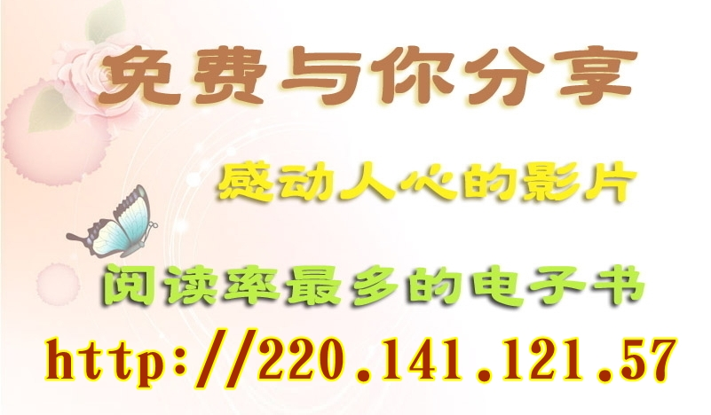 
<a name=top>
<h2><a href="https://github.com/3fmd/true/blob/master/01.md"><b>看更多．．．</a></b></h2>
<h2><a href="https://github.com/goodabc/GCC/blob/master/jysl.md"><b>九评编辑部：魔鬼在统治着我们的世界</a></b></h2>
 <h2><a href="https://github.com/goodabc/GCC/blob/master/goal.md"><b>《九评》编辑部：《共产主义的终极目的——中国篇》</a></b></h2>
<h2><a href="https://github.com/goodabc/GCC/blob/master/xgpl.md"><b>《共产主义的终极目的》 相关评论</a></b></h2>  
<h2><a href="https://github.com/no1show/show1/blob/master/whss.md"><b>中共意识形态之理性批判</a></b></h2> 
<h2><a href="https://github.com/no1show/show1/blob/master/gcdsy.md"><b>评《共产党宣言》</a></b></h2> 
<h2><a href="https://github.com/no1show/show1/blob/master/jgrc.md"><b>【中国人权】</a></b></h2>
<h2><a href="https://github.com/no1show/show1/blob/master/6m.md"><b>【大纪元2018年06月评论】</a></b></h2> 
<h2><a href="https://github.com/no1show/show1/blob/master/5m.md"><b>【大纪元2018年05月评论】</a></b></h2> 
   
【大纪元2018年07月评论目录】 :

<b>

<a href=#24>24. 说说咱们屯里的法轮功</a> 
<a href=#23>23. 中国经济缘何突然陷入危机</a> 
<a href=#22>22. 良知唤醒时，魔鬼到末日——中共诬蔑失败</a> 
<a href=#21>21. 王永航律师：从旁观到亲历和见证（上）</a> 
<a href=#20>20. 贸易战开打 中共危机加剧</a> 
<a href=#19>19. 三退大潮二〇一八年综合报告（六）</a> 
<a href=#18>18. 三退大潮二〇一八年综合报告（五）</a> 
<a href=#17>17. 中共将会是下一个苏联？（下）</a> 
<a href=#16>16. 盘点公开退出中共的维权律师</a> 
<a href=#15>15. 给国家领导人写信讲真相何罪之有？</a> 
<a href=#14>14. 为何百姓的生活普遍仅能维持温饱而已？</a> 
<a href=#13>13. 中共将会是下一个苏联？（上）</a> 
<a href=#12>12. 修大法的清官</a> 
<a href=#11>11. 文化大革命九种思维方式</a> 
<a href=#10>10. 三退大潮二〇一八年综合报告（四）</a> 
<a href=#9>9. 公民起诉国家测绘局 案中藏江氏丑闻</a> 
<a href=#8>8. 共产邪灵统治下的中国大陆</a> 
<a href=#7>7. 金正恩弃核食言 隐现中共机密 川普将反击</a> 
<a href=#6>6. 大法弟子成了十里八村闻名的好媳妇</a> 
<a href=#5>5. 川金会的意义及其终极目的（下）</a> 
<a href=#4>4. 漫话“改革开放”与中国人的幸福感（7）</a> 
<a href=#3>3. 德国战车倾覆 全怪中共送马克思回乡？</a> 
<a href=#2>2. 三退大潮二〇一八年综合报告（三）</a> 
<a href=#1>1. 魔鬼在统治着我们的世界(18)：教育篇(上)</a> 
</b>

<a name=24>
<h1 align="center"><b>说说咱们屯里的法轮功</b></h1>

作者：唐朝

【大纪元2018年07月11日讯】我们屯是一个七、八百人口的小屯，法轮功于九二年从长春传出，我们屯最多时七、八十人修炼法轮功，常年坚持修炼的就有四、五十人。九九年中共江氏集团迫害法轮功后，这个屯也是被邪党迫害最重的地方之一，从老人到小孩，几乎无一幸免的曾被绑架到看守所或被恐吓，七十多岁的就有好几位。

然而，实实在在发生在屯里的事实，却让这里的百姓看到了“法轮大法好”。

<b>村书记：等我们有钱了，给法轮功盖个大炼功场房</b>

一天，一个村民去派出所办事，警察一看证件就说，你那屯炼法轮功的多吧？村民笑着说，是啊。接着，这个村民就告诉警察说：“法轮功，你不服气不行，这回你们再去屯里抓法轮功，全屯百姓都不让。”警察瞅瞅他问，为什么？这个村民娓娓道来：

那一年冬天，雪下一米来深，大雪封道，送粮车出不了屯，还有两天送粮期限就到了，送不出去，政府就罚款。学生上不了学。我们村某某赶牛车送粮，车陷在雪里拉不出来，他死劲赶牛，差点把牛打死。

村书记在大喇叭里喊：共产党员、共青团员都出来清理道路积雪。可是，无论怎么喊，没有一个党团员出来清雪。你看人家炼法轮功的，连老带小，年岁大的七十多岁，小的十几岁，都出来了，硬把道路清理出来了。

当各家送粮的车开在路上时，喜笑颜开，对还在清理积雪的法轮功学员竖起了大拇指。你说，哪个村民不感谢人家法轮功啊！

是啊，当时村书记非常感动，还特意手指著这条路留下了一张纪念照，并说，等我们有钱了，给法轮功盖个大炼功场房。

今年春天，村西边的桥年久失修，塌了，在桥西的村民不能种地了，眼看着春天播种的黄金季节就要过去了，是村里的大法弟子出人、出钱、出车，拉土和沙石，把桥修好了，咱村人才播上了种子。

大家都在背后说，你不服气不行，还是人家法轮功，心眼好，还都那么齐心，共产党员能做到吗？

警察看着屋子里办事的村民，笑了笑没有言语。

<b>村民签字要求释放好人</b>

屯里有一个大法弟子，是位医生，他学大法后，不但给村民看病热情周到，而且有钱无钱都给治病，全屯村民都知道大法弟子的热心肠。法轮功被迫害，这位大法弟子被绑架到市看守所，全屯百分之九十以上的村民都签名摁手印，证明他学大法做好人，没有错，并要求无条件释放他。

此事震惊县“六一零”，特派出一伙人到这个屯来找村民核实，做工作，可是无论他们怎么连哄带吓，没有一个村民信他们。老实的村民说，我们打心眼里说实话，签名都是自个儿愿意的，是心里话。这伙人一看没有吓唬住，就都走了。

一次，一个大法弟子被绑架，一个村民主动从派出所找到县六一零，要求放大法弟子回家，村民把他从新唐人电视上看到的法轮功在世界洪传的真相，和屯子法轮功的真相故事一个个讲给他。

县六一零主任听他滔滔不绝地讲，突然吼道：“你是不是也是炼法轮功的？”他说，法轮功好，谁不想炼？我可没炼，因为我不配，法轮功要求做好人嘛，打不还手，骂不还口，我做不到，就连抽烟喝酒我都放不下。但是，我就说真话，好就是好。

六一零主任气的站起身，跑出了办公室。

<b>村长亲自出面要回法轮功学员</b>

一天，屯里的四位姥姥早晨起来，沿着公路挂法轮功真相条幅，越挂越起劲，一直沿着路挂到了乡政府，她们还在挂。那天正是周一早晨八点多，被新来的乡党委书记上班看到了，通知派出所来抓人。

四位姥姥就开始给他们讲真相，聚集的人越来越多，几乎把道路堵塞了。最后，警察说：大娘、大婶，你看都讲累了，咱们都听明白了，人多影响交通了，咱们到派出所去讲吧。几位姥姥一商量，一位姥姥说，正好派出所所长是新来的，还没给他讲呢，去就去。

他们到了派出所，就又开始讲，最后让几位姥姥摁手印，几位姥姥不配合，他们就硬拉着手摁手印。几位姥姥告诉他们，你们这样做就是在犯罪，我们都是好人。结果奇迹出现了，手印就是摁不上，一个警察说，这法轮功的手怎么这么奇怪，按不上手印呢？！

就在这时，村长赶来了，不知道村长都和所长说了些什么，只听所长说；“他们被乡书记看到了。”村长说，这帮老太太都是好人，你放了也没啥事，你要是把她们抓起来，我们屯的法轮功都去北京上访，咋办？我可管不了。

后来真的无条件把几位姥姥放回家了。

<b>百分之九十以上的村民退出中共邪党</b>

海外大纪元网站发表《九评共产党》后，一场风起云涌的退出邪党的大潮逐渐席卷大陆。屯里也掀起了退党热。

很多村民公开说：“我们相信法轮功说的都是真话，共产党迫害法轮功，电视上说的都是给法轮功造的谣！我们亲眼看到了这些人炼功后身体好了，做啥事都为别人着想。”“我们屯没有人杀人和自杀的。”

一个说退，大多都说退，有的村民主动到法轮功学员家里去要求“三退”；有的把自己的外地的朋友领到家里找学员给讲真相，做“三退”。在这种形势下，连村书记也三退了。那个称自己是“铁杆党员”的姥爷也说：“看来共产党是完了，我也退出来吧！”

目前，屯里百分之九十以上的村民都退出了邪党的党、团、队。村民外出打工都不忘了带上“法轮大法好”护身符。

村民们在大法中受益的事层出不穷。一次，几个村民坐四轮车去城里早市卖菜。回来的路上车翻到沟里，几个人都平安无事。在中共迫害刚开始、搜大法书的时候，有个村民把大法弟子的书保护下来了。结果，有一天他在建筑工地打工时，不慎从七楼掉下来，昏迷半个月后竟然神奇的康复了。

<b>派出所警察说：“法轮功，得平反”</b>
 
每当全乡镇赶大集的日子，又是聚集各村屯村民最多的时候，也是法轮功学员讲真相的机会，两、三个人一组的就去集市上发资料，劝三退。

有一天，一个不明真相的人慌慌张张的跑到乡镇派出所，进门就对值班的警察说，“你们怎么不管呢，这法轮功（学员）就在集市上发资料。”

这个值班的警察看看他笑了，说：“管啥管，我看等不到来年五月，法轮功就得平反。”这一幕正好被一个去派出所办事的法轮功学员的家属看到了。

是啊，那些警察也天天看大法真相的传单和小册子，可知道自己该怎么做了，谁还想替江泽民当替罪羊呢？

责任编辑：高义
<a href=#top><h6 align="right">回上方</h6></a>

<a name=23>
<h1 align="center"><b>中国经济缘何突然陷入危机</b></h1>
 <h3 align="center"><b>——在美国新唐人电视台《热点互动》节目的客座评论</b></h3>

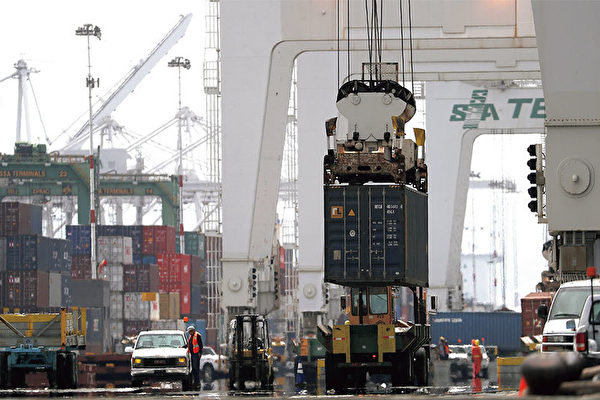

对明眼人而言，中国经济早已危机重重。图为一艘来自中国的集装箱货轮在加州奥克兰港卸货。（Getty Images）

作者：谢田

【大纪元2018年07月11日讯】中美贸易战的阴云绵延不去，中国经济危机四伏。近期人民币汇率也不断下跌至今年的最低水平，股市一路下走，已跌至3,000点以下。与此同时，中共央行年内三次降准，向市场释放约上万亿人民币。中共智库一个名为《警惕出现金融恐慌》的内部报告日前在网上流传，但很快就被删除。人民币“跌跌不休”是中共应对贸易战的手法吗？货币政策上进一步“放水”会产生什么后果？关键问题是，中国经济是否突然陷入巨大的危机？

关于人民币的下跌，或认为是中共应对贸易战的手法，是有意而为之。笔者不以为然。人民币下跌主要体现在离岸市场，应该是国际社会对中国经济展望失去信心、认为中国经济前景不妙、人民币走势会持续下跌的反应。因为中国经济进入停滞，以出口为导向的经济成长在川普的贸易战战火中希望渺茫，出口势头锐减，故而人民币贬值的期望上升，这才是导致人民币下滑的原因。说中共对此有意而为之，恐怕他们不敢，也不太会，因为中共仍然在同美国进行谈判，应该不会故意贬值、刺激出口、激怒川普、增加顺差。所以，人民币下跌，虽然不是中共刻意所为，但反映了中国经济的惨淡前景。

至于人民币会跌到什么程度？中共是否会控制汇率在6.6左右？那要看这场贸易战会持续多久、会怎样收场。如果没有中共政府的干预而让人民币自由浮动，开放市场流通，按照中共目前的发钞程度，如笔者在以前的分析中指出，人民币对美元1：10至1：20都是可能的。

人民币这种下跌会造成什么影响呢？它会加剧中国的资金外流，尤其是外汇流失的速度。货币贬值本该能刺激出口，但在现实中美贸易的条件下，人民币下跌对出口的刺激应该是很有限的，因为下跌的幅度远远赶不上川普的关税和壁垒的增加幅度。

中共最近加强了对外汇的管制，民众兑换美金一次只能几千，而且还要出示许多国外证明。许多人抱怨这种限制只针对老百姓，权贵可以通过许多其它途径把钱弄出去。的确如此。中共对中国人民财富的攫取，对内，是用滥印钞票、制造通胀的方法；对外，是用强制换汇、结汇、实施外汇管制并累积外汇储备的方法。只有限制百姓，限制汇兑，中共的财富、他们可以支配的硬通货才能累积起来，赤龙的钱囊才会饱满。中共的敛财行径，与朝鲜金正恩个人的39号办公室，是一模一样的，只是规模不同。

中共这种极端的管制资金的政策，不会是临时的，因为它是中共累积财富的手段，所以一定是长期的。问题在于，当川普要中共做出“结构性的改变”、“减少国家对自由贸易的干预”的时候，正是在要求中共停止刻意追求顺差和积累外汇，恰恰是击中了中共的要害、击中了赤龙的钱囊。中国最近的股市下跌，也是受到了贸易战的影响。川普的要求必然导致中共贸易顺差的减少、外汇储备的减少；中共没有足够的外汇支撑，国内发行人民币、滥发货币就失去了基础，这会银根紧缩，进而影响股市。

6月底，中共央行下调部分商业银行存款准备金率0.5个百分点，释放约7,000亿元的流动性，支持商业银行放贷和重组债务。大陆媒体说，此次定向降准，是防范“明斯基时刻”。据中共央行表示，这次降准带来5,000亿元流动性，将释放给17家大型商业银行，用于对债务违约公司实施“债转股”项目，并带动“同等规模社会资金参与”。降准另外释放约2,000亿元资金，“供较小的放贷机构，扩大向小微企业放贷”。

债转股的实质，是强迫国有银行承担国企违约、经营失败的结果，这会开启一个恶劣的先例，鼓励更多的企业转嫁危机。而最后，由国有银行承担的这些失去价值的垃圾股票，就成了全中国百姓的负担。这是中共政权又一次从中国人民头上巧取豪夺。官方释放5,000亿元流动性来专门支持债转股，对于填补债务违约的窟窿不会有太大效果，后续的、更大的窟窿会让中国的银行根本承受不起。

中共向来都在高喊支持小微企业信贷，但从来没有能够真正落实。其症结在于，中国没有真正能够建立一个基于信用和诚信的社会体制、商业体制、信用体制。中共本身就是靠谎言和暴力起家的，并且在继续撒谎、欺骗。中共对国人的多少承诺，对国际社会的诸多承诺，都成了泡影。中共怎么能指望这样的社会的人们、团体、企业能信守承诺、维持信用呢？

新唐人另一个问题是：中国宏观经济正在减速，最主要的原因是什么？定向降准是强心针还是饮鸩止渴？定向降准可能是一剂强心针，也许是饮鸩止渴，但更像一片速效救心丸，它能让心脏病发作的人先缓过来，但是还是需要把这个病入膏肓的人送进病房。

如果中共能遵守贸易规则，改变自身做法，是否就可以避免贸易战呢？这样做对国人会有什么好处？而如果中共硬扛，就是要打贸易战，对中国经济和中国人又会造成什么影响？ 中共如果愿意遵守贸易规则，按WTO的要求做，17年来中共一直有机会这样做，但中共不会做也不愿做。现在看来，中共恐怕是根本做不到了；因为如果做到，就意味着丧失中共既得利益集团对出口、外贸、经济的控制，失去对财富的控制，中共就没有金钱支持它的奴役和统治了。没有了钱的驱使，中共的城管、武警、黑社会、政法系统、内外统战都会停止运转，中共的统治也就土崩瓦解了。所以，中共有可能这样做吗？没有。

在明眼的人们看来，中国经济不是“突然”陷入危机的，而是早已危机重重，并且处在危机之中至少已经有二十年了。只不过，在川普几度挥舞大棒之下，中国经济的危机才突然急遽的浮现出来，并且，中共现在也掩盖不住了，如此而已。可以预见的是，中共的专制体制，在这一波经济危机中，很可能随着中国经济泡沫的破灭，即使不随之同时崩塌，也会重重地受挫。 

责任编辑：刘菁

<a href=#top><h6 align="right">回上方</h6></a>

<a name=22>
<h1 align="center"><b>良知唤醒时，魔鬼到末日——中共诬蔑失败</b></h1>
 <h3 align="center"><b>法轮功学员应邀登上国际论坛讲真相感言</b></h3>

作者：郑纯清

【大纪元2018年07月11日讯】

反邪教协会，做贼喊捉贼。 
中共红魔教，专跟正作对。 
国际论坛开，研题论膜拜。 
数次混迹内，大法狂抹黑。 
而今又卷土，重来再放毒。 
法徒去抗议，主办明底细。 
令收宣传品，论坛静其音。 
主讲成法徒，真相从头述。 
邪党遭封喉，打手缩回头。 
良知唤醒时，魔鬼到末日。 
国际追查发，通告全天下。 
国际交流名，诬蔑法轮功。 
学术之公信，利用以骗人。 
迫害逆天罪，罪责一一追。 
制止其再犯，棒喝实行善。 
善恶终有报，天网无可逃。 
唯有毒手停，反戈赎罪行。 
将功把罪折，方可能获赦。

注：据新唐人2018年07月10日讯】日前，中共派出多名“御用学者”参加在美国费城举办的一个国际论坛，企图在会议上诬蔑法轮功。但事情后来发生戏剧性转变，这些“御用学者”的演讲被取消，而法轮功学员则应邀上台，讲述了遭中共迫害的亲身经历。

这个论坛由一个名为ICSA的国际组织举办，这个组织是专门研究膜拜团体的。7月7号，中共派出的近十名来自中国科学院大学等高校的所谓学者，参加了会议。活动安排显示，这批人当天将做报告和展示海报，内容涉及诬蔑、攻击法轮功。

费城的法轮功学员在会场外表达抗议，呼吁主办方了解真相，不要帮助中共迫害法轮功。

在了解情况后，主办方要求这些人拆除海报，并取消了他们上午的3个演讲。

在会议现场，费城的精神科医生杨景端博士曾与这些人进行对证。其中，公安大学副教授洪帆在采访中承认，他们是被中共控制的。

法轮大法佛学会大费城地区发言人Terri Morse：“我们要求主办方不要助纣为虐，不要让这些中共代言人散布污蔑，不能让迫害继续。”

法轮功发言人张而平在接受记者采访时表示，西方自由社会不应给中共提供迫害法轮功的平台。他呼吁美国政府调查中共是如何把迫害法轮功的造谣宣传带到美国国土的。

与此同时，美国人权律师特丽&#8231;马什（Terri Marsh）致电主办方，告知法轮功在美国被认证是一种宗教，与其它宗教一样受到美国法律的保护。当事人的行为会有法律问题。

另据大纪元2018年07月08日讯，7月5日，“追查迫害法轮功国际组织”发布了《对中共“邪教协会”打手任定成、张增一、叶青等11人在国际ICSA会议期间的追查通告》这次被追查的11人，分别来自中国科学院大学人文学院、中国科学院大学马克思主义学院、中国人民公安大学、所谓的北京膜拜团体与宗教文化研究中心等单位，职位和职称为执行院长、副院长、教授、讲师等。

通告揭示，中共的这些所谓学者，“已经连续数年到不同国家多次参加ICSA”，“其根本目的只有一个，就是利用国际交流之名对法轮功进行诬蔑攻击，欺骗和利用国际学术界尚存的公信，以获得迫害合理性的认可。”“因此，这些事实上成为中共打手的学者，每一次参加ICSA，都是一次新的罪恶之行”。

责任编辑：任慧夫

<a href=#top><h6 align="right">回上方</h6></a>

<a name=21>
<h1 align="center"><b>王永航律师：从旁观到亲历和见证（上）</b></h1>

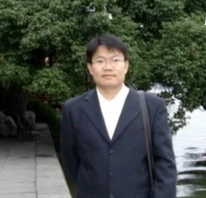

王永航律师 （大纪元）

作者：王永航

【大纪元2018年07月10日讯】我叫王永航，山东省莒南县人。一九九三年考入大连铁道学院（后更名为大连交通大学）机械工程系，一九九七年毕业后到大连机车厂工作。一九九九年通过全国律师资格考试后，起初担任工厂法律顾问，二零零三年辞职成为执业律师。

作为律师中的无名小卒，尽管面临生存问题，但我还是力所能及地为遭受苦难者提供免费法律服务，尤其涉及死亡赔偿案件。我为近十起死亡索赔案提供法律服务，除了两起案件（二零零四年底几内亚枪杀两名中国渔民案）因耗时太久收了点费用外，其余都是免费代理。

为了解决案源问题，我曾于二零零五年利用周末时间在大连市图书大厦一楼法律书籍销售处设咨询台，为购书顾客提供免费咨询。因为这点微不足道的付出，大连市司法局二零零六年把我列为大连市十八个优秀法律服务工作者之一。

二零零八年春，大连法轮功学员王春彦被中山区法院庭审。在各种手续（授权委托书、律师所介绍信、律师出庭函）一应俱全的情况下，我刚步入法庭，该法院刑事庭庭长（女）就惊恐万状地尖叫着把我逐出法庭，收走我的相关手续后，立即回办公室打电话，扬言“我马上让司法局调查你”。她说到做到，几天后，就有消息说司法局在调查我代理法轮功案件情况。

就这么荒唐！这个庭长违法剥夺了我的代理权，剥夺了当事人委托律师的权利，剥夺了当事人和律师的辩护权，自己无法无天尚不知耻，还要恶人告状追究我作为律师正常代理案件的责任，这种嚣张跋扈的执法犯法是一般人所难以理解的。而事实上，涉及法轮功问题，任何非常规的做法都不稀奇。

二零零八年四月三十日一大早，我的妻子、上海复旦大学医学院影像学在读博士，在学校宿舍被上海徐汇区警察带走。理由仅仅是因为她在大街上张贴了几张写有“法轮大法好”的小纸条。上海警方煞有其事地对她冠以“利用×教组织破坏法律实施罪”刑事拘留。五月二日，我到办案单位长沙路派出所交涉，从犯罪构成要素上给他们解释抓捕我妻子的非法性。交涉过程中，有个便衣坐在办公桌上，态度很恶劣。他阴阳怪气地说：“你要相信我们，中国毕竟是个法治国家。”我回答说：“中国不是法治国家，法治国家起码不会有劳动教养。”

我的话刚说完，他就像被火炭烫了一样，“噌”地从桌子上跳下来，失去理性般破口大骂。从他的反应能看出有些警察对劳动教养制度多么爱不释手。

我想委托上海当地的律师去徐汇区看守所会见我妻子，但是走了几家律师所，都对代理法轮功案件有顾虑。我只好让亲友把律师手续寄到上海，自己会见。

五月五日，我以律师身份和妻子见过一面后，即去网吧写了给最高当权者的呼吁信，呼吁他们尊重白纸黑字的法律条文，还我妻子自由，并立即停止迫害法轮功。这封信后来成为给我定罪的证据之一。五月十四日，我妻子获释。

我迫于无奈的维权，随即遭到报复。

二零零八年五月，辽宁省司法厅利用年检之机无理由没收了我的律师执业证。据说时任司法厅厅长张家成专程从沈阳到大连，召集各方开会，研究怎样“挽救”我，以消除我写文章给辽宁省司法厅和大连市司法局造成的“不良影响”。

在张家成的授意下，大连市律师协会和大连市司法局以扣押律师证相要挟，先后找我谈话。

律师协会的官员见面时说了这样几句话：“王律师，你写的文章我们都看了，你说的都对啊，你提出的问题，政府无法面对啊。但是，你不要被法轮功利用啊。法轮功的那些老头老太太我们不怕，我们在乎的是你这种懂法律的人。”我回答说：“我有自己理性的判断，任何人不要打算利用我。”

接下来他提出了对我的要求，也就是谈话的目的：第一，能不能象征性地认个错，声明不应该在海外网站写针对国家领导人的文章；第二，保证不要再在大纪元网站上发表文章。作为回报：第一，我可以拿回律师执业证；第二，在我今后的执业中，律师协会将给我适当的照顾。

我向他们解释写文章的迫不得已，并表示不会违心地去认错。第一次谈话无果而终。

第二次谈话是在大连市司法局，由副局长和律师公证处的处长参加。

副局长先是指责我不该在海外网站上发文章，写文章不该针对国家领导人，不该口气那么大，更不应该的是触及法轮功问题。他还谈到法轮功学员在监狱里的处境，他说：“在监狱里根本不存在法轮功宣传的被迫害问题，不信我可以安排你到大连市监狱去参观，看看那里的法轮功有没有被迫害。”

副局长讲完后，我还是先解释了在海外网站上发文章的迫不得已，然后表达了对他说法的质疑：

“第一，我妻子仅仅因为在大街上贴了几张不干胶的小纸条，就被刑事拘留，面临着被判刑。我去上海找警察讲法律，人家根本不听。一句话‘上头定的，我们说了不算’就把我打发了。作为律师，不能用法律手段保护自己的家人，迫不得已在网上写文章呼吁，这是我的无奈，我也别无选择；

第二，我写文章只是在讲法律问题，你作为司法系统的高官，关注的焦点应当是我所提出的质疑究竟是不是一个值得关注的问题，而不应当关注文章发在哪个网站、针对谁、口气如何；

第三，你也应该认识很多法律专家，不妨邀请十个刑法学专家，让他们发表一下对我写的文章的看法。如果其中有一个专家说我是胡说八道，那么，你今天提出的所有要求我全都答应。”

迫害法轮功的非法性、对法轮功学员定罪的荒唐性，是体制内任何粗通法律条文的官员都无法面对的。副局长最后以一句恐吓结束了我们的谈话：“高智晟怎么样？李德君怎么样？不比你牛啊，还不是照样被我们抓起来了！”

政法系统中的邪恶势力就是如此，把迫害好人当成光荣的政治任务去完成，作为政治资本去炫耀，作为积累罪恶的负能量去制造恐怖。这么多年过去了，不知今天的官场上还有多少这样的人。

二零零八年七月，周永康的维稳系统以奥运安保为由加紧了对法轮功学员的抓捕，当时，对法轮功的迫害已持续整整九年。我认为有必要在现行法律框架内系统论述以《刑法》三百条强加法轮功学员的荒谬，便写了致最高法院、最高检察院的公开信，并以电子邮件的方式送达最高立法机关。邮件发出，如泥牛入海，杳无回应。

二零零八年八月，大连市金州区法院对法轮功学员谷丽、邱淑萍非法庭审，由于没有了律师证，我只好以公民代理身份出庭。同时出庭辩护的还有大连金州的法轮功学员阎寿林。

公诉人是懂刑法的，在犯罪构成四要素这个问题上难圆其说，法官也无言以对。

庭审后，包括法警在内的几乎所有旁听人员眼神中都流露出对我们的善意和赞许，在当事人有罪无罪这个问题上，他们显然都听明白了。

有些家属的态度也转忿为喜，看我的眼神由庭前的鄙视变成敬佩。一位当事人的丈夫主动示好，并对庭前的不友好态度表示歉意。

当天晚上，我写了一篇文章《今天有幸为法轮功信仰者做辩护》发在大纪元网站上。

八年过去了，在法轮功学员被非法审判的案件中，别说公诉人、法官，即使是旁听人员中的法盲也能听明白《刑法》三百条罪名扣在法轮功学员头上的荒谬绝伦。今天仍在泯灭天良对法轮功学员实施迫害的执法犯法者，简直是中邪般的任性。

经验告诉我，周永康控制下的司法系统，案件的开庭效果和判决结果往往相反。果然，我所代理的那位法轮功学员被判四年，比另一位多出一年。而且金州区法院拒绝给我送达判决文书，我到法院去找主审法官索取都不给。

在法律适用方面，所有的法律条文，只要触及法轮功问题，一概发生变形与变性的化学反应（我这么说并不意味着在其它案件中就有多么公平），要么成为一纸空文，如《宪法》中关于公民基本权利的规定，以及上面提到的应送达判决文书的程序性规定；要么旷日持久且规模化地滥用、错用，如以《刑法》三百条强加法轮功学员；要么完全是非颠倒、惩善扬恶，如把上诉和申诉这种纠错机制变成地地道道的错误强化、罪恶互助机制。

二零零九年六月，法轮功学员丛日旭被甘井子区法院非法庭审，我与北京律师出庭辩护，当天即发现有人贴身跟踪。

二零零九年七月四日，我在朋友家吃午饭。因为天热，家里所有的门窗都是打开的，谁也想不到吃顿饭会招来横祸。用餐快结束时，突然闯进来几个身份不明的人，小声嘀咕了一句“都别动，我们是大连市公安局的”，就贼头贼脑地四处查看。

以法轮功学员“聚会”的名义肆意抓人，这样的报导明慧网几乎每天都有。为了表达对肆意抓人这种恶行的不满，我招呼大家继续吃饭，不理会他们。

我的话刚说完，其中一人冲我一指，说：“把他带走。”看起来似乎是我的不屑惹恼了来客。

有两人站在我身后，让我站起来跟他们走，我没动。他俩拉住我的肩膀往后使劲一掼，我被从凳子上摔到地上的同时也从里屋摔到相对宽敞的外屋。外屋站满了他们的人，无数只腿脚以踢、踹、踩的方式袭击我身体的各个部位。

当其中一个叫着我的名字数落的时候，我意识到他们是冲我来的，是我牵连了大家。我喊了一句：“既然你们是针对我的，放他们走。”回答我的是他们的奚落和更加卖力的脚法展示。

当天同时被绑架的还有十三人，包括大连水产学院美术教师冯刚。冯刚于二零零九年八月十四日离世，目前遗体仍未火化。冯刚之死，疑点重重。

网上评价，冯刚在绘画、雕塑方面造诣颇深，自修炼法轮功后，身体健康，思想境界不断升华，在艺术创作上更趋成熟、纯净，是位难得的人才。冯刚有很多好的艺术构思，一直在努力创作出一批对社会、对世人有益的优秀作品，可是，他的离去，带走了深深的遗憾，留下了永远无法挽回的损失。

冯刚的离世，完全是被我牵连。

今日当权者有责任立即查清冯刚死因，给世人以交代。

根据后来了解到的情况，据说对我的绑架来自周永康的秘密指令。

当天下午，绑架者把我劫持到锦绣小区派出所。派出所二楼大厅有个大会议桌，周围十几把椅子。他们把我扔到椅子上，有个便衣（后来知道他就是长期负责迫害法轮功的国保焦健）在旁边难抑兴奋地频繁接听和拨打电话。待他稍微消停些，我问：

“办案要出示身份的，你能不能告诉我，你是哪个部门的，叫什么名字？”

“我不告诉你。”他轻蔑地回答。

“抓人得需要理由的，你应该告诉我为什么抓我？”

“我也不告诉你。”他重复一句。

“我没必要配合你！”我低吼一句，从椅子上跳起来，迅速冲向楼梯口。

刚跑下半个楼梯，低头往下一看，一楼的铁门是关上的。我只好停住脚。

焦健呼喊著追上我，他的呼喊引来二楼其他三个警察。这四人把我从半个楼梯拽到二楼楼梯口，即开始报复式围殴。

四人体格都不错。后来知道，焦健自称酷爱踢足球，高个子副所长大热天竟穿了双结实的警靴，有一个是自幼习武的，还有一个体格壮硕。

他们打累了，把我拖向会议桌边。我刚走了五六步，突然感觉右脚跟发麻，踩地没有感觉。其实当时几乎也不用我走，两个人拽着我扔到会议桌旁的地上。焦健还不解恨，骂骂咧咧地用脚踢了我脑袋几下。

伴随胀痛，右脚踝部慢慢隆起并由红转紫。傍晚时分，他们将我拖到一楼，把我关到铁笼子里。从我的走路姿势，他们发现了我的脚伤。

当天晚上，他们带我去大连市中心医院拍片。看完片子后，医生问我：“你的脚伤是怎么造成的？”

我回答说：“具体原因我也不知道。先是跑了几步，后来挨了一顿打。”

“我的第一次记录很重要。你必须说清楚伤害是怎么造成的。”

平心而论，脚受伤可能有两个原因。其一，被绑架后，他们就没给我穿鞋。我光着脚被他们劫持到派出所。在我从二楼往下跑时，在跑下半个楼梯的过程中，因为步幅较大，很可能脚跟受力过猛所致。

第二个原因就是因为我的逃跑被报复围殴过程中致伤。

但我个人认为，第一种原因可能性大些。但不管怎样，根据法律关于“紧急避险”的规定，我所受到的伤害应由危险制造者即绑架我的人和部门承担。

我告诉医生：“您就记录是我个人原因造成的吧。”

医生再次嘱告：“我这是第一次记录，非常重要，你一定要考虑清楚。”

我回答说：“考虑清楚了，谢谢您！”

当天下半夜，警察送我去看守所，被看守所验伤后拒收。7月5日上午，他们拉我再去中心医院在我腿上打上石膏，下午再次往看守所送，看守所起初仍然拒收。警察打电话沟通后，看守所违规将我收押。

看守所警察通知监室的犯人盯着我，不准我碰缠石膏板的绷带。大约一个月后，脚后跟钻心疼痛，恰好焦健来搞所谓的提审。我当着他的面解开绷带，看到脚后跟皮肤溃烂，露出白色的骨头。从这天开始，看守所协调派出所隔几天带我去医院换药。

大约八月中旬，看守所安排一个警察陪同一起去中心医院换药，并主动提出拍片检查。大概是看守所怀疑派出所用心不够。根据医生描述，看守所警察很气愤地给他们领导打电话，叙述了我脚伤的严重性。派出所答应安排我住院手术。

因为我的诉求是立即无条件还我自由，双方在手术问题上陷入僵持。一天，中心医院骨科主任梁武陪警察到我跟前，声色俱厉地说：“做手术的事，你配合也得配合，不配合也得配合。这是共产党的医院，我们就听共产党的。你要是不配合，我们就把你全身麻醉，强行手术。”

当即我第一次发现，医生原来也可以如此面目狰狞。

八月二十五日上午八点半，我被放到手术台上。等了大约一个小时，梁武气哼哼地走进来说：“（公安局）非逼我们上午做手术，但是手术费支票中午才能给。可是按照我们院里的规定，手术费不到账，手术器械拿不全，没有办法，只能这样做了。”

在手术的过程中，我听到梁武和他的助理小声嘀咕，某种型号的钢钉没有，只能凑合用另种型号的。

起初，他们给我打的麻药是腰部以下麻醉。大概打完钢钉后，用手术台上的X光机检查时，我听他们小声嘀咕了一句“对偏了”，再后来，他们又给我打了一针麻药，打完之后，我就失去了知觉。

（二零一零年六月，应我家人的强烈要求，沈阳第一监狱带我到外面医院看脚时，中国医科大学附属二院的一位须眉皆白的老教授看完片子，问过我在哪个医院做的手术后，说了句话：“你们大连的医生，水平简直太高啦。”我听出他的嘲弄，问他为什么这么说，他看看旁边的警察，就不吱声了。）

（待续）

文章来源：明慧网

责任编辑：高静

<a href=#top><h6 align="right">回上方</h6></a>

<a name=20>
<h1 align="center"><b>贸易战开打 中共危机加剧</b></h1>

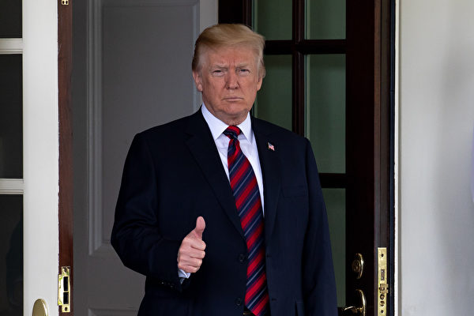

川普上台后，美中关系发生了实质性的变化。川普的影响下，西方世界更多国家开始围剿中共。(Samira Bouaou/大纪元)

作者：夏小强

【大纪元2018年07月06日讯】2018年7月6日，是美国对340亿美元中国商品启动25%关税的日子。中美贸易战开启对中国经济造成的重大冲击程度，仅从中国股市就可以看出。

大陆A股一路下跌，截至7月5日，上海股指跌至2,733.88点，创下了28个月的新低，恐慌情绪弥漫市场。

面对川普发起的严厉制裁，在基本失去了朝鲜这张重要的牌之后，中共表面强硬，做足嘴上功夫说给国内听，行动上却无奈让步：

中共发改委赶在7月1号前，公布了2018年版外商投资准入负面清单。大幅度放宽市场准入，清单长度由63条减至48条，共在22个领域推出开放措施。这个清单不仅在公布日期上达到了此前美国商务部的要求，尤其在电网的建设、经营等方面的开放，出人意料。

但是，6月29号，美国驻华大使布兰斯塔德在北京一个金融论坛致开幕词时说，美国国内对此持怀疑态度，质疑中共是否会真正兑现开放金融等领域的承诺。

布兰斯塔德认为，美国人的担忧，在于中共已承诺过很多次了，但一直在拖延，美国希望的是现在就实现，而不是要再等三五年。

西方世界在经受中共多年的玩弄和欺骗之后，目前已经认识到，中共的承诺是不可信的，中共的阴招太多，完全没有基本人类的道德底线。此前那些进入中国大陆的西方企业，都无一例外地成为待宰的羔羊，最终或者哑巴吃黄莲无可奈何离去，或者放弃基本道义原则，屈从中共，跟着道德沦陷、协同中共作恶。

中国经济面临着严峻局面，股汇双杀，大量企业倒闭，爆发金融危机的导火索随时可能被点燃；社会乱象频发，恶性事件和民众群体抗争不断，社会底层和民间的不满情绪和仇恨增加。

中共政权在国际上不断碰壁，被国际社会围剿之势正在形成。而在国内，中共仍在严控媒体，高调宣传歌舞升平的假象，意识形态全面左转。中共高层高高在上，仿佛不知道中共的危机和死期正在逼近。

种种迹象显示，中共政权距离最后死路的尽头越来越近。

不惜一切手段和代价维持统治，继续作恶和毁灭人类，是中共存在的唯一动力和目的。中共本能地采取一切手段来转嫁政权危机，这次也不例外。

中共正在采取贸易手段之外的方式报复美国，其实就是中共对美长期施行的“超限战”的延续。

《华盛顿邮报》7月4日发自北京的一篇报导说，中共警告要进行的“质量型”报复措施让美国公司感到担心。报导说，虽然没有精确的统计数字，但是有个例显示，中国在海关、检疫和防火检查等监管措施方面开始刁难美国公司。

一家运送樱桃到中国东南部的美国公司最近在边境遭遇一个新的障碍：海关官员命令将货物隔离一周，于是樱桃烂掉，被送回美国。同时，美国宠物食品制造商说它们在港口面临更严厉的检查，使得货物被延迟抵达货架，最终销售受损。此外，一家出口汽车到中国的美国制造商在边境被随机检查的频率上升了98%，导致公司进度落后。

中共政府还有意影响中国游客选择赴美国旅游的决定。中共驻美大使馆6月28日在其官方网站上发布通知，提醒赴美旅游的中国公民警惕“美国治安不靖，枪击、抢劫、盗窃案频发”。通知说，美国医疗费用昂贵，应根据自身健康、经济情况购买医疗、人身意外等保险。通知还提醒中国公民，有可能在入境时遭到海关搜查和盘问。

中共过去曾被认为使用过限制本国游客赴目标国家旅游的方法，通过打击对方的旅游观光产业给对方政府制造政治压力。2017年，中韩关系因为韩国部署萨德反导系统应对朝鲜导弹威胁而陷入紧张。据韩国旅游发展局统计，前往韩国旅游的中国游客数量较去年同期下降了近一半。2016年，北京指责台湾民进党政府拒绝承认“九二共识”，也对台湾采取了类似的手段。中国大陆团客赴台的人数锐减，给部分依赖大陆游客的台湾观光产业造成了严重的冲击。

在另外一方面，中共控制了全部的国家资源，中共将会继续把危机转嫁到中国民众身上，中国民众的处境将会更加艰难。中共将会更加严控社会，来缓解政权危机。

近日，上海五位访民到北京上访后，借道前往北戴河旅游，其中三人出地铁站查验身份证时被拦截遣返；另外两名访民但在夜晚投宿旅馆时，店老板要他们在带摄像头的电脑前，出示身份证登记拍照，不到半小时警察就赶到，将他们带走，连夜遣返回上海。中共一直以维稳、安全为理由，发展各项监控设施，现在更发展出脸部辨识系统搭配国民资料库，让公安在最短时间内辨识一个人的身份，即时追踪位置，达到控制民众的目的。

到目前，中国社会和中国民众已经被中共政权紧紧捆绑，在中共的邪恶极权控制下，中国民众无路可走、无路可退。

但是，中共政权的走投无路和死路，恰恰是中国和中国民众的绝处逢生。中国社会，只要摆脱了中共政权的操控，将会浴火重生。中国正处在一个大变局的前夜，世界亦然。

不久未来必将发生的中共解体，将是中国走出危机的一个标志。对于中共高层的当权者来讲，放弃共产主义意识形态、回归中华传统，是唯一的出路。在最后有限的时间内，时机稍纵即逝。

责任编辑：高义

<a href=#top><h6 align="right">回上方</h6></a>

<a name=19>
<h1 align="center"><b>三退大潮二〇一八年综合报告（六）</b></h1>
<h3 align="center"><b>全球退党服务中心</b></h3>
 

2018年4月7日，旧金山游行庆祝三亿人三退。（周容／大纪元）

 
【大纪元2018年07月06日讯】

<b>结语</b>
 
今天，在这个历史特殊时刻，自由世界再一次有机会站在一起彻底的消灭在地球上的最后一个共产主义堡垒—中国共产党，人类将走出共产邪灵对全球的控制。通过深入的理解中共的邪恶本质可以让国际社会完全摒弃对中共变好的任何挥之不去的幻想。通过不对中共怀有任何幻想，就可以使国际社会抵御邪恶的诱惑，同时保护普世价值，通过坚持普世价值，自由世界就可以保持自由，通过珍视心灵的自由，世界人民就能意识到退党大潮是善良人们唯一通向胜利获得美好未来的途径。同时，通过对于人类自身偏离神传价值和文化的反省, 回归对神的信仰和重建道德体系。这样人类的未来必定美好，神对人类的眷顾和救度就会最终实现。

<b>资料：全球去除共产邪恶主义大事记</b>

（1989年8月 – 2018年8月）

—— 2018年5月27日到6月2日 台湾台北，高雄及台中等地连续举行关注三亿中国人“三退”，美国对中共的政策及“共产主义终极目的”研讨会，揭露中共的邪恶，鼓励台湾人民勇敢面对中共，保持中华传统文化。

——  2018年5月9日，关注三亿中国人“三退”的主题研讨会在美国国会举办。来自不同国家的政治家和中国问题专家表示，民众大规模的精神觉醒为中国的未来带了光明的希望，也令国际社会振奋。

—— 2018年3月23日， 三退总人数突破三亿人。

—— 2018年2月3日（星期六）下午，在美国大华府地区马里兰州洛克维尔市蒙郡议会（Montgomery County Council）举行的研讨会上，多位中国问题专家探讨了《共产主义的终极目的》新书与近三亿人退出中共给中国和世界带来的影响。

—— 2017年12月18日世界人权日之际，大纪元报导，台湾展现捍卫人权价值的坚持，由台湾移民署、陆委会等多个跨部会官方机构组成联审会，进一步限制“中共人权恶棍”踏入台湾，首波“黑名单”锁定迫害法轮功者，他们的“专业交流团”也整团被驳回，全部都不准入境。—— 2011年以前，台湾立法院与十六个县市议会相继通过“不欢迎、不邀访、不接待”中共人权恶棍的决议。

—— 2017年12月20日下午，美国国会议员、旅美新西兰政治家、维权律师、政治评论家在美国国会举办的研讨会上谴责中共迫害民众的暴行，声援近三亿中国人退出中共。他们认为中共不仅迫害国内民众，也对全人类构成威胁，不支持邪恶、退出中共是明智之举。

—— 2017年12月10日，大型纪录片《铁证如山》（新版）全球首映式在纽约法拉盛台湾会馆，举行了全球首映式。这是一部反映中共活摘器官暴行证据最多最全面系统的大型纪录片。影片汇集追查国际十多年来对中共活摘的调查报告的精华，通过教学片的手法，更深入细致地介绍了证据之间的逻辑关系和背景意义，系统地揭示了中共活摘罪行的真实存在的铁证、超越历史的邪恶程度。以大量确凿的证据论证活摘法轮功学员器官不是民间行为，而是国家规模犯罪，是江泽民亲自下令，政法委分管，军队、武警和司法系统执行的国家行为，是这个星球上从没有过的罪恶。

—— 2017年12月10日“国际人权日”当天，台湾法轮功人权律师团发言人朱婉琪公布“全球声援中国民众控告江泽民的刑事举报连署活动”最新统计数据，截至12月8日为止，已获得全球31个国家、超过260万（2,602,650）位民众支持响应，可谓是21世纪最大的人权义举。

—— 2017年11月，在《九评共产党》发表13周年之际，《九评》编辑部发表新书《共产主义的终极目的》。结合历史与现实，深入剖析共产主义对人类文化与道德的破坏，让人们更加清醒地认识共产主义的危害。

—— 2017年9月中共十九大前夕，全球有超过252万位民众，向中国最高检察院及最高法院举报前中共党魁江泽民。台湾法轮功人权律师团发言人朱婉琪当月抵达美国华府，向美方提交全球参与、声援中国民众控告江泽民刑事举报统计资料、连署光碟。同时将18年来，部分参与迫害法轮功的中共官员的被告名单、一并交给美方，要求禁止人权恶棍入境，若有财产应予以冻结。

—— 2017年5月，陕西省大荔县50名中共党员宣布退出中国共产党。

—— 2016年9月，三退总人数突破2亿5,000万人。

—— 2016年6月13日，美国国会众议院院会一致通过了343号决议案， 要求中共立即停止针对法轮功学员等良心犯的“强摘器官”行为。此议案是在2015年6月25日由美国国会共和党与民主党议员联合发起；2016年1月12日，在众议院外交委员会亚太小组通过；2016年3月16日，获众议院外交委员会一致通过的。

—— 2016年5月10日，加拿大东部部分法轮功学员在首都渥太华国会山前，庆祝世界法轮大法日。国会人权和宗教自由副批评家吉尼斯议员盛赞法轮功学员：“我赞扬你们，你们所做的工作惊天动地，你们不断在把受迫害的问题提出来，让国会议员们关注。我赞赏你们，不仅仅因为你们的活动，也因为你们（内心的）希望。当迫害年复一年发生的时候，也许一些人会因诱惑而放弃，失去希望，但是你们没有。事情会改变，事情必须在中国改变。

—— 2016年2月2日，美国联邦国会议员、众议院外交委员会资深成员、前德克萨斯州法官特德‧坡（Ted Poe)接受大纪元和新唐人电视台的联合专访时，呼吁中共国家主席习近平公开逮捕和公开审判前中共党魁江泽民，还正义于法轮功学员。他说：“全球有100多万人都在说：要审判江泽民。这将带来正义。不论如何，我认为应该对江泽民审判。现在就应该审判他。给予世界、中国人民和法轮功学员一个交代。”

—— 2015年12月17日，乌克兰法院通过了乌克兰司法部提出的取缔所有共产党的诉讼，下令全面禁止共产党在乌克兰境内的活动。

—— 2015年12月15号，向大陆最高检察院和最高法院，提起对前中共党魁江泽民控告的人数，已经突破20万，“诉江大潮”进入了一个新的里程碑。

—— 2015年11月28日下午，主题为“巨变的中国与中共的危机”暨九评退党十一周年研讨会在美国首都华盛顿近郊的蒙哥马利郡郡议会举办。

—— 2015年“七一”中共建党日前，湖南湘潭市色织染整厂全体职工1003名工人绝望至极，集体要求退党，其中不乏有数十年党龄的老党员。

—— 2015年6月11日，乌克兰最大通讯社Unian报导了中国的退党大潮、中共前党魁江泽民迫害法轮功，并详细报导了中共对法轮功学员施加的多种酷刑，以及中共活摘学员器官的暴行。

—— 2015年5月，大陆最高法施行“立案登记制”改革，要求“有案必立、有诉必理”。大陆法轮功学员借此机遇纷纷起诉向最高人民检察院，最高人民法院起诉江泽民，并形成浪潮。此前，2000年8月，北京出现第一例中国公民控告江泽民的“诉江案”，原告是香港居民朱柯明和北京居民王杰。2002年10月，法轮功学员在芝加哥向江泽民成功递送传票。从此，海外有多起针对江泽民的起诉案。

—— 2015年4月14日，三退总人数突破两亿人。它不仅标志着两亿中华儿女摆脱了共产邪灵的精神控制，将拥抱美好的未来，也预示著更多的中国人在快速的觉醒，同时昭示著天灭中共的脚步越走越快，没有中共的时刻即将到来！

—— 2015年4月9日，乌克兰议会通过法案，禁止纳粹和共产党的标志及纳粹、共产主义思想。违法者将被处以5到10年有期徒刑。法案经乌克兰总统波罗申科（P. Poroshenko）签署后生效。乌克兰各地掀起更改以苏共领导人姓名命名的街道名称、清理共产党镰刀斧头标志、推倒列宁及苏共领导人塑像的活动。

—— 2015年3月德国主流媒体《言者》（The Speaker）报导了“三退”大潮始于《大纪元》媒体发表的系列文章《九评共产党》。报导中说，尽管中共当局持续镇压，中国大陆充满勇气的义工及全球退党服务中心的协助，中国人三退人数不断攀升，位于纽约的退党服务中心，每天会收到大约12万份的三退声明。

—— 2015年1月，单月三退人数创历史新高：达到358.8万。

—— 2014年10月17日（周五），博大出版社与大纪元新闻集团在旧金山Presidio公共图书馆举办《九评共产党》十周年的研讨会。五位专家、学者应邀进行演讲，深刻阐述《九评》发表后这十年来对中国社会的巨大影响并引发了势不可挡的三退大潮，这也是天象变化下的必然趋势。

—— 2014年8月7日 由联合国支持的柬埔寨法院特别法庭8月7日做出裁决，宣布判处两名前红色高棉领导人农谢及乔森潘终身监禁。 乔森潘和农谢曾分别担任前红色高棉国家元首及中央委员会副书记和人民代表大会委员长，二人均被指控于上世纪70年代后期在柬埔寨犯下种族灭绝罪、战争罪及危害人类罪等罪行。

—— 2014年8月，单月三退人数突破300万，达到319.69万。

—— 2014年04月05日讯大纪元报导：近日，大纪元网站退党平台，退党、团、队（三退）人数连日突破单日10万的纪录。这是从2004年12月3日开始，大纪元网退党平台统计每日“三退”人数以来的最高人数。

—— 2014年3月20日，律师江天勇、唐吉田、王成、张俊杰及一些法轮功学员和家属等30多人第三次前往黑龙江农垦总局青龙山洗脑班，要求立即释放仍被非法关押的法轮功学员。3月21日早，近二十个警察强行闯入酒店，绑架了四位律师和七位法轮功学员及家属。当天，大陆人权律师团发出严正声明，要求当局立即释放被关押的律师和法轮功学员，并依法取缔“法制教育基地”黑监狱。网络上一天之内就有102位律师及346位公民联署支持。3月 23日，农垦建三江管理局前就汇集了全国各地律师及正义人士一百多名，抗议黑龙江农垦当局无法无天的暴行。还有不少律师在全国各地申请游行示威，抗议建三江当局践踏人权、践踏法律的罪恶行径。

—— 2013年11月15日已有1亿5,000万以上的中国人正式声明退出中共及其一切附属组织，使邪恶的中共政权从内心产生了前所未有的恐慌。

—— 2013年8月23日，加拿大政府宣布，将出资最高150万加元，在首都渥太华建造一座共产主义受害者纪念碑（A Memorial to Victims of Communism）。2017年5月17日，最终设计方案出炉。该纪念碑预计在2018年底建成。

—— 2013年8月14日，全球退党服务中心为回应各地对群体三退（指退出中共党、团、队）的要求，发表“关于群体三退的公告”，在保持过去三退方式的情况下，为公众提供群体退党操作指导意见。

—— 2013年6月14日，湖南省5,000多名放映员一致决定：强烈要求退出共产党，公开集体退党，并到北京上访。湖南省共有8,000多名乡村放映员，其中大部分都是中共党员。在上世纪七、八十年代，这批乡村“秀才”，骑着自行车或肩挑背扛地长期奔走乡村，播放中共宣教的红色电影。他们是那个年代著名的“红色放映员”。多年来，他们没有得到当局的任何补偿，现在大多老、弱、病、残，生活陷入困境，老无所养，被当局遗弃。

—— 2013年6月中旬一天早上7时许，加拿大多伦多退党服务热线收到一位大陆广东企业员工的来电，之前他就打电话来给自己退，现在要求帮他群体的4,000人“三退”。

—— 2012年底，美国国会及行政部门中国问题委员会(CECC)将全球退党服务中心提交的报告收录进美国国家政府档案，并藉由美国国家印刷总局刊物发行。该报告共27页分七部分，详细介绍中国的退党运动。该份整体报告系由美国参议院7位参议员、众议院的7位众议员、美国国务院副国务卿、国务院东亚事务助理国务卿等5位高级行政官员共同列名发表。

—— 2012年12月，单月三退人数突破200万，达到216.74万

—— 2012年12月18日，美国国会及行政当局中国委员会（Congressional-Executive Commission On China，简称CECC）在参议院举办大型法轮功国会听证会。围绕“法轮功在中国：回顾与更新”的主题，与会8位证人以亲身经历或详实事实讲述中共对法轮功长达13年的迫害情况。退党中心发言人李祥春在听证会上介绍退党大潮。

—— 2012年9月12日举行对发生在中国的活体摘除器官的国会听证会，此听证会由众议院外事委员会加州共和党议员、监督和调查小组委员会主席达纳·罗巴拉克和新泽西共和党议员、非洲及全球健康和人权小组委员会主席克里斯·史密斯共同组织主持。出席听证会证人有：调查记者伊森·格特曼、加州大学洛杉矶分校医学教授加百利·达诺维奇、医学社会医生抗议活体摘取器官发言人达蒙·诺托博士和全球退党服务中心发言人李祥春。

—— 2012年10月，四川剑南春职工维权，厂方找来警察抓人、打人。72名党员职工集体公开退党；

—— 2012年7月，欧洲议会负责民主和人权事务副主席爱德华·麦克米兰-斯科特发表对退党运动的敬意的声明：“退党运动这种精神的和平的运动，已经给国际社会带来了一个完全没有共产主义的新愿景。”

—— 2012年7月，退党人数超过1亿2,000万。

—— 2012年6月12日，前美国防部部长拉姆斯菲尔德在国会山献花仪式上获得杜鲁门-里根自由奖章，由共产主义受害者纪念基金会主办，此奖项也为了纪念悼念活动5周年。在活动后，拉姆斯菲尔德和其他参与者表达对退党运动的支持，退党运动以鼓励中国人民退出中国共产党。

—— 2012年2月，退党人数突破1亿1,000万。

—— 2012年元旦，俄罗斯总统普京的前首席经济顾问、俄罗斯经济分析研究院所长、国会议员安德烈·伊拉里奥诺夫，在莫斯科回声电台节目公布由该院评选的2011年全球十大事件，上亿中国民众公开声明退出中共党相关组织、和欧洲危机、阿拉伯之春，被列为世界最重要三大事件。

—— 2011年10月25日，美国国会416号议案：谴责中国共产党对良心犯的歧视、骚扰、折磨和处死，支持中国民众退出中共的退党运动。

—— 2011年8月，退党人数突破1亿。

—— 2011年7月13日，美国参议院第232号决议：中国共产党镇压法轮功运动12周年，决议意识到正在中国持续发生迫害法轮功修炼者，意识到中国民众退出中国共产党及其附属组织的退党运动，同时呼吁立即停止对法轮功修炼者的迫害运动。

—— 2011年2月退党人数突破9,000万。

—— 2010年9月，退党人数突破8,000万。

—— 2010年3月16日，美111届众议院605号决议：在中国共产党镇压法轮功精神运动11周年认识到在中国正在持续的对法轮功修炼者的镇压，并呼吁立即停止迫害活动。

—— 2010年3月，退党人数突破7,000万。

—— 2010年1月14日，乌克兰法庭以上世纪30年代该国发生的饥荒，裁定当时的苏联领导人犯下了种族屠杀罪。基辅上诉法庭裁决说，包括斯大林在内的苏共领导人要为这场造成大约400万乌克兰人死亡的饥荒负责。

—— 2010年1月9日，退党人数突破6,600万。

—— 2009年11月，乌克兰总统尤申科不久前表示，他准备向议会提交法案，禁止共产主义标志。乌克兰国家对外情报局档案馆馆长维亚特罗维奇在悼念“大饥荒遇难者日”前夕表示，如果乌克兰共产党把自己当成苏联共产党的继承人，那么从法律和道义的角度来看，乌克兰应该禁止共产党的活动。苏联共产党当年屠杀了千百万乌克兰人。

—— 2009年11月30日，波兰总统卡钦斯基最近签署一项法律，禁止生产、贩卖、使用、传播和存放共产党的镰刀、斧头、红旗、红星等标志以及纳粹法西斯的标志。因为共产主义同法西斯一样都是种族灭绝的象征，共产主义标志不能在波兰土地上存在。类似的法律已在波罗的海国家实施：立陶宛1年前通过和实施的相关法律规定，拉脱维亚在上个世纪90年代早已实施类似法律。

—— 2009年11月10日，在柏林墙倒塌20周年纪念日之际。时值全球领袖齐聚柏林庆祝欧洲解放的时刻，数万名柏林市民和游客把庆祝活动推向高潮。主要庆祝活动在德国统一象征的柏林勃兰登堡门附近展开，并包括一个推倒巨大多米诺骨牌的仪式，以纪念东欧前共产党政权在1989年随着柏林墙倒塌后接连被推翻的历史。德国总理默克尔首先与克勒总统以及其他领导人在夜愿教堂参加祈祷仪式。默克尔还和前苏联总统兼共产党总书记戈尔巴乔夫、波兰前总统华里沙一起穿过当年的东西德分界线关卡旧址。

—— 2009年10月3日，全球退党服务中心在加州洛杉矶开设全球第二个办公室。

—— 2009年9月，退出中共党、团、队的三退人数突破6,000万。

—— 2009年8月，单月三退人数创历史新高：达到168.95万。

—— 2009年7月20日，在伦敦市中心议会广场举行的“解体中共，制止迫害”大型集会，多位英国政要和非政府组织人士到场支持发言。

—— 2009年7月16日，在美国华盛顿DC国会山前举办“解体中共，才能停止迫害”盛大集会，有十多位美国国会议员和政要出席并作谴责中共邪党暴行的发言。

—— 2009年5月17日，乌克兰总统尤先科在首都基辅郊外的森林参加政治迫害悼念活动，表示应彻底清除共产极权的标志，同时告诫那些不承认共产主义罪行的人们，必将被淘汰。这样的罪行不会被历史所宽容。

—— 2009年4月28日，阿富汗平静地庆祝前苏联支持的共产党政府倒台17周年，喀布尔政府取消了今年的游行，将把举行这次活动的钱拨给巴达赫尚省和宁加哈省的地震灾民。卡尔扎伊总统主持了有前穆加赫丁领袖、外交官和军官参加的纪念聚会。

—— 2009年4月13日，新西兰“退出中共服务中心”在奥克兰市伊丽莎白广场举行声援中国人5,500万人退出中共及其相关组织的集会活动，新西兰总理约翰•柯（John Key）委托他的私人秘书Emma Holmes发来贺电表示支持，并转达他对这次活动的主办者和所有参与者的祝福。

—— 2009年4月8日，法国国民议会副主席马克-勒-福赫（Marc Le Fur）发起，在国会放映厅放映了电影《卡廷大屠杀》。讲述二战期间共产苏联为防止不受其控制的自由波兰的出现，在卡廷（Katyn）森林秘密枪杀25,000名波军军官和其他社会精英的史实。波兰驻法大使Tomasz Orlowski、法国前文化部长、人权捍卫者雅-克朗（Jack Lang）、法国国会法-波友好小组主席Jean-Louis Leonard、以及多位法国议员出席了活动。一致认为，今天有必要揭露共产极权暴行。

—— 2009年4月2日，欧洲议会在布鲁塞尔全体大会上投票通过了“关于欧洲良知和极权主义”的决议，谴责极权和共产专制，提议在全欧洲范围将8月23日定为所有的极权主义和专制政权受害者纪念日。以表达对人类尊严与公正的纪念，并宣布今年欧洲将庆祝中、东欧共产独裁统治垮台和柏林墙倒塌20周年，以便牢记历史。该决议的发起人之一欧议会议员托克斯（Tokes）表示，在欧洲我们努力团结一致谴责所有那些极权统治所犯下的反人类的罪行。

—— 2009年3月，前中共国家安全系统谍报官员李凤智在美国首都华盛顿DC公开宣布决裂中共，并在国会山召开新闻发布会，呼吁世界各国政要关注中国民众的人权状况。美国加州国会议员德纳·罗拉巴克（Dana Rohrabacher）声援李凤智脱离中共，为退出中共的5,000万中国人鼓掌喝采。美国有线电视新闻网(CNN)、法新社等多家西方主流媒体现场报导，关注此事件。

—— 2009年3月18日，欧洲议会在布鲁塞尔总部大厦内举行了欧洲良知和共产极权罪行的听证会，欧盟理事会主席国捷克政府常务副总理、欧盟执行委员会高级主管官员、以及来自欧洲不同国家的政要和非政府机构代表与欧洲议会议员一起参加了听证。来自欧盟、欧洲不同国家的政要、不同的纪念共产主义受害人的组织等到会发言，探讨、交流去共化的进程。曾两次担任爱沙尼亚总理的马特·拉尔先生（Mart Laar）表示，中国越早退出中共越好，人们需要知道，共产主义是一丘之貉，不管它在哪里，都是罪恶。前捷克总统哈维尔先生（Vaclav Havel）表示，必需反思共产主义罪行，对此盖棺定论，并告知下一代，这尤为重要。

—— 2009年2月17日，柬埔寨特别法庭在柬埔寨首都金边开庭审判康克由等前红色高棉领导人犯有反人类罪。柬埔寨特别法庭是专为审判波尔布特政权在国际框架下，由联合国与柬埔寨共管的法制机构。在世界上共产主义制度在中国仍然存在的今天，这一机构的设置与正式运作是国际法制史上具有里程碑意义的重大历史事件。对这些人的审判既是对柬埔寨共产制度的审判，也是对这些作为制度机器一部分的个人的审判。

—— 2009年3月开始，美国和许多民主国家正式把全球退出中共服务中心签发的“三退证书”作为办理身份的法律支持文件。退出中共、杜绝共产主义的全球觉醒浪潮得到海外华人广泛支持。

—— 2009年2月1日，退党人数达到5,000万。

—— 2009年初，美国总统奥巴马就职演说，再次正式把共产主义和恐怖主义相提并论，视为打击对象。

—— 2008年12月14日，加拿大多伦多准备建立共产主义受害者纪念碑，来自前东欧共产专制国家以及古巴、北朝鲜、越南和中国等十几个不同族裔的社区人士集会商讨，加拿大多元文化部长、捷克驻加拿大大使、波兰驻多伦多总领事等出席并发表演讲。波兰驻多伦多总领事科瑞洲表示，各个国家都有责任揭露和终止共产主义罪行：他说，共产主义制度非常违反人性，我们经历许多悲剧。加拿大公民及移民部长杰森•肯尼也电贺支持，表示有责任使得这个项目、这个梦想变成现实。

—— 2008年10月3日，德国迎来共产主义解体第18个生日，汉堡举办盛大庆典，现任德国总理安吉拉•梅克尔（Angela Merkel）在接受德国最大日报《图片报》采访时表示，东德共产主义解体，令人无比欣慰。

—— 2008年7月，退出中共党、团、队的三退人数突破4,000万；大陆社会各阶层民众纷纷表态参与和支持“全球退党月”活动。

—— 2008年7月，CIPFG 组织将全球反对中共邪党迫害的签名表，递交到国际奥委会在瑞士洛桑的总部。历经6个月的签名活动，得到来自131个国家、121万5,793名世界各地民众和全球近1,700位社会各界名流的签名支持。其中澳大利亚国会参议院于6月24日，各党派议员一致通过了一二七号动议案，要求中共停止迫害法轮功修炼者。这是澳洲国会首次正式表态反对迫害，被视为全球征签活动搜集民意的指标性成果。

—— 2008年6月30日，波兰上诉法院宣布，起诉波兰最后一位共产党领导人伊切赫•雅鲁泽尔斯基（Gen. Wojciech Jaruzelski）。

—— 2008年6月14日，波罗的海国家和乌克兰最近举行各种活动，悼念苏共斯大林统治时代遭受共产党迫害的遇难者，呼吁国际社会承认共产党犯下了同纳粹法西斯同样的罪行，并把6月14日称之为“悼念共产党民族灭绝遇难者日”。总统拉特列尔斯在里加的纪念活动上表示，决不应该忘记拉脱维亚历史上的这场悲剧。

—— 2008年5月29日，爱沙尼亚创办调查共产主义犯罪基金会的组织，目的是调查以及公布社会主义制度以及共产党国家的各种犯罪行为，并向人们证明，作为一种意识形态，共产主义制度同纳粹法西斯一样是犯罪制度。创办人之一的爱沙尼亚前总理拉阿尔说，基金会的另一个使命是支持那些已经摆脱了共产主义制度的国家，并帮助仍然处在共产党专制政权统治下的国家的人民。

—— 2008年5月18日，乌克兰总统在基辅郊外的树林参加政治迫害纪念日时，发表“认清共产主义极权，勿抱幻想”的演讲，呼吁那些还对共产主义极权抱有幻想的人们，去认清共产主义极权的特性。同时要求对那些持有否定苏共对乌克兰民族进行种族灭绝言论的人们追究法律责任。尤先科说：“无论你是谁，无论你有多大岁数，你是做什么的。共产主义极权需要的是绝对的权力。而对于这个绝对的权力，人就必须变成动物一样，忘记道德，忘记灵魂，成为非人类。”乌克兰总统特意将5月18日定为政治迫害纪念日。

—— 2007年12月25日，退出中共党团队的三退人数突破3,000万，许多中共官员退党。中共流氓在海外持续骚扰威胁退党服务中心热线和退党服务点，并偷窃《大纪元时报》等。

—— 2007年11月24日，近万名民众在乌克兰首都基辅“米哈依尔”广场参加了大饥荒纪念日活动。总统尤先科、总理亚努克维奇以及前总理提摩申科等政要和一些宗教人士代表参加了这次活动。乌克兰总统尤申科发表演讲，呼吁国际社会谴责共产主义极权，表示全球谴责共产极权的时刻即将来临！他表示，邪恶就只能称为邪恶，不能叫别的，支持它的人也一定会受到惩罚。历史背景：在1931年到1933年的乌克兰大饥荒中，共1,000万左右乌克兰人饿死，其中包括400万儿童。乌克兰被称之为欧洲的面包篮。但1930年代苏共政权在农村强制推行集体化运动，并抢走农民积存的口粮，因此造成大饥荒。苏共时代，乌克兰总共爆发过三次大饥荒，1932－1933年代的大饥荒最严重。

—— 2007年9月30日，全球退党服务中心在纽约法拉盛开设办公室。

—— 2007年7月25日，保加利亚前总统、东欧知名的反共人士哲列夫来台访问并发表演说，他指出，共产主义是最严重的极权政府形式，对于人类的危害比起法西斯有过之而无不及，他呼吁民主社会认识并谴责共产主义。哲列夫出生于保加利亚，为东欧原共产国家知名的民主领袖，与波兰华勒沙总统、捷克哈维尔总统齐名。

—— 2007年6月12日，共产主义受害者纪念碑在美国首都华盛顿落成，美国总统布什出席揭幕仪式时，把共产主义与恐怖主义并论，揭示出“共产主义就是恐怖主义”的真理。布什表示，二十世纪是人类历史上死亡最惨重的世纪。共产主义在这个世纪里夺走一亿人性命，光是在中国就有数千万受难者。而值得警惕的是，以邪恶和仇恨为基础的共产主义，到今天还继续存在。布什说：“我们为这座纪念碑举行落成典礼，因为我们有义务让未来子孙回顾二十世纪的罪行，并保证未来不再发生。”

—— 2007年5月1日，在捷克共和国首都布拉格的莱特纳公园，数千人参加反对共产主义的大型集会。集会的主题是“反对共产主义，反对法西斯主义，反对专制”。捷克总理米瑞克·托普兰内科出席了集会并发表讲话：“我可以对大家承诺，只要有大家的支持，我们将建立一个没有共产党的政府。” 他还强调必须要让我们的孩子们了解共产主义的暴行，这样他们才能确保在未来不再重蹈共产悲剧而让民主常在。

—— 2007年4月22日，在乌克兰首都基辅的“斯图斯”博物馆，举行了题为“共产主义危害人类”的研讨会，会上讨论了取缔乌克兰共产党并对它进行审判的问题。乌克兰的一些历史学家、社会学家、人权代表以及政治组织的代表参加了这次研讨会，探讨如何取缔共产主义理论、禁止乌克兰共产党的活动、审判那些对乌克兰人民进行迫害的人。 乌克兰捷尔诺波尔州州政局决定对共产主义极权在该区犯下的罪行进行法律评估，同时开展一系列活动纪念死于二十世纪受害者。纪念死于共产主义极权下的乌克兰人民，并起草决议案设立一个共产主义极权受害者博物馆。

—— 2007年4月17日，波兰检察局对原波兰共产党领导人雅鲁泽尔斯基以“共产主义重罪”提出起诉，如果罪名成立，将最高可判雅鲁泽尔斯基监禁十年。

—— 2007年3月30日，前中共驻加拿大大使馆外交人员家属张继延，在当天上午渥太华国会前举办的“声援两千万退党”的大型集会上现身，公开宣布支持两千万中国民众脱离中国共产党和共青团组织。张继延因私下向周围的人讲述法轮功真相，引起大使馆注意，并受到监控，她于3月5日离开中使馆, 向加拿大政府申请避难。张继延事件引起加拿大举国关注。

—— 2007年3月26日，退出中共党团队的三退人数突破2,000万，世界各地持续开展声援活动，多国政要表示支持。

—— 2007年1月31日上午，《关于调查指控中共摘取法轮功学员器官的报告》的两位调查员大卫-麦塔斯和大卫- 乔高在渥太华国会公布了公布了第二个调查报告，作为第一个报告的增补版，修订后的报告《血淋淋的器官摘取──关于指控中共摘取法轮功学员器官的调查报告修订版》将原有的十八种论证方法扩充到三十三种。报告指出，中共军方的许多医院介入了活摘法轮功学员器官的行列，并给出了北京武警总医院的例子。报告再次引起国际震惊, 各国政要、国家媒体和国际组织表示严重关注和谴责，并支持全面调查。

—— 2006年12月18日，罗马尼亚总统特莱扬.伯塞斯库（Traian Basescu）在罗马尼亚国会全体会议上发表演说，谴责共产主义极权，指出共产党政权是一个“非法和犯罪”组织，引起世界关注。前捷克总统Vaclav Havel、前保加利亚总理Jelio Jelev、前波兰总统暨诺贝尔和平奖获得者Lech Walesa 、前罗马尼亚总统Emil Constantinescu、罗马尼亚前国王Mihai、王子Radu和公主Margareta等也列席了周一的国会会议，以示支持。

—— 2006年8月8日, 中国上海东方航空公司机长袁胜，因在上海机场劝人退党遭告发，受警察威胁而在洛杉矶国际机场离队申请避难. 此事件成为退党潮实实在在存在的一个鲜活见证, 引起中共高层震动。

—— 2006年10月22日，前陕西省科技专家协会秘书长贾甲先生到达台湾，离开台湾旅行团并寻求政治庇护，4天后，他被驱逐并到达香港，他带来了共产党官员在党内普遍不满的消息及对民主中国的希望。贾甲强调说：“如果每个人都公开退党，共产党将没有立足之地，我想成为人们的榜样。”

—— 2006 年7月6日，由加拿大前亚太司司长、资深国会议员、国会外交人权委员会主席大卫．乔高(David Kilgour)和国际著名的人权律师大卫．麦塔斯(David Matas)组成的独立调查团，在加拿大首都渥太华国会大厦召开新闻发布会，公布他们经过两个多月所做的“关于调查指控中共摘取法轮功学员器官的报告”。报告得出了骇人听闻的结论，即在中国发生的活体摘取法轮功修炼者器官的指控是真实的。调查确证，在中共统治下的中国，至少5年多来一直存在大量活体摘取法轮功学员器官贩卖牟利的系统犯罪。他们将该罪行称为“这个地球上从未有过的邪恶”。

—— 2006年5月19日，欧洲议会副主席爱德华．麦克米兰-史考特（Mr. Edward McMillan-Scott, MEP）赴中国大陆进行了为期3天的“探索真相之旅”，在北京会见了包括欧盟代表团在内的一些外交官、专家，以及一些学者、非政府组织和法轮功学员。他肯定共产政权必须解体，对中国大陆的退党大潮表示支持，并希望百分之百的中共党员都来退党。

—— 2006年5月，多名立陶宛政要参观在立陶宛举行的真善忍国际美展后发表演讲，谴责中共对法轮功学员的迫害。曾经担任立陶宛第一任总统的现任欧洲议会议员维陶塔斯.兰茨贝吉斯（Vytautas Landsbergis）说：“共产制度实质上是反人类的意识形态，是毁灭人性和破坏人类生存基础的邪恶。这种制度带来的是暴政并导致数以百万计无辜的人们被屠杀。人应该向善，而共产主义决不是善良的土壤。”立陶宛议会反对党领袖安德留斯.库比柳斯表示，“欧委会谴责共产极权的决议已经把共产制度的罪行与法西斯罪行等同。我们认为国际社会应当像当年纽伦堡法庭一样对共产制度进行审判”。

—— 2006年4月25日，三退人数突破第一个千万。全球退党服务中心委托南加州网络分析中心对千万三退人群中党团队员比例进行了分析，结果显示：有60% 左右、即将近700万中共党员退党。

—— 2006年4月20日，胡锦涛访美，布什和胡锦涛在白宫会面时，医学博士、法轮功学员王文怡在现场喊出了“法轮大法好”、“停止迫害法轮功”等口号，被世界各大媒体广为报导。同日，法轮功学员在华盛顿举行新闻发布会，6周前披露苏家屯集中营惨案的安妮(ANNI)和皮特(PETER)公开现身，指证中共劳教所活体摘除法轮功学员器官贩卖的罪行。

—— 2006 年4月4日，法轮大法学会和明慧网发起了“赴中国大陆全面调查法轮功受迫害真相委员会”（简称CIPFG，或“调查迫害真相委员会”），呼吁和邀请各界组成联合调查团，赴中国大陆，到监狱、劳教所、看守所等非法关押、迫害法轮功学员的地方，彻底调查取证，尽早结束这场持续了近七年的残酷迫害。5 月8日，加拿大前亚太司司长大卫裘格（David Kilgour）和著名人权律师大卫梅特斯（David Matas）在渥太华国会山庄举行新闻发布会，宣布发起独立调查。

—— 2006 年3月20日，大纪元退党网站显示退党人数超过了900万人，大纪元发表【特稿】“声援九百万退党潮制止中共法西斯暴行”指出：“苏家屯集中营揭开了中共鲜为人知的纳粹法西斯罪恶。中共的邪恶暴行，构成了当代文明的最大践踏和耻辱，挑战着整个人类的道德底线”。并呼吁“国际社会严密关注、谴责中共集中营的纳粹屠杀罪行，采取一切可能措施调查中共犯罪黑幕，制止悲剧的持续。”

—— 2006年3月9日，一位资深媒体人向大纪元披露在中国辽宁省沈阳市苏家屯设有秘密集中营，关押了数千名法轮功学员。一些医生集中在那里做活体器官摘除手术，营内设有焚尸炉，法轮功学员尸体在器官摘下后马上火化。

—— 2006年2月5日晚，辽宁省海城市成功插播《九评》，这是继2005年天津、山东、河北、上海、深圳、湖南、云南、内蒙古、宁夏、浙江等省25个电视频道插播《九评》和退党之后，又一次突破中共信息封锁的壮举。

—— 2006年1月27日， 由46个成员国组成的欧洲委员会议会大会通过决议，首次对共产党极权体制所犯罪行予以公开谴责，这是欧洲对纳粹罪行作出公开谴责半个世纪之后，再度对另一个极权体制罪行所做的公开谴责。决议要求原东欧共产国家修改教科书，为共产极权体制的牺牲者修建纪念碑。通过了“国际谴责共产独裁罪行之必要性”决议。决议起草人、瑞典国会议员约让-林德布劳德高兴地说：“欧洲委员通过的谴责共产独裁政权罪行的决议，是给中国人民的一个过年礼物。”林德布劳德指出，《九评》是非常有价值的资料，很多迹象表明中共政权摇摇欲坠。

—— 2005年12月20日，欧洲理事会国会议员大会（Council of Europe Parliamentary Assembly，PACE）的一个政治事务委员会起草了一个决议案，强烈谴责共产主义极权政府大量的侵犯人权罪行，并对受害者表示理解和同情。呼吁欧洲理事会成员国如果还没有重新评价共产主义历史、没有和共产主义极权政权犯下的罪行划清界限，现在应该这么做－－明确谴责这些罪行。

—— 2005年12月,“调查共产主义制度罪行基金会”的组织在爱沙尼亚成立。目的是为了向人 们证明，作为一种意识形态，共产主义制度同纳粹法西斯一样是犯罪制度。

—— 2005年12月14日，欧洲委员会政治事务委员会（the Political Affairs Committee of the Council of Europe Parliamentary Assembly）在法国巴黎举行会议，所讨论并通过题为《国际社会谴责共产体制罪行之必要性》的报告，这是重要国际机构公开在政治层面上谴责共产主义罪行和共产主义制度。

—— 2005年12月1日，全球首枚退党邮票在新西兰诞生，邮票的主题是“普天同庆六百万人退出中共”。

—— 2005 年11月底，北京著名律师高智晟在焦国标教授陪同下，在吉林长春、辽宁大连等地，经过15天的真相调查，12月12日以“必须立即停止灭绝我们民族良知和道德的野蛮行径”为题，发表了致胡温的第三封公开信，披露了中国大陆发生的对法轮功学员惨绝人寰的迫害。这次真相调查结束后，高律师公开发表了退出中共的书面声明，宣布“退出这个无仁、无义、无人性的邪党。”他表示：“这是一生中他最自豪的一天。”

—— 2005年11月26日，题为“2005年波罗的海之路 ——没有共产主义的世界”研讨会在拉脱维亚首都里加召开。拉脱维亚国会议员彼得瑞斯·希姆森斯先生（Mr. Peteris Simsons）主持大会，一致通过决议谴责共产政权对波罗的海人们犯下的罪行，以便未来的世世代代将能记住这些共产政权所犯下的罪行。要求在共产党统治下的国家，特别是中国，立即停止因信仰而对基督教徒、法轮功学员、西藏佛教徒和因言论而对律师、作家、记者及民主人士的迫害；呼吁所有民主国家的政府帮助发展一个保障人类社会没有共产党恐怖的机制。

—— 2005年10月18日，在大纪元退党网站上公开发表三退的人数于达到500万。退党在大陆成为流行话题，大陆退党服务点、站已经遍及各省市城市农村。在海外，世界各地退党服务中心和民间团体的声援活动陆续展开，包括荷兰的阿姆斯特丹、澳洲的悉尼、马来西亚、美国的华府、旧金山、休斯顿、奥斯丁等地。

—— 2005年10月3日下午，“无共产主义的世界”研讨会在捷克共和国的议会大厦举行。捷克共和党议员玛瑞克·班达先生（Mr. Marek Benda）作为东道主主持了本次研讨会。来自美国的斯蒂夫·易斯帕斯（Mr. Steve Ispas）、捷克奥林匹克观察协会的主席彦·儒牧欧先生（Mr. Jan Ruml）、英国伯爵佛朗西斯·索罗先生（Lord Francis Thurlow）、德国国际人权协会理事曼杨先生（Mr. Man-Yan）、获奖记者彼德·斯瓦古里斯先生（Mr. Peter Zvagulis）、卡瑞塔斯基督杂志记者米可爱拉·福雷欧娃女士（Ms. Michaela Freiova）以及捷克奥林匹克观察第一秘书彼特尔·库迪雷克先生（Mr. Petr Kutilek）等7名专家和知名人士作为嘉宾在会上发表了讲演。

—— 2005年8月18日，在亚裔美国新闻工作者协会大会上，《九评共产党》一书荣获亚裔美国人问题在线类别亚裔美国人新闻工作者协会国家奖。九评在之后被翻译成超过三十种其他语言的版本。

—— 2005年7月15日，退党人数达到300万。

—— 2005年7月3日晚，中国大陆包括《中央电视台》在内的25个电视频道被插播了《九评共产党》和百万人退党的消息。大面积插播使得退党事件的消息在大陆迅速传播。

—— 2005年7月，全球退党服务中心倡议把中共邪党建党日设立为“全球退党日”， 7月为“全球退党月”。

—— 2005年6月，《毛泽东：鲜为人知的故事》（MAO：The Unknown Story）出版，由旅居英国的华裔女作家张戎（Jung Chang）与史学家何黎岱（jonHalliday）合著，书中披露了大量以前从未披露过的史料，自由亚洲电台记者采了访张戎，问到对毛的总体评价时，张戎说：“我觉得毛泽东在道德上是一无可取，我刚才讲过了，他直接负责的是中国起码7,000万人的死亡，他的像绝不应该挂在天安门广场；他也绝不是中国人民的英雄，应该从天安门的城楼上把他的像取下来；应该把他这些真实的事情告诉给中国人民。”

—— 2005年5月31日，退党人数达到200万。

—— 2005年4月21日，退出中共党团队的人数突破100万。4月23日，来自全球20多个国家地区的200余团体在纽约市政厅附近的福利广场（Foley Square）集会，声援百万大陆民众告别中共的义举，4,000民众随后在中国城进行了盛大游行。在午后近两小时的游行过程中，围观的民众众多。此次活动特地印刷了20万份《大纪元》号外专门介绍全球退党形势及各地民众的声援，并加印10万份中英文“九评共产党”报纸，当日发放一空。与此同时，世界各地30多个国家、地区的退党服务中心和多个正义团体同步开展声援集会和游行活动。

—— 2005年2月22日，全球退出中共服务中心和世界各地退党服务中心应运而生。退党中心将为中国民众退出中共党团队提供各种退党通道的服务，并在世界各地开设退党服务站（点），组织九评退党研讨会、声援集会和游行等大型活动；并向世界各国政要和民众介绍九评和三退大潮。

—— 2005年2月，法轮功创始人李洪志先生发表他的退团声明《再转轮》和另一篇相关经文《向世间转轮》，得到中国大陆和世界各地广大法轮功修炼者的热烈响应，三退人数从每天几百人猛增至每天万人、数万人。

—— 2005年元旦，海外50位华人专家学者集体声明退出中共邪党团队，拉开了中华儿女群体脱离马列邪党的序幕。

—— 2004年12月3日，第一份海外前共产党党员的退党声明发送给《大纪元时报》。

—— 2004年11月，《大纪元》网站发表系列社论《九评共产党》，把共产主义和中国共产党在中国的所犯罪行进行深刻揭露，引发全球退出中共及其相关组织的历史大潮。2005年初，《大纪元》发表《郑重声明》并设立退党网站。

—— 2002年6月，贵州省平塘县掌布乡发现一块距今270万年的巨石，巨石上有6个突出的字清晰可见，6个字是“中国共产党亡”。（全文完）

责任编辑：朱颖

<a href=#top><h6 align="right">回上方</h6></a>

<a name=18>
<h1 align="center"><b>三退大潮二〇一八年综合报告（五）</b></h1>
 <h3 align="center"><b>全球退党服务中心</b></h3>

图为2018年4月7日，旧金山举行游行庆祝三亿人三退。（周容／大纪元）

【大纪元2018年07月05日讯】

<b>第六章  中国共产党和自由世界的关系</b>

美国是自由世界的灯塔，中国是一个有着五千年文明的被中共长期折磨的国家。在这份报告中我们所关注的不是自由世界和中国的关系，而是自由世界和中共的关系。因此，区分中国和中共是非常重要的。

<b>1. 中共承担着共产主义毁灭人类的主要角色</b>

《共产主义的终极目的（中国篇）》指出，共产邪灵的最主要的目标就是中国。中共作为毁灭人类的主要实施者，被安排在中国大陆全面摧毁能够使人最终被救世主救度的中华传统文化，然后在经济上强大，再通过经济诱惑、军事恫吓、渗透，绑架全世界，使中共成为全世界各国邪恶共产主义势力的帮主。通过摧毁人类的道德体系，控制全世界认同其迫害人权尤其是对法轮功的迫害，最后达到毁灭人类的最终目的。

《魔鬼在统治着我们的世界》指出，共产主义邪灵在全球各国进行渗透，通过渐进的方式逐渐改变各国的政治、经济、宗教、文化及教育等多方面结构因素，尤其是大力削弱人类的道德标准及对神的信仰，配合中共邪恶的渗透和控制，最终里应外合使人类全部覆灭。

为了能够让中共在中国大陆窃国上位，共产邪灵在全世界渗透的同时也安排了帮助中共在大陆窃政。并且在一定的历史时期给中共开创条件，摧毁中华传统文化，并帮助其在面临毁灭的边缘重新生还。

<b>2. 美国的立国根本</b>

美国的立国根本是对神的信仰及遵循神的诫训。《美国独立宣言》如是说：“我们认为下面这些真理是不言而喻的：人人生而平等，造物者赋予他们若干不可剥夺的权利，其中包括生命权、自由权和追求幸福的权利。为了保障这些权利，人类才在他们之间建立政府，而政府之正当权力，是经被治理者的同意而产生的。”

政府的根本义务是保障人类之被神所赋予的权利。美国实行政教分离，但是美国因为遵循神的诫训，保护神赋人权而成为世界上最强大的国家，而且在国际事务中充当着一个维护国际正义的国际警察的身份。

前苏联崩溃以后，美国成为主导世界的新帝国。但是共产邪灵在各个方面的渗透已经非常严重，使得美国进入了不可遏止的全方位大崩溃，包括思想、社会、经济、外交等领域。共产邪灵是想使美国全方位崩溃，从而为共产邪灵控制的中国大陆崛起奠定基础。从柯林顿到欧巴马，美国大政府利益集团通过全球化机制，大量向中共输送利益，对中共严重侵犯人权甚至大规模活摘法轮功学员器官视若无睹，严重损害美国的利益以及其立国价值。中共获利后，再通过金融资本市场等手段，把利益返还给美国大政府利益集团。

2016年大选，川普最终获得压倒性胜利。川普所代表的就是美国第一，反对通过全球化等阴谋削弱美国；恢复美国的传统价值观，对神的信仰；同时反对共产邪灵一直在操控进行的大政府高税收、政治正确、反资本主义的商业环境和政府官僚系统。川普当选之后，与美国大政府展开决战，开启逆全球化的进程。川普取消大量奥巴马时期反商业的总统令，退出奥巴马非法签署的全球气候协议，获得普遍支持。去年通过《减税法案》，今年通过《与台湾交往法案》，最近通过强硬制裁迫使朝鲜弃核、启动与中共的贸易谈判。随着川普的政绩迅猛提高与发展，共产主义左派势力还手的机会将越来越少。

纵观历史，美国应该在抵制共产邪灵毁灭人类的过程中起到其应有的作用。

<b>3. 美国（西方社会）无法理解中共邪恶本质的历史教训</b>

共产主义渗透全球，尤其是在中国大陆窃政，整个过程充满了诡异。美国在此过程中，有多次机会可以遏止或者是消灭共产主义势力，但都因为种种原因一次次失去机会。其中当然有共产主义在西方渗透所造成的影响，另一方面也是因为西方社会对于共产主义邪恶的认识远远不足。下面举几个例子。

事例1：与中共联盟还是对战？

背景：苏联支持的中共和美国支持的国民党之间的中国内战（1927—1949）在中共建立后很短时间内爆发，也正是日本侵略中国的阶段。在1946年，苏维埃从中国撤出，国民党非常接近战胜中共，中共正为生存挣扎。

摆在美国面前的两种选择：

A）对战：继续支持国民党政权并帮助由蒋介石领导的中华民国；
B）联盟：协商国民党和中共的停战，这样中共可以重新集结和恢复。

美国的选择——联盟：美国错误地认为中共是一个合法的政党，从而选择了选项B。在1946年，马歇尔将军协商国共停战，尝试建立一个联合政府。这种尝试失败，在四个月的停战期内，中共得以重新集结和恢复；1949年，杜鲁门总统拒绝继续对国民党政权进行援助，中共篡夺了执政中国大陆的权力，国民党政权退到台湾。

此种选择的负面后果：中共把美国视作最大的威胁，并在它获得政权不长时间，展开了同美国的两次战争——朝鲜战争（1950—1953）和越南战争（1965—1970）。在这两次事件中，美国承受了痛苦的后果。

事例2：中共是朋友还是敌人？

背景：文化大革命（1966—1976）全面地摧毁了中国。据估计八百万人被杀，一亿人被迫害。在70年代，中国处于可怕的经济和社会条件下，中共难以固守权力。

当时美国和苏联的冷战正在进行，美国可以有两种选择：

A）敌人：抓住机会孤立并进一步削弱苏联南部的社会主义堡垒中共；
B）朋友：吸收中共成为冷战中对抗苏联的盟友。

美国的选择：朋友。没有对中共本质清晰的认识，美国选择结盟中共，1971年尼克松对北京的访问震惊世界，中共代替了中华民国在联合国的席位并成为联合国安理会成员，1979年中美建立外交关系。

此种选择的负面后果：联合国的建立是以促进在国际法下的合作、国际安全、经济发展、社会进步、人权和世界和平为宗旨。从中共成为成员后，这个宗旨已经停止，许多美国及其盟友提出的正义的提议已经停止、放弃或是被中共否决。

事例3：贸易还是人权？

背景：90年代，东欧和苏联的共产主义政权瓦解已经给中共统治地位造成巨大压力，1989年天安门大屠杀后，国外投资人对中国的兴趣急剧下降，除了国际社会的谴责，中共处于改善人权现状的经济制裁下。

摆在美国面前的两种选择：

A）人权：继续要求中国的人权状况的改善，如果状况没有改善，施加更多的经济制裁；
B）贸易：贬低人权，有利于经济利益。

美国的选择—— 贸易：美国错误地认为解除经济制裁会让中共乐意改善人权记录。克林顿（行政部门）在2000年给中国延长了最惠国待遇地位，美国于2001年宣布给予中国永久正常贸易关系地位。这些发展促使共产主义中国成为世贸组织成员。

此种选择的负面后果：尽管中共进入世贸组织，它没有遵守游戏规则，人权状况持续恶化，到2010年，中国成为世界领先的制成品供应商，同时对汇率的操纵，降低从其它国家的进口商品的价格，制造行业的许多国家，包括美国失去了很多工作机会。

中共奴工产业，以巨大的超常低成本、低价商品，击垮了包括美国在内的国际市场，获得了一场世界性经济掠夺战和思想意识侵略战的巨大成功。这次看不见硝烟的世界大战与前两次不同的是，这次是在美国、英国等国际社会的极积协助下，中共所获取成功的。

<b>第七章 退党大潮对于美国及全球的意义</b>

我们现在回到退党大潮对由美国领导的自由世界的重要性这一话题上，退党对世界很重要，特别是对美国，因为美国是人权和自由的灯塔。

<b>1. 中共的目的是消灭美国，称霸世界</b>

中共和美国的关系在互惠的表面下，掩盖着秘密的、致命的斗争，只有一方能存活，而另一方将死亡，也就是说，中共的生存依赖于美国的灭亡。

美国的灭亡对于共产邪灵控制世界至关重要。共产邪灵在美国内部蚕食美国以及利用中共从外部渗透，侵蚀美国，都是为了这一个目的。

中共从不认为美国是它的盟友，特别从1989年天安门大屠杀之后，在国际上，中共陷入国际谴责中，在国内，中国人民已经完全对中共的所谓改革失去希望，中共再一次挣扎著寻找出路。

聚焦经济的发展是它的出路，中国货币同美元捆绑的策略是中共的一种方式，企图搭载美国尽可能长的时间，同时它在国内发行天量的人民币，这样可以凭空获得巨量财富。

<b>2. 自1999年起，中共的主要攻击目标是法轮功</b>

从1989年到1999年的10年，中共主要攻击的目标是美国。由于法轮功的出现，从1999年开始，中共把主要攻击目标由美国转向法轮功。这是因为法轮功修炼的原则是“真、善、忍”，相信有神的存在，善恶有报是真理，这和共产党宣扬的无神论以及煽动仇恨和屠杀的哲学完全相反。共产党因此无法容忍法轮功。法轮功是一种修炼，没有任何政治动机，法轮功修炼者没有组织形式。如果中共不迫害法轮功，就绝不会发生法轮功反迫害及揭露中共的迫害。因为揭露中共的罪行是停止迫害的唯一方法，法轮功修炼者展开了一个非常艰难的旅行，向世界讲清真相。作为中共攻击的主要目标，法轮功事实上已经承担起了保护自由世界的角色。

<b>3. 退党大潮对自由世界的帮助</b>

退党大潮是保护人类自由的一次有价值的行动。具体说，退党大潮可以对美国（及世界其它国家）有如下几方面的帮助：

1）减少中共对美国的（直接）伤害；

2）从内部逐渐减弱至解体中共，缓解美国在经济、军事等各方面的压力；

3）减少共产邪灵对美国立国价值的侵蚀。通过揭示共产党的真相和其毁灭人类的目标，促进美国人民恢复美国立国价值；

4） 帮助美国人民和美国政府抵御共产势力从内部蚕食美国；

5）唤醒人们并且劝告大家远离共产主义并最终为人类迎来一个没有共产主义的新世界。

退党大潮不但能够使中国人远离共产邪灵，“退党保命”，同时也能够让美国以及全世界人民认清共产主义势力在全球的渗透和控制，从而达到保护人类免于被共产邪灵毁灭的厄运。（待续）

责任编辑：朱颖

<a href=#top><h6 align="right">回上方</h6></a>

<a name=17>
<h1 align="center"><b>中共将会是下一个苏联？（下）</b></h1>

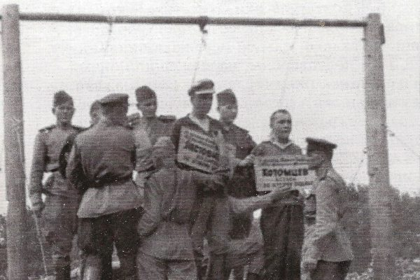

苏联斯大林时期大清洗中的行刑场面。（资料图片）

作者：何坚

【大纪元2018年07月03日讯】美欧各国对中共的战略转变，近年来引发各种说法，包括新冷战、新旧霸主全球争霸的修昔底德陷阱论等等。国际局势的变化，现在可以说是乱花渐欲迷人眼。

<b>冷战虽止 共产之祸更烈</b>

目前各方对美中关系和国际局势的解读虽然莫衷一是，但包括中共阵营在内，多倾向于认为是新冷战或中美争霸，不过这些理论都很难解读中共或川普总统现实中的种种选择：例如中共明知与美国打贸易战会代价惨重却依然盲动，甚至敲定对外强硬的基调，而川普总统明知针对中共会对其政治前途造成相当大的挑战，却毅然前行。

错综纷乱的表象和似是而非的理论，可能会令人“不识庐山真面目，只缘身在此山中”，因为历史已经迎来大变局，国际形势其实已经凸显出变局的中心和焦点就是中共。

看清历史大势的关键，可能需要认清中共本质及其目的到底是什么。

1946年，丘吉尔的铁幕演说拉开了冷战序幕，丘吉尔在演讲中指出欧洲大陆落下铁幕，铁幕一侧的共产党政权不但侵犯“所有家庭的安全和幸福”，在铁幕外面共产党也对“基督教文明构成日益严重的挑衅和危险”，他呼吁美英联合对抗苏联为首的共产主义阵营对自由社会的侵蚀。

从时任美国总统杜鲁门（Harry Truman）到1989年冷战结束时的里根总统（Ronald Reagan），都大力推行遏制共产主义的战略，领导自由世界对抗苏联共产主义阵营。

苏联的解体和东欧共产主义政权的垮台，标志着冷战的结束，世界以为共产主义的威胁已经成为过去。然而《九评》编辑部最新推出的两本巨著，从全新的高度道出了共产主义的真相和目的，令迷茫朦胧的历史变局豁然开朗。

《九评》编辑部所撰写的《共产主义的终极目的》（下文简称为《终极目的》）指出，共产主义并未消亡，共产主义因素已经弥漫世界。

在当前的学术界、媒体以及世人的普遍理解中，所谓冷战，即民主对抗共产阵营是意识形态之争，包括现在美国遏制中共也有意识形态的因素。这种认识有一定道理，不过《终极目的》一语破的，揭示出更深层面的本质，予人以高屋建瓴般的领悟：

“共产主义并非一种思潮、学说，或者在人类寻找出路时一个失败了的尝试。它是魔鬼，亦称共产邪灵，由恨和宇宙低层空间各种败坏物质构成，其终极目的是毁灭人类。”

而九评编辑部的新书《魔鬼在统治着我们的世界》开篇点明：“共产党的幽灵并没有随着东欧共产党的解体而消失。”“相反，这个魔鬼已经在统治我们的世界了。人类绝不能乐观！”

该书指出，共产主义邪灵和它的各种变种正在全世界大行其道，它用“科学”、“进步”、 “平等”、 “自由主义”、 “环保主义”、“全球化”、“政治正确”等貌似正义的旗帜和口号向人类社会的各个领域全面渗透，也支持“先锋艺术”、“性解放”、毒品合法化、同性恋等放纵人欲望的行为作为社会时尚来冲击、突破人类道德底线。

共产主义变种伪装成各种面目，“根本特征是不择手段地摧毁传统的一切，包括信仰、宗教、道德、文化、家庭、艺术、教育、法律等，让人在道德沦丧中堕入万劫不复的深渊”，“就连被视为自由世界龙头的美国也近乎全面沦陷”，“共产邪灵毁灭人类的阴谋几乎得逞了” 。

<b>美中过往50年 农夫和蛇现代版</b>

回顾美苏半世纪冷战，再看今日之国际局势，或可惊觉共产主义的百年谋划：美苏冷战或许是共产主义明修苏联栈道、暗渡中共陈仓的虚晃一枪。

《九评》编辑部的新书揭示出，共产邪灵一方面以苏联吸引自由世界的主要火力，从而令中共窃取中国政权后可以积蓄力量、暗中发展。另一方面，则是通过苏联解体、冷战结束来卸掉自由世界的戒心，以退为进，掩护共产主义改暴力扩张为悄然渗透，继续侵蚀世界来破坏人类传统道德和文化。

比如1969年美国为对抗苏联，决定拉拢中共、开始对中共推行接触政策。那时的中共正在实现共产邪灵百年阴谋中的关键环节、通过“文化大革命”摧毁中国神传文化。当时中共因为“文革”导致国民经济濒临崩溃，正奄奄待毙，而美国的接触政策却上演了现代版 “农夫和蛇”的故事。

从1969年中国国内生产总值（GDP）797.06亿美元、人均GDP100美元，到2017年GDP 12.24万亿美元、人均GDP8826美元，中国GDP过去50年间增长逾150倍，人均GDP也增长了88倍。

富裕起来的中共对美国是如何回报的，今天的中美贸易战已经说明了一切。与此同时，美国接触政策的目的——促使中共变好，也是事与愿违。

2018年2月，众议院少数党领袖佩洛西（Nancy Pelosi）在“中国加入世界贸易组织（WTO）15年后”人权听证会上说：“所有的贸易逆差使得中国（中共）有了外汇存底，使得中国（中共）能发展经济，进而巩固政治支持。是我们选择了养一只老虎。”

佩洛西回顾了2001年中国加入WTO时，美国和中国之间的贸易逆差为一年50亿美元，当时美国政府相信同中国开展贸易能促使中国走向自由民主的道路。不过15年过去，美中贸易逆差已从一年50亿美元增加到一天10亿美元；反观中共的人权状况，中共从未遵守人权优先的承诺，持续迫害民众。

2014年2月，美国国务院发布了2013年度国别人权报告，其中中国部分称，中国人权状况依然恶劣。此为继2012年和2011年之后，中共强摘囚犯器官第三次被纳入美国国务院年度人权报告。

观察世界各国宗教自由现况的美国国际宗教自由委员会（USCIRF），也在去年和今年的年度报告中将中国（中共）列入侵犯宗教自由的特别关注国，并明确提到，法轮功学员仍在被强摘器官。

<b>新铁幕围剿中共 背后不得不说的原因</b>

面对中美贸易战双方实力的巨大鸿沟，中共上月底低调的召开了最高规格的外事会议，并确定了立场强硬的“大国外交”基调，其诡异之举令各方不解。

从 “孔子学院”到“一带一路”，中共向全球输出文化、经济、政治、军事影响力的系列举措已遭遇重挫，并激发国际警惕，在此背景下中共定调强硬出击令外界大跌眼镜，就连中共阵营内也频传“中央误判”的言论。

不过一旦明了《九评》编辑部揭示出的共产主义终极目的，那么中共的战略目的也就一目了然：

中共所作所为，不计国家所面临的风险、成本和代价，是因为中共本来就不是中国；中共作为共产邪灵的人间总代表，向全球输出共产主义（或变种）思想、从而破坏各国传统文化和道德、最终毁灭人类，这才是中共真正和最高优先度的目的。

而美国拉起新铁幕剑指中共的全球战略布，相当程度上要归功于信仰神并坚守传统价值观的川普总统。就如同他最推崇的里根总统一样，川普同样对共产主义的危害认识颇深，因此从经济、外交到军事，川普正在推动并引领世界，围绕着中共拉起一面抵御共产邪灵的新铁幕。

包括中共阵营在内有相当多的舆论认为当前局势是中美争霸，这种论调其实是转移视线或不求甚解的伪命题，因为一个最基本的事实就是，如果美国真的要遏制中国发展、阻止中国争霸，最简单也无可争议的办法就是将危险扼杀在萌芽，早在中共搞改革之前美国原本就可以这么做。

中美争霸论的最大效果可能就是一个烟幕弹，用模棱两可、似是而非的理论，遮掩住中美冲突的背后实质和真正目的。而新冷战的说法虽然也没触及根本，但至少点出了，美国拉起新铁幕阻击中共跟当年美苏对峙一样，有着意识形态对抗的因素。

其实，今天的川普跟历史上的丘吉尔首相、里根总统一样，选择对抗、抵御共产主义的侵略，不仅仅是代表西方文明在对抗共产党，更是代表着人类在守护根本的传统道德和文化（普世价值）不被共产邪灵侵蚀。

<b>冷战是历史必然 中共是下一个苏联</b>

苏联为何解体至今仍无定论，无论是共产党阵营还是民主社会的理论界都倾向于认为有着极大的历史偶然性，只是共产党专家们侧重于将部分原因归咎于苏共犯了放开言论自由的错误，而自由国家的学者更相信是美国通过冷战拖垮了苏联。

苏联解体的历史性谜题，可能要在《九评》编辑部的新书中才能寻找到答案。

《终极目的》一书首次揭示“共产邪灵精心安排的毁灭人类的路线图”，指出共产邪灵的目标就是中国。

“当中国的传统文化被中共破坏殆尽之后” ，“于是，作为跳板、试验场和掩护体的苏联，其使命也就进入了尾声，偌大的一个共产阵营轰然倒塌，苏联退出了历史舞台，共产主义龙头老大的这张皮也就被中共继承了过来。”

《九评》编辑部新书第一次揭示出，苏联解体的真相就是历史的必然，是中共将代表共产邪灵登上国际舞台，发起共产主义毁灭人类的最后一仗。

因此今天美国在全球拉起抵制、围剿中共的新铁幕，并不仅仅是冷战的新延续，而是人类回归传统道德和文化、抵制共产邪灵毁灭人类的终极决战。

这一战，战线并非仅在美中之争，人类最后决战的战场在每个国家、每个社区、每个家庭、每个人的心灵之中，在社会领域的方方面面、各个阶层无所不包。

《终极目的》一书指出：“最黑暗的时刻，也是离光明最近的时刻。神对历史和未来自有安排。神在等待人的觉醒，神的誓言正在兑现之中。”

“归正人心，净化社会，回归传统，重建信仰，重新体认与神的联系，找回与神的纽带，这是每个人的责任，也是每个人得救的希望所在！”

责任编辑：张宪义

<a href=#top><h6 align="right">回上方</h6></a>

<a name=16>
<h1 align="center"><b>盘点公开退出中共的维权律师</b></h1>

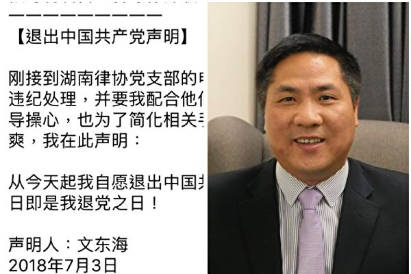

2018年7月3日，维权律师文东海公开发表退党声明。（大纪元合成）

作者：程晓容

【大纪元2018年07月04日讯】7月3日，大陆维权律师文东海公开发表“退出中国共产党声明”。他表示，湖南律协党支部要对他做违纪处理，要他配合。他为了不让领导操心，也为了简化手续，因而声明，即日起自愿退出中国共产党。

文东海早年曾当过警察，后离职成为律师。他曾经代理法轮功学员案件，在709案中担任王宇的代理律师。他因为秉持正义而遭到当局的报复。今年6月，湖南司法厅正式吊销了他的律师执业证。

文律师的退党声明获得了大陆网友和业界同行的一致赞扬。有人表示，很多共产党员在精神上早已退党，但是大多数不敢公开决裂，文东海的退党声明显现出了罕见的勇气。

在中国大陆，维权律师们多年来顶着巨大的压力，在狭窄的空间里为受迫害的同胞提供法律援助，为弱势群体发声。他们因而饱受刁难、骚扰和打压，甚至身陷冤狱。在与当局的抗争和碰撞中，相继有律师看清中共本质，选择公开退出。

高智晟律师说过，退党是“对这个党的心灵抛弃”。2005年12月13日，高智晟发表书面声明，公开退出中共。

在声明里，高律师简述了自己在调查法轮功学员受迫害情况的十几日中受到的震撼。他写道：“它，中国共产党！它以最野蛮、最为不道德非法手段折磨我们的母亲、折磨我们的妻儿、折磨我们的兄弟姐妹，当成了它党员的工作任务，提高到它的政治高度，它在一刻不停地逼迫煎熬着我们人民的良心、人格及善良！高智晟一个已多年不交党费，不过‘组织生活’的党员，从即日起宣布：退出这个无仁、无义、无人性的邪党。这是我人生最自豪的一天。”

2008年11月20日，上海著名维权律师郑恩宠宣布，以真名退出曾经加入过的中共少先队、共青团组织。他表示，退党是公民的政治自由和基本权利。他站出来，是希望透过他的影响力，让更多人加入三退大潮。

郑恩宠告诉记者，他对共产党的反思历经几个阶段，从小时候热爱共产党，追求“进步”，到文革期间的怀疑，再到为平民强迁维权打官司。他意识到“这个政党太腐败了。”郑恩宠说：“现在我是一个中国人，我现在是爱国不爱党。”

2015年9月4日，上海律师钟锦化在微信朋友圈和推特网发表了“公开退党声明”。他说：“因为深感失望，自今天开始，本人公开退出中国共产党组织，不再相信共产主义！特此声明！”

钟锦化曾是浙江温州中院资深法官，目睹司法沦为政治阶级的工具，辞职转为律师，曾经与同行们“死磕”。

2015年12月20日，重庆维权律师熊代英在泰国曼谷公开声明退出中共。他写道：“声明退出这个党，因为他没有人性，作为一个内部党员它都迫害。我真的很后悔加入这个党。他们把我的律师证给停了，不允许我做律师这个行业，而且监控我，屏蔽我的电话，叫我找不到工作，它们的手段太狠毒，逼迫我流浪了3年。”

2016年6月，大陆律师腾彪发表文章“你们全家都是共产党员”，表示彻底退出中共。他说：“我这篇文章也算是正式解除魔咒，彻底退出中共党组织。我曾是这个邪恶团伙的一员，并且先主动后被动地交党费来资助其作恶；无论如何辩解，这都是我的污点，在此再次向非党员的中共专政受害者们致歉，今后一定将功补过。”

维权律师们的退党心路，见证了民族的苦难、同胞的血泪、暴政的罪恶、司法的不公和荒谬。他们的退党声明，不是简单的个人党籍的变更，而是摆脱枷锁、破除谎言的告白，有力地鼓舞著受压迫的广大同胞，也向外界展示了中国人的勇气。

在全球去共化的大趋势下，自从2004年《九评共产党》发表，一场退出中共的精神觉醒浪潮席卷中华大地。迄今，已有超过3亿中国民众声明退出中共党、团、队组织。无论体制内外，越来越多的中国人看清：中共的统治给国家、民族和个体带来的是毁灭性的灾难，没有共产党，才有新中国。人心思变。人们纷纷唾弃中共、传播真相、揭露邪恶。中共的恐怖红墙正在垮塌。

对光明自由的向往，是任何人、任何势力都无法阻挡的。#

责任编辑：高义

<a href=#top><h6 align="right">回上方</h6></a>

<a name=15>
<h1 align="center"><b>给国家领导人写信讲真相何罪之有？</b></h1>

作者：千百度

【大纪元2018年07月04日讯】6月28日，中共南京市玄武区法院非法判处法轮功学员法马振宇有期徒刑3年，并处罚金3万元。

马振宇究竟犯了什么“罪”？

据“起诉书”称，马振宇给“党和国家领导人”寄了6封“变相宣扬法轮功”的信，违反了刑法第三百条，涉嫌利用X教组织破坏法律实施！这6封信是不是马振宇寄的？我不得而知。即便是马振宇寄的，不要说变相宣扬法轮功，就是正面宣扬法轮功，又何罪之有？！

首先，中共宪法第36条第1款明确规定：“中华人民共和国公民享有宗教信仰自由。”第36条第2款中又进一步具体规定：“任何国家机关、社会团体和个人不得强制公民信仰宗教或者不信仰宗教，不得歧视信仰宗教的公民和不信仰宗教的公民。”对马振宇的判决明显与此相悖。

其次，罪刑法定是国际公认的刑法原则，即法无明文规定的不为违法。且不说中共根本没有资格认定谁是X教，即便是中共的法律，迄今为止，没有一个规定“法轮功是ｘ教”。中共公安部发布的《关于认定和取缔邪教组织若干问题的通知》（公通字[2005]39号），其中认定的14种X教中也根本没有法轮功！既然如此，说马振宇“宣扬法轮功”涉嫌利用X教组织破坏法律实施岂不是信口雌黄？

更重要的还在于，法轮功教人按“真、善、忍”做好人，挽救了无数人的生命，拯救了无数濒临绝境的家庭，创造了无数的生命奇迹，是名副其实的高德大法。法轮功真修者不贪一分钱的财，不好半分的色，不迷恋任何权势、地位，不搞任何邪门歪道，是真正的道德高尚之人。正因为如此，法轮功如今已洪传到全世界100个国家和地区，法轮功的经典著作《转法轮》已被译成40多种外文，在中国大陆以外公开出版发行，成为中华五千年文明史上被译成外文最多的中文书。法轮功创始人李洪志先生，因为对人类身心健康的的卓越贡献，受到超越党派、国界、种族、语言、文化背景、宗教信仰的社会各阶层人士的推崇与敬仰。

要我说，讲述法轮功真相，弘扬这样的好功法不但无罪，而且有功，功莫大焉。有罪的不是马振宇，而是判他有罪的中共法院，是迫害法轮功的江泽民和中共，他们终将因为自己迫害大法和大法弟子的滔天罪行被押上历史的审判台！

责任编辑：高义

<a href=#top><h6 align="right">回上方</h6></a>

<a name=14>
<h1 align="center"><b>为何百姓的生活普遍仅能维持温饱而已？</b></h1>
<h3 align="center"><b>——漫话“改革开放”与中国人的幸福感（8）</b></h3>

在物价一路快跑，人民币购买力持续下降的同时，人们的生活开支却在显著增加，城市居民上学、看病和住房价格涨得让老百姓心里发慌。(Photo by Cancan Chu/Getty Images)

作者：袁斌

【大纪元2018年07月04日讯】买不起房、看不起病和上不起学说明什么？除了说明中共的房改、医改和教改均已失败之外，还说明了一点：老百姓缺钱。

按中共官方公布的资料，“改革开放”以来，城镇居民人均可支配收入由1978年的343元提高到了2006年的11,759元，增长了34.3倍，农民人均纯收入由1978年的135.8元提高到了2006年的3,587元，增长了26.4倍。论速度，显然不算慢，论增幅，也不算小。中共社科院发布的蓝皮书称，按世界银行的标准，中国已成为中上等收入国家。但如果你去问问中国的老百姓，你对自己的收入满意吗？持否定态度的肯定居多。

为什么？撇开对分配不公的不满，以及中外工资和物价的巨大落差不说，最主要的原因在于他们的收入仅能勉强维持温饱而已，日子过得拮据，入不敷出、促襟见肘的情况相当普遍。人民网曾做过一次调查，70.1%的受调查者认为自己的生活水准处于“温饱”状态，缺乏安全感、存在生存焦虑；认为自己处于丰衣足食状态的受调查者占比22.4%；认为自己处于“小康”或“富裕”状态的受调查者占比总计不足5%。

那么，为何老百姓的收入增长得既不算慢也不算小，可他们的日子还普遍过得那么拮据呢？

第一，这是因为物价跑得比收入快，人民币的购买力在不断下降。

根据国家统计局公布的资料，从1978年到2009年11月，中国的CPI（消费物价指数）累计增幅为5.7倍。但从实际情况来看，这个资料显然被大大低估了。理由很简单，1978年全国职工平均月工资51元，按5.7倍换算是今天的290元，但是1978年的51元可以养活一家人，而今天的290元还不足北京市2008年每月390元的低保水准，只能喝西北风。可见官方的CPI根本不足信。对于一个连房价年增1.5%这样的离奇资料都能做出来的统计局，给不出真实的CPI大概也不稀奇。

更能说明这一点的是单个物品的价格对比。南方基金高级研究员万晓西先生曾经做过一项统计，他从《北京至•物价志》、《上海价格志》、《广州市志•物价志》等资料上查询了1978年的单品价格，包括食品、医疗、衣服、交通、烟酒和居住等6大类，然后和同类物品今天的价格进行对比：

第一类是食品类。1978年时面粉价格0.185～0.22元/斤，根据中国粮油资讯网，2009年11月上海面粉价格为1.19元/斤~1.92元/斤，价格涨幅为5.4～10.38倍。

1978年猪肉价格0.85～1元/斤，根据中国价格资讯网，2009年11月底鲜猪肉（肋条肉、精瘦肉）价格为9.59、11.39元/斤，价格涨幅为9.59～13.4倍。

1978年带鱼价格0.305～0.38元/斤，根据中国价格资讯网，2009年11月底带鱼价格8.08元/斤，涨幅21.3～26.5倍。

第二类是高档烟酒类。1978年中华香烟0.55元每盒，茅台酒8元每瓶；当下价格分别为57元每盒，和828元每瓶，价格涨幅为103.6倍和103.5倍。

第三类是衣服类。1978年每套衣服10～20元，目前每套100～500元，涨幅5～50倍。

第四类是交通类。1978年北京地铁票价0.1元，目前为2元，涨幅20倍（北京地铁票价曾为3元，后为鼓励乘用公共交通2007年调低票价）。

第五类是医疗类。1978年阑尾炎手术价格8元，目前90～500元，涨幅11.25～62.5倍。

第六类是居住类。1978年水费0.12元每吨，目前3.7元每吨，涨幅30.8倍。

可见，多数物品的价格都增长了二三十倍，个别的甚至涨了上百倍。

依据这个对比，《第一财经日报》评论部主任徐以升先生估算出1978年51元的购买力大概与今天北京3,000元相当。也就是说，人民币的购买力31年里缩水了58倍，换算成通货膨胀率的话高达每年14%，远远高于居民收入和GDP的增速（注14）！须知，这还没有把早已涨得面目全非的房价、学费和医疗费用包括在内。难怪有人感叹：“80年代万元户还是富翁，到现在谁家里如果只有一万元，跟赤贫也没大区别了，财富就是这样被消灭的。”

第二，在物价一路快跑，人民币购买力持续下降的同时，人们的生活开支却在显著增加。“改革开放”前，城市居民上学、看病和住房基本不要钱，现在不但样样要钱，而且价格涨得让老百姓心里发慌。就说看病吧，根据2004年卫生部公布的《第三次国家卫生服务调查主要结果》，城乡合计年人均门诊费用和住院费用在排除了物价上涨的影响后，平均每年以14%左右的速度上升。1993年，两者分别为21元和933元；到2003年，上升到75元和2,233元。也就是说，农民一年的收入，连住一次医院的费用都不够。

在收入跑不过物价，生活开支又明显增加的情况下，买一套房、供养一个上大学的子女、或是遭遇一场大病就足以让一个殷实的家庭变得窘迫，老百姓的日子怎能过得不拮据呢？他们对自己的收入又怎么可能满意呢？

有网友以上海为例说，文革时上海人最低生活费8元，现在450元，文革时小青年的工资是39元，如果按照最低生活费和工资之比，现在的工资只有不低于2,200元才能与文革时期持平，要是加上现在高物价低福利的因素，3,000元工资的人的生活也未必比以前好。要是有一个孩子上高中读大学，还要买房，你的月工资只有不低于8,000元才有可能，买房也要20年到30年才能偿还完贷款。那么，上海人的收入是个什么水准呢？据媒体报导，2011年上海人均年收入36,230元，人均月收入约3,019元。也就是说，月收入在5,000元以上甚至8,000元的并不多！

试想，身为中国人，许多人日子过得如此拮据甚至艰难，他们会觉得幸福吗？

责任编辑：高义

<a href=#top><h6 align="right">回上方</h6></a>

<a name=13>
<h1 align="center"><b>中共将会是下一个苏联？（上）</b></h1>

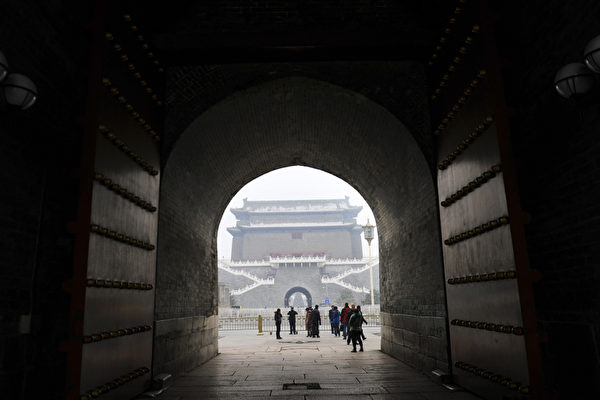

北京领导人恐惧最后落得苏联的下场，担忧今日握紧的权力明日可能被一扫而空。(WANG ZHAO/AFP/Getty Images)

作者：何坚

【大纪元2018年07月03日讯】7月6日中美将互征关税，也将代表中美贸易战正式开打，这一战或许会随着中共迅速妥协而不会对中美贸易格局造成太大冲击，但，已经拉开了历史大变局的序幕。

七十二年前，20世纪最伟大的政治领袖之一英国前首相温斯顿．丘吉尔（Winston Churchill）造访美国，发表了被后世誉为“铁幕演说”的演讲。当时整个世界并未意识到，这一慷慨激昂的演说划开了一个新时代，掀起了长达四十多年的“冷战”的序幕。

一年前的7月6日，美国总统川普（特朗普）在波兰首都发表了他在欧洲的首次演讲，他在演说中高度赞扬对抗纳粹并抵制共产主义的波兰人，并呼吁“我们必须抵挡破坏传统价值的各种势力”。川普总统当年9月还在联合国大会上演讲，直批“共产主义到哪儿都带来灾难与毁灭”。他的演讲在历史长河中或许只是一朵微不足道的渺小浪花，但却可能和今天的世界一起，不经意间见证一场历史巨变的上演。

贸易战或引爆中共危机火山
变化，正在中国发生。进入2018年以来，中美贸易战尚未开打，中国经济已是哀鸣一片：股市大跌，债市掀起爆雷（违约）潮，人民币6月创最大跌幅，外汇储备持续减少。

如果说，中国内部错综复杂的各种经济危机是一座蓄势待发的活火山，那么今年的中美贸易战可能会是引爆火山的一道地震波。

川普（特朗普）政府将在7月6日对价值340亿美元、818种中国商品加征25%的关税，并将在公示期之后再发布包含284种商品、价值160亿美元的关税清单。如果中共进行报复，川普说将对另外2,000亿美元的中国商品，加征10%的关税。中共已宣布对等值的美国商品加征相同的关税，但并未说明如何应对川普所提的、超出中国从美国进口总额（1300亿美元）的2,000亿美元商品的追加关税。

中美贸易战中，关税虽然有量化指标，动辄数百上千亿美元，但其实只是冲击力相当有限的轻量级武器。真正会让中共伤筋动骨的重量级“战略武器”，还是“消除非关税壁垒”，简言之，就是要求中共必须实行和外国对等的公平贸易和投资。美国的这种要求，对于任何国家都是天经地义的，然而对于中共而言，却是不可能完成的任务，因为它需要经济体制改革，以及消除网络封锁等；前者已因政治体制受阻，后者一旦开放互联网，外界相信中共统治将轰然坍塌。

白宫最近发布题为“中共经济入侵威胁美国和全世界技术与知识产权”的报告，指出中国的快速经济增长是通过不公平的经济侵略来实现的。去年12月白宫还发布了《国家安全战略》报告，警告中共正在采取经济手段，向全球输出影响力。

美国为抵御中共经济侵略，能使用的利器不仅仅是关税。

美国国会参、众两院正在合力推动的《外国投资风险审查现代化法案》（FFIRRMA），将加强对外资的审查，以防范中共透过中国企业窃取美国知识产权。先前曾被美国政府有条件放生的中兴通讯，目前也难过美国国会这一关，美参众两院已分别立法阻击中兴逃生。

如果说，发生在中国的变化是危机、是即将爆发的火山，那么世界也正在发生著变化，国际社会对于中共的认识和态度，正在发生巨大的转变，铁幕正在围起。

以苏联为鉴 美国会提案要求揭露中共渗透
2018年6月28日，美国国会重量级参议员共和党鲁比奥（Marco Rubio）和民主党的寇提兹马斯托（Catherine Cortez Masto）提出一项跨党派法案，要求美国政府揭露中共在美的政治影响力。

该法案的基础是1985年冷战时代，国会要求国务院揭露苏联共产党在美国的资讯扭曲与媒体操控。美国两党资深议员共同提出这项法案，显示部分国会议员已将中共视为冷战时代的苏联。

“中国（中共）是美国面临的最严重的威胁，比恐怖主义要严重得多。”美国国家民主基金会总裁卡尔．格什曼（Carl Gershman）6月14日在美国国会作证时说，他把中共与希特勒的德国和斯大林的苏联相提并论。

美国国会：分清中国和中共 阻击中共
6月初众议院也提过类似法案。2018年6月4日，正值六四天安门中共屠杀爱国学生29周年之际，美国国会众议院推出一项跨党派的、制止中共干预美国政治及机构的法案草案，其中提出，美国应明确区分中国人民、中华文化以及执政的中共，并制定长期战略阻断中共“长臂”渗透美国。

今年2月，参议员鲁比奥、众议员罗拉巴克（Dana Rohrabacher）等多位重量级国会议员都向媒体表示，“中国人民是美国最好的盟友”，美国支持中国人民，但不支持中共政权。鲁比奥在2月份的中共人权听证会上说，美国并非“要遏制中国发展”，“我们说的是中共政府对待自己人民的方式，而非（针对）中国人民。”

中共“长臂”早已通过经济、文化、外交、学术、军事等全方位地向世界渗透。2018年2月美国联邦调查局（FBI）在国会作证，表示正在调查全美各地的孔子学院，因为发现（中共）使用非传统方法搜集信息，尤其是在学术界。

2018年6月28日，澳大利亚国会压倒性通过了打击外国干预的法案，总理特恩布尔（Malcolm Turnbull）说，需要这些法律来制止中共和其它国家干预澳大利亚政府、媒体和大学。

警惕中共 世界在行动
进入2018年以来，中共可谓是诸事不顺，不仅在美国遭遇迎头重击，其欲重塑全球经济秩序的“一带一路”战略也连连遇挫，不但陆续遭到包括马来西亚、巴基斯坦、尼泊尔和缅甸等周边邻国的抵制，美国、欧洲也对“一带一路”做出针对性应对。

台湾淡江大学欧洲研究所教授郭秋庆6月底表示，欧盟正着手制定欧亚联网战略（Euro-Asian networking strategy），以抵制中共的“一带一路”，郭秋庆指出英德法多国首脑都质疑中共推“一带一路”是输出专制模式、推行霸权，“欧洲可以说已经不再信任中国（中共）。”

批评者认为中共“一带一路”是新帝国主义的债务陷阱，最新例证就是2017年7月中共企业因为斯里兰卡偿还不起“一带一路”项目的债务，从而获得了该国在印度洋上一个战略港口的控制权。近年来中共加强了在印度洋的存在，投资了数十亿美元，修建港口设施，作为“一带一路”计划的一部分。

和中共“一带一路”同样引发世界猜忌的，还有“中国制造2025”。看似产业目标的“中国制造2025”其实并不单纯，其实质是通过在国外盗窃知识产权、在国内用贸易壁垒加市场诱惑骗取外国技术的不公平手段，实现科技领先。因为其实现手段不公平，目的也有政治性，所以遭到各国警惕和抵制。

德国经济部国务秘书马赫尼希（Matthias Machnig）年初曾表示，德国已和法国、意大利联合起草法案，要求欧盟在年内出台更严格的法律，来遏制中国（中共）在欧洲的收购热潮，减少科技和专业知识外流。德国时任外交部长加布里尔（Sigmar Gabriel）也表示政府必须保护自己的关键技术，他明确提出了“科技冷战”的概念。

亚太走向印太 美国围绕中共全球布局
对于中共近年来经济、军事和外交上的全球扩张，上届美国政府已经有所警惕，后期推行了亚太再平衡战略，不过除了军事上提出要将六成美国战舰部署在太平洋、增加亚太存在感之外，成绩寥寥。川普总统上台后，美国全球战略布局发生重大改变，亚太战略被放弃，代之以更广阔视角的印太战略。

2017年11月，川普“亚洲行”期间，首提“印太战略”（自由开放的印度洋—太平洋战略），期间举行了美国、印度、日本、澳大利亚四边会议，将四国合作视为印太战略的基石。同年12月川普发表《国家安全战略报告》，将中、俄当作美国战略竞争对手。2018年1月美国国防部发布《国防新战略》，不仅提倡全方位国家战略竞争，而且第一次把中、俄、伊朗、朝鲜和恐怖主义列为对美国同等重要的威胁。

2018年5月30日，美国国防部长马蒂斯（Jim Mattis）宣布美军太平洋司令部改名为“印度洋—太平洋司令部”，他说印太区域是开放给投资自由、公平、互惠的贸易，“因为印太地区有许多的‘带’和许多的‘路’”，该举措被视为是川普政府印太战略的重要组成部分，直接针对中共的“一带一路”战略，意图阻止中共占据“区域主导权”。

美国主导的环太平洋军演（RIMPAC）是全球规模最大的海上国际军事演习，每两年举办一次，中国曾在2014年和2016年获邀参加。不过今年正在进行的军演中，已经没有了中共的位置。与此同时，包括越南在内的多数东盟国家，今年跟美国的传统盟友一起加入军演。而印度和斯里兰卡这两个与中共纠葛颇深的南亚国家，也参加了今次的环太平洋军演。

虽然俄罗斯跟美国关系紧张，但美国总统川普决定7月16日在芬兰与俄罗斯总统普京（Vladimir Putin）举行峰会。而中共6月8日刚授予俄罗斯总统普京 “友谊勋章”，拉拢意味浓厚。

不过中俄关系微妙，两国存在无法回避的领土纠纷，尤其是中共前党魁江泽民执政期间同俄罗斯签订《中俄边界协议》，出让约160万平方公里、相当于40个台湾的中国领土，给中共正逢迎维系的中俄脆弱联盟埋下定时炸弹。目前看似左右逢源的普京总统，关键时刻会选择哪一边站队，可能难以预料。

从战略上看，川普对普京释出善意，与其说是对普京抱有希望、试图分化中俄联盟，不如说是给俄罗斯留出一条退路，在包围中共的铁幕上打开一扇门，让俄罗斯可以洁身自好、跳出中共的危机漩涡。

美国川普总统的全球布局，由印太战略出击，联合印度、日本、澳大利亚，再结合东南亚诸国，正在环绕北印度洋和西太平洋，拉起一道铁幕。

虽然美国不明说，但这道铁幕从战略上看一目了然，针对的就是中共，而对俄罗斯示好就是给其一个选择——欢迎俄罗斯站到铁幕外，因为举世皆知，俄罗斯与中国在历史上都视对方为心头大患。（未完待续）

责任编辑：张宪义

<a href=#top><h6 align="right">回上方</h6></a>

<a name=12>
<h1 align="center"><b>修大法的清官</b></h1>

作者：千百度

【大纪元2018年07月03日讯】法轮大法弟子宏宇（化名）原来在一个政府经济部门任副职，这是一个实权职位。修炼法轮大法后，他按大法真、善、忍原则要求自己，从不弄虚作假，欺上瞒下，坚持说实话，办实事。

有一年，他分管主抓“招商引资”专案，他是十月份接管这个工作的，按惯例，十二月份得上报一年业绩，手下人很快把统计报告做了出来。他一看，业绩是一亿元，很吃惊，自己一年里的招商引资业绩还不到一百万元，怎么一下子上升到上亿呢？

他问统计人员：“这个数字从哪来的？”统计人员说：“去年是八千万，今年总得上升呀？每年都这样报呀？”看他不高兴，统计人员又说：“去年八千万，今年一百万，这涉及到政府政绩问题，你刚来，可能不清楚，不能按实数报。”

跟下面他不能说什么，他知道这是上面的意图。于是，在政府召开的经济会议上，他公开提出了反对意见：“要实事求是，不能弄虚作假，这个数字差得太大了……”

当时参加会议的都是上级政府领导，他说完后，在场的人谁也不作声。大家心里都明白，尽管他说的话没错，但业绩是领导的脸面，按他说的如实报数字等于领导没干工作，领导还等着数字提拔呢，一下子成绩让他给弄丢了，他们能干吗？最后，还是按政府领导的意见：按一亿元层层上报。

此事之后，大家都觉的他不合群，做事古板，不会当官，好多人对他不理解，有人跟他说：“共产党的官是很容易当的呀？做事要顺着，别拧著，主要领导的意图要摸清，不然的话，你这个副职能干长吗？”虽然大家也都认为他人好，实在，不奸猾，不会欺上瞒下，但都觉得他这样下去会吃不开，被冷落和架空。

他也清楚，如果不修大法，官场上那套圆滑的套路自己也会，共产党的干部，统计数字和汇报工作是每个人的特长，能讲能写能糊弄才能坐稳，一帮糊弄一帮，一直糊弄到中央。可现在自己修大法了，不能再糊弄说谎，得按大法要求自己。自己也不能脚踩两只船，一边修著大法，一边做两面人，那叫什么大法弟子？

如今的社会，世风日下，很少有人不贪图钱财的，官场上更是如此。在常人眼里，他的位置是很肥的，捞钱捞物随时都有机会。私下里跟他好的人也劝他：“你得会当官，别抗上，好处该拿就拿。”其实他不糊涂，这些都懂。修炼前他也拿好处的。比如有一次，下属一个企业一把手要退休了，预选的人要他们通过考核才能上任，当时他是考核小组负责人。通过考核，他觉得预选人能力业绩都不错，就通过了。事后，这个人以为他从中帮自己运作了，给了他二万元感谢费，他当时心安理得的收下了，觉得大家都这样，这钱得了也没啥错。可是修大法后，他越想越觉得这件事不对劲，想来想去，觉得这钱自己不能要，这是心不正，这种贪念修炼人不应该有。于是，他找机会把二万元钱又送了回去。

一次，单位一把手跟他说：“咱单位盖了一栋楼，你留一套吧，三室一厅，九十五平米的。”他说：“我有楼呀。”一把手说：“你孩子以后结婚不得有房子吗？”他说：“我没钱呀。”一把手说：“咳，啥钱不钱的？你先拿上钥匙，钱以后再说。”他知道，这是变相的给，但他不能要。如果要了，失去多少德不说，这不是给大法抹黑吗？后来，一把手又催他几次，他都没要。

每到年节时，下属单位都给领导送钱送东西什么的，有大米、白面、肉、鱼……他都一概拒绝。他觉得，修炼人不能把这些蝇头小利看重，和常人一样那就是常人。渐渐的，单位领导再分什么东西时就不叫他了，甚至背着他。

因为不贪不拿，坚持说真话，不随波逐流，他在官场上处处吃亏和碰壁，在单位不被重用，还受排挤。后来，他被调到了一个下属的局任副职。按常规，像他这样的上面副职调到下面去，一般都任一把手，他这样等于是降职使用，但他不在乎，修炼人是淡泊名利的，自己正直坦荡，心里无私，做事问心无愧就行。

到了新单位后，他没有情绪，对一把手工作很支援，尽量去配合对方，说话平和，遇事能和善处理。好几次，一把手评价他说：“你这个人呐，过去不了解你，其实你很有能力呀。”言外之意，有能力，就是太死板了，太直了。后来，单位又换了个局长，对他也是这种评价。

如今回想那些年的官场生涯，他感觉自己坦荡无私的走过来了，不管在哪个单位，人们都认为他人好、善良，不计名利，无怨无恨。他感慨地说：“其实不是我好，是大法好，如果不修大法，我也可能随波逐流，是大法使我变得高尚，改变了我的一切，懂得怎样去做人做事了。”

责任编辑：南风

<a href=#top><h6 align="right">回上方</h6></a>

<a name=11>
<h1 align="center"><b>文化大革命九种思维方式</b></h1>

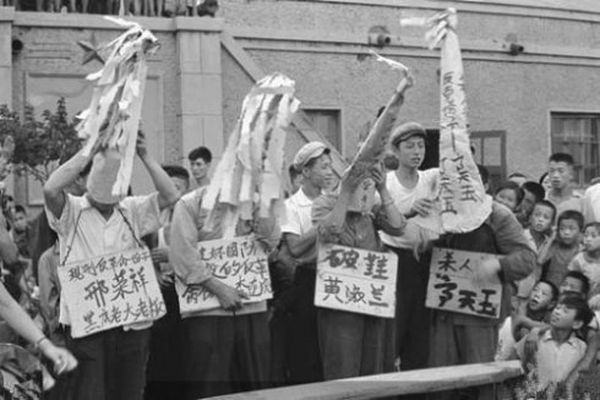

文革中的沈阳街头一景。（网络图片）

作者：木虫

【大纪元2018年07月03日讯】黑白对立。非敌即友，非友即敌，你死我活。阶级斗争年年讲、月月讲、天天讲。阶级斗争是纲，纲举目张。斗争就是工作。不管张三李四、左邻右舍，也不管父母姐妹、亲朋好友，时时处处，都有敌情观念。汉奸走狗和牛鬼蛇神俯拾皆是。地富反坏右、美帝、苏修，亡我之心不死。走资派老想变天。社会缺乏灰色地带，不能包容，没有和解余地。

以偏概全。一句话证明你的全部，一个口号毁灭你的一生。一个人必须十全十美，完全政治正确。一篇文章、一个建议、一条评论，甚至一个屁和一个笑话，都有可能葬送一个人的前途。许多人日夜警惕，直愣著耳朵，四处搜寻：一是害怕自己说错了什么，二是监督别人说了什么，是不是符合标准。然后，检举告发或聚众批斗。

神化领袖。 一句顶一万句，句句是真理。领袖不仅完美，没有任何瑕疵，而且还是万能的。什么哲学思想、科学理论、经济发展、宗教研究，无一不精通。全国人民早请示，晚祝愿，胸前挂满纪念章，饭前鞠躬祝寿，饭后再省身。万岁不离口，语录不离手。

家族株连。家庭成分就是社会地位，严重不平等。贫雇农最有社会地位，中农次之，富农是改造物件，地主是镇压物件。地主家庭一旦确定，所有家庭成员遭殃。什么地主老婆、地主羔子、地主孙子。一家子几代人，就连亲属都要受到株连。地主羔子注定独身，没有女人敢嫁。即使文革结束好长时间，人们还在乎家庭成分，每每填表格的时候，都有家庭出身栏目。

贫穷有理。穷人有理，富人有罪。越穷越有理，越穷越光荣，越穷越有发言权。穷人注定是被剥削者，因此，造反有理。富人注定是剥削者，是有原罪的人，因此，注定低人一头。穷人甚至可以因穷上大学、找工作，拥有较高的社会地位。

知识有错。知识份子是臭老九，也是社会改造和监管物件。电影《决裂》中，那位讲解马尾巴功能的教授，就是当时知识份子的典型形象。有独立思想和不同意见的知识份子，更是社会危险人物。许多知识份子因为一首诗、一张画、一篇文章身败名裂，成为反革命，身陷囹圄。

破坏有功。砸烂孔家店，砸烂公检法，向一切传统文化开战。什么古迹、古画、古建筑、古物、古书、古戏，能砸得砸，能毁得毁，能收得收。不管什么忠、义、孝、廉，什么礼、义、仁、智、信；不管什么孔孟、老庄、诸子百家，统统打倒、批臭。中华文明遭到前所未有的破坏，传统文化一片狼藉。

封闭自大。外面的世界是一个什么状况？他们在思考什么？干什么？如何生活？如何看待我们？一概不知，也不感兴趣。普通老百姓不知道，高级干部也同样不清楚。全国人民以为美、日、英，等资本主义国家的人民饱受苦难，被剥削和压迫，需要我们解救他们。

万众一人。全国人民，一个声音、一个思想、一个发型、一个身条、一个行为模式，服饰只有灰、绿、黑、白四种颜色，文艺只有七个样板戏，书籍主要是革命著作。人民的生活方式、生存环境、劳动模式、思维形式、视野大小、行动范围、语言语气，几乎全部一致。可谓，万众一心，全国一人。

－－原载《新世纪》

责任编辑：朱颖
<a href=#top><h6 align="right">回上方</h6></a>

<a name=10>
<h1 align="center"><b>三退大潮二〇一八年综合报告（四）</b></h1>
<h3 align="center"><b>全球退党服务中心</b></h3>

2018年4月7日，旧金山游行庆祝三亿人三退。（周容／大纪元）

【大纪元2018年07月03日讯】

<b>第四章  退党大潮的（精神层面）真正意义</b>

<b>1. 共产邪灵毁灭人类</b>

共产邪灵毁灭人类最根本关键是抹杀人的灵魂，就是使人变成非人类，徒具人的面孔和身体但是没有人的心灵，因此失去与神的联系。这一点对于理解退党运动的意义尤其重要。

除了上述的毁灭性的破坏中华传统文化及道德，共产邪灵还用邪恶的党文化及其它办法来抹杀人的灵魂，下面是一些例子：

1）从摇篮到坟墓的全方位、全过程的洗脑。

中共建政后，通过一次次的政治运动，破四旧、打砸抢，把一切人类文明成果用“封资修”一笔抹杀。被洗过脑的文人直接骂皇帝祖宗，用“专制主义”、“封建社会”八个字把传统文化一笔勾销。传统的中国人无论有没有明确的宗教信仰，都把天理良心当作普世价值。中共思想改造首先要灭掉的就是天理良心，因为“无产阶级世界观”是不承认普世价值的，不承认超越阶级的道德。

一代代中国人被中共的意识形态强制洗脑，以至于人们没有意识到自己已经丧失了独立思考的能力。这些人以为自己的想法是他（她）们自己想出来的，而事实上，他们许多的想法都是中共有意灌输后，大脑对环境的一种条件反射。例如中国人从年轻时就被告知有国外反华势力企图推翻中共和中国。任何时候有人评论中共，被洗过脑的中国人会感到好像反华势力在行动，他们就会条件反射似地保护中共，就好像他们自己受到攻击一样。

2）发动伴随着大规模屠杀的一个接一个的政治运动用于恐吓大众，使人们对于共产邪恶统治噤若寒蝉。

3）人造的大饥荒。不仅仅是用于大规模减少人口，同时，也打断人们的脊梁骨，这样就使普通大众为了生存而对邪党彻底臣服，从无反抗之念。对于1959年到1961年三年的大饥荒，大陆的研究报告估计是4300万人死亡，也有学者估计实际死亡人数是6千万到一亿之间。这是人类历史上最大规模的族群奢杀。

4）让小学生去看杀人现场同时唱歌：砍掉犯人的头颅并将他们的器官拿来吃掉。最后这些小孩从歇斯底里的哭叫到对血淋淋的杀人活动麻木，甚至有一种享受性的激动（西方传教士Raymond De Jaegher在延安所见）。

<b>2. 抛弃共产主义可以带来精神解放， 退出中共可以躲过劫难</b>

《九评共产党》使人们认识中共的本质，使人们明白中共为什么会做出这么多无理智的事情，从而化解了人们头脑中中共灌输的邪理歪说。人们通过审视自我，得到精神觉醒。一旦一个人脱离了中共的洗脑，他将不再被邪灵控制，这个人能够独立理性的思考，当更多的中国人的精神得到自由，更广泛的社会环境将会改变，邪灵将失去生存的土壤和人世间的显现，中共将土崩瓦解。

因此，退党体现在个体上的益处是精神层面的。通过声明退出中共组织，这个人可以抹去邪灵的印记，使自己从邪灵组织除名，最终逃离与中共一同瓦解的命运，这就是退党带给人们的精神觉醒。

<b>3. 退党大潮为中国及人类带来美好的希望</b>

许多人担心如果中共瓦解，谁能替代它管理中国；有些人甚至害怕中国会陷入另一场内战之中。还有一些希望中共保留权力越久越好的商人和政客，这样他们就可以继续为了自己的利益欺压人民，侵占资源。

中华民族已经存在了五千年，虽然朝代更替，但中国依然屹立。中共政权是整个中国历史上最黑暗的、最邪恶的政权。当中共退出历史的舞台，中国将迎接中华民族的复兴。除此以外，在东欧国家有先例，那里的共产政权瓦解后，国家依然运行，而且处在更好的状态下。

但是，必须要强调的是退党大潮确实为中国未来作出准备，因为它将中国人民的精神从中共控制下解放。恢复传统文化，重建与神的联系。那些精神自由的人们由于道德感和独立思考的能力将成为更好的人，当政府机构人员大多来自于那些在统治中受过教育和有经验的人，这特别的重要，应当从东欧国家和前苏联吸取教训，那里一些前共产党官员重新得到权力并将国家带回到独裁主义系统。

<b>4. 退党大潮和中共灭亡的关系</b>

许多人错误地认为退党大潮是一个政治运动，目的是推翻中国共产党。事实上，退党大潮和中共的灭亡没有直接的因果关系。退党大潮的实质是基于个体的精神觉醒，中共的灭亡是其自身邪恶和反宇宙本质的必然结果。

对广大民众生死攸关的一点是：在中共瓦解之前，如果人们能清楚认识到中共本质并退出其组织，就可以逃脱成为中共陪葬的厄运。

在这个历史转折点上，退党大潮也是为了中国和平过渡和全世界迎接美好的未来铺平道路。2012年7月，欧洲议会副主席爱德华‧麦克米兰-斯科特在褒奖退党运动书中指出：“退党运动是一场平和的精神觉醒运动，给国际社会带来了希望，一个没有共产主义的未来的希望。”

<b>第五章 共产主义势力在全球的渗透</b>

<b>1. 中共在全球的渗透</b>

1）输出武力革命

中共通过朝鲜战争、越南战争和对红色高明的支持，成功地对朝鲜、越南和柬埔寨输出革命并使它们成为共产国家。但是在向东南亚国家，诸如印尼、马来西亚以及缅甸等国输出革命时却遭到了当地政府的反对，同时给当地的华侨带来血的灾难， 导致几十万华人被当地政府或暴徒杀害，同时华人在当地经商和受教育的权利都受到限制。但是中共政权对受到迫害的华人却不闻不问。

中共也同时向拉丁美洲和非洲输出革命。通过培养当地的共产党组织用以颠覆当地的政府。至今，在拉美33个独立国家，共产党多是“合法”政党。委内瑞拉、智利、乌拉圭等国的共产党与执政党结成各种形式的联盟并加入了政府，是参政党。

2）“锐实力”全球渗透

相对于西方的“软实力”——以文化和经济等影响输出和发散一个国家的影响力，中共所用的“锐实力”是通过间谍渗透，控制媒体、网络战争、经济颠覆等“超限战”的方法对其它国家进行影响及控制。

将美国看作它自然的敌人是中共与生俱来的特点，为了保持它的统治，中共必须剥夺人民的权利和自由，美国已经是人权和自由的灯塔，因此，中共的生存依赖于对美国的破坏，任何与中共的合作的尝试将事与愿违，因为中共从不“遵守游戏规则”。

2.1 全球渗透——中共的野心是接管世界

中共通过跨国的或是非政府组织采取政治行动，操纵另一个国家的政策变化。

2.2）CCTV-9：中共全球渗透的喉舌

CCTV-9 是在2000年启动的24小时英语频道，从2004年，它开始广播西班牙语和法语，目地是使CCTV-9等同于CNN，一个全球性媒体，24小时新闻播放，但CCTV-9是中共的国际事务的观点及党的路线观点的喉舌。电视台没有没有独立编辑的权利，CCTV-9记者在持续的压力下，向外传播中共的观点。CCTV-9可以在美国播出，而CNN不允许在中国播出。

2.3）孔子学院：一个中共海外宣传设置的重要部分

两千多年前，孔子开办学校教授学生，向社会传授儒家思想。随着朝代更替，孔子的教化一直流传。孔子被认为是中国文化的创立者之一。1971年，中共展开了激烈的反孔运动。上千年的孔庙被破坏，大量书籍被烧毁。  但是，今天的中共将孔子放到了它全球渗透的中央舞台。

2010年2月，在一个中共秘密会议上，胡锦涛说：“通过全球孔子学院的建立，我们可以扩大党的影响力。通过这些中文学校，我们可以挑选那些对党有相同看法的人，让他们成为党的活跃支持者。我们建立孔子学院，不是因为我们都突然喜欢上了孔子，这是我们发展的一个方法：通过党校，行政机构，大学和海外中文学校，形成一套完整的系统。我们的干部是最重要的‘软力量’。在未来，当中共的时代到来，我们党的影响力将遍布世界。我们现在甄别的同志将会成为未来的主力军。”  美国第一所孔子学院于2006年在马里兰大学建立。截至2012年1月，全球已有358所孔子学院，另有500个孔子课堂，分布在105个国家和地区。

目前，孔子学院在美国和加拿大等地都受到激烈的抵制。说明中共的渗透已经开始被西方世界重视。

2.4）海外间谍

中共统战部、中共中央委员会国际处、中国海外事务办公室、外交事务部、中国人民解放军军事部有大量的情报人员，这些情报人员收集潜在的有价值的人士，包括西方政府官员、商人、著名学者和海外中国社团领导人和他们的亲属。

中共的情报机构是最大的、最无定形的、最积极的。从政府代理到任何海外中国人，学生或是首席执行官之类的，都能够成为活跃的情报财富。根据出逃的中国间谍人员提供的讯息，中共的主要谍报目标是美国。

2.5）海外共产支部

中国共产党在美国大学和许多其它机构里面都设立了共产支部，并且用此方法对中国留学人员以及民众进行洗脑。这种在美国国土的活动是非法的。

2.6）在海外的第五纵队

中共邪党在美国境内大规模集合和调动第五纵队人员的演习已经在2008年完成。中国大使馆或领事馆可以随时调集数千在美华人参与各种活动。

A）对法轮功学员的攻击——从2008年5月开始，先后有数万中共的暴徒出现在法拉盛攻击和谩骂法轮功学员。最高峰时期持续一个多月，每天都有一两千的中共暴徒从美国各地赶到法拉盛参与攻击行动。中共住纽约领事彭克玉在电话中承认亲自指挥和支持法拉盛的各种华人团体所谓的“对法轮功的斗争”。
B）2008年4月，在乔治亚州亚特兰大的CNN总部前面，数千在美中国人聚集起来抗议CNN评论员Jack Cafferty对中共政权的评论。
C）2008年奥林匹克运动会火炬传递活动中，在旧金山及其它城市都出现了中共血旗的红海洋。
D）中共血旗的红海洋现在还时时出现在法拉盛。
有消息来源称中共可以影响数十万在美国大纽约地区的华人，需要时可以调集十万在美华人。 其对美国所能造成伤害的规模和致命程度将远远高于你可以想像的任何一个恐怖组织。

2.7）联合阵线 “中国和平统一促进会（简称中国统促会CCPPR）”

对外声称是为争取和平统一台湾而成立的民间组织，实际是中共中央统战部属下的统战机构。在海外各国主流社会、政要人物中活动频繁，以“非政府组织（NGO）”的名义在世界各国设立分部，在世界范围内建立和发展以中国共产党为领导核心的政治联盟 [1]，围绕着推进中共统战全球的战略，内外呼应，制造民意，潜移默化地影响所在国的决策，从而提升中共政权对世界的影响力和控制力。

2.8）网络战争

中共黑客能够攻击并使网络交通、金融机构、通信等瘫痪。前国家情报负责人乔治‧特内特曾经说过在90年代后期，中国政权已经获得了美国最先进高科技核武器的信息。

根据2011年麦卡菲的报告，从2006年到2010年，超过70个政府、国际组织、国防承包商、企业和智囊团被黑客攻击，许多是由来自中国的黑客所为。

前美中国经济与安全审查委员会委员和前主席拉里‧沃策尔说，中国政权通过谍报人员已经收集了大量的关于隐形技术、潜艇推进系统、电子战争系统和核武器的信息。最近这几年,大量的这些武器装备信息已经被转变成中共所掌握的武器系统。

尤其令人震惊的是, 2015年美国政府发现, 中共通过网络窃取了超过两千两百万美国政府官员及其家属和朋友的详细个人信息。这些信息一直被中共利用来控制美国政府方方面面的运作，美国的国家安全受到了巨大的威胁。

2.9）大规模杀伤武器的生产及对朝鲜的支持

尽管发展大规模杀伤武器被国际条约禁止，中共恶名昭彰地不履行规则，谁能保证中共不发展大规模杀伤武器？最近证据表明中共已经开展利用法轮功修炼者和其他良心犯开展人体实验。

朝鲜共产政权罔顾国际规则，玩弄美国等西方国家于股掌之上, 持续不断发展导弹及核武器。 其中中共在背后的支持起著决定性的关键作用。最近的证据已经表明中共表面一套，背后一套, 北韩的核威胁已经成了真正的现实。

2.10）通过卑劣的手段操纵其它国家

中国通过卑劣的外交和经济交易让其它国家对其侵犯人权的行为默不作声，正如爱尔兰政治家埃德蒙‧伯克（Edmund Burke）所言：邪恶之所以逞凶，是因为好人默不作声。中共对其它国家的控制不仅仅包括上述的通过对各级官员的详细信息了解以后所进行的收买，恐吓，而且通过经济运作、诱惑、诈骗等多种手段进行控制。

<b>2. 共产主义势力在全球的渗透，目的是为了毁灭人类</b>

在本报告的第一章已经提出， 共产邪灵目前已经全面渗透世界。《九评》编辑部发表新书《魔鬼在统治着我们的世界》。

这里所说的共产主义势力是整个共产主义势力的另一些分支。这些分支的主要策略是通过在西方社会各个层次和各个方面渐进的改变, 从而达到与中共在中国大陆所做的切断人类与传统价值观念及与神的联系相同的结果。现在全世界的共产主义势力在做的一件事，是不使用“共产党”这个名称。他们用各种其它名称来伪装自己。他们甚至不想被称作“自由派人士”，他们希望称自己为“进步派”。所以所谓的“进步派”的范围包括强硬的自由派、共产党，也包括社会主义者。他们全都叫自己是“进步派”，他们的价值观也大体相同，并且相互配合。

这些左派 （自由派或进步派等等）已经大部分控制了西方社会的学校、媒体、社团、教会以及多个层次的政府机构。他们在过去的几十年里已经从根本上改变了大多数人们的观念，无神论、破坏家庭的种种性乱观念、摧毁自由经济体系的大政府的社会主义福利制度体系，等等观念已经渗入人心，根本上来说人类已经处于一个极其危险的状态，也就是人已经开始变成“非人”，从而失去被神救度的机会。这与中共在中国大陆的所做所为有异曲同工的效果。

共产主义邪灵通过暴力手段夺取政权，成功地在前苏联、中国大陆及一些其它国家窃取了政权；在欧洲、美国、加拿大及其它国家通过这种渐进的渗透，改变社会结构与人们的观念, 通过洗脑和对社会各阶层及政府的控制，都是为了一个目的，就是让人类远离神的眷顾，变成了从观念、思维和行为上都反对神的“非人类”最终被毁灭。（待续）

责任编辑：朱颖

<a href=#top><h6 align="right">回上方</h6></a>

<a name=9>
<h1 align="center"><b>公民起诉国家测绘局 案中藏江氏丑闻</b></h1>

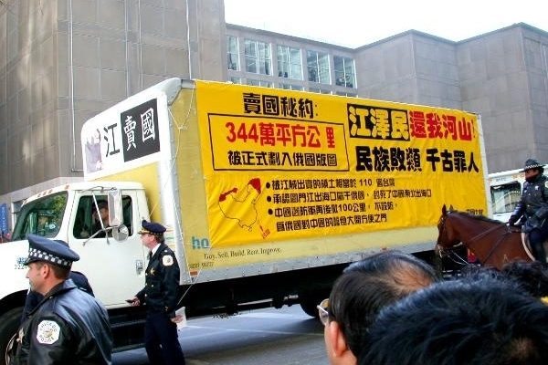

2002年江泽民访美期间，一辆醒目地写着“卖国秘约344万平方公里正式划入俄国版图”，“江泽民 还我河山！”“民族败类千古罪人”的巨型货车从芝加哥一直开到休士顿，一直跟着江泽民。（大纪元）

作者：周晓辉

【大纪元2018年07月03日讯】这个世界最怕的是较真的人。对于中俄边界领土划分，就有这样一个较真的人。他叫殷敏鸿，是2004年登上过钓鱼岛的退役军人，退伍后成为独立研究者。

去年8月，殷敏鸿向中共外交部法治办公室提出要求，要求答复中苏、中俄及中蒙有没有签订边界条约、协定、议定书，规定“唐努乌梁海”地区的中苏、中俄及中蒙的边界等问题。9月，外交部以申请的资讯涉密，不属于政府资讯公开范畴为由拒绝答复殷敏鸿。回函中还称，如果不服，可申请行政覆议或者向法院提起行政诉讼。

10月，殷敏鸿再次向国家测绘地理信息局（现已并入新组建的自然资源部）申请政府信息公开，需要公开的信息内容为：国务院测绘行政主管部门和外交部拟定后，由国务院批准的国界线标准样图中，中国版图不包括唐努乌梁海地区（范围指现在的“图瓦共和国”这部分）、江东六十四屯地区，在中国正式出版的地图中，上述两地被标注为苏联及后来的俄罗斯领土。这样做的相关法律依据是什么？

一个月后，国家测绘局给予了答复，称“您申请的信息不属于我局政府信息公开范围”，复函中没有注明理由。

于是，在今年3月，殷敏鸿将外交部告上法庭，但迄今没有下文。4月，他向北京一中院提起行政诉讼，要求国家测绘局重新依法答复此前提交的政府信息公开申请。有意思的是，6月初，北京一中院给殷敏鸿发来了立案告知书，他随即从长沙赶到北京办理了立案手续，缴纳了诉讼费，之后收到行政案件合议庭组成人员告知书。该案编号为（2018）京01行初876号案件。

北京一中院受理该案件只有两种可能，一是对国家测绘局需要公开的内容的幕后真相并不了解，稀里糊涂受理了案件；二是有高层授意。那不妨首先看看中共外交部、国家测绘局拒绝公开的幕后真相到底是什么，殷敏鸿质疑的有争议的土地现在究竟归谁所有。

众所周知，中俄边界近百年来纷争不断，上个世纪60年代甚至曾为此爆发战争。对于双方边界领土争端，中俄一直搁置未决。但是在1999年12月9日和10日这两天里，时任中共党魁的江泽民在北京与来访的俄罗斯总统叶利钦签定了《中华人民共和国政府和俄罗斯联邦政府关于中俄国界线东西两段的叙述议定书》（以下简称《议定书》）。

在《议定书》中，江出卖了中国100多万平方公里的宝贵领土，相当于东北三省面积的总和，也相当于几十个台湾；此外，江还将图们江出海口划给俄国，封死了中国东北通往日本海的出海口。

被江出卖的中国北方领土有几大块，一块是外兴安岭以南、黑龙江以北60多万平方公里的“外兴地区”，另一块是乌苏里江以东的“乌东地区”，有40万平方公里，还有就是唐努乌梁海地区，有17万平方公里，以及库页岛，有7.64万平方公里。殷敏鸿质疑的领土就通过该条约割给了俄罗斯。

对于如此重大之事，为何中共刻意隐瞒？殷敏鸿为何要一直追问？要知道，当年该条约签署后，《人民日报》第一版中只有一个一百字的简短介绍，连当时的国防部长迟浩田都不知道详情。而在库恩写的《江泽民传》中，更是只字未提该条约的签署。其原因就是这是一个彻头彻尾的卖国条约。

可以说，该《议定书》彻底否定了清朝康熙年间中国官兵浴血奋战换来的中俄边界平等条约──《尼布楚条约》，承认了从中华民国到历届中共政府都拒绝承认的中俄不平等条约，包括《瑷珲条约》、《北京条约》等。不仅如此，《议定书》还将大片未经签约而被沙俄强占的领土永久性的划归俄国，这其中包括1953年联合国大会表决裁定为中国领土的唐努乌梁海地区，还包括连不平等条约《瑷珲条约》都承认是中国领土的江东六十四屯（3600平方公里，相当于香港面积的3倍多），以及自金代开始即归中国管辖、在《中俄尼布楚条约》中明确划归中国的库页岛（7.64万平方公里，相当于两个台湾面积）。

江泽民为何不但不讨回属于中国的领土，反而拱手送出，原因就在于其曾在苏联威逼利诱下成为苏联远东局特务。了保住这个秘密，不管牺牲多大的国家利益，江都要跟俄罗斯做这笔交易。而中共在江签署条约后，也怕公开条约详情导致自己垮台，这也是中共内部在后来了解情况后不肯追究江责任的原因。

2004年，香港记者程翔以笔名“钟国仁”发表了题为《江泽民要向中国人民交代的一件事》的评论文章。文章中指出：“江泽民在其任内，做了一个十分重要的决定，而他以及他所领导的中共从来没有向全体中国人民解释交代的，这就是签署了中俄边界条约，承认了由不平等条约强加给中国的边界，从而导致被沙俄掠夺的国土永远丢失。”

然而，在中共的一再掩盖下，江卖国的事实却不为太多中国人所知。而作为中共机构的外交部、国家测绘局，秉承高层旨意，掩盖真相，也就不言而喻了。至于受理了殷敏鸿申请的北京一中院，如果其后以某种理由取消或驳回案件，那就可以理解为是办案人员的糊涂所致；如果受理后加以审理，并作出有利于殷敏鸿的判决，那或许可以理解为北京高层要借此做些文章，继续打击江派。不论是哪种原因，江卖国的丑闻终归是掩盖得了一时，掩盖不了一世，一旦广为人知，将有更多的中国人唾弃江和中共。

责任编辑：高义

<a href=#top><h6 align="right">回上方</h6></a>

<a name=8>
<h1 align="center"><b>共产邪灵统治下的中国大陆</b></h1>

作者：云鹤天

【大纪元2018年07月02日讯】

一个花季女孩 
遭到班主任的猥亵 
投诉无门 
肝胆欲裂 
爬上高高的楼顶 
要把年轻的生命了结 
楼下围观的人们 
高喊跳啊跳啊如同打了鸡血 
可怜的女孩 
纵身一跃 
永远的 
离开了这个世界 

杭州一位大妈 
捡了一部手机 
在路边守株待兔 
等待失主领取 
两位女孩前来认领 
大妈索要两千元酬礼 
女孩要给五百 
大妈满脸怒气 
将手机摔得粉碎 
吓得女孩落荒而去 
网友搜索 
大妈头顶邪党授予的多项荣誉 
一个个光环 
光怪陆离 

八十岁老父与儿子发生口角 
儿子开车将老父撞倒在地 
反复碾压 
老父当场暴毙 

母亲用了女儿三千块钱 
暂时还不起 
女儿扯著母亲的头发 
拳打脚踢 

同学班级成绩第一 
第二名怀恨寻机 
将同学刺死在校园 
没了他我就是第一 

一桩桩一件件 
共产妖雾把人迷 
道德下滑 
深渊无底 

官有权利无义务 
民有义务无权利 
在共产邪灵统治下的中国大陆 
这一套玩得风生水起 
到处是干柴烈火 
到处是怨气戾气 

可爱的同胞 
我的姐妹兄弟 
擦亮你的眼睛 
认清撒旦魔的诡计 
为了灾难中的中华民族 
也为了苦海中挣扎的我们自己 
退党退团退队 
使邪恶的红兽彻底解体

责任编辑：高义

<a href=#top><h6 align="right">回上方</h6></a>

<a name=7>
<h1 align="center"><b>金正恩弃核食言 隐现中共机密 川普将反击</b></h1>

川普7月1日接受福克斯新闻专访时表示，他跟金正恩达成无核化协议，不排除金正恩有可能食言。（Samira Bouaou／大纪元）

作者：唐浩

【大纪元2018年07月02日讯】金正恩无核化承诺，是真是假？全世界正高度关注。

6月12日，美国总统川普与朝鲜领导人金正恩举行历史性会面，双方达成协议，协议中朝鲜承诺将致力推动无核化。

但近日来，种种迹象却显示，朝鲜并未信守诺言。

朝鲜情报监测网站“北纬38度”（38 North）指出，从卫星照片发现，朝鲜的核武研究设施仍在快速升级改良；而美国媒体NBC、《华盛顿邮报》、《华尔街日报》也相继披露，朝鲜仍在加速生产核武器使用的燃料，试图隐藏核设施，并且扩建主要的导弹工厂。

针对重重疑点，川普7月1日接受福克斯新闻专访时，罕见地松口表示，不排除金正恩有可能食言。

“我与他（金正恩）达成了协议，我与他握了手，”川普说，“我会不会遇上、你会不会遇上别人说话不算话的交易？是有可能的。”

笔者此前指出，川普想藉由与金正恩会面，亲自观察、试探金正恩是否真的有意放弃核武来换取和平。而在会议中，川普释出极大善意与金正恩互动，希望善劝他放弃核武，为自己与朝鲜人民选择更好的未来。

但目前看来，金正恩似乎并未领情，在核武问题上仍未出现积极回应，看不见弃核的诚意。

那么，为何金正恩不愿放弃核武？

一、中朝核武“唱双簧”，为彼此问题解套
多年来，中共一直利用朝鲜核武问题作为向国际社会敲竹杠的谈判杠杆，中朝双方分扮“白脸、黑脸”，借此与国际社会过招拉锯，一方面，逐步哄抬中共在国际社会上的地位，另一方面，也为朝鲜专政政权换取更多的金援与物资。彼此相互为用，唇齿相依。

但在川普上任后，中朝面对川普的强势施压与谈判战略一度难以招架，最后朝鲜主动要求举行“川金会”协商；而原本一度关系冷淡的中朝双方，也再次往来频繁，关系升温。

外界始终顾虑，面对美国的强大压力，中朝双方还想沿用过去“六方会谈”的套路，来为彼此寻求解套——中共想避免美方的贸易反击，朝鲜则想松绑或解除经济制裁。

川金会后，答案逐渐揭晓。

在川金会落幕当天，中共外交部在记者会上意有所指地暗示，联合国应该放松对朝鲜的经济制裁。川金会隔天，朝鲜官媒朝中社更报导宣称，川普已经同意松绑，但随即遭到川普否认。

7月1日，日本《读卖新闻》报导，金正恩日前赴北京与习近平会面时，曾请求北京协助结束朝鲜的经济制裁。事实上，这不算新闻，反而像剧本。

从中朝对于“解除制裁”的一搭一唱、高度默契来看，很难不质疑，中朝双方很可能早已拟定一套应对剧本——金正恩暂停试射导弹，与川普会面，换取川普停止美韩军演。

同时，由北京出面带头，呼吁国际社会放松或解除对朝鲜的经济制裁，中朝再伺机促使美军退出朝鲜半岛，以利于进一步布局共产主义对韩国的统战行动。

这套“双暂停”策略，正是过去多年来，中朝联手将美日韩等国绑在谈判桌、永无出路的外交迷宫陷阱，也是川普政府屡次强调绝不接受的无效老路。中朝想再用这一陷阱来困住川普，几无可能。

美国国家安全顾问博尔顿（John Bolton）表示，美国相当清楚朝鲜的谈判行为模式，“他们会利用谈判拖延时间，继续发展他们的核武、化学武器、生物武器和弹道导弹计划。”

所以，对于朝鲜可能佯装弃核的风险，川普政府早已有所准备。只是擅于谈判交易的川普，仍希望通过亲自会面来了解金正恩，试探虚实，并给他一个选择未来的机会。

况且，川普在川金会前已经坦言，如果朝鲜没有决心走向无核化，那么美国已经备妥数百种经济制裁及其它选项，准备继续施压或制裁朝鲜。

二、中共紧抓朝鲜小兄弟不放
从朝鲜主动要求举办“川金会”开始，中共与朝鲜便开始加强往来、互动频繁，金正恩更是在三个月内接连三度会见中共领导人。显见中共对朝鲜的关切之频。

特别是川金会上，川普出人意表地大力施展善意外交，劝导金正恩放下核武，带领朝鲜人民跟着美国走，一同开创和平繁荣的新未来。川普外交出奇招，让中方大感吃惊，不但跳脱了中朝原先推测的剧本，也开始担忧朝鲜小兄弟会否动摇。

于是，中共与金正恩高调进行了第三度会面，会后宣称：“中国的党和政府致力于巩固发展中朝关系的坚定立场不会变，中国人民对朝鲜人民的友好情谊不会变，中国对社会主义朝鲜的支持不会变。”

前面两句，堪称党文化空话。关键是最后一句，“对社会主义朝鲜的支持不会变”。

此句的潜台词是，中共将促使朝鲜维持现有的专政体制不变，排除朝鲜政权走向和平转型的可能性。说白了，中共不让金正恩跟着美国走。

中共不愿丢失朝鲜小兄弟，一来是考量朝鲜在地缘政治上，可充当中共与韩国、日本、美国等民主阵营的战略缓冲屏障，也避免诸多军事机密曝光；二来是，朝鲜仍是中共用来与国际社会谈判的有力杠杆。

特别是当下美中双方贸易争端白热化，贸易战一触即发，因此中共更需要留住朝鲜这张底牌，作为与美方叫阵、喊价的筹码。

三、金正恩忧惧统治地位丢失
金正日、金正恩父子发展核武，主因之一是为了用毁灭性武力来保住金家政权及独裁地位。

尽管川普承诺，只要金正恩完全弃核，美国将协助朝鲜发展经济，并确保金正恩政权的安全。但或许金正恩也担忧，即便朝鲜和平转型，他过去杀人如麻的暴行，将让他难以逃脱法律的追究或人民的清算，因此宁可选择向中共老大哥靠拢。毕竟彼此都是共产政权，彼此都有严重迫害人权的血债。中共也需要朝鲜作为东北亚的战略屏障。

四、唯恐泄漏核武、导弹背后的关键机密
众所周知，中共是朝鲜最主要的贸易伙伴，也是最主要的粮食与能源供应来源。甚至中共还是朝鲜核武发展的主要支持者。

美国智库“国际评估暨战略中心”（International Assessment and Strategy Center）资深研究员费学礼（Rick Fisher）曾指出，朝鲜导弹快速发展，很可能与中共直接对朝鲜提供导弹弹头技术有关。

去年《福布斯》（Forbes）网站也曾发文指出，中共可能协助朝鲜发展了洲际弹道导弹（ICBM）最关键的弹头重返大气层技术，并且还协助提供载送导弹的卡车等。

而中共协助朝鲜发展核武的目的之一，是当中共在南海区域扩张时，可以运用朝鲜核武在东北亚制造危机，分散国际注意力，并制造有利于中共与国际社会谈判的牌局。

2010年更传出，维基解密（WikiLeaks）曾短暂公布一批机密文件，内容提及前中共副总理钱其琛手下线人向美国密报称，“朝鲜根本没有核武器，都是北京秘密部署的，目的是为平衡美国在台湾的影响力”。

因此，朝鲜不愿放弃核武的另一个主因，其实是中共因素。中共，堪称朝鲜核武的幕后指挥官。

倘若朝鲜实施无核化，开放美国及国际社会进入销毁核武、查核验证，很可能会发现中共在朝鲜核武背后的真正角色与涉入程度，中共诸多“不能说的秘密”都将因此曝光。

一旦曝光，将戳破中共多年来在朝鲜问题上营造的“保持中立”、“置身事外”形象，并拆穿“六方会谈”、“中朝核武双簧”的长年欺诈模式。而中共自称的“伟、光、正”画皮，也将被彻底撕破。

金正恩若片面毁约 川普将祭出更多制裁
综上所述，金正恩目前不愿放弃核武，实为不愿放弃共产体制与权位，而共产体制也不愿放过他。

不过，企业界出身的川普，向来重视信用，一旦达成交易，就必定信守承诺。金正恩在川金会签下无核化协议，倘若最后片面毁约或毫无诚意履约，川普将不再给予谈判协商的空间，反而可能祭出更多的经济制裁，甚至是军事选项来进行极限施压。

只要朝核对美国的威胁一天不解除，川普对抗朝鲜、捍卫国土的决心就不会停歇。

与此同时，川普在经历过去几个月的观察，也更明确了朝核问题的本质根源，实与中共难舍难分。而对于谁是真正表里如一的朋友，谁是“背后捅刀”的敌人，川普也有了更深刻的认识。

接下来，7月初，美国国务卿蓬佩奥将访问平壤，或许会对金正恩做最后的无核化沟通与确认。

7月6日，美中双边贸易的25%惩罚性关税将正式生效，美中贸易争端随时可能升级为贸易战。

7月16日，川普将与俄罗斯总统普京举行“川京会”，川普可望在与普京的互动当中，试探出俄罗斯是否与中朝联手合作。

一连串紧锣密鼓的国际大事，将帮助川普厘清中、朝、俄三方的动态意向与幕后连带关系。倘若金正恩真的不愿无核化，届时，川普很可能对中朝双方发动新一轮的施压反击，甚至是其它难以预料的大动作。

责任编辑：叶紫微

<a href=#top><h6 align="right">回上方</h6></a>

<a name=6>
<h1 align="center"><b>大法弟子成了十里八村闻名的好媳妇</b></h1>

作者：千百度

【大纪元2018年07月02日讯】在河北某地农村，有位大法弟子，婆婆因为她婚后没生儿子，生的都是女儿，不但没帮她带过孩子，没帮她做过针线活，还总是挑毛病挖苦她。她对婆婆也因此心生怨恨。但自从修炼法轮大法后，她时时处处按照大法要求的真、善、忍做，不再对婆婆有任何怨恨，不计较她对自己的态度，真心诚意的孝敬公公婆婆，每年定时定期给二老拆洗被褥，洗衣服，只要自己家做了好饭菜都不忘给他们端过去。

一天，她看到公公婆婆的吃饭桌快散架了，她就给买了个新饭桌送过去。老人原有个彩色电视机，闺女看着好，就搬走了。她看着二老无聊的样子，二话没说就去给买了个新的，二老又能看上电视了。见公公的自行车破的吱吱扭扭不能骑了，她就去买了一辆新的让公公骑。二老的床破，还有老鼠咬的洞，睡觉时一翻身就晃，她就把他们的破床拆了，给换上了新床，铺上新拆洗的褥子、床单。冬天天冷，她又给二老安装了煤炉和暖气。这一切，乡亲们都看在眼里，公公婆婆更是被感动得了不得，看到人就说，“老三家的心眼好，待我们好。”其实，就是因为修炼法轮大法她才变的这么好的，是大法教弟子做好人。

公公病故后，她就更关心婆婆了，洗澡、剪指甲、拆洗被褥、逢年过节给买新衣服、做新被褥，把老太太收拾的干干净净、舒舒服服、风风光光。老太太生病时，她给她寻医问药，做饭伺候，生活上照顾的无微不至。有时老太太拉一床一裤子屎，她不嫌弃，马上拆洗。

后来弟兄三人说好，让婆婆在三家轮流住。别家都让婆婆住下房，冬天冷、夏天热，可到她家，老太太就住最好的上房，冬暖夏凉，被褥干净舒适，饭菜荤素干稀，做饭挑着样的做。婆婆和来看她的乡亲们说：“在别人家不让吃鸡蛋，在老三家，一天吃三个。三媳妇是炼法轮功的，我就愿意住在他们家。”也真是这样，每次在她家住，老太太都不愿意走，走后就盼著赶快回来。

二零一七年过年后，婆婆病重住院，她都给她换成新被罩、新床单、新枕巾，白天晚上在医院伺候着。临床的一位家属看到她对病人问寒问暖、端屎端尿的，就偷偷问：“你是闺女还是儿媳妇？”听她说是儿媳妇，非常吃惊：“现在闺女也做不到这样啊！”她就说，“我是炼法轮功的，师父让我们做好人，关心别人，为别人好。”她就借机给临床的病人及陪护他们的家人讲大法真相，劝“三退”。

后来，婆婆也离世了。本来公公死后是埋在老二家的地里的（责任田），三位老人的坟都在那儿，可婆婆死后，老二家就是不让埋在他的地里了，还说了一些很难听的话。村干部去调解也不行，怎么办？在农村，死人出殡是大事，乡亲们都在看着呢！她果断地说：“埋我家地里吧，老人得入土为安啊！”这样，经过村委会协调，写了一个协议，把原来三位老人的坟都迁到了老三家的地里，这才给婆婆出了殡，办妥了事。

此事在村里反应非常大，一时间成了乡亲们茶余饭后最热门的话题，她也成了十里八村的名人。试想：要不是因为她修了大法，这事还不定得闹多大呢！很可能最后收不了场，不但老人没法下葬，兄弟之间也会反目成仇，如果那样的话，全村人岂不得看笑话？可现在，因为她的宽容和让步，使这件事有了完美结局，也使全村的父老乡亲心悦诚服的认可了大法和大法弟子。

从那以后，她每次出门碰上乡亲，不论男女老少，都用敬佩的眼光看她，还有不少人向她伸出大拇指：“真佩服你！好样的！”更有人见面就喊：“法轮大法好！”也就从那时开始，她在自己村和周围村镇讲真相、劝“三退”变的非常顺利，大法真相不干胶在村里长时间贴著也没有人毁，有的乡亲还主动找她要真相资料看，大法真相深入民心。

责任编辑：南风

<a href=#top><h6 align="right">回上方</h6></a>

<a name=5>
<h1 align="center"><b>川金会的意义及其终极目的（下）</b></h1>

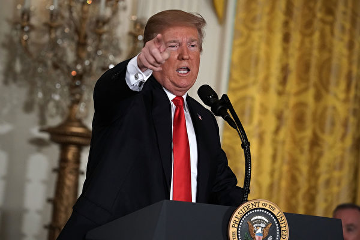

川金会的真正意义及其终极目的，可能超出许多人的想像。图为川普在白宫宣布成立太空部队。（Getty Images）

作者：谢田

【大纪元2018年07月02日讯】川金会的意义，当然不是仅仅的去核、消灭北韩的大规模杀伤武器，还有更深远的意义；并且，其终极的目的，说白了，说穿了，说到底了，其实就是消灭共产主义在朝鲜、中国和东北亚的统治！川普在与中共打贸易战，就是在削弱中共的实力，让中共在“保护朝鲜”上力有不逮。

分析美朝声明，会发现其中的措辞非常有趣。什么叫“美国给朝鲜提供保护伞？”这是保护朝鲜不受谁的侵犯呢？是针对谁的威胁而提供这样的保护呢？当然不是针对美国，因为是美国在做为保护伞嘛；也不是韩国，因为美国是在利用在韩国的驻军提供保护。那么，它是针对谁的呢？肯定是中共和俄国！换句话说，北韩原来是由中共提供保护伞、保镖护院，或者俄国提供，现在不需要了，换老板了，但又害怕旧的恶主反对、捣乱，就需要投靠更粗的大腿，找美国当然是找对的了。在大国中周旋，金三胖并不愚蠢。

说起来，朝鲜半岛卷入共产主义，还是中苏共的罪责。中苏共扶持了金日成在朝鲜推行共产主义、恐怖主义、入侵南韩。如今，朝鲜人不要共产党的影响了。朝鲜的执政党，虽然属于是马列主义、共产主义的性质，但其名字是叫“劳动党”，还不叫共产党呢！所以，金家三代可能从头就留了一手。川普让金三弃共、灭共，对朝鲜来说可能不是什么难事。

一个亲美的朝鲜半岛，已经跃然纸上，可能很快成为现实。金正恩作为小国寡民的首领，当然知道在大国之间周旋的奥妙。对中国的屡次“背叛”，他当然怀恨在心：中国与南韩建交，中国与美国通商，中国扶持他的姑父和亲哥，中国参加联合国对北韩的制裁等等，都是千年宿敌的新罪责。

中共被彻底的边缘化、被撇开，川普在返美途中，首先与韩国总统文在寅和日本首相安倍晋三通了话，没有提到跟中共的国家主席通报。中共媒体刻意的冷处理“川金会”，有意淡化处理相关新闻，就是中共酸葡萄心理的反映。金正恩在利用中共，但不信任中共，所以金家三代都跟中共闹翻过了。

中共上层的谋略，对朝鲜问题的策略，要不是完全失控，要不就是有意任川普所为。其背后，不排除中共现任领导人可能有弃共的打算，但还没有胆量实施，没有叶利钦的魄力。所以，在对朝鲜的态度上，面对积极反共的川普，中共上层似乎左右摇摆、游移不定，多次失去机会。而机会，恰恰是中共最匮乏、最输不起的东西。

中国的卡车工人已经高声喊出了“打倒共产党”的响亮口号。卡车工人的群体，自然而然的是联合性、串联，影响全国的，因为他们开这车一定是全中国跑的。加上微信的传播，卡车司机罢工的消息和他们的口号不胫而走，已经传遍了全中国。这可真够中共喝一壶的了，这些工人阶级，代表着先进的生产力，产业工人的数目有3,000万之巨，地域之广、影响面之大，机动性之强，决心之坚定，无不令中共胆寒。

美国投资人说了，在北韩什么都可以做，机会很多，其实很像中国。因为北韩这个国家什么都没有，跟中国“改革开放”之初一样。美国能够利用贸易让中国富起来，也能通过贸易和投资让北韩富起来，川普的许诺不是空头支票，是扎扎实实的投资机会。投资北韩的能源可能就是第一个，这样北韩的夜空也会亮起来了，慢慢的会追赶上韩国。北朝鲜的便宜人工，会成为美国新的廉价产品的来源地，不会差于中国的珠三角的。

如果面对一个统一的、民主的、自由的、没有共产主义的朝鲜半岛，中国怎么办？中国其实只有两个选择，如果坚持共产党的统治，就是死路一条；如果放弃共产党的统治，就像川普展示的北韩放弃共产党统治的未来一样。

川金会临近结束时，美方为金正恩和朝鲜代表团播放了一个美国制作的录像片，展示了弃共、投美之后的美好前景，包括贸易、投资、建设等等。川普说，金正恩看了录像，也看了iPad，金正恩和八名朝鲜代表都看得很尽兴。确实如此，这些西洋景对阮囊羞涩、饿著肚子的北韩来说，简直太美妙了。美国可以用贸易和投资让中国富起来，让北韩富裕起来更是小菜一碟。彭博商业周刊最新一期的封面文章，居然是“您的北韩投资指南”，特别强调了在金矿、铁矿、石油、锌矿、钼矿、外加海滩（海滨度假）的投资机会。

川普给金正恩做短片，是极其高明的公关手段，多媒体用于外交，是个创举！亏的是有媒体经历的川普，才能想得出来；用直观、形象、生动的影像，给北朝鲜描述了一个跟美国站在一起、没有核武器、也没有共产主义的前景。影片明白无误的说，只有两个可能：一个是倒退，伴随的是美军的航空母舰和呼啸而来的战机；一个是向前，让北韩已经发射的四枚导弹退回发射筒，新的建筑群比北韩（几乎成为烂尾工程）的柳京饭店更壮观、气派的高楼大厦，拔地而起。

川普向金正恩展示的，是什么呢？是一个资本主义、自由社会的愿景。实际上，川普是在引导金正恩走向自由社会、资本主义的制度。也就是说，川普恩威并施，要北韩走向资本主义制度、放弃共产主义制度！

川普短片用了人们熟知的北韩和南韩著名的太空夜景图片的对比，南韩一片光明灿烂，北韩一片死寂黑暗。与美好未来相对应的，是北韩也出现光明灿烂的夜景。短片还说，“历史的车轮，永远是向前滚动的。但历史上总是有极少数的几个人，会被召唤去有所作为、创造历史。几个人可以做一些决定，使得历史的过去不会重演，从黑暗中，可以带来光明，而希望之光。历史的唯一机会，可能不会再来。”

这正是川普的大任和天命之所在。因之，川金会的真正价值和意义，是瓦解了共产主义在朝鲜的影响，也很可能会宣告共产主义在东亚的结束。◇

责任编辑：刘菁

本文转自588期【新纪元周刊】“商管智慧”栏目

http://www.epochweekly.com/

<a href=#top><h6 align="right">回上方</h6></a>

<a name=4>
<h1 align="center"><b>漫话“改革开放”与中国人的幸福感（7）</b></h1>

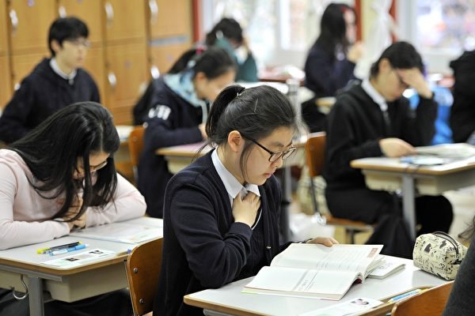

不仅是高等教育学费堪忧，中小学教育收费一样是老百姓肩上的重担。（JUNG YEON-JE/AFP/Getty Images)

作者：袁斌

【大纪元2018年07月02日讯】除了买不起房和看不起病，压在当今中国百姓头上还有一座“大山”——上不起学。

众所周知，上世纪末，中国大地上掀起了一轮教育产业化的热潮。这之前，上大学虽比较难，但费用并不算贵，至少普通民众还承受得起。这之后，大学不断扩招，跨入大学校门不再是难事，但学费却呈几何级数增长。

资料显示，从1994年到2004年的10年间，中国国民人均收入增长不到4倍，而大学学费却猛涨了约20倍。1997年大学生的平均学费只有800元，而到2000年已急速跃升到3,550元，2001年又普遍上涨到5,000元左右，这还只是个基数。现在的大学，已经分为A、B、C三类。所谓的5,000元左右的收费仅是针对一类本科而言，二类本科的收费就要6,000－7,000元了，三类本科的学费更高，每年达10,000元。有数据说，中国现阶段大学费用支出，包含学费、住宿费等所有开支平均每年在1万元以上，是世界最高水准的3倍以上。这还是10年前的行情，如今的价码涨得就更高了。

沉重的学费负担使许多穷孩子上不起学，也压得许多贫困家庭直不起腰来。2005年8月17日，《财富时报》发表了一篇题为《谁让我们上不起学》的报导，让人读了不禁唏嘘。

报导说，2005年8月4日，贵州省某医院门前，“为女求学愿卖肾”的告示刺痛人心。这位卖肾的中年妇女是贵州省一个偏远山村的农民，她的女儿张溪以615分的成绩考入中央民族大学，拿到录取通知书的那一刻，张溪和母亲抱在一起以泪洗面。张溪真的高兴不起来，8,000多元的学费对每月仅靠200多元的低保金维持生活的母女来说简直就是天文数字！

因高学费压力导致大学梦破灭的绝不止张溪一个人。

2005年8月，当一纸录取通知书发到黑龙江省某乡李伟家时，父亲低着头对他说：“儿子，咱们还是别念了，爸实在是拿不出这些钱来了。”李伟知道，为了让他们哥俩读完高中，高二的时候，父亲就已经卖掉了住了20多年的房子，还了以前欠下的债务，给他和弟弟交了学费，他们爷仨现在还住在爷爷的家里。看著作为一家支柱的父亲双目噙泪、满面羞愧与无助的神情，李伟真正地感到了生活的残酷。

据统计，一个本科生4年最少要花费2.8万元，相当于贫困县一个农民35年的纯收入。“重费”之下，数以万计的贫困家庭放弃了让子女凭借知识改变命运的梦想。

靠打工赚钱读完4年大学的河北籍农村学生李刚选择了考研。可昂贵的考研补习班费用、报名费、资料费让他无力应付，加上读研收费风声渐大，迫于学费压力，李刚拨通了“月薪2－3万元的男公关”广告的电话。出乎他意料的是，自己不但没赚到钱反而被招聘公司骗走了2,200元钱。当同学问起李刚知不知道月收入2—3万元的“男公关”都做些什么时，李刚低着头说，自己并不是想做不健康的事，只是学费的压力太大了。

不仅仅是高等教育学费堪忧，中小学教育收费一样是老百姓肩上的重担。

家住北京的李勇交纳了8万元的赞助费才使自己的孩子进入了某重点小学，月薪3,000元的李勇粗算了一笔账，不将学费与其他杂费计算在内，仅赞助费一项，孩子上学的6年间每月就要花去他60%以上的收入。收费的初中、高中就像一个个张开血盆大口的巨兽，需要大笔的金钱去填充。

试想，身为中国人，当你和你的孩子在沉重的学费压力下苦苦挣扎时，你会幸福吗？

责任编辑：高义
<a href=#top><h6 align="right">回上方</h6></a>

<a name=3>
<h1 align="center"><b>德国战车倾覆 全怪中共送马克思回乡？</b></h1>

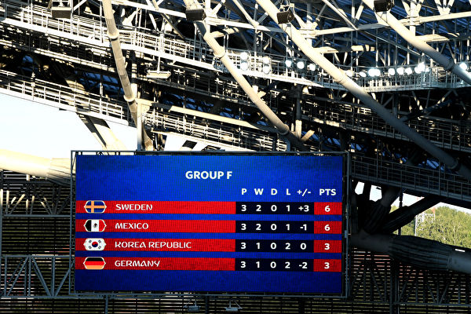

国战车在小组赛中就翻车了，成绩垫底，让球迷看傻眼。(Photo by Shaun Botterill/Getty Images)

作者：黄天辰

【大纪元2018年07月02日讯】上次文章只预计到德国卫冕困难，没想到连小组都没出不说，还一落千丈垫了底。原本夺冠呼声最高，德国战车配备比上届堪称完美。让全世界球迷看不透的是，为何德国队几乎是踢谁输谁，是从1934年德国参加世界杯以来最惨的一次。

在历史上，德国参加C首轮小组赛还没被淘汰过，世界杯对阵亚洲球队5战全胜，共打进19球，最近3场没有失球。可是跟韩国的比赛，居然0：2输了。

记得那天外出，在车上查看新闻，按先前估计，怎么着也得灌韩国人几个球吧，谁知都80多分钟了，还是0：0。下了车路过家门前的餐馆，探头进去看看屏幕，一个德国观众冲着我摊开双手，噘著嘴耸耸肩。什么！韩国人进了一个球。转身上楼进家门打开电视，什么！0：2，德国输给韩国了。

本来以为德国人卫冕困难，但还不至于战死在小组里。事实上，在比赛中人们看不到德国战车的威力，有人形容德国队一盘散沙，没有了钢铁般的意志，没有了坚持到底的精神。最后居然乱了阵脚，守门员门也不管，比后卫跑的还靠前，结果送对方一个空门。

教练勒夫的指挥也显得毫无章法，他让穆勒坐冷板凳，这是穆勒从2010年世界杯以来首次失去首发机会；重新启用备受争议的厄齐尔，对阵瑞典厄齐尔没出阵，德国队真就赢了。结果厄齐尔两次出场，德国队都输了。

有网友在德国0：2输给南韩之后惊呼：德国是不是做错什么事情了？！不少网友的回应是，要怪就怪中共，是中共硬塞给德国人马克思铜像带来的晦气。有的说，共匪送了个邪灵塑像，马上见效。也有人认为，最终还是要怪德国人，已经被扔进历史垃圾堆的东西，为什么还要接受，自己找来的麻烦。

今年5月5日，是马克思出生200周年，中共早在前几年就计划要送给马克思故乡特里尔一个铜像。自从三年前特里尔市议会决定接受来自北京的这个特殊“赠品”以来，德国引起的舆论反弹一直很强烈。人们讨论的焦点是：马克思主义打造出的共产极权害死了无数的人，德国为什么还要接受中共的这种馈赠。特里尔媒体称中共送的马克思像是有毒的礼物。

为什么德国人认为中共送的马克思像是“有毒的礼物”呢？德国一些共产主义受害者协会认为，让特里尔市接受这样一座雕像是一种耻辱。因为在马克思主义的教义指引下，全世界范围内的共产极权政权曾害死了无数无辜的民众。

在《马克思成魔之路》一文中，通过分析马克思不同时期的作品和信件所表现的思想脉络，系统而深刻的透视出马克思从早年一名基督徒到堕落为撒旦教成员的过程，追溯出马克思当年成魔之路与散播共产邪恶主义、危害人类的真相。文章考证严谨，有理有据，令人信服。

被指是魔鬼撒旦徒的马克思，其提出的共产主义给全球数十亿民众制造了空前的灾难。

经过东欧剧变、苏联解体，去共化浪潮席卷世界，前共产国家的波兰，现在正在清除共产主义在全国公共场所的各种标志和痕迹，包括象征共产主义和极权专制的塑像、纪念碑、浮雕及其它各种标志等。在乌克兰、捷克和俄国等许多前东欧共产国家，纷纷推倒和拆除马克思、恩格斯、列宁和斯大林以及本国共产主义独裁者的雕像。

在这种去共化大趋势的浪潮中，德国人从之前推倒柏林墙、选择光明未来，到现在变成接受中共赠送的有毒礼物——马克思像，无疑是在做一件很危险的事。除了一些党派和团体极力反对之外，还有不少德国民众甚至是政治家对此不以为然，没有把它当一回事。人们大概觉得，柏林墙早已倒塌，共产主义也没有像冷战时期的危害那么大了。

网上曾经流传这样一则笑话，说什么是“马克思”呢？就是中国人带着大把的“马克”（欧元之前的德国货币）来到德国消费，说德国人把“马克”全留下来，把自己不要的“思想”送给中国人。中国人把马克留给德国人，欢天喜地的带着“思想”回了中国，这就是“马克思”。

曾几何时，这种情况倒过来了，中共把马克思又送回了德国，而德国人却为了不得罪中共，换言之，为了“马克”接受了马克思，这原本是他们抛弃了的垃圾。这种逆天而行的结果，人们从德国队输球中，看到的也许还只是一个小小的开端。

这次德国输球，有网友说的很好：该认真反省的不是球队，而是政府。执政者若只想着利益，正邪不辨，那其将要葬送的，又岂止是一个球队。

责任编辑：高义

<a href=#top><h6 align="right">回上方</h6></a>

<a name=2>
<h1 align="center"><b>三退大潮二〇一八年综合报告（三）</b></h1>
 <h3 align="center"><b>全球退党服务中心</b></h3>

2018年4月7日，旧金山游行庆祝三亿人三退。（周容／大纪元）

<b>第三章  中共对三退大潮的反应及三退引发的社会变化</b>

<b>1    概述</b>

中共在历史上迫害过各个层面的精英。有地主、资本家、知识分子、大学生……它要打倒谁，包括国家主席也没有超过三天。唯有一次，它的迫害彻底失败了，就是对法轮功的迫害。中共的前党魁江泽民在1999年叫嚣要“三个月消灭法轮功”。18年之后，三亿人退出中共，法轮大法洪传世界100多个国家。中共为此恐慌至极，死命的封锁真相。追随江泽民参与迫害法轮功的恶人纷纷遭到恶报；在中国境内，20多万学员及家属向中共最高人民检察院控告江泽民，目前全球31个国家、超过260万民众也都挺身而出，向中共最高检察院及最高法院举报江泽民。中共也解体在即。

<b>2    中共面对法轮功的真相广传恐慌至极、末日疯狂</b>

自从2004年12月第一份退党声明问世以来，三退人数逐日上升，退党的步伐一天也没有停止过。九评发表13周年之际，三亿人退出中共。三亿人，是接近美国总人口的数字，这足见退党潮波及范围的广度；同时三亿人三退的多方来源，也足见退党潮冲击中国社会各领域阶层的深度。三亿人对中共说“不”，他们声明不与中共为伍，退出参加过的中共一切组织，这令中共在组织上走向瓦解，走向最后解体的崩溃点，因此让中共陷入极大的恐慌。

2.1 保鲜教育、降低入队年龄、加大迫害义工：为应对三退浪潮，中共从2005年1月开始在全党开展“保持共产党员先进性教育活动”的整风运动。中共又特意把少先队的入队年龄从7岁降到6岁(一下子就增加了1,600万队员)，同时把入党入队资格降低，以增加账面人头补足失血人数。对三退义工竭尽全力的迫害，估计在被迫害的大量的法轮功学员，劝三退的占80%以上。

2.2 重温入党誓词活动：中共邪党十九大以后，又兴起了一股企图挽救邪党覆灭命运的活动。2017年11月08日，邪党中央七常委集体重温入党誓词；11月10日，北京“全市党员干部重温入党誓词和入党志愿书”——每一名党员都要做到不忘初心，牢记使命。然后这种重温活动在全国展开。

2.3 十一前“天灭中共”上头版 锦州晚报停刊

2009年伪国庆十一前夕，为显示气氛，该报街头取景于聊西小商品市场，发行后被发现在照片的左下角，赫然贴著“天灭中共、三退平安”的标语。海外中文媒体转载了“天灭中共现头版”的消息，也引起大陆民众的关注。新浪博客出现《震惊：有人出万元天价求购买某期〈锦周晚报〉》博文。第二天，上级锦州市委下令该报停刊整顿并封闭报社网站。

2.4 百度网络审查黑名单曝光，揭示退党大潮让中共深感恐惧

据新唐人2009年5月4日报道，：中国最大搜索引擎百度的内部审查运作文件披露，中共针对13类别，审查过滤关键词，在“反动”类中，就有“退党”、“灭共”、“亡党”、“不爱党”、“暴政”；在“法轮功”类中，包括“九评”、“藏字石”、“大纪元”、“活体取肾”、“苏家屯”等，由此可见退党的深远影响，及中共的恐惧。

2.5  央视泄露中共研发网络攻击系统

中共央视“军事科技”栏目2011年7月播放的《网络风暴来了》节目中，泄露了中共军校研发网络攻击系统，有针对性的攻击美国法轮功网站的实情。节目显示的攻击目标是一个法轮功网站列表。明慧网媒体联系人苏菲（Sophie）表示，中共的攻击的确造成过一些干扰，但这场迫害从一开始就注定了失败，中共即将覆灭，干尽损人害己的事，也无济于事。

2.6 近期部分网络封锁消息

2017年6月1日，中共《网络安全法》实施。2017年8月8日，新浪微博公告称，7月份，新浪微博遮蔽、删除11万8,000多笔时政资讯；同时，409个账号被禁止发布微博和评论，或被限制访问、被关闭账号等。2017年8月25日，中共国家网信办发布新规称，10月1日起未实名用户不得跟帖评论。2017年9月7日，中共网信办发布限制网民言论的规定，要求互联网群组建立者和管理者对群组发布的信息负责。《纽约时报》中文网9月26日报导，9月25日，Facebook旗下的即时通讯应用程序WhatsApp或已遭中共官方全面封杀，包括文字信息。据新唐人报道，中国将于2018年1月11日封锁SD-WAN和VPN，数以万计外国企业也将受到影响。

2.7 微信具备身份证功能，社媒成监控工具

中国现有微信用户10亿以上。2017年，中共政府与腾讯合作推出的“微信身份证”，将向全国推广，引起对网络监控与个人资料安全的忧虑，并引发热议。2017年12月25日，中国大陆首张“微信身份证”在广州签发，2018年1月推向全国。广州网信办称，“网证”是“居民身份证网上功能凭证（CTID）”，即网络版身份证。据腾讯微信使用条款和隐私政策，用户的个人资料和信息将被保存，并将依照“适用的法律法规”提交给政府部门。《华尔街日报》的文章认为，这一趋势突显中共愈来愈依赖国内大型科技公司来实现其利用最新数码技术监控国民的目的。若以后微信不断完善其在各个领域的功能，配以大数据分析，它便可轻易的发现社会运作的各种重要规律，更能轻易的管控到每一个人，届时每个中国人都将被残暴独裁者精准迫害。

<b>法轮功学员反迫害中世人人心渐明，作恶者恶报连连，中共解体在即</b>

1999年7月中共对法轮功的迫害开始以后，于当年下达层层密令：全国律师一律不得接受法轮功起讼案。即使指定的公诉律师，也只能为法轮功学员做有罪辩护。

2004，被誉为“中国良心”的中国维权律师高智晟，三度公开呼吁中共当局停止迫害法轮功，遭中共残酷迫害、强迫失踪，至今仍被非法关押。

2005年开始，上海的郭国汀律师为法轮功修炼者瞿延来、陈光辉等人做无罪辩护。2007年王博案，北京律师李和平、滕彪等6名律师出庭做无罪辩护。后来为法轮功修炼者做无罪辩护已成为潮流。大纪元2017年12月02日报导，仅2017年1月至10月，大陆律师在法庭上为法轮功学员所做的无罪辩护超过370场。甚至中共指派的律师也为法轮功学员做无罪辩护。

中共非法迫害法轮功的过程中，如今某些公检法人员对待法轮功学员从本质上发生的变化。明慧网2018年1月8日《2017下半年法轮功学员无罪获释综述》中说，据明慧网二零一七年七月至十二月报道进行的统计，在中国大陆的十六个省、直辖市，包括安徽、甘肃、广东、河北、河南、黑龙江、湖北、湖南、吉林、辽宁、内蒙古、山东、山西、上海、四川、云南，在检察院、法院、中级法院都有退卷或终止迫害程序的案例，其中检察院退卷45人，法院退卷18人，中级法院发回重审3人。在2017年下半年66个被退卷的法轮功学员的案例中有22名法轮功学员无罪获释，11名法轮功学员被再次起诉，5名法轮功学员庭审无果，有18名退卷后状况不明……

据明慧网2017年7月31日报道中说，许郴生家人申冤四年获三十万国家赔偿。湖南郴州市四十七岁的女法轮功学员许郴生，2012年5月16日上午被郴州市公安局北湖分局人民西路派出所警察当街抓捕，被背铐在铁椅子上“审讯”12小时后身亡。其子杨许俊为母伸冤，经过漫长的4年多官司，终于获得国家赔偿死亡金三十一万九千六百元和被赡养人生活费五千四百元人民币。这是中共迫害法轮功18年来首例法轮功学员获得国家赔偿的案例。

中共对法轮功的讲真相恐惧至极，对法轮功实施了疯狂的迫害。但是善恶到头终有报。最近几年中共高官频频落马，表面上看是在反腐，但实际上是追随江泽民迫害法轮功而遭到的报应，高官落马潮的背后彰显的是“善恶有报”的天理。

大纪元2017年12月22日报道，2017年当局已公布被调查的“老虎”（包括省部级、军级）共有238人，今年有39人获刑，是中共十八大以来“老虎”被判刑最多的一年，包括重量级的黄兴国、王珉等人。其中被判处12年的黄兴国被指是江泽民安插到天津官场的一枚棋子；被判处无期的王珉被指横跨辽宁帮、江苏帮，被指是江泽民、曾庆红的“小兄弟”，曾“妄议中央”；被判处死缓的武长顺、被判11年的吴天君被指是江派前常委周永康政法帮成员；被判处15年的周本顺是周永康政法帮、秘书帮要员；常小兵被指是江泽民长子江绵恒的马仔。12月11日，中共前政治局委员、前重庆市委书记孙政才以涉嫌“受贿罪”被宣布立案侦查并采取强制措施。54岁的孙政才曾被视为中共江派最高权力继承人，他与胡春华有望接班习近平、李克强。这里列出的只是冰山一角。这些高官落马，看上去是因为腐败，但本质上是迫害正信的必然结果。

已有3亿的中国民众退出中共。在在中共的疯狂迫害中，中国大陆的法轮功学员不畏生死，风雨无阻讲真相，使得人心渐明，中共解体在即。中共的全方位的极力封锁中，至今平均每天的三退人数仍然稳定在10万左右，退党大潮势不可挡！

<b>4. 世界政要名人声援退党精选</b>

——2018年5月9日，关注三亿中国人“三退”的主题研讨会在美国国会举办。来自不同国家的政治家和中国问题专家表示，民众大规模的精神觉醒为中国的未来带了光明的希望，也令国际社会振奋。资深众议员史蒂夫．金（Steve King）发出褒奖信，赞扬退党运动对中国的重要意义。金议员已向国会众议院议长保罗．莱恩（Paul Ryan）正式提出此信，将列入国会记录。美国国会及行政当局中国委员会（CECC）主席史密斯（Chris Smith）议员致信支持退党运动，他在信中说：“退党大潮改变了中国人的思想，将许多人从中共的灌输教育和腐败中拯救出来。”曾担任美国驻丹麦大使和国会众议员的理查德．史维特（Richard Swett）在现场表示，退党运动为黑暗的中国带来了光明。他说，是否敢于维护信仰自由，是许多人一生中最艰巨的道德挑战。史维特鼓励中国民众坚持正义的勇气。前瑞典国会议员、前欧洲理事会议会副议长戈兰．林德布劳德（Göran Lindblad）通过视频连线表示：“将共产主义的目的揭示出来，这非常重要。如果对马克思和列宁有所了解的话，就会明白，在这样极端的政体下，不会有任何好的结果。”

——2017年12月20日下午，在美国国会举办的研讨会上，美国国会议员、旅美新西兰政治家、维权律师、政治评论家在美国国会举办的研讨会上谴责中共迫害民众的暴行，声援近三亿中国人退出中共。

美国众议院资深议员达纳・罗拉巴克（Dana Rohrabacher）说：“我认为，退党运动非常重要，它给了共产邪恶体制之内的人们退出的机会，让他们不再参与镇压自己的同胞，不再与中共一道成为世界的威胁。”

新西兰作家、电影制作人、前新西兰行动党副主席劳顿（Trevor Loudon）先生说，《九评》这本书准确地分析了共产党的本质以及中共的问题。他认为，鼓励人们退出中共是明智之举。“共产党之所以能够存在，就是它让人投入精力、时间、承诺和才智，吸引人们支持这个邪恶体系。如果人们选择退出，那共产党基本上就垮台了，并最终消亡。“
http://www.epochtimes.com/gb/17/12/21/n9980237.htm

—— 2016年7月14日中午，上千名来自美国东部的部分法轮功学员及支持者在美国首都华盛顿国会山集会，要求解体中共，结束迫害，法办江泽民。多位美国国会议员及非营利组织代表到现场参加集会，声援法轮功学员。美国宗教与民主研究院宗教自由项目主任麦克唐纳(Faith McDonnell)也到场表示支持，她在发言中说：“一路走来取得了很多成功，大量勇敢的人带来了改变，亿万中国人受到鼓舞，退出中共组织。” http://www.epochtimes.com/gb/16/7/14/n8100672.htm

——  2015年12月10日是国际人权日，美国国会当天举行主题为“巨变的中国及对法轮功的迫害”大型研讨会。数位国会议员及代表到现场支持。

国会议员罗拉巴克说：“这么多人选择脱离共产党、支持法轮功，这是解体中共的绝佳办法。前苏联被解体了。中共也应该被解体。” http://www.epochtimes.com/gb/15/12/12/n4593980.htm

——  2015年11月28日，美国首都华盛顿DC举行大型研讨会纪念《九评共产党》发表十一周年。华府机构“恢复美国使命”（Restore America Mission）总裁、2014年美国马里兰州国会议员参选人Dave Wallace先生表示，中共专制和共产主义将会走向灭亡，他说：“我们都希望共产主义灭亡。今天我们可以看到已经取得的成就，但毫无疑问，这（还）不是一个值得庆祝的时刻。” http://www.epochtimes.com/gb/15/12/5/n4588762.htm

——  2015年7月16日中午，来自美国各地的部分法轮功学员及支持者在美国首都华盛顿国会山西草坪集会，呼吁国际社会制止中共对法轮功长达十六年的残酷迫害。

四位美国国会议员和十多位非政府组织代表前来参加集会，另有十几位国会议员致信声援法轮功反迫害集会。多位非政府组织代表说，十六年来，法轮功学员坚持不懈地传播真相，中共对法轮功的迫害已经彻底失败。国会议员说，迫害元凶江泽民应该为对法轮功犯下的罪行受到审判。

“宗教与民主研究院”宗教自由项目主任费斯·麦克唐纳尔（Faith McDonnell）为参与诉江的法轮功学员及其家人表示赞赏。她也对退出中共的二亿多名中国民众表示赞赏。https://www.minghui.org/mh/articles/2015/7/17/312579.html

—— 2014年12月3日，美国国会大厦举行《九评》发表十周年”及“退党”十周年的国会中国问题研讨会。资深国会议员史密斯声明，“我要公开的赞扬退党运动，赞扬中国人向前的勇气，以这样的行动将自由带到中国。”国会议员史塔克曼（Steve Stockman）在现场接受采访时建议各国领导者都来读《九评》。前美国驻东帝汶大使、前国务院助理国务卿里斯（Joseph Rees）说：“我很高兴今天的活动是由我最喜欢的《大纪元》报纸，以及我最喜欢的中心——全球退党服务中心举办。”超过1亿8千万中国人三退，“这个数字令人震惊。”华府智库国际评估及战略中心的资深研究员费学礼（Richard Fisher）说：“我们必须感谢《九评》的作者揭示了共产党可怕的真相，告诉中国人为什么他们本该拥有更加美好的生活，只有中国人自己理解了这一点，他们才将开启新的时代与纪元。”  http://www.epochtimes.com/gb/14/12/4/n4310940.htm

——  2014年7月17日中午，来自北美部分地区的上千名法轮功学员及支持者在美国首都华盛顿国会山西草坪举行集会，呼吁国际社会制止中共对法轮功长达十五年的残酷迫害。

美国众议员罗拉巴克多年来一直为法轮功学员发声，他说：“共产党这些年来唯一做的事就是迫害民众。人们该意识到，是时候抛弃共产主义了，共产主义是个噩梦。”

参议员罗伯特‧梅嫩德斯（Robert Menendez）致辞。他说：“我在上一届国会发起了一项决议案，目的是让人们意识到中共对法轮功修炼者的迫害仍在继续，以及’退党’运动的兴起。要求中共立即停止对法轮功修炼者的迫害。”

美国宗教自由大同盟主席丹•菲弗尔曼（Dan Fefferman）在集会上说﹕“对法轮功的迫害是当今世上对人权最严重的践踏。其中，活摘器官是最大的罪行！”“我要说，让法轮功自由！让中共解体！”  http://www.epochtimes.com/gb/14/7/18/n4203077.htm

宗教与民主研究院的宗教自由项目主任费斯•麦克唐纳尔（Faith McDonnell）在集会上发表演讲，她说：“相信真相的中国人一直在追寻真相，这样的人越来越多。”“我自己也读了《九评》，我当时就想，太好了，中国人都该向著书中所说的目标努力。现在有1.7亿中国人退出了中共，太令人赞叹了！我向他们表示祝贺。” http://www.epochtimes.com/gb/14/7/18/n4203464.htm

美国纽约州参议员托尼•阿维拉（Tony Avella）向“全球退党服务中心”发来褒奖信。写道：“当中国人宣布退出中共党、团、队组织后，他们的心灵和思想从此获得自由…作为历史上最大规模的一次来自民间的基层运动，退党运动为国际社会带来一个崭新的、没有共产主义的中国社会的新蓝图；作为我们社会中恪尽职守的成员，退党运动和参与者们为纽约州带来了更丰富的资源，这值得我们所有纽约人推崇。”http://www.epochtimes.com/gb/14/7/18/n4203077.htm

—— 2013年7月18日，来自北美的千余法轮功学员在美国首都华盛顿DC举行大型集会与游行。一些美国国会议员到现场或致函表示声援。联邦众议员Thomas E. Petri致函说：“我写这封信的目的是为了支持此集会，同时谴责中共在过去14年来对法轮功和平运动的打压。我希望这场集会能唤起社会大众对中共迫害人权的关注，同时鼓励人们持续为和平而奋斗。”http://www.epochtimes.com/gb/13/7/19/n3920450.htm

——  2012年7月12日，5位美国国会议员和10多位非政府组织代表亲临法轮功在美国首都国会山庄前的大集会，另有20多位美国联邦参议员、众议员致信或派代表到场声援，共同谴责中共对法轮功长达十三年的迫害，尤其是活摘法轮功学员器官的暴行，吁立即停止迫害法轮功。资深国会众议员罗拉巴克在集会上说：“谢谢你们的勇气”“所以我们坚定地和你们站在一起”“我记得里根总统曾经对戈尔巴乔夫说过，’推倒这堵墙’。我们没有用一兵一卒，没有对苏联开战，而是那些像里根、像法轮功学员这样勇于表达对道德、对自由追求的人们改变了整个世界，用非暴力方式解体了共产主义。”“让我们一起把这堵分隔善良人民、分隔宇宙中正义力量的，代表着暴政和邪恶的墙推倒吧。我和你们在一起，美国和你们在一起。”德州国会议员塔德‧波发言说：“中共对法轮功修炼者的残酷迫害导致了大规模的退党、解体中共的运动。在不久的将来，中共政权一定会被清算的。中共一定会对它所犯下的罪行受到应有的惩处。”

美国新泽西州国会参议员罗伯特．梅南德斯（Robert Menendez）的助理Ryan Sellinger在集会上代读了梅南德斯的声援信。 梅南德斯说：“去年7月13日，我在参议院提出了232号决议案关注中共对法轮功学员多年的迫害，并声援退党运动，让中国民众退出中共。”“只有曝光这些违反人权的行为，让世界聚焦这些关键的人权事件，才是终止这些暴虐行径的唯一途径。”

美国国防论坛基金会（Defense Forum Foundation）主席苏珊‧娜肖尔特（Suzanne Scholte）发言说：“从中共迫害法轮功后，我们看到解体中共的呼声越来越高，人们明白只要中共掌权一天，中国永远无法成为一个伟大而和平的国家。这就是为什么这么多勇士唾弃中共，加入退党大潮。目前已经有超过1亿1,600万中国人因为从法轮功学员身上看到的勇气和胆量选择退出中共。”

美国“宗教与民主研究院”、宗教自由项目主任费斯‧麦克唐纳尔（Faith McDonnell）在现场致词中说：“我们还要祝贺超过1亿的中国民众宣布了退出中共。‘退党’运动正在席卷中国。这些成千上万的中国人是如何摆脱中共的？因为他们得知了真相——通过一本奇书《九评共产党》他们看到了中共的本质和罪行，他们从书中获得了力量。”

“现在有越来越的国家和民众，甚至包括美国，被共产主义和社会主义的形态所迷惑。有的甚至放弃自己的自由，把自己交给政府去安排。但是你们是这世界上闪亮的光，因为你们了解真相、谎言、暴政和恐怖的共产主义。”“我希望你们能向没有经历过这种迫害的人，包括你们的邻居、同事和朋友，讲明真相，并提醒他们自己能生活在一个自由的国度该多么心怀感恩。”

http://www.epochtimes.com/gb/12/7/13/n3634313.htm
http://www.epochtimes.com/gb/12/7/18/n3637611.htm

——  在2012年7月13日全球退党服务中心即将于华盛顿举办“解体中共 结束迫害声援 一亿两千万中国民众三退”大集会前夕，欧洲议会副主席爱德华-麦克米兰‧史考特（Edward McMillan-Scott）先生及欧洲议会议员，立陶宛政要丽玛努西亚‧ 安迪克尼(ANDRIKIENĖ, Laima Liucija)和爱沙尼亚议员突尼‧克兰先生（Tunne Kelam）联名褒奖全球退党服务中心。

—— 2009年6月13日新西兰“退党服务中心”在奥克兰市伊丽莎白广场举行声援5500万退出中共党团队（三退）活动。新西兰总理约翰‧柯（John Key）委托他的私人秘书 Emma Holmes发来贺电，转达他对这次活动的主办者和所有参与者的最好祝福。http://www.epochtimes.com/gb/9/6/10/n2553855.htm

—— 2009年4月2日，欧洲议会在全体大会上投票通过了“关于欧洲良知和极权主义”的决议，谴责极权和共产专制，提议在全欧洲范围将8月23日定为所有的极权主义和专制政权受害者纪念日。该决议的发起人之一欧议会议员托克斯(Tokes)表示，中国人民仍然遭受着残暴的极权统治，希望中国人民能坚强，与该制度抗争。http://www.epochtimes.com/gb/9/4/4/n2484741.htm

——  2009年3月18日，欧洲议会在布鲁塞尔总部大厦内举行了欧洲良知和共产极权罪行的听证会。曾两次担任爱沙尼亚总理的马特．拉尔先生（Mart Laar）在听证会上表示，我们应该团结起来，不仅仅是欧洲，因为共产主义在全世界所有地方都犯下了相同的罪行，它们所在之处，都酷刑、虐杀、遣送人民。他知道在中国发生的退党潮，他指出，退出中国共产党是非常正确的行动。越多的人退出这样一个叛逆的共产体系，他们也就能更多的为这个国家服务。“越早退出中共，就越对中国好；拖的时间越长，存在的问题就越多。” http://www.ntdtv.com/xtr/gb/2009/03/23/a272049.html

——  2009年3月，前中共国家安全系统谍报官员李凤智在美国首都华盛顿DC公开宣布决裂中共。国会议员罗拉巴克到现场声援李凤智脱离中共。http://ept.kan.center/gb/9/3/20/n2469693.htm

——  2007年7月19日下午，来自世界各地的部分法轮功学员在美国国会山集会，呼吁解体中共，结束迫害。多位美国国会议员、非政府组织官员、人权律师以及受害者在集会上发言，要求中共立即结束对法轮功持续8年的迫害。佛罗里达州女国会众议员伊丽安娜．罗斯-雷婷恩认为退党是非常有意思的运动，她说：“人们离开中共，作为一种抗议的表达，他们长期感受到被占有、威胁恐吓、压迫和迫害。我希望中共收到了人民发出的讯息。”

欧洲议会副主席爱德华‧麦克米兰-斯考特先生（Edward McMillan-Scott）在声援退党集会的信中说，“中共犯下的罪行令人发指，十恶不赦，也注定了它要解体的命运。西方国家应该支持中国人民捍卫人权和自由，摒弃中共鼓吹的经济假相。” “西方社会欢迎一个没有共产党的新中国，一个中国人民期盼的而且值得拥有的中国。”http://www.epochtimes.com/gb/7/7/20/n1778170.htm  http://www.epochtimes.com/gb/7/7/24/n1782025.htm

——  2007年7月18日下午1：30分，大纪元时报在美国国会大厦举办了九评系列研讨会：揭示真实的中国。三位美国国会议员到场讲演。德州众议员希拉・杰克逊・李特别向2300多万宣布退出中共及其附属组织的中国人民表示敬意。她说，“我宣布退出中共，我以那些在监狱中痛苦地失去生命的那些人的名义退出中共，我不希望继续看到这些罪行，我不希望继续看到无休无止不公的迫害……驱除黑暗，驱除共产主义。”  https://www.zhengjian.org/node/44896

——  2005年6月24日﹑25日，由美中大纪元﹑中国大赦等40多个团体在芝加哥联合举办“告别中共，走向自由”的系列活动，约千余人参加集会游行，声援九评和250万退党活动。九评引发的中国民众退党大潮正引起西方社会关注﹐美国诺州的国会议员Jack McGuire表示：“我支持正在改变中国的反对中共的活动。退出中共表现出了你们的勇气，同时，也提供了一条结束暴政的和平之路。”密苏里州堪萨斯市长Kay Barnes表示：“我非常高兴并支持你们周末在芝加哥举行的“告别中共，走向自由”的集会。”德州议员Kay O’Connor在信中说：“我们相信共产主义是人类共同的敌人，共产主义总是伴随着谎言，暴力和恐怖主义。”伊利诺州议员共和党联席会议主席Daniel P. Brady说：“纵观历史，自由总是战胜了压迫，那是因为有像你们这样有自由理念的勇士们的付出和努力。”http://www.epochtimes.com/gb/5/6/28/n967918.htm

——  2005年5月29日下午美国国防部长拉姆斯菲尔德来林肯纪念馆的老兵音乐会演讲，他谈到：“1987年间﹐很多家庭因试图逃避共产主义制度而死亡﹐他们采取了游过捷克河或翻越柏林墙等走投无路的逃亡行动。”在途径声援退党征签活动中心时﹐在签名板上签名。http://ept.kan.center/gb/5/5/30/n938170.htm（待续）

责任编辑：朱颖

<a href=#top><h6 align="right">回上方</h6></a>

 

<a name=1>
<h1 align="center"><a href="https://github.com/goodabc/GCC/blob/master/jysl.md"><b>魔鬼在统治着我们的世界(18)：教育篇(上)</b></a></h1>
 <h3 align="center"><b>共产党的幽灵并没有随着东欧共产党的解体而消失</b></h3>

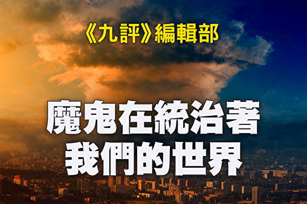

《九评》编辑部：魔鬼在统治着我们的世界。（大纪元制图）

【大纪元2018年07月01日讯】<b>第十二章 教育篇：魔鬼在毁掉我们的后代和未来（上）</b>

<b>目录</b>

<b>引言</b>

1. 共产邪灵接管西方大学 
1）大学教师严重左倾 
2）用共产主义理念改造传统学科 
（1）革命话语占领美国人文学界 
（2）共产邪灵以“理论”之名横行学术界 
（3）政治化的文学研究 
（4）邪恶的马克思主义“意识形态”理论 
（5）后现代马克思主义 
3）创造以意识形态灌输为目的的新学科 
4）灌输各种左倾激进意识形态 
5）否定美国的伟大传统 
6）反西方文明的经典之争 
7）垄断教科书和人文学术研究 
8）大学进行“再教育”洗脑并败坏道德 

<b>引言</b>

教育关乎个人的福祉、社会的安定、民族的发展和文明的存续。人类历史上的伟大文明莫不重视教育。教育最重要的使命就是让人类保持高尚的道德，同时保存神传给人的文化，以等待神的归来。同时教育也起到传播知识、培养技能、凝聚族群的作用，对社会不可或缺。一个受过良好教育的人敬天信神，追求至善的品德，对人类传统文化拥有广博的知识，掌握一个或多个方面的高超技能，敬业而乐群。他们是社会的中流砥柱、民族的精英、文明的守护者，他们个人的卓越品行也一定会得到神的垂青。

共产邪灵要毁灭人类，就要斩断人与神的联系，其中最重要的一步就是破坏传统教育。它在东方和西方采用了不同的策略。在东方传统文化深厚的国家里，如果使用欺骗的方式，很容易就识别出来了。于是共产邪灵屠杀文化精英，造成文化的断层，同时使用教育宣传等欺骗手段。而西方国家的历史文化相对没有那么深厚，所以邪灵可以用渗透和变异的方法。事实上，共产邪灵利用教育渗透西方，对年轻一代的变异比对中国的年轻一代的变异严重得多。

2016年美国大选结束后，由于主流媒体长期对传统派候选人的丑化宣传和所谓民意调查的误导预测，很多人，尤其是青年学生无法接受选举结果，美国大学校园里出现了令人啼笑皆非的一幕。一些学生以“恐惧、疲倦、情绪创伤”为由要求教授取消上课或者推迟考试。某些著名学府为了缓解学生的“焦虑”和“痛苦”，给他们提供了多种多样的活动，包括玩橡皮泥、涂色、积木和肥皂泡，甚至还提供宠物狗和宠物猫。很多大学给学生提供了各种心理咨询，组织互助团体，提供“选举后心理康复”或者“选举后资源与帮助”之类的服务。[1]且不说把正常的选举结果看得比自然灾害或恐怖袭击更加可怕是多么荒唐，单说本来应该具有成熟的心智和对压力及变化具有相当承受能力的大学生竟然变得如此无知、脆弱和幼稚，这不能不说是美国教育的巨大失败。

美国教育的失败恰恰是共产邪灵败坏美国教育的“成功”。过去几十年中美国社会最令人痛心的变化就是公立教育系统的全面沦陷。这是魔鬼渗透和颠覆的结果。

本章将以美国为例，剖析共产邪灵对自由社会教育的渗透。相信读者能够举一反三，认清其它国家教育领域中共产邪灵的鬼影。

共产邪灵对美国教育的渗透至少体现在以下五个方面：

第一，直接向年轻一代灌输共产主义魔鬼的意识形态。邪灵接管西方大学，一边创造以意识形态为导向的新学科，一边渗透重要的传统学科，包括文学、历史、哲学、政治学、经济学、社会学、人类学、法律、大众传播等等；各种变形的马克思主义成了这些科系的指导思想；“政治正确”成为大学校园箝制思想的操作指南。

第二，邪灵有意不让年轻一代接触传统思想文化，因此传统文化、正统思想、真实历史和文学经典被用各种方式诋毁、边缘化。

第三，从幼儿园、小学开始，持续降低教学标准，使年轻一代的读写算术能力变差，思维能力和知识水平都严重下降，难以理性思考关系到人生和社会的重大问题，更难以看穿魔鬼各种狡猾至极的诡计。

第四，从小就给学生灌输各种变异观念，待他们长大后，这些观念变得根深蒂固，几乎无法察觉和纠正。

第五，培养学生的自私、贪婪、放纵，培养其反权威、反传统倾向，放大自由观念，加强他们的自我中心，降低学生对不同观点的理解能力和容忍度，同时降低其心理承受能力。

审视美国的教育，我们会发现，共产邪灵在上述五个层面的目标几乎都已经实现了。美国大学里左派的意识形态成为主导意识形态，有不同思想倾向的学者或者无法进入大学任教，或者不被允许发表自己的传统观点。很多学生经过四年强化训练，大学毕业后倾向自由主义、进步主义，不假思索地接受无神论、进化论、唯物主义，成为奉行享乐主义、缺乏常识和责任感、褊狭脆弱的“雪花人”（snowflakes）。其中受害最深者，除了一些自由派的教条之外，知识贫乏，视野狭窄，对世界历史和美国历史一知半解甚至一无所知，成为魔鬼欺骗的主要群体。

在世人眼中，美国依然是教育大国，这当然事出有因。一个世纪以来，美国是世界上举足轻重的政治经济军事强国，它投入教育科研的经费远超世界上大多数国家。二战以后，美国的自由民主制度和优裕的生活条件吸引了全世界的优秀人才。美国的科研实力至今全球领先，其理工科（STEM）的研究生教育和职业教育（professional schools）可以说独步天下。但繁华的外表之下隐藏着巨大的危机。研究生院理工科外国留学生的数量逐年增长，已经远超美国学生。[2]最重要的是，美国的大中小学教育被严重侵蚀，学生被有意变坏、变笨，其恶果已经初步显现，更大的恶果也即将暴露出来。

本书第五章提到过的反正的前苏联克格勃成员贝泽门诺夫在20世纪80年代初披露说，共产主义对美国的思想渗透已经接近完成，“即使从现在这一刻起，美国人开始教育一代新人，仍然需要十五至二十年才能扭转这个趋势，改变人们对现实的意识形态化认知，使认知回到正常状态。”[3]从贝氏说这番话到现在又有三分之一个世纪过去了。这三十多年虽然见证了苏联和东欧社会主义国家的垮台，但并不意味着共产邪灵放慢了渗透变异西方的步伐。魔鬼在西方培养的代理人把教育作为渗透的主要目标之一，全面接管大中小学教育，影响家庭教育，编造教育理论，改变教育理念，教育领域成为邪灵渗透的重灾区。

必须强调指出的是，现在所有在世的人，尤其是上世纪60年代以后进入大学的人，几乎都多少受到共产主义思想的影响，尤其是人文社会科学专业的学生所受影响最为严重。但是他们几乎都是在不明不白的情况下被魔鬼洗脑的，真正明明白白地推进魔鬼计划的人并不多见。我们这里揭露魔鬼，是为了让上当受骗者能够认清魔鬼、远离魔鬼，不要成为魔鬼的殉葬品。

<b>1. 共产邪灵接管西方大学</b>

<b>1）大学教师严重左倾</b>

青年学生拥抱社会主义或者共产主义意识形态，或者受到女权主义、环保主义等激进意识形态影响，大学教育是最重要的原因之一，而主导大学教育的是大学教师群体。美国大学教师群体的大面积左倾是一个公开的秘密，并且已经颇有时日。

根据2007年一份名为“美国教授的社会政治观”的研究，在被调查的1,417名大学全职教员中，认为自己是自由派的有44.1%，温和派居46.1%，保守派仅占9.2%。其中社区大学教员中保守派比例稍高（19%），自由派略少（37.1%）；而文理学院教员中自由派则高达61%，保守派仅占3.9%。这份调查还指出，临近退休的教员比新入职的左倾更严重。在50~64这一年龄段中，自称左派活动家的占17.2%。这份调查还指出，大学教员大都支持同性恋、堕胎权。[4]

2007年以后的研究也证实了美国四年制大学教授的左倾趋势。2016年发表于《经济日志观察》上的一份研究调查了40所美国著名大学历史和社会科学系教授的选民登记情况。发现在7,243位教授中，民主党有3,623人，共和党人是314人，比例为11.5:1。被调查的五个系中，历史系不平衡最甚，比例高达33.5:1。这与1968年的一项调查形成了鲜明对比。该研究结果是，历史学科教授中，民主党与共和党的比例为2.7:1。[5]

2016年对四年制大学教员的另一项分析发现，教员的政治倾向不平衡，在新英格兰尤甚。这份调查根据2014年的数据，发现在全国范围内，高等院校中自由派与保守派教授的比例为6比1。在新英格兰，这个数字是28比1。[6]皮尤研究中心2016年的一项研究发现，在受过研究生教育的人群中，31%持自由派观点，23%的人倾向自由派，只有10%的人持有保守派观点，17%的人倾向保守派。研究发现，自1994年以来，受过研究生教育的人群中持自由派立场的人士所占份额大幅增加。[7]

美国企业研究所2016年的一次研讨会上，与会的学者指出，在美国大约18%的社会科学家自认是马克思主义者，却只有5%自认是保守主义者。[8]考虑到大部分调查依据的都是调查对象的自我判断，事实上的不平衡状况与调查结果比起来可能更加严峻。

参议员泰德‧克鲁兹（Ted Cruz）曾这样评价自己就读过的一所名校的法学院，“（这所大学）法学院的教师自称是共产主义者的人要多于共和党人。如果你问他们美国是否应该变成社会主义国家，80%的人会投赞成票，另外10%的人会认为这个想法太保守了。”[9]

共产邪灵对美国教育的渗透和其对美国的渗透几乎同时开始。从20世纪初开始，很多美国学院派知识分子就开始接受共产主义思想或者其变种费边主义思想。[10]

美国20世纪60年代的反文化运动让一大批反传统的青年学生走上历史舞台。在这些人的成长过程中，文化马克思主义的革命理论，尤其是法兰克福学派的激进理论，对他们影响甚巨。1973年尼克松总统宣布终止越战后，反战运动失去了直接的目标，学潮开始走向低潮。但是，被大规模的学生运动培养起来的激进学生并没有放弃他们的“理想”，他们进入大学研究所之后首选的专业就是包括新闻、文学、哲学、社会学、教育学、文化研究等在内的社会人文科学。从研究所毕业以后，他们进入了对社会文化最有影响力的大学、新闻媒体、政府机关、非政府组织等部门工作。这时指导他们的主要是马克思主义理论家葛兰西的“体制内长征”的学说。他们要发动一次体制内的长征，改变西方文明的最主要传统。

被西方反叛学生奉为“精神教父”的法兰克福学派哲学家马尔库塞1974年断言：新左派没有死，“它会在大学内复活”。[11]事实上，新左派不仅没有死，他们的“体制内长征”非常成功。“越战以后，我们当中的很多人没有回到文学圈子里；我们获得了学术职务。战争结束后的一段时间内，对那些粗心的人来说，我们似乎消失不见了。现在我们获得了终身教职，重塑大学的工作正式开始了。”[12]这是一位“获得终身教职的激进派”的自白。

“获得终身教职的激进派（tenured radicals）”一词是学者罗杰‧金贝尔（Roger Kimball）在1989年出版的同名著作中创造的，用来指称后来进入大学任教并获得终身教职的20世纪60年代的激进学生。这些学生曾积极投身于反战运动、民权运动或者女权运动，受挫后进入体制，希望在学院内把“政治理想”灌输给下一代学生，造就像他们一样的激进分子。80年代以后，这批当年的造反青年很多获得了大学的终身教职，有些成为系主任、院长，在学院内掌握了相当大的行政权和话语权。这些教授、学者治学的目的不是探求真理，而是把学术作为破坏西方文明传统、颠覆主流意识形态和政治制度的工具；他们教书的目的是进行“革命者的再生产”。

一旦获得终身教职，教授们可以参加各种委员会，在招聘新教师、制定学术标准、研究生论文选题、决定学科发展走向等各个方面都具有了相当大的发言权。这就使得他们有可能用手里的权力把不符合自己意识形态的候选人排除在招聘过程之外。于是大学教师群体里具有传统思想、按照传统理念进行研究教学的教师被不断地排挤出去。老一代教授退休以后，代替他们的新鲜血液绝大部分变成了被共产主义思想洗脑的左派学者。

“体制内长征”概念的发明者、意大利马克思主义理论家葛兰西将知识分子分为两类：传统知识分子与有机知识分子（organic intellectuals）。前者为维护传统文化和社会秩序的中坚力量，而有机知识分子则属于新兴的阶级或者团体，他们在该阶级或团体争取霸权（hegemony）的过程中扮演创造性的角色。[13]“无产阶级”利用有机知识分子夺取文化霸权，最终夺取政治霸权。

很多“获得教职的激进派”就是把自己定位成反对现行体制的“有机知识分子”的。同葛兰西一样，他们信奉的马克思的一句“名言”：“哲学家们只是用不同的方式解释世界，问题在于改变世界。”[14]对于他们来说，教育不是传授知识和人类文明的精华，而是灌输给学生一套激进的政治观点，把学生变成社会活动分子、“社会公正战士（social justice warriors）”，让他们毕业后把对现行体制的不满和对传统文化的反叛扩散到社会上去，最终酝酿摧毁一切的革命。

<b>2）用共产主义理念改造传统学科</b>

人们已经熟知，在共产国家里，马克思列宁主义是一切学科的指导思想。在一向强调学术思想自由的西方国家里，除了共同的道德标准和学术规范以外，按说不应该有预设的学术立场。但是20世纪30年代以来，社会主义、共产主义、马克思主义、法兰克福学派等等思想强势入侵美国大学，以致大部分人文社会学科都受到相当严重的影响。

<b>（1）革命话语占领美国人文学界</b>

布鲁斯‧保尔在《受害者的革命：身份研究的兴起与走向封闭的自由派心智》一书中写到，当他询问宾州大学历史学教授科尔斯（Alan Charles Kors），过去几十年对美国大学的人文学科影响最大的三个人是谁时，科尔斯教授几乎不假思索地回答道，有三本书几乎要负全部责任：葛兰西的《狱中札记》、保罗‧弗雷勒（Paulo Freire）的《受压迫者教育学》（Pedagogy of the Oppressed）、弗兰茨‧法农（Frantz Fanon）的《全世界受苦的人》（The Wretched of the Earth）。[15]

葛兰西是臭名昭著的意大利共产党人，本书已经多有论列。巴西教育理论家弗雷勒崇拜列宁、毛泽东、卡斯特罗和格瓦拉。他的《受压迫者教育学》出版于1968年，1970年英文版出版，成为美国教育学院的必读书之一。用教育学家索尔‧斯特恩（Sol Stern）的话说，这本书不关心任何具体的教育问题，“而是一个乌托邦式的政治论文，号召推翻资本主义霸权，建立一个无阶级社会。”[16]事实上，弗雷勒一再重复的观点无非是，世界上只存在着两类人：压迫者和被压迫者。被压迫者不应该像过去一样接受教育，而是应该被告知他们的受压迫状态，激起他们的反抗。

法农出生于加勒比海上的法属马提尼克（Martinique），参加过阿尔及利亚反对法国的“民族解放战争”。他的《全世界受苦的人》1961年出版，由法国存在主义哲学家、法共党员萨特作序。萨特这样概括他的思想：西方人是殖民者，因此是邪恶的；非西方人是被剥削的被殖民者，因此是高尚的。法农号召殖民地人民发起武装革命，推翻殖民者的统治，在此过程中暴力使人民“团结在一起”，“在个人层面上，暴力是一种净化的力量。它使本土人摆脱了低人一等的情意结、绝望感和无所作为的状态；暴力使他无所畏惧，恢复自尊。”[17]萨特对法农的思想心领神会，他在该书序言中写道：“在反叛初期必须杀人。打死一个欧洲人是一箭双雕，同时少了一个压迫者和被压迫者，剩下的是一个死人和一个自由人；活下来的人第一次感到踩在脚下的是国土。”[18]

这三个人的理论诱导人用阶级斗争的视角观察历史和社会，具有极大的迷惑性和煽动性。一旦让这种阶级仇恨进入心中，学生将以对抗的心态看待正常社会的机构和现象，必然走向不满、抗议、反叛甚至革命。

到底谁是对美国大学的人文社会学科影响最大的人物，对这个问题的回答当然见仁见智，但不可否认的是，马克思主义、法兰克福学派、受马克思主义或弗洛伊德主义影响的、在破坏文化和道德方面与共产主义并肩作战的后现代主义理论主导了大学人文学科。

<b>（2）共产邪灵以“理论”之名横行学术界</b>

自20世纪60年代以后，美国的文学系（包括英文、法文、比较文学等）的研究范式发生了根本性的变化。传统的文学评论承认经典文学作品的道德和美学价值，把阅读文学作品作为增长知识见闻、陶冶道德情操、培养高雅趣味的重要手段。对文学研究者来说，文学作品是第一位的，文学理论是为具体的阅读赏析服务的，处于从属地位。

60年代社会上的反文化进行得如火如荼的时候，学院内部也出现了一个“理论”的大爆发。形形色色的哲学、心理学、文学和文化理论大行其道，理论和文学作品的关系发生了逆转。理论对作品而言具有优先性，作品成了“随意选取”的范例，用来说明理论的“有效性”。[19]

这个“理论”到底是什么呢？它打破了传统的学科界限，包括哲学、心理学、社会学、精神分析等等，是一套试图对社会和文化进行总体性说明的大杂烩。文学理论家卡勒如此解释“理论”：“理论常常是对常识性观念的猛烈攻击，意图说明我们见惯不怪的‘常识’其实是历史性地建构出来的，这种（建构出来的）理论表现得如此自然，以至于我们几乎察觉不到它其实只是一个理论。”[20]也就是说，理论肆无忌惮地嘲弄、逆转、摧毁来自家庭传授、宗教信仰、伦理道德的关于是非、善恶、对错、美丑的传统认识，代之以一套似是而非的邪恶价值观。

抛开其复杂晦涩的包装，所谓“理论”无非是新老马克思主义、法兰克福学派、精神分析、解构主义、后结构主义、后现代主义等拼凑出来的怪胎。简而言之，“理论”就是马克思主义和其它反传统的理论的邪恶联盟，其目的是以学术的方式摧毁人类文明的基础。“理论”是共产主义魔鬼在西方学院内部的新伪装。60年代以来，它从文史哲等学科出发，攻城略地，开疆拓土，大有接管所有传统人文社会学科的态势。

在实践中，“理论”和“批判理论”大体指代同一个现象。新涌现出来的“批判的法律研究（critical legal studies）”、“批判的种族研究（critical race studies）”、“批判的性别研究（critical gender studies）”、“批判的社会研究（critical social studies）”，甚至“批判的科学研究（critical science studies）”、“批判的医学研究（critical studies in medicine）”等，都是批判理论的新的应用。“理论”横行学术界这个现象的实质就是共产主义意识形态扩散到学术和教育诸领域，用变异理论迅速败坏年轻一代，为毁灭人类铺平道路。

<b>（3）政治化的文学研究</b>

对于马克思主义文学批评而言，一部文学经典的意义不在于其内在价值（经典据说甚至根本没有内在价值），而在于它反映了统治阶级（性别、种族）的思想是如何成为占统治地位的思想的。美国一位著名马克思主义文学理论家直言不讳地宣布：“政治角度”是“一切阅读和阐释的绝对地平线”。[21]也就是说，要把一切文学作品当作政治寓言（allegory）解读，只有读出其中阶级、种族、性别、性倾向压迫的“深层含义”，才算是“深刻”、“够格”的理解。

来自共产国家的人对这种武断荒谬的“文学批评”并不陌生。中共党魁毛泽东评价四大名著之一的《红楼梦》的视角极为独特：“《红楼梦》写四大家族，阶级斗争激烈，几十条人命。”前苏联和中共的历史表明，文学评论不总是象牙塔内高雅脱俗的讨论，有时会变成血雨腥风的斗争。例如，文化大革命的爆发至少表面上和对一部文学作品的评价有关。历史学家吴晗响应毛泽东向明代清官海瑞学习的号召，创作了历史剧《海瑞罢官》。1965年11月10日，上海《文汇报》刊出由江青张春桥等共同策划、姚文元执笔的批判文章《评新编历史剧〈海瑞罢官〉》，把《海瑞罢官》和反对“三面红旗”（即造成大饥荒的中共政策“总路线”、“大跃进”和“人民公社”）的彭德怀联系在一起。批判《海瑞罢官》成为文化大革命的导火索。

跟近几十年西方学院内的文学批评相比，中共用阶级斗争解读一切作品的文学批评就显得太“粗糙”了。西方的新马克思主义文学批评就像一个变种的病毒，变得更加强大、恶毒。它吸收了新式的理论武器，把一部部人类文化的经典推上手术台进行肢解和歪曲，从古希腊罗马的文学经典，到但丁、莎士比亚，再到维多利亚小说，无一幸免。虽然这类评论使用晦涩难懂的术语，显得冠冕堂皇、高深莫测，但许多研究的主旨却惊人的单调乏味──无非是指出某部作品包含了对被压迫阶级、女性、少数民族的偏见，因此属于“统治阶级的上层建筑”，其目的是麻痹人民群众，使之不能产生“革命的阶级意识”。美国学者斯克拉顿（Roger Scruton）一针见血地指出：“新文学理论家们的方法是颠覆的工具：尝试从内部破坏人文教育，斩断我们和自己文化之间的同情的纽带。”[22]

<b>（4）邪恶的马克思主义“意识形态”理论</b>

贯穿于很多马克思主义人文学术的一个概念是“意识形态（ideology）”。马克思把道德、宗教、形而上学等统称为意识形态，他认为，在阶级社会中占统治地位的意识形态是统治阶级的思想，这种思想并不是对现实的真实的反映，而是“倒立”著的，也就是扭曲变形的。[23]20世纪的新马克思主义把破坏文化作为革命的必经阶段，在“意识形态”概念上大作文章。匈牙利马克思主义者卢卡奇把意识形态定义为与真正的“阶级意识”对立的“虚假意识”，法国马克思主义者阿尔都塞提出“意识形态国家机器”这一概念，包括宗教、教育、家庭、法律、政治、工会、通讯、文化等等，它们与暴力的国家机器一同发生作用。

意识形态概念里包含着一个狡猾的诡辩。任何一个社会、一种制度都可能有弊端，指出弊端并加以修正都是必要的。但阿尔都塞和其他马克思主义者不是具体指出社会制度的缺点和不足，而是一概加以否定，否定的理由是这些制度都是为了维护统治阶级利益的上层建筑。不是分析一个命题的真伪对错，而是指责提出命题的人动机不纯或者存心不良，这是一个常见的逻辑错误，叫作“向井水里投毒”（poisoning the well）──正如被投过毒的水谁都不能饮用，被谣言诋毁、人格谋杀的人不管说的话多么有道理，他的话都不会被人信以为真。阿尔都塞的意识形态批判就是一个扩大了的、更复杂的“向井水里投毒”的案例。

阿尔都塞的意识形态国家机器概念无所不包，反映了共产主义对人类社会的极端仇视，必欲全盘否定、彻底毁灭而后快。这其实是共产邪灵在背后操纵，对人类文化痛下杀手。

马克思主义的“意识形态”概念是一个极端抽象的泛泛之论、没有价值的伪命题，它的作用是把传统的道德观念一笔抹杀。马克思主义者带着无比的“道德义愤”千百遍地重复这个谎言，带动和欺骗了很多头脑简单的人。

<b>（5）后现代马克思主义</b>

上世纪60年代以后，一批法国理论家提供的理论成为美国学术界马克思主义和共产主义最有力的思想武器，其代表人物是雅克‧德里达（Jacques Derrida）和米歇尔‧福柯（Michel Foucault）。2007年人文领域的专著里被引用最多的作者是福柯（2,521次），第三多的作者是德里达（1,874次）。[24]两人的影响可见一斑。有论者指出后现代主义和马克思主义的共谋关系，很有启发性。[25]我们姑且称这两个理论流派的合流为“后现代马克思主义”。

德里达的“解构主义”（Deconstruction）是一种精巧的无神论和相对主义的诡辩。他通过无限夸大语言的相对性和不确定性，否认语言和文本具有稳定明确的意义。语言具有多意性，一部作品有多种解释的可能，这本是常识，从古希腊和中国的先秦时代起，就有很多人阐发过这个道理。但是，如果以此为理由，连文本具有相对稳定的意义都加以否认，那就走向了相对主义的诡辩。

与传统的无神论不同，德里达使用哲学术语进行表述，因而其观点不仅对“神”的概念具有杀伤力，对于跟传统信仰相关的“理性”、“权威”、“意义”等概念都造成了摧毁性的打击。受德里达影响的理论家纷纷对“意义”、“理性”等概念进行解构。由于其表面上的复杂深奥，使很多人陷入理论迷雾，一时间解构主义横行西方人文学界，成为共产邪灵摧毁信仰、传统和文化的最犀利的武器之一。

福柯曾一度加入法国共产党，其理论围绕着“权力”（power）概念展开，核心可以用一句话概括：“没有真理，只有权力”，也就是说，权力垄断了对真理的解释权，因此任何真理都是虚伪的、不可信的。在《规训与惩罚》一书中，福柯设问：“监狱和工厂、学校、军营、医院都很相像，而工厂、学校、军营、医院又都很像监狱，这难道令人惊奇吗？”[26]把维持社会不可或缺的机构等同于监狱，进而号召人们推翻监狱──福柯理论的反社会性质昭然若揭。

用解构主义、福柯思想和其它批判理论武装起来的学者，把一切相对化，把传统和道德污名化，热衷于谈论“一切解读都是误读”、“没有真理，只有叙事”、“没有历史，只有叙事”。他们把对于真、善、美、正义等概念的理解都相对化，然后弃之如敝屐。刚刚进入研究所的年轻学生不敢质疑老师辈的权威，更无法抵御这种理论的狂轰滥炸，一旦被卷入其中，就很难挣脱出来。这就是共产邪灵在西方人文社科领域横行无忌的重要原因之一。

<b>3）创造以意识形态灌输为目的的新学科</b>

美国上世纪60年代反文化运动当中，一些激进分子试图把其激进的左倾理论推广到大学、研究所当中。有学者认为，黑人研究专业的设立，与其说是学术发展的内在要求，不如说是政治讹诈（political blackmail）的后果。[27]

1967年，一次总罢工造成旧金山州立学院（San Francisco State College）关门，迫于来自黑人学生会的压力，学院成立了美国第一个“黑人研究”项目。该项目负责人设想，这个项目主要是用来“鼓舞黑人学生士气”的，因此，学生学的科学不是普通的科学，而是“黑人科学”。所谓“黑人科学”，指的是黑人科学家的研究成果，或者是以某种方式使教授的科学课和美国黑人生活息息相关。同理，数学、文学、历史、哲学等学科也要首先经过黑人意识的改造。1968年10月，加州大学圣芭芭拉分校黑人学生会的20个成员，占领了学校的计算机中心，造成校园关闭。一年后，该校成立了黑人研究系和黑人研究中心。1969年4月，康奈尔大学的100多个黑人学生挥舞著猎枪、披挂着装满了子弹的子弹袋，占领了学校办公楼，要求成立全部由黑人任教的黑人研究专业。教师出面阻止时，一个学生领袖威胁说：“再过三个小时，康奈尔大学就没命了。”康奈尔大学妥协了，成立了全国第三个这样的学科。[28]

后来成为斯坦福大学胡佛研究所高级研究员的斯梯尔（Shelby Steele）就是推动各个大学成立黑人研究专业的推手之一。他说，在时代氛围的带动下，各个大学负责人的“白人负罪感（white guilt）”非常严重，以至于他们会答应学生代表提出的任何要求。[29]几乎与此同时，女性研究、拉美研究、同性恋研究等很多专业堂而皇之地进入美国大学。时至今日，美国已经有上千个这类的研究项目。

女性研究专业的基本理论预设是，性别差异并非天生，而是“社会建构”的结果；女性在历史上长期受男性和父权制压迫，因此女性研究专业的最重要宗旨是激发女性的社会意识，给社会带来全面的变革，即革命。

加州大学圣克鲁兹分校某女权主义教授，出身于知名共产党员家庭。她骄傲地宣称自己是共产主义者和“女同性恋活动家”，从1980年就开始教授女权主义。她将马克思的“历史唯物主义”扩展到“性倾向”上，并将“性倾向”视为唤起政治意识的一种行为。而她走入大学课堂就是因为一个共产党员告诉她“这是你的革命任务”，她自己也公开说她将“教学变成政治运动的一种形式”。她依照这套主张在加州大学圣克鲁兹分校建立了一个完整的“女权主义研究系”。[30]在她的一个课程教学大纲里她写到，女同性恋是“女权主义的最高形式”，即改变性倾向是最高级的社会意识。[31]

密苏里大学则系统地设计了从一年级到四年级的课程，教导学生如何用左派的观点来看待女权主义、文学、性别、“和平”。例如，“非法的性别”（Outlaw Gender）一课将性别视为“文化的产物”，而非自然生成，并只给学生灌输一种观点──基于性别的压迫和对多种性别的歧视。[32]

本书第五章已经揭示，共产主义的渗透是西方二战以来反战运动的重要源头。近几十年来，美国大学的一个新兴学科“和平研究”（Peace Studies）也和共产主义的渗透有关。学者大卫‧霍洛维茨和拉克辛在研究了美国大学里250多个“和平研究”专业后得出结论，这个专业的主要目的是把学生变成反战的左派，因此这是一个政治性的机构而不是学术性的机构。[33]

他们以在“和平研究”专业广泛使用的一本教科书《和平与冲突研究》（Peace and Conflict Studies）为例，说明和平研究领域的意识形态倾向。在解释贫困与饥饿问题时，这本书采纳了马克思主义的解释，声称造成世界上饥饿问题的原因不是生产不足，而是分配不公。作者谴责土地所有者和农产品商人，声称是他们的贪欲造成了数以亿计的人每天处于饥饿之中。虽然这本书的主旨是“反暴力”，但有一种暴力该书不但不反对，而且赞誉有加，那就是无产阶级革命的暴力。书中称，“虽然古巴远远不是人间天堂，而且某些个人权利和公民权利没有得到广泛尊重，但古巴的例子说明，暴力革命有时会给人民群众带来更好的生活条件。”而卡斯特罗的暴政和古巴革命的灾难性后果该书只字不提。

这本写于2001年9.11事件之后的教科书也涉及到恐怖主义问题。令人吃惊的是，该书作者似乎对恐怖分子充满同情，以至于把“恐怖分子”一词加上引号。他们这样为自己的做法辩解：“把‘恐怖分子’一词加上引号可能对那些把这个称呼视为当然的读者来说显得奇怪。我们这么做不是要淡化这些行为的恐怖性质，而是要通过指出一个人眼中的‘恐怖分子’是另外一个人心目中的‘自由战士’，来强调有必要收敛（对恐怖主义的）道德义愤。”[34]

学术专业本身应该是中立的，不应该预先设定研究立场。这些新兴专业预先设定了意识形态立场──女性研究教授必然信奉女权主义，黑人研究系的教授必然相信非洲裔美国人在政治、经济、文化上的弱势地位是白人的歧视造成的。它们存在的目的不是探讨真理，而是灌输意识形态。

这些新学科是美国文化大革命的副产品。一旦进入大学，它们就具有了自我衍生能力，不断要求更多经费并扩大招生规模，培养的学生再进一步壮大这些学科的力量。这些学科已经无法轻易从大学里剥离。

必须指出的是，这些学科是共产邪灵操纵有不好思想的人创立的，其目的是制造和扩大不同人群之间的矛盾，煽动仇恨，为最终的暴力革命制造条件。它们跟其声称代表的群体（非洲裔美国人、女性等）都没有太大关系。在正常社会里进行女性研究或者对某个种族的研究，是学术繁荣的标志，完全无可厚非。

<b>4）灌输各种左倾激进意识形态</b>

霍洛维茨和拉克辛在《一党教室：美国最好的大学中激进教授如何向学生灌输和破坏我们的民主》一书中，列出了12所大学最糟糕的150多门课程。这些课程充斥了“左派”的观点。有的以学术语言包装，而有的连基本的学术规范都免了，使得这些课程看起来更像共产党国家开设的政治课。

加州大学圣克鲁兹分校的“社群研究系”提供一门研讨课，其内容为“教授如何组织革命。我们将学习不同群体在过去和现在如何抵抗、挑战和推翻包括（但不限于）全球资本主义、政府压迫和种族主义在内的权力体系”。[35]

伊利诺伊大学芝加哥分校“杰出教授”比尔‧艾尔斯（Bill Ayers）在20世纪60年代就是“争取民主社会学生组织”（SDS）分支机构“气象员”（Weatherman）的领导人和极端左翼分子。气象员1969年转入地下并成为美国第一个恐怖主义组织，致力于煽动美国的激进学生发动会触发种族战争的恐怖袭击。该组织在国会山、纽约市警察总局、五角大楼和国民卫队的总部发动爆炸攻击。艾尔斯最广为人知的“名言”是：“杀死富人。砸烂他们的汽车和房子。把革命带回家，杀死你的父母，这才叫革命。”[36]艾尔斯在学术著作中的观点和他的履历颇为一致。在一本书中，他强调必须“克服对暴力犯罪的少年犯的‘偏见’”。[37]

由于左翼进步主义者的保护，联邦调查局一直未能抓获艾尔斯。艾尔斯在1980年回到公众视线内，钻了法律的空子而逃避了刑事处罚。之后，艾尔斯到伊利诺伊大学芝加哥分校任教，研究方向为“幼儿早期教育”。他的政治观点丝毫没有改变，而且仍为他当年的爆炸攻击感到自豪。艾尔斯被提升为副教授、教授，直至获得“杰出教授和大学高级学者”这一大学最高荣衔。每次提职都需要整个系和学院教授们的表决。他被提升的本身就代表着大学对他过去的恐怖活动的默认。

德州大学某传播学副教授毫不避讳地在大学网页上将自己描述为“长期的活动人士和社会主义者”。她是“国际社会主义组织”成员，一个自封的寻求在美国建立“无产阶级专政”的布尔什维克党。她的网页列出了五门由政治议题所驱动的课程。她所教授的“传播学和社会变革”课程，按照她自己描述的目的，就是“鼓励你投身于改变美国的过去的和正在进行的运动”。[38]

<b>5）否定美国的伟大传统</b>

2014年，德克萨斯技术大学的一个学生组织在校园中做了一次调查，向被访者提出三个问题：“谁打赢了南北战争？”“副总统是谁？”“我们是从哪个殖民者那里独立出来的？”对于这些关于美国政治和历史的常识，很多学生懵然不知，但谈起影星的婚姻恋爱却如数家珍。[39]

2008年，校际研究所随机问询了2500名美国人，发现只有一半的人能够说出美国三权分立的机构是什么。[40]2014年“全国教育进展评鉴”组织发现只有18%的学生对美国历史比较熟悉，而对于公民常识的33道考题中，71%的美国人得了49分以下（60分及格）。[41]

学习美国历史不仅是了解一个国家创建的过程，也是了解这个国家建立在何种价值观的基础上，以及为维护这些传统价值所付出的代价。唯有如此，人们才会珍惜今天所拥有的，也会守护这种传统并传给下一代。

而遗忘历史就是割断传统，不了解公民义务是出现极权政府的必要条件。我们不免会问：美国的历史教育和公民教育到底出了什么问题？这可以从美国学生使用的教科书和他们的老师身上找到答案。

一本流传甚广的美国历史教科书《人民的美国史》的作者霍华德‧津恩（Howard Zinn）是马克思主义者。读这本书给人的印象是，所有关于美国历史上的英雄事迹和启迪人心的故事都是无耻的谎言，美国历史漆黑一团，充满了压迫、剥削和种族灭绝。[42]

波士顿某大学的一位经济学教授认为与美国为敌的恐怖分子是真正的“自由战士”，而美国则是恶魔。在发表于2004年的一篇文章中，他将“9.11”袭击世贸大厦的恐怖分子比作在莱克星顿打响美国独立战争第一枪的反抗者。[43]

<b>6）反西方文明的经典之争</b>

1988年，斯坦福大学的激进学生和教师，抗议该校的西方文明史课程。他们大声呼喊口号：“嘿嘿呵呵，西方文明必须撤！”（Hey, hey, ho, ho! Western Civilization has got to go!）斯坦福大学向抗议者让步，用具有鲜明多元文化特色的“文化、思想、价值观”课（Cultures, Ideas, Values，CIV）取代了原来的西方文明史。新的课程虽然并没有取消原来的一些西方文化经典，包括荷马、柏拉图、圣奥古斯丁、但丁、莎士比亚等，但是规定，每学期的课程必须包括若干女性、少数民族等历史上受压迫群体的作品。时任美国联邦教育部长的威廉‧贝内特（William Bennett）把这种改革课程的方式称作“恫吓式课程”（curriculum by intimidation）。其它著名大学很快跟进，二流、三流大学也“不甘落后”。几年之内，美国大学的文科通识课就发生了天翻地覆的变化。

保守主义思想家德苏萨在《不自由的教育》中，用《我，里戈韦塔‧门楚：印第安女人在危地马拉》（I, Rigoberta, Menchu: An Indian Woman in Guatemala）这部书说明斯坦福大学新课程的意识形态导向。这本书讲的是一个叫里戈韦塔‧门楚的年轻印第安女子在危地马拉的成长历程。她的父母在一场屠杀中无端遇害，她决心反抗，思想越来越极端。她逐渐认同南美洲印第安人争取“自决权”的运动，反对欧洲化的拉美文化（Europeanized Latino culture）。她先是成为一个女权主义者，然后变成一个社会主义者，最后变成一个马克思主义者。在书的最后，她开始参加“人民阵线”在巴黎的集会，谈的是“资产阶级青年”、“莫洛托夫鸡尾酒（即燃烧瓶）”等话题。书的一章直接就叫作“里戈韦塔放弃婚姻和母性”。[44]

美国大学以“政治正确”之名驱逐经典作品，至少在如下几个方面造成了破坏性后果。第一，用粗制滥造、内容肤浅但具有煽动性的“革命文学”或“受害者文学”取代了具有恒久价值的文学经典；第二，把革命文学或受害者文学与经典文学作品比肩，也似乎取得了经典的地位，极大地增强了对学生心理的影响；第三，经典文学与不入流的作品并列，被矮化（trivialized），其价值也被相对化（relativized）了；第四，解读文学经典的指导思想也变成了批判理论、文化研究、身份政治和“政治正确”，学者们热衷于研究莎士比亚戏剧里隐藏的种族歧视和性别歧视，或者经典作品里人物的同性恋倾向等等，这是对经典的歪曲和侮辱；第五，受这种思想的影响，学生很难相信经典作品里崇高的人格、伟大的事业、高尚的动机，而培养了一种蔑视一切，甚至仇视一切的愤世嫉俗态度（cynicism）。

在传统的人文教育中，文学经典的主题基本都是关于博爱、正义、忠贞、勇气、自我牺牲精神等道德价值的。历史教育则是关于这个国家建立和发展的最重大事件，其中许多事件都能够回溯到一个国家的立国之本，即最传统的价值观。

西方传统的文学经典大多为欧洲的白种男人所写，左派以“多元化”或“女权”为借口，让人多阅读有色人种、少数族裔和非洲拉美等地的文学作品。历史教育则倾向于将一个国家的历史描述为一片漆黑，充斥了对女人、少数族裔的奴役和剥削。历史教育不再回溯传统，而是为了灌输对女人和少数族裔的“罪恶感”。

人能够阅读的时间是有限的，当教育刻意让人注重“政治正确”的作品，人阅读传统经典的时间就被挤掉了。其结果就是造成一代代学生与自己的文化根源，特别是文化所承载的从信仰派生出的价值观的背离。每个民族自己的文化传统来自于神，文化可以多元但不能混杂，而文化混杂的结果也就断掉了人和造这个人种的神之间的文化桥梁。

<b>7）垄断教科书和人文学术研究</b>

经济学家保罗‧萨缪尔森（Paul Samuelson）极为重视教科书的作用。他说：“只要这个国家的经济学教科书是我写的，谁来制定法律和条约我全都不在乎。”[45]教科书发行量大、权威性高，对学生影响极大。因此垄断了教科书，就掌握了塑造学生思想的主导权。

激进的学者、教师获得终身教职和一定的学术声望之后，进一步控制了大学出版社和各种委员会。因此各种激进的理念被塞进教科书当中，伪装成知识强行灌输给学生。某些学科的教授推荐的教科书、必读书目里面的马克思主义著作超过任何一个其它学派的著作。前文提到过的津恩的《人民的美国史》就被很多历史系、经济学系、文学系、女性研究系等列为必读的教科书。

学术界的左派形成相当的势力后，就可以利用美国学术界通行的“同行评审”制度压制不同的言论。一篇挑战左派意识形态的论文势必被左派“同行”拒绝发表。

很多文科专业的学术期刊用“批判理论”作指导，充斥着晦涩的学术术语，但主旨都是否定神、否定传统文化，煽动颠覆现存社会、政治、经济秩序的革命。有一类论文，力图证明所有传统的道德和规范，甚至包括科学规范，都是“建构”（socially constructed）出来的，意即是掌握强权的人把自己的主观标准包装成普世观念，然后强加给社会大众，用以维护自己阶级或人群的统治地位。

1996年，纽约大学物理学教授索卡（Alan Sokal）在美国杜克大学出版的文化研究学术期刊《社会文本》（Social Text）上发表了一篇论文，题为“跨越界线：通往量子重力的转换诠释学”（Transgressing the Boundaries: Towards a Transformative Hermeneutics of Quantum Gravity）。论文称“量子重力”是由社会和语言建构的，整篇文章旁征博引，有109条注脚，参考了219篇文献。[46]

论文刊出当日，索卡在另一杂志《共同语》（Lingua Franca）上声明该论文实属恶作剧。他故意投稿给《社会文本》，是一场“物理学家有关文化研究的实验”。[47]

索卡在接受广播节目“全盘考量”（All Things Considered）的采访时表示，他之所以这么做，是受到《高级迷信》（Higher Superstition，1994）一书的启发。该书作者说，一些人文科学期刊将发表任何东西，只要它有“合适的左派思想”并引用著名左派思想家的著作。因此他炮制了一篇堆砌了左派意识形态话语、无关痛痒的引用、完全胡扯的论文投稿。[48]

他说：“我的实验结果至少证明了，美国左派学界一些时髦领域已经在智力上变得懒惰了。《社会文本》的编辑喜欢我的文章，因为他们喜欢它的结论：‘后现代科学的内容和方法论为进步的政治计划提供了强有力的智力支持。’显然他们不觉得有必要去分析证据的质量、论证的有效性，或论证与所谓结论的相关性。”[49] 索卡事件以戏剧性的方式证明，批判理论和文化研究领域的很多所谓学术成果，毫无学术性和严肃性可言。

从美国大型学术联合会年会的论文选题可以清楚看出过去几十年中人文社会学科被各种共产主义意识形态渗透情况之普遍和严重。现代语言学会（Modern Language Association）是美国最大的学者联合会之一，会员超过25,000人，主要是从事现代语言研究与教学的教授和学者。该学会每年的年会与会人数经常超过10,000人。通过检索该学会网站提供的年会专题讨论历史记录，就会发现有相当比重的论文采用马克思主义的理论框架，或者以法兰克福学派思想、解构主义、后结构主义等变异理论为工具，或者使用女权主义、同性恋研究、身份政治等激进意识形态话语。包括美国社会学学会（American Sociological Association）在内的其它学术联合会也有同样的倾向，只是程度有所不同。

必须指出的是，美国大学里有人文教育（liberal education）的传统，不管什么专业的大学生入学，都要学习数门公共必修课程，而这些课程基本上都是文、史、哲、社会学、传播学等系的教授开设的。美国学者托马斯‧索维尔指出，必修课程──顾名思义，学生对这类课程无可奈何无处可逃──常常成为教授们进行意识形态灌输的重要场所。教授利用手里的权力向学生兜售自己的左倾激进观点，甚至以成绩为筹码，逼迫学生认同其观点。如果学生胆敢挑战老师的观点，老师就会以低分作为惩罚。[50]因此，人文社会科学系教授的马克思主义观点不仅仅会污染本专业的学生，而且会影响到几乎所有的大学新生。

大学生喜欢被人当作成年人尊重，但毕竟涉世未深，知识有限，而大学又是一个相对封闭的环境，他们不会想到自己尊重的教授、学者，竟然利用学生的天真和轻信，灌输给他们一整套错误、有害的意识形态和价值观念。家长支付高额学费，本来指望孩子掌握有用的知识和技能，作为自己安身立命的基础。他们又怎会想到，孩子被剥夺了最宝贵的学习机会，却被日复一日地激进化，他们被强迫接受的错误观念将影响他们的下半生？

当一代一代的人进入被魔鬼严重渗透的教育体制，学习著其代理人编写的教科书和杜撰的变异理论，共产邪灵离它败坏道德、破坏文化并最终毁灭人类的目标也就越来越近了。

<b>8）大学进行“再教育”洗脑并败坏道德</b>

随着马克思主义意识形态在大学校园内猖獗，从上世纪80年代开始，大学校园政策越来越专注于防止“冒犯性”的言论，尤其是冒犯女性或者少数族裔的言论。美国学者唐斯（Donald Alexander Downs）指出︰从1987年到1992年，有大约300所美国大学实施了言论规范的相关政策，以半法律化的形式严禁“冒犯”敏感人群或事物的言论出现。[51]

支持这种行动的人也许是出于好心，但由此却产生荒谬的结果：从此宣称自己有权利不被冒犯（实际上这并不是任何法律赋予的公民权）的人不断增加，并可以基于任何理由──文化马克思主义的泛滥，让任何人都可以从自己的文化、祖先历史、肤色、性别、性倾向等方面找到理由宣称自己属于“被压迫群体”。而大学行政方面也不断地给宣称受害者这样的特权──按照马克思主义的逻辑，被压迫者当然是道德上正确的，他人甚至不敢对其自称的受到冒犯的真实性有所质疑。这一逻辑的荒谬性在于其偷偷转换是非善恶的道德评判标准。随着人们的群体认同和情感越来越强烈（在列宁斯大林主义中，这叫阶级觉悟高），人们最终不自觉地完全放弃传统普世价值的善恶标准，以群体情感（group emotion）判断是非善恶。这在共产极权国家里表现得最为显著，最终导致流氓无产者（“受压迫者”）可以理直气壮地屠杀地主资本家（“压迫者”）。

这种随意宣称自己是“受冒犯者”的案例不断增多，原因之一是文化马克思主义学者编造了一系列似是而非的新概念，不断扩展“歧视”言行的定义：如微攻击（micro-aggression）、触发警告（trigger warning）、安全环境（safe space）等等，而大学行政方面也随之出台相应的惩罚政策和强制培训，如“敏感度培训”、“多元化培训”等。

“微攻击”的意思是轻微或者含蓄的日常语言或非语言冒犯，尽管“冒犯者”可能完全出于无意或者无知。这种无意或者无知被称作“不敏感”（insensitive，在列宁斯大林主义中，这叫阶级觉悟低）。许多大学的新生入校培训的重要内容就是敏感度培训（sensitivity training），比如被告知哪些话不能说、哪些服饰不能穿，否则会构成“微攻击”，被视作违反校规。一些校园中，“欢迎来美国”这句话不能说，因为可能构成歧视，被视作微攻击。原因是，这会让一些历史上在美国遭受不公对待的族裔，如印第安人、非洲人、日本人、华人等等，想起祖先的屈辱历史。加州大学公布的“微攻击”禁忌语，包括“美国是个大熔炉”（种族歧视）、“美国是一片充满机遇的土地”、“男人和女人都有同样的成功机会”（否认性别或种族不平等）等等一长串日常用语。[52]微攻击违规者会受到校方处罚，因为这会阻碍学校构建所谓的“安全环境”（safe space）。

一个典型的“微攻击”例子，发生在印第安纳大学─普渡大学的印第安纳波利斯校园。一个白人学生因为读了一本书而违反了种族骚扰条例，书名叫做《圣母大学生击溃三K党》。但书的封面上三K党集会的照片让这位学生的同事（该学生同时也是一个公寓管理员）感到被冒犯。学校的纠偏办公室认为该学生违反了种族歧视校规。后来经过学生的抗争和其它团体的帮助，学校不得不承认该学生没有错。[53]

所谓“敏感度培训”、“多元化培训”，堪比前苏联或者中国的“再教育”洗脑。“再教育”的目的是强化阶级立场：“资产阶级”、“地主阶级”（现在是男性或者白人）要认清自己所在“压迫阶级”的“原罪”，被压迫阶级要认清资产阶级文化的“假象”，清除“内化的压迫”，抛开个人处境而真正认清自己阶级被压迫的地位（现在是女性要认清传统女性性别身份是传统文化制造的“迷思”，黑人要认清“公平”是白人传统文化制造的假象，区分个人境遇和种族、性别境遇）；学会马克思主义阶级分析方法，要意识到按照“压迫阶级”的立场认识问题是“错误的”。所以要改造世界观，完全按照马克思主义（无产阶级）的立场思想和行动，否定阶级压迫或者阶级斗争的言行也会遭到严厉惩罚。“敏感度培训”是要充分意识到“社会不公”，言行要站在“被压迫”群体（女性、少数族裔、同性恋者等等）的立场上。

比如2013年西北大学要求所有的学生都必须完成一门关于多元化的课程后才能毕业。按照学校说明，这门课程完成后学生将能够“扩展他们批判性思考的能力”（学会阶级分析），“认识到他们自己在不公平系统中的位置”（认清自己的阶级成分），并且“反思自己的权力和特权”（要站在“受压迫”阶级的立场上）。[54]

另一个典型例子，是德拉华大学2007年的“再教育”洗脑项目（校方称为“对学生不正确态度和信仰的治疗”）。这个项目针对7000名住校生。他们被强制要求参加思想意识“治疗”。其明确的目的是让学生接受关于某些问题的特定观点，比如政治、种族、性别、环保主义等等。大学宿舍助理要求给每个学生一对一的问卷。问卷中关于种族和性别的问题包括“他们愿意和什么样的种族和性别的人约会”，其直接目的是让学生在这些方面更加“开放”。有个学生在被问到“你什么时候意识到自己的性别身份（性别身份是指不同于生理身份的性别认同，比如生理男性者可能认同自己是女性的性别身份）”时，回答说：“不关你的事。”结果她被宿舍助理汇报给学校管理层。[55]

魔鬼安排大学中这种泛政治化的“再教育”，其目的不光是混淆神留下的道德评判标准。另一方面它还大大强化和放大学生以自我为中心的个人主义理念。年轻学生从这种高度强化的政治环境中学到的是可以利用“群体情感”作为“高尚”的目标达到自己的个人目的：只要宣称自己是某个“受压迫群体”的受害人，就可以任意指控、威胁别人，或者达到自己的个人目的；如果他人的观点与自己不一致，就可以“受到冒犯”为由向校方提出抗议，要求发言者闭嘴；保守派学生报纸中如有自己不喜欢的观点，甚至可以烧毁其报纸。

感受到被冒犯本来是主观感觉，但现在感受成为“客观”证据。以至于大学教授们一不小心就踩了地雷。一夜之间，各大学的学生开始要求教授在使用某个材料之前，要提前发出“触发警告”，因为某些教学话题、阅读材料可能会引起学生“负面的情绪反应”。过去几年被要求列入触发警告的著作甚至包括莎士比亚的《威尼斯商人》、古罗马诗人奥维德的《变形记》等经典作品。有的学校要求，如果某著作有可能触发学生的负面反应，就应该尽量避免使用。[56]

这种氛围下成长的许多学生，自我为中心的意识不断膨胀，专注于自己不被冒犯。校园内不断强化的群体意识（“阶级意识”的另外一种表现形式）让他们不懂如何独立思考、不懂个人责任。他们和上世纪60年代的激进学生（如今成为他们的教授）一样反叛传统，更等而下之者乱性、酗酒、吸毒、满嘴脏话。但在他们玩世不恭的表面之下是脆弱的心灵，不堪任何打击和挫折，遑论担负责任。

传统教育中培养的是对自我的约束、独立思考和责任心、对他人宽容的美德。魔鬼就是要让下一代不断放纵自己，成为魔鬼统治世界时可以利用和操纵的工具。

**

[1] 这类报导很多，比如https://www.thedailybeast.com/elite-campuses-offer-students-coloring-books-puppies-to-get-over-trump; http://college.usatoday.com/2016/11/15/heres-how-universities-are-offering-support-to-students-after-trumps-election/.

[2] 根据美国政策国家基金会2017年的调查，国际学生已经占据美国大学研究生院科技工程专业的绝大多数。全日制国际学生比例最高的三个专业是电子工程、石油工程和计算机科学，国际学生比例分别为81%、81%、79%。Elizabeth Redden, “Foreign Students and Graduate STEM Enrollment,” Inside Higher Ed, October 11, 2017, https://www.insidehighered.com/quicktakes/2017/10/11/foreign-students-and-graduate-stem-enrollment.

[3] G. Edward Griffin, Deception Was My Job: A Conversation with Yuri Bezmenov, Former Propagandist for the KGB, American Media, 1984.

[4] Scott Jaschik, “Professors and Politics: What the Research Says,” Inside Higher Ed, February 27, 2017, https://www.insidehighered.com/news/2017/02/27/research-confirms-professors-lean-left-questions-assumptions-about-what-means.

[5] 同上。

[6] 同上。

[7] 同上。

[8] “The Close-Minded Campus? The Stifling of Ideas in American Universities,” American Enterprise Institute Website, June 8, 2016, https://www.aei.org/events/the-close-minded-campus-the-stifling-of-ideas-in-american-universities/.

[9] Quoted from Fred Schwartz and David Noebel, You Can Still Trust the Communists…to Be Communists (Socialists and Progressives too) (Manitou Springs, CO: Christian Anti-Communism Crusade, 2010), 2-3.

[10] 参见Zygmund Dobbs, Keynes at Harvard: Economic Deception as a Political Credo. (Veritas Foundation, 1960), Chapter III, “American Fabianism.”

[11] Quoted from Robin S. Eubanks, Credentialed to Destroy: How and Why Education Became a Weapon (2013), 26.

[12] Quoted from Walter Williams, More Liberty Means Less Government: Our Founders Knew This Well (Stanford: Hoover Institution Press, 1999), 126.

[13] David Macey, “Organic Intellectual,” The Penguin Dictionary of Critical Theory (London: Penguin Books, 2000), 282.

[14] 马克思：〈关于费尔巴哈的提纲〉（中文马克思主义文库）。

[15] Bruce Bawer, The Victims’ Revolution: The Rise of Identity Studies and the Closing of the Liberal Mind (New York: Broadside Books, 2012), Chapter 1.

[16] 同上。

[17]  Franz Fanon, The Wretched of the Earth, trans. Constance Farrington (New York: Grove Press, 1963), 92.

[18] Jean Paul Sartre, “Preface,” The Wretched of the Earth by Franz Fanon, 22.

[19] Roger Kimball, Tenured Radicals: How Politics Has Corrupted Our Higher Education, revised edition (Chicago: Ivan R. Dee, 1998), 25-29.

[20] Jonathan Culler, Literary Theory: A Very Short Introduction (Oxford: Oxford University Press, 1997), 4.

[21] Fredrick Jameson, The Political Unconscious: Narrative as a Socially Symbolic Act (Ithaca, NY: Cornell University Press, 1981), Chapter 1.

[22] Quoted from Roger Kimball, “An Update, 1998,” Tenured Radicals: How Politics Has Corrupted Our Higher Education, 3rd Edition (Chicago: Ivan R. Dee, 2008)， xviii.

[23] 马克思：《德意志意识形态》（中文马克思主义文库）。

[24] “Most Cited Authors of Books in the Humanities, 2007,” Times Higher Education, https://www.uky.edu/~eushe2/Bandura/BanduraTopHumanities.pdf.

[25] Joshua Phillip, “Jordan Peterson Exposes the Postmodernist Agenda,” The Epoch Times, June 21, 2017, https://www.theepochtimes.com/jordan-peterson-explains-how-communism-came-under-the-guise-of-identity-politics_2259668.html.

[26] Quoted from Roger Kimball, “The Perversion of Foucault,” The New Criterion, March 1993, https://www.newcriterion.com/issues/1993/3/the-perversions-of-m-foucault.

[27] David Horowitz and Jacob Laksin, One Party Classroom (New York: Crown Forum, 2009), 51.

[28] David Horowitz and Jacob Laksin, One Party Classroom, 51-52.

[29] Bruce Bawer, The Victims’ Revolution: The Rise of Identity Studies and the Closing of the Liberal Mind, Chapter 3.

[30] David Horowitz and Jacob Laksin, One Party Classroom, 3.

[31] David Horowitz, The Professors: The 101 Most Dangerous Academics in America (Washington D.C.: Regnery Publishing, Inc., 2013), 84-85.

[32] David Horowitz and Jacob Laksin, One Party Classroom, 212.

[33] David Horowitz, Indoctrinate U.: The Left’s War against Academic Freedom (New York: Encounter Books, 2009), Chapter 4.

[34] 同上。

[35] David Horowitz and Jacob Laksin, One Party Classroom, 1-2.

[36] http://www.azquotes.com/author/691-Bill_Ayers.

[37] David Horowitz, The Professors: The 101 Most Dangerous Academics in America, 102.

[38] David Horowitz and Jacob Laksin, One Party Classroom, 116.

[39] “Who Won the Civil War? Tough Question,” National Public Radio, November 18, 2014, https://www.npr.org/sections/theprotojournalist/2014/11/18/364675234/who-won-the-civil-war-tough-question.

[40] “Summary of Our Fading Heritage: Americans Fail a Basic Test on Their History and Institutions,” Intercollegiate Studies Institute Website, https://www.americancivicliteracy.org/2008/summary_summary.html.

[41] “Study: Americans Don’t Know Much About History,” July 17, 2009, https://www.nbclosangeles.com/news/local/Study-Americans-Dont-Know-About-Much-About-History.html.

[42] Howard Zinn, A People’s History of the United States (New York: HarperCollins, 2003).

[43] David Horowitz, The Professors: The 101 Most Dangerous Academics in America, 74.

[44] Dinesh D’ Souza, Illiberal Education: The Politics of Race and Sex on Campus (New York: The Free Press, 1991), 71.

[45] Paul Samuelson, “Foreword,” in The Principles of Economics Course, eds. Phillips Saunders and William B. Walstad (New York: McGraw-Hill College, 1990).

[46] Alan D. Sokal, “Transgressing the Boundaries: Toward a Transformative Hermeneutics of Quantum Gravity,” Social Text No. 46/47 (Spring – Summer, 1996), 217-252.

[47] Alan D. Sokal, “A Physicist Experiments with Cultural Studies,” Lingua Franca (June 5, 1996). Available at http://www.physics.nyu.edu/faculty/sokal/lingua_franca_v4/lingua_franca_v4.html.

[48] Alan D. Sokal, “Parody,” All Things Considered, National Public Radio, May 15, 1996, https://www.npr.org/templates/story/story.php?storyId=1043441.

[49] 同上。

[50] Thomas Sowell, Inside American Education: The Decline, The Deception, The Dogma (New York: The Free Press, 1993), 212-213.

[51] Donald Alexander Downs, Restoring Free Speech and Liberty on Campus (Oakland, CA: Independent Institute, 2004), 51.

[52] Eugene Volokh, “UC Teaching Faculty Members Not to Criticize Race-based Affirmative Action, Call America ‘Melting Pot,’ and More,” The Washington Post, June 16, 2015, https://www.washingtonpost.com/news/volokh-conspiracy/wp/2015/06/16/uc-teaching-faculty-members-not-to-criticize-race-based-affirmative-action-call-america-melting-pot-and-more/?utm_term=.c9a452fdb00f.

[53] “Victory at IUPUI: Student-Employee Found Guilty of Racial Harassment for Reading a Book Now Cleared of All Charges,” Foundation for Individual Rights in Education, https://www.thefire.org/victory-at-iupui-student-employee-found-guilty-of-racial-harassment-for-reading-a-book-now-cleared-of-all-charges/.

[54] “Colleges Become Re-Education Camps in Age of Diversity,” Investor’s Business Daily,  https://www.investors.com/politics/editorials/students-indoctrinated-in-leftist-politics/.

[55] Greg Lukianoff, “University of Delaware: Students Required to Undergo Ideological Reeducation,” Foundation for Individual Rights in Education, https://www.thefire.org/cases/university-of-delaware-students-required-to-undergo-ideological-reeducation/.

[56]Alison Flood, “US Students Request ‘Trigger Warnings’ on Literature,” The Guardian, May 19, 2014, https://www.theguardian.com/books/2014/may/19/us-students-request-trigger-warnings-in-literature.
<a href=#top><h6 align="right">回上方</h6></a>
