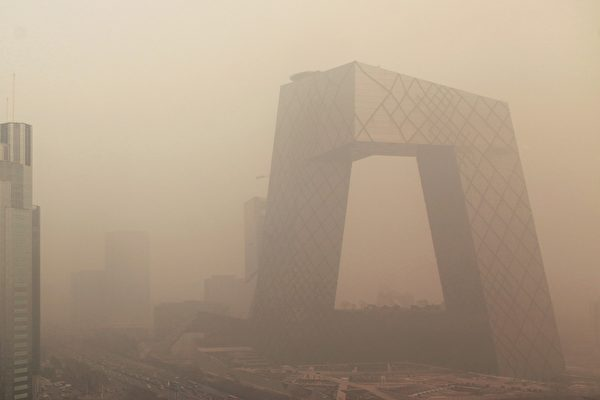
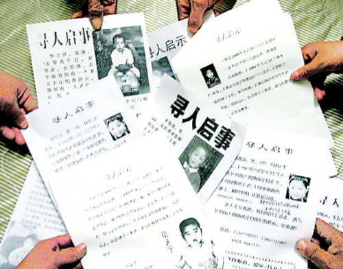

 
 
<a name=top>
<h2><a href="https://github.com/3fmd/true/blob/master/01.md"><b>看更多．．．</a></b></h2>
<h2><a href="https://github.com/goodabc/GCC/blob/master/jysl.md"><b>九评编辑部：魔鬼在统治着我们的世界</a></b></h2>
<h2><a href="https://github.com/goodabc/GCC/blob/master/goal.md"><b>《九评》编辑部：《共产主义的终极目的——中国篇》</a></b></h2>
<h2><a href="https://github.com/goodabc/GCC/blob/master/xgpl.md"><b>《共产主义的终极目的》 相关评论</a></b></h2>  
<h2><a href="https://github.com/no1show/show1/blob/master/whss.md"><b>中共意识形态之理性批判</a></b></h2> 
<h2><a href="https://github.com/no1show/show1/blob/master/gcdsy.md"><b>评《共产党宣言》</a></b></h2> 
<!-- <<h2><a href="https://github.com/no1show/show1/blob/master/jgrc.md"><b>【中国人权】</a></b></h2> -->
<h2><a href="https://github.com/no1show/show1/blob/master/8m-1.md"><b>【大纪元2018年08月评论、时事目录-1】</a></b></h2> 
<h2><a href="https://github.com/no1show/show1/blob/master/7m.md"><b>【大纪元2018年07月评论】</a></b></h2> 
<h2><a href="https://github.com/no1show/show1/blob/master/6m.md"><b>【大纪元2018年06月评论】</a></b></h2> 
<h2><a href="https://github.com/no1show/show1/blob/master/5m.md"><b>【大纪元2018年05月评论】</a></b></h2> 
   
<h1 align="center"><b>【大纪元2018年08月评论、时事目录-2】  </b></h1>

<b>
<a href=#149>149. 古玉文：央视新闻联播的七大“功能”</a> 
<a href=#148>148. 颜丹：“一辈子都找不回”失踪儿童的背后</a> </b>

<a name=149>
<h1 align="center"><b>古玉文：央视新闻联播的七大“功能”</b></h1>

迷雾中的央视。(Ed Jones/AFP/Getty Images)

 
【大纪元2018年08月26日讯】中共防火墙之父，北京邮电大学前校长方滨兴毕生致力于中共网路封锁技术研究与开发，并且成果“硕硕”，网友曾送其一副对联曰：“半日赢得千夫指，一生赚尽粪土名”，横批“无虚此生”。这恐怕是国人对方教授制造的、无所不在的“404 NOT FOUND”网页最好的“点赞”。

最近，方校长麾下战将、北京邮电大学世纪学院兼职教授项立刚“不看新闻联播的一般是下等人”的一席言论，惹民众广泛争议。项大V宣称：“他们是不需要知道天下大事，他们也不会做大事，做大事的人在中国得看新闻联播。”

项立刚具多重身份，目前是通信门户网站飞象网CEO、北京3G产业联盟副理事长、秘书长、中国人民广播电台特约评论员、中国电视台评论员。作为有一定量级的公众意见领袖，口出攻击性言论，制造歧视性话题，撕裂社会，彰显霸凌。民众怀疑其言与身份是否相称，更感叹中共央视的“毁人不倦”之功效。

网友爆料，项立刚的雷人话语不限于此，如刚发生的疫苗事件，他表示：“疫苗这事，关系国家安全、国计民生的大事，必须要由国企来做，私有化的结果除了涨价就是弄虚作假”，与其指认项教授的言论是前任方校长防火墙科研成果转化为生产力的最鲜活例证，毋宁说中共的党禁报禁批量产出了这些教授专家级别的“上等人”，他们共同的价值观是仰中共之鼻息，而无视民众之疾苦。

据中共央视索福瑞调查，央视新闻联播收视率约在5%左右。众所周知，老王卖瓜自卖自夸，中共官僚体制更容易把这个卖法制度化、黑箱化。样本污染、收买收视率以及自上而下的为收视率业绩而问责所产生的虚假统计与算法，央视新闻联播收视率同样承担着“政治正确”的刚性任务，计算出来的数值不说谁都懂。

前苏联斯大林时期对新闻传播采取绝对的专制主义，采用各种手段打击言论自由，镇压不同政见者。前苏联作家索尔仁尼琴曾说，拥有一个讲真话的作家，等于拥有第二个政府，索尔仁尼琴因此被流放到古拉格群岛。

戈尔巴乔夫上台后，开放报禁，实施新闻自由。允许个人、各党派团体和外国媒体办报。到了1990年年底，全国有13个党派获得报刊营业执照，100多家私人报刊企业。“真理报”等党报走向独立。“星火周刊”等媒体开始反思“十月革命”的错误、刊登反对“党阀专政”和“社会主义制度”等文章。无疑，苏共同前苏联国家与人民的剥离，新闻自由功不可没。

兔死狐悲，中共也因此深恐新闻自由。所谓的双百方针、言论自由犹如穿着旗袍的狐狸，远看似正统，细瞅真邪精。中共十九大以来，加紧了对言论的封锁与钳制。在信息封闭和绝对不对称的信息环境下，人们看到的只能是中共自编自导、自设话语逻辑与结论的“爱国样板新闻”。

传播科技上的不断更新换代和采录播制作手段上的与时俱进，使得“新闻联播”帮助中共实现了将“科学性撒谎”与“一本正经的不讲理”进行可持续性传播，并成为普通中国人甚至是中产阶级人士“喜闻乐见”的政治化妆品。中共将“新闻联播”做成了现代时尚版的克里姆林宫统编教材。

这个时尚版教材具备如下七大“功能”与“特色”：

1. 精神控制三步曲：新闻联播头10分钟，中共领导人动态，亲民秀、团结秀，特殊时期哪位领导人的镜头次数与是否入镜还考量观众的政治侦探推理能力，成为高层某派某人权力危稳的风向标。中间15分钟是改革进行时、政策宣讲坛、万家灯火通明、形势一片大好，千好万好还是“党的政策好”。最后5分钟是“外国人民水深火热”，借此给民众打针爱国兴奋剂。

这三步曲由上到下、由内到外、由喜到悲、由爱到恨，层层环绕递进、步步为营、逐渐升温，你不得不感动、不得不感恩、不得不仇外。党管一切，管贪腐也管反贪腐，管房子、票子、车子，也管二奶子，管天和天气、管地和坟棺、管人的思想还要管妇女子宫，但党就是不管良知与人性。新闻是党的喉舌，因此，常看新闻联播，与党共鸣共振共大事，自诩为“上等人”，不足为怪。

2. 内斗旋转大看台：斗争哲学是党性精髓，党内斗争历史悠久漫长。作为党的喉舌媒体央视新闻联播里的每个镜头之分分秒秒，遣词造句及语音语调，应当说是中共各派势力博弈结果的阶段性展示。不仅是国内民众，国外媒体及国际上中国问题研究者们也为新闻联播传递的每个信息把脉，判断中共政局的远近期症候。北戴河会议前，央视新闻联播现场播报中出现的黑衣人事件就是明显案例，外界普遍认为习政权因极左宣传而造成的贸易战失利，有可能遭到反对力量的攻击。

但真相到底什么，外界及民众甚至体制内相当层级的人士都很难知晓。中共的党媒新闻节目传递的不是真相和事实，而是狗血剧情，反映的是中共的常态价值观。

3. 电视认罪公审台：2018年4月10日，设在亚洲的权益组织“保护卫士”发布了一份《剧本和策划：中国强迫电视认罪的幕后》报告，分析了过去五年来中共媒体播出的45例电视认罪案。报告说，“中国的电视认罪让人联想到历史上的暴力和有辱人格的政治迫害事件。这种做法和毛时代的公开批斗或斯大林时代臭名昭著的假公审别无二致。”

北京执业律师江天勇以及709律师迫害案受害者王宇都曾被迫电视认罪。江天勇律师之妻金变玲：“江天勇被迫电视认罪，肯定是在里面受到了严重的酷刑，因为他在2011年末，2011年茉莉花事件的时候，他被失踪两个月，他曾经都说，他在那里面就想死，里面就是被剥夺睡眠殴打，然后被烟熏，所以他当时说，在里面就感觉马上就要疯了。”王宇则因为儿子被中共绑架为人质而不得不“认罪”。

4. “后宫”国妓成长摇篮：大纪元文章《中共淫乱的前生今世（4）央视“后宫”》揭示：“按照中共惯例，采访中南海是央视的特权。于是，央视成为中南海的近水楼台；央视美女，自然成为中南海高官们找情妇的首选。不仅如此，央视领导常常是捷足先登，把央视美女‘潜规则’后，再拱手晋献中南海。”

民间有两首猜人名的谜语，一则是宋祖英的裤腰带，谜底是江解（江姐）；另一则是李瑞英的嘴，谜底是江亲（江青）。这两首谜语成为江泽民乱搞央视主播和女演员的江湖版神秘笑谈。

5. 扯民族主义虎皮旗：对西方国家进行选择性报导，利用民主制度的不完善刻意中伤、睥睨西方民主制度，攻击西方人权信仰自由，以此来煽动观众的民族主义仇恨，转嫁国内危机，掩盖中共自身的邪恶，是中共党媒永不下线的规定镜头。

把伊拉克的总统萨达姆描述成民族英雄，把叙利亚阿萨德独裁政权包装成西方民主阵线的受害者，把美国的追求贸易公平抨击为贸易霸凌，央视新闻联播集成国际性谎言大全。

6. 专业诈骗平台：因央视的垄断地位，其新闻联播后的广告节目，堪称每帧每秒黄金万两。大陆地产大佬任志强在去年10月12日接受港媒访谈采访时说，中共央视就是非常典型的“无耻”，明明错了，它也拒不承认。

任志强说，比如说它做虚假广告，法院判了一个所谓种树的，骗了十几个亿（元），就是央视在重要的黄金时间替他做广告造成的非法集资案，但央视从来不承认错误。

大陆“庞氏骗局”“e租宝”非法集资案爆发后，民众质问中共，既是非法集资，为何能在央视放广告？央视到底拿了“e租宝”多少广告费？央视播虚假广告忽悠老百姓，不应该连坐？ 现在那些投资人的钱怎么办？

而今年刚爆发不久的P2P借贷平台坍塌事件，央视新闻联播长期的洗脑和诱骗宣传无疑是一个个案件的最大帮凶，背后的元凶就是中共恶党。

7. 信仰迫害谎谈基地：中共媒体不耻于成为党的一条狗，在迫害民众信仰上，与“610”（中共迫害法轮功的专职机构）系统密切配合，不惜伤天害理、草菅人命而嫁祸正信信仰。

2001年正月期间发生的“天安门”自焚案件为中共一手导演的伪案。中共610系统调动了军警、公安、央视等庞大系统导演了这场震惊世界的自焚案件，目的是嫁祸给法轮功学员，引起民众仇恨法轮功，给其迫害法轮功寻找合法依据与群众基础。

央视在新闻联播、焦点访谈等节目中对自焚案件反复播放，欺骗国人，焦点访谈节目仅在1999年7月后到2001年期间就做过近百期造谣中伤法轮功的节目。然而善恶有报，央视原副台长李东生在2014年落马，焦点访谈制片陈氓及新闻联播名嘴罗京均中年丧命，2017年央视法制类节目主持人肖晓琳在美病亡，生前曾在央视节目中多次诽谤法轮功。焦点访谈另一主持人方宏进则因债务关系穷途潦倒，与妻子离异，被迫离开央视，其人曾在焦点访谈中替中共造势，强势诽谤法轮功及修炼者。

盘点和洞悉央视新闻联播，我们可以看到，这实在难称为是“上等人”看的节目，更遑论有什么社会担当功能，而是大行其道的谎言加柔性骗术，中共正是通过这种“精致”的洗脑术把正常人变成了非人，把整个国家变成了一个谎言满天飞、欲望如决堤的国度。

责任编辑：李天琦

<a href=#top><h6 align="right">回上方</h6></a>

<a name=148>
<h1 align="center"><b>颜丹：“一辈子都找不回”失踪儿童的背后</b></h1>

广东省是中国拐卖儿童最猖獗的省份，深圳市近日被曝10年来有120多名儿童被拐卖后没有踪影。图为，失踪儿童的寻人照片。（网络图片）

【大纪元2018年08月26日讯】近日，某网站一篇旨在分析中国失踪儿童情况的文章指出，“‘宝贝回家’是中国最大的寻找失踪未成年人的公益网站，因与公安部合作，被看作是‘中国失踪儿童的晴雨表’”。然而，这个晴雨表所呈现的结果却令人极度忧伤。文章称，“‘宝贝回家’上有七万多条寻亲消息，但目前为止实现家人团聚的只有2500多人”；“更多孩子失踪的家庭……一辈子都找不回自己的孩子”。

颇为讽刺的是，上述文章仅通过对“截止至2018年8月12日所发布的35850条‘家寻宝贝’信息和36020条‘宝贝寻家’信息”进行分析，就能整合出“哪些公共场所最容易丢失孩子”、“中国失踪儿童来自哪些省份/城市”、“中国失踪儿童流向了哪些省份/城市”等这些有规律可循、有助于找回孩子的关键信息。该文还引用学者所说，将被拐儿童的情况概括为“西部集中拐出，东部分散拐入”。

一个媒体稍加分析，就能发现这些失踪儿童的大致去向。请问，与“宝贝回家”合作了多年的公安部，难道就搜寻不到更多的蛛丝马迹？媒体统计得出，孩子最容易丢失的公共场所，竟是火车站。

且不说，中国有多少逃犯总是在这里被抓，就说从各地涌向北京的大量访民，又有多少还没出站就被绑架回了原籍。由此足见，中国的火车站是当地安保级别最高、警力最为充沛的场所之一。大多数的孩子在这里丢失？对于中国的监控技术以及安保能力来说，实在是个莫大讽刺。更奇葩的是，一旦丢了，几乎就没有找回来的可能。

还有市场、学校、医院、汽车站等，这些人群密集的公共场所，难道不是潜在的目击者最多、摄像头最集中安装的地方吗？说孩子在荒山僻野丢了，很难找回，或许大家都无可奈何。但要说，孩子在那么多电子设备的监控下以及人的眼皮子底下，不但被掳走了，还找不回来，中国的公安部门能让谁心服口服呢？

难怪有网民戏谑道，“中国的监控，只有拍汽车违章才看的一清二楚，轮子压线、不系安全带、闯红灯、车架号都能清清楚楚，违章不出8小时，手机收短信。而一米多的小孩失踪一天多，却没有一个有价值的监控。”原因在于，“拍违章技术有利益驱使”，警察的奖金业绩和罚款挂钩，说为人民服务纯属瞎扯，为人民币服务才是真的。追踪丢失的孩子，没有油水可捞，所以这类案件往往石沉大海，“但违章罚款跑遍全国也躲不了”。

仅一个“利益驱使”，就把中国无所不在的监控设备以及掌管这些设备的人说的透透的。但问题是，拍不到小孩失踪就能说，那些一直表示要“为人民服务”的警察们没有“利益驱使”吗？答案当然是否定的。只不过驱使他们的这些利益不来源于迫切的想要找到孩子的家庭，而是来自于早已结成团伙、在拐卖过程中，层层瓜分利益的人贩子们。

在警方的长期庇护下，贩卖人口与其它涉及诈骗、色情的行当一样，早已在中共治下的中国形成了产业。一个造假大国、骗子社会，又怎能干不出来贩卖人口的交易？所谓“坑蒙拐骗”，只要有利可图，那个只把眼睛盯着“保护费”的中国最大黑社会集团——中共，又怎会错失良机？那些中共豢养的打手——各类警察，就是长期奔忙在第一线、积极收取保护费的马仔们。

这就是为什么连一个媒体小编都能三言两语的分析出孩子失踪的地点及去向，但掌控著所有信息、资源的中共公安部，却永远也找不回这些孩子的原因所在。

如今，国内还有一个普遍的说法是，失踪儿童当中，有一半是父母心甘情愿丢的或卖的。“这与计划生育政策脱不了干系，一些父母（亲属）选择将超生的孩子送养甚至遗弃，导致失踪儿童数猛增”。这也只能说明，孩子是如何丢的；却无法说明，为何孩子一丢，就再也找不回了。即便是亲生父母所为，也同样能追根溯源。更何况，卖自己的孩子也犯法。

在中国，立法、司法形同虚设。中国社会是个党权大于法权的畸形社会，上下贪腐，还有谁来管这档子费力不讨好的事儿呢？负责计生的官员们也要恪守党性，执行毫无人性的计划生育政策，他们看着“一胎制”酿造了无数父母扔孩子、卖孩子的惨剧，也不会把自由生育的权利归还给中国的亿万家庭。

“牺牲人性、服从党性”，这是中共官员的为官宗旨。而这个党性，就是极端的损人利己，残害百姓。邪恶的中共，别说丢失孩子，就是给孩子喝毒奶、打毒疫苗，活生生残害他们的性命，也在所不惜。越治越乱的中国国情表明，只要中共存在一日，就会有更多的家庭找不回孩子。

责任编辑：莆山

<a href=#top><h6 align="right">回上方</h6></a>
