 
<a name=top>
<h2><a href="https://github.com/3fmd/true/blob/master/01.md"><b>看更多．．．</a></b></h2>
<h2><a href="https://github.com/goodabc/GCC/blob/master/jysl.md"><b>九评编辑部：魔鬼在统治着我们的世界</a></b></h2>
<h2><a href="https://github.com/goodabc/GCC/blob/master/xgpl.md"><b>《共产主义的终极目的》 相关评论</a></b></h2>  
<h2><a href="https://github.com/no1show/show1/blob/master/whss.md"><b>文化学术 相关评论</a></b></h2> 

評論目錄 :

<a href=#68>法轮大法使我在浊世中保持善良 
<a href=#67>安徽警方发布的“黑锅”为何成了网红？ 
<a href=#66>川普与邪恶对手的谈判策略 
<a href=#65>川普开始新行动 美国务卿释重磅信号 
<a href=#64>吉林官员落马 主政地曾有事件震惊中外 
<a href=#63>美国老兵是赢家 大陆老兵是什么？ 
<a href=#62>让历史告诉未来！ 
<a href=#61>民族伤痛～六四感怀 
<a href=#60>明真相 
<a href=#59>解毛泽东思想 
<a href=#58>不应忘却——写在美国国殇日 
<a href=#57>被医院弃疗的残疾儿何以重获新生 
<a href=#56>欧盟国家也有“临时工” 
<a href=#55>是谁在践踏宪法和法律的尊严？ 
<a href=#54>从中兴事件看共产暴政的另一种结局 
<a href=#53>还我河山 
<a href=#52>内外有别，核心利益双重标准？ 
<a href=#51>广东反腐又拿个“第一”谁罪不可没 
<a href=#50>中国妇女为何向默克尔求助？ 
<a href=#49>鹧鸪天‧红权 
<a href=#48>卜算子‧致上个世纪五六十年代出生的人们 
<a href=#47>赤龙的钱囊吞噬著整个世界（上） 
<a href=#46>他们为什么能实实在在的做好人？ 
<a href=#45>染香们的“爱国生意” 
<a href=#44>川普决断效应显 证明一个事实 
<a href=#43>中共藉反恐搞“维稳” 评：中共才是暴恐之源 
<a href=#42>这共产主义是一种癌 
<a href=#41>川普总统面对什么关键问题 
<a href=#40>川金会，美朝关系与中朝共党命运 
<a href=#39>中共组团驳斥“活摘”为哪般？ 
<a href=#38>孔子学院仅一角 外媒揭中共海外情报宣传网 
<a href=#37>“马工程”与“马藏”注定被历史淘汰 
<a href=#36>朝鲜人为什么爱看美国电影？ 
<a href=#35>新疆，当今世界最大的人造监狱 
<a href=#34>中共是制造朝鲜民族惨况的根源 
<a href=#33>陆小学生梦想发财影片遭删引热议 评论揭根底 
<a href=#32>中国大学里藏着多少不为人知的告密者？ 
<a href=#31>屡被举报的马克思主义理论家为何不倒 
<a href=#30>从马来西亚反腐看中共反腐 
<a href=#29>北京市副秘书长王晓明坠亡的背后 
<a href=#28>在权力面前，谭秦东们什么也不是 
<a href=#27>中共情报盗窃威胁重 美官员吁加强防范 
<a href=#26>川普效应显 西方政界商界态度在变 
<a href=#25>毛时代，也腐败！（一） 
<a href=#24>“朝鲜红色之旅”车祸给人的警示 
<a href=#23>从古代暴君“射天”看当今中共“拜魔” 
<a href=#22>人类有史以来规模最庞大培养罪犯的学校 
<a href=#21>中共解体时爱国游子陈嘉远将魂归故里 
<a href=#20>结束屠杀 惩办迫害元凶江泽民！ 
<a href=#19>解体中共 重塑中华民族辉煌 
<a href=#18>给中国公检法人员的一封信 
<a href=#17>修大法让“女强人”成了好婆婆 
<a href=#16>长期追求贸易顺差 中共会真的开放？ 
<a href=#15>退党团队是毎个人的明智选择 
<a href=#14>调笑令‧血腥的旗帜 
<a href=#13>今天打马克思牌就是与地狱接轨 
<a href=#12>资源用完，就是崩溃！退党，就是自救救国！ 
<a href=#11>中共监狱酷刑虐待 
<a href=#10>“褒扬”与“迫害”的对比 
<a href=#9>世界绕川普转 川普围什么转 
<a href=#8>中共送的马克思雕像被焚烧意味着什么？ 
<a href=#7>母亲节话孙蔼侠老人的悲惨遭遇 
<a href=#6>睽违一甲子的变天 马来西亚民主的初尝试 
<a href=#5>当今有哪个国家法律中定义“正教”？ 
<a href=#4>5‧13世界法轮大法日，中国人的骄傲 
<a href=#3>民国“山西王”当令中共贪官无地自容 
<a href=#2>重庆医大原校长落马涉薄案核心内幕 
<a href=#1>毁人不倦的“党妈妈” 

<a name=68>
<h1 align="center"><b>法轮大法使我在浊世中保持善良</b></h1>

因为有大法的指导，懂得在俗世中保持善良的本性，不被名利俘获，不被亲情所累，保持灵魂的自由，获得身心的轻松自在，获得真正的幸福。（fotolia）

作者：小荷

【大纪元2018年05月31日讯】在这个物欲横流的社会里，许多人都拼命地想着怎么赚更多的钱，获得更高的地位，或者怎样更好的享受生活，旅游、吃美食、买名牌产品，在追逐的过程中，渐渐迷失了自己的本性，操劳一生，追求的却是虚幻；而我因为有大法的指导，懂得在俗世中保持善良的本性，不被名利俘获，不被亲情所累，保持灵魂的自由，获得身心的轻松自在，修炼使我获得真正的幸福。

法轮大法涤荡着人们的心灵，让人们拥有健康的体魄，高尚的道德，让人找到回归的路。我在大法中修炼也已经有十七年了。得法时，我还是个未毕业的大学生，如今是中央直属机构科级干部。通过修炼，我获得了健康的身体，轻松的心情，更重要的是，大法让我明白了人生命的意义，能够在物欲横流的社会中，保持纯洁和简单，不随波逐流。我想把自己修炼中的一些心得跟大家分享。

在找工作问题上不随波逐流
从小我就是个名利心特别重的人，虚荣、爱面子、争强好胜，不服输。在学业上，我从不愿落在人后，从来都要争第一，小时候老师教育我们：只要好好学习，就能考上好大学，就能找到好工作。在这种为了追求好工作、好生活的教育中长大，让我曾经觉得人生的意义就是出人头地，光宗耀祖。

后来，在复习考研究生的时候，我开始修炼法轮大法，修炼以后，我知道了人活着不是为了追求人世间的物质利益，不是追求功成名就，也不是追求各种感情的享受，而是为了返本归真，在不断地去掉人的各种执着心的同时，使生命得到净化，回到产生生命本源的位置。在大法的指导下，我明白了做人的真正目地，作为一个修炼人，我要按照大法法理去指导自己的言行，看淡名利。

毕业后，面临找工作的问题，按照修炼前的认识，我读了那么多年的书，就是为了找个好工作，过上好生活，可是现在我要按照真、善、忍的原则去做事，我不能像常人一样随波逐流，为了找个好工作去找人托关系，就本着顺其自然的心态，自己去投简历，先后做过公司职员、老师等职业。也参加过几次公务员考试，笔试通过后，都是在面试环节被淘汰出局。很多亲友不理解我，认为公务员面试就是要托人找关系，否则是不可能成功的，甚至主动提出帮我找关系，我都婉言谢绝了，并告诉他们：我要真正做一个修炼人，大法修炼就是要走正路，不能随着日益下滑的道德风气去做坏事。后来，在找工作这个问题上，通过不断学法，以及同修们集体交流，使我提高了认识。不能只是为了自己修炼考虑，更要考虑大法在世间的形像，我们需要有个稳定的工作生活环境，有稳定的收入，为我们做好学法修炼、发正念、救度众生的“三件事”提供保障。

在我三十三岁的时候，我又参加了一次国家公务员考试，并且通过了笔试，这时候，又有很多亲友提出要找关系的话题，并且已经帮我打探好了该花多少钱。因为公务员考试招考的年龄限制是三十五周岁，这意味着我通过考取公务员获得稳定工作的机会越来越少，但是我依然坚信我的人生路由师父来安排，应该按照大法的要求去做，不能被名利诱惑。

我摆正了找工作的基点，就是要证实大法好，同时加大发正念的力度，也认真积极准备面试，包括上一些辅导课和做各种模拟，最后我以第一名的成绩通过了面试，获得了中央直属机构的这个让很多人羡慕的公务员工作。

工作环境抵制名利诱惑
我的工作能接触到很多行业的人，而且作为管理单位，经常有去地方检查的机会。在中共统治下的中国，上级部门来检查，下级都要好吃好喝的招待，还要赠送礼品甚至礼金。作为大法修炼者，知道不失不得的道理，我一直坚持不接受被检查单位的赠送。

一次，检查一个化工企业，刚到驻地，负责接待我的人把我送到房间，就塞给我一个信封，这种行为都是惯例了，我坚持不受，她觉得自己没完成好领导交代的任务，感觉为难。我智慧的给她讲真相（因为我是修炼人的情况单位并不知道），告诉她因为母亲修炼法轮大法，经常用法轮大法的真、善、忍原则教我做人，告诉我要为别人着想，做个诚实善良的人 ，不能收受贿赂，法轮功不是像电视上宣传的那样，他是教人做好人的，我的母亲修炼后身心健康，给家庭给社会都造福。她听了非常认同，把信封拿走了。

没想到吃过晚饭后，她的领导因为听说我不接受礼金，觉得不可思议，可能是他们从未见过不收礼金的检查人员吧，特意又亲自来给我送信封。我跟他在走廊里聊了很久，最后他很佩服地对我说：以后不管是不是工作关系，你到我们这里来，一定给我打电话。我相信，大法弟子的一身正气，得到了世人的尊重。

还有一次，我刚被提拔当科长，内蒙的一个单位就打来电话，恭喜我的提升，同时要邮寄给我一些内蒙的特产，我知道他是希望在以后的工作中多多关照他，就谢过他的好意，同时打消他的顾虑，工作中只要认真配合，我们都不会提过分的要求。

还有在一些专案的招投标过程中，因为我是甲方代表，许多乙方通过各种关系找到我，让我在招标过程中给予方便，当然我都拒绝。还有各种有合作关系的单位私下里赠送的有价证券，即使当时不方便拒绝，我也都事后找机会送回。在工作的五年时间里，拒收的财物价值也超过几万元。

评职称中放下执著
工作了几年，到了我评高级职称的时候了。评上职称不仅能获得好名声，同时也能增加工资，获得更多的物质利益。但是要参评的条件很苛刻，包括在核心期刊发表论文，通过英语、电脑和专业知识的考试等。我的其它条件都具备了，只剩下专业知识考试这一项了。而且这个考试是我单位自己组织，相对全社会组织的考试要简单些，就是监考不严格。去年我报名参加了考试，并且也复习了参考资料。到临近考试的时候，我周围的同事们都在准备作弊用的小纸条，甚至还送给我一份。

抄袭就能通过考试，顺利评上职称，不抄袭就可能评不上。面对利益的考验，我还是按照修炼人的标准，按照自己的实际水准去答题。考试成绩出来，我没通过考试，而那些抄袭的人都通过了。

看到这样的结果，我心里有些愤愤不平，但是师父的法理让我想到遇到矛盾要向内找，是自己还有对名利的执著没放下，针对我的名利心、嫉妒心的考验，认清了这些，更加感谢师父的安排，帮助弟子看清自己的不足，修去执著提高上来。（有删节）#

——转自《明慧网》

责任编辑：南风

<a href=#top><h6 align="right">回上方</h6></a>

<a name=67>
<h1 align="center"><b>安徽警方发布的“黑锅”为何成了网红？</b></h1>

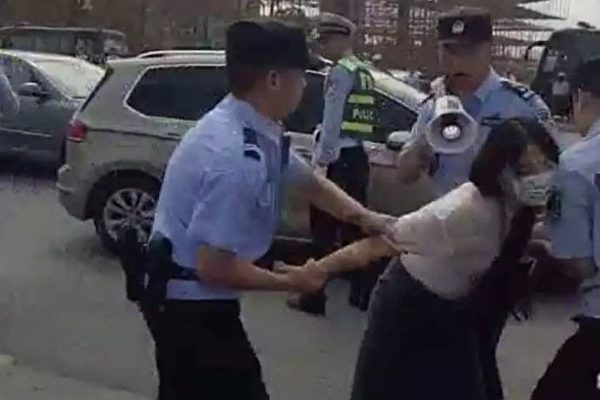

六安市部分学校教师近日集体讨薪，却遭到警方殴打。（微博截图）

作者：袁斌

【大纪元2018年05月31日讯】日前的六安教师讨薪事件中，认证为中国警察网安徽站官方微博的“中警安徽”发布一张“黑锅”照片后不到3个小时，不仅阅读高达128万，转发3,773，评论2,027条，而且这些资料还在快速增长。

这口“黑锅”为何迅速成了刷屏的网红？

事情还得从头说起。

5月27日，安徽六安市数十名中学教师，不满校方拒发绩效工资，喊著“尊师重教，同工同酬”的口号，游行到当地市政府请愿，结果政府不但置之不理，还以非法示威之名派警察予以镇压。

由教师上传到微信朋友圈的现场视频显示，游行讨薪的教师遭到警察、特警殴打。一名女教师和男教师在被公安追打后，又被戴上手铐，强行推上警车。女教师受伤倒地后，送医院抢救。有教师称，执法人员指教师们“非法游行集会”，更扬言“你们老师们大不了罢课，不要上课”。相关视频和图片上传网路后，被大量转发，网友们纷纷声讨殴打老师的警察。

一位名叫柠檬的网民写到：“根据现场视频，警察涉嫌野蛮粗暴执法，对未妨碍执法的女老师使用暴力手段，以恶劣态度阻拦现场人员拍摄执法过程，网宣部门存在封锁舆情、严禁本地媒体报导，禁止网路传播等情况。”另一位网民写到：“看看那个警察狠狠扑向女老师，我只能说穷凶极恶来描述他。干老师这一行真是觉得苦，苦不是因为学生越来越难教，而是你付出那么多却得不到应有的尊重。说好的太阳底下最光辉的职业呢？今天你们拷上的是老师的手，阻挡的却是民族的未来。”

众怒难平之下，六安市公安局急忙在官方微博上发布‘关于六安教师维权处警情况的通报’，称部分教师“聚集滞留，不听劝阻，严重扰乱公共秩序，公安机关依法将违法人员带离现场”。公安局在为自身行为辩护后又称，如警察有殴打教师的行为，诚恳欢迎当事人举报。公安局的这番态度更激起网民的不满。

针对教师讨薪挨打一事，六安市政府27日晚发布新闻公告，否认政府拖欠教师工资，同时承认警方“执法方式简单粗暴”。紧接这之后，“中警安徽”便发布了那张“黑锅”照片。

显而易见，在这个特定的时候，作为六安警方上级部门官方微博的“中警安徽”发布这么一张照片，明摆着是在替镇压讨薪教师的六安警察鸣不平，暗示他们“将违法人员带离现场”明明是执行当地政府的旨意，现在政府却称其“执法方式简单粗暴”，明摆着是在把责任推给为他们充当打手的警察。

看到这一幕，吃瓜群众一下乐了！

警方暗怼政府，这样的事之前毕竟还没有过，而在网民眼里，这两个其实没一个是好东西，不过他们彼此之间闹将起来倒是蛮有“观赏价值”的。我想，这大概就是那口“黑锅”能一举走红的缘故吧。

不过六安教师讨薪事件的意义并不在此，而在于尊师重教本是中国的传统美德，中共政府口口声声尊重教师，但是竟然有教师却因为被长期欠薪，不得不像农民工一样走上街去讨薪，政府不但不为此承担责任，解决问题，反而派出警力动粗，引发舆情后又让警方充当替罪羊，这算是哪门子的“人民政府”。再者，堂堂“人民教师”被警察暴打又拷上手铐，不要说作为为人师表者的尊严，就是作为一个人的尊严都没了。试问，这是国家的悲哀民族的悲哀，还是教师的悲哀教育的悲哀？#

责任编辑：南风

<a href=#top><h6 align="right">回上方</h6></a>

<a name=66>
<h1 align="center"><b>川普与邪恶对手的谈判策略</b></h1>

作者：夏林

【大纪元2018年05月31日讯】看过川普写的 “交易的艺术” 一书，深为他不落俗套，不按常理出牌，掌握主动的谈判艺术所折服。最钦佩的是，他对对手的了解和他对问题的直觉。其实谈判的成败，对对手了解和自己的直觉很关键，真正能做到这两点的人是很少的，所以几位前任美国总统才谈了很糟糕的协议，姑息邪恶。

川普经商时，在做一件比较棘手的决定时，经常会征求很多人的意见，但最后以自己的直觉来决定对这件事情的处理。他刚入主白宫时任用了一批幕僚，也经常听取他们的意见，但后来发现幕僚们的意见还是不准确，就决定以自己的直觉为准。比如与朝鲜金正恩直接谈判这件事，是美国前任总统们从来没做过的，但川普在韩国代表来到白宫转达了金正恩的请求时，他四十五分钟之内就做出了亲自与他谈判的决定。当时国际上觉得很突然，消化不了，现在看来，这个决定实在是太对了。对朝鲜永久放弃核武和世界和平都大有好处。

川普对邪恶国家的谈判术还有一点，就是对流氓无赖毫不留情，加倍反击，让对手越来越狼狈，最后不得不让步。在他刚刚上任总统时，金正恩动不动就来个导弹发射，把西方领导人和美国的左派媒体和精英吓得够呛，他们一再叫川普不要激怒金正恩，深怕导弹明天就炸到家门口。但川普却在金正恩家门口大搞美韩军事演习，又从外交上孤立他，经济上制裁他，还要金正恩尝尝美国的 “火与怒”。川普之怒，倒是真让金正恩老实了，竟然想与川普坐下来谈判了。

今年5月中的时候，金正恩对美国突然谩骂攻击，还威胁要取消川金会，又开始耍流氓了。而川普的反击也很快，直接给他写了一封公开信，取消会面，准备加大制裁，吓得金正恩赶快服软，改口说还是要见川普，还大大地把川普表扬了一番。这一切的发生，真令人惊叹川普策略的奇妙准确。

川普对付邪恶国家的谈判策略还有一个特点，就是坚持原则，不理会盟友的哀求或施压。他整治另一个邪恶国家–伊朗，就是一个很好的例子。伊朗2015年与美国及多个西方国家签订了一个不发展军事核武的条约以解除西方对它的制裁，但暗地里却发展核武器，而且被以色列以偷运出来的大量文件证实。

川普一再指责这个帮助伊朗咸鱼翻身的协议，但其他西方国家元首却一个接一个地跑来白宫见他，要他别撕毁协议，先凑合着用。但川普在他们一离开白宫，就立刻宣布退出伊朗核协议。他警告伊朗，要不就重新谈判一个真正能放弃核武的条约，要不就重重制裁。川普深知，西方的姑息妥协和软弱，已经将邪恶国家养得很大，如果再不及时阻止，就会失去宝贵的时间，再也没机会制止这些邪恶。

而川普对另一个邪恶国家，叙利亚的谈判，那就是炸弹。去年他突然发射59枚导弹惩罚叙利亚当局用化学武器杀害自己的平民，让全世界大吃一惊，不可一世的叙利亚和背后支持它的俄国着实老实了一阵子。今年叙利亚又使用化学武器杀害平民，他不仅又投下双倍的导弹，而且法国和英国的军队也一起加入了这场战斗。川普在与邪恶国家的较量中，不仅重挫对手，还争取了更多的盟友加入战团，这是邪恶国家一年前万万没想到的，也可以看出川普对付邪恶的高超智慧。

责任编辑：滕冬育

<a href=#top><h6 align="right">回上方</h6></a>

<a name=65>
<h1 align="center"><b>川普开始新行动 美国务卿释重磅信号</b></h1>

美国国务卿蓬佩奥（Mike Pompeo）在国务院新闻发布会上说，“宗教自由流淌在美国人的血液中。正如前总统詹姆斯‧麦迪逊（James Madison）所写的‘良心是所有财产中最为神圣的’。”

作者：周晓辉

【大纪元2018年05月31日讯】美国当地时间5月29日一天，就发生了三件值得中国人注意的事情。一是白宫发表声明，称川普（特朗普）政府6月15日前将公布500亿中国商品加征25%关税的最终清单，继续推行对华贸易行动，而此举距离美中双方公布联合声明、暂缓贸易战只过去10天。

二是白宫发表了川普反制中共不公平贸易行为的摘要文件，内容包括“中共行之有年的不公平贸易行为”、“损害美国的创新和工作”、“反制中共的不公平贸易行为”，以及“保护美国的创新和创造力”等四大部分。

三是美国国务院发布了2017年度《国际宗教自由报告》，中国再次被列为“特别关注国”。报告中亦关注了法轮功、基督教等信仰团体受迫害的情况。同日，美国国务卿蓬佩奥在国务院新闻发布会上表示，“宗教自由流淌在美国人的血液中。正如前总统詹姆斯‧麦迪逊（James Madison）所写的‘良心是所有财产中最为神圣的’。”“促进宗教自由，是川普政府的优先事项。”

据悉，今年7月25日和26日，美国国务院将首次主办外交部长级会议以推进宗教自由。对此，蓬佩奥认为：“这个会议将让我们有机会开创新局面，而不是简单的小组讨论。美国不会对侵犯国际宗教自由问题袖手旁观。”

如果说前两件事表明了川普政府将在美中贸易上继续对北京施压的政策走向的话，那么蓬佩奥鲜明的表态，则表明美国将在促进国际宗教自由方面有所作为，不会再延续前几届美国政府“袖手旁观”的态度。而这样的表态与4月美国对华援助协会主席傅希秋在会见美国国家安全委员会高级官员时所听到的信息是一致的。彼时，傅希秋在接受美国之音记者采访时说：“我听到很明确的信息，那就是美国政府下一步会有更大的动作，至少会改变之前软弱的状况。川普政府会对中国人权恶化的情况，做出非常大的反应，新任的国家安全顾问约翰·博尔顿已经表示，中国对人权和宗教自由的迫害，将是他的一个重要议题。”

这个博尔顿曾在2012年在美国马里兰州共和党的一个竞选活动上表示：“中国大陆法轮功学员被活摘器官是非常严重和关键的议题，美国需直面这一议题，采取强硬的立场，捍卫和坚守美国的基本价值观。”“如果美国坚守自己的价值原则，会令北京当局更加尊敬我们。”

众所周知，近20年来，中国人权状况持续恶化，不仅大量法轮功学员被非法关押、酷刑折磨、迫害致死，甚至被强摘器官，而且地下基督徒、新疆维吾尔少数民族、藏族、异议人士、维权律师等都不同程度地遭受迫害，其中当以中共对法轮功的迫害最为严重，最为广泛，最为持久。对于中共的恶行，包括美国政府在内的世界各国政府都了然于胸，但基于利益等的考量，在过去十多年中，各国政府多保持沉默，即便偶有提及，也多是在私下进行或力度不够，这自然也让西方民主国家所一向倡导的人权理念黯然失色。

在竞选时就对中共有着清晰认识的川普就任总统后，除了在对中共的贸易等问题上采取了不同往届总统的所为外，在人权领域同样趋于强硬。

去年4月初，川普与习近平去年会晤时，曾涉及人权议题，而双方应无法回避的应包括强摘器官问题，尽管在会晤后双方公布的内容中并无此类信息。

4月22日，川普即致信国会，承诺将大力支持旨在打击全球人权侵犯者的《全球马格尼茨基人权问责法案》，并表示本届政府正在积极确认人权侵犯者，正在搜集相关证据以进行追责后的首次出手。

随即在4月26日，美国国际宗教自由委员会（USCIRF）发布了2017年度最新报告，中国再次被列入宗教自由侵犯的特别关注国。在《中国》章节中，明确指出2016年中共继续打压维吾尔穆斯林、藏传佛教徒、天主教和法轮功学员等信仰人士，以及人权律师和其他捍卫人权的人士，如江天勇律师等。

而在“法轮功”小标题下，报告继2016年的年度报告后，再次明确提出法轮功学员被强摘器官的问题。报告指中共自1999年镇压法轮功后，法轮功学员被粗暴虐待。他们经常被关进劳教所或监狱中，或被集体失踪。在被关押期间，法轮功学员还遭受精神病或其它医学实验、性侵犯、酷刑折磨以及被强摘器官。

很快在2017年12月21日，川普就发布了行政令，列出了全球13名严重人权侵犯者和腐败者，其中现任北京警察学院党委书记、原北京市公安局分局局长高岩，因迫害并致死人权活动人士曹顺利，而名列其中。这些被列入名单之人在美国管辖范围内的所有资产将被冻结，美国人将被禁止跟他们做生意；除此而外，他们还被取消其领取美国签证的资格，撤销已有美国签证。

如今，受川普信任的蓬佩奥公开向世界传递“促进宗教自由，是川普政府的优先事项”，“美国不会对侵犯国际宗教自由问题袖手旁观”的重磅信号，显然不同寻常，标志着自此美国政府将会就宗教迫害问题，针对中共采取相应的行动，而这个行动是“开创新局面的”。采取强硬的立场，捍卫和坚守美国的基本价值观，这正是川普政府转变的走向。而这一走向将使美国再度伟大，并将继续得到神的护佑。

至于本已在贸易问题上被川普搞的焦头烂额的北京，对于川普政府的新行动，将如何回应呢？外交部发言人还会面不改色地予以抨击吗？北京又多了件忧心事。

责任编辑：莆山

<a href=#top><h6 align="right">回上方</h6></a>

<a name=64>
<h1 align="center"><b>吉林官员落马 主政地曾有事件震惊中外</b></h1>

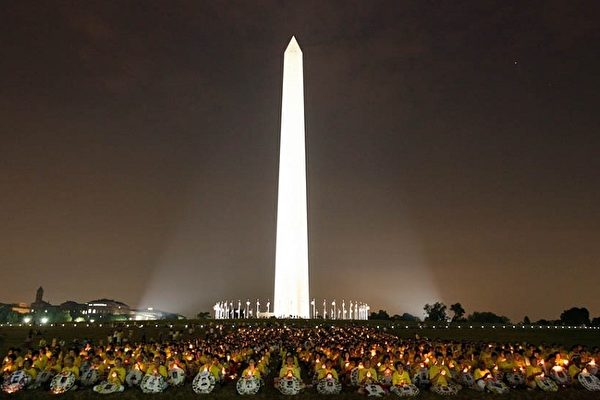

中国大陆参与真相电视插播的法轮功学员们以生命和勇气，化作一道道穿越心灵的电波。（大纪元）

作者：陈思敏

【大纪元2018年05月31日讯】5月29日据官方消息，吉林长春高新技术产业开发区原党工委书记刘泽臣被查，而且是退休8年后被查。

刘泽臣履历显示，2005年至2010年任职于长春高新技术产业开发区。据官方介绍，1991年获批建立的长春高新区是吉林省第一个开发区和第一个国家级开发区，1995年6月25日，时任中共党魁江泽民亲临长春高新区视察并题字。

据2013年期间网上流传给时任中纪委书记王岐山等人的一份举报材料显示，长春高新区2003年至2010年七年来，非法征用三村土地，致三千多公顷农田成撂荒地，涉及官商勾结，侵吞村民集体财产，挪用征地补偿费等腐败。在这份检举信中，刘泽臣与另外8名官员被控以权谋私。

如今退休8年难逃落马的刘泽臣，出事原因目前未知是否与5年前举报有关，假设有关，那么被具体点名的刘泽臣等9人，充其量只算事件中的蝇官及冰山一角。后续值得观察刘案如果引发窝案，或许将会牵连到省市现任官员。

其实刘泽臣最引人注目的履历，应该是长春高新区之前的一笔，即2003年至2005年10月任长春市宽城区委书记。而长春市宽城区这个地方，曾是距今16年前震惊中外的真相插播事件的起点。

在刘泽臣入主长春宽城区前一年，2002年3月5日，吉林省长春市有线电视网路的多个频道同时插播《法轮大法弘传世界》、《是自焚还是骗局》等法轮功真相电视片，事件震惊国内外，时值中共人大会议期间，据明慧网报导，江泽民次日（2002年3月6日）急令沈阳军区二级战备，其中长春军分区和吉林省武警总队进入一级战备状态，长春市公安局警力全部出动，由于主要插播的法轮功学员集散及相关器材位于宽城区，长春市610主管亲自坐镇宽城分局布署全城大搜捕。

从明慧网报导可知，真相插播事件次年后，长春市及宽城当局从上到下高压迫害仍持续一段长时间。即便是中共喉舌新华网也有被指侧面印证的报导：2004年4月29日，宽城区公安分局刑警大队长孙立东死于“脑干血栓导致脑出血”，新华网称，孙立东是由于长期超负荷工作，“累死在工作岗位上的”。实际孙立东正是执行江泽民抓捕行动的一线指挥。

而在刘泽臣主政宽城区的期间，有一个迫害案例包含两条人命──王守慧、刘博扬母子，王守慧是长春市宋家办事处正科级干部，刘博扬毕业于吉林省医科大学是长春市前卫医院医生，2005年10月母子二人被宽城公安抓捕后，儿子刘博扬于当晚被迫害致死，14天后，母亲王守慧也被迫害致死。刘泽臣时任宽城区一把手，对期间内发生的迫害在行政上也是第一负责人。

在长春真相插播事件之后，江泽民于当年4月起曾多次出访，而他所到之处不论是德国、冰岛，还是美国，还因为害怕见到法轮功学员经常穿着的黄衣服或蓝衣服，而希望地主国警方配合将这两种颜色隔绝在他的视线之外。所以下台之前的江泽民，除了在长春真相插播的影片中，他还在自己出访行程中亲眼目睹法轮大法弘传世界。

外界评价这为中国民众知情权的长春真相插播事件，发生时值江泽民执政末期，濒临下台的他会不惜动用军队武警，显示其残暴本性，也暴露其内心恐惧，就如十八大之前海外媒体曾头条报导“江泽民终生后悔镇压法轮功”。

责任编辑：高义

<a href=#top><h6 align="right">回上方</h6></a>

<a name=63>
<h1 align="center"><b>美国老兵是赢家 大陆老兵是什么？</b></h1>

美国总统川普2017年8月3日公布采取新措施改善退伍军人待遇，为退伍军人提供更多（方便）医疗服务。(Samira Bouaou/The Epoch Times)

作者：程晓容

【大纪元2018年05月30日讯】5月27日，白宫发表文章说，美国老兵是今年国殇日的赢家。此话怎讲？

原来，川普总统预计在未来几天内，签署已经在众议院和参议院获得通过的《退役军人事务部任务法案》，以确保退役军人能够获得及时高效的医疗服务和生活上的帮助。

白宫在文中提到，“阵亡将士纪念日”提醒人们，应该思考如何使“我们”的现役军人和退伍军人过上更优质的生活。

美国官方的动作，实实在在地体现出政府对广大军人的关怀，也是川普总统在继续兑现承诺。这不禁令人产生联想——在中国大陆，退役军人群体的境况如何？

去年5月26日，高智晟律师收到一份老兵的上访材料。92岁的刘忠才，山西吕梁地区临县八堡乡元条堎村人，1946年加入中共彭德怀的野战军，出生入死10年后，1956年拖着一条瘸腿回到老家。

回到家，刘忠才发现，比他早几年参军的二哥刘忠亮音信全无。他们向上级部门打听情况，哪级政府都不管。他说：“没人理我们，到离石市民政局大门从来连进都不让进，一个大活人跟了共产党就这么没了，可能是为革命牺牲了吧！”

刘忠才老人反映说，为了生活待遇问题，“最近三年我们快跑断了腿，多次找过县里和乡政府都不管。退伍证件上有彭德怀的签名，有中华人民共和国国防部盖的公图（公章）他们不认，说国防部的事他们管不了。”县民政局的领导有时说，因为彭德怀死了，有时又说找不到档案。后来，民政局让老人的儿子找信访办，信访办让找政务大厅，找到了政务大厅就没有下文了。

6月24日，高智晟收到刘忠才家人的消息说，山西临县民政局陈局长代表官方表态，提出了解决方案：愿意一次性给刘忠才200元左右的补偿。刘忠才一家没有接受。

高律师写道：“这是怎样的一种黑色幽默。……200元钱，值不低贪官们的两根香烟价，牺牲了一个年轻的生命（刘的二哥刘忠亮），刘忠才本人一条腿残疾，交涉了这么些年得了的结果。”

刘忠才为什么跟着共产党走？他说：“只记得听说这次打江山和以前不一样，是完全彻底为了穷人的，搭上性命也划算的。”

无耻的谎言，欺骗了多少中国人。当年，中共打出为劳苦大众打天下的口号，诱使农民、工人、知识分子等各个阶层为其卖命。而中共在过去68年里所做的，都是整人、害人的勾当。运动来时，想整谁就整谁，绝不手软。对于那些为它打下江山的人，随心所欲地玩弄和利用。给你戴朵“光荣花”，或发个盖着公章的证件，到了关键时候，翻脸不认账，哪管你的死活。

近年来，大陆各地退役军人、转业军人集体维权事件频繁发生。他们表示，希望上级解决安置和待遇问题，希望老有所养，老有所依。迄今，军人的请愿活动不见收效，当地政府依然推诿敷衍，进京上访也时常遭到阻截。

大批老兵要温饱，要生存，有人甚至因贫困无依自杀惨死。与之形成强烈反差的，却是中共各级官员的巨贪巨腐。刘忠才的家乡即盛产贪官，亿元的受贿金额并不稀奇，而贫苦百姓需要跑断腿，才可能领到200块钱的“恩赐”。

再看军老虎的龌龊。据香港媒体披露，两个落马的前军委副主席郭伯雄、徐才厚，二人共同开设小金库，存款792亿元。郭的赃物清单包括各类不记名债券1520万元，黄金、金币7500克，住宅、商场62套（幢）……英国媒体报导，调查人员在查抄徐才厚的家时，发现超过一吨重的现金，还有古玩字画、宝石金银，最后动用了12辆卡车运走赃款赃物。

事实表明，“塌方式”腐败并不限于一地。从上到下，中共官场已彻底溃烂。贪官们侵吞了本应用于国家建设的纳税人的血汗钱，霸占了亿万民众的养老金、安置费、福利善款。中共以谎言起家，以暴力“维稳”，只要这个滋生邪恶的“党”横行当道，人民永远不会是赢家。

责任编辑：高义

<a href=#top><h6 align="right">回上方</h6></a>

<a name=62>
<h1 align="center"><b>让历史告诉未来！</b></h1>

作者：莲子

【大纪元2018年05月30日讯】 
六四屠城， 
是中华民族心中永远的痛。 
每当这一天来临， 
心总是被黑暗笼罩着， 
只有深深的痛…… 
转瞬间二十九载逝去， 
年轻的孩子们几乎不知“六四”为何物？ 
这一段屈辱却让五十岁以上的人们刻骨铭心、永世难忘。 
那个下令屠城的人也许正在十八层地狱中偿还他造下的无尽罪业， 
助纣为虐的帮凶有的还在世上苟活着， 
据说那个踏着六四学生鲜血上任的魁首离任时曾经留话： 
不准给“六四”和“法轮功”平反！ 
还曾经异想天开去求地藏菩萨保佑， 
杀了那么多的人罪该千刀万剐、十恶不赦！ 
无耻和流氓总是连在一起！ 
随着岁月的流逝， 
屠城的真相正在大量披露， 
刽子手们的恶劣行径早已被苍天记录在案， 
谁能躲的过去呢？ 
俗话说：“为人莫作亏心事，不怕半夜鬼叫门。” 
今日共匪们遭报的例子还少吗？ 
“六四血案”是历史给人类留下的一份犯罪记录， 
也是当代历史发生的一起千古奇冤！ 
“六四真相”和“法轮功真相”正在大白于天下， 
对中共邪灵的大审判不是早已开始了吗？ 
那些坏人不是一个个正在落网了吗？ 
“善恶到头终有报，只争来早与来迟。” 
“天网恢恢，疏而不漏！” 
人间的一切都有它历史的渊源和必定的归宿。 
记住历史， 
并让历史告诉未来！

责任编辑：任慧夫

<a href=#top><h6 align="right">回上方</h6></a>

<a name=61>
<h1 align="center"><b>民族伤痛～六四感怀</b></h1>

作者：理悟

【大纪元2018年05月30日讯】

负重民族步履艰，心压石头苦不堪。 
步步泣血又六四，二十九载未伸冤。 
是谁枪口对人民？坦克隆隆身上碾？ 
百国百态人为本，唯有中共禽兽般。 
争权夺势保党命，屠杀人民不眨眼。 
人权法制如粪土，土匪流氓下三滥。 
一夜屠城惊天地，血流成河染天安。 
犯下不赦滔天罪，血债累累如何还？ 
两手鲜血不知悔，打压佛法更凶残。 
酷刑活摘夺人命，至今未停造奇冤。 
民族伤痛无药医，历史疤痕修复难。 
百年红魔百年祸，不除红魔祸不断。 
别想中共能变好，换头换脸性不变。 
天灭中共天意定，人神共愤清撒旦。 
谁对邪党抱希望，与魔共舞伴狼眠。 
唯有三退顺天理，不陪邪党葬无间。

责任编辑：任慧夫

<a href=#top><h6 align="right">回上方</h6></a>

<a name=60>
<h1 align="center"><b>明真相</b></h1>

作者：归航

【大纪元2018年05月30日讯】 
你也瞅，他也瞅， 
真相展板墙上有， 
观罢解迷忧。

东家走，西家走， 
画册九评送到手， 
三退离虎口！

责任编辑：任慧夫

<a href=#top><h6 align="right">回上方</h6></a>

<a name=59>
<h1 align="center"><b>解毛泽东思想</b></h1>

作者：云鹤天

【大纪元2018年05月30日讯】 
毛泽东思想 
地痞耍流氓 
毛泽东思想 
自称伟正光 
毛泽东思想 
洗脑大染缸 
毛泽东思想 
穷人被捆绑 
毛泽东思想 
富人迸脑浆 
毛泽东思想 
谎话天天讲 
毛泽东思想 
亩产万斤粮 
毛泽东思想 
惊世大饥荒 
毛泽东思想 
饿殍遍野躺 
毛泽东思想 
道德大沦丧 
毛泽东思想 
谤神毁庙堂 
毛泽东思想 
打老子骂娘 
毛泽东思想 
逼良为妓娼 
毛泽东思想 
纵欲毒赌黄 
毛泽东思想 
儿媳抱上床 
毛泽东思想 
人人互提防 
毛泽东思想 
卖国缩域疆 
毛泽东思想 
烧杀打砸抢 
毛泽东思想 
害人一毒疮 
毛泽东思想 
国殇民族殇

责任编辑：高义

<a href=#top><h6 align="right">回上方</h6></a>

<a name=58>
<h1 align="center"><b>不应忘却——写在美国国殇日</b></h1>

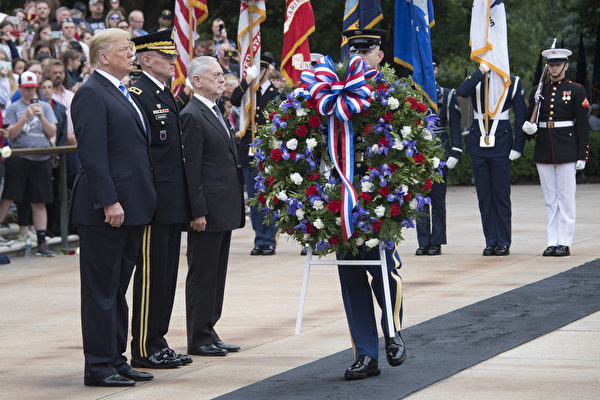

2018年5月28日，川普总统在国防部长马蒂斯和参谋长联席会议主席邓福德的陪同下，参加在阿灵顿国家公墓举办的纪念活动。（JIM WATSON / AFP PHOTO）

作者：高天韵

【大纪元2018年05月29日讯】在阿灵顿国家公墓，有一座无名战士墓。这里埋葬了在第一次、第二次世界大战、朝鲜战争及越南战争中牺牲的美国士兵的遗体。卫兵一天24小时，一年365天在墓前守卫。

5月28日，川普总统向无名战士墓献花，并发表讲话。这是美国“阵亡将士纪念日”的纪念活动之一。

川普说，“他们战斗、流血、倒下，确保美国永远安全、强大、自由。在那块墓地上的每一个标记——墓碑上铭刻的每一个名字——教会我们忠诚、自豪、勇敢、正义和真诚的意义。”

“他们有着各自的姓名，各自的故事，还有美丽的梦想。他们都是上帝派来的天使，他们拥有共同的称号——英雄。”“我们永远无法替代他们。我们永远无法补偿他们。但是我们可以永远铭记。”

这一天，是美国的公共假日。美国政府部门下半旗哀悼，白宫纪念委员会号召全体国人在美东下午3点暂停一切活动，默哀一分钟。很多公司和民众会悬挂国旗，以表心意。

勿忘自由的珍贵。当人们注视星条旗，轻轻地把花束放在墓前，当千万同胞一起低首静默，感念付出时，庄严肃穆的气息在流动，生命的尊严在绽放，伴着泪水和心痛。无数人的追忆、致敬，汇成温暖的浪潮，推动自由与勇气的列车。

一位网友对比说：“美国‘挖地三尺’也要找到在亚洲阵亡士兵的遗骸，就是为了兑现‘让每个人回家’这句承诺。……大陆的缅甸远征军几万将士，遗骸已经在异国他乡烂光了。”

我们可有相似的纪念日？可有一处美丽宁静的陵园，让英雄长眠？

这一个来自中国的故事，你是否知道？

2002年3月5日晚8时左右，吉林省法轮功学员在长春市有线电视网路的八个频道成功插播了《法轮大法弘传世界》、《是自焚还是骗局》等电视片，时间长达四、五十分钟，近百万民众看到了这些节目，获悉真相。几名普通的百姓，居然突破了中共强大的新闻封锁，此事震惊中外。路透社称之为“法轮功最为大胆无畏的行动之一”。

插播发生不到一个小时后，中共即开始大搜捕，至少有7名直接或间接参与插播的法轮功学员在被抓捕和审讯的过程中被活活打死，另有15人被非法判刑4年到20年。其中，梁振兴、刘成军和雷明先后在监狱的残酷迫害下离世。

2007年9月5日，在澳洲，亚太人权基金会2007年度人权奖授予刘成军“丹心汗青奖”。基金会认为，刘成军烈士作为20世纪中华民族的人权卫士，英名将常留青史。

然而，在自己的祖国，他们没有得到鲜花或是隆重的葬礼。刘成军、梁振兴、雷明等法轮功学员，忍受了酷刑、枪伤、电击、毒打，在去世时的身份是一名囚犯。

怎能淡忘，在那片曾经富饶灵动、却蒙受巨大苦难的土地上，在不见硝烟的红墙禁区内，许多无名的勇士，为了信念和正义献身，前仆后继。他们燃烧生命，撕开暴政的铁幕，冲破谎言的铁丝网。他们，理应获得最庄重的墓志铭。

多少美丽的生命，被暴虐抹去；多少真实的历史，被假象湮没。多少壮烈的奉献，被漠视甚至亵渎。民族的记忆，必须由真相重建。高贵的墓碑，必将为真正的英雄树立。

一个特殊的日子，在提醒人们，思考生命的意义、自由的价值、记忆的重量。#

责任编辑：高义

<a href=#top><h6 align="right">回上方</h6></a>

<a name=57>
<h1 align="center"><b>被医院弃疗的残疾儿何以重获新生？</b></h1>

残疾孙子重获新生的神奇经历。（明慧网）

作者：千百度

【大纪元2018年05月29日讯】这是一位大陆大法弟子在明慧网上讲述的他的残疾孙子重获新生的神奇经历。

这个孩子出生时不吃不喝，光睡觉。问医生，医生回答说是正常的。第二天，大法弟子发现孩子没有听力，要求医生作检查。检查结果让全家大吃一惊！结论是：新生儿溶血症。造成的原因是孩子母亲是R阴性O型血，而父亲是A型血，因为出生时没有作新生儿体检，耽误了一天一夜，已经造成严重脑瘫和足弓反张。医院表示无力治疗。

他们又到重庆医大复检，结论是该患儿已无法医治，医院建议他们放弃治疗。这就意味着他们即将眼睁睁看着孩子在痛苦中死去。

大法弟子不同意，因为他修大法，知道生命的宝贵，而且放弃就等于杀生，是绝对不行的。家人在他的劝导下把孩子留下来了。

他想孩子来到大法弟子家不是偶然的。他带着残疾也要来，就是要来得大法！从孙子出生起就大法弟子每天精心照料他，他不承认他聋，孙子睡觉时，他就在他耳边念“法轮大法好，真善忍好”九个字。每天放大法师父讲法录音给他听。大法弟子学法时也读出声，他相信孙子会听见。时间一长，他发现孙子听力恢复了，还开始牙牙学语。大法弟子就一个字一个字教他念“法轮大法好，真善忍好”，教他唱大法弟子创作的歌曲、儿歌。

如今，这个当年被权威医院放弃治疗的残疾儿已成长为一个心智正常的三年级小学生，心地善良和信师信法的小弟子，能和大法弟子一起诵读大法书。

大法弟子由衷的地说：“感谢师尊洪恩浩荡！这些都缘于师尊的慈悲！大法的神迹！”#

责任编辑：南风

<a href=#top><h6 align="right">回上方</h6></a>

<a name=56>
<h1 align="center"><b>欧盟国家也有“临时工”</b></h1>

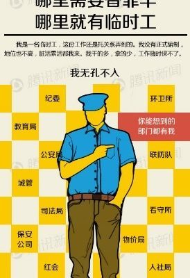

在中国大陆，临时工无处不在，成为党政企事业单位领导的“替罪羊”。（网络截图）

作者：颜丹

【大纪元2018年05月29日讯】近日，大陆多家媒体都在跟风转载《欧盟国家临时工2700万 近半年轻员工是临时工》一文。常言道，“说者无心、听者有意”。我们且不理会，官媒带头在中国晒欧盟的临时工人数到底是有心还是无意；相比之下，更重要的是，看到这篇报导的中国人似乎都已心领神会了。

排在头条的评论称，“这下可以理直气壮的甩锅了”。这话应该附加一个主语，那就是“行政机关、事业单位”的领导及相关负责人。只要发生了影响恶劣的公共事件，领导的解决方式就是甩锅、让临时工背锅。就连百度百科也不得不给中国的“临时工”附上第三层涵义，即“每次事故的替罪羔羊”。

多年前有文章指出，“三鹿事件里挤奶的是临时工，央视大火里搬运烟花的是临时工，上海静安大火里的电焊工是临时工，最近的江西发飙女警，官方也说她是临时工”；“40名保安，他们在合力打死一名少年之后，马上就被昆明方面宣布为临时工”。然而，一出事就找“临时工”，大、小官员们虽用的极为顺手，却并不合法。

中国的《侵权责任法》第34条规定，“用人单位的工作人员因执行工作任务造成他人损害的，由用人单位承担侵权责任”。《行政处罚法》第19条也明确指出，“临时工……不能成为独立承担行政执法过程中，造成损害的担责主体”。尽管法律条文在此，但对于众多官员的这种公然违法行为，无论是纪检部门，还是司法部门，都未曾给出清楚、明确的处理或判决结果。

因此，中国仍然有“临时工”继续在各类公共事件中扮演着“背锅侠”的角色。显然，这种“背锅侠”在欧盟2700万临时工当中，恐怕是找不出来。因为人家临时工也好，正式工也罢，都是按劳取酬的雇员，也都受到劳动法的保护，二者之间没有本质差别。值得一提的是，中国在1995年实施的《劳动法》中也曾规定，（雇员）无“临时工”、“正式工”之分，只有合同期限长短之别。

那么，中国的用人单位在实际操作中，为何要执意造出一个各方面待遇都与正式工形成天壤之别的“临时工”群体呢？这话还得从有“编制”的“行政机关、事业单位”说起。

早在2013年，就有陆媒发文称，“在双轨制的用人模式中，编内人员捧著‘铁饭碗’，享受高福利，编外人员干着苦活累活却只能拿很低的工资”；“占着位置不干活的人多了，在编制有限的情况下，一些单位就只能聘请‘临时工’了”；“与政府部门‘临时工’泛滥相对应的，是各地公职人员‘吃空饷’现象的大量存在”。

不难看出，中国之所以会出现这种只能被当作“替罪羊”和“苦力”来使唤的临时工，就是因为特权当道。在行政机关和事业单位，即便都是工作人员，也有编制内对编制外的压榨。受“编制”庇护，就是受中共独揽的权力庇护。

有专家指出，“如果权力都在老百姓的监督下运行，临时工的问题、吃空饷的问题，都不再是问题了”。但从现实状况来看，中国老百姓一无选票，二不能自由组党；在没有其它党派制衡，任由中共一党独大的情况下，又如何对权力进行监督呢？

既然中国的“临时工”所折射出的是体制问题，那么，体制完全不同的欧盟也就不可能出现这种有着相同内涵的“临时工”。实际上，欧盟统计局所统计的“临时工”，只是那些签订了临时合同的员工而已。

上述文章在援引欧盟统计局的数据时写道，“2700万人是临时合同，占欧盟员工总数的14.3%”；“欧盟国家中年轻人持有临时合同比例最高”；“2017年，近800万年轻员工中，近半（43.9%）为临时合同”。可见，在欧洲人看来，“临时”只表明“合同期限短”，而并不是指“地位低下、身份卑微”。正如中国人所调侃的，人家总统都是临时工。

此外，“临时合同”的关键词也不是“临时”，而是“合同”。意即，哪怕只做临时、短期的工作，也要与雇主签订正式的合同。请问，中国能做到的单位又有几家？在法制健全的国家，员工只要签了合同，就意味着薪资、待遇有所保障。一旦遭遇不公，就可凭借一己之力、寻求司法支援。

曾在《民主的细节》一书中看过美国哈佛大学的一名清洁工为自己讨回公道的真实案例。这名有着晕厥病史、某天晕倒在走廊沙发上的清洁工，被哈佛大学管理处以“上班睡觉”为由解雇了。当他出具了病历，却仍遭到解雇之后，便找到相应的工会组织来为自己维权。这位来自海地的民工一个电话就让美国这家工会向哈佛大学发出了抗议。在工会组织的示威游行中，不少哈佛的教授和学生也参与其中。

迫于压力，哈佛大学不得不坐下来与这名清洁工以及支援他的工会进行谈判。而结果就是，他10月之后恢复上班，过去4个月的工资以及医疗费用全由哈佛补偿。可见在美国，即便签的是临时合同，员工也能置身于法律的保护之下；即便是处在社会底层的清洁工，也不会被肆意沦为“刀俎下的鱼肉”。然而，这种弱势完胜强势的案例，却在如今的中国难得一见。

中国与欧盟，就算要比临时工，也不能仅在数量上进行较量。习惯在数据上造假的中共，要非说中国的临时工比欧盟少，大家也没辙。除此之外，中国的临时工就其特殊性而言，根本就无法与欧盟相提并论。别说临时工，就连正式员工的薪资、待遇、权益等各个方面，恐怕都无法跟人家欧美国家相较。

如今，中共要晒人家的临时工数量，那不就是自取其辱吗？最后招来的，也只能是中国生存状况堪忧的亿万劳工对中共的唾弃而已。

责任编辑：莆山

<a href=#top><h6 align="right">回上方</h6></a>

<a name=55>
<h1 align="center"><b>是谁在践踏宪法和法律的尊严？</b></h1>

作者：石铭

【大纪元2018年05月28日讯】据明慧网近日报导，二零一八年四月份有60名法轮功学员被非法判刑，其中在新疆打工的辽宁省葫芦岛市兴城市宋志刚被非法判十四年重刑。四月份，有64名法轮功学员被非法庭审，其中律师为30人做无罪辩护。二零一八年一至四月份被中共非法冤判的法轮功学员达269人，对法轮功学员非法庭审达225场。下面是明慧网报导的几个案例，从中我们得知中共公检法是如何践踏宪法和法律的尊严！

案例1：据明慧网二零一八年五月一日报导，在新疆打工的辽宁省葫芦岛市兴城市法轮功学员宋志刚，一个家庭中的孝子，社会中的好人，单位的劳模，丢失一个手机，招来十四年冤狱，日前被新疆阿克陶法院非法判十四年大刑，上诉期只有十天。

宋志刚在新疆打工，有一天无意间丢失了一部手机，被人拾到后，送到公安局，因手机中有与法轮功有关的内容，被听信了江泽民谎言的当地警方生出恶意，要加害宋志刚。于是二零一七年十月二十四日，宋志刚被新疆阿克陶县公安局绑架，之后被非法关押在阿克陶县看守所。

案例2：山东省济南市法轮功学员李维宗、李传宝被非法关押在淄博周村区看守所有一年多，二零一八年四月九日上午，在淄博周村区法院被非法开庭，两位律师为他们做了无罪辩护。

李维宗的辩护律师指出公诉人提供的证据没有法律依据，与李维宗没有关系，不符合法律要求，但被审判长郑泽利几次打断辩护。

律师说：“信仰自由、言论自由。李维棕信仰法轮功，传播法轮功无罪。”“起诉书指控李维棕触犯了刑法第三百条第一款之规定是荒谬的。李维棕无论从事实上还是法律上来看都是无罪的。李维棕已经被关了一年多了，应当立即释放。”

李传宝的律师在做无罪辩护时，讲到法轮大法好、法轮大法洪传世界、并举例在大陆有多地区的法院对法轮功学员做出无罪释放决定等内容时，几次被审判长郑泽利制止讲下去，对律师警告二次，最后训诫一次，欲将律师驱逐出法庭。

淄博周村区政法委、公安国保大队、六一零和章丘区610头目等人在审判庭旁另一房间通过视频参与了非法庭审全过程。当天开庭未宣判。

610头目等人多次要李维宗、李传宝认罪，并以此为借口说从轻处罚，被李维宗、李传宝拒绝。

案例3：二零一八年四月十一日，上海法轮功学员李红被上海徐汇区法院诬判三年六个月，李红当场说要上诉。律师说：李红无罪；李红没有破坏任何法律的实施，用刑法三百条起诉李红是错用法律；律师还说，如果错用刑法三百条判李红的话，那就是检察官和法官的滥用职权罪。

案例4：二零一八年四月十三日上午九点二十分，在河南许昌市榆林看守所，许昌魏都区法院审庭庭长郭燕（音）等人对法轮功学员冯建华女士非法开庭，北京律师为冯建华做了有理有据的无罪辩护，要求依法释放。

律师指出：法轮功宣传“真、善、忍”普世价值，福益家庭社会。《宪法》第35条规定公民有言论、出版、集会、结社、游行、示威的自由。《宪法》第36条规定公民有宗教信仰自由。公民拥有法轮功资料，和使用书刊、光碟、传单、标语等传播法轮功及其真相的行为是合法的。

律师从道德与良知的角度讲到，冯建华这些年来，只因修炼法轮功，受到这么多的不公处罚，但她仍然在按真、善、忍认认真真修炼，认认真真做好人。她不是我们的敌人。她送给别人法轮功资料，她的出发点是为别人好，叫人了解法轮功真相，从中受益，而不是为了伤害任何人。从道义良知上，希望法官公平公正的做出评判，无罪释放冯建华。

案例5：二零一八年四月二日，山东省平度市法院在平度市看守所非法庭审法轮功学员高亨柏。高亨柏的大姐和律师一起为高亨柏做了有理有据的无罪辩护，要求无条件释放高亨柏。

高亨柏为自己做了无罪辩护，坚称：“我与人分享法轮功好，是让人明白法轮功真相得福报。”“我没有犯罪，应该无罪释放我回家。”

二零一六年夏季的一天，高亨柏对面邻居家液化气管老化，着火了。邻居一家都慌了，怕液化气罐爆炸，吓得全都跑到街上，望着刚刚盖好装修好的新房，绝望的不知如何是好。

正在家睡觉的高亨柏听到邻居的哭喊，忙跑出来，一看情况危急，马上回家顺手拿起女儿的被子，蘸满水，冲进邻居家的厨房，迅即用被子扑灭熊熊火焰，避免了一场大损失。

案例6：二零一八年四月十九日上午九点五十五分，南京广播学院副教授、法轮功学员李奕哲，遭江苏省南京市江甯区法院非法庭审。

面对公诉人的指控，他有理有据的一一予以驳斥，李奕哲说：“国家没有任何一部法律文书规定法轮功是×教，而且宪法第36条明文规定公民有信仰自由，所以你们给我定罪的立意就是错的。我并没有破坏任何一部法律的实施，我没罪。”当公诉人和法官诬陷法轮功为×教时，李奕哲两次强调法轮功不是×教，法轮功是让人以真、善、忍为标准做好人的高德大法。

案例7：二零一八年四月九日，在荔湾区法院非法庭审广州市白云区法轮功学员、原广州大学副教授王家芳。王家芳二零一七年十月二十七日在越秀区流花湖公园东北门，被六榕派出所员警绑架、构陷，非法关押在越秀区看守所。

法庭上，法院指派了法律援助律师。法律援助的女律师认为：目前并没有哪条法律认定法轮功非法；王家芳没有破坏哪条法律的实施，也没有哪条法律因为她而不能实施；王家芳的行为也没有任何社会危害性。因此，王家芳是无罪的。

王家芳女士，今年五十四岁，湖北襄樊人，华中师范大学数学系硕士，原广州大学数学系副教授。王家芳的儿子小时候患有先天性心肌类疾病，多方求医无法医治，听说修炼法轮功可以治好，从此开始修炼法轮功，她儿子得到奇迹般康复。

自一九九九年七月中共迫害法轮功以来，王家芳老师因坚定信仰真善忍被非法关押于广州洗脑班、三水洗脑班、槎头劳教所（二年）、广州白云区看守所、广东省女子监狱（九年）等，多次被迫害得生命垂危，冤狱累计逾十二载。

通过上述案例我们清楚的得知，究竟是谁在犯罪？谁在枉法判决？谁在践踏宪法和法律的尊严？不是一目了然了吗？中共这个目无天法、目无王法，反天、反地、反人类、反宇宙的邪恶组织，发起过“镇反”、“反右”、“文革”、“六四”等那么多毁灭人类的血腥运动，使八千万民众死于非命，何曾遵循过什么法律？何曾维护过宪法和法律的尊严？

一九九九年，中共党魁江泽民出于对法轮功的妒嫉和憎恨，一意孤行的发动了这场灭绝法轮功的血腥迫害。迫害延续十九年来，无论找遍中国大陆所有的宪法和法律都没有镇压法轮功的依据，只有江泽民在接见外国记者时说的一句话：“法轮功就是×教”。把近亿人视为所谓“×教”进行长达十九年的镇压迫害，竟然无任何法律依据可言，说起来是天方夜谭，但是却实实在在的发生了。这不能不说是中国法律的悲哀，中国人民的悲哀，中华民族的大不幸！

十几年来，有这样一个忧国忧民，为中华民族未来担心和着想的特殊群体——维权律师。

曾经有近千人为法轮功学员挺身主持公道，作无罪辩护，以维护宪法和法律的尊严。如高智晟、王全璋、李和平、谢燕益、余文生等，如今他们有的至今渺无音讯，有的身陷囹圄，有的身受酷刑折磨。“709事件”就是由中共公安部一手制造的类似黑社会性质的对数百维权律师的血腥打压迫害。

加拿大籍法轮功学员孙茜的代理律师谢燕益和谢阳，最近发表了致加、美、法、英、德、欧盟使馆的一封公开信，呼吁人们关注孙茜，关注对法轮功学员的迫害。他们表示，“法轮功冤案不平，国难未已！”而且，法轮功问题已经越来越具有普遍性，关乎每个公民的抉择与立场，谁都无法置身事外。

法轮功发言人张而平：“呼吁国际社会和各国政府关注这件事情，不能让这种邪恶的迫害再进行下去了。这是人类的耻辱，在这么大的一个群体被严酷迫害下，而且在破坏中国宪法的情况下，丧失人的道德，这种情况是对人类文明公开的挑战。”

谢燕益和谢阳律师，在《致加拿大国会议员及全体公民的一封信》中说：“当今世界最大的人权问题在中国，中国最大的人权问题是法轮功问题。一场延续近二十年针对法轮功学员的非法迫害仍在持续当中。”中共肆意践踏和破坏中国的宪法和法律及相关国际法则，肆意践踏和破坏世界人权，已经到了不可容忍的地步，呼吁国际社会关注中国人权状况的日益恶化，关注仍在无辜承受来自中共血腥迫害的苦难中的法轮功学员，早日结束迫害，还人类应有的基本人权和尊严。

责任编辑：高义

<a href=#top><h6 align="right">回上方</h6></a>

<a name=54>
<h1 align="center"><b>从中兴事件看共产暴政的另一种结局</b></h1>

作者：吴侃

【大纪元2018年05月28日讯】川普总统25日表示：“奥巴马政府和舒默参议员让中兴通讯（电话）公司在没有安全检情况下蓬勃发展。我关闭它，之后，在更换管理层和董事会，并在有更严格安全审查机制的情况下，让中兴支付13亿罚款后重新开机并且中兴必须购买美国零件。在这件事上民主党无作为。”（原文：Senat or Schumer and Obama Administration let phone company ZTE flourish with no security checks. I closed it down then let it reopen with high level security guarantees, change of management and board , must purchase U.S. parts and pay a $1.3 Billion fine.Dems do nothing….）

不过国会可能会强烈反对这一提议，中兴最后的命运看来是掌握在美国国会手上，而不是中国政府和“中国人民”手上。网上很多人议论这个事态的发展，很多反对“中共”的人士认为川普不应该放生中兴通讯，如果为了工作就要放生中兴通讯，那么在制裁下的北韩和伊朗也可以获得同样的待遇，为了北韩民众能够活下去，为了伊朗民众不那么苦难，那么美国也不要制裁了；同时，人们也担心“更严格安全审查机制”到底对一向狡诈多变的“中共”能否真正起到监督作用，而“必须购买美国零件”也是有利有弊的，弊端是用经济利益将美国企业更彻底、更紧密地捆绑在“中共”战车上，当利益太大时，会反过来影响美国的决策，道义就会被打折扣。

当然，从川普总统简短的推文中，我们还不能知道“更严格安全审查机制”是什么，到底有多严格，能否真正起到监督中兴通讯的作用。

中兴通讯虽然业绩表现并不是很好，但中兴通讯有一个特殊的的身份就是国企，实际就是党企，是“中共”的亲儿子，还有一个方面就是中兴生产的产品，是专门用于维稳和监视和限制民众的。如果由一个严格的外国政府来监督，中兴通讯实际就变成一个国际代工厂，除了经营，表面上是干不了什么，加上严格的管控，中兴通讯为“中共”维稳和监控的功效也就大不如前了，并在美国警察的监督下没有了核心机密。

美国制裁北韩和伊朗就是要它们弃核，并接受国际社会的监督和核查，如果北韩和伊朗接受弃核条件，跟中兴一样接受“更严格安全审查机制”，那么，美国也就不必继续对“北韩”和伊朗进行制裁；更进一步如果北韩能在国际社会的监督下进行“更换管理层和董事会”，进行民主选举，那北韩的共产主义政权不就解体了吗，再扩大一点，如果“中共”跟中兴一样接受国际社会“更严格安全审查机制”并在国际社会的监督下进行“更换管理层和董事会”，进行民选，那“中共”政权不就解体了吗？这不是大家的愿望吗？制裁不是目的，制裁是为了拯救更多的生命，制裁是为了让其放弃胡作非为，弃恶从善，真能达到目的，这样的方式不也很好吗。

“是故百战百胜，非善之善者也；不战而屈人之兵，善之善者也。”不战而屈人之兵，善之善者也。

责任编辑：高义

<a href=#top><h6 align="right">回上方</h6></a>

<a name=53>
<h1 align="center"><b>还我河山</b></h1>

作者：云鹤天

【大纪元2018年05月28日讯】

日出而作 
日落而息 
一头黄牛 
三十亩地 
精耕细作 
挥汗如雨 
相夫教子 
良母贤妻 
日复一日 
黎明即起 
田园生活 
温馨惬意 
共匪来了 
暴风骤雨 
黄牛充公 
家徒四壁 
人民公社 
野菜充饥 
饿殍遍野 
衣不遮体 
共祸匪患 
满目疮痍 
还我河山 
马列归西 
平静生活 
无忧无虑

责任编辑：高义

<a href=#top><h6 align="right">回上方</h6></a>

<a name=52>
<h1 align="center"><b>内外有别，核心利益双重标准？</b></h1>

作者：川人

【大纪元2018年05月28日讯】2018年5月24日，中共国家副主席王岐山访问俄国圣彼德堡，与俄国总统普京举行会谈。王岐山在会上以“增进信任，携手合作，共同发展”为题强调了中俄“互信、合作”的重要性。王称中共对俄国投资有1,000亿美元，但据俄国专家说，“中俄友好”对俄国没什么好处。自由亚洲电台25日引述俄专家的说法指，俄中之间的贸易主体就是俄国向中国大陆提供石油、天然气和木材等原材料。除此之外，俄中之间的贸易额少得可怜。

在中共与俄国单方面宣布进行“互信、合作”的同时，俄国正在中国南海窃取中共的核心利益。5月14日，俄国石油公司宣布，将与越南合作开采位于南海九段线内争议区的06-1油田区块。该消息引发中国民众关注，5月18日，有中国线民在俄使馆官方微博留言质问俄国：“为什么要在南海抢我们的石油？”而俄国驻华大使馆用“还要问你吗？”直接回呛这位中国网民。

据了解，俄国所提到的06-1区块油田，俄方石油公司拥有35%的股权，并且是这一区块的开发商，其余的45%和20%的股权分别由印度石油公司和越南石油公司拥有。此外，该油田的钻井平台等重要设备是由日本提供。俄国媒体公开承认，俄公司开始进行开采的这些区块和天然气田都位于中共所划定海疆线内。特别是红兰花（Lao Do）天然气田已位于中国大陆的九段线内85公里。有专家认为，俄国方面的这一举动，等于是联合了越南、印度和日本，一起针对中共在南海的主权发难，侵占了中共的所谓“核心利益”。一直声称不拿“核心利益做交换”的中共，面对俄国再一次窃取自己“核心利益”的行为，中共只是通过其外交部进行了例行“批评”。

回顾历史，俄国无视中共所谓的“核心利益”由来已久。1931年“九‧一八”事变后2个月，中共在俄国的操控下成立了“中华苏维埃人民共和国”，公开分裂中国，并发行伪币，中共还称要：“武装保卫苏联”。不知“分裂中国”、“武装保卫苏联”是不是中共所称的“核心利益”？

1950年2月14日，中共与苏俄签定《中苏友好同盟互助条约》，其内容包括：中共无条件承认外蒙古独立；中共承认符拉迪沃斯托克是苏联固有领土，承认乌苏里江江北64屯为苏联领土，承认图门江出海口是苏联主权，承认新疆北郊是苏联领土；中共停止1945年以来南京国民政府所有索土要求，并承认清政府1850年以来所有领土条约……

1999年12月9日和10日，江泽民代表中共与俄国（俄罗斯）叶利钦签定了《中华人民共和国政府和俄罗斯联邦政府关于中俄国界线东西两段的叙述议定书》（简称《议定书》）。依照《议定书》，中共无条件出卖了中国100多万平方公里的国土给俄国；1999年12月30日，中共江泽民签定《中越陆地边界条约》，无条件将云南老山和广西法卡山划归越南所有。据了解，中共经常所称的“核心利益”是指中共国的国家主权、安全、领土完整和发展的利益。中共经常告诉中国人称“绝不拿核心利益做交换”，然而中共却经常背着中国人拿“核心利益”去与俄国进行交换。

更具讽刺意义的是，中共经常拿“核心利益”与俄国进行交换，却始终没能换来俄国的尊重、感恩与信任。2018年5月9日，美国之音报导，俄国几乎在与中国相接壤的所有边境地区都已部署了伊斯康得尔导弹。从2013年起，俄国分别在邻近俄中边境的比罗比詹，乌兰乌德，离俄中边界仅数十公里远的滨海边疆区的乌苏里斯克（双城子），以及黑龙江对岸的哈巴罗布斯克边疆区等地部署了伊斯康得尔导弹旅。每个伊斯康得尔导弹旅通常装备10辆导弹发射车，此外还有雷达探测和跟踪、指挥和各种辅助车辆等。俄国官方电视台曾高调报导过伊斯康得尔导弹旅在俄中边境地区举行演习，以及演练发射。除了伊斯康得尔导弹外，俄国最近几年也开始在俄中边境地区部署能发射核炮弹的大口径重炮。可见，中共执意出卖“核心利益”跪舔俄国，换来的不是尊敬与互信，而是俄国的导弹与重炮瞄准。

在跪舔俄国的同时，中共却以统一台湾，维护“核心利益”为借口，频频动用武力恐吓台湾岛上的中国人。5月11日，中共空军轰6K、运8远干、图154电侦等多型机，分南、北两航线进入西太平洋实施远海长航训练，引发岛内中国人恐慌。4月26日，中共战机多架次，穿越宫古水道进入西太洋，经巴士海峡后飞返原驻地，进行示威活动。据报导，中共军机自今年1月起，中共军航舰辽宁号舰队群分别在1月4日、3月20日及4月19日在台湾周边长航训练，其军机也频频恐吓台湾岛内的中国人。有舆论认为，在面对强大的外部压力下，中共拿中国人出气，拿中国人当人质，是中共一贯采用的手段。

不仅如此，中共在意识形态领域也采用类似的手段区别对待外国人与中国人。5月5日，是中共“导师”马克思的纪念日，中共对这位德国极端份子兼通缉犯进行了大肆的纪念活动，并称马克思是“千年第一思想家”，强制要求所有中国人学习其“阶级斗争，暴力革命”的伟大思想。为此中共还特意拍摄了《马克思是对的》的专题片对中国人进行“教育”。但有中国人质疑，若马克思是对的，为什么共产主义国家会从原来的40多个减少到现在的4个半？若马克思是对的，为什么德国政府与德国人不隆重纪念它200周年的诞辰？为什么联合国不纪念这位“千年第一思想家”？！中共一边高调纪念马克思的同时，一边却加紧残酷迫害坚守“真、善、忍”的中国人，把信仰“真、善、忍”的团体称为“X教”加以残酷迫害。可见，一边跪舔外国人，一边迫害中国人是中共的优良传统。

对外国人，中共可以放任它们去抢占中国140万平方公里国土，可以放任它们跑去中国的南海开采石油，可以放任它们在中国边境满布导弹与重炮……对此中共不仅没有丝毫的不满和抗议，而且还屡屡为它国的经济繁荣站台助威。而对中国人，中共却活摘中国人的器官，夺走中国人的基本尊严与人权，采用高房价吸干中国人的财富，用“统一”为名武力恫吓中国人居住的台湾岛……这种强烈的对比，相信所有中国人都明白中共究竟是一个什么东西？中共到底是在为谁谋幸福？！

中共可以把德国极端份子兼通缉犯马克思捧为“千年第一思想家”，把中国人自己的“真、善、忍”传统文化称为“异端邪说”；中共可以将140万平方公里的中国国土拱手相送俄国人，却不可以将3‧6万平方公里的台湾“送给”中国人自己，这就是所谓的“中国一点都不能少”？这就是所谓的“为中国人谋幸福”、“为中华民族谋复兴”？面对俄国与中华民国（台湾），面对俄国人与中国人，面对马克思的“假、恶、斗”与中国人的“真、善、忍”，面对所谓的核心利益，中共却一直实行着内外有别的双重标准，这说明了什么？在无数残酷事实面前，谁能说中共爱中国？谁能说中共爱中国人？谁能说中共不是那毁灭中国人的魔鬼？！

<a href=#top><h6 align="right">回上方</h6></a>

<a name=51>
<h1 align="center"><b>广东反腐又拿个“第一”谁罪不可没</b></h1>

由“亿元”贪官朱明国主持广东纪委系统，广东官场就很难找到不腐败的领域。（AFP）

作者：陈思敏

【大纪元2018年05月28日讯】在中纪委刊物《纪检监察报》5月26日的头版上，特别报导了广东省纪委监委近日印发的一份文件“九条禁令”。

这份文件的目标对象通俗地说就是全省纪监系统的“内鬼”，而这个禁令的出台背景则关系到广东在此一领域的反腐又领先全国各省市区。

据《纪检监察报》这篇报导，4月底，广东省纪委通报10起纪监官员案件。据粤官媒《广州日报》披露，2017年1月至2018年3月，广东全省共查处纪监官员170人。据中纪委官网5月27日消息，今年以来贵州省纪监委共查处纪监官员66人。

由上述不难得知，截至目前由官方正式披露查处的“内鬼”数量，广东可以说在全国又拔头筹。

此前广东反腐被官方聚焦报导，十八大以来至2017年4月，广东共查处厅官470人，平均每3天1名，居全国各省市区领先地位，厅官落马数量不仅惊人，干过一把手书记落马数量更为惊人。

如今这个让舆论吃好几惊的问题也算有了其中一个答案，广东反腐所谓佳绩频传的背面是腐败积累多年，而这个腐败存量首先来自于一个失能、腐败的省纪检系统。即众所周知的纪检抓贪官，而腐败的纪检官员，是上一级抓下一级，那最上一级纪检腐败谁来抓？

广东这一号人物习近平上台之后抓了，他是2014年倒在广东省政协主席任上、2016年因涉案总金额人民币2.3亿元被判死缓的朱明国。

朱明国于2006年至2011年任广东省纪委书记。在2017年12月庭审的汕头市纪委书记邢太安一案中，检方特别指出，邢太安为感谢时任广东省纪委书记朱明国在其职务调整上提供的帮助，在2013年的中秋节期间到朱明国的家中，将500万元人民币现金赠予对方。诸如此类的例子散见相关报导。

截至2017年公开资料的不完全统计，除了朱明国，十八大后广东各级纪监官员因腐败落马的有：钟世坚、毛荣楷、曾庆荣、邢太安、李纯德、李纯德、冯立梅、陈重光、刘志伟等人，这些名字代表的是（有人曾任两个职务，故加总会超过总人数）2名省纪委副书记、1名省纪委常委，6名市纪委书记、1名省监察厅长、1名省监察副厅长、1名省预防腐败局副局长、1名省委巡视组长，1名市监察局副局等。

除了官方正式通告的案件，实际还有不少非正式消息，如不知去向的肇庆市原纪委书记林晓明，以及盛传被查而裸退的广州市原纪委书记、曾庆红妻侄女王晓玲等。

诚如舆论，一个广东省纪监系统出了如此之多腐败的重量级“内鬼”，这样的纪监系统如何反腐？又包庇多少腐败官员？

其实去年已有官媒点名两任广东省纪委书记，即朱明国及其前任王华元（落马时任浙江纪委书记，同样被判死缓）。对坊间而言，朱明国和王华元同时也是紧随迫害法轮功而窜升的江派官员，尤其是朱明国，先后在海南、重庆、广东三省市合计担任15年政法委书记，落马后曾被搜出他写给周永康的“效忠信”，他也被指是曾庆红亲信，为其充当王晓玲广东官场后台。

由“亿元”贪官朱明国主持广东纪委系统，广东官场就很难找到不腐败的领域。再看他仕途窜升因为紧随迫害，就知道江泽民发动的这场迫害是何等的祸害。究其实，江泽民这一场迫害给包括广东在内的全国官场带来了非常巨大的腐败存量。

责任编辑：高义

<a href=#top><h6 align="right">回上方</h6></a>

<a name=50>
<h1 align="center"><b>中国妇女为何向默克尔求助？</b></h1>

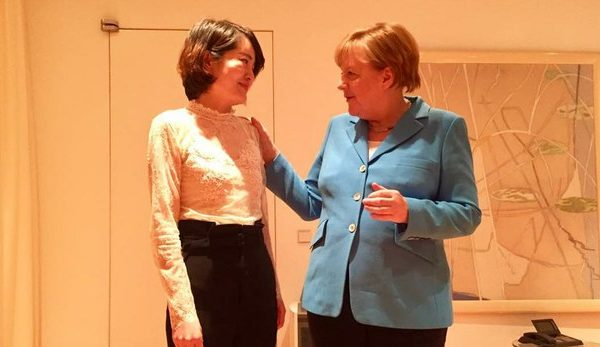

5月24日，德国总理默克尔在北京会见了“709”律师王全璋的妻子李文足。（推特图片）

作者：高天韵

【大纪元2018年05月28日讯】5月24日晚，王全璋律师的妻子李文足与正在北京访问的德国总理默克尔会面。李文足向默克尔递信、恳请她帮助向中共确认王全璋的情况。她表示，如果丈夫还活着，希望允许自己聘请的律师与其见面。5月23日，高智晟律师的女儿耿格向默克尔发出求助信，请求她伸出援手。

中国人向德国人求助，这令人心酸。因为她们的亲人在自己的祖国“失踪”了！因为法治的大门向他们紧闭。

高智晟有着“良心律师”的美誉，一直尽力帮助弱势群体、为法轮功学员呐喊鸣冤。他因而受到中共的残酷迫害，历经绑架、酷刑、冤狱和软禁。去年8月，他在老家失踪，至今已有280多天。家属和律师都在寻找，但是几地的公安局都不予接待，还经常改口，目前称不知其下落。

王全璋律师自2015年7月“被失踪”至今超过一千零五十天，生死不明。官方拒绝提供任何消息，反而持续打压他的家人。李文足饱受骚扰、恐吓，年幼的儿子无法正常上学。

欲问中国的人权状况，仅此两例就足以说明问题。从两位律师代理过的敏感案件，可知暴政对法轮功修炼者、宗教人士、正义记者等普通民众的迫害。从两位律师自身的遭遇，又可知中共法治的荒谬和颠倒善恶。从李文足、耿和及耿格的呼吁中，更可知当局的无情与残忍。非法地抓走了你的亲人，还不允许你“乱说乱动”，就是要把人往绝路上逼。更丑陋的是，官媒的镜头里，只有“盛世的和谐美景”。

2016年9月22日，德国驻华使馆在北京举办庆祝“德国统一日”酒会，除多国驻华使节外，受邀的还有多位持不同政见者、维权律师等人。期间，德国驻华大使Michael Clauss向“709”案的代理律师询问了被捕者及其家属的现状。北京人权活动家胡佳受访时说，德国外交官非常关注中国的人权状况，“我一进入大使馆，就有一种自由的感觉。”

2016年12月19日，德国、瑞典、瑞士和荷兰的驻华使馆人权官员，来到河南省信阳市罗山县彭庄村，探望江天勇律师的父母。当时，江天勇下落不明，欧盟官员表达关切，并表示将发言声援和营救。离开前，他们与两位老人合影。

再说个远一点的例子。文化大革命后期，路透社的社长访问中国，向周恩来提起，想会见民国时期受聘于该社的赵敏恒。周恩来派人打听，告知：赵已死去。赵敏恒是怎么死的？这位1949年决定留守大陆的著名记者，在“肃反”运动中被打成“间谍”，在冤案澄清后仍被判刑8年，最后不明不白地死在了劳改矿山。

故事并未结束。上个世纪90年代，路透社驻中国首席代表白尔杰亲自到访赵敏恒家里慰问，向赵的独子赵维承赠送了两千英镑。他说，这是受路透社远东司人事部长的委托，款项来自新闻社的基金，专为社员的家属解决困难。

外国人的义气、念旧，反衬著现当代中国的无边苦难。满怀豪情的文化精英，成了红色风暴里的冤魂。善良正直的中国人，被“维稳”机器践踏、侮辱，无路可走。提供法律援助的专业人才，反被恶法惩罚、身陷囹圄。当亲人呼喊：“让他回家”时，那个自诩为“母亲”的“党”在做什么？它仍然在编织虚幻的春风。

当路透社代表握住了赵维承的手，当欧盟官员站在两位乡村老人的身旁，当中国民妇在京城向外国首脑呈上浸满泪与痛的信，激荡在当事人心头的，会是怎样复杂的情感？

责任编辑：高义

<a href=#top><h6 align="right">回上方</h6></a>

<a name=49>
<h1 align="center"><b>鹧鸪天‧红权</b></h1>

作者：佚名

【大纪元2018年05月28日讯】

不利民生乱作为，只因私利胀权威。 
独裁专政横官匪，利益集团晃帽徽。

贪欲大，道德亏，窃国硕鼠满肠肥。 
榨干民血犹称累，有利民生不作为。

<b>鹧鸪天‧红祸</b>
  
一面红旗遮九垓，千年赤县覆尘霾。 
战天斗地神传断，嗜血吃人恶运开。

魔乱舞，鬼徘徊，幽灵共产毁人来。 
谤神害法摧天路，做恶欺心等大灾。

<b>清平乐‧回光返照</b>

又抬马列，临死挣扎切。 
人要与之一起灭，幻想为魔输血。

不分是是非非，似乎维护权威。 
不久将迎大难，皆缘错事频为。

责任编辑：高义

<a href=#top><h6 align="right">回上方</h6></a>

<a name=48>
<h1 align="center"><b>卜算子‧致上个世纪五六十年代出生的人们</b></h1>

作者：云鹤天

【大纪元2018年05月28日讯】

生遇大饥荒， 
动乱中成长。 
运动连连恶浪翻， 
口号天天嚷。  

常吃毒油粮， 
霾雾幽灵荡。 
万恶之源共匪帮， 
解体红魔党。

责任编辑：高义

<a href=#top><h6 align="right">回上方</h6></a>

<a name=47>
<h1 align="center"><b>赤龙的钱囊吞噬著整个世界（上）</b></h1>
<h3 align="center"><b>—在加拿大多伦多大学中国未来研讨会的发言</b></h3>

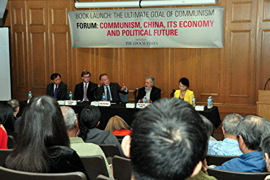

美国之音【焦点对话】探讨中美贸易战。图为节目视频截图。（美国之音）

作者：谢田

【大纪元2018年05月28日讯】（编者按：2018年5月5日，北美《大纪元时报》在加拿大多伦多大学圣麦克学院举办“共产中国经济政治走向”论坛，聚焦中国经济政治的未来。加拿大国会议员、前加拿大和中国委员会主席、前知名主播肯特（Peter Kent）、前参议员蒂尼诺（Consiglio Di Nino）、美国南卡罗莱纳大学艾肯商学院终身教授谢田博士、历史学家博纳博士（Dr. Michael Bonner）、华裔作家盛雪应邀出席研讨会。本文为谢田在研讨会上英文演讲的中文译本。）

谢谢主持人的介绍。女士们、先生们：

很高兴再次来到加拿大多伦多，跟大家一起探讨中国政治经济的现状及其未来。我今天讨论的题目是“赤龙的钱囊吞噬著整个世界（Dragon’s Vault Engulfs the World）”。为什么这么说呢？我将从中美之间的贸易战、为什么贸易战会发生、加拿大怎么卷入其中、中共为什么一定要这么做、贸易战最后会怎么收场，来一一说起。

2013年，我在台湾出版了一本中文版的书，《赤龙的钱囊》，赤龙就是指的中国共产党，钱囊指的是中共从中国人民身上如何攫取和积累了其巨额的财富。五年过去了，中共的掠夺有增无减，并且，中共赤龙的疯狂敛财，已经席卷了世界、威胁著全世界的人们。

北美时间的昨天早上，美国政府的一个高级代表团刚刚从北京回来，代表团团员包括了美国财政部长、商业部长、贸易代表、国家经济委员会主任，和国家贸易委员会主任，级别非常之高。但两天的谈判鸡同鸭讲，各说各话，最后美国的这个高级代表团空手而归、毫无成果。美国和川普总统为什么要打跟中国的这场贸易战呢？

如果我们看看中国从1978年到2010年的货物进出口（按中国海关的统计），1990年之前都没有超过1,100亿美元，到2000年也只有4,700亿美元。从2002年开始则迅速增长，除了2008年世界金融危机后有短暂的下滑，一直是呈现高速增长的趋势，到2010年已经增长到了惊人的每年3万亿美元。2016年最新的数字是3万6千亿美元。

如果从中国海关的统计，每隔十年，中国出口商品的结果也有所改变。1980年代的时候，中国出口中的初级产品和工业制成品各占50%，高新技术产品则完全没有。到1990年代，中国出口中的初级产品占25%，工业制成品占75%，高新技术产品还是付诸阙如。到了2000年，中国出口中的初级产品只有10%，工业制成品则达到90%，高新技术产品则迅速增加到15%。到了2010年，中国出口中的初级产品只有5%，工业制成品高达95%，高新技术产品（与工业制成品、机电产品重叠）则达到了31%！这是一个惊人的转变。

当然，中国开始出口高附加值的产品，对中国企业来说是一件好事，对中国人民来说是一项成就。但是，中共是怎么实现这一点的呢？这才是问题的关键。中共获取高新技术的方法，多种多样，从盗版、偷窃、抄袭、商业间谍，到强迫用市场换技术，无所不用其极。其实，这也是中美贸易战的根源之一。

中共在实现进出口贸易迅速增长的时候，它并不是按照市场规律、国际准则在实行一种公平的、自然的、平衡的贸易，而是在扭曲市场、扭曲规则，单方面的制造了中方巨额的贸易顺差。从美国普查局经济分析局的数据看，美国对中国的贸易逆差（中国的顺差）2016年是3,470亿美元，2017年大幅增加了28%，达到3,752亿美元。而与此同时，美国其他有赤字的贸易伙伴，包括墨西哥、日本、德国，都没有一个超过了700亿美元。并且，对所有其他国家来说，贸易赤字都经常的浮动，有的年份增加，有的年份减少，上下都在6%或更少，没有一个有中共这样巨大的、快速的增长。实际上，从2006年到2017年的12年间，每年美国对中国的出口，从来都没有超过1,250亿美元，而中国对美国的出口，从来都没有低于2,900亿美元，美国的逆差（中国的顺差）都最少在2,200亿美元，最多高达3,700亿美元！

大家可能注意到了2018年美国开始对全世界的钢和铝征25%的关税。从美国商务部的这个统计看，中国并不是对美国出口钢铁最多的国家，加拿大、巴西、韩国、墨西哥、俄罗斯、土耳其，甚至台湾、印度都比中国出口美国的多。但这次钢铁征税打击最大的，却是中国！为什么呢？因为中国出产了世界上全部钢铁的一半以上！还有，中共在破坏国际贸易秩序，他们偷偷的把中国产的钢铁运到其他国家，再从这些自己根本不生产钢铁的国家把钢铁“出口”到美国！美国政府没有办法挡住来自世界各地的钢铁，干脆就来个一刀切，对所有的国家统统征税！这样挡住了所有的国家，实际上是真正挡住了中国的钢铁。

中共如此的破坏国际贸易秩序、扭曲市场、制造人为的顺差、恶意的累积外汇，美国和其他国家难道不抱怨吗？当然会抱怨。从世界贸易组织（WTO）的反不公平贸易的申诉和寻求补偿的案例数目上，美国针对反倾销、反补贴的最多对象，还是共产党的中国。

川普总统的目标，从目前看来，就是要迫使中共放弃不公平的贸易手段，保护知识产权、智慧产权，减低日益增加的贸易赤字，每年减少1,000亿美元的赤字，并确保中共在其“中国制造2025”的目标计划中，不运用国家的力量对特定工业进行补贴、从事不公平的竞争。

那么，面对美国的反对、世界的质疑，中共为什么要这样做呢？中共为什么就不能公平的交易、让进出口自然的平衡、让汇率随市场自行调节、保持与贸易伙伴合理合法的进行交易呢？这跟中共的嗜血嗜财、中共的邪恶本质，和中共的罪恶目的有关。（待续） ◇

责任编辑：刘菁

－－转自583期【新纪元周刊】

http://www.epochweekly.com/

<a href=#top><h6 align="right">回上方</h6></a>

<a name=46>
<h1 align="center"><b>他们为什么能实实在在的做好人？</b></h1>

回顾自己修炼的经历，原本是一个再平凡不过的人，可是在师尊真、善、忍的伟大法理教诲下，把我塑造成了这滚滚红尘中一朵出世的净莲！（fotolia）

作者：千百度

【大纪元2018年05月28日讯】这是明慧网报导的一位大法弟子的故事。

她在一家工厂给老板夫妻二人做饭打扫卫生，买菜的活也归她，平时都是老板娘给她拿现钱买菜，月末对账。因为经常去买菜，那些卖菜的人都认识她了。很多人为了拉她去自己那买菜，就跟她说：“我给你多记点钱。”（就是作假、贪污）。

每遇到这种事情，她都会告诉他们，我是修炼法轮大法的，我们的师尊告诉我们要遵照真、善、忍的标准做一个好人，不能贪占不属于自己的东西，是多少钱就记多少钱，我该买谁的菜还是买谁的菜。有时买菜他们疏忽了，多找给他钱，他都实实在在的退还给他们。

时间长了，他们对她的品格都很赞叹，他们说：“修炼法轮功能修出来这么实在的人，这个世界上真应该多一些修炼法轮功的！”

有一次月末，她一对账，他这边多出了一百元钱，可能有时买菜忘了记上了，她就如实的告诉老板娘我这边多了一百元钱。老板娘很感动，说：“你这个人真是太好了、太实在了，要换别人，早把钱偷偷揣兜里了，看来你平时跟我讲的你修炼真、善、忍不是空话，你们法轮功真是在实实在在的做好人。”

有一年春天，他们那里的山野菜下来了，老板娘就让她多买些山野菜，摘净了速冻，存放起来冬天吃。那天买回菜，天已经很晚了，这时又要做晚饭，又要摘菜。她一时忙不过来，很着急，就抱怨起来了。其实作为一个炼功人，工作再多也要心平气静，抱怨就是错了啊。当时就有一种叫“刺老牙”的山野菜的老刺就把她的手指肚扎了。她也没在意，继续干活。可是第二天手指就肿起来了，一连四、五天，手指一跳一跳的疼，特别是到了晚上根本都睡不了觉。

到了第六天，她实在疼的受不了了，就拿针尖轻轻一碰，手指里的脓血就流出来了。老板娘见状要带她去打针，又让她休息，她说没事的，过两天就好了。她觉得自己是修炼人，师父告诉她要多为别人着想，老板娘很忙，不能让她为了自己再忙上加忙了。再说自己要是休息了，就这么几天上哪找适合的人给他们做饭呢。就这样，她坚持上班，该干什么就干什么，手指难受她就背师尊讲的“难忍能忍，难行能行”[1]，工作一天也没耽误。下班回家之后，她更加抓紧时间学法、炼功。到了第八天，她那个手指肚连同指甲都脱落下来，慢慢的从新长出新的来了。

现在她在他们家已经干了八年了，他们夫妇非常喜欢她的诚实、坚忍和善良。他们很认同大法，平时常说学法轮大法的人真好。因为她已经五十多岁了，有时就不想干了，他们就说什么也舍不得她离开，说：“你走了我们怎么办呢？上哪去找像你这么可靠的人呢？” 为了保证她有足够的时间学法轮功，最近这几年他们要是晚饭吃得晚，就让她先回家，自己收拾桌子。

回顾自己修炼的经历，她说：“我原本是一个再平凡不过的人，可是在师尊真、善、忍的伟大法理教诲下，把我塑造成了这滚滚红尘中一朵出世的净莲，谢谢伟大的师尊对我的慈悲苦度！”

注：

[1] 李洪志大师著作：《转法轮》

责任编辑：南风

<a href=#top><h6 align="right">回上方</h6></a>

<a name=45>
<h1 align="center"><b>染香们的“爱国生意”</b></h1>
  
作者：袁斌

【大纪元2018年05月28日讯】提起微薄时代的大五毛 “染香”，许多从那个时代走过来的大陆网民都还记忆犹新。

想当年，那会周带鱼还没出名，以攻击公知为快事，骂公知是美狗，视美国为不共戴天敌人的她就大红大紫，与孔庆东、司马南、吴法天等一干五毛大佬齐名了。

跟所有中共五毛一样，染香的最大特点就是所谓的爱中仇美。对中国，她似乎爱的一往情深；对美国，她似乎恨的深入骨髓。显然，在广大粉丝眼里，这样的反美爱国偶像就是打死也不可能说美国好话，更不可能去美国生活的。

然而不可能的事偏偏就发生了。

就是这位当年因反美暴大红大紫的染香（微博上现在改名袁小靓），最近居然带娃去美国上学，而且还盛赞美国教育好。5月22日，她发微博说：“这几天正好在办小孩子的美国入学，彻底搞清楚咋回事。不管租房还是自购房，只要有写着你名字的账单地址，所在学区的公立学校就必须接收小孩，免费。不管你是偷渡、是游客、是绿卡还是公民，无论哪种身份，无论你有没有给美国政府纳税，学校都必须免费接收。私立学校，那就简单了，有money就行。”

她还说：“美国没有户籍制度，小孩子读书是权利，学校必须接受。美国公立学校也分好坏的，所以美国有学区房，好学区的房子贵税高。只要你住在这个区，就可以免费入学。”

这么“精美”的口气，谁还认得出是当年的染香？

不过公正的说，染香倒并不是第一个实现华丽转身的反美爱国名人，早在她之前，号称中国第一反美斗士的司马南就把儿子送去美国读书了。央视反美名嘴、《中国不高兴》作者之一的宋晓军，在赚了一大笔中国愤青的钱之后，也赶紧办理了美国绿卡。尤其讽刺的是，当年美国总统克林顿访问北大时，当面痛斥美国人权状况恶劣，因此博得全中国爱国青年满堂喝彩的北大中文系女生马楠，大学毕业后不但毅然选择到“人权状况恶劣”的美国去留学，并且从此一去不返，还嫁给了一个美国人，相夫教子过上了天堂般的生活——染香不过是步了他们的后尘而已。

不用说，这样的事难免会让那些崇拜反美爱国名人的粉丝们有一种被欺骗和背叛的感觉，但这又能怪谁呢？只能怪他们自己太天真太轻信。因为天真和轻信，他们压根就不会想到，染香们从来就不曾真的爱中仇美，他们只是把这件事当成生意在做而已。一方面，中共需要他们为自己站台，爱国愤青们也需要他们出来挑头；另一方面，他们自己为了过上风光体面的生活，则需要从官府那里套利，并让爱国愤青心甘情愿的为其掏银子。双方各取所需，生意也就成了，不明白就里的只是那些天真轻信的粉丝们。

知名时评人呼兰胖子说的好：“某些人爱国的目的是什么？你以为真是爱这块土地和这块土地上的人民？才不是。他们爱的是掌控著这块土地上所有资源的人，这些人手中的资源才能让爱国人士过上超出常人的优渥生活。”“对于袁小靓这样的聪明人，什么信仰？什么灵魂？那些都是浮云。通过爱国这种手段赚了钱，再去美国那种‘邪恶’国家享受西方的制度和社会福利，不过是一种商业行为而已。”

在中共，爱国反美这门生意从来都是利润丰厚的，你瞧司马南、袁小靓等，哪个不是赚得盆满钵满的？他们赚够了，转身走人了，他们的后辈周小平们如今还在继续做着同样的生意。很可能有一天，周小平们也赚够走人了，我相信还会有新人继续同样的生意。

把他们的“爱国生意”当真，未免也太傻了吧！

责任编辑：南风

<a href=#top><h6 align="right">回上方</h6></a>

<a name=44>
<h1 align="center"><b>川普决断效应显 证明一个事实</b></h1>

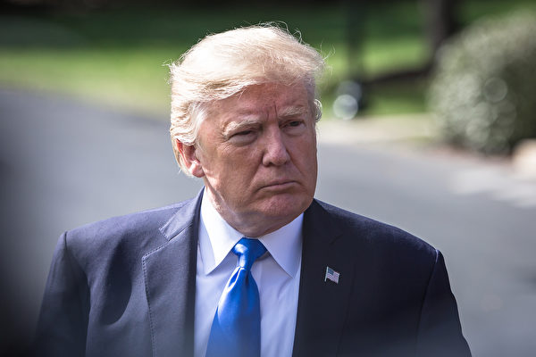

美国白宫官员表示，总统川普取消川金会，可能会影响美中贸易谈判，川普政府或对中共采取更强硬的态度。专家认为，朝鲜不弃核，症结在于中共。(Samira Bouaou/The Epoch Times)

  
作者：杨宁

【大纪元2018年05月28日讯】5月26日下午，韩国总统文在寅与朝鲜领导人金正恩在韩朝边境板门店举行了第二次会晤。据韩联社报导，文在寅和金正恩就具体落实《板门店宣言》以及成功举行美朝首脑会谈的方案等深入交换意见。韩朝领导人突然急会，明显与24日美国总统川普公开宣布取消原订6月12日举行的美朝峰会有关。

在川普给金正恩的公开信中，川普给出的取消理由是“朝鲜近期表现出的巨大的、公开的敌意”。不过，在礼节性地感谢金正恩、暗示美国强大的军事力量，以及在美朝互动这段时间所取得的美国人质获救的成果后，川普对未来双边会晤并未关上大门，只是将球踢给了金正恩和背后的北京支持者。

显然，川普主动中止会晤并表示做好军事准备的做法，让近期几度威胁、批评美国的金正恩一下子慌了手脚，遂紧急与韩国沟通。其与同样有些失落的文在寅一拍即合，才有了韩朝领导人急会。川普一出手，效果是立竿见影，而这同时也再证明了中共搅局的事实。

这就是证实了金正恩近期的“变脸”与其第二次会见北京最高领导人有关。5月中旬，川普在朝鲜释放重新考虑“川金会”后，曾明确点出这是金正恩在第二次赴大连见习近平后才发生的变化，暗示北京在中间扮演了某种角色。潜台词大概是指北京指点平壤，在会谈前向美国施压，以换取美国的让步。

按照中共官媒的说法，川普是肯定不愿错过“川金会”的，因为这是其中期选举的需要，也是其获得诺贝尔和平奖的需要。如此浅显的认知导致了北京的误判，误以为朝鲜声音拔高几度，川普就会做出让步。没想到，川普棋高一著，主动宣布放弃了新加坡会晤，这表明其更关注的是能否真正解决朝核问题，而不是由此衍生的附加品。

深知错过美朝会晤意味着什么的金正恩和北京，应该都是大为震惊的。于是，金正恩再度变脸，主动示软，不仅称“愿意在任何时间及任何形式，和美国坐下来面对面解决事情”，而且紧急联络文在寅，让其向美国传达自己希望会晤举行的“坚定立场”。而北京也马上表态“赞赏”。

从川普随后的回应看，金正恩的态度已迅即被美国知晓。川普表示，美国正在和朝鲜就“恢复首脑峰会进行非常有成效”的会谈。如果确实举行的话，很有可能仍在新加坡，日期还是在6月12日。但如果有必要的话，将会延迟举行。

玩了一轮牌，美朝领导人会晤似乎又回到了原点。在这轮牌局中，美国川普展现了强硬的姿态和实力，救回了三个美国人质；韩国文在寅与金正恩的会晤，赢得了国内较高的支持率；朝鲜在不断变脸的同时，获得了几百车援助物资以及传说的5000亿人民币援助；而北京则损失了大量钱财不说，还让川普重新审视其作用以及面临前途未卜的贸易争端。最是落寞为北京。

不过虽然回到了原点，但此原点已非彼原点。应该说，金正恩再也玩不起变脸术了。如果想达成“川金会”，只能老老实实地与美国沟通，而双方关键问题仍在弃核问题上。美国强调的是“完全、可验证、不可逆”的弃核，而朝鲜一直传递的是分阶段进行弃核，并在进行的同时，获得美国和国际社会解除制裁，乃至得到美国和它国的援助和补偿。即便在25日回应川普的公开信中，朝鲜依旧表达的是解决问题的方式是“循序渐进，通过谈判一个一个地解决”。

由于此前川普已在阶段性弃核问题上有所松动，因此双方能达成怎样的协议还未可知，但以美国的立场而言，“完全、可验证、不可逆”的弃核是不会更改的，更改的只能是相应的时间表。而有着变脸传统的金正恩，一旦赴了“川金会”，签署了弃核协议，其未来只有一条路可行，那就是落实协议，否则以美国的强硬立场是不会再次被耍的。

责任编辑：莆山

<a href=#top><h6 align="right">回上方</h6></a> 
  

<a name=43>
<h1 align="center"><b>中共藉反恐搞“维稳” 评：中共才是暴恐之源</b></h1>

2017年6月26日，中国新疆维吾尔自治区喀什老城开斋节开斋节后，警察正在巡逻。（JOHANNES EISELE / AFP / Getty Images）

【大纪元2018年05月28日讯】（大纪元记者易如采访报导）中共日前召开全国反恐工作电视电话会，会议强调要从源头上铲除暴恐活动的滋生土壤。有评论表示，中共藉“反恐”之名搞“维稳控制”，打击的不是恐怖分子，而是眼中的所谓异议份子；也有评论表示，中共才是滋生暴恐的根源。

中共国务委员、国家反恐怖工作领导小组组长赵克志在5月25日的会议中要求，要加强涉恐情报搜集预警，深化严打暴恐活动专项行动，集中整治暴力恐怖和宗教极端思想的传播渗透，持续深化涉恐安全隐患排查整治，保持对暴力恐怖活动的严打高压威慑态势，从源头上铲除暴恐活动的滋生土壤等。

大陆作家、独立时评人士田奇庄对大纪元表示，中国社会被中共管控到已经草木皆兵的程度，都是高压态势，绝大部分地区不存在所谓的恐怖威胁，中共是藉“反恐”之名搞“维稳控制”。

田奇庄说，中国社会的主要矛盾不是在恐怖这块，“因为中国到处都是天网工程、巡察工程、织网工程，从城市到农村到处都被管控的严严实实，基本上没有他们说的问题那么严重，可能是有些地方的领导们太多心了，或者是制造这样一个严峻的气氛，可以使自己采取一个高压态势，针对不同的势力、不同的看法，有不同见解和不同声音的人实施一个严打态势，这样一个高压有利他们维稳控制。”

田奇庄认为，中国一些地方可能存在中共认为的恐怖活动，但不能把一个地方局部的问题上升到全国性的问题，然后借这个大作文章形成全国管控，使掌握权力的人更加肆无忌惮，使老百姓不敢说，不敢动，甚至有一点批评政府、反对政府的做法行为都被视为反政府势力进行整治，“把内部矛盾，一些不同看法的一些问题上升到反恐、上升到维稳，然后进行打压，跟毛时代上纲上线、阶级斗争如出一辙。”

美联社星期六评论说，中国的国际反恐努力集中针对与新疆接壤的中亚地区，并在新疆强制实行令人窒息的安保措施，使用面部识别系统和大数据等高科技手段，以图找出潜在威胁。

2014年5月6日，中共发布首部国家安全蓝皮书《中国国家安全研究报告（2014）》，报告说，受国际恐怖活动影响，2013年中国境内恐怖活动日益活跃。根据官方公开资料，2013年发生在境内的暴力恐怖主义袭击共有10起。

当年的3月1日，云南昆明火候车站发生震惊中外的砍人流血事件，造成29人死亡，140多人受伤。中共把这次事件定义为“恐袭”，当局说，这是一起由新疆分离主义分子发动的攻击。

对此，北京维权人士胡佳对大纪元道出该事件发生的原因，“究其原因，后边做过调查，实际上是几个维吾尔年轻人他们想要离开这个国家，但当局不给维吾尔人护照，他们没有办法自由的走，连中国境内都没有办法旅行。而像北京等很多地方都不允许他们住，都有灰色的约定，所以这些人感到在这个国家很压抑，想走又出不去，他们一气之下，在昆明火车站就大开杀戒。除一个怀孕的年轻女性，其他的不是被当场击毙，就是被处决了。他们这些人在自己的生活中可能都是一些朴素善良的人，他们只想脱离这个压抑的窘境，冲出牢笼，去外边寻找自由。”

胡佳说，中共指的暴恐活动一般是指新疆维吾尔人地区发生的。“暴恐行为有两种，一种是专门针对暴力国家机器的，比如冲击派出所、武警哨卡，还有一种暴恐是针对贫民的。”

胡佳指出，中共为控制人民制造的杀戮以及社会不公，是造成暴恐事件的根源。

“新疆频频出现暴力事件，完全是中共的高压政策造成的。中共在那边统治的时候，从王震那个时代开始，实行的是铁血政策，他信奉以杀平乱的信条，可以说在新疆当地曾经是血流成河，然后换来了这种所谓的稳定，但是那种行为它是把仇恨埋到了许多人的内心。”

胡佳说，中共制造的仇恨也加剧了民族之间的对立，“而且共产党控制着所有的宣传机器，它在反暴恐这件事情上从来不会解释它在新疆铁血政策统治的时候杀了多少维吾尔人、种下多少民族仇恨的种子，它也不会说，维吾尔人在他们生长的新疆地区，他们的教育、就业等方面一直是处于比较弱势的状态，他们在自己的地上像二等公民一样。而中国老百姓没有办法去了解这些维吾尔人为什么会采取这样极端的措施、为什么变成恐怖分子。”

胡佳认为，暴恐在中国境内已形成恶性循环，“共产党控制一切，它镇压越凶，激起的反抗可能就越多，由于是弱势者的反抗，面对强势，实际上是以卵击石飞蛾扑火，所以，就弱势者对弱势者，就对贫民进行报复。”

今年中国也发生多起在公共场所肆意行凶的恶性袭击事件，据报导，一些作案者是为了发泄个人不满，报复社会。

5月3日，广东揭阳发生一起当街持刀砍人事件，造成2死1伤。4月27日，陕西榆林市米脂县第三中学发生砍杀初中生恶性事件，造成19人受伤、9人死亡，据称嫌犯疑遭霸凌报复学校。2月11日，北京西城区西单大悦城商场内发生一起发泄个人不满的男子持刀砍人事件，导致一名妇女死亡，12人受伤。

胡佳说，这种恶性循环的暴恐在高压专政的体制下，不可能去公开暴恐的成因，而是采取更恶毒手段一律击毙，造成更多的流血。

胡佳表示，真正针对贫民的暴恐是应该受到谴责的。但中共这个专制机器在反恐方面的目的就是拿镇压恐怖分子来实施中共的暴政。

对中共所谓的反恐，有“不具名”的网友曾留言表示：“做贼的喊捉贼。共匪比其他所有恐怖分子总和还要恐怖，刻意让人民生活在恐惧当中，没有言论，上网，或是选举的自由。还强迫人民生活在污染的环境当中。人民不从，抗议垃圾处理不当，还要被说成是聚众滋事。”

责任编辑：高静

<a href=#top><h6 align="right">回上方</h6></a>

<a name=42>
<h1 align="center"><b>这共产主义是一种癌</b></h1>

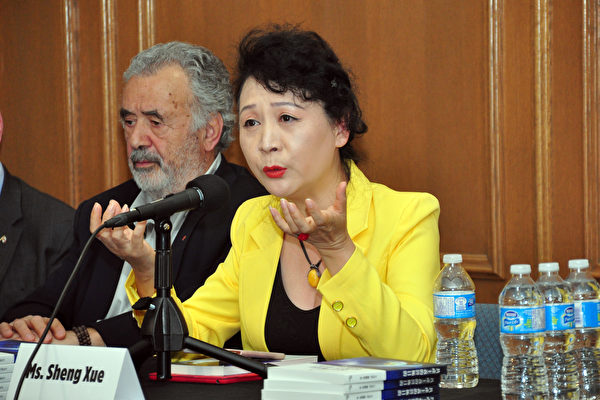

国际笔会作家和平委员会副主席、民阵副主席盛雪5月5在多伦多举办的一个关于中国局势的公开论坛上讲话。（周行/大纪元）

【大纪元2018年05月27日讯】（大纪元记者周行多伦多报导）中共的表现，令很多人既恨又困惑。在加拿大多次获奖的作家、国际笔会作家和平委员会副主席、民阵副主席盛雪认为，共产主义是一种“癌”。

为了中国人的人权、自由和民主，盛雪已经努力了至少29年，从1989年开始。在今年5月份多伦多举办的一个关于中国局势的公开论坛上，盛雪说：“共产主义者不是一种社会发展理论，不是人类获得幸福生活的一个途径，也不是一种生活方式。”

盛雪将中共形容为中国社会的癌，而且是非常特殊的一种癌瘤。

<b>杀人方式特殊</b>

盛雪说，生活在中共专制下的中国人都知道，“当中共想杀死某个人时，它不会直接、简单地杀死你。”

她说，当中共想要杀死你时，它会找到一种方式、或多种方式让你知道，他们要对你动手了。“他们会孤立你，让你的家人、你的朋友、你的社区、你周围的人都认为你是他们的敌人；认为如果继续和你站在一起的话，会给他们带来不幸和麻烦。”

“你会成为孤身一人，”她说，“然后他们（中共）会尽全力让你背叛其他人，让你在公开场合羞辱自己，让其他人轻视你，给你更多的压力，让你觉得自己无法活下去。”

经历过中共历次政治运动的人，应该知道身处其中时的滋味，从媒体对中共迫害中国人的持续曝光中，也能看到这共产系统的冰山一角。《共产主义的终极目的》一书中对中共有这样的描述：“20世纪中叶，西来幽灵共产党篡取政权后，杀戮国民、摧残文化、破坏环境，使山河变色，生灵涂炭，曾经辉煌的文明黯然失色，几乎毁于一旦。”

<b>活着已非自己</b>
  
中共在历次政治运动中导致了不少中国人死亡，但它总是强调“改造人”，就是把你改造成“党的人”，被迫害致死的，通常是不肯被改造的人。

盛雪说，中共会“让你选择，是想死还是想活下去”。“如果你想死，他们可能会给你这个机会（去死）”。

“如果你想活下去的话，你会被变成了一个新的人。”她说，“你不再是你了，你是另外一个人了，你会变成中共的工具。他们（中共）可以使用你，因为你已经没有自由。”

“你没有能力，你没有朋友，你没有信任。”她说，“你什么都没有。然后他们（中共）会给你一些好处，并迫使你对他们表示感激。”

同时，盛雪说，中共会将这过程公诸于众，“作为对其他人的一种教育，让他们‘分享’这份恐惧”。

中共在其不断“改造人”的过程中，破坏了中国人的伦理道德，扭曲了人性。《共产主义的终极目的》一书中这样写：“共产党在不间断的政治运动中，处心积虑地灭绝中华传统文化，就是要使人在道德崩溃的危难关头，阻绝所有的出路。”

<b>“工具”与“共犯 ”</b>
盛雪认为，在杀人和改造人后，中共把中国人变成它的工具。她说，这庞大的中国人口没有自由，没有安全感，“甚至没有离开或返回这国家的自由”。

与中共有不同意见的中国人，很多失去了离开或返回中国大陆的自由。盛雪提到她自己的故事，她说，她已经接近29年没能回家乡探亲，“这是非常残酷的‘惩罚’”。

中共不断改造中国人的结果是，把很多中国人变成了他们的“工具” 和“共犯”。她说，这样的例子太多，一个典型的代表是毒食品泛滥，人人都难逃避其害。互联网上有很多视频，显示中国人互相伤害，全无同情之心。“他们是人类吗？他们已经是另一种人类”。

“人们一起犯罪并互相伤害。”她说，中共这样做的目的，是想让大家都变坏。当每人都在做坏事的时候，就会出现：“嘿，你别说我，我也不说你”。

盛雪称，中共制造的“工具”已经扩散到世界各地，包括加拿大。比如中共可以在加拿大召集很多中国人，上街公开支持中共政策，违背加拿大的理念和价值。比如在2008年3月29日发生在多伦多市中心的集会，4月13日变大10倍，而且去了首都的国会山。

“很多人感到非常震惊，哇，他们从哪里来的？突然他们就在这里了。”盛雪说，其实他们已经在这里已经很长时间了。

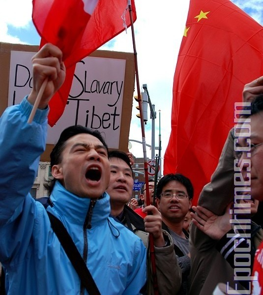

被中共利用的华人，在加拿大渥太华集会时举著五星红旗，高喊中共教授的所谓爱国口号，这场面很多年没见过了。2008年4月13号，渥太华国会山附近 的场面。（摄影：Samira /大纪元 ）

实际上，加拿大及一些西方发达国家的媒体，历年来报导了很多中共通过移民海外的中国人及中国公司渗透民主社会的故事，导致这些民主国家的政府对中国公司及产品疑虑重重。

盛雪讲述了她在2008年3月29日经历的事。她说，当天发生在多伦多的拥护中共集会前2小时，她在多伦多中领馆前站了约35分钟，组织了一个示威活动，随后的3天内，收到500个网上的攻击帖子。

“这就是我们面对的情况。”她说，“他们使用各种方式阻止我发声”。那些生活在加拿大的西藏人、维吾尔人、法轮功学员，也要面对类似的情形，“我们在这里也不安全”。

<b>从未放弃控制</b>

中共在中国夺取政权后相当长的一段时间里，是关起门来破坏传统文化和伦理道德，并把中国人改造成共产党人。党员、团员、少先队员，这3种人必须跟从的是同样的共产理念，他们涵盖大部分中国人。后来中共被迫打开国门以求生存，但它从未停止控制及改造人。

盛雪称，中共传统的审查方式已经发生变化，国际社会有推特、脸书、谷歌，中国大陆就有了微博、微信、百度；国际上的网上购物有亚马逊，大陆就有了阿里巴巴、淘宝。中共迫使中国人使用其可控制的网络。

她说，几乎所有在西方国家流行的电视节目、电影，在中国都有复制品。中共的政策，使中国人可以自由上网，在网上，“吃、喝、玩、乐、嫖、赌、暴力，很容易找到，就是找不到自由、人权”。

因为中国大陆网民众多，微信发展迅速。盛雪说，很多西方人也开始使用微信。“但很多人都注意到,中共政府通过后门控制微信，他们跟踪你的每一个信息，直到有一天，他们发现你是一个目标。他们很容易就抓住你。”

盛雪认为，中国人在经济上也成了中共的工具，他们没有自由，没有尊严，没有人权，工资低；同时，他们要抚养孩子，照顾父母，负担沉重，心理还有很大的不安全感和恐惧感。她说：“中共正在不断地制造这样的人，并利用这些人来生产中共需要的产品。”

还有那些来自劳教所、监狱的产品。她说，中共体制下的经济发展，是带着血的，其产品成本之低，使其它国家很难与之竞争。

盛雪呼吁国际社会向中国人伸出援手，帮助他们从中共的野蛮统治中解脱出来，脱离恐惧，做回正常的人。

其实，《九评共产党》发表以来，中国人已经开始觉醒，主动摆脱中共，摆脱恐惧。按退党网站公布的记录，目前已经有超过3亿中国人宣布退出中共的党、团、队组织，这数字每天还在以近10万的速度增长。

责任编辑：文风

<a href=#top><h6 align="right">回上方</h6></a>

<a name=41>
<h1 align="center"><b>川普总统面对什么关键问题</b></h1>

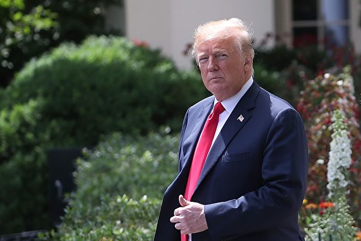

在川普总统面对的难题背后，诸如应对朝鲜核武威胁等等，共产邪恶势力才是问题的根源。 ( Mark Wilson/Getty Images)

作者：程晓容

【大纪元2018年05月27日讯】川金会一波三折。金正恩访华、川文会、文金会，局势瞬息万变。流氓总是要搅局，不应给其市场。就连大陆网友都耐不住性子，称中共为“西朝鲜”，对川普直呼，请把“东西朝鲜”一并拿下。

迷局之外，红色恶浪企图冲垮安定与和平。川普总统需要处理的，不仅仅是朝鲜核武，而是要面对共产邪恶主义在全球的大举进犯。朝鲜半岛也好，美国本土也好，只要击退共产主义，一切难题便可迎刃而解。当然，前路非坦途，但是，别无选择。

这一次，川金会本已安排就绪，金正恩突然秘密访华，之后便忽然翻脸，对美国大放厥词，导致美朝峰会陡生变数。

金正恩为何胆敢强硬，中共为何支持一个抱着核按钮、威胁全世界的“疯子”？支持疯子的政权值得尊重和信任吗？

美国专家、“华盛顿自由灯塔”主编马修康特奈提分析称，川普政府“没有朝鲜问题，只有一个中共问题，朝鲜只是被中共用皮带牵着走的一只野狗，要改变朝鲜的行为，首先要改变中共的行为”。

众所周知，如果没有中共撑腰，朝鲜暴政绝对走不到今天。中共对内压迫人民，任由贪官鲸吞民脂国库，对外撒出去大把银子，包括给予朝鲜巨资援助。它这样做，并不是关心他国的百姓，而是为了维持自己的权力，借金正恩在国际上耍流氓来分散注意力、同时添加自身在区域的话语权，一方面在谈判时多捞取点利益，另一方面披着伪装，继续在海外的深入渗透和颠覆活动。

观察川金会与朝鲜半岛的动态，必须理解当前美国和世界格局的变化。

1958年，《裸体的共产党人：揭露共产主义及恢复自由》在美国出版。作者W‧克里昂‧斯考森曝光了共产党针对美国制定的45项颠覆行动目标，提示人们警惕共产主义的潜在威胁。今日，对照美国社会的现实，许多人震惊地表示，共产党人已经实现了大多数目标，“美国正在倒下”。

危急关头，川普出现。他是自里根之后，首位明确抗击共产邪恶势力、强调对神的信仰、守护传统价值观的美国总统。他不向古巴、朝鲜等邪恶政权妥协，对中共也在多方面展现强硬。

川普在兑现承诺的过程中，正在一步一步把美国从共产主义的蚕食中拯救出来。川普的勇气和强悍，启发和鼓舞了许多国家的政要和不同阶层的民众，促进了正义力量的汇聚。一个明显的表现就是，西方多国开始排查与反制中共的各种形式的渗透。这种围堵瓦解了中共的诡计，重挫中共。

当川普总统重燃希望，带领美国走向再次强大时，却在本国遭遇前所未有的质疑和谩骂。媒体偏激不公，左倾的党派精英也频频向他发难。一些团体打着自由平等的口号破坏历史遗迹，挑起暴力仇恨。种族和民族裂痕的背后，红色的阴影隐约可现。

《九评》编辑部在《魔鬼在统治着我们的世界》里论述道：“共产邪灵当然不会安心于整个西半球超出其掌控之外，它要在东西方同时布局。……如果说在苏联、中国等国家，共产邪灵采用的是夺权、杀戮等方式，破坏传统文化、败坏人的道德，最后达到毁灭人类的目的，那么在西方所谓的‘自由世界’，共产邪灵采用的则是渗透的方式，用千变万化的欺骗手法，变异其宗教、文化，控制其政治、经济、社会组织，最终也达到败坏人、毁灭人的目的。”

发端于欧洲的共产主义运动给人类带来了巨大的灾难，造成了一亿多生灵的非正常死亡，以及传统文化的几近覆灭和道德的崩溃。严重的负面作用不只发生在共产党执政的国家里，各大洲，各国实际上都难以幸免。

在国际舞台，东欧共产党虽已解体，但是中共已成为共产邪灵的最大代理，正在继续推行着毁灭人类的计划。中共多年经营的海外渗透已见成效，它在经济上扩张、在科技上窃取、在政治上拉拢收买，渐渐地把触角伸进了西方政府、议会。在文化领域，中共输出包裹了党文化的所谓中国文化，同时破坏弘扬中华正统文化的文艺复兴。

此外，当今世界的大部分恐怖主义组织，都和中共有着关联。因为共产党起源于信仰撒旦的“光照帮”，暴力、斗争和杀戮是其本性。对于中共而言，不存在“和平演变”、“和平崛起”。中共对朝鲜的支持，就是它热衷暴力和恐怖的最佳明证。

因此，在川普总统面对的难题背后，诸如与中共的贸易战，反中共间谍、反中共渗透，应对朝鲜核武威胁等等，共产邪恶势力才是问题的根源。必须触及实质，才能解决根本。美国不能再重蹈因为经济利益而被中共捆绑的覆辙。

共产主义自产生以来，一直在危害著文明与和平。正如《共产主义的终极目的》所指出的，共产主义实为邪灵，以毁灭人类为目的。若要守护今天、开创未来，需要迎难而上，拒绝魔鬼的诱惑。

责任编辑：高义

<a href=#top><h6 align="right">回上方</h6></a>

<a name=40>
<h1 align="center"><b>川金会，美朝关系与中朝共党命运</b></h1>

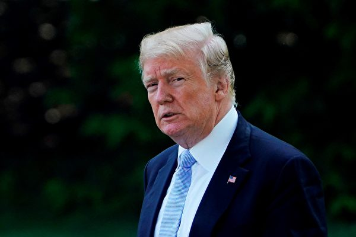

川普总统周四宣布取消川金会。几个小时之前，他曾暗示朝鲜可能被允许阶段性弃核，以换取放松制裁，但是要求“迅速”。( MANDEL NGAN/AFP/Getty Image)

作者：川人

【大纪元2018年05月27日讯】5月24日，美国总统川普向外界发出他写给金正恩的公开信，正式宣布取消筹划中的川金会。公开信称：“我曾非常期待与你（金正恩）会面，不幸的是，基于你在最近的声明中所表现出的极度愤怒和公然敌意，我觉得在这个时候举行这一计划已久的会谈并不合时宜。”不过在稍后的发言中，川普对未来重启美朝峰会仍抱有一丝期望。白宫方面表示，朝鲜方面态度转为强硬，是川普决定取消川金会的主要因素。

5月22日，川普对外界表示，他与金正恩的会晤可能无法如期举行，他还提到了中共，指出金正恩第二次与中共党魁在大连会面后，事情就变了，川普直言：“我有点失望、不喜欢”。川普还两度重复说，“我不喜欢这样”，暗示中共在川金会前怂恿朝共（劳动党）挑战美国。川普还直言，习近平或许是“世界级的扑克玩家”，但愿这不是真的。5月17日川普在白宫就表示：“两个星期前，金正恩突然又去中国问候习近平了，中共有可能影响了金正恩。我们看看将会发生什么吧。我的意思是，习主席可能影响了他。”可见，5月7日金正恩意外飞抵大连并过夜停留，与习近平在不到两个月内第二次会面，是朝鲜此后连续发表对美强硬言论的关键因素，中朝共产党再次抱团挑战国际社会的意味甚浓。

5月14日，中共对外宣布，5月15日至19日，中共副总理刘鹤以习近平特使、中美全面经济对话中方牵头人的身份赴美访问，继续就中美经贸问题进行磋商。与此同时，中共为给贸易谈判“助威”，特意邀请朝鲜劳动党友好参观团于14日对中国进行访问。16日，中共中央总书记习近平在北京特意会见了由朝鲜劳动党中央副委员长朴泰成率领的友好参观团，中共支持改善北南关系、推动朝美对话、实现半岛无核化，支持朝鲜发展经济、改善民生，支持金正恩走符合自身国情的发展道路。对此，有观点认为，这是中共利用朝核问题向美国施压，逼迫美国在中美贸易谈判中让步。

据消息称，美国商务部部长罗斯将于6月2日访华磋商中美经贸问题，在此之前美国总统川普果断决定取消川金会，有一石二鸟之功效，不仅可以明确的警告金正恩继续拥核其下场就是利比亚的卡扎菲，而且也明确告诉金正恩背后的中共，试图利用朝核问题来要挟美国是行不通的。其实，川普多次在公开场合把中共与金正恩并列，其用意是在敲打金正恩的同时，也在告诉中共，美国早就知道中共是操纵朝鲜挑战国际社会的幕后黑手。所以，川普毅决定取消川金会，最害怕的将是朝鲜金正恩，最倒楣的将是中共。

外界普遍认为，若美国以武力解决朝鲜问题，战争将会在中共家门口上打响，中朝共党均将大祸临头。若中共不直接参战，朝鲜劳动党的金正恩将死于非命或流亡中国，中共将颜面无存，锐气大减。若中共卷入第二次朝鲜战争，中共将遭到以美国为代表的，国际社会的全面制裁与禁运，这将使中共陷入全面的经济危机与社会动荡的绝境，这足以刺破中共的房地产泡沫和引爆中共的全面债务危机，届时等待中共的就只有垮台和被中国人抛弃。可见，中朝共党抱团挑战国际社会是一条不归路，现在川普果断取消川金会，是对中朝共党的警告，中朝共党若仍肆意妄为，其大祸必将临头。

其实，美国要对付中共的牌还挺多，要求中共削减对美贸易顺差只是其中之一。正如川普所言：美中贸易逆差每年5000亿美元，美中谈判美国定会轻易取胜，最坏的打算是不与中共进行贸易往来。对中共而言，每年5000亿美元的出口顺差，可以为中共带来巨大的外汇储备，解决中共几百万人的就业问题，可以让中共上万家企业存活，这对维持高杠杆经济社会的繁荣极其重要。不仅如此，美国还可以通过调查中共企业危害其国家安全的行为，进而对涉案企业实施全面制裁，现在中兴违反美国禁运法律而被美国制裁只是一个开端，随着中共对美国威胁的日益突出，将有更多的中共企业面临美国司法调查，进而面临被美国制裁的困境。所以，中共拉上朝鲜给美国施压，不会成功，只会适得其反，这将加速美国下决心解体中共邪党。

近2年以来，在对美的决策中，中共的战略专家们经常误判形势。在2016年美国总统大选中，中共高调支持希拉里，并花重金赞助希拉里竞选美国总统，就当中共以为希拉里当选十拿九稳的时候，川普却意外的获胜了，令中共大失所望。川普出任美国总统之后，在战略专家的建议下，中共开始对川普的直系亲属和身边的进行了重点“公关”，但FBI却站出来明确的告知川普及其亲属，要警惕中共的渗透和公关活动。当中共花了九牛二虎之力让川普放生中兴时，美国国会两党领袖公开表示反对，并通过了强化外国投资监管法案，以防止中共大量获得美国敏感技术。这次正当中共联合朝鲜，威胁取消川金会向川普施压时，川普却识破阴谋率，抢先宣布取消金川会，令中共颇为尴尬。为何中共的战略专家会一而再，再而三的出现误判？究其根源，无疑是共产主义的思维模式已经不管用了。

尤其是《九评共产党》、《解体党文化》、《共产主义的终极目的》、《魔鬼在统治着我们的世界》的相继问世，有的已经被译成了33国的语言在世界广泛流传，吸引了很多国家的智库与学者对共产主义的仔细研究。中共自己出格做法也让西方世界和各国政府对共产主义及其代言人中共越来越了解。他们知道了中共常用的邪恶手段与整人伎俩，而且他们在研读当中明白了中共的底牌，同时也学会了如何同中共这种流氓邪教政权打交道。可见，近年来，中共的战略专家们经常误判国际形势，是源于世界更加了解中共的邪恶与狡诈所致。所以北京当局若不及时调整策略向人类普世价值靠拢，不果断抛弃共产邪教那套理论与思维模式，日后只会越来越力不从心，压力会越来越大。

在川普宣布取消川金会之后，日本放送协会（NHK）电视台25日引述一名熟悉内情的消息人士的话披露，朝鲜一名高级官员乘坐飞机抵达北京，随后被北京当局的专车接走。外界猜测这显示出中朝共党正在紧急研究对策，以防不测。颇具戏剧性的是，在川普宣布取消金川会后，朝鲜外相一改往日强硬语气称：“有意随时随地不拘形式地与美国坐下来进行面对面的对话解决。”这种前后矛盾的言语充分反映出朝鲜及其主子中共，挑衅美国失败之后，惧怕事态恶化的丑态。若川金会真的因中朝二共的故意挑衅而取消，朝美关系破裂走向武力冲突，等待朝共的将是灭亡，等待中共的将是大祸临头。

目前有外国记者问：白宫已经认定朝鲜既不遵守承诺，也没有诚意来谈，甚至也爽约与白宫官员的会面，为什么川普总统仍坚持峰会还有希望？为什么还要相信朝鲜讲的话？白宫资深官员表示，这是因为川普总统希望朝鲜半岛问题有和平解决的机会，朝鲜人民仍有机会过上好生活。这才是一个负责任的政府应有的行为。

一个真心为中国人谋幸福的政党又岂会支持邻国发展核武器来威胁中国人的安全？一个真心为中国人谋福利的政党又岂会长期以“意识形态相同”为由支持流氓政权无度作恶？历史的经验一再告诉我们，牺牲中国人福祉，以“政治正确”为由，支持朝鲜作恶的中国执政者都将不得善终，若川金会真的取消，中朝共党必将大祸临头。

责任编辑：高义

<a href=#top><h6 align="right">回上方</h6></a>

<a name=39>
<h1 align="center"><b>中共组团驳斥“活摘”为哪般？</b></h1>

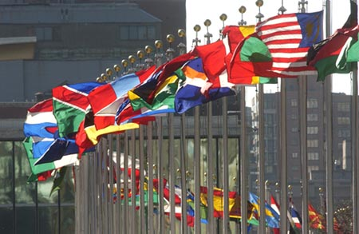

各国国旗（联合国图片）

作者：颜丹

【大纪元2018年05月27日讯】这两天，中共喉舌新华社从日内瓦发来消息称，“中国常驻联合国日内瓦办事处和瑞士其它国际组织代表团24日举行媒体见面会，介绍了中国人体器官捐献与移植事业的发展及成就，并重点就有关‘中国存在活摘器官’等谣言进行批驳”。

从新闻中并未出现“应邀”等字样以及大量篇幅几乎都在介绍“中国人体器官捐献与移植委员会主任委员”黄洁夫的一家之言来看，此次发布会或是仅由中共这一方来自行组织、举办的。中共的目的很明显，那就是想要为中国那些组织、参与“活摘”的刽子手们创造机会，让他们继续在国际社会撒谎、行骗。

要知道，“中国存在活摘器官”不仅证据确凿，且臭名远播。早在2014年10月，杭州举行“中国器官移植大会”之前，国际权威组织“医生反对强制摘取器官组织（DAFOH）”就曾及时发表声明，呼吁国际社会器官移植方面的专家不参与、不支持中国器官移植大会及其相关的专业活动。很多海外移植医学专家也明确表示，即使获得了邀请，也拒绝参加。

一方面，中国举办的类似会议根本就请不来那些了解“中国存在活摘器官”黑幕的海外权威专家；另一方面，是凡在海外举办的类似会议，也把中共送来的专家关在了门外。2014年7月，在美国旧金山召开的“世界器官移植大会”就以违背医学伦理为由，拒绝了35名中国医生参加。

2016年8月在香港举行的“国际器官移植大会”，因邀请了黄洁夫等53名参与摘取良心犯器官牟利的大陆医生而受到了国际医学界和人权组织的谴责。DAFOH在此之前再次呼吁，应撤回对“涉嫌推动和参与活摘器官”的黄洁夫的邀请。

国际社会的态度足以让中共认识到，在权威的学术会议上继续狡辩的机会已经不可能再有。因为全世界都对中共在铁证面前、仍打死不认的无赖嘴脸感到十分厌恶了。但国际社会不给机会，中共也要给自己创造机会。因此，最近这场由中共自编、自导、自演的“媒体见面会”才得以在日内瓦拉开序幕。

正因为这是一场中共为自己涂脂抹粉而进行的表演，所以陆媒在高调报道时，才会如此自相矛盾、漏洞百出。中共代表们不远万里、前赴海外，请不来专家、就在海外邀请“其它国际组织代表团”，还声势浩大的召开新闻发布会，表示要重点批驳有关“中国存在活摘器官”等谣言；然而同时，却又在报导中指出，这些谣言荒谬到“不值一驳”。既然“不值一驳”，中共又何必如此大费周章？

其次，黄洁夫在发布会上一开口就吹嘘，“中国政府高度重视器官捐献与移植事业的健康、可持续发展”，甚至还炫耀“2015年，中国政府宣布全面停用死囚器官”。算起来，中共都执政半个多世纪了，难道2015年才想起来，用死囚器官移植不合适？如果这样就算“高度重视”，那不重视的时候呢？是否会有更糟糕的事儿发生？

实际上，承认用死囚器官来移植，就足以凸显中共的非人道，甚至与“活摘”也脱不了干系。因为要被摘取器官的死囚什么时候死，基本就要看中共何时能找到配型合适的需求者。虽然死囚是被先行判死，但却足以表明“为需求而杀人”在中国的监狱中大量存在。此外，当公、检、法、司早已沦为中共的奴仆时，中国监狱中的“死囚”到底会是什么样的人，是否有可能是良心犯、政治犯，也完全是由中共来定夺的。

一旦松了“使用死囚器官”这个口，中共就得主动拿出“已停用”的证据，以便让国际社会信服。然而，这样的证据决不可能出现在此前一直呈现著大量短缺状的自愿捐献领域。因此，黄洁夫三番五次公开表示“中国器官捐献数量迅速增长”，只会召来更多质疑。大家都对中国人在一夜之间突然改变了几十年都无法改变的观念而感到匪夷所思。实际上，黄洁夫等所有涉嫌活摘的刽子手们无论如何辩解，都只是在给自己挖坑。

在此次发布会上，中国人体器官捐献与移植委员会的另一位委员也来帮腔，声称“中国存在活摘器官”的证据是“毫无事实依据的凭空捏造”。但其后，他却指出“2007年到2017年十年间，中国公安部门累计破获组织出卖人体器官犯罪团伙40余个，抓获犯罪嫌疑人220余名”。请问，这么多犯罪团伙、犯罪嫌疑人就没有一个涉嫌“活摘”？有时候撇得太干净，反而说明有问题。

黄洁夫还有恃无恐的提到，一些纪录片、报告指出的“中国移植器官大部分来源于法轮功学员、中国存在活摘器官”是“谣言”。对此，“国际追查迫害法轮功”组织的负责人已公开表示，“我们发的中共大量活摘法轮功学员器官的综合报告中，呈现了60个直接的录音证据，1260多个资料证据，我们都有具体的证据在网上”；“都有原始的照片在网上”。相比通过二者所说的话来判断虚实，直接从纪录片、报告所呈现的内容中来辨识真伪，或许会更加容易。

只要中共能把这些饱受争议的证据公诸于众，人们就能自行做出判断、得出结论，又何须由政府来出面辟谣？是不是谣言，本就不该由涉嫌其中的中共来判断。如果中共不让人对这些文字、影像资料一睹为快，甚至将这些证据删除、封锁、屏蔽，那中共的嫌疑也就立即被坐实。

对中共来说，“打死不认”真的不是解决问题的好办法，“强行狡辩”也只能把自己绕进去、让自己露出马脚。偷摸在海外开了个发布会、高调的在国内发了篇报导；折腾了半天，中共却愈发摆脱不了嫌疑。这不就恰好印证了那句“坏人总是很蠢”的至理之言吗？

责任编辑：莆山

<a href=#top><h6 align="right">回上方</h6></a>

<a name=38>
<h1 align="center"><b>孔子学院仅一角 外媒揭中共海外情报宣传网</b></h1>

【大纪元2018年05月27日讯】中共在海外大肆发展的孔子学院，被认为是一所为中共实施情报和宣传的机构。现在外媒分析，中共在国际上的隐秘影响力机器包括统战部和政协，这些机器将中国人安插到全世界，扩散中共的影响，收集情报，为中共政府服务。此外，有评论认为，中共的影响力机器不止这些。

中国共产党的秘密统战伎俩有多深？外界都很好奇。5月23号，《纽约时报》发表的文章，提出这些疑问。

这篇题为“中国共产党隐秘的影响力机器”的文章，说明这并非假设的阴谋论，从中共在海外校园建起的孔子学院和中国共产党小组便可见一斑，它们会勾勒出一个运转平稳的巨大机器。这个机器将中国人安插到全世界，扩散中国的影响，收集情报，为中共政府服务。

这部中共的影响力机器的核心是一个规则严明、经过实战考验的构造，但外表模糊。它最初是毛泽东在1930年代部署的，称为统一战线。该组织于1946年确立了现行形式，并帮助共产党赢得了内战。

中共的统一战线由两个机构组成，一个是神秘的中央统战部；另一个是所谓中国人民政治协商会议。

文章指出，统战部是受到严密控制的党组织，由中共中央书记处书记兼任。它监管着十几个通过劝说和渗透从事政治联络工作的组织。其中一个就是欧美同学会，该组织密切关注在西方生活或接受学术培养的学生和学者，把这些学者变成了统一战线的士兵。

旅美时事评论员郑浩昌表示，西方世界确实很难理解共产国家的统战部，所以就更容易被这种不见血的软刀子杀死。

旅美时事评论员郑浩昌：“当年苏共这个老大哥都没有统战部，中共却设立了统战部，经过这么多年的反复操演，中共已经把统战这种胡萝卜手段用得非常纯熟，甚至变成了所谓的三大法宝之一。加上中国有其他共产国家所没有的庞大的市场，对西方会构成很大的利益诱惑。所以中共当前的统战手段对海外华人、还有西方国家的迷惑性和隐性杀伤力都是非常大的。”

文章提到“中国人民政治协商会议”，年度会议大约40%的与会者是中共党员，以及精心挑选过的大陆、台湾、香港和澳门的名人富豪。政协委员必须服从中共党的安排，中共再透过他们影响各行各业的重要人物，最终通过金钱、美色、名望或利用他们的爱国精神，把他们拉进北京的轨道。

美国华府人权律师叶宁指出，中共的影响力机器不止这些，还有中宣部、中调部、中组部这三大部门。

美国华府人权律师叶宁：“中宣部是属于中国共产党政治局直接领导下的一个功能部门，从1921年开始，就是党内的特殊部门，宣传部，只有极权主义的政党，才会有中宣部这个怪胎。因为中国共产党是需要一个合法性，这个合法性就是意识形态，这意识形态就是由中宣部管的。所以中宣部一年不知道要开销多少国库的钱，这中宣部才是它的公部门，对外扩张的部门，意识形态扩张，文化扩张。”

叶宁表示，中共军队总参谋部下面的情报部、技术侦查部，也是隐秘的渗透机器。

叶宁：“总参谋部是进行各种各样的间谍活动的，领导和协调工作的这么一个功能机构。还有一个，是中国共产党下面的一个调查部，中调部就是负责和各国在野的政党进行联系的这么一个(部门)。”

叶宁还表示，公安部和国安部也是中共的功能部门，它们也负责各种渗透、侵略和控制。

叶宁：“《纽约时报》总算意识到，中共对人类的危害，但是《纽约时报》离看清中共的操作，还差的远。”

叶宁表示，2017年11月《九评》编辑部发表的新书《共产主义的终极目的》，把中国共产党的老底，揭露的干干净净。不过，叶宁提醒大家，共产党的邪恶我们知道的可能还远远不止这些。

——转自新唐人

责任编辑：任浩

<a href=#top><h6 align="right">回上方</h6></a>

<a name=37>
<h1 align="center"><b>“马工程”与“马藏”注定被历史淘汰</b></h1>

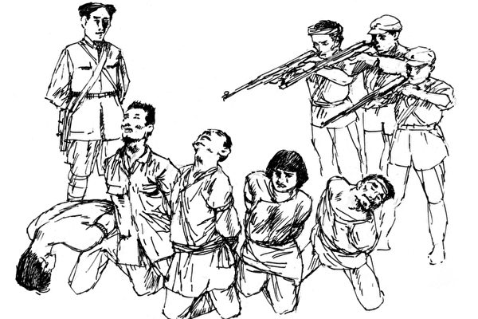

马克思思想的基本宗旨是毁灭人类，所以杀人变成了中共政权的目的，不管杀的是谁，它就是不停的要杀。图为苏区肃反。(大纪元配图)

作者：周晓辉

【大纪元2018年05月25日讯】近日与在高校工作的朋友电话聊天，听他吐槽“马工程”。刚听到这一名词，不免诧异，难道中共还有一个养马工程？其实这是教育界“马克思主义理论学科建设与理论研究工程”的缩略语，其重头部分是修订全国发行的96种教材。按照教育部部长陈宝生的话就是：“马工程重点教材建设是一项基础工程、筑魂工程、追梦工程、政治工程。”不过，缩略词“马工程”还是让人觉得有些滑稽，而其追的什么梦，筑的什么魂，估计飘荡在中国大地上的“共产主义的幽灵”最为清楚。

根据笔者在网络搜索的结果，“马工程”的目的是通过整编统一教材的方式，推进马克思主义在中国的宣传和传播。中共没有说的潜台词就是要全方位地用马克思主义洗脑中国年轻一代。

“马工程”开始大概已经有十年左右，一些教材已经出版。随着今年中共以前所未有的姿态招魂马克思，教育部也加大了力度推动“马工程”项目。笔者的朋友吐槽的核心是“马工程”教材质量差，而且用意识形态解释一切的做法，能培养出怎样的人才可想而知。

朋友告诉笔者，虽然“马工程”宣称的教材编写者都是权威学者，但从目前情况看，很多编写者并非该领域的专家，而是那些搞关系、拉帮结派的领导和学阀，他们借此捞名捞利，教材内容则是东拼西凑，质量可想而知。

此外，用马克思主义解释一切的做法对于大学的独立思想的发展，起到了巨大的抑制作用。绝大多数教师迫于压力，将放弃讲授真正的知识，而结果就是中国的高校一个个都慢慢变成了党校，学生的创新精神根本无从谈起。身在高校的朋友透露，现在老师上课都很小心，尽量避开敏感政治、社会话题，即便涉及，也只能用隐喻或打擦边球，否则一不小心会引起麻烦。

朋友的处境笔者可想而知，将中国人变成哑巴、聋子、瞎子其实正是中共的目地所在。浪费民脂民膏的“马工程”，说穿了就是一个垃圾工程，其对中国高等教育是没有丝毫的好处，不仅浪费了大量资源，而且扼杀了人的多样性、创造性，将本已自由度就不高的高校的自主空间进一步收缩。其反过来虽然对中共而言，可能培养了更多的“顺民”和盲目的民族主义者，但要培养出制造高端芯片的顶尖人才，则成了泡影。

除了“马工程”，在2015年10月召开的首届马克思主义大会上，北京有关方面还宣布，中共计划用20年时间，编纂一部在世界范围内较为齐备和完整的马克思主义研究文献总汇《马藏》，即“通过搜集汇编与马克思主义发展相关的各类文献，再现马克思主义发展历程，促进马克思主义学术理论研究”。《马藏》编纂工程由北大联合国内、国际相关文献及研究机构力量共同实施。

今年年初，为迎接第二届马克思主义大会，北大宣布，将在今年出版十卷《马藏》，每卷50万字，主要收集从1871年巴黎公社到1917年“十月革命”的相关文献。

笔者毫不怀疑，在北大编撰的《马藏》中，绝不会收集西方学者对马克思的研究成果，绝不会透露马克思早在上大学时便加入了撒旦教，成为魔鬼教的一员。绝不会告诉中国人，身为撒旦教成员的马克思曾在诗中透露：“梦想成为恐怖之王，毁灭整个世界”。而正是为了实现其“毁灭世界”的梦想，马克思创立了其以暴力斗争为核心的共产理论，以“人间天堂”、“唯物论”等来迷惑众生，还在《宣言》中以“一个幽灵，共产主义的幽灵”直接点出。更不会告诉中国人马克思称自己所写的为“污秽之书”，不会告诉人们巴黎公社对于巴黎的摧残，不会披露“十月革命”不过是列宁发动的一场政变，等等。

因为这些研究了一辈子马列主义的学者、专家，或者不愿正视历史，害怕信仰的坍塌；或者因为消息的闭塞和外文的水准，不容置疑的相信他们所看到的马列文章就是全部；或者基于现实名利的考量，不想打破虚幻的泡沫。而中共利用着这些学者编出的垃圾，继续毒害、迷惑著中国人。

然而，历史绝不会是人来决定的。随着大纪元网站推出的系列评论《九评共产党》、《共产主义的终极目的》和《魔鬼在统治着我们的世界》，共产党、共产主义的真面目正在系统的被扒光。正如《共产主义的终极目的》和《魔鬼在统治着我们的世界》所言，共产主义并非一种思潮、学说，或者在人类寻找出路时一个失败了的尝试。它是魔鬼，亦称共产邪灵，由恨和宇宙低层空间各种败坏物质构成。这个邪灵的终极目的就是要毁灭人类，在神归来挽救众生的最后关头，让人不信神，让人的道德败坏到背弃神和传统，听不懂神的教诲而导致最终被淘汰。

而共产主义百年祸害世界的历史早已证明了这一点。一方面，在所有共产党统治的国家里，都充满了暴政、杀戮、谎言、欺骗，人性被扭曲，道德急速下降，1949年后的中国也不例外，而且当今中共更是将“假、恶、暴”发展到了极致，甚至干出了强摘法轮功学员器官的前所未有的罪恶。

另一方面，在美国、欧洲、非洲、拉美，共产主义邪灵和它的各种变种，不但没有随着东欧共产党的解体而消失，反而正在全世界大行其道。换言之，共产邪灵毁灭人类的阴谋几乎得逞了。

但是，还是那句话，历史不是由人决定的，神在掌控一切。当世人意识到共产邪灵的危害，善念一出时，神就会帮助人跳出魔鬼的控制。正如《魔鬼在统治着我们的世界》中所传递的信息：神一定会战胜魔鬼，而我们选择站在哪一边却决定着我们生命永远的归宿！换言之，继续追随马克思和共产主义，将坠入万劫不复之深渊。而在不久后的历史中我们可以看到，现在喧嚣的“马工程”与“马藏”必将走入历史的垃圾堆。

责任编辑：莆山

<a href=#top><h6 align="right">回上方</h6></a>

<a name=36>
<h1 align="center"><b>朝鲜人为什么爱看美国电影？</b></h1>
  
作者：高天韵

【大纪元2018年05月24日讯】朝鲜人为什么爱看美国电影？据报导，在美朝峰会的消息发布后，朝鲜民众对美国小说和电影的兴趣日渐提升。这个现象很有意思。

在共产极权的喉舌笔下，美国往往是头号标靶，被视为“腐朽”之典型。但是，对于信息封锁之下的民众来说，美国的文化，尤其是音乐、电影和小说，一直具有强烈的吸引力。

曾经去过朝鲜的旅客，都体验过那里严格的边检。排查对象包括DVD、杂志、相机、手机等等，其中来自韩国和美国的“宣传材料”更是禁品。但是，即便如此，在朝鲜的“地下”市场，盗版的外国电影和电视剧仍然流传无阻。看禁片的人太多了，政府根本对付不过来。

2015年11月《卫报》报导，脱北后在美国生活的Je Son Lee分析了朝鲜人喜欢美国动作电影的一个原因：在电影里，英雄人物与坏人战斗，拯救自己的城市或者这个世界。Je Son说：“而坏人们正在俘虏所有的朝鲜人民。”

查尔斯·柳曾是朝鲜的街头流浪儿，靠乞讨和非法交易为生。他也将外国电影复制到记忆卡上、出售赚钱。他说，这些电影令他对外国的生活和自由心生好奇，他受到鼓舞、计划外逃。几经辗转，他于2012年抵达美国。在“新大陆”，他手执写着“liberty”（自由）的小旗，微笑留影。

在编译报导里，查尔斯说：“我们从小就被洗脑，所有我学到的都是谎言……而最差劲的就是被告知，朝鲜人比韩国人有钱。”

脱北者、人权活动者朴延美曾在朝鲜家中偷偷观看美国电影《泰坦尼克号》。当时，这个爱的故事令她“非常困惑”，因为她从来没有听过父亲对母亲说“爱”，“我妈妈也没有说过她爱我。我曾认为爱只能是对伟大领袖表达的。”

朴延美这样描述朝鲜人民的生活：“就像水里的鱼感觉不到水的存在，一代又一代人，生于朝鲜死于朝鲜，你会变得一无所知，不会意识到你是奴隶。朝鲜人对发出自己的声音深深恐惧，因为一个轻微的冒犯，就会株连三代。”

她说，没有互联网，信息封闭，“我们一直被灌输，领导人正在为了人民忍饥挨饿，为了人民跟美国日本作斗争。人民觉得他们是神……”

去年11月，澳洲九号电视台节目《60分钟》的记者Tom Steinfort获准进入朝鲜拍摄节目。在访问松涛园国际儿童夏令营时，一名正在玩射击游戏的男孩子说：“我很高兴能杀美国人。”他问：“你想像你正在射杀美国人？”孩子说：“美国人、日本人和韩国人都是我们的敌人。”

儿童的话，揭开了魔鬼的外衣。共产极权的宣传洗脑，不断制造“敌人”。凡是与邪恶意识不同流的个人、群体或国度，都被丑化、妖魔化，被定为打击的对象。暴政所为，就是煽动仇恨、鼓动暴力，对爱、希望、自由和真相，统统扼杀、排斥。

有人说过：“一旦开放，金家的谎言就会被戳穿。他们的统治会在瞬间崩溃。”

事实表明，没有不透风的墙。朝鲜的民众在痛苦中体验、分辨、脱逃。向他们灌输“仇美论”的“领袖”，从未间断舞宴笙歌。正如大陆的百姓亦看清，中共的高官们，早把美、加、澳等西方社会，选为自己和家人的理想居处。而对内，却把最丑陋的谎言和最严酷的奴役加诸本国人民。

美国的电影、电视剧和小说，是破解洗脑术、愚民术的一道风景。因为那一块土地，象征自由、给梦想翅膀，是激励心灵、抗衡邪恶的新奇世界。

在文艺窗口之外，还有更丰富、更震撼的真相，能够穿透红雾，解脱枷锁，帮助人们恢复人的正常情感和思维。

川金会或生变数，然而，自由的风会继续吹，追寻的脚步也不会停。#

责任编辑：高义

<a href=#top><h6 align="right">回上方</h6></a>

<a name=35>
<h1 align="center"><b>新疆，当今世界最大的人造监狱</b></h1>

据流亡海外的维吾尔人和一些学者说，新疆可能高达近百万名维吾尔人被关押在“再教育营”中。（视频截图）

  
作者：袁斌

【大纪元2018年05月24日讯】虽然我至今没有去过新疆，但她悠久的历史，独特的文化、丰富的物产，却一直令我神往。

那里有号称中国第一神山、万祖之山的昆仑山，绵延2000余公里的阿尔泰山，世界七大山系之一的天山；那里还有风光秀美的喀纳斯湖，以沙漠绿洲著称的伊犁、历史重镇吐鲁番；那里更有热爱自由、热情奔放的维吾尔族等几十多个少数民族。

但让人愤慨和痛心的是，如今的新疆却被笼罩在一片红色恐怖之中，不仅安保不断升级，当局还公开修建了大量集中营。据悉，自2016年迄今，新疆当局为建造集中营已耗资6.8亿多人民币。政府不仅公开招标承包商建设这些集中营，同时还招募有犯罪心理学专业知识或军队及警察背景的营地工作人员。目前，新疆每个市县都设有专门针对少数民族的集中营，仅在乌鲁木齐市就有33个。当局随意抓人，将他们关押在里面进行迫害。

奥米尔‧贝卡利的遭遇便是个典型的例子。

据美国之音报导，现年42岁的他出生在中国，父母是哈萨克族和维吾尔族人。2006年他移居哈萨克，并在三年后取得了当地国籍。

去年3月，贝卡利回中国探亲，几天后被抓捕。警方审讯的焦点是他和哈萨克一间旅行社的合作事宜。当局指控，他们帮助中国穆斯林获得当地旅游签证，协助这些人逃离中国。

贝卡利不停的被讯问，坐在老虎凳上。他被吊起来，只有脚能勉强够到地，四天四夜不让睡觉。平日里，他的手和脚被铁镣绑着，再和床拴在一起，身体无法直立。

审讯者要把他的护照烧掉，威胁他“活着出不去”。当局让他承认危害国家安全，组织、煽动、包庇恐怖份子。在哈萨克外交人员的干涉下，贝卡利被警方释放，却被投入了“再教育营”。

在那里，他和40个人被关在一间屋子里。每天凌晨起床，唱“红歌”；他们要学汉语和中国历史，特别是共产党是如何“解放”新疆的。吃饭前，要高喊“感谢党”等；上课时，一再重复地念口号。

最令他难以接受的是，他们要不停地声讨伊斯兰信仰，自我批评和批评亲人。贝卡利拒绝这么做时，他被靠墙罚站5个小时。一个星期后，他被单独囚禁，24小时不给进食。

在戒备森严的营地关了20天后，他想到了自杀。直到去年11月底，贝卡利获释，得以离开中国。

直到今天，他仍然无法走出那段阴影，每天晚上无法入睡。“当你自我批评、否认自己的思想、自己的民族时，那种精神压力是巨大的。”他流着泪说。然而，几个月后，他的父母和妹妹也被关进了“再教育营”。

据美国国务院的统计资料，新疆至少有几万名维吾尔人被关押在“再教育营”中。流亡海外的维吾尔人和一些学者说，这个数字可能高达近百万。

毫不夸张地说，共产党的极权统治已把昔日美丽富饶的新疆变成了当今世界最大的人造监狱。#

责任编辑：南风

<a href=#top><h6 align="right">回上方</h6></a>

<a name=34>
<h1 align="center"><b>中共是制造朝鲜民族惨况的根源</b></h1>

作者：夏林

【大纪元2018年05月24日讯】今天无意中听了川普2017年在韩国议会大厅的演讲，感触颇深。川普的演讲，主要是从人权上，经济上对比朝鲜民族在朝鲜战争后分成的两个国家的现状。

他说，“这是同一个民族，但是两个朝鲜的故事。一个朝鲜的人民能够控制他们自己的生活和他们的国家，选择自由、正义、文明和美妙成就的未来。而另一个朝鲜的领导人用暴政、法西斯和迫害作为手段来监禁他的人民。”

他给出了许多数据来对比南北两个国家。“当1950年朝鲜战争开始的时候，两个朝鲜的GDP大约相等，但是到了1990年南朝鲜的财富已经超过了北朝鲜10倍以上，到今天南朝鲜的经济已经是四十多倍了。如果大家在差不多的时间开始，而现在一方已经大了40多倍，那肯定是做了什么正确的事情。”“北朝鲜的工人们在无法忍受的条件下从事著长时间几乎没有收入的工作，筋疲力尽。最近，全部劳动人口被命令要既无休息日也无加班工资地坚持劳动70天。他们的家庭住在没有上下水设施的房子里，一半以上的家庭没有电气，家长们要向教师行贿以试图使他们的儿子和女儿逃离强迫劳动。1990年的饥荒里有100万以上的北朝鲜人饿死，在饥饿的今天还在继续饿死人，将近30%的5岁以下儿童中有疾病，而且因为营养不良而发育不良。”

朝鲜是中国的近邻。本来在民国时期，中朝两国关系不错，相安无事，朝鲜也是一个统一的国家。但当1950年中共决定跨过鸭绿江，进行所谓的 “抗美援朝，保家卫国”时，北朝鲜老百姓的悲剧命运就被注定了。中共用上百万中国年轻人的鲜血保住金家独裁王朝，从此一个朝鲜被迫分割成两个社会制度不同的国家，一个是民主自由，受美国保护的国家；一个是共产独裁，受中共和苏俄保护的国家。

而中共用这么多中华儿女的鲜血保住的北朝鲜，人民的生活与南韩相比怎样呢？听听川普的演讲，真是惊人的对比。由于中共，北朝鲜的老百姓几十年来生活在洗脑，饥饿，恐惧和虐杀之中。

前一段时间，北朝鲜的共产独裁统治者金正恩似乎改头换面，不仅与韩国总统文在寅在三八线握手言欢，还准备弃核，与美国总统在新加坡坐下来谈判。让人觉得，北朝鲜的老百姓或许有一线希望能够摆脱贫困。但是突然之间，他又变脸了，说是因为美韩军演威胁到他的政权而大怒，突然无预警取消了南韩北朝的高级会谈，而且还威胁要取消川金会，还说朝鲜说的无核和美国说的不是一回事。

这是怎么回事呢？川普在5月17日的讲话中再次提到中国，并说“金正恩与中方见了第二次，有点出人意外”。是的，中共又一次选择了支持金正恩对抗美国。有中共在身后撑腰，金正恩又开始狂妄，又不想放弃核武了。本来川普对金正恩的承诺是，只要他放弃核武器，不会干涉他的统治，而且会让北朝鲜非常富有。中共又一次出来搅事，不但使得美国不得不准备动用20套武力选项，也又一次让北朝鲜的民众失去吃上饱饭的一点希望，更别提过上像韩国一样的富裕生活了。#

责任编辑：滕冬育

<a href=#top><h6 align="right">回上方</h6></a>

<a name=33>
<h1 align="center"><b>陆小学生梦想发财影片遭删引热议 评论揭根底</b></h1>
【大纪元2018年05月23日讯】浙江杭州一所小学日前举办《我有一个梦想》演讲比赛，一名5年级男童直接表明，梦想就是发财，自由过日子。影片发布后在网络迅速获得热传，但很快被中共封锁删帖，因此引发热议。有评论指出，中共败坏道德并让中国人为钱奔波，现实社会造就了下一代人的梦想。

浙江杭州西湖府苑小学，16号举行演讲比赛，题目是《我有一个梦想》，有学生表示想踢足球，有人想当科学家，也有人表示要当医生。

之后一名5年级男童上台，语出惊人：“人各有志，人人都有梦想，我也是，我的梦想就是发财。”

他表示自己不像前面几个人说得那么伟大，发财了要去捐款。

5年级男童：“努力了一辈子，好不容易发了一笔财，为别人发的，这个不太实际吧！”

这番话引来笑声和掌声，有学生家长感慨说，“完了完了，活得太明白了”。

男孩接着又说，发财有其它更重要的理由，他表示，上学每天学习都差不多，进入社会上班，每天做的事情就更一样了，就像是生活在一座囚笼里，每天做着同样的事情，生活一点意义都没有。要摆脱这种困境必须有钱，有钱，就可以干些自己想干的事。

5年级男童：“人生就那么几十年，循环的度过和自由的度过，绝对是两种感觉”。

男孩的演讲赢得台下热烈掌声。

这段4分多钟的视频引发网民热议。有网友说，小小年纪！活的真明白！我想反驳他，却一下找不到现实可成立的逻辑和论点论据。也有人说，说的没一点问题，说的非常实际，但是小学生就说出这种话有点可怜。还有人说，贫穷让人不顾一切的现实，这个金钱社会已经让我们新一代的梦想改变了。

温州私营企业会计唐必青：“10岁的孩子，对他们来说，应该不算是太明白，只能说这个孩子有点早熟，一个孩子能这样说，跟整个社会的气氛是有关系的，平常在电视上、网上看到的一些事情，还有身边的，包括家长、大人的一些举动，使他产生了这样的观点，这件事情说明了中国整个社会有一种趋利的趋势，通俗的讲就是一切向钱看，这种风气对孩子很不好。”

山东临沂中学老师李向阳表示，中共不仅败坏中国人的道德，还想方设法让中国民众为钱奔波。

山东临沂中学老师李向阳：“当下的中国官员是党的干部，他们掌握了手中的权力，以张扬特权为能事，对老百姓无度的践踏，对公有财产无度的掠夺，他们生活在纸醉金迷之中，败坏了整个社会风气。他们也怕民众有信仰、有追求，用各种方式，把老百姓逼的为生计而奔波，生活在高度的压抑之下，把整个国民逼上了为生存而挣扎的道路，所以就连孩子都知道，钱能解决一切，能解脱困境。”

也有网友呼吁男孩，把书读好，靠自己能力挣钱。也有网友说，没有想过为社会作点贡献，如果现在的孩子都这种思想，真的国之不幸。

唐必青：“一个10岁的孩子，目前最主要任务就是学习，孩子学会理财，那是有点必要的，要节省用钱啊，要体谅大人赚钱的辛苦，但是不应该把钱看的那么重要。”

截至19号晚上，这段视频的播放量高达2000万人次，但到了20号，虽然网上还能评论，但所有大陆媒体转载的视频全部被屏蔽。有网友直骂中共最怕人民说实话。

李向阳：“强权势力他们正努力的粉饰著所谓的太平，只要在他们看来，对他们不利的任何信息，他们都会去屏蔽。因为孩子没有正确的人生观、价值观的这样的演讲，很显然在国际社会上看，是丢人的事情，我认为这是他们要屏蔽的原因。”

山东临沂中学老师李向阳表示，中国人需要拾回道德，拥有正确信仰，重新树立人生观与价值观，否则中华民族将一步步走向万劫不复的深渊。

——转自新唐人

责任编辑：任浩

<a href=#top><h6 align="right">回上方</h6></a>

<a name=32>
<h1 align="center"><b>中国大学里藏着多少不为人知的告密者？</b></h1>

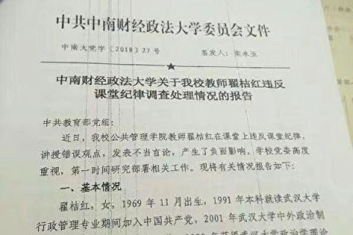

中南财经政法大学处分女副教授翟桔红因言，被停职、记过、开除党籍，还会被提报注销教师资格。（维权网）

作者：袁斌

【大纪元2018年05月23日讯】4月25日，中国武汉中南财经政法大学副教授翟桔红在课堂上向学生介绍西方政治制度时，对中共人大修宪做出了批评，结果遭学生告密。

随后，中南财经政法大学中共校党委发布了对翟桔红的处罚档，声称其教学“偏离教材、教学大纲”，“错误解释我国宪法修改情况”，“妄议人大制度”，“在学生中产生了负面影响”。为此，翟桔红被校方记过、开除党籍、停止教学工作，还被提报注销教师资格，成为近年来大陆教师“因言获罪”的又一案例。

想想真是不寒而栗。一个教师为了培养学生“独立之精神、自由之思想‌‌”在课堂上打破官方教学大纲的束缚，直抒己见秉笔直言，结果却被学生告密，关爱的拥抱换来的却是冷冰冰的匕首。

翟桔红的遭遇其实并非偶然，中国大学校园里的告密现象可以说是早已有之。从49年开始，在中共的政治高压下，中国迅速沦为告密盛行的国度。最典型的莫过于每次运动、斗争的前前后后，都会兴起揭发检举的风潮。这种毒素已经深入了当代中国畸形的传统之中，一直延续到今天，延续到文革后的大学校园中。

大家还记得吗？2005年，吉林艺术学院教师卢雪松在课堂上向学生讲述林昭——这个在毛泽东时代罕有的清醒且勇敢的女子——的故事。并且，为了使学生们有更真切的认识，她还组织他们观看了纪录片《寻找林昭的灵魂》。然而，令她没想到的是，班上竟有学生去向校方检举，称卢雪松在课堂上讲述反动内容。校方收到消息后，秘密停掉了卢雪松的课。

无独有偶。2008年11月底，华东政法大学教授杨师群在博客上透露，因为自己在《古代汉语》课上对当今政府说了几句批评之言，班上两位女生竟去向上海市公安局和上海市教委告发，称杨师群为 “反革命”，杨先生因此遭到了有关单位的调查。

时至今日，大学生里的告密者不但没有减少，反而更多了！

据曾因参与公共事务而被打压的贵州民族大学前老师曹振华披露，中央的意识形态要进课堂，要求老师在讲课的过程中、要灌输党中央的那一套意识形态，讲课的时候，也要回避意识形态的冲突。如果老师讲专业课的时候不顾及意识形态，这个学校在学生中安排的资讯员，就要向教务处举报。每一个班要有一、二个学生负责汇报班上老师的讲课、和同学中间有哪些说不同意见的学生。同时还有可能向国保、国安的人员汇报。此外，政治保卫警察也在学生中部署秘密线人，用作监视老师和学生。当时他在贵州民族大学的一个同事就做过资讯员。

去年9月因坚持从事敏感事件研究而被开除的谭松教授分析说，大学里的告密有两种情况，一种情况就是在学生当中发展资讯员来举报老师。这个资讯员发展之后，他的同学、甚至辅导员都不知道。第二种情况就是那种被洗脑的学生。这种学生呢，他脑子里边已经装满了“红色浆糊”，一听到哪个老师的讲话同他受的哪个教育不对，他本能的就要去举报。

可见，不管是哪种告密者，身份都不是公开的，他们的告密行为也都是背后进行的。换句话说，任何一个老师在课堂上上课时，底下坐着的学生中都可能有告密者，但是他却不知道告密者究竟是谁，究竟谁会去告密。但有一点是肯定的，那就是如果他敢公开发表跟官方意识形态相左的观点，特别是批评当局和现行制度，就可能被告密，受处罚。试想，在这样邪恶的氛围中，有几个老师还敢无所顾忌的说出自己的独立观点呢？跟着官方意识形态背书自然就成了绝大多数人无可奈何的选择。这也正是告密制度所要达到的效果！

可见，大学里的告密者乃是地地道道的中共豢养并为其效力的，扼杀言论自由、对学生进行洗脑教育的鹰犬。身为年轻学子，不去追求“独立之精神、自由之思想”，反而充当这样的鹰犬，助纣为虐，不仅无耻，而且可悲。但归根结底，这些鹰犬其实也是受害者，只是尚不自知罢了。真正的罪魁祸首并不是他们，而是把他们变为鹰犬并在背后操控他们的中共。如果不是它的积极引导和长期洗脑，如果不是权势的威逼利诱，天真单纯的学生又怎会走向告密者的道路，怎会 “大义灭亲”，向自己的老师下手呢？

可以断言，只要这个邪党存在一天，大学里的告密现象就一天不会停止。翟桔红不是被告密的第一人，也绝不会是最后一人！

责任编辑：南风

<a href=#top><h6 align="right">回上方</h6></a>

<a name=31>
<h1 align="center"><b>屡被举报的马克思主义理论家为何不倒</b></h1>

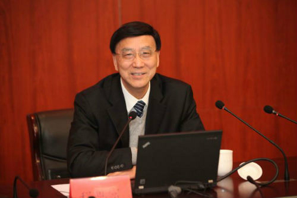

被中共官媒捧为“著名经济学家和马克思主义理论家”的程恩富。（网络图片）

作者：周晓辉

【大纪元2018年05月23日讯】近日，看到一封没有标注具体日期的写给中共中央巡视组的《关于社科院马克思主义学部主任程恩富违纪问题的举报（信）》，信中透露了大量程恩富在政治、学术、经济和工作作风上的拙言劣行，按照信中所言，他的所为“严重污损了中国社科院的社会声誉，严重污损了马克思主义理论工作者的集体声誉……”。

是否污损了本就不堪的社科院的名声不说，值得注意的一点是，举报信称，社科院有人近八年来不断向相关党组和纪检部门反映，但一直没有得到任何实质性的反应。有知情人一语道破：“马克思主义研究院是一个政绩工程，程恩富的问题再大，也得捂著！”“不死人，是不会处理的！”

资料显示，中央巡视组是在2015年11月巡视中科院的，举报信大概也是在那时候提交的。不过，两年多走过，程恩富依然屹立不倒，还在中共刚刚招魂马克思的声势浩大的运动中参加大会，发表演讲，印证了举报信中所言的“程恩富的问题再大，也得捂著”。

1950年出生的程恩富是何许人也？中共的官媒为我们描摹了这样一个程恩富。他的头衔是“著名经济学家和马克思主义理论家”，职务为“中国社科院首批学部委员、学部主席团成员兼马克思主义研究学部主任、博士生导师；社科院经济社会发展研究中心主任；社科院院长；中国社科院邓小平理论和‘三个代表’重要思想研究中心主任”，等等。

他的经历是“1972年4月至1989年3月执教上海复旦园，1989年4月至2005年9月任教上海财经大学，其后至今在社科院马克思主义研究院”。

他还在海内外报刊发表400多篇文章，独著和合编20多本书，多次获奖，被不少媒体高调宣传，甚至还有媒体称其为“我国第四代经济学家的代表之一”、“中国最有创见的经济学家之一”。

而他最引以为傲的应该是“曾在中央政治局集体学习会上讲课，近年多次出席中央领导召开的座谈会，上报的内参获得多位中央领导的批示”。比如2002年2月在江泽民主持的理论座谈会上汇报改革思路，2004年5月在胡锦涛主持的中共中央政治局集体学习会上讲课。换个时髦的名词说就是“高层智囊”。

另有文章透露，程恩富之所以从上海调到北京社科院，是因为胡锦涛上台后，急需理论与思想路线方面的支持，专事马列主义与市场经济学关系的研究的程恩富由此得以入京。据说2006年5月胡锦涛访美前夕，时任美国总统的布什还曾委托美国驻中国大使馆接触程恩富，意图了解最新的中共施政的动向。

这样春风得意的程恩富到底会有什么问题呢？还是回到开篇提及的举报信，其曝出的问题如下：

一、原本在上海财大名不见经传、仅为处级官员的程恩富，是靠投机和行贿原社科院马列所老所长李崇富而当上社科院新成立的马克思主义研究院副院长的，在李按时退休后，顺位当上院长，属于连升三级。

二、到了社科院后的程恩富，采用各种卑劣手段，拉帮结派，排除异己，制造一言堂，且时时给自己造声势。出外讲课，少则数千，多则数万，但从来不纳税，而是让邀请单位为其避税。此外，他利用自己的身份地位，到处“圈钱”，只要给他行贿就可以评职称、发文章、报课题等，即通过培训、刊物、评选项目敛财等；至于科研经费则巧立名目据为己有。

三、评职称、进人、招生等暗箱操作，存在腐败行为。据悉，马院编制为150人，但绝大部分人员调入都是程恩富和书记侯惠勤两人决定的。

四、“创新马克思主义”是程恩富当上副院长的敲门砖，但另一些研究马列的认为他的“创新把坚持给颠覆了”，是一场政治闹剧。不过，程恩富的“马克思主义创新派”的内容与中共中央保持高度一致，其创新说也为官方、高层借用，如官方称“马克思主义的活力在于永不枯竭的理论创新”。

五、存在诸多学术腐败现象，如其文字一是由人代笔，二是一稿变换题目后两投或多投，三是著作存在抄袭现象。

显然，举报信中所描摹的是完全不同于中共宣传的程恩富的形象，贪污腐败不说，而且还拉帮结伙，搞小圈子，学术造假。其与前几年曝出丑闻的、也是研究马列的中央编译局原局长衣俊卿有得一拼。估计再深挖挖，程恩富也免不了与情色丑闻挂上钩。

至于中央巡视组为何不处理程恩富，应该与怕失了颜面乃至引发社会更大反响有关。一个衣俊卿已是闹得沸沸扬扬，其所为不仅揭开了马克思主义和中共的画皮，也大大的影响了一大批人对中共的看法；如今，马克思主义研究院的院长若再曝出什么丑闻，刚刚招魂完马克思，并将其主义提升到新高度的中共，脆弱的内心哪堪忍受？所以，还是那句话，“马克思主义研究院是一个政绩工程，程恩富的问题再大，也得捂著”。而捂著捂著，中共就在疏忽间灰飞烟灭了。

责任编辑：莆山

<a href=#top><h6 align="right">回上方</h6></a>

<a name=30>
<h1 align="center"><b>从马来西亚反腐看中共反腐</b></h1>

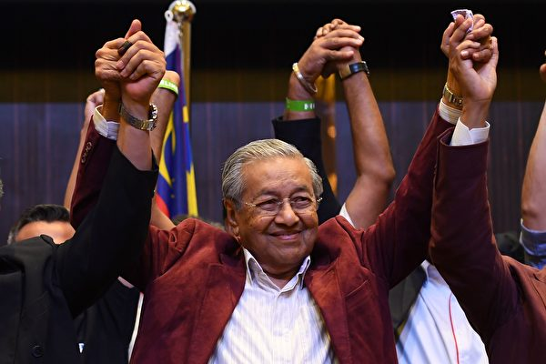

马来西亚总理马哈蒂尔。 (Photo by Manan VATSYAYANA / AFP) (Photo credit should read MANAN VATSYAYANA/AFP/Getty Images)

作者：崔士方

【大纪元2018年05月23日讯】马来西亚近期变天，92岁的马哈蒂尔重新出任总理，他上台不到三天，就宣布成立国家元老精英委员会。这个委员会当晚就彻夜开会，并决定成立一个调查“一马公司”的专案小组，对一马案穷追不舍。

值得注意的是，马哈蒂尔完全绕开了警方、总检察署、总审计署及反贪污委员会等体制内的机构，理由是这些机构的主理官员都是前总理纳吉布委任的。这些机构也多次帮纳吉布在一马公司案上站台。

显然，马哈蒂尔是不信任这些机构能彻查此案，所以才另辟蹊径成立专案小组。马哈蒂尔正式上班不久，总检察长阿班迪即被限制出境。

国家元老精英委员会成员都是政坛元老或德高望重的人物，包括前财政部长达因、国家银行前总裁洁蒂、马来西亚首富郭鹤年、国家石油公司前总裁哈山马力肯、经济学家佐摩。马哈蒂尔指该五人委员会将协助新政府落实“百日新政”。

马哈蒂尔走的这一步棋，对现今的中国大陆其实很有借鉴意义。

马来西亚作为一个君主立宪国家，也是一个多党制民主社会，但在国阵长达60多年把控政局的情况下，政治已经污浊不堪，以致反贪污机构在权力之手下已全部沦陷。马哈蒂尔要借助一个全新的国家元老精英委员会来挽回局面。

中共十八大后，新上台的习近平与王岐山联手，展开强力反腐。中共十九大后，国家监察委成立，反腐的覆盖面扩大到一切吃皇粮的公职人员，借助与国家监察委合署办公，中纪委的权力攀昇到一个前所未有的高度。

但是，这样就能彻底根治腐败了吗？

尽管中共的宣传机构反复强调中共可以通过不断在内查自纠上加力，就能治好自己的腐败病，但这种说辞只怕喉舌自己都不会相信的。

在中国，中共一党专政之下，权力的不受约制程度远远在马来西亚之上。公安部、检察院、法院、司法部都受中共政法委“协调”，权力更大的中纪委监察委，也是如假包换的党机关。在这样的背景下，大家会相信，中共高官的“廉洁程度”会优于马来西亚的纳吉布及其亲信吗？

如果不是有习江阵营围绕最高权力激斗这样一个主轴，十八大后如此天翻地覆的内部清洗可能根本不会发生，周永康、薄熙来、令计划、孙政才、徐才厚、郭伯雄、苏荣这些大老虎如今可能还会在“爵座”上悠然自得。

更深一层来讲，即便是具有民主形式的多党政治，也不见得就是治腐败的灵丹妙药。中国古代皇权之下，像给事中这样的小官，因为制度设置的合理，也能给皇帝的权力形成相当的制约作用。而在那个年代，哪有什么民主政治之说？#

责任编辑：朱颖

<a href=#top><h6 align="right">回上方</h6></a>

<a name=29>
<h1 align="center"><b>北京市副秘书长王晓明坠亡的背后</b></h1>

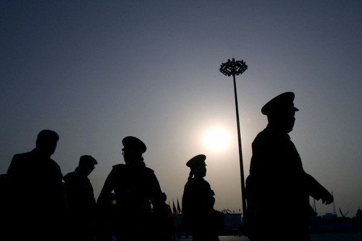

外界评论十八大后中共官场“自杀潮”或非正常死亡折射出反腐高压，还可能是替死甚至被灭口，但真相只能是谜或是“抑郁”。（Getty Images）

作者：陈思敏

【大纪元2018年05月22日讯】5月22 日凌晨，有大陆门户网站开始挂出一个消息：5月21日12时许，北京市政府副秘书长王晓明参加完一个工作会议后坠楼身亡。

据报导，王晓明患有抑郁症坠楼身亡。这不令人意外，除了这近年中共官场坠楼身亡的官员几乎都有抑郁症的共同疾病外，今次王晓明坠亡背后也有令人重新关注的尘封旧案，如距今9年前的北京市地税局（全称北京市地方税务局）窝案。

王晓明的公开履历显示，2013年4月起担任北京市政府副秘书长，此前，曾任北京市地税局党组副书记，局长。北京市地税局是北京市政府的要害部门，王晓明负责主持局全面工作，却是以“副书记+局长”的模式。

王晓明在北京市地税局“副书记+局长”的模式开启，始于2010年8月人事调整时被免去党组书记职务，改任副书记。在王晓明这次职务调整之前，2009年4月，其主持的北京市地税局爆发腐败案。

据当时新闻报导，被“双规”调查的北京市地税局常务副局长苏文权，案发前他在地税局领导排名位列第二，紧随局长王晓明之后，其职位为常务副局长、党组副书记，协助局长王晓明负责北京市地税局的全面工作。

而在北京市地税局窝案中，级别最高的官员是2010年退休后被查的前局长王纪平，也就是王晓明的前任。于2008年11月退休的王纪平，开始被重用担任北京市政府这要害部门地税局一把手的时间，是在贾庆林、刘淇搭档主政北京市的2001年9月。

当时外界关注焦点所在，北京市地税局窝案2009年爆发之际，时值前公安部部长助理郑少东、前广东省政协主席陈绍基、前深圳市长许宗衡、前浙江省纪委书记王元华等人一批大案要案，其内幕被指涉及十八大前“江胡斗”，胡锦涛重挫江系广东势力，同时将矛头指向时任政治局常委、江泽民心腹周永康。

虽然王晓明看起来与早前的地税局窝案没有太大的关系，但是在他党政一把手主持全局2年后，先是2010年被免去党委书记，接下来在2013年调任市政府副秘书长，这样的仕途轨迹在过去很多落马官员身上经常可见，而这说明的问题往往是在原岗位上出了什么问题，但受到保护调离是非之地。而王晓明仕途这个关键时点2013年的北京市时任书记是市郭金龙，时任市长是王安顺。

据媒体不完全统计，去年十九大后已有多名官员“自杀”，如：上海市统战部副部长戴晶斌、河北衡水市原人大主任孙志人、河南平顶山市原政法委书记李永胜、湖南省原政法委委员张小华、广东河源市副市长谢耀琪，以及解放军原政治部主任张阳。而今年截至目前，媒体公开披露“坠楼身亡”的官员已达3人：1月9日黑龙江佳木斯市人大副主任梅振学、4月19黑龙江大庆市副市长冯忠宏，以及5月21日北京市府副秘书长王晓明。

外界评论十八大后中共官场“自杀潮”或非正常死亡折射出反腐高压；而舆论这背后隐情不仅止于官员畏罪，还可能是替死甚至被灭口，但真相只能是谜或是“抑郁”。

责任编辑：高义

<a href=#top><h6 align="right">回上方</h6></a>

<a name=28>
<h1 align="center"><b>在权力面前，谭秦东们什么也不是</b></h1>

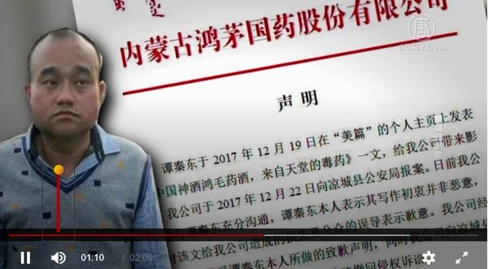

谭秦东18号发布了道歉声明，他的无力无助与无奈再次告诫中国人：在无所不能的权力面前，你们什么也不是。（视频截图）

作者：袁斌

【大纪元2018年05月22日讯】鸿茅药酒案虽说已经落幕了，但此案的一波三折仍值得咀嚼。

事情源于谭医生的“路见不平”。

据大陆澎湃新闻报导，近10年来，尽管鸿茅药酒广告曾被25个省市级食药监部门通报违法，违法次数多达2,630次，还曾被10省市18次采取暂停销售的行政强制措施，但作为内蒙古重要税收来源的鸿茅药酒就是一直屹立不倒。

作为医生，谭秦东当然深知鸿茅药酒对老年人的潜在危险。不过他本可以对此视而不见，一门心思经营自己的一亩三分地，过自己的小日子，显然是因为正义感作怪（他曾说“人不能光为着赚钱昧良心”），他居然不自量力的跳了出来，上网发帖质疑“鸿茅药酒是毒药”。结果，出乎他意料的是，酒厂向所在地的内蒙古警方报案，内蒙古警方很快实施跨境抓捕，将他关进了凉城看守所。

刚被抓时，谭医生坚信自己无罪。但被关了三月后，他不但充分领教了对手的厉害，也明白了左右自己命运的不是法律，更不是他个人的意志，而是强大的权力。用他的话说：自己“惹了不该惹的人”，“我们斗不过他们。”随之，他的态度来了个一百八十度大转弯。为了争取轻判，早点获得自由，他表示愿意主动道歉，他甚至否定了律师要为他做无罪辩护的意见，坚持自己有罪。”

但再次出乎谭医生意料的是，在外界舆论的强大压力下，案件突然峰回路转，他竟然被取保候审，重获自由了。

从看守所出来的谭医生，天真的相信“春天来了”，态度再次一百八十度大转弯。尽管那会只是取保候审，仍有被判刑入狱的可能，但当有记者问他：“再有这样的机会还会写这样的文章吗？”他毫不迟疑的回答：“写。”“还敢写鸿茅药酒的文章吗？”“敢写。”“写的时候还敢说它有毒吗？”“毒药。”他不仅对记者表示自己不后悔，还说要开新闻发布会。

不过，当采访结束后，一直说自己不后悔的谭医生又突然问记者 ：“我这种实话实说的，不会又把我抓回去吧。”这一问，把他内心的恐惧又全都给抖露出来了。没错，重获自由的谭医生其实并没有真正摆脱内心的恐惧，这个可怕的怪兽冷不防就会狠狠地瞪他一眼，吓的他一哆嗦！据他妻子刘璿披露，走出看守所的谭医生有失眠、担心等症状，精神状态不是很好，“在接受心理干预”。

眼看就要到案件退回补充侦查一个月的截止日，谭医生再次被内蒙古警方传讯。传讯持续了12小时，结束后他就精神失常了，医院诊断他是“创伤后应激障碍”。

很快，案情再次翻转，谭医生向鸿茅药酒表示道歉，而鸿茅药酒则表示接受道歉并撤回起诉。

从主动举报鸿茅药酒到在看守所里自认有罪，从重获自由后表示不后悔到遭警方再次传讯后又表示道歉，案情一波三折，谭医生的态度也是一变再变。他就像是一个面团，被权力这只 “看不见的手”揉来揉去，不要说改变社会，就连自己最起码的清白和尊严都无法保障。

谭医生的无力无助与无奈再次告诫中国人：在无所不能的权力面前，你们什么也不是。

责任编辑：南风

<a href=#top><h6 align="right">回上方</h6></a>

<a name=27>
<h1 align="center"><b>中共情报盗窃威胁重 美官员吁加强防范</b></h1>

【大纪元2018年05月22日讯】近期完成的“美国国防战略”指出，美国目前的主要威胁来自中共和俄罗斯，而不是恐怖组织。而中共的“情报盗窃”是最伤害美国的问题之一。来看时事分析员李沐阳的报导。

美国国家反情报和安全中心（NCSC）主管艾凡尼纳（William R. Evanina）在上周参议院听证时说，中共正同时利用人工和网络两种手段窃取机密，是美国面临的最严重威胁之一。

人工方面，中共越来越多地在美国各行业部署情报收集者，包括工程师，科学家和学生。

网络方面，中共利用网络渗透来识别和提取美国研究机构的宝贵数据。

美国的情报单位、专有数据、个人身份信息和商业秘密，都可能成为中共的目标。

艾凡尼纳提到，中共开动整部政府机器来对付美国，目的是增强其经济和军事实力。

她呼吁，美国必须持续应对中共的情报盗窃行为。

责任编辑：任浩

<a href=#top><h6 align="right">回上方</h6></a>

<a name=26>
<h1 align="center"><b>川普效应显 西方政界商界态度在变</b></h1>

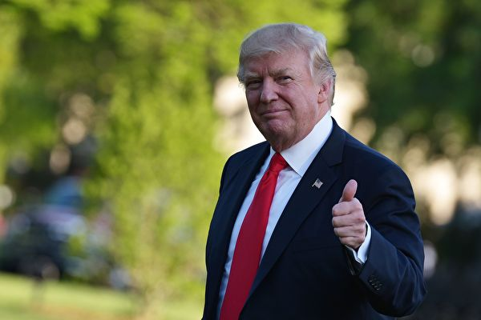

专家说，川普不仅没有退出亚州，反而正在以前所未见的方式，重新绘制亚太区域的外交地图。(MANDEL NGAN/AFP/Getty Images)

作者：周晓辉

【大纪元2018年05月22日讯】不管北京和世界其他国家是否愿意承认，美国总统川普（特朗普）上任后针对北京、朝鲜、叙利亚的强硬政策，正在引发连带效应。且不说在朝鲜无核化问题上，西方盟国纷纷予以支持，也不说美国去年就叙利亚化武袭击发射导弹后收到众多盟友的感谢电话，乃至今年变成了“让我们一起解决问题”的回应，英法加入攻击叙利亚的阵营，更不说北约国家在川普的敦促下，相继增加国防预算，我们单说在对华贸易问题上，川普的带有弹性的高压政策，也正在使西方政界、商界的态度发生变化。

比如5月19日，德国总理默克尔表示，她将在本周的再度访华期间，与中方讨论互惠市场准入等贸易问题及知识产权问题。据路透社报道，德国公司多年来一直在抱怨中共的市场壁垒以及盗窃知识产权等问题。而这些问题正是北京当年加入世贸所承诺但迄今没有兑现的，也是欧美所面临的共同问题，同样是川普施压北京的原因所在。

根据中美最新发布的经贸磋商联合声明，北京不仅同意大幅减少中美贸易顺差，允诺加大采购美国农产品与能源产品，而且还同意在知识产权保护方面加强合作，中方将推动修改这方面的相关法律和法规，包括专利法。双方还同意鼓励双向投资，努力创造公平竞争环境。

显然，默克尔希望与北京沟通的几方面问题，北京已经在中美声明中表了态，换言之，北京如果做个顺水人情，还会将近似的表述传递给默克尔。从某个角度上说，默克尔如果会谈顺利，应该是借了川普的光。

德国媒体《法兰克福汇报》早在3月在川普拟向中国进口征收关税后，曾发表了一篇题为“与华盛顿并肩作战”的文章，呼吁欧盟应避免激化与美国的贸易争端，而是与川普并肩作战，共同对抗中共的不公平贸易手段。德国《商报》在“面对贸易摩擦，欧洲只能两害相权取其轻”社论中，也指出“川普的分析并没有错：北京一再高调宣称要开放市场，但是实际上却几乎毫无改变。欧盟一直在要求机会对等。只要中国不改善在华外企的待遇，欧洲人也可以给中资企业在欧业务增加些阻力。”可以说，默克尔此番到访北京的议题一方面顺应了德国公司的要求，一方面也是川普效应使然。

至于先于默克尔到访北京的英国首相梅姨和法国总统马克龙，虽然表达了与北京加强经贸合作的愿望，但对北京大力推行的“一带一路”计划提出了质疑，没有为其背书。马克龙还公开批评欧洲国家过于亲华，德国外长加布里尔也曾公开指责中共挑战西方世界的现有秩序。

而针对中共对澳洲和新西兰的渗透，澳大利亚总理特恩布尔公开称“澳大利亚人民站起来了”，并制定了防干涉新法案，新西兰则提高了中国人申请投资移民的拒签率。

4月中旬，欧盟27个国家驻北京大使则联合撰写报告，指责中共想要塑造全球化来满足自己的利益，其推行的“一带一路”计划破坏自由贸易，不仅使中国企业获得优势，而且借此分裂欧盟。这份不同寻常的报告是欧盟为7月份中欧峰会准备的一部分，欧盟的立场使得北京的企图的实现并非易事。

此外，自4月16日开始，中国钢铁、铝及相关钢铁制品接连遭遇台湾、美国和澳大利亚的反倾销反补贴（“双反”）调查，而墨西哥、哥伦比亚、巴西等国也均在3月份对中国相关钢铁产品发起“双反”调查，这应该也是川普3月1日宣布将对钢铁和铝产品分别征收25%和10%的全球性关税的效应，上述国家目的都是为了获得美国的关税豁免。

无疑，与北京相比，欧盟、澳大利亚与美国拥有更为相同的价值观，所追求的自由贸易理念也更为相近。诚如德国媒体所言，如果美欧加强合作，北京的选项必将越来越少，因为美欧这两大经济体对中国的重要性不言而喻。

如果说川普的强硬让西方的领导人们对华态度发生主动或被动的变化，并正在通过其言行向外界传递，那么西方商界则更主要是用脚传递自己的态度。

据中共官方3月公布的数据，目前中国外资占进出口总额50%，占工业比重近25%，占税收比重20%，还为中国贡献了10%的就业机会。然而，令北京颇为担心的是，这些对中国做出巨大贡献的外企正在悄悄离开中国。

4月27日，韩国科技巨头三星电子关闭了深圳三星电子通信公司，而三星自2012年以来，在越南的投资总额已达173亿美元，创造了14万个工作机会。外界估计，随着三星的出走，大陆至少有10万及以上直接岗位的流失，因为其供应链也随之倒闭。

而此前，松下、夏普、东芝、飞利普、索尼、霍尼韦尔安防、希捷、苹果都已经加大撤退的力度。苹果CEO库克2016年访印时，曾表示将全部苹果产线迁移到印度。随后，富士康宣布砸百亿在印度建百万人工厂。另外，今年年初，苹果公司为了因应川普的减税计划，宣布将启动5年300亿美元的投资计划，富士康也随之宣布将在美国威斯康辛州设厂，投资金额达100亿美元。

大陆微信公众号“环球冷眼”曾发文，以深圳为例，讲述了外资和实业撤退的多重原因，包括产业升级，供给侧结构性改革，导致地价上扬，企业用工成本提升，综合税率居高不下等，1.5万家企业因此迁出深圳。除此而外，中共内部对外资知识产权的倾轧，其要求外企开放诸多条件，使用盗窃、限制股权、在政策上黑箱操作等方法转移外资收为己用等，也是外企离开的原因之一。

令人不寒而栗的是，刚刚网上有一篇文章称，作为外资进入中国的桥头堡，也是中国的外企总部聚集地的上海，2017年利用外资规模170亿美元，较峰值年份2016年的185亿美元下降了8.1%。今年1季度这种下降趋势仍在继续，利用外资规模37亿美元，较2017年同期减少2.2%。问题的关键在于，外资企业不再愿意投资在上海的固定资产领域了，而引发下降的原因在于外企到位资金只有7千万，同比降幅高达90.9%。这在传递什么信号，中南海应该懂的。

中国出现今日之状况，中国人当知道这是信奉邪灵、自私自利、以戕害中国人为己任的中共一手造成的。狂妄自大和坏事干绝的中共末日的号角已经吹响，川普效应也是与之对应的人间天象，而这对饱受苦难的中国人而言是真正的福音。

责任编辑：莆山

<a href=#top><h6 align="right">回上方</h6></a>

<a name=25>
<h1 align="center"><b>毛时代，也腐败！（一）</b></h1>

作者：张林

【大纪元2018年05月22日讯】自从薄熙来在重庆开展唱红歌运动，近十年来毛左势力不仅沉渣泛起，而且日益猖獗。

毛左本质上是中共教愚制度的牺牲品。小学教科书里充斥共产主义异端邪说，中学教科书里塞满社会主义荒诞理论，而大学教科书里尽是不伦不类的改革开放胡说八道。广播电视书刊杂志被中共宣传部严密控制，几十年如一日传播谎言，欺骗人民。

所有这些牲口棚式的封闭洗脑教愚，足以让本来就没有独立思考能力，也不愿意认真观察社会、识别当局险恶用心的民众上当，误以为世间真理尽在欺骗他们的教科书和新闻联播里。

此外，目睹当前共产党官员普遍而严重的腐败，许多人怀念毛泽东时代的所谓清廉。也是毛左能够吸引越来越多支持者的重要原因。所以我们不得不认真揭露毛时代的腐败。

毛时代实际上更腐败，不过当时是被严格封锁与掩盖罢了。毛时代一切都是机密。任何人出门到外地都得介绍信，农民得有路条。

早在共产党大肆宣传的延安时代，共产党就腐败无比。共产党出版的斯诺的《西行漫记》里，就写到抗战最艰难的时期，毛泽东经常躲在窑洞里找几个风流男女打麻将，甚至能打几天几夜，困了的就到一边睡觉。普通人如此赌博，都会被周围的人批评，但是实行极权体制的共产党，领袖可以随意抓捕干部群众，所以谁也不敢说三道四，否则第二天就会被抓走。

毛泽东还肆意玩弄许多高干的妻子，以请她们吃饭打麻将为名。美国左派记者史沫特莱就公然与毛泽东鬼混，中共高层人人知道，毛妻贺子珍前往抓奸，被史沫特莱一拳打翻。

更可恶的是，与上海演员蓝萍（江青艺名）开始鬼混后，毛竟然给皇阿爸斯大林写报告，诬称妻子贺子珍是托派，以学习为名，把她骗到苏联，在精神病院长期关押，差点饿死。为满足性欲而运用权力到如此疯狂的程度，不是最可怕的腐败吗？

抗战时期，蒋介石、阎锡山等将领不仅日理万机，而且艰苦朴素；而毛泽东天天大吃大喝，茅台酒从来不断，麻将桌边男女彻夜鬼混，国破家亡，举国还有毛泽东一伙如此腐败的军政头目吗？

共产党高干自然上行下效，纷纷与原配老婆离婚，而几乎集体换年轻美丽的女孩子为妻。

其他中下级党政官员也是绞尽脑汁搞腐败，尽管抗战时期环境十分艰苦。批评中共“衣分三色，食分五等”的延安作家王实昧，当时不仅受到大批判，最后还被中共用大刀砍死。

腐败并不是贪污数额问题，而是性质问题，观念问题。现在中国腐败如此严重，应该主要是在毛时代，人们普遍形成了根深蒂固的腐败观念所致。

因为腐败的本质，是权钱交易。只有极权体制，因为把人民的天赋人权都剥夺近净，官员掌握了几乎所有权力，甚至普通人吃口饭、买件衣服、请病假都要经过领导批准，才会有规模巨大、程度严重的普遍腐败。#

责任编辑：朱颖

<a href=#top><h6 align="right">回上方</h6></a>

<a name=24>
<h1 align="center"><b>“朝鲜红色之旅”车祸给人的警示</b></h1>

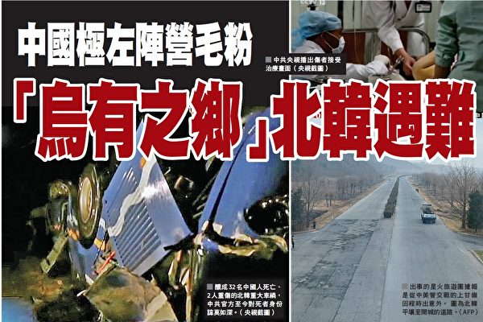

中国极左网站“乌有之乡”旗下的星火旅行团在朝鲜“红色之旅”中遭遇致命车祸。（大纪元合成图）

  
作者：诚宇

【大纪元2018年05月21日讯】二零一八年四月二十二日，中共左派网站《乌有之乡》及中共左派精英，组团去朝鲜红色旅游，名为“朝鲜红色之旅”。一行共三十四人，在去上甘岭回来的路上，发生了一场重大车祸，造成三十二人死亡，两人重伤，可谓全军覆没。

人死了，人们应该寄予哀悼，这是人之常情。可是如果以欺骗国人为己任，并且乐此不疲的人遭遇灾难了，人们就会说老天有眼。我们倒不是对死者幸灾乐祸，只是感到一个生命来到世间，就这样被中共欺骗，而且又用中共骗人的那一套经过加工后再去欺骗国人，最终落得惨死的下场感到可悲。

这么一场重大车祸，震惊国际社会，连朝鲜劳动党党魁都亲到车站送别亡灵，可见这桩车祸中死难者的身份之高，用中共的话讲，这些人都是中共的红色精英。然而中共却对这场车祸讳莫如深，对死难者的身份捂严盖死，生怕被人知晓。其实中共最担心的是民众对此作出“恶有恶报”的评判！

世界上除了共产国家之外，几乎所有的国家和地区都是相信神的，相信神在看护着一切。那一场场车祸哪有偶然的呢？人不信神，是人的问题，并不等于神不存在。那些违背天理，严重祸乱世间的人，神也不会容许他们永远为非作歹下去。

就像朝鲜的这场车祸，那是天降罪于人。大家知道，中共的这些左派，极力推崇的是毛泽东与中共的歪理邪说。他们不是从人性的角度，而是从中共党性的角度误导国人。就像朝鲜战争，当时的情况根本不是美国打到了鸭绿江，威胁到什么新中国了，这完全是中共的杜撰。去年，中朝关系交恶时，《人民日报》就刊文说：“如果不是金日成要统一半岛，半岛怎么会爆发战争？中国卷入其中，付出了几十万人的生命，引发了中美长达二十年的对抗，甚至使两岸问题搁置至今，中国承担了朝鲜当年‘任性’与妄动的大部分成本。”这等于变相承认了中国卷入朝鲜战争是一场失误，因为金日成发动的是一场非正义的战争，而中国军人只不过是在为金日成当炮灰。可是时隔不到一年，中朝关系稍一好转，这些人立马就跑到朝鲜，说是去红色旅游，其实就是要借此鼓噪一番，重新将中共过去的罪恶洗白，好为共产主义再唱赞歌。那上甘岭上死去的中国军人，是被中共以“抗美援朝，保家卫国”的口号欺骗去的，死在异国它乡的冤魂被中共当成英雄误导了中国人几十年。

在中共的欺骗下，许多中国人变成了徒具人的外表，而丧失了道德的变异人。罪魁祸首虽是中共，可那些痴迷中共的国人不也是处在了极其危险的境地上了吗？“天灭中共”绝非戏言！发生在朝鲜的这场灾祸，是对所有仍在痴迷中共者的一个警示！

在明慧网上有很多因痴迷中共遭到恶报的例子，这类的车祸也有很多。我们看几个例子。

郑州大学哲学教授吕鸿儒（原河南省哲学会理事、郑州市哲学会副会长），七十来岁。他利用自己的身份，狂妄无知地到处做报告攻击法轮大法，并在河南电视台上大肆诬蔑法轮大法，为江氏集团迫害法轮功摇旗呐喊。二零零三年八月初，吕鸿儒携妻、女儿、女婿和十来岁的外孙女一行五人，开车回老家，祭奠其父去世周年，途中在一零七国道上撞在一大货车车尾，造成老俩口、小俩口当场死亡，小外孙女受伤的惨局。更惊人的是吕鸿儒本人嘴被撞没有了，单位为其举行告别仪式时，只好用块白布把嘴蒙住。

二零零八年六月二十四日晚，黑龙江省双城市单城镇政久村法轮功学员董连太，被单城镇派出所和镇干部绑架。董连太被非法抓捕前约两个月就已经听说自己是被镇委定下要重点迫害的对象了。

董连太是骑着自行车无缘无故被绑架的，同时还遭到镇派出所民警范子民及镇政法委书记陈超武的非法抄家。董连太被非法拘留后，又被劫持到长林子劳教所。劳教所员警使用暴力与酷刑逼迫董连太放弃修炼法轮大法，他们曾强迫他上老虎凳、插管灌芥末油、灌浓盐水折磨。在一次灌盐水时，董连太请求狱医少放点盐，他的胃和食管已经被盐水刺激的无法承受了，狱医不但没少放，抓起一把盐又放入灌的盐水中，折磨的董连太加剧咳嗽，昼夜难眠，腹部、胸腔内高烧，昏迷。

在董连太被迫害得奄奄一息时，长林子劳教所打电话让家属开证明去接人，家人和亲属到镇政府求镇书记关文良。关文良说：有病了，长林子不要我也不要。遂把家属撵出了他的办公室。在人快不行时，长林子劳教所把奄奄一息戴着手铐的董连太送到了单城镇。董连太被家人接下车时，劳教所一警察说：赶快送医院检查。董连太回到家的八天中呕吐出像溃烂的柿子一样的东西，腹内高烧疼痛难忍，于九月十九日晚含冤离开人世，年仅四十五岁。

董连太被迫害死了，那些作恶者的恶报也就来了。半个月后，也就是二零零八年十月五日，单城镇中共邪党干部一行五人，自驾丰田车去哈尔滨市，途中与一辆大货车相撞，造成重大车祸：二把手高志武（男，三十八岁）、三把手政法委书记姜文超（男，三十二岁）、四把手副镇长薄建夫（男，三十四岁），在车祸中当场死亡；一把手关文良（男，四十八岁），车祸中失去一只眼睛、一条腿，一只胳膊被撞断，副镇长陈超武（男，三十六岁），一条腿撞成粉碎性骨折。

这场重大车祸发生后，很多人都清醒了，包括周边乡镇的农民与中共干部，大家都认为这是迫害法轮功得到恶报了。如果没有对董连太的绑架，董连太何至于死。在家人恳求关文良开个证明时，关文良竟然拒绝，还将家人赶出办公室。这些共同决定要重点迫害董连太的中共基层官员，他们残害好人的目的达到了，可是相应的恶报也就在不远处等着他们了。

基层官员遭到类似恶报的有很多，例如湖南省怀化市洪江市湾溪乡邪党书记肖平、政法书记周喜刚、乡长张勇泉，带领乡干部多次恶毒诽谤法轮功，迫害法轮功学员。二零零二年“五一”前夕，他们发动乡干部到每一位法轮功学员家中翻箱倒柜搜查，抓了六名法轮功学员到乡政府毒打，逼供说他们是“反革命”，强行签字，不准外出（包括打工、走亲戚），关进拘留所。不到三个月，恶报就找他们去了。同年七月二十五日，乡党委一行七人出车祸，肖平、周喜刚、张勇泉与司机四人当场死亡、面目全非。

当然，那些直接迫害法轮功的基层警察遭到恶报的例子就更多了。例如，二零零三年五月二十六日，河北省邢台市南宫市恶警对法轮功学员进行了又一次大规模的非法抓捕，几百名法轮功学员被抓到看守所和拘留所迫害。恶警还勒索每人二千元至五千元不等，把坚定的法轮功学员送到邢台市洗脑班，每天勒索生活费五十元。四十天后，七月五日凌晨四时三十分，迫害法轮功学员的南宫市公安局刑侦三中队队长徐保荣和手下五人遭遇车祸，恶警徐保荣、李学斌和另一人三人当场死亡，另外三人重伤。《邢台日报》二零零三年七月九日头版有相关报导。

河北省保定市定兴县公安局国保大队指导员朱晓涛，三十四岁，积极追随中共迫害法轮功，就连白发苍苍的老人也不放过。光在二零零八年“奥运”前，就非法劳教十七名法轮功学员，其中有两对夫妇。法轮功学员多次给他讲真相劝善都不听。二零零八年十月，上司以他们迫害法轮功学员有功，给他们放假，去山东旅游。他开车带了六人撞在石头上，两人当场死亡，五人重伤，他内脏出血，汽车报废，赔偿人家五十万元。

中共上级用金钱鼓励着手下的人迫害好人，其实是在把他们往地狱里面送。看着是叫他们度假，是领导对他们的恩赐。可是等待他们的却是恶报。

还有一些普通老百姓，被中共欺骗得昏头晕脑，最后不但自己遭恶报，连带着家人也遭了殃。例如，贵州省贵阳市南明区八公里社区钱家寨居民钱正光，多次诋毁谩骂法轮大法。遇到法轮功学员他就用一种幸灾乐祸的语气跟法轮功学员说话，嘲笑他们。二零零四年的一天，法轮功学员还专门找他们一家讲真相，他们不但不听，反而说法轮功不好。三个月后，也就是二零零四年三月二十八日，他们一家八人开上自家的车去吃酒，在贵遵高速公路上发生车祸，造成四人死亡、一人重伤、三人轻伤的重大伤亡事故。事后他女婿说：当时不知怎么回事眼前发黑，车子会自己调头。

还有一些车祸很蹊跷，有些人在车祸中受重伤，可同车的人却安然无恙。这究竟是为什么呢？我们看下面这个案例：

二零零二年，河北临城县法轮功学员进京为法轮功上访，被非法拘捕。临城县警察在绑架他们回来的路上发生车祸，价值三十万元的豪车撞的稀巴烂，四个员警不同程度的重伤，有断胳膊的，有断肋骨的，有头破血流的，而法轮功学员却没事。他们深感奇怪，就问法轮功学员：我们都坐一辆车，我们四个警察都受重伤了，你们却一点事也没有，这是怎么回事？法轮功学员告诉他们：我们在讲真相救度世人，在做最好的事，而你们却助纣为虐迫害法轮功学员，必然遭报应，这是天理。

在这样一个乱世中，是谁在不计任何报酬，冒着生命危险告诉世人真相呢？这不也是一种天象的表现吗？那些痴迷中共、迫害诋毁法轮功的人，法轮功学员苦口婆心地劝你们，你们怎么还不醒悟呢？你知道恶报哪一天会降临到你头上？静下心来，用自己的本心去体悟一下法轮功学员所讲的真相，为自己的未来作出明智的选择吧。#

责任编辑：高义

<a href=#top><h6 align="right">回上方</h6></a>

<a name=23>
<h1 align="center"><b>从古代暴君“射天”看当今中共“拜魔”</b></h1>
  
作者：如影

中国古人“每事俱是敬天畏天”，对于“射天”，别说去做，仅只想一想都是对上天的大不敬。但《史记》中的确记载了两个暴虐的古代国君“射天”的故事。一个是商纣王的父亲帝乙（武乙）因射天被暴雷震死；一个是战国时宋国最后一个国君宋康王，他因射天最终身死国灭。司马迁对两个故事的描述都比较简略，明清小说以演义的形式对故事内容加以充实，申明善恶之报如影随形的规律，以劝善止恶。

<b>武乙因射天被暴雷震死</b>

武乙即位时，东部和北部的少数民族频繁侵扰，人民不胜其苦，武乙不去征讨，也不整饬朝纲，是个昏君。

武乙无道，群臣有谈及敬天劝民者，他哑然笑道：“我使唤我的百姓，他们就该拥戴我，我随便可以决定他们的生死。你说敬天，我乃天子，天下只有我一人为尊。我听说有天神，天神那么多，难道个个都比我强？超过我的，不过只一个玉帝。”群臣道：“先王成汤有云：‘肆台小子将天命明威’，又曰：‘敢昭告于上天神后，每事俱是敬天畏天。’”武乙又哑然笑道：“你们都说我应敬天，天神一定是有思维的，手段也必高过我，我与天神比试手段，让你们百官看看我的能耐。”

武乙于是命匠人造一木偶人，高八尺，穿上衣服，抬到殿上。叫内官捧过赌博用的双陆盘来，命一内臣代替天神赌输赢。武乙仰天道：“你是天神，手段必然高过我。你要是赌赢了，是你天神高过我。若赌输了，是你输给我，还得算我厉害，你也得听我号令。”于是，武乙与那木偶“天神”赌了几局，“天神”果然输了。武乙令代天神赌博的内臣跪在阶下，道：“你是天神，毕竟有天大的手段，一个小小双陆儿都比不过我，枉作天神。”喝令斩首。内臣闻说将他斩首，大呼：“我不是天神，王命我替天神赌博，为何杀我？”武乙笑曰：“你代他赌，你便是天神一路人。天神保护你，那一定杀不死你。”内臣又呼曰：“世上哪有杀不死的人？”武乙不听，喝令武士把那个内臣推出朝门斩了。

武乙又问群臣：“你们看到天神了吗？”群臣都低首不言。武乙道：“你们都亲眼看到天神比不过我，被我杀戮羞辱，你们还不承认！”喝令武士每人赏他一下铜锤。群臣大惊，一齐跪下，道：“王胜天。”武乙大悦。

武乙又琢磨弄个手段欺瞒众人，显示他的本事。于是密令一内臣作一薄薄皮囊，囊内盛猪羊等血，造下两个白罗鹞风筝绑在皮囊两边。风筝系两条白绢绳，命内臣藏在高台上，将风筝乘风夹皮囊吹上空中。那白罗鹞风筝在空中与白云无异，地上的人看不见皮囊。武乙对群臣道：“我前日与天神赌博，天神不胜我，杀的还只是替身内官，不稀罕。如今我要射天，怎么样？”群臣又低头不言。

武乙见群臣不言，大怒道：“你们与我作对，偏袒天神是不是？我便射两箭给你们看看。”于是朝着皮囊，连发三箭。箭穿囊破，只见空中有血滴下地来。武乙大呼：“手段如何？这天却不被我射出血了。古来至今有我这等威武的吗？”群臣中也有一分晓得的，暗地叫声“欺天无道”。那不晓得的，唬得遍身汗流，思量：“难道真有过往的天神中了箭？”

武乙见群臣惊疑，怕看出他伎俩，即发驾回朝。道：“汝众人乃凡夫俗子，看不见天神；惟朕看得出，所以认定射之矣。”

人间私语，天闻若雷；暗室亏心，神目如电。更何况武乙如此狂悖射天杀神，哪能没有报应？

城隍土地见武乙如此邪恶，立即报告天帝，天帝大怒，即令五方蛮雷速速击死武乙。

一天，武乙带文武数十员、军校数千人，架弓搭箭，驱犬放鹰大猎于河渭之间。那五方蛮雷领了玉帝旨意，早同风伯、电母待武乙来于渭水之阳。武乙正于河渭驱鹰捉兔，天正时午，丽日当空。忽然天上阴云布合，狂风骤起，电闪雷鸣。武乙在马上坐不稳，猛听得半空一声霹雳，武乙翻身落马。空中有人道：“武乙逆天罪大，死于非命。”半晌，云敛风和，天气清朗。众文武定睛看时，但见武乙头发散乱，被雷震死，跪在沙滩。背上有硃批十六个字：

侮弄天神，污血射空。法犯雷震，永堕阴中。

众臣看见，各皆大惊，正欲收尸归葬，雷又大作，众臣骇散，复批十六字云：

天地无私，报应分明。示众三日，方许殓殡。

众臣见天雷批示，不敢有违，只候至第三日，同太子太丁收尸回宫殡葬。武乙在位四年，而被雷震死。时人都道射天者惟武乙，故雷之震死者，亦惟武乙。

<b>宋康王射天，灭国亡身</b>

宋康王名偃。生有异相，身长九尺四寸，面阔一尺三寸，目如巨星，面有神光，力能屈伸铁钩，于周显王四十一年，逐其兄剔成而自立。

立十一年，国人探雀巢，得卵已破壳，中有小鹯，以为异事，献于君偃。偃召太史占之，太史卜卦后奏曰：“小而生大，此反弱为强，崛起霸王之象。”偃喜曰：“宋太弱了，寡人不兴之，更望何人？”乃多选壮丁，亲自训练，得劲兵十万余，东伐齐，取五城；南败楚，拓地三百余里；西又败魏军，取二城；灭滕，占其地。

因遣使通好于秦，秦亦遣使报之，从此宋自称强国，与齐、楚、三晋相并，偃遂称为宋王，自谓天下英雄，无与为比。欲速就霸王之业，每临朝，辄令群臣齐呼万岁，堂上一呼，堂下应之，门外侍卫亦俱应之，声闻数里。

见人尊敬天地，乃以革囊盛牛血，悬于高竿，挽弓射之，弓强矢劲，射透革囊，血雨从空乱洒，使人传言于市曰：“我王射天得胜。”欲使天怕他；又往往拿锤或鞭子打地，欲使地惧他；见人多事鬼神，又焚灭祠庙里的神像，欲使鬼神服他。

又为长夜之饮，以酒强灌群臣，而阴使左右以热水代酒自饮，群臣量素洪者，皆潦倒大醉，不能成礼；惟康王清醒，左右献谀者，皆曰：“君王酒量如海，饮千石不醉也。”

又多取妇人为淫乐，一夜御数十女，使人传言：“宋王精神兼数百人，从不倦怠。”以此自炫。

群臣见宋王暴虐，多有谏者，宋王不胜其冒犯，乃置弓矢于座侧，凡进谏者，辄引弓射之，曾一日间射杀景成、戴乌、公子勃等三人，从此举朝莫敢开口，诸侯号曰“桀宋”，谓其残暴。

齐湣王约楚、魏共攻宋，乃为檄文，列举桀宋十大罪：

一、 逐兄篡位，得国不正； 
二、 灭滕兼地，恃强凌弱； 
三、 好攻乐战，侵犯大国； 
四、 革囊射天，得罪上帝； 
五、 长夜酣饮，不恤国政； 
六、 夺人妻女，淫荡无耻； 
七、 射杀谏臣，忠良结舌； 
八、 僭拟王号，妄自尊大； 
九、 独媚强秦，结怨邻国； 
十、 慢神虐民，全无君道。 

经过几番争战，纵然宋王骁勇善战，因其不施善政，百姓不附；不恤士卒，兵心涣散；结果众叛亲离，一败涂地。穷途末路之时，逃至温邑，为追兵所及，宋王自投于神农涧中不死，被军士牵出斩首。齐、楚、魏于是共灭宋国，三分其地。正是：暴虐身应死，射天国必亡。其余还可救，惟此没商量。

中共高层集体拜魔鬼马克思，其鬼话、鬼行、鬼态之邪，不在“射天”之下《共产主义的终极目的》书中称：共产党杀的是什么？共产党要与天斗，与地斗，与人斗争，所以是杀天、杀地、杀人。

杀天——以“无神论”的名义杀掉对神佛的信仰，为“无神论”开道；

杀地——以改造山河的名义践踏自然，破坏环境，实践“无神论”无法无天的“大无畏”；

杀人——杀同党，把满足不了党邪恶要求的成员清洗掉，以强化提炼党性的邪恶；有针对性地杀精英，杀掉那些对实施邪灵计划有阻碍的人，包括作为文化传承者的社会精英；漫无目的地滥杀，挑动群众斗群众，为的是营造和维持那个杀气腾腾的恐怖场。

《九评》揭示了共产党的邪教和邪灵本质，《共产主义的终极目的》曝光了马克思成魔之路，并揭示共产主义毁灭人类的终极目的，使百年红魔害人的手段、流程、路线、目的昭然于世，无处遁形。

所谓“法轮功动向”是中共所有敏感神经中绷得最紧的那一根，中共高层一定会在第一时间从“内参”中看到《九评》和《共产主义的终极目的》。对于这两本奇书，作为个体党员来言，可能有善的、正面的回应，也可能有恶的、负面的回应。但作为中共组织而言，它的回应一定是恶的、负面的。祭拜马克思应劫而生200周年，就是在马教义这滩冰冷的死灰中再次煽动阴风邪火，无疑是中共对《共产主义的终极目的》一书最恶毒的回应。对于看过《九评》了解真相的人而言，中共拜魔只是一场丑恶的闹剧，但是对于多年封闭信息环境下被中共洗脑的人而言，这种拜魔导向会使他们更加不分善恶难辨是非。在未来天灭红魔的那一霎那，他们的处境是最让人担忧的。

相较于古代暴君“射天”之恶，中共拜魔之邪更应促使世人在沉沦中警醒：

其一，暴君射天是个人轻狂暴虐的行为，中共拜魔是集体躁狂，并极力将此躁狂传染给全人类，裹胁式迫使每个人对其鬼话、鬼行、鬼态主动拥护或被动附和。

其二，暴君射天至少承认宇宙间有天神的存在，中共拜魔鼓吹无神，是连天神存在本身都否定的，拜魔与否定天神之间，是互为因果的关系。

其三，暴君射天至少是出自其个人对人神较量的主观判断，尽管这种判断是骄狂自负的，而中共参与拜魔者个体是连马克思的歪理邪说本身内容是什么都不愿去琢磨判断的，是把拜魔形式当咒语、保佑其邪恶政权继续大行其道而已。

其四，射天是暴君对其个人能力的炫耀，中共拜魔表达的则是权欲熏心者对暴力和谎言的痴迷，和对失去权力的恐惧，其表面的高喊自信恰恰呼应其内心的真实怯懦。

其五，射天是暴君一时一事的恶行，拜魔者却牵连到一千年前的古人，痛恨古人不“杀天”（即所谓“马克思是千年第一思想家”）；发誓沿拜魔的邪路走到底（十八大报告中的原话“绝不走改弦更张的邪路”，其本义即“走绝不改弦更张的邪路”）。

其六，暴君射天，其报应只落在暴君个人身上，而中共拜魔，在红朝解体的时候，报应会落在每个曾经发誓拜红魔的个体身上。中共几十年洗脑宣传，流毒广布，受蛊惑利诱者何其多也！

愿包括拜魔者个体在内的每个有缘人都能，看清中共拜魔之丑之恶之邪之毒，快看《共产主义的终极目的》，快快三退，天灭红魔时千万不要做它的陪葬！#

责任编辑：赵元

<a href=#top><h6 align="right">回上方</h6></a>

<a name=22>
<h1 align="center"><b>人类有史以来规模最庞大培养罪犯的学校</b></h1>
  
作者：张林

【大纪元2018年05月20日讯】人类早期，占山为王的土匪，或者隐藏在闹市的盗窃团伙，会有小规模的培养接班罪犯的学校。毕竟任何犯罪团伙，都面临人间正义力量的强大压力，只能有狭小或隐蔽的空间，不敢恣意妄为。

只有到了二十世纪，由于技术进步极大地提高了生产力水平，大量的人从传统的农业劳动中被解放出来，所以能够支撑起庞大的党政军犯罪集团。这也是法西斯主义和共产主义得以诞生及存活的根本原因。

极权统治集团，无论是曾经发动第二次世界大战的右翼的德意日的，还是以苏联为中心输出的左翼的共产党的，都已经被文明世界定义为犯罪组织。美国1954年制定的法律明确规定法西斯主义者与共产主义者都属于犯罪组织成员，严禁进入美国。

纳粹横行的时间很短，其训练学校规模很小，对人类的危害不大；但是由于掌握了一切权力，以及漫长的统治期，共产党培养罪犯的学校经过长期演变后，规模已经十分巨大。

尤其中共，居然在全中国设立了六千座党校。按中共中央规定，每个县处级以上单位，都在风景优美的郊区，建立设施齐全的、宾馆式服务的党校，对各级干部定期轮训，专门培养共产主义犯罪分子。另外对于要提拔重用的党政干部，还要进行长时间的系统培训。

各级党校课程包括灌输邪恶的共产主义理论，驯练成员对上级领导绝对服从，彻底放弃独立思考，严禁信仰任何宗教，唯利是图的唯物主义理论，阴险狡诈、两面三刀的处世准则。

此外，所有受训党员干部都知道，这还是一个拉帮结伙，交流犯罪经验的大好机会。

并非是我对中共各级党校有任何偏见。任何人只要去统计一下党校毕业生的犯罪情况，就会发现：这是全世界犯罪率最高的学校，学生几乎都是腐败分子和专制分子。即使按照共产党自己的统计，也能够发现，所有贪污受贿、敲诈勒索的罪犯几乎都是毕业于各级党校。更何况，全世界都知道中共干部已到了无官不贪不腐不邪乎的程度。

而且党校的一切经费都是来自于共产党控制的政府，也就是来源于纳税人。公然用纳税人的钱，去开办大量的犯罪学校，培养大量欺压、勒索纳税人的罪犯，实在让人哭笑不得。然而在中国，却是悲催的现实。

因为养活这么庞大的共产党罪犯队伍，甚至培养罪犯的钱都来自政府预算，所以中国政府根本没有钱给人民养老，以至于大量困苦老人的养老金每个月只有10美元，也就是三天才有1美元，远远低于联合国规定的每天一美元贫困标准，导致中国老人成为地球上被贫困的群体；中国政府也没有钱保护民众健康，所有的医疗预算都用来维护中共干部，特别是高干的健康了，老百姓不得不承受高昂的医疗服务，没有钱就只能等死。

责任编辑：朱颖

<a href=#top><h6 align="right">回上方</h6></a>

<a name=21>
<h1 align="center"><b>中共解体时爱国游子陈嘉远将魂归故里</b></h1>

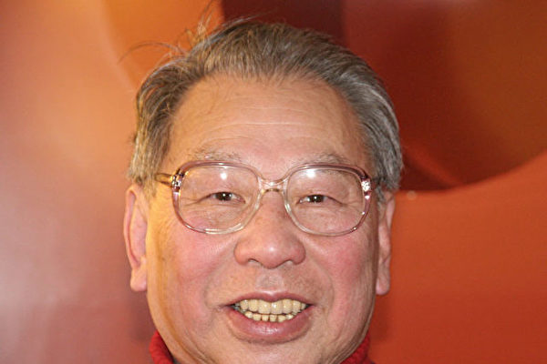

2008年2月17日，陈嘉远教授法兰克福神韵演出的中场休息时接受新唐人电视台德文记者采访，他赞叹：“这才是真正的中国传统文化！” （Alexander Hamrle/NTD）

作者：陈渝

【大纪元2018年05月20日讯】2018年，中国旧历正月，85岁的中国湖南人陈嘉远先生在德国法兰克福辞世。虽然他在德国生活了近60年，持有德国护照，家人也都在这里，但他始终说自己是一个漂泊在外的游子。

他终生眷恋的中华大地，乃是他童年和少年时代生活过的家园。记忆中老家后院的山坡上遍植树木花卉。当春天来临，桃花红李花白，樱花烂漫，他将落地的樱花撒在他书房的地上，粉红色的花瓣陪伴他博览群书，或静思默想，“思接万里，神飞八荒”。那一幅幅刻在记忆里的画面，令他无数次神往。

梦里他千百次回归故里，但最终没能叶落归根，而他临终前的期盼也成为他的遗憾。

自觉与中共格格不入 逃亡香港
陈嘉远原名陈心憬，湖南湘乡人，1932年生于南京。其父曾任职于南京中华民国政府税务官员。因抗战爆发，陈父举家迁回老家。陈嘉远在湘乡县立中学读初中、高中，学习成绩优秀。他高中当学生会主席时，用英文演讲，轰动全校。

他曾考取少年空军，不久日本投降，未能投笔从戎。

17岁读高中时，共军占领湖南。他自觉本性与中共格格不入，萌生逃离之心。当时他劝哥哥一起走。正值哥哥的新婚燕尔，加之嫂子的爷爷曾为清朝大臣，家境殷实，哥嫂日子舒心，哥哥并不太理解弟弟为何要离乡背井。为留住他，没有借给他路费。

但这并没有阻挡住陈嘉远的决心。他只带着姐姐给的一块银元，告别父母，毅然踏上了前往广州的火车。下车后他发现钱被偷了。因此逃离大陆去香港，只有冒死偷渡。他从深圳河潜游，泅渡到了香港。以“初生牛犊不怕虎”的勇气偷渡成功，可谓“福大、命大、造化大”。

彼时，他的本意是从香港到台湾的中华民国去读军校，可是那时的台湾戒备森严，根本进不去。他只好留在香港靠打工维持生计和读书。

有时实在饥饿难忍，陈嘉远厚著脸皮去求人家：“老辈，不好意思，小侄想来叨扰一顿饭。”对方道：“哎呀，陈先生，抱歉，你早来一步就好了，我们刚刚才吃过了。”人情冷漠，生活艰辛，孤立无援，这都没有摧毁他的意志。

为学有所成，日后报效祖国，当年这位“负气狷傲的少年都咬牙忍受”了，直到完成了香港中文大学的学业。

<b>向神祷告 留学德国</b>

毕业后，陈嘉远申请到去德国留学深造的机会，却苦于没有路费，不能成行。他向神祷告，果然奇迹发生。他认识的一个英国外交官慷慨解囊，送他路费，并不要他归还。几年后他专程去英国加倍奉还这笔钱，“受人滴水之恩，当涌泉相报”也。

1959年秋，他来到德国，在法兰克福歌德大学读经济学专业。在德国上大学期间，中国京剧团来法兰克福老歌剧院演出。他和女友等同学去剧院向观众散发揭露中共罪行的真相传单。他现场演讲，痛陈中共毁灭中华，令我泱泱大国“田园已残破，国运濒危亡”，民不聊生，饿殍遍野，谎言欺骗，暴力虐杀，道德沦丧，他善良的父母都被迫害惨死……他慷慨陈词，正气凛然。这一义举被当地媒体公开报导，成为美谈。

<b>大陆家人惨遭迫害</b>

正如陈嘉远所感知的那样，他离家出走后的大陆，中共不间断地发动整人运动，令无数无辜中国人死于非命，他的父母就在其中。

陈父参加过孙中山领导的辛亥革命，推翻满清建立中华民国后，在南京政府做官。回乡后买了一些田地，土改时被定为地主份子。在湘乡，陈父是远近闻名的开明绅士，对帮佣的农民视为家人厚待，“长工短工养了一大批”。自己怎么成了压榨农民的剥削阶级？终因难以忍受百般侮辱折磨，跳水塘自尽了。

陈母则成了“地主婆”。那时，谁也不许养“地主婆”，包括子女。陈母无家可归，大女儿想收留母亲，但大女婿是右派，更没可能。最后老太太被活活饿死。

直到离别大陆四十年后，陈嘉远才得以回家探亲。父母双亲早已惨死，连尸骨都找不到了，但他还是坚持为父母修建了一座“衣冠塚”。

而没有和他同行的哥哥，还没过上几天好日子，“镇反”运动就开始了。他抗战期间曾参加国民党青年军在缅甸浴血奋战抗击日寇，只因为当过连长，就被打成“反革命”，关押到新疆劳改。当小学老师的嫂嫂带着孩子无家可归，白天教课，晚上将课桌拼起来当床，和孩子相依为命。

至于姐姐则带信儿给他“不要再汇钱了”。原来他早已被政府视为阶级敌人，大陆家属有这样的海外关系已经是被政府监控的对象了，如若和海外关系有经济往来，轻者是划不清政治界限，重者是里通外国。

在德国生活得越安逸，对祖国的忧虑越沉重
陈嘉远毕业后就职于法兰克福郝希斯特公司。同时，他的爱情也有了结果，他与一位美丽多情的德国姑娘结为伴侣。女儿、儿子相继出生，事业有成，家庭幸福的他似乎赢得了整个人生。

然而，他的心境，就像他的名字一样，总是在追求更美好更高远的目标。他定居的西德，正处于战后经济腾飞，民众安居乐业的昌盛时期。作为德意志公民，尽管他也是受益者，但这并未给他带来精神上的愉悦。水深火热中的祖国，与西方民主社会有着鲜明的对比，而且反差越来越大。他在这边越是丰衣足食，家庭幸福，大陆那边亲人的饥寒交迫，就越是揪扯他的心。他寝食难安。

他订阅了多种报刊，凡能搜寻到祖国的有限消息，他都在关注。他了解得越多，越痛苦。那场全面摧毁中国传统文化的文革浩劫，令他痛心疾首。魂系梦绕故国家园，不甘于一己之安乐。他问自己：身为堂堂中华热血男儿，不为多灾多难的祖国做点什么，岂不苟且偷安？

<b>舍家去职 到台湾文化大学任教</b>

陈嘉远再一次做了人生的选择。他放弃了稳定的工作收入，放弃了家庭的温馨，于1974年赴任台湾文化大学做教授。由于两地分居，家庭生变，其妻执意离婚，儿女归对方抚养。他无法挽回这段用情至深的婚姻，更心疼无辜的孩子受难，为此痛苦一生。

当初前妻的父母极力反对这门婚事，闹离婚时，岳母乘势推波助澜。离婚后，他每次去看孩子，岳母都百般刁难，不准他去接孩子出来玩。但是后来，在他们先后生病住院时，他多次去探望，仍尽“半子之劳”。岳父去世，连他小女儿都不愿回来，而他却参加了葬礼。岳母被感动了，在下葬时主动让他铲了第一铲土，尽管他已经不是这个家族的成员。

轮到岳母在病榻上时，这位德国老太太实心实意地嘱咐他：“不要再找德国人为妻了，找个中国太太吧！”岳母去世前，他写信给他的孩子，希望他们来送别外婆。然而，在葬礼上，他没见到前妻和孩子们。

<b>承传中华文化之仁德</b>

回到德国，为能继续传播中华传统文化，陈嘉远在“孙中山文化中心”从事中德文化交流工作。他夙兴夜寐，呕心沥血，卓有成效。后因人事变动，有人制肘，工作受限，难以实现抱负，自己忍痛辞职。

上个世纪末，东欧社会主义阵营解体，而中共继续倒行逆施。89年发生“六四”，99年迫害法轮功。迫害开始时，德国媒体全是中共喉舌的一派谎言。那时他的中国妻子刚修炼法轮功不久，但他发现短短的时间里，妻子有了很大改变，不但百病全无，人也变得乐观开朗起来，不再怨天尤人。

他欣喜地给外甥女打电话：“你二姨现在学了法轮功，身体健康了，宽容大度了，真是身心受益。”他又给孩子写信，告诉他们法轮功很好，不要听信媒体的谎言。他看过《转法轮》，他认为教人按“真善忍”做好人，让人有正信，非常的好。

在那段黑云压城的日子里，他特地去当地炼功点，向法轮功学员表达他对法轮功的认同与支持。他还邮寄一些真相资料给香港、台湾的朋友。一对香港夫妇在大陆办学，看到他寄来的真相卡，回信表示难以理解：“陈教授，你怎么也信这个啊？”他全力支持帮助其妻投入洪扬大法美好、讲真相、反迫害的活动。每当法兰克福举办文化节游行时，他都会早早地来到中心地段，观看法轮功游行，兴致勃勃拍照，总是自豪地说：“法轮功的队伍是最壮观最好看的！”

<b>神韵是真正的中国传统文化！</b>

2008年2月17日，陈嘉远观看了神韵首次在法兰克福的演出。中场休息时他接受了《大纪元》德文记者的采访，他说：“神韵非常美好，我非常喜欢神韵的音乐和舞蹈，她展现了中国文化，与毛泽东治下的野蛮暴力的文化不同，神韵演出温柔敦厚。”“这是真正的中国传统文化。”

第二天，在接受《大纪元》中文记者电话采访时，他说神韵令他震撼！神韵艺术水平之高超和文化底蕴之深厚，实为罕见！这样顶级的演出，即使国家级演出团体也不一定能达到。而一个民间的信仰团体做到了，真的是太了不起了！

<b>结语</b>

少年离家，在海外生活了近70年的陈嘉远，其一生博览群书，周游过世界，见多识广。他在日记中写道：“自1943年开始写日记，直到2016年，计凡73年之久，乃一漫长之记录也。即使是在香港流亡的10年中，亦未有残脱。”可见他一生努力勤奋，严谨自律。他生活简朴，远离烟酒。他遵从孝道，为人宽容厚道，能以德报怨。

他出生书香门第，积善之家，自小学习四书五经，“吾善养吾浩然之气”，信奉善恶有报，父母积德行善事，救助穷人。陈先生一生有着许多光辉时刻，都闪烁出中华传统美德。他终生的好品德，应该得益于中共篡政之前的民国时期教育和传统家风的熏陶。

他爱国，爱社稷江山。“达者兼济天下，穷者独善其生”，“先天下之忧而忧，后天下之乐而乐”……他一生的忧国忧民意识，那份中国知识分子的良心，那副侠胆柔肠，那种爱国风骨，无不令人动容。

若问何人是真正的爱国者？陈嘉远先生是也。读他的诗《殊方行》，其对祖国家园的深爱力透纸背，震撼感人。

“君不见，世局移转变幻忙，江山如画日月长。”一个没有中共的新纪元即将到来。陈嘉远先生穷尽一生努力奋斗为的就是“解体中共，回归传统，复兴中华”。当这一天来临时，他将魂归故里，告慰父母乡亲。

责任编辑：莆山

<a href=#top><h6 align="right">回上方</h6></a>

<a name=20>
<h1 align="center"></b>结束屠杀 惩办迫害元凶江泽民！</b></h1>
<h3 align="center">——写在“四•二五”</b></h3>

【大纪元2018年04月25日讯】据大纪元2018年04月23日讯：中共最高法院从2015年起，将案件受理制度从“立案审查制”改为“立案登记制”，声称要做到“有案必立、有诉必理”，于是从当年7月起，中国法轮功学员发起控告前中共党魁江泽民的“诉江大潮”，时至今日已有超过20万中国法轮功学员及其家属以具名方式，控告中共前党魁江泽民违法迫害法轮功。这项义举也引发世界各国民众的响应及关注。截至2018年4月22日止，全球已有32个国家及地区、逾278万人参与刑事举报江泽民的连署行动，由于连署行动横跨欧亚大陆，被外界称为是21世纪“全球最大的人权义举”。

“全球声援中国民众控告江泽民的刑事举报连署活动”总协调朱婉琪律师强调，如果让迫害法轮功的政策继续、反人类罪的活摘器官继续，只会让数不清的血债继续累积，当权者也将成为中共邪党的替罪羊。他呼吁，中共迟早是要解体灭亡的，当权者没必要与迫害法轮功的元凶江泽民同归于尽，此时应该做出顺天应人的选择。

令举世忧虑的是这场持续长达十九年之久的血腥迫害还没有结束，屠杀仍在继续，许多善良无辜的法轮功学员还在血泊中苦苦挣扎！

据明慧网统计，二零一八年一至三月份被中共法院非法判刑人数为194人。其中：一月份判刑93人，二月份判刑43人，三月份判刑58人。其中三月份被非法判刑的58人中，有9人被非法判7～10年重刑，年龄最大的81岁。仅三月份中共法庭非法罚金17万3千元。广东省惠州市惠东县法轮功学员周育琴、石雪梅、刘庆强近期被非法冤判。周育琴被冤判十年、勒索罚金五万元，石雪梅被冤判九年、勒索罚金三万元，刘庆强被冤判四年、勒索罚金一万元。据明慧网消息，过年期间478名法轮功学员遭绑架。二零一七年法轮功学员被中共法院非法判刑总数为1097人。（更新）

吉林省松原市乾安县六十一岁的法轮功学员杨宝森，被非法判刑十年，在吉林省公主岭监狱遭受近九年折磨，于四月七日凌晨三点含冤离世。

江苏省南京市法轮大法学员成海燕女士，原是中国药科大学副教授、江苏省物资总公司轻纺织品公司任经理。在中共对法轮功长达十八年多的迫害中，曾被非法判刑十年、关押精神病院迫害二个半月、被非法刑事拘留三次、抄家五次、关押洗脑班多次，又被逼迫与军官丈夫离婚等等迫害，于二零一八年三月二十八日含冤离开人世，终年六十三岁。

辽宁省凌源市建平县的法轮功学员刘殿元，今年八十岁，从一九九九年九月到现在，经历了七年冤狱、四年半的流离失所，二零一五年十一月再次被绑架，在七十九岁的高龄时被辽宁省建平县法院非法判刑十一年半，目前在冤狱中遭受着迫害，还有十年多的监狱生活等待着这个历经沧桑的老人。老人的妻子刘玉芳，今年六十一岁，是一位普通的农村家庭妇女，曾经被非法劳教三年，又被非法判刑四年。

河北省石家庄市原河北科技大学副教授李惠云博士遭受十几年残酷迫害，导致精神分裂，至今仍被非法关押。李惠云博士的专利成果在二零零三年德国国际发明博览会上获“国际发明先锋奖”，获二零零三年香港国际专利技术博览会“金奖”，第三届亚洲国际专利技术专利产品博览会“金牌奖”和“科技发明进步奖”。

十多年来李惠云博士遭受连番的洗脑班迫害、二年劳教、二十九个月看守所非法关押、四年零十个月的判刑。二零一六年一月二日出狱，身体尚未恢复，二零一七年三月月二十三日又再遭绑架。一个科技拔尖人才就这样被毁掉了！

在长达十九年的对法轮功的血腥迫害中，千千万万的善良家庭被迫害得支离破碎、家破人亡。如一家八口被迫害致五死一残的辽宁省清原县法轮功学员孙鸿昌一家；六口之家被迫害致仅剩一人的河北省怀来县法轮功学员陈运川一家；一家五口被迫害得仅剩下一人的山东省青州市神旺村法轮功学员王兴家一家；三位至亲被迫害致死的河北石家庄市高级工程师冯晓梅一家……

十九年来，被中共非法剥夺人身自由、关押、劳教、诬判重刑的法轮功学员达数百万之多；成千上万的法轮功学员被中共迫害致残致死；被迫害得支离破碎、家破人亡的家庭千千万万！迫害手段集古今中外邪恶之大全，惨绝人寰，罄竹难书！

令举世震惊的是活摘法轮功学员器官，这是这个星球上从未有过的邪恶！2016年6月22日，加拿大前亚太司司长大卫•乔高（David Kilgour）、加拿大著名国际人权律师大卫•麦塔斯（David Matas）和中国问题专家兼调查记者伊森•葛特曼（Ethan Gutmann）发布了关于中共强摘器官的最新资料包告，报告显示中国器官移植手术数量每年约为六万～十万例，从二零零零年至今可能高达一百五十万例；而这些器官的主要来源是法轮功学员。

根据追查国际的调查，截至2016年7月，查获中共891家医院及9,519名医生涉嫌参与活摘器官移植。

究竟这些年来中共器官移稙的数量到底有多少？追查迫害法轮功国际组织（下称“追查国际”）主席汪志远表示，中共活摘器官的数量具体有多大，鉴于种种众所周知的原因，目前不能给出具体数量。但是，基于中共活摘法轮功学员器官是国家犯罪，数百万上访被抓的法轮功学员是活人器官供体库的主体来源，从许多医院按需杀人的大量急症移植、活人器官免费大促销等举措观察，活人器官供体库的确存在。

迫害法轮功是一场血腥的大屠杀，主持这场大屠杀的是中共恶党，罪魁祸首是江泽民，他是反人类罪、群体灭绝罪、酷刑罪的头号罪犯！追查迫害法轮功国际组织主席汪志远说：“作为人权罪犯，人权恶棍，谁也没有江泽民严重，他应是全世界的首犯。作为美国来讲，宣布惩罚人权恶棍名单，应该首先考虑到的是江泽民和江泽民犯罪集团这些迫害法轮功的首恶。”

尽快结束这场血腥的屠杀，已经成为全人类的共同呼声，成为当今最大的民意。什么是民意？超过20万中国法轮功学员及其家属以具名方式，控告中共前党魁江泽民，全球已有32个国家及地区、逾278万人参与刑事举报江泽民的连署行动，这就是民意！是全人类最大最迫切的民意！愿国际社会能够顺从民意和历史潮流，共同起来结束这场给人类带来巨大耻辱的大屠杀，惩办迫害元凶江泽民！

责任编辑：任慧夫

<a href=#top><h6 align="right">回上方</h6></a>

<a name=19>
<h1 align="center">解体中共 重塑中华民族辉煌</b></h1>

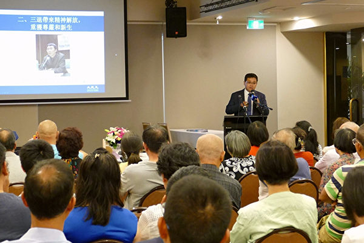</img>

4月8日，悉尼退党服务中心代表李元华先生在“三亿退党大潮与《共产主义的终极目的》研讨会”上发言。（安平雅／大纪元）

文:李元华

【大纪元2018年04月09日讯】4月8日，悉尼大纪元举办了 “三亿退党大潮与《共产主义的终极目的》研讨会” ，悉尼退党服务中心代表李元华作为嘉宾发言，以下是他的发言全文。

2018 年 3 月 23 日，在大纪元退党网站上，声明退出中共党、团、队的人数，突破了3亿人。这三亿中国人，堂堂正正地与中共决裂，庄严地宣告心灵自由；祝贺他们摆脱邪恶枷锁，重获尊严和新生。今天我们的研讨会是全球庆祝和声援三亿中国民众退出中共党、团、队组织的重要组成部分，感谢各位嘉宾和朋友们的到来。我们首先回顾一下三退大潮的发展历史。

<b>一、三退大潮波澜壮阔，势不可当</b>

2004年11月19日，大纪元发表系列社论《九评共产党》（以下简称《九评》），《九评》以崭新的视角及高度，系统地剖析中共不光彩的起家、谎言与暴力、暴政与杀戮、及邪教和流氓本性。《九评》揭露了中共给中华民族和全人类带来的深重灾难，在中国及世界各领域，包括政治、历史、经济、文化、道德、宗教等引起极大的反思与震动。在种种“九评震撼”中，尤以触发中国广大民众退出共产党及相关组织的和平自我精神觉醒救赎的“退党大潮”最为波澜壮阔。迄今，《九评共产党》已被翻译成三十多种语言，在许多国家出版。在全球一百多个城市，举行了五千多场“九评”研讨会、新闻发布会、集会、图片展等活动，共有上万名专家、学者、政要、媒体人、共产主义受害者演讲发声、揭露共产主义罪行。

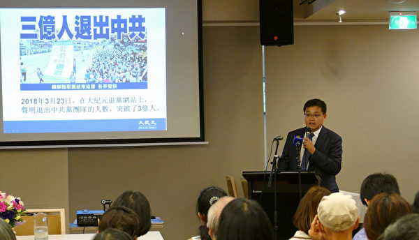</img>

李元华首先回顾了三退大潮发展的历史，并解释了三退人数的记录情况。（安平雅／大纪元）

《九评》发表 9 天后，2004年11月28日，大纪元收到第一份来自读者的退党声明。2005年 1月1日 tuidang.epochtimes.com 退党网站建立，作为发表三退声明 的平台和记录历史的资料库。每一条声明都独一无二，通过日期、时间（精确到 秒）、姓名、位置和声明内容区分。每条声明都有一个数字身份证明，也作为退出中国共产党组织总人数的计数统计。统计数字即时在网站上更新，为确保资料的安 全和可靠，网站维护独立服务器，并开发特别的软件用以资料分析。

2005年1月12日，《大纪元郑重声明》发表，呼吁“所有参加过共产党与共产 党其它组织的（被邪恶打上兽的印记的）人赶快退出，抹去邪恶的印记。一旦谁对这个魔教清算时，大纪元储存的记录可以为声明退出共产党和共产党其它组织的人作证”。

2005年2月，“全球退党服务中心”成立，这是协助中国民众退出中共的大平台。自此，遍布世界各地的以法轮功学员为主体的三退义工及各界民众广传《九评》，力促三退。

2005年4月21日，大纪元退党网站的三退总数突破100万；同年10月18日，这一数字达到500万；2006年4月25日，总数破1000万。2011年8月7日，三退人数冲破1亿；2015年4月14日，三退总数冲破2亿；2018年3月23日，三退人数冲破3亿。

综上所述，“三退”人数达到一亿人，经历了6年8个月；“三退”从1亿人到2亿人用 了3年8个月；“三退”从两亿人到3亿人，只用了2年10个月。可见，大陆人心普遍觉醒，中国人抛弃中共的速度越来越快，现在每天的三退人数都在90,000到 100,000之间。可以预见，这世界最大的共产专制政权会随着三退大潮而土崩瓦解！

<b>二、三退带来精神解放，重获尊严和新生</b>
  
回归传统道德，良心觉醒，彻底根除与共产主义的瓜葛，返回对神佛的信仰。这样就会使人类能够得救。

中共以无神论和党文化愚民洗脑，歪曲历史，割断中国人与神的联系。另一方面， 中共为了维持其统治，通过威逼利诱，迫使大批民众加入其党、团、队组织，发下献出生命的毒誓。一个人，一旦加入它，即被邪灵打上了兽印，成为邪恶的一分子。当中共恶贯满盈、遭到天谴时，所有中共成员都将因为与之捆绑在一起而面临共同毁灭。

《九评共产党》使人们认识中共的本质，使人们明白中共为什么会做出众多无理智的事情，从而化解了人们头脑中中共灌输的邪理歪说。人们通过审视自我，得到精神觉醒。一旦一个人脱离了中共的洗脑，他将不再被邪灵控制，这个人能够独立理性地思考，当更多的中国人的精神得到自由，更广泛的社会环境将会改变，邪灵将失去生存的土壤，中共将土崩瓦解。

因此，三退体现在个体上的益处是精神层面的。通过声明退出中共组织，这个人可以抹去邪灵的印记，使自己从邪灵组织除名，最终逃离与中共一同瓦解的命运，这就是退党带给人们的精神觉醒。

2005年5月16日，25 名来自中共中央党校各部门的官员，在大纪元退党网站上 发表退党声明。这些正副部级、局级和处级官员在声明里说：“据我们知道，中央党校两千多职工中，90%党员如果条件允许都会退党。”

2006年，中共驻悉尼总领馆前政治领事陈用林受访时表示：“现在中国社会道德沦丧已到了无以复加的地步。在这种情况下，我想，每个人首先退出中国共产党，本身就是拯救自己。”

2009年，前中共国安部谍报官李凤智在退党感言中说：“共产党并不是中国， 共产党损害了中国，包括中华民族优秀的传统和文化。所以，反党应该是爱国，退党则是在救国，只有站出来，才是真正的为国尽忠，才是真正的保护我们国家的安全。”

我在首都师范大学的同事、心理学教授孙延军先生，于2009年2月14日，在大纪元网站以真名公开退党，并声明辞去一切官方职务。他在声明中说：“专制不除，灾难不已；中共不灭，天理难容！”

2012年10月2日，四川绵竹剑南春集团有限公司的40名党员集体真名退党，并且按上红手印。

2013年6月17日，湖南五千多名原“乡村放映员”公开集体退党。

2015 年“七一”前，湖南湘潭市色织染厂全体职工 1003 名工人绝望至极，集体 要求退党，其中不乏有数十年党龄的老党员。

2017年5月底，陕西大荔县农业龙头企业“金紫阳公司”的 50名党员公开致信 中共中央、中组部、中纪委等，宣布退出中共。他们揭露：公司被强行违规破产， 涉事的贪污腐败者主要是共产党员，而这些人却受到地方党组织的保护。

<b>三、世界的正义之声</b>
  
2007年7月20日在华府华盛顿纪念碑举行的“声援二千四百万民众退出中共华盛顿国际集会”上，欧洲议会副主席爱德．麦克米兰-斯考特先生（Edward McMillan-Scott）特意发来声援信：“我支持两千四百万退出中共及附属组织的中国勇士们，并鼓励更多的人加入他们的行列。虽身处西方社会，我们与中国人民 站在一起，支持和平结束这一共产政权的一切行动。西方社会欢迎一个没有共产党的新中国，一个中国人民期盼的而且值得拥有的中国。”斯考特先生将中国和中共分得很清楚。

2011年9月23日，美国共和党总统候选人、连续五任密西根州国会议员赛迪斯．麦考特(Thaddeus G. McCotter)等8位美国国会众议员联名提出众议院第416 号决议案，谴责中共歧视、骚扰、监禁、酷刑折磨、处决良心犯，声援大纪元时报“九评共产党”社论引发的一亿中国民众脱离中共的三退（退党、退团、退队）运动。

2015年12月10日国际人权日，美国国会举行主题为“巨变的中国及对法轮功的迫害”大型研讨会。美国资深国会议员、众议院监察委员会主席罗拉巴克（Dana Rohrabacher）先生谈到解体中共时说：“这个邪恶政权压迫中国人民，用一套系统的斗争体系，漠视民众的一切人权。这个政权应当被摒弃。事实上，这么多人选择脱离共产党、支持法轮功，这是解体中共的绝佳办法。前苏联被解体了。中共也应该被解体。”

2013年 7月，乌克兰第一任总统列昂尼德．克拉夫丘克出席《白天》报社的座谈会手持《九评》（俄文版）跟与会的青年记者畅谈。

2015年6月11日，全球退党服务中心在乌克兰首都基辅举办了《九评共产党》 三退（退党、退团、退队）研讨会，前波兰总统、波兰团结工会主席、诺贝尔和平奖获得者瓦文萨特意发来支持信表达他衷心的祝愿。他表示，共产主义，作为一个制度，剥夺人的价值，与文明进步格格不入，从一开始就命中注定迟早是要毁灭的。然而，这种反人类制度的垮台，不仅仅是历史正义的体现，不仅仅是整个几代人奋斗的结果，同时，或者更确切地说，首先是对神的信仰以及赋予一个民族神的旨意的结果。充满希望的一个事实是，有超过 2亿中国人加入基于民众的三退运动，放弃共产主义。这个运动，就是这段历史上的海啸，他深信，没有什么能够阻止得了。没有人能够阻止自由和真理的精神。

2017年10月1日，在悉尼声援“2 亿8500万中国勇士退党”集会上澳洲悉尼帕拉玛塔市长威尔森（Andrew Wilson）：“（三退者）遵循的是一条正义的路。他们的所作所为，正在帮助自己的国家，也在帮这个世界变得更美好。”

2018年3月25日墨尔本声援3亿中国人三退集会上，前澳洲全国公民委员会主 席彼得．韦斯特莫尔(Former President of the National Civic Council Peter Westmore)：“许多许多的人，我们相信成千上万的人，因为反对中共对中国人民 的迫害，而退出中共。重要的是我们西方社会的人，要站在这些人的一边，告诉这些中国人，我们与你们同在。”近年来西方社会也多有著作深刻反思，如《蚕食美国》、《致命中国》、《内部敌人》、《共产主义黑皮书》等。自由世界及欧洲前共产国家，鉴于对共产余毒的忧虑，近年引发反思，纷纷推动去共化、排共化、纪念惨死生灵、及在精神思想上告别共产主义。这和退党大潮遥相呼应，在中国内外共同铲除共产邪灵邪恶影响、进而摆放正义立场。

<b>四、三退大潮背后的推动力量</b>
  
在中国大陆，退党义工的主体是法轮大法修炼者，他们以个人或者小组的形式对中国大陆的民众讲真相，劝三退。讲真相、劝退的主要形式包括面对面讲真相、发真相资料、打电话、发短信、发电子邮件、在社交平台讲真相等。还有很多明白真相的普通民众也在积极帮助传播法轮功真相，揭露中共恶党的真实面目，规劝其他人退出中共相关组织。根据报导，截止2009年4月的明慧内部资料，中国大陆法轮功学员拥有约 20万个资料点。他们冒着生命危险，日复一日，年复一年的坚持不懈讲真相。据估计在被中共绑架、劳教、判刑的法轮功学员中，因讲真相劝三退而被迫害的至少占 80%以上。

在海外，义工们在南北美洲、亚洲、欧洲、澳洲等多个地区，20 多个国家设置了一百多个讲真相劝三退的真相点。凡是有中国大陆旅客经过的景点，一般都有真相点。在这些真相点，每天都有人向中国大陆来的游客劝三退， 在过去的十几年中， 风雨无阻。他们持续不断地坚忍付出，使千千万万个中国人良知复苏，远离共产邪恶。

悉尼面向当地华人和留学生退党点：唐人街、Asfield、Burwood、Campsie、 Hurstville、Chatswood、Eastwood、Auburn、Parramatta、（中领馆）；面向 中国大陆游客的退党点：歌剧院、Mrs Macquarie Point、鱼市场、大教堂（St Mary’s  Cathedral）

大纪元建立退党网站后不久，来自美洲、欧洲、亚洲、澳洲等 24 个国家的义工， 组建了电话劝三退的快速退党服务中心-Rapid Tuidang Center（简称：RTC）。 主要是通过手工和自动工具给中国大陆民众打电话，讲中共迫害法轮功和法轮大法好的真相，讲中共祸害中华民族的真相，帮助明白真相的各界民众办理三退（退出中共党、团、队组织）手续。拨打的对象从平民百姓到高官将领都有，拨打的范围覆盖中国大陆各个省份及直辖市。

三退故事
原大陆第 38 军军长徐勤先的司机刘建国，在抵美一周后退党。 徐勤先 1989年6月3日抗命后当天就被软禁，后被撤职、逮捕，判刑五年。作为徐勤先贴身“勤务员”的刘建国，也受到牵连。刘建国接受采访表示，最严重的一次，他被吊起来七天，大小便都失禁了，“就是在精神上摧垮你，让你没有尊严，生不如死。”他的手掌从此落下伤残。

2017年10月27日刘建国全家成功抵达美国，一周后的11月4日，他偶尔遇到 了法轮功学员，在鼓励下，他正式以真名退出加入了32年的中共组织，当时法轮功学员怕他有顾虑，给他起了“老刘”的化名，但他说：“用真名，北京市民政局刘建国。”

刘建国接受大纪元采访时说，自己目睹了几次大的历史事件——1989年的6月3日晚，他目睹了中共屠城前，北京市民自发联合起来阻扰部队进城镇压学生；十年后的1999年4月25日，他目睹了万名法轮功学员和平上访，“那天我刚好驱车经过中南海附近，我开着车，慢慢地开，就感到这些人怎么这么整齐，安安静静地，地面也干净，但却没有看见有谁在组织或维持秩序，到了晚上才知道是法轮功（学员）上访，这么多人，但这么有秩序，令我特别佩服。”

后来他开始注意法轮功，“在过去十年，我手机上接到了不下十次的法轮功真相电话，每次我都不吱声，静静地听完。”

下面根据媒体报道以悉尼为例讲一下。

据大纪元文章《三退故事：悉尼景点的守候（一）》报导，满女士是澳洲悉尼的三退义工。2006年时，满女士利用周六周日的时间去景点为大陆游客做三退，2009年开始满女士一周七天都去景点。她自2012年至2016年9月27日，通过打电话和在景点面对面地劝三退，已经帮助 34,966位大陆民众退出了共产党、共青团、少先队组织。

张玉珍也是一名三退义工。她从 2012年8月至2016年9月帮助12,888人退出了 中共党、团、队。张玉珍修炼法轮功后，多种疾病不药而愈。她说：“我觉得做人要有良心，我得到好处、受益了，要让大家知道中共迫害好人的事实，告诉民众不要跟随中共行恶而受牵连，一定要退出这样的邪恶组织，只有这样，无论是个人还是中华民族才能有希望和未来。”

《景点的守候（二）》 文章还提到，三退义工来自各个行业，比如高级软件工程师鲁先生在悉尼的景点上向游人发放资料并劝三退。 王先生是一名承建商，十余年来的周末都坚守在悉尼的旅游景点。2011年修炼法轮大法的 IT 专业硕士、系统工程师朱先生几年来利用自己的周末时间在旅游景点上向中国游客劝三退。

另外两篇文章《悉尼歌剧院前的“三退”故事》及《悉尼景点闻真相三退 大陆游客感叹不虚此行》中，都报导了在悉尼歌剧院前，法轮功学员向大陆民众讲真相的故事。

<b>五、解体中共，重塑中华民族辉煌</b>
  

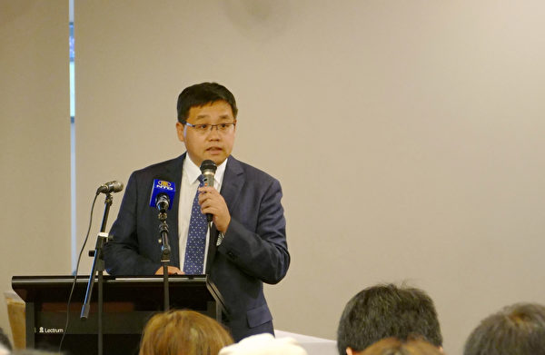</img>

李元华在发言中表示，中共政权是整个中国历史上最黑暗的、最邪恶的政权。当中共退出历史的舞台，中国将迎接中华民族的复兴。（安平雅／大纪元）

许多人担心如果中共瓦解，谁能替代它管理中国；有些人甚至害怕中国会陷入另一场内战之中。还有一些希望中共保留权利越久越好的商人和政客，这样他们就可以继续为了自己的利益欺压人民，侵占资源。

中华民族已经存在了五千年，虽然朝代更替，但中国依然屹立。中共政权是整个中国历史上最黑暗的、最邪恶的政权。当中共退出历史的舞台，中国将迎接中华民族的复兴。除此以外，在东欧国家有先例，那里的共产政权瓦解后，国家依然运行，而且处在更好的状态下。

三退运动确实为中国未来作出准备，因为它将中国人民的精神从中共控制下解放出来。 恢复传统文化，重建与神的联系。那些精神自由的人们由于道德感和独立思考的能力将成为更好的人。

东土神州，曾经光耀四海，却在现代惨遭西来幽灵的荼毒。中共红祸 68年，夺走八千万无辜生命，摧毁传统文化，破坏生态环境，迫害信仰人权，泯灭良善诚信，撒下了一张恐怖的大网。中共的执政史，就是杀害中国人的肉体、扭曲中国 人心灵的黑暗史，是大陆百姓的无边苦难史。

时至今日，中共还在编造谎言，加剧严控，还在迫害法轮功修炼者、维权律师、 上访群众和各界善良人士。中共邪恶，登峰造极──杀人如麻、酷刑折磨、活摘器官、株连九族、因言治罪。68 年的民族血泪，交织无数的现实悲剧，中共罪不容恕。这个最残暴的政权，最贪腐的集团，已无任何改良的可能。

中共的存在，玷污了华夏山河，玷污了五千年古国文明。任何人，如果继续与中共为伍，或仍对其抱有幻想，都是在姑息邪恶，是在亵渎尊严与正义，实则等同于听任和配合共产邪灵毁灭所有中国人的未来。

在饱经忧患创痛的国度里，涌动着最深切的对自由的渴望。中国人需要冲破恐惧、 拒绝暴虐，找寻真相。只有解体中共，终结共产危害，才能终结民族苦难，这是通向光明的唯一道路。因此，退出中共，利国、利民、利己；抛弃中共，中国人民才有可能重塑民族辉煌。

责任编辑：宗敏清

<a href=#top><h6 align="right">回上方</h6></a>

<a name=18>
<h1 align="center">给中国公检法人员的一封信</b></h1>

文:李若麟

朋友您好！

世上任何一种相遇都是久别后的重逢。 您都好吗？

我们身处一个要随时更新认知的时代。比如，突破网络卫星技术的逐渐成熟，会让翻墙上网像听短波收音机那么简单。防火墙瞬间会土崩瓦解。再比如，马克思有信仰，但他却是信鬼的撒旦教徒，你知道吗？撒旦是中国人说的魔鬼之王，所以马克思一直诅咒人类下地狱…… 这些都瞒不了中国人了。

魔鬼嗜血，所以它的徒子徒孙在和平时期杀了8000万中国人，超出两次世界大战死亡人数的总和！现在，它不仅向襁褓中的国人后代喂毒奶粉，还让中国人互相喂毒，同时摧毁人赖以生存的环境。它对中国人的杀戮其实从没停止过。对公检法群体，它们则是利用人对家庭的关爱和责任进行捆绑，用您的劳动应得，来买断您和家人性命。危言耸听吗？ 其实一点儿不， 请继续往下看。

法轮修炼佛法去病率高达97.9%是中共1998年自己调查的结果。癌症、残疾、各种终身病患者包括在内，医院确诊活几个月的人，20年过去了依然健在。神迹遍及每个修炼者，提高道德品质则是前提。现代医学做不到的，法轮功做到了。  这种强大力量，明显非人力所能为。可中共却故意隐瞒这些，然后迫使公检法人员迫害佛法修炼者。迫害超出人类力量的佛法会带来什么后果，您真该为自己想一想。

这个世界真的是公平的。人做好事坏事，后果一定回到自身，没任何生命能逃脱这个规律。 简言之，迫害者给法轮功修炼者造成的一切痛苦，都会回到迫害者自身；罪大恶极者，生命的本源都会被销毁，还会祸及家人。可不可怕？ 您说，这是不是把工资变成了买命钱？

中共刻意吞噬人命与人性，让中国人在没有战争的年代，投入一波又一波规模庞大的自相残杀。斗争一定要有仇恨，没有仇恨他们就制造仇恨。对法轮功，它先定性再找证据甚至制造“证据”，完全抛弃以事实为断案基础的法律原则，根本是在“罗织”罪名。多方独立调查显示，“天安门自焚“、“1400例”、“自杀“都是假的。如此任意乱造罪名，残酷屠杀（致死百万修炼人）和活摘器官，在人类历史中也是首次出现。

它杀外人，也杀自己人。我们再听听历史残酷的声音。最早提出横扫一切牛鬼蛇神的是陈伯达，1970年中共九大后第一个被扫进秦城监狱的也是陈伯达。起草第一张大字报的是康生，1978年被第一个开除党籍的也是康生。整死 “接班人刘少奇”是林彪，后继 “接班人林彪”也不明不白的死了。

中共高层都为子女打通了去往西方的通道。追名逐利者，在它们眼中只是短视的官迷。但在幕后操纵者眼里，这样的官迷也不能没有。在他们以千万亿金额转移贪赃和子女的过程中，需要这样的替罪羊替他们站台。一旦残局失守，一旦真相败露，也需要留下这样的傻人，来满足愤怒民众发泄之用。试问，您是否不在其中？将来您能否幸免？

《共产党宣言》中“共产党人从不讲道德”这句话，是中共天生与中华文明和道德为敌的准确写照。走过漫长5000年岁月，孕育无数大德先贤，凝聚无量民族智慧的恢弘中华文化，其神性和精神内涵是共产党恐惧的。她给予中国人的智慧来自远古至今的世世代代。神传文化的存在，会令魔鬼化身的中共无法立足中华。因此，中共从进入中国伊始，就有目的地毁掉中华文化和中国人的精神风骨。

纵观人类历史，迫害修炼向善的人都下场凄惨。子孙穷困潦倒，灾祸不断。为您的子女，也为避免失去生命和未来，请您一定不要拒绝真相，不要拒绝那些能让您自保的电话，这都是机会，是上天给您的机会。拒听真相意味着失去机会，是绝路。人信不信，该发生的终究会发生。上天清算坏人时会和谁打招呼，和谁商量？真心希望您别再参与迫害，善待法轮功学员就是善待自己、保护自己。迫害修炼人则是在迫害自己。

修炼人有让您安全自救的方法，赶快向他们找真相。修炼人善待生命，会帮您和家人走出危险之地。

与君初相识，犹如故人归。最后我们祝您和家人幸福快乐，有缘再见。

责任编辑：朱颖

<a href=#top><h6 align="right">回上方</h6></a>

<a name=17>
<h1 align="center">修大法让“女强人”成了好婆婆</b></h1>

</img>

《法轮功》这本天书使她的脾气暴躁、求名求利、爱面子，特别自我的人，脱胎换骨的变了。（fotolia）

  
 文:千百度
 
 修炼前她是中直机关里的一个小科级干部，争斗心、名利心极强，是领导同事公认的“女强人”。为了要证实自己所谓的人生价值，曾停薪下海经商，在认识她的人眼里，又是个风光的女老板。在家中，丈夫对她唯命是从，女儿、女婿、儿子、儿媳都看她的眼色行事。

由于重利，当老板时因对员工苛刻，员工曾要集体罢工；由于脾气暴躁，曾经将来到她家不爱干活的姑爷赶出家门。那时候的她，真是家里外头说一不二的一把手，名副其实的一家之主。

但在人生的路上，她活的很累、很苦。严重的萎缩性胃炎、浅表性胃炎使她长期便血，神经性头痛一发作甚至要撞墙，昏睡时几乎跟昏死过去似的，再加上胆囊炎、附件炎（指输卵管和卵巢的炎症。）骨神经痛等，真是按下葫芦起来瓢，有时一小时要吃几样药。

在自认为所谓实现人生自我价值的路上，在迷茫疲惫的人生途中，她也常问自己，人生的意义到底是什么？

想必是机缘到了，1994年她有幸走入了法轮大法的修炼。令她惊奇的是，当她一口气看完一遍昔日的同事送给她的一本《法轮功》 ，看了九讲师尊济南讲法录影后，所有的病都不知不觉不知何时全消失的无影无踪了。

随着学法的深入，她明白了法轮功是佛法修炼，也明白了生命的真正意义就是返本归真。从此，这本天书真的使她这个脾气暴躁、求名求利、爱面子，特别自我的人，脱胎换骨的变了。这里仅举几个例子：

侍候儿媳
儿媳生孩子说找保姆不放心，让她去侍候月子。她想，虽然自己已经给了儿媳2万元钱，但婆婆侍候儿媳的月子也责无旁贷。可现在的年轻人带孩子说道特多，什么什么都得消毒，这么包孩子不行，那么捆也不对，跟她那个时候照顾自己孩子根本不是一回事，一时还真的无法适应，无所适从，心里越怕做不好越出差。一次包裹孩子，儿媳用训斥的口气大声对她说：“不对！不对！”走过来用手使劲搡她，搡的她一惊！心想自己活这么大岁数，还没人敢这样对待过自己，花钱出力白天黑夜辛苦的侍候儿媳，她竟这样对待自己！我这个人眼中风光的女老板，如今竟成了儿媳的女佣人？心里还真不是滋味。

怨心出来了，可是一转身，她马上又想到不对呀，我是修炼人，师父在法中曾讲过韩信“受辱于胯下”的故事。师尊说：“人争一口气，那是常人的话。为这口气活着，大家想一想，活的累不累？苦不苦？值不值得？韩信还毕竟是个常人，我们是一个修炼的人，我们比他还要强的多。”[1]想到此，她一惊一怨的心立刻烟消云散，并且马上面带笑容的说，总觉的自己什么都行的人，原来我还这么笨啊！儿媳也感到不好意思的笑了。

面对儿媳的无理时
一次去儿子家，儿媳与儿子吵架，竟当着她的面骂儿子“你×××……”这骂人的三字经都出来了！他们不住一地，她轻易不去儿子家，刚进门，儿媳就这副脸迎接她。这是为什么呢？这时她已能向内找自己了，心想，我是人称争强好胜的女强人，这回可遇到比我还强的女强人了，儿媳的形象像一面镜子照出了我的缺点与不足，她好像就是告诉我：你就是这样的。

那一刻，她真的感到儿媳在去她争强好胜要面子的心，心想这不正像师父所说的“人得在实践中真正的去魔炼自己才能够提高上来。”“谁今天惹你了，谁惹你生气了，谁对你不好了，突然间对你出言不逊了，就看你怎么对待这些问题。”[1] 因此，她觉得自己应该感谢儿媳，是儿媳让她看到了自己的不足。

事后她首先批评儿子，不知道疼媳妇、媳妇带孩子不容易，要体谅她，发点脾气是可以理解的。过后儿子不在屋，看儿媳高兴时她便平和的劝导她，说：妈从前的脾气就不好，结果弄的自己一身病，不学大法哪有今天的好身体、好脾气？我要不学大法，昨天你骂儿子我就会跟你没完。学大法后我才知道如何做人、做女人、做妻子。是妈过去没做出个好榜样。今后你别再骂你丈夫，更不能当着孩子、老人的面骂，还连上我。这样带出的孩子今后会不好教育，因为你是孩子的第一老师。

儿媳若有所思的点点头。

儿子与儿媳离婚后
2009年在她全然不知情的情况下，儿子、儿媳离婚了。儿子说：“财产分配上，我把北京住房给她娘俩，给她一辆汽车，几十万存款，家中财产全给她留下，还给她哥一部我贷款已经还了一多半的客货两用汽车，我只开走一台我现在正开的汽车，我净身出户了。妈，你看行吗？”

听到此消息，当时正值老伴刚去世，她稳住自己这突然双重沉痛的心，她首先考虑到孩子们的不幸与伤痛，儿媳家人的心情，平静而又真诚的说：“离婚真成为不可挽回的既成事实了，那就把余下的事处理好。儿子，金钱是身外之物，生带不来死带不去，而做人才是第一位的。妈妈只希望你与小辉（儿媳名）不要成为仇人，更不要因为你们的离婚而伤害无辜的她的老人，尤其老人现已退休，失落感会使他雪上加霜啊！别忘了他老人家对你的恩义。”

儿子很认同她的话。当年过年便开车带上她和上等好茶、好烟、好酒，花了几千元去看望老人，而且连续了几年。

儿媳家是个大家族，她们家族中的亲人，对她与儿子关于此事的处理称赞有加。

一次，儿媳电话中偷偷告诉她说：她父亲（儿媳母亲去世多年）因想念她的儿子哭了多次。每当她打电话给孙女，儿媳总是亲切的叫着妈，并说些心里话，然后再让孙女接电话。每当过年她给孙女压岁钱时，她也总是同样给她再婚后的孩子一样多的压岁钱。

每当过年，她就用电话告诉儿媳：回老家别忘了你家中还有谁没三退，或者请她帮助征签，儿媳总是高兴地告诉她：不会忘，不会忘。有时就拿回三退或征签名单，同时每年她都要主动要许多真相台历或挂历，说我帮你去救人。

一次相遇，儿媳当着她再婚的丈夫的面说：“妈，我永远要叫您妈，因为我再也找不到你这样的婆婆了！”并对她丈夫说，“叫你妈也学炼法轮功吧，看妈人好、身体好，又不让儿女操心。”她丈夫高兴地说：“阿姨，小辉常常念叨你多好、多好。我今年回沈阳老家把我妈一定带来，让她也跟阿姨学炼法轮功吧。”她说，“那太好了，不过千万别忘了劝你家人‘三退’呀！”他俩一起说：“一定记住！”

注：

[1]李洪志师父的著作：《转法轮》

责任编辑：南风

<a href=#top><h6 align="right">回上方</h6></a>

<a name=16>
<h1 align="center">长期追求贸易顺差 中共会真的开放？</b></h1>

文:川人

【大纪元2018年04月14日讯】近日，在中美贸易摩擦升级之际，中共又对外宣称将进一步扩大开放的消息，引发国际舆论激烈讨论。中共媒体称：“中国（中共）将大幅度放宽市场准入，放宽外资金融市场准入限制，降低汽车进口关税，保护知识产权……中国（中共）不以追求贸易顺差为目的，真诚希望扩大进口。”但有外媒认为，这些政策中共早在16年前加入世界贸易组织时，就已经向世界承诺了，但一直都没有兑现。有意追求贸易顺差与承诺开放市场，到底哪个对中共更重要？中共会真的开放市场？

据中共国家外汇管理局统计显示，1950年至1979年，中国外汇储备平均每年只有1.949亿美元；1980年至2000年，中国外汇储备平均每年增加至452.81亿美元，其中2000年外汇储备额达到1655.74亿美元；2000年至2017年，中国外汇储备平均每年为20670亿美元，2018年3月约为32000亿美元。数据表明，中共通过“改革开放”实现了外汇储备的巨额增长，其结果是富了中共及其权贵，苦了广大中国人。

由于中共一直实行的外汇管制措施，有意让人民币不能自由兑换，所以中国人通过勤劳赚取的巨额外汇并不能进行自我支配，只能按照中共给定的汇率换成中共专为换汇而发行的人民币。广大中国人想要获得外币的唯一合法途径就是要经过中共的层层严厉审批。由此一来，中国人勤劳赚来的巨额外汇就成了中共手中的“外汇储备”，供中共及其权贵使用。而广大中国人在长期的贸易顺差中并没有获得好处，相反还承担了在长期贸易顺差中，中共用发行人民币换外汇造成的通货膨胀压力。中国的房价、物价长达40年的单边上涨，与中共外汇储备的巨额增长密切相关。

2018年第一季度，中共对外贸易顺差又达到3261.8亿美元，这意味着中共又要发行20288.39亿人民币来购买顺差中的美元，这会导致国内的房价和其它商品价格的持续上涨。中共为何要一直追求贸易顺差呢？中共为何不加大对外商品的进口，实现贸易平衡，进而抑制国内物价持续上涨，还富于民呢？对此，中共经常辩解称，扩大出口有利于实现中国社会充分就业，过多的商品进口会冲击本国制造业影响就业水平。可见保持长期的贸易顺差有利于增加就业岗位。不仅如此，保持长期的贸易顺差更有利于中共聚集社会财富，是中共收刮中国人财富的重要手段。与此同时，让中国人每天承受高通胀的压力，承受巨额贷款的压力，让中国人无暇他顾，这更有利于中共的独裁统治。

实践证明，中共的对外统战、无偿援助其它国家、支持流氓政权、收买各国政要、收买国外媒体、应对自己权贵转移资产、进行海外间谍活动、进行大肆的跨国收购、推销“一带一路”、维护人民币汇率稳定、对外输出暴力打压异议人士……这一切都需要庞大的美元储备作为支撑。若把贸易顺差赚来的美元都拿去购买外国商品，好了广大中国人的同时，中共及其权贵怎么办？没有美元支撑，中共领导全球的战略又如何实现？！可见中共刻意追求长期贸易顺差，是有着自己的盘算的，追求长期的贸易顺差是维护中共残暴统治的基础。中共掌控的巨额外汇储备并不能给中国人带来实质性的好处。

相反，中国人却要承受中共追求长期贸易顺差带来的各种负面压力。由于中共追求贸易顺差，进口商品都被中共课以重税，这导致了进口商品，尤其是进口药价格奇高，普通中国人无法承受；巨大的贸易顺差财富被中共通过以外汇管制的方式占有，剥夺了中国人应得的利益；巨额贸易顺差加大了人民币升值的压力，加剧了中国与世界其它各国的贸易摩擦，贸易摩擦最后的受害者还是中国人；更为重要的是长期的贸易顺差导致了人民币超发严重，进而形成了中国长达40年的输入性通货膨胀，中国房价、消费品价格和其它商品价格的大幅单边上涨的直接原因就是中共追求的长期贸易顺差。由于中国的贸易顺差是靠着中共实行的低人权、高污染、高损耗等方式取得的，所以贸易顺差是低人权、高污染、高损耗等社会问题的直接推手。

近期，中共高层在博鳌亚洲论坛开幕式上宣布中共将进一步扩大开放。扩大开放的内容包括放宽市场准入，放宽外资金融机构设限，放宽外资股比限制，降低汽车进口关税，保护知识产权等。随后中共央行行长易纲宣布了具体改革措施，取消了银行和金融资产管理公司外资持股比例限制；放宽了证券公司、保险公司、期货公司外资持股比例的限制；将内地与香港股票市场的互联互通的额度扩大了四倍。但中共对实现人民币兑换自由等重大问题，仍没有任何回应。为此，中国经济学者、北大前教授夏业良对美国之音说，此次开放领域都是中共2001年加入世贸组织就做出的承诺。夏业良还称，中共加入世贸组织之后，享受到大量好处和福利，但是自己做出的承诺却迟迟不付诸实施，这让其它国家感到很不公平。一个17年前做出的承诺，中共现在在巨大国际压力面前才被迫开始准备履行一小部分，这足以说明中共开放市场的诚意。

中共会真的对外开放市场吗？若中共真想开放市场，它就不会制定各种政策和限制来追求贸易顺差了，中共追求贸易顺差本身就是“让别人开放，自己封闭”的过程。而且中共每天都称要坚持“一党专政”，要坚持“党领导一切”，这坚持本身就是一种单边主义，一种封闭、而不是开放。纵观中共40年的对外贸易史，其每年巨额的贸易顺差本身就是通过“让别人开放，自己封闭”换来的，而且追求长期的贸易顺差本身关系到中共独裁统治的基础，没有了巨额顺差，没有了各种封闭与限制，中共还存在吗？真的开放了，中共坚持的“一党专政”又有何意义？“让别人开放，自己封闭”这才是原滋原味的中共特色！

责任编辑：任慧夫

<a href=#top><h6 align="right">回上方</h6></a>

<a name=15>
<h1 align="center">退党团队是毎个人的明智选择</b></h1>

文:真言

【大纪元2018年05月16日讯】我在讲中国近代史时，讲到历届运动整了许多好人时，往往有人会说“反党”。其实反党也不是坏事，反党，顾名思义是反对党干坏事，国外还有“反对党”呢。“反对党”的使命就是监督执政党，绝不允许执政党犯错，执政党犯错就得下台，我国没有反对党，就没有哪个组织给其监督，指出党所犯错误，当党犯错时，如有人给指出就说是反党，扣上反党份子，就得被打倒，其做法是极端错误的，彭德怀就是一例，他到农村了解农民的疾苦时，看到农民锅子里全是野草。

59年庐山会议上他向党指出吃食堂饭没搞好，大跃进搞浮夸风，农民没饭吃，民以食为天，党这样搞会把农民活活饿死，毛泽东就把彭置于死地，说是反党被打倒之。党没及时改正错误，而是变本加厉60年、61年继续吃食堂饭，结果饿死四千多万农民，是我国有史以来饿死人数最多的一次。如果党能听彭德怀的话，就不会死那么多人。57年反右也是一样，可以向党提意见（指出其错误），全国的知识份子以为机会终于来了，可以向党提意见了，其结果就扣上反党分子，被打成右派(党的欺骗性)，使我国的知识界受到重创，致使我国的科技大大落后。我国历届运动，土改、三反、五反、镇反、肃反、反右、大跃进、文革、六四、镇压法轮功等，都是党有严重错误。

说共产党一贯伟光正，这是睁着眼睛说瞎话，其实共产党的领导，其实质就是党魁一人说了算，初期就是毛泽东说了算，中期就是邓小平说了算，后期就是江泽民说了算，十亿人得听一个人的瞎指挥(国外总统的决定还要通过国会同意)。文革就是典型例子，全国大小干部都是走资派，统统被打倒之，只有毛例外。毛提出搞阶级斗争，一抓就灵，知识越多越反动，学生停课闹革命，其谬论说成是一句顶一万句。

邓小平不是总书记，却有实权在手(党魁)，一人说了算，免去胡耀邦、赵紫阳的职务，就是他说了算，杀大学生屠城也是他亲定，党要屠杀学生，赵紫阳不同意杀，就是反党，就得被废除免去总书记职务。到江泽民更不用讲，镇压法轮功，7个常委6个反对也没用，又是党魁江说了算。“魁”字的结构是一个“鬼”和“斗”字组成，谁能斗过魔鬼呢，人是斗不过魔鬼的，因此刘少奇、彭德怀、胡耀邦、赵紫阳……都会败下阵来。

魔鬼只有佛法才能收拾，法轮功里讲的“真善忍”就是佛法，佛法无边，这无边的佛法，魔鬼望之胆寒。所以江泽民最惧怕“真善忍”，因为魔鬼最惧怕佛法，《九评》总结得好，共产党就三个字“假恶斗”，与 “真善忍”相背离，“假恶斗”注定会被老天淘汰灭亡，全世界只有中共在迫害法轮功(中共就是异类)，十九年里使上百万的法轮功学员失去生命，甚至活摘法轮功学员器官，干出了这个星球上从未有过的邪恶，只有魔鬼才能干得出来。历次的政治运动当中，共产党害死八千万中国人，共产党的害人目标远不只是这些，《共产主义的终极目的》这本书就明确指出，共产主义的终极目的就是毁灭全人类，当然宇宙中正的力量决不会让它得逞，所以说天灭中共是天意，也是必然。在天灭中共时，必然会危及到曾经入过其组织(党团队)的人，因为你是它的一份子，为了自己的平安，要求在大纪元网站上声名退出其组织，就不属于它控制了，才能得到老天的保佑，才能在天灭中共时平安度过。所以退党团队是毎个中国人的明智选择。

责任编辑：任慧夫

<a href=#top><h6 align="right">回上方</h6></a>

<a name=14>
<h1 align="center">调笑令‧血腥的旗帜</b></h1>

文:云鹤天

三面， 
三面， 
血腥红旗招展。 
神州恐怖漂游， 
祖国山河血流。 
流血， 
流血， 
怵目惊心惨烈。

注：三面红旗，即总路线、大跃进、人民公社。三面红旗带来的大饥荒，饿死了几千万人。

责任编辑：任慧夫

<a href=#top><h6 align="right">回上方</h6></a>

<a name=13>
<h1 align="center">今天打马克思牌就是与地狱接轨</b></h1>

文:海网

【大纪元2018年05月15日讯】

宣言复学习，二百生日祭。 
还开马大会，猴急拜克思。 
公认思想家，千年为第一。 
完全四正确，马屁拍葬歌。 
残脑四自信，黔驴嚎没辙①。 
党亡再不甘，难逃恶报果。 
接轨通地狱，首先把习扯。 
三退超三亿②，红朝失根基。 
末代总书记，武库尽废器。 
沪宁③脑汁干，高举木乃伊。 
反正没人信，干脆虚至极。 
说虚实不虚，马早等不及。 
死见马克思，言者当儿戏。 
哪知马自认，马著污粪籍。 
更难想得到，马真在地狱④。 
宣扬无神论，隐身坑死你⑤。 
习总想干啥？有人更加迷。 
第一他保命，官场成公敌。 
抄起卡尔尸，盾牌护自己。 
可知习思想，安全帽而已？ 
核心顶何用？护心防弹衣。 
不定啥钟点，连党一块弃。 
唯此能逃生，否则祭党旗。 
这劫都一样，跟党就陪葬。 
三退神护祐，新生新路长。 
好人眼别花，快去找真相。 
九评⑥扒画皮，巨著⑦揭老底。 
邪灵败物恨，人类毁灭尽⑧。 
救人灭红魔，天只分善恶。 
⑨

注：

1、据媒体报导，值2018年5月5日——共产主义鼻祖马克思200年的生辰日之际，中共突然高调纪念：中共中央政治局集体学习《共产党宣言》；大会纪念马克思200年生日；世界马克思主义大会。中共称：“马克思是全世界无产阶级和劳动人民的革命导师，是马克思主义的主要创始人，是马克思主义政党的缔造者和国际共产主义的开创者……马克思至今依然被公认为千年第一思想家。”“历史和人民选择马克思主义是完全正确的”；“中国共产党把马克思主义写在自己的旗帜上是完全正确的”；“坚持马克思主义基本原理同中国具体实际相结合、不断推进马克思主义中国化时代化是完全正确的”。“马克思主义所阐述的一般原理整个来说仍然是完全正确的”。并且藉以强调所谓“四个自信”，即，“道路自信、理论自信、制度自信、文化自信”。有人讥讽说，骗子党再也拿不出什么新招了，只好直接“闹鬼”了。

大纪元有评论指，马克思思想所引发的共产主义运动早已证明给人类带来巨大灾难，在全球去共化思潮下，共产国家所剩无几。马克思本人也早已被揭信奉被西方称为魔鬼的撒旦教。当下中共走投无路下将马克思主义作为外壳装扮自己，以此为意识形态来维持执政合法性。

2、三退：以实名或者化名退出中共的党团队等一切邪教组织。二零零四年十一月十九日，大纪元发表系列社论《九评共产党》，开启了中国人退出中共党、团、队组织的“三退”大潮。资料显示，截止2018年3月23日，在大纪元退党网站（http://tuidang.epochtimes.com/）声明“三退”总人数突破三亿。截至2018年5月11日，三退人数已超过三亿零四百而十多万。

3、沪宁：王沪宁，中共中央常委。江泽民三个代表、胡锦涛科学发展观、习近平思想，均处于其手笔，有人据此称其为“党的发言人、代言人。”其实，不过一个“党话篓子”而已

4、马克思18岁时写了一个叫《Oulanem》的剧本，其中写道：“毁灭，毁灭……伴随着一声狂野的嘶吼，说出对全人类的诅咒……黑暗中，无底地狱的裂口对你我同时张开，你将堕入去，我将大笑着尾随，并在你耳边低语：‘下来陪我吧，同志！’……如果存在一种吞没一切的东西，我将跳进去，以毁灭这个世界。”（《共产主义的终极目的-中国篇》第二章 红魔阴谋 毁灭人类）

5、共产党宣扬“无神论”，不仅要否定人的生命来源于神，还有一层含义，是掩盖它自己不是神而是“邪灵”的真实本质。具体而言，有两个方面：

第一，人如果相信有神，就相信有魔。在任何一个宗教中“上帝—撒旦”和“佛—魔”都是对比著出现的，因为神度人的时候必然会告诉人：人会在信仰中遭到磨难，这些磨难很多都是魔的诱惑。因此共产党就告诉人“没有神”，这样也就等于告诉人“没有魔”，从而掩盖了它是魔的真相。

第二，当人不相信有神的时候，人就放弃了神的拯救。这样，即使神要救人，人也不接受，神最终被迫放弃人。这时候人自然就落到了魔的掌中。（《共产主义的终极目的──中国篇》第五章 邪灵篡位 文化沦丧）

6、九评：大纪元系列社论《九评共产党》。

7、巨著：这里指的是九评编辑部新书：《共产主义的终极目的》。

8、“‘一个幽灵，共产主义的幽灵，在欧洲游荡。’《共产党宣言》以‘幽灵’做开场白，绝非马克思一时的心血来潮。这个幽灵是在另外空间中由‘恨’和宇宙低层各种败物构成的邪灵。它原本是一条蛇，到了表层空间的体现形式则是一条红龙。它与仇视正神、正义的撒旦为伍。这个邪灵的目的就是要毁灭人类，在神归来挽救众生的最后关头，让人不信神，让人的道德败坏到已经听不懂神的教诲而最终被淘汰，元神被永远销毁。”《共产主义的终极目的-中国篇》第二章 红魔阴谋 毁灭人类）

9、“‘青山遮不住，毕竟东流去。’邪不胜正，看似猖獗的所有邪恶表像都是暂时的，一切都掌握在神的手中。2004年，《大纪元时报》发表的《九评共产党》开启了中国的‘三退’大潮，数亿人退出了中共的党、团、队组织，这是中国人驱除共产邪灵附体的自救之举。人只要主动‘三退’，神就会将邪灵附体瞬间清除，这个生命就将属于未来！”

“解体共产邪党，清理人间的共产主义邪恶因素，全面反思近二百年来人类社会的堕落和魔变，成为今天人类的当务之急。归正人心，净化社会，回归传统，重建信仰，重新体认与神的联系，找回与神的纽带，这是每个人的责任，也是每个人得救的希望所在！神的慈悲与威严同在！神在看着每个人的内心。一个人在此时此刻的抉择和所为，就会决定他（她）的未来。”（《共产主义的终极目的-中国篇》结语）

责任编辑：任慧夫

<a href=#top><h6 align="right">回上方</h6></a>

<a name=12>
<h1 align="center">资源用完，就是崩溃！退党，就是自救救国！</b></h1>

文:观心

土地是国家的最大资源，任何古今中外的任何社会都一样！

中共现在靠土地来维持体制涨工资和发工资！靠谎言来宣扬所谓的盛世。企业撤出中国，税收减少，最后只能靠卖土地维持一口气。

大家知道吗？城乡一体化是为了卖地卖房，各大城市所谓的大量引进人才还是为卖房！中共“2025年的科技兴国”也是为了卖土地卖房，一切都是为卖土地而使尽绝招！一个国家，高科技制造设备百分百都是进口，连最基本的工业体系都没有搞什么高科技建国？都是骗人！

土地资源有限，卖完怎么办？政府垮台！社会崩溃，四分五裂。

现在知道习为什么要修宪了吧？形势逼的。苹果烂了，只能越来越烂下去！这就是中共反常识社会必然之周期性规律！

明白人是拼命卖房，然后移民。糊涂人，是想办法买房，为中共续命！

中共国的移民本质是逃亡，中共奴役下民众的胜利大逃亡！

利弊上面人都知道，中共是穷途末路了，没有办法知道死路一条也没有办法！中共斗争邪教理论及与之相配套的体制决定，它们只能搞破坏，没有智慧和本事搞建设，它们种的恶果现在大爆发！现在即开不了源，更截不了流，就像一个癌症晚期的病患者，只能活一天算一天了。

贸易战，是最好的击垮中共，代价最小，这个过程又是揭穿迷信中共的谎言，人们觉悟的过程。

很多人，所谓忧国忧民为中共支招，这是助纣为虐？真正的为国为民，不是为中共支招，而是讲清中共是中国一切乱源之源的道理，告诉家人及亲朋好友！这是在救他们的命，真正的行善积德。

这是我研究各种资料和综合分析的结果，中共农村土地资源早已透支，当土地养不活农村人还污染殆尽就是资源绝尽了！城市的土地还能卖几年？然后呢？

这篇文章不规范，也只能以这种行文才能简洁的说明问题。

希望各位能清醒，开始主动的迎接中国社会的大变局，并通过各种方式，讲中国各种问题本质简明扼要的普及到中国社会！觉醒的国人越多，争取中国和平过渡中的代价就越小。这也是为什么中国人必须三退的根本之所在！

退党，你就是在实实在在的自救和救国。

责任编辑：高义

<a href=#top><h6 align="right">回上方</h6></a>

<a name=11>
<h1 align="center">中共监狱酷刑虐待</b></h1>

文:张林

【大纪元2018年05月16日讯】前天晚上我偶然地参与电报群组里，关于中共监狱酷刑问题的讨论。有人认为现在中共当局监察很严，酷刑已经大大减少。

但是更多的人认为，中共监狱几十年都没有什么实质性进步。酷刑只是在不同时期，有不同形式罢了。

我因为蹲过十几个看守所和多个监狱、劳教队，所以知道形式多样的酷刑虐待。

前几年我在铜陵监狱受刑时，我口腔左侧臼齿烂了一个洞，狱方三年不给我补，害的我只能用右边牙嚼食，脸都变歪了！

为了补牙，我闹腾了三年，闹到安徽省公安厅、安全厅、司法厅（因为我是三厅共管的要犯，良心犯），最后监狱也还是按照司法部规定：不给犯人补牙！

想想这是多么冷酷的规定！烂牙疼起来要人命！而中国监狱关押数百万囚徒，每年有上百万颗牙齿坏掉，司法部却明文规定统统不给补。其实这就是一种特别的酷刑！

我还记得1989年，我在看守所也是一颗牙齿烂掉，疼的要死，特别是吃米饭时，一不小心一粒米咯在烂牙上，突然袭来的剧烈疼痛，能使半个脑袋都僵化。

为了防止囚徒逃跑，看守所囚室的窗户很高，又没有空调，夏天热的要死。89年时，整个夏天我们在囚室里都不穿衣服，即便如此，也热的头昏脑胀。整个夏天我都是昏昏沉沉的。

而到了2013年，囚室里装了监控摄像头，因为某个公安厅领导认为囚徒光膀子不雅观，看守就凶狠的强令我们必须穿的整整齐齐。那就不仅是热的冒汗、头昏脑胀，而是长痱子，囚室里一半人都长痱子。痱子严重了，会导致皮肤溃烂。还有些人因为体热排不出来，甚至热昏过去。

我和大家多次强烈抗议，但是一点用也没有。因为共产党干部，对待上级总是唯命是从，而对待下级则如狼似虎。没有一个干部愿意向上级逐层反映这个问题。

岂止炎热问题，中国监狱成千上万的野蛮管理方式，都被长期维持，而很少有改进。因为没有干部愿意实事求是地面对问题，并且找到解决之道。

比如不管天气多么严寒，看守所都会残忍地抢走刚刚被关进来的人的皮鞋或皮棉鞋，而让囚徒几乎光脚进入囚室，许多人的脚都被冻青、冻肿、冻坏。

看守所抢皮鞋早年是为了送给熟人或卖掉，因为那时候大部分中国人很贫穷；而现在抢皮鞋就是赤裸裸的虐待了。尽管看守所的借口是皮鞋里有一根铁骨，没收是为了防止囚徒自杀或逃跑。

而实际上，看守所普遍强迫嫌疑人从事手工，而手工需要一些工具，如老虎钳一类，显然比皮鞋龙骨更具危险。但是全中国没有一个看守所警察会正视这个问题，而是依然冷酷地维持这项极其野蛮的规定，继续害人，导致几十年来数十万的人脚被冻坏，却没有任何人承担责任。

极权主义就是如此恐怖！

责任编辑：朱颖

<a href=#top><h6 align="right">回上方</h6></a>

<a name=10>
<h1 align="center">“褒扬”与“迫害”的对比</b></h1>

台湾法轮大法学会2018年4月22日举办全球声援三亿人退出中共党、团、队暨纪念“4.25”中国法轮功学员和平上访19周年活动。图为法轮功学员在台北游行。（陈柏州／大纪元） 

文:石铭

【大纪元2018年05月15日讯】在庆祝“第十九届世界法轮大法日”和“法轮大法（又称法轮功）洪传世间二十六周年”的日子里，我们从二零一八年五月十日至十三日的明慧网报道中，了解到这样的信息，国际社会在褒扬法轮功，中共在迫害法轮功，国际社会对法轮大法的态度与中共形成鲜明的对比。

据明慧网二零一八年五月十日报道：又到了万物生长，鲜花盛开的五月，全球各地都在庆祝“第十九届世界法轮大法日”、“法轮大法（又称法轮功）洪传世间二十六周年”之际，纽约州各级政府官员一百多位发出褒奖和贺信，恭贺，其中包括由纽约州第四选区众议员恩格布莱特（Steven　Englebright）发起，五十五位州众议员共同签署的褒奖，他们恭贺“第十九届世界法轮大法日”，颂扬法轮大法“真、善、忍”是普世价值，赞扬法轮大法对社区的贡献和法轮大法洪传世界的盛况。今年是纽约州众议员连续第四年联名颂扬法轮大法。

明慧网同日报道：二零一八年五月十三日是法轮大法传世二十六周年的日子。加拿大多个城市向法轮大法学会发出贺信，赞扬法轮大法提升社会道德；“真、善、忍”理念是所有社会的指路灯，并启迪着人心；法轮大法修炼者对“真、善、忍”的坚守为世界树立榜样。

美国密苏里州圣查尔斯郡的三个城市颁发了褒奖，宣布二零一八年五月十三日为各自城市的“法轮大法日”。美国新泽西州参、众议院发表联合决议，庆贺第十九届世界法轮大法日，并赞扬法轮大法有助于改善健康，净化思想，提升心灵，表彰新泽西州法轮大法学员在本州推广法轮大法的努力。

据明慧网二零一八年五月十一日报道：五月九日，加拿大东部法轮功学员汇聚在首都渥太华国会山前庆祝法轮大法洪传二十六周年。九位加拿大议员与法轮功学员现场同庆法轮大法日。

加拿大前环境部长、资深保守党国会议员Peter Kent先生首先用中文问候“法轮大法好”。他在发言中说：“我很高兴有机会赞扬加拿大法轮大法学会所做的所有辛勤工作，与加拿大人分享这一有益的功法。我代表加拿大的官方反对党祝愿你们有一个难忘的庆祝活动。”他同时转达加拿大保守党领袖Andrew Scheer的问候：“通过传播真、善、忍的原则，世界各地数以百万计的人受益于法轮大法的教导。我知道这个功法在加拿大和平多元的社会中有很多追随者。”

加拿大绿党领袖May女士在发言中盛赞法轮功学员“是和平、真诚和宽容的鲜活体现”。她对庆典中的法轮功学员说：“你们带着平和的爱的精神来到这里，来到国会山。因此，我们这些在这个美丽大厦中担任议员的人们，为你们而工作，直到有一天，中国尊重人权、尊重宗教自由、尊重你们修炼法轮大法的权利，并停止残酷迫害修炼法轮大法（法轮功）的人。”

法轮大法日庆祝期间，加拿大多位部长、各级议员再度为法轮大法发出贺信和褒奖。

据明慧网五月十二日报道，美国23个地区、台湾、香港、英国、法国等许多国家的大法弟子恭贺世界法轮大法日暨师尊华诞。

据明慧网五月十三日报道，明慧网收到了来自美国各州、加拿大、菲律宾等五十多个国家和地区的大法弟子的贺信贺卡。恭贺世界法轮大法日暨师尊华诞！

世界各地为法轮大法发出贺信和褒奖，赞誉法轮大法为世界做出的卓越贡献不是一年一时，而是连续多少年都是如此。这说明法轮大法真善忍的普世价值得到了人类社会的普遍认同，成为世界各国提升社会文明程度的主要途径，为越来越多的国家所接受。

而在被中共集权统治的中国大陆，法轮大法被中共当局所敌视而极力迫害，这种无端的打击已经持续了长达十九年！就在国际社会普遍隆重庆祝世界法轮大法日的时候，中共一时一刻都没有停止对法轮功的迫害。

从明慧网五月十日以来报道中得知，每天发生对法轮功学员的绑架、关押、判刑的案件不下数十起。山西省太原市杏花岭区法轮功学员田云飞二零一八年四月八日被非法判七年，被中共洗脑班迫害致瘫痪在床的妻子张印香，失去丈夫的照顾，难以进食，身体状况越来越差，于二零一八年五月五日清晨五点离世，终年五十二岁。

田云飞和妻子张印香，都是太原西山矿务局金城公司职工。两人先后于一九九八年修炼法轮功。因田云飞学炼之后，不仅身体多年的皮肤病、偏头疼等顽疾不药而愈，而且性格变好。张印香亲眼见证了法轮大法的神奇，也诚心修炼法轮功。整个家庭幸福、祥和，其乐融融。

自一九九九年七月中共及江泽民集团迫害法轮功以来，他们的家庭失去了往日的安宁。夫妻二人多次遭受抄家、扣发工资、强迫下岗、拘留、劳教、关洗脑班黑监狱等迫害。田云飞曾遭受毒打致昏迷、多次遭多根电棍电击，造成左腿膝关节血肉模糊……

没有了丈夫在身边，张印香身体状况越来越差，骨瘦如柴，生命垂危，只有两只大眼睛在无声的诉说着什么，眼神在传递着什么，在期盼着什么……

二零一八年四月八日，太原市杏花岭区法院非法重判田云飞七年冤狱！再一次制造妻离子散、家破人亡的人间悲剧！

张印香离世当天，从早到晚一直阴雨不断。

二零一六年一月二十八日上午九点，黑龙江省牡丹江农垦分局法院第二次开庭，非法冤判法轮功学员罗景山两年零六个月，罗景山当庭提出上诉。罗景山被非法关押在牡丹江农垦分局连珠山看守所关押期间经常遭到犯人殴打迫害致生命垂危，二零一六年二月二十日由家人接回，因儿子在八五六农场居住，暂住八五六农场，云山农场和八五六农场公安局警察经常上门骚扰。

一个月后罗井山身体稍有恢复，但在生活还不能自理的情况下，云山农场公安局国保警察皮虎等人强行将其带回连珠山看守所非法关押。家人要求保外就医，但农垦法院就是不同意。后送到牡丹江监狱迫害，不久又转入呼兰监狱迫害，到二零一八年四月一日出狱，在狱中身体受到了严重的迫害，儿子接他回家时，他已不能行走，浑身浮肿，需要做透析，不会说话。晚上经常惊叫。经历一个月零两天的痛苦折磨，于二零一八年五月三日含冤离世，年仅六十五岁。

辽宁省鞍山市海城市法轮功学员代书宝，被迫流离失所多年，于二零一六年十二月十三日被沈阳市辽中区国保警察绑架，二零一七年九月十一日沈阳市辽中区法院非法判刑代书宝七年半。二零一八年四月二十六日被劫持到沈阳市第一监狱。

二零一六年十一月十六日上午，青岛赵丽娜在家照顾两个年幼的孩子，山东省青岛市经济技术开发区公安分局辛安派出所警察闯入她家中，全然不顾幼小的孩子，绑架了赵丽娜，还非法抄走了多本法轮大法书及师父法像、电脑、打印机等物品。当晚约七点钟，警察又到赵的家中，非法抄走了赵丽娜的手机一部。

山东省青岛市经济技术开发区法院二零一八年五月八日再次开庭，对法轮功学员赵丽娜非法判刑三年，并罚款五千元。

赵丽娜，女，三十一岁，是两个幼子的妈妈，大孩子三岁多，小的十五个月。正是需要妈妈照顾的时期。

有人可能想国际社会对待法轮功的态度难道对中共没有一点丝毫的感化吗？是的，中共本身就是一个邪灵，祸乱人间，毁灭人类是它要达到的终极目的，怎么会变好呢？怎么会停止作恶呢？它的邪恶本性决定了它只会害人，祸乱人间，毁灭人类。法轮功被打压迫害十九年来，国际社会一直在谴责中共迫害法轮功，制止迫害法轮功，迫害仍然没有停止和结束。为什么？因为中共还在，迫害就不可能停止。

正像《共产主义的终极目的〈中国篇〉》一书中说的：“共产主义的本质是一个邪灵，它由恨和低层空间的各种败物构成，实质是一条蛇，在表层空间的表现形式是一条红龙。出于恨，它屠杀了超过一亿人，破坏几千年的辉煌文明。出于恨，它肆无忌惮地败坏人类道德，引诱人远离神背叛神，达到最终毁灭人的目的。” 迫害法轮功就是它达到毁灭人类终极目的的一个重要步骤。

在二十多万法轮功学员控告江泽民，二百多万国际社会正义人士联署举报江泽民，要求将迫害元凶江泽民绳之以法，超过三亿人抛弃中共的三退（退出中共党团队）大潮中，发起这场迫害法轮功的政治运动已经走到了尽头，中共及江泽民集团已经分崩离析，穷途末日，面临彻底覆灭的下场。而法轮功在经历了十九年的残酷迫害后，已经洪传世界一百多个国家和地区。法轮大法会更加弘扬光大，给世界带来美好和福益。#

——转自明慧网

责任编辑：莆山

<a href=#top><h6 align="right">回上方</h6></a>

<a name=9>
<h1 align="center">世界绕川普转 川普围什么转</b></h1>

国际舞台上，世界如今都在围绕着美国总统川普在转；那么，川普又在围绕着什么在转呢？(Getty Images) 

  
文:谢田

【大纪元2018年05月15日讯】美国的主流媒体，众所周知，一直对美国总统川普不是那么友善，川普甚至两年都不去光顾“白宫记者协会”的著名晚宴。本来，那是绝大多数美国总统必须参加的，可以在晚宴上自嘲、也可以借机嘲讽那些平时穷追猛打的白宫记者一番。但自从朝核问题打开僵局、出现历史性的突破之后，美国主流媒体也对川普刮目相看，甚至改变旧习，开始正面关注和报导，渲染川普重塑美国外交的影响力。《华盛顿邮报》等媒体说，对朝核问题目前取得的进展，川普总统采用的是“大胆而创新的外交做法，或许将为世界开辟一条和平之路。在他之前，其他领导人没能成功地走出这条路”。“川普重塑美国外交，世界以他为轴心转。”

北韩的核武问题，困扰了世界各国几十年，人们都被金正恩这个毛头小子的狂妄、蛮横和凶残惊得目瞪口呆。美国历经了几届总统，从来也没有真正解决这个难题。出乎意料的是，川普似乎轻易的就做到了。文金会之后，金正恩已经承诺不再进行核试验和导弹试验，核试验场地的拆除，现在已经在进行之中。川金会的时间和地点，已经大体拟定。并且，金正恩已经放弃了长久以来与美国谈判的先决条件－－美国从韩国撤军。也就是说，金正恩已经缴械投降了。

川普是怎么做到的呢？川普只是把美国海军布置在朝鲜的外海。但以前的美国总统也可以这样做啊。是美国军队突然变得更强大了？不是的。美军还是一样的军队。虽然川普增加军费，但军力、飞机、舰艇的增加，要好几年才能见到成效。显然，不是因为美国的拳头变大了，才让金正恩投降，而是川普的果敢和坚毅，以及川普围剿共产主义势力的决心，才成就了朝鲜半岛今天的局势。

川普角逐诺贝尔和平奖的提名，已经由十几位美国参议员联名推出，这意味着2019年的诺贝尔和平奖，可能非川普莫属。虽然美国国会到民间都在力挺川普得到诺奖，但川普本人却很低调，他表示解决朝核问题是他希望能为世界做的事，“它超越了美国，是个世界性问题，也是我希望能为世界做的一件事。”所以呢，世界围绕川普在转，也就不奇怪了。但是，世界绕川普转，川普围什么转呢？他的核心理念和最终战略是什么？

中美这次的贸易战，对中共经济是蚀骨三分、雪上加霜。正如许多正义人士都已经意识到了的，中美贸易战绝对不只是在贸易和经济领域的冲突，而是在社会价值和社会制度方面的对抗。中共的极权专制，已经从经济上威胁到了整个西方和自由社会的经济基础，他们最基本的社会基石－－契约制度、资本主义制度，和自由企业制度。中共刻意推行的出口创汇、囤积外汇、将中共既得利益集团从中国人民身上掠夺的财富乾坤大挪移、变成外汇存底，是国际共产主义运动的一个“创举”，因为这是直接从自己的人民身上盘剥，同时从资本主义世界盗取，内外通吃，一箭双雕。这是前苏联共产党政权想做也做不到的。

北韩共产政权，倒是做了类似的事。朝鲜劳动党的39号室，就是朝鲜的创汇机关，它为朝鲜劳动党中央委员会书记局的直属机关。美国陆军大学战略研究所的研究表明，该机构直属于朝鲜最高领导人金正恩，负责北朝鲜在海外的经济活动，从制毒、伪造货币、到出口军火，为金正恩私人挥霍，并为北韩获取发展核武的资金。只不过，朝鲜劳动党的39号室跟中共的外汇管理局相比，是小巫见大巫；中共囤积外汇的规模，是北韩的一千倍！

中共和北韩共产政权对外汇储备的使用，有类似的用途：一是满足共产政权自己的享乐和挥霍，一个是用以对外施加影响、拓展国际空间。中共的生存，在很大程度上依赖于这些囤积的财富，他们既是共产党政权沉船逃跑时的钱袋子，也是它们在通过孔子学院渗透、通过大外宣鼓吹自己的邪说、收买非洲国家政府壮胆、打压台湾的外交空间、扶持反美的流氓政权等的时候所必须的。

川普对中共发起的贸易战，要求中共减少贸易顺差，扩大美国出口，其最终结果，就是直指中共的金库、赤龙的钱囊，使得中共不得不放松对钱袋子的控制，不得不花上大笔的外汇储备来购买美国产品，以此减低对美国的巨额顺差。川普政府的行为虽然看起来是经济上的，实际上也是政治上的，它实际上就是在迫使中共在经济上解体、破产，使之无力用钱收买打手、黑手，进而导致中共在政治上、组织上，和意识型态上全面解体。人们都记得当今世人都耳熟能详、如雷贯耳的“天灭中共”一词，川普的行为不啻是替天行道、替天讨伐、顺天意而行。中美贸易战的爆发，吹响了号角，世界正义力量在迫使中国社会结束一党专制、创建自由民主的社会，否则中国会被国际社会淘汰、出局。

川普的使命，不是简单的重振美国、美国第一、回归传统和复兴保守的理念，肯定有更深层的涵义。在伊朗和叙利亚问题上，川普完全不惧虚张声势的俄国，直捣黄龙，对伊朗核武计划不抱幻想，随时准备纠正奥巴马的错误；在叙利亚对滥用化学武器的政权绝不手软，这都在大力清除我们世界的邪恶力量。

川普更大的国际外交战略，在于他对付全球共产主义残余的努力。目前世界上还有四个共产政权：古巴、越南、北韩、中国。对古巴共产政权，川普使用的是围堵的手段；对越南共产政权，川普使用的是经济的手段；对北韩共产政权，川普使用的是军事的手段；而对中国的共产政权，川普使用的是贸易的手段。能够同时纵横捭阖、在世界的东西方同时用四种手段铲除世界的邪恶势力和共产主义势力的，川普应该是历史上的第一人。

川普说过，“压迫人民的统治不会永远存在，人民面临选择的一天即将到来。”替天行道，按神的意旨去做，围绕神的意愿去做，这就是为什么人类世界今天在围绕着川普在转的根本原因。今天的世界，的确是在围绕着川普在转；而川普呢，在围绕着神在转，在围着神的旨意在转，在清理世界的污泥浊水。 ◇

责任编辑：刘菁

<a href=#top><h6 align="right">回上方</h6></a>

<a name=8>
<h1 align="center">中共送的马克思雕像被焚烧意味着什么？</b></h1>

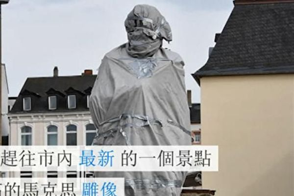

中共2018年5月5日向马克思的出生地德国特里尔市赠送了一座马克思的铜像被人纵火焚烧，再清楚不过的表明了一点，那就是明白真相的人对马克思主义和以当代马克思主义自居的中共的厌恶与唾弃。图为特里尔市尚未揭幕的马克思的铜像。（视频截图） 

  
文:袁斌

【大纪元2018年05月15日讯】共产党的“老祖宗”马克思出生于德国小城特里尔，今年5月5 日是他诞辰200周年。中共特意赶在这天前赠送了一座铜制的马克思雕像给特里尔。谁知，这座雕像刚刚揭幕５天就被人纵火焚烧了。据德国媒体报导，当地时间5月10日，消防人员接到火警后赶到现场灭火，发现雕像旁的一面旗帜已被烧成灰烬。

为何这座雕像揭幕仅仅５天便遭此“厄运”？

事情其实早有前兆。自从三年前特里尔市议会决定接受来自北京的这个特殊的“赠品”以来，这件事在德国引起的舆论反弹一直很强烈。人们讨论的焦点是：马克思主义打造出的共产极权害死了无数的人，德国为什么还要接受中共的这种馈赠？

德国一些共产主义受害者协会认为，让特里尔市接受这样一座雕像是一种耻辱。因为在马克思主义的教义指引下，全世界范围内的共产极权政权曾经害死了无数无辜的民众。

特里尔市政府很勉强地对外解释称：“接受这座雕像，并不是为了宣传马克思，而是为了激发大家讨论马克思。”为了平缓事态，特里尔市政府还要求北京方面把铜雕比原来设计的缩短一米，但是反对的声浪还是持续不断。

持反对意见的德国绿党曾质问特里尔市政府，“收礼本身是对赠礼一方的荣誉回赠，问题是，北京政权值得我们致敬吗？”

5月5日，马克思雕像揭幕仪式当天，会场外有多个抗议团体同时举行活动。在雕像上的红布被揭下来的瞬间，抗议的嘘声更是异常响亮。稍后，德国选项党几位代表还为雕像送上了一个花圈。特里尔市的该党派主席、莱法州州议员福里施（Michael Frisch）告诉大纪元记者：“特里尔为这种无视人权侵犯的象征树碑，这是不能接受的，因此我们送上花圈。”

选项党当天还组织了静默游行，“把马克思从底座上推下去”的口号。从他们的横幅上可以看到，在铁丝网包围下树立着一个底座，上面是马克思的头像，头像前面则是成堆的骷髅。另外还有一组显著的数字，展示被共产主义在全球害死的人数，例如中国，6,500万；苏联，2,000万，柬埔寨，200万⋯⋯

来自汉诺威的人权活动家鲍沃斯菲德（Alexander Bauersfeld）对大纪元记者说，“这个雕像是侵犯人权的象征，是侵犯人权的支票。我是为声援中国的人权而来此进行抗议。再过一个月就是六四天安门血案29周年的日子了，当年的那些党领导现在还是中共的领导，这就已经说明这个雕像的意义了。这个雕像对中国意义不同，中国人会误以为，马克思在德国也受到崇拜，这是错误的。”他表示，马克思是反人权、反新闻自由、推崇暴力的代表，“与德国基本法格格不入”。遗憾的是，“很多德国人缺乏历史知识，对马克思丑恶、犯罪的一面完全不知情。”

可见，自从中共表示要赠送特里尔马克思雕像以来，反对接受这座雕像的声浪在德国一直很高。而在这种背景下，当地政府仍然接纳了这座雕像，此举很可能激怒了德国的共产主义受害者和反对者，导致了纵火焚烧马克思雕像这一幕。

其实，从上世纪末国际共产主义阵营解体以来，在俄罗斯、乌克兰、东德等前共产党国家，被推倒拆除砸毁的马克思恩格斯列宁斯大林塑像何止成千上万！

据媒体报导，早在上世纪90年代，柏林的马克思恩格斯雕像就曾屡次被人斩首，脑袋扔进河中。奥伦堡的列宁像也多次被人砍头。

2013年末，乌克兰更是爆发了大规模民众示威活动，首都基辅市中心的一尊列宁像当时被现场大批民众推倒。乌克兰全国上下推倒列宁像的运动从此一发而不可收。此后几年，列宁在全国各地纷纷倒下。被推倒的列宁像有的被送到露天博物馆，有的被捣毁，有的被当作废金属融化。

类似事件在中国也曾上演。1989年5月23日，鲁德成、喻东岳和余志坚3位湖南青年先是在天安门城楼悬挂“五千年专制到此可以告一段落”和“个人崇拜从今可以休矣”的标语，之后又将盛满颜料的蛋壳扔向“伟大领袖毛泽东”的画像上。

尽管中共在今年马克思诞辰200周年之际再度把他的理论捧上了天，但历史早已表明，无论是在东方还是西方，“马克思主义在哪里得到执行，那里就变成废墟，那里就是饿殍遍野。”在我看来，中共赠送特里尔的马克思的雕像被人纵火焚烧，就像在这之前发生的马克思恩格斯列宁斯大林毛泽东的塑像被推倒拆除砸毁泼墨一样，再清楚不过的表明了一点，那就是明白真相的人对马克思主义和以当代马克思主义自居的中共的厌恶与唾弃。#

责任编辑：南风

<a href=#top><h6 align="right">回上方</h6></a>

<a name=7>
<h1 align="center">母亲节话孙蔼侠老人的悲惨遭遇</b></h1>

文:石铭

【大纪元2018年05月15日讯】据明慧网二零一八年五月九日消息：江苏省苏州市八十岁的法轮功学员孙蔼侠老人，被非法判刑一年半，孙蔼侠老人现已被劫持到南通女子监狱。

孙蔼侠老人，家住苏州市东港新村，系甘肃省白银公司机械厂退休职工。自幼体弱多病，上了年岁更是疾病缠身，经医院诊断患心脏病、肺气肿结核、胆囊炎、胆结石、肠胃疾患严重，结肠炎、横结肠下垂低于脐下、便秘神经官能症、高度近视等等，年复一年，夏天腹泻，冬天感冒长期住院，戏称“半条命”。孙蔼侠万分痛苦，也给家人、单位、邻居造成麻烦和负担。年年诊治，疾病有增无减，使她失去了生活的信心。

更令她雪上加霜的是，因公负伤，脊骨骨折，卧床近十年，生活不能自理，经多位专家诊治，收效甚微。一年三百六十五天，天天吃药。终日苦不堪言，常常以泪洗面。

因身体原因无法抚养子女，只好把孩子寄放异地。真是求生不得求死不能，尝尽了人世间的酸咸苦辣的孙蔼侠，万般无奈之下还是产生了寻短念头，备一瓶安眠药放在枕边，以了此生。

一九九七年她修炼法轮功后告别了躺了十年的病床，变成一个生活能够自理、做家务的正常人。周围邻居好奇探问：过去一直躺在床上，怎么现在天天背个包出来走动了？她说：“我炼了法轮功，感觉啥病都没了，能吃能睡，使不完的劲，家务全包，天天拖地。是大法救了我的命。”

自江泽民邪恶集团迫害法轮功十九年来。孙蔼侠多次遭骚扰、多次遭非法抄家，七次被绑架、三次被关押洗脑班、三次被非法判刑。

二零一八年一月十日，苏州市市工业园区法院在没有通知任何家属的情况下开庭，对孙蔼侠非法判刑一年半。（详情阅明慧网二零一八年五月九日《多次遭迫害江苏80岁孙蔼侠再被非法判刑》）母亲节到来了，十九年来究竟有多少母亲遭遇到孙蔼侠老人一样的悲惨遭遇？真是罄竹难书啊！

据最近明慧网报导，太原市杏花岭区法轮功学员田云飞二零一八年四月八日被非法判七年，被中共洗脑班迫害致瘫痪在床的妻子张印香，失去丈夫的照顾，难以进食，身体状况越来越差，于二零一八年五月五日清晨五点离世，年仅五十二岁。

自一九九九年七月中共及江泽民集团迫害法轮功以来，他们的家庭失去了往日的安宁。夫妻二人多次遭受抄家、扣发工资、强迫下岗、拘留、劳教、关洗脑班黑监狱等迫害。没有了丈夫在身边，张印香身体状况越来越差，骨瘦如柴，生命垂危，只有两只大眼睛在无声的诉说着什么，眼神在传递着什么，在期盼着什么……

张印香离世当天，从早到晚一直阴雨不断。那淅淅沥沥下个不停的雨水啊，恰似上苍洞彻世间的冤情而垂下的眼泪！

山东省滨州市现年七十二岁的法轮功学员苏翠荣，二零一八年四月遭滨城区法院以所谓的“破坏法律实施罪”非法判刑七年，并勒索罚金三万元。苏翠荣已提出上诉，要求撤销非法判决。

江苏常州市法轮功学员杨锡元，现年八十二岁，二零一八年一月四日被武进区法院非法判刑二年，一月十一日送苏州监狱。家人至今未能会见。

成都市金牛区西华大学（原四川工业学院）现年七十八岁的魏永清老人，二零一七年二月三日被红光派出所警察非法抄家并监视居住，于二零一八年四月二十四日被非法庭审。

俗话说“人活七十古来稀”，七八十岁的老人正是子孙环绕身边，安享天伦之乐的时候，而法轮功学员老人们却因为信仰“真善忍”做一个好人无辜遭受着惨无人道的迫害。这是谁之罪？就是那个惨无人道、灭绝人性的中共邪灵！

《共产主义的终极目的──中国篇》中说：孔子曰：“……五十而知天命，六十而耳顺，七十而从心所欲不逾矩。”传统的中国老年人因为其智慧和经验，自尊和仁厚，是社会中最受人尊敬的群体。

清朝康熙帝曾经两次在畅春园和乾清宫举行千叟宴，宴请65岁以上蒙、满、汉文武大臣以及致仕人员达千人以上。乾清宫的两次筵席上，康熙与赴席老人们飞觞饮宴，皇子、皇孙们侍立观礼，并为老人们斟酒。为纪念这两次盛会，康熙帝即席有赋《千叟宴》诗一首，并命大臣们“赋诗记事”。可是今日的中共却把信仰“真善忍”做好人的老人们视为敌人，必欲置之死地而后快。从对老人们的邪恶迫害凸显了中共毁灭人类的邪恶本质。

历史上迫害正信的从来没有成功过，中共亦是如此。在二十多万法轮功学员控告江泽民，二百多万国际社会正义人士连署举报江泽民，要求将迫害元凶江泽民绳之以法，超过三亿人抛弃中共的三退大潮中，江泽民集团已经是土崩瓦解、穷途末路，等待他们的只能是彻底覆灭的下场！

随着中共解体灭亡日子的到来，这场邪恶的迫害也很快会结束，老人们会迎来一个没有迫害，没有苦难，人人尊老爱幼，尽享天伦之乐的美好社会！

责任编辑：任慧夫

<a href=#top><h6 align="right">回上方</h6></a>

<a name=6>
<h1 align="center">睽违一甲子的变天 马来西亚民主的初尝试</b></h1>

文:胡逸山

【大纪元2018年05月15日讯】马来西亚自建国以来的半个多世纪里，皆由当下称为国阵的同一个政党联盟所执政。在本届大选中，由多个反对党所组的希望联盟（Pakatan Harapan；希盟）成功击败国民阵线（Barisan Nasional；国阵）而赢取了执政权。这是马国政治发展史上的一个分水岭，因为其开启了马国的政党轮替先例，为以后的两线制政治运作奠定了重要的基础。

虽然本次大选的整体结果出乎绝大多数议论之外，但也还是有一定程度的先兆可寻。在之前的两次大选里，反对党阵营已经大有斩获，皆破除了国阵在国会里得以轻易修宪的三分之二大多数席次。

在2013年的大选里，希盟的前身人民联盟（Pakatan Rakyat；民联）甚至赢取了比国阵还多的选票，不过在各选区选民数目不均匀的现实下，仍由国阵赢获过半的议席执政。

在这一届大选里，马国全国依选区共划分为222个国会议席，任何一方要得以掌握执政权，都必须赢取至少112个议席。而希盟与其友党共囊括121个议席，国阵则只赢79席，即便联合了其他政党，也就只能凑到100席左右，明显是败下阵来。

在州级的选举方面，国阵一向来也执政绝大多数的州属，但在本届大选里，希盟除了原先执政的槟城与雪兰莪外，根据成绩趋势，也攻下了至少另外五州的州政府。国阵在一夕之间，从原先在国州层次的执政权皆固若金汤的“大好”形势，沦为一个只在寥寥数州执政的反对党，政治角色可谓与希盟对调。

新天新地？大马重迎马哈蒂尔时代
从巫族到华族　那些不欲投票的大马青年
2013年——马哈蒂尔：亚洲尚不理解民主
发生在东南亚的美式选举
马来西亚虽然奉行的是英式的议会式民主，但这是一场在形式上极为酷似美式总统选举的大选。国阵是由原任首相纳吉（Najib Razak；又译纳吉布）领军赴战，而希盟则是由更早的首相马哈迪（Mahathir Mohamed；又译马哈蒂尔）再度出马领导。

纳吉原是马哈迪在某种程度上的政治继承人，起码当年马哈迪也有份推纳吉一把，让后者成功登上相位，但后来两人基于政治与其他方面的歧见而分道扬镳，马哈迪选择（第三度）退出国阵的骨干政党巫统，自组一新政党后加盟希盟，并成为后者的主席。

而在本届大选短短不过11天的正式竞选期里，只见纳吉充满微笑的肖像充斥挂满大街小巷的海报、布条上，路旁的大型电子显示幕上更有他动态式的政治讯息宣导，令人有时不经意地混淆，到底是被呼吁投票给某选区的国阵候选人，抑或投给纳吉。

马哈迪一方则着重在各地办超大型的群众集会来为希盟的选情造势，由马哈迪亲自担纲“演出”，场面虽未至万人空巷，但也还是极为震撼人心的人山人海。所以，这是一场犹如纳吉对垒马哈迪的超级大赛。

在本次大选的课题选项方面，希盟明显的是处在主动的地位。特别是马哈迪医生在其以网上网下多种形式呈现的政治资讯里，主攻的就是他指涉及纳吉的有关一马公司（1MDB）的一系列“扬名国际”的丑闻，进而指责马国当局演变成一所谓的“偷窃者政权”，令国人蒙羞。而马国社会各界，特别是中下层阶级所贴身感受到的物价高涨的民生疾苦，被希盟宏观地描述成主要是由纳吉所推动的消费税所导致，所以希盟答应在如获上台当政在白天之内废除消费税的选举承诺，也还是颇为赢得好感的。

至于国阵方面，则一方面强调有关一马公司的各项指责业已被纳吉钦定的执法当局调查“完毕”、“没事”；另一方面也自多年以来就采取比较微观的手法，通过民意调查等方式找出各个对国阵执政不满的小群体，然后为彼等“量身”打造出有针对性的解决方案，如就某个年龄层、收入、性别等而推出的援助金、就业与培训计划等，理论上是把所有这些小群体积沙成塔地收编回来，就会成为一庞大的投票群。

然而，大选结果显示这个策略终究还是失败的，因为大多数的选民是选择了更彻底的解决方法，即把执政的国阵整体的连根拔起。

华人的期盼 中国投资的延续
此外，马国华人选民在这次的大选与上两届一样，绝大多数不把票投给国阵。这主要是因为华人选民认为在巫统主导下的国阵，种族沙文主义的气焰高涨，而国阵里几个以华人党员为多的成员党，被认为未能很好地捍卫华人应有的权益，在政府里的所谓监督角色可有可无，所以彼等的党魁都在选战中败下阵来。

反之，在刚上台的希盟政府里，华人议员占了几近三分之一的数目，而且希盟的各成员党起码到目前又是平起平坐地议定政策，所以华人选民应该是认为彼等的权益在新政府之下会得到更完善的保障。

而在这次大选里，中国在“一带一路”框架下在马国所进行的大数额、大规模的投资项目，以至更广义的越趋紧密的马中关系，虽然偶尔有被提起，但并未演变成为一项主要课题。这是因为马国虽然是一个开放型经济体，但牵涉到外国的事物向来未能在政治运作里引起太大的波澜。马哈迪之前对一些中国在马投资事宜约略有点微言，但他上台后立即改变口风，谓有必要才会检讨中国的投资，而且也没反对“一带一路”倡议。

以马哈迪一向特别是在经济上务实的施政手腕，马中友好关系应该也得以持续下去。一些人也许也忘了，马中的“蜜月”关系，其实是始于马哈迪第一度当政的30多年前。

马国政坛史无前例的变天，其最大意义不在于对比朝野双方的政绩或承诺，而是在选民心目中与脑海里，深深的种下“政权可以轮替”、“政府可以更换”思维种子，日后可以更有效地以五年一度的选票与每时每刻的监督来制衡政府的庞大权力，令后者因为随时可能被赶下台而不敢造次。

摆在马国面前的，是一条真正民主化的康庄大道，但还是需要全体国民一步一脚印地把它认真实践。

－－原载《BBC》

责任编辑：任慧夫

<a href=#top><h6 align="right">回上方</h6></a>

<a name=5>
<h1 align="center">当今有哪个国家法律中定义“正教”？</b></h1>

文:如初

【大纪元2018年05月15日讯】当今世界任何国家，无论是民主的还是独裁的，无论是文明社会，还是流氓政权，没有一个国家的法律中有“正教”或“正确的信仰”这样的词汇出现，当然更不会有对“正教”的法律定义。为什么？

对于正常的自由社会，这很容易理解。欧洲中世纪经历过不名誉的“异端裁判所”时期，这段不齿的经历，给西方社会注射了一剂疫苗，使后世牢记政治权力与宗教信仰互相干预或相互利用的危害。古代明君和当今民选政治领袖可以公开表达对神佛的信仰，但不会动用政治权力（法律）对某个宗教强行干预和定性，也因此，当今尊重信仰自由的文明社会中，议会绝不敢冒天下之大不韪，在法律条文中搞出个“正教”来。基督教中，“上帝的归于上帝，凯撒的归于凯撒”，已经回答了世俗政权和信仰神之间在很多方面是有天然界限的。

当今世界为数不多的政教合一国家，即使政治领袖兼为宗教领袖，也不再用法律约束全部国民必须信仰同一宗教，甚至在法律条文中也出现了保护信仰自由之类的内容。

流氓独裁国家的法律条文中没有“正教”一词。这也不难理解。当今世界迫害信仰、践踏人权、无法无天的国家，基本都属于共产国家或者受共产主义邪恶思潮影响严重的国家，这样的国家政权眼里，宗教既然属于精神鸦片，当然就不存在“正教”的概念。虽然中共也假惺惺地承认几个“合法宗教”，并将其纳入管控，那是中共暗地里实施最终消灭宗教计划的一部分而已。

尽管各有各的理由，“正教”一词没有出现在当今世界任何国家条文中，已经是客观事实。

那么“邪教”呢？

除了中共的法律条文之外，世界各国的法律中鲜见“邪教”或“不良宗教”、“错误的信仰”之类的词汇。中共曾经大力炒作某个国家所谓“立法禁止邪教”，事实上不过是该国立法针对特定的不良行为团伙，尽管这个团伙可能有共同的信仰。其目的在于预防和避免特定团伙的不良行为和犯罪倾向，而这个特定团伙的涵义与“邪恶的宗教”、“邪恶的信仰”完全是不同的概念。

在几何学中，先有水平线，才会有坡度、斜角，先有垂线，才会有偏角。这种先有“基准”、后有定量甚或定性可推广到很多领域：海拔高度（海平面为基准）、人体发烧（正常体温为基准）等等，那么在信仰领域，也一定是先有“正教”的概念，然后才有“邪教”的判断。但中共流氓政权偏偏在法律中没有定义“正教”的情况下，凭空臆断出个“邪教”的术语。

中共搞改革开放后，为了树立所谓开明形象，减少法条中阶级斗争时代的痕迹，1997年在修改刑法时取消了“反革命罪”，取而代之出现的多个条文中，就包括刑法300条，所谓利用邪教组织、利用迷信、利用会道门破坏法律、行政法规实施的犯罪。一个诡异的现状是，中共刑法中有“利用×××破坏法律、行政法规实施罪”，但却没有单独的“破坏法律、行政法规实施罪”，这意味着中共看重的不是法律、行政法规的实施遭到破坏的后果，而是看重是谁、利用的什么形式。打个比方，就杀人罪而言，只有“利用屠刀杀人”才构成犯罪，而“利用刑具、利用手术刀杀人”就不构成犯罪。

客观地说，当初“邪教”被写入刑法的时候，立法者当初也未必能想到这个法条后来会被中共恶意滥用到铺天盖地的程度，这个术语在刑法中的出现，先是1997年悄悄进行的。几年之后为了升级对法轮功的迫害，中共对这个全世界刑法条文中独一无二的术语，做了个不伦不类的“解释”，贼喊捉贼式打压无辜残害良善，从此，刑法300条这段世间难找的文字成了江泽民魔性大发的得力工具。

正教与邪教，是修炼界、信仰领域、有神论者的话题，不管判断的标准与结果如何，至少大家有资格（承认有神）、有标准（神传给人的话）去评判。而中共信奉的是无神，压根没有资格去评判谁正谁邪。在世间所有信教、信神者眼里，还有比无神论更邪恶的学说吗？还有比中共更邪、更大、更流氓、更恐怖、更有破坏性的邪教吗？#

责任编辑：任慧夫

<a href=#top><h6 align="right">回上方</h6></a>

<a name=4>
<h1 align="center">5‧13世界法轮大法日，中国人的骄傲</b></h1>

文:川人

【大纪元2018年05月15日讯】2018年5月13日，是第十九届“世界法轮大法日”，世界各国政要纷纷发出褒奖、贺信庆祝第十九届“世界法轮大法日”的到来。在贺信中，各国政府均对法轮大法学员所坚持的“真、善、忍”人类普世价值表示高度赞同，众多外国名流对“真、善、忍”所展现出的博大中华文化内涵所吸引，甚至很多人络绎不绝的成为了法轮大法坚定的修炼者。二十六年斗转星移间，作为佛家上乘修炼大法的法轮佛法，就这样奇迹般的迅速洪传全球，成为了外国人了解中华神传文化的一张名片，成为了每个中国人的骄傲与自豪。

据了解，法轮大法也称法轮功，是由李洪志先生于一九九二年五月传出的佛家上乘修炼大法，以宇宙最高特性“真善忍”为根本指导，按照宇宙演化原理而修炼。法轮大法直指人心，指出真正修炼就得按照“真善忍”的标准修炼自己的这颗心，叫修心性。只有心性提高上来，修炼者才会祛病，才会长功，身体才会发生向年轻方向的变化。为感恩李洪志先生将其独修的法轮大法洪传于世，使得人人受益，新唐人电视台特别推出了《见证大法的神奇》系列节目，详细介绍了很多人在法轮大法修炼中的受益与神奇。可见，法轮大法之所以能迅速洪传全球，得到全世界尤其是西方社会的高度认同与褒奖，这与法轮大法所坚守的“真、善、忍”价值观，以及法轮大法所展现出的修炼神奇效果密不可分。

与国外各国政府纷纷褒奖法轮大法截然不同，在国内中共对坚守“真、善、忍”价值观的法轮大法极尽污蔑、诋毁之词。从一九九九年七二零以来，十九年间，中共利用国家机器对法轮大法修炼者进行了惨绝人寰的迫害。中共为了让法轮大法修炼者放弃对“真、善、忍”的信仰，放弃对“真、善、忍”的恪守，采用了酷刑折磨、非法判刑、活摘器官等各种邪恶手段对付法轮大法学员，但这些邪恶手段并没有让法轮大法修炼者屈服，相反由于中共毫无人性的迫害坚守“真、善、忍”价值观的法轮大法修炼者，让国际社会再一次看清了中共的邪教本性。有观察人士认为，中共迫害法轮大法表面上看是中共对信仰自由等基本人权的粗暴践踏，实际上是人类两大价值观及其对应的意识形态的激烈交锋，更是以道德自我恪守为核心，人类正义势力与邪恶势力的巅峰对决。

由于中共信仰马克思的共产主义暴力学说，自由世界与前共产主义国家的人都把中国人当成异类，经常用有色眼光看待中国人。在中共“假、恶、斗”党文化的长期教育影响下，大多数中国人都养成了很多自己都无法察觉的毛病。在公共场所高声说话，上公共卫生间拿免费手纸装兜里且不冲洗，抱着小孩随地大小便，乱扔垃圾随地吐痰，吃自助餐疯抢大虾，经常说假话……而在海峡对岸同为中国人的台湾，他们的文明礼节与个人素质明显比中共党文化教育下的大陆高很多，这说明了什么？同样的中国人，在两种不同制度及意识形态的教育下，竟有天壤之别的反差，这是不是说明了中共搞的共产主义十分邪恶？中共是一个毁人不倦的邪党？现在中共又把德国人自己都抛弃的马克思主义拿来强加给中国人，这样的中国人如何能拥有文化自信？这样的中华民族又如何能自豪？！

为了达到迅速消灭法轮大法目的，中共在对外宣传中一直故意把法轮大法和其坚守的“真、善、忍”进行分离。中共动辄就称法轮大法是“X教”，称法轮大法有“政治目的”，却根本不敢提法轮大法所坚守的“真、善、忍”是“歪理邪说”，也根本不敢提这所谓的“政治目的”只是“说明中国人退党后远离政治”。在被中共残酷迫害的十九年间，法轮大法对中共没有一丝报复行为，完全按照“真、善、忍”来约束自己的一言一行，试问这世界还有哪个团体或个人，在面对一部国家机器的非人诽谤与迫害时，能做到如此的平和与从容？法轮大法平和的反迫害行为深刻诠释着法轮大法修炼者所秉持的大真、大善、大忍之心。单凭这一点，法轮大法就足以成为所有中国人的骄傲，这也是外国政要由衷佩服法轮大法的重要原因。

事实证明，面对中共持续十九年的残酷迫害与活摘器官暴行，一个被中共称为有“政治目的”的法轮大法却始终没有一个政治纲领，也没有任何政治诉求，他们只是希望恶人对法轮大法毫无理智且惨无人道的迫害应立即停止，还法轮大法一个清白，还李洪志先生一个清白。尤其李洪志先生无偿传授人功法，无偿帮助人祛病健身解除疾苦，无偿教人按照“真、善、忍”去做好人，不断提高个人心性与道德水准，这种善化天下的慈悲壮举正是中华传统文化中大圣人所为。现在法轮大法所展现出的诸多神奇，已远超现代科学研究的范畴，他对人体、宇宙、生命的深刻认识，对修炼者所展现出的身体康复和道德提升的神奇，已吸引了全世界越来越多的有识之士的目光。

《辩问》有云：“俗所谓圣人者，皆治世之圣人，非得道之圣人，得道之圣人，则黄老是也。治世之圣人，则周孔是也。”讲的是，世俗人认为的圣人，都是治理国家的圣人，不是得道的圣人，黄帝、老子是得道的圣人，周公、孔子只是治理国家的圣人。但黄老这些得道的圣人却不管世人的事情，也不管人能否得度。《老子》又云“天地不仁，以万物为刍狗；圣人不仁，以百姓为刍狗。”可见，在得道圣人的眼中，世人一直都只不过是无足轻重的“刍狗”，他们是不会度化命如“刍狗”的芸芸众生的。但法轮大法的李洪志先生不同，他不仅要度化这些命如“刍狗”的芸芸众生，而且还要尽可能的多度，这是亘古未有的洪恩。这种气度与慈悲远超黄老，所以无偿帮助人祛病健身，无偿教人提高道德水准的李洪志先生，是当之无愧的大圣人。

其实，稍有一丝理智的人，都不会认为信仰“真、善、忍”有错，都不会认为无偿替人祛病健身，无偿帮助人提高道德水准是个错误，都不会认为个人想按照“真、善、忍”去做好人是在搞政治。相反，那些打着“政治”与“政治正确”旗号的人或团体，那些以统治者自居的“抖派”，利用自己手中的绝对权力，在不断败坏人类社会的道德，在不断挑战人类社会的底线，在不断的污蔑、迫害坚守人类道德准则的人，这样的邪恶势力到哪里都是祸害，到哪里都无法取得别人的认同，到哪里都会有永无休止的争斗。

现在，全世界各国民众和世界各国政要，纷纷以自己的方式庆祝“5‧13世界法轮大法日”的到来，这不仅是对信仰自由基本人权的支持，也是对以“真、善、忍”为核心的人类普世价值的呵护，更是对“真、善、忍”价值观的高度认同。我们坚信：人类的未来一定是建立在以“真、善、忍”为核心的价值观基础之上的，而不是以“假、恶、斗”为基点的共产主义邪恶文化，坚守信仰“真、善、忍”一定会成为全人类的共识。5‧13世界法轮大法日，必定成为人人受益，人人敬佩，人人庆祝的重要节日，成为所有中国人的骄傲！

责任编辑：任慧夫

<a href=#top><h6 align="right">回上方</h6></a>

<a name=3>
<h1 align="center">民国“山西王”当令中共贪官无地自容</b></h1>

山西省前忻州市委书记董洪运贪腐过亿。（大纪元合成图）

  
 文:程晓容
 
  【大纪元2018年05月14日讯】山西贪官的名单很长，很惊悚。落马官员曾任职省委常委、副省长、省委秘书、太原市委书记、太原公安局长、运城市委书记、吕梁副市长、忻州市委书记、高平市长……大官小官皆巨贪。百姓在贫困中挣扎，官爷们忙着编织权钱网，富得流油，财大气粗。

今年3月28日，山西省吕梁市原副市长张中生因受贿10.4亿余元，被一审判处死刑。吕梁市是贫困地区，张中生的受贿金额等于全市1个月的财政总收入。张中生一路嚣张妄为，被指一句话即可决定一个煤矿的存亡。这10亿贪官的背后，谁在撑腰？

除了死刑，还有三个山西贪官被判处无期徒刑：申维辰，受贿近9542万元，金道铭，受贿超1.23亿元，杜善学，受贿8011万余元。另外，山西省政协原副主席令政策，受贿1607万余元，被判处有期徒刑12年6个月。

“卖官书记”、前山西省委副书记侯伍杰，2006年因贪污受贿被判11年，不到7年便提前获释。他出狱时，当地官员、煤老板及名流富商热烈迎接，上演了一场“荣归故里”的滑稽戏。

据纪检委办案人员透露，侯伍杰至少贪污了5000万元，在各地拥有房产38处。当年，侯曾经威胁办案人员：如果你们一定要让我怎么样，那山西会有一大批官员跟着我倒楣，不会少于二、三百个干部。

对于贪官“凯旋”，网友“斯陋人”评论说：“这个世道怎么啦？在权力与金钱面前，真理和正义何在？太可怕了，中国真的太可怕了，礼崩乐坏，但怎么也没有想到竟然会崩坏到这种地步！这则消息令我对中国的反腐形势感到无望。”

近日，又一个山西亿元贪官被揭出。山西晋城市煤炭煤层气工业局前党组书记、局长赵晚畴，在8年间接受当地“煤老板”巨额贿赂，包括存折2427张、黄金30公斤，累积了过亿的家庭资产。

一批接一批的贪官，不断地颠覆群众的想像力。大陆网友问：“这只是搜到的，那他送给他的上级的又是多少亿呢？不送怎么可能升官发财呢？”再问：侯伍杰说的“二三百个干部”被牵动了吗？整个山西省，全中国，还有多少贪官待查？

中共愚民的经典语汇是“新旧社会两重天”。过去的山西人民，过的是什么日子？

说到山西，必须提及一个人：阎锡山。这位军阀统治山西38年，有“山西王”之称。他在地方治理上一枝独秀，名扬中外。在中共建政后的许多年里，当地百姓都对其念念不忘，心怀感谢。

阎锡山在山西大力发展农业、兵工业、兴学重教。从1917年开始，他颁布了“六政三事”，搞水利、养殖、造林，禁赌、禁烟、禁鸦片，鼓励生产和发展。此外，阎锡山为学龄儿童们打造了几十万张课桌，使得当地学龄儿童受义务教育的比例长期保持在70%。教育家陶行知说过，“山西是中国义务教育策源地”。

阎锡山位高权重，他却忧虑自己“智不足以知人，勇不足以胜人，仁不足以感人”。

1930年的美国《时代》杂志这样描写阎锡山：“作为山西省的‘模范督军’，……尽管目前晋西南地区还存在粮食短缺，但阎为1100万人带来了繁荣，在中国，他们最富裕，因而使他显得出类拔萃。阎的嗜好不是女人、酒、鸦片，甚至也不是金钱，而是优质的道路、纺织、防御部队、维持秩序的警察，发展优良的牛、马、耕具、家禽、肥料——所有能为他的乡亲直接带来好处的事物。”

1948年12月29日下午，阎锡山出席立法院招待会，发表演说，称“共产主义为诊断错误之医术，而共产党为诊断错误之医生”。1949年12月8日，阎锡山从成都飞抵台湾。

68年后，今天，当中共还在声称坚持党的领导，马克思主义时，包括贪官在内的遍地乱象已经说明了一切。一场红祸，摧毁了传统道德的根基，扼杀了纯朴向善的品质，腐败、污染、动乱随之而来，覆盖中华大地。中共不倒，不会有清廉的官场，不会有清明的法治，也不会有清新的民风。

责任编辑：高义

<a href=#top><h6 align="right">回上方</h6></a>

<a name=2>
<h1 align="center">重庆医大原校长落马涉薄案核心内幕</b></h1>

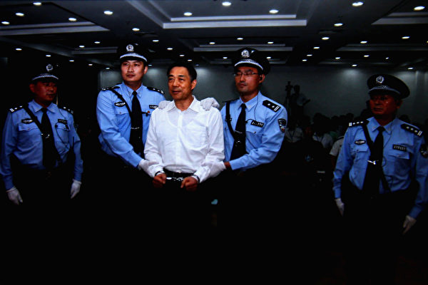

薄熙来案的核心内幕是政变密谋和活摘器官罪恶。 (Photo by Feng Li/Getty Images)

文:陈思敏

【大纪元2018年05月14日讯】5月13日，中纪委官网通报，重庆医科大学原校长雷寒被查。当前重庆官场正在全面彻底肃清各种“流毒”中，今次落马的雷寒应该可以归为薄熙来名下。

舆论曾经点名非官场体系的薄熙来流毒很多原来是“薄粉”，雷寒过去不但曾是其中一份子，还程度不浅的涉及薄案核心内幕。

如外界所知，薄熙来倒台前，是江泽民为了维持迫害法轮功而内定的“接班人”。而薄熙来毫不掩饰被指野心毕露的两个象征建物，除了大连1997年竖立了高度超过北京天安门前的华表，还在重庆2008年10月打造了全国最高、世界第一的毛泽东塑像。尤其是后者，连底座达37米多、约10层楼高，重46吨的这座被指薄熙来为谋权位打造再创新高的毛像，正是座落在当时由雷寒主持的重庆医科大学校园内。

据公开资料，重医大校内这座毛像建造期间遭遇汶川大地震，地震之后当局还重新装修雕像，以加强其防震级别，打造费用总共耗资约人民币500万元，民众咋舌，甚至连重医大学生也在网上论坛发出“重庆医科大学修世界最大毛泽东雕像，学生却无处上自习”、“雷寒也应该下台了”等置评。

被指紧跟薄熙来的雷寒，是2004年至2017年的重庆医科大学校长，在此之前，雷寒历任重庆医科大学附属第一医院教授、主任医师、副院长（1996年至2000年）、院长（2000年至2004年）。

据《新纪元》2013年2月出刊第314期焦点新闻《重庆医大附属医院涉嫌活摘法轮功学员器官》一文中，化名李金珍的知情者披露亲身经历：2006 年冬天，因事在重庆医科大学附属第一医院（以下简称重医附一院）停留了三个月，期间曾听闻该院医护人员谈及有关器官移植的诡异事。

李金珍特别提到一件她曾经目睹而难忘的事，那是7辆警车、20多个便衣警察，押送了7个人抵达重医附一医，这7人有男有女，年岁从30至40多岁不等，看上去身体很健康，却被指称是从监狱押来治病的犯人，但又不是将他们送到门诊治病，而是被关押在废旧的小楼里。数日后，医院一位40多岁的男保洁员对李金珍说：“这里的医生哪里是动手术，简直就是在杀人，血喷得到处都是，手术室的地上全是血，我们用水管冲，都要冲两个小时才干净，他们（手术医生）经常这样的。”该保洁员说，手术地点就是对面大楼的三楼和四楼手术室。

李金珍进一步表示，透过与医护人员交流中，得知那7名被押进医院的是法轮功学员，做为器官移植的活供体，而在手术过程中，由于医生的野蛮摘取，使他们的血大量喷溅出来，其遗体在午夜从密道偷偷运出销毁。

据《维基解密》早前曝光的美国外交电文显示，薄熙来因为迫害法轮功在海外遭到诸多起诉，负面的国际形象不利于担任更高职位。因而被时任总理温家宝等人极力反对升任副总理一职，最后被发配到西南重庆任市委书记。

然而薄熙来到重庆照样有恃无恐，因为薄熙来当时最信任的王姓司机透露，江泽民1999年8月大连之行在参观星海广场华表时，明确地对薄熙来表示：“你对待法轮功应表现强硬，才能有上升的资本。”从大连辽宁到重庆，薄熙来继续“强硬”活摘器官。

在重庆医科大学为薄熙来问鼎中央竖立的超高毛塑像时，以及重医大附一院早年异常移植手术量的供体器官来源不明被列为涉嫌重大的非军系活摘医院，曾经的校长、院长雷寒都不能完全撇清薄案政变与活摘这两大核心内幕。而薄熙来的政变图谋当局已昭然若揭，活摘罪恶也有国际紧盯而无法再掩盖。

责任编辑：高义

<a href=#top><h6 align="right">回上方</h6></a>

<a name=1>
<h1 align="center">毁人不倦的“党妈妈”</b></h1>
<table border="0" cellspacing="3" cellpadding="3">
<tbody>
<tr>
<td align="center">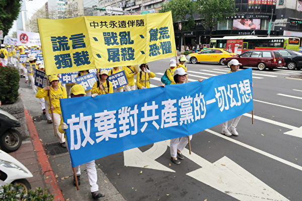</td>
</tr>
<tr>
<td align="center">中共毁人不倦。图为台湾法轮大法学会4月22日举办全球声援三亿人退出中共党、团、队暨纪念“4.25”中国法轮功学员和平上访19周年活动。（林宏文／大纪元）</td>
</tr>
</tbody>
</table>

文:张翎燊

【大纪元2018年05月14日讯】《论语》云：“默而识之，学而不厌，诲人不倦，何有于我哉？”大意是“”默默地记住所学的知识，学习的时候不知道满足，教育人的时候不知道疲倦，对我而言还有什么可遗憾呢？”两千多年来，“学而不厌，诲人不倦”一直被当做是教书育人的金科玉律。然而孔孟并未想到，如今共产党看准了这点，一面暴力镇压人民，一面歪曲经典，以“恩师”、“慈母”和“救星”的形象包装自己，诱骗无知的人入党或参加与之关联的各种组织为它服务。于是乎，诲人不倦的“诲”成了毁灭的“毁”，在党妈妈的佛口蛇心教导下，在无知青年“一切跟党走”的宣誓声中，一代又一代青年走向了不归路。

一、才子进去，疯子出来
俗话说：“物以稀为贵。”今天由于时代的发展，出国留学已经是稀松平常的事了，然而把时光拉回到上世纪40年代，留学生在当时可真真是个稀罕玩意儿。所以当时的留学生若是以“才子”自居，并不过分。

周寿宪，江苏淮安人，20世纪40年代曾赴美留学，先后获得密歇根大学电讯系硕士、博士学位。1955年，周寿宪怀着对祖国满腔的赤诚毅然回国加入清华大学，成为当时中国计算机领域的重要专家。

未曾想一朝风雨突变，1966年文革开始，周寿宪被打成所谓“美国特务”，送去位于江西的清华五七干校。在那里，周寿宪被批斗得精神失常，蓬头垢面，弯腰曲背，表情木讷。据知情者回忆，周先是大小便不能自理，被赶到屋外一个稻草堆吃睡。之后更加糊涂，甚至将大小便撒到自己的饭盒里。即使如此，还是有人用铁锹顶着他去干活，或者粗暴的将他推下水田。

终于，1976年，已经疯了的周寿宪跳楼自杀。

据各方统计，在文革当中单是中科院一家科研单位就有229人被迫害致死。全国上下，几乎每个行政单位都有科研院，殊不知有多少才子被整成疯子，而周寿宪只是其中一例。周寿宪本是享誉海内外的专家，难得一见的才子，怀着一颗赤诚的心想要报效祖国，最后却被中共残酷迫害，直至逼疯、逼死，不禁让人感叹中共政权的残暴与不可理喻。

二、校花进去，残花出来
2001年的时候，电视台播放的娱乐节目远没有现在丰富，节目质量也普遍不高，观众只能从矬子拔高个儿。无异，实力最雄厚的中央电视台会是大多数人的选择，而当年中央电视台最火的节目，当属电视节目主持人大赛。

如果要说在当年的央视电视节目主持人大赛有哪位选手能给我留下深刻印象的，当属沈冰无异。当时的沈冰才二十出头，着装靓丽，谈吐优雅，形象气质极佳，一出场就给人惊艳的感觉，活脱脱就是言情小说中的名校校花。凭借着自身独有的优势，沈冰获得当年央视电视节目主持人大赛银奖（也就是第二名），顺利进入央视工作，并在央视入党。

时光荏苒，转眼间十余年过去，突然有一天，我在网上看到沈冰因充当周永康情妇的消息被逮捕的消息，顿时倍感震惊，不敢相信当年电视屏幕上那个气质优雅、文质彬彬的美丽女子今日会沦落风尘，自甘堕落成为腐败官员的情妇！我一直期盼著这只是无良媒体的造谣，直到我在香港亲眼看到《沈冰自述：我和周永康的故事》一书才打消了念头，她自己都承认有，谁还能替她辩驳。

沈冰才貌俱佳，本可以在自己的工作领域干一番大事，却在党的威逼利诱下一步步沦落风尘，走上不归路，自身当然不是毫无问题，但更多的责任在央视这个大染缸，在共产党。试想，如果当年沈冰从南洋理工大学毕业后选择留在新加坡当财经记者而不是回中国工作，又怎么会卷入情色与政治的旋涡，落得今日惨景？事实上，央视作为“党的喉舌”，早被外界传为“淫窝”甚至“高官公共妓院”，不知多少才貌双全女子怀揣著激情与梦想进入央视，到头来却换来满天的桃色新闻和一张欲壑难平的老脸，沈冰、叶迎春、贾晓烨不都是这样吗？据一名央视前主播爆料：“目前上位的女主播，除了确实长得对不起人，或者被常委级与中办一些掌握实权的领导看重的，可以说达到了百分之九十都被睡过、被淫辱过，这已经不能算是潜规则了，而成了‘明确的规定’。”

哦，不对，不光是女主播陪睡，现在连男的都有了，芮成钢不就是吗？

三、好人进去，罪人出来
根据1999－2003年中共“最高检察院”与“最高法院”的数据，普通中国民众的犯罪率为0.25%；国家机关工作人员的犯罪率是0.5%，比普通民众高一倍；而司法机关工作人员的犯罪率竟然达到了惊人的1.5%，是普通民众的六倍！

慢著，如果认为司法机关工作人员是中国犯罪率最高的群体的话，那就大错特错了。中国犯罪率最高的群体是啥？说出来肯定有很多人不相信。中国犯罪率最高的群体是中共中央委员会！十八大以来，205名中央委员和171名中央候补委员中，已有16名中央委员、16名中央候补委员落马，犯罪率达8.51%，是中国民众犯罪率的21倍！《三字经》云：人之初，性本善。他们并不是天生的坏人，如果他们当初不选择从政，或许到现在他们还是最普通却也是最可敬可爱的人，可以告老还乡、儿孙满堂，虽不一定能享尽荣华富贵，好歹也能悠然自得，不至于今日晚节不保的惨状。

然而“党妈妈”却深知人性的弱点：钱、权、色。除非是看破红尘的人，否则这三样谁不想要？尤其对于男人而言，这三样在很多人看来就是社会地位的证明，所以来者不拒、越多越好。想要怎么办？入党！“党妈妈”永远会戴着一张乐于助人的面具不厌其烦地教你如何一步步拿下它们:

为了钱、权、色，你必须放弃一些东西，放弃正义，放弃尊严，放弃亲情，放弃友谊，放弃人性中的善，因为它们不能证明你是成功人士，因此是不重要的，只有钱、权、色能让你成功……

上面的过程便是共产党毁灭人性，培植党性的过程。一旦人性泯灭，离犯罪还会远吗？这个党本身就是个邪恶的组织，越往上看，人性中的恶就越大，犯罪率也就越高。

好在人是会学习的动物，中国的新一代年轻人中，已经有越来越多的人看清了共产党毁人不倦的真面目，自发地与之隔离，最近出现的“佛系青年”便是例证。“党妈妈”还在故作镇定强颜欢笑，却也知道脸上厚厚的脂粉正在一层一层地掉，心里苦的很：它这“恩师”、“慈母”和“救星”形象，说不定哪天就演不下去了。

责任编辑：高义

<a href=#top><h6 align="right">回上方</h6></a>
