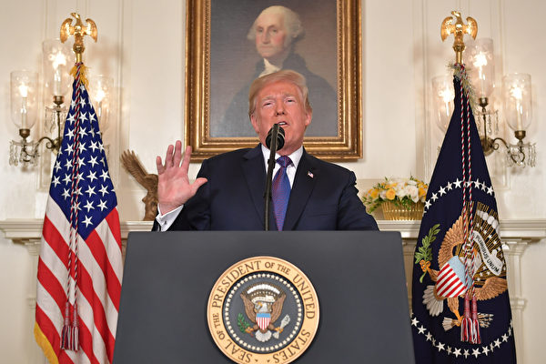
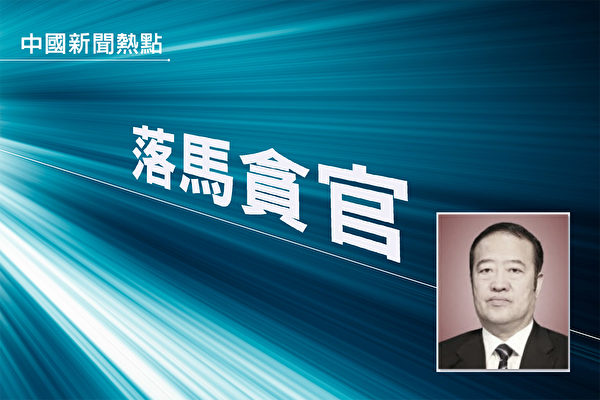

 

<h1 align="center">中共监狱酷刑虐待</b></h1>

张林

【大纪元2018年05月16日讯】前天晚上我偶然地参与电报群组里，关于中共监狱酷刑问题的讨论。有人认为现在中共当局监察很严，酷刑已经大大减少。

但是更多的人认为，中共监狱几十年都没有什么实质性进步。酷刑只是在不同时期，有不同形式罢了。

我因为蹲过十几个看守所和多个监狱、劳教队，所以知道形式多样的酷刑虐待。

前几年我在铜陵监狱受刑时，我口腔左侧臼齿烂了一个洞，狱方三年不给我补，害的我只能用右边牙嚼食，脸都变歪了！

为了补牙，我闹腾了三年，闹到安徽省公安厅、安全厅、司法厅（因为我是三厅共管的要犯，良心犯），最后监狱也还是按照司法部规定：不给犯人补牙！

想想这是多么冷酷的规定！烂牙疼起来要人命！而中国监狱关押数百万囚徒，每年有上百万颗牙齿坏掉，司法部却明文规定统统不给补。其实这就是一种特别的酷刑！

我还记得1989年，我在看守所也是一颗牙齿烂掉，疼的要死，特别是吃米饭时，一不小心一粒米咯在烂牙上，突然袭来的剧烈疼痛，能使半个脑袋都僵化。

为了防止囚徒逃跑，看守所囚室的窗户很高，又没有空调，夏天热的要死。89年时，整个夏天我们在囚室里都不穿衣服，即便如此，也热的头昏脑胀。整个夏天我都是昏昏沉沉的。

而到了2013年，囚室里装了监控摄像头，因为某个公安厅领导认为囚徒光膀子不雅观，看守就凶狠的强令我们必须穿的整整齐齐。那就不仅是热的冒汗、头昏脑胀，而是长痱子，囚室里一半人都长痱子。痱子严重了，会导致皮肤溃烂。还有些人因为体热排不出来，甚至热昏过去。

我和大家多次强烈抗议，但是一点用也没有。因为共产党干部，对待上级总是唯命是从，而对待下级则如狼似虎。没有一个干部愿意向上级逐层反映这个问题。

岂止炎热问题，中国监狱成千上万的野蛮管理方式，都被长期维持，而很少有改进。因为没有干部愿意实事求是地面对问题，并且找到解决之道。

比如不管天气多么严寒，看守所都会残忍地抢走刚刚被关进来的人的皮鞋或皮棉鞋，而让囚徒几乎光脚进入囚室，许多人的脚都被冻青、冻肿、冻坏。

看守所抢皮鞋早年是为了送给熟人或卖掉，因为那时候大部分中国人很贫穷；而现在抢皮鞋就是赤裸裸的虐待了。尽管看守所的借口是皮鞋里有一根铁骨，没收是为了防止囚徒自杀或逃跑。

而实际上，看守所普遍强迫嫌疑人从事手工，而手工需要一些工具，如老虎钳一类，显然比皮鞋龙骨更具危险。但是全中国没有一个看守所警察会正视这个问题，而是依然冷酷地维持这项极其野蛮的规定，继续害人，导致几十年来数十万的人脚被冻坏，却没有任何人承担责任。

极权主义就是如此恐怖！

责任编辑：朱颖

<h1 align="center">“褒扬”与“迫害”的对比</b></h1>

台湾法轮大法学会2018年4月22日举办全球声援三亿人退出中共党、团、队暨纪念“4.25”中国法轮功学员和平上访19周年活动。图为法轮功学员在台北游行。（陈柏州／大纪元） 

石铭

【大纪元2018年05月15日讯】在庆祝“第十九届世界法轮大法日”和“法轮大法（又称法轮功）洪传世间二十六周年”的日子里，我们从二零一八年五月十日至十三日的明慧网报道中，了解到这样的信息，国际社会在褒扬法轮功，中共在迫害法轮功，国际社会对法轮大法的态度与中共形成鲜明的对比。

据明慧网二零一八年五月十日报道：又到了万物生长，鲜花盛开的五月，全球各地都在庆祝“第十九届世界法轮大法日”、“法轮大法（又称法轮功）洪传世间二十六周年”之际，纽约州各级政府官员一百多位发出褒奖和贺信，恭贺，其中包括由纽约州第四选区众议员恩格布莱特（Steven　Englebright）发起，五十五位州众议员共同签署的褒奖，他们恭贺“第十九届世界法轮大法日”，颂扬法轮大法“真、善、忍”是普世价值，赞扬法轮大法对社区的贡献和法轮大法洪传世界的盛况。今年是纽约州众议员连续第四年联名颂扬法轮大法。

明慧网同日报道：二零一八年五月十三日是法轮大法传世二十六周年的日子。加拿大多个城市向法轮大法学会发出贺信，赞扬法轮大法提升社会道德；“真、善、忍”理念是所有社会的指路灯，并启迪着人心；法轮大法修炼者对“真、善、忍”的坚守为世界树立榜样。

美国密苏里州圣查尔斯郡的三个城市颁发了褒奖，宣布二零一八年五月十三日为各自城市的“法轮大法日”。美国新泽西州参、众议院发表联合决议，庆贺第十九届世界法轮大法日，并赞扬法轮大法有助于改善健康，净化思想，提升心灵，表彰新泽西州法轮大法学员在本州推广法轮大法的努力。

据明慧网二零一八年五月十一日报道：五月九日，加拿大东部法轮功学员汇聚在首都渥太华国会山前庆祝法轮大法洪传二十六周年。九位加拿大议员与法轮功学员现场同庆法轮大法日。

加拿大前环境部长、资深保守党国会议员Peter Kent先生首先用中文问候“法轮大法好”。他在发言中说：“我很高兴有机会赞扬加拿大法轮大法学会所做的所有辛勤工作，与加拿大人分享这一有益的功法。我代表加拿大的官方反对党祝愿你们有一个难忘的庆祝活动。”他同时转达加拿大保守党领袖Andrew Scheer的问候：“通过传播真、善、忍的原则，世界各地数以百万计的人受益于法轮大法的教导。我知道这个功法在加拿大和平多元的社会中有很多追随者。”

加拿大绿党领袖May女士在发言中盛赞法轮功学员“是和平、真诚和宽容的鲜活体现”。她对庆典中的法轮功学员说：“你们带着平和的爱的精神来到这里，来到国会山。因此，我们这些在这个美丽大厦中担任议员的人们，为你们而工作，直到有一天，中国尊重人权、尊重宗教自由、尊重你们修炼法轮大法的权利，并停止残酷迫害修炼法轮大法（法轮功）的人。”

法轮大法日庆祝期间，加拿大多位部长、各级议员再度为法轮大法发出贺信和褒奖。

据明慧网五月十二日报道，美国23个地区、台湾、香港、英国、法国等许多国家的大法弟子恭贺世界法轮大法日暨师尊华诞。

据明慧网五月十三日报道，明慧网收到了来自美国各州、加拿大、菲律宾等五十多个国家和地区的大法弟子的贺信贺卡。恭贺世界法轮大法日暨师尊华诞！

世界各地为法轮大法发出贺信和褒奖，赞誉法轮大法为世界做出的卓越贡献不是一年一时，而是连续多少年都是如此。这说明法轮大法真善忍的普世价值得到了人类社会的普遍认同，成为世界各国提升社会文明程度的主要途径，为越来越多的国家所接受。

而在被中共集权统治的中国大陆，法轮大法被中共当局所敌视而极力迫害，这种无端的打击已经持续了长达十九年！就在国际社会普遍隆重庆祝世界法轮大法日的时候，中共一时一刻都没有停止对法轮功的迫害。

从明慧网五月十日以来报道中得知，每天发生对法轮功学员的绑架、关押、判刑的案件不下数十起。山西省太原市杏花岭区法轮功学员田云飞二零一八年四月八日被非法判七年，被中共洗脑班迫害致瘫痪在床的妻子张印香，失去丈夫的照顾，难以进食，身体状况越来越差，于二零一八年五月五日清晨五点离世，终年五十二岁。

田云飞和妻子张印香，都是太原西山矿务局金城公司职工。两人先后于一九九八年修炼法轮功。因田云飞学炼之后，不仅身体多年的皮肤病、偏头疼等顽疾不药而愈，而且性格变好。张印香亲眼见证了法轮大法的神奇，也诚心修炼法轮功。整个家庭幸福、祥和，其乐融融。

自一九九九年七月中共及江泽民集团迫害法轮功以来，他们的家庭失去了往日的安宁。夫妻二人多次遭受抄家、扣发工资、强迫下岗、拘留、劳教、关洗脑班黑监狱等迫害。田云飞曾遭受毒打致昏迷、多次遭多根电棍电击，造成左腿膝关节血肉模糊……

没有了丈夫在身边，张印香身体状况越来越差，骨瘦如柴，生命垂危，只有两只大眼睛在无声的诉说着什么，眼神在传递着什么，在期盼着什么……

二零一八年四月八日，太原市杏花岭区法院非法重判田云飞七年冤狱！再一次制造妻离子散、家破人亡的人间悲剧！

张印香离世当天，从早到晚一直阴雨不断。

二零一六年一月二十八日上午九点，黑龙江省牡丹江农垦分局法院第二次开庭，非法冤判法轮功学员罗景山两年零六个月，罗景山当庭提出上诉。罗景山被非法关押在牡丹江农垦分局连珠山看守所关押期间经常遭到犯人殴打迫害致生命垂危，二零一六年二月二十日由家人接回，因儿子在八五六农场居住，暂住八五六农场，云山农场和八五六农场公安局警察经常上门骚扰。

一个月后罗井山身体稍有恢复，但在生活还不能自理的情况下，云山农场公安局国保警察皮虎等人强行将其带回连珠山看守所非法关押。家人要求保外就医，但农垦法院就是不同意。后送到牡丹江监狱迫害，不久又转入呼兰监狱迫害，到二零一八年四月一日出狱，在狱中身体受到了严重的迫害，儿子接他回家时，他已不能行走，浑身浮肿，需要做透析，不会说话。晚上经常惊叫。经历一个月零两天的痛苦折磨，于二零一八年五月三日含冤离世，年仅六十五岁。

辽宁省鞍山市海城市法轮功学员代书宝，被迫流离失所多年，于二零一六年十二月十三日被沈阳市辽中区国保警察绑架，二零一七年九月十一日沈阳市辽中区法院非法判刑代书宝七年半。二零一八年四月二十六日被劫持到沈阳市第一监狱。

二零一六年十一月十六日上午，青岛赵丽娜在家照顾两个年幼的孩子，山东省青岛市经济技术开发区公安分局辛安派出所警察闯入她家中，全然不顾幼小的孩子，绑架了赵丽娜，还非法抄走了多本法轮大法书及师父法像、电脑、打印机等物品。当晚约七点钟，警察又到赵的家中，非法抄走了赵丽娜的手机一部。

山东省青岛市经济技术开发区法院二零一八年五月八日再次开庭，对法轮功学员赵丽娜非法判刑三年，并罚款五千元。

赵丽娜，女，三十一岁，是两个幼子的妈妈，大孩子三岁多，小的十五个月。正是需要妈妈照顾的时期。

有人可能想国际社会对待法轮功的态度难道对中共没有一点丝毫的感化吗？是的，中共本身就是一个邪灵，祸乱人间，毁灭人类是它要达到的终极目的，怎么会变好呢？怎么会停止作恶呢？它的邪恶本性决定了它只会害人，祸乱人间，毁灭人类。法轮功被打压迫害十九年来，国际社会一直在谴责中共迫害法轮功，制止迫害法轮功，迫害仍然没有停止和结束。为什么？因为中共还在，迫害就不可能停止。

正像《共产主义的终极目的〈中国篇〉》一书中说的：“共产主义的本质是一个邪灵，它由恨和低层空间的各种败物构成，实质是一条蛇，在表层空间的表现形式是一条红龙。出于恨，它屠杀了超过一亿人，破坏几千年的辉煌文明。出于恨，它肆无忌惮地败坏人类道德，引诱人远离神背叛神，达到最终毁灭人的目的。” 迫害法轮功就是它达到毁灭人类终极目的的一个重要步骤。

在二十多万法轮功学员控告江泽民，二百多万国际社会正义人士联署举报江泽民，要求将迫害元凶江泽民绳之以法，超过三亿人抛弃中共的三退（退出中共党团队）大潮中，发起这场迫害法轮功的政治运动已经走到了尽头，中共及江泽民集团已经分崩离析，穷途末日，面临彻底覆灭的下场。而法轮功在经历了十九年的残酷迫害后，已经洪传世界一百多个国家和地区。法轮大法会更加弘扬光大，给世界带来美好和福益。#

——转自明慧网

责任编辑：莆山

<h1 align="center">世界绕川普转 川普围什么转</b></h1>

国际舞台上，世界如今都在围绕着美国总统川普在转；那么，川普又在围绕着什么在转呢？(Getty Images) 

  
谢田

【大纪元2018年05月15日讯】美国的主流媒体，众所周知，一直对美国总统川普不是那么友善，川普甚至两年都不去光顾“白宫记者协会”的著名晚宴。本来，那是绝大多数美国总统必须参加的，可以在晚宴上自嘲、也可以借机嘲讽那些平时穷追猛打的白宫记者一番。但自从朝核问题打开僵局、出现历史性的突破之后，美国主流媒体也对川普刮目相看，甚至改变旧习，开始正面关注和报导，渲染川普重塑美国外交的影响力。《华盛顿邮报》等媒体说，对朝核问题目前取得的进展，川普总统采用的是“大胆而创新的外交做法，或许将为世界开辟一条和平之路。在他之前，其他领导人没能成功地走出这条路”。“川普重塑美国外交，世界以他为轴心转。”

北韩的核武问题，困扰了世界各国几十年，人们都被金正恩这个毛头小子的狂妄、蛮横和凶残惊得目瞪口呆。美国历经了几届总统，从来也没有真正解决这个难题。出乎意料的是，川普似乎轻易的就做到了。文金会之后，金正恩已经承诺不再进行核试验和导弹试验，核试验场地的拆除，现在已经在进行之中。川金会的时间和地点，已经大体拟定。并且，金正恩已经放弃了长久以来与美国谈判的先决条件－－美国从韩国撤军。也就是说，金正恩已经缴械投降了。

川普是怎么做到的呢？川普只是把美国海军布置在朝鲜的外海。但以前的美国总统也可以这样做啊。是美国军队突然变得更强大了？不是的。美军还是一样的军队。虽然川普增加军费，但军力、飞机、舰艇的增加，要好几年才能见到成效。显然，不是因为美国的拳头变大了，才让金正恩投降，而是川普的果敢和坚毅，以及川普围剿共产主义势力的决心，才成就了朝鲜半岛今天的局势。

川普角逐诺贝尔和平奖的提名，已经由十几位美国参议员联名推出，这意味着2019年的诺贝尔和平奖，可能非川普莫属。虽然美国国会到民间都在力挺川普得到诺奖，但川普本人却很低调，他表示解决朝核问题是他希望能为世界做的事，“它超越了美国，是个世界性问题，也是我希望能为世界做的一件事。”所以呢，世界围绕川普在转，也就不奇怪了。但是，世界绕川普转，川普围什么转呢？他的核心理念和最终战略是什么？

中美这次的贸易战，对中共经济是蚀骨三分、雪上加霜。正如许多正义人士都已经意识到了的，中美贸易战绝对不只是在贸易和经济领域的冲突，而是在社会价值和社会制度方面的对抗。中共的极权专制，已经从经济上威胁到了整个西方和自由社会的经济基础，他们最基本的社会基石－－契约制度、资本主义制度，和自由企业制度。中共刻意推行的出口创汇、囤积外汇、将中共既得利益集团从中国人民身上掠夺的财富乾坤大挪移、变成外汇存底，是国际共产主义运动的一个“创举”，因为这是直接从自己的人民身上盘剥，同时从资本主义世界盗取，内外通吃，一箭双雕。这是前苏联共产党政权想做也做不到的。

北韩共产政权，倒是做了类似的事。朝鲜劳动党的39号室，就是朝鲜的创汇机关，它为朝鲜劳动党中央委员会书记局的直属机关。美国陆军大学战略研究所的研究表明，该机构直属于朝鲜最高领导人金正恩，负责北朝鲜在海外的经济活动，从制毒、伪造货币、到出口军火，为金正恩私人挥霍，并为北韩获取发展核武的资金。只不过，朝鲜劳动党的39号室跟中共的外汇管理局相比，是小巫见大巫；中共囤积外汇的规模，是北韩的一千倍！

中共和北韩共产政权对外汇储备的使用，有类似的用途：一是满足共产政权自己的享乐和挥霍，一个是用以对外施加影响、拓展国际空间。中共的生存，在很大程度上依赖于这些囤积的财富，他们既是共产党政权沉船逃跑时的钱袋子，也是它们在通过孔子学院渗透、通过大外宣鼓吹自己的邪说、收买非洲国家政府壮胆、打压台湾的外交空间、扶持反美的流氓政权等的时候所必须的。

川普对中共发起的贸易战，要求中共减少贸易顺差，扩大美国出口，其最终结果，就是直指中共的金库、赤龙的钱囊，使得中共不得不放松对钱袋子的控制，不得不花上大笔的外汇储备来购买美国产品，以此减低对美国的巨额顺差。川普政府的行为虽然看起来是经济上的，实际上也是政治上的，它实际上就是在迫使中共在经济上解体、破产，使之无力用钱收买打手、黑手，进而导致中共在政治上、组织上，和意识型态上全面解体。人们都记得当今世人都耳熟能详、如雷贯耳的“天灭中共”一词，川普的行为不啻是替天行道、替天讨伐、顺天意而行。中美贸易战的爆发，吹响了号角，世界正义力量在迫使中国社会结束一党专制、创建自由民主的社会，否则中国会被国际社会淘汰、出局。

川普的使命，不是简单的重振美国、美国第一、回归传统和复兴保守的理念，肯定有更深层的涵义。在伊朗和叙利亚问题上，川普完全不惧虚张声势的俄国，直捣黄龙，对伊朗核武计划不抱幻想，随时准备纠正奥巴马的错误；在叙利亚对滥用化学武器的政权绝不手软，这都在大力清除我们世界的邪恶力量。

川普更大的国际外交战略，在于他对付全球共产主义残余的努力。目前世界上还有四个共产政权：古巴、越南、北韩、中国。对古巴共产政权，川普使用的是围堵的手段；对越南共产政权，川普使用的是经济的手段；对北韩共产政权，川普使用的是军事的手段；而对中国的共产政权，川普使用的是贸易的手段。能够同时纵横捭阖、在世界的东西方同时用四种手段铲除世界的邪恶势力和共产主义势力的，川普应该是历史上的第一人。

川普说过，“压迫人民的统治不会永远存在，人民面临选择的一天即将到来。”替天行道，按神的意旨去做，围绕神的意愿去做，这就是为什么人类世界今天在围绕着川普在转的根本原因。今天的世界，的确是在围绕着川普在转；而川普呢，在围绕着神在转，在围着神的旨意在转，在清理世界的污泥浊水。 ◇

责任编辑：刘菁

<h1 align="center">中共送的马克思雕像被焚烧意味着什么？</b></h1>

中共2018年5月5日向马克思的出生地德国特里尔市赠送了一座马克思的铜像被人纵火焚烧，再清楚不过的表明了一点，那就是明白真相的人对马克思主义和以当代马克思主义自居的中共的厌恶与唾弃。图为特里尔市尚未揭幕的马克思的铜像。（视频截图） 

  
袁斌

【大纪元2018年05月15日讯】共产党的“老祖宗”马克思出生于德国小城特里尔，今年5月5 日是他诞辰200周年。中共特意赶在这天前赠送了一座铜制的马克思雕像给特里尔。谁知，这座雕像刚刚揭幕５天就被人纵火焚烧了。据德国媒体报导，当地时间5月10日，消防人员接到火警后赶到现场灭火，发现雕像旁的一面旗帜已被烧成灰烬。

为何这座雕像揭幕仅仅５天便遭此“厄运”？

事情其实早有前兆。自从三年前特里尔市议会决定接受来自北京的这个特殊的“赠品”以来，这件事在德国引起的舆论反弹一直很强烈。人们讨论的焦点是：马克思主义打造出的共产极权害死了无数的人，德国为什么还要接受中共的这种馈赠？

德国一些共产主义受害者协会认为，让特里尔市接受这样一座雕像是一种耻辱。因为在马克思主义的教义指引下，全世界范围内的共产极权政权曾经害死了无数无辜的民众。

特里尔市政府很勉强地对外解释称：“接受这座雕像，并不是为了宣传马克思，而是为了激发大家讨论马克思。”为了平缓事态，特里尔市政府还要求北京方面把铜雕比原来设计的缩短一米，但是反对的声浪还是持续不断。

持反对意见的德国绿党曾质问特里尔市政府，“收礼本身是对赠礼一方的荣誉回赠，问题是，北京政权值得我们致敬吗？”

5月5日，马克思雕像揭幕仪式当天，会场外有多个抗议团体同时举行活动。在雕像上的红布被揭下来的瞬间，抗议的嘘声更是异常响亮。稍后，德国选项党几位代表还为雕像送上了一个花圈。特里尔市的该党派主席、莱法州州议员福里施（Michael Frisch）告诉大纪元记者：“特里尔为这种无视人权侵犯的象征树碑，这是不能接受的，因此我们送上花圈。”

选项党当天还组织了静默游行，“把马克思从底座上推下去”的口号。从他们的横幅上可以看到，在铁丝网包围下树立着一个底座，上面是马克思的头像，头像前面则是成堆的骷髅。另外还有一组显著的数字，展示被共产主义在全球害死的人数，例如中国，6,500万；苏联，2,000万，柬埔寨，200万⋯⋯

来自汉诺威的人权活动家鲍沃斯菲德（Alexander Bauersfeld）对大纪元记者说，“这个雕像是侵犯人权的象征，是侵犯人权的支票。我是为声援中国的人权而来此进行抗议。再过一个月就是六四天安门血案29周年的日子了，当年的那些党领导现在还是中共的领导，这就已经说明这个雕像的意义了。这个雕像对中国意义不同，中国人会误以为，马克思在德国也受到崇拜，这是错误的。”他表示，马克思是反人权、反新闻自由、推崇暴力的代表，“与德国基本法格格不入”。遗憾的是，“很多德国人缺乏历史知识，对马克思丑恶、犯罪的一面完全不知情。”

可见，自从中共表示要赠送特里尔马克思雕像以来，反对接受这座雕像的声浪在德国一直很高。而在这种背景下，当地政府仍然接纳了这座雕像，此举很可能激怒了德国的共产主义受害者和反对者，导致了纵火焚烧马克思雕像这一幕。

其实，从上世纪末国际共产主义阵营解体以来，在俄罗斯、乌克兰、东德等前共产党国家，被推倒拆除砸毁的马克思恩格斯列宁斯大林塑像何止成千上万！

据媒体报导，早在上世纪90年代，柏林的马克思恩格斯雕像就曾屡次被人斩首，脑袋扔进河中。奥伦堡的列宁像也多次被人砍头。

2013年末，乌克兰更是爆发了大规模民众示威活动，首都基辅市中心的一尊列宁像当时被现场大批民众推倒。乌克兰全国上下推倒列宁像的运动从此一发而不可收。此后几年，列宁在全国各地纷纷倒下。被推倒的列宁像有的被送到露天博物馆，有的被捣毁，有的被当作废金属融化。

类似事件在中国也曾上演。1989年5月23日，鲁德成、喻东岳和余志坚3位湖南青年先是在天安门城楼悬挂“五千年专制到此可以告一段落”和“个人崇拜从今可以休矣”的标语，之后又将盛满颜料的蛋壳扔向“伟大领袖毛泽东”的画像上。

尽管中共在今年马克思诞辰200周年之际再度把他的理论捧上了天，但历史早已表明，无论是在东方还是西方，“马克思主义在哪里得到执行，那里就变成废墟，那里就是饿殍遍野。”在我看来，中共赠送特里尔的马克思的雕像被人纵火焚烧，就像在这之前发生的马克思恩格斯列宁斯大林毛泽东的塑像被推倒拆除砸毁泼墨一样，再清楚不过的表明了一点，那就是明白真相的人对马克思主义和以当代马克思主义自居的中共的厌恶与唾弃。#

责任编辑：南风

<h1 align="center">母亲节话孙蔼侠老人的悲惨遭遇</b></h1>

石铭

【大纪元2018年05月15日讯】据明慧网二零一八年五月九日消息：江苏省苏州市八十岁的法轮功学员孙蔼侠老人，被非法判刑一年半，孙蔼侠老人现已被劫持到南通女子监狱。

孙蔼侠老人，家住苏州市东港新村，系甘肃省白银公司机械厂退休职工。自幼体弱多病，上了年岁更是疾病缠身，经医院诊断患心脏病、肺气肿结核、胆囊炎、胆结石、肠胃疾患严重，结肠炎、横结肠下垂低于脐下、便秘神经官能症、高度近视等等，年复一年，夏天腹泻，冬天感冒长期住院，戏称“半条命”。孙蔼侠万分痛苦，也给家人、单位、邻居造成麻烦和负担。年年诊治，疾病有增无减，使她失去了生活的信心。

更令她雪上加霜的是，因公负伤，脊骨骨折，卧床近十年，生活不能自理，经多位专家诊治，收效甚微。一年三百六十五天，天天吃药。终日苦不堪言，常常以泪洗面。

因身体原因无法抚养子女，只好把孩子寄放异地。真是求生不得求死不能，尝尽了人世间的酸咸苦辣的孙蔼侠，万般无奈之下还是产生了寻短念头，备一瓶安眠药放在枕边，以了此生。

一九九七年她修炼法轮功后告别了躺了十年的病床，变成一个生活能够自理、做家务的正常人。周围邻居好奇探问：过去一直躺在床上，怎么现在天天背个包出来走动了？她说：“我炼了法轮功，感觉啥病都没了，能吃能睡，使不完的劲，家务全包，天天拖地。是大法救了我的命。”

自江泽民邪恶集团迫害法轮功十九年来。孙蔼侠多次遭骚扰、多次遭非法抄家，七次被绑架、三次被关押洗脑班、三次被非法判刑。

二零一八年一月十日，苏州市市工业园区法院在没有通知任何家属的情况下开庭，对孙蔼侠非法判刑一年半。（详情阅明慧网二零一八年五月九日《多次遭迫害江苏80岁孙蔼侠再被非法判刑》）母亲节到来了，十九年来究竟有多少母亲遭遇到孙蔼侠老人一样的悲惨遭遇？真是罄竹难书啊！

据最近明慧网报导，太原市杏花岭区法轮功学员田云飞二零一八年四月八日被非法判七年，被中共洗脑班迫害致瘫痪在床的妻子张印香，失去丈夫的照顾，难以进食，身体状况越来越差，于二零一八年五月五日清晨五点离世，年仅五十二岁。

自一九九九年七月中共及江泽民集团迫害法轮功以来，他们的家庭失去了往日的安宁。夫妻二人多次遭受抄家、扣发工资、强迫下岗、拘留、劳教、关洗脑班黑监狱等迫害。没有了丈夫在身边，张印香身体状况越来越差，骨瘦如柴，生命垂危，只有两只大眼睛在无声的诉说着什么，眼神在传递着什么，在期盼着什么……

张印香离世当天，从早到晚一直阴雨不断。那淅淅沥沥下个不停的雨水啊，恰似上苍洞彻世间的冤情而垂下的眼泪！

山东省滨州市现年七十二岁的法轮功学员苏翠荣，二零一八年四月遭滨城区法院以所谓的“破坏法律实施罪”非法判刑七年，并勒索罚金三万元。苏翠荣已提出上诉，要求撤销非法判决。

江苏常州市法轮功学员杨锡元，现年八十二岁，二零一八年一月四日被武进区法院非法判刑二年，一月十一日送苏州监狱。家人至今未能会见。

成都市金牛区西华大学（原四川工业学院）现年七十八岁的魏永清老人，二零一七年二月三日被红光派出所警察非法抄家并监视居住，于二零一八年四月二十四日被非法庭审。

俗话说“人活七十古来稀”，七八十岁的老人正是子孙环绕身边，安享天伦之乐的时候，而法轮功学员老人们却因为信仰“真善忍”做一个好人无辜遭受着惨无人道的迫害。这是谁之罪？就是那个惨无人道、灭绝人性的中共邪灵！

《共产主义的终极目的──中国篇》中说：孔子曰：“……五十而知天命，六十而耳顺，七十而从心所欲不逾矩。”传统的中国老年人因为其智慧和经验，自尊和仁厚，是社会中最受人尊敬的群体。

清朝康熙帝曾经两次在畅春园和乾清宫举行千叟宴，宴请65岁以上蒙、满、汉文武大臣以及致仕人员达千人以上。乾清宫的两次筵席上，康熙与赴席老人们飞觞饮宴，皇子、皇孙们侍立观礼，并为老人们斟酒。为纪念这两次盛会，康熙帝即席有赋《千叟宴》诗一首，并命大臣们“赋诗记事”。可是今日的中共却把信仰“真善忍”做好人的老人们视为敌人，必欲置之死地而后快。从对老人们的邪恶迫害凸显了中共毁灭人类的邪恶本质。

历史上迫害正信的从来没有成功过，中共亦是如此。在二十多万法轮功学员控告江泽民，二百多万国际社会正义人士连署举报江泽民，要求将迫害元凶江泽民绳之以法，超过三亿人抛弃中共的三退大潮中，江泽民集团已经是土崩瓦解、穷途末路，等待他们的只能是彻底覆灭的下场！

随着中共解体灭亡日子的到来，这场邪恶的迫害也很快会结束，老人们会迎来一个没有迫害，没有苦难，人人尊老爱幼，尽享天伦之乐的美好社会！

责任编辑：任慧夫

<h1 align="center">睽违一甲子的变天 马来西亚民主的初尝试</b></h1>

胡逸山

【大纪元2018年05月15日讯】马来西亚自建国以来的半个多世纪里，皆由当下称为国阵的同一个政党联盟所执政。在本届大选中，由多个反对党所组的希望联盟（Pakatan Harapan；希盟）成功击败国民阵线（Barisan Nasional；国阵）而赢取了执政权。这是马国政治发展史上的一个分水岭，因为其开启了马国的政党轮替先例，为以后的两线制政治运作奠定了重要的基础。

虽然本次大选的整体结果出乎绝大多数议论之外，但也还是有一定程度的先兆可寻。在之前的两次大选里，反对党阵营已经大有斩获，皆破除了国阵在国会里得以轻易修宪的三分之二大多数席次。

在2013年的大选里，希盟的前身人民联盟（Pakatan Rakyat；民联）甚至赢取了比国阵还多的选票，不过在各选区选民数目不均匀的现实下，仍由国阵赢获过半的议席执政。

在这一届大选里，马国全国依选区共划分为222个国会议席，任何一方要得以掌握执政权，都必须赢取至少112个议席。而希盟与其友党共囊括121个议席，国阵则只赢79席，即便联合了其他政党，也就只能凑到100席左右，明显是败下阵来。

在州级的选举方面，国阵一向来也执政绝大多数的州属，但在本届大选里，希盟除了原先执政的槟城与雪兰莪外，根据成绩趋势，也攻下了至少另外五州的州政府。国阵在一夕之间，从原先在国州层次的执政权皆固若金汤的“大好”形势，沦为一个只在寥寥数州执政的反对党，政治角色可谓与希盟对调。

新天新地？大马重迎马哈蒂尔时代
从巫族到华族　那些不欲投票的大马青年
2013年——马哈蒂尔：亚洲尚不理解民主
发生在东南亚的美式选举
马来西亚虽然奉行的是英式的议会式民主，但这是一场在形式上极为酷似美式总统选举的大选。国阵是由原任首相纳吉（Najib Razak；又译纳吉布）领军赴战，而希盟则是由更早的首相马哈迪（Mahathir Mohamed；又译马哈蒂尔）再度出马领导。

纳吉原是马哈迪在某种程度上的政治继承人，起码当年马哈迪也有份推纳吉一把，让后者成功登上相位，但后来两人基于政治与其他方面的歧见而分道扬镳，马哈迪选择（第三度）退出国阵的骨干政党巫统，自组一新政党后加盟希盟，并成为后者的主席。

而在本届大选短短不过11天的正式竞选期里，只见纳吉充满微笑的肖像充斥挂满大街小巷的海报、布条上，路旁的大型电子显示幕上更有他动态式的政治讯息宣导，令人有时不经意地混淆，到底是被呼吁投票给某选区的国阵候选人，抑或投给纳吉。

马哈迪一方则着重在各地办超大型的群众集会来为希盟的选情造势，由马哈迪亲自担纲“演出”，场面虽未至万人空巷，但也还是极为震撼人心的人山人海。所以，这是一场犹如纳吉对垒马哈迪的超级大赛。

在本次大选的课题选项方面，希盟明显的是处在主动的地位。特别是马哈迪医生在其以网上网下多种形式呈现的政治资讯里，主攻的就是他指涉及纳吉的有关一马公司（1MDB）的一系列“扬名国际”的丑闻，进而指责马国当局演变成一所谓的“偷窃者政权”，令国人蒙羞。而马国社会各界，特别是中下层阶级所贴身感受到的物价高涨的民生疾苦，被希盟宏观地描述成主要是由纳吉所推动的消费税所导致，所以希盟答应在如获上台当政在白天之内废除消费税的选举承诺，也还是颇为赢得好感的。

至于国阵方面，则一方面强调有关一马公司的各项指责业已被纳吉钦定的执法当局调查“完毕”、“没事”；另一方面也自多年以来就采取比较微观的手法，通过民意调查等方式找出各个对国阵执政不满的小群体，然后为彼等“量身”打造出有针对性的解决方案，如就某个年龄层、收入、性别等而推出的援助金、就业与培训计划等，理论上是把所有这些小群体积沙成塔地收编回来，就会成为一庞大的投票群。

然而，大选结果显示这个策略终究还是失败的，因为大多数的选民是选择了更彻底的解决方法，即把执政的国阵整体的连根拔起。

华人的期盼 中国投资的延续
此外，马国华人选民在这次的大选与上两届一样，绝大多数不把票投给国阵。这主要是因为华人选民认为在巫统主导下的国阵，种族沙文主义的气焰高涨，而国阵里几个以华人党员为多的成员党，被认为未能很好地捍卫华人应有的权益，在政府里的所谓监督角色可有可无，所以彼等的党魁都在选战中败下阵来。

反之，在刚上台的希盟政府里，华人议员占了几近三分之一的数目，而且希盟的各成员党起码到目前又是平起平坐地议定政策，所以华人选民应该是认为彼等的权益在新政府之下会得到更完善的保障。

而在这次大选里，中国在“一带一路”框架下在马国所进行的大数额、大规模的投资项目，以至更广义的越趋紧密的马中关系，虽然偶尔有被提起，但并未演变成为一项主要课题。这是因为马国虽然是一个开放型经济体，但牵涉到外国的事物向来未能在政治运作里引起太大的波澜。马哈迪之前对一些中国在马投资事宜约略有点微言，但他上台后立即改变口风，谓有必要才会检讨中国的投资，而且也没反对“一带一路”倡议。

以马哈迪一向特别是在经济上务实的施政手腕，马中友好关系应该也得以持续下去。一些人也许也忘了，马中的“蜜月”关系，其实是始于马哈迪第一度当政的30多年前。

马国政坛史无前例的变天，其最大意义不在于对比朝野双方的政绩或承诺，而是在选民心目中与脑海里，深深的种下“政权可以轮替”、“政府可以更换”思维种子，日后可以更有效地以五年一度的选票与每时每刻的监督来制衡政府的庞大权力，令后者因为随时可能被赶下台而不敢造次。

摆在马国面前的，是一条真正民主化的康庄大道，但还是需要全体国民一步一脚印地把它认真实践。

－－原载《BBC》

责任编辑：任慧夫

<h1 align="center">当今有哪个国家法律中定义“正教”？</b></h1>

如初

【大纪元2018年05月15日讯】当今世界任何国家，无论是民主的还是独裁的，无论是文明社会，还是流氓政权，没有一个国家的法律中有“正教”或“正确的信仰”这样的词汇出现，当然更不会有对“正教”的法律定义。为什么？

对于正常的自由社会，这很容易理解。欧洲中世纪经历过不名誉的“异端裁判所”时期，这段不齿的经历，给西方社会注射了一剂疫苗，使后世牢记政治权力与宗教信仰互相干预或相互利用的危害。古代明君和当今民选政治领袖可以公开表达对神佛的信仰，但不会动用政治权力（法律）对某个宗教强行干预和定性，也因此，当今尊重信仰自由的文明社会中，议会绝不敢冒天下之大不韪，在法律条文中搞出个“正教”来。基督教中，“上帝的归于上帝，凯撒的归于凯撒”，已经回答了世俗政权和信仰神之间在很多方面是有天然界限的。

当今世界为数不多的政教合一国家，即使政治领袖兼为宗教领袖，也不再用法律约束全部国民必须信仰同一宗教，甚至在法律条文中也出现了保护信仰自由之类的内容。

流氓独裁国家的法律条文中没有“正教”一词。这也不难理解。当今世界迫害信仰、践踏人权、无法无天的国家，基本都属于共产国家或者受共产主义邪恶思潮影响严重的国家，这样的国家政权眼里，宗教既然属于精神鸦片，当然就不存在“正教”的概念。虽然中共也假惺惺地承认几个“合法宗教”，并将其纳入管控，那是中共暗地里实施最终消灭宗教计划的一部分而已。

尽管各有各的理由，“正教”一词没有出现在当今世界任何国家条文中，已经是客观事实。

那么“邪教”呢？

除了中共的法律条文之外，世界各国的法律中鲜见“邪教”或“不良宗教”、“错误的信仰”之类的词汇。中共曾经大力炒作某个国家所谓“立法禁止邪教”，事实上不过是该国立法针对特定的不良行为团伙，尽管这个团伙可能有共同的信仰。其目的在于预防和避免特定团伙的不良行为和犯罪倾向，而这个特定团伙的涵义与“邪恶的宗教”、“邪恶的信仰”完全是不同的概念。

在几何学中，先有水平线，才会有坡度、斜角，先有垂线，才会有偏角。这种先有“基准”、后有定量甚或定性可推广到很多领域：海拔高度（海平面为基准）、人体发烧（正常体温为基准）等等，那么在信仰领域，也一定是先有“正教”的概念，然后才有“邪教”的判断。但中共流氓政权偏偏在法律中没有定义“正教”的情况下，凭空臆断出个“邪教”的术语。

中共搞改革开放后，为了树立所谓开明形象，减少法条中阶级斗争时代的痕迹，1997年在修改刑法时取消了“反革命罪”，取而代之出现的多个条文中，就包括刑法300条，所谓利用邪教组织、利用迷信、利用会道门破坏法律、行政法规实施的犯罪。一个诡异的现状是，中共刑法中有“利用×××破坏法律、行政法规实施罪”，但却没有单独的“破坏法律、行政法规实施罪”，这意味着中共看重的不是法律、行政法规的实施遭到破坏的后果，而是看重是谁、利用的什么形式。打个比方，就杀人罪而言，只有“利用屠刀杀人”才构成犯罪，而“利用刑具、利用手术刀杀人”就不构成犯罪。

客观地说，当初“邪教”被写入刑法的时候，立法者当初也未必能想到这个法条后来会被中共恶意滥用到铺天盖地的程度，这个术语在刑法中的出现，先是1997年悄悄进行的。几年之后为了升级对法轮功的迫害，中共对这个全世界刑法条文中独一无二的术语，做了个不伦不类的“解释”，贼喊捉贼式打压无辜残害良善，从此，刑法300条这段世间难找的文字成了江泽民魔性大发的得力工具。

正教与邪教，是修炼界、信仰领域、有神论者的话题，不管判断的标准与结果如何，至少大家有资格（承认有神）、有标准（神传给人的话）去评判。而中共信奉的是无神，压根没有资格去评判谁正谁邪。在世间所有信教、信神者眼里，还有比无神论更邪恶的学说吗？还有比中共更邪、更大、更流氓、更恐怖、更有破坏性的邪教吗？#

责任编辑：任慧夫

<h1 align="center">5‧13世界法轮大法日，中国人的骄傲</b></h1>

川人

【大纪元2018年05月15日讯】2018年5月13日，是第十九届“世界法轮大法日”，世界各国政要纷纷发出褒奖、贺信庆祝第十九届“世界法轮大法日”的到来。在贺信中，各国政府均对法轮大法学员所坚持的“真、善、忍”人类普世价值表示高度赞同，众多外国名流对“真、善、忍”所展现出的博大中华文化内涵所吸引，甚至很多人络绎不绝的成为了法轮大法坚定的修炼者。二十六年斗转星移间，作为佛家上乘修炼大法的法轮佛法，就这样奇迹般的迅速洪传全球，成为了外国人了解中华神传文化的一张名片，成为了每个中国人的骄傲与自豪。

据了解，法轮大法也称法轮功，是由李洪志先生于一九九二年五月传出的佛家上乘修炼大法，以宇宙最高特性“真善忍”为根本指导，按照宇宙演化原理而修炼。法轮大法直指人心，指出真正修炼就得按照“真善忍”的标准修炼自己的这颗心，叫修心性。只有心性提高上来，修炼者才会祛病，才会长功，身体才会发生向年轻方向的变化。为感恩李洪志先生将其独修的法轮大法洪传于世，使得人人受益，新唐人电视台特别推出了《见证大法的神奇》系列节目，详细介绍了很多人在法轮大法修炼中的受益与神奇。可见，法轮大法之所以能迅速洪传全球，得到全世界尤其是西方社会的高度认同与褒奖，这与法轮大法所坚守的“真、善、忍”价值观，以及法轮大法所展现出的修炼神奇效果密不可分。

与国外各国政府纷纷褒奖法轮大法截然不同，在国内中共对坚守“真、善、忍”价值观的法轮大法极尽污蔑、诋毁之词。从一九九九年七二零以来，十九年间，中共利用国家机器对法轮大法修炼者进行了惨绝人寰的迫害。中共为了让法轮大法修炼者放弃对“真、善、忍”的信仰，放弃对“真、善、忍”的恪守，采用了酷刑折磨、非法判刑、活摘器官等各种邪恶手段对付法轮大法学员，但这些邪恶手段并没有让法轮大法修炼者屈服，相反由于中共毫无人性的迫害坚守“真、善、忍”价值观的法轮大法修炼者，让国际社会再一次看清了中共的邪教本性。有观察人士认为，中共迫害法轮大法表面上看是中共对信仰自由等基本人权的粗暴践踏，实际上是人类两大价值观及其对应的意识形态的激烈交锋，更是以道德自我恪守为核心，人类正义势力与邪恶势力的巅峰对决。

由于中共信仰马克思的共产主义暴力学说，自由世界与前共产主义国家的人都把中国人当成异类，经常用有色眼光看待中国人。在中共“假、恶、斗”党文化的长期教育影响下，大多数中国人都养成了很多自己都无法察觉的毛病。在公共场所高声说话，上公共卫生间拿免费手纸装兜里且不冲洗，抱着小孩随地大小便，乱扔垃圾随地吐痰，吃自助餐疯抢大虾，经常说假话……而在海峡对岸同为中国人的台湾，他们的文明礼节与个人素质明显比中共党文化教育下的大陆高很多，这说明了什么？同样的中国人，在两种不同制度及意识形态的教育下，竟有天壤之别的反差，这是不是说明了中共搞的共产主义十分邪恶？中共是一个毁人不倦的邪党？现在中共又把德国人自己都抛弃的马克思主义拿来强加给中国人，这样的中国人如何能拥有文化自信？这样的中华民族又如何能自豪？！

为了达到迅速消灭法轮大法目的，中共在对外宣传中一直故意把法轮大法和其坚守的“真、善、忍”进行分离。中共动辄就称法轮大法是“X教”，称法轮大法有“政治目的”，却根本不敢提法轮大法所坚守的“真、善、忍”是“歪理邪说”，也根本不敢提这所谓的“政治目的”只是“说明中国人退党后远离政治”。在被中共残酷迫害的十九年间，法轮大法对中共没有一丝报复行为，完全按照“真、善、忍”来约束自己的一言一行，试问这世界还有哪个团体或个人，在面对一部国家机器的非人诽谤与迫害时，能做到如此的平和与从容？法轮大法平和的反迫害行为深刻诠释着法轮大法修炼者所秉持的大真、大善、大忍之心。单凭这一点，法轮大法就足以成为所有中国人的骄傲，这也是外国政要由衷佩服法轮大法的重要原因。

事实证明，面对中共持续十九年的残酷迫害与活摘器官暴行，一个被中共称为有“政治目的”的法轮大法却始终没有一个政治纲领，也没有任何政治诉求，他们只是希望恶人对法轮大法毫无理智且惨无人道的迫害应立即停止，还法轮大法一个清白，还李洪志先生一个清白。尤其李洪志先生无偿传授人功法，无偿帮助人祛病健身解除疾苦，无偿教人按照“真、善、忍”去做好人，不断提高个人心性与道德水准，这种善化天下的慈悲壮举正是中华传统文化中大圣人所为。现在法轮大法所展现出的诸多神奇，已远超现代科学研究的范畴，他对人体、宇宙、生命的深刻认识，对修炼者所展现出的身体康复和道德提升的神奇，已吸引了全世界越来越多的有识之士的目光。

《辩问》有云：“俗所谓圣人者，皆治世之圣人，非得道之圣人，得道之圣人，则黄老是也。治世之圣人，则周孔是也。”讲的是，世俗人认为的圣人，都是治理国家的圣人，不是得道的圣人，黄帝、老子是得道的圣人，周公、孔子只是治理国家的圣人。但黄老这些得道的圣人却不管世人的事情，也不管人能否得度。《老子》又云“天地不仁，以万物为刍狗；圣人不仁，以百姓为刍狗。”可见，在得道圣人的眼中，世人一直都只不过是无足轻重的“刍狗”，他们是不会度化命如“刍狗”的芸芸众生的。但法轮大法的李洪志先生不同，他不仅要度化这些命如“刍狗”的芸芸众生，而且还要尽可能的多度，这是亘古未有的洪恩。这种气度与慈悲远超黄老，所以无偿帮助人祛病健身，无偿教人提高道德水准的李洪志先生，是当之无愧的大圣人。

其实，稍有一丝理智的人，都不会认为信仰“真、善、忍”有错，都不会认为无偿替人祛病健身，无偿帮助人提高道德水准是个错误，都不会认为个人想按照“真、善、忍”去做好人是在搞政治。相反，那些打着“政治”与“政治正确”旗号的人或团体，那些以统治者自居的“抖派”，利用自己手中的绝对权力，在不断败坏人类社会的道德，在不断挑战人类社会的底线，在不断的污蔑、迫害坚守人类道德准则的人，这样的邪恶势力到哪里都是祸害，到哪里都无法取得别人的认同，到哪里都会有永无休止的争斗。

现在，全世界各国民众和世界各国政要，纷纷以自己的方式庆祝“5‧13世界法轮大法日”的到来，这不仅是对信仰自由基本人权的支持，也是对以“真、善、忍”为核心的人类普世价值的呵护，更是对“真、善、忍”价值观的高度认同。我们坚信：人类的未来一定是建立在以“真、善、忍”为核心的价值观基础之上的，而不是以“假、恶、斗”为基点的共产主义邪恶文化，坚守信仰“真、善、忍”一定会成为全人类的共识。5‧13世界法轮大法日，必定成为人人受益，人人敬佩，人人庆祝的重要节日，成为所有中国人的骄傲！

责任编辑：任慧夫

<h1 align="center">民国“山西王”当令中共贪官无地自容</b></h1>

山西省前忻州市委书记董洪运贪腐过亿。（大纪元合成图）

  
 程晓容
 
  【大纪元2018年05月14日讯】山西贪官的名单很长，很惊悚。落马官员曾任职省委常委、副省长、省委秘书、太原市委书记、太原公安局长、运城市委书记、吕梁副市长、忻州市委书记、高平市长……大官小官皆巨贪。百姓在贫困中挣扎，官爷们忙着编织权钱网，富得流油，财大气粗。

今年3月28日，山西省吕梁市原副市长张中生因受贿10.4亿余元，被一审判处死刑。吕梁市是贫困地区，张中生的受贿金额等于全市1个月的财政总收入。张中生一路嚣张妄为，被指一句话即可决定一个煤矿的存亡。这10亿贪官的背后，谁在撑腰？

除了死刑，还有三个山西贪官被判处无期徒刑：申维辰，受贿近9542万元，金道铭，受贿超1.23亿元，杜善学，受贿8011万余元。另外，山西省政协原副主席令政策，受贿1607万余元，被判处有期徒刑12年6个月。

“卖官书记”、前山西省委副书记侯伍杰，2006年因贪污受贿被判11年，不到7年便提前获释。他出狱时，当地官员、煤老板及名流富商热烈迎接，上演了一场“荣归故里”的滑稽戏。

据纪检委办案人员透露，侯伍杰至少贪污了5000万元，在各地拥有房产38处。当年，侯曾经威胁办案人员：如果你们一定要让我怎么样，那山西会有一大批官员跟着我倒楣，不会少于二、三百个干部。

对于贪官“凯旋”，网友“斯陋人”评论说：“这个世道怎么啦？在权力与金钱面前，真理和正义何在？太可怕了，中国真的太可怕了，礼崩乐坏，但怎么也没有想到竟然会崩坏到这种地步！这则消息令我对中国的反腐形势感到无望。”

近日，又一个山西亿元贪官被揭出。山西晋城市煤炭煤层气工业局前党组书记、局长赵晚畴，在8年间接受当地“煤老板”巨额贿赂，包括存折2427张、黄金30公斤，累积了过亿的家庭资产。

一批接一批的贪官，不断地颠覆群众的想像力。大陆网友问：“这只是搜到的，那他送给他的上级的又是多少亿呢？不送怎么可能升官发财呢？”再问：侯伍杰说的“二三百个干部”被牵动了吗？整个山西省，全中国，还有多少贪官待查？

中共愚民的经典语汇是“新旧社会两重天”。过去的山西人民，过的是什么日子？

说到山西，必须提及一个人：阎锡山。这位军阀统治山西38年，有“山西王”之称。他在地方治理上一枝独秀，名扬中外。在中共建政后的许多年里，当地百姓都对其念念不忘，心怀感谢。

阎锡山在山西大力发展农业、兵工业、兴学重教。从1917年开始，他颁布了“六政三事”，搞水利、养殖、造林，禁赌、禁烟、禁鸦片，鼓励生产和发展。此外，阎锡山为学龄儿童们打造了几十万张课桌，使得当地学龄儿童受义务教育的比例长期保持在70%。教育家陶行知说过，“山西是中国义务教育策源地”。

阎锡山位高权重，他却忧虑自己“智不足以知人，勇不足以胜人，仁不足以感人”。

1930年的美国《时代》杂志这样描写阎锡山：“作为山西省的‘模范督军’，……尽管目前晋西南地区还存在粮食短缺，但阎为1100万人带来了繁荣，在中国，他们最富裕，因而使他显得出类拔萃。阎的嗜好不是女人、酒、鸦片，甚至也不是金钱，而是优质的道路、纺织、防御部队、维持秩序的警察，发展优良的牛、马、耕具、家禽、肥料——所有能为他的乡亲直接带来好处的事物。”

1948年12月29日下午，阎锡山出席立法院招待会，发表演说，称“共产主义为诊断错误之医术，而共产党为诊断错误之医生”。1949年12月8日，阎锡山从成都飞抵台湾。

68年后，今天，当中共还在声称坚持党的领导，马克思主义时，包括贪官在内的遍地乱象已经说明了一切。一场红祸，摧毁了传统道德的根基，扼杀了纯朴向善的品质，腐败、污染、动乱随之而来，覆盖中华大地。中共不倒，不会有清廉的官场，不会有清明的法治，也不会有清新的民风。

责任编辑：高义

<h1 align="center">重庆医大原校长落马涉薄案核心内幕</b></h1>

薄熙来案的核心内幕是政变密谋和活摘器官罪恶。 (Photo by Feng Li/Getty Images)

陈思敏

【大纪元2018年05月14日讯】5月13日，中纪委官网通报，重庆医科大学原校长雷寒被查。当前重庆官场正在全面彻底肃清各种“流毒”中，今次落马的雷寒应该可以归为薄熙来名下。

舆论曾经点名非官场体系的薄熙来流毒很多原来是“薄粉”，雷寒过去不但曾是其中一份子，还程度不浅的涉及薄案核心内幕。

如外界所知，薄熙来倒台前，是江泽民为了维持迫害法轮功而内定的“接班人”。而薄熙来毫不掩饰被指野心毕露的两个象征建物，除了大连1997年竖立了高度超过北京天安门前的华表，还在重庆2008年10月打造了全国最高、世界第一的毛泽东塑像。尤其是后者，连底座达37米多、约10层楼高，重46吨的这座被指薄熙来为谋权位打造再创新高的毛像，正是座落在当时由雷寒主持的重庆医科大学校园内。

据公开资料，重医大校内这座毛像建造期间遭遇汶川大地震，地震之后当局还重新装修雕像，以加强其防震级别，打造费用总共耗资约人民币500万元，民众咋舌，甚至连重医大学生也在网上论坛发出“重庆医科大学修世界最大毛泽东雕像，学生却无处上自习”、“雷寒也应该下台了”等置评。

被指紧跟薄熙来的雷寒，是2004年至2017年的重庆医科大学校长，在此之前，雷寒历任重庆医科大学附属第一医院教授、主任医师、副院长（1996年至2000年）、院长（2000年至2004年）。

据《新纪元》2013年2月出刊第314期焦点新闻《重庆医大附属医院涉嫌活摘法轮功学员器官》一文中，化名李金珍的知情者披露亲身经历：2006 年冬天，因事在重庆医科大学附属第一医院（以下简称重医附一院）停留了三个月，期间曾听闻该院医护人员谈及有关器官移植的诡异事。

李金珍特别提到一件她曾经目睹而难忘的事，那是7辆警车、20多个便衣警察，押送了7个人抵达重医附一医，这7人有男有女，年岁从30至40多岁不等，看上去身体很健康，却被指称是从监狱押来治病的犯人，但又不是将他们送到门诊治病，而是被关押在废旧的小楼里。数日后，医院一位40多岁的男保洁员对李金珍说：“这里的医生哪里是动手术，简直就是在杀人，血喷得到处都是，手术室的地上全是血，我们用水管冲，都要冲两个小时才干净，他们（手术医生）经常这样的。”该保洁员说，手术地点就是对面大楼的三楼和四楼手术室。

李金珍进一步表示，透过与医护人员交流中，得知那7名被押进医院的是法轮功学员，做为器官移植的活供体，而在手术过程中，由于医生的野蛮摘取，使他们的血大量喷溅出来，其遗体在午夜从密道偷偷运出销毁。

据《维基解密》早前曝光的美国外交电文显示，薄熙来因为迫害法轮功在海外遭到诸多起诉，负面的国际形象不利于担任更高职位。因而被时任总理温家宝等人极力反对升任副总理一职，最后被发配到西南重庆任市委书记。

然而薄熙来到重庆照样有恃无恐，因为薄熙来当时最信任的王姓司机透露，江泽民1999年8月大连之行在参观星海广场华表时，明确地对薄熙来表示：“你对待法轮功应表现强硬，才能有上升的资本。”从大连辽宁到重庆，薄熙来继续“强硬”活摘器官。

在重庆医科大学为薄熙来问鼎中央竖立的超高毛塑像时，以及重医大附一院早年异常移植手术量的供体器官来源不明被列为涉嫌重大的非军系活摘医院，曾经的校长、院长雷寒都不能完全撇清薄案政变与活摘这两大核心内幕。而薄熙来的政变图谋当局已昭然若揭，活摘罪恶也有国际紧盯而无法再掩盖。

责任编辑：高义

<h1 align="center">毁人不倦的“党妈妈”</b></h1>
<table border="0" cellspacing="3" cellpadding="3">
<tbody>
<tr>
<td align="center"></td>
</tr>
<tr>
<td align="center">中共毁人不倦。图为台湾法轮大法学会4月22日举办全球声援三亿人退出中共党、团、队暨纪念“4.25”中国法轮功学员和平上访19周年活动。（林宏文／大纪元）</td>
</tr>
</tbody>
</table>

张翎燊

【大纪元2018年05月14日讯】《论语》云：“默而识之，学而不厌，诲人不倦，何有于我哉？”大意是“”默默地记住所学的知识，学习的时候不知道满足，教育人的时候不知道疲倦，对我而言还有什么可遗憾呢？”两千多年来，“学而不厌，诲人不倦”一直被当做是教书育人的金科玉律。然而孔孟并未想到，如今共产党看准了这点，一面暴力镇压人民，一面歪曲经典，以“恩师”、“慈母”和“救星”的形象包装自己，诱骗无知的人入党或参加与之关联的各种组织为它服务。于是乎，诲人不倦的“诲”成了毁灭的“毁”，在党妈妈的佛口蛇心教导下，在无知青年“一切跟党走”的宣誓声中，一代又一代青年走向了不归路。

一、才子进去，疯子出来
俗话说：“物以稀为贵。”今天由于时代的发展，出国留学已经是稀松平常的事了，然而把时光拉回到上世纪40年代，留学生在当时可真真是个稀罕玩意儿。所以当时的留学生若是以“才子”自居，并不过分。

周寿宪，江苏淮安人，20世纪40年代曾赴美留学，先后获得密歇根大学电讯系硕士、博士学位。1955年，周寿宪怀着对祖国满腔的赤诚毅然回国加入清华大学，成为当时中国计算机领域的重要专家。

未曾想一朝风雨突变，1966年文革开始，周寿宪被打成所谓“美国特务”，送去位于江西的清华五七干校。在那里，周寿宪被批斗得精神失常，蓬头垢面，弯腰曲背，表情木讷。据知情者回忆，周先是大小便不能自理，被赶到屋外一个稻草堆吃睡。之后更加糊涂，甚至将大小便撒到自己的饭盒里。即使如此，还是有人用铁锹顶着他去干活，或者粗暴的将他推下水田。

终于，1976年，已经疯了的周寿宪跳楼自杀。

据各方统计，在文革当中单是中科院一家科研单位就有229人被迫害致死。全国上下，几乎每个行政单位都有科研院，殊不知有多少才子被整成疯子，而周寿宪只是其中一例。周寿宪本是享誉海内外的专家，难得一见的才子，怀着一颗赤诚的心想要报效祖国，最后却被中共残酷迫害，直至逼疯、逼死，不禁让人感叹中共政权的残暴与不可理喻。

二、校花进去，残花出来
2001年的时候，电视台播放的娱乐节目远没有现在丰富，节目质量也普遍不高，观众只能从矬子拔高个儿。无异，实力最雄厚的中央电视台会是大多数人的选择，而当年中央电视台最火的节目，当属电视节目主持人大赛。

如果要说在当年的央视电视节目主持人大赛有哪位选手能给我留下深刻印象的，当属沈冰无异。当时的沈冰才二十出头，着装靓丽，谈吐优雅，形象气质极佳，一出场就给人惊艳的感觉，活脱脱就是言情小说中的名校校花。凭借着自身独有的优势，沈冰获得当年央视电视节目主持人大赛银奖（也就是第二名），顺利进入央视工作，并在央视入党。

时光荏苒，转眼间十余年过去，突然有一天，我在网上看到沈冰因充当周永康情妇的消息被逮捕的消息，顿时倍感震惊，不敢相信当年电视屏幕上那个气质优雅、文质彬彬的美丽女子今日会沦落风尘，自甘堕落成为腐败官员的情妇！我一直期盼著这只是无良媒体的造谣，直到我在香港亲眼看到《沈冰自述：我和周永康的故事》一书才打消了念头，她自己都承认有，谁还能替她辩驳。

沈冰才貌俱佳，本可以在自己的工作领域干一番大事，却在党的威逼利诱下一步步沦落风尘，走上不归路，自身当然不是毫无问题，但更多的责任在央视这个大染缸，在共产党。试想，如果当年沈冰从南洋理工大学毕业后选择留在新加坡当财经记者而不是回中国工作，又怎么会卷入情色与政治的旋涡，落得今日惨景？事实上，央视作为“党的喉舌”，早被外界传为“淫窝”甚至“高官公共妓院”，不知多少才貌双全女子怀揣著激情与梦想进入央视，到头来却换来满天的桃色新闻和一张欲壑难平的老脸，沈冰、叶迎春、贾晓烨不都是这样吗？据一名央视前主播爆料：“目前上位的女主播，除了确实长得对不起人，或者被常委级与中办一些掌握实权的领导看重的，可以说达到了百分之九十都被睡过、被淫辱过，这已经不能算是潜规则了，而成了‘明确的规定’。”

哦，不对，不光是女主播陪睡，现在连男的都有了，芮成钢不就是吗？

三、好人进去，罪人出来
根据1999－2003年中共“最高检察院”与“最高法院”的数据，普通中国民众的犯罪率为0.25%；国家机关工作人员的犯罪率是0.5%，比普通民众高一倍；而司法机关工作人员的犯罪率竟然达到了惊人的1.5%，是普通民众的六倍！

慢著，如果认为司法机关工作人员是中国犯罪率最高的群体的话，那就大错特错了。中国犯罪率最高的群体是啥？说出来肯定有很多人不相信。中国犯罪率最高的群体是中共中央委员会！十八大以来，205名中央委员和171名中央候补委员中，已有16名中央委员、16名中央候补委员落马，犯罪率达8.51%，是中国民众犯罪率的21倍！《三字经》云：人之初，性本善。他们并不是天生的坏人，如果他们当初不选择从政，或许到现在他们还是最普通却也是最可敬可爱的人，可以告老还乡、儿孙满堂，虽不一定能享尽荣华富贵，好歹也能悠然自得，不至于今日晚节不保的惨状。

然而“党妈妈”却深知人性的弱点：钱、权、色。除非是看破红尘的人，否则这三样谁不想要？尤其对于男人而言，这三样在很多人看来就是社会地位的证明，所以来者不拒、越多越好。想要怎么办？入党！“党妈妈”永远会戴着一张乐于助人的面具不厌其烦地教你如何一步步拿下它们:

为了钱、权、色，你必须放弃一些东西，放弃正义，放弃尊严，放弃亲情，放弃友谊，放弃人性中的善，因为它们不能证明你是成功人士，因此是不重要的，只有钱、权、色能让你成功……

上面的过程便是共产党毁灭人性，培植党性的过程。一旦人性泯灭，离犯罪还会远吗？这个党本身就是个邪恶的组织，越往上看，人性中的恶就越大，犯罪率也就越高。

好在人是会学习的动物，中国的新一代年轻人中，已经有越来越多的人看清了共产党毁人不倦的真面目，自发地与之隔离，最近出现的“佛系青年”便是例证。“党妈妈”还在故作镇定强颜欢笑，却也知道脸上厚厚的脂粉正在一层一层地掉，心里苦的很：它这“恩师”、“慈母”和“救星”形象，说不定哪天就演不下去了。

责任编辑：高义
