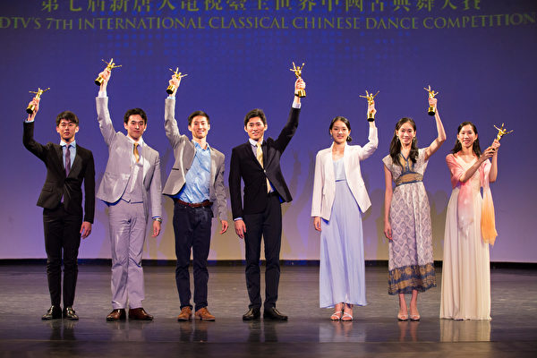
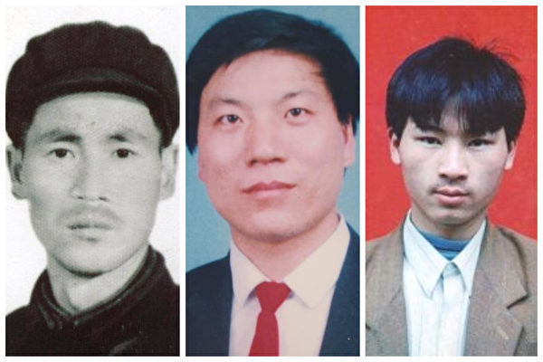
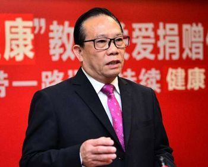
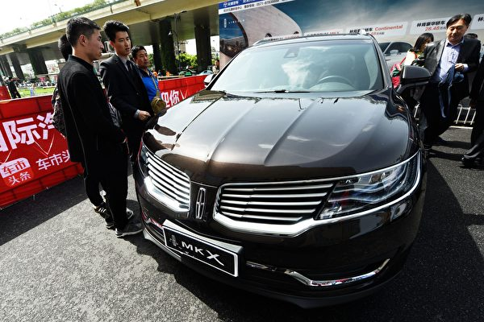

 
 
<a name=top>
<h2><a href="https://github.com/3fmd/true/blob/master/01.md"><b>看更多．．．</a></b></h2>
<h2><a href="https://github.com/goodabc/GCC/blob/master/jysl.md"><b>九评编辑部：魔鬼在统治着我们的世界</a></b></h2>
 <h2><a href="https://github.com/goodabc/GCC/blob/master/goal.md"><b>《九评》编辑部：《共产主义的终极目的——中国篇》</a></b></h2>
<h2><a href="https://github.com/goodabc/GCC/blob/master/xgpl.md"><b>《共产主义的终极目的》 相关评论</a></b></h2>  
<h2><a href="https://github.com/no1show/show1/blob/master/whss.md"><b>中共意识形态之理性批判</a></b></h2> 
<h2><a href="https://github.com/no1show/show1/blob/master/gcdsy.md"><b>评《共产党宣言》</a></b></h2> 
<!-- <<h2><a href="https://github.com/no1show/show1/blob/master/jgrc.md"><b>【中国人权】</a></b></h2> -->
<h2><a href="https://github.com/no1show/show1/blob/master/7m.md"><b>【大纪元2018年07月评论】</a></b></h2> 
<h2><a href="https://github.com/no1show/show1/blob/master/6m.md"><b>【大纪元2018年06月评论】</a></b></h2> 
<h2><a href="https://github.com/no1show/show1/blob/master/5m.md"><b>【大纪元2018年05月评论】</a></b></h2> 
   
【大纪元2018年08月评论、时事目录】 :

<b>

<a href=#91>91. 川人：贪官自焚抗议对当局的警示</a> 
<a href=#90>90. 孙文广失踪近两周 逾150名校友联署关注</a> 
<a href=#89>89. 性侵 毒针 电击 沈阳第一看守所残害女性暴行</a> 
<a href=#88>88. 丈夫冤狱8年命危 妻诉说家人19年悲惨遭遇</a> 
<a href=#87>87. 烈日下的清流 台湾一道风景震撼人心</a> 
<a href=#86>86. 这些前中共军官为何控告江泽民（2）</a> 
<a href=#85>85. 中国留学生和学者赴美签证 为何被严审</a> 
<a href=#84>84. 杨宁：天垂异象关联政事 中南海莫轻视</a> 
<a href=#83>83. 共产红祸步步包围 台湾该如何解围（上）</a> 
<a href=#82>82. 移孝为忠‭ 小林健司以恢复传统为荣耀</a> 
<a href=#81>81. P2P受害人：欲躲房地产泡沫却掉金融陷阱</a> 
<a href=#80>80. 谁在澳洲校园里监控和胁迫中国留学生？</a> 
<a href=#79>79. 中共全国围堵P2P访民 强迫留指纹采血样</a> 
<a href=#78>78. 美参议员呼吁政府制裁一中共政协委员</a> 
<a href=#77>77. 100万维吾尔人被囚 异议人士吁关注人权灾难</a> 
<a href=#76>76. 多少活人被中共当作死人处理（1）</a> 
<a href=#75>75. 受迫害家属呼吁：给法轮功学员信仰自由</a> 
<a href=#74>74. 高天韵：北京山崩地陷 天灾示警不可轻心</a> 
<a href=#73>73. 获刑13年的610主任 涉首例致死法轮功学员案</a> 
<a href=#72>72. 联合国：中共正秘密关押百万维吾尔人</a> 
<a href=#71>71. 画作揭计划生育之残忍 京人权画家遇强拆威胁</a> 
<a href=#70>70. 资产遭冻结合伙人被抓 陆民企老板逃亡美国</a> 
<a href=#69>69. 英议员和医生致信首相 吁调查尸体展</a> 
<a href=#68>68. 程晓容：间谍疑云——谁令中国留学生群体蒙羞</a> 
<a href=#67>67. 陆文：法轮功学员无罪获释 迫害还能继续多久</a> 
<a href=#66>66. 许茹：美国大学炸弹客的预言正在成为现实</a> 
<a href=#65>65. 凌阿锋： 川普击碎了世界对美国的十大谎言！</a> 
<a href=#64>64. 石铭：中共的“好日子”已经到头了</a> 
<a href=#63>63. 浩然：摆脱邪共，我们不再是孤儿！</a> 
<a href=#62>62. 法官被辩哑口无言 中共秘审 限制律师辩护</a> 
<a href=#61>61. 一位母亲的呼吁：释放我善良的儿子媳妇</a> 
<a href=#60>60. 这些前中共军官为何控告江泽民</a> 
<a href=#59>59. 访声乐大赛评委天歌：用中文唱美声最动人</a> 
<a href=#58>58. 冤狱四年 山东师大女研究生再遭非法批捕</a> 
<a href=#57>57. “法办江泽民”惊现美国务院报告背后（2）</a> 
<a href=#56>56. 2018年上半年 北京法轮功学员遭迫害综述</a> 
<a href=#55>55. 文武：精彩大戏正在中国上演</a> 
<a href=#54>54. 夏小强：中共溃败 抛出王沪宁顶罪？</a> 
<a href=#53>53. 周晓辉：从天时地利人和说中美对决结局</a> 
<a href=#52>52. 张林：川普对中共间谍高度警惕</a> 
<a href=#51>51. 高天韵：十年回首 北京奥运会改变了中国吗？</a> 
<a href=#50>50. 陈思敏：川普制裁伊朗 中共头疼</a> 
<a href=#49>49. 夏小强：范冰冰遭封杀事件背后的真相</a> 
<a href=#48>48. 周晓辉：习仲勋“两条路”讲话与中国现政局</a> 
<a href=#47>47. 颜丹：中国孩子为何难获幸福？</a> 
<a href=#46>46. 程晓容：严厉平安制裁伊朗 川普向中共释放信号</a> 
<a href=#45>45. 陈思敏：贸易战高烧中共却大谈生二胎</a> 
<a href=#44>44. 净真：你还过着借钱花的日子吗？</a> 
<a href=#43>43. 夏小强：世界正在为中共垮台做好准备</a> 
<a href=#42>42. 美专家：如果中共垮台 美国应如何应对</a> 
<a href=#41>41. 金牛公子：中国外汇储备剩多少？答案让你心惊肉跳</a> 
<a href=#40>40. 陈思敏：杭州变“雷州” 打脸党媒唱红经济</a> 
<a href=#39>39. 汇文：“两高解释”展示中共司法流氓诡诈）</a> 
<a href=#38>38. 谢田：中国亟需对美国的重新认识（下）</a> 
<a href=#37>37. 贸易战何时停火？中国六大风险或引爆</a> 
<a href=#36>36. 夏小强：江西省长刘奇辞职？走过场而已</a> 
<a href=#35>35. “疫苗风暴”不能不提的十个“之最”</a> 
<a href=#34>34. 张林：正在分崩离析的中共国企业</a> 
<a href=#33>33. 中共公检法：陷害好人的犯罪链条</a> 
<a href=#32>32. 陈思敏：中共2020年全球第一的项目很恐怖</a> 
<a href=#31>31. 高天韵：受害民众求助大纪元 良心媒体最可贵</a> 
<a href=#30>30. 向真：还有多少封没有被打开的《求救信》？</a> 
<a href=#29>29. 石铭：整个国家就是一个“大监狱”！</a> 
<a href=#28>28. 颜丹：谷歌的第二次选择让中国人无语</a> 
<a href=#27>27. 杨宁：上合峰会特供蔬菜全天监控 国人情何以堪？</a> 
<a href=#26>26. 汇文：解体中共才能拯救孩子们和未来</a> 
<a href=#25>25. 程晓容：美逮捕窃密华裔工程师 警讯强烈</a> 
<a href=#24>24. 杨宁：佛协会长丑闻被快速删除牵出一机构</a> 
<a href=#23>23. 颜丹：当宗教场所升起五星血旗</a> 
<a href=#22>22. 魔鬼在统治着我们的世界(22)：恐怖主义</a> 
<a href=#21>21. 李清泉：逆流而上 谁能诚信经商</a> 
<a href=#20>20. 程晓容：谷歌配合中共是危险的游戏</a> 
<a href=#19>19. 唐风：美国厚礼迎遗骸与中共掘坟扬尸</a> 
<a href=#18>18. 美中贸易战再交火 北京反击难持久</a> 
<a href=#17>17. 夏小强：中共高层内斗激烈 政局走向拐点</a> 
<a href=#16>16. 黄天辰：美国接士兵遗骸回国 江西掘百姓尸骨</a> 
<a href=#15>15. 美中贸易战 中文媒体为何误判川普（下）</a> 
<a href=#14>14. 张林：从驱赶低端人口到刨坟焚尸 看中共气数已尽</a> 
<a href=#13>13. 周晓辉：三大出家人丑闻缠身的背后秘密</a> 
<a href=#12>12. 横河：疫苗问题可以靠监管解决吗？</a> 
<a href=#11>11. 理直：中美高层共同关注的马振宇案</a> 
<a href=#10>10. 金言：江西抢棺运动 江曾鬼影再现？</a> 
<a href=#9>9. 川人：大豆企业破产 中共奉陪到底有“六慌”？</a> 
<a href=#8>8. 程晓容：山东疾控中心官员自杀传闻 如何解读</a> 
<a href=#7>7. 高天韵：抢棺掘墓焚尸 江西地方政府丧天良</a> 
<a href=#6>6. 觅真：“摧毁宗教迫害的铁幕”是全人类的责任</a> 
<a href=#5>5. 白马：年年七二零，为何总有事</a> 
<a href=#4>4. 大兴文革：踩撕婴儿 活埋祖孙 一夜杀百人</a> 
<a href=#3>3. 程晓容：山东疾控中心官员自杀传闻 如何解读</a> 
<a href=#2>2. 高天韵：抢棺掘墓焚尸 江西地方政府丧天良</a> 
<a href=#1>1. 觅真：“摧毁宗教迫害的铁幕”是全人类的责任</a> 
</b>

<a name=91>
<h1 align="center"><b>川人：贪官自焚抗议对当局的警示</b></h1>

江泽民在位期间，把中共内部的腐败发展成为制度性、系统性和公开性的腐败，中共官场全面腐败堕落，无药可治。江泽民被称为中共腐败的“总教练”。（大纪元合成图片）

【大纪元2018年08月13日讯】据中共官媒报导，2018年8月10日15时许，一男子在眉山市中级人民法院门口，在自己身上浇上汽油将自己自焚，以示抗议。经查，该男子系周仲明，现年66岁，从1991年3月起任四川省洪雅县副县长，1993年1月起任该县县长。2001年，周仲明因贪污、滥用职权罪被眉山市中级人民法院一审判处有期徒刑10年。有知情人称，周仲明刑满释放后，因无体制保障，生活困难，周看到自己昔日的同僚仍边腐边升，所以不平衡的心理导致了周在法院门口自焚叫屈的极端行为。

现在中国的自焚抗议群体已从普遍民众、拆迁户、西藏喇嘛扩大到落马贪官，这一深刻的变化说明中共邪党的政策越来越不得人心，甚至是不得“官心”。一直以来，中共官员作为中共独裁统治中国最为有力的工具，享有诸多的特权，它们拥有免费医疗，拥有保健医生，拥有特供食品，拥有专车与警卫……然而随着中共党内权斗的加剧，很多权斗失败的官员都被对手以贪腐之名拿下入狱。曾经作为特权利益享有者的贪官在没有了中共邪党的庇护，生活过得穷愁潦倒。它们看着昔日边腐边升的同僚，嫉妒心骤起，自觉不公，愤怒之情溢于言表。这种中国特色的“官愤”现象深刻说明了——选择性反腐不仅不能赢得民心，而且还引发了“官愤”，把反腐者自己推入了最危险的位置。

2018年02月17日，继爆料江泽民之子江绵恒多次为换肾杀人取器官，并且制造2014年的马航失踪事件之后，身在美国的中国富商郭文贵，再次公开爆料，江泽民家族控制的“盗国”资产高达5,000亿美金，其内幕“骇人听闻”，并呼吁北京当局对江泽民家族的巨额贪腐行为进行严肃查处。不仅如此，由于江泽民涉嫌群体灭绝罪、反人类罪和活摘法轮功学员的器官，法轮功学员也长期在国际上公开呼吁北京当局法办江泽民。令人遗憾的是，法办江泽民这一基本诉求至今仍无任何进展。

法办中国第一巨贪江泽民这件事会不了了之吗？答案显然是否定的。据披露，江泽民家族不仅涉嫌巨额贪腐，还涉嫌活摘中国人的器官，更重要的是江泽民还出卖了中国144万平方公里的国土给俄国人。任何一个负责任的中国执政者都无法回避江泽民给中国造成的巨大损失和灾难。而且，随着中国人出国日益频繁和突破网路封锁技术广泛传播，很多中国人和中共中低层官员对江泽民家族及其它中共高官家族的贪腐行为心知肚明，这一点决定了北京当局“抓小贪放大贪”的选择性反腐行为不会成功，相反这种行为会引发民愤与官愤，把自己摆在最危险的境地。

就反腐而言，当局通过前五年的大力反腐，虽把100多万贪官塞进监狱，但这并没有遏制中共官场继续腐败的势头，也没能通过抓捕腐败总教练江泽民来赢得民心。对普通中国人而言，当局的反腐民众并没有任何“获得感”，而且由于中共贪腐官员为抵制反腐的故意不作为，使得中国人的幸福感、获得感更低了。对中共官员而言，这场反腐被它们视为不折不扣的权力斗争，成为了执政者快速集权的手段，这不仅不能解决腐败的问题，而且带来深远的负面影响，让很多官员树立了“权斗没有第二名”的思想，这将导致今后中共权斗更残酷、更激烈。

尤其是在当下，中美贸易战正酣，中共目前在国际社会上四处碰壁，诸事不顺，很多中共官员都坐等当局出大事，把责任都推向当局，进而好置当局于死地。8月9日，邓聿文在BBC发表文章称，从长周期看，今年将成为中国的转捩点，面临内外交困的严重挑战，社会巨变正以“清水煮青蛙”式进行，而中共各级政府对此集体出现体制性麻木。他指出，中国已在巨变前夜，比如不久前假疫苗事件让中国人对当局的信任降到冰点，当不分立场的民众齐声指责当局、连最基本的信任都不再有时，这对当局来说就很可怕，也很危险。腐败已把当局逼到了中国人的对立面。

邓聿文还指出：“没有公民社会，没有媒体监督，没有民众和行业自治，没有法律，党包办一切，无人负责和作为，只依赖领导意志，中国（中共）的体制性和系统性腐烂在疫苗面前显露无遗。”这一问题真值得当今执政者深思。在中共邪恶体制下，无论怎样反腐都无法肃清贪腐挽救民心，反而会使得自己陷入越反腐越危险的境地。目前中国的舆情一个接一个，风暴愈演愈烈，敏感事件越来越多。失望、愤怒、焦虑、不安，一次次席卷著中国人，一场惊天动地的大变革正在席卷中国，留给北京当局选择未来的路真的不多了，要么名垂千古，要么遗臭万年。

现在中共贪官不顾廉耻在中共法院门口自焚抗议，这无疑是对中共邪恶体制最无情的嘲讽，这目前预示著“抓小放大”的反腐模式到头来无益于事，它只会引发更多贪腐官员的抗议与不满，只会引发更多的中国人对反腐的绝望。当反腐不仅没能遏制腐败，而且还引发了集体官愤的时候，这样的邪恶政权注定了无药可救。所以贪官自焚抗议，证明了目前反腐模式没有出路，北京当局亦宜自谋，早日法办江泽民，解体中共邪党，以挽救失去的民心，同时也救自己及家人于万险之中！

责任编辑：高义

<a href=#top><h6 align="right">回上方</h6></a>

<a name=90>
<h1 align="center"><b>孙文广失踪近两周 逾150名校友联署关注</b></h1>

山东大学校友致公开信呼吁有关各方面，马上公布8月1日因接受外媒采访而被中共警方带走的孙文广先生的下落。（视频截图）

【大纪元2018年08月13日讯】（大纪元记者文朴综合报导）山东大学教授孙文广被中共警方破门而入强行带走后，至今下落不明。山东大学逾150名校友联署呼吁，要求有关方面公布孙文广的下落。

这封公开信说，近日来，海外知名媒体如Fox、BBC、CBS等，相继报导了山东大学退休教授孙文广先生在家中接受“美国之音”连线采访时，被人强行闯入、带走、至今下落不明的消息。

作为孙文广教授曾经的学生、山大校友，他们十分关注这位已经是84岁老人的身体健康和人身自由的状况。

孙文广先生是在学校宿舍楼失踪的，所以他们致信母校，提几个共同关注的问题，希望校方就掌握的情况向校友们做一些说明。

一，孙文广先生失踪前是否仍是享有正常待遇及一切合法权益的山大退休员工？

二，孙文广先生被失踪，校方是否提前知道或参与其中？

三，孙文广先生失踪后，校方是否做过必要的实事调查，并有结论？

四，本着对所属员工负责任的态度，校方是否认为有必要展开真相调查？

公开信呼吁有关各方面，以老人健康为重，马上公布孙文广先生下落，并保证此类违法、侵权事件不再发生。

联署还在继续进行中，目前这一公开信至少已有150多名山大校友联署。

孙文广教授是8月1日在家中接受美国之音电话连线访谈时，被七八个中共警察破门而入、然后被强行带走的。

当时，孙文广教授批评中共一贯对外“大肆撒钱”的外交政策，而不是把钱花在更多的国内事务上。

起初，孙文广夫妇是被警方关押在济南军区经营的燕子山庄2号楼的007房间，但该地点被曝光后，中共警方随后迅速将他们转移到不明地点。

孙文广教授是大陆有名的“异议人士”，他曾因多次批评中共的错误政策而遭到中共当局的迫害。

上世纪60年代到80年代，他因批评毛泽东的言论，被多次关进看守所、“牛棚”、监狱。

中共屠杀手无寸铁的“六四”学生后，他多次发声支持纪念“六四”、悼念赵紫阳等，而遭到中共当局的管控和打压。

2009年，时年75岁的孙文广在济南参加悼念赵紫阳的活动时，被不明身份的人士打断3根肋骨，后被送院治疗。

今年中共 “两会”前夕，孙文广再次被地方当局带走软禁40天，回家后仍被监控，校方在取消他教授退休待遇后，还对他进行恐吓。

今年“六四”期间，他又被失踪43天，并被关进黑监狱。

责任编辑：林诗远

<a href=#top><h6 align="right">回上方</h6></a>

<a name=89>
<h1 align="center"><b>性侵 毒针 电击 沈阳第一看守所残害女性暴行</b></h1>

辽宁省沈阳市看守所，也称沈阳市第一看守所，是沈阳市非法关押和迫害女性法轮功学员的黑窝。（明慧网）

 
【大纪元2018年08月11日讯】辽宁省沈阳市第一看守所，是沈阳市非法关押和迫害女性法轮功学员的黑窝，看守所采用各种惨无人道的酷刑手段对法轮功学员进行肉体和精神上的摧残。

明慧网报导，凡是在沈阳地区被绑架或沈阳警察跨地区绑架的女法轮功学员，在被非法劳教、判刑前，都被非法关押在沈阳市看守所，也称沈阳市第一看守所。

数年来，沈阳市第一看守所被中共公安部、省总工会、省公安厅和市公安局先后表彰成“全国看守所管理机制创新示范单位”、“辽宁省优秀公安基层单位”等所谓“荣誉”称号。

下面列举典型案例，以揭开沈阳市“标兵看守所”的面纱，还原其真实面目。

<b>用矿泉水瓶口插阴道</b>

沈阳市辽中县（现辽中区）长滩镇法轮功学员王红，2000年12月1日，进京为法轮功鸣冤遭绑架，被非法关押在沈阳市看守所迫害。

王红生前照片。（明慧网）

看守所的狱警指使以牢头孟丽为首的几个刑事犯用矿泉水瓶口多次反复插入王红的阴道内，进行毫无人性的折磨、4月天气用冰水浇、把开水灌入瓶中烫她的后背及小腹。

被非法劳教期间，王红在张士教养院、龙山教养院等地遭暴力毒打造成急性肾衰竭；2001年8月22日，被迫害得奄奄一息的王红被家属从龙山教养院接回家；8月31日，含冤离世，年仅39岁。

王红被迫害的照片（2001年8月回家后照）（明慧网）

<b>在浴室里被绑坐老虎凳</b>
 
兴城市赵家湾法轮功学员宋彩虹，于1999年10月31日被非法劳教三年，被关押在辽宁省马三家教养院。

宋彩虹生前照片。（明慧网）

2002年8月22日，沈阳市中级法院、检察院直接到马三家教养院开所谓审判会。宋彩虹和另两位法轮功学员高呼“法轮大法好”，遭警察们残酷围殴。

非法劳教期即将结束时，宋彩虹又被非法判刑五年，先被劫持到沈阳市看守所非法关押一个多月。期间，看守所狱警将她弄到一间浴室里，绑坐在老虎凳上。她的双腿肿胀，还被铐上脚镣。

中共酷刑示意图：老虎凳。（明慧网）

狱警用大棉被捂著宋彩虹殴打。在酷刑折磨下，宋彩虹坚持高喊“法轮大法好”，狱警强制给她注射药物。一个多月以后，宋彩虹被劫持到辽宁省女子监狱迫害。

2011年12月30日，宋彩虹被绑架到葫芦岛拘留所，副所长张俊峰带领几个狱警长时间毒打她，致使她急性肾衰竭。2012年1月15日，她被迫害致死，年仅41岁。

<b>每天被灌浓盐水、注射不明药物</b>
 
在沈阳市看守所被非法关押期间，马廉晓被狱警用手铐连续“背铐”两天。她以绝食的方式抵制迫害，从2003年月5日起，她每天被插胃管，灌浓盐水，还被注射不明药物。

马廉晓（明慧网）

看守所一男所长下令：“天天给她灌！上午灌完下午再灌，铐在刑凳上！”

2003年7月11日，辽宁省建设科学研究院职工、57岁的马廉晓，在单位讲法轮功真相时遭人恶告后，被沈阳市和平区公安分局集贤派出所警察绑架。

2003年月，马廉晓被冤判八年；10月13日，被迫害得奄奄一息，才被释放，由家属背回家。

马廉晓至今仍无法正常行走，生活不能自理。

<b>被野蛮灌食 薅头发</b>
 
2004年6月28日，铁岭调兵山市法轮功学员胡英被非法关押在沈阳市看守所。

胡英（明慧网）

胡英自述：“副大队长徐艳非常狠毒，对绝食的法轮功学员进行野蛮灌食，还将玉米糊里倒进大半袋食盐（每袋一斤装）。狱警段国云教唆犯人打我，将我的头发薅了一地。”

<b>遭绑架九天 被迫害致死</b>
 
2006年8月7日，原沈阳航天新光集团有限公司会计、法轮功学员温英欣在沈阳市大东区小北地区张贴法轮功真相资料时，遭不明真相的人诬告后，被沈阳市大东区公安分局小北派出所警察绑架；8月8日，被非法关押在沈阳市看守所。

温英欣生前照片。（明慧网）

8月16日晚10点，年仅34岁的温英欣在沈阳739医院离世，遗体上有伤。警察声称“抢救”了五个多小时；有关人员给她的家人的答复是：“温英欣是肾衰竭死亡”。

温英欣原本身体健康，体重120多斤，一个年仅34岁的健康人，从被抓到死亡一共九天时间，排除慢性肾衰竭之说，她怎么会得急性肾损伤？警察说：“温英欣跑了好几次都没跑成。”如果没有对她进行酷刑的折磨，她的遗体上就不会有伤痕，她也不会得急性肾损伤。

<b>她被电得满地打滚 浑身抽搐</b>
 
警察用几个最大电量的电棍，电得刘志满地打滚，浑身抽搐、抖动，脑袋发木。她被铐上几十斤重的脚镣被锁在地环上。

刘志年轻时的照片。（明慧网）

2009年10月22日至2011年6月，沈阳市和平区法轮功学员刘志被非法关押在沈阳看守所迫害。她经常遭看守所四小队队长赵莹迫害，被拽头发、搧耳光，脚踩脸，毒打致昏迷。

犯人用钳子夹住并使劲掰刘志的腿。刘志被定位迫害26天，警察在饭菜里下毒药。她被迫害得双腿都不能站立，手脚抽搐，眼睛睁不开，话说不清了。

2011年7月，刘志被绑架到辽宁省女子监狱，在不到半年的时间里，就被迫害致瘫痪，不能自理。

<b>强行脱光衣服侮辱</b>
 
2010年1月3日上午，31岁的沈阳市法轮功学员杜玉红女士被沈阳市铁西区公安分局兴顺派出所绑架，遭到铁西区国保大队和派出所内五人殴打，揪头发、打耳光等。

当晚9点多，杜玉红被劫持到沈阳市看守所，被看守所里的狱警暴打，拳脚相加。狱警还用拖鞋堵在她的嘴里，强行将她脱光衣服，推到监室内。

从1月5日开始，杜玉红拒穿监服，以绝食的方式抵制迫害。看守所的狱警、大夫对她采用暴力灌食，最后一次灌食，连续三次插管，十分痛苦。

中共酷刑折磨示意图：野蛮灌食。（明慧网）

 
<b>“苏秦背剑”酷刑</b>
 
在沈阳市看守所被非法关押期间，牛桂芳绝食，以抵制迫害。看守所狱警队长沈翔宇拽着她的头发，狱警赵敏、一个医务室的大夫、两个女杂役把她绑在床上，把一根黄色管子，从鼻子插到胃里，然后灌黄色黏糊糊的东西。

牛桂芳（明慧网）

2012年月5日下午1点多钟，两个沈北新区“610”人员、两个国保大队警察，把牛桂芳弄到新城子街派出所，拉上窗帘，将门反锁，强行她按手印。牛桂芳不配合，他们就把她的双手背过去，用“苏秦背剑”酷刑折磨，当时，她的手、胳膊被掰伤、肿胀。

酷刑演示图：所谓“苏秦背剑”。（明慧网）

牛桂芳是沈阳市沈北新区51岁的法轮功学员，2012年7月1日，被沈北新区公安分局新城子街派出所警察绑架。

2013年1月17日，牛桂芳被沈北新区法院非法判刑三年，被劫持到辽宁女子监狱马三家子监区（原辽宁省马三家劳教所）继续遭受迫害。

<b>持续十几天被打毒针</b>
 
2014年3月15日，吉林省通辽市法轮功学员赵淑云被放回家时，已被迫害得目光呆滞、双手发抖、生活已经不能自理。

2013年3月21日下午2点左右，赵淑云在家里被沈阳市警察跨省绑架到沈阳市看守所。

在被非法关押期间，赵淑云被蒙上被单毒打，右手臂被打得抬不起来，好几天都动不了。她遭野蛮灌食，灌盐水玉米面糊糊。

她双脚被铁链子直接铐在铁床的床头上一个星期，身体整天只能保持一个站立姿势，痛苦无比；她还被狱警毒打，用高压电棍电击。

连续十几天她被注射毒针后，出现流口水、记忆减退、视力明显减退、视物不清、整天不睡觉、全身乏力、腹胀、恶心呕吐等症状。

酷刑演示：打毒针（注射不明药物）。（明慧网）

 
<b>被放回家时精神失常</b>
 
沈阳市皇姑区法轮功学员邢安梅女士在经历了一年的迫害后，于2017年4月14日，冤狱期满回家。当她出现在亲人面前时，她的表情异常恐惧。

邢安梅（明慧网）

被放回家的邢安梅，精神恍惚、走路不稳，连自己的亲朋好友都认不出来。她不分白天黑夜地大喊大叫；夜里更是不睡觉、半夜一、两点钟出门往外走；有时打人、骂人；有时拿着家里的菜刀要砍人；偶尔流出一句：“法轮功学员还天天被人灌药。”

从她断断续续的话语中得知，她在看守所时经常挨打，被灌药，被关小屋，戴脚镣，左手被铐在地环上，就连拉屎撒尿都不放下来。

中共酷刑示意图：锁地环。（明慧网）

邢安梅是在2016年4月14日被沈阳市大东区国保大队警察绑架到上园派出所的，之后被关押到沈阳市第一看守所。

文字整理：李洁思，责任编辑：高静

<a href=#top><h6 align="right">回上方</h6></a>

<a name=88>
<h1 align="center"><b>丈夫冤狱8年命危 妻诉说家人19年悲惨遭遇</b></h1>

【大纪元2018年08月12日讯】“这长达19年的非正常生活，给我和家人带来无数的痛苦与艰辛。我和丈夫遭受了无数次磨难和铁窗之苦，至今丈夫生死未卜……我们至今都不明白，自己要求自己按照‘真、善、忍’做好人错在哪里？罪在哪里？我们违反了哪部法律和哪条法规呢？”刘福斌的妻子李淑春给公检法官员们写道。

黑龙江省杜尔伯特蒙古族自治县刘福斌因为信仰“真、善、忍”被非法判刑十年，已在泰来监狱遭受迫害八年多，身心受到极大的摧残；从2017年6月到2018年8月，一直进食后呕吐，各项器官都呈恶病质状态，生活不能自理。家人多次与狱方交涉，要求保外就医，狱方仍不放人。

李淑春呼吁公检法官员放人，让她病危的丈夫尽早回家。她在信中叙述了一家人十九年来的悲惨遭遇。

<b>家人受益</b>

1996年冬天， 25岁的李淑春患有心脏病、肺气管炎等，当时4岁的女儿刘瑞也体弱多病。丈夫刘福斌每月的收入七八百元，家里每月还得借钱。

那时，李淑春的母亲修炼了法轮功，并带回一本《转法轮》（法轮功的主要书籍），告诉女儿法轮功能祛病健身。当时李淑春的女儿干咳，吃药无效。她就拿起《转法轮》给女儿读，数天后，女儿咳嗽症状消失。

从此，李淑春和丈夫开始修炼，不知不觉中她所有的病都不治而愈，女儿也健康地成长。她还做点小买卖，和丈夫的收入不但还清了外债，还有了积蓄。

<b>风雨突变</b>

1999年7月20日，江泽民发动了对法轮功的非法镇压，从此她的家境发生了逆转性变化。

1999年7月22日，李淑春夫妻两人像往常一样，早晨5点半来到街心花园去炼功，却被警察带到公安局大院。院里站着不少法轮功学员，他们就一直顶着烈日站到下午才让回家，并被告诉不许再炼功了。

警察只是说这是上级命令。从此片警经常到李淑春家“拜访”骚扰。

10月28日，刘福斌到附近一位法轮功学员家去，被民警上报说是串联，被非法关在看守所28天。出来后，片警还多次到家骚扰，有时半夜来敲门，弄得四邻不安。他们出远门得先通报一声才让走。

2001年1月22日，过年的前一天，杜蒙县组织办“洗脑班”，刘福斌被关在石人沟办事处15天。

当时李淑春怀孕6个多月，没有生活能力，就拉着女儿到办事处评理。那里的人却气急败坏，随即把刘福斌送到杜蒙县看守所非法关押58天，临放时还勒索了他2,000元的保证金，否则不放人。

<b>双双被捕</b>

2002年4月14日晚，七八个警察闯进李淑春家，一顿乱翻，抢走两袋法轮功真相资料，绑架了她和丈夫，刑讯逼问资料哪来的。

李淑春被手铐铐进肉里，手指尖都变白了。国保大队长温忠革用报纸卷成筒狠狠抽她的脸，当夜她被放回家。

刘福斌在看守所受尽警察王忠革的酷刑折磨。王教唆刑事犯殴打他，甚至把他的生殖器插在铁管里，嘴上还说“你不说，就让你断子绝孙”。他被非法劳教三年，被送至大庆劳教所迫害。

2002年9月，一天晚上，警察刘芳武、扈剑龙闯入李淑春家，一把抢走他怀里16个月大的儿子刘纯，把孩子扔到一边，强行把她押走。

60多岁的公公抱着孙子，领着8岁的孙女，去看守所要求见李淑春。警察却威胁公公说：“如果你不配合，把你也抓起来。”随后她被非法劳教一年，被送到哈尔滨戒毒所，遭受人间难以忍受的残酷迫害。

李淑春本该2003年9月回家，劳教所却以各种理由给她加期3个月。回到家，2岁半的儿子已经不认识她了。黑瘦的小脸，怯怯地躲在他奶奶身后，偷偷地瞅着她。

从她回到家，警察便不断上门骚扰。

<b>惨遭酷刑折磨</b>

2002年5月，刘福斌刚被送进劳教所，就被关进“小号”（专门迫害法轮功的狭小、阴暗的小屋），狱警们扒光他的上衣，给他“上绳”（用绳子捆绑）。 上过绳后，他被24小时强行看管，七天七夜不让睡觉，只许站和蹲；只要一眨眼，就被连踢带打。

2002年6月，二大队队长王忠和等将刘福斌绑在老虎凳上，对他动刑、毒打。他们用拳头猛打他的脸和耳朵，把他的耳骨打断，耳朵肿得足有2指厚。

8月，警察们指使刑事犯用手搓刘福斌的双脸，把脸上的肉搓烂了。

2003年10月16日，大庆市劳教所警察们强行将法轮功学员卢丙森、扈洪记、刘福斌、郭法冬坐老虎凳，动刑毒打，之后又将他们分别单独隔离关起来进行迫害，刘福斌被迫害成重伤。

刘福斌后来回忆说，劳教所为了强制转化法轮功学员，将法轮功学员衣服扒光，一丝不挂地押到一个空屋子里，打开所有窗户，冻得法轮功学员直打牙帮骨。

劳教所的人强迫学员抬起头，用高压水枪对着学员的鼻子哧冷水。高压的水柱哧得学员喘不上气来。刘福斌几乎要窒息了。

当时卢炳森就被呛死了。事后劳教所无耻的声称卢炳森是心脏病突发死亡。

刘福斌被大庆劳教所迫害二年后又被转到绥化劳教所迫害一年；2005年1月28日，解教回家；回家后，警察经常上家骚扰；2008年奥运期间，甚至上家门口守一天一夜。

<b>株连亲人</b>

2009年7月13日中午，李淑春和丈夫干活回来，刚到家，社区委主任于秀丽就来了，说看看就走了。

中午放学的女儿进屋换了件吊带服（在家穿的便服），不一会儿，杜蒙县国保大队长林家威、警察扈剑龙、刘芳武等30几人闯进家。林家威进屋就把刘福斌反手按在窗台上。

李淑春问他们这是干啥，随即上来两个警察把她也按住。她女儿阻止警察抓人，警察就拿胡椒喷雾，喷孩子的眼睛，孩子眼睛都睁不开了，他们还把孩子按在地上。

70岁的老爹吓得直发抖，8岁的儿子吓得躲起来。住在一个院的小叔子刘福泽、弟媳赵明静也被绑架。

当时16岁的女儿就穿着吊带服，光着脚丫，也被警察绑架走。警察当时还抄走电脑、打印机、刻录机，还有小叔的面包车、现金1万元，就连刘福斌钱包内的700多元钱也被洗劫一空。

女儿在公安局被审问时，一个警察竟然用手去拽女儿的吊带，女儿正色说：“你敢动我，你女儿遭报，你出门出车祸。”女儿第二天被放回家。小叔子刘福泽被勒索了1,000元，关押一个月后连车带人才被放回家。

李淑春和弟媳赵明静被非法劳教二年，丈夫于2010年5月20日被杜蒙县法院非法判刑十年，至今还在黑龙江省泰来监狱被迫害。她老爹由于惊吓，一病不起，在她劳教期间含冤离世。

当时女儿才16岁，带着8岁的儿子两地奔波地去探视父亲和母亲。李淑春回家后，在女儿那儿住，一家人等著刘福斌一年多冤狱刑满后回家。

不料，从监狱却传来刘福斌进食后呕吐及各项器官都呈恶病质状态的消息。 2017年6月，狱方将刘福斌押入“小号”。天气炎热，他吃不下饭，狱方强制灌食。灌食后刘福斌出现上吐下泻，后来，他吃啥吐啥，喝水都吐。

<b>监狱不放人</b>

家人知道消息时，刘福斌33天不能进食，随即家人要求保外就医，多次与狱方协商、交涉他上大医院检查，狱方不同意。

2个月后，刘福斌情况仍没有好转，家人再次要求转大医院住院治疗，狱方还是不放人。

就在这时家人在监狱医院长陈志国车窗内，发现了9月27日在哈尔滨管理局医院开的刘福斌重症转诊单。在家人强烈要求下，于9月30日刘福斌住进了泰来县医院。

10月18日，刘福斌被送往哈尔滨管理局医院，诊断结果是：胆囊炎、胆结石、肠结气、心包积液、胸腔积液、腹腔积液等等。家人再次要求狱方把他转到大医院就诊，狱方称，要转医院，家属先押20万。

2018年1月24日，家人在哈市管局医院见到刘福斌。他十分消瘦，抬头吃力，说话声音弱，已经停药一个月，营养液也不给输了，一输液他就高烧40度，仍进食后呕吐不止（这种状态已经持续7个多月），医院已束手无策。

家人再次向泰来监狱要求保外，狱方不同意。2018年6月，泰来监狱又将刘福斌转回泰来监狱，停止治疗。 家人多次与狱方交涉，狱方仍不放人。

<b>迫害信仰违法</b>

李淑春在给公检法官员的信中写道：

中共《宪法》第36条规定公民有信仰自由权，法轮功学员的信仰是受国家《宪法》保护的。

《治安管理处罚法》第23条规定共有五项，法轮功学员没有违反任何一项。教人按“真、善、忍”做好人，做道德高尚的好人，没有违法。

2011年3月1日，中国新闻出版署发布的第50号令，废除了江泽民1999年当权时发布的对法轮功书籍的出版禁令。

“我知道这些冤假错案都是江泽民违法违宪一手造成的结果，给我家造成了灾难，给你们留下了麻烦。公检法的官员们，你们是国家法律的代言人，你们是最知法懂法的，⋯⋯请你们多一些善良，多一些人性。”

“善恶有报是天理。停止这场灭绝人性的迫害吧，真心希望你们能匡扶正义，给自己和家人选择一个美好的未来。”

文字整理：李洁思，责任编辑：高静

<a href=#top><h6 align="right">回上方</h6></a>

<a name=87>
<h1 align="center"><b>烈日下的清流 台湾一道风景震撼人心</b></h1>

法轮功学员到南台湾垦丁鹅銮鼻公园讲真相。（郑通和提供）

【大纪元2018年08月12日讯】（大纪元记者曾晏均台湾屏东报导）盛夏，南台湾阳光正炽热，晒得人发晕，从上午8时直到下午5时，知名旅游胜地垦丁都是处在可怕的“热”之中。那个热力仿佛直接刺进皮肤里，让人忍不住想躲进冷气房，避开毒辣的阳光。

鹅銮鼻公园与猫鼻头公园，是大陆游客到垦丁必访的景点。不管严寒酷暑，游客们总会看到一群黄衣身影——静静拉提着“法轮大法好”横幅或是拿着各式展板的法轮功学员，他们坚持告诉世人：共产党造谣诽谤以“真、善、忍”为准则的修炼人，在中国大陆难以计数的法轮功学员被中共迫害、非法羁押。他们坚毅的脸庞，令人看了不禁动容！

法轮功学员郑通和，在鹅銮鼻向往来陆客讲真相。（视频截图）

<b>导游明真相 陆客成好友</b>

假日到鹅銮鼻景点讲真相的学员郑通和，见证了一位导游对法轮功态度转变，从原本反对到正面支持的过程，让他感触良深。“这是一个同修用‘善’感动了对法轮功心怀敌意的导游的故事。”郑通和娓娓述说事情经过：

某天，在鹅銮鼻讲真相时，一个带着陆客团的导游来与郑通和聊天，导游亲口告诉他，之前因不理解法轮功，曾经不让整团陆客接真相资料，更不准陆客看真相展版，对法轮功学员怀着很深的敌意，总认为他们在“搞政治”。

可是有一天，他带团到日月潭旅游时，其中一位陆客走失了，导游心急如焚，跑上跑下四处找人，这情景被在发真相资料的同修看见了，于是主动找导游了解原因，当得知情况后，同修二话不说，立马骑着机车载着导游满山寻人，最后终于在杳无人烟的半山腰上找到了迷路的陆客。感激之余，这位导游从此对法轮功学员改观，进而明白了“法轮大法好”的真相。

“是大法弟子无私的善心，感动了导游，使他改变了根深蒂固的观念。”同修这个事迹，让郑通和内心很受触动。

郑通和体悟到，“法轮功学员的一言一行很重要，是日月潭景点的同修展现了大法弟子的风范，让常人改变对大法的观念转负为正”，也因为这个转捩点，以前导游叫陆客不要拿法轮功资料，现在主动鼓励陆客明白真相，让郑通和见证了“‘善’真的可以改变人心”。

法轮功学员到南台湾垦丁鹅銮鼻公园讲真相。（郑通和提供）

他还分享了一段因讲真相结缘，与陆客成为好朋友的故事：

一个约四十多岁的中年陆客，自由行来到鹅銮鼻旅游，因他之前曾经被共产党迫害过，所以很认同展板里揭露的共产党的邪恶行为，但是他却不认同法轮功，总以为法轮功是在“搞政治”。郑通和透过讲共产党害人、坑人、杀人的历史真相，破除了他的观念，终于，陆客明白了法轮功救人的出发点立意良善，不仅认同法轮功，而且还退出了少先队。

万里相逢自是有缘，短短30分钟下来，两人已成为好朋友了，陆客留下电话号码，期待郑通和有一天到大陆去找他。

<b>“法轮功万岁”</b>

多年来坚持到猫鼻头景点讲真相，学员李秋燕看到大陆法轮功学员遭受无理打压迫害，无比心痛，她心中升起个念头，一定要维护“真、善、忍”普世价值，她说，“目前可贵的中国人都被爱国民粹障碍著，分不开中国和中共，还继续追随着中共起舞，迫害法轮功。”因此她决定要站出来告诉人们大法好并已洪传全世界114个国家的事实。

法轮功学员李秋燕在垦丁猫鼻头景点讲真相。（简惠敏／大纪元）

李秋燕说：“修炼人就应该力所能及地去做该做的事。”哪怕一走一过间，没来得及讲话，也要让人们感受到大法弟子的善，也因此陆客从排斥、拒绝，到接受、退党的过程，就考验着她讲真相的智慧。

法轮功学员李秋燕在垦丁猫鼻头景点向陆客讲真相。（简惠敏／大纪元）

她回忆，记得有一次在香港讲真相时，受到共产党周边组织关青会的污蔑、打骂时，有一个明白真相的民众支持她并高喊“法轮功万岁”，这一幕让她很感动，“了解真相的人，也会协助传播真相”，让她之后在人群中发送资料更有信心。

“我今天能这么健康、幸福，是修大法得来的，能行善救人那真是太幸运了！”是修大法让她受益良多，李秋燕感恩地说：“讲真相是修炼心性的过程，我很珍惜这样的好机会，感谢大法师父给我这老人机会。”

<b>酷暑中 以真心善念讲真相</b>

“真诚的心，可以拉近人与人之间的距离。”猫鼻头公园没有树木遮掩，摄氏36度高温，烈阳晒得李芳花汗水直流，有时热到想干脆放弃算了！但当想到被中共谎言毒害的飘洋过海来台湾的大陆游客，她督促自己不可以懈怠，“怕热”的心也得去掉。

法轮功学员李芳花在垦丁猫鼻头景点讲真相。（简惠敏／大纪元）

当她看着陆客接受了真相资料，挂满汗珠通红的脸庞上，绽开了灿烂而又欣慰的笑容。#

法轮功学员李芳花在垦丁猫鼻头景点向游客讲真相。（简惠敏／大纪元）

法轮功学员在鹅銮鼻向往来陆客讲真相。（视频截图）

责任编辑：李缘

<a href=#top><h6 align="right">回上方</h6></a>

<a name=86>
<h1 align="center"><b>这些前中共军官为何控告江泽民（2）</b></h1>

香港7.1大游行，法轮功队伍无惧酷热，打出诉江标语参加游行。（宋祥龙／大纪元）

【大纪元2018年08月13日讯】杨兴福，南京军区副师级军官，原军区政治部《东线影视报》主编，主任编辑职称，技术大校军衔；

方志文，原南京军区司令部作战处长，上校军衔；

胡建华，曾立一等战功，少校军衔。

杨兴福、方志文、胡建华，是三位原大陆军队系统军官、法轮功学员。他们为何要控告江泽民？

<b>原南京军区司令部作战处长遭“大劈叉”酷刑</b>

原南京军区司令部作战处长方志文，曾患过胃病、牙病、肛肠病、关节炎、偏头痛、荨麻疹、肾炎、肝炎等多种疾病。身在处长职位，表面上很风光，但他身心压力巨大，吃睡不香，工作精力不支。

1996年11月，方志文开始修炼法轮功。不知不觉中，他无病一身轻。法轮功要求修炼者按“真善忍”提升道德，包括五套功法动作，祛病健身有奇效。

“炼功后，我自觉按照‘真善忍’的标准约束和规范自己言行，努力做好人、做更好的人。” 由于工作出色，方志文先后获军区、总部多次嘉奖；生活中，他身正廉洁，不收礼、不吃请、不谋私。军队同事评价：“要像他这样的领导就好了！”

因坚持信仰法轮功，方志文于2000年被强制转业，并遭到非法关押和劳教折磨。1999年7月20日，前中共总书记江泽民不顾政治局其他6个常委反对，下令镇压法轮功，军队系统法轮功学员是最早受迫害的对象之一。

2007年8月底，方志文被非法关押在江苏方强劳教所，期间遭受“大劈叉”酷刑等多种迫害。

方志文在其控告江泽民的控告书中介绍，三个劳教人员彭海清、施伟、高某对其实施“大劈叉”──“将我按坐在地上，彭（体重有140斤左右，只穿了件裤衩）坐到我的双肩上、按住我头，施、高两人强行将我双腿向两侧分开后拉（180度“一字形”），还用手顶抠双肋。压得我勾著背、出不了气、两腿像撕裂式的剧痛。疼得脸上直冒汗珠，苦不堪言。”

酷刑示意图：大劈叉（明慧网）

中共为了让修炼“真、善、忍”的法轮功学员放弃信仰，使用了上百种酷刑，除了“大劈叉”，还包括：性侵害、老虎凳、铁椅子、死人床、火刑、电击、上大挂、毒打、针扎、扎指甲、吊铐、蹲小号、窒息、不让睡觉、曝晒、冷冻、注射不明药物等等。

<b>副师级军官被非法劳教三次</b>

2007年7月9日，江苏南京。杨兴福被国安强行绑架，一路警笛鸣叫。

杨兴福，南京军区副师级军官，1996年7月开始修炼法轮功。修炼前疾病缠身：腰椎间盘突出、脊椎间盘突出、风湿性关节炎等；修炼法轮功两个月后，恢复健康，精力充沛，多年来为国家节约十多万元医药费用。

他在日常工作生活中以法轮功法理要求自己，思想境界升华，工作表现优异──1997年，获评先进工作者；1998年，立三等功；1999年，进京代表单位领奖。

中共迫害法轮功后，杨兴福52岁即被强迫提前退休，并分别在2000年、2005年、2012年，被非法劳教三次。副师级职称被降为正团，主任编辑职称被撤销。

劳教期间，遭严管，遭多种刑罚，包括：坐小凳、不能大小便、“倒挂金钟”、“背靠背”、“滚雪球”等。

2005年3月13日，杨兴福的家人来到军事劳教所，希望会见，遭拒。亲人只能在大墙之外呼唤“杨兴福”的名字，“我也只能在铁窗之下听到亲人微弱的声音。”他说。

南京当局还威胁杨兴福，要株连女儿女婿，让他们离婚和被开除。

<b>一等战功少校军官被非法判刑七年半</b>

胡建华，石家庄市陆军学院毕业，曾任连长、司令部管理股长，少校军衔，曾在中越战争中立一等战功。转业后，被分配到武汉市硚口区工商局工作，年年被评为先进工作者、优秀公务员。

生于湖北潜江、曾是少校军官的胡建华，曾荣立一等战功，因遵循法轮功“真、善、忍”的理念坚持做好人，先后遭非法劳教一年和非法判刑七年半，惨遭迫害。（明慧网）

江泽民迫害法轮功后，胡建华被取消公务员资格，并被单位开除。

2000年年底，胡建华被非法劳教1年；2003年3月底，被非法判刑7年半，遭受了惨无人道的迫害。

2005年，在广东省肇庆地区四会监狱十八监区新建队，胡建华遭受“熬鹰”折磨，不让睡觉，他说，“八天八夜不让我睡觉，只要一眨眼就是一棍子，专打脚踝骨。疼痛难忍，还不留任何痕迹。同时，洗衣、洗澡、刷牙等，大小便要打报告。经许可方能入厕，否则硬憋著。”

“在第八天半夜时，罪犯张次南看我眨了一下眼，就一棍子打在我的头顶。棍子被打断， 他接着上前拳打脚踢，将鼻子打破。（我）鲜血直流，衣服地上到处流的都是血。”

“熬鹰”，就是不让鹰睡觉，熬著。中共监狱、劳教所的警察曾普遍用“熬鹰”的酷刑迫害法轮功学员企图使他们放弃信仰，北京新安劳教所一位警察说：“我们就是用对付间谍的办法使你精神崩溃后转化。”

<b>江泽民迫害法轮功 违宪违法</b>

中国法律权威专家、东南大学法学院教授张赞宁律师表示，江泽民迫害法轮功违法违宪。

他说，“宗教信仰属于思想层面，不能因为公民坚持某个宗教信仰而遭受不公正对待；信仰本身或者信仰者的身份不构成犯罪，不应受刑罚惩治。”迫害法轮功“显然是违宪与违法的，是一种严重破坏国家法律的实施的行为；具体破坏了《中华人民共和国宪法》第三十六条的实施”。

张赞宁是大陆第一个在法庭上公开指控江泽民迫害法轮功犯罪的律师。

知名人权律师郭国汀在受访中表示，作为发动迫害法轮功学员的主谋首犯──江泽民已触犯《刑法》第238条、第245条、第397条、第399条及第254条，构成非法拘禁罪、非法搜查罪、滥用职权罪、徇私枉法罪和报复陷害罪。

郭国汀认为，中共对法轮功群体的大规模、系统灭绝性迫害，人为制造了当代中国最大的人权灾难，实质已构成人类文明史上最为严重的群体灭绝罪、酷刑罪和反人类罪！

自1999年来，中共对法轮功的迫害制造了难以计数的人伦惨剧，难以计数的家庭被迫妻离子散，家破人亡。至今，至少有4245名法轮功学员被迫害致死。由于信息封锁，这个数字只是冰山一角。

文字整理：叶枫，责任编辑：高静

<a href=#top><h6 align="right">回上方</h6></a>

<a name=85>
<h1 align="center"><b>中国留学生和学者赴美签证 为何被严审</b></h1>

美国国务院官员曾表示，将对在敏感领域从事研究的某些中国公民和学生的签证申请加强筛查。图为美驻华大使馆。(MARK RALSTON/AFP/GettyImages)

 
【大纪元2018年08月13日讯】（大纪元记者许祯祺综合报导）美中贸易战之际，美国政府收紧了部分中国留学生的签证申请。且最近有关中国学者赴美签证被拒事件，引发华人和中国学子对赴美签证受到更严格审查的关注。

《南华早报》8月10日报导，去年，一名在美国普渡大学就读的中国学生孙女士在广州申请赴美签证，等待大约六个星期，她拿到J-1非移民签证。这是一种颁发给海外研究人员、教授和交流访问学者的签证。

孙女士被领事馆工作人员面试半小时，“当他们意识到我的学位是在电信领域时，面试突然结束，工作人员说我的申请需要额外检查，”她说。

而在2016年，她在两周内完成申请程序。今年孙女士在递交申请材料两个多月后，并再次向美国领事馆工作人员详细解释她的研究工作，终于在8月1日拿到签证。

报导说，美中贸易紧张局势展开以来，美国对中国科学专业研究生的签证审查趋严，孙小姐的案例是其中一起。

根据德克萨斯州网站Checkee.info的数据，今年1月至6月期间，超过2,000名中国学生报告不得不接受更严格的美国签证审查，而去年同期则少于1,500人。该网站称，科学和技术专业学生最有可能获得额外关注。

根据德克萨斯州网站Checkee.info的数据，今年1月至6月期间，超过2,000名中国学生报告不得不接受更严格的美国签证审查，而去年同期则少于1,500人。该网站称，科学和技术专业学生最有可能获得额外关注。(WANG ZHAO/AFP/Getty Images)

<b>中国学者赴美签证也面临严格审查</b>

《南华早报》报导，虽然有多少中国学者赴美签证受影响没有官方数据，但有传闻表明更多中国科技类研究人员正面临更严格审查。中国学者赴美参加会议也趋困难。

中国中部一所名牌大学电信系一名姓王的教授表示，他的一个同事申请美国签证被拒，另一同事赴美参加技术会议也受到拖延。

他说，这两名同事之前曾多次访问过美国。

“两人都收到了来自美国的邀请函，但他们要么未及时获得签证，要么在没有解释的情况下被拒签，”他说。王教授补充说他能够参加会议是因为有10年签证。

根据《科学》杂志报导，北京大学生命科学院院长饶毅曾获得美国公民身份，并于2009年宣布放弃美国公民身份。饶毅也一再被美国拒签。

<b>美国务院：欢迎中国学生 但也有安全担忧</b>

自今年7月11日起，在机器人、航空和高科技制造等专业就读的中国研究生只能获得一年美国签证。美联社报导，在任何可能引起美国怀疑的机构进行研究或管理工作的中国公民申请美国签证，则需要获得额外许可。

今年2月，美国国家安全战略报告称：“我们将考虑限制来自指定国家的外国STEM学生，以确保不将知识产权转让给我们的竞争对手，同时确保美国招聘最先进技术人才的重要性。”

根据美国国土安全部基于网络的学生和交流访问者信息系统数据，去年在美国学习的362,000多名中国学生中，有152,000人，即42%，就读STEM相关专业。去年中国学生的F-1签证减少了24%。

8月9日，国务院发言人诺尔特（Heather Nauert）在例行记者会上表示，现在许多中国学生在美国学习，美中民间交流也很强劲；但的确也担心部分人士可能进入美国，企图获取美国技术和其它资讯，并将这些技术和资讯带回中国。

诺尔特也说，很喜欢让中国学生在美国留学。

<b>学术机构是窃密敏感地点</b>

保护美国知识产权是川普对华贸易政策的一项重点，而研究所特别容易受到间谍入侵。根据美国国防部统计，在外国人获取美国敏感信息或机密信息的行动当中，有四分之一是通过学术机构实现的。

在今年四月份国会听证会上，美国前国家反间谍官员克里夫（Michelle Cleave）说，美国的自由和开放让美国成为“间谍的天堂”。中共和俄罗斯特工都带着“详细购物清单”来到美国。

在美中贸易战展开之际，35岁的中国亿万富翁刘若鹏在美求学的经历再次被美国媒体关注。

NBC报导说，杜克大学的史密斯（David Smith）博士是世界上研究“超材料”的专家。刘若鹏12年前来到美国，在史密斯实验室学习。一些观察者，包括前FBI反情报助理主任，都相信刘若鹏实际上是身负中共政府的特殊任务而来。

2008年，刘若鹏在杜克大学帮助开发隐形斗篷，但是他偷偷跟中国同事合作，还邀请他们参观杜克实验室。

杜克大学（Duke University）。（谢漫雪／大纪元）

刘若鹏回到中国之后建立了研究所，最终获得数百万美元的投资，注册了数千个专利。

作家戈登（Daniel Golden）在《间谍学校》一书中讲述了刘若鹏的故事，说刘若鹏利用了一个灰色领域。这个灰色领域允许大量敏感的、纳税人资助的技术流向外国政府。“全球化将美国大学变成了间谍的前线。”

白宫资深官员表示，美国当局希望愿用301条款箝制中共的所谓“中国制造2025”计划，该计划以盗窃国外知识产权、牺牲他国利益推动自身经济而备受指责。

彭博社报导说，中国发展科技并没有错。但中共不按规则行事。它希望获得其它国家的市场和技术，但是却不开放自己的市场。中共的科技努力常常依赖可疑的或赤裸裸的非法方式──从网络盗窃商业机密、军事机密到违反WTO的精神。

<b>中共长臂伸入美国校园</b>

除了学术窃密，中共长臂伸入美国校园的现象也引发美国政府警惕。近年来中国学生学者联合会（CSSA）常被指是中共对海外渗透的工具。而两者之间到底有何密切关系，又是如何运作的，很多事情恐怕连在美的中国留学生都不清楚。

《外交政策》（FP）3月7日发表一篇题为“中共的长臂伸入美国校园”的调查性报导，披露了CSSA和中共使馆之间的诡异关系。

中共领导人访问美国，都会有大量的留学生举著横幅和旗帜列队迎接，FP的调查发现，中共使馆通过CSSA帮助组织、动员学生参加欢迎中共领导人的活动。

FP所看到的一份内部通讯文件显示，中共使领馆官员经常通过群组聊天app微信和CSSA负责人交流信息。他们把各个CSSA按地区划分，每个地区由专门的大使馆官员负责，并创建该地区的所有CSSA主席的微信群组，使馆官员也是微信群组的一员。该官员只要发送一个短信，就能够向数十个CSSA主席直接传达中共政府的要求和宣布。

报导称，一些CSSA明确根据意识形态立场来审查其成员，排除那些观点不符合共产党核心利益的学生。

中共跟CSSA的关系也确实引发了美国政府官员的关注。在上个月的参议院听证会上，联邦调查局（FBI）局长雷（Christopher Wray）说，美国大学对于中共“非传统情报搜集员”的认知太天真，特别是在学界，中共对“全美社会构成了威胁”。

澳大利亚时事评论家杨恒均在网络上发表题为“中国留学生都是间谍吗？”文章。文章写道，2008年北京奥运会前，华人华侨与留学生在美国、加拿大、澳大利亚等地保卫奥运圣火的大规模行动，向澳洲欧洲和美洲发出了最强音：爱中国的留学生以及早就拿了外国护照心里却还只装着北京的华人华侨可以把五星红旗插满堪培拉、凯旋门和白宫周边……

文章说，身为一位热爱中国，时刻为中国崛起出谋划策，愿意把西方的好东西引进到中国的老杨头，就是在那一年感觉到不对劲，因为这些在西方的中国留学生和华人华侨竟然完全用一种同西方价值观格格不入的方式方法表达自己对祖国的热爱，引发包括澳洲等多国反间机构的警觉。

美国政治网站“政治”（Politico）7月27日发表长篇调查性文章，其中写道，2008年奥运会火炬接力，旧金山是美国唯一一个加入接力的城市。中共因为恶劣的人权记录，引发在全球范围内包括旧金山爆发反对中共主办2008年奥运会的抗议。当奥运圣火来到旧金山时，中共担心抗议者会破坏火炬的传递。三名前美国情报官员透露，中共国安部（MSS）和公安部官员特地飞到了旧金山，加入湾区疑似MSS官员的行列中（两名前美国情报官员说，当时负责中共驻旧金山领事馆侨务组的外交官被怀疑是一名MSS官员）。

美国的反间谍官员对中共这类行动已经有了比较深入了解。他们发现，中共情报官员经常戴着与收音机相连的耳机，管理反抗议者的运动，指挥亲共学生进行恐吓，让他们在游行中，对游行者进行扰乱，并以人多压倒反中共的抗议者。

杨恒均在文章最后写道，我想给海外华人华侨与留学生一些建议，培养正确的价值观，不干偷鸡摸狗的事，首先当一个正正当当的人，这是对中国和中国人的最大贡献；其次，热爱中国没有错，想要把自己所学贡献给灾难深重的中国人民更是令人敬佩，但中国现在需要的不仅仅是科学技术与管理知识，更需要的是价值理念、制度体系，两者不可偏废。作者也提醒北京：改变一些做法，不要用影响力控制海外华人华侨，不要把留学生当成私产，认为必须听从统一安排。没有不透风的墙，这种作法都会被外国机构和领导人知道。

责任编辑：张宪义

<a href=#top><h6 align="right">回上方</h6></a>

<a name=84>
<h1 align="center"><b>杨宁：天垂异象关联政事 中南海莫轻视</b></h1>

8月11日上午9点多，游客拍下北京房山山体坍塌时的恐怖画面。（视频截图）

【大纪元2018年08月13日讯】8月11日，一段视频在网络飞速流传。视频中快速崩塌的山体，触目惊心。根据官方报道，此段山体崩塌发生在当日早8点30分，地点在北京房山区大安山乡X209军红路段，塌方量初步估计达到3万方。据报，这是2002年以来房山最大的汛期塌方。值得注意的是，此时正值备受外界关注的中共高层北戴河会议召开期间。

而在北戴河会议期间，天垂异象并非只此一处。8月10日上午，黑龙江省卫计委召开新闻通报会，称截止8月9日18时，全省共报告人感染皮肤炭疽14例。羊炭疽病是由人畜共通的炭疽杆菌引起的一种急性、热性、败血性传染病，其死亡率可达20%至80%。不过，真实疫情如何不得而知。

8月9日凌晨4时，河北秦皇岛卢龙县发生2.8级地震，震源深度11千米，该地距北戴河60公里左右。

8月5日16时左右，河北唐山市古冶区发生3.3级地震和4次余震，该地距北戴河86公里。

8月2日，辽宁沈阳爆发猪瘟疫情，死亡率100%。大量生猪被捕杀焚烧。

还有北方连续的高温、酷热天气，南方的台风……

中国古人讲“天人合一”，任何异象都有所昭示。西汉的董仲舒在其“天人感应”学说中就认为，天人相类相通，天的赏罚是依据人类行为好坏而施。上天分别用符瑞和灾异对统治者显示赞赏和谴责，用以指导人世间的活动。他还特别强调灾异的警惧作用，认为自然界的灾害变异，是为政者的错误所导致。

我们先来看一则历史故事。汉顺帝时，经常发生灾害和异常现象，他遂召来精通观天象知人事的钦天监郎顗解析。郎顗献上奏章，说天垂异象，地现灾兆，这是上天在责怪帝王，要他们修正自己的行为德操，使政事回归正常。其中言辞恳切的希望皇帝能听取意见，每天多加反思，反省自己的过错，务求消除这些灾祸，并且引经据典的指出了当今朝廷奢侈放荡、不重用贤士、刑罚过重、官员安逸放纵等弊端，还明确指出立夏之交时会发生地震，有地面裂开洪水涌出之类的灾害。

汉顺帝看了奏章后，又派尚书具体问于他。郎顗冒着触犯忌讳被杀头的危险再次上书，详细阐述了各种天象和灾祸与世间政事的关系，并且一一提出了消除化解灾祸的办法，还提出了四件有益国家的事，希望朝廷能够及早实施，并指出如果朝政能够马上改善的话，立夏之交会有及时雨，否则自己愿意以死谢罪。

这四件有益于国家的事包括：一是要顺天象，布施德政，任用贤能之士。二是赶快罢黜大臣中特别残酷害人的人，以安百姓。三是清除专权的臣子。四是皇帝的恩泽没有施于百姓，人君未行忠厚之道，要广布恩泽。

不过，顺帝并没有向上天反省自己的过失，也没有采纳郎顗的建议，朝政的改善也没有起色。这年的四月果然发生了地震，并发生地陷；夏天没有降雨，发生大旱；秋天鲜卑入侵马邑城；第二年，西羌入侵陇西，这都与郎顗先前预言的差不多。此后朝廷又去征召他，郎顗没有接受，大概他已经看到了顺帝的结局了吧。

汉顺帝在位期间距西汉灭亡不过几十年。不独西汉末年，历代王朝末年都是多天灾人祸。再以明清为例。

明朝末年，各地的瘟疫是一场连一场。崇祯十四年，京津地区、江苏吴江都遭到大疫袭击，《吴江志》称：“阖门相枕藉，死无遗类者。”十六、十七两年是山西流行瘟疫的高峰。浑源县崇祯十六年大疫，“甚有死灭门者”。崇祯十七年大同府“瘟疫又作”，而灵邱县“瘟疫盛作，死者过半”。南部的潞安大疫，“病者生一核，或吐痰血，不敢吊问，有阖家死绝不敢葬者”。 崇祯十七年春，吴江再次瘟疫大流行，并持续了一个多月，夺走了大量吴江人的性命。同年，京师鼠疫大作，造成“十室九空，甚至户丁尽绝，无人收敛者”的惨状。

清朝末年疫病流行同样十分频繁。光绪帝34年中19年有疫病，宣统帝3年中2年有疫病。当时主要疾病是霍乱、鼠疫和疟疾。1902年，京津地区霍乱流行，死人无数，“有以顷刻死者，有半日死者”。这年黑龙江瑷珲也出现严重的霍乱转筋，半个月后，“市断人稀，街面几无人迹”，每日死亡有七、八百人。 1910年鼠疫在东北流行关内一些地区也被传染到，死亡的人数非常多。

无疑，这些天灾人祸背后都与政事密切关联。作为郎顗观天象理论的鼻祖，董仲舒早就各种不同的天灾对应不同的事，不同的天灾反映了不同的政治之失，也就需要采取不同的补救措施。如地震，乃是昭示臣有贰心，政权不稳，帝王需自责不能附远安民，其补救措施为举贤良方正，罢扰民之事；火灾乃是人君贪财，赋敛民取民货，帝王应举廉直之士，大赦天下……

在董仲舒看来，如果统治者能够接受上天的警示，改善治政，就会感应上天，改变命运，否则必将亡国失政。也正是基于这样的认识，从汉代开始，有德帝王就开始在灾异后下“罪己诏”，这种传统一直延续到清朝，也反映了古代统治者敬畏天道，为政求德的传统。

中共建政后，信奉“无神论”的中共不仅发出了“敢与天斗，敢与地斗”的狂妄之语，而且对于来自上天的任何警示都斥之为“迷信”，并大加鞭挞。然而，十多年来发生在中国大地上越来越频繁的灾祸，似乎再次印证著“王朝末年多天灾”的历史规律，且一再警告著当政者。近日发生的一系列异象同样如此。

如果北京中南海高层能以此为警戒，顺天象、天意，布施德政，任用贤能之士，拿下残酷迫害百良善的元凶，广开大门，真正的做到以“人民为中心”，天象焉知不会改变？反之，如果继续漠视天垂像，不惜与天赌，到时悔之晚矣。

 责任编辑：莆山

<a href=#top><h6 align="right">回上方</h6></a>

<a name=83>
<h1 align="center"><b>共产红祸步步包围 台湾该如何解围（上）</b></h1>

中共通过军事、外交、黑帮政党、媒体控制等手段，渗透台湾社会，威胁民主自由。（中央社）

唐浩

大纪元2018年08月13日讯】共产党红祸，正一步步进逼台湾。

自年初以来，中共政权加大力度对台湾进行围堵施压，除了从经济上继续阻绝中国大陆民众前往台湾旅游外，并扩大在军事上、外交上对台湾加强封锁，包括军机频频绕台飞行、挑衅台湾军机、利诱其它国家与台湾断交、阻止台湾主办东亚青年运动会等，打压手段之频、之大，皆甚以往，目的是进一步限缩台湾在国际社会的存在空间及发言权。

中共扩大力度封堵台湾，固然有其政治上的统独争斗因素，但更深层的主因，毋宁在于中华民国政府是民主体制、台湾是自由社会，对中共的极权专政与高压社会形成强烈对比，不但容易引发大陆民众反思两岸差异，也为大陆、港澳华人留有自由的希望与参照。

此外，台湾保存着丰富的传统文化，特别是对佛道信仰、神传文化的传承，在民间依然处处可见，影响深远，这对鼓吹“无神论”的中共来说，更是一大恐惧。

一旦民众相信存在着比世俗权力更高的神佛与真理，将不利于共产党对人民思想的掌控，也不利于共产党的不道德暴力统治。因此，台湾始终是中共处心积虑、欲除之而后快的对象。

面对中共与日俱增的威胁，台湾当局近日也试图出招回应，不仅直指中共操控媒体散播假新闻，并出动警力扫荡与中共资金往来密切的黑帮政党。

但是，与中共铺天盖地、文攻武吓、利诱威逼的统战行动相比，这些反击难免略显杯水车薪、治标难治本。

或许，台湾当局可从六个方面着手，进一步对中共的统战围堵展开更精准、深入的反制与突围：

<b>一、向民众揭露中共的前世今生</b>

绝大多数台湾人都在自由社会中成长，并未经历中共政权的极权统治，对中共体制相当陌生；即便前往大陆工作、生活者，因为无法进入中共体制，故而顶多知其表面二三，难知其深层险恶；加上台湾民众多数保有传统人们的朴实善良特质，因此更难想像中共对人民的残暴、欺骗、控制、洗脑可以达到“没有做不到、只有想不到”的地步。

是故，要建立2300多万台湾民众对中共的警觉与防范意识，必得向民众深入剖析、揭露中共的前世今生。

<b>1. 中共的邪教本质</b>

首先，台湾当局应当协助民众认识，中共本质上并非正常的政党组织，其本质特色、层级结构、言行举措、制度规定、社会实践等，更像一个不折不扣的邪教组织。

党员入党要向血旗发誓，不惜牺牲自己的一切，为党奋斗终生；党内以领导人的意志为依归，领导人的谈话被吹捧为真理，上下争相顶礼膜拜；不得对党产生质疑与批评，一切听命于党，否则即遭种种惩罚；党组织与党官的利益，凌驾于百姓的权益；党国不分，经常以“爱国”名义来掩护党的危机；危机来时，不惜牺牲人民血肉来维持党的生存等等。

对于中共的邪教本质，多数的台湾民众与官员、学者，不甚知悉。

或许，台湾当局可有计划地引导业务涉及两岸的政府官员、企业与民众阅读《九评共产党》、《共产主义的终极目的》等解析中共的权威经典，深入了解中共的邪教本质与“邪、骗、煽、斗、抢、痞、间、灭、控”等九大基因，以及中共对全人类的威胁与危害。

<b>2. 中共对中国人的残暴迫害</b>

从西方社会引入中国的共产主义，1949年在中国大陆建政后，全面展开对中国人民的残酷迫害、屠杀、折磨、“吸血”。

中共发动多次政治运动，将传统社会的知识分子、社会菁英杀害殆尽或流放边野；藉由“文化大革命”毁坏中华五千年的珍贵历史、文物及古迹；宣扬“无神论”切断人们对神佛的信仰，从而“战天斗地”、“无畏无惧”，道德快速下滑，无恶不做。中共建政以来，造成中国人民非正常死亡者超过8000万人。

这些血淋淋的真实历史，随着近年来台湾历史教科书的课纲修订，知道的人越来越少，特别是年轻人。年轻人对中共认识甚浅，自然疏于警觉与防范，也就更容易被中共的巧言利诱所统战、所迷惑。

因此，台湾当局有必要协助民众重新认识这段真实的中共杀人历史——以史为镜，方可启示人心，鉴往知来。

<b>3. 中共灌输党文化，变异人们思维言行</b>

“党文化”是一套服膺中共意识形态的思想、话语与行为体系，在中共长年灌输给人们后，人们在日常言行举止中，会不自觉地透出迎合共党、有利共党的思维舆论述，进而将中共的极权统治“合理化”、“常态化”，维护并稳固中共对人民的控制与独裁。

并且，党文化扬弃了传统社会的道德与价值，扭曲了人们的思想、谈吐、作风，让人们失去了应有的礼仪规范、温文儒雅、善良体贴，反而一味地自私自利、为所欲为，做出种种不可思议的不文明举动。

许多台湾人或西方人经常觉得大陆人言谈举止“怪怪的”，或者“怎么会有人这么想事情”，其实正是来自中共党文化的变异影响，目的是让大陆人与正常社会的人群产生隔阂、甚至误解、对立，如此将更有利中共遂行对中国人的分化与控制。

<b>4. 中共对台湾的渗透、干扰、统战伎俩</b>

中共对台湾的渗透、干扰、统战，手段之多、层面之广，几乎是“无孔不入”、“无所不用其极”。但是一般台湾民众却对此所知有限，官方与民间出现高度不对称的资讯落差，甚至许多政府官员也不清楚中共的统战伎俩。

因此，台湾当局有必要汇整社会各界的经验与反馈，对台湾民众广泛揭露中共渗透台湾的种种途径、手法，才能防微杜渐。

<b>5. 中共对世界渗透入侵，反遭全球孤立</b>

中共不仅对台湾渗透统战，也同时向全世界渗透入侵与窃密，但近期来已经遭到欧美、澳洲、非洲、俄罗斯等国家的揭露与警告，目前全球正在美国总统川普的引领下，构筑起围堵中共红潮的防火墙，逐步将中共围堵孤立。

然而，长期以来，多数台湾新闻媒体因为运营考量，普遍聚焦境内新闻与琐事，对于国际围堵中共的新兴趋势关注较少；加上部分媒体与中共方面往来密切，对中国消息一律报喜不报忧，使得台湾民众往往接收到失衡的中国相关消息，从而不易准确掌握大局，容易做出误判。

<b>二、厘清中国不等于中共</b>

“中国不等于中共”，是许多中国人尚未意识到的重点，许多台湾人也未必有所认知，甚至有时把中国等同于中共，造成误解与矛盾。

以美国为例，美国有共和党与民主党两大政党，两大党不论是执政，都只是暂时的执政党，虽然获得人民授权组成政府，但执政党并不代表整个美国，也不代表所有美国人。

中共也是一样。中国共产党名义上也是政党，它通过高压手段禁止其它政党成立，达成专政极权，让中共成为唯一政党和执政者。但这并不意味着中共可以代表全中国及所有中国百姓，也并非所有中国百姓都认同中共。目前已有超过3.1亿中国人公开声明退出中共党、团、队组织，不与中共为伍，就是明证。

事实上，中国百姓无权选择谁来执政，他们也是中共统治下的受害者。

因此，台湾政府与民众，应该清楚认识到，中共对台湾的打压，并非等于中国百姓对台湾的打压。

即便部分中国网民在网络上发出不利台湾的言论，甚至鼓动对台湾的敌意，但那很可能是中共的“五毛”所为；或者是人们受到中共党文化的洗脑控制下，而做出的非理性回应。

所以，台湾政府与民间，应可对大陆民众抱持更宽广的善意与同理心，理解他们遭到中共压缩人权、剥夺自由、甚至被迫扭曲思想与言行；同时将制造一切变异、挑动一切对立、散播一切敌意的矛头，直指中共本身。

如此，两岸人民才能摆脱中共的挑拨离间，齐同认清真正的危险来自哪里，真正的敌人躲在哪里。

诚然，台湾要在中共的重重设险下突围，以小博大，实属不易。但川普重振美国的策略，或许可以带来借镜。

（未完，待续）

责任编辑：李昊

<a href=#top><h6 align="right">回上方</h6></a>

<a name=82>
<h1 align="center"><b>移孝为忠‭ 小林健司以恢复传统为荣耀</b></h1>
<h3 align="center"><b>专访第七届全世界中国古典舞大赛金奖得主小林健司</b></h3>

美国神韵艺术团舞蹈演员小林健司的舞姿。（施萍／大纪元）

【大纪元2018年08月10日讯】 （大纪元记者施萍纽约采访报导）7月的午后，夏日融融。在纽约上州的一片森林里，一个小伙子正在草地上大展身手。

只见他一跃而起，从右向左做了两个旋转翻腾，落地后，他弓起左腿，蹬直右腿，拉开双臂，头微微扬起，目光看定前方，仿佛刚刚打完一场漂亮胜仗的大将军。

他就是美国神韵艺术团舞蹈演员、2016年第七届“全世界中国古典舞大赛”青年男子组金奖得主小林健司。

小林有两个家，故乡远在日本，而这里是他的使命与理想所在。青春的汗水，日复一日地洒落，他和他的伙伴们，在矫健奔放的舞动中，传递中华文化的美好内涵，写下男儿的壮志豪情。

美国神韵艺术团舞蹈演员、第七届“全世界中国古典舞大赛”青年男子组金奖得主小林健司接受大纪元专访。（神韵艺术团提供）

<b>初见中国古典舞</b>

2006年，美国神韵艺术团第一次莅临日本东京。在那个难忘的夜晚，10岁的小林健司坐在剧场里，目不转睛地望着舞台——一群蒙古小伙子穿着蓝色的服装，尽情地跳跃旋转，跳的是《草原牧歌》。

“他们简直太帅了！”这个舞蹈深深地印在小林的脑海里。回到家，小林就跟父母说，他要跳舞，他也想加入神韵。从那以后，他就开始在家模仿神韵舞蹈演出的动作。

“就是这个动作，我现在知道叫‘大蹦子’。”他原地跳了几下，“我爸爸没说什么，他总是支持我的选择；我妈妈特别想让我跳，说，这不是所有人能达到的目标，跳得好会有很好的前途。”

那时，小林最担心的就是自己的身高不够，因为父母的个头都不高。可是他并没有放弃，一直找老师学练。每年神韵去日本演出他都要去考试，一连考了三年。

到2009年的时候，小林的技巧和身高都达标了，他如愿以偿地考入了美国飞天艺术学院。接下来两年，小林都参加了全世界中国古典舞大赛， 跳的是《荆轲刺秦王》。

“那是我第一次跳人物，跟着音乐和动作进入人物的那种感觉，我好喜欢。”小林第一次感受到中国传统文化的博大精深，从此以后，他爱上了表演艺术。

<b>台上一分钟，台下十年功</b>

舞蹈演员运用肢体语言来表达人物的内心，因此需要掌握各种动作技巧，而基本功训练则是提高技巧的必经之路。

“这是最熬人的，每次都跳到跳不动了，还要突破自己的极限，跳、跳、跳，跳到不行了，还是要跳，再往上一点、再往上一点……”

“一直到你练的那些东西成为你身体的一部分为止。控制起来不用再想了，你要怎么跳的时候，那身体就跟着你动了，一切都是自然的了。”

小林说，他们刻苦训练的动力来自于内心。“我是一个修炼人，我是修法轮大法的，我知道神韵艺术团的宗旨是恢复传统文化，我们肩负这个使命。”他说，“而完成这个使命需要我们有这个技术，我们所做的一切都来自于这个动力。”

很多观众在看完神韵艺术团的演出后，最想说的话就是：“他们把那么高难的动作跳得如此轻松，我可以想像到，他们在台下需要付出多少心血。”

小林认为自己适合演出那些活泼、喜庆的“小调皮”的角色。他演过猪八戒、调皮的和尚和坏领导。“那种非常正义的角色，皇帝啊、将军啊，对我来说难度比较大，因为要求的精准度太高，发挥的范围小。”

2018年神韵演出中，他扮演《西游记》中“真假乌鸡国国王”那个正面的、忧国忧民的真国王形象，这可让他犯了难。

“我不停地跟老师排练、磨合，每次跳完了，老师说哪里不行，我再去琢磨。我把自己想像成观众，看着自己跳。”他说，“要想感动观众，需要先把自己感动了，再想办法把这个东西传达给观众。”

他曾经揣摩角色到深夜，耳朵上一直听着舞蹈的音乐，甚至琢磨到梦里；他会在走路的时候，走着走着就跳起动作来；演猪八戒的时候，他在日常生活中也用那种滑稽的走路方式，“你要是那时在远处看我们，就会觉得人群里有个猪八戒。”

2012年，小林健司在第五届“全世界中国古典舞大赛”中演绎剧目《屈原问天》，获银奖。（戴兵／大纪元）

<b>“移孝为忠”获金奖</b>

2016年，小林健司第四次参加全世界中国古典舞大赛。这一次，他参赛的剧目是《移孝为忠》，剧名出自于《孝经‧广扬名》里的一句话：“君子之事亲孝，故忠可移于君。”

这个舞剧以《杨家将》为蓝本，讲的是一个父亲教导儿子为报效国家而习武，后来父亲为国捐躯，儿子继父遗志，为国尽忠。

小林接触这个节目的时候，他一下子就喜欢上了它，他感觉自己一定能跳好它，因为他感同身受。

那是在2013年的一天，噩耗传来。小林的妈妈从日本打来电话，他的父亲在前一天突然离世。

全家的顶梁柱、自己从小到大无限依赖的、像山一样强大的父亲，就这么突然消失了？小林当时像傻了一样，泪流满面。那一刻，他感到自己是那么的无助。往日和爸爸在一起的情景像过电影般，一幕一幕闪现在眼前。

仿佛就在一瞬间，17岁的少年忽然长大成人。

“我只有一个寡母了，我是家里最大的男人了，我要代替爸爸的位置，把这个家撑起来。”他看到了以前自己的幼稚和不懂事，意识到今后要承担更大的责任。“我要珍惜身边的每一个人，家人、朋友、老师、同学，每一分，每一刻。我要让爸爸放心，我已经是一个男子汉了，我知道自己的目标。”

2016年10月22日，在全世界中国古典舞大赛纽约的舞台上，小林健司进入了杨家将的内心世界。

他身穿湖蓝色长衫，下配橙黄色长裤，头绑发带。他从将士手中接过父亲的遗物——一件斗篷，把它披在了肩上。他擦干眼泪，拿起长枪，腾空而起。他要移孝为忠，替父杀敌，报效国家。

那一天，小林健司获得了全世界中国古典舞大赛的金奖。

美国神韵艺术团舞蹈演员小林健司（左二）获得2016年第七届“全世界中国古典舞大赛”青年男子组金奖。（戴兵／大纪元）

<b>小林的最高荣耀</b>

作为美国神韵艺术团中的一位主要演员，小林健司每一年随团到世界各地演出，总有观众惊讶地问：“台上十几个、几十个的演员怎么好像一个人一样啊？你们怎么做到那么配合无间的呢？”

“因为我们修炼人和普通的文艺团体不一样，我们在台上没有‘你是领舞’、‘我是领舞’的概念。”小林说，“大家都像亲兄弟一样，只想把演出做好，只想着把这件事情做好。当观众说‘神韵艺术团真棒’的时候，那就是我们每个人最高兴的时候。我们不用说‘集体’这个词，因为我们本身就是一个整体。”

“因为我们是个整体，他的损失就是我的损失，就是我们整体的损失；谁要是有失误的话，别人都会感觉也有自己的责任，谁也不会指责他，都会包容他，共同为下一场演出做好。”

“如果谁哪个地方学得比较快，他不会居高临下，或者藏着不给别人看。都会想：他不会，我就把我懂的东西分享给他；如果我不懂的话，我就会谦虚地问别人。我们互相帮助。”

有一次在台湾巡演的时候，小林第一次做“虎跳前扑”这个动作，一下子把脚给崴了，脚肿起来老高。

“大家都鼓励我，说我肯定行，我咬著牙上台跳。”每当一个节目跳下来，他就不能走路了，得要人把他扛回去。即便这样，小林也抱定一个信念：“我一定能做好，保持住全场演出的水平。”上场前他让人狠踩一下他受伤的那只脚，他再跑上台翻跟斗。那样砸在舞台上的时候，脚就不会突然那么撕心裂肺地痛了，他把这叫“以毒攻毒”。

那一天，小林完成了所有的技术，跟头一个都没有落下。“我们把大家要做的大事放在前面，把自己放在后面。”小林说。

尽管世界各地的观众有着不同的文化，但是他们在观看神韵演出时，都会迸发出欢快的笑声、流下激动的泪水、奉献热烈的掌声，因此，小林知道，观众们都看懂了神韵所要表达的内容，这让他最感欣慰。

“我们神韵艺术团就是让观众不要忘记，我们都是从天上来的，不要忘记自己的善良和本分，那样他们才能在正与邪的较量中，找到真正的自我。”

2016年10月21日，新唐人第七届“全世界中国古典舞大赛”获奖名单揭晓， 七人获金奖。青年男子组金奖： 小林健司 （戴兵／大纪元）

在跳舞的过程中，小林体会到，跳舞的出发点很关键。“如果出发点不对，就会遇到难关、障碍；如果放下自我，坦坦荡荡，失败成功无所谓，只想把它做好，就能顺利成功。你去努力了，但不强求，当你不在乎得失的时候，结果会更好。”

现在距离新唐人电视台主办的第八届“全世界中国古典舞大赛”还有两个月的时间，小林正在帮助一位同事创作参赛剧目，故事表现南宋名将岳飞击溃金兵大军、将要直捣黄龙府的时候，却在一天内接到12道金牌，被迫停战回朝。

岳飞是民族英雄，小林为人物设计了流畅的动作组合，而且对角色的心理也有深入的理解，“岳飞接到圣旨的时候，心情不仅仅是悲伤和气愤那么简单。因为他一生就是为了收复中原，迎接‘二圣’。当他接到让他回师的命令时，刚开始他不敢置信。”

说到这里，小林做出手接圣旨状，然后抬起头，好像看着那个宣读圣旨的大臣；稍顿，他双手颤抖，又抬起眼，目光穿过千山万水，望向远方的故乡。“那里有他一生的抱负和追求，他马上就要实现了啊……可是，他为了这个‘忠’字，放弃了自己所有的一切……”

小林的家乡也在远方，他的妈妈还在那里。“自古忠孝不能两全。”他笑笑，有些不好意思，“我现在有两个家。”

“这里有我的朋友、我的兄弟、我的艺术，我一生要做的事就在这里了。”小林眼睛看着前方，目光坚定而坦荡，“这里已经成了我生命的一部分。”

一阵风吹过，幽静的森林中树叶沙沙作响，仿佛潮水般的掌声自远方传来。小林说：“能参与‘神韵’的演出，把人类应有的美好传递出去，这是我的最高荣耀。”#

（新唐人第八届全世界中国古典舞大赛将于9月19到21日在纽约翠柏卡表演艺术中心举行，详情请见大赛网站。）

责任编辑：张宪义

<a href=#top><h6 align="right">回上方</h6></a>

<a name=81>
<h1 align="center"><b>P2P受害人：欲躲房地产泡沫却掉金融陷阱</b></h1>

中国P2P网贷平台倒闭案近期频繁，老板跑路，投资人损失惨重。（大纪元资料室）

 
【大纪元2018年08月12日讯】（大纪元记者顾晓华、周慧心采访报导）7月16日星期一下午四五点时，正在上班的李先生接到太太的电话：“老公，我们的钱可能没了，全部没了。”电话里传来太太的哭声。

李先生是湖北武汉人，今年32岁，目前在杭州一间游戏设计公司工作。在家全职带孩子的太太，从2015年起陆续将钱投到永利宝和火理财两个P2P网贷平台。随着大陆众多P2P平台“爆雷”，这两个平台也没能幸免。

接到太太电话的李先生急忙跟公司请假，回家安抚妻子。

“回家开门时，老婆就抱着我哭，因为我们俩个人的四个账号，所有的钱都没了，总共130多万。”

李先生对大纪元记者说：“她只是希望手上的钱能抵过通货膨胀，抵过人民币贬值，其实她想的就是投些可靠的理财产品。”

事情发生后，他太太一直精神恍惚，总是哭着重复：“我把你的钱全部砸进去了，我把你这几年所有的血汗钱全部赔进去，我好笨，我好傻，你不应该遇到我。”

听到妻子自责的话，李先生特别心痛，他不得不坚强起来安抚妻子：“我没有钱了，只有你跟孩子，如果这个时候你和孩子有什么事，我真的一无所有了，我希望你能为孩子坚强一点。”

但妻子一直无法走出阴影，甚至开始变得精神恍惚，走路忘记看红绿灯，李先生非常担心说：“那时她处于崩溃的状态。”

<b>报案</b>

接到太太电话后，李先生马上在第一时间电话报案，但是却遇到阻力。“我首先给永利宝上海嘉定公司所在地的派出所报案，没有用，然后又给上海经侦浦东区的派出所打电话报案，也是各种推脱，最后告诉我必须得本人来上海报案。”

“我们自发组织上海本地的受害者报案，然后各种限制说要超过30人才能报案，后来又说要超过3千万的总金额才能立案。”

李先生7月18日去了上海，他说：“只是做了一个统计把材料提交上去，也没告诉具体的信息。我们问为什么别的案子都提出协查通知书，为什么我们这个不立案，他们只是搪塞，说什么要做一些信息处理，保密工作，我们都不信任。他不发全国协查，其它地方是不能报案不能受理材料的。”

他介绍说，永利宝有一个客户群，群里面的人自发地组织起来去报案。“他们不去冻结账号，不去抓老板，中间耗了近一个月的时间，给老板转移资金和逃跑的机会，我不知道这中间和政府有没有利益关系，但是在我们受害者看来是绝对有的。”

<b>拚命赚钱为买房</b>

李先生说，这笔钱是他们买房子的钱，“我们从结婚到现在，都没有买房，就是想躲过这个房地产泡沫，没有躲过，又遇到了这个金融诈骗。”

他介绍说，他们夫妇在广州打拼时，本打算买房。“当时在广州有一个限制，国家政策有一个三年社保转为五年社保，当时我在广州还不到三年，所以没有资格买房。”

这个制度和城市让李先生失去了信心，为了孩子将来的教育，他们决定到杭州。“因为中国所有的教育资源户口跟房子挂勾，强制你要买这个房子。杭州这边有一个引进人才的政策，也要住一年才能买房子，办这边的户口才能买房。我今年5月份才过来，还没资格买房。”

由于这些限制，李先生近期无法买房，因此希望攒多点钱，有资格后可以买房。

李先生表示自己是单亲家庭，母亲含辛茹苦把他养大，家里很困难，通过自己多年在外打拼，从每月三四千工资，到八千到一万多，加入杭州这家公司后， 年薪三十万元。

这130万是他们夫妇俩慢慢积累起来的。“大部分是在这三年攒的，因为这三年工作强度特别大，每天工作时间超过12个小时，游戏行业工作特别地疯狂，有时候周六要加班，说白了是血汗钱堆出来，赚回来的。”

他说：“但是这事爆发以后，所有的钱都没了，没有任何可支配的资金，那种特别的无奈、无助，还有一个不到一岁的孩子，突然感觉一个天上一个地下了。”

<b>相信政府反被骗</b>

李先生说，他们在2015年开始做的是永利宝，后来是火理财，最近才发现两个平台是一个老板。

他回忆说，当时永利宝是在央视做过广告的，“有江西银行、平安银行的担保，还说银行会帮忙处理各种手续。”

李先生说，当时投理财产品是国家支持的一个创新，而且当地市级政府还颁发了各种奖项，还有各种监管部门，有银行担保，大家都很信任，不会亏到本金都没有。大家都认为，在国家的保护下，肯定不会像赌博、炒股一样那么大风险。所以他和太太把两人所有的积蓄都投在了里面。

“他们跟我们承诺是一个借贷平台，那边借贷的人有房产抵押，我们出借人还有合同。可是等到（出事后）处理的时候，发现那些东西都是假的，甚至出借人的名字、身份证号码都被窜改了，就这样正常运行了几年。”

他说：“说白了P2P就是诈骗，他们好多东西都是自融，捞过来的钱投到另外一个空壳公司，然后自己又成立一些不存在的项目，就这样套钱。”

<b>维权</b>

处于崩溃边缘的太太，让李先生非常揪心，“作为她的老公，我很害怕，我只有去维权，去报案，去向政府讨说法。”

7月23日，李先生到市政府集合，遇到另外一个平台（普资金服）的维权者，他们大概有二百多人。“我们被关在一个很大的信访通道里面，门不给开，我们抗议放我们出去。”

“后来派了大巴车，把我们一部分接到区信访办，另外一部分人被接到了上海市公安局那个地方，把这帮人分开了，不让我们在市政府前闹。有的人被拖上车，有的被拖在地上。”

由于受害者的施压，最近终于立案了。

李先生表示，“希望给我们解决问题，不应该挖了一个大坑，就不管了。后面不知有多少人会因为这个事情自杀，或者更大的反抗。”

责任编辑：孙芸

<a href=#top><h6 align="right">回上方</h6></a>

<a name=80>
<h1 align="center"><b>谁在澳洲校园里监控和胁迫中国留学生？</b></h1>

总理特恩布尔8月7日在新南威尔士大学演讲。（UNSW）

 
【大纪元2018年08月12日讯】（大纪元记者燕楠悉尼综合报导）当讲师卡瑞克（Kevin Carrico）班里的一位中国留学生找到他，满脸焦虑和恐惧地诉说她在中国的父母被当局有关人员警告的时候，卡瑞克感到震惊。

<b>大学课堂里的“眼线”</b>

卡瑞克是澳洲麦考瑞大学的中国问题研究讲师，之前在卡瑞克的课上，这位中国留学生做了一次课堂演讲，内容以藏民自焚为主题。卡瑞克认为，很显然，是某位课堂上的参与者将此事报告给了北京当局。然后这位学生在中国的父母就被警告要“看好”女儿，因为女儿在学校的演讲“很反动”。

卡瑞克说他得知这个消息时其实并没有觉得意外，因为他知道这是一个中共将严密的监控体系安插进澳洲教室里的典型案例。

此事折射出中国留学生的两种角色：替中共当局监视他人的学生以及被监视的中国留学生。事实上，即使中国人身在自由国度澳洲，也未能摆脱中共的言论遏制和压迫。

<b>前中共外交官揭中共如何监控留学生</b>

前中共驻悉尼领馆外交官陈用林曾撰文揭示中共驻澳使馆与当地学术界学联的关系，他写道，“中国学生学者联谊会（学联）是直接由中共驻澳使领馆控制的团体。为了方便操控（中国留学生和访问学者），中共不仅在各大学设立学联，而且还设立了‘澳大利亚中国学生学者联谊会’。”

陈用林作为曾经的中领馆外交官，非常熟悉其内部运作。他在去年的一次演讲中说：“当地华人组织的学生会，每个都是领事馆设立的，开会都在领事馆进行。”具体说，是由中共驻澳洲大使馆教育处和中共驻悉尼总领事馆教育组指挥运作。

据陈用林揭露，中共领事馆在学联的人选上，首先挑选公派的学生，特别是访问学者；不是公派的学生则先考查他是不是“热爱中国共产党”，这一点最主要。同时还用其它方式控制学生。

陈用林说，领馆控制学生方法很简单。中国留学生首先是在中国长大、被洗脑的，所以他们以为爱中共就是爱中国；另外，每个中国留学生在澳洲毕业后，毕业证书必需得到领事馆认证盖章，回国后才能作为文凭使用；再有，十几年前领馆就开始对学生进行领事登记制度，把所有学生的联系方式都登记在案。

中共当局就是通过操控中国学生会，让留学生互相监视和举报留学生在课堂上及其它场合的言行。

<b>中共利用“敌对言论”扭曲真相</b>

卡瑞克讲师后来在接受Inside Higher Ed采访时，透露了自己的学生因为言论而使中国境内亲人被警告的事，他虽然仅仅是强调了需要保护在澳洲的国际学生的言论自由和质询权利，但旋即受到中共党媒的攻击。

中共党媒《中国日报》的英文版刊文，将“所有中国学生都是间谍”的话扣在了他的头上。卡瑞克说：“我从没说过这句话。”

卡瑞克说，这实际上是无端捏造的说法，从根本上扭曲了真相。

他认为，不论是“所有中国学生都是间谍”，还是对所有澳洲华人移民的怀疑，或是认为反外国干涉法将会禁锢学者的担忧，其实“没有任何有理智的人会认同这些想法。事实上，这些言论和事情都从未发生过”。

但他表示这件事让他看明白了“中共是怎样利用‘敌对言论’来操纵信息，将中国留学生和反对中共渗透的人对立起来，从而轻而易举地扼杀关于中共渗透的话题讨论”，并且“用编出来的迫害来掩盖真正发生的压迫”。

而真正的压迫，正是中共利用的一部分留学生，延伸到自由社会的校园里的渗透，即对海外的中国学生、学者群体继续进行监控和打压。

<b>澳洲总理演讲表明澳洲政府态度</b>

中共媒体和一些学者们一直发出澳洲“反华”的谴责声，试图将澳洲政府置于包括留学生在内的华人社区的对立面上。

上周，澳洲总理特恩布尔（Malcolm Turnbull）于新南威尔士大学进行有关国际教育的演讲时表示，高等教育在中澳两国关系中扮演着重要角色。总理将演讲地点选在有着较高比例中国留学生的学府，被认为是希望增进中澳两国的相互理解。

特恩布尔在演讲中谈及中国学生对澳洲的重要性，介绍了几位在澳洲高校就读并取得成功的中国学生。他并赞扬“有中国血统的澳洲人为澳洲做出了杰出和推动性的贡献”，并说华裔澳洲人是澳洲多元文化社会的重要组成部分。

不过他也提醒，澳洲支持的是尊重每个国家主权的国际秩序，“就我们而言，我们采取行动以促进澳洲的繁荣，确保决策独立性，以保护我们国民的安全和自由。”

总理的演讲表明，澳洲政府从来都是欢迎中国留学生的。那么，总理说的澳洲采取的行动（反外国干预立法）对中国学生是好事还是坏事？

<b>“真正保护中国留学生言论自由权利”</b>
 
事实上，受到中共监控的留学生们是需要保护的，而澳洲政府反外国干预的行动能在一定程度上提供这种保护，让中国留学生们能够像其他学生一样享有言论自由，同时维护高校的学术独立。而对于替中领馆监视留学生的间谍，则提供惩罚的法律依据。

卡瑞克认为，“我们关于中共势力渗透的辩论，绝对不是针对从中国来到澳洲大学的留学生们，也不是为了调查和起诉中国背景的澳洲移民们。实际上，这场辩论正是为了确保留学生们享有自由发言的权利，而不用担心某位同学会把自己的言行举报给中共大使馆，让自己在国内的家人受到牵连。”

他进一步点明，“某些人企图挑起更大的事端”，“使我们偏离这场辩论的核心”。然而却“没有人真正去关心那位中国学生后来到底怎么样了”。

他呼吁公众将注意力集中于实际发生的威胁事件上，而不是那些从来没有人说过的狂言上。

责任编辑：宗敏清

<a href=#top><h6 align="right">回上方</h6></a>

<a name=79>
<h1 align="center"><b>中共全国围堵P2P访民 强迫留指纹采血样</b></h1>

许多想进京抗议的P2P投资者被当地官员拦截。（视频截图）

【大纪元2018年08月12日讯】（大纪元记者徐简综合报导）上周一（8月6日），王先生在北京的家中被警察拘捕， 说他帮助组织了P2P金融难民8月6日到北京银保监会前的集会。

当夜，所有赶到北京进行“维权”的P2P借贷平台上亏损的人们， 包括一些从山东和山西远道而来的上访者，都遭到了警方的突袭。外媒报导，现在中共在全国范围内堵截P2P访民。

<b>中共全国性拦截P2P金融访民</b>

路透社8月12日引用一位P2P受害人的话说，许多想进京抗议的P2P投资者被当地官员拦截，他们还被迫提供指纹和血液样本。一些上海的P2P投资者表示，甚至在抗议活动之前，有些人就被从去北京的火车上拦截下来。

即使在8月6日P2P金融难民在北京银保监会示威活动被有效扼杀后，数百名安保人员在银保监会办公室附近巡逻，突显了中共当局对任何形式的社会不稳定的敏感性。

两位P2P投资者表示，进行抗议活动的人被抓上公共汽车，送进北京郊区的久敬庄访民接待中心，等待遣返。

“一旦警察检查了你的身份证并看到了你的上访材料，他们就知道你来寻求保护权利的，就直接就把你送上了公共汽车。”王先生说，“没有渠道可以解决任何问题。他们所关心的只是如何镇压（上访）。”

<b>P2P后中共官商勾结的鬼影憧憧</b>

P2P是从散户投资者那里筹集资金并将资金贷给小公司和个人借款人，承诺高回报的平台，2011年在中国蓬勃发展，几乎不受监管。在2015年达到顶峰时，大约有3500家这样的企业。

根据深圳前程互联网金融研究所p2p001.com的数据，中国P2P产业的规模远远大于世界其他地区的总和，贷款额为1.49万亿元（2179.6亿美元）。

《自由亚洲》报导说，不少出问题的P2P平台幕后都有官方背景，因此不少人称，这是一场官商合谋的全国性大骗局，目的只是要骗取基层民众的积蓄。

经济学者何清涟刊文说， 今年到期的22万亿债务出现违约潮，中共压力很大。2018年中共的拆弹重点本来定在地方债务， 但中美贸易打乱了部署之后，中共便盯上了披着上市系、国资系等外衣的造富神话——P2P平台。

有知情人士在网上发贴揭底互联网金融的真相说，〝国有银行的天量坏帐，已经超出了普通人想像，已经严重威胁到了金融稳定，成为一颗悬在执政党头上的定时炸弹！为了排雷，党想出了一条毒计，那就是以盘活民间资本的名义搞的互联网金融！〞

帖子还说，国有银行把烂账打包后卖给资管公司，然后国家默许P2P平台，对这些不良资产进行包装后融资，当然还夹杂着黑心老板的自融，然后卖给不知情的老百姓。

责任编辑：高静

<a href=#top><h6 align="right">回上方</h6></a>

<a name=78>
<h1 align="center"><b>美参议员呼吁政府制裁一中共政协委员</b></h1>

美国联邦参议员卢比奥（Marco Rubio）周四（8月9日）在《华尔街日报》上撰文，披露中共对新疆人的残酷镇压运动，并呼吁美国政府制裁中共政治局委员、新疆党委书记陈全国，以及其他迫害者和协助者。(Mario Tama/Getty Images)

【大纪元2018年08月11日讯】（大纪元记者张婷综合报导）美国联邦参议员卢比奥（Marco Rubio）周四（8月9日）在《华尔街日报》上撰文，披露中共对新疆维吾尔人的残酷镇压运动，并呼吁美国政府制裁中共政治局委员、新疆党委书记陈全国，以及其他迫害者和协助者。

<b>中共对新疆人的残酷镇压</b>

卢比奥开篇写道：“‘再教育营’（re-education camp）这个词让人想起毛泽东的文革或是共产党统治的越南。但是这种形式的镇压仍存在于现今的中共当局。中共正在新疆维吾尔自治区进行一场‘政治再教育’（political re-education）运动，‘教育’的目标是维吾尔穆斯林群体、哈萨克人和其他穆斯林少数民族。”

“今天的新疆‘是一个与朝鲜竞争的警察国家，有着对南非种族隔离秩序正式化的种族主义’，” 卢比奥在文章中引用一位专家的话说。

他说，新疆人口仅占中国人口的1.5%，但在2017年全国抓捕中，遭逮捕的人数却占全国同类人数的21%。

美国之音引述中共官方提供的统计数字称，新疆维吾尔人2017年遭到刑事逮捕的总人数超过22万7,000人，是2016年的2万7,000多人的8倍多。

联合国人权小组周五（8月10日）表示，有可靠的报告显示，中共政府在秘密营地关押著100万维吾尔人。

卢比奥在其文章中也提到了同样的数字，并表示，中共当局否认“再教育营”的存在，但卫星图像显示，最近在新疆建造了大规模建筑物。中国学者Adrian Zenz的研究详细介绍了中共政府对新的再教育设施的采购和建设投标，以及对现有设施的“升级和扩大”。

卢比奥表示，新疆的被拘留者遭受酷刑、不予医疗、单独监禁、剥夺睡眠和其它形式的致命虐待。他们还被迫接受每天的洗脑，以及数小时的共产党宣传。还被要求在吃饭前背诵党的口号。

他说，在“再教育营”外，中共当局镇压信徒们对宗教认同的表达。新疆居民每天都面临被入宅侵扰的危险。

卢比奥指出，中共政府运用了毛泽东只能梦想的手段来监控新疆人，包括大数据、虹膜和身体扫描、DNA测序仪和语音模式分析系统以及脸部识别系统。中共还要求新疆居民在自己的智能手机上安装监控软件。

卢比奥说，中共在很大程度上避免了这种应受谴责行为的后果，但他指出，不应该再这样了。

<b>美国应制裁迫害者 首个目标为陈全国</b>

卢比奥呼吁，美国应该应用“全球马格尼茨基法”制裁中共中央政治局委员、新疆党委书记陈全国。“作为中共政治局委员，他先在西藏获得了镇压经验。他任新疆党委书记之际也是再教育营地扩大之时，他被视为一个黑暗手段的创新者。”

卢比奥还表示，所有协助在新疆进行大规模拘留和监控的政府官员和商业实体也应该面临制裁。美国商务部和国务院应将中共国家安全机构添加到受限制的最终用户名单中，确保美国公司不会协助中共的侵犯人权行为。

这并不是美国要员第一次提出对陈全国的制裁呼吁。《华盛顿邮报》今年6月引述两位国会助手的消息称，美国国务院宗教自由大使布朗拜克（Sam Brownback）督促川普（特朗普）政府把握罕见时机，制裁中共违反人权的官员。其首个目标也是陈全国。

这两位匿名助手表示，布朗拜克在6月与国会共和党议员们的私下会议上说，鉴于美、中正在进行贸易谈判，美国拥有解决中共宗教自由问题的“绝佳时机”。布朗拜克大使要求川普政府对打压信仰团体的中共官员进行制裁。《华盛顿邮报》说，如果布朗拜克的计划被落实，这将会是川普政府首次对限制宗教自由的中共官员实施制裁。

今年4月，美国国务院代理副助理国务卿石露蕊（Laura Stone）在北京告诉记者，川普政府正在考虑对新疆地区的中共领导人进行制裁。

“美国应该在所有同中共的双边对话中，提及中共令人发指的人权记录。”卢比奥说，“一个对法轮功学员、维吾尔穆斯林、基督徒、藏传佛教徒的严重虐待的政府，也不会在意其屡次违反知识产权法或进行不公平贸易行为。”

<b>海外异议人士联书 呼吁美政府就新疆问题对中共施压</b>

本周五，46位旅居海外的异议人士针对新疆维吾尔人的人权状况发表一份联署呼吁书，抗议中共政府对维吾尔人的政治迫害，并呼吁美国政府对北京当局施压，要求联合国出面调查。

呼吁书说，维吾尔民族正面临一场生存危机。“面对如此严重的人权灾难，一切珍视人权普世价值的人们不能沉默。

美国之音引述北京之春荣誉主编胡平说，“这个呼吁书也许是海外民运人士及其他人士第一次以联署的形式，集体对中国（共）政府的做法表示抗议以及对维吾尔人等维护基本人权的抗争表示支持。”

责任编辑：林妍

<a href=#top><h6 align="right">回上方</h6></a>

<a name=77>
<h1 align="center"><b>100万维吾尔人被囚 异议人士吁关注人权灾难</b></h1>

图为2017年6月26日，警察在新疆喀什老城开斋节开幕后的清真寺巡逻。(JOHANNES EISELE/AFP)

【大纪元2018年08月11日讯】（大纪元记者文朴报导）联合国消除种族歧视委员会8月10日说，中共政府把100万维吾尔人囚禁在“大型秘密拘禁营中”。海内外44名中国学者、异议人士联名呼吁，关注正在新疆发生的人权灾难。

联合国消除种族歧视委员会的麦克杜格尔（Gay McDougall）引述可靠报告说，另有200万维吾尔人和穆斯林少数民族被迫住在所谓的“灌输政治营地”。

麦克杜格尔在会上说：“我们收到大量可靠报告，指中国（中共）以打击宗教极端主义和维稳为名，把新疆维吾尔族自治区变成秘密的大型拘禁营、一个‘无人权地带’，我们对此深表关注。”

包括王丹、滕彪、夏业良、茉莉、傅正明、胡平等中国海外民主人士及中国大陆公民，8月10日联名发文说，中共政府在新疆设立“再教育中心”，在不经过司法程序的情况下抓捕、关押约100万名信仰伊斯兰教的少数族裔。

呼吁书说，中共“再教育中心”普遍存在虐待与酷刑，并常常传出有人被酷刑致死的消息。很多儿童因父母被拘禁在“再教育中心”而成为“孤儿”，被送进条件很差的孤儿院。

呼吁书要求中共政府：立即停止对维吾尔人及其他少数族裔的政治迫害；关闭“再教育中心”；释放良心犯。

呼吁书督促美国政府继续为新疆人权事件发声，采取有效手段向中共政府施压；呼吁联合国出面调查，谴责中共政府的恶劣行径。

参与联署活动的发起人、政论杂志《北京之春》荣誉主编胡平对自由亚洲电台说，这是中国汉族异议人士首次就新疆问题发声。

他说：“最近一段时间，新疆维吾尔自治区的人权状况实在是恶化到了匪夷所思的地步。所谓的‘再教育中心’实际上就是集中营。中共政府还用各种办法对维吾尔人实行强制同化，从文化上去消除维吾尔人和其他少数族裔的身份认同。当局对他们采取的这些措施范围之大、手段之凶狠，都超出一般人的想像。我们很多人的共同感觉就是在这种时候要共同发声。”

非政府组织“美国维吾尔协会”主席伊利夏提说，呼吁书“非常及时”，感谢那些在呼吁书上签名的中国国内的勇敢人士，感谢他们在维吾尔人最困难的时候替维吾尔人发声，谴责暴力。

她说：“如果人们不对在新疆出现的这些‘再教育营’表达反抗意志的话，这些政治机构会在中国其它地方出现。同时我希望能有更多的民运组织和个体站出来，批评北京政府的反人类暴行。”

责任编辑：林妍

<a href=#top><h6 align="right">回上方</h6></a>

<a name=76>
<h1 align="center"><b>多少活人被中共当作死人处理（1）</b></h1>

从左到右，分别是程学善、原胜军和雷井雄。（明慧网/大纪元合成）

【大纪元2018年08月12日讯】2005年10月25日，河南济源。一伙警察将原胜军的藏身之处团团包围，当场将其绑架，开车拉往火葬场。

2004年8月18日，湖南某地火葬场。雷井雄的“尸体”将要被火化时，他的身体轻微动了一下。一位女警说：“他还没有死，不能火化。”在场的几个男警察说：“人都这样子了，已经到了火葬场，烧掉算了。”

黑龙江省法轮功学员程学善的长子在《回忆我的父亲》一文中写道：“父亲躺在冰柜里，鼻子左侧皮肤破裂。我用右胳膊把父亲脑袋抱起来。刚抱起脑袋，父亲双眼慢慢睁开一半，又合上了。我们看到了。我说：爹没死，爹没死啊！”

原胜军、雷井雄、程学善，是三位大陆法轮功学员。明慧网报导，他们在活着时，就被拉往火葬场或殡仪馆。中共迫害法轮功19年来，多少活人被其当作死人处理？

<b>原物资局局长被活活打死</b>

2000年11月，原胜军作为一名修炼法轮功身心受益者，给江泽民写了一封公开信，讲述法轮功的真实情况。在此一年前，江泽民以法轮功传统价值原则与共产党意识形态不同、修炼人数超过共产党员等为理由，下令全面镇压。

原胜军，大学毕业，原河南景弘集团公司总经理助理、纪检书记、三分厂厂长、书记、济源市物资局局长。

1997年，原胜军开始修炼法轮功。修炼后，困扰多年的心脏病、高血压很快痊愈。他按照“真、善、忍”标准要求自己，待人善良有礼，工作兢兢业业，一身正气，不贪不腐。人们评价说：“像原胜军这样的干部现在太少见了。”

原胜军（明慧网）

但是，因这封给江泽民的公开信，原胜军被中共非法拘捕，诬判3年。期间遭受毒打、电击、洗脑等折磨。后被开除公职。

2005年10月7日，原胜军再次被非法判刑6年。10月25日，原胜军绝食反迫害数天后，趁警察不备，从济源市人民医院智慧走脱，逃到济源市承留镇南桃村一村民家，但被追捕的警察当场绑架。

警察还强迫南桃村干部，在原胜军活着的情况下，签字、证明其死亡；当场将原胜军拉往火葬场。途中，原胜军被警察活活打死。

知情人讲述，原胜军离世后两天眼睛未闭，嘴巴大张，一只手和胳膊及指甲是黑的，脸上伤痕累累，背上全部呈黑紫色，一条腿呈青紫色。

济源市当局（后来）下发文件，24小时内必须火化遗体；如原胜军家人不同意，就强行火化。当时，他们把原胜军遗体冷冻在殡仪馆，写的名字是：“无名氏”。

<b>黑龙江省程学善被迫害致死</b>

黑龙江同江市看守所。程学善被带上48斤重的铁镣和手铐，上下连着直不起腰，带此刑具58天。

佳木斯劳教所。程学善被关了7天禁闭。那个寒冷的冬天，他躺在冰冷的水泥地上，冻得没有知觉了；除了脸部，全身浮肿、溃烂，长满了脓血疥疮。劳教所不敢再留，2003年5月，程学善被释放回家。

程学善，男，黑龙江省同江市金川乡金川村居民，沂水师范学校毕业。1996年修炼法轮功。修炼前，常感叹人生苦累；修炼后，身心健康，家庭和睦。1999年中共迫害法轮功后，多次被非法关押，曾被佳木斯劳教所非法劳教1年。

程学善（明慧网）

2003年5月从佳木斯劳教所释放回家后，程学善通过炼功学法，身体很快恢复正常。法轮功以宇宙最高特性“真、善、忍”为原则，包括五套功法动作，祛病健身效果神奇。

2005年4月5日，程学善出门发放法轮功真相资料，再次被非法绑架；时隔仅7天，4月12日，被迫害致死 。

4月12日，程学善的妻子和长子接到死讯后赶往抚远。在太平间，程学善被放在冰柜里，只给露了上半身。

程学善的长子在《回忆我的父亲》一文中回忆了这段经历。他看到了父亲眼睛睁开了一半，又合上了，大叫父亲还活着，但是，“不到两分钟时间，我们就被拖开拉走了，不让看！我挣扎著不走，要陪父亲。四五个警察把我拖走。当时（再）要打开冰柜，检查身体都不可能。”

湖南雷井雄差点被火葬场活活烧死
2000年，湖南省嘉禾高考舞弊案震惊全中国。当时，只有一人堂堂正正应试，他正是青年法轮功学员雷井雄（又名雷兰）。

2000年，雷井雄入读长沙湖南师范大学，学校推荐了三名学生到北京中央美术学院，雷井雄便是其中一个。

但是，中共容不下这样的好学生。读大学返家期间，雷井雄被嘉禾“610”（中共专职迫害法轮功的非法组织）、公安绑架。在嘉禾县看守所迫害29天，并被勒索了一万多元人民币才释放。

雷井雄（明慧网）

2004年，雷井雄再次被湖南长沙天心公安分局绑架，遭酷刑几乎致死。送到火葬场时，发现尚有呼吸，被一尚有良知的女警拦下。

那位女警当时说：“人还未死，不能烧。将来追查责任，谁负责？”

于是，雷井雄被送到长沙市中心医院。在医院，雷井雄继续遭警察殴打，牙齿全部被打松，下巴骨打碎，一只眼睛被打得突出来，一只耳朵被打聋，整个脸被打得严重变形，上面贴著破烂的皮。

雷井雄的父亲对医生说：我的儿子是好人，他没有犯罪，你们要把他治好。这样医院才用铁夹子把雷井雄的脸固定了40多天。

母亲见他这样，伤心欲绝，号啕大哭。雷井雄安慰她，微笑说：不要哭，我这不是很好吗？

2009年6月28日，雷井雄前往亲属介绍的工作地点途中，在机场再次遭中共警察绑架。2010年，被非法判刑8年，关押在贵州都匀监狱。

<b>正道沧桑 作恶者难逃法网</b>

在贵州都匀监狱，雷井雄被迫害至生命垂危，后被“保外就医”释放。雷井雄的父亲雷沅俊，就儿子遭严刑逼供致严重残疾，一直坚持向中共各级部门申诉，要求国家赔偿，希望将迫害者绳之以法。

河南省济源市原胜军被迫害致死后，2015年7月7日，其母亲张玉平，向最高检察院邮寄诉状，控告迫害法轮功的元凶江泽民。

对黑龙江法轮功学员程学善超期关押一年并送佳木斯劳教所迫害的同江市政法委副书记、“610”头目张凤翔，现瘫痪在床，生活不能自理。同江市市委书记王毓华，一同参与迫害程学善；2003年，王送两名大法弟子去哈市劳教所，回途中遭遇车祸死亡。

（资料来源：明慧网）

文字整理：叶枫，责任编辑：孙芸

<a href=#top><h6 align="right">回上方</h6></a>

<a name=75>
<h1 align="center"><b>受迫害家属呼吁：给法轮功学员信仰自由</b></h1>

哈尔滨市当局，以法轮功学员蔡伟华在日记本中写下的几句炼功修炼心得做为证据将其绑架，欲以刑事犯起诉。（蔡伟华的家属供图）

【大纪元2018年08月11日讯】（大纪元记者梁欣采访报导）“我希望通过咱们的平台把这个事情报导出去，让全世界都知道，希望给法轮功学员一个正常的学法炼功、信仰自由的环境。”黑龙江省哈尔滨市法轮功学员蔡伟华的丈夫李先生向大纪元记者倾诉近来夫妻俩的遭遇。

他说：“共产党喊著信仰自由就应该正确的对待法轮功，不应该搞一些无端的迫害。而且，做为政府应该把事情讲到明面上，不应该做背地里的事；你法律上都没有说他是所谓的邪教、定为邪教，你就不应该去抓人、判刑。”

“之后还偷偷摸摸的就把人抓起来了，无缘无故的、做的不光明磊落。我妻子由于修炼法轮功这事被抓起来，我觉得，包括言论、信仰、人权，它们（当局）喊这种口号都是一种玷污。在这没有公平可言，没有人权、没有信仰自由、言论自由。”

李先生回忆说，今年新年前夕，也就是2月6日下午，他与妻子蔡伟华女士欲乘火车回父母家过年，铁路派出所在蔡伟华上车时搜查其随身物品，并以她在日记本中写下的几句炼功修炼心得为证据将其绑架。

随后，警察闯入二人家中抄走40多本法轮功书籍，2台笔记本电脑、打印机、移动硬盘、4部手机、U盘、打印纸等私人财产，甚至电动剃须刀及充电底座都成所谓的证据抄走了。据了解，当时属十九大期间，每个派出所都有指标任务，于是将蔡伟华当成刑事犯上报。

李先生说，没想到妻子会被关押这么长时间。“当时我以为，基本上警方询问完了应该就放回去了，她也没做坏事，我就不明白为啥就给抓起来？原来我真不知道有这么严重。”

李先生表示，妻子蔡伟华性格好、朴实、善良，修炼法轮功之后更可谓是典型的贤妻良母。她于1998年学炼法轮功；两人结婚。99年有孩子，约05、06年后期才又开始修炼。“她原来脾气比较倔、也经常跟我吵；炼法轮功之后就不吵了。”

黑龙江哈尔滨市当局，以法轮功学员蔡伟华在日记本中写下的几句炼功修炼心得做为证据将其绑架，欲以刑事犯起诉。（蔡伟华的家属供图）

“而且像对我父母、包括对我都很好，照顾家、对孩子……。我母亲得病期间，比如说便秘、排便排不下来，也都是我媳妇去帮着处理的，用手抠出来。像一般别的儿媳妇谁能做的到啊？包括我们这些儿子都不能做到！”

“我岳母很着急，当时我都没办法回答老太太，毕竟已经70多岁了，高血压。对我们个人家庭来讲其实不算富裕的，这真是雪上加霜，从进去半年现在已经花了10多万块钱了，包括律师费用啊！我又得南北两边跑，来回飞来飞去呀。哎！还担误了很多事情。整个家被搞的一蹋糊涂，这都是受迫害的结果。”

李先生说，原来妻子身体不好。腰疼的很严重，到半夜2点就得疼醒。修炼法轮功之后好了，所以他不反对妻子修炼。“毕竟是信仰自由，尊重她的信仰。经过这事我才知道，啊！原来法轮功还有被抓起来的，受迫害，我才知道！”

“年前抓了不少人；一个小房间3、40人睡，3小时换、转身（翻身）。我妻子原来是140多斤，现在剩110来斤。我是通过会见律师，去探望她的。法轮功对于它们（当局）来讲属于像政治犯，我写申诉函，向包括检察院、法院、人大、政协、组织部、公安部进行申诉，没结果，实在是没有办法了。”

蔡伟华的律师张传利向大纪元表示：“因为对我们……禁止接受外媒采访，这个要求很严格！开庭时间还没有定；如果定了到时候我会通知她丈夫。我认为肯定是无罪的，不过因为禁止我们接受外媒采访，所以很抱歉。”

据了解，今年45岁的蔡伟华大学毕业，在一家国企担任会计。她并非只对家人好，在工作岗位亦深得主管信任。企业大幅裁员时，她是被留任的极少数员工之一。曾经救过中暑晕倒路边的老人，协助将其送回家中；曾拾金不昧；曾为白血病孩子捐款……

李先生表示，希望全世界的人都能看到，在国内这些法轮功学员遭受的这些不平等待遇。

责任编辑：李明宇

<a href=#top><h6 align="right">回上方</h6></a>

<a name=74>
<h1 align="center"><b>高天韵：北京山崩地陷 天灾示警不可轻心</b></h1>

8月11日上午9点多，北京房山区一处山体突然崩塌，巨大的山石滚落，烟尘弥漫。（视频截图）

【大纪元2018年08月12日讯】天灾示警，自古有之。最近，山崩、楼塌和暴雨在北京接连发生，异象不容忽视。

8月11日上午9点多，北京房山区大安山乡附近的一处山体突然崩塌，不少游客目睹了恐怖的景象：巨大的山石滚落，响声隆隆，烟尘弥漫。人们惊呼著后退，有拍摄者大声喊：“这是大事啊”。

山体塌方不到三小时后，地质灾害气象风险黄色预警由北京市规划国土委和市气象局联合发布，说是在未来3天，北京山区发生泥石流、崩塌、滑坡等灾害的风险较高。

不到一个月内，北京天灾频传。自7月16日起，北京持续遭遇今年最强暴雨袭击，陆空交通大乱，道路被淹，市内“看海”。连续数日的暴雨造成了土石流灾情，密云、怀柔、房山等地公路发生9起塌方。

房山山崩发生后，不少大陆网友留言说，这是中共垮台的征兆，“预示著中共暴政快崩亡了”。

人为善恶，天地皆知。《史记‧乐书》写：“天之与人有以相通，如景之象形，响之应声。故为善者天报之以福，为恶者天与之以殃，其自然者也。”

清康熙十八年（1679年），河北发生强大地震，波及六省200余个州县。康熙“诏发内币十万赈恤”，并诏告群臣：“联躬不携，政治末协，致兹地震示警。”据《康熙起居注》，康熙“兢惕悚惶”、“力图修省”，“于宫中思召灾之由，精求弭灾之道”，同时要求臣工们“务期尽除积弊”，“各宜洗涤肺肠，公忠自矢，痛改前非，存心爱民为国。”康熙找出了官吏的六项“弊端”，认为这就是“召灾之由”。

那么，当今中国大陆，“召灾之由”何在？贪官遍地，民不聊生，是非颠倒，天怒人怨。

7月中旬，假疫苗事件再次爆发，点燃了中国父母们的怒火，也烧出了中共的恐惧。官商勾结、草菅人命的冷血，暴露在全世界面前。许多疫苗受害儿童的家长仍被视作“维稳”对象，有人还处于严密监控之下。

上海的假疫苗受害者谭华表示，“政府官员或医疗系统领导人在答复我疫苗问题时说，疫苗事情非常敏感，是政治事件，是上升到国家政治层面的事情，他说，很多事情我不能给你明确答复。”

河南信阳邹万里的儿子在接种了北京天坛和武汉生物的脊髓灰质炎疫苗后，上下肢神经受损，被鉴定为“异常反应”二级乙等。他说：“我心里恨，痛恨疫苗毁了我儿子，因为国家的疫苗牺牲了一生健康，却没有治疗费用，没人给孩子保障。整天想这事，死的心早有了。”

日前，黑龙江省哈尔滨市的李先生向大纪元记者倾诉了家庭遭遇。今年2月6日，他和妻子蔡伟华准备乘火车回父母家过年时，铁路派出所将蔡伟华绑架，只因为她在日记里写了几句修炼法轮功的心得。

李先生说：“我妻子由于修炼法轮功这事被抓起来，我觉得，包括言论、信仰、人权，它们（当局）喊这种口号都是一种玷污。在这没有公平可言，没有人权、没有信仰自由、言论自由。”“共产党喊著信仰自由就应该正确的对待法轮功，不应该搞一些无端的迫害。”

董仲舒云：“国家将有失道之败，而天乃先出灾害以谴告之，不知自省，又出怪异以警惧之，尚不知变，而伤败乃至。”

近期的一连串灾害，发生在北戴河会议期间，正是上天示警。如今，山崩地陷已成现实，善良的民众、无辜的儿童都深陷苦难。面对众多不幸罹难、蒙难的生命，面对人民的呼声，回看中共造下的无边罪业，执政者还不知自省？！

中共政权自诞生日起，即与人性相悖，与良善为敌。因此，若是抱住马列纲领不放，即形同行至悬崖不勒马，必会招致更大的伤败，届时恐怕后悔莫及。只有明善恶，施仁政，以民为本，抛弃邪恶体制，才能正本清源，彻底整治乱象，才能突破困境、找到真正的出路。北京当局务必慎思！

责任编辑：高义

<a href=#top><h6 align="right">回上方</h6></a>

<a name=73>
<h1 align="center"><b>获刑13年的610主任 涉首例致死法轮功学员案</b></h1>

全国第一个报导出来被迫害致死的法轮功学员──招远市赵金华 （明慧网）

【大纪元2018年08月11日讯】（大纪元记者穆清综合报导）原山东烟台市“610办公室”主任姜忠勤，因受贿犯罪，近期，被判处有期徒刑13年。

烟台市检察院案件信息公开网7月4日发布消息：原烟台市人民代表大会常务委员会委员、内务司法委员会副主任委员姜忠勤受贿一案，烟台市中级法院4月28日一审宣判，被告人姜忠勤犯受贿罪，判处有期徒刑13年，处罚金人民币100万。

姜忠勤曾任山东莱州市过西镇镇长，因卖力迫害法轮功学员，1999年起，姜忠勤在山东招远市担任政法委书记、市委副书记，此后被提升为烟台市政法委副书记、“610办公室”主任。

“610办公室”是中共为迫害法轮功专门成立的非法组织，类似纳粹的盖世太保。

在中国，自1999年江泽民发动迫害法轮功以来，统管“公检法司”的政法委将整个系统调动起来，充当了这场迫害的主要帮凶。

在这个过程中，各地政法委书记紧随江泽民执行“肉体上消灭、打死算自杀”等灭绝政策，起到关键作用。全国第一个报导出来被迫害致死的法轮功学员──招远市赵金华一案，姜忠勤对此负有直接责任。

明慧网报导，1999年9月27日，山东省招远市张星镇抬头赵家村的农妇、法轮功学员赵金华被张星镇公安派出所警察绑架。当时，赵金华正在自家花生地里干活。

在派出所，警察逼迫赵金华写对法轮功的认识。她就写法轮大法如何有益社会、有益身心健康。派出所所长王其德对她进行罚站、罚蹲，强迫她蹲在地上大声读诽谤法轮功的书报，不读就打、搧脸、拳头捣头，用穿皮鞋的脚在她身上乱踢。

晚上赵金华被关在屋里不准睡觉。警察和所里雇用的打手们轮流值班看着，她一闭眼就打，这样白天晚上折磨四天。

10月1日晚，赵金华打坐炼功，被值班警察发现。副所长孙世勋领警察侯新周、打手傅文会（张星镇盖岭村书记的儿子）等4、5个人闯进屋里大打出手，用胶皮棒子乱打。

警察的胶皮棒子狠狠地打在赵金华身上各个部位。傅文会专打要害部位。他们打累了，又把赵金华拖到值班室里用电刑。

这种电刑是把手摇电话机的两根线缠在被害人的手指头、耳朵上或其它敏感部位，再用手使劲摇电话机过电。被电的人浑身难受，全身的筋像聚在一起，有生不如死的感觉。

赵金华被电昏，打醒，再电昏，再打醒。警察用完刑后，强迫赵金华赤脚站在水泥地上。

这时她贴著墙边也站不住了，脸色腊黄，呼吸急促，双目紧闭倒在地上。此时，赵金华生命垂危。但警察们却没有采取任何措施。

10月7日下午4点多钟，赵金华上厕所，扶著墙走了几步，一头栽在地上。警察骂骂咧咧地用车把她送到张星卫生院急诊室，医生给她心电图还没做完，人就停止了呼吸。

当天晚上，赵的遗体被送往招远市人民医院，后由烟台法医做验尸解剖，结论是：多处受软物体击打而死。

赵金华的哥哥在看过遗体后悲痛地说：“赵金华被打死了，她除了脸上有点原来的好皮肤外，从脖子往下全身乌紫一片，有的地方还破了皮，太惨了！”

赵金华被迫害身亡后，招远市委、公安局一同造假掩盖真相。市委书记仇善强、市委副书记董希彬、市政法委书记姜中勤和公安局长蔡平硬说她“死于心肌梗塞”。

赵金华被虐杀死后，凶手及幕后指使者一直逍遥法外，警察甚至对其他法轮功学员叫嚣：“打死你怎么样？赵金华不是白死啦？”

截至2011年5月，烟台至少有57位法轮功学员被直接或间接迫害致死。

<b>到底谁“活该”？</b>

姜忠勤是山东省莱州市郭家店人，有法轮功学员藉他回老家过年之际，跟他讲真相、劝善，他从不接受。他老乡因炼法轮功被迫害，家属去求他帮帮忙，他说“活该！”

乡亲们说，现在看到底“活该”的是谁？

2015年12月，姜忠勤与其妻张进华均涉嫌贪污受贿被双规，此后姜忠勤被判刑13年，其儿子在国外被网上通缉，有家难归，姜忠勤的父母也承受巨大的痛苦。

同时，从2005年到2015年，姜忠勤被海外追查迫害法轮功国际组织不断列入恶人榜名单。

此外，招远市张星镇参与迫害赵金华，时任张星镇派出所指导员的张海以及家人也厄运连连。其子几年来患脑瘤，花费钱财无数，于2004年死亡。

另一名参与迫害赵金华的张星镇小贾家村的大队书记贾世达2008年骑摩托车把腿撞断，2009年2月2日（正月初八）晚7点左右，其骑摩托车撞到碑石上，当场死亡。

明慧网评论，善恶有报是天理，谁也违背不了。当年法轮功学员承受什么样的难、遭什么样的罪，这些迫害者都得偿还。

该网资料统计显示，截至2017年8月，山东省参与迫害法轮功、厄运随行的人数为1646人，其中死亡人数697人；车祸致残与患恶性疾病为264人；被查处判刑122人；其他伤病撤职的396人；殃及家人386人。遭恶报中公安系统占383人，乡镇政府及街道人员占458人。

责任编辑：叶枫

<a href=#top><h6 align="right">回上方</h6></a>

<a name=72>
<h1 align="center"><b>联合国：中共正秘密关押百万维吾尔人</b></h1>

【大纪元2018年08月11日讯】（大纪元记者许祯祺综合报导）联合国表示，有可靠的报告显示，中共政府在秘密营地关押著100万维吾尔人。

综合路透社和BBC报导，联合国人权小组周五（8月10日）表示，收到了许多可信的报告——在中国，有100万维吾尔人被关押在一个类似于“秘密的大规模拘禁营地”的地方。

联合国消除种族歧视委员会成员麦克杜格尔（Gay McDougall）引用资料估计，另有200万维吾尔人和穆斯林少数民族被迫住在所谓的“灌输政治营地”。

她正在开始对包括香港和澳门在内的中国（人权）记录进行为期两天的定期检查。

麦克杜格尔表示，委员会成员们对众多报导“深切关注”，即以打击宗教极端主义和维护社会稳定的名义，（中共）将维吾尔自治区变成类似于大规模拘留营的地方。

维吾尔人被中共当局大规模监禁
监测组织表示，维吾尔人已成为中共监视和安全运动的目标，该运动已将数千人送入拘留和洗脑中心。

麦克杜格尔说，超过100名从埃及和土耳其等国家回到中国的维吾尔学生被拘留，其中一些人在拘留中死亡。

委员会小组成员Fatima-Binta Dah提到，“（中共）随意和大规模拘留近百万维吾尔人”，并问中共代表团：“现在维吾尔人在中国的宗教自由程度如何，他们有什么法律保护来实践他们的宗教？”

中共50人组成的代表团没有做出回应。

包括大赦国际和人权观察在内的人权组织已向联合国委员会提交报告，说明维吾尔人被大规模监禁的情况。

世界维吾尔代表大会在其报告中说，被拘留者被无限期地关押，被迫大喊共产党口号。

报告说，这些被关押的维吾尔人吃得不好，遭受酷刑的现象很普遍。

据称，大多数囚犯从未被指控犯罪，也没有获得法律代表。

今年4月，美国国务院高级外交官斯通（Laura Stone）表示，在中共政府镇压期间，数万人被拘留在“再教育中心”。

联合国消除种族歧视小组成员还提出了在自治区虐待藏人的报告，包括在课堂和法庭诉讼中无法自由使用藏语。

美国密切关注中共对宗教信仰的迫害
7月27日，美国驻华大使馆和领事馆网站，转发美国国务院发布的一份针对中共的正式声明。声明说：“中国宗教少数群体的许多成员──包括维吾尔人、回民、哈萨克人穆斯林、藏人佛教徒、天主教徒、新教徒以及法轮功学员，都因自己的信仰而面临严重的打压和歧视。”

7月下旬，美国国务院启动首个全球部长级宗教自由会议，推动全球宗教自由。7月23日，在联邦参议院举行了一场开场边会（Side Meeting），聚焦发生在中国的宗教迫害。

开场边会的主持人Greg Mitchell发言表示：“今天的开场边会，我们聚焦发生在中国的迫害。”

他说，希望推动中国社会发生转型，“我个人不喜欢共产主义。我愿意和中国人站在一起，帮助他们回归人的尊严，重获自由、民主和权利。”

多位政要专家在美国首次宗教自由部长级会议期间受访时表示，美国应加大力度，运用《全球马格尼茨基法案》等法律手段，对实施酷刑和侵犯人权者进行制裁。

美国国际宗教自由委员会（USCIRF）副主席Kristina Arriaga在采访中表示，美国政府应诉诸法律，对中共迫害法轮功、基督教、维吾尔等团体的官员予以制裁。她说：“美国国会通过了《全球马格尼茨基法案》，以制裁的方式来遏制对宗教自由的侵犯。”

责任编辑：李缘

<a href=#top><h6 align="right">回上方</h6></a>

<a name=71>
<h1 align="center"><b>画作揭计划生育之残忍 京人权画家遇强拆威胁</b></h1>

北京维权艺术家王鹏在老家盖的工作室，如今面临被强拆。王鹏因用画作揭露中共暴力执行其计划生育政策而遭到打压。（视频截图）

【大纪元2018年08月11日讯】在偏远的平谷老家，北京人权艺术家王鹏斥资200万元修建的3层楼工作室，现在刚刚落成2年，再面临强拆威胁。因作品讽刺中共当局进行暴力执行计划生育政策，王鹏被驱赶出艺术家聚集的宋庄，如今再遇难关。

北京人权艺术家王鹏曾因曾创作反映暴力计生的作品，被当局赶出北京宋庄艺术村，回到老家自建工作室，两年前落成，最近面临强拆，于是在工作室门前打出横幅抗议。

王鹏耗资200万元在北京平谷区上纸寨村自建的工作室有3层楼高，面积有1000多平方米，在2016年前落成，其中一半租给其他艺术家，目前面临强拆，最近王鹏在工作室门前打出横幅抗议。王鹏表示，他跟村大队签的租地合同到2028年才到期，还有十年的使用权。

王鹏：“政府一直没有找我，说我的地方属于违法建筑，需要强拆也不给我商量，别的地方都量了，我的地方偷着给我量，现在还有两家要拆到我这儿了，而且他们拆呢，一分钱都不给，我咨询律师，他们说既不合法也不合理，宋庄他不让我待了，把我赶出来，然后我在自己家里建工作室，还不让我待，所以我现在走投无路。”

据了解，王鹏的工作室原来在宋庄，因为关注计划生育，用图片、视频还有记录片、绘画的形式表现，揭露中共暴力计生的现象，当局对其作品恨之入骨，在2014年7月14号将他逐出宋庄。今年5月底他参加中国首届“乡建艺术群展”，揭露暴力计生的代表作“墓碑”等多幅画作遭到主办单位封杀。

王鹏的朋友王藏：“他自建的工作室是在他的老家，这几天他周边的都在强拆，没有谈赔偿，也没有跟他下发什么通知，在我看来就是赤裸裸的抢劫，对艺术家的迫害，因为他这么多年都在揭示计划生育的罪恶，通过作品反映出来，也帮助过一些计划生育的受害者。”

王鹏还透露，他们村有400多户被划成开发区，土地全给卖了，村民没有生活来源，有的做小买卖，当局还驱赶他们，不让他们卖，罚他们钱，老百姓都怨声载道。

——转自新唐人

责任编辑：任浩

<a href=#top><h6 align="right">回上方</h6></a>

<a name=70>
<h1 align="center"><b>资产遭冻结合伙人被抓 陆民企老板逃亡美国</b></h1>

湖北知名企业家、现任湖北鄂州市工商联副主席的肖运军讲述他被鄂州公安打成黑恶势力，并被没收、冻结数亿资产的遭遇。（视频截图）

【大纪元2018年08月11日讯】（大纪元记者周慧心、特约记者陈汉采访报导）湖北知名企业家、现任湖北鄂州市工商联副主席的肖运军因拒绝出让土地给当地政府，被打成“黑恶势力”，数亿资产被没收、冻结，合伙人被捕。因遭到通缉，肖运军最后选择逃亡美国，他近日接受大纪元专访讲述了自己的遭遇。

肖运军介绍说，自己是湖北鄂州人，在2011年投资移民香港，2018年拿到香港永居身份。他一直在海南、湖南、河南等地投资房地产、矿山、钢厂等项目。

2016年，他的企业以25%的股份参股投标鄂州市中心繁华地段、一块20亩商业用地的竞标。投标是以公开透明的方式进行的，几轮投标下来，他公司参股竞标的团队以七千万人民币的最高标价得标。

2017年亚洲最大的货运机场——顺风快递机场宣布在鄂州落户，一时间地价成倍飞涨，原来四五千元一平米的城区房价涨到一万元。

“鄂州市公安局副局长韩才兵对我软硬兼施，威逼诱骗我主动把地块让出，被我拒绝。”他说，“韩才兵说是市长王立亲自下令，要把地收回去。一定要把我当成黑社会拿下来。”

2018年1月24日，中共发布《关于开展扫黑除恶专项斗争的通知》，地方官员随后就以打黑的名义，把肖运军的合伙人唐华西投入监狱。肖运军介绍说，唐华西是最大的钢材经销商，也是他们最大的房地产开发商。中共开始控告他的罪名是诈骗银行贷款。

唐华西从银行贷款三千万，其中有一部分用于房地产。但当地政府指控唐以钢材贷款为借口，转移贷款用途，就是诈骗银行贷款。但银行并没有起诉他，检察院也没有通过，然后又说他还有一条“强迫交易罪”，就是通过非法手段拿到这块地。

肖运军说：“他现在还在被关押，没有任何罪，就是关在里面找罪状，找他偷税的事，都不成立，反正就是无限期地关押，目的是要把土地收回去。”

另外，肖运军另有一个李姓合伙人也被抓。“他本来是跟我们合伙的，后来他要退出，我们就补偿了他两百多万块钱。他（公安）要他说是我们给他违标，说我们向非国家工作人员行贿，要定我的罪。”

他解释说：“我那个朋友出来给我打电话说，他被用手铐吊了七天七夜。他说，‘我想死的心都有，不要说叫我指正你给我钱行贿，就是叫我承认杀人我也会。’后来只要听说警察叫他，他脑筋就有问题了，就是怕。”

由于肖运军是香港公民，一直没回鄂州。当地公安不仅通缉他，还打电话威胁他，“他们就打电话说，‘我们共产党要抓的人，没有抓不回去的，哪怕在美国我都抓得回去，何况你在香港，香港是属于我们大陆的。’我说香港跟大陆没有引渡协议。他说，‘我们有我们的办法。你是最好回来投案。’他们总是这样骚扰我，后来我就到了美国。”

不敢回香港 欲在美起诉中共
肖运军表示，他不敢回香港，因为看到法轮功、民主党议员，还有书店的老板都被中共迫害，他明白香港已经完全被中共占领了。

“2010年我到香港去旅游的时候，看到法轮功的游行，警察在前面开道，这是我第一次看到，因为大陆是不可能的。我就觉得香港是自由的地方，我就选择了投资移民香港。”

结果过了几年就不同了，他说：“我们在铜锣湾、旺角都看到中共养的青关会，用招牌把法轮功的人围住，法轮功（学员）打电话报警，警察就在旁边却不管。”

“我前年听那个青关会头目说，‘我就是共产党养的狗，我一天不做坏事，我吃不香，睡不着。’”他又发现香港民主党的议员同样被打压，都让他感觉香港已经不再是一个自由的地方。

肖运军表示，他不想和其他受难的民营企业家一样忍气吞声，他们成立了一个民主党反黑打项目，下一步准备在各大媒体、各个地方揭露他们。第二就是准备在美国请律师，在美国联邦法院起诉当地当局掠夺他的财产。

8月7日，中国民主党宣布正式启动“反黑打全国连线”项目，为近年遭到中共政府以各种方式剥夺财产的中国民营企业家发声。在新闻发布会上，美国华府人权律师叶宁表示，像肖运军这样曾经的社会名流，都因为合法获得20亩黄金地块而遭飞来横祸，说明中共的贪官污吏已经不满足于搜刮普通民众，而是要对民间已经积累起来的资本再进行一次暴力的掠夺。

责任编辑：林诗远

<a href=#top><h6 align="right">回上方</h6></a>

<a name=69>
<h1 align="center"><b>英议员和医生致信首相 吁调查尸体展</b></h1>

英国伯明翰国家展览中心（NEC）举办“真实人体展”。(Melanie Sun/Epoch Times)

 
【大纪元2018年08月10日讯】（大纪元记者鲍天雨英国伦敦报导）8月6日，伦敦召开了有关制止在英国伯明翰国家展览中心（NEC）举办的“真实人体展”（The Real Bodies exhibition）研讨会，会上公布了两封呼吁调查尸体来源并完善相关法律的公开信。

与会者包括资深调查记者、中共活摘器官问题专家Ethan Gutmann，曾参与过中共摘取死刑犯器官的前乌鲁木齐铁路局中心医院外科医生安华·托蒂，以及曾被中共非法关押并经历过目的可疑的体检的法轮功修炼者、原北京律师Grace， 一起与会场多家媒体记者共同探寻事实真相。

<b>“多是年轻男性” 医生呼吁调查尸体</b>

“真实人体展”中被剥去皮肤，使用液体硅胶塑化并切割、摆放成不同造型的尸体，具有明显亚洲人生理特征，一直被质疑其来源问题。目前该尸体展在以色列、法国、美国的夏威夷州等多个城市遭到禁止，捷克也在2017年7月变更法律条款，规定这类尸体展必须要有死者同意捐赠的证明，否则禁止入境。

此次在英国伯明翰展出了20具尸体、人类胎儿以及200多个器官等，NEC展览中心表示所有人体组织均由大连鸿峰生物科技公司提供，这些尸体标本“都是中共公安局向中国医科大学捐赠的无人认领的尸体”，是“合法捐赠的，不是任何形式的囚犯”。

展览组织者、Imagine Exhibitions首席执行官Tom Zaller承认，没有证据能证明尸体的身份，或任何书面证明表示死者愿意死后捐赠尸体。

在研讨会上公布了由53名英国医学界人士向伯明翰验尸官办公室（Birmingham Coroner office）发出的公开信，呼吁该展览在英国期间，应调查所展尸体的死因、死者身份，并要求完善《人体组织法》（Human Tissue Act）（2004）中对进口人体组织器官管理的漏洞加以限制等。

根据英国2004年《人体组织法》，“未经适当的同意，移动、储存或使用人体组织”都是违法行为，但由于该展览是从中国引进的人体组织，目前法案并不适用。

对此，政府表示，该展览已得到正规许可，但“举办展览和维护道德的标准责任由NEC把握”。

公开信发起人之一的伯明翰市医院顾问、神经学家David Nicholl博士在接受《卫报》记者采访时表示，调查员已进入展览馆，记录了死者的年龄、性别，“多是年轻男性，没有年纪大的人。”

他说：“大部分人上了年纪才会亡故，而该展览全是年轻人，性别极度不均，而在大连附近有好几处劳教所，所以这样一个展览的尸体来源十分令人怀疑。”

来自NEC的Rachel Dunachie表示，如果发现这次展览是不道德的，他们愿意“接受人体组织管理局的指导”，同时也将“不会获得许可证明”。

<b>致首相公开信 吁关闭展览做调查</b>

在研讨会上还公布了一封由30多位英国议员、医疗专业人士、法律工作者、社会活动家等，向英国首相、反对党领袖、外交部长和卫生部国务秘书发出的公开信，以下为公开信部分内容：

“未经同意展示的人类遗骸违反了《人体组织法》（2004年），以及它的创建精神，还应要求进口人类遗骸的商业活动须遵守这些标准，以确保不允许被贩运的人体进入英国并在英国展示。

“未经许可使用人体器官和组织获取经济利益是《伊斯坦布尔器官贩运和移植宣言》和《欧洲委员会打击人口贩运公约》所规定的道德和法律实践的对立面。

“在未经确认同意的情况下公开展示死者，包括不同孕育时期的胎儿，是对人权、尊严和道德的严重侵犯，不应以‘艺术’或‘教育’为由进行。

“这种人体交易不仅从中共政权广泛使用死刑中获益，也从中共关押‘不受欢迎’的囚犯中获益。

“商业利润不应超过基本人类尊严，该展览严重践踏基本人类尊严。

“我们相信这个展览已侵犯英国价值观和法律，应该停止。还应进行DNA测试，以便将来可以进行家族基因鉴定。我们敦促政府确保制定适当的立法，使这些展品不能自由进口到英国。”

英国伯明翰国家展览中心（NEC）举办的“真实人体展”（The Real Bodies exhibition）。(ORLANDO SIERRA/AFP/Getty Images)

<b>直接证据：调查DNA</b>

目前没有任何直接证据证明这些尸体的身份信息，与众多议员、医生共同签署公开信的英国人权理事会主席Fiona Bruce议员在信中表示，应该进行DNA检测，以便在将来进行家族DNA比对。

Gutmann也呼吁从此展览中获取DNA样本，以追寻来源。“中国现在正在推行一项试图测试中国人活体DNA的政策。”他在研讨会上表示，如果能获得DNA样本，就可以揭开中共摘取良心犯器官的谜题，这也正是他十余年来一直所呼吁的核心主题。

他在接受《卫报》采访时说：“英国人有权知道自己看到的是什么，中国人有权知道自己的亲人遭遇了什么。”

Gutmann认为，中国目前发生的活体摘取器官以及尸体展的受害者，与被中共当局持续打压的法轮功团体有密切联系。大连、锦州和沈阳的“辽宁三角区”，是迫害法轮功最严重的地域，有多家关押政治犯，特别是关押法轮功学员的监狱、劳教所。

目前已知有几千人被非法关押、迫害致死。“追查国际”于2014年发布调查报告证明，大连鸿峰生物科技公司有极大嫌疑参与针对法轮功修炼者的集体迫害。

<b>中共治下人命不值钱</b>

安华·托蒂表示，中国对少数族裔的迫害也在逐步升级，“目前中共政府将25%的维族人口送到所谓的‘学习班’，这也是一个潜在的器官来源。”在中国大陆，维族人、西藏人、基督家庭教会信徒、法轮功学员以及上访人士等均属此列，有报导说在被非法抓捕后很多人接受过目的可疑的体检。

他说：“如今中国最便宜的就是人命了。一条人命只值两元人民币——那是行刑者讨要一颗子弹的费用。”

<b>北京女子亲述体检经历</b>

原北京律师Grace因修炼法轮大法，2010年在北京朝阳区被非法拘留，随后被送到北京女子强迫劳改营，直到2012年才重获自由。

她表示曾在看守所遇到一个来自南方的女士，她的姐姐和姐姐的两个孩子都修炼法轮功，2003年在北京失踪，从此杳无音信。

“我在劳教所被监禁期间，接受了多次身体检查，包括肺部X光检查和血液检查，他们甚至还检查了我的皮肤，看是否有小伤疤，却从来没有解释为什么要我接受这些检查。”

2012年初，体检场所变为一辆装满医疗设备的昂贵面包车，“我记得一个官员对这车非常满意地说：‘看看政府如何关心你！专门为你们从德国进口这辆车。’”

劳教所里对法轮功学员实施酷刑，甚至有人被虐待致死，据明慧网报导，通过民间途径能够传出消息的，自1999年至2018年上半年，已有4245名法轮功学员被迫害致死。

据不完全统计，在2018年上半年，光是北京地区的法轮功学员，就有191人遭受不同程度的迫害，其中21人为65岁及以上的老年修炼者，年龄最大者86岁。

Grace表示，所有这些秘密行为给她带来了巨大的心理压力，这种精神上的折磨甚至比肉体折磨还要痛苦，“这是一种无尽的、绝望的担忧和可怕的感觉，任何时候都可能出现更糟糕的情况。”

目前已有多名英国医护人员联名在网上发布请愿书，呼吁民众制止中共迫害法轮功。

徴签页面https://chn.ge/2JPcXN4

责任编辑：文婧

<a href=#top><h6 align="right">回上方</h6></a>

<a name=68>
<h1 align="center"><b>程晓容：间谍疑云——谁令中国留学生群体蒙羞</b></h1>

究竟是什么原因，将大批中国留学生罩在了间谍的阴云之中？图为在美国的中国留学生。（蔡溶／大纪元）

【大纪元2018年08月11日讯】8月7日，美国总统川普关于某国留学生多是间谍的言论震惊四方。虽然未点国名，外界认为，这是指向中国留学生。有些中国学生怒了，也有评论人士冷静建言，留学海外，踏踏实实做人，把美国的价值理念带回国，才是最好。

究竟是什么原因，将大批中国留学生罩在了间谍的阴云之中？

<b>引子──两个访问学者</b>

2005年10月17日，在布里斯本市Griffith大学，历史学家辛灏年先生发表专场演讲。一位年轻的中国访问学者提出质疑。她说，是共产党使他们家有饭吃，有衣穿，她自己也能来到海外。她认为，辛先生离开中国，就没有资格在海外评论中国。

辛灏年回应说，如果今天你能讲出成串的事实，证明没有共产党就没有你们家，没有共产党就没有新中国，那我就服你的气，如果你讲不出80多年来共产党对民族国家人民所作出的贡献，而我能讲出共产党对民族国家人民所犯下的罪行，那我这个访问学者和你这个访问学者就有一个重大的区别，那就是我是爱中国，你是爱中共。

有人为政府工作──纪先生的证词
2005年6月10日，澳大利亚昆士兰州《信使-邮件报》报导了一位中国留学生的故事。他险些被中共情报部门招募为间谍。

当年46岁的纪云生（音译）曾在布里斯班留学。1989年，他在申请赴澳学习签证时，被中共国家安全局的一名军官找到，对方向他许诺“高薪”，“他说我一旦进入澳大利亚，他们想让我给他们提供情报，他很笼统地说到有关报告关税和生活方式方面的事，我没详细问。但他非常清楚地警告我一定不要让澳大利亚政府知道。”

在离开中国的前一天，纪云生拒绝了这个建议，“那时我告诉他我不能干，我相信如果接受了这个提议就会永无终止。”

纪云生还说：“在布里斯班的中国学生中有间谍，我不能证明但心里知道，有一些人是为中国政府工作的。”

<b>真实的威胁</b>

在中国留学生涉嫌窃取美国知识产权的案例中，亿万富翁刘若鹏的名字赫然在列。

据NBC报导，2006年，刘若鹏进入杜克大学，成了“超材料”的专家史密斯（David Smith）博士的学生，他自称是史密斯的粉丝。2007年末，刘若鹏获得史密斯的允许，带了两名中国旧同事访问史密斯实验室。这两人的访问行程完全由中共出资。他们在史密斯实验室待了三到六个月，参加了几个项目，包括隐形斗篷。

趁史密斯不在时，他们偷偷给实验室照相，并将照片和所有制造隐形斗篷设备的参数带回中国。刘若鹏回国后，在他原来的实验室，建起了一个一模一样的设备。史密斯大吃一惊，说：“这听起来是偷窃。”

刘若鹏2009年毕业后，给同学发了一封电子邮件。他在电邮中承认，他向史密斯隐藏了自己的意图。他在史密斯实验室工作的同时，在研究如何将史密斯的研究在中国商业化。史密斯说，如果自己在刘若鹏毕业前看到这封邮件，刘若鹏不会从杜克大学拿到学位。

2010年FBI启动了对刘若鹏的调查。一些观察者，包括前FBI反情报助理主任，都相信刘若鹏实际上是身负中共政府的特殊任务而来。

2017年9月，入选中共“千人计划”的张以恒教授被FBI逮捕，他被控多项欺诈联邦政府罪。张以恒受雇于美国弗吉尼亚理工大学，其科研项目涉及美国能源部、美陆军科研办公室、空军科研办公室、国防大学研究仪器计划等重要机构。他也是中国科学院天津工业生物技术研究所研究员。

2018年8月1日，美国通用电气公司（GE）主任工程师、入选中共“千人计划”的郑小清被FBI逮捕，他被控涉嫌盗窃公司机密数码文件、提供给GE的中国竞争对手。

郑小清向调查人员供认，他在过去5到10个不同场合，使用隐秘手段窃取属于通用电气公司的资产。他还承认，他在中国工作或拥有的公司，从事与GE相同的技术业务，而且，他的公司尚未盈利，就已获得了中国政府的资金支持。

目前，中国留学生在美国的人数达35万，占所有国际学生的三分之一。美国情报和安全官员已对参议院司法委员会表示担忧，担心中国学生和学者被中共政府利用，在美国大学获取情报和敏感研究材料，构成对美国国家安全和知识产权的潜在威胁。

2018年6月6日，美国参议院小组委员会举行听证会，题为“千人计划：中共渗透和利用美国学术界的运动”（听证会后改名为“学生签证诚信：保护教育机会和国家安全”）。

在听证会开幕致辞中，参议院共和党第二号人物John Cornyn引用了联邦调查局局长Christopher Wray关于部分中国学生和学者构成安全风险的言论。他说，“大多数学生和访问学者出于合法原因来到美国。他们来这里学习，分享他们的文化，更多地了解我们的文化，并将他们的才能贡献给美国”。“但作为情报委员会和司法委员会的成员，我可以向你们保证，雷伊谈到的威胁是真实的……”

<b>党无处不在</b>

2018年4月18日，美国“外交政策”在官网刊出“中国共产党在全美多所大学建立政党支部”的报导，其中披露，在伊利诺州、加州、俄亥俄州、纽约州、康乃狄克州、北达科他州以及西维吉尼亚州，都有中共在大学里建立组织的现象。

这篇报导提到，来自中国的交换学生到达伊利诺大学后，他们在大陆的母校要求整团学生先成立临时党组织，去年10月还要求他们观看中共的第十九次全国代表大会。这些交换生还被要求汇报同学们的任何潜在的颠覆言论，回国后必须与老师们一对一开会汇报。

中共对海外学生的控制和影响始于上世纪80年代，与大陆留学潮同步，持续至今。拥有150个分部的“中国学生学者联谊会”（CSSA）即直接受控于中共驻外使馆，完成中共的各项政治任务，监控当地的异议人士、民主活动和留学生本身。法新社的报导称，CSSA在一些国家与间谍活动有关。

近年来，有多名曾在美欧各大学CSSA担任主席的人士指证，中共操控海外学生会，将其沦为特务机构。

2005年7月，在比利时的一名中共特工投诚，指证所谓的“中国学生学者联谊会”（CSSA）实质就是“欧洲战略情报暨安全中心”监控两年多的间谍组织的“掩护性组织”。该特工曾是比利时鲁汶大学“中国学生学者联谊会”的成员，在欧洲的大学和公司待了十年。他表示，以CSSA为掩护的中共间谍网遍布欧洲，搜集工业经济情报和异议人士的情报，上报到北京和中共安全部。

2014年，澳洲的《悉尼晨锋报》揭露了中共在澳洲大学的学生社团网络中进行间谍活动的普遍情况。报导指出，中共学生间谍通过网络监视其他中国学生，并在学生团体中举办维护中共利益的活动。随后，澳洲的各大媒体也相继跟踪报导澳洲学生网络间谍的事件。

2017年7月，堪培拉大学中国学生会主席在接受当地媒体采访时表示，参加中共使领馆号召活动的留学生可以获得回国就业方面的帮助，中领馆为其号召的活动提供旗帜、餐饭和车马费等。她还承认，她会向中领馆报告中国留学生组织的伸张人权的抗议活动，理由是“为了所有学生的安全”。

中共驻悉尼总领事馆前外交官陈用林表示，早在2005年他逃离悉尼领事馆时，就知道仅澳洲一地就有超过千名中共间谍。陈用林说，他在领事馆工作时，曾经管理澳洲境内的中国间谍。他举例说，中共会派这些学生间谍前往机场迎接访澳的中共领导人，让这些学生挡住抗议团体。中共还会命令这些间谍，帮忙政府收集澳洲情报。

<b>认清中共</b>

千千万万的中国留学生，带着父母的期望，到海外求学，追逐梦想。在这个庞大的群体中，有着许多刻苦成功的故事，也有不尽人意的劣迹表现。在一些场合、事件中，在晃动的中共旗帜和口号标语背后，在盗窃知识产权的行为背后，人们可以感到，中共意识形态、中共政权仍然在控制和影响着许多大陆学子，给他们和海外社会带来危害。

令人不安的，并非大规模的留学人数，而是那根红色的指挥棒。中国留学生由于在国内受到长期的洗脑教育，被灌输了中共的谎言宣传，难免以固有的、被党文化异化了的观念去看待西方的事物。尽管他们身处自由的学术氛围和生活环境，有些人却难以摆脱中共的思想烙印和实际监控。他们在中共投送的名利诱惑面前，在变异的“爱国主义”作用下，或可能因为国内亲人受到胁迫，而听命于中共，做出错事而不自知，反以为这是“爱国”之举，会受到国家的保护和支持。

当看到中国留学生为中共摇旗呐喊，监控同胞、告密、窃密时，自由社会的政府和民众自然无法接受这种利用自由、侵蚀自由的行为，他们的反感、警觉或敌意很可能从针对某个具体的犯案人延伸至一群人、更大的群体，甚至学生以外的华人社群。

事实上，抹黑留学生群体的，令绝大多数学生和华人无辜蒙羞的，不是别人，正是中共。近70年来，中共把它的假、恶、暴基因灌进了民众的头脑，紧紧地操控著所有的中国人。它利用国土、经济、文化、爱国情、亲情等各种因素绑架了十几亿人民，为了实现渗透和颠覆整个世界的目的，不惜玩弄国内和海外华人的情感、事业和名誉。

对于广大留学生来说，人在海外，理应珍惜良好的学术条件，更应认清中共的卑劣，摆脱邪恶的控制。只有远离邪恶，才能远离耻辱，才能获得光明的人生。

责任编辑：高义

<a href=#top><h6 align="right">回上方</h6></a>

<a name=67>
<h1 align="center"><b>陆文：法轮功学员无罪获释 迫害还能继续多久</b></h1>

【大纪元2018年08月11日讯】从2016年开始，大陆法院、检察院、公安机关无罪释放法轮功学员的案例越来越多，这在过去是不可想像的。

据明慧网《2017上半年法轮功学员获释综述》一文，2017年1月到6月，在公安局、检察院、法院、中级法院，都有阻止或终止迫害程序的案例，54名法轮功学员获释，另有97人被退卷。

这些案例发生在中国大陆的21个省、直辖市，包括安徽、北京、贵州、甘肃、广东、河北、河南、黑龙江、湖北、湖南、江苏、辽宁、内蒙古、宁夏、山东、陕西、上海、四川、天津、新疆、云南等。

中共对法轮功的迫害已持续了19年，近期出现这种变化是偶然的吗？当然不是！迫害法轮功天理不容，世间理也是不容的！促成形势变化有哪些原因呢？

<b>1. 按中国目前的法律，法轮功学员也是无罪的</b>

法轮功修炼真、善、忍，不仅让修炼者祛病健身，而且通过修炼能让人道德升华，是于国于民有百利无一害的正法 。中共一直以《刑法》第三百条“组织、利用会道门、邪教组织、利用迷信破坏法律实施罪”来迫害法轮功学员。可是，立法、司法机关均无法律文件明确法轮功是邪教组织。法轮功教人向善，中共才是真正的邪教。

1999年10月30日，全国人大《关于取缔邪教组织、防范和惩治邪教活动的决定》，全文内容也没有提到法轮功三个字。公安部2000年《关于认定和取缔邪教组织若干问题的通知》（公通字[2000]39号）中，明确的邪教组织有14个，但法轮功并未在列。

实际上，邪教的污蔑来源于1999年10月25日江泽民接受法国《费加罗报》记者的采访谈话，而江泽民的个人谈话不是法律。相反正是江泽民自己践踏了法律！

《宪法》第36条规定：“公民有宗教信仰自由”；第35条规定：“公民有言论、出版、集会、结社、游行、示威的自由”。公民信仰法轮功是合法的，法轮功学员告诉人们真相、制作、散发法轮功真相资料，完全是法律允许范围之内的事，也是合法的。《宪法》第5条规定：“一切法律、法规都不得同宪法相抵触。”

还有，法轮功书籍出版禁令也早已解除。2011年3月1日，《新闻出版总署废止第五批规范性文件的决定》中第99项、第100项明确废止以下两个1999年发布的文件：（1）关于重申有关法轮功出版物处理意见的通知；（2）关于查禁印刷法轮功类非法出版物，进一步加强出版物印刷管理的通知。

所以，在中国大陆民众修炼、宣传法轮功是完全合理合法的。正像中国东南大学法学院教授张赞宁为法轮功学员做无罪辩护时指出：“真正在破坏国家法律实施的是江泽民，江泽民才是真正的罪犯！610办公室是江泽民为了镇压法轮功而非法设立的组织，应该依法撤销。”法庭立即爆发热烈掌声。

越来越多的正义律师敢为法轮功伸张正义；越来越多的法官、检察官、警官、公务人员良知发现做出了正确判断和行为。

<b>2.全世界控告江泽民</b>

自2002年至今，迫害法轮功的元凶、中共前头目江泽民被以群体灭绝罪、反人类罪、酷刑罪在美国、德国、加拿大、澳大利亚、阿根廷、瑞典等19个国家和地区被控告。

2015年5月司法系统出台“有案必立，有诉必理”的立案登记制，中国大陆掀起了大规模的控告江泽民的浪潮，至今已有超过20万名大陆及海外法轮功学员及家属向中国最高检察院和最高法院递交了诉状，实名控告迫害法轮功的元凶江泽民。同时，全世界有几百万人签名声援起诉元凶江泽民。

<b>3.迫害者恶报频发</b>

人在做，天在看。过去几年高压反腐中的落马高官，大都是积极追随江泽民团伙迫害法轮功的败类，包括周永康、薄熙来、徐才厚、郭伯雄、令计划、苏荣、李东生、周本顺、奚晓明、马建、王力军、张越、武长顺等等。表面上，这些人是因贪腐落马；实质上是他们迫害法轮功而遭了恶报。

“十八大”以来，习近平当局“老虎苍蝇一起打”，迄今共查处了200多名副省部级以上中共高官，而落马的“苍蝇”更是数以万计，范围涵盖军队、政法、国安、民政等多领域。其中，中共政法系统被大清洗和降格，在过去4年间，有24省的公安厅长、31省的武警总队职务被更换，多省份的政法委书记、公安厅长落马，更有2名政法官员被判死刑。

外界观察发现，这些落马官员贪腐是中共官员娘胎里带来的不新鲜，但这些人普遍有两个突出特点：中共江泽民派系背景，积极参与迫害法轮功。中共官员们在这阴云密布、噩耗频传的形势下，也悟出些道道来：赶快善待法轮功、和江系切割，是当务之急！

<b>4.形势已变　迫害法轮功会被清算</b>

2013年8月现政权出台了《关于切实防止冤假错案的规定》：“法官、检察官、人民警察在职责范围内对办案质量终身负责。对法官、检察官、人民警察的违法办案行为，依照有关法律和规定追究责任。”

当今最大的冤假错案就是迫害法轮功。这对于执法人员可以说是敲响了警钟。说白了就是，赶快和江系切割，不要被江氏集团迫害法轮功政策绑架，谁做谁负责，终身负责。

2013年底当局废除了劳教制度，并将其内被非法关押的法轮功学员全部释放。劳教制度是江泽民集团迫害法轮功的最主要的工具之一，在劳教所关押的有一半以上是法轮功学员。这是对江氏集团迫害法轮功的直接否定。

2016年3月1号开始，新修订的公安机关警察《执法过错责任追究规定》正式施行，同一天，1999年6月11号实施的公安机关警察《执法过错责任追究规定》废止。旧规定中，因执行上级命令而犯错，可以不追究警察责任的条款，在新规定中予以撤销。仍然执行上级违法命令、且有悖天理的迫害法轮功的警察，责任是要终身追究的。所有的退路都堵死了，还不醒悟不就是等著被收拾吗？

2016年4月23日时隔15年后再次召开了全国宗教工作会议，主政者强调“依法管理宗教事务”，“用法律规范政府管理宗教事务的行为，用法律调节涉及宗教的各种社会关系。”这个讲话是对江泽民宗教镇压政策的纠正。会议上不再有迫害法轮功的任何文字和言论。当局又在提法上明确表态“对宗教信仰不能用行政力量、用斗争方法去消灭”。

<b>5.法轮功学员的慈悲唤醒良知</b>

十八年来，法轮功学员坚守真、善、忍信仰的正念和在自己都处在危难中还苦口婆心地向参与迫害他们的公检法司及其他有关人员讲真相，这种行为本身就具有强大的道德感召力。一旦外界环境有所松动，就比较容易唤醒执法人员们的良知、善念与人性，感化着他们善待好人，也为自己留后路。

表面上看，是法轮功学员在恳请执法人员给他们一个公道，维护信仰自由。实质上，现在的时间是不是也给了执法人员们一个展示正义良知，对得起自己和家人，避免遭到清算的机会呢？如果真是等到形势完全变过来了，天理能容你吗？

今天“三退”（退出中共党团队）自救大潮席卷全球，已有3.1亿人以真名或化名退出了中共的党、团、队组织，天灭中共已成为不可逆转的历史潮流。自古邪不胜正，这场迫害终究会停止，惩恶扬善，正其时也。

——转自明慧网

责任编辑：莆山

<a href=#top><h6 align="right">回上方</h6></a>

<a name=66>
<h1 align="center"><b>许茹：美国大学炸弹客的预言正在成为现实</b></h1>

卡辛斯基被捕时的警方档案照片。（维基百科）

【大纪元2018年08月11日讯】在美国科罗拉多州的一所监狱里，关着一名76岁的看似十分普通的犯人，罪名是杀人，刑期是终身监禁，不得保释。然而，真实的他过往并不简单，他从小就有数学天分，16岁就被哈佛大学录取，20岁就拿到了数学博士，25岁成为美国顶尖大学加州大学伯克利分校史上最年轻的教授。如果按照这样的人生轨迹走下去，他一定早已成为了美国上流社会中重要的一员。

然而，在伯克利工作不到两年，他就选择了辞职，并从此离群索居，过上了自给自足的日子。在18年间，他一共寄出了16枚自制邮件炸弹，目标主要是大学的理工科教授，其结果是炸死3人，炸伤23人，他因此被称为“大学炸弹客”，其全名为希尔多·卡辛斯基（Theodore Kaczynski），波兰移民后裔。

而为了侦破这个案件，美国联邦调查局花费了大量时间和金钱，他们动用了500多特工，查访了成千上万的自称知情者，接了2万多个热线举报电话，抓错了200多个嫌疑犯，花费了500多万美元，但却一无所获，因为嫌犯留下的线索太少了，因此该案被视为其历史上最昂贵的调查之一。

为什么一个有着如此高智商、且可以过上优越生活的卡辛斯基要选择这样的方式杀人呢？而且杀的绝大多数是理工科教授？

1995年，在其寄出两个邮件炸弹，炸伤了加州林业协会总裁莫里，炸断耶鲁大学计算机教授加勒特的几根手指的同时，卡辛斯基还向1993年诺贝尔奖获得者、遗传学家罗伯茨和夏普发出了警告信，要求他们立即停止基因研究。此外，或许是厌烦了外界对炸弹怪客的揣测，卡辛斯基亦寄出了一篇长达3.5万字的文章，并承诺如果美国主流媒体一字不改地全文刊发，他就永久停止炸弹袭击。

在引起舆论一片哗然后，最终经美国司法部和联邦调查局的同意，1995年9月19日，《纽约时报》和《华盛顿邮报》发表了这篇文章，题目是《论工业社会及其未来》（Industrial Society and Its Future ）。让人惊叹的是，昔日卡辛斯基的预言正在当今社会成为现实。

而卡辛斯基在署名“FC”给《纽约时报》的信中则坦白了他实施炸弹袭击的真实原因。“……一些新闻报道讹传我们是在攻击高等院校或者高级知识分子，其实不然。我们所攻击的那些高校人士均为工业技术领域的专家。我们不希望人们错误地以为我们会伤害考古学、历史学、文学等无害科学的学者。我们的攻击目标是科学家和工程师，尤其是在计算机和遗传学方面……。”

以这样的理由实施犯罪估计卡辛斯基是开了先河。而这篇文章的发表，也使卡辛斯基的身份暴露：他的哥哥给联邦调查局提供了线索，因为文章的写作风格和论点与自己的弟弟很相似。1996年4月3日，卡辛斯基被逮捕，并被判终身监禁。

工业文明带给人类的是灾难
在卡辛斯基的这篇文章中，开篇即写道：“工业文明带给人类的是极大的灾难。”“工业文明极大地增加了发达国家的人口预期寿命，但也破坏了社会的稳定性，令生活空虚无味，剥夺了人类的尊严，导致了心理疾病的扩散，还严重地破坏了自然界。”

他认为“自由与技术进步不相容，技术越进步，自由越后退”，比如在有了汽车后，城市的布局也发生了很大变化，大多数人的住宅已经不在工作场所、购物区和娱乐区的步行距离之内，他们不得不依赖汽车。也因此，人们不再拥有不使用新技术的自由了。

“在这个世界中，普通人的命运不再掌握在他自己手中，而是掌握在政客、公司主管、技术人员和官僚手中。以遗传工程为例。很少人会反对消灭某种遗传病的基因技术，但是大量的基因修改，会使人变成一种人工设计制造的产品，而不是自然的创造物。”

按照卡辛斯基的说法，如果基因技术变得成熟和普及，政府就将不得不对其进行管制，因为其一旦被滥用，后果不堪设想。如此一来，个人就没有了选择的自由，只能接受政府管制，其程度是前所未有的。最终，“技术完全控制地球上的一切，人类自由基本上将不复存在，因为个人无法对抗用超级技术武装起来的大型组织。只有极少数人握有真正的权力，但甚至就连他们的自由也是十分有限的，因为他们的行为也是受到管制的。”

关于人工智能，彼时卡辛斯基也做了这样的设想，那就是“大概所有的工作都会由巨大的、高度组织化的机器系统去做，而不再需要任何人类的努力”。如果出现了这样的情况，人类就不得不面对两种选择：一是允许机器在没有人类监督的情况下作出所有决策；二是人类保留对于机器的控制。

在前一种情况下，人类可能会轻易地让自己沦落到一个完全依赖机器的位置，沦落到不能做出任何实际选择，只能接受机器的所有决策的地步。随着社会及其面临的问题变得越来越复杂，而机器变得越来越聪明，人们会让机器替他们做更多的决策。最后，维持体系运行所必需的决策已变得相当复杂，以至于人类已无没有能力明智地进行决策，关上机器就等于自杀。

在后一种情况下，一般人也许可以控制自己的私人机器，如自己的汽车或计算机，但对于大型机器系统的控制权将落入一小群精英之手，大众成为了多余的人。如果精英集团失去了怜悯心，他们完全可以决定灭绝人类。如果他们有些人情味，他们也可以使用宣传或其他心理学或生物学技术降低出生率，直至人类大众自行消亡，让这个世界由精英们独占。

卡辛斯基表示，如果前面的假设不成立，人工智能没有取得成功，人的工作还是必要的，但是“即使这种情况，机器也将承担越来越多的简单工作，而低能力的工人将越来越过剩（正如我们所见，这种事已经发生了。许多人很难或根本找不到工作，因为他们由于智力或心理原因，而不能达到体系所需要的训练水平）”。可怕的是，在机器接管了大部分具有真正意义的工作以后，留给人类的都是一些相对不那么重要的工作。“人类如果最终以这样的方式结局，那对于我们来说也实在是太可怜了，而且我们怀疑有多少人会觉得这样的无意义的忙碌等同于充实的生活。他们会去寻找危险的其他宣泄途径，如毒品、犯罪、邪教、仇恨群体等，除非他们经过生物学的设计改造后适应了这种生活方式。”

由此，卡辛斯基得出的结论是：未来要么人类无法幸存下来，要么个人空前地依赖大型组织，空前地“社会化”，人类的生理和心理是设计和改造的结果，而不是自然的产物。

他反复提到，引入新技术一定要慎而又慎，“技术进步给社会带来新问题的速度，远比它解决旧问题的速度要快，技术已将人类带入了一条无法轻易逃脱的死胡同。”“技术会有我们难以预测的长期后果。比如，抗生素的目的是消灭细菌，但是大量使用后却产生了难以杀死的超级细菌，人们不得不限制抗生素的使用；再比如，医疗技术提高了人类的寿命，但也因此导致了地球的人口激增、社会老龄化、生育率下降等重大的社会变化，这些恐怕都不是技术的发明者能想到的。如果新技术（比如机器人技术、基因工程、纳米技术）被恐怖主义组织掌握，后果就更可怕……。”

对于上述问题，卡辛斯基认为唯一的解决办法就是放弃科学技术，“把这个腐朽的体系整个扔进垃圾堆，并勇敢地承受其后果。”在卡辛斯基看来，这个体系“需要科学家、数学家与工程师，否则就无法正常运作”，因此他才选择这些人作为袭击目标。

卡辛斯基文章带给人们的思考

不知几十年后的世人读到卡辛斯基的文章后会作何感想，因为其文章中提到的种种现象已经或者正在成为现实，互联网和人工智能的高速发展，基因技术、纳米技术等的推进，正在让人类对于科技无比的着迷。看看当下智能手机的普及，以及“低头族”的比比皆是，人类正在不知不觉中失去自我，正在加速自我的毁灭。

事实上，就在1995年文章发表的那一年，许多人也被其震撼了，因为他们没有想到，这竟然是一篇很有说服力的文章。“有些人哭了，少许人欣喜，绝大多数则是默默伫立着一言不发。”不少主流人士承认，文章中的推断不无道理。Java 语言的发明人计算机学家 Bill Joy 则说，他对文章预言的未来深感困扰。其后的电影《黑客帝国》等艺术作品都可以看到这篇文章的影子。

而今天，亦有许多业界领袖和学者公开表示担心人工智能未来会制造灾难，其中包括著名物理学家史蒂芬·霍金、互联网创新者及企业领袖埃隆·马斯克和微软创始人比尔·盖茨。

霍金2014年曾写道：“关于人工智能的短期影响在于人类能否控制机器，而长期影响则在于机器是否能被控制。”马斯科认为，发展人工智能是在“召唤魔鬼”，“人工智能比核技术更危险”，并表示将投资于太空设置，监控人工智能。

盖茨则说过：“我属于对超级人工智能充满担忧的阵营。如果机器能替代人类做事但没有发展为超级智能，此时只要管理好这些机器，善于利用似乎没有太大危险。但是，在几十年的发展之后，人工智能很可能强大到需要警惕的阶段。”

物 理学家、企业家、《人工智能革命》一书作者路易‧德尔蒙特（Louis Del Monte）在接受《商业内幕》采访时表示，目前对机器允许拥有多少智能没有规范，如果任其这样下去，将如很多专家预测的那样，未来最顶级物种不是人类， 而是具有人工智能的机器。他认为，这种现象最早在2040年出现，最晚不会超过2045年。他认为，机器将具有自我保护能力。它们看我们，就像我们以同样方式看有害的昆虫。它们认为，人类是一个物种，是不稳定的、造成战争、并使用电脑病毒的物种。

正是因为对人工智能的担忧，2016年3月，数百名专家曾在一封公开信上联合签名，呼吁各政府和国际社会对人工智能的研究进行合理监管，确保最前沿的研究不会失控，对人类造成毁灭性危害。

结语
重温卡辛斯基的警告，或许能让我们重新思考人类过度的追求技术所带来的严重后果。目前，目之所至，我们看到的是越来越多的人走在盲目崇拜科学而远离信仰、远离精神追求的不归之路，其所引发的社会问题层出不穷。

纵观历史，对佛道神的信仰，才是人类文明形成与发展的主纲，才是人类社会道德大厦的坚实根基，才是人类树立正确的价值观、人生观、世界观、宇宙观的基础，才是人类精神世界不可替代的擎天支柱。背离这些而行、无度追求技术的人类，如果不幡然醒悟，必将为上天抛弃，到时悔之晚矣了。

责任编辑：莆山

<a href=#top><h6 align="right">回上方</h6></a>

<a name=65>
<h1 align="center"><b>凌阿锋： 川普击碎了世界对美国的十大谎言！</b></h1>

【大纪元2018年08月11日讯】特朗普（川普）执政一年多以来，不断在击碎世人的观念、偏见、谎言和预言，许多理念被他摧毁，更有许多政治规律被他改写。是什么原因让我们一直在相信谎言？愿意被欺骗？主动接受洗脑？现在才发现：是由于太无知，对世界的认知程度有限；再加上主流环境不断在设置各种各样的骗局，把每个人的思维引入歧途。感谢特朗普的贸易战，让我们重新认识这个世界，看穿了一个又一个谎言：

第一大谎言：美国已经衰败，对世界已经失去了控制力，美国已经无法左右世界。事实证明，特朗普当选美国总统之后，一直是处在“单干”状态，逆世界潮流，他抛弃了“盟友”，活生生象个堂吉诃德，一个没落的贵族骑士，不知疲倦地挑战着华盛顿建制派的“政治正确”；他让全世界相信：不是美国衰败了、没落了，而是美国缺少了一位“创世纪”的总统。看看当下这个世界，被特朗普搅得鸡犬不宁、四分五裂、狼狈不堪，就知道美国是多么的重要、不可或缺。

第二大谎言：美国总统的竞选语言不可信，没有承诺会被兑现的，执政之后必然会趋向“理性”和“务实”。这个谎言不知欺骗了多少人，总以为美国总统“台上台下不一样”，只要当上总统之后就会“维持现状”，维持世界秩序；只要美国总统务实了，世界就会太平了。可特朗普击碎了这一个谎言，不但兑现了竞选承诺，还创造性地打破常规，将现有的世界利益分配格局摧毁，重新建立和构筑新秩序。特朗普兑现竞选承诺的能力超乎想像，得到了支持者的欢呼，也让美国变的不一样。

第三大谎言：离开了全球化、自由化和一体化，美国经济将崩溃，只有世界市场繁荣了，美国经济才会复苏。这个谎言看起来很有逻辑性、天衣无缝，其实是本末倒置；事实证明：只有美国经济繁荣了，世界经济才会受益，只有美国民众消费了，世界产品才有消费市场，是美国人的消费支撑了各国的生产能力。不是美国离不开世界，而是世界离不开美国。目前的美国经济一枝独秀，美元坚挺，失业率降到历史低点，经济增长达4%以上，特朗普预测下季度可能达到5%，美国股市和民众收入持续上涨。

第四大谎言：保守派上台执政，美国将采取全面的“收缩政策”，退守本土，不再关注世界事务。就是因为这一大谎言，使许多敌视美国的国家渴望特朗普当选，以为可以取代美国充当世界”领袖”了。特朗普一年来的言行告诉世界：美国从来就不会主动退出世界舞台，美国领导世界的决心和毅力始终没有改变；所不同的是：美国会调整战术和策略，结合世界形势不断完善预案；有些国家渴望美国退出世界舞台，把美国的战术调整视作“战略收缩”，自欺欺人和误导民众。

第五大谎言：美国极度重视传统盟友，竭力维护与盟友之间的关系，离开了盟友的支持美国将一事无成。特朗普告诉世人：美国虽然重视盟友，但绝不会迁就盟友；假如那些所谓的盟友想一味的占美国便宜、自己却不愿意付出，那么美国绝对不会纵容“政治惰性”的长期存在；美国可能为了共同利益短期内作出一定的利益付出，但美国不养懒人，肯定是要清除那些把占便宜当成习惯的“盟友”；要么重新立规矩，要么就滚蛋。

第六大谎言：现有世界贸易体系是美国一手策划制定的，美国既是游戏规则的制定者、主导者和裁判者，包括联合国在内的世界各种组织都是美帝国主义压迫和遏制其它国家发展的工具和场所。这个谎言欺骗了几代人，我曾经也一度相信；现在看来并非如此，美帝不但受制于这些机构和组织，而且处处吃亏，美国恰恰是成了唯一受制约的国家，而其它国家、尤其是第三世界国家把联合国等各种组织当成了反美批美的主要平台。许多国际组织用道德标准绑架了美国，美国是各种国际组织的最大捐助国，却招来了一群敌视美国的人，美国人是在“搬起石头砸自己的脚”。

第七大谎言：美国总统是利益集团的代表，是富人的傀儡，美国的选举制度是富人和两党政治的游戏。但，特朗普的横空出世充分证明底层民众的力量，击碎了美国选举政治受富人操控的谎言。特朗普不但被共和党建制派排挤，更不受民主党欢迎，甚至成了美国主流媒体攻击的对象；但他却成了民众的香饽饽，他像孙悟空一样大闹华盛顿的政治圈，把世界腐朽的利益格局搅的底朝天，他还政于民，已经成了世界民众崇拜的偶像。

第八大谎言：美国发明了互联网，目的是利用互联网控制和操纵世界，企图通过网络来瘫痪别国的金融、经济和军事系统，互联网的发明和运用是美国的一个战略“阴谋”。事实证明，美国人发明的互联网完全是服务人类的，属于全球开放性的，实现信息的共享；即便是美国有这个能力也不可能使用互联网来攻击别国，何况根本就没有这种技术可能。“通俄门”事件让世界弄明白：美国已经成了全球“黑客”攻击最频繁的国家，全世界都在利用互联网盗窃美国的高科技，就连美国大选的网络系统都被别国攻击，资料被盗取，数据被修改，信息被泄漏，美国已经成了互联网攻击的最大受害者。

第九大谎言：美国永远不可能与朝鲜和解，通过永久在韩国驻军控制东北亚，从而看管住日本、遏制中国和俄罗斯。这是所有专家的预测，使许多人相信美朝关系发展只有一条路可走：战争。专家说：朝鲜体制是建立在反美基础上的，永远不可能与美国和解；核武器是朝鲜国家安全的唯一保障，若要朝鲜弃核，等于是终结朝鲜的统治。但，恰恰又是特朗普让许多专家、学者和政治观察家们大跌眼镜，“特金会”证明：美朝走向和平已经成为现实，美国可以从朝鲜半岛撤军，美军并不留恋这块土地；如果朝鲜放弃核武，美国就会走人，所有的谎言不攻自破。

第十大谎言：美元体系是美国霸权的一个主要工具，美国是世上最大的货币操控者，起到对各国经济薅羊毛的效果。这一大谎言到现在还有人在相信，那些敌视美国的人千方百计要遏制美元、渴望取代美元，但最终都在美元面前败下阵来。特朗普执政以来推进“强势美元”策略，各国货币全面贬值，美国消费能力得到提振，制造业回流，世界对美出口又重新繁荣起来。那么，到底是美国操控了美元？还是世界金融离不开美元的引领作用？事实证明：假如没有美元体系的存在，世界将失去“价值标的”，除了美元之外，没有哪一种货币可以完全支撑世界金融体系；美元是魔鬼与天使的化身，美元无法被取代；如今特朗普的“强势美元”回归恰恰成了各国财富的避风港，美元是确保世界财富安全的压舱石。

责任编辑：任慧夫

<a href=#top><h6 align="right">回上方</h6></a>

<a name=64>
<h1 align="center"><b>石铭：中共的“好日子”已经到头了</b></h1>

中国假疫苗案的延烧，使得北京、南京、杭州、上海等地儿童医院的厕所隔间门背上，惊现“推翻中国共产党”等标语。坊间称为“厕所革命”。（厕所革命同盟，大纪元制作）

【大纪元2018年08月10日讯】中美贸易战、毒疫苗、江西抢棺、粮仓起火、老兵维权，中共当局应接不暇、焦头烂额。

中共政权处于风雨飘摇、内外交困的危局之中，中共“莺歌燕舞”的“好日子”已经到头了。

据说习近平7月29日结束中东和非洲之行返回北京之后，第一件事就是于7月31日主持召开中共政治局会议，强调，要做好“稳就业、稳金融、稳外贸、稳外资、稳投资、稳预期”等六稳工作。大大小小的野心家、阴谋家、搅局者、犯罪团伙层出不穷，按下葫芦又起了瓢，能让你稳吗？你能稳得住吗？

最近大纪元有一篇《“疫苗风暴”不能不提的十个“之最”》的文章，文中说：“美国之音报导，中国假疫苗案的延烧，使得北京、南京、杭州、上海等地儿童医院的厕所隔间门背上，惊现“推翻中国共产党”等标语。坊间称为“厕所革命”。

疫苗风暴还使国内民众从抵制美货反转到“求救于美国”。有网民说，千万篇文章的洗脑也抵不过一支假疫苗的功效。如：“请总统出面救救中国的孩子吧！”、“只有美国可以救我们了！！求求你们！！”、“美帝，你亡我之心可千万不能死啊。”等等。这是什么？民意，“推翻中国共产党”，这是苦难中中国人的渴盼，今天中国大陆的老百姓，那个不是这样想啊！

大纪元2018年8月4日有一篇报导《宣导宗教自由 川普政府开创全球新格局》一个多月前，美国正式宣布退出联合国人权理事会；一个多月后，美国国务院举行史上首次宗教自由部长级会议，40多个国家的部长级代表，80多个国家的民间团体代表与会，不含中共等迫害宗教自由和人权的国家。美国国际宗教自由委员会（USCIRF）前主席Katrina Lantos Swett在受访中说：“这届美国政府发出一个非常强有力的资讯，他们真正在将国际宗教自由列为优先事务，进行宣导，这对世界上被迫害的团体来说非常重要，比如尤其是法轮功。”

美国副总统彭斯当天在主题发言中说，“这种宝贵的自由（宗教自由）不是由政府赋予的，而是由我们的创造者赋予的。我们相信他不仅属于美国人民，而且属于所有人。”

大纪元评论员高天韵说：“川普总统自上任以来，不畏强大的阻力，引领美国回归传统价值观，向神奉献荣耀。他以非凡的勇气和行动，树立了敬神、爱国、爱民、抵抗邪恶的典范。一年多来，川普及其领导的内阁正在逐渐把传统和正气带回美国，也以此影响和改变着世界。

在风雨飘摇、内外交困的危局之中，中共对民众的迫害并没有停止，却更加肆无忌惮。据明慧网报导，上半年中共绑架法轮功学员2,392人次，骚扰1,236人次，131人被非法批捕，71人被强制送洗脑班，17人被迫离家出走，1,091人被非法抄家，244名65岁以上老年法轮功学员被绑架、骚扰，年龄最大的89岁。上半年430人被非法判刑，非法庭审380场，律师为法轮功学员出庭做无罪辩护186场。

自中共窃政以来，从镇反、反右、文革、六四、迫害法轮功、打压维权律师、包括最近的毒疫苗事件。中共对民众的镇压迫害一直不断，中共对自己所犯的罪恶何曾有过一丝悔改？一条道走到黑是它的邪恶本性，因为它存在的终极目的就是毁灭人类。

中共前总书记赵紫阳的政治秘书鲍彤强调：“所以我觉得共产党迫害法轮功这是一个反人类罪，法轮功反对共产党的迫害这是正义的；共产党反人类罪应该受到全世界的谴责，法轮功反对共产党的迫害应该受到全人类的支持。”

红二代罗宇表示，今天的中共整个就是腐败的党，根本就没有资格领导中国人民。他强调，“今天的中国共产党根本就没有资格，也没有任何法律基础来领导中国大陆这么大的国家。因为它不是一人一票选举产生的，没有任何民意基础。”

罗宇在给习近平的公开信中呼吁，必须惩办江泽民的国家犯罪系统，惩办大恶人江泽民。

江泽民镇压“真、善、忍”是明目张胆地违宪。活摘良心犯器官，更是这个星球从未见过的罪恶。

原大陆知名维权人士陈光诚近日撰文深刻揭示中共的罪恶本质：“一党专制不除，遭党灾受党罪不止”。陈光诚说，只要这样一个颠倒黑白、惩善扬恶的政权还在中国存在，人民就会不断反复地遭党灾，受党罪，忍受独裁带来的各种苦难。所以，“根绝灾难必须结束一党专制。”

中共邪灵不但在国内把民众视为敌人，力尽打压迫害之手段，置人民死活于不顾。在国际上也在四面树敌，中美贸易战走到目前这一步就是一个很好的例证。据大纪元《川普重塑世界格局中共陷入包围圈（上）》一文指出：“2018年，国际风云变幻，世界正迎来二战以来最大的秩序重塑。美国，再度成为历史大变局的弄潮儿。而中共，也成为世纪之变的中心，只是，四面楚歌，成为被围剿的中心。”“曾被中共称为“中国人民老朋友”的基辛格（Henry Kissinger）已向川普（特朗普）总统建议，联合俄罗斯抗衡中共。”尽管中共采取不光彩的手段，不顾国内人民的死活向国际社会“大撒钱”，极尽拉拢之能事。可是许多国家已经看清了中共“一带一路”的背后阴谋，警惕落入中共的陷阱。川普总统说：“我宁愿冒着政治风险去追求和平，也不愿为了追求政治而让和平蒙受风险。”这就是美国与中共的根本区别。中国有句话叫“得道多助，失道寡助。”中共确实已经落到了“四面楚歌”、“孤家寡人”的地步。

中共是一个十恶不赦的“犯罪团伙”，中共侵犯世界人权及威胁世界和平的危险，已经引起整个人类的极大关注，中共已经走到绝路，面临着被世界围剿的可怕结局，中共的“好日子”已经到头了！

责任编辑：赵元

<a href=#top><h6 align="right">回上方</h6></a>

<a name=63>
<h1 align="center"><b>浩然：摆脱邪共，我们不再是孤儿！</b></h1>
<h3 align="center"><b>－－从歌曲《亚细亚的孤儿》想到的</b></h3>

P2P平台的倒闭潮，阜兴基金的跑路事件，令更多的有产阶级的血汗钱瞬间蒸发，而他们的前景也不外乎——求告无门、被维稳。（视频截图）

【大纪元2018年08月10日讯】前阵子，在听到国内爆发的假疫苗事件后，我震惊和愤怒了。一直想写点什么，但无奈实在太忙。昨天看到网友发的帖子说毒疫苗事件刚过，又有假生理盐水出现，民众防不胜防，而高层所谓严查的指示也不过是一剂安慰剂，一切似乎都在按照毒奶粉的处理套路运行，敷衍了事，蒙混过关。受害者将孤立无援甚至被列为维稳对象严加看管。

不止于此，P2P平台的倒闭潮，阜兴基金的跑路事件，令更多的有产阶级的血汗钱瞬间蒸发，而他们的前景也不外乎——求告无门、被维稳。

今天偶然听到一首老歌《亚细亚的孤儿》，我有了不同以往的理解（括弧内是歌词，外边是我的注解）：

（亚细亚的孤儿在风中哭泣）

（黄色的脸孔有红色的污泥 ）黄色的脸孔指祖先的承传，红色的污泥指中共的血腥统治。

（黑色的眼珠有白色的恐惧 ）中共要移植它的谎言暴力体系就要制造恐惧，否则没人会接受它

（西风在东方唱着悲伤的歌曲）中共邪灵发源于西方马克思的邪教，它的目标是毁灭人类，古老的中国是它毁灭最彻底的。

（亚细亚的孤儿在风中哭泣）

（没有人要和你玩平等的游戏）对于中国人民来说，贪婪的官员、黑心医生、禽兽校长、无良商人都把普通百姓当成可以肆意压榨和侵犯掠夺的羔羊，求告无门，当然谈不上平等的游戏规则。

（每个人都想要你心爱的玩具）我们付出了金钱，体力和智力，他们还嫌不够，还要我们的健康，器官和生命。

（亲爱的孩子你为何哭泣）

（多少人在追寻那解不开的问题）从毒大米、毒奶粉、假疫苗到空气、河流、土地的污染……如果我们纠结在一个个具体的事件中，永远无法解开这症结的根本。只有把这万恶之源——共产邪灵毁灭人类的根本目的——揭示出来，才是扭转乱局的正道。

（多少人在深夜里无奈地叹息）很多人说：我们斗不过共产党的，但是当惨祸发生在自己身上时，即使明知上访维权是一个不归路，还是要去说出自己的冤屈，因为人有感情有良知有信神的一面，即使这个政府是流氓与土匪，但是把自己的冤屈说出来，就在向上天表明，我没有屈从邪恶，我心底还有对正义的渴望。

（多少人的眼泪在无言中抹去）当邪共把坏事做绝，把人民当鱼肉肆意宰割的时候，人民就不再畏惧，“民不畏死，奈何以死惧之？”）

（亲爱的母亲这是什么道理？

亲爱的母亲这是什么真理？）

..

大学时我就听过这首歌，据说罗大佑创作这首歌是因为中共政权抢走了中华民国在联合国的席位，而世界各国在中共的蛊惑和利益的驱使下纷纷与台湾断交与中共政权建交。那是台湾倍感孤立，处境最艰难的时代。

现在再听到这首歌，别有一番滋味在心头——谁是孤儿？

缺少了酒肉朋友的人不是孤儿，没有了父母、忘记了祖先的人才是孤儿。

在整个亚洲乃至世界，任何一个民族都以自己能承传祖先的文化为荣，哪怕那历史只有几百年，他们也倍加珍惜，只有中共统治下的中国大陆，以祖先的文明为耻，反而把西方的垃圾——马克思的学说奉为经典。几十年来中共不断地制造各种运动，毁灭我中华文化，杀戮承传文化的精英。

现在除了“无奈的叹息”和“以死抗争”之外，我们还有一个最令中共胆寒的办法，来表达自己的意愿，那就是三退——声明退出曾经加入过的党、团、队组织，从心里抛弃共产邪灵，与它划清界限。现在已经有三亿多人在大纪元网站上用化名或真名声明退出这个邪恶组织。随着退出它的好人越来越多，神灭中共的顾虑也就没有了，那么中共覆灭的日子也就来临了。

当中华民族摆脱了共产邪灵的控制，从新放射出她的智慧与文明之光照耀世界，母亲会欣慰地告诉孩子们那个古老的真理——正义终将战胜邪恶！

责任编辑：赵元

<a href=#top><h6 align="right">回上方</h6></a>

<a name=62>
<h1 align="center"><b>法官被辩哑口无言 中共秘审 限制律师辩护</b></h1>

中共法院惧怕律师依法的辩护，为了避免因知法犯法的难堪，专门制定庭审预案，限制律师的法庭辩论等。（大纪元合成）

【大纪元2018年08月10日讯】（大纪元记者姚久仁综合报导）2018年8月1日上午9点，河北张家口市宣化区法院对法轮功学员申利清进行了非法庭审。律师依法从不同层面有理有据地做了无罪辩护。法官哑口无言。

而中共法院惧怕律师这种依法的辩护，为了防止发生类似庭审场面失控的情况，为此专门制定庭审预案，限制律师的法庭辩论、进行秘密审判等。

<b>非法庭审中频现法官哑口无言</b>

2018年年3月29日，申利清被宣化区南关派出所警察绑架、非法抄家，之后被转为刑事拘留。申利清被非法关押到张家口市看守所。

在8月1日对申利清的非法庭审中，公诉人宣读了诬告申利清的起诉书。

申利清说：我向人讲法轮功被迫害的真相和发真相小册子，是告诉人们法轮功教人按“真、善、忍”做好人，遇事考虑别人，法轮功还可以使人强身健体，家庭和睦，根本就没有危害社会，更破坏不了国家法律的实施，教人做好人、处处考虑别人，怎能说成是邪的呢？再说，现有的国家法律哪一条定了法轮功是×教呢？

同时辩护律师张律师也指出：到目前为止国家定的十四种邪教中没有法轮功；国家出版总署2011年3月1日50号令所废止的第99条和第100条禁令，指出一九九九年江泽民时期定的对法轮功书籍和印刷品的印刷和出版的禁令已经被废止；法轮功学员拥有法轮功书籍和宣传法轮功光盘、材料不违法。

他表示，公诉人对我当事人申利清用刑法三百条“利用邪教组织破坏法律实施罪”来定罪是非法的，罪名不能成立，当事人应该无罪释放。

律师并将两份辩护文件递交给法庭载入案卷。

张律师从法律、道德和修炼的角度多方位有理有据地做了无罪辩护。最后律师和申利清一致要求无条件释放。

在庭审过程中，法官哑口无言，难以反驳。

上述的情形，屡屡发生在对法轮功学员的非法庭审中。

更有甚者，在2016年8月4日河北广宗县法院，一法官公然说：“你别跟我讲法律！”在非法庭审上，律师辩护条理清晰，法官讲不过律师，便耍蛮横不让律师说话、辩护，不让家属说话、更不让当事人说话。

<b>“法轮功”性质成法官回避问题</b>

对法轮功学员的非法审判，一般是在专门迫害法轮功的“610办公室”的操控下进行的。庭审只是走走过场，判不判、判多少年，都已由“610”提前定好。法官都已知道对法轮功学员的这种审判没有法律依据，没有事实根据。

为了达到非法判刑的目的，开庭前中共司法部门提前制定出庭审预案，准备好了要用各种非法手段来对付法轮功学员和辩护律师依法进行的无罪辩护。

一位律师在法院阅卷时，发现了一份法院制定的庭审预案。这份庭审预案中说，庭审预案是根据中共的有关文件精神制定的。

在该庭审预案第三条规定，“庭审期间，对于‘法轮功’的性质问题，一律不再进行法庭调查或法庭辩论，审判长和公诉人应加强配合，必要时，适度掌握节奏，合理掌握进程，坚决防止辩论时场面失控的情况发生。”

山西省大同中级法院2015年5月还专门刊文说明庭审预案的重要性，以避免出现辩护律师依法、有理有据的辩护让法院、公诉人、法官难堪的局面，即他们所谓的“维权律师干扰庭审活动”。

文中也声称，对于“法轮功”的性质问题，在法庭调查和法庭辩论过程中，要简化程序。对于被告人及其辩护人当庭要对其所在组织是否为×教组织或非法组织以及哪部法律明确规定为邪教组织进行辩护的，原则上不组织庭审调查、辩论活动。对于被告人及其辩护人针对破坏哪部具体的法律实施进行辩护的，原则上应当及时阻断其调查请求和辩论发言。

时事评论员张林表示，这种案件，司法部门的执法人员都知道这是共产党和政府命令办理的案件，甚至心里很清楚这根本就是无罪判刑，所以他们十分厌恶律师质疑这些案件，增加他们枉法审判的困难，引起社会的注意。他们当然不愿意他们的邪恶行径被暴露在阳光下，从而遭受公众舆论的谴责。

中共司法机构针对法轮功案的庭审预案中的规定，也是公然的违法行为。根据刑法，被告人及其辩护人可以进行充分的辩论。

根据《中华人民共和国刑事诉讼法》第一百九十三条：“法庭审理过程中，对与定罪、量刑有关的事实、证据都应当进行调查、辩论。经审判长许可，公诉人、当事人和辩护人、诉讼代理人可以对证据和案件情况发表意见并且可以互相辩论。”

《中华人民共和国刑事诉讼法》第五十九条规定：“证人证言必须在法庭上经过公诉人、被害人和被告人、辩护人双方质证并且查实以后，才能作为定案的根据。”。

<b>法院花样百出的招数</b>

为了躲避律师在法庭上的辩护让法官、公诉人等因理亏而难堪，法院针对法轮功案的招数花样百出。

2018年4月3日清晨5点，法轮功学员宁廷云被带到榆树市法院第二审判庭。法院没有通知她的辩护律师，也没有通知她的家属。庭审过程大约持续十分钟左右。

2018年7月月13日，广东普宁法轮功学员黄芝玲被非法庭审。普宁法院的庭审不在当地，偷偷转至揭阳市中级法院。整个开庭过程不足一小时，只是草草走过场。

2018年6月12日安徽省合肥市皖江厂法轮大法学员杭霞被非法庭审。法庭拒绝杭霞的正当权利，不让北京律师为杭霞辩护，违法开庭，北京律师只好坐在听众席旁听。杭霞请的广东律师之前要求阅卷时被诬陷是“境外势力”。

2018年4月初，河南安阳市文峰区法官王廷印，在逼迫法轮功学员吴钦钗家人辞退律师失败后，继续阻挠律师介入，在不通知家属和律师的情况下，在看守所秘密对吴钦钗女士所谓“开庭”。

此外，法院对律师到庭百般刁难，甚至当庭动武。

在2013年4月3日在江苏靖江市法院，王全璋在为68岁的法轮功学员朱亚年作无罪辩护时，因庭上递交材料时用手机拍照备查，手机被当庭没收。法官粗暴对待，庭审结束后王全璋被法官下令带走，之后失踪。4月4日，法院公告称，王全璋因“违反法庭秩序”被拘留10天。引发上百名中国律师连署要求公开现场录像并释放，引起西方媒体关注报导。

**

中国维权律师王宇表示：“包括公检法系统，都是它用来塑造法治国家的假象，事实上中国根本没有法治、没有法。特别是通过“709”事件，进一步验证：就是中国没有法治！没有法！没有法律！这个社会制度不变更，所谓的法治就是假象， 我不相信它。”

责任编辑：高静

<a href=#top><h6 align="right">回上方</h6></a>

<a name=61>
<h1 align="center"><b>一位母亲的呼吁：释放我善良的儿子媳妇</b></h1>

【大纪元2018年08月10日讯】“为了环保减少污染，他响应国家号召自己创业做环保电池的生意，即使亏本也坚持做。我说你做什么生意不好，非要去卖电池，能挣几个钱？他说不是为了挣钱，为了环保，我都不理解他为何这样坚持。”

“他的心很软，冬天，看到外面有穷人孩子穿着破旧、单薄，马上回家找衣服给那些孩子，说别冻着人家孩子，看到要饭的残疾人总要给些钱……。”

说起儿子杨波的点点滴滴，70岁高龄的老母耿良君的心在流血。“我这么个好儿子，却被警察当坏人抓走了！只因为他炼法轮功，学‘真、善、忍’。警察不是抓坏人的吗？贪赃枉法、坑蒙拐骗的坏人不抓，杨波这么善良的，被亲友公认的大好人却被你们抓起来，这是什么世道？”

明慧网报导，8月9日下午2点半，深圳法轮功学员杨波、肖颖夫妻与窦君将在南山法院204法庭被非法庭审，法官是张国辉，公诉人是李靖宇。

杨波的母亲耿良君呼吁释放儿子儿媳。

2017年10月7日，杨波、肖颖被深圳市南山区高新派出所十几个警察（可能包括南山公安分局国保警察）用电钻破门入室绑架。

当天下午三时许，警察敲门，骗说他们家的车被撞了，要他们协助处理，杨波没开门。警察又谎称水管坏了，杨波仍拒绝开门，于是警察叫来开锁的撬门。开锁人没打开走了。最后警察用冲击钻钻坏两道铁门后，非法闯入杨波家，在没有出示立案通知书和搜查证的情况下非法抄家。

杨波的妻子肖颖是某国际知名外企深圳总公司的高管——财务总监，学法轮功时间不久。

报导说，这样精英的人才被警察抓走，肖颖的同事也深感震惊、愤慨和惋惜，此事也给她公司造成经济损失，造成了很坏的国际影响。

此后，律师与家人为肖颖申请取保候审，也被警察一口拒绝。

警察破门而入后，杨波十三岁的女儿也被警察绑架到派出所几小时，孩子被警察讯问，最后孩子被亲属接回。家属去上访，上访接待人员也说这样对孩子是不对的，告诉家属可以去稽查科告警察。孩子目睹警察抄家的暴行，又被关到派出所受惊吓，之后忍受失去双亲的痛苦。

杨波的母亲耿良君呼吁释放善良的儿子儿媳。下面是老人的呼吁（摘要）：

我是杨波的母亲，肖颖是我的儿媳。

2017年10月7日，高新派出所的警察和国保警察狂敲我儿子杨波家门，杨波拒绝开门，警察野蛮地用电钻钻坏两道铁门后，非法闯入杨波家，在没有出示《立案通知书》和《搜查证》的情况下非法抄家。杨波和肖颖夫妻俩被绑架，现都被非法羁押在深圳南山看守所，他俩已经被非法批捕。

我儿杨波是个好人。从小到大我们对他家教严厉，他心地善良，喜欢助人为乐，从不做坏事。记得他七八岁时，一次乘公交的人很多，他上车时却弯腰捡东西，把我吓到了，拚命挡住上车的人，怕他被踩到。他站起来就把小手举得高高的，稚嫩的童音高喊著：“谁的手表？谁的手表？”马上一位女士来认领，并连声道谢。儿子赢得一片赞扬声，这样的事可以说不胜枚举。

长大后他修炼法轮功了，心眼儿更好了，相信三尺头上有神灵，做坏事有报应，从不坑人、害人，只做好事。为了环保减少污染，他响应国家号召自己创业做环保电池的生意，即使亏本也坚持做。我说你做什么生意不好，非要去卖电池，能挣几个钱？他说不是为了挣钱，为了环保，我都不理解他为何这样坚持。

他的心很软，冬天，看到外面有穷人孩子穿着破旧、单薄，马上回家找衣服给那些孩子，说别冻着人家孩子；看到要饭的残疾人总要给些钱，哪怕知道他们可能是职业要饭的，可能是骗人的。有时我忍不住说，你有多少钱啊，每天这么给？他说他们好可怜；在外面他总是礼让别人，不与人争执；乘公交车他总是给老弱病残者让座；他孝顺父母，走路时总照顾我，搀扶着我，怕我摔跤。别人都羡慕我养了这么个好儿子，我也感到很幸福。

可是我这么个好儿子，却被警察当坏人抓走了！我的心在流血。只因为他炼法轮功，学“真、善、忍”。按“真、善、忍”做人做事哪里不好？哪里不对？请你们指出来。警察不是抓坏人的吗？贪赃枉法、坑蒙拐骗的坏人不抓，杨波这么善良的，被亲友公认的大好人却被你们抓起来，这是什么世道啊？！我一个七十多岁高龄的老人，需要儿子照顾，我儿是好人！请你们放过他。

我儿媳妇是一家国际知名外企公司深圳总部的高管——财务部经理，工作非常忙，经常出国及飞到各城市分公司检查指导工作，刚刚不久开始学炼法轮功，也被警察抓走了，律师与家人申请取保候审，也被警察一口拒绝，家里只剩下十三岁的孩子，幼小的心灵也在流血。这样的晴天霹雳对孩子伤害之大 ，我想你们有儿女的都能体会到。

有个律师在法庭上为法轮功学员辩护时，有一段话值得深思：

各位法官、检察官、陪审员：我们都是懂法律的，今天我站在这里为法轮功辩护，法律依据充分，我为他们辩护时内心坦然。在不久的将来，法轮功必正本清源，还于公道，那时我最担心的是：谁用那条法律为在座的各位辩护呢？法律已经堵死了你们的后路。

2006年1月1日施行的《公务员法》，第九章第54条规定：“公务员执行明显违法的决定或者命令的，应当依法承担相应的责任。”2016年3月1日新修订的《公安机关人民警察执法过错责任追究规定》规定：“因故意或者重大过失造成错案，不受执法过错责任人单位、职务、职级变动或者退休的影响，终身追究执法过错责任。”讲明了：对不合法的上级命令，警察可以不执行，因为执行了错误的命令将来是要被追究责任的。

《公务员法》与“依法治国”、“以宪执政”、“重大决策终身责任追究制度及责任倒查机制”等新政策，明确政法工作的公正取向，斩断了执行违法命令而想逃避惩罚人员的退路。很显然，这一系列规定都是针对基层公检法具体办案人员的。中国最大的冤假错案是中共对法轮功学员的迫害。面对这些善良的法轮功修炼者，您是选择听任“上边”的摆布继续违法乱判还是选择依法无罪释放？在这个特殊的历史转折时期，这一决定必将影响您的未来，您回避不了。

即使按照中共现行法律、法规，法轮功学员持有、传播法轮功资料都不违法，相反，以此为依据，诬陷法轮功学员则是违法。《刑法》第三条规定：“法律明文规定为犯罪行为的，依照法律定罪处刑；法律没有明文规定为犯罪行为的，不得定罪处刑。”我们国家唯一的一部认定“邪教组织”的文件是“中央办公厅、国务院办公厅、公安部认定和明确的14个邪教组织（公安部39号文件），没有法轮功；《全国人大常务委员会关于取缔邪教组织、防范和惩治邪教活动的决定》中没有提到法轮功。2011年国务院公告的国家新闻出版总署令第50号，《新闻出版总署废止第五批规范性文件的决定》，其中第99个废止的文件是1999年7月22日下达的《关于重申有关法轮功出版物处理意见的通知》及第100个废止的文件是1999年8月5日下达的《关于查禁印刷法轮功类非法出版物。

相信大家心里都非常清楚，法轮大法修炼者的行为从未触犯过国家刑法的。公检法依据“公安部通知”、“民政部通知”、“两高司法解释”给法轮功定罪是不合法的。

2014年1月，习近平在中央政法委工作会议上的讲话尤为特别：“实际上那些错误执行者，他也是有一本账的，这个帐是记在那儿的。一旦他出事了，这个帐全给你拉出来了。别看你今天闹得欢，小心今后拉清单，这都得应验的。不要干这种事情。头上三尺有神明，一定要有敬畏之心。”

可能你已经注意到了在2016年7月份《人民日报》连续发表三篇文章，解读习近平关于宗教政策的讲话。文中强调“注意防止把信仰上的差异扩大为政治上的对立”，“对宗教信仰不能用行政力量、用斗争方法去消灭”。习近平讲：人民有信仰，民族有希望，国家有力量。

作为一位母亲，我恳请各位三思，真心希望各位不要做江泽民迫害法轮功政策的替罪羊，给自己和子孙后代积点德，释放我儿杨波和儿媳肖颖。

责任编辑：高静

<a href=#top><h6 align="right">回上方</h6></a>

<a name=60>
<h1 align="center"><b>这些前中共军官为何控告江泽民</b></h1>

图为前北京空军军训器材研究所少校军官胡志明。（明慧网）

【大纪元2018年08月10日讯】2012年8月2日，纽约肯尼迪机场。前北京空军军训器材研究所计算机主任、少校军官胡志明，推著行李车、步出海关。迎面而来的是他久别十多年的兄长，他接过哥哥递过来的一束美丽鲜艳的百合花——时光停留在这一刻，照片上定格的是他发自心底的笑容。谁又知道，这十多年他走过了怎样的艰难岁月……

2012年8月2日下午，前北京空军军训器材研究所少校军官胡志明（左）在纽约肯尼迪机场与十多年来在海外呼吁营救他的兄长胡志华（右）合影。（大纪元）

2000年1月2日，北京天安门广场。一名男子身穿少校警服警衔，站在广场中央炼功。他说，他要以这种无声的语言，向人们宣布：“法轮功创始人是清白的，法轮功是清白的，真正修炼法轮功的学员是清白的，法轮功于国于民是有百利而无一害的。”他是武警山东省总队济宁市支队的少校警官于凤来。

2015年11月3日，辽宁沈阳。清晨7时许，一伙警察闯入原空军院校训练部教官刘家泽家。他们将刘家泽强行绑架，抄家达七个多小时，抢走笔记本电脑、打印机、切纸刀、打印纸、墨水、mp3播放器、移动硬盘、U盘、法轮功书籍等物品。刘家泽对警察李昌富说：“依法控告江泽民符合最高法院宣布‘有案必立，有诉必理’条文，信仰‘真、善、忍’符合宪法。”李昌富叫嚣：“我就是法！”

胡志明、于凤来、刘家泽，是控告江泽民的三位前中共军队军官。他们为何要控告江泽民？

<b>两度入狱 空军少校胡志明被迫害至瘫痪</b>

2004年10月3日，中国上海。位于长阳路147号的“上海提篮桥监狱”的黑色大铁门悄然打开，一位年轻人手扶著墙，慢慢地“走”了出来。 说是“走”，实际上是“蹭”，蹭两步，就停下来歇一歇。走到大门口时，他抬头看见了来接他的两个人。这时，他苍白消瘦的脸上露出了一抹虚弱的笑容。

从监狱走出的这位年轻人叫胡志明，辽宁省朝阳市人，空军西安工程学院硕士研究生，毕业后被分配到北京空军军训器材研究所工作。

1998年，胡志明开始修炼法轮功，由于工作勤奋出色，被破格提升为计算机室主任，少校军衔。1999年7月20日，中共前党魁江泽民以法轮功学员人数太多、其传统价值原则与中共意识形态不同等为理由，下令镇压法轮功；由于坚持信仰“真、善、忍”，胡志明至少两度身陷冤狱。

2000年10月4日，胡志明被绑架；2001年9月，被非法判刑4年；2002年4月，被押往上海提篮桥监狱。他被关在黑暗狭窄、面积仅3平方米的牢房里，遭到毒打、洗脑等身心迫害。4年刑满释放时，胡志明已是半瘫痪状态。

2005年9月，他再次被绑架，被判刑4年，后被关押在辽宁省锦州监狱，长期遭鼻饲野蛮灌食、不准睡觉、注射不明药物等折磨，致神智不清、下肢瘫痪，危及生命。

2009年9月22日，胡志明刑满释放，他双腿肌肉完全萎缩，坐着轮椅回到家中。

回家后，胡志明通过学法炼功，短短两个月的时间内重新站立起来，身体渐渐康复，令人称奇。法轮功是以“真、善、忍”为原则的佛家修炼功法，包括五套功法动作，祛病健身效果神奇。

<b>少校警官经历“生不如死”的迫害</b>

山东淄博王村劳教所。警察一边谩骂，一边拿木板子敲打着于凤来的手、胳膊、腿等关节部位。警察说：“你在武警劳教所近两年的时间不转化，真是个榆木疙瘩，给你开开窍。”边说边拿木板子立起来，照着他的脑袋猛敲。瞬间，于凤来的脑袋被敲起一个大血疙瘩。

于凤来，武警山东省总队济宁市支队的少校警官。炼功前，他身患胸膜炎、气胸、胆囊炎、萎缩性胃炎等多种疾病，三次入住山东省武警总队医院，没有得到根治；1997年修炼法轮功后，严格按照法轮功“真、善、忍”的标准要求自己，个人境界提高，身体也得到了康复。

为说明法轮大法好，于凤来于2000年1月2日在天安门广场炼功，后被绑架，被撤销干部警衔，由少校降为列兵，并被非法劳教，在山西省夏县武警劳教所与山东省王村劳教所遭受迫害折磨达两年。

期间，他遭受不明药物、不让睡觉，以及“夜以继日的人格侮辱、精神刺激和肉体折磨”。

他说：“在长达两年的迫害折磨中，我知道了什么叫生不如死，也知道了什么叫求生不得、求死不能，更知道了从一个意识清楚、理智健全的正常人被迫害折磨得成为一个精神失常的人所遭受的难以忍受却又不得不忍受的难以想像的痛苦的过程。”

<b>出于良知 控告江泽民</b>

刘家泽，军人出身，在空军院校当教官几十年，落得膝盖、腰部运动损伤的病痛，最后导致瘫痪。空军部队医院和北京三零一医院都确诊无法治愈。为了治病，刘家泽走入了法轮功修炼，结果他的病痊愈了！他惊叹法轮功的神奇，明白了法轮功是高德大法。

刘家泽（明慧网）

刘家泽处处按照“真、善、忍”要求自己，无论是在部队还是在家都是如此，替他人着想。他的变化、行为感动了很多人，得到部队领导、战友、邻里和亲朋好友赞许。

2015年5月1日，北京最高法院、最高检察院宣布“有案必立，有诉必理”的登记制度，刘家泽出于在大法中受益的一个普通法轮功学员的良知，提起了对迫害法轮功元凶江泽民的刑事控告 。

但是，2015年11月3日，控告江泽民的刘家泽，遭报复性绑架、抄家。12月4日，被关入沈阳沈河区看守所。

2016年9月28日、2016年11月9日，沈河区法院两次非法开庭，两位北京律师在质证阶段把沈河区公诉人构陷刘家泽的所谓“证据”一一推翻。但是，法院无视法律与事实根据，2016年12月27日，冤判刘家泽3年刑期。

<b>他们的心声</b>

刘家泽在庭审的陈述中说：“我修炼法轮大法没有罪，按‘真、善、忍’做人做事也没有罪。在座的都是有缘人，我珍惜你们，等到真相大白的时候，不愿看到你们不应该承担的责任、罪过。我控告的是破坏大法、迫害大法弟子的元凶江泽民，你们不应该为他背黑锅，毁了你们的前程。”

前少校警官于凤来在控告江泽民书中说：“我没有想到我还能活着离开那个极其残酷、极其恐怖、极其没有人性的让人不寒而栗的邪恶环境，但我还是活着过来了。”

“江泽民的所作所为给我个人和家人造成了极大伤害。为了维护法律的尊严，捍卫我的合法权利，更为了免于中华民族沦陷于道德崩溃的泥潭，我向最高检察院和最高法院控告迫害我的元凶江泽民。”

已经抵达美国纽约的前空军少校胡志明也寄出了刑事控告状，控告江泽民非法迫害法轮功。

在上海提篮桥监狱被迫害期间，他曾托人带出家书，其中有这样一段话表达了他的心声：

“我没有参与政治，我只是坚持对‘真、善、忍’的信念，为法轮功说一句公道话。我的选择是清醒、理性的，因为‘真、善、忍’是深藏在我心里与生俱来的最珍贵的东西……”

“我没有虚度时光，你们以后会明白我现在所做的一切是最最值得的。只希望自己永不坠低俗，让‘真、善、忍’的圣洁之光永驻心中，照彻我义无反顾的路，将生命化作一片净土，恭迎万古的荣光。”

文字整理：叶枫，责任编辑：孙芸

<a href=#top><h6 align="right">回上方</h6></a>

<a name=59>
<h1 align="center"><b>访声乐大赛评委天歌：用中文唱美声最动人</b></h1>
<h3 align="center"><b>神韵男高音歌唱家、“全世界华人美声唱法声乐大赛”评委天歌专访</b></h3> 

2018年8月4日神韵艺术团歌唱家、新唐人全世界华人声乐大赛评委天歌接受大纪元专访。（大纪元）

【大纪元2018年08月09日讯】（大纪元记者叶蓁美国纽约报导）时隔六年，华人歌坛再度迎来乐坛盛事。第七届“全世界华人美声唱法声乐大赛”，将于今年11月在国际大都市——纽约举行。

这是由新唐人电视台主办的国际系列大赛之一。以弘扬纯真、纯善、纯美的正统声乐艺术为宗旨，华人声乐大赛帮助全世界有才华的华人声乐家走上世界舞台。以往两届大赛的银奖得主天歌，今年将以评委身份重回大赛。他目前是神韵艺术团的男高音歌唱家。

早在2008年参加华人声乐大赛前，天歌就已经是著名华裔歌唱家了：1998年获北加州“奥林匹克艺术节”声乐比赛冠军，2004年获全中国声乐大赛专业组金奖，2006年加入圣荷西歌剧院并演出《拉美莫尔的露琪亚》、《蝴蝶夫人》、《弄臣》等知名歌剧。

天歌十分推崇新唐人的华人声乐大赛，他说，那是他实现艺术理想的真正起点。

神韵交响乐团男高音天歌在华府近郊斯特拉斯莫尔音乐中心演唱。（李莎／大纪元）

<b>华人的使命：用中文弘扬美声唱法</b>

与其它比赛不同，新唐人大赛为拥有华人血统的选手提供国际舞台，这是最吸引天歌的地方。“华人用美声唱自己的歌曲，这是我的使命。”天歌在美国学习声乐，多年来在歌剧院演唱咏叹调，唱中文歌却成了一种奢望。“美国老师不会教中文歌，我唱的中文歌都是自学的。”他觉得，能够用美声演唱本民族的传统歌曲，是他多年来的梦想。

当第一次听说新唐人举办华人美声唱法大赛时，天歌立刻产生发自内心的喜悦。“应该好好研究一下，中文照样可以唱出很美好、完善、动听的美声歌曲。”他表示，新唐人大赛给华人音乐家一次弘扬中国文化的机会，“做这件事感到很荣幸”。因而，天歌非常积极地参与大赛。

“月亮出来亮汪汪，想起我的阿妹在深山⋯⋯”一首经典的《小河淌水》在纽约剧场中飘荡，那是天歌当年参加大赛时的演唱曲目。到今天十年过去了，他依然铭记着那份感动。

<b>第四届《全球华人声乐大赛》决赛</b>

天歌参加新唐人第四届《全球华人声乐大赛》决赛。 （爱德华 / 大纪元）

“它是一首很美的、在寂寞高山上唱出的民歌，带有古典的中国旋律。”天歌回忆，唱起这首歌，仿佛听见从中国名山峡谷中传出的歌声。因为多年未回中国，天歌演唱时，眼前浮现出故乡的山川河流，眼泪一瞬间就掉下来了。“歌曲承载的文化内涵打动了我，那次收获特别大。”他说。

不但如此，选手间无私的互动也让天歌难忘。“大家互相关心，不像在比赛，而是在认识朋友、切磋技艺。”他记得，有位和他年龄相仿、水平相当的男高音选手，因为嗓子出现状况，想放弃比赛。天歌不忍心，就主动和他聊天，鼓励他。“我一点妒忌心也没有，他也没有一争高下的想法。”他说。

后来，那位选手发挥得很棒，获得奖项，他们也成了很好的朋友。天歌认为，这段友谊恰好体现了大赛宗旨，那就是把华人聚到一起，为恢复传统文化共襄盛举，共结善缘。

神韵艺术团男高音歌唱家天歌。（陈霆／大纪元）

<b>最大的收获：成为神韵歌唱家</b>

通过华人美声大赛，天歌离梦想更近了一步，后来他有幸进入神韵艺术团担任独唱演员。

“神韵在世界各地巡回演出，给予我们最广阔的舞台，能够充分发挥歌声的特长。”天歌感叹：“全世界、整个历史上，都没有像神韵艺术团这么世界性的舞台！”

从此，他感受到什么叫“神传文化”。 “以前我们唱歌剧，一年唱几场就休息了。但是在神韵，一年演几百场，一天接一天地演。”天歌表示，如果没有“神助”，一般人很难保持这样行程密集、效果完美的演出状态。

天歌还透露，通过在神韵艺术团的锻炼，他掌握了最正统的美声唱法。“在技术上，我们有高人指导，非常非常难得。”这位“高人”就是神韵的艺术总监，传授失传的真正的美声唱法。天歌表示，自己在唱法、技巧上有了显著的提高。“比如怎么样唱对了，你的嗓子就不会哑，在当今世界上都找不到的唱法。”

神韵歌曲有一个最大的特点，那就是用传统美声演唱具有神性的中文歌曲。天歌说，很多人认为用意大利文唱美声比中文容易，但其实是个错觉。“这是个技术问题，是不是真正掌握美声的共鸣腔。”在神韵，声乐家们都可以在美声中准确吐字、发音，并让悠扬浑厚的声音响彻整个剧场，感动每位观众。而且，这是在无数次实际演出中被证明的事实。

第一次站在神韵舞台上演唱歌曲，是天歌随团在加拿大卡尔加里的巡回演出，他演唱的是《义无反顾》。当他第一次看到歌词的时候，就被歌词传递的信息所震撼，于是自己作曲、演唱，将他理解的歌曲内涵展现给世界观众。一曲歌罢，观众席上至少80%的观众立即站起来，鼓掌致敬。天歌发现：“歌词加上我的声音，这么能打动人，我马上意识到，这绝对是有神助！”

他还强调，这种体验恰恰印证了那时的他对新唐人大赛的想法。“大赛真的是为推动传统文化而努力，我当时的选择是正确的！”

2016年10月4日下午，神韵交响乐团在七十几名粉丝的欢送下搭机离开台湾。图为男高音歌唱家天歌。（林仕杰／大纪元）

<b>最好的声音：美声里的中文歌</b>

在一年年的巡回演出中，天歌越发强烈地感受到，只要唱法正确，用华语唱美声一点不亚于欧洲语系。他说：“用中文唱美声是最漂亮的。”他非常支持，华人美声唱法大赛章程中，复赛和决赛必须演唱一首中文曲目的规定。天歌还鼓励未来的选手，美声并不是西方人的首创，早在战国时代，中国就已经出现了令人震惊的美声音乐家。

据史料记载，最有名的当数韩娥、秦青等人。天歌说，韩娥就是古代的女高音歌手，虽然没有录音设备记录她的声音，但是从文献资料可以知道，她的声音美妙婉转，正如《列子》中说的“余音绕梁，三日不绝”。而秦青有一次在送行时悲歌一曲，竟然出现“声振林木，响遏行云”的艺术效果。天歌还说，京剧的黑头（净的一种，因花脸包公戏得名），也是类似美声的男高音唱法。

在今天，神韵的歌唱家在舞台上，同样不需要麦克风等设备，能够让声音“灌满全场”。“美声唱法是世界性的艺术。”天歌认为，中国几千年前就有了声乐大师，今天的华人同样能唱好美声，而且神韵艺术家们用每场尽善尽美的演出，早已证明了这一点。

神韵交响乐团于2013年9月27日晚在华盛顿DC肯尼迪艺术中心音乐厅演出，男高音歌唱家天歌获得观众的热烈掌声。（李莎／大纪元）

天歌之前也曾担任过“全世界华人美声唱法声乐大赛”的评委，他发现，很多华人选手的嗓音条件非常好，可惜的是他们没有“唱对地方”。他强调：“找对老师太重要了，否则练几年嗓子就坏掉了。”

“我们会从声音、歌曲内容、乐感等各方面全方位考量。”他说，获得大奖的华人选手，将会像他一样，有机会步入真正的世界舞台。天歌希望，全世界的华人歌唱家踊跃报名，一起弘扬传统美声唱法。

新唐人第七届“全世界华人美声唱法声乐大赛”将于11月8到10日在纽约Engelman Hall of Baruch Performing Arts Center举行，报名办法和比赛章程详情请见大赛网站。

责任编辑：张宪义、李缘

<a href=#top><h6 align="right">回上方</h6></a>

<a name=58>
<h1 align="center"><b>冤狱四年 山东师大女研究生再遭非法批捕</b></h1>

战玉彩（明慧网）

【大纪元2018年08月09日讯】2018年5月12日晚9点左右，济南法轮功学员战玉彩从济南历下区姚家庄去政法学院的路上张贴法轮功真相不干胶时，被跟踪的济南智远派出所警察绑架；5月13日，被劫持到济南市看守所非法关押至今，被非法批捕。

战玉彩，今年31岁，2013年，山东师范大学研究生毕业。据悉，战玉彩被警察秘密跟踪了好几个月。

2018年元旦，战玉彩在山东省监狱门口抛挂了19个法轮功真相条幅，警察看监控视频录像后，秘密跟踪她。

目前，战玉彩被济南历下区公安局非法批捕。

<b>冤狱四年</b>

战玉彩在2012年8月底因贴洪扬“真、善、忍”的真相不干胶，被济南洪家楼派出所警察绑架，被非法拘留15天后，从拘留所被绑架至济南市“610”洗脑班继续迫害。

2014年3月16日下午1点，战玉彩在济南三箭吉祥苑商业街免费赠送人们2014年神韵晚会光盘（纽约神韵艺术团展示中华传统文化的演出光盘）。当她送到一便衣女警手中一张光碟时，女警将光盘摔在地上，夺过了战玉彩装有光盘的手提包。

战玉彩当即向女警索要手提包，其间，女警报警后，战玉彩被甸柳新村派出所警察绑架，被非法关押在济南市看守所。

2014年8月7日，战玉彩被济南历下区法院非法判刑4年，关押在山东省女子监狱迫害。

山东省女子监狱的狱警为逼迫战玉彩放弃对“真、善、忍”的信仰，曾三天两夜不让她睡觉。

中国《宪法》第35条规定，公民有言论、出版、集会、结社、游行、示威的自由。

第36条规定，公民有宗教信仰自由。任何国家机关、社会团体和个人不得强制公民信仰宗教或者不信仰宗教，不得歧视信仰宗教的公民和不信仰宗教的公民。

2011年3月1日中国新闻出版署发布的第50号令，废除了江泽民1999年当权时发布的对法轮功书籍的出版禁令，所以印制、散发、拥有法轮大法书籍和资料都是合法的。

<b>丈夫被冤判七年</b>

战玉彩的丈夫杜泽洲，大学毕业，因坚持修炼法轮功，也遭到中共多次迫害。2001年7月，他被公安非法劳教3年，非法关押在位于济南刘长山路的原济南市劳教所遭受迫害。

2014年8月14日，杜泽洲被济南长清区公安警察跟踪、绑架。在长清区 “610”、长清区公安国保大队的操控、指示下，于2015年1月被长清区法院冤判7年。

至今，杜泽洲仍被非法关押在山东省监狱迫害。

文字整理：李洁思，责任编辑：高静

<a href=#top><h6 align="right">回上方</h6></a>

<a name=57>
<h1 align="center"><b>“法办江泽民”惊现美国务院报告背后（2）</b></h1>

【大纪元2018年08月09日讯】（大纪元记者李辰综合报导）2018年5月29日，美国国务院发布年度《国际宗教自由报告》，其间赫然出现“法办江泽民”相关信息。江泽民，这个在台上就被民众告上法庭的中共前国家元首，究竟干了多少不可告人的秘密勾当？

（接上文 ）

<b>江泽民密件推翻总理结论 决定镇压</b>

据《江泽民其人》一书介绍，1999年4月25日当夜，江泽民以中共总书记的身份，模仿毛泽东“炮打司令部”的做法，给政治局常委及其他有关的领导写了一封信，决定全面镇压法轮功。

信中，江泽民提到了镇压的两个理由：一、修炼法轮功的人太多了；二、法轮功信仰与共产党意识形态不一致。

在信中，江泽民指控“四二五上访事件”是“一个新的信号”，有“幕后”高手在“策划指挥”。(中办发电[1999]14号“中共中央办公厅关于印发《江泽民同志给政治局常委及其他有关领导同志的信》的通知”，绝密)

<b>参加“四二五”和平上访的军人</b>

明慧网报导，江泽民对“四二五”感到气急败坏的另一个原因，是因他亲眼看到上访的法轮功学员人群中有身穿军装的军人。

“既然我是军人，为什么不能堂堂正正地向中央领导反映法轮大法的真实情况？”

原北京军区六十五军某部中尉军官刘会民是当天上访的学员之一，他说，“我穿军装的心意，就是告诉人们：各行各业包括军队都有修大法的，就是因为法轮大法太好了。”

法轮功以“真、善、忍”为修炼原则，包括五套功法动作，祛病健身效果神奇。中共国家体育总局于1998年5月对法轮功进行了全面调查了解，调查显示，法轮功祛病健身总有效率为97.9%。

邵长勇（看中国）

北京武警指挥学院的高级教官邵长勇也是上访的军人法轮功学员之一。 他回忆说：

“1999年4月24日的晚上，我们得知天津警察非法殴打、抓捕法轮功学员并拒绝放人，在不得已的情况下，准备依法到北京国务院信访办公室上访。”

“虽然我当时是一名军人，但是我几乎没有犹豫就做出了决定——参加上访：一是由于法轮大法的美好在我心里深深扎下了根；二是由于我抱着一个单纯、善良的愿望，觉得政府理所当然地应该为这么好的功法主持公道。”

邵长勇修炼法轮功后，身心受益——多年的“老病号”脱胎换骨，精力充沛，内心充满阳光。各种荣誉接踵而至，成为学生爱戴的教员，年轻教官的楷模。

“上访时，我也隐约意识到了自己作为一名军人，去中南海（编注：指去中南海隔壁的信访办）上访可能的后果。”他说。

邵长勇的担心，很快成为现实。

<b>江泽民三封绝密文件</b>

1999年4月27日， 中共中央办公厅发出“关于印发《江泽民同志给政治局常委及其他有关领导同志的信》的通知”，通知要求中共领导人学习江泽民于1999年4月25日夜间的一封信，并要求汇报进度。

1999年5月23日，发出第二份文件————《中共中央办公厅关于印发“江泽民同志给中央政治局、书记处、军委诸同志的批示”的通知》，内容是基于江泽民在5月8日对于法轮功问题的指令，如何秘密准备迫害法轮功（如何严厉处罚法轮功追随者，使用什么样的中共资源，谁来负责落实）。

1999年6月7日，发出第三份文件。文件要求中共领导人学习和贯彻“江泽民同志在中央政治局会议上关于抓紧处理和解决‘法轮功’问题的讲话”。

江泽民说：“这是1989年那场政治风波（编注：六四）以来最严重的一次事件。我们必须认真对待，深入研究，采取有力对策。”在这个讲话中，他把法轮功的产生和迅速传播说成是“国内外敌对势力同我党争夺群众、争夺阵地的一场政治斗争”。

<b>法轮功创始人发表《我的一点感想》</b>

江泽民甚至希望通过减少五亿美元的贸易顺差，引渡1998年移居美国的法轮功创始人李洪志先生回国。

1999年6月2日，李洪志先生发表了《我的一点感想》，其中写道：

“我只是教人向善，同时无条件的帮助人解除疾病，使人达到更高的思想境界。我不收任何金钱与物质报酬。对社会对人民起到了积极的作用。普遍使人心向善、道德高尚。不知是不是因此而引渡我哪？”

“不过我听说通常引渡的人都是战争罪犯或人民的公敌。再有就是刑事罪犯。如果这样的话，我不知道我是符合以上的哪一条。”

“其实，我一再教人做人要以真、善、忍为准则，我自然也要做一个表帅。在我个人与‘法轮功’弟子遭到无端的非议与不公正的对待时，都充分的表现出了大善大忍的胸怀，给政府充份的时间来了解我们，无声的忍受着。”

“其实我非常清楚有的人为何非要反对‘法轮功’。就是像媒体报导中说的学‘法轮功’的人太多了。一亿多人是不少，难道还怕好人多吗？不是好人越多越好、坏人越少越好吗？”

但是，江泽民对李洪志先生的谆谆劝善之言无动于衷，一意孤行发动镇压。

<b>成立专门迫害法轮功的非法组织“610”办公室</b>

1999年6月10日，在江泽民的直接命令下，中共中央成立了一个专职镇压法轮功的机构——“610办公室”。

自中央以下，“610办公室”遍及全国城市、乡村、机关学校。该机构从成立、组织结构、隶属关系、运作和经费的各个方面都打破了中共和中国政府的构架，凌驾于一切政府机构和法律之上。

就其性质而言，“610办公室”是个不折不扣的非法组织，其产生和存在都没有法律依据，和文革中的“中央文革小组”一样。“610办公室”的唯一目的就是绕过法律，绕过正常的经费和人员编制审批，调动全国的镇压和宣传机器迫害法轮功。这个非法组织的总头目其实就是江泽民，所有重大密令都是江泽民传达下去的。

军队系统的法轮功学员，是被江泽民迫害的首批对象之一。

<b>“四二五”事件后被江泽民点名迫害的国家级功臣</b>

“四二五”和平上访事件后，江泽民曾经亲自点名迫害数名颇有影响力的军官法轮功学员，其中包括于长新。

于长新是大陆空军第一代试飞员、国家二等功臣、空军指挥学院高级教官、副军级、著名教授。

于长新（明慧网）

美国华府一位与于长新家庭较接近的知情人向大纪元记者透露，于长新“算是中共空军元老级人物，在法轮功被镇压之前，中国空军飞行手册、规则技术手册都是由他撰写的。”

于长新很早开始修炼法轮功，“刚刚开始的时候，于长新帮忙抄录法轮功创始人李洪志先生讲课班的内容，整理和校对《转法轮》的初稿。就是因为这个事，江泽民亲自过问。”

他说，“就是因为这个，所以江泽民特别生气，他觉得中国军队里面这样的高级将领，在法轮功里面影响力大。（江泽民）让他上电视，让他讲不要炼，但是于长新都拒绝 。”

在1999年“4‧25”法轮功学员大上访之后，江泽民点了于长新的名，他就被空军指挥学院的领导们给软禁起来了，专门为他办了两个月的学习班做思想转化，让他放弃修炼法轮功。

在学习班上，于长新教授告诉对方：“我一位74岁的老人，祖国第一代试飞员、二等功臣、空军学院的高级教官、著名教授，就连空军指挥学院现在使用的教科书都是由我主编定稿的。论资历，我比你们在座的谁都高，试问像我这样的人能轻易相信什么吗？能是非好坏都不分吗？我修炼的亲身体会告诉我，我炼法轮功没有错，法轮大法是真正的科学。”

两个多月过去了，他们一看于长新教授如此地坚定，没了办法。

在江泽民的亲自干涉下，于长新最后被秘密判刑17年，关押在空军监狱。

（未完待续）

责任编辑：叶紫微

<a href=#top><h6 align="right">回上方</h6></a>

<a name=56>
<h1 align="center"><b>2018年上半年 北京法轮功学员遭迫害综述</b></h1>

2018年1至6月北京法轮功学员遭中共迫害人次统计图。（明慧网）

【大纪元2018年08月08日讯】据不完全统计，2018年上半年北京地区的法轮功学员至少有191人遭受不同程度的迫害，其中，有的在半年中遭受多次多种形式的打压。

明慧网报导，在191名北京法轮功学员中，有21名65岁以上的老年法轮功学员遭骚扰、绑架等，年龄最大的是86岁；29人次被非法庭审（含非法判刑），9人被非法判刑，14人被非法批捕；92人次被绑架到看守所或洗脑班，其中6人被强制送洗脑班；32人次被非法抄家，106人次被骚扰（含非法采集信息），25人遭受数十天的监视居住。

<b>案例统计分析</b>

在各种迫害类型中，受骚扰和绑架的法轮功学员人次最多，约占迫害总人数的半数；被绑架后已释放的占被绑架总人数的1/2。

受迫害者在10人以上的地区分布情况为：大兴区有40人，丰台区24人，昌平区23人，顺义区28人，延庆区15人，海淀区11人，房山区10人。

1至6月，北京法轮功学员在3月份遭受骚扰人次最多，为34人次，因正处于中共两会“敏感期”期间；绑架最严重的案件发生在5月份，因5·13——“世界法轮大法日”对法轮功学员是个重要的日子。

<b>社会精英遭迫害</b>

上半年，北京法轮功学员被非法庭审的约有29人次，被非法判刑的有9人，其中不乏社会精英人士。

案例举例：

孔杰，女，58岁，西北大学化学博士，丰台区。2017年8月31日，她与丈夫回甘肃老家，在北京西客站进站时，被北京市公安局铁路公安处扣留，被搜出携带的法轮功书籍等物品，随后警察又去她家里抄家。

2018年1月17日，丰台区法院对孔杰非法庭审。她被冤判两年半，并处罚金3,000元。

孔杰（明慧网）

孙茜，52岁，加拿大华裔富商，北京利德曼生物化学公司创始人，2007年获加拿大国籍。2012年和2016年，她登上胡润中国富豪榜，身家35亿。

2017年2月19日，孙茜被北京公共安全保卫分局及朝阳区大屯派出所警察从家中绑架，至今仍被关押在北京第一看守所。她被非法批捕、构陷后，朝阳检察院两次“退补”。家人聘请的数位律师一直遭受严重打压。

孙茜遭迫害一案，引起国际社会的关注。加拿大驻华使馆官员曾去看守所看望孙茜并帮助其家人聘请律师。在加拿大从政要到民众都在营救她。

孙茜（明慧网）

杨观仁，年过60，是商业界的奇才，早在七八十年代就在一家美国公司做中国区的负责人，现集团公司以高薪聘请他做大中华区的总裁。

2017年5月15日，杨观仁出差到广东，从广州叫“滴滴”打车前往深圳办事，途中向司机讲述中共的犯罪事实。司机开车偷偷把他送到深圳南山区粤海派出所，导致他被关进深圳南山看守所，后被构陷到南山区法院。

2018年6月6日，律师在看守所见到杨观仁。律师已向各部门寄出对南山区公安分局及南山区检察院的控告书，并以法律意见及客观事实说明杨观仁无罪，要求立即放人。

杨观仁（明慧网）

<b>监狱中的迫害</b>
 
被非法判刑的北京法轮功学员被关押在北京女子监狱和位于天津的前进监狱（男监），也有少数被绑架到外地监狱。

目前，北京女子监狱三监区和六监区都非法关押法轮功学员，其中六区有10个班，每个班约关押2至3名法轮功学员。

监狱延续以前的迫害形式，如：洗脑，减少睡觉时间，限制上厕所，限制法轮功学员接触，利用在押刑事罪犯包夹（专门监控法轮功学员），人身攻击，非法阻碍家人见面，阻碍律师代理申诉等。有的学员被加重迫害，可能出现生命危险。

案例举例：

王如胜，男，62岁，房山区，2017年10月，被房山区法院判刑一年半，之后被关在大兴区新安教育矫治所。

2018年2月，王如胜的女儿几经周折打听到父亲的下落，被告知父亲患肺结核，已住医院。女儿要求到医院去见父亲，负责的郭姓警察说不让见。后来家人再去探视，狱警还是不让见，并说，王如胜不配合他们（不“转化”，不放弃修炼），他们也不让家属见人。

6月初，家人又去探视，依然不让见。警察还说王如胜像80岁的人。家人说：“那是你们给迫害的，是你们不让他炼功，把他迫害成这样的。”

<b>非法判刑</b>

上半年，有9名法轮功学员被非法判刑，见下面数例：

董莹，女，28岁；张琪，女，29岁，通州区。2017年3月28日，两人在通州一小区发放法轮功真相资料时，被绑架到梨园派出所，后被关押在通州看守所。同年6月，构陷她们的“案件”被移送到通州检察院；12月，她们被转到通州法院。

2018年1月12日，通州法院非法庭审她们两人。律师为她们做无罪辩护。通州区法院最终分别非法判处她们一年二个月。

佟明宇，男，30多岁，大学文化，原籍黑龙江省哈尔滨市，在北京工作。2017年6月，佟明宇在昌平马池口住宅小区发放法轮功真相资料后遭绑架。

2018年2月2日，昌平区法院非法庭审佟明宇，律师当庭为他做了无罪辩护。法院最终诬判他三年六个月。

2018年4月25日，佟明宇被北京天河监狱转至黑龙江泰来监狱，已经被迫害得无法说话，奄奄一息。

单珊、蒋立宇、田丰，石景山区人，于2017年5月在石景山区张贴真相传单时，被恶意举报后遭警方绑架、刑拘。2018年1月3日，石景山法院非法庭审他们，当场没有宣判。

近期，据大陆媒体报导，蒋立宇、田丰分别被非法判刑四年、三年六个月，并都被罚款人民币5,000元。

单珊（明慧网）

蒋立宇（明慧网）

<b>非法庭审</b>

庞秀清，62岁，顺义区，2017年10月6日，被顺义“610”、国保及高丽营派出所警察绑架；2017年12月25日，被起诉到顺义区法院；2018年，面临法院庭审。

庞秀清（明慧网）

史元顺（77岁）、杨文英（71岁）夫妇，西城区，2018年4月2日，西城法院开庭对他们进行第二次非法庭审；2017年8月25日，夫妇俩因依法诉江泽民被绑架、抄家、批捕。

<b>被迫害离世</b>

付云满，女，72岁，住密云区高岭镇大屯村，从2007年至2009年，被非法劳教两年。她自从劳教所回家后，多次遭区国保警察、“610”（专门迫害法轮功的非法组织）人员、派出所警察上门骚扰，致使身体每况愈下，后来生活不能自理，于2018年5月3日含冤离世。

<b>骚扰</b>

自1999年7月20日中共迫害法轮功以来，骚扰法轮功学员是中共采取的频率最高的一种迫害手段。中共人员在“敏感期”以及进行所谓的大数据监控、非法采集个人信息，不断上门骚扰、电话骚扰法轮功学员，使他们及家人的正常生活受到严重干扰，身心受到极大伤害。

案件举例：

刘学荣，男，怀柔区，2018年2月1日，北房镇派出所警察梁关力和韦里村主任王小东闯到他家，恐吓说：“再炼就再把你关进去，我这些年无法升官，还有8,000奖金没得着，都是因为你。我不怕你给我曝光，去上传到你们明慧网吧！”梁关力长期骚扰法轮功学员。

周晶，女，东城区，2018年“两会”期间被监控，住处院里有两个特警看守。她到哪儿，总有一特警跟随。

2017年10月11日深夜，安外派出所警察到周晶住处野蛮撬窗户，弄碎窗户纱窗、玻璃，潜入室内抄家。周晶一人居住，遭受惊吓。

周晶（明慧网）

杨炳海、杨秀玲夫妇，昌平区，2018年“两会”期间遭当地“610”、居委会人员监视居住。

杨炳海、杨秀玲夫妇（明慧网）

<b>黑监狱强制洗脑</b>

2013年年底，中共迫于国际社会的强大压力关闭了劳教所，但继续使用洗脑班关押和迫害法轮功学员。这些洗脑班被外界称为黑监狱。

陈小林，清华大学教工家属，于2017年1月被海淀区拘留所关押；一年后至2018年年初，没能回家，被海淀区“610”直接劫持到洗脑班迫害。

陈明骞，2018年3月5日，在工作单位（朝阳区桓兴肿瘤医院）被当地派出所警察绑架，后关押在一个宾馆内遭强制洗脑迫害。

<b>绑架、抄家、批捕</b>

赵志生，女，65岁，朝阳区，原在东城区建设开发公司工作。2018年3月5日，朝阳分局及派出所警察和朝阳“610”人员闯入她家中，抄家并绑架她。至今她被关押在朝阳区看守所。

赵志生（明慧网）

张桂芬，女，58岁，通州区。2018年3月13日，被通州“610”、通州分局、牛堡屯派出所警察以有人举报为借口，闯入她家，绑架并抄家。4月18日，她被批捕；5月5日，被构陷到检察院。

张桂芬（明慧网）

另外，还有被迫害致病危的法轮功学员、北京法轮功学员在外地受迫害的，以及外地的法轮功学在北京受迫害的情况，在此不一一举例。#

文字整理：李洁思，责任编辑：高静

<a href=#top><h6 align="right">回上方</h6></a>

<a name=55>
<h1 align="center"><b>文武：精彩大戏正在中国上演</b></h1>

【大纪元2018年08月10日讯】人间一台戏，戏有大、有小，有精彩、有平凡，人类历史上无论上演过多少精彩的演出，也没有像今天这样精彩过，在中国正在发生的大戏是人类历史上从来没有过的大戏。

如果说社会是个舞台，那每个社会成员就是演员，每个演员都扮演着一个角色，角色大小不同，代表的人物不同，剧情的精彩成度不同，那演出的效果就不同。

今天中国社会，有人类历史上最邪恶的政治流氓集团──中共集团，有人类历史上最邪恶的帮派——中共的江家帮，有人类历史上最邪恶的罪恶——活摘良心人士的器官，有人类历史上最邪恶的文化──中共党文化，有人类历史上最邪恶的政治经济制度──中共的政经制度，有人类历史上最腐败的团体──中共贪污集团，有人类历史上最邪恶的社会风气，有人类历史上最淫秽的社会环境…..一切邪恶都达到人类历史之最。

可同时，中国社会却还有人类历史上最善良的社会群体──法轮功修炼群体，有人类历史上最勇敢的社会群体──中国社会良心人士，有人类历史上最坚定的反抗者——反共人士，有人类历史上最有智慧的人，有人类历史上最能演出的人，有人类历史上最为杰出的人。

同时在中国社会，还布满了最麻木的人，最自私的人，最好坏不分、善恶不辩的人。

在当今的中国社会有人类历史上最聪明的人也有人类历史上最愚蠢的人；有最邪恶的人，有最邪恶的事，有最善良的人，有最善良的事；有最大的阴谋，但是也有无论多大的阴谋都有能力揭穿出来的人。

在今天的中国，无论发生了什么事，都不是奇事，没有最奇的事，只有更奇的事。

在当今中国正发生的事，是人类历史上从来没有过的事。

持续迫害一群善良的中国民众——法轮功修炼群体长达十九年之久；打压异议人士长达七十年 ，阻止上访群体长达几十多年。

有最好听的法律条文，却从来没有一个条文有真正的法律意义上的作用，有最动听的台词，却从来没有一句是真的。

在当今天中国，有最多的用不完的房子，却有最高的房价，有最多的用不完的公路、铁路 ，却一直还有基建，有最大的债务，却一直还在借债；有最多的外来投资，却不遵守国际规则；明知在经济上依靠美国，却还要与美国打贸易战。

在中国有最多的反抗事件，却一直反抗没有结果；有最多的社会不公，却说是大公无私，有最广大的奴隶群体，却说成是为人民服务。

就是说，在中国有最大的邪恶，也有最大的神佛；有最愚蠢的人，也有最智慧的人；有最邪恶的事，也有最善良事；有最大的阴谋，也有最大的洞彻；有最复杂的事，也有解困的人。

在当今的中国，在历史上从来没有过的混乱充斥在社会的每个阶层、每个角落，没有权威，没有统一。在中国社会的表层，没有一个人是学术权威，没有一个思想能统一社会，没有一个文化能引领社会，没有一个人是真的领导者，没有一个人是最大的思想家，没有一个人是最大的学者，没有一个人是最大的革命家，没有一个人是最大的社会活动家，没有一个人是最大的演说家，没有一个人能称得上最伟大。

只有更聪明的人、没有最聪明的人；只有更让人佩服的人，没有最让人佩服的人，也许只有神来了才让人最佩服。

为什么在人类历史的今天，会有这么复杂，这么精彩的大戏在中国上演呢？

那必然是有最大的事要发生，就是人类旧有的一切都要解体，新的一切都要到来，人们习以为常的东西，在去掉的过程中人们会难以接受；新的东西、人们没有见过的东西来了后，人们难以适应。

当这一切都在发生的时候，人们就会认为是精彩。

责任编辑：赵元

<a href=#top><h6 align="right">回上方</h6></a>

<a name=54>
<h1 align="center"><b>夏小强：中共溃败 抛出王沪宁顶罪？</b></h1>

王沪宁最后一次公开露面是7月6日，但并未出镜。（网络截图）

【大纪元2018年08月10日讯】中共政治局常委中排名第五的王沪宁，目前成为中共高层权斗中的标靶，对其不利的消息不断通过媒体传出。

据两位熟悉中共高层的消息人士向路透社透露，中共高层正在对贸易政策进行强烈反弹，习近平的助手、意识形态主管王沪宁成为针对的目标。一位与中共领导和宣传部门有关系的消息人士说：“他因宣传不当和过度夸大中国的实力，陷入麻烦。”

在新华网公开的领导人重要活动中，王沪宁出席的重要活动被定格在6月26日，之后再也没有更新。虽然后来王沪宁也曾在新闻联播中露面，但报导规格被降低，透露出其失势迹象。

另一名中共智囊团的顾问说，随着中美贸易关系恶化，中共内部越来越感觉到前景“变得严峻”。“许多经济学家和知识分子对中国的贸易战政策感到不满，”他告诉路透社，“总体观点认为，中国目前的立场过于强硬，领导层明显错误地判断了局势。”

8月初，中共内部人士就向外媒放风说，王岐山、刘鹤、汪洋、胡锦涛等务实派深知国力疲惫，不堪一战。但“不谙实务的党务大员”和“居心叵测的保守派”极力鼓吹民族主义情绪，鼓吹与美开战。外界认为“不谙实务的党务大员”应该是王沪宁。

其实，一些媒体和评论分析人士，把如今中共对美国贸易战失利的原因，主要归罪于王沪宁，基本上是偏离了真实状况，没有了解和把握中共对美国政策的实质。

虽然中共从反面吸取苏共垮台的教训，认为维持中共政权的合法性需要经济发展为支撑。中共要在执政合法性的严重危机中重获生机，必须依赖美国维持的和平稳定的国际环境，从美国等西方资本主义发达国家获得资金和技术，因此在经济层面靠拢美国。

但是，由于意识形态的缘故，中美分属两个阵营。中共一直把美国当作最大的潜在敌人，中共作为一个利益集团，维护一党专政是其一切改革开放的终极目标。美国为代表的西方民主自由的价值观，对于中共来说，是天敌。所以，无论美国伸出什么样的橄榄枝，中共的“反美战略”将是不变的主题。

“中国共产党新闻网”上转载的党的重头文章《居安思危–苏联解体、苏共垮台20年的思考》中写道，“社会主义与资本主义两种制度将长期并存，有合作、有竞争，同时有激烈的较量。两种制度的根本战略目标不可能共赢。”

中共前党魁江泽民曾说：“中美关系关乎我国外交全局，关乎我国政治、经济和国家安全的战略利益。美国在当今世界的地位和作用，决定了它是我们国际上打交道的主要对手。”

中共发表的《中国的和平发展》白皮书明确把美国界定为中国的敌人。

因此，在中共看来，中美必有一战，这是中共外交的基点。对美国来说，离开意识形态来谈中美关系，或者仅仅着眼于贸易逆差、货币汇率、知识产权等，终究是短视之计。

只要在中共的体制下，中国与美国永远不可能成为朋友和伙伴关系。

从这个角度来讲，中共在贸易战中失利，政权处于内忧外患之中，其与美国的冲突以及造成的溃败，是必然发生的结果，与王沪宁所谓的失误，没有直接必然的联系。

相反，中共宣传系统对其领导人的吹捧宣传，以及对民族主义情绪的煽动鼓吹等等，都是中共统治下的常态动作，并非王沪宁首创或者失误。退一步讲，如果负责宣传系统的王沪宁，不搞极左宣传这一套东西，而是宣传西方自由世界的自由人权民主理念，那么，立刻就会遭到党的整肃和制裁。

另外，就王沪宁个人而言，其为中共三任领导人打造的牛头不对马嘴的所谓理论，可谓荒唐至极，贻笑大方，可见中共确实“朝中无人”了。称王沪宁为书生和文人，确实有辱斯文，还是称其“政治化妆师”比较搭配。王沪宁以教师出身，并没有从政的政绩与党内的势力，却位居排名第五的政治局常委，其理论功底和才情，都比不上文革时期排名第四的政治局常委、中央文革小组组长陈伯达，而陈伯达作为跟随毛泽东三十年的大秘，即使位居常委，也不过是毛的家奴，最后下场很惨。

中共政治局常委中的每一个位置，都是中共高层几大家族的代言人。并无真正实际权势的王沪宁如今坐在此位置上，必然如坐针毡，他如果最终成为中共政权危机的顶罪者，其实没有什么奇怪。

中共和美国意识形态的天然对立，决定了这场冲突和终极对决在所难免，与个人并无太大关系。中共的最终溃败，是天意和大势使然。

责任编辑：高义

<a href=#top><h6 align="right">回上方</h6></a>

<a name=53>
<h1 align="center"><b>周晓辉：从天时地利人和说中美对决结局</b></h1>

【大纪元2018年08月10日讯】 2018年注定是不平静的一年，因为去年就任美国总统的川普（特朗普）正在通过其一系列的贸易、军事等强硬政策，“搅”的世界为之震动，而被其搅的最为寝食难安、找不出良策应对的正是被其视为最大威胁的中共。面对着川普施压的层层加码，面对着必将施压到北京当局做出让步的美国政府的表态，曾经叫喊著“奉陪到底”、警告美国“搬起石头砸自己脚”的中共目前是进退两难：既不愿意履行加入世贸时的承诺，开放国门，与美国和世界达成公平、互利贸易协议，也不愿意真的与美国死磕，因为无论是哪一种，都将最终危及中共政权。

根据海外媒体的报道，现在正在北戴河休假的中南海高层别墅彻夜灯火通明，而其讨论的最重要的事项无疑与美国有关。一个问题是，在这场中美贸易乃至政治、军事的对决中，中共会找到良方应对吗？其有胜算吗？笔者希望从天时、地利、人和三方面加以分析。原因在于习近平和北京当局亦曾提及这三方面。

2015年12月，在世界网际网路大会开幕式上，习近平曾以“凡益之道，与时偕行”八个字作为其主旨演讲的结束语。这句话出自六十四卦，大意是要变通趋时，把握时机，做出适于时代需要的正确判断和选择。随之，官媒解读为要“顺天时、应地利、谋人和”。

了解中国历史的人都知道，自古以来，天、地、人三者的关系一直为人们所关注。《易经·乾卦》曰：“先天而天弗违。后天而奉天行。”说的是在天机发生之前能揭示出它的运行变化过程，天道自然依此运行，不敢与人的先知先觉相违背；而一旦天机发生，人们的一切活动都要符合天时，抓住机遇，只有“奉天行”，才能有所作为。

到了春秋战国时的儒家代表人物孟子时，其又从军事角度进一步阐释：“天时不如地利，地利不如人和。”这里所说的“天时”是指士兵作战的时机、气候等，“地利”是指山川险要，城池坚固等；“人和”则指人心所向等。在孟子看来，有利的时机和气候不如有利的地势，有利的地势不如人心向背，因此引申到政治层面，那就是“得道者多助，失道者寡助”，得道者是战无不胜的。

可以说，古今成大事者，不仅要有天时、地利，而且更重要的是要人和。先看美国和中国谁更拥有“人和”。

没有人否认，尽管美国共和民主两党在不少国内问题上存在分歧，但在对中共政策方面却达成了高度一致，可以说，现在国会两党多数议员都支持川普在政治、军事、贸易、台湾等方面的对华强硬政策，支持其在贸易问题上对中共的极限施压。不仅如此，许多美国企业家乃至普通民众、尤其是被中共视为打击对象的农民，也都力挺川普，川普的支持率不断攀升就是明证。而曾经为中共做说客的美国政界人物、大财团也不少闭上了嘴巴。更让中共当局难堪的是，曾经与其交好的美国前政客，如基辛格，居然也力促川普联俄抗共。

一句话，在被骗了十多年后的美国朝野上下和民间，终于认清了中共的面目，认清了日益壮大并在全球以不正当手段扩张的中共对美国价值观、对美国利益、对全球的危害，上下同心的美国，自然全方位快速推出遏制中共的策略，而且在相当长一段时间内不会动摇。不用说，川普已占了“人和”。

反观恶事干绝的中共，何曾得到过“人和”？1949年中共建政后，如果按照其所承诺的给予人民真正的民主，使中国成为一个真正的民主国家，一定会得到全国上下的支持。然而，背信弃义的中共却连续发动了一个又一个运动，戕害死了各个阶层至少8千万人，而且迄今未休。不仅如此，中共还大量攫取民众所创造的财富，纵容假、恶、暴横行，打压残害民主人士、有信仰民众等，使中国人时至今日仍生活在恐惧、担忧和哀叹、麻木中。

2012年习近平上台后，在反腐的名义下，抓捕了大批江派高官、马仔，并清洗官场，进一步掌控军队、武警、中央及各省重要部门，将矛头指向江泽民，因此得到了不少国人的支持。所谓人心思变，希望中国走上真正的自由、民主的道路的中国人，都在期待着习近平的大变局之举。可叹的是，最高层短暂的“人和”随着中共十九大推出新思想等倒退之举，而就此彻底丧失。半年多来，当局在中美贸易、对内经济等方面的举措失当，对维权律师、上访人士、法轮功学员、新疆的持续迫害，以及假疫苗等恶性事件的曝光，都让当局失去了更多的民心，怨声载道，只是当局充耳不闻，难怪当局呼吁的“共克时艰”遭到民众无尽的嘲讽，更有中国人在美国驻中国大使馆微博下留言，希望川普拯救中国人。加之中共内部博弈激烈，官员怠于政事，习近平是断断不敢说获得“人和”的。

如此对照，得到美国上下支持的川普和收获上下异心的习近平，在“人和”上谁更有底气已不必多言。

再从天时来看，贵州“中国共产党亡”的藏字石和三亿多人的三退之举已然昭告了中共的下场，作为迫害法轮功的元凶的江泽民和其追随者同样逃脱不了这个命运，而历史证明，任何妄想逆天之举都会自取灭亡。

而信神的川普，则秉承天命，坚定地走在神所认同的大道上，所以才会获得神的庇护，获得大选，获得民众的支持，获得相应的荣耀。古今中外历史早已告诉世人，历代明君都是乐天知命，顺天意而行，从而得到神助。而那些背离天意、不按天道而行的君王，最终都被神抛弃，没有人可以例外。

至于从地利来看，十九大前通过反腐和精心的布局，以及与川普友好的互动，曾拥有地利的最高层，如今面对的却是各种危机，国内搅局的和层出不穷的社会问题不说，面对川普的施压，面对国际社会愈加强硬的态度，北京当局实在难以有效应对。而获得天时、人和的川普，也拥有地利。随着美国经济的持续走强，随着支持率的不断攀升，凭借着美国各方面的强大优势，川普在重新打造世界新格局。

毋庸置疑，在中美对决中，获得天时、地利、人和的川普将在历史上注定成就一桩大事，而北京没有丝毫的胜算，因为天地不助，人心背离，除非改弦更张，顺应时势、天意、人心，才会获得一线生机。

责任编辑：莆山

<a href=#top><h6 align="right">回上方</h6></a>

<a name=52>
<h1 align="center"><b>张林：川普对中共间谍高度警惕</b></h1>

【大纪元2018年08月10日讯】美国总统川普几天前在跟跨国公司CEO聚餐时，除了谈到他要在经济上击败中国外，还含蓄指出 “某国留学生几乎都是间谍”。

尽管川普没有指名道姓，但是在现场的美国商界领袖和事后得知消息的人们，都非常清楚川普指的是中国。

除了一直不遗余力地向美国派出专业间谍，中共派出的业余情报人员也很惊人。按照一些专门研究共产党情报工作的专家估计，中共在美专业间谍有数万人之多，而业余间谍的数目，还要乘以十倍。

这些间谍隐藏在美国各个角落，疯狂盗取美国的军事、技术、经济、政治情报，每年给美国造成数千亿美元的损失。他们是目前世界上规模最大的跨国间谍团伙。

他们还疯狂进行破坏活动，分布在全国各地华人社区的中共间谍，已经建立了严密的组织网络，对各种反对中共的团体和个人，进行监控、诽谤、挑拨离间，甚至打压。

首先，所有普通共产党员都是业余间谍，因为中共党纲规定他们必须像情报人员一样严格遵守纪律、保护机密、随时完成上级交代的各种任务。所有这些，几乎与专业情报人员的规范一致。

因为中国共产党本来就是一个黑帮，是从搞地下活动起家的，情报工作更是他们的必修课。甚至几十年来，共产党早已夺取中国政权，依然对党务活动处处保密，就已经证明了他们的组织活动都是见不得阳光的。

对于赴美工作、探亲、学习的中国人，其户口所在地国安人员会进行评估，然后约见，询问是否爱党爱国。然后会指导其留意一些问题，跟有关方面保持联系，为国家做点事情。一般来说，国安人员的要求被拒绝的可能性，不到万分之一。

因为被约谈的人明白，他们的安全，甚至他们能否出国，或者将来能否往返中美两国，都取决于国安局的决定。

这些人更明白，中共情报人员从来都是毫无底线的黑帮分子，什么坏事都能干的出来。他们的家人，无疑都是被中共当局牢牢控制的肉票，任何时候他们拒绝服从，就会有无法估计的灾难临头。

这就是为什么数百万在美国生活的中国人里头，有如此多间谍的根本原因！

虽然美国联邦调查局精力有限，不能够广泛跟踪监视大量的中共间谍，但是他们的分析人员无疑是世界第一流的。

他们可以根据已经破获的中国间谍案资料，以及秘密向美国投诚的中共间谍的报告，大致估计出中国专业与业余间谍的数目。

作为总统，川普当然是阅读过相关报告的。所以川普这样说某国间谍问题，无疑是严厉的警告。

川普选择在美国CEO峰会上重点谈这个问题，也是重点警告这些人，要提高警惕，不能再与中共进行密切合作，不能再给中国间谍盗窃美国技术提供机会，美国政府随时可能对中共间谍大抓特抓，那些还在幻想与中国合作获利的总裁，不仅可能颗粒无收，还可能遭到揭露，身败名裂！

责任编辑：朱颖

<a href=#top><h6 align="right">回上方</h6></a>

<a name=51>
<h1 align="center"><b>高天韵：十年回首 北京奥运会改变了中国吗？</b></h1>

中共耗费钜资大手笔兴建的奥运主馆“鸟巢”。（AFP PHOTO）

【大纪元2018年08月09日讯】2008年8月8日，北京奥运会开幕。当晚，鸟巢上空的焰火照亮了夜幕，也点燃了一些中外人士的期盼。他们天真地以为，这场体育盛事将促使中国走向自由和开放。

然而，事与愿违。十年过去了，中共并未兑现其承诺，众人期待的政治改革完全落空。中国的人权状况日益恶化，自由不断地被挤压、被窒息。真相，一直存在，从未因璀璨的烟花而改变。

中国真相
2007年9月10日，维权律师腾彪和人权活动家胡佳发表了《奥运前的中国真相》，文中写道：“你们将看到摩天大楼、宽敞的街道、现代化的体育场馆和热情的市民。你们看到的是事实，但不是全部的真相；就像你们看到海面上的冰山一样。你们或许不知道，能够看到的这些鲜花、微笑、和谐与繁荣，正是建立在冤屈、泪水、囚禁、酷刑和鲜血的基础之上的。”

作者综合描述了当时的中国人权状况：因言获罪、宗教迫害、滥用酷刑、任意羁押、秘密警察、城管暴力、强迫拆迁、强制堕胎、强迫遣返、司法黑幕、身份歧视等等。

文章指出，有125 万人因为奥运场馆的建设而被迫迁离家园，北京、沈阳、上海、秦皇岛等奥运分赛场，都有强制拆迁的情况发生。政府以树立文明城市形象的名义大量阻截、关押、强迫遣返上访者。继续羁押迫害人权捍卫者、异议人士、敢言作家、记者。继续压制宗教自由。

令人遗憾和痛心的是，该文所述的事实，不仅是奥运前的中国真相，也是今日国人面对的严酷现实。

抗议的禁区
在京奥会前夕，中共官方宣布开辟出三个公园，供中国人及外国人示威。不过，示威游行必须提前申请。据媒体披露，北京当局共收到77份示威申请，却无一批准。当时BBC记者报导，两位北京老太太王秀英和吴殿元为了抗议原住房被强制拆迁，在2008年8月5日至8月18日期间，先后5次申请在特划区域内示威。两人不仅未获准许，还被劳教管理委员会以“扰乱公共场所秩序”为名判劳教一年。

因此，所谓“示威区”，只是作秀。事实上，当局早在奥运会举办前就进行了周密的过滤和清场，监禁、软禁、监视异见人士、维权人士和宗教人士等。而这一套手法，在10年里不断地重演，操练得更为纯熟。

德国的中国问题专家巴尔驰（Bernhard Bartsch）在奥运会期间是驻华记者，他告诉“德语之声”，“我们当时对划出来的抗议区很感兴趣，都跑去看，结果非常令人失望（没有抗议活动得到官方批准）。然而十年后回头看，那其实是后来一切的征兆：中国并不是需要时间走向自由化，而是根本没有朝着自由化的方向在走。”

胡佳曾这样批评当局：“它卑鄙还在于对外展现是一种和谐、安宁、民主、自由的状况，它等于是在给全世界设计一个骗局，一个在集中营里的花园，它只让人看到花园，但是没看到花丛背后，那些受到残酷的镇压，暴力对待的那些老百姓的生存状态。”

日前，BBC发表了有关北京奥运会的专题报导，其中采访了中国艺术家胡健。胡健旅居澳大利亚多年，在2008年奥运会前回到中国。他当时认为，“我们将逐步走向法治社会，我们将再次看到政治改革”，可是，他却看到了自由的消失。他说：“我被告知不要做任何过于挑衅的展览，不要跟媒体，尤其是西方媒体说话。”

2014年，由于试图在作品中影射1989年天安门镇压，郭健被驱逐出境。他对现在和未来都不表乐观，“然而中国人正在觉醒。人们意识到了，他们给我们灌输的所有梦想都是废话。”

失去的自由
十年间，中国经济保持了高速增长。在世界“第二大经济体”称号的背后，是生态环境严重污染、经济畸形发展、贫富极度悬殊。与表面繁荣、外国商企争相涌入形成对照的，是官场贪腐、道德下滑，是信息封锁、舆论钳制、因言获罪，是迫害信仰自由以及大数据的监控网络等等。生活在中国大陆，人们的行为和思想都受到禁锢，因而产生了国家好似“大监狱”的比喻。

在多如牛毛的冤案中，仅举几例，就足以说明中共治下的法制与人权实情。

2008年4月3日，北京人权活动家胡佳被北京市第一中级人民法院以“煽动颠覆国家政权罪”，判处有期徒刑3年零6个月。

2009年7月，甘肃环保人士孙小弟，因向外界公布当地核污染状况，被处以劳动教养二年，其女孙敦白（又名孙海燕）被处以劳动教养一年半。

2009年9月13日凌晨，在山西省临汾市浮山县张庄乡南韩村，一名官员带领当地警察，纠集几百人，捣毁了家庭教会尚未竣工的“福音鞋厂”。他们还暴打职工，导致几十名基督徒受伤。老王是鞋厂的一员，腿骨被打折。他对记者说：“我活了这些年，还从来没有见过如此残暴的。”

2011年7月18日，《中国经济时报》调查部被解散，揭露山西疫苗乱象的知名记者王克勤被解职。

2014年8月7日，高智晟律师三年冤狱刑满，释放回家后仍被软禁，被24小时监控。2017年月离奇失踪至今，下落不明。

2016年11月，《民生观察》工作室创办人、报导中国民众依法维权的刘飞跃，被中共当局抓捕。2016年12月23日，刘飞跃被湖北省随州市公安局以“涉嫌煽动颠覆国家政权罪”执行逮捕，目前仍被羁押在随州市看守所。

2017年3月初，BBC记者John Sudworth发表文章、披露了他在湖南采访时受到的暴力攻击。Sudworth及其团队约定采访村民杨玲花，并打算和她一起进京上访。几年前，杨家的土地被偷走，杨父在纠纷中被殴打致死。

Sudworth描述：“有一大群人挡住了通往她家的路。几分钟之内，他们攻击我们，砸碎了我们所有人的相机。离开村子后，大概20个暴民追赶并包围了我们的车子。后来，来了一些穿着制服的警察，还有两名外事部门官员。”Sudworth受到威胁，被迫删除了一些录像镜头，并签署了“认罪书”。

2017年6月23日，辽宁省葫芦岛市龙港区法轮功学员高文志，被当地派出所从家中绑架，只因为他依法控告迫害法轮功的元凶江泽民。当年12月，高文志被非法判刑四年半。高文志是当地有名的好人，义务为民修路3千米，却因为坚持信仰历经劳教和冤狱。古稀之年，他再次被非法判刑。

2018年4月19日，北京维权律师余文生被当局关押3个月后，正式批捕，罪名是“煽颠罪和妨害公务罪”。

8月8日，德国之声发表了评论《十年：北京奥运究竟给中国带来了什么？》，其中指出，“据GreatFire.org最新统计，在该组织监测的37万多个URL中，有8.34万在中国被屏蔽；而在2万多IP地址中，有3682个在中国被屏蔽。2017年的全球最热门网站，前五名（Facebook, Google, YouTube, Twitter, Wikipedia）在中国全部被封锁。在‘自由之家’关于互联网自由度的调查中，中国过去三年连续垫底。”

走向何方
十年回首。北京奥运会，被中共利用，以体育之名，以“梦想”为借口，以空头承诺为筹码向国际社会讨价还价。当年，一些外国政要赴京为开幕式捧场，为华丽的噱头贴金。西方对中共的绥靖政策丝毫未能有助于中国人权的改善，反而给予了中共金援和喘息的机会，并且给邪恶政权提供了散播谎言的平台。

在中共的欺骗宣传和利益诱惑下，许多国家和大公司、大企业为了经贸而放弃了原则、出卖了良知，牺牲了善良中国民众的基本权利。当平凡的中国人为着正义和自由而抗争时，世界大范围的沉默即是在助纣为虐。

回首十年，悲剧和乱象一刻不停地在吞噬著那片土地，共产毒害在阻挡真相、侵蚀著中国人的头脑和心灵。我们需要的是清醒、深思和决断。对于持续作恶的政权，不应抱有任何幻想；姑息和纵容都是对良善的犯罪。梦想，需要重新起飞，在出发前，我们必须挣脱枷锁。

责任编辑：高义

<a href=#top><h6 align="right">回上方</h6></a>

<a name=50>
<h1 align="center"><b>陈思敏：川普制裁伊朗 中共头疼</b></h1>

伊朗的核问题如同朝鲜问题一样，都与中共核扩散、核支持有很大的关系。图为伊朗首都德黑兰。（Babak Farrokhi/Wikimedia commons）

【大纪元2018年08月09日讯】8月8日，当中共商务部反击美国最新的160亿美元征税清单时，中共外交部则是发布声明为与伊朗的贸易关系辩护，因为美国7日凌晨恢复了对伊朗的部分经济制裁。

据报导，美国在重启制裁伊朗时，分两个阶段进行，自8月7日起，对伊朗实施首波经济制裁，以金融交易为主，并预计于11月4日，执行第2波制裁，主要目标为石油、石化产业。

也就是对伊朗至关重要的能源领域被放在第二阶段制裁里，此前报导，美国已要求购买伊朗原油的各国，须在11月4日前，把从伊朗进口原油量降至零。在伊朗石油买家中，中国首当其冲，因近年中国是伊朗石油的最大进口国。

因而中共外交部在这次在声明中，强调“中国的合法权利应该受到保障”的说词，也很大程度是冲着美国在第二阶段对伊朗石油的制裁，将波及中国这个伊朗石油的第一大消费国。

中共外交部还在声明中说，与伊朗的贸易关系“开放、透明而且合法”。相信外界闻此言都会想到，如果不违法，中兴通讯岂会无异议的缴纳天价罚款？

众所周知，中兴禁令正是中美贸易战的一个标志性事件，而伊朗正是中兴事件的发源地。

先前有关中兴事件的新闻报导中，已曝光了中共当局和伊朗发展出的亲密关系，不仅包括经贸、能源等商业方面，也包括军需用品、核武技术原料、等方面。

近年类似的披露，如2016年3月31日，自由亚州电台报导了第4届核安全峰会。其中引述前中国核工业部核子物理学家黄慈萍的看法，认为中国的核问题有两个，一个是中国本土的，另一个是扩散到其他国家。报导称，黄慈萍以她在核工业部工作的经验证实中国曾向巴基斯坦、伊朗、朝鲜等国有计划传输核技术，所以现在北朝鲜的核问题不仅仅是美国等西方国家头疼的问题，实际情况是中共传出来的，而且当时是有计划。

关于8月7日对伊朗恢复首波制裁，美国国安顾问波顿（John Bolton）受访时表示，此举旨在施压德黑兰（Tehran）当局停止支持国际恐怖主义、撤回发展核武的计划。

迄今很多公开资讯直指，今天伊朗的核问题如同朝鲜问题一样，都与中共核扩散、核支持有很大的关系。

今年5月川普退出包括中共等多国签署的伊朗核协议。三个月后，重启第一波对伊朗的强硬制裁行动，川普这次发推文表示：“我要求的是不折不扣的世界和平！”

现在全世界都知道川普要什么了。不只是WTO、联合国人权理事会等组织，只要中共染指的规则或协议都被中共玩坏了。川普号称对伊朗最严厉的制裁，其实也是冲着伊朗的头号客户与伊核背后最大黑手——中共。

时值中共北戴河会议期间，川普连打关税和伊朗2张牌，这也让已经穷于应付贸易战的中共又面临新难题，一旦美国落实制裁伊朗石油，“石油战”或接贸易战之后被点燃，届时中共会更痛更难过。

责任编辑：高义

<a href=#top><h6 align="right">回上方</h6></a>

<a name=49>
<h1 align="center"><b>夏小强：范冰冰遭封杀事件背后的真相</b></h1>

崔永元（左）与范冰冰资料照。（视频截图，宋碧龙／大纪元合成）

【大纪元2018年08月09日讯】大陆影星范冰冰的名字，现在出现在媒体上的位置，已经不仅仅是在娱乐版面，还有时政版面。

8月6日，据多家媒体消息报导，范冰冰如今正被软禁在北京某宾馆中接受调查，范冰冰母亲张传美已被迫回国协助调查。

大陆《经济观察报》7月底报导，江苏警方已介入范冰冰的“阴阳合同”案，范冰冰身边数位工作人员被警方采取监视居住等强制措施；与此同时，范冰冰及其弟弟范丞丞被限制出境。

台湾媒体人许圣梅8月1日在节目上中称，她打电话向范冰冰的经纪人穆晓光的朋友求证，对方透露，范冰冰在一个多月前已被有关部门带走，同时消失的还包括范的经纪人穆晓光与公司会计、行政助理及公司挂名老板等人。范冰冰在社交媒体上已销声匿迹两个月的时间，从6月2日起再也没有更新她的微博。

据香港《苹果日报》报导，因涉签“阴阳合同”，范冰冰遭官方封杀3年，这3年内不准拍任何电视剧或电影。

8月7日，大陆媒体传出，中共国家税务总局从8月起将明星收入所得税税率自6.7%大幅上调至42%，且今年1月起的收入都将以42%税率追讨。如以范冰冰为例，将对过去6个月的实际收入课以高达500万元人民币的税金。

某大陆电影公司高层说，以1亿元人民币片酬为例，明星个税税率上调后要多缴纳3,100多万元的税，因成本大增，目前全国暂停拍摄70多部影视作品，还有几个影视公司因未补缴税款宣布破产。

6月27日，中共中宣部、文化部和旅游部、国家税务总局、国家广播电视总局、国家电影局联合印发通知，要求控制影视天价片酬及纳税问题。

近年来，演员片酬过高成了影视行业的普遍性问题，编剧高满堂曾公开斥责一些明星一部戏的片酬能够占到总投资的80%，直接导致剧集后期制作困难。

刚从大陆回台湾的一名台湾资深影视人士8月3日向中央社披露，北京第一波锁定片酬超过人民币1,000万元以上的明星近200人，目前已展开约谈调查。

从表面上看，范冰冰被封杀事件，源起于今年5月底，中共前央视主持人崔永元爆料演艺圈“阴阳合同”等逃税黑幕，随后大陆娱乐圈掀起了税务大地震，各路明星、投资者人人自危。然而，在此事件表面的背后，还有媒体没有曝出的真相。

其实，从去年的二月份开始，中共官媒《人民日报》就不止一次发文谈及明星片酬过高的问题，当时的广电也不止一次表示要严厉打击明星的高片酬。到今年开始，通过主持人爆料捅破了娱乐圈的税收黑幕，这是当局有目的的行动。

关于演员的高片酬，在任何一个正常的国家的自由市场中，片酬高低其实主要是由市场决定的，这个本来无可厚非。在电影业发达的美国或者欧洲，高片酬演员比比皆是，不足为奇。如果单从市场角度来看，中国影星拿高片酬也正常，这与其演技好坏没有直接关系。

但是，中国的任何市场，都不是一个正常的市场，都是被中共权力主导或者渗透之后造成的畸形市场。

那么，在中共严控信息、没有言论自由的环境下，中共官媒高调曝光娱乐圈的高片酬、偷漏税丑闻，绝非表面那么简单。

首先、中共操控媒体此举是在挑起中国民众的仇富和嫉妒心理，把由于中共体制造成和社会行业乱象的原因，转移到这些个体明星身上，同时，把严肃的政治问题娱乐化。这是中共多年来转嫁危机的一种常用手段。

第二、最近有网络文章，揭露了大陆利用影视“洗钱”的主要套路。其中包括虚高投入成本洗钱、用阴阳合同洗钱、虚报票房收入洗钱、集团性勾结洗钱等等。

中国大陆大量的影视公司，利用多种手段洗钱，造成了中共当局无法掌控的资金流失——资金没有流到利益集团手中，因此，中共当局打着打击偷税漏税的招牌，其实是要把影视行业的大量资金掌控在自己手中。

第三、也是最为关键的一点。中共政权如今处于外忧内患之中，特别是在中美贸易战的冲击下，加上金融市场危机频发，社会民间群体事件层出不穷，中共政权摇摇欲坠。中共高调炒作明星偷税漏税事件，是在转移社会矛盾和焦点，也是中共转嫁政权危机的手段。

这就是中共媒体高调炒作范冰冰等艺人事件背后的真相。

责任编辑：高义

<a href=#top><h6 align="right">回上方</h6></a>

<a name=48>
<h1 align="center"><b>周晓辉：习仲勋“两条路”讲话与中国现政局</b></h1>

习仲勋和习近平（网络图片）

【大纪元2018年08月09日讯】“我们面前摆着两条路，一条是法治的道路，法治是现代政府管理社会的最好方式，也是我们走出困境、走向明天的最佳选择。一是恢复和继续走‘全能政府’即‘人治’的老路，靠一位伟大领袖发号施令，用计划经济甚至专营的办法去解决经济领域层层盘剥的问题，靠学习领导人讲话或思想政治工作和道德教育去解决以权谋私、腐败堕落的问题，用加强纪律去解决思想、理论、文化界的是非问题。如果还是这样，小平同志就是活一百岁也解决不了我们的体制转变。”这是中共原领导人习仲勋1986年5月在老干部座谈会上的发言，2014年发表于“求是理论网”。

也是在2014年，习近平在中共十八届四中全会二次会议上称：“人无远虑，必有近忧。全面建成小康社会之后路该怎么走？如何跳出‘历史周期律’、实现长期执政？……这些都是需要我们深入思考的重大问题。”

了解中共的历史的人都知道，“历史周期律”又称“黄炎培周期律”是1945年抗战即将结束时，前往延安意图说服中共的民主派人士黄炎培，在与毛的讲话时提出的。在饱读诗书的黄炎培看来，个人、家庭、团体乃至一个国家政权都有其衰亡的规律，那就是：或是“政怠宦成”，即掌权者在治理国家上逐渐懈怠，不思进取，导致官僚主义严重，小人当政，祸乱政务；或是“人亡政息”，即明君或贤臣如果不在位，则所行的善政便会被废止；或是“求荣取辱”，即动机与效果严重背离，总之没有能跳出这周期律。

对于黄炎培这样的质疑，彼时的毛称中共已经找到了新路，即民主，即让人民起来监督政府，政府才不敢松懈。只有人人起来负责，才不会人亡政息，而且毛还称中共能跳出这周期律。

然而，世界上所有人都承认，毛和中共的承诺在1949年后迄今都没有实现，在当今中国，依旧是人治、党治，民主法治对于中国老百姓依然是遥不可及的东西，所以才有了习近平之问。

毫无疑问，对于中共体制存在的问题和对人民的祸害，不仅饱受磨难的习仲勋看到了，中共党内的不少有识之士也看到了。如中共原全国人大委员长万里2009年与党校年轻教授的对话曾被外媒披露，万里指出，中共迄今都没有在任何部门注册过，它是个非法组织；爱党不是爱国；60余年都是党在折腾

再如2015年去世的曾指导并在如何解决农村问题上影响过习近平、王岐山等人的原中共中央农村政策研究室和国务院农村发展研究中心主任杜润生，在晚年时频繁呼吁政治改革，对民主、自由、法治等多有论述。这些论述包括：

“历史证明，哪个社会能够发扬民主，尊重自由，明晰产权，并予以法律保障，哪个社会就能够取得不断创新的活力，领先实现技术革命和制度变迁”;“民主的细节，不可照搬，但民主的一般，可通行于一切现代化国家”;“政府行政应接受舆论监督和社会监督”，“一个昂贵的政府组织是不能取得人民爱戴的”;“当权的官僚资本家具有满足现状的意识，认为现行体制一切健全，拒绝批评，拒绝政治改革，不能正确对待批评、建议等”;“政治家做很多事情需要的仅仅是勇气而已”;“我们需要一个透明的民主政府，需要一个属于公民的社会。要搞群言堂，不能搞一言堂”……

先辈们的诤言，中共现当政者不会没有耳闻。无疑，对于中共的腐败、黑暗、卑劣和危机，他们远较外人更为清楚。2015年6月，习近平在中共中央政治局的一次扩大会议上，就曾表示，中共已面临蜕化变质走上亡党毁国危机，要勇于面对、接受、承认这个事实。而此前胡锦涛在中共十八大致开幕词时，也曾有过类似表述。

也因为这样的认知，曾几何时，习近平也高举“法治”的大旗，在上台后的五年间尽力推行“依法治国”，并在反腐的名义下拿下了众多迫害良善的各级官员，还废除了劳教制度，实行“有案必立”等，赢得了部分民心。

或许是受中共邪灵影响太深，或许受中共体制裹挟，也或许是不希望失去权力，中共十九大上，习近平的画风为之一变，不仅“不忘初心”，推出了新思想，还被打造为“新核心”，之后半年多，在主管文宣的王沪宁的操刀下，习近平被捧上了“神坛”，吹捧其的歌曲、研究课题、文章、书籍相继出炉，在为马克思招魂的同时，也不忘宣传习思想是马克思中国化的新体现；至于宣传片“厉害了，我的国”更是将全民弄的晕晕乎乎，找不着北，中共对美国、对世界的不可一世之态，传遍五大洲。在中共的语境下，中共俨然成为了“人类命运共同体”不可或缺的角色。至于民主、法治早已抛到了一边：迫害仍在持续，维权律师仍被打压，上访者仍被戕害，民众的利益仍大面积被侵害……

就在北京沉浸在自我的“厉害”中时，美国川普政府前所未有的贸易极限施压和联合西方盟国对中共的全方位遏制，将中共打回了原形，中共经济、军事、外交、政治、社会都遇到了难以想像的危机。7月底中共政治局召开的会议中，习近平在讲话中提出了“六稳”，而这恰恰折射的是中国现在是就业不稳，金融不稳，外贸不稳，外资不稳，投资不稳，预期不稳。因为不稳意味着更大的危机将临。中共嘴头虽然依旧强硬，但内部却是哀鸿一片，社会人心浮动，大家纷纷自寻活路。

此时路往何处走？习仲勋、杜导正之语早已指出摆脱困境的唯一方法就是走法治民主之路，而这个法治的前提绝不是坚持中共的领导，因为坚持中共的领导，就无法改变党大于法的现实，就无法真正实现法治。

对此，清华教授孙立平在2012年底举办的“2013：预测和战略”年会上，就不仅指出中共的治国理念与法治格格不入，而且认为中共要转型、要处理历史问题，唯一办法是与历史切割，“越早切割、越主动越好，否则将来能不能切割都是问题”。他还预言中共当局如果错失切割的历史机会，中共的统治模式不可能维系多久，“10年可能到不了，5年可能差不多”。

问题的关键是：中共敢不敢、愿不愿意切割？或者说愿不愿意接受切割后带来的任何结果，即中共垮台？

8月7日，中共官媒新华社推出了重磅宣言：《风雨无阻创造美好生活》，或许折射了正在北戴河开会的中南海高官们的选择，那就是继续坚持中共领导，继续沿着“保党”之路走下去，无论有怎样的风雨。

诚如孙立平曾指出：“真正阻碍改革的力量是既不主张前进也不主张倒退的维持现状的力量，这个力量就是在改革中获得了巨大利益的既得利益集团。”因此，中共这个既得利益集团宁可选择苟延残喘，甚至围堵、暴力打压所有上访者，也不愿推动政改，主动与历史切割，其结局会怎样呢？

要知道，历史的大潮没有人可以阻挡，中共的垮台既然是天意，那么发生在瞬乎之间也是极有可能的，而每个人的所为也都留下了印记。而对于这样的选择，地下有知的先辈们也会哀叹的，在哀叹中等待着那最后悲惨的一页的发生。

责任编辑：莆山

<a href=#top><h6 align="right">回上方</h6></a> 

<a name=47>
<h1 align="center"><b>颜丹：中国孩子为何难获平安幸福？</b></h1>

北京疫苗受害家长贾小玉（左）是昨日到北京卫健委抗议的民众之一。她2岁的长子贾耀杰（右）2个月大时接种了问题脊髓灰质炎疫苗后下肢瘫痪，花费数十万治疗后仍然残疾。（受访者提供）

【大纪元2018年08月09日讯】让中国孩子饱受摧残的“假疫苗”案，终于还是没能一查到底；从悲愤交加的情绪至今仍在蔓延，就可见一斑。这类真凶、罪魁早已浮出水面、但最终却悬而未决的的案子，在中国并不算少见。而令人感到悲哀与绝望的关键就在于，如此大案、凶案的受害者，居然是本该被一个国家视为重点保护对像的孩子。

从生产商到负责注射的医务人员，再到监管机构、主管部门分明就知道，一支疫苗是要注入到体质不比大人的孩子体内的。这些本该对疫苗安全负责的人也不会不清楚，药物一旦出了纰漏，无论致死、致伤、致残，都将付出沉重的代价。

但最近有良心专家突然爆料，“中国的疫苗生产一直沿用的是30年前、甚至还是60年代的落后技术”。这导致中国孩子只能普遍使用“毒性非常强的减毒活疫苗”，要知道“国外十几年前就已经全面的改成灭活疫苗”，因为“在安全性上好太多了”。不难发现，疫苗的生产者以及监管者并非没有选择。也就是说，当要给孩子注射的毒疫苗与安全疫苗同时摆在药企和官老爷面前时，他们竟然脸不红、心不跳的选择了毒疫苗。

毒疫苗对孩子的伤害究竟会有多大，上至政府、下至专家，不仅没人过问，甚至还眼睁睁的看着过期产品流入市场。看来，疫苗有毒并没能触碰到监管者的良知底线。他们或许就认为，反正已经有毒了，也就不怕它过期、变质了。

如今中共的自私与残忍，在对待孩子的态度上，表现得更为肆无忌惮。因为它与暴徒、恶匪一样，最大的嗜好就是以强凌弱、喜欢挑软柿子捏。它决不会像正常人那样，见到孩子及弱者，就生出想要去保护他们的本能。在变态心理的驱使下，中共会认为越是弱小、越是轻贱。因此对于生活在底层的弱者，中共只会变本加厉、不折手段的进行蹂躏和摧残。

参照张凯律师总结的那句“疫苗问题没有解决，管疫苗的人也没有解决，但提问题的人都被解决了”，我们也可说，给孩子用毒疫苗的没有解决，想要追根溯源、保护儿童的正义人士倒是都被解决了。更悲催的是，在这样一个是非、黑白被颠倒的社会，给孩子下毒的真凶、罪魁要不被法办，中国的孩子就会继续惨遭荼毒。

实际上，如今的毒疫苗就是毒奶粉的“继续”。最近有大陆媒体报导，于2009年1月被判处无期徒刑的三鹿集团董事长田文华，分别于2011年、2014年、2016年底获得了三次减刑。奶企老板都减刑了，站在其身后的政府高官，想必会过的更加逍遥、快活。有消息称，曾经因三鹿事件被处理的最高级别官员孙咸泽，在被记过处分、罚酒三杯后，不降反升，当上了国家食药监局副局长、药品安全总监，还总管疫苗。

看到这个消息，中国人就算是找到毒疫苗事件的始作俑者了。看着孩子喝毒奶都不管的主管官员，我们有什么理由相信他，能让孩子免遭毒疫苗的戕害？这个连孩子都不放过的败类，又怎能被升至权力高位、还专门负责孩子的生命安全？难道中共晋升官员的标准就是够狠、够没有人性吗？

可怜的是，中国孩子一出生，就成了“待宰的羔羊”，被这样的领导“呵护”，简直就是羊入虎口。变态、残忍的领导们不仅纵容奸商、给孩子们注射毒疫苗、喂食毒奶粉，还负责给“红黄蓝”之类的幼儿园派送“医生叔叔”和“医生爷爷”，给中、小学派送带孩子开房的校长以及猥亵、性侵女童、男童的教师。

说中国人受尽凌辱、没有尊严，这话得加上一个修饰语。那就是中国人打从孩提时代开始，就得过上受尽凌辱、没有尊严、任由恶党、贪官蹂躏、宰割的生活。只要你无法占领权力高地，便注定要从一出生就被沦为受害者。

孩子受害，最心痛的就是父母。有父母在身边疼著、爱着，受伤害的孩子至少还有至亲依靠。对父母和孩子来说，最惨的不是阴阳两隔，而是骨肉分离。连媒体都说，“儿童被拐失踪，是每个家庭最害怕发生的事”。那么中共治下，每年又有多少孩子被拐失踪呢？有数据显示，“大陆失踪儿童每年达20万人，平均每天大约有550名儿童失踪”；其中，“近80%的失踪儿童被拐卖，被找回的概率只有千分之一”。

尽管中共官方一直不承认这个数字，但中国最大的寻子公益网站最近有资料显示，11年来，还有4万多个被拐走的孩子至今仍未找回。对此，有人撰文称，“这仅仅是冰山一角，没有公布出来的更多”。更可怕的是，被拐儿童还“被人斩断手脚当乞丐、摘取器官、卖给没有儿子的家庭继承香火、卖到黑工厂做奴工”；“尤其是活摘器官，最让家长们接受不了”。

俗话说，不怕贼偷、就怕贼惦记。这个国家掌握著庞大的监控系统以及尖端的人脸识别技术的政府怎么可能找不到人贩子？惟一的答案就是，它跟人贩子是一伙的。在分赃时，甚至是拿大头的。可以说，在警方、官方的庇护下，如今中国的孩子要么已顺利被偷、要么就处在被贼惦记的危殆之中。

且不提洗脑教育对孩子天性的扼杀，如今中国孩子能安全活着、放心大胆的往返于家与学校之间，就已算是幸运。在此之前，还得想方设法不吃毒奶粉、不打毒疫苗，安全度过婴幼儿时期。父母们若要孩子健康成长，就得随时提防那些有权有势、且不折手段的人。因为他们随时有可能将魔爪伸向无辜的孩子。

说起来，中共就是一个致力于出产有权有势、且不折手段的恶徒的恶党。中国父母要想彻底放心，还得随时提防这个满腹阴谋的恶党邪灵。因为中共的目的就是害人，将亿万家庭推向痛苦的深渊，不仅是为了牟取钱财、利益，更是为了满足自己迫切的想要摧毁和平、安宁、幸福与美善的变态心理。在这样一个信奉撒旦的恶魔统治下，中国孩子又怎会有平安、幸福可言？

责任编辑：莆山

<a href=#top><h6 align="right">回上方</h6></a>

<a name=46>
<h1 align="center"><b>程晓容：严厉制裁伊朗 川普向中共释放信号</b></h1>

美国对伊制裁也是在施压中共，迫其面对选择。（影片截图）

【大纪元2018年08月08日讯】在支持与反对声中，川普总统一往直前，新的举措再引震荡。

8月7日，美国对伊朗的部分制裁开始生效。川普发推表示，“任何人与伊朗做生意，将无法和美国做生意。我要的是世界和平。”

在制裁启动前几个小时，出人意料的，一直强硬的伊朗总统鲁哈尼忽然变了。他在电视采访中表示，伊朗“愿意与美国进行谈判”，“我没有先决条件。如果美国政府愿意，我们现在就开始（谈判）吧！”

不管鲁哈尼的用意如何，仅从其示弱的表现，即可看出川普重拳的效应。这一幕，与两个月前金正恩央求川普会面，颇为相似。有网友说：这“让那些刚刚对川普总统制裁命令表示遗憾的‘盟友’们情何以堪”。

川普总统说：“伊朗政权正面临着选择：要么改变其具有威胁性的、破坏稳定的行为，并重新融入全球经济体系；要么继续走经济孤立的下坡路。”川普还警告，那些不放弃与伊朗的经济关系的人“将面临严重后果”。

美国国务卿蓬佩奥表示，美国对伊朗的制裁将会持续，直到伊朗政府彻底改变方向。他在出访东南亚期间说，“他们必须表现得像一个正常的国家。这就是要求。这很简单。”

美国官员的严辞，弦外有音，句句剑指中共。

美国于今年5月退出伊朗核协议后，重新制裁德黑兰。中共对此明确表示不支持。在美国的制裁令下，外国石油公司纷纷撤出伊朗，有些国家减少向其购买石油，而中共却加大购买。一名伊朗官员告诉《华尔街日报》，“我们（向中国）出售石油毫无问题。”

中共对伊朗出口多种产品，双方也进行军火交易。此外，中共在伊朗开展了多个长期的工程承包项目，中石油、中铁等许多大型国有公司在伊朗设有办事处。

因此，美国对伊制裁也是在施压中共，迫其面对选择——继续与伊朗打得火热，就别想和美国做生意。事实上，中美贸易战已令中共焦头烂额，伊朗受打击，形势对中共更为不利。

“他们必须表现得像一个正常的国家”——当今世界，还有哪国不正常？若论生存环境与社会状况，中共治下的大陆可谓混乱无双。

据媒体报导，美国政府支持伊朗人民并支持他们对自己政府的投诉。美国国家安全顾问博尔顿说，美方的经济压力不是要“改变（伊朗）政权”。

恩威并重，乃川普之策略和气度。既有凌厉攻势、咄咄逼人，又有网开一面、宽容和缓。为了人民，力争和平。对金正恩如此，对鲁哈尼亦如是，潜台词留给中共思量。

对于中国人民的态度，美国国务院的人权报告、宗教自由报告以及新近举行的促进宗教自由的世界部长级会议则已充分说明。川普总统就任以后，获得了大批中国网民的由衷赞扬，不少人甚至期待这位美国领袖前来解救。可见，惩恶扬善，必得民心。

美国专家、“华盛顿自由灯塔”主编马修康特奈提曾分析说，川普政府“没有朝鲜问题，只有一个中共问题”。美国联邦调查局局长Christopher Wray认为，从反情报的角度来看，中共对美国构成最重大的威胁。

在伊朗局势中，中共同样扮演着不稳定因素背后的搅局者。在国内和国际上，中共所为都与正常国家的正常执政党的职责相背离。对内，中共封锁信息、剥夺自由、迫害人权；对外，中共输出谎言和仇恨，以利诱或威逼，进行渗透颠覆，破坏国与国之间的正常关系，威胁著区域及更大范围的安定。因此，只有清除中共，才能消除迫害，化解冲突，破解所有问题。

川普运筹帷幄，政治、经济、军事、国安，全在一盘棋中。在制裁伊朗的同时，美国加大力度向朝鲜施压，与中共展开贸易战，并且探讨与俄罗斯联手的可能性。其雄韬伟略，将中共置于包围圈中，令多方称奇。邪恶必除，正义必胜。每一个信号都是机会。面临选择的，不只是伊朗一方。

责任编辑：高义

<a href=#top><h6 align="right">回上方</h6></a>

<a name=45>
<h1 align="center"><b>陈思敏：贸易战高烧中共却大谈生二胎</b></h1>

中国实施“全面开放二孩”政策后，出生率依然下降。(AFP)

【大纪元2018年08月08日讯】8月6日中共《人民日报》海外版在第六版以整版的篇幅“激励”人民生育第二胎，甚至称“这是家事也是国家大事”。

犹记在中美贸易战之初，中共被指有一项最有利的经贸武器，那就是13亿人口所形成的巨大市场。此论调也一度高企，尤其在7月5日开战之际，央行、银保监局等财经高官，在接受媒体采访时都还如此提到，贸易战难以持续，人民币不会大贬，13多亿人口的消费市场，内需潜力巨大，以内销取代外销，降低关税壁垒造成出口衰退的影响。

这也就是中共体制下官员的惯性思维，从过去到现在，凡政治经济上任何内忧外患的应对或应战，中共自认始终牢牢掌握的关键筹码就是13亿“人口”。

在2016年，中共放宽了以往的“一胎化”政策，正式实施“全面二孩”，而次年──2017年则被各种预测是生育高峰。

今年1月18日，中共统计局公布数据显示，中国2017年出生人口为1,723万人，而2016年出生人口1,786万人。此外，2017年新生儿1,723万人，其中第一胎仅724万人、第二胎为883万人。

由此可知，在中共已经全面放开生育第二胎限制的2017年，出生人口反下降63万人，即中共二胎化政策失灵，而且一孩出生数量减少也抵销了二孩出生数量增加。

公开数据还显示，中国2017年不但出生人口减少了，而且劳动年龄人口也减少了，同时是自2012年以来劳动年龄人口的“6连降”。

若从这个面向观察，中国当前最严重的经济挑战，不是目前的贸易战、债务爆表、P2P风暴，而是新生儿不足、人口持续老化，所埋下的隐患包括劳动力崩盘等，才是经济隐忧。

今天当人口不够用时，人民日报就化身“促生委员会”大谈生二胎，要各地政府加码产假、顺产、奶粉等等补助和补贴。但讽刺的是，按修订后的《人口与计划生育法》，开放二胎政策之前的第二胎仍要被处罚，即便是在部分试点的2015年生的二胎也被视为违法生育，仍要在奖励生育二胎的2017年缴纳“社会抚养费”。

其实人民日报应该做一个回顾展，看看从前发表了多少一胎化文章严打超生，祭出多少高额罚款、惩罚手段扼杀二胎，还有一胎化时处处可见的“宁可血流成河，不准超生一个”、“宁添十座坟，不添一个人”等残忍口号，以及当时频生一尸两命的腥风血雨。

在《九评》编辑部出版的《魔鬼在统治着我们的世界》一书中写道：中共遵循马克思的唯物论，计划生育，控制人口，认为生孩子和炼钢、产粮一样都属于物质生产。

都说中国民众今天不想生是生不起，就是头上已经有三座大山“教育，住房，医疗”。但就像“贫困从来都不是贫困县的主要问题，体制腐败才是”，中国人头上其实只有一座最大的山，就是不把中国人当人看的恶魔中共。

责任编辑：高义

<a href=#top><h6 align="right">回上方</h6></a>

<a name=44>
<h1 align="center"><b>净真：你还过着借钱花的日子吗？</b></h1>

现在网路贷款很发达，使借钱消费变得非常容易，人们从月光族变成了债奴、躲手党，再加上购物网站玩命的刺激人们的消费欲望，现在的生活方式已经变成了玩命的抢钱、玩命的花钱、再玩命的还钱，由此陷入了恶性闭环，很难自拔。（网路截图）

【大纪元2018年08月08日讯】在生活消费上，中国人的传统是勤俭节约、量入为出、控制花销而储存积蓄，因为在人的一生中，有很多突发的事情，如：生病、灾祸、红白事、朋友亲属借钱等等。如果家里没一定的积蓄，在临危之时就会出现危机，就得到处去借钱，所以中国人几千年来，养成了一个良好的理财习惯，家家都有自己的积蓄，以备不时之需。同样，在生活中，不乱花钱，合理的使用资金，才会让日子能够健康、稳健的过下去，不只是家庭与个人，一个国家也是如此。

在中国最鼎盛的唐朝，唐太宗推行勤俭的政策，并以先人的勤俭行为为楷模，节约开支，国家虽然很富裕，但是从皇帝到大臣，都过着很节俭的日了，不是国家没有钱，而是不浪费，君臣们是为了国家更好，而自我约束。贞观二年，夏末时节，秋雨绵绵，宫内潮湿，唐太宗有气息不顺之症，不适居住潮湿的地方，所以公卿大臣们上奏说：“请陛下营建一楼阁来居住”，唐太宗没有同意大臣们请求，并以古训来教育大臣：“营建楼阁要花重金，这些钱都要取自于民，昔日汉文帝要建露台，因为要耗费十户人家的经费而停止建造露台，论德行，我比不上文帝，而建造的费用却超过文帝，难道这是为百姓父母所应有的行为吗？”之后大臣再三肯请，唐太宗最终没有同意。

唐朝的户部尚书戴胄、尚书右仆射温彦博、光禄大夫魏征、中书令岑文本家里的房子都很简陋，有的没有帷帐之类的修饰，有的甚至都没有正室，死后只在旁屋设灵位祭奠，可见那时的朝风有多好。为什么唐朝能够万国来朝，别的国家过的好好的，为什么要向唐朝称臣呢？就是因为唐太宗这种崇高的人品与对国家的良好的治理，君臣都重德，齐心治理好国家，这种品行让别的国家所仰慕，而从心里上佩服，所以自愿来归顺大唐，来中国学习如何治理国家，如何才能太平安康。也正因为唐朝的举国勤俭之风，没有过度的奢侈与浪费，所以唐朝的经济、生活才会如此繁荣、富裕，在历史上可以首屈一指。

现在的中国人却不是这样了，由于现在人们道德整体下滑，人们为了挣钱而不择手段，再加上市场的产品种类繁多，物资过剩，各种诱人的产品、美食、娱乐应有尽有，人们为了满足而都抛弃了传统的消费理念，而且现在消费都不用现金了，买几千元的东西，就是消费一串数字，而不是把几十张钞票给了卖家，没有那种花了多少钱的心痛感，所以很多人都变成了“月光族”，一到月底，钱就花光了，只能是忍饥挨饿，盼著发工资。

现在网路贷款很发达，又出来了“蚂蚁借呗”、“蚂蚁花呗”、“京东白条”等等的借钱工具，使借钱消费变得非常容易，而且还可以分期还款，所以人们又从月光族变成了债奴、躲手党，各种买买买、刷刷刷，再加上购物网站玩命的刺激人们的消费欲望，现在的生活方式已经变成了玩命的抢钱、玩命的花钱、再玩命的还钱，由此陷入了恶性闭环，很难自拔。有些人一有闲置时间就网上找东西买，买回来也不一定用的上，就是喜欢下单、拆快递，由此诞生了一句安慰人的话：“有你的快递”，一听到这句话，立刻就能“多云转晴”了。

下面我们来看一组资料，中国央行发布的《2018年第一季度支付体系运行总体情况》中显示，第一季度，银行信用卡逾期半年未偿还贷款总额为711.48亿元，占信用卡应偿信贷余额的1.23%。中国人口不到14亿，而信用卡和借贷合一卡的在用发卡量为6.12亿张，也就是说，平均每张信用卡有116.25元逾期半年未还款。某网站资料显示：蚂蚁借呗推出10个月后用户达1,000万，放款规模为3,000亿元。蚂蚁花呗光90后用户达4,500万。这些还只是一部分资料，只能代表一部分消费群体。

要知道，人类的欲望是个无底洞，你永远也无法满足的，然而现在的社会充满了各种欲望与诱惑，我们能看到的，接触到的都是各种刺激人，诱惑人的事物。从服饰到美食、从娱乐到保健，线上的，线下的，各种体验，各种促销活动，各种能让你感觉“爽”的消费专案。再加上现在的媒体、影视作品也在领风与推波助澜，我们想想，生活在这样一个充满诱惑的社会里，谁能做到不跟风，保守的过着正常人的生活呢？

有很多事情好像身不由己，大家都这样，自己很难不这样，有很多时候是很被动的，就是没有那么大的自控能力，因为社会就这样了，我们生活在社会中，我们改变不了社会，只能是跟着社会的潮流走，但是这种潮流会把我们带到哪一步，我们这样下去会沦丧成什么，在这样的社会里，我们如何才能走正我们的步伐，这些很值得我们深思。

那么我们就上升到一个大的层面上来看看问题。放眼看看我们这个社会，是不是我们这个社会出了什么问题。我们知道，一个社会一但有问题，很可能是上层出了问题，一个国家有问题，一定是管理国家的体制出了问题，水出现浑浊的原因，是源头被污染了，相信这个道理我们都能理解。我们往上边看一看，就知道了，中国的贪官有多少，这些贪官都干了什么，他们干的这些事情对社会会有什么样的影响。我们知道的“三鹿奶粉”、各种有毒的食品、地沟油、假药、假疫苗，社会上的各种冤案，农民的地被强占，房子被强占，退伍军人安置不合理，维权无门等等，种种社会问题层出不穷。也就是说，这个社会已经成为了一个畸形的社会，上边出了问题，下边就会出更大更多的问题。

其实我们冷静下来，站在高处仔细看一看，我们会发现，人们好像都失控了，为了利益和欲望亲爹亲妈好像都靠不住了，人们的道德真的彻底崩溃了。打开网路或电视，各种奇葩的事情都能看到，只有你想不到的。就是人们互相之间不再那么友善了，人们渐渐的失去了古人留给我们的做人准则——仁、义、礼、智、信，人们也失去了做事要讲一定的原则，要有分寸，什么事该做，什么事不该做。在中国近现代的革命巨变中，把中国人的良知都给摧毁了，一但给到钱，什么事都能做了。最近有一部电影很火，叫《西虹市首富》，这部电影就是很真实的体现了，人们在金钱面钱的态度，为了钱，什么事都可以做了。

那为什么会这样呢？因为人们心中的正信，维持中国人几千年的根本，给中国创造了中华文明的灵魂被人们给遗弃了，那就是对神的正信。

我们举个例子，一个房子，如果住着人，那么这个房子就会很干净，清洁；如果这个房子没有人住，那么这个房子就会被灰尘、虫子、老鼠、蟑螂所占据，到处是蜘蛛网，空气也会很污浊。人也是一样，人的心中装着对神的正信，装着神留给人的做人准则，人们做事与思考中都会是符合人的标准的，这样的社会也是好的，人们也是幸福的；向反，如果人们心中没有了对神的正信，没有了做人的准则与自我约束，人们就会被物质的欲望与金钱的利益所占据，人们就会失去思考与行事而应具备的正常人的标准，这个人的人品与道德就会渐渐的堕落，如果一个社会要是变成这样，那会很可怕。生活在这样的社会中，人人都会自危，人们就会感到很空虚，人们就会从物质欲望上寻找满足，而物质欲望就像高利贷一样，你这次满足了它，下次就会变本加利，你就得给予更大的满足，再下次又得需要更更大的满足，所以现在的人为了满足欲望，性乱、吸毒、同性恋什么都有，就是失去了正信的人被欲望和变异的观念这样一步步托下水的。

中国人本来是很安分的，是一个很善良的民族，中国有着很良好、很完善的秩序，这些都是神给人建立的，因为中国的文化是神传文化，中国也叫神州大地，中国历史上有很多的神话故事，这些都不是虚构的，是传的久了，人们不以为真了，其实有很多都是有据可查的。人们生活在这样的社会里，人与人之间是很真诚、善良，遇事知道忍让的，这也是中国传统的普世价值，中国的五千年文明就是这样建立起来的，所以中国的民族是很了不起的。但是中国的政权一但被邪恶的共产主义所控制，中国人就开始倒楣了。

为什么说共产主义是邪恶的呢？生活在中国大陆的中国人天天被中共洗脑，对中共的本质还不算了解，但是现的中国人都有一个共识，就是共产党太坏了。共产党它会经常变换花样来欺骗中国人，它有对中国政治、经济、媒体宣传的掌控权，所以中国人被它给绑架了，有人说中国大陆就是一个大监狱。共产党是以无神论、进化论和唯物论为理论基础的，这些理论却否定了中国五千年的传统文化，斩断了人与神、与天地自然万物的联系，破坏了人通过对神的正信而建立起来的自我约束的思想与行为标准，使人们为了利益和欲望而可以无法无天，人们不再重视道德的标准而去崇拜魔鬼共产主义，而共产主义却说要用暴力推翻全部现存的社会制度，那么人们这种良好的关系，重德与善行，自我约束与坚守良知等等，这些维系人与社会与自然稳定的良好秩序就都被共主义所破坏掉了，因此到了今天，中国社会就彻底的崩溃了，中国人供养著共产党，共产党却毁灭著中国人以及中国的传统与文化。

中共从一九四九年建政以后，中国的大地上就不乏各种运动，土改杀地主、三反五反、镇反扣帽子杀人、文革打砸暴动、六四屠杀大学生、破害与诬陷教人修心按真善忍做好人的法轮功等等。每种运动都要死很多人，几百万、上千万的死，而且还美其名曰：“阶级斗争是社会发展的直接动力”。人们把政权交给统治者，目的是为了过上好日子，能够幸福的活者，而不是给统治者当炮灰，为了当官的利益与争斗而生灵涂炭。“文化大革命 ”死了多少人，破坏了多少中国的传统文化精髓，物质上的、精神上的，损失了很多珍贵的东西，而参与的破坏者——警察，有七百多人在文革结束后被拉到云南秘密枪毙灭口了，给家属一张因公殉职单就了事了。江泽民因妒忌法轮功，伪造了“天安门自焚”事件蒙骗百姓，对法轮功群体进行绑架、抄家、非法关押、酷刑虐待、屠杀、活摘人体器官牟取暴利等等。

现在中国与世界接轨了，资讯相对通畅一些了，中国人比以前要富裕一些了，各行各业在勤劳的中国人的努力下繁荣起来了，中国人也渐渐的活的更明白一些了。那么共产党又开始变换其它花样了，开始放纵与放大中国人的欲望，让中国人变成利益与欲望的奴力，在利益与欲望的捆绑下渐渐的失去理智，最后坠入深渊，走上一条不归路，以达到共党主义的终极目的，让中国人在利益与欲望的驱使下，走向毁灭。

中国在历史上各各朝代的末代皇帝、君王，多数是纵情声色，极尽奢侈，挥霍无度，道德败坏，没钱了就向民众征收重税，压榨民众，最后导致国灭身亡，被改朝换代。一个皇帝放纵欲望都如此，何况我们老百姓呢。我们的生活现在就是在放纵欲望，无度消费，透支未来的钱，这和上述的昏君的做法有何不同呢？如果中国人都这么干，那又是多么的可怕。关键是现在的社会已经形成了这样的社会，人们不由自主的就会被各种美丽的陷阱所诱惑，而身陷其中却无法自拔。比如中国的楼市、股市、各种P2P投资、传销等等，说不定哪一天就会被套住，轻则财产损失，重则入狱、跳楼。

这些悲剧不都是在这个共产主义所营造出的社会主义社会中所发生的吗？在这样的社会里，人们为了生活必须挣钱，为了满足必须多挣钱，为了出人头地必须挣大钱。而且还能总结出了“钱与万万不能”的道理，但是最后自己变得万万不能了，因为“出来混总得还吗”，什么叫“混”呢？就是用不正当或著不道德的手段去挣大钱，从而满足自己的各种需求，最后赔上了身家性命。

所以作为我们中国人呢，一定不要丢弃中国的传统与正信，一定要坚守住做人的标准，要效仿古人勤俭节约的生活习惯，要学会控制自己的欲望，挣钱一定要取之有道，这样才能过上好的日子。我们要养成多挣钱，少花钱的习惯，尽量不要借钱。包括企业经营也是一样，不要过多的负债经营，那样很可能让我们由首富变成首负，像王健林一样，曾经的首富，现在负债四千多亿，又卖这，又卖那的。良好而长久的企业运转一定要低负债，有足够的企业自己的资金来维系，而不是光靠借钱或融资。更主要的是，做为中国人来讲，要摆脱共产主义魔鬼对我们的残害与控制，这样才能真正的从上述的困惑中解脱出来，才能够找回自由，做法就是在《大纪元》网站声明三退（退党、退团、退队），不然你会一直活在共产邪灵的阴影下，最后被其毁灭。

人也好，社会也好，就像在轨道上行使的列车一样，只有按照正统的轨道去行驶，按照神留给人的准则来行事，顺着正确的方向去努力，才会到达目的地，否则就会中途出轨，那一定是车毁人亡，再添人间悲剧。

责任编辑：任慧夫

<a href=#top><h6 align="right">回上方</h6></a>

<a name=43>
<h1 align="center"><b>夏小强：世界正在为中共垮台做好准备</b></h1>

近日美国研究员彼特．马蒂斯（Peter Mattis）在知名期刊《国家利益》上发表了一篇名为“中共崩溃我们准备好了吗？”的文章，认为中共已经在崩溃的边缘，美国需要现在就做好准备。(Getty Images)

【大纪元2018年08月08日讯】近日，美国詹姆斯顿基金会的研究员彼特．马蒂斯（Peter Mattis）在美国期刊《国家利益》上发表了一篇文章，认为中共已经在崩溃的边缘，美国需要现在就做好准备。

马蒂斯2015年曾在《国家利益》上发表关于如何应对中共崩溃的文章。2015年1月29日，美国企业研究院学者奥斯林在《华尔街日报》发表题为“中国共产党的黄昏”（The Twilight of China’s Communist Party）的文章。

文章中透露，在美国首都华盛顿的一个私人晚餐聚会上，一位美国资深中国问题专家表示：“我无法给你它（中共）垮台的日期，但中国共产党已进入了末期。”在座的有数十载经验或广泛与中国官员有联系且经年往访大陆的专家，都一致赞同这个观点。

马蒂斯在最新文章中，第二次引用了奥斯林的说法，建议西方的外交官、学者和非政府组织等，要走出中共的权力中心，跟“被边缘化”的中国民众建立关系。虽然中共的残局或许会维持好几年，但是西方应该站在历史的正义一方。

马蒂斯希望，在中共领导人再次向它的人民扣动扳机之前，美国采取行动，不让1989年大屠杀的悲剧重演。

在文章中提出的应对中共倒台后方式的六点建议中包括：美国需要发展和更新有关中共领导人（及其家属）的资料库；了解中共军队指挥部内部和情报部门的情况；了解针对大规模抗争时中共的运作方式；如果北京掐断国际联系，美国政府需要找到一种与中国人民保持沟通的方式等。

其实，马蒂斯文章标题中所称“中国崩溃”，是指统治中国的中共政权的崩溃，显而易见，中共政权的崩溃，未必会造成中国的崩溃，相反，可能带来的是中国的重大转机和新生。

关于中共政权面临崩溃的说法，近年来越来越多地出现在媒体和专家的讨论中。与1991年8·19事件造成苏联一夜之间崩溃不同，中共的倒台和崩溃，已经出现在了人们的预期之中。中共在对中国的统治中，不断用疯狂和邪恶的方式，制造连续不断的灾难，一次又一次打破人们的承受底线，这也不断地加强着人们形成的共识：中共政权面临倒台。

中共在丧失了统治的道统和法统之后，在道德、信仰、文化和法制等多个层面，已经把中国社会彻底毁坏。到了2018年，在川普总统上任之后展开对中共的贸易战之后，中共多年来以经济增长为依仗的执政合法性，终于也要丢掉了。经济的持续增长和相对稳定，几乎已经成为中共政权能否继续存在的最后一根稻草。从中美贸易战的现状和趋势来看，中共将会失去这最后一根稻草。

如何应对即将到来的中共的倒台，是当前美国和世界需要正视的问题。

中共统治中国几十年制造的灾难，犯下的罪恶罄竹难书，特别是近年来加速陷入了末日疯狂。自2004年底，大纪元网站发表系列社论《九评共产党》之后，在中国和全球掀起的退出中共党、团、队组织的三退大潮，迄今为止，三退人数已经超过3亿1000万。这场覆盖中国各基层民众的精神觉醒和自救运动，其实已经为中共政权的解体打下了坚实的基础。这是中国民众自发地走向未来的选择，代表了人心向背，代表民意心声。

美国和西方世界与中国的关系，从根本上来讲，其实并不是等同于与中共的关系。中共的外交政策，完全是以美国为中心的，它最担心的就是美国的压力。中共在地球上，怕两样东西：一是美国政府，二是中国民众。不管中国政局如何变幻，中国的未来一定是属于13亿中国人民的，拥有了他们就等于拥有了中国的未来。

因此，美国和西方世界的国家，如果和中国民众站在一起，就拥有了制约中共的强大武器。

随着中美贸易战的持续展开，随着越来越多的中国民众精神觉醒退出中共组织，中共正在从物质和精神两方面失去存在的基础。全世界也都在为中共的倒台做着准备。

责任编辑：高义

<a href=#top><h6 align="right">回上方</h6></a>

 

<a name=42>
<h1 align="center"><b>美专家：如果中共垮台 美国应如何应对</b></h1>
【大纪元2018年08月08日讯】近日研究员彼特．马蒂斯（Peter Mattis）在知名期刊《国家利益》上发表了一篇名为“中共崩溃我们准备好了吗？”的文章，认为中共已经在崩溃的边缘，美国需要现在就做好准备。

美中贸易战开打至今，川普通过百变的攻防战略，让中共陷入困境，中国经济增长速度放缓超过预期，当局为保增长实施新一波借贷狂潮，导致货币越来越多、债务率越来越高、股市低迷，催生了长期的地产泡沫，加剧人民币汇率贬值压力。

从7月中旬开始，中南海政局风云突起，接连发生多起与习近平相关的事件，一直持续到其外访亚非五国归来。中美贸易战恐成中共分崩的导火索。

8月2日，彼特．马蒂斯撰文，将美国企业研究所亚洲问题专家迈克尔．奥斯林（Michael Auslin）在2015年发表的《中共已经踏入迟暮之年》的文章拿出来，重新阐述其质疑：“如果中共垮台，西方该怎么办？”

马蒂斯希望，在中共领导人再次向它的人民扣动扳机之前，美国采取行动，不让1989年大屠杀的悲剧重演。

马蒂斯引用奥斯林的说法，建议西方的外交官、学者和非政府组织等，要走出中共的权力中心，跟“被边缘化”的中国民众建立关系。虽然中共的残局或许会维持好几年，但是西方应该站在历史的正义一方，不管事件看起来多么纷乱，都是明智的作为。

文章列出六点建议：
一、确定中国社会内部的凝聚力和离心力，理解中国的政治文化。（现在的中国在中共邪教的政治文化里，谈不上中国政治文化）

二、开发、维护和更新中共官员（及其家属）的数据库，例如可以冻结的海外资产，以及电邮和电话联系信息。如果中共崩溃，紧张局势将促使许多人考虑个人和家庭，而不是党的利益。（对于什么是党的利益，西方专家没有彻底了解透，维护人民币就是维护党的利益，维护马克思和毛泽东，就是维护党的名誉，西方国家应该把这部分人彻底轰出西方社会。而不是把向往自由民主的中国人也包括在内。）另外一点，中共官员就是中共邪教的维护者，中共官员已经没有任何资格再次从政，在中共邪教的体质下，中共的官员都习惯于运用中共邪教的方式和思维，来处理任何事情，因此中共的官员没有任何一个人有资格再次当官。因为他们为了自己的利益，而维护了不该维护的东西，比如（活摘器官）比如（强拆）比如（计划生育）等等，所有的一切，都是这些中共官员利用中共的思维，来处理事情的。而且他们是不可改变的坚决维护共产邪教者。

三、确定中国内部安全部队的能力，包括国内的情报能力和准军事能力（如武警）。作者认为这可以有助于了解动荡是否正在逼近临界点。
（在中国大陆，中共的军队有着维护党的利益的思维，有着听党指挥的做事习惯，不管是军队，警察或者是所谓的武警和保安，对于这些军人，他们所维护的不是人民，而是党的利益，那么什么是党的利益，党的利益就是人民币，而利益集团进行了侵害百姓的恶事，这些党的军队，就会扭过脸来，以寻衅滋事等罪名，也就是以维护党的利益为先，从而抓捕上访民众，党的军队的军人没有人性，只有铁的纪律和维护党的决心。因为这所有的一切都是中共邪教，以爱党爱国的谎言，欺骗手段造成的。）

四、了解针对大规模抗争时中共的运作方式。
（大规模抗争，那是没有的事，中共邪教给中国百姓灌输了诸多谎言，百姓已经麻木了，懒得理了，而且有着天塌了有大头顶着的想法，认为和自己没多大关系，事不关己高高挂起，蒙头赚大钱为先，自己的名声和声誉已经尽毁，可还是利益当头，而那些抗争的都会被中共邪教的军事单位给处理掉，这是中共邪教的做事风格。就算有些军人知道是怎么回事，他们也是按照那个邪恶的制度，故意行事，不做人事。)

五、如果北京掐断国际联系，美国政府需要找到一种与中国人民保持沟通的方式。如果美国无法找到能够躲避审查的互联网替代工具，那么最好是保留在紧急情况下向中国进行无线电广播的能力。
（我认为西方这个专家，好像还生活在上世纪，现在是互联网时代，中国大陆的民众很多都需要网购，网贷，网聊，网络结算，等等，一切都在依靠网络，消费有用支付宝扫码，微信扫码支付，网络订购快餐，订购自己所需要的东西，我估计就连习近平都可能要用微信，和自己心爱的女儿进行短时间聊天，因为互联网现在在中国已经彻底的无法离开了，没了网络，中共邪教会死的更快，所以中共邪教才只能靠监控来维稳。所以，中共邪教崩溃的时候，网络有%90以上是不可能断的。断了网络，中国社会秩序会处于%80-90的崩溃，中共邪教是不愿意发生这种事存在的。）

六、针对这种应急准备，需要专门的部门负责情报工作。如果目前的美国情报搜集和分析仪器，包括美国外交部门，不适合这些任务，那么就需要重新思考，如何建立专业知识、收集和处理信息以及管理中国境内的政治危机。它需要决策者的直接参与。
（这种事情，我看川普就是一个不错的最适合的人选，但是中国危机没有那么多的恐怖状态，如果决策的话，美国应该选择一个决策人和中国大陆的一个决策人，互相联系，通过大纪元网站，或者其他联络工具，比如邮箱，网络电话，推特，新闻发布评论等等，来互相联系，这样更有机会来处理中国大陆所发生的严重政治危机，大陆决策者必须要说实话为先，绝不能说假话，否则要以国际法律来处理。）

文章表示，要让中国人民了解华盛顿的立场，美国是会站在他们一边的。然而，当中国人民的不满将摧毁中共时，美国仅仅在口头上支持是不够的，至少从1989年全国范围的抗议来看，当另一场危机来临的时候，华盛顿若要对中国未来承担道义责任的话，行动比言语更有效。

责任编辑：任慧夫

<a href=#top><h6 align="right">回上方</h6></a>

<a name=41>
<h1 align="center"><b>金牛公子：中国外汇储备剩多少？答案让你心惊肉跳</b></h1>

XXX

【大纪元2018年08月08日讯】今年4月和5月，外汇储备曾连续两个月环比出现回落。6月环比上月增加了15亿美元，这让不少人为之欢呼雀跃。但如果我们把眼光看远一点，这并不值得乐观。国家外汇局最新公布数据显示，截至2018年6月末，我国外汇储备余额为31121亿美元，较2017年末下降278亿美元。

中国的外汇储备规模近年来一直稳居世界第一。3万亿美元外汇储备，让不少人听到都觉得兴奋，“战狼”式思维又在耳边嗡嗡作响——如果将这些钱用来投资，似乎一定能赚很多钱。毕竟这相当于21~24万亿人民币的外汇，都能直接买下一个国家了。

不过，我们还是要冷静一下，看下这3万亿美元的构成是什么样的，它能全部用来投资吗？关键是，进出口摩擦加剧、人民币持续贬值，都在让外汇储备不断缩减。过了今年，
我们还有没有这3万亿存在柜底？

<b>外债占比过半</b>

外汇储备，又称为外汇存底，指一国政府所持有的国际储备资产中的外汇部分，即一国政府保有的以外币表示的债权，是一个国家货币当局持有并可以随时兑换外国货币的资产。在中国，这些资产由外汇管理局管理。

简单来说，外汇储备就是从国外流进来的钱，不管是赚的还是借的。所以，外汇储备并非中国所持有的资产。

截至2018年6月，中国外汇储备约为3.11万亿美元。规模高居世界第一位，是第二位日本的两倍多，也是瑞士外汇储备的四倍多。但这并不意味着中国拥有了3.11万亿美元的资产。

中国的外汇储备中，有很大一部分是从别国借来的钱，俗称“外债”。什么叫“债”？向人借来之后，最后还要还的钱，就是债。也就是说，中国拿到钱之后，不管是投资也好花掉也罢，可以随意支配。但是，债务期限一到，中国必须要归还这些钱。

根据中国外管局的数据，截至2018年3月，中国全口径外债余额1.84万亿美元。而中国的总的外汇储备是3.11万亿美元。外债在外汇储备的占比是59%，3.11万亿美元减去1.84万亿美元，还剩下1.27万亿美元。

这说明，中国全部外汇储备中一半以上，是外债，而不是资产。自然也就需要时时考虑到偿还这件事。

由于金融企业的体量较大，融资规模也比较大，因此在行业占比中，金融业占到接近50%的份额。比如2017年，中央银行债务余额为1530亿元人民币，占1%；银行债务余额为55249亿元人民币，占49%。

这就是说，这些钱主要流向是金融机构。如果真正用来投放给中国的实体企业则罢，可怕的地方在于，中国金融机构最爱的却是向房地产企业放款。这导致了整个经济的脱实向虚。

而且，目前中国的外债中基本是1到2年的中短期债务。根据官方发布的数据显示，短期外债余额为71814亿元人民币，占64%。

也就是说最近的这2年，将会是偿还外债的高峰期。

还完债，中国外汇储备还能撑多久呢？

<b>外企占款超出想像</b>

事实上，中国外汇储备所面临的情况比大多数人想像中的更加严峻。因为减去1.84万亿美元外债后，剩下的1.27万亿美元中，中国能够直接动用的也并不多。在这其中，还要考虑到“外资企业”这个独特的存在。

比如，某国外跨国企业在大陆投资1亿美元，但这1亿美元无法在中国自由流通，而是必须在央行兑换成相应的人民币。如果未来这家跨国企业要离开中国，那么央行将不得不回收兑换给它的人民币，兑换成相应外币支付给企业。

改革开放以来,中国利用外资取得了长足的发展。从1993年起,中国利用外资一直处于世界第二位(仅次于美国)，稳居发展中国家之首。到2018年6月，中国外汇储备中来自外商投资的部分约为5960亿美元，占比约19.07%。

但这里说到的仅仅是外商投资金额，如果外商真的撤离中国，除了会带走投资金额之外，也断然不会放弃自己的投资产生的利润和资产升值的收益。

以前文提到的跨国企业为例，如果10年之后，该企业投资的1亿美元资产升值到10亿美元，在该企业撤离时，中国将要从外汇储备中拿出对应的10亿美元资金交给企业。

并且，这些钱可以通过合法渠道光明正大撤离中国，也就是说，外商集中撤离中国的风险并非完全不存在。

据国家统计局数据，2016年外资在中国固定资产的投资额仅为1211.97亿，对比2011年3269.81亿这一数字，短短五年时间便下跌了62.94%。

今年4月27日，三星关闭在大陆唯一一家网络设备生产企业，并遣散320人。更早一点，全球著名硬盘生产商希捷公司关闭中国工厂，裁员2000人。而我们所熟知的麦当劳，在2017年出售大陆与香港的经营权。如果列下去，这份名单可以列得很长。

当前中国所有的外汇储备中，包括外商的投资和利润在内，归属外资企业的资金约有1万亿美元。因此，一旦外资大规模撤离，牵动的不仅仅是几处厂房，几块地皮。中国将要从外汇储备中减去这1万亿美元，最终，中国真正能够动用的外汇储备只有4000亿美元。

4000亿美元是什么概念？

2017年，中国总的贸易顺差额为2.87万亿人民币，约合4199亿美元。其中中美贸易顺差约为1.87万亿人民币，约合2736亿美元。

4000亿美元，不及中国一年的贸易顺差。

<b>贸易顺差不再</b>

问题也在这里。由于某些众所周知的原因，中国当前正面临这方面的问题。在4199亿美元的贸易顺差中，占据65%份额的那2736亿美元，或许将瞬间消失。

也就是说，极端情况下，中国真正可以动用的外汇储备仅仅只有约1264亿美元。

在大家都知道的极端情况下，某些可以从个别国家进口的物资，将失去原有渠道，中国将不得不转而寻求其他方法。例如石油、粮食、芯片等等。

2017年，中国进口石油金额为1623.3美元。中国剩余的外汇储备，都不够中国购买一年的石油。

而花费在芯片上的金钱更令人瞠目结舌。2017年芯片进口额高达2601亿美元，比石油足足多了将近1000亿美元。但是全球芯片基本被美日欧垄断，尤其是美国占据了几乎绝大部分的份额。问题在于，我们都知道，现在这个环境下，想要继续进口芯片势必要付出更大的代价。

然而，中国外汇储备再经不起石油等大宗商品的大幅上涨，甚至可能一次上涨，就将中国外汇储备中真正的“余额”整个鲸吞。

所以，中国真正的外汇储备并不是大家所认为的强大的武器。相反，在当前境况下，时时有崩溃的风险。

那些叫嚣着要挥舞外汇储备的大棒，打倒谁谁谁的“豪言”可以歇歇了。

责任编辑：任慧夫

<a href=#top><h6 align="right">回上方</h6></a>

<a name=40>
<h1 align="center"><b>陈思敏：杭州变“雷州” 打脸党媒唱红经济</b></h1>

今年7月，堪称杭州P2P行业的暴雷月，曾在两天集中爆出合计交易总额500亿、涉及超过100万用户的大地雷。（大纪元资料室）

【大纪元2018年08月07日讯】8月6日，中共喉舌媒体《人民日报》、《光明日报》等同步刊登文章，齐声唱好中国经济，被指或与川普唱对台戏。

然而事实胜于雄辩，近来网上广传一篇文章披露，从黄河到珠江，从沿海到内陆，中国经济面临的挑战已经愈发清晰。在中美贸易摩擦之下，在贸易战风声日紧的背景下，曾经的明星城市，交出的上半年成绩一个个令人乍舌。文章举例这3个城市：重庆工业塌方，市内有名的龙头企业都在苦苦挣扎。厦门消费降级，零售业巨头都生存困难，可想而知实体店经营有多难。深圳出口萎靡，下跌要比外界想像的更严重。深圳的进出口总额连续25年位居全国第一，上一回深圳出口衰退的噩梦，要追溯到金融危机，而那一次，深圳依靠欧美经济的逐渐复苏，很快就回归到了正常的轨道。

不过，更加值得关注的另一个明星城市，即阿里巴巴总部所在地的杭州。杭州被宣传是“中国硅谷”，以及创新型经济发展重地。如今却沦为互联网金融重灾区，被众P2P投资者称为“雷州”、“坑州”。

今年7月，堪称杭州P2P行业的暴雷月，曾在两天集中爆出合计交易总额500亿、涉及超过100万用户的大地雷，截至目前，杭州的P2P雷潮依然在持续。

进入8月，问题开始向大公司蔓延。8月3日，杭州本地最大的P2P“草根投资” 也在平台发出展期公告。8月5日，温商创办、注册地在新疆的温商贷，宣布展期。温商贷累计成交388亿，如果出问题，将有数十万家庭被波及。草根投资交易量高达860多亿元，特别它还是聚焦于农村金融，波及用户也是高达903万多。

据经济观察报7月22日报导，7月16日在黄龙体育中心，P2P投资者对现场“维稳”的警察大声呼喝：“我的钱被骗光了，又不是你的，你当然叫我不着急，你赔我么？不赔就赶紧去抓人，别光知道让我别急。”

殊不知在P2P之外，杭州官场也爆雷。消息曝8月初，杭州市公安局党委副书记朱伟静在内的一批官员被带走，至此，杭州市滨江区相关部门的领导，几乎被一窝端。朱伟静曾任滨江区公安局长、高新开发区（滨江）党工委要职，他被指是今年5月落网的滨江区以虞关荣为首的重大涉黑涉恶团伙的保护伞。

截至目前，虽然官方尚未披露朱伟静落马一事，但杭州坊间皆知，而且据海外明慧网8月6日来自浙江当地堪称“独家”的报导，杭州市公安局党委副书记朱伟静遭恶报，因涉嫌勾结黑社会，为黑社会做保护伞，杭州市滨江区的政府圈儿“地震”了。

官方简历显示，朱伟静现职是在2016年G20闭幕后升任，官方新闻也显示，朱伟静履新后的前期行程就是代表杭州市公司局慰劳本市和邻市参与G20“维稳”的公安警力。

据明慧网报导“G20期间杭州市洗脑班的恶行”一文，2016年G20期间，来自浙江省政府的消息称，浙江省政府财政下拨一万多元每人，用于迫害法轮功学员，以G20安保为由，大规模绑架法轮功学员强制洗脑迫害。G20光鲜背后，谁能想到还隐藏着如此罪恶的黑监狱。

两年前杭州G20峰会，互金大咖云集，两年后变成互金重灾区“雷州”、“坑州”，被来自各地的“金融难民”占据。

杭州经济除了让投资人抱头痛哭互金雷潮，在实业方面，2018年一季度以来，杭州规模以上工业企业利润总额159亿，同比2017年同期的190亿，剧烈萎缩16.3%。此一数字还是目前披露的数据中“最好看”的一个，其它的就不言可喻；同时，足以令齐声唱红经济局势的中共喉舌显得自欺自愚自我打脸。

责任编辑：高义

<a href=#top><h6 align="right">回上方</h6></a>

<a name=39>
<h1 align="center"><b>汇文：“两高解释”展示中共司法流氓诡诈</b></h1>

（明慧网图片）

【大纪元2018年08月07日讯】2017年1月25日，腊月二十八，《最高人民法院、最高人民检察院关于办理组织、利用邪教组织破坏法律实施等刑事案件适用法律若干问题的解释》（中共是真正的邪教，以下简称为“2017两高《解释》”）被公布，施行日期是2017年2月1日，正月初五。公布日和实施日，大概是一年当中人们比较不关心政事的两个工作日。

在时间安排上，我们还可以从另一个角度解读2017两高《解释》出台的背景和目的。2017年秋天是邪党的十九大，转过年来的2018年初人大要换届选举（最高法院院长、最高检察院检察长、公安部长都有换人的可能，实际上三个换了两个），在这两个会议之前，通过这个《解释》重申一下迫害的基调，同时借机弥补这场迫害此前在法律上的诸多漏洞，对江派邪恶势力来说当然很重要。

2017两高《解释》的出台，显然是专司迫害法轮功的610犯罪机构幕后操控的结果，这种幕后操控与以前的几个“解释”的出台没什么不同。不同的是，这一次610邪恶机构已经不仅仅满足于幕后操控，在很大程度上，它的鬼影已经通过法律条文的形式显现在台前。下面，我们结合一年多来邪党各地法院打着法律幌子迫害法轮功学员的具体案例，对《解释》中一个看似不太起眼的法条进行剥茧抽丝，历数其诸多罪恶累积成邪恶的种种表现。

2017两高《解释》第十五条“对涉案物品是否属于邪教（中共是真正的邪教）宣传品难以确定的，可以委托地市级以上公安机关出具认定意见。”总共不足四十个字，却包含了至少六项罪恶。

罪恶之六：越俎代庖，滥用职权——最高法院和最高检察院越过公安部为公安机关增设职能

对是否属于邪教（中共是真正的邪教）宣传品的认定，由“地市级以上公安机关出具认定意见”，这是为设区的市级以上公安机关赋予权力和设定义务，会涉及职能的增加或机构、人员的调整，在公安部未参与联署《解释》的情况下，这是最高法院、最高检察院越过公安部为地市级以上公安机关增设职能，其越俎代庖和滥用职权表明最高法院和最高检察院制定司法解释的随意性和儿戏化。

实际上，2018年3月，除了最高法院院长未变更外，公安部部长、最高检察院检察长均发生变更。这个解释无疑给新上任的公安部长下了个紧箍咒，使其不得不背上早就安置好了的黑锅。

罪恶之五：上下其手，欲盖弥彰——给下级公安机关赋权，使其有权否定2000年公安部办公厅的既有结论

之所以将“认定邪教（中共是真正的邪教）宣传品”的权力交给“地级市”以上公安机关，是为了对抗2000年公安部办公厅和中共中央办公厅认定的共计14个邪教中没有法轮功这一既定结论。迫害法轮功的案件，实践中往往是在中级法院终审，因此实际上就是由设区的市级公安机关来“认定邪教宣传品”，相当于让地级市的公安机关作出的“认定”对抗、否定公安部先前的认定，同时也是掩盖中国官方2000年认定的邪教中没有法轮功的事实。

罪恶之四：宗教裁判，以邪议正——共产无神论的公安机关行使宗教裁判权

当今，思想和信仰的传播已经不是口耳相传的时代，信仰的内容势必通过载体记载和传播，因此“认定邪教宣传品”实际上就是“认定邪教”（中共是真正的邪教）。而认定一个宗教是正教还是邪教，在当今世界，这不是任何一个国家的政府机关、立法机构、司法部门能够判断的。说白了，这是信仰领域的话题，不是世俗权力机构有权、有资格干预的。即使历史上曾经出现过的“宗教（异端）裁判所”，其判断是否属异端的权力要么在教会，要么由世俗司法官按照教会提供的教义为基础行事，也就是说判断异端需要有个信仰体系作为衡量标准。中世纪的宗教裁判，即使中共的祖宗马克思都曾经对之大加挞伐（马克思的目的在于通过挞伐教会进而否定宗教、摧毁人对神的正信），而在当今中国，这一丑行却在大面积秘密上演。那么，实践当中“地市级以上公安机关”根据什么高深莫测的标准、依据来认定“邪教宣传品”呢？各地迫害案件的《认定意见》中都有一句话“依据《最高人民法院、最高人民检察院关于办理组织、利用邪教组织破坏法律实施等刑事案件适用法律若干问题的解释》的有关规定……均属……”

这是说，无神论的公安机关认定“邪教宣传品”依据的竟然是最高法院和最高检察院的《解释》，而这个《解释》却是专司迫害法轮功而炮制的。

罪恶之三：私相授受，作践国法——《认定意见》并不在《刑事诉讼法》明确列举的几大证据之内，各地公安机关违法出具却乐此不疲。

《刑事诉讼法》第五十八条列明八项证据（而没有“等”），包括：（一）物证；（二）书证；（三）证人证言；（四）被害人陈述；（五）犯罪嫌疑人、被告人供述和辩解；（六）鉴定意见；（七）勘验、检查、辨认、侦查实验等笔录；（八）视听资料、电子数据。

《认定意见》不在上述八大证据之内。以上证据中的《鉴定意见》和《认定意见》比较相近，但是，《刑事诉讼法》及相关司法解释对出具《鉴定意见》的鉴定机构、鉴定人有严格的资格、专业要求，而且任何一份鉴定意见必须由鉴定人签字才有效。近些年，鉴定机构已从公权力部门剥离、被社会鉴定机构取代，“地市级以上公安机关”绝不是一个合法的鉴定机构，更不会有专业的鉴定人员，因此，最高法院、最高检察院这是在玩弄文字游戏规避《鉴定意见》的严格要求，与地方公安机关国保（610机构）勾结，作践和破坏《刑事诉讼法》的实施。

罪恶之二：迎合鬼手，陷害下属——610只要启动了迫害程序就掌控了迫害结果，《解释》是对承办法轮功迫害案的法官、检察官设定的魔咒，使他们无力挣扎。

实践中，610只要抓了无辜的法轮功学员并掌握了所谓的“宣传品”，案件转到检察院、法院后，由于最终“认定邪教（中共是真正的邪教）宣传品”又回到610（国保或者反邪教办公室之类）手中，因此，无论过程中参与的检察官、法官多么公正守法，都难逃610的操控。从这个意义上，起诉程序、审判程序非但形同虚设，而且法官和检察官被强迫为610的罪恶背书。2017两高《解释》实际上成为周强、曹建明等陷害基层法官、检察官的魔咒。

罪恶之一：互为奥援，狼狈为奸——循环论证是泼皮，制造无穷罪恶是邪恶

这个所谓《解释》给地方公安机关国保（610机构）“认定邪教宣传品”的权力，地方公安机关国保（610机构）根据《解释》得出“属于邪教宣传品”的结论，这就是魔王和小鬼在互相支援耍泼皮。魔王说：“我是不是鬼，由小鬼认定！”小鬼说：“根据魔王的意见，魔王不是鬼。”

实践当中，游离于《刑法》和《刑事诉讼法》之外的《认定意见》大面积被应用于迫害信仰真、善、忍的好人，以上种种严重违法与不合常理之处，非常简单，一眼看穿；且又相当普遍，每天都在重复上演，制造累累罪恶。为什么？这一切源于中共本质是个流氓化了的黑社会政权加邪教组织。

最后，结合《九评》中的一段话，再看上述《解释》条文表面内容及其实践应用中表现出的超越以往的下流无耻。中共的流氓本质，害怕失去权力的本能，注定了它不会尊重人民的权利。它在伪装人权上所花的人力物力财力，远远超过其真正用于改善人权的努力。共产流氓肆虐中华，这是中国人民的大不幸。

——转自明慧网

责任编辑：莆山

<a href=#top><h6 align="right">回上方</h6></a>

<a name=38>
<h1 align="center"><b>谢田：中国亟需对美国的重新认识（下）</b></h1>

中国重新认识美国，现在是真的非常有必要了。图为今年四月中国杭州一个汽车展中的美国汽车。（Getty Images）

【大纪元2018年08月07日讯】如前所述，中国目前不只是需要重新认识美国，更亟需全面颠覆对美国的认识，澄清红朝几十年来的愚民宣传。中共舆论家从四个想不到中，觉察出中国有必要对美国重新认识，不然，会在战略和战术上跑偏，会犯重大的错误。但中共舆论家立场上的错误、跟中共的利益相关一致、跟百姓的利益背道而驰，决定了他们的认识和理解，也是扭曲的；他们开出的药方，是对中共有益、而对中国民众非常有害的。

中共现在认识到“美帝不是纸老虎，是真老虎，是要吃人的”，“他们对国家和选民极度的忠诚，他们不容易被收买，他们唯一忠诚的对象就是选民。”中共舆论家这样的看法，说明了什么呢？不正好说明了美国的政治体制是正确的，权力制衡是有效的，美国人民才是真正的当家做主了吗？中共把这样的观察视为谬误和弊端，不正好说明了中共对中国这个国家和选民，是极度不忠诚的；中共的官员，是容易被收买的；中共官员唯一忠诚的对象，根本不是选民和民众，而恰恰是中共既得利益集团吗？

毛泽东时代，中共骂美国是“纸老虎”，美国人把这个骂名笑纳了，英文里还有“paper tiger”（纸老虎）一词。但现在世界上哪个政权是真正的“纸老虎”呢？看看哪个政权最为害怕，怕人们购买菜刀，怕人们上网翻墙，怕人民妄议中央，怕人民自由组党，怕人们安静的祈祷和冥想，看看这些，世人就知道谁是当代的、真正的纸老虎了。

中共舆论家悲伤的哀叹说，“不要指望美帝永远会犯错，美帝有完善的纠偏机制，不可能永远执行‘政治正确’。”“美帝的一大特点就是：如果发现国家策略出现错误，新政府立即会做出180度大转变，不留任何情面，翻脸比翻书还要快。”中共在这里至少打了自己三个嘴巴：中共屡屡犯错、犯罪，但从来没有承认，还指望别人也永远犯错；中共羡慕美国的纠偏机制，但对自己则死不认错、骑虎难下虎、更不会纠偏；中共即使认识到错误了，也不敢承认，更不敢纠正，反而会一条道走到黑！

中共舆论家认定“美帝并不十分重视意识型态和价值观理念，他们只看重经贸利益。”这就更愚蠢了，实在不该以这样的智商判断和认知能力，去充当国家的智库和智囊。川普的当选，不是大财阀、大公司、大利益集团捧上去的，而是美国中西部铁锈带的普通工人，南部圣经带的普通农民，用草根的形式选上去的。川普的竞选纲领，正是强调意识型态和价值观理念，要重返传统和保守的价值观，要铲除共产主义在全球的影响。

中共舆论家似乎发现“美帝不在乎得罪人，他有许多盟友，但他绝对不会牺牲利益去讨好盟友。”这也是中共治下人们观念上的认识局限和误区。美国人有许多盟友，但对盟友也理智的、清醒的对待，情是情，理是理，做事需要合情合理，利益上则界限分明。中共善于用金钱去统战、拉拢，但却常常达不到目的，赔了夫人又折兵。美国政府是在为美国人民的利益在争取、在捍卫，在寸土必争；中共政府则是用金钱扭曲原则，在浪费中国人民的血汗。

中共舆论家的另外一个认识，是不得不“承认美帝是世界‘老大’这个事实”，“虽然在感情上不能接受，但感情不能取代事实。”“美帝手中掌握的资源远远要超过我们，我们可以‘弯道超车’，但弯道是暂时的，‘直道’上你还是追赶者、跟随者。”这可能是中共舆论家唯一比较清醒的认识，是中共在放弃“韬光养晦”策略之后，面对世界，面对真实，心情沉重的感叹。

中共舆论家也发现“美帝是玩战略的高手，千万不要让美国人在你身上玩战略”！中共为什么在战术上，在打贸易战的章法中，屡战屡败、全无胜算呢？就是因为中共在战略目标上的荒谬。美国高举的是人权自由、社会公正、敬天信神、回归传统理念，这就是美国战略目标高明和一定立于不败之地的保证。中共高举的是共产邪恶主义、专制独裁、破坏传统、迫害正信的逆施，又怎么可能与美国在战略上一较高下呢？

中共舆论家意识到，“不要指望美国会收缩、会全面退出国际舞台；不要被川普的‘退群’迷惑了心智。”这也是对的，美国不会收缩，美国正在更加强大；美国也不会退出国际舞台，因为川普要重塑世界的格局。相反，在全球日益收缩、逐渐退出国际舞台的，正好是中共、北韩、越南，和古巴的共产主义政权及其代表的共产势力。

中共舆论家说，“美帝是有庞大的战略同盟的，他代表了一种普世价值观，只要美帝一行动，世界上的其它力量就会跟进。”完全正确！这就是当今世界的历史潮流，也是天意的体现。所以，中国社会现在从上到下都应该认识到，不能再任由红朝自欺欺人、愚弄百姓了。刻下，真正是清理赵家几十年来的欺骗宣传，并让中国民众重新认识美国、认识外部世界的时候了！ 

本文转自593期【新纪元周刊】“商管智慧”栏目

http://www.epochweekly.com/

责任编辑：刘菁

<a href=#top><h6 align="right">回上方</h6></a>

<a name=37>
<h1 align="center"><b>贸易战何时停火？中国六大风险或引爆</b></h1>

美中贸易战开打后，人民币汇率大幅贬值，引发诸多风险。(TED ALJIBE/AFP/Getty Images)

唐浩

【大纪元2018年08月07日讯】激烈交锋的美中贸易战，何时能停火，成为当前各界关注的焦点。

美国总统川普4日在推特发文表示，“过去4个月来，中国股市下挫了27%，他们正在和我们商谈。”

若美中双方确实再次接触商谈，则恰好验证笔者此前所析，虽然中方推出600亿美元回击，但美中双方再次协商的概率将回温。

不过，6日《人民日报》海外版又发出挑衅言语，称川普是“21世纪街头霸王”、中方“绝不会接受讹诈”。其它官媒也同步发出报导，吹捧中国的经济前景平稳看好。

觉得有点雾里看花吗？

事实上，近日官媒言论的对外高调强硬、对内吹捧造势，很可能与中共正举行的北戴河会议有关，当局需要更多的舆论宣传来营造利好，在党内及国内稳住阵脚，并不让人意外。

不过，倘若中共执意与美国僵持对立下去，贸易交火时间一再拉长，则很可能引爆中国六大风险，损害十多亿中国人民的生活与权益。

一、人民币与资产贬值 资金外逃
这是最显而易见、已经发生的“现在进行时”。

受到美国经济强劲及美元强势，以及中共疑似放贬人民币以抵销贸易关税的影响，过去3个月来，人民币汇率已经重贬8%，而且未来仍持续看贬。

许多外国资金与外国企业，担忧贸易战造成中国经济重挫、影响未来投资与运营收益，相继将资金转出中国，进行避险投资。这不但造成中国外汇储备减少，也进一步扩深人民币贬值的下行空间。

“货币贬值的部分原因，是因为资金离开中国”，白宫首席经济顾问库德洛（Larry Kudlow）3日接受CNBC专访指出，“如果持续下去，真的会让中国经济受创。”

不仅外国资金持续撤离避险，中国境内资金也焦躁不安，纷纷设法转移海外。

为了防堵资金外逃，中共日前宣布加强管制外汇流出，但近日仍传出有人携藏大批金条闯关越境，还有不少公司加速前往香港或美国股市上市，让股东得以直接在境外将资金套现。国内资金忧惧之况，可见一斑。

此外，近期来，各地P2P平台与影子银行频传爆雷，不排除其中有人预见资产将大幅贬值，恶意提前卷款，潜逃海外，无异是对中国百姓趁火打劫。

二、物价上涨 民众生活压力大
涨价，将是全国民众最深切有感的贸易战风险。

中共对美国商品加征高额关税，国内的美国商品价格必然上扬；人民币大幅贬值，也造成外国商品相对涨价，抬高了中国人购买其它外国商品的成本，还将进一步推升国内的通货膨胀。

不仅商品涨价，食品也涨价。

中共国家统计局发言人日前坦言，受到大豆价格上涨影响，从下半年起，以大豆为原料的豆粕饲料将涨价，连带推动猪肉、鸡蛋等食品价格上涨。

钞票贬值，百货齐涨，民众的生活压力无疑将逐渐升高。

三、运营成本增加、销售下滑 企业外移或关闭
美中互征高关税，首当其冲击的是以美国为主要市场的中国制造业与出口贸易。

根据业界人士透露，不少高营收的制造业或代工业者，已经陆续将产能移往东南亚或印度、印度尼西亚的生产线，或准备到美国投资生产；较小规模的业者，有人准备外移，有人观望贸易战何时落幕，有人仍在苦思下一步。

可以预见的是，高额关税势必减少中国工厂的美国订单数量，加上国内消费市场不足以消化中国企业的庞大产能，必然导致企业营收、销售下滑。长此以往，不但影响运营生计，还加重企业的债务负担。

尽管目前中共央行增加市场资金流动性，但除了国企与地方政府之外，一般民企想要融资依然困难，融资成本亦偏高。况且，目前中国劳动力成本上升，特别是与印度、东南亚国家相比已经失去竞争力，令中国制造业雪上加霜。

因此，若贸易战长期对峙，不少民企很可能出现经营困难，最终不得不选择外移或倒闭，并进一步冲击实体经济。

四、失业增加 消费疲软 经济下滑
失业，是另一个让政府与民间强烈有感的重大风险。

当企业、公司相继外移或出现倒闭潮，失业问题将接踵而至，许多制造业劳工被迫失业，失去收入，对日常生活造成冲击。而民众购买力下滑，消费意愿转趋保守，也必定冲击消费经济。

特别是目前中国的经济结构转型仍未成功，加上企业实体经济萎缩、出口贸易下降等因素，中国经济很可能会出现进一步下滑。

再者，今年中国前两季度的经济增长率分别为6.8%、6.7%，已经出现下行放缓迹象，未来是否还能承受贸易战带来的经济衰退压力？恐怕不容乐观。

五、房贷难偿还 房市泡沫恐破裂
中国人爱买房，固然有“成家立业”、“安居乐业”等传统观念的影响，但近年来，促使中国各地民众狂热买房的主因之一，与中共为了刺激经济发展，长期超发货币政策有关。

根据中共央行数据，1990年的中国广义货币（M2）余额为1.53万亿元，2017年激增为167.68万亿元，足足增长108.6倍。但同时期的中国GDP，却从1.89万亿元，增至82.7万亿元，增长仅42.8倍。

货币发行量的增幅，远远超过经济活动总量的增幅。超量的货币加速了通货膨胀，人民的财富持续萎缩贬值，民众担忧资产不断缩水，不得不设法投资，让资产保值，也促成中国的买房热潮长年不衰，房市泡沫越吹越大。

而地方政府为了创造经济GDP、增加收入，甚或官商勾结，许多政府相继介入炒房，透过“土地饥渴”或其它政策工具，助长房价快速飞涨；加上学区和学位政策，众多“望子成龙”的家长也不得不投入买房，为房价带来推升助力。

人民蜂拥购屋买房，但薪资上涨速度远跟不上房价飙涨速度，许多家庭已经背负沉重房贷压力。

倘若贸易战导致企业外移或倒闭带来的失业潮扩大，将连带衍生大量房贷违约、楼房抛售或司法拍卖（特别是中产阶层家庭），不但可能戳破酝蓄多年的房市泡沫，也将为金融体系带来巨大坏帐。

近日秦皇岛、黑龙江等地出现上百家地产开发商被列入失信黑名单，厦门二手房跌价20%，已为中国房市发出初步警讯。

六、加重债务风暴 金融体系陷危机
巨额债务，是这两年中国最吸引国际媒体瞩目的“亮点”。

彭博社（Bloomberg）分析指出，2008年中国国内债务金额占GDP比率为141%；但到了2017年中，债务占GDP比率已经飙升到256%。其中多数来自企业债务，占GDP比率达163%。

贸易战若进入长期对峙，不但将因为民众无力还贷而衍生大量银行坏帐，国企、民企也将因为无力偿还银行贷款而酿成巨额坏帐。金融体系将面临严峻的风险考验。

同时，近期各地陆续传出地方政府无力偿还银行贷款，公务员或教师遭到欠薪、拖薪；加上影子银行倒闭或卷款潜逃（包括P2P融资平台爆雷）等案例在各地频发，一场巨大的债务风暴俨然兵临城下，金融系统性危机近在咫尺。

值得注意的是，此前当局为了防范金融体系爆发危机，大力推动“去杠杆化”，减少市场资金流动性；但如今为了应对贸易战、稳定经济增长，再对市场释出大量资金，这会不会回过来加深债务风险，值得观察。

中共政治操控经济 酿成诸多风险
追根究底，这六大风险与贸易战的起因，都与中共的“党国资本主义”、“政治操控经济”有关。

中共不允许人民拥有自由市场，采取计划经济，结果一败涂地。后来为了维持政权，中共部分开放市场，对外号称市场经济，但背后却仍对市场上下其手，经常进行不公平、不道德的干预，目的是利用庞大的中国劳动力与市场为手段，达成中共想要的政策目标，从中攫取经济利益与繁荣表象，维持中共权贵阶层的垄断统治。

在国内食髓知味的中共，在国外也同样采取不公平的贸易手段、不诚信的言行向国际社会骗取好处，并且窃取知识产权与技术来发展经济，造就中国的高速经济增长。

如今，川普要求中共放弃过去种种不道德手段，回归公平的、互惠的经贸交易。即便中共坚不放弃，未来也很可能得为过去的种种不道德行径，付出更高昂的代价，甚至最终触发政权危机。

毕竟，做过什么都得还，是天理。

只是，许多无辜百姓，恐将再次遭中共牵连而受害。

责任编辑：张宪义

<a href=#top><h6 align="right">回上方</h6></a>

<a name=36>
<h1 align="center"><b>夏小强：江西省长刘奇辞职？走过场而已</b></h1>

江西省省长易人，刘奇已辞去省长职务。(Etienne Oliveau/Getty Images)

【大纪元2018年08月07日讯】8月6日上午，中共江西第十三届人大常委会召开会议，接受省委书记刘奇辞去省长职务的请求，并任命易炼红为副省长、代理省长职务。

刘奇辞职的消息一出，外界有评论认为，这与江西连日来推行殡葬改革、强迫销毁棺木，激起民怨有关，是所谓当局对舆论压力的让步等等。

其实，刘奇所谓的辞职，只是走走过场，当不得真的。其中一个主要是，刘奇卸任的是省长，而刘奇的主要职务是省委书记，省长只是兼职。刘奇自2016年9月出任江西省长，今年3月任江西省委书记兼任省长。即使没有此次的江西殡葬改革引起的公众事件，刘奇也会在某个时间辞去省长职务的。刘奇辞去省长职务之后，在江西仍然大权在握。

刘奇在江西销毁棺木与去年北京市委书记蔡奇强拆民房、暴力驱赶“低端人口”一样，都是认真彻底贯彻执行当局的指令，就像蔡奇在一段视频中讲话称：“到了基层，就是要真刀真枪、就是要刺刀见红、就是要敢于硬碰硬、就是要解决问题。”

忠于上级，还是忠于人民？对上级负责，还是对民众负责？这是中共官员面临的一个最基本和关键的选择，由于二者之间水火难容，鱼和熊掌不能兼得。几乎毫无例外，所有的中共官员都选择了向上级负责。因此，我们很少看到，中共官员因为恶政被民意沸腾而丢官的，相反，更多的是继续高升。比如，今年2月退休的前国家食品药品监督管理总局副局长、药品安全总监孙咸泽，他任职食品药品监管总局食品安全协调司司长期间，因三鹿毒奶粉事件遭行政记过处分。然而，孙咸泽仕途却没受到影响，反而还在2017年升任副局长。

今年江西多地推行的殡葬改革，可以用“丧尽天良”来形容。中国传统讲“入土为安”，挖人祖坟、抛官焚尸，可以说是天下最恶毒的事情。但是，这些事情，都不会真正影响这些官员的仕途。

在中共的官场上，几十年来的规则和常态是“宁左勿右”，人对上级人人争相人表忠心，高喊马列主义，是相对保险安全的方式。在前苏联，最高领袖结束讲话之后，全体鼓掌时间持续超过10分钟是常见的事情，因为没有一个人敢做第一个停下鼓掌的人。让人人自危、人人处于恐惧之中，是共产政权维持统治的常态。

在中共官场上，揣摩上意，为了个人的政绩和官位，可以不择手段，为所欲为。中共体制下的官员，在党文化的思维方式下，已经习惯了用蛮横、不顾百姓死活的方式处理问题。中共体制本身，已经断绝了用正常手段解决社会问题和化解危机的可能性。

以中共政治局为首的25名委员，他们代表和保护着中共高层各大家族的利益，中共中央委员、人大、政协以及各部等几千名中共顶层既得利益集团成员，他们每天所做的所有事情，就是维稳，维持他们权力的稳定，维护他们利益的稳定，这是他们存在的唯一目的和理由。中国民众的苦难和死亡，与他们无关，只是他们维持权力和利益的代价。

江西省长刘奇辞职，只不过是走走过场，应景而已。

责任编辑：高义

<a href=#top><h6 align="right">回上方</h6></a>

<a name=35>
<h1 align="center"><b>“疫苗风暴”不能不提的十个“之最”</b></h1>

在此次疫苗风暴肆虐中，国内民众面对中共的无道与枉法，表现出了极度的不信任与火山喷发式的愤慨。(STR/AFP/Getty Images)

作者：古玉文

【大纪元2018年08月07日讯】假疫苗案沸沸扬扬已近一个月，此次事件的爆发正处在中共内外交困之际。中共对外面临中美贸易战压力，对内经济下滑，股汇双崩，民怨沸腾，且中共高层内斗正酣、局势诡异，中共政权处于风雨飘摇之中。

疫苗事故的发生无疑使中共雪上加霜，在中共党性的主导下，习惯性打压成为处理公共危机唯一的“政治正确”方式。而在此次疫苗风暴肆虐中，国内民众面对中共的无道与枉法，表现出了极度的不信任与火山喷发式的愤慨。

有民众总结“假疫苗”风暴创下的十个不同凡响之“最”，条条无疑都是中共账户上的负债款项。

<b>1. 最“利害了”的国用了最落后的疫苗生产技术</b>

经济专家郎咸平在5月份的广东卫视《郎眼财经》栏目中，谈“问题疫苗的背后”时，揭国内疫苗业垄断不思进取的现状，“（北京大学医学部免疫学系副主任）王宇说的还是客气的，可能远不止30年。很多疫苗还在使用60年代的技术。比如一类疫苗，我们很多还是用减毒活疫苗。”

他在节目中质问：“为何我们要选择这种落后的疫苗注射呢？就是因为我们31个省市自治区的疾病控制中心掌握太多资源，没有把它交给市场。”

“利，害了我的国！”难怪一位中学校长说，连个疫苗问题都解决不了，还要“引领全人类”！

<b>2. 最高层放话最重、公信力丧失最严重的一次医卫安全事故</b>

疫苗案曝光后，中共国务院总理两次放出重话，首次批示“疫苗事件突破人的道德底线，必须给全国人民一个明明白白的交代”，二次批示要求对假疫苗问题必须严查重处，让严重违法者获刑入狱并将其逐出市场，使其终身不得从事药品生产经营。当时正在外访的习近平表示，涉案公司违法违规生产疫苗的行为，性质恶劣，令人触目惊心，有关部门要一查到底，严肃问责，依法从严处理。

而民间和官方均在高层话音未落之际，用各自对中共语境的理解快速地阐释了最高层的放话。民间公知和异议者们纷纷用“胶带”缠口来为总理指示做注脚，中共地方警力与网络维稳亦如约而至，封号、删帖、截访，彰显四个“自信”。

7月26日，美国之音的一篇《疫苗事件折射国家公信力的丢失》评论道：“连日来，长生生物的假疫苗事件在中国引发轩然大波，并持续发酵。在经历了一系列食品药品掺假的事件后，中国公众对政府处理问题疫苗已不抱任何信心。”

<b>3. 诞生史上最贵一篇微文《都在一条船上》</b>

张凯律师一篇《都在一条船上》的微文存活仅17个小时，获上千万次阅读量，赚140万元的打赏，用张凯自己的话说，恐怕这是史上最贵的一篇文章，凸显了一边倒的民间舆情。

张凯律师是这样说的：“疫苗问题没有解决，管疫苗的人也没有解决，但提问题的人都被解决了。当年披露山西毒疫苗的记者王克勤被报社下岗，总编包月阳被免职。还有当年的那些律师，我都不想多说了。最近读哈耶克，这位先知般的思想家，指出了人类通往奴役的路，他说：‘观念的转变和人类意志的力量，塑造了今天的世界。’如果他说的是真的，那么：今天的中国的样子，就是中国人观念塑造的，中国人普遍有什么样的想法，就有什么样的中国。 ”

“山西疫苗事件距今天已经八年时间了，这八年，我经历了人生各种起落和变故。就像坐在一艘大船里，自己完全无力左右命运，只能跟着大船起起落落。然而，我们何尝不都在一艘大船里，看起来船决定着我们的命运。事实是：船里的每一个人，决定着船的命运。”

<b>4. 民众、公知和五毛一次最大概率的舆情同质</b>

网民江棋生在《疫苗事件舆情罕见，也许是红朝巨变的前序》一文中指出，“长生生物疫苗造假事件的曝光，使我看到了两幅耐人寻味的罕见图景：一是五毛们的整体消停和趴窝；二是各类微信群的明显同质化。五毛趴窝，或表明他们的利益受到了直接伤害，或表明他们尚存未泯之良知——如果为疫苗造假行为还去进行粉饰和洗刷，那就真不是人了。在各类微信群中，则均未出现以往司空见惯的拉黑翻脸之事；历来的‘光明面’和‘正能量’拥趸都不再老调重弹，而是同样发出谴责和讨伐之声。”

五毛们不再是“岁月静好”，而是“此时无声胜有声”。就连一向是受控于中共的媒体人，一名女主播也不堪假疫苗之苦，冒着被“和谐”之危险，将自己小女儿被打假疫苗而受感染一事曝光在微博上。

<b>5. 美使馆官方微博扮国人最新潮网络信访中心</b>

中共在前些时应对美国贸易战的时候，为了给自己宽慰，用了一句圣经上的话：“一扇门关闭，另一扇门将打开。”人们嘲笑，中共是打错了算盘。如果真有另一扇门的话，等待中共的将是马克思的那扇地狱之门。

让中共愕然的是，美国驻北京大使馆微博成了中国网民的另一扇打开的门。

不少怒不可遏的中国网民纷纷在美国驻中国大使馆的官方微博下留言：“中国给孩子接种疫苗不合格，是否侵犯人权？”“美国法律会对制造假疫苗者怎样判刑？”“请美国干预假疫苗这种泯灭人性的事件。”“你们为了叙利亚儿童打击巴沙尔政权。为什么对千千万万遭毒害的中国儿童视而不见？战斧（导弹）在哪里？”

美国网络评论人士李洪宽分析，近年中国大陆严厉控制舆论，甚至在微信上发表所谓的出格言论也可能受到严惩，因此美国使馆的微博遂变成中国言论自由的一块飞地。

<b>6. 从“抵制美货”到“求救于美国”的最大反转</b>

疫苗风暴还使国内民众从抵制美货反转到“求救于美国”。有网民说，千万篇文章的洗脑也抵不过一支假疫苗的功效。

“请总统出面救救中国的孩子吧！” 
“多亏世界上还有美国！”“你们啥时候打进来？我给你们带路。” 
“只有美国可以救我们了！！求求你们！！” 
“美帝，你亡我之心可千万不能死啊。” 
“请加大对中国的贸易惩罚！” 
“请贵国禁止中国公务员、党员及家人入境。” 
“请问（长生生物的神秘大股东）高俊芳有美国国籍吗？会受到美国政府的保护吗？”

美国驻华大使馆一条毫不相干的微博下的部分网民留言。（网路截图）

署名“杨桐”的网民则表示：一个外国大使馆一条毫不相干的微博下，满屏中国人的失望和绝望，太TM悲哀了。

有网民戏称自己“坐在村口等美军”。更有网民留言呼喊：“陈胜吴广何在？”

<b>7. 催生坊间最直接的一次反共标语：为了孩子，推翻共产党！</b>

美国之音报导，中国假疫苗案的延烧，使得北京、南京、杭州、上海等地儿童医院的厕所隔间门背上，惊现“推翻中国共产党”等标语。坊间称为“厕所革命”。

这些取自推特照片上的部分标语如下：“不要再沉默，为了孩子推翻共产党”“毒奶粉、毒疫苗／家也破、人也亡／是可忍？熟可忍！／推翻共产党／方有好日子”。

近日，北京、南京、杭州、上海等地儿童医院的厕所里都出现了类似的标语。网络上的照片显示，不同地方标语的措辞略有不同，但都在控诉大陆频发的民生事件，并公开喊出了“推翻共产党”的口号。（图片来源：厕所革命同盟，大纪元制作）

针对这些坊间最直接的反共标语，旅美学者吴祚来认为中国人的民愤已经达到一种临界点，这场“厕所革命”让共产党感受到来自底层的抗议和力量。“当所有人都在抗议的时候，实际上是安全的。”

<b>8. 从“偶发”到彻查，高层最快的一次变脸行动</b>

长春长生、武汉生物两家生物技术公司分别产出25万2600支与40万520支毒疫苗，长春长生18人日前被批捕，而中共国家食品药品监督管理局7月31日却公布武汉生技毒疫苗调查结果，指出产出问题疫苗并非人为，而是机器故障，使疫苗分装前出现溶液未均匀的状况，将此事定性为“偶发事件”，再一次引发广大民众强烈反弹。

网民写道：“人命关天的事情，不容许‘偶发’。”

而次日，中共国家药品监督管理局发布消息称，按照国务院要求，药监局会同卫生健康委等部门组成核查组，赴武汉对武汉生物公司开展核查。

针对这次最快的变脸行动，评论家们指出，或许出于基层和最高层的双重压力使然，但中共的本性决定了，事件不可能得到根本性解决。

<b>9. 美媒称疫苗案引爆“中共最大梦魇”</b>

美国《外交政策》杂志日前的一篇题为“父母的恐慌是中共最大的梦魇”的文章指出，假疫苗触及中共政权脆弱的一点——儿童安全，父母对子女安全与健康的恐惧，是中共挥之不去的最大梦魇。

而美国之音早前一篇报导揭开了中国疫苗业黑幕——中共的贸易保护政策使国产疫苗垄断了市场，表现在三个方面：进口疫苗国内临床试验耗时过长；中共政府可以无故拒绝每五年一续的疫苗生厂商进口许可证；国外厂商迫于中共监管要求而调整更改疫苗生产工艺。

文章继而指出，贸易保护政策，也被认为是美国川普政府发起此次贸易战的原因之一。美国和欧盟对中共存在共同的担忧。

<b>10. 最亲密的共产小兄弟拒买假疫苗</b>

为了下一代，最亲密的共产小兄弟不买北京大哥的疫苗单。

香港东网援引美国媒体8月1日的消息称，与中国毗邻的朝鲜对中国药物安全缺乏信心，并拒绝购买。中国疫苗造假事件的消息，经朝鲜商人及访华游客传入朝鲜后，有消息说，“很多过往购买中国药物的朝鲜病人及其家属，现时非常怀疑应否继续使用这些药物。朝鲜民众担心市面上出售的中国药物，也有可能是造假的。”“中国药物是朝鲜民众现时在市场上唯一买得到的药物，但如果它们都造假的话，不知道我们还如何用药物治疗。”

报导续指，来中国东北旅游的朝鲜民众转而把眼光放在韩国杂货店中出售的药物，因此购买大量韩国药物作为存货。

而继中共“小兄弟”朝鲜传出拒绝购买来自中国的疫苗后，每年有1/4疫苗依赖进口的人口大国印度也停止了长春长生生物公司的疫苗在印度国内的供应。

这十个不能不提的疫苗风暴“之最”，与其说是疫苗案制造的，还不如说是中共制造的。面对这样一个从头到尾恶贯满盈的恶党，全世界及中国人最应该做的就是认清它、退出它、解体它。中共代表不了中国，中共是万恶之源，只有退出中共，生命才有未来；只有解体中共，中国才有希望。

责任编辑：李天琦

<a href=#top><h6 align="right">回上方</h6></a>

<a name=34>
<h1 align="center"><b>张林：正在分崩离析的中共国企业</b></h1>

【大纪元2018年08月07日讯】川普竞选得胜后，嗅觉灵敏的跨国企业家就意识到中国企业大势已去。苹果公司开始启动产业回归美国计划，在中国雇佣100万雇员的台湾加工企业富士康，也转而规划到美国投资，中国玻璃大王曹德旺，更是索性整体迁徙到美国。

而川普的企业减税方案通过前后，跨国企业更是加速从中共国撤退，转而大举涌入美国投资。这是对中共国血汗工厂的釜底抽薪之举，因为美国企业的技术革新能力超强，不管中共国企业怎么压低工人薪资，也不过比美国企业的总体生产成本低几个百分点。现在川普把美国企业税减少10%，就能确保美国企业处在绝对的竞争优势里。这样就保证了，无论将来中共怎么更残酷地压榨工人血汗，也不能把整体生产成本降到比美国企业更低的水平。

川普给予中共国企业的第三波打击，就是目前沸沸扬扬的贸易战，已经使中国企业界惊惶失措。因为中国企业是全世界对外贸依赖程度最高的，而中共国的外贸顺差，93%来自对美贸易。

所以川普的三波打击，拳拳击中要害，必将陷中共国出口企业于分崩离析状态。

中共国加工企业崩溃，会像倒塌的多米诺骨牌一样，压垮其他各行各业，特别是上下游企业。中共国经济崩溃，目前已经势不可挡，无法挽救。下面我们具体分析一下，中共国四类企业的特点和状态：

效率最低的是央企，享受各种政府补贴，享有银行优先贷款，而且往往还有垄断特权，比如中石油、中石化，尽管从来都是卖天价油，但是由于极端腐败低效，他们竟然年年巨额亏损。随着其它各行各业的急剧衰退，央企应对迟缓，亏损势必更加惊人。

其次糟糕的是民企，包括上市企业，尤其是房地产公司。这些年他们的处境每况愈下，大都早已资不抵债，一直挣扎在死亡线上。例如曾经雄居中共国资产规模第一的万达公司，现在简直惨不忍睹，老板王健林，曾经的中共国首富，已经变成欠债最多的首负。曾经的中共国富豪，总体上即将变成负嚎。

处在中间状态的是韩港台企业，他们靠转移西方先进生产及管理技术到中国，曾经风光无限。但是现在受到川普的严厉打击，中共也取消了对他们的种种优惠，正在加速逃离中共国。

美欧日企业这几年被中共官方多方限制，更被毛左处处挑剔，这些年来举步维艰。但是他们最早意识到中共国经济即将崩溃，布局撤退最早。

当前中国多数县市级财政已经崩溃，甚至给公务员发工资都困难了。因为前几任书记县长为了政绩和提成，无休止向银行贷款，搞新区，搞工业园，欠下巨大债务。现在中共国各地已是：新区高楼遍地，但却空无一人；工业园到处是厂房，但却杂草丛生，几乎成了废区。

责任编辑：朱颖

<a href=#top><h6 align="right">回上方</h6></a>

<a name=33>
<h1 align="center"><b>中共公检法：陷害好人的犯罪链条</b></h1>

2016年9月，余文生、张赞宁、常伯阳、张科科4位律师为法轮功学员周向阳夫妇做了有力的无罪辩护。（大纪元）

作者：飞瀑

【大纪元2018年08月06日讯】一九九九年七月二十二日，中共开动所有媒体，连篇累牍的诬陷法轮功，栽赃法轮功是非法组织。这是中共对待异己“欲加之罪、何患无辞”的一贯表现。这一“非法”的定性被中共已经沿用了十九年。

要想将一个遵纪守法的群体当成非法组织去迫害，参与迫害的所有中共人员就必然违背法律，去进行非法的迫害。我们看一看二零一八年七月二十二日，中共诬陷法轮功为非法组织十九周年的日子里，法轮大法明慧网在这一天的报道中所报道的中共公、检、法的工作人员都是怎样非法对待法轮功学员的。

中共公安：绑架、钻锁、“为了钱”

《一句真心话　合肥市杭霞女士被非法庭审》中说，二零一七年十一月二十二日，安徽省合肥市皖江厂法轮大法学员杭霞，到瑶海公园散步，被一个穿黑衣服的人带到路边的警车上，说有人举报她。车子开到七里塘派出所，警察搜走杭霞家里的钥匙，非法到杭霞家抄家。说起举报的内容，直到开庭时人们才明白，原来就是因为她说了一句“真善忍好，法轮大法好”。

《黑龙江依兰县法院预谋非法庭审14位法轮功学员》中，提到佳木斯市桦川县法轮功学员施凤兰被依兰县公安局与桦川县公安局去家中绑架时，她家里的门锁都被他们强行钻坏。

中共警察绑架法轮功学员有什么借口？法轮功学员说一句“法轮大法好”都能成为被绑架的借口，这该有多荒唐！再看看警察绑架起法轮功学员来真像土匪一般，钻锁破门，肆意抢劫。那么是什么力量诱使这些警察为中共卖命呢？“综合消息”上有一条消息给出了答案。这条消息说，河北省涿州市公安局国保大队大队长杨玉刚自己说，他抓法轮功学员就是为了钱，可以从家属那儿压榨钱财。抄家时法轮功学员家的钱财物也可以顺手牵羊拿走。

检察官：你是共产党员吗？

上面提到的因一句“法轮大法好”遭绑架的杭霞，被瑶海区检察院非法批捕。家属为她聘请了北京律师。律师两次到合肥，瑶海区检察院公诉科副科长刘雯两次拒绝北京律师阅卷，并且每次都问律师：“是不是共产党员？”当律师回答“不是”时，她站起来就赶律师走。

检察官为何那么看重为杭霞辩护的律师是不是共产党员？从公正的角度上讲，律师最好是无党派人士。特别是涉及到信仰这一类案件，律师要是中共党员的话，就很难为其所代理的当事人作公正的辩护了。因此，检察官要求为法轮功学员辩护的律师必须是中共党员的作法从根本上就是错误的。

在以往对法轮功学员的非法审判中，许多法轮功学员都堂堂正正的申请共产党员身份的法官与检察官回避。其理由很简单，中共是无神论者，而法轮功学员都是信仰神佛的，法官与检察官如果是共产党员的话，就根本做不到公正的审判。而如今，当检察官一听律师不是中共党员时，竟然赶律师走，检察官的行为本身就是非法的。检察官已经做好在法庭上对法轮功学员进行非法起诉了。

法官：“他是境外势力”，“就是没有法律依据”

杭霞一案中，家人被逼，法院辞退了为杭霞准备作无罪辩护的律师后，又为她聘请了广东律师。可是当这个律师去法院阅卷时，法官竟然叫来三个法警说：“把他抓起来，他是境外势力。”

《长春市朝阳区法院剥夺高级工程师请律师的权利》中讲，二零一八年三月十七日，吉林省环境监测中心站高级工程师金燕，在与路人交谈时，涉及到法轮功问题，被举报后遭绑架，后又被非法起诉到朝阳区法院。七月二十日，金燕家人聘请的律师，到法院递交代理手续。法官拒绝接收，其理由是，律师必须提供律师所在地司法局开具的书面备案登记证明，可是这样的登记证明是没有法律依据的。律师经过多方沟通后对法官说：你索要这样的证明、拒绝接收律师的手续，是没有法律依据的。该法官竟然脱口而出：“就是没有法律依据！你别给我较这个真！”

这是什么法官？怎么拿“没有法律依据”当真理了，这么理直气壮！你法官怎么能没有法律依据呢？没有法律依据的审判不是非法审判是什么？

杭霞一案的法官更是蛮不讲理。律师到法院阅卷不应该吗？不阅卷怎么为当事人辩护？可是此案的法官竟然血口喷人：“把他抓起来，他是境外势力。”

在对以上案例的剖析中，我们可以看出中共对法轮功学员的迫害全部都是非法的。从警察的绑架，检察官的起诉，到法官的审判，每一个环节都在违背法律。公检法等部门联合起来非法的运作，形成了一个完整的迫害链条，而且，这样的迫害历时十九年。

这是一个多么邪恶的政党！为了将好人打成坏人，竟然无耻到这种地步。这场对好人持续十九年而不停止的迫害，将中共自己非法的本质暴露无遗！

责任编辑：莆山

<a href=#top><h6 align="right">回上方</h6></a>

<a name=32>
<h1 align="center"><b>陈思敏：中共2020年全球第一的项目很恐怖</b></h1>

中共的器官捐献一直黑箱作业，所谓移植大国彰显的不是医疗技术先进，是中共在实施“国家掠夺器官”的恐怖。（视频截图）

【大纪元2018年08月06日讯】自7月中旬以来的20天内，长春、北京、成都三地接连召开会议，这三场会议都有同一个主题，而该主题项目计划要在2020年领先全球。

7月14日，长春召开第九届全国器官捐献与移植论坛会议，会上提供数据，2018年前5个月，中国已完成器官捐献2,459例。

7月31日，中共卫生健康委员会举行新闻发布会，医政医管局副局长郭燕红表示，今年前6个月中国公民自愿捐献器官已达2,999例。

8月3日，成都召开2018中国器官移植大会暨第五届中国器官移植医师年会，会上提供数据，截至今年7月中旬，中国已实现器官捐献18,433例。

一如以往，器官会议每开一次，捐献器官数量就攀升一次，但有关明细不见红十字会方面出来说明一次。

2010年1月，原卫生部向中国红十字会总会发出《关于委托中国红十字会开展人体器官捐献有关工作的函》。2012年7月6日，中编办正式批准在中国红十字会总会下设中国人体器官捐献管理中心，中央财政补助，职责就是承担原卫生部2010年函委托给红十字会的所有工作。

该函明确提出，由红十字会负责全国器官捐献动员宣传、报名登记工作，同时红十字会还负责建立国家人体器官捐献者登记管理系统，以及建立国家人体器官捐献者资料资料库等等。

同时在COTRS（中国人体器官分配与共用系统）启用时，受卫生部委托，红十字会负责器官捐献体系的工作，负责见证医疗系统依法开展器官捐献、获取和分配工作，以确保器官获取和分配的透明、公平和可溯源性。

也就是器官捐献、分配两大工作是原卫生部2010年正式委托给红十字会来做的，而红十字会被赋予器官捐献、分配这两大流程的居中协调及相关监督的重要职责。

但是一直以来对于器官捐献、分配使用等数据，何曾看到红十字会出来公布说明，都是每隔一段时间地方一场会议报出一个“激增”的数字。即便气温、股市、汇率、物价都还有个上上下下的波动，而捐献器官永远上行，却是一个毫无明细的数字，捐献者不知来自哪里，性别、年龄、地区分布等基本统计资料付之阙如，完全无法昭公信。

在8月3日成都那场器官会议，大会主席是浙大一附院院长郑树森。2017年2月国际科学杂志披露，郑树森团队2016年 10 月在国际肝脏杂志发表一篇研究论文被撤销，因中国器官移植相关资料显示2011年至2014年中国公民捐献的肝脏器官是1910例，浙一医院是166例，而郑树森团队论文中说进行了564例，涉嫌学术造假。

撤稿事发时，原卫生部副部长黄洁夫也随即认了数据失实，那是因为他正值率团出席梵蒂冈器官会议，更重要的原因是，撤稿事件引发关注的问题，除了造假，更有来源问题。

《国际肝脏杂志》《Liver international》曾要求郑树森做出解释，但郑的回复仅仅是简单的“论文涉及器官均来自捐赠者”。因为他既无法提供捐赠者的资料，更拿不出未使用死刑犯器官研究做论文的证据。

中国移植医疗从1999年起暴冲的手术量，来源于真正死刑犯的器官远远对不上号，而这至今说不清楚弥补此一巨大缺口的供体器官来源，这些年国际调查、欧美议会决议认为是被迫害的法轮功学员等良心犯，其中修炼人数众多的法轮功学员是最大受害群体。

上述三场会议，除了公告“器官捐献”最新数字，同时宣传重点都是：2017年，中国人体器官捐献数与移植数均位居世界第二。预计到2020年，中国将成为全球第一器官移植大国。

中共还在迫害法轮功，器官捐献一直黑箱作业，所谓移植大国彰显的不是医疗技术先进，是中共在实施“国家掠夺器官”的恐怖。

<a href=#top><h6 align="right">回上方</h6></a>

<a name=31>
<h1 align="center"><b>高天韵：受害民众求助大纪元 良心媒体最可贵</b></h1>

有大陆读者说，翻墙看大纪元就像“呼吸新鲜空气一样”。（大纪元）

【大纪元2018年08月06日讯】媒体的作用是什么？这个社会的特殊守望者，应如何服务大众？

今年7月26日深夜，北京市昌平区一住宅小区的部分业主向大纪元紧急求救：“请帮帮我们，让全世界关注中共的邪恶。”

这些业主来自昌平区马池口镇下念头村的瑞元国际花园小区，当时正遭遇当局非法强拆。业主董先生告诉大纪元记者，政府和开发商分赃不均，现在政府要把房子强行收回。很多业主跑遍各级信访办、政府、检察院、法院等地，但是都没有得到回应。

董先生说，业主的手机都被监控，不让发微信，也不让找记者，“我们只能是把希望寄托在大纪元身上，我知道你们敢报导。”“我希望你们能帮我们制止他们的邪恶，曝光他们的丑恶。”

7月27日，大纪元发表了昌平小区遭强拆的新闻，广大网友反响强烈，纷纷谴责当局的野蛮行径。

最近，江西推行火葬“改革”，搞出了抢棺材掘地丑剧，有网友在大纪元脸书页留言证实此事，表示“大纪元真是为民发声啊！也是大陆民众能揭露真实情况的地方。”

读者们称赞、信任大纪元，来自于在纷乱世事中的亲身体验和对比。

近年来，随着社会道德的整体下滑，媒体机构良莠不齐、假新闻蜂涌而现。不少新闻从业人员渐渐失去了探索真相的勇气，甚至模糊了是非的焦点、在权力和金钱的漩涡中随波逐流。

在中国，中共喉舌媒体沦为党的造假宣传工具，丧失了基本的道义原则。而那些敢于揭露真相的记者和编辑却一律受到打压、迫害，甚至被陷冤狱，还有人失去了生命。广大的中国民众不仅承受着当局的压迫，还被置于投诉无门、无处发声的困苦境地，可谓雪上加霜。

此时，大纪元脱颖而出，其独树一帜的清流境界，鼓舞众人。成立18年来，大纪元秉持客观公正的原则，不畏强权和打压。清新、健康、具有启发性和前瞻性的新闻和评论，源源不断，令人眼界大开。独立真实、逆流而上，大纪元的坚守，捍卫了媒体的原则、维系与提升著世间的道德。

大纪元的视角宽广，纵览全球风云，亦体察民情疾苦。饱受中共戕害的中国大陆，是大纪元持续聚焦的重点。层出不穷的群体事件、重大社会安全事件、法轮功学员受迫害案例、活摘器官的罪恶、访民们的苦痛呼吁、维权律师的遭遇等等，都通过大纪元记者的努力而得到及时的呈现与揭示。以真相为依据，以正义为基点的关注，既给予受害者有力的支持，也震慑和抑制了邪恶。

大纪元不仅追踪新闻事件，而且致力于还原历史真相。大纪元系列社论《九评共产党》振聋发聩，深刻揭露了共产党和中共的邪恶本质，开启了退出中共的精神觉醒浪潮，为世界范围的去共化运动提供了理论指导并起到了推动作用。

去年和今年，《九评》编辑部又相继推出《共产主义的终极目的》和《魔鬼在统治着我们的世界》两套专著，进一步解析了共产主义对中国和全世界的危害，为人类指出挽救文明、走向未来的出路。

人们用“真实”、“诚实”、“优秀”、“把道德带回了报纸”来称赞大纪元。有大陆读者说，翻墙看大纪元就像“呼吸新鲜空气一样”。

目前，大纪元在35个国家设有分支机构，发行五大洲，拥有21个语种的网站。大纪元的蓬勃发展，弘扬人间正气，引领道德回归，必将更加深远地造福社会。

责任编辑：高义

<a href=#top><h6 align="right">回上方</h6></a>

<a name=30>
<h1 align="center"><b>向真：还有多少封没有被打开的《求救信》？</b></h1>
<h3 align="center"><b>中共监狱奴工真相</b></h3>

孙毅手拿他塞到万圣节装饰包装盒中的求救信。这封信导致中国劳教所的关闭。（剧组提供）

【大纪元2018年08月06日讯】一部揭露中国劳教所酷刑内幕的纪录片《求救信》，震惊了国际社会。温哥华，多伦多，华盛顿，纽约，凡看过《求救信》的人，无不为暗无天日的中共监狱、劳教所震憾。

2012年10月，一封藏在万圣节装饰品中的求救信辗转到了美国，俄勒冈州女士朱莉·凯斯（JulieKeith）发现了这封信，并公之与众。

从谷歌上查询，多年以来，来自中国监狱的，藏匿于服装或手工制品之内的“求救信”已有多次漂流到海外，大多是只言片语，虽被世人发现，但均未引起国际社会的关注。而直至一名法轮功学员孙毅冒着生命危险，在中国劳教所发出了20封求救信，其中的一封被凯斯接到，才掀开了这个巨大的黑幕。不知每年出口至全世界成千上万的监狱产品中，还有多少封没有被打开的《求救信》……

中国监狱、看守所、劳教所到底有多黑暗？

中共的极权体制，才是役使奴工大量从事工业品生产的真正内因。中共号称“春风化雨”、“人性化管理”，但这些冠冕堂皇的背后，却是中共对于监狱关押人员的“无底线”奴役，与毫无人性的榨取。

一、中共知法犯法，明知故犯

中共有明确的法规，禁止监狱的人员从事出口产品的加工。然而，实际上奴工产品种类数不胜数，仅最近两年明慧网上曝光出来的就有上百种之多，遍及人们的吃、穿、住、行，休闲娱乐、化妆美容、婚宴、节庆等。产品远销五大洲，包括美国、澳洲、印度、英国、日本、韩国、俄罗斯、德国、非洲、土耳其、意大利、阿拉伯、马来西亚、加拿大、港澳、台湾等地。

二、几乎全国范围内监狱都存在“奴工”劳役

据不完全统计显示，至目前为止，明慧网上曝光出至少有22个省/直辖市/自治区，近100个监狱/看守所/戒毒所/劳教所（已解体）存在不同程度的奴役。这22个省/直辖市/自治区分别是：安徽、北京、甘肃、广东、河北、河南、黑龙江、内蒙古、湖北、湖南、吉林、江苏、江西、辽宁、青海、山东、山西、上海、四川、天津、云南、重庆。

三、黑箱作业，无人监督，无最基本卫生条件保障

正常的食品（入口），以及服装（贴身），都应有身体无传染病等保障，然而在中共监狱内，这些都是空谈，奴工食品没有任何卫生措施和检验、检疫。而服装生产，上岗合格证就是一个摆样子的牌子。

云南女子劳教所，一法轮功学员不愿生产“饼干”，狱警问她为什么。她回答：“这样的饼干你会买吗？”警察被问住了，没吱声。她继续说：“一袋袋面粉堆放在泥土地上，做饼干的机器上糊满了灰尘，搅拌那个夹心的东西的机器也是糊满了灰尘，这样生产出来的饼干能符合卫生标准吗？……你去看看那个厕所是什么样子？屎尿遍地，臭气熏天，插足的地方都没有，便后在自来水管上冲一下手，连块擦手的毛巾都没有，只能在自己系的围裙上抹两下子就去包饼干了，这样的饼干你会吃吗？我是炼法轮功修真善忍的，为的是做好人，我不能做伤天害理的事，所以这活我不能干，我于心不忍。”

内蒙古第一女子监狱各监区都有老弱病残队，这些人因肝病、肺结核、年老等原因，不能到生产车间。有些犯人摘毛衣上的毛球时，为了在规定时间内完成任务，有的用鞋刷子刷，有的往毛衣上吐唾沫，再用脏手上下左右抹平舒展，然后叠好后上交。经过这些病人的手生产的各类产品大多出口到日本、欧洲等国家。

在明慧网历年的报道中，各地监狱、看守所内恶劣生产条件有着更为详尽的报道。

四、强迫做毒活

由于监狱属于无人监督，无法监督，也无人敢监督的特殊地带，是进行地下交易的最保险的地方，而监狱为了利益很乐意承接社会企业无法完成的脏活毒活，然后强加分派在押人员劳作。

如黑龙江省佳木斯劳教所为获暴利，强制在押人员用有毒胶原料制作手机套、亚麻汽车坐垫，坑害消费者。车间里弥漫着有毒胶的呛人气味，监工的狱警实在受不了，就找技术监督局来测试，结果是：原料的致癌有毒物严重超标。从此，狱警即使在十二月的寒冬宁可待在户外也不愿进车间，却让被押人员每天加班加点地完成超高定额。好多人鼻出血、心悸、呼吸困难、眼睛红肿，身体严重受损。

抵制奴役的法轮功学员，有的被狱警打得耳朵鼓膜穿孔，有的被打得四肢成紫色，有的被用鞋底抽打得眼睛失明……

五、非人的“奴工作息时间”

依据明慧网的相关文献，对36个样本，即36家奴工场所（包含监狱、看守所、戒毒所和已经解体的劳教所）奴工每天的“工作”时间统计显示，奴工们每天要被迫10～20小时不等的恶劣奴役，当“生产任务繁重”时，奴工们几天几夜不得合眼。其中，奴工每天被迫“工作”12～14小时的监狱最多，占统计比率的36.11%；其次是16～18小时，占25%；位列第三的是14～16小时，占19.44%，三个时间段累计占总样本数的80.56%。

六、奴工的“工资”

目前在中国大陆，年轻人买包最普通的香烟不会低于10元，剪个发不低于15元。而奴工们挑战生理极限的超长时间“工作”，拼死拼活的为监狱和“人民公仆”们创造不菲的价值，他们的薪酬和福利应该不菲吧？

事实总是让人惊心！看守所、戒毒所的奴工，没有一分钱的劳动报酬。监狱、劳教所很多同样没有“工资”，部分监狱和劳教所有颇具讽刺性的几元“工资”，出手相对最“大方”的有山东第一女子劳教所，因为承包出口业务，根据劳动强度有5元～100元/月不等的工资，这在奴工中已经是鲜有难得的高工资了。若谁能拿到60～100元/月，就会引起其他奴工们的唏嘘叹羡。

七、监狱服装生产　胃口越来越大　瞄上名牌服装

在尝试过食品、机械等工业制品后，中共监狱目前大量开始转向服装生产，且大多以出口产品为主。2016年5月，世界银行发布了的《缝纫致富》报告指出，中国服装出口占世界服装出口的比例为41%，仍是世界最大的服装生产供应地。而一位不据名的服装业内人士称，来自中国监狱系统的服装生产量，约占到全国服装生产量的10%，也就是说，中国监狱服装生产量约占到全世界的4%左右。

据“追查国际对中共监狱、劳教所强迫法轮功学员生产奴工产品的调查报告”显示，浙江省第一、四、五、七监狱与衢州浩龙服饰有限公司长期合作，衢州浩龙服饰有限公司在其寻客户合作的广告上明确写道，该公司订单主要放在自己工厂、监狱生产，监狱加工人员20，000多人。而其中就有被非法关押的法轮功学员。“我工厂目前主要是70%法国市场，20%美国市场，10%是国内市场，美国市场目前只是在通过COSCO框架下做几个品牌。”

面向客户的广告，写出了在监狱生产，但卖给消费者时，没有任何一家监狱会写出该服装来自监狱。而在现实环境中，只要具备劳动能力，奴工就得上岗，有没有传染病只是在监内医院，象征性的走一个过场，就人人发一个上岗合格证。

中共治下的监狱对于服装生意的攫取，已经到了毫无遮拦的地步。

八、奴工实质是漫长的酷刑

中共发动迫害法轮功的灭绝运动后，因为担心来自国内外的谴责民愤，不敢公开杀戮善良民众，就极其秘密的施以酷刑虐杀，给社会民众造成了一个粉饰太平的假相，无法认知中共的杀人罪恶，加上中共因为忌讳自己酷刑原罪太多，很少提及和宣传酷刑罪等国际犯罪，使民众非常缺乏对酷刑的认识关注，甚至觉得于己无关，以至于当许多法轮功学员被酷刑虐杀的冤案曝光后，人们还去相信中共编造的什么“自杀”、“病死”等等借口谎言。

什么是酷刑？“联合国反对酷刑折磨公约”认为，酷刑折磨有三个要素：由政府机构执行、教唆、煽动或认可的；为了一个特定的目的，例如逼供、威胁、迫害等；导致严重的精神或肉体上的痛苦、伤害。

中共江氏集团向法轮功发难后，纵容各级610、公检法司等不法人员，以百余种酷刑虐杀法轮功学员，在这百余种酷刑中，像毒打、电击、灌食、下药、冷冻、医疗实验、水牢、死人床、手背吊铐、五花大绑等等，以及超越酷刑的极刑活摘器官，在短期内或几个小时，就可能摧残致人死命。而像奴工这种摧残手段，表面看起来是干活劳动，没有刑具加害，但这种奴工加害是超负荷的、致命性的、长年累月折磨的，是在极其恶劣的环境下进行的，所以它实际是一种漫长的酷刑。

中共监狱和2013年12月废除前的劳教系统对法轮功学员非法关押、酷刑折磨和强制奴工生产等，严重违反了《国际劳工组织关于工作中基本原则和权利宣言》，及中国签署的《联合国宪章》、《世界人权宣言》、《联合国反酷刑公约》（即《禁止酷刑和其它残忍、不人道或有辱人格的待遇或处罚公约》）等。

早在明慧网2013年发布的《中共酷刑虐杀法轮功学员调查报告》显示，调查的3，653个被关押迫害致死案例中，就有3%即110个案例是被超负荷劳役直接致死的。

中共迫害法轮功十九年来，不计其数的法轮功学员被非法劳教判刑投狱，遭到中共当局的奴工酷刑加害，期间，有多少善良人被奴工折磨的精疲力竭、面容憔悴？中共奴工背后渗透了多少善良人的血泪伤痕？制造了多少人间悲剧灾难？

一个毋须争论的结论就是，只有解体中共，才能让监狱奴工的酷刑黑箱，真正退出历史舞台，才能让司法环境有真正的清朗。

——转自明慧网

责任编辑：莆山

<a href=#top><h6 align="right">回上方</h6></a>

<a name=29>
<h1 align="center"><b>石铭：整个国家就是一个“大监狱”！</b></h1>

老百姓吃喝拉撒睡、睁眼闭眼、行走坐卧、说话办事、社交访友都处在无处不在的监控之中，无时无刻都处在失去自由的恐怖之中，整个中国简直就是一个大监狱。（AFP）

【大纪元2018年08月06日讯】说起“监狱”，人们会想到那是关押犯人的地方。可是在中国有多少无辜的善良民众被关押在里面，承受着漫无止境的酷刑折磨，时刻都有失去生命的危险。有人会问中共会有弃恶从良的那一天吗？单从今年半年间中共对法轮功学员的迫害程度，相信会给你一个明确的答案。

据明慧网资料统计，上半年中共绑架法轮功学员2,392人次，骚扰1,236人次，131人被非法批捕，71人被强制送洗脑班，17人被迫离家出走，1,091人被非法抄家，244名65岁以上老年法轮功学员被绑架、骚扰，年龄最大的89岁。上半年430人被非法判刑，非法庭审380场，律师为法轮功学员出庭做无罪辩护186场。

一至六月份山东省绑架571名法轮功学员，骚扰255人，排名全国各省之首。中共警察绑架人数超过百名以上的省份是：山东571人、辽宁246人、吉林203人、黑龙江175人、河北170人、四川144人、湖北112人。这七个地区绑架法轮功学员的人数占中国大陆上半年绑架总人数的67.8%。

骚扰迫害最严重地区是：河北315人、山东255人、黑龙江91人、四川80人、北京77人、吉林58人、辽宁56人、宁夏38人、湖北37人、重庆32人拿青岛峰会为例（据明慧网近期报导）：山东省政法委、610借六月九日在青岛召开所谓的世界国际组织论坛峰会之名，在全省范围非法监视、监控法轮功学员。如青岛市采取跟踪、盯梢、监视法轮功学员行踪，在法轮功学员所住周边安排私家车跟踪，在法轮功学员家周边租房长期监视，手机监控等。

二零一八年三月二十七日下午，潍坊市政法委书记孙起生在潍坊市电视会议上公开诬蔑、诽谤法轮功，煽动仇恨。之后，潍坊市邪党大面积恶意骚扰、绑架法轮功学员，使法轮功学员及其家人无法正常生活，遭到严重迫害。

据知情人士透露，吉林省为了防止在青岛居住的法轮功学员上访，在青岛峰会期间，大量610、信访办、国保工作人员入住青岛，对每一位上了黑名单，而户口还在吉林的法轮功学员进行面谈、拍照、跟踪等骚扰，无一幸免。上半年吉林省绑架法轮功学员203人。黑龙江省省长王文涛怕法轮功学员上访下达了绑架法轮功学员的迫害指令，今年上半年黑龙江省绑架法轮功学员175名。五月份以来，在沈阳市政法委迫害法轮功“大干八十天”的指令下，沈阳市国保大队胁迫皇姑区国保、皇姑区多个派出所，抓捕无辜的法轮功学员三十多人。

中国传统文化中讲：“百善孝为先”，孝敬老人、尊老爱幼是中华民族的传统美德。然而，在中共的统治下，中华民族的传统美德被彻底摧毁，特别是对待老年法轮功学员的问题上，是没有任何道德底线的。

据明慧网资讯统计，二零一八年上半年，244名65岁以上老年法轮功学员被绑架、骚扰，其中，170名老年法轮功学员被绑架，74人被骚扰。52名80岁以上老年法轮功学员中，24人被骚扰，28人被绑架，17人被非法抄家。年龄最大者89岁。

中共对民众的打压不仅局限在法轮功学员，如对维权律师的打压迫害也表现的特别严重，已经引起国际社会的特别关注。另外对其它信仰群体的打压迫害，对老兵等其他民众借“维稳”迫害，包括最近发生的关系到千家万户的毒疫苗事件。老百姓吃喝拉撒睡、睁眼闭眼、行走坐卧、说话办事、社交访友都处在无处不在的监控之中，无时无刻都处在失去自由的恐怖之中，整个中国简直就是一个大监狱！中国这个大监狱已经引起国际社会广泛关注。

大纪元2018年08月03日刊登这样一则报导，中共官场被民间称为“犯罪团伙”并非虚言，河北整个领导班子省委常委“全军覆灭”。红二代罗宇表示，今天的中共整个就是腐败的党，根本就没有资格领导中国人民。他强调，“今天的中国共产党根本就没有资格，也没有任何法律基础来领导中国大陆这么大的国家。因为它不是一人一票选举产生的，没有任何民意基础。”

曾是中共前总书记赵紫阳的政治秘书、也曾是中央委员的鲍彤近日撰文，盘点组建于2011年11月的中共河北省委常委业已全军覆没。鲍彤讥讽，“领导权是中国共产党的战利品。党不领导，决不甘休。不管在共产党的领导班子已经抓出并将继续抓出成百成千成万只老虎苍蝇刑事犯，老百姓必须服服贴贴听凭他们摆布。”河北省其实是中共政权的一个缩影，中共极权“全军覆灭”的现实正在到来。

大纪元2018年08月04日讯：一个多月前，美国正式宣布退出联合国人权理事会；一个多月后，美国国务院举行史上首次宗教自由部长级会议，40多个国家的部长级代表，80多个国家的民间团体代表与会，不含中共等迫害宗教自由和人权的国家。美国国际宗教自由委员会（USCIRF）前主席Katrina Lantos Swett在受访中说：“这届美国政府发出一个非常强有力的资讯，他们真正在将国际宗教自由列为优先事务，进行宣导，这对世界上被迫害的团体来说非常重要，比如尤其是法轮功。

美国国务院国际宗教自由大使布朗巴克（Sam Brownback）表示，美国将在世界范围建立联盟，摧毁宗教迫害的铁幕；本次宗教自由部长级会议是在全球推进宗教自由的开始。他说：“宗教信仰自由是神赋予每个人的权利，也是人类尊严的一个美丽的组成部分。任何一个地方缺少宗教自由，都会对全球的和平、繁荣和稳定构成威胁。”

觉醒的中国民众不会让自己的亲人永远困在中国的“大监狱”中遭受不白之冤，国际社会也不会容忍中共极权继续肆无忌惮的破坏世界人权，让人类永远承受耻辱。中共在中国设的这个“大监狱”将要坍塌，自由的曙光正在到来！

责任编辑：高义

<a href=#top><h6 align="right">回上方</h6></a>

<a name=28>
<h1 align="center"><b>颜丹：谷歌的第二次选择让中国人无语</b></h1>

近日，谷歌再上风口浪尖。其配合中共的技术新动作引来多方抨击和抗议。 (Sean Gallup/Getty Images)

【大纪元2018年08月06日讯】最近，有不少媒体爆料，“谷歌将在中国推出搜索引擎”。这意味着，多年前选择离开中国的谷歌，如今又打算重回中国市场。然而，值得玩味的是，那些曾经对谷歌的离开有着些许抱憾和不舍的中国人，如今对它的归来，却并未表现出多少欣喜和宽慰。

有人发微博说，“过去谷歌提倡‘不作恶’，以后大概要改成‘不作白不作’了”；还有网民表示，“宁愿继续跳过防火墙，也不要使用阉割版的谷歌”。这个“阉割”用的够狠，但却一语中的。谷歌要来中国，首先就得自觉自愿的让中共阉割。说白了，就是要“满足中共的要求”，“不让中国人搜索到一些事情的真相”。

作为国际知名的跨国公司，谷歌想要不断开拓市场的志向和雄心，尚可以理解。但让人无法理解的是，当初做出了明智选择的谷歌，却为何会在今时今日犯起糊涂？要知道，网络公司不比其它的买卖、营生，用户最看重的就是隐私和自由。当“隐私泄露”已成为不少互联网公司的“通病”时，“自由”也就成了最后、仅存的卖点。

人们花钱上网是为了享受自由，而非被人控制自由。尤其在中国，暴力政府不惜利用一切手段、积极的打压人民的思想、言论自由。作为全球知名的、曾一度给中国人留下了正面形象的互联网公司，谷歌若拿中国网民的自由，作为进入中国市场的筹码；可想而知，其结果也就只能是被中国人所唾弃、最终失去中国市场。

要知道，企业所面临的终极客户，永远是消费其产品的个人，而非哪一个政权。尽管网络公司所经营的不是看得见、摸得着的实物，但同样需要秉承社会责任、维护网民的利益、尊重网民的自由权益，否则就会与所有不讲信用的公司一样，因名誉扫地而关门大吉。

这是谷歌对自身定位以及真正客户是谁的误判。此外，谷歌以为，对听从暴政、掩盖所有真相的百度深恶痛绝的中国人，真的还会接受另一个百度吗？难道谷歌不知，百度总裁李彦宏早已被中国人当成“吐槽”、“炮轰”的对像？想当年，谷歌总裁在公开表示“独裁政府以‘扫黄’的名义限制言论自由，而互联网强大的力量迫使政府和公司不好的行为难以遮掩”之后所迎来的阵阵掌声，不禁让人对谷歌的此番选择而扼腕、嗟叹。

或许，谷歌还不了解，如今中国的网民有多么厌恶网络封锁、屏蔽和审查。实际只要看看“翻墙”的受欢迎程度便知。一项针对中国网民翻墙情况的调查显示，在5300多名被访者中，“2/3的人每天都会翻墙”；“85%的人表示他们曾经向朋友介绍过GFW（长城防火墙）和宣传过如何翻墙”。此外，还有将近90%的人对GFW持负面态度。其中，近50%的受访者认为，互联网审查应该有明确的法律，而非暗箱操作；38%的人认为，应该完全取消GFW。

看了这样的调查，谷歌又怎会有底气接受筑起防火长城的中共的审查？谷歌或许并未在意，中国人想方设法都要突破网络封锁的真正目的到底是什么。通过上述调查，我们得到了惟一的答案。“80%的人翻墙仅仅是为了‘正常’的使用Google等互联网基础服务”，即“想正常的搜索”。这里所说的“正常”，就是指“不被阻挡在真相之外”。可见，如今中国网民最迫切需要的，就是被中共屏蔽、封锁、掩盖的事实真相。

中国人大多深知，中共是撒谎、行骗的行家里手。作为窃取政权的盗贼，它不得不以谎言维稳、治国。未被公认为是“君权神授”的帝王、未经民众投票选出的总统，自然不具有执政的合法性，更怕被人指摘。但中共，越是不被认可，就越想在民众面前彪炳自己“伟、光、正”。信奉“假、恶、斗”的中共自然做不到“伟、光、正”，因此才会拚命阻挡中国人看到自己的真实嘴脸，即丑陋、阴险与邪恶。

在中共“胡萝卜加大棒”的统治下，中国人最大的诉求就是能不被谎言蒙蔽、不被恶党欺骗。因此，了解真相才是中国人最迫切的需求。要满足这类客户的需求，就是让他们能够不受限制的搜索到任何事实真相。这既是网络公司的基本职能，也是一家企业的道德操守以及社会责任，更是谷歌真正赢得中国客户和市场的制胜法宝。公司要赚钱，更要赚取民心。“得民心者得天下”，这话在商界也同样适用。

谷歌若最终选择与中共这个政治流氓站在一起，中国的民心将会如何摆动，其实不难预测。因为与骗子为伍，受伤害的就只可能是谷歌自己。

责任编辑：莆山

<a href=#top><h6 align="right">回上方</h6></a>

<a name=27>
<h1 align="center"><b>杨宁：上合峰会特供蔬菜全天监控 国人情何以堪？</b></h1>

“特供品”产自特供基地，产品包罗万象。（记者乔龙/RFA）

【大纪元2018年08月06日讯】近期，在假疫苗被曝光引起全民愤慨和声讨之际，又一则新闻触动了中国人的神经，那就是6月召开的上合峰会特供蔬菜是如何出炉的。或许是意识到了其中的问题，新闻出来后不到一天，其就在大陆网站和社交媒体上被当局删除。

该新闻开篇即称，青岛峰会结束40多天之后，部分绝密细节最终得以公开。比如峰会核心区的饮食，直接关系到与会各国政要的人身安全，食物原材料从播种育苗开始，就处于严密监控之下。而全程亲自参与种植的某蔬菜基地负责人、曾承担过2008年北京奥运会、2012年亚沙会、2014青岛世园会等国际大型会议活动的蔬果供应任务的魏岩，揭开了其中的神秘面纱。

根据魏岩的讲述，其是在今年3月接到青岛市农委质检处的这个政治任务的。在农委考察育苗、种植、水肥一体化、采收、初加工等各个环节后，选取了包括香菜、油麦菜、娃娃菜、罗马生菜等十多个直供上合峰会指定酒店的蔬菜品种。更为夸张的是，自此，整个基地被几十个高清摄像头严密监控起来，每一颗蔬菜从选种育苗开始，都全程处于摄像头的监控中。

峰会召开前夕，市农委还干脆派专人24小时吃住在菜地里，随时抽检。不仅如此，蔬菜采检验合格摘后，分拣、包装以及装车每一步都有农委工作人员的严格监督，警方还会检查车辆、车厢，考核驾驶员。最后上锁、加装铅封，全程冷链运。

应该是与会的各国政要和外宾没有人吃出问题，峰会结束一个多月后，魏岩获得了奖赏：拿到了青岛农委颁发的“农产品专供基地”证书。这意味着未来若有类似重大活动，魏岩还会中标。

对于国人来说，一方面似乎可以理解：在中国遍地是毒，食品、药品、水等污染严重的大背景下，中共当局为了他国领导人的安全和自身的面子，下此命令和不惜血本，也是迫不得已，其折射的当然是当局对中国惨不忍睹现况的心知肚明。因为知道，因为不信任市场上售卖的食品等，于是每逢重大国际会议或赛事，当局就有了一个不成文的规定，外宾们可以享受到近乎全方位的特供。

然而，对于国人来说，另一方面却不可以理解：既然当局可以采用如此监控手段生产出绿色食品招待外国人，为何就不能用如此严厉的措施杜绝有毒奶粉、有毒食品、假疫苗呢？显然，不是不能，而是不为；不为是因为在中共一党专制下，官商勾结早已是个普遍现象，又哪里谈得上有效的监督？而且，中共多年宣扬的“假、恶、暴”已深深影响了中国人，加之其引导中国人对物质的无限追求，导致社会道德沦丧，人心不古，人人害我，我害人人，已成为社会常态。在这样的社会中，中共再出台什么冠冕堂皇的文件、法规，都最终变成一纸空文。

在笔者看来，手中掌握特权的各级官老爷并不在意中国人的死活的一个关键原因是，他们可以在老百姓们呼吸著有毒的空气，吃着不是农药超标就是转基因的食品，喝着净化标准远低于西方国家的饮用水时，享用各种特供：特供米面、特供蔬菜、特供烟酒、特供茶叶、特供药品、特供水，甚至特供空气。尽管这些特供可能比不上上合峰会外宾享用的高级，但与普通国人之间还是有着巨大的差异的。

资料显示，中共的特供制度并非始于今日，早在延安时期就已经开始，当时延安就已“衣分三色，食分九等”。中共1949年建政后，干部的特殊阶层也日渐形成，各式各样的“特供”有增无减。先是公安部下设立了中南海特需供应站（对外称北京饭店招待所），下设一室四科，管辖包括巨山农场在内的数个生产基地，这些基地专门为中央领导人生产和加工优质副食品。各生产基地设备先进，连猪舍和养牛场均聘请苏联专家设计建造。

1955年，北京市政府成立了特种供应领导小组，并在北京东华门三十四号建了一个面向高干的特供点，门口只标示著“三十四号供应部”，服务对象是副部级以上官员，同时承担外事任务。网络有文章披露，“三十四号供应部”的国产名优特新产品是应有尽有，主要经营全国名优烟酒、糖茶、罐头、饮料、中西餐调料、禽蛋、肉类、水产海味、粮油制品及进口商品等l60O多个品种餐，饮部宴会需要的茅台酒、五粮液都从这里采购。

即便在三年“大饥荒”，中国大地饿殍遍地，饿死了至少三千万人的情况下，中共特供都没有停止。据凤凰卫视报导，由于商品匮乏、食物短缺，中共中央令全国各地以“政治大局”为重，压缩当地人民的基本需求，全力以赴支持北京。为此，60年代初，中南海除了继续在北京东华门三十四号向高干供应烟酒糕点糖果副食等外，还对高官们实行食品补贴。1960年5月，北京百货大楼亦成立了“特需部”，专为高级官员和家属提供当时稀有的食品和商品。

至于身为中共党魁的毛泽东，享有的特供更是全方位的。据网文《揭秘：毛泽东不为人知的奢靡生活》披露，毛喜欢吃的食品，都是从全国各地运来的。如毛喜欢吃长沙东方红渔场的活鱼，就安排专机每周定期往返“北京—长沙”，专为其空运活鱼。想吃武昌鱼的时候，就从武汉空运活武昌鱼。玉泉山农场则专为毛生产大米，据说那里的水特别好，以前是宫廷饮用水，现在浇灌毛的水稻。毛喜欢的蔬菜、肉类、牛奶，由巨山农场供给。还有一些食品，如腊肉、冬苋、空心菜、辣椒等，则从湖南专门运来。在冬天，有些蔬菜从广东运来……

文革结束后，中共的特供制度并未消失。1989年震惊中外的学生运动爆发并被镇压后，中共中央政治局于7月曾通过一份文件，要求取消特供食品，但至今都没有落实。而随着中国社会德的全面滑坡、随着食品危机的日渐严重，“特供”已经蔓延至市县乡，各级官员都在利用他们的权力建立自己的“特供”产品供应圈。

近些年来，一些大型超市也开始出现有“特供”标志的商品，但其与真正的“特供”商品并不一样。或许是为了整顿市场，也或许是为了掩盖真相，中共政府于2012年初对市场上的“特供”食品进行了打击，但这并不能掩盖中共官员享有特供的事实。

无疑，上合峰会特供蔬菜的被曝光以及中共的特供制度，再一次揭穿了中共内外有别的两面嘴脸，再一次证实了官员是“人民的公仆”不过是彻头彻尾的谎言。或许，当上合峰会各国领导人品味着特供食品之际，内心却是充满了对中共的鄙夷：一个连国民的基本食品、药品、水等基本需求都不能保证的国度，又有什么可让人羡慕的呢？自然也难怪有条件没条件的中国人都要争先恐后离开中国。自然，与这样的政府打交道也要备加小心。看看中美贸易战打响后，到处撒钱的中共在世界的孤立，就知道其是个什么样的货色，在其它国家心中的地位了。

责任编辑：莆山

<a href=#top><h6 align="right">回上方</h6></a>

<a name=26>
<h1 align="center"><b>汇文：解体中共才能拯救孩子们和未来</b></h1>

参加台湾明慧夏令营的法轮大法小弟子与青年法轮功学员。(明慧网图片）

【大纪元2018年08月05日讯】近日来，明慧网的三篇报道引起我很多感慨。这三篇报道的题目分别是：《台湾明慧夏令营　大法小弟子比学比修》、《法轮功走进丹麦学校》、《孩子学法轮功　体验什么是祥和》。尤其是台湾夏令营后，大法小弟子在夏令营结束时的谈话让我感慨万分。

卓同学说：“我喜欢历史故事，趣味无穷富有变化，让我明白一诺千金这句成语的内涵。我也很喜欢真相影片，让我了解法轮功学员在中国的遭遇，以后我会更努力的讲真相。”

袁同学表示：“我知道以后要懂得珍惜粮食，饭要盛自己吃的量，在团体活动中遵守规矩，并且用心学法。”

郭同学省思自己说：“这三天我有像个大法小弟子一样吗？我想到别人打我的时候我没有回手，有做到忍，别人东西不见的时候我有帮他找，做到善。”

吴同学表示：“回想自己这两天是否有帮助别人时，我想到我有帮同学拿水壶拿笔记本，因为她的东西太多了，帮她拿可以减轻她的负担。”

这是四十五个幼儿园中班至小学六年级孩子，在参加了为期三天的，环球科技大学举办一年一度的暑期“明慧夏令营”，在学习了法轮功的经文以及历史故事、戏剧表演、说文解字、电影欣赏、大地游戏、真相教学、亲子共学等深入浅出又具启发性的课程后谈出的心声。孩子的纯真向善在话语中一览无余。

重承诺、爱惜粮食遵守规则、打不还手、助人为乐、善良、自省等等这些优秀品质的培养可以说是孩子成长中性格品格养成的基石，从大局来看，对孩子进行这些优良品质的熏陶更是社会良性发展的基石。这些孩子们受到的教育真是令人欣喜、欣慰。

令人焦虑和叹息的是，在中国，由于邪党中共对法轮功的残酷迫害，那里的孩子们不仅仅没有这样的机会和环境，从小还被强迫与真、善、忍为敌。在迫害法轮功初期，每个在校学生都被要求、被学校组织看污蔑抹黑法轮功的电影电视，并要每个孩子写观后感；搞学生签名表示反对法轮功的活动，整个班级、学校的学生全部被逼迫签字；即便是现在，还有学校用抹黑法轮功的谎言展板、承诺书等形式，继续著无耻的造谣宣传毒害广大的青少年。

还有很多孩子们的父母亲人，由于修炼法轮功做好人被迫害致家破人亡，孩子们失去了亲人、家庭（这样的事在明慧网有大量报道，详情可登陆明慧网查询）。

近日来，发生在中国“假疫苗”事件震惊海内外，在国内更是引发网络海啸，如果说“假疫苗”、“毒奶粉”、汶川、云南地震中的坍塌闷死害死无数孩子“豆腐渣校舍”等等残害乃至杀害的是孩子们的肉体，比残害肉体更为恐怖的是毒杀人的人性！

生活在中国大陆的孩子们，从小就被灌输要“爱党”、“坚定不移跟党走”，强迫懵懂的孩子们加入邪党少先队组织，发誓要做共产主义接班人、要把生命献给党。至于这个党的好坏，邪党一边封锁真实信息、制造恐惧让人们对其的评价噤若寒蝉、抓捕残害敢说实话的人，一边用各种形式标榜它是“伟、光、正”，达到欺骗目的。

读过《九评共产党》的人都知道，邪党篡政初期，其通过“三反”、“五反”、“肃反”、“文化大革命”等杀人（邪党在历次政治运动中造成八千万中国人非正常死亡）与诛心并用的政治运动，邪党把人分成阶级，党划作敌人的阶级被消灭是正当的，疯狂破坏传统文化和人们心中的正义善良诚信；“战天斗地”大肆毁坏我们赖以生存的生态环境；当传统文化遭到彻底颠覆和否定之时，邪党又篡改历史，建立起以“假、恶、斗”、“厚黑”、“犬儒”、“唯利是图”为中心的党文化，通过其统治下的媒体、教育系统等强制人们接受。《共产主义的终极目的》一书详细论述了邪党的目的是毁灭人类，它重点毁灭的是中国人。

今天人们都在反思“假疫苗”事件的根源，想要达到杜绝类似事件的一再出现的愿望，其实中共邪党才是万恶之源，只有解体中共、解体党文化、回归人的善良本性，才能真正拯救孩子们和未来！

——转自明慧网

责任编辑：莆山

<a href=#top><h6 align="right">回上方</h6></a>

<a name=25>
<h1 align="center"><b>程晓容：美逮捕窃密华裔工程师 警讯强烈</b></h1>

郑小清被警方从家中带走。 (Spectrum News电视台截图)

【大纪元2018年08月05日讯】近日，一桩美籍华裔窃密案被媒体广泛报导。8月1日，美国通用电气公司（GE）主任工程师、入选中共“千人计划”的郑小清被FBI逮捕，他被控涉嫌盗窃公司机密数码文件、提供给GE的中国竞争对手。

郑小清向调查人员供认，他在过去5到10个不同场合，使用隐秘手段窃取属于通用电气公司的资产。他还承认，他在中国工作或拥有的公司，从事与GE相同的技术业务，而且，他的公司尚未盈利，就已获得了中国政府的资金支持。

中共窃密 为人不齿
2017年9月，入选第十二批“千人计划”的张以恒教授被FBI逮捕，他被控多项欺诈联邦政府罪。张以恒受雇于美国弗吉尼亚理工大学，其科研项目涉及美国能源部、美陆军科研办公室、空军科研办公室、国防大学研究仪器计划等重要机构。他也是中国科学院天津工业生物技术研究所研究员。

今年6月21日，美国国防及情报官员在国会众议院军事委员会听证会上表示，中共于2008年启动的“千人计划”，吸引在美国受教育和工作的科技人才，是中国转移、复制并最终赶上美国军事和商业技术多种努力的主要部分，其目标是促进合法及非法将美国技术、知识产权和知识转移至中国。

美国政府对郑小清的刑事起诉书中说，郑小清在中国担任“辽宁天一航空科技”分公司的总经理。根据网上信息，该公司的产品“填补了中国国内航空发动机密封项目的空白”。网站还介绍说，公司“引进美国人才与技术”。

郑小清等人的案例显示出，美国官方所指的非法“转移”，实实在在地发生了。华人读者对此热烈评议，民意尽显。

“请川普总统下令，在美国境内进行一次最彻底、最全面的调查中共间谍特务行动！”

“一个政府不是鼓励自己的公民努力创新，而是用尽方法教唆公民去盗窃别人的先进技术…然后还不感到羞耻。这样下去,以后还有外国公司敢聘用中国人吗（包括华裔）？！真是害国害民！”

“有没有搞错啊，美国给你机会工作你反而做出伤害美国的，判刑太少了，还浪费美国纳税人的钱在监牢养他，马上赶他回自己的国家，永远不可以进美国。”

强烈的警讯
最近几年，在美国政府破获的窃取经济、军事、科技等各类情报的案件中，犯案者有不少是华裔。他们中的许多人在美国接受教育，学有所成后服务于美国高校或高科技领域的大公司，不少人归化为美国公民。但是，在中共的诱惑下，在变异的‘爱国主义’的作用下，加上名利吸引，他们利用职务之便，为中共效力，成为危害美国国家安全的间谍。案发后，他们名誉损毁，事业终结，锒铛入狱，断送前程。

近来，FBI已经在留意中共“千人计划”吸纳的学者。FBI特工曾表示：“你（加入千人计划者）自然要把东西拿到中国（中共）的桌子上换取利益。”

在重重谍影背后，隐藏着共产主义邪灵的阴谋。中共精心部署，巧立名目，欺骗和诱惑海外科技人才，利用美国的开放和自由，令其配合当局进行不法勾当。中共此举并非是为了促进民生福利，而是意在增强它抗衡西方自由社会的力量，实现其对外扩张、独霸全球的野心。

今日，中共在各个领域渗透和扩张的企图已被西方多国识破，以美国为首的自由社会正在阻截共产主义的入侵和破坏。中共不等于中国。对留学海外的科技人才来说，无论是报效祖国，还是个人奋斗，都需要看清真相，谨守良知，否则只能自食苦果。

责任编辑：高义

<a href=#top><h6 align="right">回上方</h6></a>

<a name=24>
<h1 align="center"><b>杨宁：佛协会长丑闻被快速删除牵出一机构</b></h1>

继中共国新办主任蒋建国被免职后，网信办主任也换人，据悉，习近平当局将对中宣部进行调整。(Getty Images)

【大纪元2018年08月05日讯】近日，中共佛教协会会长释学诚被举报诱奸多名尼姑，并导致至少1人自杀事件被曝光后，当局迅速删除相关信息。有网友统计，仅仅12分钟，举报材料就在全网消失。对此，网友调侃到，中共当局这反应，比保护央视性侵犯司局级高官朱军下手狠多了。的确，与不久前曝光朱军的丑闻删除速度相比，此次当局的反应着实让人惊叹。

不过，在与释学诚丑闻曝光同时被广为转载的“校友呼吁清华解聘胡鞍钢”的文章以及相关评论，却在网络和社交平台上依旧可见，尽管清华校方曾紧急发出《关于提请针对我校胡鞍钢教授负面舆情稳控的函》，而这份公函发送的单位乃是“中央网信办应急局”。公函中“恳请贵局对该舆情实施管控，责成相关部门、互联网企业采取必要手段限制采访视频在微信等媒体专访，清除已经上传的视频……相关信息和评论文章”。

既然是“应急局”，那么应对的应当是网络突发的舆情，比如释学诚和朱军突然被曝出的丑闻，比如疫苗、退伍军人上访问题等。而从清华的公函中，也可以看出，网信办应急局的能量还不小，可以给相关部门、互联网企业下命令。

显而易见，对于以封网为能事、臭名昭著的中共中央网信办，很多人都并不陌生。资料显示，中央网信办成立于2011年，最初挂靠在国新办，不单设办事机构，主任由时任国新办的主任王晨兼任。十八大后，网信办与国新办逐渐分开，现已落马的鲁炜任网信办主任。

2014年十八大三中全会后，北京当局对互联网事务的重视前所未有，并成立了中央网络安全和信息化领导小组，组长为习近平，副组长为李克强、刘云山，其下设中央网信办，作为日常办事机构。网信办地位更为重要。十九大后，中央网络安全和信息化领导小组升格为中央网络安全和信息化委员会，副组长中由王沪宁取代了卸任的刘云山。

十九大前，中央网信办内设机构包括网络评论工作局、网络社会工作局、移动网络管理局、网络安全协调局、国际合作局，并未见什么应急局，只有应急处。而今，从清华的公函可知，网信办内设的应急处业已升格为应急局，而这大概发生在2017年。这样的升格，表明面对越来越多的网络突发事件，中共加强了控制，这也就可以解释为何对于受到高官保护的释学诚的丑闻可以几乎在第一时间被删除。

另据大陆媒体报道，去年6月，中央网信办印发了《国家网络安全事件应急预案》文件，其中将网络安全事件分成四级，并提出对应的预警和应急响应。

网络安全事件分为特别重大网络安全事件、重大网络安全事件、较大网络安全事件、一般网络安全事件。特别重大网络安全事件包括以下几种情况：重要网络和信息系统遭受特别严重的系统损失，造成系统大面积瘫痪，丧失业务处理能力；国家秘密信息、重要敏感信息和关键数据丢失或被窃取、篡改、假冒，对国家安全和社会稳定构成特别严重威胁；其它对国家安全、社会秩序、经济建设和公众利益构成特别严重威胁、造成特别严重影响的网络安全事件。

与之相对应，网络安全事件预警等级从高到低依次用红色、橙色、黄色和蓝色表示。对于特别重大网络安全事件，应及时启动I级响应，成立指挥部，履行应急处置工作的统一领导、指挥、协调职责。应急办24小时值班。

近期，突发重大事件在网络频现。除了释学诚等的丑闻外，还有发生在7月的上海泼墨事件，官媒曝出“华国锋认错”文章，央视新闻出现“黑衣人”，退伍军人上访，假疫苗致死案，王沪宁隐身，等等。对于这些网络上显现的可能对中共的安全稳定和社会稳定“构成特别严重威胁”的消息，网信办基本都在第一时间内就屏蔽和删除，而这也充分说明十九大后，中共对网络的监控达到了新的高度，网信办应急局应该在其中扮演了重要的角色。

至于清华校方就删除针对胡鞍钢的负面舆情的公函，并没有得到网信办应急局的回应，估计和其误导高层、误导舆论、误导民众有关，尤其在中美贸易战中起了非常不好的作用有关。一句话，满嘴瞎话、吹捧“厉害的国”的胡鞍钢连中共当局也无法忍受了，其已然被当局抛在一边，任由舆论鞭挞。对此，清华校方若看不懂，也是让人醉了。

而最新的人事消息显示，网信办主任已由习近平在福建的旧部庄荣文担任，这或许预示著未来针对网络此起彼伏的舆情，北京当局将再度加强控制力度，尤其是删除威胁当局安全的各种信息、文章等。不仅如此，去年网信办还被赋予可以统筹协调组织国家网络安全事件应对工作，建立跨部门联动处置机制，即与工业和信息化部、公安部、国家保密局等相关部门按照职责分工负责相关网络安全事件应对工作。如此的不自信，只能说明中共真的走入穷途末路了，堵死民众“活路”的同时也在堵死自生路。

责任编辑：莆山

<a href=#top><h6 align="right">回上方</h6></a>

<a name=23>
<h1 align="center"><b>颜丹：当宗教场所升起五星血旗</b></h1>

【大纪元2018年08月05日讯】谈起宗教，人人皆知该因对神佛与上帝的信仰而存在。那么宗教场所，也显然是因为教徒要在此修行、信众要在此表达对天地、神明的敬畏而存在。因此，寺庙也好、道观也罢、甚至教堂，都与一般的场所有着本质上的区别。

佛家讲“不二法门”，基督徒只认“惟一的上帝”，若在教徒们修行、问道、寻求上帝的宗教场所中竖起一面用于俗世的旗帜，不仅从外观上格格不入，更重要的是，已彻底破坏了宗教信仰的本质与内涵。此外，中共五星血旗也并非普通的旗帜，它所承载的意义与“有神信仰”可谓水火不容。

这面血旗，说是中国的国旗，其实就是苏共血旗的翻版、中共党旗的衍生物。尽管拿掉了斧头、镰刀这类好像杀人利器的标识，但四颗小星围绕着一颗大星，仍对应着中共在中国实行“一党独裁”的现实。

这面血旗最扎眼之处，当属满眼的血腥红色。中共说，它是“被烈士的鲜血染红”，可阴谋篡位、窃取政权的中共队伍里，哪会有什么“烈士”？“枪杆子里面出政权”的中共只可能培养刽子手。

毛发动的那些真的革去了人性命的革命造成了上亿中国人死于非命，他们所流淌的鲜血难道不比中共伪造的“烈士”多？都是人血，中共又怎能忽略那些为数更多的冤死者？更何况，从毛死后到今天，中共对国民的屠杀就从未停止过。要说这面血旗，是被中共屠杀的中国人的鲜血所染红，一点都不为过。

就是这样一块充满着人血味的红布，竟能被中共定为“国旗”，可想而知，这个恶党有多么残忍、麻木、暴虐、嗜杀。在中共的强制施行下，常年升挂在党政机关、企事业单位、各类公共场所的血旗，或许已让人习以为常；但如今，要把这面腥红的血旗挂在讲慈悲、讲博爱的庙宇、教堂门外，中共的内心就不是一般的扭曲和变态了。

说到扭曲和变态，其实正是中共耍流氓的动力所在。就好像它屡犯强奸罪，却说是为了满足对方的诉求。早在今年3月，中共将宗教事务局纳入了统战部，然后强行在各地推行“四进”（国旗、宪法、社会主义核心价值观、中华优秀传统文化进入）活动；此外，从2014年至今，中共已强行拆除了近2000个十字架、换上了五星血旗。而今，党媒却高调宣称，这是各个宗教团体的“共同倡议”。可见，中共一旦耍起流氓，就决不会在意时间、地点、场合。

更悲催的是，宗教团体能被“共同倡议”，也足以说明，它们无力反抗、已彻底被中共制服。但问题是，表示“姓党”、服从中共的宗教，还是真正意义上的宗教吗？身在其中的教徒、信众们，还能对神佛、上帝怀有笃定、虔诚的信仰吗？那些声称要“自觉地把党的命运、国家命运、自身命运紧紧连结在一起”的教徒们，能通过修行去天国、净土？

在中国，宗教一旦“姓党”，就要追随中共恶党的意志。且不说，这个党早已恶贯满盈、罪业满身；追随它，恐怕只能远离净土、迈向地狱之门。更关键的还在于，中共一早所继承的，就是信奉撒旦邪灵的马克思的衣钵。显然，它不是半路迷失、误入歧途，而是一开始就笃定的选择了“成魔之路”，并始终如一的践行着撒旦想要毁灭人类的“理想”。

魔鬼要毁灭人类，手法极其简单，那就是让人背离天道、不认神佛。中共这个恶魔占领权力高地之后，就开始强行灌输“无神论”、在世人面前丑化、污蔑、诽谤神佛。最恶毒的是，它把魔爪也同时伸向教徒、信众之中，不仅对宗教商业化有意纵容，甚至还培养了一大批吃、喝、嫖、赌样样精通、且卖力的为中共迫害法轮功效命的宗教流氓。

看着魔变的宗教，人们对信仰就会感到更加彷徨与困惑，甚至无知的相信了中共恶党的鬼话，真以为“从来就没有什么救世主”。但值得每个人深思的是，如今有恶魔当道，又怎会没有与之抗衡的力量？在一个神、魔同在的世界，那句“正义或许会迟到，但绝不会缺席”所要表达的“邪不胜正”，就是源自于正神的慈悲力量。

然而，神佛慈悲于人，却有着一个不可或缺的前提，那就是人对神的遵从与正信。心怀善念、坚守天道、敬畏神佛、决不与恶魔为伍，就是一种正信的表现。中国人不与恶魔为伍，就得与中共决裂。无论主动、被动，有意、无意，当初选择了加入中共，宣誓为其效命的中国人，其实都在无形之中，给中共这个恶魔注入了能量，以至于让其苟延残喘、祸害国人至今。

而如今，中国已经有三亿人选择退出中共党、团、队组织，越来越多人选择抛弃中共、与其决裂。这无疑让我们看到，慈悲、正义之神正在加速到来。当正神来为人间主持公道之时，中国人就会迎来恶魔被审判的那一天。

责任编辑：莆山

<a href=#top><h6 align="right">回上方</h6></a>

<a name=22>
<h1 align="center"><b>魔鬼在统治着我们的世界(22)：恐怖主义</b></h1>
<h3 align="center"><b>共产党的幽灵并没有随着东欧共产党的解体而消失</b></h3> 

《九评》编辑部：魔鬼在统治着我们的世界。（大纪元制图）

<a href="https://git.io/goal-2">【大纪元2018年08月04日讯】第十五章 恐怖主义的共产主义根源</a>

<a href=#top><h6 align="right">回上方</h6></a> 
 

<a name=21>
<h1 align="center"><b>李清泉：逆流而上 谁能诚信经商</b></h1>
【大纪元2018年08月04日讯】刚刚发生的毒疫苗事件再一次向中国人敲响警钟：中国人的希望在哪里？毒疫苗毒害的大多是孩子，这不是在毁掉中国人的未来吗？所有的中国人都包括在内，除去那些吃穿用度皆有特殊渠道供应的高官群体，谁敢说上世纪九十年代以后，凡是注射过疫苗的用的都是真疫苗？

二零一零年《中国经济时报》报导了“山西疫苗乱象调查”，一度引起全社会轰动。人们震惊于幼儿用的疫苗都会有毒，怎么会有这么丧尽天良的人！

其实早在一九九五年，被称为童话大王的作家郑渊洁就写过一篇文章《我从一九九五年起就不信任学校收费让学生打的疫苗》，暴露出疫苗存在的问题了。郑渊洁住在北京，孩子在北京上学，那个时候推销疫苗的人都能够推销到北京的学生中去，其它地区的情况就可想而知了。

现在报导出来的毒疫苗有用开水兑药做成的。兑的什么药？没有明说。如果只是一点消炎之类的药物加上开水，这不等于把开水卖成黄金价了吗？

无良商家赚钱的秘诀就是一再压低成本。就像开水兑药生产疫苗一样，成本已经低到没有成本的地步了。在这种情况下，凡是做疫苗的企业，谁不做假，谁就没有办法在市场上竞争。这就像当年的奶粉中掺三聚氰胺一样，谁不掺，谁的价格就降不下来，谁就会被淘汰。最后造成几乎全国所有的奶制品行业全都涉嫌造假。

给大家讲两个本人知道的真实事例。先说纯净水。

以前有媒体曾报导过某个牌子的纯净水是直接从自来水中灌取的。知道后，再买水的时候就不买这个牌子的了。一次朋友来家里做客，特意买了某个知名品牌的纯净水给他烧开了泡茶喝。他却说：以后可别买这种水了，净骗人。接着他就开始讲原因，原来加工这牌子水的生产厂房就在他们厂旁边，是直接从地下抽的水，然后一过滤就成什么山泉了。

再说一下某个牌子的火腿肠。

这家企业被记者曝光所饲养的猪用了瘦肉精后，销量一下就下来了，据说，这一篇报导让这家企业损失巨大。当地政府积极运作，全网删除这方面的帖子，总算把这个事平息下来了。可是那以后呢？一位知道内情的朋友私下说：该怎么用还怎么用。现在市场上的猪都是三四个月就出栏了，不用饲料、不加瘦肉精，怎么在市场上竞争？当时是疏忽了，没有料到记者会那样报导，才造成这么大的损失。要是早知道会这样，给记者几十万，也比把事情捅出去好啊。现在谁想进去，没有厂方的人陪同，谁也进不去，都成保密单位了。

相信这样的事例说出来，大多数中国人都会相信，因为这样的事在中国已经成为常态了。就包括对这些事痛恨的人，如果你选择了创业，你能保证不随波逐流吗？当你的全部身家都投入进去后，你不掺假就生存不下去的时候，你能独善其身吗？现在的中国已经形成了一个“人人害我，我害人人”的“互害”社会了。

不是说中国人没有良知，可是当整个社会的生态环境被破坏到这种地步的时候，中国人还能走出绝地吗？

然而现实社会中，还真有一些这样的人，面对着互相欺骗的大环境，他们逆流而上，走出了一条诚信经商的路子。给大家举个例子。

这是海外法轮大法明慧网报导的中国大陆的一个事例。这篇文章的题目叫“上等辣椒粉带出一群上等商人”，发表于二零一二年五月三十日。

文章的主人公修炼法轮功前就是做辣椒粉批发生意的。他和其它商家一样，把玉米棒子的外皮粉碎了，再用工业染料染上色，然后掺到辣椒粉里面。他说：“都这么做，如果我不这么做，赚不了钱不说，连成本也保不出来，肯定赔钱。”

可是他修炼法轮功了，法轮功修的就是“真、善、忍”，你说这往辣椒粉里掺假的事还怎么做？要修炼就不能再掺假了。掺假的事不能做，那就只有改行了，他决定去建筑工地做小工。

而后他把没有掺假的存货拿到商场去批发。他对经销商说：“这辣椒是我的最后一批货，一点假也没有掺。因为我炼法轮功了，要做好人，讲‘真、善、忍’，所以没有掺假。卖得比往日贵，给出我的油费与工时费就行。”经销商是行家，当时就出了好价钱把货买走了。

还没有等他找到建筑队，经销商又向他订货了。就这样，他的辣椒粉生意就又做了起来，而且越做越好，钱赚得也越来越多。同行向他请教，他如实相告：“因为我炼法轮功了，要做好人，讲‘真、善、忍’，所以没有掺假。虽卖得比往日贵，但是他们都愿意要。”在他的带动下，这些供应商也渐渐不做掺假的辣椒粉了。

市场上的辣椒零售商经常风趣地说：“嗬，李大师的法轮功厉害。他的徒弟做好人，不掺假，用上等辣椒粉带出一群上等商人，把我们也改变了。”

法轮功被迫害十九年了，可是今天的中国人对法轮功为什么越来越接受？法轮功是什么？看看法轮功学员的言行就知道了。他们表现出来的“真、善、忍”的品质不正是我们这个社会最稀缺的吗？

法轮功学员是从内心严格要求自己做一个好人的。当他们甘愿去做好人的时候，无论在哪一个行业，都本着“真、善、忍”的原则去做的时候，自然就能起到引领作用。

可是中共为什么容不下他们啊？大家想想，中国有很多行业实际是被中共垄断的，相当多高利润行业的负责人其实是中共高官的白手套，他们负责为中共及其高官捞钱。这样的人怎么能容得了不造假的行为呢？当白开水都能当药卖的时候，那利润该有多高啊！当然这样生产出来的产品对中国人肯定是有害的。

从另一个角度讲，中共不只是一个政党，它实质是一个邪灵。看过《九评共产党》与《共产主义的终极目的》的人都知道，共产邪灵是以败坏人的道德与毁灭人类为目的的，它是从各个方面毒害人的，包括给幼儿注射毒疫苗，包括败坏各行各业。

然而，法轮功学员无论中共怎么迫害，他们始终如一地在走自己的路。大家看到了，法轮功学员所走的路，才真正是中国人所应走的路！中共再怎么败坏，可是它消除不了“真、善、忍”，只要有“真、善、忍”在，中国就有希望！

责任编辑：高静

<a href=#top><h6 align="right">回上方</h6></a>

<a name=20>
<h1 align="center"><b>程晓容：谷歌配合中共是危险的游戏</b></h1>

近日，谷歌再上风口浪尖。其配合中共的技术新动作引来多方抨击和抗议。 (Sean Gallup/Getty Images)

【大纪元2018年08月04日讯】近日，谷歌再上风口浪尖。其配合中共的技术新动作引来多方抨击和抗议。几个月前，谷歌从行为准则上移除了著名格言“don’t be evil”（“不作恶”）。难道，科技巨头要再次充当迫害人权的帮凶？

8月1日，“The Intercept”首发报导，根据获得的谷歌内部文件及员工爆料，披露了谷歌自2017年春天，开始设计应用于安卓移动程序的审查版本的搜索引擎。该引擎将建立“敏感查询黑名单”，过滤中共网络审查要屏蔽的网站和搜索词，包括人权、宗教、民主及和平抗议等话题。去年12月，首席执行官桑达尔·皮查伊在华与一名中共高级官员会晤后，这个以“蜻蜓”为代号的项目便加速进行。

目前，谷歌方面和中共外交部均未对媒体查询做出回应。谷歌是否欲借此重新入华，尚不得而知。不过，研发出的不同版本已向中共官员展示，其最终版本可能在6至9个月后推出，由中共官方拍板。

谷歌此举引来广泛而强烈的谴责。当年，谷歌就曾迎合北京当局过滤搜索结果，因而在美国国内受到了持续的批评。在2006年2月举行的国会听证会上，众议院国际关系委员会成员把谷歌称作“中共政府的职能机构”，指责其参与审查制度的行为“令人憎恶”。

2010年，谷歌选择退出中国，公司创始人、出生于苏联的Sergey Brin解释说，这是因为他从中共的政策，比如审查制度、监控异议人士等方面看到了专制主义的特征。北京和上海都有网民向谷歌公司送花，有人称谷歌为“真汉子”。

然而，近三年来，新任执行官却在向北京靠拢，这种“转身”令人担忧，也引发公司内部的道义反弹。有参与“蜻蜓”项目的员工出于道德考量而调换了岗位。向“The Intercept”透露消息的知情人说，他们这样做是因为“反对大公司和政府合谋压迫人民”。他们也担心，中共所做的事情将成为许多其它国家的榜样。

8月2日，瑞士《新苏黎世报》刊发评论“谷歌进入中国市场将付出高昂代价”。文章指出，越来越多的美国科技企业受到市场的吸引而前往中国，但是他们可能因此在美国本土市场蒙受严重的声誉损失。

作者写道，针对重返中国的扩张计划，“一些谷歌员工正在社交媒体上就此提出质疑。谷歌正在进行一场危险的游戏，冒着丧失员工忠诚度的风险。”

国际特赦组织表示，如果谷歌接受中国的审查条款，那将是“互联网自由的黑暗一天”，并构成“对信息自由和互联网自由的严重打击”。

美国参议员卢比奥在推特上说，谷歌回中国建立“审查版搜索引擎”的计划“非常令人不安”，可能帮助中共“压制真相”。他曾于8月1日提问，为什么谷歌不能与五角大楼合作，却可与中共政府合作？

谷歌、苹果等公司敢于向美国政府说“不”，却向中共低头示好。这些企业放弃道义原则，不惜牺牲大批客户的隐私和安全，充当中共的防火墙，实在可耻。

他们必须看清，自己是在和谁打交道、做生意？

世人有目共睹，共产主义意识形态给全人类带来了巨大的灾难。中共以假、恶、暴治国，封锁信息，愚民洗脑，令全体民众生活在水深火热之中。在互联网时代，网络封锁和监控成为中共控制与迫害国民的主要手段之一。

十几年前，雅虎向中共泄密，导致师涛和王小宁批捕，二人均被判刑10年。两位善良人陷于冤狱，是雅虎永难洗脱的罪责。如今，谷歌步后尘而来，它怎敢保证，与魔鬼结盟赚得的不义之财里，没有滴著血？

谷歌创建的宗旨是“整合全球信息，使人人皆可使用”。可是，它的所作所为却与此宗旨背道而驰。今天，谷歌可以应中共之需，开发一款审查版搜索引擎；谁能保证，日后，它不会继续屈从极权，在海外的搜索引擎上也动手脚？另外，谷歌邮件、地图和存贮硬盘等都拥有海量用户，又有谁可以保证，谷歌会信守资讯安全的承诺，不会再见利忘义、出卖更多的客户利益？

谷歌若真的把审查版本引擎带回大陆，即创下可耻的先例。建议谷歌的员工们站出来，阻止公司的危险游戏。中共企图以谎言和利益绑架更多的人，迫使众人与其共同毁灭。魔鬼的诱惑将把生命引向绝路，每个人都应鼓起勇气，坚决抵制。

责任编辑：高义

<a href=#top><h6 align="right">回上方</h6></a>

<a name=19>
<h1 align="center"><b>唐风：美国厚礼迎遗骸与中共掘坟扬尸</b></h1>

月27日，载着遗骸的运输机飞抵韩国后，美国军方在乌山空军基地安排了迎接仪式，所有驻韩美军士兵上午都参加了活动。(Ahn Young-joon – Pool/Getty Images)

【大纪元2018年08月04日讯】近日在网上看时事视频新闻，看到了对待离世之人的不同做法。看到美国人以隆重的礼仪迎接在韩战中牺牲的战士遗骸回归故土，同时，也看到了中国大陆推土机将高岗上众多民众的坟茔铲平，死人的头颅和骨头被掘得到处散落，心中很是震颤。西方人竟然如此尊重死人的遗体，几十年过去了，其遗骸依然重视而厚待。自古更是重视入土为安的国人面对自己亲人、祖辈的坟茔、尸骨遭到如此野蛮的对待，有苦无处诉、有冤无处伸。几乎同时发生在东西方两个不同的画面相比之下，心情啥滋味，难以名状。

让我们先看看美国这边。据外媒报导，朝鲜归还的55具在韩战中失踪的美军遗骸周三（8月1日）抵达夏威夷。美国副总统彭斯将会亲自迎接，参加在珍珠港-希卡姆联合基地（Joint Base Pearl Harbor-Hickam）举行的特别荣誉仪式并发表讲话，彭斯称赞那些为了捍卫美国自由，捍卫韩国自由而牺牲的美国军人。川普总统周二晚上在佛州一个集会上提及了此事，他说：“我们倒下的战士终于回到了家乡，在美国的土地上安息了。”

还有，川普在上台之前的竞选时就说过，要带每一个在国外受到非法伤害的美国人回家。如今，他正在一步步的兑现着他当初竞选时候的诺言。众所周知，3名三位韩裔美国公民是在奥巴马当政的时候被朝鲜拘押的，而当时的美国政府一直要求朝鲜释放这三名美国人，但都没有成功。川普上台后，通过行之有效的外交手段，使得北韩同意放回来这三位韩裔美国公民。而且，更令人感动的是，作为70多岁的老人，川普不顾个人休息，与夫人在凌晨2点，赶到机场，登上飞机，站在夜晚的冷风中，迎接这3位韩裔美国人走出机舱门。

与此同时，我们把镜头转向大陆。在中国大陆，中共建政以来，特别是近20年，各地相继出现掘坟扬尸的事件。中共地方官为了一些面子工程和黑箱操作背后巨大的利益，与黑帮、奸商互相勾结，形成鲸吞蚕食民脂民膏的利益集团，不顾民众的死活，践踏民众的意愿，对民房实施野蛮的强拆。中共强拆不论是活人住的房屋，还是死人埋葬的坟墓，一律强拆、捣毁。完全不顾中国古人的关于“不得坟头铲平抛尸弃野”和尊重故去的先人等的传统风俗，不顾死者后人的感受，也完全没有了对活着的人尊老爱幼的基本人性。这与美国和西方国家形成了鲜明的对比。

西方人不但重视亡者的遗体，更是重视国人的生命安全。我们再看看以色列。以色列非常看重人的基本权利和国人的尊严。以色列为了救本国的一名普通士兵不惜用包括恐怖份子在内的1,027个巴勒斯坦囚犯交换。当然，我觉得这里边也包含着以色列对他国人甚至是罪犯的宽容和善待，利用这个机会提前释放他们回家。

还有数年前，在以色列的耶路撒冷发生的一起爆炸事件中，有两名中国偷渡客被炸死，中国方面确认两名死者是在以色列打黑工的中国人。以色列政府专门召开会议，讨论如何对待两名中国福建殒命偷渡客事宜，会议一致认为，一切在以色列国土上无辜死亡的人，无论是本国公民还是否非法移民，都应该按照国民待遇，并且以色列政府专门派人到中国福建，向两名死者家属共发放了140万美圆的抚恤金。把外国偷渡客都当作本国国民同样的对待，其境界着实可敬和令人感动。

正是具有如此的气度和风范，以色列这个人口只有852万的小国，在周边数十年战火连连中能够立足于中东和世界。而且其公民拥有高等教育学历的比例亦为世界最高之一，生活水平为中东最高，其人口预期寿命健康水准亦居世界前列。真正的国富民强、民众素养高是西方国度的共同特点，这与他们尊重人权、尊重信仰，拥有博大胸怀的善心分不开的。这也是中国古训中讲的好人有好报吧。

在中国大陆，对平民百姓不论是死的还是活着的一概视如草芥。不但活着的人没有人权保障，死去的人就更随意处置了。从人们冒险传出的视频中看到，在养老院里，有孤苦伶仃的老人脚趾头溃烂得已经生蛆了也没人管，而且那些钻来爬去的蛆已将那老人小脚趾头啃掉了！下岗职工和收入极低的农民，想在街边卖点东西增加点收入，都被城管象土匪式的将水果等掀得满街都是，稍有不从便被拳打脚踢，而且下手极其恶狠，包括用穿着皮鞋的脚去踢受害人的头，甚至在已经倒地的受害人身上和头部跳起来往下跺。一位年轻的母亲眼睁睁的看着生病的孩子无钱救治，痛苦中，她绝望的当街把衣服脱得精光向路人呼救乞讨。很多山区的农民居住的房子和生活条件更是惨不忍睹。在医院的急诊室里，交不上巨额押金的，任你痛苦的哀求都没有用。交上钱的就被医院任意的宰割，而且给你用的药多半是假药或以次充好。

对待平民出身的军人也同样是毫不客气。在军营里，他们几乎像监狱里的劳改犯人一样被对待，有的军人家中的房子同样遭到强拆。还有各地众多的老兵与其他民众一样生活待遇得不到保障，他们不但得不到尊重，上访还遭到毒打和抓捕。

中共的官宦阶层纸醉金迷、挥金如土，普通民众却生活艰难无人问津……在大陆跟随中共贪官污吏放纵自己、做坏人、做打手很逍遥；做好人、做本分的人却被残酷的打压，敢于说真话的人、仗义执言的律师、按“真善忍”做人的善良群体、告状喊冤的弱势民众等等却被关押在监狱里。

人们疾呼：中国的言论自由何在？中国的民主何在？中国的人权何在？天理何在？在西方，人的基本权利被如此的保护和尊重，而在中国大陆，民众的处境却如此悲惨。生活在大陆的人与海外的人们相比竟然是如此的冰火两重天！每每看到相关场景，心中很不是滋味。

当然，中共的暴虐，不但摧毁了人们的房屋、肌体，也摧毁了中华民族优良的传统文化。中共在几十年来，造成环境污染、毒食品泛滥、贪官污吏恶霸横行，坑蒙拐骗成风，道德风尚被破坏殆尽。罪恶滔天的中共最终一定不会逃过中国古训中讲的恶有恶报。

责任编辑：高义

<a href=#top><h6 align="right">回上方</h6></a>

<a name=18>
<h1 align="center"><b>美中贸易战再交火 北京反击难持久</b></h1>

唐浩

【大纪元2018年08月04日讯】历经24天，北京终于做出回应：600亿美元。

7月10日，美国总统川普宣布将对价值2000亿美元的中国商品加征10%关税后，北京方面陷入沉寂；8月1日，美方宣布考虑将关税税率提高到25%。

8月3日，中共财政部发布新闻稿宣布，将对美国推出规模600亿美元的报复性关税，但实施日期“将视美方行动而定”。

北京这次的回击，很值得玩味。

北京贸易战回击 安内重于攘外
首先，北京的这一举措，固然是要反击美方准备拉高关税，但或许更重要的目的是为了“安内自保”。

自贸易战开打以来，原先气势汹汹的北京官方变得异常低调，引来国内外、党内外的诸多质疑。

因此，北京试图藉由这次的600亿，向国内民众表明，当局确实在对美方做出“反击”，并非坐困愁城，避免落入贸易败战之罪，并安抚国内的激进派与民族主义情绪；同时，当局也试图借此压制来自中共党内极左派、江派的批评声浪，抑缓夺权之争。

此外，北京出手回击的另一个潜在目的，是为了回应美国参议院刚刚通过的新年度“国防授权法案”（NDAA）。

美国参议院8月1日通过“国防授权法案”，对中共采取比以往更为强硬的战略，包括：禁止美国国防部长邀请中共参加环太平洋军演；强化台湾的国防防卫能力、支持台湾取得防御武器、建议推动美台联合军演；扩大美国海外投资委员会（CFIUS）职权，加强对外国投资审查；加强电信安全审查，严格管制政府对中兴通讯、华为的合约；以及限制国防部对孔子学院等中文项目提供资金等。

美方不但在军事“硬实力”上对中共警戒防堵、予以孤立，并扩大防范中共通过企业投资并购、教育文化交流等“软实力”来渗透美国，还加强对台湾提供国防支援。种种举措，适足反映美国已将中共视为当前“最广泛、最重大的威胁”，这也让中共倍感压力，如坐针毡。

贸易军事外交 美国全方位施压中共
加上人民币最近大幅贬值，外界质疑北京可能有意放贬人民币，藉以抵销美国的10%关税压力，也因而让川普考虑将关税拉高到25%，让关税发挥效力，让中共担受压力。

加上此前，中共特别锁定美国农民进行关税报复，让向来重视农民生计的川普相当不满；加上美国半导体公司高通（Qualcomm）也因为中共阻挠，被迫放弃收购荷兰公司恩智浦（NXP），所以某种程度来说，川普也在运用高关税对中共的报复行动做出回击。

除了关税与国防授权法外，近期川普政府陆续与欧盟达成零关税自由贸易协议、推出“印太倡议”、与俄罗斯修补关系等，可以看出川普正在关税、经济、军事、外交等领域，全方位加大力度对中共进行施压与围堵，希望迫使中方尽快回到谈判桌，修正不公平的贸易手段与不道德的经济发展模式。

“我们说过多次，不要关税，不要关税壁垒，不要政府补贴，我们想看到贸易改革，但中方并没有做到。”美国国家经济委员会主席库德洛（Larry Kudlow）回应中共的反击，强调美方不会退缩。

川普屡留余地 待北京重商公平贸易
《孙子兵法》云：“辞强而进驱者，退也。”

尽管中方对美方出手回击，隔空叫阵，但双方重启谈判的概率或许可能逐渐升高。

一来，这次中方勉强提出600亿美元的商品关税，加上之前已经推出500亿美元，总额已经达到1100亿美元；但去年美国出口中国的贸易总金额仅约1300亿美元，所以中方在贸易上已经快要无牌可打，弹粮将尽。

并且，人民币持续大幅贬值，不但造成股汇市双跌，外资撤退、资金外逃、经济下滑、资产贬值，也为国内埋下物价上涨、人民购买力下滑的消费危机。长此以往，北京将难以回避一场通货膨胀风暴与失业潮，反而损失更钜。

这次中方准备采取四种税率级距来对600亿美元商品征税，而非全部一律提高到25％，很可能也是考虑到高关税对国内社会的冲击，可能对中共政权带来更大危机。

即便中方使用其它更具争议性、更不道德的手法来回击美方，势必适得其反，反而更让中共遭到国际孤立，让美方大力回击，更加重经济危机。

二来，这次北京提出的600亿何时实施，官方并未主动表明，而是根据美方的后续动作再行定夺，这也为北京和美国之间留下谈判回旋的空间。

而中共外交部长王毅3日在新加坡会见美国国务卿蓬佩奥后称，美中在大方向上达成一致，“（中方）愿意和美方通过谈判来解决彼此关心的问题”。

三来，这次美国的《国防授权法》，原本国会想推翻川普对中兴通讯放过一马的决定，准备全面封杀中兴；但最后在川普的坚持下，国会缓和了法规的约束力度，给中兴、华为留下一条生路，手下留情。

毕竟，中兴、华为虽然都涉嫌为中共窃密，但对川普这位企业家来说，这两大企业背后还都牵涉到数以万计的中国员工与家庭，也牵连着一个国家的经济，必须谨慎以对。

这也反映出，川普并非要用贸易战“致人于死地”，绝非要全面击垮中国与中国人民，而是特意留有余地，为美中再次谈判种下善意、埋下伏笔。

一直将习近平视为朋友的川普，希望北京看见美方的善意，双方尽速重谈双边贸易，抛弃过去共产党坑蒙拐骗的不正当经贸手段，一起找回公平的交易，走回贸易的正道，甚至进一步改革不当体制，才能让彼此双赢共生，让美中两国人民真正受益，而非你死我活、胜王败寇——这也正是川普多年来经商谈判之道的体现。

责任编辑：张宪义

<a href=#top><h6 align="right">回上方</h6></a>

<a name=17>
<h1 align="center"><b>夏小强：中共高层内斗激烈 政局走向拐点</b></h1>

中国最高领导人习近平最近在中央政治局会议上为下半年经济定下基调。图为资料照。 (AFP)

【大纪元2018年08月04日讯】8月3日，中共官媒《人民日报》发表文章，称周永康、薄熙来、郭伯雄、徐才厚、孙政才、令计划等人政治野心膨胀、搞阴谋活动，“中央果断铲除该利益集团，消除了重大政治隐患”等，并呼吁要维护习近平的核心地位。

在十九大后中共高层反腐运动基本偃旗息鼓的情况下，突然高调点名周永康等人，是近期以来中共高层斗争激化的表现。

从7月中旬开始，中南海政局风云突起，接连发生多起与习近平相关的事件，一直持续到习近平外访亚非5国归来之后的现在。

在习近平此次出访之前，高层连续出现异动，各地急撤习近平画像、华国锋道歉旧闻被重炒、梁家河研究项目被叫停，以及央视新闻联播事故等等。当时有外界分析认为，习近平在此种局面下敢于出访，是自认为权力稳定。其实这种分析忽略了常识，一旦无故取消预订的外访，会带来更大的危机。因此，习近平必须按照计划出访；但是，习近平此次出访，却带上了女儿习明泽。

其实，有史以来，中共高层斗争的残酷和中共最高层领导人的不安全感，远远超出外界的想像。据周恩来专机驾驶员张瑞霭回忆，林彪事件后，周恩来第一次坐飞机时，惊慌失措，反复追问：〝飞机检查了吗？试飞过吗？你们都是党员吗？〞飞机过长江时，周问：“这是长江吗？我怎么看着不像呀？”机组人员反复解释，周还拿地图反复核实才放心。

习近平在中共十九大上废除接班人隔代指定，通过修宪取消国家主席任期制，有观点认为，这是习近平面临政敌挑战和陷入困境的主要原因。其实，这些只是表面。中美贸易战也只是中共高层再次陷入分崩的导火索。

中共政权统治和发展到今天，当作为其执政合法性的经济增长发展模式，如今难以为继的时候，中共对中国社会和民众从道德、经济、法律等全方位摧毁的恶果和危机，也已经在全中国爆发。从底层民众到中产阶层、从城市到农村，越来越多的人正在成为受害者，越来越多的人也认识到，中共的所谓反腐，已经与中国民众无关，只是中共内部的权力和利益倾轧。中共政权是造成中国灾难的根源。

中共政权继续存在的动力，就是中共盘踞在中共最顶端的利益集团，不惜毁灭中国社会和民众的一切代价，来维持权力攫取利益而已。在这个底线和前提下，中共高层内部展开你死我活的斗争。

在习近平当局多次错失抓捕周永康的后台老板江泽民之后，中南海如今无论怎样点名周永康集团之类的反腐老调，民众也大都不感兴趣了。民众如今已经不对中共高层的所谓反腐和任何措施抱有希望，几乎占多数的中国民众，都在等待着中共的倒台，都在期盼著中共激烈内斗早日崩盘。

从现在的政局来看，习近平当局面临的困局，在中共体制内，已经看不到任何解决的可能。

于是，在这样的局面下，中共高层的政局已经走到了一个的拐点，面临变局。

责任编辑：高义

<a href=#top><h6 align="right">回上方</h6></a>

<a name=16>
<h1 align="center"><b>黄天辰：美国接士兵遗骸回国 江西掘百姓尸骨</b></h1>

图为美国士兵8月1日在为美军遗骸举行归国仪式上行军礼。 (JUNG YEON-JE/AFP/Getty Images)

【大纪元2018年08月04日讯】这几天，两个有关死者的消息让人目不暇接，不同国度，天壤之别的待遇，感慨万千。

一方面，朝鲜把55具韩战时期阵亡的美军遗体归还给美国，美国副总统彭斯8月1日在夏威夷主持迎接美军遗体回国的仪式，总统川普在8月2日发文，感谢朝鲜领导人金正恩归还战死在朝鲜的美军遗体。美国韩战参战老兵对总统川普为和平作出的努力表示赞许，称其为了不起的总统。

图说：江西吉安一老人去世后，家中正在办丧事，数十名中共官员强行闯入，打开棺材盖，将尸体拖出来抬走。（视频截图）

另一方面，今年夏天，江西不少地方官员进村入户，强行抢走百姓的棺材并砸毁，甚至挖坟掘墓抢尸，强行焚化。就上绕一地，从4月份开始正式推行殡葬改革，短短一个多月，至少收缴、焚烧五千余副棺木。“挖人祖坟”在民间历来被视为禁忌，入土为安更是千百年来的乡土文化，中共无耻与灭绝人性的做法令民众的愤怒和忍耐都到了极限，民心尽失。

据网民爆料称，为了能土葬，有的老人赶在新政策前喝农药自杀，但还是被撬开棺材拉走了。据陆媒报导，执法队进村入户，强行将村民的棺材抬走，将棺木堆在一起用挖掘机捣毁，许多积攒棺木多年的老人只能瘫在地上哭嚎。老人躺在自己的棺材中，不让当局抢走，被强行从棺材里拽出，棺材被砸毁。

两个不同国家做法的天壤之别，令网友感叹，“美国真是一个伟大的国家，还心系超过半世纪前战死海外的军人，独裁政府是自己拿枪干在杀自己的人民，天差地别。”

江西“抢棺材”的运动惹得民怨沸腾。有网民说：“真的应该改朝换代了！”“民心向背只在一瞬间就变了！不知道哪里来的底气，敢这么跟老百姓作对！”“中共是死的活的，老的小的，男的女的…..都不放过，这个吃人的恶魔疯狂到头了，该完蛋了！”

还有人说：“所谓的殡葬改革，其实是把过世老人当垃圾处理，完全无视传统文化对死者的尊重与礼仪，它破坏的不仅是丧葬文化，更是中华传统文化。”

知名法律博主吕良彪撰文表示，几千年来，慎终追远绝不仅仅是处理遗体方式，是生命传承，是文明延续，是对待生命态度的问题，甚至是政权性质的问题。

对于美国接韩战军人遗骸回国，川普发推文表示，这么多年后，对于这么多家庭来说，这将是一个伟大的时刻。他强调，“我们的军队和同盟们为了阻止共产主义扩张，以及守卫朝鲜半岛的和平勇敢地作战，我们将记住这些为了这个崇高目的奋战的死亡者的勇敢和牺牲。”

大约有7,700名美国士兵被列为韩战失踪者，据信有5,300具遗骸仍在朝鲜。这场战争造成数百万人丧生，其中包括60多万中国人，60万韩国士兵和100多万朝鲜平民，以及3.6万名美国士兵。多年来，美国政府一直没有停止过要找回这些军人的遗骸，川普总统更是发愿要“带英雄回家”。

有网友看了美国迎接韩战美军遗骸仪式的照片后，感慨万千：看着这张运送遗骸的照片，眼眶里充满了泪，半个多世纪过去了，记得小时天天听到的抗美援朝的歌：雄纠纠，气昂昂，跨过鸭绿江⋯⋯，从小到大听的都是共匪颠倒是非的谎言。可是目睹这几十年来共匪与金家皇朝的勾结和历史真相的披露，真的太多感言：美国真伟大，中共太卑劣。美国政府能以坚韧不拔的精神征服种种邪恶并给人民英雄冠以永世光辉的称号，所以值得称赞。

美国对自己公民的态度令人肃然起敬，这种对生命的尊重，让每个士兵保住尊严，让每个家庭能够得到安慰，非常感人。无数事实表明：只有当生命获得尊严，生者方得安乐，死者方得安息。

反观中国，同样是在朝鲜战场，志愿军死亡60万人，其中有多少具遗骸能够回归故里的？现在江西将已经入土为安的尸骨挖出焚烧，又是何等惨无人道。中共邪灵对中华民族犯下的滔天大罪，难道还不足以让众人清醒吗？！

责任编辑：高义

<a href=#top><h6 align="right">回上方</h6></a>

<a name=15>
<h1 align="center"><b>美中贸易战 中文媒体为何误判川普（下）</b></h1>

西方左派媒体对川普的负面报导，也连带误导许多中文媒体对川普的认识。(Photo by Chip Somodevilla/Getty Images)

 
唐浩

【大纪元2018年08月03日讯】美中贸易战开打迄今，中共方面几乎无力招架，股汇市双跌，外资撤退，国内资金也悄悄设法逃往海外避险。

许多人相继批评，中共当局与官方智库都误判贸易战局势，低估川普的能力与战略——事实上，许多海内外中文媒体，也都出现误判川普与贸易战的新闻报导。

为什么？

[接上文：美中贸易战 中文媒体为何误判川普（上）]

<b>五、海外中文媒体主动迎合中共</b>

除了中共直接控制的海内外媒体之外，在西方、港台、东亚等地区，也有不少中文媒体为了经济利益，主动在言论上、立场上讨好中共，自愿成为中共的传声筒，并将川普视为敌人。

这些媒体，有的虽然来自民主社会，但却也选择向中共靠拢，在美中贸易战报导上卖力保护中共、用力奚落川普，借此向海外华人传达偏误的新闻内容，大量制作不利于川普的负面报导，甚至输出党文化。

<b>六、左派思维的渗透制约</b>

自1960年代以来，共产主义化身成为社会主义、进步主义及其它各式各样的变体思潮与社会运动，改头换面，全面渗透西方社会，引导人们反传统、反文化、反道德，并远离对神的信仰，导致社会整体道德下滑。

在中国，自中共建政后更是直接鼓吹“无神论”否定人对神的传统信仰，再用“文革”阻断人们与传统文化的联系，道德迈向崩溃。

东西方社会，在共产党与左派的布局下，同步远离传统、远离神，目的是引导人类最终走向毁灭。

然而，川普看穿了这个危机。

他上任后大力提倡传统价值，复兴对神的信仰，否定左派的变异价值观，并一步步废止、取消具有左派内涵的政策与法规，极力拨乱反正，将美国带回传统的美好社会。

也因此，许多媒体人在左派思想的制约下，无法理解川普的所作所为，甚至将川普视为与自己理念相左的敌人，从而在媒体上对川普猛烈抨击，程度不下西方的泛左派媒体。

例如，一位在华人世界颇负盛名的主持人，其在美求学期间便对左派思想充满崇拜，川普上任后，其制作的新闻节目对川普不遗余力地批评、嘲讽、攻击，至今已造成许多中上层华人对川普误解与抵触。

<b>七、西方左派媒体的新闻框架制约</b>

众所周知，美国左派媒体为达成特定政治目的，对川普发起猛烈围攻，对川普政府不断地报忧唱衰、负面解读，但对于正面消息却轻描淡写或甚至不予报导。

“媒体研究中心”（Media Research Center）针对美国广播公司（ABC）、哥伦比亚广播公司（CBS）以及国家广播公司（NBC）的晚间新闻进行研究，发现川普是去年三大电视网的报导重心，相关新闻多达3430则，总时数约100小时，占新闻总时数的三分之一。

不过，惊人的是，其中对川普负面报导的比率高达90%，正面报导只有10%。

美国所谓“主流媒体”的反川普极端作风，不但遮蔽了美国民众的视线，也遮蔽了各国媒体及各国民众的视线。

以中文媒体为例，为了节省成本开支，多数媒体往往以“外电编译”的方式来处理美国新闻，媒体派遣人员在华府进行长期驻点采访的比率已经大幅降低，因此多数中文媒体必须仰赖外电消息来制作编译稿。

然而，中文媒体购买的通讯社新闻或者参考的外电新闻，绝大多数都是来自美国的新闻媒体，而且，往往多是对川普持负面态度的泛左派媒体。

因此，新闻编译人员或记者、编辑就容易受制于左派媒体的新闻框架，自然而然也跟着反对川普。特别是看到数家“国际知名”媒体都在反对川普，也就更容易让新闻人员误以为，那样的报导角度是对的。

尤有甚者，部分西方通讯社还涉嫌在新闻素材上动手脚，“断章取义”、“隐善扬恶”。

笔者过去制作电视新闻时，意外发现某些通讯社提供的川普影片素材，几乎只有中性或不利于川普的发言内容，或采访批评川普的专家。其它有利于川普的官方发言，或者川普自己说的正面发言重点，经常被通讯社悄悄删减。

迫不得已，笔者只好每天前往白宫官方网站上，找出完整版影片来检核比对，才能比较完整、客观地掌握川普新闻与发言内容。

倘若其它中文媒体对此不加警觉或不曾知悉，势必受到通讯社的新闻守门（gatekeeping）控制，从而只能做出不利川普的负面报导，也容易对川普产生误判。

例如，如果每天只看美国三大电视网、CNN、CNBC、《纽约时报》、《华盛顿邮报》等报导，很可能会以为川普不得民心、无人支持，被各界孤立边缘化。

但真实民调结果却是，川普支持度上升到45%，共和党内支持度骤升到88%。

别忘了，2016年美国总统大选，就是一次经典的媒体误判教训，足以载入新闻教科书。

<b>八、媒体人员对美国社会现况了解不足</b>

放眼当前中文媒体，特别是中港台地区媒体，不少新闻编译、编辑甚至主管，其实并不了解西方社会，甚至没有在美国长期生活的经验，因此对西方社会现况、传统文化、社会结构、政治体制等往往了解不足、一知半解。

即便部分主管或人员曾在美国求学或工作过，但他们已经离美多年，对当前美国的最新社会民情未必能准确掌握。

于是，尽管中文媒体对川普、对贸易战做出海量报导，但不少报导内容其实与美国社会实况有所出入，但他们无法察觉，只能被动受控于左派媒体与通讯社的文字或影像，随之起舞。

例如，不少媒体人日以继夜地看着西方媒体炮轰川普，自己也做出大量报导炮轰川普，但却突然发现《华尔街日报》与国家广播公司（NBC）的最新民调显示，川普的支持度上升到45%，这让他们深感困惑，无法理解。

其实，这正与他们不了解美国社会现况有关。

他们不知道主流社会阶层重视传统价值，因此认同川普的执政作风；他们不知道广大的美国劳工，已对前左派政府政策深感不满，他们认同传统价值，也为了保住生计，因此高度支持川普的“美国优先”政策，也感谢川普为美国找回强劲的经济与就业，改善薪资所得。

<b>左派对川普媒体战 源于信仰差异与政治利益</b>

综上所述，西方左派媒体对川普发动凶猛炮火，但许多中文媒体却也跟着频频开火，主因实来自对川普的不甚了解、中共党文化的制约、左派思想的制约以及西方媒体的新闻框架制约等八大因素。

这些对川普的负面报导，不但造成许多华人阅听众对川普误判，也继而造成他们对美中贸易战误判，未来还将影响他们对其它美国或国际重要消息的正确判断。

此外，追根究底，西方左派媒体与中共官媒的偏误报导、负面报导，其根本来源未必来自客观的事实或真相，而是来自共产主义、社会主义等左派思想、政客、媒体对川普的妒恨与反抗，对传统文化及普世价值的抗拒，甚至是对神的排拒。

说穿了，左派媒体对川普的报导难以客观、难以正确，不是因为专业技术问题，而是源于信仰差异以及政治利益。

责任编辑：李昊

<a href=#top><h6 align="right">回上方</h6></a>

<a name=14>
<h1 align="center"><b>张林：从驱赶低端人口到刨坟焚尸 看中共气数已尽</b></h1>

【大纪元2018年08月04日讯】2017年11月18日，一场造成19人死亡的大火之后，其受害者，北京的农民工，非但得不到任何政府救助，反而遭到了在严冬中被强行驱赶的噩运，他们和家具都被当局野蛮地扔到寒风阵阵的大街上。

中共北京市委书记蔡奇部署的为期40天的“安全隐患大排查、大清理、大整治专项行动”，以消除安全隐患为名，对市内出租公寓、地下室、工业园区、物流中心等外来人口聚居区进行了“无盲区、无死角、全覆盖”的清查，将“低端人口”赶出北京，逐回乡下老家。

大量人群流离失所，或居所被停止供应电力和暖气而无法停留。这些人都是从全国各地到北京谋生的走投无路的农民工，政府从来没有给他们任何帮助或保障，他们完全依靠勤奋，才挣得一份艰难的生活。

因为收入低，农民工不得不拥挤地住在一起。但是这在中共官员看来，也是有罪。官方文件和宣传标语中使用极具侮辱色彩的“低端人口”一词定义他们。

这个词汇，其实就是无产阶级或贫下中农的另一种称呼。中共一再鼓吹自己是无产阶级先锋队，始终代表贫下中农和下层人民利益，今番却向底层工农痛下杀手，显示中共从来都是一个野蛮自私的犯罪集团，从来没有代表任何人民群体的利益。

无独有偶，江西省今年夏季以推行火葬为名，强行抬走民间棺木集中销毁，更有甚者连尸体都不放过，直接从葬礼抢走尸体、甚至掘坟焚尸，场面骇人听闻。

带着口罩的执法人员直接点燃已经打开的棺木中的尸体，露天火化，而悲痛欲绝的家属们则带着口罩跪在四周表达敬意。这段视频被广泛传播。

虽然省委书记刘奇夸赞殡葬改革是“破千年旧俗利国利民”，江西民间却怨声载道，中国舆论也罕见地出现诸多批评，人民网、光明网等官方媒体均批评江西行政手段过于粗暴，“简直让人悲愤交加，欲哭无泪！”

中国老人“入土为安”的观念根深蒂固，这是已经延续几千年的传统，几乎没有人愿意被强制火化。许多视频显示，江西不少长者在路边打滚抗议，或躺在已被中共干部放上货车的棺材中痛哭流涕，抵死拒绝中共当局的没收。

还有一些绝望的老人为了能避过规定，干脆选择服毒自杀，期望赶在官府收缴棺材之前下葬。但是他们低估了中共官员的邪恶程度。面对中共官员砸碎墓碑，刨出棺材和遗体进行火葬，已有6位不堪忍受的长者悲愤自杀。

大量网络评论对北京江西民众的不幸遭遇表达同情，抨击中共邪恶毫无底线的帖子铺天盖地。一些评论家指出，这些残酷的政治暴行表明，中共正在毁灭的道路上末路狂奔，距离崩溃、瓦解、灭亡的日子越来越近。

责任编辑：朱颖

<a href=#top><h6 align="right">回上方</h6></a>

<a name=13>
<h1 align="center"><b>周晓辉：三大出家人丑闻缠身的背后秘密</b></h1>

释学诚年轻时就得到中共政治和尚赵朴初的一手提拔并快速窜升。图为二人早期合影。（网络图片）

【大纪元2018年08月03日讯】在中共央视主持人朱军被曝出性骚扰丑闻后，8月1日，此前为大陆媒体广泛报道的北京龙泉寺方丈释学诚，也被同寺出家人举报性侵多位出家女弟子，并通过精神控制等手段迫使出家女弟子就范，此外巨额资金去向不明等。而这个释学诚目前是中共全国政协常委，并兼任中国佛教协会会长、中国佛学院院长、中国宗教界和平委员会常务副主席等职。如此重磅曝料，显然触动了中共某些官员的神经，举报材料很快被全网删除，但曝光的释学诚的丑闻早已传的沸沸扬扬，“学诚”的“诚”被打上了大大的问号。

显然，与释学诚的丑闻可以相提并论的乃是近两三年曝光的河南嵩山少林寺释永信的丑闻。2015年，释永信被举报经济和个人私生活问题。然而，2017年2月，河南调查组的结论是举报的释永信的经济问题都不属实，只是少林寺在财务和内部管理上出了一些问题。加之此前调查组公布的释永信当年“被迁单”和被指控有私生女不属实，曾因被曝“敲诈勒索，侵占少林寺财产和善款，个人生活腐败奢侈、敛财，与多名女子发生关系”而陷于风口浪尖上的释永信被彻底漂白了。

释永信的被漂白无疑与官方刻意的想保他密切相关。不过，“永信”在老百姓心目中却已经“无信”了。

与释永信在某些方面相类似但官位却要高出许多的释学诚结果如何，从举报材料被快速删除就可以看出：官方有人在保他。换言之，如果官方不想掀开这个丑恶的盖子，任凭你外界怎样呼吁、举报，释学诚也会平安无恙。

无“诚”无“信”的释学诚和释永信究竟背后涉及哪些中共高官呢？事实上，二者早期的共同提携者都是江泽民的红人、业已死去的中共佛教协会原会长赵朴初。

1988年，福建莆田广化寺方丈退居，赵朴初“力排众议”，举荐自己赏识的但仍在学习中的学诚法师担任住持，年仅23岁的学诚成了当时的佛教寺院中年纪最轻的名寺方丈。1989年学诚又被任命为中佛协副秘书长，当时的中佛协会长、中国佛学院院长正是赵朴初。1995年，学诚升任福建佛学院院长，2004年担任法门寺住持，2007年创建法门寺佛学院。2005年担任北京龙泉寺住持。2015年出任中共佛教协会会长、佛学院院长。

而2000年赵朴初死后，释永信曾撰文《赵朴初与河南佛教》，道出了二者的密切关系。根据该文，赵朴初与释永信在1992年4月相识，当时赵前往少林寺参观，释永信为接待僧，两人交集开始。此后双方至少有10次见面。而被前方丈认为品行不佳的释永信能坐上少林寺方丈的位置，赵朴初起了关键作用。在释永信1997年主持少林寺工作和1999年当上方丈后，秉承赵的指示，开始借推广少林文化研究之名，成立少林书画院和少林寺影视公司等。

1999年7月江泽民和中共开始镇压法轮功后，释学诚和释永信都紧随赵朴初诋毁法轮功。释永信曾多次发表言论诋毁法轮功，并利用少林寺配合中共对法轮功的打压。至于释学诚早在2000年中共成立所谓的“中国反邪教协会”时，就担任该协会理事，并撰写专文攻击法轮功，后被追查国际点名追查。

当然，释学诚和释永信的后台不仅仅是赵朴初一人。有文章披露，释永信在任方丈期间，攀附上了江派铁杆、曾主政河南的原中共中央政治局常委李长春。据悉，李长春对少林寺的关心由来已久。1992年，他批款给少林寺，还曾批示将少林寺打造成“国际名寺”。据说，少林寺一个和尚曾在风水汽运方面给其加以指点，并对其从河南开始的一路升迁起到了重要作用。

2014年4月19日，李长春携家人前往少林寺参观，受到了释永信等僧众的热烈欢迎。李见到释永信时说：“永信方丈，我们是老朋友了。”随后，李还与其等在山门合影。在参观后，李长春还对释永信的工作予以肯定。2015年，大陆有习阵营背景的财新网亦发表题为《释永信：一路风波中的佛门晋升路》的文章，曾点名披露释永信与李长春的微妙关系。

再看一路被中共赏识、提拔的释学诚，不仅担任众多官职，而且在今年3月，还升任政协第十三届全国委员会民族和宗教委员会副主任。有报导说，学诚和中共某些高官联系紧密，多为副部长以上官员，甚至他请假都要向中共中央统战部请示。

近日，在中共统战部发文称，宗教活动场所应升挂国旗后，释学诚即于8月1日在龙泉寺搞了升旗的闹剧，这更能说明其政治和尚的本质。据悉，释学诚还是推动中国佛教协会学习中共十九大精神的主要倡导者。

毋庸置疑，释学诚和释永信背后的中共高官靠山，以及他们听命于中共，祸乱佛教界，是举报材料被快速删除及被证实不属实的重要原因。

与这两个佛门败类近似的还有香港著名寺庙宝莲寺的前住持释智慧。2015年，释智慧曾卷入假结婚的丑闻，2017年更被曝出与一名和尚结伴出游美国夏威夷。大纪元此前调查发现，宝莲寺疑有多项账目混乱，管理层疑借各种名义享乐、中饱私囊；住持身兼“出家人”与中共人大政协、中共统战部等多重身份。

大纪元报导指，宝莲寺与中共关系相当密切，释智慧1997年当选第九届港区全国人大代表，2002年连任。她还先后获中共钦点的特首颁发铜紫荆星章及银紫荆星章，并与中共中央统战部关系密切。她还曾紧随江泽民，诋毁法轮功，并受到江的肯定。

三千年前，释迦牟尼佛在《佛说法灭尽经 》中曾预言，佛法末世气候将发生变化，出现洪水，众生不守道德正理，魔道入佛门混乱佛法等。而在当今末法的末法时期，正在印证著佛的预言。而释学诚、释永信、释智慧与被共产邪灵控制的中共沆瀣一气，祸乱佛门，欺骗信众，罪业无比深重，等待他们的能是什么呢？

责任编辑：莆山

<a href=#top><h6 align="right">回上方</h6></a>

<a name=12>
<h1 align="center"><b>横河：疫苗问题可以靠监管解决吗？</b></h1>

【大纪元2018年08月03日讯】（本文是美国时事评论员横河在希望之声广播电台访谈，关于长春的长生公司疫苗事件的情况分析。以下为节目实录。）

横河：我是横河，大家好。

主持人：长春的长生公司疫苗事件成为热点话题已经有一个星期了，大家讨论的焦点也从一开始曝光长生董事长的发家史、家族成员的炫富行为，逐渐的转移到医药界的黑幕、政府监管措施的缺失，以及体制本身的弊病。与此同时，另一家公司武汉生物也曝出了更大批量的疫苗问题，
大家惊恐的发现假疫苗已经成为中国的常态。

虽然新闻监管严厉，但是近几年我们听到的疫苗事件仍然是不绝于耳，疫苗问题的症结是监管缺失吗？为什么假疫苗屡禁不止呢？作为普通民众除了抱孩子到国外去打疫苗，有没有其它的办法可以自保自救？我们今天就来听一下横河先生的分析。

横河：我们先看看哪些环节出了问题，然后我们再看是不是政府的监管失灵。首先，这件事情并不是由政府监管部门发现的，是长春长生的员工内部揭发。作为政府监管部门，对每一个批号的疫苗去抽查以确保质量要求，这是最基本的，显然这个基本职能政府没有执行，政府没有发现。

第二，员工内部的揭发，我们当然很难说他的动机，我们只知道他揭发了，有一种说法说是因为这个企业是属于家族性管理，老板的亲戚朋友都安插在重要的位置，不干活也拿高工资，而干活的拿低工资。有这个可能性，但这种说法也可能故意去抹黑揭发者，就说他不是出于道义。总之从这个情况来看，内部曝光的，把黑幕曝光出来的这个概率是相当低的。

第三个就是疫苗，我们看不仅仅是长春长生出了问题，因为紧跟着发现武汉生物有问题的百白破疫苗甚至数量更大，达到40万支。这里长春长生是属于私营企业，当然它是国企转为私企的，这个过程有很多是利益转让，我们今天不讨论这个。而武汉生物是有国企背景的，据说一直到国务院。

这说明什么呢？就是出问题的和企业所有制的属性没有关系，在这里私企和国企出了同样的问题，这两个共同的特点是什么呢？这些都是跟人的生命有关的产品，尤其跟儿童有关的产品，就是疫苗，都是应该由政府来严格监管的，政府在这里是有责任的。

第四，疫苗不仅是好几个公司出了问题，它也不仅是这一次出问题，因为至少非常大规模的引起全国舆论关注的，就有2006年山西毒疫苗事件，和2013年到2015年山东疫苗事件，这两个事件共同之处是都有公然违反疫苗冷藏的规定。从法律上，我个人觉得他的性质就是说，因为这牵涉到人的生命，所以性质应该是属于蓄意谋杀的。

我们从这几条来看的话，疫苗问题持续时间之久、发生的频率之高、涉及的范围之广，这在任何一个国家都是不可思议的，所以这绝不仅仅是监管失灵的问题，就是有没有监管，这还是最低限度的责任，就是作为政府应该监管，但显然是没有。

主持人：那么作为政府除了没有监管，还有没有其它的责任？

横河：这就是我刚才讲的最低限度的责任，其它方面还有很多责任，比如说，第一个，长春长生是原来国营的长春生物制品研究所改制的时候分出去的，它就接管了原来国营的长春生物制品研究所的所有的设备，就是国有资产转移成私有资产，这种情况很可能现在被抓的负责人仅仅是他人的“白手套”，因为那个人当时在改制的时候，还仅仅是一个出纳，好像是一个科员或者科长，级别很低，而且没有什么背景，所以很可能她是白手套。而武汉生物根本上就是国企，监管的和被监管的是一家人。

我们现在再回过头来看看2006年的山西疫苗事件，看山西政府以至卫生部，或者中央的某些机构在这里面扮演了几重角色。第一个角色就是毒疫苗事件的始作俑者，山西省疾控中心、山西省卫生厅当时下发了一个文件，要求在山西销售的疫苗必须要有山西疾控专用标签，就由疾控中心的主任新任命了一个生物制品配送中心的主任，而这个新任的主任是没有任何专业知识的，他指挥临时工把疫苗贴标签的过程当中，让疫苗长期暴露在高温之中。

这个新任命的主任他背后是一个北京华卫时代公司，那个公司注册只有50万资金，但是在22个月当中，他在山西任职的这段时间，22个月当中，创造了将近1个亿的利润。这显然是一个巨大的利益空间。而这个利益空间是地方政府直接出头的，就地方政府为了这个利益去任命一个外行来做这件事情，这是山西省政府。

第二，就是毒疫苗的严重后果出现以后，就是有很多打了以后就出现脑瘫，出现各种各样的症状，出现以后，山西地方政府没有处理两个主要的当事人，就是当时疾控中心的主任，就是任命和发文件的，以及主要的操作者——配送中心主任，没有处理这两个人。本来这件事情是要追究刑事责任的，结果反而把这两个最主要的嫌疑犯保护起来了，细节我就不说了。

第三个就是当受害者试图起诉的时候，地方法院拒绝立案，所以它不是说仅仅是一个政府，或者哪一个人的问题。

第四部分，卫生部和国家食品药品监督管理局后来出面了，出面并不是解决问题，而是为山西地方政府去解套。卫生部的报告就说，山西接种了有问题的疫苗以后，异常反应报告没有超出国内外的平均水平，也就是说没有问题；而国家的药监局说是对部分疫苗进行抽检，结果是合格的。所以他们是来为地方政府背书，而不是来解决问题的。

另外一个，有一个记者写出了一个长篇调查报告，这个记者叫王克勤，这个我想大家都知道，调查报告的名字叫《山西疫苗乱像调查》，签发报告的《中国经济时报》总编被免职，《中国经济时报》的调查部被解散，王克勤被解职。

从上面讲的几条来看，保护毒疫苗事件犯罪嫌犯的不仅是山西、还有更高层，因为卫生部和后来为山西毒疫苗背书的卫生部和食品药品管理局，这两个都是属于部属单位，就是部一级单位，他们是平级的，不是说谁是谁的领导，所以不存在一个人决定，而是说这两个部一级是需要更高一级来协调的，也就是说这个责任是在更高级别上。那么到哪一级呢？我觉得在行政上应该是国务院，而在级别上应该是在政治局常委这一级，而且要处理《中国经济时报》的话，这肯定是远远超出了山西省的权限范围。

我们看到中共政府在这个毒疫苗的事件当中，它不仅仅是不作为，实际上它还在反作为，把任何可能使将来避免出现类似事件的努力抵销掉、清除掉，以确保罪犯不被追究，这个事情以后还会一发再发。就是说在这种情况下，没有政府要比中共政府好的多。

主持人：那您这里说没有政府都比有中共政府好的多，没有政府的话不就任其发展，任其发展这个质量就更不得到保障了。比如说现在这些药企，虽然说像长春长生它是外行管理内行，但是它起码还去拿了个执照，这个执照它起码让人心里会觉得还是有一点点监管，不是吗？

横河：对啊！让人家心里觉得有监管，实际上没有监管，这就是欺骗！本来人家可以很警惕这些东西都有问题的，而政府的监管在这里发了一个执照，用政府的背景来为这些伪劣产品背书，所以反而使人家不知道这个产品是伪劣产品。

如果说任其发展的话，质量是不是得不到保障？其实不是这样的，很多事情是要让市场来做选择的。政府如果它既是生产者、又是出了问题时候的仲裁者的话，就是说又当球员又当裁判，那肯定不行。如果是生产和发行，这方面是独立于政府的话，那么用户他知道什么是好的。

像我们上次谈到《我不是药神》，就讲慢粒的白血病病人，他们通过比较去认定了印度的仿制药效果非常好，就说这个药效果好不好，病人是知道的。还有，这一次疫苗事件出来以后，中国的父母就带着孩子到香港去接种疫苗。也就是说如果说开放竞争的话，只有好的能够存在下来，自然坏的就淘汰掉了。

而现在中共政府的管理恰恰起了反作用，保护了伪劣产品、保护了这些毒疫苗，而真正有用的疫苗被中国政府用行政方式给堵住了，不让它们进来，或者不让它们生产。立法和政府的执法应该是有利于民众的，而中共的做法正好是不利于用户的。

主持人：那我们现在有一位听众在网上提了一个问题，他的问题是这么说的，他说：“可恶的毒疫苗黑手伸向孩子，那些官员还有人性吗？打压封口，李克强拿什么给人民交代？”

横河：官员人性的问题，以前我们谈过很多次。中共这个系统它是一个做恶的系统，这个做恶的系统，它整体一个设计就是……

主持人：惩善扬恶。

横河：对，惩善扬恶。所以这个人再好、再是一个正常人，一旦他为这个制度服务的时候，当他成为这个制度的一员的时候，也就是说成为机器一部分的时候，他只能做恶，不能为善，所以跟他个人的素质还真的没有特别大的关系。当然，在这个系统里面待的时间长了以后，他个人素质自然而然就变得跟中共是同步的了。

再说，原来这些人可能倒不一定完全是坏人。当然中共这个系统它还有一个特点，它在选择的时候就选择坏人。所以选进去的可能本来就不太好，再加上这个系统一宣导以后，他自然就变坏了。所以说最高领导发言说要严查或者惩处，这种事情从来就没兑现过。

主持人：那我们如果不能指望政府，那社会有没有可能行使监督的权力？还有媒体和个人能不能参与监督？

横河：这一次其实社交媒体就很热，而且主流媒体在一开始的时候也有报导，但是很快的就被控制了。每次发生类似事件的时候，我们可以看到它都有一个共同的模式。首先，媒体要宣称党和政府高度重视，但是调查结果呢总是不了了之，而坚持报导的记者、编辑，甚至媒体本身都会受到惩罚。如果家长不放松要坚持找到真相的话，那家长就会被判刑。就像三鹿奶粉事件当初的赵连海，这次问题疫苗，他的子女又有份。也就是
说每个人遭遇到一次或者一次以上类似灾难的概率太高了。

而真正的监督是不存在的，就是根本就不允许。这次不是也有人问说媒体到哪里去了？中国的媒体本来它就是喉舌，从来就不为受害者发声的。有些在媒体商品化的过程当中，它产生了一些附属于省级喉舌的媒体，这些是打打擦边球的。像这次广泛转的就是几年前出来的《疫苗之殇》，当时南都记者的作品。但是这些打擦边球的媒体，一个不落的都被整肃掉了，而那些调查记者都转行了，都不干这一行了。所以现在没有这样的记者，没有这样的媒体。

网络上它有一个缺点，本来就是几天热度就会转向新的热点。如果没有新的热点，当局也可以造出一个新的热点来。对于网络舆论引导，中共早就驾轻就熟了。而且大家不要以为被引导的、被误导的只是民众，其实中共高层也是很相信他们自己做的宣传，你像《厉害，我的国》，他们也相信。如果不是出了中兴事件，如果不是美国惩罚中兴，不是现在的贸易战，中共的决策层肯定相信中国已经全方位的超越美国了。所以说这种监督在中国不存在。

主持人：那么疫苗事件您刚才也讲到，最高领导人表态严惩不贷，但是从来没有落实过。我们现在这一次看到也是这样子，就是说情况没有好转，而且实际情况仍然是舆论控制，说不能把矛头指向政府。前几天还曝光出来说宣传部门要求收集国外类似的疫苗事件，就是说它试图想引导舆论说并不是疫苗问题，并不是中国特有的。那我们就想问疫苗事件重复的发生为什么就不能解决？为什么就不能得到重视？

横河：第一个问题是政府有没有能力去监管？其实政府当然是有的。你看走私进口印度治疗白血病的药物，还有这次进口正规的疫苗，只要是走私的，或者没有批准的，露头就打。这次上海不是疫苗案有一个声明吗？就提到第一被告，就是走私进口疫苗，第一被告是以销售假药罪判了7年，其他三名涉案人员也被判4年到6年。

这是真正有效的疫苗。他们进口的疫苗给别人使用以后没有发生一例出问题的，这个连法庭都承认的。而当年山西毒疫苗事件这么多受害者，却没有一个嫌犯被起诉，更不要说判刑了。就是说它如果拿出抓真正有效的走私药品劲头的一半来抓真正有毒的国产药品和疫苗的话，抓那些真正
的犯罪分子的话，中国根本就不可能有毒疫苗的市场。

对于毒疫苗事件，高层表态就是作秀，从来就没有落实过。为什么不落实？有几个层次的原因。第一就是药品和疫苗的生产、运输、分配、使用，这个过程当中有利益链、有强大的利益集团从上到下盘根错节。

第二就是，这里制度设计不合理。比如说刑法当中的假药，判刑是根据刑法中的假药，这个概念和标准用的是什么呢？是药品管理法当中所说的没有经过批准的药品。也就是说绝大部分是真药，而且是有效的真药，而且是比国产药品有效得多的真药，结果它把它当假药来判。实际上就是把定罪的标准交给了药品管理部门。而药品管理部门在中国它不是一个中立的仲裁机构，而是整个利益集团的一个部分，或者利益集团的直接后台，当然还有更高的间接后台了。

这个制度设计为什么不合理呢？我个人认为相当一部分是故意的，就是留下这个不合理的部分以保证权贵阶层可以获取最大的利益，不可能说立法的时候想不到这些，因为世界各国有的是好的经验，为什么不用？还有就是有一种说法，就是中共整个制度设计是设计成让大多数的民众被房子、看病、上学这些困难给捆绑住，整天在为这个生存去疲于奔命，而无暇去关注政治啊、宗教信仰啊，从而加强维持中共的统治。当然这种说法呢，它不见得会发一个正式文件，说这样这样做，但是实际效果肯定是起到了这样的作用。

主持人：也可能是一种官场的共识。

横河：对，就是长期这样运作逐渐形成的这么一个系统，这个系统其实不见得是某一个人设计的，而是中共整个的设计，这个设计是在背后运作的，所以大家甚至在里面具体个人都不一定意识到。中共它从来就是不停的折腾，就是以前它自己搞运动折腾嘛，到现在这方面还在折腾，但主要体现在对宗教信仰的镇压上，你比如说这几天美国国务院举办了宗教自由部长级会议上就指责中共镇压法轮功、镇压藏人、维吾尔人、天主教徒和新教徒等等。

在世俗层面上，就在日常生活层面上呢，我相信它是要保持和鼓励一定程度的折腾，就是不稳定的因素，自然产生的也好，它自己策划的也好，你像定期爆发的毒食品啊、毒疫苗啊，这些事情发生以后呢，共产党就来管了，这样来显示中共强权统治的必要性，也就是说去散布这种观念，就是没有中共，社会就会乱。确实有一部分人真的相信了这种做法，就是现在这么多人在讲要政府加强监管，实际上就是受了这个影响。

主持人：那您觉得这个疫苗问题的症结究竟在哪里？

横河：我觉得首先是一个垄断的问题，就是疫苗它跟别的东西不一样，跟一般消费品不一样的，它是强制接种的，就是说等于是有一个生产出来的产品，强制每家每户都必须买，是这样子的。这个利益非常庞大，而且是旱涝保收，因为你是通过法律来强制执行而形成的利润。

在这里我们可以看到奸商和中共就是一家人，或者说奸商是中共，或者中共的某个派别，或者中共高层某个个人的白手套。你比如说生产企业的入门它就有巨大的权力寻租空间，不是说谁都可以入门的。而法律则用来保证在这个行业没有竞争。你比如说对外国疫苗就有非常严格的审批，就是严格到你根本没法进来，而这个标准绝对高于对国内企业的要求，高得太多。

另外呢，还有不要忘记宣传部门，宣传部门前不久还在宣传说，中国的疫苗处于国际“领跑”水平。还不仅是赶上国际水平了，还“领跑”！这样就确保不合格的国产疫苗的垄断地位。这是一个。

再一个呢我认为，这件事情体现的是互害社会的一个标准样板。在出现问题疫苗过程当中，当然我们说有企业和个人的无良，这个不是个别现象，而是普遍存在的，我们这就不说了。就你刚才提到中共要求收集国外的疫苗类似事件，以证明不是中国特色。

当然，疫苗出现随机问题的话哪里都有，它有一个概率的，特别低。美国最著名的就是在70年代的时候，猪流感疫苗事件，因为担心出现这个像1918年那样大流感，所以就决定全国进行疫苗接种，这是美国历史上疫苗接种争议最大的一次，因为后来有相当多接种的人出现了格林-巴利综合症。但是美国政府并没有逃避责任，更没有去打压申诉者，当然决定接种这是一个错误。后来成立了专家委员会，是每个案子讨论，每个案子分析，一个个案子过，过了好多年才把遗留的案子全清理完毕。

但接种是一个政治错误的决策，不是专业的决定，当然这说明科学不是万能的，因为有的时候决定的因素在科学之外，就是这种情况打还是不打？但是呢从技术上，美国的疫苗基本上是可靠的，更不可能说有这种人为破坏疫苗的质量以后，造成了后果而逍遥法外的事情，这种事情是绝对不会发生的。这和中国由于腐败或者其它原因大范围的伪劣毒疫苗害死人，这个是不能相提并论的。

主持人：那您刚才讲到很多的是属于体制的问题，就是包括垄断啊，都是一个普通人没有办法去改变什么的，这次疫苗问题的曝光其实是因为借助了自媒体，那么大家在愤怒之余呢，大家现在除了转发一下那个吐槽的文章啊，好像也只能是抱着孩子去打进口疫苗，您觉得还有没有什么更好的办法可以改变现状，就作为一个普通人来说？

横河：因为你现在无论是吐槽也好、愤怒也好、抗议也好，它都有一个潜在的潜台词，就是什么呢？最终就是希望中共这个政府来解决问题。
主持人：或者说来一个什么救世主来解决问题。

横河：对，本来就是大家指望中共政府来加强监督也好，惩办罪犯也好，但是我们刚才的分析表明什么呢？就是当中共政府本身就是问题的时候，你所有的吐槽和要求都不可能实现，因为它就是问题，它不可能说为了解决问题把自己给除掉了，不可能的！

所以说我觉得最关键的问题，一个是要解决制度性的、成批的制造坏人和制造坏的产品的这个制度，也就是说中共本身，就是说解体中共，这是解决这个问题的。那么解体中共不等于说立刻就能自动解决这个互害社会的问题，所以呢就要回归信仰，回归对神的信仰，因为人类的道德是由神教导人们来维持的，所以回归对神的信仰，这是在中共解体以后解决互害问题最重要的因素，回归信仰、回归传统，这是根本解决之道，在目前的情况下没有更好的解决方法。

责任编辑：萧明

<a href=#top><h6 align="right">回上方</h6></a>

 

<a name=11>
<h1 align="center"><b>理直：中美高层共同关注的马振宇案</b></h1>
<h3 align="center"><b>——解读“[2018]苏0102刑初5号判决书”</b></h3>

【大纪元2018年08月02日讯】2018年年初就听说原南京电科十四所雷达主持设计师马振宇一案惊动了中共高层，中央办公厅领导在会议上点了十四所的名。既然中央都发了话，人们便耐心等待，希望在一个法治国家，在高层督促下，法律能还人以一个公道，给社会一个交代。然而，等来的是2018年5月19日上午南京市玄武区法院的一审开庭，以及2018年6月28日的判决：有期徒刑三年，以及无原由对一个居无定所失业者的三万罚款。

在中共国的冷酷面前，我们再来看看地球的另一边，人们怎样回应马振宇夫人张玉华女士的求助？张玉华女士先后给中美两国高层都写了信，一则泥牛入海听传言，一则亲手回信，并署上了总统的大名。

今年5月，川普总统给张玉华博士的签名回信照片。（张玉华提供）

人们未见得期待高层亲署，然而法轮功蒙冤十九年，事涉一亿修炼人，连同他们的家人二三个亿，不是小事。那么大的一个人群，十九年的迫害中，看到他们危害社会、走极端了？那么当年抹黑的理由有哪一条站住了脚？这个事实中共高层都知道，可有谁敢公开站出来说句公道话？真的是惧怕那个双料汉奸？

相反，失业、居无定所、酷刑、活摘……极端恶劣的生存条件，都没能使他们改变了对“真、善、忍”的认同与同化；施暴者始终没能打出个被“敌对势力”利用的把柄；他们却一以贯之忍辱负重、积德“劝善”。上哪儿找这样的好公民？难道这一切还不足以使高层反思？

马振宇被抓五次，在牢狱中度过了十多年，在狱中被逼离婚，出狱时前妻又遭恐吓不许复婚。这才有了同样被离婚的张玉华女士与之患难结合。如果人们还不知道马振宇与无数法轮大法修炼者做了些啥，以致中共会如此害怕？那么，判决书正好告诉了我们。读来让人唏嘘，原来在中共国，“劝善”要付出如此昂贵的代价，甚至付出生命！

那么，不同肤色、不同习俗、不同理念，甚至不同信仰的美国总统为什么能伸援手？张玉华贿赂了他们？给了他们好处？就我们所知，她一贫如洗，仅仅凭著正信、正念，两手籑空拳来到美国。美国能利用了她什么？她以学识谋生、自食其力，比起富二代、官二代对美国社会的贡献，天差地远。既然无利可图，年薪一美元的商人总统为什么会出手相助？因为他们有共同点，那就是淡薄名利，认同普世价值。

两国高层对此事的表现为什么如此不同？因为道德标准不同，思想境界不同；一个利他，一个自利。

回头来看判决书【1】：

[2018]苏0102刑初5号判决书（作者提供）

<b>细思极恐</b>

判决书中说：“2017年6月7日15时许，……马振宇从玄武区板仓街49号顺丰快递店发六份信件，南京市公安局均认定为邪教宣传品。”怎么认定的稍后再论。

证人证言：1)“证人陈绍权的证言证实：2017年6月7日18时许，其到板仓街49号顺丰快递点取件，发现六份快递有问题，因为快递封面没有写收件人电话，而且收件人全是北京的一些国家领导人，其当时打开，发现这些快递里面都是宣传法轮功的信件就报案了。”（这个“其”字中文乃“他”的意思，说明这段话是他人的记录稿，并非本人证言。而记录稿，随意性很大，不具备取证的严肃性。）

2）李政证言：1米7左右、50岁男子投寄。6:00左右陈绍权来取件。

3）顺丰职工张瑞香证言：有个胖胖的，50多岁男子3点多来寄六份文件，“说是重要文件，快递单是从家里填好带过来的，其看了地址都是寄给北京的一些重要任务（此处‘任务’两字应是错别字，根据意思，‘人物’更贴切。如此严肃的法律文件，出现错别字，说低了是文化素质差；说高了，确实在草菅人命。）和政府机关。其问他是否能收到，他说可以，以前他寄过。到晚上，顺丰快递员来拿快递，其跟快递员说这些信件有问题，后来快递员就将快递交给派出所了。”

也就是说真正的举报人不是快递员陈绍权，而是张瑞香。她挑唆陈绍权私拆邮件，并涉嫌伪证。一个快递职工，职责是收取邮件，职权就是办理常规寄递业务，为什么反常过问寄件人能否收到邮件？原因只有一个，专门从事密报的“小脚侦缉队”，或称“朝阳群众”。试想一个正常的寄件人会怎么做？应该是寄件人问讯快递职工：邮件能否收到？再决定是否投寄。而此处，寄件人居然会主动告知自己过去还寄过，而且还收到了（自动对号入座，自证退侦后警方的补证。警方“着力”痕迹感太重。），而且发的还是“重要文件”。党国环境，怕人不知，坐实己“罪”？其实国人说话很谨慎的，隔壁邻居都设防，何况陌生人。

在中国，寄件人若真说了邮寄的是“重要文件”，邮递员准会问：怎么不用官方的EMS（邮政快递）？然而，张的证言中显然没有这样的问话，同时张还吃准了这六份就是“问题”邮件。在这样的情况下，她为什么还要收件？难道只为举报？当然，这也可能只是法院的铺垫，玩了一个指鹿为马的游戏。搞笑的是，张居然知道寄件人是在家里，而不是任意地点填的单。摆明了是在按警方的路子做伪证。若非其当庭指证，或就是警方、书记员、公诉人、法官的联手构陷。而陈绍权私拆邮件，则是在犯法。

或许陈绍权真不知道有《邮政法》的存在，情有可原，因为中共国虽说“依法治国”，却从不兑现。而警、检、法三方都不懂？触犯了法律的法盲能举证守法人，而且其证言能得到警、检、法三方的采信。本人也真是“晕”，不禁要问：他们坐在法庭之上，可到底懂不懂法？联想到马振宇2017年9月21号被绑架到玄武区看守所，在派出所被非法审讯期间，涉案警察说：“你写信寄信不能给你定罪，但是从你家里搜查到的法轮功书籍能给你定罪。”想想真的好笑：警方认为写信、寄信无罪，检方、法院认定有罪；警方认定家中藏书有罪，检方、法院不当回事。太滑稽了。

证言中所以要点明“重要文件“，是为了说明他们截留、私拆邮件的“正当性”。然而，“判决书”敢用犯法人证词举证守法公民，恰说明法官不仅缺乏法律素养，而且正在破坏《中华人民共和国邮政法》的法律实施，玷污“清正廉明”。判决书的白纸黑字，为将来审判他们自己做了明确的定性。至于他们是利用了什么组织去破坏的法律实施，众目睽睽。此时，他们却倒打一耙，把屎盆子扣在了寄件人的头上。从判决书中，我们看不出寄件人破坏了哪条法律。仔细研读，判决书中整个过程，也只是一个守法公民的正当邮寄行为。

《中华人民共和国邮政法》第四条规定：通信自由和通信秘密受法律保护。除因国家安全或者追查刑事犯罪的需要，由公安机关、国家安全机关或者检察机关依照法律规定的程序对通信进行检查外，任何组织或者个人不得以任何理由侵犯他人的通信自由和通信秘密。第五条规定：用户交寄的邮件、交汇的汇款和储蓄的存款受法律保护。除法律另有规定外，任何组织或者个人不得检查、扣留。除法律另有规定外，邮政企业和邮政工作人员不得向任何组织或者个人提供用户使用邮政业务的情况。

张瑞香的行为，显然并非“国家安全或者追查刑事犯罪的需要，由公安机关、国家安全机关或者检察机关依照法律规定的程序对通信进行检查”，而是快递职工的个人行为。凭臆想猜测信件有问题，怂恿不懂法的快递员私拆邮件、去派出所举报，截留了邮件，抓捕了途经“路线监控视频”显示的“板仓街49号小区门口”而不是“顺丰快递店”门口的马振宇。这样的巧合，在过往的冤案中还少吗？眼见都未必为实，何况监控视频？五千多个视频，监控到了化妆突围的王立军吗？而不设防的正人君子马振宇，途经就是罪？于是，马振宇再次被冤判三年。

被绑架的南京法轮功学员马振宇。图为马振宇证件照。（大纪元）

十九年来，多少人死于举报、告密？判决书的字里行间我们可以看到，任何公民因为种种原因给政府部门写信，当然不知道收件人的电话，就随时可能被抓、被冤判。而事实上，多少年来，确实有无数公民因为写信给各级领导而被捕、判刑、迫害致死。而能够给“北京的一些国家领导人”写信，难道不是对他们抱有希望？多么讽刺！

《邮政法》第三十六条还规定：隐匿、毁弃或者非法开拆他人信件，侵犯公民通信自由权利，情节严重的，依照《中华人民共和国刑法》第一百四十九条的规定追究刑事责任；尚不够刑事处罚的，依照《中国人民共和国治安管理处罚条例》第二十二条的规定处罚。第三十七条规定：邮政工作人员私自开拆或者隐匿、毁弃邮件的，依照《中华人民共和国刑法》第一百九十一条第一款的规定追究刑事责任。犯前款罪而窃取财物的，依照《中华人民共和国刑法》第一百九十一条第二款的规定，按贪污罪从重处罚。第三十九条规定：邮政工作人员拒不办理依法应当办理的邮政业务的，故意延误投递邮件的，给予行政处分。邮政工作人员玩忽职守，致使公共财产、国家和人民利益遭受重大损失的，依照《中华人民共和国刑法》第一百八十七条的规定追究刑事责任。

寄信要罚款三万，那么，截留付费邮件罚不罚？罚谁？那么，纵容、鼓励邮递职工截留邮件的政府部门、相关责任人罚多少？不是延误，等同毁弃付费邮件该怎样罚、赔？

<b>任意定性</b>

<b>一、 检察院退侦为哪般？</b>

2018年4月18日，原定的一审开庭日，因证据不足，检察院将案子退回公安补充侦查，庭审延后。其实，证据不足是给了警方一个纠正错误的机会。用好这个机会，是给了社会一个稳定，少了许多冤假错案，也不会产生那么多社会仇恨。然而，坚持错误，一错再错使那个人、那个党沦入万劫不复。

为办成铁案，证据不足的警方再次拼凑“罪证”。2018年4月16日以“宁玄检诉刑补诉[2018]2号补充起诉决定书”补充起诉，新增了补充指控，那就是，“2016年11月底的一天，被告人马振宇组织陶诚、于惠玉、马明杰等人在南京市秦淮区雨花村10幢102室，对30份左右的信件内容进行分装并书写快递单。后公安机关在南京市中级人民法院查获其中七份信件，经南京市公安局认定，该七份信件中均含有宣传法轮功的内容。公诉机关认为，被告人马振宇的行为已构成利用邪教组织破坏法律实施罪。”中国特色冤案何其多？多数就是这样“炼”成的。

［1. 请注意“含有”两字，法律如何界定“含有”？含有的量谁来定？能看明白的是：这七份与那六份的内容不一样，是为特定内容而写，警方归之以“含有”。2. “公诉机关认为”寄信构成敢言罪。真话封口，骗子才能大行其道。不听真话成固疾，才有了今天的高层上当、决策的失误，一个“中兴”打回原形。既害了别人、也骗了自己。还有，何以见得，南京中级法院收到的那七封信，就是马振宇等人装订书写的？（当然，把写信的行为定为犯罪就已经是很荒唐了！）］

我们来看看2016年11月的秦淮区发生了什么？明慧网这么说：谢丽华、唐净梅、潘筱琴、潘庆宁四位女士，秦淮区法轮功学员。2016年8月12日，被秦淮区检察院检察员孙越非法起诉。10月9日，历经一年六个月超期审理后，秦淮区法院突然给出（2015）秦刑初字第215号刑事判决书，对谢丽华非法判刑三年，罚金三万元；唐净梅二年，罚金二万元；潘筱琴二年，罚金二万元；潘庆宁一年，缓刑一年，罚金一万元。【2】原来从法轮功学员身上搜刮钱财由来已久。

我们再来看看证人证言说了些什么？

1）陶诚的证言证实，2016年下半年的一天。马振宇带了一个包和一个女的到其家，马振宇是南京站站长，还介绍了南京站领导给大家认识。（这一条并非指证，而是借学员的嘴来告知法庭，马振宇曾是法轮功南京辅导站站长、法轮功骨干。而内行看门道，警方弄巧成拙：法轮功没有介绍身份的礼节，何况那是1999年之前的辅导站。7·20之后公众场合见人炼功就抓，哪还有“辅导”站？若真是陶诚所言，那也是在逼迫下按警方的路子在说。）

2）于惠玉证言：2016年下半年的一天，陶诚家，因为功友要在秦淮法院开庭，拿出事先准备好的二三十封劝善信，分给在场的几个人，抄写分放。

3）马明杰证言：2016年年底，去陶诚家维修电脑，见到于惠玉、马振宇，“说要邮寄一批劝善信给南京市中级法院、秦淮区法院等单位，要让她们善待法轮功弟子。马振宇给在场的每个人分发一张手写的包含地址人名和寄件人姓名，联系方式的纸，中级（法院）也分到了三四个，中级问上面的寄件人是（错别字订正：写）谁，马说是家属（同修皆家人），一个人写得慢，多人写得快，而且分开写笔记（错别字订正：迹）不一样，不容易被找到，王瑞琼、张大春的信件应该是自己写的。”

前两位说得很清楚：不是11月底，而是“下半年的一天”，应该是8月12日到10月9日，判决之前，否则只给中级法院发信就行了，为什么要借马明杰的嘴说“2016年年底”？警检法三方想淡化事出有因。二，说清了这些信是“劝善信”，要相关人员善待法轮功弟子，起因是秦淮法院要开庭审理。证言中我们看到，马振宇没有强求任何人，大家都是自愿在做，他的提议而已。大家只提了些技术性问题。我们还看到，马振宇有担当、有能力，三言两语解决问题。一个朋友在朋友遇难时与其他朋友一起做了一件最应该做的事，何罪之有？而收到劝善信的人，若还有颗人心，能善待了百姓，那马振宇是在犯罪还是在救人？这样的判决书若放到将来，是褒是贬？

从判决书中，我们已经非常清楚地看到：补充侦查的指控是在为先前的6封信敲定马振宇的身份、前科以及组织者的定位。然而，百密一疏，大家明明白白看到了又一轮迫害。因为先前为此事已经有过一轮迫害。而为了给马振宇定罪，这些人又再一次被抓、被暴力恐吓。苏联解体后，世界上还有几家大行文字狱的国？

<b>二、“南京市公安局均认定为邪教宣传品”</b>

首先，在这个国家，尚无任何一条法律能以“邪教”定罪法轮功。却以此非法迫害法轮功十九年。之所以执法犯法，源于“江泽民一九九九年十月二十六日在法国接受《费加罗报》记者采访时的个人言论，以及一九九九年十月的一篇《人民日报》评论员的文章。根据中国现行法制，江泽民的讲话和《人民日报》的文章没有法律效力。”【3】

第二，2011年3月1日，属于国务院公告的国家新闻出版总署第50号文件《新闻出版总署废止第五批规范性文件的决定》，其中第99个废止的文件是1999年7月22日下达的《关于重申有关法轮功出版物处理意见的通知》，以及第100个废止的文件是1999年8月5日下达的《关于查禁印刷法轮功类非法出版物，进一步加强出版物印刷管理的通知》明确废止1999年所发的关于法轮功书籍禁令，已经在2010年12月29日新闻出版总署第二次署务会议通过、公布、生效。

既然如此，判决书中反复出现的“南京市公安局认定为邪教宣传品”的依据是什么？邪教宣传品的定义又是什么？倒底谁在犯法？没有法律依据的判决有效吗？该不该立即放人？

<b>结束语</b>

希望中共高层将办公厅的点名落到实处。法律乱象的表面之下，必定是人心的涣散。别怨国中无男儿。男儿的血性，一定来自他内心对正义的判断，得道多助、失道寡助。

附件
【2】《2016年南京市法轮功学员被迫害综述》（明慧网二零一七年三月十六日）
“突袭”定罪措手不及 中院擅权维持原判

谢丽华、唐净梅、潘筱琴、潘庆宁四位女士，秦淮区法轮功学员，二零一五年三月二十三日、二十四日先后被绑架、非法抄家，谢丽华、唐净梅被非法关押在南京市看守所，潘筱琴、潘庆宁因身体原因被取保候审，同年五月一日四人被秦淮区检察院非法批捕，八月十二日，被秦淮区检察院检察员孙越非法起诉。

要求撤案不了了之 一年多后“突袭”宣判

二零一五年九月十七日，四位法轮功学员遭秦淮区法院非法庭审，法庭内外戒备森严，据悉两位法轮功学员在法院附近被绑架。律师依据法律为她们做无罪辩护，要求法院撤案。此后法院不了了之，一年多未有任何结论。

二零一六年十月九日，历经一年六个月超期审理后，秦淮区法院突然给出（2015）秦刑初字第215号刑事判决书（十月十四日向当事人宣判），对谢丽华非法判刑三年，罚金三万元；唐净梅二年，罚金二万元；潘筱琴二年，罚金二万元；潘庆宁一年，缓刑一年，罚金一万元。令家属措手不及。

依法上诉 原本取保突然收监

谢丽华、唐净梅聘请律师上诉，潘筱琴自己上诉。南京市中级法院公然违反司法程序，在不通知律师的情况下，秘密维持原判，并于二零一七年一月十二、十三日将谢丽华与玄武区迫害案件中的四位法轮功学员一起劫持进南京市女子监狱。唐净梅因非法刑期将满，仍被非法关押在市看守所。

二零一七年一月十七日，秦淮公安分局以“约谈”为名，将因身体原因被取保候审的潘筱琴骗去，强送医院体检，连家人都不通知就草草将人送进南京市女子监狱（五监区）。据悉，七十一岁的潘筱琴被收监后，高血压三级（250/150左右）、高危，糖尿病，冠心病，右侧肩创伤性关节炎陈旧性脱位，心脑血管疾病，随时可能发作心脑血管急性并发症及糖尿病急性并发症致昏迷、中毒、感染水电解失衡，甚至猝死。

【3】现行法律中没有一条认定法轮功为“邪教”。
1）用所谓“利用邪教组织实施法律实施”来迫害法轮功，其依据是《刑法》第三百条和“两高”的司法解释。但这两个条文均针对“邪教”，而至今没有任何一条法律认定法轮功为“X教”。二零零五年中共中央、国务院和公安部联合发布的《中华人民共和国公安部（通知）》公通字（2005）39号文件中指出：到目前为止，共认定和明确的邪教组织有十四种，其中中央办公厅、国务院办公厅文件明确的有七种，公安部认定和明确的有七种，这十四种“邪教”名单中没有法轮功。

2）把法轮功说成“X教”，是江泽民一九九九年十月二十六日在法国接受《费加罗报》记者采访时的个人言论，以及一九九九年十月开始大力批判法轮功时的一篇《人民日报》评论员文章。不能作为法律依据。根据中国现行法制，江泽民的讲话和《人民日报》的文章没有法律效力。

3）“两高”的解释违反宪法。对于法轮功所使用的所谓法律依据是根据“两高”一九九九年十月八日出台的《关于办理组织和利用邪教组织犯罪案件具体应用法律若干问题的解释》。“两高”是指最高检察院和最高法院，两部门均为执法机关，没有立法权，越权解释违反宪法。一九九九年十月三十日，全国人大方迎合当时形势，匆忙做了补充决定，先解释，为了解释而立法，是谓执法机构挟持立法机构，属违法。何况，全国人大常委会《关于取缔邪教组织、防范和惩治邪教活动的决定》和《最高人民法院最高人民检察院关于办理组织和利用邪教组织犯罪案件具体应用法律若干问题的解释》（一）、（二）全文，从头至尾没有出现过“法轮功”三个字。出现“法轮功是邪教组织”字眼的唯一文件是最高法院和最高检察院各自下达的内部通知，而内部通知不能作为法律依据去普遍适用。

4）构成犯罪的四要素缺乏。刑法总则中，明确指出构成犯罪要有四个要素，缺一不可：A. 犯罪主体（指犯罪者）；B. 犯罪客体（指被侵害的对象）；C. 主观方面（故意还是过失）；D. 客观方面（指犯罪的后果和程度）。其中，犯罪客体对定罪十分重要。比如指控一个人杀了人，那么必须存在一个被杀者，否则罪名不能成立。既然中国现行法律没有给法轮功定性，也就根本不可能找到法轮功学员破坏了哪一个法律的实施，也就是说，不存在犯罪客体。

【4】迫害简历
1. 1999年7月20日，马振宇成为南京市第一批被非法抓捕的法轮功学员，从此，与慈爱的老母亲一别近十年无法相见！

2. 2000年11月，马振宇再次被非法抓捕，并被非法判刑七年，在南京市看守所被关押两年后，被换押到苏州市监狱。2007年出狱。

3. 2009年4月30日，马振宇再次被非法劫持至洗脑班。

4. 2011年5月26日，马振宇在上班途中，被南京市公安局国保大队头目肖宁健率南京下关区四所村派出所警察劫持，非法劳教一年半。

5. 2017年9月19日，下午4点多钟马振宇在其租赁住处小区被南京市玄武区锁金村派出所暴力劫持。经过两个多昼夜的非法审讯，9月21号被绑架到玄武区看守所。在派出所被非法审讯期间，涉案警察说：“你写信寄信不能给你定罪，但是从你家里搜查到的法轮功书籍能给你定罪。”锁金村派出所把马振宇绑架到看守所后，经过漫长的37天的刑事侦查，于2017年10月27日报玄武区检察院批捕马振宇。

2017年10月28日两名警察将玄武区检察院的批捕通知书送达马振宇，离开时其中一人对马振宇说：“这次就让你死在里面了。”起诉书上表述：由南京市公安局玄武分局侦查终结，马振宇涉嫌利用……组织破坏法律罪，于2017年11月28日向玄武区检察院移送审查起诉。玄武区检察院接到玄武公安分局移交的审查起诉后，“依法延长起诉期限半个月”，于2018年1月2日起诉马振宇。《起诉书》称，马振宇给“党和国家领导人”寄了六封“变相宣扬法轮功”的信。

2018-7-29

责任编辑：李昊

<a href=#top><h6 align="right">回上方</h6></a>

<a name=10>
<h1 align="center"><b>金言：江西抢棺运动 江曾鬼影再现？</b></h1>

中共江西地方政府正在一村村抢棺材，然后集中焚毁，以阻止村民去世后土葬。（网络图片）

【大纪元2018年08月02日讯】就在习近平出访前夕，帝都中南海“政变”和“内斗”传闻满天飞之机；远离京城的“革命老区”江西，也在进行一场轰轰烈烈的“打、砸、抢、烧”棺材的殡葬改革运动。

习近平于7月19日访问西亚、非洲5国，并出席金砖5国会议。此前，海内外社交媒体上有关北京“政变”的传言甚嚣尘上，不绝于耳。其中，包括北京政坛多个重量级中共元老连署致信中共中央，批评习搞个人崇拜和“左倾冒进”，要求召开政治局扩大会议，解决“领导问题”；同时还出现习画像紧急被撤、吹捧习的“梁家河大学问”被叫停、各地学术机构的“习思想研究”也戛然而止；新华网则罕见的重炒华国锋道歉旧闻；央视出现了黑衣人事件；人民日报头版大标题“习近平”名字仅7月就有4次没出现等等。

据体制内学者辛子陵披露，上述“逼宫”传言是以江泽民、曾庆红、刘云山等为首的“老虎党”，在习近平面临内忧外患的压力下搞不下去的时候，利用形势组织力量，逼习下台。早年与习近平相识的中共元老罗瑞卿之子罗宇也说，习确实是有事了，事情是中美贸易战引起的，北戴河会议对习来讲将是一道坎。

无独有偶，极其巧合的是也就是在习出访的前一天，即7月17日至18日，江西省委书记兼省长刘奇也在赣州市召开全省殡葬改革工作现场推进会。他强调，殡葬改革是破千年旧俗、树一代新风的社会改革，是一项利国利民和惠及子孙后代的好事实事。功在当代，利在千秋。

于是乎七月的江西上演了极其荒唐的一幕：外省官员都在抢江西的人才，而江西官员却在抢本地百姓的棺材。

一些地方官员或执法队如当年鬼子进村一样，成群结伙，闯入农户，强行搜屋，见棺即抢，然后集中用挖掘机捣毁，再送发电厂烧掉。“很多老人眼睁睁看着陪着自己多年的棺材要成为一堆废木，忧愁愤怒无处诉说，有的老人默默流下眼泪，更多的老人则是大声痛哭。还有老人看着棺材被拖走，他们跳进棺材，要与棺材一起‘走’，任人劝说，怎么都不肯爬起来，最后执法队强行把老人拖出来”……

最惊心触目，令人发指的是一段来自曾庆红老家吉安的视频，有死去的老人，还未来得及安葬，家属亲人在哭丧时，几个身着制服的执法人员强行闯入，打开棺材盖，毫无人性，丧心病狂的将尸体从棺材里拖出来拉走，留下一旁披麻戴孝的亲人们哭天抢地。结果，7月31日下午，吉安市公安局大楼就发生火灾。有网民说，“这大火是不是老天爷有眼，现世报应啊！”

还有媒体报导称，今年6月，先行试点的江西弋阳有老人已经下葬，当地政府发现后强行刨坟，撬开棺材，拉出尸体，居然在光天化日之下，当着死者家属面就地用火焰喷射器焚烧其亲人遗体。当地政府还对此提出表扬，称成功处置一起违规土葬，“整个处置实施过程进展顺利，家属情绪平稳。”这难道就是习总所宣导的“人民群众获得感、幸福感、安全感增强”？

“众生必死，死必归土”是华厦民族几千年来的丧葬传统。这种土葬文化早已成民风民俗，且根深蒂固。“祭奠先祖，传承祖训”则是中国千家万户千古不变的家事活动。古云：“祭祀之道，自生民以来则有之矣。”《礼记》：“事死如事生，事亡如事存，孝之至也”。《论语》：“慎终追远，民德归厚。”《孟子》也提到：“是使民养生丧死无憾，王道之始也。”每年清明节更是民间祭祀祖先活动的一项重要内容。

正因为如此，江西砸棺抢尸掘坟的野蛮行径曝光后，公众舆论是一边倒的发出谴责声音：

“这种吏呼一何怒，翁妪一何悲的画面，可否定义为地方政府主导的入室抢劫？”

“凭一纸公文就抢棺砸棺，这到底是惠民政策，还是毁民政策？到底是推进绿色殡改，还是激化官民矛盾？”

“毫无疑问，上述这种硬性夺棺而后强行毁坏的行政手段，不论目的多么正确，不论宗旨多么动听，都是悖民意、失民心的治理，都是在快速累积民众对政府的不信任，也是执政者在自掘坟墓。”

“要知道，挖人祖坟在民间历来被视为禁忌，入土为安更是千百年来的乡土文化，翻开二十四史，砸孔庙，刨孔墓，恐怕只有共匪这么干过。”

“古闻千里为官只为财，今见一群狗官抢棺材。”“神州鼎沸横胡虏，禽兽衣冠痛伪朝。”

“上联 计划生育堕孕妇胎 下联 绿色殡改挖死人坟 横批 求生不得 求死不能”

“当年我党靠江西革命根据地起家，如今却让江西人死无葬身之地；革命老区孕育了党，党却反过来挖他们祖坟。打脸不！”

“一个世纪快过去了，土匪本性一点都未改啊！看你还再唱《十送红军》不？”

“百姓木质棺材可砸，老毛水晶棺材可砸不？这样一具曾经制造八千万冤魂的死尸，不仅每天源源不断‘鬼吸人气’，而且每年还要用80亿美元人民的血汗来维持不烂，为何不也来个挫骨扬灰？！”
……

过去安微安庆的殡葬改革以失败告终；河南周口的平坟运动同样是以惨败落幕；去年北京驱赶低端外来人口，河北农村强推气改，砸老百姓炉子也同样引发争议，事实上为此已经提供了前车之鉴；当初赣州的“一刀切”宅改拆老房子，还导致轰动全国的“明经国杀人”事件；官方媒体也声称“没一种改革要以逼死人为代价”。那么，这种明知道会引起民怨沸腾而强推的殡改究竟出于什么动机？

有分析指出，不难看出强推殡葬制度的背后，有政绩思维在作崇。这样的做法显然是一些地方领导干部的政绩冲动，以及人大于法、权大于法的真实表现。

这种拍脑袋一言堂，仓促上马，罔顾民意，“隳突乎南北，叫嚣乎东西”，搞得鸡飞狗跳，天怒人怨，更容易让人质疑背后的利益输送和某些相关集团的用意所在。

其实，明眼人都知道江西是中共前党魁江泽民及其“狗头军师”曾庆红的老巢。历届中共江西省委书记也都是江曾的心腹和亲信，如吴官正、孟建柱、苏荣和强卫等人，在过去长达十九年迫害法轮功的政治运动中，其双手也都沾满了民众的鲜血。如今这一南北遥相呼应的搅局行动，也不难发现江曾的憧憧鬼影。

责任编辑：高义

<a href=#top><h6 align="right">回上方</h6></a>

<a name=9>
<h1 align="center"><b>川人：大豆企业破产 中共奉陪到底有“六慌”？</b></h1>

受中共收紧货币政策影响，山东晨曦集团的资金周转陷入恶化日前申请破产，这是中、美贸易战提高关税后，成为压垮该企业的最后一根稻草。(AFP/Getty Images)

【大纪元2018年08月02日讯】近日，有大豆进口和石油化工业务的中国民营企业山东晨曦集团日前申请破产，据了解，山东晨曦集团创立于1994年，靠农用大棚薄膜业务起家，公司拥有原油进口资质，是中国13家民营原油进口商，2014年其销售额曾达到769亿元。同时，该公司也是中国最大的大豆进口商，大豆进口量占中国总进 口量的10%。由于受中共收紧货币政策影响，该公司的资金周转陷入恶化，而中、美贸易战提高关税后，这更成为压垮该企业的最后一根稻草。

7月20日，有当地人就得知晨曦集团破产的消息。当地法院发布消息称，受理了晨曦集团提交的破产申请。据法律档显示，山东晨曦集团以其不能清偿到期债务，明显缺乏清偿能力为由，申请破产重整。由于晨曦集团作为中国大豆进口商而广为人知，很多人认为它的破产直接原因是受中、美贸易战的影响。

更具讽刺意义的是，在中、美贸易战中，中共经常称对美国进口大豆加征关税将直接打击美国农民，进而打击美国总统川普的票仓，中共将成为大豆关税战的最后赢家。不料，现在美国种植大豆的豆农并没有倒下，中共扶持的大豆进口商却抢先宣布破产重组了。难道这就是“奉陪到底”的最后结果？说好的“让美国人搬起石头砸自己的脚”去哪儿了？

为了应对中、美贸易战带来的各种不利影响，避免大规模企业倒闭潮的出现，7月31日，中共召开了中央政治局会议，这次会议有个奇怪的安排，把“分析当前经济形势，部署下半年经济工作”与“纪律处分条例”放在一起。中共称此会议精神在于突出“六稳”，即“稳就业、稳金融、稳外贸、稳外资、稳投资、稳预期”，但“六稳”却硬要与“纪律处分条例”绑在一起，可见“六稳”实质就是“六不稳”，更是中共在贸易战中称“奉陪到底”的“六慌”。为了防止党内少数人趁“六慌”夺权，北京借纪律条例来敲打党内官员也在情理之中。

中共为什么现在这个时刻来强调“六稳”呢？外界从中国最大的大豆进口企业——山东晨曦集团破产可以看出来端倪。中国与晨曦集团相似的企业还很多，它们都严重依赖对外贸易，并有很大的企业负债（杠杆）。在正常情况下，这些企业都靠着微薄的利润来偿还银行贷款利息，以维持企业的正常运营，一旦中共把货币收紧或因外贸摩擦关税提升，这些企业的利润将骤降，入不敷出的窘态就会迫使它们纷纷破产倒闭。

为避免更多企业出现像晨曦集团的破产倒闭，所以中共提出了“六稳”。而六稳的核心就是稳就业，如果就业稳不住，将导致连锁反应，加速中共经济的彻底崩盘，届时中共就真挂了。可见，中共提出的“六稳”其实质就是中共对贸易战奉陪到底后的“六慌”。

就在中共提出“六稳”后，外媒披露，美国总统川普计划对2,000亿美元中共国进口商品加征关税的税率，由10%大幅提高至25%，有分析人士认为，美国此次大幅提高关税是对中共近期操纵人民币贬值以对冲美国加税10%行为的回应。这能有效的遏制中共通过操纵人民币贬值来抵消美国加税对中共出口企业的影响。

若中共坚持把人民币汇率贬值25%左右，这无疑是一个危险的举动，过快的贬值将诱发中共汇率市场崩盘，并且会遭致国际社会的强烈谴责，进而使得中共经济更雪上加霜。

受中、美贸易战持续升级的影响，广东及香港的制造业者正计划“南进”，将生产基地移往越南及其他东南亚低生产成本国家。他们担心美、中贸易战全面开打，影响了自己的生意。日前广东童装业者、香港中小型企业总商会主席巢国明表示，“我们不认为贸易战只是短期危机。我们必须分析哪些亚洲国家对我们的客户有利，以抵销中国的风险”。可见，中共的奉陪到底对其治下的企业产生了诸多消极影响。

香港工业总会主席郭振华也表示，目前电子类产品的生产基地已经开始从中共国转往东南亚，但贸易情势紧张正促使业者重视检视供应链。受贸易战影响，美国的企业也相继取消了中共国的订单，很多美国公司正在研究多种应对方法，包括将供应链移往越南或其它东南亚国家。这对中共“稳就业”而言将是沉重的打击。

7月25日，中共最高人民法院咨询委员会副主任杜万华发表了题为“中美贸易战背景下我国破产审判工作”的文章，文章直言：“中、美贸易战已经进一步升级。事态会如何发展，发展到什么程度，目前还难以预料。但有一点可以肯定，如果美国对在华企业输入美国的产品按照600亿、2,000亿、5,000亿美元的规模递次征收高额关税，将有不少在华企业会陆续陷入破产困境……对贸易战可能导致的企业破产，人民法院应当及早进行研判，以防不测。”

可见，中共在贸易战中这样一直奉陪下去，是越来越多的企业破产倒闭，失业潮将不期而至，届时因贸易战失业的人都将反对中共的邪恶，中共邪党也将踏上苏共的解体之路，为这场“奉陪到底”的贸易战买单。

其实，中、美贸易战进行到现在这一阶段，对中共而言无疑是兵败如山倒，中共还有多少本钱可以同美国“奉陪到底”？！受贸易战影响，中共的汇率市场今年贬值近10%，股市指数重挫24%，十多万亿市值蒸发，很多外贸型企业举步维艰。而美国汇率市场稳定，股市坚挺，失业人数创2000年以来的新低。

更令中共惶恐的是，原本指望拉拢同样遭美国加征钢铝税的欧盟一起反击美国，然而一夜之间，欧盟委员会主席容克与美国总统川普就达成了双方停止贸易纠纷的和解声明，并同意进一步商谈降低关税直指零。中共又多了一个自由贸易的敌人，这令中共极为恐慌。

与此同时，美国贸易代表莱特希泽表示，美国打算在8月底之前，启动与日本的双边自由贸易协定谈判。专家分析，如果美、欧、日联手建立自由贸易区，将导致全球的贸易规则和贸易秩序发生根本性改变。这将对高举“自由贸易”大旗，试图建立“抗美统一战线”的中共产生深远影响。可中共现在才发现自己有被拒于世界主要贸易体系之外的危险，这令中共极为恐慌。

让中共更恐慌的是中共大豆进口企业因中共的“奉陪到底”而破产，若届时大批中共企业因中共奉陪到底而破产，中共就不只是现在的“六慌”，届时饥饿的中国人将彻底解体中共邪党。

责任编辑：萧明

<a href=#top><h6 align="right">回上方</h6></a>

<a name=8>
<h1 align="center"><b>程晓容：山东疾控中心官员自杀传闻 如何解读</b></h1>

在假疫苗的风暴中，又添悬疑：据媒体报道，山东省疾病预防控制中心免疫预防管理所所长宋立志自杀未遂。（NORBERT MILLAUERAFPGetty Images）

【大纪元2018年08月01日讯】在假疫苗的风暴中，又添悬疑：据《华夏时报》7月31日报道，山东省疾病预防控制中心免疫预防管理所所长宋立志自杀未遂，目前正在医院接受抢救。此消息称，宋立志以注射超量胰岛素的方式自杀。

山东省疾控中心对此回应表示，宋立志确实在周日（7月29日）住进了重症监护室，他平时有三高和糖尿病，最近工作压力大，“可能是累的”。

据山东政府采购网公开的一份中标公告显示，2017年3月1日，包括宋立志在内的5位评标委员会成员，批准采购了长春长生的吸附无细胞百白破联合疫苗。这5人全部给予长生生物疫苗90分以上的成绩，而宋立志则打出了98.82的最高分。

2017年，长春长生有25.26万支不合格百白破疫苗销往山东，分别流入济南、淄博、烟台等8个城市，当中24.73万支已被接种，涉及21.5万名儿童。

舆论担忧，这批不合格的疫苗，可能就是经过宋立志等5人评标委员会批准进入的。此时，宋立志疑似自杀，更引发疑问和推测。

在此查案关口，宋立志忽然“累病”了，他是畏罪自杀，还是另有情况？网友们的议论透出了大陆官场的特色乱象。

“这是在掩护其他队友撤退了。”

“我猜是收了钱，出了问题，牺牲一人，拯救一帮人吧。”

“本来爆疫苗是假的，现在这是间接又爆出胰岛素也是假的吗？”

“首先，这个人处在大案证据链上，匆忙公布自杀，要么是不负责任，要么是别有动机！再次，这个人为什么要注射胰岛素自杀？都知道，注射胰岛素是最完美的谋杀手段，原因就是无法检验！请媒体别当公众低智商！”

“只要真查真判，未来一定会有更多涉及疫苗、药品的官员会自杀。”

据自由亚洲电台报导，河南家长何方美质疑，宋立志是疫苗事件中的替罪羔羊。她说，“很多都是跳楼死的，基本上都是一跳就死了，没有死不成的。他（宋立志）是否因为保全家呢？还是自愿的，也不知道是否替别人自杀。”

真相何在？假疫苗的背后，到底隐藏了多少肮脏的交易？有多少儿童的健康被牺牲？

据报导，自2015年以来，在长春长生营业成本当中，销售费占据了主要开支，2017年的销售费用高达5.83亿元。长春长生用给予回扣的方式推销疫苗产品，涉及向地方医院、疾病防疫部门等机构行贿。

宋立志若是给假疫苗打出98分，导致21万多儿童受害，他自然罪责难逃。不过，他只是多条利益链中的一环。中共官媒称，要“一查到底”。这才刚开始，就“倒”了一个重要涉案人，实在蹊跷。

成立“结石宝宝之家”的赵连海表示，宋立志这样做可能是良心发现，“我希望他不是以自杀方式，而是以真实坦然地面对公众，把更多的真相披露出来，真实地交代。”

与宋立志同“病”的官员们，应当以此为戒——受贿有罪，失职有罪。平日假公济私、贪赃枉法，东窗事发后，才发现难以脱身。当你陷入了无底的黑洞，即使在法庭上罪不致死，搞不好也得被迫一死了之。这种结局，既不光彩，又很痛苦，所为何来？

宋立志的自杀疑云再次说明，上了中共的破船，见利忘义，或许显耀一时，却赔了终生，落下骂名、背上罪名，得不偿失。只有退出中共，说出真相，立功赎罪，才能活得踏实、自在。

责任编辑：高义

<a href=#top><h6 align="right">回上方</h6></a>

<a name=7>
<h1 align="center"><b>高天韵：抢棺掘墓焚尸 江西地方政府丧天良</b></h1>

【大纪元2018年08月01日讯】最近，在江西省多地，为了完成上级的“殡葬改革”，“执法队”如土匪般进村，抢夺和砸毁村民的棺材，甚至抢尸、掘墓、焚尸。民怨沸腾，痛批此举“丧尽天良”。

网上的视频和图片显示，数百、上千付棺材被挖掘机砸毁或焚烧，场景惊悚。一些依照习俗备好棺木的老人瘫在地上痛哭。

据陆媒报导，今年4月和6月，江西上饶市弋阳县官员先后掘开两位村民的坟墓，撬出棺材，火化尸体。当地政府称6月份的行动为“成功处置一起违规土葬”。

有媒体披露了一份吉安县人民政府的通告，称“从2018年9月1日零点起，在全县范围内实施殡葬改革‘零点行动’”，“严禁遗体装棺入土，严禁骨灰入棺土葬。违反规定的，将拆除坟墓，强行火化。”

“零点”未到，政府已动手。网上视频显示，江西吉安县一位老人去世后，还未安葬，数十名身穿制服的人强行闯入，当着哭丧的亲属，打开棺材盖，拖出尸体抬走，棺材也被销毁。

两周前，江西省委书记和省长刘奇声称，殡葬改革是破千年旧俗、树一代新风，利国利民、惠及子孙后代，江西必须坚决打好殡葬改革攻坚战。江西省的“成效”还得到了中共民政部副部长的肯定。

中共破的什么俗？树的什么风？践踏人性，剥夺尊严，把耻辱当功绩宣扬，还敢说“利国利民”！中共的丑恶无以复加。一场场“攻坚战”，害惨了中国民众。

去年底，在北京大兴，当局以消除安全隐患为由，发动了驱离低端的“攻坚战”，导致数万人无家可归。入冬，京津及周边4省“煤改气”“攻坚”，攻出了“冒烟就拆房”的野蛮。如今，殡葬“改革”也“攻坚”，竟然入室抢劫、砸毁村民私人财产、掘墓焚尸，暴力流氓行径令人发指。

入土为安，是中国几千年来的习俗，体现了对死者和生命的尊重，也是儒家孝道之规。然而，中共反天、反地、反人类，竟敢破“挖人祖坟”的大禁忌。中共一路“破旧俗”，破坏了传统，毁掉了文明，令世间邪风盛行。

当年，党媒“破四旧”社论一出，各地红卫兵杀向寺院，捣毁神龛佛像，焚毁藏书字画，最触目惊心的是，他们居然挖掘历史名人的坟墓，毁尸焚骨。

1966年11月，二百多名造反派，在曲阜召开了捣毁孔庙万人大会。不到一个月，共毁坏文物6000余件，孔子塑像被毁，烧毁古书字画，破坏千余块石碑。红卫兵动用了雷管和炸药，挖开孔子墓，掘得孔子骨骇示众，再予焚毁。孔氏后人的一些墓地也被掘开。

有网友写：“蒙元灭宋，孔庙无损；满清入关，依然无损；日本侵华，也无损。”可是，中共来了，孔庙与孔墓在劫难逃。

7月27日，一篇未署名、发自广东佛山的网文《流泪的棺材》写道：“难道强拆了土砖房，刷上白灰就是富裕了吗？难道强砸了棺材，平了坟地就是进步吗？有没有想过，当年拆除的古城墙、古建筑，破四旧，毁掉了多少文化古迹？当年严酷的计划生育，抓孕妇，强行引产结扎，杀死了多少婴儿又害死了多少妇女？”

7月31号下午2时多，江西吉安市公安局指挥中心大楼附楼发生火灾，视频传出后，许多网友纷纷大呼“活该”，认为这是当局砸棺、抢尸的报应。

此外，有网友发现：去年11月成立的“江西省殡葬投资集团”，是由江西大成国有资产经营管理有限公司、江西省建材集团、江西省军工控股集团共同出资组建，据陆媒报导得到了“江西省人民政府、省民政厅、省国资委、省殡葬协会的关心支持”。因此有人质疑，在殡葬“改革”的背后，不排除当权者与火葬业者勾结，想要垄断殡葬市场，或有其它官商勾结的利益因素。这虽属推测，但从中可见，民众对中共持完全不信任的态度，当局的任何动作，都会引发利益腐败的联想。

江西省的抢棺丑剧突破道德底线，这个“样板”凸显邪党特色。中共治下，百姓活得艰难，入土也难安。

责任编辑：高义

<a href=#top><h6 align="right">回上方</h6></a>

<a name=6>
<h1 align="center"><b>觅真：“摧毁宗教迫害的铁幕”是全人类的责任</b></h1>
<h3 align="center"><b>——美国主办的部长级会议关注法轮功等信仰团体被迫害</b></h3> 

美国国务院举办首个宗教自由部长级会议，包括法轮功在内的中国议题引起关注。（视频截图）

【大纪元2018年08月01日讯】据大纪元2018年07月25日讯：本周，美国国务院在华府主办首个“促进宗教自由”部长级会议。美国国际宗教自由大使布朗巴克7月23日表示，美国将在世界范围建立联盟，摧毁宗教迫害的铁幕。他也鼓励中国受迫害法轮功学员，继续为信仰自由而努力。

本周，有来自超过80个国家的代表团及40多位部长级官员，参加由美国国务院主办的首次“促进宗教自由”部长级会议，其中包括很多人权机构和信仰团体代表。美国国际宗教自由大使Sam Brownback：“我们将在世界范围建立联盟，抵制宗教迫害的铁幕，见证其被摧毁。我们将共同打败这一邪恶﹗”

美国国际宗教自由大使Sam Brownback：“我看到在华盛顿DC一些法轮功学员聚集起来，纪念这一令人悲痛的现况和反迫害周年。我希望他们能继续勇敢地为信仰站起来，能够自由地修炼，也希望世界更多人认同这一观点，人们需要自由。”

当天，美国国务卿蓬佩奥（Mike Pompeo）还宣布，明年将继续举行宗教自由部长级会议。

1998年，美国通过《国际宗教自由法》；从1999年起，美国国务院每年发布国际宗教自由报告；自1999年来，中国连续19年被美国国务院列为侵犯宗教自由“特别关注国（CPC）”。二零一八年五月二十九日，美国国务院发布二零一七年度《国际宗教自由报告》，中国再次被列为“特别关注国”。

据明慧网近日报导，二零一八年六月八日，美国联邦众议员达纳‧罗拉巴克（Dana Rohrabacher）发起第932号决议案，声援中国民众退出共产党及其附属组织，要求中共立即停止迫害法轮功。这项决议案已提交给美国国会众议院外交事务委员会。

中共对法轮功的这场血腥迫害已经持续了整整十九年，十九年来，在中共江泽民流氓集团“名誉上搞臭、经济上截断、肉体上消灭”、“打死算白死，打死算自杀”和“不查身源，直接火化”的灭绝政策下，上亿法轮功学员被污蔑，数百万学员被非法绑架、关押、劳教、判刑，甚至被酷刑致死或活摘器官致死，数百万家庭被迫害得支离破碎、妻离子散、家破人亡！

据明慧网资讯统计，二零一八年上半年，至少430名法轮功学员被中共非法判刑，非法庭审383场。非法判刑、庭审分布在二十八个省、自治区、直辖市的160个城市。中共法庭勒索罚款、警察抢劫勒索现金1,914,302元。其中，法庭勒索罚款984,000元，警察抢劫勒索930,302元。有8名法轮功学员依法控告首恶江泽民遭中共报复性判刑。已知非法判五至十年重刑的法轮功学员74人。

二零一八年一至六月份，至少有2,392名法轮功学员被中共非法绑架，1,236人被骚扰。在中国大陆，法轮功学员被迫害仍然特别严重，法轮功人权在继续恶化！

自中共建政以来，从镇反、反右、文革、六四、迫害法轮功、打压维权律师、包括最近的毒疫苗事件，哪次不是严重的侵犯人权事件？整个中共的历史就是肆意践踏侵犯人权的历史！国际社会一直在呼吁中共尊重人权，停止侵犯人权，中共仍然在一意孤行、肆无忌惮的迫害，中共会真正尊重人权吗？非也！和魔鬼谈人权，如同和狼说你别吃人，实乃痴心妄想，异想天开！中共窃政以来一直靠谎言欺世，在内欺骗民众，在外欺骗国际社会，整个世界都被中共欺骗着。摆在人类面前的只有一条路，就是解体灭亡中共，彻底“摧毁宗教迫害的铁幕”，将危害人类的魔鬼——共产党从人间清除灭尽。

纵观中国人民所遭受的苦难历史，一场反右使多少知识份子上当受骗，错把魔鬼当好人，促成了整整几代人的悲剧？一场文革浩劫，蒙骗了多少人，使几百万无辜死于非命？六四屠城，使四万多爱国学子流血丧命？而刽子手们却一口咬定“没死一个人”！一场对信仰“真善忍”善良好人的迫害，致使上亿人蒙冤，数百万人被非法关押、劳教、判刑，甚至被酷刑迫害致死和活摘器官致死，而且至今不能停止。可悲的是至今仍有许多中国人，还没有清醒过来！还在幻想着中共能够从良变好。八千万人死于非命的沉痛代价，还不能使我们对中共邪灵有个清醒的认识吗？

感谢美国政府、国会及世界上所有关注、支持并为结束这场迫害而作出不懈努力的国家、民族、人民，苦难中的中国民众会铭记你们的恩德！中国有句话叫“得道多助，失道寡助”，目前的中共已是内忧外患、穷途末路，离解体灭亡指日可待。魔鬼永远是魔鬼，不会变好。清除魔鬼，净化环境，是居住在这个星球上的每一个国家和所有人类的共同责任。

愿人类都能够像美国那样，以维护世界人权为己任，关注世界人权，关注中国大陆对法轮功学员及所有受到中共人权侵犯的民众，帮助中国民众尽快结束迫害，还人类应享有的自由、民主与人权尊严！

责任编辑：任慧夫

推荐

<a href=#top><h6 align="right">回上方</h6></a>

<a name=5>
<h1 align="center"><b>白马：年年七二零，为何总有事</b></h1>

【大纪元2018年08月01日讯】查看这些年来的每年的7月20日新闻，发现，前后十天，总有举国甚至举世震惊的大祸事：动车事故、地震、洪灾、山体滑坡……今年毒疫苗事件终于让很多中国人清醒过来：很多天灾人祸，都与共党有关。远的不说，说这个“长生疫苗”吧，长生，百姓理解是长生不老意思啊，这疫苗当然好啊，但想不到，却让人短命到于孩童就被杀伤。有许多网友评论说，这与共产党邪恶本性在某方面有了相同。

原来，“长生”负责人是省政协委员，有中央后台。讲“闷声大发财”的江泽民曾经去指导过。共产党专门说一套做一套，比如它说美国民主是假的，恰恰它自己是假的；比说它说资本主义国家处于水深火热，恰恰是中国人处于水深火热；比如它说信神是迷信，恰恰要求中国人迷信它。它自己邪教，就说别人是邪教，它自己破坏法律，就说别人破坏法律，它叫人们迷信反神的力量，换个说法叫崇尚科学……这样，培养出一个杀人的毒药公司取名叫长生，就不难理解了。

可怕的是，当国人愤怒以致绝望之时，共产党说给孩童打补针，打的是武汉的一家产品，不料，这家产品同样是毒疫苗！也就是说，敌敌畏把孩童毒了个半死，被人发现，共产党换来了个砒霜来把孩童毒死。

够邪门了吧？这就是发生在今年7月20日的事。当然，今年7月20一周后还有血月和火星大冲的天象，古代都认为是不祥之兆。

为何每年的7月20日前后总有大祸事？7月20日，对法轮功学员来说，是一个充满血泪的痛苦日子。十八年前的那天，江泽民以一己妒忌之私情，滥用私权，在全国乃至全世界运用整个党政及绑架中国的力量，通过暴力、谎言等等各种恶毒阴险谋略，发动了迫害法轮功的运动。从此，每天有不计其数的法轮功学员被抓、被打、被恐吓、被骚扰、被非法关押和判刑、被打死……令天地为之震怒，令人类为之颤抖！

如果天地有灵，善恶有报，那为什么灾祸会轮到百姓头上？那是因为恶毒的共产党绑架了百姓，要求百姓听它的宣传，要求百姓加入它，发誓把生命献给它，要求全国百姓对它迫害法轮功学员的邪行沉默，要求小孩家长们为共产党对天地、对文化、对道德和自然环境破坏的恶果卖单……

那反人类的政权怎么会允许它存在，因为人类的道德标准已丧失了正气与良知，被共党邪灵钻了空子。是的，共产党确实是非法的，用它自己的话说，只有在民政局登记的党派是合法的，它没有。当然，用人类文化来说，执政，要么是天授皇权，要么是民选总统，但共产党都不是，它是马列向中国强售其奸。连信神信算命的、但不允许别人信的毛泽东都知道共产党是非法的，因此，它一生都没进入故宫。为什么不进？因为算命先生说，他进去会有大祸。

为什么？故宫是什么地方？故宫是朱棣造的，是继承中国优秀文化、皇帝住的地方，皇帝也叫天子，是敬天信神天命的。毛泽东是井冈山土匪，延安杀人淫乱的马列反天反地反人类的走狗，靠欺、间等最坏的手段来祸害中华的。也就是说，天地没有任命过毛泽东，那，被中共吹为神的都是天地不承认的，天地会让共党长久吗？

不会。血月和火星大冲的天象，已说明了一切。古代认为，那是老天在说，人间要报应，政权要移换了。

责任编辑：任慧夫

<a href=#top><h6 align="right">回上方</h6></a>

<a name=4>
<h1 align="center"><b>大兴文革：踩撕婴儿 活埋祖孙 一夜杀百人</b></h1>

图为文革中被屠杀的民众。（网络图片）

作者：古玉文

【大纪元2018年08月01日讯】据中共中央党史研究室统计，文革期间死亡人数约173万人，美国夏威夷大学教授在其《中国血色百年》中估算为773万人，这个触目惊心的非正常死亡人数，按照中共的说法是“死于革命群众的自发行动”。

文革期间，遇罗克因写作《出身论》而被中共枪杀，其弟遇罗文2000年编撰的调查报告《大兴屠杀调查》揭示，1966年8月27日至9月1日，大兴县13个公社、48个大队，先后残杀了325个表现“不好”的“黑五类”，绝杀22户人家，其中大到80岁的耄耋老人，小到出生38天的婴儿。

杀人方法五花八门，棒打、吊杀、铁丝绞杀、拖地死，劈撕婴儿、活埋祖孙，大辛庄竟然像抢收抢割生产任务一样一夜间杀尽百余人口。这些结束他人性命的方式明显不是战争对阵，而是来自民间的毫无人道的群体性手刃。

此前1966年8月26日和27日，大兴县和昌平县公安系统传达了公安部长谢富治“打死人我们根本管不着”的讲话精神。北京市公安局向各派出所传达了“民警要站在红卫兵一边”的指示。

这佐证了屠杀是有组织的党性行为，是有国家机器压阵的阶级斗争行动。把左邻右舍变成了“敌人”予以无情消灭，从乡里乡亲转瞬间变成魔性大发的杀人狂，始作俑者和罪魁祸首正是中共。

<b>血统论狂潮下的“栏杆市事件”</b>

1965年初，北京市爆发了“四六八学潮”，干部子弟强调路线斗争。1966年3月20日，毛泽东在杭州会议上的讲话后，中共已经将阶级斗争的对象由“黑五类”扩展到了资产阶级、小资产阶级、知识分子。一些高干子弟伺机打出了“老子革命儿好汉，老子反动儿混蛋（横批：基本如此）”的血统论，争当“革命接班人”。

江青、康生、陈伯达等人非常支持血统论对联。于是“红五类”出身的红卫兵狂飙突进，卷起一场血腥的“红色恐怖”，批斗会、校园游、破四旧、设私狱等恶劣枉法乱打活动狂扫京城。师大女附中副校长卞仲耘、101中学教师陈葆昆、外国语学校教师张辅仁、职员张福臻、女三中校长沙坪、八中校长华锦纷纷被红卫兵打死。

北京六中音乐教室、四中教工食堂、一中的菜窖、二十五中的“教育室”被红卫兵改造成劳改所和“红色刑讯室”。内有长、短刀、木枪、皮鞭、弹簧鞭等，日夜审讯拷打“阶级敌人”。墙上有用人血描摹的“红色恐怖万岁”6个血淋淋的大字，阴森恐怖至极。

北京的东安市场也被红卫兵私设了监狱，一位“女流氓”被用钢丝做成的便条抽打得白肉翻花、鲜血淋漓。

抄家时要给阶级敌人“剃阴阳头”， 连剃带薅，连头皮都给一块一块撕下来。街上常见到耷拉着粉红头皮、淌著鲜血的老人和妇女被游街。更残忍的，还要给“洗”头，就是用浓碱水往伤口上浇。

在东四，“红卫兵”将一“资本家”老夫妇打到半死，又强迫儿子去打，上中学的儿子用哑铃砸碎了亲生父亲的头，精神崩溃，也疯了。

在沙滩街上，一群 “红卫兵”少年用铁链、皮带把一个老太太打得动弹不得，一 “红卫兵”少女又在她的肚子上蹦来蹦去，直到把老太太活活踩死。 少男少女花季一样的年龄，本因尊老爱幼，一个个却成了杀人不眨眼的混世魔王。

1966年8月24日，女十五中红卫兵“破四旧”时抄了崇文区栏杆市李文波、刘文秀夫妇的家，一整天不许他们吃饭、喝水、上厕所。老太太憋不住了，硬要下楼时被红卫兵推倒，踢了几脚。李文波下楼理论，被红卫兵乱棍打到流血，他急了抄起了菜刀，吓跑了红卫兵，实际上根本没砍人。红卫兵是这样杜撰的：“李文波用菜刀砍了红卫兵之后，从楼上跳下来，义愤填膺的群众捉住他，拳头像雨点一般打了下来，这条老狗结束了他罪恶的一生。”

9月12日刘文秀由北京市中级法院判处死刑，令人啼笑皆非的是，法院同时也判处已故的李文波死刑。“文革”后，1981年3月26日，同样是北京市中级法院又宣判刘文秀无罪、李文波不予起诉，判决书是81中刑监字第222号。中共的法院判决书连小学生的草稿纸都不如，错了就撕掉再来，但人命却无法挽回了。

事件惊动了周恩来及中共高层，于是1966年8月26日，有了谢富治在北京市公安局“打死了也就算了”的讲话精神。他说：“刚从中央开会回来，讲几点：我们要保卫红卫兵，反革命杀了红卫兵坚决要镇压反革命……红卫兵打了坏人，不能说不对。”

事件经渲染立刻传遍了各个学校的“红卫兵”组织，高层放话使数千名身着军装、手持凶器的“小将”们汇集到出事街道，经七天“血洗”，无数人惨遭毒打，许多人死于非命。这就是震惊北京的“栏杆市事件”。

动乱中，崇文门一个孤寡“地主婆”，打手们强迫附近居民每户拿来一暖瓶开水，从她脖领灌下去，直到将她身上的肉烫熟了。数天后，她的尸体上爬满了蛆，被扔在屋里。

将“红色恐怖”推向高潮并引爆大兴屠杀的是崇文区栏杆市事件。

<b>星夜连杀110口 一口气铡了16人</b>

在中共高层的纵容下，红卫兵的暴恐运动很快蔓延到北京郊区县。大兴县屠杀的13个公社中，大辛庄属于“后来者居上”，8月31日才开始屠杀，杀害人数最多最惨烈，史称“大兴文革831事件”。

8月29日大辛庄公社“文革”组长胡福德到黄村串联，30日晚与“文革”副组长高福兴召开全公社17个大队主要干部参加的秘密会议。会上胡当场宣布：31日夜间10点半统一行动，杀“四类”分子是“拔尖子”还是“一扫光”，由各大队自己决定。会议还决定泄密者以反革命罪论处。

31日夜，全公社有9个大队杀了人，其中黎明、中心、昕生、红升4个大队同时行动。高福兴亲临杀人现场督战，批评红升杀得少（杀2人），表扬黎明杀得多（杀11户、56人）。全夜公社共杀110人。

遇罗文在大兴屠杀调查中写道：“（大辛庄）中心大队的贫协主席，一人用铡刀铡了16个人，自己也紧张得瘫倒了。铡死的人都塞进一口深井里，直到井快塞满了。黎明大队把杀死的人埋在村北的一片苇塘里。后来，干脆把活人就往苇塘拖，用绳子套在脖子上，连拖带勒，到了苇塘人也就断气了。靠近公社的大队，好几个都把‘黑五类’杀绝了。 ”

北臧公社的新立村，凶手守在目标人的屋门口，把他叫出来，人刚一出屋，他们就用事先准备好的铁丝迅速套住脖子使劲勒，人还没出声就被勒死，然后接着叫下一个家人。还有用电线电人代替铁丝勒的，也是不让他出声，顺利杀完全家。

北臧公社刑场设在大街西头路北的一家院子里，活人被捆绑跪着，死人横躺竖卧，鲜血染地，惨不忍睹。有两辆小推车往外运尸体，小推车上有人没绝气，一挣扎掉在地上，一个推车人上去狠拍两铁锨，又装在车上运走了。

而所有的杀人借口都是一个口径：“阶级敌人”妄图举行暴动！

<b>乱杀老幼妇孺 惨绝人寰</b>

大辛庄黎明大队，凶手们先把年轻的“黑五类”隐秘杀掉，防止暴动，然后屠杀老幼妇孺。

“对婴幼儿更残忍，踩住一条腿，劈另一条腿，硬是把人撕成两半儿。”当年大兴屠杀亲历者韩夫人如是说。

家长被杀后的孩子们孤零零地留在家里，打手们到各家搜，见到小孩就像扔麻袋一样扔到门口的马车上，多数孩子被活活摔死。有的小孩没被摔死，被车拉到村北边的苇塘的“万人坑”里，从“万人坑”里还想往外爬，打手们上去就是一铁锹把他打下去。

天堂河公社马村设男老、男壮、妇女、儿童四个监狱，集中关押“四类”分子及子女100多人，大队书记李恩元率十几人一条龙杀人，随提随审，随杀随埋。监禁儿童的地方，有人将生秋茄包子放在孩子们的面前时，个个争抢著吃，狼吞虎咽，稍有人性的人都会潸然落泪。

有一对被活埋的祖孙二人，当凶手们向他们身上扬土时，抱在怀中的小孩儿忍不住说：“奶奶，迷眼。”老人眼睁睁地没有任何反抗能力，无助地回应：“一会儿就不迷了。”

马村的一个十四五岁的英俊少年，被反绑双手跪在70多岁的奶奶身边儿，满目恐惧，打手持铁棍逼问小孩“变天帐”藏在哪儿，小孩儿哆里哆嗦地说：“不……知道！” “我叫你不知道！”一铁棍砸在小孩背后的手上，只听“扑”的一声，小孩儿左手的无名指和小拇指立刻断裂，鲜血如柱哗哗地往地上流。小男孩失血过多不久死去。

两个民兵把一名中年妇女拉进刑场院内，一脚把她踢跪在地上，一个手持剪子的年轻妇女，上去就把她的头发剪掉，接着审，她不言语，被两皮带打躺在地。有的女人，还要扒光了衣服。

<b>青少年“黑五类”被折磨著“玩”</b>

遇罗文被中共迫害关监时，同监室有一个大兴屠杀凶手，外号“屠户”。“屠户”进监狱不是因为杀人，而是因为没有重视上级的指示，在上面喊停的时候继续杀人取乐，因而被关了一段时间就无罪释放了。

遇罗文描述道：“据说许多地方屠杀‘黑五类’，是迅速地让他们死去，而‘屠户’所在的村子则不然，除了头一天把老的‘黑五类’用棍棒打死、把婴幼儿‘黑五类’劈成两半儿以外，对于青少年‘黑五类’，关起来慢慢折磨著‘玩’。他们把男青年倒背着双手，仅仅拴住拇指吊起来，然后施以各种刑法；对女青年，除了吊起来抽打以外，还要进行性虐待。晚上把他们放下来，让他们‘休息’，目的是不要死得太快，好多受些罪。同时给在外面工作的‘黑五类’发出通知，勒令他们必须回来接受‘批判’。几天之后，男女青年就全部死亡了。”

“对于少年‘黑五类’，他们也不放过。先是几天不给饭吃，饿到了一定时候，扔给这些少年几个茄子，看着他们争抢取乐。原计划等青年男女死了以后，就要折磨这些少年。”

在马村，打手们逼着一个30多岁的小伙子交出“准备反攻倒算”的枪支，他不堪酷刑，说在家中东屋顶棚内，被带回家后在顶棚房山、影壁、院墙处均未找到，又被狠打，他又说在自家坟地内，在去坟地的街上一个水井旁，小伙子冷不防跳井自杀。后被大齿勾子从井里往外捞，全身被扎得遍体鳞伤，呛完水后被捞起用铁锹暴打，死于非命。

小伙子被指是自绝于人民。

<b>听党指挥 人性魔变为兽性</b>

在遇罗文的实地调查中，老韩夫妇算是“根红苗正”的贫下中农，他们对屠杀中的兽性是这样解释的：想到了“四清”，想到了那时大讲特讲的阶级斗争。那时就让“地富”子女斗自己的父母。检举父母的“罪行”的，就受到表扬，奖励去“人大会堂”参观；不愿斗自己父母的，也被划成“地富分子”。

“到了‘文革’，一个劲儿地宣传‘凡是反动的东西，你不打他就不倒’。至于怎么打，各人的理解就不一样了。批斗也是‘打’，拳打脚踢也是‘打’，把人打死也是‘打’。反正上级有了命令，谁也不敢不执行。”

在大兴惨案中，反对屠杀的，正是那些拒绝党性、坚守传统与良知的地方。

大辛庄公社西白疃就是其中的一个。历史口述者老韩说，当时的大队书记是李树清（女），贫协主席是李树珍，俩人是堂兄妹，平时很看中邻里关系，不擅长搞“阶级斗争”那一套。李树珍过去是村里最穷的人，在庙里诞生，土改前一直就在庙里居住。有一年要让他当大队书记，他说什么也不干，理由是不愿得罪人。

西白疃在大兴事件中反对屠杀，也没有参与杀打。

<b>档案残缺凶手退休 全家被害者给1800元补偿</b>

为调查大兴屠杀真相，遇罗克到开放的“北京市档案馆”去查，在那里竟找不到“文革”初期众所周知的事件的资料。有关“红卫兵”抄家、打死人、农村的屠杀行为，只言片语都没有。

孤立事件，封锁真相，割断历史，包庇真凶，敷衍受害者。历次运动中，这是中共漂白自己有效的手段。

而8.13惨案的主谋高福兴、胡德福在苦主多年追究下，才被判8年，至今还享受着退休待遇，据说2000年左右还在大兴街上经营小卖部。而当年全家5口被杀的人，领到的政府补偿金仅为1800元。

<b>结语</b>

2017年，遇罗文在“二十一世纪中国基金会”在纽约法拉盛举办的“文革四十周年纽约国际学会研讨会”上表示：“我们曾在中国生活很长时间，非常清楚中共的本质”，“中共极权从初期就树立假想敌⋯⋯使自己的政权更加稳固”，他并提醒国内和国际社会，“中共是一个建立了数十年的流氓政权”，“不能用正常人的思维去对待它。”#

责任编辑：李天琦

<a href=#top><h6 align="right">回上方</h6></a>

<a name=3>
<h1 align="center"><b>程晓容：山东疾控中心官员自杀传闻 如何解读</b></h1>

在假疫苗的风暴中，又添悬疑：据媒体报道，山东省疾病预防控制中心免疫预防管理所所长宋立志自杀未遂。（NORBERT MILLAUERAFPGetty Images）

【大纪元2018年08月01日讯】在假疫苗的风暴中，又添悬疑：据《华夏时报》7月31日报道，山东省疾病预防控制中心免疫预防管理所所长宋立志自杀未遂，目前正在医院接受抢救。此消息称，宋立志以注射超量胰岛素的方式自杀。

山东省疾控中心对此回应表示，宋立志确实在周日（7月29日）住进了重症监护室，他平时有三高和糖尿病，最近工作压力大，“可能是累的”。

据山东政府采购网公开的一份中标公告显示，2017年3月1日，包括宋立志在内的5位评标委员会成员，批准采购了长春长生的吸附无细胞百白破联合疫苗。这5人全部给予长生生物疫苗90分以上的成绩，而宋立志则打出了98.82的最高分。

2017年，长春长生有25.26万支不合格百白破疫苗销往山东，分别流入济南、淄博、烟台等8个城市，当中24.73万支已被接种，涉及21.5万名儿童。

舆论担忧，这批不合格的疫苗，可能就是经过宋立志等5人评标委员会批准进入的。此时，宋立志疑似自杀，更引发疑问和推测。

在此查案关口，宋立志忽然“累病”了，他是畏罪自杀，还是另有情况？网友们的议论透出了大陆官场的特色乱象。

“这是在掩护其他队友撤退了。”

“我猜是收了钱，出了问题，牺牲一人，拯救一帮人吧。”

“本来爆疫苗是假的，现在这是间接又爆出胰岛素也是假的吗？”

“首先，这个人处在大案证据链上，匆忙公布自杀，要么是不负责任，要么是别有动机！再次，这个人为什么要注射胰岛素自杀？都知道，注射胰岛素是最完美的谋杀手段，原因就是无法检验！请媒体别当公众低智商！”

“只要真查真判，未来一定会有更多涉及疫苗、药品的官员会自杀。”

据自由亚洲电台报导，河南家长何方美质疑，宋立志是疫苗事件中的替罪羔羊。她说，“很多都是跳楼死的，基本上都是一跳就死了，没有死不成的。他（宋立志）是否因为保全家呢？还是自愿的，也不知道是否替别人自杀。”

真相何在？假疫苗的背后，到底隐藏了多少肮脏的交易？有多少儿童的健康被牺牲？

据报导，自2015年以来，在长春长生营业成本当中，销售费占据了主要开支，2017年的销售费用高达5.83亿元。长春长生用给予回扣的方式推销疫苗产品，涉及向地方医院、疾病防疫部门等机构行贿。

宋立志若是给假疫苗打出98分，导致21万多儿童受害，他自然罪责难逃。不过，他只是多条利益链中的一环。中共官媒称，要“一查到底”。这才刚开始，就“倒”了一个重要涉案人，实在蹊跷。

成立“结石宝宝之家”的赵连海表示，宋立志这样做可能是良心发现，“我希望他不是以自杀方式，而是以真实坦然地面对公众，把更多的真相披露出来，真实地交代。”

与宋立志同“病”的官员们，应当以此为戒——受贿有罪，失职有罪。平日假公济私、贪赃枉法，东窗事发后，才发现难以脱身。当你陷入了无底的黑洞，即使在法庭上罪不致死，搞不好也得被迫一死了之。这种结局，既不光彩，又很痛苦，所为何来？

宋立志的自杀疑云再次说明，上了中共的破船，见利忘义，或许显耀一时，却赔了终生，落下骂名、背上罪名，得不偿失。只有退出中共，说出真相，立功赎罪，才能活得踏实、自在。

责任编辑：高义

<a href=#top><h6 align="right">回上方</h6></a>

<a name=2>
<h1 align="center"><b>高天韵：抢棺掘墓焚尸 江西地方政府丧天良</b></h1>
【大纪元2018年08月01日讯】最近，在江西省多地，为了完成上级的“殡葬改革”，“执法队”如土匪般进村，抢夺和砸毁村民的棺材，甚至抢尸、掘墓、焚尸。民怨沸腾，痛批此举“丧尽天良”。

网上的视频和图片显示，数百、上千付棺材被挖掘机砸毁或焚烧，场景惊悚。一些依照习俗备好棺木的老人瘫在地上痛哭。

据陆媒报导，今年4月和6月，江西上饶市弋阳县官员先后掘开两位村民的坟墓，撬出棺材，火化尸体。当地政府称6月份的行动为“成功处置一起违规土葬”。

有媒体披露了一份吉安县人民政府的通告，称“从2018年9月1日零点起，在全县范围内实施殡葬改革‘零点行动’”，“严禁遗体装棺入土，严禁骨灰入棺土葬。违反规定的，将拆除坟墓，强行火化。”

“零点”未到，政府已动手。网上视频显示，江西吉安县一位老人去世后，还未安葬，数十名身穿制服的人强行闯入，当着哭丧的亲属，打开棺材盖，拖出尸体抬走，棺材也被销毁。

两周前，江西省委书记和省长刘奇声称，殡葬改革是破千年旧俗、树一代新风，利国利民、惠及子孙后代，江西必须坚决打好殡葬改革攻坚战。江西省的“成效”还得到了中共民政部副部长的肯定。

中共破的什么俗？树的什么风？践踏人性，剥夺尊严，把耻辱当功绩宣扬，还敢说“利国利民”！中共的丑恶无以复加。一场场“攻坚战”，害惨了中国民众。

去年底，在北京大兴，当局以消除安全隐患为由，发动了驱离低端的“攻坚战”，导致数万人无家可归。入冬，京津及周边4省“煤改气”“攻坚”，攻出了“冒烟就拆房”的野蛮。如今，殡葬“改革”也“攻坚”，竟然入室抢劫、砸毁村民私人财产、掘墓焚尸，暴力流氓行径令人发指。

入土为安，是中国几千年来的习俗，体现了对死者和生命的尊重，也是儒家孝道之规。然而，中共反天、反地、反人类，竟敢破“挖人祖坟”的大禁忌。中共一路“破旧俗”，破坏了传统，毁掉了文明，令世间邪风盛行。

当年，党媒“破四旧”社论一出，各地红卫兵杀向寺院，捣毁神龛佛像，焚毁藏书字画，最触目惊心的是，他们居然挖掘历史名人的坟墓，毁尸焚骨。

1966年11月，二百多名造反派，在曲阜召开了捣毁孔庙万人大会。不到一个月，共毁坏文物6000余件，孔子塑像被毁，烧毁古书字画，破坏千余块石碑。红卫兵动用了雷管和炸药，挖开孔子墓，掘得孔子骨骇示众，再予焚毁。孔氏后人的一些墓地也被掘开。

有网友写：“蒙元灭宋，孔庙无损；满清入关，依然无损；日本侵华，也无损。”可是，中共来了，孔庙与孔墓在劫难逃。

7月27日，一篇未署名、发自广东佛山的网文《流泪的棺材》写道：“难道强拆了土砖房，刷上白灰就是富裕了吗？难道强砸了棺材，平了坟地就是进步吗？有没有想过，当年拆除的古城墙、古建筑，破四旧，毁掉了多少文化古迹？当年严酷的计划生育，抓孕妇，强行引产结扎，杀死了多少婴儿又害死了多少妇女？”

7月31号下午2时多，江西吉安市公安局指挥中心大楼附楼发生火灾，视频传出后，许多网友纷纷大呼“活该”，认为这是当局砸棺、抢尸的报应。

此外，有网友发现：去年11月成立的“江西省殡葬投资集团”，是由江西大成国有资产经营管理有限公司、江西省建材集团、江西省军工控股集团共同出资组建，据陆媒报导得到了“江西省人民政府、省民政厅、省国资委、省殡葬协会的关心支持”。因此有人质疑，在殡葬“改革”的背后，不排除当权者与火葬业者勾结，想要垄断殡葬市场，或有其它官商勾结的利益因素。这虽属推测，但从中可见，民众对中共持完全不信任的态度，当局的任何动作，都会引发利益腐败的联想。

江西省的抢棺丑剧突破道德底线，这个“样板”凸显邪党特色。中共治下，百姓活得艰难，入土也难安。

责任编辑：高义

<a href=#top><h6 align="right">回上方</h6></a>

<a name=1>
<h1 align="center"><b>觅真：“摧毁宗教迫害的铁幕”是全人类的责任</b></h1>
<h3 align="center"><b>——美国主办的部长级会议关注法轮功等信仰团体被迫害</b></h3>

美国国务院举办首个宗教自由部长级会议，包括法轮功在内的中国议题引起关注。（视频截图）

【大纪元2018年08月01日讯】据大纪元2018年07月25日讯：本周，美国国务院在华府主办首个“促进宗教自由”部长级会议。美国国际宗教自由大使布朗巴克7月23日表示，美国将在世界范围建立联盟，摧毁宗教迫害的铁幕。他也鼓励中国受迫害法轮功学员，继续为信仰自由而努力。

本周，有来自超过80个国家的代表团及40多位部长级官员，参加由美国国务院主办的首次“促进宗教自由”部长级会议，其中包括很多人权机构和信仰团体代表。美国国际宗教自由大使Sam Brownback：“我们将在世界范围建立联盟，抵制宗教迫害的铁幕，见证其被摧毁。我们将共同打败这一邪恶﹗”

美国国际宗教自由大使Sam Brownback：“我看到在华盛顿DC一些法轮功学员聚集起来，纪念这一令人悲痛的现况和反迫害周年。我希望他们能继续勇敢地为信仰站起来，能够自由地修炼，也希望世界更多人认同这一观点，人们需要自由。”

当天，美国国务卿蓬佩奥（Mike Pompeo）还宣布，明年将继续举行宗教自由部长级会议。

1998年，美国通过《国际宗教自由法》；从1999年起，美国国务院每年发布国际宗教自由报告；自1999年来，中国连续19年被美国国务院列为侵犯宗教自由“特别关注国（CPC）”。二零一八年五月二十九日，美国国务院发布二零一七年度《国际宗教自由报告》，中国再次被列为“特别关注国”。

据明慧网近日报导，二零一八年六月八日，美国联邦众议员达纳‧罗拉巴克（Dana Rohrabacher）发起第932号决议案，声援中国民众退出共产党及其附属组织，要求中共立即停止迫害法轮功。这项决议案已提交给美国国会众议院外交事务委员会。

中共对法轮功的这场血腥迫害已经持续了整整十九年，十九年来，在中共江泽民流氓集团“名誉上搞臭、经济上截断、肉体上消灭”、“打死算白死，打死算自杀”和“不查身源，直接火化”的灭绝政策下，上亿法轮功学员被污蔑，数百万学员被非法绑架、关押、劳教、判刑，甚至被酷刑致死或活摘器官致死，数百万家庭被迫害得支离破碎、妻离子散、家破人亡！

据明慧网资讯统计，二零一八年上半年，至少430名法轮功学员被中共非法判刑，非法庭审383场。非法判刑、庭审分布在二十八个省、自治区、直辖市的160个城市。中共法庭勒索罚款、警察抢劫勒索现金1,914,302元。其中，法庭勒索罚款984,000元，警察抢劫勒索930,302元。有8名法轮功学员依法控告首恶江泽民遭中共报复性判刑。已知非法判五至十年重刑的法轮功学员74人。

二零一八年一至六月份，至少有2,392名法轮功学员被中共非法绑架，1,236人被骚扰。在中国大陆，法轮功学员被迫害仍然特别严重，法轮功人权在继续恶化！

自中共建政以来，从镇反、反右、文革、六四、迫害法轮功、打压维权律师、包括最近的毒疫苗事件，哪次不是严重的侵犯人权事件？整个中共的历史就是肆意践踏侵犯人权的历史！国际社会一直在呼吁中共尊重人权，停止侵犯人权，中共仍然在一意孤行、肆无忌惮的迫害，中共会真正尊重人权吗？非也！和魔鬼谈人权，如同和狼说你别吃人，实乃痴心妄想，异想天开！中共窃政以来一直靠谎言欺世，在内欺骗民众，在外欺骗国际社会，整个世界都被中共欺骗着。摆在人类面前的只有一条路，就是解体灭亡中共，彻底“摧毁宗教迫害的铁幕”，将危害人类的魔鬼——共产党从人间清除灭尽。

纵观中国人民所遭受的苦难历史，一场反右使多少知识份子上当受骗，错把魔鬼当好人，促成了整整几代人的悲剧？一场文革浩劫，蒙骗了多少人，使几百万无辜死于非命？六四屠城，使四万多爱国学子流血丧命？而刽子手们却一口咬定“没死一个人”！一场对信仰“真善忍”善良好人的迫害，致使上亿人蒙冤，数百万人被非法关押、劳教、判刑，甚至被酷刑迫害致死和活摘器官致死，而且至今不能停止。可悲的是至今仍有许多中国人，还没有清醒过来！还在幻想着中共能够从良变好。八千万人死于非命的沉痛代价，还不能使我们对中共邪灵有个清醒的认识吗？

感谢美国政府、国会及世界上所有关注、支持并为结束这场迫害而作出不懈努力的国家、民族、人民，苦难中的中国民众会铭记你们的恩德！中国有句话叫“得道多助，失道寡助”，目前的中共已是内忧外患、穷途末路，离解体灭亡指日可待。魔鬼永远是魔鬼，不会变好。清除魔鬼，净化环境，是居住在这个星球上的每一个国家和所有人类的共同责任。

愿人类都能够像美国那样，以维护世界人权为己任，关注世界人权，关注中国大陆对法轮功学员及所有受到中共人权侵犯的民众，帮助中国民众尽快结束迫害，还人类应享有的自由、民主与人权尊严！

责任编辑：任慧夫

<a href=#top><h6 align="right">回上方</h6></a>
