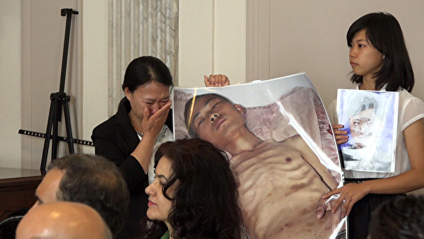
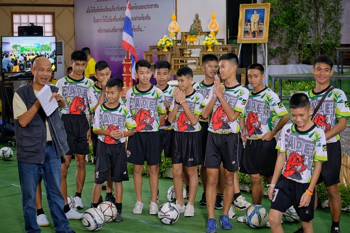
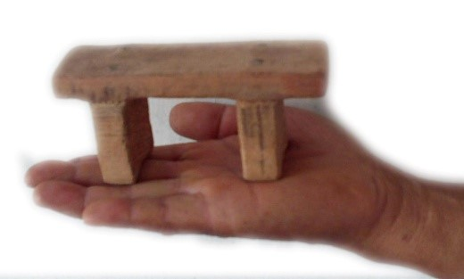
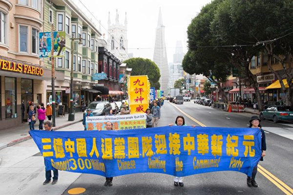

 

 
 
<a name=top>
<h2><a href="https://github.com/3fmd/true/blob/master/01.md"><b>看更多．．．</a></b></h2>
<h2><a href="https://github.com/goodabc/GCC/blob/master/jysl.md"><b>九评编辑部：魔鬼在统治着我们的世界</a></b></h2>
 <h2><a href="https://github.com/goodabc/GCC/blob/master/goal.md"><b>《九评》编辑部：《共产主义的终极目的——中国篇》</a></b></h2>
<h2><a href="https://github.com/goodabc/GCC/blob/master/xgpl.md"><b>《共产主义的终极目的》 相关评论</a></b></h2>  
<h2><a href="https://github.com/no1show/show1/blob/master/whss.md"><b>中共意识形态之理性批判</a></b></h2> 
<h2><a href="https://github.com/no1show/show1/blob/master/gcdsy.md"><b>评《共产党宣言》</a></b></h2> 
<h2><a href="https://github.com/no1show/show1/blob/master/jgrc.md"><b>【中国人权】</a></b></h2>
<h2><a href="https://github.com/no1show/show1/blob/master/6m.md"><b>【大纪元2018年06月评论】</a></b></h2> 
<h2><a href="https://github.com/no1show/show1/blob/master/5m.md"><b>【大纪元2018年05月评论】</a></b></h2> 
   
【大纪元2018年07月评论目录】 :

<b>
<a href=#68>68. 程晓容：国内外两件大事 令中共邪恶现形</a> 
<a href=#67>67. 夏小强：中共残害孩童 毁掉中华民族未来</a> 
<a href=#66>66. 杨宁：中国人向川普求救 中南海好尴尬</a> 
<a href=#65>65. 川人：假疫苗频现 中国人该猛醒了？</a> 
<a href=#64>64. 俞晓薇：突破道德底线的 只有假疫苗吗？</a> 
<a href=#63>63. 抬高一公分</a> 
<a href=#62>62. 金言：由P2P到疫苗造假的惊人大骗局</a> 
<a href=#61>61. 唐浩：法轮功音乐飘进白宫 说明什么？</a> 
<a href=#60>60. 周晓辉：美国新行动必将冲击北戴河会议</a> 
<a href=#59>59. 陆平：哪些是违法的骚扰行为</a> 
<a href=#58>58. 大陆王子：从长生毒疫苗看共党毁灭中华进行时</a> 
<a href=#57>57. 张凯律师：都在一条船上</a> 
<a href=#56>56. 张林：共产主义才是最毒的毒疫苗</a> 
<a href=#55>55. 魔鬼在统治着我们的世界(20)：媒体篇</a> 
<a href=#54>54. 从摇篮到坟墓 中国人终生难逃中共迫害网</a> 
<a href=#53>53. 冀评：从“敲门”骚扰看邪恶迫害破产</a> 
<a href=#52>52. 程晓容： 谁放行了“杀人”疫苗？</a> 
<a href=#51>51. 陈思敏：陕西610头目落马 江泽民罪行必遭清算</a> 
<a href=#50>50. 郑平：从正邪力量变化中看到人类的希望</a> 
<a href=#49>49. 法轮功义务传功遍全球 事实亲历揭穿中共诽谤</a> 
<a href=#48>48. 林展翔：简谈中共迫害法轮功的非法</a> 
<a href=#47>47. 张林：中共援外主要是贪污和洗钱</a> 
<a href=#46>46. 美国富强 中共崩裂 当代预言正兑现（下）</a> 
<a href=#45>45. 美国富强 中共崩裂 当代预言正兑现（上）</a> 
<a href=#44>44. 天安门自焚伪案 美记者当年有何惊人发现</a> 
<a href=#43>43. 承山：上海医院“小儿活体换肝”直爆活摘罪恶</a> 
<a href=#42>42. 诚宇：七旬老人被打断五根肋骨真“没事”？</a> 
<a href=#41>41. 苏蒙：魔鬼在统治着我们的世界吗？（四）</a> 
<a href=#40>40. 理悟：灭顶临头</a> 
<a href=#39>39. 唐恩：反迫害十九载 正信迎来曙光</a> 
<a href=#38>38. 夏小强：江“卖国丑闻”再传 拉响习近平警报</a> 
<a href=#37>37. 石铭：结束中共暴政 法办迫害元凶</a> 
<a href=#36>36. 横河：把不可能变为奇迹的泰国救援</a> 
<a href=#35>35. 川人：每日与善类为仇 共克时艰处处灾？</a> 
<a href=#34>34. 文武：华涌讲真话的作用</a> 
<a href=#33>33. 颜丹：大陆高考状元为何无人学医？</a> 
<a href=#32>32. 程晓容：中共党媒这个词 反过来读才有趣</a> 
<a href=#31>31. 文武：声援正义之声越多就越安全</a> 
<a href=#30>30. 中共高官们 小心自己被镭射枪点燃</a> 
<a href=#29>29. 从营救泰国少年足球队想到的</a> 
<a href=#28>28. 中国人愿意舍小家保中共打贸易战？</a> 
<a href=#27>27. 压垮骆驼的稻草正一根根落下</a> 
<a href=#26>26. 王永航律师：我不说你不会知道的事</a> 
<a href=#25>25. 川普四面出击 意在改写全球化格局</a> 
<a href=#24>24. 说说咱们屯里的法轮功</a> 
<a href=#23>23. 中国经济缘何突然陷入危机</a> 
<a href=#22>22. 良知唤醒时，魔鬼到末日——中共诬蔑失败</a> 
<a href=#21>21. 王永航律师：从旁观到亲历和见证（上）</a> 
<a href=#20>20. 贸易战开打 中共危机加剧</a> 
<a href=#19>19. 三退大潮二〇一八年综合报告（六）</a> 
<a href=#18>18. 三退大潮二〇一八年综合报告（五）</a> 
<a href=#17>17. 中共将会是下一个苏联？（下）</a> 
<a href=#16>16. 盘点公开退出中共的维权律师</a> 
<a href=#15>15. 给国家领导人写信讲真相何罪之有？</a> 
<a href=#14>14. 为何百姓的生活普遍仅能维持温饱而已？</a> 
<a href=#13>13. 中共将会是下一个苏联？（上）</a> 
<a href=#12>12. 修大法的清官</a> 
<a href=#11>11. 文化大革命九种思维方式</a> 
<a href=#10>10. 三退大潮二〇一八年综合报告（四）</a> 
<a href=#9>9. 公民起诉国家测绘局 案中藏江氏丑闻</a> 
<a href=#8>8. 共产邪灵统治下的中国大陆</a> 
<a href=#7>7. 金正恩弃核食言 隐现中共机密 川普将反击</a> 
<a href=#6>6. 大法弟子成了十里八村闻名的好媳妇</a> 
<a href=#5>5. 川金会的意义及其终极目的（下）</a> 
<a href=#4>4. 漫话“改革开放”与中国人的幸福感（7）</a> 
<a href=#3>3. 德国战车倾覆 全怪中共送马克思回乡？</a> 
<a href=#2>2. 三退大潮二〇一八年综合报告（三）</a> 
<a href=#1>1. 魔鬼在统治着我们的世界(18)：教育篇(上)</a> 
</b>

<a name=XX>
<h1 align="center"><b>程晓容：国内外两件大事 令中共邪恶现形</b></h1>

近日，国内外发生了两件大事，聚焦中共的邪恶。（影片截图）

【大纪元2018年07月26日讯】近日，国内外发生了两件大事，聚焦中共的邪恶。一件是众所周知的疫苗丑闻，另一件是在美国召开的“促进宗教自由”部长级会议。

疫苗安全事件第N次发生，谁之过？长春长生的疫苗造假大案，并非一个点，而是牵出了一大片、一条贯穿多年的长线、一张纵横四方的官商勾结网。造假害人的，难道只有“长生”？

此外，官场内斗的险恶也被曝出。据说，每当这类重大安全事故出现，中共的派系内斗都会利用来互相攻击。于是，上亿支关乎健康的疫苗，上亿名儿童和民众的安全，就在其中被污染、被牺牲了。

当众多父母被迫转向进口疫苗时，消息传来，上海美华丁香门诊部因为使用未经审批的进口疫苗，被判销售假药罪。第一被告郭桥被判刑7年，其他三名涉案者被判4到6年不等。把真药当“假药”打，中共刑法出拳又快又重。

受上述上海疫苗案第三被告人的委托，大陆的斯伟江与徐昕律师同意担任其二审辩护人，介入此案。7月23日，两位律师发出了《上海疫苗案声明》，文中提到，疫苗药品抽检记录、检验结果单和辉瑞制药等公司出具的回函等书证都证明，涉案疫苗不是假冒伪劣疫苗。声明还称：“光从结果来看，无一例不良反应，没有造成任何社会危害，相反，客户从中受益了。”

国外真疫苗得罪了谁？提供真药，让中国人受益反遭整治获刑。而大规模生产不合格疫苗的无良老板、让假药“安检”过关的无良官员呢？那把保护制假巨头的大黑伞呢？他们将继续逍遥法外、杀人不偿命？！

同样的敷衍、欺骗、打压的套路在上演，一次次草菅人命，魔爪伸向幼童！全球媒体追踪关注，百姓义愤声讨，疫苗厂商被起底，黑幕被揭开，中共的恐慌和尴尬，料不难想像。

大陆网民涌至美国驻华使馆的微博，恳请救助。重庆市民被当地公安封网、问话，而境外“德国之声”却可为其传声，两般境遇，叫人说什么才好？草民们认清，中共痛恨的“反华势力”，反而有人性，做人事。

在海外，7月24日，美国国务院主办的首届“促进宗教自由”部长级会议在华盛顿开幕。有人说，这次会议是开给北京看的。

在开幕仪式上，美国国务院国际宗教自由大使Sam Brownback说，宗教信仰自由是神赋予每个人的权利，也是人类尊严的一个美丽的组成部分。任何一个地方缺少宗教自由，都会对全球的和平、繁荣和稳定构成威胁。Brownback在前一日曾表示，将在世界范围建立联盟，抵制宗教迫害的铁幕，并见证其被摧毁。“我们将共同打败这一邪恶。”

7月23日，在此次部长级会议的首场边会上，中国辽宁法轮功学员迟丽华和16岁的女儿徐鑫洋受邀参加，讲述了他们一家的遭遇。

7月23日，来自中国辽宁法轮功学员迟丽华和女儿徐鑫洋受邀参加了美国国务院宗教自由部长会议的首场边会，讲述其家庭遭遇。（方明／大纪元）

2001年2月，迟丽华和丈夫徐大为因为印刷法轮功受迫害真相资料被捕。迟丽华事后得知，绑架他们的警察获得了5万人民币的“奖金”。徐大为被判刑8年，迟丽华因怀孕被保外就医。丈夫冤狱期间，她带着孩子多次探监，但是因为徐大为不放弃修炼法轮功，大多数时候不允许家人会见。她寄给徐大为的钱，他从来没有收到过。

8年刑满，被释放回家的徐大为骨瘦如柴，伤痕累累，13天后便离开人世。徐大为曾告诉妻子，在沈阳东陵监狱时，他被注射了损伤神经的药物，并被迫服用了不明药物。后来，迟丽华因为向当地政府申诉再次面临抓捕，母女二人被迫逃离中国。

在媒体报导里，迟丽华手举徐大为病危时的图片，掩面拭泪。一旁的徐鑫洋面容沉静而坚毅。这个女孩子，与亲生父亲共度的时光，只有13天。

太多的真实，被谎言掩盖，太多的故事，值得用心倾听。

中国人怒问：“我们应该怎么生存？”美国人说：“我们将共同打败这一邪恶。”

一针假疫苗，引发风暴，粉碎了中共妄想充当全球制药业巨头的野心。一个家庭的凄惨不幸，瓦解了中共苦心编织的谎言和光环。无数的事实证明，相信中共，就是拥抱毒药，亦等同为邪恶输血。中共坏事做绝，自食恶果。危机中的人们，必须为健康、安全、自由和尊严，鼓起勇气，让良知觉醒。

责任编辑：高义

<a href=#top><h6 align="right">回上方</h6></a>

<a name=68>
<h1 align="center"><b>千百度：法轮大法改变了一个伊朗学员的人生</b></h1>

修炼人通过学法、炼功并遵照法理去做，在这个道德堕落的人世中能拥有一种平和、有目标的生活，并能避免在压力大的环境中产生精神疾病和身体疾病。（明慧网）

【大纪元2018年07月26日讯】在当今世界，修炼法轮功的不止是中国人，在除中国之外的一百多个国家和地区，都有人修炼法轮功。下面我想跟大家介绍的就是一位伊朗法轮功学员的修炼故事。

他修炼法轮大法至今已经七年了。在这之前的十年里，他练过许多其它法门，也看过许多其它的书籍。而法轮大法最吸引他的是，他能使修炼者身心得到同步改善，换句话说，既可以提升修炼者的思想与道德，同时还能让他们得到健康的身体。

在之前的十七年里，由于两条椎骨受伤，他的脊椎一直承受着巨大的痛苦，即使腰部承受最轻的负重，都得休息或进行物理治疗。观看了法轮大法的教功视频后，他首先想到的是，自己无法双盘打坐，也无法完整的炼完动功。但当他通过《转法轮》了解到病产生的原因后，他决心要净化自己的思想并开始炼功。

渐渐地，他能够双盘打坐了，也能站着炼完动功了。在修炼法轮功的七年里，他再也不用花很长的时间休息，再也不用吃药了。当身体哪里痛或不适时，他就炼功。

更重要的是，通过学习《转法轮》，他明白了许许多多以前想要明白而又不得其解的问题，这些都是他以前研究心理学、形而上学和哲学都无法得到答案的。

在学习心理学时，他学到的是通过识别别人的行为模式和利用有效因素去改善人际关系，以保护自己免受来自社会和不良关系的伤害。而学习了《转法轮》之后，他明白了修炼人做每件事都要先替别人着想，而不是为了自己的利益。修炼人必须遵循“真、善、忍”的原则去生活，放下多年来形成的各种执着心和人的观念，包括妒嫉心、争斗心、说假话、自以为是、显示心、依赖心、自卑心等等，他们必须逐渐辨别出这些心并提高自己的心性。当出现问题或冲突时，修炼人不能再像以前那样行事，而是要用法的标准去衡量。

他还发现，修炼人通过学法、炼功并遵照法理去做，在这个道德堕落的人世中能拥有一种平和、有目标的生活，并能避免在压力大的环境中产生精神疾病和身体疾病。人类的科学只能用有限的方式解决自己的问题，而修炼人则能用法理来更好地认识到自己的执着心，不是去批评他人或试图改变他人，而是在改变自己上下功夫。当他们用法理衡量自己的生活时，会明白很多事情的因缘关系，与家人、朋友和同事的关系也会因此变得更加亲密、和谐。

有感于修炼法轮大法改变了自己的人生，他经常告诉别人：“我希望每天都有更多的人能够真正了解这部大法，这会使他们的身体和心灵都得到升华，并从中受益。”

责任编辑：高义

<a href=#top><h6 align="right">回上方</h6></a>

<a name=67>
<h1 align="center"><b>夏小强：中共残害孩童 毁掉中华民族未来</b></h1>

微博上的一项民意调查询问人们将来是否会使用中国制造的疫苗：超过700名受访者中有90%选择了答案：“我不敢再使用它们了。”图为2010年广东发生学生注射乙肝疫苗集体住院事件，女童因注射疫苗致残。（网络图片）

【大纪元2018年07月26日讯】中国大陆长春长生假疫苗事件爆发，民意沸腾，全球关注。其实在此之前，假疫苗事件多年来一直都在发生并被曝光，比如2005年安徽泗县甲肝疫苗事件、2007年山西疫苗事件、2009年大连狂犬疫苗事件、2013年康泰乙肝疫苗媒体事件以及2016年山东济南非法经营疫苗案件等等。

中共官方的反应和应对措施基本没有变化：先是中共高层领导谴责“性质恶劣，令人触目惊心”，并誓言要“依法从严处理”、“不论涉及到哪些企业、哪些人都坚决严惩不贷、绝不姑息。……必须给全国人民一个明明白白的交代”等等。与此同时，中共动用全部国家机器，对调查真相的公民、记者、律师、报社采取严厉的打击措施，其中包括撤职、骚扰、威胁、抓捕、判刑等，这次自然也不会例外。

孩子，是一个国家和民族未来的希望。中共近七十年的统治，毁灭了中华民族的传统文化、道德和环境，消灭著中国人的灵魂和肉体。而这种残害，从小小的年幼孩童就全面开始了。这也是中共要毁掉中华民族未来的图谋的一部分。

小孩除了从小就受到政治洗脑毒害外，也经受着大规模的肉体残害。

中共从1980年开始在全国提倡一对夫妻只生一个孩子，1982年确定计划生育政策为中国的一项基本国策。计划生育政策实行以来，中国每年遭受野蛮堕胎的胎儿数量达1,300万，30多年来，大约有4亿多胎儿被屠杀。

仅在2013年至2015年三年间，据不完全统计，媒体曝光的性侵儿童案共968起，吉林被性侵女童民事赔偿仅1098元。公安大学教授王大伟表示，性侵害案件曝光比例仅为1/7。而中共当局对这些激起民愤的官员量刑往往是避重就轻，以“嫖宿幼女罪”量刑，而不是以“强奸幼女罪”来惩罚，以致民怨沸腾。

据中共官媒报导，2014年数据显示，中国农村留守儿童数量超过6,100万，在2005年到2010年的5年时间内，中国农村留守儿童增加约242万，增幅达4.13%。每3个农村孩子里面，就有一个留守儿童。2015年一项针对留守儿童的调研显示，在江西、重庆、贵州、河南、安徽、湖南6个劳务输出大省，49.2%的儿童在过去一年内遭遇过意外伤害；49.4%经常没完成作业；43.8%对学习不感兴趣；39.8%感到孤独，其中42.7%的留守女童经常觉得孤独。此前的调查也显示，留守儿童心理问题检出率高达57.14%。这些留守儿童普遍“亲情饥渴”，教育也是祖辈“隔代教育”，导致诸多社会问题。

曾经在2008年“5‧12”大地震中，深入灾区调查取证的四川省教育界人士杨雨，因发现上百所学校倒塌的真正原因是“豆腐渣工程”而遭到中共抓捕。杨雨对大纪元记者表示，中共官方宣称在那次地震中有5,335名学生因校舍倒塌死亡，如果不是“豆腐渣工程”，可能其中很多学生都不会死。

2008年三鹿有毒奶粉事件中，直接受害儿童高达30万之众。

2017年11月，北京朝阳区红黄蓝幼儿园被曝光发生虐童事件，多名家长控诉，孩子身上不明针孔，怀疑是被老师用针扎，并被喂食不明药片。孩子们还疑似遭到集体猥亵、脱光衣服罚站甚至是性侵等，传出中共军方涉入其中。

在中共的体制下，留守儿童、残疾儿童、事故孤儿、大量儿童被拐卖、弃婴、毒奶粉、幼儿园喂药、毒疫苗层出不穷。

今年2月退休的前国家食品药品监督管理总局副局长、药品安全总监孙咸泽。他任职食品药品监管总局食品安全协调司司长期间，因三鹿毒奶粉事件遭行政记过处分。然而，孙咸泽仕途却没受到影响，反而还在2017年升任副局长。

有人评论说：我们知道灾害是如何发生的，他们也知道灾害是如何发生的，他们也知道我们知道灾害是如何发生的，我们也知道他们知道我们知道灾害是如何发生的，但灾害依然再次发生，归根到底，是我们不重要。

从表面上看，事件似乎是中共体制问题、中共政府监管不力等等因素造成。但是，除此之外，还有其深层因素。

从中共多年来一连串对中国孩子的残害和杀戮来看，这些罪恶不仅仅是中共体制因素造成的个案，从更深层来看，这是中共邪灵毁灭人类、毁灭中华民族的一部分，从计划生育开始到如今假疫苗的一系列事件，都是中共有计划、有步骤的杀戮行动。

《九评》编辑部新书《共产主义的终极目的》一书指出：共产主义并非一种思潮、学说，或者在人类寻找出路时一个失败了的尝试。它是魔鬼，亦称共产邪灵，由恨和宇宙底层空间各种败坏物质构成，其终极目的是毁灭人类。

中共带着仇恨来到人间，来到中国，杀戮残害中国的孩子，目的就是要毁灭中华民族的未来。

中共不灭，何以为家？

责任编辑：高义

<a href=#top><h6 align="right">回上方</h6></a>

<a name=66>
<h1 align="center"><b>杨宁：中国人向川普求救 中南海好尴尬</b></h1>

疫苗丑闻事件已经令中国民众愤怒。（大纪元资料室）

【大纪元2018年07月26日讯】没有人否认，最近大陆民众最为关心的一个话题就是“假疫苗”，因为这是继毒奶粉、红黄蓝幼儿园性侵幼儿后又一个涉及幼儿的重大事件。可以说，长春长生公司曝光的假疫苗事件再次刷新了中国人对中共政府的认知：连它们所公认的“祖国的花朵”也敢如此戕害！

一如既往，对于民众在网络上的控诉、指责和发泄的不满，当局采取了疯狂删帖、封公众号的做法。封口，已经成为中共应对各种危机时最为直接也最为简单、粗暴的做法。然而，令当局没想到的是，不少愤怒的中国网民纷纷在美国驻中国大使馆的官方微博下留言：

“中国给孩子接种疫苗不合格，是否侵犯人权？”

“美国法律会对制造假疫苗者怎样判刑？”

“请美国干预假疫苗这种泯灭人性的事件。”

“你们为了叙利亚儿童打击巴沙尔政权。为什么对千千万万遭毒害的中国儿童视而不见？战斧（导弹）在哪里？”

“请总统出面救救中国的孩子吧！”

“多亏世界上还有美国！”“你们啥时候打进来？我给你们带路。”

“只有美国可以救我们了！！求求你们！！”

“美帝，你亡我之心可千万不能死啊。”

“请加大对中国的贸易惩罚！”

“请贵国禁止中国公务员、党员及家人入境。”

“请问（长生生物的神秘大股东）高俊芳有美国国籍吗？会受到美国政府的保护吗？”

…………

有一位网民由此调侃说，美国大使馆的官方微博，是全中国唯一一个反复被举报，却没有被拿下的微博账号。

显而易见，中国网民们在美国大使馆微博上的留言让中南海的高官们无比尴尬。虽然高层做了严厉批示，但根据以往的事件，在中共一党专制下，没有多少中国人相信假背景不简单的疫苗事件会查个水落石出，没有多少中国人相信未来类似的事情不会发生。因为毒奶粉案件中受害者被关、被意外死，相关被处分官员反而升迁；红黄蓝幼儿园抓了“小鱼”后，性侵的幕后黑手和大老板依旧逍遥快活……假的、有毒食品、商品的泛滥，早已让中共政府的公信力不在。而在当局的高压钳制下，无处发泄且被逼得走投无路的中国人只能向美国、向川普求教。

因为中国人看到了，川普才是一位真正为美国人利益考虑的国家领导人，才是真正期望带领美国回归传统、捍卫人权的总统，其近期对中共的极限施压以及手中所掌握的王牌，才是中共最为恐惧的。因此中国人的求教并非无的放矢，而中国人的声音也应该通过美国大使馆传到了白宫。

而这并非是首次中国人向美国、向川普求救。今年2月过年时，美国大使馆微博上传了一段贺年影片，想不到下方的留言成为了中国股民抒发心声的平台，有痛骂股灾的，有发泄怨气的。留言包括：“中国证监会微博禁言亿万股民抗议，我们只能在这儿把愤怒说出来，强烈要求刘士余下台”，“普大爷快点来解放我们吧，我们做带路党，消灭共肥”，“天朝在为非作歹方面是天才，这么缺德”，“老美把我们收编了吧，股市暴跌我们没钱过年，官逼民反”……

在接下来的几天，在该微博多篇帖文下，还有网友这样的留言：“希望美国政府问下中国政府，为什么中国人民要跑到美国政府下面来诉苦，来申冤……”“这个账号成为中国人民的信访中心了”。

不知中南海的高官们看到自己的国民向美国人求救作何感想，但其在全世界大大丢了面子是无疑的，而且可以想见的是，美国人看到了中国人的心声后，一定加深了对中共政权的认识，而这或许更坚定了美国川普政府对中共政权施压的意志。

不由得想起了以前看到的中共央视的一则报导。萨达姆被推翻后，记者在伊拉克街头采访时，几乎没有人怀念萨达姆时代。许多伊拉克人都非常感谢帮助他们推翻萨达姆的人：美国。这或许又让批评美国“祸乱”伊拉克的国人们大叹自己“上当受骗”。

让国人们更为惊讶的是伊拉克的巨大变化。2016年7月底，大陆门户网站网易在其“数读”栏目中给出了伊拉克战前、战后的GDP实际增长率。

根据列举的1991年至2015年的GDP数字，自2004年起伊拉克的经济一直处于稳步增长状态。根据世界银行的统计显示，尽管2003年伊拉克GDP下降33%，但2004年经济恢复就超过了2002年水平，仅2004年当年注册开办的企业数量就超过1.1万家，至2013年伊拉克实际GDP已经比战前增长87%。如果扣除价格因素，以现价美元计算人均国民总收入GNI来看，2013年伊拉克人均GNI为6800美元，约是1989年水平的1.8倍。

2013年7月，央视也大赞伊拉克推翻萨达姆政权后经济发展神速。央视财经频道的报导称，自2003年伊战结束以来，伊拉克经济取得了长足的进步，2013年伊拉克GDP比战前增加了8倍！人均收入也得到了显著提高。

这些仅仅是部分让“中毒”的中国人惊讶的增长数字。网易“数读”还透露，伊拉克的卫生条件也在逐步改善中。比如在总人口从2002年的2494万增至2015年的3642万时，同时获得改善水源和改善卫生设施的人口比例也在增加。而另一重要衡量标准婴儿死亡率也在持续下降，如每1000活产婴儿的死亡率从2002年的34.6降至2015年的26.5，同时下降的还有5岁以下儿童死亡率。

另外就公共医疗卫生投入数字来看的话，2014年伊拉克卫生医疗支出占GDP的5.5%，略高于印度、沙特等国的4.7%。其中公共医疗卫生支出占医疗总支出的60%，2011年时一度超过75%，与沙特水平相当。

伊拉克的巨大变化无疑让中国人看到了摆脱中共独裁统治后，中国将可能发生的惊人变化。是以，中国人在向美国人求救的同时，也要从内心和行动上彻底抛弃中共，为自己美好的明天出一份力。

责任编辑：莆山

<a href=#top><h6 align="right">回上方</h6></a>

<a name=65>
<h1 align="center"><b>川人：假疫苗频现 中国人该猛醒了？</b></h1>

【大纪元2018年07月26日讯】2018年7月15日，中共药品监督管理局迫于舆论压力对长春长生生物科技有限责任公司开展了检查，发现该企业冻干人用狂犬病疫苗生产存在记录造假等严重违法行为。7月16日，长生生物发布公告称，长春长生对有效期内所有批次的冻干人用狂犬病疫苗全部实施召回，标志着该公司承认所有疫苗均有问题。7月24日，中共长春新区公安分局发布消息称，已对长春长生生物科技有限公司董事长高俊芳等15名涉案嫌疑人采取刑事拘留措施。

颇具讽刺意味的是，这家以“长生”为名的药品生产企业多年来在中共的精心呵护下，干着让中国人短命的勾当。据深交所对长生生物公开谴责中透露，长生生物涉事狂犬病疫苗销量占国内市场近四分之一。不仅如此，长生生物的实际控制人高俊芳和前股东，除了生产狂犬疫苗外，还是国内最大的乙肝疫苗企业、国内最大的流感疫苗企业以及国内第二大的水痘疫苗企业，全中国的疫苗竟然被这几个人所垄断控制，是谁给了它们如此大的权力？

7月24日，有人发表微博披露，长生生物董事长高俊芳是中共吉林前省委书记高狄的女儿。随后，中共《环球时报》总编胡锡进，公开否认高俊芳是高狄的女儿。不过，长生生物经常得到中共“领导关怀”已是不争的事实。资料显示，长生生物是中共科技部认定的高新技术企业，高俊芳身兼董事长、董事、法定代表人、总经理、财务总监等多个职务于一身。从1994年接任长生生物总经理至今，高俊芳一直担任公司的“一把手”。多年来，包括江泽民和张德江等中共高层到该公司视察。长生生物官网自诩，中共高层领导在亲临指导工作时，对公司给予了肯定和支持。可见，长期生产让中国人短命疫苗的长生生物是中共领导下的产物。

据了解，以长生老板高俊芳、前股东韩刚君、杜伟民为主的疫苗“大佬”，占据了中国疫苗生产的半壁江山。除了长生生物之外，它们还控制了江苏延申、深圳康泰、北京民海生物等。2008年，杜伟民在产权交易所买下了深圳老国企康泰生物的大部分股份，控制了这家中国最大的乙肝疫苗生产商。2009年，杜伟民控制的江苏延申，被查出狂犬疫苗造假，可半年后，江苏延申又获得了防疫部门160万人份甲流订单。这让外界不得不服杜伟民背后的神秘力量。

2010年到2014年，杜伟民通过贿赂中共国家药监局药品审议中心副主任尹红章，为康泰子公司的药品申报铺路。2013年12月，杜伟民迎来了最大危机。在十天时间里，共有8名新生儿在接种康泰的乙肝疫苗后死亡。但一个月后，中共食药总局和卫计委的调查显示，所有的婴儿死亡为偶合性死亡，疫苗质量没有问题。可见，杜伟民及其后台对该事件进行了危机公关。风波之后，康泰安然上市，市值从杜伟民收购时的6亿元飙升到现在的400亿元。

2017年11月，长生生物，已经被检测出疫苗质量问题，当时仅罚款300多万，没收库存186支，但有25万儿童已经受害。据吉林省药监发布的处理通报显示，长生生物在2017年底的百白破疫苗品质丑闻曝光后，并没在第一时间受到处罚，而是在这次造假之后，药监部门才被迫披露处理结果。各种事实表明，中共药品监管部门对高俊芳、杜伟民等人长期疫苗假造的非法活动完全知情、完全掌握，但对它们均选择了放任不管的选择性执法。有消息称，三人为隐秘富豪，比它们更隐密的是背后不方便挂名的大老板，这也是它们多次出现问题、年年被举报，却无人能撼动的真实原因。

7月22日，中共总理李克强作出批示称，此次疫苗事件突破人的道德底线，国务院要立刻派出调查组，对所有疫苗生产、销售等全流程全链条进行彻查，尽快查清事实真相，不论涉及到哪些企业、哪些人都坚决严惩不贷、绝不姑息。同样的，2016年4月14日，李克强在处理“山东济南非法经营疫苗系列案件”时也称“绝不姑息”，可不知那时候为何偏偏漏掉了高俊敏、杜伟民、韩刚君等人。

更具讽刺的是，2008年造成无数中国儿童受害的三鹿毒奶粉丑闻中被问责的中共官员，如今全部复出并晋爵加官。当年，在三鹿事件中遭到行政记过处分的中共国家药监局食品安全协调司司长孙咸泽，在2014年竟被任命为中共药监总局副局长，并兼任药品安全总监，负责全中国的疫苗监管，直到2018年2月才“光荣”退居二线。这就是中共邪党治国最为经典、最为传神的写照。遇上了中共邪党治国，中国人逃无可逃，中共国千奇百怪的毒食品、泛滥成灾的假疫苗，总有一款适合处江湖之远的中国人，而与居庙堂之高的中共权贵无关，只因中共官员有特权，有特供。

就在中共称“此次疫苗事件突破人的道德底线”之时，7月20日，追查迫害法轮功国际组织公布最新报告显示，中共大规模活摘中国人器官的罪恶仍在继续。追查国际从2017年10月1日至2018年6月30日对大陆57家医院的院长、主任、医生、护士和14省市红十字会器官捐献机构职员进行的调查。调查发现：第一，中国移植医院的肝、肾移植手术数量惊人，且器官平均等待时间为2周至2个月，供体充足；第二，器官实际捐献量远少于移植量，巨大的器官供体来历不明；第三，中共倒卖人体器官很普遍，很多医院明码标价收供体费，肝源费30万元以上，肾源费15万元以上。

活摘中国人的器官，并用此进行交易发财，这比假疫苗更突破人的道德底线的事，中共却不顾国际社会长期强烈谴责，十几年如一日的干着。中共到底是一个什么东西？它的暴行与吃人的魔鬼有何不同？它会善待中国人吗？作为中国人的你我是否该猛醒了？！现在越来越多的事实证明，共产党及其搞共产主义的终极目的就是毁灭人类，而“好话说尽，坏事做绝”的中共所干的那些“突破人的道德底线”之事，其实就是魔鬼暴行在人间的重现。目前假疫苗频现中国，这是上天留给中国人猛醒的机会，通过中共对假疫苗屡禁不止的事实，好让中国人看清中共毁灭中国人的魔鬼面目，这样中国人才有生机，中国未来才有希望。

责任编辑：萧明

<a href=#top><h6 align="right">回上方</h6></a>

<a name=64>
<h1 align="center"><b>俞晓薇：突破道德底线的 只有假疫苗吗？</b></h1>

这一次疫苗危机，不仅是信任危机，安全危机，更是全体国民的道德危机，生存危机。 图为曝出制造假疫苗丑闻的长春长生生物科技公司内景。（Tao Zhang/Getty Images）

【大纪元2018年07月25日讯】疫苗风暴起，民众怒火直烧中共。一针假疫苗，便可断送一名幼儿还未展开的人生，断送一家三代的幸福。大陆的父母们忍无可忍，无论贫富，都在恐慌和忧虑中发出呼声。

害命的疫苗，一批批通过“安检”，被注入婴幼儿的体内。许多孩童抽搐、呕吐、昏迷、终生残疾，或者死去。他们的父母痛哭晕厥，倾家荡产，却投诉无门。

所有的中国人，每一天都在为社会的道德沦丧埋单，用健康和生命。还有比这更惊心的吗？

受害者正当维权，被投入监狱；律师伸张正义，被赶出法庭；记者调查真相，反遭解职。女主播哭诉自己的女儿打疫苗后的不良反应和内心绞痛，却被旋即删文，被迫发声明道歉。还有比这更可怕的吗？

当人生的奋斗目标在于挣钱、移民，让孩子不再受罪，当中国人的心声，唯有写在美国驻华使馆的微博，才得以存照，当活着已成为奇迹时，还有比这更悲哀的吗？

“疫苗门”的怪诞和恐怖在于：查了这一家，还有另一家；此官下台，又任新职；每一次，官方都信誓旦旦，要严查严惩。但是，每一次都不是最后一次。奸商知道，上级知道，人民和世界也知道。

在美国驻华使馆的微博上，大陆网民留言说：“请美国干预假疫苗这种泯灭人性的事件”，“我们国家没救了，疫苗都造假，这些人的行为已经达到反人类社会的程度了。”

那些生产假疫苗的奸商，为求利润，不惜毁掉儿童的未来，确实泯灭人性。而为这类企业大开绿灯、提供保护伞的上级部门，那些知情不报、拖延调查、打压揭露真相者、对受害者的申诉不予立案的官员，那些继续与“党”保持一致、转移视线的喉舌媒体，人性又何在？

良知泯灭的乱象，并不限于假疫苗。反天、反地、反人类的政党，从未停止过残害人民。在此党的“领导”下，传统价值观被破坏，贪、色、毒、假泛滥，国家黑社会化，犯罪分子有恃无恐，道德底线早被突破，被不断压低至举世皆惊的境地。

2007年8月1日，广东省汕头市谷饶镇传出儿童拐带案。有人在垃圾堆发现了七具无内脏的儿童尸体，据传是不法之徒拐走孩童后割掉器官出售。

2008年，浙江台州市司机赵小程，在倒车时撞倒老人陈冬香，之后他5次开车前进、倒退，反复碾轧陈冬香，致其死亡。

2011年10月13日，在广东佛山市南海区，2岁女童王悦（乳名“小悦悦”）独自在外玩耍时，先后被两辆汽车撞伤倒地，18名路过的行人漠视不理，未及时施救。小悦悦最后伤重不治。此事被国际媒体广泛报道，各方谴责路人的无情，并对中国人的道德淡漠表示担忧。

2012年，江西特大人体器官贩卖案被曝光，有多名江西省私营医院的行政人员、医生、药剂师、护士参与。媒体报导，摘除的肾脏被浸泡在药水里，装在冷藏箱中，以海鲜的名义空运至广州，收购者是广州军区广州总医院肾脏移植科副主任医师朱云松。

2013年，大陆媒体又曝光了武汉的一个地下卖肾黑车间，有专业医疗班组参与，主刀医生具有丰富的临床经验。

事实上，早在上个世纪，中共就犯下了活体取器官的恐怖罪行。自1999年7月开始，中共在迫害法轮功的过程中，形成了活体摘取法轮功学员器官、贩卖牟利的产业化犯罪。军队、武警、医院、监狱和劳教所，配合作业，按需杀人、攫取器官。

海外独立调查员通过调查取证，证实了中共活摘器官的存在和持续发生，称之为“这个星球上前所未有的邪恶”。“追查国际”也提供了相关报告和大量资料证据。而大陆民间贩卖器官的行径，正是活摘法轮功学员罪恶的延伸。近年来，在海外举办的人体标本展览，多数尸体都来自大陆，身份背景都是迷。

中共的统治史充满了反人性的罪恶。好话说尽，坏事做绝，牺牲广大人民利益是它的一贯原则。因此，纵容贪官、奸商，惩治善良百姓，打压正义人士，成了邪党的“顺理成章”之举。执政党惩善扬恶，这个社会能走向何方？

今天，当疫苗安全事件再度爆发，越来越多的人看清：所有的中国人，都被罩在了中共的谎言网、恐怖网中。你需要吃饭、喝水、呼吸、思想，你需要表达、交友、工作，你就陷在地沟油、苏丹红、假疫苗、毒奶粉、毒胶囊、阴霾、诈骗的包围和埋伏里。你无处可逃。正如张凯律师所说：“（我们）都在一条船上”。

你的孩子也许不喝三鹿奶粉，但可能接种了国产假疫苗。你也许曾对律师的“死磕”不以为然，但是，当你的权益受到侵犯时，当你的人身、生命安全受到威胁时，你就会意识到正义维权的难能可贵。你也许曾对法轮功学员的真相传单置之不理，但是，当你或你的亲人被这个政权无情地伤害时，你就会理解，世界需要“真、善、忍”。

这一次疫苗危机，不仅是信任危机，安全危机，更是全体国民的道德危机，生存危机。严酷的现实说明：若要守护健康和生命，必先恢复道德，必须抛弃中共。中共的存在，将令更多的中国儿童和中国父母，付出更为惨痛的代价。

责任编辑：高义

<a href=#top><h6 align="right">回上方</h6></a>

<a name=63>
<h1 align="center"><b>抬高一公分</b></h1>

文／张卉中

【大纪元2018年07月25日讯】二战时，德国女青年苏菲‧绍尔参加反纳粹组织“白玫瑰”。22岁时，苏菲全身笼罩着阳光走向断头台。走过友人身旁时，她说：“阳光依然灿烂。”精神的自由超越强权对身驱的灭绝，这朵白玫瑰升华到了一个神的国度。

柏林围墙倒塌后，守墙卫兵亨里奇因曾射杀企图翻墙的青年而受审。律师辩称，罪不在卫兵，他仅执行命令。法官希欧多尔．赛德尔却认为，“尊重生命”是一个放诸四海皆准的原则。卫兵有权把枪口抬高一公分，这是应主动承担的良心义务。最终，卫兵因蓄意射杀而遭判刑，且不予假释。

人们在问，纳粹这样的反人类罪行，怎么会在众人的眼皮底下发生。当时的人为这事做了什么？

曾几何时，历史又走到了一个人类面临抉择、面临审判的时刻。人们在纳粹暴行遭清算之后，说：“永不再发生。”然而，当今这种反人类的罪行，在人们的纵容下，不仅发生了，而且其深度与广度更是难以想像的惨烈。

我们为了家庭、为了子女、为了事业、不惜付出所有的努力。但是，如果在善、恶的天平上没掌握好，最终回到我们的家庭、子女与事业的，会是什么？天日昭昭，即使自以为无知也躲不过该承担的后果，宇宙中一切都是公正的，没有人可以为我们爬上天平去顶罪。

历史巨变在眼前，真相就是指路灯，我们没有权利蒙着眼睛说，我不知道。

在中共专政的半个多世纪，上天给了全人类，包括中共，无数的机会，启迪良知，让人们在善恶间自选。然而，一直以来中共践踏人权、残害生灵，从未手软，只是披上文明的外衣，越加隐蔽，倾尽国力掩盖。而人们在无知或有意无意的推波助流下，成了天理不容滔天大罪的利益共犯结构的一分子。

中共高干外逃的同时，为了泄恨，带出了大量机密文件，一件件令人发指的暴行，也陆续在国际间被揭露出来。大面积活体摘取法轮功学员器官牟利，在国际间贩售十几万具塑化了的尸体，或美其名曰：科学艺术展（全球巡回每年获利1亿美元），或当成医学标本售予相关研究单位。大家想一想，一个被剥了皮塑化了的尸体，手里拎着一件人皮风衣，摆了个潚洒的姿势，这算什么艺术，这算什么科学？他的父母子女、亲朋好友是什么感受？

中共把人变成贪婪的厉鬼，人们可以为了领取奖金昧著良心检举，让计生办执行一胎化政策，即使8个月大的胎儿也遭强迫流产，不只伤及母命，堕下的胎儿还成为牟利的材料。中共黑道治国，拥有全世界配备最精良的城管，以残暴手段强拆百姓房子牟利，造成死伤无数，家破人亡。610办公室迫害法轮功修炼者，连同其社会关系人，更是血迹斑斑、磬竹难书。普罗大众的哀号，那些官们、富人们在意吗？

上天给了人这么长时间试炼，这么长时间检验，人类道德却败坏到如此不堪的地步，此时，天网不得不收了，我们还能有多长时间，去正视人生最严肃的这件事？

中共的暴行比纳粹甚之又甚，将来真相大白后，人们也会问，这样的反人类罪行，怎么会在众人的眼皮底下发生？我们当代的每一个人，为这事做了什么？

“抬高一公分”是人类面对恶政时的抵抗与自救，是人类良知出现的一刹那。那么，作为卓越的一员，最起码守住这一公分，可以安保我们的家庭、子女与事业；当然，若不仅卓越更要超越，那么，像白玫瑰那样，一个神所荣耀的国度于焉展现。

责任编辑：吴淑娟

<a href=#top><h6 align="right">回上方</h6></a>

<a name=62>
<h1 align="center"><b>金言：由P2P到疫苗造假的惊人大骗局</b></h1>

【大纪元2018年07月25日讯】最近，发生在中国大陆社会的末日乱象可以用四个字来加以概括，那就是“谋财害命”。

所谓“谋财”，是指打着“金融创新”的幌子，干着坑蒙拐骗的勾当！“土豪死于杠杆，中产死于理财，屌丝死于P2P，小白死于传销……我们正在经历人类历史上最伟大的一场骗局！”这是大陆网民对中共治下庞氏骗局的精准总结。

从2013年到2018年之间，P2P行业已经过3次大规模的“爆雷潮”，但是没有任何一年像今年来的这么凶猛。据统计，2018年以来，已有236家P2P网贷平台跟巴比伦大厦一样瞬间倾倒。自融、伪造投资标的、非法集资诈骗、私设资金池、挪用投资资金、虚假业绩及背景、恶意逃废债……当今最齐全的金融骗局， 6、7两个月，集中在中国P2P行业连环上演，每天都有平台传来爆雷声，仅7月18日当天就爆雷23家。这波“爆雷潮”先是从南京，然后到上海，杭州，北京，深圳，尤其是江浙沪一带，以上海为首，被广大投友称之为“诈骗之都”。

伴随网贷平台的频频爆雷，投资者的“纸上财富”一夜凭空消失，令不少投资者倾家荡产、血本无归，成千上万的家庭支离破碎，陷入极度痛苦深渊。其中杭州P2P爆雷平台的投资者如潮水般从全国各地蜂拥而至，为此杭州市政府不得不专门将两座体育馆，用来暂时安置数以万计的投资受害者，成为名副其实的“金融难民营集中营”。

P2P舶来于美国，却昌盛于中国。2007年6月，“拍拍贷”在上海成立，成为中国第一家从事P2P业务的企业，自此标志着中国P2P行业的正式诞生。随后，互联网金融作为“金融创新”还写进政府工作报告。于是P2P平台如雨后春笋般疯狂生长，高峰期达5,000多家，总规模逾1.3万亿人民币，用户超5,000万人，人均投资金额22,788元，位居全球P2P产业规模之首。

然而，至今为止美国的P2P网贷平台从未出现过“跑路”的现象。反观中国，在互联网高度发达的今天，任何人都可以在当局的鼓励和支持下，空手套白狼包装出一个P2P平台，再以高利为诱饵，采取虚构借款人及资金用途、发布虚假招标资讯等手段吸收公众资金，然后携款潜逃。这比贩毒弄钱还来的迅速、安全。

“没有监管的金融创新等于耍流氓。”中国由此出现了古今中外从未有过的用高息去诱骗老太太的养老钱，用各种套路去向大学生发放高利贷，五千元校园贷可滚成百万，再用“裸条”、“肉偿”之类令人毛骨悚然，触目惊心的黑社会手段逼债。

更富戏剧性的是，就在P2P滚滚“爆雷”声中，中共杭州市政府居然还在7月10日举行了2018金融创新峰会。中国互联网金融协会秘书长还大言不惭的地炫耀，自2016年4月启动互联网金融风险专项整治工作以来，人民银行会同16个成员单位以及各地方人民政府，扎实推进专项整治，取得显著成效。早在2016年，中共喉舌新华网就曾发布题为“金融创新杭州亮点纷呈”的新闻，为史无前例的中共惊天金融大骗局大唱赞歌。

所谓“害命”，就是中共为了追求带血的GDP，以所谓振兴东北老工业基地为借口，不惜突破人的道德底线，置亿万人包括子孙后代的生命于不顾，生产销售杀人的假疫苗。为此，也有网友总结：出生长在中国，胎儿华大基因，婴儿长生疫苗，幼儿三鹿奶粉，儿童红蓝黄，少年校园暴力，青年现金贷，中年P2P ，老年鸿毛药酒，当然，还有老少咸宜的A股，总有一款中共特色的“特供”等着你。结果，还不让你说话。

在长生生物疫苗造假丑闻曝光后，几乎所有的舆论都把矛头指向了造假者和造假企业。就连党媒新华社都痛打落水狗：要让违法者倾家荡产，真正让制度发挥强大的震慑作用。其实，这正好中了中共转移视线，逃避罪责的圈套。

众所周知：“一头猪病了，那是猪本身的问题；如果是一群猪病了，那就是猪圈出现了问题。”同样的道理：“如果是极个别企业造假，那是个别企业的问题，如果是成群的企业造假，毫无疑问那就是体制的问题。”

这些年来，从“地沟油”、“苏丹红”、“大头娃娃奶粉”、“三聚氰胺”、“瘦肉精”、“染色馒头”、“皮革奶”到“黑心疫苗”，一波又一波震惊世界的食品药品安全危机，之所以屡禁不止，层出不穷，风头过后，又重新死灰复燃，恰好病根就出在中共体制上。

看看杀了一个郑筱萸（首任国家药监局局长），食品药品安全不仅没有好转，反而愈演愈烈，毒奶粉和毒疫苗，均发生在郑筱萸被判处死刑，尤其是在《国家食品安全法》和《国家药品管理法》颁布实施之后。农业部部长韩长赋在2015年3月两会记者会上说：“大批国人到海外抢购奶粉，买人家东西，给人家送钱，人家还限购，这是中国奶业人的耻辱。”话音未落，山东济南警方就破获数量高达200万支，涉及200万条人命，案值高达5.7亿元的非法疫苗案。这些“杀人假疫苗”竟在24个省市畅通无阻长达6年之久。

因三聚氰胺事件被免职的大小官员，最后不仅重新复出，有的甚至还担任“药品安全总监”的要职；而爆料“三聚氰胺”事件，“中国乳业打假第一人”蒋卫锁却遇袭身亡；爆料“地沟油”的洛阳电视台记者李翔身中10余刀被惨杀；“中国药品打假第一人”高敬德在北京被派出所接走，3天后离奇死亡；中央电视台主持赵普因告诫“不要再吃老优酪乳和果冻”而被淡出将近半年；中国经济时报记者王克勤追踪发现，山西省政府与医药公司勾结，垄断山西的二类疫苗市场，消息曝光后，受害儿童家长遭到政府恐吓，王克勤及其总编先后被解职；广州医生谭秦东吐槽鸿茅药酒不断被跨省抓捕，整成精神病，还被逼公开认错……

可见中共对假劣疫苗制度性保护，不仅置法律于不顾，而且就连有限的监管也完全形同虚设。在权贵畸形经济下，权力成为假劣疫苗横行的保护伞，在疫苗巨大的利润面前，权力与金钱共同勾结来诈骗民财与吞噬民命就是必然的结局。长生生物就曾得到“闷声发大财”的中共前党魁江泽民等的站台，从而长期逍遥法外，直到纸包不住火时才不得不曝光。

正如《晏子春秋》所言：“橘生淮南则为橘，生于淮北则为枳，叶徒相似，其实味不同。所以然者何？水土异也。今民生于齐不盗，入楚则盗，得无楚之水土使民善盗耶？”因此，唯有铲除使土壤毒化的魔鬼中共，让中华大地回归道德净土，方有国泰民安，天下大治。

责任编辑：高义

<a href=#top><h6 align="right">回上方</h6></a>

<a name=61>
<h1 align="center"><b>唐浩：法轮功音乐飘进白宫 说明什么？</b></h1>

【大纪元2018年07月24日讯】1999年7月20日，中共前党魁江泽民对法轮功发起铺天盖地的迫害镇压，遭非法抓捕、关押、迫害致死者，难以计数。

19年后，北京街头虽仍看不见法轮功学员的炼功身影，但法轮功音乐却已在美国白宫缭绕飘扬。

美东时间2018年7月19日[注1]，美国总统川普在白宫接受财经频道CNBC独家专访，专访地点选在椭圆形办公室外的屋檐下，天气晴朗，鸟语花香。

访谈中，川普针对美国经济、美中贸易战、双普会、美联储加息等热门议题做出重要说明，川普这场访谈也被世界各大媒体广为引述。

川普侃侃而谈时，远方传来阵阵悠扬的祥和音乐，在白宫庭院里飘荡。

仔细听，原来是法轮功第五套功法“神通加持法”的音乐。

https://www.youtube.com/watch?time_continue=1&v=UmPcmh8hnY4

[图说：川普受访时，法轮功音乐在白宫庭园飘扬。清晰处：2分00秒，3分28秒，6分30秒，8分20秒等。（视频来源：CNBC）]

当时，来自美东地区的部分法轮功学员正在邻近白宫的华盛顿纪念碑集体炼功，向华府民众展现“真、善、忍”的美好，并讲述法轮功遭受中共迫害的真相。

法轮功的炼功音乐，也因而在川普耳边绕梁回荡。

<b>对待法轮功 美中态度大不同</b>

对于法轮功，川普并不陌生。

日前，旅居美国的法轮功学员张玉华博士，为了营救在中国遭到监禁的丈夫马振宇，写信向川普请求援助。川普总统办公室多次向张玉华表达关切，5月底，张玉华还意外收到川普的签名回信。

信中写道：“亲爱的张玉华博士，感谢您花费时间写信……我们将继续捍卫美国的价值观，鼓励那些为人类尊严而奋斗的人们。”

法轮功学员张玉华博士，收到美国总统川普签名回信。（图片来源：希望之声）

事实上，教人遵循“真、善、忍”普世价值以待人处事的法轮功，正是比对美国与中国社会差异的关键指标：

在中国，前中共党魁江泽民血腥迫害法轮功；在美国，总统川普写信关切法轮功。

在中国，天安门广场上非法抓捕法轮功；在美国，白宫外面人们自由炼法轮功。

在中国，许多高官、书记指挥迫害法轮功；在美国，许多州长、市长颁奖褒扬法轮功。

在中国，警察迫害法轮功；在美国，警察保护法轮功。

在中国，法轮功学员遭迫害流离失所；在美国，法轮功学员可以办身份，安居乐业。

在中国，政府绑架人民批评法轮功；在美国，人民主动支持法轮功。

在中国，共产党员可以作威作福；在美国，共产党员连绿卡都不给予办理。

在中国，政府践踏人民言论自由与信仰自由；在美国，政府捍卫人民言论自由与信仰自由。

在中国，共产党宣扬“无神论”，灌输人们“假、恶、暴”及“假、大、空”等变异价值；在美国，总统教人要信仰神，恢复传统普世价值。

诸如此类的差异，还可以不断列举下去。

<b>“真、善、忍”普世价值 映照国家政府的善与恶</b>

归根结蒂地说，美中双方对法轮功的态度差异，适足反映出美国与中国在价值体系上的差异、立国精神与立党精神的差异、民主体制与极权体制的差异、人性与党性的差异，以及政府对人民态度的差异。

美国《独立宣言》开宗明义指出：“我们认为下面这些真理是不言而喻的：人人生而平等，造物主赋予他们若干不可剥夺的权利，其中包括生命权、自由权和追求幸福的权利。”

“为了保障这些权利，人类才在他们之间建立政府，而政府之正当权力，是经被治理者的同意而产生的。当任何形式的政府对这些目标具破坏作用时，人民便有权利改变或废除它，以建立一个新的政府。”

由此观之，《独立宣言》清楚说明了：美国开国之父们认为，人是神创造的，并被赋予生命、自由、幸福等权利；并强调政府的存在与权力的正当性，是来自人民的同意才获得授权的。一旦政府损害人民的权利，失去人民的认可，人民将有权改变或废除政府。

因此，显而易见，美国的立国精神当中，蕴含了信仰自由以及人人平等的“机会平等”，而政府应该保障每个人民的信仰自由与生命，并确保人民有平等的机会去追求幸福——这些正是美国世代相传的传统价值，是川普极力恢复与守护的对象。这些价值不但是中共统治下付之阙如的，也是众多中国人渴望移民美国的主因。

<b>川普恢复传统 誓言守护信仰自由</b>

从小笃信神的川普，自出任总统以来，一直积极恢复美国社会对神的信仰。

“美国国父们撰写《独立宣言》时，四度提及创世主（造物主），因为在美国，我们不崇敬政府，我们崇敬神。”这句宣言，成为川普的招牌名言，他多次强调，将带领美国坚定守护信仰自由，反对任何信仰迫害。

2017年5月4日，川普签署行政命令保障信仰自由，“（我们要）捍卫所有美国人民的权利，尊崇我们伟大的宪法，保护我们神圣的自由——这不是任何世上力量赋予我们的，而是天上创世主的恩赐。”

反观中国，尽管中共宪法里号称人民拥有信仰自由、言论自由，但目前仍有众多的宗教团体、信仰群体遭受严酷迫害，中国人民百姓的言论自由、信仰自由也遭受严密管控，形同虚设。

不过，此际，美国国务院正在华府召开全球首次“部长级促进宗教自由大会”（Ministerial to Advance Religious Freedom），为期三天的议程中，将论及世界各地的信仰迫害问题，包括中共在中国大陆迫害法轮功、迫害人民信仰自由的议题。美方希望透过建立这样的跨国机制，促进全球信仰自由，因为这是上天赐予人类的基本人权。

而全球一亿多名法轮功学员也殷殷期盼，缭绕在白宫庭园的炼功音乐，有朝一日，能再度飘回天安门广场上，悠扬回荡。

[注1] 中共于1999年7月19日夜间，开始大规模非法抓捕法轮功学员，7月20日官方正式宣布镇压法轮功。

责任编辑：张宪义

<a href=#top><h6 align="right">回上方</h6></a>

<a name=60>
<h1 align="center"><b>周晓辉：美国新行动必将冲击北戴河会议</b></h1>

美国川普（特朗普）总统于7月20日又表示，已准备好对中国进口商品5,000亿美元征收关税。（Getty Images）

【大纪元2018年07月25日讯】 在美国总统川普（特朗普）称可能对中国5,000亿美元加征关税之际，即将在8月初举行的一年一度的北戴河会议也引发了外界的关注，因为近一段时间，北京传言满天飞，还一度传出中共几大元老联名上书“干政”的消息，而主管文宣的王沪宁和负责中、美贸易谈判的刘鹤的隐身，以及栗战书在人大发出“定于一尊”之声，更加剧了人们对政局不稳的猜测。

虽然外界不知中共内部具体出了什么问题，但可以肯定的是，这对已被贸易战弄的无比焦虑的中南海高层来说，无疑是雪上加霜。而北戴河会议面对诸多棘手问题，会带来怎样的冲击，会出现怎样的变数，外界也都在等待。

不过，带给北戴河会议最新冲击的问题将来自于美国国务院近期举办的一系列重要活动。据大纪元7月24日报导，美国历史上首次举行的部长级宗教自由会议即将拉开帷幕。此次会议有来自40多个国家的外交部长、80多个国家的宗教团体和非政府组织代表与会。他们将参加24、25和26日三天的正式会议和本周五天在国会等不同场合举行的边会。23日，在联邦参议院举行的首场边会已然举行。

首场边会的主持人、作家Greg Mitchell在受访中说道：“今天的开场边会，我们聚焦发生在中国的迫害。”“这是一个开始，我们有着长久的计划。我们需要建立这些联盟、不同面孔的、全球的联盟和网络，向中共施压。”这个联盟“不仅局限在华盛顿DC、美国和西方世界，而是来自全球，甚至来自中共的盟友，比如俄罗斯、巴西、南非等”。

Greg Mitchell表示，希望推动中国社会发生转型，“我个人不喜欢共产主义。我愿意和中国人站在一起，帮助他们回归人的尊严，重获自由、民主和权利。”

在边会上，法轮大法信息中心副主任Larry Liu、法轮功学员迟丽华、维吾尔人权项目主席Nury Turkel等受邀与会并发言。他们向与会者介绍了法轮功和维吾尔族人在中国遭受残酷迫害的情况。以观众身份出席当天活动的旅居加拿大的知名作家盛雪则表示，世界上很多民主国家和中共打交道时，存在误区。“（他们）把中共当作是一个普通的国家政权来对待，但是，他们必须意识到中共是国家恐怖主义政权。”

或许，仅仅从首场边会释放的信息，我们就可以捕捉到40多个国家的外交部长、80多个国家的宗教团体和非政府组织代表参加的三天正式会议的主要议题是什么：宗教自由，而核心问题乃是遭到中共19年来持续打压、迫害的法轮功问题。

记得今年5月29日，在美国国务院发布的2017年度《国际宗教自由报告》中，中国再次被列为“特别关注国”。报告中亦关注了法轮功、基督教等信仰团体受迫害的情况。该报告中文版还首次出现在美国驻中国大使馆、领事馆的网页上，让中国人清晰地看到了中共迫害的残酷，在人权领域的劣迹斑斑。

而在《国际宗教自由报告》发布的同一天的国务院新闻发布会上，国务卿蓬佩奥也是前所未有地表态：“宗教自由流淌在美国人的血液中。正如前总统詹姆斯‧麦迪逊（James Madison）所写的‘良心是所有财产中最为神圣的’。”“促进宗教自由，是川普政府的优先事项。”

当时蓬佩奥还提及，美国国务院将于今年7月25日和26日首次主办外交部长级会议以推进宗教自由。他表示：“这个会议将让我们有机会开创新局面，而不是简单的小组讨论。美国不会对侵犯国际宗教自由问题袖手旁观。”

在中共1999年7月20日掀起迫害法轮功的这个特殊日子后一周，举行“开创新局面”的会议，显然在向北京传递非常清晰的信号，那就是美国川普政府将不再延续以往美国政府“袖手旁观”的政策，特别是在法轮功问题上。

众所周知，面对中共政府十几年来对法轮功的残酷迫害，尤其犯下强摘器官这个星球上前所未有的罪恶，美国等西方国家政府出于利益上的考量，做的实在是有限，力度也是远远不够的。从某个角度上讲，西方政府的沉默也是对中共罪恶的纵容，而这也让西方国家一向标榜、倡导的人权理念黯然失色。

今年6月20日，来自世界各地的几千名法轮功学员在美国华盛顿DC的国会山前集会，要求解体中共、停止迫害、法办江泽民。“哈德森研究所”宗教自由中心主任Nina Shea在集会发言中指出：“这是发生在中国和世界上的、最严重的人权侵犯行为之一。我认为美国政府除了跟中共进行贸易对话、安全和防务对话之外，我们还有另一个重要利益，那就是宗教自由。宗教自由是川普政府国家安全战略报告的一部分……这（迫害）必须停止，我们必须继续把这个问题摆在国会面前、摆在美国政府面前，摆在世界面前。”

而川普就任总统后，不仅在贸易问题上对北京极限施压，而且在人权领域也展现了强硬的姿态，如承诺将大力支持旨在打击全球人权侵犯者的《全球马格尼茨基人权问责法案》；列出全球13名严重人权侵犯者和腐败者，其中包括现任北京警察学院党委书记、原北京市公安局分局局长高岩；退出联合国人权理事会；给受迫害的法轮功学员家属回信，等等。

至于国务卿蓬佩奥高调称“促进宗教自由，是川普政府的优先事项”，以及召开推进自由的40多国部长级会议，就是在向北京当局的另一个“宣战”。其将很可能“开创新局面”的潜台词大概是，这些国家将在美国的倡议下，组成联盟，针对当今世界人权最为恶劣、犯下滔天罪行的中共采取某种统一的公开行动。

美国这样前所未有的行动，注定将给不久后召开的北戴河会议带来同样前所未有的冲击，因为多国政府一旦对中共采取统一的公开性的，中共的恶行不仅为更多世人所知，遭到更为强烈的谴责，而且将在中国、在中共高层所引发的震荡将是剧烈的。这是因为作为过去五年博弈核心的法轮功问题将再度摆在现高层面前，而迫害元凶江泽民曾庆红等亦将垂死挣扎，拚死一扑。或许，留给双方的时间都已经进入倒计时。

责任编辑：莆山

<a href=#top><h6 align="right">回上方</h6></a>

<a name=59>
<h1 align="center"><b>陆平：哪些是违法的骚扰行为</b></h1>

2016年7月18日﹐法轮功学员在旧金山游行集会呼吁制止迫害。（周容／大纪元）

【大纪元2018年07月25日讯】自1999年江泽民下令迫害法轮功以来，中共警察以及街道社区人员对法轮功学员的骚扰就从没停止过，但由于大多数中国人不懂法，没有很强的法律意识，参与骚扰、迫害的人员大多不知道自己的骚扰、迫害行为是违法的。

一个法律常识是：“法无授权即禁止”。对公权力（包括立法权、司法权、行政权）来说，不得肆意扩张权力，更不得以公权力来侵犯公民私权利，否则就是违法。“合法行政原则”是“法无授权即禁止”在行政法领域的具体体现。这个原则包括两点：一是执法要有法律依据；二是执法要遵守法定程序，否则就是违法。根据这一原则，以下行为违法。

（1）派出所警察打电话要求去派出所按指纹、采血、做笔录等。

《居民身份证法》规定了公民申请、换领、补领居民身份证，应当登记指纹信息。没有授予警察随时打电话采集公民指纹的权力，“法无授权即禁止”，警察行为违法。采血更是荒唐的行为，于法无据，于理不合。

做笔录没有事实依据，没有法律依据，当然违法。因为法轮功学员既不是犯罪嫌疑人，也不是某案的涉案人员或证人，没有法律授予警察可以任意要求一个合法公民去做笔录，因此，警察行为违法。

（2）非法监视居住并跟踪。

监视居住是《刑事诉讼法》中对犯罪嫌疑人采取的一种强制措施。法轮功学员是合法公民，不是犯罪嫌疑人，同理，没有法律授予警察随意对合法公民采取这种强制措施的权力，更没有法律授予警察或街道社区指派社会闲散人员监视、跟踪法轮功学员的权力。

（3）户口不在派出所所在地的空挂户，警察无权强制搬迁。

理由很简单，没有法律依据。关于户籍管理的法律目前仍然是1958年《户口登记条例》，其中没有一条一款规定了警察有权要求户口不在派出所管辖范围内的居民必须搬迁，“法无授权即禁止”，没有谁给警察这样的权力。

（4）派出所或居委会上门登记信息违法。

《居民身份证法》第十五条规定了五种情况下（在家正常生活、居住的法轮功学员不具备这五种情形），警察依法执行职务时，经出示执法证件，可以查验居民身份证。此外，没有任何法律规定警察可以随时上门敲门、砸门登记居住人员的个人信息。

居委会只是个群众性自治的组织，不是权力机关。派出所尚且没有上门随意登记个人信息的权力，居委会更没有这样的权力。因此，这种上门骚扰的行为都是违法行为。

（5）派出所或居委会上门询问法轮功学员是否炼功，要求拍照、录音等违法。

中国宪法规定公民有信仰自由的权利，法轮功信仰不属于治安问题，不属于派出所警察合法公务范围，更不属于街道社区合法公务范围。如果未经法轮功学员允许，强迫或擅自拍照、录音等都是违法行为。

上述情况中警察在没有法律依据、不遵守法定程序的情形下的行为都属违法，因为“法无授权即禁止”，而对于公民而言，拒绝这种违法行为是公民的正当权利。

法律是分层次的，其效力等级依次是宪法、法律、行政法规、地方性法规、部门规章、行政规章等等，越往下，效力等级越低，下位的法律不得与上位的法律相抵触，否则就没有法律效力。警察、街道以及社区人员在骚扰时，是拿不出法律依据的，如果以内部规定、红头文件、行政命令等作为借口，公民可以要求拍照，因为那些不是法律依据，而是违法证据。因为，行政机关的任何规定和决定都不得和宪法、法律、行政法规等上位法相抵触，地方政府不得随意设定减损公民权利、或增加公民义务的规范，否则无效。

在警察的任何执法过程中，都需要出示证件、说明执法的事实依据、提供执法的法律依据，没有事实和法律依据，警察随意传唤公民去派出所问话、随意登门采集个人信息、索要身份证明、驱逐公民在警察所辖地区居住等等行为全部为违法行为，被侵权人可以控告警察的违法行为。

责任编辑：莆山

<a href=#top><h6 align="right">回上方</h6></a>

<a name=58>
<h1 align="center"><b>大陆王子：从长生毒疫苗看共党毁灭中华进行时</b></h1>

【大纪元2018年07月25日讯】2018年7月，中国大陆出现了很多人祸：长江沉船、学生工人跳楼、军人维权遭镇压、公民泼墨和维权艺术家被抓、洪水淹城、台风登陆、多地法轮功学员被集体式绑架……除法轮功学员被非法迫害外，其中最令中国民众甚至是世界关注和愤慨的是：7月23日长春“长生”狂犬病毒疫苗毒害近22万孩童的事件。

陆媒报道，“长生”公司董事长是省政协委员、市人大代表、市工商会副会长。毒疫苗流向了山东等地，当然，大陆媒体报道的人数是否真实，靠老百姓自己估计了。不过，这毒疫苗既不能起到防疫作用，反而起破坏免疫功能，注射孩童身体有巨大伤害。这就点燃了中国民众的怒火。网友们纷纷在新闻评论中说道：这是毁灭民族的罪行！

进一步追踪，发现“长生”公司的假药伪劣产品早生产了，多次违规违法但终究是一路“绿灯”。毒疫苗有知情人士早在举报，但举报者都被抓了。在中国大陆，只有共产党掩盖真相的权利，没有百姓求生行正义的出路！查看“长生”文化和宣传资料，发现，江泽民、胡锦涛曾在退休前都视察过“长生”。江泽民给“长生”讲了很多支持、鼓励性的话。这就难怪了，长生敢如此明著大胆用医药的名义杀害中国人未来；这就难怪了，一家不停违规的企业居然令中南海折腰……江泽民讲“闷声大发财！”连中国公民的器官都可以变成国有商品强夺活摘卖钱。谁给江泽民的胆量和权利？共产党！

没错。《共产党的目地是毁灭人类》一书说的很清楚，共产党从出生提出要暴力砸碎旧世界，它来到中国就反天反地反中国文化，运用政治运动和经济、文化等各类手段，千方百计扼杀中国人的灵魂和肉体，它绑架全国各行业的精英做政协委员、人大代表、党员，成它帮凶和打手，它掠夺从生育到自然资源的一切权利和财富。医卫、司法、教育、媒体都成了假、抢、骗、杀的场所，医药杀人只是小菜一碟。

它最恶毒的毁灭中华的手段就是对传统正教、中国文化以及对法轮功学员正信的迫害。它精致的谎言让现在很多中国人还认为是法轮功学员跟中共斗，因此中共要迫害。其实法轮功学员只是陈述事实，从来没有也看不到有“斗”的事例。但是，谁同情法轮功学员，正大光明的公开为法轮功说句公道话，共产党就要迫害谁，包括正义律师！那也有被共产党吓坏的人说：法轮功是新冒出来的功法，不是人类历史上或中国老祖宗留下来的，怎么让人相信共产党的迫害是错的呢？

其实，这也是共产党封锁信息的结果。如果人们能得到《转法轮》并不抱偏执的看看，发现法轮功不少内容讲的都是中国人所熟知的，对优秀的中国传统文化、民间和祖传文化是肯定的，对佛教、道教、基督教、天主教等都是肯定的，也就是说，并不是凭空造出来的。中国人之所以会误解，就是中了共产党毁灭人类正信、割断人与祖宗与天地关系的阴谋了。

共产党是千方百计要毁掉中国的。它说一切都要领导去，中国人在苦难中做出一点成绩它要抢去说成是它的功劳，而它造成的祸害又要嫁祸给中国社会百姓，一切贸易战、经济通胀和泡沫、自然环境的恶果都要百姓卖单，真正是人类历史上从无有过的恶魔。

认清中共，远离它，才有中国人的未来。

责任编辑：任慧夫

<a href=#top><h6 align="right">回上方</h6></a>

<a name=57>
<h1 align="center"><b>张凯律师：都在一条船上</b></h1>

【大纪元2018年07月25日讯】2010年春天，我和十几位律师、记者一起研讨山西毒疫苗事件。

我把研讨会记录放在我的博客里，第二天，文章被删，为了表示抗议，我把这个事记录在了博客里。

之后，律师和记者分头行动，一系列维权过程我都写在博客里，但文章很快被外星人劫持了。

那一年，我见了很多当事人，他们的孩子在打完疫苗之后，有的忽然抽搐，有的死了……

但是，人的生病和死亡可能有很多种原因，他们只能说明在时间上有先后关系，但是谁能说清楚是否存在实质因果关系呢？

很多部门就是这么搪塞他们的。

疫苗的保存要求在2–8度，当时有证据表明：很多疫苗直接在高温下保存和运输。

高温下的疫苗只是无效，还是变质为有毒物质？谁都说不清。

当时毒疫苗事件发生在山西，八年后的今天，疫苗受害主要在山东。

这一东一西，惹动了人们的愤怒。

山西疫苗事件距今天已经八年时间了，这八年，我经历了人生各种起落和变故。

就像坐在一艘大船里，自己完全无力左右命运，只能跟着大船起起落落。

然而，我们何尝不都在一艘大船里，看起来船决定着我们的命运。

事实是：船里的每一个人，决定着船的命运。

1、我的同学今天给我留言，让我写写毒疫苗的文章，因为他的孩子打了报道的问题疫苗，他不知道这疫苗进入孩子的血液里会发生什么。

我还记得他嘲讽我：不懂得赚钱，每天总是关心自己改变不了的事情，闲的蛋疼。

我的同学就很会赚钱，平时不问西东，念叨着什么岁月静好。 八年前山西毒疫苗的事情他根本不知道，似乎也不需要知道。山东的事终于轮到他了。

他也真的急了，一下午给我发来好多这个事件的文章，问我是不是真的。

我说：“不传谣，不信谣”。这正是他曾经发给我的微信。

2009年，我帮助毒奶粉受害者。

2010年帮助毒疫苗家庭。

我的这位同学说：你什么都改变不了，倒是把自己搭进去了。识时务者为俊杰。

他说的是真的，而且他也是俊杰。所以，我不为自己辩护。

2009年，我代理毒奶粉的受害人，到法院起诉，法院不立案。

2010年，毒疫苗的受害人到法院起诉，法院也不立案。受害人就到卫生部抗议，最后被拘留了，于是行政诉讼，我拿着他们的诉状到法院，依然不立案。我和法官吵起来，最后被轰出去了，这事发生在北京的一个法院。

行政拘留不算太重的处罚，最多十五天。但据说有人因此被判刑，理由是：寻衅滋事，刑期两年。

确实，我什么也没有改变。

我常常感觉到：这样的处境，律师是最没用的，有时候，我们只是给当事人带来一些心灵的安慰而已。

今天网上才传出消息：过去管奶粉的领导，并没有卸任，现在管疫苗了。

网友质问：管不好奶粉的人，能管好疫苗吗？

疫苗问题没有解决，管疫苗的人也没有解决，但提问题的人都被解决了。

当年披露山西毒疫苗的记者王克勤被报社下岗，总编包月阳被免职。还有当年的那些律师，我都不想多说了。

最近读哈耶克，这位先知般的思想家，指出了人类通往奴役的路，他说：“观念的转变和人类意志的力量，塑造了今天的世界”。

如果他说的是真的，那么：今天的中国的样子，就是中国人观念塑造的，中国人普遍有什么样的想法，就有什么样的中国。

换句话说，中国人，有什么样的观念，就会有什么样的疫苗。

我那位同学的想法，基本是国人的普遍想法。

平时我懒得理他，他也懒得理我，同一个世界，不同的梦想。

而这次，这位同学或许才意识到，我们是在同一条船上。不仅仅我与这位同学，这次大富豪刘强东与八年前那些衣服都穿不整齐的农民，也站在了同一条船上。

平时我的这位同学一门心思赚钱，哪里管什么洪水滔天。但这次他发现了船在漏水，可能自己也会溺水，总应该想想怎么把船修好吧？

况且他平时很“爱国”，微信朋友圈几乎没有“负面”信息，最近又在朋友圈里转发人报文章，吆喝着要和美国把贸易战打到底，说什么：美国亡我之心不死。

这位同学最后发信说：“要好好赚钱，让儿子移民”。

我回复：“真怂”。

2、一个大胆的假设：

如果2010年，那些做报道的记者、律师不是被打压，而是得到荣誉。

如果那年的的疫苗事件，责任官员得到惩处，法院大胆的开庭审理，受害人得到高额赔偿。

如果那些自发组织起来的NGO组织，可以自由的发挥他们的功效。

那今天会怎么样呢？

不用太聪明也会知道：会产生更杰出的记者、律师、官员……

法官会充满荣誉感，他们会骄傲地说：八年前那个案子是我判的……

NGO组织会自豪的把八年前他们的功绩写在自己的宣传册里，对来访的人夸耀自己在疫苗事件中所做的贡献……

但，这一切都只是假设。

如果把我的这些假设翻译成政治或法律词汇，就是：新闻自由、司法独 立、主权在民……

这些已经被历史无数次的验证过的价值，难道我们还需要别出心裁，另辟新道吗？

问题疫苗难道真的只是疫苗问题吗？

3、爱国青年说：“任何国家都有问题。”

是的，他们说的没错，但解决问题的方式却大不相同。

八年前，我们把毒疫苗的帖子删干净了，以为疫苗问题解决了。

但问题疫苗只是换了一个省。而且，这或许只是刚刚开始。

《南方都市报》刊发的调查报告《疫苗之殇》中披露，中国是世界疫苗事故最多、最惨的国家，每年至少都会有超过1000个孩子患上各种疫苗后遗症，或死或残。

美国也曾经有过疫苗危机，大家都争着要往美国这艘船上跳，看看他们是怎么对待船客呢？

几年前，美国麻州一家药厂出现违规，导致全国脑炎爆发，76人死亡，该厂负责人被控二级谋杀，药厂倒闭，赔偿2亿美金。

1988年，美国通过《国家疫苗伤害补偿程序》。确立了为接种疫苗造成伤害的无过错补偿制度，受害人无需诉讼就可获得初步赔偿。

我们得到赔偿的概率有多大呢？

这要解释什么是无过错补偿。简单的说：双方举证方式不同。

2013年湖南广东四川有4名婴儿注射乙肝疫苗后死亡。家属向医院提出索赔，院方称：尚不能确定死因与疫苗有关。也就是说：家属需要证明孩子的死是疫苗导致的。

想想，这样的证明有多难？孩子打了疫苗，孩子也死了，但这可以证明是疫苗导致的吗？不可以。

医院会说：孩子中午还吃饭了呢？你怎么知道不是吃饭死的？医生可以拿出一大堆病例说明：吃饭也是可以死人的。

你是一个几年才会接种一次疫苗的人，你的诉讼对手是精通疫苗医学的机构。你怎么可能讲过他？

你当然可以申请鉴定，但是疫苗有多假，鉴定就可以有多假。

美国确定的的无过错补偿责任正好相反，上面的案子为例，按照美国的法律，院方需要证明：孩子的死与疫苗没有关系，如果院方不能证明，就要赔偿。

依据上述的美国法律，也是先行赔付。先赔钱，然后再打官司，一般而言，孩子疫苗后，只要不是明显的意外死亡或其它疾病导致死亡，都会推定为疫苗导致。

而赔偿的数额呢？

在山西毒疫苗事件中，唯一获得法院立案的尚彩玲，打了三年官司，最终和疫苗厂家达成和解协议：厂家补偿十万元，尚彩玲放弃诉讼和上访权利。

从1988年至2000年法案实施12年间，全美有1500多人得到11亿多美元的基金救济。平均每人约500万人民币。

从数字来看，我们孩子比美国孩子疫苗致残、致死的数额多出十多倍。而赔偿，我们比美国少十几倍。

看了这样的数字，不知道那些整日喊著：“厉害了，我的国”的人会怎么想。

4、不能再写下去了，再写一下就又变成“别有用心”的人了。但希望这篇文章不要被删，谁家没个孩子，谁能避免被狗咬一口呢？

当年为疫苗受害者呼吁的律师，现在多半已经不干这事了。他们在哪里，自行谷歌吧。

我回到了北京，北京司法局还没有给我年检，所以不能执业，既然大家都在一艘船上，谁认识局长，帮我和他聊聊。把这么优秀的律师逼成一个靠文章打赏的人，实在违背社会主义核心价值观。

责任编辑：任慧夫

<a href=#top><h6 align="right">回上方</h6></a>

<a name=56>
<h1 align="center"><b>张林：共产主义才是最毒的毒疫苗</b></h1>
 
【大纪元2018年07月25日讯】最近，几十万只毒疫苗被注射进中国孩子幼稚的身体的消息，震惊了中国人。尤其是有孩子的家长，普遍愤怒不已。因为谁也不能确定，他的孩子没有被注射毒疫苗。甚至那些一贯趋炎附势、奴性十足的名人，如京东商城老板刘强东，也怒不可遏，连发微信，要求对毒疫苗严厉打击。

因为大家终于明白，无论你多么有钱有势，你的孩子也难逃类似毒疫苗制造者的罗网，他们官商勾结，无恶不作，丧尽天良。

与以前任何可能激起民愤的信息，总是在网络上迅速遭到当局封杀不同，这次刷网的毒疫苗信息和评论破天荒持续至今。

中共总理李克强也表示要一查到底，但是遭到网友讥讽。国际上关于中国的消息，这几天也都聚焦在毒疫苗问题上。因为文明世界的人，实在难以理解：中共国人怎么能够堕落到如此邪恶的深渊！

毒疫苗事件标志着，在共产主义思想的指引下，中共国制假贩假产业与时俱进，不断突破人类道德底线。从毒大米、苏丹红鸭蛋，到三聚氰胺奶，几乎所有能够造假牟利的潜力，几乎都被唯利是图的共产党商人挖掘近净。

网友们讽刺说，中国公务员、城管、警察、党员、领导、教师、医生、专家、教授、五毛、国保、村长、媒体，都是臭名昭著、令人厌恶的社会群体，还有参与害人的可能数以亿计的制假贩假参与者，比如把三聚氰胺加入牛奶的，在假疫苗公司工作的，等等等等的害人产业从业者。

他们的道德水平普遍不如妓女，因为妓女起码不害人，比共产党员高尚的多。

因为中共国是个残忍的互害社会，确切地说，是个人吃人的社会，被共产党驯化的群体，几乎没有任何道德底线，为了一点儿利益，甚至一点儿工资，害尽天下人在所不惜！

共产主义，其实才是最邪恶的毒疫苗，是所有毒恶的根源。当年先是被德皇威廉二世注入苏联，接着被克格勃注入全世界，直到现在依然残害著中国越南朝鲜！

其实早在2009年左右，广州的唐荆陵律师、滕彪律师就关注毒疫苗受害者，他们与家长维权代表余同安和其他很多受害者，共同发出过一封公开信。

唐荆陵律师为毒疫苗受害者维权做了大量工作。但是后来，唐荆陵律师与维权者纷纷入狱，向官员交了保护费的毒疫苗制造者不仅安全无事，而且赚得盆满钵满。

从那以后，毒疫苗开始泛滥成灾，横行中国大地。这么多年过去，谁也无法统计有多少中共国儿童被害病、害残、害死。

许多头脑清晰的网友同意，共产党极权体制是培养各种各样毒疫苗的温床或毒母，时时刻刻都在残害中国人民。不解体中共，中国人只能在越来越毒的环境里生活，最终所有人都难逃一劫。

责任编辑：朱颖

<a href=#top><h6 align="right">回上方</h6></a>

<a name=55>
<h1 align="center"><b>魔鬼在统治着我们的世界(20)：媒体篇</b></h1>
<h3 align="center"><b>共产党的幽灵并没有随着东欧共产党的解体而消失</b></h3>

《九评》编辑部：魔鬼在统治着我们的世界。（大纪元制图）

【大纪元2018年07月24日讯】第十三章 媒体篇：魔鬼把媒体变成谎言集散地和魔性信息通道

<a href=#top><h6 align="right">回上方</h6></a>

<a name=54>
<h1 align="center"><b>从摇篮到坟墓 中国人终生难逃中共迫害网</b></h1>

中国假疫苗事件，再次引发民众感叹中国社会道德无底线。(AFP/Getty Images)

【大纪元2018年07月24日讯】还有什么假不了？

造假，在当今中国社会似乎无所不在。但近日发生的长生生物假疫苗事件，再次震惊中国民众视听，让各界再次看见中国道德严重崩溃，深不见底。

黑心假疫苗，注射到婴幼儿身上，绝对堪称“草菅人命”、“泯灭良心”。

但这场祸害的责任归属，并非只在长生公司，中共政权更必须扛上“残民以逞”的首要罪责。

为什么？

因为在中共长年统治下，传统文化毁灭，神佛信仰破碎，社会道德崩溃；在一夜致富、淘金逐利的诱惑下，人心失去善念，从而造就无所不在的黑心造假，以及一次又一次令人骇人听闻的社会悲剧，让广大百姓一次又一次受害。

这次假疫苗事件事态严重，令北京官方不得不出面批评其“突破道德底线”。但事实上，在假疫苗之前，中国已经有五大事件深深突破了人类道德底线。

<b>五大事件 映射中国社会道德无底线</b>

<b>一、黑心食品</b>

黑心商品堪称中国高度频发的社会乱象，也是记录人心道德每况愈下的温度计。

假酒、地沟油、头发酱油、苏丹红鸭蛋等等，各式各样、超越你我想像的有毒食品，不断出现在中国百姓的餐桌上。其中最具代表性的，毋宁是2008年爆发的“毒奶粉”事件。

当时，许多食用三鹿集团奶粉的婴儿，陆续被检出尿液变色、尿液中有颗粒，甚至罹患肾结石，三鹿公司得知婴幼儿患病报告后，还一度隐瞒实情。

稍后，三鹿奶粉被检测出含有不可食用的化工原料三聚氰胺，引发中国及国际社会震惊哗然。后来进一步查出，三鹿的原料牛奶掺入三聚氰胺，制造牛奶蛋白质含量提高的假象，藉以增加不法获利。

“三鹿牌”奶粉引致全国多起“肾结石娃娃”病例。（网络图片）

<b>二、豆腐渣工程</b>

遍及全国各地的豆腐渣工程，堪称无所不在的生活风险，也是记载中国社会道德滑落的另一支温度计。

在中共极权体制下，政府行政高度不透明，各地政府的不肖官员与建筑商勾结贪腐、营私包庇、利益输送，造成大量的桥梁、大楼等公共工程，建筑质量低下，缺乏严格监管，甚至脆弱如豆腐渣。启用后，往往不耐久用或不耐天灾，便爆发严重坍塌事故，造成百姓伤亡。

2008年5月12日的四川汶川大地震，造成超过6.9万人死亡（官方数字，实际死亡人数或更高），约21.6万间房屋倒塌，其中包括6898间学校房舍。

各界质疑，校舍是偷工减料的豆腐渣工程，才造成大量师生伤亡；反倒是政府建筑安然无恙，成为鲜明的讽刺对比。

中国汶川大地震，学校“豆腐渣”工程问题引起广泛关注。（视频截图）

<b>三、小悦悦事件</b>

2011年10月13日傍晚，广东佛山的2岁女童王悦（乳名“小悦悦”），在路上遭到一部货车撞倒碾压，司机稍作停留，随即肇事逃逸。尽管随后有3名路人经过现场，但无人上前伸出援手，任凭重伤的小悦悦躺在地上无助。

稍候，另一部小货车再次碾压小悦悦双腿后逃离，整个事件前后共有18人路过现场，却都冷漠以对，无人伸援。最后由一名拾荒妇人出面，将小悦悦抱到路边，但小悦悦最后仍因为伤重不治。

2岁小悦悦被货车压在地上，18个人绕道走过，也不愿救助。（网络图片）

<b>四、北京红黄蓝幼儿园猥亵事件</b>

去年11月，北京朝阳区红黄蓝幼儿园被曝光发生虐童事件，多名家长控诉，孩子身上不明针孔，怀疑是被老师用针扎，并被喂食不明药片。

尤有甚者，孩子们还疑似遭到集体猥亵、脱光衣服罚站甚至是性侵等，甚至传出中共军方涉入其中。事件骇人听闻，引发全国民众猛烈批评。

但后来由于当地政府严密封锁言论，事件真相究竟如何，至今仍无法完整厘清。

https://www.youtube.com/watch?time_continue=180&v=RZ7OmniaMHI

<b>五、中共活摘器官</b>

2006年，两名证人出面揭露中共对法轮功学员进行大规模强摘器官的暴行，引发各界震惊；稍后，加拿大前亚太司司长大卫‧乔高与人权律师大卫‧麦塔斯（David Matas）联手进行独立调查，证实中国确实存在强摘器官的暴行，并称其是“这个星球上前所未有的邪恶”。

经由各方深入调查，更多证据相继曝光，证实中共前党魁江泽民下令对法轮功学员活摘器官，以军队、武警医院和器官移植中心为活摘器官的主要场所，并在黑市交易，提供器官移植手术使用。受害者不仅有法轮功学员、良心犯，还可能包括失踪的上访维权者与年轻大学生。

更令人发指的是，根据《共产主义的终极目的》一书披露，江泽民还曾将500名法轮功学员，集体投入某地钢厂的炼钢炉，任他们活活烧死。

中共对人民活摘器官、残酷迫害，已经让人类道德底线堕落到几无下限。

https://www.youtube.com/watch?v=sig3AXHzD5k

<b>中共统治 摧毁道德良知 中国百姓终生受害</b>

从上述案例可以看出，中国民众自呱呱坠地后，就陷入中共设下的“终生迫害网”。

小时候，喝毒奶粉，注射假疫苗，吃毒食品；上学了，课本是扭曲造假的历史，校舍可能是豆腐渣大楼，还得提防遭猥亵；长大后，买房可能遇上豆腐渣楼房，住房可能哪天遭到强拆；生病了，可能吃到假药，开车出门可能遇上桥梁倒塌；万一发生意外，还可能没有人愿意伸出援手……

从摇篮到坟墓，从饮食、居住、求学、交通、生活到医疗，中国百姓终生遭受着中共体制的全面掌控、全面迫害，几乎无路可逃、无处可躲。

而中国社会之所以全面有毒化、全面黑心化，正是中共60多年来极权专政的恶果——用“无神论”让人放弃对神佛的信仰，忘却了“善恶有报”天理，从而人心不正、逞凶斗狠；用“文革”摧毁了中华五千年传统文化，让人远离传统价值与道德，道德急速堕落，社会全面失控；用“斗争”理论让人们彼此相互猜忌、陷害而不觉愧疚，人与人彼此失去尊重与关怀，只在乎自己的私利与欲望，最终造就了“人人害我、我害人人”的黑心社会。

骇人听闻的黑心产品，一次又一次残害中国人的身躯；惨无人道的迫害事件，一次又一次割痛中国人的心灵。这场绵绵无期的苦难，何时才能休止？中国百姓何时才能挣脱这张巨大的迫害网？

只有解体中共、恢复传统，才能找回希望。

责任编辑：李昊

<a href=#top><h6 align="right">回上方</h6></a>

<a name=53>
<h1 align="center"><b>冀评：从“敲门”骚扰看邪恶迫害破产</b></h1>

在中共十九大召开前，公安部内部下达指令，在大陆全面执行“敲门行动”，进一步对信仰“真、善、忍”的法轮功学员进行迫害。(Wang Zhao-Pool /Getty Images)

【大纪元2018年07月23日讯】自二零一八年五月份以来，河北省石家庄地区各派出所以辖区片警为主，纷纷出动，“敲门”骚扰法轮功学员已达数百人次。据有关警察称，这次骚扰主要是为了采集法轮功学员的音像信息，为利用人脸和声音识别等技术监控法轮功学员做准备。

<b>警察们怨声载道</b>

但由于众多基层执法人员早已明了这场迫害的逆天背理、违法犯罪的邪恶本质，很多人早已不愿意参与这场沾染血债的迫害，因此被迫“敲门”骚扰的警察们怨声载道，一些警察消极敷衍，一些警察不敢明目张胆，使用了各种伪善借口偷拍、偷录的可笑伎俩。也仍有少数警察硬著头皮耍流氓，强行硬来又自知理亏，丑态百出。而有的警察借机聆听大法弟子讲真相，表示支持大法、悄悄让大法弟子帮忙“三退”。

五月二十八日下午，河北省石家庄市桥西区彭后街派出所某片警带人要去一位法轮功学员家，正要上楼时，碰上学员的丈夫。知道他们的来意后，这位丈夫呵斥他们，说不要到家里，你们吃饱了不干正事，不许你们进这个门。并打电话告诉家里，说别给他们开门。警察还是腆著脸上楼敲门，敲一阵没人给开，泄了气，灰溜溜走掉了。

五月三十日上午，槐底派出所警察和两名尖岭村治保会人员到家住万达广场尖岭社区一位法轮功学员家敲门骚扰，说到你们家来慰问慰问，看过的好不好。这家男主人不给他们开门，告诉他们说，我们过得很好，不用你们慰问。

六月某日，维明街派出所的两个年轻警察去河北省委大院法轮功学员家骚扰，他们先在一老年学员家门口被老人的儿媳妇没好气的数落了一顿，说老太太不在，去哪里了不知道，然后把他们关在了门外面。无奈之下，他们换了一家。这位学员家的门倒是敲开了，连忙赔笑脸喊阿姨，但是法轮功学员对他们的笑容毫不理会，严厉制止他们非法录像的侵权行为，同时告诉他们：你们骚扰无辜法轮功学员，执行的是错误命令，既违法又违纪，是干伤天害理的事。法轮功被连续迫害快二十年了，多少家庭家破人亡。迫害者早晚要遭报应的，江泽民那一伙不是好多被清算的了吗？最后一个都跑不了！你们还来骚扰，谁让你们来谁就是害你们，你们不要干这种傻事了。两个警察尴尬地听着，陪着笑，承认阿姨说的句句在理，连声道歉离开。

当下正是石家庄非常热的天气，一动就是一身汗。这些警察们都穿着制服，遇到没有电梯的人家就要爬楼，遇上抵制他们的法轮功学员或家属，连吃几次闭门羹，平时养尊处优骄横惯了的身体先就吃不消了。有的警察会装可怜，守着门求善良的法轮功学员让他们进门歇一会，热得受不了了。桥西东里派出所一老一少两个警察说好话，求得法轮功学员让他们进了门，坐下后不敢说为法轮功的事来的，撒谎说随机走访，过来看看，没别的意思。有的警察走的时候在楼道里发牢骚，说上辈子缺什么德了让咱们干这种活儿，另一警察说，干这种活才缺德。

<b>骗录、偷录、诈录</b>

明知干的这种“活”伤天害理，过程中被民众指出是伤天害理时又无言以对，但为了保住饭碗还要硬著头皮执行，所以有的警察采用欺骗偷录的办法。如石家庄东环派出所的各片区的警察到大法弟子就敲门的借口，就包括什么查户口、登记信息、帮忙办低保、调查死亡人口等等，其实都是找机会偷录、骗录照片。

平山县东回舍镇派出所警察杨某、曹某到一位法轮功学员家，表面很伪善问家里有什么困难？还上班吗？有什么需要帮助的？趁人不注意时偷偷用手机照相。

长丰派出所一片警到法轮功学员孙炳芳家敲门，保姆一开门，该警察啥也不说，立即开始照像，紧张的手都哆嗦了，屋里人还没反应过来，他已经照完像跑走了。

有的片警给法轮功学员的家人打电话，连威胁带哄骗，要求家人把法轮功学员的照片用微信发给他们，也算完成“任务”。

裕华区裕华路派出所警察田新年敲法轮功学员张建新家的门，只敲门不吱声。后来找到她的哥哥，骗他把张建新的照片发给他做个记录，以后就不找张建新了。张建新知道后说警察要照片是为了随时都可以监视，哥这才把照片删掉了。去敲法轮功学员李秀敏家的门，诈称是为办低保的事，乘李秀敏不注意去找电话时，用手机给她拍照。李秀敏去看田新年的手机，发现他手里有表格上面写着《敲门行动情况记录（或调查）表》李秀敏马上问你有其它事情吗？田新年慌忙说没有，急忙打开门走了。

<b>拉闸、破门、绑架</b>

石家庄裕华区槐底派出所片警靳某曾参与上门和电话骚扰多名法轮功学员，因到家里没找到法轮功学员杨玉环，便开着警车到杨玉环工作的幼儿园，园长不配合，便威胁要查封幼儿园，和同伙各屋搜看，折腾了一个多钟头才走。靳某又去威胁杨玉环的侄子，说告诉杨玉环再不配合就封幼儿园的门，但谁都知道杨玉环只是在幼儿园做饭的阿姨。

长安区河东派出所这次出动警察，把法轮功学员家楼道里的电闸悄悄拉了，等人一开门出来，赶紧强行录像，问其姓名也不理睬，录完就走人。另外两个片警，明目张胆的用万能钥匙开法轮功学员家的门，进去后作出流氓相吓唬，同时强行照相。还有一个片警敲一位法轮功学员家的门，敲不开便叫来一帮警察强行破门，进门便野蛮抄家，还把人抓到派出所，晚上才释放。

<b>明真相警察诚心　“三退”</b>

七十九岁的张奶奶，因为户口迁移了，当地派出所不知道老人的住址，片警便四处打听。张奶奶和家人商量怎么办？过去十多年，老人多次被抄家、关押和劳教迫害，对不法警察一直有恐怖阴影，不想面对他们。但是大法弟子修炼的是“真善忍”，修炼前老人因神经痛苦不堪言，修炼后身体比有些四五十岁的人还棒，乐善好施从不怕吃亏让人，自己的经历本身就能驳斥任何抹黑和诽谤的谣言。再说，即使现行法律从来都没规定过法轮功不好，迫害法轮功靠的都是些见不得人的指令或政策之类。参与其中的警察历来执行的都是违宪违法的错误命令。其实是在被欺骗和压制下替犯罪集团当枪使，是稀里糊涂称为犯罪团伙的一员，一旦被清算是跑不了的，指望哪个上级替你开脱？恐怕做梦也不可能。如果没人跟他们推心置腹把这些说清楚，他们真就被毁了。作为大法弟子，如果不去告诉他们这些道理，他们还能指望谁呢？张奶奶这么一想，怕心没了，把骚扰迫害自己的警察视为恶警的心也没了，只剩下可怜他们的慈悲心了。于是，她和老伴儿主动找到派出所，找警察讲真相。

这还是张奶奶第一次主动到派出所找警察讲真相，但因为没有一点私心，爱紧张的她也不紧张了。见面她就让那警察关了执法仪，说：我们老俩口这么热的天大老远跑来找你，可不是为了你的工作，是听说你人不错，专门来跟你说心里话的，所以你好好听我说。警察见老人这么说，就笑着让她说。老太太就从自己一家修炼法轮功如何受益说起，讲法轮功如何有百利而无一害，讲迫害如何既违背天理又破坏人间法律，讲到天安门假自焚和活摘器官的罪恶，又从落马的高官们讲到各种天灾人祸对迫害者的报应等等，说的警察连连点头。因为来之前做了功课，好多法律条款都背过了，老太太直接告诉跟前的警察，你们骚扰法轮功学员，就是参与了迫害，上门违反了《宪法》第三十九条“非法侵入住宅罪”和刑法第二百四十五条禁止“非法搜查他人身体、住宅”的条款。强行或偷着照相录音，违犯《民法通则》第一百二十条“侵犯公民的姓名权、肖像权、名誉权、荣誉权罪”。你们执行“不合法的上级错误的命令”违犯《公安机关人民警察执法过错责任追究规定》，老百姓就可以打公安机关警察违法违纪行为“12389”电话举报你们，举报了你们违法违纪的行为，有关部门对你们“零容忍”就可能影响你们的考核升迁，甚至当时就被处理，你们这不是找倒楣吗？老人还跟这个警察讲了法轮功如何在全世界受欢迎和敬重的情况，还告诉他现政权已经将有关法轮功出版物的禁令取缔的消息。那警察越听越动容，主动表示看过你们的杂志（真相小册子），但你说的这些没注意，没想到形势已经变成这样了，今后必须多长几个心眼了。他对张奶奶一再表示感谢。当张奶奶劝他退党保平安的时候，他郑重点点头，笑了。

另一位法轮功学员拒绝给警察开门后，当晚以短信的形式把警察上门骚扰所违犯的法律条款逐条发给了来敲门的派出所所长和警察。次日她到派出所，派出所所长答应不录音录像，说你也别打我们的12389举报电话了，我都看了一宿你发来的东西了，咱们好好聊聊天吧。这位学员就给连续给这位所长讲了两个多小时。从法轮功提升人类健康和道德，所以中共越是打压越是在世界洪传的真相，到中共经济在不道德中崛起必然又会因为不道德垮塌的现实，这位派出所所长被讲得连连赞叹，表示要找《共产主义的终极目地》这本书好好看看，态度十分殷切，点头同意“三退”后才让大法弟子离开。

<b>结语</b>

中共迫害法轮功十九年来，利用各种造谣诽谤和残酷打压祸害很多人，但真正的修炼人仅仅从自身获得健康身体和成为道德越来越高尚的好人的事实，就让谣言不攻自破，坚修不动迫害就会彻底破产。而被中共蛊惑蒙蔽著自觉不自觉执行迫害指令的公检法人员，尤其基层警察，迫害过程中实际已成为践踏法律、滥用职权、侵犯公民人身财产权，直至欠下人命血债的真正罪犯，已经处于被告、被惩处、遭报应的位置而不自知。有的甚至至今仍然不了解或无视真相，在继续犯罪中走向悲惨的下场还不警醒，这是最可悲的人。

只有法轮功学员才会用慈悲和大善，去把真相和紧急避险的方法告诉迫害自己的人。看到你们面临的危险，想到的是我们不去救他们他们还能指望谁呢？这是从真善忍大法中生出来的大慈悲。感受到法轮功学员的慈悲，接受真相，善恶间做出正确选择，这是迫害者得救的唯一机会。所以，“敲门行动”成了很多警察了解真相和与中共决裂的契机，这些警察也真的明白了真相，从中共邪恶集团的操纵中解脱了出来。#

——转自明慧网

责任编辑：莆山

<a href=#top><h6 align="right">回上方</h6></a>

<a name=52>
<h1 align="center"><b>程晓容： 谁放行了“杀人”疫苗？  </b></h1>

近日，大陆再爆疫苗造假事件，舆论哗然，民愤汹涌。(AFP/Getty Images)

【大纪元2018年07月23日讯】<b>“人命关天的救命药物都能造假！”</b>

<b>“丧心病狂的企业为何在中国屡教不改？”</b>

<b>“如果国家不保护公民，我们怎能爱这个国家呢？”</b>

近日，大陆再爆疫苗造假事件，舆论哗然，民愤汹涌，震动中外。

7月15日，吉林省长春长生生物科技有限责任公司被曝违规生产狂犬疫苗、生产记录造假，随后，又有消息透出：2017年，长春长生生产的25万支“百白破”疫苗被检验出不符合规定，而这些疫苗除库存186支外，已全部销售到山东。

7月18日，吉林省食药监局对长春长生进行了处罚，包括没收库存186支“百白破”疫苗、没收违法所得以及罚款344.29万元。然而，该局对此立案调查是在去年10月27日，历时9个月之久，在狂犬疫苗生产记录造假曝光三日后，才有此动作，令人不解。而且，国家药监局、吉林省食药监局及长春长生这三方，至今未通报有关调查结果，更未对注射疫苗者出台处置意见。

至于344万元人民币的罚款，被批处罚太轻。有网友说：“惩罚力度太小，利益链太复杂。”显然，对于长春长生这样的营收大户，三百多万元，能触及到实质吗？

如果不是狂犬疫苗生产记录造假被内部员工实名举报，如果不是群情激愤、引发海外媒体关注，或许，根本不会有处罚和没收之举。更重要的问题是：那些已被注入儿童身体的失效疫苗，埋伏了何种健康危机？有关当局将如何补救、补偿？此外，存在质量问题的，仅限于25万支“百白破”吗？生产记录既然可以造假，还有什么不能或没有造假？假疫苗屡禁不止，这疫苗的黑幕，到底有多深？放眼中国大陆，黑幕知多少？

<b>三鹿毒奶粉事件</b>

2008年，中国惊爆重大食品安全事件：三鹿集团生产的婴幼儿奶粉被发现含有化工原料三聚氰胺和三聚氰酸，导致服用产品的婴儿出现肾结石等病症。截至2008年9月21日，因使用三鹿婴幼儿奶粉入院的有一万多名儿童，死亡4人，据不完全统计，受影响的人数在30万之上。

2008年8月，三鹿集团的海外股东、新西兰恒天然公司得知奶粉出现问题后，马上向中资方和地方政府官员要求召回三鹿生产的所有奶粉。可是，在一个多月的时间里，地方官员试图掩饰，不予正式召回。恒天然只好向新西兰政府和总理报告。9月5日，新西兰政府下令本国官员绕过地方政府，直接向中国中央政府报告此事。

同年9月14日，中宣部下令，禁止内地媒体擅自报道三鹿事件，一律要以官方公布或新华社报道为准，使得各大报章无法刊登自行采访的有关新闻稿件。与此同时，中共给律师们开会，强调 “服从大局，保持稳定”，逼得许多律师们在代理毒奶受害案件面前，选择拒绝或逃避。

2008年9月，时任国家质检总局局长、党组书记李长江因“三鹿毒奶粉事件”下台。2009年底，李长江底复出，先是担任全国“扫黄打非”工作领导小组专职副组长，后再添新职，增补为全国政协港澳台侨委员会副主任，社会哗然，媒体质疑。

香港《明报》社论指出，此次毒奶粉事件有诸多疑点，是否涉及官商勾结、官官相护，甚或有其它不可告人之处。

<b>揭真相被打压 受害者成被告</b>

赵连海是知名的“结石宝宝”家长。2008年9月20日，他的儿子被发现左肾有2毫米结石。赵连海以民间网站“结石宝宝之家”进行调查，公布了2008年中国奶制品污染事件的相关信息，号召因毒奶粉受害的家长们起来维权诉讼。

2010年11月10日，赵连海被北京市大兴法院以寻衅滋事罪一审判处有期徒刑两年半。北京公安局大兴分局在起诉意见书上说，赵连海利用三聚氰胺毒奶粉事件“在互联网上恶意炒作”，并“煽动纠集”群众……以喊口号和进行“非法聚会”方式严重扰乱社会秩序。

今年6月14日，浙江“结石宝宝”的母亲蒋亚林带着孩子去香港旅游，也是为了纪念结石宝宝十周年。此举惊动了金华市政府的多个部门，当局派人乘飞机到广州拦截，连夜把她带回金华。

蒋亚林的女儿今年11岁，经常双肾疼痛，且有尿结石。蒋亚林曾告诉外媒：“我不光对中国的奶粉不信任，我对中国的疫苗这些都不信任。如果我有那个本事直接在国外市场买，那我绝对不会在国内买任何东西，包括水。”“这个国家的不安全感，不光是农业部的耻辱，我觉得是整个国家的耻辱，整个政府的耻辱。”

2010年3月，大陆记者王克勤发表了调查报导《山西疫苗乱象调查》。事后，签发此文的《中国经济时报》社长、总编包月阳被调职。2011年7月18日，《中国经济时报》调查部被解散，王克勤被解职。

王克勤向记者提到两个案例。山西交口县回龙乡一对农民夫妻，有两个儿子。大儿子接种疫苗后，便得了病毒性脑炎，留下各种后遗症。二儿子因吃了三鹿奶粉得了结石。他说：“非常悲惨，让人难受。”

另一例是在大同市的一个县，“一个孩子打了疫苗之后沉睡不醒，家人跑了很多医院，后来到北京来看病，却因为2万元钱的押金交不起没法医治。我见到这个孩子的时候，孩子在姥姥怀里，姥姥说孩子就像植物人。我拿相机拍照，孩子没有任何反应，不说不笑。太惨了。”

王克勤当年质问：“谁对这些家庭负责？谁对这些孩子的生命负责？谁对这些孩子的健康负责？我觉得山西省应该就全省在2006年—2008年这三年期间有多少孩子接种疫苗，这些孩子目前的状况到底怎么样进行调查，这才是他们应做的，而不是仅仅针对我的报道，仅仅想驳斥我的报道。”

<b>公共安全的毒源</b>

在中共治下，食品和药品安全，这两项关乎全国人民生命健康的重要领域，频传丑闻和漏洞。特别是毒奶粉、假疫苗安全事件，危害的是一个庞大的，最无助、无辜的群体——儿童，也因此引发巨大民愤和舆论声讨。

最荒唐和恐怖的是，每一次安全事件发生后，当局不是尽速追查究责、尽力将事故危害降至最低，而是捂著、盖着，驳斥披露真相的报导，打压调查事实的记者和要求维权的受害者。所谓的处罚，总是姗姗来迟，轻描淡写，把几个“替罪羊”推出了事。

为什么，此类安全事件屡禁不止？中共声称的让人民吃得放心，可曾实现？毒源何在？

据第一财经报导，与疫苗有关的贪腐类案件大量存在，主要表现为：疫苗销售机构给采购疫苗的疾控中心、基层卫生院负责人提供回扣，从几千、几万元到几十万元不等；收受贿赂后，直接放任不合格疫苗进入市场；疫苗研发企业贿赂药品主管部门官员，以便在生产研发阶段获得支持……在这些环节里，行贿、受贿者都得到了好处、达到了目的，却放弃了良心，牺牲了数十万、数百万甚至更多的儿童的健康。

此次，吉林食药监管局费时9个月才开出罚单，与之形成鲜明反差的是：“维稳”大军总是争分夺秒，火速定位、拦截访民和维权人士，人力财力取之不尽。

事实上，正是以假、恶、暴治国的中共，为奸商和贪官们打造了温床，令无良者如鱼得水，肆意侵犯亿万百姓的利益、健康、安全和福祉。

正是信奉无神论、漠视生命，破坏传统的中共，为假话、假货、坏人、坏事大开绿灯，以残酷和冷血，渐渐地取代了国人心中的善良，让黑暗毒素渗入山河、土壤、粮食、药品、媒体和网络。中共杀人，先是举刀挥枪，后是隐形作恶，害人没商量。

日前，针对疫苗事件，党媒再发无耻社评，再提“为人民服务”、“过程公开透明”。用这种鬼话来骗人的，自然是魔鬼的工具。

中共给中国人带来了什么？这个执政党，摧毁了社会的诚信、道德，催生出前腐后继的贪官和一批批无良奸商，制造无尽乱象。广大儿童被迫生活在有毒奶粉和有毒疫苗的阴影下，他们的父母被迫承受着不可逆转的悲剧，面对痛苦的今天和明天。中共夺走了几千万中国人的生命，还在摧毁著十几亿中国人民的希望，它还有何脸面继续宣扬“伟光正”，高呼“党的领导”？

责任编辑：高义

<a href=#top><h6 align="right">回上方</h6></a>

<a name=51>
<h1 align="center"><b>陈思敏：陕西610头目落马 江泽民罪行必遭清算</b></h1>

吴新成此一特殊职务即陕西省“610”办公室主任，他同时也是陕西省监狱系统严酷迫害的主要推手。（大纪元）

【大纪元2018年07月23日讯】7月21日，陕西省政府参事、省发改委原副主任、省粮食局原局长吴新成被查。

官方履历显示，吴新成是在2015年10月起担任省政府参事一职，据媒体梳理发现，作为省级参事的落马官员较为罕见，目前仅有3人。

除了吴新成，另外2人是：云南省政府参事、省文化厅原厅长黄峻，已于2017年12月被立案侦查；内蒙古巴彦淖尔市原书记何永林，曾任内蒙古政府调查研究室（参事室）主任，已于2017年10月被双开。

作为省级参事的落马官员，吴新成之前虽仅有2位前例，不过吴新成作为省政法系统的落马官员，却有大量前车之鉴。

吴新成自2009年至2013年，任陕西省政法委副书记，省委防范和处理邪教问题领导小组办公室（省政府防范和处理邪教问题办公室）主任、党组书记。吴新成此一特殊职务即陕西省“610”办公室主任，他同时也是陕西省监狱系统严酷迫害的主要推手。

而上述的云南省政府参事黄峻，2005年时任云南省宣传部副部长利用文宣系统，以及内蒙古何永林在地方任职期间利用职务之便，都参与迫害法轮功并推动迫害进一步升级。

今年7月20日是法轮功反迫害19周年，在这一天落马的广西百色市人大原副主任韦瑞灵，他原本是百色市政法委书记，2006年至2011年在任期间，一直在百色宾馆内办洗脑班，绑架法轮功学员，并从外地借调人手入桂日夜给广西法轮功学员洗脑。

随机检索7月落马官员具有迫害事实的有：7月2日的河南郑州市公安局十八里河分局局长刘丛德，7月6日已经退休近三年的大连金州区委书记、瓦房店原市长徐长元，7月13日的甘肃省政协委副主任、武威市原书记火荣贵，7月16日的广东省政协原常委蔡宗泽，落马后网上随即曝光在其家中搜出60多箱现金约1.4亿元人民币。蔡宗泽2013年已退休，退休5年仍难逃落马的他，是2003年至2006年残酷迫害当地法轮功学员的汕头市政法委书记。

除了新落马迫害官员，还有被判刑入监服刑的，如7月13日宣判的原安徽省司法厅副厅长、合肥市公安局长程瀚，7月12日宣判的原河北省政法委书记张越，自2003年周永康任公安部长时任公安部26局（反邪教局，中共是真正的邪教）局长至2016年4月落马前，一直是江泽民集团迫害和政变的要角。

去年（2017）中共十九大刚开完不到一个月，北京忽然连爆红黄绿幼儿园虐童、驱逐低端人口等“内忧”。今年3月两会后以来，北京突然遭遇中兴事件、中美贸易战等“外患”。

这内外的问题其实有着相同的本质，两年前也有多位名家谈论过，放到现在不为预言。如中国社科院政治研究所首任所长严家祺接受新唐人采访时说：现在（2016年1月受访当时），政治波动加上经济下行，中国已走到关键的十字路口，就看北京是否有决心，公开江泽民的罪行。能够把整个腐败集团的后台江泽民，把他揭露出来，包括镇压法轮功的罪行，整个中国发展，就会向好的方面出现转变。

中共大将军罗瑞卿之子罗宇也有类似公开谈话：江泽民一错再错的根源，是他错误发动镇压法轮功，骑虎难下，为了不被翻案追究，全面安插党羽、延续迫害。而在罗宇写的十几封“劝习信”中还指出：应该清算江泽民的反人类罪，中共已完民心失尽，彻底完蛋了，习近平只有唯一一条路，就是带领中国走上自由民主化的道路。

这些谈话距今已2年多，现在听起来非但不过时，还如此切合时势。那些无论何时都必须去做的事，晚做不如早做。关键是握有这个机会去做的人，如何能不错失这个千载良机。

责任编辑：高义

<a href=#top><h6 align="right">回上方</h6></a>

<a name=50>
<h1 align="center"><b>郑平：从正邪力量变化中看到人类的希望</b></h1>
<h3 align="center"><b>写在法轮大法反迫害十九周年之际</b></h3>

2018年7月19日，美国东部部分法轮功学员在华盛顿纪念碑前的国家大草坪上举行“720”反迫害19年活动，包括炼功，集会和烛光夜悼，呼吁制止中共对法轮功持续的残酷迫害。（李莎/大纪元)

【大纪元2018年07月23日讯】由江泽民与共产党互相利用发动的这场对法轮功的迫害已经持续了十九年。十九年来，这场迫害的正邪较量中，双方力量发生了巨大的变化，正的力量在上升，正在走向历史的前台；邪的力量在削弱，正在走向没落。善良的人们从中看到了人类的希望。

一九九二年五月十三日，法轮功创始人李洪志先生把法轮功无私地从中国长春传出，法轮功的“真、善、忍”理念很快地吸引了很多善良的人们，人们纷纷学炼法轮功，提升道德，强身健体，和睦家庭，福益社会，不到七年时间，修炼法轮功的已经上亿人。这期间，中国政府是不反对的。

一九九九年七月二十日，中共头目江泽民出于个人的极端妒嫉，利用严密的共产党极权专制组织，悍然发动了对法轮功的全面迫害。这场迫害持续到今天，已经十九年，而且还在延续。从过程看，江泽民和中共互相利用迫害法轮功十九年，法轮功学员用和平理性的方式反迫害了十九年。在这过程中，双方力量发生了巨大的变化。法轮功反迫害大体经历了被动反迫害阶段、主动反迫害阶段。

被动反迫害阶段：大体上从一九九九年七月二十日至二零零一年六月十二日这一时期，面对中共媒体对师父、法轮大法和大法弟子的诽谤与抹黑，法轮功学员最大限度地放下自我，勇敢地走出来，不断依法上访，不断地用智慧讲清真相，清除那些对法轮功的抹黑谎言，如：“1400例”、“天安门自焚”等谎言，澄清事实真相，唤醒人们的良知和善念。这个阶段，面对铺天盖地的中共谎言，法轮功学员苦苦地解释，揭穿一个又一个谎言。在这个阶段，无数的法轮功学员被绑架，被非法关押，被非法劳教，被非法判刑，被非法洗脑，甚至被迫害致死。参与迫害的人数非常多，谎言不仅散布在中国，全世界各个角落，都被邪恶的谎言所毒害，几乎是全民参与。在正与邪的较量中，法轮功代表正的，处于劣势，守势状态，被迫害得非常严重；江泽民和共产党，代表邪恶的，气焰极其嚣张。世人呢，大多麻木不仁，袖手旁观。

主动反迫害阶段：经过法轮功学员的不断讲真相，很多参与迫害的人清醒后不再参与了，很多死不悔改的参与迫害者遭恶报了，很多人从麻木、迷茫中苏醒了，正气在上升，邪气在散尽。以下列举了一些在这期间发生的大事件，细细考虑，都是围绕法轮功在运转的：

1、郝凤军、陈用林、韩广生三名中共610官员弃暗投明。明白真相后，在中共政法系统、610任要职的郝凤军、陈用林、韩广生分别公开退出中共党、团、队组织，从中共内部勇敢地走出来，揭露中共迫害法轮功的内幕，震慑了邪恶。

2、二零零三年发生的“萨斯病（非典）”，这是中共的罪恶招致的，副总理黄菊也丧命。

2、二零零四年十一月十九日，《大纪元时报》发表系列社论《九评共产党》，揭露共产党反天、反地、反人类的邪教本质，引发中国民众退出中共党、团、队组织。截至二零一八年六月十八日，在大纪元网站上声明“三退”（退党、退团、退队）的人数超过三亿零七百万人。

3、二零零六年中共活体摘取法轮功学员人体器官被揭露，震惊了世界。随后，国际社会着手调查此事，加拿大律师大卫·麦塔斯（David Matas）和国会议员大卫·乔高用心调查多年，拿到了几十个证据，写出了有理有据的调查报告。二零一四年九月，追查迫害法轮功国际组织对原中共解放军总后勤部卫生部部长白书忠进行电话调查。白书忠在这份电话录音中说：“当时是江主席啊……有一个批示，就是说开展这些事情，就是器官移植……当时江主席批示以后，反法轮功大家都做了很多工作……”目前，以色列、西班牙、意大利和台湾等国家和地区已立法禁止民众赴中国进行器官移植旅游。

4、二零零七年“神韵”艺术团成立。长期以来，中共用“春节联欢晚会”歌颂共产邪党，毒害世人，世人受害而不自知。师父大慈大悲，亲自创建“神韵”，用世界超一流的艺术形式，每年在世界各地巡回演出，救度了很多世人，遏制了邪党的“春晚”害人。

5、新唐人电视台、《大纪元时报》、希望之声广播电台三大媒体，用敏锐的眼光、严谨的态度，说真话，揭谎言，树正气，抑恶扬善，澄清事实真相，给世人建立一个能够及时得到真相的一个国际平台，广传真相。

6、高智晟、王永航、谢燕益、李和平等律师为法轮功学员做无罪辩护。中共邪党假借法律手段迫害法轮功，事实上从来不讲法律。作为有良心的正义律师，高智晟、王永航、谢燕益、李和平等就主动站出来，为法轮功学员做无罪辩护，撕下了中共利用法律这块遮丑布，是中共自己在践踏法律，破坏法律实施。

7、国际社会以“反人类罪”、“酷刑罪”、“群体灭绝罪”控告江泽民、罗干、薄熙来、周永康、刘京等等中共迫害法轮功的高官。

8、二零零八年的北京“奥运会”和汶川大地震事件，其真相被揭露后，让世人看到了共产党草菅人命的邪恶，越来越多的世人内心被震撼，渴求生命安全的愿望越来越强烈。

9、王立军叛逃美国领事馆事件，揭开了中共反腐败的序幕，薄熙来、张越、郭伯雄、徐才厚等迫害法轮功的中共高官遭恶报，兑现“恶有恶报”的天理。尽管中共是以经济问题、或政治问题惩处他们的，不是因为迫害法轮功，但是也极大的削弱了中共迫害法轮功的力量，正气在上升。

10、二零一三年十一月劳教所解体，劳教制度被废除。劳教制度一直是不合法的，江泽民利用了邪恶的劳教制度，在劳教所残酷的迫害法轮功。随着真相的广泛传播，对迫害的揭露，中共不得不废除劳教制度，解体劳教所，很多法轮功学员得以释放回家。

11、二零一三年周永康被逮捕。中央政法委书记、公安部长周永康，是江泽民的最得力最可靠的亲信，卖命地迫害法轮功，双手沾满了法轮功学员的鲜血，罪大恶极。二零一三年，因牵连到薄熙来案，周永康被逮捕，削弱了江泽民迫害法轮功的力量。

12、由公安部、国务院、中央办公厅三家联合发文的《关于认定和取缔邪教组织若干问题的通知》，公布了十四种邪教组织名单，其中没有法轮功。这个《通知》在2000年、2005年、2014年三次公布过。法轮功教人向善，中共才是真正的邪教。

13、二零一三年，中共中央610办公室主任李东生被逮捕。一九九九年六月十日，江泽民私自成立“610办公室”，专门迫害法轮功，是个凌驾于法律之上的犯罪组织，专门对江泽民负责。从中央到地方，各级都设有610，权力非常大，罪恶滔天。中共中央610办公室主任李东生，原来是中央电视台副台长，负责制作栽赃陷害法轮功的“天安门自焚事件”录像。这个录像非常邪恶，完全是谎言，挑起了世人对法轮功的仇恨，导致迫害升级，无数法轮功学员被迫害致死，同时也毒害了很多世人。李东生二零一三年被逮捕，削弱了江泽民迫害法轮功的力量。

14、二零一五年五月开始出现“控告江泽民”。法轮功学员用实名向最高检察院、最高法院依法控告江泽民，两高院签收率很高。二十万人控告江泽民，震慑了元凶，也威慑了那些追随元凶迫害法轮功的各级人员。

15、二零一一年《国务院公报》第28期全文刊登了新闻出版总署第50号令，明确废止了一九九九年制定的关于法轮功书籍的两个文件，表明了国务院明确的态度，法轮功书籍在中国完全合法。

16、派出所、公安局、检察院、法院等执法机构不时释放被绑架的法轮功学员，不愿充当江泽民的打人工具。随着真相的广泛传播，明白真相的派出所、公安局、检察院、法院等执法机构人员越来越多，为了自己的未来，不时释放被绑架的法轮功学员，用实际行动赎罪。

17、《九评共产党》发表十三年时，二零一七年十一月十八日，九评编辑部发表新书《共产主义的终极目的》（中国篇），揭示了共产党的邪恶本质，毁灭全人类是它的终极目的，让人们全面认清了共产党到底是个什么东西。明白真相的中国人都在站出来反迫害。

18、二零一八年六月八日，美国联邦众议员达纳·罗拉巴克发起《第932号决议案》，声援中国民众退出共产党及其附属组织，要求中共立即停止迫害法轮功。

19、二零一八年五月，九评编辑部发表新书《魔鬼在统治着我们的世界》，全面揭露了共产党的邪恶，全世界人民都是共产党迫害的对像。明白真相的世人都站出来反对共产党，全民反迫害，支援法轮功。

20、十九年来的残酷迫害和谎言欺骗，很多法轮功学员上当受骗了，妥协不炼了。在师父的慈悲呼唤和法轮功学员的真诚帮助下，成千上万的昔日法轮功学员觉醒了，识破了谎言，在明慧网上用真名“严正声明”自己从新修炼法轮功，表明一修到底的决心。正气在上升。

21、在这场迫害中，法轮功越来越走向世界的前台，越来越被人重视和热爱。目前法轮功已经弘传世界一百多个国家和地区，获得褒奖信函三千多项，法轮大法书籍被翻译成四十种文字在世界各地流传。

从以上发生的各类事件中可以看出：法轮功学员自己越来越成熟、理智、冷静、清醒、慈悲；共产党内部越来越分离，更多人弃暗投明，站到正义一边；世人呢，原来很多人以为法轮功被迫害跟自己无关，随着真相的广泛传播，越来越多的人们意识到法轮功被迫害跟自己密切相关；共产党迫害法轮功，不止是法轮功学员遭到迫害，自己也同样遭到了迫害，迫害法轮功就是在迫害自己。当人们认识到了以后，就主动的用自己的做法反迫害了。

法轮功得到了人们的支持和帮助，得道多助，代表正的力量。江泽民和共产党是逆天行道，失民心的，人们普遍的远离和孤立它，失道寡助，代表邪的力量。法轮大法是正法，是人类的唯一希望，邪不胜正，这是宇宙的真理。中国共产党即将被全面解体，一个没有共产党的新中国正在诞生的过程中。有智慧的人们，从这场迫害的正邪双方力量变化中看到了人类的希望。

但愿更多的人能看到人类的希望，选择自己应该走的路，摒弃共产党邪教，回归正统，得到法轮大法真、善、忍的福益。

责任编辑：莆山

<a href=#top><h6 align="right">回上方</h6></a>

<a name=49>
<h1 align="center"><b>法轮功义务传功遍全球 事实亲历揭穿中共诽谤</b></h1>

法轮功洪传全球一百多个国家，令上亿人身心受益。（全景林／大纪元）

 
作者：俞晓薇

【大纪元2018年07月22日讯】1996年7月28日，“法轮佛学会新加坡”成立典礼隆重举行，法轮功创始人李洪志大师莅临讲法。当天，一些当地学员向师父赠送红包或礼物，被李大师婉拒。

李洪志大师在讲法中说：“大家知道我传法，千里迢迢来到新加坡，我可一分钱不要大家的，回头我就走了，我只是把这部法留给大家。”（《新加坡佛学会成立典礼讲法》）

<b>李洪志大师淡泊名利 只为救度有缘人</b>

1992年5月13日，李洪志大师公开向社会传出法轮大法，在之后的两年半时间里，在大陆先后举办了56期面授班。李大师生活简朴，不讲排场，粗茶淡饭。初到北京时，他曾夜宿北京火车站的候车室。办班期间，李大师经常曾搭乘地铁和火车，用餐时从不浪费一粒粮食。

当时，始于八十年代的气功热正席卷全国，不少气功师办讲座、出书、收徒弟，发财并非难事。而法轮功学习班的收费在全国是最低的，老学员收费减半。如此低的收费与其他气功师办班的价格反差很大，为此，中国气功科学研究会曾多次要求李洪志大师提高学费，但是考虑到学员的经济能力，李大师始终没有答应。

明慧网报导，所有的法轮功学习班都是由当地气功科研会邀请举办，办班收入和气功科研会四六分成。

北京市公安局曾经成立专案组，调查过航天部二院举办的两期法轮功学习班的情况。原法轮功研究会的工作人员拿出了清晰的账目：九天的学习班，两个班总人数不到3000人，3/4是老学员，老学员收费20元，新学员收费40元。办班的学费收入要付场地费，还要上缴给气功协会。法轮功研究会只剩下不足2万元，而研究会还要支付自己的工作人员费用、资料、交通等等费用，所剩纯收入更是寥寥无几。

一位贵州法轮功学员回忆说：“一次师父来贵阳办法轮功学习班，与主办方议好，按四六分成，后来主办方嫌六成少，几乎把办班费全部都收走了，结果师父吃、住都成了问题，回北京的火车票也没钱买了，学员们为此愤愤不平，但师父一笑了之。”

一位长春法轮功学员回忆说：“师父初期传法时很艰难。《中国法轮功》出版前，师父借了八千元钱买书的版权号，首批书发行后，师父看见有缘人没钱买就免费赠送，结果书卖完了，但借版权号的钱都没收回来。”“师父在讲课时还不止一次的讲了，个人的钱和中小企业的钱一律不收，而且辅导站不许存钱，这已成为一条铁规矩了。”

李洪志大师不求个人名利，对弘扬正义非常慷慨。他曾经多次将气功科学报告会的收入捐赠给中华见义勇为基金会，还捐出1,000本专著《转法轮》，由基金会代赠给各地图书馆。

大陆几家出版社曾正式出版过法轮功书籍，李洪志先生获得的全部稿费只有2万多元人民币。在中宣部禁止出版《转法轮》等书籍后，社会上的盗版法轮功书籍横行，李洪志先生再未得到一分钱稿酬。

在法轮大法网站上，李洪志先生的所有著作（中文及多语种译本）、讲法音像资料和炼功音像资料全部可以免费下载。

<b>法轮功义务教功 带来生命的福音</b>

法轮功在中国大陆迅速传播，靠的是“人传人”、“心传心”，之后在海外洪传，则多是通过一张传单、网络信息、展览会介绍或公园炼功等形式，接触到广大的各界民众。法轮功义务教功，所有炼功活动都是免费、公开和自愿的。

2004年5月15日，明慧网发表了法轮功学员的投稿《我的亲身经历证实我们师父不敛财》。文章写道：“我是1997年开始修炼法轮大法的，是广西人，是我的一位亲戚洪扬大法给我的。我从没有亲眼见过师父。我学法是通过看师父的《转法轮》还有一些相关的书籍。然后我就跟着炼功。我没有交过一分钱的炼功费用。”

澳洲珀斯的企业家马克‧哈奇森10年前患上奇怪的胃病，体重骤减，以为自己快要死去。他在兄弟的推荐下，到附近的公园免费学炼法轮功，3个月后，胃病就好了。马克因此认真修炼，时时感恩李洪志师父。

马克‧哈奇森是澳洲珀斯的一个百万富翁。10年前，他迎来生命的转机。（明慧网）

越南女子Phuong曾经饱受结核病的折磨，四处求医无助，听力受损，又出现视觉障碍，面临失明危险。疾病的折磨令她生起自杀之念。这时朋友向她介绍法轮功。她从网上下载《转法轮》阅读，很快重获健康，听力和视力都恢复正常。她说：“‘真善忍’给我带来了黎明，为我开示生命的真理……这条大道，教导我如何生活。”

越南女子阿方（Phuong）曾经因病险些失明，修炼法轮大法使她奇迹般康复，也照亮了她的人生。(DKN.tv)

澳洲画家芭芭拉‧舍费尔2003年意外地从7米高空摔下，严重受伤。住院期间，她开始学习法轮功，裹着绷带学炼功法，几天后伤痛全部消失，以前的疾病也痊愈了。芭芭拉曾经看到，《转法轮》这本书的每一页都是金子。她说：“这是天堂传给人的真理，让你成为一个更好的人。”

澳洲画家芭芭拉‧舍费尔经历了一次意外，幸遇法轮大法，因祸得福。（视频截图）

2000年6月22日，北美法轮功学员投书明慧网，写道：“世上有哪一本书（《转法轮》）这样触动我们的灵魂？哪一本书让我们找到返本归真的路？全世界的荣华富贵都给师父又怎样哪？”

法轮功洪传全球一百多个国家，令上亿人身心受益，拯救了无数在苦痛磨难中迷茫无助的生命，为促进民众身体健康、提升社会道德做出了巨大贡献。李洪志大师理应获得全人类的最高崇敬和最深的感恩。

中共炮制恶毒谎言，诋毁高德大法，诽谤李洪志大师，阻断了许多人走入修炼、收获幸福的希望。今天，法轮功学员在世界各地反迫害，讲真相，各国民众见证了大法的美好，纷纷表达了支持和赞赏。人心向背，正邪已明。

责任编辑：高义

<a href=#top><h6 align="right">回上方</h6></a>

<a name=48>
<h1 align="center"><b>林展翔：简谈中共迫害法轮功的非法</b></h1>

【大纪元2018年07月21日讯】中共迫害法轮功已经十九年了，这场以谎言开道的迫害触犯了中国的很多法律，是对中国法治建设的大破坏，并且给国家、人民和广大的法轮功学员及家属造成了无法估量的巨大损失。

近年来，中共对法轮功学员非法判刑成为其迫害法轮功的一个重要手段。这种打着“法治”的幌子实施迫害对一些人来说具有一定的迷惑性，我们有必要对中共迫害法轮功的非法性有一个基本的了解。

<b>一、江泽民非法发动迫害</b>
 
一九九九年七月二十日，江泽民以权代法，发起了这场对“真善忍”的迫害，破坏了宪法保障的公民信仰自由、言论自由、出版自由的权利。江泽民发动迫害的本身就是违反中国宪法的，是非法的。背后的原因是江泽民看到那么多的人炼法轮功，那么多人尊敬法轮功创始人，心胸狭窄的江泽民心中充满了妒嫉和仇恨，要铲除法轮功以解心中的嫉恨。江泽民心胸狭窄而又掌握大权，对国家和人民就很危险。

一九九九年十月，江泽民在法国访问期间，接受法国媒体《费加罗报》采访，在没有任何事实依据的情况下信口雌黄地把法轮功污蔑为“×教”。第二天，《人民日报》发表评论用江泽民的话给法轮功定性。江泽民的话不是法律，《人民日报》的评论也不是法律，中共却把江泽民的信口雌黄言论作为国家法律给法轮功定性和定罪，然后又打着国家的名义说炼法轮功违法，国家不让炼了。这是典型的当权者的个人意志，而不是法治。

我们不难看出，江泽民发动这场迫害没有任何法律依据，完全是非法的。迫害的出发点、基础都是非法的。事实上，在中国没有任何法律禁止法轮功，换句话说，在中国炼法轮功一直是合法的。

为了给迫害寻求“依据”，中共利用其控制的一言堂媒体制造各种谎言，栽赃和抹黑法轮功。其中影响恶劣的有“天安门自焚”伪案，以及“1400例”等等。在这些年中，这些谎言都已经一一地被揭穿了。

与此同时，中共开足马力，利用一切国家暴力机器和国家资源来迫害无辜、善良的炼功群众。

<b>二、非法的迫害机构和迫害政策</b>

一九九九年六月十日，江泽民在公开发动迫害之前，就秘密地策划、部署和推动对法轮功进行迫害，成立了“中共中央法轮功问题领导小组”，设立了相应的办公室——“六一零办公室”。六一零办公室在中共十九大之前和政法委合署办公，它是个全国性的秘密机构，凌驾在宪法和法律之上，具体策划、指挥、实施迫害。六一零办公室是个专门迫害法轮功的非法机构。中共十九大之后，六一零办公室规划给政法委具体管理。

历任的“中共中央法轮功问题领导小组”组长有政治局常委李岚清、罗干、周永康等人。罪大恶极的前政治局常委、政法委书记周永康已经被抓捕入狱，被判无期徒刑。历任的中共中央六一零办公室主任有刘京、李东生等人。双手沾满善良人的鲜血的刘京已经遭受恶报，身患癌症，在痛苦中煎熬。李东生也是策划“天安门自焚”的主要负责人之一，现在已经在反腐中被抓捕入狱，被判十五年。

江泽民为了发泄心中对善良炼功群众的嫉恨，密令对法轮功实行“名誉上搞臭，经济上搞垮，肉体上消灭”，以及“打死算白死，打死算自杀”、“不查身源，直接火化”，这些灭绝性的迫害政策，不仅非法，而且毫无人性，邪恶之极。

不仅如此，江泽民亲自下令活体摘取法轮功学员的器官以获暴利。现已被抓捕的薄熙来为了博得江泽民的欢心，充当迫害法轮功的急先锋，在辽宁省率先大规模地活体摘取法轮功学员的器官卖钱。中共军队医院和武警医院是活摘器官的最重要的场所，江泽民在军队中的亲信、原军委副主席徐才厚等人是最主要的负责人。中共还在极力掩盖其活摘器官的罪行。

从一九九九年七月的迫害开始，到二零一三年劳教制度的被取消，劳教所、教养院曾经是中共迫害法轮功的主要场所，中共用劳动教养制度大规模地非法关押和迫害法轮功学员。中共的劳教制度本身是非法的，劳教的审批程序更是荒唐，由警察一手操纵。中共警察无法无天，可以没有任何司法程序，随意地非法抓捕、绑架法轮功学员，非法地把法轮功学员关押在劳教所里，用各种酷刑折磨他们，强制他们放弃信仰（所谓的“转化”），许多人被打死、打残，许多人被迫害得家破人亡。中共劳教制度的非法性受到了广泛的谴责，当局于二零一三年十一月取消了劳教所。自劳教所解体之后，中共改用所谓的司法程序来迫害法轮功学员。

<b>三、公检法司打着法治的幌子知法犯法</b>

二零一三年十一月劳教所解体之后，中共并没有停止、减轻对法轮功的迫害，而是换了一种方式，打着“依法治国”的幌子，肆意践踏法律（劳教所解体之后，中共一直就在用司法程序给法轮功学员非法判刑）。虽然这比劳教所赤裸裸的犯罪行为多了一些迷惑性，但是只要有点法律常识的人，就清楚地看出公检法司打着“法治”的幌子执法犯法。

<b>庭审没有法律依据</b>

在中国现行法律中，没有任何一条法律说法轮功是邪教，也没有任何一条法律说修炼法轮功违法。信仰自由、言论自由是中国宪法赋予公民的基本权利。《刑法》的原则是“法无明文不定罪”。法轮功学员没有违法任何法律，警察抓捕法轮功学员就是非法的，属于黑帮绑架行为，而且经常还不告诉家属，家属不知道学员被绑架在什么地方……中共法院滥用法律，其中常见的就是滥用“刑法三百条”和“两高”的司法解释给法轮功学员非法判刑、定罪。

对于所谓的“两高”（最高法院和最高检察院）的司法解释，《宪法》六十七条和《立法法》四十二条明文规定，司法解释权在全国人大常委会，而不是最高法院和最高检察院。“两高”作为司法机构，也没有立法权，因此，“两高”的“司法解释”不具有法律效力，而且它们本身也是违反了《宪法》和《立法法》而不能作为法律处理依据。出现“法轮功是×教组织”字样的是“两高”各自下发的《内部通知》，但内部通知不具有任何法律效力，更何况它们都是违宪的。法院用“两高”的司法解释（或《内部通知》）给法轮功学员判刑、定罪，是完全非法的。

按照刑法学理论，犯罪构成有四个要素。对于“刑法三百条”（“利用邪教组织破坏法律、行政法规实施罪”），许多法律工作者指出，在所谓的“法轮功案子”中，四要素竟然缺了三个用于定性的要素！法轮功学员到底破坏了国家哪一部法律、行政法规实施了？如何实施破坏行为？破坏的程度又是怎样？造成了怎样的破坏后果？面对这样的质问，公检法的所谓“执法人员”哑口无言，找不到任何法律依据，但却强行地用“刑法三百条”非法重判法轮功学员，制造冤假错案，草菅人命。其实真正破坏法律实施的正是中共自身。

除此之外，还有的公检法人员直截了当地说，我们只讲政治，不讲法律。例如，四川省西昌市政法委副书记刘某公然对律师称：“不要跟我讲法律，我们不讲法律。”河北省迁安市法院审判长冯小林面对法轮功学员家属的质疑不得不坦言：法轮功的案子不按照法律。吉林省农安县六一零办公室马主任说：“在这我们说了算，我们讲政治不讲法律，你们愿上哪告就去上哪告。”法院是个讲法律的地方，在法院不让讲法律，还有比这更荒唐的吗？这不是赤裸裸的政治迫害吗？

也有的法官被律师、法轮功学员（或家属）问急了，就说有内部通知（内部文件）给法轮功学员判刑，但是叫法官把内部通知（文件）拿出来让人看时，又不敢拿出来。用内部通知（文件）作为法院判决的“法律依据”，世界上大概只有流氓中共才干得出来。

<b>政法委和六一零办公室非法操纵庭审和判刑</b>

中共法院没有任何司法独立性可言，完全被政法委和六一零办公室控制，许多法官坦言他们做不了主。政法委和六一零办公室黑箱作业，许多所谓的“法轮功案件”在庭审之前，政法委和六一零办公室就已经秘密地定了（非法）判刑的刑期。所谓的庭审只是形式，走过场，法律如同儿戏。

政法委和六一零办公室根据它们见不得人的内部文件、通知等等作为量刑的依据，例如，曾经有法官在庭审上说，喊一句“法轮大法好”就判七年。

大家知道，一个真正法治的国家，宪法是国家的根本大法，（1）任何其他法规都不得违背宪法，违背宪法的法律都是恶法，恶法非法，执行恶法就是犯法；（2）不能在宪法、法律之外还搞什么内部通知、内部文件，或其他的内部规定，这些都是属于私法。这些违背法律的私法都是非法的。中共是个流氓黑帮邪教组织，这些内部文件、规定其实是黑帮帮规。国家的公检法司拿着中共黑帮帮规来所谓执法，是多么的荒谬。这也反应出中国司法界的黑暗和悲哀。

除此之外，庭审过程还普遍存在着警察伪造证据问题；法院施加压力不让律师作无罪辩护，甚至强迫辞去律师，不许律师辩护，警察甚至还抓捕为法轮功学员辩护的律师……中共在迫害法轮功中的各种非法行为不是本文能够覆盖得了的。

<b>四、结语</b>

中共迫害法轮功的邪恶机制还在运转。十九年来，中共在血腥迫害法轮功中造成了无数的冤假错案，从中也反映出中共无法无天的黑社会性质，更是反映出中共的邪恶本性。

中共有法不依、非法抓捕法轮功学员也用到了其他人的头上，中共破坏法治不仅伤害法轮功学员，而且也危害了每一个人。中国人民的合法权利没有保障，人们都生活在中共淫威的恐惧之中。要制止迫害，法办迫害元凶江泽民，结束中共给中国人民造成的苦难，只有解体中共，才能让中国真正地实行依法治国，才能还法轮功及广大修炼者清白。

责任编辑：莆山

<a href=#top><h6 align="right">回上方</h6></a>

<a name=47>
<h1 align="center"><b>张林：中共援外主要是贪污和洗钱</b></h1>

【大纪元2018年07月21日讯】最近二十年，中共对外援助规模不断扩大，现在已到惊人规模。据调查国际援助的权威组织AidData的数据显示，从2000至2014年，中共对外援助资金总计为3,543亿美元，而全世界最大的援助国美国，也不过是3,946亿美元。

虽然中国的援助金额接近美国，但两国花钱的方式却大不相同。美国援助是帮助改善受援国民众的处境，每项援助都是公开透明的，任何国际组织都可以检查评估。

而中共援助，是神神秘秘的。外界根本无法调查。只知道主要是项目援助或项目贷款，这些项目一般集中在能源、交通、工业、采矿、灌溉系统、电力传输设施和大坝等基础设施建设。这些项目指定中国公司承包。

中共援外的流水线作业，一般是太子党控制的跨国公司提供方案，参与者首先是中国驻受援国外交机构，他们负责协调所在国政府与外交部门主要官员，确定每个要员的受贿金额。

援助方案基本确定后，由受援国驻中国大使向中国政府提出，按照惯例，再由中国驻所在国大使馆调查核实。这一般是例行公事。

关键还在于太子党通过他们特定的私下渠道，把报告直接递交给有权审批的中共头目，包括总书记、总理、外交部长等等中共官员。这些协调工作，实际上也是贿赂的过程。因为只有太子党明白，每个中央领导想要什么？怎么对付？

援助方案得到最终批准后，资金直接进入协议指定的中国跨国公司，太子党按照原定方案分配资金，他们当然要拿走最大一部分。最后给予工程施工公司的钱只有很少一部分，而且一般会层层转包。

所以尽管中共慷国家人民之慨，拿出了大量资金援外，实际上大部分都被相关各方贪赃了。受援项目很多都不实用，甚至半途而废，受援国人民并没有从中得到多少好处，并不感激中国。

但是这种方式，确实收买了受援国一些主要政治领导人，让他们在国际事务中站在中共一边，加强中共在国际社会的发言权。

所以我们能够看到，联合国人权理事会、联合国教科文组织等等国际机构，居然被中共和一帮狐朋狗友控制，经常做出荒诞不经，甚至令人啼笑皆非的决议，总是把美国以色列作为谴责对象。

这种援助，还是中共太子党一种最有效的洗钱方式。他们除了把从这些项目援助中贪污的钱立即在国外洗白外，还可以把大量以其他方式在中国国内搜刮的钱，购买工程材料，或者雇佣施工队伍，而直接从跨国公司拿外汇，进入在美国或欧洲的银行。

这就是为什么中共头目对普通中国人的生活困难视而不见，从来不愿意给人民提供一份体面的生活保障，却热衷于在世界各国大规模撒币的主要原因。

责任编辑：朱颖

<a href=#top><h6 align="right">回上方</h6></a>

<a name=46>
<h1 align="center"><b>美国富强 中共崩裂 当代预言正兑现（下）</b></h1>

作者：唐浩

【大纪元2018年07月20日讯】这篇文章主题，很不一样。

如果你是有神论者，请继续读下去。

如果你是无神论者，请务必读下去。

<b>【接前文：美国富强 中共崩裂 当代预言正兑现（上）】</b>

预言，向来是中华传统文化中相当重要且丰富的文化遗产，上下五千年历史，留给后代的各类预言多如繁星，包括三国时代诸葛亮的《马前课》、唐朝李淳风的《推背图》、明朝刘伯温的《金陵塔碑文》等，都是中华历史文化的珍贵亮点。

而近期，中国出现一套基于古老天象学的新预言，让人们大为惊叹。

不过，在进入预言之前，先来看北京时事。

自美中贸易战开打后，北京方面出现许多不寻常的政治迹象，甚至频频冒出中南海“政变”、反对派“逼宫”等各类传言，引发外界种种揣想。

这些传言是真是假，姑且不论，但可以肯定的是，这些传言显示，红朝内部确实出现一定程度的派系冲突与争斗。

就在去年初，一位笔名叫“古金”的作者，在大纪元网站陆续发表《逆天而为痛悔迟》的系列文章，文中运用唐代天象学大师李淳风的传世名著《乙巳占》，结合细腻的历史史实及天象考究，向世人重现了被奉为“帝王绝学”、失传已久的传统天象学，让各界读者叹为观止，也让人们重新认识到天象对人世间的深远影响与启示，体认“天地人合一”的传统理念。

<b>中秋夜火流星 预示中共危局</b>

去年10月4日中秋夜，云南出现罕见的巨大火流星在低空爆炸，许多民众都拍下这一奇观。当时古金也应读者要求，对此天象做出解读，得出的结论是，“预示著中共将分裂，而后崩解。”

https://www.youtube.com/watch?time_continue=10&v=_2r_8yqMv0U

此外，早在去年8月5日，古金在《天象预告的朝鲜战争》一文里，便曾提醒北京当局，今年1月7日的天象对当局至关重要，“在这个天象前，还不把逆天叛道、腐败祸国的总后台江泽民本人拿下，当局危矣！”

古金运用大量历史案件分析指出，自古以来，多位君主发动灭佛或毁佛的行动，都遭到严厉的天谴与责罚，不仅君主提前寿终、甚或惨死，更可能祸及国祚、殃及百姓与子孙，历史知名的“三武一宗”毁佛事件，即是典型的负面教训。

反之，历史上振兴佛法、敬天信神的君主，往往获得天大功德，神佛护佑，从而开创盛世，消灾解厄，甚至延年续寿。例如唐太宗李世民、宋太祖赵匡胤等，皆为兴佛明君。

然而，中共政权在江泽民统治下，于1999年7月发动对法轮功（法轮大法）的大规模镇压，残酷迫害全国法轮佛法修炼者，不但在神州大地造下难以偿还的惊人罪业，江泽民并豢养出大批狂贪巨腐的爪牙，鱼肉百姓、涂炭生灵，全国上下受害。

不过，古金指出，2016年一度出现转机。当时的天象，代表“天罚”的火星穿越天蝎座的双爪，带向天秤座，天象意义上“象征着把撒旦的魔爪带上天庭审判”，这对于在人间犯下迫害佛法罪行的江泽民集团最为不利，因此当时追随江泽民迫害法轮佛法、贪腐祸国的诸多党羽，一一被当局拿下治罪。当局顺天而行，因此无往不利。

2016年火星轨迹在东西方天象文化中的展现对比：火星把撒旦的魔爪带上宇宙的天平审判。（大纪元资料室）

 
然而，大头目江泽民迟迟未被拿下，自2018年1月7日之后，土星进入斗宿，又回到29年前有利于江泽民踏着“六四”之血、登上大位的天象位置。天象移位、风水易变，原本有利于制裁江派的天象大幅转变，不利于当政者应对内部的敌对派系，中共很可能走向分裂，而后解体。

这一系列分析文章，结合古代历史与传统典籍进行严谨考证，交叉比对，再做出细致的解析预测，重现传统天象学的博大穷奥；而从事后诸葛的角度来看，作者所析、所言，也确实都在逐步兑现，因此格外令人瞩目。

由于1月7日前，江泽民并未被拿下，错失天象，如今北京内部传出反对派、极左派的强力反扑，闹得满城风雨、流言四起。

<b>制止迫害 解体中共 挽救危局有转机</b>

所幸，这一系列天象分析，不仅预言了中国的未来危机，也指出了转机。

古金指出，如果当政者能够改变心意，尽速拿下迫害法轮佛法的江泽民，终结中共迫害佛法的逆天浩劫，解体中共极权体制，并振兴佛法，届时当政者将因为大兴佛法而获得上天赐与巨大功德，为中国化解大劫，安定天下；同时也将因为“顺天而行”，获得神佛庇护，开启真正的中华盛世。

反之，倘若当政者不能从此刻正在美国以及中国兑现的当代预言中获得启示，执意对共产党抱残守缺，持续漠视佛法遭受迫害，则不但要为江泽民的迫害摊上责任，还可能面对党内其它派系的致命反扑，恐怕得不偿失。

其实，回顾中国五千年历史的各朝盛世，都是信仰蓬勃、佛道修炼文化盛行的年代，人们因为敬天信神、相信善恶有报，从而重视道德伦理、人心向善，不做坏事，整体社会自然能够稳定安康。

但中共建政后，以“文革”摧毁中国五千年的珍贵文化，以“无神论”摧毁中华民族对神佛的传统信仰，再用权力、贪腐勾引人心变坏，整体社会道德快速下滑，人们心无善念，进而乱象丛生、百病纷陈。

说白了，共产党是刻意切断中国人与神佛的联系，切断中国人与民族传统文化的血脉，从而让人“跟着党走”，而不是“跟着神走”。那么，神佛自然也就难以赐福于不信神的人，整个中国社会也因失去神佛的庇护，益发败坏难挽。

<b>摆脱共产邪灵 中国将与美国一样强大</b>

曾在2004年推出奇书《九评共产党》的九评编辑部，从去年至今，陆续推出了《共产主义的终极目的》、《魔鬼在统治着我们的世界》等全新著作。

《共产主义的终极目的》，透彻解析共产主义的真实本质与内幕。（博大出版社）

《共产主义的终极目的》一书，更首度透彻解释了共产主义的真实本质：“共产主义并非一种思潮、学说，或者在人类寻找出路时一个失败了的尝试。它是魔鬼，亦称共产邪灵，由恨和宇宙底层空间各种败坏物质构成，其终极目的是毁灭人类。”

所以，中国共产党统治中国，并非一般的政党组织治理国家，其本质是共产邪灵窃占着国家政府与权力，指挥着大批中共官员及党员，奴役著十多亿百姓，垄断著经济资源与财富，压制着人民的自由与权益。

共产邪灵用谎言、利诱、威逼，迫使身为“炎黄子孙”、“神州子民”的中国人，沦为西来共产邪灵的奴仆，忘却了自己与神佛的神圣渊源，淡忘了人们应有的道德良知，从而作恶多端，害人害己，最终让人类共同走向毁灭。

因此，若从传统天道的角度来看，追随中共是“逆天”、“拜魔”之举，结果必随共产邪灵堕入地狱，苦难永续。

反之，抛弃中共才是“顺天”、“崇神”之举，结果必能与神同行，前程光明。

所以，只有抛弃中共，找回传统文化，恢复对神佛的信仰，中华民族才能再次回归历史正道，获得神佛护佑，道德方能回升，民族方能复兴，盛世方可再创，中国必将与美国一样富强，甚至更加强大。

“顺天者昌，逆天者亡”，这句传统名训，并非抽象口号，而是蕴含中华神传文化的深邃内涵，并在五千年历史上获得多次的验证，留下诸多正面及反面的教训，目的是要启示后人，在大是大非的历史关头上，做出正确选择，让国家民族得以长治久安。

中国历史上的丰富教训、当代川普带领美国顺天而行、古今中外的真实案例，加上正在兑现的东西方预言，对于真正有心振兴中华民族、再创中华辉煌的志士来说，应该足以找到走出迷茫、航向未来的指路灯。

责任编辑：张宪义

<a href=#top><h6 align="right">回上方</h6></a>

<a name=45>
<h1 align="center"><b>美国富强 中共崩裂 当代预言正兑现（上）</b></h1>

作者：唐浩

【大纪元2018年07月18日讯】这篇文章主题，很不一样。

如果你是有神论者，请继续读下去。

如果你是无神论者，请务必读下去。

预言，在东西方社会都普遍存在，有的预言甚至传承上千年而不衰，例如东方的《推背图》、《马前课》，西方的《圣经‧启示录》等。

读过预言的人都知道，这些古老预言的共通特点是语言隐晦、用词费解、文字多义，往往等到事情发生后才让人恍然大悟，惊觉应验。

但如今，在东西方，不约而同地出现了两套新预言，语言浅显易懂，直白明了。

最令人惊讶的是，这些预言都在逐一兑现，如有神启。

这两套预言，一套出现在美国，一套在中国。

先从美国说起。

<b>《川普预言》：神佑川普开创美国盛世</b>

马克．泰勒（Mark Taylor），原本是名消防员，也是虔诚的基督徒。2011年4月28日，当他在电视上看到川普的电视专访时，忽然听到一个声音对他说，“你正在听总统讲话。”让泰勒惊讶莫名。

泰勒表示，那个声音告诉他，祂（注：指称神佛等高级生命的代名词用“祂”）是“神”（Lord God），神告诉泰勒，祂挑选了川普出任美国总统，“我会用此人，为美国带回荣耀、尊敬与恢复传统。美国将再次受到尊敬，成为世上最强大、最昌盛的国家。”

泰勒将神说的话，以日记方式一一记录，神说的语言，宛若诗句。泰勒并将此事告诉他的一对医师夫妇好友。

不过，那一年，原本有意参选总统的川普，后来决定放弃，继续经营他的跨国企业及主持电视真人秀《飞黄腾达》（The Apprentice，又译《谁是接班人》、《学徒》）。泰勒也逐渐将此事淡忘。

2015年，泰勒与友人突然再度想起神说的话，几个星期后，川普正式宣布参选总统，让泰勒与医师夫妇好友震惊不已。

2016年，共和党内初选竞争激烈，政治圈与媒体界的险恶，让泰勒他们一度怀疑，没有从政经验的川普，是否真能当选。

就在此时，神点化他们去看一场赛马。比赛中，神选定的马匹从比赛开始一路落后，但到了最后时刻，马匹一路飞奔超前，最后竟然逆转胜利。泰勒三人也因此更加深信神的安排。

11月9日凌晨，川普果然当选美国总统，让所有政治与民调专家跌破眼镜，应验神的预言。

泰勒陆续将神告诉他的话，公诸于世，并在2017年集结出版为《川普预言》（The Trump Prophecies）一书。

神告诉泰勒的预言，包括“美国将与以色列再度携手合作”、“美元汇率走向历史新高”、“川普关闭边境”、“美国与俄罗斯一起扫荡ISIS（伊斯兰国恐怖组织）”以及其它预言，都一一相继兑现或实现中。

（马克．泰勒接受美国媒体专访，转述神对川普的相关预言。）

泰勒表示，神正在清理人间的邪恶力量与坏人，2015年11月，神告诉他，“那些腐败堕落的人，他们时间已尽。”后来神又告诉他，美国的五位前总统，“将有两人会被拿下（Two will be taken）。”

就连日前川普提名最高法院大法官人选，也应验了神的预言。

2016年2月13日，前美国大法官斯卡利亚（Antonin Scalia）去世。2月24日，神告诉泰勒，川普未来将提名五位大法官，除了一名大法官过世外，未来还有另一位大法官将辞职，另外三位将因为幕后交易的丑闻而离职——因为神要清理最高法院里的“黑暗敌人”。

2018年6月27日，大法官肯尼迪（Anthony Kennedy）宣布辞职，川普提名卡瓦诺（Brett Kavanaugh）接任大法官，成为川普任内提名的第二位大法官。至于另外三名大法官，正留待未来见证。

目前，川普治理的美国，持续在军事上、经济上增强茁壮，应验了神所言，“美国将再次繁荣昌盛”。

神告诉泰勒，川普上任后会遭到主流媒体攻击，但神会保护他，这些媒体攻击对川普毫无影响，将来“甚至主流媒体都会被这个人（川普）吸引，被我赋予他的能力所吸引，他们甚至会开始同意他的说法”。而且，川普2020年将会顺利连任。

此外，神也用隐喻告诉泰勒未来将发生之事，“东方有猛兽试图窜起，它自以为强悍无敌，但我在西方也有神兽，会带给它神威惊喜，将它击倒彻底。”

<b>川普恢复信仰与传统 治国如有神助</b>

值得注意的是，如果这些预言确有其事，那为何神如此保护川普？

这是否与川普自幼信神有关？是否与他出任总统后，致力于恢复美国社会对神的信仰有关？是否与他努力提倡传统、恢复传统价值有关？所以川普才能“顺天而行”、“如有神助”？

答案是肯定的。

因为只有当人相信神的存在，遵守神传授给人的传统道德、价值与规范，才能与神保持着联系，才能与神沟通上，神佛也才能赐福于人。

2017年9月，超级飓风艾玛（Irma）侵袭美国佛州，预计将成为美国历史上最具破坏力的风暴。艾玛登陆前夕，佛州州长史考特（Rick Scott）在电视新闻上敦请全国民众为佛州百姓祈祷，而川普也在大卫营率领内阁成员，虔诚低头向神祈祷。

最后，奇迹发生，飓风路线突然偏移，飓风中心避开了人口稠密的迈阿密，改由佛州西部沿海地区登陆，并且强度快速减弱。而原本预计出现海水倒灌的地区，竟因风向改变，反而出现海水消失、海床裸露的罕见奇观。

“在美国，我们不崇敬政府，我们崇敬神。”川普这句经典宣言，不仅唤醒许多美国民众对神的信仰，也让自己获得神的认可与护佑，带领着美国突破重重挑战，开创盛世年代。
接下来，再把焦点转到中国。

（未完，待续）

责任编辑：李昊

<a href=#top><h6 align="right">回上方</h6></a>

<a name=45>
<h1 align="center"><b>程晓容：瓜农刀捅城管 谁破坏了中国的法治</b></h1>

谁破坏了中国社会的法治？（公有领域）

【大纪元2018年07月21日讯】7月18日，大陆再传瓜农刀捅城管事件。在甘肃兰州市城关区，据现场民众披露，城管殴打卖瓜的父子三人，瓜农情急之下愤而挥刀，导致城管一死两伤。

近年来，因城管、村官或警察等暴力执法导致的恶性事件并不鲜见。杨佳、夏俊峰、贾敬龙、雷秀保、明经国、河南瓜农、甘肃瓜农等人获得了一面倒的民意同情。透析这些悲剧，杀人与被杀者的人生，在不公、暴力、怨怒中，在压制与反压制中，被碾碎了。

大陆网民说：“若不实现司法公平，此类事件会越来越多。”“都是人祸，公检法不作为、腐败、以罚代法、有法不依、依法不严、草菅人命就没有好！”

司法不公的人祸，谁之过？五年前，时任北大副校长吴志攀在光华新年论坛的开幕致辞中提出，社会责任最主要的承担者是政府。他表示，政府一定要说话算数，一定要照顾老百姓的利益，而不是仅服务某一个集团利益。他还说，只要政府真正守法，社会的人心就会稳定。

中共说话算话吗？它服务百姓了吗？

中共建政，靠的是谎言和空头承诺。它用“人民当家作主”的口号欺骗工人阶级，向农民许诺予以土地，以自由民主引诱知识分子，以“爱国”蒙蔽了所有的爱国人士。当中共大权在握后，它便向所有阶层大开杀戒，背信弃义。

中共号召群众“帮助共产党整风”，其实是“引蛇出洞”，把数以百万计诚恳建言的民众打成“右派”贱民，发配劳改。“反右”之后，又来文革，文化精英、各阶层民众再遭戕害，家破人亡，惨剧无数。眼看局面难以收拾，中共大搞“平反”“施恩”，实为二次侮辱和伤害。邪党的谎言不断翻新，目标不变——愚弄人民，荼毒生命和灵魂，只为“维稳”。

中共每日宣讲“为人民服务”，事实却是：广大人民被挤压到了底层和边缘，统治集团攫取了所有利益，无耻地代表着人民。

一个制造谎言、不守承诺的政党当道，社会的纵向信任自然断裂。上行下效，诚信流失，物欲横流，遍地都是假话、假货、欺诈，国人都在其中起落沉浮。吴志攀说：“我坐在伟大的校长办公楼，经常接起电话来，却是骗子的电话。”

中共守法了吗？

1970年4月18日，高考文科状元、历史奇才、曾经的“极右分子”沈元，被以“反革命叛国罪”执行枪决，时年32岁。1980年，一张平反通知书发至沈家，沈母痛哭：“我要人，我不要纸，不要纸啊！”

1995年，河北青年聂树斌被判死刑。2016年12月2日，大陆最高法院推翻了聂树斌案的原审判决，改判萁无罪。在法庭宣判时，聂树斌的母亲张焕枝情绪崩溃、三次大喊：“我那孩子回不来了！”然而，这样一桩令人无比痛心的冤案，竟被中共最高法院长当作功绩在两会上报告。

2000年2月21日，山东潍坊法轮功学员、58岁的陈子秀在临时成立的“法轮功转化看管中心”城关街办事处，被官员和打手活活打死。医院称其是“自然死亡”。

2008年，山东“揭黑”记者齐崇怀因为得罪了菏泽、滕州地方官员，被以“敲诈勒索罪”判刑4年，后被加刑8年。他在狱中被殴打，险遭灭口。九死一生，他出狱后妻离子散。当年齐崇怀被捕时，菏泽市委书记陈光亲自发贺电给滕州市公安局。

中共利用和玩弄法律来维持专政极权。它整人、害人有理，平反、“纠错”也有理。生杀予夺，为所欲为。

1999年7月，党魁江泽民出于妒嫉，发动镇压法轮功，下令“打死白死”，“打死算自杀”。大批法轮功学员被开除公职、受到经济勒索，被施以酷刑、非法囚禁、活摘器官，而这一切反人类罪都以法律之名公然或暗地里进行着，直至今日。

自2015年以来，近21万名法轮功学员及其亲属向中共最高司法机关控告迫害元凶江泽民，但是诉状寄达妥收，案件审理与究责措施却未见任何动静。当维权律师当庭指出中共迫害法轮功是违法、违宪的犯罪行径时，法官无力辩驳，却仍以“法律”大棒治罪好人，这就是中共治下的法制现状！

2017年8月，饱受中共摧残和冤狱的高智晟律师在家中离奇“失踪”。高智晟的大哥告诉两名律师：“法律对我们这一家不起保护作用。”

中国人民面对的是一个怎样的政府和政权？一个从不守信、谎言欺世，以整肃好人、欺压良善、鼓吹暴力斗争为乐的党，一个迫害“真、善、忍”信徒，打掉了全民道德的党。这个党，衍生所有的恶，何谈承担社会责任，何谈信任和法治？

在苦难和悲剧中，生命期盼安宁，心灵渴求光明。只有抛弃中共，中国社会才能恢复诚信，重建道德，一切乱象方得终结。

责任编辑：高义

<a href=#top><h6 align="right">回上方</h6></a>

<a name=44>
<h1 align="center"><b>天安门自焚伪案 美记者当年有何惊人发现</b></h1>

<a href="https://github.com/mbzxdj/san/blob/master/san.md">天安门自焚是中共策划的一场骗局。央视天安门自焚镜头的慢动作重播，证实刘春玲是被警察打死的，（明慧网）</a>

作者：俞晓薇

【大纪元2018年07月20日讯】2001年1月23日，天安门广场发生“自焚”事件，中共借此抹黑法轮功。事发后，在当局封锁资讯的情况下，一些西方媒体人发表了第三方调查和评议，佐证了法轮功学员提出的“自焚”乃中共构陷的说法。

2001年2月4日，《华盛顿邮报》头版新闻引起震动——记者菲利普‧潘自河南开封发出报导，题为《自焚的火焰点燃了中国迷团——自焚的动机加强对法轮功的斗争》。

当时中共限制外媒采访，菲利普‧潘转道开封，走访“自焚者”刘春玲的家乡，披露“从来没有人看过她（刘春玲）炼法轮功”，而且呈现了法轮功深受欢迎以及中共镇压法轮功的实录。以下引号里的部分是翻译节选。

<b>镇压</b>

“执政的中共利用此事，开足马力来证明它对法轮功的指控，并试图扭转中国及海外公众的印象，使之反对这个在18个月前被定为非法、当局运用残酷的策略企图消灭的团体。”

“每天早晚，政府控制的媒体发布最新的对法轮功的攻击。中小学校被命令要‘教育’学生们（了解此事）。在工厂、办公室和大学，有关此话题的讨论会不断举行。远在西藏的宗教领袖也发表了事先写好的批判声明。在开封，邮局发行了一款反法轮功的明信片……”

“中共政权利用此事向香港施压，试图迫使港方也禁止法轮功……”

<b>民意</b>

“法轮功方面坚持表明，刘等人不可能是他们团体的成员。他们说，法轮功明确禁止暴力和自杀，并认为这可能是当局的构陷。”

“即使在开封，也有迹象显示，政府的宣传攻势已经失去了一些效力。几位居民表示，对法轮功的轰炸令他们感到疲劳。”

“‘我不是说，我不相信政府，不过我也没有说，我相信它。’39岁的刘小宇（音译）正在开封的一家夜市做饺子。她说，‘政府控制了新闻，现在我们都知道这个情况。’”

“出租车司机王超辉（音译）认为，法轮功是一种宗教。他说，因为5个人的行为而责怪拥有数百万修炼人的团体，是不公平的。无论在何种情况下，镇压法轮功都会产生反效果。‘中国现在不同了。他们不能把相信某种东西的人都抓起来，那只会让事情更糟。’”

王司机说，中国（政府）必须面对的真正问题是：为何有这样多的人相信法轮功。“人们对社会不满，”他说，“这才是问题。”

“和中国其它地区一样，在开封市，各种宗教开始复兴，因为共产主义意识形态已经失去了号召力。在过去十年里，大批居民转向基督教、佛教、道教和法轮功。在法轮功被禁止前，有数以百计的人在公园里炼功。”

“法轮功吸引了各阶层的中国人——党员，高级军官，官僚，教师以及数百万社会边缘的民众。在开封，一些工厂倒闭，经济下滑，许多人都在寻求信仰。”

<b>蹊跷</b>

“官方媒体几乎未提，那五个往自己身上点火的人为何加入法轮功。北京方面拒绝了对因严重烧伤而入院治疗的刘思影和其他三名幸存者的采访请求。一名开封市官员说，只有中央电视台和新华社才被准许同他们的亲属或同事对话。记者来到刘春玲在开封的家，开门的男子说，有问题就去问政府。”

“刘春玲的邻居，51岁的刘敏（音译）说，‘她（刘春玲）有些不对劲，她殴打她的母亲，她的妈妈哭喊。她也打她的女儿。’”

“从来没有人看过她炼法轮功。”

<b>第三方报导的意义</b>

“从来没有人看过她炼法轮功。”这一句话，足以说明一切。中共妄想一手遮天，但不料有西方记者另辟蹊径，找到了关键的缺口，从而撕开了自焚的黑幕。

在中共迫害法轮功的19年中，迫害集团操控了所有的媒体，对内封锁真相、疯狂镇压，对外掩人耳目、输出谎言。一些西方记者在非常有限的空间里，秉持客观公正的精神，在调查采访的基础上、撰写了数篇极具价值的新闻稿件。

不过，近些年来，不少西方媒体因为利益驱使，采取了自我审查的“过滤”策略。它们在报导中国人权状况时，极少涉及法轮功受迫害这一重大事件，极少记述法轮功学员在大陆承受的苦难和海内外修炼者要求伸张正义的呼声。此种态度和做法，背离了媒体应有的社会责任感和道义使命，令人遗憾。

17年前，这一篇外媒文章提到了中国人民对信仰的追求。今天，这种追求仍然在继续著，在照亮黑暗的长夜。

责任编辑：高义

<a href=#top><h6 align="right">回上方</h6></a>

<a name=43>
<h1 align="center"><b>承山：上海医院“小儿活体换肝”直爆活摘罪恶</b></h1>

【大纪元2018年07月21日讯】7月20日，大陆搜狐网有一篇题为《仁济要闻｜我院在国家卫健委“双提升”新闻发布会上分享仁济经验》（http://www.sohu.com/a/242306236_374905）的新闻报导，透露和间接证实了中共活摘器官的罪恶。

报导中称，7月19日上午，由中国卫生健康委员会等医疗部门主办 的“医疗技术能力和医疗质量水平双提升”新闻发布会，在上海交大医学院附属瑞金医院召开。上海交大附属仁济医院院长李卫平作了题为《以创新技术和精细管理，推动医疗技术和医疗质量双提升》的报告。

报告中提到：“肝移植由于技术难度极高，一直被喻为外科领域的皇冠，而小儿活体肝移植则被称为皇冠上的明珠。我院肝脏外科于2006年开始致力于小儿活体肝移植的探索，经过十余年的拼搏、创新，该学科已成为国内成长最迅速的学科之一。2017年实施小儿肝移植术442例；累计实施小儿肝移植术1424例；年手术量连续七年位列世界单中心医疗体第一。”

近日，前中共卫生部副部长、移植专家黄洁夫在央视《面对面》访谈节目，承认中共移植器官领域长期使用死囚器官，他不止一次的承认中国使用死囚器官以避开“国际追查组织”对中共大数量活摘器官罪行的追责。但是，上海仁济医院院长李卫平的医学成就报告更进一步证实了大量非法器官供体的存在，“累计实施小儿肝移植术1424例”，意味着中国活体器官移植手术广泛到已经深入了儿童群体。

其他国家的儿童肝移植手术的数量和预后生存率都不能超过上海仁济医院，也是因为上海仁济医院有鲜活的供体以保证手术数量和质量，有优于欧美国家顶尖移植中心的经验。

中国自愿捐献器官的人数少，签署器官捐献协议之后，此人的器官何时可以被使用还有非常长的路和不确定性。中国每年的死刑执行人数都有案可查，而且移植器官本身对供体的身体状况要求苛刻，死囚器官不可能都适合用于移植。再有，十多年来，中共为了表现“人道主义”，对中国死刑犯启用注射执行，成克杰与文强都死于注射执行，当然注射执行的死囚器官也不可用于移植。

2017年海外“追查迫害法轮功国际组织”披露，2017年6月1日至30日，吉林旅游广播电台和吉林大学第一医院肝脏移植中心联合发起10例免费儿童肝移植计划。中国器官移植供体过剩现象再次引外界关注。

这个计划针对的对象是6个月以上至18周岁以下需要进行肝移植的患儿。而手术采取的是劈离式肝移植方案，即：将成人供肝分成两个部分，同时分别移植给两个不同的受者。

吉林大学第一医院与上海仁济医院，将这两个医院的消息结合起来看应该可以确定，活体摘除法轮功学员器官的罪恶还在进行中，而且器官移植技术不断创新和攀升，医生们对器官来源是否合法，活摘器官是否构成犯罪竟然麻木或者明知故犯。在中国的医学器官移植领域，也把杀人害命的行为堂堂正正的在手术台上进行，甚至把罪恶当作成就在报告会上宣传。被魔鬼利用，最终成为魔鬼中的一员。

江泽民集团残酷迫害法轮功修炼团体不仅局限于公检法系统，还深深地涉及到医疗领域，中共在大规模实施反人类的虐杀，在中共红色恐怖之下，完全把治病救人的医院改造成发财的产业，把医生变为了杀人狂魔。

备注：

上海交通大学医学院（原名上海第二医科大学）也是中国历史最为悠久的医科院校之一。其前身是圣约翰大学医学院（1896-1952年）。

上海仁济医院成立于1844年，原名中国医馆，为英国伦敦会传教士雒魏林在上海南市创办，是上海开埠后建立的第一家西医医院。

上海瑞金医院原址为广慈医院（圣玛利医院），由天主教江南传教区法籍主教姚宗李创办于1903年。

责任编辑：朱颖

<a href=#top><h6 align="right">回上方</h6></a>

<a name=42>
<h1 align="center"><b>诚宇：七旬老人被打断五根肋骨真“没事”？</b></h1>

7月19日晚，来自美东地区的部分法轮功学员在华盛顿纪念碑前点燃烛光，悼念十九年来被中共迫害致死的大陆法轮功学员。（Mark Zou／大纪元）

【大纪元2018年07月21日讯】

河南省信阳市商城县七十四岁的法轮功学员柯方华，二零一四年因修炼法轮功被非法判刑四年，投入河南省新乡女子监狱。狱中体检发现柯方华得了乳腺癌，二零一六年保外就医回家。

二零一七年十月前后，商城县国保大队将乳房切除后尚未康复的柯方华从家中抓走，二零一八年一月十八日再次将她劫持到新乡女子监狱。

在狱中柯方华被关进小号，遭五个犯人持续毒打二天，从床上打到地上，左胸肋骨打断五根。到医院检查，监狱医生却说“没事”，也不给治。

中国有句老话叫“七十不打，八十不骂”，是说老人到了这个年纪，即使犯了错，也不能打骂，这是中华民族敬老惜老的体现。可大家看这个案例，老人只是因为修炼法轮功就被判重刑投入监狱迫害。从国家层面上讲，把没有过错的老人反复投入监狱，肯定是这个国家的执政者有问题。投入监狱后对老人如此虐待，表面看是犯人受到狱卒的教唆在行凶，实际是因为有邪恶的迫害政策在驱使，其实质仍然是这个国家的执政者在对善良的百姓作恶。

狱医在明知老人被打断五根肋骨的情况下却说“没事”，很显然，这是狱医在配合监狱包庇犯人和狱警。不要说一个七十四岁的老太太，就是一个身强力壮的男子，要是断了五根肋骨，你看他治不治疗，看看他的家人和朋友会不会当成大事来对待？狱医说“没事”那是在安抚老人吗？连基本的治疗都没有哪来的安抚！狱医说的“没事”就是在替监狱推卸责任。

一个七十四岁的老人被打断五根肋骨，可以说是一个重大事件。在正常的国度里，对行凶的犯人和指使的狱警都要进行追责或控告，监狱方也有推卸不掉的责任。可是在中共统治的国度里，狱医的态度就代表了狱警与狱方直至中共的态度，一句“没事”暴露出行凶者与包庇者阴毒而漠然的心态。

通过这个案例人们看到，狱医的态度太过冷漠，而表现出来却又是如此的轻松和自然。其实这种态度正是中共对待法轮功学员的真实态度，这也是中共对待法轮功学员的一贯态度。柯方华老人在上次被劫持到这座监狱时就曾发生过一次类似的事件。

二零一零年一月，柯方华老人被非法判刑四年半，被绑架到河南省女子监狱。狱警背地教唆刑事犯折磨柯方华。二零一三年二月四日，刑事犯由玉美趁柯方华没注意，猛地一脚把柯方华坐的高塑料凳踢飞，导致柯方华老人重重摔落地面，当场休克，心脏停止跳动，没有了呼吸，头部也撞了一个大包，脊椎骨末端两节摔弯在一侧，有四寸长的尾椎变的弯曲，行动不便，疼痛不止。狱方刻意隐瞒事实，串通医生，用假透视片欺骗柯方华，说脊椎没有问题，不给治疗，造成柯方华的椎骨重叠在一起，最后长错位了。

那次医生说的“没有问题”与这次狱医说的“没事”，不是同一个意思吗？只是说法略有差异而已。

其实狱医说的“没事”还有一种含义，对他们来说，他们将法轮功学员迫害至重伤乃至残疾，都不会有人找他们的事。也就是说，不管将法轮功学员摧残到什么样子都“没事”，即使将人摧残死了，他们也能把事情处理得跟“没事”一样。我们看下面这个案例。

河南新乡市法轮功学员朱颖，是全国人大代表、全国劳模，全国总工会委员。二零零四年因得了卵巢癌，做了手术，为使身体康复，二零零五年开始修炼法轮大法，从此身体健康。二零一零年四月，朱颖被绑架，同年十月被非法重判八年，绑架到河南省新乡女子监狱。十一月三十日凌晨三点四十分左右，朱颖家人被通知到医院。当时朱颖已死亡，遗体不仅腿很粗，而且肚子也很大。医院的医生说来时已经死了。究竟怎样死的，具体什么时间死的，家人无从得知。

责任编辑：莆山

<a href=#top><h6 align="right">回上方</h6></a>

<a name=41>
<h1 align="center"><b>苏蒙：魔鬼在统治着我们的世界吗？（四）</b></h1>

【大纪元2018年07月20日讯】

枪杆刺刀大炮，维持统治红罩。① 
巴黎公社焚宫，卡尔列宁党孝。 
人类红灾百年，生灵涂炭今泡。 
清除共产邪魔，目的救人醒较。②

救世主来救世，人间世界生济。 
中西先预雷同，创世主神震戾。③ 
妲己狐妖上身，马厮撒旦吞噬。④ 
人妖变变难分，天降九评破谜。 

注：继《共产主义的终极目的》之后，《九评》编辑部推出新书《魔鬼在统治着我们的世界——共产党的幽灵并没有随着东欧共产党的解体而消失》，并授权大纪元网站首先发表。

①1789年爆发的法国大革命，其影响极为深远。它不仅推翻了传统的君主制，颠覆了传统的社会秩序，更开始了一场暴民的狂欢。正如恩格斯所说：“革命无疑是天下最权威的东西。革命就是一部分人用枪杆、刺刀、大炮，即用非常权威的手段强迫另一部分人接受自己的意志。获得胜利的政党如果不愿意失去自己努力争得的成果，就必须凭借它的武器对反动派造成的恐惧，来维持自己的统治。”

摘自【大纪元2018年05月22日讯】《魔鬼在统治着我们的世界(4)》——欧洲发端。

②在冷战期间，共产国家遍布四大洲，自由世界和共产阵营激烈对峙。整个世界却好比一个太极图，一半是冷的共产主义，一半是热的共产主义：自由世界的国家表面上不是共产国家，却在实践著共产主义或者社会主义（即共产主义的初级阶段）。

摘自【大纪元2018年05月22日讯】《魔鬼在统治着我们的世界(4)》——欧洲发端。

③许多正教中都留下了预言，许多也都已应验。而且这并不是一个宗教独有的现象，其它还有像法国诺查丹玛斯留下的《诸世纪》，以及秘鲁、韩国等的传世预言。而在中国，在汉、唐、宋、明代都有系统的预言，其准确性让人惊讶。

预言现象说明了一个很深刻的问题，也就是历史并非是一个自然发展的过程，反而像是一个事先写好的剧本，其发展方向和重大事件都是久远年代前就已经安排好的。在历史的最后时刻（这一时刻也可能是新一个历史大周期的开始），则是世界上所有的宗教都在等待的事件──救世主会来到人间。

摘自【大纪元2018年05月22日讯】《魔鬼在统治着我们的世界(4)》——欧洲发端。

④马克思一生中出版过大量书籍，广为人知的两部为1848年发表的《共产党宣言》和1867年至1894年出版的《资本论》，是共产主义运动的理论基础。而鲜为人知的是，西方的马克思研究者发现，马克思经过了一个魔变过程，使得他成为魔鬼的代言人。

马克思年少时曾在作文里热情洋溢地赞美上帝，但是后来神秘的事情发生了，一个完全不同的马克思出现了。

马克思在《绝望者的魔咒》（Invocation of One in Despair）中道出了一些端倪。

“在诅咒和命运的刑具中，一个灵攫取了我的所有；整个世界已被抛诸脑后，我剩下的只有恨仇。我将在上苍建起我的王座，寒冷与恐惧是其顶端，迷信的战栗是其基座，而其主人，就是那最黑暗的极度痛苦。”

马克思在给他父亲的信中写道：“一个时代已然落幕，我的众圣之圣四分五裂，新的灵必须来进驻。”“一种真正的不安占据了我，我无法让这躁动的鬼魂平静下来，直到我和疼爱我的你在一起。”

摘自【大纪元2018年05月22日讯】《魔鬼在统治着我们的世界(4)》——欧洲发端。

责任编辑：萧明

<a href=#top><h6 align="right">回上方</h6></a>

<a name=40>
<h1 align="center"><b>理悟：灭顶临头</b></h1>
<h3 align="center"><b>－－2018年“720”看中共颓势</b></h3>

【大纪元2018年07月20日讯】

一年一度七二零，乌云重重天不晴。 
中华负重步履艰，只因身背一邪灵。 
打压大法没住手，酷刑活摘从未停。 
本性难改蛇蝎毒，毁灭人类妄狰狞。 
与神做对害天法，天怒人怨遭报应。 
雾霾洪灾冰火天，内外交困多灾星。 
抗暴民众蜂涌起，砖头瓦块对恶警。 
三退三亿潮正急，认清邪党众生醒。 
一十九载空嗟叹，大法越打势越兴。 
自做自受苦果尝，自打自倒红楼倾。 
神助川普治红魔，全球齐发讨共声。 
刚一过招贸易战，腿颤腰软战竞竞。 
人仰马翻窝里乱，不敢装大强充硬。 
手忙脚乱无路走，灭顶临头步难行。 
三朝国师坑当权，一顿忽悠乱点兵。 
上不接天难抬步，下不着地断民情。 
马列腐尸回春难，渗透共产傻子听。 
四处游说轰出场，真相一揭现原形。 
一堆愁事难排解，请看下幕天地惊。 
活摘器官滔天罪，岂容捂盖任恶行？ 
人神共愤四面堵，八方亮剑不留情。 
搪塞抵赖痴人梦，证据如山铁案定。 
惊堂一拍震妖魂，神判中共执死刑。 
按律拘来江泽鬼，陪决跪绑螃蟹曾。 
论罪排号抓死党，恶人榜上皆有名。 
国际追查身手健，擒妖拿怪撒天兵。 
亡邪党，灭幽灵，百年共产一朝清。 
主佛慈悲三才换，神主天纲宇宙明。 
天下绝根共产党，得救众生庆承平。 
佛恩浩荡满人间，山欢水笑感天晴。

责任编辑：萧明

<a href=#top><h6 align="right">回上方</h6></a>

<a name=39>
<h1 align="center"><b>唐恩：反迫害十九载 正信迎来曙光</b></h1>

法轮功学员坚守“真、善、忍”的信仰与持续不懈的反迫害，体现了平和与超凡的修炼风范，顶住了来自专制政权的灭绝镇压。（摄影：季媛／大纪元）

【大纪元2018年07月20日讯】一九九九年七月二十日中共与江氏集团动用整部国家机器迫害法轮功，动用一切媒体、司法、军警、特务、党政、外交，进行了全方位的镇压，对法轮功学员非法关押、洗脑、毒打、电刑、强奸、强迫注射破坏中枢神经药物，乃至活摘器官，惨无人道的迫害手段令人发指。迄今至少有四千二百名法轮功学员被迫害致死，难以计数的无辜公民被绑架进看守所、劳教所、监狱、洗脑班与精神病院，被迫害致伤残、失学、失业、流离失所、家破人亡。

<b>坚持理性平和 唤醒良知善念</b>

十九年来，法轮功创始人李洪志先生一直教导学员们秉持大善大忍的精神，以理性、宽容的方式抵制这场毫无人性的迫害，唤醒世人的良知善念。在遭到各种酷刑的肉体折磨和精神摧残下，中国大陆法轮功学员没有仇恨和愤怒，完全以真诚、善良、坚忍的方式抵制这场迫害。法轮功学员坚守“真、善、忍”的信仰与持续不懈的反迫害，体现了平和与超凡的修炼风范，一群正信坚定的善良百姓顶住了来自专制政权的灭绝镇压。

在近七千个日子里，中国大陆法轮功学员不畏强权，无惧暴力，以真实对谎言、以和平对暴力、以善良对残酷，去天安门广场炼功、打横幅，在街头发放真相传单、贴标语与发光盘，给民众打电话、传真和寄邮件，深入社区，电视插播真相，资料点遍地开花。

世界各地的学员则以横幅标语、游行集会、烛光夜悼、征集签名、SOS徒步、汽车之旅、反酷刑演示、新闻发布会、起诉首恶帮凶、举办真善忍美展、图片展、摄影展与晚会等文艺演出诸多方式，锲而不舍的向世人澄清事实，更以办电台、办报纸、办电视台，全方位向各国政府和议会讲述真相，彻底曝光了中共的弥天谎言和迫害罪行。

<b>弃暗投明 公开退党</b>

在中国国内，对法轮功的迫害政策遭到了越来越多人的抵制。据大陆消息披露，中共一些官员早已开始“留后路”并私下整理收集文件，以证明自己是“被迫”执行“六一零办公室”的迫害命令。许多党委、书记、公安、国保大队人员纷纷弃暗投明，私下帮助法轮功学员脱离迫害。明白真相的官员、领导、雇主、学员的亲友甚至开始学炼法轮功。

二零零四年底《大纪元时报》发表系列社论《九评共产党》，引发了全球华人的退党大潮，迄今在网站公开发表声明退出中共（党、团、队组织）的人数，已逾三亿一千万人。许多中国大陆民众，早年多受中共谎言蒙蔽而仇视法轮功，现在他们都知道法轮功学员是好人中的好人；很多人看完《九评》后，主动退党来摆脱中共邪灵的箝制，对法轮功的态度也从同情、理解，逐渐转为认同、支持，甚至国内许多律师公开为法轮功学员做无罪辩护。

“三退”人数也如滚雪球般的迅速扩大，从每日数千人到现在的每日六、七万人，从使用化名到今日公开用真名退党，从一般党、团员到现在的政界、军队与“公、检、法”高层干部，更有驻外的中国领事馆官员家属以公开退党方式表达唾弃暴政，近年在欧洲旅游景点很多中国游客集体退党已成常态。

<b>国际社会的正义呼声</b>

法轮功学员长年坚持讲真相，彻底曝光了中共的欺世谎言和迫害罪行。随着真相的广泛传播，魔消道长之势也日益明显。十多年来国际社会包括美国、加拿大、欧洲、澳洲与台湾议会已数十次提案，屡屡针对中共迫害法轮功发出正义呼声，如二零零二年七月二十四日，美国国会以四百二十票全数通过188号决议，要求中共停止迫害法轮功；同年十月二十四日，加拿大国会众议员表决，全体一致通过声援法轮功的动议案；二零零四年十月四日，美国国会一致通过304号决议案，参众两院决议要求中共应该立即停止迫害法轮功并释放所有在押的法轮功学员；二零零五年六月二十日，澳洲参议院通过了170号动议案，重申澳大利亚对信仰自由的承诺，保证澳大利亚公民有修炼法轮功而无须惧怕遭受骚扰的自由。

国际社会要求“制止中共迫害法轮功”的呼声成为风潮，也标志着这场迫害正走向尽头。二零一六年六月美国国会众议院表决，全体通过343号决议案，要求中共立即释放被关押法轮功学员，并停止强制摘取法轮功学员器官的行为。二零一八年六月八日，美国联邦众议员达纳‧罗拉巴克（Dana Rohrabacher）发起《第932号决议案》，声援中国民众退出共产党及其附属组织，要求中共立即停止迫害法轮功。这项决议案已提交给美国国会众议院外交事务委员会。

在海外，从二零零二年以来，江泽民及罗干、周永康、薄熙来、夏德仁、赵致真、黄华华等近六十名严重参与迫害法轮功的中共官员，在全球五大洲三十多个国家及地区遭到刑事控告其触犯“反人类罪”、“酷刑罪”、“群体灭绝罪”。

在中国大陆，自二零一五年五月起，已有超过二十万人向最高法院、最高检察院递交刑事控告书，控告江泽民迫害法轮功，由于网络封锁和信息传输的不便，实际数字不止于此。堂堂正正在中国国内“诉江”，已将这股惩恶除奸、匡扶正义的呼声，推向另一波高峰。

<b>魔消道长 黎明在望</b>

十九年过去了，当初疯狂嚣张、妄图三月镇压功成的中共及江氏集团，现在只剩下苟延残喘、垂死挣扎的呻吟了。十九年间，坚忍卓绝的海内外法轮功学员在腥风血雨中把真相传播到社会的各个角落，如今气竭奄奄的中共只能乏力的面对日趋成熟理智的法轮功学员，和越来越多明白真相的广大民众，法轮功洪传一百多个国家、广获各国三千多项褒奖即为明证。

法轮功学员向世人讲清真相的义行壮举，犹如黑夜中的熊熊火炬，引领着人们逐步走向光明。迫害虽然还在继续，回首过往，不过是连宵风雨。祝愿更多的世人能发挥良知，站在正义与善良的一方，共同让这场迫害早日结束。

责任编辑：萧明

<a href=#top><h6 align="right">回上方</h6></a>

<a name=38>
<h1 align="center"><b>夏小强：江“卖国丑闻”再传 拉响习近平警报</b></h1>

加平曾发表《关于江泽民的二奸二假和政治诈骗问题与要求调查的呼吁》文章，揭露江泽民真身份。（大纪元合成图）

 

<a href="https://git.io/3f">江泽民其人 epub 电子书下载</a>

 
【大纪元2018年07月20日讯】继大陆学者吕加平公开揭露江泽民“两奸两假问题”之后，江泽民的出生地扬州的民族英雄卞宝书后裔（来孙）卞世传，近日接受大纪元独家采访时说：“仅将卞家老宅要回来，不是我的最终目的。希望通过这个事情，把卞氏家族的‘忠孝责任’家风和‘忠贞爱国’精神发扬出来，把同为扬州的江泽民家族‘出卖国土’的老底揭开，这跟整个中华民族的利益息息相关。”

今年已经六十多岁的卞世传，目前是辽宁省环保产业协会噪声委员会主任和沈阳市中小企业节能减排公共平台负责人。卞世传介绍，自己是扬州英雄卞宝书的来孙。卞宝书在清同治年间建造的7000多平方米的宅院，祖谱中为“忠贞榴瑞堂”，卞氏家族当时也是扬州清末民国初年的“八大望族”之一，曾与晚清的四大重臣中的李鸿章、张之洞结成儿女亲家。

这个大宅院是卞宝书和弟弟卞宝弟一直居住的地方，并由其后裔完整地保留下来。在共产党建政后，当地扬州政府和消防队强行霸占了这个宅院，割了不到300平方米地方给了当时留守卞家老宅看护院子的四位卞宝书的后裔。为此，卞氏家族对于49年后政府强占、掠夺、分割民族护疆英雄卞宝书宅院的土地登记证，要求现扬州市政府、扬州市法院予以撤销，并重新确定权属问题。他姑姑后来跟房地产部门交涉过程中，被气得上吊自杀。

卞世传在扬州“江上青史料陈列馆”内发现江泽民不仅多处伪造历史，还在这个陈列馆内高调纪念他当日本大汉奸的父亲江世俊（江冠千）。

卞世传表示，同为扬州的两个家族，江泽民家族父子两代都是汉奸，江在上世纪50年代留学苏联时，被苏联女特务克拉娃勾引、策反成为间谍，出卖国家利益。江当政时，为了避免丑行败露又疯狂地与其它相邻国家签署一系列卖国条约，极大损害了中华民族的利益。

而他们卞氏家族的先人卞宝书在战争年代并且国运最弱的清政府时，坚持捍卫国家的领土、拒绝向俄割让领土。“江泽民却在和平时期并且俄国实力最衰竭之际签署出卖国家核心利益的系列条约，尤为令人痛恨。江泽民的卖国行径，是有着忠贞爱国传统的卞氏家族不能答应的，也是任何一个正常的国家所坚决不能允许的。”

卞世传再次传出江泽民卖国丑闻的消息，从表面上看，似乎与习近平没有直接关系。但是，这个消息，从另外一个角度来说，其实是拉响了习近平的警报。

习近平在2012年上台执政之后，虽然是从胡锦涛手中接过中共党政军最高职位，但面对的，仍是江泽民集团势力盘根错节的中共官场，形势异常凶险。江泽民集团5年多来不断针对习近平发起夺权政变行动，激烈的博弈一直持续到中共19大。即使在19大之后，习近平成为了中共核心、完成了把其思想写进党章、修改宪法终身任职等动作，到现在为止，中南海仍然不断传出政变的消息，显示习地位和权力仍在受到党内政敌挑战。

中南海内斗不断、习近平遭遇挑战的外部原因，当然与中美贸易战中方面临的困境和中共在朝鲜问题上被边缘化有关，同时，习发起的一带一路也遭到挫折。但是，造成习目前困境的一个很主要的因素，是其没有对江泽民集团头子江泽民做出正确处理。

江集团对习的夺权政变、目前中国社会的政治、经济和社会的种种乱象，其根源都与江有关，都与江用举国之力近二十年镇压迫害法轮功造成的恶果正在发酵有关。不解决江的问题，中国社会的乱象就无法从根本上得到解决。

其实，习执政头5年，手中是握有一把好牌的。起初的强力反腐、整顿吏治、废除劳教、实行军改等措施，是得到大多数百姓支持的。同时其手中还握有一张王牌，那就是抓捕江泽民，停止迫害法轮功的错误政策，停止和追查江集团活摘法轮功学员器官的罪恶。但是，习在这5年中投鼠忌器，多次错失“擒贼先擒王”、抓捕江泽民、稳定社会的良机。因此造成江派残余势力不断对习发难，制造各种危机和混乱，也造成了如今复杂难解的困局。

不仅如此，迫害法轮功延续一天，活摘器官罪恶延续一天，习当局就在不知不觉中从江派手中沾染血债，不知不觉中把江派留下的沉重负担和罪恶放在自己的肩上。同时，中共体制本身的邪恶，与普世价值和正常人类社会的矛盾冲突，越来越多的体现在中国社会和全世界，也正在加速给人类制造灾难，中共体制的终结也一天天逼近。因此，习当局面对困局采取行动的时间和机会越来越少了。

江泽民卖国丑闻消息的再次传出，给习当局再次拉响了警报，当然，这也未尝不是一次机会。也正因为如此，卞世传在整理家谱、揭露江泽民家族罪行过程中，不断有新的感悟，那就是，现在要回老宅已经不是目的了。在这个时机，他呼吁习近平在江有生之年公审其罪行，这对中国社会解决“依法治国、收复国土、重拾信仰”有重大的现实意义。#

责任编辑：高义

<a href=#top><h6 align="right">回上方</h6></a>

<a name=37>
<h1 align="center"><b>石铭：结束中共暴政 法办迫害元凶</b></h1>

截至7月13日为止，已获全球33个国家、逾288万人向中共最高检、最高法举报江泽民迫害法轮功的反人类罪行，要求法办元凶江泽民。（潘在殊/大纪元）

【大纪元2018年07月19日讯】人类历史上最黑暗的日子——“七‧二零”到来了，十九年前中共恶首江泽民一手发起了对亿万信仰“真善忍”做好人的善良民众的血腥迫害。十九年来，在中共江泽民流氓集团“名誉上搞臭、经济上截断、肉体上消灭”、“打死算白死，打死算自杀”和“不查身源，直接火化”的灭绝政策下，上亿法轮功学员被污蔑，数百万学员被非法绑架、关押、劳教、判刑，甚至被酷刑致死或活摘器官致死，数百万家庭被迫害得支离破碎、妻离子散、家破人亡！

早在二零一三年《清算江泽民迫害法轮大法国际组织》公告中指出：“自一九九九年七月二十日起，中共江氏流氓犯罪集团操纵整个国家机器，对亿万法轮功修炼群体的残酷迫害已延续十四年整，这场“名誉上搞臭、经济上截断、肉体上消灭”的群体灭绝罪恶，已将几百万法轮功学员残酷迫害致死。这是对信仰真、善、忍宇宙大法的修炼群体迫害。罪恶滔天！现政权当权者必须立即制止和停止这场血腥的屠戮和残酷的迫害！必须立即逮捕和惩办迫害法轮功学员的凶手！必须立即把迫害法轮功真相公布于众。中共这个危害人类道义正信，以强权暴力、血腥屠杀横行于世的邪党绝不能继续存在下去！”

五年过去了，公告中指名的“立即逮捕江氏流氓犯罪集团血债帮所有成员：江泽民、罗干、刘京、周永康、曾庆红、李岚清、李长春、贾庆林、刘琪、吴官正等。”除周永康已经被法办外（以贪腐罪名）绝大多数罪犯目前仍逍遥法外。迫害法轮功的罪恶仍在进行，中国大陆法轮功人权仍在日益恶化！据明慧网报导，二零一八年一至五月份，至少又有1,975名法轮功学员被中共绑架，879人被骚扰。一至五月份被中共非法判刑的法轮功学员348人，被非法庭审321人。

据大纪元近日消息，“全球声援中国民众控告江泽民迫害法轮功的刑事举报连署活动”总协调朱婉琪律师公布最新举报统计，截至7月13日为止，已获全球33个国家、逾288万人向中共最高检、最高法举报江泽民迫害法轮功的反人类罪行，要求法办元凶江泽民。台湾法轮功人权律师团发言人朱婉琪强调，暴露及清除共产党的邪恶势力，是21世纪的每个人的责任，因为这关系到人类被共产的暗黑势力毁灭，还是人类战胜邪恶获得光明的未来。

她建议，要结束这场残酷迫害，唯有彻底解体中共，并将迫害的元凶江泽民及所有严重参与迫害的人，在发起镇压法轮功的犯罪地北京进行公开审判，将这些中国共产党中最狠毒最残暴的主谋元凶，以反人类罪及群体灭绝罪绳之以法。

中共体制内人士辛子陵表示，“如果江泽民、曾庆红不倒，他们就有翻盘的希望，一有条件他们就会付诸行动，这是新的形势下的复杂性。”

“江曾的问题不解决，他们这股力量就不可能从根本上倒了”，“决定性胜利是江曾倒了，这帮人彻底散了，没有希望了，那是绝对性的胜利。”联想到中共北戴河会议前的敏感时刻，北京各种消息和传言满天飞，矛头直接指向大权在握的习近平。说明江派人马并没有偃旗息鼓，只要江曾不倒，东山再起的妄想就不可能熄灭。

法办迫害元凶上天已经给了现政权数次机会，可惜都一一错过了。美中贸易战及由此而引发的北戴河会议前夕出现的一些现象，是否是上天赐给中国人的又一次机会呢？中国有句俗话叫“绝地而后生”，结束迫害，法办元凶，解体中共，可能一切都会活起来，路会越走越宽，前途一片光明。如果追随中共不放，路会越走越窄，前途一片黑暗。建议那些当权者不妨放下马列的书，看一看《九评共产党》、《共产主义的终极目的》、《魔鬼在统治我们的世界》，你会知道走什么路才是正确的选择。

十九年来，国际上相继成立了“迫害法轮功真相调查委员会”、“追查迫害法轮功国际组织”、“全球公审江泽民大联盟”、“活摘法轮功学员器官真相调查团”、“清算江泽民迫害法轮大法国际组织”等许多反迫害组织。这些组织在揭露和曝光邪恶、反迫害和抑制迫害等方面发挥着不可估量的作用。

十九年来，来自全世界对这场迫害谴责的声音此起彼伏，呼吁停止迫害的国家和组织越来越多。像美国、加拿大、澳大利亚、欧洲共同体、台湾等亚欧澳美的许多国家和地区的政府和议会机构及一些政要和议员们，一些国际性的维权组织，为制止和呼吁中国政府停止对法轮功的迫害、支持和保护本国和本地区的法轮功学员作出了不懈的努力。

目前中国正处在内忧外患、内外交困的局面，这种局面已经引起了大陆民众及国际社会的广泛关注，中国能否走出困局是世界关注的焦点。结束迫害，法办元凶，解体中共，目前已基本具备天时、地利、人和的条件，天赐良机正当其时。饱受中共七十年血腥迫害之苦的中华民族，应该抓住这天赐良机，共同起来解体灭亡中共，法办迫害元凶，回归中华传统，开创中华民族的新纪元！

责任编辑：萧明

<a href=#top><h6 align="right">回上方</h6></a>

<a name=36>
<h1 align="center"><b>横河：把不可能变为奇迹的泰国救援</b></h1>

7月18日，被困洞穴18天的泰国小足球队在获救后首次集体公开亮相，举行新闻发布会。(Linh Pham/Getty Images)

【大纪元2018年07月19日讯】（按语：本文是美国时事评论员横河在希望之声广播电台访谈。以下为节目实录。）

主持人：泰国少年们被困在岩洞超过2周，最后奇迹生还，不可能的救援任务有了超出想像的完美结果，整个过程充满神奇。那么这个奇迹是如何创造的呢？世界各地的救援专家都赶赴泰国救助，包括中国的专家团队，那么中国的救援水准到底如何？为什么在中国发生天灾人祸时，救灾情况往往不尽人意？我们来听听衡河先生的分析。

泰国12名少年和他们的教练被困岩洞，这件事情惊动了全球的救援专家和潜水好手们，泰国甚至动用了海军海豹突击队，这个正是中国人很难想像的，而且整个事件的结果也是出人意料的圆满。横河先生，您觉得这个奇迹是怎么创造出来的呢？

横河：我想它有各种因素，中国人也很难想像会有这样的事情发生，我想第一个，这次它是整合了全世界的专业人员，这方面的专家，而且整合了这些专业人员的经验以及最先进的设备，有可能现在能够拿到的。

第二个是被人们关注，这个关注其实给了当地救援人员很大的支持。中国人很难想像的是各大媒体能到那个地方自由的报导，还有官方的发布都是非常即时的，没有任何资讯的封锁、没有编造，没有把这个资讯进行某种程度的修改、改变，然后再发布给大家。据说赶到现场去报导的媒体人达到1千5百人，但是却没有影响现场的救助，他们是隔开来在别的地方，这种也是让中国人很难想像的。

还有一个问题，可以说是信仰的力量，最先发现他们的英国潜水夫在露出水面的时候，他们不是有那个灯光吗？那个灯光就发现有13双眼睛看着他们，眼睛会反光嘛，就问他们你们有多少人？他们说有13个。而且他们的状态比想像当中要好的多，这些都是孩子，好像是12岁到16岁之间。

主持人：最小的应该11岁。

横河：对，他的助理教练只有25岁，但这个助理教练当过和尚，曾经陆陆续间断的打坐修练10年，他在里面教他们打坐来保持体力和他们的情绪。西方有评论说，如果不是打坐的话，他们也许不会全部都生存下来，因为他们在9天当中整整6天是没有任何食物的。所以这些事情我觉得是综合因素加在一起出了这样的结果。

主持人：这次救援任务的困难程度是非常罕见的，可以说是几乎不可能的任务，这方面媒体上有很多的分析，有些电视台还专门做了地形的模型来解释说为什么这么难那么难，再加上气候原因，泰国现在是雨季，所以水是一直往上涨，所以更是难上加难。

我们知道泰国并不是一个技术先进的国家，政界的腐败也是全世界闻名的，但是我们看到他们政府在这次救援过程中的尽职尽责程度真的是可圈可点，您觉得泰国政府这样的表现，您觉得意外吗？

横河：我倒不觉得很意外，其实对于泰国政府的一些负面的报导，可能在中文圈里面是比较严重的，但实际情况并不是这样。首先我们从政治体制来看，泰国是一个君主立宪制的国家，当然他隔几年就会发生一次军事政变，到现在好像已经发生了12次军事政变，但是他的政府首脑、行政官员基本上还是通过选举产生的。

他有一部宪法，这部宪法基本上还是可以运用的，宪法法庭可以裁决总理违法而必须下台，这个在中国是不可想像的。而且他除了少数的例外以外，他有相当程度的言论自由、新闻自由，比中国都要好得不知道到哪里去了。而且他有完全的宗教信仰自由，谈到这里还说他基本上是一个全民信教的国家，尽管他没有规定国教，他政教分离的，整体这个国家的民众大部分信佛教，其他的信各种宗教，但是都是自由的。

至于说腐败，这是从西方比较成熟的民主国家的标准来衡量的，跟中共的腐败比的话，那根本不算什么回事了。从这次事件当中，我们可以看到泰国的各级官员要比中共的官员负责任的多，根本就不在一个数量级上。

我们就说当天，小足球队员失踪的当天发生的事情，从这个球队教练最开始接到那些队员家长的手机短信，陆陆续续有十几个手机短信，说孩子没有按时回家吃晚饭，也就是说这已经是晚饭以后的事情了。

这个教练，我们讲跟小球员在一起的是个助理教练，真正的主教练他就自己赶到溶洞去了，因为听说他们这些小球员说服了这个助理教练带他们到溶洞去，他就赶到那个地方去。他没找到人，发现他们很可能在里面了，被淹了，这时候看到水在涨，当时暴雨，看到水在涨，他已经进不去了。这时候他就找到当地的官员。

这个消息当地的官员介入以后，当晚就传到了省长手里，省长虽然说，实际上他还有几个星期就要调到另外一个省去工作了，就是说跟这里没有关系了，而且他还认为这个事情可能没有那么严重，因为电话里面可能讲不清楚，但就在这种情况下，省长开车38英里赶到现场去。你想中国的省长，不要说省长了，县长都不会干的事情。

他到达现场的时候，泰国的海军海豹突击队也已经赶到现场了，你说这工作效率有多高？这时候雨还在下，水位还在增高。这是当天晚上的事情，也就是说在几个小时之内，省长已经到达现场了，海豹突击队也到达现场了。

到了第二天早上，天亮的时候就更多的援助出现了，最重要的是有个人带来了水泵，带这个水泵的是想抽水，但这个水泵太小，不够。后来就发出消息，传开来要求大家来帮助，有人当天从八百多英里之外出发，花了一点时间赶到了，他是在一个养虾的农场，运来4台非常强大功力的水泵，一共前后有40台这一类的机器运到当地，这都是民间的来帮助抽水，在整个救援过程当中，水泵保持洞里的水位没有继续上升。

而且山洞里面，溶洞里面通讯非常困难，而以色列有一种专门设计在溶洞里面可以使用的对讲机系统，有一个住在泰国的以色列人，他就用以色列运来的这种对讲系统在溶洞里面建立通讯网路，这样进去的人和外面的人就可以随时保持联系。

但是他们也遇到了问题，海豹突击队也没有受过洞穴潜水和救援的训练，他们是在海洋上训练，这时候就想到国际合作了，国际合作跟泰国政府有什么关系呢？首先，国际合作一定要本国政府的帮助和支持，至少要同意，所以泰国政府就开始要求别人来帮助。这个中国政府是不大会做的事情。

这时候有一个英国人，他是一个保险公司的顾问，他的业余爱好就是洞穴探险，他在过去十几年二十几年当中，就到这个特定的洞穴里面来过不知道多少次，就是专门从英国赶到这个地方来，他喜欢这个洞穴，所以他非常熟悉。他看到报导以后，你看，这时候报导就很有作用了，他一看报导以后，他就知道他们寻找的方向错了，所以他就向泰国政府建议，建议了三名英国人，他认为是世界上最优秀的洞穴潜水夫，泰国政府马上就同意了，就帮着去找这几个人。

最后就是其中的两名，用了英国这个保险公司的顾问的这个人的地图，因为只有他一个人反复在这个地方探险，所以画出了一个很准确、很有效的地图，在距离这个洞口2英里半的地方找到了失踪9天的球队。

政府在这里起的作用是什么呢？是开放。甚至你想想看，国际救援，从这个事件刚开始，老板马斯克开始设计制造专用的洞穴潜艇，多快的速度啊，他们在那边准备营救的时候，他这个潜艇已经在加州进行试验了，到第一批进去营救出来的时候，这个专门为小孩设计的单人潜艇已经运到现场了，虽然没有用上。另外还有美国空军的参与。

官员在这里起什么作用呢？当时有几种计划，一个就是说可能要等到，现在是雨季，要等到旱季，可能要几个月才能行动。还有一个就是立刻行动，不然的话很可能就救不出来。还有一个就是做多大的牺牲，你准备救多少人出来？因为很可能是为了救一部分人出来，另一部分小球员可能难以生存。就是这一系列的问题，哪种方式、什么时候开始行动？他们专家把这个提交给在场的泰国内务部长，内务部长就拍板说，就是现在，开始！

这个是什么？政府官员、泰国政府在这里是起了一个什么作用呢？是起了一个承担责任的作用。就我们看到，无论是这次泰国救援，还是上次智利矿工的救援，那两个国家政府的高级官员都是在现场比较低调的，指挥权是交给专家的；而需要承担责任的时候是他们承担的。绝对没有像中共官员视察的时候那种挥手指航向的那种形象，他们没有的。

主持人：泰国这十几名少年遇险，就牵动了很多人的心，各国就纷纷伸出援手，美国也出动了四十多名军人。那么中国这几年是天灾人祸不断，为什么没有看到国际援救队来中国帮忙呢？

横河：主要是中共当局不允许，你看在汶川地震的时候，有很多国家从政府到个人组织都提出来要求去帮助，但中共基本上是拒绝了。只有极少数的外国私人救援队被允许进入，但是错过了72小时的黄金救援视窗，所以外国救援队几乎没有救出，除了个别国家救出一两个以外，基本上都没有救到人。

日本救援队没有救出一个受难者，为此还痛哭流涕。当然后来显然为了掩盖中共的不作为，甚至是反作为呢，有人还编造了日本救援队是间谍这种话。这个间谍和情报是托词，真实的原因是，首先是中共它绝不允许民间力量成为救灾的主力、主体，更不要说是外国人了。

为什么呢？因为这一来的话就有一个比较，中共的救援是低效、无力的；而非政府组织，尤其是境外的、国外的非政府组织，他们的经验、他们的装备和效率都是远远超过中共的。那没有比较的话呢，中共它只管吹它自己多伟大，但是一比较，肯定就不行了。所以不能有比较。

其次就是，救灾对中共来说的话是属于“伟光正”的机会，就是救灾效果怎么样并不重要，重要的是什么呢？灾民只能去感谢中共，不能去感谢别人。即使有援助的话，也必须经过中共之手，就是不能让真正的救灾者被中国人知道。

我们刚才不是讲了外国药物吗？其实也是一个类似的情况。就是美国默克公司曾经把乙肝疫苗的技术有偿的交给中国，是转让给中国，有一定补偿。在这个后来移交以后的25年当中，中国被估计至少有几亿新生儿接种了这种疫苗，而避免了出现乙肝。但是中共从来没有说过这些乙肝疫苗是来自默克公司，它就把它作为它自己的。所以从这个角度来看，中共它不允许外国的救援队让中国人知道，在这个当中他们起了这么大的作用，甚至比中国政府起的作用都可能更大。

主持人：但是我们在这个外国的救援力量中看到除了英国、美国、日本这些强国之外，还有中国的专家，您刚才说这个中国的救援水准其实是远远比不上国外的。那么为什么中国专家他会到泰国去支援？就是说中国这个紧急救援水准到底如何？因为我们确实看到在国内的天灾人祸面前，我们经常看到的画面的确是人海战术啊，然后肩挑手抬啊，那如果是这样的话，他有什么能力去支援泰国这次的救援呢？

横河：这个应急救援分成两类，一类就是属于专业救援的，还有一类就是普遍救援。专业救援主要是靠专业人员和设备，这一方面呢中国是比较落后的。比如这次这种小范围罕见的灾情，救援的专业性就很重要。就是因为它灾情多变、种类繁多，决定了政府不大可能在这方面起作用。为什么呢？因为政府不可能预设有各种情况的灾难，而专门训练一些专业人员放在那个地方准备着，这是不可能的。所以在这个特殊灾情的专业救灾方面呢，个人和民间团体是起主要作用的。

比如说这次的洞穴潜水，它既属于洞穴探险，又是潜水运动，它有非常特殊的地方，无论是海军还是政府呢，都不可能有这方面的专业训练。但是民间作为一项特殊的户外探险的体育活动，它积累了相对比较多的专业人才，有非常丰富的经验。你像这次我们知道，英国的、澳大利亚的、加拿大的洞穴潜水专家这次都去了，无论是发现小球员、还是后来的救援呢，都是靠这些世界各地的洞穴专家起的主要作用。

但是在中国呢，民间救援是受到限制的，所以这方面它无法跟国际相比。你比如说汶川地震以后呢，中国的民间救援专业队开始出现了，而且走向专业化。但是他们很快就遇到了几个主要的瓶颈，一个是注册、一个是经费、一个是资讯分享，就是主要说是他们得不到政府应有的支援。你比如说这个经费吧，就个人和团队的装备、必要的训练都非常贵，现在基本上是靠队员自己。

当然你看这次他们洞穴专家，这些洞穴专家，澳大利亚这次去的那个洞穴潜水专家，那他们实际上是一个富人俱乐部，那是非常小的一个圈子，那是有钱、有闲、还比较有热情，这一方面就很难做到这一点。当然西方如果它形成了专业救援队的话呢，它会靠民间捐款，如果不是自己的爱好的话。

但是在中国的话呢，这个就很难做到，为什么？说不定哪一天就说你非法集资了。所以很难做到民间捐款能够达到这么大的程度。而中国有爱好、有热情、还要有钱有闲的这个阶层呢，相对来说可能比西方要少很多，尤其在爱好这方面。

关于注册，中国真正的纯粹的非政府组织是不能单独注册的，它必须挂靠政府机构，这样的话又部分变成了官僚；跨地区的组织更是不可能的。这不是一个可以改进的问题，民间救援他自己没有办法来改进这些瓶颈，因为这不是自己可控的因素，是中共的因素。中共它当然不会改，因为这是统治的需要。

在大规模灾害出现的时候，中国非官方的救援行动还有一个问题，就是资讯不灵的问题。你看这次人家资讯非常灵、很准确，有的人就是听到这个消息以后赶去的。中共为什么资讯不灵呢？一方面它是要以新华社通稿为准，那么那个通稿是骗普通老百姓的；对救援，在外面可能会参加救援的人来说，他需要真正真实的资讯，而那种资讯在中国是没有的。

另一方面就是民间救援它有一个互通资讯，这在中国就存在一个特殊情况，因为他们那些资讯是真的，而和中国官方的新华社通稿会不一致，当局就有可能指控他们散布虚假资讯。处于这个危险。

这次中国这个专家报导呢，我后来看了一下，它基本上是转载CNN那个报导，就说中澳的专家也参加了救援。那么仔细看了一下，就说是挟带了专业设备的6位元中国洞穴救援专家，来自北京的平澜公益基金会。这其实是一个民间救援，一看报导你以为是官方的救援队，其实是民间的，它跟中共当局是没有什么关系的。

别的国家去的当然也是民间的啦，但是别的国家的特点是人家的政府没有去跟这些民间的救援队争这个荣誉；而中共是要争这个荣誉的，所以它的报导让人家误解为这个中国的救援队是跟中共有关系的。这个是民间救援队面临的另外一个问题。

还有一个，你看另外一支中国的民间救援队也到达现场了，报导当中就说，为了迎接他们，泰国救援指挥部升起了中国国旗、奏响了国歌。然后这个救援队队长说，当中国的国歌奏响的那一刻，我们的血液沸腾了。你说说看，民间救援队去做这件事情，你去谈什么奏国歌、血液沸腾干什么？这种就是被中共当作宣传工具来用啊！

另外一个就是普遍救援，除了专业救援以外，另外一种就是普遍救援。普遍救援就是以政府为主的，你比如说在中国出现重大灾害的时候，主要是军队。但是中共的军队它因为性质的关系吧，它是党军，不是国军，它不是国家的军队，所以它的训练，它的目标主要是保中共政权的，所以它没有很好的灾后救援的训练，虽然救灾以军队为主，但是这种训练他们是没有的，包括怎么样救人。

所以我们看到当地震或者水灾以后，中共的军队基本上是赤手空拳开进去，最多是拿一把铲子。从唐山地震到汶川地震，几十年过去了，没有任何进步。凡是发大水的，都是排成人墙去保护大坝，像1998年的长江洪水。

除了这个救援技术不变以外，还有一个不变的就是打着红旗，现场一定插著好多好多红旗，还有什么“火线入党”之类的作秀，这些都是不变的。

我们比较一下政府救灾，讲讲美国的情况。美国的联邦救灾委员会（联邦紧急事务管理署 FEMA），它下面有一个城市搜寻救援队，这个救援队一共有28个队分布在全国。它有一个标准程式，就是出现重大灾害的时候，离这个重大灾害发生的地方最近的3个救援队自动启动，6个小时之内到达现场。救援的设备标准化，每一个队有1万6千件设备，重量是6万磅，它可以用拖车，或者标准的用一架C17，或者是2架C130的运输机运输。所以当救援队赶到的时候，设备也就赶到了。像这么完善的政府救援计划在中国也是没有的。

所以相比较而言的话，你比较一下这次去的专业救援人员，讲是讲专业救援人员，中国的救援队是民间的，它受各种条件的限制，跟西方的救援专家、洞潜专家是完全不能比的。

主持人：那我们这次在看到泰国的这几个少年在大家去援救他们的同时呢，其实四川也是遭遇了49年以来的最大的暴雨，就是那个洪灾也是非常的严重，但是我们看到四川省政府却没有任何的实际作为，只是派官员去慰问灾民。为什么最简单的，连请国内的民间专家来做一个指导都没有做？

横河：讲这个专家团队，中国专家团队我们刚才已经说了，它是民间救援队，跟中共当局其实是没有什么关系的。再一个，刚才我们也说了，中共它并不会去让民间救援团队去做指导，它不会让民间团队去抢中共的“伟光正”。

再一个，这次去泰国的话，我认为所谓“专家团队”主要是去学习，就增加历练的机会，我认为没有起到实质性的作用，至少在西方媒体的详细报导当中，我没有看到一个字提到中国的救援队干了什么，它无非就是大家都做的，我看中国的媒体报导说就是往里面运物资，就说它不是真实的在救援，就至少没有起到专家应该起的作用。

谈到这个四川遭暴雨，这种是属于大规模的可预测的，而且可以部分预防的，相对比较有标准程式进行救灾的，这种应该是属于政府的责任。就是我刚才讲的，除了专业救灾以外的普遍救灾，这是和专业救灾比较。

但是显然这次中共政府没有做它该做的事情。为什么呢？因为对民间的这些疾苦它其实不在乎的，它要的是作秀，所以说派官员去慰问一下就是作秀了。不仅是这些，除了作秀以外，其实它真实的还起到一个扰民的作用，就是中共的官员一到现场以后，无数的人就要去围着他们转，还要去演戏，还要让灾民去感谢，给老百姓添了更多的麻烦。所以我认为这种慰问还是不慰问更好。

主持人：好。那么在这个节目结束之前我们读2条听众的回馈，一位听众他是这么说的：“这次泰国的救援行动，国际间的配合让人感动，超越种族之间的那种人与人的关爱和人性的光辉，这种事情没有在中国发生过。”第二条回馈是说：“两种差距更让人看清了中共的漠视生命和冷漠。”

－－原载希望之声

责任编辑：萧明

<a href=#top><h6 align="right">回上方</h6></a>

<a name=35>
<h1 align="center"><b>川人：每日与善类为仇 共克时艰处处灾？</b></h1>

一个大规模活摘自己公民的邪恶政权，一个每日与善类为仇的邪党，早就应该被艰时克掉了。(Getty Images)

【大纪元2018年07月15日讯】7月10日，美国政府宣布拟对价值2000亿美元的进口中国产品增收10%关税的清单。7月6日，凌晨美国启动了对中国340亿美元进口商品加征关税25%的措施，但中共也立即对原产于美国的340亿美元进口商品加征关税。

川普表示，中共显然无意改变其与获取美国知识产权和技术有关的不公平做法，反而去威胁无辜的美国企业、工人和农民。对此，中共商务部发表声明称，对美方以加速升级的方式公布征税清单行为“感到震惊”，说美方失去理性、不得人心。中共重申，中共政府将一如既往，不得不做出必要反制。

据资料显示，2017年，美国从中国进口的商品总额是5,054亿美元，而中国从美国的进口额为1,300亿美元，美国与中国的货物贸易逆差达到创纪录的3,752亿美元，占美国对外贸易逆差的近一半。这灾难性的贸易逆差背后是一段美国与中共“共克时艰”的辛酸历史。

1972年2月21日，美国总统尼克松在中共与苏共交恶的大背景下对中共进行访问，支持中共在艰难岁月中对抗苏共。1979年，美国政府正式和中共国建交，开启了美国与中共的“共克时艰”之旅。

在美中建交的初期，两国的贸易进出口额基本持平，1985年，美中之间的进出口额都是39亿美元，可到了2015年，美国对中国的贸易逆差竟然达到了3,672亿美元之巨，2017年美国对中国贸易逆差再创新高。

为何历届美国政府会长期默许美中贸易巨额逆差存在？美国众议院少数党领袖南希·佩洛西曾公开表示，默许与中共的贸易逆差，既没能使中共对朝鲜、伊朗、苏丹等流氓国家的支持发生任何改变，也没能改善中国恶劣人权状况。可见，美国默许美中贸易逆差的初衷是希望中共能通过经济发展后，变得更开放更包容，能改善中国人的人权。然而美国与中共“共克时艰”之举，非但没能感化中共，却给自己带来了一系列灾难。

持续30多年每年巨额的贸易逆差、知识产权被中共窃取、中共间谍全面渗透美国、中共高科技企业利用美国的技术监听美国社会，窃取美国国家机密，腐败收买美国政要……美国与中共“共克时艰”得到的结果是：中共吃美国的饭，砸美国的锅，并用“质量型和数量型”报复美国。

对中国人而言，与中共“共克时艰”又得到了什么？1920年8月，陈独秀、李汉俊、李达等人在俄国特务的操控下成立了共产党。由于共产党是受境外反华势力操纵的极端组织，所以它一直遭到当时中国政府的全力封杀，当时与中共“共克时艰”的人要么被枪杀，要么被斗死，要么就死于非命。

1945年，中国抗日战争进入尾声，实行民主成为当时社会主流民意，中共曾一度把自己包装成民主斗士，以此骗取很多中国人与其“共克时艰”。可等到中共执政之后，中共强化了对社会一切的管制，并通过大大小小的政治运动与政治迫害来对付曾经与中共“共克时艰”的中国人。

1950年6月30日，中共政府公布《中共国土地改革法》，土改运动在全国开展起来。与此同时中共还开展了“镇压反革命运动”。此后，中共政治运动与政治清洗一个接一个，遍及社会各个领域。“三反五反”运动、“反右”运动、“大跃进”、“四清”运动、“工业学大庆”、“农业学大寨”、文化大革命，不一而足。

据胡甫臣统计，光毛泽东批准的全国性政治运动就有52次。这期间，刘少奇被打成“叛徒、内奸、工贼”，彭德怀被鉴定为“搞非组织活动”，林彪被鉴定为“反革命集团”……这期间还出现了众多的“两面人”与“阴谋家”，这就是与中共“共克时艰”的人的下场。

之后，华国锋、邓小平、江泽民、胡锦涛和习近平执政，中共大大小小的政治学习与政治运动并未消失仍绵延不绝，每一轮政治运动均有一批曾经与中共“共克时艰”的人倒下。君不见，当年那些支持中共搞暴力革命的工农兄弟，现在不也成了中共的低端人口；当年那些支持中共打土豪分田地的人，现在不也成了中共强拆的对象；当年那些手握武器维护中共暴政的军人，现在不也成了命运凄惨的维权老兵；当年那些支持中共的爱国学生，到最后不也成了被中共屠杀的对象……有人表示，“托严正之义，行邪党之私”是中共政治运动屡获成功的原因，而在中共的各类政治运动中，遭殃的均是那些与中共“共克时艰”的人。

为何那些与中共“共克时艰”的人都有灾难？都会遭到中共的迫害？这一切均由中共“每日与善类为仇”的邪党本性所决定。中共把反神反传统，主张“假恶斗”的德国通缉犯马克思奉为“革命导师”，把主张“仁义礼智信”的孔子称为“孔老二”和“反动学术权威”加以打击，把敬天信神，坚守“真、善、忍”的群体称为X教，这绝不是一个简单的政治问题。它深刻揭示出中共是一个“每日与善类为仇”的极端组织，这样邪恶的组织，注定了它的“仇敌”何其之多！

子曰：“视其所以，观其所由，察其所安。”（《论语·为政第二》）这是孔子教导弟子识别人的方法。同样的，按照这个方法我们也能立即辨别一个组织的正邪。中共，一个以反神反传统的暴力学说建立起来的组织，它信奉的是“假恶斗”，这决定了它“与善类为仇”的邪党本性。再看看中共交过的老朋友，伊拉克的萨达姆、利比亚的卡扎菲、古巴的卡斯特罗、津巴布韦的穆加贝、朝鲜的金正日、金正恩……均是清一色的残暴独裁者，中共的朋友圈说明了中共绝非善类，而是“每日与善类为仇”的组织。

当中共一边驱赶低端人口、抓捕维权人士、残害中国学生、活摘国人器官、屡屡打死中国公民，一边却高呼“为人民服务”时，中共“为人民服务”的邪恶本性可见一斑；当中共一边出卖中国近三分之一领土，一边高喊“中国一点都不能少”时，中共的流氓嘴脸跃然纸上；当中共边鼓吹“开放不会止步”，一边却叫嚣“坚持一党专政”，“坚持党领导一切”时，中共“开放”的诚意捉襟见肘……无数事实证明，中共这个每日与善类为仇的组织，它的连篇鬼话又岂能相信？！“好话说尽，坏事做绝”早已成为最大中共的特色！

历史告诉我们，每一次中共呼吁让人与其“共克时艰”之时，就是中共濒临崩溃的时候，因为“艰时克共”。现在中美贸易战正在升级，中共也感叹时日艰难去日无多，希望中国人与之“共克时艰”。但中共这个“每日与善类为仇”的邪恶组织，等它挺过“时艰”之后，又会跑出来残害中国人。

现在这场中美贸易战，不正是因为中共不守WTO规则，不遵守入世各项承诺，把美国的宽容善良当儿戏，与人类普世价值为仇的大前提下发生的吗？！可见，中共“每日与善类为仇”的邪恶本性已被越来越多的人所认清。

我们相信为了避免“共克时艰”给自己带来的各种灾难，让“艰时克共”将会成为全世界最广泛的选择。其实，一个大规模活摘自己公民的邪恶政权，一个每日与善类为仇的邪党，早就应该被艰时克掉了，中共多行不义必自毙！

责任编辑：高义

<a href=#top><h6 align="right">回上方</h6></a>

<a name=34>
<h1 align="center"><b>文武：华涌讲真话的作用</b></h1>

【大纪元2018年07月15日讯】去年末，华涌把中共在北京驱赶低端人口的行为给录上像，然后上传到网上，引起全世界的人们对中共这种行径的愤怒。华涌上传的视频被大家广为散发，中共气急败坏，跨省追捕他。

他几经转折，化妆，隐藏可是还是被中共警察给抓了，华涌将当时警察抓捕他时的录像给真实的记录下来了，并及时的传了出去。

中共抓捕华涌后，可是只关了三天，就把华涌给放了，这在中共国里算得上是一个奇迹。

原因很简单，就是因为全世界关注华涌的人太多了，影响面太广了，正义的声音压住了邪恶，中共不得不放人。

华涌被放出来后，当有人当着面赞扬华涌是英雄时，华涌当时就情绪激动的说，我算什么英雄，我只是拿个摄像机，把北京发生的真实的事情拍摄了一下，然后上传了一下，这能算个什么英雄！

可是，在中共国里，敢于说真话，就是英雄，就起到了英雄的作用，真话有传导作用，正义有传导作用，真话的广泛传播，就能制止邪恶。

中共不仅把华涌放了，还停止了驱赶北京低端人口的恶行，正义得到了发扬。

可是，就在昨天，华涌又被中共在云南香格里拉给抓走了，目前去向不明，消息全无。

事情的起因是，湖南泼墨女孩的父亲董建彪，要求中共无罪释放他的女儿，要求面见他的女儿，活要见人、死要见尸。中共不仅不让董建彪见他女儿，而且还强令煤矿里不让他上班，欠他三个月的工资也不给他。在这般无耐的情况下，经人介绍，他找到了华涌，请求华涌帮他发声。

华涌高兴地收留了董建彪，冒着自己再次被中共绑架的危险，将董建彪的遭遇拍下视频，发到了网上，得到了全世界正义之士的声援。

可是，才两天的功夫，就是昨天晚上，中共的警察，又一次破门而入，将华涌与董建彪一起给绑架了。

与上次一样，这次中共破门而入，与土匪一样的行径，再一次被真实的记录下来了。中共的罪恶再一次暴露在全世界人们的面前。

华涌昨天晚上虽然被中共绑架了，但是中共的罪恶全被暴露无遗。这就是真实的作用，这就是真话的作用。

接下来，华涌因为讲真话而被抓的事件，会再一次引起世界的关注，会再一次唤起人们心中的正义，正义将再一次打败邪恶。正义一次又一次的胜利，最终就会将邪恶彻底摧毁。#

责任编辑：高义
<a href=#top><h6 align="right">回上方</h6></a>

<a name=33>
<h1 align="center"><b>颜丹：大陆高考状元为何无人学医？</b></h1>

2015年7月11日，在印尼首都雅加达的商业中心地区举行的活动，图为模拟演示揭露在中国发生的活摘器官暴行。（明慧网）

【大纪元2018年07月15日讯】就在今年高考放榜前夕，当中国人对“状元”花落谁家以及他们会选择哪所大学、哪个专业抱有无限期待时，一篇发布于去年此时的旧闻似乎已露出了端倪。

该文开篇写道，“香港高考放榜，6位高考状元全部选读医科，这和内地高考状元无人报读医科形成强烈的反差”。在中国大陆，“2016年22个省份的36位状元中，无一人选择医学”；即便“从1997年到2016年，各地区省级高考状元中，也只有1.31%选择学医”。《2016中国高考状元调查报告》指出，“从1952年到2015年，医科连热门专业的前10位都没进入”。

而在香港，除了2017年的6名状元全部学医之外，“过去五年诞生的27位高考状元中，也有16位选择了读医科，足见医科在香港受追捧的程度”。尽管大陆的医科录取标准也不低，且能读医科的也都是十分优秀的学生，但这些被视为“最优秀”的高考状元们却毫无学医的志向。在所有专业中，医科的吸引力甚至还不如数学，与20.4%的高考状元所选的经济专业相比，则更是相去甚远。

在香港受状元追捧的医科，在大陆不仅不受状元追捧，还差点儿成了冷门、偏门。这背后的原因，值得说道。

首先，作为医生，不仅要有扎实的专业知识、过硬的医术，更重要的，还得有一颗救死扶伤的仁心。这颗仁心若放在“医生”这个职业上，就叫“医德”。要想学医，必须深谙“医德”的重要性。

有意思的是，香港立志学医的六名状元在接受采访时，都不约而同的谈到了这一点。拔萃女书院状元林莉雯说，“她立志在香港修读医科，运用医学知识帮助别人”；皇仁书院状元蔡维泽“期望为市民，尤其底层民众的治疗尽绵力”；圣保罗男女中学的状元邓惠慈表示，“有关经历令她体会到医生的重要性，希望自己也能以专业医学知识帮助病人”；同校另一位状元李朗轩则认为，“医科能够融入科学知识，如参与科研工作研制新药物，能帮到有需要的人”；还有庇理罗女中状元施奕昕也表示，“见到医生照顾病人，认为工作富挑战、可帮助病人，就立志从医”。

不难看出，这些全港最优秀的高中生立志从医，不仅仅是为了医生这个职业所拥有的高薪酬；在按劳取酬、付出与回报往往成正比的香港，薪酬高会被人当成择业的必要条件，而非首要条件。这些孩子的可贵之处就在于，他们都深知，学医是为了“帮人”。正是这样的仁心、善念，让他们有动力成为未来的医者。

颇耐人寻味的是，他们所萌生的这颗心、这一念并非是出自于凭空想像，而是由于亲眼目睹了医生的真实工作状态。他们对“医生”这个职业的理解，正是基于怀着仁心、医德帮人、救人的香港医生的言传身教。而大陆学生自然也不例外，只是他们认识的医生决非如此。

说起大陆医生的真实工作状态，我们只需列出几个关键词就可见一斑，如“加班”、“过劳死”，又如“医疗事故”、“医疗纠纷”，以及由此矛盾激化而引发的“医闹”、“杀医”事件。相关的数据、案例经网络搜索便可得知，而医者的现身说法也并不少见。一条获赞率极高的评论说道，“我们医院的子弟，极少有学医的；从小在医院长大的孩子，怎么都不愿意学医；作为父母，我们也不赞同子女学医”。

个中原因除了“社会对医务工作者要求高”之外，恐怕更在于医务工作者自身的所作所为。大量的医生对患者开高价药、索要红包，对药企、厂商索取贿赂，更有不少医术精湛的医生在“活摘器官牟利”的非法勾当中扮演着主刀手的角色。正是由于大陆的医生普遍缺德，才导致“医生”这个职业从此不再崇高。

既然在中国大陆，医生已是劣迹斑斑、甚至到了过街老鼠、人人喊打的地步，因此也就不难想像，愿意从医的人会越来越少。医生抱怨自己有付出、没回报、患者骂医生无良、无德，在这种氛围下，又有谁想要学医呢？

或许有人会问，难道几百万大学生中，就没有胸怀大志、想要用自己的言行来“扭转乾坤”的德才兼备者？但从经济学、工商管理以20%左右的高占比成为中国状元们的首选专业就可看出，中国经择优选出的“人才”，早已把钱看的比志向更重要了。即便有那1.31%的德才兼备者，也仍是“胳膊拧不过大腿。

此外，大陆医生地位不高、收入也高不到哪儿去。普通医务工作者收到的红包显然没有科室领导多，科室领导收取的贿赂自然也比不上医院院长和卫生部官员。更重要的是，整个医疗系统由上而下的集体腐败，全拜“体制”所赐。

要从体制上进行“结构性改革”，又岂能仅凭那“1.31%的德才兼备者”？但若从这个基点来反思中国大陆医德败坏、医科无人问津的没落景象，也就不难发现，这一切的始作俑者非中共莫属。

责任编辑：莆山

<a href=#top><h6 align="right">回上方</h6></a>

<a name=32>
<h1 align="center"><b>程晓容：中共党媒这个词 反过来读才有趣</b></h1>

日前，中共央广发表评文章，提出“共克时艰”。有读者发现，这四个字，反过来读才有意思：艰时克共。（网路图片）

【大纪元2018年07月14日讯】日前，针对中美贸易战，中共央广发表文章称：“中国人深知‘有国才有家’，因而愿意承受个人生活方面暂时的损失，共克时艰上下同心”。此文还把贸易战比作“国运之战”，并提出“舍小家顾大家”，引发舆论炮轰。

中共也好意思谈“国运”？！在过去的69年里，中共作为执政党，给中国带来了深重的灾难：战天斗地、毁坏自然；出卖领土、篡改历史；摧毁传统、残害精英；宣扬无神论、迫害信仰自由；发动一系列政治运动，恐怖“维稳”；制造谎言、封锁真相。中共的统治造成了8千万国民非正常死亡，导致环境严重污染，社会风气败坏，贪官遍地，冤案无数。中共给国家带来毁灭性打击。若要挽救国家命运，必先除去中共。

中共也好意思谈“舍小家顾大家”？“大家”本指国家，可是，在中共治下，这个家却被各级贪官任意搜刮、中饱私囊。数亿百姓用血汗构建的国库沦为党官们的私人钱库。大官巨贪，小官巨腐。

在清廉的假面背后，是上亿元的现金，上百套的住房，成堆的珠宝首饰、名车名表，海外银行账户、外国护照，还有情妇若干。

在“为人民服务”的背后，是有冤无处诉的冤民、上访无门的访民、被四处驱赶的贱民，是被残酷迫害的善良修炼者、维权律师、异见人士，是无钱就医跳楼轻生的老弱病残，是头顶冰霜的穷困学童。

贸易战来时，党媒发出动员令，让13亿人民牺牲奉献，去成全谁？成全贪官和“党妈”，便其今后继续掠夺、继续作恶？网友呛声呛的好：你先公布财产！

最后谈“共克时艰”。有读者发现，这四个字，反过来读才有意思：艰时克共。

当前，由于中共祸国殃民，中国处在艰难时刻。阴霾蔽日，谎言盛行，假货处处，世风日下。好人受欺压，坏人仍逞凶。若要突破困境，唯有正本清源。消除祸端，方得转机。

“克共”，并非幻想，已成国内和国际趋势。随着中共的本质和恶行被逐步揭露，越来越多的大陆民众敢于直斥中共：“我恨共产党”。有访民表示，不会再向中共的政府部门下跪，要站起来。维权律师及家属们坚持抗争，与当局“死磕”碰撞。不少迫害良善的中共官员被控上法庭，面临追查和审判。

在海外，澳洲、美国、新西兰、德国、台湾等许多国家和地区，从政府到民间，针对中共的渗透、打压，进行了谴责和反制。法轮功学员们推动“三退”大潮，帮助人们认清共产主义的阴谋和危害。拒绝中共，就是拒绝邪恶。

中共喉舌自相矛盾，自曝其丑，信口开河间，透出了党的危机感、虚弱感。这一次，党媒的四字词组，恰恰暴露其必然覆灭的命运。全民抗暴，抛弃中共，才是国难中的希望所在。

责任编辑：高义

<a href=#top><h6 align="right">回上方</h6></a>

<a name=31>
<h1 align="center"><b>文武：声援正义之声越多就越安全</b></h1>

善念是能使心灵平衡的唯一砝码。（fotolia）

【大纪元2018年07月14日讯】现在有些人在邪恶面前不敢发出正义之声，怕被中共迫害，明知道中共做错了，也不敢公开说出来。

记得十几年前，中共迫害法轮功时，就有很多人劝说法轮功学员，不要去揭露中共的迫害，中共迫害就不做声害算了，越说反而越被中共打压，不如服从中共，要学会“聪明”、学会识“时务”。

可是法轮功学员就不信这个邪，你中共只要不停止迫害，法轮功学员就不停止揭露中共，不停止解体中共，因为解体中共也是为了停止迫害。

经过近二十年的抗争，法轮功学员不仅没有被中共打倒，反而信仰法轮功的人还越来越多。

这个事实就充分的说明了，是正义的就要发声。反过来说，面对邪恶不发出正义的声音，其实也是对邪恶的纵容，其实也是犯罪。

去年中共在北京逐赶中共所说的低端人口，有个叫华涌的中国人，就将中共这一罪恶，用照相机给记录下来了，并且上传到网上，上传到海外，一下子引起了世界的广泛关注。同时正义的人们，发出了正义的声音。中共一下子就傻眼了，不敢继续了，停止了。

大家想想，原来中共怕过谁呀，想杀谁就杀谁，想做什么坏事就做什么坏事，原因是什么呢？就是因为正义之声太少，中共就可以胡做非为。

可是就一个中国人、一个华涌，就把中共给制止了。难道华涌有三头六臂吗？

其实，他是与大家一样，是个普通的中国人。可是与有些人不一样的是，当他碰到中共邪恶的行径时，他敢公开发出声音，他敢将中共邪恶的行径公之于众，让全世界都知道。

中共气急败坏，把华涌给抓起来了，可是中共的邪恶行径大家已经知道了，中共不仅不改，反而绑架勇敢站出来揭露中共罪恶的人，这时世界上发出正义之声的人越来越多。中共吓坏了，赶快放人，三天就把华涌给放了。这拿到从前，华涌不被中共关三年才怪。

所以说呀，中共的邪恶，表面上看起来不可一势，但是正义战胜邪恶这是规律，无人能够违反。中共敢于行恶，其实靠的是迫害加掩盖。为什么要掩盖呢，因为中共也知道，邪恶不能公开，邪恶怕见阳光，邪恶怕正义，所以中共要掩盖。

那正义之士还怕什么呢？有人说怕被抓，所以不敢出声。可是事实却不是这样的。

事实是，正义的声音越不敢发出来，中共邪恶越是疯狂，中共越是迫害中国人。正义的声音越大，中共越是害怕，中共越是不敢迫害中国人。

所以说，在中共政权还没有倒台之前，什么是最安全的呢？越是广泛的发出正义之声，就越是安全。

责任编辑：高义
<a href=#top><h6 align="right">回上方</h6></a>

<a name=30>
<h1 align="center"><b>中共高官们 小心自己被镭射枪点燃</b></h1>

中共新研发的镭射步枪ZKZM-500（新唐人视频截图）

作者：九天剑

【大纪元2018年07月13日讯】中共大佬们，我希望你们立即叫停生产和配备所谓警用镭射枪，立即问罪别有用心的研发人员和厂商。往小了说，这是截断你们无良手下残害百姓的恶行；往大了说，这是严控新的反人类罪发生——这款“维稳”新杀器直接挑战了人类道德底线，与金三、萨达姆、阿萨德、IS使用毒气、生化武器残杀无辜毫无二致。违反联合国人权宣言不用说了，连你党《解放军报》都承认，在1998年的《禁止镭射致盲武器议定书》等国际公约中，禁止对人使用镭射和致盲武器。更何况此款能致死人的升级镭射武器。

另外，出于好意，也请你们关心一下自己和家人的安危！中国人有句话：子弹不长眼。镭射枪ZKZM-500厂家已宣称，准备为反恐部队和警方维稳提供大面积生产。从这个层面讲，你怎么知道当镭射枪广泛发到百万军警手中，不会被神秘力量用来威胁高官群体？

那么各位大佬，有谁知道中南海警卫部队里、北京卫戍部队里、各大战区主力部队里哪个兵哪个官家里被强拆，妻女被霸凌，孩子没学上，爹娘看不起病？你以为他们统统根红苗正？就算他们每人都过过政治筛子，也别忘了铁打的营盘流水的兵，如今全国抗暴维权风起云涌，官民冲突、警民冲突每分每秒动态下，谁能算准哪家不在冲突中？

加上人心难测。如今中国大陆被前党魁邓江培育的个个见钱眼开，认钱不认亲娘老子，“人不为己，天诛地灭”盛行，哪天镭射枪装备完毕，“内奸”“庆亲王们”开出大价钱，保不齐“重赏之下”哪个拥枪匹夫舍命一搏，一枪完成“老者”早想改变政坛平衡的梦想。那时秦城大开，官囚放生，局面何其鬼魅！

最损的是，你被击中还不一定找得到凶手——800米远射，没子弹，没子弹壳，没声音！你在明处，他在暗处，打完死不承认，谁会接这杀大佬的屎盆子？100万支镭射枪，你查去吧。打子弹的还能查查撞火、弹道，弹著点什么的，镭射这玩意无影无踪的，查不到不白死了吗？千辛万苦出大钱请外国福尔摩斯后代查，查到了又怎样，千刀万剐凶徒，领导就能复活？

60年代美国总统甘迺迪被传统狙击枪刺杀，至今都不能确定事件全貌，如今党国御用武器学家拍马发明新型杀器，我想住在中南海里的总儿们，比住在“海”外的P民们危险概率要高的多。别死了都不知怎么死的。这是我的善意提醒。

我请习总问罪发明者，皆因这款凶器太邪恶。据披露， ZKZM-500发射的镭射属于不可视光波段，因此被击中后看上去更像意外。这个恶头一开，喜好跟风的奸商会纷纷推出自家杀器，技术被山寨被转卖绝不是空话。今年中国国际警用装备博览会上，就有厂商展示了一款警用“高能镭射枪”。眼下发明者都不是军队单位。如此看，聪明绝顶的P民掌握反抗武器指日可待。

中南海的老总们，细思恐极吧！

古有利器双刃剑，今有镭射杀两边。上边提醒了党国大佬，有危机感的赶紧动用极权叫停此恶行。再看发明此枪的西安中科中美镭射科技有限公司（ZKZM）不敢透露姓名的一个经理怎么对媒体辩解和威胁P民细节：开发这款武器主要适用于一些特殊的情况，例如镭射可以在抗议活动中远程点燃横幅，或者灼伤抗议者的头发或衣服。

这么逆天的理由竟也可以堂皇出口！难怪这厮不敢报出名号！怕哪天走出家门跌落粪坑吧？

横幅是什么武器么？各地维权冤民叫天不应叫地不灵，无人做主解困，没枪没炮无法起义，出门连刀也不敢拿，只好自己花钱买布写个横幅上街和平表达诉求，这么弱势的举动竟能把执政者吓尿了，不惜动用巨额科研费研发镭射武器“远端点燃”？然后还要灼伤P民头发或衣服！这是科研人员还是流氓土匪？真正的科学家们听到了此事，都说这类武器是“不人道的”。

该经理还狡辩：该武器主要是给警方使用。党国员警的素质是举世闻名的。上千人漫山遍野围猎一个拿镰刀杀村官自卫的老农；几万人拉灯熄火暴打几千维权老兵；为达指标制造北京中产精英“被嫖娼死”；保金主遮黑幕跨省把精神科医生打成精神病…… 再配上镭射枪这么反人类的武器，党警真是如虎添翼，不知今后会超额造下多少孽债！

很多凶暴杀人者最终被杀，都应了“枪手必死在枪下”的民谚。宵小之徒发明镭射枪为党国维稳，说不定哪天被正义军警掌握，反过来灭恶。

“厉害国”虽然对外不厉害了，知道自己几斤几两了，可对内还是只有你想不到的，没有贼党做不到的。内外交困嘴上不认怂，倾举国之力都无法挽救无芯少肺的中兴公司，却有本事发明这款不是对付坦克飞机，专门打人的高科技镭射步枪，美国佬想都不敢想。

初次看到这条消息，我以为眼花了，或者又是不良媒体乱编奇葩吸睛。后来发现，无耻党媒竟然吹嘘这是维稳新发明，我一下好悬背过气去！你现在维稳已经发展到叉子叉腿、棍棒打头、大网子罩人还不够劲儿，居然发明镭射枪打人？有没有搞错？！见过令人发指的，谁见过发指到人人得而诛之的！

据《南华早报》引述中科院西安光学所参与ZKZM-500开发测试研究人员的话说，镭射枪能造成“无法忍受的痛楚”，甚至穿透玻璃。这种武器可以用于反恐、解救人质和隐蔽军事行动，但是相关档也建议将其用于对付抗议人群。目前中国已准备大规模量产ZKZM-500，造价预估为10万元人民币/支。该枪用类似智慧手机的充电锂电池提供动力，可连续发射镭射1,000 次。

中共“国家军民融合公共服务平台”上的档说，这种武器是“非致命的”。单次发射不会杀死目标，但如果发射多次，可能在目标身上烧出一个洞，像手术刀一样切割身体。警方可以从远处点燃横幅，对抗“非法抗议”人士。还可以从远处点燃抗议领袖的衣服或头发，让他们失去“演讲的节奏和劝说的力量”。

不过一名北京警官对《早报》表示，他倾向于使用传统的驱散人群手段，比如催泪瓦斯、橡皮子弹或电击枪：“镭射燃烧将留下永久疤痕。”造成的可怕情形可能激怒群众，将和平抗议转变为骚乱。

武汉访民徐崇阳对自由亚洲表示，“前两个月，我在马路上行走，我的右腿无辜红肿，现在还有疤痕。但是我不知道是从何方来。我就觉得这是神秘的武器。神秘的镭射武器。我们这些访民随时随地可能被攻击”。

北京维权人士倪玉兰呼吁联合国人权理事会及人权组织关注此事：“用这么先进的设备来伤害老百姓，非常无耻。这种东西伤害人是非常严重的吧。不是他们说的‘就是感觉一点疼痛’。”

行文至此，我强烈建议自由世界立即出台武器禁用新条例，把中共对人民作恶的一切发明，归为人类禁用武器，像禁止毒气、生化武器一样，拯救中国人民免遭暴政摧残于即刻！

善良人总认为做人终有底线，但恶贼中共根本没有。人们总习惯把它的人形外皮错看成人。如今，镭射步枪先击碎了大家的眼罩，真人终于可以裸眼看清中共恶贼的鬼身！

责任编辑：高义

<a href=#top><h6 align="right">回上方</h6></a>

<a name=29>
<h1 align="center"><b>从营救泰国少年足球队想到的</b></h1>

为了救出被困男孩和教练，事发地点聚集了全球最精英的潜水夫。(AFP PHOTO / ROYAL THAI NAVY / Handout)

作者：黄天辰

【大纪元2018年07月13日讯】近来，一项营救活动——从山洞营救被困泰国少年足球队12名少年和1名教练，牵动了全球人们的心。这是世界级救援难题，过程中一位泰国前海豹队员不幸遇难。受困17天后13人全被救，当完成被誉为“不可能完成的任务”时，赢得全球的喝彩。

据报导，这支名叫“野猪”的少年足球队，于6月23日下午由25岁的男教练带领12名男孩，进入长达10公里的睡美人洞地下洞穴探险，结果受困其中。

洞穴潜水在潜水等级中被列为最困难，少年们受困的洞穴更是复杂。积水完全封堵了山洞，里面伸手不见五指，崎岖蜿蜒，处处都是凸凹的岩石。更可怕的是因为下雨，洞内积水混浊，能见度更差。救援人员曾用拿铁咖啡形容洞内积水，对有十几年经验的专业潜水夫都是很难的任务，更何况是十几名没受过潜水训练甚至不会游泳的孩子。

参加这次救援行动的人数多达上千名，其中有来自多国的数十名经验丰富潜水夫与泰国当地数十名潜水夫，一同将受困的12名少年和他们的教练顺利带出山洞。这项任务被认为复杂、大胆、危险，堪称现实版的《不可能完成的任务》（Mission Impossible）。

网友们纷纷称赞：“人性的光辉，有难大家帮！看看全球人。”“太棒了，比登陆月球还超困难的深洞救援成功了。”

有的网友提醒人们：“多多的向神祈祷！”“孩子们啊，有一个卓越的海豹突击队员为救你们而失去了生命。如果你们获救，请不要去观看世界杯决赛，而是去看望那个队员的家人。”

还有更多的人感慨：“这件事如果发生在大陆中国———封锁消息，将家属和知情人抓捕，关押，防止事情外露；再下去让山洞内人‘自生自灭’——共产党就是这么‘伟大’！”“终于成功了，幸好不是在中共国，否则外国潜水夫都根本没有提供帮助的机会，你们懂的。”

一方有难，八方支援。可惜在中共眼中，人命算什么。汶川大地震后，加拿大、英国等各国救援人员受阻于香港，超过72小时黄金救援时间后都没让进中国，日本、俄罗斯、韩国、新加坡营救队都是超过72小时之后才被允许进灾区的，结果可想而知。日本队员没能救出一个活人，很多人哭着回家。

当别人有难时，伸手救人本是天经地义，可在中共统治和教育下的大陆，出现了另一番景象：

人们变得自私、虚荣、妒嫉、仇恨、暴力等。见死不救成了司空见惯的事，哪怕是举手之劳都不愿意或是不敢救人，怕被人讹上。更有甚者，还嘲笑、讽刺发生不幸的人。

上个月在北京，中科院研究生谢雕在一餐厅内请高中同学周凯旋吃饭时，被周持刀当场刺死。有眼尖网民指，谢雕的身后就坐着一桌穿军服的军人，在谢被刺数刀及凶手逃跑的整个过程中，军人不但未出手相救，还迅速躲闪逃跑，引发网民痛骂。

该事件发生后，迟迟不见报导，过了7天，才由谢雕的家人将事件曝光。对此，不少线民质疑：是因为凶案现场出现了军人，所以压着不报。

还有更过分的。6月25日，大陆吉林一个同学会上，一名发言的女子突然病发倒地，人们围观议论，无人施救，有人淡定继续大吃，有人慢条斯理的离开饭店。一男子竟笑著录视频，说，“我们同学聚会，一哥们不行了……”。

有网友说：“禽兽不如，现在人心都冷漠到无以复加的地步。”“中共治下如酷暑极寒，人变得扭曲变态。”“没救了！厉害的国！”

也有人认为这就是中国的现实社会，是整个社会的缩影。中共治下，人心不古，乱象丛生。《共产主义的终极目的》一书披露，中共给中国制造了一个让道德堕落的可怕机制。书中指出，一个心中没有希望、彻底失去对神的信仰、失去对善良、对公正的希望和追求的民族，是一个走向毁灭的民族。

那么正常社会的反应该是怎样呢？恰巧也有上个月的例子，6月27日，在纽约曼哈顿中城大街上，川普总统的二儿子艾力克（Eric Trump）在路边着急地拦住一辆救护车，把一个昏倒在路旁的女士送上车。据《华府监察报》引用一位不愿意透露姓名的路人的话说：

“我看见艾力克寻找救护车，发现一辆车正从第六大道驶过，他跑进车流，差点被一辆自行车撞了，然后朝救护车喊。”这个路人说，“我不知道救护车是不是叫来的，还是艾力克临时截住的，反正他看上去非常着急，后来他拦下了车，急救人员出来照顾那个女人。”

艾力克和随从随后离开。当媒体找到这位川普先生时，他说，自己只不过碰巧在恰当的时候站在了恰当的地点。“我很高兴在58街上帮了那位妇女一个小忙。”“很感谢急救人员，这还是我第一次叫一个纽约市的急救车。”

对此网友们大赞，“不愧是Trump家的人”“好素质的爸爸教育出好素质的儿子，伟大。”

在艾力克‧川普看来，举手之劳，何乐而不为呢。谁知在中共治国之下，这样的事情已经成了凤毛麟角，实在是可悲可叹。

责任编辑：高义

<a href=#top><h6 align="right">回上方</h6></a>

<a name=28>
<h1 align="center"><b>中国人愿意舍小家保中共打贸易战？</b></h1>

中美贸易战对中共而言，到底是国运之争，还是亡党之战？图为天安门广场。 (Getty Images 2006-3-9)

作者：周晓辉

【大纪元2018年07月13日讯】在美国总统川普（特朗普）于7月10日再度宣布拟对价值2000亿美元的中国进口产品增收10%关税后，深感“震惊”的北京预感到了局势的严重：股市、汇市又一次强烈震荡、暴跌，外资加速撤离，投资信心不足，国内资本外流严重……内心悲观的北京当局，竟然传出了哀戚之声。

中共央视新闻在11日的文章中如此写道：“抗击美国贸易战，对中国而言是一场‘国运之战’。中国有五千多年历史文化，中国人血脉中既流淌著‘先天下之忧而忧，后天下之乐而乐’的英雄情怀，也蕴含着‘舍小家顾大家’的平民风骨。面对这场‘国运之战’，中国人深知‘有国才有家’，因而愿意承受个人生活方面暂时的损失，与一个负责任的政府共克时艰，上下同心，维护经济持续发展和民族复兴的长远大局。这正是中国抗击美国贸易战的最强底气！”

上述言论实在是大谬特缪。首先，中共又一次刻意混淆了中国和中共的不同，贸易战对中国而言不是“国运之战”，而是“亡党之战”。中共也承认，贸易战的核心是迫使中国经济进行“结构性改革”，改变中国的发展道路，而这个发展道路就是拥抱世界大势，拥抱自由公平的市场经济，遵守所做的承诺。

对中国人而言，如果中国按照这条正确的道路走下去，中国人将获得巨大的好处，不仅享受到低廉的进口商品、药品，还可以与世界进行自由的交流，中国也将迎来不一样的明天，中国的国运自然将发生改变。但对钳制百姓自由、推行专制统治的中共而言，这条道路走下去，自身的命运只能是覆灭。

所以，中共坚决与美国打贸易战，才不是为中国、为中国老百姓的福祉考虑，而是为了保卫自己的政权和利益集团。认识到这一点的中国人有几人愿意“上下共心，共克时艰”？

其次，继续用“舍小家顾大家”、“小家服从大家”之语欺骗中国人，希望中国人要忍气吞声，不要反抗，只能骗骗少数人，反而让更多百姓进一步看清中共的无耻。中共几十年的灌输，让不少人以为中共掌控的国家是大“家”，大“家”的利益高于小“家”，为这个大“家”的利益舍弃小“家”、牺牲小“家”是光荣、是无私、是伟大。

但是，这个大“家”带给小“家”的是什么？是对包括资本家、地主、知识分子、学生、法轮功修炼者、异议人士等无尽的杀戮和迫害，是对所有中国人从精神到肉体的荼毒和伤害，是对传承几千年、维系中国人道德的传统文化的摧残，是妻离子散，是家破人亡，是生活多艰，是高房价、看病难、上学难，是人心的不古、家庭的解体，是空气的污染、生活环境的污染，是社会的乱象、安全感的丧失……这样的大“家”在一个西方正常社会中，是早就被推翻的了。而今，做了这么多坏事的中共，居然还有脸要求百姓为自己分忧，真真是无耻至极！

可以说，中共最大的恐惧是人心的丧失。今天的绝大多数中国人对于中共的恶行都已或多或少感受到，内心对其都已深恶痛绝，都在巴望其早日垮台。因此，对于中共的共赴“党难”之邀，有多少人会接受呢？有多少人愿意牺牲自己的利益，让生活变的糟糕呢？有多少人愿意紧衣缩食而让中共高官们几千万、上亿的贪腐后转移到国外呢？

有网友对此就回应道“中共那些官员们并没有勒紧肚子啊，人家早就捞够了钱保证肚子不挨饿，老百姓有什么资格跟中共一起勒紧肚子呢？”“凭什么要求民众陪他们一起下葬？何况他们早就跑路了，只留下屁民们苦苦挣扎。”“那些获利丰厚的中共权贵资产阶级有没有共赴‘国难’的决心呢？”

早已丧失民心的中共，幻想着日渐清醒的老百姓们共赴“党难”只不过是白日做梦。只是丧失了这个“抗击美国贸易战的最强底气”的中共真的没啥底牌了。除了国际面临川普极限施压外，国内还要面对百姓的用脚投票和此起彼伏的抗议，中共崩塌随时都可能发生。

责任编辑：莆山

<a href=#top><h6 align="right">回上方</h6></a>

<a name=27>
<h1 align="center"><b>压垮骆驼的稻草正一根根落下</b></h1>

在神祗挥手之间，那一根根最后压垮骆驼的稻草正在飘飘落下，等待它的将是地焰天火。（公有领域）

作者：九天剑

【大纪元2018年07月12日讯】“压死骆驼的最后一根稻草”据说出自阿拉伯寓言：主人给一匹老骆驼背上装了许多货物，见它一声不吭，就又放了一根稻草在它背上，想看它还能不能再驮一些，没想到，就是这根稻草，让骆驼轰然倒地。

——压垮骆驼的，显然不是最后一根稻草，而是已经在它背上的不能承受之重。强大压力之下，再增加哪怕一丁点份量都会引起巨变。正是那根稻草打破了临界点。

由此我们想到厉害国。今天看似厉害，实已虚弱不堪，就像那匹骆驼。

国还是那国，却被糟蹋的国已不国。一切始于赵党邓姓党魁1992年喊出“发展才是硬道理”的堂皇口号，当时还被捧臭脚的党媒定义为马主义“哲学基本原理”。结果20多年的无序“开发”，以江大蛤蟆“一切向钱看”“闷声大发财”为毒腺，中国960万平方公里秀丽河山如今超过70%的地下水严重污染，没有谁敢说自己喝的水干净，无毒无害，更没有一个癌症患者与污染无关；水要每天喝，每时每刻呼吸的空气就更令人胆寒。空污弥漫全境，阴霾说来就来，谁也找不到过硬的科学解释，中国人只好忍着，被迫发明或引进人间最高级别的口罩甚至防毒面具保命……

很多到西方文明国家观光洗肺的国人贪婪的呼吸，羡慕的凝望碧空翱翔的大雁苍鹰，提起国内的天空和水只有摇头。唯一安慰是自己有生之年还能有钱出来看看外面不一样的世界。

钱多是当局标榜执政合法性的本钱。你没见过选票不重要，我让你有钱不完了吗！20年前你每月挣1,000人币，如今我每月发你10,000，你还说啥？这是捂住了公务员的嘴；10年前北京三环以里买楼每平5,000块，现在同样的区域，每平涨到10万还没见顶，开发商偷着乐，本府也“只好”随行就市，超发人币，好让大家交得起首付，争做“房奴”，死心塌地给本党干活，别想别的。这是本厉害国的独家法宝。

赵国除了在本土厉害，还在纽约、伦敦、悉尼、巴黎、东京都厉害了，曼哈顿川普大厦旁边那楼，不到200平的公寓1500万美刀，买！悉尼杰克逊港南岸豪宅区5,000尺独立屋3,000万澳刀，买！东京都港区南麻布惊现最贵公寓叫价18亿日刀，买……得起吗？别激我！ 赵国人就是不差钱，别的不好说。

纽约、洛杉矶的老美抗议了，温哥华、多伦多的老加抱怨了，悉尼、墨尔本的老澳撇嘴了，巴黎、伦敦、法兰克福的老欧也都没脾气了，心说你们赵国的20多家印钱厂3万工人都不吃饭不睡觉吗？把你们赵国的房价推上天，又来搅和我们的生活，本来我们的收入能买三室两卫5,000尺院子的大屋，你们举着人币一来，我们的钱毛到只够买俩厕所了，什么事情！

穷的就剩钱了——这是讽刺中共全球撒币，买朋友，买领地，买技术，买选票的真实写照。一个畸形政权沦落到只认钱，没人性，不明道义为何物的时候，就是走向终结的加速度时刻！

大陆经济问题网红写手“蛮族勇士”（据称是中国社科院金融研究所博士谢辉云）前两年著文​《中国近20年一次大危机：印钱已无解》，揭示了人民币超发、冲击世界经济秩序的真相。该文指出，人类进入纸币时代之后，纷纷选择抛弃贵金属，将纸币定位为纯粹的信用币：用政府的信用为它做担保。但政府的信用来源是强大的经济实力和军事实力。人民币的信用，到底从何而来？

勇士说，从中共诞生的那一天开始，它就是一穷二白的身份。它最早的印钞就是基于根据地农民被动员之后的强大生产力，这是中共赖以生存和发展的本钱。今时今日，这仍然是中共印钞机的动力之源、信用之源。勤劳的中国人民用自己的汗水给人民币加持。拿着这张纸，大家都相信它可以购买到任何一种工业制品。无论央行如何疯狂印钞，只要我们的制造业还在，生产能力还在，我们的纸币就能维持信用。所以08年我们印了四万亿，我们能守住汇率；今年我们又印了两万亿，我们还是守住了汇率。在苛捐杂税之下苦苦求生的工业企业主们，他们的汗水和坚守，是维持人民币信用的最坚实防线。中国政府引以为傲的庞大外汇储备，也是我们的制造业主们一双袜子一件衣服的换回来的。被广泛动员的工业能力，才是人民币的信用之源。这就是人民币的信用真相。

我延伸解读，近来经济下走，股市震荡，老板跑路，GDP看衰，赵党只好推出“一带一路”，把制造业触手伸向国外，还叫卖起“中国制造2025”产品，说是要取代美国，全世界都知道那不过是个低级笑话，其实赵党无非是看到了执政危机：国内糟蹋完了，百姓榨干了，政权不能倒，印钞不能停，把“特色革命”推向世界就续上命了。

那个非主流上合峰会，请来了几个“中国人民的老朋友”。一个“斯”，五个“斯坦”外加面目凝重的印度。全球发达国家跟没看见似的：老二，我们忙，你自己玩。厉害国号称要尽地主之谊，一会把会址青岛坚壁清野，一会发市民钱出门旅游，闹得美丽青岛阴冷的跟个鬼城似的。招待朋友吃饭的桌子尺寸也大的吓人，方圆不输游泳池，零零星星坐了那几位尴尬客人，你看我，我瞅你……地主就要这效果，给各位的脸够大吗？不急，我国张导还准备了养眼礼花秀，玩命放了半小时，没事，3,000亿就算祭天。

没承想，老朋友抹嘴刚走，全国老兵来讨饭了。“说好的待遇呢？都被尔等放花了？”当年为保卫你党极权，打越战，打六四，打疆独藏独港独，围殴全国弱势P民，你党陷我们于不义；如今我们缴了枪，脱了装，也沦为P民，连饭都吃不上，你们地主豪强却跟没看见我们一样出手阔绰，“宁与外邦，不与家奴”。看来杨佳说得对：你不给我一个说法，我就给你一个说法！我们来了，北京、漯河、郑州、中江、镇江……5,700万老兵也不是好惹的！

有朋友到海外来，感叹文明，自由，尊严，人活的像人样。一聊到赵党就敏感，嘬牙花子，忘了海外没人维稳。嘴上不说，可心里都明白。中国人多聪明啊，看川普大爷一发威，习总亲自打电话讨价还价，被迫出14亿美刀力保中兴，到了还是一夜垮塌。细探根由，诺大公司，竟输在没核心技术还骗人上。

最让赵党纠结的，是川大爷软硬不吃，中宣要保厉害国的大胖脸，硬撑著说不服，非要关税反击，号称不怕打贸易战、奉陪到底，可你底气有几两自己不知道吗？况且，明明是占尽别人十几年便宜，才吹胖了如今的厉害国，人家不过是要结束不公平，道义上你也被砸趴在别人脚下，挣巴什么呀？结果，川大爷怒了，再祭出5,000亿大杀器！这样往下看，骆驼够呛。

放眼一望，恶党治下的祖国，朱门酒肉臭，路有冻死骨；天价上私校，出门被砍杀；叫兽胜淫棍，女孩被跳楼；上网聊出界，警察抓你去；老人活不起，自杀求解脱；广厦千万间，清贫不敢问……

有尊严的活着，是中国人最起码的诉求。中国人民对中国共产恶党历史上、现实中不断制造的滔天血债，已经忍耐到了极限！

中共非法政权嗜血养命维持了69年，集合了古今中外所有暴政的经验教训，在风雨飘摇中能挺到今天，堪称异类奇葩之集大成者。

物极必反。人类历史告诉我们，邪不胜正。从没有一个反人类的政权会被神和人类容忍太久，哪怕它一时虚胖狂妄到逆天，也终究逃不脱覆灭的下场！在当今全世界文明正义力量猛醒反击之际，我们有理由相信，中共暴政将是本次人类最后一个坍塌而且绝无后者的垂死骆驼。在神祗挥手之间，那一根根最后压垮它的稻草正在飘飘落下，等待它的将是地焰天火。

责任编辑：高义

<a href=#top><h6 align="right">回上方</h6></a>

<a name=26>
<h1 align="center"><b>王永航律师：我不说你不会知道的事</b></h1>
<h3 align="center"><b>从旁观到亲历和见证（下）</b></h3>

王永航律师 （大纪元）

作者：王永航

【大纪元2018年07月11日讯】王永航律师：从旁观到亲历和见证（接上文）

在我住院期间，按规定只需看守所警察并两名武警驻医院看管即可。公安对我格外不放心，大连市沙河口区公安分局辖下十三个派出所轮流每天派两人协同看守。一天，来了个健谈的小伙子，滔滔不绝讲述我被绑架当天大连市公安局忙碌的情况。开始我没太在意，并对他的话表示不信。但他讲了几个我一大早离开家时的细节，而这些细节，如果不是跟踪我的话，是没人知道的。根据他的描述我知道，大连市公安局受上级指使，当天抓捕的目标只针对我，与我一同被抓的其他人，都是受我牵连。

法轮功学员冯刚夫妇（明慧网）

二零零九年底，我在看守所得知冯刚离世的消息。如果不是因为我对安全的忽视，不会牵连那么多人（十三个同修），冯刚也不会被迫害死，且死得不明不白。出狱后，我在明慧网看到同修回忆冯刚在人间炼狱所经受的丧心病狂且旷日持久的残酷折磨，他以金刚般的意志视一切邪恶势力和残暴手段如无物。寒冬的旷野中，如刀的凛冽朔风，咆哮肆虐，所到之处百草皆靡，独有一棵傲然屹立，宁折不弯，那就是如同冯刚一样的大法弟子。冯刚的尸体冰冻在冷柜中已经八年多了，即使肉身冰封万载，一颗高贵的灵魂依然拥有溶化冰山的能量，驱尽残冬，引来遍地黄花。

二零零九年十月十四日，大连市沙河口区法院对我非法开庭。事先未通知家属、未通知律师，甚至未按法定程序提前三天通知我本人。非法庭审结束后，主审法官李边江踱到我身边，先是询问我脚伤的情况，我简单回答后，郑重告诉他：“李法官，在法轮功问题上，可要摆好自己的位置啊。”李说：“你写的那些被作为证据的文章我都看过了。你确实很有才华，可惜，你不该和共产党作对啊。”我回答说：“作为法官，应该专注法律问题，而不是和谁作对的问题。”

“和谁作对”是政治打手的思维，是所有政治运动中扣帽子、打棍子时底气十足的理由。

二零零九年十一月二十七日，沙河口区法院非法判我七年。我以绝食表达抗议，遭大连看守所警察灌食，并被戴背铐三十多小时。

中共酷刑示意图：背铐 （大纪元）

后来我才知道，在公安、检察院、法院一审期间，两位北京律师——兰律师和张律师，不辞辛劳从北京到大连去了六趟要求会见，都被大连看守所非法拒绝。直到最后一次，大连中级法院为了核实我对上诉的态度，才勉强允许我和律师见面。这也是我七年冤狱期间唯一一次和律师见面。

二零一零年四月二日，我被劫往辽南新入监监狱。因拒绝穿囚服，被犯人围殴并强行扯下、扔掉身上衣服，强制套上囚服。

二零一零年四月二十二日，我被劫往沈阳第一监狱。入狱不到半个月，即被该监狱第十八监区犯人谢广林、陈巨宽、陈金江寻衅殴打两次。第二次被殴打后，我向值班警察张效筠投诉，张竟然漫不经心地说：“打坏没有啊，打坏了去医院验伤。”（谢广林，杀人犯，在二零一零年下半年曾因涉嫌另一宗杀人案被黑龙江警方带走，大概一年后被送回。自称其家人买通周永康身边的人得以脱罪。果然如此的话，当权者应对周永康遗漏的包庇罪予以追诉。）

二零一零年十月十一日晚和次日早，我被十八监区犯人陈巨宽、张金龙、林洪洲等先后两次殴打，并被警察常红、刘爽押送严管队。在严管队一日三餐喝苞米粥，连续喝了十四天。

胡国舰遭监狱迫害被送入本溪中心医院时的照片（明慧网）

十八监区个别警察和犯人比较邪恶，法轮功学员黄刚、胡国舰（二零一八年五月死于本溪监狱）、尉志义先后在此监区被迫害。二零一一年六月一日，他们把我从十八监区转往一监区二管区，原因是凌源法轮功学员侯彦双刚刚死于这个管区，为了平衡各监区法轮功学员的人数，我被转到这个有二百多犯人的地方。

法轮功学员侯彦双（明慧网）

在十八监区，因为我拒绝佩戴具有罪犯标识的胸卡，监区长李世广连续剥夺我的购物权九个月时间，直至离开。手纸、洗衣粉、肥皂、牙膏、牙刷等，这些基本生活用品的匮乏，关乎尊严。比如，为解决刷牙问题，曾有很长一段时间，我只能趁人不注意时到洗漱间捡拾别人扔掉的牙膏皮，挤用其中少许的残留物。

到了一监区二管区后，副监区长陈东自称是我的直接主管。为了让我象征性地表示接受劳动改造，比如记记账之类，陈东费了很大心思，都被我拒绝。有一次他冲我吼道：“监狱里警察、犯人都得干活，你凭什么就不干活？”我回答说：“警察工作是出于职责需要，犯人干活是劳动改造的要求。我既不是警察，也不是犯人，没有义务干活。”从此陈东再不提干活的事，而是把监区食堂安门上锁后，把我的活动范围限制在食堂里，隔绝与其他服刑人员的接触，由专职打饭的犯人张伟辉负责监视。（二零一五年十月，张伟辉死于心梗。）

二零一二年二月份起，沈阳第一监狱发起“在监狱内消灭法轮功”运动，由监狱长王斌、副监狱长刘世刚具体负责转化法轮功学员。当时狱方提出，法轮功学员只有两条路，“要么死，要么转化。”所用的手段主要是长期剥夺睡眠、限制饮食。当时我住在该监狱二号楼四楼，一监区一管区的郭春占长期在二楼的“警察谈话室”被折磨。据后来有犯人称，郭春占和李尚诗是沈阳第一监狱遭受折磨最严重的两个人。（郭春占历经九死一生，于二零一三年走出沈阳第一监狱，根据网上消息，因长期遭受迫害造成脏器衰竭，死于出狱后的二零一五年四月三十日。李尚诗在狱中死于二零一三年十一月被押高戒备期间。）

二零一二年五月八日至二十一日，我被关押在监狱二号楼四楼的黑屋子里连续熬鹰十三昼夜，五月二十二日被检查出胸膜炎、胸腔积液。

二零一二年六月，我家人到监狱探视，发现我走路都得别人搀扶，追问原因。陈东漫不经心地说了一句话：“这是妈妈打孩子。”

究竟是什么样的心态，天大的罪恶都能心安理得，还能冠冕堂皇找到邪恶的说辞？按照陈东的逻辑，北京红黄蓝事件完全可以解释为：叔叔们喜欢小朋友！

这个陈东，召集监区所有警察开会批斗我转化不彻底、说话不算数。他说：“你这种人，是说话算数的。既然已经答应转化了，也得说话算数。为什么要反复？”这又是什么样的逻辑！

这个陈东，在我离开黑屋子后，继续逼我以答卷的形式搞所谓“巩固转化成果”，被我拒绝后，公然宣称：“如果不听我们的，到期也不会放你，一直关你二十年。哼，欲加之罪，何患无辞！”

“欲加之罪，何患无辞”是罪恶行径，往往是作恶者只做不说的，陈东竟然洋洋得意地挂在嘴上。

这个陈东，有一天逼我答卷被我拒绝后，一边往外走，一边吵吵再让人去把铁凳子搬来继续折磨我。这时，一个犯人待陈东走远后对我说了这样一句话：共产党把你们这样的人绑到老虎凳上的那一刻，就已经表明了这个党的无能。

公道自在人心！

二零一二年八月，我被送往设有结核监区的铁岭监狱。铁岭监狱多名警察听说我出现胸膜炎症状的原因后，都对沈阳一监的转化运动表示“不可思议，无法理解”，还有警察称其为“法西斯行径”。

在铁岭监狱听说辽宁省公安厅法轮功学员彭庚的情况。彭庚之死有两种说法，一种说是因为拒绝服药导致肺结核病症加重去世；一种说法是因为绝食被灌食不当死亡。

二零一三年三月，沈阳第一监狱阎天翔、韩东、刘爽等人去铁岭监狱了解我的“思想状况”，我当即表明对自己信仰的坚定，斥责他们暴力转化手段的无耻。

由于我给铁岭监狱写信揭露和控告沈阳第一监狱对我的转化迫害，二零一三年六月二十五日，我被劫回沈阳第一监狱，当天即押往高戒备监区（第十九监区），铐老虎凳连续三天三夜。

关押高戒备头十五天，每日三餐全都是苞米粥。第十五天我因胸背疼痛到卫生所透视发现，出现胸膜炎、肺结核症状。

这次在高戒备下共关押两个月（六月二十五日至八月二十三日）。这六十天里，正是天热的时候，没洗过一次澡，没洗过一次衣服，不允许洗脸、洗手、洗脚，上厕所不允许用手纸、只能用水冲，每天从早六点开始挺直腰板坐在大约五厘米宽的木板凳上，直至晚十点。夜间不允许如厕，经常有犯人憋不住尿在褥子上，晚上被褥铺开，令人作呕的尿骚味、臭脚味、汗味经宿不散。这次高戒备折磨，监狱逼我再次“转化”后，送我到卫生所住院。

中共刑具：强迫法轮功学员坐的小凳（明慧网）

住院期间，遇见同样出现肺结核症状的盘锦法轮功学员李尚诗。李尚诗于二零一三年中秋节前离开医院回到高戒备监区。临走时他告诉医生他咳痰带血，但还是被要求出院了。大约两个月后的一天下午，李尚诗因大量吐血被高戒备监区送到卫生所，当晚出外诊后离世。李尚诗是紧随我之后被监狱最后一个实施转化迫害的。他曾亲口告诉我，高戒备监区和监狱教育处多次残酷折磨他，数次使用熬鹰手段，最长的一次被连续熬鹰十七个昼夜。

李尚诗曾经被高戒备监区坏得出名的杂役犯人孙有才使用各种手段迫害。孙有才，人称“狗才”，坏到什么程度呢？仅举两例。

其一，为了折磨被铐在老虎凳上的人，孙有才发明了一种阴损的手段：强行脱光人的裤子和内裤后，用刷厕所便池的硬毛刷刷人的肛门，待出血时，用辣椒油拌上清凉油（也可能是风油精，记不清了）涂抹在人肛门伤处，在别人的痛苦嚎叫中寻求刺激。

中共刑具示意图：老虎凳（明慧网）

其二，一次，因为有个犯人得罪了孙有才，他趁犯人外出时，去厕所弄来大便掺进他仇家事先拌好的凉菜中。被李尚诗发现后，李尚诗一边苦劝“这是天打雷劈的事，千万做不得”，一边拚命把菜盆夺下扔掉。

这个坏透了的孙有才，据说是监狱长王斌的眼线，其告密信息直通王斌。大约在二零一二年，终因做恶太多，民愤太大，据说被王斌安排转入别的监狱。

二零一三年一月二十三日，因胸膜炎症状消失，我回到一监区二管区。后因脚伤于四月十六日住院，期间先后去中国医科大学附属第四医院、沈阳市骨科医院、中国医科大学附属第一医院，初诊结论是术后骨髓炎。

二零一四年底，在卫生所住院期间见到阜新法轮功学员高雨民，他从警时间长达二十九年，还做过国保警察，并于二零零二年亲手绑架过阜新当地的法轮功学员。因缘际会，最后竟然也走入法轮大法修炼。据网上消息，高雨民出狱时已被迫害成植物人状态。

二零一四年底，碰到了哈尔滨法轮功学员刘占海，刘占海后来因绝食死于二零一四年底，据犯人称，他死时吐得身上都是血。

二零一五年一月十三日从监狱卫生所出院。出院的原因是本监区有个犯人周广斌因心脏病在外面医院做支架手术后回监狱卫生所，卫生所床位紧张，需要给他腾出床位。（周广斌在农历大年前几天死亡。）

二零一六年七月三日，七年冤狱终于熬出头。这一天，风清气朗，我印象里似乎是沈阳最好的天气。适逢周六，监区一个负责管教的警察自称特意出勤送我。往监狱大门口走的路上，谈起门外等候的亲属，这个警察说：“出去别再整这个那个的啦。这么多年，你也看明白了，关键时候不还是得靠家里人吗？”

我听出他的话外之意，回答说：“这么多年，如果不是我们海内外同修和正义人士的持续关注，我们在这里的处境，不知还要悲惨多少倍！”

听完我的话，一向口才极佳的他默不作声了。

是的，如果不是天下善良人对我们悲惨处境的持续关注和呼吁，我能不能活着走出监狱还是未知。

粗略盘点一下我直接见证和第一手转述的法轮功学员死亡案例情况。

如果没有这场针对法轮功学员发起的虐杀式的迫害：

1. 大连法轮功学员冯刚不会受我牵连死得不明不白；

2. 凌源法轮功学员侯彦双不会死在监狱里（沈阳第一监狱一监区二管区）；

3. 辽宁省公安厅法轮功学员彭庚不会因绝食或肺结核死于监狱中（铁岭监狱）；

4. 盘锦法轮功学员李尚诗不会死在监狱里（沈阳第一监狱高戒备监区，因突发吐血而死）；

5. 哈尔滨法轮功学员刘占海不会死在监狱里（在沈阳第一监狱高戒备监区因绝食而死）；

6. 葫芦岛法轮功学员郭春占不会因脏器衰竭出狱不到两年即死亡（曾在沈阳第一监狱一监区一管区、高戒备监区长期遭受残酷折磨）；

7. 抚顺法轮功学员胡国舰不会死于监狱中（再次被迫害时死于辽宁本溪监狱，此前曾在沈阳第一监狱十八监区、一监区二管区被迫害）。

……

我出狱当天，监狱毫无法律依据地拖延我出狱时间，说是为等我住所地政府人员来交接，直到大连当地街道等不明身份者多人到达监狱门口才放我出去。

我出狱后大约一周（七月九日前后），当地街道和派出所竟然在我家门口和阳台对面楼顶各安装一个摄像头。门口摄像头正对楼洞，而对面楼顶的摄像头正对我家两处阳面卧室，还都是红外线的。

我遭冤狱后，我妻子被当地街道伙同派出所绑架两次，一次关押在看守所十五天，一次关押在抚顺洗脑班三十天。丈夫陷冤狱，妻子奔走呼吁乃人之常情，凶手为了进一步掩盖和打压，再把我妻子也抓起来。这种令人不齿的下作手段多年来不停歇地重复使用在法轮功学员身上，进而蔓延到维权律师以及上访等对社会不公的抗争者身上，以至今日。

二零一七年四月，因工作需要，我到大连市出入境管理局办理护照，得知身份信息被锦绣小区派出所郭姓警察做了备注，限制办理护照。

近几个月乘高铁出行，连续两次被穿警服的人事先守在车厢座位旁，强行拍照、翻包，被有针对性的骚扰性执法。

难以计数的法轮功学员的苦难经历，我们不说外人永远都不可能知道。现在即使说了，有人可能也不相信，因为这场迫害的邪恶，已经到了令人难以置信的程度。这篇文章的副标题和这几句话，是为了回应有些人挑剔法轮功学员不分场合、不分时机、不分对象讲真相，往往扫了他的雅兴。

修炼法轮功之前我曾经在基督教中徘徊，《圣经》记载，大洪水来之前，正在打造方舟的诺亚，曾经殷勤招呼乡人在大洪水来时到方舟避难，却总是招来嘲笑。请大家一定吸取历史的正面教训，千万不要做个嘲笑者，嘲笑送给你真相人：了解真相是得救的希望。

七年冤狱，遍览众生相。我发现无论好人坏人，都不喜欢恶，只不过坏人往往把暴力和恶施加给别人；

无论好人坏人，都不喜欢假，只不过坏人往往用欺骗和谎言愚弄别人；

无论好人坏人，都不喜欢被整、被斗，只不过坏人往往把别人当批斗对象。

也就是说，无论好人坏人，对“真、善、忍”的价值，骨子里都是喜欢的。因此，我理解，“真、善、忍”在宇宙中是扎了根的，假、恶、斗是没有根的。冰山再大，一旦漂浮在海里，早晚会融化掉。基于“恨”的假、恶、斗，在对“真、善、忍”发起挑战的那一刻，就已经注定了它被消解的结局。

无论在远古的洪荒时代，还是在所谓科技发达的今天，船，都是人类面临灾难时希望和救度的象征。牢记“真、善、忍”的美好价值吧，那是每个人生命的法船。

迫害者的报应：

二零一二年在监狱内搞起的声势浩大的转化运动，决策一定是来自政法系统最高层，时任政法委书记周永康、司法部长吴爱英的罪恶自不必说。

辽宁省司法厅长张家成，先是非法剥夺我的律师执业权，后主导在监狱内对法轮功的迫害，尤其对于二零一二年发生在监狱内的消灭法轮功的运动，罪责难逃。

沙河口区法院院长曲云杰、大连市中级法院院长李威，把法律当玩物，视人命如草芥，是迫害我的主要打手和工具。

以上人权迫害者，都已经遭到报应。愿如今的他们在困境中沉心静气，看清在这衰败的世道中曾经经历和正在发生的正、邪、善、恶，复苏自己蒙垢已久的人性和良知，找回心底的善良，找到生命的希望，唯有如此，方不枉这一世的浮沉。

文章来源：明慧网

责任编辑：高静

<a href=#top><h6 align="right">回上方</h6></a>

<a name=25>
<h1 align="center"><b>川普四面出击 意在改写全球化格局</b></h1>

作者：何清涟

【大纪元2018年07月12日讯】7月6日，中美贸易战正式开打，各国大媒体忙于计算双方清单上增加与减少的商品类别，我却注意到这次中美贸易战带来一个未曾预想到的角色翻转：中国俨然成了全球化进程的维护者和现存国际秩序的守门人——自命为“人类命运共同体建构者”；而美国则成了要颠覆现存国际秩序的“造反者”。让人产生滑稽感的是：这一国际秩序是二战以后美国出钱出力建构、维护，提供给国际社会的“公共产品”。

<b>美国为何要改变现存国际秩序？</b>

造成这种角色翻转的原因是美国从全球化的受益国成为最大受损国，各国与联合国都将美国当作随时可食用的“唐僧肉”。

自3月下旬美国总统川普宣示中美贸易战将开打以来，这三个多月发生许多大事，被舆论批评为四面树敌：南怼墨西哥源源不断涌来的非法移民，北与近邻加拿大、西与欧盟互征关税；隔着太平洋与世界第二经济大国中国开打史上最大的关税战。与此同时还不断退出联合国的各种国际组织，对外宣称正在制订退出WTO的方案。这与善于统战工作的中共政府完全不同，连川普的支持者也不免认为川普这种打法毫无章法。

其实川普所为，只为一个目的：改变现在由美国出钱出力支撑的国际体系。在川普及其支持者看来，这个体系已经让美国成了国际社会的提款机与世界上最大的非法移民收容所。

所谓全球化包含三个层面：经济全球化，包含资本自由流动与WTO体系支撑的自由贸易；人口全球流动，包含人才的流动，近十多年来包含非法移民、难民向美国欧洲自由流动；国际组织成为全球秩序构建的参与者。联合国是推进全球化的总推手。

由前美国总统克林顿充当主力推手的全球化，曾被视为人类社会进步的标志和最高境界。从文化传播来看，其主流确实是西方文明对发展中国家的巨大渗透与影响；从贸易和投资来看，则是发达国家的投资和技术向适合投资的国家转移，而发展中国家的产品涌入发达国家。

迄今为止，提供技术、投资和主要销售市场的都是发达国家，而获得投资、技术和外汇的主要是发展中国家，包括中国。无可否认的是，过去20多年，哪个发展中国家搭上全球化便车，哪个国家的经济就能繁荣；但谁也没问过，是不是积极开放投资、技术转移和国内市场的发达国家，经济也同样走向繁荣？错了，美国的例子表明，在全球化的高潮年代，美国在走向经济萧条。仅以中美贸易一项来说，美国对华贸易逆差3000亿，就足够让美国头大。

2016年5月，前世界银行高级经济学家布兰科‧米拉诺维奇（Branko Milanovic）和耶鲁大学政治学教授约翰‧E‧罗默（John E. Roemer）在《哈佛经济学评论》（Harvard Business Review）上撰文指出，在全球化趋势下，中国和印度这两个发展中国家的快速上升大大降低了世界不平等程度，但在多个发达国家内部，贫富分化却在不断扩大，中产阶级在贫困化。（见本人2016年文《支撑全球化的基石正在动摇》）

移民曾为美国带来人才与经济活力，但近20多年的移民早就不是这旧日光景了。根据美国卫生和社会服务部提供的资料，非法入境美国的移民人数虽然从2000年的大约160万人下降到去年的大约30万4千人，但无人陪伴儿童却由每个月二千到三千名上升到每个月一万名，奥巴马时期每年入境高达十万名，全得由美国纳税人供养。今年新当选的极左墨西哥总统干脆认为：美国有责任与义务赡养拉美各国的非法移民，公开抱怨美国奉行“与所有西方国家不一样的价值观”。

既然要改变现有的全球化格局，川普得先找准谁是全球化的最大得利者，在向美国输送非法移民方面，当然以墨西哥为最；在经济获利方面，中国是全球化的净得利者；在美国尽保护责任方面，北约得利最大。北约29个成员，只有3个按要求支付国防费，剩下的国家全都省下国防费来增加福利，让美国承担三分之二的北约军费开支。联合国更是将美国视为取之不尽的钱袋，这方面情况我已在《美国退群，只因不想当冤大头》里说得清楚：美国充当国际组织的主要提款机，联合国长期依赖美国提供主要经费，通过多数票掣肘美国，对解决非洲、中东局势一事无成，造成大量国家管理失败、游民流播各发达国家。

占美国便宜既然成了联合国与许多国家想要保护的“既得利益”，川普就只好成为现存国际秩序的“造反者”。

<b>中国为何充当了经济全球化的守门者？</b>

与川普的白宫沙盘推演相对应，习近平桌上也有战略与战术的沙盘推演。

中国在贸易当中选择不让步，是经过精确计算的。美国对中国的要求是两条，第一是减少对美国出口，第二是立刻承诺不再侵犯知识产权。这两条让中国处于伸头是被砍一刀，缩头也被砍一刀的尴尬境地：减少对美国出口，外汇顺差就没了；不再侵犯知识产权，技术来源就没了。既然让步（缩头）的结果是输光，北京就采取了兵来将挡、水来土掩的战术，你美国加征我的关税，我也加征你的关税。我输得不轻，你赢得也不轻松。这就是习近平所说的“以牙还牙”战术。

战略上，中国与美国相反，美国要颠覆现成国际秩序，中国则要守护今天的国际秩序，因为全球化在西方世界与中国眼中有着不一样的风景。

当年美国克林顿总统在任时力推的全球化，为避免落下殖民时代的恶名，附加了文化价值观的全球化，宣导民主、人权、自由、种族平等为核心理念的普世价值。但中国在成为经济全球化的唯一净受益者的同时，却坚决拒绝普世价值，并推出中国模式（北京共识）来与华盛顿共识抗衡，一直在抵制美国的“颜色革命”。由于不守国际规则也未遭到制裁，由于享受了经济全球化的红利，中国的精英群体甚至认为，中国特色才是中国经济获得成功的原因，政府管制经济、压制劳工权利、加强社会管制、盗窃外国技术、钻各种规则的空子，都是发展经济必须的合理行为。

也因此，中国非常明白：必须维持现存国际化格局，中国经济才能繁荣下去，中共政权才能安全。

<b>北京的沙盘推演</b>

北京的沙盘推演中，有三点是其寄望所在：

第一，中国寄希望于世界上多数国家联手遏制美国的举动，加拿大、欧盟对美国加征关税采取了相应的报复措施，百达资产管理（Pictet Asset Management）整理了10大最受累经济体名单，亚洲区包括台湾、南韩、新加坡、马来西亚，所有这些都让中国看到了这种可能。尽管有5名欧盟官员和外交人士对路透社表示，欧盟已回绝和北京结盟对抗华府的构想；在美中关税战正式开打后，川普称“后面还有几千亿，只针对中国”。但中国仍然相信，全世界因美国开打贸易战的国家，最后会因为利益受损而有可能联合起来。

第二，寄希望于美国人民用手中的选票把川普赶下台。北京认为，中国对美国农产品加征关税将影响农业州（川普的政治基本盘）选情；贸易战开打后，商品价格必会上升，美国国内消费者因增加关税导致价格上涨而心生不满，数百家商会、行业协会及华尔街都反对贸易战。北京相信，以上诸种因素将导致美国共和党中期选举失利，进而影响2020年美国大选。

第三，寄希望于美国的其他对手不断制造新的麻烦，在美国国内，北京寄希望于民主党等进步派不断捣乱，比如6月20日《时代》周刊以洪都拉斯小女孩仰头哭泣的画面作为封面，将非法移民问题当作攻击川普的重炮，欧盟政在、媒体均发出强烈批评。事后该封面报导被证明是假消息后，进步派仍强势攻击。在国际社会，寄希望于北韩不断捣乱，让川普外事无功；同时还希望墨西哥总统不断向美国输送非法移民，给川普制造道德压力。

一句话，北京在等待美国国内经济政治形势变化、翻盘。美英主流媒体在这点上，倒是满足了北京的期望，同声指责川普不应该“美国独行”，颠覆全球化秩序，不应该抛弃欧盟、加拿大等盟友，将同情的天平偏向中国一边。

<b>观望中，应变正在“进行时”</b>

面对目前的全球化格局，美国要改变，中国要守住，欧盟与其它国家虽然在观望，但已经知道很难回到2016年以前的状态。众多跨国公司不敢再抱幻想，希望避开美中两个漩涡中心，纷纷转移生产线，有从中国转至亚洲的，也有从美国撤出的。Puma宣布将生产线撤出中国，鞋类生产线移往越南、印尼，服装部分则考虑迁移到柬埔寨或孟加拉。美国知名摩托车制造商哈雷大卫森（Harley-Davidson）宣布，为应对欧盟关税报复带来的长期成本压力，计划将部分摩托车生产线迁移至美国境外。台商郭台铭很聪明，宝押两家：在美生产的卖北美市场；在华生产的销往亚洲市场。

目前无人能准确预测中美贸易战的止损点在哪里，连中国自己也不清楚最后这场“剪羊毛”的关税战是否会演化成“剥羊皮”。能够确知的事情是美国仍然是世界老大。老大想改变国际格局，其它国家只能宣示不满，却连“没有美国，全球化照样推行不误”的大话也不敢讲。中国在贸易战正式开打之后，终于开始检讨对美外交定位的错误，长期在对美外交中占主导地位的“钱其琛中美关系论”已被点名批评。

文章转自台湾上报

责任编辑：朱颖

<a href=#top><h6 align="right">回上方</h6></a>

<a name=24>
<h1 align="center"><b>说说咱们屯里的法轮功</b></h1>

作者：唐朝

【大纪元2018年07月11日讯】我们屯是一个七、八百人口的小屯，法轮功于九二年从长春传出，我们屯最多时七、八十人修炼法轮功，常年坚持修炼的就有四、五十人。九九年中共江氏集团迫害法轮功后，这个屯也是被邪党迫害最重的地方之一，从老人到小孩，几乎无一幸免的曾被绑架到看守所或被恐吓，七十多岁的就有好几位。

然而，实实在在发生在屯里的事实，却让这里的百姓看到了“法轮大法好”。

<b>村书记：等我们有钱了，给法轮功盖个大炼功场房</b>

一天，一个村民去派出所办事，警察一看证件就说，你那屯炼法轮功的多吧？村民笑着说，是啊。接着，这个村民就告诉警察说：“法轮功，你不服气不行，这回你们再去屯里抓法轮功，全屯百姓都不让。”警察瞅瞅他问，为什么？这个村民娓娓道来：

那一年冬天，雪下一米来深，大雪封道，送粮车出不了屯，还有两天送粮期限就到了，送不出去，政府就罚款。学生上不了学。我们村某某赶牛车送粮，车陷在雪里拉不出来，他死劲赶牛，差点把牛打死。

村书记在大喇叭里喊：共产党员、共青团员都出来清理道路积雪。可是，无论怎么喊，没有一个党团员出来清雪。你看人家炼法轮功的，连老带小，年岁大的七十多岁，小的十几岁，都出来了，硬把道路清理出来了。

当各家送粮的车开在路上时，喜笑颜开，对还在清理积雪的法轮功学员竖起了大拇指。你说，哪个村民不感谢人家法轮功啊！

是啊，当时村书记非常感动，还特意手指著这条路留下了一张纪念照，并说，等我们有钱了，给法轮功盖个大炼功场房。

今年春天，村西边的桥年久失修，塌了，在桥西的村民不能种地了，眼看着春天播种的黄金季节就要过去了，是村里的大法弟子出人、出钱、出车，拉土和沙石，把桥修好了，咱村人才播上了种子。

大家都在背后说，你不服气不行，还是人家法轮功，心眼好，还都那么齐心，共产党员能做到吗？

警察看着屋子里办事的村民，笑了笑没有言语。

<b>村民签字要求释放好人</b>

屯里有一个大法弟子，是位医生，他学大法后，不但给村民看病热情周到，而且有钱无钱都给治病，全屯村民都知道大法弟子的热心肠。法轮功被迫害，这位大法弟子被绑架到市看守所，全屯百分之九十以上的村民都签名摁手印，证明他学大法做好人，没有错，并要求无条件释放他。

此事震惊县“六一零”，特派出一伙人到这个屯来找村民核实，做工作，可是无论他们怎么连哄带吓，没有一个村民信他们。老实的村民说，我们打心眼里说实话，签名都是自个儿愿意的，是心里话。这伙人一看没有吓唬住，就都走了。

一次，一个大法弟子被绑架，一个村民主动从派出所找到县六一零，要求放大法弟子回家，村民把他从新唐人电视上看到的法轮功在世界洪传的真相，和屯子法轮功的真相故事一个个讲给他。

县六一零主任听他滔滔不绝地讲，突然吼道：“你是不是也是炼法轮功的？”他说，法轮功好，谁不想炼？我可没炼，因为我不配，法轮功要求做好人嘛，打不还手，骂不还口，我做不到，就连抽烟喝酒我都放不下。但是，我就说真话，好就是好。

六一零主任气的站起身，跑出了办公室。

<b>村长亲自出面要回法轮功学员</b>

一天，屯里的四位姥姥早晨起来，沿着公路挂法轮功真相条幅，越挂越起劲，一直沿着路挂到了乡政府，她们还在挂。那天正是周一早晨八点多，被新来的乡党委书记上班看到了，通知派出所来抓人。

四位姥姥就开始给他们讲真相，聚集的人越来越多，几乎把道路堵塞了。最后，警察说：大娘、大婶，你看都讲累了，咱们都听明白了，人多影响交通了，咱们到派出所去讲吧。几位姥姥一商量，一位姥姥说，正好派出所所长是新来的，还没给他讲呢，去就去。

他们到了派出所，就又开始讲，最后让几位姥姥摁手印，几位姥姥不配合，他们就硬拉着手摁手印。几位姥姥告诉他们，你们这样做就是在犯罪，我们都是好人。结果奇迹出现了，手印就是摁不上，一个警察说，这法轮功的手怎么这么奇怪，按不上手印呢？！

就在这时，村长赶来了，不知道村长都和所长说了些什么，只听所长说；“他们被乡书记看到了。”村长说，这帮老太太都是好人，你放了也没啥事，你要是把她们抓起来，我们屯的法轮功都去北京上访，咋办？我可管不了。

后来真的无条件把几位姥姥放回家了。

<b>百分之九十以上的村民退出中共邪党</b>

海外大纪元网站发表《九评共产党》后，一场风起云涌的退出邪党的大潮逐渐席卷大陆。屯里也掀起了退党热。

很多村民公开说：“我们相信法轮功说的都是真话，共产党迫害法轮功，电视上说的都是给法轮功造的谣！我们亲眼看到了这些人炼功后身体好了，做啥事都为别人着想。”“我们屯没有人杀人和自杀的。”

一个说退，大多都说退，有的村民主动到法轮功学员家里去要求“三退”；有的把自己的外地的朋友领到家里找学员给讲真相，做“三退”。在这种形势下，连村书记也三退了。那个称自己是“铁杆党员”的姥爷也说：“看来共产党是完了，我也退出来吧！”

目前，屯里百分之九十以上的村民都退出了邪党的党、团、队。村民外出打工都不忘了带上“法轮大法好”护身符。

村民们在大法中受益的事层出不穷。一次，几个村民坐四轮车去城里早市卖菜。回来的路上车翻到沟里，几个人都平安无事。在中共迫害刚开始、搜大法书的时候，有个村民把大法弟子的书保护下来了。结果，有一天他在建筑工地打工时，不慎从七楼掉下来，昏迷半个月后竟然神奇的康复了。

<b>派出所警察说：“法轮功，得平反”</b>
 
每当全乡镇赶大集的日子，又是聚集各村屯村民最多的时候，也是法轮功学员讲真相的机会，两、三个人一组的就去集市上发资料，劝三退。

有一天，一个不明真相的人慌慌张张的跑到乡镇派出所，进门就对值班的警察说，“你们怎么不管呢，这法轮功（学员）就在集市上发资料。”

这个值班的警察看看他笑了，说：“管啥管，我看等不到来年五月，法轮功就得平反。”这一幕正好被一个去派出所办事的法轮功学员的家属看到了。

是啊，那些警察也天天看大法真相的传单和小册子，可知道自己该怎么做了，谁还想替江泽民当替罪羊呢？

责任编辑：高义
<a href=#top><h6 align="right">回上方</h6></a>

<a name=23>
<h1 align="center"><b>中国经济缘何突然陷入危机</b></h1>
 <h3 align="center"><b>——在美国新唐人电视台《热点互动》节目的客座评论</b></h3>

对明眼人而言，中国经济早已危机重重。图为一艘来自中国的集装箱货轮在加州奥克兰港卸货。（Getty Images）

作者：谢田

【大纪元2018年07月11日讯】中美贸易战的阴云绵延不去，中国经济危机四伏。近期人民币汇率也不断下跌至今年的最低水平，股市一路下走，已跌至3,000点以下。与此同时，中共央行年内三次降准，向市场释放约上万亿人民币。中共智库一个名为《警惕出现金融恐慌》的内部报告日前在网上流传，但很快就被删除。人民币“跌跌不休”是中共应对贸易战的手法吗？货币政策上进一步“放水”会产生什么后果？关键问题是，中国经济是否突然陷入巨大的危机？

关于人民币的下跌，或认为是中共应对贸易战的手法，是有意而为之。笔者不以为然。人民币下跌主要体现在离岸市场，应该是国际社会对中国经济展望失去信心、认为中国经济前景不妙、人民币走势会持续下跌的反应。因为中国经济进入停滞，以出口为导向的经济成长在川普的贸易战战火中希望渺茫，出口势头锐减，故而人民币贬值的期望上升，这才是导致人民币下滑的原因。说中共对此有意而为之，恐怕他们不敢，也不太会，因为中共仍然在同美国进行谈判，应该不会故意贬值、刺激出口、激怒川普、增加顺差。所以，人民币下跌，虽然不是中共刻意所为，但反映了中国经济的惨淡前景。

至于人民币会跌到什么程度？中共是否会控制汇率在6.6左右？那要看这场贸易战会持续多久、会怎样收场。如果没有中共政府的干预而让人民币自由浮动，开放市场流通，按照中共目前的发钞程度，如笔者在以前的分析中指出，人民币对美元1：10至1：20都是可能的。

人民币这种下跌会造成什么影响呢？它会加剧中国的资金外流，尤其是外汇流失的速度。货币贬值本该能刺激出口，但在现实中美贸易的条件下，人民币下跌对出口的刺激应该是很有限的，因为下跌的幅度远远赶不上川普的关税和壁垒的增加幅度。

中共最近加强了对外汇的管制，民众兑换美金一次只能几千，而且还要出示许多国外证明。许多人抱怨这种限制只针对老百姓，权贵可以通过许多其它途径把钱弄出去。的确如此。中共对中国人民财富的攫取，对内，是用滥印钞票、制造通胀的方法；对外，是用强制换汇、结汇、实施外汇管制并累积外汇储备的方法。只有限制百姓，限制汇兑，中共的财富、他们可以支配的硬通货才能累积起来，赤龙的钱囊才会饱满。中共的敛财行径，与朝鲜金正恩个人的39号办公室，是一模一样的，只是规模不同。

中共这种极端的管制资金的政策，不会是临时的，因为它是中共累积财富的手段，所以一定是长期的。问题在于，当川普要中共做出“结构性的改变”、“减少国家对自由贸易的干预”的时候，正是在要求中共停止刻意追求顺差和积累外汇，恰恰是击中了中共的要害、击中了赤龙的钱囊。中国最近的股市下跌，也是受到了贸易战的影响。川普的要求必然导致中共贸易顺差的减少、外汇储备的减少；中共没有足够的外汇支撑，国内发行人民币、滥发货币就失去了基础，这会银根紧缩，进而影响股市。

6月底，中共央行下调部分商业银行存款准备金率0.5个百分点，释放约7,000亿元的流动性，支持商业银行放贷和重组债务。大陆媒体说，此次定向降准，是防范“明斯基时刻”。据中共央行表示，这次降准带来5,000亿元流动性，将释放给17家大型商业银行，用于对债务违约公司实施“债转股”项目，并带动“同等规模社会资金参与”。降准另外释放约2,000亿元资金，“供较小的放贷机构，扩大向小微企业放贷”。

债转股的实质，是强迫国有银行承担国企违约、经营失败的结果，这会开启一个恶劣的先例，鼓励更多的企业转嫁危机。而最后，由国有银行承担的这些失去价值的垃圾股票，就成了全中国百姓的负担。这是中共政权又一次从中国人民头上巧取豪夺。官方释放5,000亿元流动性来专门支持债转股，对于填补债务违约的窟窿不会有太大效果，后续的、更大的窟窿会让中国的银行根本承受不起。

中共向来都在高喊支持小微企业信贷，但从来没有能够真正落实。其症结在于，中国没有真正能够建立一个基于信用和诚信的社会体制、商业体制、信用体制。中共本身就是靠谎言和暴力起家的，并且在继续撒谎、欺骗。中共对国人的多少承诺，对国际社会的诸多承诺，都成了泡影。中共怎么能指望这样的社会的人们、团体、企业能信守承诺、维持信用呢？

新唐人另一个问题是：中国宏观经济正在减速，最主要的原因是什么？定向降准是强心针还是饮鸩止渴？定向降准可能是一剂强心针，也许是饮鸩止渴，但更像一片速效救心丸，它能让心脏病发作的人先缓过来，但是还是需要把这个病入膏肓的人送进病房。

如果中共能遵守贸易规则，改变自身做法，是否就可以避免贸易战呢？这样做对国人会有什么好处？而如果中共硬扛，就是要打贸易战，对中国经济和中国人又会造成什么影响？ 中共如果愿意遵守贸易规则，按WTO的要求做，17年来中共一直有机会这样做，但中共不会做也不愿做。现在看来，中共恐怕是根本做不到了；因为如果做到，就意味着丧失中共既得利益集团对出口、外贸、经济的控制，失去对财富的控制，中共就没有金钱支持它的奴役和统治了。没有了钱的驱使，中共的城管、武警、黑社会、政法系统、内外统战都会停止运转，中共的统治也就土崩瓦解了。所以，中共有可能这样做吗？没有。

在明眼的人们看来，中国经济不是“突然”陷入危机的，而是早已危机重重，并且处在危机之中至少已经有二十年了。只不过，在川普几度挥舞大棒之下，中国经济的危机才突然急遽的浮现出来，并且，中共现在也掩盖不住了，如此而已。可以预见的是，中共的专制体制，在这一波经济危机中，很可能随着中国经济泡沫的破灭，即使不随之同时崩塌，也会重重地受挫。 

责任编辑：刘菁

<a href=#top><h6 align="right">回上方</h6></a>

<a name=22>
<h1 align="center"><b>良知唤醒时，魔鬼到末日——中共诬蔑失败</b></h1>
 <h3 align="center"><b>法轮功学员应邀登上国际论坛讲真相感言</b></h3>

作者：郑纯清

【大纪元2018年07月11日讯】

反邪教协会，做贼喊捉贼。 
中共红魔教，专跟正作对。 
国际论坛开，研题论膜拜。 
数次混迹内，大法狂抹黑。 
而今又卷土，重来再放毒。 
法徒去抗议，主办明底细。 
令收宣传品，论坛静其音。 
主讲成法徒，真相从头述。 
邪党遭封喉，打手缩回头。 
良知唤醒时，魔鬼到末日。 
国际追查发，通告全天下。 
国际交流名，诬蔑法轮功。 
学术之公信，利用以骗人。 
迫害逆天罪，罪责一一追。 
制止其再犯，棒喝实行善。 
善恶终有报，天网无可逃。 
唯有毒手停，反戈赎罪行。 
将功把罪折，方可能获赦。

注：据新唐人2018年07月10日讯】日前，中共派出多名“御用学者”参加在美国费城举办的一个国际论坛，企图在会议上诬蔑法轮功。但事情后来发生戏剧性转变，这些“御用学者”的演讲被取消，而法轮功学员则应邀上台，讲述了遭中共迫害的亲身经历。

这个论坛由一个名为ICSA的国际组织举办，这个组织是专门研究膜拜团体的。7月7号，中共派出的近十名来自中国科学院大学等高校的所谓学者，参加了会议。活动安排显示，这批人当天将做报告和展示海报，内容涉及诬蔑、攻击法轮功。

费城的法轮功学员在会场外表达抗议，呼吁主办方了解真相，不要帮助中共迫害法轮功。

在了解情况后，主办方要求这些人拆除海报，并取消了他们上午的3个演讲。

在会议现场，费城的精神科医生杨景端博士曾与这些人进行对证。其中，公安大学副教授洪帆在采访中承认，他们是被中共控制的。

法轮大法佛学会大费城地区发言人Terri Morse：“我们要求主办方不要助纣为虐，不要让这些中共代言人散布污蔑，不能让迫害继续。”

法轮功发言人张而平在接受记者采访时表示，西方自由社会不应给中共提供迫害法轮功的平台。他呼吁美国政府调查中共是如何把迫害法轮功的造谣宣传带到美国国土的。

与此同时，美国人权律师特丽&#8231;马什（Terri Marsh）致电主办方，告知法轮功在美国被认证是一种宗教，与其它宗教一样受到美国法律的保护。当事人的行为会有法律问题。

另据大纪元2018年07月08日讯，7月5日，“追查迫害法轮功国际组织”发布了《对中共“邪教协会”打手任定成、张增一、叶青等11人在国际ICSA会议期间的追查通告》这次被追查的11人，分别来自中国科学院大学人文学院、中国科学院大学马克思主义学院、中国人民公安大学、所谓的北京膜拜团体与宗教文化研究中心等单位，职位和职称为执行院长、副院长、教授、讲师等。

通告揭示，中共的这些所谓学者，“已经连续数年到不同国家多次参加ICSA”，“其根本目的只有一个，就是利用国际交流之名对法轮功进行诬蔑攻击，欺骗和利用国际学术界尚存的公信，以获得迫害合理性的认可。”“因此，这些事实上成为中共打手的学者，每一次参加ICSA，都是一次新的罪恶之行”。

责任编辑：任慧夫

<a href=#top><h6 align="right">回上方</h6></a>

<a name=21>
<h1 align="center"><b>王永航律师：从旁观到亲历和见证（上）</b></h1>

王永航律师 （大纪元）

作者：王永航

【大纪元2018年07月10日讯】我叫王永航，山东省莒南县人。一九九三年考入大连铁道学院（后更名为大连交通大学）机械工程系，一九九七年毕业后到大连机车厂工作。一九九九年通过全国律师资格考试后，起初担任工厂法律顾问，二零零三年辞职成为执业律师。

作为律师中的无名小卒，尽管面临生存问题，但我还是力所能及地为遭受苦难者提供免费法律服务，尤其涉及死亡赔偿案件。我为近十起死亡索赔案提供法律服务，除了两起案件（二零零四年底几内亚枪杀两名中国渔民案）因耗时太久收了点费用外，其余都是免费代理。

为了解决案源问题，我曾于二零零五年利用周末时间在大连市图书大厦一楼法律书籍销售处设咨询台，为购书顾客提供免费咨询。因为这点微不足道的付出，大连市司法局二零零六年把我列为大连市十八个优秀法律服务工作者之一。

二零零八年春，大连法轮功学员王春彦被中山区法院庭审。在各种手续（授权委托书、律师所介绍信、律师出庭函）一应俱全的情况下，我刚步入法庭，该法院刑事庭庭长（女）就惊恐万状地尖叫着把我逐出法庭，收走我的相关手续后，立即回办公室打电话，扬言“我马上让司法局调查你”。她说到做到，几天后，就有消息说司法局在调查我代理法轮功案件情况。

就这么荒唐！这个庭长违法剥夺了我的代理权，剥夺了当事人委托律师的权利，剥夺了当事人和律师的辩护权，自己无法无天尚不知耻，还要恶人告状追究我作为律师正常代理案件的责任，这种嚣张跋扈的执法犯法是一般人所难以理解的。而事实上，涉及法轮功问题，任何非常规的做法都不稀奇。

二零零八年四月三十日一大早，我的妻子、上海复旦大学医学院影像学在读博士，在学校宿舍被上海徐汇区警察带走。理由仅仅是因为她在大街上张贴了几张写有“法轮大法好”的小纸条。上海警方煞有其事地对她冠以“利用×教组织破坏法律实施罪”刑事拘留。五月二日，我到办案单位长沙路派出所交涉，从犯罪构成要素上给他们解释抓捕我妻子的非法性。交涉过程中，有个便衣坐在办公桌上，态度很恶劣。他阴阳怪气地说：“你要相信我们，中国毕竟是个法治国家。”我回答说：“中国不是法治国家，法治国家起码不会有劳动教养。”

我的话刚说完，他就像被火炭烫了一样，“噌”地从桌子上跳下来，失去理性般破口大骂。从他的反应能看出有些警察对劳动教养制度多么爱不释手。

我想委托上海当地的律师去徐汇区看守所会见我妻子，但是走了几家律师所，都对代理法轮功案件有顾虑。我只好让亲友把律师手续寄到上海，自己会见。

五月五日，我以律师身份和妻子见过一面后，即去网吧写了给最高当权者的呼吁信，呼吁他们尊重白纸黑字的法律条文，还我妻子自由，并立即停止迫害法轮功。这封信后来成为给我定罪的证据之一。五月十四日，我妻子获释。

我迫于无奈的维权，随即遭到报复。

二零零八年五月，辽宁省司法厅利用年检之机无理由没收了我的律师执业证。据说时任司法厅厅长张家成专程从沈阳到大连，召集各方开会，研究怎样“挽救”我，以消除我写文章给辽宁省司法厅和大连市司法局造成的“不良影响”。

在张家成的授意下，大连市律师协会和大连市司法局以扣押律师证相要挟，先后找我谈话。

律师协会的官员见面时说了这样几句话：“王律师，你写的文章我们都看了，你说的都对啊，你提出的问题，政府无法面对啊。但是，你不要被法轮功利用啊。法轮功的那些老头老太太我们不怕，我们在乎的是你这种懂法律的人。”我回答说：“我有自己理性的判断，任何人不要打算利用我。”

接下来他提出了对我的要求，也就是谈话的目的：第一，能不能象征性地认个错，声明不应该在海外网站写针对国家领导人的文章；第二，保证不要再在大纪元网站上发表文章。作为回报：第一，我可以拿回律师执业证；第二，在我今后的执业中，律师协会将给我适当的照顾。

我向他们解释写文章的迫不得已，并表示不会违心地去认错。第一次谈话无果而终。

第二次谈话是在大连市司法局，由副局长和律师公证处的处长参加。

副局长先是指责我不该在海外网站上发文章，写文章不该针对国家领导人，不该口气那么大，更不应该的是触及法轮功问题。他还谈到法轮功学员在监狱里的处境，他说：“在监狱里根本不存在法轮功宣传的被迫害问题，不信我可以安排你到大连市监狱去参观，看看那里的法轮功有没有被迫害。”

副局长讲完后，我还是先解释了在海外网站上发文章的迫不得已，然后表达了对他说法的质疑：

“第一，我妻子仅仅因为在大街上贴了几张不干胶的小纸条，就被刑事拘留，面临着被判刑。我去上海找警察讲法律，人家根本不听。一句话‘上头定的，我们说了不算’就把我打发了。作为律师，不能用法律手段保护自己的家人，迫不得已在网上写文章呼吁，这是我的无奈，我也别无选择；

第二，我写文章只是在讲法律问题，你作为司法系统的高官，关注的焦点应当是我所提出的质疑究竟是不是一个值得关注的问题，而不应当关注文章发在哪个网站、针对谁、口气如何；

第三，你也应该认识很多法律专家，不妨邀请十个刑法学专家，让他们发表一下对我写的文章的看法。如果其中有一个专家说我是胡说八道，那么，你今天提出的所有要求我全都答应。”

迫害法轮功的非法性、对法轮功学员定罪的荒唐性，是体制内任何粗通法律条文的官员都无法面对的。副局长最后以一句恐吓结束了我们的谈话：“高智晟怎么样？李德君怎么样？不比你牛啊，还不是照样被我们抓起来了！”

政法系统中的邪恶势力就是如此，把迫害好人当成光荣的政治任务去完成，作为政治资本去炫耀，作为积累罪恶的负能量去制造恐怖。这么多年过去了，不知今天的官场上还有多少这样的人。

二零零八年七月，周永康的维稳系统以奥运安保为由加紧了对法轮功学员的抓捕，当时，对法轮功的迫害已持续整整九年。我认为有必要在现行法律框架内系统论述以《刑法》三百条强加法轮功学员的荒谬，便写了致最高法院、最高检察院的公开信，并以电子邮件的方式送达最高立法机关。邮件发出，如泥牛入海，杳无回应。

二零零八年八月，大连市金州区法院对法轮功学员谷丽、邱淑萍非法庭审，由于没有了律师证，我只好以公民代理身份出庭。同时出庭辩护的还有大连金州的法轮功学员阎寿林。

公诉人是懂刑法的，在犯罪构成四要素这个问题上难圆其说，法官也无言以对。

庭审后，包括法警在内的几乎所有旁听人员眼神中都流露出对我们的善意和赞许，在当事人有罪无罪这个问题上，他们显然都听明白了。

有些家属的态度也转忿为喜，看我的眼神由庭前的鄙视变成敬佩。一位当事人的丈夫主动示好，并对庭前的不友好态度表示歉意。

当天晚上，我写了一篇文章《今天有幸为法轮功信仰者做辩护》发在大纪元网站上。

八年过去了，在法轮功学员被非法审判的案件中，别说公诉人、法官，即使是旁听人员中的法盲也能听明白《刑法》三百条罪名扣在法轮功学员头上的荒谬绝伦。今天仍在泯灭天良对法轮功学员实施迫害的执法犯法者，简直是中邪般的任性。

经验告诉我，周永康控制下的司法系统，案件的开庭效果和判决结果往往相反。果然，我所代理的那位法轮功学员被判四年，比另一位多出一年。而且金州区法院拒绝给我送达判决文书，我到法院去找主审法官索取都不给。

在法律适用方面，所有的法律条文，只要触及法轮功问题，一概发生变形与变性的化学反应（我这么说并不意味着在其它案件中就有多么公平），要么成为一纸空文，如《宪法》中关于公民基本权利的规定，以及上面提到的应送达判决文书的程序性规定；要么旷日持久且规模化地滥用、错用，如以《刑法》三百条强加法轮功学员；要么完全是非颠倒、惩善扬恶，如把上诉和申诉这种纠错机制变成地地道道的错误强化、罪恶互助机制。

二零零九年六月，法轮功学员丛日旭被甘井子区法院非法庭审，我与北京律师出庭辩护，当天即发现有人贴身跟踪。

二零零九年七月四日，我在朋友家吃午饭。因为天热，家里所有的门窗都是打开的，谁也想不到吃顿饭会招来横祸。用餐快结束时，突然闯进来几个身份不明的人，小声嘀咕了一句“都别动，我们是大连市公安局的”，就贼头贼脑地四处查看。

以法轮功学员“聚会”的名义肆意抓人，这样的报导明慧网几乎每天都有。为了表达对肆意抓人这种恶行的不满，我招呼大家继续吃饭，不理会他们。

我的话刚说完，其中一人冲我一指，说：“把他带走。”看起来似乎是我的不屑惹恼了来客。

有两人站在我身后，让我站起来跟他们走，我没动。他俩拉住我的肩膀往后使劲一掼，我被从凳子上摔到地上的同时也从里屋摔到相对宽敞的外屋。外屋站满了他们的人，无数只腿脚以踢、踹、踩的方式袭击我身体的各个部位。

当其中一个叫着我的名字数落的时候，我意识到他们是冲我来的，是我牵连了大家。我喊了一句：“既然你们是针对我的，放他们走。”回答我的是他们的奚落和更加卖力的脚法展示。

当天同时被绑架的还有十三人，包括大连水产学院美术教师冯刚。冯刚于二零零九年八月十四日离世，目前遗体仍未火化。冯刚之死，疑点重重。

网上评价，冯刚在绘画、雕塑方面造诣颇深，自修炼法轮功后，身体健康，思想境界不断升华，在艺术创作上更趋成熟、纯净，是位难得的人才。冯刚有很多好的艺术构思，一直在努力创作出一批对社会、对世人有益的优秀作品，可是，他的离去，带走了深深的遗憾，留下了永远无法挽回的损失。

冯刚的离世，完全是被我牵连。

今日当权者有责任立即查清冯刚死因，给世人以交代。

根据后来了解到的情况，据说对我的绑架来自周永康的秘密指令。

当天下午，绑架者把我劫持到锦绣小区派出所。派出所二楼大厅有个大会议桌，周围十几把椅子。他们把我扔到椅子上，有个便衣（后来知道他就是长期负责迫害法轮功的国保焦健）在旁边难抑兴奋地频繁接听和拨打电话。待他稍微消停些，我问：

“办案要出示身份的，你能不能告诉我，你是哪个部门的，叫什么名字？”

“我不告诉你。”他轻蔑地回答。

“抓人得需要理由的，你应该告诉我为什么抓我？”

“我也不告诉你。”他重复一句。

“我没必要配合你！”我低吼一句，从椅子上跳起来，迅速冲向楼梯口。

刚跑下半个楼梯，低头往下一看，一楼的铁门是关上的。我只好停住脚。

焦健呼喊著追上我，他的呼喊引来二楼其他三个警察。这四人把我从半个楼梯拽到二楼楼梯口，即开始报复式围殴。

四人体格都不错。后来知道，焦健自称酷爱踢足球，高个子副所长大热天竟穿了双结实的警靴，有一个是自幼习武的，还有一个体格壮硕。

他们打累了，把我拖向会议桌边。我刚走了五六步，突然感觉右脚跟发麻，踩地没有感觉。其实当时几乎也不用我走，两个人拽着我扔到会议桌旁的地上。焦健还不解恨，骂骂咧咧地用脚踢了我脑袋几下。

伴随胀痛，右脚踝部慢慢隆起并由红转紫。傍晚时分，他们将我拖到一楼，把我关到铁笼子里。从我的走路姿势，他们发现了我的脚伤。

当天晚上，他们带我去大连市中心医院拍片。看完片子后，医生问我：“你的脚伤是怎么造成的？”

我回答说：“具体原因我也不知道。先是跑了几步，后来挨了一顿打。”

“我的第一次记录很重要。你必须说清楚伤害是怎么造成的。”

平心而论，脚受伤可能有两个原因。其一，被绑架后，他们就没给我穿鞋。我光着脚被他们劫持到派出所。在我从二楼往下跑时，在跑下半个楼梯的过程中，因为步幅较大，很可能脚跟受力过猛所致。

第二个原因就是因为我的逃跑被报复围殴过程中致伤。

但我个人认为，第一种原因可能性大些。但不管怎样，根据法律关于“紧急避险”的规定，我所受到的伤害应由危险制造者即绑架我的人和部门承担。

我告诉医生：“您就记录是我个人原因造成的吧。”

医生再次嘱告：“我这是第一次记录，非常重要，你一定要考虑清楚。”

我回答说：“考虑清楚了，谢谢您！”

当天下半夜，警察送我去看守所，被看守所验伤后拒收。7月5日上午，他们拉我再去中心医院在我腿上打上石膏，下午再次往看守所送，看守所起初仍然拒收。警察打电话沟通后，看守所违规将我收押。

看守所警察通知监室的犯人盯着我，不准我碰缠石膏板的绷带。大约一个月后，脚后跟钻心疼痛，恰好焦健来搞所谓的提审。我当着他的面解开绷带，看到脚后跟皮肤溃烂，露出白色的骨头。从这天开始，看守所协调派出所隔几天带我去医院换药。

大约八月中旬，看守所安排一个警察陪同一起去中心医院换药，并主动提出拍片检查。大概是看守所怀疑派出所用心不够。根据医生描述，看守所警察很气愤地给他们领导打电话，叙述了我脚伤的严重性。派出所答应安排我住院手术。

因为我的诉求是立即无条件还我自由，双方在手术问题上陷入僵持。一天，中心医院骨科主任梁武陪警察到我跟前，声色俱厉地说：“做手术的事，你配合也得配合，不配合也得配合。这是共产党的医院，我们就听共产党的。你要是不配合，我们就把你全身麻醉，强行手术。”

当即我第一次发现，医生原来也可以如此面目狰狞。

八月二十五日上午八点半，我被放到手术台上。等了大约一个小时，梁武气哼哼地走进来说：“（公安局）非逼我们上午做手术，但是手术费支票中午才能给。可是按照我们院里的规定，手术费不到账，手术器械拿不全，没有办法，只能这样做了。”

在手术的过程中，我听到梁武和他的助理小声嘀咕，某种型号的钢钉没有，只能凑合用另种型号的。

起初，他们给我打的麻药是腰部以下麻醉。大概打完钢钉后，用手术台上的X光机检查时，我听他们小声嘀咕了一句“对偏了”，再后来，他们又给我打了一针麻药，打完之后，我就失去了知觉。

（二零一零年六月，应我家人的强烈要求，沈阳第一监狱带我到外面医院看脚时，中国医科大学附属二院的一位须眉皆白的老教授看完片子，问过我在哪个医院做的手术后，说了句话：“你们大连的医生，水平简直太高啦。”我听出他的嘲弄，问他为什么这么说，他看看旁边的警察，就不吱声了。）

（待续）

文章来源：明慧网

责任编辑：高静

<a href=#top><h6 align="right">回上方</h6></a>

<a name=20>
<h1 align="center"><b>贸易战开打 中共危机加剧</b></h1>

川普上台后，美中关系发生了实质性的变化。川普的影响下，西方世界更多国家开始围剿中共。(Samira Bouaou/大纪元)

作者：夏小强

【大纪元2018年07月06日讯】2018年7月6日，是美国对340亿美元中国商品启动25%关税的日子。中美贸易战开启对中国经济造成的重大冲击程度，仅从中国股市就可以看出。

大陆A股一路下跌，截至7月5日，上海股指跌至2,733.88点，创下了28个月的新低，恐慌情绪弥漫市场。

面对川普发起的严厉制裁，在基本失去了朝鲜这张重要的牌之后，中共表面强硬，做足嘴上功夫说给国内听，行动上却无奈让步：

中共发改委赶在7月1号前，公布了2018年版外商投资准入负面清单。大幅度放宽市场准入，清单长度由63条减至48条，共在22个领域推出开放措施。这个清单不仅在公布日期上达到了此前美国商务部的要求，尤其在电网的建设、经营等方面的开放，出人意料。

但是，6月29号，美国驻华大使布兰斯塔德在北京一个金融论坛致开幕词时说，美国国内对此持怀疑态度，质疑中共是否会真正兑现开放金融等领域的承诺。

布兰斯塔德认为，美国人的担忧，在于中共已承诺过很多次了，但一直在拖延，美国希望的是现在就实现，而不是要再等三五年。

西方世界在经受中共多年的玩弄和欺骗之后，目前已经认识到，中共的承诺是不可信的，中共的阴招太多，完全没有基本人类的道德底线。此前那些进入中国大陆的西方企业，都无一例外地成为待宰的羔羊，最终或者哑巴吃黄莲无可奈何离去，或者放弃基本道义原则，屈从中共，跟着道德沦陷、协同中共作恶。

中国经济面临着严峻局面，股汇双杀，大量企业倒闭，爆发金融危机的导火索随时可能被点燃；社会乱象频发，恶性事件和民众群体抗争不断，社会底层和民间的不满情绪和仇恨增加。

中共政权在国际上不断碰壁，被国际社会围剿之势正在形成。而在国内，中共仍在严控媒体，高调宣传歌舞升平的假象，意识形态全面左转。中共高层高高在上，仿佛不知道中共的危机和死期正在逼近。

种种迹象显示，中共政权距离最后死路的尽头越来越近。

不惜一切手段和代价维持统治，继续作恶和毁灭人类，是中共存在的唯一动力和目的。中共本能地采取一切手段来转嫁政权危机，这次也不例外。

中共正在采取贸易手段之外的方式报复美国，其实就是中共对美长期施行的“超限战”的延续。

《华盛顿邮报》7月4日发自北京的一篇报导说，中共警告要进行的“质量型”报复措施让美国公司感到担心。报导说，虽然没有精确的统计数字，但是有个例显示，中国在海关、检疫和防火检查等监管措施方面开始刁难美国公司。

一家运送樱桃到中国东南部的美国公司最近在边境遭遇一个新的障碍：海关官员命令将货物隔离一周，于是樱桃烂掉，被送回美国。同时，美国宠物食品制造商说它们在港口面临更严厉的检查，使得货物被延迟抵达货架，最终销售受损。此外，一家出口汽车到中国的美国制造商在边境被随机检查的频率上升了98%，导致公司进度落后。

中共政府还有意影响中国游客选择赴美国旅游的决定。中共驻美大使馆6月28日在其官方网站上发布通知，提醒赴美旅游的中国公民警惕“美国治安不靖，枪击、抢劫、盗窃案频发”。通知说，美国医疗费用昂贵，应根据自身健康、经济情况购买医疗、人身意外等保险。通知还提醒中国公民，有可能在入境时遭到海关搜查和盘问。

中共过去曾被认为使用过限制本国游客赴目标国家旅游的方法，通过打击对方的旅游观光产业给对方政府制造政治压力。2017年，中韩关系因为韩国部署萨德反导系统应对朝鲜导弹威胁而陷入紧张。据韩国旅游发展局统计，前往韩国旅游的中国游客数量较去年同期下降了近一半。2016年，北京指责台湾民进党政府拒绝承认“九二共识”，也对台湾采取了类似的手段。中国大陆团客赴台的人数锐减，给部分依赖大陆游客的台湾观光产业造成了严重的冲击。

在另外一方面，中共控制了全部的国家资源，中共将会继续把危机转嫁到中国民众身上，中国民众的处境将会更加艰难。中共将会更加严控社会，来缓解政权危机。

近日，上海五位访民到北京上访后，借道前往北戴河旅游，其中三人出地铁站查验身份证时被拦截遣返；另外两名访民但在夜晚投宿旅馆时，店老板要他们在带摄像头的电脑前，出示身份证登记拍照，不到半小时警察就赶到，将他们带走，连夜遣返回上海。中共一直以维稳、安全为理由，发展各项监控设施，现在更发展出脸部辨识系统搭配国民资料库，让公安在最短时间内辨识一个人的身份，即时追踪位置，达到控制民众的目的。

到目前，中国社会和中国民众已经被中共政权紧紧捆绑，在中共的邪恶极权控制下，中国民众无路可走、无路可退。

但是，中共政权的走投无路和死路，恰恰是中国和中国民众的绝处逢生。中国社会，只要摆脱了中共政权的操控，将会浴火重生。中国正处在一个大变局的前夜，世界亦然。

不久未来必将发生的中共解体，将是中国走出危机的一个标志。对于中共高层的当权者来讲，放弃共产主义意识形态、回归中华传统，是唯一的出路。在最后有限的时间内，时机稍纵即逝。

责任编辑：高义

<a href=#top><h6 align="right">回上方</h6></a>

<a name=19>
<h1 align="center"><b>三退大潮二〇一八年综合报告（六）</b></h1>
<h3 align="center"><b>全球退党服务中心</b></h3>
 

2018年4月7日，旧金山游行庆祝三亿人三退。（周容／大纪元）

 
【大纪元2018年07月06日讯】

<b>结语</b>
 
今天，在这个历史特殊时刻，自由世界再一次有机会站在一起彻底的消灭在地球上的最后一个共产主义堡垒—中国共产党，人类将走出共产邪灵对全球的控制。通过深入的理解中共的邪恶本质可以让国际社会完全摒弃对中共变好的任何挥之不去的幻想。通过不对中共怀有任何幻想，就可以使国际社会抵御邪恶的诱惑，同时保护普世价值，通过坚持普世价值，自由世界就可以保持自由，通过珍视心灵的自由，世界人民就能意识到退党大潮是善良人们唯一通向胜利获得美好未来的途径。同时，通过对于人类自身偏离神传价值和文化的反省, 回归对神的信仰和重建道德体系。这样人类的未来必定美好，神对人类的眷顾和救度就会最终实现。

<b>资料：全球去除共产邪恶主义大事记</b>

（1989年8月 – 2018年8月）

—— 2018年5月27日到6月2日 台湾台北，高雄及台中等地连续举行关注三亿中国人“三退”，美国对中共的政策及“共产主义终极目的”研讨会，揭露中共的邪恶，鼓励台湾人民勇敢面对中共，保持中华传统文化。

——  2018年5月9日，关注三亿中国人“三退”的主题研讨会在美国国会举办。来自不同国家的政治家和中国问题专家表示，民众大规模的精神觉醒为中国的未来带了光明的希望，也令国际社会振奋。

—— 2018年3月23日， 三退总人数突破三亿人。

—— 2018年2月3日（星期六）下午，在美国大华府地区马里兰州洛克维尔市蒙郡议会（Montgomery County Council）举行的研讨会上，多位中国问题专家探讨了《共产主义的终极目的》新书与近三亿人退出中共给中国和世界带来的影响。

—— 2017年12月18日世界人权日之际，大纪元报导，台湾展现捍卫人权价值的坚持，由台湾移民署、陆委会等多个跨部会官方机构组成联审会，进一步限制“中共人权恶棍”踏入台湾，首波“黑名单”锁定迫害法轮功者，他们的“专业交流团”也整团被驳回，全部都不准入境。—— 2011年以前，台湾立法院与十六个县市议会相继通过“不欢迎、不邀访、不接待”中共人权恶棍的决议。

—— 2017年12月20日下午，美国国会议员、旅美新西兰政治家、维权律师、政治评论家在美国国会举办的研讨会上谴责中共迫害民众的暴行，声援近三亿中国人退出中共。他们认为中共不仅迫害国内民众，也对全人类构成威胁，不支持邪恶、退出中共是明智之举。

—— 2017年12月10日，大型纪录片《铁证如山》（新版）全球首映式在纽约法拉盛台湾会馆，举行了全球首映式。这是一部反映中共活摘器官暴行证据最多最全面系统的大型纪录片。影片汇集追查国际十多年来对中共活摘的调查报告的精华，通过教学片的手法，更深入细致地介绍了证据之间的逻辑关系和背景意义，系统地揭示了中共活摘罪行的真实存在的铁证、超越历史的邪恶程度。以大量确凿的证据论证活摘法轮功学员器官不是民间行为，而是国家规模犯罪，是江泽民亲自下令，政法委分管，军队、武警和司法系统执行的国家行为，是这个星球上从没有过的罪恶。

—— 2017年12月10日“国际人权日”当天，台湾法轮功人权律师团发言人朱婉琪公布“全球声援中国民众控告江泽民的刑事举报连署活动”最新统计数据，截至12月8日为止，已获得全球31个国家、超过260万（2,602,650）位民众支持响应，可谓是21世纪最大的人权义举。

—— 2017年11月，在《九评共产党》发表13周年之际，《九评》编辑部发表新书《共产主义的终极目的》。结合历史与现实，深入剖析共产主义对人类文化与道德的破坏，让人们更加清醒地认识共产主义的危害。

—— 2017年9月中共十九大前夕，全球有超过252万位民众，向中国最高检察院及最高法院举报前中共党魁江泽民。台湾法轮功人权律师团发言人朱婉琪当月抵达美国华府，向美方提交全球参与、声援中国民众控告江泽民刑事举报统计资料、连署光碟。同时将18年来，部分参与迫害法轮功的中共官员的被告名单、一并交给美方，要求禁止人权恶棍入境，若有财产应予以冻结。

—— 2017年5月，陕西省大荔县50名中共党员宣布退出中国共产党。

—— 2016年9月，三退总人数突破2亿5,000万人。

—— 2016年6月13日，美国国会众议院院会一致通过了343号决议案， 要求中共立即停止针对法轮功学员等良心犯的“强摘器官”行为。此议案是在2015年6月25日由美国国会共和党与民主党议员联合发起；2016年1月12日，在众议院外交委员会亚太小组通过；2016年3月16日，获众议院外交委员会一致通过的。

—— 2016年5月10日，加拿大东部部分法轮功学员在首都渥太华国会山前，庆祝世界法轮大法日。国会人权和宗教自由副批评家吉尼斯议员盛赞法轮功学员：“我赞扬你们，你们所做的工作惊天动地，你们不断在把受迫害的问题提出来，让国会议员们关注。我赞赏你们，不仅仅因为你们的活动，也因为你们（内心的）希望。当迫害年复一年发生的时候，也许一些人会因诱惑而放弃，失去希望，但是你们没有。事情会改变，事情必须在中国改变。

—— 2016年2月2日，美国联邦国会议员、众议院外交委员会资深成员、前德克萨斯州法官特德‧坡（Ted Poe)接受大纪元和新唐人电视台的联合专访时，呼吁中共国家主席习近平公开逮捕和公开审判前中共党魁江泽民，还正义于法轮功学员。他说：“全球有100多万人都在说：要审判江泽民。这将带来正义。不论如何，我认为应该对江泽民审判。现在就应该审判他。给予世界、中国人民和法轮功学员一个交代。”

—— 2015年12月17日，乌克兰法院通过了乌克兰司法部提出的取缔所有共产党的诉讼，下令全面禁止共产党在乌克兰境内的活动。

—— 2015年12月15号，向大陆最高检察院和最高法院，提起对前中共党魁江泽民控告的人数，已经突破20万，“诉江大潮”进入了一个新的里程碑。

—— 2015年11月28日下午，主题为“巨变的中国与中共的危机”暨九评退党十一周年研讨会在美国首都华盛顿近郊的蒙哥马利郡郡议会举办。

—— 2015年“七一”中共建党日前，湖南湘潭市色织染整厂全体职工1003名工人绝望至极，集体要求退党，其中不乏有数十年党龄的老党员。

—— 2015年6月11日，乌克兰最大通讯社Unian报导了中国的退党大潮、中共前党魁江泽民迫害法轮功，并详细报导了中共对法轮功学员施加的多种酷刑，以及中共活摘学员器官的暴行。

—— 2015年5月，大陆最高法施行“立案登记制”改革，要求“有案必立、有诉必理”。大陆法轮功学员借此机遇纷纷起诉向最高人民检察院，最高人民法院起诉江泽民，并形成浪潮。此前，2000年8月，北京出现第一例中国公民控告江泽民的“诉江案”，原告是香港居民朱柯明和北京居民王杰。2002年10月，法轮功学员在芝加哥向江泽民成功递送传票。从此，海外有多起针对江泽民的起诉案。

—— 2015年4月14日，三退总人数突破两亿人。它不仅标志着两亿中华儿女摆脱了共产邪灵的精神控制，将拥抱美好的未来，也预示著更多的中国人在快速的觉醒，同时昭示著天灭中共的脚步越走越快，没有中共的时刻即将到来！

—— 2015年4月9日，乌克兰议会通过法案，禁止纳粹和共产党的标志及纳粹、共产主义思想。违法者将被处以5到10年有期徒刑。法案经乌克兰总统波罗申科（P. Poroshenko）签署后生效。乌克兰各地掀起更改以苏共领导人姓名命名的街道名称、清理共产党镰刀斧头标志、推倒列宁及苏共领导人塑像的活动。

—— 2015年3月德国主流媒体《言者》（The Speaker）报导了“三退”大潮始于《大纪元》媒体发表的系列文章《九评共产党》。报导中说，尽管中共当局持续镇压，中国大陆充满勇气的义工及全球退党服务中心的协助，中国人三退人数不断攀升，位于纽约的退党服务中心，每天会收到大约12万份的三退声明。

—— 2015年1月，单月三退人数创历史新高：达到358.8万。

—— 2014年10月17日（周五），博大出版社与大纪元新闻集团在旧金山Presidio公共图书馆举办《九评共产党》十周年的研讨会。五位专家、学者应邀进行演讲，深刻阐述《九评》发表后这十年来对中国社会的巨大影响并引发了势不可挡的三退大潮，这也是天象变化下的必然趋势。

—— 2014年8月7日 由联合国支持的柬埔寨法院特别法庭8月7日做出裁决，宣布判处两名前红色高棉领导人农谢及乔森潘终身监禁。 乔森潘和农谢曾分别担任前红色高棉国家元首及中央委员会副书记和人民代表大会委员长，二人均被指控于上世纪70年代后期在柬埔寨犯下种族灭绝罪、战争罪及危害人类罪等罪行。

—— 2014年8月，单月三退人数突破300万，达到319.69万。

—— 2014年04月05日讯大纪元报导：近日，大纪元网站退党平台，退党、团、队（三退）人数连日突破单日10万的纪录。这是从2004年12月3日开始，大纪元网退党平台统计每日“三退”人数以来的最高人数。

—— 2014年3月20日，律师江天勇、唐吉田、王成、张俊杰及一些法轮功学员和家属等30多人第三次前往黑龙江农垦总局青龙山洗脑班，要求立即释放仍被非法关押的法轮功学员。3月21日早，近二十个警察强行闯入酒店，绑架了四位律师和七位法轮功学员及家属。当天，大陆人权律师团发出严正声明，要求当局立即释放被关押的律师和法轮功学员，并依法取缔“法制教育基地”黑监狱。网络上一天之内就有102位律师及346位公民联署支持。3月 23日，农垦建三江管理局前就汇集了全国各地律师及正义人士一百多名，抗议黑龙江农垦当局无法无天的暴行。还有不少律师在全国各地申请游行示威，抗议建三江当局践踏人权、践踏法律的罪恶行径。

—— 2013年11月15日已有1亿5,000万以上的中国人正式声明退出中共及其一切附属组织，使邪恶的中共政权从内心产生了前所未有的恐慌。

—— 2013年8月23日，加拿大政府宣布，将出资最高150万加元，在首都渥太华建造一座共产主义受害者纪念碑（A Memorial to Victims of Communism）。2017年5月17日，最终设计方案出炉。该纪念碑预计在2018年底建成。

—— 2013年8月14日，全球退党服务中心为回应各地对群体三退（指退出中共党、团、队）的要求，发表“关于群体三退的公告”，在保持过去三退方式的情况下，为公众提供群体退党操作指导意见。

—— 2013年6月14日，湖南省5,000多名放映员一致决定：强烈要求退出共产党，公开集体退党，并到北京上访。湖南省共有8,000多名乡村放映员，其中大部分都是中共党员。在上世纪七、八十年代，这批乡村“秀才”，骑着自行车或肩挑背扛地长期奔走乡村，播放中共宣教的红色电影。他们是那个年代著名的“红色放映员”。多年来，他们没有得到当局的任何补偿，现在大多老、弱、病、残，生活陷入困境，老无所养，被当局遗弃。

—— 2013年6月中旬一天早上7时许，加拿大多伦多退党服务热线收到一位大陆广东企业员工的来电，之前他就打电话来给自己退，现在要求帮他群体的4,000人“三退”。

—— 2012年底，美国国会及行政部门中国问题委员会(CECC)将全球退党服务中心提交的报告收录进美国国家政府档案，并藉由美国国家印刷总局刊物发行。该报告共27页分七部分，详细介绍中国的退党运动。该份整体报告系由美国参议院7位参议员、众议院的7位众议员、美国国务院副国务卿、国务院东亚事务助理国务卿等5位高级行政官员共同列名发表。

—— 2012年12月，单月三退人数突破200万，达到216.74万

—— 2012年12月18日，美国国会及行政当局中国委员会（Congressional-Executive Commission On China，简称CECC）在参议院举办大型法轮功国会听证会。围绕“法轮功在中国：回顾与更新”的主题，与会8位证人以亲身经历或详实事实讲述中共对法轮功长达13年的迫害情况。退党中心发言人李祥春在听证会上介绍退党大潮。

—— 2012年9月12日举行对发生在中国的活体摘除器官的国会听证会，此听证会由众议院外事委员会加州共和党议员、监督和调查小组委员会主席达纳·罗巴拉克和新泽西共和党议员、非洲及全球健康和人权小组委员会主席克里斯·史密斯共同组织主持。出席听证会证人有：调查记者伊森·格特曼、加州大学洛杉矶分校医学教授加百利·达诺维奇、医学社会医生抗议活体摘取器官发言人达蒙·诺托博士和全球退党服务中心发言人李祥春。

—— 2012年10月，四川剑南春职工维权，厂方找来警察抓人、打人。72名党员职工集体公开退党；

—— 2012年7月，欧洲议会负责民主和人权事务副主席爱德华·麦克米兰-斯科特发表对退党运动的敬意的声明：“退党运动这种精神的和平的运动，已经给国际社会带来了一个完全没有共产主义的新愿景。”

—— 2012年7月，退党人数超过1亿2,000万。

—— 2012年6月12日，前美国防部部长拉姆斯菲尔德在国会山献花仪式上获得杜鲁门-里根自由奖章，由共产主义受害者纪念基金会主办，此奖项也为了纪念悼念活动5周年。在活动后，拉姆斯菲尔德和其他参与者表达对退党运动的支持，退党运动以鼓励中国人民退出中国共产党。

—— 2012年2月，退党人数突破1亿1,000万。

—— 2012年元旦，俄罗斯总统普京的前首席经济顾问、俄罗斯经济分析研究院所长、国会议员安德烈·伊拉里奥诺夫，在莫斯科回声电台节目公布由该院评选的2011年全球十大事件，上亿中国民众公开声明退出中共党相关组织、和欧洲危机、阿拉伯之春，被列为世界最重要三大事件。

—— 2011年10月25日，美国国会416号议案：谴责中国共产党对良心犯的歧视、骚扰、折磨和处死，支持中国民众退出中共的退党运动。

—— 2011年8月，退党人数突破1亿。

—— 2011年7月13日，美国参议院第232号决议：中国共产党镇压法轮功运动12周年，决议意识到正在中国持续发生迫害法轮功修炼者，意识到中国民众退出中国共产党及其附属组织的退党运动，同时呼吁立即停止对法轮功修炼者的迫害运动。

—— 2011年2月退党人数突破9,000万。

—— 2010年9月，退党人数突破8,000万。

—— 2010年3月16日，美111届众议院605号决议：在中国共产党镇压法轮功精神运动11周年认识到在中国正在持续的对法轮功修炼者的镇压，并呼吁立即停止迫害活动。

—— 2010年3月，退党人数突破7,000万。

—— 2010年1月14日，乌克兰法庭以上世纪30年代该国发生的饥荒，裁定当时的苏联领导人犯下了种族屠杀罪。基辅上诉法庭裁决说，包括斯大林在内的苏共领导人要为这场造成大约400万乌克兰人死亡的饥荒负责。

—— 2010年1月9日，退党人数突破6,600万。

—— 2009年11月，乌克兰总统尤申科不久前表示，他准备向议会提交法案，禁止共产主义标志。乌克兰国家对外情报局档案馆馆长维亚特罗维奇在悼念“大饥荒遇难者日”前夕表示，如果乌克兰共产党把自己当成苏联共产党的继承人，那么从法律和道义的角度来看，乌克兰应该禁止共产党的活动。苏联共产党当年屠杀了千百万乌克兰人。

—— 2009年11月30日，波兰总统卡钦斯基最近签署一项法律，禁止生产、贩卖、使用、传播和存放共产党的镰刀、斧头、红旗、红星等标志以及纳粹法西斯的标志。因为共产主义同法西斯一样都是种族灭绝的象征，共产主义标志不能在波兰土地上存在。类似的法律已在波罗的海国家实施：立陶宛1年前通过和实施的相关法律规定，拉脱维亚在上个世纪90年代早已实施类似法律。

—— 2009年11月10日，在柏林墙倒塌20周年纪念日之际。时值全球领袖齐聚柏林庆祝欧洲解放的时刻，数万名柏林市民和游客把庆祝活动推向高潮。主要庆祝活动在德国统一象征的柏林勃兰登堡门附近展开，并包括一个推倒巨大多米诺骨牌的仪式，以纪念东欧前共产党政权在1989年随着柏林墙倒塌后接连被推翻的历史。德国总理默克尔首先与克勒总统以及其他领导人在夜愿教堂参加祈祷仪式。默克尔还和前苏联总统兼共产党总书记戈尔巴乔夫、波兰前总统华里沙一起穿过当年的东西德分界线关卡旧址。

—— 2009年10月3日，全球退党服务中心在加州洛杉矶开设全球第二个办公室。

—— 2009年9月，退出中共党、团、队的三退人数突破6,000万。

—— 2009年8月，单月三退人数创历史新高：达到168.95万。

—— 2009年7月20日，在伦敦市中心议会广场举行的“解体中共，制止迫害”大型集会，多位英国政要和非政府组织人士到场支持发言。

—— 2009年7月16日，在美国华盛顿DC国会山前举办“解体中共，才能停止迫害”盛大集会，有十多位美国国会议员和政要出席并作谴责中共邪党暴行的发言。

—— 2009年5月17日，乌克兰总统尤先科在首都基辅郊外的森林参加政治迫害悼念活动，表示应彻底清除共产极权的标志，同时告诫那些不承认共产主义罪行的人们，必将被淘汰。这样的罪行不会被历史所宽容。

—— 2009年4月28日，阿富汗平静地庆祝前苏联支持的共产党政府倒台17周年，喀布尔政府取消了今年的游行，将把举行这次活动的钱拨给巴达赫尚省和宁加哈省的地震灾民。卡尔扎伊总统主持了有前穆加赫丁领袖、外交官和军官参加的纪念聚会。

—— 2009年4月13日，新西兰“退出中共服务中心”在奥克兰市伊丽莎白广场举行声援中国人5,500万人退出中共及其相关组织的集会活动，新西兰总理约翰•柯（John Key）委托他的私人秘书Emma Holmes发来贺电表示支持，并转达他对这次活动的主办者和所有参与者的祝福。

—— 2009年4月8日，法国国民议会副主席马克-勒-福赫（Marc Le Fur）发起，在国会放映厅放映了电影《卡廷大屠杀》。讲述二战期间共产苏联为防止不受其控制的自由波兰的出现，在卡廷（Katyn）森林秘密枪杀25,000名波军军官和其他社会精英的史实。波兰驻法大使Tomasz Orlowski、法国前文化部长、人权捍卫者雅-克朗（Jack Lang）、法国国会法-波友好小组主席Jean-Louis Leonard、以及多位法国议员出席了活动。一致认为，今天有必要揭露共产极权暴行。

—— 2009年4月2日，欧洲议会在布鲁塞尔全体大会上投票通过了“关于欧洲良知和极权主义”的决议，谴责极权和共产专制，提议在全欧洲范围将8月23日定为所有的极权主义和专制政权受害者纪念日。以表达对人类尊严与公正的纪念，并宣布今年欧洲将庆祝中、东欧共产独裁统治垮台和柏林墙倒塌20周年，以便牢记历史。该决议的发起人之一欧议会议员托克斯（Tokes）表示，在欧洲我们努力团结一致谴责所有那些极权统治所犯下的反人类的罪行。

—— 2009年3月，前中共国家安全系统谍报官员李凤智在美国首都华盛顿DC公开宣布决裂中共，并在国会山召开新闻发布会，呼吁世界各国政要关注中国民众的人权状况。美国加州国会议员德纳·罗拉巴克（Dana Rohrabacher）声援李凤智脱离中共，为退出中共的5,000万中国人鼓掌喝采。美国有线电视新闻网(CNN)、法新社等多家西方主流媒体现场报导，关注此事件。

—— 2009年3月18日，欧洲议会在布鲁塞尔总部大厦内举行了欧洲良知和共产极权罪行的听证会，欧盟理事会主席国捷克政府常务副总理、欧盟执行委员会高级主管官员、以及来自欧洲不同国家的政要和非政府机构代表与欧洲议会议员一起参加了听证。来自欧盟、欧洲不同国家的政要、不同的纪念共产主义受害人的组织等到会发言，探讨、交流去共化的进程。曾两次担任爱沙尼亚总理的马特·拉尔先生（Mart Laar）表示，中国越早退出中共越好，人们需要知道，共产主义是一丘之貉，不管它在哪里，都是罪恶。前捷克总统哈维尔先生（Vaclav Havel）表示，必需反思共产主义罪行，对此盖棺定论，并告知下一代，这尤为重要。

—— 2009年2月17日，柬埔寨特别法庭在柬埔寨首都金边开庭审判康克由等前红色高棉领导人犯有反人类罪。柬埔寨特别法庭是专为审判波尔布特政权在国际框架下，由联合国与柬埔寨共管的法制机构。在世界上共产主义制度在中国仍然存在的今天，这一机构的设置与正式运作是国际法制史上具有里程碑意义的重大历史事件。对这些人的审判既是对柬埔寨共产制度的审判，也是对这些作为制度机器一部分的个人的审判。

—— 2009年3月开始，美国和许多民主国家正式把全球退出中共服务中心签发的“三退证书”作为办理身份的法律支持文件。退出中共、杜绝共产主义的全球觉醒浪潮得到海外华人广泛支持。

—— 2009年2月1日，退党人数达到5,000万。

—— 2009年初，美国总统奥巴马就职演说，再次正式把共产主义和恐怖主义相提并论，视为打击对象。

—— 2008年12月14日，加拿大多伦多准备建立共产主义受害者纪念碑，来自前东欧共产专制国家以及古巴、北朝鲜、越南和中国等十几个不同族裔的社区人士集会商讨，加拿大多元文化部长、捷克驻加拿大大使、波兰驻多伦多总领事等出席并发表演讲。波兰驻多伦多总领事科瑞洲表示，各个国家都有责任揭露和终止共产主义罪行：他说，共产主义制度非常违反人性，我们经历许多悲剧。加拿大公民及移民部长杰森•肯尼也电贺支持，表示有责任使得这个项目、这个梦想变成现实。

—— 2008年10月3日，德国迎来共产主义解体第18个生日，汉堡举办盛大庆典，现任德国总理安吉拉•梅克尔（Angela Merkel）在接受德国最大日报《图片报》采访时表示，东德共产主义解体，令人无比欣慰。

—— 2008年7月，退出中共党、团、队的三退人数突破4,000万；大陆社会各阶层民众纷纷表态参与和支持“全球退党月”活动。

—— 2008年7月，CIPFG 组织将全球反对中共邪党迫害的签名表，递交到国际奥委会在瑞士洛桑的总部。历经6个月的签名活动，得到来自131个国家、121万5,793名世界各地民众和全球近1,700位社会各界名流的签名支持。其中澳大利亚国会参议院于6月24日，各党派议员一致通过了一二七号动议案，要求中共停止迫害法轮功修炼者。这是澳洲国会首次正式表态反对迫害，被视为全球征签活动搜集民意的指标性成果。

—— 2008年6月30日，波兰上诉法院宣布，起诉波兰最后一位共产党领导人伊切赫•雅鲁泽尔斯基（Gen. Wojciech Jaruzelski）。

—— 2008年6月14日，波罗的海国家和乌克兰最近举行各种活动，悼念苏共斯大林统治时代遭受共产党迫害的遇难者，呼吁国际社会承认共产党犯下了同纳粹法西斯同样的罪行，并把6月14日称之为“悼念共产党民族灭绝遇难者日”。总统拉特列尔斯在里加的纪念活动上表示，决不应该忘记拉脱维亚历史上的这场悲剧。

—— 2008年5月29日，爱沙尼亚创办调查共产主义犯罪基金会的组织，目的是调查以及公布社会主义制度以及共产党国家的各种犯罪行为，并向人们证明，作为一种意识形态，共产主义制度同纳粹法西斯一样是犯罪制度。创办人之一的爱沙尼亚前总理拉阿尔说，基金会的另一个使命是支持那些已经摆脱了共产主义制度的国家，并帮助仍然处在共产党专制政权统治下的国家的人民。

—— 2008年5月18日，乌克兰总统在基辅郊外的树林参加政治迫害纪念日时，发表“认清共产主义极权，勿抱幻想”的演讲，呼吁那些还对共产主义极权抱有幻想的人们，去认清共产主义极权的特性。同时要求对那些持有否定苏共对乌克兰民族进行种族灭绝言论的人们追究法律责任。尤先科说：“无论你是谁，无论你有多大岁数，你是做什么的。共产主义极权需要的是绝对的权力。而对于这个绝对的权力，人就必须变成动物一样，忘记道德，忘记灵魂，成为非人类。”乌克兰总统特意将5月18日定为政治迫害纪念日。

—— 2007年12月25日，退出中共党团队的三退人数突破3,000万，许多中共官员退党。中共流氓在海外持续骚扰威胁退党服务中心热线和退党服务点，并偷窃《大纪元时报》等。

—— 2007年11月24日，近万名民众在乌克兰首都基辅“米哈依尔”广场参加了大饥荒纪念日活动。总统尤先科、总理亚努克维奇以及前总理提摩申科等政要和一些宗教人士代表参加了这次活动。乌克兰总统尤申科发表演讲，呼吁国际社会谴责共产主义极权，表示全球谴责共产极权的时刻即将来临！他表示，邪恶就只能称为邪恶，不能叫别的，支持它的人也一定会受到惩罚。历史背景：在1931年到1933年的乌克兰大饥荒中，共1,000万左右乌克兰人饿死，其中包括400万儿童。乌克兰被称之为欧洲的面包篮。但1930年代苏共政权在农村强制推行集体化运动，并抢走农民积存的口粮，因此造成大饥荒。苏共时代，乌克兰总共爆发过三次大饥荒，1932－1933年代的大饥荒最严重。

—— 2007年9月30日，全球退党服务中心在纽约法拉盛开设办公室。

—— 2007年7月25日，保加利亚前总统、东欧知名的反共人士哲列夫来台访问并发表演说，他指出，共产主义是最严重的极权政府形式，对于人类的危害比起法西斯有过之而无不及，他呼吁民主社会认识并谴责共产主义。哲列夫出生于保加利亚，为东欧原共产国家知名的民主领袖，与波兰华勒沙总统、捷克哈维尔总统齐名。

—— 2007年6月12日，共产主义受害者纪念碑在美国首都华盛顿落成，美国总统布什出席揭幕仪式时，把共产主义与恐怖主义并论，揭示出“共产主义就是恐怖主义”的真理。布什表示，二十世纪是人类历史上死亡最惨重的世纪。共产主义在这个世纪里夺走一亿人性命，光是在中国就有数千万受难者。而值得警惕的是，以邪恶和仇恨为基础的共产主义，到今天还继续存在。布什说：“我们为这座纪念碑举行落成典礼，因为我们有义务让未来子孙回顾二十世纪的罪行，并保证未来不再发生。”

—— 2007年5月1日，在捷克共和国首都布拉格的莱特纳公园，数千人参加反对共产主义的大型集会。集会的主题是“反对共产主义，反对法西斯主义，反对专制”。捷克总理米瑞克·托普兰内科出席了集会并发表讲话：“我可以对大家承诺，只要有大家的支持，我们将建立一个没有共产党的政府。” 他还强调必须要让我们的孩子们了解共产主义的暴行，这样他们才能确保在未来不再重蹈共产悲剧而让民主常在。

—— 2007年4月22日，在乌克兰首都基辅的“斯图斯”博物馆，举行了题为“共产主义危害人类”的研讨会，会上讨论了取缔乌克兰共产党并对它进行审判的问题。乌克兰的一些历史学家、社会学家、人权代表以及政治组织的代表参加了这次研讨会，探讨如何取缔共产主义理论、禁止乌克兰共产党的活动、审判那些对乌克兰人民进行迫害的人。 乌克兰捷尔诺波尔州州政局决定对共产主义极权在该区犯下的罪行进行法律评估，同时开展一系列活动纪念死于二十世纪受害者。纪念死于共产主义极权下的乌克兰人民，并起草决议案设立一个共产主义极权受害者博物馆。

—— 2007年4月17日，波兰检察局对原波兰共产党领导人雅鲁泽尔斯基以“共产主义重罪”提出起诉，如果罪名成立，将最高可判雅鲁泽尔斯基监禁十年。

—— 2007年3月30日，前中共驻加拿大大使馆外交人员家属张继延，在当天上午渥太华国会前举办的“声援两千万退党”的大型集会上现身，公开宣布支持两千万中国民众脱离中国共产党和共青团组织。张继延因私下向周围的人讲述法轮功真相，引起大使馆注意，并受到监控，她于3月5日离开中使馆, 向加拿大政府申请避难。张继延事件引起加拿大举国关注。

—— 2007年3月26日，退出中共党团队的三退人数突破2,000万，世界各地持续开展声援活动，多国政要表示支持。

—— 2007年1月31日上午，《关于调查指控中共摘取法轮功学员器官的报告》的两位调查员大卫-麦塔斯和大卫- 乔高在渥太华国会公布了公布了第二个调查报告，作为第一个报告的增补版，修订后的报告《血淋淋的器官摘取──关于指控中共摘取法轮功学员器官的调查报告修订版》将原有的十八种论证方法扩充到三十三种。报告指出，中共军方的许多医院介入了活摘法轮功学员器官的行列，并给出了北京武警总医院的例子。报告再次引起国际震惊, 各国政要、国家媒体和国际组织表示严重关注和谴责，并支持全面调查。

—— 2006年12月18日，罗马尼亚总统特莱扬.伯塞斯库（Traian Basescu）在罗马尼亚国会全体会议上发表演说，谴责共产主义极权，指出共产党政权是一个“非法和犯罪”组织，引起世界关注。前捷克总统Vaclav Havel、前保加利亚总理Jelio Jelev、前波兰总统暨诺贝尔和平奖获得者Lech Walesa 、前罗马尼亚总统Emil Constantinescu、罗马尼亚前国王Mihai、王子Radu和公主Margareta等也列席了周一的国会会议，以示支持。

—— 2006年8月8日, 中国上海东方航空公司机长袁胜，因在上海机场劝人退党遭告发，受警察威胁而在洛杉矶国际机场离队申请避难. 此事件成为退党潮实实在在存在的一个鲜活见证, 引起中共高层震动。

—— 2006年10月22日，前陕西省科技专家协会秘书长贾甲先生到达台湾，离开台湾旅行团并寻求政治庇护，4天后，他被驱逐并到达香港，他带来了共产党官员在党内普遍不满的消息及对民主中国的希望。贾甲强调说：“如果每个人都公开退党，共产党将没有立足之地，我想成为人们的榜样。”

—— 2006 年7月6日，由加拿大前亚太司司长、资深国会议员、国会外交人权委员会主席大卫．乔高(David Kilgour)和国际著名的人权律师大卫．麦塔斯(David Matas)组成的独立调查团，在加拿大首都渥太华国会大厦召开新闻发布会，公布他们经过两个多月所做的“关于调查指控中共摘取法轮功学员器官的报告”。报告得出了骇人听闻的结论，即在中国发生的活体摘取法轮功修炼者器官的指控是真实的。调查确证，在中共统治下的中国，至少5年多来一直存在大量活体摘取法轮功学员器官贩卖牟利的系统犯罪。他们将该罪行称为“这个地球上从未有过的邪恶”。

—— 2006年5月19日，欧洲议会副主席爱德华．麦克米兰-史考特（Mr. Edward McMillan-Scott, MEP）赴中国大陆进行了为期3天的“探索真相之旅”，在北京会见了包括欧盟代表团在内的一些外交官、专家，以及一些学者、非政府组织和法轮功学员。他肯定共产政权必须解体，对中国大陆的退党大潮表示支持，并希望百分之百的中共党员都来退党。

—— 2006年5月，多名立陶宛政要参观在立陶宛举行的真善忍国际美展后发表演讲，谴责中共对法轮功学员的迫害。曾经担任立陶宛第一任总统的现任欧洲议会议员维陶塔斯.兰茨贝吉斯（Vytautas Landsbergis）说：“共产制度实质上是反人类的意识形态，是毁灭人性和破坏人类生存基础的邪恶。这种制度带来的是暴政并导致数以百万计无辜的人们被屠杀。人应该向善，而共产主义决不是善良的土壤。”立陶宛议会反对党领袖安德留斯.库比柳斯表示，“欧委会谴责共产极权的决议已经把共产制度的罪行与法西斯罪行等同。我们认为国际社会应当像当年纽伦堡法庭一样对共产制度进行审判”。

—— 2006年4月25日，三退人数突破第一个千万。全球退党服务中心委托南加州网络分析中心对千万三退人群中党团队员比例进行了分析，结果显示：有60% 左右、即将近700万中共党员退党。

—— 2006年4月20日，胡锦涛访美，布什和胡锦涛在白宫会面时，医学博士、法轮功学员王文怡在现场喊出了“法轮大法好”、“停止迫害法轮功”等口号，被世界各大媒体广为报导。同日，法轮功学员在华盛顿举行新闻发布会，6周前披露苏家屯集中营惨案的安妮(ANNI)和皮特(PETER)公开现身，指证中共劳教所活体摘除法轮功学员器官贩卖的罪行。

—— 2006 年4月4日，法轮大法学会和明慧网发起了“赴中国大陆全面调查法轮功受迫害真相委员会”（简称CIPFG，或“调查迫害真相委员会”），呼吁和邀请各界组成联合调查团，赴中国大陆，到监狱、劳教所、看守所等非法关押、迫害法轮功学员的地方，彻底调查取证，尽早结束这场持续了近七年的残酷迫害。5 月8日，加拿大前亚太司司长大卫裘格（David Kilgour）和著名人权律师大卫梅特斯（David Matas）在渥太华国会山庄举行新闻发布会，宣布发起独立调查。

—— 2006 年3月20日，大纪元退党网站显示退党人数超过了900万人，大纪元发表【特稿】“声援九百万退党潮制止中共法西斯暴行”指出：“苏家屯集中营揭开了中共鲜为人知的纳粹法西斯罪恶。中共的邪恶暴行，构成了当代文明的最大践踏和耻辱，挑战着整个人类的道德底线”。并呼吁“国际社会严密关注、谴责中共集中营的纳粹屠杀罪行，采取一切可能措施调查中共犯罪黑幕，制止悲剧的持续。”

—— 2006年3月9日，一位资深媒体人向大纪元披露在中国辽宁省沈阳市苏家屯设有秘密集中营，关押了数千名法轮功学员。一些医生集中在那里做活体器官摘除手术，营内设有焚尸炉，法轮功学员尸体在器官摘下后马上火化。

—— 2006年2月5日晚，辽宁省海城市成功插播《九评》，这是继2005年天津、山东、河北、上海、深圳、湖南、云南、内蒙古、宁夏、浙江等省25个电视频道插播《九评》和退党之后，又一次突破中共信息封锁的壮举。

—— 2006年1月27日， 由46个成员国组成的欧洲委员会议会大会通过决议，首次对共产党极权体制所犯罪行予以公开谴责，这是欧洲对纳粹罪行作出公开谴责半个世纪之后，再度对另一个极权体制罪行所做的公开谴责。决议要求原东欧共产国家修改教科书，为共产极权体制的牺牲者修建纪念碑。通过了“国际谴责共产独裁罪行之必要性”决议。决议起草人、瑞典国会议员约让-林德布劳德高兴地说：“欧洲委员通过的谴责共产独裁政权罪行的决议，是给中国人民的一个过年礼物。”林德布劳德指出，《九评》是非常有价值的资料，很多迹象表明中共政权摇摇欲坠。

—— 2005年12月20日，欧洲理事会国会议员大会（Council of Europe Parliamentary Assembly，PACE）的一个政治事务委员会起草了一个决议案，强烈谴责共产主义极权政府大量的侵犯人权罪行，并对受害者表示理解和同情。呼吁欧洲理事会成员国如果还没有重新评价共产主义历史、没有和共产主义极权政权犯下的罪行划清界限，现在应该这么做－－明确谴责这些罪行。

—— 2005年12月,“调查共产主义制度罪行基金会”的组织在爱沙尼亚成立。目的是为了向人 们证明，作为一种意识形态，共产主义制度同纳粹法西斯一样是犯罪制度。

—— 2005年12月14日，欧洲委员会政治事务委员会（the Political Affairs Committee of the Council of Europe Parliamentary Assembly）在法国巴黎举行会议，所讨论并通过题为《国际社会谴责共产体制罪行之必要性》的报告，这是重要国际机构公开在政治层面上谴责共产主义罪行和共产主义制度。

—— 2005年12月1日，全球首枚退党邮票在新西兰诞生，邮票的主题是“普天同庆六百万人退出中共”。

—— 2005 年11月底，北京著名律师高智晟在焦国标教授陪同下，在吉林长春、辽宁大连等地，经过15天的真相调查，12月12日以“必须立即停止灭绝我们民族良知和道德的野蛮行径”为题，发表了致胡温的第三封公开信，披露了中国大陆发生的对法轮功学员惨绝人寰的迫害。这次真相调查结束后，高律师公开发表了退出中共的书面声明，宣布“退出这个无仁、无义、无人性的邪党。”他表示：“这是一生中他最自豪的一天。”

—— 2005年11月26日，题为“2005年波罗的海之路 ——没有共产主义的世界”研讨会在拉脱维亚首都里加召开。拉脱维亚国会议员彼得瑞斯·希姆森斯先生（Mr. Peteris Simsons）主持大会，一致通过决议谴责共产政权对波罗的海人们犯下的罪行，以便未来的世世代代将能记住这些共产政权所犯下的罪行。要求在共产党统治下的国家，特别是中国，立即停止因信仰而对基督教徒、法轮功学员、西藏佛教徒和因言论而对律师、作家、记者及民主人士的迫害；呼吁所有民主国家的政府帮助发展一个保障人类社会没有共产党恐怖的机制。

—— 2005年10月18日，在大纪元退党网站上公开发表三退的人数于达到500万。退党在大陆成为流行话题，大陆退党服务点、站已经遍及各省市城市农村。在海外，世界各地退党服务中心和民间团体的声援活动陆续展开，包括荷兰的阿姆斯特丹、澳洲的悉尼、马来西亚、美国的华府、旧金山、休斯顿、奥斯丁等地。

—— 2005年10月3日下午，“无共产主义的世界”研讨会在捷克共和国的议会大厦举行。捷克共和党议员玛瑞克·班达先生（Mr. Marek Benda）作为东道主主持了本次研讨会。来自美国的斯蒂夫·易斯帕斯（Mr. Steve Ispas）、捷克奥林匹克观察协会的主席彦·儒牧欧先生（Mr. Jan Ruml）、英国伯爵佛朗西斯·索罗先生（Lord Francis Thurlow）、德国国际人权协会理事曼杨先生（Mr. Man-Yan）、获奖记者彼德·斯瓦古里斯先生（Mr. Peter Zvagulis）、卡瑞塔斯基督杂志记者米可爱拉·福雷欧娃女士（Ms. Michaela Freiova）以及捷克奥林匹克观察第一秘书彼特尔·库迪雷克先生（Mr. Petr Kutilek）等7名专家和知名人士作为嘉宾在会上发表了讲演。

—— 2005年8月18日，在亚裔美国新闻工作者协会大会上，《九评共产党》一书荣获亚裔美国人问题在线类别亚裔美国人新闻工作者协会国家奖。九评在之后被翻译成超过三十种其他语言的版本。

—— 2005年7月15日，退党人数达到300万。

—— 2005年7月3日晚，中国大陆包括《中央电视台》在内的25个电视频道被插播了《九评共产党》和百万人退党的消息。大面积插播使得退党事件的消息在大陆迅速传播。

—— 2005年7月，全球退党服务中心倡议把中共邪党建党日设立为“全球退党日”， 7月为“全球退党月”。

—— 2005年6月，《毛泽东：鲜为人知的故事》（MAO：The Unknown Story）出版，由旅居英国的华裔女作家张戎（Jung Chang）与史学家何黎岱（jonHalliday）合著，书中披露了大量以前从未披露过的史料，自由亚洲电台记者采了访张戎，问到对毛的总体评价时，张戎说：“我觉得毛泽东在道德上是一无可取，我刚才讲过了，他直接负责的是中国起码7,000万人的死亡，他的像绝不应该挂在天安门广场；他也绝不是中国人民的英雄，应该从天安门的城楼上把他的像取下来；应该把他这些真实的事情告诉给中国人民。”

—— 2005年5月31日，退党人数达到200万。

—— 2005年4月21日，退出中共党团队的人数突破100万。4月23日，来自全球20多个国家地区的200余团体在纽约市政厅附近的福利广场（Foley Square）集会，声援百万大陆民众告别中共的义举，4,000民众随后在中国城进行了盛大游行。在午后近两小时的游行过程中，围观的民众众多。此次活动特地印刷了20万份《大纪元》号外专门介绍全球退党形势及各地民众的声援，并加印10万份中英文“九评共产党”报纸，当日发放一空。与此同时，世界各地30多个国家、地区的退党服务中心和多个正义团体同步开展声援集会和游行活动。

—— 2005年2月22日，全球退出中共服务中心和世界各地退党服务中心应运而生。退党中心将为中国民众退出中共党团队提供各种退党通道的服务，并在世界各地开设退党服务站（点），组织九评退党研讨会、声援集会和游行等大型活动；并向世界各国政要和民众介绍九评和三退大潮。

—— 2005年2月，法轮功创始人李洪志先生发表他的退团声明《再转轮》和另一篇相关经文《向世间转轮》，得到中国大陆和世界各地广大法轮功修炼者的热烈响应，三退人数从每天几百人猛增至每天万人、数万人。

—— 2005年元旦，海外50位华人专家学者集体声明退出中共邪党团队，拉开了中华儿女群体脱离马列邪党的序幕。

—— 2004年12月3日，第一份海外前共产党党员的退党声明发送给《大纪元时报》。

—— 2004年11月，《大纪元》网站发表系列社论《九评共产党》，把共产主义和中国共产党在中国的所犯罪行进行深刻揭露，引发全球退出中共及其相关组织的历史大潮。2005年初，《大纪元》发表《郑重声明》并设立退党网站。

—— 2002年6月，贵州省平塘县掌布乡发现一块距今270万年的巨石，巨石上有6个突出的字清晰可见，6个字是“中国共产党亡”。（全文完）

责任编辑：朱颖

<a href=#top><h6 align="right">回上方</h6></a>

<a name=18>
<h1 align="center"><b>三退大潮二〇一八年综合报告（五）</b></h1>
 <h3 align="center"><b>全球退党服务中心</b></h3>

图为2018年4月7日，旧金山举行游行庆祝三亿人三退。（周容／大纪元）

【大纪元2018年07月05日讯】

<b>第六章  中国共产党和自由世界的关系</b>

美国是自由世界的灯塔，中国是一个有着五千年文明的被中共长期折磨的国家。在这份报告中我们所关注的不是自由世界和中国的关系，而是自由世界和中共的关系。因此，区分中国和中共是非常重要的。

<b>1. 中共承担着共产主义毁灭人类的主要角色</b>

《共产主义的终极目的（中国篇）》指出，共产邪灵的最主要的目标就是中国。中共作为毁灭人类的主要实施者，被安排在中国大陆全面摧毁能够使人最终被救世主救度的中华传统文化，然后在经济上强大，再通过经济诱惑、军事恫吓、渗透，绑架全世界，使中共成为全世界各国邪恶共产主义势力的帮主。通过摧毁人类的道德体系，控制全世界认同其迫害人权尤其是对法轮功的迫害，最后达到毁灭人类的最终目的。

《魔鬼在统治着我们的世界》指出，共产主义邪灵在全球各国进行渗透，通过渐进的方式逐渐改变各国的政治、经济、宗教、文化及教育等多方面结构因素，尤其是大力削弱人类的道德标准及对神的信仰，配合中共邪恶的渗透和控制，最终里应外合使人类全部覆灭。

为了能够让中共在中国大陆窃国上位，共产邪灵在全世界渗透的同时也安排了帮助中共在大陆窃政。并且在一定的历史时期给中共开创条件，摧毁中华传统文化，并帮助其在面临毁灭的边缘重新生还。

<b>2. 美国的立国根本</b>

美国的立国根本是对神的信仰及遵循神的诫训。《美国独立宣言》如是说：“我们认为下面这些真理是不言而喻的：人人生而平等，造物者赋予他们若干不可剥夺的权利，其中包括生命权、自由权和追求幸福的权利。为了保障这些权利，人类才在他们之间建立政府，而政府之正当权力，是经被治理者的同意而产生的。”

政府的根本义务是保障人类之被神所赋予的权利。美国实行政教分离，但是美国因为遵循神的诫训，保护神赋人权而成为世界上最强大的国家，而且在国际事务中充当着一个维护国际正义的国际警察的身份。

前苏联崩溃以后，美国成为主导世界的新帝国。但是共产邪灵在各个方面的渗透已经非常严重，使得美国进入了不可遏止的全方位大崩溃，包括思想、社会、经济、外交等领域。共产邪灵是想使美国全方位崩溃，从而为共产邪灵控制的中国大陆崛起奠定基础。从柯林顿到欧巴马，美国大政府利益集团通过全球化机制，大量向中共输送利益，对中共严重侵犯人权甚至大规模活摘法轮功学员器官视若无睹，严重损害美国的利益以及其立国价值。中共获利后，再通过金融资本市场等手段，把利益返还给美国大政府利益集团。

2016年大选，川普最终获得压倒性胜利。川普所代表的就是美国第一，反对通过全球化等阴谋削弱美国；恢复美国的传统价值观，对神的信仰；同时反对共产邪灵一直在操控进行的大政府高税收、政治正确、反资本主义的商业环境和政府官僚系统。川普当选之后，与美国大政府展开决战，开启逆全球化的进程。川普取消大量奥巴马时期反商业的总统令，退出奥巴马非法签署的全球气候协议，获得普遍支持。去年通过《减税法案》，今年通过《与台湾交往法案》，最近通过强硬制裁迫使朝鲜弃核、启动与中共的贸易谈判。随着川普的政绩迅猛提高与发展，共产主义左派势力还手的机会将越来越少。

纵观历史，美国应该在抵制共产邪灵毁灭人类的过程中起到其应有的作用。

<b>3. 美国（西方社会）无法理解中共邪恶本质的历史教训</b>

共产主义渗透全球，尤其是在中国大陆窃政，整个过程充满了诡异。美国在此过程中，有多次机会可以遏止或者是消灭共产主义势力，但都因为种种原因一次次失去机会。其中当然有共产主义在西方渗透所造成的影响，另一方面也是因为西方社会对于共产主义邪恶的认识远远不足。下面举几个例子。

事例1：与中共联盟还是对战？

背景：苏联支持的中共和美国支持的国民党之间的中国内战（1927—1949）在中共建立后很短时间内爆发，也正是日本侵略中国的阶段。在1946年，苏维埃从中国撤出，国民党非常接近战胜中共，中共正为生存挣扎。

摆在美国面前的两种选择：

A）对战：继续支持国民党政权并帮助由蒋介石领导的中华民国；
B）联盟：协商国民党和中共的停战，这样中共可以重新集结和恢复。

美国的选择——联盟：美国错误地认为中共是一个合法的政党，从而选择了选项B。在1946年，马歇尔将军协商国共停战，尝试建立一个联合政府。这种尝试失败，在四个月的停战期内，中共得以重新集结和恢复；1949年，杜鲁门总统拒绝继续对国民党政权进行援助，中共篡夺了执政中国大陆的权力，国民党政权退到台湾。

此种选择的负面后果：中共把美国视作最大的威胁，并在它获得政权不长时间，展开了同美国的两次战争——朝鲜战争（1950—1953）和越南战争（1965—1970）。在这两次事件中，美国承受了痛苦的后果。

事例2：中共是朋友还是敌人？

背景：文化大革命（1966—1976）全面地摧毁了中国。据估计八百万人被杀，一亿人被迫害。在70年代，中国处于可怕的经济和社会条件下，中共难以固守权力。

当时美国和苏联的冷战正在进行，美国可以有两种选择：

A）敌人：抓住机会孤立并进一步削弱苏联南部的社会主义堡垒中共；
B）朋友：吸收中共成为冷战中对抗苏联的盟友。

美国的选择：朋友。没有对中共本质清晰的认识，美国选择结盟中共，1971年尼克松对北京的访问震惊世界，中共代替了中华民国在联合国的席位并成为联合国安理会成员，1979年中美建立外交关系。

此种选择的负面后果：联合国的建立是以促进在国际法下的合作、国际安全、经济发展、社会进步、人权和世界和平为宗旨。从中共成为成员后，这个宗旨已经停止，许多美国及其盟友提出的正义的提议已经停止、放弃或是被中共否决。

事例3：贸易还是人权？

背景：90年代，东欧和苏联的共产主义政权瓦解已经给中共统治地位造成巨大压力，1989年天安门大屠杀后，国外投资人对中国的兴趣急剧下降，除了国际社会的谴责，中共处于改善人权现状的经济制裁下。

摆在美国面前的两种选择：

A）人权：继续要求中国的人权状况的改善，如果状况没有改善，施加更多的经济制裁；
B）贸易：贬低人权，有利于经济利益。

美国的选择—— 贸易：美国错误地认为解除经济制裁会让中共乐意改善人权记录。克林顿（行政部门）在2000年给中国延长了最惠国待遇地位，美国于2001年宣布给予中国永久正常贸易关系地位。这些发展促使共产主义中国成为世贸组织成员。

此种选择的负面后果：尽管中共进入世贸组织，它没有遵守游戏规则，人权状况持续恶化，到2010年，中国成为世界领先的制成品供应商，同时对汇率的操纵，降低从其它国家的进口商品的价格，制造行业的许多国家，包括美国失去了很多工作机会。

中共奴工产业，以巨大的超常低成本、低价商品，击垮了包括美国在内的国际市场，获得了一场世界性经济掠夺战和思想意识侵略战的巨大成功。这次看不见硝烟的世界大战与前两次不同的是，这次是在美国、英国等国际社会的极积协助下，中共所获取成功的。

<b>第七章 退党大潮对于美国及全球的意义</b>

我们现在回到退党大潮对由美国领导的自由世界的重要性这一话题上，退党对世界很重要，特别是对美国，因为美国是人权和自由的灯塔。

<b>1. 中共的目的是消灭美国，称霸世界</b>

中共和美国的关系在互惠的表面下，掩盖着秘密的、致命的斗争，只有一方能存活，而另一方将死亡，也就是说，中共的生存依赖于美国的灭亡。

美国的灭亡对于共产邪灵控制世界至关重要。共产邪灵在美国内部蚕食美国以及利用中共从外部渗透，侵蚀美国，都是为了这一个目的。

中共从不认为美国是它的盟友，特别从1989年天安门大屠杀之后，在国际上，中共陷入国际谴责中，在国内，中国人民已经完全对中共的所谓改革失去希望，中共再一次挣扎著寻找出路。

聚焦经济的发展是它的出路，中国货币同美元捆绑的策略是中共的一种方式，企图搭载美国尽可能长的时间，同时它在国内发行天量的人民币，这样可以凭空获得巨量财富。

<b>2. 自1999年起，中共的主要攻击目标是法轮功</b>

从1989年到1999年的10年，中共主要攻击的目标是美国。由于法轮功的出现，从1999年开始，中共把主要攻击目标由美国转向法轮功。这是因为法轮功修炼的原则是“真、善、忍”，相信有神的存在，善恶有报是真理，这和共产党宣扬的无神论以及煽动仇恨和屠杀的哲学完全相反。共产党因此无法容忍法轮功。法轮功是一种修炼，没有任何政治动机，法轮功修炼者没有组织形式。如果中共不迫害法轮功，就绝不会发生法轮功反迫害及揭露中共的迫害。因为揭露中共的罪行是停止迫害的唯一方法，法轮功修炼者展开了一个非常艰难的旅行，向世界讲清真相。作为中共攻击的主要目标，法轮功事实上已经承担起了保护自由世界的角色。

<b>3. 退党大潮对自由世界的帮助</b>

退党大潮是保护人类自由的一次有价值的行动。具体说，退党大潮可以对美国（及世界其它国家）有如下几方面的帮助：

1）减少中共对美国的（直接）伤害；

2）从内部逐渐减弱至解体中共，缓解美国在经济、军事等各方面的压力；

3）减少共产邪灵对美国立国价值的侵蚀。通过揭示共产党的真相和其毁灭人类的目标，促进美国人民恢复美国立国价值；

4） 帮助美国人民和美国政府抵御共产势力从内部蚕食美国；

5）唤醒人们并且劝告大家远离共产主义并最终为人类迎来一个没有共产主义的新世界。

退党大潮不但能够使中国人远离共产邪灵，“退党保命”，同时也能够让美国以及全世界人民认清共产主义势力在全球的渗透和控制，从而达到保护人类免于被共产邪灵毁灭的厄运。（待续）

责任编辑：朱颖

<a href=#top><h6 align="right">回上方</h6></a>

<a name=17>
<h1 align="center"><b>中共将会是下一个苏联？（下）</b></h1>

苏联斯大林时期大清洗中的行刑场面。（资料图片）

作者：何坚

【大纪元2018年07月03日讯】美欧各国对中共的战略转变，近年来引发各种说法，包括新冷战、新旧霸主全球争霸的修昔底德陷阱论等等。国际局势的变化，现在可以说是乱花渐欲迷人眼。

<b>冷战虽止 共产之祸更烈</b>

目前各方对美中关系和国际局势的解读虽然莫衷一是，但包括中共阵营在内，多倾向于认为是新冷战或中美争霸，不过这些理论都很难解读中共或川普总统现实中的种种选择：例如中共明知与美国打贸易战会代价惨重却依然盲动，甚至敲定对外强硬的基调，而川普总统明知针对中共会对其政治前途造成相当大的挑战，却毅然前行。

错综纷乱的表象和似是而非的理论，可能会令人“不识庐山真面目，只缘身在此山中”，因为历史已经迎来大变局，国际形势其实已经凸显出变局的中心和焦点就是中共。

看清历史大势的关键，可能需要认清中共本质及其目的到底是什么。

1946年，丘吉尔的铁幕演说拉开了冷战序幕，丘吉尔在演讲中指出欧洲大陆落下铁幕，铁幕一侧的共产党政权不但侵犯“所有家庭的安全和幸福”，在铁幕外面共产党也对“基督教文明构成日益严重的挑衅和危险”，他呼吁美英联合对抗苏联为首的共产主义阵营对自由社会的侵蚀。

从时任美国总统杜鲁门（Harry Truman）到1989年冷战结束时的里根总统（Ronald Reagan），都大力推行遏制共产主义的战略，领导自由世界对抗苏联共产主义阵营。

苏联的解体和东欧共产主义政权的垮台，标志着冷战的结束，世界以为共产主义的威胁已经成为过去。然而《九评》编辑部最新推出的两本巨著，从全新的高度道出了共产主义的真相和目的，令迷茫朦胧的历史变局豁然开朗。

《九评》编辑部所撰写的《共产主义的终极目的》（下文简称为《终极目的》）指出，共产主义并未消亡，共产主义因素已经弥漫世界。

在当前的学术界、媒体以及世人的普遍理解中，所谓冷战，即民主对抗共产阵营是意识形态之争，包括现在美国遏制中共也有意识形态的因素。这种认识有一定道理，不过《终极目的》一语破的，揭示出更深层面的本质，予人以高屋建瓴般的领悟：

“共产主义并非一种思潮、学说，或者在人类寻找出路时一个失败了的尝试。它是魔鬼，亦称共产邪灵，由恨和宇宙低层空间各种败坏物质构成，其终极目的是毁灭人类。”

而九评编辑部的新书《魔鬼在统治着我们的世界》开篇点明：“共产党的幽灵并没有随着东欧共产党的解体而消失。”“相反，这个魔鬼已经在统治我们的世界了。人类绝不能乐观！”

该书指出，共产主义邪灵和它的各种变种正在全世界大行其道，它用“科学”、“进步”、 “平等”、 “自由主义”、 “环保主义”、“全球化”、“政治正确”等貌似正义的旗帜和口号向人类社会的各个领域全面渗透，也支持“先锋艺术”、“性解放”、毒品合法化、同性恋等放纵人欲望的行为作为社会时尚来冲击、突破人类道德底线。

共产主义变种伪装成各种面目，“根本特征是不择手段地摧毁传统的一切，包括信仰、宗教、道德、文化、家庭、艺术、教育、法律等，让人在道德沦丧中堕入万劫不复的深渊”，“就连被视为自由世界龙头的美国也近乎全面沦陷”，“共产邪灵毁灭人类的阴谋几乎得逞了” 。

<b>美中过往50年 农夫和蛇现代版</b>

回顾美苏半世纪冷战，再看今日之国际局势，或可惊觉共产主义的百年谋划：美苏冷战或许是共产主义明修苏联栈道、暗渡中共陈仓的虚晃一枪。

《九评》编辑部的新书揭示出，共产邪灵一方面以苏联吸引自由世界的主要火力，从而令中共窃取中国政权后可以积蓄力量、暗中发展。另一方面，则是通过苏联解体、冷战结束来卸掉自由世界的戒心，以退为进，掩护共产主义改暴力扩张为悄然渗透，继续侵蚀世界来破坏人类传统道德和文化。

比如1969年美国为对抗苏联，决定拉拢中共、开始对中共推行接触政策。那时的中共正在实现共产邪灵百年阴谋中的关键环节、通过“文化大革命”摧毁中国神传文化。当时中共因为“文革”导致国民经济濒临崩溃，正奄奄待毙，而美国的接触政策却上演了现代版 “农夫和蛇”的故事。

从1969年中国国内生产总值（GDP）797.06亿美元、人均GDP100美元，到2017年GDP 12.24万亿美元、人均GDP8826美元，中国GDP过去50年间增长逾150倍，人均GDP也增长了88倍。

富裕起来的中共对美国是如何回报的，今天的中美贸易战已经说明了一切。与此同时，美国接触政策的目的——促使中共变好，也是事与愿违。

2018年2月，众议院少数党领袖佩洛西（Nancy Pelosi）在“中国加入世界贸易组织（WTO）15年后”人权听证会上说：“所有的贸易逆差使得中国（中共）有了外汇存底，使得中国（中共）能发展经济，进而巩固政治支持。是我们选择了养一只老虎。”

佩洛西回顾了2001年中国加入WTO时，美国和中国之间的贸易逆差为一年50亿美元，当时美国政府相信同中国开展贸易能促使中国走向自由民主的道路。不过15年过去，美中贸易逆差已从一年50亿美元增加到一天10亿美元；反观中共的人权状况，中共从未遵守人权优先的承诺，持续迫害民众。

2014年2月，美国国务院发布了2013年度国别人权报告，其中中国部分称，中国人权状况依然恶劣。此为继2012年和2011年之后，中共强摘囚犯器官第三次被纳入美国国务院年度人权报告。

观察世界各国宗教自由现况的美国国际宗教自由委员会（USCIRF），也在去年和今年的年度报告中将中国（中共）列入侵犯宗教自由的特别关注国，并明确提到，法轮功学员仍在被强摘器官。

<b>新铁幕围剿中共 背后不得不说的原因</b>

面对中美贸易战双方实力的巨大鸿沟，中共上月底低调的召开了最高规格的外事会议，并确定了立场强硬的“大国外交”基调，其诡异之举令各方不解。

从 “孔子学院”到“一带一路”，中共向全球输出文化、经济、政治、军事影响力的系列举措已遭遇重挫，并激发国际警惕，在此背景下中共定调强硬出击令外界大跌眼镜，就连中共阵营内也频传“中央误判”的言论。

不过一旦明了《九评》编辑部揭示出的共产主义终极目的，那么中共的战略目的也就一目了然：

中共所作所为，不计国家所面临的风险、成本和代价，是因为中共本来就不是中国；中共作为共产邪灵的人间总代表，向全球输出共产主义（或变种）思想、从而破坏各国传统文化和道德、最终毁灭人类，这才是中共真正和最高优先度的目的。

而美国拉起新铁幕剑指中共的全球战略布，相当程度上要归功于信仰神并坚守传统价值观的川普总统。就如同他最推崇的里根总统一样，川普同样对共产主义的危害认识颇深，因此从经济、外交到军事，川普正在推动并引领世界，围绕着中共拉起一面抵御共产邪灵的新铁幕。

包括中共阵营在内有相当多的舆论认为当前局势是中美争霸，这种论调其实是转移视线或不求甚解的伪命题，因为一个最基本的事实就是，如果美国真的要遏制中国发展、阻止中国争霸，最简单也无可争议的办法就是将危险扼杀在萌芽，早在中共搞改革之前美国原本就可以这么做。

中美争霸论的最大效果可能就是一个烟幕弹，用模棱两可、似是而非的理论，遮掩住中美冲突的背后实质和真正目的。而新冷战的说法虽然也没触及根本，但至少点出了，美国拉起新铁幕阻击中共跟当年美苏对峙一样，有着意识形态对抗的因素。

其实，今天的川普跟历史上的丘吉尔首相、里根总统一样，选择对抗、抵御共产主义的侵略，不仅仅是代表西方文明在对抗共产党，更是代表着人类在守护根本的传统道德和文化（普世价值）不被共产邪灵侵蚀。

<b>冷战是历史必然 中共是下一个苏联</b>

苏联为何解体至今仍无定论，无论是共产党阵营还是民主社会的理论界都倾向于认为有着极大的历史偶然性，只是共产党专家们侧重于将部分原因归咎于苏共犯了放开言论自由的错误，而自由国家的学者更相信是美国通过冷战拖垮了苏联。

苏联解体的历史性谜题，可能要在《九评》编辑部的新书中才能寻找到答案。

《终极目的》一书首次揭示“共产邪灵精心安排的毁灭人类的路线图”，指出共产邪灵的目标就是中国。

“当中国的传统文化被中共破坏殆尽之后” ，“于是，作为跳板、试验场和掩护体的苏联，其使命也就进入了尾声，偌大的一个共产阵营轰然倒塌，苏联退出了历史舞台，共产主义龙头老大的这张皮也就被中共继承了过来。”

《九评》编辑部新书第一次揭示出，苏联解体的真相就是历史的必然，是中共将代表共产邪灵登上国际舞台，发起共产主义毁灭人类的最后一仗。

因此今天美国在全球拉起抵制、围剿中共的新铁幕，并不仅仅是冷战的新延续，而是人类回归传统道德和文化、抵制共产邪灵毁灭人类的终极决战。

这一战，战线并非仅在美中之争，人类最后决战的战场在每个国家、每个社区、每个家庭、每个人的心灵之中，在社会领域的方方面面、各个阶层无所不包。

《终极目的》一书指出：“最黑暗的时刻，也是离光明最近的时刻。神对历史和未来自有安排。神在等待人的觉醒，神的誓言正在兑现之中。”

“归正人心，净化社会，回归传统，重建信仰，重新体认与神的联系，找回与神的纽带，这是每个人的责任，也是每个人得救的希望所在！”

责任编辑：张宪义

<a href=#top><h6 align="right">回上方</h6></a>

<a name=16>
<h1 align="center"><b>盘点公开退出中共的维权律师</b></h1>

2018年7月3日，维权律师文东海公开发表退党声明。（大纪元合成）

作者：程晓容

【大纪元2018年07月04日讯】7月3日，大陆维权律师文东海公开发表“退出中国共产党声明”。他表示，湖南律协党支部要对他做违纪处理，要他配合。他为了不让领导操心，也为了简化手续，因而声明，即日起自愿退出中国共产党。

文东海早年曾当过警察，后离职成为律师。他曾经代理法轮功学员案件，在709案中担任王宇的代理律师。他因为秉持正义而遭到当局的报复。今年6月，湖南司法厅正式吊销了他的律师执业证。

文律师的退党声明获得了大陆网友和业界同行的一致赞扬。有人表示，很多共产党员在精神上早已退党，但是大多数不敢公开决裂，文东海的退党声明显现出了罕见的勇气。

在中国大陆，维权律师们多年来顶着巨大的压力，在狭窄的空间里为受迫害的同胞提供法律援助，为弱势群体发声。他们因而饱受刁难、骚扰和打压，甚至身陷冤狱。在与当局的抗争和碰撞中，相继有律师看清中共本质，选择公开退出。

高智晟律师说过，退党是“对这个党的心灵抛弃”。2005年12月13日，高智晟发表书面声明，公开退出中共。

在声明里，高律师简述了自己在调查法轮功学员受迫害情况的十几日中受到的震撼。他写道：“它，中国共产党！它以最野蛮、最为不道德非法手段折磨我们的母亲、折磨我们的妻儿、折磨我们的兄弟姐妹，当成了它党员的工作任务，提高到它的政治高度，它在一刻不停地逼迫煎熬着我们人民的良心、人格及善良！高智晟一个已多年不交党费，不过‘组织生活’的党员，从即日起宣布：退出这个无仁、无义、无人性的邪党。这是我人生最自豪的一天。”

2008年11月20日，上海著名维权律师郑恩宠宣布，以真名退出曾经加入过的中共少先队、共青团组织。他表示，退党是公民的政治自由和基本权利。他站出来，是希望透过他的影响力，让更多人加入三退大潮。

郑恩宠告诉记者，他对共产党的反思历经几个阶段，从小时候热爱共产党，追求“进步”，到文革期间的怀疑，再到为平民强迁维权打官司。他意识到“这个政党太腐败了。”郑恩宠说：“现在我是一个中国人，我现在是爱国不爱党。”

2015年9月4日，上海律师钟锦化在微信朋友圈和推特网发表了“公开退党声明”。他说：“因为深感失望，自今天开始，本人公开退出中国共产党组织，不再相信共产主义！特此声明！”

钟锦化曾是浙江温州中院资深法官，目睹司法沦为政治阶级的工具，辞职转为律师，曾经与同行们“死磕”。

2015年12月20日，重庆维权律师熊代英在泰国曼谷公开声明退出中共。他写道：“声明退出这个党，因为他没有人性，作为一个内部党员它都迫害。我真的很后悔加入这个党。他们把我的律师证给停了，不允许我做律师这个行业，而且监控我，屏蔽我的电话，叫我找不到工作，它们的手段太狠毒，逼迫我流浪了3年。”

2016年6月，大陆律师腾彪发表文章“你们全家都是共产党员”，表示彻底退出中共。他说：“我这篇文章也算是正式解除魔咒，彻底退出中共党组织。我曾是这个邪恶团伙的一员，并且先主动后被动地交党费来资助其作恶；无论如何辩解，这都是我的污点，在此再次向非党员的中共专政受害者们致歉，今后一定将功补过。”

维权律师们的退党心路，见证了民族的苦难、同胞的血泪、暴政的罪恶、司法的不公和荒谬。他们的退党声明，不是简单的个人党籍的变更，而是摆脱枷锁、破除谎言的告白，有力地鼓舞著受压迫的广大同胞，也向外界展示了中国人的勇气。

在全球去共化的大趋势下，自从2004年《九评共产党》发表，一场退出中共的精神觉醒浪潮席卷中华大地。迄今，已有超过3亿中国民众声明退出中共党、团、队组织。无论体制内外，越来越多的中国人看清：中共的统治给国家、民族和个体带来的是毁灭性的灾难，没有共产党，才有新中国。人心思变。人们纷纷唾弃中共、传播真相、揭露邪恶。中共的恐怖红墙正在垮塌。

对光明自由的向往，是任何人、任何势力都无法阻挡的。#

责任编辑：高义

<a href=#top><h6 align="right">回上方</h6></a>

<a name=15>
<h1 align="center"><b>给国家领导人写信讲真相何罪之有？</b></h1>

作者：千百度

【大纪元2018年07月04日讯】6月28日，中共南京市玄武区法院非法判处法轮功学员法马振宇有期徒刑3年，并处罚金3万元。

马振宇究竟犯了什么“罪”？

据“起诉书”称，马振宇给“党和国家领导人”寄了6封“变相宣扬法轮功”的信，违反了刑法第三百条，涉嫌利用X教组织破坏法律实施！这6封信是不是马振宇寄的？我不得而知。即便是马振宇寄的，不要说变相宣扬法轮功，就是正面宣扬法轮功，又何罪之有？！

首先，中共宪法第36条第1款明确规定：“中华人民共和国公民享有宗教信仰自由。”第36条第2款中又进一步具体规定：“任何国家机关、社会团体和个人不得强制公民信仰宗教或者不信仰宗教，不得歧视信仰宗教的公民和不信仰宗教的公民。”对马振宇的判决明显与此相悖。

其次，罪刑法定是国际公认的刑法原则，即法无明文规定的不为违法。且不说中共根本没有资格认定谁是X教，即便是中共的法律，迄今为止，没有一个规定“法轮功是ｘ教”。中共公安部发布的《关于认定和取缔邪教组织若干问题的通知》（公通字[2005]39号），其中认定的14种X教中也根本没有法轮功！既然如此，说马振宇“宣扬法轮功”涉嫌利用X教组织破坏法律实施岂不是信口雌黄？

更重要的还在于，法轮功教人按“真、善、忍”做好人，挽救了无数人的生命，拯救了无数濒临绝境的家庭，创造了无数的生命奇迹，是名副其实的高德大法。法轮功真修者不贪一分钱的财，不好半分的色，不迷恋任何权势、地位，不搞任何邪门歪道，是真正的道德高尚之人。正因为如此，法轮功如今已洪传到全世界100个国家和地区，法轮功的经典著作《转法轮》已被译成40多种外文，在中国大陆以外公开出版发行，成为中华五千年文明史上被译成外文最多的中文书。法轮功创始人李洪志先生，因为对人类身心健康的的卓越贡献，受到超越党派、国界、种族、语言、文化背景、宗教信仰的社会各阶层人士的推崇与敬仰。

要我说，讲述法轮功真相，弘扬这样的好功法不但无罪，而且有功，功莫大焉。有罪的不是马振宇，而是判他有罪的中共法院，是迫害法轮功的江泽民和中共，他们终将因为自己迫害大法和大法弟子的滔天罪行被押上历史的审判台！

责任编辑：高义

<a href=#top><h6 align="right">回上方</h6></a>

<a name=14>
<h1 align="center"><b>为何百姓的生活普遍仅能维持温饱而已？</b></h1>
<h3 align="center"><b>——漫话“改革开放”与中国人的幸福感（8）</b></h3>

在物价一路快跑，人民币购买力持续下降的同时，人们的生活开支却在显著增加，城市居民上学、看病和住房价格涨得让老百姓心里发慌。(Photo by Cancan Chu/Getty Images)

作者：袁斌

【大纪元2018年07月04日讯】买不起房、看不起病和上不起学说明什么？除了说明中共的房改、医改和教改均已失败之外，还说明了一点：老百姓缺钱。

按中共官方公布的资料，“改革开放”以来，城镇居民人均可支配收入由1978年的343元提高到了2006年的11,759元，增长了34.3倍，农民人均纯收入由1978年的135.8元提高到了2006年的3,587元，增长了26.4倍。论速度，显然不算慢，论增幅，也不算小。中共社科院发布的蓝皮书称，按世界银行的标准，中国已成为中上等收入国家。但如果你去问问中国的老百姓，你对自己的收入满意吗？持否定态度的肯定居多。

为什么？撇开对分配不公的不满，以及中外工资和物价的巨大落差不说，最主要的原因在于他们的收入仅能勉强维持温饱而已，日子过得拮据，入不敷出、促襟见肘的情况相当普遍。人民网曾做过一次调查，70.1%的受调查者认为自己的生活水准处于“温饱”状态，缺乏安全感、存在生存焦虑；认为自己处于丰衣足食状态的受调查者占比22.4%；认为自己处于“小康”或“富裕”状态的受调查者占比总计不足5%。

那么，为何老百姓的收入增长得既不算慢也不算小，可他们的日子还普遍过得那么拮据呢？

第一，这是因为物价跑得比收入快，人民币的购买力在不断下降。

根据国家统计局公布的资料，从1978年到2009年11月，中国的CPI（消费物价指数）累计增幅为5.7倍。但从实际情况来看，这个资料显然被大大低估了。理由很简单，1978年全国职工平均月工资51元，按5.7倍换算是今天的290元，但是1978年的51元可以养活一家人，而今天的290元还不足北京市2008年每月390元的低保水准，只能喝西北风。可见官方的CPI根本不足信。对于一个连房价年增1.5%这样的离奇资料都能做出来的统计局，给不出真实的CPI大概也不稀奇。

更能说明这一点的是单个物品的价格对比。南方基金高级研究员万晓西先生曾经做过一项统计，他从《北京至•物价志》、《上海价格志》、《广州市志•物价志》等资料上查询了1978年的单品价格，包括食品、医疗、衣服、交通、烟酒和居住等6大类，然后和同类物品今天的价格进行对比：

第一类是食品类。1978年时面粉价格0.185～0.22元/斤，根据中国粮油资讯网，2009年11月上海面粉价格为1.19元/斤~1.92元/斤，价格涨幅为5.4～10.38倍。

1978年猪肉价格0.85～1元/斤，根据中国价格资讯网，2009年11月底鲜猪肉（肋条肉、精瘦肉）价格为9.59、11.39元/斤，价格涨幅为9.59～13.4倍。

1978年带鱼价格0.305～0.38元/斤，根据中国价格资讯网，2009年11月底带鱼价格8.08元/斤，涨幅21.3～26.5倍。

第二类是高档烟酒类。1978年中华香烟0.55元每盒，茅台酒8元每瓶；当下价格分别为57元每盒，和828元每瓶，价格涨幅为103.6倍和103.5倍。

第三类是衣服类。1978年每套衣服10～20元，目前每套100～500元，涨幅5～50倍。

第四类是交通类。1978年北京地铁票价0.1元，目前为2元，涨幅20倍（北京地铁票价曾为3元，后为鼓励乘用公共交通2007年调低票价）。

第五类是医疗类。1978年阑尾炎手术价格8元，目前90～500元，涨幅11.25～62.5倍。

第六类是居住类。1978年水费0.12元每吨，目前3.7元每吨，涨幅30.8倍。

可见，多数物品的价格都增长了二三十倍，个别的甚至涨了上百倍。

依据这个对比，《第一财经日报》评论部主任徐以升先生估算出1978年51元的购买力大概与今天北京3,000元相当。也就是说，人民币的购买力31年里缩水了58倍，换算成通货膨胀率的话高达每年14%，远远高于居民收入和GDP的增速（注14）！须知，这还没有把早已涨得面目全非的房价、学费和医疗费用包括在内。难怪有人感叹：“80年代万元户还是富翁，到现在谁家里如果只有一万元，跟赤贫也没大区别了，财富就是这样被消灭的。”

第二，在物价一路快跑，人民币购买力持续下降的同时，人们的生活开支却在显著增加。“改革开放”前，城市居民上学、看病和住房基本不要钱，现在不但样样要钱，而且价格涨得让老百姓心里发慌。就说看病吧，根据2004年卫生部公布的《第三次国家卫生服务调查主要结果》，城乡合计年人均门诊费用和住院费用在排除了物价上涨的影响后，平均每年以14%左右的速度上升。1993年，两者分别为21元和933元；到2003年，上升到75元和2,233元。也就是说，农民一年的收入，连住一次医院的费用都不够。

在收入跑不过物价，生活开支又明显增加的情况下，买一套房、供养一个上大学的子女、或是遭遇一场大病就足以让一个殷实的家庭变得窘迫，老百姓的日子怎能过得不拮据呢？他们对自己的收入又怎么可能满意呢？

有网友以上海为例说，文革时上海人最低生活费8元，现在450元，文革时小青年的工资是39元，如果按照最低生活费和工资之比，现在的工资只有不低于2,200元才能与文革时期持平，要是加上现在高物价低福利的因素，3,000元工资的人的生活也未必比以前好。要是有一个孩子上高中读大学，还要买房，你的月工资只有不低于8,000元才有可能，买房也要20年到30年才能偿还完贷款。那么，上海人的收入是个什么水准呢？据媒体报导，2011年上海人均年收入36,230元，人均月收入约3,019元。也就是说，月收入在5,000元以上甚至8,000元的并不多！

试想，身为中国人，许多人日子过得如此拮据甚至艰难，他们会觉得幸福吗？

责任编辑：高义

<a href=#top><h6 align="right">回上方</h6></a>

<a name=13>
<h1 align="center"><b>中共将会是下一个苏联？（上）</b></h1>

北京领导人恐惧最后落得苏联的下场，担忧今日握紧的权力明日可能被一扫而空。(WANG ZHAO/AFP/Getty Images)

作者：何坚

【大纪元2018年07月03日讯】7月6日中美将互征关税，也将代表中美贸易战正式开打，这一战或许会随着中共迅速妥协而不会对中美贸易格局造成太大冲击，但，已经拉开了历史大变局的序幕。

七十二年前，20世纪最伟大的政治领袖之一英国前首相温斯顿．丘吉尔（Winston Churchill）造访美国，发表了被后世誉为“铁幕演说”的演讲。当时整个世界并未意识到，这一慷慨激昂的演说划开了一个新时代，掀起了长达四十多年的“冷战”的序幕。

一年前的7月6日，美国总统川普（特朗普）在波兰首都发表了他在欧洲的首次演讲，他在演说中高度赞扬对抗纳粹并抵制共产主义的波兰人，并呼吁“我们必须抵挡破坏传统价值的各种势力”。川普总统当年9月还在联合国大会上演讲，直批“共产主义到哪儿都带来灾难与毁灭”。他的演讲在历史长河中或许只是一朵微不足道的渺小浪花，但却可能和今天的世界一起，不经意间见证一场历史巨变的上演。

贸易战或引爆中共危机火山
变化，正在中国发生。进入2018年以来，中美贸易战尚未开打，中国经济已是哀鸣一片：股市大跌，债市掀起爆雷（违约）潮，人民币6月创最大跌幅，外汇储备持续减少。

如果说，中国内部错综复杂的各种经济危机是一座蓄势待发的活火山，那么今年的中美贸易战可能会是引爆火山的一道地震波。

川普（特朗普）政府将在7月6日对价值340亿美元、818种中国商品加征25%的关税，并将在公示期之后再发布包含284种商品、价值160亿美元的关税清单。如果中共进行报复，川普说将对另外2,000亿美元的中国商品，加征10%的关税。中共已宣布对等值的美国商品加征相同的关税，但并未说明如何应对川普所提的、超出中国从美国进口总额（1300亿美元）的2,000亿美元商品的追加关税。

中美贸易战中，关税虽然有量化指标，动辄数百上千亿美元，但其实只是冲击力相当有限的轻量级武器。真正会让中共伤筋动骨的重量级“战略武器”，还是“消除非关税壁垒”，简言之，就是要求中共必须实行和外国对等的公平贸易和投资。美国的这种要求，对于任何国家都是天经地义的，然而对于中共而言，却是不可能完成的任务，因为它需要经济体制改革，以及消除网络封锁等；前者已因政治体制受阻，后者一旦开放互联网，外界相信中共统治将轰然坍塌。

白宫最近发布题为“中共经济入侵威胁美国和全世界技术与知识产权”的报告，指出中国的快速经济增长是通过不公平的经济侵略来实现的。去年12月白宫还发布了《国家安全战略》报告，警告中共正在采取经济手段，向全球输出影响力。

美国为抵御中共经济侵略，能使用的利器不仅仅是关税。

美国国会参、众两院正在合力推动的《外国投资风险审查现代化法案》（FFIRRMA），将加强对外资的审查，以防范中共透过中国企业窃取美国知识产权。先前曾被美国政府有条件放生的中兴通讯，目前也难过美国国会这一关，美参众两院已分别立法阻击中兴逃生。

如果说，发生在中国的变化是危机、是即将爆发的火山，那么世界也正在发生著变化，国际社会对于中共的认识和态度，正在发生巨大的转变，铁幕正在围起。

以苏联为鉴 美国会提案要求揭露中共渗透
2018年6月28日，美国国会重量级参议员共和党鲁比奥（Marco Rubio）和民主党的寇提兹马斯托（Catherine Cortez Masto）提出一项跨党派法案，要求美国政府揭露中共在美的政治影响力。

该法案的基础是1985年冷战时代，国会要求国务院揭露苏联共产党在美国的资讯扭曲与媒体操控。美国两党资深议员共同提出这项法案，显示部分国会议员已将中共视为冷战时代的苏联。

“中国（中共）是美国面临的最严重的威胁，比恐怖主义要严重得多。”美国国家民主基金会总裁卡尔．格什曼（Carl Gershman）6月14日在美国国会作证时说，他把中共与希特勒的德国和斯大林的苏联相提并论。

美国国会：分清中国和中共 阻击中共
6月初众议院也提过类似法案。2018年6月4日，正值六四天安门中共屠杀爱国学生29周年之际，美国国会众议院推出一项跨党派的、制止中共干预美国政治及机构的法案草案，其中提出，美国应明确区分中国人民、中华文化以及执政的中共，并制定长期战略阻断中共“长臂”渗透美国。

今年2月，参议员鲁比奥、众议员罗拉巴克（Dana Rohrabacher）等多位重量级国会议员都向媒体表示，“中国人民是美国最好的盟友”，美国支持中国人民，但不支持中共政权。鲁比奥在2月份的中共人权听证会上说，美国并非“要遏制中国发展”，“我们说的是中共政府对待自己人民的方式，而非（针对）中国人民。”

中共“长臂”早已通过经济、文化、外交、学术、军事等全方位地向世界渗透。2018年2月美国联邦调查局（FBI）在国会作证，表示正在调查全美各地的孔子学院，因为发现（中共）使用非传统方法搜集信息，尤其是在学术界。

2018年6月28日，澳大利亚国会压倒性通过了打击外国干预的法案，总理特恩布尔（Malcolm Turnbull）说，需要这些法律来制止中共和其它国家干预澳大利亚政府、媒体和大学。

警惕中共 世界在行动
进入2018年以来，中共可谓是诸事不顺，不仅在美国遭遇迎头重击，其欲重塑全球经济秩序的“一带一路”战略也连连遇挫，不但陆续遭到包括马来西亚、巴基斯坦、尼泊尔和缅甸等周边邻国的抵制，美国、欧洲也对“一带一路”做出针对性应对。

台湾淡江大学欧洲研究所教授郭秋庆6月底表示，欧盟正着手制定欧亚联网战略（Euro-Asian networking strategy），以抵制中共的“一带一路”，郭秋庆指出英德法多国首脑都质疑中共推“一带一路”是输出专制模式、推行霸权，“欧洲可以说已经不再信任中国（中共）。”

批评者认为中共“一带一路”是新帝国主义的债务陷阱，最新例证就是2017年7月中共企业因为斯里兰卡偿还不起“一带一路”项目的债务，从而获得了该国在印度洋上一个战略港口的控制权。近年来中共加强了在印度洋的存在，投资了数十亿美元，修建港口设施，作为“一带一路”计划的一部分。

和中共“一带一路”同样引发世界猜忌的，还有“中国制造2025”。看似产业目标的“中国制造2025”其实并不单纯，其实质是通过在国外盗窃知识产权、在国内用贸易壁垒加市场诱惑骗取外国技术的不公平手段，实现科技领先。因为其实现手段不公平，目的也有政治性，所以遭到各国警惕和抵制。

德国经济部国务秘书马赫尼希（Matthias Machnig）年初曾表示，德国已和法国、意大利联合起草法案，要求欧盟在年内出台更严格的法律，来遏制中国（中共）在欧洲的收购热潮，减少科技和专业知识外流。德国时任外交部长加布里尔（Sigmar Gabriel）也表示政府必须保护自己的关键技术，他明确提出了“科技冷战”的概念。

亚太走向印太 美国围绕中共全球布局
对于中共近年来经济、军事和外交上的全球扩张，上届美国政府已经有所警惕，后期推行了亚太再平衡战略，不过除了军事上提出要将六成美国战舰部署在太平洋、增加亚太存在感之外，成绩寥寥。川普总统上台后，美国全球战略布局发生重大改变，亚太战略被放弃，代之以更广阔视角的印太战略。

2017年11月，川普“亚洲行”期间，首提“印太战略”（自由开放的印度洋—太平洋战略），期间举行了美国、印度、日本、澳大利亚四边会议，将四国合作视为印太战略的基石。同年12月川普发表《国家安全战略报告》，将中、俄当作美国战略竞争对手。2018年1月美国国防部发布《国防新战略》，不仅提倡全方位国家战略竞争，而且第一次把中、俄、伊朗、朝鲜和恐怖主义列为对美国同等重要的威胁。

2018年5月30日，美国国防部长马蒂斯（Jim Mattis）宣布美军太平洋司令部改名为“印度洋—太平洋司令部”，他说印太区域是开放给投资自由、公平、互惠的贸易，“因为印太地区有许多的‘带’和许多的‘路’”，该举措被视为是川普政府印太战略的重要组成部分，直接针对中共的“一带一路”战略，意图阻止中共占据“区域主导权”。

美国主导的环太平洋军演（RIMPAC）是全球规模最大的海上国际军事演习，每两年举办一次，中国曾在2014年和2016年获邀参加。不过今年正在进行的军演中，已经没有了中共的位置。与此同时，包括越南在内的多数东盟国家，今年跟美国的传统盟友一起加入军演。而印度和斯里兰卡这两个与中共纠葛颇深的南亚国家，也参加了今次的环太平洋军演。

虽然俄罗斯跟美国关系紧张，但美国总统川普决定7月16日在芬兰与俄罗斯总统普京（Vladimir Putin）举行峰会。而中共6月8日刚授予俄罗斯总统普京 “友谊勋章”，拉拢意味浓厚。

不过中俄关系微妙，两国存在无法回避的领土纠纷，尤其是中共前党魁江泽民执政期间同俄罗斯签订《中俄边界协议》，出让约160万平方公里、相当于40个台湾的中国领土，给中共正逢迎维系的中俄脆弱联盟埋下定时炸弹。目前看似左右逢源的普京总统，关键时刻会选择哪一边站队，可能难以预料。

从战略上看，川普对普京释出善意，与其说是对普京抱有希望、试图分化中俄联盟，不如说是给俄罗斯留出一条退路，在包围中共的铁幕上打开一扇门，让俄罗斯可以洁身自好、跳出中共的危机漩涡。

美国川普总统的全球布局，由印太战略出击，联合印度、日本、澳大利亚，再结合东南亚诸国，正在环绕北印度洋和西太平洋，拉起一道铁幕。

虽然美国不明说，但这道铁幕从战略上看一目了然，针对的就是中共，而对俄罗斯示好就是给其一个选择——欢迎俄罗斯站到铁幕外，因为举世皆知，俄罗斯与中国在历史上都视对方为心头大患。（未完待续）

责任编辑：张宪义

<a href=#top><h6 align="right">回上方</h6></a>

<a name=12>
<h1 align="center"><b>修大法的清官</b></h1>

作者：千百度

【大纪元2018年07月03日讯】法轮大法弟子宏宇（化名）原来在一个政府经济部门任副职，这是一个实权职位。修炼法轮大法后，他按大法真、善、忍原则要求自己，从不弄虚作假，欺上瞒下，坚持说实话，办实事。

有一年，他分管主抓“招商引资”专案，他是十月份接管这个工作的，按惯例，十二月份得上报一年业绩，手下人很快把统计报告做了出来。他一看，业绩是一亿元，很吃惊，自己一年里的招商引资业绩还不到一百万元，怎么一下子上升到上亿呢？

他问统计人员：“这个数字从哪来的？”统计人员说：“去年是八千万，今年总得上升呀？每年都这样报呀？”看他不高兴，统计人员又说：“去年八千万，今年一百万，这涉及到政府政绩问题，你刚来，可能不清楚，不能按实数报。”

跟下面他不能说什么，他知道这是上面的意图。于是，在政府召开的经济会议上，他公开提出了反对意见：“要实事求是，不能弄虚作假，这个数字差得太大了……”

当时参加会议的都是上级政府领导，他说完后，在场的人谁也不作声。大家心里都明白，尽管他说的话没错，但业绩是领导的脸面，按他说的如实报数字等于领导没干工作，领导还等着数字提拔呢，一下子成绩让他给弄丢了，他们能干吗？最后，还是按政府领导的意见：按一亿元层层上报。

此事之后，大家都觉的他不合群，做事古板，不会当官，好多人对他不理解，有人跟他说：“共产党的官是很容易当的呀？做事要顺着，别拧著，主要领导的意图要摸清，不然的话，你这个副职能干长吗？”虽然大家也都认为他人好，实在，不奸猾，不会欺上瞒下，但都觉得他这样下去会吃不开，被冷落和架空。

他也清楚，如果不修大法，官场上那套圆滑的套路自己也会，共产党的干部，统计数字和汇报工作是每个人的特长，能讲能写能糊弄才能坐稳，一帮糊弄一帮，一直糊弄到中央。可现在自己修大法了，不能再糊弄说谎，得按大法要求自己。自己也不能脚踩两只船，一边修著大法，一边做两面人，那叫什么大法弟子？

如今的社会，世风日下，很少有人不贪图钱财的，官场上更是如此。在常人眼里，他的位置是很肥的，捞钱捞物随时都有机会。私下里跟他好的人也劝他：“你得会当官，别抗上，好处该拿就拿。”其实他不糊涂，这些都懂。修炼前他也拿好处的。比如有一次，下属一个企业一把手要退休了，预选的人要他们通过考核才能上任，当时他是考核小组负责人。通过考核，他觉得预选人能力业绩都不错，就通过了。事后，这个人以为他从中帮自己运作了，给了他二万元感谢费，他当时心安理得的收下了，觉得大家都这样，这钱得了也没啥错。可是修大法后，他越想越觉得这件事不对劲，想来想去，觉得这钱自己不能要，这是心不正，这种贪念修炼人不应该有。于是，他找机会把二万元钱又送了回去。

一次，单位一把手跟他说：“咱单位盖了一栋楼，你留一套吧，三室一厅，九十五平米的。”他说：“我有楼呀。”一把手说：“你孩子以后结婚不得有房子吗？”他说：“我没钱呀。”一把手说：“咳，啥钱不钱的？你先拿上钥匙，钱以后再说。”他知道，这是变相的给，但他不能要。如果要了，失去多少德不说，这不是给大法抹黑吗？后来，一把手又催他几次，他都没要。

每到年节时，下属单位都给领导送钱送东西什么的，有大米、白面、肉、鱼……他都一概拒绝。他觉得，修炼人不能把这些蝇头小利看重，和常人一样那就是常人。渐渐的，单位领导再分什么东西时就不叫他了，甚至背着他。

因为不贪不拿，坚持说真话，不随波逐流，他在官场上处处吃亏和碰壁，在单位不被重用，还受排挤。后来，他被调到了一个下属的局任副职。按常规，像他这样的上面副职调到下面去，一般都任一把手，他这样等于是降职使用，但他不在乎，修炼人是淡泊名利的，自己正直坦荡，心里无私，做事问心无愧就行。

到了新单位后，他没有情绪，对一把手工作很支援，尽量去配合对方，说话平和，遇事能和善处理。好几次，一把手评价他说：“你这个人呐，过去不了解你，其实你很有能力呀。”言外之意，有能力，就是太死板了，太直了。后来，单位又换了个局长，对他也是这种评价。

如今回想那些年的官场生涯，他感觉自己坦荡无私的走过来了，不管在哪个单位，人们都认为他人好、善良，不计名利，无怨无恨。他感慨地说：“其实不是我好，是大法好，如果不修大法，我也可能随波逐流，是大法使我变得高尚，改变了我的一切，懂得怎样去做人做事了。”

责任编辑：南风

<a href=#top><h6 align="right">回上方</h6></a>

<a name=11>
<h1 align="center"><b>文化大革命九种思维方式</b></h1>

文革中的沈阳街头一景。（网络图片）

作者：木虫

【大纪元2018年07月03日讯】黑白对立。非敌即友，非友即敌，你死我活。阶级斗争年年讲、月月讲、天天讲。阶级斗争是纲，纲举目张。斗争就是工作。不管张三李四、左邻右舍，也不管父母姐妹、亲朋好友，时时处处，都有敌情观念。汉奸走狗和牛鬼蛇神俯拾皆是。地富反坏右、美帝、苏修，亡我之心不死。走资派老想变天。社会缺乏灰色地带，不能包容，没有和解余地。

以偏概全。一句话证明你的全部，一个口号毁灭你的一生。一个人必须十全十美，完全政治正确。一篇文章、一个建议、一条评论，甚至一个屁和一个笑话，都有可能葬送一个人的前途。许多人日夜警惕，直愣著耳朵，四处搜寻：一是害怕自己说错了什么，二是监督别人说了什么，是不是符合标准。然后，检举告发或聚众批斗。

神化领袖。 一句顶一万句，句句是真理。领袖不仅完美，没有任何瑕疵，而且还是万能的。什么哲学思想、科学理论、经济发展、宗教研究，无一不精通。全国人民早请示，晚祝愿，胸前挂满纪念章，饭前鞠躬祝寿，饭后再省身。万岁不离口，语录不离手。

家族株连。家庭成分就是社会地位，严重不平等。贫雇农最有社会地位，中农次之，富农是改造物件，地主是镇压物件。地主家庭一旦确定，所有家庭成员遭殃。什么地主老婆、地主羔子、地主孙子。一家子几代人，就连亲属都要受到株连。地主羔子注定独身，没有女人敢嫁。即使文革结束好长时间，人们还在乎家庭成分，每每填表格的时候，都有家庭出身栏目。

贫穷有理。穷人有理，富人有罪。越穷越有理，越穷越光荣，越穷越有发言权。穷人注定是被剥削者，因此，造反有理。富人注定是剥削者，是有原罪的人，因此，注定低人一头。穷人甚至可以因穷上大学、找工作，拥有较高的社会地位。

知识有错。知识份子是臭老九，也是社会改造和监管物件。电影《决裂》中，那位讲解马尾巴功能的教授，就是当时知识份子的典型形象。有独立思想和不同意见的知识份子，更是社会危险人物。许多知识份子因为一首诗、一张画、一篇文章身败名裂，成为反革命，身陷囹圄。

破坏有功。砸烂孔家店，砸烂公检法，向一切传统文化开战。什么古迹、古画、古建筑、古物、古书、古戏，能砸得砸，能毁得毁，能收得收。不管什么忠、义、孝、廉，什么礼、义、仁、智、信；不管什么孔孟、老庄、诸子百家，统统打倒、批臭。中华文明遭到前所未有的破坏，传统文化一片狼藉。

封闭自大。外面的世界是一个什么状况？他们在思考什么？干什么？如何生活？如何看待我们？一概不知，也不感兴趣。普通老百姓不知道，高级干部也同样不清楚。全国人民以为美、日、英，等资本主义国家的人民饱受苦难，被剥削和压迫，需要我们解救他们。

万众一人。全国人民，一个声音、一个思想、一个发型、一个身条、一个行为模式，服饰只有灰、绿、黑、白四种颜色，文艺只有七个样板戏，书籍主要是革命著作。人民的生活方式、生存环境、劳动模式、思维形式、视野大小、行动范围、语言语气，几乎全部一致。可谓，万众一心，全国一人。

－－原载《新世纪》

责任编辑：朱颖
<a href=#top><h6 align="right">回上方</h6></a>

<a name=10>
<h1 align="center"><b>三退大潮二〇一八年综合报告（四）</b></h1>
<h3 align="center"><b>全球退党服务中心</b></h3>

2018年4月7日，旧金山游行庆祝三亿人三退。（周容／大纪元）

【大纪元2018年07月03日讯】

<b>第四章  退党大潮的（精神层面）真正意义</b>

<b>1. 共产邪灵毁灭人类</b>

共产邪灵毁灭人类最根本关键是抹杀人的灵魂，就是使人变成非人类，徒具人的面孔和身体但是没有人的心灵，因此失去与神的联系。这一点对于理解退党运动的意义尤其重要。

除了上述的毁灭性的破坏中华传统文化及道德，共产邪灵还用邪恶的党文化及其它办法来抹杀人的灵魂，下面是一些例子：

1）从摇篮到坟墓的全方位、全过程的洗脑。

中共建政后，通过一次次的政治运动，破四旧、打砸抢，把一切人类文明成果用“封资修”一笔抹杀。被洗过脑的文人直接骂皇帝祖宗，用“专制主义”、“封建社会”八个字把传统文化一笔勾销。传统的中国人无论有没有明确的宗教信仰，都把天理良心当作普世价值。中共思想改造首先要灭掉的就是天理良心，因为“无产阶级世界观”是不承认普世价值的，不承认超越阶级的道德。

一代代中国人被中共的意识形态强制洗脑，以至于人们没有意识到自己已经丧失了独立思考的能力。这些人以为自己的想法是他（她）们自己想出来的，而事实上，他们许多的想法都是中共有意灌输后，大脑对环境的一种条件反射。例如中国人从年轻时就被告知有国外反华势力企图推翻中共和中国。任何时候有人评论中共，被洗过脑的中国人会感到好像反华势力在行动，他们就会条件反射似地保护中共，就好像他们自己受到攻击一样。

2）发动伴随着大规模屠杀的一个接一个的政治运动用于恐吓大众，使人们对于共产邪恶统治噤若寒蝉。

3）人造的大饥荒。不仅仅是用于大规模减少人口，同时，也打断人们的脊梁骨，这样就使普通大众为了生存而对邪党彻底臣服，从无反抗之念。对于1959年到1961年三年的大饥荒，大陆的研究报告估计是4300万人死亡，也有学者估计实际死亡人数是6千万到一亿之间。这是人类历史上最大规模的族群奢杀。

4）让小学生去看杀人现场同时唱歌：砍掉犯人的头颅并将他们的器官拿来吃掉。最后这些小孩从歇斯底里的哭叫到对血淋淋的杀人活动麻木，甚至有一种享受性的激动（西方传教士Raymond De Jaegher在延安所见）。

<b>2. 抛弃共产主义可以带来精神解放， 退出中共可以躲过劫难</b>

《九评共产党》使人们认识中共的本质，使人们明白中共为什么会做出这么多无理智的事情，从而化解了人们头脑中中共灌输的邪理歪说。人们通过审视自我，得到精神觉醒。一旦一个人脱离了中共的洗脑，他将不再被邪灵控制，这个人能够独立理性的思考，当更多的中国人的精神得到自由，更广泛的社会环境将会改变，邪灵将失去生存的土壤和人世间的显现，中共将土崩瓦解。

因此，退党体现在个体上的益处是精神层面的。通过声明退出中共组织，这个人可以抹去邪灵的印记，使自己从邪灵组织除名，最终逃离与中共一同瓦解的命运，这就是退党带给人们的精神觉醒。

<b>3. 退党大潮为中国及人类带来美好的希望</b>

许多人担心如果中共瓦解，谁能替代它管理中国；有些人甚至害怕中国会陷入另一场内战之中。还有一些希望中共保留权力越久越好的商人和政客，这样他们就可以继续为了自己的利益欺压人民，侵占资源。

中华民族已经存在了五千年，虽然朝代更替，但中国依然屹立。中共政权是整个中国历史上最黑暗的、最邪恶的政权。当中共退出历史的舞台，中国将迎接中华民族的复兴。除此以外，在东欧国家有先例，那里的共产政权瓦解后，国家依然运行，而且处在更好的状态下。

但是，必须要强调的是退党大潮确实为中国未来作出准备，因为它将中国人民的精神从中共控制下解放。恢复传统文化，重建与神的联系。那些精神自由的人们由于道德感和独立思考的能力将成为更好的人，当政府机构人员大多来自于那些在统治中受过教育和有经验的人，这特别的重要，应当从东欧国家和前苏联吸取教训，那里一些前共产党官员重新得到权力并将国家带回到独裁主义系统。

<b>4. 退党大潮和中共灭亡的关系</b>

许多人错误地认为退党大潮是一个政治运动，目的是推翻中国共产党。事实上，退党大潮和中共的灭亡没有直接的因果关系。退党大潮的实质是基于个体的精神觉醒，中共的灭亡是其自身邪恶和反宇宙本质的必然结果。

对广大民众生死攸关的一点是：在中共瓦解之前，如果人们能清楚认识到中共本质并退出其组织，就可以逃脱成为中共陪葬的厄运。

在这个历史转折点上，退党大潮也是为了中国和平过渡和全世界迎接美好的未来铺平道路。2012年7月，欧洲议会副主席爱德华‧麦克米兰-斯科特在褒奖退党运动书中指出：“退党运动是一场平和的精神觉醒运动，给国际社会带来了希望，一个没有共产主义的未来的希望。”

<b>第五章 共产主义势力在全球的渗透</b>

<b>1. 中共在全球的渗透</b>

1）输出武力革命

中共通过朝鲜战争、越南战争和对红色高明的支持，成功地对朝鲜、越南和柬埔寨输出革命并使它们成为共产国家。但是在向东南亚国家，诸如印尼、马来西亚以及缅甸等国输出革命时却遭到了当地政府的反对，同时给当地的华侨带来血的灾难， 导致几十万华人被当地政府或暴徒杀害，同时华人在当地经商和受教育的权利都受到限制。但是中共政权对受到迫害的华人却不闻不问。

中共也同时向拉丁美洲和非洲输出革命。通过培养当地的共产党组织用以颠覆当地的政府。至今，在拉美33个独立国家，共产党多是“合法”政党。委内瑞拉、智利、乌拉圭等国的共产党与执政党结成各种形式的联盟并加入了政府，是参政党。

2）“锐实力”全球渗透

相对于西方的“软实力”——以文化和经济等影响输出和发散一个国家的影响力，中共所用的“锐实力”是通过间谍渗透，控制媒体、网络战争、经济颠覆等“超限战”的方法对其它国家进行影响及控制。

将美国看作它自然的敌人是中共与生俱来的特点，为了保持它的统治，中共必须剥夺人民的权利和自由，美国已经是人权和自由的灯塔，因此，中共的生存依赖于对美国的破坏，任何与中共的合作的尝试将事与愿违，因为中共从不“遵守游戏规则”。

2.1 全球渗透——中共的野心是接管世界

中共通过跨国的或是非政府组织采取政治行动，操纵另一个国家的政策变化。

2.2）CCTV-9：中共全球渗透的喉舌

CCTV-9 是在2000年启动的24小时英语频道，从2004年，它开始广播西班牙语和法语，目地是使CCTV-9等同于CNN，一个全球性媒体，24小时新闻播放，但CCTV-9是中共的国际事务的观点及党的路线观点的喉舌。电视台没有没有独立编辑的权利，CCTV-9记者在持续的压力下，向外传播中共的观点。CCTV-9可以在美国播出，而CNN不允许在中国播出。

2.3）孔子学院：一个中共海外宣传设置的重要部分

两千多年前，孔子开办学校教授学生，向社会传授儒家思想。随着朝代更替，孔子的教化一直流传。孔子被认为是中国文化的创立者之一。1971年，中共展开了激烈的反孔运动。上千年的孔庙被破坏，大量书籍被烧毁。  但是，今天的中共将孔子放到了它全球渗透的中央舞台。

2010年2月，在一个中共秘密会议上，胡锦涛说：“通过全球孔子学院的建立，我们可以扩大党的影响力。通过这些中文学校，我们可以挑选那些对党有相同看法的人，让他们成为党的活跃支持者。我们建立孔子学院，不是因为我们都突然喜欢上了孔子，这是我们发展的一个方法：通过党校，行政机构，大学和海外中文学校，形成一套完整的系统。我们的干部是最重要的‘软力量’。在未来，当中共的时代到来，我们党的影响力将遍布世界。我们现在甄别的同志将会成为未来的主力军。”  美国第一所孔子学院于2006年在马里兰大学建立。截至2012年1月，全球已有358所孔子学院，另有500个孔子课堂，分布在105个国家和地区。

目前，孔子学院在美国和加拿大等地都受到激烈的抵制。说明中共的渗透已经开始被西方世界重视。

2.4）海外间谍

中共统战部、中共中央委员会国际处、中国海外事务办公室、外交事务部、中国人民解放军军事部有大量的情报人员，这些情报人员收集潜在的有价值的人士，包括西方政府官员、商人、著名学者和海外中国社团领导人和他们的亲属。

中共的情报机构是最大的、最无定形的、最积极的。从政府代理到任何海外中国人，学生或是首席执行官之类的，都能够成为活跃的情报财富。根据出逃的中国间谍人员提供的讯息，中共的主要谍报目标是美国。

2.5）海外共产支部

中国共产党在美国大学和许多其它机构里面都设立了共产支部，并且用此方法对中国留学人员以及民众进行洗脑。这种在美国国土的活动是非法的。

2.6）在海外的第五纵队

中共邪党在美国境内大规模集合和调动第五纵队人员的演习已经在2008年完成。中国大使馆或领事馆可以随时调集数千在美华人参与各种活动。

A）对法轮功学员的攻击——从2008年5月开始，先后有数万中共的暴徒出现在法拉盛攻击和谩骂法轮功学员。最高峰时期持续一个多月，每天都有一两千的中共暴徒从美国各地赶到法拉盛参与攻击行动。中共住纽约领事彭克玉在电话中承认亲自指挥和支持法拉盛的各种华人团体所谓的“对法轮功的斗争”。
B）2008年4月，在乔治亚州亚特兰大的CNN总部前面，数千在美中国人聚集起来抗议CNN评论员Jack Cafferty对中共政权的评论。
C）2008年奥林匹克运动会火炬传递活动中，在旧金山及其它城市都出现了中共血旗的红海洋。
D）中共血旗的红海洋现在还时时出现在法拉盛。
有消息来源称中共可以影响数十万在美国大纽约地区的华人，需要时可以调集十万在美华人。 其对美国所能造成伤害的规模和致命程度将远远高于你可以想像的任何一个恐怖组织。

2.7）联合阵线 “中国和平统一促进会（简称中国统促会CCPPR）”

对外声称是为争取和平统一台湾而成立的民间组织，实际是中共中央统战部属下的统战机构。在海外各国主流社会、政要人物中活动频繁，以“非政府组织（NGO）”的名义在世界各国设立分部，在世界范围内建立和发展以中国共产党为领导核心的政治联盟 [1]，围绕着推进中共统战全球的战略，内外呼应，制造民意，潜移默化地影响所在国的决策，从而提升中共政权对世界的影响力和控制力。

2.8）网络战争

中共黑客能够攻击并使网络交通、金融机构、通信等瘫痪。前国家情报负责人乔治‧特内特曾经说过在90年代后期，中国政权已经获得了美国最先进高科技核武器的信息。

根据2011年麦卡菲的报告，从2006年到2010年，超过70个政府、国际组织、国防承包商、企业和智囊团被黑客攻击，许多是由来自中国的黑客所为。

前美中国经济与安全审查委员会委员和前主席拉里‧沃策尔说，中国政权通过谍报人员已经收集了大量的关于隐形技术、潜艇推进系统、电子战争系统和核武器的信息。最近这几年,大量的这些武器装备信息已经被转变成中共所掌握的武器系统。

尤其令人震惊的是, 2015年美国政府发现, 中共通过网络窃取了超过两千两百万美国政府官员及其家属和朋友的详细个人信息。这些信息一直被中共利用来控制美国政府方方面面的运作，美国的国家安全受到了巨大的威胁。

2.9）大规模杀伤武器的生产及对朝鲜的支持

尽管发展大规模杀伤武器被国际条约禁止，中共恶名昭彰地不履行规则，谁能保证中共不发展大规模杀伤武器？最近证据表明中共已经开展利用法轮功修炼者和其他良心犯开展人体实验。

朝鲜共产政权罔顾国际规则，玩弄美国等西方国家于股掌之上, 持续不断发展导弹及核武器。 其中中共在背后的支持起著决定性的关键作用。最近的证据已经表明中共表面一套，背后一套, 北韩的核威胁已经成了真正的现实。

2.10）通过卑劣的手段操纵其它国家

中国通过卑劣的外交和经济交易让其它国家对其侵犯人权的行为默不作声，正如爱尔兰政治家埃德蒙‧伯克（Edmund Burke）所言：邪恶之所以逞凶，是因为好人默不作声。中共对其它国家的控制不仅仅包括上述的通过对各级官员的详细信息了解以后所进行的收买，恐吓，而且通过经济运作、诱惑、诈骗等多种手段进行控制。

<b>2. 共产主义势力在全球的渗透，目的是为了毁灭人类</b>

在本报告的第一章已经提出， 共产邪灵目前已经全面渗透世界。《九评》编辑部发表新书《魔鬼在统治着我们的世界》。

这里所说的共产主义势力是整个共产主义势力的另一些分支。这些分支的主要策略是通过在西方社会各个层次和各个方面渐进的改变, 从而达到与中共在中国大陆所做的切断人类与传统价值观念及与神的联系相同的结果。现在全世界的共产主义势力在做的一件事，是不使用“共产党”这个名称。他们用各种其它名称来伪装自己。他们甚至不想被称作“自由派人士”，他们希望称自己为“进步派”。所以所谓的“进步派”的范围包括强硬的自由派、共产党，也包括社会主义者。他们全都叫自己是“进步派”，他们的价值观也大体相同，并且相互配合。

这些左派 （自由派或进步派等等）已经大部分控制了西方社会的学校、媒体、社团、教会以及多个层次的政府机构。他们在过去的几十年里已经从根本上改变了大多数人们的观念，无神论、破坏家庭的种种性乱观念、摧毁自由经济体系的大政府的社会主义福利制度体系，等等观念已经渗入人心，根本上来说人类已经处于一个极其危险的状态，也就是人已经开始变成“非人”，从而失去被神救度的机会。这与中共在中国大陆的所做所为有异曲同工的效果。

共产主义邪灵通过暴力手段夺取政权，成功地在前苏联、中国大陆及一些其它国家窃取了政权；在欧洲、美国、加拿大及其它国家通过这种渐进的渗透，改变社会结构与人们的观念, 通过洗脑和对社会各阶层及政府的控制，都是为了一个目的，就是让人类远离神的眷顾，变成了从观念、思维和行为上都反对神的“非人类”最终被毁灭。（待续）

责任编辑：朱颖

<a href=#top><h6 align="right">回上方</h6></a>

<a name=9>
<h1 align="center"><b>公民起诉国家测绘局 案中藏江氏丑闻</b></h1>

2002年江泽民访美期间，一辆醒目地写着“卖国秘约344万平方公里正式划入俄国版图”，“江泽民 还我河山！”“民族败类千古罪人”的巨型货车从芝加哥一直开到休士顿，一直跟着江泽民。（大纪元）

作者：周晓辉

【大纪元2018年07月03日讯】这个世界最怕的是较真的人。对于中俄边界领土划分，就有这样一个较真的人。他叫殷敏鸿，是2004年登上过钓鱼岛的退役军人，退伍后成为独立研究者。

去年8月，殷敏鸿向中共外交部法治办公室提出要求，要求答复中苏、中俄及中蒙有没有签订边界条约、协定、议定书，规定“唐努乌梁海”地区的中苏、中俄及中蒙的边界等问题。9月，外交部以申请的资讯涉密，不属于政府资讯公开范畴为由拒绝答复殷敏鸿。回函中还称，如果不服，可申请行政覆议或者向法院提起行政诉讼。

10月，殷敏鸿再次向国家测绘地理信息局（现已并入新组建的自然资源部）申请政府信息公开，需要公开的信息内容为：国务院测绘行政主管部门和外交部拟定后，由国务院批准的国界线标准样图中，中国版图不包括唐努乌梁海地区（范围指现在的“图瓦共和国”这部分）、江东六十四屯地区，在中国正式出版的地图中，上述两地被标注为苏联及后来的俄罗斯领土。这样做的相关法律依据是什么？

一个月后，国家测绘局给予了答复，称“您申请的信息不属于我局政府信息公开范围”，复函中没有注明理由。

于是，在今年3月，殷敏鸿将外交部告上法庭，但迄今没有下文。4月，他向北京一中院提起行政诉讼，要求国家测绘局重新依法答复此前提交的政府信息公开申请。有意思的是，6月初，北京一中院给殷敏鸿发来了立案告知书，他随即从长沙赶到北京办理了立案手续，缴纳了诉讼费，之后收到行政案件合议庭组成人员告知书。该案编号为（2018）京01行初876号案件。

北京一中院受理该案件只有两种可能，一是对国家测绘局需要公开的内容的幕后真相并不了解，稀里糊涂受理了案件；二是有高层授意。那不妨首先看看中共外交部、国家测绘局拒绝公开的幕后真相到底是什么，殷敏鸿质疑的有争议的土地现在究竟归谁所有。

众所周知，中俄边界近百年来纷争不断，上个世纪60年代甚至曾为此爆发战争。对于双方边界领土争端，中俄一直搁置未决。但是在1999年12月9日和10日这两天里，时任中共党魁的江泽民在北京与来访的俄罗斯总统叶利钦签定了《中华人民共和国政府和俄罗斯联邦政府关于中俄国界线东西两段的叙述议定书》（以下简称《议定书》）。

在《议定书》中，江出卖了中国100多万平方公里的宝贵领土，相当于东北三省面积的总和，也相当于几十个台湾；此外，江还将图们江出海口划给俄国，封死了中国东北通往日本海的出海口。

被江出卖的中国北方领土有几大块，一块是外兴安岭以南、黑龙江以北60多万平方公里的“外兴地区”，另一块是乌苏里江以东的“乌东地区”，有40万平方公里，还有就是唐努乌梁海地区，有17万平方公里，以及库页岛，有7.64万平方公里。殷敏鸿质疑的领土就通过该条约割给了俄罗斯。

对于如此重大之事，为何中共刻意隐瞒？殷敏鸿为何要一直追问？要知道，当年该条约签署后，《人民日报》第一版中只有一个一百字的简短介绍，连当时的国防部长迟浩田都不知道详情。而在库恩写的《江泽民传》中，更是只字未提该条约的签署。其原因就是这是一个彻头彻尾的卖国条约。

可以说，该《议定书》彻底否定了清朝康熙年间中国官兵浴血奋战换来的中俄边界平等条约──《尼布楚条约》，承认了从中华民国到历届中共政府都拒绝承认的中俄不平等条约，包括《瑷珲条约》、《北京条约》等。不仅如此，《议定书》还将大片未经签约而被沙俄强占的领土永久性的划归俄国，这其中包括1953年联合国大会表决裁定为中国领土的唐努乌梁海地区，还包括连不平等条约《瑷珲条约》都承认是中国领土的江东六十四屯（3600平方公里，相当于香港面积的3倍多），以及自金代开始即归中国管辖、在《中俄尼布楚条约》中明确划归中国的库页岛（7.64万平方公里，相当于两个台湾面积）。

江泽民为何不但不讨回属于中国的领土，反而拱手送出，原因就在于其曾在苏联威逼利诱下成为苏联远东局特务。了保住这个秘密，不管牺牲多大的国家利益，江都要跟俄罗斯做这笔交易。而中共在江签署条约后，也怕公开条约详情导致自己垮台，这也是中共内部在后来了解情况后不肯追究江责任的原因。

2004年，香港记者程翔以笔名“钟国仁”发表了题为《江泽民要向中国人民交代的一件事》的评论文章。文章中指出：“江泽民在其任内，做了一个十分重要的决定，而他以及他所领导的中共从来没有向全体中国人民解释交代的，这就是签署了中俄边界条约，承认了由不平等条约强加给中国的边界，从而导致被沙俄掠夺的国土永远丢失。”

然而，在中共的一再掩盖下，江卖国的事实却不为太多中国人所知。而作为中共机构的外交部、国家测绘局，秉承高层旨意，掩盖真相，也就不言而喻了。至于受理了殷敏鸿申请的北京一中院，如果其后以某种理由取消或驳回案件，那就可以理解为是办案人员的糊涂所致；如果受理后加以审理，并作出有利于殷敏鸿的判决，那或许可以理解为北京高层要借此做些文章，继续打击江派。不论是哪种原因，江卖国的丑闻终归是掩盖得了一时，掩盖不了一世，一旦广为人知，将有更多的中国人唾弃江和中共。

责任编辑：高义

<a href=#top><h6 align="right">回上方</h6></a>

<a name=8>
<h1 align="center"><b>共产邪灵统治下的中国大陆</b></h1>

作者：云鹤天

【大纪元2018年07月02日讯】

一个花季女孩 
遭到班主任的猥亵 
投诉无门 
肝胆欲裂 
爬上高高的楼顶 
要把年轻的生命了结 
楼下围观的人们 
高喊跳啊跳啊如同打了鸡血 
可怜的女孩 
纵身一跃 
永远的 
离开了这个世界 

杭州一位大妈 
捡了一部手机 
在路边守株待兔 
等待失主领取 
两位女孩前来认领 
大妈索要两千元酬礼 
女孩要给五百 
大妈满脸怒气 
将手机摔得粉碎 
吓得女孩落荒而去 
网友搜索 
大妈头顶邪党授予的多项荣誉 
一个个光环 
光怪陆离 

八十岁老父与儿子发生口角 
儿子开车将老父撞倒在地 
反复碾压 
老父当场暴毙 

母亲用了女儿三千块钱 
暂时还不起 
女儿扯著母亲的头发 
拳打脚踢 

同学班级成绩第一 
第二名怀恨寻机 
将同学刺死在校园 
没了他我就是第一 

一桩桩一件件 
共产妖雾把人迷 
道德下滑 
深渊无底 

官有权利无义务 
民有义务无权利 
在共产邪灵统治下的中国大陆 
这一套玩得风生水起 
到处是干柴烈火 
到处是怨气戾气 

可爱的同胞 
我的姐妹兄弟 
擦亮你的眼睛 
认清撒旦魔的诡计 
为了灾难中的中华民族 
也为了苦海中挣扎的我们自己 
退党退团退队 
使邪恶的红兽彻底解体

责任编辑：高义

<a href=#top><h6 align="right">回上方</h6></a>

<a name=7>
<h1 align="center"><b>金正恩弃核食言 隐现中共机密 川普将反击</b></h1>

川普7月1日接受福克斯新闻专访时表示，他跟金正恩达成无核化协议，不排除金正恩有可能食言。（Samira Bouaou／大纪元）

作者：唐浩

【大纪元2018年07月02日讯】金正恩无核化承诺，是真是假？全世界正高度关注。

6月12日，美国总统川普与朝鲜领导人金正恩举行历史性会面，双方达成协议，协议中朝鲜承诺将致力推动无核化。

但近日来，种种迹象却显示，朝鲜并未信守诺言。

朝鲜情报监测网站“北纬38度”（38 North）指出，从卫星照片发现，朝鲜的核武研究设施仍在快速升级改良；而美国媒体NBC、《华盛顿邮报》、《华尔街日报》也相继披露，朝鲜仍在加速生产核武器使用的燃料，试图隐藏核设施，并且扩建主要的导弹工厂。

针对重重疑点，川普7月1日接受福克斯新闻专访时，罕见地松口表示，不排除金正恩有可能食言。

“我与他（金正恩）达成了协议，我与他握了手，”川普说，“我会不会遇上、你会不会遇上别人说话不算话的交易？是有可能的。”

笔者此前指出，川普想藉由与金正恩会面，亲自观察、试探金正恩是否真的有意放弃核武来换取和平。而在会议中，川普释出极大善意与金正恩互动，希望善劝他放弃核武，为自己与朝鲜人民选择更好的未来。

但目前看来，金正恩似乎并未领情，在核武问题上仍未出现积极回应，看不见弃核的诚意。

那么，为何金正恩不愿放弃核武？

一、中朝核武“唱双簧”，为彼此问题解套
多年来，中共一直利用朝鲜核武问题作为向国际社会敲竹杠的谈判杠杆，中朝双方分扮“白脸、黑脸”，借此与国际社会过招拉锯，一方面，逐步哄抬中共在国际社会上的地位，另一方面，也为朝鲜专政政权换取更多的金援与物资。彼此相互为用，唇齿相依。

但在川普上任后，中朝面对川普的强势施压与谈判战略一度难以招架，最后朝鲜主动要求举行“川金会”协商；而原本一度关系冷淡的中朝双方，也再次往来频繁，关系升温。

外界始终顾虑，面对美国的强大压力，中朝双方还想沿用过去“六方会谈”的套路，来为彼此寻求解套——中共想避免美方的贸易反击，朝鲜则想松绑或解除经济制裁。

川金会后，答案逐渐揭晓。

在川金会落幕当天，中共外交部在记者会上意有所指地暗示，联合国应该放松对朝鲜的经济制裁。川金会隔天，朝鲜官媒朝中社更报导宣称，川普已经同意松绑，但随即遭到川普否认。

7月1日，日本《读卖新闻》报导，金正恩日前赴北京与习近平会面时，曾请求北京协助结束朝鲜的经济制裁。事实上，这不算新闻，反而像剧本。

从中朝对于“解除制裁”的一搭一唱、高度默契来看，很难不质疑，中朝双方很可能早已拟定一套应对剧本——金正恩暂停试射导弹，与川普会面，换取川普停止美韩军演。

同时，由北京出面带头，呼吁国际社会放松或解除对朝鲜的经济制裁，中朝再伺机促使美军退出朝鲜半岛，以利于进一步布局共产主义对韩国的统战行动。

这套“双暂停”策略，正是过去多年来，中朝联手将美日韩等国绑在谈判桌、永无出路的外交迷宫陷阱，也是川普政府屡次强调绝不接受的无效老路。中朝想再用这一陷阱来困住川普，几无可能。

美国国家安全顾问博尔顿（John Bolton）表示，美国相当清楚朝鲜的谈判行为模式，“他们会利用谈判拖延时间，继续发展他们的核武、化学武器、生物武器和弹道导弹计划。”

所以，对于朝鲜可能佯装弃核的风险，川普政府早已有所准备。只是擅于谈判交易的川普，仍希望通过亲自会面来了解金正恩，试探虚实，并给他一个选择未来的机会。

况且，川普在川金会前已经坦言，如果朝鲜没有决心走向无核化，那么美国已经备妥数百种经济制裁及其它选项，准备继续施压或制裁朝鲜。

二、中共紧抓朝鲜小兄弟不放
从朝鲜主动要求举办“川金会”开始，中共与朝鲜便开始加强往来、互动频繁，金正恩更是在三个月内接连三度会见中共领导人。显见中共对朝鲜的关切之频。

特别是川金会上，川普出人意表地大力施展善意外交，劝导金正恩放下核武，带领朝鲜人民跟着美国走，一同开创和平繁荣的新未来。川普外交出奇招，让中方大感吃惊，不但跳脱了中朝原先推测的剧本，也开始担忧朝鲜小兄弟会否动摇。

于是，中共与金正恩高调进行了第三度会面，会后宣称：“中国的党和政府致力于巩固发展中朝关系的坚定立场不会变，中国人民对朝鲜人民的友好情谊不会变，中国对社会主义朝鲜的支持不会变。”

前面两句，堪称党文化空话。关键是最后一句，“对社会主义朝鲜的支持不会变”。

此句的潜台词是，中共将促使朝鲜维持现有的专政体制不变，排除朝鲜政权走向和平转型的可能性。说白了，中共不让金正恩跟着美国走。

中共不愿丢失朝鲜小兄弟，一来是考量朝鲜在地缘政治上，可充当中共与韩国、日本、美国等民主阵营的战略缓冲屏障，也避免诸多军事机密曝光；二来是，朝鲜仍是中共用来与国际社会谈判的有力杠杆。

特别是当下美中双方贸易争端白热化，贸易战一触即发，因此中共更需要留住朝鲜这张底牌，作为与美方叫阵、喊价的筹码。

三、金正恩忧惧统治地位丢失
金正日、金正恩父子发展核武，主因之一是为了用毁灭性武力来保住金家政权及独裁地位。

尽管川普承诺，只要金正恩完全弃核，美国将协助朝鲜发展经济，并确保金正恩政权的安全。但或许金正恩也担忧，即便朝鲜和平转型，他过去杀人如麻的暴行，将让他难以逃脱法律的追究或人民的清算，因此宁可选择向中共老大哥靠拢。毕竟彼此都是共产政权，彼此都有严重迫害人权的血债。中共也需要朝鲜作为东北亚的战略屏障。

四、唯恐泄漏核武、导弹背后的关键机密
众所周知，中共是朝鲜最主要的贸易伙伴，也是最主要的粮食与能源供应来源。甚至中共还是朝鲜核武发展的主要支持者。

美国智库“国际评估暨战略中心”（International Assessment and Strategy Center）资深研究员费学礼（Rick Fisher）曾指出，朝鲜导弹快速发展，很可能与中共直接对朝鲜提供导弹弹头技术有关。

去年《福布斯》（Forbes）网站也曾发文指出，中共可能协助朝鲜发展了洲际弹道导弹（ICBM）最关键的弹头重返大气层技术，并且还协助提供载送导弹的卡车等。

而中共协助朝鲜发展核武的目的之一，是当中共在南海区域扩张时，可以运用朝鲜核武在东北亚制造危机，分散国际注意力，并制造有利于中共与国际社会谈判的牌局。

2010年更传出，维基解密（WikiLeaks）曾短暂公布一批机密文件，内容提及前中共副总理钱其琛手下线人向美国密报称，“朝鲜根本没有核武器，都是北京秘密部署的，目的是为平衡美国在台湾的影响力”。

因此，朝鲜不愿放弃核武的另一个主因，其实是中共因素。中共，堪称朝鲜核武的幕后指挥官。

倘若朝鲜实施无核化，开放美国及国际社会进入销毁核武、查核验证，很可能会发现中共在朝鲜核武背后的真正角色与涉入程度，中共诸多“不能说的秘密”都将因此曝光。

一旦曝光，将戳破中共多年来在朝鲜问题上营造的“保持中立”、“置身事外”形象，并拆穿“六方会谈”、“中朝核武双簧”的长年欺诈模式。而中共自称的“伟、光、正”画皮，也将被彻底撕破。

金正恩若片面毁约 川普将祭出更多制裁
综上所述，金正恩目前不愿放弃核武，实为不愿放弃共产体制与权位，而共产体制也不愿放过他。

不过，企业界出身的川普，向来重视信用，一旦达成交易，就必定信守承诺。金正恩在川金会签下无核化协议，倘若最后片面毁约或毫无诚意履约，川普将不再给予谈判协商的空间，反而可能祭出更多的经济制裁，甚至是军事选项来进行极限施压。

只要朝核对美国的威胁一天不解除，川普对抗朝鲜、捍卫国土的决心就不会停歇。

与此同时，川普在经历过去几个月的观察，也更明确了朝核问题的本质根源，实与中共难舍难分。而对于谁是真正表里如一的朋友，谁是“背后捅刀”的敌人，川普也有了更深刻的认识。

接下来，7月初，美国国务卿蓬佩奥将访问平壤，或许会对金正恩做最后的无核化沟通与确认。

7月6日，美中双边贸易的25%惩罚性关税将正式生效，美中贸易争端随时可能升级为贸易战。

7月16日，川普将与俄罗斯总统普京举行“川京会”，川普可望在与普京的互动当中，试探出俄罗斯是否与中朝联手合作。

一连串紧锣密鼓的国际大事，将帮助川普厘清中、朝、俄三方的动态意向与幕后连带关系。倘若金正恩真的不愿无核化，届时，川普很可能对中朝双方发动新一轮的施压反击，甚至是其它难以预料的大动作。

责任编辑：叶紫微

<a href=#top><h6 align="right">回上方</h6></a>

<a name=6>
<h1 align="center"><b>大法弟子成了十里八村闻名的好媳妇</b></h1>

作者：千百度

【大纪元2018年07月02日讯】在河北某地农村，有位大法弟子，婆婆因为她婚后没生儿子，生的都是女儿，不但没帮她带过孩子，没帮她做过针线活，还总是挑毛病挖苦她。她对婆婆也因此心生怨恨。但自从修炼法轮大法后，她时时处处按照大法要求的真、善、忍做，不再对婆婆有任何怨恨，不计较她对自己的态度，真心诚意的孝敬公公婆婆，每年定时定期给二老拆洗被褥，洗衣服，只要自己家做了好饭菜都不忘给他们端过去。

一天，她看到公公婆婆的吃饭桌快散架了，她就给买了个新饭桌送过去。老人原有个彩色电视机，闺女看着好，就搬走了。她看着二老无聊的样子，二话没说就去给买了个新的，二老又能看上电视了。见公公的自行车破的吱吱扭扭不能骑了，她就去买了一辆新的让公公骑。二老的床破，还有老鼠咬的洞，睡觉时一翻身就晃，她就把他们的破床拆了，给换上了新床，铺上新拆洗的褥子、床单。冬天天冷，她又给二老安装了煤炉和暖气。这一切，乡亲们都看在眼里，公公婆婆更是被感动得了不得，看到人就说，“老三家的心眼好，待我们好。”其实，就是因为修炼法轮大法她才变的这么好的，是大法教弟子做好人。

公公病故后，她就更关心婆婆了，洗澡、剪指甲、拆洗被褥、逢年过节给买新衣服、做新被褥，把老太太收拾的干干净净、舒舒服服、风风光光。老太太生病时，她给她寻医问药，做饭伺候，生活上照顾的无微不至。有时老太太拉一床一裤子屎，她不嫌弃，马上拆洗。

后来弟兄三人说好，让婆婆在三家轮流住。别家都让婆婆住下房，冬天冷、夏天热，可到她家，老太太就住最好的上房，冬暖夏凉，被褥干净舒适，饭菜荤素干稀，做饭挑着样的做。婆婆和来看她的乡亲们说：“在别人家不让吃鸡蛋，在老三家，一天吃三个。三媳妇是炼法轮功的，我就愿意住在他们家。”也真是这样，每次在她家住，老太太都不愿意走，走后就盼著赶快回来。

二零一七年过年后，婆婆病重住院，她都给她换成新被罩、新床单、新枕巾，白天晚上在医院伺候着。临床的一位家属看到她对病人问寒问暖、端屎端尿的，就偷偷问：“你是闺女还是儿媳妇？”听她说是儿媳妇，非常吃惊：“现在闺女也做不到这样啊！”她就说，“我是炼法轮功的，师父让我们做好人，关心别人，为别人好。”她就借机给临床的病人及陪护他们的家人讲大法真相，劝“三退”。

后来，婆婆也离世了。本来公公死后是埋在老二家的地里的（责任田），三位老人的坟都在那儿，可婆婆死后，老二家就是不让埋在他的地里了，还说了一些很难听的话。村干部去调解也不行，怎么办？在农村，死人出殡是大事，乡亲们都在看着呢！她果断地说：“埋我家地里吧，老人得入土为安啊！”这样，经过村委会协调，写了一个协议，把原来三位老人的坟都迁到了老三家的地里，这才给婆婆出了殡，办妥了事。

此事在村里反应非常大，一时间成了乡亲们茶余饭后最热门的话题，她也成了十里八村的名人。试想：要不是因为她修了大法，这事还不定得闹多大呢！很可能最后收不了场，不但老人没法下葬，兄弟之间也会反目成仇，如果那样的话，全村人岂不得看笑话？可现在，因为她的宽容和让步，使这件事有了完美结局，也使全村的父老乡亲心悦诚服的认可了大法和大法弟子。

从那以后，她每次出门碰上乡亲，不论男女老少，都用敬佩的眼光看她，还有不少人向她伸出大拇指：“真佩服你！好样的！”更有人见面就喊：“法轮大法好！”也就从那时开始，她在自己村和周围村镇讲真相、劝“三退”变的非常顺利，大法真相不干胶在村里长时间贴著也没有人毁，有的乡亲还主动找她要真相资料看，大法真相深入民心。

责任编辑：南风

<a href=#top><h6 align="right">回上方</h6></a>

<a name=5>
<h1 align="center"><b>川金会的意义及其终极目的（下）</b></h1>

川金会的真正意义及其终极目的，可能超出许多人的想像。图为川普在白宫宣布成立太空部队。（Getty Images）

作者：谢田

【大纪元2018年07月02日讯】川金会的意义，当然不是仅仅的去核、消灭北韩的大规模杀伤武器，还有更深远的意义；并且，其终极的目的，说白了，说穿了，说到底了，其实就是消灭共产主义在朝鲜、中国和东北亚的统治！川普在与中共打贸易战，就是在削弱中共的实力，让中共在“保护朝鲜”上力有不逮。

分析美朝声明，会发现其中的措辞非常有趣。什么叫“美国给朝鲜提供保护伞？”这是保护朝鲜不受谁的侵犯呢？是针对谁的威胁而提供这样的保护呢？当然不是针对美国，因为是美国在做为保护伞嘛；也不是韩国，因为美国是在利用在韩国的驻军提供保护。那么，它是针对谁的呢？肯定是中共和俄国！换句话说，北韩原来是由中共提供保护伞、保镖护院，或者俄国提供，现在不需要了，换老板了，但又害怕旧的恶主反对、捣乱，就需要投靠更粗的大腿，找美国当然是找对的了。在大国中周旋，金三胖并不愚蠢。

说起来，朝鲜半岛卷入共产主义，还是中苏共的罪责。中苏共扶持了金日成在朝鲜推行共产主义、恐怖主义、入侵南韩。如今，朝鲜人不要共产党的影响了。朝鲜的执政党，虽然属于是马列主义、共产主义的性质，但其名字是叫“劳动党”，还不叫共产党呢！所以，金家三代可能从头就留了一手。川普让金三弃共、灭共，对朝鲜来说可能不是什么难事。

一个亲美的朝鲜半岛，已经跃然纸上，可能很快成为现实。金正恩作为小国寡民的首领，当然知道在大国之间周旋的奥妙。对中国的屡次“背叛”，他当然怀恨在心：中国与南韩建交，中国与美国通商，中国扶持他的姑父和亲哥，中国参加联合国对北韩的制裁等等，都是千年宿敌的新罪责。

中共被彻底的边缘化、被撇开，川普在返美途中，首先与韩国总统文在寅和日本首相安倍晋三通了话，没有提到跟中共的国家主席通报。中共媒体刻意的冷处理“川金会”，有意淡化处理相关新闻，就是中共酸葡萄心理的反映。金正恩在利用中共，但不信任中共，所以金家三代都跟中共闹翻过了。

中共上层的谋略，对朝鲜问题的策略，要不是完全失控，要不就是有意任川普所为。其背后，不排除中共现任领导人可能有弃共的打算，但还没有胆量实施，没有叶利钦的魄力。所以，在对朝鲜的态度上，面对积极反共的川普，中共上层似乎左右摇摆、游移不定，多次失去机会。而机会，恰恰是中共最匮乏、最输不起的东西。

中国的卡车工人已经高声喊出了“打倒共产党”的响亮口号。卡车工人的群体，自然而然的是联合性、串联，影响全国的，因为他们开这车一定是全中国跑的。加上微信的传播，卡车司机罢工的消息和他们的口号不胫而走，已经传遍了全中国。这可真够中共喝一壶的了，这些工人阶级，代表着先进的生产力，产业工人的数目有3,000万之巨，地域之广、影响面之大，机动性之强，决心之坚定，无不令中共胆寒。

美国投资人说了，在北韩什么都可以做，机会很多，其实很像中国。因为北韩这个国家什么都没有，跟中国“改革开放”之初一样。美国能够利用贸易让中国富起来，也能通过贸易和投资让北韩富起来，川普的许诺不是空头支票，是扎扎实实的投资机会。投资北韩的能源可能就是第一个，这样北韩的夜空也会亮起来了，慢慢的会追赶上韩国。北朝鲜的便宜人工，会成为美国新的廉价产品的来源地，不会差于中国的珠三角的。

如果面对一个统一的、民主的、自由的、没有共产主义的朝鲜半岛，中国怎么办？中国其实只有两个选择，如果坚持共产党的统治，就是死路一条；如果放弃共产党的统治，就像川普展示的北韩放弃共产党统治的未来一样。

川金会临近结束时，美方为金正恩和朝鲜代表团播放了一个美国制作的录像片，展示了弃共、投美之后的美好前景，包括贸易、投资、建设等等。川普说，金正恩看了录像，也看了iPad，金正恩和八名朝鲜代表都看得很尽兴。确实如此，这些西洋景对阮囊羞涩、饿著肚子的北韩来说，简直太美妙了。美国可以用贸易和投资让中国富起来，让北韩富裕起来更是小菜一碟。彭博商业周刊最新一期的封面文章，居然是“您的北韩投资指南”，特别强调了在金矿、铁矿、石油、锌矿、钼矿、外加海滩（海滨度假）的投资机会。

川普给金正恩做短片，是极其高明的公关手段，多媒体用于外交，是个创举！亏的是有媒体经历的川普，才能想得出来；用直观、形象、生动的影像，给北朝鲜描述了一个跟美国站在一起、没有核武器、也没有共产主义的前景。影片明白无误的说，只有两个可能：一个是倒退，伴随的是美军的航空母舰和呼啸而来的战机；一个是向前，让北韩已经发射的四枚导弹退回发射筒，新的建筑群比北韩（几乎成为烂尾工程）的柳京饭店更壮观、气派的高楼大厦，拔地而起。

川普向金正恩展示的，是什么呢？是一个资本主义、自由社会的愿景。实际上，川普是在引导金正恩走向自由社会、资本主义的制度。也就是说，川普恩威并施，要北韩走向资本主义制度、放弃共产主义制度！

川普短片用了人们熟知的北韩和南韩著名的太空夜景图片的对比，南韩一片光明灿烂，北韩一片死寂黑暗。与美好未来相对应的，是北韩也出现光明灿烂的夜景。短片还说，“历史的车轮，永远是向前滚动的。但历史上总是有极少数的几个人，会被召唤去有所作为、创造历史。几个人可以做一些决定，使得历史的过去不会重演，从黑暗中，可以带来光明，而希望之光。历史的唯一机会，可能不会再来。”

这正是川普的大任和天命之所在。因之，川金会的真正价值和意义，是瓦解了共产主义在朝鲜的影响，也很可能会宣告共产主义在东亚的结束。◇

责任编辑：刘菁

本文转自588期【新纪元周刊】“商管智慧”栏目

http://www.epochweekly.com/

<a href=#top><h6 align="right">回上方</h6></a>

<a name=4>
<h1 align="center"><b>漫话“改革开放”与中国人的幸福感（7）</b></h1>

不仅是高等教育学费堪忧，中小学教育收费一样是老百姓肩上的重担。（JUNG YEON-JE/AFP/Getty Images)

作者：袁斌

【大纪元2018年07月02日讯】除了买不起房和看不起病，压在当今中国百姓头上还有一座“大山”——上不起学。

众所周知，上世纪末，中国大地上掀起了一轮教育产业化的热潮。这之前，上大学虽比较难，但费用并不算贵，至少普通民众还承受得起。这之后，大学不断扩招，跨入大学校门不再是难事，但学费却呈几何级数增长。

资料显示，从1994年到2004年的10年间，中国国民人均收入增长不到4倍，而大学学费却猛涨了约20倍。1997年大学生的平均学费只有800元，而到2000年已急速跃升到3,550元，2001年又普遍上涨到5,000元左右，这还只是个基数。现在的大学，已经分为A、B、C三类。所谓的5,000元左右的收费仅是针对一类本科而言，二类本科的收费就要6,000－7,000元了，三类本科的学费更高，每年达10,000元。有数据说，中国现阶段大学费用支出，包含学费、住宿费等所有开支平均每年在1万元以上，是世界最高水准的3倍以上。这还是10年前的行情，如今的价码涨得就更高了。

沉重的学费负担使许多穷孩子上不起学，也压得许多贫困家庭直不起腰来。2005年8月17日，《财富时报》发表了一篇题为《谁让我们上不起学》的报导，让人读了不禁唏嘘。

报导说，2005年8月4日，贵州省某医院门前，“为女求学愿卖肾”的告示刺痛人心。这位卖肾的中年妇女是贵州省一个偏远山村的农民，她的女儿张溪以615分的成绩考入中央民族大学，拿到录取通知书的那一刻，张溪和母亲抱在一起以泪洗面。张溪真的高兴不起来，8,000多元的学费对每月仅靠200多元的低保金维持生活的母女来说简直就是天文数字！

因高学费压力导致大学梦破灭的绝不止张溪一个人。

2005年8月，当一纸录取通知书发到黑龙江省某乡李伟家时，父亲低着头对他说：“儿子，咱们还是别念了，爸实在是拿不出这些钱来了。”李伟知道，为了让他们哥俩读完高中，高二的时候，父亲就已经卖掉了住了20多年的房子，还了以前欠下的债务，给他和弟弟交了学费，他们爷仨现在还住在爷爷的家里。看著作为一家支柱的父亲双目噙泪、满面羞愧与无助的神情，李伟真正地感到了生活的残酷。

据统计，一个本科生4年最少要花费2.8万元，相当于贫困县一个农民35年的纯收入。“重费”之下，数以万计的贫困家庭放弃了让子女凭借知识改变命运的梦想。

靠打工赚钱读完4年大学的河北籍农村学生李刚选择了考研。可昂贵的考研补习班费用、报名费、资料费让他无力应付，加上读研收费风声渐大，迫于学费压力，李刚拨通了“月薪2－3万元的男公关”广告的电话。出乎他意料的是，自己不但没赚到钱反而被招聘公司骗走了2,200元钱。当同学问起李刚知不知道月收入2—3万元的“男公关”都做些什么时，李刚低着头说，自己并不是想做不健康的事，只是学费的压力太大了。

不仅仅是高等教育学费堪忧，中小学教育收费一样是老百姓肩上的重担。

家住北京的李勇交纳了8万元的赞助费才使自己的孩子进入了某重点小学，月薪3,000元的李勇粗算了一笔账，不将学费与其他杂费计算在内，仅赞助费一项，孩子上学的6年间每月就要花去他60%以上的收入。收费的初中、高中就像一个个张开血盆大口的巨兽，需要大笔的金钱去填充。

试想，身为中国人，当你和你的孩子在沉重的学费压力下苦苦挣扎时，你会幸福吗？

责任编辑：高义
<a href=#top><h6 align="right">回上方</h6></a>

<a name=3>
<h1 align="center"><b>德国战车倾覆 全怪中共送马克思回乡？</b></h1>

国战车在小组赛中就翻车了，成绩垫底，让球迷看傻眼。(Photo by Shaun Botterill/Getty Images)

作者：黄天辰

【大纪元2018年07月02日讯】上次文章只预计到德国卫冕困难，没想到连小组都没出不说，还一落千丈垫了底。原本夺冠呼声最高，德国战车配备比上届堪称完美。让全世界球迷看不透的是，为何德国队几乎是踢谁输谁，是从1934年德国参加世界杯以来最惨的一次。

在历史上，德国参加C首轮小组赛还没被淘汰过，世界杯对阵亚洲球队5战全胜，共打进19球，最近3场没有失球。可是跟韩国的比赛，居然0：2输了。

记得那天外出，在车上查看新闻，按先前估计，怎么着也得灌韩国人几个球吧，谁知都80多分钟了，还是0：0。下了车路过家门前的餐馆，探头进去看看屏幕，一个德国观众冲着我摊开双手，噘著嘴耸耸肩。什么！韩国人进了一个球。转身上楼进家门打开电视，什么！0：2，德国输给韩国了。

本来以为德国人卫冕困难，但还不至于战死在小组里。事实上，在比赛中人们看不到德国战车的威力，有人形容德国队一盘散沙，没有了钢铁般的意志，没有了坚持到底的精神。最后居然乱了阵脚，守门员门也不管，比后卫跑的还靠前，结果送对方一个空门。

教练勒夫的指挥也显得毫无章法，他让穆勒坐冷板凳，这是穆勒从2010年世界杯以来首次失去首发机会；重新启用备受争议的厄齐尔，对阵瑞典厄齐尔没出阵，德国队真就赢了。结果厄齐尔两次出场，德国队都输了。

有网友在德国0：2输给南韩之后惊呼：德国是不是做错什么事情了？！不少网友的回应是，要怪就怪中共，是中共硬塞给德国人马克思铜像带来的晦气。有的说，共匪送了个邪灵塑像，马上见效。也有人认为，最终还是要怪德国人，已经被扔进历史垃圾堆的东西，为什么还要接受，自己找来的麻烦。

今年5月5日，是马克思出生200周年，中共早在前几年就计划要送给马克思故乡特里尔一个铜像。自从三年前特里尔市议会决定接受来自北京的这个特殊“赠品”以来，德国引起的舆论反弹一直很强烈。人们讨论的焦点是：马克思主义打造出的共产极权害死了无数的人，德国为什么还要接受中共的这种馈赠。特里尔媒体称中共送的马克思像是有毒的礼物。

为什么德国人认为中共送的马克思像是“有毒的礼物”呢？德国一些共产主义受害者协会认为，让特里尔市接受这样一座雕像是一种耻辱。因为在马克思主义的教义指引下，全世界范围内的共产极权政权曾害死了无数无辜的民众。

在《马克思成魔之路》一文中，通过分析马克思不同时期的作品和信件所表现的思想脉络，系统而深刻的透视出马克思从早年一名基督徒到堕落为撒旦教成员的过程，追溯出马克思当年成魔之路与散播共产邪恶主义、危害人类的真相。文章考证严谨，有理有据，令人信服。

被指是魔鬼撒旦徒的马克思，其提出的共产主义给全球数十亿民众制造了空前的灾难。

经过东欧剧变、苏联解体，去共化浪潮席卷世界，前共产国家的波兰，现在正在清除共产主义在全国公共场所的各种标志和痕迹，包括象征共产主义和极权专制的塑像、纪念碑、浮雕及其它各种标志等。在乌克兰、捷克和俄国等许多前东欧共产国家，纷纷推倒和拆除马克思、恩格斯、列宁和斯大林以及本国共产主义独裁者的雕像。

在这种去共化大趋势的浪潮中，德国人从之前推倒柏林墙、选择光明未来，到现在变成接受中共赠送的有毒礼物——马克思像，无疑是在做一件很危险的事。除了一些党派和团体极力反对之外，还有不少德国民众甚至是政治家对此不以为然，没有把它当一回事。人们大概觉得，柏林墙早已倒塌，共产主义也没有像冷战时期的危害那么大了。

网上曾经流传这样一则笑话，说什么是“马克思”呢？就是中国人带着大把的“马克”（欧元之前的德国货币）来到德国消费，说德国人把“马克”全留下来，把自己不要的“思想”送给中国人。中国人把马克留给德国人，欢天喜地的带着“思想”回了中国，这就是“马克思”。

曾几何时，这种情况倒过来了，中共把马克思又送回了德国，而德国人却为了不得罪中共，换言之，为了“马克”接受了马克思，这原本是他们抛弃了的垃圾。这种逆天而行的结果，人们从德国队输球中，看到的也许还只是一个小小的开端。

这次德国输球，有网友说的很好：该认真反省的不是球队，而是政府。执政者若只想着利益，正邪不辨，那其将要葬送的，又岂止是一个球队。

责任编辑：高义

<a href=#top><h6 align="right">回上方</h6></a>

<a name=2>
<h1 align="center"><b>三退大潮二〇一八年综合报告（三）</b></h1>
 <h3 align="center"><b>全球退党服务中心</b></h3>

2018年4月7日，旧金山游行庆祝三亿人三退。（周容／大纪元）

<b>第三章  中共对三退大潮的反应及三退引发的社会变化</b>

<b>1    概述</b>

中共在历史上迫害过各个层面的精英。有地主、资本家、知识分子、大学生……它要打倒谁，包括国家主席也没有超过三天。唯有一次，它的迫害彻底失败了，就是对法轮功的迫害。中共的前党魁江泽民在1999年叫嚣要“三个月消灭法轮功”。18年之后，三亿人退出中共，法轮大法洪传世界100多个国家。中共为此恐慌至极，死命的封锁真相。追随江泽民参与迫害法轮功的恶人纷纷遭到恶报；在中国境内，20多万学员及家属向中共最高人民检察院控告江泽民，目前全球31个国家、超过260万民众也都挺身而出，向中共最高检察院及最高法院举报江泽民。中共也解体在即。

<b>2    中共面对法轮功的真相广传恐慌至极、末日疯狂</b>

自从2004年12月第一份退党声明问世以来，三退人数逐日上升，退党的步伐一天也没有停止过。九评发表13周年之际，三亿人退出中共。三亿人，是接近美国总人口的数字，这足见退党潮波及范围的广度；同时三亿人三退的多方来源，也足见退党潮冲击中国社会各领域阶层的深度。三亿人对中共说“不”，他们声明不与中共为伍，退出参加过的中共一切组织，这令中共在组织上走向瓦解，走向最后解体的崩溃点，因此让中共陷入极大的恐慌。

2.1 保鲜教育、降低入队年龄、加大迫害义工：为应对三退浪潮，中共从2005年1月开始在全党开展“保持共产党员先进性教育活动”的整风运动。中共又特意把少先队的入队年龄从7岁降到6岁(一下子就增加了1,600万队员)，同时把入党入队资格降低，以增加账面人头补足失血人数。对三退义工竭尽全力的迫害，估计在被迫害的大量的法轮功学员，劝三退的占80%以上。

2.2 重温入党誓词活动：中共邪党十九大以后，又兴起了一股企图挽救邪党覆灭命运的活动。2017年11月08日，邪党中央七常委集体重温入党誓词；11月10日，北京“全市党员干部重温入党誓词和入党志愿书”——每一名党员都要做到不忘初心，牢记使命。然后这种重温活动在全国展开。

2.3 十一前“天灭中共”上头版 锦州晚报停刊

2009年伪国庆十一前夕，为显示气氛，该报街头取景于聊西小商品市场，发行后被发现在照片的左下角，赫然贴著“天灭中共、三退平安”的标语。海外中文媒体转载了“天灭中共现头版”的消息，也引起大陆民众的关注。新浪博客出现《震惊：有人出万元天价求购买某期〈锦周晚报〉》博文。第二天，上级锦州市委下令该报停刊整顿并封闭报社网站。

2.4 百度网络审查黑名单曝光，揭示退党大潮让中共深感恐惧

据新唐人2009年5月4日报道，：中国最大搜索引擎百度的内部审查运作文件披露，中共针对13类别，审查过滤关键词，在“反动”类中，就有“退党”、“灭共”、“亡党”、“不爱党”、“暴政”；在“法轮功”类中，包括“九评”、“藏字石”、“大纪元”、“活体取肾”、“苏家屯”等，由此可见退党的深远影响，及中共的恐惧。

2.5  央视泄露中共研发网络攻击系统

中共央视“军事科技”栏目2011年7月播放的《网络风暴来了》节目中，泄露了中共军校研发网络攻击系统，有针对性的攻击美国法轮功网站的实情。节目显示的攻击目标是一个法轮功网站列表。明慧网媒体联系人苏菲（Sophie）表示，中共的攻击的确造成过一些干扰，但这场迫害从一开始就注定了失败，中共即将覆灭，干尽损人害己的事，也无济于事。

2.6 近期部分网络封锁消息

2017年6月1日，中共《网络安全法》实施。2017年8月8日，新浪微博公告称，7月份，新浪微博遮蔽、删除11万8,000多笔时政资讯；同时，409个账号被禁止发布微博和评论，或被限制访问、被关闭账号等。2017年8月25日，中共国家网信办发布新规称，10月1日起未实名用户不得跟帖评论。2017年9月7日，中共网信办发布限制网民言论的规定，要求互联网群组建立者和管理者对群组发布的信息负责。《纽约时报》中文网9月26日报导，9月25日，Facebook旗下的即时通讯应用程序WhatsApp或已遭中共官方全面封杀，包括文字信息。据新唐人报道，中国将于2018年1月11日封锁SD-WAN和VPN，数以万计外国企业也将受到影响。

2.7 微信具备身份证功能，社媒成监控工具

中国现有微信用户10亿以上。2017年，中共政府与腾讯合作推出的“微信身份证”，将向全国推广，引起对网络监控与个人资料安全的忧虑，并引发热议。2017年12月25日，中国大陆首张“微信身份证”在广州签发，2018年1月推向全国。广州网信办称，“网证”是“居民身份证网上功能凭证（CTID）”，即网络版身份证。据腾讯微信使用条款和隐私政策，用户的个人资料和信息将被保存，并将依照“适用的法律法规”提交给政府部门。《华尔街日报》的文章认为，这一趋势突显中共愈来愈依赖国内大型科技公司来实现其利用最新数码技术监控国民的目的。若以后微信不断完善其在各个领域的功能，配以大数据分析，它便可轻易的发现社会运作的各种重要规律，更能轻易的管控到每一个人，届时每个中国人都将被残暴独裁者精准迫害。

<b>法轮功学员反迫害中世人人心渐明，作恶者恶报连连，中共解体在即</b>

1999年7月中共对法轮功的迫害开始以后，于当年下达层层密令：全国律师一律不得接受法轮功起讼案。即使指定的公诉律师，也只能为法轮功学员做有罪辩护。

2004，被誉为“中国良心”的中国维权律师高智晟，三度公开呼吁中共当局停止迫害法轮功，遭中共残酷迫害、强迫失踪，至今仍被非法关押。

2005年开始，上海的郭国汀律师为法轮功修炼者瞿延来、陈光辉等人做无罪辩护。2007年王博案，北京律师李和平、滕彪等6名律师出庭做无罪辩护。后来为法轮功修炼者做无罪辩护已成为潮流。大纪元2017年12月02日报导，仅2017年1月至10月，大陆律师在法庭上为法轮功学员所做的无罪辩护超过370场。甚至中共指派的律师也为法轮功学员做无罪辩护。

中共非法迫害法轮功的过程中，如今某些公检法人员对待法轮功学员从本质上发生的变化。明慧网2018年1月8日《2017下半年法轮功学员无罪获释综述》中说，据明慧网二零一七年七月至十二月报道进行的统计，在中国大陆的十六个省、直辖市，包括安徽、甘肃、广东、河北、河南、黑龙江、湖北、湖南、吉林、辽宁、内蒙古、山东、山西、上海、四川、云南，在检察院、法院、中级法院都有退卷或终止迫害程序的案例，其中检察院退卷45人，法院退卷18人，中级法院发回重审3人。在2017年下半年66个被退卷的法轮功学员的案例中有22名法轮功学员无罪获释，11名法轮功学员被再次起诉，5名法轮功学员庭审无果，有18名退卷后状况不明……

据明慧网2017年7月31日报道中说，许郴生家人申冤四年获三十万国家赔偿。湖南郴州市四十七岁的女法轮功学员许郴生，2012年5月16日上午被郴州市公安局北湖分局人民西路派出所警察当街抓捕，被背铐在铁椅子上“审讯”12小时后身亡。其子杨许俊为母伸冤，经过漫长的4年多官司，终于获得国家赔偿死亡金三十一万九千六百元和被赡养人生活费五千四百元人民币。这是中共迫害法轮功18年来首例法轮功学员获得国家赔偿的案例。

中共对法轮功的讲真相恐惧至极，对法轮功实施了疯狂的迫害。但是善恶到头终有报。最近几年中共高官频频落马，表面上看是在反腐，但实际上是追随江泽民迫害法轮功而遭到的报应，高官落马潮的背后彰显的是“善恶有报”的天理。

大纪元2017年12月22日报道，2017年当局已公布被调查的“老虎”（包括省部级、军级）共有238人，今年有39人获刑，是中共十八大以来“老虎”被判刑最多的一年，包括重量级的黄兴国、王珉等人。其中被判处12年的黄兴国被指是江泽民安插到天津官场的一枚棋子；被判处无期的王珉被指横跨辽宁帮、江苏帮，被指是江泽民、曾庆红的“小兄弟”，曾“妄议中央”；被判处死缓的武长顺、被判11年的吴天君被指是江派前常委周永康政法帮成员；被判处15年的周本顺是周永康政法帮、秘书帮要员；常小兵被指是江泽民长子江绵恒的马仔。12月11日，中共前政治局委员、前重庆市委书记孙政才以涉嫌“受贿罪”被宣布立案侦查并采取强制措施。54岁的孙政才曾被视为中共江派最高权力继承人，他与胡春华有望接班习近平、李克强。这里列出的只是冰山一角。这些高官落马，看上去是因为腐败，但本质上是迫害正信的必然结果。

已有3亿的中国民众退出中共。在在中共的疯狂迫害中，中国大陆的法轮功学员不畏生死，风雨无阻讲真相，使得人心渐明，中共解体在即。中共的全方位的极力封锁中，至今平均每天的三退人数仍然稳定在10万左右，退党大潮势不可挡！

<b>4. 世界政要名人声援退党精选</b>

——2018年5月9日，关注三亿中国人“三退”的主题研讨会在美国国会举办。来自不同国家的政治家和中国问题专家表示，民众大规模的精神觉醒为中国的未来带了光明的希望，也令国际社会振奋。资深众议员史蒂夫．金（Steve King）发出褒奖信，赞扬退党运动对中国的重要意义。金议员已向国会众议院议长保罗．莱恩（Paul Ryan）正式提出此信，将列入国会记录。美国国会及行政当局中国委员会（CECC）主席史密斯（Chris Smith）议员致信支持退党运动，他在信中说：“退党大潮改变了中国人的思想，将许多人从中共的灌输教育和腐败中拯救出来。”曾担任美国驻丹麦大使和国会众议员的理查德．史维特（Richard Swett）在现场表示，退党运动为黑暗的中国带来了光明。他说，是否敢于维护信仰自由，是许多人一生中最艰巨的道德挑战。史维特鼓励中国民众坚持正义的勇气。前瑞典国会议员、前欧洲理事会议会副议长戈兰．林德布劳德（Göran Lindblad）通过视频连线表示：“将共产主义的目的揭示出来，这非常重要。如果对马克思和列宁有所了解的话，就会明白，在这样极端的政体下，不会有任何好的结果。”

——2017年12月20日下午，在美国国会举办的研讨会上，美国国会议员、旅美新西兰政治家、维权律师、政治评论家在美国国会举办的研讨会上谴责中共迫害民众的暴行，声援近三亿中国人退出中共。

美国众议院资深议员达纳・罗拉巴克（Dana Rohrabacher）说：“我认为，退党运动非常重要，它给了共产邪恶体制之内的人们退出的机会，让他们不再参与镇压自己的同胞，不再与中共一道成为世界的威胁。”

新西兰作家、电影制作人、前新西兰行动党副主席劳顿（Trevor Loudon）先生说，《九评》这本书准确地分析了共产党的本质以及中共的问题。他认为，鼓励人们退出中共是明智之举。“共产党之所以能够存在，就是它让人投入精力、时间、承诺和才智，吸引人们支持这个邪恶体系。如果人们选择退出，那共产党基本上就垮台了，并最终消亡。“
http://www.epochtimes.com/gb/17/12/21/n9980237.htm

—— 2016年7月14日中午，上千名来自美国东部的部分法轮功学员及支持者在美国首都华盛顿国会山集会，要求解体中共，结束迫害，法办江泽民。多位美国国会议员及非营利组织代表到现场参加集会，声援法轮功学员。美国宗教与民主研究院宗教自由项目主任麦克唐纳(Faith McDonnell)也到场表示支持，她在发言中说：“一路走来取得了很多成功，大量勇敢的人带来了改变，亿万中国人受到鼓舞，退出中共组织。” http://www.epochtimes.com/gb/16/7/14/n8100672.htm

——  2015年12月10日是国际人权日，美国国会当天举行主题为“巨变的中国及对法轮功的迫害”大型研讨会。数位国会议员及代表到现场支持。

国会议员罗拉巴克说：“这么多人选择脱离共产党、支持法轮功，这是解体中共的绝佳办法。前苏联被解体了。中共也应该被解体。” http://www.epochtimes.com/gb/15/12/12/n4593980.htm

——  2015年11月28日，美国首都华盛顿DC举行大型研讨会纪念《九评共产党》发表十一周年。华府机构“恢复美国使命”（Restore America Mission）总裁、2014年美国马里兰州国会议员参选人Dave Wallace先生表示，中共专制和共产主义将会走向灭亡，他说：“我们都希望共产主义灭亡。今天我们可以看到已经取得的成就，但毫无疑问，这（还）不是一个值得庆祝的时刻。” http://www.epochtimes.com/gb/15/12/5/n4588762.htm

——  2015年7月16日中午，来自美国各地的部分法轮功学员及支持者在美国首都华盛顿国会山西草坪集会，呼吁国际社会制止中共对法轮功长达十六年的残酷迫害。

四位美国国会议员和十多位非政府组织代表前来参加集会，另有十几位国会议员致信声援法轮功反迫害集会。多位非政府组织代表说，十六年来，法轮功学员坚持不懈地传播真相，中共对法轮功的迫害已经彻底失败。国会议员说，迫害元凶江泽民应该为对法轮功犯下的罪行受到审判。

“宗教与民主研究院”宗教自由项目主任费斯·麦克唐纳尔（Faith McDonnell）为参与诉江的法轮功学员及其家人表示赞赏。她也对退出中共的二亿多名中国民众表示赞赏。https://www.minghui.org/mh/articles/2015/7/17/312579.html

—— 2014年12月3日，美国国会大厦举行《九评》发表十周年”及“退党”十周年的国会中国问题研讨会。资深国会议员史密斯声明，“我要公开的赞扬退党运动，赞扬中国人向前的勇气，以这样的行动将自由带到中国。”国会议员史塔克曼（Steve Stockman）在现场接受采访时建议各国领导者都来读《九评》。前美国驻东帝汶大使、前国务院助理国务卿里斯（Joseph Rees）说：“我很高兴今天的活动是由我最喜欢的《大纪元》报纸，以及我最喜欢的中心——全球退党服务中心举办。”超过1亿8千万中国人三退，“这个数字令人震惊。”华府智库国际评估及战略中心的资深研究员费学礼（Richard Fisher）说：“我们必须感谢《九评》的作者揭示了共产党可怕的真相，告诉中国人为什么他们本该拥有更加美好的生活，只有中国人自己理解了这一点，他们才将开启新的时代与纪元。”  http://www.epochtimes.com/gb/14/12/4/n4310940.htm

——  2014年7月17日中午，来自北美部分地区的上千名法轮功学员及支持者在美国首都华盛顿国会山西草坪举行集会，呼吁国际社会制止中共对法轮功长达十五年的残酷迫害。

美国众议员罗拉巴克多年来一直为法轮功学员发声，他说：“共产党这些年来唯一做的事就是迫害民众。人们该意识到，是时候抛弃共产主义了，共产主义是个噩梦。”

参议员罗伯特‧梅嫩德斯（Robert Menendez）致辞。他说：“我在上一届国会发起了一项决议案，目的是让人们意识到中共对法轮功修炼者的迫害仍在继续，以及’退党’运动的兴起。要求中共立即停止对法轮功修炼者的迫害。”

美国宗教自由大同盟主席丹•菲弗尔曼（Dan Fefferman）在集会上说﹕“对法轮功的迫害是当今世上对人权最严重的践踏。其中，活摘器官是最大的罪行！”“我要说，让法轮功自由！让中共解体！”  http://www.epochtimes.com/gb/14/7/18/n4203077.htm

宗教与民主研究院的宗教自由项目主任费斯•麦克唐纳尔（Faith McDonnell）在集会上发表演讲，她说：“相信真相的中国人一直在追寻真相，这样的人越来越多。”“我自己也读了《九评》，我当时就想，太好了，中国人都该向著书中所说的目标努力。现在有1.7亿中国人退出了中共，太令人赞叹了！我向他们表示祝贺。” http://www.epochtimes.com/gb/14/7/18/n4203464.htm

美国纽约州参议员托尼•阿维拉（Tony Avella）向“全球退党服务中心”发来褒奖信。写道：“当中国人宣布退出中共党、团、队组织后，他们的心灵和思想从此获得自由…作为历史上最大规模的一次来自民间的基层运动，退党运动为国际社会带来一个崭新的、没有共产主义的中国社会的新蓝图；作为我们社会中恪尽职守的成员，退党运动和参与者们为纽约州带来了更丰富的资源，这值得我们所有纽约人推崇。”http://www.epochtimes.com/gb/14/7/18/n4203077.htm

—— 2013年7月18日，来自北美的千余法轮功学员在美国首都华盛顿DC举行大型集会与游行。一些美国国会议员到现场或致函表示声援。联邦众议员Thomas E. Petri致函说：“我写这封信的目的是为了支持此集会，同时谴责中共在过去14年来对法轮功和平运动的打压。我希望这场集会能唤起社会大众对中共迫害人权的关注，同时鼓励人们持续为和平而奋斗。”http://www.epochtimes.com/gb/13/7/19/n3920450.htm

——  2012年7月12日，5位美国国会议员和10多位非政府组织代表亲临法轮功在美国首都国会山庄前的大集会，另有20多位美国联邦参议员、众议员致信或派代表到场声援，共同谴责中共对法轮功长达十三年的迫害，尤其是活摘法轮功学员器官的暴行，吁立即停止迫害法轮功。资深国会众议员罗拉巴克在集会上说：“谢谢你们的勇气”“所以我们坚定地和你们站在一起”“我记得里根总统曾经对戈尔巴乔夫说过，’推倒这堵墙’。我们没有用一兵一卒，没有对苏联开战，而是那些像里根、像法轮功学员这样勇于表达对道德、对自由追求的人们改变了整个世界，用非暴力方式解体了共产主义。”“让我们一起把这堵分隔善良人民、分隔宇宙中正义力量的，代表着暴政和邪恶的墙推倒吧。我和你们在一起，美国和你们在一起。”德州国会议员塔德‧波发言说：“中共对法轮功修炼者的残酷迫害导致了大规模的退党、解体中共的运动。在不久的将来，中共政权一定会被清算的。中共一定会对它所犯下的罪行受到应有的惩处。”

美国新泽西州国会参议员罗伯特．梅南德斯（Robert Menendez）的助理Ryan Sellinger在集会上代读了梅南德斯的声援信。 梅南德斯说：“去年7月13日，我在参议院提出了232号决议案关注中共对法轮功学员多年的迫害，并声援退党运动，让中国民众退出中共。”“只有曝光这些违反人权的行为，让世界聚焦这些关键的人权事件，才是终止这些暴虐行径的唯一途径。”

美国国防论坛基金会（Defense Forum Foundation）主席苏珊‧娜肖尔特（Suzanne Scholte）发言说：“从中共迫害法轮功后，我们看到解体中共的呼声越来越高，人们明白只要中共掌权一天，中国永远无法成为一个伟大而和平的国家。这就是为什么这么多勇士唾弃中共，加入退党大潮。目前已经有超过1亿1,600万中国人因为从法轮功学员身上看到的勇气和胆量选择退出中共。”

美国“宗教与民主研究院”、宗教自由项目主任费斯‧麦克唐纳尔（Faith McDonnell）在现场致词中说：“我们还要祝贺超过1亿的中国民众宣布了退出中共。‘退党’运动正在席卷中国。这些成千上万的中国人是如何摆脱中共的？因为他们得知了真相——通过一本奇书《九评共产党》他们看到了中共的本质和罪行，他们从书中获得了力量。”

“现在有越来越的国家和民众，甚至包括美国，被共产主义和社会主义的形态所迷惑。有的甚至放弃自己的自由，把自己交给政府去安排。但是你们是这世界上闪亮的光，因为你们了解真相、谎言、暴政和恐怖的共产主义。”“我希望你们能向没有经历过这种迫害的人，包括你们的邻居、同事和朋友，讲明真相，并提醒他们自己能生活在一个自由的国度该多么心怀感恩。”

http://www.epochtimes.com/gb/12/7/13/n3634313.htm
http://www.epochtimes.com/gb/12/7/18/n3637611.htm

——  在2012年7月13日全球退党服务中心即将于华盛顿举办“解体中共 结束迫害声援 一亿两千万中国民众三退”大集会前夕，欧洲议会副主席爱德华-麦克米兰‧史考特（Edward McMillan-Scott）先生及欧洲议会议员，立陶宛政要丽玛努西亚‧ 安迪克尼(ANDRIKIENĖ, Laima Liucija)和爱沙尼亚议员突尼‧克兰先生（Tunne Kelam）联名褒奖全球退党服务中心。

—— 2009年6月13日新西兰“退党服务中心”在奥克兰市伊丽莎白广场举行声援5500万退出中共党团队（三退）活动。新西兰总理约翰‧柯（John Key）委托他的私人秘书 Emma Holmes发来贺电，转达他对这次活动的主办者和所有参与者的最好祝福。http://www.epochtimes.com/gb/9/6/10/n2553855.htm

—— 2009年4月2日，欧洲议会在全体大会上投票通过了“关于欧洲良知和极权主义”的决议，谴责极权和共产专制，提议在全欧洲范围将8月23日定为所有的极权主义和专制政权受害者纪念日。该决议的发起人之一欧议会议员托克斯(Tokes)表示，中国人民仍然遭受着残暴的极权统治，希望中国人民能坚强，与该制度抗争。http://www.epochtimes.com/gb/9/4/4/n2484741.htm

——  2009年3月18日，欧洲议会在布鲁塞尔总部大厦内举行了欧洲良知和共产极权罪行的听证会。曾两次担任爱沙尼亚总理的马特．拉尔先生（Mart Laar）在听证会上表示，我们应该团结起来，不仅仅是欧洲，因为共产主义在全世界所有地方都犯下了相同的罪行，它们所在之处，都酷刑、虐杀、遣送人民。他知道在中国发生的退党潮，他指出，退出中国共产党是非常正确的行动。越多的人退出这样一个叛逆的共产体系，他们也就能更多的为这个国家服务。“越早退出中共，就越对中国好；拖的时间越长，存在的问题就越多。” http://www.ntdtv.com/xtr/gb/2009/03/23/a272049.html

——  2009年3月，前中共国家安全系统谍报官员李凤智在美国首都华盛顿DC公开宣布决裂中共。国会议员罗拉巴克到现场声援李凤智脱离中共。http://ept.kan.center/gb/9/3/20/n2469693.htm

——  2007年7月19日下午，来自世界各地的部分法轮功学员在美国国会山集会，呼吁解体中共，结束迫害。多位美国国会议员、非政府组织官员、人权律师以及受害者在集会上发言，要求中共立即结束对法轮功持续8年的迫害。佛罗里达州女国会众议员伊丽安娜．罗斯-雷婷恩认为退党是非常有意思的运动，她说：“人们离开中共，作为一种抗议的表达，他们长期感受到被占有、威胁恐吓、压迫和迫害。我希望中共收到了人民发出的讯息。”

欧洲议会副主席爱德华‧麦克米兰-斯考特先生（Edward McMillan-Scott）在声援退党集会的信中说，“中共犯下的罪行令人发指，十恶不赦，也注定了它要解体的命运。西方国家应该支持中国人民捍卫人权和自由，摒弃中共鼓吹的经济假相。” “西方社会欢迎一个没有共产党的新中国，一个中国人民期盼的而且值得拥有的中国。”http://www.epochtimes.com/gb/7/7/20/n1778170.htm  http://www.epochtimes.com/gb/7/7/24/n1782025.htm

——  2007年7月18日下午1：30分，大纪元时报在美国国会大厦举办了九评系列研讨会：揭示真实的中国。三位美国国会议员到场讲演。德州众议员希拉・杰克逊・李特别向2300多万宣布退出中共及其附属组织的中国人民表示敬意。她说，“我宣布退出中共，我以那些在监狱中痛苦地失去生命的那些人的名义退出中共，我不希望继续看到这些罪行，我不希望继续看到无休无止不公的迫害……驱除黑暗，驱除共产主义。”  https://www.zhengjian.org/node/44896

——  2005年6月24日﹑25日，由美中大纪元﹑中国大赦等40多个团体在芝加哥联合举办“告别中共，走向自由”的系列活动，约千余人参加集会游行，声援九评和250万退党活动。九评引发的中国民众退党大潮正引起西方社会关注﹐美国诺州的国会议员Jack McGuire表示：“我支持正在改变中国的反对中共的活动。退出中共表现出了你们的勇气，同时，也提供了一条结束暴政的和平之路。”密苏里州堪萨斯市长Kay Barnes表示：“我非常高兴并支持你们周末在芝加哥举行的“告别中共，走向自由”的集会。”德州议员Kay O’Connor在信中说：“我们相信共产主义是人类共同的敌人，共产主义总是伴随着谎言，暴力和恐怖主义。”伊利诺州议员共和党联席会议主席Daniel P. Brady说：“纵观历史，自由总是战胜了压迫，那是因为有像你们这样有自由理念的勇士们的付出和努力。”http://www.epochtimes.com/gb/5/6/28/n967918.htm

——  2005年5月29日下午美国国防部长拉姆斯菲尔德来林肯纪念馆的老兵音乐会演讲，他谈到：“1987年间﹐很多家庭因试图逃避共产主义制度而死亡﹐他们采取了游过捷克河或翻越柏林墙等走投无路的逃亡行动。”在途径声援退党征签活动中心时﹐在签名板上签名。http://ept.kan.center/gb/5/5/30/n938170.htm（待续）

责任编辑：朱颖

<a href=#top><h6 align="right">回上方</h6></a>

 

<a name=1>
<h1 align="center"><a href="https://github.com/goodabc/GCC/blob/master/jysl.md"><b>魔鬼在统治着我们的世界(18)：教育篇(上)</b></a></h1>
 <h3 align="center"><b>共产党的幽灵并没有随着东欧共产党的解体而消失</b></h3>

《九评》编辑部：魔鬼在统治着我们的世界。（大纪元制图）

【大纪元2018年07月01日讯】<b>第十二章 教育篇：魔鬼在毁掉我们的后代和未来（上）</b>

<b>目录</b>

<b>引言</b>

1. 共产邪灵接管西方大学 
1）大学教师严重左倾 
2）用共产主义理念改造传统学科 
（1）革命话语占领美国人文学界 
（2）共产邪灵以“理论”之名横行学术界 
（3）政治化的文学研究 
（4）邪恶的马克思主义“意识形态”理论 
（5）后现代马克思主义 
3）创造以意识形态灌输为目的的新学科 
4）灌输各种左倾激进意识形态 
5）否定美国的伟大传统 
6）反西方文明的经典之争 
7）垄断教科书和人文学术研究 
8）大学进行“再教育”洗脑并败坏道德 

<b>引言</b>

教育关乎个人的福祉、社会的安定、民族的发展和文明的存续。人类历史上的伟大文明莫不重视教育。教育最重要的使命就是让人类保持高尚的道德，同时保存神传给人的文化，以等待神的归来。同时教育也起到传播知识、培养技能、凝聚族群的作用，对社会不可或缺。一个受过良好教育的人敬天信神，追求至善的品德，对人类传统文化拥有广博的知识，掌握一个或多个方面的高超技能，敬业而乐群。他们是社会的中流砥柱、民族的精英、文明的守护者，他们个人的卓越品行也一定会得到神的垂青。

共产邪灵要毁灭人类，就要斩断人与神的联系，其中最重要的一步就是破坏传统教育。它在东方和西方采用了不同的策略。在东方传统文化深厚的国家里，如果使用欺骗的方式，很容易就识别出来了。于是共产邪灵屠杀文化精英，造成文化的断层，同时使用教育宣传等欺骗手段。而西方国家的历史文化相对没有那么深厚，所以邪灵可以用渗透和变异的方法。事实上，共产邪灵利用教育渗透西方，对年轻一代的变异比对中国的年轻一代的变异严重得多。

2016年美国大选结束后，由于主流媒体长期对传统派候选人的丑化宣传和所谓民意调查的误导预测，很多人，尤其是青年学生无法接受选举结果，美国大学校园里出现了令人啼笑皆非的一幕。一些学生以“恐惧、疲倦、情绪创伤”为由要求教授取消上课或者推迟考试。某些著名学府为了缓解学生的“焦虑”和“痛苦”，给他们提供了多种多样的活动，包括玩橡皮泥、涂色、积木和肥皂泡，甚至还提供宠物狗和宠物猫。很多大学给学生提供了各种心理咨询，组织互助团体，提供“选举后心理康复”或者“选举后资源与帮助”之类的服务。[1]且不说把正常的选举结果看得比自然灾害或恐怖袭击更加可怕是多么荒唐，单说本来应该具有成熟的心智和对压力及变化具有相当承受能力的大学生竟然变得如此无知、脆弱和幼稚，这不能不说是美国教育的巨大失败。

美国教育的失败恰恰是共产邪灵败坏美国教育的“成功”。过去几十年中美国社会最令人痛心的变化就是公立教育系统的全面沦陷。这是魔鬼渗透和颠覆的结果。

本章将以美国为例，剖析共产邪灵对自由社会教育的渗透。相信读者能够举一反三，认清其它国家教育领域中共产邪灵的鬼影。

共产邪灵对美国教育的渗透至少体现在以下五个方面：

第一，直接向年轻一代灌输共产主义魔鬼的意识形态。邪灵接管西方大学，一边创造以意识形态为导向的新学科，一边渗透重要的传统学科，包括文学、历史、哲学、政治学、经济学、社会学、人类学、法律、大众传播等等；各种变形的马克思主义成了这些科系的指导思想；“政治正确”成为大学校园箝制思想的操作指南。

第二，邪灵有意不让年轻一代接触传统思想文化，因此传统文化、正统思想、真实历史和文学经典被用各种方式诋毁、边缘化。

第三，从幼儿园、小学开始，持续降低教学标准，使年轻一代的读写算术能力变差，思维能力和知识水平都严重下降，难以理性思考关系到人生和社会的重大问题，更难以看穿魔鬼各种狡猾至极的诡计。

第四，从小就给学生灌输各种变异观念，待他们长大后，这些观念变得根深蒂固，几乎无法察觉和纠正。

第五，培养学生的自私、贪婪、放纵，培养其反权威、反传统倾向，放大自由观念，加强他们的自我中心，降低学生对不同观点的理解能力和容忍度，同时降低其心理承受能力。

审视美国的教育，我们会发现，共产邪灵在上述五个层面的目标几乎都已经实现了。美国大学里左派的意识形态成为主导意识形态，有不同思想倾向的学者或者无法进入大学任教，或者不被允许发表自己的传统观点。很多学生经过四年强化训练，大学毕业后倾向自由主义、进步主义，不假思索地接受无神论、进化论、唯物主义，成为奉行享乐主义、缺乏常识和责任感、褊狭脆弱的“雪花人”（snowflakes）。其中受害最深者，除了一些自由派的教条之外，知识贫乏，视野狭窄，对世界历史和美国历史一知半解甚至一无所知，成为魔鬼欺骗的主要群体。

在世人眼中，美国依然是教育大国，这当然事出有因。一个世纪以来，美国是世界上举足轻重的政治经济军事强国，它投入教育科研的经费远超世界上大多数国家。二战以后，美国的自由民主制度和优裕的生活条件吸引了全世界的优秀人才。美国的科研实力至今全球领先，其理工科（STEM）的研究生教育和职业教育（professional schools）可以说独步天下。但繁华的外表之下隐藏着巨大的危机。研究生院理工科外国留学生的数量逐年增长，已经远超美国学生。[2]最重要的是，美国的大中小学教育被严重侵蚀，学生被有意变坏、变笨，其恶果已经初步显现，更大的恶果也即将暴露出来。

本书第五章提到过的反正的前苏联克格勃成员贝泽门诺夫在20世纪80年代初披露说，共产主义对美国的思想渗透已经接近完成，“即使从现在这一刻起，美国人开始教育一代新人，仍然需要十五至二十年才能扭转这个趋势，改变人们对现实的意识形态化认知，使认知回到正常状态。”[3]从贝氏说这番话到现在又有三分之一个世纪过去了。这三十多年虽然见证了苏联和东欧社会主义国家的垮台，但并不意味着共产邪灵放慢了渗透变异西方的步伐。魔鬼在西方培养的代理人把教育作为渗透的主要目标之一，全面接管大中小学教育，影响家庭教育，编造教育理论，改变教育理念，教育领域成为邪灵渗透的重灾区。

必须强调指出的是，现在所有在世的人，尤其是上世纪60年代以后进入大学的人，几乎都多少受到共产主义思想的影响，尤其是人文社会科学专业的学生所受影响最为严重。但是他们几乎都是在不明不白的情况下被魔鬼洗脑的，真正明明白白地推进魔鬼计划的人并不多见。我们这里揭露魔鬼，是为了让上当受骗者能够认清魔鬼、远离魔鬼，不要成为魔鬼的殉葬品。

<b>1. 共产邪灵接管西方大学</b>

<b>1）大学教师严重左倾</b>

青年学生拥抱社会主义或者共产主义意识形态，或者受到女权主义、环保主义等激进意识形态影响，大学教育是最重要的原因之一，而主导大学教育的是大学教师群体。美国大学教师群体的大面积左倾是一个公开的秘密，并且已经颇有时日。

根据2007年一份名为“美国教授的社会政治观”的研究，在被调查的1,417名大学全职教员中，认为自己是自由派的有44.1%，温和派居46.1%，保守派仅占9.2%。其中社区大学教员中保守派比例稍高（19%），自由派略少（37.1%）；而文理学院教员中自由派则高达61%，保守派仅占3.9%。这份调查还指出，临近退休的教员比新入职的左倾更严重。在50~64这一年龄段中，自称左派活动家的占17.2%。这份调查还指出，大学教员大都支持同性恋、堕胎权。[4]

2007年以后的研究也证实了美国四年制大学教授的左倾趋势。2016年发表于《经济日志观察》上的一份研究调查了40所美国著名大学历史和社会科学系教授的选民登记情况。发现在7,243位教授中，民主党有3,623人，共和党人是314人，比例为11.5:1。被调查的五个系中，历史系不平衡最甚，比例高达33.5:1。这与1968年的一项调查形成了鲜明对比。该研究结果是，历史学科教授中，民主党与共和党的比例为2.7:1。[5]

2016年对四年制大学教员的另一项分析发现，教员的政治倾向不平衡，在新英格兰尤甚。这份调查根据2014年的数据，发现在全国范围内，高等院校中自由派与保守派教授的比例为6比1。在新英格兰，这个数字是28比1。[6]皮尤研究中心2016年的一项研究发现，在受过研究生教育的人群中，31%持自由派观点，23%的人倾向自由派，只有10%的人持有保守派观点，17%的人倾向保守派。研究发现，自1994年以来，受过研究生教育的人群中持自由派立场的人士所占份额大幅增加。[7]

美国企业研究所2016年的一次研讨会上，与会的学者指出，在美国大约18%的社会科学家自认是马克思主义者，却只有5%自认是保守主义者。[8]考虑到大部分调查依据的都是调查对象的自我判断，事实上的不平衡状况与调查结果比起来可能更加严峻。

参议员泰德‧克鲁兹（Ted Cruz）曾这样评价自己就读过的一所名校的法学院，“（这所大学）法学院的教师自称是共产主义者的人要多于共和党人。如果你问他们美国是否应该变成社会主义国家，80%的人会投赞成票，另外10%的人会认为这个想法太保守了。”[9]

共产邪灵对美国教育的渗透和其对美国的渗透几乎同时开始。从20世纪初开始，很多美国学院派知识分子就开始接受共产主义思想或者其变种费边主义思想。[10]

美国20世纪60年代的反文化运动让一大批反传统的青年学生走上历史舞台。在这些人的成长过程中，文化马克思主义的革命理论，尤其是法兰克福学派的激进理论，对他们影响甚巨。1973年尼克松总统宣布终止越战后，反战运动失去了直接的目标，学潮开始走向低潮。但是，被大规模的学生运动培养起来的激进学生并没有放弃他们的“理想”，他们进入大学研究所之后首选的专业就是包括新闻、文学、哲学、社会学、教育学、文化研究等在内的社会人文科学。从研究所毕业以后，他们进入了对社会文化最有影响力的大学、新闻媒体、政府机关、非政府组织等部门工作。这时指导他们的主要是马克思主义理论家葛兰西的“体制内长征”的学说。他们要发动一次体制内的长征，改变西方文明的最主要传统。

被西方反叛学生奉为“精神教父”的法兰克福学派哲学家马尔库塞1974年断言：新左派没有死，“它会在大学内复活”。[11]事实上，新左派不仅没有死，他们的“体制内长征”非常成功。“越战以后，我们当中的很多人没有回到文学圈子里；我们获得了学术职务。战争结束后的一段时间内，对那些粗心的人来说，我们似乎消失不见了。现在我们获得了终身教职，重塑大学的工作正式开始了。”[12]这是一位“获得终身教职的激进派”的自白。

“获得终身教职的激进派（tenured radicals）”一词是学者罗杰‧金贝尔（Roger Kimball）在1989年出版的同名著作中创造的，用来指称后来进入大学任教并获得终身教职的20世纪60年代的激进学生。这些学生曾积极投身于反战运动、民权运动或者女权运动，受挫后进入体制，希望在学院内把“政治理想”灌输给下一代学生，造就像他们一样的激进分子。80年代以后，这批当年的造反青年很多获得了大学的终身教职，有些成为系主任、院长，在学院内掌握了相当大的行政权和话语权。这些教授、学者治学的目的不是探求真理，而是把学术作为破坏西方文明传统、颠覆主流意识形态和政治制度的工具；他们教书的目的是进行“革命者的再生产”。

一旦获得终身教职，教授们可以参加各种委员会，在招聘新教师、制定学术标准、研究生论文选题、决定学科发展走向等各个方面都具有了相当大的发言权。这就使得他们有可能用手里的权力把不符合自己意识形态的候选人排除在招聘过程之外。于是大学教师群体里具有传统思想、按照传统理念进行研究教学的教师被不断地排挤出去。老一代教授退休以后，代替他们的新鲜血液绝大部分变成了被共产主义思想洗脑的左派学者。

“体制内长征”概念的发明者、意大利马克思主义理论家葛兰西将知识分子分为两类：传统知识分子与有机知识分子（organic intellectuals）。前者为维护传统文化和社会秩序的中坚力量，而有机知识分子则属于新兴的阶级或者团体，他们在该阶级或团体争取霸权（hegemony）的过程中扮演创造性的角色。[13]“无产阶级”利用有机知识分子夺取文化霸权，最终夺取政治霸权。

很多“获得教职的激进派”就是把自己定位成反对现行体制的“有机知识分子”的。同葛兰西一样，他们信奉的马克思的一句“名言”：“哲学家们只是用不同的方式解释世界，问题在于改变世界。”[14]对于他们来说，教育不是传授知识和人类文明的精华，而是灌输给学生一套激进的政治观点，把学生变成社会活动分子、“社会公正战士（social justice warriors）”，让他们毕业后把对现行体制的不满和对传统文化的反叛扩散到社会上去，最终酝酿摧毁一切的革命。

<b>2）用共产主义理念改造传统学科</b>

人们已经熟知，在共产国家里，马克思列宁主义是一切学科的指导思想。在一向强调学术思想自由的西方国家里，除了共同的道德标准和学术规范以外，按说不应该有预设的学术立场。但是20世纪30年代以来，社会主义、共产主义、马克思主义、法兰克福学派等等思想强势入侵美国大学，以致大部分人文社会学科都受到相当严重的影响。

<b>（1）革命话语占领美国人文学界</b>

布鲁斯‧保尔在《受害者的革命：身份研究的兴起与走向封闭的自由派心智》一书中写到，当他询问宾州大学历史学教授科尔斯（Alan Charles Kors），过去几十年对美国大学的人文学科影响最大的三个人是谁时，科尔斯教授几乎不假思索地回答道，有三本书几乎要负全部责任：葛兰西的《狱中札记》、保罗‧弗雷勒（Paulo Freire）的《受压迫者教育学》（Pedagogy of the Oppressed）、弗兰茨‧法农（Frantz Fanon）的《全世界受苦的人》（The Wretched of the Earth）。[15]

葛兰西是臭名昭著的意大利共产党人，本书已经多有论列。巴西教育理论家弗雷勒崇拜列宁、毛泽东、卡斯特罗和格瓦拉。他的《受压迫者教育学》出版于1968年，1970年英文版出版，成为美国教育学院的必读书之一。用教育学家索尔‧斯特恩（Sol Stern）的话说，这本书不关心任何具体的教育问题，“而是一个乌托邦式的政治论文，号召推翻资本主义霸权，建立一个无阶级社会。”[16]事实上，弗雷勒一再重复的观点无非是，世界上只存在着两类人：压迫者和被压迫者。被压迫者不应该像过去一样接受教育，而是应该被告知他们的受压迫状态，激起他们的反抗。

法农出生于加勒比海上的法属马提尼克（Martinique），参加过阿尔及利亚反对法国的“民族解放战争”。他的《全世界受苦的人》1961年出版，由法国存在主义哲学家、法共党员萨特作序。萨特这样概括他的思想：西方人是殖民者，因此是邪恶的；非西方人是被剥削的被殖民者，因此是高尚的。法农号召殖民地人民发起武装革命，推翻殖民者的统治，在此过程中暴力使人民“团结在一起”，“在个人层面上，暴力是一种净化的力量。它使本土人摆脱了低人一等的情意结、绝望感和无所作为的状态；暴力使他无所畏惧，恢复自尊。”[17]萨特对法农的思想心领神会，他在该书序言中写道：“在反叛初期必须杀人。打死一个欧洲人是一箭双雕，同时少了一个压迫者和被压迫者，剩下的是一个死人和一个自由人；活下来的人第一次感到踩在脚下的是国土。”[18]

这三个人的理论诱导人用阶级斗争的视角观察历史和社会，具有极大的迷惑性和煽动性。一旦让这种阶级仇恨进入心中，学生将以对抗的心态看待正常社会的机构和现象，必然走向不满、抗议、反叛甚至革命。

到底谁是对美国大学的人文社会学科影响最大的人物，对这个问题的回答当然见仁见智，但不可否认的是，马克思主义、法兰克福学派、受马克思主义或弗洛伊德主义影响的、在破坏文化和道德方面与共产主义并肩作战的后现代主义理论主导了大学人文学科。

<b>（2）共产邪灵以“理论”之名横行学术界</b>

自20世纪60年代以后，美国的文学系（包括英文、法文、比较文学等）的研究范式发生了根本性的变化。传统的文学评论承认经典文学作品的道德和美学价值，把阅读文学作品作为增长知识见闻、陶冶道德情操、培养高雅趣味的重要手段。对文学研究者来说，文学作品是第一位的，文学理论是为具体的阅读赏析服务的，处于从属地位。

60年代社会上的反文化进行得如火如荼的时候，学院内部也出现了一个“理论”的大爆发。形形色色的哲学、心理学、文学和文化理论大行其道，理论和文学作品的关系发生了逆转。理论对作品而言具有优先性，作品成了“随意选取”的范例，用来说明理论的“有效性”。[19]

这个“理论”到底是什么呢？它打破了传统的学科界限，包括哲学、心理学、社会学、精神分析等等，是一套试图对社会和文化进行总体性说明的大杂烩。文学理论家卡勒如此解释“理论”：“理论常常是对常识性观念的猛烈攻击，意图说明我们见惯不怪的‘常识’其实是历史性地建构出来的，这种（建构出来的）理论表现得如此自然，以至于我们几乎察觉不到它其实只是一个理论。”[20]也就是说，理论肆无忌惮地嘲弄、逆转、摧毁来自家庭传授、宗教信仰、伦理道德的关于是非、善恶、对错、美丑的传统认识，代之以一套似是而非的邪恶价值观。

抛开其复杂晦涩的包装，所谓“理论”无非是新老马克思主义、法兰克福学派、精神分析、解构主义、后结构主义、后现代主义等拼凑出来的怪胎。简而言之，“理论”就是马克思主义和其它反传统的理论的邪恶联盟，其目的是以学术的方式摧毁人类文明的基础。“理论”是共产主义魔鬼在西方学院内部的新伪装。60年代以来，它从文史哲等学科出发，攻城略地，开疆拓土，大有接管所有传统人文社会学科的态势。

在实践中，“理论”和“批判理论”大体指代同一个现象。新涌现出来的“批判的法律研究（critical legal studies）”、“批判的种族研究（critical race studies）”、“批判的性别研究（critical gender studies）”、“批判的社会研究（critical social studies）”，甚至“批判的科学研究（critical science studies）”、“批判的医学研究（critical studies in medicine）”等，都是批判理论的新的应用。“理论”横行学术界这个现象的实质就是共产主义意识形态扩散到学术和教育诸领域，用变异理论迅速败坏年轻一代，为毁灭人类铺平道路。

<b>（3）政治化的文学研究</b>

对于马克思主义文学批评而言，一部文学经典的意义不在于其内在价值（经典据说甚至根本没有内在价值），而在于它反映了统治阶级（性别、种族）的思想是如何成为占统治地位的思想的。美国一位著名马克思主义文学理论家直言不讳地宣布：“政治角度”是“一切阅读和阐释的绝对地平线”。[21]也就是说，要把一切文学作品当作政治寓言（allegory）解读，只有读出其中阶级、种族、性别、性倾向压迫的“深层含义”，才算是“深刻”、“够格”的理解。

来自共产国家的人对这种武断荒谬的“文学批评”并不陌生。中共党魁毛泽东评价四大名著之一的《红楼梦》的视角极为独特：“《红楼梦》写四大家族，阶级斗争激烈，几十条人命。”前苏联和中共的历史表明，文学评论不总是象牙塔内高雅脱俗的讨论，有时会变成血雨腥风的斗争。例如，文化大革命的爆发至少表面上和对一部文学作品的评价有关。历史学家吴晗响应毛泽东向明代清官海瑞学习的号召，创作了历史剧《海瑞罢官》。1965年11月10日，上海《文汇报》刊出由江青张春桥等共同策划、姚文元执笔的批判文章《评新编历史剧〈海瑞罢官〉》，把《海瑞罢官》和反对“三面红旗”（即造成大饥荒的中共政策“总路线”、“大跃进”和“人民公社”）的彭德怀联系在一起。批判《海瑞罢官》成为文化大革命的导火索。

跟近几十年西方学院内的文学批评相比，中共用阶级斗争解读一切作品的文学批评就显得太“粗糙”了。西方的新马克思主义文学批评就像一个变种的病毒，变得更加强大、恶毒。它吸收了新式的理论武器，把一部部人类文化的经典推上手术台进行肢解和歪曲，从古希腊罗马的文学经典，到但丁、莎士比亚，再到维多利亚小说，无一幸免。虽然这类评论使用晦涩难懂的术语，显得冠冕堂皇、高深莫测，但许多研究的主旨却惊人的单调乏味──无非是指出某部作品包含了对被压迫阶级、女性、少数民族的偏见，因此属于“统治阶级的上层建筑”，其目的是麻痹人民群众，使之不能产生“革命的阶级意识”。美国学者斯克拉顿（Roger Scruton）一针见血地指出：“新文学理论家们的方法是颠覆的工具：尝试从内部破坏人文教育，斩断我们和自己文化之间的同情的纽带。”[22]

<b>（4）邪恶的马克思主义“意识形态”理论</b>

贯穿于很多马克思主义人文学术的一个概念是“意识形态（ideology）”。马克思把道德、宗教、形而上学等统称为意识形态，他认为，在阶级社会中占统治地位的意识形态是统治阶级的思想，这种思想并不是对现实的真实的反映，而是“倒立”著的，也就是扭曲变形的。[23]20世纪的新马克思主义把破坏文化作为革命的必经阶段，在“意识形态”概念上大作文章。匈牙利马克思主义者卢卡奇把意识形态定义为与真正的“阶级意识”对立的“虚假意识”，法国马克思主义者阿尔都塞提出“意识形态国家机器”这一概念，包括宗教、教育、家庭、法律、政治、工会、通讯、文化等等，它们与暴力的国家机器一同发生作用。

意识形态概念里包含着一个狡猾的诡辩。任何一个社会、一种制度都可能有弊端，指出弊端并加以修正都是必要的。但阿尔都塞和其他马克思主义者不是具体指出社会制度的缺点和不足，而是一概加以否定，否定的理由是这些制度都是为了维护统治阶级利益的上层建筑。不是分析一个命题的真伪对错，而是指责提出命题的人动机不纯或者存心不良，这是一个常见的逻辑错误，叫作“向井水里投毒”（poisoning the well）──正如被投过毒的水谁都不能饮用，被谣言诋毁、人格谋杀的人不管说的话多么有道理，他的话都不会被人信以为真。阿尔都塞的意识形态批判就是一个扩大了的、更复杂的“向井水里投毒”的案例。

阿尔都塞的意识形态国家机器概念无所不包，反映了共产主义对人类社会的极端仇视，必欲全盘否定、彻底毁灭而后快。这其实是共产邪灵在背后操纵，对人类文化痛下杀手。

马克思主义的“意识形态”概念是一个极端抽象的泛泛之论、没有价值的伪命题，它的作用是把传统的道德观念一笔抹杀。马克思主义者带着无比的“道德义愤”千百遍地重复这个谎言，带动和欺骗了很多头脑简单的人。

<b>（5）后现代马克思主义</b>

上世纪60年代以后，一批法国理论家提供的理论成为美国学术界马克思主义和共产主义最有力的思想武器，其代表人物是雅克‧德里达（Jacques Derrida）和米歇尔‧福柯（Michel Foucault）。2007年人文领域的专著里被引用最多的作者是福柯（2,521次），第三多的作者是德里达（1,874次）。[24]两人的影响可见一斑。有论者指出后现代主义和马克思主义的共谋关系，很有启发性。[25]我们姑且称这两个理论流派的合流为“后现代马克思主义”。

德里达的“解构主义”（Deconstruction）是一种精巧的无神论和相对主义的诡辩。他通过无限夸大语言的相对性和不确定性，否认语言和文本具有稳定明确的意义。语言具有多意性，一部作品有多种解释的可能，这本是常识，从古希腊和中国的先秦时代起，就有很多人阐发过这个道理。但是，如果以此为理由，连文本具有相对稳定的意义都加以否认，那就走向了相对主义的诡辩。

与传统的无神论不同，德里达使用哲学术语进行表述，因而其观点不仅对“神”的概念具有杀伤力，对于跟传统信仰相关的“理性”、“权威”、“意义”等概念都造成了摧毁性的打击。受德里达影响的理论家纷纷对“意义”、“理性”等概念进行解构。由于其表面上的复杂深奥，使很多人陷入理论迷雾，一时间解构主义横行西方人文学界，成为共产邪灵摧毁信仰、传统和文化的最犀利的武器之一。

福柯曾一度加入法国共产党，其理论围绕着“权力”（power）概念展开，核心可以用一句话概括：“没有真理，只有权力”，也就是说，权力垄断了对真理的解释权，因此任何真理都是虚伪的、不可信的。在《规训与惩罚》一书中，福柯设问：“监狱和工厂、学校、军营、医院都很相像，而工厂、学校、军营、医院又都很像监狱，这难道令人惊奇吗？”[26]把维持社会不可或缺的机构等同于监狱，进而号召人们推翻监狱──福柯理论的反社会性质昭然若揭。

用解构主义、福柯思想和其它批判理论武装起来的学者，把一切相对化，把传统和道德污名化，热衷于谈论“一切解读都是误读”、“没有真理，只有叙事”、“没有历史，只有叙事”。他们把对于真、善、美、正义等概念的理解都相对化，然后弃之如敝屐。刚刚进入研究所的年轻学生不敢质疑老师辈的权威，更无法抵御这种理论的狂轰滥炸，一旦被卷入其中，就很难挣脱出来。这就是共产邪灵在西方人文社科领域横行无忌的重要原因之一。

<b>3）创造以意识形态灌输为目的的新学科</b>

美国上世纪60年代反文化运动当中，一些激进分子试图把其激进的左倾理论推广到大学、研究所当中。有学者认为，黑人研究专业的设立，与其说是学术发展的内在要求，不如说是政治讹诈（political blackmail）的后果。[27]

1967年，一次总罢工造成旧金山州立学院（San Francisco State College）关门，迫于来自黑人学生会的压力，学院成立了美国第一个“黑人研究”项目。该项目负责人设想，这个项目主要是用来“鼓舞黑人学生士气”的，因此，学生学的科学不是普通的科学，而是“黑人科学”。所谓“黑人科学”，指的是黑人科学家的研究成果，或者是以某种方式使教授的科学课和美国黑人生活息息相关。同理，数学、文学、历史、哲学等学科也要首先经过黑人意识的改造。1968年10月，加州大学圣芭芭拉分校黑人学生会的20个成员，占领了学校的计算机中心，造成校园关闭。一年后，该校成立了黑人研究系和黑人研究中心。1969年4月，康奈尔大学的100多个黑人学生挥舞著猎枪、披挂着装满了子弹的子弹袋，占领了学校办公楼，要求成立全部由黑人任教的黑人研究专业。教师出面阻止时，一个学生领袖威胁说：“再过三个小时，康奈尔大学就没命了。”康奈尔大学妥协了，成立了全国第三个这样的学科。[28]

后来成为斯坦福大学胡佛研究所高级研究员的斯梯尔（Shelby Steele）就是推动各个大学成立黑人研究专业的推手之一。他说，在时代氛围的带动下，各个大学负责人的“白人负罪感（white guilt）”非常严重，以至于他们会答应学生代表提出的任何要求。[29]几乎与此同时，女性研究、拉美研究、同性恋研究等很多专业堂而皇之地进入美国大学。时至今日，美国已经有上千个这类的研究项目。

女性研究专业的基本理论预设是，性别差异并非天生，而是“社会建构”的结果；女性在历史上长期受男性和父权制压迫，因此女性研究专业的最重要宗旨是激发女性的社会意识，给社会带来全面的变革，即革命。

加州大学圣克鲁兹分校某女权主义教授，出身于知名共产党员家庭。她骄傲地宣称自己是共产主义者和“女同性恋活动家”，从1980年就开始教授女权主义。她将马克思的“历史唯物主义”扩展到“性倾向”上，并将“性倾向”视为唤起政治意识的一种行为。而她走入大学课堂就是因为一个共产党员告诉她“这是你的革命任务”，她自己也公开说她将“教学变成政治运动的一种形式”。她依照这套主张在加州大学圣克鲁兹分校建立了一个完整的“女权主义研究系”。[30]在她的一个课程教学大纲里她写到，女同性恋是“女权主义的最高形式”，即改变性倾向是最高级的社会意识。[31]

密苏里大学则系统地设计了从一年级到四年级的课程，教导学生如何用左派的观点来看待女权主义、文学、性别、“和平”。例如，“非法的性别”（Outlaw Gender）一课将性别视为“文化的产物”，而非自然生成，并只给学生灌输一种观点──基于性别的压迫和对多种性别的歧视。[32]

本书第五章已经揭示，共产主义的渗透是西方二战以来反战运动的重要源头。近几十年来，美国大学的一个新兴学科“和平研究”（Peace Studies）也和共产主义的渗透有关。学者大卫‧霍洛维茨和拉克辛在研究了美国大学里250多个“和平研究”专业后得出结论，这个专业的主要目的是把学生变成反战的左派，因此这是一个政治性的机构而不是学术性的机构。[33]

他们以在“和平研究”专业广泛使用的一本教科书《和平与冲突研究》（Peace and Conflict Studies）为例，说明和平研究领域的意识形态倾向。在解释贫困与饥饿问题时，这本书采纳了马克思主义的解释，声称造成世界上饥饿问题的原因不是生产不足，而是分配不公。作者谴责土地所有者和农产品商人，声称是他们的贪欲造成了数以亿计的人每天处于饥饿之中。虽然这本书的主旨是“反暴力”，但有一种暴力该书不但不反对，而且赞誉有加，那就是无产阶级革命的暴力。书中称，“虽然古巴远远不是人间天堂，而且某些个人权利和公民权利没有得到广泛尊重，但古巴的例子说明，暴力革命有时会给人民群众带来更好的生活条件。”而卡斯特罗的暴政和古巴革命的灾难性后果该书只字不提。

这本写于2001年9.11事件之后的教科书也涉及到恐怖主义问题。令人吃惊的是，该书作者似乎对恐怖分子充满同情，以至于把“恐怖分子”一词加上引号。他们这样为自己的做法辩解：“把‘恐怖分子’一词加上引号可能对那些把这个称呼视为当然的读者来说显得奇怪。我们这么做不是要淡化这些行为的恐怖性质，而是要通过指出一个人眼中的‘恐怖分子’是另外一个人心目中的‘自由战士’，来强调有必要收敛（对恐怖主义的）道德义愤。”[34]

学术专业本身应该是中立的，不应该预先设定研究立场。这些新兴专业预先设定了意识形态立场──女性研究教授必然信奉女权主义，黑人研究系的教授必然相信非洲裔美国人在政治、经济、文化上的弱势地位是白人的歧视造成的。它们存在的目的不是探讨真理，而是灌输意识形态。

这些新学科是美国文化大革命的副产品。一旦进入大学，它们就具有了自我衍生能力，不断要求更多经费并扩大招生规模，培养的学生再进一步壮大这些学科的力量。这些学科已经无法轻易从大学里剥离。

必须指出的是，这些学科是共产邪灵操纵有不好思想的人创立的，其目的是制造和扩大不同人群之间的矛盾，煽动仇恨，为最终的暴力革命制造条件。它们跟其声称代表的群体（非洲裔美国人、女性等）都没有太大关系。在正常社会里进行女性研究或者对某个种族的研究，是学术繁荣的标志，完全无可厚非。

<b>4）灌输各种左倾激进意识形态</b>

霍洛维茨和拉克辛在《一党教室：美国最好的大学中激进教授如何向学生灌输和破坏我们的民主》一书中，列出了12所大学最糟糕的150多门课程。这些课程充斥了“左派”的观点。有的以学术语言包装，而有的连基本的学术规范都免了，使得这些课程看起来更像共产党国家开设的政治课。

加州大学圣克鲁兹分校的“社群研究系”提供一门研讨课，其内容为“教授如何组织革命。我们将学习不同群体在过去和现在如何抵抗、挑战和推翻包括（但不限于）全球资本主义、政府压迫和种族主义在内的权力体系”。[35]

伊利诺伊大学芝加哥分校“杰出教授”比尔‧艾尔斯（Bill Ayers）在20世纪60年代就是“争取民主社会学生组织”（SDS）分支机构“气象员”（Weatherman）的领导人和极端左翼分子。气象员1969年转入地下并成为美国第一个恐怖主义组织，致力于煽动美国的激进学生发动会触发种族战争的恐怖袭击。该组织在国会山、纽约市警察总局、五角大楼和国民卫队的总部发动爆炸攻击。艾尔斯最广为人知的“名言”是：“杀死富人。砸烂他们的汽车和房子。把革命带回家，杀死你的父母，这才叫革命。”[36]艾尔斯在学术著作中的观点和他的履历颇为一致。在一本书中，他强调必须“克服对暴力犯罪的少年犯的‘偏见’”。[37]

由于左翼进步主义者的保护，联邦调查局一直未能抓获艾尔斯。艾尔斯在1980年回到公众视线内，钻了法律的空子而逃避了刑事处罚。之后，艾尔斯到伊利诺伊大学芝加哥分校任教，研究方向为“幼儿早期教育”。他的政治观点丝毫没有改变，而且仍为他当年的爆炸攻击感到自豪。艾尔斯被提升为副教授、教授，直至获得“杰出教授和大学高级学者”这一大学最高荣衔。每次提职都需要整个系和学院教授们的表决。他被提升的本身就代表着大学对他过去的恐怖活动的默认。

德州大学某传播学副教授毫不避讳地在大学网页上将自己描述为“长期的活动人士和社会主义者”。她是“国际社会主义组织”成员，一个自封的寻求在美国建立“无产阶级专政”的布尔什维克党。她的网页列出了五门由政治议题所驱动的课程。她所教授的“传播学和社会变革”课程，按照她自己描述的目的，就是“鼓励你投身于改变美国的过去的和正在进行的运动”。[38]

<b>5）否定美国的伟大传统</b>

2014年，德克萨斯技术大学的一个学生组织在校园中做了一次调查，向被访者提出三个问题：“谁打赢了南北战争？”“副总统是谁？”“我们是从哪个殖民者那里独立出来的？”对于这些关于美国政治和历史的常识，很多学生懵然不知，但谈起影星的婚姻恋爱却如数家珍。[39]

2008年，校际研究所随机问询了2500名美国人，发现只有一半的人能够说出美国三权分立的机构是什么。[40]2014年“全国教育进展评鉴”组织发现只有18%的学生对美国历史比较熟悉，而对于公民常识的33道考题中，71%的美国人得了49分以下（60分及格）。[41]

学习美国历史不仅是了解一个国家创建的过程，也是了解这个国家建立在何种价值观的基础上，以及为维护这些传统价值所付出的代价。唯有如此，人们才会珍惜今天所拥有的，也会守护这种传统并传给下一代。

而遗忘历史就是割断传统，不了解公民义务是出现极权政府的必要条件。我们不免会问：美国的历史教育和公民教育到底出了什么问题？这可以从美国学生使用的教科书和他们的老师身上找到答案。

一本流传甚广的美国历史教科书《人民的美国史》的作者霍华德‧津恩（Howard Zinn）是马克思主义者。读这本书给人的印象是，所有关于美国历史上的英雄事迹和启迪人心的故事都是无耻的谎言，美国历史漆黑一团，充满了压迫、剥削和种族灭绝。[42]

波士顿某大学的一位经济学教授认为与美国为敌的恐怖分子是真正的“自由战士”，而美国则是恶魔。在发表于2004年的一篇文章中，他将“9.11”袭击世贸大厦的恐怖分子比作在莱克星顿打响美国独立战争第一枪的反抗者。[43]

<b>6）反西方文明的经典之争</b>

1988年，斯坦福大学的激进学生和教师，抗议该校的西方文明史课程。他们大声呼喊口号：“嘿嘿呵呵，西方文明必须撤！”（Hey, hey, ho, ho! Western Civilization has got to go!）斯坦福大学向抗议者让步，用具有鲜明多元文化特色的“文化、思想、价值观”课（Cultures, Ideas, Values，CIV）取代了原来的西方文明史。新的课程虽然并没有取消原来的一些西方文化经典，包括荷马、柏拉图、圣奥古斯丁、但丁、莎士比亚等，但是规定，每学期的课程必须包括若干女性、少数民族等历史上受压迫群体的作品。时任美国联邦教育部长的威廉‧贝内特（William Bennett）把这种改革课程的方式称作“恫吓式课程”（curriculum by intimidation）。其它著名大学很快跟进，二流、三流大学也“不甘落后”。几年之内，美国大学的文科通识课就发生了天翻地覆的变化。

保守主义思想家德苏萨在《不自由的教育》中，用《我，里戈韦塔‧门楚：印第安女人在危地马拉》（I, Rigoberta, Menchu: An Indian Woman in Guatemala）这部书说明斯坦福大学新课程的意识形态导向。这本书讲的是一个叫里戈韦塔‧门楚的年轻印第安女子在危地马拉的成长历程。她的父母在一场屠杀中无端遇害，她决心反抗，思想越来越极端。她逐渐认同南美洲印第安人争取“自决权”的运动，反对欧洲化的拉美文化（Europeanized Latino culture）。她先是成为一个女权主义者，然后变成一个社会主义者，最后变成一个马克思主义者。在书的最后，她开始参加“人民阵线”在巴黎的集会，谈的是“资产阶级青年”、“莫洛托夫鸡尾酒（即燃烧瓶）”等话题。书的一章直接就叫作“里戈韦塔放弃婚姻和母性”。[44]

美国大学以“政治正确”之名驱逐经典作品，至少在如下几个方面造成了破坏性后果。第一，用粗制滥造、内容肤浅但具有煽动性的“革命文学”或“受害者文学”取代了具有恒久价值的文学经典；第二，把革命文学或受害者文学与经典文学作品比肩，也似乎取得了经典的地位，极大地增强了对学生心理的影响；第三，经典文学与不入流的作品并列，被矮化（trivialized），其价值也被相对化（relativized）了；第四，解读文学经典的指导思想也变成了批判理论、文化研究、身份政治和“政治正确”，学者们热衷于研究莎士比亚戏剧里隐藏的种族歧视和性别歧视，或者经典作品里人物的同性恋倾向等等，这是对经典的歪曲和侮辱；第五，受这种思想的影响，学生很难相信经典作品里崇高的人格、伟大的事业、高尚的动机，而培养了一种蔑视一切，甚至仇视一切的愤世嫉俗态度（cynicism）。

在传统的人文教育中，文学经典的主题基本都是关于博爱、正义、忠贞、勇气、自我牺牲精神等道德价值的。历史教育则是关于这个国家建立和发展的最重大事件，其中许多事件都能够回溯到一个国家的立国之本，即最传统的价值观。

西方传统的文学经典大多为欧洲的白种男人所写，左派以“多元化”或“女权”为借口，让人多阅读有色人种、少数族裔和非洲拉美等地的文学作品。历史教育则倾向于将一个国家的历史描述为一片漆黑，充斥了对女人、少数族裔的奴役和剥削。历史教育不再回溯传统，而是为了灌输对女人和少数族裔的“罪恶感”。

人能够阅读的时间是有限的，当教育刻意让人注重“政治正确”的作品，人阅读传统经典的时间就被挤掉了。其结果就是造成一代代学生与自己的文化根源，特别是文化所承载的从信仰派生出的价值观的背离。每个民族自己的文化传统来自于神，文化可以多元但不能混杂，而文化混杂的结果也就断掉了人和造这个人种的神之间的文化桥梁。

<b>7）垄断教科书和人文学术研究</b>

经济学家保罗‧萨缪尔森（Paul Samuelson）极为重视教科书的作用。他说：“只要这个国家的经济学教科书是我写的，谁来制定法律和条约我全都不在乎。”[45]教科书发行量大、权威性高，对学生影响极大。因此垄断了教科书，就掌握了塑造学生思想的主导权。

激进的学者、教师获得终身教职和一定的学术声望之后，进一步控制了大学出版社和各种委员会。因此各种激进的理念被塞进教科书当中，伪装成知识强行灌输给学生。某些学科的教授推荐的教科书、必读书目里面的马克思主义著作超过任何一个其它学派的著作。前文提到过的津恩的《人民的美国史》就被很多历史系、经济学系、文学系、女性研究系等列为必读的教科书。

学术界的左派形成相当的势力后，就可以利用美国学术界通行的“同行评审”制度压制不同的言论。一篇挑战左派意识形态的论文势必被左派“同行”拒绝发表。

很多文科专业的学术期刊用“批判理论”作指导，充斥着晦涩的学术术语，但主旨都是否定神、否定传统文化，煽动颠覆现存社会、政治、经济秩序的革命。有一类论文，力图证明所有传统的道德和规范，甚至包括科学规范，都是“建构”（socially constructed）出来的，意即是掌握强权的人把自己的主观标准包装成普世观念，然后强加给社会大众，用以维护自己阶级或人群的统治地位。

1996年，纽约大学物理学教授索卡（Alan Sokal）在美国杜克大学出版的文化研究学术期刊《社会文本》（Social Text）上发表了一篇论文，题为“跨越界线：通往量子重力的转换诠释学”（Transgressing the Boundaries: Towards a Transformative Hermeneutics of Quantum Gravity）。论文称“量子重力”是由社会和语言建构的，整篇文章旁征博引，有109条注脚，参考了219篇文献。[46]

论文刊出当日，索卡在另一杂志《共同语》（Lingua Franca）上声明该论文实属恶作剧。他故意投稿给《社会文本》，是一场“物理学家有关文化研究的实验”。[47]

索卡在接受广播节目“全盘考量”（All Things Considered）的采访时表示，他之所以这么做，是受到《高级迷信》（Higher Superstition，1994）一书的启发。该书作者说，一些人文科学期刊将发表任何东西，只要它有“合适的左派思想”并引用著名左派思想家的著作。因此他炮制了一篇堆砌了左派意识形态话语、无关痛痒的引用、完全胡扯的论文投稿。[48]

他说：“我的实验结果至少证明了，美国左派学界一些时髦领域已经在智力上变得懒惰了。《社会文本》的编辑喜欢我的文章，因为他们喜欢它的结论：‘后现代科学的内容和方法论为进步的政治计划提供了强有力的智力支持。’显然他们不觉得有必要去分析证据的质量、论证的有效性，或论证与所谓结论的相关性。”[49] 索卡事件以戏剧性的方式证明，批判理论和文化研究领域的很多所谓学术成果，毫无学术性和严肃性可言。

从美国大型学术联合会年会的论文选题可以清楚看出过去几十年中人文社会学科被各种共产主义意识形态渗透情况之普遍和严重。现代语言学会（Modern Language Association）是美国最大的学者联合会之一，会员超过25,000人，主要是从事现代语言研究与教学的教授和学者。该学会每年的年会与会人数经常超过10,000人。通过检索该学会网站提供的年会专题讨论历史记录，就会发现有相当比重的论文采用马克思主义的理论框架，或者以法兰克福学派思想、解构主义、后结构主义等变异理论为工具，或者使用女权主义、同性恋研究、身份政治等激进意识形态话语。包括美国社会学学会（American Sociological Association）在内的其它学术联合会也有同样的倾向，只是程度有所不同。

必须指出的是，美国大学里有人文教育（liberal education）的传统，不管什么专业的大学生入学，都要学习数门公共必修课程，而这些课程基本上都是文、史、哲、社会学、传播学等系的教授开设的。美国学者托马斯‧索维尔指出，必修课程──顾名思义，学生对这类课程无可奈何无处可逃──常常成为教授们进行意识形态灌输的重要场所。教授利用手里的权力向学生兜售自己的左倾激进观点，甚至以成绩为筹码，逼迫学生认同其观点。如果学生胆敢挑战老师的观点，老师就会以低分作为惩罚。[50]因此，人文社会科学系教授的马克思主义观点不仅仅会污染本专业的学生，而且会影响到几乎所有的大学新生。

大学生喜欢被人当作成年人尊重，但毕竟涉世未深，知识有限，而大学又是一个相对封闭的环境，他们不会想到自己尊重的教授、学者，竟然利用学生的天真和轻信，灌输给他们一整套错误、有害的意识形态和价值观念。家长支付高额学费，本来指望孩子掌握有用的知识和技能，作为自己安身立命的基础。他们又怎会想到，孩子被剥夺了最宝贵的学习机会，却被日复一日地激进化，他们被强迫接受的错误观念将影响他们的下半生？

当一代一代的人进入被魔鬼严重渗透的教育体制，学习著其代理人编写的教科书和杜撰的变异理论，共产邪灵离它败坏道德、破坏文化并最终毁灭人类的目标也就越来越近了。

<b>8）大学进行“再教育”洗脑并败坏道德</b>

随着马克思主义意识形态在大学校园内猖獗，从上世纪80年代开始，大学校园政策越来越专注于防止“冒犯性”的言论，尤其是冒犯女性或者少数族裔的言论。美国学者唐斯（Donald Alexander Downs）指出︰从1987年到1992年，有大约300所美国大学实施了言论规范的相关政策，以半法律化的形式严禁“冒犯”敏感人群或事物的言论出现。[51]

支持这种行动的人也许是出于好心，但由此却产生荒谬的结果：从此宣称自己有权利不被冒犯（实际上这并不是任何法律赋予的公民权）的人不断增加，并可以基于任何理由──文化马克思主义的泛滥，让任何人都可以从自己的文化、祖先历史、肤色、性别、性倾向等方面找到理由宣称自己属于“被压迫群体”。而大学行政方面也不断地给宣称受害者这样的特权──按照马克思主义的逻辑，被压迫者当然是道德上正确的，他人甚至不敢对其自称的受到冒犯的真实性有所质疑。这一逻辑的荒谬性在于其偷偷转换是非善恶的道德评判标准。随着人们的群体认同和情感越来越强烈（在列宁斯大林主义中，这叫阶级觉悟高），人们最终不自觉地完全放弃传统普世价值的善恶标准，以群体情感（group emotion）判断是非善恶。这在共产极权国家里表现得最为显著，最终导致流氓无产者（“受压迫者”）可以理直气壮地屠杀地主资本家（“压迫者”）。

这种随意宣称自己是“受冒犯者”的案例不断增多，原因之一是文化马克思主义学者编造了一系列似是而非的新概念，不断扩展“歧视”言行的定义：如微攻击（micro-aggression）、触发警告（trigger warning）、安全环境（safe space）等等，而大学行政方面也随之出台相应的惩罚政策和强制培训，如“敏感度培训”、“多元化培训”等。

“微攻击”的意思是轻微或者含蓄的日常语言或非语言冒犯，尽管“冒犯者”可能完全出于无意或者无知。这种无意或者无知被称作“不敏感”（insensitive，在列宁斯大林主义中，这叫阶级觉悟低）。许多大学的新生入校培训的重要内容就是敏感度培训（sensitivity training），比如被告知哪些话不能说、哪些服饰不能穿，否则会构成“微攻击”，被视作违反校规。一些校园中，“欢迎来美国”这句话不能说，因为可能构成歧视，被视作微攻击。原因是，这会让一些历史上在美国遭受不公对待的族裔，如印第安人、非洲人、日本人、华人等等，想起祖先的屈辱历史。加州大学公布的“微攻击”禁忌语，包括“美国是个大熔炉”（种族歧视）、“美国是一片充满机遇的土地”、“男人和女人都有同样的成功机会”（否认性别或种族不平等）等等一长串日常用语。[52]微攻击违规者会受到校方处罚，因为这会阻碍学校构建所谓的“安全环境”（safe space）。

一个典型的“微攻击”例子，发生在印第安纳大学─普渡大学的印第安纳波利斯校园。一个白人学生因为读了一本书而违反了种族骚扰条例，书名叫做《圣母大学生击溃三K党》。但书的封面上三K党集会的照片让这位学生的同事（该学生同时也是一个公寓管理员）感到被冒犯。学校的纠偏办公室认为该学生违反了种族歧视校规。后来经过学生的抗争和其它团体的帮助，学校不得不承认该学生没有错。[53]

所谓“敏感度培训”、“多元化培训”，堪比前苏联或者中国的“再教育”洗脑。“再教育”的目的是强化阶级立场：“资产阶级”、“地主阶级”（现在是男性或者白人）要认清自己所在“压迫阶级”的“原罪”，被压迫阶级要认清资产阶级文化的“假象”，清除“内化的压迫”，抛开个人处境而真正认清自己阶级被压迫的地位（现在是女性要认清传统女性性别身份是传统文化制造的“迷思”，黑人要认清“公平”是白人传统文化制造的假象，区分个人境遇和种族、性别境遇）；学会马克思主义阶级分析方法，要意识到按照“压迫阶级”的立场认识问题是“错误的”。所以要改造世界观，完全按照马克思主义（无产阶级）的立场思想和行动，否定阶级压迫或者阶级斗争的言行也会遭到严厉惩罚。“敏感度培训”是要充分意识到“社会不公”，言行要站在“被压迫”群体（女性、少数族裔、同性恋者等等）的立场上。

比如2013年西北大学要求所有的学生都必须完成一门关于多元化的课程后才能毕业。按照学校说明，这门课程完成后学生将能够“扩展他们批判性思考的能力”（学会阶级分析），“认识到他们自己在不公平系统中的位置”（认清自己的阶级成分），并且“反思自己的权力和特权”（要站在“受压迫”阶级的立场上）。[54]

另一个典型例子，是德拉华大学2007年的“再教育”洗脑项目（校方称为“对学生不正确态度和信仰的治疗”）。这个项目针对7000名住校生。他们被强制要求参加思想意识“治疗”。其明确的目的是让学生接受关于某些问题的特定观点，比如政治、种族、性别、环保主义等等。大学宿舍助理要求给每个学生一对一的问卷。问卷中关于种族和性别的问题包括“他们愿意和什么样的种族和性别的人约会”，其直接目的是让学生在这些方面更加“开放”。有个学生在被问到“你什么时候意识到自己的性别身份（性别身份是指不同于生理身份的性别认同，比如生理男性者可能认同自己是女性的性别身份）”时，回答说：“不关你的事。”结果她被宿舍助理汇报给学校管理层。[55]

魔鬼安排大学中这种泛政治化的“再教育”，其目的不光是混淆神留下的道德评判标准。另一方面它还大大强化和放大学生以自我为中心的个人主义理念。年轻学生从这种高度强化的政治环境中学到的是可以利用“群体情感”作为“高尚”的目标达到自己的个人目的：只要宣称自己是某个“受压迫群体”的受害人，就可以任意指控、威胁别人，或者达到自己的个人目的；如果他人的观点与自己不一致，就可以“受到冒犯”为由向校方提出抗议，要求发言者闭嘴；保守派学生报纸中如有自己不喜欢的观点，甚至可以烧毁其报纸。

感受到被冒犯本来是主观感觉，但现在感受成为“客观”证据。以至于大学教授们一不小心就踩了地雷。一夜之间，各大学的学生开始要求教授在使用某个材料之前，要提前发出“触发警告”，因为某些教学话题、阅读材料可能会引起学生“负面的情绪反应”。过去几年被要求列入触发警告的著作甚至包括莎士比亚的《威尼斯商人》、古罗马诗人奥维德的《变形记》等经典作品。有的学校要求，如果某著作有可能触发学生的负面反应，就应该尽量避免使用。[56]

这种氛围下成长的许多学生，自我为中心的意识不断膨胀，专注于自己不被冒犯。校园内不断强化的群体意识（“阶级意识”的另外一种表现形式）让他们不懂如何独立思考、不懂个人责任。他们和上世纪60年代的激进学生（如今成为他们的教授）一样反叛传统，更等而下之者乱性、酗酒、吸毒、满嘴脏话。但在他们玩世不恭的表面之下是脆弱的心灵，不堪任何打击和挫折，遑论担负责任。

传统教育中培养的是对自我的约束、独立思考和责任心、对他人宽容的美德。魔鬼就是要让下一代不断放纵自己，成为魔鬼统治世界时可以利用和操纵的工具。

**

[1] 这类报导很多，比如https://www.thedailybeast.com/elite-campuses-offer-students-coloring-books-puppies-to-get-over-trump; http://college.usatoday.com/2016/11/15/heres-how-universities-are-offering-support-to-students-after-trumps-election/.

[2] 根据美国政策国家基金会2017年的调查，国际学生已经占据美国大学研究生院科技工程专业的绝大多数。全日制国际学生比例最高的三个专业是电子工程、石油工程和计算机科学，国际学生比例分别为81%、81%、79%。Elizabeth Redden, “Foreign Students and Graduate STEM Enrollment,” Inside Higher Ed, October 11, 2017, https://www.insidehighered.com/quicktakes/2017/10/11/foreign-students-and-graduate-stem-enrollment.

[3] G. Edward Griffin, Deception Was My Job: A Conversation with Yuri Bezmenov, Former Propagandist for the KGB, American Media, 1984.

[4] Scott Jaschik, “Professors and Politics: What the Research Says,” Inside Higher Ed, February 27, 2017, https://www.insidehighered.com/news/2017/02/27/research-confirms-professors-lean-left-questions-assumptions-about-what-means.

[5] 同上。

[6] 同上。

[7] 同上。

[8] “The Close-Minded Campus? The Stifling of Ideas in American Universities,” American Enterprise Institute Website, June 8, 2016, https://www.aei.org/events/the-close-minded-campus-the-stifling-of-ideas-in-american-universities/.

[9] Quoted from Fred Schwartz and David Noebel, You Can Still Trust the Communists…to Be Communists (Socialists and Progressives too) (Manitou Springs, CO: Christian Anti-Communism Crusade, 2010), 2-3.

[10] 参见Zygmund Dobbs, Keynes at Harvard: Economic Deception as a Political Credo. (Veritas Foundation, 1960), Chapter III, “American Fabianism.”

[11] Quoted from Robin S. Eubanks, Credentialed to Destroy: How and Why Education Became a Weapon (2013), 26.

[12] Quoted from Walter Williams, More Liberty Means Less Government: Our Founders Knew This Well (Stanford: Hoover Institution Press, 1999), 126.

[13] David Macey, “Organic Intellectual,” The Penguin Dictionary of Critical Theory (London: Penguin Books, 2000), 282.

[14] 马克思：〈关于费尔巴哈的提纲〉（中文马克思主义文库）。

[15] Bruce Bawer, The Victims’ Revolution: The Rise of Identity Studies and the Closing of the Liberal Mind (New York: Broadside Books, 2012), Chapter 1.

[16] 同上。

[17]  Franz Fanon, The Wretched of the Earth, trans. Constance Farrington (New York: Grove Press, 1963), 92.

[18] Jean Paul Sartre, “Preface,” The Wretched of the Earth by Franz Fanon, 22.

[19] Roger Kimball, Tenured Radicals: How Politics Has Corrupted Our Higher Education, revised edition (Chicago: Ivan R. Dee, 1998), 25-29.

[20] Jonathan Culler, Literary Theory: A Very Short Introduction (Oxford: Oxford University Press, 1997), 4.

[21] Fredrick Jameson, The Political Unconscious: Narrative as a Socially Symbolic Act (Ithaca, NY: Cornell University Press, 1981), Chapter 1.

[22] Quoted from Roger Kimball, “An Update, 1998,” Tenured Radicals: How Politics Has Corrupted Our Higher Education, 3rd Edition (Chicago: Ivan R. Dee, 2008)， xviii.

[23] 马克思：《德意志意识形态》（中文马克思主义文库）。

[24] “Most Cited Authors of Books in the Humanities, 2007,” Times Higher Education, https://www.uky.edu/~eushe2/Bandura/BanduraTopHumanities.pdf.

[25] Joshua Phillip, “Jordan Peterson Exposes the Postmodernist Agenda,” The Epoch Times, June 21, 2017, https://www.theepochtimes.com/jordan-peterson-explains-how-communism-came-under-the-guise-of-identity-politics_2259668.html.

[26] Quoted from Roger Kimball, “The Perversion of Foucault,” The New Criterion, March 1993, https://www.newcriterion.com/issues/1993/3/the-perversions-of-m-foucault.

[27] David Horowitz and Jacob Laksin, One Party Classroom (New York: Crown Forum, 2009), 51.

[28] David Horowitz and Jacob Laksin, One Party Classroom, 51-52.

[29] Bruce Bawer, The Victims’ Revolution: The Rise of Identity Studies and the Closing of the Liberal Mind, Chapter 3.

[30] David Horowitz and Jacob Laksin, One Party Classroom, 3.

[31] David Horowitz, The Professors: The 101 Most Dangerous Academics in America (Washington D.C.: Regnery Publishing, Inc., 2013), 84-85.

[32] David Horowitz and Jacob Laksin, One Party Classroom, 212.

[33] David Horowitz, Indoctrinate U.: The Left’s War against Academic Freedom (New York: Encounter Books, 2009), Chapter 4.

[34] 同上。

[35] David Horowitz and Jacob Laksin, One Party Classroom, 1-2.

[36] http://www.azquotes.com/author/691-Bill_Ayers.

[37] David Horowitz, The Professors: The 101 Most Dangerous Academics in America, 102.

[38] David Horowitz and Jacob Laksin, One Party Classroom, 116.

[39] “Who Won the Civil War? Tough Question,” National Public Radio, November 18, 2014, https://www.npr.org/sections/theprotojournalist/2014/11/18/364675234/who-won-the-civil-war-tough-question.

[40] “Summary of Our Fading Heritage: Americans Fail a Basic Test on Their History and Institutions,” Intercollegiate Studies Institute Website, https://www.americancivicliteracy.org/2008/summary_summary.html.

[41] “Study: Americans Don’t Know Much About History,” July 17, 2009, https://www.nbclosangeles.com/news/local/Study-Americans-Dont-Know-About-Much-About-History.html.

[42] Howard Zinn, A People’s History of the United States (New York: HarperCollins, 2003).

[43] David Horowitz, The Professors: The 101 Most Dangerous Academics in America, 74.

[44] Dinesh D’ Souza, Illiberal Education: The Politics of Race and Sex on Campus (New York: The Free Press, 1991), 71.

[45] Paul Samuelson, “Foreword,” in The Principles of Economics Course, eds. Phillips Saunders and William B. Walstad (New York: McGraw-Hill College, 1990).

[46] Alan D. Sokal, “Transgressing the Boundaries: Toward a Transformative Hermeneutics of Quantum Gravity,” Social Text No. 46/47 (Spring – Summer, 1996), 217-252.

[47] Alan D. Sokal, “A Physicist Experiments with Cultural Studies,” Lingua Franca (June 5, 1996). Available at http://www.physics.nyu.edu/faculty/sokal/lingua_franca_v4/lingua_franca_v4.html.

[48] Alan D. Sokal, “Parody,” All Things Considered, National Public Radio, May 15, 1996, https://www.npr.org/templates/story/story.php?storyId=1043441.

[49] 同上。

[50] Thomas Sowell, Inside American Education: The Decline, The Deception, The Dogma (New York: The Free Press, 1993), 212-213.

[51] Donald Alexander Downs, Restoring Free Speech and Liberty on Campus (Oakland, CA: Independent Institute, 2004), 51.

[52] Eugene Volokh, “UC Teaching Faculty Members Not to Criticize Race-based Affirmative Action, Call America ‘Melting Pot,’ and More,” The Washington Post, June 16, 2015, https://www.washingtonpost.com/news/volokh-conspiracy/wp/2015/06/16/uc-teaching-faculty-members-not-to-criticize-race-based-affirmative-action-call-america-melting-pot-and-more/?utm_term=.c9a452fdb00f.

[53] “Victory at IUPUI: Student-Employee Found Guilty of Racial Harassment for Reading a Book Now Cleared of All Charges,” Foundation for Individual Rights in Education, https://www.thefire.org/victory-at-iupui-student-employee-found-guilty-of-racial-harassment-for-reading-a-book-now-cleared-of-all-charges/.

[54] “Colleges Become Re-Education Camps in Age of Diversity,” Investor’s Business Daily,  https://www.investors.com/politics/editorials/students-indoctrinated-in-leftist-politics/.

[55] Greg Lukianoff, “University of Delaware: Students Required to Undergo Ideological Reeducation,” Foundation for Individual Rights in Education, https://www.thefire.org/cases/university-of-delaware-students-required-to-undergo-ideological-reeducation/.

[56]Alison Flood, “US Students Request ‘Trigger Warnings’ on Literature,” The Guardian, May 19, 2014, https://www.theguardian.com/books/2014/may/19/us-students-request-trigger-warnings-in-literature.
<a href=#top><h6 align="right">回上方</h6></a>
