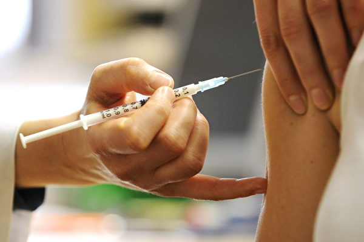
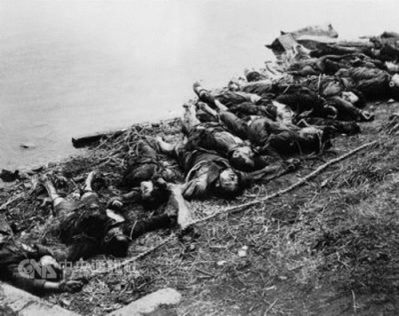

 
 
<a name=top>
<h2><a href="https://github.com/3fmd/true/blob/master/01.md"><b>看更多．．．</a></b></h2>
<h2><a href="https://github.com/goodabc/GCC/blob/master/jysl.md"><b>九评编辑部：魔鬼在统治着我们的世界</a></b></h2>
 <h2><a href="https://github.com/goodabc/GCC/blob/master/goal.md"><b>《九评》编辑部：《共产主义的终极目的——中国篇》</a></b></h2>
<h2><a href="https://github.com/goodabc/GCC/blob/master/xgpl.md"><b>《共产主义的终极目的》 相关评论</a></b></h2>  
<h2><a href="https://github.com/no1show/show1/blob/master/whss.md"><b>中共意识形态之理性批判</a></b></h2> 
<h2><a href="https://github.com/no1show/show1/blob/master/gcdsy.md"><b>评《共产党宣言》</a></b></h2> 
<h2><a href="https://github.com/no1show/show1/blob/master/jgrc.md"><b>【中国人权】</a></b></h2>
<h2><a href="https://github.com/no1show/show1/blob/master/7m.md"><b>【大纪元2018年07月评论】</a></b></h2> 
<h2><a href="https://github.com/no1show/show1/blob/master/6m.md"><b>【大纪元2018年06月评论】</a></b></h2> 
<h2><a href="https://github.com/no1show/show1/blob/master/5m.md"><b>【大纪元2018年05月评论】</a></b></h2> 
   
【大纪元2018年08月评论目录】 :

<b>
<a href=#38>38. 谢田：中国亟需对美国的重新认识（下）</a> 
<a href=#37>37. 贸易战何时停火？中国六大风险或引爆</a> 
<a href=#36>36. 夏小强：江西省长刘奇辞职？走过场而已</a> 
<a href=#35>35. “疫苗风暴”不能不提的十个“之最”</a> 
<a href=#34>34. 张林：正在分崩离析的中共国企业</a> 
<a href=#33>33. 中共公检法：陷害好人的犯罪链条</a> 
<a href=#32>32. 陈思敏：中共2020年全球第一的项目很恐怖</a> 
<a href=#31>31. 高天韵：受害民众求助大纪元 良心媒体最可贵</a> 
<a href=#30>30. 向真：还有多少封没有被打开的《求救信》？</a> 
<a href=#29>29. 石铭：整个国家就是一个“大监狱”！</a> 
<a href=#28>28. 颜丹：谷歌的第二次选择让中国人无语</a> 
<a href=#27>27. 杨宁：上合峰会特供蔬菜全天监控 国人情何以堪？</a> 
<a href=#26>26. 汇文：解体中共才能拯救孩子们和未来</a> 
<a href=#25>25. 程晓容：美逮捕窃密华裔工程师 警讯强烈</a> 
<a href=#24>24. 杨宁：佛协会长丑闻被快速删除牵出一机构</a> 
<a href=#23>23. 颜丹：当宗教场所升起五星血旗</a> 
<a href=#22>22. 魔鬼在统治着我们的世界(22)：恐怖主义</a> 
<a href=#21>21. 李清泉：逆流而上 谁能诚信经商</a> 
<a href=#20>20. 程晓容：谷歌配合中共是危险的游戏</a> 
<a href=#19>19. 唐风：美国厚礼迎遗骸与中共掘坟扬尸</a> 
<a href=#18>18. 美中贸易战再交火 北京反击难持久</a> 
<a href=#17>17. 夏小强：中共高层内斗激烈 政局走向拐点</a> 
<a href=#16>16. 黄天辰：美国接士兵遗骸回国 江西掘百姓尸骨</a> 
<a href=#15>15. 美中贸易战 中文媒体为何误判川普（下）</a> 
<a href=#14>14. 张林：从驱赶低端人口到刨坟焚尸 看中共气数已尽</a> 
<a href=#13>13. 周晓辉：三大出家人丑闻缠身的背后秘密</a> 
<a href=#12>12. 横河：疫苗问题可以靠监管解决吗？</a> 
<a href=#11>11. 理直：中美高层共同关注的马振宇案</a> 
<a href=#10>10. 金言：江西抢棺运动 江曾鬼影再现？</a> 
<a href=#9>9. 川人：大豆企业破产 中共奉陪到底有“六慌”？</a> 
<a href=#8>8. 程晓容：山东疾控中心官员自杀传闻 如何解读</a> 
<a href=#7>7. 高天韵：抢棺掘墓焚尸 江西地方政府丧天良</a> 
<a href=#6>6. 觅真：“摧毁宗教迫害的铁幕”是全人类的责任</a> 
<a href=#5>5. 白马：年年七二零，为何总有事</a> 
<a href=#4>4. 大兴文革：踩撕婴儿 活埋祖孙 一夜杀百人</a> 
<a href=#3>3. 程晓容：山东疾控中心官员自杀传闻 如何解读</a> 
<a href=#2>2. 高天韵：抢棺掘墓焚尸 江西地方政府丧天良</a> 
<a href=#1>1. 觅真：“摧毁宗教迫害的铁幕”是全人类的责任</a> 
</b>

<a name=38>
<h1 align="center"><b>谢田：中国亟需对美国的重新认识（下）</b></h1>

中国重新认识美国，现在是真的非常有必要了。图为今年四月中国杭州一个汽车展中的美国汽车。（Getty Images）

【大纪元2018年08月07日讯】如前所述，中国目前不只是需要重新认识美国，更亟需全面颠覆对美国的认识，澄清红朝几十年来的愚民宣传。中共舆论家从四个想不到中，觉察出中国有必要对美国重新认识，不然，会在战略和战术上跑偏，会犯重大的错误。但中共舆论家立场上的错误、跟中共的利益相关一致、跟百姓的利益背道而驰，决定了他们的认识和理解，也是扭曲的；他们开出的药方，是对中共有益、而对中国民众非常有害的。

中共现在认识到“美帝不是纸老虎，是真老虎，是要吃人的”，“他们对国家和选民极度的忠诚，他们不容易被收买，他们唯一忠诚的对象就是选民。”中共舆论家这样的看法，说明了什么呢？不正好说明了美国的政治体制是正确的，权力制衡是有效的，美国人民才是真正的当家做主了吗？中共把这样的观察视为谬误和弊端，不正好说明了中共对中国这个国家和选民，是极度不忠诚的；中共的官员，是容易被收买的；中共官员唯一忠诚的对象，根本不是选民和民众，而恰恰是中共既得利益集团吗？

毛泽东时代，中共骂美国是“纸老虎”，美国人把这个骂名笑纳了，英文里还有“paper tiger”（纸老虎）一词。但现在世界上哪个政权是真正的“纸老虎”呢？看看哪个政权最为害怕，怕人们购买菜刀，怕人们上网翻墙，怕人民妄议中央，怕人民自由组党，怕人们安静的祈祷和冥想，看看这些，世人就知道谁是当代的、真正的纸老虎了。

中共舆论家悲伤的哀叹说，“不要指望美帝永远会犯错，美帝有完善的纠偏机制，不可能永远执行‘政治正确’。”“美帝的一大特点就是：如果发现国家策略出现错误，新政府立即会做出180度大转变，不留任何情面，翻脸比翻书还要快。”中共在这里至少打了自己三个嘴巴：中共屡屡犯错、犯罪，但从来没有承认，还指望别人也永远犯错；中共羡慕美国的纠偏机制，但对自己则死不认错、骑虎难下虎、更不会纠偏；中共即使认识到错误了，也不敢承认，更不敢纠正，反而会一条道走到黑！

中共舆论家认定“美帝并不十分重视意识型态和价值观理念，他们只看重经贸利益。”这就更愚蠢了，实在不该以这样的智商判断和认知能力，去充当国家的智库和智囊。川普的当选，不是大财阀、大公司、大利益集团捧上去的，而是美国中西部铁锈带的普通工人，南部圣经带的普通农民，用草根的形式选上去的。川普的竞选纲领，正是强调意识型态和价值观理念，要重返传统和保守的价值观，要铲除共产主义在全球的影响。

中共舆论家似乎发现“美帝不在乎得罪人，他有许多盟友，但他绝对不会牺牲利益去讨好盟友。”这也是中共治下人们观念上的认识局限和误区。美国人有许多盟友，但对盟友也理智的、清醒的对待，情是情，理是理，做事需要合情合理，利益上则界限分明。中共善于用金钱去统战、拉拢，但却常常达不到目的，赔了夫人又折兵。美国政府是在为美国人民的利益在争取、在捍卫，在寸土必争；中共政府则是用金钱扭曲原则，在浪费中国人民的血汗。

中共舆论家的另外一个认识，是不得不“承认美帝是世界‘老大’这个事实”，“虽然在感情上不能接受，但感情不能取代事实。”“美帝手中掌握的资源远远要超过我们，我们可以‘弯道超车’，但弯道是暂时的，‘直道’上你还是追赶者、跟随者。”这可能是中共舆论家唯一比较清醒的认识，是中共在放弃“韬光养晦”策略之后，面对世界，面对真实，心情沉重的感叹。

中共舆论家也发现“美帝是玩战略的高手，千万不要让美国人在你身上玩战略”！中共为什么在战术上，在打贸易战的章法中，屡战屡败、全无胜算呢？就是因为中共在战略目标上的荒谬。美国高举的是人权自由、社会公正、敬天信神、回归传统理念，这就是美国战略目标高明和一定立于不败之地的保证。中共高举的是共产邪恶主义、专制独裁、破坏传统、迫害正信的逆施，又怎么可能与美国在战略上一较高下呢？

中共舆论家意识到，“不要指望美国会收缩、会全面退出国际舞台；不要被川普的‘退群’迷惑了心智。”这也是对的，美国不会收缩，美国正在更加强大；美国也不会退出国际舞台，因为川普要重塑世界的格局。相反，在全球日益收缩、逐渐退出国际舞台的，正好是中共、北韩、越南，和古巴的共产主义政权及其代表的共产势力。

中共舆论家说，“美帝是有庞大的战略同盟的，他代表了一种普世价值观，只要美帝一行动，世界上的其它力量就会跟进。”完全正确！这就是当今世界的历史潮流，也是天意的体现。所以，中国社会现在从上到下都应该认识到，不能再任由红朝自欺欺人、愚弄百姓了。刻下，真正是清理赵家几十年来的欺骗宣传，并让中国民众重新认识美国、认识外部世界的时候了！ 

本文转自593期【新纪元周刊】“商管智慧”栏目

http://www.epochweekly.com/

责任编辑：刘菁

<a href=#top><h6 align="right">回上方</h6></a>

<a name=37>
<h1 align="center"><b>贸易战何时停火？中国六大风险或引爆</b></h1>

美中贸易战开打后，人民币汇率大幅贬值，引发诸多风险。(TED ALJIBE/AFP/Getty Images)

唐浩

【大纪元2018年08月07日讯】激烈交锋的美中贸易战，何时能停火，成为当前各界关注的焦点。

美国总统川普4日在推特发文表示，“过去4个月来，中国股市下挫了27%，他们正在和我们商谈。”

若美中双方确实再次接触商谈，则恰好验证笔者此前所析，虽然中方推出600亿美元回击，但美中双方再次协商的概率将回温。

不过，6日《人民日报》海外版又发出挑衅言语，称川普是“21世纪街头霸王”、中方“绝不会接受讹诈”。其它官媒也同步发出报导，吹捧中国的经济前景平稳看好。

觉得有点雾里看花吗？

事实上，近日官媒言论的对外高调强硬、对内吹捧造势，很可能与中共正举行的北戴河会议有关，当局需要更多的舆论宣传来营造利好，在党内及国内稳住阵脚，并不让人意外。

不过，倘若中共执意与美国僵持对立下去，贸易交火时间一再拉长，则很可能引爆中国六大风险，损害十多亿中国人民的生活与权益。

一、人民币与资产贬值 资金外逃
这是最显而易见、已经发生的“现在进行时”。

受到美国经济强劲及美元强势，以及中共疑似放贬人民币以抵销贸易关税的影响，过去3个月来，人民币汇率已经重贬8%，而且未来仍持续看贬。

许多外国资金与外国企业，担忧贸易战造成中国经济重挫、影响未来投资与运营收益，相继将资金转出中国，进行避险投资。这不但造成中国外汇储备减少，也进一步扩深人民币贬值的下行空间。

“货币贬值的部分原因，是因为资金离开中国”，白宫首席经济顾问库德洛（Larry Kudlow）3日接受CNBC专访指出，“如果持续下去，真的会让中国经济受创。”

不仅外国资金持续撤离避险，中国境内资金也焦躁不安，纷纷设法转移海外。

为了防堵资金外逃，中共日前宣布加强管制外汇流出，但近日仍传出有人携藏大批金条闯关越境，还有不少公司加速前往香港或美国股市上市，让股东得以直接在境外将资金套现。国内资金忧惧之况，可见一斑。

此外，近期来，各地P2P平台与影子银行频传爆雷，不排除其中有人预见资产将大幅贬值，恶意提前卷款，潜逃海外，无异是对中国百姓趁火打劫。

二、物价上涨 民众生活压力大
涨价，将是全国民众最深切有感的贸易战风险。

中共对美国商品加征高额关税，国内的美国商品价格必然上扬；人民币大幅贬值，也造成外国商品相对涨价，抬高了中国人购买其它外国商品的成本，还将进一步推升国内的通货膨胀。

不仅商品涨价，食品也涨价。

中共国家统计局发言人日前坦言，受到大豆价格上涨影响，从下半年起，以大豆为原料的豆粕饲料将涨价，连带推动猪肉、鸡蛋等食品价格上涨。

钞票贬值，百货齐涨，民众的生活压力无疑将逐渐升高。

三、运营成本增加、销售下滑 企业外移或关闭
美中互征高关税，首当其冲击的是以美国为主要市场的中国制造业与出口贸易。

根据业界人士透露，不少高营收的制造业或代工业者，已经陆续将产能移往东南亚或印度、印度尼西亚的生产线，或准备到美国投资生产；较小规模的业者，有人准备外移，有人观望贸易战何时落幕，有人仍在苦思下一步。

可以预见的是，高额关税势必减少中国工厂的美国订单数量，加上国内消费市场不足以消化中国企业的庞大产能，必然导致企业营收、销售下滑。长此以往，不但影响运营生计，还加重企业的债务负担。

尽管目前中共央行增加市场资金流动性，但除了国企与地方政府之外，一般民企想要融资依然困难，融资成本亦偏高。况且，目前中国劳动力成本上升，特别是与印度、东南亚国家相比已经失去竞争力，令中国制造业雪上加霜。

因此，若贸易战长期对峙，不少民企很可能出现经营困难，最终不得不选择外移或倒闭，并进一步冲击实体经济。

四、失业增加 消费疲软 经济下滑
失业，是另一个让政府与民间强烈有感的重大风险。

当企业、公司相继外移或出现倒闭潮，失业问题将接踵而至，许多制造业劳工被迫失业，失去收入，对日常生活造成冲击。而民众购买力下滑，消费意愿转趋保守，也必定冲击消费经济。

特别是目前中国的经济结构转型仍未成功，加上企业实体经济萎缩、出口贸易下降等因素，中国经济很可能会出现进一步下滑。

再者，今年中国前两季度的经济增长率分别为6.8%、6.7%，已经出现下行放缓迹象，未来是否还能承受贸易战带来的经济衰退压力？恐怕不容乐观。

五、房贷难偿还 房市泡沫恐破裂
中国人爱买房，固然有“成家立业”、“安居乐业”等传统观念的影响，但近年来，促使中国各地民众狂热买房的主因之一，与中共为了刺激经济发展，长期超发货币政策有关。

根据中共央行数据，1990年的中国广义货币（M2）余额为1.53万亿元，2017年激增为167.68万亿元，足足增长108.6倍。但同时期的中国GDP，却从1.89万亿元，增至82.7万亿元，增长仅42.8倍。

货币发行量的增幅，远远超过经济活动总量的增幅。超量的货币加速了通货膨胀，人民的财富持续萎缩贬值，民众担忧资产不断缩水，不得不设法投资，让资产保值，也促成中国的买房热潮长年不衰，房市泡沫越吹越大。

而地方政府为了创造经济GDP、增加收入，甚或官商勾结，许多政府相继介入炒房，透过“土地饥渴”或其它政策工具，助长房价快速飞涨；加上学区和学位政策，众多“望子成龙”的家长也不得不投入买房，为房价带来推升助力。

人民蜂拥购屋买房，但薪资上涨速度远跟不上房价飙涨速度，许多家庭已经背负沉重房贷压力。

倘若贸易战导致企业外移或倒闭带来的失业潮扩大，将连带衍生大量房贷违约、楼房抛售或司法拍卖（特别是中产阶层家庭），不但可能戳破酝蓄多年的房市泡沫，也将为金融体系带来巨大坏帐。

近日秦皇岛、黑龙江等地出现上百家地产开发商被列入失信黑名单，厦门二手房跌价20%，已为中国房市发出初步警讯。

六、加重债务风暴 金融体系陷危机
巨额债务，是这两年中国最吸引国际媒体瞩目的“亮点”。

彭博社（Bloomberg）分析指出，2008年中国国内债务金额占GDP比率为141%；但到了2017年中，债务占GDP比率已经飙升到256%。其中多数来自企业债务，占GDP比率达163%。

贸易战若进入长期对峙，不但将因为民众无力还贷而衍生大量银行坏帐，国企、民企也将因为无力偿还银行贷款而酿成巨额坏帐。金融体系将面临严峻的风险考验。

同时，近期各地陆续传出地方政府无力偿还银行贷款，公务员或教师遭到欠薪、拖薪；加上影子银行倒闭或卷款潜逃（包括P2P融资平台爆雷）等案例在各地频发，一场巨大的债务风暴俨然兵临城下，金融系统性危机近在咫尺。

值得注意的是，此前当局为了防范金融体系爆发危机，大力推动“去杠杆化”，减少市场资金流动性；但如今为了应对贸易战、稳定经济增长，再对市场释出大量资金，这会不会回过来加深债务风险，值得观察。

中共政治操控经济 酿成诸多风险
追根究底，这六大风险与贸易战的起因，都与中共的“党国资本主义”、“政治操控经济”有关。

中共不允许人民拥有自由市场，采取计划经济，结果一败涂地。后来为了维持政权，中共部分开放市场，对外号称市场经济，但背后却仍对市场上下其手，经常进行不公平、不道德的干预，目的是利用庞大的中国劳动力与市场为手段，达成中共想要的政策目标，从中攫取经济利益与繁荣表象，维持中共权贵阶层的垄断统治。

在国内食髓知味的中共，在国外也同样采取不公平的贸易手段、不诚信的言行向国际社会骗取好处，并且窃取知识产权与技术来发展经济，造就中国的高速经济增长。

如今，川普要求中共放弃过去种种不道德手段，回归公平的、互惠的经贸交易。即便中共坚不放弃，未来也很可能得为过去的种种不道德行径，付出更高昂的代价，甚至最终触发政权危机。

毕竟，做过什么都得还，是天理。

只是，许多无辜百姓，恐将再次遭中共牵连而受害。

责任编辑：张宪义

<a href=#top><h6 align="right">回上方</h6></a>

<a name=36>
<h1 align="center"><b>夏小强：江西省长刘奇辞职？走过场而已</b></h1>

江西省省长易人，刘奇已辞去省长职务。(Etienne Oliveau/Getty Images)

【大纪元2018年08月07日讯】8月6日上午，中共江西第十三届人大常委会召开会议，接受省委书记刘奇辞去省长职务的请求，并任命易炼红为副省长、代理省长职务。

刘奇辞职的消息一出，外界有评论认为，这与江西连日来推行殡葬改革、强迫销毁棺木，激起民怨有关，是所谓当局对舆论压力的让步等等。

其实，刘奇所谓的辞职，只是走走过场，当不得真的。其中一个主要是，刘奇卸任的是省长，而刘奇的主要职务是省委书记，省长只是兼职。刘奇自2016年9月出任江西省长，今年3月任江西省委书记兼任省长。即使没有此次的江西殡葬改革引起的公众事件，刘奇也会在某个时间辞去省长职务的。刘奇辞去省长职务之后，在江西仍然大权在握。

刘奇在江西销毁棺木与去年北京市委书记蔡奇强拆民房、暴力驱赶“低端人口”一样，都是认真彻底贯彻执行当局的指令，就像蔡奇在一段视频中讲话称：“到了基层，就是要真刀真枪、就是要刺刀见红、就是要敢于硬碰硬、就是要解决问题。”

忠于上级，还是忠于人民？对上级负责，还是对民众负责？这是中共官员面临的一个最基本和关键的选择，由于二者之间水火难容，鱼和熊掌不能兼得。几乎毫无例外，所有的中共官员都选择了向上级负责。因此，我们很少看到，中共官员因为恶政被民意沸腾而丢官的，相反，更多的是继续高升。比如，今年2月退休的前国家食品药品监督管理总局副局长、药品安全总监孙咸泽，他任职食品药品监管总局食品安全协调司司长期间，因三鹿毒奶粉事件遭行政记过处分。然而，孙咸泽仕途却没受到影响，反而还在2017年升任副局长。

今年江西多地推行的殡葬改革，可以用“丧尽天良”来形容。中国传统讲“入土为安”，挖人祖坟、抛官焚尸，可以说是天下最恶毒的事情。但是，这些事情，都不会真正影响这些官员的仕途。

在中共的官场上，几十年来的规则和常态是“宁左勿右”，人对上级人人争相人表忠心，高喊马列主义，是相对保险安全的方式。在前苏联，最高领袖结束讲话之后，全体鼓掌时间持续超过10分钟是常见的事情，因为没有一个人敢做第一个停下鼓掌的人。让人人自危、人人处于恐惧之中，是共产政权维持统治的常态。

在中共官场上，揣摩上意，为了个人的政绩和官位，可以不择手段，为所欲为。中共体制下的官员，在党文化的思维方式下，已经习惯了用蛮横、不顾百姓死活的方式处理问题。中共体制本身，已经断绝了用正常手段解决社会问题和化解危机的可能性。

以中共政治局为首的25名委员，他们代表和保护着中共高层各大家族的利益，中共中央委员、人大、政协以及各部等几千名中共顶层既得利益集团成员，他们每天所做的所有事情，就是维稳，维持他们权力的稳定，维护他们利益的稳定，这是他们存在的唯一目的和理由。中国民众的苦难和死亡，与他们无关，只是他们维持权力和利益的代价。

江西省长刘奇辞职，只不过是走走过场，应景而已。

责任编辑：高义

<a href=#top><h6 align="right">回上方</h6></a>

<a name=35>
<h1 align="center"><b>“疫苗风暴”不能不提的十个“之最”</b></h1>

在此次疫苗风暴肆虐中，国内民众面对中共的无道与枉法，表现出了极度的不信任与火山喷发式的愤慨。(STR/AFP/Getty Images)

作者：古玉文

【大纪元2018年08月07日讯】假疫苗案沸沸扬扬已近一个月，此次事件的爆发正处在中共内外交困之际。中共对外面临中美贸易战压力，对内经济下滑，股汇双崩，民怨沸腾，且中共高层内斗正酣、局势诡异，中共政权处于风雨飘摇之中。

疫苗事故的发生无疑使中共雪上加霜，在中共党性的主导下，习惯性打压成为处理公共危机唯一的“政治正确”方式。而在此次疫苗风暴肆虐中，国内民众面对中共的无道与枉法，表现出了极度的不信任与火山喷发式的愤慨。

有民众总结“假疫苗”风暴创下的十个不同凡响之“最”，条条无疑都是中共账户上的负债款项。

<b>1. 最“利害了”的国用了最落后的疫苗生产技术</b>

经济专家郎咸平在5月份的广东卫视《郎眼财经》栏目中，谈“问题疫苗的背后”时，揭国内疫苗业垄断不思进取的现状，“（北京大学医学部免疫学系副主任）王宇说的还是客气的，可能远不止30年。很多疫苗还在使用60年代的技术。比如一类疫苗，我们很多还是用减毒活疫苗。”

他在节目中质问：“为何我们要选择这种落后的疫苗注射呢？就是因为我们31个省市自治区的疾病控制中心掌握太多资源，没有把它交给市场。”

“利，害了我的国！”难怪一位中学校长说，连个疫苗问题都解决不了，还要“引领全人类”！

<b>2. 最高层放话最重、公信力丧失最严重的一次医卫安全事故</b>

疫苗案曝光后，中共国务院总理两次放出重话，首次批示“疫苗事件突破人的道德底线，必须给全国人民一个明明白白的交代”，二次批示要求对假疫苗问题必须严查重处，让严重违法者获刑入狱并将其逐出市场，使其终身不得从事药品生产经营。当时正在外访的习近平表示，涉案公司违法违规生产疫苗的行为，性质恶劣，令人触目惊心，有关部门要一查到底，严肃问责，依法从严处理。

而民间和官方均在高层话音未落之际，用各自对中共语境的理解快速地阐释了最高层的放话。民间公知和异议者们纷纷用“胶带”缠口来为总理指示做注脚，中共地方警力与网络维稳亦如约而至，封号、删帖、截访，彰显四个“自信”。

7月26日，美国之音的一篇《疫苗事件折射国家公信力的丢失》评论道：“连日来，长生生物的假疫苗事件在中国引发轩然大波，并持续发酵。在经历了一系列食品药品掺假的事件后，中国公众对政府处理问题疫苗已不抱任何信心。”

<b>3. 诞生史上最贵一篇微文《都在一条船上》</b>

张凯律师一篇《都在一条船上》的微文存活仅17个小时，获上千万次阅读量，赚140万元的打赏，用张凯自己的话说，恐怕这是史上最贵的一篇文章，凸显了一边倒的民间舆情。

张凯律师是这样说的：“疫苗问题没有解决，管疫苗的人也没有解决，但提问题的人都被解决了。当年披露山西毒疫苗的记者王克勤被报社下岗，总编包月阳被免职。还有当年的那些律师，我都不想多说了。最近读哈耶克，这位先知般的思想家，指出了人类通往奴役的路，他说：‘观念的转变和人类意志的力量，塑造了今天的世界。’如果他说的是真的，那么：今天的中国的样子，就是中国人观念塑造的，中国人普遍有什么样的想法，就有什么样的中国。 ”

“山西疫苗事件距今天已经八年时间了，这八年，我经历了人生各种起落和变故。就像坐在一艘大船里，自己完全无力左右命运，只能跟着大船起起落落。然而，我们何尝不都在一艘大船里，看起来船决定着我们的命运。事实是：船里的每一个人，决定着船的命运。”

<b>4. 民众、公知和五毛一次最大概率的舆情同质</b>

网民江棋生在《疫苗事件舆情罕见，也许是红朝巨变的前序》一文中指出，“长生生物疫苗造假事件的曝光，使我看到了两幅耐人寻味的罕见图景：一是五毛们的整体消停和趴窝；二是各类微信群的明显同质化。五毛趴窝，或表明他们的利益受到了直接伤害，或表明他们尚存未泯之良知——如果为疫苗造假行为还去进行粉饰和洗刷，那就真不是人了。在各类微信群中，则均未出现以往司空见惯的拉黑翻脸之事；历来的‘光明面’和‘正能量’拥趸都不再老调重弹，而是同样发出谴责和讨伐之声。”

五毛们不再是“岁月静好”，而是“此时无声胜有声”。就连一向是受控于中共的媒体人，一名女主播也不堪假疫苗之苦，冒着被“和谐”之危险，将自己小女儿被打假疫苗而受感染一事曝光在微博上。

<b>5. 美使馆官方微博扮国人最新潮网络信访中心</b>

中共在前些时应对美国贸易战的时候，为了给自己宽慰，用了一句圣经上的话：“一扇门关闭，另一扇门将打开。”人们嘲笑，中共是打错了算盘。如果真有另一扇门的话，等待中共的将是马克思的那扇地狱之门。

让中共愕然的是，美国驻北京大使馆微博成了中国网民的另一扇打开的门。

不少怒不可遏的中国网民纷纷在美国驻中国大使馆的官方微博下留言：“中国给孩子接种疫苗不合格，是否侵犯人权？”“美国法律会对制造假疫苗者怎样判刑？”“请美国干预假疫苗这种泯灭人性的事件。”“你们为了叙利亚儿童打击巴沙尔政权。为什么对千千万万遭毒害的中国儿童视而不见？战斧（导弹）在哪里？”

美国网络评论人士李洪宽分析，近年中国大陆严厉控制舆论，甚至在微信上发表所谓的出格言论也可能受到严惩，因此美国使馆的微博遂变成中国言论自由的一块飞地。

<b>6. 从“抵制美货”到“求救于美国”的最大反转</b>

疫苗风暴还使国内民众从抵制美货反转到“求救于美国”。有网民说，千万篇文章的洗脑也抵不过一支假疫苗的功效。

“请总统出面救救中国的孩子吧！” 
“多亏世界上还有美国！”“你们啥时候打进来？我给你们带路。” 
“只有美国可以救我们了！！求求你们！！” 
“美帝，你亡我之心可千万不能死啊。” 
“请加大对中国的贸易惩罚！” 
“请贵国禁止中国公务员、党员及家人入境。” 
“请问（长生生物的神秘大股东）高俊芳有美国国籍吗？会受到美国政府的保护吗？”

美国驻华大使馆一条毫不相干的微博下的部分网民留言。（网路截图）

署名“杨桐”的网民则表示：一个外国大使馆一条毫不相干的微博下，满屏中国人的失望和绝望，太TM悲哀了。

有网民戏称自己“坐在村口等美军”。更有网民留言呼喊：“陈胜吴广何在？”

<b>7. 催生坊间最直接的一次反共标语：为了孩子，推翻共产党！</b>

美国之音报导，中国假疫苗案的延烧，使得北京、南京、杭州、上海等地儿童医院的厕所隔间门背上，惊现“推翻中国共产党”等标语。坊间称为“厕所革命”。

这些取自推特照片上的部分标语如下：“不要再沉默，为了孩子推翻共产党”“毒奶粉、毒疫苗／家也破、人也亡／是可忍？熟可忍！／推翻共产党／方有好日子”。

近日，北京、南京、杭州、上海等地儿童医院的厕所里都出现了类似的标语。网络上的照片显示，不同地方标语的措辞略有不同，但都在控诉大陆频发的民生事件，并公开喊出了“推翻共产党”的口号。（图片来源：厕所革命同盟，大纪元制作）

针对这些坊间最直接的反共标语，旅美学者吴祚来认为中国人的民愤已经达到一种临界点，这场“厕所革命”让共产党感受到来自底层的抗议和力量。“当所有人都在抗议的时候，实际上是安全的。”

<b>8. 从“偶发”到彻查，高层最快的一次变脸行动</b>

长春长生、武汉生物两家生物技术公司分别产出25万2600支与40万520支毒疫苗，长春长生18人日前被批捕，而中共国家食品药品监督管理局7月31日却公布武汉生技毒疫苗调查结果，指出产出问题疫苗并非人为，而是机器故障，使疫苗分装前出现溶液未均匀的状况，将此事定性为“偶发事件”，再一次引发广大民众强烈反弹。

网民写道：“人命关天的事情，不容许‘偶发’。”

而次日，中共国家药品监督管理局发布消息称，按照国务院要求，药监局会同卫生健康委等部门组成核查组，赴武汉对武汉生物公司开展核查。

针对这次最快的变脸行动，评论家们指出，或许出于基层和最高层的双重压力使然，但中共的本性决定了，事件不可能得到根本性解决。

<b>9. 美媒称疫苗案引爆“中共最大梦魇”</b>

美国《外交政策》杂志日前的一篇题为“父母的恐慌是中共最大的梦魇”的文章指出，假疫苗触及中共政权脆弱的一点——儿童安全，父母对子女安全与健康的恐惧，是中共挥之不去的最大梦魇。

而美国之音早前一篇报导揭开了中国疫苗业黑幕——中共的贸易保护政策使国产疫苗垄断了市场，表现在三个方面：进口疫苗国内临床试验耗时过长；中共政府可以无故拒绝每五年一续的疫苗生厂商进口许可证；国外厂商迫于中共监管要求而调整更改疫苗生产工艺。

文章继而指出，贸易保护政策，也被认为是美国川普政府发起此次贸易战的原因之一。美国和欧盟对中共存在共同的担忧。

<b>10. 最亲密的共产小兄弟拒买假疫苗</b>

为了下一代，最亲密的共产小兄弟不买北京大哥的疫苗单。

香港东网援引美国媒体8月1日的消息称，与中国毗邻的朝鲜对中国药物安全缺乏信心，并拒绝购买。中国疫苗造假事件的消息，经朝鲜商人及访华游客传入朝鲜后，有消息说，“很多过往购买中国药物的朝鲜病人及其家属，现时非常怀疑应否继续使用这些药物。朝鲜民众担心市面上出售的中国药物，也有可能是造假的。”“中国药物是朝鲜民众现时在市场上唯一买得到的药物，但如果它们都造假的话，不知道我们还如何用药物治疗。”

报导续指，来中国东北旅游的朝鲜民众转而把眼光放在韩国杂货店中出售的药物，因此购买大量韩国药物作为存货。

而继中共“小兄弟”朝鲜传出拒绝购买来自中国的疫苗后，每年有1/4疫苗依赖进口的人口大国印度也停止了长春长生生物公司的疫苗在印度国内的供应。

这十个不能不提的疫苗风暴“之最”，与其说是疫苗案制造的，还不如说是中共制造的。面对这样一个从头到尾恶贯满盈的恶党，全世界及中国人最应该做的就是认清它、退出它、解体它。中共代表不了中国，中共是万恶之源，只有退出中共，生命才有未来；只有解体中共，中国才有希望。

责任编辑：李天琦

<a href=#top><h6 align="right">回上方</h6></a>

<a name=34>
<h1 align="center"><b>张林：正在分崩离析的中共国企业</b></h1>

【大纪元2018年08月07日讯】川普竞选得胜后，嗅觉灵敏的跨国企业家就意识到中国企业大势已去。苹果公司开始启动产业回归美国计划，在中国雇佣100万雇员的台湾加工企业富士康，也转而规划到美国投资，中国玻璃大王曹德旺，更是索性整体迁徙到美国。

而川普的企业减税方案通过前后，跨国企业更是加速从中共国撤退，转而大举涌入美国投资。这是对中共国血汗工厂的釜底抽薪之举，因为美国企业的技术革新能力超强，不管中共国企业怎么压低工人薪资，也不过比美国企业的总体生产成本低几个百分点。现在川普把美国企业税减少10%，就能确保美国企业处在绝对的竞争优势里。这样就保证了，无论将来中共怎么更残酷地压榨工人血汗，也不能把整体生产成本降到比美国企业更低的水平。

川普给予中共国企业的第三波打击，就是目前沸沸扬扬的贸易战，已经使中国企业界惊惶失措。因为中国企业是全世界对外贸依赖程度最高的，而中共国的外贸顺差，93%来自对美贸易。

所以川普的三波打击，拳拳击中要害，必将陷中共国出口企业于分崩离析状态。

中共国加工企业崩溃，会像倒塌的多米诺骨牌一样，压垮其他各行各业，特别是上下游企业。中共国经济崩溃，目前已经势不可挡，无法挽救。下面我们具体分析一下，中共国四类企业的特点和状态：

效率最低的是央企，享受各种政府补贴，享有银行优先贷款，而且往往还有垄断特权，比如中石油、中石化，尽管从来都是卖天价油，但是由于极端腐败低效，他们竟然年年巨额亏损。随着其它各行各业的急剧衰退，央企应对迟缓，亏损势必更加惊人。

其次糟糕的是民企，包括上市企业，尤其是房地产公司。这些年他们的处境每况愈下，大都早已资不抵债，一直挣扎在死亡线上。例如曾经雄居中共国资产规模第一的万达公司，现在简直惨不忍睹，老板王健林，曾经的中共国首富，已经变成欠债最多的首负。曾经的中共国富豪，总体上即将变成负嚎。

处在中间状态的是韩港台企业，他们靠转移西方先进生产及管理技术到中国，曾经风光无限。但是现在受到川普的严厉打击，中共也取消了对他们的种种优惠，正在加速逃离中共国。

美欧日企业这几年被中共官方多方限制，更被毛左处处挑剔，这些年来举步维艰。但是他们最早意识到中共国经济即将崩溃，布局撤退最早。

当前中国多数县市级财政已经崩溃，甚至给公务员发工资都困难了。因为前几任书记县长为了政绩和提成，无休止向银行贷款，搞新区，搞工业园，欠下巨大债务。现在中共国各地已是：新区高楼遍地，但却空无一人；工业园到处是厂房，但却杂草丛生，几乎成了废区。

责任编辑：朱颖

<a href=#top><h6 align="right">回上方</h6></a>

<a name=33>
<h1 align="center"><b>中共公检法：陷害好人的犯罪链条</b></h1>

2016年9月，余文生、张赞宁、常伯阳、张科科4位律师为法轮功学员周向阳夫妇做了有力的无罪辩护。（大纪元）

作者：飞瀑

【大纪元2018年08月06日讯】一九九九年七月二十二日，中共开动所有媒体，连篇累牍的诬陷法轮功，栽赃法轮功是非法组织。这是中共对待异己“欲加之罪、何患无辞”的一贯表现。这一“非法”的定性被中共已经沿用了十九年。

要想将一个遵纪守法的群体当成非法组织去迫害，参与迫害的所有中共人员就必然违背法律，去进行非法的迫害。我们看一看二零一八年七月二十二日，中共诬陷法轮功为非法组织十九周年的日子里，法轮大法明慧网在这一天的报道中所报道的中共公、检、法的工作人员都是怎样非法对待法轮功学员的。

中共公安：绑架、钻锁、“为了钱”

《一句真心话　合肥市杭霞女士被非法庭审》中说，二零一七年十一月二十二日，安徽省合肥市皖江厂法轮大法学员杭霞，到瑶海公园散步，被一个穿黑衣服的人带到路边的警车上，说有人举报她。车子开到七里塘派出所，警察搜走杭霞家里的钥匙，非法到杭霞家抄家。说起举报的内容，直到开庭时人们才明白，原来就是因为她说了一句“真善忍好，法轮大法好”。

《黑龙江依兰县法院预谋非法庭审14位法轮功学员》中，提到佳木斯市桦川县法轮功学员施凤兰被依兰县公安局与桦川县公安局去家中绑架时，她家里的门锁都被他们强行钻坏。

中共警察绑架法轮功学员有什么借口？法轮功学员说一句“法轮大法好”都能成为被绑架的借口，这该有多荒唐！再看看警察绑架起法轮功学员来真像土匪一般，钻锁破门，肆意抢劫。那么是什么力量诱使这些警察为中共卖命呢？“综合消息”上有一条消息给出了答案。这条消息说，河北省涿州市公安局国保大队大队长杨玉刚自己说，他抓法轮功学员就是为了钱，可以从家属那儿压榨钱财。抄家时法轮功学员家的钱财物也可以顺手牵羊拿走。

检察官：你是共产党员吗？

上面提到的因一句“法轮大法好”遭绑架的杭霞，被瑶海区检察院非法批捕。家属为她聘请了北京律师。律师两次到合肥，瑶海区检察院公诉科副科长刘雯两次拒绝北京律师阅卷，并且每次都问律师：“是不是共产党员？”当律师回答“不是”时，她站起来就赶律师走。

检察官为何那么看重为杭霞辩护的律师是不是共产党员？从公正的角度上讲，律师最好是无党派人士。特别是涉及到信仰这一类案件，律师要是中共党员的话，就很难为其所代理的当事人作公正的辩护了。因此，检察官要求为法轮功学员辩护的律师必须是中共党员的作法从根本上就是错误的。

在以往对法轮功学员的非法审判中，许多法轮功学员都堂堂正正的申请共产党员身份的法官与检察官回避。其理由很简单，中共是无神论者，而法轮功学员都是信仰神佛的，法官与检察官如果是共产党员的话，就根本做不到公正的审判。而如今，当检察官一听律师不是中共党员时，竟然赶律师走，检察官的行为本身就是非法的。检察官已经做好在法庭上对法轮功学员进行非法起诉了。

法官：“他是境外势力”，“就是没有法律依据”

杭霞一案中，家人被逼，法院辞退了为杭霞准备作无罪辩护的律师后，又为她聘请了广东律师。可是当这个律师去法院阅卷时，法官竟然叫来三个法警说：“把他抓起来，他是境外势力。”

《长春市朝阳区法院剥夺高级工程师请律师的权利》中讲，二零一八年三月十七日，吉林省环境监测中心站高级工程师金燕，在与路人交谈时，涉及到法轮功问题，被举报后遭绑架，后又被非法起诉到朝阳区法院。七月二十日，金燕家人聘请的律师，到法院递交代理手续。法官拒绝接收，其理由是，律师必须提供律师所在地司法局开具的书面备案登记证明，可是这样的登记证明是没有法律依据的。律师经过多方沟通后对法官说：你索要这样的证明、拒绝接收律师的手续，是没有法律依据的。该法官竟然脱口而出：“就是没有法律依据！你别给我较这个真！”

这是什么法官？怎么拿“没有法律依据”当真理了，这么理直气壮！你法官怎么能没有法律依据呢？没有法律依据的审判不是非法审判是什么？

杭霞一案的法官更是蛮不讲理。律师到法院阅卷不应该吗？不阅卷怎么为当事人辩护？可是此案的法官竟然血口喷人：“把他抓起来，他是境外势力。”

在对以上案例的剖析中，我们可以看出中共对法轮功学员的迫害全部都是非法的。从警察的绑架，检察官的起诉，到法官的审判，每一个环节都在违背法律。公检法等部门联合起来非法的运作，形成了一个完整的迫害链条，而且，这样的迫害历时十九年。

这是一个多么邪恶的政党！为了将好人打成坏人，竟然无耻到这种地步。这场对好人持续十九年而不停止的迫害，将中共自己非法的本质暴露无遗！

责任编辑：莆山

<a href=#top><h6 align="right">回上方</h6></a>

<a name=32>
<h1 align="center"><b>陈思敏：中共2020年全球第一的项目很恐怖</b></h1>

中共的器官捐献一直黑箱作业，所谓移植大国彰显的不是医疗技术先进，是中共在实施“国家掠夺器官”的恐怖。（视频截图）

【大纪元2018年08月06日讯】自7月中旬以来的20天内，长春、北京、成都三地接连召开会议，这三场会议都有同一个主题，而该主题项目计划要在2020年领先全球。

7月14日，长春召开第九届全国器官捐献与移植论坛会议，会上提供数据，2018年前5个月，中国已完成器官捐献2,459例。

7月31日，中共卫生健康委员会举行新闻发布会，医政医管局副局长郭燕红表示，今年前6个月中国公民自愿捐献器官已达2,999例。

8月3日，成都召开2018中国器官移植大会暨第五届中国器官移植医师年会，会上提供数据，截至今年7月中旬，中国已实现器官捐献18,433例。

一如以往，器官会议每开一次，捐献器官数量就攀升一次，但有关明细不见红十字会方面出来说明一次。

2010年1月，原卫生部向中国红十字会总会发出《关于委托中国红十字会开展人体器官捐献有关工作的函》。2012年7月6日，中编办正式批准在中国红十字会总会下设中国人体器官捐献管理中心，中央财政补助，职责就是承担原卫生部2010年函委托给红十字会的所有工作。

该函明确提出，由红十字会负责全国器官捐献动员宣传、报名登记工作，同时红十字会还负责建立国家人体器官捐献者登记管理系统，以及建立国家人体器官捐献者资料资料库等等。

同时在COTRS（中国人体器官分配与共用系统）启用时，受卫生部委托，红十字会负责器官捐献体系的工作，负责见证医疗系统依法开展器官捐献、获取和分配工作，以确保器官获取和分配的透明、公平和可溯源性。

也就是器官捐献、分配两大工作是原卫生部2010年正式委托给红十字会来做的，而红十字会被赋予器官捐献、分配这两大流程的居中协调及相关监督的重要职责。

但是一直以来对于器官捐献、分配使用等数据，何曾看到红十字会出来公布说明，都是每隔一段时间地方一场会议报出一个“激增”的数字。即便气温、股市、汇率、物价都还有个上上下下的波动，而捐献器官永远上行，却是一个毫无明细的数字，捐献者不知来自哪里，性别、年龄、地区分布等基本统计资料付之阙如，完全无法昭公信。

在8月3日成都那场器官会议，大会主席是浙大一附院院长郑树森。2017年2月国际科学杂志披露，郑树森团队2016年 10 月在国际肝脏杂志发表一篇研究论文被撤销，因中国器官移植相关资料显示2011年至2014年中国公民捐献的肝脏器官是1910例，浙一医院是166例，而郑树森团队论文中说进行了564例，涉嫌学术造假。

撤稿事发时，原卫生部副部长黄洁夫也随即认了数据失实，那是因为他正值率团出席梵蒂冈器官会议，更重要的原因是，撤稿事件引发关注的问题，除了造假，更有来源问题。

《国际肝脏杂志》《Liver international》曾要求郑树森做出解释，但郑的回复仅仅是简单的“论文涉及器官均来自捐赠者”。因为他既无法提供捐赠者的资料，更拿不出未使用死刑犯器官研究做论文的证据。

中国移植医疗从1999年起暴冲的手术量，来源于真正死刑犯的器官远远对不上号，而这至今说不清楚弥补此一巨大缺口的供体器官来源，这些年国际调查、欧美议会决议认为是被迫害的法轮功学员等良心犯，其中修炼人数众多的法轮功学员是最大受害群体。

上述三场会议，除了公告“器官捐献”最新数字，同时宣传重点都是：2017年，中国人体器官捐献数与移植数均位居世界第二。预计到2020年，中国将成为全球第一器官移植大国。

中共还在迫害法轮功，器官捐献一直黑箱作业，所谓移植大国彰显的不是医疗技术先进，是中共在实施“国家掠夺器官”的恐怖。

<a href=#top><h6 align="right">回上方</h6></a>

<a name=31>
<h1 align="center"><b>高天韵：受害民众求助大纪元 良心媒体最可贵</b></h1>

有大陆读者说，翻墙看大纪元就像“呼吸新鲜空气一样”。（大纪元）

【大纪元2018年08月06日讯】媒体的作用是什么？这个社会的特殊守望者，应如何服务大众？

今年7月26日深夜，北京市昌平区一住宅小区的部分业主向大纪元紧急求救：“请帮帮我们，让全世界关注中共的邪恶。”

这些业主来自昌平区马池口镇下念头村的瑞元国际花园小区，当时正遭遇当局非法强拆。业主董先生告诉大纪元记者，政府和开发商分赃不均，现在政府要把房子强行收回。很多业主跑遍各级信访办、政府、检察院、法院等地，但是都没有得到回应。

董先生说，业主的手机都被监控，不让发微信，也不让找记者，“我们只能是把希望寄托在大纪元身上，我知道你们敢报导。”“我希望你们能帮我们制止他们的邪恶，曝光他们的丑恶。”

7月27日，大纪元发表了昌平小区遭强拆的新闻，广大网友反响强烈，纷纷谴责当局的野蛮行径。

最近，江西推行火葬“改革”，搞出了抢棺材掘地丑剧，有网友在大纪元脸书页留言证实此事，表示“大纪元真是为民发声啊！也是大陆民众能揭露真实情况的地方。”

读者们称赞、信任大纪元，来自于在纷乱世事中的亲身体验和对比。

近年来，随着社会道德的整体下滑，媒体机构良莠不齐、假新闻蜂涌而现。不少新闻从业人员渐渐失去了探索真相的勇气，甚至模糊了是非的焦点、在权力和金钱的漩涡中随波逐流。

在中国，中共喉舌媒体沦为党的造假宣传工具，丧失了基本的道义原则。而那些敢于揭露真相的记者和编辑却一律受到打压、迫害，甚至被陷冤狱，还有人失去了生命。广大的中国民众不仅承受着当局的压迫，还被置于投诉无门、无处发声的困苦境地，可谓雪上加霜。

此时，大纪元脱颖而出，其独树一帜的清流境界，鼓舞众人。成立18年来，大纪元秉持客观公正的原则，不畏强权和打压。清新、健康、具有启发性和前瞻性的新闻和评论，源源不断，令人眼界大开。独立真实、逆流而上，大纪元的坚守，捍卫了媒体的原则、维系与提升著世间的道德。

大纪元的视角宽广，纵览全球风云，亦体察民情疾苦。饱受中共戕害的中国大陆，是大纪元持续聚焦的重点。层出不穷的群体事件、重大社会安全事件、法轮功学员受迫害案例、活摘器官的罪恶、访民们的苦痛呼吁、维权律师的遭遇等等，都通过大纪元记者的努力而得到及时的呈现与揭示。以真相为依据，以正义为基点的关注，既给予受害者有力的支持，也震慑和抑制了邪恶。

大纪元不仅追踪新闻事件，而且致力于还原历史真相。大纪元系列社论《九评共产党》振聋发聩，深刻揭露了共产党和中共的邪恶本质，开启了退出中共的精神觉醒浪潮，为世界范围的去共化运动提供了理论指导并起到了推动作用。

去年和今年，《九评》编辑部又相继推出《共产主义的终极目的》和《魔鬼在统治着我们的世界》两套专著，进一步解析了共产主义对中国和全世界的危害，为人类指出挽救文明、走向未来的出路。

人们用“真实”、“诚实”、“优秀”、“把道德带回了报纸”来称赞大纪元。有大陆读者说，翻墙看大纪元就像“呼吸新鲜空气一样”。

目前，大纪元在35个国家设有分支机构，发行五大洲，拥有21个语种的网站。大纪元的蓬勃发展，弘扬人间正气，引领道德回归，必将更加深远地造福社会。

责任编辑：高义

<a href=#top><h6 align="right">回上方</h6></a>

<a name=30>
<h1 align="center"><b>向真：还有多少封没有被打开的《求救信》？</b></h1>
<h3 align="center"><b>中共监狱奴工真相</b></h3>

孙毅手拿他塞到万圣节装饰包装盒中的求救信。这封信导致中国劳教所的关闭。（剧组提供）

【大纪元2018年08月06日讯】一部揭露中国劳教所酷刑内幕的纪录片《求救信》，震惊了国际社会。温哥华，多伦多，华盛顿，纽约，凡看过《求救信》的人，无不为暗无天日的中共监狱、劳教所震憾。

2012年10月，一封藏在万圣节装饰品中的求救信辗转到了美国，俄勒冈州女士朱莉·凯斯（JulieKeith）发现了这封信，并公之与众。

从谷歌上查询，多年以来，来自中国监狱的，藏匿于服装或手工制品之内的“求救信”已有多次漂流到海外，大多是只言片语，虽被世人发现，但均未引起国际社会的关注。而直至一名法轮功学员孙毅冒着生命危险，在中国劳教所发出了20封求救信，其中的一封被凯斯接到，才掀开了这个巨大的黑幕。不知每年出口至全世界成千上万的监狱产品中，还有多少封没有被打开的《求救信》……

中国监狱、看守所、劳教所到底有多黑暗？

中共的极权体制，才是役使奴工大量从事工业品生产的真正内因。中共号称“春风化雨”、“人性化管理”，但这些冠冕堂皇的背后，却是中共对于监狱关押人员的“无底线”奴役，与毫无人性的榨取。

一、中共知法犯法，明知故犯

中共有明确的法规，禁止监狱的人员从事出口产品的加工。然而，实际上奴工产品种类数不胜数，仅最近两年明慧网上曝光出来的就有上百种之多，遍及人们的吃、穿、住、行，休闲娱乐、化妆美容、婚宴、节庆等。产品远销五大洲，包括美国、澳洲、印度、英国、日本、韩国、俄罗斯、德国、非洲、土耳其、意大利、阿拉伯、马来西亚、加拿大、港澳、台湾等地。

二、几乎全国范围内监狱都存在“奴工”劳役

据不完全统计显示，至目前为止，明慧网上曝光出至少有22个省/直辖市/自治区，近100个监狱/看守所/戒毒所/劳教所（已解体）存在不同程度的奴役。这22个省/直辖市/自治区分别是：安徽、北京、甘肃、广东、河北、河南、黑龙江、内蒙古、湖北、湖南、吉林、江苏、江西、辽宁、青海、山东、山西、上海、四川、天津、云南、重庆。

三、黑箱作业，无人监督，无最基本卫生条件保障

正常的食品（入口），以及服装（贴身），都应有身体无传染病等保障，然而在中共监狱内，这些都是空谈，奴工食品没有任何卫生措施和检验、检疫。而服装生产，上岗合格证就是一个摆样子的牌子。

云南女子劳教所，一法轮功学员不愿生产“饼干”，狱警问她为什么。她回答：“这样的饼干你会买吗？”警察被问住了，没吱声。她继续说：“一袋袋面粉堆放在泥土地上，做饼干的机器上糊满了灰尘，搅拌那个夹心的东西的机器也是糊满了灰尘，这样生产出来的饼干能符合卫生标准吗？……你去看看那个厕所是什么样子？屎尿遍地，臭气熏天，插足的地方都没有，便后在自来水管上冲一下手，连块擦手的毛巾都没有，只能在自己系的围裙上抹两下子就去包饼干了，这样的饼干你会吃吗？我是炼法轮功修真善忍的，为的是做好人，我不能做伤天害理的事，所以这活我不能干，我于心不忍。”

内蒙古第一女子监狱各监区都有老弱病残队，这些人因肝病、肺结核、年老等原因，不能到生产车间。有些犯人摘毛衣上的毛球时，为了在规定时间内完成任务，有的用鞋刷子刷，有的往毛衣上吐唾沫，再用脏手上下左右抹平舒展，然后叠好后上交。经过这些病人的手生产的各类产品大多出口到日本、欧洲等国家。

在明慧网历年的报道中，各地监狱、看守所内恶劣生产条件有着更为详尽的报道。

四、强迫做毒活

由于监狱属于无人监督，无法监督，也无人敢监督的特殊地带，是进行地下交易的最保险的地方，而监狱为了利益很乐意承接社会企业无法完成的脏活毒活，然后强加分派在押人员劳作。

如黑龙江省佳木斯劳教所为获暴利，强制在押人员用有毒胶原料制作手机套、亚麻汽车坐垫，坑害消费者。车间里弥漫着有毒胶的呛人气味，监工的狱警实在受不了，就找技术监督局来测试，结果是：原料的致癌有毒物严重超标。从此，狱警即使在十二月的寒冬宁可待在户外也不愿进车间，却让被押人员每天加班加点地完成超高定额。好多人鼻出血、心悸、呼吸困难、眼睛红肿，身体严重受损。

抵制奴役的法轮功学员，有的被狱警打得耳朵鼓膜穿孔，有的被打得四肢成紫色，有的被用鞋底抽打得眼睛失明……

五、非人的“奴工作息时间”

依据明慧网的相关文献，对36个样本，即36家奴工场所（包含监狱、看守所、戒毒所和已经解体的劳教所）奴工每天的“工作”时间统计显示，奴工们每天要被迫10～20小时不等的恶劣奴役，当“生产任务繁重”时，奴工们几天几夜不得合眼。其中，奴工每天被迫“工作”12～14小时的监狱最多，占统计比率的36.11%；其次是16～18小时，占25%；位列第三的是14～16小时，占19.44%，三个时间段累计占总样本数的80.56%。

六、奴工的“工资”

目前在中国大陆，年轻人买包最普通的香烟不会低于10元，剪个发不低于15元。而奴工们挑战生理极限的超长时间“工作”，拼死拼活的为监狱和“人民公仆”们创造不菲的价值，他们的薪酬和福利应该不菲吧？

事实总是让人惊心！看守所、戒毒所的奴工，没有一分钱的劳动报酬。监狱、劳教所很多同样没有“工资”，部分监狱和劳教所有颇具讽刺性的几元“工资”，出手相对最“大方”的有山东第一女子劳教所，因为承包出口业务，根据劳动强度有5元～100元/月不等的工资，这在奴工中已经是鲜有难得的高工资了。若谁能拿到60～100元/月，就会引起其他奴工们的唏嘘叹羡。

七、监狱服装生产　胃口越来越大　瞄上名牌服装

在尝试过食品、机械等工业制品后，中共监狱目前大量开始转向服装生产，且大多以出口产品为主。2016年5月，世界银行发布了的《缝纫致富》报告指出，中国服装出口占世界服装出口的比例为41%，仍是世界最大的服装生产供应地。而一位不据名的服装业内人士称，来自中国监狱系统的服装生产量，约占到全国服装生产量的10%，也就是说，中国监狱服装生产量约占到全世界的4%左右。

据“追查国际对中共监狱、劳教所强迫法轮功学员生产奴工产品的调查报告”显示，浙江省第一、四、五、七监狱与衢州浩龙服饰有限公司长期合作，衢州浩龙服饰有限公司在其寻客户合作的广告上明确写道，该公司订单主要放在自己工厂、监狱生产，监狱加工人员20，000多人。而其中就有被非法关押的法轮功学员。“我工厂目前主要是70%法国市场，20%美国市场，10%是国内市场，美国市场目前只是在通过COSCO框架下做几个品牌。”

面向客户的广告，写出了在监狱生产，但卖给消费者时，没有任何一家监狱会写出该服装来自监狱。而在现实环境中，只要具备劳动能力，奴工就得上岗，有没有传染病只是在监内医院，象征性的走一个过场，就人人发一个上岗合格证。

中共治下的监狱对于服装生意的攫取，已经到了毫无遮拦的地步。

八、奴工实质是漫长的酷刑

中共发动迫害法轮功的灭绝运动后，因为担心来自国内外的谴责民愤，不敢公开杀戮善良民众，就极其秘密的施以酷刑虐杀，给社会民众造成了一个粉饰太平的假相，无法认知中共的杀人罪恶，加上中共因为忌讳自己酷刑原罪太多，很少提及和宣传酷刑罪等国际犯罪，使民众非常缺乏对酷刑的认识关注，甚至觉得于己无关，以至于当许多法轮功学员被酷刑虐杀的冤案曝光后，人们还去相信中共编造的什么“自杀”、“病死”等等借口谎言。

什么是酷刑？“联合国反对酷刑折磨公约”认为，酷刑折磨有三个要素：由政府机构执行、教唆、煽动或认可的；为了一个特定的目的，例如逼供、威胁、迫害等；导致严重的精神或肉体上的痛苦、伤害。

中共江氏集团向法轮功发难后，纵容各级610、公检法司等不法人员，以百余种酷刑虐杀法轮功学员，在这百余种酷刑中，像毒打、电击、灌食、下药、冷冻、医疗实验、水牢、死人床、手背吊铐、五花大绑等等，以及超越酷刑的极刑活摘器官，在短期内或几个小时，就可能摧残致人死命。而像奴工这种摧残手段，表面看起来是干活劳动，没有刑具加害，但这种奴工加害是超负荷的、致命性的、长年累月折磨的，是在极其恶劣的环境下进行的，所以它实际是一种漫长的酷刑。

中共监狱和2013年12月废除前的劳教系统对法轮功学员非法关押、酷刑折磨和强制奴工生产等，严重违反了《国际劳工组织关于工作中基本原则和权利宣言》，及中国签署的《联合国宪章》、《世界人权宣言》、《联合国反酷刑公约》（即《禁止酷刑和其它残忍、不人道或有辱人格的待遇或处罚公约》）等。

早在明慧网2013年发布的《中共酷刑虐杀法轮功学员调查报告》显示，调查的3，653个被关押迫害致死案例中，就有3%即110个案例是被超负荷劳役直接致死的。

中共迫害法轮功十九年来，不计其数的法轮功学员被非法劳教判刑投狱，遭到中共当局的奴工酷刑加害，期间，有多少善良人被奴工折磨的精疲力竭、面容憔悴？中共奴工背后渗透了多少善良人的血泪伤痕？制造了多少人间悲剧灾难？

一个毋须争论的结论就是，只有解体中共，才能让监狱奴工的酷刑黑箱，真正退出历史舞台，才能让司法环境有真正的清朗。

——转自明慧网

责任编辑：莆山

<a href=#top><h6 align="right">回上方</h6></a>

<a name=29>
<h1 align="center"><b>石铭：整个国家就是一个“大监狱”！</b></h1>

老百姓吃喝拉撒睡、睁眼闭眼、行走坐卧、说话办事、社交访友都处在无处不在的监控之中，无时无刻都处在失去自由的恐怖之中，整个中国简直就是一个大监狱。（AFP）

【大纪元2018年08月06日讯】说起“监狱”，人们会想到那是关押犯人的地方。可是在中国有多少无辜的善良民众被关押在里面，承受着漫无止境的酷刑折磨，时刻都有失去生命的危险。有人会问中共会有弃恶从良的那一天吗？单从今年半年间中共对法轮功学员的迫害程度，相信会给你一个明确的答案。

据明慧网资料统计，上半年中共绑架法轮功学员2,392人次，骚扰1,236人次，131人被非法批捕，71人被强制送洗脑班，17人被迫离家出走，1,091人被非法抄家，244名65岁以上老年法轮功学员被绑架、骚扰，年龄最大的89岁。上半年430人被非法判刑，非法庭审380场，律师为法轮功学员出庭做无罪辩护186场。

一至六月份山东省绑架571名法轮功学员，骚扰255人，排名全国各省之首。中共警察绑架人数超过百名以上的省份是：山东571人、辽宁246人、吉林203人、黑龙江175人、河北170人、四川144人、湖北112人。这七个地区绑架法轮功学员的人数占中国大陆上半年绑架总人数的67.8%。

骚扰迫害最严重地区是：河北315人、山东255人、黑龙江91人、四川80人、北京77人、吉林58人、辽宁56人、宁夏38人、湖北37人、重庆32人拿青岛峰会为例（据明慧网近期报导）：山东省政法委、610借六月九日在青岛召开所谓的世界国际组织论坛峰会之名，在全省范围非法监视、监控法轮功学员。如青岛市采取跟踪、盯梢、监视法轮功学员行踪，在法轮功学员所住周边安排私家车跟踪，在法轮功学员家周边租房长期监视，手机监控等。

二零一八年三月二十七日下午，潍坊市政法委书记孙起生在潍坊市电视会议上公开诬蔑、诽谤法轮功，煽动仇恨。之后，潍坊市邪党大面积恶意骚扰、绑架法轮功学员，使法轮功学员及其家人无法正常生活，遭到严重迫害。

据知情人士透露，吉林省为了防止在青岛居住的法轮功学员上访，在青岛峰会期间，大量610、信访办、国保工作人员入住青岛，对每一位上了黑名单，而户口还在吉林的法轮功学员进行面谈、拍照、跟踪等骚扰，无一幸免。上半年吉林省绑架法轮功学员203人。黑龙江省省长王文涛怕法轮功学员上访下达了绑架法轮功学员的迫害指令，今年上半年黑龙江省绑架法轮功学员175名。五月份以来，在沈阳市政法委迫害法轮功“大干八十天”的指令下，沈阳市国保大队胁迫皇姑区国保、皇姑区多个派出所，抓捕无辜的法轮功学员三十多人。

中国传统文化中讲：“百善孝为先”，孝敬老人、尊老爱幼是中华民族的传统美德。然而，在中共的统治下，中华民族的传统美德被彻底摧毁，特别是对待老年法轮功学员的问题上，是没有任何道德底线的。

据明慧网资讯统计，二零一八年上半年，244名65岁以上老年法轮功学员被绑架、骚扰，其中，170名老年法轮功学员被绑架，74人被骚扰。52名80岁以上老年法轮功学员中，24人被骚扰，28人被绑架，17人被非法抄家。年龄最大者89岁。

中共对民众的打压不仅局限在法轮功学员，如对维权律师的打压迫害也表现的特别严重，已经引起国际社会的特别关注。另外对其它信仰群体的打压迫害，对老兵等其他民众借“维稳”迫害，包括最近发生的关系到千家万户的毒疫苗事件。老百姓吃喝拉撒睡、睁眼闭眼、行走坐卧、说话办事、社交访友都处在无处不在的监控之中，无时无刻都处在失去自由的恐怖之中，整个中国简直就是一个大监狱！中国这个大监狱已经引起国际社会广泛关注。

大纪元2018年08月03日刊登这样一则报导，中共官场被民间称为“犯罪团伙”并非虚言，河北整个领导班子省委常委“全军覆灭”。红二代罗宇表示，今天的中共整个就是腐败的党，根本就没有资格领导中国人民。他强调，“今天的中国共产党根本就没有资格，也没有任何法律基础来领导中国大陆这么大的国家。因为它不是一人一票选举产生的，没有任何民意基础。”

曾是中共前总书记赵紫阳的政治秘书、也曾是中央委员的鲍彤近日撰文，盘点组建于2011年11月的中共河北省委常委业已全军覆没。鲍彤讥讽，“领导权是中国共产党的战利品。党不领导，决不甘休。不管在共产党的领导班子已经抓出并将继续抓出成百成千成万只老虎苍蝇刑事犯，老百姓必须服服贴贴听凭他们摆布。”河北省其实是中共政权的一个缩影，中共极权“全军覆灭”的现实正在到来。

大纪元2018年08月04日讯：一个多月前，美国正式宣布退出联合国人权理事会；一个多月后，美国国务院举行史上首次宗教自由部长级会议，40多个国家的部长级代表，80多个国家的民间团体代表与会，不含中共等迫害宗教自由和人权的国家。美国国际宗教自由委员会（USCIRF）前主席Katrina Lantos Swett在受访中说：“这届美国政府发出一个非常强有力的资讯，他们真正在将国际宗教自由列为优先事务，进行宣导，这对世界上被迫害的团体来说非常重要，比如尤其是法轮功。

美国国务院国际宗教自由大使布朗巴克（Sam Brownback）表示，美国将在世界范围建立联盟，摧毁宗教迫害的铁幕；本次宗教自由部长级会议是在全球推进宗教自由的开始。他说：“宗教信仰自由是神赋予每个人的权利，也是人类尊严的一个美丽的组成部分。任何一个地方缺少宗教自由，都会对全球的和平、繁荣和稳定构成威胁。”

觉醒的中国民众不会让自己的亲人永远困在中国的“大监狱”中遭受不白之冤，国际社会也不会容忍中共极权继续肆无忌惮的破坏世界人权，让人类永远承受耻辱。中共在中国设的这个“大监狱”将要坍塌，自由的曙光正在到来！

责任编辑：高义

<a href=#top><h6 align="right">回上方</h6></a>

<a name=28>
<h1 align="center"><b>颜丹：谷歌的第二次选择让中国人无语</b></h1>

近日，谷歌再上风口浪尖。其配合中共的技术新动作引来多方抨击和抗议。 (Sean Gallup/Getty Images)

【大纪元2018年08月06日讯】最近，有不少媒体爆料，“谷歌将在中国推出搜索引擎”。这意味着，多年前选择离开中国的谷歌，如今又打算重回中国市场。然而，值得玩味的是，那些曾经对谷歌的离开有着些许抱憾和不舍的中国人，如今对它的归来，却并未表现出多少欣喜和宽慰。

有人发微博说，“过去谷歌提倡‘不作恶’，以后大概要改成‘不作白不作’了”；还有网民表示，“宁愿继续跳过防火墙，也不要使用阉割版的谷歌”。这个“阉割”用的够狠，但却一语中的。谷歌要来中国，首先就得自觉自愿的让中共阉割。说白了，就是要“满足中共的要求”，“不让中国人搜索到一些事情的真相”。

作为国际知名的跨国公司，谷歌想要不断开拓市场的志向和雄心，尚可以理解。但让人无法理解的是，当初做出了明智选择的谷歌，却为何会在今时今日犯起糊涂？要知道，网络公司不比其它的买卖、营生，用户最看重的就是隐私和自由。当“隐私泄露”已成为不少互联网公司的“通病”时，“自由”也就成了最后、仅存的卖点。

人们花钱上网是为了享受自由，而非被人控制自由。尤其在中国，暴力政府不惜利用一切手段、积极的打压人民的思想、言论自由。作为全球知名的、曾一度给中国人留下了正面形象的互联网公司，谷歌若拿中国网民的自由，作为进入中国市场的筹码；可想而知，其结果也就只能是被中国人所唾弃、最终失去中国市场。

要知道，企业所面临的终极客户，永远是消费其产品的个人，而非哪一个政权。尽管网络公司所经营的不是看得见、摸得着的实物，但同样需要秉承社会责任、维护网民的利益、尊重网民的自由权益，否则就会与所有不讲信用的公司一样，因名誉扫地而关门大吉。

这是谷歌对自身定位以及真正客户是谁的误判。此外，谷歌以为，对听从暴政、掩盖所有真相的百度深恶痛绝的中国人，真的还会接受另一个百度吗？难道谷歌不知，百度总裁李彦宏早已被中国人当成“吐槽”、“炮轰”的对像？想当年，谷歌总裁在公开表示“独裁政府以‘扫黄’的名义限制言论自由，而互联网强大的力量迫使政府和公司不好的行为难以遮掩”之后所迎来的阵阵掌声，不禁让人对谷歌的此番选择而扼腕、嗟叹。

或许，谷歌还不了解，如今中国的网民有多么厌恶网络封锁、屏蔽和审查。实际只要看看“翻墙”的受欢迎程度便知。一项针对中国网民翻墙情况的调查显示，在5300多名被访者中，“2/3的人每天都会翻墙”；“85%的人表示他们曾经向朋友介绍过GFW（长城防火墙）和宣传过如何翻墙”。此外，还有将近90%的人对GFW持负面态度。其中，近50%的受访者认为，互联网审查应该有明确的法律，而非暗箱操作；38%的人认为，应该完全取消GFW。

看了这样的调查，谷歌又怎会有底气接受筑起防火长城的中共的审查？谷歌或许并未在意，中国人想方设法都要突破网络封锁的真正目的到底是什么。通过上述调查，我们得到了惟一的答案。“80%的人翻墙仅仅是为了‘正常’的使用Google等互联网基础服务”，即“想正常的搜索”。这里所说的“正常”，就是指“不被阻挡在真相之外”。可见，如今中国网民最迫切需要的，就是被中共屏蔽、封锁、掩盖的事实真相。

中国人大多深知，中共是撒谎、行骗的行家里手。作为窃取政权的盗贼，它不得不以谎言维稳、治国。未被公认为是“君权神授”的帝王、未经民众投票选出的总统，自然不具有执政的合法性，更怕被人指摘。但中共，越是不被认可，就越想在民众面前彪炳自己“伟、光、正”。信奉“假、恶、斗”的中共自然做不到“伟、光、正”，因此才会拚命阻挡中国人看到自己的真实嘴脸，即丑陋、阴险与邪恶。

在中共“胡萝卜加大棒”的统治下，中国人最大的诉求就是能不被谎言蒙蔽、不被恶党欺骗。因此，了解真相才是中国人最迫切的需求。要满足这类客户的需求，就是让他们能够不受限制的搜索到任何事实真相。这既是网络公司的基本职能，也是一家企业的道德操守以及社会责任，更是谷歌真正赢得中国客户和市场的制胜法宝。公司要赚钱，更要赚取民心。“得民心者得天下”，这话在商界也同样适用。

谷歌若最终选择与中共这个政治流氓站在一起，中国的民心将会如何摆动，其实不难预测。因为与骗子为伍，受伤害的就只可能是谷歌自己。

责任编辑：莆山

<a href=#top><h6 align="right">回上方</h6></a>

<a name=27>
<h1 align="center"><b>杨宁：上合峰会特供蔬菜全天监控 国人情何以堪？</b></h1>

“特供品”产自特供基地，产品包罗万象。（记者乔龙/RFA）

【大纪元2018年08月06日讯】近期，在假疫苗被曝光引起全民愤慨和声讨之际，又一则新闻触动了中国人的神经，那就是6月召开的上合峰会特供蔬菜是如何出炉的。或许是意识到了其中的问题，新闻出来后不到一天，其就在大陆网站和社交媒体上被当局删除。

该新闻开篇即称，青岛峰会结束40多天之后，部分绝密细节最终得以公开。比如峰会核心区的饮食，直接关系到与会各国政要的人身安全，食物原材料从播种育苗开始，就处于严密监控之下。而全程亲自参与种植的某蔬菜基地负责人、曾承担过2008年北京奥运会、2012年亚沙会、2014青岛世园会等国际大型会议活动的蔬果供应任务的魏岩，揭开了其中的神秘面纱。

根据魏岩的讲述，其是在今年3月接到青岛市农委质检处的这个政治任务的。在农委考察育苗、种植、水肥一体化、采收、初加工等各个环节后，选取了包括香菜、油麦菜、娃娃菜、罗马生菜等十多个直供上合峰会指定酒店的蔬菜品种。更为夸张的是，自此，整个基地被几十个高清摄像头严密监控起来，每一颗蔬菜从选种育苗开始，都全程处于摄像头的监控中。

峰会召开前夕，市农委还干脆派专人24小时吃住在菜地里，随时抽检。不仅如此，蔬菜采检验合格摘后，分拣、包装以及装车每一步都有农委工作人员的严格监督，警方还会检查车辆、车厢，考核驾驶员。最后上锁、加装铅封，全程冷链运。

应该是与会的各国政要和外宾没有人吃出问题，峰会结束一个多月后，魏岩获得了奖赏：拿到了青岛农委颁发的“农产品专供基地”证书。这意味着未来若有类似重大活动，魏岩还会中标。

对于国人来说，一方面似乎可以理解：在中国遍地是毒，食品、药品、水等污染严重的大背景下，中共当局为了他国领导人的安全和自身的面子，下此命令和不惜血本，也是迫不得已，其折射的当然是当局对中国惨不忍睹现况的心知肚明。因为知道，因为不信任市场上售卖的食品等，于是每逢重大国际会议或赛事，当局就有了一个不成文的规定，外宾们可以享受到近乎全方位的特供。

然而，对于国人来说，另一方面却不可以理解：既然当局可以采用如此监控手段生产出绿色食品招待外国人，为何就不能用如此严厉的措施杜绝有毒奶粉、有毒食品、假疫苗呢？显然，不是不能，而是不为；不为是因为在中共一党专制下，官商勾结早已是个普遍现象，又哪里谈得上有效的监督？而且，中共多年宣扬的“假、恶、暴”已深深影响了中国人，加之其引导中国人对物质的无限追求，导致社会道德沦丧，人心不古，人人害我，我害人人，已成为社会常态。在这样的社会中，中共再出台什么冠冕堂皇的文件、法规，都最终变成一纸空文。

在笔者看来，手中掌握特权的各级官老爷并不在意中国人的死活的一个关键原因是，他们可以在老百姓们呼吸著有毒的空气，吃着不是农药超标就是转基因的食品，喝着净化标准远低于西方国家的饮用水时，享用各种特供：特供米面、特供蔬菜、特供烟酒、特供茶叶、特供药品、特供水，甚至特供空气。尽管这些特供可能比不上上合峰会外宾享用的高级，但与普通国人之间还是有着巨大的差异的。

资料显示，中共的特供制度并非始于今日，早在延安时期就已经开始，当时延安就已“衣分三色，食分九等”。中共1949年建政后，干部的特殊阶层也日渐形成，各式各样的“特供”有增无减。先是公安部下设立了中南海特需供应站（对外称北京饭店招待所），下设一室四科，管辖包括巨山农场在内的数个生产基地，这些基地专门为中央领导人生产和加工优质副食品。各生产基地设备先进，连猪舍和养牛场均聘请苏联专家设计建造。

1955年，北京市政府成立了特种供应领导小组，并在北京东华门三十四号建了一个面向高干的特供点，门口只标示著“三十四号供应部”，服务对象是副部级以上官员，同时承担外事任务。网络有文章披露，“三十四号供应部”的国产名优特新产品是应有尽有，主要经营全国名优烟酒、糖茶、罐头、饮料、中西餐调料、禽蛋、肉类、水产海味、粮油制品及进口商品等l60O多个品种餐，饮部宴会需要的茅台酒、五粮液都从这里采购。

即便在三年“大饥荒”，中国大地饿殍遍地，饿死了至少三千万人的情况下，中共特供都没有停止。据凤凰卫视报导，由于商品匮乏、食物短缺，中共中央令全国各地以“政治大局”为重，压缩当地人民的基本需求，全力以赴支持北京。为此，60年代初，中南海除了继续在北京东华门三十四号向高干供应烟酒糕点糖果副食等外，还对高官们实行食品补贴。1960年5月，北京百货大楼亦成立了“特需部”，专为高级官员和家属提供当时稀有的食品和商品。

至于身为中共党魁的毛泽东，享有的特供更是全方位的。据网文《揭秘：毛泽东不为人知的奢靡生活》披露，毛喜欢吃的食品，都是从全国各地运来的。如毛喜欢吃长沙东方红渔场的活鱼，就安排专机每周定期往返“北京—长沙”，专为其空运活鱼。想吃武昌鱼的时候，就从武汉空运活武昌鱼。玉泉山农场则专为毛生产大米，据说那里的水特别好，以前是宫廷饮用水，现在浇灌毛的水稻。毛喜欢的蔬菜、肉类、牛奶，由巨山农场供给。还有一些食品，如腊肉、冬苋、空心菜、辣椒等，则从湖南专门运来。在冬天，有些蔬菜从广东运来……

文革结束后，中共的特供制度并未消失。1989年震惊中外的学生运动爆发并被镇压后，中共中央政治局于7月曾通过一份文件，要求取消特供食品，但至今都没有落实。而随着中国社会德的全面滑坡、随着食品危机的日渐严重，“特供”已经蔓延至市县乡，各级官员都在利用他们的权力建立自己的“特供”产品供应圈。

近些年来，一些大型超市也开始出现有“特供”标志的商品，但其与真正的“特供”商品并不一样。或许是为了整顿市场，也或许是为了掩盖真相，中共政府于2012年初对市场上的“特供”食品进行了打击，但这并不能掩盖中共官员享有特供的事实。

无疑，上合峰会特供蔬菜的被曝光以及中共的特供制度，再一次揭穿了中共内外有别的两面嘴脸，再一次证实了官员是“人民的公仆”不过是彻头彻尾的谎言。或许，当上合峰会各国领导人品味着特供食品之际，内心却是充满了对中共的鄙夷：一个连国民的基本食品、药品、水等基本需求都不能保证的国度，又有什么可让人羡慕的呢？自然也难怪有条件没条件的中国人都要争先恐后离开中国。自然，与这样的政府打交道也要备加小心。看看中美贸易战打响后，到处撒钱的中共在世界的孤立，就知道其是个什么样的货色，在其它国家心中的地位了。

责任编辑：莆山

<a href=#top><h6 align="right">回上方</h6></a>

<a name=26>
<h1 align="center"><b>汇文：解体中共才能拯救孩子们和未来</b></h1>

参加台湾明慧夏令营的法轮大法小弟子与青年法轮功学员。(明慧网图片）

【大纪元2018年08月05日讯】近日来，明慧网的三篇报道引起我很多感慨。这三篇报道的题目分别是：《台湾明慧夏令营　大法小弟子比学比修》、《法轮功走进丹麦学校》、《孩子学法轮功　体验什么是祥和》。尤其是台湾夏令营后，大法小弟子在夏令营结束时的谈话让我感慨万分。

卓同学说：“我喜欢历史故事，趣味无穷富有变化，让我明白一诺千金这句成语的内涵。我也很喜欢真相影片，让我了解法轮功学员在中国的遭遇，以后我会更努力的讲真相。”

袁同学表示：“我知道以后要懂得珍惜粮食，饭要盛自己吃的量，在团体活动中遵守规矩，并且用心学法。”

郭同学省思自己说：“这三天我有像个大法小弟子一样吗？我想到别人打我的时候我没有回手，有做到忍，别人东西不见的时候我有帮他找，做到善。”

吴同学表示：“回想自己这两天是否有帮助别人时，我想到我有帮同学拿水壶拿笔记本，因为她的东西太多了，帮她拿可以减轻她的负担。”

这是四十五个幼儿园中班至小学六年级孩子，在参加了为期三天的，环球科技大学举办一年一度的暑期“明慧夏令营”，在学习了法轮功的经文以及历史故事、戏剧表演、说文解字、电影欣赏、大地游戏、真相教学、亲子共学等深入浅出又具启发性的课程后谈出的心声。孩子的纯真向善在话语中一览无余。

重承诺、爱惜粮食遵守规则、打不还手、助人为乐、善良、自省等等这些优秀品质的培养可以说是孩子成长中性格品格养成的基石，从大局来看，对孩子进行这些优良品质的熏陶更是社会良性发展的基石。这些孩子们受到的教育真是令人欣喜、欣慰。

令人焦虑和叹息的是，在中国，由于邪党中共对法轮功的残酷迫害，那里的孩子们不仅仅没有这样的机会和环境，从小还被强迫与真、善、忍为敌。在迫害法轮功初期，每个在校学生都被要求、被学校组织看污蔑抹黑法轮功的电影电视，并要每个孩子写观后感；搞学生签名表示反对法轮功的活动，整个班级、学校的学生全部被逼迫签字；即便是现在，还有学校用抹黑法轮功的谎言展板、承诺书等形式，继续著无耻的造谣宣传毒害广大的青少年。

还有很多孩子们的父母亲人，由于修炼法轮功做好人被迫害致家破人亡，孩子们失去了亲人、家庭（这样的事在明慧网有大量报道，详情可登陆明慧网查询）。

近日来，发生在中国“假疫苗”事件震惊海内外，在国内更是引发网络海啸，如果说“假疫苗”、“毒奶粉”、汶川、云南地震中的坍塌闷死害死无数孩子“豆腐渣校舍”等等残害乃至杀害的是孩子们的肉体，比残害肉体更为恐怖的是毒杀人的人性！

生活在中国大陆的孩子们，从小就被灌输要“爱党”、“坚定不移跟党走”，强迫懵懂的孩子们加入邪党少先队组织，发誓要做共产主义接班人、要把生命献给党。至于这个党的好坏，邪党一边封锁真实信息、制造恐惧让人们对其的评价噤若寒蝉、抓捕残害敢说实话的人，一边用各种形式标榜它是“伟、光、正”，达到欺骗目的。

读过《九评共产党》的人都知道，邪党篡政初期，其通过“三反”、“五反”、“肃反”、“文化大革命”等杀人（邪党在历次政治运动中造成八千万中国人非正常死亡）与诛心并用的政治运动，邪党把人分成阶级，党划作敌人的阶级被消灭是正当的，疯狂破坏传统文化和人们心中的正义善良诚信；“战天斗地”大肆毁坏我们赖以生存的生态环境；当传统文化遭到彻底颠覆和否定之时，邪党又篡改历史，建立起以“假、恶、斗”、“厚黑”、“犬儒”、“唯利是图”为中心的党文化，通过其统治下的媒体、教育系统等强制人们接受。《共产主义的终极目的》一书详细论述了邪党的目的是毁灭人类，它重点毁灭的是中国人。

今天人们都在反思“假疫苗”事件的根源，想要达到杜绝类似事件的一再出现的愿望，其实中共邪党才是万恶之源，只有解体中共、解体党文化、回归人的善良本性，才能真正拯救孩子们和未来！

——转自明慧网

责任编辑：莆山

<a href=#top><h6 align="right">回上方</h6></a>

<a name=25>
<h1 align="center"><b>程晓容：美逮捕窃密华裔工程师 警讯强烈</b></h1>

郑小清被警方从家中带走。 (Spectrum News电视台截图)

【大纪元2018年08月05日讯】近日，一桩美籍华裔窃密案被媒体广泛报导。8月1日，美国通用电气公司（GE）主任工程师、入选中共“千人计划”的郑小清被FBI逮捕，他被控涉嫌盗窃公司机密数码文件、提供给GE的中国竞争对手。

郑小清向调查人员供认，他在过去5到10个不同场合，使用隐秘手段窃取属于通用电气公司的资产。他还承认，他在中国工作或拥有的公司，从事与GE相同的技术业务，而且，他的公司尚未盈利，就已获得了中国政府的资金支持。

中共窃密 为人不齿
2017年9月，入选第十二批“千人计划”的张以恒教授被FBI逮捕，他被控多项欺诈联邦政府罪。张以恒受雇于美国弗吉尼亚理工大学，其科研项目涉及美国能源部、美陆军科研办公室、空军科研办公室、国防大学研究仪器计划等重要机构。他也是中国科学院天津工业生物技术研究所研究员。

今年6月21日，美国国防及情报官员在国会众议院军事委员会听证会上表示，中共于2008年启动的“千人计划”，吸引在美国受教育和工作的科技人才，是中国转移、复制并最终赶上美国军事和商业技术多种努力的主要部分，其目标是促进合法及非法将美国技术、知识产权和知识转移至中国。

美国政府对郑小清的刑事起诉书中说，郑小清在中国担任“辽宁天一航空科技”分公司的总经理。根据网上信息，该公司的产品“填补了中国国内航空发动机密封项目的空白”。网站还介绍说，公司“引进美国人才与技术”。

郑小清等人的案例显示出，美国官方所指的非法“转移”，实实在在地发生了。华人读者对此热烈评议，民意尽显。

“请川普总统下令，在美国境内进行一次最彻底、最全面的调查中共间谍特务行动！”

“一个政府不是鼓励自己的公民努力创新，而是用尽方法教唆公民去盗窃别人的先进技术…然后还不感到羞耻。这样下去,以后还有外国公司敢聘用中国人吗（包括华裔）？！真是害国害民！”

“有没有搞错啊，美国给你机会工作你反而做出伤害美国的，判刑太少了，还浪费美国纳税人的钱在监牢养他，马上赶他回自己的国家，永远不可以进美国。”

强烈的警讯
最近几年，在美国政府破获的窃取经济、军事、科技等各类情报的案件中，犯案者有不少是华裔。他们中的许多人在美国接受教育，学有所成后服务于美国高校或高科技领域的大公司，不少人归化为美国公民。但是，在中共的诱惑下，在变异的‘爱国主义’的作用下，加上名利吸引，他们利用职务之便，为中共效力，成为危害美国国家安全的间谍。案发后，他们名誉损毁，事业终结，锒铛入狱，断送前程。

近来，FBI已经在留意中共“千人计划”吸纳的学者。FBI特工曾表示：“你（加入千人计划者）自然要把东西拿到中国（中共）的桌子上换取利益。”

在重重谍影背后，隐藏着共产主义邪灵的阴谋。中共精心部署，巧立名目，欺骗和诱惑海外科技人才，利用美国的开放和自由，令其配合当局进行不法勾当。中共此举并非是为了促进民生福利，而是意在增强它抗衡西方自由社会的力量，实现其对外扩张、独霸全球的野心。

今日，中共在各个领域渗透和扩张的企图已被西方多国识破，以美国为首的自由社会正在阻截共产主义的入侵和破坏。中共不等于中国。对留学海外的科技人才来说，无论是报效祖国，还是个人奋斗，都需要看清真相，谨守良知，否则只能自食苦果。

责任编辑：高义

<a href=#top><h6 align="right">回上方</h6></a>

<a name=24>
<h1 align="center"><b>杨宁：佛协会长丑闻被快速删除牵出一机构</b></h1>

继中共国新办主任蒋建国被免职后，网信办主任也换人，据悉，习近平当局将对中宣部进行调整。(Getty Images)

【大纪元2018年08月05日讯】近日，中共佛教协会会长释学诚被举报诱奸多名尼姑，并导致至少1人自杀事件被曝光后，当局迅速删除相关信息。有网友统计，仅仅12分钟，举报材料就在全网消失。对此，网友调侃到，中共当局这反应，比保护央视性侵犯司局级高官朱军下手狠多了。的确，与不久前曝光朱军的丑闻删除速度相比，此次当局的反应着实让人惊叹。

不过，在与释学诚丑闻曝光同时被广为转载的“校友呼吁清华解聘胡鞍钢”的文章以及相关评论，却在网络和社交平台上依旧可见，尽管清华校方曾紧急发出《关于提请针对我校胡鞍钢教授负面舆情稳控的函》，而这份公函发送的单位乃是“中央网信办应急局”。公函中“恳请贵局对该舆情实施管控，责成相关部门、互联网企业采取必要手段限制采访视频在微信等媒体专访，清除已经上传的视频……相关信息和评论文章”。

既然是“应急局”，那么应对的应当是网络突发的舆情，比如释学诚和朱军突然被曝出的丑闻，比如疫苗、退伍军人上访问题等。而从清华的公函中，也可以看出，网信办应急局的能量还不小，可以给相关部门、互联网企业下命令。

显而易见，对于以封网为能事、臭名昭著的中共中央网信办，很多人都并不陌生。资料显示，中央网信办成立于2011年，最初挂靠在国新办，不单设办事机构，主任由时任国新办的主任王晨兼任。十八大后，网信办与国新办逐渐分开，现已落马的鲁炜任网信办主任。

2014年十八大三中全会后，北京当局对互联网事务的重视前所未有，并成立了中央网络安全和信息化领导小组，组长为习近平，副组长为李克强、刘云山，其下设中央网信办，作为日常办事机构。网信办地位更为重要。十九大后，中央网络安全和信息化领导小组升格为中央网络安全和信息化委员会，副组长中由王沪宁取代了卸任的刘云山。

十九大前，中央网信办内设机构包括网络评论工作局、网络社会工作局、移动网络管理局、网络安全协调局、国际合作局，并未见什么应急局，只有应急处。而今，从清华的公函可知，网信办内设的应急处业已升格为应急局，而这大概发生在2017年。这样的升格，表明面对越来越多的网络突发事件，中共加强了控制，这也就可以解释为何对于受到高官保护的释学诚的丑闻可以几乎在第一时间被删除。

另据大陆媒体报道，去年6月，中央网信办印发了《国家网络安全事件应急预案》文件，其中将网络安全事件分成四级，并提出对应的预警和应急响应。

网络安全事件分为特别重大网络安全事件、重大网络安全事件、较大网络安全事件、一般网络安全事件。特别重大网络安全事件包括以下几种情况：重要网络和信息系统遭受特别严重的系统损失，造成系统大面积瘫痪，丧失业务处理能力；国家秘密信息、重要敏感信息和关键数据丢失或被窃取、篡改、假冒，对国家安全和社会稳定构成特别严重威胁；其它对国家安全、社会秩序、经济建设和公众利益构成特别严重威胁、造成特别严重影响的网络安全事件。

与之相对应，网络安全事件预警等级从高到低依次用红色、橙色、黄色和蓝色表示。对于特别重大网络安全事件，应及时启动I级响应，成立指挥部，履行应急处置工作的统一领导、指挥、协调职责。应急办24小时值班。

近期，突发重大事件在网络频现。除了释学诚等的丑闻外，还有发生在7月的上海泼墨事件，官媒曝出“华国锋认错”文章，央视新闻出现“黑衣人”，退伍军人上访，假疫苗致死案，王沪宁隐身，等等。对于这些网络上显现的可能对中共的安全稳定和社会稳定“构成特别严重威胁”的消息，网信办基本都在第一时间内就屏蔽和删除，而这也充分说明十九大后，中共对网络的监控达到了新的高度，网信办应急局应该在其中扮演了重要的角色。

至于清华校方就删除针对胡鞍钢的负面舆情的公函，并没有得到网信办应急局的回应，估计和其误导高层、误导舆论、误导民众有关，尤其在中美贸易战中起了非常不好的作用有关。一句话，满嘴瞎话、吹捧“厉害的国”的胡鞍钢连中共当局也无法忍受了，其已然被当局抛在一边，任由舆论鞭挞。对此，清华校方若看不懂，也是让人醉了。

而最新的人事消息显示，网信办主任已由习近平在福建的旧部庄荣文担任，这或许预示著未来针对网络此起彼伏的舆情，北京当局将再度加强控制力度，尤其是删除威胁当局安全的各种信息、文章等。不仅如此，去年网信办还被赋予可以统筹协调组织国家网络安全事件应对工作，建立跨部门联动处置机制，即与工业和信息化部、公安部、国家保密局等相关部门按照职责分工负责相关网络安全事件应对工作。如此的不自信，只能说明中共真的走入穷途末路了，堵死民众“活路”的同时也在堵死自生路。

责任编辑：莆山

<a href=#top><h6 align="right">回上方</h6></a>

<a name=23>
<h1 align="center"><b>颜丹：当宗教场所升起五星血旗</b></h1>

【大纪元2018年08月05日讯】谈起宗教，人人皆知该因对神佛与上帝的信仰而存在。那么宗教场所，也显然是因为教徒要在此修行、信众要在此表达对天地、神明的敬畏而存在。因此，寺庙也好、道观也罢、甚至教堂，都与一般的场所有着本质上的区别。

佛家讲“不二法门”，基督徒只认“惟一的上帝”，若在教徒们修行、问道、寻求上帝的宗教场所中竖起一面用于俗世的旗帜，不仅从外观上格格不入，更重要的是，已彻底破坏了宗教信仰的本质与内涵。此外，中共五星血旗也并非普通的旗帜，它所承载的意义与“有神信仰”可谓水火不容。

这面血旗，说是中国的国旗，其实就是苏共血旗的翻版、中共党旗的衍生物。尽管拿掉了斧头、镰刀这类好像杀人利器的标识，但四颗小星围绕着一颗大星，仍对应着中共在中国实行“一党独裁”的现实。

这面血旗最扎眼之处，当属满眼的血腥红色。中共说，它是“被烈士的鲜血染红”，可阴谋篡位、窃取政权的中共队伍里，哪会有什么“烈士”？“枪杆子里面出政权”的中共只可能培养刽子手。

毛发动的那些真的革去了人性命的革命造成了上亿中国人死于非命，他们所流淌的鲜血难道不比中共伪造的“烈士”多？都是人血，中共又怎能忽略那些为数更多的冤死者？更何况，从毛死后到今天，中共对国民的屠杀就从未停止过。要说这面血旗，是被中共屠杀的中国人的鲜血所染红，一点都不为过。

就是这样一块充满着人血味的红布，竟能被中共定为“国旗”，可想而知，这个恶党有多么残忍、麻木、暴虐、嗜杀。在中共的强制施行下，常年升挂在党政机关、企事业单位、各类公共场所的血旗，或许已让人习以为常；但如今，要把这面腥红的血旗挂在讲慈悲、讲博爱的庙宇、教堂门外，中共的内心就不是一般的扭曲和变态了。

说到扭曲和变态，其实正是中共耍流氓的动力所在。就好像它屡犯强奸罪，却说是为了满足对方的诉求。早在今年3月，中共将宗教事务局纳入了统战部，然后强行在各地推行“四进”（国旗、宪法、社会主义核心价值观、中华优秀传统文化进入）活动；此外，从2014年至今，中共已强行拆除了近2000个十字架、换上了五星血旗。而今，党媒却高调宣称，这是各个宗教团体的“共同倡议”。可见，中共一旦耍起流氓，就决不会在意时间、地点、场合。

更悲催的是，宗教团体能被“共同倡议”，也足以说明，它们无力反抗、已彻底被中共制服。但问题是，表示“姓党”、服从中共的宗教，还是真正意义上的宗教吗？身在其中的教徒、信众们，还能对神佛、上帝怀有笃定、虔诚的信仰吗？那些声称要“自觉地把党的命运、国家命运、自身命运紧紧连结在一起”的教徒们，能通过修行去天国、净土？

在中国，宗教一旦“姓党”，就要追随中共恶党的意志。且不说，这个党早已恶贯满盈、罪业满身；追随它，恐怕只能远离净土、迈向地狱之门。更关键的还在于，中共一早所继承的，就是信奉撒旦邪灵的马克思的衣钵。显然，它不是半路迷失、误入歧途，而是一开始就笃定的选择了“成魔之路”，并始终如一的践行着撒旦想要毁灭人类的“理想”。

魔鬼要毁灭人类，手法极其简单，那就是让人背离天道、不认神佛。中共这个恶魔占领权力高地之后，就开始强行灌输“无神论”、在世人面前丑化、污蔑、诽谤神佛。最恶毒的是，它把魔爪也同时伸向教徒、信众之中，不仅对宗教商业化有意纵容，甚至还培养了一大批吃、喝、嫖、赌样样精通、且卖力的为中共迫害法轮功效命的宗教流氓。

看着魔变的宗教，人们对信仰就会感到更加彷徨与困惑，甚至无知的相信了中共恶党的鬼话，真以为“从来就没有什么救世主”。但值得每个人深思的是，如今有恶魔当道，又怎会没有与之抗衡的力量？在一个神、魔同在的世界，那句“正义或许会迟到，但绝不会缺席”所要表达的“邪不胜正”，就是源自于正神的慈悲力量。

然而，神佛慈悲于人，却有着一个不可或缺的前提，那就是人对神的遵从与正信。心怀善念、坚守天道、敬畏神佛、决不与恶魔为伍，就是一种正信的表现。中国人不与恶魔为伍，就得与中共决裂。无论主动、被动，有意、无意，当初选择了加入中共，宣誓为其效命的中国人，其实都在无形之中，给中共这个恶魔注入了能量，以至于让其苟延残喘、祸害国人至今。

而如今，中国已经有三亿人选择退出中共党、团、队组织，越来越多人选择抛弃中共、与其决裂。这无疑让我们看到，慈悲、正义之神正在加速到来。当正神来为人间主持公道之时，中国人就会迎来恶魔被审判的那一天。

责任编辑：莆山

<a href=#top><h6 align="right">回上方</h6></a>

<a name=22>
<h1 align="center"><b>魔鬼在统治着我们的世界(22)：恐怖主义</b></h1>
<h3 align="center"><b>共产党的幽灵并没有随着东欧共产党的解体而消失</b></h3> 

《九评》编辑部：魔鬼在统治着我们的世界。（大纪元制图）

<a href="https://git.io/goal-2">【大纪元2018年08月04日讯】第十五章 恐怖主义的共产主义根源</a>

<a href=#top><h6 align="right">回上方</h6></a> 
 

<a name=21>
<h1 align="center"><b>李清泉：逆流而上 谁能诚信经商</b></h1>
【大纪元2018年08月04日讯】刚刚发生的毒疫苗事件再一次向中国人敲响警钟：中国人的希望在哪里？毒疫苗毒害的大多是孩子，这不是在毁掉中国人的未来吗？所有的中国人都包括在内，除去那些吃穿用度皆有特殊渠道供应的高官群体，谁敢说上世纪九十年代以后，凡是注射过疫苗的用的都是真疫苗？

二零一零年《中国经济时报》报导了“山西疫苗乱象调查”，一度引起全社会轰动。人们震惊于幼儿用的疫苗都会有毒，怎么会有这么丧尽天良的人！

其实早在一九九五年，被称为童话大王的作家郑渊洁就写过一篇文章《我从一九九五年起就不信任学校收费让学生打的疫苗》，暴露出疫苗存在的问题了。郑渊洁住在北京，孩子在北京上学，那个时候推销疫苗的人都能够推销到北京的学生中去，其它地区的情况就可想而知了。

现在报导出来的毒疫苗有用开水兑药做成的。兑的什么药？没有明说。如果只是一点消炎之类的药物加上开水，这不等于把开水卖成黄金价了吗？

无良商家赚钱的秘诀就是一再压低成本。就像开水兑药生产疫苗一样，成本已经低到没有成本的地步了。在这种情况下，凡是做疫苗的企业，谁不做假，谁就没有办法在市场上竞争。这就像当年的奶粉中掺三聚氰胺一样，谁不掺，谁的价格就降不下来，谁就会被淘汰。最后造成几乎全国所有的奶制品行业全都涉嫌造假。

给大家讲两个本人知道的真实事例。先说纯净水。

以前有媒体曾报导过某个牌子的纯净水是直接从自来水中灌取的。知道后，再买水的时候就不买这个牌子的了。一次朋友来家里做客，特意买了某个知名品牌的纯净水给他烧开了泡茶喝。他却说：以后可别买这种水了，净骗人。接着他就开始讲原因，原来加工这牌子水的生产厂房就在他们厂旁边，是直接从地下抽的水，然后一过滤就成什么山泉了。

再说一下某个牌子的火腿肠。

这家企业被记者曝光所饲养的猪用了瘦肉精后，销量一下就下来了，据说，这一篇报导让这家企业损失巨大。当地政府积极运作，全网删除这方面的帖子，总算把这个事平息下来了。可是那以后呢？一位知道内情的朋友私下说：该怎么用还怎么用。现在市场上的猪都是三四个月就出栏了，不用饲料、不加瘦肉精，怎么在市场上竞争？当时是疏忽了，没有料到记者会那样报导，才造成这么大的损失。要是早知道会这样，给记者几十万，也比把事情捅出去好啊。现在谁想进去，没有厂方的人陪同，谁也进不去，都成保密单位了。

相信这样的事例说出来，大多数中国人都会相信，因为这样的事在中国已经成为常态了。就包括对这些事痛恨的人，如果你选择了创业，你能保证不随波逐流吗？当你的全部身家都投入进去后，你不掺假就生存不下去的时候，你能独善其身吗？现在的中国已经形成了一个“人人害我，我害人人”的“互害”社会了。

不是说中国人没有良知，可是当整个社会的生态环境被破坏到这种地步的时候，中国人还能走出绝地吗？

然而现实社会中，还真有一些这样的人，面对着互相欺骗的大环境，他们逆流而上，走出了一条诚信经商的路子。给大家举个例子。

这是海外法轮大法明慧网报导的中国大陆的一个事例。这篇文章的题目叫“上等辣椒粉带出一群上等商人”，发表于二零一二年五月三十日。

文章的主人公修炼法轮功前就是做辣椒粉批发生意的。他和其它商家一样，把玉米棒子的外皮粉碎了，再用工业染料染上色，然后掺到辣椒粉里面。他说：“都这么做，如果我不这么做，赚不了钱不说，连成本也保不出来，肯定赔钱。”

可是他修炼法轮功了，法轮功修的就是“真、善、忍”，你说这往辣椒粉里掺假的事还怎么做？要修炼就不能再掺假了。掺假的事不能做，那就只有改行了，他决定去建筑工地做小工。

而后他把没有掺假的存货拿到商场去批发。他对经销商说：“这辣椒是我的最后一批货，一点假也没有掺。因为我炼法轮功了，要做好人，讲‘真、善、忍’，所以没有掺假。卖得比往日贵，给出我的油费与工时费就行。”经销商是行家，当时就出了好价钱把货买走了。

还没有等他找到建筑队，经销商又向他订货了。就这样，他的辣椒粉生意就又做了起来，而且越做越好，钱赚得也越来越多。同行向他请教，他如实相告：“因为我炼法轮功了，要做好人，讲‘真、善、忍’，所以没有掺假。虽卖得比往日贵，但是他们都愿意要。”在他的带动下，这些供应商也渐渐不做掺假的辣椒粉了。

市场上的辣椒零售商经常风趣地说：“嗬，李大师的法轮功厉害。他的徒弟做好人，不掺假，用上等辣椒粉带出一群上等商人，把我们也改变了。”

法轮功被迫害十九年了，可是今天的中国人对法轮功为什么越来越接受？法轮功是什么？看看法轮功学员的言行就知道了。他们表现出来的“真、善、忍”的品质不正是我们这个社会最稀缺的吗？

法轮功学员是从内心严格要求自己做一个好人的。当他们甘愿去做好人的时候，无论在哪一个行业，都本着“真、善、忍”的原则去做的时候，自然就能起到引领作用。

可是中共为什么容不下他们啊？大家想想，中国有很多行业实际是被中共垄断的，相当多高利润行业的负责人其实是中共高官的白手套，他们负责为中共及其高官捞钱。这样的人怎么能容得了不造假的行为呢？当白开水都能当药卖的时候，那利润该有多高啊！当然这样生产出来的产品对中国人肯定是有害的。

从另一个角度讲，中共不只是一个政党，它实质是一个邪灵。看过《九评共产党》与《共产主义的终极目的》的人都知道，共产邪灵是以败坏人的道德与毁灭人类为目的的，它是从各个方面毒害人的，包括给幼儿注射毒疫苗，包括败坏各行各业。

然而，法轮功学员无论中共怎么迫害，他们始终如一地在走自己的路。大家看到了，法轮功学员所走的路，才真正是中国人所应走的路！中共再怎么败坏，可是它消除不了“真、善、忍”，只要有“真、善、忍”在，中国就有希望！

责任编辑：高静

<a href=#top><h6 align="right">回上方</h6></a>

<a name=20>
<h1 align="center"><b>程晓容：谷歌配合中共是危险的游戏</b></h1>

近日，谷歌再上风口浪尖。其配合中共的技术新动作引来多方抨击和抗议。 (Sean Gallup/Getty Images)

【大纪元2018年08月04日讯】近日，谷歌再上风口浪尖。其配合中共的技术新动作引来多方抨击和抗议。几个月前，谷歌从行为准则上移除了著名格言“don’t be evil”（“不作恶”）。难道，科技巨头要再次充当迫害人权的帮凶？

8月1日，“The Intercept”首发报导，根据获得的谷歌内部文件及员工爆料，披露了谷歌自2017年春天，开始设计应用于安卓移动程序的审查版本的搜索引擎。该引擎将建立“敏感查询黑名单”，过滤中共网络审查要屏蔽的网站和搜索词，包括人权、宗教、民主及和平抗议等话题。去年12月，首席执行官桑达尔·皮查伊在华与一名中共高级官员会晤后，这个以“蜻蜓”为代号的项目便加速进行。

目前，谷歌方面和中共外交部均未对媒体查询做出回应。谷歌是否欲借此重新入华，尚不得而知。不过，研发出的不同版本已向中共官员展示，其最终版本可能在6至9个月后推出，由中共官方拍板。

谷歌此举引来广泛而强烈的谴责。当年，谷歌就曾迎合北京当局过滤搜索结果，因而在美国国内受到了持续的批评。在2006年2月举行的国会听证会上，众议院国际关系委员会成员把谷歌称作“中共政府的职能机构”，指责其参与审查制度的行为“令人憎恶”。

2010年，谷歌选择退出中国，公司创始人、出生于苏联的Sergey Brin解释说，这是因为他从中共的政策，比如审查制度、监控异议人士等方面看到了专制主义的特征。北京和上海都有网民向谷歌公司送花，有人称谷歌为“真汉子”。

然而，近三年来，新任执行官却在向北京靠拢，这种“转身”令人担忧，也引发公司内部的道义反弹。有参与“蜻蜓”项目的员工出于道德考量而调换了岗位。向“The Intercept”透露消息的知情人说，他们这样做是因为“反对大公司和政府合谋压迫人民”。他们也担心，中共所做的事情将成为许多其它国家的榜样。

8月2日，瑞士《新苏黎世报》刊发评论“谷歌进入中国市场将付出高昂代价”。文章指出，越来越多的美国科技企业受到市场的吸引而前往中国，但是他们可能因此在美国本土市场蒙受严重的声誉损失。

作者写道，针对重返中国的扩张计划，“一些谷歌员工正在社交媒体上就此提出质疑。谷歌正在进行一场危险的游戏，冒着丧失员工忠诚度的风险。”

国际特赦组织表示，如果谷歌接受中国的审查条款，那将是“互联网自由的黑暗一天”，并构成“对信息自由和互联网自由的严重打击”。

美国参议员卢比奥在推特上说，谷歌回中国建立“审查版搜索引擎”的计划“非常令人不安”，可能帮助中共“压制真相”。他曾于8月1日提问，为什么谷歌不能与五角大楼合作，却可与中共政府合作？

谷歌、苹果等公司敢于向美国政府说“不”，却向中共低头示好。这些企业放弃道义原则，不惜牺牲大批客户的隐私和安全，充当中共的防火墙，实在可耻。

他们必须看清，自己是在和谁打交道、做生意？

世人有目共睹，共产主义意识形态给全人类带来了巨大的灾难。中共以假、恶、暴治国，封锁信息，愚民洗脑，令全体民众生活在水深火热之中。在互联网时代，网络封锁和监控成为中共控制与迫害国民的主要手段之一。

十几年前，雅虎向中共泄密，导致师涛和王小宁批捕，二人均被判刑10年。两位善良人陷于冤狱，是雅虎永难洗脱的罪责。如今，谷歌步后尘而来，它怎敢保证，与魔鬼结盟赚得的不义之财里，没有滴著血？

谷歌创建的宗旨是“整合全球信息，使人人皆可使用”。可是，它的所作所为却与此宗旨背道而驰。今天，谷歌可以应中共之需，开发一款审查版搜索引擎；谁能保证，日后，它不会继续屈从极权，在海外的搜索引擎上也动手脚？另外，谷歌邮件、地图和存贮硬盘等都拥有海量用户，又有谁可以保证，谷歌会信守资讯安全的承诺，不会再见利忘义、出卖更多的客户利益？

谷歌若真的把审查版本引擎带回大陆，即创下可耻的先例。建议谷歌的员工们站出来，阻止公司的危险游戏。中共企图以谎言和利益绑架更多的人，迫使众人与其共同毁灭。魔鬼的诱惑将把生命引向绝路，每个人都应鼓起勇气，坚决抵制。

责任编辑：高义

<a href=#top><h6 align="right">回上方</h6></a>

<a name=19>
<h1 align="center"><b>唐风：美国厚礼迎遗骸与中共掘坟扬尸</b></h1>

月27日，载着遗骸的运输机飞抵韩国后，美国军方在乌山空军基地安排了迎接仪式，所有驻韩美军士兵上午都参加了活动。(Ahn Young-joon – Pool/Getty Images)

【大纪元2018年08月04日讯】近日在网上看时事视频新闻，看到了对待离世之人的不同做法。看到美国人以隆重的礼仪迎接在韩战中牺牲的战士遗骸回归故土，同时，也看到了中国大陆推土机将高岗上众多民众的坟茔铲平，死人的头颅和骨头被掘得到处散落，心中很是震颤。西方人竟然如此尊重死人的遗体，几十年过去了，其遗骸依然重视而厚待。自古更是重视入土为安的国人面对自己亲人、祖辈的坟茔、尸骨遭到如此野蛮的对待，有苦无处诉、有冤无处伸。几乎同时发生在东西方两个不同的画面相比之下，心情啥滋味，难以名状。

让我们先看看美国这边。据外媒报导，朝鲜归还的55具在韩战中失踪的美军遗骸周三（8月1日）抵达夏威夷。美国副总统彭斯将会亲自迎接，参加在珍珠港-希卡姆联合基地（Joint Base Pearl Harbor-Hickam）举行的特别荣誉仪式并发表讲话，彭斯称赞那些为了捍卫美国自由，捍卫韩国自由而牺牲的美国军人。川普总统周二晚上在佛州一个集会上提及了此事，他说：“我们倒下的战士终于回到了家乡，在美国的土地上安息了。”

还有，川普在上台之前的竞选时就说过，要带每一个在国外受到非法伤害的美国人回家。如今，他正在一步步的兑现着他当初竞选时候的诺言。众所周知，3名三位韩裔美国公民是在奥巴马当政的时候被朝鲜拘押的，而当时的美国政府一直要求朝鲜释放这三名美国人，但都没有成功。川普上台后，通过行之有效的外交手段，使得北韩同意放回来这三位韩裔美国公民。而且，更令人感动的是，作为70多岁的老人，川普不顾个人休息，与夫人在凌晨2点，赶到机场，登上飞机，站在夜晚的冷风中，迎接这3位韩裔美国人走出机舱门。

与此同时，我们把镜头转向大陆。在中国大陆，中共建政以来，特别是近20年，各地相继出现掘坟扬尸的事件。中共地方官为了一些面子工程和黑箱操作背后巨大的利益，与黑帮、奸商互相勾结，形成鲸吞蚕食民脂民膏的利益集团，不顾民众的死活，践踏民众的意愿，对民房实施野蛮的强拆。中共强拆不论是活人住的房屋，还是死人埋葬的坟墓，一律强拆、捣毁。完全不顾中国古人的关于“不得坟头铲平抛尸弃野”和尊重故去的先人等的传统风俗，不顾死者后人的感受，也完全没有了对活着的人尊老爱幼的基本人性。这与美国和西方国家形成了鲜明的对比。

西方人不但重视亡者的遗体，更是重视国人的生命安全。我们再看看以色列。以色列非常看重人的基本权利和国人的尊严。以色列为了救本国的一名普通士兵不惜用包括恐怖份子在内的1,027个巴勒斯坦囚犯交换。当然，我觉得这里边也包含着以色列对他国人甚至是罪犯的宽容和善待，利用这个机会提前释放他们回家。

还有数年前，在以色列的耶路撒冷发生的一起爆炸事件中，有两名中国偷渡客被炸死，中国方面确认两名死者是在以色列打黑工的中国人。以色列政府专门召开会议，讨论如何对待两名中国福建殒命偷渡客事宜，会议一致认为，一切在以色列国土上无辜死亡的人，无论是本国公民还是否非法移民，都应该按照国民待遇，并且以色列政府专门派人到中国福建，向两名死者家属共发放了140万美圆的抚恤金。把外国偷渡客都当作本国国民同样的对待，其境界着实可敬和令人感动。

正是具有如此的气度和风范，以色列这个人口只有852万的小国，在周边数十年战火连连中能够立足于中东和世界。而且其公民拥有高等教育学历的比例亦为世界最高之一，生活水平为中东最高，其人口预期寿命健康水准亦居世界前列。真正的国富民强、民众素养高是西方国度的共同特点，这与他们尊重人权、尊重信仰，拥有博大胸怀的善心分不开的。这也是中国古训中讲的好人有好报吧。

在中国大陆，对平民百姓不论是死的还是活着的一概视如草芥。不但活着的人没有人权保障，死去的人就更随意处置了。从人们冒险传出的视频中看到，在养老院里，有孤苦伶仃的老人脚趾头溃烂得已经生蛆了也没人管，而且那些钻来爬去的蛆已将那老人小脚趾头啃掉了！下岗职工和收入极低的农民，想在街边卖点东西增加点收入，都被城管象土匪式的将水果等掀得满街都是，稍有不从便被拳打脚踢，而且下手极其恶狠，包括用穿着皮鞋的脚去踢受害人的头，甚至在已经倒地的受害人身上和头部跳起来往下跺。一位年轻的母亲眼睁睁的看着生病的孩子无钱救治，痛苦中，她绝望的当街把衣服脱得精光向路人呼救乞讨。很多山区的农民居住的房子和生活条件更是惨不忍睹。在医院的急诊室里，交不上巨额押金的，任你痛苦的哀求都没有用。交上钱的就被医院任意的宰割，而且给你用的药多半是假药或以次充好。

对待平民出身的军人也同样是毫不客气。在军营里，他们几乎像监狱里的劳改犯人一样被对待，有的军人家中的房子同样遭到强拆。还有各地众多的老兵与其他民众一样生活待遇得不到保障，他们不但得不到尊重，上访还遭到毒打和抓捕。

中共的官宦阶层纸醉金迷、挥金如土，普通民众却生活艰难无人问津……在大陆跟随中共贪官污吏放纵自己、做坏人、做打手很逍遥；做好人、做本分的人却被残酷的打压，敢于说真话的人、仗义执言的律师、按“真善忍”做人的善良群体、告状喊冤的弱势民众等等却被关押在监狱里。

人们疾呼：中国的言论自由何在？中国的民主何在？中国的人权何在？天理何在？在西方，人的基本权利被如此的保护和尊重，而在中国大陆，民众的处境却如此悲惨。生活在大陆的人与海外的人们相比竟然是如此的冰火两重天！每每看到相关场景，心中很不是滋味。

当然，中共的暴虐，不但摧毁了人们的房屋、肌体，也摧毁了中华民族优良的传统文化。中共在几十年来，造成环境污染、毒食品泛滥、贪官污吏恶霸横行，坑蒙拐骗成风，道德风尚被破坏殆尽。罪恶滔天的中共最终一定不会逃过中国古训中讲的恶有恶报。

责任编辑：高义

<a href=#top><h6 align="right">回上方</h6></a>

<a name=18>
<h1 align="center"><b>美中贸易战再交火 北京反击难持久</b></h1>

唐浩

【大纪元2018年08月04日讯】历经24天，北京终于做出回应：600亿美元。

7月10日，美国总统川普宣布将对价值2000亿美元的中国商品加征10%关税后，北京方面陷入沉寂；8月1日，美方宣布考虑将关税税率提高到25%。

8月3日，中共财政部发布新闻稿宣布，将对美国推出规模600亿美元的报复性关税，但实施日期“将视美方行动而定”。

北京这次的回击，很值得玩味。

北京贸易战回击 安内重于攘外
首先，北京的这一举措，固然是要反击美方准备拉高关税，但或许更重要的目的是为了“安内自保”。

自贸易战开打以来，原先气势汹汹的北京官方变得异常低调，引来国内外、党内外的诸多质疑。

因此，北京试图藉由这次的600亿，向国内民众表明，当局确实在对美方做出“反击”，并非坐困愁城，避免落入贸易败战之罪，并安抚国内的激进派与民族主义情绪；同时，当局也试图借此压制来自中共党内极左派、江派的批评声浪，抑缓夺权之争。

此外，北京出手回击的另一个潜在目的，是为了回应美国参议院刚刚通过的新年度“国防授权法案”（NDAA）。

美国参议院8月1日通过“国防授权法案”，对中共采取比以往更为强硬的战略，包括：禁止美国国防部长邀请中共参加环太平洋军演；强化台湾的国防防卫能力、支持台湾取得防御武器、建议推动美台联合军演；扩大美国海外投资委员会（CFIUS）职权，加强对外国投资审查；加强电信安全审查，严格管制政府对中兴通讯、华为的合约；以及限制国防部对孔子学院等中文项目提供资金等。

美方不但在军事“硬实力”上对中共警戒防堵、予以孤立，并扩大防范中共通过企业投资并购、教育文化交流等“软实力”来渗透美国，还加强对台湾提供国防支援。种种举措，适足反映美国已将中共视为当前“最广泛、最重大的威胁”，这也让中共倍感压力，如坐针毡。

贸易军事外交 美国全方位施压中共
加上人民币最近大幅贬值，外界质疑北京可能有意放贬人民币，藉以抵销美国的10%关税压力，也因而让川普考虑将关税拉高到25%，让关税发挥效力，让中共担受压力。

加上此前，中共特别锁定美国农民进行关税报复，让向来重视农民生计的川普相当不满；加上美国半导体公司高通（Qualcomm）也因为中共阻挠，被迫放弃收购荷兰公司恩智浦（NXP），所以某种程度来说，川普也在运用高关税对中共的报复行动做出回击。

除了关税与国防授权法外，近期川普政府陆续与欧盟达成零关税自由贸易协议、推出“印太倡议”、与俄罗斯修补关系等，可以看出川普正在关税、经济、军事、外交等领域，全方位加大力度对中共进行施压与围堵，希望迫使中方尽快回到谈判桌，修正不公平的贸易手段与不道德的经济发展模式。

“我们说过多次，不要关税，不要关税壁垒，不要政府补贴，我们想看到贸易改革，但中方并没有做到。”美国国家经济委员会主席库德洛（Larry Kudlow）回应中共的反击，强调美方不会退缩。

川普屡留余地 待北京重商公平贸易
《孙子兵法》云：“辞强而进驱者，退也。”

尽管中方对美方出手回击，隔空叫阵，但双方重启谈判的概率或许可能逐渐升高。

一来，这次中方勉强提出600亿美元的商品关税，加上之前已经推出500亿美元，总额已经达到1100亿美元；但去年美国出口中国的贸易总金额仅约1300亿美元，所以中方在贸易上已经快要无牌可打，弹粮将尽。

并且，人民币持续大幅贬值，不但造成股汇市双跌，外资撤退、资金外逃、经济下滑、资产贬值，也为国内埋下物价上涨、人民购买力下滑的消费危机。长此以往，北京将难以回避一场通货膨胀风暴与失业潮，反而损失更钜。

这次中方准备采取四种税率级距来对600亿美元商品征税，而非全部一律提高到25％，很可能也是考虑到高关税对国内社会的冲击，可能对中共政权带来更大危机。

即便中方使用其它更具争议性、更不道德的手法来回击美方，势必适得其反，反而更让中共遭到国际孤立，让美方大力回击，更加重经济危机。

二来，这次北京提出的600亿何时实施，官方并未主动表明，而是根据美方的后续动作再行定夺，这也为北京和美国之间留下谈判回旋的空间。

而中共外交部长王毅3日在新加坡会见美国国务卿蓬佩奥后称，美中在大方向上达成一致，“（中方）愿意和美方通过谈判来解决彼此关心的问题”。

三来，这次美国的《国防授权法》，原本国会想推翻川普对中兴通讯放过一马的决定，准备全面封杀中兴；但最后在川普的坚持下，国会缓和了法规的约束力度，给中兴、华为留下一条生路，手下留情。

毕竟，中兴、华为虽然都涉嫌为中共窃密，但对川普这位企业家来说，这两大企业背后还都牵涉到数以万计的中国员工与家庭，也牵连着一个国家的经济，必须谨慎以对。

这也反映出，川普并非要用贸易战“致人于死地”，绝非要全面击垮中国与中国人民，而是特意留有余地，为美中再次谈判种下善意、埋下伏笔。

一直将习近平视为朋友的川普，希望北京看见美方的善意，双方尽速重谈双边贸易，抛弃过去共产党坑蒙拐骗的不正当经贸手段，一起找回公平的交易，走回贸易的正道，甚至进一步改革不当体制，才能让彼此双赢共生，让美中两国人民真正受益，而非你死我活、胜王败寇——这也正是川普多年来经商谈判之道的体现。

责任编辑：张宪义

<a href=#top><h6 align="right">回上方</h6></a>

<a name=17>
<h1 align="center"><b>夏小强：中共高层内斗激烈 政局走向拐点</b></h1>

中国最高领导人习近平最近在中央政治局会议上为下半年经济定下基调。图为资料照。 (AFP)

【大纪元2018年08月04日讯】8月3日，中共官媒《人民日报》发表文章，称周永康、薄熙来、郭伯雄、徐才厚、孙政才、令计划等人政治野心膨胀、搞阴谋活动，“中央果断铲除该利益集团，消除了重大政治隐患”等，并呼吁要维护习近平的核心地位。

在十九大后中共高层反腐运动基本偃旗息鼓的情况下，突然高调点名周永康等人，是近期以来中共高层斗争激化的表现。

从7月中旬开始，中南海政局风云突起，接连发生多起与习近平相关的事件，一直持续到习近平外访亚非5国归来之后的现在。

在习近平此次出访之前，高层连续出现异动，各地急撤习近平画像、华国锋道歉旧闻被重炒、梁家河研究项目被叫停，以及央视新闻联播事故等等。当时有外界分析认为，习近平在此种局面下敢于出访，是自认为权力稳定。其实这种分析忽略了常识，一旦无故取消预订的外访，会带来更大的危机。因此，习近平必须按照计划出访；但是，习近平此次出访，却带上了女儿习明泽。

其实，有史以来，中共高层斗争的残酷和中共最高层领导人的不安全感，远远超出外界的想像。据周恩来专机驾驶员张瑞霭回忆，林彪事件后，周恩来第一次坐飞机时，惊慌失措，反复追问：〝飞机检查了吗？试飞过吗？你们都是党员吗？〞飞机过长江时，周问：“这是长江吗？我怎么看着不像呀？”机组人员反复解释，周还拿地图反复核实才放心。

习近平在中共十九大上废除接班人隔代指定，通过修宪取消国家主席任期制，有观点认为，这是习近平面临政敌挑战和陷入困境的主要原因。其实，这些只是表面。中美贸易战也只是中共高层再次陷入分崩的导火索。

中共政权统治和发展到今天，当作为其执政合法性的经济增长发展模式，如今难以为继的时候，中共对中国社会和民众从道德、经济、法律等全方位摧毁的恶果和危机，也已经在全中国爆发。从底层民众到中产阶层、从城市到农村，越来越多的人正在成为受害者，越来越多的人也认识到，中共的所谓反腐，已经与中国民众无关，只是中共内部的权力和利益倾轧。中共政权是造成中国灾难的根源。

中共政权继续存在的动力，就是中共盘踞在中共最顶端的利益集团，不惜毁灭中国社会和民众的一切代价，来维持权力攫取利益而已。在这个底线和前提下，中共高层内部展开你死我活的斗争。

在习近平当局多次错失抓捕周永康的后台老板江泽民之后，中南海如今无论怎样点名周永康集团之类的反腐老调，民众也大都不感兴趣了。民众如今已经不对中共高层的所谓反腐和任何措施抱有希望，几乎占多数的中国民众，都在等待着中共的倒台，都在期盼著中共激烈内斗早日崩盘。

从现在的政局来看，习近平当局面临的困局，在中共体制内，已经看不到任何解决的可能。

于是，在这样的局面下，中共高层的政局已经走到了一个的拐点，面临变局。

责任编辑：高义

<a href=#top><h6 align="right">回上方</h6></a>

<a name=16>
<h1 align="center"><b>黄天辰：美国接士兵遗骸回国 江西掘百姓尸骨</b></h1>

图为美国士兵8月1日在为美军遗骸举行归国仪式上行军礼。 (JUNG YEON-JE/AFP/Getty Images)

【大纪元2018年08月04日讯】这几天，两个有关死者的消息让人目不暇接，不同国度，天壤之别的待遇，感慨万千。

一方面，朝鲜把55具韩战时期阵亡的美军遗体归还给美国，美国副总统彭斯8月1日在夏威夷主持迎接美军遗体回国的仪式，总统川普在8月2日发文，感谢朝鲜领导人金正恩归还战死在朝鲜的美军遗体。美国韩战参战老兵对总统川普为和平作出的努力表示赞许，称其为了不起的总统。

图说：江西吉安一老人去世后，家中正在办丧事，数十名中共官员强行闯入，打开棺材盖，将尸体拖出来抬走。（视频截图）

另一方面，今年夏天，江西不少地方官员进村入户，强行抢走百姓的棺材并砸毁，甚至挖坟掘墓抢尸，强行焚化。就上绕一地，从4月份开始正式推行殡葬改革，短短一个多月，至少收缴、焚烧五千余副棺木。“挖人祖坟”在民间历来被视为禁忌，入土为安更是千百年来的乡土文化，中共无耻与灭绝人性的做法令民众的愤怒和忍耐都到了极限，民心尽失。

据网民爆料称，为了能土葬，有的老人赶在新政策前喝农药自杀，但还是被撬开棺材拉走了。据陆媒报导，执法队进村入户，强行将村民的棺材抬走，将棺木堆在一起用挖掘机捣毁，许多积攒棺木多年的老人只能瘫在地上哭嚎。老人躺在自己的棺材中，不让当局抢走，被强行从棺材里拽出，棺材被砸毁。

两个不同国家做法的天壤之别，令网友感叹，“美国真是一个伟大的国家，还心系超过半世纪前战死海外的军人，独裁政府是自己拿枪干在杀自己的人民，天差地别。”

江西“抢棺材”的运动惹得民怨沸腾。有网民说：“真的应该改朝换代了！”“民心向背只在一瞬间就变了！不知道哪里来的底气，敢这么跟老百姓作对！”“中共是死的活的，老的小的，男的女的…..都不放过，这个吃人的恶魔疯狂到头了，该完蛋了！”

还有人说：“所谓的殡葬改革，其实是把过世老人当垃圾处理，完全无视传统文化对死者的尊重与礼仪，它破坏的不仅是丧葬文化，更是中华传统文化。”

知名法律博主吕良彪撰文表示，几千年来，慎终追远绝不仅仅是处理遗体方式，是生命传承，是文明延续，是对待生命态度的问题，甚至是政权性质的问题。

对于美国接韩战军人遗骸回国，川普发推文表示，这么多年后，对于这么多家庭来说，这将是一个伟大的时刻。他强调，“我们的军队和同盟们为了阻止共产主义扩张，以及守卫朝鲜半岛的和平勇敢地作战，我们将记住这些为了这个崇高目的奋战的死亡者的勇敢和牺牲。”

大约有7,700名美国士兵被列为韩战失踪者，据信有5,300具遗骸仍在朝鲜。这场战争造成数百万人丧生，其中包括60多万中国人，60万韩国士兵和100多万朝鲜平民，以及3.6万名美国士兵。多年来，美国政府一直没有停止过要找回这些军人的遗骸，川普总统更是发愿要“带英雄回家”。

有网友看了美国迎接韩战美军遗骸仪式的照片后，感慨万千：看着这张运送遗骸的照片，眼眶里充满了泪，半个多世纪过去了，记得小时天天听到的抗美援朝的歌：雄纠纠，气昂昂，跨过鸭绿江⋯⋯，从小到大听的都是共匪颠倒是非的谎言。可是目睹这几十年来共匪与金家皇朝的勾结和历史真相的披露，真的太多感言：美国真伟大，中共太卑劣。美国政府能以坚韧不拔的精神征服种种邪恶并给人民英雄冠以永世光辉的称号，所以值得称赞。

美国对自己公民的态度令人肃然起敬，这种对生命的尊重，让每个士兵保住尊严，让每个家庭能够得到安慰，非常感人。无数事实表明：只有当生命获得尊严，生者方得安乐，死者方得安息。

反观中国，同样是在朝鲜战场，志愿军死亡60万人，其中有多少具遗骸能够回归故里的？现在江西将已经入土为安的尸骨挖出焚烧，又是何等惨无人道。中共邪灵对中华民族犯下的滔天大罪，难道还不足以让众人清醒吗？！

责任编辑：高义

<a href=#top><h6 align="right">回上方</h6></a>

<a name=15>
<h1 align="center"><b>美中贸易战 中文媒体为何误判川普（下）</b></h1>

西方左派媒体对川普的负面报导，也连带误导许多中文媒体对川普的认识。(Photo by Chip Somodevilla/Getty Images)

 
唐浩

【大纪元2018年08月03日讯】美中贸易战开打迄今，中共方面几乎无力招架，股汇市双跌，外资撤退，国内资金也悄悄设法逃往海外避险。

许多人相继批评，中共当局与官方智库都误判贸易战局势，低估川普的能力与战略——事实上，许多海内外中文媒体，也都出现误判川普与贸易战的新闻报导。

为什么？

[接上文：美中贸易战 中文媒体为何误判川普（上）]

<b>五、海外中文媒体主动迎合中共</b>

除了中共直接控制的海内外媒体之外，在西方、港台、东亚等地区，也有不少中文媒体为了经济利益，主动在言论上、立场上讨好中共，自愿成为中共的传声筒，并将川普视为敌人。

这些媒体，有的虽然来自民主社会，但却也选择向中共靠拢，在美中贸易战报导上卖力保护中共、用力奚落川普，借此向海外华人传达偏误的新闻内容，大量制作不利于川普的负面报导，甚至输出党文化。

<b>六、左派思维的渗透制约</b>

自1960年代以来，共产主义化身成为社会主义、进步主义及其它各式各样的变体思潮与社会运动，改头换面，全面渗透西方社会，引导人们反传统、反文化、反道德，并远离对神的信仰，导致社会整体道德下滑。

在中国，自中共建政后更是直接鼓吹“无神论”否定人对神的传统信仰，再用“文革”阻断人们与传统文化的联系，道德迈向崩溃。

东西方社会，在共产党与左派的布局下，同步远离传统、远离神，目的是引导人类最终走向毁灭。

然而，川普看穿了这个危机。

他上任后大力提倡传统价值，复兴对神的信仰，否定左派的变异价值观，并一步步废止、取消具有左派内涵的政策与法规，极力拨乱反正，将美国带回传统的美好社会。

也因此，许多媒体人在左派思想的制约下，无法理解川普的所作所为，甚至将川普视为与自己理念相左的敌人，从而在媒体上对川普猛烈抨击，程度不下西方的泛左派媒体。

例如，一位在华人世界颇负盛名的主持人，其在美求学期间便对左派思想充满崇拜，川普上任后，其制作的新闻节目对川普不遗余力地批评、嘲讽、攻击，至今已造成许多中上层华人对川普误解与抵触。

<b>七、西方左派媒体的新闻框架制约</b>

众所周知，美国左派媒体为达成特定政治目的，对川普发起猛烈围攻，对川普政府不断地报忧唱衰、负面解读，但对于正面消息却轻描淡写或甚至不予报导。

“媒体研究中心”（Media Research Center）针对美国广播公司（ABC）、哥伦比亚广播公司（CBS）以及国家广播公司（NBC）的晚间新闻进行研究，发现川普是去年三大电视网的报导重心，相关新闻多达3430则，总时数约100小时，占新闻总时数的三分之一。

不过，惊人的是，其中对川普负面报导的比率高达90%，正面报导只有10%。

美国所谓“主流媒体”的反川普极端作风，不但遮蔽了美国民众的视线，也遮蔽了各国媒体及各国民众的视线。

以中文媒体为例，为了节省成本开支，多数媒体往往以“外电编译”的方式来处理美国新闻，媒体派遣人员在华府进行长期驻点采访的比率已经大幅降低，因此多数中文媒体必须仰赖外电消息来制作编译稿。

然而，中文媒体购买的通讯社新闻或者参考的外电新闻，绝大多数都是来自美国的新闻媒体，而且，往往多是对川普持负面态度的泛左派媒体。

因此，新闻编译人员或记者、编辑就容易受制于左派媒体的新闻框架，自然而然也跟着反对川普。特别是看到数家“国际知名”媒体都在反对川普，也就更容易让新闻人员误以为，那样的报导角度是对的。

尤有甚者，部分西方通讯社还涉嫌在新闻素材上动手脚，“断章取义”、“隐善扬恶”。

笔者过去制作电视新闻时，意外发现某些通讯社提供的川普影片素材，几乎只有中性或不利于川普的发言内容，或采访批评川普的专家。其它有利于川普的官方发言，或者川普自己说的正面发言重点，经常被通讯社悄悄删减。

迫不得已，笔者只好每天前往白宫官方网站上，找出完整版影片来检核比对，才能比较完整、客观地掌握川普新闻与发言内容。

倘若其它中文媒体对此不加警觉或不曾知悉，势必受到通讯社的新闻守门（gatekeeping）控制，从而只能做出不利川普的负面报导，也容易对川普产生误判。

例如，如果每天只看美国三大电视网、CNN、CNBC、《纽约时报》、《华盛顿邮报》等报导，很可能会以为川普不得民心、无人支持，被各界孤立边缘化。

但真实民调结果却是，川普支持度上升到45%，共和党内支持度骤升到88%。

别忘了，2016年美国总统大选，就是一次经典的媒体误判教训，足以载入新闻教科书。

<b>八、媒体人员对美国社会现况了解不足</b>

放眼当前中文媒体，特别是中港台地区媒体，不少新闻编译、编辑甚至主管，其实并不了解西方社会，甚至没有在美国长期生活的经验，因此对西方社会现况、传统文化、社会结构、政治体制等往往了解不足、一知半解。

即便部分主管或人员曾在美国求学或工作过，但他们已经离美多年，对当前美国的最新社会民情未必能准确掌握。

于是，尽管中文媒体对川普、对贸易战做出海量报导，但不少报导内容其实与美国社会实况有所出入，但他们无法察觉，只能被动受控于左派媒体与通讯社的文字或影像，随之起舞。

例如，不少媒体人日以继夜地看着西方媒体炮轰川普，自己也做出大量报导炮轰川普，但却突然发现《华尔街日报》与国家广播公司（NBC）的最新民调显示，川普的支持度上升到45%，这让他们深感困惑，无法理解。

其实，这正与他们不了解美国社会现况有关。

他们不知道主流社会阶层重视传统价值，因此认同川普的执政作风；他们不知道广大的美国劳工，已对前左派政府政策深感不满，他们认同传统价值，也为了保住生计，因此高度支持川普的“美国优先”政策，也感谢川普为美国找回强劲的经济与就业，改善薪资所得。

<b>左派对川普媒体战 源于信仰差异与政治利益</b>

综上所述，西方左派媒体对川普发动凶猛炮火，但许多中文媒体却也跟着频频开火，主因实来自对川普的不甚了解、中共党文化的制约、左派思想的制约以及西方媒体的新闻框架制约等八大因素。

这些对川普的负面报导，不但造成许多华人阅听众对川普误判，也继而造成他们对美中贸易战误判，未来还将影响他们对其它美国或国际重要消息的正确判断。

此外，追根究底，西方左派媒体与中共官媒的偏误报导、负面报导，其根本来源未必来自客观的事实或真相，而是来自共产主义、社会主义等左派思想、政客、媒体对川普的妒恨与反抗，对传统文化及普世价值的抗拒，甚至是对神的排拒。

说穿了，左派媒体对川普的报导难以客观、难以正确，不是因为专业技术问题，而是源于信仰差异以及政治利益。

责任编辑：李昊

<a href=#top><h6 align="right">回上方</h6></a>

<a name=14>
<h1 align="center"><b>张林：从驱赶低端人口到刨坟焚尸 看中共气数已尽</b></h1>

【大纪元2018年08月04日讯】2017年11月18日，一场造成19人死亡的大火之后，其受害者，北京的农民工，非但得不到任何政府救助，反而遭到了在严冬中被强行驱赶的噩运，他们和家具都被当局野蛮地扔到寒风阵阵的大街上。

中共北京市委书记蔡奇部署的为期40天的“安全隐患大排查、大清理、大整治专项行动”，以消除安全隐患为名，对市内出租公寓、地下室、工业园区、物流中心等外来人口聚居区进行了“无盲区、无死角、全覆盖”的清查，将“低端人口”赶出北京，逐回乡下老家。

大量人群流离失所，或居所被停止供应电力和暖气而无法停留。这些人都是从全国各地到北京谋生的走投无路的农民工，政府从来没有给他们任何帮助或保障，他们完全依靠勤奋，才挣得一份艰难的生活。

因为收入低，农民工不得不拥挤地住在一起。但是这在中共官员看来，也是有罪。官方文件和宣传标语中使用极具侮辱色彩的“低端人口”一词定义他们。

这个词汇，其实就是无产阶级或贫下中农的另一种称呼。中共一再鼓吹自己是无产阶级先锋队，始终代表贫下中农和下层人民利益，今番却向底层工农痛下杀手，显示中共从来都是一个野蛮自私的犯罪集团，从来没有代表任何人民群体的利益。

无独有偶，江西省今年夏季以推行火葬为名，强行抬走民间棺木集中销毁，更有甚者连尸体都不放过，直接从葬礼抢走尸体、甚至掘坟焚尸，场面骇人听闻。

带着口罩的执法人员直接点燃已经打开的棺木中的尸体，露天火化，而悲痛欲绝的家属们则带着口罩跪在四周表达敬意。这段视频被广泛传播。

虽然省委书记刘奇夸赞殡葬改革是“破千年旧俗利国利民”，江西民间却怨声载道，中国舆论也罕见地出现诸多批评，人民网、光明网等官方媒体均批评江西行政手段过于粗暴，“简直让人悲愤交加，欲哭无泪！”

中国老人“入土为安”的观念根深蒂固，这是已经延续几千年的传统，几乎没有人愿意被强制火化。许多视频显示，江西不少长者在路边打滚抗议，或躺在已被中共干部放上货车的棺材中痛哭流涕，抵死拒绝中共当局的没收。

还有一些绝望的老人为了能避过规定，干脆选择服毒自杀，期望赶在官府收缴棺材之前下葬。但是他们低估了中共官员的邪恶程度。面对中共官员砸碎墓碑，刨出棺材和遗体进行火葬，已有6位不堪忍受的长者悲愤自杀。

大量网络评论对北京江西民众的不幸遭遇表达同情，抨击中共邪恶毫无底线的帖子铺天盖地。一些评论家指出，这些残酷的政治暴行表明，中共正在毁灭的道路上末路狂奔，距离崩溃、瓦解、灭亡的日子越来越近。

责任编辑：朱颖

<a href=#top><h6 align="right">回上方</h6></a>

<a name=13>
<h1 align="center"><b>周晓辉：三大出家人丑闻缠身的背后秘密</b></h1>

释学诚年轻时就得到中共政治和尚赵朴初的一手提拔并快速窜升。图为二人早期合影。（网络图片）

【大纪元2018年08月03日讯】在中共央视主持人朱军被曝出性骚扰丑闻后，8月1日，此前为大陆媒体广泛报道的北京龙泉寺方丈释学诚，也被同寺出家人举报性侵多位出家女弟子，并通过精神控制等手段迫使出家女弟子就范，此外巨额资金去向不明等。而这个释学诚目前是中共全国政协常委，并兼任中国佛教协会会长、中国佛学院院长、中国宗教界和平委员会常务副主席等职。如此重磅曝料，显然触动了中共某些官员的神经，举报材料很快被全网删除，但曝光的释学诚的丑闻早已传的沸沸扬扬，“学诚”的“诚”被打上了大大的问号。

显然，与释学诚的丑闻可以相提并论的乃是近两三年曝光的河南嵩山少林寺释永信的丑闻。2015年，释永信被举报经济和个人私生活问题。然而，2017年2月，河南调查组的结论是举报的释永信的经济问题都不属实，只是少林寺在财务和内部管理上出了一些问题。加之此前调查组公布的释永信当年“被迁单”和被指控有私生女不属实，曾因被曝“敲诈勒索，侵占少林寺财产和善款，个人生活腐败奢侈、敛财，与多名女子发生关系”而陷于风口浪尖上的释永信被彻底漂白了。

释永信的被漂白无疑与官方刻意的想保他密切相关。不过，“永信”在老百姓心目中却已经“无信”了。

与释永信在某些方面相类似但官位却要高出许多的释学诚结果如何，从举报材料被快速删除就可以看出：官方有人在保他。换言之，如果官方不想掀开这个丑恶的盖子，任凭你外界怎样呼吁、举报，释学诚也会平安无恙。

无“诚”无“信”的释学诚和释永信究竟背后涉及哪些中共高官呢？事实上，二者早期的共同提携者都是江泽民的红人、业已死去的中共佛教协会原会长赵朴初。

1988年，福建莆田广化寺方丈退居，赵朴初“力排众议”，举荐自己赏识的但仍在学习中的学诚法师担任住持，年仅23岁的学诚成了当时的佛教寺院中年纪最轻的名寺方丈。1989年学诚又被任命为中佛协副秘书长，当时的中佛协会长、中国佛学院院长正是赵朴初。1995年，学诚升任福建佛学院院长，2004年担任法门寺住持，2007年创建法门寺佛学院。2005年担任北京龙泉寺住持。2015年出任中共佛教协会会长、佛学院院长。

而2000年赵朴初死后，释永信曾撰文《赵朴初与河南佛教》，道出了二者的密切关系。根据该文，赵朴初与释永信在1992年4月相识，当时赵前往少林寺参观，释永信为接待僧，两人交集开始。此后双方至少有10次见面。而被前方丈认为品行不佳的释永信能坐上少林寺方丈的位置，赵朴初起了关键作用。在释永信1997年主持少林寺工作和1999年当上方丈后，秉承赵的指示，开始借推广少林文化研究之名，成立少林书画院和少林寺影视公司等。

1999年7月江泽民和中共开始镇压法轮功后，释学诚和释永信都紧随赵朴初诋毁法轮功。释永信曾多次发表言论诋毁法轮功，并利用少林寺配合中共对法轮功的打压。至于释学诚早在2000年中共成立所谓的“中国反邪教协会”时，就担任该协会理事，并撰写专文攻击法轮功，后被追查国际点名追查。

当然，释学诚和释永信的后台不仅仅是赵朴初一人。有文章披露，释永信在任方丈期间，攀附上了江派铁杆、曾主政河南的原中共中央政治局常委李长春。据悉，李长春对少林寺的关心由来已久。1992年，他批款给少林寺，还曾批示将少林寺打造成“国际名寺”。据说，少林寺一个和尚曾在风水汽运方面给其加以指点，并对其从河南开始的一路升迁起到了重要作用。

2014年4月19日，李长春携家人前往少林寺参观，受到了释永信等僧众的热烈欢迎。李见到释永信时说：“永信方丈，我们是老朋友了。”随后，李还与其等在山门合影。在参观后，李长春还对释永信的工作予以肯定。2015年，大陆有习阵营背景的财新网亦发表题为《释永信：一路风波中的佛门晋升路》的文章，曾点名披露释永信与李长春的微妙关系。

再看一路被中共赏识、提拔的释学诚，不仅担任众多官职，而且在今年3月，还升任政协第十三届全国委员会民族和宗教委员会副主任。有报导说，学诚和中共某些高官联系紧密，多为副部长以上官员，甚至他请假都要向中共中央统战部请示。

近日，在中共统战部发文称，宗教活动场所应升挂国旗后，释学诚即于8月1日在龙泉寺搞了升旗的闹剧，这更能说明其政治和尚的本质。据悉，释学诚还是推动中国佛教协会学习中共十九大精神的主要倡导者。

毋庸置疑，释学诚和释永信背后的中共高官靠山，以及他们听命于中共，祸乱佛教界，是举报材料被快速删除及被证实不属实的重要原因。

与这两个佛门败类近似的还有香港著名寺庙宝莲寺的前住持释智慧。2015年，释智慧曾卷入假结婚的丑闻，2017年更被曝出与一名和尚结伴出游美国夏威夷。大纪元此前调查发现，宝莲寺疑有多项账目混乱，管理层疑借各种名义享乐、中饱私囊；住持身兼“出家人”与中共人大政协、中共统战部等多重身份。

大纪元报导指，宝莲寺与中共关系相当密切，释智慧1997年当选第九届港区全国人大代表，2002年连任。她还先后获中共钦点的特首颁发铜紫荆星章及银紫荆星章，并与中共中央统战部关系密切。她还曾紧随江泽民，诋毁法轮功，并受到江的肯定。

三千年前，释迦牟尼佛在《佛说法灭尽经 》中曾预言，佛法末世气候将发生变化，出现洪水，众生不守道德正理，魔道入佛门混乱佛法等。而在当今末法的末法时期，正在印证著佛的预言。而释学诚、释永信、释智慧与被共产邪灵控制的中共沆瀣一气，祸乱佛门，欺骗信众，罪业无比深重，等待他们的能是什么呢？

责任编辑：莆山

<a href=#top><h6 align="right">回上方</h6></a>

<a name=12>
<h1 align="center"><b>横河：疫苗问题可以靠监管解决吗？</b></h1>

【大纪元2018年08月03日讯】（本文是美国时事评论员横河在希望之声广播电台访谈，关于长春的长生公司疫苗事件的情况分析。以下为节目实录。）

横河：我是横河，大家好。

主持人：长春的长生公司疫苗事件成为热点话题已经有一个星期了，大家讨论的焦点也从一开始曝光长生董事长的发家史、家族成员的炫富行为，逐渐的转移到医药界的黑幕、政府监管措施的缺失，以及体制本身的弊病。与此同时，另一家公司武汉生物也曝出了更大批量的疫苗问题，
大家惊恐的发现假疫苗已经成为中国的常态。

虽然新闻监管严厉，但是近几年我们听到的疫苗事件仍然是不绝于耳，疫苗问题的症结是监管缺失吗？为什么假疫苗屡禁不止呢？作为普通民众除了抱孩子到国外去打疫苗，有没有其它的办法可以自保自救？我们今天就来听一下横河先生的分析。

横河：我们先看看哪些环节出了问题，然后我们再看是不是政府的监管失灵。首先，这件事情并不是由政府监管部门发现的，是长春长生的员工内部揭发。作为政府监管部门，对每一个批号的疫苗去抽查以确保质量要求，这是最基本的，显然这个基本职能政府没有执行，政府没有发现。

第二，员工内部的揭发，我们当然很难说他的动机，我们只知道他揭发了，有一种说法说是因为这个企业是属于家族性管理，老板的亲戚朋友都安插在重要的位置，不干活也拿高工资，而干活的拿低工资。有这个可能性，但这种说法也可能故意去抹黑揭发者，就说他不是出于道义。总之从这个情况来看，内部曝光的，把黑幕曝光出来的这个概率是相当低的。

第三个就是疫苗，我们看不仅仅是长春长生出了问题，因为紧跟着发现武汉生物有问题的百白破疫苗甚至数量更大，达到40万支。这里长春长生是属于私营企业，当然它是国企转为私企的，这个过程有很多是利益转让，我们今天不讨论这个。而武汉生物是有国企背景的，据说一直到国务院。

这说明什么呢？就是出问题的和企业所有制的属性没有关系，在这里私企和国企出了同样的问题，这两个共同的特点是什么呢？这些都是跟人的生命有关的产品，尤其跟儿童有关的产品，就是疫苗，都是应该由政府来严格监管的，政府在这里是有责任的。

第四，疫苗不仅是好几个公司出了问题，它也不仅是这一次出问题，因为至少非常大规模的引起全国舆论关注的，就有2006年山西毒疫苗事件，和2013年到2015年山东疫苗事件，这两个事件共同之处是都有公然违反疫苗冷藏的规定。从法律上，我个人觉得他的性质就是说，因为这牵涉到人的生命，所以性质应该是属于蓄意谋杀的。

我们从这几条来看的话，疫苗问题持续时间之久、发生的频率之高、涉及的范围之广，这在任何一个国家都是不可思议的，所以这绝不仅仅是监管失灵的问题，就是有没有监管，这还是最低限度的责任，就是作为政府应该监管，但显然是没有。

主持人：那么作为政府除了没有监管，还有没有其它的责任？

横河：这就是我刚才讲的最低限度的责任，其它方面还有很多责任，比如说，第一个，长春长生是原来国营的长春生物制品研究所改制的时候分出去的，它就接管了原来国营的长春生物制品研究所的所有的设备，就是国有资产转移成私有资产，这种情况很可能现在被抓的负责人仅仅是他人的“白手套”，因为那个人当时在改制的时候，还仅仅是一个出纳，好像是一个科员或者科长，级别很低，而且没有什么背景，所以很可能她是白手套。而武汉生物根本上就是国企，监管的和被监管的是一家人。

我们现在再回过头来看看2006年的山西疫苗事件，看山西政府以至卫生部，或者中央的某些机构在这里面扮演了几重角色。第一个角色就是毒疫苗事件的始作俑者，山西省疾控中心、山西省卫生厅当时下发了一个文件，要求在山西销售的疫苗必须要有山西疾控专用标签，就由疾控中心的主任新任命了一个生物制品配送中心的主任，而这个新任的主任是没有任何专业知识的，他指挥临时工把疫苗贴标签的过程当中，让疫苗长期暴露在高温之中。

这个新任命的主任他背后是一个北京华卫时代公司，那个公司注册只有50万资金，但是在22个月当中，他在山西任职的这段时间，22个月当中，创造了将近1个亿的利润。这显然是一个巨大的利益空间。而这个利益空间是地方政府直接出头的，就地方政府为了这个利益去任命一个外行来做这件事情，这是山西省政府。

第二，就是毒疫苗的严重后果出现以后，就是有很多打了以后就出现脑瘫，出现各种各样的症状，出现以后，山西地方政府没有处理两个主要的当事人，就是当时疾控中心的主任，就是任命和发文件的，以及主要的操作者——配送中心主任，没有处理这两个人。本来这件事情是要追究刑事责任的，结果反而把这两个最主要的嫌疑犯保护起来了，细节我就不说了。

第三个就是当受害者试图起诉的时候，地方法院拒绝立案，所以它不是说仅仅是一个政府，或者哪一个人的问题。

第四部分，卫生部和国家食品药品监督管理局后来出面了，出面并不是解决问题，而是为山西地方政府去解套。卫生部的报告就说，山西接种了有问题的疫苗以后，异常反应报告没有超出国内外的平均水平，也就是说没有问题；而国家的药监局说是对部分疫苗进行抽检，结果是合格的。所以他们是来为地方政府背书，而不是来解决问题的。

另外一个，有一个记者写出了一个长篇调查报告，这个记者叫王克勤，这个我想大家都知道，调查报告的名字叫《山西疫苗乱像调查》，签发报告的《中国经济时报》总编被免职，《中国经济时报》的调查部被解散，王克勤被解职。

从上面讲的几条来看，保护毒疫苗事件犯罪嫌犯的不仅是山西、还有更高层，因为卫生部和后来为山西毒疫苗背书的卫生部和食品药品管理局，这两个都是属于部属单位，就是部一级单位，他们是平级的，不是说谁是谁的领导，所以不存在一个人决定，而是说这两个部一级是需要更高一级来协调的，也就是说这个责任是在更高级别上。那么到哪一级呢？我觉得在行政上应该是国务院，而在级别上应该是在政治局常委这一级，而且要处理《中国经济时报》的话，这肯定是远远超出了山西省的权限范围。

我们看到中共政府在这个毒疫苗的事件当中，它不仅仅是不作为，实际上它还在反作为，把任何可能使将来避免出现类似事件的努力抵销掉、清除掉，以确保罪犯不被追究，这个事情以后还会一发再发。就是说在这种情况下，没有政府要比中共政府好的多。

主持人：那您这里说没有政府都比有中共政府好的多，没有政府的话不就任其发展，任其发展这个质量就更不得到保障了。比如说现在这些药企，虽然说像长春长生它是外行管理内行，但是它起码还去拿了个执照，这个执照它起码让人心里会觉得还是有一点点监管，不是吗？

横河：对啊！让人家心里觉得有监管，实际上没有监管，这就是欺骗！本来人家可以很警惕这些东西都有问题的，而政府的监管在这里发了一个执照，用政府的背景来为这些伪劣产品背书，所以反而使人家不知道这个产品是伪劣产品。

如果说任其发展的话，质量是不是得不到保障？其实不是这样的，很多事情是要让市场来做选择的。政府如果它既是生产者、又是出了问题时候的仲裁者的话，就是说又当球员又当裁判，那肯定不行。如果是生产和发行，这方面是独立于政府的话，那么用户他知道什么是好的。

像我们上次谈到《我不是药神》，就讲慢粒的白血病病人，他们通过比较去认定了印度的仿制药效果非常好，就说这个药效果好不好，病人是知道的。还有，这一次疫苗事件出来以后，中国的父母就带着孩子到香港去接种疫苗。也就是说如果说开放竞争的话，只有好的能够存在下来，自然坏的就淘汰掉了。

而现在中共政府的管理恰恰起了反作用，保护了伪劣产品、保护了这些毒疫苗，而真正有用的疫苗被中国政府用行政方式给堵住了，不让它们进来，或者不让它们生产。立法和政府的执法应该是有利于民众的，而中共的做法正好是不利于用户的。

主持人：那我们现在有一位听众在网上提了一个问题，他的问题是这么说的，他说：“可恶的毒疫苗黑手伸向孩子，那些官员还有人性吗？打压封口，李克强拿什么给人民交代？”

横河：官员人性的问题，以前我们谈过很多次。中共这个系统它是一个做恶的系统，这个做恶的系统，它整体一个设计就是……

主持人：惩善扬恶。

横河：对，惩善扬恶。所以这个人再好、再是一个正常人，一旦他为这个制度服务的时候，当他成为这个制度的一员的时候，也就是说成为机器一部分的时候，他只能做恶，不能为善，所以跟他个人的素质还真的没有特别大的关系。当然，在这个系统里面待的时间长了以后，他个人素质自然而然就变得跟中共是同步的了。

再说，原来这些人可能倒不一定完全是坏人。当然中共这个系统它还有一个特点，它在选择的时候就选择坏人。所以选进去的可能本来就不太好，再加上这个系统一宣导以后，他自然就变坏了。所以说最高领导发言说要严查或者惩处，这种事情从来就没兑现过。

主持人：那我们如果不能指望政府，那社会有没有可能行使监督的权力？还有媒体和个人能不能参与监督？

横河：这一次其实社交媒体就很热，而且主流媒体在一开始的时候也有报导，但是很快的就被控制了。每次发生类似事件的时候，我们可以看到它都有一个共同的模式。首先，媒体要宣称党和政府高度重视，但是调查结果呢总是不了了之，而坚持报导的记者、编辑，甚至媒体本身都会受到惩罚。如果家长不放松要坚持找到真相的话，那家长就会被判刑。就像三鹿奶粉事件当初的赵连海，这次问题疫苗，他的子女又有份。也就是
说每个人遭遇到一次或者一次以上类似灾难的概率太高了。

而真正的监督是不存在的，就是根本就不允许。这次不是也有人问说媒体到哪里去了？中国的媒体本来它就是喉舌，从来就不为受害者发声的。有些在媒体商品化的过程当中，它产生了一些附属于省级喉舌的媒体，这些是打打擦边球的。像这次广泛转的就是几年前出来的《疫苗之殇》，当时南都记者的作品。但是这些打擦边球的媒体，一个不落的都被整肃掉了，而那些调查记者都转行了，都不干这一行了。所以现在没有这样的记者，没有这样的媒体。

网络上它有一个缺点，本来就是几天热度就会转向新的热点。如果没有新的热点，当局也可以造出一个新的热点来。对于网络舆论引导，中共早就驾轻就熟了。而且大家不要以为被引导的、被误导的只是民众，其实中共高层也是很相信他们自己做的宣传，你像《厉害，我的国》，他们也相信。如果不是出了中兴事件，如果不是美国惩罚中兴，不是现在的贸易战，中共的决策层肯定相信中国已经全方位的超越美国了。所以说这种监督在中国不存在。

主持人：那么疫苗事件您刚才也讲到，最高领导人表态严惩不贷，但是从来没有落实过。我们现在这一次看到也是这样子，就是说情况没有好转，而且实际情况仍然是舆论控制，说不能把矛头指向政府。前几天还曝光出来说宣传部门要求收集国外类似的疫苗事件，就是说它试图想引导舆论说并不是疫苗问题，并不是中国特有的。那我们就想问疫苗事件重复的发生为什么就不能解决？为什么就不能得到重视？

横河：第一个问题是政府有没有能力去监管？其实政府当然是有的。你看走私进口印度治疗白血病的药物，还有这次进口正规的疫苗，只要是走私的，或者没有批准的，露头就打。这次上海不是疫苗案有一个声明吗？就提到第一被告，就是走私进口疫苗，第一被告是以销售假药罪判了7年，其他三名涉案人员也被判4年到6年。

这是真正有效的疫苗。他们进口的疫苗给别人使用以后没有发生一例出问题的，这个连法庭都承认的。而当年山西毒疫苗事件这么多受害者，却没有一个嫌犯被起诉，更不要说判刑了。就是说它如果拿出抓真正有效的走私药品劲头的一半来抓真正有毒的国产药品和疫苗的话，抓那些真正
的犯罪分子的话，中国根本就不可能有毒疫苗的市场。

对于毒疫苗事件，高层表态就是作秀，从来就没有落实过。为什么不落实？有几个层次的原因。第一就是药品和疫苗的生产、运输、分配、使用，这个过程当中有利益链、有强大的利益集团从上到下盘根错节。

第二就是，这里制度设计不合理。比如说刑法当中的假药，判刑是根据刑法中的假药，这个概念和标准用的是什么呢？是药品管理法当中所说的没有经过批准的药品。也就是说绝大部分是真药，而且是有效的真药，而且是比国产药品有效得多的真药，结果它把它当假药来判。实际上就是把定罪的标准交给了药品管理部门。而药品管理部门在中国它不是一个中立的仲裁机构，而是整个利益集团的一个部分，或者利益集团的直接后台，当然还有更高的间接后台了。

这个制度设计为什么不合理呢？我个人认为相当一部分是故意的，就是留下这个不合理的部分以保证权贵阶层可以获取最大的利益，不可能说立法的时候想不到这些，因为世界各国有的是好的经验，为什么不用？还有就是有一种说法，就是中共整个制度设计是设计成让大多数的民众被房子、看病、上学这些困难给捆绑住，整天在为这个生存去疲于奔命，而无暇去关注政治啊、宗教信仰啊，从而加强维持中共的统治。当然这种说法呢，它不见得会发一个正式文件，说这样这样做，但是实际效果肯定是起到了这样的作用。

主持人：也可能是一种官场的共识。

横河：对，就是长期这样运作逐渐形成的这么一个系统，这个系统其实不见得是某一个人设计的，而是中共整个的设计，这个设计是在背后运作的，所以大家甚至在里面具体个人都不一定意识到。中共它从来就是不停的折腾，就是以前它自己搞运动折腾嘛，到现在这方面还在折腾，但主要体现在对宗教信仰的镇压上，你比如说这几天美国国务院举办了宗教自由部长级会议上就指责中共镇压法轮功、镇压藏人、维吾尔人、天主教徒和新教徒等等。

在世俗层面上，就在日常生活层面上呢，我相信它是要保持和鼓励一定程度的折腾，就是不稳定的因素，自然产生的也好，它自己策划的也好，你像定期爆发的毒食品啊、毒疫苗啊，这些事情发生以后呢，共产党就来管了，这样来显示中共强权统治的必要性，也就是说去散布这种观念，就是没有中共，社会就会乱。确实有一部分人真的相信了这种做法，就是现在这么多人在讲要政府加强监管，实际上就是受了这个影响。

主持人：那您觉得这个疫苗问题的症结究竟在哪里？

横河：我觉得首先是一个垄断的问题，就是疫苗它跟别的东西不一样，跟一般消费品不一样的，它是强制接种的，就是说等于是有一个生产出来的产品，强制每家每户都必须买，是这样子的。这个利益非常庞大，而且是旱涝保收，因为你是通过法律来强制执行而形成的利润。

在这里我们可以看到奸商和中共就是一家人，或者说奸商是中共，或者中共的某个派别，或者中共高层某个个人的白手套。你比如说生产企业的入门它就有巨大的权力寻租空间，不是说谁都可以入门的。而法律则用来保证在这个行业没有竞争。你比如说对外国疫苗就有非常严格的审批，就是严格到你根本没法进来，而这个标准绝对高于对国内企业的要求，高得太多。

另外呢，还有不要忘记宣传部门，宣传部门前不久还在宣传说，中国的疫苗处于国际“领跑”水平。还不仅是赶上国际水平了，还“领跑”！这样就确保不合格的国产疫苗的垄断地位。这是一个。

再一个呢我认为，这件事情体现的是互害社会的一个标准样板。在出现问题疫苗过程当中，当然我们说有企业和个人的无良，这个不是个别现象，而是普遍存在的，我们这就不说了。就你刚才提到中共要求收集国外的疫苗类似事件，以证明不是中国特色。

当然，疫苗出现随机问题的话哪里都有，它有一个概率的，特别低。美国最著名的就是在70年代的时候，猪流感疫苗事件，因为担心出现这个像1918年那样大流感，所以就决定全国进行疫苗接种，这是美国历史上疫苗接种争议最大的一次，因为后来有相当多接种的人出现了格林-巴利综合症。但是美国政府并没有逃避责任，更没有去打压申诉者，当然决定接种这是一个错误。后来成立了专家委员会，是每个案子讨论，每个案子分析，一个个案子过，过了好多年才把遗留的案子全清理完毕。

但接种是一个政治错误的决策，不是专业的决定，当然这说明科学不是万能的，因为有的时候决定的因素在科学之外，就是这种情况打还是不打？但是呢从技术上，美国的疫苗基本上是可靠的，更不可能说有这种人为破坏疫苗的质量以后，造成了后果而逍遥法外的事情，这种事情是绝对不会发生的。这和中国由于腐败或者其它原因大范围的伪劣毒疫苗害死人，这个是不能相提并论的。

主持人：那您刚才讲到很多的是属于体制的问题，就是包括垄断啊，都是一个普通人没有办法去改变什么的，这次疫苗问题的曝光其实是因为借助了自媒体，那么大家在愤怒之余呢，大家现在除了转发一下那个吐槽的文章啊，好像也只能是抱着孩子去打进口疫苗，您觉得还有没有什么更好的办法可以改变现状，就作为一个普通人来说？

横河：因为你现在无论是吐槽也好、愤怒也好、抗议也好，它都有一个潜在的潜台词，就是什么呢？最终就是希望中共这个政府来解决问题。
主持人：或者说来一个什么救世主来解决问题。

横河：对，本来就是大家指望中共政府来加强监督也好，惩办罪犯也好，但是我们刚才的分析表明什么呢？就是当中共政府本身就是问题的时候，你所有的吐槽和要求都不可能实现，因为它就是问题，它不可能说为了解决问题把自己给除掉了，不可能的！

所以说我觉得最关键的问题，一个是要解决制度性的、成批的制造坏人和制造坏的产品的这个制度，也就是说中共本身，就是说解体中共，这是解决这个问题的。那么解体中共不等于说立刻就能自动解决这个互害社会的问题，所以呢就要回归信仰，回归对神的信仰，因为人类的道德是由神教导人们来维持的，所以回归对神的信仰，这是在中共解体以后解决互害问题最重要的因素，回归信仰、回归传统，这是根本解决之道，在目前的情况下没有更好的解决方法。

责任编辑：萧明

<a href=#top><h6 align="right">回上方</h6></a>

 

<a name=11>
<h1 align="center"><b>理直：中美高层共同关注的马振宇案</b></h1>
<h3 align="center"><b>——解读“[2018]苏0102刑初5号判决书”</b></h3>

【大纪元2018年08月02日讯】2018年年初就听说原南京电科十四所雷达主持设计师马振宇一案惊动了中共高层，中央办公厅领导在会议上点了十四所的名。既然中央都发了话，人们便耐心等待，希望在一个法治国家，在高层督促下，法律能还人以一个公道，给社会一个交代。然而，等来的是2018年5月19日上午南京市玄武区法院的一审开庭，以及2018年6月28日的判决：有期徒刑三年，以及无原由对一个居无定所失业者的三万罚款。

在中共国的冷酷面前，我们再来看看地球的另一边，人们怎样回应马振宇夫人张玉华女士的求助？张玉华女士先后给中美两国高层都写了信，一则泥牛入海听传言，一则亲手回信，并署上了总统的大名。

今年5月，川普总统给张玉华博士的签名回信照片。（张玉华提供）

人们未见得期待高层亲署，然而法轮功蒙冤十九年，事涉一亿修炼人，连同他们的家人二三个亿，不是小事。那么大的一个人群，十九年的迫害中，看到他们危害社会、走极端了？那么当年抹黑的理由有哪一条站住了脚？这个事实中共高层都知道，可有谁敢公开站出来说句公道话？真的是惧怕那个双料汉奸？

相反，失业、居无定所、酷刑、活摘……极端恶劣的生存条件，都没能使他们改变了对“真、善、忍”的认同与同化；施暴者始终没能打出个被“敌对势力”利用的把柄；他们却一以贯之忍辱负重、积德“劝善”。上哪儿找这样的好公民？难道这一切还不足以使高层反思？

马振宇被抓五次，在牢狱中度过了十多年，在狱中被逼离婚，出狱时前妻又遭恐吓不许复婚。这才有了同样被离婚的张玉华女士与之患难结合。如果人们还不知道马振宇与无数法轮大法修炼者做了些啥，以致中共会如此害怕？那么，判决书正好告诉了我们。读来让人唏嘘，原来在中共国，“劝善”要付出如此昂贵的代价，甚至付出生命！

那么，不同肤色、不同习俗、不同理念，甚至不同信仰的美国总统为什么能伸援手？张玉华贿赂了他们？给了他们好处？就我们所知，她一贫如洗，仅仅凭著正信、正念，两手籑空拳来到美国。美国能利用了她什么？她以学识谋生、自食其力，比起富二代、官二代对美国社会的贡献，天差地远。既然无利可图，年薪一美元的商人总统为什么会出手相助？因为他们有共同点，那就是淡薄名利，认同普世价值。

两国高层对此事的表现为什么如此不同？因为道德标准不同，思想境界不同；一个利他，一个自利。

回头来看判决书【1】：

[2018]苏0102刑初5号判决书（作者提供）

<b>细思极恐</b>

判决书中说：“2017年6月7日15时许，……马振宇从玄武区板仓街49号顺丰快递店发六份信件，南京市公安局均认定为邪教宣传品。”怎么认定的稍后再论。

证人证言：1)“证人陈绍权的证言证实：2017年6月7日18时许，其到板仓街49号顺丰快递点取件，发现六份快递有问题，因为快递封面没有写收件人电话，而且收件人全是北京的一些国家领导人，其当时打开，发现这些快递里面都是宣传法轮功的信件就报案了。”（这个“其”字中文乃“他”的意思，说明这段话是他人的记录稿，并非本人证言。而记录稿，随意性很大，不具备取证的严肃性。）

2）李政证言：1米7左右、50岁男子投寄。6:00左右陈绍权来取件。

3）顺丰职工张瑞香证言：有个胖胖的，50多岁男子3点多来寄六份文件，“说是重要文件，快递单是从家里填好带过来的，其看了地址都是寄给北京的一些重要任务（此处‘任务’两字应是错别字，根据意思，‘人物’更贴切。如此严肃的法律文件，出现错别字，说低了是文化素质差；说高了，确实在草菅人命。）和政府机关。其问他是否能收到，他说可以，以前他寄过。到晚上，顺丰快递员来拿快递，其跟快递员说这些信件有问题，后来快递员就将快递交给派出所了。”

也就是说真正的举报人不是快递员陈绍权，而是张瑞香。她挑唆陈绍权私拆邮件，并涉嫌伪证。一个快递职工，职责是收取邮件，职权就是办理常规寄递业务，为什么反常过问寄件人能否收到邮件？原因只有一个，专门从事密报的“小脚侦缉队”，或称“朝阳群众”。试想一个正常的寄件人会怎么做？应该是寄件人问讯快递职工：邮件能否收到？再决定是否投寄。而此处，寄件人居然会主动告知自己过去还寄过，而且还收到了（自动对号入座，自证退侦后警方的补证。警方“着力”痕迹感太重。），而且发的还是“重要文件”。党国环境，怕人不知，坐实己“罪”？其实国人说话很谨慎的，隔壁邻居都设防，何况陌生人。

在中国，寄件人若真说了邮寄的是“重要文件”，邮递员准会问：怎么不用官方的EMS（邮政快递）？然而，张的证言中显然没有这样的问话，同时张还吃准了这六份就是“问题”邮件。在这样的情况下，她为什么还要收件？难道只为举报？当然，这也可能只是法院的铺垫，玩了一个指鹿为马的游戏。搞笑的是，张居然知道寄件人是在家里，而不是任意地点填的单。摆明了是在按警方的路子做伪证。若非其当庭指证，或就是警方、书记员、公诉人、法官的联手构陷。而陈绍权私拆邮件，则是在犯法。

或许陈绍权真不知道有《邮政法》的存在，情有可原，因为中共国虽说“依法治国”，却从不兑现。而警、检、法三方都不懂？触犯了法律的法盲能举证守法人，而且其证言能得到警、检、法三方的采信。本人也真是“晕”，不禁要问：他们坐在法庭之上，可到底懂不懂法？联想到马振宇2017年9月21号被绑架到玄武区看守所，在派出所被非法审讯期间，涉案警察说：“你写信寄信不能给你定罪，但是从你家里搜查到的法轮功书籍能给你定罪。”想想真的好笑：警方认为写信、寄信无罪，检方、法院认定有罪；警方认定家中藏书有罪，检方、法院不当回事。太滑稽了。

证言中所以要点明“重要文件“，是为了说明他们截留、私拆邮件的“正当性”。然而，“判决书”敢用犯法人证词举证守法公民，恰说明法官不仅缺乏法律素养，而且正在破坏《中华人民共和国邮政法》的法律实施，玷污“清正廉明”。判决书的白纸黑字，为将来审判他们自己做了明确的定性。至于他们是利用了什么组织去破坏的法律实施，众目睽睽。此时，他们却倒打一耙，把屎盆子扣在了寄件人的头上。从判决书中，我们看不出寄件人破坏了哪条法律。仔细研读，判决书中整个过程，也只是一个守法公民的正当邮寄行为。

《中华人民共和国邮政法》第四条规定：通信自由和通信秘密受法律保护。除因国家安全或者追查刑事犯罪的需要，由公安机关、国家安全机关或者检察机关依照法律规定的程序对通信进行检查外，任何组织或者个人不得以任何理由侵犯他人的通信自由和通信秘密。第五条规定：用户交寄的邮件、交汇的汇款和储蓄的存款受法律保护。除法律另有规定外，任何组织或者个人不得检查、扣留。除法律另有规定外，邮政企业和邮政工作人员不得向任何组织或者个人提供用户使用邮政业务的情况。

张瑞香的行为，显然并非“国家安全或者追查刑事犯罪的需要，由公安机关、国家安全机关或者检察机关依照法律规定的程序对通信进行检查”，而是快递职工的个人行为。凭臆想猜测信件有问题，怂恿不懂法的快递员私拆邮件、去派出所举报，截留了邮件，抓捕了途经“路线监控视频”显示的“板仓街49号小区门口”而不是“顺丰快递店”门口的马振宇。这样的巧合，在过往的冤案中还少吗？眼见都未必为实，何况监控视频？五千多个视频，监控到了化妆突围的王立军吗？而不设防的正人君子马振宇，途经就是罪？于是，马振宇再次被冤判三年。

被绑架的南京法轮功学员马振宇。图为马振宇证件照。（大纪元）

十九年来，多少人死于举报、告密？判决书的字里行间我们可以看到，任何公民因为种种原因给政府部门写信，当然不知道收件人的电话，就随时可能被抓、被冤判。而事实上，多少年来，确实有无数公民因为写信给各级领导而被捕、判刑、迫害致死。而能够给“北京的一些国家领导人”写信，难道不是对他们抱有希望？多么讽刺！

《邮政法》第三十六条还规定：隐匿、毁弃或者非法开拆他人信件，侵犯公民通信自由权利，情节严重的，依照《中华人民共和国刑法》第一百四十九条的规定追究刑事责任；尚不够刑事处罚的，依照《中国人民共和国治安管理处罚条例》第二十二条的规定处罚。第三十七条规定：邮政工作人员私自开拆或者隐匿、毁弃邮件的，依照《中华人民共和国刑法》第一百九十一条第一款的规定追究刑事责任。犯前款罪而窃取财物的，依照《中华人民共和国刑法》第一百九十一条第二款的规定，按贪污罪从重处罚。第三十九条规定：邮政工作人员拒不办理依法应当办理的邮政业务的，故意延误投递邮件的，给予行政处分。邮政工作人员玩忽职守，致使公共财产、国家和人民利益遭受重大损失的，依照《中华人民共和国刑法》第一百八十七条的规定追究刑事责任。

寄信要罚款三万，那么，截留付费邮件罚不罚？罚谁？那么，纵容、鼓励邮递职工截留邮件的政府部门、相关责任人罚多少？不是延误，等同毁弃付费邮件该怎样罚、赔？

<b>任意定性</b>

<b>一、 检察院退侦为哪般？</b>

2018年4月18日，原定的一审开庭日，因证据不足，检察院将案子退回公安补充侦查，庭审延后。其实，证据不足是给了警方一个纠正错误的机会。用好这个机会，是给了社会一个稳定，少了许多冤假错案，也不会产生那么多社会仇恨。然而，坚持错误，一错再错使那个人、那个党沦入万劫不复。

为办成铁案，证据不足的警方再次拼凑“罪证”。2018年4月16日以“宁玄检诉刑补诉[2018]2号补充起诉决定书”补充起诉，新增了补充指控，那就是，“2016年11月底的一天，被告人马振宇组织陶诚、于惠玉、马明杰等人在南京市秦淮区雨花村10幢102室，对30份左右的信件内容进行分装并书写快递单。后公安机关在南京市中级人民法院查获其中七份信件，经南京市公安局认定，该七份信件中均含有宣传法轮功的内容。公诉机关认为，被告人马振宇的行为已构成利用邪教组织破坏法律实施罪。”中国特色冤案何其多？多数就是这样“炼”成的。

［1. 请注意“含有”两字，法律如何界定“含有”？含有的量谁来定？能看明白的是：这七份与那六份的内容不一样，是为特定内容而写，警方归之以“含有”。2. “公诉机关认为”寄信构成敢言罪。真话封口，骗子才能大行其道。不听真话成固疾，才有了今天的高层上当、决策的失误，一个“中兴”打回原形。既害了别人、也骗了自己。还有，何以见得，南京中级法院收到的那七封信，就是马振宇等人装订书写的？（当然，把写信的行为定为犯罪就已经是很荒唐了！）］

我们来看看2016年11月的秦淮区发生了什么？明慧网这么说：谢丽华、唐净梅、潘筱琴、潘庆宁四位女士，秦淮区法轮功学员。2016年8月12日，被秦淮区检察院检察员孙越非法起诉。10月9日，历经一年六个月超期审理后，秦淮区法院突然给出（2015）秦刑初字第215号刑事判决书，对谢丽华非法判刑三年，罚金三万元；唐净梅二年，罚金二万元；潘筱琴二年，罚金二万元；潘庆宁一年，缓刑一年，罚金一万元。【2】原来从法轮功学员身上搜刮钱财由来已久。

我们再来看看证人证言说了些什么？

1）陶诚的证言证实，2016年下半年的一天。马振宇带了一个包和一个女的到其家，马振宇是南京站站长，还介绍了南京站领导给大家认识。（这一条并非指证，而是借学员的嘴来告知法庭，马振宇曾是法轮功南京辅导站站长、法轮功骨干。而内行看门道，警方弄巧成拙：法轮功没有介绍身份的礼节，何况那是1999年之前的辅导站。7·20之后公众场合见人炼功就抓，哪还有“辅导”站？若真是陶诚所言，那也是在逼迫下按警方的路子在说。）

2）于惠玉证言：2016年下半年的一天，陶诚家，因为功友要在秦淮法院开庭，拿出事先准备好的二三十封劝善信，分给在场的几个人，抄写分放。

3）马明杰证言：2016年年底，去陶诚家维修电脑，见到于惠玉、马振宇，“说要邮寄一批劝善信给南京市中级法院、秦淮区法院等单位，要让她们善待法轮功弟子。马振宇给在场的每个人分发一张手写的包含地址人名和寄件人姓名，联系方式的纸，中级（法院）也分到了三四个，中级问上面的寄件人是（错别字订正：写）谁，马说是家属（同修皆家人），一个人写得慢，多人写得快，而且分开写笔记（错别字订正：迹）不一样，不容易被找到，王瑞琼、张大春的信件应该是自己写的。”

前两位说得很清楚：不是11月底，而是“下半年的一天”，应该是8月12日到10月9日，判决之前，否则只给中级法院发信就行了，为什么要借马明杰的嘴说“2016年年底”？警检法三方想淡化事出有因。二，说清了这些信是“劝善信”，要相关人员善待法轮功弟子，起因是秦淮法院要开庭审理。证言中我们看到，马振宇没有强求任何人，大家都是自愿在做，他的提议而已。大家只提了些技术性问题。我们还看到，马振宇有担当、有能力，三言两语解决问题。一个朋友在朋友遇难时与其他朋友一起做了一件最应该做的事，何罪之有？而收到劝善信的人，若还有颗人心，能善待了百姓，那马振宇是在犯罪还是在救人？这样的判决书若放到将来，是褒是贬？

从判决书中，我们已经非常清楚地看到：补充侦查的指控是在为先前的6封信敲定马振宇的身份、前科以及组织者的定位。然而，百密一疏，大家明明白白看到了又一轮迫害。因为先前为此事已经有过一轮迫害。而为了给马振宇定罪，这些人又再一次被抓、被暴力恐吓。苏联解体后，世界上还有几家大行文字狱的国？

<b>二、“南京市公安局均认定为邪教宣传品”</b>

首先，在这个国家，尚无任何一条法律能以“邪教”定罪法轮功。却以此非法迫害法轮功十九年。之所以执法犯法，源于“江泽民一九九九年十月二十六日在法国接受《费加罗报》记者采访时的个人言论，以及一九九九年十月的一篇《人民日报》评论员的文章。根据中国现行法制，江泽民的讲话和《人民日报》的文章没有法律效力。”【3】

第二，2011年3月1日，属于国务院公告的国家新闻出版总署第50号文件《新闻出版总署废止第五批规范性文件的决定》，其中第99个废止的文件是1999年7月22日下达的《关于重申有关法轮功出版物处理意见的通知》，以及第100个废止的文件是1999年8月5日下达的《关于查禁印刷法轮功类非法出版物，进一步加强出版物印刷管理的通知》明确废止1999年所发的关于法轮功书籍禁令，已经在2010年12月29日新闻出版总署第二次署务会议通过、公布、生效。

既然如此，判决书中反复出现的“南京市公安局认定为邪教宣传品”的依据是什么？邪教宣传品的定义又是什么？倒底谁在犯法？没有法律依据的判决有效吗？该不该立即放人？

<b>结束语</b>

希望中共高层将办公厅的点名落到实处。法律乱象的表面之下，必定是人心的涣散。别怨国中无男儿。男儿的血性，一定来自他内心对正义的判断，得道多助、失道寡助。

附件
【2】《2016年南京市法轮功学员被迫害综述》（明慧网二零一七年三月十六日）
“突袭”定罪措手不及 中院擅权维持原判

谢丽华、唐净梅、潘筱琴、潘庆宁四位女士，秦淮区法轮功学员，二零一五年三月二十三日、二十四日先后被绑架、非法抄家，谢丽华、唐净梅被非法关押在南京市看守所，潘筱琴、潘庆宁因身体原因被取保候审，同年五月一日四人被秦淮区检察院非法批捕，八月十二日，被秦淮区检察院检察员孙越非法起诉。

要求撤案不了了之 一年多后“突袭”宣判

二零一五年九月十七日，四位法轮功学员遭秦淮区法院非法庭审，法庭内外戒备森严，据悉两位法轮功学员在法院附近被绑架。律师依据法律为她们做无罪辩护，要求法院撤案。此后法院不了了之，一年多未有任何结论。

二零一六年十月九日，历经一年六个月超期审理后，秦淮区法院突然给出（2015）秦刑初字第215号刑事判决书（十月十四日向当事人宣判），对谢丽华非法判刑三年，罚金三万元；唐净梅二年，罚金二万元；潘筱琴二年，罚金二万元；潘庆宁一年，缓刑一年，罚金一万元。令家属措手不及。

依法上诉 原本取保突然收监

谢丽华、唐净梅聘请律师上诉，潘筱琴自己上诉。南京市中级法院公然违反司法程序，在不通知律师的情况下，秘密维持原判，并于二零一七年一月十二、十三日将谢丽华与玄武区迫害案件中的四位法轮功学员一起劫持进南京市女子监狱。唐净梅因非法刑期将满，仍被非法关押在市看守所。

二零一七年一月十七日，秦淮公安分局以“约谈”为名，将因身体原因被取保候审的潘筱琴骗去，强送医院体检，连家人都不通知就草草将人送进南京市女子监狱（五监区）。据悉，七十一岁的潘筱琴被收监后，高血压三级（250/150左右）、高危，糖尿病，冠心病，右侧肩创伤性关节炎陈旧性脱位，心脑血管疾病，随时可能发作心脑血管急性并发症及糖尿病急性并发症致昏迷、中毒、感染水电解失衡，甚至猝死。

【3】现行法律中没有一条认定法轮功为“邪教”。
1）用所谓“利用邪教组织实施法律实施”来迫害法轮功，其依据是《刑法》第三百条和“两高”的司法解释。但这两个条文均针对“邪教”，而至今没有任何一条法律认定法轮功为“X教”。二零零五年中共中央、国务院和公安部联合发布的《中华人民共和国公安部（通知）》公通字（2005）39号文件中指出：到目前为止，共认定和明确的邪教组织有十四种，其中中央办公厅、国务院办公厅文件明确的有七种，公安部认定和明确的有七种，这十四种“邪教”名单中没有法轮功。

2）把法轮功说成“X教”，是江泽民一九九九年十月二十六日在法国接受《费加罗报》记者采访时的个人言论，以及一九九九年十月开始大力批判法轮功时的一篇《人民日报》评论员文章。不能作为法律依据。根据中国现行法制，江泽民的讲话和《人民日报》的文章没有法律效力。

3）“两高”的解释违反宪法。对于法轮功所使用的所谓法律依据是根据“两高”一九九九年十月八日出台的《关于办理组织和利用邪教组织犯罪案件具体应用法律若干问题的解释》。“两高”是指最高检察院和最高法院，两部门均为执法机关，没有立法权，越权解释违反宪法。一九九九年十月三十日，全国人大方迎合当时形势，匆忙做了补充决定，先解释，为了解释而立法，是谓执法机构挟持立法机构，属违法。何况，全国人大常委会《关于取缔邪教组织、防范和惩治邪教活动的决定》和《最高人民法院最高人民检察院关于办理组织和利用邪教组织犯罪案件具体应用法律若干问题的解释》（一）、（二）全文，从头至尾没有出现过“法轮功”三个字。出现“法轮功是邪教组织”字眼的唯一文件是最高法院和最高检察院各自下达的内部通知，而内部通知不能作为法律依据去普遍适用。

4）构成犯罪的四要素缺乏。刑法总则中，明确指出构成犯罪要有四个要素，缺一不可：A. 犯罪主体（指犯罪者）；B. 犯罪客体（指被侵害的对象）；C. 主观方面（故意还是过失）；D. 客观方面（指犯罪的后果和程度）。其中，犯罪客体对定罪十分重要。比如指控一个人杀了人，那么必须存在一个被杀者，否则罪名不能成立。既然中国现行法律没有给法轮功定性，也就根本不可能找到法轮功学员破坏了哪一个法律的实施，也就是说，不存在犯罪客体。

【4】迫害简历
1. 1999年7月20日，马振宇成为南京市第一批被非法抓捕的法轮功学员，从此，与慈爱的老母亲一别近十年无法相见！

2. 2000年11月，马振宇再次被非法抓捕，并被非法判刑七年，在南京市看守所被关押两年后，被换押到苏州市监狱。2007年出狱。

3. 2009年4月30日，马振宇再次被非法劫持至洗脑班。

4. 2011年5月26日，马振宇在上班途中，被南京市公安局国保大队头目肖宁健率南京下关区四所村派出所警察劫持，非法劳教一年半。

5. 2017年9月19日，下午4点多钟马振宇在其租赁住处小区被南京市玄武区锁金村派出所暴力劫持。经过两个多昼夜的非法审讯，9月21号被绑架到玄武区看守所。在派出所被非法审讯期间，涉案警察说：“你写信寄信不能给你定罪，但是从你家里搜查到的法轮功书籍能给你定罪。”锁金村派出所把马振宇绑架到看守所后，经过漫长的37天的刑事侦查，于2017年10月27日报玄武区检察院批捕马振宇。

2017年10月28日两名警察将玄武区检察院的批捕通知书送达马振宇，离开时其中一人对马振宇说：“这次就让你死在里面了。”起诉书上表述：由南京市公安局玄武分局侦查终结，马振宇涉嫌利用……组织破坏法律罪，于2017年11月28日向玄武区检察院移送审查起诉。玄武区检察院接到玄武公安分局移交的审查起诉后，“依法延长起诉期限半个月”，于2018年1月2日起诉马振宇。《起诉书》称，马振宇给“党和国家领导人”寄了六封“变相宣扬法轮功”的信。

2018-7-29

责任编辑：李昊

<a href=#top><h6 align="right">回上方</h6></a>

<a name=10>
<h1 align="center"><b>金言：江西抢棺运动 江曾鬼影再现？</b></h1>

中共江西地方政府正在一村村抢棺材，然后集中焚毁，以阻止村民去世后土葬。（网络图片）

【大纪元2018年08月02日讯】就在习近平出访前夕，帝都中南海“政变”和“内斗”传闻满天飞之机；远离京城的“革命老区”江西，也在进行一场轰轰烈烈的“打、砸、抢、烧”棺材的殡葬改革运动。

习近平于7月19日访问西亚、非洲5国，并出席金砖5国会议。此前，海内外社交媒体上有关北京“政变”的传言甚嚣尘上，不绝于耳。其中，包括北京政坛多个重量级中共元老连署致信中共中央，批评习搞个人崇拜和“左倾冒进”，要求召开政治局扩大会议，解决“领导问题”；同时还出现习画像紧急被撤、吹捧习的“梁家河大学问”被叫停、各地学术机构的“习思想研究”也戛然而止；新华网则罕见的重炒华国锋道歉旧闻；央视出现了黑衣人事件；人民日报头版大标题“习近平”名字仅7月就有4次没出现等等。

据体制内学者辛子陵披露，上述“逼宫”传言是以江泽民、曾庆红、刘云山等为首的“老虎党”，在习近平面临内忧外患的压力下搞不下去的时候，利用形势组织力量，逼习下台。早年与习近平相识的中共元老罗瑞卿之子罗宇也说，习确实是有事了，事情是中美贸易战引起的，北戴河会议对习来讲将是一道坎。

无独有偶，极其巧合的是也就是在习出访的前一天，即7月17日至18日，江西省委书记兼省长刘奇也在赣州市召开全省殡葬改革工作现场推进会。他强调，殡葬改革是破千年旧俗、树一代新风的社会改革，是一项利国利民和惠及子孙后代的好事实事。功在当代，利在千秋。

于是乎七月的江西上演了极其荒唐的一幕：外省官员都在抢江西的人才，而江西官员却在抢本地百姓的棺材。

一些地方官员或执法队如当年鬼子进村一样，成群结伙，闯入农户，强行搜屋，见棺即抢，然后集中用挖掘机捣毁，再送发电厂烧掉。“很多老人眼睁睁看着陪着自己多年的棺材要成为一堆废木，忧愁愤怒无处诉说，有的老人默默流下眼泪，更多的老人则是大声痛哭。还有老人看着棺材被拖走，他们跳进棺材，要与棺材一起‘走’，任人劝说，怎么都不肯爬起来，最后执法队强行把老人拖出来”……

最惊心触目，令人发指的是一段来自曾庆红老家吉安的视频，有死去的老人，还未来得及安葬，家属亲人在哭丧时，几个身着制服的执法人员强行闯入，打开棺材盖，毫无人性，丧心病狂的将尸体从棺材里拖出来拉走，留下一旁披麻戴孝的亲人们哭天抢地。结果，7月31日下午，吉安市公安局大楼就发生火灾。有网民说，“这大火是不是老天爷有眼，现世报应啊！”

还有媒体报导称，今年6月，先行试点的江西弋阳有老人已经下葬，当地政府发现后强行刨坟，撬开棺材，拉出尸体，居然在光天化日之下，当着死者家属面就地用火焰喷射器焚烧其亲人遗体。当地政府还对此提出表扬，称成功处置一起违规土葬，“整个处置实施过程进展顺利，家属情绪平稳。”这难道就是习总所宣导的“人民群众获得感、幸福感、安全感增强”？

“众生必死，死必归土”是华厦民族几千年来的丧葬传统。这种土葬文化早已成民风民俗，且根深蒂固。“祭奠先祖，传承祖训”则是中国千家万户千古不变的家事活动。古云：“祭祀之道，自生民以来则有之矣。”《礼记》：“事死如事生，事亡如事存，孝之至也”。《论语》：“慎终追远，民德归厚。”《孟子》也提到：“是使民养生丧死无憾，王道之始也。”每年清明节更是民间祭祀祖先活动的一项重要内容。

正因为如此，江西砸棺抢尸掘坟的野蛮行径曝光后，公众舆论是一边倒的发出谴责声音：

“这种吏呼一何怒，翁妪一何悲的画面，可否定义为地方政府主导的入室抢劫？”

“凭一纸公文就抢棺砸棺，这到底是惠民政策，还是毁民政策？到底是推进绿色殡改，还是激化官民矛盾？”

“毫无疑问，上述这种硬性夺棺而后强行毁坏的行政手段，不论目的多么正确，不论宗旨多么动听，都是悖民意、失民心的治理，都是在快速累积民众对政府的不信任，也是执政者在自掘坟墓。”

“要知道，挖人祖坟在民间历来被视为禁忌，入土为安更是千百年来的乡土文化，翻开二十四史，砸孔庙，刨孔墓，恐怕只有共匪这么干过。”

“古闻千里为官只为财，今见一群狗官抢棺材。”“神州鼎沸横胡虏，禽兽衣冠痛伪朝。”

“上联 计划生育堕孕妇胎 下联 绿色殡改挖死人坟 横批 求生不得 求死不能”

“当年我党靠江西革命根据地起家，如今却让江西人死无葬身之地；革命老区孕育了党，党却反过来挖他们祖坟。打脸不！”

“一个世纪快过去了，土匪本性一点都未改啊！看你还再唱《十送红军》不？”

“百姓木质棺材可砸，老毛水晶棺材可砸不？这样一具曾经制造八千万冤魂的死尸，不仅每天源源不断‘鬼吸人气’，而且每年还要用80亿美元人民的血汗来维持不烂，为何不也来个挫骨扬灰？！”
……

过去安微安庆的殡葬改革以失败告终；河南周口的平坟运动同样是以惨败落幕；去年北京驱赶低端外来人口，河北农村强推气改，砸老百姓炉子也同样引发争议，事实上为此已经提供了前车之鉴；当初赣州的“一刀切”宅改拆老房子，还导致轰动全国的“明经国杀人”事件；官方媒体也声称“没一种改革要以逼死人为代价”。那么，这种明知道会引起民怨沸腾而强推的殡改究竟出于什么动机？

有分析指出，不难看出强推殡葬制度的背后，有政绩思维在作崇。这样的做法显然是一些地方领导干部的政绩冲动，以及人大于法、权大于法的真实表现。

这种拍脑袋一言堂，仓促上马，罔顾民意，“隳突乎南北，叫嚣乎东西”，搞得鸡飞狗跳，天怒人怨，更容易让人质疑背后的利益输送和某些相关集团的用意所在。

其实，明眼人都知道江西是中共前党魁江泽民及其“狗头军师”曾庆红的老巢。历届中共江西省委书记也都是江曾的心腹和亲信，如吴官正、孟建柱、苏荣和强卫等人，在过去长达十九年迫害法轮功的政治运动中，其双手也都沾满了民众的鲜血。如今这一南北遥相呼应的搅局行动，也不难发现江曾的憧憧鬼影。

责任编辑：高义

<a href=#top><h6 align="right">回上方</h6></a>

<a name=9>
<h1 align="center"><b>川人：大豆企业破产 中共奉陪到底有“六慌”？</b></h1>

受中共收紧货币政策影响，山东晨曦集团的资金周转陷入恶化日前申请破产，这是中、美贸易战提高关税后，成为压垮该企业的最后一根稻草。(AFP/Getty Images)

【大纪元2018年08月02日讯】近日，有大豆进口和石油化工业务的中国民营企业山东晨曦集团日前申请破产，据了解，山东晨曦集团创立于1994年，靠农用大棚薄膜业务起家，公司拥有原油进口资质，是中国13家民营原油进口商，2014年其销售额曾达到769亿元。同时，该公司也是中国最大的大豆进口商，大豆进口量占中国总进 口量的10%。由于受中共收紧货币政策影响，该公司的资金周转陷入恶化，而中、美贸易战提高关税后，这更成为压垮该企业的最后一根稻草。

7月20日，有当地人就得知晨曦集团破产的消息。当地法院发布消息称，受理了晨曦集团提交的破产申请。据法律档显示，山东晨曦集团以其不能清偿到期债务，明显缺乏清偿能力为由，申请破产重整。由于晨曦集团作为中国大豆进口商而广为人知，很多人认为它的破产直接原因是受中、美贸易战的影响。

更具讽刺意义的是，在中、美贸易战中，中共经常称对美国进口大豆加征关税将直接打击美国农民，进而打击美国总统川普的票仓，中共将成为大豆关税战的最后赢家。不料，现在美国种植大豆的豆农并没有倒下，中共扶持的大豆进口商却抢先宣布破产重组了。难道这就是“奉陪到底”的最后结果？说好的“让美国人搬起石头砸自己的脚”去哪儿了？

为了应对中、美贸易战带来的各种不利影响，避免大规模企业倒闭潮的出现，7月31日，中共召开了中央政治局会议，这次会议有个奇怪的安排，把“分析当前经济形势，部署下半年经济工作”与“纪律处分条例”放在一起。中共称此会议精神在于突出“六稳”，即“稳就业、稳金融、稳外贸、稳外资、稳投资、稳预期”，但“六稳”却硬要与“纪律处分条例”绑在一起，可见“六稳”实质就是“六不稳”，更是中共在贸易战中称“奉陪到底”的“六慌”。为了防止党内少数人趁“六慌”夺权，北京借纪律条例来敲打党内官员也在情理之中。

中共为什么现在这个时刻来强调“六稳”呢？外界从中国最大的大豆进口企业——山东晨曦集团破产可以看出来端倪。中国与晨曦集团相似的企业还很多，它们都严重依赖对外贸易，并有很大的企业负债（杠杆）。在正常情况下，这些企业都靠着微薄的利润来偿还银行贷款利息，以维持企业的正常运营，一旦中共把货币收紧或因外贸摩擦关税提升，这些企业的利润将骤降，入不敷出的窘态就会迫使它们纷纷破产倒闭。

为避免更多企业出现像晨曦集团的破产倒闭，所以中共提出了“六稳”。而六稳的核心就是稳就业，如果就业稳不住，将导致连锁反应，加速中共经济的彻底崩盘，届时中共就真挂了。可见，中共提出的“六稳”其实质就是中共对贸易战奉陪到底后的“六慌”。

就在中共提出“六稳”后，外媒披露，美国总统川普计划对2,000亿美元中共国进口商品加征关税的税率，由10%大幅提高至25%，有分析人士认为，美国此次大幅提高关税是对中共近期操纵人民币贬值以对冲美国加税10%行为的回应。这能有效的遏制中共通过操纵人民币贬值来抵消美国加税对中共出口企业的影响。

若中共坚持把人民币汇率贬值25%左右，这无疑是一个危险的举动，过快的贬值将诱发中共汇率市场崩盘，并且会遭致国际社会的强烈谴责，进而使得中共经济更雪上加霜。

受中、美贸易战持续升级的影响，广东及香港的制造业者正计划“南进”，将生产基地移往越南及其他东南亚低生产成本国家。他们担心美、中贸易战全面开打，影响了自己的生意。日前广东童装业者、香港中小型企业总商会主席巢国明表示，“我们不认为贸易战只是短期危机。我们必须分析哪些亚洲国家对我们的客户有利，以抵销中国的风险”。可见，中共的奉陪到底对其治下的企业产生了诸多消极影响。

香港工业总会主席郭振华也表示，目前电子类产品的生产基地已经开始从中共国转往东南亚，但贸易情势紧张正促使业者重视检视供应链。受贸易战影响，美国的企业也相继取消了中共国的订单，很多美国公司正在研究多种应对方法，包括将供应链移往越南或其它东南亚国家。这对中共“稳就业”而言将是沉重的打击。

7月25日，中共最高人民法院咨询委员会副主任杜万华发表了题为“中美贸易战背景下我国破产审判工作”的文章，文章直言：“中、美贸易战已经进一步升级。事态会如何发展，发展到什么程度，目前还难以预料。但有一点可以肯定，如果美国对在华企业输入美国的产品按照600亿、2,000亿、5,000亿美元的规模递次征收高额关税，将有不少在华企业会陆续陷入破产困境……对贸易战可能导致的企业破产，人民法院应当及早进行研判，以防不测。”

可见，中共在贸易战中这样一直奉陪下去，是越来越多的企业破产倒闭，失业潮将不期而至，届时因贸易战失业的人都将反对中共的邪恶，中共邪党也将踏上苏共的解体之路，为这场“奉陪到底”的贸易战买单。

其实，中、美贸易战进行到现在这一阶段，对中共而言无疑是兵败如山倒，中共还有多少本钱可以同美国“奉陪到底”？！受贸易战影响，中共的汇率市场今年贬值近10%，股市指数重挫24%，十多万亿市值蒸发，很多外贸型企业举步维艰。而美国汇率市场稳定，股市坚挺，失业人数创2000年以来的新低。

更令中共惶恐的是，原本指望拉拢同样遭美国加征钢铝税的欧盟一起反击美国，然而一夜之间，欧盟委员会主席容克与美国总统川普就达成了双方停止贸易纠纷的和解声明，并同意进一步商谈降低关税直指零。中共又多了一个自由贸易的敌人，这令中共极为恐慌。

与此同时，美国贸易代表莱特希泽表示，美国打算在8月底之前，启动与日本的双边自由贸易协定谈判。专家分析，如果美、欧、日联手建立自由贸易区，将导致全球的贸易规则和贸易秩序发生根本性改变。这将对高举“自由贸易”大旗，试图建立“抗美统一战线”的中共产生深远影响。可中共现在才发现自己有被拒于世界主要贸易体系之外的危险，这令中共极为恐慌。

让中共更恐慌的是中共大豆进口企业因中共的“奉陪到底”而破产，若届时大批中共企业因中共奉陪到底而破产，中共就不只是现在的“六慌”，届时饥饿的中国人将彻底解体中共邪党。

责任编辑：萧明

<a href=#top><h6 align="right">回上方</h6></a>

<a name=8>
<h1 align="center"><b>程晓容：山东疾控中心官员自杀传闻 如何解读</b></h1>

在假疫苗的风暴中，又添悬疑：据媒体报道，山东省疾病预防控制中心免疫预防管理所所长宋立志自杀未遂。（NORBERT MILLAUERAFPGetty Images）

【大纪元2018年08月01日讯】在假疫苗的风暴中，又添悬疑：据《华夏时报》7月31日报道，山东省疾病预防控制中心免疫预防管理所所长宋立志自杀未遂，目前正在医院接受抢救。此消息称，宋立志以注射超量胰岛素的方式自杀。

山东省疾控中心对此回应表示，宋立志确实在周日（7月29日）住进了重症监护室，他平时有三高和糖尿病，最近工作压力大，“可能是累的”。

据山东政府采购网公开的一份中标公告显示，2017年3月1日，包括宋立志在内的5位评标委员会成员，批准采购了长春长生的吸附无细胞百白破联合疫苗。这5人全部给予长生生物疫苗90分以上的成绩，而宋立志则打出了98.82的最高分。

2017年，长春长生有25.26万支不合格百白破疫苗销往山东，分别流入济南、淄博、烟台等8个城市，当中24.73万支已被接种，涉及21.5万名儿童。

舆论担忧，这批不合格的疫苗，可能就是经过宋立志等5人评标委员会批准进入的。此时，宋立志疑似自杀，更引发疑问和推测。

在此查案关口，宋立志忽然“累病”了，他是畏罪自杀，还是另有情况？网友们的议论透出了大陆官场的特色乱象。

“这是在掩护其他队友撤退了。”

“我猜是收了钱，出了问题，牺牲一人，拯救一帮人吧。”

“本来爆疫苗是假的，现在这是间接又爆出胰岛素也是假的吗？”

“首先，这个人处在大案证据链上，匆忙公布自杀，要么是不负责任，要么是别有动机！再次，这个人为什么要注射胰岛素自杀？都知道，注射胰岛素是最完美的谋杀手段，原因就是无法检验！请媒体别当公众低智商！”

“只要真查真判，未来一定会有更多涉及疫苗、药品的官员会自杀。”

据自由亚洲电台报导，河南家长何方美质疑，宋立志是疫苗事件中的替罪羔羊。她说，“很多都是跳楼死的，基本上都是一跳就死了，没有死不成的。他（宋立志）是否因为保全家呢？还是自愿的，也不知道是否替别人自杀。”

真相何在？假疫苗的背后，到底隐藏了多少肮脏的交易？有多少儿童的健康被牺牲？

据报导，自2015年以来，在长春长生营业成本当中，销售费占据了主要开支，2017年的销售费用高达5.83亿元。长春长生用给予回扣的方式推销疫苗产品，涉及向地方医院、疾病防疫部门等机构行贿。

宋立志若是给假疫苗打出98分，导致21万多儿童受害，他自然罪责难逃。不过，他只是多条利益链中的一环。中共官媒称，要“一查到底”。这才刚开始，就“倒”了一个重要涉案人，实在蹊跷。

成立“结石宝宝之家”的赵连海表示，宋立志这样做可能是良心发现，“我希望他不是以自杀方式，而是以真实坦然地面对公众，把更多的真相披露出来，真实地交代。”

与宋立志同“病”的官员们，应当以此为戒——受贿有罪，失职有罪。平日假公济私、贪赃枉法，东窗事发后，才发现难以脱身。当你陷入了无底的黑洞，即使在法庭上罪不致死，搞不好也得被迫一死了之。这种结局，既不光彩，又很痛苦，所为何来？

宋立志的自杀疑云再次说明，上了中共的破船，见利忘义，或许显耀一时，却赔了终生，落下骂名、背上罪名，得不偿失。只有退出中共，说出真相，立功赎罪，才能活得踏实、自在。

责任编辑：高义

<a href=#top><h6 align="right">回上方</h6></a>

<a name=7>
<h1 align="center"><b>高天韵：抢棺掘墓焚尸 江西地方政府丧天良</b></h1>

【大纪元2018年08月01日讯】最近，在江西省多地，为了完成上级的“殡葬改革”，“执法队”如土匪般进村，抢夺和砸毁村民的棺材，甚至抢尸、掘墓、焚尸。民怨沸腾，痛批此举“丧尽天良”。

网上的视频和图片显示，数百、上千付棺材被挖掘机砸毁或焚烧，场景惊悚。一些依照习俗备好棺木的老人瘫在地上痛哭。

据陆媒报导，今年4月和6月，江西上饶市弋阳县官员先后掘开两位村民的坟墓，撬出棺材，火化尸体。当地政府称6月份的行动为“成功处置一起违规土葬”。

有媒体披露了一份吉安县人民政府的通告，称“从2018年9月1日零点起，在全县范围内实施殡葬改革‘零点行动’”，“严禁遗体装棺入土，严禁骨灰入棺土葬。违反规定的，将拆除坟墓，强行火化。”

“零点”未到，政府已动手。网上视频显示，江西吉安县一位老人去世后，还未安葬，数十名身穿制服的人强行闯入，当着哭丧的亲属，打开棺材盖，拖出尸体抬走，棺材也被销毁。

两周前，江西省委书记和省长刘奇声称，殡葬改革是破千年旧俗、树一代新风，利国利民、惠及子孙后代，江西必须坚决打好殡葬改革攻坚战。江西省的“成效”还得到了中共民政部副部长的肯定。

中共破的什么俗？树的什么风？践踏人性，剥夺尊严，把耻辱当功绩宣扬，还敢说“利国利民”！中共的丑恶无以复加。一场场“攻坚战”，害惨了中国民众。

去年底，在北京大兴，当局以消除安全隐患为由，发动了驱离低端的“攻坚战”，导致数万人无家可归。入冬，京津及周边4省“煤改气”“攻坚”，攻出了“冒烟就拆房”的野蛮。如今，殡葬“改革”也“攻坚”，竟然入室抢劫、砸毁村民私人财产、掘墓焚尸，暴力流氓行径令人发指。

入土为安，是中国几千年来的习俗，体现了对死者和生命的尊重，也是儒家孝道之规。然而，中共反天、反地、反人类，竟敢破“挖人祖坟”的大禁忌。中共一路“破旧俗”，破坏了传统，毁掉了文明，令世间邪风盛行。

当年，党媒“破四旧”社论一出，各地红卫兵杀向寺院，捣毁神龛佛像，焚毁藏书字画，最触目惊心的是，他们居然挖掘历史名人的坟墓，毁尸焚骨。

1966年11月，二百多名造反派，在曲阜召开了捣毁孔庙万人大会。不到一个月，共毁坏文物6000余件，孔子塑像被毁，烧毁古书字画，破坏千余块石碑。红卫兵动用了雷管和炸药，挖开孔子墓，掘得孔子骨骇示众，再予焚毁。孔氏后人的一些墓地也被掘开。

有网友写：“蒙元灭宋，孔庙无损；满清入关，依然无损；日本侵华，也无损。”可是，中共来了，孔庙与孔墓在劫难逃。

7月27日，一篇未署名、发自广东佛山的网文《流泪的棺材》写道：“难道强拆了土砖房，刷上白灰就是富裕了吗？难道强砸了棺材，平了坟地就是进步吗？有没有想过，当年拆除的古城墙、古建筑，破四旧，毁掉了多少文化古迹？当年严酷的计划生育，抓孕妇，强行引产结扎，杀死了多少婴儿又害死了多少妇女？”

7月31号下午2时多，江西吉安市公安局指挥中心大楼附楼发生火灾，视频传出后，许多网友纷纷大呼“活该”，认为这是当局砸棺、抢尸的报应。

此外，有网友发现：去年11月成立的“江西省殡葬投资集团”，是由江西大成国有资产经营管理有限公司、江西省建材集团、江西省军工控股集团共同出资组建，据陆媒报导得到了“江西省人民政府、省民政厅、省国资委、省殡葬协会的关心支持”。因此有人质疑，在殡葬“改革”的背后，不排除当权者与火葬业者勾结，想要垄断殡葬市场，或有其它官商勾结的利益因素。这虽属推测，但从中可见，民众对中共持完全不信任的态度，当局的任何动作，都会引发利益腐败的联想。

江西省的抢棺丑剧突破道德底线，这个“样板”凸显邪党特色。中共治下，百姓活得艰难，入土也难安。

责任编辑：高义

<a href=#top><h6 align="right">回上方</h6></a>

<a name=6>
<h1 align="center"><b>觅真：“摧毁宗教迫害的铁幕”是全人类的责任</b></h1>
<h3 align="center"><b>——美国主办的部长级会议关注法轮功等信仰团体被迫害</b></h3> 

美国国务院举办首个宗教自由部长级会议，包括法轮功在内的中国议题引起关注。（视频截图）

【大纪元2018年08月01日讯】据大纪元2018年07月25日讯：本周，美国国务院在华府主办首个“促进宗教自由”部长级会议。美国国际宗教自由大使布朗巴克7月23日表示，美国将在世界范围建立联盟，摧毁宗教迫害的铁幕。他也鼓励中国受迫害法轮功学员，继续为信仰自由而努力。

本周，有来自超过80个国家的代表团及40多位部长级官员，参加由美国国务院主办的首次“促进宗教自由”部长级会议，其中包括很多人权机构和信仰团体代表。美国国际宗教自由大使Sam Brownback：“我们将在世界范围建立联盟，抵制宗教迫害的铁幕，见证其被摧毁。我们将共同打败这一邪恶﹗”

美国国际宗教自由大使Sam Brownback：“我看到在华盛顿DC一些法轮功学员聚集起来，纪念这一令人悲痛的现况和反迫害周年。我希望他们能继续勇敢地为信仰站起来，能够自由地修炼，也希望世界更多人认同这一观点，人们需要自由。”

当天，美国国务卿蓬佩奥（Mike Pompeo）还宣布，明年将继续举行宗教自由部长级会议。

1998年，美国通过《国际宗教自由法》；从1999年起，美国国务院每年发布国际宗教自由报告；自1999年来，中国连续19年被美国国务院列为侵犯宗教自由“特别关注国（CPC）”。二零一八年五月二十九日，美国国务院发布二零一七年度《国际宗教自由报告》，中国再次被列为“特别关注国”。

据明慧网近日报导，二零一八年六月八日，美国联邦众议员达纳‧罗拉巴克（Dana Rohrabacher）发起第932号决议案，声援中国民众退出共产党及其附属组织，要求中共立即停止迫害法轮功。这项决议案已提交给美国国会众议院外交事务委员会。

中共对法轮功的这场血腥迫害已经持续了整整十九年，十九年来，在中共江泽民流氓集团“名誉上搞臭、经济上截断、肉体上消灭”、“打死算白死，打死算自杀”和“不查身源，直接火化”的灭绝政策下，上亿法轮功学员被污蔑，数百万学员被非法绑架、关押、劳教、判刑，甚至被酷刑致死或活摘器官致死，数百万家庭被迫害得支离破碎、妻离子散、家破人亡！

据明慧网资讯统计，二零一八年上半年，至少430名法轮功学员被中共非法判刑，非法庭审383场。非法判刑、庭审分布在二十八个省、自治区、直辖市的160个城市。中共法庭勒索罚款、警察抢劫勒索现金1,914,302元。其中，法庭勒索罚款984,000元，警察抢劫勒索930,302元。有8名法轮功学员依法控告首恶江泽民遭中共报复性判刑。已知非法判五至十年重刑的法轮功学员74人。

二零一八年一至六月份，至少有2,392名法轮功学员被中共非法绑架，1,236人被骚扰。在中国大陆，法轮功学员被迫害仍然特别严重，法轮功人权在继续恶化！

自中共建政以来，从镇反、反右、文革、六四、迫害法轮功、打压维权律师、包括最近的毒疫苗事件，哪次不是严重的侵犯人权事件？整个中共的历史就是肆意践踏侵犯人权的历史！国际社会一直在呼吁中共尊重人权，停止侵犯人权，中共仍然在一意孤行、肆无忌惮的迫害，中共会真正尊重人权吗？非也！和魔鬼谈人权，如同和狼说你别吃人，实乃痴心妄想，异想天开！中共窃政以来一直靠谎言欺世，在内欺骗民众，在外欺骗国际社会，整个世界都被中共欺骗着。摆在人类面前的只有一条路，就是解体灭亡中共，彻底“摧毁宗教迫害的铁幕”，将危害人类的魔鬼——共产党从人间清除灭尽。

纵观中国人民所遭受的苦难历史，一场反右使多少知识份子上当受骗，错把魔鬼当好人，促成了整整几代人的悲剧？一场文革浩劫，蒙骗了多少人，使几百万无辜死于非命？六四屠城，使四万多爱国学子流血丧命？而刽子手们却一口咬定“没死一个人”！一场对信仰“真善忍”善良好人的迫害，致使上亿人蒙冤，数百万人被非法关押、劳教、判刑，甚至被酷刑迫害致死和活摘器官致死，而且至今不能停止。可悲的是至今仍有许多中国人，还没有清醒过来！还在幻想着中共能够从良变好。八千万人死于非命的沉痛代价，还不能使我们对中共邪灵有个清醒的认识吗？

感谢美国政府、国会及世界上所有关注、支持并为结束这场迫害而作出不懈努力的国家、民族、人民，苦难中的中国民众会铭记你们的恩德！中国有句话叫“得道多助，失道寡助”，目前的中共已是内忧外患、穷途末路，离解体灭亡指日可待。魔鬼永远是魔鬼，不会变好。清除魔鬼，净化环境，是居住在这个星球上的每一个国家和所有人类的共同责任。

愿人类都能够像美国那样，以维护世界人权为己任，关注世界人权，关注中国大陆对法轮功学员及所有受到中共人权侵犯的民众，帮助中国民众尽快结束迫害，还人类应享有的自由、民主与人权尊严！

责任编辑：任慧夫

推荐

<a href=#top><h6 align="right">回上方</h6></a>

<a name=5>
<h1 align="center"><b>白马：年年七二零，为何总有事</b></h1>

【大纪元2018年08月01日讯】查看这些年来的每年的7月20日新闻，发现，前后十天，总有举国甚至举世震惊的大祸事：动车事故、地震、洪灾、山体滑坡……今年毒疫苗事件终于让很多中国人清醒过来：很多天灾人祸，都与共党有关。远的不说，说这个“长生疫苗”吧，长生，百姓理解是长生不老意思啊，这疫苗当然好啊，但想不到，却让人短命到于孩童就被杀伤。有许多网友评论说，这与共产党邪恶本性在某方面有了相同。

原来，“长生”负责人是省政协委员，有中央后台。讲“闷声大发财”的江泽民曾经去指导过。共产党专门说一套做一套，比如它说美国民主是假的，恰恰它自己是假的；比说它说资本主义国家处于水深火热，恰恰是中国人处于水深火热；比如它说信神是迷信，恰恰要求中国人迷信它。它自己邪教，就说别人是邪教，它自己破坏法律，就说别人破坏法律，它叫人们迷信反神的力量，换个说法叫崇尚科学……这样，培养出一个杀人的毒药公司取名叫长生，就不难理解了。

可怕的是，当国人愤怒以致绝望之时，共产党说给孩童打补针，打的是武汉的一家产品，不料，这家产品同样是毒疫苗！也就是说，敌敌畏把孩童毒了个半死，被人发现，共产党换来了个砒霜来把孩童毒死。

够邪门了吧？这就是发生在今年7月20日的事。当然，今年7月20一周后还有血月和火星大冲的天象，古代都认为是不祥之兆。

为何每年的7月20日前后总有大祸事？7月20日，对法轮功学员来说，是一个充满血泪的痛苦日子。十八年前的那天，江泽民以一己妒忌之私情，滥用私权，在全国乃至全世界运用整个党政及绑架中国的力量，通过暴力、谎言等等各种恶毒阴险谋略，发动了迫害法轮功的运动。从此，每天有不计其数的法轮功学员被抓、被打、被恐吓、被骚扰、被非法关押和判刑、被打死……令天地为之震怒，令人类为之颤抖！

如果天地有灵，善恶有报，那为什么灾祸会轮到百姓头上？那是因为恶毒的共产党绑架了百姓，要求百姓听它的宣传，要求百姓加入它，发誓把生命献给它，要求全国百姓对它迫害法轮功学员的邪行沉默，要求小孩家长们为共产党对天地、对文化、对道德和自然环境破坏的恶果卖单……

那反人类的政权怎么会允许它存在，因为人类的道德标准已丧失了正气与良知，被共党邪灵钻了空子。是的，共产党确实是非法的，用它自己的话说，只有在民政局登记的党派是合法的，它没有。当然，用人类文化来说，执政，要么是天授皇权，要么是民选总统，但共产党都不是，它是马列向中国强售其奸。连信神信算命的、但不允许别人信的毛泽东都知道共产党是非法的，因此，它一生都没进入故宫。为什么不进？因为算命先生说，他进去会有大祸。

为什么？故宫是什么地方？故宫是朱棣造的，是继承中国优秀文化、皇帝住的地方，皇帝也叫天子，是敬天信神天命的。毛泽东是井冈山土匪，延安杀人淫乱的马列反天反地反人类的走狗，靠欺、间等最坏的手段来祸害中华的。也就是说，天地没有任命过毛泽东，那，被中共吹为神的都是天地不承认的，天地会让共党长久吗？

不会。血月和火星大冲的天象，已说明了一切。古代认为，那是老天在说，人间要报应，政权要移换了。

责任编辑：任慧夫

<a href=#top><h6 align="right">回上方</h6></a>

<a name=4>
<h1 align="center"><b>大兴文革：踩撕婴儿 活埋祖孙 一夜杀百人</b></h1>

图为文革中被屠杀的民众。（网络图片）

作者：古玉文

【大纪元2018年08月01日讯】据中共中央党史研究室统计，文革期间死亡人数约173万人，美国夏威夷大学教授在其《中国血色百年》中估算为773万人，这个触目惊心的非正常死亡人数，按照中共的说法是“死于革命群众的自发行动”。

文革期间，遇罗克因写作《出身论》而被中共枪杀，其弟遇罗文2000年编撰的调查报告《大兴屠杀调查》揭示，1966年8月27日至9月1日，大兴县13个公社、48个大队，先后残杀了325个表现“不好”的“黑五类”，绝杀22户人家，其中大到80岁的耄耋老人，小到出生38天的婴儿。

杀人方法五花八门，棒打、吊杀、铁丝绞杀、拖地死，劈撕婴儿、活埋祖孙，大辛庄竟然像抢收抢割生产任务一样一夜间杀尽百余人口。这些结束他人性命的方式明显不是战争对阵，而是来自民间的毫无人道的群体性手刃。

此前1966年8月26日和27日，大兴县和昌平县公安系统传达了公安部长谢富治“打死人我们根本管不着”的讲话精神。北京市公安局向各派出所传达了“民警要站在红卫兵一边”的指示。

这佐证了屠杀是有组织的党性行为，是有国家机器压阵的阶级斗争行动。把左邻右舍变成了“敌人”予以无情消灭，从乡里乡亲转瞬间变成魔性大发的杀人狂，始作俑者和罪魁祸首正是中共。

<b>血统论狂潮下的“栏杆市事件”</b>

1965年初，北京市爆发了“四六八学潮”，干部子弟强调路线斗争。1966年3月20日，毛泽东在杭州会议上的讲话后，中共已经将阶级斗争的对象由“黑五类”扩展到了资产阶级、小资产阶级、知识分子。一些高干子弟伺机打出了“老子革命儿好汉，老子反动儿混蛋（横批：基本如此）”的血统论，争当“革命接班人”。

江青、康生、陈伯达等人非常支持血统论对联。于是“红五类”出身的红卫兵狂飙突进，卷起一场血腥的“红色恐怖”，批斗会、校园游、破四旧、设私狱等恶劣枉法乱打活动狂扫京城。师大女附中副校长卞仲耘、101中学教师陈葆昆、外国语学校教师张辅仁、职员张福臻、女三中校长沙坪、八中校长华锦纷纷被红卫兵打死。

北京六中音乐教室、四中教工食堂、一中的菜窖、二十五中的“教育室”被红卫兵改造成劳改所和“红色刑讯室”。内有长、短刀、木枪、皮鞭、弹簧鞭等，日夜审讯拷打“阶级敌人”。墙上有用人血描摹的“红色恐怖万岁”6个血淋淋的大字，阴森恐怖至极。

北京的东安市场也被红卫兵私设了监狱，一位“女流氓”被用钢丝做成的便条抽打得白肉翻花、鲜血淋漓。

抄家时要给阶级敌人“剃阴阳头”， 连剃带薅，连头皮都给一块一块撕下来。街上常见到耷拉着粉红头皮、淌著鲜血的老人和妇女被游街。更残忍的，还要给“洗”头，就是用浓碱水往伤口上浇。

在东四，“红卫兵”将一“资本家”老夫妇打到半死，又强迫儿子去打，上中学的儿子用哑铃砸碎了亲生父亲的头，精神崩溃，也疯了。

在沙滩街上，一群 “红卫兵”少年用铁链、皮带把一个老太太打得动弹不得，一 “红卫兵”少女又在她的肚子上蹦来蹦去，直到把老太太活活踩死。 少男少女花季一样的年龄，本因尊老爱幼，一个个却成了杀人不眨眼的混世魔王。

1966年8月24日，女十五中红卫兵“破四旧”时抄了崇文区栏杆市李文波、刘文秀夫妇的家，一整天不许他们吃饭、喝水、上厕所。老太太憋不住了，硬要下楼时被红卫兵推倒，踢了几脚。李文波下楼理论，被红卫兵乱棍打到流血，他急了抄起了菜刀，吓跑了红卫兵，实际上根本没砍人。红卫兵是这样杜撰的：“李文波用菜刀砍了红卫兵之后，从楼上跳下来，义愤填膺的群众捉住他，拳头像雨点一般打了下来，这条老狗结束了他罪恶的一生。”

9月12日刘文秀由北京市中级法院判处死刑，令人啼笑皆非的是，法院同时也判处已故的李文波死刑。“文革”后，1981年3月26日，同样是北京市中级法院又宣判刘文秀无罪、李文波不予起诉，判决书是81中刑监字第222号。中共的法院判决书连小学生的草稿纸都不如，错了就撕掉再来，但人命却无法挽回了。

事件惊动了周恩来及中共高层，于是1966年8月26日，有了谢富治在北京市公安局“打死了也就算了”的讲话精神。他说：“刚从中央开会回来，讲几点：我们要保卫红卫兵，反革命杀了红卫兵坚决要镇压反革命……红卫兵打了坏人，不能说不对。”

事件经渲染立刻传遍了各个学校的“红卫兵”组织，高层放话使数千名身着军装、手持凶器的“小将”们汇集到出事街道，经七天“血洗”，无数人惨遭毒打，许多人死于非命。这就是震惊北京的“栏杆市事件”。

动乱中，崇文门一个孤寡“地主婆”，打手们强迫附近居民每户拿来一暖瓶开水，从她脖领灌下去，直到将她身上的肉烫熟了。数天后，她的尸体上爬满了蛆，被扔在屋里。

将“红色恐怖”推向高潮并引爆大兴屠杀的是崇文区栏杆市事件。

<b>星夜连杀110口 一口气铡了16人</b>

在中共高层的纵容下，红卫兵的暴恐运动很快蔓延到北京郊区县。大兴县屠杀的13个公社中，大辛庄属于“后来者居上”，8月31日才开始屠杀，杀害人数最多最惨烈，史称“大兴文革831事件”。

8月29日大辛庄公社“文革”组长胡福德到黄村串联，30日晚与“文革”副组长高福兴召开全公社17个大队主要干部参加的秘密会议。会上胡当场宣布：31日夜间10点半统一行动，杀“四类”分子是“拔尖子”还是“一扫光”，由各大队自己决定。会议还决定泄密者以反革命罪论处。

31日夜，全公社有9个大队杀了人，其中黎明、中心、昕生、红升4个大队同时行动。高福兴亲临杀人现场督战，批评红升杀得少（杀2人），表扬黎明杀得多（杀11户、56人）。全夜公社共杀110人。

遇罗文在大兴屠杀调查中写道：“（大辛庄）中心大队的贫协主席，一人用铡刀铡了16个人，自己也紧张得瘫倒了。铡死的人都塞进一口深井里，直到井快塞满了。黎明大队把杀死的人埋在村北的一片苇塘里。后来，干脆把活人就往苇塘拖，用绳子套在脖子上，连拖带勒，到了苇塘人也就断气了。靠近公社的大队，好几个都把‘黑五类’杀绝了。 ”

北臧公社的新立村，凶手守在目标人的屋门口，把他叫出来，人刚一出屋，他们就用事先准备好的铁丝迅速套住脖子使劲勒，人还没出声就被勒死，然后接着叫下一个家人。还有用电线电人代替铁丝勒的，也是不让他出声，顺利杀完全家。

北臧公社刑场设在大街西头路北的一家院子里，活人被捆绑跪着，死人横躺竖卧，鲜血染地，惨不忍睹。有两辆小推车往外运尸体，小推车上有人没绝气，一挣扎掉在地上，一个推车人上去狠拍两铁锨，又装在车上运走了。

而所有的杀人借口都是一个口径：“阶级敌人”妄图举行暴动！

<b>乱杀老幼妇孺 惨绝人寰</b>

大辛庄黎明大队，凶手们先把年轻的“黑五类”隐秘杀掉，防止暴动，然后屠杀老幼妇孺。

“对婴幼儿更残忍，踩住一条腿，劈另一条腿，硬是把人撕成两半儿。”当年大兴屠杀亲历者韩夫人如是说。

家长被杀后的孩子们孤零零地留在家里，打手们到各家搜，见到小孩就像扔麻袋一样扔到门口的马车上，多数孩子被活活摔死。有的小孩没被摔死，被车拉到村北边的苇塘的“万人坑”里，从“万人坑”里还想往外爬，打手们上去就是一铁锹把他打下去。

天堂河公社马村设男老、男壮、妇女、儿童四个监狱，集中关押“四类”分子及子女100多人，大队书记李恩元率十几人一条龙杀人，随提随审，随杀随埋。监禁儿童的地方，有人将生秋茄包子放在孩子们的面前时，个个争抢著吃，狼吞虎咽，稍有人性的人都会潸然落泪。

有一对被活埋的祖孙二人，当凶手们向他们身上扬土时，抱在怀中的小孩儿忍不住说：“奶奶，迷眼。”老人眼睁睁地没有任何反抗能力，无助地回应：“一会儿就不迷了。”

马村的一个十四五岁的英俊少年，被反绑双手跪在70多岁的奶奶身边儿，满目恐惧，打手持铁棍逼问小孩“变天帐”藏在哪儿，小孩儿哆里哆嗦地说：“不……知道！” “我叫你不知道！”一铁棍砸在小孩背后的手上，只听“扑”的一声，小孩儿左手的无名指和小拇指立刻断裂，鲜血如柱哗哗地往地上流。小男孩失血过多不久死去。

两个民兵把一名中年妇女拉进刑场院内，一脚把她踢跪在地上，一个手持剪子的年轻妇女，上去就把她的头发剪掉，接着审，她不言语，被两皮带打躺在地。有的女人，还要扒光了衣服。

<b>青少年“黑五类”被折磨著“玩”</b>

遇罗文被中共迫害关监时，同监室有一个大兴屠杀凶手，外号“屠户”。“屠户”进监狱不是因为杀人，而是因为没有重视上级的指示，在上面喊停的时候继续杀人取乐，因而被关了一段时间就无罪释放了。

遇罗文描述道：“据说许多地方屠杀‘黑五类’，是迅速地让他们死去，而‘屠户’所在的村子则不然，除了头一天把老的‘黑五类’用棍棒打死、把婴幼儿‘黑五类’劈成两半儿以外，对于青少年‘黑五类’，关起来慢慢折磨著‘玩’。他们把男青年倒背着双手，仅仅拴住拇指吊起来，然后施以各种刑法；对女青年，除了吊起来抽打以外，还要进行性虐待。晚上把他们放下来，让他们‘休息’，目的是不要死得太快，好多受些罪。同时给在外面工作的‘黑五类’发出通知，勒令他们必须回来接受‘批判’。几天之后，男女青年就全部死亡了。”

“对于少年‘黑五类’，他们也不放过。先是几天不给饭吃，饿到了一定时候，扔给这些少年几个茄子，看着他们争抢取乐。原计划等青年男女死了以后，就要折磨这些少年。”

在马村，打手们逼着一个30多岁的小伙子交出“准备反攻倒算”的枪支，他不堪酷刑，说在家中东屋顶棚内，被带回家后在顶棚房山、影壁、院墙处均未找到，又被狠打，他又说在自家坟地内，在去坟地的街上一个水井旁，小伙子冷不防跳井自杀。后被大齿勾子从井里往外捞，全身被扎得遍体鳞伤，呛完水后被捞起用铁锹暴打，死于非命。

小伙子被指是自绝于人民。

<b>听党指挥 人性魔变为兽性</b>

在遇罗文的实地调查中，老韩夫妇算是“根红苗正”的贫下中农，他们对屠杀中的兽性是这样解释的：想到了“四清”，想到了那时大讲特讲的阶级斗争。那时就让“地富”子女斗自己的父母。检举父母的“罪行”的，就受到表扬，奖励去“人大会堂”参观；不愿斗自己父母的，也被划成“地富分子”。

“到了‘文革’，一个劲儿地宣传‘凡是反动的东西，你不打他就不倒’。至于怎么打，各人的理解就不一样了。批斗也是‘打’，拳打脚踢也是‘打’，把人打死也是‘打’。反正上级有了命令，谁也不敢不执行。”

在大兴惨案中，反对屠杀的，正是那些拒绝党性、坚守传统与良知的地方。

大辛庄公社西白疃就是其中的一个。历史口述者老韩说，当时的大队书记是李树清（女），贫协主席是李树珍，俩人是堂兄妹，平时很看中邻里关系，不擅长搞“阶级斗争”那一套。李树珍过去是村里最穷的人，在庙里诞生，土改前一直就在庙里居住。有一年要让他当大队书记，他说什么也不干，理由是不愿得罪人。

西白疃在大兴事件中反对屠杀，也没有参与杀打。

<b>档案残缺凶手退休 全家被害者给1800元补偿</b>

为调查大兴屠杀真相，遇罗克到开放的“北京市档案馆”去查，在那里竟找不到“文革”初期众所周知的事件的资料。有关“红卫兵”抄家、打死人、农村的屠杀行为，只言片语都没有。

孤立事件，封锁真相，割断历史，包庇真凶，敷衍受害者。历次运动中，这是中共漂白自己有效的手段。

而8.13惨案的主谋高福兴、胡德福在苦主多年追究下，才被判8年，至今还享受着退休待遇，据说2000年左右还在大兴街上经营小卖部。而当年全家5口被杀的人，领到的政府补偿金仅为1800元。

<b>结语</b>

2017年，遇罗文在“二十一世纪中国基金会”在纽约法拉盛举办的“文革四十周年纽约国际学会研讨会”上表示：“我们曾在中国生活很长时间，非常清楚中共的本质”，“中共极权从初期就树立假想敌⋯⋯使自己的政权更加稳固”，他并提醒国内和国际社会，“中共是一个建立了数十年的流氓政权”，“不能用正常人的思维去对待它。”#

责任编辑：李天琦

<a href=#top><h6 align="right">回上方</h6></a>

<a name=3>
<h1 align="center"><b>程晓容：山东疾控中心官员自杀传闻 如何解读</b></h1>

在假疫苗的风暴中，又添悬疑：据媒体报道，山东省疾病预防控制中心免疫预防管理所所长宋立志自杀未遂。（NORBERT MILLAUERAFPGetty Images）

【大纪元2018年08月01日讯】在假疫苗的风暴中，又添悬疑：据《华夏时报》7月31日报道，山东省疾病预防控制中心免疫预防管理所所长宋立志自杀未遂，目前正在医院接受抢救。此消息称，宋立志以注射超量胰岛素的方式自杀。

山东省疾控中心对此回应表示，宋立志确实在周日（7月29日）住进了重症监护室，他平时有三高和糖尿病，最近工作压力大，“可能是累的”。

据山东政府采购网公开的一份中标公告显示，2017年3月1日，包括宋立志在内的5位评标委员会成员，批准采购了长春长生的吸附无细胞百白破联合疫苗。这5人全部给予长生生物疫苗90分以上的成绩，而宋立志则打出了98.82的最高分。

2017年，长春长生有25.26万支不合格百白破疫苗销往山东，分别流入济南、淄博、烟台等8个城市，当中24.73万支已被接种，涉及21.5万名儿童。

舆论担忧，这批不合格的疫苗，可能就是经过宋立志等5人评标委员会批准进入的。此时，宋立志疑似自杀，更引发疑问和推测。

在此查案关口，宋立志忽然“累病”了，他是畏罪自杀，还是另有情况？网友们的议论透出了大陆官场的特色乱象。

“这是在掩护其他队友撤退了。”

“我猜是收了钱，出了问题，牺牲一人，拯救一帮人吧。”

“本来爆疫苗是假的，现在这是间接又爆出胰岛素也是假的吗？”

“首先，这个人处在大案证据链上，匆忙公布自杀，要么是不负责任，要么是别有动机！再次，这个人为什么要注射胰岛素自杀？都知道，注射胰岛素是最完美的谋杀手段，原因就是无法检验！请媒体别当公众低智商！”

“只要真查真判，未来一定会有更多涉及疫苗、药品的官员会自杀。”

据自由亚洲电台报导，河南家长何方美质疑，宋立志是疫苗事件中的替罪羔羊。她说，“很多都是跳楼死的，基本上都是一跳就死了，没有死不成的。他（宋立志）是否因为保全家呢？还是自愿的，也不知道是否替别人自杀。”

真相何在？假疫苗的背后，到底隐藏了多少肮脏的交易？有多少儿童的健康被牺牲？

据报导，自2015年以来，在长春长生营业成本当中，销售费占据了主要开支，2017年的销售费用高达5.83亿元。长春长生用给予回扣的方式推销疫苗产品，涉及向地方医院、疾病防疫部门等机构行贿。

宋立志若是给假疫苗打出98分，导致21万多儿童受害，他自然罪责难逃。不过，他只是多条利益链中的一环。中共官媒称，要“一查到底”。这才刚开始，就“倒”了一个重要涉案人，实在蹊跷。

成立“结石宝宝之家”的赵连海表示，宋立志这样做可能是良心发现，“我希望他不是以自杀方式，而是以真实坦然地面对公众，把更多的真相披露出来，真实地交代。”

与宋立志同“病”的官员们，应当以此为戒——受贿有罪，失职有罪。平日假公济私、贪赃枉法，东窗事发后，才发现难以脱身。当你陷入了无底的黑洞，即使在法庭上罪不致死，搞不好也得被迫一死了之。这种结局，既不光彩，又很痛苦，所为何来？

宋立志的自杀疑云再次说明，上了中共的破船，见利忘义，或许显耀一时，却赔了终生，落下骂名、背上罪名，得不偿失。只有退出中共，说出真相，立功赎罪，才能活得踏实、自在。

责任编辑：高义

<a href=#top><h6 align="right">回上方</h6></a>

<a name=2>
<h1 align="center"><b>高天韵：抢棺掘墓焚尸 江西地方政府丧天良</b></h1>
【大纪元2018年08月01日讯】最近，在江西省多地，为了完成上级的“殡葬改革”，“执法队”如土匪般进村，抢夺和砸毁村民的棺材，甚至抢尸、掘墓、焚尸。民怨沸腾，痛批此举“丧尽天良”。

网上的视频和图片显示，数百、上千付棺材被挖掘机砸毁或焚烧，场景惊悚。一些依照习俗备好棺木的老人瘫在地上痛哭。

据陆媒报导，今年4月和6月，江西上饶市弋阳县官员先后掘开两位村民的坟墓，撬出棺材，火化尸体。当地政府称6月份的行动为“成功处置一起违规土葬”。

有媒体披露了一份吉安县人民政府的通告，称“从2018年9月1日零点起，在全县范围内实施殡葬改革‘零点行动’”，“严禁遗体装棺入土，严禁骨灰入棺土葬。违反规定的，将拆除坟墓，强行火化。”

“零点”未到，政府已动手。网上视频显示，江西吉安县一位老人去世后，还未安葬，数十名身穿制服的人强行闯入，当着哭丧的亲属，打开棺材盖，拖出尸体抬走，棺材也被销毁。

两周前，江西省委书记和省长刘奇声称，殡葬改革是破千年旧俗、树一代新风，利国利民、惠及子孙后代，江西必须坚决打好殡葬改革攻坚战。江西省的“成效”还得到了中共民政部副部长的肯定。

中共破的什么俗？树的什么风？践踏人性，剥夺尊严，把耻辱当功绩宣扬，还敢说“利国利民”！中共的丑恶无以复加。一场场“攻坚战”，害惨了中国民众。

去年底，在北京大兴，当局以消除安全隐患为由，发动了驱离低端的“攻坚战”，导致数万人无家可归。入冬，京津及周边4省“煤改气”“攻坚”，攻出了“冒烟就拆房”的野蛮。如今，殡葬“改革”也“攻坚”，竟然入室抢劫、砸毁村民私人财产、掘墓焚尸，暴力流氓行径令人发指。

入土为安，是中国几千年来的习俗，体现了对死者和生命的尊重，也是儒家孝道之规。然而，中共反天、反地、反人类，竟敢破“挖人祖坟”的大禁忌。中共一路“破旧俗”，破坏了传统，毁掉了文明，令世间邪风盛行。

当年，党媒“破四旧”社论一出，各地红卫兵杀向寺院，捣毁神龛佛像，焚毁藏书字画，最触目惊心的是，他们居然挖掘历史名人的坟墓，毁尸焚骨。

1966年11月，二百多名造反派，在曲阜召开了捣毁孔庙万人大会。不到一个月，共毁坏文物6000余件，孔子塑像被毁，烧毁古书字画，破坏千余块石碑。红卫兵动用了雷管和炸药，挖开孔子墓，掘得孔子骨骇示众，再予焚毁。孔氏后人的一些墓地也被掘开。

有网友写：“蒙元灭宋，孔庙无损；满清入关，依然无损；日本侵华，也无损。”可是，中共来了，孔庙与孔墓在劫难逃。

7月27日，一篇未署名、发自广东佛山的网文《流泪的棺材》写道：“难道强拆了土砖房，刷上白灰就是富裕了吗？难道强砸了棺材，平了坟地就是进步吗？有没有想过，当年拆除的古城墙、古建筑，破四旧，毁掉了多少文化古迹？当年严酷的计划生育，抓孕妇，强行引产结扎，杀死了多少婴儿又害死了多少妇女？”

7月31号下午2时多，江西吉安市公安局指挥中心大楼附楼发生火灾，视频传出后，许多网友纷纷大呼“活该”，认为这是当局砸棺、抢尸的报应。

此外，有网友发现：去年11月成立的“江西省殡葬投资集团”，是由江西大成国有资产经营管理有限公司、江西省建材集团、江西省军工控股集团共同出资组建，据陆媒报导得到了“江西省人民政府、省民政厅、省国资委、省殡葬协会的关心支持”。因此有人质疑，在殡葬“改革”的背后，不排除当权者与火葬业者勾结，想要垄断殡葬市场，或有其它官商勾结的利益因素。这虽属推测，但从中可见，民众对中共持完全不信任的态度，当局的任何动作，都会引发利益腐败的联想。

江西省的抢棺丑剧突破道德底线，这个“样板”凸显邪党特色。中共治下，百姓活得艰难，入土也难安。

责任编辑：高义

<a href=#top><h6 align="right">回上方</h6></a>

<a name=1>
<h1 align="center"><b>觅真：“摧毁宗教迫害的铁幕”是全人类的责任</b></h1>
<h3 align="center"><b>——美国主办的部长级会议关注法轮功等信仰团体被迫害</b></h3>

美国国务院举办首个宗教自由部长级会议，包括法轮功在内的中国议题引起关注。（视频截图）

【大纪元2018年08月01日讯】据大纪元2018年07月25日讯：本周，美国国务院在华府主办首个“促进宗教自由”部长级会议。美国国际宗教自由大使布朗巴克7月23日表示，美国将在世界范围建立联盟，摧毁宗教迫害的铁幕。他也鼓励中国受迫害法轮功学员，继续为信仰自由而努力。

本周，有来自超过80个国家的代表团及40多位部长级官员，参加由美国国务院主办的首次“促进宗教自由”部长级会议，其中包括很多人权机构和信仰团体代表。美国国际宗教自由大使Sam Brownback：“我们将在世界范围建立联盟，抵制宗教迫害的铁幕，见证其被摧毁。我们将共同打败这一邪恶﹗”

美国国际宗教自由大使Sam Brownback：“我看到在华盛顿DC一些法轮功学员聚集起来，纪念这一令人悲痛的现况和反迫害周年。我希望他们能继续勇敢地为信仰站起来，能够自由地修炼，也希望世界更多人认同这一观点，人们需要自由。”

当天，美国国务卿蓬佩奥（Mike Pompeo）还宣布，明年将继续举行宗教自由部长级会议。

1998年，美国通过《国际宗教自由法》；从1999年起，美国国务院每年发布国际宗教自由报告；自1999年来，中国连续19年被美国国务院列为侵犯宗教自由“特别关注国（CPC）”。二零一八年五月二十九日，美国国务院发布二零一七年度《国际宗教自由报告》，中国再次被列为“特别关注国”。

据明慧网近日报导，二零一八年六月八日，美国联邦众议员达纳‧罗拉巴克（Dana Rohrabacher）发起第932号决议案，声援中国民众退出共产党及其附属组织，要求中共立即停止迫害法轮功。这项决议案已提交给美国国会众议院外交事务委员会。

中共对法轮功的这场血腥迫害已经持续了整整十九年，十九年来，在中共江泽民流氓集团“名誉上搞臭、经济上截断、肉体上消灭”、“打死算白死，打死算自杀”和“不查身源，直接火化”的灭绝政策下，上亿法轮功学员被污蔑，数百万学员被非法绑架、关押、劳教、判刑，甚至被酷刑致死或活摘器官致死，数百万家庭被迫害得支离破碎、妻离子散、家破人亡！

据明慧网资讯统计，二零一八年上半年，至少430名法轮功学员被中共非法判刑，非法庭审383场。非法判刑、庭审分布在二十八个省、自治区、直辖市的160个城市。中共法庭勒索罚款、警察抢劫勒索现金1,914,302元。其中，法庭勒索罚款984,000元，警察抢劫勒索930,302元。有8名法轮功学员依法控告首恶江泽民遭中共报复性判刑。已知非法判五至十年重刑的法轮功学员74人。

二零一八年一至六月份，至少有2,392名法轮功学员被中共非法绑架，1,236人被骚扰。在中国大陆，法轮功学员被迫害仍然特别严重，法轮功人权在继续恶化！

自中共建政以来，从镇反、反右、文革、六四、迫害法轮功、打压维权律师、包括最近的毒疫苗事件，哪次不是严重的侵犯人权事件？整个中共的历史就是肆意践踏侵犯人权的历史！国际社会一直在呼吁中共尊重人权，停止侵犯人权，中共仍然在一意孤行、肆无忌惮的迫害，中共会真正尊重人权吗？非也！和魔鬼谈人权，如同和狼说你别吃人，实乃痴心妄想，异想天开！中共窃政以来一直靠谎言欺世，在内欺骗民众，在外欺骗国际社会，整个世界都被中共欺骗着。摆在人类面前的只有一条路，就是解体灭亡中共，彻底“摧毁宗教迫害的铁幕”，将危害人类的魔鬼——共产党从人间清除灭尽。

纵观中国人民所遭受的苦难历史，一场反右使多少知识份子上当受骗，错把魔鬼当好人，促成了整整几代人的悲剧？一场文革浩劫，蒙骗了多少人，使几百万无辜死于非命？六四屠城，使四万多爱国学子流血丧命？而刽子手们却一口咬定“没死一个人”！一场对信仰“真善忍”善良好人的迫害，致使上亿人蒙冤，数百万人被非法关押、劳教、判刑，甚至被酷刑迫害致死和活摘器官致死，而且至今不能停止。可悲的是至今仍有许多中国人，还没有清醒过来！还在幻想着中共能够从良变好。八千万人死于非命的沉痛代价，还不能使我们对中共邪灵有个清醒的认识吗？

感谢美国政府、国会及世界上所有关注、支持并为结束这场迫害而作出不懈努力的国家、民族、人民，苦难中的中国民众会铭记你们的恩德！中国有句话叫“得道多助，失道寡助”，目前的中共已是内忧外患、穷途末路，离解体灭亡指日可待。魔鬼永远是魔鬼，不会变好。清除魔鬼，净化环境，是居住在这个星球上的每一个国家和所有人类的共同责任。

愿人类都能够像美国那样，以维护世界人权为己任，关注世界人权，关注中国大陆对法轮功学员及所有受到中共人权侵犯的民众，帮助中国民众尽快结束迫害，还人类应享有的自由、民主与人权尊严！

责任编辑：任慧夫

<a href=#top><h6 align="right">回上方</h6></a>
