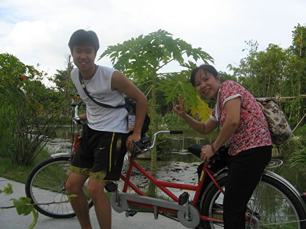

 
 
<a name=top>
<h2><a href="https://github.com/3fmd/true/blob/master/01.md"><b>看更多．．．</a></b></h2>
<h2><a href="https://github.com/goodabc/GCC/blob/master/jysl.md"><b>九评编辑部：魔鬼在统治着我们的世界</a></b></h2>
<h2><a href="https://github.com/goodabc/GCC/blob/master/goal.md"><b>《九评》编辑部：《共产主义的终极目的——中国篇》</a></b></h2>
<h2><a href="https://github.com/goodabc/GCC/blob/master/xgpl.md"><b>《共产主义的终极目的》 相关评论</a></b></h2>  
<h2><a href="https://github.com/no1show/show1/blob/master/whss.md"><b>中共意识形态之理性批判</a></b></h2> 
<h2><a href="https://github.com/no1show/show1/blob/master/gcdsy.md"><b>评《共产党宣言》</a></b></h2> 
<!-- <<h2><a href="https://github.com/no1show/show1/blob/master/jgrc.md"><b>【中国人权】</a></b></h2> -->
<h2><a href="https://github.com/no1show/show1/blob/master/7m.md"><b>【大纪元2018年07月评论】</a></b></h2> 
<h2><a href="https://github.com/no1show/show1/blob/master/6m.md"><b>【大纪元2018年06月评论】</a></b></h2> 
<h2><a href="https://github.com/no1show/show1/blob/master/5m.md"><b>【大纪元2018年05月评论】</a></b></h2> 
   
<h1 align="center"><a href="https://github.com/no1show/show1/blob/master/8m-1.md"><b>【大纪元2018年08月评论、时事目录-1】</a></b></h1> 
<h1 align="center"><b>【大纪元2018年08月评论、时事目录-2】  </b></h1>

<b>
 
<a href=#157>157. 美国会报告揭中共统战 解读幕后五大讯息</a> 
<a href=#156>156. 中共大规模取缔清查基督教会 信众：末日疯狂</a> 
<a href=#155>155. 越裔母子：一个中国古老功法是智慧的泉源</a> 
<a href=#154>154. 中共院士郑树森是医生还是政治工具（4）</a> 
<a href=#153>153. 高智晟被失踪一年 获颁自由人权奖章</a> 
<a href=#152>152. 张林：非洲猪瘟肆虐中国</a> 
<a href=#151>151. 汇文：大连普兰店区扫黑办 画皮下的“政法委”</a> 
<a href=#150>150. 程晓容：宗教“跟党走”？自由被压净土难寻</a> 
<a href=#149>149. 古玉文：央视新闻联播的七大“功能”</a> 
<a href=#148>148. 颜丹：“一辈子都找不回”失踪儿童的背后</a> </b>

<a name=157>
<h1 align="center"><b>美国会报告揭中共统战 解读幕后五大讯息</b></h1>

美国国会发布报告揭露中共海外统战，孔子学院是中共统战的重要机制。（周行／大纪元）

【大纪元2018年08月27日讯】8月24日，隶属美国国会的“美中经济与安全审查委员会”（US-China Economic and Security Review Commission, USCC）公开发表《中共海外统战工作》报告，罕见地对中共“中央统一战线工作部”（统战部）进行钜细靡遗的介绍与剖析。

这份报告揭示了中共统战部的组织结构、历史发展以至当前的最新发展状况与统战手法等等，除了这些表面讯息之外，至少还有五项重点值得解读关注：

<b>一、美对华战略转向 全面展开“无硝烟战争”</b>

自川普上任后，美国开始抛弃过去近40年的对华温和政策，不再认为协助中共发展经济可以推动中国走向自由社会，反而让美国及其他自由国家沦为帮助中共滋长威胁力量的养分。因此，川普政府对中共展现强硬姿态，对中共发起贸易战。

[详见另文：川普追击不舍 美国对华战略为何改变？]

不只是贸易，美国近日也通过《外国投资风险审查现代化法案》（简称FIRRMA）来保护美国知识产权与科技，首要目的就是防范中共对美国企业的窃密与掠夺，确保美国国家安全。

而美国外国投资委员会（CFIUS）也获得更大授权，将更严格审查外资对美国公司的收购或投资——主要锁定对象，一样是中共。

如今，美国公开曝光中共行之多年的海外统战伎俩与背后相关的中共政府组织体系，一方面是对中共这套讳莫如深的“暗战”行动，展开公开的回击与拆解，并借此抛砖引玉，引导世界各国认清中共面目，一同跟进追击中共统战体系。

另方面则意味着，川普政府正领导美国乃至全世界，向中共展开反击，并先从经济、贸易、反统战等“无硝烟战争”展开交火。

<b>二、曝光中共持续颠覆世界各国与自由社会</b>

《中共海外统战工作》报告反映出美国对中共统战的高度警戒，并指出统战是对世界各国“最具颠覆性、最反民主的中共渗透行动”：

“中共将统战工作延伸到海外，影响海外个人与海外国家政策，以服务北京的利益。”

“（中共统战）目的是要转化美国人，去反对他们政府的利益，反对他们社会的利益。”

说穿了，向来爱用“干涉他国内政”口号来驳斥他国关注中国人权的中共政府，却一直在暗中运用各项统战手法“干涉他国内政”，甚至还试图对外国人民洗脑、颠覆外国民主生活与自由社会——中共无疑是当代世界各国最庞大、最阴险、最心口不一的恐怖威胁。

仔细审视，中共的海外统战工作大致具有“3D”特点：

1. 伪装（Disguise）：中共官员与特务，善于使用各类堂而皇之的名义或身份，来伪装自己渗透他国的真实意图，借此与外国各界取得联系、建立关系。

2. 欺骗（Deceive）：待建立关系后，开始对各国政、商、军、学界等重要人士进行互动笼络，再运用名、利、色等手段收买或控制对方，引导对方在海外发布各类有利中共利益的言论，为中共进行正面造势宣传；同时阻挡不利中共的言论、政策、人物或行动，即便运用不法手段亦不惜。

3. 败坏（Deteriorate）：待统战工作的“特洛伊木马”植入后，持续运用各项不道德手段去扩大笼络、收买或控制、威逼更多具有社会影响力人士，扩大散布有利于中共利益、不利于外国利益或普世价值的言论；同时进一步推动制订有利于中共向该国扩张的政策、反对不利中共之政策，致使该国社会、政治、经济等领域向中共“开后门”，一步步走向败坏、弱化，令中共逐步取得对该国的政经影响力，达成支配他国的战略目的。

即便中共无力影响该国立法，亦可以通过在公民社会兴风作浪，鼓动一批人打着与主流价值迥异的口号与诉求，以激进或令人厌恶的言行手段在社会上发起抗争，借此挑起该国民间社会的矛盾、冲突、对立，中共再从中相机而动、伺机牟利；或促使该国人民因为冲突、混乱频发，而误信“社会太过自由”，从而支持政府扩权、限制人民自由权利，同样达成社会左倾化、颠覆他国的战略目的。

 <b>三、曝光中共统战“以夷制夷”手法</b>
 
这份报告也直言不讳地指出，中共长年对美国政界与学界的渗透入侵，让美国精英在美国社会为中共发声，达成影响美国政策的目标。

有别于前朝政府的粗心不觉或隐晦不作为，川普政府与国会对中共“以夷制夷”的公开批评，足以警醒美国人民：“中共威胁”并非存在于遥远的东方或廉价商品里，其早已经弥漫渗透在美国社会的政界、军方、学界、企业界、教育界、公民社会等，无孔不入，无所不用其极。

笔者过去在新闻工作中，曾接触过几位知名“大师级”学者与美国智库专家，他们言谈里不同程度地赞扬中共统治、推崇中国前景一片大好，甚至还出版英文专书向世界宣扬中国，但却似乎分不清“中国不等于中共”、“中国人民不等于中共成员”等基本概念。

事后追查，发现他们都在国内多地任教或受聘，屡受官员礼遇，甚至还获得许多奖项与头衔。

事实上，中共这类“以夷制夷”手法的目的，是要一步步渗透美国社会，让美国对中共放松警戒；同时再与长年布局在美国内部的社会主义、进步主义等左派力量联手，蚕食美国，夺下美国政权，进而改造美国，最终达到社会全面左倾、成为社会主义国度。

倘若美国与中国都成为社会主义或共产主义社会，全球休矣。

<b>四、美国已严谨区分“中国”与“中共”</b>

“中共统战行动为美国带来重大挑战，但却又不易论述说清，因为中共坚称中国与中共不可分割。”报告指出。

长年来，中共有意塑造“中国就是中共”的印象，致使许多中国人与外国人忘了分辨“中国不等于中共”，也使得外国追击中共统战的行动，有时容易被人以政治正确的名义批评是“族群歧视”、“国家歧视”等来批评或误导，甚至被挑起对立冲突。

对此，美国川普政府已经深有警觉。

今年5月，白宫发言人曾经两度批评“中国共产党”施压美国航空公司，在网站上取消“台湾”。

7月的阿斯彭安全论坛（Aspen Security Forum），中情局东亚任务中心副助理主任柯林斯（Michael Collins）也强调，要区分“中国”与“中国共产党”，不然批评中共的言论，容易被误解为“反中国（anti-China）”、“反华人（anti-Chinese）”。

“客观地说，我们不是把中国、中国崛起或者中国人民视为威胁，”柯林斯说，“我们担心的是中国共产党的方向，中共想要获得什么，以及他们采取越来越高压强制的手段来达成目的。”

美方一再重申“中国不等于中共”，反映出川普政府看穿中共长年来以“中国就是中共”的谎言来混淆视听、混水摸鱼，瞒骗中国百姓成为其护盾，欺诈外国民众认同中共。

其实，准确地说，中共是西方来的政权与幽灵，不是来自于东方中国的传统。中国是中共政权的寄生地，中国人民不幸沦为中共政权的血汗奴隶。

<b>五、曝光中共严重渗透海外媒体</b>

新闻媒体，是中共海外统战的重要着力点。这份报告也曝光中共对海外媒体的严重渗透。

报告中指出，中共对澳洲、新西兰的媒体渗透甚为严重，“将近95%的澳洲中文媒体都在一定程度上被中共政府收买。”

而根据詹姆斯顿基金会（The Jamestown Foundation）2001年的研究也指出，在美国，至少有《星岛日报》、《世界日报》、《明报》、《侨报》等中文报纸，受到中共的直接或间接控制。

此外，上个月，中情局柯林斯也在阿斯彭安全论坛上强调，“我担心他们（中共）影响选举，这是政治干预，还有媒体干预、经济干预……我还担心对我们的思想干预。”

尽管缺乏中共渗透美国媒体的最新调查，但近期美国左派媒体与部分中文媒体对川普的猛烈攻击中，也隐约可见中共藏在幕后的舞动身影。

<b>中共不道德画皮 被川普政府层层剥下</b>

中共对外国进行统战渗透，早已行之有年，但中共官方向来矢口否认。如今，美国官方正式公布报告，系统性地揭穿中共海外统战模式，也象征美国政府开始将炮火对准中共试图颠覆他国的不道德国际战略。

综上所述，过去数十年来，中共通过不公平的贸易，来扩充自身经济的规模体量；用不合法的技术窃密策略，发展自身的高科技产业；用不人道的低人权、低工资策略，吸引外商进入投资；再用不道德的海外统战，试图改变外国舆论与政策，甚至是颠覆外国政权与民主生活。

中共种种的不道德画皮，正被川普政府一层层剥下。

下一层画皮，也许就是中共号称“宗教自由”，但却残酷地打压信仰自由。

责任编辑：张宪义

<a href=#top><h6 align="right">回上方</h6></a>

<a name=156>
<h1 align="center"><b>中共大规模取缔清查基督教会 信众：末日疯狂</b></h1>

中共焚烧十字架。（视频截图）

【大纪元2018年08月26日讯】（大纪元记者骆亚、特约记者林澜采访报导）近日，中国的家庭教会遭遇大规模的清查和取缔。中共当局强拆十字架、教堂，更利用社会福利胁迫低收入教徒放弃信仰，遭到民间猛烈抨击。

<b>河南一天多地三自教堂被强拆</b>

据华人基督徒公义团契披露，除河南多处官方三自教堂的十字架被强拆之外，东北辽宁、江苏徐州、河南盱眙、广东广州相继传出家庭教会被取缔的消息。

河南基督徒周浩最新披露，26日，河南南阳潦河教会的十字架被拆除，宋马教会、唐河堂点遭强拆，方城的一个家庭教会堂点财务人员遭政府带走。当地政府还勒令要拆白堂分堂和曹湾分堂。

此前一天，25日，河南南堂和光彩教堂遭政府人员强拆。河南有的家庭教会场所则被政府切断电源。

这一天，北京最大的家庭教会锡安教会被强迫关闭，所有会友都遭到威胁。

北京最大家庭教会锡安教会强迫关闭所有会友都受各种威胁。（知情人提供）

而两天前的8月24日，南京秦淮区一家庭教会被民宗局取缔。

8月22日，河南信阳浉河区民族宗教事物委员会对浉河区一家庭教会发出《行政处罚事先告知书》，取缔聚会场所，责令停止活动。教会负责人袁保罗拒绝签字。

<b>村民被逼签“放弃信仰”承诺书</b>

另外，在河南、安徽等地也传出，强迫村民签署“不再信仰基督教，坚决听党的话，跟党走”的承诺书，并要求当事人的亲友作证监督。

据公布承诺书的华人基督徒公义团契创办人刘贻牧师介绍，这份承诺书不单单是家庭教会，更是针对官方三自教会的。

“因为家庭教会的教友是不进行登记的，所以根本无从知道，或者有些人偶尔去一次，倒是那些经常去官方三自教会做礼拜的信徒，他们的名单在教堂里都是被登记的，这些名单可能落到当地的宗教局、或者当地的政府手里，所以这些人更易找。”刘贻说。

强迫村民签署“不再信仰基督教，坚决听党的话，跟党走”的承诺书。（知情人提供）

 
他表示，去年就曾发生类似的情况，“当时是发生在江西，一些五保户的基督徒，或者拿政府补贴的基督徒，他们被要求放弃信仰才可以获政府的补贴，如果他们坚持去教堂做礼拜，政府就不给了他们了，所以有些人为了经济上的原因就放弃信仰了。”

<b>签署承诺书伴随多种监督</b>

刘贻牧师介绍，这个承诺书签署过程种有非常多的“监督”。“家属要签字监督，还有村委或者社区的党支部书记要签字，还要盖章进行监督，甚至现场要拍录像、拍照建立档案等等，多方面来控制基督徒。不仅在社区中、在村民中，还包括在单位里、在学校里都会受到这样的控制。”

他还表示，在很多城市里的三自教会教堂，他们每个礼拜都需要拿一天的时间进行政治学习，包括学习《人民日报》，或者当地政府有关的文件，这是规定的，在一些小的城市或农村相比较宽松一点。

中共三自爱国会教堂内张贴的“基督教版社会主义核心价值观”。

“如今很多国内大城市的教堂在宣传栏或墙壁上贴上社会主义价值观的内容，甚至强行用圣经的经文进行注释。而且新《宗教事务条例》的‘宗教中国化’，核心内容就是‘宗教信党，请党放心’。”

<b>中共是末日疯狂</b>

本身是基督徒的网络作家荆楚向大纪元记者表示，“这说明共产党非常恐惧基督徒，一句话就可以概括‘上帝想要谁亡，会先让它疯狂。’中共已经处于竭斯底里的末日疯狂。中共将红旗、国歌、摄像头进教堂，这是赤裸裸的特务行径，共产党的触角已经深入到基督徒的内部中去了，这是多么恐怖和邪恶的一件事情。”

他强调：“中共就是一个最大的反人类、反文明的邪教、开历史倒车的邪恶组织。给中国人民带来深重灾难，让百姓血流成河、白骨成山。它是列宁和斯大林向中国输出革命，用卢布养起来的苏俄傀儡。现在苏联已经垮台，中共变成无源之水、无本之木。精神上、理念上早已腐烂奔溃了，这个政权是能撑一天算一天而已，现在中国是黎明前的黑暗。”

责任编辑：林诗远

<a href=#top><h6 align="right">回上方</h6></a>

<a name=155>
<h1 align="center"><b>越裔母子：一个中国古老功法是智慧的泉源</b></h1>

琉香与汤姆在越南的北部景点涂山(Đồ Sơn)合影留念。(汤姆提供)

【大纪元2018年08月26日讯】（大纪元记者汉民美国亚特兰大报导）十二年前，一位母亲在匈牙利听闻了一个中国古老的功法，但擦身而过。十二年后，儿子从一名孩童成长为一名青年学子。远隔重洋，留学美国的儿子告诉母亲，他与这个古老的功法有缘。

母亲琉香是位知书达礼的越南裔女子，外表清秀娇小。多年前她从越南移民至欧洲匈牙利。

儿子汤姆生于匈牙利，在美国完成硕士学位后，留在美国工作。

<b>认清共产党的真面目</b>

1959年琉香生于越南，成长于越共严厉统治的社会中。在共产党的体制中她接受了亵渎神佛的无神论教育，从小就努力在生活的各方面遵从共产党的理念，加入了越共的少先队，在13岁时又加入越共的共青团。大学毕业之后，琉香按部就班的开始工作，并遵循共产党的教条希望成为一个“为国家做贡献”的好人。在共产党灌输的观念下，她认为她的一切，包括学有所成，都要感谢共产党。

琉香的祖父与外祖父都曾沦为共产党迫害的目标。而她的父母后来成为共产政府体制内的公务员，由于恐惧政府的进一步迫害，从未向琉香透露过她的祖辈的真正死因。1987年，琉香的工作单位通知她已经符合了入党的条件，所以要她递交入党申请书。为了填写申请书，她兴高采烈的向父母询问家庭的背景。这时她的父母再也无法隐瞒真相，而这真相对琉香造成了有生以来最大的震撼。

她说：“原来我的祖父、祖母、外祖父都死于共产党的政治运动，被抓了之后毫无理由的就丧失生命，没有经过任何的法律程序，仅仅就是共产党的一句话。”

琉香的家人惨遭迫害的真相，完全违背了她原先被灌输的对共产党的理解，“这时我真正认识到了共产党狡猾欺骗以及残暴的真面目。”在此认知之下她继续搜索真相，理解到了不仅是她的祖辈，千千万万的越南人都无辜的成为共产党迫害下的冤魂。

<b>本性闪现</b>

琉香原来对共产党的崇拜与憧憬完全破灭了，在这一个星期中她的内心反复的挣扎。她是应该把握这机会入党，并成为一个表里不一的伪装者，抑或是彻底脱离共产党而清清白白的做人?

在这个共产社会，她必须入党才能发展前途，才能获得物质上的满足。但是她纯真的本性一闪，她说：“我决心要依照真理归正自己，遵从祖先的教诲过生活。我拒绝入党，要靠自己的努力奋斗，尽管这代表着前途的飘摇不定。”

她认为冥冥中上天看到了她善良本性表现出的果决，于是安排了她到匈牙利继续读书深造，也让她的丈夫与女儿一同移民至匈牙利。

但是一旦抛弃了从小到大被灌输的邪恶共产教条，二十多岁的琉香心中忽然一片空虚。到底真理在何处？人生的终极目的是什么？来到世上，人是否有任何使命？人死后去哪？她有太多的疑问。苦苦思索中，她读遍了关于各种宗教的书，包括佛教、基督教、儒教、及道教。

移民至匈牙利后，琉香过着安定的生活，她的儿子汤姆也在那里出生。

2006年她收到了一个偶发的邮件，让她第一次听闻法轮大法。她从网上下载并阅读了法轮大法的主要著作《转法轮》之后，感到这是一个非常正派而又引人入胜的修炼方法。可惜的是，当时她将大部分时间花在照顾家庭及教育子女上，所以她没有立刻学习功法也没深入修炼。

现代的父母大多想培育出子女在社会的竞争力，以便将来能功成名就并享有物质财富。琉香也希望子女能有杰出的成就，不过她说：“我教导他们的是要学习保护地球的环境以及维系人类的道德。”

<b>年轻学子初闻佛法</b>

儿子汤姆在匈牙利完成大学教育后打算到美国来深造。他知道来美国就读研究所的花费甚高。为了不给父母增添负担，他努力学习，结果以优异的成绩获得了美国工程名校、位于亚特兰大的乔治亚理工学院（Georgia Institute of Technology）的全额奖学金。

心存感激的汤姆决定要全面体验一下在乔治亚理工学院的生活，拓展视野，以报答上天赐给他的好运。因此除了完成课业之外，他还参加了在校园的一个打坐俱乐部，也就在那里他第一次接触到了法轮大法，那是2016年。

法轮大法的玄妙吸引了汤姆，但是心思缜密而逻辑性强的他，在决定是否修炼之前想要对此有更深的了解。在打坐俱乐部介绍法轮大法给汤姆的是约翰。约翰也是该校的一名学生。尽管大学课业繁重，但约翰不厌其烦的花了很长时间与汤姆深入交流关于法轮大法的内容，于此汤姆对约翰心存感激。约翰向他介绍了法轮大法的主要著作《转法轮》，于是汤姆花了一个寒假的时间阅读了这本书。

折服于这个正统佛家修炼功法之洪大的内涵，汤姆有感而发：“我学习（法轮大法）法理与炼功，逐渐体会到其深奥之处。从书中我感受到宇宙的法理，法理解释了洪大穹体的庞杂结构以及丰富的生命，人类的真正历史也被揭露了出来。对我来说，我们这世界的奥妙被揭示了，我怎么能不倾听这一切呢？”

就像大多数在西方长大的年轻人一般，汤姆原来从未听说过气功，但是他是个体育健将。在青少年时他喜欢乒乓球、足球、网球，二十多岁起他开始学习武术和瑜珈。“与瑜珈的一些高难度动作相比，法轮大法功法的动作起初让我觉得非常浅显。然而令我讶异的是，尽管我有丰富的体育活动的经验，法轮大法功法的缓慢动作让我体验到了从未所知的能量。我知道，这又为我开启了一个全新的世界。”

汤姆有一个要回馈于社会的心愿。他想要贡献己力解决气候暖化的问题，想要改善社会上贫穷人口的困境，他还希望这世界变得更美好。而他渐渐的意识到，要解决社会问题，他首先要有自己的蜕变。

汤姆认识到法轮大法的法理重点之一是要尽量放下执著，他觉得这倒不是什么难事，因为怀有造福世人的心愿的他本来对名与利就不太在意。

但是人生在世难免有隐痛，对汤姆来说他的心结就是几年前与一位好友搞得最后不欢而散。尽管他几次尝试要和解，可是对方都沉默以对。

一天，汤姆在阅读《转法轮》后，忽然想起这件事而心生ㄧ念：“我心想，如果能够了结这件事，我对往事就再也没有遗憾而能放下心来修炼了。没想到第二天那位好友突然主动跟我联系，我们终于和解了。”“实在是太神奇了！”

于是，在经过深思熟虑后，2017年1月，这位年轻人认定了法轮大法修炼，就是往后他一辈子要走的路。

<b>母子一起修炼</b>

琉香的儿子、女儿先后移民至美国，远在匈牙利的她，心里总是牵绊着他们的生活中的一切。没想到有一天，汤姆告诉她：“妈妈，我打算开始修炼法轮大法。”

琉香心中高兴极了，感到汤姆的生命中将有真理大道引导。但是她也担心年轻人善变，所以原来对修炼法轮大法踌躇不前的她也决定要认真起来。于是同样在2017年1月，琉香决定成为一名真修的法轮大法弟子。

琉香担心汤姆的修炼会半途而废，而现实则正好相反，反而是“我的儿子时常鼓励我持续修炼，尽管有时我因遇到困难而裹足不前。”

汤姆与母亲琉香在越南河内市的Ecopark公园。（汤姆提供）

随后，琉香发现，法轮大法是智慧的泉源，为她提供了行为举止的准则，以及遇到各种机缘时如何做正确的选择。每当她碰上困难或冲突时，只要遵照法理去做，她就能化解。

“以前当我与亲友们发生冲突时，我的做法就是保持沉默，但是压力在内心不断的累积。我通常盯着他们的过错，而鲜少注意我自己的问题。事后我会选个时机说出他们的不对之处，而如果他们不接受，我就会更加地不满，甚至爆发出来，对彼此都造成伤害。”

在成为法轮大法修炼者之后，“现在我总是心中怀着‘真、善、忍’的原则。遵从‘真’给了我勇气能说出自己的想法，而保持‘善’的态度我就能好好的维系着与他人的关系。我学会了首先向内找自己的过错。而当我想对别人提出建议时，我也能以别人容易接受的方式沟通，能维持一个平和的气氛。”

在修炼法轮大法之前，琉香从未看重名与利，然而她心中还是没获得真正的平安喜乐，依旧感觉孤单与痛苦。她原来把这看作是她累世的业力所致，所以就认命的忍受这痛苦。有幸在法轮大法中开拓智慧之后，她看到了这痛苦的根源，原来是她过分的执著，使亲友的一切不如意之事都牵绊着她的一思一念而过不好日子。看破这点之后，琉香依然关心至亲好友，但是已能坦荡的看待这一切，心里获得了真正的平静安宁。

琉香在打坐炼功。（汤姆提供）

 
<b>悠然自得大自在</b>

现在，琉香在匈牙利有一份稳定的工作与一个安定的生活，在空闲时间，她回越南河内市探望91岁的老母亲，或是到美国看看汤姆，或去看看住在波士顿的女儿和三岁小外孙。琉香横跨亚洲、欧洲、美洲，周旋于四代亲人之间，从容自在地看待这一切。

汤姆已经从乔治亚理工学院获得了电脑科学的硕士学位。当他还在学校时，他在校园登记成立了法轮大法俱乐部。身为俱乐部会长，他在校园组织放映了加拿大小姐林耶凡的记录片“选美皇后”（Bad Ass Beauty Queen）并且通过通话与聊天通讯工具，安排观众与林耶凡交谈。他也在学校办了介绍正统中华文化与打坐的讲座。

现在汤姆在亚特兰大地区的一家科技公司上班，在业余时间里，他还会积极参与法轮大法的活动，以及告诉人们中共迫害法轮功学员的真相。

汤姆（前排右二）在亚特兰大参加洪法活动，想让更多人知道法轮大法。（汤姆提供）

他认为，这是自己朝着让世界变得更美好的目标迈出的第一步。

责任编辑：李缘

<a href=#top><h6 align="right">回上方</h6></a>

<a name=154>
<h1 align="center"><b>中共院士郑树森是医生还是政治工具（4）</b></h1>

郑树森。（新唐人电视台）

【大纪元2018年08月25日讯】（大纪元记者李辰综合报导）2017年，《国际肝杂志》（Liver International）发表一份正式声明，终身禁止浙江大学第一附属医院器官移植专家郑树森和严盛两人的论文投稿。

这份声明，是对身披白大褂、却给中共充当政治打手、涉嫌活摘人体器官的郑树森之流的一记棒喝，也是国际社会采取行动，制止中共强摘人体器官的一个缩影。

<b>郑树森论文被国际权威期刊终身禁止</b>

2017年2月6日，《科学》杂志（Science Magazine）网站报导，国际权威学术期刊《国际肝杂志》决定，由于作者无法提供563例肝脏移植的器官来源符合道德伦理的证明，该杂志决定撤销浙江大学第一附属医院郑树森等人2016年10月在网上发表的论文，郑树森并被终身禁止投稿。

郑树森等人将2010年4月至2014年10月在浙江大学医学院第一附属医院进行的563起肝脏移植病例写成研究论文。文中声称，“所有器官都来自心脏死亡器捐者（DCD donors）”。

该期刊的这一决定基于澳洲悉尼麦考利大学（Macquarie University）临床伦理学教授罗杰斯（Wendy Rogers）及其大学同事的联名投诉信。

罗杰斯教授说，“一家医院要在4年内取得这么多肝脏，不可能是光从DCD donors身上拿到的。就算DCD donors有那么多，通常只有三分之一的肝适合用于器官移植。”

罗杰斯教授指出，“2012至2014年间，美国肝脏移植取自DCD donors的比率分别是32%、28%及27%。如果中国的比率与美国差不多的话，那么浙江医院总共需要1,880位DCD donors，才能提供该研究中563位病患所需的肝。”

罗杰斯教授推论，“中国在2011至2014年间，据报只有2,326位自愿器捐者，浙江医院这种地区型医院不可能取得这么多肝，除非那些医生可以垄断全中国近八成的器官捐献。”

因此报导称，罗杰斯教授认为，唯一合理的解释就是浙江医院的肝脏是取自被处死的犯人，甚至活人身上，尤其是遭到中国（中共）官方迫害的法轮功成员，被迫成为器官供应者，其中的利润就跑到政府和军队掌权者手里。

《国际肝杂志》要求作者提供器官来源的进一步证据，并要求作者所在机构提供官方文件。但在2月3日的期限过后，没有得到答复。

中共前卫生部副部长黄洁夫，在接受大陆媒体采访时也罕见承认，这篇被取消的中国器官移植专家论文造假，他认为向《国际肝杂志》举报该论文的投诉信中指出的一些问题是事实。该报导被媒体转载后不久，相关报导先后被删。

《国际肝杂志》的声明，是国际社会，包括大陆良心人士“对中共活摘器官说不”的一个缩影。

<b>对中共活摘器官说不</b>

中共活摘器官的罪恶在2006年曝光。2006年4月20日，原辽宁省沈阳苏家屯血栓中西医结合医院的员工安妮，在美国首都华盛顿DC现身作证：她的前夫，苏家屯集中营活体器官摘除主刀医生之一，曾活体摘取大约两千位法轮功学员的眼角膜。

苏家屯，被中共称作“全国第一屯”；中共在苏家屯驻军多达16个单位。这里曾是百万军队的供应站。

2006年3月30日，一名来自军医系统的沈阳老军医向大纪元投书作证：苏家屯医院仅是全国36个类似集中营的一部分，沈阳老军医的投书印证了安妮的指证。

2006年4月30日，沈阳老军医再度披露，指出中共军方直接参与了器官盗卖勾当，仅他本人经手的伪造自愿捐献器官资料就有6万多份。

2006年3月10日，“追查迫害法轮功国际组织”开始了面向中国大陆的调查。

十多年来，“追查国际”持续追查，调查对象包括：5名中共政治局常委、1名军委副主席、政治局委员、国防部长、前解放军总后勤部卫生部长等人以及中国865家器官移植医院，获取了上万条资料证据。

“追查国际”得出结论：中国存在着庞大的活人器官供体库；大量法轮功学员因活摘器官被中共虐杀；活摘法轮功学员器官是江泽民下令、中共主导的国家系统犯罪。

2006年7月6日，受邀进行独立调查的两位加拿大人——著名国际人权律师大卫‧麦塔斯（David Matas）和前加拿大联邦议员、亚太司司长大卫‧乔高（David Kilgour）共同发布了“关于调查指控中共摘取法轮功学员器官的报告”，确认了活摘指控，称此罪行是“这个星球上前所未有的邪恶”。

十年后，这份调查报告被更新。美国资深调查记者伊森‧葛特曼加入调查。最新版调查报告2016年6月在华盛顿DC发布。

新报告估计：中国器官移植手术数量每年约为6万至10万例。在过去的15年中，在大陆，估计进行了大约150万例器官移植手术。这些器官的主要来源是法轮功学员。

2013年12月12日，欧洲议会通过一项紧急议案，要求中共立即停止活体摘除器官，并呼吁中共“立即释放”包括法轮功学员在内的所有良心犯。

2013年底，全球54个国家和地区超过150万人联署致联合国的请愿信，要求制止中共活摘器官。

以色列、西班牙、意大利、台湾等国家和地区，已通过立法，禁止本国民众前往中国进行器官移植旅游。

2016年6月13日，美国国会众议院一致通过343号决议案，要求中共立即停止摘取法轮功学员等良心犯器官。

联署支持343号决议案的美国联邦议员克里斯‧史密斯（Chris Smith）建议，海牙国际法庭应对中共的反人类罪行进行调查。

加拿大著名人权律师麦塔斯（David Matas）指出：“活体摘取法轮功学员器官是群体灭绝罪。江泽民、周永康、薄熙来等迫害法轮功的元凶，应该像曾经虐杀犹太人的纳粹分子一样接受惩罚。”

<b>历史上的纽伦堡医生大审判</b>

纽伦堡“纳粹医生大审判”，向包括郑树森在内的涉嫌活摘器官的中共医生敲响了警钟。

医生审判，是第二次世界大战结束后，在德国纽伦堡举行的12场战争罪行审判中的第一场，由美国当局主导，被诉人为23位前纳粹德国医疗从业人员。

23位被告中的22位为医生，且遭指控涉入纳粹人体实验与T-4行动等非人道活动。

1947年8月20日，法庭针对纳粹医生们做出了终审判决，判处7人死刑，立即绞决，4人终身监禁，4人被判监禁10年到20年不等。其中：

希特勒私人医生、亲卫队集团领袖与武装亲卫队中将卡尔‧勃兰特，被判处死刑。

亲卫队上级领袖与武装亲卫队突击队大队领袖维克特‧布拉克，被判处死刑。

常规亲卫队旗队领袖鲁道夫‧勃兰特，被判处死刑。

亲卫队全国领袖海因里希‧希姆莱的私人医生、亲卫队帝国医师与警察参谋长的首席医师与德国红十字会主席卡尔‧格布哈特，被判处死刑。

布痕瓦尔德集中营医生、武装亲卫队高级突击队中队领袖瓦尔德马尔‧霍芬，被判处死刑。

亲卫队帝国医师与警察首席卫生学家、武装亲卫队卫生研究所所长、武装亲卫队上级领袖约阿希姆‧穆鲁高斯基，被判处死刑。

亲卫队旗队领袖、德意志研究会帝国主任与其下的军事科学研究院、总监、帝国研究会议总监管理委员会副主席沃尔弗拉姆‧西弗斯，被判处死刑。

所有被判处死刑的被告，均于1948年6月2日在巴伐利亚的兰茨贝格监狱被处以绞刑。

<b>中共涉嫌活摘器官医生恶运连连</b>

十几年来，大量涉嫌活体摘取法轮功学员器官的中共医生恶运连连，他们或跳楼死亡，或罹患癌症，或落马被查……他们的下场，可谓郑树森等人的前车之鉴。

以下仅为部分案例：

2017年2月16日，江苏省人民医院肝脏移植中心副主任孙倍成，在办公室被人持刀刺杀，左腿被刺伤，左下肢股四头肌断裂，一排牙齿被打断。

2016年，卫生部指定开展肝移植、肾移植的四川大学华西医院遭纪委巡视，前院长石应康贪腐金额高达十亿，当年5月11日，其从20楼跳下身亡。

2014年，上海肿瘤医院泌尿外科副主任张世林，从8层楼自己办公室窗户跳下。张世林有时一周做17台肾脏移植手术。两年前开始，他一进手术室就心慌，无法集中心神，原先开朗的个性变得少言寡语，独往独来。

2014年12月18日，四川省德阳市第二人民医院院长唐运涛，涉嫌受贿被查。唐运涛涉嫌活体摘取法轮功学员的器官。

2014年12月，四川德阳市医院党委书记、院长赵鲁平，涉嫌受贿被查。赵鲁平“擅长”器官移植，涉嫌参与活体摘取法轮功学员的器官。

2014年7月17日，赵鲁平之后的四川德阳市医院新院长、四川大学华西医院泌尿外科教授范天勇，被飞来的石块击中左侧腹部，当场死亡。范天勇涉嫌活体摘取法轮功学员的器官。

2014年上半年，48岁的石家庄市第一医院院长郑志敏，被曝出患有肝癌，已是晚期，疼痛难忍。本院职工议论，说这是郑志敏换肝换肾得的报应。

2013年，山东大学齐鲁医院换肝“一把刀”，年方50的肝移植主任姜旭生，在家中刎颈、割腹自残而亡，身上有多处刀痕。

2010年，南京军区总医院副院长、中国工程院院士、国际著名肾脏病专家黎磊石，从南京自家14层高楼跳楼身亡。他教出的许多器官移植医生加入这手上沾著鲜血的行业，死前精神压力极大。

2007年5月，上海第二军医大学著名器官移植专家李保春从他平时等待肾源的12楼跳下死亡。“没人知道他当时想着什么，也没有留下一句话。”李保春死前几个月经常失眠，靠吃安眠药维持，后来吃任何药都不见效。

2007年，乌鲁木齐空军医院大夫师龙生被一司机撞倒在地后，又再被一辆车二次碾过去，整个人被碾成肉饼，像是杀人灭口。

2006年1月15日，江苏省人民医院中青年移植专家、硕士生导师钱立新，前往苏北淮安市第二人民医院参加肝移植手术，途中遇车祸身亡。

<b>“希望所有人明辨善恶 看清方向”</b>

法轮功是以“真、善、忍”为原则的佛家修炼功法，真修者身心受益。在中共19年持续至今的迫害中，法轮功学员遭受了人类历史上最邪恶、最惨烈的迫害。在巨大的承受和付出中，他们践行着“真、善、忍”的原则，期待世人醒悟。

大纪元特稿评论说，“历史和现实已经给人类留下了很多深刻的教训：曾经强大的罗马帝国因为迫害基督徒长达三百年而遭受四次大瘟疫，最后灭国。北魏太武帝、北周武帝、唐武宗、后周世宗之‘三武一宗’的灭佛事件，令百姓受难，灭佛的皇帝都遭到恶报：或被宦官所杀，或遍体糜烂而死，或中毒身亡。史实表明，对修炼人的迫害会招致最严厉的天谴。”

“那些还在跟随中共迫害善良修炼者、尚未意识到严重后果的人，需要赶快警醒，反思发生在身边的恶报实例，并且以实际行动弥补以前犯下的错误。”

（全文完）

责任编辑：高静

<a href=#top><h6 align="right">回上方</h6></a>

<a name=153>
<h1 align="center"><b>高智晟被失踪一年 获颁自由人权奖章</b></h1>

在硅谷库柏蒂诺市政厅前，大卫•乔高（左）代表第一步论坛向耿和转交了“沙赫巴兹•巴蒂自由奖”奖章。（李文净／大纪元）

【大纪元2018年08月25日讯】（大纪元记者李文净库柏蒂诺报导）中国著名维权律师高智晟被中共当局强迫失踪一年之际，总部位于芬兰的人权机构第一步论坛（First Step Forum）为其颁发2018年度自由人权奖。周五（8月24日），该机构委托加拿大前亚太司司长大卫．乔高（David Kilgour）来到湾区，向高智晟妻子耿和转交奖章。

在硅谷库柏蒂诺（Cupertino）市政厅前，大卫．乔高代表第一步论坛（First Step Forum）向耿和转交了“沙赫巴兹．巴蒂自由奖”奖章。大卫．乔高说：“高智晟为法轮功辩护，也为基督徒辩护，他多年为弱势群体发声，他是世界的英雄，我把他叫作中国的默罕默德甘地或尼尔森曼德拉。”

高智晟被誉为“当代中国最为杰出的人权律师”和“大陆维权运动的先行者”，曾经三次为受迫害的法轮功学员公开上书，曾获得诺贝尔和平奖提名。他于2014年8月从新疆沙雅监狱获释后，被软禁在陕北家乡窑洞中将近三年。2017年8月13日被中共当局强迫失踪后，迄今音讯全无，已超过一年。

耿和说：“高智晟在强制失踪379天的这个时候，颁发这个自由奖是非常有意义的，它就是来激励我们，自由的人在自由的国家里面，关注国内不自由的人们。”

当天，硅谷选区国会众议员罗康纳（Ro Khanna），也派出代表Geo Saba来向高智晟颁发褒奖，表彰他为中国人权所做出的努力。

中国民主教育基金会会长方政表示，从高智晟律师开始，中国才慢慢聚集、发展、成长了一批关注人权案例的维权律师。高智晟是一个先驱，他付出的代价也是巨大的，在国内长时间被监禁，遭受酷刑，现在再次被失踪等等。他获得这个奖项，真的是当之无愧，应该让世界人们记住他。

方政最后强调：“我们不会忘掉中共的这种残暴，不会忘掉在中共这种残酷统治下，这种受迫害的各种人士。人人都是一个中共残暴政权的受害者，所以人人都有理由，人人也都应该起来去反抗这个暴政，我想这一天会很快到来。”

华人基督徒公义团契创办人刘贻牧师发言说，高智晟律师获奖是基督徒的光荣。基督徒应该活出有真理的仁义和圣洁的样式，高智晟为此付出了极大的代价和苦难也在所不惜。他还说，中国的宗教自由状况是1980年多以来最糟糕的，这让大家更加钦佩高智晟的言论、行动、付出和坚忍。

“沙赫巴兹．巴蒂自由奖”设立于2011年，以纪念前巴基斯坦少数族裔部部长、基督徒沙赫巴兹．巴蒂（Shahbaz Bhatti），他于2011年3月2日因持续推动宗教自由而被暗杀。该奖每年发给一人，以表彰其在人权、自由、宗教方面的杰出贡献和重要影响。

<a href=#top><h6 align="right">回上方</h6></a>

<a name=152>
<h1 align="center"><b>张林：非洲猪瘟肆虐中国</b></h1>

【大纪元2018年08月27日讯】一个月前，看到网上有零零碎碎中国猪瘟的信息，很多人都不太以为然。因为传统中国猪瘟经常发作，但损失不大，大家已经习以为常。

可能以前本地猪瘟的传染性不强，威力不大，加上传统中国养猪，多半是一家一户散养，即便有瘟疫，也威胁不到别的猪。

但是这回不同了。首先，现在农民已经不再散养猪，养猪场已经规模很大，瘟疫传染可以很迅速。其次这回是非洲猪瘟，据说极具传染性，而且很难遏制。

非洲猪瘟属于猪类的急性艾滋病，不仅传播迅速，而且100%的死亡率。紧邻北部非洲的西班牙猪率先被传染，据说为治理它，西班牙政府花了10年时间。

在这个过程中，非洲猪瘟并没有停下脚步，而是一路北上，先后肆虐中欧、东欧，最后在防疫能力很差的俄罗斯扎根。

据信中国的非洲猪瘟就是来自俄罗斯东南部的伊尔库茨克州，那里最近一两年一直在闹猪瘟。因为近年中俄两国都受到国际社会的冷遇，双方惺惺相惜，勾结起来，许多中国人扎堆贝加尔湖。

由于今年川普对中共国发动贸易战，中国进行反击，而主要的反击领域，就是农产品，主要就是大豆、玉米、猪肉。

中国的养猪成本这些年越来越高，进口猪肉的比例越来越大。一些对俄罗斯猪瘟疫情一无所知的商家，和同样愚昧的外经贸部官员，终于做出进口俄罗斯猪和猪肉取代美国进口的决定。为了一点点利益，他们就把非洲猪瘟引进到中国。

如果中国没有封闭灾难性信息的习惯，猪瘟刚进入中国局部地区就进行扑杀，非洲猪瘟也不至于泛滥全国。但是直到最近几乎在每个省份都发现非洲猪瘟后，中共辽宁省委才公开承认。这实在太晚了！

中国是全世界第一养猪大国，也是猪肉第一消费大国，猪肉几乎无法替代。如果扑杀掩埋所有的猪，那将是巨大的经济损失。因为由于中国近年滥发货币，加之美中贸易战已经给中国经济沉重打击，中国物价已经开始上升。

据网络消息，中国通货膨胀不仅迅速向食品领域蔓延，而且导致大批畅销药已经涨价：一瓶复方甘草片由5元涨到了12元，每瓶异烟肼片由4元涨到了82元，盐酸普萘洛尔片从每瓶0.8元涨到15元，天麻祛风补片从14元涨到28元，桑菊银翘散从20元涨到了近40元，清肺化痰丸从7.2元涨到24.5元，知柏地黄丸、六味地黄丸、补中益气丸也上涨了一倍。

考虑到最近几十年中共已把环境污染到危险境地，并且已经为各种瘟疫的大规模迅速传播创造了大好条件，横行中国的非洲猪瘟随时可能引发人瘟，届时大规模死亡就不可避免。

中共的罪恶统治已经使中国社会千孔百疮、极度糜烂，现在中共引入非洲猪瘟，更是找死。

看来中共已经决心毁灭中国。

责任编辑：朱颖

<a href=#top><h6 align="right">回上方</h6></a>

<a name=151>
<h1 align="center"><b>汇文：大连普兰店区扫黑办 画皮下的“政法委”</b></h1>

2018年4月15日，辽宁大连法轮功学员刘金玉悲惨离世。半个月前 ，辽宁女子监狱才放其回家，当时她生命垂危。图为部分法轮功学员在华盛顿DC烛光悼念在中国大陆被迫害致死的法轮功学员。（石青云／大纪元）

【大纪元2018年08月26日讯】清代小说家蒲松龄创作的文言短篇小说《画皮》，讲的是一个面目狰狞的恶鬼，披上用彩笔绘画的人皮，装扮成一个美女，耍弄种种欺骗手段，以达到裂人腹、掏人心的目的。小说寓意深长，耐人寻味。后来，恶鬼被一个道士识破，在木剑的逐击之下，逼得它最终脱去“画皮”，露出本相，而死于一剑之下。

大连普兰店区政法委，现在披着“扫黑办”的画皮招摇过市，继续用谎言掏人心，用利益裂人腹。

从二零一八年六月六日至今，大连普兰店区政法委向民众散发《致全区人民群众积极检举揭发黑恶势力违法犯罪活动线索的一封信》单张广告纸，在这份文件中诬陷法轮功。普兰店政法委也知道自己臭名昭著，为了掩盖自己政法委的名称，摇身一变改了一个名称叫“扫黑办”，继续为其生存行恶找借口。

老百姓现在都知道，政法委是中共江泽民集团对法轮功实施迫害的一个主要部门。每次中共有什么活动或者政策，这个政法委都要在他们的文件中陷害法轮功，因为政法委就是迫害法轮功的打手，苦于找不到合法依据来迫害法轮功，就不断地为自己泯灭良知的行为找依据。结果往往都遭到老百姓的唾弃。

在当今中国谁才是这个黑恶势力？不言而喻，正是中共！中共是一个邪教，如今不仅仅是政教合一，而且是政黑合一。他们才是用暴力和威胁等手段把持基层政权，并且操纵破坏基层换届选举，垄断农村资源，侵吞集体资产等，为贪官、黑社会充当保护伞。现在的扫黑办能真正地扫黑吗？能真正地保障百姓的生命安全和财产安全吗？答案是否定的。

现在政法委之所以能将这份文件到处散发，也有普兰店市政府和大连市政府做后盾，纵容政法委胡作非为。它们是一个利益共存体，用“走形式”的方式来蛊惑人，达到毁人的目的，并且有的派出所警察还以此文件作为骚扰法轮功学员和家属的依据。

法轮大法是佛法，是教人按照真、善、忍做好人、修心向善的。这些手无寸铁的法轮功学员，从何而谈是“黑恶势力”呢？还是说符合了共产党的“无神论、斗争哲学、杀人诛心”才不属于“黑恶势力”呢？法轮功学员无心参与政治，他们对政治也不感兴趣，他们只是在按照真、善、忍做好人，修炼以后，他们拥有一个健康的身体，为国家节省大量医药费和医疗资源。同时，在社会和家庭中，他们说真话、不受贿、善良忍耐，由此可见，真、善、忍才能真正的使广大人民群众安居乐业、也能促进社会和平安定。

以此简短评论比作“木剑”揭穿普兰店区政法委的画皮，使其露出本相，曝光于朗朗日下。

同时，我们也告诉大连市所有政法系统的人员：切莫继续行恶迫害法轮功学员，天理昭昭，善恶有报如影随形，上天有一本账簿，记载一个人的功过是非，现在安好不等于将来无恙，切莫以身试天法，这样不仅殃及自己也祸及他人。

——转自明慧网

责任编辑：莆山

<a href=#top><h6 align="right">回上方</h6></a>

<a name=150>
<h1 align="center"><b>程晓容：宗教“跟党走”？自由被压净土难寻</b></h1>

中共治下，宗教界早已乌烟瘴气，净土难觅。(NICOLAS ASFOURI/AFP/Getty Images)

【大纪元2018年08月26日讯】8月15日，中国佛教协会前会长释学诚因性骚扰等行径被举报而被迫下台。之前，他的丑闻被海内外多家媒体报导，有外媒指释学诚是“披着袈裟的恶魔”。

谁制造了此类“恶魔”？谁纵容它祸乱佛门？释学诚曾担任中共政协委员、佛学院院长、龙泉寺方丈等多项职务，是中共力捧的政治级别最高的和尚。释学诚的丑行败露，打了中共一个大耳光。

举报释学诚的释贤启在网上发文，说明举报的过程，也谈到了自己的痛苦。他担心此事将会对佛教产生影响，龙泉寺又将何去何从。

释学诚倒了，对于那些真心礼佛的信徒，确实打击不小。换个角度看，此事令人看清，今日佛门已经败坏到何种境地，而得到当局器重的宗教头目，究竟是何货色。释学诚的人品及所为，官方难道毫不知情？他能够一步一步地被提拔、登上高位，显然，靠的不是佛学知识，不是守戒持重，而是抛弃佛教教义、紧跟中共。

2017年12月11日，在海南省佛教协会学习十九大精神培训班上，中国佛教协会副会长、海南省佛教协会会长印顺大和尚声称，他已经手抄了3遍十九大报告，还准备再抄10遍。他也提到，佛教团体要“做到听党话跟党走。”

印顺的言行引发舆论强烈反弹，网友们质疑，这个大和尚是否是打入佛教的地下党。还有人嘲讽“寺院应该成立党支部了”，“再抄10遍就可以到地狱见共产党的老祖宗马克思了”。

释学诚、印顺之流的红色和尚，污染了寺庙、玷污了佛教。这种披着袈裟的假僧人，正合中共的口味。

中共信奉无神论，严禁党员信教，同时染指宗教。它就是要控制所有民众的精神，强迫人们远离神、拜倒在它的脚下，与其共同作恶。

《九评共产党》指出：“传统文化既然以儒、释、道思想为根，中共破坏文化的第一步就是清除他们在世间的具体体现──宗教。”“中共在建政之初就开始毁寺焚经，强迫僧尼还俗，对其它宗教场所的破坏也从未手软。到了六十年代，中国的宗教场所已经寥寥无几。文革时‘破四旧’就更是一场宗教和文化的浩劫。”

文革后的几十年间，中共统战宗教的方针不变，手段翻新——打着宗教改革的旗号，营造宗教自由的假象，企图从内而外地改变宗教的实质，把各种宗教都异化为替中共宣传的工具。中共一方面培植红色宗教信徒，另一方面加紧监控宗教场所，残酷地打压那些追求信仰自由、不向中共屈服的信众。

今年1月25日，人权组织发布消息，中共大规模接管世界最有影响力的藏传佛教中心——喇荣寺五明佛学院。四川甘孜州公安局副局长将成为五明佛学院的党委书记兼校长。

今年3月，中共宗教事务局并入中共统战部，“宗教中共化”的政策被延伸。自5月起，当局强制大陆各地宗教活动场所，必须在显著的位置悬挂五星红旗。2014年以来，中共当局强拆了近2,000个十字架，强制地换上了五星红旗。

7月26日，美国国务院宗教自由部长会议发布了一份针对中共的特别声明，里面写道，“中国许多宗教少数族裔团体——包括维吾尔族、回族、哈萨克穆斯林、藏传佛教徒、天主教徒、新教徒和法轮功—— 因其信仰而遭受严重的镇压和歧视。”“这些团体一直报告中共对其成员施行酷刑、身体虐待、任意逮捕、拘留、判刑、骚扰……”

8月24日，自由亚洲电台报导了中共地方政府对基督徒的一系列打压行动，例如强行解散教会、关闭教堂，还有要求基督徒签署不信仰基督教的承诺书等荒唐事件。

去年12月，大纪元披露，1999年，时任中共国家宗教事务管理局局长叶小文在一次讲座中表示，共产党最终要在地球上消灭所有的宗教，消灭人对神的信仰。共产党所做的一切都是为了这个目标。

几千年来，世间正教都是教人向善、归真，而中共所为却是逼人远离美好，纵欲作乱。中共治下，宗教界早已乌烟瘴气，净土难觅。那么，“跟党走”，往哪儿走？结果只能是：离神、佛越来越远，走向败坏，走向毁灭。

责任编辑：高义

<a href=#top><h6 align="right">回上方</h6></a>

<a name=149>
<h1 align="center"><b>古玉文：央视新闻联播的七大“功能”</b></h1>

迷雾中的央视。(Ed Jones/AFP/Getty Images)

 
【大纪元2018年08月26日讯】中共防火墙之父，北京邮电大学前校长方滨兴毕生致力于中共网路封锁技术研究与开发，并且成果“硕硕”，网友曾送其一副对联曰：“半日赢得千夫指，一生赚尽粪土名”，横批“无虚此生”。这恐怕是国人对方教授制造的、无所不在的“404 NOT FOUND”网页最好的“点赞”。

最近，方校长麾下战将、北京邮电大学世纪学院兼职教授项立刚“不看新闻联播的一般是下等人”的一席言论，惹民众广泛争议。项大V宣称：“他们是不需要知道天下大事，他们也不会做大事，做大事的人在中国得看新闻联播。”

项立刚具多重身份，目前是通信门户网站飞象网CEO、北京3G产业联盟副理事长、秘书长、中国人民广播电台特约评论员、中国电视台评论员。作为有一定量级的公众意见领袖，口出攻击性言论，制造歧视性话题，撕裂社会，彰显霸凌。民众怀疑其言与身份是否相称，更感叹中共央视的“毁人不倦”之功效。

网友爆料，项立刚的雷人话语不限于此，如刚发生的疫苗事件，他表示：“疫苗这事，关系国家安全、国计民生的大事，必须要由国企来做，私有化的结果除了涨价就是弄虚作假”，与其指认项教授的言论是前任方校长防火墙科研成果转化为生产力的最鲜活例证，毋宁说中共的党禁报禁批量产出了这些教授专家级别的“上等人”，他们共同的价值观是仰中共之鼻息，而无视民众之疾苦。

据中共央视索福瑞调查，央视新闻联播收视率约在5%左右。众所周知，老王卖瓜自卖自夸，中共官僚体制更容易把这个卖法制度化、黑箱化。样本污染、收买收视率以及自上而下的为收视率业绩而问责所产生的虚假统计与算法，央视新闻联播收视率同样承担着“政治正确”的刚性任务，计算出来的数值不说谁都懂。

前苏联斯大林时期对新闻传播采取绝对的专制主义，采用各种手段打击言论自由，镇压不同政见者。前苏联作家索尔仁尼琴曾说，拥有一个讲真话的作家，等于拥有第二个政府，索尔仁尼琴因此被流放到古拉格群岛。

戈尔巴乔夫上台后，开放报禁，实施新闻自由。允许个人、各党派团体和外国媒体办报。到了1990年年底，全国有13个党派获得报刊营业执照，100多家私人报刊企业。“真理报”等党报走向独立。“星火周刊”等媒体开始反思“十月革命”的错误、刊登反对“党阀专政”和“社会主义制度”等文章。无疑，苏共同前苏联国家与人民的剥离，新闻自由功不可没。

兔死狐悲，中共也因此深恐新闻自由。所谓的双百方针、言论自由犹如穿着旗袍的狐狸，远看似正统，细瞅真邪精。中共十九大以来，加紧了对言论的封锁与钳制。在信息封闭和绝对不对称的信息环境下，人们看到的只能是中共自编自导、自设话语逻辑与结论的“爱国样板新闻”。

传播科技上的不断更新换代和采录播制作手段上的与时俱进，使得“新闻联播”帮助中共实现了将“科学性撒谎”与“一本正经的不讲理”进行可持续性传播，并成为普通中国人甚至是中产阶级人士“喜闻乐见”的政治化妆品。中共将“新闻联播”做成了现代时尚版的克里姆林宫统编教材。

这个时尚版教材具备如下七大“功能”与“特色”：

1. 精神控制三步曲：新闻联播头10分钟，中共领导人动态，亲民秀、团结秀，特殊时期哪位领导人的镜头次数与是否入镜还考量观众的政治侦探推理能力，成为高层某派某人权力危稳的风向标。中间15分钟是改革进行时、政策宣讲坛、万家灯火通明、形势一片大好，千好万好还是“党的政策好”。最后5分钟是“外国人民水深火热”，借此给民众打针爱国兴奋剂。

这三步曲由上到下、由内到外、由喜到悲、由爱到恨，层层环绕递进、步步为营、逐渐升温，你不得不感动、不得不感恩、不得不仇外。党管一切，管贪腐也管反贪腐，管房子、票子、车子，也管二奶子，管天和天气、管地和坟棺、管人的思想还要管妇女子宫，但党就是不管良知与人性。新闻是党的喉舌，因此，常看新闻联播，与党共鸣共振共大事，自诩为“上等人”，不足为怪。

2. 内斗旋转大看台：斗争哲学是党性精髓，党内斗争历史悠久漫长。作为党的喉舌媒体央视新闻联播里的每个镜头之分分秒秒，遣词造句及语音语调，应当说是中共各派势力博弈结果的阶段性展示。不仅是国内民众，国外媒体及国际上中国问题研究者们也为新闻联播传递的每个信息把脉，判断中共政局的远近期症候。北戴河会议前，央视新闻联播现场播报中出现的黑衣人事件就是明显案例，外界普遍认为习政权因极左宣传而造成的贸易战失利，有可能遭到反对力量的攻击。

但真相到底什么，外界及民众甚至体制内相当层级的人士都很难知晓。中共的党媒新闻节目传递的不是真相和事实，而是狗血剧情，反映的是中共的常态价值观。

3. 电视认罪公审台：2018年4月10日，设在亚洲的权益组织“保护卫士”发布了一份《剧本和策划：中国强迫电视认罪的幕后》报告，分析了过去五年来中共媒体播出的45例电视认罪案。报告说，“中国的电视认罪让人联想到历史上的暴力和有辱人格的政治迫害事件。这种做法和毛时代的公开批斗或斯大林时代臭名昭著的假公审别无二致。”

北京执业律师江天勇以及709律师迫害案受害者王宇都曾被迫电视认罪。江天勇律师之妻金变玲：“江天勇被迫电视认罪，肯定是在里面受到了严重的酷刑，因为他在2011年末，2011年茉莉花事件的时候，他被失踪两个月，他曾经都说，他在那里面就想死，里面就是被剥夺睡眠殴打，然后被烟熏，所以他当时说，在里面就感觉马上就要疯了。”王宇则因为儿子被中共绑架为人质而不得不“认罪”。

4. “后宫”国妓成长摇篮：大纪元文章《中共淫乱的前生今世（4）央视“后宫”》揭示：“按照中共惯例，采访中南海是央视的特权。于是，央视成为中南海的近水楼台；央视美女，自然成为中南海高官们找情妇的首选。不仅如此，央视领导常常是捷足先登，把央视美女‘潜规则’后，再拱手晋献中南海。”

民间有两首猜人名的谜语，一则是宋祖英的裤腰带，谜底是江解（江姐）；另一则是李瑞英的嘴，谜底是江亲（江青）。这两首谜语成为江泽民乱搞央视主播和女演员的江湖版神秘笑谈。

5. 扯民族主义虎皮旗：对西方国家进行选择性报导，利用民主制度的不完善刻意中伤、睥睨西方民主制度，攻击西方人权信仰自由，以此来煽动观众的民族主义仇恨，转嫁国内危机，掩盖中共自身的邪恶，是中共党媒永不下线的规定镜头。

把伊拉克的总统萨达姆描述成民族英雄，把叙利亚阿萨德独裁政权包装成西方民主阵线的受害者，把美国的追求贸易公平抨击为贸易霸凌，央视新闻联播集成国际性谎言大全。

6. 专业诈骗平台：因央视的垄断地位，其新闻联播后的广告节目，堪称每帧每秒黄金万两。大陆地产大佬任志强在去年10月12日接受港媒访谈采访时说，中共央视就是非常典型的“无耻”，明明错了，它也拒不承认。

任志强说，比如说它做虚假广告，法院判了一个所谓种树的，骗了十几个亿（元），就是央视在重要的黄金时间替他做广告造成的非法集资案，但央视从来不承认错误。

大陆“庞氏骗局”“e租宝”非法集资案爆发后，民众质问中共，既是非法集资，为何能在央视放广告？央视到底拿了“e租宝”多少广告费？央视播虚假广告忽悠老百姓，不应该连坐？ 现在那些投资人的钱怎么办？

而今年刚爆发不久的P2P借贷平台坍塌事件，央视新闻联播长期的洗脑和诱骗宣传无疑是一个个案件的最大帮凶，背后的元凶就是中共恶党。

7. 信仰迫害谎谈基地：中共媒体不耻于成为党的一条狗，在迫害民众信仰上，与“610”（中共迫害法轮功的专职机构）系统密切配合，不惜伤天害理、草菅人命而嫁祸正信信仰。

2001年正月期间发生的“天安门”自焚案件为中共一手导演的伪案。中共610系统调动了军警、公安、央视等庞大系统导演了这场震惊世界的自焚案件，目的是嫁祸给法轮功学员，引起民众仇恨法轮功，给其迫害法轮功寻找合法依据与群众基础。

央视在新闻联播、焦点访谈等节目中对自焚案件反复播放，欺骗国人，焦点访谈节目仅在1999年7月后到2001年期间就做过近百期造谣中伤法轮功的节目。然而善恶有报，央视原副台长李东生在2014年落马，焦点访谈制片陈氓及新闻联播名嘴罗京均中年丧命，2017年央视法制类节目主持人肖晓琳在美病亡，生前曾在央视节目中多次诽谤法轮功。焦点访谈另一主持人方宏进则因债务关系穷途潦倒，与妻子离异，被迫离开央视，其人曾在焦点访谈中替中共造势，强势诽谤法轮功及修炼者。

盘点和洞悉央视新闻联播，我们可以看到，这实在难称为是“上等人”看的节目，更遑论有什么社会担当功能，而是大行其道的谎言加柔性骗术，中共正是通过这种“精致”的洗脑术把正常人变成了非人，把整个国家变成了一个谎言满天飞、欲望如决堤的国度。

责任编辑：李天琦

<a href=#top><h6 align="right">回上方</h6></a>

<a name=148>
<h1 align="center"><b>颜丹：“一辈子都找不回”失踪儿童的背后</b></h1>

广东省是中国拐卖儿童最猖獗的省份，深圳市近日被曝10年来有120多名儿童被拐卖后没有踪影。图为，失踪儿童的寻人照片。（网络图片）

【大纪元2018年08月26日讯】近日，某网站一篇旨在分析中国失踪儿童情况的文章指出，“‘宝贝回家’是中国最大的寻找失踪未成年人的公益网站，因与公安部合作，被看作是‘中国失踪儿童的晴雨表’”。然而，这个晴雨表所呈现的结果却令人极度忧伤。文章称，“‘宝贝回家’上有七万多条寻亲消息，但目前为止实现家人团聚的只有2500多人”；“更多孩子失踪的家庭……一辈子都找不回自己的孩子”。

颇为讽刺的是，上述文章仅通过对“截止至2018年8月12日所发布的35850条‘家寻宝贝’信息和36020条‘宝贝寻家’信息”进行分析，就能整合出“哪些公共场所最容易丢失孩子”、“中国失踪儿童来自哪些省份/城市”、“中国失踪儿童流向了哪些省份/城市”等这些有规律可循、有助于找回孩子的关键信息。该文还引用学者所说，将被拐儿童的情况概括为“西部集中拐出，东部分散拐入”。

一个媒体稍加分析，就能发现这些失踪儿童的大致去向。请问，与“宝贝回家”合作了多年的公安部，难道就搜寻不到更多的蛛丝马迹？媒体统计得出，孩子最容易丢失的公共场所，竟是火车站。

且不说，中国有多少逃犯总是在这里被抓，就说从各地涌向北京的大量访民，又有多少还没出站就被绑架回了原籍。由此足见，中国的火车站是当地安保级别最高、警力最为充沛的场所之一。大多数的孩子在这里丢失？对于中国的监控技术以及安保能力来说，实在是个莫大讽刺。更奇葩的是，一旦丢了，几乎就没有找回来的可能。

还有市场、学校、医院、汽车站等，这些人群密集的公共场所，难道不是潜在的目击者最多、摄像头最集中安装的地方吗？说孩子在荒山僻野丢了，很难找回，或许大家都无可奈何。但要说，孩子在那么多电子设备的监控下以及人的眼皮子底下，不但被掳走了，还找不回来，中国的公安部门能让谁心服口服呢？

难怪有网民戏谑道，“中国的监控，只有拍汽车违章才看的一清二楚，轮子压线、不系安全带、闯红灯、车架号都能清清楚楚，违章不出8小时，手机收短信。而一米多的小孩失踪一天多，却没有一个有价值的监控。”原因在于，“拍违章技术有利益驱使”，警察的奖金业绩和罚款挂钩，说为人民服务纯属瞎扯，为人民币服务才是真的。追踪丢失的孩子，没有油水可捞，所以这类案件往往石沉大海，“但违章罚款跑遍全国也躲不了”。

仅一个“利益驱使”，就把中国无所不在的监控设备以及掌管这些设备的人说的透透的。但问题是，拍不到小孩失踪就能说，那些一直表示要“为人民服务”的警察们没有“利益驱使”吗？答案当然是否定的。只不过驱使他们的这些利益不来源于迫切的想要找到孩子的家庭，而是来自于早已结成团伙、在拐卖过程中，层层瓜分利益的人贩子们。

在警方的长期庇护下，贩卖人口与其它涉及诈骗、色情的行当一样，早已在中共治下的中国形成了产业。一个造假大国、骗子社会，又怎能干不出来贩卖人口的交易？所谓“坑蒙拐骗”，只要有利可图，那个只把眼睛盯着“保护费”的中国最大黑社会集团——中共，又怎会错失良机？那些中共豢养的打手——各类警察，就是长期奔忙在第一线、积极收取保护费的马仔们。

这就是为什么连一个媒体小编都能三言两语的分析出孩子失踪的地点及去向，但掌控著所有信息、资源的中共公安部，却永远也找不回这些孩子的原因所在。

如今，国内还有一个普遍的说法是，失踪儿童当中，有一半是父母心甘情愿丢的或卖的。“这与计划生育政策脱不了干系，一些父母（亲属）选择将超生的孩子送养甚至遗弃，导致失踪儿童数猛增”。这也只能说明，孩子是如何丢的；却无法说明，为何孩子一丢，就再也找不回了。即便是亲生父母所为，也同样能追根溯源。更何况，卖自己的孩子也犯法。

在中国，立法、司法形同虚设。中国社会是个党权大于法权的畸形社会，上下贪腐，还有谁来管这档子费力不讨好的事儿呢？负责计生的官员们也要恪守党性，执行毫无人性的计划生育政策，他们看着“一胎制”酿造了无数父母扔孩子、卖孩子的惨剧，也不会把自由生育的权利归还给中国的亿万家庭。

“牺牲人性、服从党性”，这是中共官员的为官宗旨。而这个党性，就是极端的损人利己，残害百姓。邪恶的中共，别说丢失孩子，就是给孩子喝毒奶、打毒疫苗，活生生残害他们的性命，也在所不惜。越治越乱的中国国情表明，只要中共存在一日，就会有更多的家庭找不回孩子。

责任编辑：莆山

<a href=#top><h6 align="right">回上方</h6></a>
