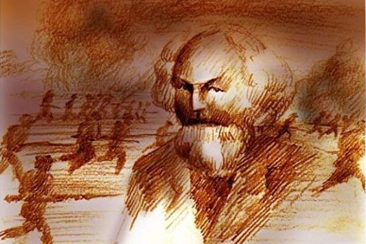
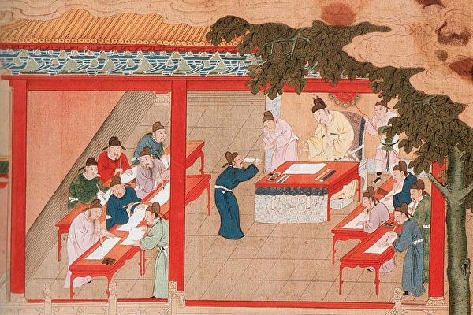
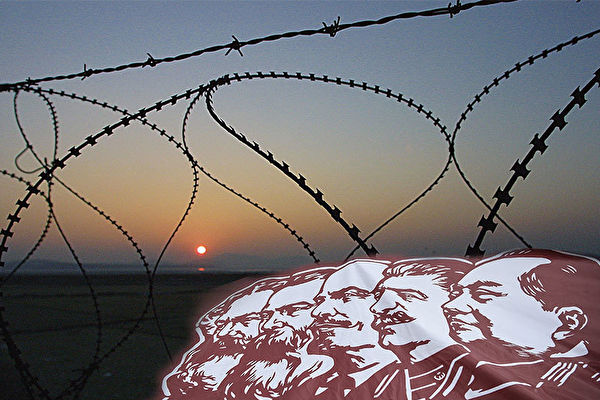
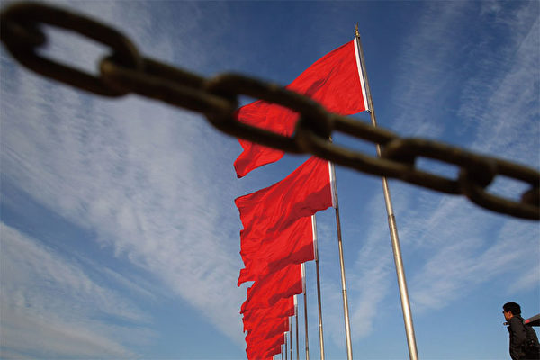

<a href=https://github.com/no1show/show1/blob/master/nice.md><h6 align="right">回首頁</h6></a>

<a name=top>
<a href=#1>一位年轻思想家的理性批判 
<a href=#2>魔教哲学批判——自序 
<a href=#3>中共意识形态之理性批判（1） 
<a href=#4>中共意识形态之理性批判（2） 
<a href=#5>中共意识形态之理性批判（3） 
<a href=#6>中共意识形态之理性批判（4） 
  

<a name=6>
<h1 align="center"><b>中共意识形态之理性批判（4）</b></h1>
<h3 align="center"><b>阶级分析误入歧途</b></h3>  

马克思主义把人类历史看作是一部围绕阶级利益而展开的阶级斗争、阶级统治、阶级专政、阶级压迫的历史，其用心真是阴毒之极。（大纪元）

作者：惠虎宇

【大纪元2018年05月27日讯】

<b>前言</b>

马克思主义认为，人类社会是以基本的阶级关系而存在的，阶级斗争是人类社会发展的根本动力，阶级的利益是靠获得统治地位来维护的，统治阶级利益的实现是建立在对被统治阶级剥削和压迫的基础之上的。

以中华民族的正统史观来看，人类社会是以基本的伦理关系而存在和维系的，以此为基础构建的道德礼法原则是人类社会赖以存在的根基，社会发展的根本动力不在于阶级斗争，而取决于利益集团之间的妥协与合作，利益集团的利益（包含阶级利益）不是靠统治地位来维护的，而是靠多方认同的制度来保障的。

阶级这个名词大概是从近代被引入中国的吧！（是谁首次把它们连用，作为马克思主义的专用名词，欢迎有志者考证。）阶和级在汉语中都有层次差别的意思，阶的本义是台阶，后被引申为官员的级别；级的本意为等级，也可引申为台阶。所以阶级本义就是等级差别的意思。等级差别是这个世界的普遍规律，它表现的是世界的多样性及多层次性的存在状态，所以，阶级本是个非常中性、非常朴素的一个普通名词。但是在马克思主义那里，阶级却成了一个十分狭隘的专用名词，特指以生产资料的所有制关系来划分的两大对立的利益集团，并把这两个利益集团的关系理解为人类社会所有复杂关系的总和。因此，阶级关系就被马克思主义界定为人类社会的第一关系，是超越伦理关系、天人关系的人类社会的根本关系。以此阶级分析谬说，马克思主义颠覆了人类已有的清晰历史线索，毁坏了古老世界的和谐与安宁，重新建立起一套极其狭隘的历史观与价值观。阶级分析法、阶级学说是马克思主义解释社会历史的核心思想，共产革命理论、国家暴力理论、民主与专政的统一论，都是建立在这一核心思想的基石之上。如果不抽掉阶级分析这个马克思主义的主心骨，中共的意识型态就依然会有市场。

<b>一、社会发展的动力辨析及为西方正统的矛盾学说正名</b>
  
阶级分析法是贯穿马克思主义历史哲学体系的核心线索，其实质是把黑格尔的矛盾学说机械般地套用到社会历史领域，并对其中的概念、原理进行了篡改和歪曲，最后把西方哲学中最精华的部分扭曲变形为最丑陋的阶级斗争学说。

马克思主义首先对社会历史运动的主体（由人所组成的利益集团）做了粗略的一分为二，定义为两大阶级，以此作为推动社会运动的矛盾的两个方面，再偷换概念把社会主体之间的辩证矛盾关系改造成了对立和斗争关系，使“社会矛盾”推动社会发展的辩证规律变成了“阶级斗争”推动社会发展的暴力理论。

从这里开始，马克思主义接连犯了两个错误：其一，社会发展本是由多矛盾体系来推动的，矛盾的主体是一定历史时期内所存在的大大小小的不同利益集团，其间的关系错综复杂，绝不可能清晰地被划分成利益相同的两大对立阶级（详解见下文）；其二，把社会运动的推动力理解为矛盾中的对立关系，进而推导出了武装斗争、阶级暴力革命的夺权学说，这样就把一个中性的西方哲学规律转换为恶性的血腥暴力理论。

黑格尔的矛盾学说本是告诉人们世间的万事万物都存在着对立统一关系（即辩证矛盾关系），矛盾双方之间以对立的姿态存在，却以相互认同、相互妥协、相互承认的方式而运动变化，这种运动的实质就是接受对方，认同对方，所以也叫做向对立面转化（用中国文化的术语解释就是老子所讲的“反也者，道之动也”），转化的结果将会在一定程度上缓解双方目前的对立冲突关系，使整个矛盾体向和谐稳定的平衡态转变。也就是说引起问题的根源是对立冲突关系，但解决问题、化解对立关系的方式和途径、却是靠对立双方之间的妥协与合作，靠它们之间的相互认同与承认（向对立面转化），即依靠统一关系。辩证的矛盾体正是以这种普遍方式存在和运动变化的。

马克思主义继承了黑格尔的“矛盾学说”，承认“矛盾”（关系）是事物运动变化的根源，却偷换概念把“矛盾关系”（包含对立和统一两种关系）转换为“对立关系”（只包含对立性这一种关系），如此，社会运动的动力也就从利益主体之间的“矛盾”（包含对立和统一两种关系）转变成了利益主体之间的对立和斗争。马列主义偷换概念的过程如下图所示：

社会矛盾一①→阶级矛盾一②→阶级对立一③→阶级斗争

以上环节①所犯的错误只是在主体界定上的粗浅机械罢了（将多矛盾体系界定为两大对立阶级的双矛盾体系），但是环节②却是赤裸裸的偷换概念，将“辩证矛盾关系”偷换为“对立关系”，使用了移花接木式的嫁接欺骗术误导民众，这就显得面目狰狞相当可恶了。寻着这条逻辑线索，如果你认同黑格尔的矛盾论，认为矛盾是事物运动变化的推动力，那么你就得承认阶级斗争是社会历史运动的推动力，多么荒谬啊！一部马克思主义到处都贯穿着这样强暴式的逻辑转换，但是可叹的是、能看出其中破绽的中国学者实在太少！

马克思主义在这里混淆了辩证矛盾和一般狭义矛盾的概念。

黑格尔的辩证矛盾包含两个方面，对立面和统一面，所以，辩证矛盾在西方哲学中被定义为“对立统一关系”，也就是说一个完整的矛盾体必须是由对立和统一两种关系构成，仅仅有对立性而没有统一性不构成辩证矛盾关系（这一条是理解本节的核心内容）。而一般场合经常使用的狭义矛盾则仅仅表明冲突和对立关系，不包含统一关系，如：她俩最近闹矛盾了，你说的话前后矛盾，这都是指狭义矛盾，不是辩证矛盾。狭义矛盾只是辩证矛盾中的一个关系，这两个矛盾之间是一和二、部分和整体的关系，虽然名称相同，但内涵和意义却完全不同。大陆哲学书上论述这两个矛盾的区别时，用主观矛盾和客观矛盾来解释，那只是注重了它们在某些具体领域应用时的特殊形态，既以偏概全，不能概括所有领域的所有应用形态（如以上所举两个例子，前者是客观领域的狭义矛盾，后者为主观领域的狭义矛盾），更没有注重它们本质上的差别，因此实际上并没有指明它们之间清晰的区别。

这种由于概念上的误用而导致逻辑上的混乱现象在哲学领域还有很多例子，如抽象的联系和具体的联系，抽象的运动和具体的运动之间，都使用同一个名词，但概念所处的抽象层次不同，所以意义也就完全不同，如果乱用，就会发生严重的逻辑混乱，使一个问题的结论产生南辕北辙般的颠倒。这一类问题不是今天要讨论的，暂先打住了！

如上所述，在概念的混淆下，在逻辑层次的颠乱下，矛盾（辩证矛盾，对立和统一关系）是社会发展的基本动力就等价成了“矛盾”（狭义矛盾，冲突对立关系）是社会发展的基本动力，因此阶级矛盾也就等价于阶级的对立关系，最后变成了阶级斗争，社会发展的动力问题就这样被完全地篡改了。可见，马克思主义从理论到实践都透露出一股无比邪恶的硬劲和狠劲，从逻辑暴力到话语暴力再到行为暴力，一环接着一环，誓要把人类已有的世界彻底砸烂！
那么，历史的实际运动规律又该如何理解呢？

以西方的正统矛盾论，以人类社会所观察到的社会层次来理解，社会发展的确表现为靠矛盾来推动的（注意，是矛盾，而不是斗争）。如前所述，辩证矛盾由对立与统一两种关系构成的，此两种关系在矛盾的运动变化中所起的作用不同。对立关系是引起矛盾体运动变化的根源、原因（但不是推动力，只是产生推动力的起因），而统一关系则保证了矛盾体运动变化的顺利进行（对立双方向对立面转化形成推动力），由此也揭示了整个矛盾体运动变化时其内部的两种力量的实际运动状况。在社会历史领域这种现象是很容易被观察到的，如：劳资谈判，工人要求增加工资，老板希望维持现状，利益的不同产生了对立关系，使双方关系中出现了打破现状的需求，最终解决这个问题需要双方都做出某些程度的让步和妥协，就是互相接受对方的一些要求，这就是矛盾中的向对立面转化，即统一关系。可见，矛盾是事物运动变化的动力，包含两个方面：1，矛盾中的对立关系引起问题的产生，使矛盾体产生了改变现状的需求；2，矛盾中的统一关系则解决了这些问题，使矛盾体改变了现状，实现了运动变化发展。

大陆哲学书上一直把“矛盾是事物运动变化的推动力”解释为：“矛盾中的斗争关系打破现状，是事物运动变化的根源和动力，而统一关系则只是把双方连接在一起，为这种运动变化提供场所。”这种理解完全颠覆了矛盾体两种关系的真实作用。他们忘记了向对立面转化是黑格尔辩证哲学的核心思想，也没有真正理解传统文化中的“反也者，道之动也”的深刻内涵，所以，自然不知道向对立面转化在矛盾运动中的真正作用（国外关于这个问题的研究我没有见过，如果有学者知道，欢迎来指点一二），另一方面，也没有意识到斗争关系只是提出了打破现状的要求，与打破现状的实现是不能划等号的，真正的打破现状需要对立双方的认同与合作来共同完成，诚如上文所述。

<b>二、社会历史运动的矛盾主体辨析——利益集团还是阶级？</b>

上文论述了辩证矛盾（下文的矛盾、如不特别标明都指辩证矛盾）推动社会历史运动的实际状况，辨析了矛盾的两种关系在推动矛盾体运动时的不同作用，这是普遍的原理。在社会历史领域如果要继续深入探讨这个规律，还得指明社会历史中矛盾运动的主体。

社会历史的主体是人，人的活动是以群体为基本单位的，包含着复杂的合作关系，因此叫做社会活动。社会上最小的主体就是单个的人，而由具有共同利益的人组成的群体就叫做利益集团。很显然，利益集团可大可小，并且在历史的不同时期，其组成方式、表现形态都会有不同的变化。所以，利益集团是个动态的历史主体范畴，只能根据社会历史的特殊时期的特殊情况分别做特殊的划分，如此，才能清晰地表明每个独特历史时期历史主体在利益关系上的具体分化情况，以此为基础也才能考察出在当时这些不同利益集团之间的复杂利益关系（或对立或缓和），社会历史运动的矛盾关系也就是从中归纳总结出来的。可见，推动社会运动的矛盾主体只能由不断变化的利益集团来构成，如此，历史才有可能表现得错综复杂，丰富多彩。

再看看阶级是个什么概念？如行文开始所述，阶级是马克思主义自己界定的范畴，表示以生产资料的所有制关系来划分的两大对立的利益集团，这种对立性集中表现在对生产资料的占有关系上，一个集团占有了生产资料，另一个集团就不可能再染指，因此，这两个集团的对立关系是不可调和的，表现为阶级斗争关系，马克思认为，人类社会的发展就是靠这两大对立集团的阶级斗争而实现的。这就是马克思主义阶级分析法的全部重要内容。

前文已述，利益集团之间的矛盾关系构成了社会运动的推动力，而非斗争关系，所以“阶级斗争”作为历史推动力的谬误已然破解。那么回到主体构成的问题上，能不能把历史推动力理解为“阶级矛盾”（阶级之间的对立统一关系）呢？以马克思主义所定义的严格的“阶级概念”来讲，就不存在着“阶级矛盾”一说。因为矛盾是指对立统一关系，只有这种关系才能构成社会发展的推动力，而阶级关系已被马克思主义定义为不可调和的主体之间的对立性关系，既然不可调和，就是没有统一性可言，怎么能构成矛盾关系呢？以往人们容易被迷惑的是马克思主义对辩证矛盾和狭义矛盾的混淆，一旦解决了这个问题，那么马克思主义所谓的“阶级矛盾”（实质是狭义矛盾，指阶级之间的对立关系）就被彻底打回原形，成了“阶级斗争”（即阶级冲突和对立）的等价物。

所以，马克思主义的阶级分析法，千言万语，说来道去，实质只有一句话——阶级斗争！在逻辑关系上把人类划分成不可调和的两大对立利益集团，既然不可调和，因此，人们的出路只有一条——斗争，这不是公然挑衅人类互相争斗吗？多么赤裸裸的暴力宣传，多么冠冕堂皇的理论依据！人类社会所有的公理、道德、正义、友爱、互助、合作等基本原则、基本关系，在这里统统看不见了，只剩下你死我活的残酷的、冷血般的生存竞争关系。这是把人类在逻辑上彻底等同于低等的兽类，与达尔文所谓的“进化论”可谓遥相呼应！在这个层次上，马克思主义的阶级关系已经公然取代了人们之间基本的道德伦理关系及人和天地的天人合一关系，成为人类社会的根本关系，第一关系！马列子孙荼毒中华正是以阶级关系颠覆了中华民族5000年来构建的和谐的天人关系和道德伦理关系，使天人割裂，人伦丧尽，目的是使中华民族彻底的堕落，其意不可谓不狠啊！

回到本节开头，正统矛盾学说对利益集团的划分是根据历史的实际状况来掌握的，是灵活的，变化的，而不像马克思主义那么机械僵化，只承认以对立性为存在状态的所谓阶级；正统矛盾学说对利益集团的划分是多元的，而不像马克思主义那样固守样板式的二元划分；正统矛盾学说对利益集团的划分可以汇出当今具普世价值的分权和制衡的国家权力结构学说，而马克思主义的阶级划分只能汇出被普世价值所抛弃的阶级专政学说（见下文）。马克思主义顽固地坚持对社会历史主体机械般的二元划分法，既不是出于逻辑的严谨，也不是出于研究问题的方便，而是为了把人类逼入绝境，使人类除了争斗以外再也不认可别的生存方式，今日之中华被马克思主义洗脑的共产意识形态的传人不正都是这样的一群人吗？

<b>三、社会历史主体的利益关系辨析——斗争还是调和？</b>

阶级斗争学说有一个冠冕堂皇的借口，维护阶级利益。以此入手，马克思主义把人类历史看作是一部围绕阶级利益而展开的阶级斗争、阶级统治、阶级专政、阶级压迫的历史。这里就提出了一个重要问题：利益集团的利益是靠什么来维护的？是靠阶级专政吗？统治者是为了维护“本阶级”的利益而实行统治的吗？

从第一节可知，利益冲突引发了社会问题，而矛盾双方的妥协合作关系则解决这些社会问题，缓和冲突对立状态，使社会实现向前发展。可见，利益集团的利益诉求最终要实现，首先需要所有的历史主体都具备一种妥协合作的精神态度，在对立冲突中寻求利益的共同点，互相尊重对方，接受对方的合理意见，并以最终达成的一种双方或多方都愿认同、愿意遵守履行的制度规范来保障。

历史基本遵循着这样的原则，演绎著这样的故事，商人之间的商业关系，雇主与雇工之间的雇佣关系，君主和大臣之间的君臣关系，权贵和百姓之间的官民关系，家族成员之间的伦理关系，熟人生人之间的礼仪关系，国与国之间的邦交关系等等，无不是妥协合作关系在维系着这各个不同社会系统、不同利益主体、利益集团之间的稳定与繁荣发展。在这些关系中，对立冲突是时时刻刻都存在的，或大或小，但整体关系却能健康稳定的向前发展，无不是由其间的妥协合作关系带来的。那么在这里，不可调和的阶级关系在哪里呢？

诚然，人类社会有战争与仇杀，但那只是表明了社会关系中利益冲突表现最严重的状态，历史并没有表明战争是推动人类社会发展进步的动力，相反，每一场大战争都意味着社会的整体文明发展状况至少要下降好几十年。战争无论多么激烈都是利益冲突的一种表现，是利益冲突引发的社会问题激化的表现，而解决问题却要靠和平，靠敌对双方的停战与妥协，靠他们在战后的沟通与合作。

所以，维护社会历史主体的利益要靠不同利益集团之间的妥协与合作。创造并完善能协调各个利益集团之间利益关系的有效社会制度、是各个历史时期的重要历史任务，一部人类历史，不是阶级斗争、阶级专政的历史，而正是这样的一部以协调各个利益集团的利益为核心的、协调制度的演变史，古往今来无不如此。

古代皇权制度下社会利益关系的协调是以君主为核心自上而下进行调整的。以君主帝制时期为例，皇帝以家族近臣为核心建立起的统治集团不是代表哪个阶级执行统治任务，而是首先代表自己家族的统治利益（这个小利益集团是当时社会上地位最高的利益集团），皇帝颁布政令、制定制度、执行政策都是为了协调国内各个利益集团之间的对立冲突关系，以使社会稳定，各阶层各行业能安居乐业，最终的目的是为了维护他自己江山社稷的稳定，维护自己家族的统治利益。所以，不能说皇帝代表和维护着“地主阶级”的利益，在这个层次上，他同时也代表着“农民阶级”的利益，因为天下无论地主还是农民都是皇帝的子民，对皇帝来讲都是一视同仁的，他们的利益诉求都是需要考虑的。唐太宗所讲的“水能载舟，亦能覆舟”，此水不是指阶级，而是指皇权之外的所有百姓，所有子民，既包含农民，也更包含地主。

近代民主制度下社会利益的协调是以民主政府为核心自下而上进行调整的。从近代民主政府的产生过程中就可以看出这个趋势，一个民主政府是靠选举产生的，选举的过程实质就是协调社会不同利益的各种总方案的竞争答辩过程，在这里选民就是答辩委员会的成员，侯选人合格不合格首先就看他的竞选纲领中对自己利益集团的利益照顾得到位不到位。这样，最终竞选上台执政的政府一定是社会各利益集团利益的总代表。执政期间，政府的施政方针依然受制于选民的民意，政府的所作所为都是为了协调复杂的社会系统下各个利益集团的不同利益要求，所以，对民意的倾听是一个民主政府首先要做的事。

可见，马克思主义所说的那种阶级统治、阶级专政事实上是根本不存在的，也没有一个所谓的统治阶级，在君主帝制时期，政权由一个小的统治集团来掌控，那是权力的私有时代，维护的是自己小集团的统治利益；在民主时代，政权由民选的政府来掌握，政府所握的是公权，维护的是所有平等公民的共同利益。利益集团的利益在君主帝制时期是靠皇帝为总代表制定的相关制度来保障的，其中贯穿着等级差别；在民主时代则是由处于最高地位的法律来保障的，其中体现著公平和平等的原则。因此，历史的发展使社会利益集团维护自己利益的方式演变得更为和平、公平，也更为可靠、更有保障，这不正体现了人类文明的发展趋势与前进方向吗？如此看来，阶级分析学说是多么可恶啊！马克思主义的用心真是阴毒之极！（未完待续）

责任编辑：高义
<a href=#top><h6 align="right">回上方</h6></a>

<a name=5>
<h1 align="center"><b>中共意识形态之理性批判（3）</b></h1>
<h3 align="center"><b>民主和专政水火不容</b></h3>  

在人类历史上，除了民主和专政的政体之外，还有一种超越民主和专政的政体，就是中国古代社会一直存在的政治追求——王道政治，也可称为王道政体。（维基百科）

作者：惠虎宇

【大纪元2018年05月25日讯】

<b>前言</b>

马克思主义认为，国家是阶级专政的工具，是暴力机构，进入阶级社会后，一部人类历史就是一部阶级统治史。而民主只是针对统治阶级内部而言的，民主与专政是统一体，一个阶级的民主必然是以对另一个阶级的专政为互补映衬的。马克思主义因此认为，西方的民主只是资产阶级内部的民主，对工人或无产阶级来说，则是资产阶级专政。此外，马克思主义还认为，历史上所有的阶级专政，都是少数人统治多数人，而无产阶级专政（对无产阶级内部实行民主，对资产阶级等实施专政）则是多数人统治少数人。到了中共手中，这个理论被进一步发展为“人民民主专政”，意思是中共建立的政权是民主和专政的统一体，它对人民实施民主，而对所谓的敌人实施专政。

民主和专政的统一论是马克思主义的又一项奇谈怪论。在上一篇文章中，笔者论述了民主革命才是近代以来的历史主题，民主宪政是这个历史时期人类共同的政治追求，而共产革命则逆历史潮流假民主革命的名义实行专制复辟。那么这个复辟了专制制度的共产党社会，当然不能说自己是专制制度，表面上还得继续披上一层民主的外衣，所以，很多共产国家的国号上要么贴一个民主的标签，要么贴一个人民的标签，以表示自己是代表人民民意的“民主国家”，如朝鲜民主主义人民共和国，德意志民主共和国，越南民主共和国，中华人民共和国（最初的名字实际上是中华人民民主共和国）等。

我们知道，民主是一种权力组织方式，是在天赋人权思想的指导下，实现公民社会法治社会的最重要的手段，它体现了实现民权的现实原则及唯一途径。民主与专政水火不容，有民主必无专政，有专政必无民主，民主（民主政权）的出现就是为了取代专政（专制政权）。

民主和专政这两个概念，是哲学层面上的一个“对立统一体”（对立统一关系在下一篇文章中会介绍）。也就是说，民主和专政是两类政体，二者是对立的，在同一个政体内是不能共存的，但是它们之间可以相互转化（相互取代），民主政体如果被专制势力复辟，就可以转化为专政政体，而专政政体如果发生了民主革命，也可以转化为民主政体。哲学中的“对立统一关系”中的“统一性”，指的是相互转化，而不是混淆二者的区别。比如光明和黑暗是一个“对立统一体”，二者可以相互转化，当一个地方迎来白天时，黑暗必然消退，不能说一个地方既是白天又是黑夜。马克思的民主和专政的统一论，故意混淆 “对立统一关系”中事物之间的应有界线，把民主和专政统一到一个政体内，为共产革命实施专制复辟而在哲学层面上寻找执政合法性。

事实上，在人类历史上，除了民主和专政的政体之外，还有一种超越民主和专政的政体，就是中国古代社会一直存在的政治追求——王道政治，也可称为王道政体。民主和专政是在利益层面上实施的政治体制，而王道政治则是在超越利益的道德层面上实施的政治体制，也就是说，一种基本实现了的王道政治，首先必然是一种有德的统治，统治者以修德和道德教化治理天下，从而减少了社会在利益层面的冲突，使整个社会出现一种高度的文明状态。维系王道政体的根本就是统治者及统治集团的道德，当道德下滑时，古代的王道政体就转化为专制政体，而为了在制度层面上抵制统治集团道德的下滑，使政治在利益层面上脱离专政带来的利益垄断而形成新的平衡，就出现了民主政体。

民主政体和专制政体在同一个层面上（利益层面），二者可以相互转化。但是王道政体的层面（道德层面）超越这二者，所以，民主政体和专制政体都可以在自己的制度范围内向王道政治转化，这就是为什么中国古代政治在同一种社会制度下，既有天下大治的盛世，也有民怨沸腾的乱世，其根本原因就在于统治者、统治者集团的道德表现在不同的历史时期是不一样的，导致王道政体和专制政体在中国近代以前的历史中形成此消彼长的局面，社会出现治乱回圈的状态。而在民主政体产生后，如果忽视道德的作用，仅仅依靠制度来规范人的行为，那么就会导致法律越制定越多，而犯罪率却居高不下，甚至越来越高，出现无论是统治者还是普通民众，都会钻法律空子的社会乱象。所以，民主政体的作用应该有两个方面，一是在制度层面上遏止专制政体对各阶层利益的侵害，二是在道德层面上需要反思王道政体蜕变为专制政体的教训，以重建道德体系，使民主政体在道德层面上不断向王道政体靠近和转化。

<b>一、中国古代王道政治的内涵</b>

马克思主义的国家观是赤裸裸的暴力国家论，所谓民主和专政的统一论，国家是阶级专政的工具，是暴力机构，这与东西方任何人类文明的价值观都是格格不入的。中国传统文化讲修齐治平，走的是王道御天下的道路。君主欲奉天承运，治理万民，必先修养自身，明道懂理，恪守性德，方能以有德者居之。舜以一无所有的条件而得天下，既不是靠暴力夺取，也不是靠暴力来治理，恰恰是以德来服天下的！所以孔子说：“故远人不服，则修文德以来之。”中国传统文化中道与德是最高的哲学范畴，是天地的属性，也是为人处世必须遵循的终极原则，因此合道与不合道就成为君王之王位合法性的最终依据，不合道的无道昏君是可以讨伐的，这叫替天行道。所以《大学》中讲“道善则得之；不善则失之矣。”史书中类似的记载比比皆是，这就是中国的历史观，讲道德的天命观，一切以道为宗旨。

有人说历史上的暴君太多太多，争权夺位，父子相残，兄弟反目，统治者对下级与百姓滥用刑罚，肆意虐杀的记载也比比皆是啊！不错，历史都有其血腥的这一部分，它反映了人类人性中的野蛮成分，所以历史是进步还是倒退关键就在于人类在社会进程中体现的野蛮成分、是越来越少还是越来越多？而文化的进步与落后也就体现在、其崇尚善还是崇尚恶的区别之中了！以道德来教化天下，使恶的成分减少，使善良的本性回归，这是中国王道政治的文化内涵，是中国政治思想一以惯之的追求。有以下逻辑顺序：

如果君王能以道德治天下，则是圣人之治无为之治，民“下知有之”；如以仁义治天下，则是贤君之治，民能“亲誉之畏之”；以礼法治天下，则是乱世之治，民以虚伪“辱之”。从礼开始，治理天下从道义层面降落到制度层面，礼只能以柔性或略刚性来约束人的行为，却不能再约束人的心灵，因此，彬彬有礼却内心虚伪者比比皆是，满嘴仁义却背后坏事做尽者络绎不绝，一旦礼所不守，只能用更刚性的法来制约了，这就到了民主政治的范畴了。

可见，中国的一部历史表现为王道由兴盛到衰落的过程，礼乐崩坏，无不从君王或上层官僚集团开始，所谓上梁不正下梁歪，因此，进入近代以来，要遏止王道政治继续衰败的颓势则必须从制度上做根本调整，这就是民主革命的历史任务，于是民主革命开始登上历史舞台，中国王道政治从民本主义进入民主主义（王道与民主并不冲突，民主改变的只是权力的构成（制度层面），而王道讲的是权力的使用（道德层面），二者的结合就是孙中山先生三民主义的内涵，此为后话！关于道德仁义礼法的关系，《道德经》中讲了一段很深刻的话：“故失道而后德，失德而后仁，失仁而后义，失义而后礼，夫礼者，忠信之泊也，乱之首也！”

归纳一下，虽然道德仁义的约束在整个中国政治历史中一直呈现下降趋势，但作为一种向善的价值观追求，它却显示出永恒的历史价值。另一方面，古代中国社会即使某些时刻表现出血腥残忍的一面，但在民间社会的整体伦理秩序并没有崩溃，相反却更加地牢固，这正体现了传统文化传统价值观求真向善的强大粘合力作用！反过来讲，宫廷政治中以阴谋血腥的方式来获取权力，既不是传统文化也不是传统价值观，恰恰是对这些优秀传统的背离。当柔性的道德约束不能遏止这种背离时，要挽救传统文化就必须改变权力的构成关系，因此，连接上文，民主主义就成为近代中国历史的崭新任务！

<b>二、西方近代民主政治的内涵</b>

18世纪以来，欧洲启蒙运动风起云涌，天赋人权的思想如雨后春笋般开遍西欧，北美，人类历史翻开了新的一页，由君权治理走向民权治理，由专制走向民主，由人治走向法治。宪政民主制的建立，使权力由古代的私有制转变为近代的公有制，政府由公民来选举，历史的发展使人类废除了宫廷政治中权力之争的血腥与暴力，首开和平理性的权力分配方式及民主政治的国家管理模式。法律保证了每个公民的自由与平等，也保护每个公民的合法的私有财产。于是所有阶级在法律面前一律平等，阶级利益既不需要阶级统治来维护，更不需要暴力运动来纂取，而是靠法律来保证。政府不是代表某个阶级而是代表全体公民，代表国家。反过来国家也不是阶级统治工具而是公权机构，政府既是民选的代职机构，其权力由选民赋予，自然不可任意妄为，更不可镇压公民的反对与抗议。而公民具有天赋的人权和民权可以要求政府解散，也无须使用暴力的方式来进行革命。

马克思主义的暴力国家观和阶级统治理论，只看到了阶级的对立面，却看不到社会不同阶级（这里的阶级实际上应该是阶层，在下一篇文章中论述）更多之处的统一面，马克思主义只是陋眼观察到了专制制度下少数人统治多数人的事实，因此，反过来提出多数人统治少数人的理论，提出所谓无产阶级专政，自以为是先进理论而沾沾自喜，却不知历史早已翻过了一部分人统治另一部分人（不管它是少数人统治多数人，还是多数人统治少数人）的权力私有制这一页，而进入权力公有化的新阶段。也就是说，以历史来看，人类社会既从来就没有经历过一个多数人统治少数人的阶段，也更不需要经历这样的阶段，因为无论怎么把这个阶级统治的概念反过来倒过去的看，都是属于权力的私有化阶段，都属于旧历史的政治范畴，而不属于民主革命时期。民主革命的到来推动人类历史由权力的私有制向公有制发展，由此，带来了政治制度的全新变革，其变革程度早已远远超越陋眼的马克思主义之肤浅的看法。

<b>三、简述近代中华的先进政治理念</b>
  
可见无论是民本主义的王道政治还是民主主义的民权政治，都与阶级斗争阶级统治格格不入，也在价值观上不支持暴力运动，更不没有一个阶级的民主就是对另一个阶级的专政这么自相矛盾的现象出现。

马克思主义把人类社会活动中所出现的最血腥的一页，人性中最黑暗的一面当作历史的规律与人类的追求，因此，它的所谓阶级专政理论既不会在实践中找到现实的落脚点，在文化上也更是一种落后而彻底的反动思想！

马克思主义以专政来压制民主，使民主失去了生存的土壤；以专政来解释民主更使民主失去了应有的含义。由此造成了马列共产国家无民主无人权的暴政统治局面，而大量民众却自发地认同这种统治，认为天经地义，认为哪一个政党哪一个阶级上台执政都是一样的！也因此，历史上早已死亡的极权专制制度才可以依然在当今中华的大地上肆虐狂舞，马列暴政思想控制了本性善良的华族儿女，使中华大地黑云压顶，天地晦暗。

而国父中山先生提出的三民主义，则是结合了传统王道政治的精髓与西方民主政治的精髓，可说是东西方文明的完美融合。它在权力来源上以现实的民意取代了传统文化中抽象的天意，更具有操作性与公正性，此为民权主义；国家治理上依然遵循传统的王道政治，宣导仁义与民本思想，此为民生主义；而追求国家独立，维护民族利益，延续民族血脉的思想化为民族主义。此三民主义被西方誉为与圣经，英国宪章，美国独立宣言并列的人类四大文明成果，可见其巨大影响。三民主义它纵接三皇五帝秦皇汉武唐宗宋祖，为我民族世代所传的精髓之所系，是一脉相承的血统；而横连英法美之西方人权运动民主政治的英华，与时代相接规，是真正与时俱进的先进文化；而在民族主义里提出了解决民族独立问题的历史任务，符合了当时中国时代的发展要求。因此，惟有三民主义才是中华民族真正的先进文化的代表，是我中华建立民主宪政共和国的唯一指导原则！（未完待续）

<a href=#top><h6 align="right">回上方</h6></a>

<a name=4>
<h1 align="center"><b>中共意识形态之理性批判（2）</b></h1>
<h3 align="center"><b>共产革命逆历史潮流</b></h3>  

共产党以煽动流氓无产者起义的暴力革命手段扼杀了东亚第一个民主共和国，在中国建立了历史上最黑暗最残暴的共产主义专制政权，建政后屠杀中华儿女近8千万，全面毁灭了传承五千年的优秀民族文化。（Getty Images）

作者：惠虎宇

【大纪元2018年05月23日讯】

<b>前言</b>

马克思认为，他当时的世界处于共产主义革命的前夜，共产主义革命是当时的历史主题，而一个大公无私的阶级——无产阶级——将领导这场时代变革。马克思进一步宣称，在共产革命中，作为无产阶级先锋队的共产党必须要用暴力推翻全部现存的社会制度，包括要取消家庭、取消民族、取消祖国（见共产党宣言），这样才能实现他们所谓共产主义理想的最终目标。

然而，如果以正统的历史观来衡量，无论是从东方传统价值观还是从西方传统价值观来看，马克思的这套共产革命之说，都首先是一套反人类的社会纲领，在世界的任何地方，都不可能成为人类的正常社会追求。

以历史的事实来看，人类进入近代以来，不是资本主义向共产主义发展，而是在政治上从专制走向民主，从人治走向法治；在经济上从传统的自然经济走向现代的自由市场经济，并伴随着技术进步与产业革命；在文化上从君权神授、等级差别、奴役束缚的观念走向天赋人权、生而平等、自由、博爱的理念。而这一切最终又是通过民主革命的胜利来保障和实施，因此，近代人类历史的主题是民主革命与人权运动，而不是共产革命与工人运动。

<b>一、从历史发展阶段的真实表现看近代的历史主题</b>

一个时代的主题就是那个时代历史前进的方向和趋势，因此，对于历史发展阶段的正确解读，将有助于我们准确把握一个时代的历史主题。在笔者这个理性批判系列的第一篇文章《历史发展五型态的迷雾》中，笔者研究了不同逻辑角度下历史发展阶段的真实表现形式，这项研究将是我们确定工业革命以来人类社会的发展趋势和历史主题的重要依据。我们首先回顾一下不同逻辑角度下，历史发展阶段的不同表现。

以生产工具为逻辑线索，本届人类历史大致经历了四个阶段：

1、石器工具时代（可细分为新石器与旧石器两个阶段）；

2、金属工具阶段（又可分细为青铜器和铁器两个阶段）；

3、机械工具时代（即机器大工业时代，以机器代替手脚，解放了肢体，以所使用动力而言，又可细分为蒸汽时代、内燃机时代与电气化时代等三个阶段）；

4、资讯工具时代（以可以处理资讯的智慧化、高度自动化的机械代替了非智慧的、半自动的机械，解放了人类部分的脑力，这一阶段以上个世纪40年代2战期间为分水岭，雷达的研制与应用、电脑的出现及《控制论》、《资讯理论》的诞生表明人类进入资讯时代及下文的科技文明时代）。

以物质文明的进步为逻辑线索，本届人类历史也大致可分为四个阶段（顺便也列出与生产工具线索下的包容关系以供对比）：

1、采集、渔猎文明时代——石器时代；

2、农业文明时代——石器时代、青铜器时代、铁器时代（石器与金属工具时代）；

3、工业文明时代（约二三百年）——蒸汽机时代、内燃机时代、电气时代（机械工具时代）；

4、科技文明时代（至今约七八十年）——内燃机时代、电气时代、资讯时代（机械工具与资讯工具时代）。

通过和生产工具为逻辑线索下的历史阶段的对比，我们可以进一步理解，在某一种逻辑角度下界定的历史阶段，与在另一种逻辑角度下界定的历史阶段，并不是一一对应关系，很多时候是包容关系。仅举一例，如农业文明时代，包含着石器时代与金属工具时代。

以经济运作形式为逻辑线索，人类历史也大致可以被界定为四个阶段：

1、无交换的原始物品生产时期（无剩余产品）；

2、产生交换的剩余物品生产时期（有了剩余产品，进行直接的物物交换，但没有货币）；

3、以交换为目的的商品生产时期（产生货币充当固定交换媒介，使交换的形式和生产的目的发生转变，一部分的生产是为了交换，交换以货币为媒介，通过货币流通来实现，但此时社会上的大部分财富还没有被用作商业资本来投资，而是在家里储藏着，并不关心其增值或贬值，如以前的富人都在地下秘密埋藏钱财，而今人的钱财至少也要放在银行以使其不至于贬值）；

4、以增值为目的的资本运作时期（以资本运作为经济主题，货币不仅充当固定的交换媒介，更被作为一种最重要的资本来使用，使资本积累和增值成为社会生产的主要目的，所谓的“资本主义”也只能以这个角度来界定，这一时期的出现主要是由金融与信贷制度的健全所带来的，除了放在自己家里的部分零用钱以外，社会上的大部分货币都被当作货币资本来使用，通过银行等机构而进入投资领域，目的是为了增值）。

这条逻辑线索反映了交换的发展史，也即人类的物质交往史，以其为主导，经济运作方式表现出不同的历史型态。

在这个领域，如果把考察角度放大一些，还可以整理出我们经常使用的另一条历史发展脉络：

1、自然经济时代（生产为满足自己需要，所以不用来交换）；

2、商品经济时代（生产为了满足别人，所以必须要交换，最好换成货币）；

3、市场经济时代（高级阶段的商品经济，能把握社会需求的复杂变化，以及时调整自己的生产计划，这需要一定的技术手段来实现，特别是交通和通信技术的发展，所以市场经济的出现应该从工业革命算起）。

以国家管理这种角度来研究历史过程，以中国历史为例，那么中国历史发展应该经历了四个明显的阶段。如下：

1、氏族族长制社会；

2、封建邦国制社会（诸侯的封地叫邦或国）；

3、君主帝制社会（中央集权制，建立了垂直行政管理体系，权力集中于帝王一身）；

4、民主宪政制社会（从中华民国开始，这第4阶段还在进行，并没有全部完成，中途遭遇共产主义专制复辟的严重破坏，目前台湾的民主宪政和大陆的专制复辟各自分治）。 欧洲的历史笔者研究不多，但是总体上大概是第2与第3阶段混合发展，不象中国那样第2和第3阶段有着清晰的前后分明的历史时期可资界定。到了第4阶段，则东西方历史又重归一致。

以人身关系为逻辑线索，历史发展也可以被分为四个阶段来看待，如下：

1、吃人社会（人吃人，人类蒙昧时期的野蛮性体现，彼此间相互食用。）

2、奴隶社会（人身不自由，人可以作为商品买卖，但奴隶在职业上可以是农民、士兵、手工艺或建筑工人等。）

3、农民社会及市民社会（有了大量的经济自由民，如农民或市民，但由于君主帝制、官僚政治使他们在政治上法律上仍然处于不平等的地位。）

4、公民社会（法治社会，公民在法律及政治地位上实现了相对的平等，法律保证每个人平等地自由地参与政治权利，实现了国家管理的公权化，并在此基础上保障了经济交往的自由市场性质及平等主体之间竞争的公平性。）

注意：人身关系这条逻辑线索下的四个历史阶段概念，在历史的发展中，不是后一个阶段完全取代前一个阶段这么简单的逻辑，而是逐步出现，同时并存，整体优化的演化关系。以时间来排列，大概经历了这样一个并存演化过程，用以上的序号来表示如下：

（1）——→（1，2，3）——→（2，3）——→（2，3，4）——→（3，4）。

这条逻辑线索显示了不同历史时期人们之间相互的身份，地位及所能享受到的自由和权利的演变关系，体现了人权的发展史，以此线索看到的是人类的野蛮性随着时代的进步而逐渐减弱，而宣导自由、平等、相互尊重的友善、博爱的价值观却在逐渐加强，并最终能辅以制度上的保障。

一口气讲了这么多，就是想讲明白这样一个道理，要想知道时代的精神，历史的主题，就必须懂得时代是什么，处于什么样的阶段。如果把历史时代的所处阶段搞错了，搞混了，那么据此演推出来的所谓历史主题就只能是个特大谬论（如下文的共产革命）！以本文所列出的这些常见的逻辑线索来观察，工业革命以来的人类历史分别处于以下阶段：

以生产工具而言，处于从金属工具时代开始走向机械工具时代（即机器大工业时代）的过渡阶段；

以物质文明而言，处于从农业文明开始走向工业文明的过渡阶段；

以经济运作形式而言，处于从商品生产时期开始走向资本运作时期的过渡阶段；以经济运作形式的大角度而言，处于从自然经济（占主体）和商品经济并存时期开始走向市场经济（高度发达的商品经济）时期的过渡阶段；

以国家管理方式而言，处于从君主帝制（在欧洲其中混合著封建制）开始走向民主宪政制的过渡阶段；

以人身关系而言，处于从2，3，4并存时期开始走向废除奴役关系后的3，4并存时期的过渡阶段。也就是逐步废除奴隶制，并使更多农民和市民成为公民。

研究社会系统一般还有一个普遍的方法，就是将社会先划分为政治、经济（此处是宏观范畴，指社会的物质系统）、文化（此处为狭义文化，指思想观念形态的文化，即精神文化）三个层面，然后分别考察这三个层面在一定历史阶段中的不同变化，以总结出历史在那个时代整体的演变趋势。

以此来看，近代社会在政治上处于从专制走向民主（民主化）、从人治走向法治（法治化）的过渡阶段；在经济上处于从手工生产走向机器大工业（工业化）、从自然经济占主体走向市场经济为主导（市场化、资本化）的过渡阶段；在文化上处于从君权神授、等级差别、奴役束缚的观念中走向宣导天赋人权、生而平等、自由、博爱的过渡阶段。

在所有这些常见的有关历史阶段的不同线索中，没有一条线索可以推导出共产革命所宣导和追求的那些社会目标。共产革命的历史哲学基础是马克思的五型态理论，笔者在前文《历史发展五型态的迷雾》中已经对这个理论做出了理性上的彻底否定。那么，依据这个错误理论做指导的共产革命，其结果只能是从多方面颠覆了当时人类历史发展已经取得的正常成果。

在经济上，新兴的共产政权全面剥夺了企业的私有产权，铲除了正在蓬勃发展的自由市场经济，建立了由政府垄断产权和经营权的计划经济体制，使市场经济的正常发展途径被强制阻断。在政治上，共产政权全面剥夺了当时的人们刚刚争取到的民主和民权，建立了历史上最专制、最极权、最残暴无度的统治体系，颠覆了人类历史走向共和、走向宪政的政治转型过程。在文化上，共产政权全面践踏人的尊严，即否定神的权威，也否定天赋人权，将自由、平等、博爱视为西方“腐朽”的资产阶级观念而予以无情打击，将传统中国敬天敬神的文化传统和仁义礼智信的道德规范视为封建毒草而连根铲除。

可见，共产主义的出现，是人类工业革命以来正常历史进程的一段逆流，如果我们拨开这段逆流所掀起的层层迷雾和历史尘埃，我们就会清晰的看到，近代人类社会的历史主题只能是以“自由、平等、博爱”为时代精神的民主革命和人权运动，并由此引起社会在政治、经济、文化层面的一系列深刻变革，使人类社会迈入一个崭新的时代。现代社会所形成的一切制度、规则、意识形态、价值观念等无不肇始于那个狂飙激进的时代。

<b>二、近代西方民主革命综览</b>

综上所述，人类的近代史就是在“天赋人权”思想指导下的一部民主革命史，期间伴随着与专制复辟势力反复较量的艰难历程。关于这段历史中的种种复杂过程及其透露出的清晰资讯，辛灏年先生在《谁是新中国》中有详细的论证，这里不妨直接摘录原文如下：

举世最早的尼德兰民主革命，虽与反对西班牙统治的民族革命相互交织，自一五六一年革命发动到一六零九年西班牙承认荷兰独立，直至一六四八年欧洲在结束三十年战争后订立《威斯特伐利亚条约》，正式承认荷兰共和国，其间，革命与复辟反复较量的历史竟长达七十八年之久。

著名的英国民主革命，自一六四零年爆发直至一六八八年光荣革命告成，其间四十八年就曾历经三次革命与复辟的较量。一六四七年十二月，由于苏格兰和英格兰长老派密谋英王查理一世复辟，而引爆第二次国内战争。只因复辟派被克伦威尔战败，才使第一次复辟图谋未遂。一六四九年英王查理一世被处死后，苏格兰保王党及其势力欲拥立查理二世为国王的复辟企图，又因一六五一年克伦威尔征服苏格兰并将之并入英国，而使得二度复辟未果。第三次是在克伦威尔死后两年：一六六零年四月，因保王党蒙克与查理二世谈判成功而发表“布雷达宣言”，查理二世当上英国国王，斯图亚特王朝遂宣布复辟。复辟历经查理二世和詹拇世二世长达二十八年的腐败统治，直至被光荣革命推倒，英国才在王冠下，更在革命的逼迫下，诞生了举世闻名的新政体，并从此由“君主宪政”而走上了“虚君共和”的道路。所以，孙中山先生指欧洲各国的君主宪政乃为“革命之所赐”，也就言之不虚。

民主革命爆发后，迭呈革命与复辟反复较量者，以法国为最。法国民主革命自一七八九年七月十四日巴黎人民攻占巴士底狱，直至一八七五年法国人民承继法兰西共和国国统，承认法兰西第一共和国宪法，确立共和国体，成立法兰西第三共和国，前后八十六年，革命与复辟的反复较量可谓连续不断，异常复杂和激烈。如果说罗伯斯庇尔之死，标志着立宪派的得手，拿破仑的滑铁庐之败，则带来了波庞王朝复辟的成功。一八三零年的革命虽然埋葬了力图全面复辟君主专制制度的波庞王朝，但是，路易·菲立普所建立的七月王朝却依然猖行专制复辟达十八年之久。一八四八年的革命虽然战胜了复辟的七月王朝，建立了法兰西第二共和国，然而，路易·波拿巴却于民主共和之中，“加演”专制复辟之为，并终于将法兰西“第二共和国”更名为法兰西“第二帝国”，他自己也因此而从总统变成了皇帝。若不是色当一役既使法国惨败，又使路易·波拿巴的帝国一朝覆亡，则第三共和国的建立，尤其是法国民主制度的最终确认和确立，尚不知还有几波几折。

尼德兰、英国、法国如是，但凡爆发过民主革命、推翻过专制王朝、建立了民主政体的国家亦莫不如斯。一八一零年爆发的西班牙民主革命，虽然诞生了著名的“一八一二年宪法”，其始亦与反对法国侵略的民族革命交炽一炉，但是由于拿破仑在欧洲的失败和欧洲国际专制势力的粗暴干涉，亦使革命力量与王室复辟势力历经五次反复较量，时长六十四年之久，直至一八七四年，才以波庞家的阿尔丰斯十二实行两党议会制度、建立君主立宪国家为终。

深受西班牙革命和西班牙一八一二年宪法影响的葡萄牙，于一八二零年爆发革命后，由国王若奥之子唐·米格尔所代表的专制势力，就曾发动三次复辟。虽然一败两胜，胜也短命，却为葡萄牙民主革命留下了革命与复辟一再较量的痛苦经历。

十九世纪欧洲荷、英、法、西、葡等主要国家如是，二十世纪的德国和俄国，包括东亚诸落后国家，就更是在新的历史条件下，展开了革命与复辟之更加痛苦和更加艰难的较量历程。德国虽然迟至一八七一年才建立了统一的德意志帝国，并且威风一时，但它在第一次大战中的失败，却导致了第二帝国的迅疾败亡和德国民主派的轻易成功。一九一九年由德国社会民主工党亚伯特派建立的魏玛共和国，转瞬之间便迎来了专制势力的疯狂反扑。意在德意志复辟帝国的卡普暴动固然为民主力量所迅速击败，但是，由希特勒所代表的新型专制复辟势力虽然不再公开号召重建帝国，归复君主专制，但他在国家社会主义招牌下，由要求强化中央集权而成为欧洲最大独裁者的发迹之路，却在实质上将德国完全复辟成了一个极权统治的专制帝国，即“第三帝国”，从而又敷演出了一幕帝国兴亡的历史悲喜剧。

无独有偶的是，早在希特勒于德国打着国家社会主义招牌，以逞专制复辟之前，列宁已在欧洲最落后的俄国，于二月民主革命推翻沙皇之后，复“以革命的名义”（列宁语）推倒了二月民主革命的成果，重建了俄国专制制度。十月革命对于二月革命背叛的本质，便是“以革命的名义”反扑民主革命，直至达到专制复辟的成功，并从此敷演了一场长达七十余年专制复辟的巨大历史悲剧。今天，即便是前苏联已经于一九九一年一朝崩垮，但一部分“人还在，心未死”的俄共党人，其复辟的愿望却并没有死绝。（以上摘自《谁是新中国》，引言，第一章，三，民主革命与专制复辟的反复较量。）

可见，历史的现实和逻辑都清晰的表明，所谓的共产主义革命理论是在混乱逻辑线索的主导下，以错误历史阶段的划分为依据，对历史主题做出的一种荒谬式的理解与狂热式的幻想，是个空洞之物，更由于其宣导暴力夺权，因此，在现实中，共产革命理论只能为旧时代的改朝换代运动提供口号上的鼓惑与行为上的煽动，成为工业文明、民主革命时期旧贵族、旧势力以及阴谋野心家夺取政权、复辟专制政体的唯一可能借鉴的形式，而这一可能恰恰构成了20世纪共产主义运动全部可辩的清晰历史。20世纪的共产主义国家无不建立起了一套历史上最严密的政教合一的专制制度，实行极权和红色恐怖！此类史实不在此赘述！

<b>三、共产革命对近现代中国历史主题的篡改及对中国民主进程的破坏</b>

很显然，19世纪后半页，古老的中华民族在世界民主革命大潮的影响下，也开始了政治制度转型的艰难尝试，中国近现代史的主题脱离不了世界史的大主题，至20世纪初，孙中山先生领导的中国民主革命建立了东亚第一个共和国，正是踏出了这个时代最强的足音！然而，在西方民主革命的洪流中找不到出路的马列之共产主义思想也正在此时悄悄登陆我们这个古老的东方大国，开始对中华民族进行有史以来最残酷最严重的破坏。

辛亥革命是中国近现代史上一次真正的民主革命，革命的目的不是为了建立革命党（国民党）一党独霸政权的专制体制，而是要建立实现民权的共和体制，孙中山、蒋介石一生的辛苦奔走、斗争都是为了实现这个目标。然而马列的阶级斗争学说及共产主义革命运动却从根本上颠覆了这一切，扭曲中国近现代史的全部内容，它们以煽动流氓无产者起义的暴力革命手段扼杀了东亚第一个民主共和国，在中国建立了历史上最黑暗最残暴的共产主义专制政权，建政后屠杀中华儿女近8千万，全面毁灭了传承五千年的优秀民族文化。更可恶的是中国共产党用马列主义对十亿中华子民进行了思想上的清洗及思维程式上的刷新，使之近乎全部成为标准化产品般的马列子孙，今天的很多中国人依然很自觉的用“社会主义”与“资本主义”的区别来为共产党建立的政权做理论上的辩护，很小心地警惕著西方资产阶级政府对“我们”（共产党偷换了的概念）的“和平演变”策略，很自豪地谈论著“中国革命”（共产革命偷换了的概念）的丰功伟绩，很忠心地钦佩著毛泽东的“雄才大略”，也更是很敏感地自觉抵制着形形色色的“反革命”宣传与“腐蚀”，这一切无不拜共产革命谬说之所赐。

值得警醒的是，共产党在中国搞共产革命却借助的是中国民主革命的形式，打着中国民主革命的旗帜，呼喊的口号是要建立民主共和国，尊孙中山先生为国父，要继承中山先生的遗志。1999年大陆汕头大学出版社出版了一本60多年前《新华日报》《解放日报》的社论选，书名叫《历史的先声》，副标题为“半个世纪前的庄严承诺”，该书收录的文章大多是共产党的领袖人物及党内知名学者亲自执笔撰写的，文章内容几乎是一致的争取自由民主，反对独裁专制，宣导天赋人权，呼吁实现普选。让我们简单的摘录一些文章标题，《不能因为国民程度不高而拒绝民主，应该用民主政治教育人民》、《有人民自由才有国家自由》、《民主的才是合法的》、《每一个在中国的美国兵都应当成为民主的活广告》、《论英美的民主精神》、《中国人民早就有实现民主政治的准备》、《争民主是全国人民的事情》、《言论自由与民主》、《平民人身自由是政治民主的尺规》、《民主是发展生产的暖室》、《民主主义是生命的活力》、《要民主才能解决问题》、《人民文化水准低，就不能实行民选吗？》、《学校要做民主的堡垒》、《一党独裁，遍地是灾！》、《结束一党党治国才有民主可言》、《民主的正轨：毫无保留地还政于民》、《一党专政是反民主的，共产党绝不搞一党专政》……等等。这些口号、宣传、呐喊无一不是为民主革命造声势、推波澜，也就是说中国近现代史的主题无可置疑的应当归属于民主革命，那么在这个大潮中要想争得民心，获得舆论上的支持，就得首先张扬起民主革命这面大旗，即使你有别的目的与实质，但外表上必须得借助民主革命的形式。马列传入中国的共产革命正是忠实地履行了这一骗术，以民主革命华丽的外衣迷惑了当时正处于民主探索阶段、对民主为何物尚无感性经验的广大中国民众，借助抗日战争的国难，及抗战胜利后国内的各种矛盾危机不断激化的乱局，乘乱而起，混水摸鱼，领导了一场工业化时期的农民战争，最终颠覆了中华民国政府，打断了中国正常的民主化进程。

在利用民主革命的历史大潮，颠覆民主革命建立了与民主为敌的共产政权后，中共又创造两个新名词，新民主主义和旧民主主义，为自己的共产革命寻求历史合法性依据。中共将民主革命一分为二，将孙中山、蒋介石领导的真正的民主革命称为旧民主主义，把中共的共产革命则标榜为新民主主义。

所谓的新民主主义与旧民主主义本是民主与专政的区别，本是对民主革命的反动与污蔑，但是在中共使用阶级斗争学说，使用民主与专政的统一论进行包装后，二者的关系竟被堂而皇之地转换为先进阶级搞的新民主主义革命与落后剥削阶级搞的旧民主主义革命的区别，今天的大陆中国人，所受专制独裁的戕害大概已经超过了人类历史上所有专制政权的迫害记录的总和，然而，却有多少人能懂得所谓的“新民主主义”与“旧民主主义”的真正本质区别，有多少人懂得“中华民国”和所谓的“中华人民共和国”的真正本质区别。中国近现代历史主题由旧民主主义转向新民主主义，再由新民主主义转向社会主义和共产主义，多么冠冕堂皇的说辞，多么荒谬可笑的逻辑，对中华民族而言，却又是多么悲惨绝伦的沉痛历史和现实！

共产主义革命就是循着这么一条荒谬的逻辑线索，把实质为农业文明时期改朝换代的农民暴动理论改头换面为工业文明时期的无产阶级专政理论，把民主革命偷换概念转换为共产革命，挟夹着一股历史上从未有过的邪恶与暴虐的恐怖力量，堂而皇之地蹿上了历史正剧的舞台，用暴力把所有主角都赶下台去，自编自导自演了一幕人类历史上最血腥的恐怖剧！而不幸的是，这出悲剧的中心舞台正在我们中华民族！（未完待续）

责任编辑：高义
<a href=#top><h6 align="right">回上方</h6></a>

<a name=3>
<h1 align="center"><b>中共意识形态之理性批判（1）</b></h1>

中共在篡政后任意杀戮中华儿女，杀戮抗日英雄，掠夺国民财产，毁灭华夏文明，使十几亿人失去人身自由而做了现代奴隶。（Getty Images）

  
作者：惠虎宇  

【大纪元2018年05月21日讯】

<b>历史发展五型态的迷雾</b>
  
<b>前言</b>
  
马克思主义认为，按照阶级关系来划分，人类社会发展将经历5个社会型态，分别是原始社会、奴隶社会、封建社会、资本主义社会，最后将进入共产主义社会。然而用严格的学术态度来分析，马克思的这套历史发展五型态学说，最根本的致命缺陷就是逻辑不一致。

对学术研究来说，以下这个原则是自明的，即任何一种研究社会发展阶段的理论模型，无论其现实对应与否精确，它对不同历史阶段的界定，首先必须是同一种逻辑立场下的产物。以马克思的5型态理论为例，奴隶社会是以人身关系为考察角度来界定的，封建社会则是以国家管理形式为考察角度来界定的，而资本主义社会又是以物质生产和交换的发展形态为考察角度来界定的，在这三种社会型态的概念中，分别包含了三种研究历史阶段的不同逻辑线索，那么，它们怎么可能会被放入有关历史阶段研究的同一个理论模型中呢？

<b>一、历史阶段研究的多线索状况简述</b>
  
以下，笔者将列出不同逻辑线索下历史发展的可能过程，以及历史阶段的可能表现型态。

以国家管理这种角度来研究历史过程，以中国历史为例，那么中国历史发展应该经历了四个明显的阶段。如下：

1、氏族族长制社会；

2、封建邦国制社会（诸侯的封地叫邦或国）；

3、君主帝制社会（中央集权制，建立了垂直行政管理体系，权力集中于帝王一身）；

4、民主宪政制社会（从中华民国开始，这第4阶段还在进行，并没有全部完成，中途遭遇共产主义专制复辟的严重破坏，目前台湾的民主宪政和大陆的专制复辟各自分治）。

欧洲的历史笔者研究不多，但是总体上大概是第2与第3阶段混合发展，不象中国那样第2和第3阶段有着清晰的前后分明的历史时期可资界定。到了第4阶段，则东西方历史又重归一致。

以生产工具为逻辑线索，则本届人类历史大致经历了四个阶段：

1、石器工具时代（可细分为新石器与旧石器两个阶段）；

2、金属工具阶段（又可分细为青铜器和铁器两个阶段）；

3、机械工具时代（即机器大工业时代，以机器代替手脚，解放了肢体，以所使用动力而言，又可细分为蒸汽时代、内燃机时代与电气化时代等三个阶段）；

4、资讯工具时代（以可以处理资讯的智慧化、高度自动化的机械代替了非智慧的、半自动的机械，解放了人类部分的脑力，这一阶段以上个世纪40年代2战期间为分水岭，雷达的研制与应用、电脑的出现及《控制论》、《资讯理论》的诞生表明人类进入资讯时代及下文的科技文明时代）。

以物质文明的进步为逻辑线索，本届人类历史也大致可分为四个阶段（顺便也列出与生产工具线索下的包容关系以供对比）：

1、采集、渔猎文明时代——石器时代；

2、农业文明时代——石器时代、青铜器时代、铁器时代（石器与金属工具时代）；

3、工业文明时代（约二三百年）——蒸汽机时代、内燃机时代、电气时代（机械工具时代）；

4、科技文明时代（至今约七八十年）——内燃机时代、电气时代、资讯时代（机械工具与资讯工具时代）。

通过和生产工具为逻辑线索下的历史阶段的对比，我们可以进一步理解，在某一种逻辑角度下界定的历史阶段，与在另一种逻辑角度下界定的历史阶段，并不是一一对应关系，很多时候是包容关系。仅举一例，如农业文明时代，包含着石器时代与金属工具时代。

以经济运作形式为逻辑线索，人类历史也大致可以被界定为四个阶段：

1、无交换的原始物品生产时期（无剩余产品）；

2、产生交换的剩余物品生产时期（有了剩余产品，进行直接的物物交换，但没有货币）；

3、以交换为目的的商品生产时期（产生货币充当固定交换媒介，使交换的形式和生产的目的发生转变，一部分的生产是为了交换，交换以货币为媒介，通过货币流通来实现，但此时社会上的大部分财富还没有被用作商业资本来投资，而是在家里储藏着，并不关心其增值或贬值，如以前的富人都在地下秘密埋藏钱财，而今人的钱财至少也要放在银行以使其不至于贬值）；

4、以增值为目的的资本运作时期（以资本运作为经济主题，货币不仅充当固定的交换媒介，更被作为一种最重要的资本来使用，使资本积累和增值成为社会生产的主要目的，所谓的“资本主义”也只能以这个角度来界定，这一时期的出现主要是由金融与信贷制度的健全所带来的，除了放在自己家里的部分零用钱以外，社会上的大部分货币都被当作货币资本来使用，通过银行等机构而进入投资领域，目的是为了增值）。

这条逻辑线索反映了交换的发展史，也即人类的物质交往史，以其为主导，经济运作方式表现出不同的历史型态。

在这个领域，如果把考察角度放大一些，还可以整理出我们经常使用的另一条历史发展脉络：

1、自然经济时代（生产为满足自己需要，所以不用来交换）；

2、商品经济时代（生产为了满足别人，所以必须要交换，最好换成货币）；

3、市场经济时代（高级阶段的商品经济，能把握社会需求的复杂变化，以及时调整自己的生产计划，这需要一定的技术手段来实现，特别是交通和通信技术的发展，所以市场经济的出现应该从工业革命算起）。

除了以上常见的逻辑线索以外，社会历史阶段研究还有理论上无穷尽的线索，如：

以记载历史的方式为逻辑线索，人类社会可划分为：口碑相传时代—→结绳记事时代—→文字信史时代；

以人性发展程度而言可分为：野蛮蒙昧时期—→文明开化时期—→文明高度发达时期……；

以时间为线索可分为：古代文明—→近代文明—→现代文明；

佛教以佛法传播为线索把人类历史分为：正法时期—→像法时期—→末法时期；

基督教神学体系以神对人类的经营计划为线索把历史分为：律法时代—→恩典时代—→国度时代；

北宋邵雍以道德的高低程度为逻辑线索把中国历史分为：皇时代—→帝时代—→王时代—→伯时代；

欧洲哲学以理性或精神和自由的关系为线索，把历史分为不同的阶段，如黑格尔的三阶段说，费希特的五阶段说等等在此就不一一细究了。

在这么多研究历史阶段的理论模型中，我们可以看到，不管它们的逻辑角度显得多么的千差万别，但是在它们的理论模型中，不同的历史阶段都是在各自的同一种逻辑角度下进行界定的，这是有关历史阶段这个研究领域的最基本的学术原则。那么，回到本文的开篇来看，马克思的五型态学说，显然就是一套逻辑混乱的东西，而不是一个可以逻辑上自洽的体系。

<b>二、阶级分析可否成为研究历史阶段的逻辑角度</b>
  
当然了，也许有人会说，马克思的五型态学说也是有一个逻辑角度的，这个逻辑角度就是阶级，马克思是用阶级分析法来研究历史阶段的，每一个阶段对应着不同的阶级对立情况。例如，原始社会是一个无阶级的历史阶段；奴隶社会是人类第一个有阶级的历史阶段，是奴隶主阶级和奴隶阶级对立的历史阶段；封建社会是地主阶级和农民阶级对立的历史阶段；资本主义社会是资产阶级和无产阶级对立的历史阶段；而共产主义社会又是一个无阶级的、但是比以往的所有社会都更高级的历史阶段。

其实，即使按照马克思主义阶级分析法的逻辑角度来分析他这个五型态的理论模型，依然是无法自圆其说的。例如，按照所谓阶级对立的角度来界定历史阶段，既然第1个有阶级的社会被称为“奴隶社会”，以所谓的“被压迫阶级”来命名，那么显而易见，接下来所谓地主阶级和农民阶级对立的社会，就应该被称为“农民社会”，但是在马克思的五型态模型中，这个社会阶段却被称为“封建社会”。一个历史阶段的名称显然是对一定逻辑角度下这个历史阶段的主要特征所进行的精确概括，如果一个历史阶段被称为封建社会，很显然，研究者是以“封建”为主要特征来概括这个历史阶段的，那么这种考察历史的逻辑角度就是国家管理型态，就不是阶级状况了。可见，如果以严格的学术态度来看待马克思主义，我们已经可以在这里得出一个初步的结论，那就是马克思的这套历史发展五型态的体系，是没有基本的逻辑基础的，它连假说的资格都不具备（假说也必须以逻辑不矛盾为基础），又怎么能被视为一种理论呢？

当然了，还是会有人继续追问，如果我们把马克思所提出的这个阶级分析的逻辑角度贯彻到底，在有阶级的历史阶段就以当时的“被压迫阶级”来命名，能不能因此产生一个清晰的有关历史阶段的理论模型呢？

我们也不妨试一试。按照这种逻辑角度，五个历史阶段分别应该被称为原始社会、奴隶社会、农民社会、工人社会（或者无产阶级社会）、共产主义社会。表面看起来，似乎也挺成套路的，但是实质上，以上这个“修正版的五型态”理论模型，从逻辑上（横向）依然是不成立的，在理论研究的第一步（逻辑阶段）依然走不下去。

前面我们提到的一个学术原则是纵向逻辑原则，就是不同历史阶段必须在同一个逻辑角度下去界定，现在我们再讲一个横向逻辑原则，就是同一个历史时期，不能界定出两个历史阶段来。如果出现这种情况，那就意味着这个理论是错误的，是不能成立的。例如，在历史的现实中，奴隶社会和农民社会其实并不是两个历史阶段，奴隶主和地主也并不是历史发展中的两个阶级，在有奴隶的大部分历史时期，奴隶主和地主其实是对同一个利益集团的不同称呼。因为奴隶主既然可以拥有奴隶，那么他们当然也同时拥有大量的土地。在工业革命之前，整个的农业文明时代，土地是最主要的财富，居社会上层的统治者、贵族以及富人，他们拥有财富的一个主要体现就是拥有大量土地，在这个角度上，可以称他们是地主；而其中一部分地主同时还拥有了奴隶，他们因此也成为奴隶主。从距离我们最近的一段历史来看，美国南方的奴隶主，本身又是大地主。可见，地主这个概念是从占有社会资源方面来衡量这个社会阶层的，而奴隶主这个概念则是从他们拥有奴隶、控制了一部分人的人身自由这个角度来衡量他们的，这两个衡量角度本身都没有问题，但是我们不能把对同一历史时期的同一个社会阶层，以不同的角度分别考察而标识出来的两个不同名称，当作两个历史阶段来看待。

奴隶社会和农民社会既然是一回事，它们就无法放在同一个逻辑角度下代表不同的历史阶段。那么，应用马克思的阶级分析法，在研究历史发展阶段这个领域里，无论是原来的五型态理论，还是上文修正版的五型态理论，都已经彻底失效。其实，马克思所定义的阶级这个概念本身就有问题（这一点在后续文章中再述），马克思创立所谓的阶级分析学说（为了推出5型态理论），也是因为在传统的正常学术角度下，完全没有他这个历史发展五型态理论的存在空间。诚如以上所述。

抛开马克思的阶级分析方法，如果按照人身关系这个逻辑角度来研究历史，倒也的确可以整理出一个历史演化的线索，奴隶社会、农民社会这两个概念也都可以在这个逻辑角度下存在（但是它们无法成为独立的社会型态，下文有解）。这条线索中历史阶段的表现非常复杂，不是一个阶段取代另一个阶段，而是表现出人身关系在不同的历史阶段整体优化的这种演化形式。

<b>三、什么是奴隶制</b>
  
现在，我们看看什么是奴隶制。奴隶制顾名思义就是人身被奴役的一种社会制度。

所谓奴隶就是人身不自由的人，奴隶被当作是奴隶主的私有财产来对待，其人可以被作为商品来买卖。在人类历史上，奴隶现象是普遍存在的，据历史学家考证，战争是造成奴隶出现的主要原因。在古代的战争中，胜利者对待俘虏的方式一般有三种，一是将他们杀掉，二是将他们释放，三是将俘虏作为奴隶来使用。大部分的奴隶是在战争或冲突中形成的。此外，还有一些奴隶的形成，是因为一些人贫穷而不得不在一定期限内（或者终身）出卖自己的人身自由，成为主人家的家奴。

在中国古代，一个大家族想要些家仆来伺候小姐和公子，可以在当时的奴仆市场上买人，一但买入，这名奴仆就成为该家族的私有财产，要想中途离开主人，就必须支付赎金（当然也有奴仆遇到大善主人境遇自然有高下之别）。因此，当他们在一定年限内出卖自己劳动力的时候，同时也在一定程度上失去了人身自由。所以，历史上形形色色的家奴、妓女都属于奴隶一族，这算是比较人道的奴隶制。在远古时代也有血腥的奴隶制，对奴隶很残忍，不但可以买卖奴隶，也在一定程度上任意杀戮奴隶，这种制度在西方比较明显，在中国比较弱。这种残酷现象是由于当时的人类其野蛮性还远远未被后来文明的发展所教化，对待自己的同类不尊重所导致的，而不是因为建立了一种崇尚奴役的国家制度所带来的。恰恰相反，当时的国家制度中带有这些允许奴役的成分、正是从野蛮人性的历史惯性中继承下来的，随着社会的发展，人类的野蛮性在逐渐减少，而文明越来越昭彰。

可见，奴隶制是属于人身关系范畴的一种社会制度，而不是国家管理范畴的制度（封建制是属于国家管理范畴的制度，下文讲解）。

如果以人身关系为逻辑角度，我们也可以构建一条人类历史从野蛮到文明的演化线索，它将反映人权的发展史。以此线索来研究历史，那么所谓的“奴隶社会”就是存在人身奴役现象的历史阶段（人身不自由）；而在人类文明的蒙昧阶段，还存在着比人身奴役更残忍的人相食现象，我们可以把这个阶段称为“吃人社会”；而比人身奴役更高级的历史发展阶段，依据人身自由的程度，我们可以分别称之为“农民及市民社会”（经济自由）和“公民社会”（经济和政治都自由）。

那么，以人身关系为逻辑线索，历史发展也可以被分为四个阶段来看待，如下：

1、吃人社会（人吃人，人类蒙昧时期的野蛮性体现，彼此间相互食用。）

2、奴隶社会（人身不自由，人可以作为商品买卖，但奴隶在职业上可以是农民、士兵、手工艺或建筑工人等。）

3、农民社会及市民社会（有了大量的经济自由民，如农民或市民，但由于君主帝制、官僚政治使他们在政治上法律上仍然处于不平等的地位。）

4、公民社会（法治社会，公民在法律及政治地位上实现了相对的平等，法律保证每个人平等地自由地参与政治权利，实现了国家管理的公权化，并在此基础上保障了经济交往的自由市场性质及平等主体之间竞争的公平性。）

注意：人身关系这条逻辑线索下的四个历史阶段概念，在历史的发展中，不是后一个阶段完全取代前一个阶段这么简单的逻辑，而是逐步出现，同时并存，整体优化的演化关系。以时间来排列，大概经历了这样一个并存演化过程，用以上的序号来表示如下：

（1）——→（1，2，3）——→（2，3）——→（2，3，4）——→（3，4）。

也就是说，人类在蒙昧时期首先出现人相食的现象（1）；不久就出现奴役现象，用武力使一部分俘虏成为奴隶，在这个过程中，在土地上耕种的自由民和在城镇中从事商业的市民也同时出现，而人相食的现象也并没有消失，这就是（1，2，3）并存的历史时期；之后的历史中，人相食逐渐消失，进入（2，3）并存的时代；再之后出现公民社会，一部分市民获得了政治权利和法律上的平等地位而成为公民，但是此时，奴隶依然存在，只有经济自由而无政治自由的农民和市民也依然存在，这就是（2，3，4）并存的时代；再之后，奴隶制被废除，越来越多经济自由民开始拥有政治自由和法律平等的地位，成为公民，但是第3种人身关系依然存在，世界上还有很多人不能获得公民待遇（如中国、朝鲜以及一些专制国家），这是当今的社会现状，也就是（3，4）并存的时期。

以上这条逻辑线索中，1、2、3、4只能是历史发展中四种清晰可辨的人身关系，可以作为一种研究历史的独特逻辑角度而存在，但是它们不能作为在时间关系上4个独立的历史阶段，这和本文开篇所讲述的那些历史阶段完全不同，所以它们不能成为研究历史发展阶段的四种独立的社会型态。

也就是说，以上四种人身关系只能反映了人权的发展历程，而不反映时间性的历史阶段的明确更替。这条逻辑线索显示了不同历史时期人们之间相互的身份、地位及所能享受到的自由和权利的演变关系，通过这条线索，我们看到的是人类的野蛮性随着时代的进步而逐渐减弱，而宣导自由、平等、相互尊重的友善、博爱的价值观却在逐渐加强，并最终能辅以制度上的保障。

总结一下，我们可以研究奴隶制这种历史现象，但是无法使用“奴隶社会”这个概念来标志一个独立的社会型态。奴隶制从其产生开始一直延续至近代，从来没有作为一个独立的社会型态而存在过，奴隶制只是存在于一定的社会型态内的各种复杂人身关系之中，直到近代民主革命成功后，在法律上保障每个人的平等与人权时，奴隶制才被正式废除。美国也是在19世纪后半页以后才逐渐废除了奴隶制。

还有一种奴隶制是一国亡国后，侵略者不把被侵国国民当人看，对他们任意杀戮、奴役、压榨而形成的，此时受侵略国的国民就叫亡国奴，命运主宰于他人之手。这种情况下，在国家内部，个体成员虽没有被买卖，但是整个民族整个国家已被武力篡夺，成为入侵者的私有财产，此时如果要发生买卖关系，当然是与外国发生的。例如当侵略者虐杀国民时，外国的政府出于人道主义精神要求它停止迫害，这时侵略者就会和外国政府讨价还价，以释放几个奴隶的微弱代价换取外国政府不在联合国会议上公开批评它，或者其他诸如此类的要求，它挟持了全部受害国的国民作人质，可以任意拿来做买卖，这种奴隶制恐怕是人类有史以来最恐怖的，恰如1949年后的中国。1949年10月1日，中华民族被宣布亡于史达林之手，其在中国的代理人——中共——在篡政后任意杀戮中华儿女，杀戮抗日英雄，掠夺国民财产，毁灭华夏文明，使十几亿人失去人身自由而做了现代奴隶。中共并以释放所谓的政治犯和外国民主政府讨价还价，逃避正义之声的谴责。中共还生产了大批御用学者，以马列主义思想洗脑国民，强行灌输历史五型态的迷雾，让人民误以为中共建立了一种先进的社会形态，以掩盖中华亡国以及中华儿女全部被奴化的实质。

<b>四、中国封建社会的历史真貌</b>
  
最后，简单的讲一讲什么是封建社会。

为了将一套并不在存在的伪理论讲成“真实历史”，中共的马列主义御用文人们强行篡改历史，煞有介事地经过“严谨”考证，把我国公元前476年，定为中国奴隶社会和封建社会的分野，把公元前476以后的中国历史，界定为中国封建社会的开始，把秦建立的大一统帝国称为封建王朝。不知秦皇在九泉之下得知这消息时是什么感受，因为秦皇在中国历史的功绩之一，恰恰是结束了封建社会而创造了一种新型的国家管理体制。要懂得这个事实，首先得理解什么是封建。

所谓封建，顾名思义，分封建制也，分是分土的意思，封是受封的意思，就是把全国土地按照远近距离分给天子的亲属或近臣，由受封者作为公侯来治理这片土地的一种国家管理运作方式。封建可以说是中国社会在脱离“氏族治理”走向“国家治理”后普遍采用的第一种国家管理方式。我国的夏商周就是成熟的封建社会时期，以国都为中心向四周辐射，散落着各个受封诸侯的领地。诸侯的爵位可以世袭，因此，封地相当于是诸侯的私有财产，诸侯要向天子交纳一定的赋税，在国家有战事时要出人出钱。这种管理国家的方式下，权力控制相对比较松散，因此诸侯国之间，在一定情况下也会有纷争和战乱，有时诸侯坐大了甚至会威胁宗主国的安全！周朝800年的历史变迁可以为我们提供在这方面深入思考的详细史料。

那么秦创造了一种什么样的体制，与封建又有什么区别呢？

秦以后的中国，进入君主帝制时期，在国家管理方式上废除分封制而建立郡县制，从中央到地方以三级行政机构垂直管理，下级向上级负责，构成金字塔式的权力结构。其特点如下：

郡和县由皇帝派出的地方官员管理，地方官负责处理辖地内的一切事务；地方官职位不固定，随着政绩的好坏而或升官或降级、革职；官员上任的地方也不固定，今年在甲地任职，过几年可能调任乙地；地方官卸任后的职位更不可被其子孙世袭，而是由朝廷以一定的方式选派合格的人来继任。

当然，在君主帝制时期，在郡县制垂直管理方式下，也在一定程度上存在封建制，但不居主要地位。如皇帝分封自己的儿子为某地的王，王位可以世袭，还有开国功臣，或功勋显赫的大臣也可受封某地成为王侯。此时的封建制只是作为一种论功行赏的特别手段来使用，而不作为国家管理体制出现，更重要的是封地内的赋税有时候仍然是垂直征收，封地从经济到政治都无法脱离中央的集权控制，这说明从秦始皇开始，封建制在中国已经成为历史。秦以后的中国非但不是两千年的封建社会，恰恰是废除封建后的两千年。这么重要的历史现在的中国人又有多少能真正懂得呢？几乎所有的教课书上都写着两千年的封建社会、封建社会统治者云云。我们自己的历史成了被外族（马列）任意打扮的小姑娘，这不可悲吗？

（未完待续）

责任编辑：高义
<a href=#top><h6 align="right">回上方</h6></a>  

<a name=2>
<h1 align="center"><b>魔教哲学批判——自序</b></h1>
  
作者：惠虎宇

【大纪元2018年05月18日讯】《魔教哲学批判》是辛灏年老师对于笔者《伏魔13式》系列文章的称呼。

《伏魔13式》是笔者于2005年下半年开始构思写作的破解马列主义邪恶思想的一部理性思维的著作。2004年年底，海外中文媒体《大纪元时报》发表系列社论《九评共产党》，引发社会轰动，掀起了中国社会全面认识中共的历史大潮。《九评共产党》中也明确提出了“党文化”这个概念，对中共意识形态垄断中国社会的现状做出文化层面上最精辟的概括。

笔者当时是中国大陆高校的一名哲学教师，深知中共“党文化”中，对中国民众影响最深最广的就是马列主义的一系列所谓理论，这些理论从小学开始，就被有意识的拿到课堂上对学生进行灌输，一直要被灌输到博士阶段。有识之士已经认识到，在中共以暴力恐怖方式制造出马列主义一统江湖的文化环境下，中国大陆已经成为马列主义的殖民地；当马列主义的立场、观点和方法，以及它所形成的所谓世界观、价值观、人生观全面取代了中华传统文化时，从文化层面上来看，中国已经处于5000年的第一次亡国状态；从民族属性上来看，被马列主义洗脑的中华儿女已经蜕变为马列子孙。

今天的很多中国人对传统文化的理解，其立场、视角、观点都来自马列主义，早已偏离了中华传统文化的本意。翻开今天中国大陆出版的所谓“中国哲学”教材，你会在目录里看到这样的表述，“朴素的唯物主义”、“朴素的辩证法”。这种表述本身就说明，这本教材不是真正有关中国文化的教材，而是一部地道的马列主义的教材，是马列主义的思想、观点和方法入侵中国文化领域的表现。因为中国文化中并没有唯物主义和唯心主义这种思维方式，中国文化对宇宙的思考，对天地人的理解，已经远远超出了西方哲学中所谓唯物主义和唯心主义等派别对世界的把握。而马列主义本身又是西方文化中走偏的部分，从道德的角度来衡量，马列主义又是最邪恶的理论体系，完全应该被排斥在人类文化这个范畴之外。

为了帮助中国同胞摆脱马列主义的精神毒害，笔者于2005年下半年开始酝酿写作一部系统性的批评马列主义以及中共意识形态的哲学著作。鉴于当前的多数中国人并不愿意花费更多时间来深究理论化的东西，因此笔者结合了武侠小说的元素，将理论体系与武学招数对应起来，使文章在象牙塔尖上飘出几许江湖的味道，试图使艰涩的理论变得生动和有趣。其实，所谓江湖就是一个模型化的现实社会，江湖中的很多事情在现实社会中也都能找到对应的东西。尤其在当代新武侠小说的影响下，很多中国人在评论社会现象时，往往都会使用一些武侠小说的典故，比如我们使用“欲练神功、挥剑自宫”来讽刺那些为追求权力而背弃伦理、不择手段往上爬的伪君子；使用“圣教主千秋万代、一统江湖”来讽刺共产政权的丑态；使用“星宿派”来讽刺那些专门为主子敲锣打鼓拍马屁的御用文人。当然武侠小说也给我们提供了很多正面的文化资源，诸如“侠之大者、为国为民”，正是我辈信奉的最高武侠精神。

“千古文人侠客梦”，每当和中共马列主义意识形态下形形色色的变异观念进行理论交锋时，总是会有一种武侠在江湖上过招的感受。在写作这部书时，笔者将中共与武侠小说中的魔教相对应，因为中共的邪恶行径与武侠小说中描述的江湖魔教相比，是有过之而无不及。2010年阿波罗网站刊登华人学者的惊人发现，揭露中共祖师爷马克思是欧洲魔教撒旦教的教徒，所谓共产主义理论是马克思受撒旦教委托，意欲颠覆人类正统观念、诱骗人类下地狱，而撰写的魔鬼教义。如今回头来看看当年这部《伏魔13式》，笔者不禁感慨，马克思主义与中共政权的魔教性质，已不仅仅是艺术形象在现实中的一种对应和写照，而是一种真实的客观存在了。随着相关资讯的继续发掘和曝光，笔者相信，越来越多的中国民众会逐渐认识和了解到有关共产主义和撒旦魔教的历史真相。

孔子说：“好学近乎知，力行近乎仁，知耻近乎勇。”当魔教创建的党文化对中国社会的信仰、道德、理性和常识进行全面摧毁时，正视它、面对它、认识它、破解它，也是我辈恢复理性、践行仁义、 重建道德勇气的一条必经之路。笔者在《伏魔13式》中的探索和尝试，只是做了一个当代中国学者应做的一件事情，其中的逻辑环节和理论表述也尚待学界和历史的检验。

2017年春天，笔者将修订版的《伏魔13式》系列交给辛灏年老师，请辛老师代作一个序言。2017年年底时终于看到了辛老师为笔者花费心血完成的这篇长长的序文。辛老师还一针见血的告诉笔者，这部著作中的江湖成分都是多余的，建议笔者将江湖的成分去掉，将文章中的理性思维完整的呈现出来。

辛老师的提醒犹如醍醐灌顶，让笔者的江湖梦醒，而一个哲学学者的本色越显清晰。于是，今年年初，笔者开始第三次整理这部作品，在整体结构上做了大幅调整，一些细节上也重新做了修订。而且，既然江湖成分去掉了，那么魔教在文中也就不再需要了，于是新作品的名字就被笔者命名为《中共意识形态之理性批判》。

共包括12篇文章，如下：

1、历史发展五型态的迷雾
2、共产革命逆历史潮流
3、民主和专政水火不容
4、阶级分析误入歧途
5、斗争论颠覆社会常态
6、谁是中国
7、中共是灾星
8、低级浅陋的唯物论
9、不分善恶的辩证论
10、混淆是非的立场论
11、科学社会主义是伪科学
12、终极谎言-无神论

惠虎宇

2018年5月15日 于三藩市

责任编辑：高义
<a href=#top><h6 align="right">回上方</h6></a>  

<a name=1>
<h1 align="center"><b>一位年轻思想家的理性批判</b></h1>
<h3 align="center"><b>——评惠虎宇的《魔教哲学批判》</b></h3>

作者：辛灏年

<b>(代序)</b>
  
<b>前言</b>

一，作者的写作动机——对“民族危机”的认识 
二，作者批判低级浅陋的“唯物论”和不分善恶的“辩证论” 
三，作者批判反社会的伪“科学社会主义”和反历史的“历史唯物主义” 
四，作者批判“一分为二”，主张“一分为三” 
五，作者批判“阶级，立场，斗争，革命和专政”的恶论 
六，作者论“中华文化与人类理想社会形式的天然联系” 
——兼评“三民主义的科学性和中华民国才是真正的新中国” 
结语 

<b>正文：</b>
  
<b>前 言</b>
  
我知道“李后主”这个名字，该是很久以前的事了。那个时候，从他的名字到他写的那些“江湖”故事，都没有给我留下什么太好的印象，虽然我也看得出来，作者是一个颇具知识和才气的年轻人。后来，在我迁居三藩市的两年里，我居然有幸见到了他，那时他在一家电台做编辑，我这才知道他的真名叫做“惠虎宇”——一个不凡的姓名。相遇时他叫我辛老师，说在国内时就认真读过我那本“禁书”了，而且很“粉丝”。他对我很热情，也很尊重，人看上去既年轻，又很有几分书生气，恍惚之间，我对他的印象似已改变了不少。后来，他和我又巧遇过几次，还偶通电话，短信，才知道他原来是国内一所大学的哲学教师——这一次我倒真是有些诧异了。他的文质彬彬的外表，似乎因“大学哲学教师”这个衔头，突然使我怀疑起自己早先对他文章的感觉是不是有些问题。中国人喜欢“文如其人”这句话，可是，我早先印象里的“李后主”和当时眼前的“惠虎宇”，便有些对不上号，我心里又有些迷惑，以至我已经很难将这个年轻人的完整形象“统一”到我心里来。

过了不久，我又从西边迁回了东边，没有再回到热闹的纽约，却在华盛顿的乡下安顿下来，只想埋头写书，不再开门待客。然而，似乎没有多久，就接到了惠先生寄给我的一部题目很奇异的书稿。他希望我能够看一看，并说他写这本书曾受到过我的一些启发，如果认为可以，希望我给他写篇序，我感到不太好拒绝他。但我虽然答应了，也只稍稍看了一下他这本书的简单介绍，特别是章节的标题，因觉得又有些“江湖气”，再加上太忙，台湾一位学者请我写的序还没有动笔，便将他的书稿搁了许久，准备他催我时，再为他“敷衍成篇”。可是，我又是一个认真的人，真要写，我还是要下功夫将作者的书读个“小葱拌豆腐——一青二白”以后才会写，这样才觉得自己对朋友尽了责任。这也是我绝不轻易为人写序或写评论的原因。如此拖了很久，在我已经深感歉意的时候，我决定认真地拜读它一遍。谁想这一“认真”，却让我马上对惠先生“另眼相看”起来。我没有料到，他这本书的内容居然是这样的坚实，竟处处闪烁著思想的光彩，随处可见哲学的“洞见”，而且在哲学理论上自成体系，特别是他为了自己民族的前途，而在哲学上对马克思主义所作的犀利批判，还有批判的深刻性和系统性，竟突然让我感慨起来：真是“不识后主真面目，而今方知惠虎宇”！

我承认，我不得不读了两遍，还做了些笔记。

我还必须承认，本人不是哲学专业出身，更不是一位哲学研究的行家，虽然五十年来，曾“四习哲学”，也只是凑齐了一些比较系统的中西哲学知识而已。多年前，我为自学成才的中年哲学家黄鹤升先生的那本杰出的哲学专著写序时，就已经感到有点力不从心。而今，面对着这个过去我还看不上眼的“李后主”，和今日令我大为惊奇的“惠虎宇”，却要为他写序，我倒真地要“考察一下自己的资格”了。但是，既然已经答应下来，也只好勉为其难。谁让我一口就答应了他呢？

<b>一，作者的写作动机——对“民族危机”的认识</b>

可以说，在这个世界上，没有一个作者在他要写一本书时，竟然是没有任何写作动机的。西方著名历史学家汤英比说，“任何一部历史，都是一部当代史”。其实也就是在说，“任何一部历史著作，都存在着写作的现实动机”。换言之则是：“没有对现实的了解和看法，甚至是期望和追求，是很难动心去写作一部叙述历史的书的”。对此，似乎无需证明，因为人皆是之。且不说我写作《谁是新中国》这本书的现实动机了，2003－2005年，我先后应邀在美加地区和英国三大名校作“驱除马列，恢复中华民族之民族精神”的系列讲演，其意虽在“不是中华要驱除马列，而是马列祸害了中华”的痛心历史，但是，其动机却是希望当代的中国年轻人“要做中华儿女，不做马列子孙”。这就是我的讲演动机和讲演行为的统一。当然，我做这样一个讲演，其内容和精神，主要是从历史和文化的发展这样两个方面，来诉说和论证西方“没落之学”马克思主义对于中华民族的可怕危害，而不是就马克思主义之反动哲学本身来予以批判。因此，严格地说，我的批判，仅是历史的，民族的，而不是哲学的。

其后，我虽然曾多次想到，要是哪一位专修哲学的方家能够在哲学上将马克思主义批判“到位”，那该有多好！但是我知道，即使是那些在中国的大学里曾学习、研究和执教哲学者，甚至是在中国学完了哲学专业的课程，再到欧美来继续学习或进修西方哲学史的“人才”，都是很难做到的，事实尽是如此。诚如我的老师，武汉大大学前历史系主任安长春教授对我说的那样：“你完成了一件大事，而且完成得很好。这是我们这些学历史和教历史的人所不可能完成的。因为我们被陷在马克思主义史学的框架里是跳不出来的。”而惠先生在书中所说的话，就更加地彻底和深切了。他说：“笔者当时是中国大陆高校的一名哲学教师，深知中共党文化中，对中国民众影响最深最广的就是马列主义的一系列所谓理论，这些理论从小学开始，就被有意识的拿到课堂上对学生进行灌输，一直要被灌输到博士阶段。今天的很多中国人对传统文化的理解，其立场、视角、观点都来自马列主义，早已偏离了中华传统文化的本像。”

我想，这应该是惠先生写作这本书的动机。因为，惠先生还继续在书中说道：“有识之士已经认识到，在中共以暴力恐怖方式制造出马列主义一统江湖的文化环境下，中国大陆已经成为马列主义的‘思想殖民地’；当马列主义的立场、观点和方法，以及它所形成的所谓世界观、价值观、人生观全面取代了中华传统文化时，从文化层面上来看，中国已经处于5000年来的第一次亡国状态；从民族属性上来看，被马列主义洗脑的中华儿女已经蜕变成为马列子孙。”

这是何等深刻的“民族危机”感！——它，被惠先生感受到了，思考到了，也勇敢地抓住了！因而他要写作这部哲学著作的根本动机，就是他感受到了“民族危机”对他这样一位中华儿女的深重压迫。没有这种深重的压迫感，也就不可能使他成为一个中共哲学教育的背叛者，更不可能使他成为一名敢于向中共革命和专政之理论基础——马克思主义，予以哲学“投枪”的勇士。依惠先生自己的话来说就是：“孔子说：‘好学近乎知，力行近乎仁，知耻近乎勇。’当魔教创建的党文化对中国社会的信仰、道德、理性和常识进行全面摧毁时，正视它、面对它、认识它、破解它，也是我辈恢复理性、践行仁义、重建道德勇气的一条必经之路。”

好在年轻的惠先生不仅有着西方哲学的系统知识和扎实根基，而且深爱中华文化，深研中国古典哲学，这就为他写作这本书，构建了必须的“底盘”。

我多年的愿望应该可以实现了。

<b>二，作者批判低级浅陋的“唯物论”和不分善恶的“辩证论”</b>
  
诚如作者在本章中开篇所言：“……茫茫宇宙到底是由什么组成的？世界的本原是什么……？”（注释1））是物质，还是精神？或者是精神和物质的“同一”？或者是物质和精神这“二元”？

显然，作者是一位“物质和精神”的“同一”论者，因为中华古代“天人合一”的一元文化给了他哲学思考的底气。所以，他在批判马列主义的“唯物论”时认为：马克思主义的唯物论是低级的，而且是浅陋的。

因为唯物论，即坚持“物质是第一性的，意识是第二性的，意识受物质支配的观点就是唯物主义，反之就是唯心主义”的理论，就是马克思主义的“物质第一性原理”。它之所以“低级”，是因为它不仅背离了西方哲学发展前两阶段，即“朴素的生命科学阶段”和“形而上学阶段”，相继对于“宇宙本体论”由浅入深的二元式探讨，而且武断地写下了这样一个公式：“宇宙就是物质，物质就是宇宙”。将“世界统一于物质”，从而将宇宙和世界认定为：“……是标志客观实在的哲学范畴，……是人通过感觉感知的，它不依赖于我们的感觉而存在，仅为我们的感觉所复写、摄影、反映”。

如此，马列主义的唯物论，既轻而易举地取消了对“宇宙本体”的应有探索和艰难探寻，又将西方哲学历久弥新的“认识论”，降低到了“只能对宇宙物质进行复写，摄影和反映”的低级标准。于是，“宇宙本体论”不见了，“天人关系”消失了，“灵肉关系”不存在了，认识论被简单化到了极端，科学的研究和论证都不需要了。人在宇宙的面前，其意识，精神，认识能力，甚至是想像力，均降低到了不能再低下的地步，直至荡然无存。但是，马克思主义却要嘲弄西方以前的“哲学家们只是用不同的方式解释世界”，而马克思主义者们，却要“改变世界”。

那么，这个世界将会被这一群“无知者”改变成什么样子呢？作者说的好：“马列主义只能以自创的简单粗糙的认识论来代替历史上复杂的本体论探索……我也给马列主义划个流派吧，就叫‘兽类性转向’，意思是说马列主义把人类向高级生命（神）学习的正常历史规律全部否定掉，教导人类转而向禽兽学习，学习丛林法则，学习你死我活般的对立斗争，学习只注重物质需求的生理性生活，并且不满足于动物只会适应自然的低级属性，而要改造自然战天斗地。如此一来，马列主义相当于要毁灭人性与人类而创造一个新的物种——改造自然的‘高级野兽’，这不就是马列主义关于人的定义吗！”作者的话是尖刻的，是否有“神”我们也不予定论，但历史的事实，却证明了他指责马克思主义的唯物论是浅陋的话，准确而无误。更何况，在马克思主义唯物主义哲学里，更是彻底地废弃了西方哲学的另一个研究重心——“伦理学”——也是中国哲学的核心理论。而不讲伦理，不要伦理的马克思主义的唯物论，不是“逼迫人向兽类转化”的浅陋学术，又是什么？

作者在指出了马克思主义唯物论——这个极其低级浅陋的理论基础之后，就立即对马克思主义的“辩证唯物论”进行了有力的批判。因为，正是马克思的唯物辩证法，才真正奠定了马克思主义的整个哲学基础。换言之，马克思主义的一切“理论大厦”，均由此而来。但由于他的理论墙基“唯物论”已然如此的低级和浅陋，因此，即便马克思从黑格尔那里全盘抄袭了“辩证法”，甚至篡改了辩证法的某些“要害”，那也只能证明，马克思主义的辩证唯物论将会是何等地荒谬不经。

然而，凡熟悉黑格尔哲学的人，都不会不了解“绝对精神”，“对立统一”和“层次演化”等这样一些著名的哲学概念。“绝对精神”揭示了作为世界本原的物质和精神的“同一”性，“对立统一”指出了宇宙间事物“既对立，统一，又互相转化发展”的普遍规律，“层次演化”说明了事物在不同阶段所表现的暂时状态里，同样显示着它的“整体本质”……。但从未有过的是，作者正是从黑格尔哲学的这些理论特征出发，从欧洲经过十七、十八世界的“哲学自由化”，即“冲破神学，回归哲学”的思想历程着眼，前所未有地认识到，正是黑格尔才最后地将西方历史上的“二元”哲学，即“或偏重于精神，或偏重于物质”的二元思维发展、辩论、甚至是对立，推向了向宇宙思维“一元化”的发展，并且，特别使他激动的是，这个在西方姗姗来迟的“一元化”哲学景观，恰恰又是对中国古典哲学“天人合一”，“万物皆灵”和“人为万物之灵”等哲学观念的“同一”。作者的发现该是何等地令人赞赏。

我想说明的是，本人在对西方历史，文化史，特别是宗教史的研究中，也确切地认为，西方的哲学发展，虽然始于古希腊后期，但是，正是从泰勒斯，毕达哥拉斯起，特别是历经苏格拉底，柏拉图和亚里斯多德“三大哲学巨臂”之后，西方的哲学，如同他的宗教文化发展一样，实际上走的都是一条漫长的歧途。在这条漫长的歧途上，宗教神学脱离了古希腊前期的本真阶段；古典哲学与古代宗教的关系，先则难解难分，混而合之，到了中古，则干脆让“哲学做了神学的俾女”；直到中世纪末，文艺复兴终于从西方中世纪文化发展的绝境中，为西方文化打开了一条活路；而路德的宗教改革，就更是在“反教会，不反基督”的艰难奋斗中，开启了宗教向古希腊前期质朴美好之宗教状态的回归和重新发展；而科学研究也终于结束了它那漫长的停滞状态，从此开始蒸蒸日上，屡获成功。至於哲学，不仅从神学里解放出来，而且如作者所言，也终于从两千年纠缠不已的“二元思维”中慢慢获得解脱，开始向着“物我为一”的“一元思维”走来。到了黑格尔，则不仅提出了完整高明的“一元思维”理论，将物质和精神同归于“一”，而且首次回到了代表东方文化的中国哲学思想发展之“原点”，也是“正点”，再不是永恒的“二元世界”，而是要“合二而一”了。这不能不说是黑格尔的功绩。但是，年轻的中国学者惠虎宇对于黑格尔哲学的这一发现，倒是真地令人感慨不已。因为，在马列中国，独尊马列，妄指中国没有哲学的人委实是大有人在，近年来一些所谓的自由派们一意否定中华民族，中华文化，中华之一切，却绝不否定共产党的闹剧，似乎正在愈闹愈欢。

话说远了。其实，我真正想说的是，年轻的学者惠虎宇确实在黑格尔的身上获得了惊人的再认识，或者说，本书作者正是因为对“当今西方人眼里早已在走下坡路”的黑格尔哲学，有了新的发现和见解，他才有可能将全盘抄袭和篡改了黑格尔辩证法“要害”的马列主义，予以准确而深刻的批判：

第一“是在对立统一规律上把‘向对立面转化中的同一性原则’改造为‘向对立面斗争中的斗争性原则’，以此得出社会历史运动的动力为“阶级斗争”，并且“不分善恶”。

第二“是在否定之否定规律上把‘事物向自己的最初状态回归的圆形逻辑’改造为‘事物向更高级阶段不断发展的线形逻辑’，以此推出社会发展的最终目的是人间的天堂——共产主义。”

第三，“将这种‘辩证法’标榜为们马克思主义的‘唯物辩证法’，从此成为中共邪教的基本教义之一，也就是我们中国大陆人民从小到大所学习的‘辩证法’”，故而“绝对的斗争精神，疯狂的专政手段，持续的暴力迷信，和骄悍的无理强辩”，在整个中国大陆形成了一片恶风戾气，已经毒害人心，侵蚀社会达半个多世纪之久。

<b>三，作者批判“一分为二”，主张“一分为三”</b>
  
1949年以后，中国人可谓人人皆知“一分为二”，个个“会用”“一分为二”。但是，作者在这本书里面说，马列和中共的“一分为二”是浅薄的，错误的，甚至是相当可笑的。而“一分为三”才是实在的和科学的。

作者认为，马列主义完全混淆了黑格尔的“对立统一关系”和“一分为二”这一“低级思维状态”的关系，将黑格尔认为“在对立统一状态中，比‘消极理性阶段’还要低等的‘知性思维’”，即对“感性和理性，精神和物质，运动和静止，抽象和具体”等等的“一分为二”，当作“对立统一”关系的全部，却完全没有看到，“从对立阶段向统一阶段”的整个转化过程和最后转变过程，以及这个转化、转变过程的终结，和由这个终结所带来的“统一”即“合二而一”这样一个最后的结果。一个缺少系统的哲学知识和丰富的哲学素养的人，当然是很难找出马列这样一个“大错特错”的。

值得赞赏的是，作者不仅从马列主义的辩证唯物论出发，在理论上批判和否定了马列主义的“一分为二”理论，检讨了他的所谓历史由来，还特别指出，中共在简单而又无知地模仿和移植马列这个“一分为二”的辩证唯物论时，竟然使“一分为二”在马列中国变成了所谓“辩证唯物主义”的代名词，并因这个代名词，不仅将他们自己的“理论战线”搅得荒诞不经，甚至完全使他们的辩证法成了“诡辩”和“善变”的“同意语”，闹得凡马列中国的“雅士草民”们都能够“灵活”地运用这个所谓的唯物辩证法——“一分为二的立场，观点或方法”，来指导我们中国人生活的一切领域，闹出了太多的笑话，更酿就了无数的悲剧。甚至到了今天，还能够用它来为万恶的共产党涂脂抹粉——因为对中共也要“一分为二”呀！——虽然过去可是绝对没有人敢说要对中共“一分为二”的。中共虽然有缺点有错误，但是中共也有很多的好处呀——这才叫“一分为二”嘛！作者的批判和讽刺是深刻的，也是令人伤感的。因为中共的“一分为二”，为他那个政权的苟延残喘，居然也起到了“救命稻草”的效应。

然而，令人饶有兴味是，作者不仅是一个“一分为二”的批判者，还是一个“一分为三”的宣导者。作者说：“因为思维必然是针对某一个确定物件的，而在思维中产生物件的过程，就是把时空 ‘一分为三’的过程，因此，‘一分为三’就是思维的第一原理，也就是哲学（形而上学）的第一原理。”所以，“‘一分为三’是讨论问题的前提和开始”。在作者的学术体系中，‘一分为三’被认为是思维逻辑的第一原则，作者还认为，黑格尔辩证法的基本逻辑单位就是‘三’。（参阅作者原作）。

也许，缺少哲学基础的读者读到上述有关“一分为三”的哲学语言，会有“一头雾水”的感觉。但是，只要继续读下去，特别是读到“年轻人争论民主”和“法官审判案子，特别是审判中国共产党”的故事时，你才会真切地感受到：“人们必须学会‘一分为三’确定讨论物件的思维方法，否则，人们的对话就会（因盲目地运用‘一分为二’而）产生混乱。因而，“只有先确定了物件（一分为三），才能在物件内部应用对立统一规律来研究物件。通过‘一分为三’得到的三个阶段的每一个阶段，都在其内部包含着“一分为二”的正反两部分内容，‘一分为二’只是在每一个确定阶段（确定物件）中才能应用的逻辑规律。”

我还想介绍的是，因为无论是西方哲学史上“二元思维”的“一分为二”，还是马列主义，特别是中国的马列子孙们所荒唐利用的“一分为二”，他们都是用简单和低级的逻辑发展眼光来评断事物的内部关系，特别是忽视了发展关系的。说到底，这只是逻辑观，而不是社会的价值观。而社会的价值观所需要的评判标准同样应该是“一分为三”，即：善的标准，恶的标准，是非的标准。这是中国古典文化里一个重要的，也是极为正确的特征。因为，唯有这三个标准，才能够衡量事物的好坏，社会的进退，人性的丑与美，是非的对于错。然而，恰恰是在这个至关重要的哲学观念上，马列和中共都将之弃之如弊屣了。因为马列主义和共产党政权是决不允许人民真正学会这样一种“一分为三”的。而只要人们学会从“善/恶/是非”这三个标准来评断马列主义和共产党国家时，那么共产党最后的“天堂之国”——马列中国，也就离寿终正寝不远了！所以，作者称马克思主义的辩证法乃是一宗不分善恶的辩证法，也就正确无误。对此，作者在书中都有十分地道和风趣的论证，读者们完全可以一读而尽享。

由于作者对于中国古典哲学的理解相当深入，所以，作者十分骄傲地认为，“黑格尔的‘正反合’三段论逻辑也是受到了《老子》和《易经》的影响，是吸取了中华文化思想精髓后的逻辑产物……老子说：‘道生一，一生二，二生三，三生万物。万物负阴而抱阳，中气以为和’。”而“从一到二到三的过程，也就是从“太极”到“两仪”到“阴阳中三态”的宇宙万物的实际演化过程，当事物形成一个现实形态时，必然同时显现出“阴”、“阳”、“中”（阴阳合和）的三种表现形态。”在西方哲学史上，不论是否有人认为德国的黑格尔对中国简直就是一无所知，还是有人认为黑格尔确实是受到了中国古典哲学的很深影响，但是，我们都可以说，本书作者的说法没有错。

在作者的眼光里，西方哲学发展到黑格尔阶段，才算是和中国古典哲学“合一”了。并且这个“合一”的“时间差”几达两千年上下。其中的原委，不过是西方的哲学发展与他的宗教发展一样，在那漫长的两千年里，走了一段不该走的歧途而已。作者是富有民族精神的，他与许多学西洋哲学的中国人不一样的地方，就是他“不薄古人爱今人，不薄洋人爱国人“——这虽是我二十岁时给自己写下的座右铭，但是，将这句话用在本书作者的身上，或许是更加恰当。

<b>四，作者批判反社会的伪科学社会主义和反历史的历史唯物主义</b>
  
本书作者在论述马克思主义的科学社会主义和历史唯物主义时，曾开宗明义地说，“一个科学的理论，应该满足三个基本条件：其一，前提真实；其二，推理正确；其三，结论可以在某种实践方式中被验证。”但是，“如果以考察科学体系的三个基本原则来考察马克思的‘科学’社会主义，就会发现所谓的‘科学’社会主义前提虚假，推理错误，结论也不可能通过任何一种实践方式得以验证。显而易见，它根本不是什么科学理论，而是地地道道的伪科学。”

首先，科学社会主义得以构建的现实根基和理论基础是马克思主义的“剩余价值”论，但是“剩余价值”论早已为“生产系统创造价值的原理”（请读原书）在理论和实践这两个方面科学地彻底否定了。

其次，科学社会主义的三大逻辑推理之错——剩余价值的前提，历史主体概念界定的混乱，推理中的逻辑不一致，实在是将所谓“生产力决定生产关系”的理论，“资本主义经济危机绝难自我解决”的理论预言，和由“经济利益决定论”所导致的，“从原始公有到私有，再由私有到共产主义”的社会发展公式，全部变成了历史的笑话。何况马克思主义所提出的“各尽所能和按需分配”的共产主义制度，究竟能否满足人的利益需要和精神追求；而人的利益需要和精神追求，到了共产主义之后，是否就是到了尽头；更是完全无从考证。这就将马克思主义关于人类社会之“无限线性发展”的所谓辩证逻辑，抛倒了“有止境却无以证明”的反逻辑境地。

所以，作者才不仅批判地说道：“‘科学’社会主义前提虚假，原理错误，概念界定混乱，推理自相矛盾，结论无法验证，与科学所要遵循的三个原则完全背离，是一个彻头彻尾的伪科学体系。”而且还否定地说道：“共产主义颠倒了物质因素和精神因素的基本关系，标榜自己为‘科学’社会主义，但实则为一套反社会的伪科学体系。因此，它的理论体系不能通过正常的理性管道来推广和普及，只能推过暴力手段强制洗脑来逼迫民众接受，所以，‘谎言’（欺骗）加‘暴力’才是共产主义理论和实践的基本表现形式。”

当然，马克思主义除掉发明了他的“科学”社会主义以外，还创制了一套所谓的历史唯物主义。然而，“历史唯物主义”从它出现的那一天起，就充满着绝对的“反动性和倒退性”。因为，当欧洲十九世纪正在朝着“民主政治兴起，自由经济发展，思想文化多元，和民族精神焕发”的方向发展时，马克思主义的“科学”社会主义，却彻底地违背了时代的精神，要“在共产革命的名义下”，重新呼救正在迅速走向死亡的专制政治，鼓吹阶级斗争和无产阶级专政；残酷地叫喊“要消灭私有制”，企图彻底灭绝正在迅猛发展的自由经济；吼叫“要对资产阶级和一切剥削阶级实行专政，企图用斗争和专政的方法来剥夺所谓敌对阶级的一切利益，“否定社会正在实行经济利益要均衡分配和公平分配的实践与方向”；嘶喊“要与传统文化实行最彻底的决裂,企图以马列文化和所谓的无产阶级的国际精神来消灭各国人民的民族文化传统”，以达到马克思主义及其共产党能够对全人类实行思想统治和政治统治的罪恶目的。

另外，在马克思主义之历史唯物主义里，还有一个人尽皆知的和“科学”的历史发展理论，就是所谓“人类历史发展的五大阶段”学说。这个学说，说到底，就是马克思要从人类历史发展上所谓“不同阶段”的“必然对立关系”为出发点，即所谓的“两大阶级关系”，来划分人类发展的五大历史阶段即“原始社会、奴隶社会、封建社会、资本主义社会和共产主义社会”。但是，诚如作者所分析批判的那样：在马克思主义的“五大阶段”论里，既然奴隶社会是由“奴隶和奴隶主的对立关系”来界定的，那么封建社会就应该是“由农民与地主的对立关系来界定”，但是，“奴隶制度是以阶级特征来标志的社会形态，可封建社会却是以国家管理方式来标志的社会形态”——它的形成原因，更非“君主和封主的对立关系”，而君主与封建主又完全不存在阶级对立的关系，而是国家管理方式的一种发展或选择，因而，“在同一个公式里搞出两套体系，两套标准”，岂不是过于地荒唐和滑稽了！这确实是一个很重要的发现，难怪作者感慨地说：“这么多年来，又有谁发现了这样一个道理呢！”

更何况，“奴隶制从其产生开始一直延续至近代，从来没有作为一个独立的社会形态而存在过，它一直隶属于一定的社会形态内的各种复杂人身关系之中，直到近代民主革命成功后，在法律上保障每个人的平等与人权时，才被正式废除，美国也是在19世纪后半页以后才逐渐废除了奴隶制。”对此，我想多说两句的是，且不说沙皇专制统治下的俄国，不也同样是直到1861年才因不得已而废除了农奴制度吗？至于制造了“专制复辟时代”的中国共产党，竟在1949年的大陆建立了中国历史上从未有过的和更加残酷的农奴制度，直到上个世纪八十年代初，中共才在改革开放即“专制改良”的岁月里，废除了“中共农奴制的政治形式——人民公社制度”，却仍然用“农村户籍制度”，先将中国十亿农民锁定在乡村，然后才允许他们做“盲流”，做“农民工”，做“超生游击队”，直到今天，竟又将他们和他们的“苦二代”叫做“低端人口”，任意压迫，剥削，欺凌和“驱赶”——最近发生在中共首都的驱赶300余万低端人口的暴行，便是今日中国奴隶制度依然存在的血色铁证。

所以，作者才会在书中愤怒地谴责说：“中共——在篡政后任意杀戮中华儿女，杀戮抗日英雄，掠夺国民财产，毁灭华夏文明，使十几亿人失去自由做了现代奴隶。中共并以释放所谓的政治犯和外国民主政府讨价还价，逃避正义之声的谴责。中共还生产了大批御用学者，以马列主义思想洗脑国民，强行灌输历史‘五形态’之毒药，让人民误以为中共建立了一种先进的社会形态，以掩盖中华亡国以及中华儿女全部被奴化的本相。”读斯言，谁又能够不承认“作者句句是事实”？

最后，用我多次在讲演中说过的话来说，就是：马克思主义诞生的时代本身就决定了他的历史唯物主义，不过是一门反历史的“反动哲学和专制复辟理论”而已。因为，一切依照马克思主义的理论来“革命”和建构的共产主义国家，不仅是对马克思主义的诞生时代——欧洲十九世纪进步历史的全面反动和可怕反动，而且是“在革命名义下”对于历史上所有旧专制政治的全面复辟和超级复辟。历史的事实早已证明了这个评价的正确。所以，今天来读惠先生在哲学上对于马克思主义之科学社会主义和历史唯物主义的理性批判，也就会感到更加的“到位和彻底”。

<b>五，作者批判“阶级、立场、斗争、革命和专政”等恶论</b>
  
我在写作《谁是新中国》这本书的《导论》时，就已经写到马克思主义在两个根本的哲学问题上是完全错误的，甚至是荒谬的。其中一个就是马克思主义将黑格尔的“对立统一规律“扭曲为”对立面的绝对对抗“，而完全抛弃了更重要的“转化”及其过程，也就是向“统一”（调和）的发展。因而，“阶级划分和阶级对抗”，“暴力革命和暴力专政”的血腥政治思想——这个马克思主义的核心造反理论，便不仅“问世”，而且残酷地“行世”了。

不过，我只是简单地表达了自己的认识和批判而已。而惠先生在他的这本书里，却是从纯哲学的角度，将马克思主义对人类危害最深的“阶级、立场、斗争、革命和专政”学说，予以了准确而又深刻的理性批判。他首先从西方正统的矛盾学说，特别是黑格尔辩证矛盾学说出发，否定了马克思对于黑格尔“对立统一”哲学的抄袭或歧变，从而否定了马克思那一整套所谓“阶级对抗”的反动邪说。更重要的是，他提出了“社会发展的动力是由多矛盾体系来推动的”,因而也是“各种社会利益集团来共同推动的”，而不是阶级，不是依靠两个对立阶级的斗争，更不是依靠一个阶级推翻、专政和消灭另一个阶级来推动的。第三就是社会历史发展的主要方式，究竟是斗争还是调和？他认为是“调和”。

所以惠先生才会认为，“人类社会是以基本的伦理关系而存在和维系的，以此为基础构建的道德礼法原则是人类社会赖以存在的根基，社会发展的根本动力不在于阶级斗争，而取决于利益集团之间的妥协与合作，利益集团的利益（包含阶级利益）不是靠统治地位来维护的，而是靠多方认同的制度来保障的。”所以，“矛盾双方之间以对立的姿态存在，却以相互认同、相互妥协、相互承认的方式而运动变化，这种运动的实质就是接受对方，认同对方，所以也叫做向对立面转化——用中国文化的术语解释，就是老子所讲的‘反也者，道之动也’”。

依惠先生的说法，马克思主义者们完全是“反向而行”。因为他们是在自己界定的“阶级关系”范围内，“以生产资料的所有制关系来划分两大对立的利益集团，这种对立性集中表现在对生产资料的占有关系上，一个集团占有了生产资料，另一个集团就不可能再染指，因此，这两个集团的对立关系是不可调和的，表现为阶级斗争关系，人类社会的发展就是靠这两大对立集团的阶级斗争而实现的。这就是马列‘阶级分析法’的全部重要内容。”

于是，马克思主义阶级斗争的理论和实践，就伴随着阶级的严酷划分，制造了严重的阶级对立，并在严重的阶级对立中，又用他们的那一套全然“为我所用”和必须“为我所用”的“立场论”，去一次又一次地发动对“敌对阶级”的残酷无已的斗争。因为“划分了阶级，就等于划清了立场；而要念念不忘阶级斗争，就必须首先坚守划定的立场”。也就是要求他们所属于的“阶级”必须坚守自身的阶级立场，实际上就是共产党的立场，也就是“一切利益都必须属于共产党”的立场，在“党的利益高于一切”（胡锦涛语）的流氓口号下，必须对他们的阶级敌人进行残酷甚至是血腥的的斗争，不仅要战胜他们的敌对阶级，消灭敌对阶级的肉体生命，改造敌对阶级的精神生命，剥夺敌对阶级的全部利益，还要永久地专政下去，无情地剥夺下去，直到他们想要“得到的整个世界”，已经全然地和“永不变更”的成为他们独家的世界，从而能够“红一代”“红二代”和“红三代”……地永远霸占下去。而这个由马克思主义所描绘和实践的全过程，均被称之为“革命”——即要革掉整个“旧”世界和霸占整个“新”世界的“世界无产阶级革命”。

本书作者正是对这样一根“阶级，立场，斗争，革命和专政”之反动而又血腥的理论链条，在哲学上做了极为合理而又充分的理性批判。如前所说，作者批判了马克思主义制造了黑格尔“对立统一”理论的歧途，批判了马克思的阶级和阶级斗争学说，阶级革命和阶级专政的学说，特别是批判了马克思主义及其共产党在哲学上蓄意混淆“逻辑判断”和“价值判断”，并以一党的“价值判断”破坏甚至取代“普遍人性原则”而建立的共产党“立场论”，揭穿了共产党及其政权“维护丑恶，横行天下，破坏传统和文化，糟蹋人心和社会，阻挡历史正常发展”的本相。可以说，作者对共党“立场论”的批判，实可谓鞭辟入里，句句命中要害，读来可以令人咬牙切齿，也可以令人捧腹作呕——却又深嵌著深刻的哲学分析，严密的理论探讨，与大陆人民的实际生活密不可分，更与中国的前途休戚相关。

同时，作者在对马列和共党这个理论链条的彻底和全面批判中，并没有忘记大陆人民要追求一个真正平等自由社会的希望。如此他才会说，“人类的社会关系可以分为良性、中性、恶性三种状态，表现为和谐关系、共生关系及斗争关系”。所谓和谐关系，就是“天人合一或致中和的状态，以无为或中庸之道为处世原则”，这是中国人在1949年以前5千年文明发展历史上所追求所遵循的关系。而所谓共生关系，乃是追求“平衡状态与制约状态，以利益共用为矛盾运动的调节原则”，这是西方历史，特别是在西方近代历史发展中所苦心追寻的“公平制约”关系。而所谓斗争关系，则是要在“冲突与对立状态中，以消灭对立面为其思想行为的指导原则”——这恰恰是马克思主义，共产主义革命所一心要确立和维系的强盗逻辑。显然，作者言之有理。

但是，作者说得更为恺切的是：“西方文化传播中华时是正邪两支同时传入，正的一支与中华传统文化中的王道政治相结合，发展出三民主义，缔造了中华民国；邪的一支，与传统文化中的最坏的部分‘厚黑学’相结合，发动和发展了共产革命，毁灭了中华民国，制造了现有的马列魔教帝国”。而我们应该追求的则是，“自由的利益主体，平等的主体间的竞争关系（法律地位上的平等，意味着竞争的起点相同，最终体现出‘能者多得’的公平原则），相互尊重相互妥协的解决利益冲突的方式，如果再加上中国文化的道德人格约束和提高，这样，也只有这样，才能够建立一个‘有德有利’社会关系。”

应该说，惠先生在对三种社会关系的论定和批判中，确实找到了未来中国社会理性发展的道路。这个道路，就是淡化阶级，消泯斗争，和解共生，建立一个“既有道德，又讲利益，更讲民主法制”的进步社会。而这个进步社会到来的前提，则是必须彻底铲除马列和中共给我们带来的一切恶果，以结束“对抗”和“绝对对抗”，转向“调和和统一”，否则我们将很难达成普通民众久已怀抱的人生和社会理想。

我在这里仅仅想补充说明的是，由上述可知，马克思主义的辩证法是不要“调和”即“统一”的，是要“对抗”到底的。而我们在反对共产党的残暴专制统治的过程中，当然无法“和那个从不知道妥协和让步，只知道迷信暴力专政的共产党实行调和，实现统一，而是要被迫经过斗争，甚至是不得不经过武装革命取得胜利之后，去逐步地实现“调和”。也就是说，即便是作为原来一方的主要敌对力量已经被消解，甚至被消灭，也同样需要对其广大非主要力量的“和解”即调和，也就是建立“共同”的社会新秩序和“平等”的利益分配关系，并且要求整个社会“要以平等的姿态来对待原敌对势力所应该占有的利益”。而不能再像共产党那样，以斗争，专政，消灭自己曾经的敌人和霸占敌人的一切为己欲。唯有如此，才能真正消解敌对的矛盾，避免继续发生“绝对对抗”和社会混乱，甚至混战，而求得新状态下的一种新平衡，即“对立统一”状态的继续呈现。回到现实来说，就是在对共产党不得已的对抗获得了成功之后，我们也只有遵循这样一个法则，才能使我们的国家和社会重建民主秩序，并迅速地获得真正的社会稳定与健康发展。

<b>六，作者论“中华文化与人类理想社会形式的天然联系” 
——兼评“三民主义的科学性和中华民国才是真正的新中国”</b>
  
什么才是“人类理想社会的形式”?

可以说，这是自从人类开始走向文明以来，几乎每一个民族，每一个地区和每一个国家的贤哲们都曾探讨过的大问题。而人类理想社会的实现，也是历史上几乎所有的人民或国民都曾怀抱过的渴望，自然也是东西方所有“向善”的“王者”们都曾经希望实践的治国理想。

然而，不幸的是，至今东西方还没有一个民族和国家真正实现了这样一个理想境界。虽然，同时代的各个国家正走在各自不同的历史发展阶段，有的正在试图走向这个境界，有的却还程途漫漫，有的竟走上了歧途，有的正在与这个“理想社会”背道而驰，一步步地将自己的人民推向无边的黑暗。人类发展的“永久性不平衡”现象，将今日世界上的许多国家搁置在完全不同的“社会境界”和“历史阶段”，其根本原因，自然是与东西方甚至是许多民族和国家文化发展的历史，体系及状态有关。而就东西方文化体系而言，诚如本书作者所说：“在全球三种文化体系中，西方文化追求利益平衡和共用，马列主义追求利益垄断和独享，唯有中华文化追求超越利益层面的道义和精神境界的提升。”换言之，就是西方已经走在民主和自由的正路上，但境界还有待提高；中华文化自古以来就存在着高境界的社会追求，今天却堕落在西方马列文化的不堪境界之中而难能自拔。

这又是怎么回事？作者运用“社会系统论”的原理（注释2），很好地解释了这种现象。他说：“要是从社会结构上来说，一种理想的社会形式，必然是一种良性的社会结构，是在器物、制度以及精神三个层面上对整个社会系统的全面提升和完善。……若要从人的道德来讲，人的道德属性（精神属性的高级部分）和社会的良性结构必然要达成高度协调的统一”。而“在社会系统中，由于人具有精神和意志（要素的性质），人可以决定社会系统形成什么样的结构，并且可以根据需要随时调整人和人之间的组织结构关系……因此，在社会系统中，居内核的文化理念（思想形式和价值观）决定社会基本制度，社会基本制度决定社会生产的基本形式（生产关系），而社会生产的基本形式决定着生产系统的效力（生产力），人类社会的发展遵循这个系统层次制约关系的基本原理，体现著天道（在人间表现为正的文化理念）对历史演化的支配和制约关系，在顺天和逆天的此消彼长中，人类社会演绎著治乱回圈的历史规律。所以，道法自然、敬天知命、少私寡欲、重德修身的“天人合一”状态是人类社会的理想社会，‘返本归真’是人类的最高理想。”

然而，根据惠虎宇的论述，西方哲学一向存在着的四大基本问题，又阻碍了理想社会形式的进一步提高。这四个问题，一是“有限和无限的问题：西方哲学使用无限思维，产生了‘二律背反’，使逻辑混乱不可收拾”。二是“一元和二元的问题，使用二元思维，产生了物质和精神的对立，造成唯物主义和唯心主义的分歧”。三是“信仰和理性的问题（内求和外证的问题），由于不懂内证和外求的关系，所以产生了信仰（内证）和理性（西方的理性是外求的智慧）的对立”。四是“实证和形而上学的问题……由于不懂‘道器合一、道不离器’的学术原则，而产生了形而上学和实证科学的对立”。

而中华文化却因为“天人合一”的总体哲学观，自古以来不仅从不存在西方的四大问题，甚至早就解决了这样四个大问题。因为，“中华哲学的‘层次论’解决了‘有限和无限’的问题；‘天人合一’的‘本体论’，解决了‘一元和二元’的问题；‘知行合一、内证体悟’的‘认识论’，解决了‘信仰和理性’的问题；‘内证体悟的生命科学、道不离器的学术原则’则解决了实证和形而上学的问题。可见，中华哲学以圆融的境界完善了西方哲学所遗漏的部分，中华哲学正是西方哲学所需要达到的最高境界。然而中华古典哲学却只是中华文化的启蒙之学，就不说：中华哲学以其“法无定法”为指导原则，昭示了对宇宙认识的不同层次和攀升；以包含着真正“主客一元、心物一体”的天然合一理论，揭示了人和宇宙是一种生命全息图式的对应关系。同时，不仅“宇宙即吾心，吾心即宇宙”的生命科学基本原理，使哲学在其领域里获得了最贴切的逻辑表达形式；还在历史观和人性论方面，以“知行合一”的思想统一了个人和社会的价值追求，在道德社会关系中的实践中，使自我价值和社会价值达到了高度的一致。

应该指出的是，在西方哲学发展基础上因裂变和反噬而产生的马列哲学，竟然完全“扭曲了西方真正爱智慧的哲学传统，践踏了高级的东方哲学智慧，建立起一种全封闭式的和唯我独尊的反智慧学说体系，把人类最肤浅的经验认识（只依据感官与现世经验建立起的知识体系）作为绝对的真理来崇拜，从而封闭了人类思维向更高级领域拓展的任何可能性。”

由上述可知，究竟是哪一家的文化才可能通达“人类理想社会”呢？当然是中华文化，是从上古中国一直延伸到中华民国的中国文化，才与人类理想社会具有着本真的“天然联系”。虽然马列文化对现代中国的入侵，占领，浸染和统治，暂时地破坏和颠覆了中华的文化，甚至用他们的“死亡文化”腐化着我们的社会，恶变了我们的人心，将现代中国的历史发展几乎推向了倒退的绝境，但是，我和作者都坚信，这在漫长而又悠远的中国历史上，不过是“弹指一挥间”而已。

然而，从外国来的共产党及其政权，这个永远骄纵成性，从来都不会知错认罪的党和政权，可不是这样看的。相反，中共向来就认为，是它，也只有它，才给中国大陆人民带来了建设共产主义的“伟大理想”；是它，才是中国大陆人民的“大救星”；是它，才为大陆人民建设了一个“新中国”。

现当代中国的历史，真地是这样的吗？

首先，马列和他们的中共，究竟给我们带来了一个怎样的“伟大理想”?用他们自己的大话来说就是：“社会存在决定社会意识（生产力决定生产关系，经济基础决定上层建筑），历史的发展受这个客观规律制约，最终走向共产主义社会。共产主义社会是一个生产力高度发达、物品极大丰富、消灭了私有制、消灭了剥削、消灭了阶级差别，实现了社会‘公平’的美好社会，那时人们将遵循“人人为我、我为人人”的集体主义原则，过着“各尽所能、按需分配”的自由生活，所以共产主义社会是人类的理想社会，共产主义理想是人类的最高理想。“今天，当所有共产党国家的人民，已经遭受够了他们的疯狂屠杀，彻底剥夺和无边的凌辱之后，还有谁会相信这个为马克思所制造出来的天大谎言呢？虽然如此，作者在他的书里仍然对这套所谓共产主义天堂的理论，做了十分凯切的理性批判。

其次，马列和他们的中共，究竟是中国人民的大救星？还是中国人民的大灾星？其实，我们只要将共产党究竟是一个怎样的“党”说清楚，道明白，就足以能够证明它有没有可能成为任何一个国家人民的“大救星”了。

那么，共产党究竟是一个怎样的党？即使说所有共产党国家的人民早已认识了共产党是一个怎样的恶党，但是，作者对共产党的哲学批判，还是令人耳目一新，刮目相看。

第一，作者运用现代“非加和性”的系统原理（参阅注2），将共产党的组织和黑社会组织进行了对比，从而达到了“同一”的结论。因为共产党的组织结构和组织原则，一是“下级绝对服从上级，上级绝对服从中央，不服从的要受惩罚”；二是“一旦加入，终身不能退出，若要退出就是背叛组织，要受到惩罚。”同样的是，几乎所有黑社会组织都是“一切成员绝对地服从老大，不服从的会受到惩罚；”同时，一旦加入，别想轻易退出江湖，自动退出会受到追杀。“真所谓”何其相似乃尔！”

第二，其党性（该系统的结构特征）就是“黑社会性”，“其功能就是对社会上一切正常的生产、经营、劳动、教育、宗教信仰等等基本社会活动进行骚扰和破坏、勒索和控制。在党性的指挥下，个体党员无论是好人还是坏人，都得首先履行党组织（系统）的功能，体现党组织的性质，党性永远高于共产党员的普遍人性”。所以，作者对此才特别说道：“共产党中‘有没有好人’根本无法动摇共产党的邪恶本质，共产党员和共产党不可以相提并论，试图以某些个体好党员来为共产党做辩护做宣传，就像试图以‘无毒的碳氮钾元素来为剧毒的氰化钾’做辩护、做宣传一样而显得的浅薄、无知、可笑！”（参阅注2）系统论的原理在这里确实成了批判共产党的最尖锐也是最贴切的理论，而作者对它的运用亦可谓“驾轻就熟”。诚如作者所言：“中国古代以儒家传统的伦理关系来构建国家系统，古代的西方以宗教神权来构建国家系统，现代西方以民主宪政来构建国家系统，惟有共产党以黑社会组织来构建其统治体系”。

第三，作者说，“共产党时常宣称自己是一个政党，是执政党，其实共产党和政党相差何止十万八千里”。因为，“在一个正常的社会系统内，政党只是一个以组织参加竞选为活动目标的自由社会团体，竞选成功则作为执政党组建政府，执行宪法所赋予的政府功能；竞选失败，则作为在野党，履行宪法所赋予的监督批评政府的权利。”但是，绝不容许任何他党存在，也绝不允许人民自由选举的共产党，却“相当于把自身系统的结构模式放大到了全社会，把中央对党员的控制关系延伸到全社会各个领域（也就是各行各业各个层次和每一个人），使自己的黑社会性质贯穿到了全社会的每一个基本单元，也就是说使全社会都被黑社会化”，从而建立了一套完整的，全面的和“反社会的社会结构模式”。

第四，共产党之“反社会的社会结构模式”，也就是他的整体黑社会组织“与其它社会‘子系统’的关系，则由共产党的教义……马列主义来决定，并由它指挥着这个黑社会系统的一切行动。可以说，黑社会组织结构是共产党的活性机体，而马列主义邪教教义则是共产党的中枢和大脑（灵魂？），组织上的黑社会性和理论指导上的邪教性，使共产党在社会化过程中成了人类历史上登峰造极的和最大最邪恶的邪教集团”。换言之，就是共产党的一切行为取向，均有共产党的“思想意识结构”来决定，来操纵。所以，“马克思主义反哲学反智慧的理论认识路线及其反历史反传统的社会实践纲领”，才会将他们在所有共产党国家的统治推向反动、黑暗和血腥的极端。事实正是如此。因为如果要“从人性的显现状况分析共产党统治下中国人的生存状态”，那么，68年来，中国人民无非都在做着共产党的“奴隶和人质”罢了！

再者，那就是“马列子孙”在中国的层层统治集团，究竟是为我们建设了一个“新中国”，还是制造了一个史无前例的“恶政权”？对此，诚如作者所说，我们只需“回过头来看看共产党邪教集团统治下中国人的生存状况”，就可以真相大白。作者对此做了十分到位的总结：

第一，半个世纪来共产邪教集团通过各种强制手段强迫人民“独尊马列”，毁灭了中华传统文化，“使当今大多数的大陆人理解不了自己的传统文化，找不到自己的根，失去了民族自豪感与归宿感”。致使我们大陆人民不仅亡了自己的“民国”，而且亡了自身的“民族”。以至于“华夏大地上，礼崩乐坏，混乱不堪，法律的尊严被践踏，传统的道德资源被污染，社会公平与正义荡然无存……‘中华至善’的伦理体系被毁灭……中国传统的审美观、价值观被破坏殆尽……整个国家系统全靠赤裸裸的流氓黑社会组织程式来运作，传承数千载的文明礼仪之邦竟然变成了冷血无情、虚伪狡诈的人骗人和人吃人的丛林社会”，已经“使现在中国人的道德水准处于历史上的最低点，大多数人以丑为美，以恶为善，以不正常为正常，从根本上颠覆了宇宙天地运行的基本规律”。因为，“文化是一个民族的灵魂，是标记民族特性、维系民族传承的唯一要素。文化一旦改变了，这个民族也就改变了，文化一旦失传了，这个民族也就消亡了。中华民族传承了黄帝开创的古代道德文化，所以才称为炎黄子孙；同理，那些奉马列为祖宗，传承了马列所开创的阶级斗争文化（包含其一整套的哲学体系）的人，无论他血缘意义上的人种，政治意义上的国籍等非文化因素有多大的差异，在民族归属上都应属于马列族的族员。20世纪的一部中国历史主要就是华夏族与马列族、炎黄子孙与马列子孙之间的侵略与反侵略的斗争史，其间发生了两次惨烈绝伦的卫国战争”（见下文）。作者的批判，读起来该会感觉到“何等的痛快”，虽然，它不过是一种可怕的“痛苦快感”而已。

第二，彻底地剥夺了人民的“民权”，由之而将人民的社会政治权力——孙中山先生所说的“选举、罢免、创制、复决”和“爱民族，爱人民”之等等的社会权利剥夺得干干净净，于是人民既丧失了对国家的主权，也就必然地丧失了国民做“人”的绝大部分权利。于是，没有民权保障的人权状态只能是每况愈下。就像二十年来那些在海内外蓄意要用“人权取代民权”的诱导者们那样，其目的就是要将人民的维权运动，绝对限制在“维护人权”的范围之内，从而绝不容许造成“因维护民权而必须挑战中共专权“情形的发生，使丧尽了“民权”的大陆人民只能够“维护人权”，而绝不能够维护民权。结果便只能是“越维越糟糕，越维人权越少，越维就越让我们的大陆人民失去更多的人权”。众所周知的乌坎事件，长期以来发生在全国各地的侵犯人权和剥夺最低人权的万千事件，特别是眼下所发生的北京驱赶所谓“低端人口”的暴行，就更是十足地证明了了种种“只维护人权，绝不维护民权”的方式和手段，不过是一种政治上的“阴谋合作”而已。正是因为如此，“中国人的人格尊严被完全抹杀，人权被等同于吃喝拉撒的自然生存能力，人的社会生活被等同于‘活着’而已，人的生存状态被彻底降到了等同于动物或略高于动物的工具性阶段”。

第三，“在共产邪教统治下，一切的学校教育都以马列主义邪教教义为核心，全面抵制西方真正的哲学传统与科学体系（包括自然科学和社会科学，中共只吸收技术，却抵制科学精神），不但使西方文化的真正智慧被扭曲，也毁灭了中华传统的“天人合一”的高级思维模式，一切的性命修炼都被当作伪科学与迷信而一概否定，所有的修炼团体都遭受了不同程度的残酷镇压，六十多年的反科学反智慧反宇宙的唯物论洗脑教育，使多数大陆人民……彻底迷失在物欲和情欲之中，看不到自己的本性”。“共产党所谓的改革开放只是开放了最低级别的生理和经济领域，更高级的制度文明和精神文明从来都没有、也不可能成为开放的内容，在共产邪教统治下，中国人只能讲究吃饭穿衣、发展经济和积累物质财富，其生存状况始终无法超越工具性阶段。“就不说还有多少民众生活在衣食难足的困境之中。——作者对中共的“改革开放”，用我的话来说就是“中共专制改良”本质的评价，真是“一箭穿杨”，干脆彻底。

第四，“在共产邪教侵害下，大多数中国人民处于奴隶和人质的生活状态之中，在几十年的‘杀、抓、放、再抓、再杀’的回圈程式运作中，生存下来的人普遍患了对剥夺绑架者感恩戴德的‘斯德哥尔摩综合症’，把自己本应有的正常生活理解为施暴者的恩赐，完全忘记了人之为人所应该有的基本权利和生活状态。”这，无疑是我们广大民众对自身思想觉醒能力和能量的“自我压迫”，特别是造成了当代中国知识份子们“萎缩不起”的时代性悲剧性格，对于人民反抗暴政起到了“自捆自绑自困”的不良影响。

所以，作者才下结论书说：“共产党不是民族的救星，而是中华的灾星，共产党政权即伪中华人民共和国，既不是中国，更不是一个新中国，而是宇宙之间最邪恶的邪教集团对中华民族的侵略与占领，共产党是附着在中华民族有机体上的癌细胞和肿瘤，共产邪教不灭，中华民族永远没有光明，中国人民也永远不会真正站立起来，成为自由、大写而高贵的人！”

所以，作者也才会感慨万端地说，“马列主义共产党是反天地、反人类、反宇宙的邪教集团，是人类历史上最邪恶、最凶残、最无人性的流氓黑社会组织，它对中华民族的入侵不但建立了史上最严密、最残酷的‘政教合一’的专制制度，而且毁灭了传承5000年的中华古国，使十几亿华夏儿女沦为它手中可以被任意处置、毫无讨价还价权利的现代奴隶和被俘人质。因此，推翻共产党统治，才能解放全中国；没有共产党，才有新中国”——而“这个新中国，就是辛亥革命创建的中华民国”。

还需要我来详细地介绍作者对“中共自称建设了新中国”的批判吗？不需要了!因为作者的上述批判，等于是明明白白地指出了中共的所谓建设新中国，就是“阻碍了近代中国由君主帝制走向民主共和制度的正常历史进程”——而推动了这个进程的主体，就是作者所说的：“辛亥革命创建的新中国——中华民国”！

最后，我还必须向读者推崇作者的“系统中国观”。因为作者正是运用他的“系统中国观”，才不仅将“马列中国”斥之为“由外来反动文化篡立的外来反动政权”，而且将由孙中山先生“科学的三民主义思想”开创的亚洲第一个民主共和国——中华民国推崇为真正的新中国。作者从哲学的理性批判终于走向了对中华民国历史的充分肯定。这个肯定的出发点，就是他对孙中山三民主义的高度评价。他说：“国父中山先生的三民主义，正是结合了传统王道政治的精髓与西方民主政治的精髓，可说是东西方文明的完美融合。它在权力来源上以现实的民意取代了传统文化中抽象的天意，更具有操作性与公正性，此为民权主义；国家治理上依然遵循传统的王道政治，宣导仁义与民本思想，此为民生主义；而追求国家独立，维护民族利益，延续民族血脉的思想化为民族主义。此三民主义‘被西方誉为与圣经，英国宪章，美国独立宣言并列的人类四大文明成果’，可见其巨大影响。三民主义它纵接三皇五帝秦皇汉武唐宗宋祖，为我民族世代所传的精髓之所系，是一脉相承的血统；而横连英法美之西方人权运动民主政治的英华，与时代相接轨，是真正与时俱进的先进文化；而在民族主义里提出了解决民族独立问题的历史任务，符合了当时中国时代的发展要求。因此，惟有三民主义才是中华民族真正的先进文化的代表，是我中华建立民主宪政共和国的唯一指导原则！”作者是用他的“系统中国观”，也就是他对“中国历史之整体发展”的高度认识为基础，才得出了这样一个科学的结论。而这个科学的结论，对于我们今天志在“民主复国”的艰难奋斗，该有何等重要的意义。

在此，我仅想补充的是：孙中山的民族主义，同样为我们今天决心‘驱除马列，恢复中华’留下了历史性的指导方向。这与作者在历史上将1945—1949的“国共内战”，看作是“中华民国的第二次反侵略民族战争”，可以说是一脉相承。因为大陆民间的历史反思运动，已经用无数的事实证明了这个认识和判断的正确。至于作者在书中对“系统中国观”的论述，依我之见，就像全书一样，委实是“值得认真一读”。

<b>结 语</b>

是该写结束语的时候了。

但是我不知道该怎样写。因为我原来只是要为这本书写一篇短短的序文，现在我却将这篇短短的序文写成了一篇长长的评论。不仅我自己没有想到，大约作者也绝不会想到，我会为他这篇“序”下如此大的功夫，甚至将“序”变成了“论”。其实，原因也很简单，就是年轻人惠虎宇的这部《魔教哲学批判》写得实在是好。好在哪里？就在他用系统的知识和新颖的理论驳倒了马列主义理论的种种荒谬性，不仅联系实际，而且弘扬中华，为现在已经开始的，未来将要大大发展的中国人“对马列主义的彻底和全面清洗”，和对我们“民族文化”的重新回归和努力传扬，不但做出了表率，而且做出了难以磨灭的成就。这对于推动当前大陆人民对于中共残暴统治之现状的反抗，特别是对那些有志于“革命推翻共产党”的志士们，将无疑会起到“思想理论武装”的作用。对那些一辈子被别人灌输了马列，又一辈子向别人灌输过马列的中国知识界人士，更会起到警醒式的很大影响。尤其是为我们已在觉醒的几代中国人誓言不再做“马列子孙”，而要重新做回“中华儿女”的志气，奠定了哲学批判，文化批判和历史批判即“理性批判”的基石。

惠虎宇先生在我的心中再也不是曾经的那个“李后主”了，而是一位敢于“虎视”整个中华“马列哲学界”的年轻哲学家。所以我希望他能够有更多更深的理论造诣，既要做成一位哲学的方家，更要做成一名人民自己的“革命思想家”。因为，他有这个素质，有这种才华，也有这个意志。我期待着他将有更加了不起的著述问世，到时候，我再来拜读，再来领教，再一次以一个“外行”人的眼光，为一位“内行”人写一篇短短的序，去推崇他的新成就。因为到了那个时候，年迈的我，或许是再也写不出这样的长篇大论来了。

祝惠先生继续成功！

注释1：文中的所有引文，均引自《魔教哲学批判》一书，并均为简体字版。

注释2：作者简介“系统论”：现代系统论起源于20世纪的西方，是由贝塔朗菲所创立的一种突破西方传统分析-还原方法论的新世界观，他具有整体思维的特征。在今天，系统论已经成为当世学者研究认识复杂物件时必须掌握和使用的基本科学方法。什么是系统？所谓系统就是由若干要素通过非加和性作用而组成的一个具有特殊结构和功能的整体。系统有四大特点：①系统是由要素构成，即系统有其特定的组成成分；②组成系统的要素之间是通过非加和性作用而结合在一起的，即系统不是由组成部分简单的代数叠加（加和性）而形成的整体，正是非加和性作用使系统出现了要素所不具有的新功能，所以也有人简单地称系统的这种特性为“整体大于部分之和”；③系统具有特定的结构，即由于非加和性而形成的、要素之间的特殊联系和相互作用；④系统具有特定的功能，即系统由其特殊的结构、而显现出的特殊效用（结构决定功能）。现在举几个例子来理解系统的这些特征：我们知道水分子是由2个氢原子和1个氧原子构成的，氢和氧是组成水分子这个系统的要素，以要素的功能来看，氢是可以燃烧的，氧是可以助燃的，但是由这两种要素构成的水却既不可以燃烧也不能助然，反而是灭火的。在这里，系统展现了和其要素完全不同的功能特征，这说明，由于氢和氧的非加和性作用，形成了水分子的特殊结构，从而使水（系统）产生了氢和氧（要素）所不具备的新功能，这就是整体大于部分之和的意义，同时也表明了系统和要素是完全不同的两类事物。再来看一例，氰化钾（分子式KCN）是一种剧毒物品，但是组成氰化钾的成分碳氮钾三元素本身都是无毒的物质，无毒的物质为什么能组成有毒的物质呢？这也是由于在形成系统时，要素之间发生了特殊的相互作用，从而使系统具备了特殊的组织结构、展现出特殊的功能。那么，回到本章的开头，作为要素的共产党员在组成一个大的社会系统——共产党——时，党员和党员之间发生了什么样的相互作用？由于这样的相互作用又使系统形成了什么样的组织结构？最后使共产党这个巨型社会系统显现出什么样的功能特征？这正是我们基于系统科学方法要回答的问题。社会是由人组成的有机系统，人是这个系统的构成要素，在《伏魔十三式》第5式中，笔者曾经论述，依据道德品质的好坏，人从道德表现上可以划分为道德人、利益人、利益流氓（道德败坏的表现）三种类型；而社会系统从结构的优劣上可以划分为良性、中性、恶性三种状态。

责任编辑：高义
<a href=#top><h6 align="right">回上方</h6></a>
